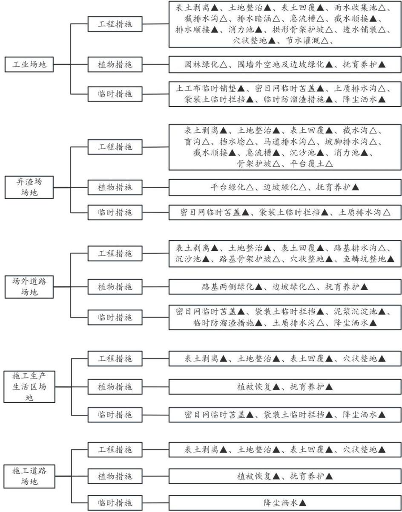
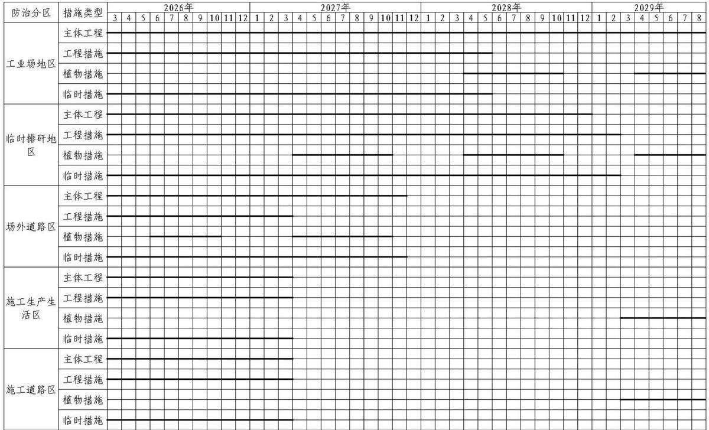

> **Zone C（应用范例层）使用边界**——仅可用于**写作风格、章节展开方式、表达逻辑、表格设计**的参考。
> **不得**用于合规判断；**不得**引入其项目数据（名称／地点／数字／单位名）；
> **不得**因其"曾经通过审批"而推定其做法在当前标准下仍然合规。
> 与 Zone A 冲突时**一律以 Zone A 为准**；Zone A 未明确规定时输出
> 「**Zone A 未明确规定，以下为参考写法，需人工判断**」。
>
> **坐标系警告**：本范例为**老八章结构**（GB 50433—2018 附录B），与 2026 版 10 章模板**同号不同义**
> （老 `1.5`＝防治目标，新 `1.5`＝水土流失预测结果；老 4→新 6 …偏移 +2；新版第 4/5 章老结构无独立章）。
> 因此 **`chapter_mapping: pending`——不得按章节号挂载**，检索一律走 `topic_tags`。
>
> **待加工**：`topic_tags`（主题标签）、`approval_basis_list`（编制依据逐字清单）、
> `structure_summary`（只提取结构：章节展开顺序／段落功能／表格栏目结构／句式模板／论证链步骤）。

<!-- 本文件由原方案 PDF 分段转换后拼接：共 2 段，原 237 页（MinerU 云单文件上限 200 页） -->

1 综合说明 ....  
1.1 项目简况..  
1.2 编制依据...  
1.3 设计水平年.. .8  
1.4水土流失防治责任范围.. .. 8  
1.5 水土流失防治目标.... . 9  
1.6项目水土保持评价结论.. ..11  
1.7 水土流失预测结果..... .... 15  
1.8水土保持措施布设成果. ... 16  
1.9 水土保持监测方案....... .... 19  
1.10水土保持投资及效益分析成果.. .... 20  
1.11 结论 .... .... 20  
2 项目概况 ... .. 24  
2.1 项目组成及工程布置.... ... 24  
2.2 施工组织... .. 64  
2.3 工程占地.. ... 72  
2.4 土石方平衡.... ... 75  
2.5 拆迁（移民）安置与专项设施改（迁）建.... ... 83  
2.6 施工进度... ... 83  
2.7 自然概况.. ... 83  
3 项目水土保持评价 .... .. 87  
3.1 主体工程选址（线）水土保持评价.. ... 87  
3.2 建设方案与布局水土保持评价... .. 91  
3.3 主体工程设计中水土保持措施界定..... .... 127  
4 水土流失分析与预测 ...... ... 130  
4.1 水土流失现状.. .. 130  
4.2水土流失影响因素分析... ...130  
4.3 土壤流失量预测.... ...132  
4.4 水土流失危害分析...... .... 144  
4.5 指导性意见.... ...144  
5 水土保持措施.... .. 146  
5.1 防治区划分.... ... 146  
5.2 措施总体布局... ...146  
5.3 分区措施布设... ...154  
5.4 施工要求.... ...190  
6 水土保持监测 ..... ...194  
6.1 范围和时段.... ...194  
6.2 内容和方法... ..194  
6.3 点位布设 ..... ...198  
6.4 实施条件和成果.. ...203  
7 水土保持投资估算及效益分析 .... .. 205  
7.1 投资估算... ...205  
7.2 效益分析 ..... .... 222  
8 水土保持管理 ..... ... 226  
8.1 组织管理. .. 226  
8.2 后续设计.... .. 227  
8.3 水土保持监测.. ...227  
8.4 水土保持监理.. ...228  
8.5 水土保持施工... ...228  
8.6 水土保持设施验收... ...229

## 附表：

投资估算单价分析表

## 附件：

附件1：水土保持方案编制委托书；

附件2：《国家能源局关于同意陕西古城矿区古城一号煤矿开展项目前期工作的复函》（国煤能炭〔2013〕419号，2013年11月12日）；

附件3：《国家发展改革委关于陕西古城矿区古城一号煤矿项目核准的批复》（发改能源〔2025〕189 号，2025 年 2 月 14 日）；

附件4：中华人民共和国采矿权许可证（2024 年4月12日）

附件5：《陕西省自然资源厅关于对府谷县后安能源有限公司古城一号矿井及选煤厂项目建设用地预审的批复》（陕自然资规矿采划〔2024〕1 号，2024年1月30 日）；

附件6：《府谷县人民政府办公室关于同意古城一号煤矿项目弃渣场临时用地的函》（府谷县人民政府，2025年 10 月29日）；

附件 7： 陕西省发展和改革委员会关于古城矿区古城一号煤矿项目矿井及选煤厂初步设计的批复（陕发改能煤炭〔2025〕1300 号）；

附件8：《府谷县林业局关于同意府谷县后安能源有限公司古城一号矿井及选煤厂项目开展前期工作的函》（府政林函〔2023〕128 号，2023 年 12 月 28日）；

附件9：《府谷县林业局关于陕西古城矿区古城一号煤矿项目可否占用公益林地的复函》（府政林函〔2025〕10号，2025 年3月3日）；

附件 10：《府谷县水利局关于府谷县后安能源有限公司关于古城一号煤矿项目弃渣场临时用地使用的征询函的复函》（2025年10月27 日）

附件 11：《府谷县后安能源有限公司古城一号矿井及选煤厂建设期弃渣场初步设计》（节选部分）；

附件 12：《陕西古城矿区古城一号煤矿项目建设期弃渣资源化减量化论证报告》（节选部分）；

附件 13：《陕西古城矿区古城一号煤矿项目水土保持方案工程地质勘察报告》（弃渣场部分》；

附件14：供水工程备案确认书；

附件15：输电线路核准批复；

附件 16：府谷县人民政府关于对《府谷县后安能源有限公司古城一号矿井及选煤厂项目村庄搬迁规划方案》审查意见的函（府政函〔2023〕113号）；

附件 17：《府谷县发展改革和科技局关于同意府谷县东丰启煤炭销售有限公司铁路专用线开展前期工作的函》（府发科函〔2023〕118 号，2023 年 6 月28 日）。

## 附图：

附图1 项目地理位置图

附图2 地表水系图

附图3 土壤侵蚀强度图

附图4 项目总体布置图

附图5 项目区现状土地利用图

附图6 井田地质图

附图7 表土剥离范围图

附图8 水土流失防治范围及监测点位图

附图5.1-1 矿井工业场地水土保持措施总体布局图

附图5.1-2 选煤厂工业场地水土保持措施总体布局图

附图5.1-3 风井场地水土保持措施总体布局图

附图5.1-4 爆破材料库场地水土保持措施总体布局图

附图5.1-5 矿井工业场地截排水沟典型设计图

附图5.1-6 矿井工业场地急流槽典型设计图

附图5.1-7 矿井工业场地消力池典型布设图  
附图5.1-8 矿井工业场地排水暗涵典型设计图  
附图5.1-9 矿井工业场地拱形骨架护坡典型设计图  
附图5.1-10 选煤厂工业场地截排水沟典型设计图  
附图5.2-1 弃渣场遥感影像图  
附图5.2-2 弃渣场水土保持措施总体布局图  
附图5.2-3 弃渣场汇水范围图  
附图5.2-4 弃渣场剖面图  
附图5.2-5 弃渣场工程地质剖面图（一）  
附图5.2-6 弃渣场工程地质剖面图（二）  
附图5.2-7 弃渣场工程地质剖面图（三）  
附图5.2-8 弃渣场截排水沟典型设计图  
附图5.2-9 弃渣场挡水埝典型设计图  
附图5.2-10 弃渣场初期坝典型设计图  
附图5.2-11 弃渣场骨架护坡典型设计图  
附图5.2-12 弃渣场盲沟典型设计图  
附图5.3-1 进场公路平面布置图  
附图5.3-2 运煤路平面布置图  
附图5.3-3 爆破材料库公路平面布置图  
附图5.3-4 风井公路平面布置图  
附图5.3-5 进场公路Ⅰ段纵断面图（一）  
附图5.3-6 进场公路Ⅰ段纵断面图（二）  
附图5.3-7 进场公路Ⅰ段纵断面图（三）  
附图5.3-8 进场公路Ⅰ段纵断面图（四）  
附图5.3-9 进场公路Ⅰ段纵断面图（五）  
附图5.3-10 进场公路Ⅰ段纵断面图（六）  
附图5.3-11 进场公路Ⅰ段纵断面图（七）  
附图5.3-12 进场公路Ⅱ段纵断面图  
附图5.3-13 运煤公路纵断面图  
附图5.3-14 爆破材料库公路纵断面图  
附图5.3-15 风井公路纵断面图  
附图5.3-16 进场公路路基标准横断面（一）  
附图5.3-17 进场公路路基标准横断面（二）  
附图5.3-18 进场公路路基标准横断面（三）  
附图5.3-19 进场公路路基标准横断面（四）  
附图5.3-20 进场公路路基标准横断面（五）  
附图5.3-21 爆破材料库公路路基标准横断面  
附图5.3-22 场外道路高填路基断面典型设计图（一）  
附图5.3-23 场外道路高填路基断面典型设计图（二）  
附图5.3-24 场外道路拱形骨架护坡典型设计图  
附图5.3-25 场外道路植草护坡典型设计图  
附图5.3-26 场外道路排水沟、沉沙池典型设计图  
附图5.3-27 临时泥浆沉淀池典型设计图  
附图5.3-28 场外公路植物措施典型设计图  
附图5.4-1 施工生产生活区植物措施典型设计图  
附图5.5-1 施工道路区植物措施典型设计图  
附图5.6-1 消力池典型设计图  
附图5.6-2 临时堆土防护典型设计图  
附图5.6-3 临时土质排水沟典型设计图  
附图5.6-4 鱼鳞坑整地典型设计图

## 1 综合说明

## 1.1项目简况

## 1.1.1 项目基本情况

陕西省府谷县自然资源富集，是国家级陕北能源化工基地的重要组成部分，国家“西煤东运”、“西电东送”、“西气东输”的重要枢纽。从全国煤炭供需形势分析，煤炭在今后相当长的一段时期仍是我国的主体能源，而中东部一些资源趋于枯竭，煤矿产量基本维持现状或有所减产，我国未来煤炭开发布局将继续向西部转移，加大该区煤炭资源的开发力度非常必要，工程建设将带动和促进地区相关产业发展，促进当地经济发展，为西部经济的腾飞做出突出贡献。

古城一号井田位于陕北大型煤炭示范基地内的古城矿区，陕北石炭二叠纪煤田古城矿区最北端。行政区划隶属于陕西省府谷县古城镇，距府谷县城直线距离约 50km。一号井田地理坐标为：东经 110°03′36″～111°08′51″，北纬 39°31′17″～39°35′06″（西安 80 坐标系）。

本项目井田东西长约 7.0km，南北宽约 7.0km，面积 23.6579km2，范围由 16个拐点圈定。井田内地质资源储量为872.240Mt，工业资源储量为696.85Mt，设计资源储量 634.49Mt，设计可采储量为 430.05Mt，建设规模为 5.00Mt/a，工程等级为大型矿井，设计服务年限为63.7年。井田可采煤层2层，分别为4、8号煤层，采用斜井开拓和综采放顶煤采煤法，单水平开采。全井田划分8个采区，首采区为4号煤层的4101采区，服务年限为7.6年。

矿井生产期间掘进矸石产生量约为 2425t/a，直接装入自卸式无轨胶轮车回填至废弃巷道（顺槽间的联巷等）。选煤厂洗选矸石产生量为 1.12Mt/a，通过带式输送机向北运输至矸石仓进行暂时储存，最终通过“分选高岭岩+浆体充填”方法实现煤矸石的零排放，其中每年可提取高岭岩 33 万t，浆体充填每年可处理矸石 83.3 万 t。

本项目属于井工矿，新建建设生产类项目，主要由工业场地、弃渣场、场外道路组成。

工业场地包括矿井工业场地、选煤厂工业场地、风井场地和爆破器材库4部分。古城一号矿井工业场地选择在井田的东南部，十里长川的西部，位于皮沙石墕村附近，工业场地整体处于典型冲沟环绕不规则的塬上，塬上西北较高，南侧较低，自然标高为+1040～+1004m，南北长约675m，东西最宽为530m，最窄处100m，占地面积 22.5833hm2。因本区地形复杂，选煤厂工业场地无法和矿井工业场地联合布置，需隔一条沟布置在矿井工业场地的西侧另一个单独场地上，占地面积19.4227hm2；风井工业场地位于矿井工业场地西北约2.10km 处的平坦地带，占地面积1.7582hm2；爆破器材库位于矿井工业场地西北约 2.5km 处，占地面积 0.5721hm2。

弃渣场地位于矿井工业场地西北约4.0km 处的冲沟内，属沟道型场地，占地类型主要为灌木林地和草地，占地面积6.8847hm2，最大堆高 58m，坡比1：2，设计容量50万m3，最大堆存量为 50 万m3，等级为4级。满足本项目建设期弃渣堆存需求。

场外道路共 4 条，包括进场公路 8.939km（其中进场公路 I 段长 7.955km，进场公路 II 段长 0.984km），运煤公路 0.906km，风井公路 0.109km，爆破器材库公路 0.572km。

选煤厂工业场地内的煤炭运输采用全封闭式输煤栈桥，总长2223.2m。矿井原煤自矿井工业广场的主斜井井口房由带式输送机向西北运输至选煤厂原煤仓（矿井工业广场内）。在原煤仓缓存的原煤由全封闭栈桥向西运输至选煤厂原煤准备车间，在原煤准备车间经筛分、智能干选排矸、破碎、脱粉（可选），150-25mm块原煤、25-6（0）mm末原煤、-6mm 粉原煤、+150mm 特大块矸石分别由全封闭栈桥向南运输至主厂房。块原煤和末原煤在主厂房分选排矸后和粉原煤混成洗混煤或低热值煤产品由带式输送机向南运输至末煤产品仓。主厂房洗后矸石和特大块矸石混合后由带式输送机向南运输至矸石仓。矸石仓储存的矸石由带式输送机向东运输至矿井矸石充填站送至井下回填。末煤产品仓储存的产品可由带式输送机向东运输至火车快速装车站，快速装火车外运。铁路建成前或保供时还可由4个φ21m 产品仓下装汽车设施快速装汽车外运。东侧末煤产品仓设有专用给煤机，通过带式输送机向东输送至矿井锅炉房。

项目建设过程中需设置施工生产生活区2处，临时施工道路7条，表土堆存场9处，临时堆土场3 处，复核后新增占地1.85hm2。

项目依托的铁路专用线（含东丰启装车站）单独立项，已由府谷县发展改革和科技局以府发改科函〔2023〕118号文件同意该项目开展前期工作并单独编制水保方案，不包含在本项目范围内（附件17）。

项目依托的府谷县后安能源有限公司古城一号煤矿供水工程项目单独立项，已由府谷县发展改革和科技局备案确认，项目代码 2509-610882-04-01-621573，单独编制水保方案，不包含在本项目范围内（附件14）。

项目依托的府谷县后安能源有限公司古城一号矿井及选煤厂 110kV 输电线路项目单独立项，已由榆林市行政审批服务局以榆政审批投资发〔2025〕41 号文件确认，项目代码 2503-610882-04-01-588302，单独编制水保方案，不包含在本项目范围内（附件15）。

本项目针对井田采空区和建设用地编制了《府谷县后安能源有限公司古城一号矿井及选煤厂项目村庄搬迁规划方案》，搬迁共涉及 10 个村庄，共 584 户，1308 人，搬迁方式为异地集中安置和货币补偿安置两种，此次搬迁水保责任主体为府谷县人民政府，具体方式将在搬迁实施时根据实际情况由政府组织相关各方协商确定并按照府谷县搬迁政策文件执行。此项目搬迁方案已获得府谷县人民政府批复，详见附件16。

项目总占地 104.34hm2，其中永久占地 88.26hm2，临时占地 16.08hm2，占地类型主要为耕地、园地、灌木林地、草地、农村道路和其它等。本项目建设期挖填方总量为 785.78 万 m3，其中挖方 414.68 万 m3（含表土剥离 17.97 万 m3），填方 371.10 万 m3（含表土回覆 17.97 万 m3），其中区间调配利用土石方 25.50万 m3，最终弃方 43.58 万 m3，全部运往本项目弃渣场堆存。项目区剥离表土总计剥离面积 83.33hm2，可剥离表土厚度 20\~30cm，表土剥离量共计 17.97万 m3，剥离表土可全部用于本项目区内绿化覆土。

项目总投资 729099.88 万元，其中：井巷工程 103287.20 万元，土建投资166272.32 万元，由府谷县后安能源有限公司出资建设。项目计划于 2026 年 3月开工，2029年8月底完工，总工期 42 个月。

## 1.1.2项目前期工作进展情况

2013年11月，国家能源局出具了《关于同意陕西古城矿区古城一号煤矿开展项目前期工作的复函》（国煤能炭〔2013〕419 号）（附件 2）。

2023 年 6 月，府谷县发展改革和科技局出具了《关于同意府谷县东丰启煤炭销售有限公司铁路专用线开展前期工作的函》（府发科函〔2023〕118号）（附件 17）。

2023年12月，府谷县林业局出具了《关于同意府谷县后安能源有限公司古城一号矿井及选煤厂项目开展前期工作的函》（府政林函〔2023〕128 号）（附件 8）。

2024 年 1 月，陕西省自然资源厅出具了《陕西省自然资源厅关于对府谷县后安能源有限公司古城一号矿井及选煤厂项目建设用地预审的批复》（陕自然资预审〔2024〕1号）（附件5）。

2025 年 2 月，府谷县人民政府出具了《关于同意府谷县后安能源有限公司古城一号矿井及选煤厂项目弃渣场临时用地的函》（附件6）。

2025 年 2 月，国家发展和改革委员会出具了《国家发展改革委关于陕西古城矿区古城一号煤矿项目核准的批复》（发改能源〔2025〕189 号）（附件3）。

2025 年 8 月，中煤西安设计工程有限责任公司编制完成《府谷县后安能源有限公司古城一号矿井及选煤厂初步设计报告（矿井分册）》。

2025 年 8 月，中煤科工集团北京华宇工程有限公司编制完成《府谷县后安能源有限公司古城一号矿井及选煤厂初步设计报告（选煤厂分册）》。

2025年11月，中煤西安设计工程有限责任公司编制完成《陕西古城矿区古城一号煤矿项目水土保持方案工程地质勘察报告》。

2025年11月，中煤西安设计工程有限责任公司编制完成《府谷县后安能源

有限公司古城一号矿井及选煤厂弃渣场专项设计》。

根据有关法律法规的要求，建设单位于 2024 年1月委托中煤科工集团北京华宇工程有限公司（以下简称“我公司”）承担该项目水土保持方案编制工作。接受委托后，我公司即组织各专业技术人员，赴现场进行了实地踏勘和调查，收集了水土保持方案编制所需的自然、社会以及矿井主体设计等方面的资料。经对收集的基础资料进行了分析和识别，初步确定了本方案的防治责任范围、防治目标、防治措施类型。按照现行的技术规范和水土保持方案编制要求，编写完成了《陕西古城矿区古城一号煤矿项目水土保持方案报告书》。

## 1.1.3 自然简况

项目区地处内蒙古高原与陕北黄土高原东北部的接壤地带，主要为黄土丘陵沟壑区，气候类型属温带半干旱大陆性季风气候，年平均气温 8.8℃，无霜期约170天，多年最大冻土深度150cm，年平均降水量453mm，年平均蒸发量1668.0mm，年平均风速1.7m/s。项目区土壤类型主要为黄绵土，植被类型是从森林草原类向典型草原地带性质过渡的地带性植被，典型植被类型有油松、杨树、沙蒿、沙柳，林草覆盖率约 30%。

项目区位于全国水土保持区划中的西北黄土高原区—晋陕蒙丘陵沟壑区—陕北盖沙丘陵沟壑拦沙防沙区，区域容许土壤流失量为 $1 0 0 0 \mathrm { t / k m ^ { 2 } { \cdot } a }$ 。土壤侵蚀类型以中度水力侵蚀为主，兼有轻度风力侵蚀。原地貌土壤侵蚀模数 $5 5 0 0 \mathrm { t / k m ^ { 2 } { \cdot } a }$ 其中水力侵蚀模数为 $5 0 0 0 \mathrm { t / k m } ^ { 2 } { \cdot } \mathbf { a }$ ，风力侵蚀模数为 500t/km2·a。

将本项目扰动范围与国家级两区范围位置关系对比后确定，古城一号煤矿项目不涉及国家级水土流失重点预防区和重点治理区，仅涉及陕西省水土流失重点治理区。

## 1.2编制依据

## 1.2.1 法律法规

1）《中华人民共和国水土保持法》（1991年6月29日颁布，2010年12月25日修订，自2011年 3月1日起施行）；

（2）《陕西省水土保持条例》（2013年7月26日通过，2018年5月31日第一次修正，2024年5月30日第二次修正）；

（3）《中华人民共和国黄河保护法》（2022 年10 月30 日通过，2023年4月1日起施行）；

（4）《中华人民共和国防洪法》（1997年8 月29 日通过，2009年8月27日第一次修正，2015年 4月24日第二次修正，2016 年7月2 日第三次修正）。

## 1.2.2 部委规章

（1）《生产建设项目水土保持方案管理办法》（2023 年1月 17日水利部令第 53号发布）。

## 1.2.3 规范性文件

（1）《水利部办公厅关于进一步加强部批项目水土保持监管工作的通知》（办水保〔2024〕57号）；

（2）《水利部办公厅关于印发生产建设项目水土保持方案审查要点的通知》（办水保〔2023〕177号）；

（3）《全国水土保持规划国家级水土流失重点预防区和重点治理区复核划分成果》（办水保〔2013〕188号）；

（4）《水利部办公厅关于进一步加强生产建设项目水土保持监测工作的通知》（办水保〔2020〕161 号）；

（5）《水利部办公厅关于做好国家级水土流失重点预防区和重点治理区落地上图成果应用的通知》（办水保〔2025〕170 号）；

（6）《水利部办公厅关于印发生产建设项目水土保持监督管理办法的通知》（办水保〔2019〕172号）；

（7）《水利部办公厅关于印发生产建设项目水土保持设施自主验收规程（试行）的通知》（办水保〔2018〕133号）；

（8）水利部办公厅关于印发《生产建设项目水土保持技术文件编写和印制格式规定（试行）》的通知（办水保〔2018〕135 号）；

（9）《陕西省水土保持规划（2016-2030年）》（陕水发〔2016〕35号）。

## 1.2.4 技术标准

（1）《生产建设项目水土保持技术标准》（GB 50433-2018）；

（2）《生产建设项目水土流失防治标准》（GB/T 50434-2018）；

（3）《水土保持工程设计规范》（GB 51018-2014）；

（4）《生产建设项目土壤流失量测算导则》（SL 773-2018）；

（5）《生产建设项目水土保持监测与评价标准》（GB/T 51240-2018）；

（6）《土壤侵蚀分类分级标准》（SL190-2007）；

（7）《防洪标准》（GB 50201-2014）；

（8）《水利水电工程制图标准—水土保持图》（SL 73.6-2015）；

（9）《水土保持工程调查与勘测标准》（GB/T 51297-2018）；

（10）《土地利用现状分类》（GB/T 21010-2017）；

（11）《造林技术规程》（GB/T 15776-2016）；

（12）《煤炭工业矿井设计规范》（GB 50215-2015）；

（13）《室外排水设计标准》（GB 50014-2021）；

（14）《喷灌工程技术规范》（GB/T 50085-2007）；

（15）《水土保持监理规范》（SLT 523-2024）；

（16）《表土剥离及其再利用技术要求》（GB/T 45107-2024）；

（17）《公路桥涵设计通用规范》（JTGD60-2015）。

## 1.2.5 技术资料

（1）《府谷县后安能源有限公司古城一号矿井及选煤厂初步设计（矿井分册）》（中煤西安设计工程有限责任公司，2024年4 月）；

（2）《府谷县后安能源有限公司古城一号矿井选煤厂初步设计》（中煤科工集团北京华宇工程有限公司，2024年4月）；

（3）《府谷县后安能源有限公司古城一号矿井及选煤厂项目弃渣场专项设计》（中煤西安设计工程有限责任公司，2025年11月）；

（4）《陕西古城矿区古城一号煤矿项目水土保持方案工程地质勘察报告》（中煤西安设计工程有限责任公司，2025年 11 月）；

（5）《府谷县后安能源有限公司古城一号矿井及选煤厂供水工程设计报告》（陕西皓恒洁源建设工程有限责任公司，2024年7月）；

（6）《府谷县后安能源有限公司古城一号矿井110kV 变电站工程初步设计方案总说明书》（西安思维电力设计有限责任公司，2024年6 月）；

（7）《府谷县后安能源有限公司古城一号矿井及选煤厂 10kV 施工电源工程施工图》（西安思维电力设计有限责任公司，2024 年6月）。

## 1.3设计水平年

根据主体工程施工组织及进度计划安排，本项目计划于 2026年 3月开工，到 2029 年 8 月底完工，建设总工期 42 个月，其中施工准备期 6 个月，施工期36个月。因此，本方案设计水平年确定为项目投产后第二年，即2030年。

## 1.4水土流失防治责任范围

## 1.4.1防止责任范围确定依据

根据《中华人民共和国水土保持法》的规定，按照“谁开发、谁保护，谁造成水土流失、谁负责治理”的原则，项目建设引起水土流失的防治责任由项目建设单位承担。

按照《生产建设项目水土保持技术标准》（GB 50433-2018）的有关规定，水土流失防治责任范围包括项目永久征地、临时占地（含租赁土地）以及其他使用与管辖区域

## 1.4.2 防治责任范围

本项目水土流失防治责任范围104.34hm2，其中永久占地面积为88.26hm2，临时占地为 16.08hm2，占地类型主要为耕地、园地、灌木林地、其他林地、草地和裸土地。共划分为5个水土流失防治区，即工业场地区、弃渣场区、场外道路区、施工生产生活区和施工道路区。行政区划属陕西省榆林市府谷县，水土流失防治责任主体为建设单位府谷县后安能源有限公司。

## 1.5 水土流失防治目标

## 1.5.1 执行标准等级

本项目位于《全国水土保持规划（2015-2030）》划定的西北黄土高原区，不涉及国家级水土流失重点预防区和重点治理区，涉及陕西省陕北丘陵沟壑重点治理区。通过实施水土流失防治措施，使项目防治责任范围内的新增水土流失得到有效控制，原有水土流失得到基本治理。建设的水土保持设施安全有效，达到水土资源、林草植被得到最大限度的保护与恢复，促进工程建设和生态环境协调发展。水土流失治理度、土壤流失控制比、渣土防护率、表土保护率、林草植被恢复率、林草覆盖率六项指标应符合现行国家标准《生产建设项目水土流失防治标准》（GB/T 50434-2018）的规定，根据《生产建设项目水土流失防治标准》（GB/T 50434-2018）的相关规定，本项目水土流失防治执行西北黄土高原区一级标准。

## 1.5.2 防治目标值

## （1）定性防治目标

本工程建设不仅要对新增的水土流失进行防治，还需结合工程涉及的行政区水土保持要求，对原有水土流失进行治理，促进当地水土资源可持续利用和生态系统良性发展。主要定性目标有：

1）项目建设区的原有水土流失得到基本治理。

2）新增水土流失得到有效控制。

3）生态得到最大限度的保护，环境得到明显改善。

4）水土保持设施安全有效。

5）水土流失治理度、土壤流失控制比、渣土防护率、表土保护率、林草植被恢复率、林草覆盖率等指标达到现行国家标准《生产建设项目水土流失防治标准》（GB/T 50434-2018）的要求。

（2）项目区土壤侵蚀水蚀以中度为主，风蚀以轻度为主。参照项目区土壤侵蚀现状图，并收集本项目所在地区的土地利用现状、水土流失状况、气象水文资料及邻近地区类似工程的水土流失调查监测等资料的基础上，开展了外业调查工作。结合现场地块调查，通过对植被覆盖度、地表组成物质、地貌类型等指标的综合分析后确定项目区土壤侵蚀模数背景值为 5500t/km2·a，其中水力侵蚀模数为 $5 0 0 0 \mathrm { t / k m ^ { 2 } { \cdot } a }$ ，风力侵蚀模数为 500t/km2·a。

## 1）水土流失治理度、林草植被恢复率及林草覆盖率

项目区属于半干旱地区，水土流失治理度、林草植被恢复率不做调整；项目区地处省级水土流失重点治理区，无法避让，林草覆盖率提高 2%。

## 2）土壤流失控制比

项目区土壤侵蚀以中度侵蚀为主，根据《生产建设项目水土流失防治标准》（GB/T 50434-2018）的相关规定，中度以上侵蚀为主的区域可降低0.1\~0.2。但是项目区属于省级水土流失重点治理区，为提高防治标准，土壤流失控制比不作降低调整，维持原指标值0.80。

## 3）渣土防护率、表土保护率

项目区地貌类型为中山区，其渣土防护率可减少 1%\~3%，但是项目区省级水土流失重点治理区，本次提高防治标准，为了更好的做好水土流失防治工作，本次对渣土防护率、表土保护率不做调整。本方案确定渣土防护率目标值为92%。

本项目水土流失防治标准及防治指标值见表2.5-1。设计水平年水土流失防治指标值分别为：水土流失治理度 93％，土壤流失控制比0.80，渣土防护率92％，表土保护率90％，林草植被恢复率95％，林草覆盖率24％。

表1.5-1 水土流失防治指标
<table><tr><td rowspan=2 colspan=1>防治指标</td><td rowspan=1 colspan=2>西北黄土高原区一级标准</td><td rowspan=2 colspan=1>重点治理区修正</td><td rowspan=1 colspan=2>采用标准</td></tr><tr><td rowspan=1 colspan=1>施工期</td><td rowspan=1 colspan=1>设计水平年</td><td rowspan=1 colspan=1>施工期</td><td rowspan=1 colspan=1>设计水平年</td></tr><tr><td rowspan=1 colspan=1>水土流失治理度（%）</td><td rowspan=1 colspan=1>1</td><td rowspan=1 colspan=1>93</td><td rowspan=1 colspan=1>0</td><td rowspan=1 colspan=1>1</td><td rowspan=1 colspan=1>93</td></tr><tr><td rowspan=1 colspan=1>土壤流失控制比</td><td rowspan=1 colspan=1>-</td><td rowspan=1 colspan=1>0.80</td><td rowspan=1 colspan=1>0</td><td rowspan=1 colspan=1>-</td><td rowspan=1 colspan=1>0.80</td></tr><tr><td rowspan=1 colspan=1>渣土防护率（%）</td><td rowspan=1 colspan=1>90</td><td rowspan=1 colspan=1>92</td><td rowspan=1 colspan=1>0</td><td rowspan=1 colspan=1>90</td><td rowspan=1 colspan=1>92</td></tr><tr><td rowspan=1 colspan=1>表土保护率（%）</td><td rowspan=1 colspan=1>90</td><td rowspan=1 colspan=1>90</td><td rowspan=1 colspan=1>0</td><td rowspan=1 colspan=1>90</td><td rowspan=1 colspan=1>90</td></tr><tr><td rowspan=1 colspan=1>林草植被恢复率（%）</td><td rowspan=1 colspan=1>1</td><td rowspan=1 colspan=1>95</td><td rowspan=1 colspan=1>0</td><td rowspan=1 colspan=1>1</td><td rowspan=1 colspan=1>95</td></tr><tr><td rowspan=1 colspan=1>林草覆盖率（%）</td><td rowspan=1 colspan=1>1</td><td rowspan=1 colspan=1>22</td><td rowspan=1 colspan=1>+2</td><td rowspan=1 colspan=1>-</td><td rowspan=1 colspan=1>24</td></tr></table>

## （3）生产期水土保持防治目标

本项目为新建煤矿，属建设生产类项目，方案确定生产期新增扰动范围的水土流失防治目标不低于施工期指标值，其他区域不低于设计水平年指标值。

## 1.6项目水土保持评价结论

## 1.6.1主体工程选址（线）评价

本项目选址未涉及全国水土保持监测网络中的水土保持监测站点、重点试验区；未占用国家确定的水土保持长期定位观测站；不涉及重要江河湖泊的水功能区，未涉及河流两岸、湖泊和水库周边的植物保护带；工程建设不涉及影响到饮水安全、防洪安全、水资源安全的区域；不涉及重要基础设施建设、重要民生工程、国防工程项目；不属于重要江河、湖泊以及跨省（自治区、直辖市）的其他江河、湖泊的水功能一级区的保护区和保留区内可能严重影响水质的开发建设项目，以及对水功能二级区的饮用水源区水质有影响的开发建设项目。

鉴于项目选址无法避让陕西省水土流失重点治理区，存在一定的制约性因素，根据水保法和 GB 50433-2018的相关要求，在工程建设过程中，通过提高水土流失防治标准、优化施工工艺、加强施工管理、减少地表扰动和植被损坏范围等措施，使项目建设造成的水土流失得到有效控制。采取的具体措施为：

（1）提高水土流失防治标准：防治标准执行西北黄土高原区一级标准，在此基础上，林草覆盖率提高 2个百分点。

（2）提高水土保持措施的工程级别和设计标准：

①本项目弃渣场级别为4级，对应的拦渣工程（初期坝）级别为4级，排洪工程级别为4级，防洪标准为30年一遇设计，50年一遇校核。由于本项目无法避让陕西省水土流失重点治理区，根据水土保持法和本规范的相关规定，拦挡工程的工程等级和防洪标准应提高一级，据此确定本项目拦挡工程级别为3 级，排洪工程级别为 3 级，防洪标准为 50 年一遇设计，100 年一遇校核。主体工程设计采用的防洪标准为 50 年一遇设计，100 年一遇校核，均为《水土保持工程设计规范》（GB 51018-2014）规定的 2 级拦挡工程对应防洪标准的最高限，满足

规范要求。

②主体设计在工业场地布设了场外截水沟和场内排水沟，根据《煤炭企业总图运输设计标准》（GB 51276-2018）和《室外排水设计标准》（GB 50014-2021）相关要求，工业场地外边坡排水沟和截水沟设计标准为 25年一遇，场内排水沟设计标准为3\~5 年一遇3\~5min 短历时设计暴雨计算。由于无法避让省级水土流失重点治理区，防洪标准应提高一级场外边坡截排水沟设计标准为50年一遇1h设计暴雨计算，场内排水沟设计标准为5年一遇10min 短历时设计暴雨计算。

③将进场公路、运煤公路、风井公路、爆破器材库公路路基两侧绿化带植被恢复与建设工程级别由3级提高为2 级。

（3）选择合适施工工艺：针对古城一号煤矿项目情况，井筒施工采用最为合适的普通法，施工过程中降低土石方量，控制扰动范围。

（4）减少地表扰动和植被损坏范围：施工生产区、施工生活区紧凑布置，6#表土堆存场位于弃渣场占地范围内，8-9#表土堆存场布设在施工生产生活区临时占地范围内，占地范围计入施工生产生活区，其余表土堆存场均布设在永久占地范围内，不新增占地。项目建设期的施工用水、供电使用先行建设的依托供水、供电工程，前期先建设供水管线、变电站及供电线路，满足施工用水、供电需求，后期作为项目投产后的用水、供电设施。施工道路等采取“永临结合”方式进行建设，增设临时施工道路且施工准备期先行修筑场外道路兼作施工道路，作为项目建设期材料、设备、机械等的运输道路。

在采取上述措施的基础上，主体工程选址基本符合《中华人民共和国水土保持法》、《生产建设项目水土保持技术标准》（GB 50433-2018）等法律法规和技术标准的规定。

## 1.6.2建设方案与布局评价

## （1）建设方案评价

本项目属于煤矿开发项目，受煤炭开采区域的局限性，选址不涉及国家级水土流失重点预防区和重点治理区，无法避让陕西省水土流失重点治理区。按照技术标准的规定，主体设计考虑减少项目总占地，经过多方案比选，将矿井工业场地采用台阶式竖向布置，选煤厂采用连续平坡式竖向布置，风井场地和爆破器材库场地采用平坡式竖向布置，通过采用架空式全封闭输煤栈桥，建设高层宿舍楼等方法，尽可能做到场地地面设施集中紧凑布置，减少了占地及土石方开挖，同时通过优化施工工艺、严格控制扰动地表面积；管线施工时严格压缩作业带宽度；布设雨水集蓄利用措施并提高截排水工程、拦挡工程的工程级别和防洪标准；林草覆盖率提高 2个百分点，符合《生产建设项目水土保持技术标准》（GB 50433－2018）对建设方案的要求。

## （2）工程占地评价

本工程总占地面积 104.34hm2，其中主体设计计列永久占地为88.26hm2，占地类型主要为灌木林地、其他林地、草地以及少量耕地，未占用永久基本农田；按照《煤炭工程项目建设用地指标》（建标〔2008〕233 号）规定、《陕西省建设用地定额标准》（2015年版）和《公路工程项目建设用地指标》（建标〔2011124 号）计算，工业场地和场外道路永久占地范围符合行业用地指标；弃渣场在满足施工需求的前提下尽可能控制扰动范围；先建设场外道路作为施工道路，减少临时施工道路占地，新增施工道路均与既有乡村道路接续，减少施工道路占地面积；施工用水、用电依托先期建设的永久供水、供电设施，有效控制临时占地规模。因此，本项目占地面积、类型、性质等方面基本不存在水土保持制约性因素。

## （3）土石方平衡

本项目建设期挖填方总量为 785.78 万 $\mathrm { m } ^ { 3 }$ ，其中挖方 414.68 万 $\mathrm { m } ^ { 3 }$ （含表土剥离 17.97 万 $\mathbf { m } ^ { 3 } )$ ），填方 371.10 万 $\mathrm { m } ^ { 3 }$ （含表土回覆17.97 万 $\mathbf { m } ^ { 3 } \mathbf { \Gamma } ,$ ），其中区间调配利用土石方 25.50 万 $\mathrm { m } ^ { 3 }$ ，最终弃方 43.58 万 $\mathrm { m } ^ { 3 }$ ，全部为建设期井筒掘进的弃渣及场外道路弃渣，全部运往本项目弃渣场堆存。主体工程设计场地平整以挖作填为原则，尽量减少土石方的二次搬运，通过优化场地标高、优化竖向设计等方式从源头减少工程挖方和弃方，矿井工业场地通过抬高生产辅助区标高（约13hm2，抬高 1.5m），行政福利区维持原标高，设计标高在 1024.00～1022.20 m之间。最终矿井工业场地挖方为 $1 6 5 . 1 0 \mathrm { ~ \mathscr { H } ~ m ^ { 3 } }$ ，填方 165.10 万 $\mathbf { m } ^ { 3 } \mathbf { ; }$ ；原选煤厂工业场地场平及建筑物基础挖方129.54万m3，其中83.21万m3用于选煤厂工业场地回填，工业场地设计标高在1033.50\~1040.00之间。经优化后，选煤厂工业场地设计标高整体抬高 1m，场地设计标高在 1034.50\~1041.00 之间，挖方 119.38万 m3，填方98.21 万m3，场外道路工程取消原有排矸公路设计，通过乡村道路连接弃渣场。相比之前设计有效减少减少土石方余方 98.12 万 m3。建（构）筑物基础开挖临时堆土堆放于基坑周边并采取临时防护措施。工程土石方回填包括工业场地场平填筑、建（构）筑物基础回填、场外道路路基填筑、绿化覆土。填筑土方首先考虑充分利合理开挖土方，其次考虑纵向调用，避免填筑材料的外借。符合水土保持要求。

工程建设按照施工时序，就近合理调配开挖土石方，充分综合利用余方，运距合理，减少了弃方量，土石方调运符合施工工艺、施工时序及施工特点，工程土石方挖填数量和流向基本合理，符合水土保持要求。

本方案从保护表土资源角度出发，根据立地条件以及现场调查情况，综合确定项目征占地范围内剥离表土量，施工前对开挖扰动范围内占用的全部耕地、园地，部分乔木林地、灌木林地和其他林地、草地进行表土剥离，后期全部用于本项目绿化覆土和复耕措施。对其他未开挖扰动区域采取临时铺垫措施对表土进行保护。从水土保持角度考虑，表土剥离保护与利用措施合理，为后期植被恢复创造有利条件，符合水土保持要求。

## （4）设置弃渣场

本项目选址在荒沟内，不涉及河道，选址已获得府谷县人民政府的同意，涉及占用林地也取得了府谷县林业局同意占用的复函。

弃渣场位于本项目矿井工业场地西北侧约为 4km 的荒沟内。下游 1 公里范围内没有公共设施、居民地、工矿区等，满足弃渣场选址要求，不会对古城一号煤矿矿井工业场地和配套铁路装车站产生影响。

在设计工况下，挡墙和堆渣边坡处于稳定状态，弃渣堆置方案基本合理，堆渣结束后充分考虑了场地恢复措施。

通过将工业场地开挖土石方资源化利用于弃渣场拦渣坝基础构筑及截排水

设施建设，同步实现弃渣减量化与资源高效循环利用目标。

综上所述，本项目选址和堆置方案基本符合法律法规和技术标准的相关规定。

## （5）施工方法与工艺

主体土建工程采取同时施工，分区块平行流水施工的组织方式。采取有效的预防保护措施，强调源头控制、过程控制，避免重复开挖和多次倒运，最大程度的减少损坏原地貌及土石方开挖量。项目施工时序及施工工艺较为合理，井筒施工方法采用普通法和盾构机施工，避免大开挖施工，减少土石方量，符合减少水土流失的要求。

## （6）主体工程中具有水土保持功能工程分析评价

主体工程在设计上虽然兼顾了水土保持功能，但体系并不完善，主体设计具有水土保持功能的措施主要布设在工程建设后期，且以工程措施为主。对于建设过程中的临时水土保持措施布置不完善，也未设计对临时占地的恢复措施。

针对工程建设过程中水土流失控制与防护措施不足，方案需进一步补充上述方面防护措施，使本方案水土保持措施形成一个完整、科学与可操作的防护体系。

## 1.7水土流失预测结果

本项目建设期施工扰动地表总面积104.34hm2，损毁植被面积86.81hm2。项目建设期井巷工程掘进弃渣及场平弃渣经综合利用后仍剩余 43.58 万 m3，运往本项目弃渣场堆存；生产期掘进矸石 2425t/a，直接装入自卸式无轨胶轮车回填至废弃巷道（顺槽间的联巷等）。选煤厂洗选矸石产生量为1.12Mt/a，通过带式输送机向北运输至矸石仓进行暂时储存。最终通过“分选高岭岩+浆体充填”方法实现煤矸石的零排放，其中每年可提取高岭岩 33 万t，浆体充填每年可处理矸石83.3万t。古城一号煤矿将生产运行期洗选矸石经高岭岩提取减量后利用浆体充填系统全部井下充填，保证矸石处置率和利用率达到100%。

项目建设可能产生土壤流失总量为57350.46t，原地貌土壤流失量2590.10t，新增土壤流失量为 32260.36t。其中施工期水土流失总量 40267.87t（原地貌土壤流失量 13391.60t，新增土壤流失量 26876.27t），自然恢复期水土流失总量为

17082.59t（原地貌土壤流失量 11698.50t）。

通过预测结果分析，项目建设期是土壤流失的集中时期，工业场地区、弃渣场区、场外道路区是本项目产生土壤流失的重点区域。水土流失主要危害是造成周边土地资源破坏、生态功能下降，还会增加项目自身施工和后期治理的难度。

## 1.8水土保持措施布设成果

依据项目建设特性和水土流失特点，将项目划分为工业场地区、弃渣场区、场外道路区、施工生产生活区、施工道路区5个水土流失防治分区。为了有效地防治工程建设引起的水土流失，本方案在主体工程设计水土保持措施的基础上新增了水土保持工程措施、植物措施和临时措施。

## 1.8.1 工业场地区

主体设计对工业场地区设计了截排水沟、排水暗涵、雨水收集池、透水铺装、消力池以及园林绿化措施。

本方案新增施工前，对占地类型为林地和草地的区域采取表土剥离措施，集中存放于1#\~5#表土堆存场并采取临时拦挡、苫盖措施，建构筑物基础开挖临时堆土采取临时苫盖措施，施工生产区采取土工布临时铺垫措施，施工生活区结合场内道路永久排水沟规划采取永临结合的方式布设临时土质排水沟。

施工结束后，拆除临时拦挡，工业场地场内绿化区域采取土地整治、表土回覆措施，布设园林绿化并配套灌溉措施；矿井工业场、选煤厂工业场地、风井场地和爆破器材库围墙与周边边坡之间空地等位置植灌草恢复植被并进行抚育养护，灌木栽植前应进行穴状整地。各项措施工程量为：

（1）工程措施

表土剥离 7.00 万 $\mathrm { m } ^ { 3 }$ ，土地整治整 12.13hm2，表土回覆 5.97 万 $\mathrm { m } ^ { 3 }$ ，截水沟2115m，雨水收集池 2 座，场内排水沟 5490m，截排水顺接明沟 400m，拱形骨架护坡 $6 2 9 1 . 8 0 \mathrm { m } ^ { 2 }$ ，排水暗涵290m，消力池10座，急流槽50m，透水铺装 $2 . 1 \mathrm { h m } ^ { 2 }$ 半固定喷灌系统 2 套，穴状整地（40cm×40cm）21939 个。

## （2）植物措施

场地园林绿化5.47hm2，围墙内补充园林绿化2.36hm2，围墙外栽植灌木（柠 条、沙柳、紫穗槐）43878 株，混播种草 4.30hm2，抚育养护 4.30hm2。

## （3）临时措施

场地土工布铺垫13500m2，表土堆存场密目网苫盖27300m2，临时堆土场密 目网苫盖18000m2，基础开挖临时苫盖17500m2，袋装土临时拦挡及拆除830m3， 土质临时排水沟挖方 163.2m3，降尘洒水 178524m3。

## 1.8.2 弃渣场区

主体设计对弃渣场设计了初期坝、子坝、截排水沟、骨架护坡、堆渣平台边缘布设挡水围埂。堆渣完成形成稳定边坡后，对堆渣平台进行土地整治，对堆渣平台和边坡坡面回覆表土，堆渣边坡布设拱形骨架撒播草籽防护，堆渣平台采用灌草混交的方式恢复植被措施。

本方案新增施工前，对占地类型为草地的区域采取表土剥离措施，集中存放于 6#表土堆存场并采取临时拦挡、苫盖措施。弃渣全部堆置完成后，及时采取表土回覆措施，渣场顶面采取植被恢复。

建设期各项措施工程量为：

## （1）工程措施

表土剥离 1.29 万 m3，土地整治 4.17hm2，表土回覆 2.07 万 m3，截水沟 1460m，盲沟 590m，骨架护坡1860m3，初期坝1座，子坝5 座，马道坡脚排水沟502.5m3，马道排水沟 600m3，挡水捻 210m，截水顺接 40m，急流槽30m，沉沙池 1 座，消力池1座。

## （2）植物措施

撒播草籽 2.10hm2，平台栽植紫穗槐 20645m2，抚育养护 4.17hm2。

## （3）临时措施

袋装土临时拦挡及拆除90m3，密目网苫盖9000m2，土工布铺垫1983.80m3，土质排水沟挖方 488.32m3。

## 1.8.3 场外道路区

主体设计场外道路路基挖填方坡面采取骨架内植灌草防护，路基设排水沟，末端设沉沙池。道路两侧恢复植被措施。

本方案新增场外道路占地范围内可剥离表土区域采取表土剥离措施，集中堆存于道路路面一侧的7#表土堆存场，并采取临时拦挡、苫盖措施。施工结束后，及时回覆表土措施。

## 各项措施工程量为：

## （1）工程措施：

表土剥离 8.55 万 m3，土地整治 20.42hm2，表土回覆 8.81 万 m3，路基排水沟 11123.20m3，沉沙池 5 座，骨架护坡 37947.8m3，路基两侧穴状整地（60cm×60cm）5864个，路基两侧穴状整地（40cm×40cm）36156个，路基边坡鱼鳞坑整地（80cm×40cm×40cm）18672 个。

## （2）植物措施：

路基两侧栽植樟子松 2932 株，栽刺槐 2932 株，栽沙柳 24104 株，栽柠条24104 株，栽紫穗槐 24104 株，路基两侧混播种草 7.087hm2。边坡植草防护77644.6m2，边坡栽沙柳6224株，栽柠条6224株，栽紫穗槐6224株，边坡混播种草 3.67hm2。抚育养护 20.42hm2。

## （3）临时措施：

剥离的表土应采取临时拦挡和苫盖措施。土工布铺垫 6489m2，土质临时排水沟挖方 1596.8m3，袋土临时挡及拆除 1038m3，密目网苫盖 12300m2，彩条布苫盖 5500m2，泥浆沉淀池土方开挖 1890.0m3，降尘洒水 206064m3。

## 1.8.4 施工生产生活区

方案新增施工生产生活区扰动区域采取表土剥离措施，剥离表土堆存于场地内表土堆存场，并采取临时拦挡、苫盖措施，机械车辆扰动占压区域采取土工布临时铺垫防护措施。

施工结束后，拆除临时拦挡，对扰动区域采取土地整治、表土回覆、穴状整地、植灌草恢复植被措施，并进行抚育养护。各项措施工程量为：

## （1）工程措施

表土剥离0.83万m3，土地整治4.14hm2，表土回覆0.83万m3，乔木穴状整 地规格为60cm×60cm，数量共计3194个；灌木穴状整地规格为40cm×40cm， 数量共计 21120个。

## （2）植物措施

栽植樟子松 1597株，栽刺槐1597 株，栽沙柳14080株，栽柠条14080株，栽紫穗槐 14080 株，混播种草 4.14hm2，抚育养护 4.14hm2。

## （3）临时措施

剥离的表土应采取临时拦挡和苫盖措施。袋土临时拦挡及拆除105m3，密目网苫盖 5000m2，降尘洒水 22356m3。

## 1.8.5 施工道路区

方案新增施工道路扰动区域采取表土剥离措施，集中堆存于施工道路一侧表土堆存场并采取临时苫盖措施。施工区未开挖扰动区域采取土工布临时铺垫措施。

施工结束后，对扰动区域采取土地整治、表土回覆、穴状整地、栽植灌草恢复植被措施，并进行抚育养护。各项措施工程量为：

## （1）工程措施

表土剥离0.30万m3，土地整治1.51hm2，表土回覆0.30万m3，灌木穴状整地规格为 40×40cm，数量共计 7704 个

## （2）植物措施

栽植沙柳5136 株，栽柠条5136株，栽紫穗槐5136株，混播种草1.51hm2， 抚育养护 1.51hm2。

## （3）临时措施

降尘洒水 8154m3。

## 1.9水土保持监测方案

水土保持监测内容主要包括水土流失自然影响因素、项目施工全过程各阶段扰动土地情况、水土流失状况、水土流失防治成效、水土流失危害等。

监测时段从施工准备期开始至设计水平年结束，即2026年 3月\~2030 年底。  
本项目水土保持监测采取地面观测、调查监测、遥感监测相结合的方法。

水土保持方案共布设固定监测点位 22 处，分别是矿井工业场地 4 处，选煤厂工业场地4处，风井场地1处，爆破器材库1处，弃渣场区2 处，进场公路6处，运煤公路 1处、爆破器材库公路1处，施工生产生活区2 处。

监测重点区域为工业场地区、弃渣场区和场外道路区。

## 1.10 水土保持投资及效益分析成果

项目建设期水土保持估算总投资为 10314.06 万元，其中水土保持工程措施投资 7308.12 万元，水土保持植物措施投资895.83万元，监测措施116.13 万元，临时措施投资 944.61万元。独立费用576.76万元（建设管理费 370.59 万元，科研勘测设计费 79.85 万元，监理费 126.32 万元），预备费 295.24 万元，水土保持补偿费 177.38 万元。

水土保持方案实施后，治理水土流失面积 $1 0 4 . 3 4 \mathrm { h m } ^ { 2 }$ ，林草植被建设面积43.88hm2，可减少水土流失量为 47633.16t，设计水平年各项防治目标均可达到目标值。方案各项水土保持措施实施并发挥效益后，防治责任范围内可能造成的水土流失基本得到有效控制，植物种类得以改善，为项目区生态、经济、社会的可持续发展创造了良好的条件。

## 1.11 结论

本项目建设符合国家建设大型煤矿的产业政策要求，项目选址不涉及国家级水土流失重点预防区和重点治理区，然而因为煤炭赋存位置限制主体工程选线存在一定的制约性因素，无法避让陕西省水土流失重点治理区，应在项目建设过程中严格控制扰动地表和植被损坏范围，提高工程防护等级，补充完善主体工程措施，优化施工工艺，加强工程管理。工程占地、土石方调配，施工组织、施工工艺基本合理。在此基础上，符合水土保持要求，能够形成完善的水土流失防治体系，工程建设的水土流失影响可得到有效控制；工程建设方案及主体工程选址（线）

基本符合《生产建设项目水土保持技术标准》（GB 50433-2018）要求。

根据主体工程初步设计，在分析评价主体工程总体布局、地理位置、交通条件、土石方量、扰动土地和破坏植被面积、损坏水土保持设施面积、投资等基础上，通过对工程建设内容、施工工艺及易产生水土流失的施工环节分析，预测项目建设区水土流失总量、新增水土流失量及重点流失区和流失时段，在项目建设期对其采取合理、积极的预防保护和治理措施，可使新增水土流失得到有效控制。

为确保水土保持方案设计的措施发挥良好的水土保持功能，更好的为主体服务，本方案提出如下要求：

（1）主体工程在下一阶段设计中应按照本方案提出的水土保持措施及有关的水土保持工程设计要求，结合项目具体情况进行施工图设计，切实把本方案提出的各项水土保持措施落到实处。

（2）在施工过程中坚决贯彻防治结合，以防为主的方针，落实“三同时”制度，施工单位应文明施工，明确施工界限，避免随意扩大扰动面积。

（3）施工期做好各区域雨水排放、拦蓄利用规划，排水沟做到永临结合，避免积水及冲蚀破坏。

（4）在施工过程中严格落实弃渣场拦挡工程、防洪排水措施，规范堆渣，确保弃渣场安全。

（5）重视水土保持监测和水土保持工程监理工作，确保本工程的各项水土保持措施落实到位，并做好相关资料档案管理工作，为后续工程验收提供技术支撑。

水土保持方案特性表
<table><tr><td colspan="2" rowspan="1">项目名称</td><td colspan="3" rowspan="1">陕西古城矿区古城一号煤矿项目</td><td colspan="2" rowspan="1">流域管理机构</td><td colspan="4" rowspan="1">黄河水利委员会</td></tr><tr><td colspan="2" rowspan="1">涉及省(市、区)</td><td colspan="1" rowspan="1">陕西省</td><td colspan="2" rowspan="1">涉及地市或个数</td><td colspan="2" rowspan="1">榆林市</td><td colspan="3" rowspan="1">涉及县或个数</td><td colspan="1" rowspan="1">府谷县</td></tr><tr><td colspan="2" rowspan="1">项目规模</td><td colspan="1" rowspan="1">矿井及选煤厂5.0Mt/a</td><td colspan="2" rowspan="1">总投资(万元)</td><td colspan="2" rowspan="1">729099.88</td><td colspan="3" rowspan="1">土建投资(万元)</td><td colspan="1" rowspan="1">166272.32</td></tr><tr><td colspan="2" rowspan="1">动工时间</td><td colspan="1" rowspan="1">2026年3月</td><td colspan="2" rowspan="1">完工时间</td><td colspan="2" rowspan="1">2029年8月</td><td colspan="3" rowspan="1">设计水平年</td><td colspan="1" rowspan="1">2030年</td></tr><tr><td colspan="2" rowspan="1">工程占地(hm²)</td><td colspan="1" rowspan="1">104.34</td><td colspan="2" rowspan="1">永久占地(hm2)</td><td colspan="2" rowspan="1">88.26</td><td colspan="3" rowspan="1">临时占地(hm2)</td><td colspan="1" rowspan="1">16.08</td></tr><tr><td colspan="3" rowspan="2">土石方量(万m³)</td><td colspan="2" rowspan="1">挖方</td><td colspan="2" rowspan="1">填方</td><td colspan="3" rowspan="1">借方</td><td colspan="1" rowspan="1">余（弃）方</td></tr><tr><td colspan="2" rowspan="1">414.68</td><td colspan="2" rowspan="1">371.10</td><td colspan="3" rowspan="1">0</td><td colspan="1" rowspan="1">43.58</td></tr><tr><td colspan="3" rowspan="1">重点防治区名称</td><td colspan="8" rowspan="1">陕西省陕北丘陵沟壑水土流失重点治理区</td></tr><tr><td colspan="3" rowspan="1">地貌类型</td><td colspan="3" rowspan="1">黄土丘陵沟壑区</td><td colspan="3" rowspan="1">水土保持区划</td><td colspan="2" rowspan="1">西北黄土高原区</td></tr><tr><td colspan="3" rowspan="1">土壤侵蚀类型</td><td colspan="3" rowspan="1">水力侵蚀兼风力侵蚀</td><td colspan="3" rowspan="1">土壤侵蚀强度</td><td colspan="2" rowspan="1">中度侵蚀</td></tr><tr><td colspan="3" rowspan="1">防治责任范围面积(hm²)</td><td colspan="3" rowspan="1">104.34</td><td colspan="3" rowspan="1">容许土壤流失量(t/km²·a)</td><td colspan="2" rowspan="1">1000</td></tr><tr><td colspan="3" rowspan="1">土壤流失预测总量(t)</td><td colspan="3" rowspan="1">57350.46</td><td colspan="3" rowspan="1">新增土壤流失量(t)</td><td colspan="2" rowspan="1">32260.36</td></tr><tr><td colspan="3" rowspan="1">水土流失防治标准执行等级</td><td colspan="8" rowspan="1">西北黄土高原区一级标准</td></tr><tr><td colspan="1" rowspan="3">防治指标</td><td colspan="2" rowspan="1">水土流失治理度(%)</td><td colspan="3" rowspan="1">93</td><td colspan="2" rowspan="1">土壤流失控制比</td><td colspan="3" rowspan="1">0.80</td></tr><tr><td colspan="2" rowspan="1">渣土防护率(%)</td><td colspan="3" rowspan="1">92</td><td colspan="2" rowspan="1">表土保护率(%)</td><td colspan="3" rowspan="1">90</td></tr><tr><td colspan="2" rowspan="1">林草植被恢复率(%)</td><td colspan="3" rowspan="1">95</td><td colspan="2" rowspan="1">林草覆盖率(%)</td><td colspan="3" rowspan="1">24</td></tr><tr><td colspan="1" rowspan="1">防治措施及工程量</td><td colspan="3" rowspan="1">工程措施</td><td colspan="4" rowspan="1">植物措施</td><td colspan="3" rowspan="1">临时措施</td></tr><tr><td colspan="1" rowspan="1">工业场地区</td><td colspan="3" rowspan="1">表土剥离7.00万m³，土地整治整12.13hm²，表土回覆 5.97 万 m³，截水沟2115m，雨水收集池2座，场内排水沟5490m，截排水顺接明沟400m，拱形骨架护坡6291.80m²，排水暗涵 290m，消力池10座，急流槽50m，透水铺装 2.1hm²，半固定喷灌系统2套，穴状整地（40cm×40cm）21939个</td><td colspan="4" rowspan="1">场地园林绿化5.47hm²，围墙内补充园林绿化 2.36hm²，栽植灌木（柠条、沙柳、紫穗槐）43878株，混播种草4.30hm²，抚育养护4.30hm²</td><td colspan="3" rowspan="1">场地土工布铺垫13500m²，表土堆存场密目网苫盖27300m²，临时堆土场密目网苫盖18000m²，基础开挖临时苫盖17500m²，袋装土临时拦挡及拆除830m³，土质临时排水沟挖方163.2m³，降尘洒水 178524m³</td></tr><tr><td colspan="1" rowspan="1">弃渣场区</td><td colspan="3" rowspan="1">表土剥离1.29万m³，土地整治4.17hm²，表土回覆 2.07 万m³，截水沟1460m，盲沟590m，骨架护坡1860m3，初期坝1座，子坝5 座，马道坡脚排水沟502.5m³，马道排水沟600m³，挡水捻210m，截水顺接40m，急流槽30m，沉沙池1座，消力池1座。</td><td colspan="4" rowspan="1">撒播草籽 2.10hm²，平台栽植紫穗槐20645m²，抚育养护4.17hm²。</td><td colspan="3" rowspan="1">袋装土临时拦挡及拆除90m³，密目网苫盖9000m²，土工布铺垫1983.80m³，土质排水沟挖方 488 m³。</td></tr><tr><td colspan="1" rowspan="1">场外道路区</td><td colspan="3" rowspan="1">表土剥离8.55万m³，土地整治20.42hm²，表土回覆8.81万m³，路基排水沟11123.20m³，沉沙池5座，骨架护坡37947.8m³，路基两侧穴状整地(60cm×60cm)5864个，路基两侧穴状整地（40cm×40cm）36156个，路基边坡鱼鳞坑整地（80cm×40cm×40cm）18672个</td><td colspan="4" rowspan="1">栽植樟子松 2932株，栽刺槐2932株，栽沙柳24104株，栽柠条241042株，栽紫穗槐24104株，边坡植草防护77644.6m³，路基两侧混播种草7.087hm²。边坡植草防护77644.6m²，边坡栽沙柳6224 株，栽柠条 6224 株，栽紫穗槐6224株，边坡混播种草3.67hm²。抚育养护20.42hm²</td><td colspan="3" rowspan="1">剥离的表土应采取临时拦挡和苫盖措施。土工布铺垫6489m²，土质临时排水沟挖方1596.8m³，袋土临时挡及拆除1038m³，密目网苫盖 12300m²，彩条布苫盖5500m²，泥浆沉淀池土方开挖1890.0m³，降尘洒水206064m³</td></tr><tr><td colspan="1" rowspan="1">施工生产生活区</td><td colspan="3" rowspan="1">表土剥离0.83万m³，土地整治4.14hm²，表土回覆 0.83 万 m³，乔木穴状整地规格为60cm×60cm，数量共计3194个；灌木穴状整地规格为40cm×40cm，数量共计21120个</td><td colspan="4" rowspan="1">栽植樟子松1597株，栽刺槐1597株，栽沙柳14080 株，栽柠条14080株，栽紫穗槐14080株，混播种草4.14hm²，抚育养护4.14hm²</td><td colspan="3" rowspan="1">剥离的表土应采取临时拦挡和苫盖措施。袋土临时拦挡及拆除105m³，密目网苫盖5000m²，降尘洒水22356m。</td></tr><tr><td colspan="1" rowspan="1">施工道路区</td><td colspan="3" rowspan="1">表土剥离0.30万m³，土地整治1.51hm²，表土回覆0.30万m³，灌木穴状整地规格为40cm×40cm，数量共计7704个</td><td colspan="4" rowspan="1">栽植沙柳5136 株，栽柠条5136株，栽紫穗槐 5136 株，混播种草1.51hm²，抚育养护1.51hm²</td><td colspan="3" rowspan="1">降尘洒水 8154m³。</td></tr><tr><td colspan="1" rowspan="1">投资(万元)</td><td colspan="3" rowspan="1">7308.12</td><td colspan="4" rowspan="1">895.83</td><td colspan="3" rowspan="1">944.61</td></tr><tr><td colspan="2" rowspan="1">水土保持总投资(万元)</td><td colspan="2" rowspan="1">10314.06</td><td colspan="1" rowspan="1">独立费用(万元)</td><td colspan="6" rowspan="1">576.76</td></tr><tr><td colspan="2" rowspan="1">监理费(万元)</td><td colspan="1" rowspan="1">126.32</td><td colspan="1" rowspan="1">监测费(万元)</td><td colspan="1" rowspan="1">116.13</td><td colspan="1" rowspan="1">补偿费(万元)</td><td colspan="5" rowspan="1">177.38</td></tr><tr><td colspan="2" rowspan="1">方案编制单位</td><td colspan="2" rowspan="1">中煤科工集团北京华宇工程有限公司</td><td colspan="1" rowspan="1">建设单位</td><td colspan="6" rowspan="1">府谷县后安能源有限公司</td></tr><tr><td colspan="2" rowspan="1">法定代表人</td><td colspan="2" rowspan="1">李常文</td><td colspan="1" rowspan="1">法定代表人</td><td colspan="6" rowspan="1">赵成</td></tr><tr><td colspan="2" rowspan="1">地址</td><td colspan="2" rowspan="1">北京市西城区安德路67号</td><td colspan="1" rowspan="1">地址</td><td colspan="6" rowspan="1">陕西省榆林市府谷县天化路123号创业大厦5楼507 室</td></tr><tr><td colspan="2" rowspan="1">邮编</td><td colspan="2" rowspan="1">100120</td><td colspan="1" rowspan="1">邮编</td><td colspan="6" rowspan="1">719400</td></tr><tr><td colspan="2" rowspan="1">联系人及电话</td><td colspan="2" rowspan="1">张伟010-82276558</td><td colspan="1" rowspan="1">联系人及电话</td><td colspan="6" rowspan="1">贺策 18634937713</td></tr><tr><td colspan="2" rowspan="1">传真</td><td colspan="2" rowspan="1">010-82276550</td><td colspan="1" rowspan="1">传真</td><td colspan="6" rowspan="1"></td></tr><tr><td colspan="2" rowspan="1">电子信箱</td><td colspan="2" rowspan="1">13810605630@qq.com</td><td colspan="1" rowspan="1">电子信箱</td><td colspan="6" rowspan="1">414291991@qq.com</td></tr></table>

## 2 项目概况

## 2.1 项目组成及工程布置

## 2.1.1 项目基本情况

项目名称：陕西古城矿区古城一号煤矿项目

地理位置：陕西省榆林市府谷县古城镇

建设性质：新建建设生产类项目

工程等级与规模：古城一号矿井设计生产能力5.0M/a，为大型矿井工程。

工程投资：总投资 729099.88 万元，其中土建投资 166272.32 万元。

建设工期：2026年3月开工建设，2029年8月底建成投产，总工期42个月。其中施工准备期6 个月，施工期36 个月。

## （1）地理位置

古城一号井田位于陕西省府谷县北部，陕北石炭二叠纪煤田古城矿区最北端，距府谷县城直线距离约 50km，行政区划隶属于陕西省榆林市府谷县古城镇。井田北部与内蒙古准格尔矿区中部区相邻、东部与准格尔矿区相邻、西南部与古城二号井田相邻。一号井田地理坐标为：东经 110°03′36″～111°08′51″，北纬39°31′17″～39°35′06″（西安 80 坐标系）。

古城一号井田地理位置详见附图1。

## （2）交通条件

古城一号矿井井田内部无等级公路穿过，井田外部公路网较为完善。矿井东侧约 50km有209国道南北通过，呼（和浩特）大（同）高速紧邻矿井东侧南北向通过；矿井南侧约20km有沙墙路东西向通过，南侧约7km 有纳（林镇）榆（树湾）公路东西向通过，在油房坪村附近与府（谷）准（格尔）公路相接后，向北从井田西侧通过。

古城一号矿井周边铁路网较为发达，矿井东侧约21km 有青春塔专用线自朔准铁路马栅站引出向北至青春塔站；南侧约7km 有朔准铁路东西向通过；准（格尔）神（木）铁路和包（头）神（木）铁路在矿井西侧约80km 南北通过；矿井北侧约30km有准（格尔）东（胜）铁路和巴准铁路（巴图塔—点岱沟段）东西向通过。铁路运输四通八达，准（格尔）朔（州）国铁I级运煤干线铁路从井田南部界外通过，并在矿区范围内设有油坊坪站，东去的神朔线、西去的包神线、南去的神延线铁路均从府谷县城或附近通过。矿井铁路专用线规划从油坊坪站接轨，为本矿井的煤炭外运及其他物资的运输提供了便利条件。

古城一号矿井设计生产能力为5.00Mt/a，配套建设同等规模的选煤厂，生产原煤全部入洗，洗选后其中洗混煤3.88Mt/a，矸石1.12Mt/a。本矿附近黄甫川为非通航河流，十里长川为季节性河流，无法实现水运运输方式，地面运输主要是以铁路运输为主，公路辅助运输。本矿产品煤在铁路建成前经公路外运，向本区新建电厂供应燃料煤和向当地焦化、煤化工项目提供原料煤及燃料煤；后期建设煤矿铁路专用线建成后，产品煤经准朔铁路外运，供华东地区用煤。生产运行期洗选矸石经高岭岩提取减量后全部井下充填。

（3）项目依托工程情况

## 1）铁路专用线

本项目依托的铁路专用线单独立项，项目名称为“府谷县东丰启煤炭销售有限公司铁路专用线工程”，由府谷县东丰启煤炭销售有限公司负责投资建设和运营管理。2023 年 6 月，府谷县发展改革和科技局出具了《关于同意府谷县东丰启煤炭销售有限公司铁路专用线开展前期工作的函》（府发科函〔2023〕118 号）（附件17）。2023年11 月，建设单位委托设计单位中铁工程设计咨询集团有限公司编制完成《府谷县东丰启煤炭销售有限公司铁路专用线工程可行性研究报告》。

铁路专用线工程位于陕西省榆林市府谷县古城镇境内的黄甫川河与十里长川交汇区域北岸，工程周边铁路有朔准线，纳榆线（X601 铁路）及多条乡村铁路，交通较为便利。本线自朔准铁路油坊坪站红进塔端咽喉接轨，接轨点里程对应于朔准线K203+297.75，接轨后并行既有朔准线向红进塔方向走行约 1.2km 后与朔准线分开，设后安场，继续走行0.5km 上跨富昌集运站运煤铁路后，至富昌专用线装车环线北侧折回，走行2.6km 后自古城110kv 变电站东侧经过，在油坊坪站东北侧预留油坊坪北站，之后沿十里长川北侧走行，于五道河村北侧预留五道河站，之后继续沿十里长川北侧走行直至古城一号矿井工业广场附近，设东丰启站（装车站），尾部设环线，铁路项目与古城一号煤矿项目同时施工建设。

目前前期工作正在开展中，不包含在本项目范围内，其水土保持方案另行编报审批，已审批（陕水许决〔2025〕129号），水土流失防治责任归至铁路项目。

## 2）供水工程

矿井地面一般生产、生活用水水源由惠泉水务公司提供。根据业主提供的2023 年7月12 日《供水意向性协议》，水源供水量200万m3/a，可满足矿井工业场地地面一般生产、生活用水量的需求。

项目依托的府谷县后安能源有限公司古城一号煤矿供水工程项目单独立项，已由府谷县发展改革和科技局备案确认，项目代码 2509-610882-04-01-621573，不包含在本项目范围内（附件14），单独编制水保方案（府政审批许可〔202570 号）。新建输水管线总长16.459km，管道起点接皇甫川右岸油坊坪加压泵站接出，沿右岸河道外向上游铺设182m，后向北穿越皇甫川，继续向北铺设约1.1km，穿越十里长川后沿十里长川河谷向上游铺设，至煤矿场区工业场地使用。

古 城 一 号 煤 矿 项 目 投 产 前 需 新 建 输 水 管 线 共 三 条 。 管 线 采 用2×DN400+DN150 输水管道 3 条平行布设，管道中心线间距 0.95m+0.80m，埋设宽度为 3.0m。涉河段采用 Q235B 螺旋焊接防腐钢管，DN400 钢管壁厚 7mm。在满足基本施工条件的前提下，供水管线施工应严格控制管道作业带宽度。作业带宽度控制在15.0m内。

输水管线穿越皇甫川段桩号为 YW0+200\~YW0+677.61，水平长度 477.61m。输水管线涉河段（十里长川）共三处，其中管线YW1+764.86\~YW1+987.77 段垂直穿越十里长川，穿越段水平长度 222.91m；管线 YW3+317.72\~YW3+972.59 段（顺河段 1）沿十里长川右岸顺河敷设，1 号顺河段水平长度 654.87m。管线YW5+209.23\~YW5+665.66 段（顺河段 2）沿十里长川右岸顺河敷设，顺河段 2水平长度 456.43m。管线穿河段下距十里长川入皇甫川河口1.3km，管线顺河段

2下首下距十里长川入皇甫川河口5.5km。

## 3）供电工程

根据矿区周围电源供电距离的情况，设计矿井 110kV 变电站，已同国网榆林供电公司签订用电意向书。项目依托的府谷县后安能源有限公司古城一号矿井及选煤厂 110kV 输电线路项目单独立项，已由榆林市行政审批服务局以榆政审批投资发〔2025〕41 号文件确认，项目代码 2503-610882-04-01-588302，不包含在本项目范围内（附件 15），单独编制水保方案（榆政审批投资发〔2025〕152号）。输电线路一路引自皇甫川110kV变电站，长度38.4km；另一路引自古城110kV变电站，引出到矿井工业场地，长度 13.5km。全线选用 110kV 单回路铁塔，采用两条单回路架设。古城一号矿井工业场地110kV变电站—风井场地10kV变电所的 10kV线路，本架空线路导线选择为JL/G1A-300 钢芯铝绞线，单回线路全长约 3.5km，共两回，本架空线路全线采用单回路钢筋混凝土电杆，线路全线架设避雷线，两回线路分杆架设。

## 2.1.2 矿区规划及开发现状

## （1）矿区总体规划

古城一号井田属于古城矿区的一部分，根据国家发改委批复的《陕北石炭二叠纪煤田古城矿区总体规划》（发改能源〔2013〕352号）。古城矿区北部以陕蒙省界及准格尔矿区南部的西界为界，矿区东界为陕、蒙省界，矿区西界为陕西省省界，南界为清水川湿地保护区保护煤柱线及拟建新河高速公路保护煤柱线。古城矿区南北长约 26.2km，东西宽约 24.9km，矿区面积 319.3km2。

根据矿区总体规划，矿区规划总生产规模为 15.00Mt/a。共规划两座矿井，分别为古城一号矿井和古城二号矿井。其中古城一号矿井规划生产能力为5.00Mt/a，古城二号矿井规划生产能力为 10.00Mt/a。

每个矿井分别配套建设矿井型选煤厂。矿区内部煤炭的主要用户可确定为两部分：一为就地转化，主要向本区新建电厂供应燃料煤和向当地焦化、煤化工项目提供原料煤及燃料煤；二为通过铁路外运，供区外煤炭用户。

辅助附属企业的选址，考虑到便于实施集中化管理和专业化协作。规划设立矿区辅助附属企业中心区，辅助附属企业除矿区爆破器材库外均设在该中心区内。矿区所属的主要辅助、附属企业及设施均集中设于古城二号井井田东部十里长川北岸三道河村附近。

矿区规划新建 110kV变电所1座，内设 3台主变压器，容量均为63MVA，电压等级为110/35/10kV，两回110kV电源引自郝寨330kV变电站，输电线路为LGJ－2×240/2×54km。

矿区建设、生产前期，各矿井就近勘查建立水源地，随着矿井开发排水将导致水源供水量降低。远期规划矿区各企业及附属企业用水由清水川水源地供水，规划区建立集中净水厂，通过矿区输水管网集中调配各矿井、选煤厂及附属企业用水。

## （2）矿区开发现状

目前，矿区内尚无在建及生产矿井。古城一号矿井由府谷县后安能源有限公司持有采矿权，2025 年 2 月项目取得国家发改委核准批复，正在开展项目前期各项工作。古城一号井田在矿区中的位置关系见图2.1-1。

图2.1-1 古城一号井田在矿区中的位置图

## 2.1.3 建设规模及项目特性

本项目主要工程特性及规模见表2.1-1。

表 2.1-1 项目组成及工程特性一览表
<table><tr><td rowspan=1 colspan=2>一、总体概况</td></tr><tr><td rowspan=1 colspan=1>项目名称</td><td rowspan=1 colspan=1>陕西古城矿区古城一号煤矿项目</td></tr><tr><td rowspan=1 colspan=1>建设单位</td><td rowspan=1 colspan=1>府谷县后安能源有限公司</td></tr><tr><td rowspan=1 colspan=1>建设地点</td><td rowspan=1 colspan=1>陕西省榆林市府谷县古城镇</td></tr><tr><td rowspan=1 colspan=1>工程性质及等级</td><td rowspan=1 colspan=1>新建大型矿井</td></tr><tr><td rowspan=1 colspan=1>设计服务年限</td><td rowspan=1 colspan=1>63.7年</td></tr><tr><td rowspan=1 colspan=1>工程总投资</td><td rowspan=1 colspan=1>729099.88万元（土建投资166272.32万元）</td></tr><tr><td rowspan=1 colspan=1>工程建设期</td><td rowspan=1 colspan=1>2026年3月开工，2029年8月完工，总工期42个月，其中施工准备期6个月，施工期36个月。</td></tr><tr><td rowspan=1 colspan=1>原煤与产品运输</td><td rowspan=1 colspan=1>本项目产品煤外运方式为铁路运输。生产原煤洗选加工后，经由皮带栈桥输送至选煤厂工业场地南侧的东丰启铁路装车站，通过铁路专用线与朔（州）准（格尔）铁路油房坪站相连接，向外供华东地区用煤。产品煤产量为3.88Mt/a（设计生产能力5.00Mt/a，扣除洗选矸石1.12Mt/a）。本项目产品</td></tr></table>

2 项目概况
<table><tr><td rowspan=1 colspan=2></td><td rowspan=1 colspan=1>煤流向段寨电厂、清水川电厂、西王寨电厂以及本地区和周边地区工业用煤等</td></tr><tr><td rowspan=3 colspan=1>井田概况</td><td rowspan=1 colspan=1>井田面积</td><td rowspan=1 colspan=1>23.6559 km²</td></tr><tr><td rowspan=1 colspan=1>设计可采储量</td><td rowspan=1 colspan=1>430.05Mt</td></tr><tr><td rowspan=1 colspan=1>煤层划分</td><td rowspan=1 colspan=1>山西组和太原组是井田内的含煤地层，总厚度147.75~191.90m，平均172.57m。共含煤层4~9层，其中可采煤层2层，分别为山西组的4号煤层、太原组的8号煤层，均属于较稳定的全区可采煤层。</td></tr><tr><td rowspan=8 colspan=1>矿井工程</td><td rowspan=1 colspan=1>规模</td><td rowspan=1 colspan=1>5.0Mt/a</td></tr><tr><td rowspan=1 colspan=1>采区划分</td><td rowspan=1 colspan=1>全井田共划分8个采区</td></tr><tr><td rowspan=1 colspan=1>首采区</td><td rowspan=1 colspan=1>首采区为4号煤层的4101采区，可采储量为57.07Mt，服务年限为7.6年。</td></tr><tr><td rowspan=1 colspan=1>工业场地面积</td><td rowspan=1 colspan=1>矿井工业场地22.5833hm²，选煤厂工业场地19.4227hm²2，风井场地1.7582hm²，爆破器材库0.5721hm²</td></tr><tr><td rowspan=1 colspan=1>开采工艺</td><td rowspan=1 colspan=1>综采放顶煤采煤法，采用放顶煤一次采全高采煤工艺</td></tr><tr><td rowspan=1 colspan=1>开拓方式</td><td rowspan=1 colspan=1>斜井开拓</td></tr><tr><td rowspan=1 colspan=1>建设期井巷出渣量</td><td rowspan=1 colspan=1>20.39万m³</td></tr><tr><td rowspan=1 colspan=1>生产期掘进矸石量</td><td rowspan=1 colspan=1>生产期掘进矸石2425t/a不出井</td></tr><tr><td rowspan=3 colspan=1>选煤厂</td><td rowspan=1 colspan=1>规模</td><td rowspan=1 colspan=1>5.0Mt/a</td></tr><tr><td rowspan=1 colspan=1>选煤方法</td><td rowspan=1 colspan=1>原煤采用块煤重介浅槽分选机分选，末煤采用两产品重介旋流器主再选分选。</td></tr><tr><td rowspan=1 colspan=1>洗选矸石量及去向</td><td rowspan=1 colspan=1>选煤厂洗选矸石产生量为1.12Mt/a，通过“分选高岭岩+浆体充填”方法实现煤矸石综合利用及处置，其中每年可提取高岭岩33万t，浆体充填每年处理矸石79万t</td></tr><tr><td rowspan=4 colspan=1>场外道路</td><td rowspan=1 colspan=1>进场公路</td><td rowspan=1 colspan=1>进场公路Ⅰ段自纳榆线起，沿十里长川向东北经过史家圪塄、五道河村、袁家圪塄后利用土路穿过部分农田，继续向东北经过旧火盘、新火盘、碾房沟、沙渠后至工业场地南侧大门。线路全长7.955km。进场公路Ⅱ段自矿井工业场地南门起，沿工业场地西侧围墙向北走行约0.9km后折向西继续走行，横跨既有荒沟后与选煤厂工业场地东北角大门相接，路线全长 0.984km。</td></tr><tr><td rowspan=1 colspan=1>运煤公路</td><td rowspan=1 colspan=1>自进场公路起，向西北走行上跨东丰启铁路专用线和既有荒沟后再折向东北继续走行，终点至选煤场工业场地南侧大门。路全长 0.906km。</td></tr><tr><td rowspan=1 colspan=1>风井公路</td><td rowspan=1 colspan=1>自工业场地西门起，向西走行与既有道路相接，路线全长0.11km。</td></tr><tr><td rowspan=1 colspan=1>爆破器材库公路</td><td rowspan=1 colspan=1>由爆破器材库东侧大门引出，向东南走行0.25km后折向南，上跨既有荒沟后继续折向东南走行，终点与既有道路相接，路线全长 0.575km。</td></tr><tr><td rowspan=1 colspan=2>通讯工程</td><td rowspan=1 colspan=1>对外通信租用本地电信运营商的线路。场内通信则采用加装数字程控交换机及无线电通信的方式解决。</td></tr></table>

## 2.1.4 井田及资源概况

## 2.1.4.1 井田境界

根据中华人民共和国自然资源部 2024 年 4 月 12 日颁发的采矿权证(C6100002024041110156652)，采矿权范围由 16 个拐点圈定，井田东西长约 7.0km，南北长约 7.0km，面积 23.6579km2。开采标高 900米至-70 米。划定矿区范围的井田拐点坐标与采矿证坐标完全一致，不再赘列，两者面积有细微差别，主要是由于两者面积计算时保留位数不同而导致的极细微差别，不影响资源储量计算及矿井开拓开采。

古城一号井田境界范围见表2.1-2。

表2.1-2 采矿权范围拐点坐标一览表
<table><tr><td rowspan=2 colspan=1>拐点编号</td><td rowspan=1 colspan=2>2000国家大地坐标系</td><td rowspan=2 colspan=1>拐点编号</td><td rowspan=1 colspan=2>2000国家大地坐标系</td></tr><tr><td rowspan=1 colspan=1>X(m)</td><td rowspan=1 colspan=1>Y（m）</td><td rowspan=1 colspan=1>X(m)</td><td rowspan=1 colspan=1>Y（m）</td></tr><tr><td rowspan=1 colspan=1>1</td><td rowspan=1 colspan=1>4380021.21</td><td rowspan=1 colspan=1>37512273.30</td><td rowspan=1 colspan=1>9</td><td rowspan=1 colspan=1>4380340.16</td><td rowspan=1 colspan=1>37506649.23</td></tr><tr><td rowspan=1 colspan=1>2</td><td rowspan=1 colspan=1>4378550.49</td><td rowspan=1 colspan=1>37511865.30</td><td rowspan=1 colspan=1>10</td><td rowspan=1 colspan=1>4379950.15</td><td rowspan=1 colspan=1>37507100.24</td></tr><tr><td rowspan=1 colspan=1>3</td><td rowspan=1 colspan=1>4376969.17</td><td rowspan=1 colspan=1>37511703.29</td><td rowspan=1 colspan=1>11</td><td rowspan=1 colspan=1>4380750.18</td><td rowspan=1 colspan=1>37508890.23</td></tr><tr><td rowspan=1 colspan=1>4</td><td rowspan=1 colspan=1>4376540.18</td><td rowspan=1 colspan=1>37511539.30</td><td rowspan=1 colspan=1>12</td><td rowspan=1 colspan=1>4381210.17</td><td rowspan=1 colspan=1>37509810.24</td></tr><tr><td rowspan=1 colspan=1>5</td><td rowspan=1 colspan=1>4376420.18</td><td rowspan=1 colspan=1>37511096.29</td><td rowspan=1 colspan=1>13</td><td rowspan=1 colspan=1>4382640.20</td><td rowspan=1 colspan=1>37510050.27</td></tr><tr><td rowspan=1 colspan=1>6</td><td rowspan=1 colspan=1>4376812.92</td><td rowspan=1 colspan=1>37510074.80</td><td rowspan=1 colspan=1>14</td><td rowspan=1 colspan=1>4383450.20</td><td rowspan=1 colspan=1>37511066.28</td></tr><tr><td rowspan=1 colspan=1>7</td><td rowspan=1 colspan=1>4379795.18</td><td rowspan=1 colspan=1>37505170.30</td><td rowspan=1 colspan=1>15</td><td rowspan=1 colspan=1>4382750.29</td><td rowspan=1 colspan=1>37511420.30</td></tr><tr><td rowspan=1 colspan=1>8</td><td rowspan=1 colspan=1>4380110.16</td><td rowspan=1 colspan=1>37505170.26</td><td rowspan=1 colspan=1>16</td><td rowspan=1 colspan=1>4381480.21</td><td rowspan=1 colspan=1>37512685.29</td></tr></table>

## 2.1.4.2 资源储量

## 1）矿井地质资源量

根据安徽省煤田地质局第三勘探队 2022 年2 月编制完成的《陕西省府谷石炭二叠纪煤田古城勘查区一号井田煤炭勘探报告》以及陕西省自然资源厅 2022年4 月6 日出具的“关于《陕西省府谷石炭二叠纪煤田古城勘查区一号井田煤炭勘探报告》矿产资源储量评审备案的复函”（陕自然资矿保备〔2022〕25号），本井田两层可采煤层共获得各类资源量872.240Mt。其中：探明的资源量（TM）206.202Mt，占总资源储量的 23.6%；控制的资源量（KZ）187.156Mt，占总资源储量的 21.5%；推断的资源量（TD）478.882Mt，占总资源储量的 54.9%。

表2.1-3 矿井地质资源量汇总表
<table><tr><td rowspan=2 colspan=1>序号</td><td rowspan=2 colspan=1>煤层</td><td rowspan=1 colspan=4>资源量(Mt)</td></tr><tr><td rowspan=1 colspan=1>TM</td><td rowspan=1 colspan=1>KZ</td><td rowspan=1 colspan=1>TD</td><td rowspan=1 colspan=1>合计</td></tr><tr><td rowspan=1 colspan=1>1</td><td rowspan=1 colspan=1>4煤层</td><td rowspan=1 colspan=1>68.881</td><td rowspan=1 colspan=1>45.982</td><td rowspan=1 colspan=1>172.324</td><td rowspan=1 colspan=1>287.187</td></tr><tr><td rowspan=1 colspan=1>2</td><td rowspan=1 colspan=1>8煤层</td><td rowspan=1 colspan=1>137.321</td><td rowspan=1 colspan=1>141.174</td><td rowspan=1 colspan=1>306.558</td><td rowspan=1 colspan=1>585.053</td></tr><tr><td rowspan=1 colspan=2>合计</td><td rowspan=1 colspan=1>206.202</td><td rowspan=1 colspan=1>187.156</td><td rowspan=1 colspan=1>478.882</td><td rowspan=1 colspan=1>872.240</td></tr></table>

## 2）矿井工业资源储量

根据现行《煤炭工业矿井设计规范》（GB50215-2015）及《固体矿产资源储量分类》（GB/T 17766-2020）的相关要求，矿井工业资源量按下式计算。

矿井工业资源量=探明的资源量+控制的资源量+推断的资源量×K

式中，k为推断的资源量可信度系数，根据本井田地质构造及各可采煤层赋存情况，设计4、8号煤层均按0.85考虑。

本井田煤层开采受奥灰水影响，根据评审备案的勘探报告，4 号煤层突水系数均小于 0.1MPa/m，8 号煤层深部 DF2 断层以南存在突水系数大于 0.1MPa/m的区域。突水系数大于0.1MPa/m的资源量为暂不可利用资源量不计入矿井工业资源量。根据勘探报告，井田内突水系数大于0.1MPa/m的资源量为121.837Mt，均为 8号煤层推断的资源量。

因此，矿井工业资源量＝206.202+187.156+（478.882-121.837）×0.85＝696.846Mt

## 3）先期开采地段范围内资源量

结合井田开拓布置、矿井生产能力及开采技术条件，确定了矿井 4、8号煤层先期开采地段位于井田东北部，面积约9.67km2。先期开采地段范围内资源量357.218Mt，其中：探明资源量 202.688Mt；控制资源量 112.714Mt；推断资源量41.816Mt。先期开采地段探明资源量占本地段资源量总和的 57%，探明资源量+控制资源量占本地段资源量总和的88%。

## 4）矿井设计资源量

矿井设计资源量为矿井工业资源量减去井田境界煤柱、断层等永久煤柱损失量后的资源。经计算，本矿井永久煤柱损失量为 62.359Mt，则矿井设计资源/储量为 618.194Mt。

## 5）矿井设计可采资源量

矿井设计可采资源量为矿井设计资源量减去工业场地和主要井巷保护煤柱后乘以采区回采率的资源量。

采区回采率根据《煤炭工业矿井设计规范》（GB50215-2015）第2.1.5之规定，厚煤层不应小于 75%，一次采全高的厚煤层不应小于 80%，中厚煤层不应小于 80%，薄煤层不应小于85%。结合本矿井各煤层赋存情况，4 号煤层平均厚度 7.78m、8 号煤层平均厚度 17.80m，均属于厚煤层。按照规范 4、8 号煤层采区回采率取75%，并按此计算各煤层的开采损失。

经计算，矿井工业场地及风井场地保护煤柱量为 18.949Mt、主要井巷保护煤柱量为 42.145Mt，计算矿井开采损失为 139.275Mt，设计可采储量为 430.05Mt。详见矿井可采资源储量计算结果表2.1-4。

表 2.1-4 矿井可采资源储量计算结果表
<table><tr><td rowspan=1 colspan=2>煤层编号</td><td rowspan=1 colspan=1>4（Mt)</td><td rowspan=1 colspan=1>8（Mt)</td><td rowspan=1 colspan=1>合计（Mt）</td></tr><tr><td rowspan=1 colspan=2>矿井工业资源量</td><td rowspan=1 colspan=1>261.338</td><td rowspan=1 colspan=1>435.508</td><td rowspan=1 colspan=1>696.846</td></tr><tr><td rowspan=3 colspan=1>永久煤柱损失</td><td rowspan=1 colspan=1>4.632</td><td rowspan=1 colspan=1>5.119</td><td rowspan=1 colspan=1>9.751</td><td rowspan=1 colspan=1>11.306</td></tr><tr><td rowspan=1 colspan=1>24.336</td><td rowspan=1 colspan=1>38.272</td><td rowspan=1 colspan=1>62.608</td><td rowspan=1 colspan=1>72.69</td></tr><tr><td rowspan=1 colspan=1>28.968</td><td rowspan=1 colspan=1>43.391</td><td rowspan=1 colspan=1>72.359</td><td rowspan=1 colspan=1>83.996</td></tr><tr><td rowspan=1 colspan=2>矿井设计资源量</td><td rowspan=1 colspan=1>232.37</td><td rowspan=1 colspan=1>392.117</td><td rowspan=1 colspan=1>624.487</td></tr><tr><td rowspan=4 colspan=1>工业场地和主要井巷煤柱</td><td rowspan=1 colspan=1>9.381</td><td rowspan=1 colspan=1>19.233</td><td rowspan=1 colspan=1>28.614</td><td rowspan=1 colspan=1>14.4</td></tr><tr><td rowspan=1 colspan=1>0.373</td><td rowspan=1 colspan=1>0.962</td><td rowspan=1 colspan=1>1.335</td><td rowspan=1 colspan=1>1.33</td></tr><tr><td rowspan=1 colspan=1>18.336</td><td rowspan=1 colspan=1>39.377</td><td rowspan=1 colspan=1>57.713</td><td rowspan=1 colspan=1>73.06</td></tr><tr><td rowspan=1 colspan=1>28.09</td><td rowspan=1 colspan=1>59.572</td><td rowspan=1 colspan=1>87.662</td><td rowspan=1 colspan=1>88.79</td></tr><tr><td rowspan=1 colspan=2>开采损失</td><td rowspan=1 colspan=1>51.07</td><td rowspan=1 colspan=1>83.136</td><td rowspan=1 colspan=1>134.206</td></tr><tr><td rowspan=1 colspan=2>矿井设计可采储量</td><td rowspan=1 colspan=1>153.21</td><td rowspan=1 colspan=1>249.409</td><td rowspan=1 colspan=1>430.05</td></tr></table>

## 2.1.4.3生产能力及服务年限

## 1）生产能力

根据矿区总体规划批复，本矿井规划规模为5.00Mt/a。井田煤炭资源储量和开采技术条件等资源条件是确定矿井建设规模的主要基础，自然地理条件、供水、供电、运输等外部建设条件是制约矿井建设规模的主要因素。本次设计综合考虑

井田资源/储量、煤层赋存条件、开采技术条件、煤层生产能力、采煤方法、安全条件等因素，确定本矿井设计生产能力为5.00Mt/a，与规划一致。

## 2）服务年限

矿井服务年限按下式计算：

T＝Z/(KA)

式中：

T——矿井服务年限，a；

Z——矿井设计可采储量，Mt；

A——矿井设计生产能力，Mt/a；

K——储量备用系数，取1.35。

T＝430.05/(1.35×5.0) ＝63.7a

根据上述计算，矿井设计生产能力 5.00Mt/a 时，服务年限为 63.7 年，满足现行矿井设计规范中对于矿井设计生产能力和服务年限的要求。

## 2.1.5 生产工艺

## 2.1.5.1 矿井生产工艺

## （1）井田开拓

本项目采用斜井开拓方式。移交时共布置两个场地，即矿井工业场地（皮沙石墕场地）和风井场地（阳湾场地），在矿井工业场地内布置主斜井、副斜井，风井场地内布置中央进风立井、中央回风立井。

## （2）可采煤层及水平划分

井田内有可采煤层共2层，自上而下分别为4 号煤层、8 号煤层。其中4号煤层属较稳定的全区可采煤层，8号煤层属较稳定的主要可采煤层，除深部受水害威胁部分，其余全部可采。

设计矿井采用斜井单水平开拓方式，在8号煤中设主水平，水平标高+810m，并设置井底车场硐室，沿煤层走向向西布置4 条大巷。后期挠褶带区域生产时，由于挠褶带高差较大，设置两个辅助水平，即+500m 辅助水平、+200m 辅助水平。

## （3）采区划分及开采顺序

根据矿井开拓部署，以中央大巷组以及辅助水平为界，按煤层分区域将全井田划分为 8个采区，其中 4号煤划分为 41、42、43、44 采区，8号煤划分为81、82、83、84采区。41、42、81、82采区为井田北部缓倾斜区域，43、83采区为井田南部挠褶带+500m 标高至中央大巷组区域，44、84 采区为井田南部挠褶带+200m 标高至+500m 标高区域。

矿井移交生产时，首先开采井田北部区域的41采区，然后顺序开采42采区、81 采区、82采区，后期开采井田南部区域的43采区、83采区、44采区、84采区。

## （4）井筒设计

## 1. 主斜井

设计主斜井井口标高+1022.5m，井底标高+820m，井筒倾角12°，斜长1008m。主斜井采用普通法施工，断面采用直墙半圆拱形，井筒净宽 6000mm，墙高1900mm，净高 4900mm，净断面积 25.5m2。井筒内装备一条带宽为 1600mm 的带式输送机，同时在井筒内安装一部架空乘人装置用于带式输送机检修。在井筒上部架设有横梁，支承集中供液管、排水管、压风管、消防洒水管和动力、通信电缆等主要管线。主斜井主要担负井下煤炭提升任务，并兼做进风井和安全出口。

## 2. 副斜井

设计副斜井井口标高+1022.0m，井底标高+800m，井筒倾角 0～6°，斜长2486m。副斜井井筒落底8号煤层，在副井井筒标高+860m 处通过联络巷与4煤辅助运输大巷相连接。副斜井主要担负全矿井辅助提升任务，并兼做进风井和安全出口。

## 3.中央进风立井

中央进风立井井口标高+1058.8m，井底标高+800m（8 煤），井深258.8m；井筒净直径 8.0m，净断面积 50.3m2，采用钢筋混凝土砌碹支护方式。井筒内装备梯子间，主要担负矿井的进风任务，并兼做安全出口。

## 4.中央回风立井

中央回风立井井口标高+1059.1m，井底标高+800m（8 煤），井深259.1m；井筒净直径 8.0m，净断面积 50.3m2，采用钢筋混凝土砌碹支护方式。井筒内装备梯子间，主要担负矿井的回风任务，并兼做安全出口。

表2.1-5 井筒特征表
<table><tr><td rowspan=2 colspan=1>序号</td><td rowspan=2 colspan=2>井筒特征</td><td rowspan=2 colspan=1>单位</td><td rowspan=1 colspan=4>井筒名称</td></tr><tr><td rowspan=1 colspan=1>主斜井</td><td rowspan=1 colspan=1>副斜井</td><td rowspan=1 colspan=1>中央进风立井</td><td rowspan=1 colspan=1>中央回风立井</td></tr><tr><td rowspan=2 colspan=1>1</td><td rowspan=2 colspan=1>井口坐标</td><td rowspan=1 colspan=1>纬距（X）</td><td rowspan=1 colspan=1>m</td><td rowspan=1 colspan=1>4377501.195</td><td rowspan=1 colspan=1>4377251.049</td><td rowspan=1 colspan=1>4379281.598</td><td rowspan=1 colspan=1>4379307.646</td></tr><tr><td rowspan=1 colspan=1>经距（Y）</td><td rowspan=1 colspan=1>m</td><td rowspan=1 colspan=1>37511189.845</td><td rowspan=1 colspan=1>37511253.603</td><td rowspan=1 colspan=1>37509842.048</td><td rowspan=1 colspan=1>37509799.369</td></tr><tr><td rowspan=1 colspan=1>2</td><td rowspan=1 colspan=2>提升方位角</td><td rowspan=1 colspan=1>o</td><td rowspan=1 colspan=1>206°18&#x27;9&quot;</td><td rowspan=1 colspan=1>206°18&#x27;9&quot;</td><td rowspan=1 colspan=1></td><td rowspan=1 colspan=1></td></tr><tr><td rowspan=1 colspan=1>3</td><td rowspan=1 colspan=2>井筒倾角</td><td rowspan=1 colspan=1>o</td><td rowspan=1 colspan=1>12</td><td rowspan=1 colspan=1>0~6</td><td rowspan=1 colspan=1>90</td><td rowspan=1 colspan=1>90</td></tr><tr><td rowspan=1 colspan=1>4</td><td rowspan=1 colspan=2>井口标高</td><td rowspan=1 colspan=1>m</td><td rowspan=1 colspan=1>+1022.5</td><td rowspan=1 colspan=1>+1022.0</td><td rowspan=1 colspan=1>+1058.8</td><td rowspan=1 colspan=1>+1059.1</td></tr><tr><td rowspan=1 colspan=1>5</td><td rowspan=1 colspan=2>井底标高</td><td rowspan=1 colspan=1>m</td><td rowspan=1 colspan=1>+820.0</td><td rowspan=1 colspan=1>+800.0</td><td rowspan=1 colspan=1>+800.0</td><td rowspan=1 colspan=1>+800.0</td></tr><tr><td rowspan=1 colspan=1>6</td><td rowspan=1 colspan=2>井筒垂深(斜长)</td><td rowspan=1 colspan=1>m</td><td rowspan=1 colspan=1>1008</td><td rowspan=1 colspan=1>2486</td><td rowspan=1 colspan=1>258.8</td><td rowspan=1 colspan=1>259.1</td></tr><tr><td rowspan=4 colspan=1>7</td><td rowspan=4 colspan=1>井筒尺寸</td><td rowspan=1 colspan=1>表土段净宽/直径</td><td rowspan=1 colspan=1>mm</td><td rowspan=1 colspan=1>6000</td><td rowspan=1 colspan=1>6500</td><td rowspan=1 colspan=1>8000</td><td rowspan=1 colspan=1>8000</td></tr><tr><td rowspan=1 colspan=1>基岩段净宽/直径</td><td rowspan=1 colspan=1>mm</td><td rowspan=1 colspan=1>6000</td><td rowspan=1 colspan=1>7200</td><td rowspan=1 colspan=1>8000</td><td rowspan=1 colspan=1>8000</td></tr><tr><td rowspan=1 colspan=1>表土段掘宽/直径</td><td rowspan=1 colspan=1>mm</td><td rowspan=1 colspan=1>7000</td><td rowspan=1 colspan=1>7500</td><td rowspan=1 colspan=1>9400</td><td rowspan=1 colspan=1>9400</td></tr><tr><td rowspan=1 colspan=1>基岩段掘宽/直径</td><td rowspan=1 colspan=1>mm</td><td rowspan=1 colspan=1>6300</td><td rowspan=1 colspan=1>8300</td><td rowspan=1 colspan=1>9400</td><td rowspan=1 colspan=1>9400</td></tr><tr><td rowspan=1 colspan=1>8</td><td rowspan=1 colspan=2>净断面积</td><td rowspan=1 colspan=1>m²</td><td rowspan=1 colspan=1>25.5</td><td rowspan=1 colspan=1>32.8/31.2</td><td rowspan=1 colspan=1>50.3</td><td rowspan=1 colspan=1>50.3</td></tr><tr><td rowspan=2 colspan=1>9</td><td rowspan=2 colspan=1>掘进面积</td><td rowspan=1 colspan=1>表土段</td><td rowspan=1 colspan=1>m²</td><td rowspan=1 colspan=1>33.9</td><td rowspan=1 colspan=1>43.2</td><td rowspan=1 colspan=1>69.4</td><td rowspan=1 colspan=1>69.4</td></tr><tr><td rowspan=1 colspan=1>基岩段</td><td rowspan=1 colspan=1>m²</td><td rowspan=1 colspan=1>28.8</td><td rowspan=1 colspan=1>54.1</td><td rowspan=1 colspan=1>69.4</td><td rowspan=1 colspan=1>69.4</td></tr><tr><td rowspan=2 colspan=1>10</td><td rowspan=2 colspan=1>支护方式</td><td rowspan=1 colspan=1>表土段</td><td rowspan=1 colspan=1></td><td rowspan=1 colspan=1>钢筋砼砌碹</td><td rowspan=1 colspan=1>钢筋砼砌瑄</td><td rowspan=1 colspan=1>钢筋砼砌碹</td><td rowspan=1 colspan=1>钢筋砼砌碹</td></tr><tr><td rowspan=1 colspan=1>基岩段</td><td rowspan=1 colspan=1></td><td rowspan=1 colspan=1>锚网喷+锚索</td><td rowspan=1 colspan=1>管片+二次注浆</td><td rowspan=1 colspan=1>钢筋砼砌碹</td><td rowspan=1 colspan=1>钢筋砼砌瑄</td></tr><tr><td rowspan=2 colspan=1>11</td><td rowspan=2 colspan=1>支护厚度</td><td rowspan=1 colspan=1>表土段</td><td rowspan=1 colspan=1>mm</td><td rowspan=1 colspan=1>500</td><td rowspan=1 colspan=1>500</td><td rowspan=1 colspan=1>700</td><td rowspan=1 colspan=1>700</td></tr><tr><td rowspan=1 colspan=1>基岩段</td><td rowspan=1 colspan=1>mm</td><td rowspan=1 colspan=1>150</td><td rowspan=1 colspan=1>550</td><td rowspan=1 colspan=1>700</td><td rowspan=1 colspan=1>700</td></tr><tr><td rowspan=1 colspan=1>12</td><td rowspan=1 colspan=2>施工方法</td><td rowspan=1 colspan=1></td><td rowspan=1 colspan=1>普通法</td><td rowspan=1 colspan=1>盾构机</td><td rowspan=1 colspan=1>普通法</td><td rowspan=1 colspan=1>普通法</td></tr><tr><td rowspan=1 colspan=1>13</td><td rowspan=1 colspan=2>井筒装备</td><td rowspan=1 colspan=1></td><td rowspan=1 colspan=1>带式输送机</td><td rowspan=1 colspan=1>无轨胶轮车</td><td rowspan=1 colspan=1>梯子间</td><td rowspan=1 colspan=1>梯子间</td></tr><tr><td rowspan=1 colspan=1>14</td><td rowspan=1 colspan=2>备   注</td><td rowspan=1 colspan=1></td><td rowspan=1 colspan=1>进风兼安全出口</td><td rowspan=1 colspan=1>进风兼安全出口</td><td rowspan=1 colspan=1>进风兼安全出口</td><td rowspan=1 colspan=1>回风兼安全出口</td></tr></table>

## （5）井巷工程量

矿井移交生产时，井巷工程总量为29309m。按岩性划分岩巷5691m，占19.4%；煤巷 23618m，占 80.6%。按工程类别划分开拓工程 17002m，占 58.0%；准备与回采工程 12307m，占 42.0%。万吨掘进率为 58.6m。。

表2.1-6 矿井移交生产时井巷工程数量表
<table><tr><td rowspan=2 colspan=1>序号</td><td rowspan=2 colspan=1>项目名称</td><td rowspan=1 colspan=3>长度 (m)</td><td rowspan=1 colspan=3>掘进体积(m³)</td></tr><tr><td rowspan=1 colspan=1>煤</td><td rowspan=1 colspan=1>岩</td><td rowspan=1 colspan=1>小计</td><td rowspan=1 colspan=1>煤</td><td rowspan=1 colspan=1>岩</td><td rowspan=1 colspan=1>小计</td></tr><tr><td rowspan=1 colspan=1>1</td><td rowspan=1 colspan=1>井筒</td><td rowspan=1 colspan=1></td><td rowspan=1 colspan=1>4142</td><td rowspan=1 colspan=1>4142</td><td rowspan=1 colspan=1></td><td rowspan=1 colspan=1>203900</td><td rowspan=1 colspan=1>203900</td></tr><tr><td rowspan=1 colspan=1>2</td><td rowspan=1 colspan=1>主要大巷</td><td rowspan=1 colspan=1>10826</td><td rowspan=1 colspan=1>605</td><td rowspan=1 colspan=1>11431</td><td rowspan=1 colspan=1>322082</td><td rowspan=1 colspan=1>17101</td><td rowspan=1 colspan=1>339183</td></tr><tr><td rowspan=1 colspan=1>3</td><td rowspan=1 colspan=1>井底车场及硐室</td><td rowspan=1 colspan=1>650</td><td rowspan=1 colspan=1>779</td><td rowspan=1 colspan=1>1429</td><td rowspan=1 colspan=1>13878</td><td rowspan=1 colspan=1>12600</td><td rowspan=1 colspan=1>26478</td></tr><tr><td rowspan=1 colspan=1></td><td rowspan=1 colspan=1>小计</td><td rowspan=1 colspan=1>11476</td><td rowspan=1 colspan=1>5526</td><td rowspan=1 colspan=1>17002</td><td rowspan=1 colspan=1>335960</td><td rowspan=1 colspan=1>233601</td><td rowspan=1 colspan=1>569561</td></tr><tr><td rowspan=1 colspan=1>4</td><td rowspan=1 colspan=1>准采工程</td><td rowspan=1 colspan=1>12142</td><td rowspan=1 colspan=1>165</td><td rowspan=1 colspan=1>12307</td><td rowspan=1 colspan=1>345893</td><td rowspan=1 colspan=1>1584</td><td rowspan=1 colspan=1>347477</td></tr><tr><td rowspan=1 colspan=2>合计</td><td rowspan=1 colspan=1>23618</td><td rowspan=1 colspan=1>5691</td><td rowspan=1 colspan=1>29309</td><td rowspan=1 colspan=1>681853</td><td rowspan=1 colspan=1>235185</td><td rowspan=1 colspan=1>917038</td></tr></table>

## 2.1.5.2 选煤厂及地面生产工艺

选煤厂工业场地布置在矿井工业场地的西侧另一个单独场地上。选煤工艺原煤150mm和25mm 分级，+150mm 特大块原煤采用智能干选代替人工手选拣矸，堆渣后的特大块煤破碎至50mm以下作为产品或至末煤系统洗选，150-25mm 块原煤采用重介浅槽分选，-25mm 末原煤采用 6mm 脱粉，25-6mm采用1.5mm 脱泥有压两产品重介旋流器再选，1.5-0.25mm 采用螺旋分选，煤泥水采用浓缩+压滤回收。同时，根据煤质和产品要求，也可实现不脱粉全入选或部分脱粉入选。

选煤厂工业场地内的煤炭运输采用全封闭式输煤栈桥，总长2223.2m。矿井原煤自矿井工业广场的主斜井井口房由带式输送机向西北运输至选煤厂原煤仓（矿井工业广场内）。在原煤仓缓存的原煤由全封闭栈桥向西运输至选煤厂原煤准备车间，在原煤准备车间经筛分、智能干选排矸、破碎、脱粉（可选），150-25mm块原煤、25-6（0）mm 末原煤、-6mm 粉原煤、+150mm 特大块矸石分别由全封闭栈桥向南运输至主厂房。块原煤和末原煤在主厂房分选排矸后和粉原煤混成洗混煤或低热值煤产品由带式输送机向南运输至末煤产品仓。主厂房洗后矸石和特大块矸石混合后由带式输送机向南运输至矸石仓。矸石仓储存的矸石由带式输送机向东运输至矿井矸石充填站送至井下回填。末煤产品仓储存的产品可由带式输送机向东运输至火车快速装车站，快速装火车外运。铁路建成前或保供时还可由

4个φ21m 产品仓下装汽车设施快速装汽车外运。东侧末煤产品仓设有专用给煤机，通过带式输送机向东输送至矿井锅炉房。

煤泥水通过管道自流进入浓缩车间，澄清后的循环水用泵输送至主厂房复用，沉淀的煤泥用泵输送至压滤车间脱水。压滤滤液返回浓缩车间，脱水后的煤泥由带式输送机向南运输至煤泥棚，由煤泥棚上刮板输送机向东转载分配掺混入洗混煤或低热值煤。特殊情况煤泥单独落地时由刮板向煤泥棚不同位置落料自然堆放，减少铲车工作量。落地煤泥掺混时在煤泥棚内由铲车倒运和链板给料机（配变频调量）给料经带式输送机向北转载至煤泥转载点，由煤泥转载点刮板输送机转载分配掺混入洗混煤或低热值煤。

同时预留块精煤运输和储存系统，由预留带式输送机向南转载运输至矸石仓西侧预留块精煤仓。

## 2.1.5.3 矸石充填工艺

生产期间井下掘进矸石量较少，不出井，用于充填井下废弃巷道。生产期洗选矸石为 112 万吨/年，建设单位对与古城一号矿井同一煤田紧邻的麻地梁煤矿煤矸石提取高岭岩的实例进行分析，类比麻地梁煤矿煤矸石中高岭岩含量约为30%，古城一号矿井与麻地梁煤矿地质条件、开采煤层相同，以此确定分选矸石首先通过提取高岭岩的方式实现减量33万吨/年，剩余 79 万吨/年经对府谷县周边资源化利用项目调查后，无合适矸石资源化综合利用项目，鉴于古城一号煤矿地质条件、矿井矸石情况，确定古城一号煤矿主要通过采空区浆体充填技术来处理矸石，设计全部井下充填。采用低位灌浆和邻位注浆充填方式，年充填能力共计为 83.3万t。可以满足矿井每年79万吨矸石的处置。

## （1）浆体充填

结合古城一号矿井矸石处理量大的现实需求，且工作面采用三巷制（辅助运输顺槽、胶带输送机顺槽和回风顺槽）布置，适合本工作面邻位钻孔布置的特点。因此，为尽可能多的处理矸石，确定采用邻位注浆+低位灌浆相结合的方式进行生产期间地面洗选矸石的充填处理。

矸石浆体充填是将地面洗选厂的矸石破碎至一定粒级，然后加水搅拌制备成高浓度矸石浆体，之后利用充填工业泵经管路输送至井下采空区的过程。该技术主要包括矸石地面制浆及泵送系统、管道输送系统和井下注浆充填系统三大部分。地面制浆及泵送系统主要是将煤矸石破碎成一定粒度后加水制成一定浓度且搅拌均匀的矸石浆体；管道输送系统主要是将矸石浆体输送至注浆充填系统；注浆充填系统主要是采用相应的技术路径将矸石浆体充填至采空区，实现矸石浆体在采空区垮落带的充填，达到处置煤矸石的目的。

## （2）充填材料制备系统工艺

首先将矸石仓矸石混合料（全粒径 0\~300mm）通过皮带运输至振动筛入料缓冲仓，通过振动筛将物料筛分为 0\~10mm、10\~60mm和60\~300mm 三个粒级；其中 0\~10mm 矸石直接进入矸石充填系统；10\~60mm 物料进入小粒级段高岭岩分选设备；60\~300mm 物料进入大粒级高岭岩分选设备；提取出的高岭岩经皮带运输至高岭岩缓存仓储存外售；高岭岩分离机落料（尾料）矸石（主要为泥岩、页瓦石）进入矸石充填系统。

浆体充填系统首先将高岭岩制备系统输送的矸石（高岭岩分选系统运转不力时，直接从矸石仓接入矸石）进行三级破碎，其中一级破碎采用双齿辊破碎机，将矸石破碎至-60mm；二级破碎采用双齿辊破碎机，将矸石由-60mm 破碎至-25mm；三级破碎采用鼠笼式破碎机，将矸石由-25mm 破碎至-3.0mm。矸石经过三级破碎后进入分级筛进行筛分，大于 3mm 矸石通过返料皮带返回鼠笼式破碎机，-3mm 矸石直接进入细料仓。制浆过程中将成品矸石通过皮带输送机运输，采用静态称重给料机均匀给料到搅拌机。矿井水采用变频计量供水泵，按照比例直接供水到搅拌机内，在搅拌机内混合搅拌成浆体后给料到充填泵，最后通过管道充填至井下采空区。

## 2.1.6 项目组成与布局

本项目建设内容主要包括：工业场地（含矿井工业场地、选煤厂工业场地、风井工业场地及爆破器材库）、弃渣场、场外道路（含进场公路、运煤公路、风井公路、爆破器材料库公路）。项目地面总体布置图见图2.1-3。

## 图2.1-3 项目地面总体布置图

## 2.1.6.1 工业场地

本项目工业场地共有四部分，分别为矿井工业场地、选煤厂工业场地、风井工业场地及爆破器材库。

## 1、矿井工业场地

矿井工业场地选择在井田的东南部，十里长川的西部，工业场地整体处于典型冲沟环绕不规则的塬上，塬上西北较高，南侧较低，自然标高为+1040～+1004m，南北长约 675m，东西最宽为530m，最窄处 100m。

## （1）平面布置

矿井工业场地主要分四个区：行政福利区、辅助生产区、附属设施区、部分主要生产设施。

## 1）行政福利区

该区位于工业场地南部。该区横向以行政办公楼为中轴，在其南部布置中央景观广场，广场下布置地下车库；广场东侧布置生活污水处理站；行政办公楼北侧布置北广场，北广场东侧布置综合楼，北侧布置职工公寓，西侧布置职工生活食堂；在该区北侧布置职工公寓、浴室灯房及任务交待室联合建筑。

## 2）辅助生产区

辅助生产区位于场地中部，主要布置有副斜井及其井口房、综采设备库、机电设备修理车间、胶轮车库及保养间、区队材料库、材料库及消防材料库、材料棚、电缆库房及危废品库。

## 3）附属设施区

该区位于场地西北角，主要布置有井下水处理站调节预沉间、矿井水调节间、空压机站、制氮站、空压机余热利用机房、换热站、撬装式加油站。

## 4）部分主要生产设施

该区位于场地北测，布置有主斜井及其驱动机房、原煤仓、驱动机房至原煤仓栈桥。

表 2.1-7 矿井工业场地占地及技术经济指标表
<table><tr><td rowspan=1 colspan=1>序号</td><td rowspan=1 colspan=1>项目名称</td><td rowspan=1 colspan=1>单位</td><td rowspan=1 colspan=1>数量</td></tr><tr><td rowspan=1 colspan=1>1</td><td rowspan=1 colspan=1>场地占地面积</td><td rowspan=1 colspan=1> $\mathrm { h m } ^ { 2 }$ </td><td rowspan=1 colspan=1>22.5833</td></tr><tr><td rowspan=1 colspan=1>2</td><td rowspan=1 colspan=1>围墙内占地面积</td><td rowspan=1 colspan=1> $\mathrm { h m } ^ { 2 }$ </td><td rowspan=1 colspan=1>17.3255</td></tr><tr><td rowspan=3 colspan=1>2.1</td><td rowspan=1 colspan=1>其中：矿井用地面积</td><td rowspan=1 colspan=1> $\mathrm { h m } ^ { 2 }$ </td><td rowspan=1 colspan=1>15.8255</td></tr><tr><td rowspan=1 colspan=1>矿山救护队用地面积</td><td rowspan=1 colspan=1> $\mathrm { h m } ^ { 2 }$ </td><td rowspan=1 colspan=1>0.40</td></tr><tr><td rowspan=1 colspan=1>单身宿舍用地面积</td><td rowspan=1 colspan=1> $\mathrm { h m } ^ { 2 }$ </td><td rowspan=1 colspan=1>1.10</td></tr><tr><td rowspan=1 colspan=1>3</td><td rowspan=1 colspan=1>建构筑物占地</td><td rowspan=1 colspan=1> $\mathrm { h m } ^ { 2 }$ </td><td rowspan=1 colspan=1>4.96</td></tr><tr><td rowspan=1 colspan=1>4</td><td rowspan=1 colspan=1>道路占地</td><td rowspan=1 colspan=1> $\mathrm { h m } ^ { 2 }$ </td><td rowspan=1 colspan=1>2.20</td></tr><tr><td rowspan=1 colspan=1>5</td><td rowspan=1 colspan=1>硬化场地占地</td><td rowspan=1 colspan=1> $\mathrm { h m } ^ { 2 }$ </td><td rowspan=1 colspan=1>4.66</td></tr><tr><td rowspan=1 colspan=1>6</td><td rowspan=1 colspan=1>排水沟、管沟等其他占地</td><td rowspan=1 colspan=1> $\mathrm { h m } ^ { 2 }$ </td><td rowspan=1 colspan=1>0.40</td></tr><tr><td rowspan=1 colspan=1>7</td><td rowspan=1 colspan=1>绿化面积</td><td rowspan=1 colspan=1> $\mathrm { h m } ^ { 2 }$ </td><td rowspan=1 colspan=1>3.12</td></tr><tr><td rowspan=1 colspan=1>8</td><td rowspan=1 colspan=1>场地建筑系数</td><td rowspan=1 colspan=1> $\%$ </td><td rowspan=1 colspan=1>30.99</td></tr><tr><td rowspan=1 colspan=1>9</td><td rowspan=1 colspan=1>场地利用系数</td><td rowspan=1 colspan=1> $\%$ </td><td rowspan=1 colspan=1>72.90</td></tr><tr><td rowspan=1 colspan=1>10</td><td rowspan=1 colspan=1>场地绿化系数</td><td rowspan=1 colspan=1> $\%$ </td><td rowspan=1 colspan=1>18.0</td></tr></table>

## （2）竖向布置

工业场地竖向布置原则：充分利用地形，满足建构筑物之间生产联系对高程的要求，为场内外运输、排水等创造良好条件；同时尽量减少填、挖方，尽可能使之达到平衡。工业场地整体处于典型冲沟环绕不规则的塬上，塬上西北较高，南侧较低，自然标高为+1040～+1004m。依据工艺布置及运输等因素，竖向设计采用台阶式布置。南北分两个台阶，行政福利区位于低台阶上，低台阶设计标高在 1011.40～1010.20 m 之间；其他区位于高台阶上，设计标高在 1024.00～1022.20m 之间。主斜井井口高程为+1022.50m，副斜井井口高程均为+1022.00m，工业场地挖方为 165.00 万 $\mathrm { m } ^ { 3 }$ ，填方 165.00 万 $\mathrm { m } ^ { 3 }$ ，以挖作填。

工业场地按照南北两个台阶设置场地边坡，北侧挖方边坡，分6级台阶；工业场地南侧填方边坡，分4级台阶；工业场地西侧挖、填方边坡，分3级台阶；井口房东南侧挖、填方边坡，分7级台阶。

矿井工业场地周边边坡分布情况见下表2.1-8 和图2.1-4。

表2.1-8 矿井工业场地周边边坡分布情况统计
<table><tr><td colspan="1" rowspan="1">序号</td><td colspan="1" rowspan="1">名称</td><td colspan="2" rowspan="1">位置</td><td colspan="1" rowspan="1">类型</td><td colspan="1" rowspan="1">高度(m)</td><td colspan="1" rowspan="1">长度（m)</td><td colspan="1" rowspan="1">坡比</td></tr><tr><td colspan="1" rowspan="2">1</td><td colspan="1" rowspan="2">北侧挖方</td><td colspan="1" rowspan="2">北侧围墙外（锚索框架</td><td colspan="1" rowspan="1">1 级台阶</td><td colspan="1" rowspan="1">挖方边坡</td><td colspan="1" rowspan="1">4-8</td><td colspan="1" rowspan="1">601</td><td colspan="1" rowspan="1">1:0.5</td></tr><tr><td colspan="1" rowspan="1">2级台阶</td><td colspan="1" rowspan="1">挖方边坡</td><td colspan="1" rowspan="1">5-7</td><td colspan="1" rowspan="1">240</td><td colspan="1" rowspan="1">1:0.5-1:</td></tr><tr><td colspan="1" rowspan="5"></td><td colspan="1" rowspan="5">边坡</td><td colspan="1" rowspan="5">梁）</td><td colspan="1" rowspan="1"></td><td colspan="1" rowspan="1"></td><td colspan="1" rowspan="1"></td><td colspan="1" rowspan="1"></td><td colspan="1" rowspan="1">0.7</td></tr><tr><td colspan="1" rowspan="1">3级台阶</td><td colspan="1" rowspan="1">挖方边坡</td><td colspan="1" rowspan="1">6-9</td><td colspan="1" rowspan="1">1010</td><td colspan="1" rowspan="1">1:0.5</td></tr><tr><td colspan="1" rowspan="1">4级台阶</td><td colspan="1" rowspan="1">挖方边坡</td><td colspan="1" rowspan="1">5-10</td><td colspan="1" rowspan="1">949</td><td colspan="1" rowspan="1">1:0.5</td></tr><tr><td colspan="1" rowspan="1">5级台阶</td><td colspan="1" rowspan="1">挖方边坡</td><td colspan="1" rowspan="1">10</td><td colspan="1" rowspan="1">887</td><td colspan="1" rowspan="1">1:0.5-1:0.75</td></tr><tr><td colspan="1" rowspan="1">6级台阶</td><td colspan="1" rowspan="1">挖方边坡</td><td colspan="1" rowspan="1">6</td><td colspan="1" rowspan="1">475</td><td colspan="1" rowspan="1">1:0.75</td></tr><tr><td colspan="1" rowspan="3">2</td><td colspan="1" rowspan="3">西侧填挖方边坡</td><td colspan="1" rowspan="3">联络路东侧（加筋土）</td><td colspan="1" rowspan="1">1 级台阶</td><td colspan="1" rowspan="1">填方边坡</td><td colspan="1" rowspan="1">8</td><td colspan="1" rowspan="1">280</td><td colspan="1" rowspan="1">1:1</td></tr><tr><td colspan="1" rowspan="1">2级台阶</td><td colspan="1" rowspan="1">填方边坡</td><td colspan="1" rowspan="1">6</td><td colspan="1" rowspan="1">296</td><td colspan="1" rowspan="1">1:1</td></tr><tr><td colspan="1" rowspan="1">3级台阶</td><td colspan="1" rowspan="1">填方边坡</td><td colspan="1" rowspan="1">4</td><td colspan="1" rowspan="1">81</td><td colspan="1" rowspan="1">1:1</td></tr><tr><td colspan="1" rowspan="1"></td><td colspan="1" rowspan="1"></td><td colspan="1" rowspan="1"></td><td colspan="1" rowspan="1">1 级台阶</td><td colspan="1" rowspan="1">挖方边坡</td><td colspan="1" rowspan="1">5</td><td colspan="1" rowspan="1">105</td><td colspan="1" rowspan="1">1:1</td></tr><tr><td colspan="1" rowspan="4">3</td><td colspan="1" rowspan="4">南侧填方边坡</td><td colspan="1" rowspan="4">人工湖北侧(加筋土）</td><td colspan="1" rowspan="1">1 级台阶</td><td colspan="1" rowspan="1">填方边坡</td><td colspan="1" rowspan="1">8</td><td colspan="1" rowspan="1">290</td><td colspan="1" rowspan="1">1:1</td></tr><tr><td colspan="1" rowspan="1">2 级台阶</td><td colspan="1" rowspan="1">填方边坡</td><td colspan="1" rowspan="1">8</td><td colspan="1" rowspan="1">276</td><td colspan="1" rowspan="1">1:1</td></tr><tr><td colspan="1" rowspan="1">3级台阶</td><td colspan="1" rowspan="1">填方边坡</td><td colspan="1" rowspan="1">8</td><td colspan="1" rowspan="1">277</td><td colspan="1" rowspan="1">1:1</td></tr><tr><td colspan="1" rowspan="1">4级台阶</td><td colspan="1" rowspan="1">填方边坡</td><td colspan="1" rowspan="1">6</td><td colspan="1" rowspan="1">137</td><td colspan="1" rowspan="1">1: 1</td></tr><tr><td colspan="1" rowspan="11">4</td><td colspan="1" rowspan="11">井口房东南侧填挖方边坡</td><td colspan="1" rowspan="7">井口房东侧填方（加筋土）</td><td colspan="1" rowspan="1">1 级台阶</td><td colspan="1" rowspan="1">填方边坡</td><td colspan="1" rowspan="1">3-21</td><td colspan="1" rowspan="1">383</td><td colspan="1" rowspan="1">1:0.5</td></tr><tr><td colspan="1" rowspan="1">2 级台阶</td><td colspan="1" rowspan="1">填方边坡</td><td colspan="1" rowspan="1">6</td><td colspan="1" rowspan="1">201</td><td colspan="1" rowspan="1">1:0.5</td></tr><tr><td colspan="1" rowspan="1">3级台阶</td><td colspan="1" rowspan="1">填方边坡</td><td colspan="1" rowspan="1">6</td><td colspan="1" rowspan="1">285</td><td colspan="1" rowspan="1">1:0.5</td></tr><tr><td colspan="1" rowspan="1">4级台阶</td><td colspan="1" rowspan="1">填方边坡</td><td colspan="1" rowspan="1">6</td><td colspan="1" rowspan="1">292</td><td colspan="1" rowspan="1">1:0.5</td></tr><tr><td colspan="1" rowspan="1">5级台阶</td><td colspan="1" rowspan="1">填方边坡</td><td colspan="1" rowspan="1">6</td><td colspan="1" rowspan="1">268</td><td colspan="1" rowspan="1">1:0.5</td></tr><tr><td colspan="1" rowspan="1">6级台阶</td><td colspan="1" rowspan="1">填方边坡</td><td colspan="1" rowspan="1">6</td><td colspan="1" rowspan="1">254</td><td colspan="1" rowspan="1">1:0.5</td></tr><tr><td colspan="1" rowspan="1">7级台阶</td><td colspan="1" rowspan="1">填方边坡</td><td colspan="1" rowspan="1">6</td><td colspan="1" rowspan="1">144</td><td colspan="1" rowspan="1">1:0.5</td></tr><tr><td colspan="1" rowspan="4">其余位置（扶壁挡墙）</td><td colspan="1" rowspan="1">1 级台阶</td><td colspan="1" rowspan="1">填方边坡</td><td colspan="1" rowspan="1">4</td><td colspan="1" rowspan="1">229</td><td colspan="1" rowspan="1">1:0.5</td></tr><tr><td colspan="1" rowspan="1">2级台阶</td><td colspan="1" rowspan="1">填方边坡</td><td colspan="1" rowspan="1">6</td><td colspan="1" rowspan="1">205</td><td colspan="1" rowspan="1">1:0.5</td></tr><tr><td colspan="1" rowspan="1">1 级台阶</td><td colspan="1" rowspan="1">挖方边坡</td><td colspan="1" rowspan="1">4</td><td colspan="1" rowspan="1">115</td><td colspan="1" rowspan="1">1:0.5</td></tr><tr><td colspan="1" rowspan="1">2级台阶</td><td colspan="1" rowspan="1">挖方边坡</td><td colspan="1" rowspan="1">6</td><td colspan="1" rowspan="1">186</td><td colspan="1" rowspan="1">1:0.5</td></tr></table>

注：各分级之间台阶宽度为 2-3m；（挖方 2m，填方 3m）

图2.1-4 矿井工业场地周边边坡分布图

## （3）场内绿化

古城一号矿井工业场地采用海绵型煤矿工业场地的设计理念，是以“低影响开发（LID）”为设计理念，通过“滞、渗、蓄、净、用、排”等手段以提高防洪减灾、改善生态环境的能力。矿井工业场地内设计绿化面积为3.12hm2，绿地率为18.00%。

根据《煤炭工业矿井设计规范》（GB50215-2015）第10.2.26 条的相关规定“在不增加工业场地用地面积的条件下，设计应尽可能提高绿化覆盖率，以改善场地的生产和生活条件，提高环境质量”，通过对矿井工业场地总平面布置的进一步分析，部分区域存在空地可采取绿化措施替代硬化，本方案予以补充矿井工业场地绿化面积2.34hm2，矿井工业场地内绿化面积合计5.46hm2。

## （4）场内排水采用雨、污分流制

## 1）生产、生活污水系统

矿井工业场地的生活污水经排水管道收集，重力排至本场地生活污水处理站进行处理。机修车间、食堂等生产、生活含油污废水经隔油池处理后排入生活污水管道。

室外排水管道采用 HDPE 双壁波纹排水管，主管管径 d300，橡胶圈接口，管道起点埋深为地面以下1.30m。

井下排水自主斜井排出后，利用余压经管道流至矿井工业场地井下水处理站内。主斜井至井下水处理站的排水管道为两根D273×9 的无缝钢管，焊接，管道埋深 1.85m。

## 2）室外雨水系统

工业场地雨水的排放方式主要采用自然散流和道路雨水沟相结合的方式，场内雨水排水按两个排水区进行规划。辅助生产区所在的高台阶区域为北排水区，行政福利区所在的低台阶区为南排水区。北部排水区雨水一部分汇至场地北侧挖方边坡段应设置相应的截、排水沟，外排入场地东北附近的荒沟中；另一部分雨水随道路排水沟汇至场地西部，经排水顺接外排入场地西侧的荒沟中，末端接消力池。场内排水沟采用M10浆砌片石矩形盖板沟，沟宽0.5m，深0.5m，总长度1400m。

南部排水区露天场地雨水经场内道路排水沟收集至初期雨水池后，由泵加压排至井下水处理站进行处理后复用，用于场地绿化灌溉和降尘洒水，后期超量雨水经排水顺接外排入场地南侧的荒沟中，末端接消力池。矿井工业场地汇水区分布示意图见图2.1-5。

## （5）防洪

依据《防洪标准》和《煤炭工业矿井设计规范》(GB50215-2015) 第 10.3.1条规定，矿井工业场地洪水设计重现期为 100 年；井口洪水设计重现期为 100年，校核重现期为300 年。防洪设计标高应按洪水重现期的计算水位（包括壅水和风浪袭击高度）加安全高度确定。井口的设计标高还应与校核洪水重现期下的计算水位相比较，按二者的大值确定。本矿井位于山区，规范规定安全高度为1.0m。

矿井工业场地选址于井田南部，十里长川右侧的坡地上。矿井工业场地附近自然地面高程在+1006m～1060m，场地整体北高南低、东高西低，南北分为两阶平台，北侧平场标高+1019.80m～1022.00m，南侧平场标高+1009.70～1010.40m，主斜井井口高程为+1022.50m，副斜井井口高程均为+1022.00m。

场地西侧冲沟长度 1.05km，流域面积 0.55km2，沟底高程在+972m～1000m，场地西侧平场高程+1020.70m～+1010.00m，高出西侧冲沟约 38.0m～20.7m；场地占据东侧冲沟沟头，冲沟下游沟底高程在+980m 以下，场地东侧平场高程+1022.60m～+1010.70m，高出东侧冲沟约 44.60m～30.7m；场地南侧距离十里长川河道约 386m，河道高程约+950m，场地南侧平场标高+1009.70m，高出河道高程约 59.70m；综上，本矿井工业场地满足规范防洪要求。

## （6）场内运输及道路

场内道路呈环形布置，顺直通畅，将各个设施有机联系，并满足消防要求。场内道路为水泥混凝土路面，主干道宽9m，次干道宽4.5mm，道路最大纵坡5％，主干道最小转弯半径9m、次干道6m。场内道路运输采用环形布置，满足生产和消防要求。主干道路面结构：26cm 厚水泥混凝土面层，20cm 厚水泥稳定碎石基层，20cm 厚天然砂砾底基层，长度 950.00m；次干道路面结构：22cm 厚水泥混凝土面层，20cm 厚水泥稳定碎石基层，20cm 厚天然砂砾底基层，长度960.00m。

图2.1-5 矿井工业场地汇水分布示意图

## 2、选煤厂工业场地

选煤厂工业广场隔一条沟布置在矿井工业场地的西南侧铁路环线内一个单独场地上。

## （1）平面布置

选煤厂建筑物布置在矿井工业场地西侧（和矿井工业场地隔一个沟），铁路从场地中部以隧道形式穿过。选煤厂原煤仓（3 个φ30m 仓）布置在矿井工业场地内，位于矿井工业场地西北角。矿井矸石充填系统、锅炉房布置在选煤厂工业场地。选煤厂火车快速装车站位于铁路线上，位于铁路环线的东北部。运煤道路位于选煤厂场地南侧。

按照工艺流程及煤流走向选煤厂可分为原煤储存区（位于矿井工业场地）、主要生产区、产品储运区（含矿井矸石充填系统、锅炉房）、办公区。

## 1）原煤储存区（位于矿井工业场地）

本区位于矿井工业场地西北角，主要建、构筑物有原煤仓（3个φ30m 仓）、原煤仓下配电室等。原煤经架空式全封闭栈桥从原煤储存区运至主要生产区的原煤准备车间。

## 2）主要生产区（原煤准备车间、煤泥棚）

本区位于选煤厂工业场地北部，主要建、构筑物有原煤准备车间、主厂房、浓缩车间及泵房、压滤车间、煤泥棚、机修车间材料库、电气楼、原煤准备车间配电室等。原煤准备车间位于本区北部。主厂房位于本区中部。浓缩车间及泵房、煤泥棚位于本区南部。原煤准备车间西侧布置有机修车间材料库。主厂房西南侧布置电气楼和压滤车间。

## 3）产品储运区（含矿井矸石充填系统、锅炉房）

本区位于选煤厂工业场地南部，靠近运煤路。主要建、构筑物有：末煤产品仓（4座φ21m 仓、2座φ27m 仓）、矸石仓（2个φ15m 仓）、矿井矸石充填系统、矿井锅炉房、洗车平台、产品仓下配电室等。末煤产品仓位于本区西南部，矸石仓位于本区西北部。末煤产品仓东侧、本区东部布置矿井锅炉房。矸石仓东侧布置矸石充填系统。产品仓下配电室布置在末煤产品仓东侧不影响汽车装车处。

## 4）办公区

本区位于选煤厂工业场地东南角，主要建、构筑物有：综合办公楼、雨水截粗池、生活污水处理站。综合办公楼位于本区中部，综合办公楼北侧为停车场。

雨水截粗池、生活污水处理站布置在本区南部、整个厂区地势最低处。

表 2.1-9 选煤厂占地及技术经济指标表
<table><tr><td rowspan=1 colspan=1>序号</td><td rowspan=1 colspan=1>项目名称</td><td rowspan=1 colspan=1>单位</td><td rowspan=1 colspan=1>数量</td><td rowspan=1 colspan=1>备     注</td></tr><tr><td rowspan=1 colspan=1>1</td><td rowspan=1 colspan=1>工业场地总占地面积</td><td rowspan=1 colspan=1> $\mathrm { h m } ^ { 2 }$ </td><td rowspan=1 colspan=1>19.4227</td><td rowspan=1 colspan=1></td></tr><tr><td rowspan=1 colspan=1>2</td><td rowspan=1 colspan=1>围墙内工业场地占地面积</td><td rowspan=1 colspan=1> $\mathrm { h m } ^ { 2 }$ </td><td rowspan=1 colspan=1>14.0577</td><td rowspan=1 colspan=1>含矿井建、构筑物</td></tr><tr><td rowspan=5 colspan=1>3</td><td rowspan=1 colspan=1>建、构筑物等占地面积</td><td rowspan=1 colspan=1> $\mathrm { h m } ^ { 2 }$ </td><td rowspan=1 colspan=1>8.6392</td><td rowspan=1 colspan=1></td></tr><tr><td rowspan=1 colspan=1>其中：建、构筑物占地面积</td><td rowspan=1 colspan=1> $\mathrm { h m } ^ { 2 }$ </td><td rowspan=1 colspan=1>3.0172</td><td rowspan=1 colspan=1>含矿井建、构筑物</td></tr><tr><td rowspan=1 colspan=1>各种专用场地占地面积</td><td rowspan=1 colspan=1> $\mathrm { h m } ^ { 2 }$ </td><td rowspan=1 colspan=1>1.7329</td><td rowspan=1 colspan=1></td></tr><tr><td rowspan=1 colspan=1>道路及回车场地占地面积</td><td rowspan=1 colspan=1> $\mathrm { h m } ^ { 2 }$ </td><td rowspan=1 colspan=1>3.2451</td><td rowspan=1 colspan=1></td></tr><tr><td rowspan=1 colspan=1>其他占地面积</td><td rowspan=1 colspan=1> $\mathrm { h m } ^ { 2 }$ </td><td rowspan=1 colspan=1>0.6440</td><td rowspan=1 colspan=1></td></tr><tr><td rowspan=1 colspan=1>4</td><td rowspan=1 colspan=1>建筑系数</td><td rowspan=1 colspan=1> $\%$ </td><td rowspan=1 colspan=1>19.84</td><td rowspan=1 colspan=1></td></tr><tr><td rowspan=1 colspan=1>5</td><td rowspan=1 colspan=1>场地利用系数</td><td rowspan=1 colspan=1>%</td><td rowspan=1 colspan=1>63</td><td rowspan=1 colspan=1></td></tr><tr><td rowspan=1 colspan=1>6</td><td rowspan=1 colspan=1>绿地率</td><td rowspan=1 colspan=1> $\%$ </td><td rowspan=1 colspan=1>15</td><td rowspan=1 colspan=1></td></tr></table>

## （2）竖向布置

选煤厂工业场地原地形形呈中间高，两侧低的趋势，南北向较为平缓，东西两侧为现状冲沟，地形变化较大。选煤厂工业场地设计竖向布置采用连续平坡式。主要生产区原始地面标高 1004.65\~1068.69m，设计标高 1034.50\~1041.00m，场地整体西北高，东南低，坡度控制在3‰左右。

工业场地与周边自然地形存在高差，因此工业场地四周均采用护坡处理。天然放坡挖、填方部分均采用挂网喷射混凝土护坡。填方坡型：采用1:1.25 的坡率放坡，当用地范围不足时，结合设置直立扶壁挡墙。挖方坡型：一般采用1：1.00的坡率放坡。特殊区域边坡总长度3774m，面积约4.37万m2。

场平挖方119.38 万m3、填方98.21万m3，场平挖方符合回填用料要求部分用于场平回填，多余部分与铁路、矿井区域综合调配，不符合回填土料要求的，排入弃渣场。

选煤厂工业场地周边边坡分布情况见下表2.1-10和图2.1-6。

表 2.1-10 选煤厂工业场地周边边坡分布情况统计
<table><tr><td rowspan=1 colspan=1>序号</td><td rowspan=1 colspan=1>名称</td><td rowspan=1 colspan=2>位置</td><td rowspan=1 colspan=1>类型</td><td rowspan=1 colspan=1>高度(m)</td><td rowspan=1 colspan=1>长度（m)</td><td rowspan=1 colspan=1>坡比</td></tr><tr><td rowspan=4 colspan=1>1</td><td rowspan=4 colspan=1>北边坡</td><td rowspan=4 colspan=1>北侧围墙外</td><td rowspan=1 colspan=1>1 级段</td><td rowspan=1 colspan=1>挖方边坡</td><td rowspan=1 colspan=1>8</td><td rowspan=1 colspan=1>205</td><td rowspan=1 colspan=1>1:1</td></tr><tr><td rowspan=1 colspan=1>2 级段</td><td rowspan=1 colspan=1>挖方边坡</td><td rowspan=1 colspan=1>8</td><td rowspan=1 colspan=1>188</td><td rowspan=1 colspan=1>1:1</td></tr><tr><td rowspan=1 colspan=1>3级段</td><td rowspan=1 colspan=1>挖方边坡</td><td rowspan=1 colspan=1>8</td><td rowspan=1 colspan=1>108</td><td rowspan=1 colspan=1>1:1</td></tr><tr><td rowspan=1 colspan=1>4级段</td><td rowspan=1 colspan=1>挖方边坡</td><td rowspan=1 colspan=1>2</td><td rowspan=1 colspan=1>42</td><td rowspan=1 colspan=1>1:1</td></tr><tr><td rowspan=6 colspan=1>2</td><td rowspan=6 colspan=1>西边坡</td><td rowspan=6 colspan=1>西侧围墙外</td><td rowspan=1 colspan=1>1 级段</td><td rowspan=1 colspan=1>挖方边坡</td><td rowspan=1 colspan=1>8</td><td rowspan=1 colspan=1>241</td><td rowspan=1 colspan=1>1:1</td></tr><tr><td rowspan=1 colspan=1>2 级段</td><td rowspan=1 colspan=1>挖方边坡</td><td rowspan=1 colspan=1>8</td><td rowspan=1 colspan=1>83</td><td rowspan=1 colspan=1>1:1</td></tr><tr><td rowspan=1 colspan=1>3级段</td><td rowspan=1 colspan=1>挖方边坡</td><td rowspan=1 colspan=1>3</td><td rowspan=1 colspan=1>27</td><td rowspan=1 colspan=1>1:1</td></tr><tr><td rowspan=1 colspan=1>1 级段</td><td rowspan=1 colspan=1>填方边坡</td><td rowspan=1 colspan=1>8</td><td rowspan=1 colspan=1>265</td><td rowspan=1 colspan=1>1:1.25</td></tr><tr><td rowspan=1 colspan=1>2级段</td><td rowspan=1 colspan=1>填方边坡</td><td rowspan=1 colspan=1>8</td><td rowspan=1 colspan=1>221</td><td rowspan=1 colspan=1>1:1.25</td></tr><tr><td rowspan=1 colspan=1>3级段</td><td rowspan=1 colspan=1>填方边坡</td><td rowspan=1 colspan=1>8</td><td rowspan=1 colspan=1>145</td><td rowspan=1 colspan=1>1:1.25</td></tr><tr><td rowspan=4 colspan=1>3</td><td rowspan=4 colspan=1>南边坡</td><td rowspan=4 colspan=1>南侧围墙外</td><td rowspan=1 colspan=1>1 级段</td><td rowspan=1 colspan=1>挖方边坡</td><td rowspan=1 colspan=1>8</td><td rowspan=1 colspan=1>195</td><td rowspan=1 colspan=1>1:1</td></tr><tr><td rowspan=1 colspan=1>1 级段</td><td rowspan=1 colspan=1>填方边坡</td><td rowspan=1 colspan=1>8</td><td rowspan=1 colspan=1>168</td><td rowspan=1 colspan=1>1:1.25</td></tr><tr><td rowspan=1 colspan=1>2 级段</td><td rowspan=1 colspan=1>填方边坡</td><td rowspan=1 colspan=1>8</td><td rowspan=1 colspan=1>109</td><td rowspan=1 colspan=1>1:1.25</td></tr><tr><td rowspan=1 colspan=1>3级段</td><td rowspan=1 colspan=1>填方边坡</td><td rowspan=1 colspan=1>6</td><td rowspan=1 colspan=1>40</td><td rowspan=1 colspan=1>1:1.25</td></tr><tr><td rowspan=8 colspan=1>4</td><td rowspan=8 colspan=1>东边坡</td><td rowspan=8 colspan=1>东侧围墙外</td><td rowspan=1 colspan=1>1 级段</td><td rowspan=1 colspan=1>挖方边坡</td><td rowspan=1 colspan=1>2.4</td><td rowspan=1 colspan=1>33</td><td rowspan=1 colspan=1>1:1</td></tr><tr><td rowspan=1 colspan=1>1级段</td><td rowspan=1 colspan=1>填方边坡</td><td rowspan=1 colspan=1>6</td><td rowspan=1 colspan=1>330</td><td rowspan=1 colspan=1>1:4.8~1:38</td></tr><tr><td rowspan=1 colspan=1>1 级段</td><td rowspan=1 colspan=1>填方边坡</td><td rowspan=1 colspan=1>8</td><td rowspan=1 colspan=1>330</td><td rowspan=1 colspan=1>1:1.25</td></tr><tr><td rowspan=1 colspan=1>2级段</td><td rowspan=1 colspan=1>填方边坡</td><td rowspan=1 colspan=1>8</td><td rowspan=1 colspan=1>228</td><td rowspan=1 colspan=1>1:1.25</td></tr><tr><td rowspan=1 colspan=1>3级段</td><td rowspan=1 colspan=1>填方边坡</td><td rowspan=1 colspan=1>8</td><td rowspan=1 colspan=1>164</td><td rowspan=1 colspan=1>1:1.25</td></tr><tr><td rowspan=1 colspan=1>4级段</td><td rowspan=1 colspan=1>填方边坡</td><td rowspan=1 colspan=1>8</td><td rowspan=1 colspan=1>138</td><td rowspan=1 colspan=1>1:1.25</td></tr><tr><td rowspan=1 colspan=1>5级段</td><td rowspan=1 colspan=1>填方边坡</td><td rowspan=1 colspan=1>8</td><td rowspan=1 colspan=1>99</td><td rowspan=1 colspan=1>1:1.25</td></tr><tr><td rowspan=1 colspan=1>6级段</td><td rowspan=1 colspan=1>填方边坡</td><td rowspan=1 colspan=1>3.5</td><td rowspan=1 colspan=1>30</td><td rowspan=1 colspan=1>1:1.25</td></tr><tr><td rowspan=1 colspan=8>注：各分级之间台阶宽度均为2m。</td></tr></table>

图2.1-6 选煤厂工业场地周边边坡分布图

## （3）场内绿化

绿化在防治污染、保护和改善环境方面起着特殊作用。绿化不仅能美化环境，而且能调节空气、防尘、防风，并能吸收噪音，从而减轻污染，改善职工劳动条件。设计在不影响道路行车安全、地上地下管线的敷设、维修、建筑采光等条件下，沿场内道路整齐对称的布置行道树及绿篱；在各车间、辅助设施附近栽植乔木、绿篱、花卉、花坛等美化环境设施。场地内设计绿化面积为 2.91hm2，绿地率为 15.00%。

通过对选煤厂工业场地总平面布置的进一步分析，主体设计的主厂房、准备车间、电气楼、综合办公楼等建、构筑物前等一般硬化场地可采取绿化措施替代硬化，本方案予以补充选煤厂工业场地绿化面积 2.72hm2，选煤厂工业场地内绿化面积合计 5.70hm2。

## （4）场内排水

场内排水采用雨、污分流制。

选煤厂工业场地内的雨水利用道路和场坪自然坡度排出场外，场内雨水排水按。沿场地矸石仓北部划为北排水区，南部划为南排水区。南排水区采用自然排水和排水明沟相结合的方式排出场内雨水，在新建道路旁及大面积硬化场地周边设置排水沟，场地内部分雨水先排向道路，然后由道路排入沟内，经厂区南侧主入口附近的雨水截粗池初步截粗后，最终排出厂外。北排水区利用自然坡度将雨水汇集到场内道路排水沟，末端布设截排水顺接，将雨水排入场地西侧低洼处，末端接消力池。

排水沟采用混凝土排水沟，沟净宽0.6m，深0.8m，壁厚 0.2m。

选煤厂场地生活污水经排水管道收集，重力排至本场地生活污水处理站进行处理。

锅炉房排水排至选煤厂主厂房煤泥水系统。

选煤厂场地汇水图见图2.1-7。

## （5）防洪

根据《煤炭工业矿并设计规范》防洪标准,本项目设计防洪频率为百年一遇。厂区西北部为挖方场地,为防止雨水冲刷,对放坡段进行护坡砌护。对于挖方段,采用 1 坡比进行放坡,考虑挖方段地势较低,需在挖方段护坡顶部及底部设置截水沟,将雨后形成的地表径流有组织排出,截水沟底宽0.6m,沟深0.5m，0.3m 厚浆砌片石砌护。

场地东侧冲沟长1.05km,流域面积0.55km2,沟底高程在+972m\~1000m,场地东侧平场标高+1034.5m\~1041m,高出西侧冲沟约 410m\~545m;场地南侧距离十里长川河道约 745m,河道高程约+950m,场地南侧平场标高+1034.5m,高出河道高程约84.50m:综上,本项目工业场地高程满足规范防洪要求。

工业场地护坡占压部分冲沟,在护坡底部设置2000m排水暗涵,保证上游汇水通畅下泄,避免暴雨期沟内汇水对工业场地造成威胁。

## 3、风井场地

风井场地位于矿井工业场地西北侧约1.90km。

## （1）平面布置

风井工业场地位于矿井工业场地西北约 1.90km 处的平坦地带，主要布置有进风立井及井口房、回风立井及其通风机房、配电间、取热室、日用消防水池及泵房、热泵机房、灌浆站。本场地占地面积1.7582hm2。

表 2.1-11 风井场地主要技术指标表
<table><tr><td rowspan=1 colspan=1>序号</td><td rowspan=1 colspan=1>项目名称</td><td rowspan=1 colspan=1>单位</td><td rowspan=1 colspan=1>数量</td></tr><tr><td rowspan=1 colspan=1>1</td><td rowspan=1 colspan=1>场地占地面积</td><td rowspan=1 colspan=1> $\mathrm { h m } ^ { 2 }$ </td><td rowspan=1 colspan=1>1.7582</td></tr><tr><td rowspan=3 colspan=1>2</td><td rowspan=1 colspan=1>围墙内占地面积</td><td rowspan=1 colspan=1> $\mathrm { h m } ^ { 2 }$ </td><td rowspan=1 colspan=1>1.44</td></tr><tr><td rowspan=1 colspan=1>其中：风井场地用地</td><td rowspan=1 colspan=1> $\mathrm { h m } ^ { 2 }$ </td><td rowspan=1 colspan=1>0.84</td></tr><tr><td rowspan=1 colspan=1>进风井用地</td><td rowspan=1 colspan=1> $\mathrm { h m } ^ { 2 }$ </td><td rowspan=1 colspan=1>0.60</td></tr><tr><td rowspan=1 colspan=1>3</td><td rowspan=1 colspan=1>建构筑物占地</td><td rowspan=1 colspan=1> $\mathrm { h m } ^ { 2 }$ </td><td rowspan=1 colspan=1>0.35</td></tr><tr><td rowspan=1 colspan=1>4</td><td rowspan=1 colspan=1>道路占地</td><td rowspan=1 colspan=1> $\mathrm { h m } ^ { 2 }$ </td><td rowspan=1 colspan=1>0.32</td></tr><tr><td rowspan=1 colspan=1>5</td><td rowspan=1 colspan=1>排水沟、管沟等占地</td><td rowspan=1 colspan=1> $\mathrm { h m } ^ { 2 }$ </td><td rowspan=1 colspan=1>0.20</td></tr><tr><td rowspan=1 colspan=1>6</td><td rowspan=1 colspan=1>绿化面积</td><td rowspan=1 colspan=1> $\mathrm { h m } ^ { 2 }$ </td><td rowspan=1 colspan=1>0.6</td></tr><tr><td rowspan=1 colspan=1>7</td><td rowspan=1 colspan=1>场地建筑系数</td><td rowspan=1 colspan=1> $\%$ </td><td rowspan=1 colspan=1>19.91</td></tr><tr><td rowspan=1 colspan=1>8</td><td rowspan=1 colspan=1>场地利用系数</td><td rowspan=1 colspan=1>%</td><td rowspan=1 colspan=1>24.31</td></tr><tr><td rowspan=1 colspan=1>9</td><td rowspan=1 colspan=1>场地绿化系数</td><td rowspan=1 colspan=1>%</td><td rowspan=1 colspan=1>18.00</td></tr></table>

## （2）竖向布置

风井场地整体处于缓坡平台，地形西北较高，南侧较低，自然标高为+1060～+1055m。依据工艺布置及运输等因素，竖向设计采用连续式整平、平坡式布置方式。场地设计标高在 1058.80～1059.10m 之间，中央进风立井井口标高+1058.8m，中央回风立井井口标高+1059.1m，挖方 0.60 万 $\mathrm { m } ^ { 3 }$ ，填方 0.70 万 m3。场地北侧布置少量M10 浆砌片石边坡进行边坡防护，填方边坡坡率为1:1.5，挖方边坡坡率为1:1；填、挖方边坡高度均不超过6m，采用单坡设计，不设分级平台。

## （3）场内绿化

风井场地围墙内道路或构筑物周边栽植行道树，设计绿化面积为0.43hm2。

## （4）场内排水

风井场地排水采用雨、污分流制排水系统。

风井场地的生活污水经排水管道收集后进入化粪池，由吸粪车定期运至矿井工业场地生活污水处理站进行处理。

室外排水管道采用 HDPE 双壁波纹排水管，主管管径 d300，橡胶圈接口，管道起点埋深为地面以下1.30m。

回风余热系统凝结水排水经沉淀池沉淀后压力排至矿井工业场地井下水处理站进行处理。凝结水管道采用焊接钢管，主管管径DN32，焊接，管道埋深1.65m。

风井场地雨水采用道路边沟排水，结合自然地形，场内雨水经排入排水沟后沿排水顺接排入场地南侧低洼处，末端接消力池。场内设浆砌石排水沟长340m，坡度 5‰，采用 M10 浆砌片石砌筑，底宽0.5m，深0.5m，砌石厚度为0.3m。

## （5）防洪

风井场地以上马各子沟汇水面积约28km²，沟长8.5km，沟底坡度1.2%。依据经验公式计算得各频率下的洪峰流量： $\mathrm { Q _ { 1 } \mathrm { \% } = 5 4 0 m ^ { 3 } / s , ~ \mathrm { Q _ { 0 . 3 } \mathrm { \% } = 6 6 6 m ^ { 3 } / s , } }$ 。计算得：风井场地范围内马各子沟百年一遇防洪设计水位+1022.16m～+1018.1m，风井井口处三百年一遇计算水位+1021.62m。场地平场高程介于+1058.80m～+1057.90m，进风立井井口高程+1058.80m，回风立井井口高程+1059.10m。风井场地及诸风井井口高程高出防洪设计水位 35m 以上，故可推断风井场地及诸井口不受马各子沟洪水威胁。

## 4、爆破器材库

爆破器材库位于矿井工业场地西北约 2.50km 处，距风井工业场地直距约430m，占地面积 0.5721hm2。

## （1）平面布置

围墙内场地布置两个炸药库、一个雷管库和一座消防水池。

## （2）竖向布置

爆破器材库场址附近自然地面高程在+1055m左右，场地设计高程+1055.30m。

## （3）场内绿化

爆破器材库场地内设计绿化面积为0.06m2。

## （4）场内排水

场地内的雨水利用道路和场坪自然坡度排出场外。

## 2.1.6.2 弃渣场（含临时运渣道路）

## （1）基本情况

本项目设 1 处弃渣场，位于矿井工业场地西北侧约 4km 处一冲沟内，沟体大体东-西走向，中心点坐标为111.088°N，37.551°E。场地地处黄土梁、峁沟壑区，地形变化大，最大高差为 135m。拟建弃渣场场地位于该沟上游沟头位置，最终堆填标高为 1098.00m 水平，总容量约 50.0 万 m³，占地面积为 6.8847hm²。冲沟两侧坡面植被覆盖率约10%。弃渣场所在荒沟为一条支沟，长约740m，宽约 120m，平均沟深约 25m，纵断面呈“V”型，下游沟口开口为西北方向，沟底地质条件稳定，未发现不良地质现象。主体设计结合整体布置修筑初期坝和子坝，初期坝顶部设计标高 1048.0m，第5级子坝坝顶设计标高 1098.0m，上游汇水面积约 0.16km2。

图2.1-8 弃渣场地形地貌图

弃渣场占地面积6.8847hm2，为临时占地，属沟道型弃渣场，占地类型主要为草地以及少量的灌木林地。本弃渣场最大容量 50.0 万 m3，最终弃渣量 43.58万m3（折算松方约为 46.86万 m3），全部为为矿井基建期的弃方，满足弃渣量按松方计算时，渣场最大容量大于松方体积，最大堆高58m，为永久性弃渣场。根据《水土保持工程设计规范》（GB 51018-2014）相关规定，确定等级为4 级。本弃渣场为建设期井筒掘进弃渣、场外道路弃渣以及弃渣场场址清理所产生的土石使用，其中井筒黄土10%、砂岩85%、泥岩 5%，总量20.39万m3；进场公路：黄土 25%、泥岩 10%、砂岩 65%，总量 23.13 万 m3，无煤矸石；弃渣场场址清理产生的土石 600m3，最终弃渣量 43.58 万 $\mathrm { m } ^ { 3 }$ （自然方），松方约为 46.86 万m3。建设期结束后，对弃渣场进行土地复垦工作恢复原地貌。弃渣场遥感影像详见附图 5.2-1，弃渣场下游敏感目标识别分析详见“第 3.2.5 弃土（石、砂、灰、矸石、尾矿）场设置评价”一节。针对弃渣场进行了《府谷县后安能源有限公司古城一号矿井及选煤厂项目弃渣场初步设计》。

表2.1-12 弃渣场设置情况表
<table><tr><td rowspan=1 colspan=1>名称</td><td rowspan=1 colspan=1>位置</td><td rowspan=1 colspan=1>类型</td><td rowspan=1 colspan=1>最大堆存高度(m)</td><td rowspan=1 colspan=1>堆存量(万m³)</td><td rowspan=1 colspan=1>坡比</td><td rowspan=1 colspan=1>等级</td><td rowspan=1 colspan=1>占地面积(hm2)</td></tr><tr><td rowspan=1 colspan=1>弃渣场</td><td rowspan=1 colspan=1>矿井工业场地西北侧约 4km</td><td rowspan=1 colspan=1>沟道型</td><td rowspan=1 colspan=1>58</td><td rowspan=1 colspan=1>46.86</td><td rowspan=1 colspan=1>1: 2.5</td><td rowspan=1 colspan=1>4级</td><td rowspan=1 colspan=1>6.8847</td></tr></table>

为满足弃渣场使用，弃渣场设计新建1条场内临时运渣道路，道路等级为临时辅助道路。场内临时运渣道路起点与乡村既有道路终点相接，沿地势向西北走行，终点至弃渣场主沟沟心底部，路线全0.885km。场内临时运渣道路主要作为固废运输的便道使用，场内临时运渣道路随堆渣结束封场后与弃渣场一起恢复为原始地貌。结合《厂矿道路设计规范》(GBJ 22-87) ，场内临时排运渣道路采用场外辅助道路标准设计，最小平曲线半径为15.0m，受地形限制，最大纵坡10.0%，路基宽4.5m，路面宽3.5m，路面结构采用配碎石路面，路线厚度20.0cm。场内临时运渣道路占地面积计入弃渣场占地面积，不再重复计列。

## （2）工程地质资料

2025年11 月，中煤西安设计工程有限责任公司编制了《陕西古城矿区古城一号煤矿项目水土保持方案工程地质勘察报告》，该报告地质资料可作为弃渣场工程地质资料。根据该报告内容，弃渣场地层区划属华北地层大区，晋冀鲁豫地层区鄂尔多斯地层分区，延河地层小区。出露的地层由老至新依次为古生界奥陶系、石炭系、二叠系，中生界三叠系、侏罗系，新生界新近系、第四系等。井田一级构造区属中朝大陆板块，二级构造区属山西断块和鄂尔多斯断块的过渡带，三级构造区属河东断褶带之准格尔～兴县段。早古生代末的加里东运动使板块上升为陆地，形成广阔的海侵区，沉积了海陆交互相地层，古生代晚期抬升之后一直处于均衡沉降过程中，主要接受陆相沉积，沉积了上古生界及中生界地层，早三叠世末印支运动使本区抬升，燕山Ⅱ期运动吕梁山升隆，本区处于西区沉降与东区升隆的过渡带，有断褶现象。印支运动后基本以升为主，长期接受剥蚀，无上覆沉积。

## （3）堆置方案

本工程将建设产生的弃渣通过专用自卸车辆经弃渣场进场公路运至弃渣场内指定的卸载点，借助于推土机、压路机等设备，按照“自下而上，分层碾压堆贮”的方式开拓延伸。具体做法是把运到本工程范围内的废渣倾倒在作业区域内，利用推土机摊铺成层状后，再通过压路机对摊铺成层的废渣进行机械压实以减小其的堆存空间，降低孔隙率，再通过具有同样高度的一系列相互衔接的填筑单元，构成一个整体平面逐步升层的过程。整个填埋作业采用填筑单元升层法和平面分区作业法相结合的原则。

## 2.1.6.3 场外道路

本项目需新建场外道路共4条，分别为进场公路、运煤公路、风井公路、爆破器材料库公路。场外道路相对位置关系见图 2.1-9。

图 2.1-9 场外道路相对位置关系图

## 1、进场公路

进场公路是矿井对外联系的唯一通道，进场公路分两段进行设计。

## （1）路线

进场公路I段自西南向东北布设，在矿井工业场地南侧折向西北，最终连接工业场地南侧大门。该段公路连接纳榆线和主井工业场地南侧大门，主要承担人员通勤、货物运输及初期煤炭外运等功能；进场公路I段自纳榆线起，沿十里长川向东北经过史家圪塄、五道河村、袁家圪塄后利用土路穿过部分农田，继续向东北经过旧火盘、新火盘、碾房沟、沙渠后至工业场地南侧大门，线路全长7.955km。

进场公路II 段与进场公路I 段在矿井工业产场地西南侧相接，沿矿井工业场地西侧自东南向西北环绕布设，连接主井工业场地南侧、西北侧大门和选煤厂东北角大门，主要承担人员通勤、货物运输、矿井和选煤厂联络公路等功能。进场公路 II 段自矿井工业场地南门起，沿工业场地西侧围墙向北走行约 0.9km 后折向西继续走行，横跨既有荒沟后与选煤厂工业场地东北角大门相接。路线全长0.984km。

## （2）主要技术指标

进场公路 I 段采用山岭重丘区二级厂外道路标准，设计速度 40km/h，路基宽 12.0m，路面满铺，其中行车道宽 2×3.5m，硬路肩 2×1.75m，土路肩 2×0.75m。路面结构为5cm AC-16沥青混凝土上面层+7cm AC-20沥青混凝土下面层+20 ㎝水泥稳定碎石基层（5%）+20cm 水泥稳定碎石底基层（4%）+20mc 水泥粉煤灰土垫层（5:15：80）。设计最大采用纵坡6.0%。

进场公路II段采用山岭重丘区三级厂外道路标准，设计速30km/h，路基8.5m，路面 7.0m，其中行车道宽 2×3.25m，土路肩 2×1.0m。路面结构为 5cm AC-16 沥青混凝土上面层+7cm AC-20 沥青混凝土下面层+20cm 水泥稳定碎石基层（5%）+20cm 水泥稳定碎石底基层（4%）+20cm 水泥粉煤灰土垫层（5:15:80）。设计最大纵坡 8%。

## （3）路基边坡设计

进场公路路基最大填方高度为35.4m，路堑最大挖深为19.5m。

一般路段填方路基：边坡形式采用台阶式，一级边坡高度 8.0m，边坡坡率1:1.5，平台宽度 2.0m，二级边坡高度 12.0mn，边坡坡率采用 1:1.75。

一般路段挖方路基：边坡形式采用台阶式，边坡分级高度均为 6.0m，平台宽度为2.0m，边坡坡率取1:1，卵石和细砂层挖方边坡坡率取1:1.5。

高填路段路基：K1+710～K1+810、K2+160～K2+230、K2+390～K2+470、K5+010～K5+070、K5+170～K5+250、K5+530～K5+640、K6+175～K6+250、K6+370～K6+410、K6+490～K6+550、K7+010～K7+090 段为高填路段路基，共755m 采用台阶形边坡，第一级边坡高 8 米，坡率采用 1:1.5，第二级边坡高 12米，坡率采用1:1.75，第三级及以上边坡高10.0m 进行分级，坡率采用1：1.75，平台宽度均为2.0m。对横向陡于1:5的斜坡地面线也需开挖台阶，台阶宽度不小于2米，向内侧设置3％的横坡；坡面采用植草防护。本项目高填方路段坡面进行拱形骨架护坡防护。

深挖路段路基段：本项目进场公路与依托工程“府谷县东丰启煤炭销售有限公司铁路专用线工程”并行，施工时序为同时施工，施工后场地标高基本一致，因此不存在深挖路段路基边坡。

## （4）桥涵工程

进场公路桥梁路段共 898m，按东北方向先后为旧盘火、新盘火、碾房沟、沙渠 4段。

## K3+380 旧火盘大桥

桥梁起点桩号为 K3+571.5，中心桩号 K3+680，终点桩号为 K3+788.5。桥长217m。本桥平面本桥平面分别位于直线、缓和曲线和圆曲线上，墩台径向布置，桥面标准横坡为双向2%，纵断面纵坡 1.01%。桥面宽度12m=净11m（车行道）+2×0.5m（防撞护栏）。上部结构：全桥跨径布置为：4×30+3×30m；桥梁上部采用装配式预应力混凝土小箱梁。先简支后连续。30m 跨径小箱梁高 1.6m，中梁宽 2.4m，边梁宽 2.85m。下部结构：下部结构采用圆柱式墩、钻孔灌注桩基础，桩基按摩擦桩设计。墩柱直径为140cm、180cm，桩基直径为160cm、200cm。

## K4+538 新火盘大桥

桥梁起点桩号为 K4+429.5，中心桩号 K4+538，终点桩号为 K4+646.5。桥长217m。本桥平面本桥平面分别位于圆曲线、缓和曲线和直线上，墩台径向布置，桥面标准横坡为双向2%，纵断面纵坡1.63%。桥面宽度12m=净 11m（车行道）+2×0.5m（防撞护栏）。上部结构：全桥跨径布置为：3×30+4×30m；桥梁上部采用装配式预应力混凝土小箱梁。先简支后连续。30m 跨径小箱梁高 1.6m，中梁宽 2.4m，边梁宽 2.85m。下部结构：下部结构采用圆柱式墩、钻孔灌注桩基础，桩基按摩擦桩设计。墩柱直径为140cm、160cm，桩基直径为160cm、180cm。

## K5+780 碾房沟大桥

桥梁起点桩号为 K5+641.5，中心桩号 K5+780，终点桩号为 K5+918.5。桥长277m。本桥平面本桥平面分别位于圆曲线和缓和曲线上，墩台径向布置，桥面标准横坡为双向 2%，纵断面纵坡 1.276%。桥面宽度 12m=净 11m（车行道）+2×0.5m（防撞护栏）。上部结构：全桥跨径布置为：3×（3×30）m；桥梁上部采用装配式预应力混凝土小箱梁，先简支后连续。30m 跨径小箱梁高 1.6m，中梁宽 2.4m，边梁宽2.85m。下部结构：下部结构采用圆柱式墩、肋板台、钻孔灌注桩基础，桩基按摩擦桩设计。墩柱直径为 140cm、160cm，桩基直径为 120、160cm、180cm。

## K7+415 沙渠大桥

桥梁起点桩号为 K7+321.5，中心桩号 K7+415，终点桩号为 K7+508.5。桥长187m。本桥平面分别位于缓和曲线和直线上，墩台径向布置；纵断面纵坡 2.5%。桥面宽度 12m=净11m（车行道）+2×0.5m（防撞护栏）。上部结构：全桥跨径布置为：2×（3×30）m；桥梁上部采用装配式预应力混凝土小箱梁。先简支连续。30m 跨径小箱梁高 1.6m，中梁宽 2.4m，边梁宽 2.85m。下部结构：下部结构采用圆柱式墩、钻孔灌注桩基础，桩基按摩擦桩设计。墩柱直径为160cm、180cm，桩基直径为 180cm、200cm。

表2.1-13 桥梁设置一览表
<table><tr><td rowspan=1 colspan=1>序号</td><td rowspan=1 colspan=1>中心桩号</td><td rowspan=1 colspan=1>桥名</td><td rowspan=1 colspan=1>孔数级跨径（孔-米）</td><td rowspan=1 colspan=1>上部构造</td><td rowspan=1 colspan=1>下部结构</td><td rowspan=1 colspan=1>备注</td></tr><tr><td rowspan=1 colspan=1>1</td><td rowspan=1 colspan=1>K3+680</td><td rowspan=1 colspan=1>旧盘火大桥</td><td rowspan=1 colspan=1>4×30+3×30</td><td rowspan=1 colspan=1>预制小箱梁</td><td rowspan=1 colspan=1>柱式台、柱式墩、桩基础</td><td rowspan=1 colspan=1></td></tr><tr><td rowspan=1 colspan=1>2</td><td rowspan=1 colspan=1>K4+538</td><td rowspan=1 colspan=1>新盘火大桥</td><td rowspan=1 colspan=1>3×30+3×30</td><td rowspan=1 colspan=1>预制小箱梁</td><td rowspan=1 colspan=1>柱式台、柱式墩、桩基础</td><td rowspan=1 colspan=1></td></tr><tr><td rowspan=1 colspan=1>3</td><td rowspan=1 colspan=1>K5+780</td><td rowspan=1 colspan=1>碾房沟大桥</td><td rowspan=1 colspan=1>3×(3×30)</td><td rowspan=1 colspan=1>预制小箱梁</td><td rowspan=1 colspan=1>柱式台、柱式墩、桩基础</td><td rowspan=1 colspan=1></td></tr><tr><td rowspan=1 colspan=1>4</td><td rowspan=1 colspan=1>K7+415</td><td rowspan=1 colspan=1>沙渠大桥</td><td rowspan=1 colspan=1>3×（3×30)</td><td rowspan=1 colspan=1>预制小箱梁</td><td rowspan=1 colspan=1>柱式台、柱式墩、桩基础</td><td rowspan=1 colspan=1></td></tr></table>

为满足冲沟泄洪、道路边沟排水以及乡村道路立交需求全线共设置涵洞 21道，其中交通涵2道，其余为排洪涵。部分涵洞处于铁路、公路路基并行重叠段，涵洞结构按照铁路标准设计。进场公路涵洞按1/50 考虑，涵洞设计荷载为公路-Ⅰ级。

## 2、运煤公路

## （1）路径

运煤公路是选煤场工业场地对外联系的主要通道，从进场公路向西北分出，自东南向西北布设，路中段折向西南再折向正北，最终接入选煤厂工业场地南侧大门，承担人员通勤、货物运输及初期煤炭外运等功能。该条道路自进场公路起，向西北走行上跨东丰启铁路专用线和既有荒沟后再折向东北继续走行，终点至选煤场工业场地南侧大门。线路全长0.906km。

## （2）主要技术指标

运煤公路采用山岭重丘区三级厂外道路标准，设计速度 30km/h，路基宽12.0m，路面满铺，其中行车道宽 2×3.25m，左侧硬路肩 2.0m，土路肩 0.75m，右侧硬路肩2.0m，土路肩0.75m。路面结构为5cm AC-16 沥青混凝土上面层+7cmAC-20 沥青混凝土下面层+20cm 水泥稳定碎石基层（5%）+20cm 水泥稳定碎石底基层（4%）+20cm 水泥粉煤灰土垫层（5:15：80）。

## （3）路基边坡设计

运煤公路最大填方高度为19m，最大挖方高度为4m。

一般路段填方路基：采用台阶式，一级边坡高度 8.0m，坡率1:1.5，平台宽度2.0m，二级边坡高度12.0m，边坡坡率采用1:1.75。

一般路段挖方路基：采用台阶式，边坡分级高度均为 6.0m，平台宽度均为2.0m，边坡坡率根据地层岩性而定，挖方路段边沟外侧设置1.0米宽碎落平台，向内设4%的横坡。

高填路段路基：采用台阶形边坡，第一级边坡高 8 米，坡率采用 1:1.5，第二级边坡等于 12 米，坡率采用 1:1.75，第三级及以上边坡高 10.0m 进行分级，坡率采用 1：1.75，平台宽度统一采用2.0m。坡面采用植草防护。

## （4）桥涵工程

桩号 K0+060-K0+240 段最大填高为 31.23m，因此此段采用运煤公路1号简支梁桥梁工程代替，桥梁工程形式为预制小箱梁桥。运煤公路涵洞按1/50 考虑，涵洞设计荷载为公路-Ⅰ级。

## 3、风井公路

## （1）路径

风井场地位于矿井工业场地西北侧约1.90km，风井公路自工业场地西门起，向西走行与既有道路相接。路线全长0.11km。

## （2）主要技术指标

风井公路采用山岭重丘区四级厂外道路标准，设计速度20km/h，路基宽6.5m，路面满铺，路基宽6.5m，其中行车道宽2×3.0m，土路肩2×0.25m。路面结构为

5cm AC-16 沥青混凝土上面层+20 ㎝水泥稳定碎石基层（5%）+20cm 水泥稳定碎石底基层（4%）。

## （3）路基边坡设计

风井公路最大填方高度为3m，最大挖方高度为3m。

一般路段填方路基：采用台阶式，一级边坡高度 8.0m，边坡坡率1:1.5，平台宽度2.0m，二级边坡高度12.0mn，边坡坡率采用1:1.75；

一般路段挖方路基：采用台阶式，边坡分级高度均为 6.0m，平台宽度均为2.0m，边坡坡率取 1:1.5，挖方路段边沟外侧设置 2.0米宽碎落平台，向内设4%的横坡。

高填路基：采用台阶形边坡，第一级边坡高 8 米，坡率采用 1:1.5，第二级边坡高 12 米，坡率采用 1:1.75，第三级边坡坡率采用 1：2.0。坡面采用植草防护。

## 4、爆破器材库公路

## （1）路径

爆破器材库位于风井场地西侧，距风井场地约0.5km，爆破器材库公路由爆破器材库东侧大门引出，向东南走行 0.25km 后折向南，上跨既有荒沟后继续折向东南走行，终点与既有道路相接，路线全长 0.575km。

## （2）主要技术指标

爆破器材库公路采用山岭重丘区四级厂外道路标准，设计速度 20km/h，路基宽 6.5m，路面宽度6m，其中行车道宽2×3.0m，土路肩2×0.25m。路面结构为5cm AC-16 沥青混凝土上面层+20cm 水泥稳定碎石基层（5%）+20cm 水泥稳定碎石底基层（4%）。

## （3）路基边坡设计

爆破器材库公路最大填方高度为25.00m，最大挖深10m，不存在深挖路堑。

一般路段填方路基：一般填方路基高边坡形式采用台阶式，一级边坡高度8.0m，边坡坡率 1:1.5，平台宽度 2.0m，二级边坡高度 12.0mn，边坡坡率采用 1:1.75。

一般路段挖方路基：一般挖方路基边坡形式采用台阶式，边坡分级高度均为

6.0m，平台宽度均为 2.0m，边坡坡率取 1:1.5。

高填路段路基：本项目K0+235～K0+280段为高填路基段，最大填高25.00m，采用台阶形边坡，第一级边坡高8米，坡率采用1:1.5，第二级边坡高12米，坡率采用1:1.75，第三级边坡坡率采用 1：2.0。对横向陡于 1:5 的斜坡地面线也需开挖台阶，台阶宽度不小于2 米，向内侧设置 3％的横坡。坡面采取植草防护，坡脚两侧设急流槽排水。

## （4）桥涵工程

本工程于 K0+262 处设置 1-2.0m 钢筋混凝土盖板涵一道，汽车荷载等级为公路-II 级。

场外道路主要标准见表2.1-13。

表2.1-14 场外道路技术指标表
<table><tr><td rowspan=1 colspan=1>序号</td><td rowspan=1 colspan=5>项目</td><td rowspan=1 colspan=1>单位</td><td rowspan=1 colspan=1>进场公路I段</td><td rowspan=1 colspan=1>进场公路Ⅱ段</td><td rowspan=1 colspan=1>运煤公路</td><td rowspan=1 colspan=1>爆破器材库公路</td><td rowspan=1 colspan=1>风井公路</td></tr><tr><td rowspan=1 colspan=1>1</td><td rowspan=1 colspan=3></td><td rowspan=1 colspan=2>路线长度</td><td rowspan=1 colspan=1>km</td><td rowspan=1 colspan=1>7.955</td><td rowspan=1 colspan=1>0.984</td><td rowspan=1 colspan=1>0.906</td><td rowspan=1 colspan=1>0.572</td><td rowspan=1 colspan=1>0.109</td></tr><tr><td rowspan=2 colspan=1>2</td><td rowspan=1 colspan=3></td><td rowspan=2 colspan=1></td><td rowspan=2 colspan=1></td><td rowspan=2 colspan=2>等级</td><td rowspan=2 colspan=1></td><td rowspan=2 colspan=1>山岭重丘场外二级</td><td rowspan=2 colspan=1>山岭重丘场外三级</td><td rowspan=2 colspan=1>山岭重丘场外三级</td></tr><tr><td rowspan=1 colspan=3>技</td></tr><tr><td rowspan=2 colspan=1>3</td><td rowspan=2 colspan=2></td><td rowspan=1 colspan=1>术</td><td rowspan=2 colspan=1></td><td rowspan=2 colspan=2>路面宽</td><td rowspan=2 colspan=1>m</td><td rowspan=2 colspan=1>12</td><td rowspan=2 colspan=1>10</td><td rowspan=2 colspan=1>12</td><td rowspan=2 colspan=1>6.5</td></tr><tr><td rowspan=1 colspan=3></td></tr><tr><td rowspan=2 colspan=1>4</td><td rowspan=2 colspan=2></td><td rowspan=1 colspan=1>指</td><td rowspan=2 colspan=1></td><td rowspan=2 colspan=2>路基宽</td><td rowspan=2 colspan=1>m</td><td rowspan=2 colspan=1>12</td><td rowspan=2 colspan=1>10</td><td rowspan=2 colspan=1>12</td><td rowspan=2 colspan=1>6.5</td></tr><tr><td rowspan=1 colspan=3>标</td></tr><tr><td rowspan=2 colspan=1>5</td><td rowspan=1 colspan=3></td><td rowspan=2 colspan=1></td><td rowspan=1 colspan=1></td><td rowspan=2 colspan=2>平曲线最小半径</td><td rowspan=2 colspan=1>m</td><td rowspan=2 colspan=1>80</td><td rowspan=2 colspan=1>35</td><td rowspan=2 colspan=1>80</td></tr><tr><td rowspan=1 colspan=3></td><td></td></tr><tr><td rowspan=1 colspan=1>6</td><td rowspan=1 colspan=3></td><td rowspan=1 colspan=2>最大纵坡</td><td rowspan=1 colspan=1>%</td><td rowspan=1 colspan=1>6</td><td rowspan=1 colspan=1>6</td><td rowspan=1 colspan=1>6</td><td rowspan=1 colspan=1>8</td><td rowspan=1 colspan=1>8</td></tr><tr><td rowspan=1 colspan=1>7</td><td rowspan=1 colspan=3></td><td rowspan=1 colspan=2>5cm AC-16 沥青混凝土</td><td rowspan=1 colspan=1>1000m²</td><td rowspan=1 colspan=1>94.408</td><td rowspan=1 colspan=1>8.529</td><td rowspan=1 colspan=1>11.377</td><td rowspan=1 colspan=1>3.651</td><td rowspan=1 colspan=1>0.667</td></tr><tr><td rowspan=2 colspan=1>8</td><td rowspan=2 colspan=2></td><td rowspan=1 colspan=1></td><td rowspan=1 colspan=1></td><td rowspan=2 colspan=2>粘层</td><td rowspan=2 colspan=1>1000m²</td><td rowspan=2 colspan=1>94.408</td><td rowspan=2 colspan=1>8.529</td><td rowspan=2 colspan=1>11.377</td><td rowspan=2 colspan=1>/</td></tr><tr><td rowspan=1 colspan=3></td><td></td></tr><tr><td rowspan=2 colspan=1>9</td><td rowspan=2 colspan=2></td><td rowspan=1 colspan=1></td><td rowspan=2 colspan=1></td><td rowspan=2 colspan=2>7cm AC-20 沥青混凝土</td><td rowspan=2 colspan=1>1000m²</td><td rowspan=2 colspan=1>94.408</td><td rowspan=2 colspan=1>8.529</td><td rowspan=2 colspan=1>11.377</td><td rowspan=2 colspan=1>/</td></tr><tr><td rowspan=1 colspan=3></td></tr><tr><td rowspan=2 colspan=1>10</td><td rowspan=2 colspan=2></td><td rowspan=1 colspan=1></td><td rowspan=2 colspan=1></td><td rowspan=2 colspan=2>封层</td><td rowspan=2 colspan=1>1000m²</td><td rowspan=2 colspan=1>94.408</td><td rowspan=2 colspan=1>8.529</td><td rowspan=2 colspan=1>11.377</td><td rowspan=2 colspan=1>3.651</td></tr><tr><td rowspan=1 colspan=3></td></tr><tr><td rowspan=2 colspan=1>11</td><td rowspan=2 colspan=2>正</td><td rowspan=1 colspan=1>路</td><td rowspan=2 colspan=1></td><td rowspan=2 colspan=2>透层</td><td rowspan=2 colspan=1>1000m²</td><td rowspan=2 colspan=1>94.408</td><td rowspan=2 colspan=1>8.529</td><td rowspan=2 colspan=1>11.377</td><td rowspan=2 colspan=1>3.651</td></tr><tr><td rowspan=1 colspan=3></td></tr><tr><td rowspan=2 colspan=1>12</td><td rowspan=2 colspan=2></td><td rowspan=1 colspan=1>面</td><td rowspan=2 colspan=1></td><td rowspan=2 colspan=2>20cm 5%水泥稳定碎石基层</td><td rowspan=2 colspan=1>1000m²</td><td rowspan=2 colspan=1>94.408</td><td rowspan=2 colspan=1>8.529</td><td rowspan=2 colspan=1>11.377</td><td rowspan=2 colspan=1>3.651</td></tr><tr><td rowspan=1 colspan=3></td></tr><tr><td rowspan=2 colspan=1>13</td><td rowspan=1 colspan=3></td><td rowspan=2 colspan=1></td><td rowspan=2 colspan=1></td><td rowspan=2 colspan=2>20cm 4%水泥稳定碎石基层</td><td rowspan=2 colspan=1>1000m²</td><td rowspan=2 colspan=1>108.689</td><td rowspan=2 colspan=1>10.296</td><td rowspan=2 colspan=1>13.004</td></tr><tr><td rowspan=1 colspan=3></td></tr><tr><td rowspan=2 colspan=1>14</td><td rowspan=2 colspan=2></td><td rowspan=1 colspan=1></td><td rowspan=2 colspan=1></td><td rowspan=2 colspan=2>30cm 碎石垫层</td><td rowspan=2 colspan=1>1000m²</td><td rowspan=2 colspan=1>114.775</td><td rowspan=2 colspan=1>11.049</td><td rowspan=2 colspan=1>13.697</td><td rowspan=2 colspan=1>1</td></tr><tr><td rowspan=1 colspan=3></td></tr><tr><td rowspan=1 colspan=1>15</td><td rowspan=1 colspan=3></td><td rowspan=1 colspan=2>边石（C30砼）</td><td rowspan=1 colspan=1>m³</td><td rowspan=1 colspan=1>2547.8</td><td rowspan=1 colspan=1>315.2</td><td rowspan=1 colspan=1>290.2</td><td rowspan=1 colspan=1>183.2</td><td rowspan=1 colspan=1>34.9</td></tr><tr><td rowspan=1 colspan=1>16</td><td rowspan=1 colspan=5>排水（C25砼）</td><td rowspan=1 colspan=1>m³</td><td rowspan=1 colspan=1>7525.4</td><td rowspan=1 colspan=1>930.9</td><td rowspan=1 colspan=1>857.1</td><td rowspan=1 colspan=1>541.1</td><td rowspan=1 colspan=1>103.1</td></tr><tr><td rowspan=3 colspan=1>17</td><td rowspan=3 colspan=4>边坡防护</td><td rowspan=1 colspan=1>植草防护</td><td rowspan=1 colspan=1>万m2</td><td rowspan=1 colspan=1>6.50</td><td rowspan=1 colspan=1></td><td rowspan=1 colspan=1></td><td rowspan=1 colspan=1>1.26</td><td rowspan=1 colspan=1>1</td></tr><tr><td rowspan=1 colspan=1>C25 混凝土</td><td rowspan=1 colspan=1>万m³</td><td rowspan=1 colspan=1>2.04</td><td rowspan=1 colspan=1>0.61</td><td rowspan=1 colspan=1>1.13</td><td rowspan=1 colspan=1></td><td rowspan=1 colspan=1></td></tr><tr><td rowspan=1 colspan=1>M7.5 浆砌片石</td><td rowspan=1 colspan=1>万m³</td><td rowspan=1 colspan=1>0.35</td><td rowspan=1 colspan=1></td><td rowspan=1 colspan=1></td><td rowspan=1 colspan=1></td><td rowspan=1 colspan=1></td></tr><tr><td rowspan=1 colspan=1>18</td><td rowspan=1 colspan=3>埴</td><td rowspan=1 colspan=2>填方</td><td rowspan=1 colspan=1>万m³</td><td rowspan=1 colspan=1>50.245</td><td rowspan=1 colspan=1>1.490</td><td rowspan=1 colspan=1>21.828</td><td rowspan=1 colspan=1>6.725</td><td rowspan=1 colspan=1>0.263</td></tr><tr><td rowspan=1 colspan=1>19</td><td rowspan=1 colspan=3>填挖</td><td rowspan=1 colspan=2>挖方（土方）</td><td rowspan=1 colspan=1>万m³</td><td rowspan=1 colspan=1>68.326</td><td rowspan=1 colspan=1>1.192</td><td rowspan=1 colspan=1>1.292</td><td rowspan=1 colspan=1>2.335</td><td rowspan=1 colspan=1>0.092</td></tr></table>

2 项目概况
<table><tr><td rowspan=1 colspan=1>序号</td><td rowspan=1 colspan=2>项目</td><td rowspan=1 colspan=1>单位</td><td rowspan=1 colspan=1>进场公路I段</td><td rowspan=1 colspan=1>进场公路Ⅱ段</td><td rowspan=1 colspan=1>运煤公路</td><td rowspan=1 colspan=1>爆破器材库公路</td><td rowspan=1 colspan=1>风井公路</td></tr><tr><td rowspan=1 colspan=1>20</td><td rowspan=1 colspan=1>方</td><td rowspan=1 colspan=1>挖方（石方）</td><td rowspan=1 colspan=1>万m³</td><td rowspan=1 colspan=1>13.579</td><td rowspan=1 colspan=1>1</td><td rowspan=1 colspan=1>1</td><td rowspan=1 colspan=1>0.574</td><td rowspan=1 colspan=1>0.061</td></tr><tr><td rowspan=1 colspan=1>21</td><td rowspan=1 colspan=2>绿化</td><td rowspan=1 colspan=1>km</td><td rowspan=1 colspan=1>7.955</td><td rowspan=1 colspan=1>0.984</td><td rowspan=1 colspan=1>0.906</td><td rowspan=1 colspan=1>0.572</td><td rowspan=1 colspan=1>0.109</td></tr><tr><td rowspan=1 colspan=1>22</td><td rowspan=1 colspan=2>平面交叉</td><td rowspan=1 colspan=1>处</td><td rowspan=1 colspan=1>17</td><td rowspan=1 colspan=1>2</td><td rowspan=1 colspan=1>1</td><td rowspan=1 colspan=1>1</td><td rowspan=1 colspan=1>1</td></tr><tr><td rowspan=1 colspan=1>23</td><td rowspan=1 colspan=2>占地</td><td rowspan=1 colspan=1>hm²</td><td rowspan=1 colspan=1>34.53</td><td rowspan=1 colspan=1>3.15</td><td rowspan=1 colspan=1>3.97</td><td rowspan=1 colspan=1>2.17</td><td rowspan=1 colspan=1>0.12</td></tr></table>

## 2.1.6.4 给水排水

## 1、用水量

煤矿生产、生活用水总量为 7531.3m3/d。其中：矿井工业场地生活用水量1128.4m3/d，换热站联建用水量 323.2m3/d，选煤厂生活用水量 24.6m3/d，锅炉房用水量516.0m3/d，风井场地生活用水量0.6m3/d，风井场地回风余热利用机房用水量 350.0m3/d，井下消防洒水用水量 2304.0m3/d，灌浆用水量 368m3/d，矸石充填用水量 1360.0m3/d，选煤厂生产用水量 783.6m3/d，选煤厂绿化及道路浇洒用水120.2m3/d，矿井工业场地绿化及道路浇洒用水量132.5m3/d。

## 2、供水量及供水水源

## （1）一般生产生活用水水源

矿井地面一般生产、生活用水水源由惠泉水务公司提供。根据业主提供的2023 年7月12 日《供水意向性协议》，水源供水量200万m3/a，可满足矿井工业工业场地地面一般生产、生活用水量的需求。

## （2）复用水源

本项目复用水源由两部分组成：生活污水处理站出水，井下水处理站出水。

复用水源1：本项目生活污水全部进入生活污水处理站深度处理后复用作为绿化道路浇洒用水、选煤厂生产用水水源。

复用水源2：井下排水经处理达到井下消防洒水水质及洗煤用水水质标准后，作为井下消防洒水用水、灌浆用水、浆体充填用水及选煤厂生产用水水源。

1、井下排水处置率达到100%，综合利用率达到100%，复用于井下消防洒水、灌浆用水、浆体充填用水，达到零外排。

2、生活污水处置率达到100%，综合利用率达到100%，复用于选煤厂生产用水、绿化及道路浇洒用水，达到零外排。

本项目水量平衡见图 2.1-10 和图 2.1-11。

## 3、输水管线

项目依托的府谷县后安能源有限公司古城一号煤矿供水工程项目单独立项，已由府谷县发展改革和科技局备案确认，项目代码 2509-610882-04-01-621573，不包含在本项目范围内。（附件 14）新建输水管线总长 16.459km，管道起点接皇甫川右岸油坊坪加压泵站接出，沿右岸河道外向上游铺设 182m，后向北穿越皇甫川，继续向北铺设约1.1km，穿越十里长川后沿十里长川河谷向上游铺设，至煤矿工业场地。

## 4、给水系统

## 1）矿井及选煤厂工业场地给水系统

供水水源为陕西惠泉水务公司提供的生活来水（水质为生活饮用水），通过供水工程管道接入矿井工业场地生活水池(1000m3)和消防水池(2×800m3)，用于场地生产、生活及消防用水，再通过场地内给水管网压力供水至工业场地内各用水点。选煤厂给水系统接自矿井工业场地给水管网，考虑进矿井工业场地生活水池和生活供水泵。

## 2）风井场地给水系统

供水水源为陕西惠泉水务公司提供的生活来水（水质为生活饮用水），通过供水工程管道供至风井场地生产水池(200m3)和消防水池(2×300m3)，用于场地生产、生活及消防用水，再通过给水管网压力供水至风井场地各用水点。

## 3）爆破材料库给水系统

爆破器材库场地消防用水储存于本场地消防水池(200m3)内，消防泵从消防水池内吸水，加压通过消防管网供水至室外消火栓。室外消火栓给水管网为环状管网。在管网的适当位置设置检修阀门及室外地下式消火栓等，室外消火栓设置间距 L≤120m。室外消火栓给水管道采用内外涂塑复合钢管，主管管径为DN150，不锈钢卡箍连接，管道埋深2.00m。由于本场地无生产、生活用水，考虑由运水车从风井场地生活水池取水后运至本场地的消防水池内，水池补水时间不大于48h。

## 5、排水系统

## 1）矿井及选煤厂工业场地

矿井及选煤厂工业场地排水采用分流制排水系统。

矿井及选煤厂工业场地的生活污水经排水管道收集，重力排至本场地生活污水处理站进行处理。机修车间、食堂等生产、生活含油污废水经隔油池处理后排入生活污水管道。室外排水管道采用HDPE 双壁波纹排水管，主管管径d400，橡胶圈接口，管道起点埋深为地面以下 1.30m。井下排水自主斜井排出后，利用余压经管道流至矿井工业场地井下水处理站内。主斜井至井下水处理站的排水管道为两根 D273×9的无缝钢管，焊接，管道埋深1.85m。

矿井工业场地雨水采用道路边沟排水。初期降水将冲洗生产系统露天场地及建筑屋顶，携带一定量煤泥及泥沙，直接排出场地将对周边环境造成一定影响，故本项目收集生产系统场地初期 5mm 径流厚度地表弃流，生产系统露天场地雨水经排水沟收集至初期雨水池后，由泵加压排至井下水处理站进行处理后复用。

## 2）风井场地

由于本场地地面生活污水量较少，考虑将生活污水经管道收集后排入污水集水池，定期由吸粪车清掏后运至主井场地生活污水处理站统一处理。风井场地回风余热系统凝结水排水经沉淀池沉淀后压力排至本场地灌浆站蓄水池。凝结水管道采用内外涂塑复合钢管，主管管径 DN100，卡箍连接，管道埋深 1.85m。风井场地雨水采用道路边沟排水。

## 3）爆破材料库

爆破材料库雨水采用道路边沟排水。

## 2.1.6.5 供电线路

在古城一号矿井工业场地建一座110/35/10kV变电站，其两回110kV电源一回以 JL/G1A-300/13.5km 的架空线路引自电力公司古城110kV变电站，另一回以JL/G1A-300/38.4km的架空线路引自电力公司皇甫川110kV变电站。正常运行时，两回线路分列运行。项目依托的府谷县后安能源有限公司古城一号矿井及选煤厂110kV 输电线路项目单独立项，已由榆林市行政审批服务局以榆政审批投资发〔2025〕41 号文件确认，项目代码 2503-610882-04-01-588302，不包含在本项目范围内。（附件15）

古城一号矿井工业场地 110kV 变电站以 10kV 电压向 41 盘区变电所、井下主变电所、工业场地内主斜井驱动机房、空压机站、制氮站及空压余热利用机房、换热站、辅助生产区 10/0.4kV 变配电室、井下水处理站、行政生活区 1 号、2号 10/0.4kV 配电室、试验电源装置、选煤厂场地内的锅炉房、矸石充填系统、选煤厂电气楼以及风井场地10kV变电所和铁路装车站等负荷供电。在古城一号矿井风井场地建 10kV 变电所一座，其二回电源均以 JL/G1A-300/3.5km 的 10kV线路引自古城一号矿井工业场地110kV变电站10kV不同母线段。古城一号矿井风井场地 10kV 变电所以 10kV 电压为通风机房、回风热泵机房及爆破器材库场地供电，并以0.4kV电压供日用消防水池及泵房、制浆车间以及风井场地内的所有低压设施用电。

## 2.1.6.5 供热

本项目在选煤厂场地设燃煤锅炉房一座作为供热热源，锅炉房规模为 2×40蒸吨流化床蒸汽锅炉房，承担工业场地及选煤场地用热负荷，采暖季锅炉房运行，非采暖季锅炉房停止运行。在工业场地设置换热站一座，由选煤厂场地燃煤锅炉房提供高温热水，通过该换热站为工业场地各热用户供热。在工业场地设置空气源热泵和空压机余热利用机房一座，非采暖季，由空压机余热系统和空气源热泵系统共同承担工业场地洗浴用热。

风井场地距工业场地较远且地面建筑较少，各单体供热采用分散式电采暖，井口保温采用矿井回风余热热管换热系统。

## 2.1.6.6 通讯工程

利用中国移动、中国联通的公用无线移动通信网实现矿井地面调度、管理、安全、电力、消防、救护、运销等移动通信。

## 2.2 施工组织

## 2.2.1 施工总体布置

（1）施工生产生活区

根据本项目总平面布置和施工组织设计内容，本项目建设过程中设置施工生产生活区 2处。其中，施工生活区1处，位于选煤厂工业场地南侧，用于施工设备停放、检修，材料的临时堆放和临时办公房建设，占地面积 5.86hm2。施工生产区1处，设置在矿井工业场地南侧200m位置，为场外道路制梁场，占地1.48hm2。施工生产生活区合计占地7.34hm2，均为临时占地，建设期结束后恢复至原地貌。工业场地施工生产生活区具体信息详见表2.2-1。

表 2.2-1 工业场地施工生产生活区设置情况表
<table><tr><td rowspan=1 colspan=1>编号</td><td rowspan=1 colspan=1>名称</td><td rowspan=1 colspan=1>位置</td><td rowspan=1 colspan=1>面积（hm²）</td></tr><tr><td rowspan=1 colspan=1>1</td><td rowspan=1 colspan=1>1#施工生活区</td><td rowspan=1 colspan=1>选煤厂工业场地南侧</td><td rowspan=1 colspan=1>5.86</td></tr><tr><td rowspan=1 colspan=1>2</td><td rowspan=1 colspan=1>2#施工生产区</td><td rowspan=1 colspan=1>矿井工业场地南侧</td><td rowspan=1 colspan=1>1.48</td></tr><tr><td rowspan=1 colspan=3>合计</td><td rowspan=1 colspan=1>7.34</td></tr></table>

## （2）施工道路

本项目施工道路尽量采用主体设计的场外永久道路，经现场调查，主体设计部分场外道路与既有道路相接，进场公路施工需新建临时施工道路，经与主设单位沟通在进场公路段新建4条临时施工道路，拓宽1 条既有乡村水泥路，矿井工业场地和选煤厂工业场地之间新建1 条南北方向临时施工道路，共7条临时道路作为临时施工道路，施工过程中在道路周边布设限宽标志控制扰动范围，施工结束后恢复迹地。

1#施工道路自进场公路东南方向既有道路引出，向西北布设，最终连接进场公路，长度 180m，设计宽 6m，占地 0.11hm2，铺设 20cm 天然砂砾面层，道路一侧布设临时排水沟；

2#施工道路自进场公路东南方向既有道路引出，向西北布设，最终连接进场公路，长度 297m，设计宽 6m，占地 0.17hm2，铺设 20cm 厚天然砂砾面层，道路一侧布设临时排水沟；

3#施工道路自进场公路西北方向既有道路引出，向东南布设，最终连接进场公路，长度1114m，设计宽6m，占地0.67hm2，铺设20cm 厚天然砂砾面层，道路一侧布设临时排水沟

4#施工道路自进场公路西侧既有道路引出，向西北布设，先折向南再折向西，最终连接进场公路，长度 857m，设计宽 6m，占地 0.51hm2，铺设 20cm 厚天然砂砾面层，道路一侧布设临时排水沟；

5#施工道路从选煤厂场地西侧，与乡村既有道路走势一致，自西北向东南布设，到达 1#施工生活区，长度 850m，原路宽 4m，设计宽 6m，拓宽 2m，占地0.17hm2，在既有水泥路两侧铺设20cm 厚天然砂砾面层，道路一侧布设临时排水沟；

6#施工道路东西布设，连接矿井和选煤厂工业场地，先折向北再折向南，长度 110m，设计宽 6m，占地 0.07hm2，铺设 20cm 厚天然砂砾面层，道路一侧布设临时排水沟。

7#施工道路起自弃渣场东南侧既有水泥道路，向西布设，先折向北再折向西最终接入弃渣场，长度 240m，设计宽6m，占地0.15hm2，终点至弃渣场作为运渣道路，铺设20cm 厚天然砂砾面层，道路一侧布设临时排水沟；

施工道路共占地1.85hm2，为新增临时占地，施工结束后恢复迹地。

## （3）表土堆存场

施工前，对本项目开挖扰动范围内的表土资源采取剥离措施，在场地内妥善堆存，后期用于本项目绿化覆土。根据项目施工组织设计相关内容，本着“不影响主体工程施工”和“经济合理，易于管护”的原则，本项目拟分散设置表土堆存场9处，所有表土堆存场均布设在场地内平缓空地和场外道路路面适宜适宜作为临时堆土的位置。其中矿井工业场地内1处，选煤厂工业场地内2处，风井场地1处，爆破器材库场地内1 处，弃渣场1处，进场公路1处，爆破器材库公路1处，施工生产生活区 2 处，最大堆存高度不超过 5m，占地共计 4.86hm2，6#表土堆存场位于弃渣场占地范围内，8-9#表土堆存场布设在施工生产生活区临时占地范围内，占地范围计入施工生产生活区，其余表土堆存场均布设在永久占地范围内，不新增占地，其中 7#表土堆存场设置在进场公路路面一侧，根据现场施工情况后续确定具体布设位置并纳入施工组织设计方案中。建设单位、施工单位、编制单位承诺表土堆存场布设位置均为平缓空地，安全防护距离范围内无敏感因素，不位于涉及重要基础设施、人民群众生命财产安全及行洪安全有重大影响的区域。表土剥离及堆存量均按自然方计算，表土堆存场详细信息见表2.2-2、2.2-3。

表2.2-2 表土堆存场详细信息表
<table><tr><td rowspan=2 colspan=1>区域</td><td rowspan=2 colspan=1>地类</td><td rowspan=1 colspan=1>剥离面积</td><td rowspan=1 colspan=1>剥离厚度</td><td rowspan=1 colspan=1>剥离量（自然方）</td><td rowspan=1 colspan=1>堆存位置</td></tr><tr><td rowspan=1 colspan=1> $\left( \mathrm { h m } ^ { 2 } \right)$ </td><td rowspan=1 colspan=1> $\mathrm { ~ ( ~ m ~ ) ~ }$ </td><td rowspan=1 colspan=1> $\textstyle ( { \mathcal { F } } _ { \mathbf { \lambda } } _ { \mathbf { m } ^ { 3 } } )$ </td><td rowspan=1 colspan=1></td></tr><tr><td rowspan=3 colspan=1>矿井工业场地</td><td rowspan=1 colspan=1>园地</td><td rowspan=1 colspan=1>3.00</td><td rowspan=1 colspan=1>0.3</td><td rowspan=1 colspan=1>0.9</td><td rowspan=3 colspan=1>1#和 6#表土堆存场</td></tr><tr><td rowspan=1 colspan=1>林地</td><td rowspan=1 colspan=1>4.96</td><td rowspan=1 colspan=1>0.2</td><td rowspan=1 colspan=1>1</td></tr><tr><td rowspan=1 colspan=1>地草地</td><td rowspan=1 colspan=1>8.69</td><td rowspan=1 colspan=1>0.2</td><td rowspan=1 colspan=1>1.74</td></tr><tr><td rowspan=3 colspan=1>选煤厂工业场地</td><td rowspan=1 colspan=1>园地</td><td rowspan=1 colspan=1>0.61</td><td rowspan=1 colspan=1>0.3</td><td rowspan=1 colspan=1>0.19</td><td rowspan=3 colspan=1>2#和 6#表土堆存场</td></tr><tr><td rowspan=1 colspan=1>林地</td><td rowspan=1 colspan=1>4.66</td><td rowspan=1 colspan=1>0.2</td><td rowspan=1 colspan=1>0.93</td></tr><tr><td rowspan=1 colspan=1>地草地</td><td rowspan=1 colspan=1>9.25</td><td rowspan=1 colspan=1>0.2</td><td rowspan=1 colspan=1>1.85</td></tr><tr><td rowspan=2 colspan=1>风井场地</td><td rowspan=1 colspan=1>林地</td><td rowspan=1 colspan=1>1.42</td><td rowspan=1 colspan=1>0.2</td><td rowspan=1 colspan=1>0.28</td><td rowspan=2 colspan=1>4#表土堆存场</td></tr><tr><td rowspan=1 colspan=1>草地</td><td rowspan=1 colspan=1>0.01</td><td rowspan=1 colspan=1>0.2</td><td rowspan=1 colspan=1>0.02</td></tr><tr><td rowspan=1 colspan=1>爆破器材库</td><td rowspan=1 colspan=1>草地</td><td rowspan=1 colspan=1>0.52</td><td rowspan=1 colspan=1>0.2</td><td rowspan=1 colspan=1>0.09</td><td rowspan=1 colspan=1>5#表土堆存场</td></tr><tr><td rowspan=1 colspan=1>弃渣场</td><td rowspan=1 colspan=1>草地</td><td rowspan=1 colspan=1>6.40</td><td rowspan=1 colspan=1>0.2</td><td rowspan=1 colspan=1>1.29</td><td rowspan=1 colspan=1>6#表土剥离场</td></tr><tr><td rowspan=4 colspan=1>进场公路</td><td rowspan=1 colspan=1>耕地</td><td rowspan=1 colspan=1>10.26</td><td rowspan=1 colspan=1>0.3</td><td rowspan=1 colspan=1>3.08</td><td rowspan=4 colspan=1>3#表土堆存场、7#表土剥离场</td></tr><tr><td rowspan=1 colspan=1>果园</td><td rowspan=1 colspan=1>9.46</td><td rowspan=1 colspan=1>0.2</td><td rowspan=1 colspan=1>1.88</td></tr><tr><td rowspan=1 colspan=1>林地</td><td rowspan=1 colspan=1>6.04</td><td rowspan=1 colspan=1>0.2</td><td rowspan=1 colspan=1>1.21</td></tr><tr><td rowspan=1 colspan=1>草地</td><td rowspan=1 colspan=1>10.66</td><td rowspan=1 colspan=1>0.2</td><td rowspan=1 colspan=1>2.13</td></tr><tr><td rowspan=1 colspan=1>运煤公路</td><td rowspan=1 colspan=1>林地</td><td rowspan=1 colspan=1>0.54</td><td rowspan=1 colspan=1>0.2</td><td rowspan=1 colspan=1>0.11</td><td rowspan=1 colspan=1>2#表土堆存场</td></tr><tr><td rowspan=1 colspan=1>风井公路</td><td rowspan=1 colspan=1>草地</td><td rowspan=1 colspan=1>0.12</td><td rowspan=1 colspan=1>0.2</td><td rowspan=1 colspan=1>0.02</td><td rowspan=1 colspan=1>4#表土堆存场</td></tr><tr><td rowspan=1 colspan=1>爆破器材库公路</td><td rowspan=1 colspan=1>草地</td><td rowspan=1 colspan=1>1.08</td><td rowspan=1 colspan=1>0.1</td><td rowspan=1 colspan=1>0.11</td><td rowspan=1 colspan=1>5#表土堆存场</td></tr><tr><td rowspan=1 colspan=1>施工生产生活区</td><td rowspan=1 colspan=1>扰动地表</td><td rowspan=1 colspan=1>4.14</td><td rowspan=1 colspan=1>0.2</td><td rowspan=1 colspan=1>0.83</td><td rowspan=1 colspan=1>8#和 9#表土堆存场</td></tr><tr><td rowspan=1 colspan=1>施工道路区</td><td rowspan=1 colspan=1>扰动地表</td><td rowspan=1 colspan=1>1.51</td><td rowspan=1 colspan=1>0.2</td><td rowspan=1 colspan=1>0.30</td><td rowspan=1 colspan=1>7#表土堆存场</td></tr></table>

表2.2-3 本项目表土堆存场设置基本情况表
<table><tr><td rowspan=1 colspan=1>编号</td><td rowspan=1 colspan=2>布设位置</td><td rowspan=1 colspan=1>面积(hm2)</td><td rowspan=1 colspan=1>最大堆高（m）</td><td rowspan=1 colspan=1>坡比</td><td rowspan=1 colspan=1>堆存量(万m³)</td><td rowspan=1 colspan=1>等级</td><td rowspan=1 colspan=1>表土来源</td><td rowspan=1 colspan=1>计划堆存时间</td><td rowspan=1 colspan=1>表土后期利用方向</td></tr><tr><td rowspan=1 colspan=1>1#</td><td rowspan=1 colspan=1>矿井工业场地内</td><td rowspan=1 colspan=1>材料库及消防材料库南侧</td><td rowspan=1 colspan=1>0.70</td><td rowspan=1 colspan=1>5</td><td rowspan=1 colspan=1>&lt;1:1</td><td rowspan=1 colspan=1>2.93</td><td rowspan=1 colspan=1>5级</td><td rowspan=1 colspan=1>矿井工业场地、1#施工道路剥离表土</td><td rowspan=1 colspan=1>2026年3月-2029年2月</td><td rowspan=1 colspan=1>矿井工业场地、弃渣场，运煤公路绿化覆土</td></tr><tr><td rowspan=1 colspan=1>2#</td><td rowspan=1 colspan=1>选煤厂工业场地内</td><td rowspan=1 colspan=1>选煤厂工业场地主厂房西侧</td><td rowspan=1 colspan=1>0.72</td><td rowspan=1 colspan=1>5</td><td rowspan=1 colspan=1>&lt;1:1</td><td rowspan=1 colspan=1>2.85</td><td rowspan=1 colspan=1>5级</td><td rowspan=1 colspan=1>选煤厂工业场地和运煤公路剥离表土</td><td rowspan=1 colspan=1>2026年3月-2029年2月</td><td rowspan=1 colspan=1>选煤厂工业场地和运煤公路绿化覆土</td></tr><tr><td rowspan=1 colspan=1>3#</td><td rowspan=1 colspan=1>选煤厂工业场地内</td><td rowspan=1 colspan=1>矸石仓西侧装车场地</td><td rowspan=1 colspan=1>0.80</td><td rowspan=1 colspan=1>5</td><td rowspan=1 colspan=1>&lt;1:1</td><td rowspan=1 colspan=1>3.34</td><td rowspan=1 colspan=1>5级</td><td rowspan=1 colspan=1>进场公路剥离表土</td><td rowspan=1 colspan=1>2026年3月-2027年2月</td><td rowspan=1 colspan=1>进场公路绿化覆土</td></tr><tr><td rowspan=1 colspan=1>4#</td><td rowspan=1 colspan=1>风井场地</td><td rowspan=1 colspan=1>场地西北角</td><td rowspan=1 colspan=1>0.20</td><td rowspan=1 colspan=1>3</td><td rowspan=1 colspan=1>&lt;1:1</td><td rowspan=1 colspan=1>0.30</td><td rowspan=1 colspan=1>5级</td><td rowspan=1 colspan=1>风井场地和风井公路剥离表土</td><td rowspan=1 colspan=1>2026年3月-2026年8月</td><td rowspan=1 colspan=1>风井场地和风井公路绿化覆土</td></tr><tr><td rowspan=1 colspan=1>5#</td><td rowspan=1 colspan=1>爆破器材库场地</td><td rowspan=1 colspan=1>西北侧空地</td><td rowspan=1 colspan=1>0.09</td><td rowspan=1 colspan=1>5</td><td rowspan=1 colspan=1>&lt;1:1</td><td rowspan=1 colspan=1>0.22</td><td rowspan=1 colspan=1>5级</td><td rowspan=1 colspan=1>爆破器材库场地和爆破器材库公路剥离表土</td><td rowspan=1 colspan=1>2026年3月-2026年8月</td><td rowspan=1 colspan=1>爆破器材库场地和爆破器材库公路绿化覆土</td></tr><tr><td rowspan=1 colspan=1>6#</td><td rowspan=1 colspan=1>弃渣场</td><td rowspan=1 colspan=1>上游区域（不规则形状）</td><td rowspan=1 colspan=1>0.8</td><td rowspan=1 colspan=1>5</td><td rowspan=1 colspan=1>&lt;1:1</td><td rowspan=1 colspan=1>2.10</td><td rowspan=1 colspan=1>5级</td><td rowspan=1 colspan=1>建设期堆渣区域剥离表土以及矿井工业场地剥离表土，7#施工道路表土</td><td rowspan=1 colspan=1>2026年3月-2029年2月</td><td rowspan=1 colspan=1>建设期堆渣平台及边坡覆土，弃渣场顶部复垦，7#施工道路使用完毕后回覆原地表</td></tr><tr><td rowspan=1 colspan=1>7#</td><td rowspan=1 colspan=1>进场公路</td><td rowspan=1 colspan=1>进场公路路面（每 1.5km设1处）一侧空地</td><td rowspan=1 colspan=1>1.10</td><td rowspan=1 colspan=1>5</td><td rowspan=1 colspan=1>&lt;1:1</td><td rowspan=1 colspan=1>5.15</td><td rowspan=1 colspan=1>5级</td><td rowspan=1 colspan=1>场外道路和施工道路剥离表土</td><td rowspan=1 colspan=1>2026年3月-2027年2月</td><td rowspan=1 colspan=1>场外道路和施工道路绿化覆土</td></tr><tr><td rowspan=1 colspan=1>8#</td><td rowspan=1 colspan=1>1#施工生活区</td><td rowspan=1 colspan=1>施工生产区空地</td><td rowspan=1 colspan=1>0.30</td><td rowspan=1 colspan=1>5</td><td rowspan=1 colspan=1>&lt;1:1</td><td rowspan=1 colspan=1>1.20</td><td rowspan=1 colspan=1>5级</td><td rowspan=1 colspan=1>施工生产区剥离表土</td><td rowspan=1 colspan=1>2026年3月-2029年2月</td><td rowspan=1 colspan=1>临建拆除后回覆到地表</td></tr><tr><td rowspan=1 colspan=1>9#</td><td rowspan=1 colspan=1>1#施工生产区</td><td rowspan=1 colspan=1>施工生活区空地</td><td rowspan=1 colspan=1>0.15</td><td rowspan=1 colspan=1>5</td><td rowspan=1 colspan=1>&lt;1:1</td><td rowspan=1 colspan=1>0.30</td><td rowspan=1 colspan=1>5级</td><td rowspan=1 colspan=1>施工生活区剥离表土</td><td rowspan=1 colspan=1>2026年3月-2029年2月</td><td rowspan=1 colspan=1>临建拆除后回覆到地表</td></tr></table>

## （4）临时堆土场

根据施工组织设计，设置临时堆土场3处，占地共计2.40hm2，临时堆土场的堆放高度不超过5m，采取随挖随用；堆存场均设置在永久征占地范围内，不新增占地。建设单位、施工单位、编制单位承诺临时堆土场布设位置均为平缓空地，安全防护距离范围内无敏感因素，不位于涉及重要基础设施、人民群众生命财产安全及行洪安全有重大影响的区域。临时堆土场堆存量均按自然方计算，临时堆土场详细信息见表2.2-4。

表2.2-4 临时堆土场情况表
<table><tr><td rowspan=1 colspan=1>名称</td><td rowspan=1 colspan=1>位置</td><td rowspan=1 colspan=1>最大堆存高度(m)</td><td rowspan=1 colspan=1>堆存量(万m3)</td><td rowspan=1 colspan=1>堆存时间</td><td rowspan=1 colspan=1>等级</td><td rowspan=1 colspan=1>占地面积(hm2)</td></tr><tr><td rowspan=1 colspan=1>1#临时堆土场</td><td rowspan=1 colspan=1>胶轮车库及保养间东侧平地</td><td rowspan=1 colspan=1>5</td><td rowspan=1 colspan=1>3.0</td><td rowspan=1 colspan=1>2026年3月-2027年2月</td><td rowspan=1 colspan=1>5级</td><td rowspan=1 colspan=1>0.78</td></tr><tr><td rowspan=1 colspan=1>2#临时堆土场</td><td rowspan=1 colspan=1>矿井水调节车间西侧平地</td><td rowspan=1 colspan=1>5</td><td rowspan=1 colspan=1>1.5</td><td rowspan=1 colspan=1>2026年3月-2027年2月</td><td rowspan=1 colspan=1>5级</td><td rowspan=1 colspan=1>0.32</td></tr><tr><td rowspan=1 colspan=1>3#临时堆土场</td><td rowspan=1 colspan=1>末煤产品仓北侧平地</td><td rowspan=1 colspan=1>5</td><td rowspan=1 colspan=1>4.5</td><td rowspan=1 colspan=1>2026年3月-2027年2月</td><td rowspan=1 colspan=1>5级</td><td rowspan=1 colspan=1>1.30</td></tr><tr><td rowspan=1 colspan=6>合计</td><td rowspan=1 colspan=1>2.40</td></tr></table>

## （5）施工用水

项目依托的场外供水管线工程先行施工，项目开工后使用已经建设完成的供水管线工程，可满足工程施工生产生活需求，不再新设临时施工用水管线。

## （6）施工用电

项目依托的场外输电线路工程先行施工，项目开工后使用已经建设完成的110kV输电线路及变电站，可满足项目建设期施工用电需求，不需新设施工临时用电线路。

## 2.2.2 施工条件

## （1）对外交通条件

工业场地所处位置交通便利，矿区内各乡镇公路可与干线公路相连，村间大道都可通行汽车。施工时尽量利用既有道路和规划建设的场外道路，施工期将永久道路基础作为临时道路，再根据现场施工情况新建临时施工道路。

## （2）施工用水

本项目施工用水使用先行建设的府谷县后安能源有限公司古城一号煤矿供水工程，该供水管线按永久管线设计，将供水管道接到工业场地用于建设期间的生活生产用水。

## （3）施工用电

矿井的施工电源线路使用先行建设的府谷县后安能源有限公司古城一号矿井及选煤厂 110kV 输电线路，架设两回古城 110kV 变电站到古城一号矿井的110kV线路，该线路按永久线路设计，在矿井建设期间降压10kV运行，在矿井工业场地设10kV箱变一座，用于矿井临时建设施工用电。待工业场地110kV变电站建成投运后，一回线路升压至 110kV 电压等级运行，作为矿井的一回永久电源。另一回线路延伸引自皇甫川110kV 变电站，作为矿井的第二回永久电源。目前施工电源线路正在建设中。

## （4）通信条件

场地现场通讯采用无线通讯的方式联络。

## （5）建筑材料

本项目施工所需砂、石料均采用外购方式，施工建筑材料运输的水土流失责任由供货方承担，在购买合同中应注明。

## 2.2.3 施工工序

本次建设项目主要建设工程为井巷工程和地面工程施工。

结合目前项目现场情况，在煤矿施工建设前对工业场地及井巷工程开展前期准备工作。本项目施工准备期为6个月，主要任务为通电、通水、通信、通路、场地平整、运输施工物资及器材。随着施工准备期的展开，水土保持措施也随之展开。矿井、土建、机电安装三类工程安排按照如下原则进行：

（1）以井巷工程为主，机电安装服从井巷工程工期；

（2）土建工程除与井下工程有关的以外，均应服从于机电安装工程的工期；

（3）机电安装工程和土建工程除服从于井巷工程施工的工期外，还应尽量考虑到劳动力的均衡使用。

## 2.2.4 施工方法及工艺

## 2.2.4.1 井巷工程施工

本项目四条井筒均采用普通法进行施工，井壁结构采用双层钢筋混凝土复合井壁，外壁与内壁之间铺设2mm厚聚乙烯塑料板一层。

井筒施工分表土段和基岩段两个部分。表土段施工工序为机械开挖、治水、砌筑筒壁，提升土石，回填；基岩段施工工序为钻爆法掘进、耙斗装岩机装岩、支护、铺设轨道、提升矸石、回填，推土机平整，碾压。施工中必须做好井筒开凿弃土回填平整场地施工安排，避免弃渣长时间堆放于地面。

井巷工程主要包括井底车场、硐室、大巷，其施工与井筒基岩段施工相当。本工程大巷采用煤巷布置，少量夹矸随工程煤一并外销。矿井生产期的煤炭采掘采用长臂综采方法，生产过程中有部分矸石排往废弃巷道。采空后，地表移动变形，形成沉陷区或产生滑坡、裂缝。生产中对地面重要建构筑物采取留设保护煤柱的方法，以保护重要地面建构筑物不受采动影响，抑制水土流失。

## 2.2.4.2 地面工程施工

## （1）工业场地平整

场地平整采用平坡式平整方式，以挖作填，挖高垫低，利用工业场地开挖土方用作填方。场地平整时，填方地段应分层压实，填方每层填土厚度为200\~300mm。粘性土的填方压实系数为：建筑地段不应小于 0.9；近期预留地段不应小于 0.85，后期绿化区域应充分预留表土回覆所需的填方高度。工业场地平整以挖掘机、推土机、压实机联合作业为主，人工配合机械对零星场地或边角区进行平整。

本项目场地场平在施工准备期内完成，施工扰动时间较短，场地平整避开雨季，有利于控制场平施工过程产生水土流失量。

## （2）地面设施建设

地面建筑工程施工顺序为场地平整，基坑开挖，土料存放，基础砼浇筑，土方回填，地面压实，进料、砼搅拌、输送等。地面建筑、机电安装工程施工作业量相对较大，采取联合作业，交叉施工。

地面建筑工程基础开挖：所有建（构）筑物的基础及大型设备基础、沟道、管道按先浅基浅沟、后深基深沟的顺序施工。结合主体工程基础开挖，一并完成地下管道埋设，尽量避免重复开挖。采用反铲挖掘机挖土，人工配合修整边坡。回填土临时堆放于基坑旁边，基础浇筑完成后即时进行机械回填。开挖回填后的余方全部用于场区平整，采用自卸汽车运土。

## 2.2.4.3 场外道路施工

场外道路施工主要包括：放线、剥离表层土、平地机和推土机平整地基、压实地基、填筑路基、铺面层。道路工程施工采用挖掘机和人工开挖，推土机铺平，压路机压实的施工方法。实行整个路基土石方综合调配利用，充分利用本项目余方作为填方，避免外借，使土石方量弃方降到最低。道路建设时逐渐推进，在建设进场道路时随施工时序增加施工道路。

## 2.3 工程占地

## 2.3.1 工程占地复核

本工程占地面积104.34hm2，其中主体设计计列占地为88.26hm2，临时占地14.23hm2，其中施工生产生活区2处，占地7.34hm2，方案复核后新增临时占地1.85hm2，为施工道路核增占地，具体如下：

## （1）施工道路

主体设计未计列建设期的临时施工道路，方案在进场公路段新建4条临时施工道路，新建 1条连接弃渣场的临时施工道路，拓宽1条既有乡村水泥路，矿井工业场地和选煤厂工业场地之间新建1条南北方向临时施工道路，共7条临时道路作为临时施工道路，共占地1.85hm2施工过程中在道路周边布设限宽标志控制扰动范围，施工结束后恢复迹地。

表2.3-1 工程占地复核情况表  
单位：hm2
<table><tr><td rowspan=2 colspan=1>序号</td><td rowspan=2 colspan=2>项目分区</td><td rowspan=1 colspan=3>主体设计</td><td rowspan=1 colspan=3>复核新增</td><td rowspan=1 colspan=3>复核后占地</td></tr><tr><td rowspan=1 colspan=1>永久占地</td><td rowspan=1 colspan=1>临时占地</td><td rowspan=1 colspan=1>小计</td><td rowspan=1 colspan=1>永久占地</td><td rowspan=1 colspan=1>临时占地</td><td rowspan=1 colspan=1>小计</td><td rowspan=1 colspan=1>永久占地</td><td rowspan=1 colspan=1>临时占地</td><td rowspan=1 colspan=1>小计</td></tr><tr><td rowspan=5 colspan=1>1</td><td rowspan=5 colspan=1>工业场地</td><td rowspan=1 colspan=1>矿井</td><td rowspan=1 colspan=1>22.58</td><td rowspan=1 colspan=1></td><td rowspan=1 colspan=1>22.58</td><td rowspan=1 colspan=1></td><td rowspan=1 colspan=1></td><td rowspan=1 colspan=1></td><td rowspan=1 colspan=1>22.58</td><td rowspan=1 colspan=1></td><td rowspan=1 colspan=1>22.58</td></tr><tr><td rowspan=1 colspan=1>选煤厂</td><td rowspan=1 colspan=1>19.42</td><td rowspan=1 colspan=1></td><td rowspan=1 colspan=1>19.42</td><td rowspan=1 colspan=1></td><td rowspan=1 colspan=1></td><td rowspan=1 colspan=1></td><td rowspan=1 colspan=1>19.42</td><td rowspan=1 colspan=1></td><td rowspan=1 colspan=1>19.42</td></tr><tr><td rowspan=1 colspan=1>风井场地</td><td rowspan=1 colspan=1>1.76</td><td rowspan=1 colspan=1></td><td rowspan=1 colspan=1>1.76</td><td rowspan=1 colspan=1></td><td rowspan=1 colspan=1></td><td rowspan=1 colspan=1></td><td rowspan=1 colspan=1>1.76</td><td rowspan=1 colspan=1></td><td rowspan=1 colspan=1>1.76</td></tr><tr><td rowspan=1 colspan=1>爆破器材库</td><td rowspan=1 colspan=1>0.57</td><td rowspan=1 colspan=1></td><td rowspan=1 colspan=1>0.57</td><td rowspan=1 colspan=1></td><td rowspan=1 colspan=1></td><td rowspan=1 colspan=1></td><td rowspan=1 colspan=1>0.57</td><td rowspan=1 colspan=1></td><td rowspan=1 colspan=1>0.57</td></tr><tr><td rowspan=1 colspan=1>合计</td><td rowspan=1 colspan=1>44.33</td><td rowspan=1 colspan=1></td><td rowspan=1 colspan=1>44.33</td><td rowspan=1 colspan=1></td><td rowspan=1 colspan=1></td><td rowspan=1 colspan=1></td><td rowspan=1 colspan=1>44.33</td><td rowspan=1 colspan=1></td><td rowspan=1 colspan=1>44.33</td></tr><tr><td rowspan=1 colspan=1>2</td><td rowspan=1 colspan=2>弃渣场</td><td rowspan=1 colspan=1></td><td rowspan=1 colspan=1>6.8847</td><td rowspan=1 colspan=1>6.8847</td><td rowspan=1 colspan=1></td><td rowspan=1 colspan=1></td><td rowspan=1 colspan=1></td><td rowspan=1 colspan=1></td><td rowspan=1 colspan=1>6.8847</td><td rowspan=1 colspan=1>6.8847</td></tr><tr><td rowspan=5 colspan=1>3</td><td rowspan=5 colspan=1>场外道路</td><td rowspan=1 colspan=1>进场公路</td><td rowspan=1 colspan=1>37.68</td><td rowspan=1 colspan=1></td><td rowspan=1 colspan=1>37.68</td><td rowspan=1 colspan=1></td><td rowspan=1 colspan=1></td><td rowspan=1 colspan=1></td><td rowspan=1 colspan=1>37.68</td><td rowspan=1 colspan=1></td><td rowspan=1 colspan=1>37.68</td></tr><tr><td rowspan=1 colspan=1>运煤公路</td><td rowspan=1 colspan=1>3.96</td><td rowspan=1 colspan=1></td><td rowspan=1 colspan=1>3.96</td><td rowspan=1 colspan=1></td><td rowspan=1 colspan=1></td><td rowspan=1 colspan=1></td><td rowspan=1 colspan=1>3.96</td><td rowspan=1 colspan=1></td><td rowspan=1 colspan=1>3.96</td></tr><tr><td rowspan=1 colspan=1>风井公路</td><td rowspan=1 colspan=1>0.12</td><td rowspan=1 colspan=1></td><td rowspan=1 colspan=1>0.12</td><td rowspan=1 colspan=1></td><td rowspan=1 colspan=1></td><td rowspan=1 colspan=1></td><td rowspan=1 colspan=1>0.12</td><td rowspan=1 colspan=1></td><td rowspan=1 colspan=1>0.12</td></tr><tr><td rowspan=1 colspan=1>爆破器材库公路</td><td rowspan=1 colspan=1>2.17</td><td rowspan=1 colspan=1></td><td rowspan=1 colspan=1>2.17</td><td rowspan=1 colspan=1></td><td rowspan=1 colspan=1></td><td rowspan=1 colspan=1></td><td rowspan=1 colspan=1>2.17</td><td rowspan=1 colspan=1></td><td rowspan=1 colspan=1>2.17</td></tr><tr><td rowspan=1 colspan=1>合计</td><td rowspan=1 colspan=1>43.93</td><td rowspan=1 colspan=1></td><td rowspan=1 colspan=1>43.93</td><td rowspan=1 colspan=1></td><td rowspan=1 colspan=1></td><td rowspan=1 colspan=1></td><td rowspan=1 colspan=1>43.93</td><td rowspan=1 colspan=1></td><td rowspan=1 colspan=1>43.93</td></tr><tr><td rowspan=3 colspan=1>4</td><td rowspan=3 colspan=1>施工生产生活区</td><td rowspan=1 colspan=1>1#施工生活区</td><td rowspan=1 colspan=1></td><td rowspan=1 colspan=1>5.86</td><td rowspan=1 colspan=1>5.86</td><td rowspan=1 colspan=1></td><td rowspan=1 colspan=1></td><td rowspan=1 colspan=1></td><td rowspan=1 colspan=1></td><td rowspan=1 colspan=1>5.86</td><td rowspan=1 colspan=1>5.86</td></tr><tr><td rowspan=1 colspan=1>1#施工生产区</td><td rowspan=1 colspan=1></td><td rowspan=1 colspan=1>1.48</td><td rowspan=1 colspan=1>1.48</td><td rowspan=1 colspan=1></td><td rowspan=1 colspan=1></td><td rowspan=1 colspan=1></td><td rowspan=1 colspan=1></td><td rowspan=1 colspan=1>1.48</td><td rowspan=1 colspan=1>1.48</td></tr><tr><td rowspan=1 colspan=1>小计</td><td rowspan=1 colspan=1></td><td rowspan=1 colspan=1>7.34</td><td rowspan=1 colspan=1>7.34</td><td rowspan=1 colspan=1></td><td rowspan=1 colspan=1></td><td rowspan=1 colspan=1></td><td rowspan=1 colspan=1></td><td rowspan=1 colspan=1>7.34</td><td rowspan=1 colspan=1>7.34</td></tr><tr><td rowspan=8 colspan=1>5</td><td rowspan=8 colspan=1>施工道路区</td><td rowspan=1 colspan=1>1#施工道路</td><td rowspan=1 colspan=1></td><td rowspan=1 colspan=1></td><td rowspan=1 colspan=1></td><td rowspan=1 colspan=1></td><td rowspan=1 colspan=1>0.11</td><td rowspan=1 colspan=1>0.11</td><td rowspan=1 colspan=1></td><td rowspan=1 colspan=1>0.11</td><td rowspan=1 colspan=1>0.11</td></tr><tr><td rowspan=1 colspan=1>2#施工道路</td><td rowspan=1 colspan=1></td><td rowspan=1 colspan=1></td><td rowspan=1 colspan=1></td><td rowspan=1 colspan=1></td><td rowspan=1 colspan=1>0.17</td><td rowspan=1 colspan=1>0.17</td><td rowspan=1 colspan=1></td><td rowspan=1 colspan=1>0.17</td><td rowspan=1 colspan=1>0.17</td></tr><tr><td rowspan=1 colspan=1>3#施工道路</td><td rowspan=1 colspan=1></td><td rowspan=1 colspan=1></td><td rowspan=1 colspan=1></td><td rowspan=1 colspan=1></td><td rowspan=1 colspan=1>0.67</td><td rowspan=1 colspan=1>0.67</td><td rowspan=1 colspan=1></td><td rowspan=1 colspan=1>0.67</td><td rowspan=1 colspan=1>0.67</td></tr><tr><td rowspan=1 colspan=1>4#施工道路</td><td rowspan=1 colspan=1></td><td rowspan=1 colspan=1></td><td rowspan=1 colspan=1></td><td rowspan=1 colspan=1></td><td rowspan=1 colspan=1>0.51</td><td rowspan=1 colspan=1>0.51</td><td rowspan=1 colspan=1></td><td rowspan=1 colspan=1>0.51</td><td rowspan=1 colspan=1>0.51</td></tr><tr><td rowspan=1 colspan=1>5#施工道路</td><td rowspan=1 colspan=1></td><td rowspan=1 colspan=1></td><td rowspan=1 colspan=1></td><td rowspan=1 colspan=1></td><td rowspan=1 colspan=1>0.17</td><td rowspan=1 colspan=1>0.17</td><td rowspan=1 colspan=1></td><td rowspan=1 colspan=1>0.17</td><td rowspan=1 colspan=1>0.17</td></tr><tr><td rowspan=1 colspan=1>6#施工道路</td><td rowspan=1 colspan=1></td><td rowspan=1 colspan=1></td><td rowspan=1 colspan=1></td><td rowspan=1 colspan=1></td><td rowspan=1 colspan=1>0.07</td><td rowspan=1 colspan=1>0.07</td><td rowspan=1 colspan=1></td><td rowspan=1 colspan=1>0.07</td><td rowspan=1 colspan=1>0.07</td></tr><tr><td rowspan=1 colspan=1>7#施工道路</td><td rowspan=1 colspan=1></td><td rowspan=1 colspan=1></td><td rowspan=1 colspan=1></td><td rowspan=1 colspan=1></td><td rowspan=1 colspan=1>0.15</td><td rowspan=1 colspan=1>0.15</td><td rowspan=1 colspan=1></td><td rowspan=1 colspan=1>0.15</td><td rowspan=1 colspan=1>0.15</td></tr><tr><td rowspan=1 colspan=1>小计</td><td rowspan=1 colspan=1></td><td rowspan=1 colspan=1></td><td rowspan=1 colspan=1></td><td rowspan=1 colspan=1></td><td rowspan=1 colspan=1>1.85</td><td rowspan=1 colspan=1>1.85</td><td rowspan=1 colspan=1></td><td rowspan=1 colspan=1>1.85</td><td rowspan=1 colspan=1>1.85</td></tr><tr><td rowspan=1 colspan=3>合计</td><td rowspan=1 colspan=1>88.26</td><td rowspan=1 colspan=1>14.23</td><td rowspan=1 colspan=1>102.49</td><td rowspan=1 colspan=1></td><td rowspan=1 colspan=1>1.85</td><td rowspan=1 colspan=1>1.85</td><td rowspan=1 colspan=1>88.26</td><td rowspan=1 colspan=1>16.08</td><td rowspan=1 colspan=1>104.34</td></tr></table>

表2.3-2 工程占地类型统计表  
单位：hm2
<table><tr><td rowspan=2 colspan=1>序号</td><td rowspan=2 colspan=2>项目分区</td><td rowspan=1 colspan=8>占地类型</td><td rowspan=2 colspan=1>合计</td></tr><tr><td rowspan=1 colspan=1>耕地</td><td rowspan=1 colspan=1>园地</td><td rowspan=1 colspan=1>林地</td><td rowspan=1 colspan=1>草地</td><td rowspan=1 colspan=1>交通运输用地</td><td rowspan=1 colspan=1>水利设施用地</td><td rowspan=1 colspan=1>其他土地</td><td rowspan=1 colspan=1>住宅用地</td></tr><tr><td rowspan=5 colspan=1>1</td><td rowspan=5 colspan=1>工业场地</td><td rowspan=1 colspan=1>矿井</td><td rowspan=1 colspan=1></td><td rowspan=1 colspan=1>3</td><td rowspan=1 colspan=1>7.73</td><td rowspan=1 colspan=1>8.69</td><td rowspan=1 colspan=1>0.54</td><td rowspan=1 colspan=1></td><td rowspan=1 colspan=1>2.27</td><td rowspan=1 colspan=1>0.34</td><td rowspan=1 colspan=1>22.58</td></tr><tr><td rowspan=1 colspan=1>选煤厂</td><td rowspan=1 colspan=1></td><td rowspan=1 colspan=1>0.61</td><td rowspan=1 colspan=1>6.27</td><td rowspan=1 colspan=1>9.25</td><td rowspan=1 colspan=1>0.21</td><td rowspan=1 colspan=1></td><td rowspan=1 colspan=1>3.1</td><td rowspan=1 colspan=1>0.06</td><td rowspan=1 colspan=1>19.42</td></tr><tr><td rowspan=1 colspan=1>风井场地</td><td rowspan=1 colspan=1></td><td rowspan=1 colspan=1></td><td rowspan=1 colspan=1>1.42</td><td rowspan=1 colspan=1>0.01</td><td rowspan=1 colspan=1>0.01</td><td rowspan=1 colspan=1></td><td rowspan=1 colspan=1>0.32</td><td rowspan=1 colspan=1></td><td rowspan=1 colspan=1>1.76</td></tr><tr><td rowspan=1 colspan=1>爆破器材库</td><td rowspan=1 colspan=1></td><td rowspan=1 colspan=1></td><td rowspan=1 colspan=1>0.05</td><td rowspan=1 colspan=1>0.52</td><td rowspan=1 colspan=1></td><td rowspan=1 colspan=1></td><td rowspan=1 colspan=1></td><td rowspan=1 colspan=1></td><td rowspan=1 colspan=1>0.57</td></tr><tr><td rowspan=1 colspan=1>小计</td><td rowspan=1 colspan=1></td><td rowspan=1 colspan=1>3.61</td><td rowspan=1 colspan=1>15.47</td><td rowspan=1 colspan=1>18.47</td><td rowspan=1 colspan=1>0.76</td><td rowspan=1 colspan=1></td><td rowspan=1 colspan=1>5.69</td><td rowspan=1 colspan=1>0.4</td><td rowspan=1 colspan=1>44.33</td></tr><tr><td rowspan=1 colspan=1>2</td><td rowspan=1 colspan=1>弃渣场</td><td rowspan=1 colspan=1></td><td rowspan=1 colspan=1></td><td rowspan=1 colspan=1></td><td rowspan=1 colspan=1>0.3841</td><td rowspan=1 colspan=1>6.5006</td><td rowspan=1 colspan=1></td><td rowspan=1 colspan=1></td><td rowspan=1 colspan=1></td><td rowspan=1 colspan=1></td><td rowspan=1 colspan=1>6.8847</td></tr><tr><td rowspan=5 colspan=1>3</td><td rowspan=5 colspan=1>场外道路</td><td rowspan=1 colspan=1>进场公路</td><td rowspan=1 colspan=1>10.26</td><td rowspan=1 colspan=1>9.46</td><td rowspan=1 colspan=1>6.04</td><td rowspan=1 colspan=1>10.66</td><td rowspan=1 colspan=1></td><td rowspan=1 colspan=1>0.39</td><td rowspan=1 colspan=1>0.87</td><td rowspan=1 colspan=1></td><td rowspan=1 colspan=1>37.68</td></tr><tr><td rowspan=1 colspan=1>运煤公路</td><td rowspan=1 colspan=1></td><td rowspan=1 colspan=1></td><td rowspan=1 colspan=1>0.54</td><td rowspan=1 colspan=1>3.42</td><td rowspan=1 colspan=1></td><td rowspan=1 colspan=1></td><td rowspan=1 colspan=1></td><td rowspan=1 colspan=1></td><td rowspan=1 colspan=1>3.96</td></tr><tr><td rowspan=1 colspan=1>风井公路</td><td rowspan=1 colspan=1></td><td rowspan=1 colspan=1></td><td rowspan=1 colspan=1></td><td rowspan=1 colspan=1>0.12</td><td rowspan=1 colspan=1></td><td rowspan=1 colspan=1></td><td rowspan=1 colspan=1></td><td rowspan=1 colspan=1></td><td rowspan=1 colspan=1>0.12</td></tr><tr><td rowspan=1 colspan=1>爆破器材库公路</td><td rowspan=1 colspan=1></td><td rowspan=1 colspan=1></td><td rowspan=1 colspan=1></td><td rowspan=1 colspan=1>1.08</td><td rowspan=1 colspan=1>1.09</td><td rowspan=1 colspan=1></td><td rowspan=1 colspan=1></td><td rowspan=1 colspan=1></td><td rowspan=1 colspan=1>2.17</td></tr><tr><td rowspan=1 colspan=1>小计</td><td rowspan=1 colspan=1>10.26</td><td rowspan=1 colspan=1>9.46</td><td rowspan=1 colspan=1>6.58</td><td rowspan=1 colspan=1>15.28</td><td rowspan=1 colspan=1>1.09</td><td rowspan=1 colspan=1>0.39</td><td rowspan=1 colspan=1>0.87</td><td rowspan=1 colspan=1></td><td rowspan=1 colspan=1>43.93</td></tr><tr><td rowspan=3 colspan=1>4</td><td rowspan=3 colspan=1>施工生产生活区</td><td rowspan=1 colspan=1>1#施工生产区</td><td rowspan=1 colspan=1></td><td rowspan=1 colspan=1>2.65</td><td rowspan=1 colspan=1>0.26</td><td rowspan=1 colspan=1>0.3</td><td rowspan=1 colspan=1>0.31</td><td rowspan=1 colspan=1></td><td rowspan=1 colspan=1>2.06</td><td rowspan=1 colspan=1>0.28</td><td rowspan=1 colspan=1>5.86</td></tr><tr><td rowspan=1 colspan=1>1#施工生活区</td><td rowspan=1 colspan=1></td><td rowspan=1 colspan=1>0.59</td><td rowspan=1 colspan=1>0.34</td><td rowspan=1 colspan=1></td><td rowspan=1 colspan=1></td><td rowspan=1 colspan=1></td><td rowspan=1 colspan=1></td><td rowspan=1 colspan=1>0.55</td><td rowspan=1 colspan=1>1.48</td></tr><tr><td rowspan=1 colspan=1>小计</td><td rowspan=1 colspan=1></td><td rowspan=1 colspan=1>3.24</td><td rowspan=1 colspan=1>0.6</td><td rowspan=1 colspan=1>0.3</td><td rowspan=1 colspan=1>0.31</td><td rowspan=1 colspan=1></td><td rowspan=1 colspan=1>2.06</td><td rowspan=1 colspan=1>0.83</td><td rowspan=1 colspan=1>7.34</td></tr><tr><td rowspan=1 colspan=1>5</td><td rowspan=1 colspan=1>施工道路区</td><td rowspan=1 colspan=1></td><td rowspan=1 colspan=1></td><td rowspan=1 colspan=1></td><td rowspan=1 colspan=1>0.55</td><td rowspan=1 colspan=1>0.96</td><td rowspan=1 colspan=1>0.34</td><td rowspan=1 colspan=1></td><td rowspan=1 colspan=1></td><td rowspan=1 colspan=1></td><td rowspan=1 colspan=1>1.85</td></tr><tr><td rowspan=1 colspan=3>合计</td><td rowspan=1 colspan=1>10.26</td><td rowspan=1 colspan=1>16.31</td><td rowspan=1 colspan=1>23.58</td><td rowspan=1 colspan=1>41.51</td><td rowspan=1 colspan=1>2.5</td><td rowspan=1 colspan=1>0.39</td><td rowspan=1 colspan=1>8.62</td><td rowspan=1 colspan=1>1.23</td><td rowspan=1 colspan=1>104.34</td></tr></table>

## 2.4 土石方平衡

为进一步调配利用工程开挖土方，减少工程弃方，从而减少扰动面积，实现资源最大化利用、减少水土流失、保护生态环境，进行工程弃渣减量化、资源化分析。

## （1）减量化控制

为从源头对弃渣进行减量化，经与主设单位沟通，主设单位对矿井工业场地和选煤厂工业场地设计进行优化，有效的从源头进行了减量化：

1）原初步设计矿井工业场地场平及建筑物基础挖方量 171.00 万 m3，其中101.00万 m3用于矿井工业场地回填；到施工图阶段，主体设计精确计算矿井工业场地场平及建筑物基础挖方量为181.40万m3，159.41万m3用于矿井工业场地回填。行政福利区位于低台阶上，低台阶设计标高在1011.40～1010.20m之间；其他区位于高台阶上，设计标高在1022.50～1020.70m 之间。经优化后抬高生产辅助区标高（约 13hm2，抬高 1.5m），行政福利区维持原标高，设计标高在1024.00～1022.20 m 之间。优化工业场地挖方为 165.10 万 m3，填方 165.10 万m3；

2）原选煤厂工业场地场平及建筑物基础挖方 129.54 万 m3，其中 83.21 万m3用于选煤厂工业场地回填，工业场地设计标高在1033.50\~1040.00 之间。经优化后，选煤厂工业场地设计标高整体抬高1m，场地设计标高在1034.50\~1041.00之间，挖方119.38万m3，填方98.21 万m3；设计优化后选煤厂进场道路现状设计坡度最大处约 6.49%，根据《厂矿道路设计规范》(GBJ 22-87)第 2.3.7 条及附注①的相关规定本设计满足道路最大纵坡设计要求，但已突破最佳纵坡控制，抬高场地会导致进场道路纵坡增大，进一步放大纵坡过大形成的不理因素，增加行驶安全风险。根据《选煤厂设计手册（工艺部分）》，普通胶带的最大许用倾角为16°，本项目原煤仓（位于矿井工业场地内）至准备车间（位于选煤厂工业场地内）带式输送机栈桥倾角目前已达到16°，抬高选煤厂工业场地会增大与矿井工业场地高差，使皮带角度增大，不满足相关要求。场地西侧分布有永久基本农田，且场地西侧自然地形变化较大，抬高场地会对场地边界处地形处理造成极为不利的影响，且有占压永久基本农田风险。综上，选煤厂场地标高综合评估后确定 1034.50m\~1041.00m 为场地最合理标高。

3）井筒掘进矸石经过详细计算后，产生挖方减少至20.39万m3；

4）原初步设计场外道路工程产生挖方111.30万m3，其中86.1万m3用于路基回填，产生余方25.20万m3。场外道路工程通过优化桥涵工程，以及取消原有排矸公路设计，现场外道路产生挖方 85.12 万 m3，需填方 83.16 万 m3，基本实现挖填平衡。

综上，优化设计方案后减少土石方余方98.12万m3。

## （2）资源化利用

根据府谷县 2025 年计划实施的通村联网路工程，共计新建 66 条，总里程113.761km。经与府谷县交通局沟通，目前所有新建道路工程年底前全部完成，土方工程已全部落实。2026 年道路实施规划还未发布，施工时间不能确定。由于古城一号煤矿项目即将开工建设，府谷县规划的公路项目不能满足煤矿项目弃渣综合利用。经过对府谷县境内所有制砖厂和建筑材料加工厂进行调研，由于近些年建筑行业不景气，造成制砖厂和建筑材料加工厂效益较差，基本都处于半停产状态。因此从可行性考虑，府谷县目前不存在能够综合利用古城一号煤矿项目弃渣的项目。

## 1）建设期余方

项目建设期余方主要为井筒掘进矸石20.39万m3，选煤厂场平余方21.17万m3，进场公路 26.42 万 m3。选煤厂余方由汽车通过场内道路及既有道路运往运煤公路用于路基回填，进场公路少部分余方有汽车通过乡村既有道路和临时施工道路运往爆破器材库公路用于路基回填，剩余 43.58 万 m3 由汽车通过乡村既有道路运至弃渣场堆存。

2）生产期间掘进产生的矸石较少，不出井均用于充填井下废弃巷道。

3）生产期洗选矸石量约 1.12Mt/a，通过测试古城一号煤矿矿井矸石验证其中高岭岩组分约30%，提起高岭土后全部利用矸石充填系统回填井下，不产生额外弃渣。府谷县后安能源有限公司已与府谷县鼎乾瑞丰环保科技有限公司、府谷赛柯瑞思生态建材有限公司签订了煤矸石综合利用处置框架协议，项目产生的矸石主要交由上述两个公司进行综合利用提取33万吨/年高岭土，剩余全部利用浆体充填系统将矸石充填至井下采空区，保证矸石处置率和利用率达到100%。

4）矿井水及生产设施冲洗废水处理后的煤泥产生量约 394t/a，脱水所得泥煤掺入产品煤中外运销售。

项目土石方平衡见表2.4-1，土石方流向见图 2.4-1。

## 2.4.1 土石方总量

根据本项目初步设计报告资料及现场踏勘等资料，本项目建设期主要土石方挖填活动集中于工业场地平整及建构筑物基础开挖回填、井巷开拓、场外道路路基挖填等。土石方平衡计算均折算为自然方。

本项目建设期挖填方总量为 785.78 $\mathcal { F } \mathrm { ~ m } ^ { 3 }$ ，其中挖方 414.68 万 $\mathrm { m } ^ { 3 }$ （含表土剥离 17.97 万 m3），填方 371.10 万 $\mathrm { m } ^ { 3 }$ （含表土回覆17.97万 $\mathrm { m } ^ { 3 } \mathrm { ~ , ~ }$ ），其中区间调配利用土石方25.50万 $\mathrm { m } ^ { 3 }$ ，最终弃方43.58万 $\mathrm { m } ^ { 3 }$ ，全部运往本项目弃渣场堆存，土石方平衡均按自然方计算。

项目土石方平衡见表2.4-1，土石方流向见图 2.4-1。

## 2.4.2 表土剥离及利用情况

## （1）表土资源调查

根据现场踏勘，结合土地利用现状资料分析，工业场地占地类型有乔木林地、灌木林地、其他林地和草地，植被条件相对良好，表层土壤厚度为20-30cm，具有保护利用价值，可用于本项目后期绿化覆土。表土调查点信息如下：

## （2）表土剥离量

本项目表土剥离面积83.33hm2，共计剥离表土17.97万 $\mathrm { m } ^ { 3 }$ ，全部用于本项目绿化覆土。

## 1）工业场地

施工前，对工业场地占地范围内林地和草地区域采取表土剥离保护措施，其中，果园剥离厚度30cm，乔木林地剥离厚度为20cm，灌木林地剥离厚度为20cm，草地剥离厚度为15\~20cm。结合土地利用现状，对矿井工业场地的园地、乔木林地、草地进行剥离，剥离表土面积16.65hm2，剥离量3.64万m3，临时堆存于设置在矿井工业场地内的 1#和 6#表土堆存场；对选煤厂工业场地的园地、乔木林地、草地进行剥离，剥离表土面积14.52hm2，剥离量为2.97万 m3，临时堆存于设置在选煤厂工业场地内的2#表土堆存场；对风井场地的林地和草地进行剥离，剥离表土面积 1.43hm2，剥离量为 0.68 万 m3，临时堆存于设置在风井场地内的4#表土堆存场；对爆破器材库的草地进行剥离，剥离表土面积 0.52hm2，剥离量为0.09万m3，临时堆存于设置在爆破器材库场地内的4#表土堆存场。

剥离表土后期用于矿井工业场地、选煤厂工业场地、风井场地、弃渣场和爆破器材库场地内绿化和围墙外空地和边坡植被恢复覆土，回覆厚度50-70cm。矿井工业场地回覆表土量为2.73万m3；选煤厂工业场地绿化区域回覆表土量为2.85万m3，风井场地绿化区域回覆表土量为 0.30万m3；爆破器材库场地绿化区域回覆表土量为0.09万m3。

## 2）弃渣场

占地类型主要为草地和其他林地，在堆渣前，对弃渣占压区域，排水暗涵、拦矸渣坝及坝前设施占地范围内的草地采取表土剥离措施，临时堆存于设置在征地范围内的 5#表土堆存场，待已堆渣区域到达设计标高后回覆。建设期表土剥离面积 6.40hm2，剥离厚度 20cm，剥离表土量 1.29 万 m3。

建设期台阶堆渣到界并形成稳定边坡后，对弃渣场土地复垦区域进行复垦，覆土厚度为30cm，覆土总量2.07万m3，不足表土0.78万 $\mathrm { m } ^ { 3 }$ 由矿井工业场地调入。

## 3）场外道路

场外道路区占地类型主要为耕地、果园、乔木林地、灌木林地、草地以及少量农村道路，施工前，对征占地扰动范围内占地类型为耕地和草地的区域采取表土剥离措施，耕地剥离厚度为30cm，果园剥离厚度30cm，乔木林地剥离厚度为20cm，灌木林地和其他林地剥离厚度为 20cm，草地剥离厚度为 20cm。结合土地利用现状，场外道路剥离表土面积 $3 8 . 1 6 \mathrm { h m } ^ { 2 }$ ，剥离量为8.55 万 $\mathrm { m } ^ { 3 }$ ，后期用于场外道路绿化覆土；其余分别堆存在其他表土堆存场，详见小结5.3.1。

绿化工程施工前，对道路两侧绿化区域及路基边坡进行表土回覆，覆土厚度30-50cm 覆土量 8.81 万 $\mathrm { m } ^ { 3 }$ 。其中，进场公路 8.31万m3，运煤公路0.37 万m3，风井公路 0.02 万 $\mathrm { m } ^ { 3 }$ ，爆破器材库公路 0.11 万 $\mathrm { m } ^ { 3 }$ ，不足表土由矿井工业场地和选煤厂工业场地提供。

## 4）施工生产生活区

施工生产生活区共扰动地表7.34hm2，主要占地为园地，其他林地和草地，方案补充对施工生产生活区的园地、林地、草地实施表土剥离，剥离厚度为20cm，剥离面积 $4 . 1 4 \mathrm { h m } ^ { 2 }$ ，剥离量0.83万 $\mathrm { m } ^ { 3 }$ 。

## 5）施工道路区

施工道路区包括临时施工道路，共扰动地表1.85hm2，对临时施工道路扰动地表内林地、草地全部采取表土剥离措施，剥离面积 $1 . 5 1 \mathrm { h m } ^ { 2 }$ ，后期恢复原地貌，方案补充施施工道路实施表土剥离，剥离厚度为20cm，剥离量 0.30万m3。

本项目表土剥离及回覆利用情况见表2.4-2。

表2.4-1 项目建设期土石方平衡表  
单位：万m3
<table><tr><td colspan="1" rowspan="2">序号</td><td colspan="3" rowspan="2">项目</td><td colspan="1" rowspan="2">挖方</td><td colspan="1" rowspan="2">填方</td><td colspan="2" rowspan="1">调入</td><td colspan="2" rowspan="1">调出</td><td colspan="2" rowspan="1">弃（余）方</td></tr><tr><td colspan="1" rowspan="1">数量</td><td colspan="1" rowspan="1">来源</td><td colspan="1" rowspan="1">数量</td><td colspan="1" rowspan="1">去向</td><td colspan="1" rowspan="1">数量</td><td colspan="1" rowspan="1">去向</td></tr><tr><td colspan="1" rowspan="10">1</td><td colspan="1" rowspan="10">工业场地</td><td colspan="1" rowspan="2">矿井工业场地</td><td colspan="1" rowspan="1">表土</td><td colspan="1" rowspan="1">3.64</td><td colspan="1" rowspan="1">2.73</td><td colspan="1" rowspan="1"></td><td colspan="1" rowspan="1"></td><td colspan="1" rowspan="1">0.9</td><td colspan="1" rowspan="1">弃渣场、运煤公路绿化覆土</td><td colspan="1" rowspan="1"></td><td colspan="1" rowspan="1"></td></tr><tr><td colspan="1" rowspan="1">场地平整及建构筑物基础</td><td colspan="1" rowspan="1">165.1</td><td colspan="1" rowspan="1">165.1</td><td colspan="1" rowspan="1"></td><td colspan="1" rowspan="1"></td><td colspan="1" rowspan="1"></td><td colspan="1" rowspan="1"></td><td colspan="1" rowspan="1"></td><td colspan="1" rowspan="1"></td></tr><tr><td colspan="1" rowspan="2">选煤厂</td><td colspan="1" rowspan="1">表土</td><td colspan="1" rowspan="1">2.97</td><td colspan="1" rowspan="1">2.85</td><td colspan="1" rowspan="1"></td><td colspan="1" rowspan="1"></td><td colspan="1" rowspan="1">0.12</td><td colspan="1" rowspan="1">运煤公路绿化覆土</td><td colspan="1" rowspan="1"></td><td colspan="1" rowspan="1"></td></tr><tr><td colspan="1" rowspan="1">场地平整及建构筑物基础</td><td colspan="1" rowspan="1">119.38</td><td colspan="1" rowspan="1">98.21</td><td colspan="1" rowspan="1"></td><td colspan="1" rowspan="1"></td><td colspan="1" rowspan="1">21.17</td><td colspan="1" rowspan="1">运煤公路、爆破器材库公路路基</td><td colspan="1" rowspan="1"></td><td colspan="1" rowspan="1"></td></tr><tr><td colspan="1" rowspan="2">风井场地</td><td colspan="1" rowspan="1">表土</td><td colspan="1" rowspan="1">0.3</td><td colspan="1" rowspan="1">0.3</td><td colspan="1" rowspan="1"></td><td colspan="1" rowspan="1"></td><td colspan="1" rowspan="1"></td><td colspan="1" rowspan="1"></td><td colspan="1" rowspan="1"></td><td colspan="1" rowspan="1"></td></tr><tr><td colspan="1" rowspan="1">场地平整及建构筑物基础</td><td colspan="1" rowspan="1">0.6</td><td colspan="1" rowspan="1">0.6</td><td colspan="1" rowspan="1"></td><td colspan="1" rowspan="1"></td><td colspan="1" rowspan="1"></td><td colspan="1" rowspan="1"></td><td colspan="1" rowspan="1"></td><td colspan="1" rowspan="1"></td></tr><tr><td colspan="1" rowspan="2">爆破器材库</td><td colspan="1" rowspan="1">表土</td><td colspan="1" rowspan="1">0.09</td><td colspan="1" rowspan="1">0.09</td><td colspan="1" rowspan="1"></td><td colspan="1" rowspan="1"></td><td colspan="1" rowspan="1"></td><td colspan="1" rowspan="1"></td><td colspan="1" rowspan="1"></td><td colspan="1" rowspan="1"></td></tr><tr><td colspan="1" rowspan="1">场地平整及建构筑物基础</td><td colspan="1" rowspan="1">0.25</td><td colspan="1" rowspan="1">0.25</td><td colspan="1" rowspan="1"></td><td colspan="1" rowspan="1"></td><td colspan="1" rowspan="1"></td><td colspan="1" rowspan="1"></td><td colspan="1" rowspan="1"></td><td colspan="1" rowspan="1"></td></tr><tr><td colspan="2" rowspan="1">井巷工程</td><td colspan="1" rowspan="1">20.39</td><td colspan="1" rowspan="1">0</td><td colspan="1" rowspan="1"></td><td colspan="1" rowspan="1"></td><td colspan="1" rowspan="1"></td><td colspan="1" rowspan="1"></td><td colspan="1" rowspan="1">20.39</td><td colspan="1" rowspan="1">弃渣场</td></tr><tr><td colspan="2" rowspan="1">小计</td><td colspan="1" rowspan="1">312.7</td><td colspan="1" rowspan="1">270.13</td><td colspan="1" rowspan="1">0</td><td colspan="1" rowspan="1"></td><td colspan="1" rowspan="1">22.18</td><td colspan="1" rowspan="1"></td><td colspan="1" rowspan="1">20.39</td><td colspan="1" rowspan="1"></td></tr><tr><td colspan="1" rowspan="3">2</td><td colspan="2" rowspan="3">弃渣场区</td><td colspan="1" rowspan="1">表土</td><td colspan="1" rowspan="1">1.29</td><td colspan="1" rowspan="1">2.07</td><td colspan="1" rowspan="1">0.78</td><td colspan="1" rowspan="1">工业场地</td><td colspan="1" rowspan="1"></td><td colspan="1" rowspan="1"></td><td colspan="1" rowspan="1"></td><td colspan="1" rowspan="1"></td></tr><tr><td colspan="1" rowspan="1">场地清理</td><td colspan="1" rowspan="1">0.06</td><td colspan="1" rowspan="1">0.00</td><td colspan="1" rowspan="1"></td><td colspan="1" rowspan="1"></td><td colspan="1" rowspan="1"></td><td colspan="1" rowspan="1"></td><td colspan="1" rowspan="1">0.06</td><td colspan="1" rowspan="1">弃渣场</td></tr><tr><td colspan="1" rowspan="1">小计</td><td colspan="1" rowspan="1">1.29</td><td colspan="1" rowspan="1">2.07</td><td colspan="1" rowspan="1">0.78</td><td colspan="1" rowspan="1"></td><td colspan="1" rowspan="1">0</td><td colspan="1" rowspan="1">0</td><td colspan="1" rowspan="1">0</td><td colspan="1" rowspan="1"></td></tr><tr><td colspan="1" rowspan="3">3</td><td colspan="1" rowspan="3">场外道路</td><td colspan="1" rowspan="2">进场公路</td><td colspan="1" rowspan="1">表土</td><td colspan="1" rowspan="1">8.31</td><td colspan="1" rowspan="1">8.31</td><td colspan="1" rowspan="1"></td><td colspan="1" rowspan="1"></td><td colspan="1" rowspan="1"></td><td colspan="1" rowspan="1"></td><td colspan="1" rowspan="1"></td><td colspan="1" rowspan="1"></td></tr><tr><td colspan="1" rowspan="1">路基</td><td colspan="1" rowspan="1">80.77</td><td colspan="1" rowspan="1">54.35</td><td colspan="1" rowspan="1"></td><td colspan="1" rowspan="1"></td><td colspan="1" rowspan="1">3.29</td><td colspan="1" rowspan="1">爆破器材库公路路基</td><td colspan="1" rowspan="1">23.13</td><td colspan="1" rowspan="1">弃渣场</td></tr><tr><td colspan="1" rowspan="1">运煤公路</td><td colspan="1" rowspan="1">表土</td><td colspan="1" rowspan="1">0.11</td><td colspan="1" rowspan="1">0.37</td><td colspan="1" rowspan="1">0.26</td><td colspan="1" rowspan="1">选煤厂工业场地、矿井工业场地</td><td colspan="1" rowspan="1"></td><td colspan="1" rowspan="1"></td><td colspan="1" rowspan="1"></td><td colspan="1" rowspan="1"></td></tr><tr><td colspan="1" rowspan="6"></td><td colspan="1" rowspan="6"></td><td colspan="1" rowspan="1"></td><td colspan="1" rowspan="1">路基</td><td colspan="1" rowspan="1">1.29</td><td colspan="1" rowspan="1">21.83</td><td colspan="1" rowspan="1">20.54</td><td colspan="1" rowspan="1">选煤厂工业场地</td><td colspan="1" rowspan="1"></td><td colspan="1" rowspan="1"></td><td colspan="1" rowspan="1"></td><td colspan="1" rowspan="1"></td></tr><tr><td colspan="1" rowspan="2">风井公路</td><td colspan="1" rowspan="1">表土</td><td colspan="1" rowspan="1">0.02</td><td colspan="1" rowspan="1">0.02</td><td colspan="1" rowspan="1"></td><td colspan="1" rowspan="1"></td><td colspan="1" rowspan="1"></td><td colspan="1" rowspan="1"></td><td colspan="1" rowspan="1"></td><td colspan="1" rowspan="1"></td></tr><tr><td colspan="1" rowspan="1">路基</td><td colspan="1" rowspan="1">0.15</td><td colspan="1" rowspan="1">0.26</td><td colspan="1" rowspan="1">0.11</td><td colspan="1" rowspan="1">选煤厂工业场地</td><td colspan="1" rowspan="1"></td><td colspan="1" rowspan="1"></td><td colspan="1" rowspan="1"></td><td colspan="1" rowspan="1"></td></tr><tr><td colspan="1" rowspan="2">爆破器材库公路</td><td colspan="1" rowspan="1">表土</td><td colspan="1" rowspan="1">0.11</td><td colspan="1" rowspan="1">0.11</td><td colspan="1" rowspan="1"></td><td colspan="1" rowspan="1"></td><td colspan="1" rowspan="1"></td><td colspan="1" rowspan="1"></td><td colspan="1" rowspan="1"></td><td colspan="1" rowspan="1"></td></tr><tr><td colspan="1" rowspan="1">路基</td><td colspan="1" rowspan="1">2.91</td><td colspan="1" rowspan="1">6.72</td><td colspan="1" rowspan="1">3.81</td><td colspan="1" rowspan="1">选煤厂工业场地、进场公路</td><td colspan="1" rowspan="1"></td><td colspan="1" rowspan="1"></td><td colspan="1" rowspan="1"></td><td colspan="1" rowspan="1"></td></tr><tr><td colspan="2" rowspan="1">小计</td><td colspan="1" rowspan="1">93.66</td><td colspan="1" rowspan="1">91.98</td><td colspan="1" rowspan="1">24.46</td><td colspan="1" rowspan="1"></td><td colspan="1" rowspan="1">3.29</td><td colspan="1" rowspan="1"></td><td colspan="1" rowspan="1">23.13</td><td colspan="1" rowspan="1">弃渣场</td></tr><tr><td colspan="1" rowspan="3">4</td><td colspan="1" rowspan="3">施工生产生活区</td><td colspan="2" rowspan="1">表土</td><td colspan="1" rowspan="1">0.83</td><td colspan="1" rowspan="1">0.83</td><td colspan="1" rowspan="1"></td><td colspan="1" rowspan="1"></td><td colspan="1" rowspan="1"></td><td colspan="1" rowspan="1"></td><td colspan="1" rowspan="1"></td><td colspan="1" rowspan="1"></td></tr><tr><td colspan="2" rowspan="1">场平及建筑物</td><td colspan="1" rowspan="1">2.50</td><td colspan="1" rowspan="1">2.50</td><td colspan="1" rowspan="1"></td><td colspan="1" rowspan="1"></td><td colspan="1" rowspan="1"></td><td colspan="1" rowspan="1"></td><td colspan="1" rowspan="1"></td><td colspan="1" rowspan="1"></td></tr><tr><td colspan="2" rowspan="1">小计</td><td colspan="1" rowspan="1">4.17</td><td colspan="1" rowspan="1">4.17</td><td colspan="1" rowspan="1"></td><td colspan="1" rowspan="1"></td><td colspan="1" rowspan="1"></td><td colspan="1" rowspan="1"></td><td colspan="1" rowspan="1"></td><td colspan="1" rowspan="1"></td></tr><tr><td colspan="1" rowspan="3">5</td><td colspan="1" rowspan="3">施工道路</td><td colspan="2" rowspan="1">表土</td><td colspan="1" rowspan="1">0.30</td><td colspan="1" rowspan="1">0.30</td><td colspan="1" rowspan="1"></td><td colspan="1" rowspan="1"></td><td colspan="1" rowspan="1"></td><td colspan="1" rowspan="1"></td><td colspan="1" rowspan="1"></td><td colspan="1" rowspan="1"></td></tr><tr><td colspan="2" rowspan="1">路基</td><td colspan="1" rowspan="1">3.10</td><td colspan="1" rowspan="1">3.10</td><td colspan="1" rowspan="1"></td><td colspan="1" rowspan="1"></td><td colspan="1" rowspan="1"></td><td colspan="1" rowspan="1"></td><td colspan="1" rowspan="1"></td><td colspan="1" rowspan="1"></td></tr><tr><td colspan="2" rowspan="1">小计</td><td colspan="1" rowspan="1">3.47</td><td colspan="1" rowspan="1">3.47</td><td colspan="1" rowspan="1"></td><td colspan="1" rowspan="1"></td><td colspan="1" rowspan="1"></td><td colspan="1" rowspan="1"></td><td colspan="1" rowspan="1"></td><td colspan="1" rowspan="1"></td></tr><tr><td colspan="4" rowspan="1">合计</td><td colspan="1" rowspan="1">414.68</td><td colspan="1" rowspan="1">371.10</td><td colspan="1" rowspan="1">25.50</td><td colspan="1" rowspan="1"></td><td colspan="1" rowspan="1">25.50</td><td colspan="1" rowspan="1"></td><td colspan="1" rowspan="1"></td><td colspan="1" rowspan="1"></td></tr></table>

表2.4-2 项目建设期表土平衡表
<table><tr><td rowspan=3 colspan=1>序号</td><td rowspan=3 colspan=2>区域</td><td rowspan=1 colspan=4>剥离表土</td><td rowspan=1 colspan=3>回覆表土</td></tr><tr><td rowspan=1 colspan=1>占地面积</td><td rowspan=1 colspan=1>剥离面积</td><td rowspan=1 colspan=1>剥离厚度</td><td rowspan=1 colspan=1>表土剥离量</td><td rowspan=1 colspan=1>回覆面积</td><td rowspan=1 colspan=1>回覆厚度</td><td rowspan=1 colspan=1>回覆表土量</td></tr><tr><td rowspan=1 colspan=1>(hm²)</td><td rowspan=1 colspan=1>(hm²)</td><td rowspan=1 colspan=1>(cm)</td><td rowspan=1 colspan=1>(万m³)</td><td rowspan=1 colspan=1>(hm²)</td><td rowspan=1 colspan=1>(cm)</td><td rowspan=1 colspan=1>(万m³)</td></tr><tr><td rowspan=4 colspan=1>1</td><td rowspan=4 colspan=1>工业场地</td><td rowspan=1 colspan=1>矿井</td><td rowspan=1 colspan=1>22.58</td><td rowspan=1 colspan=1>16.65</td><td rowspan=1 colspan=1>20-30</td><td rowspan=1 colspan=1>3.64</td><td rowspan=1 colspan=1>5.46</td><td rowspan=1 colspan=1>50</td><td rowspan=1 colspan=1>2.73</td></tr><tr><td rowspan=1 colspan=1>选煤厂</td><td rowspan=1 colspan=1>19.42</td><td rowspan=1 colspan=1>14.52</td><td rowspan=1 colspan=1>20-30</td><td rowspan=1 colspan=1>2.97</td><td rowspan=1 colspan=1>5.7</td><td rowspan=1 colspan=1>50</td><td rowspan=1 colspan=1>2.85</td></tr><tr><td rowspan=1 colspan=1>风井场地</td><td rowspan=1 colspan=1>1.76</td><td rowspan=1 colspan=1>1.43</td><td rowspan=1 colspan=1>20-30</td><td rowspan=1 colspan=1>0.30</td><td rowspan=1 colspan=1>0.73</td><td rowspan=1 colspan=1>30-50</td><td rowspan=1 colspan=1>0.3</td></tr><tr><td rowspan=1 colspan=1>爆破器材库</td><td rowspan=1 colspan=1>0.57</td><td rowspan=1 colspan=1>0.52</td><td rowspan=1 colspan=1>20-30</td><td rowspan=1 colspan=1>0.09</td><td rowspan=1 colspan=1>0.24</td><td rowspan=1 colspan=1>30-50</td><td rowspan=1 colspan=1>0.09</td></tr><tr><td rowspan=1 colspan=1>2</td><td rowspan=1 colspan=2>弃渣场</td><td rowspan=1 colspan=1>6.8847</td><td rowspan=1 colspan=1>6.40</td><td rowspan=1 colspan=1>20</td><td rowspan=1 colspan=1>1.29</td><td rowspan=1 colspan=1>6.8847</td><td rowspan=1 colspan=1>30</td><td rowspan=1 colspan=1>2.07</td></tr><tr><td rowspan=4 colspan=1>3</td><td rowspan=4 colspan=1>场外道路</td><td rowspan=1 colspan=1>进场公路</td><td rowspan=1 colspan=1>37.68</td><td rowspan=1 colspan=1>36.42</td><td rowspan=1 colspan=1>20-30</td><td rowspan=1 colspan=1>8.31</td><td rowspan=1 colspan=1>18.59</td><td rowspan=1 colspan=1>30-50</td><td rowspan=1 colspan=1>8.31</td></tr><tr><td rowspan=1 colspan=1>运煤公路</td><td rowspan=1 colspan=1>3.96</td><td rowspan=1 colspan=1>0.54</td><td rowspan=1 colspan=1>20</td><td rowspan=1 colspan=1>0.11</td><td rowspan=1 colspan=1>1.29</td><td rowspan=1 colspan=1>30</td><td rowspan=1 colspan=1>0.37</td></tr><tr><td rowspan=1 colspan=1>风井公路</td><td rowspan=1 colspan=1>0.12</td><td rowspan=1 colspan=1>0.12</td><td rowspan=1 colspan=1>20</td><td rowspan=1 colspan=1>0.02</td><td rowspan=1 colspan=1>0.08</td><td rowspan=1 colspan=1>30</td><td rowspan=1 colspan=1>0.02</td></tr><tr><td rowspan=1 colspan=1>爆破器材库公路</td><td rowspan=1 colspan=1>2.17</td><td rowspan=1 colspan=1>1.08</td><td rowspan=1 colspan=1>10</td><td rowspan=1 colspan=1>0.11</td><td rowspan=1 colspan=1>0.46</td><td rowspan=1 colspan=1>30</td><td rowspan=1 colspan=1>0.11</td></tr><tr><td rowspan=1 colspan=1>4</td><td rowspan=1 colspan=2>施工生产生活区</td><td rowspan=1 colspan=1>7.34</td><td rowspan=1 colspan=1>4.14</td><td rowspan=1 colspan=1>20</td><td rowspan=1 colspan=1>0.83</td><td rowspan=1 colspan=1>4.14</td><td rowspan=1 colspan=1>20</td><td rowspan=1 colspan=1>0.83</td></tr><tr><td rowspan=1 colspan=1>5</td><td rowspan=1 colspan=2>施工道路区</td><td rowspan=1 colspan=1>1.85</td><td rowspan=1 colspan=1>1.51</td><td rowspan=1 colspan=1>20</td><td rowspan=1 colspan=1>0.30</td><td rowspan=1 colspan=1>1.51</td><td rowspan=1 colspan=1>20</td><td rowspan=1 colspan=1>0.30</td></tr><tr><td rowspan=1 colspan=3>合计</td><td rowspan=1 colspan=1>104.34</td><td rowspan=1 colspan=1>83.33</td><td rowspan=1 colspan=1></td><td rowspan=1 colspan=1>17.97</td><td rowspan=1 colspan=1>48.62</td><td rowspan=1 colspan=1></td><td rowspan=1 colspan=1>17.97</td></tr></table>

## 2.5 拆迁（移民）安置与专项设施改（迁）建

本项目针对井田采空区和建设用地编制了《府谷县后安能源有限公司古城一号矿井及选煤厂项目村庄搬迁规划方案》，搬迁共涉及 10 个村庄，共 584 户，1308 人，搬迁方式为异地集中安置和货币补偿安置两种，此次搬迁水保责任主体为府谷县人民政府，具体方式将在搬迁实施时根据实际情况由政府组织相关各方协商确定并按照府谷县搬迁政策文件执行。此项目搬迁方案已获得府谷县人民政府批复，详见附件16。

## 2.6 施工进度

本项目计划于2026年3 月开工，2029年8月完工，总工期 42个月。其中施工准备6个月，施工期36个月。项目实施计划见图2.6-1。

## 2.7 自然概况

## 2.7.1 地质

本项目井田位于陕北石炭二叠纪煤田东北部陕北黄土高原北端，地表除十里长川及两侧第四系松散沉积物大面积覆盖、厚度较大外，其余大部基岩出露，仅在梁顶零星或局部连片覆盖第四系松散沉积物薄层。根据填图和钻孔揭露，地层由老至新依次为奥陶系中统马家沟组，石炭系中统本溪组、上统太原组，二叠系下统山西组、下石盒子组，上统上石盒子组及第四系等。

本区抗震设防烈度为Ⅵ度，设计基本地震动加速度小于 0.05g，近百年来未发生较大的地震，区域稳定性好。

## 2.7.2 地貌

本井田地处陕北黄土高原北端的黄土梁峁区，地表除皇甫川、十里长川及两侧第四系松散沉积物大面积覆盖、厚度较大外，其余大部仅在梁顶覆盖第四系松散沉积物薄层，地形支离破碎，沟壑纵横。地势总体东北部高，西南部皇甫川沟

谷低，海拔标高约在+970～+1165m 之间，最高点位于井田东北部的王家梁，高程+1174.0m；最低点位于东南部沟谷滩地，高程约+939.3m，相对高差234.7m。

## 2.7.3 气象

项目区属温带半干旱大陆性季风气候，冬季严寒而干燥，春季干旱多风，夏季气候温热，秋季凉爽多雨，四季冷热多变，昼夜温差悬殊，日照充足，降水较少。常年干旱少雨，年蒸发量较大。根据府谷气象站近20年实测资料统计，多年平均气温 9.4℃，极端最高气温 36.4℃，极端最低气温-25.1℃；无霜期约 212天；多年平均降水量 453mm，年平均蒸发量为 1668mm；年平均风速1.70m/s，极端最大风速 24m/s，多年最大冻土深度146cm，全年降水量集中在7～9月份。

## 2.7.4 水文

黄河一级支流皇甫川由北西而南东从井田南部界外流过，东南缘的十里长川自东北～西南向汇入皇甫川；其次为两川道的支流，基本为北东～南西近平行向展布，支流水受季节影响较大，流量较小，干旱时基本断流。项目区水系图见附图2。

## 2.7.5 土壤

项目所在区域土壤主要以黄绵土和风沙土为主，另外还分布有少量黑垆土。土壤的成土母质主要有黄土、风积沙、冲积物、风水堆积物，土壤贫瘠，氮、磷、钾含量较低。土壤颗粒以粉砂粒和细砂粒为主，粘粒和砂粒也有一定含量，土壤抗蚀能力差，易于被风蚀搬运。

根据现场调查，项目区植被以蒿灌草为主；项目区分布的土壤类型主要为地带性的风沙土和绵沙土，少部分水分比较好的地方出现潮土，腐殖质层 0.2m 左右，施工前可对场平及开挖范围内植被较密集区全部进行表土剥离。按照不同占地类型和地形地貌特点，耕地剥离厚度约30cm，林地、草地剥离厚度约10-20cm。据此，本项目共计剥离表土 17.97 万m3，符合水土保持要求。

## 2.7.6 植被

项目区位于荒漠化干草原和干草原的过渡地带，在生物群落上表现为明显的群落交错区。项目区地处榆林、靖边沙生植被小区，植被类型是从森林草原类向典型草原地带性质过渡的地带性植被，主要植被种类有沙蒿、柠条、禾草灌草丛以及农业植被。植被分布受土壤发育程度和微地貌的影响，在盖沙黄土丘陵地貌区中代表性的群落是以沙蒿、沙柳、柠条等为优势种所组成的各种群落，其中又以沙蒿群落为主，伴生沙柳、柠条、紫花苜蓿等灌木、半灌木及草本植物等。项目区林草覆盖率为30%。

## 2.7.7 水土保持敏感区

根据《全国水土保持规划国家级水土流失重点预防区和重点治理区复核划分成果》（水利部办公厅水保〔2013〕188号）、《水利部办公厅关于做好国家级水土流失重点预防区和重点治理区落地上图成果应用的通知》（办水保〔2025170 号）、《全国水土保持规划》（2015-2030）、《陕西省水土保持规划（2016-2030年）》，项目区不涉及国家级水土流失重点预防区和重点治理区，属陕西省陕北丘陵沟壑水土流失重点治理区，根据《中华人民共和国水土保持法》第二十四条规定，生产建设项目选址、选线应当避让水土流失重点预防区和重点治理区；无法避让的，应当提高防治标准，优化施工工艺，减少地表扰动和植被损坏范围，有效控制可能造成的水土流失。

根据主体设计资料及现场调查情况，在进行拟用地范围矢量图层解译后，项目地面建设部分区域存在占用公益林情况，根据《陕西省林业局关于印发<陕西省建设项目使用林地审核审批管理实施细则>的通知》（陕林资发〔2022〕83号）第五条第五款规定“战略性新兴产业项目、勘察项目、大中型矿山、符合相关旅游规划的生态旅游开发项目，可以使用Ⅱ级及其以下保护林地；其他工矿、仓储建设项目和符合规划的经营性项目，可以使用Ⅲ级及其以下保护林地”。经与府谷县林业局核实确认项目拟占用公益林地 33.2849hm2，其中国家二级公益林16.2338hm2，省级公益林17.0511hm2。古城一号煤矿项目属于大中型矿山项目，因此可以占用国家二级公益林地和省级公益林地。府谷县林业局于 2025 年 10月24 日以《府谷县林业局关于陕西古城矿区古城一号煤矿项目可否占用公益林地的复函》批准古城一号煤矿项目占用公益林地。（详见附件 9）

除此之外，本项目不涉及饮用水水源保护区、水功能一级区的保护区和保留区、生态保护红线、河湖管理范围、永久基本农田、自然保护区、世界文化和自然遗产地、风景名胜区、地质公园、森林公园以及重要湿地等水土保持敏感区。

## 3 项目水土保持评价

## 3.1 主体工程选址（线）水土保持评价

依据《全国水土保持规划国家级水土流失重点预防区和重点治理区复核划分成果》（办水保〔2013〕188号）、《全国水土保持规划》（2015-2030）、《陕西省水土保持规划（2016-2030 年）》，项目区不涉及国家级水土流失重点预防区和重点治理区，属陕西省陕北丘陵沟壑水土流失重点治理区。根据《中华人民共和国水土保持法》、《生产建设项目水土保持技术标准》（GB50433-2018）、《中华人民共和国黄河保护法》等相关规范性文件关于工程选址（线）水土保持限制和约束规定，对本项目选址合理性进行了分析，详见表3.1-1。

表 3.1-1 主体工程选址制约性分析表
<table><tr><td colspan="1" rowspan="1">依据</td><td colspan="1" rowspan="1">规定条款</td><td colspan="1" rowspan="1">制约性分析</td><td colspan="1" rowspan="1">相符性</td></tr><tr><td colspan="1" rowspan="5">《中华人民共和国水土保持法》</td><td colspan="1" rowspan="1">第十七条禁止在崩塌、滑坡危险区和泥石流易发区从事取土、挖砂、采石等可能造成水土流失的活动。</td><td colspan="1" rowspan="1">本项目不涉及</td><td colspan="1" rowspan="1">符合</td></tr><tr><td colspan="1" rowspan="1">第十八条水土流失严重、生态脆弱的地区，应当限制或者禁止可能造成水土流失的生产建设活动，严格保护植物、沙壳、结皮、地衣等。</td><td colspan="1" rowspan="2">项目区属陕西省陕北丘陵沟壑水土流失重点治理区，原生生态环境较为脆弱，受煤炭资源赋存位置所限，项目选址无法避让，主体设计采用优化场地平面，紧凑布置工业场地各功能区，采用架空式全封闭栈桥以减少扰动面积，分区块、分时段平整场地，优化竖向设计，充分利用场地开挖土石方进行回填，从源头减量以缩小弃渣场面积，采取提高防治标准、优化施工工艺、减少地表扰动和植被损坏范围等措施，控制可能造成的水土流失，具体措施内容下文详述。</td><td colspan="1" rowspan="2">基本符合</td></tr><tr><td colspan="1" rowspan="1">第二十四条生产建设项目选址、选线应当避让水土流失重点预防区和重点治理成果区；无法避让的，应当提高防治标准，优化施工工艺，减少地表扰动和植被损坏范围，有效控制可能造成的水土流失。</td></tr><tr><td colspan="1" rowspan="1">第二十八条依法应当编制水土保持方案的生产建设项目，其生产建设活动中排弃的砂、石、土、矸石、尾矿、废渣等应当综合利用；不能综合利用，确需废弃的，应当堆放在水土保持方案确定的专门存放地，并采取措施保证不产生新的危害。</td><td colspan="1" rowspan="1">本项目建设期土石方进行了最大化调配利用后，仍有部分弃渣运往弃渣场堆存。生产期矸石已编制专门的充填方案，井下掘进矸石充填废弃巷道，不出井;地面洗选矸石首先通过提取高岭岩的方式实现减量33万吨/年，剩余79万吨/年全部井下充填采空区。</td><td colspan="1" rowspan="1">符合</td></tr><tr><td colspan="1" rowspan="1">第三十二条在山区、丘陵区、风沙区</td><td colspan="1" rowspan="1">项目建设单位作为缴纳义务人，应</td><td colspan="1" rowspan="1">符合</td></tr><tr><td colspan="1" rowspan="2"></td><td colspan="1" rowspan="1">以及水土保持规划确定的容易发生水土流失的其他区域开办生产建设项目或者从事其他生产建设活动，损坏水土保持设施、地貌植被，不能恢复原有水土保持功能的，应当缴纳水土保持补偿费，专项用于水土流失预防和治理。</td><td colspan="1" rowspan="1">当在项目开工前一次性缴纳水土保持补偿费。</td><td colspan="1" rowspan="1"></td></tr><tr><td colspan="1" rowspan="1">第三十八条对生产建设活动所占用土地的地表土应当进行分层剥离、保存和利用，做到土石方挖填平衡，减少地表扰动范围；对废弃的砂、石、土、矸石、尾矿、废渣等存放地，应当采取拦挡、坡面防护、防洪排导等措施。生产建设活动结束后，应当及时在取土场、开挖面和存放地的裸露土地上植树种草、恢复植被，对闭库的尾矿库进行复垦。</td><td colspan="1" rowspan="1">本方案布设了表土剥离措施，并采取临时拦挡、苫盖等保护措施，后期用于植被恢复覆土。建设期土石方及掘进弃渣经充分调配利用后，剩余弃方集中堆放在弃渣场，并设计了拦挡、截排水等措施。施工结束后，及时对扰动区域采取土地整治、表土回覆、植被恢复等措施。</td><td colspan="1" rowspan="1">符合</td></tr><tr><td colspan="1" rowspan="4">《生产建设项目水土保持技术标准》</td><td colspan="1" rowspan="1">3.2.1第1款 主体工程选址（线）应避让水土流失重点预防区和重点治理区。</td><td colspan="1" rowspan="1">受客观条件所限，本项目选址属陕西省陕北丘陵沟壑水土流失重点治理区，采取提高防治标准、提高水土保持措施的工程级别和设计标准、优化施工工艺，减少地表扰动和植被损坏范围等措施，控制可能造成的水土流失，具体措施内容下文详述。</td><td colspan="1" rowspan="1">符合</td></tr><tr><td colspan="1" rowspan="1">3.2.1第2款 主体工程选址（线）应避让河流两岸、湖泊和水库周边的植物保护带。</td><td colspan="1" rowspan="1">本项目不涉及</td><td colspan="1" rowspan="1">符合</td></tr><tr><td colspan="1" rowspan="1">3.2.1第3款 主体工程选址（线）应避让全国水土保持监测网络中的水土保持监测站点、重点试验区及国家确定的水土保持长期定位观测站。</td><td colspan="1" rowspan="1">本项目不涉及全国水土保持监测网络中的水土保持监测站点、重点试验区及国家确定的水土保持长期定位观测站</td><td colspan="1" rowspan="1">符合</td></tr><tr><td colspan="1" rowspan="1">3.3.4 西北黄土高原区应符合下列规定：1.坡面应采取截（排）水和排水顺接、消能措施；2.宜设置雨水集蓄利用设施。</td><td colspan="1" rowspan="1">1.本项目在工业场地和弃渣场边坡有可能受到汇水冲刷的位置布设截排水及顺接、消力池等措施；2.本项目在矿井工业场地内布设2座雨水收集池，用以集蓄雨水回用。</td><td colspan="1" rowspan="1">符合</td></tr><tr><td colspan="1" rowspan="3">《黄河保护法》</td><td colspan="1" rowspan="1">第二十五条 禁止违反国家有关规定、未经国务院批准，占用永久基本农田。禁止擅自占用耕地进行非农业建设，严格控制耕地转为林地、草地、园地等其他农用地。</td><td colspan="1" rowspan="1">本项目不存在占用永久基本农田或擅自占用耕地进行非农业建设。</td><td colspan="1" rowspan="1">符合</td></tr><tr><td colspan="1" rowspan="1">第二十六条 禁止在黄河干支流岸线管控范围内新建、扩建化工园区和化工项目。禁止在黄河干流岸线和重要支流岸线的管控范围内新建、改建、扩建尾矿库；但是以提升安全水平、生态环境保护水平为目的的改建除外。</td><td colspan="1" rowspan="1">本项目不在黄河干支流岸线管控范围内。</td><td colspan="1" rowspan="1">符合</td></tr><tr><td colspan="1" rowspan="1">第三十四条 禁止损坏、擅自占用淤地坝。</td><td colspan="1" rowspan="1">项目未损坏、擅自占用淤地坝。</td><td colspan="1" rowspan="1">符合</td></tr><tr><td colspan="1" rowspan="2"></td><td colspan="1" rowspan="1">第三十五条 禁止在黄河流域水土流失严重、生态脆弱区域开展可能造成水土流失的生产建设活动。确因国家发展战略和国计民生需要建设的，应当进行科学论证，并依法办理审批手续。生产建设单位应当依法编制并严格执行经批准的水土保持方案。从事生产建设活动造成水土流失的，应当按照国家规定的水土流失防治相关标准进行治理。</td><td colspan="1" rowspan="1">建设单位已委托编制水土保持方案，施工过程中严格按照批复的水土保持方案落实各项水土保持措施。项目建设过程按西北黄土高原一级标准进行水土流失治理。</td><td colspan="1" rowspan="1">符合</td></tr><tr><td colspan="1" rowspan="1">第六十七条 禁止在河道、湖泊管理范围内建设妨碍行洪的建筑物、构筑物以及从事影响河势稳定、危害河岸堤防安全和其他妨碍河道行洪的活动。禁止违法利用、占用河道、湖泊水域和岸线。建设跨河、穿河、穿堤、临河的工程设施，应当符合防洪标准等要求，不得威胁堤防安全、影响河势稳定、擅自改变水域和滩地用途、降低行洪和调蓄能力、缩小水域面积；确实无法避免降低行洪和调蓄能力、缩小水域面积的，应当同时建设等效替代工程或者采取其他功能补救措施。</td><td colspan="1" rowspan="1">不涉及</td><td colspan="1" rowspan="1">符合</td></tr></table>

本项目建设用地不涉及国家级水土流失重点治理区和重点预防区，见图3.1.1，涉及陕西省陕北丘陵沟壑水土流失重点治理区，虽建设用地不涉及国家级水土流失重点治理区，但受煤炭资源赋存位置所限，古城一号煤矿项目涉及陕西省陕北丘陵沟壑水土流失重点治理区，位置关系如图3.2。因此本项目从建设方案、施工工艺等方面采取优化措施，达到减少扰动或土石方量的效果。

## （1）提高防治标准

防治标准执行西北黄土高原区一级标准，在此基础上，林草覆盖率提高 2个百分点。

（2）提高水土保持措施的工程级别和设计标准：

①本项目弃渣场级别为 4级，对应的拦渣工程（初期坝）级别为4级，排洪工程级别为4级。由于本项目无法避让陕西省水土流失重点治理区，根据水土保持法和本规范的相关规定，拦挡工程的工程等级、防洪标准应提高一级，据此确定本项目拦挡工程级别为3级，排洪工程级别为3 级。主体工程设计采用的防洪标准为 50 年一遇设计，100 年一遇校核，均为《水土保持工程设计规范》（GB51018-2014）规定的3级拦挡工程对应防洪标准的最高限，满足规范要求。

②主体设计在工业场地布设了场外截水沟和场内排水沟，根据《煤炭企业总图运输设计标准》（GB 51276-2018）和《室外排水设计标准》（GB 50014-2021）相关要求，工业场地外边坡排水沟和截水沟设计标准为 25年一遇，场内排水沟设计标准为3\~5 年一遇3\~5min 短历时设计暴雨计算。由于无法避让省级水土流失重点治理区，防洪标准应提高一级场外边坡截排水沟设计标准为50年一遇1h设计暴雨计算，场内排水沟设计标准为5年一遇10min 短历时设计暴雨计算。

③将进场公路、运煤公路、风井公路及爆破器材库公路路基两侧绿化带植被恢复与建设工程级别由3级提高为2 级。

## （3）优化施工工艺

井筒施工：主体工程设计根据井孔地质勘查报告结论，在充分考虑该地区工程地质和水文地质条件的基础上，采用较为合适且对周边环境影响较小的普通施工法进行施工。

## （4）减少地表扰动和植被损坏范围

主体设计采用优化场地平面，将矿井工业场地、选煤厂工业场地、风井场地、爆破器材库场地紧凑布置，采用架空式全封闭栈桥以减少扰动面积，分区块、分时段平整场地，优化竖向设计，充分利用场地开挖土石方进行回填，减少土石方98.12万m3，尽量减少永久占地；项目建设期的施工用水、供电使用前期先建设的依托供水管线、变电站及供电线路工程，满足施工用水、供电需求，后期作为项目投产后的用水、供电设备；施工道路按照“永临结合”方式，利用现有道路、增设施工道路且施工准备期先行修筑场外道路兼作施工道路，作为项目建设期材料、设备、机械等的运输道路；大部分表土堆存场、临时堆土场布置在永久征地范围内。项目建设按照“永临结合”方式，利用建设期的供排水、供电、场外道路及永久征地，减少了临时占地面积，最大限度地减少地表扰动和破坏。

## （5）减少弃渣量

项目施工过程中加强施工组织管理，采用先进的施工方法与工艺，统筹、合

理、科学地安排施工工序，避免重复施工和土方乱堆乱放。

对项目建设开挖的土石方进行了综合调配利用，回填土料首先利用本项目开挖土料，优化竖向设计，抬高矿井工业场地和选煤厂场地设计标高，从源头减少弃渣量98.12 万m3，同时减少填筑材料的外借。

在综合利用基础上，井巷工程多余掘进弃渣的运至弃渣场，工业场地平整及建构筑物基础开挖回填后及场外道路回填后余方运往弃渣场暂时堆放。

整体来看，本项目选址（线）过程中重视水土保持因素，未涉及全国水土保持监测网络中的水土保持监测站点、重点试验区，未占用国家确定的水土保持长期定位观测站，不涉及重要江河湖泊的水功能区。未涉及河流两岸、湖泊和水库周边的植物保护带。项目建设不在涉及饮水安全、防洪安全、水资源安全的区域；不涉及重要基础设施建设、重要民生工程、国防工程项目；不属于重要江河、湖泊以及跨省（自治区、直辖市）的其他江河、湖泊的水功能一级区的保护区和保留区内可能严重影响水质的开发建设项目，以及对水功能二级区的饮用水源区水质有影响的开发建设项目，符合相关约束性要求。

本项目选址无法避让陕西省水土流失重点治理区，采取提高防治标准、提高水土保持措施的工程级别和设计标准、优化施工工艺，减少地表扰动和植被损坏范围等措施，控制可能造成的水土流失，

综上所述，本项目选址基本符合《中华人民共和国水土保持法》、《生产建设项目水土保持技术标准》（GB 50433-2018）等法律法规和技术标准的规定。

## 3.2 建设方案与布局水土保持评价

## 3.2.1 建设方案评价

对照《生产建设项目水土保持技术标准》（GB50433－2018）对本项目建设方案进行水土保持评价分析，见表3.2-1。

通过表3.2-1 分析可知，本项目属于煤矿开发项目，受煤炭资源赋存的限制，选址无法避让陕西省水土流失重点治理区。按照技术标准的规定，本方案矿井工业场地采用台阶式布置；管线施工时严格压缩作业带宽度；布设雨水集蓄利用措

施并提高截排水工程、拦挡工程的工程级别和防洪标准；林草覆盖率提高2个百分点，基本符合《生产建设项目水土保持技术标准》（GB50433－2018）对建设方案的要求。

表 3.2-1 建设方案水土保持评价表
<table><tr><td colspan="2">规定条款</td><td>本项目情况</td><td>相符性</td></tr><tr><td colspan="2">本项目场外道路进场公路 K5+010~ K5+070、 K5+170 ~ 3.2.2 第1款 公路、铁路工程填高大于 20m，挖深大于30m的，应进行桥隧替代方 案论证；路堤、路堑在保证边坡稳定的基础 上，应采用植物防护或工程与植物防护相结 合的设计方案。 高35.0m，增加工程量，在经过方</td><td>K5+250、K6+175~ K6+250、 K6+490~K6+550 高填路段与依托 铁路项目并行，最小间距不足15m， 考虑铁路施工对桥墩产生侧向推 力，有坍塌风险，无法采用桥梁方 案代替，因此此段高填路基坡面采 用拱形骨架护坡防护；进场公路 K3+380、K4+538、K5+780、K7+415 经论证后采用桥梁方式代替高填边 坡，长度898m；运煤公路桩号 K0+060-K0+240段最大填高为 31.23m，此段采用运煤公路1号简 支梁桥梁工程代替；爆破材料库公 路 K0+235~ K0+280 段为 高填路基 段，最大填高25.00m，因道路纵坡 较大，不满足桥梁不设要求，减缓 纵坡布设桥梁长度需延长125.0m，</td><td>符合</td></tr><tr><td colspan="2">3.2.2 第2 款 城镇区的建设项目应提高植</td><td>采用台阶式拱形骨架护坡防护。在 场外道路施工陡坡路段布设临时袋 装土拦挡防止溜渣情况发生</td><td></td></tr><tr><td colspan="2">被建设标准，注重景观效果，配套建设灌溉、 排水和雨水利用设施。 3.2.2 第3款 山丘区输电工程塔基应优先</td><td>本项目不涉及</td><td>符合</td></tr><tr><td rowspan="2">考虑不等高基础，经过林区的采用加高杆塔 跨越方式。 3.2.2 第 4 款 对无法避让 水土流失重 点预防区和 重点治理区 的项目应采 取以下措</td><td>1）应优化方案，减少工程占 地和土石方量。公路、铁路等 项目填高大于8m宜采用桥梁 方案；管道工程应压缩作业带 宽度，穿越宜采用隧道、定向 钻、顶管等方式；山丘区工业 场地宜优先采取阶梯式布置。</td><td>本项目不涉及 ①本项目不涉及国家级水土流失重 点预防区和重点治理区 ②因涉及陕西省水土流失重点治理 区，场外道路无法采用桥梁方案代</td><td>符合 符合</td></tr><tr><td>坡防护，详细分析见3.2.1详述； 基本挖填平衡。</td><td>替高填的路段，爆破材料库公路高 填路段采用台阶式拱形骨架植草护 ③工业场地所在区域地形对比周围 相对平缓，采用台阶式竖向布置形 式，较大幅度的抬高场地，土石方</td><td></td></tr><tr><td colspan="1" rowspan="3"></td><td colspan="1" rowspan="1">2）截排水工程、拦挡工程的工程级别和防洪标准应提高一级</td><td colspan="1" rowspan="1">均按要求提高工程级别和防洪标准，前文3.1已详述。</td><td colspan="1" rowspan="1">符合</td></tr><tr><td colspan="1" rowspan="1">3）宜布设雨洪集蓄、沉沙设施。</td><td colspan="1" rowspan="1">本项目在矿井工业场地内布设2座雨水收集池，用以集蓄雨水回用。</td><td colspan="1" rowspan="1">符合</td></tr><tr><td colspan="1" rowspan="1">4）提高植物措施标准，林草覆盖率应提高1~2个百分点。</td><td colspan="1" rowspan="1">本方案提高林草覆盖率2个百分点。</td><td colspan="1" rowspan="1">符合</td></tr></table>

对照《中华人民共和国水土保持法》和《生产建设项目水土保持技术标准》（GB50433-2018）要求分析，受煤炭资源赋存位置所限，工程无法避让陕西省级水土流失重点治理区。

## （1）工业场地分析

主体设计优化地面生产工艺，将矿井工业场地采用台阶式竖向布置，选煤厂采用连续平坡式竖向布置，风井场地和爆破器材库场地采用平坡式竖向布置，通过采用架空式全封闭输煤栈桥，建设高层宿舍楼等方法，尽可能做到场地地面设施集中紧凑布置，减少了占地及土石方开挖，同时通过优化施工工艺、严格控制扰动地表面积、加强工程管理等一系列措施，并做好施工期间的水土保持工作，符合生产建设项目水土保持技术标准。

本煤矿煤炭外运依托准朔铁路，准朔铁路位于井田南部边界外，因此工业场地应尽量布置在井田南部，减少煤炭外运距离。此方案选址完全避开基本农田、环境敏感目标。目前选择的工业场地布置在井田东南角，压覆的区域煤层赋存条件较差，为最适合工业场地的布置区域。井田内其他区域地形支离破碎，无法满足工业场地地面设施布置。与主设单位沟通后，主体设计通过优化地面设计，工业场地竖向布置，充分利用地形，满足建构筑物之间生产联系对高程的要求，通过抬高矿井工业场地辅助生产区设计标高 1.5m，低台阶设计标高在 1011.40～1010.20 m 之间；其他区位于高台阶上，设计标高在 1024.00～1022.20 m 之间。主斜井井口高程为+1022.50m，副斜井井口高程均为+1022.00m，工业场地挖方为 165.10 万 m3，填方 $1 6 5 . 1 0 \mathrm { ~ \mathscr { H } ~ m ^ { 3 } }$ 。原选煤厂工业场地场平及建筑物基础挖方129.54万m3，其中83.21万m3用于选煤厂工业场地回填，工业场地设计标高在1033.50\~1040.00 之间。经优化后，选煤厂工业场地设计标高整体抬高1m，场地设计标高在 1034.50\~1041.00 之间，挖方 119.38 万 m3，填方 98.21 万 m3。

## （2）场外道路工程分析

对照《生产建设项目水土保持技术标准》（GB50433-2018）要求分析，主设单位设计场外道路工程通过采用桥梁方案代替部分高填深挖路基路段，剩余少部分高填路基路段在保证边坡稳定的同时采用台阶式拱形骨架植草护坡防护，符合生产建设项目水土保持技术标准，具体情况如下：

场外道路布设应结合工业场地布置、矿井建设及后期发展、道路工程用地红线及沿线主要控制点进行。布设过程同时应综合考虑了沿线地形、地貌、水文、地质等自然条件以及城镇发展规划、路网布局、构造物设置等诸多因素，合理掌握线形设计标准。

煤炭外运：本矿井煤炭外运依托铁路外运，铁路专用线建成前，由公路运输至准朔铁路油坊坪站外运，进场公路起点就近与油坊坪站北侧纳榆线相接。

煤炭开采区压覆：东丰启铁路专用线基本沿古城二号、古城一号矿井东侧边界走行，若进场公路于东丰启有铁路专用线西侧走行，需压覆古城二号、古城一号矿井煤炭开采区，公路选线应尽量避免压覆煤炭开采区，避免后期因采空区下沉造成公路交通中断，为避免压覆煤炭开采区，进场公路于东丰启铁路专用线东侧展线。

敏感目标问题：a。行政管理：东丰启铁路专用线基本沿古城二号、古城一号矿井东侧边界展线，该处矿区边界位于山西、陕西、及内蒙交界，公路展线应尽量避免进入临省用地范围；b：十里长川于古城二号、古城一号矿井东侧边界南北向通过，十里长川为黄河二级支流且为省界河，受黄委会管辖，公路展线应尽量避免压缩河道断面、影响河道行洪需求；c：征地、拆迁及基本农田问题：进场公路沿途经过史家圪塄、五道河、旧火盘、新火盘、碾房沟、沙渠等村庄，公路工程用地红线已考虑避开基本农田及其他敏感目标点，征地拆迁难度较小；受限于以上各因素，进场公路选择与铁路并行，以减少外部因素干扰。

## 1）进场公路建设方案

进场公路 K3+380、K4+538、K5+780、K7+415 高填路段采用桥梁工程方案替代，剩余 K1+710～K1+810、K2+160～K2+230、K2+390～K2+470、K5+010～

K5+070、K5+170～K5+250、K5+530～K5+640、K6+175～K6+250、K6+370～K6+410、K6+490～K6+550、K7+010～K7+090 为高填路堤路段，共 755m，最大填方高度为 35.4m，该处公路主线与铁路并行，并行间距较小，最小间距不足2m，铁路按照填方路基设计，且填方高度较高，若此段公路采用桥梁方案通过，铁路路基填方会对公路桥墩产生侧向推力，造成桥梁坍塌等危险，无法采用桥梁方案代替，因此采用台阶式拱形骨架植草护坡防护，第一级边坡高 8m，坡率采用1:1.5，第二级边坡等于12m，坡率采用1:1.75，第三级及以上边坡高10.0m 进行分级，坡率采用 1：2，平台宽度统一采用 2.0m。对横向陡于 1:5 的斜坡地面线也需开挖台阶，台阶宽度不小于2m，向内侧设置3％的横坡。

深挖路段路基段：本项目进场公路与依托工程“府谷县东丰启煤炭销售有限公司铁路专用线工程”并行，靠近铁路项目一侧为挖方边坡，由于两项目施工时序为同时施工，施工后场地标高基本一致，因此不存在深挖路段路基边坡。

## 2）运煤公路建设方案

运煤公路桩号K0+060～K0+240段最大填高为31.23m，此段采用运煤公路1 号简支梁桥梁工程代替。运煤公路剩余高填路段桩号为 K0+520～K0+530、K0+580～K0+640，最大填高 19.00m，该处道路纵坡为 5.36%，不满足《公路桥涵设计通用规范》（JTG D60-2015）中 3.5.1 条：桥上纵坡不宜大于 4%，桥头引道纵坡不宜大于5%。同时，桥梁中心位于小半径平曲线的缓和曲线段，需采用现浇施工，成本及技术难度均较大；若减缓道路纵坡，桥梁布设段长度需延长至 230m，高 35.0m，弃土量增加且采用桥梁方案经济性较差，因此采用台阶式拱形骨架植草护坡防护。

## 3）爆破器材库公路建设方案

爆破器材库场地地处陕北黄土高原北端的黄土梁峁区，地形支离破碎，沟壑纵横。实地勘察后，结合“①路线设计尽可能顺直舒畅、短捷，缩短线路里程，提高社会效益和经济效益；②注意公路沿线环境保护，减少水土流失，注意公路美学，路线设计与沿线周围自然景观协调。”的设计原则和现场地形条件，爆破器材库就近与既有乡村道路相接，并于起点形成平面交叉。

根据《厂矿道路设计规范》（GBJ 22-87）2.2.13 条：通往炸药库的辅助道路纵坡不应大于 8%，按最大纵坡 8%计算可克服高差±30.0m，结合现状地形，爆破器材库道路起点接于苗家梁西侧缓坡平台可有效缩短道理里程，减少工程量和占地。同时，爆破器材库四面环沟，荒沟高差约40.0m，通过展线克服高差较为困难，所需展线距离过长，土方及用地较大，施工困难。综上，受场地标高、道路平均纵坡、平面展线长度限制，爆破器材库道路起点可选择范围较小；结合现状地形，最终确定爆破器材库道路起点接于苗家梁西侧缓坡平台，设计两套爆破器材库公路建设方案。

## 图 3.2-1 爆破器材库公路方案比选图

方案一：爆破器材库公路工程起点引自既有乡村路，向西北走形 0.17km 后折向正北走形，跨越既有荒沟后继续折向西北走形0.2km 后与爆破器材库东侧大门相接，路线全长0.575km。该方案爆破器材库公路以填方为主，填方最大高度约25.0m，桩号K+250，该处道路设计纵坡为5.98%，不满足《公路桥涵设计通用规范》（JTG D60-2015）中 3.5.1 条：桥上纵坡不宜大于 4%，桥头引道纵坡不宜大于5%。同时，该段桥梁前后均为小半径平曲线，采用现浇施工成本及技术难度均较大。若减缓道路纵坡以满足桥梁布设需求，则桥梁布设段长度需延长至208.0m，高35.0m，施工难度较大且道路弃方量增加。

方案二：爆破器材库公路工程起点引自既有乡村路，向西北走形 0.33km 后折向正北走形，跨越既有荒沟后继续折向西北走形 0.08km 后与爆破器材库东侧大门相接，路线全长0.592km。该方案爆破器材库公路以填方为主，填方最大高度约 27.2m，桩号K+435，该处道路设计纵坡为5.98%，不满足《公路桥涵设计通用规范》（JTG D60-2015）中 3.5.1 条：桥上纵坡不宜大于 4%，桥头引道纵坡不宜大于5%。同时，该段桥梁后为小半径平曲线，采用现浇施工成本及技术难度均较大。若减缓道路纵坡以满足桥梁布设需求，则桥梁布设段长度需延长至163.0m，高30.0m，采用桥梁方案施工难度大且弃方量增加。

相较于方案二，方案一线路长度较短，高填路段段，土石方量小，扰动范围小，故本次设计推荐方案一。路线全长0.575km，爆破器材库公路以填方为主，填方最大高度约25.0m，采用台阶式拱形骨架植草护坡防护。

提高防治标准，防治标准执行西北黄土高原区一级标准，在此基础上，林草覆盖率提高2个百分点。本项目弃渣场级别为4级，对应的拦渣工程（初期坝）级别为4级，排洪工程级别为4级。由于本项目无法避让陕西省水土流失重点治理区，根据水土保持法和本规范的相关规定，拦挡工程的工程等级、防洪标准应提高一级，据此确定本项目拦挡工程级别为3级，排洪工程级别为3级。主体工程设计采用的防洪标准为 50 年一遇设计，100 年一遇校核，均为《水土保持工程设计规范》（GB51018-2014）规定的 3 级拦挡工程对应防洪标准的最高限，满足规范要求。主体设计在工业场地布设了场外截水沟和场内排水沟，根据《煤炭企业总图运输设计标准》（GB 51276-2018）和《室外排水设计标准》（GB50014-2021）相关要求，工业场地外边坡排水沟和截水沟设计标准为25年一遇，场内排水沟设计标准为3\~5 年一遇 3\~5min 短历时设计暴雨计算。由于无法避让省级水土流失重点治理区，防洪标准应提高一级场外边坡截排水沟设计标准为50年一遇1h 设计暴雨计算，场内排水沟设计标准为 5 年一遇 10min 短历时设计暴雨计算。将进场公路、运煤公路、风井公路及爆破器材库公路路基两侧绿化带植被恢复与建设工程级别由 3级提高为2级。本方案在临时工程布设时充分考虑了临时排水设施，工程建设方案与布局符合水土保持要求。

综上，本项目建设方案与水土保持布局符合水土保持要求。

## 3.2.2 工程占地评价

## 3.2.2.1 项目占地复核

本工程占地面积104.34hm2，其中主体设计计列永久占地为88.26hm2，包括工业场地 44.33hm2，场外道路 43.93hm2；主体设计计列临时占地 14.23hm2，包括弃渣场6.8847hm2，施工生产生活区 2处，其中，1#施工生活区位于选煤厂工业场地南侧，用于施工设备停放、检修，材料的临时堆放和临时办公房建设，占地面积5.86hm2；1#施工生产区设置在矿井工业场地南侧200米位置，为场外道路制梁场，占地 1.48hm2。方案复核后新增临时占地 1.85hm2，为施工道路核增$1 . 8 5 \mathrm { h m } ^ { 2 }$ ，具体内容如下：

## （1）施工道路

主体设计未计列建设期的临时施工道路，方案在进场公路段新建4条临时施工道路，1条连接弃渣场临时施工道路，拓宽1条既有乡村水泥路，矿井工业场地和选煤厂工业场地之间新建1条南北方向临时施工道路，共7条临时道路作为临时施工道路，共占地1.85hm2施工过程中在道路周边布设限宽标志控制扰动范围，施工结束后恢复迹地。

经核算，本项目总占地 104.34hm2，其中永久占地 88.26hm2，临时占地16.08hm2。方案复核后项目占地详见表3.2-2。

表3.2-2 项目占地一览表  
单位：hm2
<table><tr><td colspan="1" rowspan="2">序号</td><td colspan="2" rowspan="2">项目分区</td><td colspan="3" rowspan="1">主体设计</td><td colspan="3" rowspan="1">复核新增</td><td colspan="3" rowspan="1">复核后占地</td></tr><tr><td colspan="1" rowspan="1">永久占地</td><td colspan="1" rowspan="1">临时占地</td><td colspan="1" rowspan="1">小计</td><td colspan="1" rowspan="1">永久占地</td><td colspan="1" rowspan="1">临时占地</td><td colspan="1" rowspan="1">小计</td><td colspan="1" rowspan="1">永久占地</td><td colspan="1" rowspan="1">临时占地</td><td colspan="1" rowspan="1">小计</td></tr><tr><td colspan="1" rowspan="5">1</td><td colspan="1" rowspan="5">工场业地</td><td colspan="1" rowspan="1">矿井</td><td colspan="1" rowspan="1">22.58</td><td colspan="1" rowspan="1"></td><td colspan="1" rowspan="1">22.58</td><td colspan="1" rowspan="1"></td><td colspan="1" rowspan="1"></td><td colspan="1" rowspan="1"></td><td colspan="1" rowspan="1">22.58</td><td colspan="1" rowspan="1"></td><td colspan="1" rowspan="1">22.58</td></tr><tr><td colspan="1" rowspan="1">选煤厂</td><td colspan="1" rowspan="1">19.42</td><td colspan="1" rowspan="1"></td><td colspan="1" rowspan="1">19.42</td><td colspan="1" rowspan="1"></td><td colspan="1" rowspan="1"></td><td colspan="1" rowspan="1"></td><td colspan="1" rowspan="1">19.42</td><td colspan="1" rowspan="1"></td><td colspan="1" rowspan="1">19.42</td></tr><tr><td colspan="1" rowspan="1">风井场地</td><td colspan="1" rowspan="1">1.76</td><td colspan="1" rowspan="1"></td><td colspan="1" rowspan="1">1.76</td><td colspan="1" rowspan="1"></td><td colspan="1" rowspan="1"></td><td colspan="1" rowspan="1"></td><td colspan="1" rowspan="1">1.76</td><td colspan="1" rowspan="1"></td><td colspan="1" rowspan="1">1.76</td></tr><tr><td colspan="1" rowspan="1">爆破器材库</td><td colspan="1" rowspan="1">0.57</td><td colspan="1" rowspan="1"></td><td colspan="1" rowspan="1">0.57</td><td colspan="1" rowspan="1"></td><td colspan="1" rowspan="1"></td><td colspan="1" rowspan="1"></td><td colspan="1" rowspan="1">0.57</td><td colspan="1" rowspan="1"></td><td colspan="1" rowspan="1">0.57</td></tr><tr><td colspan="1" rowspan="1">合计</td><td colspan="1" rowspan="1">44.33</td><td colspan="1" rowspan="1"></td><td colspan="1" rowspan="1">44.33</td><td colspan="1" rowspan="1"></td><td colspan="1" rowspan="1"></td><td colspan="1" rowspan="1"></td><td colspan="1" rowspan="1">44.33</td><td colspan="1" rowspan="1"></td><td colspan="1" rowspan="1">44.33</td></tr><tr><td colspan="1" rowspan="1">2</td><td colspan="2" rowspan="1">弃渣场</td><td colspan="1" rowspan="1"></td><td colspan="1" rowspan="1">6.8847</td><td colspan="1" rowspan="1">6.8847</td><td colspan="1" rowspan="1"></td><td colspan="1" rowspan="1"></td><td colspan="1" rowspan="1"></td><td colspan="1" rowspan="1"></td><td colspan="1" rowspan="1">6.8847</td><td colspan="1" rowspan="1">6.8847</td></tr><tr><td colspan="1" rowspan="5">3</td><td colspan="1" rowspan="5">场外道路</td><td colspan="1" rowspan="1">进场公路</td><td colspan="1" rowspan="1">37.68</td><td colspan="1" rowspan="1"></td><td colspan="1" rowspan="1">37.68</td><td colspan="1" rowspan="1"></td><td colspan="1" rowspan="1"></td><td colspan="1" rowspan="1"></td><td colspan="1" rowspan="1">37.68</td><td colspan="1" rowspan="1"></td><td colspan="1" rowspan="1">37.68</td></tr><tr><td colspan="1" rowspan="1">运煤公路</td><td colspan="1" rowspan="1">3.96</td><td colspan="1" rowspan="1"></td><td colspan="1" rowspan="1">3.96</td><td colspan="1" rowspan="1"></td><td colspan="1" rowspan="1"></td><td colspan="1" rowspan="1"></td><td colspan="1" rowspan="1">3.96</td><td colspan="1" rowspan="1"></td><td colspan="1" rowspan="1">3.96</td></tr><tr><td colspan="1" rowspan="1">风井公路</td><td colspan="1" rowspan="1">0.12</td><td colspan="1" rowspan="1"></td><td colspan="1" rowspan="1">0.12</td><td colspan="1" rowspan="1"></td><td colspan="1" rowspan="1"></td><td colspan="1" rowspan="1"></td><td colspan="1" rowspan="1">0.12</td><td colspan="1" rowspan="1"></td><td colspan="1" rowspan="1">0.12</td></tr><tr><td colspan="1" rowspan="1">爆破器材库公路</td><td colspan="1" rowspan="1">2.17</td><td colspan="1" rowspan="1"></td><td colspan="1" rowspan="1">2.17</td><td colspan="1" rowspan="1"></td><td colspan="1" rowspan="1"></td><td colspan="1" rowspan="1"></td><td colspan="1" rowspan="1">2.17</td><td colspan="1" rowspan="1"></td><td colspan="1" rowspan="1">2.17</td></tr><tr><td colspan="1" rowspan="1">合计</td><td colspan="1" rowspan="1">43.93</td><td colspan="1" rowspan="1"></td><td colspan="1" rowspan="1">43.93</td><td colspan="1" rowspan="1"></td><td colspan="1" rowspan="1"></td><td colspan="1" rowspan="1"></td><td colspan="1" rowspan="1">43.93</td><td colspan="1" rowspan="1"></td><td colspan="1" rowspan="1">43.93</td></tr><tr><td colspan="1" rowspan="3">4</td><td colspan="1" rowspan="3">施工生产生活区</td><td colspan="1" rowspan="1">1#施工生活区</td><td colspan="1" rowspan="1"></td><td colspan="1" rowspan="1">5.86</td><td colspan="1" rowspan="1">5.86</td><td colspan="1" rowspan="1"></td><td colspan="1" rowspan="1"></td><td colspan="1" rowspan="1"></td><td colspan="1" rowspan="1"></td><td colspan="1" rowspan="1">5.86</td><td colspan="1" rowspan="1">5.86</td></tr><tr><td colspan="1" rowspan="1">1#施工生产区</td><td colspan="1" rowspan="1"></td><td colspan="1" rowspan="1">1.48</td><td colspan="1" rowspan="1">1.48</td><td colspan="1" rowspan="1"></td><td colspan="1" rowspan="1"></td><td colspan="1" rowspan="1"></td><td colspan="1" rowspan="1"></td><td colspan="1" rowspan="1">1.48</td><td colspan="1" rowspan="1">1.48</td></tr><tr><td colspan="1" rowspan="1">小计</td><td colspan="1" rowspan="1"></td><td colspan="1" rowspan="1">7.34</td><td colspan="1" rowspan="1">7.34</td><td colspan="1" rowspan="1"></td><td colspan="1" rowspan="1"></td><td colspan="1" rowspan="1"></td><td colspan="1" rowspan="1"></td><td colspan="1" rowspan="1">7.34</td><td colspan="1" rowspan="1">7.34</td></tr><tr><td colspan="1" rowspan="1">5</td><td colspan="1" rowspan="1">施工</td><td colspan="1" rowspan="1">1#施工道路</td><td colspan="1" rowspan="1"></td><td colspan="1" rowspan="1"></td><td colspan="1" rowspan="1"></td><td colspan="1" rowspan="1"></td><td colspan="1" rowspan="1">0.11</td><td colspan="1" rowspan="1">0.11</td><td colspan="1" rowspan="1"></td><td colspan="1" rowspan="1">0.11</td><td colspan="1" rowspan="1">0.11</td></tr><tr><td colspan="1" rowspan="7"></td><td colspan="1" rowspan="7">道路区</td><td colspan="1" rowspan="1">2#施工道路</td><td colspan="1" rowspan="1"></td><td colspan="1" rowspan="1"></td><td colspan="1" rowspan="1"></td><td colspan="1" rowspan="1"></td><td colspan="1" rowspan="1">0.17</td><td colspan="1" rowspan="1">0.17</td><td colspan="1" rowspan="1"></td><td colspan="1" rowspan="1">0.17</td><td colspan="1" rowspan="1">0.17</td></tr><tr><td colspan="1" rowspan="1">3#施工道路</td><td colspan="1" rowspan="1"></td><td colspan="1" rowspan="1"></td><td colspan="1" rowspan="1"></td><td colspan="1" rowspan="1"></td><td colspan="1" rowspan="1">0.67</td><td colspan="1" rowspan="1">0.67</td><td colspan="1" rowspan="1"></td><td colspan="1" rowspan="1">0.07</td><td colspan="1" rowspan="1">0.07</td></tr><tr><td colspan="1" rowspan="1">4#施工道路</td><td colspan="1" rowspan="1"></td><td colspan="1" rowspan="1"></td><td colspan="1" rowspan="1"></td><td colspan="1" rowspan="1"></td><td colspan="1" rowspan="1">0.51</td><td colspan="1" rowspan="1">0.51</td><td colspan="1" rowspan="1"></td><td colspan="1" rowspan="1">0.51</td><td colspan="1" rowspan="1">0.51</td></tr><tr><td colspan="1" rowspan="1">5#施工道路</td><td colspan="1" rowspan="1"></td><td colspan="1" rowspan="1"></td><td colspan="1" rowspan="1"></td><td colspan="1" rowspan="1"></td><td colspan="1" rowspan="1">0.17</td><td colspan="1" rowspan="1">0.17</td><td colspan="1" rowspan="1"></td><td colspan="1" rowspan="1">0.17</td><td colspan="1" rowspan="1">0.17</td></tr><tr><td colspan="1" rowspan="1">6#施工道路</td><td colspan="1" rowspan="1"></td><td colspan="1" rowspan="1"></td><td colspan="1" rowspan="1"></td><td colspan="1" rowspan="1"></td><td colspan="1" rowspan="1">0.07</td><td colspan="1" rowspan="1">0.07</td><td colspan="1" rowspan="1"></td><td colspan="1" rowspan="1">0.07</td><td colspan="1" rowspan="1">0.07</td></tr><tr><td colspan="1" rowspan="1">7#施工道路</td><td colspan="1" rowspan="1"></td><td colspan="1" rowspan="1"></td><td colspan="1" rowspan="1"></td><td colspan="1" rowspan="1"></td><td colspan="1" rowspan="1">0.15</td><td colspan="1" rowspan="1">0.15</td><td colspan="1" rowspan="1"></td><td colspan="1" rowspan="1">0.32</td><td colspan="1" rowspan="1">0.32</td></tr><tr><td colspan="1" rowspan="1">小计</td><td colspan="1" rowspan="1"></td><td colspan="1" rowspan="1"></td><td colspan="1" rowspan="1"></td><td colspan="1" rowspan="1"></td><td colspan="1" rowspan="1">1.85</td><td colspan="1" rowspan="1">1.85</td><td colspan="1" rowspan="1"></td><td colspan="1" rowspan="1">1.96</td><td colspan="1" rowspan="1">1.96</td></tr><tr><td colspan="3" rowspan="1">合计</td><td colspan="1" rowspan="1">88.26</td><td colspan="1" rowspan="1">14.23</td><td colspan="1" rowspan="1">102.49</td><td colspan="1" rowspan="1"></td><td colspan="1" rowspan="1">1.85</td><td colspan="1" rowspan="1">1.85</td><td colspan="1" rowspan="1">88.26</td><td colspan="1" rowspan="1">16.08</td><td colspan="1" rowspan="1">104.34</td></tr></table>

## 3.2.2.2 行业用地指标分析

对照《煤炭工程项目建设用地指标—矿井、选煤厂、筛选厂及矿区辅助设施部分》（建标〔2008〕233号）、《公路工程项目建设用地指标》（建标〔2011124 号）、《陕西省建设用地定额标准》（2015年版）等文件，对本项目工业场地用地合理性与行业用地指标的相符性进行分析。

## （1）工业场地用地分析

古城一号煤矿按照《煤炭工程项目建设用地指标》（建标〔2008〕233 号）规定和《陕西省建设用地定额标准》（2015 年版），项目规模为 5.0M/a，当工业场位于自然地形平均坡度大于4%影响场地总平面布置时，用地面积可进行调整，因场地自然地形平均坡度是10%，考虑节约集约用地理念，本次用地调整系数取 1.15。

## （2）场外道路用地分析

场外道路道路占地按照《公路工程项目建设用地指标》（建标〔2011〕124号）和《陕西省建设用地定额标准》（2015 年版）中“公路工程项目建设用地定额标准”3.10的规定，对于特殊地形、地质条件下的路段，当边坡高度、边坡坡率、排水设施尺寸等采用超出公路路基设计规范规定的一般值时，路基工程用地指标可按系数1.05～1.15调整，进场公路路基工程用地指标系数取1.10。此外Ⅲ类地区，二级公路路基宽度每增减1m，面积增减0.1202公顷。

具体分析情况见表3.2-3。

表3.2-3 工业场地用地合理性分析表（井采、5.00Mt/a）
<table><tr><td colspan="3" rowspan="1">名  称</td><td colspan="1" rowspan="1">单位</td><td colspan="1" rowspan="1">项目设计用地</td><td colspan="1" rowspan="1">指标控制计算</td><td colspan="1" rowspan="1">合理性</td><td colspan="1" rowspan="1">备注</td></tr><tr><td colspan="1" rowspan="4">矿井、选煤厂、筛选厂及矿区辅助设施部分，规模5.00Mt/a</td><td colspan="1" rowspan="1">工业场地</td><td colspan="1" rowspan="1">矿井工业场地</td><td colspan="1" rowspan="1"> $\mathrm { h m } ^ { 2 }$ </td><td colspan="1" rowspan="1">17.3255</td><td colspan="1" rowspan="1">18.9750</td><td colspan="1" rowspan="1">合理</td><td colspan="1" rowspan="1">根据地形调整系数1.15</td></tr><tr><td colspan="1" rowspan="1">风井场地</td><td colspan="1" rowspan="1">风井场地</td><td colspan="1" rowspan="1"> $\mathrm { h m } ^ { 2 }$ </td><td colspan="1" rowspan="1">1.44</td><td colspan="1" rowspan="1">1.4950</td><td colspan="1" rowspan="1">合理</td><td colspan="1" rowspan="1">根据地形调整系数1.15</td></tr><tr><td colspan="1" rowspan="1">选煤厂</td><td colspan="1" rowspan="1">选煤厂工业场地</td><td colspan="1" rowspan="1"> $\mathrm { h m } ^ { 2 }$ </td><td colspan="1" rowspan="1">8.9834</td><td colspan="1" rowspan="1">13.800</td><td colspan="1" rowspan="1">合理</td><td colspan="1" rowspan="1">根据地形调整系数1.15</td></tr><tr><td colspan="1" rowspan="1">爆破器材库</td><td colspan="1" rowspan="1">爆破器材库工业场地</td><td colspan="1" rowspan="1"> $\mathrm { h m } ^ { 2 }$ </td><td colspan="1" rowspan="1">0.5721</td><td colspan="1" rowspan="1">0.9398</td><td colspan="1" rowspan="1">合理</td><td colspan="1" rowspan="1">根据地形调整系数1.15</td></tr><tr><td colspan="1" rowspan="4"></td><td colspan="1" rowspan="4">场外道路</td><td colspan="1" rowspan="1">进场公路</td><td colspan="1" rowspan="1"> $\mathrm { h m } ^ { 2 }$ </td><td colspan="1" rowspan="1">37.6771</td><td colspan="1" rowspan="1">38.4023</td><td colspan="1" rowspan="1">合理</td><td colspan="1" rowspan="1">根据地形调整系数1.10</td></tr><tr><td colspan="1" rowspan="1">运煤公路</td><td colspan="1" rowspan="1"> $\mathrm { h m } ^ { 2 }$ </td><td colspan="1" rowspan="1">3.9642</td><td colspan="1" rowspan="1">4.1511</td><td colspan="1" rowspan="1">合理</td><td colspan="1" rowspan="1">Ⅲ类地区，二级公路路基宽度每增减1m，面积增减0.1202 公顷</td></tr><tr><td colspan="1" rowspan="1">风井公路</td><td colspan="1" rowspan="1"> $\mathrm { h m } ^ { 2 }$ </td><td colspan="1" rowspan="1">0.1185</td><td colspan="1" rowspan="1">0.1816</td><td colspan="1" rowspan="1">合理</td><td colspan="1" rowspan="1">2.6326×0.069=0.1816</td></tr><tr><td colspan="1" rowspan="1">爆破器材库公路</td><td colspan="1" rowspan="1"> $\mathrm { h m } ^ { 2 }$ </td><td colspan="1" rowspan="1">1.0578</td><td colspan="1" rowspan="1">1.5216</td><td colspan="1" rowspan="1">合理</td><td colspan="1" rowspan="1">2.6326×0.578=1.5216</td></tr></table>

经对比分析，本项目工业场地占地面积均符合行业用地指标的要求，不存在超标准用地的情况。目前该项目已取得《用地预审》的批复，设计矿井工业场地、选煤厂工业场地、风井场地及爆破器材库用地面积，均符合《用地预审》（陕自然资预审〔2024〕1号）批复要求。弃渣场的用地已取得《府政办函〔2025〕49号 府谷县人民政府办公室关于同意古城一号煤矿项目弃渣场临时用地的函》（附件 6）。

## 3.2.2.3 占地类型和性质分析

本项目总占地104.34hm2，其中永久占地为 $8 8 . 2 6 \mathrm { h m } ^ { 2 }$ ，临时占地为 $1 6 . 0 8 \mathrm { h m } ^ { 2 }$ 占地类型主要为耕地、园地、灌木林地、其他林地、草地和裸土地。项目用地符合国家产业政策和供地政策，符合国家煤炭工程总体用地标准，不涉及永久基本农田。

根据工程占地分析，工程永久占地符合《煤炭工程项目建设用地指标》等行业用地指标；表土堆存场布设优先在项目永久占地范围内，最大程度减少新增占地；根据《自然资源部关于规范临时用地管理的通知（自然资规〔2021〕2号）》有关要求，工程建设期井筒掘进弃渣全部堆存在弃渣场，该场地已得到当地政府部门批准；本方案根据项目组成及施工组织复核后，临时占地核增1.85hm2，核增占地为施工道路，方案设计施工结束后对临时占地扰动范围及时恢复原地貌。本项目占地类型主要为耕地、园地、灌木林地、其他林地、草地和裸土地，未占用基本农田。从水土保持角度分析，本项目占地面积、类型、性质等方面基本不存在水土保持制约性因素。

## 3.2.3 土石方平衡评价

## （1）土石方平衡评价

本项目建设期挖填方总量为 $7 8 5 . 7 8 \ \mathcal { F } \ \mathrm { m } ^ { 3 }$ ，其中挖方 414.68 万 $\mathrm { m } ^ { 3 }$ （含表土剥离 $1 7 . 9 7 \ \overline { { \mathcal { H } } } \ \mathrm { m } ^ { 3 } \ \mathrm { ) }$ ），填方 371.10 万 $\mathrm { m } ^ { 3 }$ （含表土回覆17.97 万m3），其中区间调配利用土石方 $2 5 . 5 0 \mathrm { ~ } \overline { { \mathrm { ~ \mathscr { H } ~ } } } \mathrm { m } ^ { 3 }$ ，最终弃方43.58万 $\mathrm { m } ^ { 3 }$ ，全部运往本项目弃渣场堆存。

主体工程设计场地平整以移挖作填为原则，尽量减少土石方的二次搬运，建（构）筑物基础开挖临时堆土堆放于基坑周边并采取临时防护措施。工程土石方回填包括工业场地场平填筑、建（构）筑物基础回填、场外道路路基填筑、绿化覆土、场内供水管线管沟回填、供电线路杆塔基回填。填筑土方首先考虑充分利用开挖土方，其次考虑纵向调用，避免填筑材料的外借。

工程建设按照施工时序，就近合理调配开挖土石方，充分综合利用余方，运距合理，减少了弃方量，土石方调运符合施工工艺、施工时序及施工特点，工程土石方挖填数量和流向基本合理，符合水土保持要求。

## （2）表土剥离及保护分析评价

根据现场调查，项目区植被以蒿灌草为主；项目区分布的土壤类型主要为地带性的风沙土和绵沙土，少部分水分比较好的地方出现潮土，腐殖质层 0.2m 左右，施工前可对场平及开挖范围内植被较密集区全部进行表土剥离。按照不同占地类型和地形地貌特点，耕地剥离厚度约30cm，林地、草地剥离厚度约10-20cm。据此，本项目共计剥离表土 17.97 万 $\mathrm { m } ^ { 3 }$ ，全部用于本项目绿化覆土，符合水土保持要求。

在现场调查基础上，本方案对工程开挖和回填区域如工业场地、弃渣场、场外道路、施工生产生活区、施工道路区（挖填区域剥离、临时表土堆存等不扰动区域不剥离）占用耕地、园地、林地、草地区域进行表土剥离，用于植被恢复及生态修复覆土等，共计剥离面积 83.33hm2，其中工业场地剥离面积 33.12hm2、弃渣场剥离面积6.40hm2、场外道路剥离面积38.16hm2、施工生产生活区4.14hm2、施工道路区1.51hm2，做到“应剥尽剥”，满足水土保持要求

矿井工业场地、选煤厂、风井场地、爆破器材库、弃渣场、场外道路、施工生产生活区和施工道路施工期剥离的表土按照所在工程区域，集中堆放并采取临时防护措施。结合工程施工需要，全线布设表土临时堆土场9 处，表土堆存场基本为平地型，周边不涉及敏感目标，最大堆高 3\~5m，在表土堆周围采用编织袋临时拦挡，裸露面采用密目网苫盖，做到了有效的保护，同时表土临时堆土场均利用工程永久占地和临时占地布设，结合工程实际施工需要，最大限度减少了表土临时堆土场占地。施工结束后，对施工迹地采取土地整治和植被恢复措施。

从水土保持角度考虑，表土剥离保护与利用措施合理，为后期植被恢复创造有利条件，符合水土保持要求。

（2）减量化、资源化评价

在满足工程技术要求的前提下，项目进一步通过优化场地标高、优化竖向设计等方式从源头减少工程挖方和弃方。原初步设计矿井工业场地场平及建筑物基础挖方量 $1 7 1 . 0 0 \mathrm { ~ \mathscr { F } ~ m ^ { 3 } }$ ，其中 $1 0 1 . 0 0 \mathrm { ~ \mathscr { H } ~ m ^ { 3 } }$ 用于矿井工业场地回填；到施工图阶段，主体设计精确计算矿井工业场地场平及建筑物基础挖方量为 $1 8 1 . 4 0 \mathrm { ~ \mathscr { H } ~ m ~ } ^ { 3 }$ 159.41万 m3用于矿井工业场地回填。矿井工业场地行政福利区位于低台阶上，低台阶设计标高在1011.40～1010.20 m 之间；其他区位于高台阶上，设计标高在1022.50～1020.70m 之间。经优化后抬高生产辅助区标高（约 $1 3 \mathrm { h m } ^ { 2 }$ ，抬高1.5m），行政福利区维持原标高，设计标高在 1024.00～1022.20 m 之间。优化工业场地挖方为 $1 6 5 . 1 0 \mathrm { ~ \mathscr { H } ~ m ^ { 3 } }$ ，填方 $1 6 5 . 1 0 \mathrm { ~ \mathscr { H } ~ m ^ { 3 } }$ ；原选煤厂工业场地场平及建筑物基础挖方 129.54 万 $\mathrm { m } ^ { 3 }$ ，其中 83.21 万 $\mathrm { m } ^ { 3 }$ 用于选煤厂工业场地回填，工业场地设计标高在1033.50\~1040.00之间。经优化后，选煤厂工业场地设计标高整体抬高1m，场地设计标高在 $1 0 3 4 . 5 0 { \sim } 1 0 4 1 . 0 0$ 之间，挖方 $1 1 9 . 3 8 \mathrm { ~ \mathscr { F } ~ m ^ { 3 } }$ ，填方 $9 8 . 2 1 \mathrm { ~ } \overline { { \mathrm { ~ \mathscr { H } ~ } } } \mathrm { ~ m ~ } ^ { 3 }$ ，场外道路工程取消原有排矸公路设计，通过乡村道路连接弃渣场。相比之前设计有效减少减少土石方余方 98.12 万 $\mathrm { m } ^ { 3 }$ ，对场地岩土进行力学性质测试，将 $\bar { \varkappa } \dot { \square }$ 井工业场地、选煤厂工业场地、场外道路区的余方回填后临时堆置到弃渣场区，项目区内土石方实现充分调配利用，符合水土保持要求。

根据府谷县2025年计划实施的通村联网路工程，共计新建道路66条，总里程113.761km。经与府谷县交通局沟通，目前所有新建道路工程年底前全部完成，土方工程已全部落实。2026年道路实施规划还未发布，施工时间不能确定。由于古城一号煤矿项目即将开工建设，府谷县规划的公路项目不能满足煤矿项目弃渣综合利用。经过对府谷县境内所有制砖厂和建筑材料加工厂进行调研，由于近些年建筑行业不景气，造成制砖厂和建筑材料加工厂效益较差，基本都处于半停产状态。因此从土石方资源化利用可行性考虑，府谷县目前不存在能够综合利用古城一号煤矿项目弃渣的项目。

生产期间掘进产生的矸石较少，不出井均用于充填井下废弃巷道；生产期洗选矸石量约1.12Mt/a，全部利用矸石充填系统回填井下，不产生额外弃渣。府谷县后安能源有限公司已与府谷县鼎乾瑞丰环保科技有限公司、府谷赛柯瑞思生态建材有限公司签订了煤矸石综合利用处置框架协议，项目产生的矸石主要交由上述两个公司进行综合利用提取33万吨/年高岭土，剩余全部利用浆体充填系统将矸石充填至井下，保证矸石处置率和利用率达到100%；矿井水及生产设施冲洗废水处理后的煤泥产生量约 394t/a，脱水所得泥煤掺入产品煤中外运销售。符合水土保持要求。

## 3.2.4取土（石、砂）场设置评价

本项目外借土方采用外购方式，不设专门的取土（石、砂）场。

## 3.2.5弃土（石、砂、灰、矸石、尾矿）场设置评价

## （1）基本情况

根据主体工程设计，本项目设1处弃渣场，位于矿井工业场地西北侧约4km处一冲沟内，中心点坐标为 111.088°N，37.551°E，占地面积 6.8847hm2，属沟道型弃渣场，占地类型主要为草地以及少量的灌木林地。本弃渣场最大容量50 万m3，最终弃渣量 43.58 万 m3（折算松方为 46.86 万 m3），满足弃渣量按松方计算时，渣场最大容量大于松方体积，最大堆高58m，为永久性弃渣场。根据《水土保持工程设计规范》（GB 51018-2014）相关规定，确定等级为 4级。本弃渣场为建设期井筒掘进弃渣、场外道路弃渣以及弃渣场场址清理所产生的土石使用，其中井筒黄土 10%、砂岩 85%、泥岩 5%，总量 20.39 万 m3；进场公路：黄土25%、泥岩 10%、砂岩 65%，总量 23.13 万 $\mathrm { m } ^ { 3 }$ ，无煤矸石；弃渣场场址清理产生的土石 600m3，最终弃渣量 43.58 万 $\mathrm { m } ^ { 3 }$ （折算松方为46.86万 m3）。建设期结束后，弃渣场恢复原地貌。根据《水土保持工程设计规范》（GB 51018-2014）相关规定，确定等级为4级。

弃渣场采用台阶式堆放，分6个台阶堆放，每级子坝高10m，总坝高58m，每级马道宽 5m。每个堆渣坡面附近布设视频监测点，并定期进行人工监测，保证弃渣场安全稳定。

本项目建设单位就新建弃渣场选址问题向府谷县人民政府征求意见。府谷县人民政府以《府政办函〔2025〕49号府谷县人民政府办公室关于同意古城一号煤矿项目弃渣场临时用地的函》（附件6）予以回复，明确同意建设该弃渣场。

## （2）约束性条款分析

参照《生产建设项目水土保持技术标准》（GB 50433-2018）中对弃渣场选址的约束性规定，对选址的合规性、合理性进行分析评价，详见下表3.2-4。

表3.2-4 选址合规性分析表
<table><tr><td rowspan=1 colspan=1>技术标准要求</td><td rowspan=1 colspan=1>本项目情况</td><td rowspan=1 colspan=1>相符性</td></tr><tr><td rowspan=1 colspan=1>3.2.5严禁在对公共设施、基础设施、工业企业、居民点等有重大影响的区域设置弃土（石、渣、灰、矸石、尾矿）场。</td><td rowspan=1 colspan=1>本项目下游不涉及重大影响区域。</td><td rowspan=1 colspan=1>符合</td></tr><tr><td rowspan=1 colspan=1>3.2.6 第1 款 涉及河道的应符合河流防洪规划和治导线的规定，不得设置在河道、护坡和建成水库管理范围内。</td><td rowspan=1 colspan=1>不涉及河道管理范围</td><td rowspan=1 colspan=1>符合</td></tr><tr><td rowspan=1 colspan=1>3.2.6第2款 在山丘区宜选择荒沟、凹地、毛支沟，平原地区宜选择凹地、荒地，风沙区应避开风口和易产生风蚀的地方。</td><td rowspan=1 colspan=1>弃渣场位于荒沟。</td><td rowspan=1 colspan=1>符合</td></tr><tr><td rowspan=1 colspan=1>3.2.6第3款 应充分利用取土（石、砂）场、废弃采坑、沉陷区等场地。</td><td rowspan=1 colspan=1>本项目无可利用的取土场、废弃采坑、沉陷区。</td><td rowspan=1 colspan=1>符合</td></tr><tr><td rowspan=1 colspan=1>3.2.6第4款 应综合考虑弃土（石、渣、灰、矸石、尾矿）结束后的土地利用。</td><td rowspan=1 colspan=1>原有占地类型为乔、灌木林地和草地。堆渣达到设计平台后，采取土地整治、回覆表土、恢复植被等措施。</td><td rowspan=1 colspan=1>符合</td></tr><tr><td rowspan=1 colspan=1>3.2.7 第1 款 应控制施工场地占地，避开植被相对良好的区域和基本农田区</td><td rowspan=1 colspan=1>项目区周边植被生长覆盖情况相差不大，不存在植被相对良好区域，不涉及基本农田区。</td><td rowspan=1 colspan=1>符合</td></tr></table>

## （3）相关手续办理情况

本项目建设单位就新建弃渣场选址问题向府谷县人民政府征求意见。府谷县人民政府以《府谷县人民政关于同意府谷县后安能源有限公司古城一号煤矿项目弃渣场临时用地的函》（附件6）予以回复，明确同意建设该弃渣场。

## （4）下游敏感点识别及影响分析评价

与本项目矿井工业场地直线距离约为 4km 处的冲沟内，从高程空间关系角度分析，沟体大体东-西走向，长度为 1.04km，高差约 135m，沟谷形态呈U 型，本弃渣场场地位于该沟上游沟头位置，最终堆填标高为 1098.00m 水平。根据现场调查及主体设计提供的资料，弃渣场场下游或周边1000m 范围内无公共设施、基础设施、工业企业、居民点等重大影响的区域。另外，弃渣场未在河道及湖泊管理范围内，也未涉及自然保护区、风景名胜区和水源保护区等生态敏感区。闭场后的堆体已充分充填了既有的荒沟沟头，且周边修缮必要的截、排水措施，因此上游不会形成汇水，场地不存在洪水的威胁，因此本次设计只在下游设置了初期坝，沟上游未设置截洪坝。

根据上述分析内容可知，本次选定的弃渣场下游或周边 1000m 范围内无公共设施、基础设施、工业企业、居民点等重大影响的区域。另外，弃渣场未在河道及湖泊管理范围内，也未涉及自然保护区、风景名胜区和水源保护区等生态敏感区。

## 图3.2-2 弃渣场上下游关系示意图

## （5）工程地质（地勘）

## 1）地层岩性

建设单位委托中煤西安设计工程有限责任公司于2025 年 11月完成关于《陕西古城矿区古城一号煤矿项目水土保持方案工程地质勘察报告》（详情请见附件13）。弃渣场区地层区划属华北地层大区，晋冀鲁豫地层区鄂尔多斯地层分区，延河地层小区。 出露的地层由老至新依次为古生界奥陶系、石炭系、二叠系，中生界三叠系、侏罗系， 新生界新近系、第四系等。根据野外调查情况结合钻探和收集资料、室内土工试验报告的对比分析，场地内分布地层为：

按其形成年代和成因可分为：第四系全新统冲洪积细砂 $( \mathrm { Q 4 ^ { \ a l + p l } } )$ 、风积细砂$\mathrm { ( Q 4 ~ ^ { e o l } ) }$ ，晚更新统风积(Q2 eol)黄土和二叠系上统孙家沟组 $( \mathbf { \nabla } \mathbf { P } 2 ^ { \mathrm { { s n } } } )$ 泥质砂岩。按其物理力学性质的差异性，共分为5个工程地质层。

表3-2.5 地基土综合分层描述表
<table><tr><td rowspan=1 colspan=1>地层编号</td><td rowspan=1 colspan=1>地质年代及成因</td><td rowspan=1 colspan=1>岩性描述</td><td rowspan=1 colspan=1>层厚(m)</td><td rowspan=1 colspan=1>层底深度(m)</td><td rowspan=1 colspan=1>层底高程(m)</td></tr><tr><td rowspan=1 colspan=1>①</td><td rowspan=1 colspan=1> $\mathrm { Q 4 ^ { a l + p } }$ </td><td rowspan=1 colspan=1>细砂：红褐色，湿，中密，以细砂为主，磨圆一般，含少量砾石，矿物成分以石英、长石为主，可见植物根系，分选性好，级配不良，轻型圆锥动力触探试验平均值为31.4击，该层主要分布在冲沟底部。</td><td rowspan=1 colspan=1>0.50~3.20</td><td rowspan=1 colspan=1>0.50~3.20</td><td rowspan=1 colspan=1>1029.861102.60</td></tr><tr><td rowspan=1 colspan=1>②</td><td rowspan=1 colspan=1>Q4 eol</td><td rowspan=1 colspan=1>细砂：褐黄色，稍湿，松散，矿物成分以石英、长石为主，含少量云母，分选性差，级配良好，该层主要分布在边坡坡顶处。</td><td rowspan=1 colspan=1>0.40~1.60</td><td rowspan=1 colspan=1>0.40~1.60</td><td rowspan=1 colspan=1>1082.301115.10</td></tr><tr><td rowspan=1 colspan=1>③</td><td rowspan=1 colspan=1>Q2 eol</td><td rowspan=1 colspan=1>黄土：黄褐色，，稍湿，中密，以粉粒为主，含少量粉砂粒，土质较均匀，垂直节理较发育，含少量钙质结核，主要在边坡上部分布。</td><td rowspan=1 colspan=1>0.60~14.60</td><td rowspan=1 colspan=1>0.60~14.60</td><td rowspan=1 colspan=1>1044.411128.82</td></tr><tr><td rowspan=1 colspan=1>④</td><td rowspan=1 colspan=1>P2sn</td><td rowspan=1 colspan=1>泥质砂岩：紫红色，全风化，极软岩，岩体质量等级为V级，成分以长石、石英为主，中粗粒结构，泥质胶结为主，胶结疏松，具交错层理，岩层产状220°∠42°。在场地内普遍分布。</td><td rowspan=1 colspan=1>3.00~7.00</td><td rowspan=1 colspan=1>4.2028.70</td><td rowspan=1 colspan=1>1087.561103.93</td></tr><tr><td rowspan=1 colspan=1>⑤</td><td rowspan=1 colspan=1> $\mathrm { P } 2 ^ { \mathrm { s n } }$ </td><td rowspan=1 colspan=1>泥质砂岩：紫红色、青灰色，极软岩，岩体质量等级为V级，成分以长石、石英为主，中粗粒结构，岩芯上部局部风化强烈，强风化层厚度3~5m，下部呈碎块和短柱状(长度2~5cm)泥质胶结为主，胶结疏松，具交错层理，岩层产状220°∠42°。在场地内普遍分布。</td><td rowspan=1 colspan=3>最大揭露深度为19.20m</td></tr></table>

## 2）物理力学指标

本次勘察对各地基土层的物理力学指标进行了分析计算，综合确定各地基土层的承载力特征值及变形参数。

表3.2-6 地基土承载力特征值及压缩模量建议值表
<table><tr><td rowspan=1 colspan=1>岩土名称</td><td rowspan=1 colspan=1>承载力特征值fak(kPa)</td><td rowspan=1 colspan=1>压缩模量 Es(MPa)</td><td rowspan=1 colspan=1>渗透系数建议值（m/d）</td></tr><tr><td rowspan=1 colspan=1>①细砂（Q4 al+pl）</td><td rowspan=1 colspan=1>140</td><td rowspan=1 colspan=1>12.0</td><td rowspan=1 colspan=1>8</td></tr><tr><td rowspan=1 colspan=1>②细砂（Q4 eol）</td><td rowspan=1 colspan=1>130</td><td rowspan=1 colspan=1>13.0</td><td rowspan=1 colspan=1>5</td></tr><tr><td rowspan=1 colspan=1>③黄土（Q2 eol）</td><td rowspan=1 colspan=1>160</td><td rowspan=1 colspan=1>10.0</td><td rowspan=1 colspan=1>0.5</td></tr><tr><td rowspan=1 colspan=1>④全风化泥质砂岩（P2sn）</td><td rowspan=1 colspan=1>200</td><td rowspan=1 colspan=1>25.0</td><td rowspan=1 colspan=1>1</td></tr><tr><td rowspan=1 colspan=1>⑤泥质砂岩（P2sn）</td><td rowspan=1 colspan=1>300</td><td rowspan=1 colspan=1>/</td><td rowspan=1 colspan=1>0.005</td></tr></table>

## 3）场地适宜性

拟建场地两侧共发育4处危岩体，其形成主要由于岩体差异风化及临空面发育所致。危岩体1位于 19号勘探点两侧，规模约高 18 米、宽40米，坡面为破碎泥质砂岩，局部悬空并见拉张裂缝，易发生掉块；危岩体 2位于 20号勘探点东北侧，高约 10米、宽8米，坡体整体较完整但存在局部悬空；危岩体3位于32号勘探点东南侧，高 8米、宽12米，坡体破碎，具悬空特征；危岩体4位于30号勘探点东南侧，高 10米、长9米，由残留黄土组成，下伏基岩风化形成临空面，岩层倾向与坡向一致；该 4处危岩体在极端强降雨或持续长时间降雨条件下可能发生崩塌，其中危岩体4易沿基岩面发生滑移式崩塌。

从场地适宜性来看，场地在回填后大部分崩塌体将被掩埋，整体稳定性提高，对后期弃渣场运营基本无影响。但在施工阶段，危岩体在重力、降雨或振动作用下有发生落石或崩塌的可能性，对施工人员及机械设备构成安全隐患，危岩体照片详见《陕西古城矿区古城一号煤矿项目水土保持方案工程地质勘察报告》。

为此，施工单位在施工前将对危岩体1至3的松动块体进行清理，对危岩体4予以整体清除，清除方式为采用挖掘机进行清除，对大的块石采用破碎处理，清除后的土石方置于弃渣场内，预计弃渣场所清除危岩体的体积约600m3，土石方计入弃渣场最终堆渣量。施工期间应加强人工巡视，特别是在降雨期间，发现危岩体出现规模式松动、裂缝扩展等变形迹象须及时停工处置。场地运营后仍需定期开展边坡巡视，尤其是在极端强降雨或持续长时间降雨后，保障场区长期安全。

## 根据地勘报告内容得出如下结论。

场地地层主要由①层细砂（Q4al+pl）和⑤层泥质砂岩构成。①层细砂中密\~密实，分布较均匀，土层厚度较小。下部⑤层泥质砂岩分布稳定，无活动断裂，工程性质好，可作为坝体的天然地基。

两侧坡体地层主要为②层细砂（Q4eol）和⑤层泥质砂岩，黄土直立性较好，坡面未发现明显变形迹象，坡体整体处于稳定状态。

综上所述，施工单位在施工前对危岩体1至3 的松动块体进行清理，对危岩体4予以整体清除，可采用挖掘机进行清除，清除后的土石方置于弃渣场内，对大的块石采用破碎处理。在清除危岩体后，拟建场地基本稳定，较适宜本工程建设。修建过程及运营过程中采取人工监测，暴雨期间加大监测频率，加强弃渣场的截排水措施，并保证截排水措施通畅。

## （6）稳定性分析

## 1）边坡稳定分析剖面确定

根据建设期弃渣场平面布置及设计堆贮工艺，沿建设期弃渣场场地沟心位置布设两剖面线，对建设期弃渣场内弃渣堆体形成的边坡进行稳定性分析计算。计算剖面平面位置见图3.2-3，计算剖面见图3.2-4。

## 图3.2-3 计算位置剖面示意图

## 图3.2-4 工程地质模型计算剖面

## 2）计算参数选取

根据中煤西安设计工程有限责任公司于2025年11月完成的《《陕西古城矿区古城一号煤矿项目水土保持方案工程地质勘察报告》，，勘察期间坡体内部未见地下水，地下水对边坡稳定性没有影响。本次边坡的稳定性计算采用天然状态工况、降雨工况及地震工况，选取剖面1计算边坡现状稳定性，天然状态工况仅考虑边坡岩土体的自重作用，计算时采用天然状态下的 C、φ值和容重。降雨工况计算中把降水考虑为雨水从边坡表面下渗3.0m ，土体为饱和土体，采用饱和容重和抗剪强度指标；该深度以下采用天然抗剪强度和天然容重指标。根据地震年鉴资料，府谷及临近的山西保德县，历史上共发生有感地震 3次，最近一次是1673年10月发生在保德的 5.5 级地震，此后本区再未发生过较强地震。根据中华人民共和国国家标准《中国地震动态参数区划图》(GB18306-2015) ，本区地震动峰值加速度<0.05g，相当于基本烈度 VI 度。

根据场地已完成的岩土勘察报告及相似工程经验数据，本次建设期弃渣场弃渣堆体边坡稳定性分析计算数据选取如下：

表 3.2-7 岩性参数
<table><tr><td rowspan=1 colspan=1>条件</td><td rowspan=1 colspan=1>岩性</td><td rowspan=1 colspan=1>γ（kN/m3）</td><td rowspan=1 colspan=1>C（kPa)</td><td rowspan=1 colspan=1>Φ(°)</td></tr><tr><td rowspan=2 colspan=1>①细砂</td><td rowspan=1 colspan=1>天然状态</td><td rowspan=1 colspan=1>25.1</td><td rowspan=1 colspan=1>310</td><td rowspan=1 colspan=1>22.8</td></tr><tr><td rowspan=1 colspan=1>饱水状态</td><td rowspan=1 colspan=1>25.4</td><td rowspan=1 colspan=1>280</td><td rowspan=1 colspan=1>18.5</td></tr><tr><td rowspan=2 colspan=1>⑤砂岩</td><td rowspan=1 colspan=1>天然状态</td><td rowspan=1 colspan=1>23.0</td><td rowspan=1 colspan=1>40</td><td rowspan=1 colspan=1>35.0</td></tr><tr><td rowspan=1 colspan=1>饱水状态</td><td rowspan=1 colspan=1>23.8</td><td rowspan=1 colspan=1>32</td><td rowspan=1 colspan=1>28.5</td></tr><tr><td rowspan=2 colspan=1>弃渣体</td><td rowspan=1 colspan=1>天然状态</td><td rowspan=1 colspan=1>21.0</td><td rowspan=1 colspan=1>10</td><td rowspan=1 colspan=1>29.6</td></tr><tr><td rowspan=1 colspan=1>饱水状态</td><td rowspan=1 colspan=1>22.0</td><td rowspan=1 colspan=1>8</td><td rowspan=1 colspan=1>25.9</td></tr></table>

## 3）边坡稳定安全系数确定

依据《水土保持工程设计规范》GB 50118-2014 规定，弃渣场边坡稳定性当采用简化毕肖普法、摩根斯坦－普瑞斯法计算时，抗滑稳定安全系数不应小于表4-10-3 规定的数值。结合该弃渣场为 4 级，确定该弃渣场正常运用工况边坡稳定安全系数为 1.25，非正常工况边坡稳定安全系数为1.20

表 3.2-8 弃渣场抗滑稳定安全系数
<table><tr><td rowspan=2 colspan=1>应用情况</td><td rowspan=1 colspan=4>弃渣场级别</td></tr><tr><td rowspan=1 colspan=1>1</td><td rowspan=1 colspan=1>2</td><td rowspan=1 colspan=1>3</td><td rowspan=1 colspan=1>4、5</td></tr><tr><td rowspan=1 colspan=1>正常运用</td><td rowspan=1 colspan=1>1.35</td><td rowspan=1 colspan=1>1.30</td><td rowspan=1 colspan=1>1.25</td><td rowspan=1 colspan=1>1.20</td></tr><tr><td rowspan=1 colspan=1>非正常运用</td><td rowspan=1 colspan=1>1.15</td><td rowspan=1 colspan=1>1.15</td><td rowspan=1 colspan=1>1.10</td><td rowspan=1 colspan=1>1.05</td></tr></table>

表3.2-9 滑坡稳定状态划分
<table><tr><td rowspan=1 colspan=1>滑坡稳定系数 Fs</td><td rowspan=1 colspan=1>Fs&lt;1.00</td><td rowspan=1 colspan=1>1.00≤Fs &lt; 1.05</td><td rowspan=1 colspan=1>1.05≤Fs &lt; 1.15</td><td rowspan=1 colspan=1>Fs≥1.15</td></tr><tr><td rowspan=1 colspan=1>滑坡稳定状态</td><td rowspan=1 colspan=1>不稳定</td><td rowspan=1 colspan=1>欠稳定</td><td rowspan=1 colspan=1>基本稳定</td><td rowspan=1 colspan=1>稳定</td></tr><tr><td rowspan=1 colspan=5>注：Fs为滑坡稳定系数</td></tr></table>

一般条件下，滑坡处于整体暂时稳定～变形状态（Fs=1.00～1.05）；滑坡处于整体暂时变形～滑动状态（Fs=0.95～1.00）。

## 4）边坡稳定性计算结果

根据《水土保持工程设计规范》的相关要求，弃渣场等级为4 级，正常运行情况下，弃渣场抗滑稳定系数应大于等于1.20，非常运行情况下，弃渣场抗滑稳定系数应大于等于1.05。根据《弃渣场初步设计》的相关计算结果，正常运行情况下，弃渣场最不利拦渣坝及边坡抗滑稳定安全系数为 2.054，均大于 1.20；地震情况下，弃渣场最不利拦渣坝及边坡抗滑稳定安全系数为1.750，均大于1.05；降雨作用下，弃渣场最不利拦渣坝及边坡安全系数为 1.974，均大于 1.05。计算

结果见图 3.2-5、3.2-6、3.2-7。

## 图3.2-5 自然状态下计算剖面边坡稳定性系数

图3.2-6 地震作用下计算剖面边坡稳定性系数

## 图3.2-7 降雨作用下计算剖面边坡稳定性系数

稳定性计算结果满足《水土保持工程设计规范》（GB 51018-2014）关于弃渣场边坡稳定性的规定，在设计工况下，拦渣坝和边坡处于稳定状态。详见附件11《府谷县后安能源有限公司古城一号矿井及选煤厂建设期弃渣场初步设计》（节选部分）。

## （7）堆置方案评价

弃渣场于2026年3月开始进行弃渣，于2029年8 月项目建设期结束后封场，弃渣采用汽车运输方式经既有乡村道路运往弃渣场。本弃渣场填埋工艺是在经过整平、修整后的自然荒沟内进行堆贮，并在场地周边及外坡面进行坡面永久防护措施，形成相对封闭的场地内贮存，此种方式能够有效地防止堆场污染土壤、水体，对周边环境起到最为有效的保护。堆储填埋法的优点是处理量大、便于管理、成本低廉及适应性强，此种方式为应用广泛且可靠的一种弃渣处置方式。

按照工程建设的顺序，弃渣场最初消纳的项目弃渣为场内清危和道路建设弃渣，场区内部及外部道路建设完成后，最后以消纳井筒掘进弃渣为主。

弃渣堆贮采用自卸车辆运至场区内指定的卸载点，借助于推土机机、压路机等设备，按照“自下而上，分层碾压堆贮”的方式堆贮延伸，直至设计标高。

具体做法：将运到场区范围内的弃渣倾倒在限定的分区或分块区域内，利用推土机等设备摊铺成厚度不大于0.5m 层状后，再通过压实设备对摊铺成层的弃渣进行机械压实以减小其的堆存空间，降低孔隙率，再通过具有同样高度的一系列相互衔接的填筑单元，构成一个整体平面逐步升层的过程。堆渣堆置坡面坡比为1：2，弃渣堆放达到单级台阶设计标高并形成稳定边坡后，在其坡脚处及时修建排水沟，将坡面雨水和平台雨水快速导向截水沟，减少雨水对坡体的冲刷和侵蚀；对边坡和顶部进行覆土，覆土后铺设沙障并采用植物防护。弃渣场封场采用覆土+绿化的方式进行。终库顶面上覆 1.0m 厚清表土进行封场绿化。封场面应保持

5‰～1%的坡度，即可以保证表面径流的顺利导排，同时在较大暴雨强度下不会因为表面坡度太大引起冲刷，避免水土的流失。本堆储场设计严格坚持安全可靠、经济合理、科学有效的设计原则。其主要目的为了服务矿井项目，保证建设期及堆储期的安全运营，且为后期综合利用提供了条件。因此弃渣场在达到服务期或达到堆储设计高程后进行及时的封场，封场后应按照相关的规范及规定进行长期的维护工作，确保其稳定性和为后期再开发利用创造必要的条件。

从水土保持角度分析，弃渣场堆置方案合理。

## （8）弃渣场设置评价结论

综合上述基本情况，弃渣场满足《生产建设项目水土保持技术标准》（GB50433-2018）和《水土保持工程设计规范》（GB 51018-2014）规定要求，设置可行。

## 3.2.6施工方法与工艺评价

根据《生产建设项目水土保持技术标准》（GB 50433-2018）对工程施工的要求，从水土保持技术方面对本项目施工合理性进行了分析，详见表 3.2-10。

表3.2-10 施工方法与工艺合理性分析表
<table><tr><td colspan="1" rowspan="1">序号</td><td colspan="1" rowspan="1">水土保持要求</td><td colspan="1" rowspan="1">本项目情况</td><td colspan="1" rowspan="1">相符性</td></tr><tr><td colspan="1" rowspan="1">1</td><td colspan="1" rowspan="1">应控制施工场地占地，避开植被相对良好的区域和基本农田区。</td><td colspan="1" rowspan="1">本项目优先永久征占地范围内表土堆存场，利用依托工程的供水、供电作为施工期供水、供电条件；施工道路采用永临结合的方式，先行施工场外道路，减少临时占地，控制施工占地面积。本项目施工场地不占用基本农田，尽量避让植被区域，施工结束后及时采取迹地恢复措施。</td><td colspan="1" rowspan="1">基本符合</td></tr><tr><td colspan="1" rowspan="1">2</td><td colspan="1" rowspan="1">应合理安排施工，防止重复开挖和多次倒运，减少裸露时间和范围。</td><td colspan="1" rowspan="1">本项目场地平整分区进行，土方随挖随运，最大化减少重复开挖和土方多次倒运，临时堆土集中堆放，减少堆放时间和范围。管线工程分段施工，随挖、随铺管道、随回填碾压的施工方法可减少管线开挖土料裸露时间，土料裸露期间采取苫盖措施，减少水土流失。</td><td colspan="1" rowspan="1">符合</td></tr><tr><td colspan="1" rowspan="1">3</td><td colspan="1" rowspan="1">在河岸陡坡开挖土石方，以及开挖边坡下方有河渠、公路、铁路、居民点和其他重要基础设施时，宜设计扎实渡槽、溜渣洞等专门设施，将开挖的土石导出。</td><td colspan="1" rowspan="1">不涉及</td><td colspan="1" rowspan="1">符合</td></tr><tr><td colspan="1" rowspan="1">4</td><td colspan="1" rowspan="1">弃土、弃石、弃渣应分类堆放。</td><td colspan="1" rowspan="1">本项目弃方来源为矿井建设期井巷工程产生的掘进弃渣以及场外道路开挖管沟多余土方，除部分用于矿井工业场地场平和场外道路路基填筑及路面结构外，其余运往集中堆存。</td><td colspan="1" rowspan="1">符合</td></tr><tr><td colspan="1" rowspan="1">5</td><td colspan="1" rowspan="1">外借土石方应优先考虑利用其他工程废弃的土（石、渣），外购土（石、料）应选择合规的料场。</td><td colspan="1" rowspan="1">工程建设开挖的土石方，按照施工时序，就近合理调配，优先利用井巷工程产生的弃渣，避免填筑材料外借。</td><td colspan="1" rowspan="1">符合</td></tr><tr><td colspan="1" rowspan="1">6</td><td colspan="1" rowspan="1">大型料场宜分台阶开采，控制开挖深度。爆破开挖应控制装药量和爆破范围。</td><td colspan="1" rowspan="1">不涉及</td><td colspan="1" rowspan="1">符合</td></tr><tr><td colspan="1" rowspan="1">7</td><td colspan="1" rowspan="1">工程标段划分应考虑合理调配土石方，减少取土（石）方，弃土（石、渣）方和临时占地数量。</td><td colspan="1" rowspan="1">本项目井巷掘进弃渣优先用于场地平整和场外道路路基填筑及路面结构，消纳弃方的同时减少外借土方和临时占地数量。剥离表土通过调运后可达到平衡。</td><td colspan="1" rowspan="1">符合</td></tr><tr><td colspan="1" rowspan="1">8</td><td colspan="1" rowspan="1">应符合减少水土流失的要求</td><td colspan="1" rowspan="1">工业场地采取台阶式布置，井筒施工采用普通法，输煤栈桥局部区段采用输煤暗道的布置型式，降低土石方量，控制扰动范围</td><td colspan="1" rowspan="1">符合</td></tr></table>

根据表 3.2-10 可知，主体土建工程采取同时施工，分区块平行流水施工的组织方式。采取有效的预防保护措施，强调源头控制、过程控制，避免重复开挖和多次倒运，最大程度的减少损坏原地貌及土石方开挖量。项目施工时序及施工工艺较为合理，工业场地采取台阶式布置，井筒和输煤栈桥局部区段施工均采用较为成熟先进的施工方法，避免大开挖施工，减少土石方量，符合减少水土流失的要求。综上所述，本项目施工方法与工艺基本符合《生产建设项目水土保持技术标准》（GB 50433-2018）的相关要求。

## 3.2.7主体工程设计中具有水土保持功能工程的评价

## 3.2.7.1 工业场地区

## （1）场地硬化，透水铺设

矿井工业场地、选煤厂工业场地、风井场地和爆破器材库的硬化场地、建构筑物、内部通行道路硬化覆盖区无水土流失。虽然具有水土保持功能，但以主体使用为主，防护为辅，不界定为水土保持措施。矿井工业场地在非机动车道、人行道、场前广场等地铺设透水砖，有效地削减雨水径流量，减轻排水系统负担，具有水土保持功能，界定为水土保持措施。矿井工业场地透水砖铺设面积2.1hm2。

## （2）边坡防护

矿井工业场地和选煤厂工业场地挖填方边坡采用台阶式设计，均设置了浆砌片石护坡、锚索框架梁护坡和挂网喷混凝土护坡虽然具有水土保持功能，但以边坡安全稳定为主，防护为辅，不界定为水土保持措施。除上述类型护坡外，矿井工业场地设置了部分拱形骨架植草护坡，拱形骨架植草护坡6291.8m2，拱形分台阶布置，台阶高6m。拱形骨架植草护坡固化坡面表层土壤，为坡面植被恢复和防治水土流失提供了基础，界定为水土保持措施。

## （3）截、排水工程

工业场地雨水采用自然散流、明沟与暗管相结合的排水方式主体设计针对工业场地布设了场外截排水沟、场内排水沟、排水暗涵、雨水收集池、急流槽等措施。场内排水沟将场地雨水有序排出场地，减少场地无序地表径流造成冲刷。雨水收集池收集雨水进行利用，用于场地绿化灌溉。

## 1）矿井工业场地

场地北侧、西北侧挖方边坡坡顶外设置截水沟、坡底设排水沟，将坡面汇水导排至下游沟槽，并排至场外的荒沟内，防止汇水冲刷坡面。截水沟长365m，截水沟采用M10浆砌片石矩形明沟，断面尺寸0.5×0.5m，砌筑厚度0.3m。场地内沿道路一侧设排水沟，将雨水收集排至雨水收集池内。场内排水沟采用M10浆砌片石矩形盖板沟，长度1400m，断面尺寸0.8×0.8m，砌筑厚度0.3m，盖板采用钢筋混凝土预制件。主体设计在工业场地西侧护坡底部设置排水暗涵，保证上游汇水通畅下泄，避免暴雨期沟内汇水对工业场地造成威胁。排水暗涵采用孔径2.0m、壁厚5.0mm的钢波纹管，长度290m，入口采用八字墙形式。施工期间在建构筑物周边布设土质临时排水沟，梯形断面，底宽0.6m，高0.6m，坡比1：1，布设长度共计200m。

## 2）选煤厂工业场地

主体设计在场外西北侧护坡坡顶设截水沟，长度为980m，拦截场地外北侧山坡汇水。截水沟采用M10浆砌片石矩形明沟，断面尺寸0.6×0.5m，砌筑厚度0.3m。护坡坡脚设截水沟，长度600m，排导坡面汇水。坡脚截水沟与坡顶截水沟规格一致，末端与东侧排水涵相接。场地内沿道路一侧设排水沟，将雨水收集排至南侧的雨水截粗池内。场内排水沟采用钢筋混凝土盖板，人行盖板沟长度2450m，断面尺寸0.8×0.8m，砌筑厚度0.2m，钢筋混凝土盖板厚度0.08m；过重车盖板沟长度1210m，断面尺寸0.5×0.5m，钢筋混凝土盖板厚度0.19m。施工期间在建构筑物周边布设土质临时排水沟，梯形断面，底宽0.6m，高0.6m，坡比1：1，布设长度共计160m。

## 3）风井场地

主体设计在场外挖方边坡坡顶设截水沟，长度170m，拦截场地外北侧山坡汇水。截水沟采用M10 浆砌片石矩形明沟，底宽0.5m，深0.5m，30cm 浆砌片石砌护。在场内道路一侧设置排水沟，长度340m，场内雨水从场地东南角排入场外低洼处。场内排水沟采用M10浆砌片石矩形明沟，底宽0.8m，深0.8m，30cm浆砌片石砌护。施工期间在建构筑物周边布设土质临时排水沟，梯形断面，底宽0.6m，高 0.6m，坡比 1：1，布设长度共计 100m。

## 4）爆破器材库场地

主体设计考虑施工期间在建构筑物周边布设土质临时排水沟，梯形断面，底宽0.6m，高 0.6m，坡比1：1，布设长度共计50m。

## 5）设计流量验算

根据《煤炭企业总图运输设计标准》（GB 51276-2018）和《室外排水设计标准》（GB 50014-2021）相关要求，工业场地外边坡排水沟和截水沟设计标准为25年一遇，场内排水沟设计标准为3\~5 年一遇3\~5min 短历时设计暴雨计算。由于无法避让省级水土流失重点治理区，防洪标准应提高一级场外边坡截排水沟设计标准为50年一遇1h设计暴雨计算，场内排水沟设计标准为5年一遇10min短历时设计暴雨计算。

①场外截水沟暴雨强度公式：

$$
q = \frac { 8 . 2 2 \times ( 1 + 1 . 1 5 2 L g P ) } { ( T + 9 . 4 4 ) ^ { 0 . 7 4 6 } }
$$

其中：

q—暴雨强度（mm/min）

P—设计重现期（年）

T—降雨历时（min）

②场外截水沟设计暴雨强度及雨水流量计算按照下列公式计算：

设计雨水流量：

$$
Q _ { s } = q \varphi F
$$

其中：

Qs—雨水设计流量（L/s）

q—设计暴雨强度（L/s·ha）

φ—综合径流系数

F—汇水面积（ha）

场外截水沟排水流量详见表3.2-11。

表 3.2-11 场地外边坡截水沟设计排水流量计算表
<table><tr><td rowspan=1 colspan=1>位置</td><td rowspan=1 colspan=1>P(a)</td><td rowspan=1 colspan=1>t(min)</td><td rowspan=1 colspan=1> $q$ (L/s.hm²)</td><td rowspan=1 colspan=1> $\varphi$ </td><td rowspan=1 colspan=1> $F \left( \mathrm { h m } ^ { 2 } \right)$ </td><td rowspan=1 colspan=1> $Q _ { s } ( \mathbf { m } ^ { 3 } / \mathbf { s } )$ </td></tr><tr><td rowspan=1 colspan=1>矿井工业场地外截水沟</td><td rowspan=1 colspan=1>50</td><td rowspan=1 colspan=1>60</td><td rowspan=1 colspan=1>171.31</td><td rowspan=1 colspan=1>0.5</td><td rowspan=1 colspan=1>1.64</td><td rowspan=1 colspan=1>0.15</td></tr><tr><td rowspan=1 colspan=1>选煤厂工业场地外截水沟</td><td rowspan=1 colspan=1>50</td><td rowspan=1 colspan=1>60</td><td rowspan=1 colspan=1>171.31</td><td rowspan=1 colspan=1>0.5</td><td rowspan=1 colspan=1>1.59</td><td rowspan=1 colspan=1>0.14</td></tr><tr><td rowspan=1 colspan=1>风井场地外截水沟</td><td rowspan=1 colspan=1>50</td><td rowspan=1 colspan=1>60</td><td rowspan=1 colspan=1>171.31</td><td rowspan=1 colspan=1>0.5</td><td rowspan=1 colspan=1>0.7</td><td rowspan=1 colspan=1>0.06</td></tr></table>

③场区排水沟设计流量

场区排水沟雨水流量计算公式如下：

$$
Q _ { \mathrm { n } } { = } 1 6 . 6 7 \phi q F
$$

式中， $Q _ { \mathrm { m } ^ { - } }$ —设计排水流量， $\mathrm { m } ^ { 3 } / \mathrm { s } ;$

φ—径流系数，经加权后取0.4；

q—设计重现期和降雨历时内的平均降雨强度，mm/min；取1.5mm/min。

F—汇水面积， $\mathrm { k m } ^ { 2 } ;$

表3.2-12 设计排水流量计算表
<table><tr><td colspan="1" rowspan="1">位置</td><td colspan="1" rowspan="1"> $P \mathrm { ~ \bf ~ ( ~ a ~ ) ~ }$ </td><td colspan="1" rowspan="1">t(min)</td><td colspan="1" rowspan="1">q（mm/min)</td><td colspan="1" rowspan="1"> $\varphi$ </td><td colspan="1" rowspan="1"> $F \left( \mathrm { k m } ^ { 2 } \right)$ </td><td colspan="1" rowspan="1"> $Q _ { s } \ : ( \mathrm { m } ^ { 3 } / \mathrm { s } \ : )$ </td></tr><tr><td colspan="1" rowspan="1">矿井工业场地内排水沟</td><td colspan="1" rowspan="1">5</td><td colspan="1" rowspan="1">10</td><td colspan="1" rowspan="1">1.50</td><td colspan="1" rowspan="1">0.4</td><td colspan="1" rowspan="1">0.085</td><td colspan="1" rowspan="1">0.85</td></tr><tr><td colspan="1" rowspan="1">选煤厂工业场地内排水沟</td><td colspan="1" rowspan="1">5</td><td colspan="1" rowspan="1">10</td><td colspan="1" rowspan="1">1.50</td><td colspan="1" rowspan="1">0.4</td><td colspan="1" rowspan="1">0.07</td><td colspan="1" rowspan="1">0.70</td></tr><tr><td colspan="1" rowspan="1">风井场地内排水沟</td><td colspan="1" rowspan="1">5</td><td colspan="1" rowspan="1">10</td><td colspan="1" rowspan="1">1.50</td><td colspan="1" rowspan="1">0.4</td><td colspan="1" rowspan="1">0.02</td><td colspan="1" rowspan="1">0.20</td></tr><tr><td colspan="1" rowspan="1">矿井工业场地场内临时排水沟</td><td colspan="1" rowspan="1">5</td><td colspan="1" rowspan="1">10</td><td colspan="1" rowspan="1">1.50</td><td colspan="1" rowspan="1">0.4</td><td colspan="1" rowspan="1">0.05</td><td colspan="1" rowspan="1">0.50</td></tr><tr><td colspan="1" rowspan="1">选煤厂工业场地场内临时排水沟</td><td colspan="1" rowspan="1">5</td><td colspan="1" rowspan="1">10</td><td colspan="1" rowspan="1">1.50</td><td colspan="1" rowspan="1">0.4</td><td colspan="1" rowspan="1">0.04</td><td colspan="1" rowspan="1">0.40</td></tr><tr><td colspan="1" rowspan="1">风井场地场内临时排水沟</td><td colspan="1" rowspan="1">5</td><td colspan="1" rowspan="1">10</td><td colspan="1" rowspan="1">1.50</td><td colspan="1" rowspan="1">0.4</td><td colspan="1" rowspan="1">0.02</td><td colspan="1" rowspan="1">0.20</td></tr><tr><td colspan="1" rowspan="1">爆破材料库场地场内临时排水沟</td><td colspan="1" rowspan="1">5</td><td colspan="1" rowspan="1">10</td><td colspan="1" rowspan="1">1.50</td><td colspan="1" rowspan="1">0.4</td><td colspan="1" rowspan="1">0.01</td><td colspan="1" rowspan="1">0.10</td></tr></table>

④截、排水断面过流能力

根据计算所得设计流量和曼宁公式计算截排水工程过水能力，公式如下：

$$
\mathcal { Q } = \boldsymbol { A } \mathcal { C } \sqrt { \mathcal { R } \mathcal { I } }
$$

$$
C = \frac { 1 } { n } { \mathcal R } ^ { \frac { 1 } { / 6 } }
$$

$$
R { = } A / \chi = \frac { b h + \mathbf { m } h ^ { 2 } } { b + 2 h \sqrt { 1 + m ^ { 2 } } }
$$

$$
X = 3 + 2 h \sqrt { 1 + m ^ { 2 } }
$$

式中，C—谢才系数；

A—过水断面面积， $\mathrm { m } ^ { 2 } ;$

R—水力半径，m；

I—水力坡度，以小数计；

X—过水断面湿周，m；

n—沟壁粗糙系数，由 GB 51018-2014 附录 A 表 A.4.2-2 查取；

b—底宽，m；

h—沟深，m；

m—边坡系数。

工业场地截、排水沟采用M10浆砌片石矩形沟，见下表，粗糙系数取0.032；工业场地临时土质排水沟为梯形断面，粗糙系数取 0.027。断面尺寸及计算结果详见表 3.2-13。

表3.2-13 工业场地截、排水沟水力计算表
<table><tr><td rowspan=1 colspan=1>屯稳(mεs)</td></tr><tr><td rowspan=1 colspan=1>发1</td></tr><tr><td rowspan=1 colspan=1>n</td></tr><tr><td rowspan=1 colspan=1>Rm)</td></tr><tr><td rowspan=1 colspan=1>断面湿周X旦</td></tr><tr><td rowspan=1 colspan=1>过水断面面积</td></tr><tr><td rowspan=1 colspan=1>安全工超高旦</td></tr><tr><td rowspan=1 colspan=1>深旦</td></tr><tr><td rowspan=1 colspan=1>目</td></tr><tr><td rowspan=1 colspan=1>授(m/εs)</td></tr><tr><td rowspan=1 colspan=1>名</td></tr></table>

<table><tr><td rowspan=1 colspan=1></td><td rowspan=1 colspan=1></td><td rowspan=1 colspan=1></td><td rowspan=1 colspan=1></td><td rowspan=1 colspan=1></td><td rowspan=1 colspan=1>A(m2)</td><td rowspan=1 colspan=1></td><td rowspan=1 colspan=1></td><td rowspan=1 colspan=1></td><td rowspan=1 colspan=1></td><td rowspan=1 colspan=1></td></tr><tr><td rowspan=1 colspan=1>矿井工业场地外截水沟</td><td rowspan=1 colspan=1>0.15</td><td rowspan=1 colspan=1>0.5</td><td rowspan=1 colspan=1>0.5</td><td rowspan=1 colspan=1>0.2</td><td rowspan=1 colspan=1>0.15</td><td rowspan=1 colspan=1>1.5</td><td rowspan=1 colspan=1>0.10</td><td rowspan=1 colspan=1>0.032</td><td rowspan=1 colspan=1>0.03</td><td rowspan=1 colspan=1>0.17</td></tr><tr><td rowspan=1 colspan=1>选煤厂工业场地外截水沟</td><td rowspan=1 colspan=1>0.14</td><td rowspan=1 colspan=1>0.6</td><td rowspan=1 colspan=1>0.5</td><td rowspan=1 colspan=1>0.2</td><td rowspan=1 colspan=1>0.18</td><td rowspan=1 colspan=1>1.6</td><td rowspan=1 colspan=1>0.11</td><td rowspan=1 colspan=1>0.032</td><td rowspan=1 colspan=1>0.03</td><td rowspan=1 colspan=1>0.23</td></tr><tr><td rowspan=1 colspan=1>矿井工业场地内排水沟</td><td rowspan=1 colspan=1>0.85</td><td rowspan=1 colspan=1>0.8</td><td rowspan=1 colspan=1>0.8</td><td rowspan=1 colspan=1>0.2</td><td rowspan=1 colspan=1>0.48</td><td rowspan=1 colspan=1>2.4</td><td rowspan=1 colspan=1>0.20</td><td rowspan=1 colspan=1>0.032</td><td rowspan=1 colspan=1>0.03</td><td rowspan=1 colspan=1>0.89</td></tr><tr><td rowspan=1 colspan=1>选煤厂工业场地内排水沟</td><td rowspan=1 colspan=1>0.70</td><td rowspan=1 colspan=1>0.8</td><td rowspan=1 colspan=1>0.8</td><td rowspan=1 colspan=1>0.2</td><td rowspan=1 colspan=1>0.48</td><td rowspan=1 colspan=1>2.4</td><td rowspan=1 colspan=1>0.20</td><td rowspan=1 colspan=1>0.032</td><td rowspan=1 colspan=1>0.03</td><td rowspan=1 colspan=1>0.89</td></tr><tr><td rowspan=1 colspan=1>风井场地外截水沟</td><td rowspan=1 colspan=1>0.06</td><td rowspan=1 colspan=1>0.5</td><td rowspan=1 colspan=1>0.5</td><td rowspan=1 colspan=1>0.2</td><td rowspan=1 colspan=1>0.15</td><td rowspan=1 colspan=1>1.5</td><td rowspan=1 colspan=1>0.10</td><td rowspan=1 colspan=1>0.032</td><td rowspan=1 colspan=1>0.03</td><td rowspan=1 colspan=1>0.17</td></tr><tr><td rowspan=1 colspan=1>风井场地内排水沟</td><td rowspan=1 colspan=1>0.20</td><td rowspan=1 colspan=1>0.8</td><td rowspan=1 colspan=1>0.8</td><td rowspan=1 colspan=1>0.2</td><td rowspan=1 colspan=1>0.48</td><td rowspan=1 colspan=1>2.4</td><td rowspan=1 colspan=1>0.20</td><td rowspan=1 colspan=1>0.032</td><td rowspan=1 colspan=1>0.03</td><td rowspan=1 colspan=1>0.89</td></tr><tr><td rowspan=1 colspan=1>矿井工业场地场内临时排水沟</td><td rowspan=1 colspan=1>0.50</td><td rowspan=1 colspan=1>0.6</td><td rowspan=1 colspan=1>0.6</td><td rowspan=1 colspan=1>0.2</td><td rowspan=1 colspan=1>0.32</td><td rowspan=1 colspan=1>2.30</td><td rowspan=1 colspan=1>0.14</td><td rowspan=1 colspan=1>0.027</td><td rowspan=1 colspan=1>0.03</td><td rowspan=1 colspan=1>0.55</td></tr><tr><td rowspan=1 colspan=1>选煤厂工业场地场内临时排水沟</td><td rowspan=1 colspan=1>0.40</td><td rowspan=1 colspan=1>0.6</td><td rowspan=1 colspan=1>0.6</td><td rowspan=1 colspan=1>0.2</td><td rowspan=1 colspan=1>0.32</td><td rowspan=1 colspan=1>2.30</td><td rowspan=1 colspan=1>0.14</td><td rowspan=1 colspan=1>0.027</td><td rowspan=1 colspan=1>0.03</td><td rowspan=1 colspan=1>0.55</td></tr><tr><td rowspan=1 colspan=1>风井场地场内临时排水沟</td><td rowspan=1 colspan=1>0.20</td><td rowspan=1 colspan=1>0.6</td><td rowspan=1 colspan=1>0.6</td><td rowspan=1 colspan=1>0.2</td><td rowspan=1 colspan=1>0.32</td><td rowspan=1 colspan=1>2.30</td><td rowspan=1 colspan=1>0.14</td><td rowspan=1 colspan=1>0.027</td><td rowspan=1 colspan=1>0.03</td><td rowspan=1 colspan=1>0.55</td></tr><tr><td rowspan=1 colspan=1>爆破材料库场地场内临时排水沟</td><td rowspan=1 colspan=1>0.10</td><td rowspan=1 colspan=1>0.6</td><td rowspan=1 colspan=1>0.6</td><td rowspan=1 colspan=1>0.2</td><td rowspan=1 colspan=1>0.32</td><td rowspan=1 colspan=1>2.30</td><td rowspan=1 colspan=1>0.14</td><td rowspan=1 colspan=1>0.027</td><td rowspan=1 colspan=1>0.03</td><td rowspan=1 colspan=1>0.55</td></tr></table>

## ③结论

复核结果，截水沟加安全超高0.2m、排水沟加安全超高0.2m，截、排水沟排泄流量大于设计洪水流量，主体设计的截排水沟可以满足场地截排水要求。

6）主体设计在矿井工业场地和选煤厂工业场地各布设了1座雨水收集池与场内雨水排水管网相接，用以收集降雨初期汇水，用作绿化道路洒水。雨水收集池有效容积为1040m3，尺寸为L×B×H=16.5×10.5×6m。

7）主体设计在工业场地西侧护坡底部设置排水暗涵，出末端接急流槽，最后汇入消力池内，保证上游汇水通畅下泄，避免暴雨期沟内汇水对工业场地造成威胁。排水暗涵采用孔径2.0m、壁厚5.0mm的钢波纹管，长度290m，入口采用八字墙形式。急流槽为矩形断面，底宽2.0m，沟深1.5m，采用50cm厚M7.5浆砌片石砌筑，长度50m。消力池1座，矩形断面，宽3.0m，长5.0m，深度2.0m，采用60cm厚M7.5浆砌片石砌筑。

主体设计的截排水沟、雨水排水管网、雨水收集池可防止场地雨水散排造成土壤流失，具有水土保持功能，界定为水土保持措施。

（4）主体设计针对矿井工业场地和选煤厂工业场地绿化设计布设了两套半固定喷灌措施，具有水土保持功能，界定为水土保持措施。

（5）本工程设计生产能力为 5.00Mt/a，为大型矿山项目。根据《水土保持工程设计规范》（GB 51018-2014），主体设计对矿井工业场地、选煤厂工业场地、风井场地和爆破器材库场地内布设绿化面积分别为 $3 . 1 2 \mathrm { h m } ^ { 2 }$ 、1.98hm2、$0 . 2 6 \mathrm { h m } ^ { 2 }$ 和 $0 . 1 1 \mathrm { h m } ^ { 2 }$ 采用乔、灌、草相结合的园林绿化标准，植被恢复与建设工程级别执行1级标准，在改善生产生活区环境和生态防护要求的基础上，结合园林绿化美化要求进行植被建设。植物措施减少裸露地表，减缓土壤侵蚀，符合水土保持要求，界定为水土保持措施。

## （6）存在的问题

主体设计未考虑表土保护利用，未考虑矿井工业场地场内南部雨水收集池的排水顺接及消能措施，未考虑矿井工业场地北部挖方边坡排水沟与自然沟道的顺接及消能措施，未考虑矿井工业场地西侧填方边坡雨水排水沟与自然沟道的顺接及消能措施，未考虑选煤厂工业场地内西侧边坡雨水排水沟末端与自然沟道的顺接及消能措施，未考虑东侧边坡雨水排水沟与自然沟道的顺接及消能措施，易产生水土流失；场内部分硬化区域可采用绿化进行替代，场地围墙外空地未考虑植物措施；同时，主体设计未针对施工过程中的水土流失布设临时防护措施。方案将对上述问题进行补充。

## 3.2.7.2 弃渣场区

## （1）表土剥离与回覆

主体设计在堆渣前对弃渣场的表土进行剥离后单独堆放，在封场后将表土回覆，具有水土保持功能，界定为水土保持措施。

## （2）坝体设计

初期坝坝体须一次性填筑建成，并分层碾压密实。结合本项目实际情况，初期坝采用各场地场平弃方作为填筑材料进行填筑为土坝。初期坝设计中心轴线长度约为33.0m，坝顶标高为1048.0m，坝体顶宽为5.0m，外坡坡率为1：2.5，内坡面坡率为 1:2.0，初期坝压实系数不小于 0.96。堆储场后期堆填随运行周期，堆储量增加加高时，采用分级堆筑的加高方式。初期坝采用场地弃方作为填筑材料进行填筑（有机质含量控制在不大于5%），为土石坝。为防止运行中弃渣堆体内的水渗出，对初期坝造成破坏，本设计在坝内侧铺设土工膜防渗系统，同时在弃渣场底部及初期坝底部设置盲沟，使坝前堆储体浸润面较低，加速坝前的排水固结。另外，为增加弃渣堆体的整体稳定性，本设计在坝体外坡面采用 M10水泥砂浆砌Mu30 片石浆砌骨架进行防护，骨架内覆土植草绿化，进行坡面防护减少水土流失。坝面排水应包括坝顶、坝坡、坝肩及坝下游岸坡等部位的集水、截水和排水措施。坝坡与岸坡连接处应设排水沟，为便于建设期及后期场地的维护及检查，外侧永久坡面设计检查步道，步道两侧设置矩形排水明渠，便于将坡面及岸坡汇集的雨水及时收集并有组织排离。

子坝采用既有的各场地场平弃方来填筑（填筑材料需进行筛分，以保证筑坝材料粒径一定的级配，同时有机质含量控制在不大于5%），填筑子坝时的工艺与初期坝填筑工艺相同，按照子坝顶宽均为5.0m，子坝外坡面坡率为1：2.5，内坡面坡率为1:2.0等几何参数，从底层向上逐层填筑，根据运输车辆进出场地的方便程度和回填弃渣体的工艺，建议子坝按高出作业面0.5m-1.0m 的进度分阶段填筑，坝体压实系数不小于0.90，坝体对弃渣场具有重要的拦挡作用，防止溜渣、滑坡，具有水土保持功能，界定为水土保持措施。

表3.2-14 初期坝及子坝工程技术指标表
<table><tr><td rowspan=1 colspan=1>项目</td><td rowspan=1 colspan=1>坝长（m）</td><td rowspan=1 colspan=1>设计高程 $\mathrm { ~ ( ~ m ~ ) ~ }$ </td><td rowspan=1 colspan=1>顶宽（m）</td><td rowspan=1 colspan=1>两侧坡率</td><td rowspan=1 colspan=1>坝型</td></tr><tr><td rowspan=1 colspan=1>初期坝</td><td rowspan=1 colspan=1>33.00</td><td rowspan=1 colspan=1>1048.0</td><td rowspan=1 colspan=1>5.0</td><td rowspan=1 colspan=1>1:2.5/1.20</td><td rowspan=1 colspan=1>土坝</td></tr><tr><td rowspan=1 colspan=1>一级子坝</td><td rowspan=1 colspan=1>50.00</td><td rowspan=1 colspan=1>1058.0</td><td rowspan=1 colspan=1>5.0</td><td rowspan=1 colspan=1>1:2.5/1.20</td><td rowspan=1 colspan=1>土坝</td></tr><tr><td rowspan=1 colspan=1>二级子坝</td><td rowspan=1 colspan=1>115.00</td><td rowspan=1 colspan=1>1068.0</td><td rowspan=1 colspan=1>5.0</td><td rowspan=1 colspan=1>1:2.5/1.20</td><td rowspan=1 colspan=1>土坝</td></tr><tr><td rowspan=1 colspan=1>三级子坝</td><td rowspan=1 colspan=1>190.00</td><td rowspan=1 colspan=1>1078.0</td><td rowspan=1 colspan=1>5.0</td><td rowspan=1 colspan=1>1:2.5/1.20</td><td rowspan=1 colspan=1>土坝</td></tr><tr><td rowspan=1 colspan=1>四级子坝</td><td rowspan=1 colspan=1>190.00</td><td rowspan=1 colspan=1>1088.0</td><td rowspan=1 colspan=1>5.0</td><td rowspan=1 colspan=1>1:2.5/1.20</td><td rowspan=1 colspan=1>土坝</td></tr><tr><td rowspan=1 colspan=1>五级子坝</td><td rowspan=1 colspan=1>205.00</td><td rowspan=1 colspan=1>1098.0</td><td rowspan=1 colspan=1>5.0</td><td rowspan=1 colspan=1>1:2.5/1.20</td><td rowspan=1 colspan=1>土坝</td></tr></table>

表 3.2-15 坝体排水工程主要工程量表
<table><tr><td rowspan=1 colspan=1>措施类型</td><td rowspan=1 colspan=1>单位</td><td rowspan=1 colspan=1>数量</td><td rowspan=1 colspan=1>备注</td></tr><tr><td rowspan=1 colspan=1>骨架护坡</td><td rowspan=1 colspan=1> $\mathrm { m } ^ { 3 }$ </td><td rowspan=1 colspan=1>1860</td><td rowspan=1 colspan=1>M10 水泥砂浆砌 MU30 片石</td></tr><tr><td rowspan=1 colspan=1> $\frac { \pi } { \surd }$ 道坡脚排水沟</td><td rowspan=1 colspan=1> $\mathrm { m } ^ { 3 }$ </td><td rowspan=1 colspan=1>375</td><td rowspan=1 colspan=1>M10 水泥砂浆砌 MU30 片石</td></tr></table>

## （3）截、排水工程

坝面排水应包括坝顶、坝坡、坝肩及坝下游岸坡等部位的集水、截水和排水措施。主体设计截水沟为拦截弃渣场周围坡面汇水而设，截水沟采用梯形断面，底宽为 0.8m，顶宽为 1.6m，高为 0.8m，30cm 厚 M7.5 水泥砂浆砌 MU30 片石砌筑，垫层采用 15cm 厚三七灰土；马道排水沟为导排马道及子坝坡面汇水而设。马道排水沟采用矩形断面， 宽0.4m，深0.4m，30cm厚M7.5水泥砂浆砌MU30片石砌筑，垫层采用15cm厚三七灰。本次在场内防渗层上设盲沟导弃渣体内的水。导排盲沟为梯形断面，顶宽30cm，底宽110cm，高度40cm，边坡比1:1，填充15～40mm洁净碎石，导排管采用DN200HDPE花管，导流盲沟外部包裹两层铺设600g/m²土工布作为反滤材料。穿坝处导排管采用Φ300塑钢管，塑钢管开挖断面为梯形，底宽40cm，顶宽120cm，高度40cm，管体四周粘土封堵，便于将坡面及岸坡汇集的雨水及时收集并有组织排离，具有水土保持功能，界定为水土保持措施。弃渣场上游不会出现洪水集中情况，因此弃渣场未单独设置排洪建筑物。

## （4）弃渣场截、排水过流能力校核

## 截、排水沟

主体设计提出在堆渣周边边坡布设截、排水措施，采用M7.5浆砌片石砌筑，梯形断面，底宽0.8m，高0.8m，厚0.3m，坡比1：0.5；主体设计设置马道排水沟为导排马道及子坝坡面汇水而设，马道排水沟采用矩形断面，宽0.4m，深0.4m，30cm厚M7.5水泥砂浆砌MU30片石砌筑。

弃渣场属4级渣场，根据《水土保持设计规范》（GB51018-2014）要求，排洪工程按4级标准设计，截排水设施按3～5年一遇5min～10min短历时设计暴雨计算。由于项目区属于省级水土流失重点治理区，按照《生产建设项目水土保持技术标准》（GB50433-2018）相关要求，防护等级提高一级。最终确定设计截、排水沟按5年一遇10min洪水设计。

按照前文确定的工程等级和标准，主体设计设计截、排水沟采用5年一遇10min短历时设计暴雨标准进行计算，计算公式前文已述（《水土保持工程设计规范》（GB 51018-2014）附录A中的公式A.4.1-1以及曼宁公式）。设计流量计算见表3.2-16，水力计算结果见下表3.2-17。

表 3.2-16 弃渣场截、排水沟设计流量
<table><tr><td colspan="1" rowspan="1">名称</td><td colspan="1" rowspan="1"> $C _ { p }$ </td><td colspan="1" rowspan="1"> $C _ { t }$ </td><td colspan="1" rowspan="1"> $q 5 , I O \ \left( \mathrm { m m } \right)$ </td><td colspan="1" rowspan="1"> $\varphi$ </td><td colspan="1" rowspan="1"> $F \ ( \mathrm { k m } ^ { 2 } )$ </td><td colspan="1" rowspan="1"> $Q _ { m } \ ( \mathrm { m } ^ { 3 } / \mathrm { s } \ )$ </td></tr><tr><td colspan="1" rowspan="1">弃渣场截水沟</td><td colspan="1" rowspan="1">1.00</td><td colspan="1" rowspan="1">1.00</td><td colspan="1" rowspan="1">1.5</td><td colspan="1" rowspan="1">0.4</td><td colspan="1" rowspan="1">0.08</td><td colspan="1" rowspan="1">0.80</td></tr><tr><td colspan="1" rowspan="1">坡面马道排水沟</td><td colspan="1" rowspan="1">1.00</td><td colspan="1" rowspan="1">1.00</td><td colspan="1" rowspan="1">1.5</td><td colspan="1" rowspan="1">0.4</td><td colspan="1" rowspan="1">0.02</td><td colspan="1" rowspan="1">0.20</td></tr><tr><td colspan="1" rowspan="1">场内临时排水沟</td><td colspan="1" rowspan="1">1.00</td><td colspan="1" rowspan="1">1.00</td><td colspan="1" rowspan="1">1.5</td><td colspan="1" rowspan="1">0.4</td><td colspan="1" rowspan="1">0.02</td><td colspan="1" rowspan="1">0.07</td></tr></table>

注：弃渣场左右两侧均布设有截水沟，汇水面积按各 50%考虑

表3.2-17 弃渣场截、排水沟水力计算表
<table><tr><td rowspan=1 colspan=1>名称</td><td rowspan=1 colspan=1>设计排水流量(m³/s)</td><td rowspan=1 colspan=1>底宽</td><td rowspan=1 colspan=1>深)</td><td rowspan=1 colspan=1>安全超高四</td><td rowspan=1 colspan=1>过水断面面积A</td><td rowspan=1 colspan=1>断面湿周X</td><td rowspan=1 colspan=1>水力半径R</td><td rowspan=1 colspan=1>粗糙系数n</td><td rowspan=1 colspan=1>水力坡度</td><td rowspan=1 colspan=1>过流能力(m³/s)</td></tr><tr><td rowspan=1 colspan=1>弃渣场截水沟</td><td rowspan=1 colspan=1>0.28</td><td rowspan=1 colspan=1>0.8</td><td rowspan=1 colspan=1>0.8</td><td rowspan=1 colspan=1>0.2</td><td rowspan=1 colspan=1>0.72</td><td rowspan=1 colspan=1>4.38</td><td rowspan=1 colspan=1>0.38</td><td rowspan=1 colspan=1>0.032</td><td rowspan=1 colspan=1>0.02</td><td rowspan=1 colspan=1>0.96</td></tr><tr><td rowspan=1 colspan=1>坡面马道排水沟</td><td rowspan=1 colspan=1>0.11</td><td rowspan=1 colspan=1>0.4</td><td rowspan=1 colspan=1>0.4</td><td rowspan=1 colspan=1>0.2</td><td rowspan=1 colspan=1>0.16</td><td rowspan=1 colspan=1>1.20</td><td rowspan=1 colspan=1>0.34</td><td rowspan=1 colspan=1>0.032</td><td rowspan=1 colspan=1>0.03</td><td rowspan=1 colspan=1>0.23</td></tr><tr><td rowspan=1 colspan=1>场内临时排水沟</td><td rowspan=1 colspan=1>0.07</td><td rowspan=1 colspan=1>0.5</td><td rowspan=1 colspan=1>0.5</td><td rowspan=1 colspan=1>0.2</td><td rowspan=1 colspan=1>0.18</td><td rowspan=1 colspan=1>1.91</td><td rowspan=1 colspan=1>0.09</td><td rowspan=1 colspan=1>0.027</td><td rowspan=1 colspan=1>0.03</td><td rowspan=1 colspan=1>0.24</td></tr></table>

根据上述计算成果，弃渣场截、排水沟过流能力可以满足排导需求，无需补充完善。

## （5）挡水捻

主体挡水埝为拦截终库时弃渣场顶面地表径流，防止冲刷下游坝体而设。挡水埝采用土体填筑，梯形断面，顶宽 5.0m，高 1.0m，上游侧坡率为 1:1， 下游侧坡率为1:2.5，表面敷设草皮。挡水捻防止雨水冲刷下游坝体，为坡面植被恢复和防治水土流失提供了基础，界定为水土保持措施。

## （6）盲沟

主体设计在弃渣场内防渗层上设盲沟导弃渣体内的水。导排盲沟长度590m，为梯形断面，顶宽30cm，底宽110cm，高度40cm，边坡比1:1，填充15～40mm洁净碎石，导排管采用DN200HDPE花管，导流盲沟外部包裹两层铺设600g/m²土工布作为反滤材料。穿坝处导排管采用Φ300塑钢管，塑钢管开挖断面为梯形，底宽40cm，顶宽120cm，高度40cm，管体四周粘土封堵。盲沟有防止弃渣场内雨水汇集，起到明显防渗作用，具有水土保持功能，界定为水土保持措施。

（7）主体设计对 1098m 平台覆土后，进行平台绿化。种植紫穗槐、喷洒草籽，绿化面积20645m2。主体设计在骨架护坡内覆土后，进行种植草籽，种植草籽面积为21000m2。弃渣场的植被恢复与建设工程级别执行2级，采用灌草结合的方式进行绿化。植物措施减少裸露地表，减缓土壤侵蚀，符合水土保持要求，

界定为水土保持措施。

## （8）边坡防护

为保证本弃渣场堆填外坡面的稳定性，各级永久坡面采用浆砌石骨架植物护坡，坡比1：2.5。边坡采用M10水泥砂浆，MU30浆砌片石量1860m3。主体设计在骨架护坡骨架内先进行覆土，覆土量10500m3。骨架护坡固化坡面表层土壤，为坡面植被恢复和防治水土流失提供了基础，界定为水土保持措施。

## （9）存在的问题

主体设计未考虑弃渣场周边截、排水沟末端与自然沟道的排水顺接及消能、沉沙措施，易产生水土流失，未针对施工过程中的表土堆存布设临时防护措施。方案将对上述问题进行补充。

## 3.2.7.3 场外道路区

## （1）边坡防护工程

场外道路区在进场公路、运煤公路和爆破器材库公路部分路段挖填方边坡均设置了C25混凝土骨架护坡，防护工程量37947.8m2，在骨架方格内植草防护，混凝土骨架护坡固化坡面表层土壤，为坡面植被恢复和防治水土流失提供了基础，具有水土保持功能，界定为水土保持措施。

## （2）路基排水沟

主体设计在进场公路、运煤公路、爆破器材库公路和风井公路一侧设置矩形边沟，工程量分别为9280.70m3、1257.20m3、482.20m3、103.10m3，共计 $1 1 1 2 3 . 2 0 \mathrm { m } ^ { 3 }$ 边沟断面尺寸为0.5×0.5m，路肩侧采用1:1坡率，碎落台侧采用竖直沟面，边沟砌筑材料采用30cm厚C25混凝土。主体设计的排水沟可防止道路雨水散排造成土壤流失，具有水土保持功能，界定为水土保持措施。

## 排水沟设计流量验算

## ①设计流量计算

根据《公路排水设计规范》（JTG/T D33-2012），主体设计提出在场外道路一侧设置排水沟，场外道路等级最高为进场公路，等级为二级，确定4条场外道路设计暴雨重现期为10 年一遇。

场外道路最不利情况下坡面汇流面积为 $0 . 8 \mathrm { h m } ^ { 2 } .$ ，,排水按照10年重现期进行计算，计算得最不利情况下坡面汇流历时为4.78min，取整以5min计。

按照公式：

$$
q _ { p , t } = { \frac { { \boldsymbol { a } } _ { p } } { ( t + b ) ^ { n } } }
$$

$$
a _ { p } = c + d \lg P
$$

计算得设计重现期和降雨历时内的平均降雨强度 $\mathsf { q } _ { 1 0 , 5 } \mathrm { = } 2$ .848mm/min。

根据规范地表径流系数以0.7 计。按照公式：

$$
Q \ : = \ : 1 6 . 6 7 \psi q _ { p , t } F
$$

计算得排水沟设计径流量 Q=0.273m³/s。

## ②过流能力

排水沟断面为矩形，底宽 0.5m，高0.5m。考虑煤矿等矿区公路，由于运输车辆易洒落矸石、泥沙，边沟淤积风险较高，排水沟过水断面高度按照边沟设计深度的 70%计算，得过水面积为 $0 . 1 7 5 \mathrm { ~ m } ^ { 2 }$ ，水力半径 0.146，水力坡度以 0.020计，沟壁、管壁粗糙系数按 0.021 计。

按照公式：

$$
\begin{array} { l } { { Q _ { \mathrm { c } } = v A } } \\ { { \mathrm { } } } \\ { { v = \frac { 1 } { n } R ^ { \frac { 2 } { 3 } } I ^ { \frac { 1 } { 2 } } } } \end{array}
$$

计算得排水沟过流能力为0.327m³/s。满足设计需求。

根据上述计算成果，场外道路排水沟过流能力可以满足排导需求，无需补充完善。

存在的问题主要有：未考虑表土保护利用；未考虑道路一侧排水沟末端消能、沉沙措施，易产生水土流失；主体设计仅提出路基两侧绿化，未明确绿化种类和计列投资；未考虑风蚀防治措施；未针对道路建设期间布设临时防护措施。本方案将对上述问题进行补充。

## 3.2.7.5 施工生产生活区

主体工程设计未考虑临时施工生产生活区的表土剥离和回覆措施，未考虑施

工期间的场地临时堆土防护措施，同时也未考虑施工结束后的迹地恢复和风蚀防治措施，本方案将对上述问题进行补充。

## 3.2.7.6 施工道路区

主体工程设计未考虑临时施工道路区的表土剥离和回覆措施，未考虑施工期间的场地临时堆土防护措施，同时也未考虑施工结束后的迹地恢复和风蚀防治措施，本方案将对上述问题进行补充。

## 3.2.7.7主体工程设计中具有水土保持功能工程的总体分析评价

主体工程在设计上虽然兼顾了水土保持功能，但体系并不完善，主体设计具有水土保持功能的措施主要布设在工程建设后期，且以工程措施为主。对于建设过程中的临时水土保持措施布置不完善，也未设计对临时占地的恢复措施。项目区土壤侵蚀以水蚀为主，兼有风蚀，主体设计未考虑有针对性的风蚀防治措施。

针对工程建设过程中水土流失控制与防护措施不足，方案需进一步补充上述方面防护措施，使本方案水土保持措施形成一个完整、科学与可操作的防护体系，具体分析情况见表3.2-19。

表 3.2-19 主体工程具有水土保持功能工程分析
<table><tr><td colspan="2" rowspan="1">工程建设区</td><td colspan="1" rowspan="1">主体工程具有水土保持功能工程</td><td colspan="1" rowspan="1">问题与不足</td><td colspan="1" rowspan="1">方案需要补充或优化的措施</td></tr><tr><td colspan="1" rowspan="3">工业场地区</td><td colspan="1" rowspan="1">工程措施</td><td colspan="1" rowspan="1">①场外截水沟②场外排洪工程③场内排水沟④雨水收集池⑤透水铺装⑥拱形骨架植草护坡⑦消力池⑧半固定喷管设备</td><td colspan="1" rowspan="1">①未布设表土剥离和回覆措施②未充分考虑排水末端的顺接及消能措施</td><td colspan="1" rowspan="1">①表土剥离与回覆②截排水顺接、消力池</td></tr><tr><td colspan="1" rowspan="1">植物措施</td><td colspan="1" rowspan="1">①场区园林绿化</td><td colspan="1" rowspan="1">①未充分利用场内空地进行绿化②未考虑围墙外空地绿化</td><td colspan="1" rowspan="1">①在原有园林绿化基础上，补充场内园林绿化②围墙外空地栽植灌草绿化</td></tr><tr><td colspan="1" rowspan="1">临时措施</td><td colspan="1" rowspan="1">①临时排水沟</td><td colspan="1" rowspan="1">①未考虑施工过程中的临时防护措施</td><td colspan="1" rowspan="1">①表土堆存场临时苫盖、拦挡和沉沙②临时堆土苫盖和拦挡</td></tr><tr><td colspan="1" rowspan="1">弃渣</td><td colspan="1" rowspan="1">工程措施</td><td colspan="1" rowspan="1">①表土剥离与回覆②土地整治</td><td colspan="1" rowspan="1">/</td><td colspan="1" rowspan="1">①截、排水顺接、消力池</td></tr><tr><td colspan="1" rowspan="3">场区</td><td colspan="1" rowspan="1"></td><td colspan="1" rowspan="1">③骨架护坡④截水沟⑤盲沟⑥坡面排水沟⑦挡水捻</td><td colspan="1" rowspan="1"></td><td colspan="1" rowspan="1">②沉沙池</td></tr><tr><td colspan="1" rowspan="1">植物措施</td><td colspan="1" rowspan="1">①堆渣平台植物措施②渣场顶面植被恢复</td><td colspan="1" rowspan="1">1</td><td colspan="1" rowspan="1">1</td></tr><tr><td colspan="1" rowspan="1">临时措施</td><td colspan="1" rowspan="1">①临时排水沟</td><td colspan="1" rowspan="1">①未考虑施工过程中的临时防护措施</td><td colspan="1" rowspan="1">①临时苫盖和拦挡</td></tr><tr><td colspan="1" rowspan="3">场外道路区</td><td colspan="1" rowspan="1">工程措施</td><td colspan="1" rowspan="1">①路基排水②骨架护坡</td><td colspan="1" rowspan="1">①未考虑表土剥离和回覆措施②未考虑土地整治措施</td><td colspan="1" rowspan="1">①表土剥离与回覆②土地整治</td></tr><tr><td colspan="1" rowspan="1">植物措施</td><td colspan="1" rowspan="1">①道路两侧布置绿化措施</td><td colspan="1" rowspan="1">1</td><td colspan="1" rowspan="1">1</td></tr><tr><td colspan="1" rowspan="1">临时措施</td><td colspan="1" rowspan="1">①临时排水沟</td><td colspan="1" rowspan="1">①未考虑施工过程中的临时措施</td><td colspan="1" rowspan="1">①临时苫盖和拦挡②防溜渣袋装土墙</td></tr><tr><td colspan="1" rowspan="3">施工生产生活区</td><td colspan="1" rowspan="1">工程措施</td><td colspan="1" rowspan="1">/</td><td colspan="1" rowspan="1">①未考虑施工过程的表土剥离和回覆措施②未考虑土地整治措施</td><td colspan="1" rowspan="1">①表土剥离与回覆②土地整治</td></tr><tr><td colspan="1" rowspan="1">植物措施</td><td colspan="1" rowspan="1">1</td><td colspan="1" rowspan="1">①未考虑施工结束后的迹地恢复措施</td><td colspan="1" rowspan="1">①植被恢复</td></tr><tr><td colspan="1" rowspan="1">临时措施</td><td colspan="1" rowspan="1">1</td><td colspan="1" rowspan="1">①未考虑施工期间的表土和临时堆土防护措施</td><td colspan="1" rowspan="1">①临时苫盖和拦挡②场地临时铺垫</td></tr><tr><td colspan="1" rowspan="3">施工道路区</td><td colspan="1" rowspan="1">工程措施</td><td colspan="1" rowspan="1">/</td><td colspan="1" rowspan="1">①未考虑施工过程的表土剥离和回覆措施②未考虑土地整治措施</td><td colspan="1" rowspan="1">①表土剥离与回覆②土地整治</td></tr><tr><td colspan="1" rowspan="1">植物措施</td><td colspan="1" rowspan="1">1</td><td colspan="1" rowspan="1">①未考虑施工结束后的迹地恢复措施</td><td colspan="1" rowspan="1">①植被恢复</td></tr><tr><td colspan="1" rowspan="1">临时措施</td><td colspan="1" rowspan="1">1</td><td colspan="1" rowspan="1">①未考虑施工期间的表土和临时堆土防护措施</td><td colspan="1" rowspan="1">①临时苫盖和拦挡②场地临时铺垫</td></tr></table>

## 3.3 主体工程设计中水土保持措施界定

根据前述具有水土保持功能的工程分析，按照《生产建设项目水土保持技术标准》（GB 50433-2018）中附录D，界定主体工程设计中的水土保持措施。

经统计，主体工程中纳入水土保持措施的投资总计 7835.41 万元。详见表3.3-1。

表3.3-1 主体工程中纳入水土保持措施的工程量及投资统计表
<table><tr><td colspan="1" rowspan="1">序号</td><td colspan="1" rowspan="1">工程名称</td><td colspan="1" rowspan="1">单位</td><td colspan="1" rowspan="1">工程量</td><td colspan="1" rowspan="1">规格</td><td colspan="1" rowspan="1">投资(万元)</td></tr><tr><td colspan="1" rowspan="1">二</td><td colspan="1" rowspan="1">工业场地</td><td colspan="1" rowspan="1"></td><td colspan="1" rowspan="1"></td><td colspan="1" rowspan="1"></td><td colspan="1" rowspan="1">1957.64</td></tr><tr><td colspan="1" rowspan="1">1</td><td colspan="1" rowspan="1">排水沟</td><td colspan="1" rowspan="1">m</td><td colspan="1" rowspan="1">1740</td><td colspan="1" rowspan="1">M10 浆砌片石</td><td colspan="1" rowspan="1">155.37</td></tr><tr><td colspan="1" rowspan="1">2</td><td colspan="1" rowspan="1">截水沟</td><td colspan="1" rowspan="1">m</td><td colspan="1" rowspan="1">2115</td><td colspan="1" rowspan="1">M10 浆砌片石</td><td colspan="1" rowspan="1">262.88</td></tr><tr><td colspan="1" rowspan="1">3</td><td colspan="1" rowspan="1">盖板排水沟(80mm)</td><td colspan="1" rowspan="1">m</td><td colspan="1" rowspan="1">2450</td><td colspan="1" rowspan="1">浆砌片石 0.5×0.5</td><td colspan="1" rowspan="1">281.57</td></tr><tr><td colspan="1" rowspan="1">4</td><td colspan="1" rowspan="1">盖板排水沟(190mm)</td><td colspan="1" rowspan="1">m</td><td colspan="1" rowspan="1">1210</td><td colspan="1" rowspan="1">浆砌片石 0.5×0.5</td><td colspan="1" rowspan="1">164.51</td></tr><tr><td colspan="1" rowspan="1">5</td><td colspan="1" rowspan="1">雨水收集池</td><td colspan="1" rowspan="1">座</td><td colspan="1" rowspan="1">2</td><td colspan="1" rowspan="1">钢筋混凝土结构，地下6.0m，V=1040m³L×B×H=16.5×10.5×6.0</td><td colspan="1" rowspan="1">288.2</td></tr><tr><td colspan="1" rowspan="1">6</td><td colspan="1" rowspan="1">拱形骨架植草护坡</td><td colspan="1" rowspan="1"> $\mathrm { m } ^ { 2 }$ </td><td colspan="1" rowspan="1">6291.8</td><td colspan="1" rowspan="1"></td><td colspan="1" rowspan="1">251.67</td></tr><tr><td colspan="1" rowspan="1">7</td><td colspan="1" rowspan="1">排水暗涵</td><td colspan="1" rowspan="1">m</td><td colspan="1" rowspan="1">290</td><td colspan="1" rowspan="1">孔径 2.0m，壁厚 5.0mm</td><td colspan="1" rowspan="1">207.28</td></tr><tr><td colspan="1" rowspan="1">8</td><td colspan="1" rowspan="1">急流槽</td><td colspan="1" rowspan="1">m</td><td colspan="1" rowspan="1">50</td><td colspan="1" rowspan="1">矩形断面，底宽2.0m，沟深1.5m，采用 50cm 厚 M7.5 浆砌片石砌筑</td><td colspan="1" rowspan="1">12.1</td></tr><tr><td colspan="1" rowspan="1">9</td><td colspan="1" rowspan="1">消力池</td><td colspan="1" rowspan="1">座</td><td colspan="1" rowspan="1">1</td><td colspan="1" rowspan="1">矩形断面，宽3.0m，长5.0m，深度2m，采用 60cm 厚 M7.5 浆砌片石砌筑</td><td colspan="1" rowspan="1">3.06</td></tr><tr><td colspan="1" rowspan="1">10</td><td colspan="1" rowspan="1">透水铺装</td><td colspan="1" rowspan="1"> $\mathrm { h m } ^ { 2 }$ </td><td colspan="1" rowspan="1">2.1</td><td colspan="1" rowspan="1"></td><td colspan="1" rowspan="1">5.00</td></tr><tr><td colspan="1" rowspan="1">11</td><td colspan="1" rowspan="1">场内绿化</td><td colspan="1" rowspan="1"> $\mathrm { h m } ^ { 2 }$ </td><td colspan="1" rowspan="1">5.47</td><td colspan="1" rowspan="1"></td><td colspan="1" rowspan="1">307</td></tr><tr><td colspan="1" rowspan="1">12</td><td colspan="1" rowspan="1">半固定喷灌系统</td><td colspan="1" rowspan="1">套</td><td colspan="1" rowspan="1">2</td><td colspan="1" rowspan="1"></td><td colspan="1" rowspan="1">18.62</td></tr><tr><td colspan="1" rowspan="1">13</td><td colspan="1" rowspan="1">临时土质排水沟</td><td colspan="1" rowspan="1">m</td><td colspan="1" rowspan="1">510</td><td colspan="1" rowspan="1">梯形断面，底宽0.4m，高0.4m，坡比1:1</td><td colspan="1" rowspan="1"></td></tr><tr><td colspan="1" rowspan="1">13.1</td><td colspan="1" rowspan="1">土质临时排水沟开挖</td><td colspan="1" rowspan="1"> $\mathrm { m } ^ { 3 }$ </td><td colspan="1" rowspan="1">163.20</td><td colspan="1" rowspan="1"></td><td colspan="1" rowspan="1">0.05</td></tr><tr><td colspan="1" rowspan="1">13.2</td><td colspan="1" rowspan="1">土工布铺设施工</td><td colspan="1" rowspan="1"> $\mathrm { m } ^ { 2 }$ </td><td colspan="1" rowspan="1">918.00</td><td colspan="1" rowspan="1"></td><td colspan="1" rowspan="1">0.13</td></tr><tr><td colspan="1" rowspan="1">13.3</td><td colspan="1" rowspan="1">土工布费用</td><td colspan="1" rowspan="1"> $\mathrm { m } ^ { 2 }$ </td><td colspan="1" rowspan="1">918.00</td><td colspan="1" rowspan="1"></td><td colspan="1" rowspan="1">0.20</td></tr><tr><td colspan="1" rowspan="1">二</td><td colspan="1" rowspan="1">弃渣场</td><td colspan="1" rowspan="1"></td><td colspan="1" rowspan="1"></td><td colspan="1" rowspan="1"></td><td colspan="1" rowspan="1">1137.50</td></tr><tr><td colspan="1" rowspan="1">1</td><td colspan="1" rowspan="1">初期坝</td><td colspan="1" rowspan="1">座</td><td colspan="1" rowspan="1">1</td><td colspan="1" rowspan="1"></td><td colspan="1" rowspan="1">3.18</td></tr><tr><td colspan="1" rowspan="1">2</td><td colspan="1" rowspan="1">子坝</td><td colspan="1" rowspan="1">座</td><td colspan="1" rowspan="1">5</td><td colspan="1" rowspan="1"></td><td colspan="1" rowspan="1">313.16</td></tr><tr><td colspan="1" rowspan="1">3</td><td colspan="1" rowspan="1">截水沟</td><td colspan="1" rowspan="1">m</td><td colspan="1" rowspan="1">1460</td><td colspan="1" rowspan="1">采用梯形断面，底宽为0.8m，顶宽为1.6m，高为0.8m，截水沟采用浆砌石砌筑，厚30cm</td><td colspan="1" rowspan="1">246.18</td></tr><tr><td colspan="1" rowspan="1">4</td><td colspan="1" rowspan="1">盲沟</td><td colspan="1" rowspan="1">m</td><td colspan="1" rowspan="1">590</td><td colspan="1" rowspan="1">dn200HDPE花管，导流层为梯形断面，顶宽30cm，底宽110cm，高度40cm，边坡比1:1，填充15~40mm洁净碎石，导流层外部</td><td colspan="1" rowspan="1">50.15</td></tr><tr><td colspan="1" rowspan="1">5</td><td colspan="1" rowspan="1">骨架护坡</td><td colspan="1" rowspan="1"> $\mathrm { m } ^ { 3 }$ </td><td colspan="1" rowspan="1">1860</td><td colspan="1" rowspan="1">M10 水泥砂浆砌 Mu30 片石</td><td colspan="1" rowspan="1">254.14</td></tr><tr><td colspan="1" rowspan="1">6</td><td colspan="1" rowspan="1">撒播草籽</td><td colspan="1" rowspan="1"> $\mathrm { m } ^ { 2 }$ </td><td colspan="1" rowspan="1">21000</td><td colspan="1" rowspan="1"></td><td colspan="1" rowspan="1">31.50</td></tr><tr><td colspan="1" rowspan="1">7</td><td colspan="1" rowspan="1">坡面覆土</td><td colspan="1" rowspan="1"> $\mathrm { m } ^ { 3 }$ </td><td colspan="1" rowspan="1">10500</td><td colspan="1" rowspan="1"></td><td colspan="1" rowspan="1">15.92</td></tr><tr><td colspan="1" rowspan="1">8</td><td colspan="1" rowspan="1">马道坡脚排水沟</td><td colspan="1" rowspan="1"> $\mathrm { m } ^ { 3 }$ </td><td colspan="1" rowspan="1">502.5</td><td colspan="1" rowspan="1">M10 水泥砂浆砌 Mu30 片石</td><td colspan="1" rowspan="1">55.27</td></tr><tr><td colspan="1" rowspan="1">9</td><td colspan="1" rowspan="1">马道排水沟</td><td colspan="1" rowspan="1"> $\mathrm { m } ^ { 3 }$ </td><td colspan="1" rowspan="1">600</td><td colspan="1" rowspan="1">M10 水泥砂浆砌 Mu30 片石</td><td colspan="1" rowspan="1">55.73</td></tr><tr><td colspan="1" rowspan="1">10</td><td colspan="1" rowspan="1">挡水捻</td><td colspan="1" rowspan="1">m</td><td colspan="1" rowspan="1">210</td><td colspan="1" rowspan="1">采用土体填筑，尺寸为顶宽5.0m，</td><td colspan="1" rowspan="1">9.00</td></tr><tr><td colspan="1" rowspan="1"></td><td colspan="1" rowspan="1"></td><td colspan="1" rowspan="1"></td><td colspan="1" rowspan="1"></td><td colspan="1" rowspan="1">高1.0m，上游侧坡率为1:1，下游侧坡率为1:2，表面敷设草皮，每延米：填土方 $6 . 5 \mathrm { m } ^ { 3 }$ ，敷设草皮 $1 0 ~ \mathrm { m } ^ { 2 }$ </td><td colspan="1" rowspan="1"></td></tr><tr><td colspan="1" rowspan="1">11</td><td colspan="1" rowspan="1">1098.0m 平台绿化</td><td colspan="1" rowspan="1"> $\mathrm { m } ^ { 2 }$ </td><td colspan="1" rowspan="1">20645</td><td colspan="1" rowspan="1"></td><td colspan="1" rowspan="1">80.51</td></tr><tr><td colspan="1" rowspan="1">12</td><td colspan="1" rowspan="1">1098.0m 平台覆土</td><td colspan="1" rowspan="1"> $\mathrm { m } ^ { 3 }$ </td><td colspan="1" rowspan="1">14450</td><td colspan="1" rowspan="1"></td><td colspan="1" rowspan="1">21.91</td></tr><tr><td colspan="1" rowspan="1">13</td><td colspan="1" rowspan="1">临时排水沟</td><td colspan="1" rowspan="1"></td><td colspan="1" rowspan="1"></td><td colspan="1" rowspan="1">梯形断面，底宽0.4m，高0.4m，坡比 1:1</td><td colspan="1" rowspan="1">0.85</td></tr><tr><td colspan="1" rowspan="1">13.1</td><td colspan="1" rowspan="1">土质临时排水沟开挖</td><td colspan="1" rowspan="1"> $\mathrm { m } ^ { 3 }$ </td><td colspan="1" rowspan="1">488.32</td><td colspan="1" rowspan="1"></td><td colspan="1" rowspan="1">0.14</td></tr><tr><td colspan="1" rowspan="1">13.2</td><td colspan="1" rowspan="1">土工布铺设施工</td><td colspan="1" rowspan="1"> $\mathrm { m } ^ { 2 }$ </td><td colspan="1" rowspan="1">1983.80</td><td colspan="1" rowspan="1"></td><td colspan="1" rowspan="1">0.27</td></tr><tr><td colspan="1" rowspan="1">13.3</td><td colspan="1" rowspan="1">土工布费用</td><td colspan="1" rowspan="1"> $\mathrm { m } ^ { 2 }$ </td><td colspan="1" rowspan="1">1983.80</td><td colspan="1" rowspan="1"></td><td colspan="1" rowspan="1">0.44</td></tr><tr><td colspan="1" rowspan="1">三</td><td colspan="1" rowspan="1">场外道路</td><td colspan="1" rowspan="1"></td><td colspan="1" rowspan="1"></td><td colspan="1" rowspan="1"></td><td colspan="1" rowspan="1">4740.27</td></tr><tr><td colspan="1" rowspan="1">1</td><td colspan="1" rowspan="1">骨架护坡</td><td colspan="1" rowspan="1"></td><td colspan="1" rowspan="1"></td><td colspan="1" rowspan="1"></td><td colspan="1" rowspan="1"></td></tr><tr><td colspan="1" rowspan="1">1.1</td><td colspan="1" rowspan="1">进场公路 C25混凝土骨架护坡</td><td colspan="1" rowspan="1"> $\mathrm { m } ^ { 3 }$ </td><td colspan="1" rowspan="1">26627.80</td><td colspan="1" rowspan="1"></td><td colspan="1" rowspan="1">2376.11</td></tr><tr><td colspan="1" rowspan="1">1.2</td><td colspan="1" rowspan="1">进场公路植草防护（草方格内植灌木）</td><td colspan="1" rowspan="1"> $\mathrm { m } ^ { 2 }$ </td><td colspan="1" rowspan="1">65002.5</td><td colspan="1" rowspan="1"></td><td colspan="1" rowspan="1">134.55</td></tr><tr><td colspan="1" rowspan="1">1.3</td><td colspan="1" rowspan="1">运煤公路 C25混凝土骨架护坡</td><td colspan="1" rowspan="1"> $\mathrm { m } ^ { 3 }$ </td><td colspan="1" rowspan="1">11319.70</td><td colspan="1" rowspan="1"></td><td colspan="1" rowspan="1">1110.09</td></tr><tr><td colspan="1" rowspan="1">1.4</td><td colspan="1" rowspan="1">爆破器材库公路植草防护</td><td colspan="1" rowspan="1"> $\mathrm { m } ^ { 2 }$ </td><td colspan="1" rowspan="1">12642.1</td><td colspan="1" rowspan="1"></td><td colspan="1" rowspan="1">26.17</td></tr><tr><td colspan="1" rowspan="1">2</td><td colspan="1" rowspan="1">路基排水</td><td colspan="1" rowspan="1"> $\mathrm { m } ^ { 3 }$ </td><td colspan="1" rowspan="1">11123.2</td><td colspan="1" rowspan="1">C25 砼</td><td colspan="1" rowspan="1">718.43</td></tr><tr><td colspan="1" rowspan="1">3</td><td colspan="1" rowspan="1">路基排水</td><td colspan="1" rowspan="1"> $\mathrm { m } ^ { 3 }$ </td><td colspan="1" rowspan="1">1115.8</td><td colspan="1" rowspan="1">M7.5 浆砌片石</td><td colspan="1" rowspan="1">57.61</td></tr><tr><td colspan="1" rowspan="1">4</td><td colspan="1" rowspan="1">绿化</td><td colspan="1" rowspan="1">m</td><td colspan="1" rowspan="1">13105</td><td colspan="1" rowspan="1"></td><td colspan="1" rowspan="1">314.52</td></tr><tr><td colspan="1" rowspan="1">5</td><td colspan="1" rowspan="1">临时土质排水沟</td><td colspan="1" rowspan="1">m</td><td colspan="1" rowspan="1">4990</td><td colspan="1" rowspan="1">梯形断面，底宽0.4m，高0.4m，坡比1：1</td><td colspan="1" rowspan="1"></td></tr><tr><td colspan="1" rowspan="1">5.1</td><td colspan="1" rowspan="1">土质临时排水沟开挖</td><td colspan="1" rowspan="1"> $\mathrm { m } ^ { 3 }$ </td><td colspan="1" rowspan="1">1596.8</td><td colspan="1" rowspan="1"></td><td colspan="1" rowspan="1">0.47</td></tr><tr><td colspan="1" rowspan="1">5.2</td><td colspan="1" rowspan="1">土工布铺设施工</td><td colspan="1" rowspan="1"> $\mathrm { m } ^ { 2 }$ </td><td colspan="1" rowspan="1">6489.00</td><td colspan="1" rowspan="1"></td><td colspan="1" rowspan="1">0.89</td></tr><tr><td colspan="1" rowspan="1">5.3</td><td colspan="1" rowspan="1">土工布费用</td><td colspan="1" rowspan="1"> $\mathrm { m } ^ { 2 }$ </td><td colspan="1" rowspan="1">6489.00</td><td colspan="1" rowspan="1"></td><td colspan="1" rowspan="1">1.43</td></tr><tr><td colspan="5" rowspan="1">合   计</td><td colspan="1" rowspan="1">7835.41</td></tr></table>

注：①本项目主体矿井部分由两家不同的主体设计单位进行设计，因此，部分工程单价略有差别。

## 4 水土流失分析与预测

## 4.1 水土流失现状

根据《全国水土保持规划国家级水土流失重点预防区和重点治理区复核划分成果》（办水保〔2013〕188号）、《水利部办公厅关于做好国家级水土流失重点预防区和重点治理区落地上图成果应用的通知》（办水保〔2025〕170号）、《全国水土保持规划》（2015-2030年）及《陕西省水土保持规划》（2016-2030年），本项目建设所在的陕西省榆林市府谷县地处黄河多沙粗沙国家级水土流失重点治理区，但项目建设区域不涉及国家级水土流失重点预防区和重点治理区，属陕西省陕北丘陵沟壑水土流失重点治理区，依据《建设项目水土流失防治标准》（GB/T 50434-2018），其水土流失防治标准执行西北黄土高原区一级标准。按照《土壤侵蚀分类分级标准》（SL 190-2007），项目区属我国土壤侵蚀分区的西北黄土高原区，区域容许土壤流失量为 $1 0 0 0 \mathrm { t / k m ^ { 2 } { \cdot } a }$

本项目位于全国水土保持区划中的西北黄土高原区—晋陕蒙丘陵沟壑区—陕北黄土丘陵沟壑拦沙保土区。土壤侵蚀以水力侵蚀为主，其中水蚀以中度为主，风蚀以轻度为主。

在收集本项目所在地区的土地利用现状、水土流失状况、气象水文资料及邻近地区类似工程的水土流失调查监测等资料的基础上，开展了外业调查工作。结合现场地块调查，通过对植被覆盖度、地表组成物质、地貌类型等指标的综合分析后确定项目区土壤侵蚀模数背景值为 $5 5 0 0 \mathrm { t / k m } ^ { 2 } { \cdot } \mathbf { a }$ ，其中水力侵蚀模数为$5 0 0 0 \mathrm { t / k m ^ { 2 } { \cdot } a }$ ，风力侵蚀模数为 $5 0 0 \mathrm { t / k m } ^ { 2 } { \cdot } \mathbf { a }$ 。项目区土壤侵蚀强度分布见附图3。

## 4.2水土流失影响因素分析

## 4.2.1扰动地表调查与预测

施工准备期和施工期伴随着场地清表、挖填、形成临时堆土，形成再塑地貌，建筑物基础施工、施工场地机械碾压等施工活动，改变项目区原地形和土地利用方式，使地表土体结构发生变化，原地表的水土保持功能降低或丧失，遇到大风或降雨会产生水土流失。

工程完建后的自然恢复期，扰动地表、损坏林草植被的施工活动基本停止，水土流失程度较施工期大为降低，但由于此期扰动区施工活动结束时间较短，恢复的植被尚不能完全发挥效益，水土流失强度仍将高于工程建设前的状况，即工程建设导致新增水土流失情况依然存在。水土流失影响因素分析如表4.2-1。

表4.2-1 各阶段水土流失影响因素分析表
<table><tr><td rowspan=1 colspan=1>序号</td><td rowspan=1 colspan=1>分区</td><td rowspan=1 colspan=1>组成</td><td rowspan=1 colspan=1>阶段</td><td rowspan=1 colspan=1>水土流失影响因素及环节分析</td></tr><tr><td rowspan=1 colspan=1>1</td><td rowspan=1 colspan=1>工业场地区</td><td rowspan=1 colspan=1>矿井工业场地、选煤厂、风井场地、爆破器材库</td><td rowspan=5 colspan=1>施工期（含施工准备期）</td><td rowspan=1 colspan=1>施工准备期场地开挖整平形成裸露地表；以及地面设施基础开挖临时堆土因风蚀或水蚀而造成的水土流失。</td></tr><tr><td rowspan=1 colspan=1>2</td><td rowspan=1 colspan=1>弃渣场区</td><td rowspan=1 colspan=1>弃渣场</td><td rowspan=1 colspan=1>堆渣产生流失。</td></tr><tr><td rowspan=1 colspan=1>3</td><td rowspan=1 colspan=1>场外道路区</td><td rowspan=1 colspan=1>进场公路、运煤公路、风井公路、爆破器材库公路</td><td rowspan=1 colspan=1>水土流失主要发生在清表、路基修筑施工过程，对土壤的扰动强烈。</td></tr><tr><td rowspan=1 colspan=1>4</td><td rowspan=1 colspan=1>施工生产生活区</td><td rowspan=1 colspan=1>1#施工生产区、1#施工生活区</td><td rowspan=1 colspan=1>施工准备期场地开挖整平形成裸露地表；搭建施工临建产生水土流失。</td></tr><tr><td rowspan=1 colspan=1>5</td><td rowspan=1 colspan=1>施工道路区</td><td rowspan=1 colspan=1>1#、2#、3#、4#、5#、6#、7#施工道路</td><td rowspan=1 colspan=1>施工准备期场地开挖整平形成裸露地表；搭建施工临建产生水土流失。</td></tr><tr><td rowspan=1 colspan=3>各施工区</td><td rowspan=1 colspan=1>自然恢复期</td><td rowspan=1 colspan=1>损坏的植被及土体结构尚未完全恢复，仍有新增水土流失情况。</td></tr></table>

## 4.2.2建设和生产过程扰动地表、损毁植被面积

依据主体工程资料，结合现场调查，项目建设期施工扰动地表总面积$1 0 4 . 3 4 \mathrm { h m } ^ { 2 }$ ，损毁植被面积86.81hm2。建设期扰动地表及损毁植被面积详见表4.2-2。

表4.2-2 各分区扰动原地貌、损毁植被面积统计表 单位：hm2
<table><tr><td colspan="1" rowspan="1">序号</td><td colspan="2" rowspan="1">项目分区</td><td colspan="1" rowspan="1">建设期扰动面积</td><td colspan="1" rowspan="1">损毁植被面积</td></tr><tr><td colspan="1" rowspan="5">1</td><td colspan="1" rowspan="5">工业场地区</td><td colspan="1" rowspan="1">矿井</td><td colspan="1" rowspan="1">22.58</td><td colspan="1" rowspan="1">16.65</td></tr><tr><td colspan="1" rowspan="1">选煤厂</td><td colspan="1" rowspan="1">19.42</td><td colspan="1" rowspan="1">14.52</td></tr><tr><td colspan="1" rowspan="1">风井场地</td><td colspan="1" rowspan="1">1.76</td><td colspan="1" rowspan="1">1.43</td></tr><tr><td colspan="1" rowspan="1">爆破器材库</td><td colspan="1" rowspan="1">0.57</td><td colspan="1" rowspan="1">0.46</td></tr><tr><td colspan="1" rowspan="1">小计</td><td colspan="1" rowspan="1">44.33</td><td colspan="1" rowspan="1">33.06</td></tr><tr><td colspan="1" rowspan="1">2</td><td colspan="2" rowspan="1">弃渣场区</td><td colspan="1" rowspan="1">6.8847</td><td colspan="1" rowspan="1">6.40</td></tr><tr><td colspan="1" rowspan="5">3</td><td colspan="1" rowspan="5">场外道路区</td><td colspan="1" rowspan="1">进场公路</td><td colspan="1" rowspan="1">37.68</td><td colspan="1" rowspan="1">36.42</td></tr><tr><td colspan="1" rowspan="1">运煤公路</td><td colspan="1" rowspan="1">3.96</td><td colspan="1" rowspan="1">0.54</td></tr><tr><td colspan="1" rowspan="1">风井公路</td><td colspan="1" rowspan="1">0.12</td><td colspan="1" rowspan="1">0.12</td></tr><tr><td colspan="1" rowspan="1">爆破器材库公路</td><td colspan="1" rowspan="1">2.17</td><td colspan="1" rowspan="1">1.08</td></tr><tr><td colspan="1" rowspan="1">小计</td><td colspan="1" rowspan="1">43.93</td><td colspan="1" rowspan="1">38.16</td></tr><tr><td colspan="1" rowspan="1">4</td><td colspan="2" rowspan="1">施工生产生活区</td><td colspan="1" rowspan="1">7.34</td><td colspan="1" rowspan="1">7.34</td></tr><tr><td colspan="1" rowspan="1">5</td><td colspan="2" rowspan="1">施工道路区</td><td colspan="1" rowspan="1">1.85</td><td colspan="1" rowspan="1">1.85</td></tr><tr><td colspan="3" rowspan="1">合计</td><td colspan="1" rowspan="1">104.34</td><td colspan="1" rowspan="1">86.81</td></tr></table>

## 4.2.3弃方量调查与预测

依据主体工程设计，统计分析工程开挖量、回填量与弃渣量的关系，结合现场踏勘，确定对不同区域弃土弃渣量的调配方案，按照调配方案确定可能产生的弃方总量。

## （1）建设期弃方量

本项目建设期挖填方总量为 785.78 万 m3，其中挖方 414.68 万 $\mathrm { m } ^ { 3 }$ （含表土剥离 17.97 万 $\mathbf { m } ^ { 3 } )$ ），填方 371.10 万 $\mathrm { m } ^ { 3 }$ （含表土回覆17.97 万 $\mathbf { m } ^ { 3 } \mathbf { \Gamma } ,$ ），其中区间调配利用土石方 25.50万 m3，最终弃方43.58万m3，全部运往本项目弃渣场堆存。

## （2）生产期弃土弃渣的预测

生产期洗选矸石量为1.12Mt/a，根据周边生产煤矿从煤矸石中提取高岭土实际情况，本矿可提取约33万t/a高岭土，剩余79万t/a矸石通过矸石充填系统全部回填井下采空区。

## 4.3土壤流失量预测

## 4.3.1 预测单元

根据本工程水土流失影响涉及的范围及工程进展情况，确定本方案水土流失预测的范围为工程建设区。预测单元划分为5个预测单元，分别为：①工业场地区；②弃渣场区；③场外道路区；④施工生产生活区；⑤施工道路区。根据《生产建设项目土壤流失量测算导则》（SL773-2018）相关规定，结合本项目组成内容、施工组织与施工工艺、项目区自然概况，各预测单元具体划分情况见表4.3-1。

表4.3-1 本项目水土流失预测单元划分  
单位：hm2
<table><tr><td colspan="2" rowspan="1">预测单元</td><td colspan="2" rowspan="1">土壤侵蚀类型</td><td colspan="1" rowspan="1">施工期（含施工准备期）流失面积</td><td colspan="1" rowspan="1">自然恢复期流失面积</td></tr><tr><td colspan="1" rowspan="12">工业场地</td><td colspan="1" rowspan="3">矿井</td><td colspan="1" rowspan="2">水力作用</td><td colspan="1" rowspan="1">地表翻扰型一般扰动地表</td><td colspan="1" rowspan="1">16.65</td><td colspan="1" rowspan="3">4.31</td></tr><tr><td colspan="1" rowspan="1">上方无来水工程开挖面</td><td colspan="1" rowspan="1">5.93</td></tr><tr><td colspan="1" rowspan="1">风力作用</td><td colspan="1" rowspan="1">一般扰动地表</td><td colspan="1" rowspan="1">22.58</td></tr><tr><td colspan="1" rowspan="3">选煤厂</td><td colspan="1" rowspan="2">水力作用</td><td colspan="1" rowspan="1">地表翻扰型一般扰动地表</td><td colspan="1" rowspan="1">14.52</td><td colspan="1" rowspan="3">5.05</td></tr><tr><td colspan="1" rowspan="1">上方无来水工程开挖面</td><td colspan="1" rowspan="1">4.90</td></tr><tr><td colspan="1" rowspan="1">风力作用</td><td colspan="1" rowspan="1">一般扰动地表</td><td colspan="1" rowspan="1">19.42</td></tr><tr><td colspan="1" rowspan="3">风井场地</td><td colspan="1" rowspan="2">水力作用</td><td colspan="1" rowspan="1">地表翻扰型一般扰动地表</td><td colspan="1" rowspan="1">1.43</td><td colspan="1" rowspan="3">2.46</td></tr><tr><td colspan="1" rowspan="1">上方无来水工程开挖面</td><td colspan="1" rowspan="1">0.33</td></tr><tr><td colspan="1" rowspan="1">风力作用</td><td colspan="1" rowspan="1">一般扰动地表</td><td colspan="1" rowspan="1">1.76</td></tr><tr><td colspan="1" rowspan="3">爆破器材库</td><td colspan="1" rowspan="2">水力作用</td><td colspan="1" rowspan="1">地表翻扰型一般扰动地表</td><td colspan="1" rowspan="1">0.46</td><td colspan="1" rowspan="3">0.18</td></tr><tr><td colspan="1" rowspan="1">上方无来水工程开挖面</td><td colspan="1" rowspan="1">0.11</td></tr><tr><td colspan="1" rowspan="1">风力作用</td><td colspan="1" rowspan="1">一般扰动地表</td><td colspan="1" rowspan="1">0.57</td></tr><tr><td colspan="2" rowspan="4">弃渣场</td><td colspan="1" rowspan="2">水力作用</td><td colspan="1" rowspan="1">地表翻扰型一般扰动地表</td><td colspan="1" rowspan="1">1.32</td><td colspan="1" rowspan="4">6.80</td></tr><tr><td colspan="1" rowspan="1">上方无来水工程堆积体</td><td colspan="1" rowspan="1">5.48</td></tr><tr><td colspan="1" rowspan="2">风力作用</td><td colspan="1" rowspan="1">一般扰动地表</td><td colspan="1" rowspan="1">1.32</td></tr><tr><td colspan="1" rowspan="1">工程堆积体</td><td colspan="1" rowspan="1">5.48</td></tr><tr><td colspan="1" rowspan="16">场外道路</td><td colspan="1" rowspan="5">进场公路</td><td colspan="1" rowspan="3">水力作用</td><td colspan="1" rowspan="1">植被破坏型一般扰动地表</td><td colspan="1" rowspan="1">15.90</td><td colspan="1" rowspan="5">12.09</td></tr><tr><td colspan="1" rowspan="1">上方无来水工程开挖面</td><td colspan="1" rowspan="1">19.41</td></tr><tr><td colspan="1" rowspan="1">上方无来水工程堆积体</td><td colspan="1" rowspan="1">2.37</td></tr><tr><td colspan="1" rowspan="2">风力作用</td><td colspan="1" rowspan="1">一般扰动地表</td><td colspan="1" rowspan="1">35.31</td></tr><tr><td colspan="1" rowspan="1">工程堆积体</td><td colspan="1" rowspan="1">2.37</td></tr><tr><td colspan="1" rowspan="3">运煤公路</td><td colspan="1" rowspan="2">水力作用</td><td colspan="1" rowspan="1">植被破坏型一般扰动地表</td><td colspan="1" rowspan="1">2.38</td><td colspan="1" rowspan="3">1.92</td></tr><tr><td colspan="1" rowspan="1">上方无来水工程开挖面</td><td colspan="1" rowspan="1">1.58</td></tr><tr><td colspan="1" rowspan="1">风力作用</td><td colspan="1" rowspan="1">一般扰动地表</td><td colspan="1" rowspan="1">3.96</td></tr><tr><td colspan="1" rowspan="3">风井公路</td><td colspan="1" rowspan="2">水力作用</td><td colspan="1" rowspan="1">植被破坏型一般扰动地表</td><td colspan="1" rowspan="1">0.07</td><td colspan="1" rowspan="3">0.08</td></tr><tr><td colspan="1" rowspan="1">上方无来水工程开挖面</td><td colspan="1" rowspan="1">0.05</td></tr><tr><td colspan="1" rowspan="1">风力作用</td><td colspan="1" rowspan="1">一般扰动地表</td><td colspan="1" rowspan="1">0.12</td></tr><tr><td colspan="1" rowspan="5">爆破器材库公路</td><td colspan="1" rowspan="3">水力作用</td><td colspan="1" rowspan="1">植被破坏型一般扰动地表</td><td colspan="1" rowspan="1">1.08</td><td colspan="1" rowspan="5">0.46</td></tr><tr><td colspan="1" rowspan="1">上方无来水工程开挖面</td><td colspan="1" rowspan="1">0.42</td></tr><tr><td colspan="1" rowspan="1">上方无来水工程堆积体</td><td colspan="1" rowspan="1">0.57</td></tr><tr><td colspan="1" rowspan="2">风力作用</td><td colspan="1" rowspan="1">一般扰动地表</td><td colspan="1" rowspan="1">1.60</td></tr><tr><td colspan="1" rowspan="1">工程堆积体</td><td colspan="1" rowspan="1">0.57</td></tr><tr><td colspan="2" rowspan="1">施工生产</td><td colspan="1" rowspan="1">水力作用</td><td colspan="1" rowspan="1">植被破坏型一般扰动地表</td><td colspan="1" rowspan="1">7.34</td><td colspan="1" rowspan="1">7.34</td></tr><tr><td colspan="2" rowspan="1">生活区</td><td colspan="1" rowspan="1">风力作用</td><td colspan="1" rowspan="1">一般扰动地表</td><td colspan="1" rowspan="1">7.34</td><td colspan="1" rowspan="1"></td></tr><tr><td colspan="2" rowspan="2">施工生产生活区</td><td colspan="1" rowspan="1">水力作用</td><td colspan="1" rowspan="1">植被破坏型一般扰动地表</td><td colspan="1" rowspan="1">1.85</td><td colspan="1" rowspan="2">1.85</td></tr><tr><td colspan="1" rowspan="1">风力作用</td><td colspan="1" rowspan="1">一般扰动地表</td><td colspan="2" rowspan="1">1.85</td></tr></table>

## 4.3.2 预测时段

根据本项目特征和生产建设的安排以及所在地区的自然条件，水土流失预测时段可分为施工期（含施工准备期）、自然恢复期。本方案预测时段的单位为年，根据项目所在地区各月平均降水量分布情况，各单项工程的预测时段均按最不利的情况考虑。根据各单元的施工扰动时间，结合产生土壤流失的季节，按最不利条件确定预测时段。当地水力侵蚀主要发生在7～9月，侵蚀性风力主要分布在3～5月、10～11 月。施工期预测时间连续 12个月按一年计；不足 12个月，但达到一个雨（风）季长度的，按一年计；不足一个雨（风）季长度的，按占雨（风）季长度的比例计算。根据项目区自然特点和类似环境地区其他工程扰动区域的地表植被恢复情况来看，施工结束后5年内采取植被恢复措施的扰动区域内植被基本可趋于稳定，据此确定自然恢复期为5年。

本项目分区预测时段详见表4.3-2。

表4.3-2 工程各分区可能造成水土流失预测时段表
<table><tr><td rowspan=2 colspan=1>序号</td><td rowspan=2 colspan=2>预测名称</td><td rowspan=2 colspan=1>预测时段（施工期含施工准备期）</td><td rowspan=1 colspan=2>预测时段（a)</td></tr><tr><td rowspan=1 colspan=1>水蚀</td><td rowspan=1 colspan=1>风蚀</td></tr><tr><td rowspan=4 colspan=1>1</td><td rowspan=4 colspan=1>工业场地</td><td rowspan=1 colspan=1>矿井</td><td rowspan=1 colspan=1>2026.3    -2029.8</td><td rowspan=1 colspan=1>3.5</td><td rowspan=1 colspan=1>3.5</td></tr><tr><td rowspan=1 colspan=1>选煤厂</td><td rowspan=1 colspan=1>2026.3    -2029.8</td><td rowspan=1 colspan=1>3.5</td><td rowspan=1 colspan=1>3.5</td></tr><tr><td rowspan=1 colspan=1>风井场地</td><td rowspan=1 colspan=1>2026.3     -2027.2</td><td rowspan=1 colspan=1>1</td><td rowspan=1 colspan=1>1</td></tr><tr><td rowspan=1 colspan=1>爆破器材库</td><td rowspan=1 colspan=1>2026.3    -2027.2</td><td rowspan=1 colspan=1>1</td><td rowspan=1 colspan=1>1</td></tr><tr><td rowspan=1 colspan=1>2</td><td rowspan=1 colspan=1></td><td rowspan=1 colspan=1>弃渣场</td><td rowspan=1 colspan=1>2026.3    -2029.8</td><td rowspan=1 colspan=1>3.5</td><td rowspan=1 colspan=1>3.5</td></tr><tr><td rowspan=5 colspan=1>3</td><td rowspan=5 colspan=1>场外道路</td><td rowspan=1 colspan=1>进场公路</td><td rowspan=1 colspan=1>2026.3    -2027.8</td><td rowspan=1 colspan=1>1.5</td><td rowspan=1 colspan=1>1.5</td></tr><tr><td rowspan=1 colspan=1>运煤公路</td><td rowspan=1 colspan=1>2026.3    -2027.2</td><td rowspan=1 colspan=1>1.5</td><td rowspan=1 colspan=1>1.5</td></tr><tr><td rowspan=1 colspan=1>风井公路</td><td rowspan=1 colspan=1>2026.3    -2027.2</td><td rowspan=1 colspan=1>1.5</td><td rowspan=1 colspan=1>1.5</td></tr><tr><td rowspan=1 colspan=1>爆破器材库公路</td><td rowspan=1 colspan=1>2026.3    -2027.2</td><td rowspan=1 colspan=1>1.5</td><td rowspan=1 colspan=1>1.5</td></tr><tr><td rowspan=1 colspan=1>弃渣公路</td><td rowspan=1 colspan=1>2026.3    -2027.2</td><td rowspan=1 colspan=1>1.5</td><td rowspan=1 colspan=1>1.5</td></tr><tr><td rowspan=1 colspan=1>4</td><td rowspan=1 colspan=2>施工生产生活区</td><td rowspan=1 colspan=1>2026.3    -2026.8</td><td rowspan=1 colspan=1>0.5</td><td rowspan=1 colspan=1>0.5</td></tr><tr><td rowspan=1 colspan=1>5</td><td rowspan=1 colspan=2>施工道路区</td><td rowspan=1 colspan=1>2026.3    -2026..8</td><td rowspan=1 colspan=1>0.5</td><td rowspan=1 colspan=1>0.5</td></tr></table>

## 4.3.3 土壤侵蚀模数

## 4.3.3.1原生地貌土壤侵蚀模数的确定

本项目位于全国水土保持区划中的西北黄土高原区—晋陕蒙丘陵沟壑区—陕北黄土丘陵沟壑拦沙保土区。项目区土壤侵蚀以中度水力侵蚀为主，风蚀以轻度为主

参照项目区土壤侵蚀现状图，并收集本项目所在地区的土地利用现状、水土流失状况、气象水文资料及邻近地区类似工程的水土流失调查监测等资料的基础上，开展了外业调查工作。结合现场地块调查，通过对植被覆盖度、地表组成物质、地貌类型等指标的综合分析后确定项目区土壤侵蚀模数背景值为 $5 5 0 0 \mathrm { t / k m } ^ { 2 } { \cdot } \mathbf { a }$ 其中水力侵蚀模数为 $5 0 0 0 \mathrm { t / k m } ^ { 2 } { \cdot } \mathbf { a }$ ，风力侵蚀模数为 $5 0 0 \mathrm { t / k m } ^ { 2 . }$ a。

## 4.3.3.2扰动后地表土壤侵蚀模数的确定

项目施工建设将损坏原有地形地貌和植被，增加土壤的可侵蚀性；另一方面，由于场地平整时，挖、填土方不仅造成大面积的裸露地面，而且会改变原地形，增大侵蚀扰动表面积。施工期土壤流失量根据《生产建设项目土壤流失量测算导则》（SL 773-2018）推荐公式计算，扰动后的土壤侵蚀因子可根据项目区地形地貌、气候（降雨、风速等）、土地利用、植被情况等实际情况结合项目特点，参照《生产建设项目土壤流失量测算导则》（SL 773-2018）确定取值，详见表4.3-3 至表 4.3-6。

表 4.3-3 本项目施工期土壤流失预测计算公式表
<table><tr><td colspan="2" rowspan="1">生产建设项目土壤流失类型</td><td colspan="1" rowspan="1">计算公式</td><td colspan="1" rowspan="1">备注</td></tr><tr><td colspan="1" rowspan="3">水力作用</td><td colspan="1" rowspan="1">植被破坏型一般扰动地表</td><td colspan="1" rowspan="1"> $\mathrm { M _ { y z } = R K L _ { y } S _ { y } B E T A }$ </td><td colspan="1" rowspan="1">式中： $\mathbf { M } _ { \mathrm { y z } }$ 为植被破坏型一般扰动地表计算单元土壤流失量 $\mathbf { \Pi } ( \mathfrak { t } )$ ，R为降雨侵蚀力因子，K为土壤可蚀性因子， $\mathrm { L _ { y } }$ 为坡长因子， $\mathrm { S _ { y } }$ 为坡度因子，B为植被覆盖因子，E为工程措施因子，T为耕作措施因子，A为计算单 $\bar { \pi }$ 的水平投影面积 $\left( \mathrm { h m } ^ { 2 } \right)$ 0</td></tr><tr><td colspan="1" rowspan="1">地表翻扰型一般扰动地表</td><td colspan="1" rowspan="1"> $\mathrm { M _ { y d } { = } R K _ { y d } L _ { y } S _ { y } B E T A }$ </td><td colspan="1" rowspan="1">式中： $\mathrm { M _ { y d } }$ 为地表翻扰型一般扰动地表计算单元土壤流失量 $\left( \mathrm { \Delta t \right) ; ~ K _ { y d } { = } N K , ~ K _ { y d } }$ 为地表翻扰后土壤可蚀性因子，N为地表翻扰后土壤可蚀性因子增大系数，可取2.13，其他同上。</td></tr><tr><td colspan="1" rowspan="1">上方无来水工程开挖面</td><td colspan="1" rowspan="1"> $\mathrm { M _ { k w } { = } R G _ { k w } L _ { k w } S _ { k w } A }$ </td><td colspan="1" rowspan="1">式中： $\mathrm { M } _ { \mathrm { k w } }$ 为上方无来水工程开挖面土壤流失量（t)； $\mathrm { G } _ { \mathrm { k w } }$ 为上方无来水工程开挖面土质因子， $\mathrm { L } _ { \mathrm { k w } }$ 为上方无来水工程开挖面坡长因子， $\mathbf { S } _ { \mathrm { k w } }$ 为上方无来水工程开</td></tr><tr><td colspan="1" rowspan="2"></td><td colspan="1" rowspan="1"></td><td colspan="1" rowspan="1"></td><td colspan="1" rowspan="1">挖面坡度因子。</td></tr><tr><td colspan="1" rowspan="1">上方无来水工程堆积体</td><td colspan="1" rowspan="1"> $\mathrm { M _ { d w } { = } X R G _ { d w } L _ { d w } S _ { d w } A }$ </td><td colspan="1" rowspan="1">式中： $\boldsymbol { \mathrm { M } } _ { \mathrm { d w } }$ 为上方无来水工程堆积体土壤流失量（t)；X为堆积体形态因子， $\mathrm { G } _ { \mathrm { d w } }$ 为堆积体土质因子，  $\mathrm { L } _ { \mathrm { d w } }$ 为堆积体坡长因子， $\mathrm { S _ { d w } }$ 为堆积体坡度因子。</td></tr><tr><td colspan="1" rowspan="2">风力作用</td><td colspan="1" rowspan="1">一般扰动地表</td><td colspan="1" rowspan="1"> $\scriptstyle \mathrm { M _ { f 4 } = Q I J A G _ { f } }$ </td><td colspan="1" rowspan="1">式中： $\mathbf { M } _ { \mathrm { f 4 } }$ 为一般扰动地表计算单 $\bar { \pi }$ 风蚀量（t）；Q为单位面积风蚀率； $\mathrm { I } { = } \mathrm { e } ^ { - 0 . 0 4 5 \mathrm { u } }$ ，Ⅰ为粗糙干扰因子，v为地表植被覆盖度和砾石盖度；J为地表物质紧实程度系数；A为计算单元的水平投影面积  $\left( \mathrm { h m } ^ { 2 } \right)$ •n  $\mathrm { G } _ { \mathrm { f } }$ 为风蚀可蚀因子。</td></tr><tr><td colspan="1" rowspan="1">工程堆积体</td><td colspan="1" rowspan="1"> $\scriptstyle \mathrm { M _ { f d 4 } = Q I H P A G _ { f } }$ </td><td colspan="1" rowspan="1">式中： $\mathbf { M } _ { \mathrm { f d } 4 }$ 为县域气象站累年月值气象资料工程堆积生体计算单元风蚀量(t);Q为单位面积风蚀率; $\mathrm { I } { = } \mathrm { e } ^ { - 0 . 0 4 5 \mathrm { u } }$ I为粗糙干扰因子；H为风力作用下工程堆积体高度因子；P为风力作用下工程堆积体堆放方式因子；A为计算单元的水平投影面积 $\left( \mathrm { h m } ^ { 2 } \right)$ ; $\mathrm { G } _ { \mathrm { f } }$ 为风蚀可蚀因子。</td></tr></table>

表4.3-4 本项目施工期计算单元土壤流失因子取值表（水力侵蚀）
<table><tr><td rowspan=1 colspan=1>土壤流失因子</td><td rowspan=1 colspan=1>榆林市府谷县</td></tr><tr><td rowspan=1 colspan=1>降雨侵蚀力因子R（全年）</td><td rowspan=1 colspan=1>1263.1</td></tr><tr><td rowspan=1 colspan=1>土壤可蚀性因子K</td><td rowspan=1 colspan=1>0.0130</td></tr><tr><td rowspan=1 colspan=1>坡长因子 $L _ { \mathrm { y } }$ </td><td rowspan=1 colspan=1> $L _ { \mathrm { y } } = \mathrm { ~ ( ~ } \lambda / 2 0 \mathrm { ~ ) ~ m ~ } _ { \mathrm { ; } }$ m取值0.5，水平投影长度200m</td></tr><tr><td rowspan=1 colspan=1>坡度因子 $S _ { \mathrm { y } }$ </td><td rowspan=1 colspan=1> $S _ { \mathrm { y } } { = } { - } 1 . 5 { + } 1 7 / [ 1 { + } \mathrm { e } ^ { ( 2 . 3 { - } 6 . 1 \sin \theta ) } ]$ ，其中θ为坡度。θ取5~20°， $S _ { \mathrm { y } }$ 值 1~6.1;</td></tr><tr><td rowspan=1 colspan=1>植被覆盖因子 $B$ </td><td rowspan=1 colspan=1>0</td></tr><tr><td rowspan=1 colspan=1>工程措施因子 $E$ </td><td rowspan=1 colspan=1>施工期无工程措施，E均取1</td></tr><tr><td rowspan=1 colspan=1>耕作措施因子T</td><td rowspan=1 colspan=1>非农地 T取 1</td></tr><tr><td rowspan=1 colspan=1>计算单元的水平投影面积A</td><td rowspan=1 colspan=1>按各防治分区占地面积计</td></tr><tr><td rowspan=1 colspan=1>工程堆积体形态因子X</td><td rowspan=1 colspan=1>X均取1</td></tr><tr><td rowspan=1 colspan=1>堆积体土质因子 $G _ { \mathrm { d w } }$ </td><td rowspan=1 colspan=1> $G _ { \mathrm { d w } } { = } a _ { 1 } \mathbf { e } ^ { b } 1 ^ { \delta } ,$  砂壤土 $a _ { 1 }$ 取 0.075，b 取-3.570</td></tr><tr><td rowspan=1 colspan=1>堆积体坡长因子 $L _ { \mathrm { d w } }$ </td><td rowspan=1 colspan=1> $L _ { \mathrm { d w } } = \left( \lambda / 5 \right) f _ { 1 }$ 。λ水平投影坡长，坡长3m；坡长因子系数 $f _ { 1 }$ 取 $0 . 7 5 1$ </td></tr><tr><td rowspan=1 colspan=1>堆积体坡度因子 $S _ { \mathrm { d w } }$ </td><td rowspan=1 colspan=1> $S _ { \mathrm { d w } } { = } \ ( \ 6 / 2 5 \ ) \ d _ { 1 \mathfrak { c } }$ 坡角35；坡度因子系数 $d _ { 1 }$ 取1.212</td></tr></table>

表4.3-5 本项目施工期计算单元土壤流失因子取值表（风力侵蚀）
<table><tr><td colspan="1" rowspan="1">土壤流失因子</td><td colspan="2" rowspan="1">榆林市府谷县</td></tr><tr><td colspan="1" rowspan="1">单位面积风蚀率 $\mathcal { Q }$ (全年)</td><td colspan="2" rowspan="1">11879</td></tr><tr><td colspan="1" rowspan="1">粗糙干扰因子I</td><td colspan="2" rowspan="1"> $I { = } \mathrm { e - } 0 . 0 4 5 \mathrm { u } ,$  其中v为地表植被覆盖度和砾石盖度。取30%</td></tr><tr><td colspan="1" rowspan="1">地表物质紧实程度系数J</td><td colspan="2" rowspan="1">J取1.33</td></tr><tr><td colspan="1" rowspan="1">计算单元的水平投影面积A</td><td colspan="2" rowspan="1">按各防治分区占地面积计</td></tr><tr><td colspan="1" rowspan="4">风蚀可蚀因子 $G _ { \mathrm { f } }$ </td><td colspan="1" rowspan="1">纯砂地</td><td colspan="1" rowspan="1">1</td></tr><tr><td colspan="1" rowspan="1">壤质砂土、细砂壤土</td><td colspan="1" rowspan="1">0.61</td></tr><tr><td colspan="1" rowspan="1">砂壤土</td><td colspan="1" rowspan="1">0.39</td></tr><tr><td colspan="1" rowspan="1">黏土、粉砂黏土、非石灰质粘壤土、黏土含</td><td colspan="1" rowspan="1">0.39</td></tr><tr><td colspan="1" rowspan="1"></td><td colspan="1" rowspan="1">量&gt;35%的粉砂黏壤土</td><td colspan="1" rowspan="1"></td></tr><tr><td colspan="1" rowspan="1">风力作用下工程堆积体堆放方式因子</td><td colspan="2" rowspan="1">单一工程堆积体堆放方式因子取1</td></tr></table>

表 4.3-6 本项目施工期土壤侵蚀模数  
单位： $( { \mathrm { t } } / { \mathrm { k } } { \mathrm { m } } ^ { 2 } { \cdot } { \mathrm { a } } )$
<table><tr><td colspan="1" rowspan="1">序号</td><td colspan="2" rowspan="1">预测单元</td><td colspan="2" rowspan="1">土壤侵蚀类型</td><td colspan="1" rowspan="1">施工期侵蚀模数</td></tr><tr><td colspan="1" rowspan="1">1</td><td colspan="1" rowspan="12">工业场地</td><td colspan="1" rowspan="3">矿井</td><td colspan="1" rowspan="2">水力作用</td><td colspan="1" rowspan="1">地表翻扰型一般扰动地表</td><td colspan="1" rowspan="1">10882</td></tr><tr><td colspan="1" rowspan="1">2</td><td colspan="1" rowspan="1">上方无来水工程开挖面</td><td colspan="1" rowspan="1">7871</td></tr><tr><td colspan="1" rowspan="1">3</td><td colspan="1" rowspan="1">风力作用</td><td colspan="1" rowspan="1">一般扰动地表</td><td colspan="1" rowspan="1">6070</td></tr><tr><td colspan="1" rowspan="1">4</td><td colspan="1" rowspan="3">选煤厂</td><td colspan="1" rowspan="2">水力作用</td><td colspan="1" rowspan="1">地表翻扰型一般扰动地表</td><td colspan="1" rowspan="1">10882</td></tr><tr><td colspan="1" rowspan="1">5</td><td colspan="1" rowspan="1">上方无来水工程开挖面</td><td colspan="1" rowspan="1">7871</td></tr><tr><td colspan="1" rowspan="1">6</td><td colspan="1" rowspan="1">风力作用</td><td colspan="1" rowspan="1">一般扰动地表</td><td colspan="1" rowspan="1">6070</td></tr><tr><td colspan="1" rowspan="1">7</td><td colspan="1" rowspan="3">风井场地</td><td colspan="1" rowspan="2">水力作用</td><td colspan="1" rowspan="1">地表翻扰型一般扰动地表</td><td colspan="1" rowspan="1">10882</td></tr><tr><td colspan="1" rowspan="1">8</td><td colspan="1" rowspan="1">上方无来水工程开挖面</td><td colspan="1" rowspan="1">7871</td></tr><tr><td colspan="1" rowspan="1">9</td><td colspan="1" rowspan="1">风力作用</td><td colspan="1" rowspan="1">一般扰动地表</td><td colspan="1" rowspan="1">6070</td></tr><tr><td colspan="1" rowspan="1">10</td><td colspan="1" rowspan="3">爆破材料库</td><td colspan="1" rowspan="2">水力作用</td><td colspan="1" rowspan="1">地表翻扰型一般扰动地表</td><td colspan="1" rowspan="1">10882</td></tr><tr><td colspan="1" rowspan="1">11</td><td colspan="1" rowspan="1">上方无来水工程开挖面</td><td colspan="1" rowspan="1">7871</td></tr><tr><td colspan="1" rowspan="1">12</td><td colspan="1" rowspan="1">风力作用</td><td colspan="1" rowspan="1">一般扰动地表</td><td colspan="1" rowspan="1">6070</td></tr><tr><td colspan="1" rowspan="1">13</td><td colspan="2" rowspan="4">弃渣场区</td><td colspan="1" rowspan="2">水力作用</td><td colspan="1" rowspan="1">地表翻扰型一般扰动地表</td><td colspan="1" rowspan="1">10882</td></tr><tr><td colspan="1" rowspan="1">14</td><td colspan="1" rowspan="1">上方无来水工程堆积体</td><td colspan="1" rowspan="1">16540</td></tr><tr><td colspan="1" rowspan="1">15</td><td colspan="1" rowspan="2">风力作用</td><td colspan="1" rowspan="1">一般扰动地表</td><td colspan="1" rowspan="1">6070</td></tr><tr><td colspan="1" rowspan="1">16</td><td colspan="1" rowspan="1">工程堆积体</td><td colspan="1" rowspan="1">9761</td></tr><tr><td colspan="1" rowspan="1">21</td><td colspan="1" rowspan="16">场外道路</td><td colspan="1" rowspan="5">进场公路</td><td colspan="1" rowspan="3">水力作用</td><td colspan="1" rowspan="1">植被破坏型一般扰动地表</td><td colspan="1" rowspan="1">7829</td></tr><tr><td colspan="1" rowspan="1">22</td><td colspan="1" rowspan="1">上方无来水工程开挖面</td><td colspan="1" rowspan="1">7871</td></tr><tr><td colspan="1" rowspan="1">23</td><td colspan="1" rowspan="1">上方无来水工程堆积体</td><td colspan="1" rowspan="1">15916</td></tr><tr><td colspan="1" rowspan="1">24</td><td colspan="1" rowspan="2">风力作用</td><td colspan="1" rowspan="1">一般扰动地表</td><td colspan="1" rowspan="1">6079</td></tr><tr><td colspan="1" rowspan="1">25</td><td colspan="1" rowspan="1">工程堆积体</td><td colspan="1" rowspan="1">8758</td></tr><tr><td colspan="1" rowspan="1">26</td><td colspan="1" rowspan="3">运煤公路</td><td colspan="1" rowspan="2">水力作用</td><td colspan="1" rowspan="1">植被破坏型一般扰动地表</td><td colspan="1" rowspan="1">7829</td></tr><tr><td colspan="1" rowspan="1">27</td><td colspan="1" rowspan="1">上方无来水工程开挖面</td><td colspan="1" rowspan="1">7871</td></tr><tr><td colspan="1" rowspan="1">28</td><td colspan="1" rowspan="1">风力作用</td><td colspan="1" rowspan="1">一般扰动地表</td><td colspan="1" rowspan="1">6079</td></tr><tr><td colspan="1" rowspan="1">29</td><td colspan="1" rowspan="3">风井公路</td><td colspan="1" rowspan="2">水力作用</td><td colspan="1" rowspan="1">植被破坏型一般扰动地表</td><td colspan="1" rowspan="1">7829</td></tr><tr><td colspan="1" rowspan="1">30</td><td colspan="1" rowspan="1">上方无来水工程开挖面</td><td colspan="1" rowspan="1">7871</td></tr><tr><td colspan="1" rowspan="1">31</td><td colspan="1" rowspan="1">风力作用</td><td colspan="1" rowspan="1">一般扰动地表</td><td colspan="1" rowspan="1">6079</td></tr><tr><td colspan="1" rowspan="1">32</td><td colspan="1" rowspan="5">爆破材料库公路</td><td colspan="1" rowspan="3">水力作用</td><td colspan="1" rowspan="1">植被破坏型一般扰动地表</td><td colspan="1" rowspan="1">7829</td></tr><tr><td colspan="1" rowspan="1">33</td><td colspan="1" rowspan="1">上方无来水工程开挖面</td><td colspan="1" rowspan="1">7871</td></tr><tr><td colspan="1" rowspan="1">34</td><td colspan="1" rowspan="1">上方无来水工程堆积体</td><td colspan="1" rowspan="1">15916</td></tr><tr><td colspan="1" rowspan="1">35</td><td colspan="1" rowspan="2">风力作用</td><td colspan="1" rowspan="1">一般扰动地表</td><td colspan="1" rowspan="1">6079</td></tr><tr><td colspan="1" rowspan="1">36</td><td colspan="1" rowspan="1">工程堆积体</td><td colspan="1" rowspan="1">8758</td></tr><tr><td colspan="1" rowspan="1">39</td><td colspan="2" rowspan="2">施工生产生活区</td><td colspan="1" rowspan="1">水力作用</td><td colspan="1" rowspan="1">植被破坏型一般扰动地表</td><td colspan="1" rowspan="1">7829</td></tr><tr><td colspan="1" rowspan="1">40</td><td colspan="1" rowspan="1">风力作用</td><td colspan="1" rowspan="1">一般扰动地表</td><td colspan="1" rowspan="1">6079</td></tr><tr><td colspan="1" rowspan="1">41</td><td colspan="1" rowspan="2">施工道路区</td><td colspan="1" rowspan="1">水力作用</td><td colspan="1" rowspan="1">植被破坏型一般扰动地表</td><td colspan="2" rowspan="1">7829</td></tr><tr><td colspan="1" rowspan="1">42</td><td colspan="1" rowspan="1">风力作用</td><td colspan="1" rowspan="1">一般扰动地表</td><td colspan="2" rowspan="1">6079</td></tr></table>

## 4.3.3.3自然恢复期土壤侵蚀模数值的确定

根据《生产建设项目水土保持技术标准》（GB 50433-2018），由于本项目气候类型属温带半干旱大陆性季风气候，原生生态较为脆弱，因此确定本项目自然恢复期取5年。

根据项目区的自然环境状况以及各预测单元土地利用方向，确定出不同施工区在自然恢复期的分年度土壤侵蚀模数如表4.3-7。

## 4.3.4 预测结果

项目建设可能产生土壤流失总量为57350.46t，原地貌土壤流失量2590.10t，新增土壤流失量为 32260.36t。其中施工期水土流失总量 40267.87t（原地貌土壤流失量 13391.60t，新增土壤流失量 26876.27t），自然恢复期水土流失总量为17082.59t（原地貌土壤流失量 11698.50t）。施工期土壤流失量占土壤流失总量的70.21%，自然恢复期土壤流失量占土壤流失总量的 29.79%，因此，施工期是产生土壤流失的重点时段。工业场地区、弃渣场区、场外道路区、施工生产生活区和施工道路区新增土壤流失量分别占新增总量的 59.33%、16.81%、22.42%、1.15%和0.29%。综合考虑各防治分区土壤流失量和水土流失强度，确定工业场地区、弃渣场区和场外道路区是本项目水土流失防治的重点区域。因此，工程建设过程中，应重点对以上区域进行综合防治，有效控制建设过程造成的人为水土流失。

本工程施工期土壤流失量预测结果汇总见表 4.3-8，自然恢复期土壤流失预测结果汇总见表4.3-9，土壤流失量汇总情况详见表4.3-10。

表4.3-7 自然恢复期侵蚀模数取值表  
单位： $\left( { \mathrm { t } } / { \mathrm { k } } { \mathrm { m } } ^ { 2 } { \cdot } { \mathrm { a } } \right)$
<table><tr><td rowspan=3 colspan=1>序号</td><td rowspan=3 colspan=2>水土流失预测单元</td><td rowspan=1 colspan=10>自然恢复期土壤侵蚀模数</td></tr><tr><td rowspan=1 colspan=2>第1年</td><td rowspan=1 colspan=2>第2年</td><td rowspan=1 colspan=2>第3年</td><td rowspan=1 colspan=2>第4年</td><td rowspan=1 colspan=2>第5年</td></tr><tr><td rowspan=1 colspan=1>水蚀</td><td rowspan=1 colspan=1>风蚀</td><td rowspan=1 colspan=1>水蚀</td><td rowspan=1 colspan=1>风蚀</td><td rowspan=1 colspan=1>水蚀</td><td rowspan=1 colspan=1>风蚀</td><td rowspan=1 colspan=1>水蚀</td><td rowspan=1 colspan=1>风蚀</td><td rowspan=1 colspan=1>水蚀</td><td rowspan=1 colspan=1>风蚀</td></tr><tr><td rowspan=4 colspan=1>1</td><td rowspan=4 colspan=1>工业场地</td><td rowspan=1 colspan=1>矿井</td><td rowspan=1 colspan=1>10800</td><td rowspan=1 colspan=1>6000</td><td rowspan=1 colspan=1>8500</td><td rowspan=1 colspan=1>4000</td><td rowspan=1 colspan=1>3000</td><td rowspan=1 colspan=1>1000</td><td rowspan=1 colspan=1>2000</td><td rowspan=1 colspan=1>400</td><td rowspan=1 colspan=1>1000</td><td rowspan=1 colspan=1>200</td></tr><tr><td rowspan=1 colspan=1>选煤厂</td><td rowspan=1 colspan=1>10800</td><td rowspan=1 colspan=1>6000</td><td rowspan=1 colspan=1>8500</td><td rowspan=1 colspan=1>4000</td><td rowspan=1 colspan=1>3000</td><td rowspan=1 colspan=1>1000</td><td rowspan=1 colspan=1>2000</td><td rowspan=1 colspan=1>400</td><td rowspan=1 colspan=1>1000</td><td rowspan=1 colspan=1>200</td></tr><tr><td rowspan=1 colspan=1>风井场地</td><td rowspan=1 colspan=1>10800</td><td rowspan=1 colspan=1>6000</td><td rowspan=1 colspan=1>8500</td><td rowspan=1 colspan=1>4000</td><td rowspan=1 colspan=1>4000</td><td rowspan=1 colspan=1>1000</td><td rowspan=1 colspan=1>2000</td><td rowspan=1 colspan=1>400</td><td rowspan=1 colspan=1>1000</td><td rowspan=1 colspan=1>200</td></tr><tr><td rowspan=1 colspan=1>爆破器材库</td><td rowspan=1 colspan=1>10800</td><td rowspan=1 colspan=1>6000</td><td rowspan=1 colspan=1>8500</td><td rowspan=1 colspan=1>4000</td><td rowspan=1 colspan=1>4000</td><td rowspan=1 colspan=1>1000</td><td rowspan=1 colspan=1>2000</td><td rowspan=1 colspan=1>400</td><td rowspan=1 colspan=1>1000</td><td rowspan=1 colspan=1>200</td></tr><tr><td rowspan=1 colspan=1>2</td><td rowspan=1 colspan=2>弃渣场区</td><td rowspan=1 colspan=1>16500</td><td rowspan=1 colspan=1>8000</td><td rowspan=1 colspan=1>10000</td><td rowspan=1 colspan=1>6000</td><td rowspan=1 colspan=1>4000</td><td rowspan=1 colspan=1>1000</td><td rowspan=1 colspan=1>2000</td><td rowspan=1 colspan=1>400</td><td rowspan=1 colspan=1>1000</td><td rowspan=1 colspan=1>200</td></tr><tr><td rowspan=4 colspan=1>3</td><td rowspan=4 colspan=1>场外道路区</td><td rowspan=1 colspan=1>进场公路</td><td rowspan=1 colspan=1>16500</td><td rowspan=1 colspan=1>8000</td><td rowspan=1 colspan=1>10000</td><td rowspan=1 colspan=1>6000</td><td rowspan=1 colspan=1>4000</td><td rowspan=1 colspan=1>1000</td><td rowspan=1 colspan=1>2000</td><td rowspan=1 colspan=1>400</td><td rowspan=1 colspan=1>1000</td><td rowspan=1 colspan=1>200</td></tr><tr><td rowspan=1 colspan=1>运煤公路</td><td rowspan=1 colspan=1>7800</td><td rowspan=1 colspan=1>6000</td><td rowspan=1 colspan=1>5000</td><td rowspan=1 colspan=1>3000</td><td rowspan=1 colspan=1>4000</td><td rowspan=1 colspan=1>1000</td><td rowspan=1 colspan=1>2000</td><td rowspan=1 colspan=1>400</td><td rowspan=1 colspan=1>1000</td><td rowspan=1 colspan=1>200</td></tr><tr><td rowspan=1 colspan=1>风井公路</td><td rowspan=1 colspan=1>7800</td><td rowspan=1 colspan=1>6000</td><td rowspan=1 colspan=1>5000</td><td rowspan=1 colspan=1>3000</td><td rowspan=1 colspan=1>4000</td><td rowspan=1 colspan=1>1000</td><td rowspan=1 colspan=1>2000</td><td rowspan=1 colspan=1>400</td><td rowspan=1 colspan=1>1000</td><td rowspan=1 colspan=1>200</td></tr><tr><td rowspan=1 colspan=1>爆破器材库公路</td><td rowspan=1 colspan=1>7800</td><td rowspan=1 colspan=1>6000</td><td rowspan=1 colspan=1>5000</td><td rowspan=1 colspan=1>3000</td><td rowspan=1 colspan=1>3000</td><td rowspan=1 colspan=1>1000</td><td rowspan=1 colspan=1>2000</td><td rowspan=1 colspan=1>400</td><td rowspan=1 colspan=1>1000</td><td rowspan=1 colspan=1>200</td></tr><tr><td rowspan=1 colspan=1>4</td><td rowspan=1 colspan=2>施工生产生活区</td><td rowspan=1 colspan=1>7800</td><td rowspan=1 colspan=1>6000</td><td rowspan=1 colspan=1>5000</td><td rowspan=1 colspan=1>3000</td><td rowspan=1 colspan=1>2000</td><td rowspan=1 colspan=1>1000</td><td rowspan=1 colspan=1>2000</td><td rowspan=1 colspan=1>400</td><td rowspan=1 colspan=1>1000</td><td rowspan=1 colspan=1>200</td></tr><tr><td rowspan=1 colspan=1>5</td><td rowspan=1 colspan=2>施工道路区</td><td rowspan=1 colspan=1>7800</td><td rowspan=1 colspan=1>6000</td><td rowspan=1 colspan=1>5000</td><td rowspan=1 colspan=1>3000</td><td rowspan=1 colspan=1>2000</td><td rowspan=1 colspan=1>1000</td><td rowspan=1 colspan=1>2000</td><td rowspan=1 colspan=1>400</td><td rowspan=1 colspan=1>1000</td><td rowspan=1 colspan=1>200</td></tr></table>

表4.3-8 施工期土壤流失量预测表
<table><tr><td colspan="1" rowspan="1">序号</td><td colspan="2" rowspan="1">水土流失预测单元</td><td colspan="2" rowspan="1">土壤流失类型</td><td colspan="1" rowspan="1">侵蚀面积(hm²)</td><td colspan="1" rowspan="1">原地貌土壤侵蚀模数 t/km²·a</td><td colspan="1" rowspan="1">原地貌土壤流失量（t）</td><td colspan="1" rowspan="1">施工期土壤流失量（t）</td><td colspan="1" rowspan="1">新增土壤流失量（t)</td></tr><tr><td colspan="1" rowspan="12">1</td><td colspan="1" rowspan="12">工业场地</td><td colspan="1" rowspan="3">矿井</td><td colspan="1" rowspan="2">水力作用</td><td colspan="1" rowspan="1">地表翻扰型一般扰动地表</td><td colspan="1" rowspan="1">16.65</td><td colspan="1" rowspan="1">5000</td><td colspan="1" rowspan="1">2913.8</td><td colspan="1" rowspan="1">6341.5</td><td colspan="1" rowspan="1">3427.7</td></tr><tr><td colspan="1" rowspan="1">上方无来水工程开挖面</td><td colspan="1" rowspan="1">5.93</td><td colspan="1" rowspan="1">5000</td><td colspan="1" rowspan="1">1037.8</td><td colspan="1" rowspan="1">1633.6</td><td colspan="1" rowspan="1">595.9</td></tr><tr><td colspan="1" rowspan="1">风力作用</td><td colspan="1" rowspan="1">一般扰动地表</td><td colspan="1" rowspan="1">22.58</td><td colspan="1" rowspan="1">500</td><td colspan="1" rowspan="1">395.2</td><td colspan="1" rowspan="1">4797.1</td><td colspan="1" rowspan="1">4402.0</td></tr><tr><td colspan="1" rowspan="3">选煤厂</td><td colspan="1" rowspan="2">水力作用</td><td colspan="1" rowspan="1">地表翻扰型一般扰动地表</td><td colspan="1" rowspan="1">14.52</td><td colspan="1" rowspan="1">5000</td><td colspan="1" rowspan="1">2541.0</td><td colspan="1" rowspan="1">5530.2</td><td colspan="1" rowspan="1">2989.2</td></tr><tr><td colspan="1" rowspan="1">上方无来水工程开挖面</td><td colspan="1" rowspan="1">4.90</td><td colspan="1" rowspan="1">5000</td><td colspan="1" rowspan="1">857.5</td><td colspan="1" rowspan="1">1349.9</td><td colspan="1" rowspan="1">492.4</td></tr><tr><td colspan="1" rowspan="1">风力作用</td><td colspan="1" rowspan="1">一般扰动地表</td><td colspan="1" rowspan="1">19.42</td><td colspan="1" rowspan="1">500</td><td colspan="1" rowspan="1">339.9</td><td colspan="1" rowspan="1">4125.8</td><td colspan="1" rowspan="1">3785.9</td></tr><tr><td colspan="1" rowspan="3">风井场地</td><td colspan="1" rowspan="2">水力作用</td><td colspan="1" rowspan="1">地表翻扰型一般扰动地表</td><td colspan="1" rowspan="1">1.43</td><td colspan="1" rowspan="1">5000</td><td colspan="1" rowspan="1">71.5</td><td colspan="1" rowspan="1">155.6</td><td colspan="1" rowspan="1">84.1</td></tr><tr><td colspan="1" rowspan="1">上方无来水工程开挖面</td><td colspan="1" rowspan="1">0.33</td><td colspan="1" rowspan="1">5000</td><td colspan="1" rowspan="1">16.5</td><td colspan="1" rowspan="1">26.0</td><td colspan="1" rowspan="1">9.5</td></tr><tr><td colspan="1" rowspan="1">风力作用</td><td colspan="1" rowspan="1">一般扰动地表</td><td colspan="1" rowspan="1">1.76</td><td colspan="1" rowspan="1">500</td><td colspan="1" rowspan="1">8.8</td><td colspan="1" rowspan="1">106.8</td><td colspan="1" rowspan="1">98.0</td></tr><tr><td colspan="1" rowspan="3">爆破器材库</td><td colspan="1" rowspan="2">水力作用</td><td colspan="1" rowspan="1">地表翻扰型一般扰动地表</td><td colspan="1" rowspan="1">0.46</td><td colspan="1" rowspan="1">5000</td><td colspan="1" rowspan="1">23.0</td><td colspan="1" rowspan="1">50.1</td><td colspan="1" rowspan="1">27.1</td></tr><tr><td colspan="1" rowspan="1">上方无来水工程开挖面</td><td colspan="1" rowspan="1">0.11</td><td colspan="1" rowspan="1">5000</td><td colspan="1" rowspan="1">5.5</td><td colspan="1" rowspan="1">8.7</td><td colspan="1" rowspan="1">3.2</td></tr><tr><td colspan="1" rowspan="1">风力作用</td><td colspan="1" rowspan="1">一般扰动地表</td><td colspan="1" rowspan="1">0.57</td><td colspan="1" rowspan="1">500</td><td colspan="1" rowspan="1">2.9</td><td colspan="1" rowspan="1">34.6</td><td colspan="1" rowspan="1">31.7</td></tr><tr><td colspan="1" rowspan="4">2</td><td colspan="2" rowspan="4">弃渣场区</td><td colspan="1" rowspan="2">水力作用</td><td colspan="1" rowspan="1">地表翻扰型一般扰动地表</td><td colspan="1" rowspan="1">1.32</td><td colspan="1" rowspan="1">5000</td><td colspan="1" rowspan="1">231.0</td><td colspan="1" rowspan="1">502.7</td><td colspan="1" rowspan="1">271.7</td></tr><tr><td colspan="1" rowspan="1">上方无来水工程堆积体</td><td colspan="1" rowspan="1">5.48</td><td colspan="1" rowspan="1">5000</td><td colspan="1" rowspan="1">959.0</td><td colspan="1" rowspan="1">3172.4</td><td colspan="1" rowspan="1">2213.4</td></tr><tr><td colspan="1" rowspan="2">风力作用</td><td colspan="1" rowspan="1">一般扰动地表</td><td colspan="1" rowspan="1">1.32</td><td colspan="1" rowspan="1">500</td><td colspan="1" rowspan="1">23.1</td><td colspan="1" rowspan="1">280.4</td><td colspan="1" rowspan="1">257.3</td></tr><tr><td colspan="1" rowspan="1">工程堆积体</td><td colspan="1" rowspan="1">5.48</td><td colspan="1" rowspan="1">500</td><td colspan="1" rowspan="1">95.9</td><td colspan="1" rowspan="1">1872.2</td><td colspan="1" rowspan="1">1776.3</td></tr><tr><td colspan="1" rowspan="4">3</td><td colspan="1" rowspan="4">场外道路</td><td colspan="1" rowspan="4">进场公路</td><td colspan="1" rowspan="3">水力作用</td><td colspan="1" rowspan="1">植被破坏型一般扰动地表</td><td colspan="1" rowspan="1">15.90</td><td colspan="1" rowspan="1">5000</td><td colspan="1" rowspan="1">1192.5</td><td colspan="1" rowspan="1">1867.2</td><td colspan="1" rowspan="1">674.7</td></tr><tr><td colspan="1" rowspan="1">上方无来水工程开挖面</td><td colspan="1" rowspan="1">19.41</td><td colspan="1" rowspan="1">5000</td><td colspan="1" rowspan="1">1455.8</td><td colspan="1" rowspan="1">2291.6</td><td colspan="1" rowspan="1">835.9</td></tr><tr><td colspan="1" rowspan="1">上方无来水工程堆积体</td><td colspan="1" rowspan="1">2.37</td><td colspan="1" rowspan="1">5000</td><td colspan="1" rowspan="1">177.8</td><td colspan="1" rowspan="1">565.8</td><td colspan="1" rowspan="1">388.1</td></tr><tr><td colspan="1" rowspan="1">风力</td><td colspan="1" rowspan="1">一般扰动地表</td><td colspan="1" rowspan="1">35.31</td><td colspan="1" rowspan="1">500</td><td colspan="1" rowspan="1">264.8</td><td colspan="1" rowspan="1">3219.7</td><td colspan="1" rowspan="1">2954.9</td></tr><tr><td colspan="1" rowspan="12"></td><td colspan="1" rowspan="12"></td><td colspan="1" rowspan="1"></td><td colspan="1" rowspan="1">作用</td><td colspan="1" rowspan="1">工程堆积体</td><td colspan="1" rowspan="1">2.37</td><td colspan="1" rowspan="1">500</td><td colspan="1" rowspan="1">17.8</td><td colspan="1" rowspan="1">311.3</td><td colspan="1" rowspan="1">293.6</td></tr><tr><td colspan="1" rowspan="3">运煤公路</td><td colspan="1" rowspan="2">水力作用</td><td colspan="1" rowspan="1">植被破坏型一般扰动地表</td><td colspan="1" rowspan="1">2.38</td><td colspan="1" rowspan="1">5000</td><td colspan="1" rowspan="1">178.5</td><td colspan="1" rowspan="1">279.5</td><td colspan="1" rowspan="1">101.0</td></tr><tr><td colspan="1" rowspan="1">上方无来水工程开挖面</td><td colspan="1" rowspan="1">1.58</td><td colspan="1" rowspan="1">5000</td><td colspan="1" rowspan="1">118.5</td><td colspan="1" rowspan="1">186.5</td><td colspan="1" rowspan="1">68.0</td></tr><tr><td colspan="1" rowspan="1">风力作用</td><td colspan="1" rowspan="1">一般扰动地表</td><td colspan="1" rowspan="1">3.96</td><td colspan="1" rowspan="1">500</td><td colspan="1" rowspan="1">29.7</td><td colspan="1" rowspan="1">361.1</td><td colspan="1" rowspan="1">331.4</td></tr><tr><td colspan="1" rowspan="3">风井公路</td><td colspan="1" rowspan="2">水力作用</td><td colspan="1" rowspan="1">植被破坏型一般扰动地表</td><td colspan="1" rowspan="1">0.07</td><td colspan="1" rowspan="1">5000</td><td colspan="1" rowspan="1">5.3</td><td colspan="1" rowspan="1">8.2</td><td colspan="1" rowspan="1">3.0</td></tr><tr><td colspan="1" rowspan="1">上方无来水工程开挖面</td><td colspan="1" rowspan="1">0.05</td><td colspan="1" rowspan="1">5000</td><td colspan="1" rowspan="1">3.8</td><td colspan="1" rowspan="1">5.9</td><td colspan="1" rowspan="1">2.2</td></tr><tr><td colspan="1" rowspan="1">风力作用</td><td colspan="1" rowspan="1">一般扰动地表</td><td colspan="1" rowspan="1">0.12</td><td colspan="1" rowspan="1">500</td><td colspan="1" rowspan="1">0.9</td><td colspan="1" rowspan="1">10.9</td><td colspan="1" rowspan="1">10.0</td></tr><tr><td colspan="1" rowspan="5">爆破器材库公路</td><td colspan="1" rowspan="3">水力作用</td><td colspan="1" rowspan="1">植被破坏型一般扰动地表</td><td colspan="1" rowspan="1">1.08</td><td colspan="1" rowspan="1">5000</td><td colspan="1" rowspan="1">81.0</td><td colspan="1" rowspan="1">126.8</td><td colspan="1" rowspan="1">45.8</td></tr><tr><td colspan="1" rowspan="1">上方无来水工程开挖面</td><td colspan="1" rowspan="1">0.42</td><td colspan="1" rowspan="1">5000</td><td colspan="1" rowspan="1">31.5</td><td colspan="1" rowspan="1">49.6</td><td colspan="1" rowspan="1">18.1</td></tr><tr><td colspan="1" rowspan="1">上方无来水工程堆积体</td><td colspan="1" rowspan="1">0.57</td><td colspan="1" rowspan="1">5000</td><td colspan="1" rowspan="1">42.8</td><td colspan="1" rowspan="1">136.1</td><td colspan="1" rowspan="1">93.3</td></tr><tr><td colspan="1" rowspan="2">风力作用</td><td colspan="1" rowspan="1">一般扰动地表</td><td colspan="1" rowspan="1">1.60</td><td colspan="1" rowspan="1">500</td><td colspan="1" rowspan="1">12.0</td><td colspan="1" rowspan="1">145.9</td><td colspan="1" rowspan="1">133.9</td></tr><tr><td colspan="1" rowspan="1">工程堆积体</td><td colspan="1" rowspan="1">0.57</td><td colspan="1" rowspan="1">500</td><td colspan="1" rowspan="1">4.3</td><td colspan="1" rowspan="1">74.9</td><td colspan="1" rowspan="1">70.6</td></tr><tr><td colspan="1" rowspan="2">4</td><td colspan="2" rowspan="2">施工生产生活区</td><td colspan="1" rowspan="1">水力作用</td><td colspan="1" rowspan="1">植被破坏型一般扰动地表</td><td colspan="1" rowspan="1">7.34</td><td colspan="1" rowspan="1">5000</td><td colspan="1" rowspan="1">183.5</td><td colspan="1" rowspan="1">287.3</td><td colspan="1" rowspan="1">103.8</td></tr><tr><td colspan="1" rowspan="1">风力作用</td><td colspan="1" rowspan="1">一般扰动地表</td><td colspan="1" rowspan="1">7.34</td><td colspan="1" rowspan="1">500</td><td colspan="1" rowspan="1">18.4</td><td colspan="1" rowspan="1">223.1</td><td colspan="1" rowspan="1">204.7</td></tr><tr><td colspan="1" rowspan="2">5</td><td colspan="2" rowspan="2">施工道路区</td><td colspan="1" rowspan="1">水力作用</td><td colspan="1" rowspan="1">植被破坏型一般扰动地表</td><td colspan="1" rowspan="1">1.85</td><td colspan="1" rowspan="1">5000</td><td colspan="1" rowspan="1">46.3</td><td colspan="1" rowspan="1">72.4</td><td colspan="1" rowspan="1">26.2</td></tr><tr><td colspan="1" rowspan="1">风力作用</td><td colspan="1" rowspan="1">一般扰动地表</td><td colspan="1" rowspan="1">1.85</td><td colspan="1" rowspan="1">500</td><td colspan="1" rowspan="1">4.6</td><td colspan="1" rowspan="1">56.2</td><td colspan="1" rowspan="1">51.6</td></tr><tr><td colspan="5" rowspan="1">合    计</td><td colspan="1" rowspan="1"></td><td colspan="1" rowspan="1"></td><td colspan="1" rowspan="1">13391.6</td><td colspan="1" rowspan="1">40267.9</td><td colspan="1" rowspan="1">26876.3</td></tr></table>

表4.3-9 自然恢复期土壤流失量预测表
<table><tr><td rowspan=3 colspan=1>序号</td><td rowspan=3 colspan=2>水土流失预测单元</td><td rowspan=2 colspan=3>原地貌土壤侵蚀量（t）</td><td rowspan=1 colspan=11>自然恢复期土壤侵蚀量（t）</td></tr><tr><td rowspan=1 colspan=2>第1年</td><td rowspan=1 colspan=2>第2年</td><td rowspan=1 colspan=2>第3年</td><td rowspan=1 colspan=2>第4年</td><td rowspan=1 colspan=2>第5年</td><td rowspan=2 colspan=1>合计</td></tr><tr><td rowspan=1 colspan=1>水蚀</td><td rowspan=1 colspan=1>风蚀</td><td rowspan=1 colspan=1>合计</td><td rowspan=1 colspan=1>水蚀</td><td rowspan=1 colspan=1>风蚀</td><td rowspan=1 colspan=1>水蚀</td><td rowspan=1 colspan=1>风蚀</td><td rowspan=1 colspan=1>水蚀</td><td rowspan=1 colspan=1>风蚀</td><td rowspan=1 colspan=1>水蚀</td><td rowspan=1 colspan=1>风蚀</td><td rowspan=1 colspan=1>水蚀</td><td rowspan=1 colspan=1>风蚀</td></tr><tr><td rowspan=4 colspan=1>1</td><td rowspan=4 colspan=1>工业场地区</td><td rowspan=1 colspan=1>矿井</td><td rowspan=1 colspan=1>1077.50</td><td rowspan=1 colspan=1>107.75</td><td rowspan=1 colspan=1>1185.25</td><td rowspan=1 colspan=1>465.48</td><td rowspan=1 colspan=1>258.60</td><td rowspan=1 colspan=1>366.35</td><td rowspan=1 colspan=1>172.40</td><td rowspan=1 colspan=1>129.30</td><td rowspan=1 colspan=1>43.10</td><td rowspan=1 colspan=1>86.20</td><td rowspan=1 colspan=1>17.24</td><td rowspan=1 colspan=1>43.10</td><td rowspan=1 colspan=1>8.62</td><td rowspan=1 colspan=1>1590.39</td></tr><tr><td rowspan=1 colspan=1>选煤厂</td><td rowspan=1 colspan=1>1262.50</td><td rowspan=1 colspan=1>126.25</td><td rowspan=1 colspan=1>1388.75</td><td rowspan=1 colspan=1>545.40</td><td rowspan=1 colspan=1>303.00</td><td rowspan=1 colspan=1>429.25</td><td rowspan=1 colspan=1>202.00</td><td rowspan=1 colspan=1>151.50</td><td rowspan=1 colspan=1>50.50</td><td rowspan=1 colspan=1>101.00</td><td rowspan=1 colspan=1>20.20</td><td rowspan=1 colspan=1>50.50</td><td rowspan=1 colspan=1>10.10</td><td rowspan=1 colspan=1>1863.45</td></tr><tr><td rowspan=1 colspan=1>风井场地</td><td rowspan=1 colspan=1>615.00</td><td rowspan=1 colspan=1>61.50</td><td rowspan=1 colspan=1>676.50</td><td rowspan=1 colspan=1>265.68</td><td rowspan=1 colspan=1>147.60</td><td rowspan=1 colspan=1>209.10</td><td rowspan=1 colspan=1>98.40</td><td rowspan=1 colspan=1>98.40</td><td rowspan=1 colspan=1>24.60</td><td rowspan=1 colspan=1>49.20</td><td rowspan=1 colspan=1>9.84</td><td rowspan=1 colspan=1>24.60</td><td rowspan=1 colspan=1>4.92</td><td rowspan=1 colspan=1>932.34</td></tr><tr><td rowspan=1 colspan=1>爆破材料库</td><td rowspan=1 colspan=1>45.00</td><td rowspan=1 colspan=1>4.50</td><td rowspan=1 colspan=1>49.50</td><td rowspan=1 colspan=1>19.44</td><td rowspan=1 colspan=1>10.80</td><td rowspan=1 colspan=1>15.30</td><td rowspan=1 colspan=1>7.20</td><td rowspan=1 colspan=1>7.20</td><td rowspan=1 colspan=1>1.80</td><td rowspan=1 colspan=1>3.60</td><td rowspan=1 colspan=1>0.72</td><td rowspan=1 colspan=1>1.80</td><td rowspan=1 colspan=1>0.36</td><td rowspan=1 colspan=1>68.22</td></tr><tr><td rowspan=1 colspan=1>2</td><td rowspan=1 colspan=2>弃渣场区</td><td rowspan=1 colspan=1>1700.00</td><td rowspan=1 colspan=1>170.00</td><td rowspan=1 colspan=1>1870.00</td><td rowspan=1 colspan=1>1122.00</td><td rowspan=1 colspan=1>544.00</td><td rowspan=1 colspan=1>680.00</td><td rowspan=1 colspan=1>408.00</td><td rowspan=1 colspan=1>272.00</td><td rowspan=1 colspan=1>68.00</td><td rowspan=1 colspan=1>136.00</td><td rowspan=1 colspan=1>27.20</td><td rowspan=1 colspan=1>68.00</td><td rowspan=1 colspan=1>13.60</td><td rowspan=1 colspan=1>3338.80</td></tr><tr><td rowspan=4 colspan=1>3</td><td rowspan=4 colspan=1>场外道路</td><td rowspan=1 colspan=1>进场公路</td><td rowspan=1 colspan=1>3022.50</td><td rowspan=1 colspan=1>302.25</td><td rowspan=1 colspan=1>3324.75</td><td rowspan=1 colspan=1>1994.85</td><td rowspan=1 colspan=1>967.20</td><td rowspan=1 colspan=1>1209.00</td><td rowspan=1 colspan=1>725.40</td><td rowspan=1 colspan=1>483.60</td><td rowspan=1 colspan=1>120.90</td><td rowspan=1 colspan=1>241.80</td><td rowspan=1 colspan=1>48.36</td><td rowspan=1 colspan=1>120.90</td><td rowspan=1 colspan=1>24.18</td><td rowspan=1 colspan=1>5936.19</td></tr><tr><td rowspan=1 colspan=1>运煤公路</td><td rowspan=1 colspan=1>480.00</td><td rowspan=1 colspan=1>48.00</td><td rowspan=1 colspan=1>528.00</td><td rowspan=1 colspan=1>149.76</td><td rowspan=1 colspan=1>115.20</td><td rowspan=1 colspan=1>96.00</td><td rowspan=1 colspan=1>57.60</td><td rowspan=1 colspan=1>76.80</td><td rowspan=1 colspan=1>19.20</td><td rowspan=1 colspan=1>38.40</td><td rowspan=1 colspan=1>7.68</td><td rowspan=1 colspan=1>19.20</td><td rowspan=1 colspan=1>3.84</td><td rowspan=1 colspan=1>583.68</td></tr><tr><td rowspan=1 colspan=1>风井公路</td><td rowspan=1 colspan=1>20.00</td><td rowspan=1 colspan=1>2.00</td><td rowspan=1 colspan=1>22.00</td><td rowspan=1 colspan=1>6.24</td><td rowspan=1 colspan=1>4.80</td><td rowspan=1 colspan=1>4.00</td><td rowspan=1 colspan=1>2.40</td><td rowspan=1 colspan=1>3.20</td><td rowspan=1 colspan=1>0.80</td><td rowspan=1 colspan=1>1.60</td><td rowspan=1 colspan=1>0.32</td><td rowspan=1 colspan=1>0.80</td><td rowspan=1 colspan=1>0.16</td><td rowspan=1 colspan=1>24.32</td></tr><tr><td rowspan=1 colspan=1>爆破材料库公路</td><td rowspan=1 colspan=1>115.00</td><td rowspan=1 colspan=1>11.50</td><td rowspan=1 colspan=1>126.50</td><td rowspan=1 colspan=1>35.88</td><td rowspan=1 colspan=1>27.60</td><td rowspan=1 colspan=1>23.00</td><td rowspan=1 colspan=1>13.80</td><td rowspan=1 colspan=1>13.80</td><td rowspan=1 colspan=1>4.60</td><td rowspan=1 colspan=1>9.20</td><td rowspan=1 colspan=1>1.84</td><td rowspan=1 colspan=1>4.60</td><td rowspan=1 colspan=1>0.92</td><td rowspan=1 colspan=1>135.24</td></tr><tr><td rowspan=1 colspan=1>4</td><td rowspan=1 colspan=2>施工生产生活区</td><td rowspan=1 colspan=1>1835.00</td><td rowspan=1 colspan=1>183.50</td><td rowspan=1 colspan=1>2018.50</td><td rowspan=1 colspan=1>572.52</td><td rowspan=1 colspan=1>440.40</td><td rowspan=1 colspan=1>367.00</td><td rowspan=1 colspan=1>220.20</td><td rowspan=1 colspan=1>146.80</td><td rowspan=1 colspan=1>73.40</td><td rowspan=1 colspan=1>146.80</td><td rowspan=1 colspan=1>29.36</td><td rowspan=1 colspan=1>73.40</td><td rowspan=1 colspan=1>14.68</td><td rowspan=1 colspan=1>2084.56</td></tr><tr><td rowspan=1 colspan=1>5</td><td rowspan=1 colspan=2>施工道路区</td><td rowspan=1 colspan=1>462.50</td><td rowspan=1 colspan=1>46.25</td><td rowspan=1 colspan=1>508.75</td><td rowspan=1 colspan=1>144.30</td><td rowspan=1 colspan=1>111.00</td><td rowspan=1 colspan=1>92.50</td><td rowspan=1 colspan=1>55.50</td><td rowspan=1 colspan=1>37.00</td><td rowspan=1 colspan=1>18.50</td><td rowspan=1 colspan=1>37.00</td><td rowspan=1 colspan=1>7.40</td><td rowspan=1 colspan=1>18.50</td><td rowspan=1 colspan=1>3.70</td><td rowspan=1 colspan=1>525.40</td></tr><tr><td rowspan=1 colspan=3>合计</td><td rowspan=1 colspan=1>10635.00</td><td rowspan=1 colspan=1>1063.50</td><td rowspan=1 colspan=1>11698.50</td><td rowspan=1 colspan=1>5321.55</td><td rowspan=1 colspan=1>2930.20</td><td rowspan=1 colspan=1>3491.50</td><td rowspan=1 colspan=1>1962.90</td><td rowspan=1 colspan=1>1419.60</td><td rowspan=1 colspan=1>425.40</td><td rowspan=1 colspan=1>850.80</td><td rowspan=1 colspan=1>170.16</td><td rowspan=1 colspan=1>425.40</td><td rowspan=1 colspan=1>85.08</td><td rowspan=1 colspan=1>17082.59</td></tr></table>

表 4.3-10 土壤流失量预测结果汇总表
<table><tr><td rowspan=3 colspan=1>序号</td><td rowspan=3 colspan=2>水土流失预测单元</td><td rowspan=1 colspan=3>原地貌侵蚀量（t）</td><td rowspan=1 colspan=3>扰动地貌侵蚀量（t）</td><td rowspan=1 colspan=3>新增侵蚀量（t）</td></tr><tr><td rowspan=2 colspan=1>施工期</td><td rowspan=1 colspan=1>自然</td><td rowspan=2 colspan=1>小计</td><td rowspan=2 colspan=1>施工期</td><td rowspan=1 colspan=1>自然</td><td rowspan=2 colspan=1>小计</td><td rowspan=2 colspan=1>施工期</td><td rowspan=1 colspan=1>自然</td><td rowspan=2 colspan=1>小计</td></tr><tr><td rowspan=1 colspan=1>恢复期</td><td rowspan=1 colspan=1>恢复期</td><td rowspan=1 colspan=1>恢复期</td></tr><tr><td rowspan=4 colspan=1>1</td><td rowspan=4 colspan=1>工业场地</td><td rowspan=1 colspan=1>矿井</td><td rowspan=1 colspan=1>4346.65</td><td rowspan=1 colspan=1>1185.25</td><td rowspan=1 colspan=1>5531.90</td><td rowspan=1 colspan=1>12772.23</td><td rowspan=1 colspan=1>1590.39</td><td rowspan=1 colspan=1>14362.62</td><td rowspan=1 colspan=1>8425.58</td><td rowspan=1 colspan=1>405.14</td><td rowspan=1 colspan=1>8830.72</td></tr><tr><td rowspan=1 colspan=1>选煤厂</td><td rowspan=1 colspan=1>3738.35</td><td rowspan=1 colspan=1>1388.75</td><td rowspan=1 colspan=1>5127.10</td><td rowspan=1 colspan=1>11005.89</td><td rowspan=1 colspan=1>1863.45</td><td rowspan=1 colspan=1>12869.34</td><td rowspan=1 colspan=1>7267.54</td><td rowspan=1 colspan=1>474.70</td><td rowspan=1 colspan=1>7742.24</td></tr><tr><td rowspan=1 colspan=1>风井场地</td><td rowspan=1 colspan=1>96.80</td><td rowspan=1 colspan=1>676.50</td><td rowspan=1 colspan=1>773.30</td><td rowspan=1 colspan=1>288.42</td><td rowspan=1 colspan=1>932.34</td><td rowspan=1 colspan=1>1220.76</td><td rowspan=1 colspan=1>191.62</td><td rowspan=1 colspan=1>255.84</td><td rowspan=1 colspan=1>447.46</td></tr><tr><td rowspan=1 colspan=1>爆破材料库</td><td rowspan=1 colspan=1>31.35</td><td rowspan=1 colspan=1>49.50</td><td rowspan=1 colspan=1>80.85</td><td rowspan=1 colspan=1>93.31</td><td rowspan=1 colspan=1>68.22</td><td rowspan=1 colspan=1>161.53</td><td rowspan=1 colspan=1>61.96</td><td rowspan=1 colspan=1>18.72</td><td rowspan=1 colspan=1>80.68</td></tr><tr><td rowspan=1 colspan=1>2</td><td rowspan=1 colspan=2>弃渣场区</td><td rowspan=1 colspan=1>1309.00</td><td rowspan=1 colspan=1>1870.00</td><td rowspan=1 colspan=1>3179.00</td><td rowspan=1 colspan=1>5827.71</td><td rowspan=1 colspan=1>3338.80</td><td rowspan=1 colspan=1>9166.51</td><td rowspan=1 colspan=1>4518.71</td><td rowspan=1 colspan=1>1468.80</td><td rowspan=1 colspan=1>5987.51</td></tr><tr><td rowspan=4 colspan=1>3</td><td rowspan=4 colspan=1>场外道路</td><td rowspan=1 colspan=1>进场公路</td><td rowspan=1 colspan=1>3108.60</td><td rowspan=1 colspan=1>3324.75</td><td rowspan=1 colspan=1>6433.35</td><td rowspan=1 colspan=1>8255.76</td><td rowspan=1 colspan=1>5936.19</td><td rowspan=1 colspan=1>14191.95</td><td rowspan=1 colspan=1>5147.16</td><td rowspan=1 colspan=1>2611.44</td><td rowspan=1 colspan=1>7758.60</td></tr><tr><td rowspan=1 colspan=1>运煤公路</td><td rowspan=1 colspan=1>326.70</td><td rowspan=1 colspan=1>528.00</td><td rowspan=1 colspan=1>854.70</td><td rowspan=1 colspan=1>827.13</td><td rowspan=1 colspan=1>583.68</td><td rowspan=1 colspan=1>1410.81</td><td rowspan=1 colspan=1>500.43</td><td rowspan=1 colspan=1>55.68</td><td rowspan=1 colspan=1>556.11</td></tr><tr><td rowspan=1 colspan=1>风井公路</td><td rowspan=1 colspan=1>9.90</td><td rowspan=1 colspan=1>22.00</td><td rowspan=1 colspan=1>31.90</td><td rowspan=1 colspan=1>25.07</td><td rowspan=1 colspan=1>24.32</td><td rowspan=1 colspan=1>49.39</td><td rowspan=1 colspan=1>15.17</td><td rowspan=1 colspan=1>2.32</td><td rowspan=1 colspan=1>17.49</td></tr><tr><td rowspan=1 colspan=1>爆破材料库公路</td><td rowspan=1 colspan=1>171.53</td><td rowspan=1 colspan=1>126.50</td><td rowspan=1 colspan=1>298.03</td><td rowspan=1 colspan=1>533.28</td><td rowspan=1 colspan=1>135.24</td><td rowspan=1 colspan=1>668.52</td><td rowspan=1 colspan=1>361.75</td><td rowspan=1 colspan=1>8.74</td><td rowspan=1 colspan=1>370.49</td></tr><tr><td rowspan=1 colspan=1>4</td><td rowspan=1 colspan=2>施工生产生活区</td><td rowspan=1 colspan=1>201.85</td><td rowspan=1 colspan=1>2018.50</td><td rowspan=1 colspan=1>2220.35</td><td rowspan=1 colspan=1>510.42</td><td rowspan=1 colspan=1>2084.56</td><td rowspan=1 colspan=1>2594.98</td><td rowspan=1 colspan=1>308.57</td><td rowspan=1 colspan=1>66.06</td><td rowspan=1 colspan=1>374.63</td></tr><tr><td rowspan=1 colspan=1>5</td><td rowspan=1 colspan=2>施工道路区</td><td rowspan=1 colspan=1>50.88</td><td rowspan=1 colspan=1>508.75</td><td rowspan=1 colspan=1>559.63</td><td rowspan=1 colspan=1>128.65</td><td rowspan=1 colspan=1>525.40</td><td rowspan=1 colspan=1>654.05</td><td rowspan=1 colspan=1>77.77</td><td rowspan=1 colspan=1>16.65</td><td rowspan=1 colspan=1>94.42</td></tr><tr><td rowspan=1 colspan=3>合计</td><td rowspan=1 colspan=1>13391.60</td><td rowspan=1 colspan=1>11698.50</td><td rowspan=1 colspan=1>25090.10</td><td rowspan=1 colspan=1>40267.87</td><td rowspan=1 colspan=1>17082.59</td><td rowspan=1 colspan=1>57350.46</td><td rowspan=1 colspan=1>26876.27</td><td rowspan=1 colspan=1>5384.09</td><td rowspan=1 colspan=1>32260.36</td></tr></table>

## 4.4水土流失危害分析

本项目位于陕北黄土高原北部与毛乌素沙漠东南缘的接壤地带，风强度大频率高，生态环境脆弱是当地的主要环境特征。项目建设与生产过程中若不采取行之有效的防护措施，原地面水土流失加剧，造成的水土流失会使本区域的生态环境迅速恶化。

本项目新增土壤流失量集中产生于工业场地区、弃渣场区和场外道路区，其主要影响和危害表现为以下几方面：

## （1）对项目周边生态环境的影响

项目建设区生态环境目前处于一种相对稳定状态，地表长期以来形成的灌草植被对保护地表土壤免遭雨水冲刷、风力侵蚀有积极的作用。本项目建设过程中将破坏原生地貌，打破原有生态系统形成的相对平衡。大片裸露疏松的表层土，加剧了土壤侵蚀，对建设区及周边地区造成不良的影响。

## （2）对项目建设区自身的影响

项目建设过程中如果不注意临时拦挡措施的实施，一旦工程施工破坏地表植被引起风沙扬尘不但影响施工进度，而且对施工区的后期治理增加了难度。

## （3）对土壤结构的影响

项目建设过程中，机械、人员对建设区及周边临时占地的碾压扰动影响土壤结构，使土壤不适合后期种植和耕种，造成植被退化和地表裸露，进一步加剧水土流失，从而形成恶性循环。

## （4）对土地资源的影响

水土流失可造成土地资源破坏，生态环境恶化。在风蚀、水蚀的作用下，区域内地表层土受到侵蚀，土地退化，土壤养分流失、土地初级生产能力下降，造成当地居民经济损失。

## 4.5指导性意见

## 4.5.1水土流失重点区域和时段

由预测结果可见，建设期新增土壤流失量最大，是本工程控制水土流失的重

点时段，工业场地区、弃渣场区和场外道路区新增土壤流失较为严重，是本项目水土流失防治的重点区域。本方案将结合工程主体设计，对水土流失的重点区域布设水土保持措施。

## 4.5.2防治措施类型与布设

方案采取的防护措施包括工程措施、植物措施和临时防护措施。为有效遏制工程建设引起的水土流失，根据各类工程预测时段内可能产生侵蚀强度和侵蚀量的情况，结合施工区域、地段、工程特点及施工季节，因地制宜，因害设防，制定行之有效的防治方案。工业场地区、弃渣场区、场外道路区在施工过程中以工程措施和临时措施为主，场地内及边坡布设截排水沟有效拦截导流雨水，对临时堆土采取临时挡护、苫盖等防护措施，有效拦截、控制建设过程中工程堆积体产生的水土流失，施工结束后进行土地整治及植被恢复措施。场外输电线路区应加强施工过程中的临时防护措施，最大程度地减少项目建设引起的水土流失，施工结束后及时进行土地整治，采取植被恢复措施。

## 4.5.3 施工进度安排

根据《中华人民共和国水土保持法》和“三同时”制度的有关要求，各施工区域应要将各项水土保持工程和主体工程同时进行施工管理，落实水土保持措施，最终保证水土保持工程能够与主体工程同期验收。

施工场地在建设过程中应合理进行施工组织设计，有效减小扰动范围，缩短施工时间。场地平整、路基边坡填筑施工等应尽量避开暴雨、大风天气，并加强应急预防措施。永久性工程措施如截排水沟、护坡等应尽量提前施工。

## 5 水土保持措施

## 5.1 防治区划分

依据工程布局、施工扰动特点、建设时序、地貌特征、自然属性和水土流失影响等，结合实地调查，确定本项目的水土流失防治责任范围面积104.34hm2，其中永久占地面积 $8 8 . 2 6 \mathrm { h m } ^ { 2 }$ ，临时占地面积 $1 6 . 0 8 \mathrm { h m } ^ { 2 }$ ，本项目水土流失防治分区划分为5个分区，即①工业场地区（44.33hm2）；②弃渣场区（ $6 . 8 8 4 7 \mathrm { h m } ^ { 2 } )$ ）；③场外道路区 $( 4 3 . 9 3 \mathrm { h m } ^ { 2 }$ ）；④施工生产生活区 $( 7 . 3 4 \mathrm { h m } ^ { 2 } ) ;$ ；⑤施工道路区 $( \ 1 . 8 5 \mathrm { h m } ^ { 2 } \ ,$ ）。水土流失防治分区情况见表 5.1-1。

表5.1-1 防治分区一览表
<table><tr><td rowspan=1 colspan=1>序号</td><td rowspan=1 colspan=1>防治分区</td><td rowspan=1 colspan=1>组成</td><td rowspan=1 colspan=1>水土流失特征</td><td rowspan=1 colspan=1>分区特征</td></tr><tr><td rowspan=1 colspan=1>1</td><td rowspan=1 colspan=1>工业场地区</td><td rowspan=1 colspan=1>①矿井工业场地；②选煤厂工业场地；③风井场地；④爆破器材库</td><td rowspan=1 colspan=1>施工准备期场地开挖平整形成裸露地表和边坡，地面设施基础开挖临时堆土因风蚀和水蚀而造成的水土流失。</td><td rowspan=1 colspan=1>场地占地面积大，施工期水土流失强度大。</td></tr><tr><td rowspan=1 colspan=1>2</td><td rowspan=1 colspan=1>弃渣场区</td><td rowspan=1 colspan=1>①弃渣场</td><td rowspan=1 colspan=1>前期拦挡及排水工程修筑容易在降雨季节产生流失。堆渣期间易产生水蚀和风蚀。</td><td rowspan=1 colspan=1>堆渣时易产生水蚀和风蚀，堆渣期间表面易发生水土流失。</td></tr><tr><td rowspan=1 colspan=1>3</td><td rowspan=1 colspan=1>场外道路区</td><td rowspan=1 colspan=1>①进场公路；②运煤公路；③风井公路；④爆破器材库公路</td><td rowspan=1 colspan=1>水土流失主要发生在路基修筑施工过程，对土壤的扰动强烈。</td><td rowspan=1 colspan=1>属线性工程，施工土方工程量大，影响范围较大，施工期易发水土流失。</td></tr><tr><td rowspan=1 colspan=1>4</td><td rowspan=1 colspan=1>施工生产生活区区</td><td rowspan=1 colspan=1>①施工生活区；②施工生产区</td><td rowspan=1 colspan=1>场地开挖、平整、施工生活占压、扰动易造成水土流失。</td><td rowspan=1 colspan=1>片状扰动，施工期易发水土流失。</td></tr><tr><td rowspan=1 colspan=1>5</td><td rowspan=1 colspan=1>施工道路区</td><td rowspan=1 colspan=1>①1#、2#、3#、4#、5#、6#、7#施工道路</td><td rowspan=1 colspan=1>施工机械、车辆碾压易造成水土流失。</td><td rowspan=1 colspan=1>带状扰动，施工期易发水土流失。</td></tr></table>

## 5.2措施总体布局

## 5.2.1 防治措施总体布局原则

1.项目区土壤侵蚀以中度水蚀为主，兼有轻度风蚀，按照“生态优先、绿色

发展”的理念、“因地制宜、因害设防、防治结合、全面布局、科学配置”的原则，合理配置工程措施、植物措施、临时措施，兼顾防风固沙措施的布设，形成综合防治措施体系。

2.防治措施布设时，应与主体工程相衔接，将主体设计已有的具有水土保持功能措施纳入措施体系，使项目建设引起的水土流失得到有效控制。

3.工程措施尽量选用当地材料，做到技术可靠、经济合理；植物措施尽量选用当地的适生树（草）种，工业场地生活区、办公区考虑绿化美化效果。

4.工程所处区域原生生态环境较为脆弱，应注重表土资源保护，工程建设应尽量减少对原地貌和地表植被的扰动破坏；项目建设过程中应注重采取临时防护措施，发挥临时防护措施的先导作用，减少施工过程中造成的人为水土流失。

5.项目所处区域煤炭资源丰富，周边煤矿建设单位较多，措施布设时可借鉴当地已建煤矿的水土保持成功经验，便于取得更好的水土流失防治效果。

## 5.2.2 水土保持措施的工程级别和设计标准

## 1 工程措施

## （1）表土剥离

依据《水土保持工程设计规范》（GB 51018-2014）规定，结合项目区实际调查，对项目建设开挖扰动范围内的耕地、园地、林地和草地采取表土剥离措施，剥离厚度约 20\~30cm。

## （2）拦挡工程

本项目弃渣场最大容量50万m3，弃渣量43.58万m3，最大堆高58m，根据《水土保持工程设计规范》（GB 51018-2014）规定，确定弃渣场级别为 4 级，对应的拦渣工程（初期坝）级别为 4级，排洪工程级别为4 级，防洪标准为20\~30年一遇设计，30\~50年一遇校核。由于本项目无法避让陕西省水土流失重点治理区，根据水土保持法和本规范的相关规定，拦挡工程的工程等级、防洪标准应提高一级，据此确定本项目拦挡工程级别为3级，排洪工程级别为3级，防洪标准为50年一遇设计，100年一遇校核。

主体工程设计采用的防洪标准为50年一遇设计，100 年一遇校核，均为《水土保持工程设计规范》（GB 51018-2014）规定的 3级拦挡工程对应防洪标准的最高限，满足规范要求。

## （3）防洪排导工程

主体设计依据《煤炭工业矿井设计规范》（GB 50215-2015）第 10.3.1 条规定，本项目矿井工业场地、风井场地和各井口洪水设计重现期为100年，校核重现期为300年。主体设计采用水文比拟法计算出各频率下十里长川的洪峰流量，经水力计算得：矿井工业场地、风井场地和各井口高程均高出防洪设计水位，不受十里长川及其支沟洪水威胁，满足规范的防洪要求。

## （4）截、排水工程

主体设计在工业场地布设了场外截水沟和场内排水沟，根据《煤炭企业总图运输设计标准》（GB 51276-2018）和《室外排水设计标准》（GB 50014-2021）相关要求，工业场地外边坡排水沟和截水沟设计标准为 25年一遇，场内排水沟设计标准为3\~5 年一遇3\~5min 短历时设计暴雨计算。由于无法避让省级水土流失重点治理区，防洪标准应提高一级场外边坡截排水沟设计标准为50年一遇1h设计暴雨计算，场内排水沟设计标准为5年一遇10min 短历时设计暴雨计算。

主体设计在弃渣场布设截水沟和马道排水沟，因弃渣场属 4级渣场，根据《水土保持设计规范》（GB 51018-2014）要求，排洪工程按 4 级标准设计，截排水设施按3～5年一遇5min～10min短历时设计暴雨计算。由于项目区属于省级水土流失重点治理区，按照《生产建设项目水土保持技术标准》（GB 50433-2018）相关要求，防护等级提高一级。最终确定设计截、排水沟按5年一遇10min 洪水设计。

主体设计在场外道路路基一侧布设排水沟，场外道路等级最高为进场公路，等级为二级，根据《公路排水设计规范》（JTG/T D33-2012），确定4条场外道路设计暴雨重现期为10 年一遇5min 短历时设计暴雨计算。

## 2 植物措施

## （1）植被恢复与建设工程级别

根据《水土保持工程设计规范》（GB 51018-2014），生产建设项目植被恢复与建设工程级别应根据生产建设项目主体工程所处的自然及人文环境、气候条件、立地条件、征地范围、绿化要求综合确定。

1）本工程设计生产能力为 5.00Mt/a，为大型矿山项目。工业场地植被恢复与建设工程级别执行1 级标准，在满足水土保持要求的基础上，结合园林绿化美化要求选用乔灌草混交的方式进行植被建设。

2）弃渣场植被恢复与建设工程级别执行 2级标准，植被恢复以灌草为主，主体设计通过种植紫穗槐和喷洒草籽的方式进行弃渣场绿化，满足生态保护与恢复要求。

3）场外道路均为二级及以下公路，《水土保持工程设计规范》（GB 51018-2014）中对应路基两侧绿化带植被恢复与建设工程级别为3 级。根据水土保持法和《生产建设项目水土保持技术标准》（GB 50433-2018）相关规定，最终确定，将进场公路、运煤公路、风井公路、爆破器材库公路路基两侧绿化带植被恢复与建设工程级别提高为2级，按生态公益林标准路基两侧以常绿的樟子松为主要树种，并配置紫穗槐等树种提升道路景观效果。

4）根据《水土保持工程设计规范》（GB 51018-2014），施工生产生活区、施工交通等临时占地区域植被恢复与建设工程应执行3级标准，植被恢复以灌草为主，适当栽植乔木。

## （2）植物措施设计原则及树草种选择

## 1）设计原则

本方案植物措施设计遵循的原则：一是根据工程建设区自然特点，在措施布设上，遵循因地制宜、适地适树（草）的原则，对树（草）种的选择尽量以乡土树（草）种为主；二是林草措施的设置以防治水土流失为前提，并考虑项目区的绿化美化需要；三是树（草）种要抗 $\mathrm { S O } _ { 2 }$ 等有害气体和粉尘，适宜项目区特殊的小气候。

## 2）树草种选择

根据原地貌类型，结合煤矿生产建设项目的水土保持防护要求，本方案在实

地调查的基础上，按“适地适树，适地适草”的原则，选择优良的乡土树种和经多年种植已适应当地环境的引进树种和草种。

本工程各分区适宜的草、树种见表5.2-1。

表5.2-1 各分区适宜的草树种
<table><tr><td rowspan=1 colspan=1>防治分区</td><td rowspan=1 colspan=1>立地条件</td><td rowspan=1 colspan=1>植物配置</td><td rowspan=1 colspan=1>优选草树种</td></tr><tr><td rowspan=1 colspan=1>工业场地区</td><td rowspan=1 colspan=1>原地类主要为园地、林地及草地</td><td rowspan=1 colspan=1>乔灌草混交园林式绿化</td><td rowspan=1 colspan=1>樟子松、侧柏、刺槐、垂柳、女贞、丁香、小叶黄杨、柠条、沙柳、紫穗槐、披碱草、紫花苜蓿、沙打旺等</td></tr><tr><td rowspan=1 colspan=1>弃渣场区</td><td rowspan=1 colspan=1>原地类林地及草地</td><td rowspan=1 colspan=1>灌草混交绿化</td><td rowspan=1 colspan=1>紫穗槐、披碱草等</td></tr><tr><td rowspan=1 colspan=1>场外道路</td><td rowspan=1 colspan=1>原地类主要为耕地、园地、林地及草地</td><td rowspan=1 colspan=1>乔灌草混交绿化</td><td rowspan=1 colspan=1>樟子松、刺槐、柠条、沙柳、紫穗槐、披碱草、紫花苜蓿、沙打旺等</td></tr><tr><td rowspan=1 colspan=1>施工生产生活区</td><td rowspan=1 colspan=1>原地类主要为园地、林地及草地</td><td rowspan=1 colspan=1>乔灌草混交绿化</td><td rowspan=1 colspan=1>樟子松、刺槐、柠条、沙柳、紫穗槐、披碱草、紫花苜蓿、沙打旺等</td></tr><tr><td rowspan=1 colspan=1>施工道路区</td><td rowspan=1 colspan=1>原地类主要为林地及草地</td><td rowspan=1 colspan=1>灌草混交绿化</td><td rowspan=1 colspan=1>柠条、沙柳、紫穗槐、披碱草、紫花苜蓿、沙打旺等</td></tr></table>

## 3 临时措施

（1）施工建设中，临时堆土需设置专门堆放地，并采取临时拦挡、苫盖、排水等措施。

（2）对施工开挖、剥离的表土，应采取妥善的堆存保护措施，施工结束后回覆利用。

## 5.2.3 水土保持防治措施布设

根据本项目工程水土流失的特点，结合项目所在区域的自然和社会经济条件，在水土流失防治分区的基础上，合理布设水土保持措施。

## （1）工业场地区

施工前，对占地类型为园地、林地和草地的区域采取表土剥离措施，集中存放于表土堆存场并采取临时拦挡、苫盖和排水措施。建构筑物基础开挖临时堆土采取临时拦挡、苫盖和土工布临时铺垫措施，场内排水结合道路永久排水沟规划采取永临结合的方式布设临时土质排水沟。

矿井工业场地内布设雨水收集池收集初期雨水回用，沿场内道路一侧布设盖板排水沟末端与雨水收集池连接；场地北侧的挖方边坡坡顶和坡底布设截水沟，

顺接至消力池，排至自然沟道低洼处。

选煤厂工业场地内布设雨水收集池收集初期雨水回用，沿场内道路一侧布设盖板排水沟末端与雨水收集池连接；场地西北侧和北侧的挖方边坡坡顶和坡底布设截水沟，东侧截水沟末端顺接至排水涵，西侧截水沟末端顺接至消力池，排至自然沟道低洼处。

风井场地北侧填方边坡坡顶布设截水沟，末端设消力池，顺接至自然沟道低洼处。沿场地内道路一侧布设排水沟，顺接至消力池，排至自然沟道低洼处。

爆破器材库沿场内道路一侧布设排水沟，末端顺接至消力池，排至自然沟道低洼处。

施工结束后，拆除临时拦挡、苫盖措施，工业场地内绿化区域采取土地整治、施有机肥，回覆表土措施，布设园林绿化并配套灌溉措施；工业场地围墙与周边边坡之间空地栽植灌草恢复植被并进行抚育养护，灌木栽植前应进行穴状整地。矿井工业场地行政办公楼、食堂、宿舍、联合建筑等楼前广场布设透水砖铺装措施。

## （2）弃渣场区

堆渣前，对弃渣场可剥离的表土采取剥离措施，集中堆放于场内平缓处的6#表土堆存场，并采取临时拦挡、苫盖措施，表土回覆完成后拆除临时拦挡措施。

根据弃渣场规划，建设初期建设1个初期坝，5 个子坝，后期弃渣堆填可采用子坝加高的方式建设。在沟口处设初期坝，底部沟道设置盲沟；闭场后的堆体已充分充填了既有的荒沟沟头，且周边修缮必要的截、排水措施，因此上游不会形成汇水，场地不存在洪水的威胁，因此本次设计只在下游设置了初期坝，沟上游未设置截洪坝。为导排马道及子坝坡面汇水设马道排水沟；为拦截弃渣场周围坡面汇水及导排场内马道排水沟边坡汇流，设截水沟，末端设截水顺接至沉沙池与消力池；盲沟末端设急流槽并顺接至沉沙池与消力池。弃渣场达到设计标高并形成稳定边坡后，为拦截弃渣场顶面地表径流，防止冲刷下游坝体而设挡水埝。

场地形成稳定边坡后，对堆渣平台进行土地整治，对堆渣平台和边坡坡面回覆表土，堆渣边坡布设拱形骨架内撒播草籽防护，堆渣平台通过栽植紫穗槐和撒

播草籽进行恢复植被措施。

## （3）场外道路区

施工前，对征占地扰动范围内的可剥离表土区域采取表土剥离措施，进场公路、运煤公路、风井公路、爆破器材库公路可剥离的表土集中堆放在表土堆存场，并采取临时拦挡、苫盖措施。

场外公路基两侧结合地形设置临时土质排水沟和路基排水沟，末端设沉沙池。场外公路边坡采取拱形骨架护坡和草方格植草防护。

施工结束后，拆除临时拦挡、苫盖措施，场外道路路基两侧及边坡绿化区域采取表土回覆、穴状整地、鱼鳞坑整地；路基两侧采取栽植乔灌草恢复植被措施，路基边坡绿化区域采取植灌草恢复植被措施。场外公路植物措施进行抚育养护。

## （4）施工生产生活区

施工前，对施工生产生活区扰动区域采取表土剥离措施，剥离表土分开堆放于相应表土堆存场内，并采取临时拦挡、苫盖措施，堆土区域及机械车辆扰动占压区域采取土工布临时铺垫防护措施。

施工结束后，拆除临时拦挡，对扰动区域采取土地整治、表土回覆、穴状整地、种植乔灌草恢复植被措施，并进行抚育养护。

## （5）施工道路区

施工前，对施工道路区扰动区域采取表土剥离措施，剥离表土分开堆放于相应表土堆存场内，并采取临时拦挡、苫盖措施，堆土区域及机械车辆扰动占压区域采取土工布临时铺垫防护措施。

施工结束后，拆除临时拦挡，对扰动区域采取土地整治、表土回覆、穴状整地、种植灌草恢复植被措施，并进行抚育养护。

各分区防治措施体系框图见图5.2-1。

  
备注：△为主体设计措施，▲为方案新增措施。

图5.2-1 分区防治措施体系图

## 5.3分区措施布设

## 5.3.1 工业场地区

## 5.3.1.1 工程措施

## （1）表土剥离（方案新增）

根据现场踏勘，结合土地利用现状资料分析，本项目工业场地区占地类型主要有灌木林地和草地，植被条件较好，表层土壤具有剥离价值，可用于本项目绿化区覆土。施工前，按照“应剥尽剥”的原则，首先对矿井工业场地、选煤厂工业场地、风井场地和爆破器材库占地类型为园地、林地和草地的全部开挖回填扰动区域的表土进行剥离，剥离厚度约 20\~30cm。矿井工业场地剥离表土面积16.65hm2，剥离量为3.64万m3，堆存在1#和6#表土堆存场；选煤厂工业场地剥离面积 14.52hm2，剥离量为 2.97 万 m3，堆存在 2#和 6#表土堆存场；风井场地剥离面积 1.43hm2，剥离量为 0.30 万 m3，堆存在 4#表土堆存场；爆破器材库剥离面积0.52hm2，剥离量为0.09万m3，堆存在 5#表土堆存场。

表 5.3-1 工业场地区剥离表土统计
<table><tr><td rowspan=2 colspan=1>区域</td><td rowspan=2 colspan=1>地类</td><td rowspan=1 colspan=1>剥离面积</td><td rowspan=1 colspan=1>剥离厚度</td><td rowspan=1 colspan=1>剥离量</td><td rowspan=1 colspan=1>合计剥离量</td></tr><tr><td rowspan=1 colspan=1>(hm²)</td><td rowspan=1 colspan=1>(m)</td><td rowspan=1 colspan=1>(万m³)</td><td rowspan=1 colspan=1>(万m³)</td></tr><tr><td rowspan=3 colspan=1>矿井工业场地</td><td rowspan=1 colspan=1>园地</td><td rowspan=1 colspan=1>3.00</td><td rowspan=1 colspan=1>0.3</td><td rowspan=1 colspan=1>0.90</td><td rowspan=3 colspan=1>3.64</td></tr><tr><td rowspan=1 colspan=1>林地</td><td rowspan=1 colspan=1>4.96</td><td rowspan=1 colspan=1>0.2</td><td rowspan=1 colspan=1>1.00</td></tr><tr><td rowspan=1 colspan=1>草地</td><td rowspan=1 colspan=1>8.69</td><td rowspan=1 colspan=1>0.2</td><td rowspan=1 colspan=1>1.74</td></tr><tr><td rowspan=3 colspan=1>选煤厂工业场地</td><td rowspan=1 colspan=1>园地</td><td rowspan=1 colspan=1>0.61</td><td rowspan=1 colspan=1>0.3</td><td rowspan=1 colspan=1>0.19</td><td rowspan=3 colspan=1>2.97</td></tr><tr><td rowspan=1 colspan=1>林地</td><td rowspan=1 colspan=1>4.66</td><td rowspan=1 colspan=1>0.2</td><td rowspan=1 colspan=1>0.93</td></tr><tr><td rowspan=1 colspan=1>草地</td><td rowspan=1 colspan=1>9.25</td><td rowspan=1 colspan=1>0.2</td><td rowspan=1 colspan=1>1.85</td></tr><tr><td rowspan=2 colspan=1>风井场地</td><td rowspan=1 colspan=1>林地</td><td rowspan=1 colspan=1>1.42</td><td rowspan=1 colspan=1>0.2</td><td rowspan=1 colspan=1>0.28</td><td rowspan=2 colspan=1>0.30</td></tr><tr><td rowspan=1 colspan=1>草地</td><td rowspan=1 colspan=1>0.01</td><td rowspan=1 colspan=1>0.2</td><td rowspan=1 colspan=1>0.02</td></tr><tr><td rowspan=1 colspan=1>爆破器材库场地</td><td rowspan=1 colspan=1>草地</td><td rowspan=1 colspan=1>0.52</td><td rowspan=1 colspan=1>0.2</td><td rowspan=1 colspan=1>0.09</td><td rowspan=1 colspan=1>0.09</td></tr><tr><td rowspan=1 colspan=2>合计</td><td rowspan=1 colspan=1>33.12</td><td rowspan=1 colspan=1>/</td><td rowspan=1 colspan=1>7.00</td><td rowspan=1 colspan=1>7.00</td></tr></table>

## （2）土地整治（方案新增）

施工结束后，对工业场地绿化区域进行土地整治，施有机肥，以利植被恢复。根据主体设计总平面布置情况，矿井工业场地采取土地整治措施面积5.46hm2，其中围墙内 4.27hm2，围墙外空地 1.19hm2；选煤厂工业场地采取土地整治措施面积 5.70hm2，其中，围墙内2.98hm2，围墙外空地2.72hm2；风井场地采取土地整治措施面积 0.73hm2，其中，围墙内0.41hm2，围墙外空地0.32hm2；爆破器材库场地采取土地整治措施面积 $0 . 2 4 \mathrm { h m } ^ { 2 }$ ，其中，围墙内 0.17hm2，围墙外空地0.07hm2。工业场地区采取土地整治措施面积总计12.13hm2。

## （3）表土回覆（方案新增）

绿化工程施工前，对工业场地绿化区域采取表土回覆措施，总计覆土量5.97万m3，其中矿井工业场地 2.73万m3，选煤厂工业场地 2.85万m3，风井场地0.30万m3，爆破器材库0.09万m3。工业场地区表土回覆工程量详见表5.3-2。

表 5.3-2 工业场地区表土回覆工程量
<table><tr><td rowspan=2 colspan=1>区域</td><td rowspan=2 colspan=1>回覆位置</td><td rowspan=1 colspan=1>回覆面积</td><td rowspan=1 colspan=1>回覆厚度</td><td rowspan=1 colspan=1>回覆量</td><td rowspan=1 colspan=1>合计回覆量</td><td rowspan=2 colspan=1>表土来源</td></tr><tr><td rowspan=1 colspan=1>(hm²)</td><td rowspan=1 colspan=1>(m)</td><td rowspan=1 colspan=1>(万m³)</td><td rowspan=1 colspan=1>(万m³)</td></tr><tr><td rowspan=2 colspan=1>矿井工业场地</td><td rowspan=1 colspan=1>围墙内绿化区域</td><td rowspan=1 colspan=1>4.27</td><td rowspan=1 colspan=1>0.5</td><td rowspan=1 colspan=1>2.13</td><td rowspan=2 colspan=1>2.73</td><td rowspan=2 colspan=1>1#表土堆存场</td></tr><tr><td rowspan=1 colspan=1>围墙外空地</td><td rowspan=1 colspan=1>1.19</td><td rowspan=1 colspan=1>0.5</td><td rowspan=1 colspan=1>0.60</td></tr><tr><td rowspan=2 colspan=1>选煤厂工业场地</td><td rowspan=1 colspan=1>围墙内绿化区域</td><td rowspan=1 colspan=1>2.98</td><td rowspan=1 colspan=1>0.5</td><td rowspan=1 colspan=1>1.49</td><td rowspan=2 colspan=1>2.85</td><td rowspan=2 colspan=1>2#表土堆存场</td></tr><tr><td rowspan=1 colspan=1>围墙外空地</td><td rowspan=1 colspan=1>2.72</td><td rowspan=1 colspan=1>0.5</td><td rowspan=1 colspan=1>1.36</td></tr><tr><td rowspan=2 colspan=1>风井场地</td><td rowspan=1 colspan=1>围墙内绿化区域</td><td rowspan=1 colspan=1>0.41</td><td rowspan=1 colspan=1>0.3~0.5</td><td rowspan=1 colspan=1>0.17</td><td rowspan=2 colspan=1>0.30</td><td rowspan=2 colspan=1>4#表土堆存场</td></tr><tr><td rowspan=1 colspan=1>围墙外空地</td><td rowspan=1 colspan=1>0.32</td><td rowspan=1 colspan=1>0.3~0.5</td><td rowspan=1 colspan=1>0.13</td></tr><tr><td rowspan=2 colspan=1>爆破器材库</td><td rowspan=1 colspan=1>围墙内绿化区域</td><td rowspan=1 colspan=1>0.17</td><td rowspan=1 colspan=1>0.3~0.5</td><td rowspan=1 colspan=1>0.06</td><td rowspan=2 colspan=1>0.09</td><td rowspan=2 colspan=1>5#表土堆存场</td></tr><tr><td rowspan=1 colspan=1>围墙外空地</td><td rowspan=1 colspan=1>0.07</td><td rowspan=1 colspan=1>0.3~0.5</td><td rowspan=1 colspan=1>0.03</td></tr><tr><td rowspan=1 colspan=1>合计</td><td rowspan=1 colspan=1></td><td rowspan=1 colspan=1>12.13</td><td rowspan=1 colspan=1>/</td><td rowspan=1 colspan=1>5.97</td><td rowspan=1 colspan=1>5.97</td><td rowspan=1 colspan=1></td></tr></table>

## （4）雨水收集池（主体设计）

由于项目区属半干旱气候，降水量相对较少，为合理利用水资源，主体设计在矿井工业场地和选煤厂工业场地各布设了1座雨水收集池与场内雨水排水管网相接，用以收集降雨初期汇水，用作绿化道路洒水。雨水收集池有效容积为1040m3，尺寸为 $\mathrm { L } { \times } \mathrm { B } { \times } \mathrm { H } { = } 1 6 . 5 { \times } 1 0 . 5 { \times } 6 \mathrm { m }$

## （5）截排水措施

## 1）矿井工业场地

①截水沟（主体设计）：主体设计在场地北侧挖方边坡坡顶设截水沟拦截场地外山坡汇水，并排至场外的荒沟内，防止汇水冲刷坡面。截水沟长 365m，截水沟采用M10 浆砌片石矩形明沟，断面尺寸 0.5×0.5m，砌筑厚度0.3m。

②排水沟（主体设计）：主体设计在矿井工业场地内沿道路一侧设排水沟，将雨水收集排至雨水收集池内。场内排水沟采用 M10 浆砌片石矩形盖板沟，长度1400m，断面尺寸0.8×0.8m，砌筑厚度0.3m，盖板采用钢筋混凝土预制件。

③排水暗涵、急流槽和消力池（主体设计）：主体设计在工业场地西侧护坡底部设置排水暗涵，出末端接急流槽，最后汇入消力池内，保证上游汇水通畅下泄，避免暴雨期沟内汇水对工业场地造成威胁。排水暗涵采用孔径 2.0m、壁厚5.0mm 的钢波纹管，长度290m，入口采用八字墙形式。急流槽为矩形断面，底宽2.0m，沟深1.5m，采用50cm 厚M7.5 浆砌片石砌筑，长度50m。消力池1座，矩形断面，宽 3.0m，长 5.0m，深度 2.0m，采用 60cm 厚 M7.5浆砌片石砌筑。

④截水顺接与消力池（方案新增）：主体设计规划场地边坡坡顶截水沟拦截雨水排至场外荒沟中，但未布设排水顺接措施，本方案予以补充。在截水沟与自然沟道之间补充截水沟顺接 50m，采用M10浆砌片石砌筑，底宽0.5m，深0.5m，砌石厚度为 0.3m，与主体设计截水沟断面型式保持一致；为避免排出雨水对自然沟道冲刷破坏，在截水沟顺接末端布置 1 处铅丝石笼消力池，尺寸为2m×1.5m×1m，砌筑厚为 0.5m，并在底部铺卵石 0.2m 厚。

⑤排水顺接与消力池（方案新增）：主体设计规划场地雨水收集池收集雨水排至场外荒沟中，但未布设排水顺接措施，本方案予以补充。在排水沟与自然沟道之间补充截水沟顺接20m，采用M10浆砌片石砌筑，底宽0.8m，深0.8m，砌石厚度为 0.3m，与主体设计排水沟断面型式保持一致；为避免排出雨水对自然沟道冲刷破坏，在排水沟顺接末端布置1处铅丝石笼消力池，尺寸为2m×1.5m×1m，砌筑厚为0.5m，并在底部铺卵石0.2m 厚。

## 2）选煤厂工业场地

①截水沟（主体设计）：主体设计在场外西、北侧挖方坡顶设截水沟，长度为980m，拦截场地外山坡汇水。截水沟采用M10 浆砌片石矩形明沟，断面尺寸0.6×0.5m，砌筑厚度0.3m。护坡坡脚设截水沟，长度600m，排导坡面汇水。坡脚截水沟与坡顶截水沟规格一致，末端与东侧排水涵相接。

②排水沟（主体设计）：主体设计在选煤厂工业场地内沿道路一侧设排水沟，将雨水收集排至南侧的雨水截粗池内。场内排水沟采用钢筋混凝土盖板，人行盖板沟长度2450m，断面尺寸0.8×0.8m，砌筑厚度0.2m，钢筋混凝土盖板厚度0.08m；过重车盖板沟长度1210m，断面尺寸0.5×0.5m，钢筋混凝土盖板厚度0.19m。

③截水顺接与消力池（方案新增）：主体设计规划场地北侧、西侧挖方边坡坡顶截水沟拦截雨水排至场外荒沟中，但未布设排水顺接措施，本方案予以补充。在截水沟与自然沟道之间共补充截水沟顺接170m，采用M10 浆砌片石砌筑，底宽0.6m，深0.5m，砌石厚度为0.3m，与主体设计截水沟断面型式保持一致；为避免排出雨水对自然沟道冲刷破坏，在截水沟顺接末端布置3处铅丝石笼消力池，尺寸为 2m×1.5m×1m，砌筑厚为 0.5m，并在底部铺卵石 0.2m 厚。

④排水顺接与消力池（方案新增）：主体设计规划场地雨水截粗池收集雨水排至场外荒沟中，但未布设排水顺接措施，本方案予以补充。在排水沟与自然沟道之间补充截水沟顺接40m，采用M10浆砌片石砌筑，底宽0.8m，深0.8m，砌石厚度为 0.3m，与主体设计排水沟断面型式保持一致；为避免排出雨水对自然沟道冲刷破坏，在排水沟顺接末端布置1处铅丝石笼消力池，尺寸为2m×1.5m×1m，砌筑厚为0.5m，并在底部铺卵石0.2m 厚。

## 3）风井场地

①截水沟（主体设计）：主体设计在北侧填方边坡坡顶设截水沟，长度170m，拦截场地外北侧山坡汇水。截水沟采用M10 浆砌片石矩形明沟，底宽0.5m，深0.5m，30cm 浆砌片石砌护。

②排水沟（主体设计）：主体设计在场内道路一侧设置排水沟，长度340m，场内雨水从场地东南角排入场外低洼处。场内排水沟采用 M10 浆砌片石矩形明沟，底宽 0.8m，深 0.8m，30cm 浆砌片石砌护。

③截水顺接与消力池（方案新增）：主体设计规划场地边坡坡顶截水沟拦截雨水排至场外荒沟中，但未布设排水顺接措施，本方案予以补充。在截水沟与自然沟道之间补充截水沟顺接 70m，采用M10浆砌片石砌筑，底宽0.5m，深0.5m，砌石厚度为 0.3m，与主体设计截水沟断面型式保持一致；为避免排出雨水对自然沟道冲刷破坏，在截水沟顺接末端布置 1 处铅丝石笼消力池，尺寸为

2m×1.5m×1m，砌筑厚为 0.5m，并在底部铺卵石 0.2m 厚。

④排水顺接与消力池（方案新增）：主体设计规划场内雨水排至场外荒沟中，但未布设排水顺接措施，本方案予以补充。在排水沟与自然沟道之间补充截水沟顺接 30m，采用 M10 浆砌片石砌筑，底宽 0.8m，深 0.8m，砌石厚度为 0.3m，与主体设计排水沟断面型式保持一致；为避免排出雨水对自然沟道冲刷破坏，在排水沟顺接末端布置1处铅丝石笼消力池，尺寸为2m×1.5m×1m，砌筑厚为0.5m，并在底部铺卵石0.2m 厚。

## 4）爆破器材库场地

①排水沟（方案新增）：主体设计未设置场内排水，本方案补充设计。在爆破器材库在场内道路一旁设置浆砌石排水沟，长90m，采用M10 浆砌片石砌筑，底宽 0.8m，深 0.8m，砌石厚度为 0.3m。

②排水顺接与消力池（方案新增）：场内雨水从场地东南角排入自然沟道，需在排水沟与自然沟道之间补充布设排水顺接20m，断面与上述方案补充排水沟尺寸一致。为避免排出雨水对自然沟道冲刷破坏，在排水沟顺接末端布置1处铅丝石笼消力池，尺寸为 2m×1.5m×1m，砌筑厚为0.5m，并在底部铺卵石0.2m 厚。

表5.3-3 工业场地区截排水措施工程量汇总
<table><tr><td colspan="1" rowspan="1">序号</td><td colspan="1" rowspan="1">分区</td><td colspan="1" rowspan="1">布设位置</td><td colspan="1" rowspan="1">措施类型</td><td colspan="1" rowspan="1">单位</td><td colspan="1" rowspan="1">数量</td><td colspan="1" rowspan="1">备注</td></tr><tr><td colspan="1" rowspan="1">1</td><td colspan="1" rowspan="9">矿井工业场地</td><td colspan="1" rowspan="1">场地内道路一侧</td><td colspan="1" rowspan="1">盖板排水沟 0.8m*0.8m</td><td colspan="1" rowspan="1">m</td><td colspan="1" rowspan="1">1400</td><td colspan="1" rowspan="5">主体设计</td></tr><tr><td colspan="1" rowspan="1">2</td><td colspan="1" rowspan="1">场外挖方边坡坡顶</td><td colspan="1" rowspan="1">截水沟 0.5m*0.5m</td><td colspan="1" rowspan="1">m</td><td colspan="1" rowspan="1">365</td></tr><tr><td colspan="1" rowspan="1">3</td><td colspan="1" rowspan="3">场外西侧排水涵管</td><td colspan="1" rowspan="1">排水暗涵钢波纹管孔径2.0m</td><td colspan="1" rowspan="1">m</td><td colspan="1" rowspan="1">290</td></tr><tr><td colspan="1" rowspan="1">4</td><td colspan="1" rowspan="1">急流槽 2.0m*1.5m</td><td colspan="1" rowspan="1">m</td><td colspan="1" rowspan="1">50</td></tr><tr><td colspan="1" rowspan="1">5</td><td colspan="1" rowspan="1">消力池5.0m*3.0m*2.0m</td><td colspan="1" rowspan="1">座</td><td colspan="1" rowspan="1">1</td></tr><tr><td colspan="1" rowspan="1">6</td><td colspan="1" rowspan="1">场外挖方边坡坡顶</td><td colspan="1" rowspan="1">截水顺接0.5m*0.5m</td><td colspan="1" rowspan="1">m</td><td colspan="1" rowspan="1">50</td><td colspan="1" rowspan="4">方案新增</td></tr><tr><td colspan="1" rowspan="1">7</td><td colspan="1" rowspan="1">截水顺接末端</td><td colspan="1" rowspan="1">消力池2.0m*1.5m*1.0m</td><td colspan="1" rowspan="1">座</td><td colspan="1" rowspan="1">1</td></tr><tr><td colspan="1" rowspan="1">8</td><td colspan="1" rowspan="1">排水出口至自然沟道</td><td colspan="1" rowspan="1">排水顺接0.8m*0.8m</td><td colspan="1" rowspan="1">m</td><td colspan="1" rowspan="1">20</td></tr><tr><td colspan="1" rowspan="1">9</td><td colspan="1" rowspan="1">排水顺接末端</td><td colspan="1" rowspan="1">消力池 2.0m*1.5m*1.0m</td><td colspan="1" rowspan="1">座</td><td colspan="1" rowspan="1">1</td></tr><tr><td colspan="1" rowspan="1">10</td><td colspan="1" rowspan="6">选煤厂工业场地</td><td colspan="1" rowspan="1">场外挖方边坡坡顶</td><td colspan="1" rowspan="1">截水沟 0.6m*0.5m</td><td colspan="1" rowspan="1">m</td><td colspan="1" rowspan="1">980</td><td colspan="1" rowspan="4">主体设计</td></tr><tr><td colspan="1" rowspan="1">11</td><td colspan="1" rowspan="1">场外挖方边坡坡脚</td><td colspan="1" rowspan="1">截水沟 0.6m*0.5m</td><td colspan="1" rowspan="1">m</td><td colspan="1" rowspan="1">600</td></tr><tr><td colspan="1" rowspan="1">12</td><td colspan="1" rowspan="1">人行道路一侧</td><td colspan="1" rowspan="1">80mm 盖板排水沟 0.8m*0.8m</td><td colspan="1" rowspan="1">m</td><td colspan="1" rowspan="1">2450</td></tr><tr><td colspan="1" rowspan="1">13</td><td colspan="1" rowspan="1">车行道路一侧</td><td colspan="1" rowspan="1">190mm 盖板水沟 0.8m*0.8m</td><td colspan="1" rowspan="1">m</td><td colspan="1" rowspan="1">1210</td></tr><tr><td colspan="1" rowspan="1">14</td><td colspan="1" rowspan="1">场外挖方边坡坡顶</td><td colspan="1" rowspan="1">截水顺接0.6m*0.5m</td><td colspan="1" rowspan="1">m</td><td colspan="1" rowspan="1">170</td><td colspan="1" rowspan="2">方案新增</td></tr><tr><td colspan="1" rowspan="1">15</td><td colspan="1" rowspan="1">截水顺接末端</td><td colspan="1" rowspan="1">消力池 2.0m*1.5m*1.0m</td><td colspan="1" rowspan="1">座</td><td colspan="1" rowspan="1">3</td></tr><tr><td colspan="1" rowspan="1">16</td><td colspan="1" rowspan="2"></td><td colspan="1" rowspan="1">排水出口至自然沟道</td><td colspan="1" rowspan="1">排水顺接 0.8m*0.8m</td><td colspan="1" rowspan="1">m</td><td colspan="1" rowspan="1">40</td><td colspan="1" rowspan="2"></td></tr><tr><td colspan="1" rowspan="1">17</td><td colspan="1" rowspan="1">排水顺接末端</td><td colspan="1" rowspan="1">消力池 2.0m*1.5m*1.0m</td><td colspan="1" rowspan="1">座</td><td colspan="1" rowspan="1">1</td></tr><tr><td colspan="1" rowspan="1">18</td><td colspan="1" rowspan="6">风井场地</td><td colspan="1" rowspan="1">场外挖方边坡坡顶</td><td colspan="1" rowspan="1">截水沟 0.5*0.5</td><td colspan="1" rowspan="1">m</td><td colspan="1" rowspan="1">170</td><td colspan="1" rowspan="2">主体设计</td></tr><tr><td colspan="1" rowspan="1">19</td><td colspan="1" rowspan="1">挖方边坡坡脚</td><td colspan="1" rowspan="1">排水沟 0.8m*0.8m</td><td colspan="1" rowspan="1">m</td><td colspan="1" rowspan="1">340</td></tr><tr><td colspan="1" rowspan="1">20</td><td colspan="1" rowspan="1">场外挖方边坡坡顶</td><td colspan="1" rowspan="1">截水顺接0.5m*0.5m</td><td colspan="1" rowspan="1">m</td><td colspan="1" rowspan="1">70</td><td colspan="1" rowspan="4">方案新增</td></tr><tr><td colspan="1" rowspan="1">21</td><td colspan="1" rowspan="1">截水顺接末端</td><td colspan="1" rowspan="1">消力池 2.0m*1.5m*1.0m</td><td colspan="1" rowspan="1">座</td><td colspan="1" rowspan="1">1</td></tr><tr><td colspan="1" rowspan="1">22</td><td colspan="1" rowspan="1">排水出口至自然沟道</td><td colspan="1" rowspan="1">排水顺接 0.8m*0.8m</td><td colspan="1" rowspan="1">m</td><td colspan="1" rowspan="1">30</td></tr><tr><td colspan="1" rowspan="1">23</td><td colspan="1" rowspan="1">排水顺接末端</td><td colspan="1" rowspan="1">消力池 2.0m*1.5m*1.0m</td><td colspan="1" rowspan="1">座</td><td colspan="1" rowspan="1">1</td></tr><tr><td colspan="1" rowspan="1">24</td><td colspan="1" rowspan="3">爆破器材库</td><td colspan="1" rowspan="1">场地内道路一侧</td><td colspan="1" rowspan="1">排水沟 0.8*0.8</td><td colspan="1" rowspan="1">m</td><td colspan="1" rowspan="1">90</td><td colspan="1" rowspan="3">方案新增</td></tr><tr><td colspan="1" rowspan="1">25</td><td colspan="1" rowspan="1">排水出口至自然沟道</td><td colspan="1" rowspan="1">排水顺接0.8m*0.8m</td><td colspan="1" rowspan="1">m</td><td colspan="1" rowspan="1">20</td></tr><tr><td colspan="1" rowspan="1">26</td><td colspan="1" rowspan="1">排水顺接末端</td><td colspan="1" rowspan="1">消力池 2.0m*1.5m*1.0m</td><td colspan="1" rowspan="1">座</td><td colspan="1" rowspan="1">1</td></tr></table>

## （6）拱形骨架护坡（主体设计）

主体设计在矿井工业场地周边填方边坡布置 M10浆砌片石拱形骨架护坡内植草防护措施，纳入本项目水土流失防治措施体系，该措施实施总面积6291.80m2。

## （7）透水铺装（主体设计）

主体设计对矿井工业场地行政办公楼、食堂、宿舍、联合建筑等楼前广场以及非机动车道、人行道、停车场等布设透水砖铺装措施，以有效地削减雨水径流量，减轻排水系统的负担，同时能够净化雨水，补充地下水。铺装面积总计2.10hm2。

## （8）穴状整地（方案新增）

矿井工业场地、选煤厂工业场地、风井场地、爆破器材库围墙与周边边坡之间空地等位置采用灌草结合的方式进行防护，灌木采用带土球（20cm）苗木，栽植前进行穴状整地，规格40×40cm，矿井工业场地、选煤厂工业场地、风井场地、爆破材料库场地穴状整地分别为 6072 个、13878 个、1632 个、357 个，数量合计 21939 个。

## （9）节水灌溉措施（主体设计）

为满足矿井工业场地和选煤厂工业场地园林绿化工程的养护需求，在场内各布设 1套半固定式喷灌系统，定期对行政办公楼前、职工生活区周围、综合办公楼周围、道路两侧等场内绿化进行灌溉，水源取自场地内生活污水处理站处理后的回用水。风井场地和爆破器材库场地绿化面积较小，且零散分布，考虑经济合理性的原则，采用常规人工抚育养护，不再配套布设单独的灌溉系统。

矿井工业场地和选煤厂工业场地园林绿化工程具有景观、游憩、环保和生态防护等多种功能，在铺植草坪的基础上，辅以乔灌独植或片植的绿化方式，道路两侧布设绿篱，因此设计采用低压管道输水方式进行喷灌较为合理。喷灌干管从生活污水处理站的供水水泵引接，沿厂区围墙及道路铺设；支管垂直于干管布设，延伸至绿化用地；支管至各喷点用地面软管相连，构成绿地喷灌网络。

矿井工业场地绿化措施灌溉设备配置情况表见表5.3-4。

表5.3-4 矿井工业场地半固定式灌溉设备配置情况表
<table><tr><td rowspan=1 colspan=1>序号</td><td rowspan=1 colspan=1>设备名称</td><td rowspan=1 colspan=1>单位</td><td rowspan=1 colspan=1>数量</td><td rowspan=1 colspan=1>备注</td></tr><tr><td rowspan=1 colspan=1>1</td><td rowspan=1 colspan=1>机电设备</td><td rowspan=1 colspan=1></td><td rowspan=1 colspan=1></td><td rowspan=1 colspan=1></td></tr><tr><td rowspan=1 colspan=1>(1)</td><td rowspan=1 colspan=1>潜水泵</td><td rowspan=1 colspan=1>套</td><td rowspan=1 colspan=1>2</td><td rowspan=1 colspan=1>配压力表、闸阀</td></tr><tr><td rowspan=1 colspan=1>(2)</td><td rowspan=1 colspan=1>水表</td><td rowspan=1 colspan=1>块</td><td rowspan=1 colspan=1>2</td><td rowspan=1 colspan=1></td></tr><tr><td rowspan=1 colspan=1>(3)</td><td rowspan=1 colspan=1>施肥罐</td><td rowspan=1 colspan=1>个</td><td rowspan=1 colspan=1>2</td><td rowspan=1 colspan=1></td></tr><tr><td rowspan=1 colspan=1>2</td><td rowspan=1 colspan=1>管道及配件</td><td rowspan=1 colspan=1></td><td rowspan=1 colspan=1></td><td rowspan=1 colspan=1></td></tr><tr><td rowspan=1 colspan=1>(1)</td><td rowspan=1 colspan=1>DN125 主管</td><td rowspan=1 colspan=1>米</td><td rowspan=1 colspan=1>1220</td><td rowspan=1 colspan=1>PVC管</td></tr><tr><td rowspan=1 colspan=1>(2)</td><td rowspan=1 colspan=1>DN65 支管</td><td rowspan=1 colspan=1>米</td><td rowspan=1 colspan=1>400</td><td rowspan=1 colspan=1>PVC管</td></tr><tr><td rowspan=1 colspan=1>(3)</td><td rowspan=1 colspan=1>Φ40 地面软管</td><td rowspan=1 colspan=1>米</td><td rowspan=1 colspan=1>120</td><td rowspan=1 colspan=1></td></tr><tr><td rowspan=1 colspan=1>(4)</td><td rowspan=1 colspan=1>止回阀</td><td rowspan=1 colspan=1>个</td><td rowspan=1 colspan=1>20</td><td rowspan=1 colspan=1>铁件</td></tr><tr><td rowspan=1 colspan=1>(5)</td><td rowspan=1 colspan=1>空气阀</td><td rowspan=1 colspan=1>个</td><td rowspan=1 colspan=1>20</td><td rowspan=1 colspan=1>铁件</td></tr><tr><td rowspan=1 colspan=1>(6)</td><td rowspan=1 colspan=1>放水阀</td><td rowspan=1 colspan=1>个</td><td rowspan=1 colspan=1>20</td><td rowspan=1 colspan=1>铁件</td></tr><tr><td rowspan=1 colspan=1>(7)</td><td rowspan=1 colspan=1>蝶阀</td><td rowspan=1 colspan=1>个</td><td rowspan=1 colspan=1>20</td><td rowspan=1 colspan=1>铁件</td></tr><tr><td rowspan=1 colspan=1>(8)</td><td rowspan=1 colspan=1>90度弯头</td><td rowspan=1 colspan=1>个</td><td rowspan=1 colspan=1>20</td><td rowspan=1 colspan=1>铁件、含变径弯头</td></tr><tr><td rowspan=1 colspan=1>(9)</td><td rowspan=1 colspan=1>三通</td><td rowspan=1 colspan=1>个</td><td rowspan=1 colspan=1>50</td><td rowspan=1 colspan=1>铁件、含变径三通</td></tr><tr><td rowspan=1 colspan=1>3</td><td rowspan=1 colspan=1>双嘴摇臂式低压喷头</td><td rowspan=1 colspan=1>个</td><td rowspan=1 colspan=1>4</td><td rowspan=1 colspan=1></td></tr></table>

## 5.3.1.2 植物措施

## （1）工业场地围墙内园林绿化

1）主体设计：本项目主体工程分别在矿井工业场地、选煤厂工业场地、风井场地和爆破器材库场地内布设绿化面积分别为3.12hm2、1.98hm2、0.26hm2和0.11hm2采用园林绿化标准，并在项目主体投资中计列费用。

2）方案新增：根据《煤炭工业矿井设计规范》（GB 50215-2015）第10.2.26条的相关规定“在不增加工业场地用地面积的条件下，设计应尽可能提高绿化覆盖率，以改善场地的生产和生活条件，提高环境质量”，通过对矿井工业场地总平面布置的进一步分析，矿井工业场地围墙内部分区域如南部的行政福利区内各建筑物周围空地，场地中部的辅助生产区内的综采设备库、机电设备修理车间、胶轮车库及保养间周边空地，场地西北角的附属设施区内的井下水处理站调节预沉间、矿井水调节间、矿山救援中队周边空地、驱动机房至原煤仓栈桥下空地；选煤厂工业场地内的煤泥棚南侧空地、原煤准备车间周边空地、机修车间材料库周边空地、预留块精煤仓场地、主厂房周边空地以及一般硬化场地可用绿化措施替代硬化；风井场地和爆破器材库空地等区域存在部分空地可采取绿化措施替代硬化，因此本方案予以补充矿井工业场地绿化面积1.15hm2，选煤厂工业场地绿化面积1.00hm2，风井场地绿化面积0.15hm2，爆破器材库绿化面积0.06hm2，工业场地围墙内补充园林绿化面积合计2.36hm2。

## 3）园林绿化建议

本方案明确矿井工业场地、选煤厂工业场地、风井场地和爆破器材库的植被恢复与建设工程的级别为1级，并从水保角度对工业场地园林绿化工程提出以下建议与要求。

绿化范围包括行政福利区和职工生活区、生产区等，以及场内道路两侧。拟备选适生植物如下：

乔木树种：樟子松、侧柏、刺槐、榆树、小叶杨、旱柳、垂柳等；

灌木树种：柠条、沙柳、紫穗槐、枸杞、沙地柏、羊柴、花棒、火炬、榆叶梅、小檗、万年青、女贞、丁香、海棠、酸枣、百里香等；

草种：披碱草、早熟禾、沙打旺、紫花苜蓿、草木犀、萱草、波斯菊、碱蓬、马蔺等。

## ①矿井工业场地

## A.道路两侧绿化带

工业场地内道路路面结构为混凝土路面，其路面宽度分别为 9.0m、4.5m 两种。4.5m 宽道路两侧主要以乔、灌木设置行道树的方式进行绿化布置；9.0m 宽道路两侧可采用乔木列植、灌木设立绿篱的方式进行绿化布置，乔、灌结合，高低错落，以达到最佳的绿化美化效果。

## B.行政福利区和职工生活区

该区域位于矿井工业场地的南部和东部，布置有矿山救援中队、生活污水处理站、行政办公楼、综采设备库、职工食堂、综合楼和职工公寓。

行政福利区是本区域绿化的重点，该区既是生产指挥中心，又是人员活动生活场所。结合建筑造型、场地铺砌等，于绿地上配置花坛、草坪、小乔木、孤植大型乔木等，并配置具有观赏价值的常绿乔木。树种可选择槐树、小叶杨、樟子松、枸杞、紫叶小檗、丁香、黄杨、枸杞、紫穗槐、火炬、榆叶梅等。

职工公寓周边以乔灌结合的方式种植，在确保通风、采光的同时，又可降低室内温度，内部空地上以灌木种植绿篱，局部点缀灌球、小乔木和孤植大型乔木，为工人生活娱乐提供小天地。树种可选择槐树、樟子松、枸杞、紫叶小檗、丁香、黄杨、枸杞、紫穗槐、火炬、榆叶梅、海棠等。

## C.辅助生产区

该区域位于位于工业场地西北部、行政福利区北侧，包括变电站、副立井及副立井井塔、区队材料库、木材加工房、机电设备修理车间、综采设备中转库、材料库、消防材料库、油脂库、胶轮车库及胶轮车保养间等设施。

a、在副井井口房周边绿化设计采取乔灌混交、紧密结构方式营造防护林，树种选择滞尘力强的小叶杨、槐树、沙柳、紫穗槐、枸杞、沙地柏；

b、露天作业场所周边种植多排乔木、外侧种植灌木以降低风速、减少扬尘，同时可作为工人休息的林带。

c、变电站周边不宜种植高大乔木，可在围墙外周边种植低矮灌木，铺设绿地。树种选择紫穗槐、丁香、沙地柏。

d、在修理车间周边宜配置高大落叶乔木，便于夏季遮荫降温，冬季采光等。同时在乔木间设置灌木花球或绿篱，以达到景观美化的目的。树种可选择小叶杨、刺槐、旱柳、榆树、紫叶小檗、黄杨、沙柳、紫穗槐等。

e、生活污水处理站采用高大的乔木与低矮的灌木相结合，组成浓密的绿化墙，以减少污水处理气味的影响。树种选择滞尘力强的榆树、刺槐、紫穗槐、沙柳等；

e、区域内其余空地根据空间大小，周边均应种植树木，中间空地种草坪，

进行绿化，树种可选择油松、侧柏、小叶杨、旱柳、榆树等。

## ②选煤厂工业场地

该场地在北侧布置了原煤仓、原煤准备车间，西侧布置了主厂房、浓缩车间及泵房等生产设备，场地中部预留块精煤仓用地，场地东侧布置了末煤产品仓、锅炉房、原煤仓，场地南侧布置了生活污水处理站、雨水截粗池、洗车平台等。

## A.场内道路两侧绿化带

选煤厂工业场地内道路路面结构为混凝土路面，其路面宽度分别为7.0m 和4.0m。4.0m 宽道路两侧主要以乔、灌木设置行道树的方式进行绿化布置；7.0m宽道路两侧可采用乔木列植、灌木设立绿篱的方式进行绿化布置，乔、灌结合，高低错落，以达到最佳的绿化美化效果。

## B.主要生产区及产品储运区绿化

a、机电设备修理车间、胶轮车库及保养间等周边利用采用高大的乔木与低矮的灌木相结合，组成浓密的绿化墙，以减少粉尘的污染，降低噪声影响。树种选择国槐、小叶杨、侧柏、旱柳、油松等；

b、在生活污水处理站、雨水截粗池、洗车平台等辅助设施、矿山救护队周边宜配置高大落叶乔木，便于夏季遮荫降温，冬季采光等，同时在乔木间设置灌木花球或绿篱，以达到景观美化的目的。树种可选择小叶杨、榆树、刺槐、油松、侧柏、紫叶小檗、黄杨、丁香、沙柳等。

c、预留块精煤仓用地采用灌草结合的方式绿化。栽植灌木选用柠条、沙柳和紫穗槐，2年生一级苗，带营养土栽植（土球直径20cm），株行距1.5m×1.5m，每穴栽植 2 株；草种选用披碱草、紫花苜蓿、沙打旺的混合草籽，撒播量为60kg/hm2（披碱草、紫花苜蓿、沙打旺各20kg/hm2）。植物措施实施后进行抚育养护，确保植物栽植成活率。

## ③风井场地绿化

在配电间、灌浆站、通风机房及取热室等建筑物周边灌草结合的方式绿化。栽植灌木选用柠条、沙柳和紫穗槐，2年生一级苗，带营养土栽植（土球直径20cm），株行距 1.5m×1.5m，每穴栽植 2 株；草种选用披碱草、紫花苜蓿、沙打旺的混

合草籽，撒播量为 60kg/hm2（披碱草、紫花苜蓿、沙打旺各 20kg/hm2）。植物措施实施后进行抚育养护，确保植物栽植成活率。

## ④爆破器材库绿化

A.在雷管库和炸药库周边采取乔灌混交、紧密结构方式营造防护林，树种选择小叶杨、槐树、侧柏、沙地柏、紫穗槐等；

B.区域内其余空地栽植灌草结合的方式绿化。栽植灌木选用柠条、沙柳和紫穗槐，2年生一级苗，带营养土栽植（土球直径 20cm），株行距1.5m×1.5m，每穴栽植 2 株；草种选用披碱草、紫花苜蓿、沙打旺的混合草籽，撒播量为60kg/hm2（披碱草、紫花苜蓿、沙打旺各20kg/hm2）。植物措施实施后进行抚育养护，确保植物栽植成活率。

（2）围墙外空地及边坡绿化（方案新增）

矿井工业场地、选煤厂工业场地、风井场地和爆破器材库围墙与周边边坡之间空地、边坡拱形骨架内等位置，均采用灌草结合的方式进行绿化及防护。

栽植灌木选用柠条、沙柳和紫穗槐，2 年生一级苗，带营养土栽植（土球直径20cm），株行距1.5m×1.5m，每穴栽植 2株；草种选用披碱草、紫花苜蓿、沙打旺的混合草籽，撒播量为 60kg/hm（2 披碱草、紫花苜蓿、沙打旺各20kg/hm2）。因此本方案予以补充矿井工业场地围墙外绿化面积1.19hm2，选煤厂工业场地围墙外绿化面积 2.72hm2，风井场地围墙外绿化面积 0.32hm2，爆破器材库围墙外绿化面积 0.07hm2，共 4.30hm2。灌木及草籽需量详见表 5.3-5。

表5.3-5 工业场地围墙外空地绿化工程量
<table><tr><td rowspan=2 colspan=1>序号</td><td rowspan=2 colspan=1>布设位置</td><td rowspan=2 colspan=1>防护方式</td><td rowspan=2 colspan=1>措施面积</td><td rowspan=1 colspan=3>灌木需量</td><td rowspan=2 colspan=1>草籽需量</td></tr><tr><td rowspan=1 colspan=1>柠条</td><td rowspan=1 colspan=1>沙柳</td><td rowspan=1 colspan=1>紫穗槐</td></tr><tr><td rowspan=1 colspan=1>1</td><td rowspan=1 colspan=1>矿井工业场地围墙外空地</td><td rowspan=4 colspan=1>灌草结合</td><td rowspan=1 colspan=1>1.19hm²</td><td rowspan=1 colspan=1>4048 株</td><td rowspan=1 colspan=1>4048株</td><td rowspan=1 colspan=1>4048 株</td><td rowspan=1 colspan=1>71.40kg</td></tr><tr><td rowspan=1 colspan=1>2</td><td rowspan=1 colspan=1>选煤厂工业场地围墙外空地</td><td rowspan=1 colspan=1>2.72hm²</td><td rowspan=1 colspan=1>9252 株</td><td rowspan=1 colspan=1>9252 株</td><td rowspan=1 colspan=1>9252 株</td><td rowspan=1 colspan=1>163.20kg</td></tr><tr><td rowspan=1 colspan=1>3</td><td rowspan=1 colspan=1>风井场地围墙外空地</td><td rowspan=1 colspan=1>0.32hm²</td><td rowspan=1 colspan=1>1088株</td><td rowspan=1 colspan=1>1088株</td><td rowspan=1 colspan=1>1088株</td><td rowspan=1 colspan=1>19.20kg</td></tr><tr><td rowspan=1 colspan=1>4</td><td rowspan=1 colspan=1>爆破器材库围墙外空地</td><td rowspan=1 colspan=1>0.07hm²</td><td rowspan=1 colspan=1>238 株</td><td rowspan=1 colspan=1>238株</td><td rowspan=1 colspan=1>238株</td><td rowspan=1 colspan=1>4.20kg</td></tr><tr><td rowspan=1 colspan=2>合 计</td><td rowspan=1 colspan=1></td><td rowspan=1 colspan=1>4.30hm²</td><td rowspan=1 colspan=1>14626 株</td><td rowspan=1 colspan=1>14626 株</td><td rowspan=1 colspan=1>14626 株</td><td rowspan=1 colspan=1>258.00kg</td></tr></table>

## （3）抚育养护（方案新增）

工业场地围墙与周边边坡之间空地位置植物措施实施后进行抚育养护，确保植物栽植成活率，抚育养护面积4.30hm2，养护时间按3 年计。工业场地抚育养护措施及相关费用计入园林绿化工程，本项不再重复计列。

## 5.3.1.3 临时措施

## （1）场地临时铺垫措施（方案新增）

工业场地施工期间，部分地表土壤长期裸露，为控制该区域的水土流失，场平之后对裸露的空地应预先铺设土工布。矿井工业场地铺设土工布面积 6000m2，选煤厂工业场地铺设土工布面积4500m2，风井场地铺设土工布面积2000m2，爆破器材库场地铺设土工布面积1000m2，合计13500m2。

## （2）表土堆存场、临时堆土场临时防护（方案新增）

在矿井工业场地设 1#表土堆存场，选煤厂工业场地设 2#、3#表土堆存场，风井场地设4#表土堆存场，爆破器材库设5#表土堆存场，用于存放剥离的表土。在矿井工业场地设1#、2#临时堆土场，选煤厂工业场地设3#临时堆土场，用于堆存随挖随用的土方。

表土堆放前，在堆放区坡脚四周布设袋装土拦挡（断面0.5×0.5m），袋装土来源就地取用剥离表土；堆土表面采用密目网苫盖。施工结束后，对袋装土拦挡进行拆除，土方作为绿化覆土回填，回填数量计入工业场地表土回覆量。工业场地表土堆存场、临时堆土场临时防护措施工程量详见表5.3-6。

表5.3-6 工业场地区表土堆存场、临时堆土场临时防护措施工程量表
<table><tr><td rowspan=1 colspan=1>名称</td><td rowspan=1 colspan=1>最大堆高(m)</td><td rowspan=1 colspan=1>堆存量(万m³)</td><td rowspan=1 colspan=1>土袋拦挡 $\left( \mathbf { m } ^ { 3 } \right)$ </td><td rowspan=1 colspan=1>密目网苫盖 $\left( \mathbf { m } ^ { 2 } \right)$ </td></tr><tr><td rowspan=1 colspan=1>1#表土堆存场</td><td rowspan=1 colspan=1>5</td><td rowspan=1 colspan=1>2.93</td><td rowspan=1 colspan=1>85</td><td rowspan=1 colspan=1>8000</td></tr><tr><td rowspan=1 colspan=1>2#表土堆存场</td><td rowspan=1 colspan=1>5</td><td rowspan=1 colspan=1>2.85</td><td rowspan=1 colspan=1>85</td><td rowspan=1 colspan=1>8000</td></tr><tr><td rowspan=1 colspan=1>3#表土堆存场</td><td rowspan=1 colspan=1>5</td><td rowspan=1 colspan=1>3.34</td><td rowspan=1 colspan=1>90</td><td rowspan=1 colspan=1>9000</td></tr><tr><td rowspan=1 colspan=1>4#表土堆存场</td><td rowspan=1 colspan=1>3</td><td rowspan=1 colspan=1>0.30</td><td rowspan=1 colspan=1>45</td><td rowspan=1 colspan=1>1500</td></tr><tr><td rowspan=1 colspan=1>5#表土堆存场</td><td rowspan=1 colspan=1>5</td><td rowspan=1 colspan=1>0.22</td><td rowspan=1 colspan=1>30</td><td rowspan=1 colspan=1>800</td></tr><tr><td rowspan=1 colspan=1>1#临时堆土场</td><td rowspan=1 colspan=1>3.5</td><td rowspan=1 colspan=1>2.27</td><td rowspan=1 colspan=1>80</td><td rowspan=1 colspan=1>7000</td></tr><tr><td rowspan=1 colspan=1>2#临时堆土场</td><td rowspan=1 colspan=1>3.5</td><td rowspan=1 colspan=1>0.93</td><td rowspan=1 colspan=1>60</td><td rowspan=1 colspan=1>1000</td></tr><tr><td rowspan=1 colspan=1>3#临时堆土场</td><td rowspan=1 colspan=1>3.5</td><td rowspan=1 colspan=1>3.78</td><td rowspan=1 colspan=1>110</td><td rowspan=1 colspan=1>10000</td></tr><tr><td rowspan=1 colspan=3>合计</td><td rowspan=1 colspan=1>585</td><td rowspan=1 colspan=1>45300</td></tr></table>

## （3）建构筑物基础开挖临时堆土防护（方案新增）

施工过程中，建构筑物基础开挖临时堆土分散堆放在基坑周边，采取密目网临时苫盖防护措施，防止堆存过程中产生的水土流失。估算密目网临时苫盖面积17500m2，其中矿井工业场地 6000m2，选煤厂工业场地 8000m2，风井场地 2500m2，爆破器材库 1000m2。

## （4）临时土质排水沟（主体设计）

施工期间，工业场地结合场内道路永久排水沟规划采取永临结合的方式布设临时土质排水沟，并铺土工布防渗，以疏导场内汇水。排水沟采用梯形断面，底宽0.6m，高0.6m，坡比 1：1。矿井工业场地、选煤厂工业场地、风井场地、爆破材料库场地需布设临时土质排水沟长度分别为200m、160m、100m、50m，共计510m；矿井工业场地、选煤厂工业场地、风井场地、爆破材料库场地布设临时土质排水沟开挖土方量分别为64.0m3、 $5 1 . 2 \mathrm { m } ^ { 3 }$ $3 2 . 0 \mathrm { m } ^ { 3 }$ $1 6 . 0 \mathrm { m } ^ { 3 }$ ，共计土方开挖量 163.20m3；矿井工业场地、选煤厂工业场地、风井场地、爆破材料库场地布设临时土质排水沟铺设土工布量分别为 $3 6 0 . 0 \mathrm { m } ^ { 2 }$ $2 8 8 . 0 \mathrm { m } ^ { 2 }$ 、180.0m2、90.0m2，共计铺设土工布 918.00m2。

## （5）挖方边坡临时防溜渣措施（方案新增）

施工期间，采取永临结合的方式，对工业场地挖方边坡采取临时防溜渣措施：坡面采用彩条布苫盖，坡脚设袋装土拦挡（断面 0.5×0.5m），袋装土来源就地取用开挖土方。随施工进度拆除并布设永久护坡。工业场地袋装土拦挡及拆除合计 $2 4 5 . 0 \mathrm { m } ^ { 3 }$ ，彩条布苫盖8000m2。其中矿井工业场地袋装土拦挡及拆除162.5m3，彩条布苫盖 5000m2；选煤厂工业场地袋装土拦挡及拆除 82.5m3，彩条布苫盖3000m2。

## （6）降尘洒水（方案新增）

施工过程中易产生扬尘，方案新增降尘洒水措施。按照少量多次的原则，洒水标准每次 10m3/hm2，2 次/天，扣除冬季施工时间，洒水共计 9 个月。矿井工业场地洒水面积 16.65hm2，总洒水量为 89910.00m3；选煤厂工业场地洒水面积14.52hm2，总洒水量为 $7 8 4 0 8 . 0 0 \mathrm { m } ^ { 3 }$ ；风井场地洒水面积 $1 . 4 3 \mathrm { h m } ^ { 2 }$ ，总洒水量为$7 7 2 2 . 0 0 \mathrm { m } ^ { 3 } ;$ ；爆破材料库场地洒水面积 0.46hm2，总洒水量为 2484.00m3。综上，

工业场地总洒水量为 178524.00m3。

5.3.1.4工业场地区水土保持措施工程量

工业场地区水土保持措施工程量见表5.3-7。

表5.3-7 工业场地区水土保持措施工程量汇总表
<table><tr><td colspan="1" rowspan="2">措施类型</td><td colspan="1" rowspan="2">措施名称</td><td colspan="1" rowspan="2">单位</td><td colspan="5" rowspan="1">数量</td></tr><tr><td colspan="1" rowspan="1">矿井工业场地</td><td colspan="1" rowspan="1">选煤厂工业场地</td><td colspan="1" rowspan="1">风井场地</td><td colspan="1" rowspan="1">爆破器材库</td><td colspan="1" rowspan="1">合计</td></tr><tr><td colspan="1" rowspan="16">工程措施</td><td colspan="1" rowspan="1">表土剥离</td><td colspan="1" rowspan="1"> $\mathcal { F } \mathrm { ~ m } ^ { 3 }$ </td><td colspan="1" rowspan="1">3.64</td><td colspan="1" rowspan="1">2.97</td><td colspan="1" rowspan="1">0.30</td><td colspan="1" rowspan="1">0.09</td><td colspan="1" rowspan="1">7.00</td></tr><tr><td colspan="1" rowspan="1">土地整治</td><td colspan="1" rowspan="1">hm²</td><td colspan="1" rowspan="1">5.46</td><td colspan="1" rowspan="1">5.70</td><td colspan="1" rowspan="1">0.73</td><td colspan="1" rowspan="1">0.24</td><td colspan="1" rowspan="1">12.13</td></tr><tr><td colspan="1" rowspan="1">表土回覆</td><td colspan="1" rowspan="1"> $\mathcal { F } \mathrm { ~ m } ^ { 3 }$ </td><td colspan="1" rowspan="1">2.73</td><td colspan="1" rowspan="1">2.85</td><td colspan="1" rowspan="1">0.30</td><td colspan="1" rowspan="1">0.09</td><td colspan="1" rowspan="1">5.97</td></tr><tr><td colspan="1" rowspan="1">雨水收集池</td><td colspan="1" rowspan="1">座</td><td colspan="1" rowspan="1">1</td><td colspan="1" rowspan="1">1</td><td colspan="1" rowspan="1">1</td><td colspan="1" rowspan="1">1</td><td colspan="1" rowspan="1">2</td></tr><tr><td colspan="1" rowspan="1">盖板排水沟（80mm）</td><td colspan="1" rowspan="1">m</td><td colspan="1" rowspan="1">1</td><td colspan="1" rowspan="1">2450</td><td colspan="1" rowspan="1">1</td><td colspan="1" rowspan="1">1</td><td colspan="1" rowspan="1">2450</td></tr><tr><td colspan="1" rowspan="1">盖板排水沟（190mm）</td><td colspan="1" rowspan="1">m</td><td colspan="1" rowspan="1">1</td><td colspan="1" rowspan="1">1210</td><td colspan="1" rowspan="1">1</td><td colspan="1" rowspan="1">1</td><td colspan="1" rowspan="1">1210</td></tr><tr><td colspan="1" rowspan="1">场内排水沟</td><td colspan="1" rowspan="1">m</td><td colspan="1" rowspan="1">1400</td><td colspan="1" rowspan="1">1</td><td colspan="1" rowspan="1">340</td><td colspan="1" rowspan="1">90</td><td colspan="1" rowspan="1">1830</td></tr><tr><td colspan="1" rowspan="1">截水沟</td><td colspan="1" rowspan="1">m</td><td colspan="1" rowspan="1">365</td><td colspan="1" rowspan="1">1580</td><td colspan="1" rowspan="1">170</td><td colspan="1" rowspan="1">1</td><td colspan="1" rowspan="1">2115</td></tr><tr><td colspan="1" rowspan="1">截排水顺接</td><td colspan="1" rowspan="1">m</td><td colspan="1" rowspan="1">70</td><td colspan="1" rowspan="1">210</td><td colspan="1" rowspan="1">100</td><td colspan="1" rowspan="1">20</td><td colspan="1" rowspan="1">400</td></tr><tr><td colspan="1" rowspan="1">排水暗涵</td><td colspan="1" rowspan="1">m</td><td colspan="1" rowspan="1">290</td><td colspan="1" rowspan="1">1</td><td colspan="1" rowspan="1">1</td><td colspan="1" rowspan="1">/</td><td colspan="1" rowspan="1">290</td></tr><tr><td colspan="1" rowspan="1">消力池</td><td colspan="1" rowspan="1">个</td><td colspan="1" rowspan="1">3</td><td colspan="1" rowspan="1">4</td><td colspan="1" rowspan="1">2</td><td colspan="1" rowspan="1">1</td><td colspan="1" rowspan="1">10</td></tr><tr><td colspan="1" rowspan="1">急流槽</td><td colspan="1" rowspan="1">m</td><td colspan="1" rowspan="1">50</td><td colspan="1" rowspan="1">1</td><td colspan="1" rowspan="1">1</td><td colspan="1" rowspan="1">1</td><td colspan="1" rowspan="1">50</td></tr><tr><td colspan="1" rowspan="1">透水铺装</td><td colspan="1" rowspan="1"> $\mathrm { h m } ^ { 2 }$ </td><td colspan="1" rowspan="1">2.1</td><td colspan="1" rowspan="1">1</td><td colspan="1" rowspan="1">1</td><td colspan="1" rowspan="1">/</td><td colspan="1" rowspan="1">2.1</td></tr><tr><td colspan="1" rowspan="1">拱形骨架护坡</td><td colspan="1" rowspan="1">m²</td><td colspan="1" rowspan="1">6291.80</td><td colspan="1" rowspan="1">1</td><td colspan="1" rowspan="1">1</td><td colspan="1" rowspan="1">/</td><td colspan="1" rowspan="1">6291.80</td></tr><tr><td colspan="1" rowspan="1">穴状整地 40×40cm</td><td colspan="1" rowspan="1">个</td><td colspan="1" rowspan="1">6072</td><td colspan="1" rowspan="1">13878</td><td colspan="1" rowspan="1">1632</td><td colspan="1" rowspan="1">357</td><td colspan="1" rowspan="1">21939</td></tr><tr><td colspan="1" rowspan="1">半固定喷灌系统</td><td colspan="1" rowspan="1">套</td><td colspan="1" rowspan="1">1</td><td colspan="1" rowspan="1">1</td><td colspan="1" rowspan="1">1</td><td colspan="1" rowspan="1">1</td><td colspan="1" rowspan="1">2</td></tr><tr><td colspan="1" rowspan="4">植物措施</td><td colspan="1" rowspan="1">园林绿化</td><td colspan="1" rowspan="1"> $\mathrm { h m } ^ { 2 }$ </td><td colspan="1" rowspan="1">3.12</td><td colspan="1" rowspan="1">1.98</td><td colspan="1" rowspan="1">0.26</td><td colspan="1" rowspan="1">0.11</td><td colspan="1" rowspan="1">5.47</td></tr><tr><td colspan="1" rowspan="1">围墙内补充绿化</td><td colspan="1" rowspan="1"> $\mathrm { h m } ^ { 2 }$ </td><td colspan="1" rowspan="1">1.15</td><td colspan="1" rowspan="1">1.00</td><td colspan="1" rowspan="1">0.15</td><td colspan="1" rowspan="1">0.06</td><td colspan="1" rowspan="1">2.36</td></tr><tr><td colspan="1" rowspan="1">栽植灌木（柠条）</td><td colspan="1" rowspan="1">株</td><td colspan="1" rowspan="1">4048</td><td colspan="1" rowspan="1">9252</td><td colspan="1" rowspan="1">1088</td><td colspan="1" rowspan="1">238</td><td colspan="1" rowspan="1">14626</td></tr><tr><td colspan="1" rowspan="1">栽植灌木（沙柳）</td><td colspan="1" rowspan="1">株</td><td colspan="1" rowspan="1">4048</td><td colspan="1" rowspan="1">9252</td><td colspan="1" rowspan="1">1088</td><td colspan="1" rowspan="1">238</td><td colspan="1" rowspan="1">14626</td></tr><tr><td colspan="1" rowspan="4"></td><td colspan="1" rowspan="1">栽植灌木（紫穗槐）</td><td colspan="1" rowspan="1">株</td><td colspan="1" rowspan="1">4048</td><td colspan="1" rowspan="1">9252</td><td colspan="1" rowspan="1">1088</td><td colspan="1" rowspan="1">238</td><td colspan="1" rowspan="1">14626</td></tr><tr><td colspan="1" rowspan="1">混播种草(披碱草、紫花苜蓿、沙打旺)</td><td colspan="1" rowspan="1"> $\mathrm { h m } ^ { 2 }$ </td><td colspan="1" rowspan="1">1.19</td><td colspan="1" rowspan="1">2.72</td><td colspan="1" rowspan="1">0.32</td><td colspan="1" rowspan="1">0.07</td><td colspan="1" rowspan="1">4.30</td></tr><tr><td colspan="1" rowspan="1">混合草籽用量</td><td colspan="1" rowspan="1"> $\mathrm { k g }$ </td><td colspan="1" rowspan="1">71.4</td><td colspan="1" rowspan="1">163.20</td><td colspan="1" rowspan="1">19.20</td><td colspan="1" rowspan="1">4.20</td><td colspan="1" rowspan="1">258.00</td></tr><tr><td colspan="1" rowspan="1">抚育养护</td><td colspan="1" rowspan="1"> $\mathrm { h m } ^ { 2 }$ </td><td colspan="1" rowspan="1">1.19</td><td colspan="1" rowspan="1">2.72</td><td colspan="1" rowspan="1">0.32</td><td colspan="1" rowspan="1">0.07</td><td colspan="1" rowspan="1">4.30</td></tr><tr><td colspan="1" rowspan="14">临时措施</td><td colspan="1" rowspan="1">场地土工布铺垫</td><td colspan="1" rowspan="1"> $\mathrm { m } ^ { 2 }$ </td><td colspan="1" rowspan="1">6000</td><td colspan="1" rowspan="1">4500</td><td colspan="1" rowspan="1">2000</td><td colspan="1" rowspan="1">1000</td><td colspan="1" rowspan="1">13500</td></tr><tr><td colspan="1" rowspan="1">表土堆存场袋装土临时拦挡</td><td colspan="1" rowspan="1"> $\mathrm { m } ^ { 3 }$ </td><td colspan="1" rowspan="1">85</td><td colspan="1" rowspan="1">175</td><td colspan="1" rowspan="1">45</td><td colspan="1" rowspan="1">30</td><td colspan="1" rowspan="1">335</td></tr><tr><td colspan="1" rowspan="1">表土堆存场袋装土临时拦挡拆除</td><td colspan="1" rowspan="1"> $\mathrm { m } ^ { 3 }$ </td><td colspan="1" rowspan="1">85</td><td colspan="1" rowspan="1">175</td><td colspan="1" rowspan="1">45</td><td colspan="1" rowspan="1">30</td><td colspan="1" rowspan="1">335</td></tr><tr><td colspan="1" rowspan="1">表土堆存场密目网苫盖</td><td colspan="1" rowspan="1"> $\mathrm { m } ^ { 2 }$ </td><td colspan="1" rowspan="1">8000</td><td colspan="1" rowspan="1">17000</td><td colspan="1" rowspan="1">1500</td><td colspan="1" rowspan="1">800</td><td colspan="1" rowspan="1">27300</td></tr><tr><td colspan="1" rowspan="1">临时堆土场袋装土临时拦挡</td><td colspan="1" rowspan="1"> $\mathrm { m } ^ { 3 }$ </td><td colspan="1" rowspan="1">140</td><td colspan="1" rowspan="1">110</td><td colspan="1" rowspan="1">1</td><td colspan="1" rowspan="1">1</td><td colspan="1" rowspan="1">250</td></tr><tr><td colspan="1" rowspan="1">临时堆土场袋装土临时拦挡拆除</td><td colspan="1" rowspan="1"> $\mathrm { m } ^ { 3 }$ </td><td colspan="1" rowspan="1">140</td><td colspan="1" rowspan="1">110</td><td colspan="1" rowspan="1">1</td><td colspan="1" rowspan="1">/</td><td colspan="1" rowspan="1">250</td></tr><tr><td colspan="1" rowspan="1">临时堆土场密目网苫盖</td><td colspan="1" rowspan="1"> $\mathrm { m } ^ { 2 }$ </td><td colspan="1" rowspan="1">8000</td><td colspan="1" rowspan="1">10000</td><td colspan="1" rowspan="1">1</td><td colspan="1" rowspan="1">1</td><td colspan="1" rowspan="1">18000</td></tr><tr><td colspan="1" rowspan="1">基础开挖临时苫盖</td><td colspan="1" rowspan="1"> $\mathrm { m } ^ { 2 }$ </td><td colspan="1" rowspan="1">6000</td><td colspan="1" rowspan="1">8000</td><td colspan="1" rowspan="1">2500</td><td colspan="1" rowspan="1">1000</td><td colspan="1" rowspan="1">17500</td></tr><tr><td colspan="1" rowspan="1">土质临时排水沟开挖</td><td colspan="1" rowspan="1"> $\mathrm { m } ^ { 3 }$ </td><td colspan="1" rowspan="1">64.0</td><td colspan="1" rowspan="1">51.2</td><td colspan="1" rowspan="1">32.0</td><td colspan="1" rowspan="1">16.0</td><td colspan="1" rowspan="1">163.2</td></tr><tr><td colspan="1" rowspan="1">土工布铺垫</td><td colspan="1" rowspan="1"> $\mathrm { m } ^ { 2 }$ </td><td colspan="1" rowspan="1">360.0</td><td colspan="1" rowspan="1">288.0</td><td colspan="1" rowspan="1">180.0</td><td colspan="1" rowspan="1">90.0</td><td colspan="1" rowspan="1">918.0</td></tr><tr><td colspan="1" rowspan="1">边坡彩条布苫盖</td><td colspan="1" rowspan="1"> $\mathrm { m } ^ { 2 }$ </td><td colspan="1" rowspan="1">5000</td><td colspan="1" rowspan="1">3000</td><td colspan="1" rowspan="1">1</td><td colspan="1" rowspan="1">/</td><td colspan="1" rowspan="1">8000</td></tr><tr><td colspan="1" rowspan="1">坡脚袋装土拦挡</td><td colspan="1" rowspan="1"> $\mathrm { m } ^ { 3 }$ </td><td colspan="1" rowspan="1">162.5</td><td colspan="1" rowspan="1">82.5</td><td colspan="1" rowspan="1">1</td><td colspan="1" rowspan="1">1</td><td colspan="1" rowspan="1">245.0</td></tr><tr><td colspan="1" rowspan="1">坡脚袋装土拦挡拆除</td><td colspan="1" rowspan="1"> $\mathrm { m } ^ { 3 }$ </td><td colspan="1" rowspan="1">162.5</td><td colspan="1" rowspan="1">82.5</td><td colspan="1" rowspan="1">1</td><td colspan="1" rowspan="1">1</td><td colspan="1" rowspan="1">245.0</td></tr><tr><td colspan="1" rowspan="1">降尘洒水</td><td colspan="1" rowspan="1"> $\mathrm { m } ^ { 3 }$ </td><td colspan="1" rowspan="1">89910.00</td><td colspan="1" rowspan="1">78408.00</td><td colspan="1" rowspan="1">7722.00</td><td colspan="1" rowspan="1">2484.00</td><td colspan="1" rowspan="1">178524.00</td></tr></table>

## 5.3.2 弃渣场区

## 5.3.2.1 工程措施

## （1）表土剥离（方案新增）

占地类型主要为草地，在堆渣前，对建设期扰动范围的占地采取表土剥离措施。剥离表土临时堆存于征地范围内的 5#表土堆存场，待已堆渣区域到达设计标高后回覆。表土剥离面积6.40hm2，剥离厚度20cm，剥离表土量1.29 万m3。

## （2）土地整治（方案新增）

堆渣结束后，对堆渣平台进行土地整治，施有机肥，以利植被恢复，土地整治面积 4.17hm2。

## （3）表土回覆（方案新增）

弃渣场复垦区域回覆表土，弃渣场表土回覆面积 6.8847hm2，覆土厚度约30cm，覆土总量2.07万 m3，不足表土 0.78 万m3由矿井工业场地和选煤厂工业场地调入。

## （4）排水工程

为场内排水顺畅，主体设计截水沟、挡水埝、马道排水沟、坡脚排水沟、盲沟等组成场地防排水系统。场地四周坡面及场内边坡雨水通过马道排水沟、周边截水沟汇流后导排至场地下游。挡水埝为拦截终库时弃渣场顶面地表径流，防止冲刷下游坝体而设，符合水土保持要求。

## 1）截水沟（主体设计）

截水沟为拦截弃渣场周围坡面汇水而设，截水沟采用梯形断面，底宽为 0.8m，顶宽为 1.6m，高为 0.8m，30cm 厚 M7.5 水泥砂浆砌 MU30 片石砌筑，垫层采用 15cm 厚三七灰土。

## 2）挡水埝（主体设计）

挡水埝为拦截终库时弃渣场顶面地表径流，防止冲刷下游坝体而设。 挡水埝采用土体填筑，梯形断面，顶宽 5.0m，高 1.0m，上游侧坡率为 1:1， 下游侧坡率为1:2.5，表面敷设草皮。

## 3）马道排水沟（主体设计）

马道排水沟为导排马道及子坝坡面汇水而设。马道排水沟采用矩形断面， 宽0.4m，深 0.4m，30cm厚M7.5水泥砂浆砌MU30片石砌筑，垫层采用15cm 厚三七灰土。

## 4）盲沟（主体设计）

本次在场内底部设盲沟导弃渣体内的水。导排盲沟为梯形断面，顶宽30cm，底宽 110cm，高度 40cm，边坡比 1:1，填充 15～40mm 洁净碎石，导排管采用DN200HDPE花管，导流盲沟外部包裹两层铺设600g/m²土工布作为反滤材料。穿坝处导排管采用Φ300塑钢管，塑钢管开挖断面为梯形，底宽40cm，顶宽120cm，高度40cm，管体四周粘土封堵。

## 5）截水顺接、急流槽、沉沙池与消力池（方案新增）

主体设计截水沟拦截弃渣场周围坡面汇水荒沟中，但未布设排水顺接措施，本方案予以补充。在截水沟与自然沟道之间补充截水沟顺接40m，底宽为0.8m，顶宽为1.6m，高为0.8m，30cm 厚M7.5水泥砂浆砌MU30 片石砌筑，垫层采用15cm 厚三七灰土，与主体设计截水沟断面型式保持一致。为拦截泥沙在截水顺接末端设沉沙池1 座。沉沙池均采用梯形敞口式型式，底面尺寸2.5m×1.5m，深0.8m，池壁坡比 1：1，采用 C25 混凝土砌筑，表面铺复合土工膜防渗。为避免排出雨水对自然沟道冲刷破坏，在沉沙池陡槽末端布置1处铅丝石笼消力池，尺寸为 2m×1.5m×1m，砌筑厚为 0.5m，并在底部铺卵石 0.2m 厚。

主体设计盲沟排导弃渣体内的水使其汇水荒沟，但未布设顺接措施，本方案予以补充。在盲沟末端布置急流槽为矩形断面，底宽2.0m，沟深1.5m，采用50cm厚M7.5 浆砌片石砌筑，长度30m，末端接上述沉沙池和消力池。

表5.3-8 弃渣场排水工程量
<table><tr><td rowspan=1 colspan=1>序号</td><td rowspan=1 colspan=1>措施类型</td><td rowspan=1 colspan=1>单位</td><td rowspan=1 colspan=1>工程量</td><td rowspan=1 colspan=1>备注</td></tr><tr><td rowspan=1 colspan=1>1</td><td rowspan=1 colspan=1>截水沟</td><td rowspan=1 colspan=1>m</td><td rowspan=1 colspan=1>1460</td><td rowspan=1 colspan=1>主体设计</td></tr><tr><td rowspan=1 colspan=1>2</td><td rowspan=1 colspan=1>盲沟</td><td rowspan=1 colspan=1>m</td><td rowspan=1 colspan=1>590</td><td rowspan=1 colspan=1>主体设计</td></tr><tr><td rowspan=1 colspan=1>3</td><td rowspan=1 colspan=1>马道坡脚排水沟</td><td rowspan=1 colspan=1> $\mathrm { m } ^ { 3 }$ </td><td rowspan=1 colspan=1>502.5</td><td rowspan=1 colspan=1>主体设计</td></tr><tr><td rowspan=1 colspan=1>4</td><td rowspan=1 colspan=1>马道排水沟</td><td rowspan=1 colspan=1> $\mathrm { m } ^ { 3 }$ </td><td rowspan=1 colspan=1>600</td><td rowspan=1 colspan=1>主体设计</td></tr><tr><td rowspan=1 colspan=1>5</td><td rowspan=1 colspan=1>挡水捻</td><td rowspan=1 colspan=1>m</td><td rowspan=1 colspan=1>210</td><td rowspan=1 colspan=1>主体设计</td></tr><tr><td rowspan=1 colspan=1>6</td><td rowspan=1 colspan=1>截水顺接</td><td rowspan=1 colspan=1>m</td><td rowspan=1 colspan=1>40</td><td rowspan=1 colspan=1>方案新增</td></tr><tr><td rowspan=1 colspan=1>7</td><td rowspan=1 colspan=1>急流槽</td><td rowspan=1 colspan=1>m</td><td rowspan=1 colspan=1>30</td><td rowspan=1 colspan=1>方案新增</td></tr><tr><td rowspan=1 colspan=1>8</td><td rowspan=1 colspan=1>沉沙池</td><td rowspan=1 colspan=1>个</td><td rowspan=1 colspan=1>1</td><td rowspan=1 colspan=1>方案新增</td></tr><tr><td rowspan=1 colspan=1>9</td><td rowspan=1 colspan=1>消力池</td><td rowspan=1 colspan=1>个</td><td rowspan=1 colspan=1>1</td><td rowspan=1 colspan=1>方案新增</td></tr></table>

## （6）坝体工程（主体设计）

## 1）初期坝

为拦截雨水洪水携带堆储物、增强弃渣场永久边坡的稳定，主体设计在场地下游修建初期坝1 座。初期坝采用各场地场平弃方作为填筑材料（填筑材料需进行筛分，以保证筑坝材料粒径一定的级配，同时保证有机质含量控制在不大于5%）进行填筑，为一透气性土坝。初期坝设计中心轴线长度约为33.0m，坝顶标高为 1048.0m，坝体顶宽为5.0m，外坡坡率为1：2.5，内坡面坡率为1:2.0，初期坝压实系数不小于0.96。

## 2）子坝

弃渣场运行期间，采用分级堆筑的加高方式，为提高弃渣堆存的稳定性，主体设计了 5座子坝。子坝采用既有的各场地场平弃方来填筑（填筑材料需进行筛分，以保证筑坝材料粒径一定的级配，同时有机质含量控制在不大于5%），填筑子坝时的工艺与初期坝填筑工艺相同，按照子坝顶宽均为5.0m，子坝外坡面坡率为1：2.5，内坡面坡率为1:2.0等几何参数，从底层向上逐层填筑，根据运输车辆进出场地的方便程度和回填弃渣体的工艺，建议子坝按高出作业面0.5m-1.0m 的进度分阶段填筑，坝体压实系数不小于0.90。

## （7）骨架护坡（主体设计）

为保证本弃渣场堆填外坡面的稳定性，各级永久坡面采用浆砌石骨架植物护坡。边坡采用 M10 水泥砂浆，MU30浆砌片石量1860m3。主体设计在骨架护坡

骨架内先进行覆土，覆土量10500m3。

## （8）平台覆土（主体设计）

主体设计对1098m 平台先进行平台覆土，覆土量 14450m3；为后续 1098平台绿化做准备。

## 5.3.2.2 植物措施

## （1）恢复植被（主体设计）

弃渣场的植被恢复与建设工程级别执行2级，采用灌草结合的方式进行绿化。主体设计对 1098m 平台覆土后，进行平台绿化。种植紫穗槐、喷洒草籽，绿化面积 20645m2。

主体设计在骨架护坡内覆土后，进行种植草籽，种植草籽面积为21000m2。

## （2）抚育养护（方案新增）

本方案补充植物措施实施后进行抚育养护，确保植物栽植成活率。抚育养护面积 4.17hm2，养护时间按3年计。

## 5.3.2.3 临时措施

## （1）表土堆存场临时防护（方案新增）

建设期在坝下游征地范围内设 6#表土堆放区，用于集中堆放保存建设期弃渣前剥离的表土。表土堆放区面积0.8hm2，堆高5m，边坡坡比1：2。

为防止表土堆放对周边产生不利影响，在表土堆放区周边采取袋装土拦挡（断面0.5×0.5m），袋装土来源就地取用剥离表土；堆土表面采用密目网苫盖。布设袋装土拦挡90m3，密目网苫盖9000m2。施工结束后，对袋装土拦挡进行拆除，土方作为绿化覆土回填，回填数量计入表土回覆量。

## （2）场内临时道路排水沟（主体设计）

在场内临时运渣道路一侧设土质排水沟，底宽0.5m，高宽0.5m，坡比1：1，长 1526m，土方开挖量 488.32m3，土工布铺垫量 1983.80m3。

## 5.3.2.4弃渣场区水土保持措施工程量

弃渣场区水土保持措施工程量见表5.3-9。

表 5.3-9 弃渣场区水土保持措施工程量汇总表
<table><tr><td rowspan=1 colspan=1>序号</td><td rowspan=1 colspan=1>措施类型</td><td rowspan=1 colspan=1>措施名称</td><td rowspan=1 colspan=1>单位</td><td rowspan=1 colspan=1>数量</td></tr><tr><td rowspan=17 colspan=1>1</td><td rowspan=17 colspan=1>工程措施</td><td rowspan=1 colspan=1>表土剥离</td><td rowspan=1 colspan=1> $\mathrm { m } ^ { 3 }$ </td><td rowspan=1 colspan=1>1.29</td></tr><tr><td rowspan=1 colspan=1>土地整治</td><td rowspan=1 colspan=1> $\mathrm { h m } ^ { 2 }$ </td><td rowspan=1 colspan=1>4.17</td></tr><tr><td rowspan=1 colspan=1>表土回覆</td><td rowspan=1 colspan=1> $\mathrm { m } ^ { 3 }$ </td><td rowspan=1 colspan=1>2.07</td></tr><tr><td rowspan=1 colspan=1>截水沟</td><td rowspan=1 colspan=1>m</td><td rowspan=1 colspan=1>1460</td></tr><tr><td rowspan=1 colspan=1>盲沟</td><td rowspan=1 colspan=1>m</td><td rowspan=1 colspan=1>590</td></tr><tr><td rowspan=1 colspan=1>初期坝</td><td rowspan=1 colspan=1>座</td><td rowspan=1 colspan=1>1</td></tr><tr><td rowspan=1 colspan=1>子坝</td><td rowspan=1 colspan=1>座</td><td rowspan=1 colspan=1>5</td></tr><tr><td rowspan=1 colspan=1>骨架护坡</td><td rowspan=1 colspan=1> $\mathrm { m } ^ { 3 }$ </td><td rowspan=1 colspan=1>1860</td></tr><tr><td rowspan=1 colspan=1>骨架护坡内覆土</td><td rowspan=1 colspan=1> $\mathrm { m } ^ { 3 }$ </td><td rowspan=1 colspan=1>10500</td></tr><tr><td rowspan=1 colspan=1>1098平台覆土</td><td rowspan=1 colspan=1> $\mathrm { m } ^ { 3 }$ </td><td rowspan=1 colspan=1>14450</td></tr><tr><td rowspan=1 colspan=1>马道坡脚排水沟</td><td rowspan=1 colspan=1> $\mathrm { m } ^ { 3 }$ </td><td rowspan=1 colspan=1>502.5</td></tr><tr><td rowspan=1 colspan=1>马道排水沟</td><td rowspan=1 colspan=1> $\mathrm { m } ^ { 3 }$ </td><td rowspan=1 colspan=1>600</td></tr><tr><td rowspan=1 colspan=1>挡水捻</td><td rowspan=1 colspan=1>m</td><td rowspan=1 colspan=1>210</td></tr><tr><td rowspan=1 colspan=1>截水顺接</td><td rowspan=1 colspan=1>m</td><td rowspan=1 colspan=1>40</td></tr><tr><td rowspan=1 colspan=1>急流槽</td><td rowspan=1 colspan=1>m</td><td rowspan=1 colspan=1>30</td></tr><tr><td rowspan=1 colspan=1>沉沙池</td><td rowspan=1 colspan=1>个</td><td rowspan=1 colspan=1>1</td></tr><tr><td rowspan=1 colspan=1>消力池</td><td rowspan=1 colspan=1>个</td><td rowspan=1 colspan=1>1</td></tr><tr><td rowspan=3 colspan=1>2</td><td rowspan=3 colspan=1>植物措施</td><td rowspan=1 colspan=1>子坝种子草籽</td><td rowspan=1 colspan=1> $\mathrm { m } ^ { 2 }$ </td><td rowspan=1 colspan=1>21000</td></tr><tr><td rowspan=1 colspan=1>平台栽植紫穗槐</td><td rowspan=1 colspan=1> $\mathrm { m } ^ { 2 }$ </td><td rowspan=1 colspan=1>20645</td></tr><tr><td rowspan=1 colspan=1>抚育养护</td><td rowspan=1 colspan=1> $\mathrm { h m } ^ { 2 }$ </td><td rowspan=1 colspan=1>4.17</td></tr><tr><td rowspan=5 colspan=1>3</td><td rowspan=5 colspan=1>临时措施</td><td rowspan=1 colspan=1>密目网苫盖</td><td rowspan=1 colspan=1> $\mathrm { m } ^ { 2 }$ </td><td rowspan=1 colspan=1>9000</td></tr><tr><td rowspan=1 colspan=1>袋装土临时拦挡</td><td rowspan=1 colspan=1> $\mathrm { m } ^ { 3 }$ </td><td rowspan=1 colspan=1>90</td></tr><tr><td rowspan=1 colspan=1>袋装土临时拦挡拆除</td><td rowspan=1 colspan=1> $\mathrm { m } ^ { 3 }$ </td><td rowspan=1 colspan=1>90</td></tr><tr><td rowspan=1 colspan=1>土质排水沟开挖</td><td rowspan=1 colspan=1> $\mathrm { m } ^ { 3 }$ </td><td rowspan=1 colspan=1>488.32</td></tr><tr><td rowspan=1 colspan=1>土工布铺垫</td><td rowspan=1 colspan=1> $\mathrm { m } ^ { 2 }$ </td><td rowspan=1 colspan=1>1983.80</td></tr></table>

## 5.3.3 场外道路区

## 5.3.3.1 工程措施

## （1）表土剥离（方案新增）

场外道路区占地类型主要为耕地、园地、林地和草地，以及少量建设用地和未利用地。施工前，对征占地扰动范围内占地类型为耕地、林地以及草地的区域采取表土剥离措施，后期用于场外道路绿化覆土。场外道路合计表土剥离面积38.16hm2，表土剥离总量为 8.55 万 m3。

表5.3-10 场外道路区表土剥离量统计表
<table><tr><td rowspan=2 colspan=1>区域</td><td rowspan=2 colspan=1>地类</td><td rowspan=1 colspan=1>剥离面积</td><td rowspan=1 colspan=1>剥离厚度</td><td rowspan=1 colspan=1>剥离量</td><td rowspan=1 colspan=1>合计剥离量</td><td rowspan=2 colspan=1>堆存位置</td></tr><tr><td rowspan=1 colspan=1> $\left( \mathrm { h m } ^ { 2 } \right)$ </td><td rowspan=1 colspan=1> $\mathrm { ~ ( ~ m ~ ) ~ }$ </td><td rowspan=1 colspan=1> $( \mathrm { \mathcal { F } } \mathrm { \mathfrak { m } } ^ { 3 } )$ </td><td rowspan=1 colspan=1> $( \mathrm { \mathcal { F } } \mathrm { \mathfrak { m } } ^ { 3 } )$ </td></tr><tr><td rowspan=4 colspan=1>进场公路</td><td rowspan=1 colspan=1>耕地</td><td rowspan=1 colspan=1>10.26</td><td rowspan=1 colspan=1>0.3</td><td rowspan=1 colspan=1>3.08</td><td rowspan=4 colspan=1>8.31</td><td rowspan=4 colspan=1>3#表土剥离场7#表土剥离场</td></tr><tr><td rowspan=1 colspan=1>园地</td><td rowspan=1 colspan=1>9.46</td><td rowspan=1 colspan=1>0.3</td><td rowspan=1 colspan=1>2.84</td></tr><tr><td rowspan=1 colspan=1>林地</td><td rowspan=1 colspan=1>6.04</td><td rowspan=1 colspan=1>0.2</td><td rowspan=1 colspan=1>1.21</td></tr><tr><td rowspan=1 colspan=1>草地</td><td rowspan=1 colspan=1>10.66</td><td rowspan=1 colspan=1>0.1-0.2</td><td rowspan=1 colspan=1>1.18</td></tr><tr><td rowspan=1 colspan=1>运煤公路</td><td rowspan=1 colspan=1>林地</td><td rowspan=1 colspan=1>0.54</td><td rowspan=1 colspan=1>0.2</td><td rowspan=1 colspan=1>0.11</td><td rowspan=1 colspan=1>0.11</td><td rowspan=1 colspan=1>2#表土堆存场</td></tr><tr><td rowspan=1 colspan=1>风井公路</td><td rowspan=1 colspan=1>草地</td><td rowspan=1 colspan=1>0.12</td><td rowspan=1 colspan=1>0.2</td><td rowspan=1 colspan=1>0.02</td><td rowspan=1 colspan=1>0.02</td><td rowspan=1 colspan=1>4#表土堆存场</td></tr><tr><td rowspan=1 colspan=1>爆破器材库公路</td><td rowspan=1 colspan=1>草地</td><td rowspan=1 colspan=1>1.08</td><td rowspan=1 colspan=1>0.1</td><td rowspan=1 colspan=1>0.11</td><td rowspan=1 colspan=1>0.11</td><td rowspan=1 colspan=1>5#表土堆存场</td></tr><tr><td rowspan=1 colspan=2>合计</td><td rowspan=1 colspan=1>38.16</td><td rowspan=1 colspan=1>/</td><td rowspan=1 colspan=1>8.55</td><td rowspan=1 colspan=1>8.55</td><td rowspan=1 colspan=1></td></tr></table>

## （2）土地整治（方案新增）

施工结束后，对路基两侧绿化区域以及施工区域进行土地整治，施有机肥，以利植被恢复，总计土地整治面积 $2 0 . 4 2 \mathrm { h m } ^ { 2 }$ 。其中，进场公路 $1 8 . 5 9 \mathrm { h m } ^ { 2 }$ ，运煤公路 $1 . 2 9 \mathrm { h m } ^ { 2 }$ ，风井公路 $0 . 0 8 \mathrm { h m } ^ { 2 }$ ，爆破器材库公路0.46hm2。

## （3）表土回覆（方案新增）

绿化工程施工前，对道路两侧绿化区域及路基边坡进行表土回覆，覆土量8.81 万 m3。其中，进场公路 8.31 万 m3，运煤公路 0.37 万 m3，风井公路 0.02 万m3，爆破器材库公路0.11万m3。

表5.3-11 场外道路区表土回覆量统计表
<table><tr><td rowspan=2 colspan=1>区域</td><td rowspan=1 colspan=1>回覆面积</td><td rowspan=1 colspan=1>回覆厚度</td><td rowspan=1 colspan=1>合计回覆量</td></tr><tr><td rowspan=1 colspan=1> $\left( \mathrm { h m } ^ { 2 } \right)$ </td><td rowspan=1 colspan=1>(m)</td><td rowspan=1 colspan=1> $( \mathcal { F } \mathrm { ~ m } ^ { 3 } )$ </td></tr><tr><td rowspan=1 colspan=1>进场公路</td><td rowspan=1 colspan=1>18.59</td><td rowspan=1 colspan=1>30~50</td><td rowspan=1 colspan=1>8.31</td></tr><tr><td rowspan=1 colspan=1>运煤公路</td><td rowspan=1 colspan=1>1.29</td><td rowspan=1 colspan=1>30</td><td rowspan=1 colspan=1>0.37</td></tr><tr><td rowspan=1 colspan=1>风井公路</td><td rowspan=1 colspan=1>0.08</td><td rowspan=1 colspan=1>30</td><td rowspan=1 colspan=1>0.02</td></tr><tr><td rowspan=1 colspan=1>爆破器材库公路</td><td rowspan=1 colspan=1>0.46</td><td rowspan=1 colspan=1>30</td><td rowspan=1 colspan=1>0.11</td></tr><tr><td rowspan=1 colspan=1>合计</td><td rowspan=1 colspan=1>20.42</td><td rowspan=1 colspan=1>/</td><td rowspan=1 colspan=1>8.81</td></tr></table>

## （4）路基拱形骨架护坡（主体设计）

进场公路有填方路基填高较大坡面或挖方路基挖深较大坡面，主体设计采用C25 混凝土拱形骨架护面防护，防护工程量 $2 6 6 2 8 . 1 0 \mathrm { m } ^ { 3 }$ 。骨架护坡坡率与边坡坡率一致，每隔 14m 设伸缩缝一道，缝内采用沥青麻絮或者沥青木板填塞，深度

不小于10cm。拱形骨架采用C25 混凝土现浇，挡水块采用M7.5浆砌片石。

运煤公路有填方路基填高较大坡面或挖方路基挖深较大坡面，主体设计采用C25 混凝土拱形骨架护面防护，防护工程量11319.70m3。

## （5）路基排水沟（主体设计）

主体设计在进场公路、运煤公路、爆破器材库公路和风井公路一侧设置矩形边沟，工程量分别为 9280.70m3、1257.20m3、482.20m3、103.10m3，共计 $1 1 1 2 3 . 2 0 \mathrm { m } ^ { 3 }$ 边沟断面尺寸为0.5×0.5m，路肩侧采用1:1坡率，碎落台侧采用竖直沟面，边沟砌筑材料采用30cm 厚 C25 混凝土，边沟沟底纵坡与路线纵坡相同，但不应小于0.3%。

## （6）沉沙池（方案新增）

本方案补充在各场外道路路基排水沟末端各设沉沙池1座，共计5座，最终在公路入口处顺接入周边自然沟道。沉沙池均采用梯形敞口式型式，底面尺寸2.5m×1.5m，深 0.8m，池壁坡比 1：1，采用 C25 混凝土砌筑，表面铺复合土工膜防渗。

## （7）穴状整地、鱼鳞坑整地（方案新增）

本方案在场外道路区未布设节水灌溉管网，设计路基两侧植被栽植时采用穴状整地，路基边坡植被栽植时采用鱼鳞坑整地，以增加土壤蓄水保墒能力，提高植被成活率。

路基两侧绿化区域栽植乔灌木之前需要进行穴状整地。乔木穴状整地规格为60×60cm，数量共计5864个，其中进场公路4970个，运煤公路514个，爆破材料库公路318个，风井公路62个；灌木穴状整地规格为40×40cm，数量共计36156个，其中进场公路 31122 个，运煤公路3264个，爆破材料库公路1734个，风井公路 36个。

方案补充对运煤道路路基边坡拱形骨架内、风井道路路基边坡空地进行植灌草绿化。绿化区域栽植灌木之前需要进行鱼鳞坑整地。灌木鱼鳞坑整地规格为80×40×40cm，运煤道路拱形骨架内种植灌木面积 35896.96m2，鱼鳞坑整地 18315个；风井道路路基边坡空地种植灌木面积699.10m2，鱼鳞坑整地357 个，数量共

计 18672 个。

## 5.3.3.2 植物措施

## （1）路基两侧绿化（方案新增）

进场公路、运煤公路、风井公路和爆破器材库公路植被恢复与建设工程级别执行 2级，路基两侧均采用乔灌草结合的方式进行绿化，在路基两侧绿化带内各栽植 1行樟子松，带营养土栽植（土球直径40cm），株距3m×3m，每穴栽植1株，共栽植樟子松 5864株。栽植灌木选用柠条、沙柳和紫穗槐，2年生一级苗，带营养土栽植（土球直径20cm），株行距1.5m×1.5m，每穴栽植2株，共需灌木72312 株，其中柠条、沙柳和紫穗槐各24104 株。草种选用披碱草、紫花苜蓿、沙打旺的混合草籽，撒播量为 60kg/hm（2 披碱草、紫花苜蓿、沙打旺各20kg/hm2），草籽撒播面积 7.087hm2，共需草籽总量 425.22kg。

表5.3-12 场外道路区路基两侧绿化工程量
<table><tr><td rowspan=2 colspan=1>位置</td><td rowspan=1 colspan=4>乔木</td><td rowspan=1 colspan=6>灌木</td><td rowspan=1 colspan=3>混播种草</td></tr><tr><td rowspan=1 colspan=1>树种</td><td rowspan=1 colspan=1>株数</td><td rowspan=1 colspan=1>树种</td><td rowspan=1 colspan=1>株数</td><td rowspan=1 colspan=1>树种</td><td rowspan=1 colspan=1>株数</td><td rowspan=1 colspan=1>树种</td><td rowspan=1 colspan=1>株数</td><td rowspan=1 colspan=1>树种</td><td rowspan=1 colspan=1>株数</td><td rowspan=1 colspan=1>草种</td><td rowspan=1 colspan=1>撒播面积(hm²)</td><td rowspan=1 colspan=1>草籽用量(kg)</td></tr><tr><td rowspan=1 colspan=1>进公场路</td><td rowspan=1 colspan=1></td><td rowspan=1 colspan=1>2485</td><td rowspan=1 colspan=1></td><td rowspan=1 colspan=1>2485</td><td rowspan=1 colspan=1></td><td rowspan=1 colspan=1>20748</td><td rowspan=1 colspan=1></td><td rowspan=1 colspan=1>20748</td><td rowspan=1 colspan=1></td><td rowspan=1 colspan=1>20748</td><td rowspan=1 colspan=1>披械</td><td rowspan=1 colspan=1>6.10</td><td rowspan=1 colspan=1>366.00</td></tr><tr><td rowspan=1 colspan=1>运煤公路</td><td rowspan=1 colspan=1></td><td rowspan=1 colspan=1>257</td><td rowspan=1 colspan=1></td><td rowspan=1 colspan=1>257</td><td rowspan=1 colspan=1></td><td rowspan=1 colspan=1>2176</td><td rowspan=1 colspan=1></td><td rowspan=1 colspan=1>2176</td><td rowspan=1 colspan=1></td><td rowspan=1 colspan=1>2176</td><td rowspan=1 colspan=1></td><td rowspan=1 colspan=1>0.64</td><td rowspan=1 colspan=1>38.40</td></tr><tr><td rowspan=1 colspan=1>敬路</td><td rowspan=1 colspan=1>樟子松</td><td rowspan=1 colspan=1>159</td><td rowspan=1 colspan=1>刺槐</td><td rowspan=1 colspan=1>159</td><td rowspan=1 colspan=1>柠条</td><td rowspan=1 colspan=1>1156</td><td rowspan=1 colspan=1>沙柳</td><td rowspan=1 colspan=1>1156</td><td rowspan=1 colspan=1>紫穗槐</td><td rowspan=1 colspan=1>1156</td><td rowspan=1 colspan=1></td><td rowspan=1 colspan=1>0.34</td><td rowspan=1 colspan=1>20.40</td></tr><tr><td rowspan=1 colspan=1>风公井</td><td rowspan=1 colspan=1></td><td rowspan=1 colspan=1>31</td><td rowspan=1 colspan=1></td><td rowspan=1 colspan=1>31</td><td rowspan=1 colspan=1></td><td rowspan=1 colspan=1>24</td><td rowspan=1 colspan=1></td><td rowspan=1 colspan=1>24</td><td rowspan=1 colspan=1></td><td rowspan=1 colspan=1>24</td><td rowspan=1 colspan=1></td><td rowspan=1 colspan=1>0.007</td><td rowspan=1 colspan=1>0.42</td></tr><tr><td rowspan=1 colspan=1>合计</td><td rowspan=1 colspan=1></td><td rowspan=1 colspan=1>2932</td><td rowspan=1 colspan=1></td><td rowspan=1 colspan=1>2932</td><td rowspan=1 colspan=1></td><td rowspan=1 colspan=1>24104</td><td rowspan=1 colspan=1></td><td rowspan=1 colspan=1>24104</td><td rowspan=1 colspan=1></td><td rowspan=1 colspan=1>24104</td><td rowspan=1 colspan=1></td><td rowspan=1 colspan=1>7.087</td><td rowspan=1 colspan=1>425.22</td></tr></table>

## （2）边坡绿化

①主体设计：主体设计对进场公路路基两侧边坡拱形骨架内采取植灌草绿化，绿化面积 65002.50m2。对爆破材料库道路两侧边坡采取植灌草绿化，绿化面积11319.70m2。

②方案新增：本方案补充对运煤道路路基两侧边坡拱形骨架内、风井场地两侧边坡空地采取种植灌草绿化，补充绿化面积分别为35896.96m2、699.10m2。绿化灌木选用柠条、沙柳和紫穗槐，2年生一级苗，带营养土栽植（土球直径20cm），株行距 1.5m×1.5m，每穴栽植 1 株，草种选用披碱草、紫花苜蓿、沙打旺的混合草籽，撒播量为 60kg/hm2（披碱草、紫花苜蓿、沙打旺各 20kg/hm2）。共需灌木 18672株，其中柠条、沙柳和紫穗槐各6224 株；撒播草籽面积3.67hm2，共需草籽总量 220.20kg。

表5.3-13 场外道路区路基边坡绿化工程量
<table><tr><td rowspan=2 colspan=1>位置</td><td rowspan=1 colspan=6>灌木</td><td rowspan=1 colspan=3>混播种草</td></tr><tr><td rowspan=1 colspan=1>树种</td><td rowspan=1 colspan=1>株数</td><td rowspan=1 colspan=1>树种</td><td rowspan=1 colspan=1>株数</td><td rowspan=1 colspan=1>树种</td><td rowspan=1 colspan=1>株数</td><td rowspan=1 colspan=1>草种</td><td rowspan=1 colspan=1>撒播面积(hm²)</td><td rowspan=1 colspan=1>草籽用量(kg)</td></tr><tr><td rowspan=1 colspan=1>运煤公路</td><td rowspan=1 colspan=1></td><td rowspan=1 colspan=1>6105</td><td rowspan=1 colspan=1></td><td rowspan=1 colspan=1>6105</td><td rowspan=2 colspan=1>紫穗槐</td><td rowspan=1 colspan=1>6105</td><td rowspan=2 colspan=1>披碱草、紫花苜蓿、沙打旺</td><td rowspan=1 colspan=1>3.60</td><td rowspan=1 colspan=1>216.00</td></tr><tr><td rowspan=1 colspan=1>风井公路</td><td rowspan=1 colspan=1>柠条</td><td rowspan=1 colspan=1>119</td><td rowspan=1 colspan=1>沙柳</td><td rowspan=1 colspan=1>119</td><td rowspan=1 colspan=1>119</td><td rowspan=1 colspan=1>0.07</td><td rowspan=1 colspan=1>4.20</td></tr><tr><td rowspan=1 colspan=1>合计</td><td rowspan=1 colspan=1>1</td><td rowspan=1 colspan=1>6224</td><td rowspan=1 colspan=1>1</td><td rowspan=1 colspan=1>6224</td><td rowspan=1 colspan=1>1</td><td rowspan=1 colspan=1>6224</td><td rowspan=1 colspan=1>1</td><td rowspan=1 colspan=1>3.67</td><td rowspan=1 colspan=1>220.20</td></tr></table>

## （3）抚育管护（方案新增）

植物措施实施后进行抚育养护，确保植物栽植成活率，抚育养护面积20.42hm2，养护时间按 3 年计。

## 5.3.3.3 临时措施

## （1）表土堆存场临时防护（方案新增）

方案新增在进场公路路基一侧设7#表土堆存场。

表土堆放前，在堆放区坡脚四周布设袋装土拦挡（断面0.5×0.5m），袋装土来源就地取用剥离表土；堆土表面采用密目网苫盖。施工结束后，对袋装土拦挡进行拆除，土方作为绿化覆土回填，回填数量计入场外道路表土回覆量。袋装土拦挡及拆除 390m3，密目网苫盖 12300m2。

## （2）临时土质排水沟（主体设计）

施工期间，结合场外公路永久排路基水沟规划，采取永临结合的方式，沿场外公路一侧布设临时土质排水沟，并铺土工布防渗，以疏导路基边坡汇水。排水沟采用梯形断面，底宽 0.4m，高0.4m，坡比1：1。进场公路、运煤公路、风井公路、爆破材料库公路需布设临时土质排水沟长度分别为4000m、750m、90m、

150m，共计 4990m；进场公路、运煤公路、风井公路、爆破材料库公路布设临时土质排水沟开挖土方量分别为 1280.00m3、240.00m3、28.80m3、48.00m3，共计土方开挖量1596.80m3；进场公路、运煤公路、风井公路、爆破材料库公路布设临时土质排水沟铺设土工布量分别为 5200.00m2、975.00m2、117.00m2、195.00m2，共计铺设土工布 6489.00m2。

## （3）边坡临时防溜渣措施（方案新增）

施工期间，采取永临结合的方式，对场外道路陡坡路段边坡采取临时防溜渣措施：坡面采用彩条布苫盖，坡脚设袋装土拦挡（断面 0.5×0.5m），袋装土来源就地取用开挖土方。随施工进度拆除并布设永久拱形骨架护坡。场外道路袋装土拦挡及拆除合计 311.5m3，彩条布苫盖 5500m2。其中进场公路Ⅰ段袋装土拦挡及拆除242.5m3，彩条布苫盖4200m2；进场公路Ⅱ段袋装土拦挡及拆除15.0m3，彩条布苫盖 1000m2；爆破材料库公路袋装土拦挡及拆除 54.0m3，彩条布苫盖300m2。

## （4）临时泥浆沉淀池

本项目进场公路、运煤公路部分高填深挖路基路段采用桥梁方案代替，均为灌注桩基础，工程施工产生施工泥浆，本方案设计临时泥浆沉淀池予以收集。沉淀池沉淀一段时间后，表面部分泥浆可回用以施工。施工结束后泥浆沉淀池四周堆置土方用于回填池体、整平。泥浆沉淀池形式采用半挖半填式，每2个墩台之间布置1 个泥浆沉淀池，池身长10m，宽6m，地面以下开挖1.5m，开挖边坡取1：1，地面以上高 0.5m，池身开挖的深层土堆置在池体四周，并拍实，以形成沉淀池地上部分。深层土外侧坡脚采用袋装土围护，装土草袋底宽 0.5m，顶宽0.5m，高 0.5m。

场外公路区共布置泥浆沉淀池25个，土方开挖量共计1890m3，袋装土拦挡及拆除共计 336.0m3。其中：进场公路共布置 16 个，土方开挖量 1440m3，袋装土拦挡及拆除共计 256.0m3；运煤公路共布置 5个，土方开挖量 450m3，袋装土拦挡及拆除共计80.0m3。

## （5）降尘洒水（方案新增）

施工过程中易产生扬尘，方案新增降尘洒水措施。按照少量多次的原则，洒水标准每次 $1 0 \mathrm { m } ^ { 3 } / \mathrm { h m } ^ { 2 }$ ，2 次/天，扣除冬季施工时间，洒水共计 9 个月。进场道路洒水面积 $3 6 . 4 2 \mathrm { h m } ^ { 2 }$ ，洒水量为 196668.00m3；运煤道路洒水面积 $0 . 5 4 \mathrm { h m } ^ { 2 }$ ，洒水量为2916.00m3；爆破材料库道路洒水面积 $1 . 0 8 \mathrm { h m } ^ { 2 }$ ，洒水量为 $5 8 3 2 . 0 0 \mathrm { m } ^ { 3 }$ ；风井道路洒水面积0.12hm2，洒水量为 $6 4 8 . 0 0 \mathrm { m } ^ { 3 }$ 。场外道路区总洒水面积 $3 8 . 1 6 \mathrm { h m } ^ { 2 }$ 总洒水量为 206064.00m3。

## 5.3.2.4场外道路区水土保持措施工程量

场外道路区水土保持措施工程量见表5.3-14。

表5.3-14 场外道路区水土保持措施工程量汇总表
<table><tr><td colspan="1" rowspan="2">序号</td><td colspan="1" rowspan="2">措施类型</td><td colspan="1" rowspan="2">措施名称</td><td colspan="1" rowspan="2">单位</td><td colspan="5" rowspan="1">数量</td></tr><tr><td colspan="1" rowspan="1">进场公路</td><td colspan="1" rowspan="1">运煤公路</td><td colspan="1" rowspan="1">风井公路</td><td colspan="1" rowspan="1">爆破器材库公路</td><td colspan="1" rowspan="1">合计</td></tr><tr><td colspan="1" rowspan="9">1</td><td colspan="1" rowspan="9">工程措施</td><td colspan="1" rowspan="1">表土剥离</td><td colspan="1" rowspan="1">万m³</td><td colspan="1" rowspan="1">8.31</td><td colspan="1" rowspan="1">0.10</td><td colspan="1" rowspan="1">0.02</td><td colspan="1" rowspan="1">0.11</td><td colspan="1" rowspan="1">8.55</td></tr><tr><td colspan="1" rowspan="1">土地整治</td><td colspan="1" rowspan="1"> $\mathrm { h m } ^ { 2 }$ </td><td colspan="1" rowspan="1">18.59</td><td colspan="1" rowspan="1">1.29</td><td colspan="1" rowspan="1">0.08</td><td colspan="1" rowspan="1">0.46</td><td colspan="1" rowspan="1">20.42</td></tr><tr><td colspan="1" rowspan="1">表土回覆</td><td colspan="1" rowspan="1"> $\mathcal { F } \mathrm { ~ m } ^ { 3 }$ </td><td colspan="1" rowspan="1">8.31</td><td colspan="1" rowspan="1">0.7</td><td colspan="1" rowspan="1">0.02</td><td colspan="1" rowspan="1">0.11</td><td colspan="1" rowspan="1">8.81</td></tr><tr><td colspan="1" rowspan="1">路基排水沟</td><td colspan="1" rowspan="1"> $\mathrm { m } ^ { 3 }$ </td><td colspan="1" rowspan="1">9280.70</td><td colspan="1" rowspan="1">1257.20</td><td colspan="1" rowspan="1">103.1</td><td colspan="1" rowspan="1">482.20</td><td colspan="1" rowspan="1">11123.20</td></tr><tr><td colspan="1" rowspan="1">沉沙池</td><td colspan="1" rowspan="1">座</td><td colspan="1" rowspan="1">2</td><td colspan="1" rowspan="1">1</td><td colspan="1" rowspan="1">1</td><td colspan="1" rowspan="1">1</td><td colspan="1" rowspan="1">5</td></tr><tr><td colspan="1" rowspan="1">C25 混凝土骨架护坡</td><td colspan="1" rowspan="1">m³</td><td colspan="1" rowspan="1">26628.10</td><td colspan="1" rowspan="1">11319.7</td><td colspan="1" rowspan="1">1</td><td colspan="1" rowspan="1">1</td><td colspan="1" rowspan="1">37947.8</td></tr><tr><td colspan="1" rowspan="1">路基两侧穴状整地 60×60cm</td><td colspan="1" rowspan="1">个</td><td colspan="1" rowspan="1">4970</td><td colspan="1" rowspan="1">514</td><td colspan="1" rowspan="1">318</td><td colspan="1" rowspan="1">62</td><td colspan="1" rowspan="1">5864</td></tr><tr><td colspan="1" rowspan="1">路基两侧穴状整地 40×40cm</td><td colspan="1" rowspan="1">个</td><td colspan="1" rowspan="1">31122</td><td colspan="1" rowspan="1">3264</td><td colspan="1" rowspan="1">1734</td><td colspan="1" rowspan="1">36</td><td colspan="1" rowspan="1">36156</td></tr><tr><td colspan="1" rowspan="1">路基边坡鱼鳞坑整地80×40×40cm</td><td colspan="1" rowspan="1">个</td><td colspan="1" rowspan="1">1</td><td colspan="1" rowspan="1">18315</td><td colspan="1" rowspan="1">357</td><td colspan="1" rowspan="1">1</td><td colspan="1" rowspan="1">18672</td></tr><tr><td colspan="1" rowspan="7">2</td><td colspan="1" rowspan="7">植物措施</td><td colspan="1" rowspan="1">路基两侧栽植樟子松</td><td colspan="1" rowspan="1">株</td><td colspan="1" rowspan="1">2485</td><td colspan="1" rowspan="1">257</td><td colspan="1" rowspan="1">159</td><td colspan="1" rowspan="1">31</td><td colspan="1" rowspan="1">2932</td></tr><tr><td colspan="1" rowspan="1">路基两侧栽植刺槐</td><td colspan="1" rowspan="1">株</td><td colspan="1" rowspan="1">2485</td><td colspan="1" rowspan="1">257</td><td colspan="1" rowspan="1">159</td><td colspan="1" rowspan="1">31</td><td colspan="1" rowspan="1">2932</td></tr><tr><td colspan="1" rowspan="1">路基两侧栽植柠条</td><td colspan="1" rowspan="1">株</td><td colspan="1" rowspan="1">10374</td><td colspan="1" rowspan="1">1088</td><td colspan="1" rowspan="1">578</td><td colspan="1" rowspan="1">12</td><td colspan="1" rowspan="1">24104</td></tr><tr><td colspan="1" rowspan="1">路基两侧栽植沙柳</td><td colspan="1" rowspan="1">株</td><td colspan="1" rowspan="1">10374</td><td colspan="1" rowspan="1">1088</td><td colspan="1" rowspan="1">578</td><td colspan="1" rowspan="1">12</td><td colspan="1" rowspan="1">24104</td></tr><tr><td colspan="1" rowspan="1">路基两侧栽植紫穗槐</td><td colspan="1" rowspan="1">株</td><td colspan="1" rowspan="1">10374</td><td colspan="1" rowspan="1">1088</td><td colspan="1" rowspan="1">578</td><td colspan="1" rowspan="1">12</td><td colspan="1" rowspan="1">24104</td></tr><tr><td colspan="1" rowspan="1">路基两侧混播种草</td><td colspan="1" rowspan="1">hm²</td><td colspan="1" rowspan="1">6.10</td><td colspan="1" rowspan="1">0.64</td><td colspan="1" rowspan="1">0.34</td><td colspan="1" rowspan="1">0.007</td><td colspan="1" rowspan="1">7.087</td></tr><tr><td colspan="1" rowspan="1">路基两侧混合草籽用量</td><td colspan="1" rowspan="1">kg</td><td colspan="1" rowspan="1">366.00</td><td colspan="1" rowspan="1">38.40</td><td colspan="1" rowspan="1">20.40</td><td colspan="1" rowspan="1">0.42</td><td colspan="1" rowspan="1">425.22</td></tr><tr><td colspan="1" rowspan="7"></td><td colspan="1" rowspan="7"></td><td colspan="1" rowspan="1">边坡植草防护</td><td colspan="1" rowspan="1">m²</td><td colspan="1" rowspan="1">65002.5</td><td colspan="1" rowspan="1">1</td><td colspan="1" rowspan="1">1</td><td colspan="1" rowspan="1">12642.1</td><td colspan="1" rowspan="1">77644.6</td></tr><tr><td colspan="1" rowspan="1">边坡栽植柠条</td><td colspan="1" rowspan="1">株</td><td colspan="1" rowspan="1">1</td><td colspan="1" rowspan="1">6105</td><td colspan="1" rowspan="1">119</td><td colspan="1" rowspan="1">1</td><td colspan="1" rowspan="1">6224</td></tr><tr><td colspan="1" rowspan="1">边坡栽植沙柳</td><td colspan="1" rowspan="1">株</td><td colspan="1" rowspan="1">1</td><td colspan="1" rowspan="1">6105</td><td colspan="1" rowspan="1">119</td><td colspan="1" rowspan="1">1</td><td colspan="1" rowspan="1">6224</td></tr><tr><td colspan="1" rowspan="1">边坡栽植紫穗槐</td><td colspan="1" rowspan="1">株</td><td colspan="1" rowspan="1">1</td><td colspan="1" rowspan="1">6105</td><td colspan="1" rowspan="1">119</td><td colspan="1" rowspan="1">1</td><td colspan="1" rowspan="1">6224</td></tr><tr><td colspan="1" rowspan="1">边坡混播种草</td><td colspan="1" rowspan="1">hm²</td><td colspan="1" rowspan="1">1</td><td colspan="1" rowspan="1">3.60</td><td colspan="1" rowspan="1">0.07</td><td colspan="1" rowspan="1">1</td><td colspan="1" rowspan="1">3.67</td></tr><tr><td colspan="1" rowspan="1">边坡混合草籽用量</td><td colspan="1" rowspan="1">kg</td><td colspan="1" rowspan="1">1</td><td colspan="1" rowspan="1">216.00</td><td colspan="1" rowspan="1">4.20</td><td colspan="1" rowspan="1">1</td><td colspan="1" rowspan="1">220.20</td></tr><tr><td colspan="1" rowspan="1">抚育养护</td><td colspan="1" rowspan="1">hm²</td><td colspan="1" rowspan="1">18.59</td><td colspan="1" rowspan="1">1.29</td><td colspan="1" rowspan="1">0.08</td><td colspan="1" rowspan="1">0.46</td><td colspan="1" rowspan="1">20.42</td></tr><tr><td colspan="2" rowspan="11">临时措施3</td><td colspan="1" rowspan="1">表土堆存场密目网苫盖</td><td colspan="1" rowspan="1">m²</td><td colspan="1" rowspan="1">12300</td><td colspan="1" rowspan="1">1</td><td colspan="1" rowspan="1">1</td><td colspan="1" rowspan="1">1</td><td colspan="1" rowspan="1">12300</td></tr><tr><td colspan="1" rowspan="1">表土堆存场袋装土拦挡</td><td colspan="1" rowspan="1">m³</td><td colspan="1" rowspan="1">390</td><td colspan="1" rowspan="1">1</td><td colspan="1" rowspan="1">1</td><td colspan="1" rowspan="1">1</td><td colspan="1" rowspan="1">390</td></tr><tr><td colspan="1" rowspan="1">表土堆存场袋装土拦挡拆除</td><td colspan="1" rowspan="1">m³</td><td colspan="1" rowspan="1">390</td><td colspan="1" rowspan="1">1</td><td colspan="1" rowspan="1">/</td><td colspan="1" rowspan="1">1</td><td colspan="1" rowspan="1">390</td></tr><tr><td colspan="1" rowspan="1">临时排水沟开挖</td><td colspan="1" rowspan="1">m³</td><td colspan="1" rowspan="1">1280.00</td><td colspan="1" rowspan="1">240.00</td><td colspan="1" rowspan="1">28.80</td><td colspan="1" rowspan="1">48.00</td><td colspan="1" rowspan="1">1596.80</td></tr><tr><td colspan="1" rowspan="1">土工布铺垫</td><td colspan="1" rowspan="1">m²</td><td colspan="1" rowspan="1">5200.00</td><td colspan="1" rowspan="1">975.00</td><td colspan="1" rowspan="1">117.00</td><td colspan="1" rowspan="1">195.00</td><td colspan="1" rowspan="1">6489.00</td></tr><tr><td colspan="1" rowspan="1">边坡彩条布苫盖</td><td colspan="1" rowspan="1">m²</td><td colspan="1" rowspan="1">5200</td><td colspan="1" rowspan="1">1</td><td colspan="1" rowspan="1">/</td><td colspan="1" rowspan="1">300</td><td colspan="1" rowspan="1">5500</td></tr><tr><td colspan="1" rowspan="1">坡脚袋装土拦挡</td><td colspan="1" rowspan="1">m³</td><td colspan="1" rowspan="1">257.5</td><td colspan="1" rowspan="1">1</td><td colspan="1" rowspan="1">1</td><td colspan="1" rowspan="1">54.0</td><td colspan="1" rowspan="1">311.5</td></tr><tr><td colspan="1" rowspan="1">坡脚袋装土拦挡拆除</td><td colspan="1" rowspan="1">m³</td><td colspan="1" rowspan="1">257.5</td><td colspan="1" rowspan="1">1</td><td colspan="1" rowspan="1">1</td><td colspan="1" rowspan="1">54.0</td><td colspan="1" rowspan="1">311.5</td></tr><tr><td colspan="1" rowspan="1">泥浆沉淀池土方开挖</td><td colspan="1" rowspan="1">m³</td><td colspan="1" rowspan="1">1440.0</td><td colspan="1" rowspan="1">450.0</td><td colspan="1" rowspan="1">1</td><td colspan="1" rowspan="1">1</td><td colspan="1" rowspan="1">1890.0</td></tr><tr><td colspan="1" rowspan="1">泥浆沉淀池袋装土拦挡</td><td colspan="1" rowspan="1">m³</td><td colspan="1" rowspan="1">256.0</td><td colspan="1" rowspan="1">80.0</td><td colspan="1" rowspan="1">1</td><td colspan="1" rowspan="1">1</td><td colspan="1" rowspan="1">336.0</td></tr><tr><td colspan="1" rowspan="1">降尘洒水</td><td colspan="1" rowspan="1">m³</td><td colspan="1" rowspan="1">196668.00</td><td colspan="1" rowspan="1">2916.00</td><td colspan="1" rowspan="1">648.00</td><td colspan="1" rowspan="1">5832.00</td><td colspan="1" rowspan="1">206064.00</td></tr></table>

## 5.3.4 施工生产生活区

## 5.3.4.1 工程措施

## （1）表土剥离（方案新增）

施工生产生活区临时占地类型主要为灌木林地和草地，表层土壤具有剥离价值，施工前对场地进行表土剥离，剥离表土分开堆放于相应表土堆存场内。1#施工生活区场地和 1#施工生产区场地剥离表土面积共计 4.14hm2，剥离厚度为20cm，剥离量为0.83万 m3，分别堆存在8#表土堆存场和9#表土堆存场。

## （2）土地整治（方案新增）

施工生产生活区拆除后，对施工生产生活扰动区域进行土地整治，施有机肥，为植被恢复做好准备。1#施工生活区场地和 1#施工生产区场地土地整治面积共计 4.14hm2。

## （3）表土回覆（方案新增）

土地整治施工结束后，将临时堆存的表土回覆至施工生产生活扰动区域，施工生产生活扰动区域覆土厚度20cm。1#施工生活区场地和1#施工生产区场地表土回覆面积共计4.14hm2，覆土量共计0.83 万m3。

## （4）穴状整地（方案新增）

施工生产生活区可绿化区域栽植乔木、灌木之前需要进行穴状整地。乔木穴状整地规格为 60×60cm，数量共计3194个；灌木穴状整地规格为 40×40cm，数量共计 21120 个。

## 5.3.4.2 植物措施

## （1）植被恢复（方案新增）

施工生产生活区拆除后，对所有施工扰动区需要恢复原地貌，本方案施工道路区植被恢复方向确定为园地、林地和草地。植被恢复与建设工程级别执行 2级，采用乔灌草混交的方式进行绿化。栽植乔木选用樟子松和刺槐，带营养土栽植（土球直径 40cm），株行距 3m×3m，每穴栽植 1 株，共需乔木 3194 株，其中樟子松和刺槐各1597株。栽植灌木选用柠条、沙柳、紫穗槐，2年生一级苗，带营养土栽植（土球直径20cm），株行距1.5m×1.5m，每穴栽植2株，共需灌木42240 株，其中柠条、沙柳、紫穗槐各14080株。撒播草种选用披碱草、紫花苜蓿、沙打旺的混合草籽，撒播量为 60kg/hm2（披碱草、紫花苜蓿、沙打旺各20kg/hm2），撒播面积 4.14m2，共需草籽总量 248.40kg。

表 5.3-15 施工生产生活区绿化工程量
<table><tr><td rowspan=1 colspan=4>乔木</td><td rowspan=1 colspan=6>灌木</td><td rowspan=1 colspan=3>混播种草</td></tr><tr><td rowspan=1 colspan=1>树种</td><td rowspan=1 colspan=1>株数</td><td rowspan=1 colspan=1>树种</td><td rowspan=1 colspan=1>株数</td><td rowspan=1 colspan=1>树种</td><td rowspan=1 colspan=1>株数</td><td rowspan=1 colspan=1>树种</td><td rowspan=1 colspan=1>株数</td><td rowspan=1 colspan=1>树种</td><td rowspan=1 colspan=1>株数</td><td rowspan=1 colspan=1>草种</td><td rowspan=1 colspan=1>撒播面积(hm2)</td><td rowspan=1 colspan=1>草籽用量(kg)</td></tr><tr><td rowspan=1 colspan=1>樟子松</td><td rowspan=1 colspan=1>1597</td><td rowspan=1 colspan=1>刺槐</td><td rowspan=1 colspan=1>1597</td><td rowspan=1 colspan=1>柠条</td><td rowspan=1 colspan=1>14080</td><td rowspan=1 colspan=1>沙柳</td><td rowspan=1 colspan=1>14080</td><td rowspan=1 colspan=1>紫穗</td><td rowspan=1 colspan=1>14080</td><td rowspan=1 colspan=1>披碱草、紫</td><td rowspan=1 colspan=1>4.14</td><td rowspan=1 colspan=1>248.4</td></tr></table>

<table><tr><td></td><td></td><td></td><td></td><td></td><td></td><td></td><td></td><td>槐</td><td>花</td><td>苜</td><td></td></tr><tr><td></td><td></td><td></td><td></td><td></td><td></td><td></td><td></td><td></td><td>蓿、沙 打 旺</td><td></td><td></td></tr></table>

## （2）抚育养护（方案新增）

植物措施实施后进行抚育养护，确保植物栽植成活率，抚育养护面积4.14hm2，养护时间按3年计。

## 5.3.4.3 临时措施

## （1）表土堆存场临时防护（方案新增）

方案新增在1#施工生活区和1#施工生产区内空地分别设8#、9#表土堆存场。

表土堆放前，在堆放区坡脚四周布设袋装土拦挡（断面0.5×0.5m），袋装土来源就地取用剥离表土；堆土表面采用密目网苫盖。施工结束后，对袋装土拦挡进行拆除，土方作为绿化覆土回填，回填数量计入施工生产生活区表土回覆量。1#施工生活区袋装土拦挡及拆除 $6 5 \mathrm { m } ^ { 3 }$ ，密目网苫盖 $3 5 0 0 \mathrm { m } ^ { 2 }$ ，1#施工生产区袋装土拦挡及拆除 $4 0 \mathrm m ^ { 3 }$ ，密目网苫盖 $1 5 0 0 \mathrm { m } ^ { 2 }$ ，共计袋装土拦挡及拆除 $1 0 5 \mathrm { m } ^ { 3 }$ ，密目网苫盖 $5 0 0 0 \mathrm { m } ^ { 2 }$

## （2）降尘洒水（方案新增）

施工过程中易产生扬尘，方案新增降尘洒水措施。按照少量多次的原则，洒水标准每次 $1 0 \mathrm { m } ^ { 3 } / \mathrm { h m } ^ { 2 }$ ，2 次/天，扣除冬季施工时间，洒水共计 9 个月。施工生产生活区洒水面积 4.14hm2，总洒水量为 22356.00m3。

## 5.3.4.4施工生产生活水土保持措施工程量

施工生产生活区水土保持措施工程量见表5.3-16。

表5.3-16 施工生产生活区水土保持措施工程量汇总表
<table><tr><td colspan="1" rowspan="1">序号</td><td colspan="1" rowspan="1">措施类型</td><td colspan="1" rowspan="1">措施名称</td><td colspan="1" rowspan="1">单位</td><td colspan="1" rowspan="1">数量</td></tr><tr><td colspan="1" rowspan="5">1</td><td colspan="1" rowspan="5">工程措施</td><td colspan="1" rowspan="1">表土剥离</td><td colspan="1" rowspan="1"> $\mathcal { F } \mathrm { ~ m } ^ { 3 }$ </td><td colspan="1" rowspan="1">0.83</td></tr><tr><td colspan="1" rowspan="1">土地整治</td><td colspan="1" rowspan="1"> $\mathrm { h m } ^ { 2 }$ </td><td colspan="1" rowspan="1">4.14</td></tr><tr><td colspan="1" rowspan="1">表土回覆</td><td colspan="1" rowspan="1"> $\mathcal { F } \mathrm { ~ m } ^ { 3 }$ </td><td colspan="1" rowspan="1">0.83</td></tr><tr><td colspan="1" rowspan="1">穴状整地 $6 0 { \times } 6 0 { \mathrm { c m } }$ </td><td colspan="1" rowspan="1">个</td><td colspan="1" rowspan="1">3194</td></tr><tr><td colspan="1" rowspan="1">穴状整地 40×40cm</td><td colspan="1" rowspan="1">个</td><td colspan="1" rowspan="1">21120</td></tr><tr><td colspan="1" rowspan="2">2</td><td colspan="1" rowspan="2">植物措施</td><td colspan="1" rowspan="1">栽植乔木（樟子松）</td><td colspan="1" rowspan="1">株</td><td colspan="1" rowspan="1">1597</td></tr><tr><td colspan="1" rowspan="1">栽植乔木（刺槐）</td><td colspan="1" rowspan="1">株</td><td colspan="1" rowspan="1">1597</td></tr><tr><td colspan="1" rowspan="6"></td><td colspan="1" rowspan="6"></td><td colspan="1" rowspan="1">栽植灌木（柠条）</td><td colspan="1" rowspan="1">株</td><td colspan="1" rowspan="1">14080</td></tr><tr><td colspan="1" rowspan="1">栽植灌木（沙柳）</td><td colspan="1" rowspan="1">株</td><td colspan="1" rowspan="1">14080</td></tr><tr><td colspan="1" rowspan="1">栽植灌木（紫穗槐）</td><td colspan="1" rowspan="1">株</td><td colspan="1" rowspan="1">14080</td></tr><tr><td colspan="1" rowspan="1">混播种草(披碱草、紫花苜蓿、沙打旺)</td><td colspan="1" rowspan="1"> $\mathrm { h m } ^ { 2 }$ </td><td colspan="1" rowspan="1">4.14</td></tr><tr><td colspan="1" rowspan="1">混合草籽用量</td><td colspan="1" rowspan="1">kg</td><td colspan="1" rowspan="1">248.40</td></tr><tr><td colspan="1" rowspan="1">抚育养护</td><td colspan="1" rowspan="1"> $\mathrm { h m } ^ { 2 }$ </td><td colspan="1" rowspan="1">4.14</td></tr><tr><td colspan="1" rowspan="4">3</td><td colspan="1" rowspan="4">临时措施</td><td colspan="1" rowspan="1">密目网苫盖</td><td colspan="1" rowspan="1">m²</td><td colspan="1" rowspan="1">5000</td></tr><tr><td colspan="1" rowspan="1">袋装土临时拦挡</td><td colspan="1" rowspan="1">m³</td><td colspan="1" rowspan="1">105</td></tr><tr><td colspan="1" rowspan="1">袋装土临时拦挡拆除</td><td colspan="1" rowspan="1">m³</td><td colspan="1" rowspan="1">105</td></tr><tr><td colspan="1" rowspan="1">降尘洒水</td><td colspan="1" rowspan="1">m³</td><td colspan="1" rowspan="1">22356.00</td></tr></table>

## 5.3.5 施工道路区

## 5.3.5.1 工程措施

## （1）表土剥离（方案新增）

施工道路区临时占地类型主要为灌木林地和草地，表层土壤具有剥离价值，施工前对场地进行表土剥离，剥离表土分开堆放于相应表土堆存场内，其中1#施工道路剥离表土堆放于1#表土堆存场内，7#施工道路剥离表土堆放于6#表土堆存场内，其余5 条施工道路剥离表土均堆放于7#表土堆存场内。7条施工道路场地剥离表土面积1.51hm2，剥离厚度为20cm，总剥离量为0.30万m3。

## （2）土地整治（方案新增）

施工道路区拆除后，对施工道路扰动区域进行土地整治，施有机肥，为植被恢复做好准备。施工道路区场地土地整治面积 1.51hm2。

## （3）表土回覆（方案新增）

土地整治施工结束后，将临时堆存的表土回覆至施工道路扰动区域，施工道路扰动区域覆土厚度20cm。施工道路区场地表土回覆面积1.51hm2，覆土量0.30万 m3。

## （4）穴状整地（方案新增）

施工道路可绿化区域栽植灌木之前需要进行穴状整地。灌木穴状整地规格为40×40cm，数量共计 7704 个。

## （1）植被恢复（方案新增）

施工道路拆除后，对所有施工扰动区需要恢复原地貌，本方案施工道路区植被恢复方向确定为林地和草地。植被恢复与建设工程级别执行2级，采用灌草混交的方式进行绿化。栽植灌木选用柠条、沙柳、紫穗槐，2年生一级苗，带营养土栽植（土球直径20cm），株行距 $1 . 5 \mathrm { m } \times 1 . 5 \mathrm { m }$ ，每穴栽植2 株，共需灌木15408株，其中柠条、沙柳、紫穗槐各 5136 株。撒播草种选用披碱草、紫花苜蓿、沙打旺的混合草籽，撒播量为 $6 0 \mathrm { k g / h m } ^ { 2 }$ （披碱草、紫花苜蓿、沙打旺各20kg/hm2），撒播面积 1.51m2，共需草籽总量 90.60kg。

表5.3-17 施工道路区绿化工程量
<table><tr><td rowspan=1 colspan=6>栽植灌木</td><td rowspan=1 colspan=3>混播种草</td></tr><tr><td rowspan=1 colspan=1>树种</td><td rowspan=1 colspan=1>株数</td><td rowspan=1 colspan=1>树种</td><td rowspan=1 colspan=1>株数</td><td rowspan=1 colspan=1>树种</td><td rowspan=1 colspan=1>株数</td><td rowspan=1 colspan=1>草种</td><td rowspan=1 colspan=1>撒播面积(hm2)</td><td rowspan=1 colspan=1>草籽用量(kg)</td></tr><tr><td rowspan=1 colspan=1>柠条</td><td rowspan=1 colspan=1>5136</td><td rowspan=1 colspan=1>沙柳</td><td rowspan=1 colspan=1>5136</td><td rowspan=1 colspan=1>紫穗槐</td><td rowspan=1 colspan=1>5136</td><td rowspan=1 colspan=1>披碱草、紫花苜蓿、沙打旺</td><td rowspan=1 colspan=1>1.51</td><td rowspan=1 colspan=1>90.60</td></tr></table>

## （2）抚育养护（方案新增）

植物措施实施后进行抚育养护，确保植物栽植成活率，抚育养护面积1.51hm2，养护时间按3年计。

## 5.3.5.3 临时措施

## （1）降尘洒水（方案新增）

施工过程中易产生扬尘，方案新增降尘洒水措施。按照少量多次的原则，洒水标准每次 $1 0 \mathrm { m } ^ { 3 } / \mathrm { h m } ^ { 2 }$ ，2次/天，扣除冬季施工时间，洒水共计 9个月。施工道路区洒水面积 1.51hm2，总洒水量为 8154.00m3。

## 5.3.5.4施工道路区水土保持措施工程量

施工道路区水土保持措施工程量见表5.3-18。

表 5.3-18 施工道路区水土保持措施工程量汇总表
<table><tr><td colspan="1" rowspan="1">序号</td><td colspan="1" rowspan="1">措施类型</td><td colspan="1" rowspan="1">措施名称</td><td colspan="1" rowspan="1">单位</td><td colspan="1" rowspan="1">数量</td></tr><tr><td colspan="1" rowspan="3">1</td><td colspan="1" rowspan="3">工程措施</td><td colspan="1" rowspan="1">表土剥离</td><td colspan="1" rowspan="1"> $\mathcal { F } \mathrm { ~ m } ^ { 3 }$ </td><td colspan="1" rowspan="1">0.30</td></tr><tr><td colspan="1" rowspan="1">土地整治</td><td colspan="1" rowspan="1"> $\mathrm { h m } ^ { 2 }$ </td><td colspan="1" rowspan="1">1.51</td></tr><tr><td colspan="1" rowspan="1">表土回覆</td><td colspan="1" rowspan="1"> $\mathcal { F } \mathrm { ~ m } ^ { 3 }$ </td><td colspan="1" rowspan="1">0.30</td></tr><tr><td colspan="1" rowspan="1"></td><td colspan="1" rowspan="1"></td><td colspan="1" rowspan="1">穴状整地 40×40cm</td><td colspan="1" rowspan="1">个</td><td colspan="1" rowspan="1">7704</td></tr><tr><td colspan="1" rowspan="6">2</td><td colspan="1" rowspan="6">植物措施</td><td colspan="1" rowspan="1">栽植灌木（柠条）</td><td colspan="1" rowspan="1">株</td><td colspan="1" rowspan="1">5136</td></tr><tr><td colspan="1" rowspan="1">栽植灌木（沙柳）</td><td colspan="1" rowspan="1">株</td><td colspan="1" rowspan="1">5136</td></tr><tr><td colspan="1" rowspan="1">栽植灌木（紫穗槐）</td><td colspan="1" rowspan="1">株</td><td colspan="1" rowspan="1">5136</td></tr><tr><td colspan="1" rowspan="1">混播种草（披碱草、紫花苜蓿、沙打旺）</td><td colspan="1" rowspan="1"> $\mathrm { h m } ^ { 2 }$ </td><td colspan="1" rowspan="1">1.51</td></tr><tr><td colspan="1" rowspan="1">混合草籽用量</td><td colspan="1" rowspan="1"> $\mathrm { k g }$ </td><td colspan="1" rowspan="1">90.60</td></tr><tr><td colspan="1" rowspan="1">抚育养护</td><td colspan="1" rowspan="1"> $\mathrm { h m } ^ { 2 }$ </td><td colspan="1" rowspan="1">1.51</td></tr><tr><td colspan="1" rowspan="1">3</td><td colspan="1" rowspan="1">临时措施</td><td colspan="1" rowspan="1">降尘洒水</td><td colspan="1" rowspan="1"> $\mathrm { m } ^ { 3 }$ </td><td colspan="1" rowspan="1">8154.00</td></tr></table>

## 5.3.6 水土保持措施工程量汇总

本项目建设期水土保持工程措施、植物措施、临时措施工程量详见表5.3-19、5.3-20、5.3-21。

表5.3-19 建设期水土保持工程措施工程量汇总表
<table><tr><td colspan="1" rowspan="1">序号</td><td colspan="1" rowspan="1">项目名称</td><td colspan="1" rowspan="1">单位</td><td colspan="1" rowspan="1">数量</td></tr><tr><td colspan="1" rowspan="1">(一)</td><td colspan="3" rowspan="1">工业场地区</td></tr><tr><td colspan="1" rowspan="1">1</td><td colspan="1" rowspan="1">表土剥离</td><td colspan="1" rowspan="1"> $\mathcal { F } \mathrm { ~ m } ^ { 3 }$ </td><td colspan="1" rowspan="1">7.00</td></tr><tr><td colspan="1" rowspan="1">2</td><td colspan="1" rowspan="1">土地整治</td><td colspan="1" rowspan="1"> $\mathrm { h m } ^ { 2 }$ </td><td colspan="1" rowspan="1">12.13</td></tr><tr><td colspan="1" rowspan="1">3</td><td colspan="1" rowspan="1">表土回覆</td><td colspan="1" rowspan="1"> $\mathcal { F } \mathrm { ~ m } ^ { 3 }$ </td><td colspan="1" rowspan="1">5.97</td></tr><tr><td colspan="1" rowspan="1">4</td><td colspan="1" rowspan="1">雨水收集池</td><td colspan="1" rowspan="1">座</td><td colspan="1" rowspan="1">2</td></tr><tr><td colspan="1" rowspan="1">5</td><td colspan="1" rowspan="1">盖板排水沟（80mm）</td><td colspan="1" rowspan="1">m</td><td colspan="1" rowspan="1">2450</td></tr><tr><td colspan="1" rowspan="1">6</td><td colspan="1" rowspan="1">盖板排水沟（190mm）</td><td colspan="1" rowspan="1">m</td><td colspan="1" rowspan="1">1210</td></tr><tr><td colspan="1" rowspan="1">7</td><td colspan="1" rowspan="1">场内排水沟</td><td colspan="1" rowspan="1">m</td><td colspan="1" rowspan="1">1830</td></tr><tr><td colspan="1" rowspan="1">8</td><td colspan="1" rowspan="1">截水沟</td><td colspan="1" rowspan="1">m</td><td colspan="1" rowspan="1">2115</td></tr><tr><td colspan="1" rowspan="1">9</td><td colspan="1" rowspan="1">截排水顺接</td><td colspan="1" rowspan="1">m</td><td colspan="1" rowspan="1">400</td></tr><tr><td colspan="1" rowspan="1">10</td><td colspan="1" rowspan="1">排水暗涵</td><td colspan="1" rowspan="1">m</td><td colspan="1" rowspan="1">290</td></tr><tr><td colspan="1" rowspan="1">11</td><td colspan="1" rowspan="1">消力池</td><td colspan="1" rowspan="1">个</td><td colspan="1" rowspan="1">10</td></tr><tr><td colspan="1" rowspan="1">12</td><td colspan="1" rowspan="1">急流槽</td><td colspan="1" rowspan="1">m</td><td colspan="1" rowspan="1">50</td></tr><tr><td colspan="1" rowspan="1">13</td><td colspan="1" rowspan="1">透水铺装</td><td colspan="1" rowspan="1"> $\mathrm { h m } ^ { 2 }$ </td><td colspan="1" rowspan="1">2.1</td></tr><tr><td colspan="1" rowspan="1">14</td><td colspan="1" rowspan="1">拱形骨架护坡</td><td colspan="1" rowspan="1"> $\mathrm { m } ^ { 2 }$ </td><td colspan="1" rowspan="1">6291.80</td></tr><tr><td colspan="1" rowspan="1">15</td><td colspan="1" rowspan="1">穴状整地 40×40cm</td><td colspan="1" rowspan="1">个</td><td colspan="1" rowspan="1">21939</td></tr><tr><td colspan="1" rowspan="1">16</td><td colspan="1" rowspan="1">半固定喷灌系统</td><td colspan="1" rowspan="1">套</td><td colspan="1" rowspan="1">2</td></tr><tr><td colspan="1" rowspan="1">(二)</td><td colspan="3" rowspan="1">弃渣场区</td></tr><tr><td colspan="1" rowspan="1">1</td><td colspan="1" rowspan="1">表土剥离</td><td colspan="1" rowspan="1"> $\mathcal { F } \mathrm { ~ m } ^ { 3 }$ </td><td colspan="1" rowspan="1">1.29</td></tr><tr><td colspan="1" rowspan="1">2</td><td colspan="1" rowspan="1">土地整治</td><td colspan="1" rowspan="1"> $\mathrm { h m } ^ { 2 }$ </td><td colspan="1" rowspan="1">4.17</td></tr><tr><td colspan="1" rowspan="1">3</td><td colspan="1" rowspan="1">表土回覆</td><td colspan="1" rowspan="1"> $\mathcal { F } \mathrm { ~ m } ^ { 3 }$ </td><td colspan="1" rowspan="1">2.07</td></tr><tr><td colspan="1" rowspan="1">4</td><td colspan="1" rowspan="1">截水沟</td><td colspan="1" rowspan="1">m</td><td colspan="1" rowspan="1">1460</td></tr><tr><td colspan="1" rowspan="1">5</td><td colspan="1" rowspan="1">盲沟</td><td colspan="1" rowspan="1">m</td><td colspan="1" rowspan="1">590</td></tr><tr><td colspan="1" rowspan="1">6</td><td colspan="1" rowspan="1">初期坝</td><td colspan="1" rowspan="1">座</td><td colspan="1" rowspan="1">1</td></tr><tr><td colspan="1" rowspan="1">7</td><td colspan="1" rowspan="1">子坝</td><td colspan="1" rowspan="1"> $\nvDash \varXi$ </td><td colspan="1" rowspan="1">5</td></tr><tr><td colspan="1" rowspan="1">8</td><td colspan="1" rowspan="1">骨架护坡</td><td colspan="1" rowspan="1"> $\mathrm { m } ^ { 3 }$ </td><td colspan="1" rowspan="1">1860</td></tr><tr><td colspan="1" rowspan="1">9</td><td colspan="1" rowspan="1">骨架护坡内覆土</td><td colspan="1" rowspan="1"> $\mathrm { m } ^ { 3 }$ </td><td colspan="1" rowspan="1">10500</td></tr><tr><td colspan="1" rowspan="1">10</td><td colspan="1" rowspan="1">1098 平台覆土</td><td colspan="1" rowspan="1"> $\mathrm { m } ^ { 3 }$ </td><td colspan="1" rowspan="1">14450</td></tr><tr><td colspan="1" rowspan="1">11</td><td colspan="1" rowspan="1">马道坡脚排水沟</td><td colspan="1" rowspan="1"> $\mathrm { m } ^ { 3 }$ </td><td colspan="1" rowspan="1">502.5</td></tr><tr><td colspan="1" rowspan="1">12</td><td colspan="1" rowspan="1">马道排水沟</td><td colspan="1" rowspan="1"> $\mathrm { m } ^ { 3 }$ </td><td colspan="1" rowspan="1">600</td></tr><tr><td colspan="1" rowspan="1">13</td><td colspan="1" rowspan="1">挡水捻</td><td colspan="1" rowspan="1">m</td><td colspan="1" rowspan="1">210</td></tr><tr><td colspan="1" rowspan="1">14</td><td colspan="1" rowspan="1">截水顺接</td><td colspan="1" rowspan="1">m</td><td colspan="1" rowspan="1">40</td></tr><tr><td colspan="1" rowspan="1">15</td><td colspan="1" rowspan="1">急流槽</td><td colspan="1" rowspan="1">m</td><td colspan="1" rowspan="1">30</td></tr><tr><td colspan="1" rowspan="1">16</td><td colspan="1" rowspan="1">沉沙池</td><td colspan="1" rowspan="1">个</td><td colspan="1" rowspan="1">1</td></tr><tr><td colspan="1" rowspan="1">17</td><td colspan="1" rowspan="1">消力池</td><td colspan="1" rowspan="1">个</td><td colspan="1" rowspan="1">1</td></tr><tr><td colspan="1" rowspan="1">(三)</td><td colspan="1" rowspan="1"></td><td colspan="2" rowspan="1">场外道路区</td></tr><tr><td colspan="1" rowspan="1">1</td><td colspan="1" rowspan="1">表土剥离</td><td colspan="1" rowspan="1"> $\mathcal { F } \mathrm { ~ m } ^ { 3 }$ </td><td colspan="1" rowspan="1">8.55</td></tr><tr><td colspan="1" rowspan="1">2</td><td colspan="1" rowspan="1">土地整治</td><td colspan="1" rowspan="1"> $\mathrm { h m } ^ { 2 }$ </td><td colspan="1" rowspan="1">20.42</td></tr><tr><td colspan="1" rowspan="1">3</td><td colspan="1" rowspan="1">表土回覆</td><td colspan="1" rowspan="1"> $\mathcal { F } \mathrm { ~ m } ^ { 3 }$ </td><td colspan="1" rowspan="1">8.81</td></tr><tr><td colspan="1" rowspan="1">4</td><td colspan="1" rowspan="1">C25 混凝土骨架护坡</td><td colspan="1" rowspan="1"> $\mathrm { m } ^ { 3 }$ </td><td colspan="1" rowspan="1">37947.8</td></tr><tr><td colspan="1" rowspan="1">5</td><td colspan="1" rowspan="1">路基排水沟</td><td colspan="1" rowspan="1"> $\mathrm { m } ^ { 3 }$ </td><td colspan="1" rowspan="1">11123.20</td></tr><tr><td colspan="1" rowspan="1">6</td><td colspan="1" rowspan="1">沉沙池</td><td colspan="1" rowspan="1">座</td><td colspan="1" rowspan="1">5</td></tr><tr><td colspan="1" rowspan="1">7</td><td colspan="1" rowspan="1">穴状整地 60×60cm</td><td colspan="1" rowspan="1">个</td><td colspan="1" rowspan="1">5864</td></tr><tr><td colspan="1" rowspan="1">8</td><td colspan="1" rowspan="1">穴状整地 40×40cm</td><td colspan="1" rowspan="1">个</td><td colspan="1" rowspan="1">36156</td></tr><tr><td colspan="1" rowspan="1">9</td><td colspan="1" rowspan="1">路基边坡鱼鳞坑整地80×40×40cm</td><td colspan="1" rowspan="1">个</td><td colspan="1" rowspan="1">18672</td></tr><tr><td colspan="1" rowspan="1">(四)</td><td colspan="3" rowspan="1">施工生产生活区</td></tr><tr><td colspan="1" rowspan="1">1</td><td colspan="1" rowspan="1">表土剥离</td><td colspan="1" rowspan="1"> $\mathcal { F } \mathrm { ~ m } ^ { 3 }$ </td><td colspan="1" rowspan="1">0.83</td></tr><tr><td colspan="1" rowspan="1">2</td><td colspan="1" rowspan="1">土地整治</td><td colspan="1" rowspan="1"> $\mathrm { h m } ^ { 2 }$ </td><td colspan="1" rowspan="1">4.14</td></tr><tr><td colspan="1" rowspan="1">3</td><td colspan="1" rowspan="1">表土回覆</td><td colspan="1" rowspan="1"> $\mathcal { F } \mathrm { ~ m } ^ { 3 }$ </td><td colspan="1" rowspan="1">0.83</td></tr><tr><td colspan="1" rowspan="1">4</td><td colspan="1" rowspan="1">穴状整地 60×60cm</td><td colspan="1" rowspan="1">个</td><td colspan="1" rowspan="1">3194</td></tr><tr><td colspan="1" rowspan="1">5</td><td colspan="1" rowspan="1">穴状整地 40×40cm</td><td colspan="1" rowspan="1">个</td><td colspan="1" rowspan="1">21120</td></tr><tr><td colspan="1" rowspan="1">(五)</td><td colspan="3" rowspan="1">施工道路区</td></tr><tr><td colspan="1" rowspan="1">1</td><td colspan="1" rowspan="1">表土剥离</td><td colspan="1" rowspan="1"> $\mathcal { F } \mathrm { ~ m } ^ { 3 }$ </td><td colspan="1" rowspan="1">0.30</td></tr><tr><td colspan="1" rowspan="1">2</td><td colspan="1" rowspan="1">土地整治</td><td colspan="1" rowspan="1"> $\mathrm { h m } ^ { 2 }$ </td><td colspan="1" rowspan="1">1.51</td></tr><tr><td colspan="1" rowspan="1">3</td><td colspan="1" rowspan="1">表土回覆</td><td colspan="1" rowspan="1"> $\mathcal { F } \mathrm { ~ m } ^ { 3 }$ </td><td colspan="1" rowspan="1">0.30</td></tr><tr><td colspan="1" rowspan="1">4</td><td colspan="1" rowspan="1">穴状整地 40×40cm</td><td colspan="1" rowspan="1">个</td><td colspan="1" rowspan="1">7704</td></tr></table>

表5.3-20 建设期水土保持植物措施工程量汇总表
<table><tr><td rowspan=1 colspan=1>序号</td><td rowspan=1 colspan=1>项目名称</td><td rowspan=1 colspan=1>单位</td><td rowspan=1 colspan=1>工程数量</td></tr><tr><td rowspan=1 colspan=1>(一)</td><td rowspan=1 colspan=3>工业场地区</td></tr><tr><td rowspan=1 colspan=1>1</td><td rowspan=1 colspan=1>园林绿化</td><td rowspan=1 colspan=1>hm²</td><td rowspan=1 colspan=1>5.47</td></tr></table>

5水土保持措施
<table><tr><td colspan="1" rowspan="1">序号</td><td colspan="1" rowspan="1">项目名称</td><td colspan="1" rowspan="1">单位</td><td colspan="1" rowspan="1">工程数量</td></tr><tr><td colspan="1" rowspan="1">2</td><td colspan="1" rowspan="1">围墙内补充绿化</td><td colspan="1" rowspan="1">hm²</td><td colspan="1" rowspan="1">2.36</td></tr><tr><td colspan="1" rowspan="1"></td><td colspan="1" rowspan="1">栽植灌木（柠条）</td><td colspan="1" rowspan="1">株</td><td colspan="1" rowspan="1">14626</td></tr><tr><td colspan="1" rowspan="1"></td><td colspan="1" rowspan="1">栽植灌木（沙柳）</td><td colspan="1" rowspan="1">株</td><td colspan="1" rowspan="1">14626</td></tr><tr><td colspan="1" rowspan="1">3</td><td colspan="1" rowspan="1">栽植灌木（紫穗槐）</td><td colspan="1" rowspan="1">株</td><td colspan="1" rowspan="1">14626</td></tr><tr><td colspan="1" rowspan="1">4</td><td colspan="1" rowspan="1">混播种草（披碱草、紫花苜蓿、沙打旺）</td><td colspan="1" rowspan="1">hm²</td><td colspan="1" rowspan="1">4.30</td></tr><tr><td colspan="1" rowspan="1">5</td><td colspan="1" rowspan="1">混合草籽用量</td><td colspan="1" rowspan="1">kg</td><td colspan="1" rowspan="1">258.00</td></tr><tr><td colspan="1" rowspan="1">6</td><td colspan="1" rowspan="1">抚育养护</td><td colspan="1" rowspan="1">hm²</td><td colspan="1" rowspan="1">4.30</td></tr><tr><td colspan="1" rowspan="1">(二)</td><td colspan="3" rowspan="1">弃渣场区</td></tr><tr><td colspan="1" rowspan="1">1</td><td colspan="1" rowspan="1">骨架护坡内种植草籽</td><td colspan="1" rowspan="1">m²</td><td colspan="1" rowspan="1">21000</td></tr><tr><td colspan="1" rowspan="1">2</td><td colspan="1" rowspan="1">平台栽植紫穗槐</td><td colspan="1" rowspan="1"> $\mathrm { m } ^ { 2 }$ </td><td colspan="1" rowspan="1">20645</td></tr><tr><td colspan="1" rowspan="1">3</td><td colspan="1" rowspan="1">抚育养护</td><td colspan="1" rowspan="1"> $\mathrm { h m } ^ { 2 }$ </td><td colspan="1" rowspan="1">4.17</td></tr><tr><td colspan="1" rowspan="1">(三)</td><td colspan="3" rowspan="1">场外道路区</td></tr><tr><td colspan="1" rowspan="1">1</td><td colspan="1" rowspan="1">路基两侧栽植樟子松</td><td colspan="1" rowspan="1">株</td><td colspan="1" rowspan="1">2932</td></tr><tr><td colspan="1" rowspan="1">2</td><td colspan="1" rowspan="1">路基两侧栽植刺槐</td><td colspan="1" rowspan="1">株</td><td colspan="1" rowspan="1">2932</td></tr><tr><td colspan="1" rowspan="1">3</td><td colspan="1" rowspan="1">路基两侧栽植柠条</td><td colspan="1" rowspan="1">株</td><td colspan="1" rowspan="1">24104</td></tr><tr><td colspan="1" rowspan="1">4</td><td colspan="1" rowspan="1">路基两侧栽植沙柳</td><td colspan="1" rowspan="1">株</td><td colspan="1" rowspan="1">24104</td></tr><tr><td colspan="1" rowspan="1">5</td><td colspan="1" rowspan="1">路基两侧栽植紫穗槐</td><td colspan="1" rowspan="1">株</td><td colspan="1" rowspan="1">24104</td></tr><tr><td colspan="1" rowspan="1">6</td><td colspan="1" rowspan="1">路基两侧混播种草</td><td colspan="1" rowspan="1">hm²</td><td colspan="1" rowspan="1">7.087</td></tr><tr><td colspan="1" rowspan="1">7</td><td colspan="1" rowspan="1">路基两侧混合草籽用量</td><td colspan="1" rowspan="1">kg</td><td colspan="1" rowspan="1">425.22</td></tr><tr><td colspan="1" rowspan="1">8</td><td colspan="1" rowspan="1">边坡植草防护</td><td colspan="1" rowspan="1">M²</td><td colspan="1" rowspan="1">77644.6</td></tr><tr><td colspan="1" rowspan="1">9</td><td colspan="1" rowspan="1">边坡栽植柠条</td><td colspan="1" rowspan="1">株</td><td colspan="1" rowspan="1">6224</td></tr><tr><td colspan="1" rowspan="1">10</td><td colspan="1" rowspan="1">边坡栽植沙柳</td><td colspan="1" rowspan="1">株</td><td colspan="1" rowspan="1">6224</td></tr><tr><td colspan="1" rowspan="1">11</td><td colspan="1" rowspan="1">边坡栽植紫穗槐</td><td colspan="1" rowspan="1">株</td><td colspan="1" rowspan="1">6224</td></tr><tr><td colspan="1" rowspan="1">12</td><td colspan="1" rowspan="1">边坡混播种草</td><td colspan="1" rowspan="1">hm²</td><td colspan="1" rowspan="1">3.67</td></tr><tr><td colspan="1" rowspan="1">13</td><td colspan="1" rowspan="1">边坡混合草籽用量</td><td colspan="1" rowspan="1">kg</td><td colspan="1" rowspan="1">220.20</td></tr><tr><td colspan="1" rowspan="1">14</td><td colspan="1" rowspan="1">抚育养护</td><td colspan="1" rowspan="1">hm²</td><td colspan="1" rowspan="1">20.42</td></tr><tr><td colspan="1" rowspan="1">(四)</td><td colspan="3" rowspan="1">施工生产生活区</td></tr><tr><td colspan="1" rowspan="1">1</td><td colspan="1" rowspan="1">栽植乔木（樟子松）</td><td colspan="1" rowspan="1">株</td><td colspan="1" rowspan="1">1597</td></tr><tr><td colspan="1" rowspan="1">2</td><td colspan="1" rowspan="1">栽植乔木（刺槐）</td><td colspan="1" rowspan="1">株</td><td colspan="1" rowspan="1">1597</td></tr><tr><td colspan="1" rowspan="1">3</td><td colspan="1" rowspan="1">栽植灌木（柠条）</td><td colspan="1" rowspan="1">株</td><td colspan="1" rowspan="1">14080</td></tr><tr><td colspan="1" rowspan="1">4</td><td colspan="1" rowspan="1">栽植灌木（沙柳）</td><td colspan="1" rowspan="1">株</td><td colspan="1" rowspan="1">14080</td></tr><tr><td colspan="1" rowspan="1">5</td><td colspan="1" rowspan="1">栽植灌木（紫穗槐）</td><td colspan="1" rowspan="1">株</td><td colspan="1" rowspan="1">14080</td></tr><tr><td colspan="1" rowspan="1">6</td><td colspan="1" rowspan="1">混播种草（披碱草、紫花苜蓿、沙打旺）</td><td colspan="1" rowspan="1">hm²</td><td colspan="1" rowspan="1">4.14</td></tr><tr><td colspan="1" rowspan="1">7</td><td colspan="1" rowspan="1">混合草籽用量</td><td colspan="1" rowspan="1">kg</td><td colspan="1" rowspan="1">248.40</td></tr><tr><td colspan="1" rowspan="1">3</td><td colspan="1" rowspan="1">抚育养护</td><td colspan="1" rowspan="1">hm²</td><td colspan="1" rowspan="1">4.14</td></tr><tr><td colspan="1" rowspan="1">(五)</td><td colspan="3" rowspan="1">施工道路区</td></tr><tr><td colspan="1" rowspan="1">1</td><td colspan="1" rowspan="1">栽植灌木（柠条）</td><td colspan="1" rowspan="1">株</td><td colspan="1" rowspan="1">5136</td></tr><tr><td colspan="1" rowspan="1">2</td><td colspan="1" rowspan="1">栽植灌木（沙柳）</td><td colspan="1" rowspan="1">株</td><td colspan="1" rowspan="1">5136</td></tr><tr><td colspan="1" rowspan="1">3</td><td colspan="1" rowspan="1">栽植灌木（紫穗槐）</td><td colspan="1" rowspan="1">株</td><td colspan="1" rowspan="1">5136</td></tr><tr><td colspan="1" rowspan="1">4</td><td colspan="1" rowspan="1">混播种草（披碱草、紫花苜蓿、沙打旺）</td><td colspan="1" rowspan="1"> $\mathrm { h m } ^ { 2 }$ </td><td colspan="1" rowspan="1">1.51</td></tr><tr><td colspan="1" rowspan="1">5</td><td colspan="1" rowspan="1">混合草籽用量</td><td colspan="1" rowspan="1"> $\mathrm { k g }$ </td><td colspan="1" rowspan="1">90.60</td></tr><tr><td colspan="1" rowspan="1">6</td><td colspan="1" rowspan="1">抚育养护</td><td colspan="1" rowspan="1"> $\mathrm { h m } ^ { 2 }$ </td><td colspan="1" rowspan="1">1.51</td></tr></table>

表5.3-21 建设期水土保持临时措施工程量汇总表
<table><tr><td colspan="1" rowspan="1">序号</td><td colspan="1" rowspan="1">项目名称</td><td colspan="1" rowspan="1">单位</td><td colspan="1" rowspan="1">工程数量</td></tr><tr><td colspan="1" rowspan="1">(一)</td><td colspan="3" rowspan="1">工业场地区</td></tr><tr><td colspan="1" rowspan="1">1</td><td colspan="1" rowspan="1">场地土工布铺垫</td><td colspan="1" rowspan="1"> $\mathrm { m } ^ { 2 }$ </td><td colspan="1" rowspan="1">13500</td></tr><tr><td colspan="1" rowspan="1">2</td><td colspan="1" rowspan="1">表土堆存场袋装土临时拦挡</td><td colspan="1" rowspan="1"> $\mathrm { m } ^ { 3 }$ </td><td colspan="1" rowspan="1">335</td></tr><tr><td colspan="1" rowspan="1">3</td><td colspan="1" rowspan="1">表土堆存场袋装土临时拦挡拆除</td><td colspan="1" rowspan="1"> $\mathrm { m } ^ { 3 }$ </td><td colspan="1" rowspan="1">335</td></tr><tr><td colspan="1" rowspan="1">4</td><td colspan="1" rowspan="1">表土堆存场密目网苫盖</td><td colspan="1" rowspan="1"> $\mathrm { m } ^ { 2 }$ </td><td colspan="1" rowspan="1">27300</td></tr><tr><td colspan="1" rowspan="1">5</td><td colspan="1" rowspan="1">临时堆土场袋装土临时拦挡</td><td colspan="1" rowspan="1"> $\mathrm { m } ^ { 3 }$ </td><td colspan="1" rowspan="1">250</td></tr><tr><td colspan="1" rowspan="1">6</td><td colspan="1" rowspan="1">临时堆土场袋装土临时拦挡拆除</td><td colspan="1" rowspan="1"> $\mathrm { m } ^ { 3 }$ </td><td colspan="1" rowspan="1">250</td></tr><tr><td colspan="1" rowspan="1">7</td><td colspan="1" rowspan="1">临时堆土场密目网苫盖</td><td colspan="1" rowspan="1"> $\mathrm { m } ^ { 2 }$ </td><td colspan="1" rowspan="1">18000</td></tr><tr><td colspan="1" rowspan="1">8</td><td colspan="1" rowspan="1">基础开挖临时苫盖</td><td colspan="1" rowspan="1"> $\mathrm { m } ^ { 2 }$ </td><td colspan="1" rowspan="1">17500</td></tr><tr><td colspan="1" rowspan="1">9</td><td colspan="1" rowspan="1">土质临时排水沟开挖</td><td colspan="1" rowspan="1"> $\mathrm { m } ^ { 3 }$ </td><td colspan="1" rowspan="1">163.2</td></tr><tr><td colspan="1" rowspan="1">10</td><td colspan="1" rowspan="1">土工布铺垫</td><td colspan="1" rowspan="1"> $\mathrm { m } ^ { 2 }$ </td><td colspan="1" rowspan="1">918.0</td></tr><tr><td colspan="1" rowspan="1">11</td><td colspan="1" rowspan="1">边坡彩条布苫盖</td><td colspan="1" rowspan="1"> $\mathrm { m } ^ { 2 }$ </td><td colspan="1" rowspan="1">8000</td></tr><tr><td colspan="1" rowspan="1">12</td><td colspan="1" rowspan="1">坡脚袋装土拦挡</td><td colspan="1" rowspan="1"> $\mathrm { m } ^ { 3 }$ </td><td colspan="1" rowspan="1">245.0</td></tr><tr><td colspan="1" rowspan="1">13</td><td colspan="1" rowspan="1">坡脚袋装土拦挡拆除</td><td colspan="1" rowspan="1"> $\mathrm { m } ^ { 3 }$ </td><td colspan="1" rowspan="1">245.0</td></tr><tr><td colspan="1" rowspan="1">14</td><td colspan="1" rowspan="1">降尘洒水</td><td colspan="1" rowspan="1"> $\mathrm { m } ^ { 3 }$ </td><td colspan="1" rowspan="1">178524.00</td></tr><tr><td colspan="1" rowspan="1">(二)</td><td colspan="3" rowspan="1">弃渣场区</td></tr><tr><td colspan="1" rowspan="1">1</td><td colspan="1" rowspan="1">密目网苫盖</td><td colspan="1" rowspan="1"> $\mathrm { m } ^ { 2 }$ </td><td colspan="1" rowspan="1">9000</td></tr><tr><td colspan="1" rowspan="1">2</td><td colspan="1" rowspan="1">袋装土临时拦挡</td><td colspan="1" rowspan="1"> $\mathrm { m } ^ { 3 }$ </td><td colspan="1" rowspan="1">90</td></tr><tr><td colspan="1" rowspan="1">3</td><td colspan="1" rowspan="1">袋装土临时拦挡拆除</td><td colspan="1" rowspan="1"> $\mathrm { m } ^ { 3 }$ </td><td colspan="1" rowspan="1">90</td></tr><tr><td colspan="1" rowspan="1">4</td><td colspan="1" rowspan="1">土质排水沟开挖</td><td colspan="1" rowspan="1"> $\mathrm { m } ^ { 3 }$ </td><td colspan="1" rowspan="1">488.32</td></tr><tr><td colspan="1" rowspan="1">5</td><td colspan="1" rowspan="1">土工布铺垫</td><td colspan="1" rowspan="1"> $\mathrm { m } ^ { 2 }$ </td><td colspan="1" rowspan="1">1983.80</td></tr><tr><td colspan="1" rowspan="1">(三)</td><td colspan="3" rowspan="1">场外道路区</td></tr><tr><td colspan="1" rowspan="1">1</td><td colspan="1" rowspan="1">表土堆存场密目网苫盖</td><td colspan="1" rowspan="1"> $\mathrm { m } ^ { 2 }$ </td><td colspan="1" rowspan="1">12300</td></tr><tr><td colspan="1" rowspan="1">2</td><td colspan="1" rowspan="1">表土堆存场袋装土拦挡</td><td colspan="1" rowspan="1"> $\mathrm { m } ^ { 3 }$ </td><td colspan="1" rowspan="1">390</td></tr><tr><td colspan="1" rowspan="1">3</td><td colspan="1" rowspan="1">表土堆存场袋装土拦挡拆除</td><td colspan="1" rowspan="1"> $\mathrm { m } ^ { 3 }$ </td><td colspan="1" rowspan="1">390</td></tr><tr><td colspan="1" rowspan="1">4</td><td colspan="1" rowspan="1">临时排水沟开挖</td><td colspan="1" rowspan="1"> $\mathrm { m } ^ { 3 }$ </td><td colspan="1" rowspan="1">1596.80</td></tr><tr><td colspan="1" rowspan="1">5</td><td colspan="1" rowspan="1">土工布铺垫</td><td colspan="1" rowspan="1"> $\mathrm { m } ^ { 2 }$ </td><td colspan="1" rowspan="1">6489.00</td></tr><tr><td colspan="1" rowspan="1">6</td><td colspan="1" rowspan="1">边坡彩条布苫盖</td><td colspan="1" rowspan="1"> $\mathrm { m } ^ { 2 }$ </td><td colspan="1" rowspan="1">5500</td></tr><tr><td colspan="1" rowspan="1">7</td><td colspan="1" rowspan="1">坡脚袋装土拦挡</td><td colspan="1" rowspan="1"> $\mathrm { m } ^ { 3 }$ </td><td colspan="1" rowspan="1">311.5</td></tr><tr><td colspan="1" rowspan="1">8</td><td colspan="1" rowspan="1">坡脚袋装土拦挡拆除</td><td colspan="1" rowspan="1"> $\mathrm { m } ^ { 3 }$ </td><td colspan="1" rowspan="1">311.5</td></tr><tr><td colspan="1" rowspan="1">9</td><td colspan="1" rowspan="1">泥浆沉淀池土方开挖</td><td colspan="1" rowspan="1"> $\mathrm { m } ^ { 3 }$ </td><td colspan="1" rowspan="1">1890.0</td></tr><tr><td colspan="1" rowspan="1">10</td><td colspan="1" rowspan="1">泥浆沉淀池袋装土拦挡</td><td colspan="1" rowspan="1"> $\mathrm { m } ^ { 3 }$ </td><td colspan="1" rowspan="1">336.0</td></tr><tr><td colspan="1" rowspan="1">11</td><td colspan="1" rowspan="1">降尘洒水</td><td colspan="1" rowspan="1"> $\mathrm { m } ^ { 3 }$ </td><td colspan="1" rowspan="1">206064.00</td></tr><tr><td colspan="1" rowspan="1">(四)</td><td colspan="3" rowspan="1">施工生产生活区</td></tr><tr><td colspan="1" rowspan="1">1</td><td colspan="1" rowspan="1">密目网苫盖</td><td colspan="1" rowspan="1"> $\mathrm { m } ^ { 2 }$ </td><td colspan="1" rowspan="1">5000</td></tr><tr><td colspan="1" rowspan="1">2</td><td colspan="1" rowspan="1">袋装土拦挡</td><td colspan="1" rowspan="1"> $\mathrm { m } ^ { 3 }$ </td><td colspan="1" rowspan="1">105</td></tr><tr><td colspan="1" rowspan="1">3</td><td colspan="1" rowspan="1">袋装土拦挡拆除</td><td colspan="1" rowspan="1"> $\mathrm { m } ^ { 3 }$ </td><td colspan="1" rowspan="1">105</td></tr><tr><td colspan="1" rowspan="1">4</td><td colspan="1" rowspan="1">降尘洒水</td><td colspan="1" rowspan="1"> $\mathrm { m } ^ { 3 }$ </td><td colspan="1" rowspan="1">22356.00</td></tr><tr><td colspan="1" rowspan="1">(五)</td><td colspan="3" rowspan="1">施工道路区</td></tr><tr><td colspan="1" rowspan="1">1</td><td colspan="1" rowspan="1">降尘洒水</td><td colspan="1" rowspan="1"> $\mathrm { m } ^ { 3 }$ </td><td colspan="1" rowspan="1">8154.00</td></tr></table>

## 5.4施工要求

## 5.4.1 水土保持工程施工组织设计

## （1）施工条件

水土保持工程的施工营地、交通、供水、供电及通讯条件皆与主体工程的外部条件一起统一部署。

## （2）建筑材料

水土保持工程砂、石料均与主体工程一起统一外购，施工建筑材料生产的水土流失责任由供货方承担，在购买合同中注明。

## （3）施工组织原则

①施工过程中应本着少占地、少扰动的原则布置措施，避免因水土保持工程建设而造成额外的水土流失；

②水土保持措施布置应结合主体工程实施进度及时布设，做到“预防为主、防治结合”的目的。不能片面的追求进度，而造成防治不到位；

③根据当地的具体条件，因地制宜就地取材，积极采取措施，努力节约原材料，降低工程成本，节约国家建设资金，降低吨水土流失量的控制成本。

## （4）施工要求

## ①土石工工程

开挖土石方应集中堆放，严禁凌乱堆弃，并做好土石方的临时防护，土石方回填时应分层夯实回填。土石方外运时，应采用专用车辆运输，严禁超载，并做

好遮盖防护工作，避免因散落造成二次污染。

## ②砌体工程

砌体基础宜坐落于坚硬岩石上，当岩石埋深较深时，砌体应布置于原状土下不小于 0.5m，并对地基进行夯实处理，使地基满足承载要求；砌筑材料应符合强度要求，砌筑砂浆应符合设计要求，严格按挤浆法施工，确保砂浆饱满，严禁清浆灌缝；砌块应交错布置，严禁出现垂直通缝，避免通长的水平通缝。做好砌体的伸缩缝、泄水孔的施工。

## ③土地整治

施工场地先清除废弃物、杂物、障碍物等，利用推土机进行平整，通过整地，提高造林种草的成活率。

## ④林草工程

林草工程的整地应符合设计要求，开挖种植穴大小应上下大小一致，严禁出现上大下小的坑穴；用于种植的苗木及种子必须符合设计要求，要有苗木的质量合格证和植物检疫证，以保证苗木及种植的成活率；苗木运输时，应轻提轻放，避免苗木损伤；林草措施布置后，应浇透生根水，并做好蓄水保墒工作。

## ⑤其它

各项措施的实施，必须严格实施布局和施工方法。工程施工除应符合上述要求外，还应符合现行法律规范的要求，以保证工程质量。同时，应做好施工记录，及时整理施工数据，为工程的验收提供有效数据。

## （5）管理维护

各项工程施工完成后，应加强后期的管护，及时对工程措施损坏部分进行修复、加固；对林草措施进行抚育，适时浇水追肥；对倒伏的乔灌木应及时扶正，对退化的林草措施应及时补植和更新，使其水土保持工程不断增强，以保证其水土保持功能的发挥。

## 5.4.2 水土保持工程施工进度安排

按照“三同时”原则，水土保持措施应与主体工程同时设计、同时施工、同时投入使用，本项目水土保持方案的实施主要根据主体工程施工进度进行安排，即

水土保持措施设计工期与主体工程进度安排一致。水土保持措施实施进度详见图5.4-1。

  
图 5.4-1 水土保持工程实施进度横道图  
中煤科工集团北京华宇工程有限公司

## 6 水土保持监测

## 6.1范围和时段

## 6.1.1 监测范围

根据《《生产建设项目水土保持监测与评价标准》（GBT51240-2018)》的规定，本项目的水土保持监测范围为工程的水土流失防治责任范围。水土保持监测分区与水土流失防治范围分区一致，分为5个区：①工业场地区；②弃渣场；③场外道路区；④施工生产生活区；⑤施工道路区。其中工业场地区、弃渣场区为监测重点区域。

## 6.1.2 监测时段

监测时段从施工准备期开始至设计水平年结束。本项目计划于2026年3月开工，到2029年8月底完工，设计水平年为2030 年。因此，本项目监测时段为2026 年 3 月—2030 年底

## 6.2内容和方法

## 6.2.1 监测内容

根据《生产建设项目水土保持监测规程（试行）》、《生产建设项目水土保持监测与评价标准》（GB/T 51240-2018）和《水利部办公厅关于进一步加强生产建设项目水土保持监测工作的通知》（办水保〔2021〕161号）等的要求，结合本项目的水土流失与防治特点，本项目监测内容主要包括水土流失自然影响因素、项目施工全过程各阶段扰动土地情况、水土流失状况、水土流失防治成效、水土流失危害等。

## （1）水土流失自然影响因素

主要包括气象水文、地形地貌、地表物质组成、植被等自然影响因素。

## （2）扰动土地

包括项目建设对原地表、植被的占压和损毁情况，项目征占地和水土流失防

治责任范围变化情况等。表土堆放区和临时堆土区的数量、位置、占地面积、堆存量、堆放方式及变化情况等。

## （3）水土流失状况

包括水土流失面积、分布、土壤流失量及变化情况等。

（4）水土流失防治成效

重点监测采取水土保持工程、植物和临时措施的位置、数量，以及实施水土保持措施前后的防治效果对比情况等。计算6项水土流失防治目标（水土流失治理度、土壤流失控制比、渣土防护率、表土保护率、林草植被恢复率、林草覆盖率）。主要包括：

1）植物措施的种类、面积、分布、生长状况、成活率、保存率和林草覆盖率。

2）工程措施的类型、数量、分布和完好程度。

3）临时措施的类型、数量和分布。

4）主体工程和各项水土保持措施的实施进展情况。

6）水土保持措施对主体工程安全建设和运行发挥的作用。

6）水土保持措施对周边生态环境发挥的作用。

## （5）水土流失危害

重点监测水土流失对主体工程、周边重要设施等造成的影响及危害等。

## 6.2.2 监测方法

根据《水利部办公厅关于进一步加强生产建设项目水土保持监测工作的通知》（办水保〔2020〕161号文）和《生产建设项目水土保持监测与评价标准》（GB/T51240－2018）的要求，监测单位应当针对不同监测内容和重点，综合采取地面观测、调查监测、遥感监测相结合的方法，实现对生产建设项目水土流失的定量监测和过程监测。

## （1）地面观测

地面观测主要用于测定水土流失强度。本项目的水土流失类型以水力、风力混合侵蚀为主，采用的监测方法主要有：

①测钎法（风力侵蚀监测方法）

风力侵蚀采用测钎法监测，有条件的情况下可采用风蚀圈进行监测。在工程不同防治区选择开挖边坡、临时堆土坡面及平坦场地布设监测点，在选定的监测点，沿主风方向按照倒“品”字和田字格布置30 个测钎，共布设3组，共计90个测钎，每刮一次达到起沙风速以上的大风后，观测一次风力侵蚀（积）数量。同时设置多要素气象站，记录每天的风速资料，整理统计每年各级起沙风持续时间。监测场地的下垫面应均匀一致，并避免强烈干扰。风向、风速观测设备应设置在风蚀监测场中部。

②集沙仪法（风力侵蚀监测方法）

集沙仪为高 0.5m、宽0.3m、厚3.0cm 的扁平金属盒。根据项目需要，需选用旋转式集沙仪对各个风向的风蚀强度进行监测。

③简易径流小区法（水力侵蚀监测方法）

在扰动面、临时堆土等形成的水土流失坡面，用木板、铁皮、混凝土或其它隔湿材料围成矩形小区（根据本工程的实际情况，小区规格设计为10m×4m）。小区上方设截水沟，防止小区外径流进入小区。小区下方设集流槽，集流槽通过引水槽与径流池相连。径流池形状可为矩形或圆形，尺寸和容积按照一次可能产生的径流量确定。池内壁标有水尺，用以读取水位，据此计算观测时段内的径流量。取样时先将径流池的泥水搅拌均匀后再取水样，水样经过过滤、烘干、称重后，可算得含沙量和单位面积土壤流失量。土壤流失量计算公式采用：

$$
W { = } L P / S { \times } 1 0 ^ { - 3 }
$$

式中：W—土壤侵蚀量，t/km2；L—径流池总水量，m3；P—水样含沙量，g/l；S—径流小区面积， $\mathrm { m } ^ { 2 }$

（2）调查监测

①资料收集分析法：对项目区背景值有关的指标，通过收集气象、水文、土壤、土地利用等资料进行分析，结合实地调查分析对各项指标赋值；对水土流失危害监测涉及的指标主要通过对项目区重点地段进行典型调查和对周边居民进行访谈调查，获取监测数据。

②实地测量法：对防治责任范围、扰动地表面积、损坏水土保持设施面积利用 GPS 卫星定位系统，沿扰动边界跟踪监测确定；对土石方量采用测量仪通过现场地形测量并结合施工资料和监理资料确定。

③样方调查法：对植被状况采用样方调查法调查确定，样方的投影面积为：乔灌木5m×5m，草地1m×1m，每一样方重复 3次，查看林木生长情况、成活率、保存率。

④场地巡查法：对水土流失危害、水土保持措施实施情况、稳定性、完好程度、运行情况和重大水土流失等采用不定期巡查观察法进行监测。

⑤无人机监测法：以调查区地形图为基础，根据调查区域地形、地貌设计航摄方案。主要包括航摄比例尺、重叠度、航摄时间等。在航摄区域布设一定数量的地面标志，检测无人机起飞后即可野外航摄。具体工作包括：整理航摄范围内航片、清除异常航片、错误纠正、重复航片的清除等。拍摄结束后，利用遥感影像处理软件对影像进行拼接、纠正、调色等处理。从而通过野外调查，获取工程建设现状，水土保持措施实施情况，发现工程建设完成后的遗留问题；建立解译标志；依据解译标志针对影像提取植被覆盖度及土地利用信息；利用 GIS 坡度分析功能从DEM 数据空间分析获取坡度信息等。

## （3）遥感监测：

对工程空间布局、占地，水土流失防治措施面积等采用遥感监测。利用已有的土地利用、水保监测数据、图件以及最新的卫星遥感信息，在 GPS 和GIS 的支持下，对水土保持进行动态监测，及时掌握水保的最新动态变化；将空间遥感数据和其他专业数据进行综合分析，得到土壤侵蚀现状图及各种形式的统计数据。每半年进行一次。

## 6.2.3 监测频次

根据《水利部办公厅关于进一步加强生产建设项目水土保持监测工作的通知》（办水保〔2020〕161号），生产建设项目水土保持监测频次如下：

## （1）水土流失自然影响因素

地形地貌状况：整个监测期监测1次；地表物质：施工准备期和设计水平年

各监测1次；植被状况：施工准备期前测定1次；气象因子：每月1次。

## （2）扰动土地

地表扰动情况：每月监测1次。正在使用的临时堆土场每两周监测1次。

遥感监测应在施工期每年不少于1次。

## （3）水土流失状况

水土流失状况至少每月监测1次，发生强降水等情况后及时加测。

（4）水土流失防治成效

①工程措施及防治成效每月监测记录1 次。②植物措施生长情况每季度监测记录 1次。③临时措施每月监测记录1次。④主体工程实施进展情况、水土保持措施对主体工程安全建设和运行发挥的作用、水土保持措施对周边生态环境发挥的作用至少每季度监测1次。

## （5）水土流失危害

结合上述监测内容与水土流失状况一并开展，灾害事件发生后1 周内完成监测。

## 6.3点位布设

根据上述监测内容及监测重点，本项目划分为5 个监测区域，即：工业场地区、弃渣场区、场外道路区、施工生产生活区和施工道路区。各防治分区的扰动地表面积情况、损坏水土保持设施数量及面积、开挖及堆土情况以及实施水土保持措施的数量和质量、林草恢复状况主要采取调查监测、无人机监测、遥感监测的方式进行监测。水力侵蚀、风力侵蚀水土流失量及强度以定位监测为主，共布设固定监测点位22处。具体监测点位布设、监测内容、方法及频次见表6.3-1。

表6.3-1 水土保持监测安排表
<table><tr><td colspan="1" rowspan="1">监测区域</td><td colspan="1" rowspan="1">监测内容</td><td colspan="1" rowspan="1">监测方法</td><td colspan="1" rowspan="1">监测点位</td><td colspan="1" rowspan="1">监测频次</td></tr><tr><td colspan="1" rowspan="2">原地貌</td><td colspan="1" rowspan="1">项目建设区的地形地貌、植被状况</td><td colspan="1" rowspan="1">采用最新高分辨率遥感影像或根据典型样地植物调查结果进行判读，对植被状况进行定量监测</td><td colspan="1" rowspan="2">项目建设区（非固定监测点）</td><td colspan="1" rowspan="2">1次</td></tr><tr><td colspan="1" rowspan="1">水土流失现状、土壤侵蚀强度</td><td colspan="1" rowspan="1">资料收集分析、实地测量、遥感监测、无人机监测</td></tr><tr><td colspan="1" rowspan="5">工业场地</td><td colspan="1" rowspan="1">扰动土地情况、损坏水土保持设施数量及面积、开挖及堆土情况</td><td colspan="1" rowspan="1">现场调查法、遥感监测、无人机监测</td><td colspan="1" rowspan="4">矿井工业场地、选煤厂工业场地、风井场地、爆破器材库（非固定监测点）</td><td colspan="1" rowspan="1">每月1次</td></tr><tr><td colspan="1" rowspan="1">水土流失状况（包括水土流失面积、水土流失量变化情况）</td><td colspan="1" rowspan="1">现场调查法、遥感监测、无人机监测</td><td colspan="1" rowspan="1">每月1次，发生强降雨等情况后及时加测</td></tr><tr><td colspan="1" rowspan="1">水土流失防治成效（包括类型、工期、位置、规格、数量、防治效果、运行状况等）</td><td colspan="1" rowspan="1">现场调查法、实地测量法、遥感监测、无人机监测</td><td colspan="1" rowspan="1">正在实施的水土保持措施每10天1次；已实施的水土保持措施每季度1次，其中临时措施每月监测1次。</td></tr><tr><td colspan="1" rowspan="1">林草植被生长状况（包括植物措施面积、成活率、保存率、覆盖率等）</td><td colspan="1" rowspan="1">样方调查法、现场调查法、遥感监测、无人机监测</td><td colspan="1" rowspan="1">每季度1次</td></tr><tr><td colspan="1" rowspan="1">挖、填方边坡的水蚀、风蚀情况</td><td colspan="1" rowspan="1">定位监测：简易水土流失观测场法、测钎法或集沙仪</td><td colspan="1" rowspan="1">1#：矿井工业场地场外边坡2#：选煤厂工业场地场外边坡</td><td colspan="1" rowspan="1">水蚀监测在每年6~9月的雨季驻守监测，每次降雨结束后及时进行。其它月份发生降水，至少每1个月监测1次；风蚀监测在每年3~5月、10~11月进行，每半月1次，遇到大风天气加测1次。</td></tr><tr><td colspan="1" rowspan="1"></td><td colspan="1" rowspan="1">临时堆土的水蚀、风蚀情况</td><td colspan="1" rowspan="1">定位监测：简易水土流失观测场法、测钎法或集沙仪</td><td colspan="1" rowspan="1">3#：矿井工业场地表土堆存场；4#和 5#：矿井工业场地2处临时堆土区；6#和7#：选煤厂工业场地2处表土堆存场；8#：选煤厂工业场地临时堆土区；9#：风井场地临时堆土区10#:爆破器材库临时堆土区</td><td colspan="1" rowspan="1">水蚀监测在每年6~9月的雨季驻守监测，每次降雨结束后及时进行。其它月份发生降水，至少每1个月监测1次；风蚀监测在每年3~5、10~11月进行，每半月1次，遇到大风天气加测1次。</td></tr><tr><td colspan="1" rowspan="5">弃渣场</td><td colspan="1" rowspan="1">扰动土地情况、损坏水土保持设施数量及面积、开挖及堆土情况</td><td colspan="1" rowspan="1">现场调查法、遥感监测、无人机监测</td><td colspan="1" rowspan="4">弃渣场(非固定监测点)</td><td colspan="1" rowspan="1">每月1次</td></tr><tr><td colspan="1" rowspan="1">水土流失状况（包括水土流失面积、水土流失量变化情况）</td><td colspan="1" rowspan="1">现场调查法、遥感监测、无人机监测</td><td colspan="1" rowspan="1">每月1次，发生强降雨等情况后及时加测</td></tr><tr><td colspan="1" rowspan="1">水土流失防治成效（包括类型、工期、位置、规格、数量、防治效果、运行状况等）</td><td colspan="1" rowspan="1">现场调查法、实地测量法、遥感监测、无人机监测</td><td colspan="1" rowspan="1">正在实施的水土保持措施每10天1次；已实施的水土保持措施每季度1次，其中临时措施每月监测1次。</td></tr><tr><td colspan="1" rowspan="1">林草植被生长状况（包括植物措施面积、成活率、保存率、覆盖率等）</td><td colspan="1" rowspan="1">样方调查法、现场调查法、遥感监测、无人机监测</td><td colspan="1" rowspan="1">每季度1次</td></tr><tr><td colspan="1" rowspan="1">堆渣边坡的水蚀、风蚀情况</td><td colspan="1" rowspan="1">定位监测：简易径流小区法、测钎法或集沙仪</td><td colspan="1" rowspan="1">11#：堆渣坡面</td><td colspan="1" rowspan="1">水蚀监测在每年6~9月的雨季驻守监测，每次降雨结束后及时进行。其它月份发生降水，至少每1个月监测1次；风蚀监测在每年3~5、10~11月进行，每半月1次，遇到大风天气加测1次。</td></tr><tr><td colspan="1" rowspan="1"></td><td colspan="1" rowspan="1">堆渣平台的水蚀、风蚀情况</td><td colspan="1" rowspan="1">定位监测：简易径流小区法、测钎法或集沙仪</td><td colspan="1" rowspan="1">12#：堆渣平台</td><td colspan="1" rowspan="1">水蚀监测在每年6~9月的雨季驻守监测，每次降雨结束后及时进行。其它月份发生降水，至少每1个月监测1次；风蚀监测在每年3~5、10~11月进行，每半月1次，遇到大风天气加测1次。</td></tr><tr><td colspan="1" rowspan="7">场外道路</td><td colspan="1" rowspan="1">扰动土地情况、损坏水土保持设施数量及面积、开挖及堆土情况</td><td colspan="1" rowspan="1">现场调查法、遥感监测、无人机监测</td><td colspan="1" rowspan="4">场外道路（非固定监测点）</td><td colspan="1" rowspan="1">每月1次</td></tr><tr><td colspan="1" rowspan="1">水土流失状况（包括水土流失面积、水土流失量变化情况）</td><td colspan="1" rowspan="1">现场调查法、遥感监测、无人机监测</td><td colspan="1" rowspan="1">每月1次，发生强降雨等情况后及时加测</td></tr><tr><td colspan="1" rowspan="1">水土流失防治成效（包括类型、工期、位置、规格、数量、防治效果、运行状况等）</td><td colspan="1" rowspan="1">现场调查法、实地测量法、遥感监测、无人机监测</td><td colspan="1" rowspan="1">正在实施的水土保持措施每10天1次；已实施的水土保持措施每季度1次，其中临时措施每月监测1次。</td></tr><tr><td colspan="1" rowspan="1">林草植被生长状况（包括植物措施面积、成活率、保存率、覆盖率等）</td><td colspan="1" rowspan="1">样方调查法、现场调查法、遥感监测、无人机监测</td><td colspan="1" rowspan="1">每季度1次</td></tr><tr><td colspan="1" rowspan="1">进场公路的水蚀、风蚀情况</td><td colspan="1" rowspan="1">定位监测：简易水土流失观测场法、测钎法或集沙仪</td><td colspan="1" rowspan="1">13#：进场公路边坡</td><td colspan="1" rowspan="1">水蚀监测在每年6~9月的雨季驻守监测，每次降雨结束后及时进行。其它月份发生降水，至少每1个月监测1次；风蚀监测在每年3~5、10~11月进行，每半月1次，遇到大风天气加测1次。</td></tr><tr><td colspan="1" rowspan="1">临时堆土的水蚀、风蚀情况</td><td colspan="1" rowspan="1">定位监测：简易水土流失观测场法、测钎法或集沙仪</td><td colspan="1" rowspan="1">14#、15#、16#、17#和18#:进场公路临时堆土区</td><td colspan="1" rowspan="1">水蚀监测在每年6~9月的雨季驻守监测，每次降雨结束后及时进行。其它月份发生降水，至少每1个月监测1次；风蚀监测在每年3~5、10~11月进行，每半月1次，遇到大风天气加测1次。</td></tr><tr><td colspan="1" rowspan="1">运煤公路的水蚀、风蚀情况</td><td colspan="1" rowspan="1">定位监测：简易水土流失观测场法、测钎法或集沙仪</td><td colspan="1" rowspan="1">19#：运煤公路边坡</td><td colspan="1" rowspan="1">水蚀监测在每年6~9月的雨季驻守监测，每次降雨结束后及时进行。其它月份发生降水，至少每1个月监测1次；风蚀监测在每年3~5、10~11月进行，每半月1次，遇到大风天气加测1次。</td></tr><tr><td colspan="1" rowspan="1"></td><td colspan="1" rowspan="1">爆破器材库公路的水蚀、风蚀情况</td><td colspan="1" rowspan="1">定位监测：简易水土流失观测场法、测钎法或集沙仪</td><td colspan="1" rowspan="1">20#:爆破器材库公路边坡</td><td colspan="1" rowspan="1">水蚀监测在每年6~9月的雨季驻守监测，每次降雨结束后及时进行。其它月份发生降水，至少每1个月监测1次；风蚀监测在每年3~5、10~11月进行，每半月1次，遇到大风天气加测1次。</td></tr><tr><td colspan="1" rowspan="5">施工生产生活区</td><td colspan="1" rowspan="1">扰动土地情况、损坏水土保持设施数量及面积、开挖及堆土情况</td><td colspan="1" rowspan="1">现场调查法、遥感监测、无人机监测</td><td colspan="1" rowspan="4">施工生产生活区（非固定监测点）</td><td colspan="1" rowspan="1">每月1次</td></tr><tr><td colspan="1" rowspan="1">水土流失状况（包括水土流失面积、水土流失量变化情况）</td><td colspan="1" rowspan="1">现场调查法、遥感监测、无人机监测</td><td colspan="1" rowspan="1">每月1次，发生强降雨等情况后及时加测</td></tr><tr><td colspan="1" rowspan="1">水土流失防治成效（包括类型、工期、位置、规格、数量、防治效果、运行状况等）</td><td colspan="1" rowspan="1">现场调查法、实地测量法、遥感监测、无人机监测</td><td colspan="1" rowspan="1">正在实施的水土保持措施每10天1次；已实施的水土保持措施每季度1次，其中临时措施每月监测1次。</td></tr><tr><td colspan="1" rowspan="1">林草植被生长状况（包括植物措施面积、成活率、保存率、覆盖率等）</td><td colspan="1" rowspan="1">样方调查法、现场调查法、遥感监测、无人机监测</td><td colspan="1" rowspan="1">每季度1次</td></tr><tr><td colspan="1" rowspan="1">临时堆土的风蚀、水蚀情况</td><td colspan="1" rowspan="1">定位监测：简易水土流失观测场法、测钎法或集沙仪</td><td colspan="1" rowspan="1">21#:施工生活区表土堆存区22#:施工生产区表土堆存区</td><td colspan="1" rowspan="1">水蚀监测在每年6~9月的雨季驻守监测，每次降雨结束后及时进行。其它月份发生降水，至少每1个月监测1次；风蚀监测在每年3~5、10~11月进行，每半月1次，遇到大风天气加测1次。</td></tr><tr><td colspan="1" rowspan="4">施工道路区</td><td colspan="1" rowspan="1">扰动土地情况、损坏水土保持设施数量及面积、开挖及堆土情况</td><td colspan="1" rowspan="1">现场调查法、遥感监测、无人机监测</td><td colspan="1" rowspan="4">施工道路区（非固定监测点）</td><td colspan="1" rowspan="1">每月1次</td></tr><tr><td colspan="1" rowspan="1">水土流失状况（包括水土流失面积、水土流失量变化情况）</td><td colspan="1" rowspan="1">现场调查法、遥感监测、无人机监测</td><td colspan="1" rowspan="1">每月1次，发生强降雨等情况后及时加测</td></tr><tr><td colspan="1" rowspan="1">水土流失防治成效（包括类型、工期、位置、规格、数量、防治效果、运行状况等）</td><td colspan="1" rowspan="1">现场调查法、实地测量法、遥感监测、无人机监测</td><td colspan="1" rowspan="1">正在实施的水土保持措施每10天1次；已实施的水土保持措施每季度1次，其中临时措施每月监测1次。</td></tr><tr><td colspan="1" rowspan="1">林草植被生长状况（包括植物措施面积、成活率、保存率、覆盖率等）</td><td colspan="1" rowspan="1">样方调查法、现场调查法、遥感监测、无人机监测</td><td colspan="1" rowspan="1">每季度1次</td></tr></table>

## 6.4实施条件和成果

## 6.4.1监测人员配备及材料设施

根据水土保持法相关要求，建设单位可自行开展或委托具备相应技术能力的单位开展水土保持监测工作。按照《生产建设项目水土保持监测规程（试行）》（水利部〔2015〕139 号）的要求，监测单位应在施工现场设立监测项目部，监测项目部设总监测工程师1人，监测工程师3人。

监测所需设施设备及材料情况见表7.1-5。

## 6.4.2 监测成果

按照《生产建设项目水土保持监测与评价标准》（GB/T 51240-2018）、《水利部办公厅关于进一步加强生产建设项目水土保持监测工作的通知》（办水保〔2020〕161号）的相关要求，监测成果主要有监测实施方案、过程记录表、观测及调查数据、相关的监测图件和影像资料，水土保持监测季报、年报以及监测总结报告等。

## （1）监测实施方案

建设单位应在主体工程开工前1 个月向有关水行政主管部门报送《生产建设项目水土保持监测实施方案》。监测实施方案的内容至少应包含建设项目及项目区概况、水土保持监测布局、监测内容与方法、预期成果及形式、监测工作组织与质量保证等内容。

## （2）监测数据表

包括防治责任范围监测结果表、扰动地表监测表、水土流失强度分析确定表、土壤流失量监测表、水土保持防治措施监测表及水土流失防治效果监测表等，作为监测成果报告的附表。

## （3）影像资料及图件

影像资料包括照片集和影像资料。照片集包含监测项目部和监测点照片。同一监测点每次监测应拍摄同一位置、角度照片不少于三张。照片应标注拍摄时间。图件资料包括工程地理位置图、监测分区与监测点分布图、土壤侵蚀强度图、水

土保持措施分布图等，作为监测成果报告的附图。

## （4）监测季报、年报

工程建设期间做好监测记录和数据整编，按季度、年度编制监测季报、年报。建设单位应于每季度的第一个月内报送上季度的《生产建设项目水土保持监测季报》，在每年度的第一个月内报送上一年度的《生产建设项目水土保持监测年报》提供相关影像资料。季报应包含主体工程进度、扰动土地面积、土石方工程量、水土保持措施实施进度、水土流失影响因子、土壤流失量、水土流失危害、存在问题及建议等内容。年报除包含上述内容外，还应依据扰动土地情况、水土流失状况、防治成效及水土流失危害等监测结果，对项目水土流失防治情况进行评价。在监测季报、年报中应明确“绿、黄、红”三色评价结论，并及时报送有关水行政主管部门及建设单位。

监测期间因降雨、大风或人为原因发生严重水土流失及危害事件的，应于事件发生后1周内报送有关情况。监测单位发现可能发生水土流失危害情况的，应随时向生产建设单位报告。

## （5）监测总结报告

水土保持监测任务完成后，编写水土保持监测总结报告，总结报告应包含建设项目及水土保持工作概况、监测内容与方法、重点部位水土流失动态监测、水土流失防治措施监测结果、土壤流失情况监测、水土流失防治效果监测结果、结论等内容。在总结报告中明确“绿、黄、红”三色评价结论。

## 7 水土保持投资估算及效益分析

## 7.1投资估算

## 7.1.1 编制原则及依据

## 7.1.1.1 编制原则

（1）水土保持方案估算依据、编制定额、价格水平年、主要材料价格、人工单价及主要工程单价中的相关费率等与主体工程一致，主体工程没有明确规定的，采用水利部水总〔2024〕323 号定额补充；

（2）本方案投资估算的编制遵循与主体工程一致的原则。工程措施的人工、材料及工程预算单价与主体工程相一致，不足部分参照当地市场价格和水总〔2024〕323 号文的编制规定及相关专业定额补充；

（3）主体工程中具有水土保持功能的措施从主体投资估算中摘引其估算内容及结果计入本项目水土保持估算总投资；

（4）本项目水土保持设施的投资估算价格水平年与主体工程一致。

## 7.1.1.2 编制依据

（1）《关于颁发<水土保持工程概(估)算编制规定和定额>的通知》，水总〔2024〕323 号；

（2）《水利工程设计概（估）算编制规定》（水总〔2024〕323号）；

（3）《水土保持工程概算定额》（水总〔2024〕323号）；

（4）《水利工程施工机械台时费定额》（水总〔2024〕323号）；

（5）水利部办公厅关于印发《水利工程营业税改征增值税计价依据调整办法》的通知（办水总〔2016〕132 号）；

（6）《水利部办公厅关于调整水利工程计价依据增值税计算标准的通知》（办财务函〔2019〕448号）；

（7）《陕西省物价局、陕西省财政厅转发国家发展改革委、财政部关于降

低电信网码号资源占用费等部分行政事业性收费标准的通知》（陕价费发〔201775 号）；

（8）陕西省住房和城乡建设厅《关于调整房屋建筑和市政基础设施工程工程量清单计价综合人工单价的通知》（陕建发〔2018〕2019号）；

（9）榆林市2025 年8月建筑工程造价信息；

（10）主体工程相关设计资料。

## 7.1.2编制说明与估算成果

## 7.1.2.1 编制说明

## （1）基础单价编制

## 1）人工预算单价

根据《水利工程设计概（估）算编制规定》，府谷县属于Ⅰ类地区，人工预算单价取6.57元/工时。

## 2）材料预算单价

①主要材料预算价格：采用主体工程材料预算价格，主体工程中没有的采用市场价，包含运杂费、采购保管费等费用，详见附表2。

②其他材料预算价格：采用主体工程其他材料预算价格，主体工程中没有的采用当地物价部门发布的工程建设材料预算价格。

## ③电、水、风预算价格

水、电费采用主体工程施工用电、用水价格：施工用水水费按6.5元/m3计，电费按0.8元/kw.h 计，施工用风价格依据《水利工程设计概（估）算编制规定》按 0.18 元/m3 计。

## 3）施工机械使用费

施工机械使用费应依据《水利工程施工机械台时费定额》（水总〔2024〕323号）及有关规定计算。机械台时二类人工单价执行《水利工程设计概（估）算编制规定》工资标准。对于定额缺项的施工机械，可参考有关行业的施工机械台时费定额。

## （2）建筑工程单价编制

主体工程中已有的工程、植物措施单价按主体工程实际单价计算，方案补充完善的水保措施按照《水土保持工程概算定额》计算，并参照主体工程已有单价。

工程单价由直接费、间接费、利润、材料补差和税金组成。

## 1）直接费

直接费指建筑安装工程施工过程中消耗的用于形成工程实体的直接费用，以及为完成工程项目施工发生的措施费用和设施费用。由基本直接费和其它直接费组成。

①基本直接费：包括人工费、材料费、施工机械使用费。材料费及施工机械使用费均为不含增值税进项税额的基础单价计算。

人工费=定额劳动量（工时）×人工预算单价（元/工时）

材料费=定额材料用量×材料预算单价

机械使用费=定额机械使用量（台班）×施工机械台班费

②其他直接费：包括冬雨季施工增加费、夜间施工增加费、临时设施费和其他。

## A.冬雨季施工增加费

冬雨季施工增加费指在冬雨季施工期间为保证工程质量所需增加的费用。包括增加施工工序，增设防雨、保温、排水等设施增耗的动力、燃料、材料以及因人工、机械效率降低而增加的费用。该费用根据不同地区按基本直接费的百分率计算。依据《水利工程设计概（估）算编制规定》陕西地区该费率取1.5%。

## B.夜间施工增加费

夜间施工增加费指施工场地和公用施工道路的照明费用。该费按照基本直接费的 0.3%计算。注：工程措施（固沙及土地整治工程）、植物措施不计此项费用。

## C.临时设施费

临时设施费指施工企业为进行建筑安装工程施工所必需的但又未被列人施工临时工程的小型临时设施的建设、维修、拆除、摊销等费用。该费按基本直接费的百分率计算，工程措施（除固沙及土地整治工程）、监测措施按基本直接费

2.0%计算。工程措施（固沙及土地整治工程）、植物措施按基本直接费的 1.0%计算。

## D.其他

其他指施工工具用具使用费、工程项目及设备仪表移交生产。该费按照基本直接费的0.5%计算。

## 2）间接费

间接费指施工企业为完成建筑安装工程施工而组织施工生产和进行经营管理所发生的各项费用。由规费和企业管理费组成。

间接费=直接费×间接费费率；费率详见表 7.1-1。

表7.1-1 间接费定额费率表
<table><tr><td rowspan=1 colspan=1>序号</td><td rowspan=1 colspan=1>费用名称</td><td rowspan=1 colspan=1>计算基础</td><td rowspan=1 colspan=1>费率（%）</td></tr><tr><td rowspan=1 colspan=1>一</td><td rowspan=1 colspan=1>工程措施、监测措施</td><td rowspan=1 colspan=1></td><td rowspan=1 colspan=1></td></tr><tr><td rowspan=1 colspan=1>1</td><td rowspan=1 colspan=1>土方工程</td><td rowspan=1 colspan=1>直接费</td><td rowspan=1 colspan=1>5</td></tr><tr><td rowspan=1 colspan=1>2</td><td rowspan=1 colspan=1>石方工程</td><td rowspan=1 colspan=1>直接费</td><td rowspan=1 colspan=1>8</td></tr><tr><td rowspan=1 colspan=1>3</td><td rowspan=1 colspan=1>混凝土工程</td><td rowspan=1 colspan=1>直接费</td><td rowspan=1 colspan=1>7</td></tr><tr><td rowspan=1 colspan=1>4</td><td rowspan=1 colspan=1>钢筋制安工程</td><td rowspan=1 colspan=1>直接费</td><td rowspan=1 colspan=1>5</td></tr><tr><td rowspan=1 colspan=1>5</td><td rowspan=1 colspan=1>基础处理工程</td><td rowspan=1 colspan=1>直接费</td><td rowspan=1 colspan=1>10</td></tr><tr><td rowspan=1 colspan=1>6</td><td rowspan=1 colspan=1>其他工程</td><td rowspan=1 colspan=1>直接费</td><td rowspan=1 colspan=1>7</td></tr><tr><td rowspan=1 colspan=1>二</td><td rowspan=1 colspan=1>植物措施</td><td rowspan=1 colspan=1>直接费</td><td rowspan=1 colspan=1>6</td></tr></table>

## 3）利润

利润指按规定应计入建筑安装工程费的利润。

利润=（直接费+间接费）×利润率；本工程利润率取7.0％。

## 4）材料补差

材料补差指根据相关主要材料的材料预算价格与材料基价的价格差值、材料消耗量，计算的相关材料的限制价格。

材料补差=（材料预算价格－材料基价）×材料消耗量

## 5）税金

税金指按规定应计入建筑安装工程费的增值税销项税额。

税金=（直接费+间接费+利润+材料补差）×税率；本工程所在区域增值税销项税率取9%。

## 7.1.2.2 水土保持工程估算编制

本方案水土保持工程总投资由工程措施费、植物措施费、监测措施费、施工临时工程费、独立费用、预备费和水土保持补偿费共七项组成。

## （1）工程措施

工程措施估算按设计工程量乘以工程单价进行编制。

## （2）植物措施

植物措施估算按设计工程量乘以工程单价进行编制。

## （3）监测措施费

## 1）水土保持监测

①土建设施及设备按设计工程量或设备清单乘以工程（设备）单价进行编制。

②监测安装费按设备费的5%计算。

## 2）弃渣场稳定监测

根据弃渣场稳定监测需要，按照弃渣场稳定监测方案有关监测内容、设施设备等进行编制。

## 3）建设期观测费

建设期观测费包括系统运行材料费、维护检修费和常规观测费，可在具体监测范围、监测内容、监测方法及监测时段的基础上分项计算，或按主体工程土建投资合计为基数，按《水利工程设计概（估）算编制规定》（水利部水总〔2024323 号）中表1.4-4 所列标准计列。

## （4）施工临时工程费

## 1）临时防护工程

临时防护工程指施工期为防治水土流失采取的临时防护措施，按设计工程量乘以单价编制。

## 2）其他临时工程

其他临时工程按工程措施费、植物措施费、监测措施费3项之和的1.0%\~2.0%计列；本项目取2.0%计算。

## 3）施工安全生产专项

依据现行规定，施工安全生产专项按一至四部分建安工作量（不含设备购置费）之和的 2.5%计算。费率变化时，应根据国家财政主管部门发布的文件适时调整。

## （5）独立费用

独立费用包括建设管理费、工程建设监理费、科研勘测设计费。

## 1）建设管理费

## ①项目经常费

项目经常费按工程措施、植物措施、监测措施费和施工临时工程费4项之和的0.6%\~2.5%计算。（水土保持竣工验收费可按市场调节价计列或跟据实际计算），本项目取2.5%计算。

## ②技术咨询费

根据工作内容，按按工程措施、植物措施、监测措施费和施工临时工程费4项之和的0.4%\~1.5%计算（弃渣场稳定安全评估费可按市场调节价计列或根据实际计算，不涉及此项费用的不计列），本项目取1.5%计算。

## 2）工程建设监理费：

参照国家发改委、建设部以发改价格〔2007〕670号印发的《建设工程监理与相关服务收费管理规定》，本项目工程建设监理费=施工监理服务收费基准价×（1+浮动幅度值），浮动幅度值一般取20%。其中：

①施工监理服务收费基准价=施工监理服务收费基价×专业调整系数×工程复杂程度调整系数×高程调整系数（参照《建设工程监理与相关服务收费管理规定》中相关附表，本项目专业调整系数取1.1，工程复杂程度调整系数取1.0，高程调整系数取 1.0）。

②施工监理服务收费基价参照《建设工程监理与相关服务收费管理规定》中附表二确定，计费额处于两个数值区间的，采用直线内插法确定施工监理服务收费基价（计费额为工程概算中的建筑安装工程费、设备购置费和联合试运转费之和，即工程概算投资额）。

## 3）科研勘测设计费

①工程科学研究试验费：遇大型、特殊工程，经论证确需开展有关科学研究试验的可列此项费用，一般按工程措施、植物措施、监测措施费和施工临时工程费4项之和的 0.2%\~0.5%计列，也可根据工程实际需求经方案论证后计列，本项目取 0.5%计算。

②工程勘测设计费：参照《国家计委、建设部关于发布<工程勘察设计收费管理规定>的通知》（计价格〔2002〕10号），已签订合同价格。本项目该费用为 80 万。

## （6）预备费

预备费包括基本预备费和价差预备费。

## 1）基本预备费

按工程措施、植物措施、监测措施费、施工临时工程和独立费用5项之和的3%\~6%计列。投资规模大的工程取中值或小值，反之取大值。本工程取3%。

## 2）价差预备费

生产建设项目水土保持工程不单独计列价差预备费。

## （7）水土保持补偿费

根据《陕西省物价局、陕西省财政厅转发国家发展改革委、财政部关于降低电信网码号资源占用费等部分行政事业性收费标准的通知》（陕价费发〔201775号）文规定，确定本项目建设期水土保持补偿费按征占地面积计列，征收计算标准为 1.7 元/m²。

## 7.1.2.3 估算成果

项目建设期水土保持估算总投资为 10314.06 万元，其中水土保持工程措施投资 7308.12 万元，水土保持植物措施投资895.83万元，监测措施116.13 万元，临时措施投资 944.61万元。独立费用576.76万元（建设管理费 370.59 万元，科研勘测设计费 79.85 万元，监理费 126.32 万元），预备费 295.24 万元，水土保持补偿费 177.38 万元。

## 7.1.2.2.1 水土保持投资估算总表

项目建设期水土保持工程投资估算详见表7.1-2。

表7.1-2 建设期水土保持工程投资估算表
<table><tr><td rowspan=1 colspan=1>序号</td><td rowspan=1 colspan=1>工程或费用名称</td><td rowspan=1 colspan=1>建安工程费</td><td rowspan=1 colspan=1>设备购置费</td><td rowspan=1 colspan=1>独立费用</td><td rowspan=1 colspan=1>合计</td></tr><tr><td rowspan=1 colspan=2>第一部分 工程措施</td><td rowspan=1 colspan=1>7308.12</td><td rowspan=1 colspan=1></td><td rowspan=1 colspan=1></td><td rowspan=1 colspan=1>7308.12</td></tr><tr><td rowspan=1 colspan=1>1</td><td rowspan=1 colspan=1>工业场地区</td><td rowspan=1 colspan=1>1818.05</td><td rowspan=1 colspan=1></td><td rowspan=1 colspan=1></td><td rowspan=1 colspan=1>1818.05</td></tr><tr><td rowspan=1 colspan=1>2</td><td rowspan=1 colspan=1>弃渣场区</td><td rowspan=1 colspan=1>1076.97</td><td rowspan=1 colspan=1></td><td rowspan=1 colspan=1></td><td rowspan=1 colspan=1>1076.97</td></tr><tr><td rowspan=1 colspan=1>3</td><td rowspan=1 colspan=1>场外道路区</td><td rowspan=1 colspan=1>4386.51</td><td rowspan=1 colspan=1></td><td rowspan=1 colspan=1></td><td rowspan=1 colspan=1>4386.51</td></tr><tr><td rowspan=1 colspan=1>4</td><td rowspan=1 colspan=1>施工生产生活区</td><td rowspan=1 colspan=1>19.69</td><td rowspan=1 colspan=1></td><td rowspan=1 colspan=1></td><td rowspan=1 colspan=1>19.69</td></tr><tr><td rowspan=1 colspan=1>5</td><td rowspan=1 colspan=1>施工道路区</td><td rowspan=1 colspan=1>6.91</td><td rowspan=1 colspan=1></td><td rowspan=1 colspan=1></td><td rowspan=1 colspan=1>6.91</td></tr><tr><td rowspan=1 colspan=2>第二部分植物措施</td><td rowspan=1 colspan=1>895.83</td><td rowspan=1 colspan=1></td><td rowspan=1 colspan=1></td><td rowspan=1 colspan=1>895.83</td></tr><tr><td rowspan=1 colspan=1>1</td><td rowspan=1 colspan=1>工业场地区</td><td rowspan=1 colspan=1>467.18</td><td rowspan=1 colspan=1></td><td rowspan=1 colspan=1></td><td rowspan=1 colspan=1>467.18</td></tr><tr><td rowspan=1 colspan=1>2</td><td rowspan=1 colspan=1>弃渣场区</td><td rowspan=1 colspan=1>113.33</td><td rowspan=1 colspan=1></td><td rowspan=1 colspan=1></td><td rowspan=1 colspan=1>113.33</td></tr><tr><td rowspan=1 colspan=1>3</td><td rowspan=1 colspan=1>场外道路区</td><td rowspan=1 colspan=1>258.93</td><td rowspan=1 colspan=1></td><td rowspan=1 colspan=1></td><td rowspan=1 colspan=1>258.93</td></tr><tr><td rowspan=1 colspan=1>4</td><td rowspan=1 colspan=1>施工生产生活区</td><td rowspan=1 colspan=1>46.65</td><td rowspan=1 colspan=1></td><td rowspan=1 colspan=1></td><td rowspan=1 colspan=1>46.65</td></tr><tr><td rowspan=1 colspan=1>5</td><td rowspan=1 colspan=1>施工道路区</td><td rowspan=1 colspan=1>9.74</td><td rowspan=1 colspan=1></td><td rowspan=1 colspan=1></td><td rowspan=1 colspan=1>9.74</td></tr><tr><td rowspan=1 colspan=1></td><td rowspan=1 colspan=1>第三部分 监测措施</td><td rowspan=1 colspan=1>53.93</td><td rowspan=1 colspan=1>62.2</td><td rowspan=1 colspan=1></td><td rowspan=1 colspan=1>116.13</td></tr><tr><td rowspan=1 colspan=2>第四部分临时措施</td><td rowspan=1 colspan=1>944.61</td><td rowspan=1 colspan=1></td><td rowspan=1 colspan=1></td><td rowspan=1 colspan=1>944.61</td></tr><tr><td rowspan=1 colspan=1>1</td><td rowspan=1 colspan=1>工业场地区</td><td rowspan=1 colspan=1>353.30</td><td rowspan=1 colspan=1></td><td rowspan=1 colspan=1></td><td rowspan=1 colspan=1>353.30</td></tr><tr><td rowspan=1 colspan=1>2</td><td rowspan=1 colspan=1>弃渣场区</td><td rowspan=1 colspan=1>62.71</td><td rowspan=1 colspan=1></td><td rowspan=1 colspan=1></td><td rowspan=1 colspan=1>62.71</td></tr><tr><td rowspan=1 colspan=1>3</td><td rowspan=1 colspan=1>场外道路区</td><td rowspan=1 colspan=1>478.74</td><td rowspan=1 colspan=1></td><td rowspan=1 colspan=1></td><td rowspan=1 colspan=1>478.74</td></tr><tr><td rowspan=1 colspan=1>4</td><td rowspan=1 colspan=1>施工生产生活区</td><td rowspan=1 colspan=1>35.61</td><td rowspan=1 colspan=1></td><td rowspan=1 colspan=1></td><td rowspan=1 colspan=1>35.61</td></tr><tr><td rowspan=1 colspan=1>5</td><td rowspan=1 colspan=1>施工道路区</td><td rowspan=1 colspan=1>14.24</td><td rowspan=1 colspan=1></td><td rowspan=1 colspan=1></td><td rowspan=1 colspan=1>14.24</td></tr><tr><td rowspan=1 colspan=2>第五部分独立费用</td><td rowspan=1 colspan=1></td><td rowspan=1 colspan=1></td><td rowspan=1 colspan=1>576.76</td><td rowspan=1 colspan=1>576.76</td></tr><tr><td rowspan=1 colspan=1>1</td><td rowspan=1 colspan=1>建设管理费</td><td rowspan=1 colspan=1></td><td rowspan=1 colspan=1></td><td rowspan=1 colspan=1>370.59</td><td rowspan=1 colspan=1>370.59</td></tr><tr><td rowspan=1 colspan=1>2</td><td rowspan=1 colspan=1>工程建设监理费</td><td rowspan=1 colspan=1></td><td rowspan=1 colspan=1></td><td rowspan=1 colspan=1>79.85</td><td rowspan=1 colspan=1>79.85</td></tr><tr><td rowspan=1 colspan=1>3</td><td rowspan=1 colspan=1>科研勘测设计费</td><td rowspan=1 colspan=1></td><td rowspan=1 colspan=1></td><td rowspan=1 colspan=1>126.32</td><td rowspan=1 colspan=1>126.32</td></tr><tr><td rowspan=1 colspan=2>一至五部分合计</td><td rowspan=1 colspan=1></td><td rowspan=1 colspan=1></td><td rowspan=1 colspan=1></td><td rowspan=1 colspan=1>9841.44</td></tr><tr><td rowspan=1 colspan=2>预备费(3%)</td><td rowspan=1 colspan=1></td><td rowspan=1 colspan=1></td><td rowspan=1 colspan=1></td><td rowspan=1 colspan=1>295.24</td></tr><tr><td rowspan=1 colspan=2>水土保持补偿费</td><td rowspan=1 colspan=1></td><td rowspan=1 colspan=1></td><td rowspan=1 colspan=1></td><td rowspan=1 colspan=1>177.38</td></tr><tr><td rowspan=1 colspan=2>工程总投资</td><td rowspan=1 colspan=1></td><td rowspan=1 colspan=1></td><td rowspan=1 colspan=1></td><td rowspan=1 colspan=1>10314.06</td></tr></table>

## 7.1.2.2.2水土保持工程措施估算表

建设期水土保持工程措施估算见表7.1-3。

表7.1-3 建设期水土保持工程措施估算表
<table><tr><td colspan="1" rowspan="1">序号</td><td colspan="1" rowspan="1">项目名称</td><td colspan="1" rowspan="1">单位</td><td colspan="1" rowspan="1">数量</td><td colspan="1" rowspan="1">单价（元）</td><td colspan="1" rowspan="1">投资（万元）</td><td colspan="1" rowspan="1">备注</td></tr><tr><td colspan="1" rowspan="1"></td><td colspan="4" rowspan="1">第一部分 工程措施</td><td colspan="1" rowspan="1">7308.12</td><td colspan="1" rowspan="1"></td></tr><tr><td colspan="1" rowspan="1">一</td><td colspan="4" rowspan="1">工业场地区</td><td colspan="1" rowspan="1">1818.05</td><td colspan="1" rowspan="1"></td></tr><tr><td colspan="1" rowspan="1">(一)</td><td colspan="2" rowspan="1">表土保护工程</td><td colspan="1" rowspan="1"></td><td colspan="1" rowspan="1"></td><td colspan="1" rowspan="1">114.13</td><td colspan="1" rowspan="1"></td></tr><tr><td colspan="1" rowspan="1">1</td><td colspan="1" rowspan="1">表土剥离</td><td colspan="1" rowspan="1">万m³</td><td colspan="1" rowspan="1">7.00</td><td colspan="1" rowspan="1">34720.00</td><td colspan="1" rowspan="1">24.30</td><td colspan="1" rowspan="1">方案新增</td></tr><tr><td colspan="1" rowspan="1">2</td><td colspan="1" rowspan="1">表土回覆</td><td colspan="1" rowspan="1">万m³</td><td colspan="1" rowspan="1">5.97</td><td colspan="1" rowspan="1">150454.00</td><td colspan="1" rowspan="1">89.82</td><td colspan="1" rowspan="1">方案新增</td></tr><tr><td colspan="1" rowspan="1">(二)</td><td colspan="2" rowspan="1">边坡防护工程</td><td colspan="1" rowspan="1"></td><td colspan="1" rowspan="1"></td><td colspan="1" rowspan="1">251.67</td><td colspan="1" rowspan="1"></td></tr><tr><td colspan="1" rowspan="1">1</td><td colspan="1" rowspan="1">拱形骨架护坡</td><td colspan="1" rowspan="1">m²</td><td colspan="1" rowspan="1">6291.80</td><td colspan="1" rowspan="1">400.00</td><td colspan="1" rowspan="1">251.67</td><td colspan="1" rowspan="1">主体已列</td></tr><tr><td colspan="1" rowspan="1">(三)</td><td colspan="2" rowspan="1">防洪排导工程</td><td colspan="1" rowspan="1"></td><td colspan="1" rowspan="1"></td><td colspan="1" rowspan="1">1424.96</td><td colspan="1" rowspan="1"></td></tr><tr><td colspan="1" rowspan="1">1</td><td colspan="1" rowspan="1">雨水收集池</td><td colspan="1" rowspan="1">座</td><td colspan="1" rowspan="1">2.00</td><td colspan="1" rowspan="1">1441000.00</td><td colspan="1" rowspan="1">288.20</td><td colspan="1" rowspan="1">主体已列</td></tr><tr><td colspan="1" rowspan="1">2</td><td colspan="1" rowspan="1">场内排水沟</td><td colspan="1" rowspan="1">m</td><td colspan="1" rowspan="1">1740.00</td><td colspan="1" rowspan="1">892.93</td><td colspan="1" rowspan="1">155.37</td><td colspan="1" rowspan="1">主体已列</td></tr><tr><td colspan="1" rowspan="1">3</td><td colspan="1" rowspan="1">爆破材料库场内排水沟</td><td colspan="1" rowspan="1">m</td><td colspan="1" rowspan="1">90.00</td><td colspan="1" rowspan="1">892.93</td><td colspan="1" rowspan="1">8.04</td><td colspan="1" rowspan="1">方案新增</td></tr><tr><td colspan="1" rowspan="1">4</td><td colspan="1" rowspan="1">截水沟</td><td colspan="1" rowspan="1">m</td><td colspan="1" rowspan="1">2115.00</td><td colspan="1" rowspan="1">1242.93</td><td colspan="1" rowspan="1">262.88</td><td colspan="1" rowspan="1">主体已列</td></tr><tr><td colspan="1" rowspan="1">5</td><td colspan="1" rowspan="1">排水顺接明沟</td><td colspan="1" rowspan="1">m</td><td colspan="1" rowspan="1">400.00</td><td colspan="1" rowspan="1">892.93</td><td colspan="1" rowspan="1">35.72</td><td colspan="1" rowspan="1">方案新增</td></tr><tr><td colspan="1" rowspan="1">6</td><td colspan="1" rowspan="1">盖板排水沟(80mm)</td><td colspan="1" rowspan="1">m</td><td colspan="1" rowspan="1">2450.00</td><td colspan="1" rowspan="1">1149.27</td><td colspan="1" rowspan="1">281.57</td><td colspan="1" rowspan="1">主体已列</td></tr><tr><td colspan="1" rowspan="1">7</td><td colspan="1" rowspan="1">盖板排水沟(190mm)</td><td colspan="1" rowspan="1">m</td><td colspan="1" rowspan="1">1210.00</td><td colspan="1" rowspan="1">1359.59</td><td colspan="1" rowspan="1">164.51</td><td colspan="1" rowspan="1">主体已列</td></tr><tr><td colspan="1" rowspan="1">8</td><td colspan="1" rowspan="1">排水暗涵</td><td colspan="1" rowspan="1">m</td><td colspan="1" rowspan="1">290.00</td><td colspan="1" rowspan="1">7147.59</td><td colspan="1" rowspan="1">207.28</td><td colspan="1" rowspan="1">主体已列</td></tr><tr><td colspan="1" rowspan="1">9</td><td colspan="1" rowspan="1">消力池1</td><td colspan="1" rowspan="1">个</td><td colspan="1" rowspan="1">1.00</td><td colspan="1" rowspan="1">30600.00</td><td colspan="1" rowspan="1">3.06</td><td colspan="1" rowspan="1">主体已列</td></tr><tr><td colspan="1" rowspan="1">10</td><td colspan="1" rowspan="1">消力池2</td><td colspan="1" rowspan="1">个</td><td colspan="1" rowspan="1">9.00</td><td colspan="1" rowspan="1">1378.56</td><td colspan="1" rowspan="1">1.24</td><td colspan="1" rowspan="1">方案新增</td></tr><tr><td colspan="1" rowspan="1">11</td><td colspan="1" rowspan="1">急流槽</td><td colspan="1" rowspan="1">m</td><td colspan="1" rowspan="1">50.00</td><td colspan="1" rowspan="1">2420.00</td><td colspan="1" rowspan="1">12.10</td><td colspan="1" rowspan="1">主体已列</td></tr><tr><td colspan="1" rowspan="1">12</td><td colspan="1" rowspan="1">透水铺装</td><td colspan="1" rowspan="1">hm²</td><td colspan="1" rowspan="1">2.10</td><td colspan="1" rowspan="1">23809.52</td><td colspan="1" rowspan="1">5.00</td><td colspan="1" rowspan="1">主体已列</td></tr><tr><td colspan="1" rowspan="1">（四）</td><td colspan="2" rowspan="1">土地整治工程</td><td colspan="1" rowspan="1"></td><td colspan="1" rowspan="1"></td><td colspan="1" rowspan="1">8.67</td><td colspan="1" rowspan="1"></td></tr><tr><td colspan="1" rowspan="1">1</td><td colspan="1" rowspan="1">穴状整地 40×40cm</td><td colspan="1" rowspan="1">100个</td><td colspan="1" rowspan="1">219.39</td><td colspan="1" rowspan="1">55.61</td><td colspan="1" rowspan="1">1.22</td><td colspan="1" rowspan="1">方案新增</td></tr><tr><td colspan="1" rowspan="1">2</td><td colspan="1" rowspan="1">土地整治</td><td colspan="1" rowspan="1">hm²</td><td colspan="1" rowspan="1">12.13</td><td colspan="1" rowspan="1">6140.00</td><td colspan="1" rowspan="1">7.45</td><td colspan="1" rowspan="1">方案新增</td></tr><tr><td colspan="1" rowspan="1">(五)</td><td colspan="2" rowspan="1">设备安装工程</td><td colspan="1" rowspan="1"></td><td colspan="1" rowspan="1"></td><td colspan="1" rowspan="1">18.62</td><td colspan="1" rowspan="1"></td></tr><tr><td colspan="1" rowspan="1">1</td><td colspan="1" rowspan="1">半固定喷灌系统</td><td colspan="1" rowspan="1">套</td><td colspan="1" rowspan="1">2.00</td><td colspan="1" rowspan="1">93100.00</td><td colspan="1" rowspan="1">18.62</td><td colspan="1" rowspan="1">主体已列</td></tr><tr><td colspan="1" rowspan="1">二</td><td colspan="3" rowspan="1">弃渣场区</td><td colspan="1" rowspan="1"></td><td colspan="1" rowspan="1">1076.97</td><td colspan="1" rowspan="1"></td></tr><tr><td colspan="1" rowspan="1">(一)</td><td colspan="2" rowspan="1">表土保护工程</td><td colspan="1" rowspan="1"></td><td colspan="1" rowspan="1"></td><td colspan="1" rowspan="1">35.62</td><td colspan="1" rowspan="1"></td></tr><tr><td colspan="1" rowspan="1">1</td><td colspan="1" rowspan="1">表土剥离</td><td colspan="1" rowspan="1">万m³</td><td colspan="1" rowspan="1">1.29</td><td colspan="1" rowspan="1">34720.00</td><td colspan="1" rowspan="1">4.48</td><td colspan="1" rowspan="1">方案新增</td></tr><tr><td colspan="1" rowspan="1">3</td><td colspan="1" rowspan="1">表土回覆</td><td colspan="1" rowspan="1">万m³</td><td colspan="1" rowspan="1">2.07</td><td colspan="1" rowspan="1">150454.00</td><td colspan="1" rowspan="1">31.14</td><td colspan="1" rowspan="1">方案新增</td></tr><tr><td colspan="1" rowspan="1">(二)</td><td colspan="2" rowspan="1">边坡防护工程</td><td colspan="1" rowspan="1"></td><td colspan="1" rowspan="1"></td><td colspan="1" rowspan="1">608.31</td><td colspan="1" rowspan="1"></td></tr><tr><td colspan="1" rowspan="1">1</td><td colspan="1" rowspan="1">初期坝</td><td colspan="1" rowspan="1">座</td><td colspan="1" rowspan="1">1.00</td><td colspan="1" rowspan="1">31800.00</td><td colspan="1" rowspan="1">3.18</td><td colspan="1" rowspan="1">主体已列</td></tr><tr><td colspan="1" rowspan="1">2</td><td colspan="1" rowspan="1">子坝</td><td colspan="1" rowspan="1">座</td><td colspan="1" rowspan="1">5.00</td><td colspan="1" rowspan="1">626320.00</td><td colspan="1" rowspan="1">313.16</td><td colspan="1" rowspan="1">主体已列</td></tr><tr><td colspan="1" rowspan="1">3</td><td colspan="1" rowspan="1">骨架护坡</td><td colspan="1" rowspan="1"> $\mathrm { m } ^ { 3 }$ </td><td colspan="1" rowspan="1">1860.00</td><td colspan="1" rowspan="1">1366.34</td><td colspan="1" rowspan="1">254.14</td><td colspan="1" rowspan="1">主体已列</td></tr><tr><td colspan="1" rowspan="1">4</td><td colspan="1" rowspan="1">骨架护坡内覆土</td><td colspan="1" rowspan="1"> $\mathrm { m } ^ { 3 }$ </td><td colspan="1" rowspan="1">10500.00</td><td colspan="1" rowspan="1">15.16</td><td colspan="1" rowspan="1">15.92</td><td colspan="1" rowspan="1">主体已列</td></tr><tr><td colspan="1" rowspan="1">5</td><td colspan="1" rowspan="1">1098 平台覆土</td><td colspan="1" rowspan="1"> $\mathrm { m } ^ { 3 }$ </td><td colspan="1" rowspan="1">14450.00</td><td colspan="1" rowspan="1">15.16</td><td colspan="1" rowspan="1">21.91</td><td colspan="1" rowspan="1">主体已列</td></tr><tr><td colspan="1" rowspan="1">(三)</td><td colspan="2" rowspan="1">防洪排导工程</td><td colspan="1" rowspan="1"></td><td colspan="1" rowspan="1"></td><td colspan="1" rowspan="1">430.47</td><td colspan="1" rowspan="1"></td></tr><tr><td colspan="1" rowspan="1">1</td><td colspan="1" rowspan="1">截水沟</td><td colspan="1" rowspan="1">m</td><td colspan="1" rowspan="1">1460.00</td><td colspan="1" rowspan="1">1686.16</td><td colspan="1" rowspan="1">246.18</td><td colspan="1" rowspan="1">主体已列</td></tr><tr><td colspan="1" rowspan="1">2</td><td colspan="1" rowspan="1">盲沟</td><td colspan="1" rowspan="1">m</td><td colspan="1" rowspan="1">590.00</td><td colspan="1" rowspan="1">850.00</td><td colspan="1" rowspan="1">50.15</td><td colspan="1" rowspan="1">主体已列</td></tr><tr><td colspan="1" rowspan="1">3</td><td colspan="1" rowspan="1">马道坡脚排水沟</td><td colspan="1" rowspan="1"> $\mathrm { m } ^ { 3 }$ </td><td colspan="1" rowspan="1">502.50</td><td colspan="1" rowspan="1">1099.90</td><td colspan="1" rowspan="1">55.27</td><td colspan="1" rowspan="1">主体已列</td></tr><tr><td colspan="1" rowspan="1">4</td><td colspan="1" rowspan="1">马道排水沟</td><td colspan="1" rowspan="1"> $\mathrm { m } ^ { 3 }$ </td><td colspan="1" rowspan="1">600.00</td><td colspan="1" rowspan="1">928.83</td><td colspan="1" rowspan="1">55.73</td><td colspan="1" rowspan="1">主体已列</td></tr><tr><td colspan="1" rowspan="1">5</td><td colspan="1" rowspan="1">挡水捻</td><td colspan="1" rowspan="1">m</td><td colspan="1" rowspan="1">210.00</td><td colspan="1" rowspan="1">428.57</td><td colspan="1" rowspan="1">9.00</td><td colspan="1" rowspan="1">主体已列</td></tr><tr><td colspan="1" rowspan="1">6</td><td colspan="1" rowspan="1">截水顺接</td><td colspan="1" rowspan="1">m</td><td colspan="1" rowspan="1">40.00</td><td colspan="1" rowspan="1">1686.16</td><td colspan="1" rowspan="1">6.74</td><td colspan="1" rowspan="1">方案新增</td></tr><tr><td colspan="1" rowspan="1">7</td><td colspan="1" rowspan="1">急流槽</td><td colspan="1" rowspan="1">m</td><td colspan="1" rowspan="1">30.00</td><td colspan="1" rowspan="1">2420.00</td><td colspan="1" rowspan="1">7.26</td><td colspan="1" rowspan="1">方案新增</td></tr><tr><td colspan="1" rowspan="1">8</td><td colspan="1" rowspan="1">消力池</td><td colspan="1" rowspan="1">个</td><td colspan="1" rowspan="1">1.00</td><td colspan="1" rowspan="1">1378.56</td><td colspan="1" rowspan="1">0.14</td><td colspan="1" rowspan="1">方案新增</td></tr><tr><td colspan="1" rowspan="1">（四）</td><td colspan="2" rowspan="1">土地整治工程</td><td colspan="1" rowspan="1"></td><td colspan="1" rowspan="1"></td><td colspan="1" rowspan="1">2.56</td><td colspan="1" rowspan="1"></td></tr><tr><td colspan="1" rowspan="1">1</td><td colspan="1" rowspan="1">土地整治</td><td colspan="1" rowspan="1"> $\mathrm { h m } ^ { 2 }$ </td><td colspan="1" rowspan="1">4.17</td><td colspan="1" rowspan="1">6140.00</td><td colspan="1" rowspan="1">2.56</td><td colspan="1" rowspan="1">方案新增</td></tr><tr><td colspan="1" rowspan="1">三</td><td colspan="2" rowspan="1">场外道路区</td><td colspan="1" rowspan="1"></td><td colspan="1" rowspan="1"></td><td colspan="1" rowspan="1">4386.51</td><td colspan="1" rowspan="1"></td></tr><tr><td colspan="1" rowspan="1">(一)</td><td colspan="2" rowspan="1">表土保护工程</td><td colspan="1" rowspan="1"></td><td colspan="1" rowspan="1"></td><td colspan="1" rowspan="1">162.24</td><td colspan="1" rowspan="1"></td></tr><tr><td colspan="1" rowspan="1">1</td><td colspan="1" rowspan="1">表土剥离</td><td colspan="1" rowspan="1">万m³</td><td colspan="1" rowspan="1">8.55</td><td colspan="1" rowspan="1">34720.00</td><td colspan="1" rowspan="1">29.69</td><td colspan="1" rowspan="1">方案新增</td></tr><tr><td colspan="1" rowspan="1">2</td><td colspan="1" rowspan="1">表土回覆</td><td colspan="1" rowspan="1">万m³</td><td colspan="1" rowspan="1">8.81</td><td colspan="1" rowspan="1">150454.00</td><td colspan="1" rowspan="1">132.55</td><td colspan="1" rowspan="1">方案新增</td></tr><tr><td colspan="1" rowspan="1">(二)</td><td colspan="2" rowspan="1">边坡防护工程</td><td colspan="1" rowspan="1"></td><td colspan="1" rowspan="1"></td><td colspan="1" rowspan="1">3486.20</td><td colspan="1" rowspan="1"></td></tr><tr><td colspan="1" rowspan="1">1</td><td colspan="1" rowspan="1">进场公路 C25 混凝土骨架护坡</td><td colspan="1" rowspan="1"> $\mathrm { m } ^ { 3 }$ </td><td colspan="1" rowspan="1">26628.10</td><td colspan="1" rowspan="1">892.33</td><td colspan="1" rowspan="1">2376.11</td><td colspan="1" rowspan="1">主体已列</td></tr><tr><td colspan="1" rowspan="1">2</td><td colspan="1" rowspan="1">运煤公路 C25 混凝土骨架护坡</td><td colspan="1" rowspan="1"> $\mathrm { m } ^ { 3 }$ </td><td colspan="1" rowspan="1">11319.70</td><td colspan="1" rowspan="1">980.67</td><td colspan="1" rowspan="1">1110.09</td><td colspan="1" rowspan="1">主体已列</td></tr><tr><td colspan="1" rowspan="1">(三)</td><td colspan="2" rowspan="1">防洪排导工程</td><td colspan="1" rowspan="1"></td><td colspan="1" rowspan="1"></td><td colspan="1" rowspan="1">719.18</td><td colspan="1" rowspan="1"></td></tr><tr><td colspan="1" rowspan="1">1</td><td colspan="1" rowspan="1">路基排水沟</td><td colspan="1" rowspan="1"> $\mathrm { m } ^ { 3 }$ </td><td colspan="1" rowspan="1">11123.20</td><td colspan="1" rowspan="1">645.88</td><td colspan="1" rowspan="1">718.43</td><td colspan="1" rowspan="1">主体已列</td></tr><tr><td colspan="1" rowspan="1">2</td><td colspan="1" rowspan="1">沉沙池</td><td colspan="1" rowspan="1">座</td><td colspan="1" rowspan="1">5.00</td><td colspan="1" rowspan="1">1495.50</td><td colspan="1" rowspan="1">0.75</td><td colspan="1" rowspan="1">方案新增</td></tr><tr><td colspan="1" rowspan="1">(四)</td><td colspan="2" rowspan="1">土地整治工程</td><td colspan="1" rowspan="1"></td><td colspan="1" rowspan="1"></td><td colspan="1" rowspan="1">18.89</td><td colspan="1" rowspan="1"></td></tr><tr><td colspan="1" rowspan="1">1</td><td colspan="1" rowspan="1">穴状整地 60×60cm</td><td colspan="1" rowspan="1">100个</td><td colspan="1" rowspan="1">58.64</td><td colspan="1" rowspan="1">188.70</td><td colspan="1" rowspan="1">1.11</td><td colspan="1" rowspan="1">方案新增</td></tr><tr><td colspan="1" rowspan="1">2</td><td colspan="1" rowspan="1">穴状整地 40×40cm</td><td colspan="1" rowspan="1">100个</td><td colspan="1" rowspan="1">361.56</td><td colspan="1" rowspan="1">55.61</td><td colspan="1" rowspan="1">2.01</td><td colspan="1" rowspan="1">方案新增</td></tr><tr><td colspan="1" rowspan="1">3</td><td colspan="1" rowspan="1">鱼鳞坑整地60×40×40cm</td><td colspan="1" rowspan="1">100个</td><td colspan="1" rowspan="1">186.72</td><td colspan="1" rowspan="1">173.43</td><td colspan="1" rowspan="1">3.24</td><td colspan="1" rowspan="1">方案新增</td></tr><tr><td colspan="1" rowspan="1">4</td><td colspan="1" rowspan="1">土地整治</td><td colspan="1" rowspan="1">hm²</td><td colspan="1" rowspan="1">20.42</td><td colspan="1" rowspan="1">6140.00</td><td colspan="1" rowspan="1">12.54</td><td colspan="1" rowspan="1">方案新增</td></tr><tr><td colspan="1" rowspan="1">四</td><td colspan="3" rowspan="1">施工生产生活区</td><td colspan="1" rowspan="1"></td><td colspan="1" rowspan="1">19.69</td><td colspan="1" rowspan="1"></td></tr><tr><td colspan="1" rowspan="1">(一)</td><td colspan="2" rowspan="1">表土保护工程</td><td colspan="1" rowspan="1"></td><td colspan="1" rowspan="1"></td><td colspan="1" rowspan="1">15.37</td><td colspan="1" rowspan="1"></td></tr><tr><td colspan="1" rowspan="1">1</td><td colspan="1" rowspan="1">表土剥离</td><td colspan="1" rowspan="1">万m³</td><td colspan="1" rowspan="1">0.83</td><td colspan="1" rowspan="1">34720.00</td><td colspan="1" rowspan="1">2.88</td><td colspan="1" rowspan="1">方案新增</td></tr><tr><td colspan="1" rowspan="1">2</td><td colspan="1" rowspan="1">表土回覆</td><td colspan="1" rowspan="1">万m³</td><td colspan="1" rowspan="1">0.83</td><td colspan="1" rowspan="1">150454.00</td><td colspan="1" rowspan="1">12.49</td><td colspan="1" rowspan="1">方案新增</td></tr><tr><td colspan="1" rowspan="1">(二)</td><td colspan="1" rowspan="1">土地整治工程</td><td colspan="1" rowspan="1"></td><td colspan="1" rowspan="1"></td><td colspan="1" rowspan="1"></td><td colspan="1" rowspan="1">4.32</td><td colspan="1" rowspan="1"></td></tr><tr><td colspan="1" rowspan="1">1</td><td colspan="1" rowspan="1">土地整治</td><td colspan="1" rowspan="1">hm²</td><td colspan="1" rowspan="1">4.14</td><td colspan="1" rowspan="1">6140.00</td><td colspan="1" rowspan="1">2.54</td><td colspan="1" rowspan="1">方案新增</td></tr><tr><td colspan="1" rowspan="1">2</td><td colspan="1" rowspan="1">穴状整地 60×60cm</td><td colspan="1" rowspan="1">100个</td><td colspan="1" rowspan="1">31.94</td><td colspan="1" rowspan="1">188.70</td><td colspan="1" rowspan="1">0.60</td><td colspan="1" rowspan="1">方案新增</td></tr><tr><td colspan="1" rowspan="1">3</td><td colspan="1" rowspan="1">穴状整地 40×40cm</td><td colspan="1" rowspan="1">100个</td><td colspan="1" rowspan="1">211.20</td><td colspan="1" rowspan="1">55.61</td><td colspan="1" rowspan="1">1.17</td><td colspan="1" rowspan="1">方案新增</td></tr><tr><td colspan="1" rowspan="1">五</td><td colspan="3" rowspan="1">施工道路区</td><td colspan="1" rowspan="1"></td><td colspan="1" rowspan="1">6.91</td><td colspan="1" rowspan="1"></td></tr><tr><td colspan="1" rowspan="1">(一)</td><td colspan="2" rowspan="1">表土保护工程</td><td colspan="1" rowspan="1"></td><td colspan="1" rowspan="1"></td><td colspan="1" rowspan="1">5.56</td><td colspan="1" rowspan="1"></td></tr><tr><td colspan="1" rowspan="1">1</td><td colspan="1" rowspan="1">表土剥离</td><td colspan="1" rowspan="1">万m³</td><td colspan="1" rowspan="1">0.30</td><td colspan="1" rowspan="1">34720.00</td><td colspan="1" rowspan="1">1.04</td><td colspan="1" rowspan="1">方案新增</td></tr><tr><td colspan="1" rowspan="1">2</td><td colspan="1" rowspan="1">表土回覆</td><td colspan="1" rowspan="1"> $\mathcal { F } \mathrm { ~ m } ^ { 3 }$ </td><td colspan="1" rowspan="1">0.30</td><td colspan="1" rowspan="1">150454.00</td><td colspan="1" rowspan="1">4.51</td><td colspan="1" rowspan="1">方案新增</td></tr><tr><td colspan="1" rowspan="1">(二)</td><td colspan="1" rowspan="1">土地整治工程</td><td colspan="1" rowspan="1"></td><td colspan="1" rowspan="1"></td><td colspan="1" rowspan="1"></td><td colspan="1" rowspan="1">1.36</td><td colspan="1" rowspan="1"></td></tr><tr><td colspan="1" rowspan="1">1</td><td colspan="1" rowspan="1">土地整治</td><td colspan="1" rowspan="1"> $\mathrm { h m } ^ { 2 }$ </td><td colspan="1" rowspan="1">1.51</td><td colspan="1" rowspan="1">6140.00</td><td colspan="1" rowspan="1">0.93</td><td colspan="1" rowspan="1">方案新增</td></tr><tr><td colspan="1" rowspan="1">2</td><td colspan="1" rowspan="1">穴状整地 40×40cm</td><td colspan="1" rowspan="1">100个</td><td colspan="1" rowspan="1">77.04</td><td colspan="1" rowspan="1">55.61</td><td colspan="1" rowspan="1">0.43</td><td colspan="1" rowspan="1">方案新增</td></tr></table>

## 7.1.2.2.3 水土保持植物措施估算表

建设期水土保持植物措施估算见表7.1-4。

表7.1-4 建设期水土保持植物措施估算表
<table><tr><td colspan="1" rowspan="1">序号</td><td colspan="1" rowspan="1">项目名称</td><td colspan="1" rowspan="1">单位</td><td colspan="1" rowspan="1">工程数量</td><td colspan="1" rowspan="1">单价（元）</td><td colspan="1" rowspan="1">投资(万元)</td><td colspan="1" rowspan="1">备注</td></tr><tr><td colspan="5" rowspan="1">第二部分植物措施</td><td colspan="1" rowspan="1">895.83</td><td colspan="1" rowspan="1"></td></tr><tr><td colspan="1" rowspan="1">一</td><td colspan="4" rowspan="1">工业场地区</td><td colspan="1" rowspan="1">467.18</td><td colspan="1" rowspan="1"></td></tr><tr><td colspan="1" rowspan="1">1</td><td colspan="1" rowspan="1">园林绿化</td><td colspan="1" rowspan="1"> $\mathrm { h m } ^ { 2 }$ </td><td colspan="1" rowspan="1">5.47</td><td colspan="1" rowspan="1">561243.14</td><td colspan="1" rowspan="1">307.00</td><td colspan="1" rowspan="1">主体已列</td></tr><tr><td colspan="1" rowspan="1">2</td><td colspan="1" rowspan="1">围墙内补充绿化</td><td colspan="1" rowspan="1"> $\mathrm { h m } ^ { 2 }$ </td><td colspan="1" rowspan="1">2.36</td><td colspan="1" rowspan="1">561243.14</td><td colspan="1" rowspan="1">132.45</td><td colspan="1" rowspan="1">方案新增</td></tr><tr><td colspan="1" rowspan="1">3</td><td colspan="1" rowspan="1">栽植灌木（紫穗槐）</td><td colspan="1" rowspan="1"></td><td colspan="1" rowspan="1"></td><td colspan="1" rowspan="1"></td><td colspan="1" rowspan="1">25.37</td><td colspan="1" rowspan="1"></td></tr><tr><td colspan="1" rowspan="1">3.1</td><td colspan="1" rowspan="1">栽植费</td><td colspan="1" rowspan="1">100株</td><td colspan="1" rowspan="1">438.78</td><td colspan="1" rowspan="1">210.17</td><td colspan="1" rowspan="1">9.22</td><td colspan="1" rowspan="1">方案新增</td></tr><tr><td colspan="1" rowspan="1">3.2</td><td colspan="1" rowspan="1">苗木费（柠条）</td><td colspan="1" rowspan="1">株</td><td colspan="1" rowspan="1">14626.00</td><td colspan="1" rowspan="1">2.21</td><td colspan="1" rowspan="1">3.23</td><td colspan="1" rowspan="1">方案新增</td></tr><tr><td colspan="1" rowspan="1">3.3</td><td colspan="1" rowspan="1">苗木费（沙柳）</td><td colspan="1" rowspan="1">株</td><td colspan="1" rowspan="1">14626.00</td><td colspan="1" rowspan="1">3.31</td><td colspan="1" rowspan="1">4.84</td><td colspan="1" rowspan="1">方案新增</td></tr><tr><td colspan="1" rowspan="1">3.4</td><td colspan="1" rowspan="1">苗木费（紫穗槐）</td><td colspan="1" rowspan="1">株</td><td colspan="1" rowspan="1">14626.00</td><td colspan="1" rowspan="1">5.52</td><td colspan="1" rowspan="1">8.07</td><td colspan="1" rowspan="1">方案新增</td></tr><tr><td colspan="1" rowspan="1">4</td><td colspan="1" rowspan="1">混播种草</td><td colspan="1" rowspan="1"></td><td colspan="1" rowspan="1"></td><td colspan="1" rowspan="1"></td><td colspan="1" rowspan="1">1.00</td><td colspan="1" rowspan="1"></td></tr><tr><td colspan="1" rowspan="1">4.1</td><td colspan="1" rowspan="1">栽植费</td><td colspan="1" rowspan="1"> $\mathrm { h m } ^ { 2 }$ </td><td colspan="1" rowspan="1">4.30</td><td colspan="1" rowspan="1">116.29</td><td colspan="1" rowspan="1">0.05</td><td colspan="1" rowspan="1">方案新增</td></tr><tr><td colspan="1" rowspan="1">4.2</td><td colspan="1" rowspan="1">草籽费（披碱草）</td><td colspan="1" rowspan="1">kg</td><td colspan="1" rowspan="1">86.00</td><td colspan="1" rowspan="1">22.10</td><td colspan="1" rowspan="1">0.19</td><td colspan="1" rowspan="1">方案新增</td></tr><tr><td colspan="1" rowspan="1">4.3</td><td colspan="1" rowspan="1">草籽费（紫花苜蓿）</td><td colspan="1" rowspan="1">kg</td><td colspan="1" rowspan="1">86.00</td><td colspan="1" rowspan="1">49.72</td><td colspan="1" rowspan="1">0.43</td><td colspan="1" rowspan="1">方案新增</td></tr><tr><td colspan="1" rowspan="1">4.4</td><td colspan="1" rowspan="1">草籽费（沙打旺）</td><td colspan="1" rowspan="1">kg</td><td colspan="1" rowspan="1">86.00</td><td colspan="1" rowspan="1">38.67</td><td colspan="1" rowspan="1">0.33</td><td colspan="1" rowspan="1">方案新增</td></tr><tr><td colspan="1" rowspan="1">5</td><td colspan="1" rowspan="1">抚育养护</td><td colspan="1" rowspan="1"></td><td colspan="1" rowspan="1"></td><td colspan="1" rowspan="1"></td><td colspan="1" rowspan="1">1.36</td><td colspan="1" rowspan="1"></td></tr><tr><td colspan="1" rowspan="1">5.1</td><td colspan="1" rowspan="1">抚育养护（第一年）</td><td colspan="1" rowspan="1"> $\mathrm { h m } ^ { 2 }$ </td><td colspan="1" rowspan="1">4.30</td><td colspan="1" rowspan="1">1323.89</td><td colspan="1" rowspan="1">0.57</td><td colspan="1" rowspan="1">方案新增</td></tr><tr><td colspan="1" rowspan="1">5.2</td><td colspan="1" rowspan="1">抚育养护（第二年）</td><td colspan="1" rowspan="1"> $\mathrm { h m } ^ { 2 }$ </td><td colspan="1" rowspan="1">4.30</td><td colspan="1" rowspan="1">1014.07</td><td colspan="1" rowspan="1">0.44</td><td colspan="1" rowspan="1">方案新增</td></tr><tr><td colspan="1" rowspan="1">5.3</td><td colspan="1" rowspan="1">抚育养护（第三年）</td><td colspan="1" rowspan="1"> $\mathrm { h m } ^ { 2 }$ </td><td colspan="1" rowspan="1">4.30</td><td colspan="1" rowspan="1">828.35</td><td colspan="1" rowspan="1">0.36</td><td colspan="1" rowspan="1">方案新增</td></tr><tr><td colspan="1" rowspan="1">二</td><td colspan="4" rowspan="1">弃渣场区</td><td colspan="1" rowspan="1">113.33</td><td colspan="1" rowspan="1"></td></tr><tr><td colspan="1" rowspan="1">1</td><td colspan="1" rowspan="1">骨架护坡内种植草籽</td><td colspan="1" rowspan="1"> $\mathrm { m } ^ { 2 }$ </td><td colspan="1" rowspan="1">21000.00</td><td colspan="1" rowspan="1">15.00</td><td colspan="1" rowspan="1">31.50</td><td colspan="1" rowspan="1">主体已列</td></tr><tr><td colspan="1" rowspan="1">2</td><td colspan="1" rowspan="1">1098.0m平台绿化</td><td colspan="1" rowspan="1"> $\mathrm { m } ^ { 2 }$ </td><td colspan="1" rowspan="1">20645.00</td><td colspan="1" rowspan="1">39.00</td><td colspan="1" rowspan="1">80.51</td><td colspan="1" rowspan="1">主体已列</td></tr><tr><td colspan="1" rowspan="1">3</td><td colspan="1" rowspan="1">抚育养护</td><td colspan="1" rowspan="1"></td><td colspan="1" rowspan="1"></td><td colspan="1" rowspan="1"></td><td colspan="1" rowspan="1">1.32</td><td colspan="1" rowspan="1"></td></tr><tr><td colspan="1" rowspan="1">3.1</td><td colspan="1" rowspan="1">抚育养护（第一年）</td><td colspan="1" rowspan="1"> $\mathrm { h m } ^ { 2 }$ </td><td colspan="1" rowspan="1">4.17</td><td colspan="1" rowspan="1">1323.89</td><td colspan="1" rowspan="1">0.55</td><td colspan="1" rowspan="1">方案新增</td></tr><tr><td colspan="1" rowspan="1">3.2</td><td colspan="1" rowspan="1">抚育养护（第二年）</td><td colspan="1" rowspan="1"> $\mathrm { h m } ^ { 2 }$ </td><td colspan="1" rowspan="1">4.17</td><td colspan="1" rowspan="1">1014.07</td><td colspan="1" rowspan="1">0.42</td><td colspan="1" rowspan="1">方案新增</td></tr><tr><td colspan="1" rowspan="1">3.3</td><td colspan="1" rowspan="1">抚育养护（第三年）</td><td colspan="1" rowspan="1"> $\mathrm { h m } ^ { 2 }$ </td><td colspan="1" rowspan="1">4.17</td><td colspan="1" rowspan="1">828.35</td><td colspan="1" rowspan="1">0.35</td><td colspan="1" rowspan="1">方案新增</td></tr><tr><td colspan="1" rowspan="1">三</td><td colspan="4" rowspan="1">场外道路区</td><td colspan="1" rowspan="1">258.93</td><td colspan="1" rowspan="1"></td></tr><tr><td colspan="1" rowspan="1">1</td><td colspan="1" rowspan="1">路基两侧栽植乔木</td><td colspan="1" rowspan="1"></td><td colspan="1" rowspan="1"></td><td colspan="1" rowspan="1"></td><td colspan="1" rowspan="1">36.63</td><td colspan="1" rowspan="1"></td></tr><tr><td colspan="1" rowspan="1">1.1</td><td colspan="1" rowspan="1">栽植费</td><td colspan="1" rowspan="1">100 株</td><td colspan="1" rowspan="1">58.64</td><td colspan="1" rowspan="1">1275.71</td><td colspan="1" rowspan="1">7.48</td><td colspan="1" rowspan="1">方案新增</td></tr><tr><td colspan="1" rowspan="1">1.2</td><td colspan="1" rowspan="1">苗木费（樟子松）</td><td colspan="1" rowspan="1">株</td><td colspan="1" rowspan="1">2932.00</td><td colspan="1" rowspan="1">55.24</td><td colspan="1" rowspan="1">16.20</td><td colspan="1" rowspan="1">方案新增</td></tr><tr><td colspan="1" rowspan="1">1.3</td><td colspan="1" rowspan="1">苗木费（刺槐）</td><td colspan="1" rowspan="1">株</td><td colspan="1" rowspan="1">2932.00</td><td colspan="1" rowspan="1">44.19</td><td colspan="1" rowspan="1">12.96</td><td colspan="1" rowspan="1">方案新增</td></tr><tr><td colspan="1" rowspan="1">2</td><td colspan="1" rowspan="1">路基两侧栽植灌木</td><td colspan="1" rowspan="1"></td><td colspan="1" rowspan="1"></td><td colspan="1" rowspan="1"></td><td colspan="1" rowspan="1">41.81</td><td colspan="1" rowspan="1"></td></tr><tr><td colspan="1" rowspan="1">2.1</td><td colspan="1" rowspan="1">栽植费</td><td colspan="1" rowspan="1">100株</td><td colspan="1" rowspan="1">723.12</td><td colspan="1" rowspan="1">210.17</td><td colspan="1" rowspan="1">15.20</td><td colspan="1" rowspan="1">方案新增</td></tr><tr><td colspan="1" rowspan="1">2.2</td><td colspan="1" rowspan="1">苗木费（柠条）</td><td colspan="1" rowspan="1">株</td><td colspan="1" rowspan="1">24104.00</td><td colspan="1" rowspan="1">2.21</td><td colspan="1" rowspan="1">5.33</td><td colspan="1" rowspan="1">方案新增</td></tr><tr><td colspan="1" rowspan="1">2.3</td><td colspan="1" rowspan="1">苗木费（沙柳）</td><td colspan="1" rowspan="1">株</td><td colspan="1" rowspan="1">24104.00</td><td colspan="1" rowspan="1">3.31</td><td colspan="1" rowspan="1">7.98</td><td colspan="1" rowspan="1">方案新增</td></tr><tr><td colspan="1" rowspan="1">2.4</td><td colspan="1" rowspan="1">苗木费（紫穗槐）</td><td colspan="1" rowspan="1">株</td><td colspan="1" rowspan="1">24104.00</td><td colspan="1" rowspan="1">5.52</td><td colspan="1" rowspan="1">13.31</td><td colspan="1" rowspan="1">方案新增</td></tr><tr><td colspan="1" rowspan="1">3</td><td colspan="1" rowspan="1">路基两侧混播种草</td><td colspan="1" rowspan="1"></td><td colspan="1" rowspan="1"></td><td colspan="1" rowspan="1"></td><td colspan="1" rowspan="1">1.65</td><td colspan="1" rowspan="1"></td></tr><tr><td colspan="1" rowspan="1">3.1</td><td colspan="1" rowspan="1">栽植费</td><td colspan="1" rowspan="1">hm²</td><td colspan="1" rowspan="1">7.09</td><td colspan="1" rowspan="1">116.29</td><td colspan="1" rowspan="1">0.08</td><td colspan="1" rowspan="1">方案新增</td></tr><tr><td colspan="1" rowspan="1">3.2</td><td colspan="1" rowspan="1">草籽费（披碱草）</td><td colspan="1" rowspan="1">kg</td><td colspan="1" rowspan="1">141.74</td><td colspan="1" rowspan="1">22.10</td><td colspan="1" rowspan="1">0.31</td><td colspan="1" rowspan="1">方案新增</td></tr><tr><td colspan="1" rowspan="1">3.3</td><td colspan="1" rowspan="1">草籽费（紫花苜蓿）</td><td colspan="1" rowspan="1">kg</td><td colspan="1" rowspan="1">141.74</td><td colspan="1" rowspan="1">49.72</td><td colspan="1" rowspan="1">0.70</td><td colspan="1" rowspan="1">方案新增</td></tr><tr><td colspan="1" rowspan="1">3.4</td><td colspan="1" rowspan="1">草籽费（沙打旺）</td><td colspan="1" rowspan="1">kg</td><td colspan="1" rowspan="1">141.74</td><td colspan="1" rowspan="1">38.67</td><td colspan="1" rowspan="1">0.55</td><td colspan="1" rowspan="1">方案新增</td></tr><tr><td colspan="1" rowspan="1">4</td><td colspan="1" rowspan="1">边坡栽植灌木</td><td colspan="1" rowspan="1"></td><td colspan="1" rowspan="1"></td><td colspan="1" rowspan="1"></td><td colspan="1" rowspan="1">10.80</td><td colspan="1" rowspan="1"></td></tr><tr><td colspan="1" rowspan="1">4.1</td><td colspan="1" rowspan="1">栽植费</td><td colspan="1" rowspan="1">100 株</td><td colspan="1" rowspan="1">186.72</td><td colspan="1" rowspan="1">210.17</td><td colspan="1" rowspan="1">3.92</td><td colspan="1" rowspan="1">方案新增</td></tr><tr><td colspan="1" rowspan="1">4.2</td><td colspan="1" rowspan="1">苗木费（柠条）</td><td colspan="1" rowspan="1">株</td><td colspan="1" rowspan="1">6224.00</td><td colspan="1" rowspan="1">2.21</td><td colspan="1" rowspan="1">1.38</td><td colspan="1" rowspan="1">方案新增</td></tr><tr><td colspan="1" rowspan="1">4.3</td><td colspan="1" rowspan="1">苗木费（沙柳）</td><td colspan="1" rowspan="1">株</td><td colspan="1" rowspan="1">6224.00</td><td colspan="1" rowspan="1">3.31</td><td colspan="1" rowspan="1">2.06</td><td colspan="1" rowspan="1">方案新增</td></tr><tr><td colspan="1" rowspan="1">4.4</td><td colspan="1" rowspan="1">苗木费（紫穗槐）</td><td colspan="1" rowspan="1">株</td><td colspan="1" rowspan="1">6224.00</td><td colspan="1" rowspan="1">5.52</td><td colspan="1" rowspan="1">3.44</td><td colspan="1" rowspan="1">方案新增</td></tr><tr><td colspan="1" rowspan="1">5</td><td colspan="1" rowspan="1">边坡混播种草</td><td colspan="1" rowspan="1"></td><td colspan="1" rowspan="1"></td><td colspan="1" rowspan="1"></td><td colspan="1" rowspan="1">0.85</td><td colspan="1" rowspan="1"></td></tr><tr><td colspan="1" rowspan="1">5.1</td><td colspan="1" rowspan="1">栽植费</td><td colspan="1" rowspan="1">hm²</td><td colspan="1" rowspan="1">3.67</td><td colspan="1" rowspan="1">116.29</td><td colspan="1" rowspan="1">0.04</td><td colspan="1" rowspan="1">方案新增</td></tr><tr><td colspan="1" rowspan="1">5.2</td><td colspan="1" rowspan="1">草籽费（披碱草）</td><td colspan="1" rowspan="1">kg</td><td colspan="1" rowspan="1">73.40</td><td colspan="1" rowspan="1">22.10</td><td colspan="1" rowspan="1">0.16</td><td colspan="1" rowspan="1">方案新增</td></tr><tr><td colspan="1" rowspan="1">5.3</td><td colspan="1" rowspan="1">草籽费（紫花苜蓿）</td><td colspan="1" rowspan="1">kg</td><td colspan="1" rowspan="1">73.40</td><td colspan="1" rowspan="1">49.72</td><td colspan="1" rowspan="1">0.36</td><td colspan="1" rowspan="1">方案新增</td></tr><tr><td colspan="1" rowspan="1">5.4</td><td colspan="1" rowspan="1">草籽费（沙打旺）</td><td colspan="1" rowspan="1">kg</td><td colspan="1" rowspan="1">73.40</td><td colspan="1" rowspan="1">38.67</td><td colspan="1" rowspan="1">0.28</td><td colspan="1" rowspan="1">方案新增</td></tr><tr><td colspan="1" rowspan="1">6</td><td colspan="1" rowspan="1">植草防护</td><td colspan="1" rowspan="1">m²</td><td colspan="1" rowspan="1">77644.60</td><td colspan="1" rowspan="1">20.70</td><td colspan="1" rowspan="1">160.72</td><td colspan="1" rowspan="1">主体已列</td></tr><tr><td colspan="1" rowspan="1">7</td><td colspan="1" rowspan="1">抚育养护</td><td colspan="1" rowspan="1"></td><td colspan="1" rowspan="1"></td><td colspan="1" rowspan="1"></td><td colspan="1" rowspan="1">6.47</td><td colspan="1" rowspan="1"></td></tr><tr><td colspan="1" rowspan="1">7.1</td><td colspan="1" rowspan="1">抚育养护（第一年）</td><td colspan="1" rowspan="1">hm²</td><td colspan="1" rowspan="1">20.42</td><td colspan="1" rowspan="1">1323.89</td><td colspan="1" rowspan="1">2.70</td><td colspan="1" rowspan="1">方案新增</td></tr><tr><td colspan="1" rowspan="1">7.2</td><td colspan="1" rowspan="1">抚育养护（第二年）</td><td colspan="1" rowspan="1">hm²</td><td colspan="1" rowspan="1">20.42</td><td colspan="1" rowspan="1">1014.07</td><td colspan="1" rowspan="1">2.07</td><td colspan="1" rowspan="1">方案新增</td></tr><tr><td colspan="1" rowspan="1">7.3</td><td colspan="1" rowspan="1">抚育养护（第三年）</td><td colspan="1" rowspan="1">hm²</td><td colspan="1" rowspan="1">20.42</td><td colspan="1" rowspan="1">828.35</td><td colspan="1" rowspan="1">1.69</td><td colspan="1" rowspan="1">方案新增</td></tr><tr><td colspan="1" rowspan="1">四</td><td colspan="4" rowspan="1">施工生产生活区</td><td colspan="1" rowspan="1">46.65</td><td colspan="1" rowspan="1"></td></tr><tr><td colspan="1" rowspan="1">1</td><td colspan="1" rowspan="1">栽植乔木</td><td colspan="1" rowspan="1"></td><td colspan="1" rowspan="1"></td><td colspan="1" rowspan="1"></td><td colspan="1" rowspan="1">19.95</td><td colspan="1" rowspan="1"></td></tr><tr><td colspan="1" rowspan="1">1.1</td><td colspan="1" rowspan="1">栽植费</td><td colspan="1" rowspan="1">100 株</td><td colspan="1" rowspan="1">31.94</td><td colspan="1" rowspan="1">1275.71</td><td colspan="1" rowspan="1">4.07</td><td colspan="1" rowspan="1">方案新增</td></tr><tr><td colspan="1" rowspan="1">1.2</td><td colspan="1" rowspan="1">苗木费（樟子松）</td><td colspan="1" rowspan="1">株</td><td colspan="1" rowspan="1">1597.00</td><td colspan="1" rowspan="1">55.24</td><td colspan="1" rowspan="1">8.82</td><td colspan="1" rowspan="1">方案新增</td></tr><tr><td colspan="1" rowspan="1">1.3</td><td colspan="1" rowspan="1">苗木费（刺槐）</td><td colspan="1" rowspan="1">株</td><td colspan="1" rowspan="1">1597.00</td><td colspan="1" rowspan="1">44.19</td><td colspan="1" rowspan="1">7.06</td><td colspan="1" rowspan="1">方案新增</td></tr><tr><td colspan="1" rowspan="1">2</td><td colspan="1" rowspan="1">栽植灌木</td><td colspan="1" rowspan="1">株</td><td colspan="1" rowspan="1"></td><td colspan="1" rowspan="1"></td><td colspan="1" rowspan="1">24.42</td><td colspan="1" rowspan="1"></td></tr><tr><td colspan="1" rowspan="1">2.1</td><td colspan="1" rowspan="1">栽植费</td><td colspan="1" rowspan="1">100 株</td><td colspan="1" rowspan="1">422.40</td><td colspan="1" rowspan="1">210.17</td><td colspan="1" rowspan="1">8.88</td><td colspan="1" rowspan="1">方案新增</td></tr><tr><td colspan="1" rowspan="1">2.2</td><td colspan="1" rowspan="1">苗木费（柠条）</td><td colspan="1" rowspan="1">株</td><td colspan="1" rowspan="1">14080.00</td><td colspan="1" rowspan="1">2.21</td><td colspan="1" rowspan="1">3.11</td><td colspan="1" rowspan="1">方案新增</td></tr><tr><td colspan="1" rowspan="1">2.3</td><td colspan="1" rowspan="1">苗木费（沙柳）</td><td colspan="1" rowspan="1">株</td><td colspan="1" rowspan="1">14080.00</td><td colspan="1" rowspan="1">3.31</td><td colspan="1" rowspan="1">4.66</td><td colspan="1" rowspan="1">方案新增</td></tr><tr><td colspan="1" rowspan="1">2.4</td><td colspan="1" rowspan="1">苗木费（紫穗槐）</td><td colspan="1" rowspan="1">株</td><td colspan="1" rowspan="1">14080.00</td><td colspan="1" rowspan="1">5.52</td><td colspan="1" rowspan="1">7.77</td><td colspan="1" rowspan="1">方案新增</td></tr><tr><td colspan="1" rowspan="1">3</td><td colspan="1" rowspan="1">混播种草</td><td colspan="1" rowspan="1">hm²</td><td colspan="1" rowspan="1"></td><td colspan="1" rowspan="1"></td><td colspan="1" rowspan="1">0.96</td><td colspan="1" rowspan="1"></td></tr><tr><td colspan="1" rowspan="1">3.1</td><td colspan="1" rowspan="1">栽植费</td><td colspan="1" rowspan="1">hm²</td><td colspan="1" rowspan="1">4.14</td><td colspan="1" rowspan="1">116.29</td><td colspan="1" rowspan="1">0.05</td><td colspan="1" rowspan="1">方案新增</td></tr><tr><td colspan="1" rowspan="1">3.2</td><td colspan="1" rowspan="1">草籽费（披碱草）</td><td colspan="1" rowspan="1">kg</td><td colspan="1" rowspan="1">82.80</td><td colspan="1" rowspan="1">22.10</td><td colspan="1" rowspan="1">0.18</td><td colspan="1" rowspan="1">方案新增</td></tr><tr><td colspan="1" rowspan="1">3.3</td><td colspan="1" rowspan="1">草籽费（紫花苜蓿）</td><td colspan="1" rowspan="1">kg</td><td colspan="1" rowspan="1">82.80</td><td colspan="1" rowspan="1">49.72</td><td colspan="1" rowspan="1">0.41</td><td colspan="1" rowspan="1">方案新增</td></tr><tr><td colspan="1" rowspan="1">3.4</td><td colspan="1" rowspan="1">草籽费（沙打旺）</td><td colspan="1" rowspan="1">kg</td><td colspan="1" rowspan="1">82.80</td><td colspan="1" rowspan="1">38.67</td><td colspan="1" rowspan="1">0.32</td><td colspan="1" rowspan="1">方案新增</td></tr><tr><td colspan="1" rowspan="1">4</td><td colspan="1" rowspan="1">抚育养护</td><td colspan="1" rowspan="1"></td><td colspan="1" rowspan="1"></td><td colspan="1" rowspan="1"></td><td colspan="1" rowspan="1">1.31</td><td colspan="1" rowspan="1"></td></tr><tr><td colspan="1" rowspan="1">4.1</td><td colspan="1" rowspan="1">抚育养护（第一年）</td><td colspan="1" rowspan="1">hm²</td><td colspan="1" rowspan="1">4.14</td><td colspan="1" rowspan="1">1323.89</td><td colspan="1" rowspan="1">0.55</td><td colspan="1" rowspan="1">方案新增</td></tr><tr><td colspan="1" rowspan="1">4.2</td><td colspan="1" rowspan="1">抚育养护（第二年）</td><td colspan="1" rowspan="1">hm²</td><td colspan="1" rowspan="1">4.14</td><td colspan="1" rowspan="1">1014.07</td><td colspan="1" rowspan="1">0.42</td><td colspan="1" rowspan="1">方案新增</td></tr><tr><td colspan="1" rowspan="1">4.3</td><td colspan="1" rowspan="1">抚育养护（第三年）</td><td colspan="1" rowspan="1">hm²</td><td colspan="1" rowspan="1">4.14</td><td colspan="1" rowspan="1">828.35</td><td colspan="1" rowspan="1">0.34</td><td colspan="1" rowspan="1">方案新增</td></tr><tr><td colspan="1" rowspan="1">五</td><td colspan="4" rowspan="1">施工道路区</td><td colspan="1" rowspan="1">9.74</td><td colspan="1" rowspan="1"></td></tr><tr><td colspan="1" rowspan="1">1</td><td colspan="1" rowspan="1">栽植灌木</td><td colspan="1" rowspan="1">株</td><td colspan="1" rowspan="1"></td><td colspan="1" rowspan="1"></td><td colspan="1" rowspan="1">8.91</td><td colspan="1" rowspan="1"></td></tr><tr><td colspan="1" rowspan="1">1.1</td><td colspan="1" rowspan="1">栽植费</td><td colspan="1" rowspan="1">100 株</td><td colspan="1" rowspan="1">154.08</td><td colspan="1" rowspan="1">210.17</td><td colspan="1" rowspan="1">3.24</td><td colspan="1" rowspan="1">方案新增</td></tr><tr><td colspan="1" rowspan="1">1.2</td><td colspan="1" rowspan="1">苗木费（柠条）</td><td colspan="1" rowspan="1">株</td><td colspan="1" rowspan="1">5136.00</td><td colspan="1" rowspan="1">2.21</td><td colspan="1" rowspan="1">1.14</td><td colspan="1" rowspan="1">方案新增</td></tr><tr><td colspan="1" rowspan="1">1.3</td><td colspan="1" rowspan="1">苗木费（沙柳）</td><td colspan="1" rowspan="1">株</td><td colspan="1" rowspan="1">5136.00</td><td colspan="1" rowspan="1">3.31</td><td colspan="1" rowspan="1">1.70</td><td colspan="1" rowspan="1">方案新增</td></tr><tr><td colspan="1" rowspan="1">1.4</td><td colspan="1" rowspan="1">苗木费（紫穗槐）</td><td colspan="1" rowspan="1">株</td><td colspan="1" rowspan="1">5136.00</td><td colspan="1" rowspan="1">5.52</td><td colspan="1" rowspan="1">2.84</td><td colspan="1" rowspan="1">方案新增</td></tr><tr><td colspan="1" rowspan="1">2</td><td colspan="1" rowspan="1">混播种草</td><td colspan="1" rowspan="1">hm²</td><td colspan="1" rowspan="1"></td><td colspan="1" rowspan="1"></td><td colspan="1" rowspan="1">0.35</td><td colspan="1" rowspan="1"></td></tr><tr><td colspan="1" rowspan="1">2.1</td><td colspan="1" rowspan="1">栽植费</td><td colspan="1" rowspan="1">hm²</td><td colspan="1" rowspan="1">1.51</td><td colspan="1" rowspan="1">116.29</td><td colspan="1" rowspan="1">0.02</td><td colspan="1" rowspan="1">方案新增</td></tr><tr><td colspan="1" rowspan="1">2.2</td><td colspan="1" rowspan="1">草籽费（披碱草）</td><td colspan="1" rowspan="1">kg</td><td colspan="1" rowspan="1">30.20</td><td colspan="1" rowspan="1">22.10</td><td colspan="1" rowspan="1">0.07</td><td colspan="1" rowspan="1">方案新增</td></tr><tr><td colspan="1" rowspan="1">2.3</td><td colspan="1" rowspan="1">草籽费（紫花苜蓿）</td><td colspan="1" rowspan="1">kg</td><td colspan="1" rowspan="1">30.20</td><td colspan="1" rowspan="1">49.72</td><td colspan="1" rowspan="1">0.15</td><td colspan="1" rowspan="1">方案新增</td></tr><tr><td colspan="1" rowspan="1">2.4</td><td colspan="1" rowspan="1">草籽费（沙打旺）</td><td colspan="1" rowspan="1">kg</td><td colspan="1" rowspan="1">30.20</td><td colspan="1" rowspan="1">38.67</td><td colspan="1" rowspan="1">0.12</td><td colspan="1" rowspan="1">方案新增</td></tr><tr><td colspan="1" rowspan="1">3</td><td colspan="1" rowspan="1">抚育养护</td><td colspan="1" rowspan="1"></td><td colspan="1" rowspan="1"></td><td colspan="1" rowspan="1"></td><td colspan="1" rowspan="1">0.48</td><td colspan="1" rowspan="1"></td></tr><tr><td colspan="1" rowspan="1">3.1</td><td colspan="1" rowspan="1">抚育养护（第一年）</td><td colspan="1" rowspan="1">hm²</td><td colspan="1" rowspan="1">1.51</td><td colspan="1" rowspan="1">1323.89</td><td colspan="1" rowspan="1">0.20</td><td colspan="1" rowspan="1">方案新增</td></tr><tr><td colspan="1" rowspan="1">3.2</td><td colspan="1" rowspan="1">抚育养护（第二年）</td><td colspan="1" rowspan="1">hm²</td><td colspan="1" rowspan="1">1.51</td><td colspan="1" rowspan="1">1014.07</td><td colspan="1" rowspan="1">0.15</td><td colspan="1" rowspan="1">方案新增</td></tr><tr><td colspan="1" rowspan="1">3.3</td><td colspan="1" rowspan="1">抚育养护（第三年）</td><td colspan="1" rowspan="1">hm²</td><td colspan="1" rowspan="1">1.51</td><td colspan="1" rowspan="1">828.35</td><td colspan="1" rowspan="1">0.13</td><td colspan="1" rowspan="1">方案新增</td></tr></table>

## 7.1.2.2.4 水土保持监测措施估算表

建设期水土保持监测措施估算见表7.1-5。

表 7.1-5 水土保持监测措施估算表
<table><tr><td colspan="1" rowspan="1">序号</td><td colspan="1" rowspan="1">工程或费用名称</td><td colspan="1" rowspan="1">单位</td><td colspan="1" rowspan="1">数量</td><td colspan="1" rowspan="1">单价（元）</td><td colspan="1" rowspan="1">合计（万元）</td></tr><tr><td colspan="4" rowspan="1">第三部分 监测措施</td><td colspan="1" rowspan="1"></td><td colspan="1" rowspan="1">116.13</td></tr><tr><td colspan="1" rowspan="1">一</td><td colspan="1" rowspan="1">水土保持监测</td><td colspan="1" rowspan="1"></td><td colspan="1" rowspan="1"></td><td colspan="1" rowspan="1"></td><td colspan="1" rowspan="1">66.85</td></tr><tr><td colspan="1" rowspan="1">1</td><td colspan="1" rowspan="1">土建设施</td><td colspan="1" rowspan="1"></td><td colspan="1" rowspan="1"></td><td colspan="1" rowspan="1"></td><td colspan="1" rowspan="1">2.39</td></tr><tr><td colspan="1" rowspan="1">1.1</td><td colspan="1" rowspan="1">简易径流小区（含集流槽）</td><td colspan="1" rowspan="1">个</td><td colspan="1" rowspan="1">1</td><td colspan="1" rowspan="1">10000.00</td><td colspan="1" rowspan="1">1.00</td></tr><tr><td colspan="1" rowspan="1">1.2</td><td colspan="1" rowspan="1">沉沙池</td><td colspan="1" rowspan="1">个</td><td colspan="1" rowspan="1">5</td><td colspan="1" rowspan="1">2000.00</td><td colspan="1" rowspan="1">1.00</td></tr><tr><td colspan="1" rowspan="1">1.3</td><td colspan="1" rowspan="1">监测标志牌</td><td colspan="1" rowspan="1">个</td><td colspan="1" rowspan="1">13</td><td colspan="1" rowspan="1">300.00</td><td colspan="1" rowspan="1">0.39</td></tr><tr><td colspan="1" rowspan="1">2</td><td colspan="1" rowspan="1">监测设备及安装费</td><td colspan="1" rowspan="1"></td><td colspan="1" rowspan="1"></td><td colspan="1" rowspan="1"></td><td colspan="1" rowspan="1">47.36</td></tr><tr><td colspan="1" rowspan="1">2.1</td><td colspan="1" rowspan="1">手持 GPS</td><td colspan="1" rowspan="1">台</td><td colspan="1" rowspan="1">3</td><td colspan="1" rowspan="1">3000.00</td><td colspan="1" rowspan="1">0.90</td></tr><tr><td colspan="1" rowspan="1">2.2</td><td colspan="1" rowspan="1">计算机</td><td colspan="1" rowspan="1">台</td><td colspan="1" rowspan="1">6</td><td colspan="1" rowspan="1">7000.00</td><td colspan="1" rowspan="1">4.20</td></tr><tr><td colspan="1" rowspan="1">2.3</td><td colspan="1" rowspan="1">数码照相机</td><td colspan="1" rowspan="1">台</td><td colspan="1" rowspan="1">2</td><td colspan="1" rowspan="1">5000.00</td><td colspan="1" rowspan="1">1.00</td></tr><tr><td colspan="1" rowspan="1">2.4</td><td colspan="1" rowspan="1">集沙仪</td><td colspan="1" rowspan="1">件</td><td colspan="1" rowspan="1">6</td><td colspan="1" rowspan="1">5000.00</td><td colspan="1" rowspan="1">3.00</td></tr><tr><td colspan="1" rowspan="1">2.5</td><td colspan="1" rowspan="1">风向、风速仪</td><td colspan="1" rowspan="1">套</td><td colspan="1" rowspan="1">10</td><td colspan="1" rowspan="1">2000.00</td><td colspan="1" rowspan="1">2.00</td></tr><tr><td colspan="1" rowspan="1">2.6</td><td colspan="1" rowspan="1">自记雨量计</td><td colspan="1" rowspan="1">套</td><td colspan="1" rowspan="1">2</td><td colspan="1" rowspan="1">3000.00</td><td colspan="1" rowspan="1">0.60</td></tr><tr><td colspan="1" rowspan="1">2.7</td><td colspan="1" rowspan="1">天平</td><td colspan="1" rowspan="1">台</td><td colspan="1" rowspan="1">2</td><td colspan="1" rowspan="1">3000.00</td><td colspan="1" rowspan="1">0.60</td></tr><tr><td colspan="1" rowspan="1">2.8</td><td colspan="1" rowspan="1">无人机</td><td colspan="1" rowspan="1">架</td><td colspan="1" rowspan="1">2</td><td colspan="1" rowspan="1">8000.00</td><td colspan="1" rowspan="1">1.60</td></tr><tr><td colspan="1" rowspan="1">2.9</td><td colspan="1" rowspan="1">流速仪</td><td colspan="1" rowspan="1">台</td><td colspan="1" rowspan="1">2</td><td colspan="1" rowspan="1">2000.00</td><td colspan="1" rowspan="1">0.40</td></tr><tr><td colspan="1" rowspan="1">2.10</td><td colspan="1" rowspan="1">烘箱</td><td colspan="1" rowspan="1">台</td><td colspan="1" rowspan="1">1</td><td colspan="1" rowspan="1">8000.00</td><td colspan="1" rowspan="1">0.80</td></tr><tr><td colspan="1" rowspan="1">2.11</td><td colspan="1" rowspan="1">视频监测设备</td><td colspan="1" rowspan="1">套</td><td colspan="1" rowspan="1">1</td><td colspan="1" rowspan="1">300000.00</td><td colspan="1" rowspan="1">30.00</td></tr><tr><td colspan="1" rowspan="1">2.12</td><td colspan="1" rowspan="1">安装费</td><td colspan="1" rowspan="1">%</td><td colspan="1" rowspan="1">45.10</td><td colspan="1" rowspan="1">5.00</td><td colspan="1" rowspan="1">2.26</td></tr><tr><td colspan="1" rowspan="1">3</td><td colspan="1" rowspan="1">消耗性材料</td><td colspan="1" rowspan="1"></td><td colspan="1" rowspan="1"></td><td colspan="1" rowspan="1"></td><td colspan="1" rowspan="1">4.50</td></tr><tr><td colspan="1" rowspan="1">3.1</td><td colspan="1" rowspan="1">径流瓶</td><td colspan="1" rowspan="1">个</td><td colspan="1" rowspan="1">30</td><td colspan="1" rowspan="1">15.00</td><td colspan="1" rowspan="1">0.05</td></tr><tr><td colspan="1" rowspan="1">3.2</td><td colspan="1" rowspan="1">标志绳</td><td colspan="1" rowspan="1">m</td><td colspan="1" rowspan="1">550</td><td colspan="1" rowspan="1">15.00</td><td colspan="1" rowspan="1">0.83</td></tr><tr><td colspan="1" rowspan="1">3.3</td><td colspan="1" rowspan="1">土样铝盒</td><td colspan="1" rowspan="1">个</td><td colspan="1" rowspan="1">50</td><td colspan="1" rowspan="1">20.00</td><td colspan="1" rowspan="1">0.10</td></tr><tr><td colspan="1" rowspan="1">3.4</td><td colspan="1" rowspan="1">量卷尺(50m)</td><td colspan="1" rowspan="1">个</td><td colspan="1" rowspan="1">5</td><td colspan="1" rowspan="1">20.00</td><td colspan="1" rowspan="1">0.01</td></tr><tr><td colspan="1" rowspan="1">3.5</td><td colspan="1" rowspan="1">测钎</td><td colspan="1" rowspan="1">根</td><td colspan="1" rowspan="1">900</td><td colspan="1" rowspan="1">20.00</td><td colspan="1" rowspan="1">1.80</td></tr><tr><td colspan="1" rowspan="1">3.6</td><td colspan="1" rowspan="1">蒸发皿</td><td colspan="1" rowspan="1">个</td><td colspan="1" rowspan="1">10</td><td colspan="1" rowspan="1">500.00</td><td colspan="1" rowspan="1">0.50</td></tr><tr><td colspan="1" rowspan="1">3.7</td><td colspan="1" rowspan="1">烘干器</td><td colspan="1" rowspan="1">个</td><td colspan="1" rowspan="1">10</td><td colspan="1" rowspan="1">30.00</td><td colspan="1" rowspan="1">0.03</td></tr><tr><td colspan="1" rowspan="1">3.8</td><td colspan="1" rowspan="1">量杯</td><td colspan="1" rowspan="1">个</td><td colspan="1" rowspan="1">50</td><td colspan="1" rowspan="1">100.00</td><td colspan="1" rowspan="1">0.50</td></tr><tr><td colspan="1" rowspan="1">3.9</td><td colspan="1" rowspan="1">烧杯</td><td colspan="1" rowspan="1">个</td><td colspan="1" rowspan="1">50</td><td colspan="1" rowspan="1">30.00</td><td colspan="1" rowspan="1">0.15</td></tr><tr><td colspan="1" rowspan="1">3.10</td><td colspan="1" rowspan="1">集流桶</td><td colspan="1" rowspan="1">个</td><td colspan="1" rowspan="1">30</td><td colspan="1" rowspan="1">80.00</td><td colspan="1" rowspan="1">0.24</td></tr><tr><td colspan="1" rowspan="1">3.11</td><td colspan="1" rowspan="1">环刀</td><td colspan="1" rowspan="1">个</td><td colspan="1" rowspan="1">50</td><td colspan="1" rowspan="1">60.00</td><td colspan="1" rowspan="1">0.30</td></tr><tr><td colspan="1" rowspan="1">4</td><td colspan="1" rowspan="1">遥感监测</td><td colspan="1" rowspan="1"></td><td colspan="1" rowspan="1"></td><td colspan="1" rowspan="1"></td><td colspan="1" rowspan="1">12.60</td></tr><tr><td colspan="1" rowspan="1">4.1</td><td colspan="1" rowspan="1">遥感影像</td><td colspan="1" rowspan="1">期</td><td colspan="1" rowspan="1">9</td><td colspan="1" rowspan="1">6000.00</td><td colspan="1" rowspan="1">5.40</td></tr><tr><td colspan="1" rowspan="1">4.2</td><td colspan="1" rowspan="1">解译处理费用</td><td colspan="1" rowspan="1">期</td><td colspan="1" rowspan="1">9</td><td colspan="1" rowspan="1">8000.00</td><td colspan="1" rowspan="1">7.20</td></tr><tr><td colspan="1" rowspan="1">二</td><td colspan="1" rowspan="1">弃渣场稳定监测</td><td colspan="1" rowspan="1">/</td><td colspan="1" rowspan="1">1</td><td colspan="1" rowspan="1">1</td><td colspan="1" rowspan="1">0.00</td></tr><tr><td colspan="1" rowspan="1">三</td><td colspan="1" rowspan="1">建设期观测费</td><td colspan="1" rowspan="1">万元</td><td colspan="1" rowspan="1">1</td><td colspan="1" rowspan="1">1</td><td colspan="1" rowspan="1">49.28</td></tr></table>

## 7.1.2.3.5 水土保持临时措施估算表

建设期水土保持临时措施估算见表7.1-6。

表7.1-6 建设期水土保持临时措施估算表
<table><tr><td colspan="1" rowspan="1">序号</td><td colspan="1" rowspan="1">项目名称</td><td colspan="1" rowspan="1">单位</td><td colspan="1" rowspan="1">工程数量</td><td colspan="1" rowspan="1">单价（元）</td><td colspan="1" rowspan="1">投资（万元）</td><td colspan="1" rowspan="1">备注</td></tr><tr><td colspan="5" rowspan="1">第四部分 施工临时措施</td><td colspan="1" rowspan="1">944.61</td><td colspan="1" rowspan="1"></td></tr><tr><td colspan="1" rowspan="1">一</td><td colspan="4" rowspan="1">工业场地区</td><td colspan="1" rowspan="1">353.30</td><td colspan="1" rowspan="1"></td></tr><tr><td colspan="1" rowspan="1">(一)</td><td colspan="1" rowspan="1">临时防护工程</td><td colspan="1" rowspan="1"></td><td colspan="1" rowspan="1"></td><td colspan="1" rowspan="1"></td><td colspan="1" rowspan="1">239.24</td><td colspan="1" rowspan="1"></td></tr><tr><td colspan="1" rowspan="1">1</td><td colspan="1" rowspan="1">土工布临时铺垫</td><td colspan="1" rowspan="1"></td><td colspan="1" rowspan="1"></td><td colspan="1" rowspan="1"></td><td colspan="1" rowspan="1">4.83</td><td colspan="1" rowspan="1"></td></tr><tr><td colspan="1" rowspan="1">1.1</td><td colspan="1" rowspan="1">土工布铺设施工</td><td colspan="1" rowspan="1">100m²</td><td colspan="1" rowspan="1">135</td><td colspan="1" rowspan="1">136.82</td><td colspan="1" rowspan="1">1.85</td><td colspan="1" rowspan="1">方案新增</td></tr><tr><td colspan="1" rowspan="1">1.2</td><td colspan="1" rowspan="1">土工布费用</td><td colspan="1" rowspan="1">100m²</td><td colspan="1" rowspan="1">135</td><td colspan="1" rowspan="1">221.00</td><td colspan="1" rowspan="1">2.98</td><td colspan="1" rowspan="1">方案新增</td></tr><tr><td colspan="1" rowspan="1">2</td><td colspan="1" rowspan="1">表土堆存场、临时堆土场临时防护</td><td colspan="1" rowspan="1"></td><td colspan="1" rowspan="1"></td><td colspan="1" rowspan="1"></td><td colspan="1" rowspan="1">19.37</td><td colspan="1" rowspan="1"></td></tr><tr><td colspan="1" rowspan="1">2.1</td><td colspan="1" rowspan="1">密目网苫盖</td><td colspan="1" rowspan="1">100m²</td><td colspan="1" rowspan="1">453</td><td colspan="1" rowspan="1">84.45</td><td colspan="1" rowspan="1">3.83</td><td colspan="1" rowspan="1">方案新增</td></tr><tr><td colspan="1" rowspan="1">2.2</td><td colspan="1" rowspan="1">密目网费用</td><td colspan="1" rowspan="1">100m²</td><td colspan="1" rowspan="1">453</td><td colspan="1" rowspan="1">166.00</td><td colspan="1" rowspan="1">7.52</td><td colspan="1" rowspan="1">方案新增</td></tr><tr><td colspan="1" rowspan="1">2.3</td><td colspan="1" rowspan="1">袋装土临时拦挡</td><td colspan="1" rowspan="1">100m³</td><td colspan="1" rowspan="1">5.85</td><td colspan="1" rowspan="1">12279.53</td><td colspan="1" rowspan="1">7.18</td><td colspan="1" rowspan="1">方案新增</td></tr><tr><td colspan="1" rowspan="1">2.4</td><td colspan="1" rowspan="1">袋装土临时拦挡拆除</td><td colspan="1" rowspan="1">100m³</td><td colspan="1" rowspan="1">5.85</td><td colspan="1" rowspan="1">1436.66</td><td colspan="1" rowspan="1">0.84</td><td colspan="1" rowspan="1">方案新增</td></tr><tr><td colspan="1" rowspan="1">3</td><td colspan="1" rowspan="1">基础开挖临时防护</td><td colspan="1" rowspan="1"></td><td colspan="1" rowspan="1"></td><td colspan="1" rowspan="1"></td><td colspan="1" rowspan="1">4.38</td><td colspan="1" rowspan="1"></td></tr><tr><td colspan="1" rowspan="1">3.1</td><td colspan="1" rowspan="1">密目网苫盖</td><td colspan="1" rowspan="1">100m²</td><td colspan="1" rowspan="1">175</td><td colspan="1" rowspan="1">84.45</td><td colspan="1" rowspan="1">1.48</td><td colspan="1" rowspan="1">方案新增</td></tr><tr><td colspan="1" rowspan="1">3.2</td><td colspan="1" rowspan="1">密目网费用</td><td colspan="1" rowspan="1">100m²</td><td colspan="1" rowspan="1">175</td><td colspan="1" rowspan="1">166.00</td><td colspan="1" rowspan="1">2.91</td><td colspan="1" rowspan="1">方案新增</td></tr><tr><td colspan="1" rowspan="1">4</td><td colspan="1" rowspan="1">临时防溜渣措施</td><td colspan="1" rowspan="1"></td><td colspan="1" rowspan="1"></td><td colspan="1" rowspan="1"></td><td colspan="1" rowspan="1">9.78</td><td colspan="1" rowspan="1"></td></tr><tr><td colspan="1" rowspan="1">4.1</td><td colspan="1" rowspan="1">彩条布苫盖</td><td colspan="1" rowspan="1">100m²</td><td colspan="1" rowspan="1">80</td><td colspan="1" rowspan="1">84.45</td><td colspan="1" rowspan="1">0.68</td><td colspan="1" rowspan="1">方案新增</td></tr><tr><td colspan="1" rowspan="1">4.2</td><td colspan="1" rowspan="1">彩条布费用</td><td colspan="1" rowspan="1">100m²</td><td colspan="1" rowspan="1">80</td><td colspan="1" rowspan="1">718.00</td><td colspan="1" rowspan="1">5.74</td><td colspan="1" rowspan="1">方案新增</td></tr><tr><td colspan="1" rowspan="1">4.3</td><td colspan="1" rowspan="1">袋装土临时拦挡</td><td colspan="1" rowspan="1">100m³</td><td colspan="1" rowspan="1">2.45</td><td colspan="1" rowspan="1">12279.53</td><td colspan="1" rowspan="1">3.01</td><td colspan="1" rowspan="1">方案新增</td></tr><tr><td colspan="1" rowspan="1">4.4</td><td colspan="1" rowspan="1">袋装土临时拦挡拆除</td><td colspan="1" rowspan="1">100m³</td><td colspan="1" rowspan="1">2.45</td><td colspan="1" rowspan="1">1436.66</td><td colspan="1" rowspan="1">0.35</td><td colspan="1" rowspan="1">方案新增</td></tr><tr><td colspan="1" rowspan="1">5</td><td colspan="1" rowspan="1">临时排水沟</td><td colspan="1" rowspan="1"></td><td colspan="1" rowspan="1"></td><td colspan="1" rowspan="1"></td><td colspan="1" rowspan="1">0.38</td><td colspan="1" rowspan="1"></td></tr><tr><td colspan="1" rowspan="1">5.1</td><td colspan="1" rowspan="1">土质临时排水沟开挖</td><td colspan="1" rowspan="1">100m³</td><td colspan="1" rowspan="1">1.63</td><td colspan="1" rowspan="1">295.47</td><td colspan="1" rowspan="1">0.05</td><td colspan="1" rowspan="1">主体设计</td></tr><tr><td colspan="1" rowspan="1">5.2</td><td colspan="1" rowspan="1">土工布铺设施工</td><td colspan="1" rowspan="1">100m²</td><td colspan="1" rowspan="1">9.18</td><td colspan="1" rowspan="1">136.82</td><td colspan="1" rowspan="1">0.13</td><td colspan="1" rowspan="1">主体设计</td></tr><tr><td colspan="1" rowspan="1">5.3</td><td colspan="1" rowspan="1">土工布费用</td><td colspan="1" rowspan="1">100m²</td><td colspan="1" rowspan="1">9.18</td><td colspan="1" rowspan="1">221.00</td><td colspan="1" rowspan="1">0.20</td><td colspan="1" rowspan="1">主体设计</td></tr><tr><td colspan="1" rowspan="1">6</td><td colspan="1" rowspan="1">降尘洒水</td><td colspan="1" rowspan="1">1000m³</td><td colspan="1" rowspan="1">178.5</td><td colspan="1" rowspan="1">11232.60</td><td colspan="1" rowspan="1">200.50</td><td colspan="1" rowspan="1">方案新增</td></tr><tr><td colspan="1" rowspan="1">（二）</td><td colspan="1" rowspan="1">其他临时工程</td><td colspan="1" rowspan="1">%</td><td colspan="1" rowspan="1">2</td><td colspan="1" rowspan="1">2401.36</td><td colspan="1" rowspan="1">48.03</td><td colspan="1" rowspan="1"></td></tr><tr><td colspan="1" rowspan="1">(三）</td><td colspan="1" rowspan="1">施工安全生产专项</td><td colspan="1" rowspan="1">1</td><td colspan="1" rowspan="1">2.5</td><td colspan="1" rowspan="1">2641.27</td><td colspan="1" rowspan="1">66.03</td><td colspan="1" rowspan="1"></td></tr><tr><td colspan="1" rowspan="1">二</td><td colspan="2" rowspan="1">弃渣场区</td><td colspan="2" rowspan="1"></td><td colspan="1" rowspan="1">62.71</td><td colspan="1" rowspan="1"></td></tr><tr><td colspan="1" rowspan="1">(一)</td><td colspan="1" rowspan="1">临时防护工程</td><td colspan="1" rowspan="1"></td><td colspan="1" rowspan="1"></td><td colspan="1" rowspan="1"></td><td colspan="1" rowspan="1">4.34</td><td colspan="1" rowspan="1"></td></tr><tr><td colspan="1" rowspan="1">1</td><td colspan="1" rowspan="1">表土堆存场临时防护工程</td><td colspan="1" rowspan="1"></td><td colspan="1" rowspan="1"></td><td colspan="1" rowspan="1"></td><td colspan="1" rowspan="1">3.49</td><td colspan="1" rowspan="1"></td></tr><tr><td colspan="1" rowspan="1">1.1</td><td colspan="1" rowspan="1">密目网苫盖</td><td colspan="1" rowspan="1">100m²</td><td colspan="1" rowspan="1">90</td><td colspan="1" rowspan="1">84.45</td><td colspan="1" rowspan="1">0.76</td><td colspan="1" rowspan="1">方案新增</td></tr><tr><td colspan="1" rowspan="1">1.2</td><td colspan="1" rowspan="1">密目网费用</td><td colspan="1" rowspan="1">100m²</td><td colspan="1" rowspan="1">90</td><td colspan="1" rowspan="1">166.00</td><td colspan="1" rowspan="1">1.49</td><td colspan="1" rowspan="1">方案新增</td></tr><tr><td colspan="1" rowspan="1">1.3</td><td colspan="1" rowspan="1">袋装土临时拦挡</td><td colspan="1" rowspan="1">100m³</td><td colspan="1" rowspan="1">0.9</td><td colspan="1" rowspan="1">12279.53</td><td colspan="1" rowspan="1">1.11</td><td colspan="1" rowspan="1">方案新增</td></tr><tr><td colspan="1" rowspan="1">1.4</td><td colspan="1" rowspan="1">袋装土临时拦挡拆除</td><td colspan="1" rowspan="1">100m³</td><td colspan="1" rowspan="1">0.9</td><td colspan="1" rowspan="1">1436.66</td><td colspan="1" rowspan="1">0.13</td><td colspan="1" rowspan="1">方案新增</td></tr><tr><td colspan="1" rowspan="1">2</td><td colspan="1" rowspan="1">临时排水沟</td><td colspan="1" rowspan="1"></td><td colspan="1" rowspan="1"></td><td colspan="1" rowspan="1"></td><td colspan="1" rowspan="1">0.85</td><td colspan="1" rowspan="1"></td></tr><tr><td colspan="1" rowspan="1">2.1</td><td colspan="1" rowspan="1">土质临时排水沟开挖</td><td colspan="1" rowspan="1">100m³</td><td colspan="1" rowspan="1">4.88</td><td colspan="1" rowspan="1">295.47</td><td colspan="1" rowspan="1">0.14</td><td colspan="1" rowspan="1">主体设计</td></tr><tr><td colspan="1" rowspan="1">2.2</td><td colspan="1" rowspan="1">土工布铺设施工</td><td colspan="1" rowspan="1">100m²</td><td colspan="1" rowspan="1">19.84</td><td colspan="1" rowspan="1">136.82</td><td colspan="1" rowspan="1">0.27</td><td colspan="1" rowspan="1">主体设计</td></tr><tr><td colspan="1" rowspan="1">2.3</td><td colspan="1" rowspan="1">土工布费用</td><td colspan="1" rowspan="1">100m²</td><td colspan="1" rowspan="1">19.84</td><td colspan="1" rowspan="1">221.00</td><td colspan="1" rowspan="1">0.44</td><td colspan="1" rowspan="1">主体设计</td></tr><tr><td colspan="1" rowspan="1">（二）</td><td colspan="1" rowspan="1">其他临时工程</td><td colspan="1" rowspan="1">%</td><td colspan="1" rowspan="1">2</td><td colspan="1" rowspan="1">990.09</td><td colspan="1" rowspan="1">26.13</td><td colspan="1" rowspan="1"></td></tr><tr><td colspan="1" rowspan="1">(三)</td><td colspan="1" rowspan="1">施工安全生产专项</td><td colspan="1" rowspan="1">/</td><td colspan="1" rowspan="1">2.5</td><td colspan="1" rowspan="1">966.87</td><td colspan="1" rowspan="1">32.24</td><td colspan="1" rowspan="1"></td></tr><tr><td colspan="1" rowspan="1">三</td><td colspan="4" rowspan="1">场外道路区</td><td colspan="1" rowspan="1">478.74</td><td colspan="1" rowspan="1"></td></tr><tr><td colspan="1" rowspan="1">(一)</td><td colspan="1" rowspan="1">临时防护工程</td><td colspan="1" rowspan="1"></td><td colspan="1" rowspan="1"></td><td colspan="1" rowspan="1"></td><td colspan="1" rowspan="1">256.86</td><td colspan="1" rowspan="1"></td></tr><tr><td colspan="1" rowspan="1">1</td><td colspan="1" rowspan="1">表土堆存场临时防护</td><td colspan="1" rowspan="1"></td><td colspan="1" rowspan="1"></td><td colspan="1" rowspan="1"></td><td colspan="1" rowspan="1">8.43</td><td colspan="1" rowspan="1"></td></tr><tr><td colspan="1" rowspan="1"></td><td colspan="1" rowspan="1">工程</td><td colspan="1" rowspan="1"></td><td colspan="1" rowspan="1"></td><td colspan="1" rowspan="1"></td><td colspan="1" rowspan="1"></td><td colspan="1" rowspan="1"></td></tr><tr><td colspan="1" rowspan="1">1.1</td><td colspan="1" rowspan="1">密目网苫盖</td><td colspan="1" rowspan="1">100m²</td><td colspan="1" rowspan="1">123</td><td colspan="1" rowspan="1">84.45</td><td colspan="1" rowspan="1">1.04</td><td colspan="1" rowspan="1">方案新增</td></tr><tr><td colspan="1" rowspan="1">1.2</td><td colspan="1" rowspan="1">密目网费用</td><td colspan="1" rowspan="1">100m²</td><td colspan="1" rowspan="1">123</td><td colspan="1" rowspan="1">166.00</td><td colspan="1" rowspan="1">2.04</td><td colspan="1" rowspan="1">方案新增</td></tr><tr><td colspan="1" rowspan="1">1.3</td><td colspan="1" rowspan="1">袋装土临时拦挡</td><td colspan="1" rowspan="1">100m³</td><td colspan="1" rowspan="1">3.9</td><td colspan="1" rowspan="1">12279.53</td><td colspan="1" rowspan="1">4.79</td><td colspan="1" rowspan="1">方案新增</td></tr><tr><td colspan="1" rowspan="1">1.4</td><td colspan="1" rowspan="1">袋装土临时拦挡拆除</td><td colspan="1" rowspan="1">100m³</td><td colspan="1" rowspan="1">3.9</td><td colspan="1" rowspan="1">1436.66</td><td colspan="1" rowspan="1">0.56</td><td colspan="1" rowspan="1">方案新增</td></tr><tr><td colspan="1" rowspan="1">2</td><td colspan="1" rowspan="1">临时排水沟</td><td colspan="1" rowspan="1"></td><td colspan="1" rowspan="1"></td><td colspan="1" rowspan="1"></td><td colspan="1" rowspan="1">2.79</td><td colspan="1" rowspan="1"></td></tr><tr><td colspan="1" rowspan="1">2.1</td><td colspan="1" rowspan="1">土质临时排水沟开挖</td><td colspan="1" rowspan="1">100m³</td><td colspan="1" rowspan="1">15.97</td><td colspan="1" rowspan="1">295.47</td><td colspan="1" rowspan="1">0.47</td><td colspan="1" rowspan="1">主体设计</td></tr><tr><td colspan="1" rowspan="1">2.2</td><td colspan="1" rowspan="1">土工布铺设施工</td><td colspan="1" rowspan="1">100m²</td><td colspan="1" rowspan="1">64.89</td><td colspan="1" rowspan="1">136.82</td><td colspan="1" rowspan="1">0.89</td><td colspan="1" rowspan="1">主体设计</td></tr><tr><td colspan="1" rowspan="1">2.3</td><td colspan="1" rowspan="1">土工布费用</td><td colspan="1" rowspan="1">100m²</td><td colspan="1" rowspan="1">64.89</td><td colspan="1" rowspan="1">221.00</td><td colspan="1" rowspan="1">1.43</td><td colspan="1" rowspan="1">主体设计</td></tr><tr><td colspan="1" rowspan="1">3</td><td colspan="1" rowspan="1">临时防溜渣措施</td><td colspan="1" rowspan="1"></td><td colspan="1" rowspan="1"></td><td colspan="1" rowspan="1"></td><td colspan="1" rowspan="1">8.69</td><td colspan="1" rowspan="1"></td></tr><tr><td colspan="1" rowspan="1">3.1</td><td colspan="1" rowspan="1">彩条布苫盖</td><td colspan="1" rowspan="1">100m²</td><td colspan="1" rowspan="1">55</td><td colspan="1" rowspan="1">84.45</td><td colspan="1" rowspan="1">0.46</td><td colspan="1" rowspan="1">方案新增</td></tr><tr><td colspan="1" rowspan="1">3.2</td><td colspan="1" rowspan="1">彩条布费用</td><td colspan="1" rowspan="1">100m²</td><td colspan="1" rowspan="1">55</td><td colspan="1" rowspan="1">718.00</td><td colspan="1" rowspan="1">3.95</td><td colspan="1" rowspan="1">方案新增</td></tr><tr><td colspan="1" rowspan="1">3.3</td><td colspan="1" rowspan="1">袋装土临时拦挡</td><td colspan="1" rowspan="1">100m³</td><td colspan="1" rowspan="1">3.12</td><td colspan="1" rowspan="1">12279.53</td><td colspan="1" rowspan="1">3.83</td><td colspan="1" rowspan="1">方案新增</td></tr><tr><td colspan="1" rowspan="1">3.4</td><td colspan="1" rowspan="1">袋装土临时拦挡拆除</td><td colspan="1" rowspan="1">100m³</td><td colspan="1" rowspan="1">3.12</td><td colspan="1" rowspan="1">1436.66</td><td colspan="1" rowspan="1">0.45</td><td colspan="1" rowspan="1">方案新增</td></tr><tr><td colspan="1" rowspan="1">4</td><td colspan="1" rowspan="1">泥浆沉淀池</td><td colspan="1" rowspan="1"></td><td colspan="1" rowspan="1"></td><td colspan="1" rowspan="1"></td><td colspan="1" rowspan="1">5.48</td><td colspan="1" rowspan="1"></td></tr><tr><td colspan="1" rowspan="1">4.1</td><td colspan="1" rowspan="1">土方开挖</td><td colspan="1" rowspan="1">100m²</td><td colspan="1" rowspan="1">18.9</td><td colspan="1" rowspan="1">359.16</td><td colspan="1" rowspan="1">0.87</td><td colspan="1" rowspan="1">方案新增</td></tr><tr><td colspan="1" rowspan="1">4.2</td><td colspan="1" rowspan="1">袋装土临时拦挡</td><td colspan="1" rowspan="1">100m³</td><td colspan="1" rowspan="1">3.36</td><td colspan="1" rowspan="1">12279.53</td><td colspan="1" rowspan="1">4.13</td><td colspan="1" rowspan="1">方案新增</td></tr><tr><td colspan="1" rowspan="1">4.3</td><td colspan="1" rowspan="1">袋装土临时拦挡拆除</td><td colspan="1" rowspan="1">100m³</td><td colspan="1" rowspan="1">3.36</td><td colspan="1" rowspan="1">1436.66</td><td colspan="1" rowspan="1">0.48</td><td colspan="1" rowspan="1">方案新增</td></tr><tr><td colspan="1" rowspan="1">5</td><td colspan="1" rowspan="1">降尘洒水</td><td colspan="1" rowspan="1">1000m³</td><td colspan="1" rowspan="1">206.06</td><td colspan="1" rowspan="1">11232.60</td><td colspan="1" rowspan="1">231.46</td><td colspan="1" rowspan="1">方案新增</td></tr><tr><td colspan="1" rowspan="1">（二）</td><td colspan="1" rowspan="1">其他临时工程</td><td colspan="1" rowspan="1">%</td><td colspan="1" rowspan="1">2</td><td colspan="1" rowspan="1">4761.56</td><td colspan="1" rowspan="1">95.23</td><td colspan="1" rowspan="1"></td></tr><tr><td colspan="1" rowspan="1">(三）</td><td colspan="1" rowspan="1">施工安全生产专项</td><td colspan="1" rowspan="1">1</td><td colspan="1" rowspan="1">2.5</td><td colspan="1" rowspan="1">5066.29</td><td colspan="1" rowspan="1">126.66</td><td colspan="1" rowspan="1"></td></tr><tr><td colspan="1" rowspan="1">四</td><td colspan="4" rowspan="1">施工生产生活区</td><td colspan="1" rowspan="1">35.61</td><td colspan="1" rowspan="1"></td></tr><tr><td colspan="1" rowspan="1">(一)</td><td colspan="1" rowspan="1">临时防护工程</td><td colspan="1" rowspan="1"></td><td colspan="1" rowspan="1"></td><td colspan="1" rowspan="1"></td><td colspan="1" rowspan="1">27.80</td><td colspan="1" rowspan="1"></td></tr><tr><td colspan="1" rowspan="1">1</td><td colspan="1" rowspan="1">临时拦挡工程</td><td colspan="1" rowspan="1"></td><td colspan="1" rowspan="1"></td><td colspan="1" rowspan="1"></td><td colspan="1" rowspan="1">2.69</td><td colspan="1" rowspan="1"></td></tr><tr><td colspan="1" rowspan="1">1.1</td><td colspan="1" rowspan="1">密目网苫盖</td><td colspan="1" rowspan="1">100m²</td><td colspan="1" rowspan="1">50</td><td colspan="1" rowspan="1">84.45</td><td colspan="1" rowspan="1">0.42</td><td colspan="1" rowspan="1">方案新增</td></tr><tr><td colspan="1" rowspan="1">1.2</td><td colspan="1" rowspan="1">密目网费用</td><td colspan="1" rowspan="1">100m²</td><td colspan="1" rowspan="1">50</td><td colspan="1" rowspan="1">165.00</td><td colspan="1" rowspan="1">0.83</td><td colspan="1" rowspan="1">方案新增</td></tr><tr><td colspan="1" rowspan="1">1.3</td><td colspan="1" rowspan="1">袋装土临时拦挡</td><td colspan="1" rowspan="1">100m³</td><td colspan="1" rowspan="1">1.05</td><td colspan="1" rowspan="1">12279.53</td><td colspan="1" rowspan="1">1.29</td><td colspan="1" rowspan="1">方案新增</td></tr><tr><td colspan="1" rowspan="1">1.4</td><td colspan="1" rowspan="1">袋装土临时拦挡拆除</td><td colspan="1" rowspan="1">100m³</td><td colspan="1" rowspan="1">1.05</td><td colspan="1" rowspan="1">1436.66</td><td colspan="1" rowspan="1">0.15</td><td colspan="1" rowspan="1">方案新增</td></tr><tr><td colspan="1" rowspan="1">2</td><td colspan="1" rowspan="1">降尘洒水</td><td colspan="1" rowspan="1">1000m³</td><td colspan="1" rowspan="1">22.36</td><td colspan="1" rowspan="1">11232.60</td><td colspan="1" rowspan="1">25.11</td><td colspan="1" rowspan="1">方案新增</td></tr><tr><td colspan="1" rowspan="1">（二）</td><td colspan="1" rowspan="1">其他临时工程</td><td colspan="1" rowspan="1">%</td><td colspan="1" rowspan="1">2</td><td colspan="1" rowspan="1">182.47</td><td colspan="1" rowspan="1">3.65</td><td colspan="1" rowspan="1"></td></tr><tr><td colspan="1" rowspan="1">（三）</td><td colspan="1" rowspan="1">施工安全生产专项</td><td colspan="1" rowspan="1">1</td><td colspan="1" rowspan="1">2.5</td><td colspan="1" rowspan="1">166.56</td><td colspan="1" rowspan="1">4.16</td><td colspan="1" rowspan="1"></td></tr><tr><td colspan="1" rowspan="1">五</td><td colspan="4" rowspan="1">施工道路区</td><td colspan="1" rowspan="1">14.24</td><td colspan="1" rowspan="1"></td></tr><tr><td colspan="1" rowspan="1">(一)</td><td colspan="1" rowspan="1">临时防护工程</td><td colspan="1" rowspan="1"></td><td colspan="1" rowspan="1"></td><td colspan="1" rowspan="1"></td><td colspan="1" rowspan="1">9.15</td><td colspan="1" rowspan="1"></td></tr><tr><td colspan="1" rowspan="1">1</td><td colspan="1" rowspan="1">降尘洒水</td><td colspan="1" rowspan="1">1000m³</td><td colspan="1" rowspan="1">8.15</td><td colspan="1" rowspan="1">11232.60</td><td colspan="1" rowspan="1">9.15</td><td colspan="1" rowspan="1">方案新增</td></tr><tr><td colspan="1" rowspan="1">（二）</td><td colspan="1" rowspan="1">其他临时工程</td><td colspan="1" rowspan="1">%</td><td colspan="1" rowspan="1">2</td><td colspan="1" rowspan="1">132.78</td><td colspan="1" rowspan="1">2.66</td><td colspan="1" rowspan="1"></td></tr><tr><td colspan="1" rowspan="1">（三）</td><td colspan="1" rowspan="1">施工安全生产专项</td><td colspan="1" rowspan="1">1</td><td colspan="1" rowspan="1">2.5</td><td colspan="1" rowspan="1">97.23</td><td colspan="1" rowspan="1">2.43</td><td colspan="1" rowspan="1"></td></tr></table>

## 7.1.2.3.6 独立费用估算表

建设期独立费用估算见表7.1-7。

表7.1-7 建设期独立费用估算表
<table><tr><td rowspan=1 colspan=1>序号</td><td rowspan=1 colspan=1>工程或费用名称</td><td rowspan=1 colspan=1>单位</td><td rowspan=1 colspan=1>数量</td><td rowspan=1 colspan=1>单价（万元）</td><td rowspan=1 colspan=1>合计（万元）</td></tr><tr><td rowspan=1 colspan=1></td><td rowspan=1 colspan=1>第五部分 独立费用</td><td rowspan=1 colspan=1></td><td rowspan=1 colspan=1></td><td rowspan=1 colspan=1></td><td rowspan=1 colspan=1>576.76</td></tr><tr><td rowspan=1 colspan=1>(一)</td><td rowspan=1 colspan=1>建设管理费</td><td rowspan=1 colspan=1></td><td rowspan=1 colspan=1></td><td rowspan=1 colspan=1></td><td rowspan=1 colspan=1>370.59</td></tr><tr><td rowspan=1 colspan=1>1</td><td rowspan=1 colspan=1>项目经常费</td><td rowspan=1 colspan=1>%</td><td rowspan=1 colspan=1>2.5</td><td rowspan=1 colspan=1>9264.68</td><td rowspan=1 colspan=1>231.62</td></tr><tr><td rowspan=1 colspan=1>2</td><td rowspan=1 colspan=1>技术咨询费</td><td rowspan=1 colspan=1>%</td><td rowspan=1 colspan=1>1.5</td><td rowspan=1 colspan=1>9264.68</td><td rowspan=1 colspan=1>138.97</td></tr><tr><td rowspan=1 colspan=1>(二)</td><td rowspan=1 colspan=1>工程建设监理费</td><td rowspan=1 colspan=1>万元</td><td rowspan=1 colspan=1></td><td rowspan=1 colspan=1></td><td rowspan=1 colspan=1>79.85</td></tr><tr><td rowspan=1 colspan=1>(三)</td><td rowspan=1 colspan=1>科研勘测设计费</td><td rowspan=1 colspan=1></td><td rowspan=1 colspan=1></td><td rowspan=1 colspan=1></td><td rowspan=1 colspan=1>126.32</td></tr><tr><td rowspan=1 colspan=1>1</td><td rowspan=1 colspan=1>工程科学研究试验费</td><td rowspan=1 colspan=1>%</td><td rowspan=1 colspan=1>0.5</td><td rowspan=1 colspan=1>9264.68</td><td rowspan=1 colspan=1>46.32</td></tr><tr><td rowspan=1 colspan=1>2</td><td rowspan=1 colspan=1>工程勘测设计费</td><td rowspan=1 colspan=1>万元</td><td rowspan=1 colspan=1></td><td rowspan=1 colspan=1></td><td rowspan=1 colspan=1>80.00</td></tr></table>

## 7.1.2.3.7 水土保持补偿费估算表

根据《陕西省物价局、陕西省财政厅转发国家发展改革委、财政部关于降低电信网码号资源占用费等部分行政事业性收费标准的通知》（陕价费发〔201775号），本项目建设期水土保持补偿费征收标准为1.7元/m2。项目征占地总面积为 104.34hm2，建设期本项目需缴纳的水土保持补偿费为177.38万元。生产运行期水土保持补偿费陕北地区按原煤每吨3.5元计征。

表7.1-8 水土保持补偿费估算表
<table><tr><td rowspan=1 colspan=1>行政区划</td><td rowspan=1 colspan=1>征占地面积（hm²）</td><td rowspan=1 colspan=1>征收标准（元/m²）</td><td rowspan=1 colspan=1>费用（万元）</td></tr><tr><td rowspan=1 colspan=1>陕西省榆林市府谷县</td><td rowspan=1 colspan=1>104.34</td><td rowspan=1 colspan=1>1.7</td><td rowspan=1 colspan=1>177.38</td></tr></table>

## 7.1.2.2.7 分年度投资表

建设期投资年度安排见表7.1-9。

表7.1-9 分年度投资表  
单位：万元
<table><tr><td rowspan=1 colspan=1>序号</td><td rowspan=1 colspan=1>工程或费用</td><td rowspan=1 colspan=1>合计</td><td rowspan=1 colspan=1>2026年</td><td rowspan=1 colspan=1>2027年</td><td rowspan=1 colspan=1>2028年</td><td rowspan=1 colspan=1>2029年</td></tr><tr><td rowspan=1 colspan=1>1</td><td rowspan=1 colspan=1>第一部分 工程措施</td><td rowspan=1 colspan=1>7308.12</td><td rowspan=1 colspan=1>2451.94</td><td rowspan=1 colspan=1>3913.57</td><td rowspan=1 colspan=1>760.81</td><td rowspan=1 colspan=1>181.80</td></tr><tr><td rowspan=1 colspan=1>1.1</td><td rowspan=1 colspan=1>工业场地区</td><td rowspan=1 colspan=1>1818.05</td><td rowspan=1 colspan=1>363.61</td><td rowspan=1 colspan=1>727.22</td><td rowspan=1 colspan=1>545.41</td><td rowspan=1 colspan=1>181.80</td></tr><tr><td rowspan=1 colspan=1>1.2</td><td rowspan=1 colspan=1>弃渣场区</td><td rowspan=1 colspan=1>1076.97</td><td rowspan=1 colspan=1>323.09</td><td rowspan=1 colspan=1>538.48</td><td rowspan=1 colspan=1>215.39</td><td rowspan=1 colspan=1></td></tr><tr><td rowspan=1 colspan=1>1.3</td><td rowspan=1 colspan=1>场外道路区</td><td rowspan=1 colspan=1>4386.51</td><td rowspan=1 colspan=1>1754.60</td><td rowspan=1 colspan=1>2631.90</td><td rowspan=1 colspan=1></td><td rowspan=1 colspan=1></td></tr><tr><td rowspan=1 colspan=1>1.4</td><td rowspan=1 colspan=1>施工生产生活区</td><td rowspan=1 colspan=1>19.69</td><td rowspan=1 colspan=1>7.88</td><td rowspan=1 colspan=1>11.81</td><td rowspan=1 colspan=1></td><td rowspan=1 colspan=1></td></tr><tr><td rowspan=1 colspan=1>1.5</td><td rowspan=1 colspan=1>施工道路区</td><td rowspan=1 colspan=1>6.91</td><td rowspan=1 colspan=1>2.76</td><td rowspan=1 colspan=1>4.15</td><td rowspan=1 colspan=1></td><td rowspan=1 colspan=1></td></tr><tr><td rowspan=1 colspan=1>2</td><td rowspan=1 colspan=1>第二部分 植物措施</td><td rowspan=1 colspan=1>895.83</td><td rowspan=1 colspan=1>179.17</td><td rowspan=1 colspan=1>358.33</td><td rowspan=1 colspan=1>268.75</td><td rowspan=1 colspan=1>89.58</td></tr><tr><td rowspan=1 colspan=1>2.1</td><td rowspan=1 colspan=1>工业场地区</td><td rowspan=1 colspan=1>467.18</td><td rowspan=1 colspan=1></td><td rowspan=1 colspan=1></td><td rowspan=1 colspan=1>327.03</td><td rowspan=1 colspan=1>140.16</td></tr><tr><td rowspan=1 colspan=1>2.2</td><td rowspan=1 colspan=1>弃渣场区</td><td rowspan=1 colspan=1>113.33</td><td rowspan=1 colspan=1></td><td rowspan=1 colspan=1>34.00</td><td rowspan=1 colspan=1>56.67</td><td rowspan=1 colspan=1>22.67</td></tr><tr><td rowspan=1 colspan=1>2.3</td><td rowspan=1 colspan=1>场外道路区</td><td rowspan=1 colspan=1>258.93</td><td rowspan=1 colspan=1>155.36</td><td rowspan=1 colspan=1>103.57</td><td rowspan=1 colspan=1></td><td rowspan=1 colspan=1></td></tr><tr><td rowspan=1 colspan=1>2.4</td><td rowspan=1 colspan=1>施工生产生活区</td><td rowspan=1 colspan=1>46.65</td><td rowspan=1 colspan=1></td><td rowspan=1 colspan=1></td><td rowspan=1 colspan=1></td><td rowspan=1 colspan=1>28.01</td></tr><tr><td rowspan=1 colspan=1>2.5</td><td rowspan=1 colspan=1>施工道路区</td><td rowspan=1 colspan=1>9.74</td><td rowspan=1 colspan=1></td><td rowspan=1 colspan=1></td><td rowspan=1 colspan=1></td><td rowspan=1 colspan=1>4.19</td></tr><tr><td rowspan=1 colspan=1>3</td><td rowspan=1 colspan=1>第三部分 监测措施</td><td rowspan=1 colspan=1>116.13</td><td rowspan=1 colspan=1>23.23</td><td rowspan=1 colspan=1>46.45</td><td rowspan=1 colspan=1>34.84</td><td rowspan=1 colspan=1>11.61</td></tr><tr><td rowspan=1 colspan=1>4</td><td rowspan=1 colspan=1>第四部分 临时措施</td><td rowspan=1 colspan=1>944.61</td><td rowspan=1 colspan=1>446.95</td><td rowspan=1 colspan=1>408.19</td><td rowspan=1 colspan=1>83.20</td><td rowspan=1 colspan=1>6.27</td></tr><tr><td rowspan=1 colspan=1>4.1</td><td rowspan=1 colspan=1>工业场地区</td><td rowspan=1 colspan=1>353.30</td><td rowspan=1 colspan=1>105.99</td><td rowspan=1 colspan=1>176.65</td><td rowspan=1 colspan=1>70.66</td><td rowspan=1 colspan=1></td></tr><tr><td rowspan=1 colspan=1>4.2</td><td rowspan=1 colspan=1>弃渣场区</td><td rowspan=1 colspan=1>62.71</td><td rowspan=1 colspan=1>18.81</td><td rowspan=1 colspan=1>25.08</td><td rowspan=1 colspan=1>12.54</td><td rowspan=1 colspan=1>6.27</td></tr><tr><td rowspan=1 colspan=1>4.3</td><td rowspan=1 colspan=1>场外道路区</td><td rowspan=1 colspan=1>478.74</td><td rowspan=1 colspan=1>287.25</td><td rowspan=1 colspan=1>191.50</td><td rowspan=1 colspan=1></td><td rowspan=1 colspan=1></td></tr><tr><td rowspan=1 colspan=1>4.4</td><td rowspan=1 colspan=1>施工生产生活区</td><td rowspan=1 colspan=1>35.61</td><td rowspan=1 colspan=1>24.93</td><td rowspan=1 colspan=1>10.68</td><td rowspan=1 colspan=1></td><td rowspan=1 colspan=1></td></tr><tr><td rowspan=1 colspan=1>4.5</td><td rowspan=1 colspan=1>施工道路区</td><td rowspan=1 colspan=1>14.24</td><td rowspan=1 colspan=1>9.97</td><td rowspan=1 colspan=1>4.27</td><td rowspan=1 colspan=1></td><td rowspan=1 colspan=1></td></tr><tr><td rowspan=1 colspan=1>5</td><td rowspan=1 colspan=1>第五部分 独立费用</td><td rowspan=1 colspan=1>576.76</td><td rowspan=1 colspan=1>165.88</td><td rowspan=1 colspan=1>230.70</td><td rowspan=1 colspan=1>135.13</td><td rowspan=1 colspan=1>45.04</td></tr><tr><td rowspan=1 colspan=1>5.1</td><td rowspan=1 colspan=1>建设管理费</td><td rowspan=1 colspan=1>370.59</td><td rowspan=1 colspan=1>74.12</td><td rowspan=1 colspan=1>148.23</td><td rowspan=1 colspan=1>111.18</td><td rowspan=1 colspan=1>37.06</td></tr><tr><td rowspan=1 colspan=1>5.2</td><td rowspan=1 colspan=1>工程建设监理费</td><td rowspan=1 colspan=1>79.85</td><td rowspan=1 colspan=1>15.97</td><td rowspan=1 colspan=1>31.94</td><td rowspan=1 colspan=1>23.96</td><td rowspan=1 colspan=1>7.99</td></tr><tr><td rowspan=1 colspan=1>5.3</td><td rowspan=1 colspan=1>科研勘测设计费</td><td rowspan=1 colspan=1>126.32</td><td rowspan=1 colspan=1>75.79</td><td rowspan=1 colspan=1>50.53</td><td rowspan=1 colspan=1></td><td rowspan=1 colspan=1></td></tr><tr><td rowspan=1 colspan=2>第一至五部分合计</td><td rowspan=1 colspan=1>9841.44</td><td rowspan=1 colspan=1>3267.16</td><td rowspan=1 colspan=1>4957.24</td><td rowspan=1 colspan=1>1282.73</td><td rowspan=1 colspan=1>334.31</td></tr><tr><td rowspan=1 colspan=1>6</td><td rowspan=1 colspan=1>第六部分 预备费</td><td rowspan=1 colspan=1>295.24</td><td rowspan=1 colspan=1>98.01</td><td rowspan=1 colspan=1>148.72</td><td rowspan=1 colspan=1>38.48</td><td rowspan=1 colspan=1>10.03</td></tr><tr><td rowspan=1 colspan=1>7</td><td rowspan=1 colspan=1>水土保持补偿费</td><td rowspan=1 colspan=1>177.38</td><td rowspan=1 colspan=1>35.48</td><td rowspan=1 colspan=1>70.95</td><td rowspan=1 colspan=1>53.21</td><td rowspan=1 colspan=1>17.74</td></tr><tr><td rowspan=1 colspan=1>8</td><td rowspan=1 colspan=1>工程总投资</td><td rowspan=1 colspan=1>10314.06</td><td rowspan=1 colspan=1>3400.65</td><td rowspan=1 colspan=1>5176.91</td><td rowspan=1 colspan=1>1374.42</td><td rowspan=1 colspan=1>362.08</td></tr></table>

## 7.2效益分析

随着各防治区水土保持措施的全面实施，以及防护效益的充分发挥，项目防治责任范围内的水土流失将得到基本控制，有效改善项目区的水土资源质量及自然生态环境，促进项目区与周边地区实现生态融合与协调发展。另外，随着植物措施效益的日益发挥，可形成一个完整的防护体系，改善小气候的作用逐渐得到体现，将为矿区的生产与生活创造一个良好、舒适的景观生态环境。

## （1）水土流失治理度及林草措施防治效益

至设计水平年末，本项目水土流失防治责任范围104.34hm2，建设期造成水土流失面积104.34hm2。项目完工后，建筑物及硬化面积33.36hm2，可治理水土流失面积 104.34hm2，可绿化面积 45.02hm2。

对各防治区分别采取相应的水土流失治理措施后，水土流失治理达标面积103.19hm2（其中：林草植被建设面积 43.88hm2、工程防护面积 25.95hm2，建构筑物及硬化面积 33.36hm2），计算水土流失治理度 98.90%，林草植被恢复率97.46%，林草覆盖率 42.05%。本工程水土流失治理度及林草措施防治效益计算详见表 7.2-1。

## （2）土壤流失控制比

土壤流失控制比是指项目水土流失防治责任范围内容许土壤流失量与治理后每平方公里年平均土壤流失量之比。

项目区容许土壤侵蚀模数为 1000t/km2·a，方案实施后土壤侵蚀模数可达1200t/km2·a，土壤流失控制比为0.83。建设期未采取防护措施时的水土流失总量57389.35t，采取防护措施后的水土流失总量 9756.19t，可减少水土流失量为47633.16t。

## （3）渣土防护率

渣土防护率是指项目水土流失防治责任范围内采取措施实际拦挡的永久弃渣、临时堆土数量占永久弃渣和临时堆土总量的百分比。

工程建设期产生的弃方共计 43.58 万 m3，堆存于弃渣场，弃渣场设置了初期坝、子坝及排水设施，边坡采取拱形骨架防护，弃渣结束对平台及边坡覆土整治后撒播草籽恢复植被。临时堆土均采取了临时拦挡、苫盖等防护措施，初步预计渣土防护率可达到99.2%。

## （4）表土保护率

工程在施工前对占用的耕地、林地、草地进行表土剥离，表土剥离后堆置于表土堆存场，坡脚采用装土编织袋进行防护，表面采用临时苫盖防护，后期用于

本工程绿化覆土。项目区的表土资源得到了良好的防护和有效的利用，表土保护率可达到90%的防治目标。

本项目建设期水土流失防治责任范围内可剥离表土总量为 17.97 万 m3，采取剥离并有效保护的表土数量为17.97万m3，表土保护率可达100%。

## （5）林草植被恢复率

通过主体工程和水土保持方案实施植物措施，至设计水平年，林草植被恢复率可达到97.46%的防治目标。

## （6）林草覆盖率

在工程可绿化区域采取灌草绿化措施，方案考虑了临时占地的绿化恢复措施，至设计水平年，可以满足方案确定24%目标值。

通过本方案的实施，使项目建设区的水土流失得到有效治理，损坏的水土保持设施得到恢复和改善，原有的土壤侵蚀也得到一定程度的控制。到方案设计水平年，项目区6项防治指标值均达到方案确定的目标值，实现了预期的防治效果。水土流失将得到有效控制，植物种类得以改善，项目区水土保持生态将更趋稳定。

表7.2-1 水土流失治理度及林草措施防治效益计算表
<table><tr><td rowspan=2 colspan=1>防治区</td><td rowspan=2 colspan=1>建设区面积(hm²)</td><td rowspan=2 colspan=1>造成水土流失面积（hm²）</td><td rowspan=1 colspan=2>水土保持措施面积(hm²)</td><td rowspan=2 colspan=1>建构筑物及硬化面积（hm²）</td><td rowspan=2 colspan=1>可绿化面积(hm²)</td><td rowspan=2 colspan=1>水土流失治理度%</td><td rowspan=2 colspan=1>林草植被恢复率%</td><td rowspan=2 colspan=1>林草覆盖率%</td></tr><tr><td rowspan=1 colspan=1>植物措施</td><td rowspan=1 colspan=1>工程措施</td></tr><tr><td rowspan=1 colspan=1>工业场地区</td><td rowspan=1 colspan=1>44.33</td><td rowspan=1 colspan=1>44.33</td><td rowspan=1 colspan=1>12.13</td><td rowspan=1 colspan=1>10.57</td><td rowspan=1 colspan=1>21.11</td><td rowspan=1 colspan=1>12.65</td><td rowspan=1 colspan=1>98.83</td><td rowspan=1 colspan=1>95.89</td><td rowspan=1 colspan=1>27.36</td></tr><tr><td rowspan=1 colspan=1>弃渣场区</td><td rowspan=1 colspan=1>6.88</td><td rowspan=1 colspan=1>6.88</td><td rowspan=1 colspan=1>4.17</td><td rowspan=1 colspan=1>2.52</td><td rowspan=1 colspan=1>0.19</td><td rowspan=1 colspan=1>4.17</td><td rowspan=1 colspan=1>100.00</td><td rowspan=1 colspan=1>100.00</td><td rowspan=1 colspan=1>60.57</td></tr><tr><td rowspan=1 colspan=1>场外道路区</td><td rowspan=1 colspan=1>43.93</td><td rowspan=1 colspan=1>43.93</td><td rowspan=1 colspan=1>18.39</td><td rowspan=1 colspan=1>12.86</td><td rowspan=1 colspan=1>12.06</td><td rowspan=1 colspan=1>19.01</td><td rowspan=1 colspan=1>98.58</td><td rowspan=1 colspan=1>96.72</td><td rowspan=1 colspan=1>41.86</td></tr><tr><td rowspan=1 colspan=1>施工生产生活区</td><td rowspan=1 colspan=1>7.34</td><td rowspan=1 colspan=1>7.34</td><td rowspan=1 colspan=1>7.34</td><td rowspan=1 colspan=1>0</td><td rowspan=1 colspan=1>0.00</td><td rowspan=1 colspan=1>7.34</td><td rowspan=1 colspan=1>100.00</td><td rowspan=1 colspan=1>100.00</td><td rowspan=1 colspan=1>100.00</td></tr><tr><td rowspan=1 colspan=1>施工道路区</td><td rowspan=1 colspan=1>1.85</td><td rowspan=1 colspan=1>1.85</td><td rowspan=1 colspan=1>1.85</td><td rowspan=1 colspan=1>0</td><td rowspan=1 colspan=1>0.00</td><td rowspan=1 colspan=1>1.85</td><td rowspan=1 colspan=1>100.00</td><td rowspan=1 colspan=1>100.00</td><td rowspan=1 colspan=1>100.00</td></tr><tr><td rowspan=1 colspan=1>合计</td><td rowspan=1 colspan=1>104.34</td><td rowspan=1 colspan=1>104.34</td><td rowspan=1 colspan=1>43.88</td><td rowspan=1 colspan=1>25.95</td><td rowspan=1 colspan=1>33.36</td><td rowspan=1 colspan=1>45.02</td><td rowspan=1 colspan=1>98.90</td><td rowspan=1 colspan=1>97.46</td><td rowspan=1 colspan=1>42.05</td></tr></table>

## 8 水土保持管理

为践行保护优先、生态发展的理念，确保项目建设造成的水土流失得到有效控制，项目建设区及周边生态环境良性发展，使本方案确定的各项水土流失防治措施得以顺利实施，根据《中华人民共和国水土保持法》关于“三同时”的要求，在组织领导、技术力量、资金来源以及后续设计、过程管理等方面制定切实可行的方案，将本项目建设及生产过程中的水土保持工作纳入到正常的生产工作程序当中，尽最大努力保护、恢复和提高水土资源的利用率，实现生态环境的良性循环，促进煤矿生产持续、健康、稳定的向前发展。

## 8.1 组织管理

为加强水土保持管理工作，确保水土保持方案顺利实施，建设单位应成立专门的水土保持管理机构，并配备专职工作人员，负责协调组织开展本项目水土保持相关工作，切实落实水土保持方案提出的各项防治措施，保证水土保持设施与主体工程同时设计、同时施工、同时投入使用，同时积极配合各级水行政主管部门对水土保持工作的监督检查和管理。

项目管理中应实行“三制”措施，即实行项目管理制、工程招标投标制和工程监理制，并与承包商、监理单位、监测单位签订水土保持责任合同，以合同条款形式明确各方应承担的水保措施实施的责任范围、义务和惩罚措施。制定可操作的水土保持管理制度和奖惩办法，加强对各参加单位的管理和约束，组织学习和宣传水土保持有关法律法规，提高管理者和工程建设者的水土保持意识和认知。

项目建设过程中，严格按照方案批复要求，开展水土保持方案的实施检查，掌握工程施工期间的水土流失状况及其防治措施落实情况，发现问题及时处理，保证水土保持工作按年度、按计划进行。主体工程投产使用前，应组织水土保持设施验收。运行期，建立水土保持工程养护责任制，使其水土保持功能不断加强、稳定，长期发挥作用。积极接受配合各级水行政主管部门监督检查，按照水行政主管部门提出督查意见及时组织整改，并将整改情况上报水行政主管部门。按照要求及时缴纳水土保持补偿费。

## 8.2 后续设计

水土保持方案经水行政主管部门批复后，建设单位应把水土保持方案确定的各项水土流失防治措施在主体工程初步设计或施工图设计阶段予以落实，按规定进行水土保持工程初步设计或施工图设计；设计单位进行后续设计时，应进一步总结已建煤矿工程水土保持防治成功经验，从而优化、完善本项目水土保持工程设计。主体工程初步设计或施工图设计，应进一步优化施工工艺，合理安排施工顺序，以减少土石方开挖、临时堆土及对地面的扰动，最大限度减少水土流失。

水土保持方案批准后，项目建设地点、规模发生重大变化或水土保持措施需要作出重大变更的，应当补充或者修改水土保持方案并报原审批机关批准。

## 8.3水土保持监测

项目开工前，建设单位应自行或委托具备相应技术能力的单位开展本项目水土保持监测工作。监测单位应按相关标准规范要求开展水土保持监测工作，对项目开工前的水土流失背景值、施工期和自然恢复期的水土流失量、水土保持措施实施情况进行监测，分析工程建设过程中产生的水土流失流失量及水土保持措施的防治效果。

水土保持监测单位应在开展监测工作前编制《水土保持监测实施方案》，监测成果应及时向各级水行政主管部门报送。对于在监测过程中发现的可能造成水土流失的问题，应及时向建设单位反馈。监测工作结束后应编制水土保持监测报告，所有监测数据、文件、原始资料、表格、成果、图件及报告均应建立档案，水土保持设施验收时需提交水土保持监测季度报告、年度报告和监测总结报告。

监测季报、年报和监测总结报告均应按照《水利部关于进一步深化“放管服”改革全面加强水土保持监管的意见》（水保[2019]160 号）及《水利部办公厅关于进一步加强生产建设项目水土保持监测工作的通知》（办水保[2020]161 号）的要求，明确“绿黄红”三色评价结论。生产建设单位应当在工程建设期间将水土保持监测季报在其官方网站公开，同时在业主项目部和施工项目部公开。

## 8.4水土保持监理

水土保持工程监理应列入工程监理任务，监理合同中应明确水土保持工程监理任务。本项目所在区域原生生态环境较为脆弱，一旦破坏很难恢复。为深入贯彻落实习近平生态文明思想，践行绿水青山就是金山银山的理念，切实做好本项目建设过程中的水土保持工作，严控人为水土流失，根据《水利部关于进一步深化“放管服”改革全面加强水土保持监管的意见（水保〔2019〕160 号）》，建设单位应委托具有水土保持工程施工监理专业资质的单位承担水土保持监理任务，按照水土保持监理标准和规范开展水土保持工程施工监理工作，从事水土保持监理工作的人员必须取得水土保持监理工程师证书或监理资格培训结业证书。

加强水土保持工程的建设监理工作，形成以项目法人、承包商、监理工程师三方相互制约，以监理工程师为核心的合同管理模式，以期达到降低造价，保证进度，提高水土保持工程的施工质量。水土保持监理的主要内容为水土保持工程合同管理，按照合同控制工程建设的投资、工期和质量，并协调有关各方的关系，包括水土保持方案实施阶段的招标工作、勘测设计、施工等建设全过程的监理。

施工期的水土保持监理措施主要为协助项目法人编写开工报告；审查承包商选择的分包单位；组织设计交底和图纸会审；审查承包商提出的施工技术措施、施工进度计划和资金、物资、设备计划等；督促承包商执行工程承包合同，按照国家和行业技术标准和批准的设计文件施工；监督工程进度和质量，检查安全防护措施；核实完成的工程量；签发工程付款凭证，整理合同文件和技术档案资料；处理违约事件；协助项目法人进行工程各阶段验收，提出竣工验收报告。水土保持竣工验收时需提交水土保持专项监理报告及临时措施的影像资料。

## 8.5水土保持施工

水土保持方案实施过程中应实行工程招投标制度，以保证水土保持方案的顺利实施并达到预期的防治目标。

在工程发包标书中应有水土保持要求，将各标段水土保持工程列入招标合同，以合同条款形式明确承包商应承担的防治水土流失的责任、义务和惩罚措施。工程建设中外购土石料，在购买合同中应标明料场应负的水土流失防治责任。

在招标文件中，详细列出水土保持工程内容，明确施工单位的施工责任及其防治水土流失的责任范围，明确其防治水土流失的责任范围。中标单位在实施本方案时，对设计内容如有变更，应按变更有关规定实施报批程序。

水土保持方案由项目法人或业主组织实施。为了保证水土保持方案提出的各项水土保持防治措施的顺利实施和落实，要求建设单位及时建立健全工程项目的水土保持组织领导体系，专人负责主体工程施工中的水土保持方案实施和管理工作，在组织实施过程中，要建立健全水土保持工程管理机构，配备专职工程技术人员、明确水土保持工程建设的目标责任制。制定《项目水土保持方案工程质量管理规定》、《水土保持方案工程施工质量检查评分实施细则》、《水土保持方案工程验收规程》等规章制度，使水土保持工程管理规范化、制度化，保证方案各项措施的顺利实施。同时应配合地方水土保持行政主管部门对水土保持措施实施情况进行监督和管理，组织学习、宣传《中华人民共和国水土保持法》的工作，加强工程建设者的水土保持意识。

建设单位在主体工程招标文件中，应明确水土保持工程施工责任及技术要求，把水土保持工程各项内容纳入招标文件的正式条款中，中标后承包商与业主需签订水土保持责任合同，在主体工程施工中，必须按照水土保持方案要求实施水土保持措施，保证水土保持工程效益的充分发挥。

建设单位必须严格按照水土保持方案的治理措施、进度安排、技术标准等要求，保质保量地完成各项水土保持措施；预防监督部门应定期对水土保持方案的实施进度、质量、资金落实等情况进行实地监督、检查。在监督方法上可采用建设单位定期汇报与实地勘查相结合，必要时采取行政、经济、司法等多种手段，促进水土保持方案的完全落实。

## 8.6水土保持设施验收

在主体工程投入运行前，建设单位应按照《水利部关于加强事中事后监管规范生产建设项目水土保持设施自主验收的通知》（水保〔2017〕65 号）要求，及时组织第三方机构编制水土保持设施验收报告，开展水土保持设施自主验收工作。通过官方网站或其他便于公众知悉的方式向社会公开水土保持设施验收鉴定书、水土保持设施验收报告和水土保持监测总结报告，并及时向水利部报备水土保持设施验收材料等。水土保持设施验收包括以下几个方面：

## （1）现场检查与落实整改

在方案实施过程中，建设单位要对照批准的《水土保持方案》检查水土保持防治措施的实施和对周边的影响情况，对不符合方案设计的工程，必须及时予以整改，出现对周边造成直接影响的情况应及时处理，确保水土流失防治效果。同时，应自觉接受各级水行政主管部门的监督管理，按照水行政主管部门提出的整改意见及时整改，并将整改情况上报水行政主管部门。

## （2）水土保持设施验收

## 1）组织第三方机构编制水土保持设施验收报告

依法编制水土保持方案报告书的生产建设项目投产使用前，生产建设单位根据水土保持方案及其审批决定等，组织第三方机构编制水土保持设施验收报告，并明确验收成果的结论。

## 2）自主验收

水土保持设施验收报告编制完成后，生产建设单位按照水土保持法律法规、标准规范、水土保持方案及其审批决定、水土保持后续设计等，组织水土保持设施验收工作，形成水土保持设施验收鉴定书，明确水土保持设施验收合格结论。水土保持设施验收合格后，生产建设项目方可通过竣工验收和投产使用。

## 3）公示验收情况

建设单位组织水土保持设施自主验收合格后，通过其官方网站或者其他便于公众知悉的方式向社会公开验收情况，包括水土保持设施验收鉴定书、水土保持设施验收报告和水土保持监测总结报告，网上公开至少二十个工作日。对于公众反映的主要问题和意见，建设单位应当及时给予处理或者回应。

## 4）报备验收材料

建设单位在向社会公开水土保持设施验收材料后、生产建设项目投产使用前，向水

行政主管部门报备水土保持设施验收材料。

报备材料包括建设单位的报备函，水土保持设施验收鉴定书、水土保持设施验收报告、水土保持监测总结报告（监测周期内季报第一期和最后一期须一并装订在报告中）和光盘。

对核查中发现的弄虚作假，不符合水土保持设施验收标准和条件而通过验收的，视同为水土保持设施验收不合格，水行政主管部门以书面形式告知生产建设单位，并责令其依法依规履行水土流失防治责任，达到验收标准和条件后重新组织水土保持设施验收。

水土保持设施验收合格后，建设项目方可通过竣工验收和投产使用。对水土保持设施未经验收或验收不合格，生产建设项目投产使用的，要按照水土保持法第五十四条的规定进行处罚。