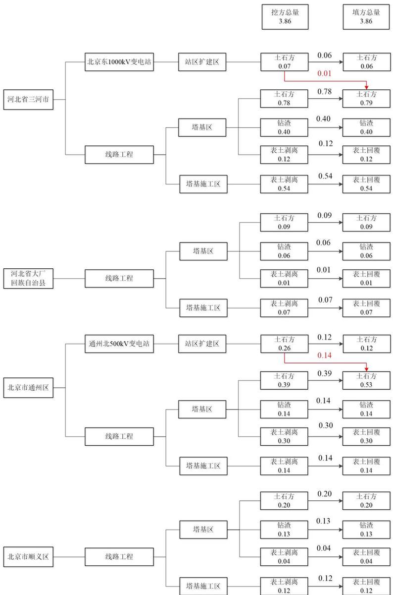
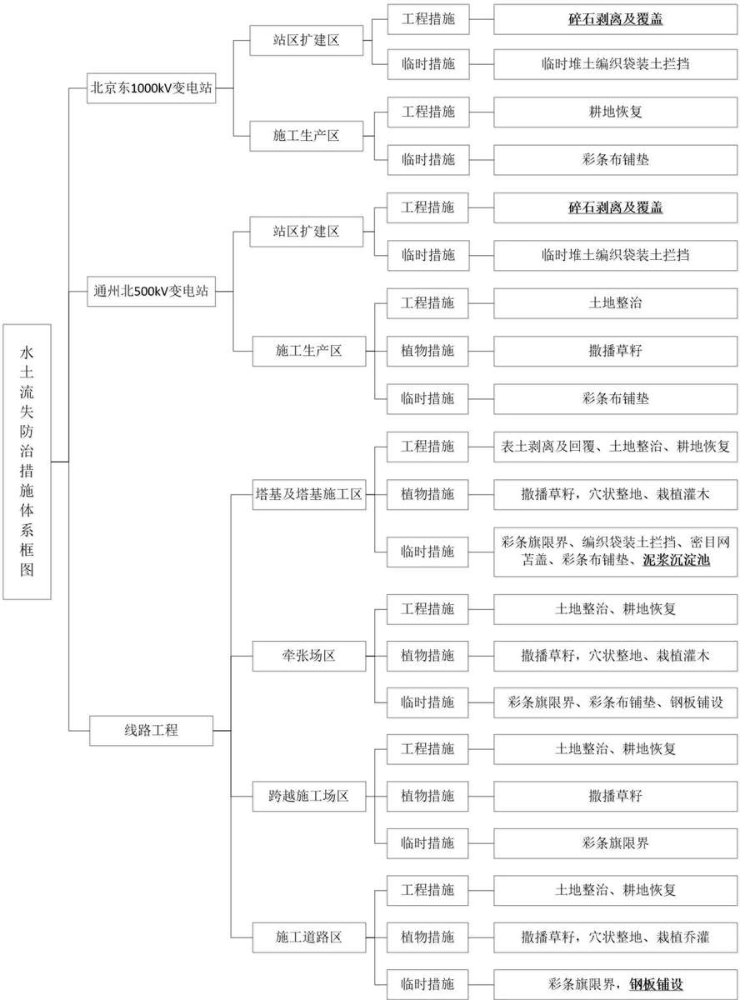
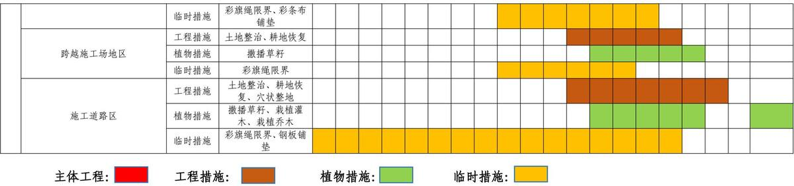

> **Zone C（应用范例层）使用边界**——仅可用于**写作风格、章节展开方式、表达逻辑、表格设计**的参考。
> **不得**用于合规判断；**不得**引入其项目数据（名称／地点／数字／单位名）；
> **不得**因其"曾经通过审批"而推定其做法在当前标准下仍然合规。
> 与 Zone A 冲突时**一律以 Zone A 为准**；Zone A 未明确规定时输出
> 「**Zone A 未明确规定，以下为参考写法，需人工判断**」。
>
> **坐标系警告**：本范例为**老八章结构**（GB 50433—2018 附录B），与 2026 版 10 章模板**同号不同义**
> （老 `1.5`＝防治目标，新 `1.5`＝水土流失预测结果；老 4→新 6 …偏移 +2；新版第 4/5 章老结构无独立章）。
> 因此 **`chapter_mapping: pending`——不得按章节号挂载**，检索一律走 `topic_tags`。
>
> **待加工**：`topic_tags`（主题标签）、`approval_basis_list`（编制依据逐字清单）、
> `structure_summary`（只提取结构：章节展开顺序／段落功能／表格栏目结构／句式模板／论证链步骤）。

1. 综合说明 .....  
1.1 项目简况...  
1.2 编制依据....  
1.3 设计水平年....  
1.4 水土流失防治责任范围..  
1.5 水土流失防治目标...  
1.6 项目水土保持评价结论. .11  
1.7 水土流失预测结果... .. 13  
1.8 水土保持措施布设成果. .. 13  
1.9 水土保持监测方案... .... 16  
1.10 水土保持投资及效益分析成果.. ... 17  
1.11 结论 .... ..... 17  
2. 项目概况 .... ... 21  
2.1 项目组成及工程布置.. ... 21  
2.2 施工组织.... .... 44  
2.3 工程占地.... ... 57  
2.4 土石方平衡.... ... 62  
2.5 拆迁（移民）安置及专项设施改（迁）建..... .... 68  
2.6 施工进度.... ... 69  
2.7 自然概况.... .... 71  
3. 项目水土保持评价 ......... .....84  
3.1 主体工程选址（线）水土保持评价... ..... 84  
3.2 建设方案与布局水土保持分析评价.... .... 86  
3.3 主体工程设计中水土保持措施界定... ... 99  
4. 水土流失分析与预测 .............. .....101  
4.1 水土流失现状... ... 101  
4.2 水土流失影响因素分析.... .... 102  
4.3 土壤流失量预测. ..104  
4.4 水土流失危害分析... .. 108  
4.5 指导性意见... ... 109  
5. 水土保持措施 ...... ..... 111  
5.1 防治区划分.. ... 111  
5.2 措施总体布局.. .. 112  
5.3 分区措施布设.. ... 117  
5.4 施工要求.... ... 131  
6. 水土保持监测..... ..... 138  
6.1 监测范围和时段. ... 138  
6.2 监测内容和方法... .... 138  
6.3 点位布设.... ... 147  
6.4 实施条件和成果.. ..148  
7. 水土保持投资估算及效益分析..... ....... 151  
7.1 投资估算... ... 151  
7.2 效益分析.... ... 172  
8. 水土保持管理... .... 175  
8.1 组织管理.. ... 175  
8.2 后续设计.... ... 176  
8.3 水土保持监测... .... 176  
8.4 水土保持监理.. ... 177  
8.5 水土保持施工. ... 177  
8.6 水土保持设施验收.... .... 178

## 附 图

附图1 项目地理位置图  
附图2 项目区水系图  
附图3 项目区土壤侵蚀强度分布图  
附图4 水土流失防治责任范围图

附图5 北京东1000kV变电站扩建工程总平面布置图

附图6 通州北500kV变电站扩建工程总平面布置图

附图7 线路工程路径图

附图8 工程塔基基础型式一览图

附图9 北京东1000kV变电站防治区防治措施总体布局及监测点位图

附图10 通州北500kV变电站防治区防治措施总体布局及监测点位图

附图11 线路工程防治区防治措施总体布局及监测点位图

附图12 塔基及塔基施工区基础施工阶段水土保持典型措施布设图

附图13 塔基及塔基施工区完工后水土保持典型措施布设图

附图14 牵张场区使用中水土保持典型措施布设图

附图15 牵张场区使用后水土保持典型措施布设图

附图16 跨越施工场地区使用中水土保持典型措施布设图

附图17 跨越施工场地区使用后水土保持典型措施布设图

附图18 施工道路区使用中水土保持典型措施布设图

附图19 施工道路区使用后水土保持典型措施布设图

附图20 变电站扩建区临时堆土防护典型设计图

附图21 塔基及塔基施工区泥浆沉淀池典型设计图

## 1. 综合说明

## 1.1 项目简况

## 1.1.1 项目基本情况

## （1）项目建设必要性

北京东特高压变电站\~通北500千伏线路工程（以下简称“本工程”）是华北区域“十四五”电力发展规划重点输电工程，已纳入华北电网“十四五”主网架规划项目。该工程建成后，华北500kV主网架将进一步完善，保障京冀地区用电需要。

北京电网是华北地区重要受端电网，由于北京地区资源匮乏，且土地资源、环保空间有限，北京电网长期以来依托京津唐电网接受区外电力满足负荷需求。预计2025年、2030年，北京电网外受电需求将进一步提高。本工程投产后，新增北京东特高压站至北京电网的送电通道，可提升北京电网受电能力，为北京东部地区日益增长的负荷需求提供电力支撑。

因此，为加强京冀地区用电稳定性，满足京冀地区用电需要，完善华北电网500kV结构，增强华北电网输送电能力，“十四五”期间建设北京东特高压变电站\~通北500千伏线路工程是必要的。

## （2）项目建设基本情况

本工程项目组成主要分为变电工程和线路工程。其中变电工程包括2个部分：北京东1000kV变电站（以下简称“北京东变电站”）扩建500kV出线间隔2个；通州北500kV变电站（以下简称“通州北变电站”）扩建500kV出线间隔2个，500kV串联电抗器2套。线路工程包括：①新建北京东～通州北500kV线路工程；②迁改、改造线路工程，包括500kV廊太一、二线局部迁改工程、500kV廊顺一、二线局部迁改工程，500kV通画一、二线长高改造工程，220kV顺坝一、二线局部迁改工程，220kV顺商一、二线局部迁改工程，拆除已退运北寺～杨镇110kV单回线路。

北京东变电站位于河北省廊坊市三河市；通州北变电站位于北京市通州区；北京东～通州北500kV线路工程起自河北省廊坊市北京东变电站，止于北京市通州区通州北变电站。迁改、改造工程包括3条500kV、2条220kV交流线路。线路工程涉及河北省、北京市2个省（直辖市），廊坊市、顺义区、通州区3个市（区），三河市、大厂回族自治县2个县（市）。

## 1）变电工程

## ①北京东变电站扩建工程

北京东变电站站址位于河北省廊坊市三河市新集镇姚家营村南侧900m。该变电站已于2017年建成投运。北京东变电站前期共分五期建设，一期为1000kV特高压主站工程，二至四期为500kV出线配套扩建工程，五期为1000kV主变扩容及辅助设施扩建工程，各期工程均已依法完成水土保持方案审批及设施验收工作。

本期扩建为第六期工程，扩建2回500kV出线间隔至通州北变电站，在原有围墙内预留场地进行，场地位于站区南侧，扩建区域占地面积共计0.14hm2，无需新征用地。本期在扩建区设置临时堆土区1处，占地面积320m2；本期设置施工生产区1处，拟布设在变电站南侧围墙外，占地面积0.30hm2；施工生活区租用附近民房，施工道路利用现有道路，施工用水用电依托前期工程。本期扩建区与前期工程场地标高保持一致，站区扩建区土石方挖填主要来自基础开挖，扩建区挖方0.07万m3，填方0.06万m3，剩余土方0.01万m3拟就近运至本工程输电线路的塔基永久占地范围内平整压实，涉及塔基1基，运距约0.5km左右。

## ②通州北变电站扩建工程

通州北500kV变电站位于北京市通州区宋庄镇大庞村东约700m，该变电站已于2023年建成投运，前期工程纳入“通州北500千伏输变电工程”建设，该工程水影响评价报告书于2017年由北京市通州区水务局批复，2023完成水土保持设施验收。

本期扩建为第二期工程，扩建2回500kV出线间隔至北京东变电站，并在现有2组主变低压侧各新增1×60Mvar并联电抗器，扩建工程在原有围墙内预留场地进行，场地位于站区东北角及站区中间位置，扩建区域占地面积共计0.42hm2，不需新征用地。本期在扩建区设置临时堆土区1处，占地面积600m2；本期设置施工生产区1处，拟布设在变电站进站道路北侧，占地面积0.60hm2；施工生活区租用附近民房，施工道路利用现有道路，施工用水用电依托前期工程。本期扩建区与前期工程场地标高保持一致，站区扩建区土石方挖填主要来自基础开挖，扩建区挖方0.26万m3，填方0.12万m3，剩余土方0.14万m3拟运至本工程输电线路的塔基永久占地范围内平整压实，涉及塔基14基，平均运距3km左右。

## 2）线路工程

## ①北京东～通州北500kV线路工程

新建北京东～通州北500kV线路工程，路径长度67.10km，其中新开路径66.20km，利用廊太线0.90km。其中新建线路河北省境内长度51.20km（三河市45.70 km、大厂回族自治县5.50 km），北京市境内线路长度15.00km（顺义区8.30km、通州区6.70 km）。线路按单回路、同塔双回路和同塔四回路混合架设，其中单回路段路径长度2.60km，同塔双回路段线路路径长度34.20km，同塔四回路段线路路径长度29.40km。北京东～通州北500kV线路工程新建铁塔175基。

## ②迁改、改造线路工程

本项目涉及5条线路迁改及改造工程，包括3条500kV、2条220kV交流线路，累计新建线路长度11.05km。

500kV廊太一、二线局部迁改工程新建线路长0.45km，利旧双回路0.3km，拆除双回路1.9km；500kV廊顺一、二线局部迁改工程新建线路长2.9km，拆除0.45km；500kV通画一、二线长高改造工程新建线路长2.2km，拆除约2.2km；220kV顺坝一、二线局部迁改工程和220kV顺商一、二线局部迁改工程新建线路长5.5km，拆除约5.5km；拆除已退运北寺～杨镇110kV单回线路长度3.5km。迁改、改造线路新建塔基29基，拆除杆塔35基。

本工程共计布设牵张场20处、跨越施工场地31处，设置施工道路30.6km（其中新修简易道路20.4km，拓宽简易道路10.2km）。其中：500kV线路工程布设牵张场16处，跨越施工场地29处，新建施工简易道路17.50km、扩宽道路8.75km；迁改及改造线路工程布设牵张场4处、跨越施工场地2处、新建施工简易道路2.90km、扩宽道路1.45km。

本工程总占地面积为57.80hm2，其中永久占地11.58hm2，临时占地46.22hm2。占地类型中水浇地38.66hm2、果园1.25hm2、其他林地11.59hm2、其他草地4.83hm2、公用设施用地0.56hm2、空闲地0.91hm2。

按行政区域划分，本工程河北省境内占地38.28hm2，北京市境内占地19.52hm2。

本工程挖填方总量7.72万m3，其中挖方总量为3.86万m3（含表土剥离1.34万m3），总填方量3.86万m3（含表土回覆1.34万m3），工程土石方通过内部调运实现挖填方量平衡，无借方，无弃土。

本工程由国家电网有限公司华北分部出资建设，工程静态总投资83500万元，其中土建投资23766万元。本工程计划于2026年6月开工，2027年12月完工，总工期19个月。

## 1.1.2 项目前期工作进展情况

本工程可行性研究工作由中国电力工程顾问集团华北电力设计院有限公司完成，2024年12月11\~13日，国网经济技术研究院有限公司对本工程可行性研究报告进行了评审。2025年5月22\~23日，国网经济技术研究院有限公司召开了本工程可行性研究报告收口会议，并于2025年7月4日以经研咨〔2025〕689号文出具了本工程可研报告评审意见。

目前，本工程的初步设计工作正在开展。环境影响评价、洪水影响评价、地质灾害危险性评估、压覆矿产评价、文物调查等专项报告编制工作均在开展中。

2025年6月，中国电力工程顾问集团华北电力设计院有限公司（以下简称”华北院”）中标本工程水土保持方案编制工作。接受工作任务后，编制单位即成立了水土保持专题项目组，对工程设计资料进行全面分析研究，制定水土保持工作计划，编写了水土保持工作大纲，并据此对北京东变电站、通州北变电站及500kV线路、迁改线路沿线的自然环境、生态环境、水土流失及水土保持现状等开展调查，同时收集了项目建设区所在地的相关水土保持现状和规划资料，在水土流失预测的基础上，制定了本工程水土流失防治措施、水土保持监测方案以及投资估算，于2026年4月编制完成了《北京东特高压变电站～通北500千伏线路工程水土保持方案报告书》。

## 1.1.3 自然简况

本工程路径沿线主要地貌单元为平地，地势平坦开阔，多为耕地。

北京东变电站本期为站内扩建，站址地貌属冲积平原区，地势平坦、开阔。站址扩建区范围内无全新活动断裂，无其他不良地质作用。站址周边现为耕地。

通州北变电站本期为站内扩建，地势相对较为平坦，开阔。站址扩建区范围内无全新活动断裂，无其他不良地质作用。

新建线路路径沿线所在区域地貌属潮白河、泃河冲洪积平原，地面高程一般

在20\~40m。

项目区气候属暖温带大陆性季风气候，雨季为每年6\~9月，多年降水量576\~588mm，多年平均蒸发量1140.0～1936.4mm，年平均风速2.2\~2.8m/s，无霜期180\~185天。项目区属于海河流域。项目区土壤类型主要为潮土、褐土、沼泽土，沿线表土可剥离厚度在15\~30cm不等。项目区属暖温带落叶阔叶林区，以天然落叶阔叶林、人工栽种植物为主，林草覆盖率为24.04%～35.04%。

本工程沿线水土流失情况：根据全国水土保持区划成果，项目全线位于北方土石山区；根据《土壤侵蚀分类分级标准》，项目区沿线土壤侵蚀类型区为水力侵蚀区的北方土石山区，项目区总体以微度水力侵蚀为主，容许土壤流失量均为$2 0 0 \mathrm { t } / ( \mathrm { k m } ^ { 2 } { \cdot } \mathrm { a } )$ 0

## 1.2 编制依据

## 1.2.1 法律、法规

（1）《中华人民共和国水土保持法》（1991年6月29日第七届全国人民代表大会常务委员会第二十次会议通过，2010年12月25日第十一届全国人民代表大会常务委员会第十八次会议修订，2011年3月1日施行）；

（2）《河北省实施<中华人民共和国水土保持法>办法》（2018年5月31日河北省第十三届人民代表大会常务委员会第三次会议修正）；

（3）《北京市水土保持条例》（2019年7月26日北京市第十五届人民代表大会常务委员会第十四次会议修正）。

## 1.2.2部委规章及规范性文件

（1）《生产建设项目水土保持方案管理办法》（2023年1月17日水利部令第53号发布）；

（2）《水利部关于加强事中事后监管规范生产建设项目水土保持设施自主验收的通知》（水保〔2017〕365号，2017年11月13日）；

（3）《水利部办公厅关于印发生产建设项目水土保持设施自主验收规程（试行）的通知》（办水保〔2018〕133号，2018年7月10日）；

（4）《水利部办公厅关于印发生产建设项目水土保持技术文件编写和印制格式规定（试行）的通知》（办水保〔2018〕135号，2018年7月12日）；

（5）《水利部关于进一步深化“放管服”改革全面加强水土保持监管的意见》（水保〔2019〕160号，2019年5月31日）；

（6）《水利部办公厅关于实施生产建设项目水土保持信用监管“两单“制度的通知》（办水保函〔2020〕157号，2020年7月24日）；

（7）《水利部办公厅关于进一步加强生产建设项目水土保持监测工作的通知》（办水保〔2020〕161号，2020年7月28日）；

（8）《水利部办公厅关于印发生产建设项目水土保持问题分类和责任追究标准的通知》（办水保函〔2020〕564号，2020年7月24日）；

（9）《自然资源部关于规范临时用地管理的通知》（自然资规〔2021〕2号，2021年11月4日）；

（10）《水利部办公厅关于印发生产建设项目水土保持方案审查要点的通知》（办水保〔2023〕177号，2023年7月4日）；

（11）《水利部办公厅关于进一步加强部批项目水土保持监管工作的通知》（办水保〔2024〕57号，2024年2月21日）；

（12）《水利部关于加强水土保持空间管控的意见》（水保〔2024〕4号，2024年1月5日）；

（13）《水利部办公厅关于做好国家级水土流失重点预防区和重点治理区落地上图成果应用的通知》（办水保〔2025〕170号，2025年10月10日）

（14）《河北省人民政府关于河北省水土保持规划（2016-2030年）的批复》（冀改字〔2017〕35号，2017年10月13日）；

（15）《北京市水土保持规划》（北京市水务局，2017年5月）；

（16）《河北省水利厅、河北省数据和政务服务局关于印发河北省生产建设项目水土保持方案编制范围的通知》（冀水保〔2025〕6号，2025年5月12日）。

## 1.2.3标准与技术规范

（1）《生产建设项目水土保持技术标准》（GB 50433-2018）；

（2）《生产建设项目水土流失防治标准》（GB/T 50434-2018）；

（3）《水土保持工程设计规范》（GB51018-2014）；

（4）《土壤侵蚀分类分级标准》（SL190-2007）；

（5）《输变电项目水土保持技术规范》（SL640-2013）；

（6）《生产建设项目水土保持监测与评价标准》（GB/T51240-2018）；

（7）《水利水电工程制图 第6部分：水土保持图》（SL/T 73.6—2026）；

（8）《防洪标准》（GB 50201-2014）；

（9）《主要造林树种苗木质量分级》（20231682-Q-432）；

（10）《土地利用现状分类》（GB/T21010-2017）；

（11）《水土保持监理规范》（SL/T 523—2024）；

（12）《水土保持监测技术规范》（SL/T 277—2024）；

（13）《水土保持工程质量验收与评价规范》（SL/T336-2025）；

（14）《表土剥离及其再利用技术要求》（GB/T 45107-2024）。

## 1.2.4 技术资料

（1）设计资料：《北京东特高压变电站～通北500千伏线路工程可行性研究报告（收口版）》（中国电力工程顾问集团华北电力设计院有限公司），2025年7月；

（2）《北京东特高压变电站～通北500千伏线路工程》可行性研究报告评审意见（国网经济技术研究院 经研咨〔2025〕689号），2025年7月；

（3）《北京市水土保持公报（2024年）》，北京市水务局；

（4）《河北省水土保持公报（2025年）》，河北省水利厅。

## 1.3 设计水平年

本工程计划2026年6月开工，2027年12月建成投运，总工期19个月。根据《生产建设项目水土保持技术标准》（GB 50433-2018）有关规定，水土保持方案设计水平年为水土保持措施实施完毕并初步发挥效益的年份，根据本工程工期安排结合项目区自然环境特点，本方案设计水平年确定为工程完工后一年，即为2028年。

## 1.4 水土流失防治责任范围

本工程水土流失防治责任范围面积共57.80hm2。其中永久占地11.58hm2，临时占地46.22hm2，详见表1.4-1。

按行政区统计河北省38.28hm2、北京市19.52hm2，详见表1.4-2。

表1.4-1 工程水土流失防治责任范围表 单位： $\mathbf { h } \mathbf { m } ^ { 2 }$
<table><tr><td rowspan=2 colspan=3>项目组成</td><td rowspan=1 colspan=2>占地性质</td><td rowspan=2 colspan=1>防治责任范围</td></tr><tr><td rowspan=1 colspan=1>永久占地</td><td rowspan=1 colspan=1>临时占地</td></tr><tr><td rowspan=7 colspan=1>变电站</td><td rowspan=3 colspan=1>北京东变电站扩建工程区</td><td rowspan=1 colspan=1>站区扩建区</td><td rowspan=1 colspan=1>0.14</td><td rowspan=1 colspan=1></td><td rowspan=1 colspan=1>0.14</td></tr><tr><td rowspan=1 colspan=1>施工生产区</td><td rowspan=1 colspan=1></td><td rowspan=1 colspan=1>0.30</td><td rowspan=1 colspan=1>0.30</td></tr><tr><td rowspan=1 colspan=1>小计</td><td rowspan=1 colspan=1>0.14</td><td rowspan=1 colspan=1>0.30</td><td rowspan=1 colspan=1>0.44</td></tr><tr><td rowspan=3 colspan=1>通州北变电站扩建工程区</td><td rowspan=1 colspan=1>站区扩建区</td><td rowspan=1 colspan=1>0.42</td><td rowspan=1 colspan=1></td><td rowspan=1 colspan=1>0.42</td></tr><tr><td rowspan=1 colspan=1>施工生产区</td><td rowspan=1 colspan=1></td><td rowspan=1 colspan=1>0.60</td><td rowspan=1 colspan=1>0.60</td></tr><tr><td rowspan=1 colspan=1>小计</td><td rowspan=1 colspan=1>0.42</td><td rowspan=1 colspan=1>0.60</td><td rowspan=1 colspan=1>1.02</td></tr><tr><td rowspan=1 colspan=1></td><td rowspan=1 colspan=1>合计</td><td rowspan=1 colspan=1>0.56</td><td rowspan=1 colspan=1>0.90</td><td rowspan=1 colspan=1>1.46</td></tr><tr><td rowspan=5 colspan=1>线路工程</td><td rowspan=5 colspan=1>线路工程区</td><td rowspan=1 colspan=1>塔基及塔基施工区</td><td rowspan=1 colspan=1>11.02</td><td rowspan=1 colspan=1>32.58</td><td rowspan=1 colspan=1>43.60</td></tr><tr><td rowspan=1 colspan=1>牵张场</td><td rowspan=1 colspan=1>0</td><td rowspan=1 colspan=1>2.40</td><td rowspan=1 colspan=1>2.40</td></tr><tr><td rowspan=1 colspan=1>跨越施工场地</td><td rowspan=1 colspan=1>0</td><td rowspan=1 colspan=1>1.66</td><td rowspan=1 colspan=1>1.66</td></tr><tr><td rowspan=1 colspan=1>施工道路</td><td rowspan=1 colspan=1>0</td><td rowspan=1 colspan=1>8.68</td><td rowspan=1 colspan=1>8.68</td></tr><tr><td rowspan=1 colspan=1>小计</td><td rowspan=1 colspan=1>11.02</td><td rowspan=1 colspan=1>45.32</td><td rowspan=1 colspan=1>56.34</td></tr><tr><td rowspan=1 colspan=3>总计</td><td rowspan=1 colspan=1>11.58</td><td rowspan=1 colspan=1>46.22</td><td rowspan=1 colspan=1>57.80</td></tr></table>

表1.4-2 工程水土流失防治责任范围表（按行政区划分） 单位： $\mathbf { h } \mathbf { m } ^ { 2 }$
<table><tr><td rowspan=2 colspan=1>序号</td><td rowspan=2 colspan=1>沿线所经行政区</td><td rowspan=1 colspan=3>项目建设区</td><td rowspan=2 colspan=1>防治责任范围</td></tr><tr><td rowspan=1 colspan=1>永久占地</td><td rowspan=1 colspan=1>临时占地</td><td rowspan=1 colspan=1>小计</td></tr><tr><td rowspan=1 colspan=1>1</td><td rowspan=1 colspan=1>河北省</td><td rowspan=1 colspan=1>7.76</td><td rowspan=1 colspan=1>30.52</td><td rowspan=1 colspan=1>38.28</td><td rowspan=1 colspan=1>38.28</td></tr><tr><td rowspan=1 colspan=1>1.1</td><td rowspan=1 colspan=1>廊坊市</td><td rowspan=1 colspan=1>7.76</td><td rowspan=1 colspan=1>30.52</td><td rowspan=1 colspan=1>38.28</td><td rowspan=1 colspan=1>38.28</td></tr><tr><td rowspan=1 colspan=1>1.1.1</td><td rowspan=1 colspan=1>三河市</td><td rowspan=1 colspan=1>6.54</td><td rowspan=1 colspan=1>26.84</td><td rowspan=1 colspan=1>33.38</td><td rowspan=1 colspan=1>33.38</td></tr><tr><td rowspan=1 colspan=1>1.1.2</td><td rowspan=1 colspan=1>大厂回族自治县</td><td rowspan=1 colspan=1>1.22</td><td rowspan=1 colspan=1>3.68</td><td rowspan=1 colspan=1>4.90</td><td rowspan=1 colspan=1>4.90</td></tr><tr><td rowspan=1 colspan=1>2</td><td rowspan=1 colspan=1>北京市</td><td rowspan=1 colspan=1>3.82</td><td rowspan=1 colspan=1>15.70</td><td rowspan=1 colspan=1>19.52</td><td rowspan=1 colspan=1>19.52</td></tr><tr><td rowspan=1 colspan=1>2.1</td><td rowspan=1 colspan=1>通州区</td><td rowspan=1 colspan=1>2.35</td><td rowspan=1 colspan=1>9.23</td><td rowspan=1 colspan=1>11.58</td><td rowspan=1 colspan=1>11.58</td></tr><tr><td rowspan=1 colspan=1>2.2</td><td rowspan=1 colspan=1>顺义区</td><td rowspan=1 colspan=1>1.47</td><td rowspan=1 colspan=1>6.47</td><td rowspan=1 colspan=1>7.94</td><td rowspan=1 colspan=1>7.94</td></tr><tr><td rowspan=1 colspan=2>合计</td><td rowspan=1 colspan=1>11.58</td><td rowspan=1 colspan=1>46.22</td><td rowspan=1 colspan=1>57.80</td><td rowspan=1 colspan=1>57.80</td></tr></table>

## 1.5 水土流失防治目标

## 1.5.1 执行标准等级

本工程属建设类项目，工程涉及河北省廊坊市三河市、大厂回族自治县，北京市顺义区、通州区。

根据《水利部办公厅关于做好国家级水土流失重点预防区和重点治理区落地上图成果应用的通知》（办水保〔2025〕170号），本工程沿线未涉及国家级水土流失重点预防区和国家级水土流失重点治理区。

本工程河北段沿线涉及廊坊市三河市、大厂回族自治县不涉及国家级及地方各级人民政府和相关机构确定的水土流失重点预防区和重点治理区、饮用水水源保护区、水功能一级区的保护区和保留区、自然保护区、世界文化和自然遗产地、风景名胜区、地质公园、森林公园、重要湿地、县级及以上城市区域，但属于京津冀协同发展规划区，城市建设功能较高，因此确定本工程河北段水土流失防治标准执行一级标准。

根据《北京市水土保持规划》，本工程北京段沿线涉及的通州区、顺义区属于北京市水土流失重点治理区，线路工程在顺义区沿线涉及穿（跨）越潮白河段生态保护红线1个水土保持敏感区。依据《生产建设项目水土流失防治标准》（GB/T50434-2018），北京段水土流失防治标准执行一级标准。

## 1.5.2 防治目标

## （1）基本目标

1）项目建设范围内新增水土流失应得到有效控制，原有水土流失得到治理；

2）水土保持设施应安全有效；

3）水土资源、林草植被应得到最大限度地保护与恢复；

4）水土流失治理度、土壤流失控制比、渣土防护率、表土保护率、林草植被恢复率、林草覆盖率六项指标应符合现行国家标准《生产建设项目水土流失防治标准》（GB/T 50434-2018）的规定。

## （2）防治标准

依据《生产建设项目水土流失防治标准》（GB/T50434-2018）的相关规定，水土流失防治标准等级应根据项目所处地区水土保持敏感程度和水土流失影响程度确定，指标值结合干旱程度、侵蚀强度、地貌类型等因素进行调整，综合确定设计水平年各防治区应达到的水土流失防治目标值。

项目区沿线水土流失强度以微度水力侵蚀为主，土壤流失控制比调高为1.05，鉴于无法避让北京市水土流失重点治理区，提高林草覆盖率2个百分点，其余三项指标维持北方土石山区标准目标值不变。详见表1.5-1。

表 1.5-1 本工程综合水土流失防治指标值
<table><tr><td rowspan=2 colspan=1>防治标准</td><td rowspan=2 colspan=2>行政区</td><td rowspan=2 colspan=1>防治指标</td><td rowspan=1 colspan=2>标准规定</td><td rowspan=1 colspan=2>按土壤侵蚀強度修正</td><td rowspan=1 colspan=2>按重点防治区修正</td><td rowspan=1 colspan=2>方案确定目标</td></tr><tr><td rowspan=1 colspan=1>施工期</td><td rowspan=1 colspan=1>设计水平年</td><td rowspan=1 colspan=1>施工期</td><td rowspan=1 colspan=1>设计水平年</td><td rowspan=1 colspan=1>施工期</td><td rowspan=1 colspan=1>设计水平年</td><td rowspan=1 colspan=1>施工期</td><td rowspan=1 colspan=1>设计水平年</td></tr><tr><td rowspan=6 colspan=1>北方土石山区一级标准</td><td rowspan=6 colspan=1>河北省、北京市</td><td rowspan=6 colspan=1>廊坊市三河市、大厂回族自治县、顺义区、通州区</td><td rowspan=1 colspan=1>水土流失治理度（%）</td><td rowspan=1 colspan=1>*</td><td rowspan=1 colspan=1>95</td><td rowspan=1 colspan=1></td><td rowspan=1 colspan=1></td><td rowspan=1 colspan=1></td><td rowspan=1 colspan=1></td><td rowspan=1 colspan=1>*</td><td rowspan=1 colspan=1>95</td></tr><tr><td rowspan=1 colspan=1>土壤流失控制比</td><td rowspan=1 colspan=1>*</td><td rowspan=1 colspan=1>0.9</td><td rowspan=1 colspan=1></td><td rowspan=1 colspan=1>+0.15</td><td rowspan=1 colspan=1></td><td rowspan=1 colspan=1></td><td rowspan=1 colspan=1>*</td><td rowspan=1 colspan=1>1.05</td></tr><tr><td rowspan=1 colspan=1>渣土防护率（%）</td><td rowspan=1 colspan=1>95</td><td rowspan=1 colspan=1>97</td><td rowspan=1 colspan=1></td><td rowspan=1 colspan=1></td><td rowspan=1 colspan=1></td><td rowspan=1 colspan=1></td><td rowspan=1 colspan=1>95</td><td rowspan=1 colspan=1>97</td></tr><tr><td rowspan=1 colspan=1>表土保护率（%）</td><td rowspan=1 colspan=1>95</td><td rowspan=1 colspan=1>95</td><td rowspan=1 colspan=1></td><td rowspan=1 colspan=1></td><td rowspan=1 colspan=1></td><td rowspan=1 colspan=1></td><td rowspan=1 colspan=1>95</td><td rowspan=1 colspan=1>95</td></tr><tr><td rowspan=1 colspan=1>林草植被恢复率（%）</td><td rowspan=1 colspan=1>*</td><td rowspan=1 colspan=1>97</td><td rowspan=1 colspan=1></td><td rowspan=1 colspan=1></td><td rowspan=1 colspan=1></td><td rowspan=1 colspan=1></td><td rowspan=1 colspan=1>*</td><td rowspan=1 colspan=1>97</td></tr><tr><td rowspan=1 colspan=1>林草覆盖率（%）</td><td rowspan=1 colspan=1>*</td><td rowspan=1 colspan=1>25</td><td rowspan=1 colspan=1></td><td rowspan=1 colspan=1></td><td rowspan=1 colspan=1></td><td rowspan=1 colspan=1>+2</td><td rowspan=1 colspan=1>*</td><td rowspan=1 colspan=1>27</td></tr></table>

## 1.6 项目水土保持评价结论

## 1.6.1 主体工程选址（线）水土保持评价

通过与《中华人民共和国水土保持法》、《河北省实施<中华人民共和国水土保持法>办法》、《北京市水土保持条例》以及《生产建设项目水土保持技术标准》（GB50433-2018）相关规定进行相符性分析，主体工程选址（线）未涉及崩塌和滑坡危险区、易引起严重水土流失和生态恶化地区，不占用全国水土保持监测网络中的水土保持监测站点、重点试验区及国家确定的水土保持长期定位观测站。对于无法避让的水土流失重点治理区，方案已按《生产建设项目水土保持技术标准》（GB50433-2018）中的3.2.2的第4条规定优化了建设方案，提高了林草覆盖率，符合相关规定。

本工程路径在潮白河段涉及生态保护红线避让问题，潮白河流经北京市为南北流向河流，线路从河北省廊坊市至北京市通州区境内自东向西走线会不可避让地穿越北京市潮白河生态保护红线，现已启动相关主管部门的支持性文件办理程序。项目建设须严格遵守生态保护红线管理规定，建设单位应在工程开工前依法取得相关主管部门的同意批复及相关手续。

主体工程选（址）线存在制约性因素，本工程不涉及永久拦挡、截排水措施，因此本方案通过提高防治标准指标值，加强预防保护，优化施工工艺，尽量减少地表扰动和植被损坏范围，同时采取科学可行的水土流失防治措施，可满足水土保持要求，工程建设可行。

## 1.6.2 建设方案与布局评价

本工程北京东变电站扩建工程及通州北变电站扩建工程均在站内预留用地扩建，不新增永久占地，主体设计对站区扩建工程土石方进行了优化，减少了土石方量。两个站扩建施工用电用水均依托前期工程，减少了对周边的影响，可满足施工需要。施工生产区临时占地需在站外新增临时用地面积，其中北京东变电站扩建工程临时占地面积0.30hm2、通州北变电站临时占地面积0.60hm2，临时用地面积结合工程施工需求布置，未出现多占地情况，满足水土保持要求。

线路工程主体考虑了塔基占地、塔基施工场地占地、牵张场地占地、跨越场地占地和施工道路占地，塔基永久占地根据塔基根开尺寸确定，线路工程塔基施工场地占地根据不同地貌类型和不同塔基类型、基础形式确定。因为迁改、改造新建线路和拆除线路路径部分一致，因此局部线路牵张场、施工道路考虑新建线路和拆除线路共用，从而减少了施工临时占地。从工程总体布置，施工方法、调查同类工程施工经验及实地测量等方面分析确定，在严格控制施工场地范围的前提下，充分考虑施工期间堆放材料、临时堆土、人员活动可能扰动的区域，输电线路各区占地即可满足施工需要，又不存在漏项和冗余占地，输电线路占地面积无需增减。

本工程占地类型以耕地、林地、草地为主。变电站主体设计工程永久占地面积符合行业用地指标的要求，符合工程建设实际需要，不存在多占用土地的情况；临时占地用于满足施工阶段各项目建设区的施工用地的需求，经方案优化后不存在多占情况。对占用耕地区域在完工后进行耕地恢复满足复耕要求，占用林地的区域在施工后期进行植被恢复。

主体工程未考虑表土剥离利用及防护措施，本方案补充表土剥离保护及铺垫防护措施，施工后期剥离表土回覆利用，为后期占地恢复利用创造条件。经分析本工程挖填方总量为7.72万m3，其中工程总挖方3.86万m3，工程总填方3.86万m3。本工程挖、填方优先考虑就地平衡，剥离的表土回填用于植被恢复或复耕，输电线路基础挖方和所有干化后的钻渣全部回填至本区，变电站多余土方回填至本工程塔基永久占地范围内平整压实，工程无借方。

根据主体工程特点，本工程施工方案以尽量减少扰动面积、尽量减少耕地占用、尽量减少拆迁为原则。施工时合理安排工序，采用机械和人工配合进行，工程基础开挖、放线、牵张、架线等过程中都将采用有利于水土保持的施工工艺，符合水土保持要求。

变电站在站内考虑了碎石覆盖措施，线路工程设置了泥浆沉淀池、铺垫钢板等措施，上述措施具有水土保持功能，可减少水土流失。为更好地防治施工中产生的水土流失，方案完善补充施工前的表土剥离等措施，施工期间及施工后期各防治分区的表土回覆、临时挡护、苫盖、铺垫、排水、土地整治、耕地恢复、植被恢复等措施。

通过从水土保持角度对主体工程选址（线）、建设方案、工程占地、土石方平衡、施工组织、施工方法及工艺、施工时序等方面分析评价，本工程在优化施工工艺、提高防治标准指标值、采取各项水土保持措施后，水土流失防治效果可达到水土保持要求，项目建设是可行的。

## 1.7 水土流失预测结果

本工程扰动原地貌面积共计57.80hm2。工程损毁植被面积16.42hm2，其中其他林地11.59hm2、其他草地4.83hm2。

经预测，本工程施工期及自然恢复期土壤流失总量681.91t，其中施工期556.08t，自然恢复期125.83t，新增土壤流失量397.39t。本工程水土流失重点时段是土建施工期，本工程水土流失重点部位包括变电站扩建工程临时堆土区及线路工程塔基及塔基施工区、施工道路区。水土流失重点部位也是水土保持监测和水土流失防治措施布设的重点部位。

本工程水土流失危害主要表现为影响生态环境，加剧水土流失、降低土地生产力。线路沿线施工过程中由于土石方开挖对塔基下方的耕地、植被造成一定的影响。在河道附近施工时，若得不到及时有效的防护治理，土壤、泥沙流失将会随地表径流汇入河网。因此工程在施工过程中应加强临时拦挡、苫盖等措施。

## 1.8 水土保持措施布设成果

## 1.8.1 防治分区

本工程水土流失防治分区：

一级分区：按照工程组成，分为三个区，即北京东1000kV变电站、通州北500kV变电站和线路工程区。

二级分区：按照工程特点分，区具体为：

北京东1000kV变电站区划分为两个区：①站区扩建区、②施工生产区；

通州北500kV变电站区划分为两个区：①站区扩建区、②施工生产区；

线路工程区划分为四个区：①塔基及塔基施工区、②牵张场区、③跨越施工场地区、④施工道路区。

## 1.8.2 措施布设成果

（1）北京东1000kV变电站区

1）站区扩建区

施工前对扩建区原有碎石进行剥离清理，施工过程中对临时堆土四周实施编织袋装土拦挡，施工结束后在站区扩建区空地覆盖碎石（利用剥离碎石）。

工程措施：主体已有措施碎石剥离及覆盖165m3；

临时措施：方案新增措施临时堆土编织袋装土拦挡144m3。

水土保持措施实施时段：工程措施实施时段为：2026年9月及2026年12月；临时措施实施时段为：2026年9月。

## 2）施工生产区

施工过程中采取彩条布铺垫措施；施工后期进行耕地恢复。

工程措施：方案新增措施耕地恢复0.30hm2；

临时措施：方案新增措施彩条布铺垫3000m2。

水土保持措施实施时段：工程措施实施时段为：2027年3月—4月；临时措施实施时段为：2026年9月—2027年2月。

## （2）通州北500kV变电站区

## 1）站区扩建区

施工前对扩建区原有碎石进行剥离清理，施工过程中对临时堆土四周实施编织袋装土拦挡，施工结束后在站区扩建区空地覆盖碎石（利用剥离碎石）。

工程措施：主体已有措施碎石剥离及覆盖555m3；

临时措施：方案新增措施堆土编织袋装土拦挡210m3。

水土保持措施实施时段：工程措施实施时段为：2026年8月及2027年1月；临时措施实施时段为：2026年8月—9月。

## 2）施工生产区：

施工过程中采取彩条布铺垫措施；施工后期进行土地整治，并撒播草籽。

工程措施：方案新增措施土地整治0.60hm2；

植物措施：方案新增措施撒播草籽面积0.60hm2，草籽量57.6kg。

临时措施：方案新增措施彩条布铺垫6000m2。

水土保持措施实施时段：工程措施实施时段为：2027年3月；植物措施实施时段为：2027年4月；临时措施实施时段为：2026年8月—2027年2月。

## （2）线路工程区

## 1）塔基区

新建线路：施工前在塔基施工场地周围设置彩条旗限界，严格限制施工机械和人员活动范围，并施工前对占用耕地、林地、园地、草地且进行土石方开挖的区域进行表土剥离、集中堆放，施工期间临时堆土压占及其他轻微扰动区域铺垫彩条布、堆土外侧设填土编织袋拦挡、堆土苫盖密目网等临时措施。灌注桩基础施工过程中在塔基施工场地范围内设泥浆沉淀池。施工后期进行回覆表土、对占用耕地的部分进行耕地恢复、对占用除耕地外的部分进行土地整治及恢复植被。

拆除线路：施工前在塔基施工场地周围设置彩条旗限界，严格限制施工机械和人员活动范围；施工过程中对拆除的塔材等采取彩条布铺垫防护；施工后期对占用耕地的部分进行耕地恢复、对占用除耕地外的部分进行土地整治及恢复植被。

工程措施：方案新增措施包括表土剥离5.09hm2，表土回覆1.34万m3，耕地恢复30.07hm2，土地整治12.98hm2。

植物措施：方案新增措施包括撒播草籽12.98hm2、草籽量1118.13kg，穴状整地12748个，栽植灌木12748株，幼林抚育6.96hm2。

临时措施：方案新增措施包括彩条旗限界33644m，编织袋装土拦挡1020m3，彩条布铺垫34500m2，密目网苫盖40800m2，泥浆沉淀池197座。

水土保持措施实施时段：工程措施实施时段为：2026年6月—2026年10月、2027年5月—2027年9月；植物措施实施时段为：2027年5月—2027年10月；临时措施实施时段为：2026年6月—2027年8月。

## 2）牵张场区

施工前在牵张场周围设置彩条旗限界、严格限制施工机械和人员活动范围。施工期场地内采取彩条布铺垫、钢板铺垫等临时防护措施。施工后期对占用耕地的部分进行耕地恢复、对占用除耕地外的部分进行土地整治及恢复植被。

工程措施：方案新增措施包括耕地恢复1.72hm2，土地整治0.68hm2。

植物措施：方案新增措施包括撒播草籽0.68hm2、草籽量60.16kg，穴状整地888个，栽植灌木888株，幼林抚育0.48hm2。

临时措施：方案新增措施包括彩条旗限界2200m，铺垫彩条布3000m2，钢板铺垫2400m2。

水土保持措施实施时段：工程措施实施时段为：2027年5月—2027年9月；植物措施实施时段为：2027年5月—2027年10月；临时措施实施时段为：2027年2

月—2027年9月。

## 3）跨越施工场地区

施工前在跨越施工场地周围设置彩条旗限界、严格限制施工机械和人员活动范围。施工后期对占用耕地的部分进行耕地恢复、对占用除耕地外的部分进行土地整治及恢复植被。

工程措施：方案新增措施包括耕地恢复1.18hm2，土地整治0.48hm2。

植物措施：方案新增措施撒播草籽0.48hm2、草籽量41.6kg。

临时措施：方案新增措施彩条旗限界1860m。

水土保持措施实施时段：工程措施实施时段为：2027年5月—2027年9月；植物措施实施时段为：2027年5月—2027年10月；临时措施实施时段为：2027年2月—2027年9月。

## 4）施工道路区

平原区场地开阔，对平原区的施工道路设置彩条旗限界措施，严格控制行车轨迹。施工过程中，施工道路根据主体设计要求铺设钢板，有一定的防治水土流失作用。施工后期对新修道路、拓宽道路拓宽侧进行土地整治、穴状整地，根据原土地利用类型进行耕地恢复或植被恢复。

工程措施：方案新增措施包括耕地恢复6.25hm2，土地整治2.43hm2。

植物措施：方案新增措施包括撒播草籽2.43hm2、草籽量208.32kg，穴状整地4990个，栽植灌木2984株、栽植乔木2006株，幼林抚育1.63hm2。

临时措施：主体已有措施钢板铺垫24240m2；方案新增措施彩条旗限界35000m，。

水土保持措施实施时段：工程措施实施时段为：2027年5月—2027年11月；植物措施实施时段为：2027年5月—2027年10月，2028年4月；临时措施实施时段为：2026年6月—2027年9月。

## 1.9 水土保持监测方案

本工程水土保持监测范围与水土流失防治责任范围一致。

水土保持监测内容包括项目施工全过程各阶段扰动土地情况、水土流失状况、防治成效及水土流失危害等。

监测时段确定为施工准备期开始至设计水平年结束，即从2026年6月开始，

止于2028年，并在施工准备期前进行本底值监测。水土保持监测以施工期为重点监测时段。

重点监测区域为变电站扩建工程临时堆土区及线路工程塔基及塔基施工区、施工道路区。

本工程监测方法主要采用地面观测、调查监测、资料分析、遥感监测、巡查监测。

本工程拟在项目沿线选择具有代表性的地段或场地布设监测点位，共设置水土流失监测点位43处，包括24个定位监测点和19个重点巡查监测点。

水土保持监测频次为扰动土地情况每月监测1次；水土流失状况每月监测1次，发生强降水等情况及时进行加测；水土流失防治成效每季度监测1次，其中临时措施实施情况每月监测1次；水土流失危害结合上述监测内容一并开展。

## 1.10 水土保持投资及效益分析成果

本工程水土保持措施总投资897.84万元，其中工程措施费为131.94万元，植物措施费为68.94万元，监测措施费为38.60万元，施工临时工程费为474.81万元，独立费用为79.15万元，预备费为66.15万元，水土保持补偿费为38.26万元。

本工程水土保持总投资中河北省措施费为481.05万元，北京市措施费为233.23元。本工程水土保持总投资中河北省水土保持补偿32.40万元，北京市水土保持补偿5.86万元。

方案实施后，设计水平年水土流失治理度达99.20%，土壤流失控制比达1.05，渣土防护率达98.70%，表土保护率达100%，林草植被恢复率达97.44%，林草覆盖率达29.71%，六项防治指标均达到并超过预期的治理目标。方案各项水土保持措施建成并发挥效益后，可有效防治项目建设新增水土流失，可减少水土流失量444.86t，提高土壤蓄水保土能力。

## 1.11 结论

通过水土保持的分析论证，主体工程选址（线）未涉及崩塌和滑坡危险区、易引起严重水土流失和生态恶化地区，不占用全国水土保持监测网络中的水土保持监测站点、重点试验区及国家确定的水土保持长期定位观测站。本工程路径选择中无法避让潮白河段生态保护红线，目前正在办理相关部门的支持性文件。对于无法避让的敏感区及水土保持重点治理区，项目建设符合相关规定的要求，主体设计采取先进的高跨和灌注桩施工工艺、严格控制施工范围等措施，尽量减少地表扰动和植被损坏范围，本水土保持方案已相应提高防治标准指标值，符合水土保持法律法规、技术标准的相关规定。在工程建设过程中建设单位实施一系列的水土保持措施后，能有效地控制水土流失，达到方案所确定的防治目标及防治水土流失的目的，实现项目区环境的恢复和改善，从水土保持角度分析，本工程建设是可行的。

工程下阶段设计时进一步落实水土保持措施并优化线路路径和立塔位置，尽量减少施工临时占地面积，减少土石方挖填方量。施工单位应做好施工期间的水土流失防治措施，施工过程中加强表土剥离保护和回覆利用，加强线路跨越河流挡护措施，加强临时堆土过程管护。建设单位招标时明确承包商承担防治水土流失的责任、义务，加强水土保持专项设计管理和审查，在施工过程严格按照相应水行政主管部门要求执行，及时开展监理、监测等相关工作，项目完工后，建设单位组织第三方机构进行水土保持设施验收，验收合格后工程方可投产使用。监理单位应对水土保持措施进行全过程的监督管理。监测单位应依据监测结果和防治标准，及时向建设单位反馈，补充和完善相应的水土保持措施，达到方案要求的防治目标。

北京东特高压变电站～通北500千伏线路工程水土保持方案特性表
<table><tr><td rowspan=1 colspan=2>项目名称</td><td rowspan=1 colspan=5>北京东特高压变电站～通北500千伏线路工程</td><td rowspan=1 colspan=1>流域管理机构</td><td rowspan=1 colspan=1>水利部海河水利委员会</td></tr><tr><td rowspan=1 colspan=2>涉及省(市、区)</td><td rowspan=1 colspan=2>河北省、北京市</td><td rowspan=1 colspan=1>涉及地市或个数</td><td rowspan=1 colspan=2>廊坊市、顺义区、通州区</td><td rowspan=1 colspan=1>涉及县或个数</td><td rowspan=1 colspan=1>三河市、大厂回族自治县</td></tr><tr><td rowspan=1 colspan=2>项目规模</td><td rowspan=1 colspan=3>北京东1000kV变电站扩建500kV出线间隔2个；通州北500kV变电站扩建500kV出线间隔2个，500kV串联电抗器2套；新建北京东~通州北500kV线路工程，线路路径长度67.10km，其中新建路径66.20km，利用廊太线0.90km；迁改、改造3条500kV、2条220kV交流线路，新建线路长度11.05km。500kV线路新建铁塔175基，迁改、改造工程新建塔基29基，拆除杆塔35基。</td><td rowspan=1 colspan=2>总投资(万元)</td><td rowspan=1 colspan=1>83500</td><td rowspan=1 colspan=1>土建投资(万元)</td></tr><tr><td rowspan=1 colspan=2>动工时间</td><td rowspan=1 colspan=3>2026.6</td><td rowspan=1 colspan=2>完工时间</td><td rowspan=1 colspan=1>2027.12</td><td rowspan=1 colspan=1>设计水平年</td></tr><tr><td rowspan=1 colspan=2>工程占地(hm²)</td><td rowspan=1 colspan=3>57.80</td><td rowspan=1 colspan=2>永久占地(hm2)</td><td rowspan=1 colspan=1>11.58</td><td rowspan=1 colspan=1>临时占地(hm2)</td></tr><tr><td rowspan=2 colspan=4>土石方量万m³）</td><td rowspan=1 colspan=3>挖方</td><td rowspan=1 colspan=1>填方</td><td rowspan=1 colspan=1>借方</td></tr><tr><td rowspan=1 colspan=3>3.86</td><td rowspan=1 colspan=1>3.86</td><td rowspan=1 colspan=1>0</td></tr><tr><td rowspan=1 colspan=4>重点防治区名称</td><td rowspan=1 colspan=5>本项目不涉及国家级重点防治区，北京段属于北京市水土流失重点治理区。</td></tr><tr><td rowspan=1 colspan=4>地貌类型</td><td rowspan=1 colspan=2>平原区</td><td rowspan=1 colspan=2>水土保持区划</td><td rowspan=1 colspan=1>北方土石山区</td></tr><tr><td rowspan=1 colspan=4>土壤侵蚀类型</td><td rowspan=1 colspan=2>水力侵蚀</td><td rowspan=1 colspan=2>土壤侵蚀强度</td><td rowspan=1 colspan=1>微度为主</td></tr><tr><td rowspan=1 colspan=4>防治责任范围面积  $( \mathrm { { h m } } ^ { 2 } )$ </td><td rowspan=1 colspan=2>57.80</td><td rowspan=1 colspan=2>容许土壤流失量[t/（km²·a)]</td><td rowspan=1 colspan=1>北方土石山区：200</td></tr><tr><td rowspan=1 colspan=4>土壤流失预测总量（t）</td><td rowspan=1 colspan=2>681.91</td><td rowspan=1 colspan=2>新增土壤流失量（t）</td><td rowspan=1 colspan=1>397.39</td></tr><tr><td rowspan=1 colspan=4>水土流失防治标准执行等级</td><td rowspan=1 colspan=5>执行北方土石山区一级标准</td></tr><tr><td rowspan=3 colspan=1>综合防治指标</td><td rowspan=1 colspan=3>水土流失治理度（%）</td><td rowspan=1 colspan=2>95</td><td rowspan=1 colspan=2>土壤流失控制比</td><td rowspan=1 colspan=1>1.05</td></tr><tr><td rowspan=1 colspan=3>渣土防护率（%）</td><td rowspan=1 colspan=2>97</td><td rowspan=1 colspan=2>表土保护率（%）</td><td rowspan=1 colspan=1>95</td></tr><tr><td rowspan=1 colspan=3>林草植被恢复率（%）</td><td rowspan=1 colspan=2>97</td><td rowspan=1 colspan=2>林草覆盖率（%）</td><td rowspan=1 colspan=1>27</td></tr><tr><td rowspan=9 colspan=1>防治措施及工程量</td><td rowspan=1 colspan=3>分区</td><td rowspan=1 colspan=2>工程措施</td><td rowspan=1 colspan=2>植物措施</td><td rowspan=1 colspan=1>临时措施</td></tr><tr><td rowspan=2 colspan=2>北京东1000kV变电站区</td><td rowspan=1 colspan=1>站区扩建区</td><td rowspan=1 colspan=2>碎石剥离及覆盖165m³</td><td rowspan=1 colspan=2>/</td><td rowspan=1 colspan=1>编织袋装土拦挡144m³</td></tr><tr><td rowspan=1 colspan=1>施工生产区</td><td rowspan=1 colspan=2>耕地恢复面积0.30hm²</td><td rowspan=1 colspan=2>1</td><td rowspan=1 colspan=1>彩条布铺垫面积3000m²</td></tr><tr><td rowspan=2 colspan=2>通州北500kV变电站区</td><td rowspan=1 colspan=1>站区扩建区</td><td rowspan=1 colspan=2>碎石剥离及覆盖555m³</td><td rowspan=1 colspan=2>1</td><td rowspan=1 colspan=1>编织袋装土拦挡210m³</td></tr><tr><td rowspan=1 colspan=1>施工生产区</td><td rowspan=1 colspan=2>土地整治0.60hm²</td><td rowspan=1 colspan=2>撒播草籽面积0.60hm²、草籽量57.6kg</td><td rowspan=1 colspan=1>彩条布铺垫6000m²</td></tr><tr><td rowspan=4 colspan=2>线路工程区</td><td rowspan=1 colspan=1>塔基及塔基施工区</td><td rowspan=1 colspan=2>表土剥离5.09hm²，表土回覆1.34万m³，耕地恢复30.07hm²，土地整治12.98hm²</td><td rowspan=1 colspan=2>撒播草籽12.98hm²、草籽量1118.13kg，穴状整地12748个，栽植灌木12748株，幼林3抚育6.96hm²</td><td rowspan=1 colspan=1>彩条旗限界33644m，编织袋装土拦挡1020m³，彩条布铺垫4500m²，密目网苫盖40800m²，泥浆沉淀池197座</td></tr><tr><td rowspan=1 colspan=1>牵张场区</td><td rowspan=1 colspan=2>耕地恢复1.72hm²，土地整治0.68hm²</td><td rowspan=1 colspan=2>撒播草籽0.68hm²、草籽量60.16kg，穴状整地888个，栽灌木888株，幼林抚育0.48hm²</td><td rowspan=1 colspan=1>彩条旗限界2200m，铺垫彩条布3000m²，钢板铺垫2400m²</td></tr><tr><td rowspan=1 colspan=1>跨越施工场地区</td><td rowspan=1 colspan=2>耕地恢复1.18hm²2，土地整治0.48hm²</td><td rowspan=1 colspan=2>撒播草籽0.48hm²、草籽量41.6kg</td><td rowspan=1 colspan=1>彩条旗限界1860m</td></tr><tr><td rowspan=1 colspan=1>施工道路区</td><td rowspan=1 colspan=2>耕地恢复6.25hm²，土地整2治2.43hm²</td><td rowspan=1 colspan=2>撒播草籽2.43hm²、草籽量08.32kg，穴状整地4990个，栽植灌木2984株、栽植乔木2006株，幼林抚育1.63hm²</td><td rowspan=1 colspan=1>彩条旗限界35000m，钢板铺垫24240m²</td></tr></table>

## 1.综合说明

<table><tr><td rowspan=1 colspan=3>投资（万元）</td><td rowspan=1 colspan=2>131.94</td><td rowspan=1 colspan=3>68.94</td><td rowspan=1 colspan=1>474.81</td></tr><tr><td rowspan=1 colspan=3>水土保持总投资（万元）</td><td rowspan=1 colspan=2>897.84</td><td rowspan=1 colspan=3>独立费用（万元）</td><td rowspan=1 colspan=1>79.15</td></tr><tr><td rowspan=1 colspan=1>监理费（万元）</td><td rowspan=1 colspan=1>16.27</td><td rowspan=1 colspan=2>监测费(万元)</td><td rowspan=1 colspan=2>38.60</td><td rowspan=1 colspan=2>补偿费(万元)</td><td rowspan=1 colspan=1>38.26</td></tr><tr><td rowspan=1 colspan=1>分省措施费(万元)</td><td rowspan=1 colspan=3>河北省措施费481.05北京市措施费233.23</td><td rowspan=1 colspan=3>分省补偿费(万元)</td><td rowspan=1 colspan=2>河北省补偿费32.40北京市补偿费5.86</td></tr><tr><td rowspan=1 colspan=1>方案编制单位</td><td rowspan=1 colspan=3>中国电力工程顾问集团华北电力设计院有限公司</td><td rowspan=1 colspan=3>建设单位</td><td rowspan=1 colspan=2>国家电网有限公司华北分部</td></tr><tr><td rowspan=1 colspan=1>法定代表人</td><td rowspan=1 colspan=3>王彦宏</td><td rowspan=1 colspan=3>法定代表人</td><td rowspan=1 colspan=2>王风雷</td></tr><tr><td rowspan=1 colspan=1>地址</td><td rowspan=1 colspan=3>北京市西城区黄寺大街甲24号</td><td rowspan=1 colspan=3>地址</td><td rowspan=1 colspan=2>北京市西城区广安门内大街482号5-6、10-21层</td></tr><tr><td rowspan=1 colspan=1>邮编</td><td rowspan=1 colspan=3>100120</td><td rowspan=1 colspan=3>邮编</td><td rowspan=1 colspan=2>100031</td></tr><tr><td rowspan=1 colspan=1>联系人及电话</td><td rowspan=1 colspan=3>郝向麟/010-59385107</td><td rowspan=1 colspan=3>联系人及电话</td><td rowspan=1 colspan=2>季节/13581882831</td></tr><tr><td rowspan=1 colspan=1>传真</td><td rowspan=1 colspan=3>1</td><td rowspan=1 colspan=3>传真</td><td rowspan=1 colspan=2>1</td></tr><tr><td rowspan=1 colspan=1>电子信箱</td><td rowspan=1 colspan=3>haoxl@ncpe.com.cn</td><td rowspan=1 colspan=3>电子信箱</td><td rowspan=1 colspan=2>sgcc_nc_j@163.com</td></tr></table>

## 2. 项目概况

## 2.1 项目组成及工程布置

项目名称：北京东特高压变电站～通北500千伏线路工程

建设单位：国家电网有限公司华北分部

建设管理单位：国网北京市电力公司、国网冀北电力有限公司

项目组成：本工程项目组成主要分为变电工程和线路工程，变电工程包括北京东1000kV变电站500kV间隔扩建工程，通州北500kV变电站500kV间隔扩建工程；线路工程包括新建北京东～通州北500kV线路工程，500kV廊太一、二线局部迁改，500kV廊顺一、二线局部迁改，500kV通画一、二线长高改造，220kV顺坝一、二线局部迁改，220kV顺商一、二线局部迁改及拆除已退运北寺～杨镇110kV单回线路。

建设地点：北京东1000kV变电站位于河北省廊坊市三河市新集镇；通州北500kV变电站位于北京市通州区宋庄镇；新建北京东～通州北500kV线路工程起自河北省廊坊市北京东1000kV变电站，止于北京市通州区通州北500kV变电站。线路工程涉及河北省、北京市2个省（直辖市），廊坊市、顺义区、通州区3个市（区），三河市、大厂回族自治县2个县（市）。

建设性质：新建、扩建建设类项目

主要建设内容：

（1）变电工程：

1）北京东变电站扩建500kV出线间隔2个；

2）通州北变电站扩建500kV出线间隔2个，500kV串联电抗器2套。

（2）线路工程：

1）北京东特高压变电站～通州北500千伏线路工程，线路路径长度67.10km，其中新建路径长66.20km，利用廊太线0.90km。其中新建线路河北省境内长度51.20km（三河市46.60 km、大厂回族自治县5.50 km），北京市境内线路长度15.00km（顺义区8.30km、通州区6.70km）。线路按单回路、同塔双回路和同塔四回路混合架设，其中单回路段路径长度2.6km，同塔双回路段线路路径长度34.20km，同塔四回路段线路路径长度29.40km。北京东～通州北500kV线路工程

新建铁塔175基。

2）迁改、改造线路工程，本项目涉及5条线路迁改及改造工程，包括3条500kV、2条220kV交流线路，累计新建线路长度11.05km，其中：500kV廊太一、二线局部迁改工程新建线路长0.45km，利旧双回路0.3km，拆除双回路1.9km；500kV廊顺一、二线局部迁改工程新建线路长2.9km，拆除0.45km；500kV通画一、二线长高改造工程新建线路长2.2km，拆除约2.2km；220kV顺坝一、二线局部迁改工程和220kV顺商一、二线局部迁改工程新建线路总长5.5km，拆除约5.5km；拆除已退运北寺～杨镇 110kV单回线路长度3.5km。迁改、改造线路新建塔基29基，拆除杆塔35基，拆除线路长度共计13.55km。

工程总投资及土建投资：工程静态总投资83500万元，其中土建投资23766万元。

项目投资单位及出资比例：项目投资单位为国家电网有限公司华北分部，其中自筹资金占工程总投资的20%，银行贷款占工程总投资的80%。

建设工期：本工程属建设类项目，工程计划2026年6月开工，2027年12月完工，工程建设总工期为19个月。

项目组成及主要工程特性：本工程项目组成及工程特性表详见表2.1-1。

表2.1-1 项目基本组成及工程特性表
<table><tr><td rowspan=1 colspan=3>一、项目的基本情况</td></tr><tr><td rowspan=1 colspan=1>1</td><td rowspan=1 colspan=1>项目名称</td><td rowspan=1 colspan=1>北京东特高压变电站～通北500千伏线路工程</td></tr><tr><td rowspan=1 colspan=1>2</td><td rowspan=1 colspan=1>项目组成</td><td rowspan=1 colspan=1>①变电工程：北京东1000kV变电站500kV间隔扩建工程；通州北500kV变电站500kV间隔扩建工程。②线路工程：北京东~通州北500kV线路工程；500kV廊太一、二线局部迁改；500kV廊顺一、二线局部迁改；500kV通画一、二线长高改造；220kV顺坝一、二线局部迁改；220kV顺商一、二线局部迁改；拆除已退运北寺～杨镇110kV单回线路。</td></tr><tr><td rowspan=1 colspan=1>3</td><td rowspan=1 colspan=1>建设地点</td><td rowspan=1 colspan=1>①变电工程：北京东1000kV变电站：河北省廊坊市三河市新集镇。通州北500kV变电站：北京市通州区宋庄镇。②线路工程北京东～通州北500kV线路工程：线路起自河北省廊坊市北京东1000kV变电站，止于北京市通州区通州北500kV变电站，线路工程涉及河北省、北京市2个省（直辖市），廊坊市、顺义区、通州区3个市（区），三河市、大厂回族自治县2个县（市）。迁改、改造线路工程：500kV廊太一、二线局部迁改，500kV廊顺一、二线局部迁改段均位于河北省廊坊市三河市；500kV通画一、二线长高改造位于北京市通州区；220kV顺坝一、二线局部迁改段位于北京市顺义区、通州区；220kV顺商一、二线局部迁改段位于北京市顺义区、通州区。</td></tr><tr><td rowspan=1 colspan=1>4</td><td rowspan=1 colspan=1>工程性质</td><td rowspan=1 colspan=1>新建、扩建建设类项目</td></tr><tr><td rowspan=1 colspan=1>5</td><td rowspan=1 colspan=1>建设单位</td><td rowspan=1 colspan=1>国家电网有限公司华北分部</td></tr></table>

<table><tr><td rowspan=17 colspan=1>6</td><td rowspan=17 colspan=1>建设规模</td><td rowspan=2 colspan=1>变电工程</td><td rowspan=1 colspan=3>北京东变电站扩建工程</td><td rowspan=1 colspan=7>本期扩建500kV出线2回</td></tr><tr><td rowspan=1 colspan=3>通州北变电站扩建工程</td><td rowspan=1 colspan=7>本期扩建500kV出线2回，500kV串联电抗器2套</td></tr><tr><td rowspan=15 colspan=1>线路工程</td><td rowspan=2 colspan=5>行政区</td><td rowspan=1 colspan=2>河北省</td><td rowspan=1 colspan=2>北京市</td><td rowspan=2 colspan=1>合计</td></tr><tr><td rowspan=1 colspan=1>三河市</td><td rowspan=1 colspan=1>大厂回族自治县</td><td rowspan=1 colspan=1>通州区</td><td rowspan=1 colspan=1>顺义区</td></tr><tr><td rowspan=2 colspan=2>北京东～通州北500kV线路工程</td><td rowspan=1 colspan=3>长度（km）</td><td rowspan=1 colspan=1>45.7</td><td rowspan=1 colspan=1>5.50</td><td rowspan=1 colspan=1>6.70</td><td rowspan=1 colspan=1>8.30</td><td rowspan=1 colspan=1>66.2</td></tr><tr><td rowspan=1 colspan=3>基数（基）</td><td rowspan=1 colspan=1>122</td><td rowspan=1 colspan=1>15</td><td rowspan=1 colspan=1>19</td><td rowspan=1 colspan=1>19</td><td rowspan=1 colspan=1>175</td></tr><tr><td rowspan=4 colspan=2>迁改、改造线路工程</td><td rowspan=1 colspan=3>新建长度（km）</td><td rowspan=1 colspan=1>3.35</td><td rowspan=1 colspan=1></td><td rowspan=1 colspan=2>7.70</td><td rowspan=1 colspan=1>11.05</td></tr><tr><td rowspan=1 colspan=3>拆除长度（km）</td><td rowspan=1 colspan=1>2.35</td><td rowspan=1 colspan=1></td><td rowspan=1 colspan=2>11.2</td><td rowspan=1 colspan=1>13.55</td></tr><tr><td rowspan=1 colspan=3>新建基数（基）</td><td rowspan=1 colspan=1>8</td><td rowspan=1 colspan=1></td><td rowspan=1 colspan=1>13</td><td rowspan=1 colspan=1>8</td><td rowspan=1 colspan=1>29</td></tr><tr><td rowspan=1 colspan=3>拆除基数（基）</td><td rowspan=1 colspan=1>5</td><td rowspan=1 colspan=1></td><td rowspan=1 colspan=1>25</td><td rowspan=1 colspan=1>5</td><td rowspan=1 colspan=1>35</td></tr><tr><td rowspan=1 colspan=2>电压等级</td><td rowspan=1 colspan=8>500kV交流线路</td></tr><tr><td rowspan=1 colspan=2>铁塔型式</td><td rowspan=1 colspan=8>均为自立铁塔，包括直线塔、耐张塔。</td></tr><tr><td rowspan=1 colspan=2>基础型式</td><td rowspan=1 colspan=8>主要采用灌注桩基础、板式基础等。</td></tr><tr><td rowspan=1 colspan=2>地貌类型</td><td rowspan=1 colspan=8>平原区100%。</td></tr><tr><td rowspan=1 colspan=2>工程拆迁</td><td rowspan=1 colspan=8>本工程拆迁居民房屋等建筑面积约31000m²。居民安置区由建设单位出资，地方政府结合新农村建设统一安置。</td></tr><tr><td rowspan=2 colspan=1>主要跨越</td><td rowspan=1 colspan=1>跨越主要河流</td><td rowspan=1 colspan=8>项目区属海河流域。跨越主要河流有引泃入潮河、鲍邱河、潮白河、温潮减河、箭杆河等，不涉及通航河流。</td></tr><tr><td rowspan=1 colspan=1>其他跨越</td><td rowspan=1 colspan=8>跨越500kV电缆线7次（跨1钻6），跨越220kV电力线6次，跨越公路（高速、等级）23次，跨越铁路1次</td></tr><tr><td rowspan=1 colspan=1>7</td><td rowspan=1 colspan=2>总投资</td><td rowspan=1 colspan=2>83500万元</td><td rowspan=1 colspan=3>土建投资</td><td rowspan=1 colspan=2>23766万元</td><td rowspan=1 colspan=1>建设期</td><td rowspan=1 colspan=2>2026年6月～2027年12月</td></tr><tr><td rowspan=1 colspan=13>二、项目组成及主要技术指标</td></tr><tr><td rowspan=2 colspan=5>项目组成</td><td rowspan=1 colspan=5>占地面积 $\left( \mathrm { h m } ^ { 2 } \right)$ </td><td rowspan=1 colspan=3>主要技术指标</td></tr><tr><td rowspan=1 colspan=2>合计</td><td rowspan=1 colspan=1>永久</td><td rowspan=1 colspan=2>临时</td><td rowspan=1 colspan=1>数量</td><td rowspan=1 colspan=1>长度(km)</td><td rowspan=1 colspan=1>宽度(m)</td></tr><tr><td rowspan=3 colspan=2>变电工程</td><td rowspan=1 colspan=3>北京东变电站扩建工程</td><td rowspan=1 colspan=2>0.44</td><td rowspan=1 colspan=1>0.14</td><td rowspan=1 colspan=2>0.30</td><td rowspan=1 colspan=1></td><td rowspan=1 colspan=1></td><td rowspan=1 colspan=1></td></tr><tr><td rowspan=1 colspan=3>通州北变电站扩建工程</td><td rowspan=1 colspan=2>1.02</td><td rowspan=1 colspan=1>0.42</td><td rowspan=1 colspan=2>0.60</td><td rowspan=1 colspan=1></td><td rowspan=1 colspan=1></td><td rowspan=1 colspan=1></td></tr><tr><td rowspan=1 colspan=3>小计</td><td rowspan=1 colspan=2>1.46</td><td rowspan=1 colspan=1>0.56</td><td rowspan=1 colspan=2>0.90</td><td rowspan=1 colspan=1></td><td rowspan=1 colspan=1></td><td rowspan=1 colspan=1></td></tr><tr><td rowspan=5 colspan=2>线路工程</td><td rowspan=1 colspan=3>塔基及塔基施工区</td><td rowspan=1 colspan=2>43.60</td><td rowspan=1 colspan=1>11.02</td><td rowspan=1 colspan=2>32.58</td><td rowspan=1 colspan=1>新建204基，拆除35基</td><td rowspan=1 colspan=1></td><td rowspan=1 colspan=1></td></tr><tr><td rowspan=1 colspan=3>牵张场区</td><td rowspan=1 colspan=2>2.40</td><td rowspan=1 colspan=1>0</td><td rowspan=1 colspan=2>2.40</td><td rowspan=1 colspan=1>20处</td><td rowspan=1 colspan=1></td><td rowspan=1 colspan=1></td></tr><tr><td rowspan=1 colspan=3>跨越施工场地区</td><td rowspan=1 colspan=2>1.66</td><td rowspan=1 colspan=1>0</td><td rowspan=1 colspan=2>1.66</td><td rowspan=1 colspan=1>31处</td><td rowspan=1 colspan=1></td><td rowspan=1 colspan=1></td></tr><tr><td rowspan=1 colspan=3>施工道路区</td><td rowspan=1 colspan=2>8.68</td><td rowspan=1 colspan=1>0</td><td rowspan=1 colspan=2>8.68</td><td rowspan=1 colspan=1></td><td rowspan=1 colspan=1>20.4/10.2</td><td rowspan=1 colspan=1>1.5/3.5</td></tr><tr><td rowspan=1 colspan=3>小计</td><td rowspan=1 colspan=2>56.34</td><td rowspan=1 colspan=1>11.02</td><td rowspan=1 colspan=2>45.32</td><td rowspan=1 colspan=1></td><td rowspan=1 colspan=1></td><td rowspan=1 colspan=1></td></tr></table>

<table><tr><td rowspan=1 colspan=2>合计</td><td rowspan=1 colspan=1>57.80</td><td rowspan=1 colspan=1>11.58</td><td rowspan=1 colspan=3>46.22</td><td rowspan=1 colspan=1></td><td rowspan=1 colspan=1></td></tr><tr><td rowspan=1 colspan=9>三、项目土石方量（单位：万m³）</td></tr><tr><td rowspan=1 colspan=2>项目组成</td><td rowspan=1 colspan=1>挖方</td><td rowspan=1 colspan=1>填方</td><td rowspan=1 colspan=1>调入</td><td rowspan=1 colspan=1>调出</td><td rowspan=1 colspan=1>借方</td><td rowspan=1 colspan=1>弃方</td><td rowspan=1 colspan=1>去向</td></tr><tr><td rowspan=1 colspan=1>北京东变电站</td><td rowspan=1 colspan=1>站区扩建区</td><td rowspan=1 colspan=1>0.07</td><td rowspan=1 colspan=1>0.06</td><td rowspan=1 colspan=1></td><td rowspan=1 colspan=1>0.01</td><td rowspan=1 colspan=1></td><td rowspan=1 colspan=1></td><td rowspan=1 colspan=1></td></tr><tr><td rowspan=1 colspan=1>通州北变电站</td><td rowspan=1 colspan=1>站区扩建区</td><td rowspan=1 colspan=1>0.26</td><td rowspan=1 colspan=1>0.12</td><td rowspan=1 colspan=1></td><td rowspan=1 colspan=1>0.14</td><td rowspan=1 colspan=1></td><td rowspan=1 colspan=1></td><td rowspan=1 colspan=1></td></tr><tr><td rowspan=1 colspan=2>线路工程</td><td rowspan=1 colspan=1>3.53</td><td rowspan=1 colspan=1>3.68</td><td rowspan=1 colspan=1>0.15</td><td rowspan=1 colspan=1></td><td rowspan=1 colspan=1></td><td rowspan=1 colspan=1></td><td rowspan=1 colspan=1></td></tr><tr><td rowspan=1 colspan=2>合计</td><td rowspan=1 colspan=1>3.86</td><td rowspan=1 colspan=1>3.86</td><td rowspan=1 colspan=1>0.15</td><td rowspan=1 colspan=1>0.15</td><td rowspan=1 colspan=1>0</td><td rowspan=1 colspan=1>0</td><td rowspan=1 colspan=1></td></tr></table>

## 2.1.1 变电工程

## 2.1.1.1 北京东变电站

## （1）站址地理位置

北京东变电站站址位于河北省廊坊市三河市新集镇姚家营村南侧900m，北距候谭线县道约270m。

## （2）前期工程情况

北京东变电站前期共分五期建设，一期为1000kV特高压主站工程，二至四期为500kV出线配套扩建工程，五期为1000kV主变扩容及辅助设施扩建工程，各期工程均已依法完成水土保持方案审批及设施验收工作。

## 1）工程概况

## ①一期工程

北京东变电站一期工程包含在“锡盟～南京1000kV特高压交流输变电工程”中，建设规模：新建北京东1000kV变电站安装2×3000MVA主变压器，1000kV出线4回，每回出线侧装设1组840Mvar高压电抗器，每台主变低压侧安装2组240Mvar低压电抗器和2组240Mvar低压电容器。

2011年5月，水利部以《关于锡盟\~南京1000kV输变电工程水土保持方案的复函》（水保函〔2011〕140号）批复了该工程水土保持方案；工程在实际建设中取消了枣庄变电站、徐州变电站、南京变电站、济南～徐州～南京段输电线路和济南～徐州π接入枣庄变电站线路工程等建设内容，后续工程名称变更为锡盟～山东1000千伏特高压交流输变电工程。2017年6月，水利部以《关于印发锡盟\~山东1000kV特高压交流输变电工程水土保持设施验收鉴定书的函》水保函〔2017〕116号出具了锡盟\~南京1000kV输变电工程锡盟\~山东段部分的水土保持验收鉴定书，同意锡盟\~山东1000千伏特高压交流输变电工程通过水土保持设施

验收。

## ②二期工程

北京东变电站二期工程包含在“北京东特高压站配套500千伏输变电工程”中，建设规模：扩建4个500kV出线间隔，将顺义-太平双回500kV线路开断环入北京东变电站。

2015年5月，水利部以《关于北京东特高压站配套500千伏输变电工程水土保持方案的批复》（水保函〔2015〕174号）批复了该工程水土保持方案；2020年12月22日，本项目取得了水利部水土保持设施验收报备回执（水保验收回执〔2020103号）。

## ③三期工程

北京东变电站三期工程包含在“北京东\~通州500kV输变电工程”中，建设规模：扩建2回500kV出线间隔，至通州500kV变电站。

2017年6月，水利部以《关于北京东\~通州500千伏输变电工程水土保持方案的批复》（水保函〔2017〕139号）批复了该工程水土保持方案；2022 年 5 月，本项目取得了水利部水土保持设施验收报备回执（水保验收回执〔2022〕27 号）。

## ④四期工程

北京东变电站四期工程包含在“廊坊北500千伏输变电工程”中，建设规模为：扩建2回500kV出线间隔，至廊坊北500kV变电站。

2019年3月，廊坊市行政审批局以廊审批农林〔2019〕11号文对《廊坊北500千伏输变电工程水土保持方案报告书》进行了批复；2022年11月，本项目取得了廊坊市水利局水土保持设施验收报备回执（验收回执〔11〕号）。

## ⑤五期工程

北京东变电站五期工程项目名称“北京东 1000千伏变电站扩建工程”，建设规模为：安装2台3000MVA主变压器，12组210Mvar低压并联电容器，新建综合水泵房及消防蓄水池各一座。

2021年9月，廊坊市行政审批局以《准予行政许可决定书》（编号：廊审批农林〔2021〕11015号）对该工程水土保持方案报告表准予行政许可；2024年8月，本项目取得了廊坊市水务局水土保持设施验收报备回执（验收回执〔20246号）。

## 2）总平面布置

站区前期工程总占地面积为15.0051hm2，其中围墙内占地面积为14.5003hm2，变电站进站道路从北侧进站。1000kV配电装置布置在站区东侧，向东方向出线，500kV配电装置布置在站区西侧，向西方向出线，主控通信楼布置在站区北侧。

## 3）竖向布置及边坡布设

站区竖向布置与地面排水系统一期已建成，一期竖向设计采用平坡式方案，场地设计标高为8.0m，站区场地地面排水采用雨水下水道的有组织排水。

## 4）给排水

①供水系统

变电站已建设完善的水源及供水系统，采用外接自来水。

## ②排水系统

变电站站内已建设完成完善的排水系统。

本工程采用雨污分流制。

污水：变电站运行期间产生的生活污水经地埋式一体化污水处理设备（处理能力3m3/d）处理后回用或者定期清运，不外排。

雨水：站区雨水采用有组织排放方式，站区雨水汇集后进入排水管道，排至变电站北侧侯谭公路路边沟。

## （3）本期扩建工程与前期工程依托关系

北京东变电站于2017年建成投运，平面布置和竖向设计已同步考虑，全站统一配套设计了进站道路、场地围墙、给排水系统、污水处理装置等，本期工程公用配套部分均依托前期工程内容，本期扩建工程与前期工程依托关系具体见表2.1-2。

表 2.1-2 北京东变电站本期扩建工程与前期工程依托关系一览表
<table><tr><td colspan="2" rowspan="1">项目</td><td colspan="1" rowspan="1">建设情况</td><td colspan="1" rowspan="1">依托关系</td></tr><tr><td colspan="1" rowspan="5">北京东变电站</td><td colspan="1" rowspan="1">扩建区域</td><td colspan="1" rowspan="1">扩建工程位于站区西侧，在原有围墙内预留场地进行，不需新征用地。</td><td colspan="1" rowspan="1">利用前期工程已征用地</td></tr><tr><td colspan="1" rowspan="1">进站道路</td><td colspan="1" rowspan="1">利用一期工程进站道路，本期不新建。</td><td colspan="1" rowspan="1">依托前期工程</td></tr><tr><td colspan="1" rowspan="1">给排水系统</td><td colspan="1" rowspan="1">均在变电站前期工程中统一考虑，本期无新增加工程量。</td><td colspan="1" rowspan="1">依托前期工程</td></tr><tr><td colspan="1" rowspan="1">施工用电</td><td colspan="1" rowspan="1">利用北京东变电站站用电源作为本期扩建施工电源。</td><td colspan="1" rowspan="1">依托前期工程</td></tr><tr><td colspan="1" rowspan="1">施工水源</td><td colspan="1" rowspan="1">利用站内已有水源作为本期扩建施工水源。</td><td colspan="1" rowspan="1">依托前期工程</td></tr><tr><td colspan="1" rowspan="1"></td><td colspan="1" rowspan="1">施工道路</td><td colspan="1" rowspan="1">利用前期工程进站道路作为施工道路。</td><td colspan="1" rowspan="1">依托前期工程</td></tr></table>

（4）本期扩建工程概况

## 1）建设规模

本期为第六期工程，本期扩建2回500kV出线间隔至通州北变电站，扩建的2回通州北出线占用原太平间隔，将现有太平2回出线、顺义2回出线依次向南调整2个出线间隔，太平2回出线占用原顺义间隔，顺义2回出线接入本期扩建间隔。本期完善2个不完整串，共安装2台断路器，占用预留间隔位置。

## 2）站区总体规划及总平面布置

本期新增500kV出线在低压配电室及500kV保护室1北侧，500kV保护室2南侧，2×210Mvar高抗在站区东侧，高抗总事故油池南侧。本期扩建工程在变电站围墙内预留场地进行，不需新增征地。

扩建区总平面布置图见附图5。

## 3）竖向布置

本期扩建场地与前期工程同步进行场地平整，场地标高同前期工程。

## 4）进站道路

进站道路前期工程已建设，可满足本期工程使用。

## 5）供排水系统

供排水系统前期工程已建设，本期工程利用原排供水系统。

## 6）站用电源

站用电源前期工程已建成，本期工程利用现有站用电源。

北京东1000kV特高压变电站本期建设规模详见表2.1-3。北京东特高压变电站扩建主要技术指标见表 2.1-4。

表 2.1-3 北京东变电站建设规模一览表
<table><tr><td rowspan=1 colspan=1>项目名称</td><td rowspan=1 colspan=1>前期工程</td><td rowspan=1 colspan=1>本期扩建</td><td rowspan=1 colspan=1>远期规划</td></tr><tr><td rowspan=1 colspan=1>主变压器</td><td rowspan=1 colspan=1>4×3000MVA</td><td rowspan=1 colspan=1>无</td><td rowspan=1 colspan=1>4×3000MVA</td></tr><tr><td rowspan=1 colspan=1>1000kV出线回路数</td><td rowspan=1 colspan=1>4回</td><td rowspan=1 colspan=1>无</td><td rowspan=1 colspan=1>10回</td></tr><tr><td rowspan=1 colspan=1>500kV出线回路数</td><td rowspan=1 colspan=1>8回</td><td rowspan=1 colspan=1>2回（通州北I间隔和通州北I间隔）</td><td rowspan=1 colspan=1>12回</td></tr><tr><td rowspan=1 colspan=1>110kV并联电抗器</td><td rowspan=1 colspan=1>4×4×240Mvar</td><td rowspan=1 colspan=1>无</td><td rowspan=1 colspan=1>4×8×240Mvar</td></tr><tr><td rowspan=1 colspan=1>110kV并联电容器</td><td rowspan=1 colspan=1>2×4×240Mvar</td><td rowspan=1 colspan=1>无</td><td rowspan=1 colspan=1>4×8×240Mvar</td></tr></table>

表 2.1-4 北京东变电站扩建主要技术指标表
<table><tr><td rowspan=1 colspan=1>序号</td><td rowspan=1 colspan=1>名称</td><td rowspan=1 colspan=1>单位</td><td rowspan=1 colspan=1>数量</td><td rowspan=1 colspan=1>备注</td></tr><tr><td rowspan=1 colspan=1>1</td><td rowspan=1 colspan=1>本期扩建区占地面积</td><td rowspan=1 colspan=1> $\mathrm { h m } ^ { 2 }$ </td><td rowspan=1 colspan=1>0.14</td><td rowspan=1 colspan=1>永久占地0.14hm²，围墙内已征地扩建。</td></tr><tr><td rowspan=1 colspan=1>2</td><td rowspan=1 colspan=1>站区标高</td><td rowspan=1 colspan=1>m</td><td rowspan=1 colspan=1>8.0</td><td rowspan=1 colspan=1>与一期工程一致</td></tr><tr><td rowspan=1 colspan=1>3</td><td rowspan=1 colspan=1>本期扩建土石方总量</td><td rowspan=1 colspan=1>万m³</td><td rowspan=1 colspan=1>0.13</td><td rowspan=1 colspan=1>挖方0.07万m³，填方0.06万m³，多余土方0.01万m³运至本工程输电线路临近塔基区永久占地平整压实</td></tr></table>

## 2.1.1.2 通州北变电站

## （1）站址地理位置

通州北500kV变电站位于北京市通州区宋庄镇大庞村东约700m，东邻徐宋路，西邻中坝河，北邻徐尹路。场地距东侧徐宋路大约80m，距西侧中坝河约165m。

## （2）前期工程概况

通州北变电站前期共一期建设，为新建500千伏输变电工程，工程已依法完成水影响评价审批、水土保持设施自主验收与备案。

## 1）工程概况

通州北变电站一期工程纳入“通州北500千伏输变电工程”建设，一期工程建设规模：新建通州北500kV变电站一座，建主变2×1200MVA，500kV出线6回，220kV出线8回，2组60Mvar的低压并联电抗器和6组60Mvar低压并联电容器组。

2017年12月，北京市通州区水务局以《北京市通州区水务局关于通州北 500千伏输变电工程水影响评价报告的批复》（通水评审〔2017〕69 号）批复了本工程水影响评价报告；2023年7月，国网北京市电力公司对该项目进行水土保持设施自主验收，2023年9月向北京市通州区水务局进行了备案，备案回执文号为（通）水保验备〔2023〕第29号。

## 2）总平面布置

站区总占地面积为6.68hm2，其中围墙内用地面积为5.73hm2，进站道路从东侧接入，500kV配电装置布置在站区北侧和东侧，向东侧、西侧两个方向出线，220kV配电装置区布置在站区南侧，向南侧、东侧两个方向出线。

## 3）竖向布置

站区竖向布置与地面排水系统一期已形成，一期竖向设计采用平坡式方案，场地设计标高为21.5m，站区场地地面排水采用雨水下水道的有组织排水。

## 4）给排水

①供水系统

变电站生活用水采用桶装水。

## ②排水系统

污水：通州北 500kV 变电站内废水主要为站内少量值守人员产生的生活污水，变电站建有化粪池，生活污水经化粪池处理后由市政定期抽除，不外排。

雨水：通州北变电站建有容积500m3的雨水调蓄池三座，分别位于变电站西侧、主控通信楼的东南角及主控通信楼西侧。本站雨水经道路等硬化区域雨水经收集后，排入站区雨水调蓄池。调蓄池预留后期接市政雨水管线接口。

## （3）本期扩建工程与前期工程依托关系

通州北变电站于2023年建成投运，通州北变按最终规模征地，平面布置和竖向设计已同步考虑，全站统一配套设计了进站道路、场地围墙、给排水系统、污水处理装置等，本期工程公用配套部分均依托前期工程内容，本期扩工程与前期工程依托关系具体见表2.1-5。

表2.1-5 通州北变电站本期扩建工程与前期工程依托关系一览表
<table><tr><td rowspan=1 colspan=2>项目</td><td rowspan=1 colspan=1>建设情况</td><td rowspan=1 colspan=1>依托关系</td></tr><tr><td rowspan=5 colspan=1>通州北变电站扩建工程</td><td rowspan=1 colspan=1>扩建区域</td><td rowspan=1 colspan=1>扩建工程位于站区东侧和中部，占地面积0.42hm²，在原有围墙内预留场地进行，不需新征用地。</td><td rowspan=1 colspan=1>利用前期工程征地</td></tr><tr><td rowspan=1 colspan=1>进站道路</td><td rowspan=1 colspan=1>利用一期工程进站道路，本期不新建。</td><td rowspan=1 colspan=1>依托前期工程</td></tr><tr><td rowspan=1 colspan=1>给排水系统</td><td rowspan=1 colspan=1>均在变电站一期工程中统一考虑，本期无新增加工程量。</td><td rowspan=1 colspan=1>依托前期工程</td></tr><tr><td rowspan=1 colspan=1>施工用电</td><td rowspan=1 colspan=1>利用通州北变电站站用电源作为一期扩建施工电源。</td><td rowspan=1 colspan=1>依托前期工程</td></tr><tr><td rowspan=1 colspan=1>施工水源</td><td rowspan=1 colspan=1>利用站内已有水源作为本期扩建施工水源。</td><td rowspan=1 colspan=1>依托前期工程</td></tr></table>

## （3）本期扩建工程概况

## 1）建设规模

本期为第二期工程，本期扩建2回500kV出线间隔至北京东变电站，在通州北～顺义2回出线侧各加装1套串联电抗器，在现有2组主变低压侧各装设1组60Mvar并联电抗器。本期新建2个不完整串，共安装4台断路器，占用预留间隔位置。

## 2）站区总体规划及总平面布置

本期需要扩建主母线，本期新建2个不完整串，共安装4台断路器，占用预留

间隔位置。本期在顺义1、2双回线加装串抗，在2号主变和3号主变的66kV侧各加装1组60Mvar并联电抗器。

本期扩建工程在变电站围墙内预留场地进行，不需新增征地。

扩建区总平面布置图见附图6。

## 3）竖向布置

本期扩建场地已在一期工程进行场地平整，场地标高同前期工程，为23.1m。

## 4）进站道路

进站道路前期工程已建设，可满足本期工程使用。

## 5）供排水系统

供排水系统前期工程已建设，本期工程利用原排供水系统。

## 6）站用电源

站用电源前期工程已建成，本期工程利用现有站用电源。

通州北变电站本期建设规模详见表2.1-6。通州北500kV变电站扩建主要技术指标见表2.1-7。

表2.1-6 通州北变电站建设规模一览表
<table><tr><td rowspan=1 colspan=1>项目名称</td><td rowspan=1 colspan=1>前期已建</td><td rowspan=1 colspan=1>本期扩建</td><td rowspan=1 colspan=1>远期规划</td></tr><tr><td rowspan=1 colspan=1>主变压器</td><td rowspan=1 colspan=1>2×1200MVA</td><td rowspan=1 colspan=1>无</td><td rowspan=1 colspan=1>4×1200MVA</td></tr><tr><td rowspan=1 colspan=1>500kV出线回路数</td><td rowspan=1 colspan=1>6回</td><td rowspan=1 colspan=1>2回(北京东变电站)</td><td rowspan=1 colspan=1>10回</td></tr><tr><td rowspan=1 colspan=1>220kV出线回路数</td><td rowspan=1 colspan=1>8回</td><td rowspan=1 colspan=1>无</td><td rowspan=1 colspan=1>16回</td></tr><tr><td rowspan=1 colspan=1>66kV并联电容器</td><td rowspan=1 colspan=1>4×3×60Mvar</td><td rowspan=1 colspan=1>无</td><td rowspan=1 colspan=1>4×4×60Mvar</td></tr><tr><td rowspan=1 colspan=1>66kV并联电抗器</td><td rowspan=1 colspan=1>4×1×60Mvar</td><td rowspan=1 colspan=1>无</td><td rowspan=1 colspan=1>4×2×60Mvar</td></tr></table>

表2.1-7 通州北变电站扩建主要技术指标表
<table><tr><td rowspan=1 colspan=1>序号</td><td rowspan=1 colspan=1>名称</td><td rowspan=1 colspan=1>单位</td><td rowspan=1 colspan=1>数量</td><td rowspan=1 colspan=1>备注</td></tr><tr><td rowspan=1 colspan=1>1</td><td rowspan=1 colspan=1>扩建区</td><td rowspan=1 colspan=1>hm²</td><td rowspan=1 colspan=1>0.42</td><td rowspan=1 colspan=1>永久占地0.42hm²，围墙内已征地扩建</td></tr><tr><td rowspan=1 colspan=1>2</td><td rowspan=1 colspan=1>站区标高</td><td rowspan=1 colspan=1>m</td><td rowspan=1 colspan=1>21.5</td><td rowspan=1 colspan=1>与前期工程一致</td></tr><tr><td rowspan=1 colspan=1>3</td><td rowspan=1 colspan=1>站区基础土石方总量</td><td rowspan=1 colspan=1>万m³</td><td rowspan=1 colspan=1>0.38</td><td rowspan=1 colspan=1>挖方0.26万m³，填方0.12万m³，多余土方0.14万m³就近运至本工程输电线路塔基区永久占地平整压实</td></tr></table>

## 2.1.2 线路工程

## 2.1.2.1 线路路径方案

（1）北京东～通州北500kV线路工程

新建北京东～通州北500kV线路工程涉及河北省廊坊市三河市、大厂回族自治县和北京市顺义区、通州区境内，详述如下：

本工程新建500kV线路自北京东变电站太平间隔500kV构架向西，利用北京东～太平500kV双回线路至姚家营村附近，新建线路转向西北，经新集镇后改为两条单回路向西钻越北京东～太平500kV双回线路、北京东～顺义 500kV/220kV混压四回线路（目前仅挂2回500kV线路），之后合并为同塔双回路继续向西，至大薄各庄村附近转向西北，沿大厂回族自治县和三河市边界架设，经周家庄村，跨越G95首都环线高速公路，并行东兴庄～廊坊北220kV线路向北至郝家府村附近，改为500kV/220kV混压四回路（本期挂 500kV双回线），向西北跨越蓟州～邵府 220kV双回线路，经西辛店村，跨越京哈铁路、G102国道、京秦高速公路、在建平谷线地铁至军下村，改为同塔双回路转向西至后车坊村附近的河北、北京省界。

线路进入北京境内，改为500kV/220kV混压四回路（本期挂500kV双回线），并行S32京平高速公路向西南架设至南庄头村附近，跨越通州北～李遂220kV同塔双回线路，之后平行于该220kV线路西侧向西南架设，跨越京秦高速公路，钻越通州北～通州Ⅰ、Ⅱ回500kV线路（现状为2条同塔双回路单侧挂线），转向西，于站外改为2条单回线路接入通州北变电站。

新建北京东～通州北500kV线路工程，线路路径长度67.10km，其中新建路径66.20km，利用廊太线0.90km。

## （2）迁改、改造线路工程

本项目涉及5条线路迁改及改造工程，包括3条500kV、2条220kV交流线路，累计新建线路长度11.05km。拆除已退运北寺～杨镇110kV单回线路长度3.5km。

## 1）500kV架空线路局部迁改及改造

## ①500kV廊太一、二线局部迁改

500kV廊太线局部迁改段位于河北省廊坊市三河市，起于现状500kV廊顺5#铁塔，止于现状500kV廊太7#铁塔。新建线路长0.45km，利旧双回路0.3km，拆除双回路1.9km。

## ②500kV廊顺一、二线局部迁改

500kV廊顺线局部迁改段位于河北省廊坊市三河市，起于1000kV北京东（廊

坊）变电站，止于现状500kV廊顺7#铁塔。新建线路长路新建线路约2.9km，拆除约0.45km。

## ③500kV通画一、二线升高改造

500kV通画一、二线长高改造段位于北京市通州区，起于通画一线71#—通画一线74#，止于通画二线71#—通画二线74#。新建同塔双回路单回挂线2.2km（一线、二线各1.1km）；拆除约2.2km（一线、二线各1.1km）。

## 2）220kV架空线路局部迁改

## ①220kV顺坝一、二线局部迁改

220kV顺坝一、二线局部迁改段位于北京市顺义区，起于现状220kV顺坝一、二线72#，止于现状86#铁塔。

## ②220kV顺商一、二线局部迁改

220kV顺商一、二线局部迁改段位于北京市顺义区、通州区，起于现状220kV顺坝一、二线74#，止于现状88#铁塔。

220kV架空线路局部迁改共新建双回线路约5.5km，拆除约5.5km。

## 3）拆除北寺～杨镇110kV线路

拆除已退运北寺～杨镇110kV单回线路长度3.5km，位于北京市通州区。

迁改线路路径示意见图2.1-3、2.1-4及2.1-5。

## 2.1.2.2 线路长度、地形及铁塔数量

## （1）北京东～通州北500kV线路工程

新建北京东～通州北500kV线路工程，线路路径长度67.10km，其中新建路径66.20km，利用廊太线0.90km。其中新建线路河北省境内长度52.10km（三河市46.60 km、大厂回族自治县5.50 km），北京市境内线路长度15.00km（顺义区8.30km、通州区6.70 km）。线路按单回路、同塔双回路和同塔四回路混合架设，其中单回路段路径长度2.60km，同塔双回路段线路路径长度34.20km，同塔四回路段线路路径长度29.40km。

北京东～通州北500kV线路工程共架设铁塔175基，其中直线塔95基、耐张塔80基。

## （2）迁改、改造线路工程

迁改、改造线路工程新建线路总长11.05km，其中500kV廊太一、二线局部迁改新建线路0.45km，500kV廊顺一、二线局部迁改新建线路2.9km，500kV通画一、二线长高改造新建线路2.2km，220kV顺坝一、二线局部迁改和220kV顺商一、二线局部迁改新建线路约5.5km。迁改、改造线路共架设铁塔29基，其中直线塔11基、耐张塔18基。

新建铁塔29基，其中：500kV廊太一、二线局部切新建2基，位于河北省三河市；500kV廊顺一、二线局部迁改新建6基，位于河北省三河市；500kV通画一、二线长高改造新建4基，位于北京市通州区；220kV顺坝一、二线局部迁改新建13基，位于北京市通州区及顺义区；220kV顺商一、二线局部迁改新建4基，位于北京市通州区及顺义区。

拆除杆塔35基，其中：500kV廊太一、二线局部切拆除铁塔4基，位于河北省三河市；500kV廊顺一、二线局部迁改拆除铁塔1基，位于河北省三河市；500kV通画一、二线长高改造拆除铁塔4基，位于北京市通州区；220kV顺坝一、二线局部迁改拆除铁塔2基，位于北京市顺义区；220kV顺商一、二线局部迁改拆除铁塔11基，位于北京市通州区及顺义区；已退运北寺～杨镇110kV单回线路拆除水泥杆9基、铁塔4基，位于北京市通州区。

线路沿线均为华北冲洪积平原，地形地貌一致。

线路工程路径及铁塔情况详见表2.1-8、表2.1-9及表2.1-10。

表 2.1-8 北京东～通州北500kV线路工程沿线各市（县、区）路径分段长度及铁塔分布表
<table><tr><td rowspan=2 colspan=1>省</td><td rowspan=2 colspan=1>市</td><td rowspan=2 colspan=1>县</td><td rowspan=2 colspan=1>利旧线路（km）</td><td rowspan=1 colspan=4>新建线路长度（km）</td><td rowspan=1 colspan=3>塔基数量（基）</td></tr><tr><td rowspan=1 colspan=1>单回路</td><td rowspan=1 colspan=1>双回路</td><td rowspan=1 colspan=1>四回路</td><td rowspan=1 colspan=1>合计</td><td rowspan=1 colspan=1>直线塔</td><td rowspan=1 colspan=1>耐张塔</td><td rowspan=1 colspan=1>合计</td></tr><tr><td rowspan=3 colspan=1>河北省</td><td rowspan=3 colspan=1>廊坊市</td><td rowspan=1 colspan=1>三河市</td><td rowspan=1 colspan=1>0.90</td><td rowspan=1 colspan=1>1.8</td><td rowspan=1 colspan=1>28.7</td><td rowspan=1 colspan=1>15.2</td><td rowspan=1 colspan=1>45.7</td><td rowspan=1 colspan=1>49</td><td rowspan=1 colspan=1>73</td><td rowspan=1 colspan=1>122</td></tr><tr><td rowspan=1 colspan=1>大厂回族自治县</td><td rowspan=1 colspan=1></td><td rowspan=1 colspan=1>0</td><td rowspan=1 colspan=1>5.5</td><td rowspan=1 colspan=1></td><td rowspan=1 colspan=1>5.5</td><td rowspan=1 colspan=1>9</td><td rowspan=1 colspan=1>6</td><td rowspan=1 colspan=1>15</td></tr><tr><td rowspan=1 colspan=1>小计</td><td rowspan=1 colspan=1></td><td rowspan=1 colspan=1>1.8</td><td rowspan=1 colspan=1>34.2</td><td rowspan=1 colspan=1>15.2</td><td rowspan=1 colspan=1>51.2</td><td rowspan=1 colspan=1>58</td><td rowspan=1 colspan=1>79</td><td rowspan=1 colspan=1>137</td></tr><tr><td rowspan=3 colspan=1>北京市</td><td rowspan=3 colspan=1>北京市</td><td rowspan=1 colspan=1>通州区</td><td rowspan=1 colspan=1></td><td rowspan=1 colspan=1></td><td rowspan=1 colspan=1></td><td rowspan=1 colspan=1>8.3</td><td rowspan=1 colspan=1>8.3</td><td rowspan=1 colspan=1>7</td><td rowspan=1 colspan=1>12</td><td rowspan=1 colspan=1>19</td></tr><tr><td rowspan=1 colspan=1>顺义区</td><td rowspan=1 colspan=1></td><td rowspan=1 colspan=1>0.8</td><td rowspan=1 colspan=1></td><td rowspan=1 colspan=1>5.9</td><td rowspan=1 colspan=1>6.7</td><td rowspan=1 colspan=1>11</td><td rowspan=1 colspan=1>8</td><td rowspan=1 colspan=1>19</td></tr><tr><td rowspan=1 colspan=1>小计</td><td rowspan=1 colspan=1></td><td rowspan=1 colspan=1>0.8</td><td rowspan=1 colspan=1>0</td><td rowspan=1 colspan=1>14.2</td><td rowspan=1 colspan=1>15</td><td rowspan=1 colspan=1>18</td><td rowspan=1 colspan=1>20</td><td rowspan=1 colspan=1>38</td></tr><tr><td rowspan=1 colspan=3>合计</td><td rowspan=1 colspan=1>0.90</td><td rowspan=1 colspan=1>2.6</td><td rowspan=1 colspan=1>34.2</td><td rowspan=1 colspan=1>29.4</td><td rowspan=1 colspan=1>66.2</td><td rowspan=1 colspan=1>76</td><td rowspan=1 colspan=1>99</td><td rowspan=1 colspan=1>175</td></tr></table>

表 2.1-9 本工程迁改、改造线路工程沿线各市（县、区）路径分段长度及铁塔分布表
<table><tr><td rowspan=2 colspan=1>省</td><td rowspan=2 colspan=1>市</td><td rowspan=2 colspan=1>县</td><td rowspan=1 colspan=4>线路长度（km）</td><td rowspan=1 colspan=3>塔基数量（基）</td></tr><tr><td rowspan=1 colspan=1>单回路</td><td rowspan=1 colspan=1>双回路</td><td rowspan=1 colspan=1>四回路</td><td rowspan=1 colspan=1>合计</td><td rowspan=1 colspan=1>直线塔</td><td rowspan=1 colspan=1>转角、耐张及跨越塔</td><td rowspan=1 colspan=1>合计</td></tr><tr><td rowspan=1 colspan=1>河北省</td><td rowspan=1 colspan=1>廊坊市</td><td rowspan=1 colspan=1>三河市</td><td rowspan=1 colspan=1></td><td rowspan=1 colspan=1>3.35</td><td rowspan=1 colspan=1></td><td rowspan=1 colspan=1>3.35</td><td rowspan=1 colspan=1>4</td><td rowspan=1 colspan=1>4</td><td rowspan=1 colspan=1>8</td></tr><tr><td rowspan=3 colspan=1>北京市</td><td rowspan=3 colspan=1>北京市</td><td rowspan=1 colspan=1>通州区</td><td rowspan=2 colspan=1></td><td rowspan=2 colspan=1>7.70</td><td rowspan=2 colspan=1></td><td rowspan=2 colspan=1>7.70</td><td rowspan=1 colspan=1>7</td><td rowspan=1 colspan=1>6</td><td rowspan=1 colspan=1>13</td></tr><tr><td rowspan=1 colspan=1>顺义区</td><td rowspan=1 colspan=1>0</td><td rowspan=1 colspan=1>8</td><td rowspan=1 colspan=1>8</td></tr><tr><td rowspan=1 colspan=1>小计</td><td rowspan=1 colspan=1></td><td rowspan=1 colspan=1>7.70</td><td rowspan=1 colspan=1></td><td rowspan=1 colspan=1>7.70</td><td rowspan=1 colspan=1>7</td><td rowspan=1 colspan=1>14</td><td rowspan=1 colspan=1>21</td></tr><tr><td rowspan=1 colspan=3>合计</td><td rowspan=1 colspan=1></td><td rowspan=1 colspan=1></td><td rowspan=1 colspan=1></td><td rowspan=1 colspan=1>11.05</td><td rowspan=1 colspan=1>11</td><td rowspan=1 colspan=1>18</td><td rowspan=1 colspan=1>29</td></tr></table>

表 2.1-10 本工程迁改、改造线路工程拆除线路铁塔数量分布表
<table><tr><td rowspan=2 colspan=1>省</td><td rowspan=2 colspan=1>市</td><td rowspan=2 colspan=1>县</td><td rowspan=1 colspan=4>塔基数量（基）</td></tr><tr><td rowspan=1 colspan=1>直线塔</td><td rowspan=1 colspan=1>耐张塔</td><td rowspan=1 colspan=1>水泥杆</td><td rowspan=1 colspan=1>合计</td></tr><tr><td rowspan=2 colspan=1>河北省</td><td rowspan=2 colspan=1>廊坊市</td><td rowspan=1 colspan=1>三河市</td><td rowspan=1 colspan=1>5</td><td rowspan=1 colspan=1></td><td rowspan=1 colspan=1></td><td rowspan=1 colspan=1>5</td></tr><tr><td rowspan=1 colspan=1>小计</td><td rowspan=1 colspan=1>5</td><td rowspan=1 colspan=1></td><td rowspan=1 colspan=1></td><td rowspan=1 colspan=1>5</td></tr><tr><td rowspan=3 colspan=1>北京市</td><td rowspan=3 colspan=1>北京市</td><td rowspan=1 colspan=1>通州区</td><td rowspan=1 colspan=1>8</td><td rowspan=1 colspan=1>10</td><td rowspan=1 colspan=1>9</td><td rowspan=1 colspan=1>27</td></tr><tr><td rowspan=1 colspan=1>顺义区</td><td rowspan=1 colspan=1>3</td><td rowspan=1 colspan=1></td><td rowspan=1 colspan=1></td><td rowspan=1 colspan=1>3</td></tr><tr><td rowspan=1 colspan=1>小计</td><td rowspan=1 colspan=1>11</td><td rowspan=1 colspan=1>10</td><td rowspan=1 colspan=1>9</td><td rowspan=1 colspan=1>30</td></tr><tr><td rowspan=1 colspan=3>合计</td><td rowspan=1 colspan=1>16</td><td rowspan=1 colspan=1>10</td><td rowspan=1 colspan=1>9</td><td rowspan=1 colspan=1>35</td></tr></table>

## 2.1.2.3 铁塔概况

本工程输电线路铁塔型式均为自立铁塔，包括直线塔、耐张塔。本工程塔基永久占地按照铁塔（根开+主柱宽度+外扩2m）2计列，塔基临时施工场地布设采取与以往同类工程建设监测情况类比，结合本工程铁塔类型、铁塔基础型式和主体设计要求，在满足施工需求的基础上，尽可能优化、节省占地，按照单回路塔基施工区临时占地按（根开+20m）2-永久占地估算；双回路塔基施工区临时占地按（根开+25m）2-永久占地估算，其中板式基础、耐张塔、四回路塔基施工区临时占地按（根开+30m）2-永久占地估算。本工程线路工程新建铁塔型式及占地面积详见表2.1-11\~2.1-12、拆除塔基信息详见表2.1-13。

表 2.1-11 北京东～通州北500kV线路工程新建铁塔型式及占地面积统计表
<table><tr><td rowspan=2 colspan=2>行政区划</td><td rowspan=2 colspan=1>铁塔属性(耐张/直线)</td><td rowspan=2 colspan=1>塔型</td><td rowspan=2 colspan=1>基础型式</td><td rowspan=2 colspan=1>数量（基）</td><td rowspan=2 colspan=1>根开（m）</td><td rowspan=1 colspan=2>单基塔基占地（m²）</td><td rowspan=1 colspan=2>塔基占地（m²）</td></tr><tr><td rowspan=1 colspan=1>永久</td><td rowspan=1 colspan=1>临时</td><td rowspan=1 colspan=1>永久</td><td rowspan=1 colspan=1>临时</td></tr><tr><td rowspan=21 colspan=2>三河市河北省</td><td rowspan=1 colspan=1>耐张塔</td><td rowspan=1 colspan=1>500-MD21S-SDJ</td><td rowspan=1 colspan=1>灌注桩</td><td rowspan=1 colspan=1>2</td><td rowspan=1 colspan=1>17.45</td><td rowspan=1 colspan=1>550.00</td><td rowspan=1 colspan=1>1701.70</td><td rowspan=1 colspan=1>1099.99</td><td rowspan=1 colspan=1>3403.39</td></tr><tr><td rowspan=1 colspan=1>耐张塔</td><td rowspan=1 colspan=1>500-MD21S-J1</td><td rowspan=1 colspan=1>灌注桩</td><td rowspan=1 colspan=1>7</td><td rowspan=1 colspan=1>18.53</td><td rowspan=1 colspan=1>572.74</td><td rowspan=1 colspan=1>1782.61</td><td rowspan=1 colspan=1>4009.18</td><td rowspan=1 colspan=1>12478.30</td></tr><tr><td rowspan=1 colspan=1>耐张塔</td><td rowspan=1 colspan=1>500-MD21S-J2</td><td rowspan=1 colspan=1>灌注桩</td><td rowspan=1 colspan=1>10</td><td rowspan=1 colspan=1>16.40</td><td rowspan=1 colspan=1>484.18</td><td rowspan=1 colspan=1>1669.16</td><td rowspan=1 colspan=1>4841.76</td><td rowspan=1 colspan=1>16691.55</td></tr><tr><td rowspan=1 colspan=1>耐张塔</td><td rowspan=1 colspan=1>500-MD21S-J3</td><td rowspan=1 colspan=1>灌注桩</td><td rowspan=1 colspan=1>9</td><td rowspan=1 colspan=1>21.80</td><td rowspan=1 colspan=1>750.98</td><td rowspan=1 colspan=1>1932.68</td><td rowspan=1 colspan=1>6758.81</td><td rowspan=1 colspan=1>17394.08</td></tr><tr><td rowspan=1 colspan=1>耐张塔</td><td rowspan=1 colspan=1>500-MD21S-J4</td><td rowspan=1 colspan=1>灌注桩</td><td rowspan=1 colspan=1>9</td><td rowspan=1 colspan=1>21.80</td><td rowspan=1 colspan=1>773.06</td><td rowspan=1 colspan=1>1910.59</td><td rowspan=1 colspan=1>6957.56</td><td rowspan=1 colspan=1>17195.33</td></tr><tr><td rowspan=1 colspan=1>悬垂塔</td><td rowspan=1 colspan=1>500-MC21S-Z2</td><td rowspan=1 colspan=1>灌注桩</td><td rowspan=1 colspan=1>38</td><td rowspan=1 colspan=1>13.45</td><td rowspan=1 colspan=1>340.40</td><td rowspan=1 colspan=1>1138.00</td><td rowspan=1 colspan=1>12935.30</td><td rowspan=1 colspan=1>43244.00</td></tr><tr><td rowspan=1 colspan=1>悬垂塔</td><td rowspan=1 colspan=1>500-MC21S-ZK</td><td rowspan=1 colspan=1>灌注桩</td><td rowspan=1 colspan=1>30</td><td rowspan=1 colspan=1>15.77</td><td rowspan=1 colspan=1>439.62</td><td rowspan=1 colspan=1>1222.33</td><td rowspan=1 colspan=1>13188.45</td><td rowspan=1 colspan=1>36670.00</td></tr><tr><td rowspan=1 colspan=1>耐张塔</td><td rowspan=1 colspan=1>500-MC21D-J1</td><td rowspan=1 colspan=1>灌注桩</td><td rowspan=1 colspan=1>2</td><td rowspan=1 colspan=1>15.40</td><td rowspan=1 colspan=1>432.81</td><td rowspan=1 colspan=1>820.64</td><td rowspan=1 colspan=1>865.61</td><td rowspan=1 colspan=1>1641.27</td></tr><tr><td rowspan=1 colspan=1>耐张塔</td><td rowspan=1 colspan=1>500-MC21D-J2</td><td rowspan=1 colspan=1>灌注桩</td><td rowspan=1 colspan=1>2</td><td rowspan=1 colspan=1>15.40</td><td rowspan=1 colspan=1>432.81</td><td rowspan=1 colspan=1>820.64</td><td rowspan=1 colspan=1>865.61</td><td rowspan=1 colspan=1>1641.27</td></tr><tr><td rowspan=1 colspan=1>耐张塔</td><td rowspan=1 colspan=1>500-MC21TQ-J1</td><td rowspan=1 colspan=1>灌注桩</td><td rowspan=1 colspan=1>2</td><td rowspan=1 colspan=1>19.28</td><td rowspan=1 colspan=1>629.01</td><td rowspan=1 colspan=1>1799.51</td><td rowspan=1 colspan=1>1258.01</td><td rowspan=1 colspan=1>3599.02</td></tr><tr><td rowspan=1 colspan=1>耐张塔</td><td rowspan=1 colspan=1>500-MC21TQ-J2</td><td rowspan=1 colspan=1>灌注桩</td><td rowspan=1 colspan=1>1</td><td rowspan=1 colspan=1>20.20</td><td rowspan=1 colspan=1>686.44</td><td rowspan=1 colspan=1>1833.60</td><td rowspan=1 colspan=1>686.44</td><td rowspan=1 colspan=1>1833.60</td></tr><tr><td rowspan=1 colspan=1>耐张塔</td><td rowspan=1 colspan=1>500-MC21TQ-J3</td><td rowspan=1 colspan=1>灌注桩</td><td rowspan=1 colspan=1>1</td><td rowspan=1 colspan=1>20.71</td><td rowspan=1 colspan=1>713.42</td><td rowspan=1 colspan=1>1858.08</td><td rowspan=1 colspan=1>713.42</td><td rowspan=1 colspan=1>1858.08</td></tr><tr><td rowspan=1 colspan=1>耐张塔</td><td rowspan=1 colspan=1>500-MC21TQ-J4</td><td rowspan=1 colspan=1>灌注桩</td><td rowspan=1 colspan=1>2</td><td rowspan=1 colspan=1>22.60</td><td rowspan=1 colspan=1>829.44</td><td rowspan=1 colspan=1>1937.32</td><td rowspan=1 colspan=1>1658.88</td><td rowspan=1 colspan=1>3874.64</td></tr><tr><td rowspan=1 colspan=1>耐张塔</td><td rowspan=1 colspan=1>500-MC21TQ-FDJ</td><td rowspan=1 colspan=1>灌注桩</td><td rowspan=1 colspan=1>2</td><td rowspan=1 colspan=1>23.60</td><td rowspan=1 colspan=1>888.04</td><td rowspan=1 colspan=1>1984.92</td><td rowspan=1 colspan=1>1776.08</td><td rowspan=1 colspan=1>3969.84</td></tr><tr><td rowspan=1 colspan=1>悬垂塔</td><td rowspan=1 colspan=1>500-MC21TQ-ZK</td><td rowspan=1 colspan=1>灌注桩</td><td rowspan=1 colspan=1>5</td><td rowspan=1 colspan=1>18.32</td><td rowspan=1 colspan=1>572.17</td><td rowspan=1 colspan=1>1762.66</td><td rowspan=1 colspan=1>2860.83</td><td rowspan=1 colspan=1>8813.28</td></tr><tr><td rowspan=1 colspan=3>小计</td><td rowspan=1 colspan=1>122</td><td rowspan=1 colspan=1></td><td rowspan=1 colspan=1></td><td rowspan=1 colspan=1></td><td rowspan=1 colspan=1>60475.93</td><td rowspan=1 colspan=1>174307.65</td></tr><tr><td rowspan=5 colspan=1></td><td rowspan=1 colspan=1>耐张塔</td><td rowspan=1 colspan=1>500-MD21S-J3</td><td rowspan=1 colspan=1>灌注桩</td><td rowspan=1 colspan=1>4</td><td rowspan=1 colspan=1>21.80</td><td rowspan=1 colspan=1>761.98</td><td rowspan=1 colspan=1>1921.67</td><td rowspan=1 colspan=1>3047.92</td><td rowspan=1 colspan=1>7686.69</td></tr><tr><td rowspan=1 colspan=1>耐张塔</td><td rowspan=1 colspan=1>500-MD21S-J4</td><td rowspan=1 colspan=1>灌注桩</td><td rowspan=1 colspan=1>2</td><td rowspan=1 colspan=1>28.28</td><td rowspan=1 colspan=1>1175.39</td><td rowspan=1 colspan=1>2221.63</td><td rowspan=1 colspan=1>2350.79</td><td rowspan=1 colspan=1>4443.26</td></tr><tr><td rowspan=1 colspan=1>悬垂塔</td><td rowspan=1 colspan=1>500-MC21S-ZK</td><td rowspan=1 colspan=1>灌注桩</td><td rowspan=1 colspan=1>6</td><td rowspan=1 colspan=1>21.72</td><td rowspan=1 colspan=1>724.90</td><td rowspan=1 colspan=1>1458.23</td><td rowspan=1 colspan=1>4349.41</td><td rowspan=1 colspan=1>8749.38</td></tr><tr><td rowspan=1 colspan=1>悬垂塔</td><td rowspan=1 colspan=1>500-MC21TQ-ZK</td><td rowspan=1 colspan=1>灌注桩</td><td rowspan=1 colspan=1>3</td><td rowspan=1 colspan=1>22.64</td><td rowspan=1 colspan=1>808.83</td><td rowspan=1 colspan=1>1962.14</td><td rowspan=1 colspan=1>2426.50</td><td rowspan=1 colspan=1>5886.41</td></tr><tr><td rowspan=1 colspan=3>小计</td><td rowspan=1 colspan=1>15</td><td rowspan=1 colspan=1></td><td rowspan=1 colspan=1></td><td rowspan=1 colspan=1></td><td rowspan=1 colspan=1>12174.62</td><td rowspan=1 colspan=1>26765.74</td></tr></table>

<table><tr><td rowspan=2 colspan=2>行政区划</td><td rowspan=2 colspan=1>铁塔属性(耐张/直线)</td><td rowspan=2 colspan=1>塔型</td><td rowspan=2 colspan=1>基础型式</td><td rowspan=2 colspan=1>数量（基）</td><td rowspan=2 colspan=1>根开（m）</td><td rowspan=1 colspan=2>单基塔基占地（m²）</td><td rowspan=1 colspan=2>塔基占地（m²）</td></tr><tr><td rowspan=1 colspan=1>永久</td><td rowspan=1 colspan=1>临时</td><td rowspan=1 colspan=1>永久</td><td rowspan=1 colspan=1>临时</td></tr><tr><td rowspan=12 colspan=1>北京市</td><td rowspan=6 colspan=1>通州区</td><td rowspan=1 colspan=1>耐张塔</td><td rowspan=1 colspan=1>500-MC21D-DJ</td><td rowspan=1 colspan=1>灌注桩</td><td rowspan=1 colspan=1>2</td><td rowspan=1 colspan=1>16.32</td><td rowspan=1 colspan=1>498.36</td><td rowspan=1 colspan=1>821.07</td><td rowspan=1 colspan=1>996.72</td><td rowspan=1 colspan=1>1642.14</td></tr><tr><td rowspan=1 colspan=1>耐张塔</td><td rowspan=1 colspan=1>500-MC21TQ-J1</td><td rowspan=1 colspan=1>灌注桩</td><td rowspan=1 colspan=1>7</td><td rowspan=1 colspan=1>20.12</td><td rowspan=1 colspan=1>671.85</td><td rowspan=1 colspan=1>1840.17</td><td rowspan=1 colspan=1>4702.93</td><td rowspan=1 colspan=1>12881.18</td></tr><tr><td rowspan=1 colspan=1>悬垂塔</td><td rowspan=1 colspan=1>500-MC21TQ-ZK</td><td rowspan=1 colspan=1>灌注桩</td><td rowspan=1 colspan=1>7</td><td rowspan=1 colspan=1>18.32</td><td rowspan=1 colspan=1>572.17</td><td rowspan=1 colspan=1>1762.66</td><td rowspan=1 colspan=1>4005.17</td><td rowspan=1 colspan=1>12338.59</td></tr><tr><td rowspan=1 colspan=1>耐张塔</td><td rowspan=1 colspan=1>500-MC21TQ-J3</td><td rowspan=1 colspan=1>灌注桩</td><td rowspan=1 colspan=1>1</td><td rowspan=1 colspan=1>16.99</td><td rowspan=1 colspan=1>528.54</td><td rowspan=1 colspan=1>1679.52</td><td rowspan=1 colspan=1>528.54</td><td rowspan=1 colspan=1>1679.52</td></tr><tr><td rowspan=1 colspan=1>耐张塔</td><td rowspan=1 colspan=1>500-MC21TQ-DJ</td><td rowspan=1 colspan=1>灌注桩</td><td rowspan=1 colspan=1>2</td><td rowspan=1 colspan=1>29.60</td><td rowspan=1 colspan=1>1281.64</td><td rowspan=1 colspan=1>2270.52</td><td rowspan=1 colspan=1>2563.28</td><td rowspan=1 colspan=1>4541.04</td></tr><tr><td rowspan=1 colspan=3>小计</td><td rowspan=1 colspan=1>19</td><td rowspan=1 colspan=1></td><td rowspan=1 colspan=1></td><td rowspan=1 colspan=1></td><td rowspan=1 colspan=1>12796.64</td><td rowspan=1 colspan=1>33082.47</td></tr><tr><td rowspan=6 colspan=1>顺义区</td><td rowspan=1 colspan=1>耐张塔</td><td rowspan=1 colspan=1>500-MC21TQ-J1</td><td rowspan=1 colspan=1>灌注桩</td><td rowspan=1 colspan=1>2</td><td rowspan=1 colspan=1>21.80</td><td rowspan=1 colspan=1>761.76</td><td rowspan=1 colspan=1>1921.48</td><td rowspan=1 colspan=1>1523.52</td><td rowspan=1 colspan=1>3842.96</td></tr><tr><td rowspan=1 colspan=1>耐张塔</td><td rowspan=1 colspan=1>500-MC21TQ-FDJ</td><td rowspan=1 colspan=1>灌注桩</td><td rowspan=1 colspan=1>2</td><td rowspan=1 colspan=1>22.60</td><td rowspan=1 colspan=1>829.44</td><td rowspan=1 colspan=1>1937.32</td><td rowspan=1 colspan=1>1658.88</td><td rowspan=1 colspan=1>3874.64</td></tr><tr><td rowspan=1 colspan=1>悬垂塔</td><td rowspan=1 colspan=1>500-MC21TQ-ZK</td><td rowspan=1 colspan=1>灌注桩</td><td rowspan=1 colspan=1>11</td><td rowspan=1 colspan=1>18.32</td><td rowspan=1 colspan=1>572.17</td><td rowspan=1 colspan=1>1762.66</td><td rowspan=1 colspan=1>6293.83</td><td rowspan=1 colspan=1>19389.22</td></tr><tr><td rowspan=1 colspan=1>耐张塔</td><td rowspan=1 colspan=1>500-MC21TQ-J1</td><td rowspan=1 colspan=1>灌注桩</td><td rowspan=1 colspan=1>2</td><td rowspan=1 colspan=1>15.92</td><td rowspan=1 colspan=1>471.76</td><td rowspan=1 colspan=1>1636.89</td><td rowspan=1 colspan=1>943.52</td><td rowspan=1 colspan=1>3273.78</td></tr><tr><td rowspan=1 colspan=1>耐张塔</td><td rowspan=1 colspan=1>500-MC21TQ-DJ</td><td rowspan=1 colspan=1>灌注桩</td><td rowspan=1 colspan=1>2</td><td rowspan=1 colspan=1>19.60</td><td rowspan=1 colspan=1>665.64</td><td rowspan=1 colspan=1>1794.52</td><td rowspan=1 colspan=1>1331.28</td><td rowspan=1 colspan=1>3589.04</td></tr><tr><td rowspan=1 colspan=3>小计</td><td rowspan=1 colspan=1>19</td><td rowspan=1 colspan=1></td><td rowspan=1 colspan=1></td><td rowspan=1 colspan=1></td><td rowspan=1 colspan=1>11751.03</td><td rowspan=1 colspan=1>33969.64</td></tr><tr><td rowspan=1 colspan=5>合计</td><td rowspan=1 colspan=1>175</td><td rowspan=1 colspan=3></td><td rowspan=1 colspan=1>97198.23</td><td rowspan=1 colspan=1>268125.51</td></tr></table>

表 2.1-12 本工程迁改、改造线路工程新建铁塔型式及占地面积统计表
<table><tr><td rowspan=2 colspan=2>行政区划</td><td rowspan=2 colspan=1>铁塔属性（耐张/直线）</td><td rowspan=2 colspan=1>塔型</td><td rowspan=2 colspan=1>基础型式</td><td rowspan=2 colspan=1>数量(基)</td><td rowspan=2 colspan=1>根开(m)</td><td rowspan=1 colspan=2>单基塔基占地（m²）</td><td rowspan=1 colspan=2>塔基占地（m²）</td><td rowspan=2 colspan=1>备注</td></tr><tr><td rowspan=1 colspan=1>永久</td><td rowspan=1 colspan=1>临时</td><td rowspan=1 colspan=1>永久</td><td rowspan=1 colspan=1>临时</td></tr><tr><td rowspan=6 colspan=1>河北省</td><td rowspan=6 colspan=1>三河市</td><td rowspan=1 colspan=1>耐张塔</td><td rowspan=1 colspan=1>500-MD21S-SDJ</td><td rowspan=1 colspan=1>灌注桩</td><td rowspan=1 colspan=1>1</td><td rowspan=1 colspan=1>15.32</td><td rowspan=1 colspan=1>454.71</td><td rowspan=1 colspan=1>1599.55</td><td rowspan=1 colspan=1>454.71</td><td rowspan=1 colspan=1>1599.55</td><td rowspan=1 colspan=1>河北段改造-廊顺</td></tr><tr><td rowspan=1 colspan=1>耐张塔</td><td rowspan=1 colspan=1>500-MD21S-J1</td><td rowspan=1 colspan=1>灌注桩</td><td rowspan=1 colspan=1>1</td><td rowspan=1 colspan=1>18.53</td><td rowspan=1 colspan=1>572.74</td><td rowspan=1 colspan=1>1782.61</td><td rowspan=1 colspan=1>572.74</td><td rowspan=1 colspan=1>1782.61</td><td rowspan=1 colspan=1>河北段改造-廊顺</td></tr><tr><td rowspan=1 colspan=1>悬垂塔</td><td rowspan=1 colspan=1>500-MC21S-Z2</td><td rowspan=1 colspan=1>灌注桩</td><td rowspan=1 colspan=1>3</td><td rowspan=1 colspan=1>12.79</td><td rowspan=1 colspan=1>316.38</td><td rowspan=1 colspan=1>1111.48</td><td rowspan=1 colspan=1>949.13</td><td rowspan=1 colspan=1>3334.44</td><td rowspan=1 colspan=1>河北段改造-廊顺</td></tr><tr><td rowspan=1 colspan=1>悬垂塔</td><td rowspan=1 colspan=1>500-MC21S-ZK</td><td rowspan=1 colspan=1>灌注桩</td><td rowspan=1 colspan=1>1</td><td rowspan=1 colspan=1>16.43</td><td rowspan=1 colspan=1>467.77</td><td rowspan=1 colspan=1>1248.51</td><td rowspan=1 colspan=1>467.77</td><td rowspan=1 colspan=1>1248.51</td><td rowspan=1 colspan=1>河北段改造-廊顺</td></tr><tr><td rowspan=1 colspan=1>耐张塔</td><td rowspan=1 colspan=1>500-MD21S-J1</td><td rowspan=1 colspan=1>灌注桩</td><td rowspan=1 colspan=1>2</td><td rowspan=1 colspan=1>18.53</td><td rowspan=1 colspan=1>572.74</td><td rowspan=1 colspan=1>1782.61</td><td rowspan=1 colspan=1>1145.48</td><td rowspan=1 colspan=1>3565.23</td><td rowspan=1 colspan=1>河北段改造-廊太</td></tr><tr><td rowspan=1 colspan=1></td><td rowspan=1 colspan=2>小计</td><td rowspan=1 colspan=1>8</td><td rowspan=1 colspan=1></td><td rowspan=1 colspan=1></td><td rowspan=1 colspan=1></td><td rowspan=1 colspan=1>3589.83</td><td rowspan=1 colspan=1>11530.34</td><td rowspan=1 colspan=1></td></tr><tr><td rowspan=9 colspan=1>北京市</td><td rowspan=6 colspan=1>通州区</td><td rowspan=1 colspan=1>悬垂塔</td><td rowspan=1 colspan=1>500-KD21S-ZK</td><td rowspan=1 colspan=1>灌注桩</td><td rowspan=1 colspan=1>4</td><td rowspan=1 colspan=1>24.86</td><td rowspan=1 colspan=1>915.67</td><td rowspan=1 colspan=1>1570.35</td><td rowspan=1 colspan=1>3662.67</td><td rowspan=1 colspan=1>6281.41</td><td rowspan=1 colspan=1>北京段改造-通画</td></tr><tr><td rowspan=1 colspan=1>耐张塔</td><td rowspan=1 colspan=1>220-KB21S-DJ</td><td rowspan=1 colspan=1>灌注桩</td><td rowspan=1 colspan=1>4</td><td rowspan=1 colspan=1>11.96</td><td rowspan=1 colspan=1>315.42</td><td rowspan=1 colspan=1>1445.22</td><td rowspan=1 colspan=1>1261.67</td><td rowspan=1 colspan=1>5780.90</td><td rowspan=1 colspan=1>北京段改造-顺坝</td></tr><tr><td rowspan=1 colspan=1>耐张塔</td><td rowspan=1 colspan=1>220-KB21S-J3</td><td rowspan=1 colspan=1>灌注桩</td><td rowspan=1 colspan=1>1</td><td rowspan=1 colspan=1>12.10</td><td rowspan=1 colspan=1>313.29</td><td rowspan=1 colspan=1>1459.12</td><td rowspan=1 colspan=1>313.29</td><td rowspan=1 colspan=1>1459.12</td><td rowspan=1 colspan=1>北京段改造-顺坝</td></tr><tr><td rowspan=1 colspan=1>悬垂塔</td><td rowspan=1 colspan=1>220-KB21S-ZK</td><td rowspan=1 colspan=1>板式基础</td><td rowspan=1 colspan=1>3</td><td rowspan=1 colspan=1>12.60</td><td rowspan=1 colspan=1>309.76</td><td rowspan=1 colspan=1>1505.00</td><td rowspan=1 colspan=1>929.28</td><td rowspan=1 colspan=1>4515.00</td><td rowspan=1 colspan=1>北京段改造-顺坝</td></tr><tr><td rowspan=1 colspan=1>耐张塔</td><td rowspan=1 colspan=1>220-KB21S-DJ</td><td rowspan=1 colspan=1>板式基础</td><td rowspan=1 colspan=1>1</td><td rowspan=1 colspan=1>11.96</td><td rowspan=1 colspan=1>315.00</td><td rowspan=1 colspan=1>1445.64</td><td rowspan=1 colspan=1>315.00</td><td rowspan=1 colspan=1>1445.64</td><td rowspan=1 colspan=1>北京段改造-顺商</td></tr><tr><td rowspan=1 colspan=1></td><td rowspan=1 colspan=2>小计</td><td rowspan=1 colspan=1>13</td><td rowspan=1 colspan=1></td><td rowspan=1 colspan=1></td><td rowspan=1 colspan=1></td><td rowspan=1 colspan=1>6481.91</td><td rowspan=1 colspan=1>19482.07</td><td rowspan=1 colspan=1></td></tr><tr><td rowspan=3 colspan=1>顺义区</td><td rowspan=1 colspan=1>耐张塔</td><td rowspan=1 colspan=1>220-KB21S-J1</td><td rowspan=1 colspan=1>灌注桩</td><td rowspan=1 colspan=1>5</td><td rowspan=1 colspan=1>14.50</td><td rowspan=1 colspan=1>396.01</td><td rowspan=1 colspan=1>1584.24</td><td rowspan=1 colspan=1>1980.05</td><td rowspan=1 colspan=1>7921.20</td><td rowspan=1 colspan=1>北京段改造-顺坝</td></tr><tr><td rowspan=1 colspan=1>耐张塔</td><td rowspan=1 colspan=1>220-KB21S-DJ</td><td rowspan=1 colspan=1>板式基础</td><td rowspan=1 colspan=1>3</td><td rowspan=1 colspan=1>11.96</td><td rowspan=1 colspan=1>315.00</td><td rowspan=1 colspan=1>1445.64</td><td rowspan=1 colspan=1>945.00</td><td rowspan=1 colspan=1>4336.93</td><td rowspan=1 colspan=1>北京段改造-顺商</td></tr><tr><td rowspan=1 colspan=3>小计</td><td rowspan=1 colspan=1>8</td><td rowspan=1 colspan=1></td><td rowspan=1 colspan=1></td><td rowspan=1 colspan=1></td><td rowspan=1 colspan=1>2925.05</td><td rowspan=1 colspan=1>12258.13</td><td rowspan=1 colspan=1></td></tr><tr><td rowspan=1 colspan=5>合计</td><td rowspan=1 colspan=1>29</td><td rowspan=1 colspan=3></td><td rowspan=1 colspan=1>12996.80</td><td rowspan=1 colspan=1>43270.54</td><td rowspan=1 colspan=1></td></tr></table>

表 2.1-13 本工程迁改、改造线路工程拆除塔基型式及施工临时占地面积计算表
<table><tr><td colspan="2" rowspan="1">行政区划</td><td colspan="1" rowspan="1">塔型</td><td colspan="1" rowspan="1">呼高</td><td colspan="1" rowspan="1">基础型式</td><td colspan="1" rowspan="1">铁塔属性(耐张/直线）</td><td colspan="1" rowspan="1">根开</td><td colspan="1" rowspan="1">数量</td><td colspan="1" rowspan="1">单个塔基拆除施工占地（m²）</td><td colspan="1" rowspan="1">塔基临时占地</td><td colspan="1" rowspan="1">备注</td></tr><tr><td colspan="1" rowspan="6">河北省</td><td colspan="1" rowspan="6">三河市</td><td colspan="1" rowspan="1">5E1-SZK1</td><td colspan="1" rowspan="1">51</td><td colspan="1" rowspan="1">板式基础</td><td colspan="1" rowspan="1">直线</td><td colspan="1" rowspan="1">15.11</td><td colspan="1" rowspan="1">1</td><td colspan="1" rowspan="1">500</td><td colspan="1" rowspan="1">500</td><td colspan="1" rowspan="1">河北段改造-廊顺</td></tr><tr><td colspan="1" rowspan="1">5E1-SZ3</td><td colspan="1" rowspan="1">42</td><td colspan="1" rowspan="1">板式基础</td><td colspan="1" rowspan="1">直线</td><td colspan="1" rowspan="1">13.20</td><td colspan="1" rowspan="1">1</td><td colspan="1" rowspan="1">500</td><td colspan="1" rowspan="1">500</td><td colspan="1" rowspan="1">河北段改造-廊太</td></tr><tr><td colspan="1" rowspan="1">5E1-SZK2</td><td colspan="1" rowspan="1">48</td><td colspan="1" rowspan="1">板式基础</td><td colspan="1" rowspan="1">直线</td><td colspan="1" rowspan="1">14.44</td><td colspan="1" rowspan="1">1</td><td colspan="1" rowspan="1">500</td><td colspan="1" rowspan="1">500</td><td colspan="1" rowspan="1">河北段改造-廊太</td></tr><tr><td colspan="1" rowspan="1">5E1-SZK1</td><td colspan="1" rowspan="1">51</td><td colspan="1" rowspan="1">板式基础</td><td colspan="1" rowspan="1">直线</td><td colspan="1" rowspan="1">15.11</td><td colspan="1" rowspan="1">1</td><td colspan="1" rowspan="1">500</td><td colspan="1" rowspan="1">500</td><td colspan="1" rowspan="1">河北段改造-廊太</td></tr><tr><td colspan="1" rowspan="1">5E1-SZK2</td><td colspan="1" rowspan="1">63</td><td colspan="1" rowspan="1">板式基础</td><td colspan="1" rowspan="1">直线</td><td colspan="1" rowspan="1">17.32</td><td colspan="1" rowspan="1">1</td><td colspan="1" rowspan="1">500</td><td colspan="1" rowspan="1">500</td><td colspan="1" rowspan="1">河北段改造-廊太</td></tr><tr><td colspan="2" rowspan="1"></td><td colspan="3" rowspan="1">小计</td><td colspan="1" rowspan="1">5</td><td colspan="1" rowspan="1"></td><td colspan="1" rowspan="1">2500</td><td colspan="1" rowspan="1"></td></tr><tr><td colspan="1" rowspan="16">北京市</td><td colspan="1" rowspan="13">通州</td><td colspan="1" rowspan="1">SZ441</td><td colspan="1" rowspan="1">27</td><td colspan="1" rowspan="1">灌注桩</td><td colspan="1" rowspan="1">直线</td><td colspan="1" rowspan="1">7.70</td><td colspan="1" rowspan="1">1</td><td colspan="1" rowspan="1">500</td><td colspan="1" rowspan="1">500</td><td colspan="1" rowspan="1">北京段改造-顺商</td></tr><tr><td colspan="1" rowspan="1">SZ442</td><td colspan="1" rowspan="1">33</td><td colspan="1" rowspan="1">灌注桩</td><td colspan="1" rowspan="1">直线</td><td colspan="1" rowspan="1">9.10</td><td colspan="1" rowspan="1">1</td><td colspan="1" rowspan="1">500</td><td colspan="1" rowspan="1">500</td><td colspan="1" rowspan="1">北京段改造-顺商</td></tr><tr><td colspan="1" rowspan="1">SJ441</td><td colspan="1" rowspan="1">18</td><td colspan="1" rowspan="1">灌注桩</td><td colspan="1" rowspan="1">耐张</td><td colspan="1" rowspan="1">12.40</td><td colspan="1" rowspan="1">1</td><td colspan="1" rowspan="1">500</td><td colspan="1" rowspan="1">500</td><td colspan="1" rowspan="1">北京段改造-顺商</td></tr><tr><td colspan="1" rowspan="1">BJ-2H2-SJK3</td><td colspan="1" rowspan="1">18</td><td colspan="1" rowspan="1">灌注桩</td><td colspan="1" rowspan="1">耐张</td><td colspan="1" rowspan="1">12.40</td><td colspan="1" rowspan="1">1</td><td colspan="1" rowspan="1">500</td><td colspan="1" rowspan="1">500</td><td colspan="1" rowspan="1">北京段改造-顺商</td></tr><tr><td colspan="1" rowspan="1">2J1T</td><td colspan="1" rowspan="1">24</td><td colspan="1" rowspan="1">灌注桩</td><td colspan="1" rowspan="1">耐张</td><td colspan="1" rowspan="1">9.67</td><td colspan="1" rowspan="1">1</td><td colspan="1" rowspan="1">500</td><td colspan="1" rowspan="1">500</td><td colspan="1" rowspan="1">北京段改造-顺商</td></tr><tr><td colspan="1" rowspan="1">2J1T</td><td colspan="1" rowspan="1">30</td><td colspan="1" rowspan="1">灌注桩</td><td colspan="1" rowspan="1">耐张</td><td colspan="1" rowspan="1">11.29</td><td colspan="1" rowspan="1">1</td><td colspan="1" rowspan="1">500</td><td colspan="1" rowspan="1">500</td><td colspan="1" rowspan="1">北京段改造-顺商</td></tr><tr><td colspan="1" rowspan="1">2J1T</td><td colspan="1" rowspan="1">38</td><td colspan="1" rowspan="1">灌注桩</td><td colspan="1" rowspan="1">耐张</td><td colspan="1" rowspan="1">13.45</td><td colspan="1" rowspan="1">1</td><td colspan="1" rowspan="1">500</td><td colspan="1" rowspan="1">500</td><td colspan="1" rowspan="1">北京段改造-顺商</td></tr><tr><td colspan="1" rowspan="1">2J1T</td><td colspan="1" rowspan="1">45</td><td colspan="1" rowspan="1">灌注桩</td><td colspan="1" rowspan="1">耐张</td><td colspan="1" rowspan="1">15.34</td><td colspan="1" rowspan="1">1</td><td colspan="1" rowspan="1">500</td><td colspan="1" rowspan="1">500</td><td colspan="1" rowspan="1">北京段改造-顺商</td></tr><tr><td colspan="1" rowspan="1">水泥双杆</td><td colspan="1" rowspan="1"></td><td colspan="1" rowspan="1">板式基础</td><td colspan="1" rowspan="1">不详</td><td colspan="1" rowspan="1">10.50</td><td colspan="1" rowspan="1">9</td><td colspan="1" rowspan="1">150</td><td colspan="1" rowspan="1">1350</td><td colspan="1" rowspan="1">北京段改造-北杨线</td></tr><tr><td colspan="1" rowspan="1">1E2-SJ1</td><td colspan="1" rowspan="1">39</td><td colspan="1" rowspan="1">板式基础</td><td colspan="1" rowspan="1">耐张</td><td colspan="1" rowspan="1">12.30</td><td colspan="1" rowspan="1">4</td><td colspan="1" rowspan="1">500</td><td colspan="1" rowspan="1">2000</td><td colspan="1" rowspan="1">北京段改造-北杨线</td></tr><tr><td colspan="1" rowspan="1">5C3-SZK</td><td colspan="1" rowspan="1">60</td><td colspan="1" rowspan="1">灌注桩</td><td colspan="1" rowspan="1">直线</td><td colspan="1" rowspan="1">18.32</td><td colspan="1" rowspan="1">3</td><td colspan="1" rowspan="1">500</td><td colspan="1" rowspan="1">1500</td><td colspan="1" rowspan="1">北京段改造-通画</td></tr><tr><td colspan="1" rowspan="1">5C3-SZK</td><td colspan="1" rowspan="1">57</td><td colspan="1" rowspan="1">灌注桩</td><td colspan="1" rowspan="1">直线</td><td colspan="1" rowspan="1">17.60</td><td colspan="1" rowspan="1">1</td><td colspan="1" rowspan="1">500</td><td colspan="1" rowspan="1">500</td><td colspan="1" rowspan="1">北京段改造-通画</td></tr><tr><td colspan="2" rowspan="1"></td><td colspan="3" rowspan="1">小计</td><td colspan="1" rowspan="1">25</td><td colspan="1" rowspan="1"></td><td colspan="1" rowspan="1">9350</td><td colspan="1" rowspan="1"></td></tr><tr><td colspan="1" rowspan="3">顺义</td><td colspan="1" rowspan="1">SZ441</td><td colspan="1" rowspan="1">24</td><td colspan="1" rowspan="1">灌注桩</td><td colspan="1" rowspan="1">直线</td><td colspan="1" rowspan="1">7.10</td><td colspan="1" rowspan="1">1</td><td colspan="1" rowspan="1">500</td><td colspan="1" rowspan="1">500</td><td colspan="1" rowspan="1">北京段改造-顺坝</td></tr><tr><td colspan="1" rowspan="1">2H2-SZ3</td><td colspan="1" rowspan="1">30</td><td colspan="1" rowspan="1">灌注桩</td><td colspan="1" rowspan="1">直线</td><td colspan="1" rowspan="1">8.40</td><td colspan="1" rowspan="1">1</td><td colspan="1" rowspan="1">500</td><td colspan="1" rowspan="1">500</td><td colspan="1" rowspan="1">北京段改造-顺坝</td></tr><tr><td colspan="1" rowspan="1">SZ441</td><td colspan="1" rowspan="1">21</td><td colspan="1" rowspan="1">灌注桩</td><td colspan="1" rowspan="1">直线</td><td colspan="1" rowspan="1">6.50</td><td colspan="1" rowspan="1">1</td><td colspan="1" rowspan="1">500</td><td colspan="1" rowspan="1">500</td><td colspan="1" rowspan="1">北京段改造-顺商</td></tr><tr><td colspan="1" rowspan="2"></td><td colspan="1" rowspan="2"></td><td colspan="1" rowspan="1">SZ441</td><td colspan="1" rowspan="1">24</td><td colspan="1" rowspan="1">灌注桩</td><td colspan="1" rowspan="1">直线</td><td colspan="1" rowspan="1">7.10</td><td colspan="1" rowspan="1">2</td><td colspan="1" rowspan="1">500</td><td colspan="1" rowspan="1">1000</td><td colspan="1" rowspan="1">北京段改造-顺商</td></tr><tr><td colspan="5" rowspan="1">小计</td><td colspan="1" rowspan="1">5</td><td colspan="1" rowspan="1"></td><td colspan="1" rowspan="1">2500</td><td colspan="1" rowspan="1"></td></tr><tr><td colspan="7" rowspan="1">合计</td><td colspan="1" rowspan="1">35</td><td colspan="1" rowspan="1"></td><td colspan="1" rowspan="1">14350</td><td colspan="1" rowspan="1"></td></tr></table>

## 2.1.2.4 基础结构形式

根据主体设计资料，本工程主要采用灌注桩基础，个别塔基采用板式基础。

本工程线路使用的基础型式及适用范围一览表见表2.1-11、2.1-12，输电线路基础型式、尺寸及土石方量一览表详见表2.1-15。输电线路基础型式一览图见附图8。

表2.1-14 基础型式及适用范围一览表
<table><tr><td rowspan=1 colspan=1>序号基</td><td rowspan=1 colspan=1>础型式</td><td rowspan=1 colspan=1>基础特点</td><td rowspan=1 colspan=1>适用地区</td></tr><tr><td rowspan=1 colspan=1>1</td><td rowspan=1 colspan=1>灌注桩基础</td><td rowspan=1 colspan=1>钻孔灌注桩是一种深基础型式，分为单桩灌注桩基础和承台灌注桩基础两种，安全系数高，不会主产生不均匀沉降，可以避免地震砂土液化问题，水施工土方量小，机械化程度高，但施工费用相对较高。</td><td rowspan=1 colspan=1>要用于砂土类地基或地下位较浅且地基承载力较差的塔位。</td></tr><tr><td rowspan=1 colspan=1>2</td><td rowspan=1 colspan=1>板式基础</td><td rowspan=1 colspan=1>由配筋的底板和立柱组成，在国内外工程中均大量采用，具有成熟的设计、施工经验。</td><td rowspan=1 colspan=1>适用于地质条件差、地基承载力低，特别是对于软、流塑粘性土、粉土、粉细砂等基坑不易成型的小负荷铁塔</td></tr></table>

表 2.1-15 线路工程基础型式、尺寸及土石方量一览表
<table><tr><td rowspan=2 colspan=1>行政区</td><td rowspan=2 colspan=1>主要技术指标</td><td rowspan=1 colspan=3>基础型式</td></tr><tr><td rowspan=1 colspan=1>灌注桩基础（单桩）</td><td rowspan=1 colspan=1>灌注桩基础（承台）</td><td rowspan=1 colspan=1>板式基础</td></tr><tr><td rowspan=6 colspan=1>河北省</td><td rowspan=1 colspan=1>底宽/桩径（m）</td><td rowspan=1 colspan=1>1.0~2.2</td><td rowspan=1 colspan=1>0.6~2.0</td><td rowspan=1 colspan=1></td></tr><tr><td rowspan=1 colspan=1>埋深（m）</td><td rowspan=1 colspan=1>11.0~35.0</td><td rowspan=1 colspan=1>8.0~25.0</td><td rowspan=1 colspan=1></td></tr><tr><td rowspan=1 colspan=1>挖方（m³）</td><td rowspan=1 colspan=1>9.4~59.7</td><td rowspan=1 colspan=1>46.5~467.3</td><td rowspan=1 colspan=1></td></tr><tr><td rowspan=1 colspan=1>填方（m³）</td><td rowspan=1 colspan=1>0</td><td rowspan=1 colspan=1>0</td><td rowspan=1 colspan=1></td></tr><tr><td rowspan=1 colspan=1>利用方（m³）</td><td rowspan=1 colspan=1>9.4~59.7</td><td rowspan=1 colspan=1>46.5~467.3</td><td rowspan=1 colspan=1></td></tr><tr><td rowspan=1 colspan=1>基础数（基）</td><td rowspan=1 colspan=1>110</td><td rowspan=1 colspan=1>35</td><td rowspan=1 colspan=1></td></tr><tr><td rowspan=6 colspan=1>北京市</td><td rowspan=1 colspan=1>底宽/桩径（m）</td><td rowspan=1 colspan=1>1.0~2.2</td><td rowspan=1 colspan=1>0.6~2.0</td><td rowspan=1 colspan=1>5.00~8.00</td></tr><tr><td rowspan=1 colspan=1>埋深（m）</td><td rowspan=1 colspan=1>11.0~35.0</td><td rowspan=1 colspan=1>8.0~25.0</td><td rowspan=1 colspan=1>4.00~7.80</td></tr><tr><td rowspan=1 colspan=1>挖方（m³）</td><td rowspan=1 colspan=1>9.4~59.7</td><td rowspan=1 colspan=1>46.5~467.3</td><td rowspan=1 colspan=1>18.0~74.2</td></tr><tr><td rowspan=1 colspan=1>填方（m³）</td><td rowspan=1 colspan=1>0</td><td rowspan=1 colspan=1>0</td><td rowspan=1 colspan=1>18.0~74.2</td></tr><tr><td rowspan=1 colspan=1>利用方（m³）</td><td rowspan=1 colspan=1>9.4~59.7</td><td rowspan=1 colspan=1>46.5~467.3</td><td rowspan=1 colspan=1>0</td></tr><tr><td rowspan=1 colspan=1>基础数（基）</td><td rowspan=1 colspan=1>34</td><td rowspan=1 colspan=1>18</td><td rowspan=1 colspan=1>7</td></tr></table>

## 2.1.2.5 主要交叉跨越

本工程全线的主要交叉跨越情况见表2.1-16。

表2.1-16 线路工程主要交叉跨越明细表
<table><tr><td rowspan=1 colspan=1>交叉跨越物类型</td><td rowspan=1 colspan=1>数量（次）</td><td rowspan=1 colspan=1>备注</td></tr><tr><td rowspan=1 colspan=1>500kV线路</td><td rowspan=1 colspan=1>7</td><td rowspan=1 colspan=1>500kV廊太I、II线、500kV廊顺I、II线等（跨1钻6）</td></tr><tr><td rowspan=1 colspan=1>220kV电力线</td><td rowspan=1 colspan=1>6</td><td rowspan=1 colspan=1></td></tr><tr><td rowspan=1 colspan=1>110kV线路</td><td rowspan=1 colspan=1>10</td><td rowspan=1 colspan=1></td></tr><tr><td rowspan=1 colspan=1>35kV线路</td><td rowspan=1 colspan=1>4</td><td rowspan=1 colspan=1></td></tr><tr><td rowspan=1 colspan=1>铁路</td><td rowspan=1 colspan=1>1</td><td rowspan=1 colspan=1>京哈铁路</td></tr><tr><td rowspan=1 colspan=1>高速公路</td><td rowspan=1 colspan=1>3</td><td rowspan=1 colspan=1>G0121京秦高速（2次）、G102、G95</td></tr><tr><td rowspan=1 colspan=1>等级公路</td><td rowspan=1 colspan=1>20</td><td rowspan=1 colspan=1>S274平香线、S301、S229通怀路等</td></tr><tr><td rowspan=1 colspan=1>一般公路</td><td rowspan=1 colspan=1>24</td><td rowspan=1 colspan=1></td></tr><tr><td rowspan=1 colspan=1>100m以内河流</td><td rowspan=1 colspan=1>18</td><td rowspan=1 colspan=1></td></tr><tr><td rowspan=1 colspan=1>100m以上河流</td><td rowspan=1 colspan=1>3</td><td rowspan=1 colspan=1>引泃入潮河、鲍邱河、潮白河</td></tr><tr><td rowspan=1 colspan=1>合计</td><td rowspan=1 colspan=1>96</td><td rowspan=1 colspan=1>需要设置跨越施工场地31处</td></tr></table>

## 2.2 施工组织

## 2.2.1 施工场地布设

## 2.2.1.1 变电站扩建工程施工场地概况

施工场地主要用以堆放土建施工阶段的砂石、砖、钢筋、模板等材料，木工和钢筋加工场，以及安装阶段的构支架和电气设备材料堆场等。

## （1）北京东变电站

北京东变电站施工生产区临时占地面积0.30hm2，位于变电站南侧围墙外，用于木工和钢筋加工场，以及安装阶段的构支架和电气设备材料堆场等。

本工程扩建区全部位于变电站围墙内，扩建区总面积约 $1 4 0 0 \mathrm { m } ^ { 2 }$ ，其中开挖面积约 $7 0 0 \mathrm { m } ^ { 2 }$ ，剩余 $7 0 0 \mathrm { m } ^ { 2 }$ 可用于堆放土建施工阶段的临时堆土、砂石、砖、钢筋、模板等材料。其中临时堆土区拟布设于施工场地南侧，占地面积 $3 2 0 \mathrm { m } ^ { 2 }$ （长40m，宽8m），堆土高度2m，坡比1：1.5，最大堆土量 $3 5 0 \mathrm m ^ { 3 }$ 。临时堆土区一览表详见表2.2-1。

施工生活用房采用租用民房的方式解决。扩建区施工场地、临时堆土及站外施工生产区布置详见图2.2-1。

表2.2-1 北京东变电站扩建区临时堆土区域一览表
<table><tr><td rowspan=1 colspan=1>序号</td><td rowspan=1 colspan=1>名称</td><td rowspan=1 colspan=1>位置</td><td rowspan=1 colspan=1>所属分区</td><td rowspan=1 colspan=1>坡比</td><td rowspan=1 colspan=1>面积(m²)</td><td rowspan=1 colspan=1>最大临时堆土量(m³)</td><td rowspan=1 colspan=1>土方来源</td><td rowspan=1 colspan=1>最大堆高(m)</td><td rowspan=1 colspan=1>堆存时间（年月）</td><td rowspan=1 colspan=1>土方去向</td></tr><tr><td rowspan=1 colspan=1>1</td><td rowspan=1 colspan=1>临时堆土区</td><td rowspan=1 colspan=1>扩建区场地</td><td rowspan=1 colspan=1>扩建区</td><td rowspan=1 colspan=1>1:1.5</td><td rowspan=1 colspan=1>320</td><td rowspan=1 colspan=1>350</td><td rowspan=1 colspan=1>站区扩建区基础开挖土石方</td><td rowspan=1 colspan=1>2.0</td><td rowspan=1 colspan=1>2026年9月~2026年11月</td><td rowspan=1 colspan=1>基础回填</td></tr></table>

注：站内临时堆土区堆存土方为自然方。

## （2）通州北变电站

通州北变电站站外施工生产区临时占地面积0.60hm2，位于变电站进站道路北侧，用于木工和钢筋加工场，以及安装阶段的构支架和电气设备材料堆场等。

本工程扩建区全部位于变电站围墙内，扩建区总面积约4200m2，其中开挖面积约2600m2，剩余1600m2可用于堆放土建施工阶段的临时堆土、砂石、砖、钢筋、模板等材料。其中500kV串联电抗器施工空地区域布置1处临时堆土区，占地面积600m（2 长60m，宽10m），堆土高度2.5m，坡比1：1.5，最大堆土量约840m3，其余区域施工临时堆土在基坑开挖四周空地临时堆放。临时堆土区一览表详见表2.2-2。

施工生活用房采用租用民房的方式解决。扩建区施工场地、临时堆土及站外施工生产区布置详见图2.2-2。

表2.2-2 通州北变电站临时堆土区域一览表
<table><tr><td rowspan=1 colspan=1>序号</td><td rowspan=1 colspan=1>名称</td><td rowspan=1 colspan=1>位置</td><td rowspan=1 colspan=1>所属分区</td><td rowspan=1 colspan=1>坡比</td><td rowspan=1 colspan=1>面积(m²)</td><td rowspan=1 colspan=1>最大临时堆土量(m³)</td><td rowspan=1 colspan=1>土方来源</td><td rowspan=1 colspan=1>最大堆高(m)</td><td rowspan=1 colspan=1>堆存时间（年月）</td><td rowspan=1 colspan=1>土方去向</td></tr><tr><td rowspan=1 colspan=1>1</td><td rowspan=1 colspan=1>临时堆土区</td><td rowspan=1 colspan=1>扩建区场地</td><td rowspan=1 colspan=1>扩建区</td><td rowspan=1 colspan=1>1:1.5</td><td rowspan=1 colspan=1>600</td><td rowspan=1 colspan=1>840</td><td rowspan=1 colspan=1>站区扩建区基础开挖土石方</td><td rowspan=1 colspan=1>2.5</td><td rowspan=1 colspan=1>2026年8月~2026年12月</td><td rowspan=1 colspan=1>基础回填</td></tr></table>

注：站内临时堆土区堆存土方为自然方。

## 2.2.1.2 输电线路工程施工场地概况

线路工程施工场地主要有塔基施工场地，施工放线牵引的牵张场，另外是跨越铁路、公路、高架线路等重要设施的跨越施工场地。

## （1）塔基施工场地

塔基施工临时场地以单个塔基为单位零星布置。在塔基施工过程中每处塔基都有一处施工临时占地作为施工场地，用来临时堆置土方、砂石料、水、材料和工具等。若采用灌注桩基础，则需在塔基设置泥浆沉淀池，用于临时沉淀塔基施工泥浆和钻渣。铁塔接地工程位于塔基基础四周，其占地面积包含在塔基施工场地内。输电线路塔基区内不能及时回填的开挖土方，堆放至塔基施工场地进行防护，堆放3-4天即可回填。单个塔基表土临时堆土平均堆放面积约为50m2，堆土边坡1:1.5，堆土高度不超过1.5m。塔基区土石方量较小，临时堆土面积不单独计列，计入塔基施工区占地。

根据《国家电网有限公司企业标准《输变电工程水土保持技术规程第 1 部分：水土保持方案》（Q/GDW11970.1—2023）本项目线路塔基施工场地占地根据不同塔基类型、基础形式确定，其中：单回路塔基施工区临时占地按（根开+20m）2-永久占地估算；双回路塔基施工区临时占地按（根开+25m）2-永久占地估算，其中板式基础、耐张塔、四回路塔基施工区临时占地按（根开+30m） 2-永久占地估算。综上，新建500kV线路工程塔基施工场地临时占地在820m2～2270m2之间。

根据以往500千伏输电线路施工经验，本工程拆除线路工程塔基施工场地占地500m2/基计列，拆除水泥杆按150m2/杆计列。该面积综合考虑了拆卸作业面、塔材分类堆放区、基础开挖土石方临时堆置区及安全防护带，确保拆除过程中水土流失影响范围可控。

塔基施工场地占地面积详见表2.1-11、2.1-12和2.1-13。

## （2）牵张场

为满足施工放线需要，输电线路沿线需设置牵张场地，牵张场应满足牵引机、张力机能直接运达到位，地形应平坦，能满足布置牵张设备、布置导线及施工操作等要求。经现场实地踏勘，本工程线路为避开居民区、风景区、城镇规划区等区域，多位于较为空旷区域，为满足牵引机、张力机工作，本工程根据沿线实际情况各施工标段内每隔3km～5km设置一处牵张场地，牵张场地受组成布置需要，场地面积通常较为固定，受地形限制时采取半挖半填的方式以满足施工需要，参考同类工程施工经验并结合本工程设计要求的基础上，线路工程平均每处牵张场占地面积约按1200m2估列。

牵张场平面布置包括施工通道、机械布置区、导线集放区、锚线区、压接区、工具集放区、工棚布置区、休息区、油料区和标志牌布置区。各区域四周采用硬围栏封闭，区域之间用红白三角旗隔开。为方便机械设备和导线的运输与吊装，在牵张场地内规划出施工通道，通道宽度在3.0m左右，一般满足一辆大卡车通行便可。

表2.2-3 本工程输电线路沿线牵张场场地布置情况
<table><tr><td rowspan=2 colspan=1>序号</td><td rowspan=2 colspan=1>行政区</td><td rowspan=1 colspan=2>北京东～通州北500kV线路工程</td><td rowspan=1 colspan=2>迁改、改造线路工程</td></tr><tr><td rowspan=1 colspan=1>数量(个)</td><td rowspan=1 colspan=1>占地面积(hm²)</td><td rowspan=1 colspan=1>数量(个)</td><td rowspan=1 colspan=1>占地面积(hm²)</td></tr><tr><td rowspan=1 colspan=1>1</td><td rowspan=1 colspan=1>河北省廊坊市</td><td rowspan=1 colspan=1>12</td><td rowspan=1 colspan=1>1.44</td><td rowspan=1 colspan=1>1</td><td rowspan=1 colspan=1>0.12</td></tr><tr><td rowspan=1 colspan=1>1.1</td><td rowspan=1 colspan=1>三河市</td><td rowspan=1 colspan=1>10</td><td rowspan=1 colspan=1>1.20</td><td rowspan=1 colspan=1>1</td><td rowspan=1 colspan=1>0.12</td></tr><tr><td rowspan=1 colspan=1>1.2</td><td rowspan=1 colspan=1>大厂回族自治县</td><td rowspan=1 colspan=1>2</td><td rowspan=1 colspan=1>0.24</td><td rowspan=1 colspan=1></td><td rowspan=1 colspan=1></td></tr><tr><td rowspan=1 colspan=1>2</td><td rowspan=1 colspan=1>北京市</td><td rowspan=1 colspan=1>4</td><td rowspan=1 colspan=1>0.48</td><td rowspan=1 colspan=1>3</td><td rowspan=1 colspan=1>0.36</td></tr><tr><td rowspan=1 colspan=1>2.1</td><td rowspan=1 colspan=1>顺义区</td><td rowspan=1 colspan=1>2</td><td rowspan=1 colspan=1>0.24</td><td rowspan=1 colspan=1></td><td rowspan=1 colspan=1></td></tr><tr><td rowspan=1 colspan=1>2.2</td><td rowspan=1 colspan=1>通州区</td><td rowspan=1 colspan=1>2</td><td rowspan=1 colspan=1>0.24</td><td rowspan=1 colspan=1>3</td><td rowspan=1 colspan=1>0.36</td></tr><tr><td rowspan=1 colspan=2>合计</td><td rowspan=1 colspan=1>16</td><td rowspan=1 colspan=1>1.92</td><td rowspan=1 colspan=1>4</td><td rowspan=1 colspan=1>0.48</td></tr></table>

## （3）跨越施工场地

输电线路跨越铁路、道路、电力线路等设施需要搭设跨越架。本工程输电线路主要交叉跨越500kV及以上电力线7次，跨越铁路1次，跨越公路（高速、等级）23次，共计31处。

跨越场地布置在跨越物两侧，地形条件通常较为平坦。跨越架一般有三种形式：①采用木架或钢管式跨越架；②金属格构式跨越架；③利用铁塔作支承体跨越。跨越施工场地占地主要受交叉跨越物类型及规模影响，通过调查同类输电工程确定500kV交流输电线路施工经验及设计，跨越500kV及以上电力线路平均每处跨越架临时占地面积按照1000m2，跨越其他平均每处跨越架临时占地面积按照400m2。

表 2.2-4 本工程输电线路沿线跨越施工场地布置情况
<table><tr><td rowspan=2 colspan=1>序号</td><td rowspan=2 colspan=1>行政区</td><td rowspan=1 colspan=2>北京东～通州北500kV线路工程</td><td rowspan=1 colspan=2>迁改、改造线路工程</td></tr><tr><td rowspan=1 colspan=1>数量（个）</td><td rowspan=1 colspan=1>占地面积(hm²)</td><td rowspan=1 colspan=1>数量（个）</td><td rowspan=1 colspan=1>占地面积(hm²)</td></tr><tr><td rowspan=1 colspan=1>1</td><td rowspan=1 colspan=1>河北省廊坊市</td><td rowspan=1 colspan=1>17</td><td rowspan=1 colspan=1>0.98</td><td rowspan=1 colspan=1>0</td><td rowspan=1 colspan=1>0</td></tr><tr><td rowspan=1 colspan=1>1.1</td><td rowspan=1 colspan=1>三河市</td><td rowspan=1 colspan=1>14</td><td rowspan=1 colspan=1>0.86</td><td rowspan=1 colspan=1>0</td><td rowspan=1 colspan=1>0</td></tr><tr><td rowspan=1 colspan=1>1.2</td><td rowspan=1 colspan=1>大厂回族自治县</td><td rowspan=1 colspan=1>3</td><td rowspan=1 colspan=1>0.12</td><td rowspan=1 colspan=1>0</td><td rowspan=1 colspan=1>0</td></tr><tr><td rowspan=1 colspan=1>2</td><td rowspan=1 colspan=1>北京市</td><td rowspan=1 colspan=1>12</td><td rowspan=1 colspan=1>0.60</td><td rowspan=1 colspan=1>2</td><td rowspan=1 colspan=1>0.08</td></tr><tr><td rowspan=1 colspan=1>2.1</td><td rowspan=1 colspan=1>顺义区</td><td rowspan=1 colspan=1>4</td><td rowspan=1 colspan=1>0.16</td><td rowspan=1 colspan=1>1</td><td rowspan=1 colspan=1>0.04</td></tr><tr><td rowspan=1 colspan=1>2.2</td><td rowspan=1 colspan=1>通州区</td><td rowspan=1 colspan=1>8</td><td rowspan=1 colspan=1>0.44</td><td rowspan=1 colspan=1>1</td><td rowspan=1 colspan=1>0.04</td></tr></table>

<table><tr><td rowspan=1 colspan=1>合计</td><td rowspan=1 colspan=1>29</td><td rowspan=1 colspan=1>1.58</td><td rowspan=1 colspan=1>2</td><td rowspan=1 colspan=1>0.08</td></tr></table>

## （4）材料站

根据沿线的交通情况，本工程沿线设置材料站，具体地点将由施工单位选定，便于塔材、钢材、线材、水泥、金具和绝缘子的集散。参考同类工程施工经验并结合本工程设计要求的基础上，与牵张场合并设置，不单独计列占地。

## （5）施工生活区

输电线路施工时由于线路塔基及牵张场较分散，施工周期短，沿线乡镇村庄较多，因此工程临时施工生活用房采用租用民房的方式解决。

## 2.2.2 施工材料运输

## 2.2.2.1 变电站扩建工程施工材料运输

施工材料均就近采购运输，通过扩建站址附近的高速、国道、省道及县道运输至扩建站址区。

## 2.2.2.2 输电线路工程施工材料运输

输电线路工程对外交通主要解决建筑材料和牵引张拉设备等运输问题。本工程大型设备运输尽量利用项目沿线已有的高速公路、国道、省道、县道。当现有道路不能满足工程设施运输要求时，需要在原有的乡、村道路上拓宽或加固以满足运输要求，在无现有道路可利用的情况下，需开辟新的施工道路。

综合设计要求和施工的需要，结合以往同类工程施工经验和监测情况，本工程新修施工简易道路宽度按3.5m考虑，拓宽道路宽度按照1.5m考虑，施工后期根据占地类型采用耕地恢复，或植被恢复原地貌。

综合考虑新建线路与拆除线路施工需求，本工程北京东～通州北500kV线路工程施工道路新建施工简易道路17.50km，扩宽道路8.75km；迁改、改造线路工程施工道路新建施工简易道路2.90km，扩宽道路1.45km。

表 2.2-5 线路工程沿线施工道路一览表
<table><tr><td rowspan="2">序号</td><td rowspan="2">沿线所经行政区县</td><td colspan="3">北京东～通州北 500kV线路工程</td><td colspan="3">迁改、改造 线路工程</td></tr><tr><td>拓宽 (km)</td><td>新修 (km)</td><td>占地 面积 (hm²)</td><td>拓宽 (km)</td><td>新修 (km)</td><td>占地 面积 (hm²)</td></tr><tr><td>1</td><td>河北省廊坊市</td><td>6.85</td><td>13.70</td><td>5.83</td><td>0.40</td><td>0.80</td><td>0.34</td></tr><tr><td colspan="1" rowspan="1">1.1</td><td colspan="1" rowspan="1">三河市</td><td colspan="1" rowspan="1">6.10</td><td colspan="1" rowspan="1">12.20</td><td colspan="1" rowspan="1">5.19</td><td colspan="1" rowspan="1">0.40</td><td colspan="1" rowspan="1">0.80</td><td colspan="1" rowspan="1">0.34</td></tr><tr><td colspan="1" rowspan="1">1.2</td><td colspan="1" rowspan="1">大厂回族自治县</td><td colspan="1" rowspan="1">0.75</td><td colspan="1" rowspan="1">1.50</td><td colspan="1" rowspan="1">0.64</td><td colspan="1" rowspan="1"></td><td colspan="1" rowspan="1"></td><td colspan="1" rowspan="1"></td></tr><tr><td colspan="1" rowspan="1">2</td><td colspan="1" rowspan="1">北京市</td><td colspan="1" rowspan="1">1.90</td><td colspan="1" rowspan="1">3.80</td><td colspan="1" rowspan="1">1.62</td><td colspan="1" rowspan="1">1.05</td><td colspan="1" rowspan="1">2.10</td><td colspan="1" rowspan="1">0.89</td></tr><tr><td colspan="1" rowspan="1">2.1</td><td colspan="1" rowspan="1">顺义区</td><td colspan="1" rowspan="1">0.95</td><td colspan="1" rowspan="1">1.90</td><td colspan="1" rowspan="1">0.81</td><td colspan="1" rowspan="1">0.40</td><td colspan="1" rowspan="1">0.80</td><td colspan="1" rowspan="1">0.34</td></tr><tr><td colspan="1" rowspan="1">2.2</td><td colspan="1" rowspan="1">通州区</td><td colspan="1" rowspan="1">0.95</td><td colspan="1" rowspan="1">1.90</td><td colspan="1" rowspan="1">0.81</td><td colspan="1" rowspan="1">0.65</td><td colspan="1" rowspan="1">1.30</td><td colspan="1" rowspan="1">0.55</td></tr><tr><td colspan="2" rowspan="1">合计</td><td colspan="1" rowspan="1">8.75</td><td colspan="1" rowspan="1">17.50</td><td colspan="1" rowspan="1">7.45</td><td colspan="1" rowspan="1">1.45</td><td colspan="1" rowspan="1">2.90</td><td colspan="1" rowspan="1">1.23</td></tr></table>

## 2.2.2.3 材料来源及防治责任

本工程所需建筑材料主要有砂料、石料等，主要通过市场采购解决，由有资质的专供企业提供，材料生产期间的水土流失防治责任由材料生产单位负责，运输期间的水土流失防治责任由运输单位负责。

工程建筑材料取料场地均应在施工招投标阶段由施工方与供应方签订有关供需及运输协议，取用当地有关部门统一指定地点的砂石料场，禁止随地取用砂石料，并明确取料场水土流失防治责任范围属供应方，供应方应该在供应建筑材料过程中采取临时防护、恢复植被等措施防治水土流失。

## 2.2.3 施工力能供应

## 2.2.3.1 变电站工程

## （1）北京东变电站

施工用电利用北京东变电站站用电源作为本期扩建施工电源。施工水源利用站内已有水源作为本期扩建施工水源。施工期间的通讯采用无线移动通讯的方式。

## （2）通州北变电站

施工用电利用通州北变电站站用电源作为本期扩建施工电源。施工水源利用站内已有水源作为本期扩建施工水源。施工期间的通讯采用无线移动通讯的方式。

## 2.2.3.2 线路工程

线路工程施工过程中用电采用自备小型柴油发电机提供施工电源。线路工程每个塔基施工用水量较少，施工过程中根据塔基周边水源情况确定取水方案，塔基附近有水源的，可就近取用，如塔基附近无任何水源，则可考虑采用水车就近输送水源来满足施工用水。通讯设施采用无线电通信方式。

## 2.2.4 主要施工方法与施工工艺

## 2.2.4.1 变电站扩建工程

## （1）变电站施工

本工程在施工过程中采用机械施工和人工施工相结合的方法。北京东变电站在站内扩建，扩建场地前期已进行平整，直接进行建筑物施工，配电网架施工；通州北变电站在站内扩建，扩建场地前期已进行平整，扩建前对开挖区域碎石进行清理，然后直接进行建筑物施工。

## 具体见表2.2-6。

表2.2-6 变电站扩建工程主要施工工艺、方法
<table><tr><td rowspan=1 colspan=1>序号</td><td rowspan=1 colspan=1>施工场所</td><td rowspan=1 colspan=1>施工工艺、方法</td></tr><tr><td rowspan=1 colspan=1>1</td><td rowspan=1 colspan=1>场地清理</td><td rowspan=1 colspan=1>本工程施工过程中采用机械施工与人工施工相结合的方法，统筹、合理、科学安排施工工序，避免重复施工和土方乱流。在施工组织大纲编制中对挖填方的区域，增加水土保持要求，施工单位严格按照施工组织大纲施工。①北京东变电站扩建区对扩建区域铺设的碎石进行清理，并集中堆放，施工结束后平铺至施工场地空地区。②通州北变电站扩建区对扩建区域铺设的碎石进行清理，并集中堆放，施工结束后平铺至施工场地空地区。基坑开挖、回填过程中宜避开雨季施工，严禁大雨期进行回填施工，并应做好防雨及排水措施。</td></tr><tr><td rowspan=1 colspan=1>2</td><td rowspan=1 colspan=1>建（构）筑物</td><td rowspan=1 colspan=1>采用人工开挖基槽，钢模板浇制钢筋混凝土。砖混、混凝土、预制构件等建材采用塔吊垂直提升，水平运输采用人力推车搬运。基础挖填施工工艺流程为：测量定位、放线→土方开挖→清理→垫层施工→基础模板安装→基础钢筋绑扎→浇捣基础砼→模板拆除→人工养护→回填土夯实→成品保护。</td></tr><tr><td rowspan=1 colspan=1>3</td><td rowspan=1 colspan=1>配电网架</td><td rowspan=1 colspan=1>采用人工开挖基槽，钢模板浇制基础，钢管人字柱及螺栓角钢梁构架均在现场组装，采用吊车；设备支架为浇制基础，预制构件在现场组立。</td></tr></table>

## 2.2.4.2 线路工程

## （1）塔基施工

本工程主要采取灌注桩基础塔基水土流失危害相对较轻，主要需注意施工过程中产生的碎石、碎渣应采取彩条布铺垫，施工结束后及时清理，防止施工结束后对植被恢复、耕地恢复产生不良影响。灌注桩基础施工会产生泥浆和钻渣，通过设置泥浆沉淀池干化处理，就地掩埋。按平均每基灌注桩钻渣泥浆 $1 2 0 \mathrm m ^ { 3 }$ ，泥浆沉淀池规格10m（长）×8m（宽）×1.5m（深），边坡1:0.5。

## 1）灌注桩基础

本工程桩基础采用钻孔灌注桩施工方式，成孔过程为机械钻进，仅产生局部钻渣及泥浆外运，不涉及大面积土方开挖，故主体桩基施工环节不属于挖方工程。仅在桩基承台施工时需要进行局部基坑开挖，该部分挖方量较小，可通过及时回填及场地平整进行恢复。

灌注桩基础施工产生泥浆和钻渣，通过设置泥浆沉淀池干化处理，就地掩埋。按平均每基灌注桩钻渣泥浆120m3，泥浆沉淀池规格10m（长）×8m（宽）×1.5m（深），边坡1:0.5。

## ①施工顺序

施工准备——基坑分坑——钻孔及清孔——制笼和安装——灌注混凝土——施工现场恢复。

## ②主要施工工艺方法

施工准备：施工前做好施工图纸会检，基础施工原材料的取样、检验，施工人员的配备，施工器具的配备等。

基坑分坑：采用单腿分坑，基础分坑前测量并校核铁塔基断面；坑口放样，基坑放样前计算基坑坑口放样尺寸，减少开挖土石方量。

钻孔及清孔：基坑开挖之前进行基面平整、表土剥离、场地清理。钻机钻头中心应与桩机中心重合，钻头旋转平稳，钻孔施工过程中加强泥浆管理，及时清理循环系统。清孔方法主要有正循环和反循环两种，清孔完毕合格后方可进入下一工序。

制笼和安装：把钢筋笼制作为整体笼，并接设计需要放置砼保护层的垫衬板；制造后的钢筋笼用吊车吊直放入孔中，把钢筋笼结实地捆绑在护筒上。

灌注混凝土：在泥浆下灌注混凝土，浮在混凝土之上的泥浆抽吸至泥浆沉淀池内，禁止无序排放。

## 2）直柱板式基础

## ①施工顺序

施工准备——基坑分坑——基坑开挖及修整——原材料运输——钢筋绑扎及模板安装——基础浇筑——基础养护及拆模——基坑回填——施工现场恢复。

## ②主要施工工艺方法

施工准备：施工前做好施工图纸会检，基础施工原材料的取样、检验，施工人员的配备，施工器具的配备等。

基坑分坑：采用单腿分坑，基础分坑前测量并校核铁塔基塔基断面；坑口放样，基坑放样前计算基坑坑口放样尺寸，减少开挖土石方量。

基坑开挖及修整：基坑开挖之前进行基面平整、表土剥离、场地清理。根据铁塔塔位地形及地质条件，基坑开挖以机械施工为主，以人工开挖辅助，基坑开挖时每边预留100mm，开挖至基坑底部时也应预留100mm的人工修整宽度，以确保基坑成型质量。

原材料运输：材料运输提前选择好路线，对部分道路进行新增时以满足运输要求为原则，不得随意扩大占地面积。

钢筋绑扎及模板安装：钢筋绑扎原则上先进行底板钢筋的绑扎，再进行立柱钢筋绑扎；模板组装、模板安装、模板固定牢靠，模板吊装的各索具应连接可靠，且均匀受力。

基础浇筑：混凝土搅拌采用机械搅拌，混凝土拌合合格后应立即进行浇筑，浇筑时应先从一角或一边开始，逐渐浇到四周。

基础养护及拆模：拆模前后进行基础浇筑养护，基础达到拆模强度后方可拆模，拆模后应及时在基础内角进行支撑，以防止基础回填过程中根开及高差发生变化。

基础回填：基础回填时应均匀回填，且应在内角侧进行必要的支撑，防止基础发生位移；基础回填时应清除杂根、杂草等异物。

施工现场恢复：基础回填后剩余回填土在塔基范围内整平处理，清理施工现场，恢复施工现场原有地形地貌。

## 3）河道管理范围内立塔要求

本项目涉河塔基位于河滩地内，项目施工期为非汛期，塔基处滩地无水，施工过程中不再布设导流围堰。涉河段新建塔基为灌注桩基础，采用正反循环钻机成孔的施工方式。灌注桩基础施工所产生的泥浆严禁向施工范围以外随意倾倒，能就地填埋的就以就地填埋的方式处理，因场地限制无法就地掩埋的采取泥浆外运至指定地点的方式处理。项目建设完成后根据原占地类型进行恢复。

## （2）铁塔组装

工程铁塔安装施工采用分解组塔的施工方法。在实际施工过程中，根据铁塔的形式、高度、重量以及施工场地、施工设备等施工现场情况，确定正装分解组塔或倒装分解组塔。利用支立抱杆，吊装铁塔构件，抱杆通过牵引绳的连接拉动，随铁塔高度的增高而上升，各个构件顶端和底部支脚采用螺栓连接。

## （3）架线及附件安装

线路架线采用张力架线方法施工。具体施工方法为：架空地线展放及收紧、展放导引绳、牵放牵引绳、牵放导线、锚固导线、紧线临锚、附件安装、压接升空、间隔棒安装、耐张塔平衡挂线和跳线安装等。

线路沿线设置牵张场，采用张力机紧线，一般以张力放线施工段作为紧线段，以直线塔作为紧线操作塔。紧线完毕后进行附件、线夹、防振金具、间隔棒等安装。

牵张场地应满足牵引机、张力机能直接运达到位，地形应平坦，能满足布置牵张设备、布置导线及施工操作等要求。

架线采用无人机牵引导引绳，不落地展放线，导线牵张作业。施工人员可充分利用施工道路等场地进行操作，不需新增占地。施工工艺为：在机身下悬挂一平衡重物，导引绳连接其上，在地面展放机械的配合下牵引飞过塔位。由塔上人员配合或机上操作人员借助导杆将导引绳放入牵引滑车槽内，再用导引绳牵牵引绳，通过相与相间渡绳等操作，最后用牵引绳牵放导线。

## （4）交叉跨越施工

## ①交叉跨越（高速高铁、电力线路、等级公路）

架线施工中对交叉跨越情况一般采用占地和扰动均较小的搭建跨越架的方法，在需跨越的线路、公路、铁路的两侧搭建跨越架，跨越架高度以不影响其运行为准。输电线路跨越铁路、道路、电力线路等设施需要搭设跨越架。跨越施工场地应选择地势平坦、开阔地带进行布设，一处跨越施工场地由两处跨越架和封顶网组成，跨越架位于跨越点两侧，两侧跨越架之间距离可根据跨越点宽度进行调整。跨越架一般有三种形式：a.采用木架或钢管式跨越架；b.金属格构式跨越架；c.利用铁塔作支承体跨越。跨越架交叉跨越角尽量接近 90°，以减少临时占地的面积。

## ——跨越方案选择的原则

设计跨越的放紧线段应越短越好，用最短的时间完成跨越段的架线（包括放线、紧线及附件安装等），降低安全风险机率。同时选择合理的跨越架线方法，一般情况下，采用张力架线是实现跨越架线安全、高效、快速最好的方法。

## ——跨越施工方案的准备

根据设计图纸，验算跨越方案的可行性。验算的主要内容包括：验算跨越档导线在张力展放时与跨越物顶部的垂直距离，确定能否设立跨越架和封顶网。根据跨越档档距验算承载索的弛度及强度，能满足张力放线的安全要求。根据新建线路与跨越物的交叉角大小验算跨越架的宽度、长度，现有跨越设备能否满足要求。根据交叉跨越处的地形条件、运输条件，在满足安全性要求的前提下，进行方案比较，优选后确定最终跨越施工方案。

## ——跨越架搭设

1）搭设跨越架时必须遵守跨越物主管部门的相关要求：跨越物以下的架体白天搭设，跨越物以上的架体宜在凌晨00:30-4:30搭设。

2）钢管跨越的立杆和大横杆应错开搭接，搭接长度不得小于0.5m。

3）钢管立杆底部应设置金属钢板或垫木，并绑扫地杆。

4）跨越架两端及每隔6～7根立杆应设置剪刀撑、支杆或拉线。拉线的挂点或支杆或剪刀撑的绑扎点应设在立杆与横杆的交接处，且与地面的夹角不得大于60°。支杆埋入地下的深度不得小于 0.3m。

5）跨越架搭设顺序为：立杆—小横杆—大横杆—剪刀撑，搭设应横平竖直。

6）架体在搭设或拆除过程中，须做好架体防倾覆措施。当跨越架搭设高度超过 12m后，跨越架过夜需打设临时拉线补强。

## ——跨越放线施工

1）跨越架、封网等搭设完毕后必须经验收合格，方可进行跨越架线施工。

2）跨越档两端铁塔上的放线滑轮均应采取接地保护措施。

3）在多雨季节和空气潮湿情况下，应在封网用承力绳与架体连接处采取分流调节保护措施。

4）在点内通过迪尼玛绳贯通跨越物两侧牵引绳，并腾空。通过牵引绳与准备好的导线、地线连接，带张力缓缓收回牵引绳过跨越物。

5）在跨越塔位置用机械牵引方式将导线收紧、看弧垂、压接好挂接铁塔，安装间隔棒、防震锤等金具。

6）导地线牵引展放过程中，连接系统必须有后备保护，以防止发生跑线事故。牵引施工前由专人进行施工机具的检查。

7）跨越档两端铁塔附件安装应进行二道防护，采用包胶钢丝绳将导线圈住并挂于横担上。

8）附件安装时，作业区间应装设保安接地线。施工线路有高压感应电时，应在作业点两侧加装接地线。地线有放电间隙的情况下，地线附件安装前应采取接地措施。

## ——拆除跨越架

1）跨越架拆除顺序的原则是由上而下，后绑者先拆，先绑者后拆。一般是先拆小横杆，再拆大横杆及剪刀撑，最后拆斜撑和立杆。

2）跨越架拉线的拆除也应遵循由上而下的原则，拆除平面以下的拉线不得拆除。

3）拆下的杆件、扣件应用绳索传递，不得抛掷或将架体整体推倒。

4）拆除跨越架必须统一指挥，上下呼应，动作协调。

5）拆除与相邻人员有关联时，应告知对方，再行拆除，防止杆件坠落或碰撞相邻部位的施工人员。

②河流、林地跨越施工

本工程输电线路跨越河流、穿越林地，拟采用无人机防线。该方法可免除或减少砍伐放线通道等代价高昂的作业。施工方法依次为：架空地线展放及收紧、展放导引绳、牵放牵引绳、牵放导线、锚固导线、紧线临锚、附件安装、压接升空、间隔棒安装、耐张塔平衡挂线和跳线安装等。

## （5）自立式塔拆除施工

本工程塔基拆除采用气焊切割塔腿的方法整体拆除自立塔。在现场选好杆塔倾倒的方向，倾倒方向要求地形开阔，在杆塔高度1.5倍的距离内，无任何障碍物。将绞磨机布置在杆塔倾倒距离1.5倍外，塔材全部落到地面后，将塔材螺栓全部拆除，并分类组装打包，运回材料站。塔材拆除完毕后，本工程拆除线路对平原区拆除塔基基础拆除至地下1m，确保不影响耕种及绿化，本工程拆除塔基基础共计35基，平均每基基础拆除混凝土量12.5m3，拆除混凝土量共计325m3，拆除的建筑垃圾运至正规的渣土消纳场进行处置。

## （6）水土保持敏感区施工

本工程输电线路需穿越的水土保持敏感区类型主要为北京市水土流失重点防治区、生态红线，水土保持敏感区内施工时需注意以下事项：

1）施工道路：材料运输过程中对施工简易道路进行合理的选择，施工简易道路一般为单行道，尽量避免过多扰动原始地面，避免在植被完好的地段进行道路修筑工作。对运至塔位的塔材，选择合适的位置进行堆放，减少场地的占用。严禁在河道管理范围内设置临时堆场、堆放土石方及工程物料。

2）塔基及施工场地：施工时应在工期安排上合理有序，先设置限界措施，后进行工程建设，尽量减少对地表和植被的破坏，除施工必须不得不铲除或碾压植被外，不允许以其他任何理由铲除植被，以减少对生态环境的破坏。严禁在河道管理范围内堆放弃土、渣土与施工废料，所有临时堆土统一布置于塔基永久占地及合规临时施工占地范围内，优先选址地势平缓、排水条件良好、远离水体及生态敏感地带的区域。临时堆土采取四周拦挡、上铺下盖的措施，回填后及时整平。施工中要严格控制临时占地，减少破坏原地貌、植被的面积。基坑开挖尽量保持坑壁成型完好，并做好临时堆土的挡护及苫盖，基础坑开挖好后应尽快浇筑混凝土。严格控制施工范围，穿越生态敏感区段，应尽量控制作业面，以保持生态系统的完整性。

工程根据水土保持敏感区保护目标不同，有针对性的采用相关水土保持施工方式，防止施工建设对水土保持敏感区的扰动程度，水土保持敏感区内的水土保持施工方式见表 2.2-7。

表2.2-7 水土保持敏感区内的水土保持施工方式
<table><tr><td>水土保持 敏感区</td><td>主要水土保持施工方式</td></tr><tr><td>市级水土 流失重点 治理区、 生态保护 红线</td><td>（1）材料运输过程中对施工简易道路进行合理的选择，施工运输道 路一般为单行道，尽量避免过多扰动原始地面，避免在植被完好的 地段进行道路修筑工作。 （2）对运至塔位的塔材，选择合适的位置进行堆放，减少场地的占 用，对于施工材料及回填土方下部铺垫彩条布，存放期间表面采取 临时苫盖措施。 （3）合理控制施工作业范围，施工区域采取彩条旗围护，尽量减少 对地表和植被的破坏，除施工必须不得不铲除或碾压植被外，不允</td></tr><tr><td></td><td>许以其他任何理由铲除植被，以减少对生态环境的破坏。 （4）基坑开挖尽量保持坑壁成型完好，并做好临时堆土的挡护及苫 盖，基础坑开挖好后应尽快浇筑混凝土，减少基坑裸露时间，塔基 基坑尽量采用原状土开挖基础。 （5）严格控制施工过程中的施工废水外排，如必须外排需处理达标 后排放。</td></tr></table>

## 2.3 工程占地

本工程项目建设区占地包括永久占地和临时占地，永久占地包括站区扩建区、输电线路塔基永久占地等；临时占地包括变电站施工生产区、输电线路塔基施工场地、牵张场、跨越施工场地和施工道路区等。

根据《土地利用现状分类标准》（GB/T21010-2017）二级类别，本工程土地类型划分为水浇地、果园、其他林地、其他草地、公用设施用地及空闲地等类型。

本工程总占地面积为 $5 7 . 8 0 \mathrm { h m } ^ { 2 }$ ，其中永久占地 $1 1 . 5 8 \mathrm { h m } ^ { 2 }$ ，临时占地 $4 6 . 2 2 \mathrm { h m } ^ { 2 }$ 占地类型中水浇地 $3 6 . 6 6 \mathrm { h m } ^ { 2 }$ 、果园 $1 . 2 5 \mathrm { h m } ^ { 2 }$ 、其他林地 $1 1 . 5 9 \mathrm { h m } ^ { 2 }$ 、其他草地 $4 . 8 3 \mathrm { h m } ^ { 2 }$ 公用设施用地 $\phantom { - } 0 . 5 6 \mathrm { h m } ^ { 2 }$ 、空闲地 $0 . 9 1 \mathrm { h m } ^ { 2 }$

按行政区域划分，本工程河北省境内占地 $3 8 . 2 8 \mathrm { h m } ^ { 2 }$ ，北京市境内占地$1 9 . 5 2 \mathrm { h m } ^ { 2 }$ 。本工程占地面积统计见表2.3-1、2.3-2及2.3-3。

表 2.3-1 本工程占地面积汇总表 单位： $\mathbf { h } \mathbf { m } ^ { 2 }$
<table><tr><td rowspan=3 colspan=1>序号</td><td rowspan=3 colspan=1>行政区划</td><td rowspan=1 colspan=2>占地性质</td><td rowspan=1 colspan=6>占地类型</td><td rowspan=3 colspan=1>合计</td></tr><tr><td rowspan=2 colspan=1>永久占地</td><td rowspan=2 colspan=1>临时占地</td><td rowspan=1 colspan=1>耕地</td><td rowspan=1 colspan=1>园地</td><td rowspan=1 colspan=1>林地</td><td rowspan=1 colspan=1>草地</td><td rowspan=1 colspan=1>公共管理与公共设施用地</td><td rowspan=1 colspan=1>其他土地</td></tr><tr><td rowspan=1 colspan=1>水浇地</td><td rowspan=1 colspan=1>果园</td><td rowspan=1 colspan=1>其他林地</td><td rowspan=1 colspan=1>其他草地</td><td rowspan=1 colspan=1>公共设施用地</td><td rowspan=1 colspan=1>空闲地</td></tr><tr><td rowspan=1 colspan=1>1</td><td rowspan=1 colspan=1>河北省</td><td rowspan=1 colspan=1>7.76</td><td rowspan=1 colspan=1>30.52</td><td rowspan=1 colspan=1>27.48</td><td rowspan=1 colspan=1>0.39</td><td rowspan=1 colspan=1>7.77</td><td rowspan=1 colspan=1>1.59</td><td rowspan=1 colspan=1>0.14</td><td rowspan=1 colspan=1>0.91</td><td rowspan=1 colspan=1>38.28</td></tr><tr><td rowspan=1 colspan=1>1.1</td><td rowspan=1 colspan=1>三河市</td><td rowspan=1 colspan=1>6.54</td><td rowspan=1 colspan=1>26.84</td><td rowspan=1 colspan=1>24.18</td><td rowspan=1 colspan=1>0.35</td><td rowspan=1 colspan=1>6.55</td><td rowspan=1 colspan=1>1.37</td><td rowspan=1 colspan=1>0.14</td><td rowspan=1 colspan=1>0.79</td><td rowspan=1 colspan=1>33.38</td></tr><tr><td rowspan=1 colspan=1>1.2</td><td rowspan=1 colspan=1>大厂回族自治县</td><td rowspan=1 colspan=1>1.22</td><td rowspan=1 colspan=1>3.68</td><td rowspan=1 colspan=1>3.3</td><td rowspan=1 colspan=1>0.04</td><td rowspan=1 colspan=1>1.22</td><td rowspan=1 colspan=1>0.22</td><td rowspan=1 colspan=1></td><td rowspan=1 colspan=1>0.12</td><td rowspan=1 colspan=1>4.90</td></tr><tr><td rowspan=1 colspan=1>2</td><td rowspan=1 colspan=1>北京市</td><td rowspan=1 colspan=1>3.82</td><td rowspan=1 colspan=1>15.7</td><td rowspan=1 colspan=1>11.18</td><td rowspan=1 colspan=1>0.86</td><td rowspan=1 colspan=1>3.82</td><td rowspan=1 colspan=1>3.24</td><td rowspan=1 colspan=1>0.42</td><td rowspan=1 colspan=1>0</td><td rowspan=1 colspan=1>19.52</td></tr><tr><td rowspan=1 colspan=1>2.1</td><td rowspan=1 colspan=1>通州区</td><td rowspan=1 colspan=1>2.35</td><td rowspan=1 colspan=1>9.23</td><td rowspan=1 colspan=1>6.39</td><td rowspan=1 colspan=1>0.47</td><td rowspan=1 colspan=1>2.29</td><td rowspan=1 colspan=1>2.01</td><td rowspan=1 colspan=1>0.42</td><td rowspan=1 colspan=1>0</td><td rowspan=1 colspan=1>11.58</td></tr><tr><td rowspan=1 colspan=1>2.2</td><td rowspan=1 colspan=1>顺义区</td><td rowspan=1 colspan=1>1.47</td><td rowspan=1 colspan=1>6.47</td><td rowspan=1 colspan=1>4.79</td><td rowspan=1 colspan=1>0.39</td><td rowspan=1 colspan=1>1.53</td><td rowspan=1 colspan=1>1.23</td><td rowspan=1 colspan=1></td><td rowspan=1 colspan=1>0</td><td rowspan=1 colspan=1>7.94</td></tr><tr><td rowspan=1 colspan=2>合计</td><td rowspan=1 colspan=1>11.58</td><td rowspan=1 colspan=1>46.22</td><td rowspan=1 colspan=1>38.66</td><td rowspan=1 colspan=1>1.25</td><td rowspan=1 colspan=1>11.59</td><td rowspan=1 colspan=1>4.83</td><td rowspan=1 colspan=1>0.56</td><td rowspan=1 colspan=1>0.91</td><td rowspan=1 colspan=1>57.80</td></tr></table>

表 2.3-2 本工程线路工程占地面积表 单位： $\mathbf { h } \mathbf { m } ^ { 2 }$
<table><tr><td colspan="3" rowspan="3">项目</td><td colspan="5" rowspan="1">占地类型</td><td colspan="1" rowspan="2">合计</td></tr><tr><td colspan="1" rowspan="1">耕地</td><td colspan="1" rowspan="1">园地</td><td colspan="1" rowspan="1">林地</td><td colspan="1" rowspan="1">草地</td><td colspan="1" rowspan="1">其他土地</td></tr><tr><td colspan="1" rowspan="1">水浇地</td><td colspan="1" rowspan="1">果园</td><td colspan="1" rowspan="1">其他林地</td><td colspan="1" rowspan="1">其他草地</td><td colspan="1" rowspan="1">空闲地</td><td colspan="1" rowspan="1"></td></tr><tr><td colspan="1" rowspan="1">1</td><td colspan="2" rowspan="1">河北省</td><td colspan="1" rowspan="1">27.18</td><td colspan="1" rowspan="1">0.39</td><td colspan="1" rowspan="1">7.77</td><td colspan="1" rowspan="1">1.59</td><td colspan="1" rowspan="1">0.91</td><td colspan="1" rowspan="1">37.84</td></tr><tr><td colspan="1" rowspan="1">1.1</td><td colspan="2" rowspan="1">三河市</td><td colspan="1" rowspan="1">23.88</td><td colspan="1" rowspan="1">0.35</td><td colspan="1" rowspan="1">6.55</td><td colspan="1" rowspan="1">1.37</td><td colspan="1" rowspan="1">0.79</td><td colspan="1" rowspan="1">32.94</td></tr><tr><td colspan="1" rowspan="2">永久占地</td><td colspan="1" rowspan="2">塔基区</td><td colspan="1" rowspan="1">新建线路</td><td colspan="1" rowspan="1">4.51</td><td colspan="1" rowspan="1">0.07</td><td colspan="1" rowspan="1">1.07</td><td colspan="1" rowspan="1">0.24</td><td colspan="1" rowspan="1">0.15</td><td colspan="1" rowspan="1">6.04</td></tr><tr><td colspan="1" rowspan="1">迁改线路</td><td colspan="1" rowspan="1">0.27</td><td colspan="1" rowspan="1">0.00</td><td colspan="1" rowspan="1">0.06</td><td colspan="1" rowspan="1">0.03</td><td colspan="1" rowspan="1">0.00</td><td colspan="1" rowspan="1">0.36</td></tr><tr><td colspan="1" rowspan="5">临时占地</td><td colspan="1" rowspan="2">塔基施工区</td><td colspan="1" rowspan="1">新建线路</td><td colspan="1" rowspan="1">12.07</td><td colspan="1" rowspan="1">0.20</td><td colspan="1" rowspan="1">4.02</td><td colspan="1" rowspan="1">0.69</td><td colspan="1" rowspan="1">0.45</td><td colspan="1" rowspan="1">17.43</td></tr><tr><td colspan="1" rowspan="1">迁改线路</td><td colspan="1" rowspan="1">1.28</td><td colspan="1" rowspan="1">0.02</td><td colspan="1" rowspan="1">0.02</td><td colspan="1" rowspan="1">0.05</td><td colspan="1" rowspan="1">0.03</td><td colspan="1" rowspan="1">1.40</td></tr><tr><td colspan="2" rowspan="1">牵张场</td><td colspan="1" rowspan="1">1.00</td><td colspan="1" rowspan="1">0.00</td><td colspan="1" rowspan="1">0.24</td><td colspan="1" rowspan="1">0.08</td><td colspan="1" rowspan="1">0.00</td><td colspan="1" rowspan="1">1.32</td></tr><tr><td colspan="2" rowspan="1">跨越施工场地</td><td colspan="1" rowspan="1">0.62</td><td colspan="1" rowspan="1">0.00</td><td colspan="1" rowspan="1">0.18</td><td colspan="1" rowspan="1">0.06</td><td colspan="1" rowspan="1">0.00</td><td colspan="1" rowspan="1">0.86</td></tr><tr><td colspan="2" rowspan="1">施工道路</td><td colspan="1" rowspan="1">4.13</td><td colspan="1" rowspan="1">0.06</td><td colspan="1" rowspan="1">0.96</td><td colspan="1" rowspan="1">0.22</td><td colspan="1" rowspan="1">0.16</td><td colspan="1" rowspan="1">5.53</td></tr><tr><td colspan="1" rowspan="1">1.2</td><td colspan="2" rowspan="1">大厂回族自治县</td><td colspan="1" rowspan="1">3.30</td><td colspan="1" rowspan="1">0.04</td><td colspan="1" rowspan="1">1.22</td><td colspan="1" rowspan="1">0.22</td><td colspan="1" rowspan="1">0.12</td><td colspan="1" rowspan="1">4.90</td></tr><tr><td colspan="1" rowspan="1">永久占地</td><td colspan="1" rowspan="1">塔基区</td><td colspan="1" rowspan="1">新建线路</td><td colspan="1" rowspan="1">0.80</td><td colspan="1" rowspan="1">0.01</td><td colspan="1" rowspan="1">0.33</td><td colspan="1" rowspan="1">0.05</td><td colspan="1" rowspan="1">0.03</td><td colspan="1" rowspan="1">1.22</td></tr><tr><td colspan="1" rowspan="4">临时占地</td><td colspan="1" rowspan="1">塔基施工区</td><td colspan="1" rowspan="1">新建线路</td><td colspan="1" rowspan="1">1.76</td><td colspan="1" rowspan="1">0.03</td><td colspan="1" rowspan="1">0.72</td><td colspan="1" rowspan="1">0.10</td><td colspan="1" rowspan="1">0.07</td><td colspan="1" rowspan="1">2.68</td></tr><tr><td colspan="2" rowspan="1">牵张场</td><td colspan="1" rowspan="1">0.24</td><td colspan="1" rowspan="1"></td><td colspan="1" rowspan="1"></td><td colspan="1" rowspan="1"></td><td colspan="1" rowspan="1">0.00</td><td colspan="1" rowspan="1">0.24</td></tr><tr><td colspan="2" rowspan="1">跨越施工场地</td><td colspan="1" rowspan="1">0.08</td><td colspan="1" rowspan="1"></td><td colspan="1" rowspan="1"></td><td colspan="1" rowspan="1">0.04</td><td colspan="1" rowspan="1"></td><td colspan="1" rowspan="1">0.12</td></tr><tr><td colspan="2" rowspan="1">施工道路</td><td colspan="1" rowspan="1">0.42</td><td colspan="1" rowspan="1"></td><td colspan="1" rowspan="1">0.17</td><td colspan="1" rowspan="1">0.03</td><td colspan="1" rowspan="1">0.02</td><td colspan="1" rowspan="1">0.64</td></tr><tr><td colspan="1" rowspan="1">2</td><td colspan="2" rowspan="1">北京市</td><td colspan="1" rowspan="1">11.18</td><td colspan="1" rowspan="1">0.86</td><td colspan="1" rowspan="1">3.82</td><td colspan="1" rowspan="1">2.64</td><td colspan="1" rowspan="1"></td><td colspan="1" rowspan="1">18.50</td></tr><tr><td colspan="1" rowspan="1">2.1</td><td colspan="2" rowspan="1">通州区</td><td colspan="1" rowspan="1">6.39</td><td colspan="1" rowspan="1">0.47</td><td colspan="1" rowspan="1">2.29</td><td colspan="1" rowspan="1">1.41</td><td colspan="1" rowspan="1"></td><td colspan="1" rowspan="1">10.56</td></tr><tr><td colspan="1" rowspan="2">永久占地</td><td colspan="1" rowspan="2">塔基区</td><td colspan="1" rowspan="1">新建线路</td><td colspan="1" rowspan="1">0.77</td><td colspan="1" rowspan="1">0.06</td><td colspan="1" rowspan="1">0.26</td><td colspan="1" rowspan="1">0.19</td><td colspan="1" rowspan="1"></td><td colspan="1" rowspan="1">1.28</td></tr><tr><td colspan="1" rowspan="1">迁改线路</td><td colspan="1" rowspan="1">0.39</td><td colspan="1" rowspan="1">0.03</td><td colspan="1" rowspan="1">0.13</td><td colspan="1" rowspan="1">0.10</td><td colspan="1" rowspan="1"></td><td colspan="1" rowspan="1">0.65</td></tr><tr><td colspan="1" rowspan="5">临时占地</td><td colspan="1" rowspan="2">塔基施工区</td><td colspan="1" rowspan="1">新建线路</td><td colspan="1" rowspan="1">1.99</td><td colspan="1" rowspan="1">0.17</td><td colspan="1" rowspan="1">0.66</td><td colspan="1" rowspan="1">0.49</td><td colspan="1" rowspan="1"></td><td colspan="1" rowspan="1">3.31</td></tr><tr><td colspan="1" rowspan="1">迁改线路</td><td colspan="1" rowspan="1">1.74</td><td colspan="1" rowspan="1">0.14</td><td colspan="1" rowspan="1">0.57</td><td colspan="1" rowspan="1">0.43</td><td colspan="1" rowspan="1"></td><td colspan="1" rowspan="1">2.88</td></tr><tr><td colspan="2" rowspan="1">牵张场</td><td colspan="1" rowspan="1">0.36</td><td colspan="1" rowspan="1">0.00</td><td colspan="1" rowspan="1">0.24</td><td colspan="1" rowspan="1"></td><td colspan="1" rowspan="1"></td><td colspan="1" rowspan="1">0.60</td></tr><tr><td colspan="2" rowspan="1">跨越施工场地</td><td colspan="1" rowspan="1">0.32</td><td colspan="1" rowspan="1"></td><td colspan="1" rowspan="1">0.16</td><td colspan="1" rowspan="1"></td><td colspan="1" rowspan="1"></td><td colspan="1" rowspan="1">0.48</td></tr><tr><td colspan="2" rowspan="1">施工道路</td><td colspan="1" rowspan="1">0.82</td><td colspan="1" rowspan="1">0.07</td><td colspan="1" rowspan="1">0.27</td><td colspan="1" rowspan="1">0.20</td><td colspan="1" rowspan="1"></td><td colspan="1" rowspan="1">1.36</td></tr><tr><td colspan="1" rowspan="1">2.2</td><td colspan="2" rowspan="1">顺义区</td><td colspan="1" rowspan="1">4.79</td><td colspan="1" rowspan="1">0.39</td><td colspan="1" rowspan="1">1.53</td><td colspan="1" rowspan="1">1.23</td><td colspan="1" rowspan="1"></td><td colspan="1" rowspan="1">7.94</td></tr><tr><td colspan="1" rowspan="2">永久占地</td><td colspan="1" rowspan="2">塔基区</td><td colspan="1" rowspan="1">新建线路</td><td colspan="1" rowspan="1">0.71</td><td colspan="1" rowspan="1">0.06</td><td colspan="1" rowspan="1">0.23</td><td colspan="1" rowspan="1">0.18</td><td colspan="1" rowspan="1"></td><td colspan="1" rowspan="1">1.18</td></tr><tr><td colspan="1" rowspan="1">迁改线路</td><td colspan="1" rowspan="1">0.17</td><td colspan="1" rowspan="1">0.02</td><td colspan="1" rowspan="1">0.06</td><td colspan="1" rowspan="1">0.04</td><td colspan="1" rowspan="1"></td><td colspan="1" rowspan="1">0.29</td></tr><tr><td colspan="1" rowspan="5">临时占地</td><td colspan="1" rowspan="2">塔基施工区</td><td colspan="1" rowspan="1">新建线路</td><td colspan="1" rowspan="1">2.04</td><td colspan="1" rowspan="1">0.18</td><td colspan="1" rowspan="1">0.68</td><td colspan="1" rowspan="1">0.50</td><td colspan="1" rowspan="1"></td><td colspan="1" rowspan="1">3.40</td></tr><tr><td colspan="1" rowspan="1">迁改线路</td><td colspan="1" rowspan="1">0.90</td><td colspan="1" rowspan="1">0.07</td><td colspan="1" rowspan="1">0.29</td><td colspan="1" rowspan="1">0.22</td><td colspan="1" rowspan="1"></td><td colspan="1" rowspan="1">1.48</td></tr><tr><td colspan="2" rowspan="1">牵张场</td><td colspan="1" rowspan="1">0.12</td><td colspan="1" rowspan="1"></td><td colspan="1" rowspan="1"></td><td colspan="1" rowspan="1">0.12</td><td colspan="1" rowspan="1"></td><td colspan="1" rowspan="1">0.24</td></tr><tr><td colspan="2" rowspan="1">跨越施工场地</td><td colspan="1" rowspan="1">0.16</td><td colspan="1" rowspan="1"></td><td colspan="1" rowspan="1">0.04</td><td colspan="1" rowspan="1"></td><td colspan="1" rowspan="1"></td><td colspan="1" rowspan="1">0.20</td></tr><tr><td colspan="2" rowspan="1">施工道路</td><td colspan="1" rowspan="1">0.69</td><td colspan="1" rowspan="1">0.06</td><td colspan="1" rowspan="1">0.23</td><td colspan="1" rowspan="1">0.17</td><td colspan="1" rowspan="1"></td><td colspan="1" rowspan="1">1.15</td></tr><tr><td colspan="1" rowspan="1">3</td><td colspan="2" rowspan="1">合计</td><td colspan="1" rowspan="1">38.36</td><td colspan="1" rowspan="1">1.25</td><td colspan="1" rowspan="1">11.59</td><td colspan="1" rowspan="1">4.23</td><td colspan="1" rowspan="1">0.91</td><td colspan="1" rowspan="1">56.34</td></tr><tr><td colspan="1" rowspan="1">3.1</td><td colspan="2" rowspan="1">永久占地</td><td colspan="1" rowspan="1">7.62</td><td colspan="1" rowspan="1">0.25</td><td colspan="1" rowspan="1">2.14</td><td colspan="1" rowspan="1">0.83</td><td colspan="1" rowspan="1">0.18</td><td colspan="1" rowspan="1">11.02</td></tr><tr><td colspan="1" rowspan="1">3.2</td><td colspan="2" rowspan="1">临时占地</td><td colspan="1" rowspan="1">30.74</td><td colspan="1" rowspan="1">1.00</td><td colspan="1" rowspan="1">9.45</td><td colspan="1" rowspan="1">3.40</td><td colspan="1" rowspan="1">0.73</td><td colspan="1" rowspan="1">45.32</td></tr></table>

表 2.3-3 本工程变电站工程占地面积表 单位： $\mathbf { h } \mathbf { m } ^ { 2 }$
<table><tr><td rowspan=3 colspan=2>项目</td><td rowspan=1 colspan=3>占地类型</td><td rowspan=3 colspan=1>合计</td></tr><tr><td rowspan=1 colspan=1>耕地</td><td rowspan=1 colspan=1>草地</td><td rowspan=1 colspan=1>公共管理与公共设施用地</td></tr><tr><td rowspan=1 colspan=1>水浇地</td><td rowspan=1 colspan=1>其他草地</td><td rowspan=1 colspan=1>公共设施用地</td></tr><tr><td rowspan=1 colspan=1>1</td><td rowspan=1 colspan=1>河北省</td><td rowspan=1 colspan=1>0.30</td><td rowspan=1 colspan=1>0.00</td><td rowspan=1 colspan=1>0.14</td><td rowspan=1 colspan=1>0.44</td></tr><tr><td rowspan=1 colspan=1>1.1</td><td rowspan=1 colspan=1>三河市</td><td rowspan=1 colspan=1>0.30</td><td rowspan=1 colspan=1>0.00</td><td rowspan=1 colspan=1>0.14</td><td rowspan=1 colspan=1>0.44</td></tr><tr><td rowspan=1 colspan=1></td><td rowspan=1 colspan=1>北京变电站</td><td rowspan=1 colspan=1>0.30</td><td rowspan=1 colspan=1>0.00</td><td rowspan=1 colspan=1>0.14</td><td rowspan=1 colspan=1>0.44</td></tr><tr><td rowspan=1 colspan=1>永久占地</td><td rowspan=1 colspan=1>站区扩建区</td><td rowspan=1 colspan=1></td><td rowspan=1 colspan=1></td><td rowspan=1 colspan=1>0.14</td><td rowspan=1 colspan=1>0.14</td></tr><tr><td rowspan=1 colspan=1>临时占地</td><td rowspan=1 colspan=1>站外施工生产区</td><td rowspan=1 colspan=1>0.30</td><td rowspan=1 colspan=1></td><td rowspan=1 colspan=1></td><td rowspan=1 colspan=1>0.30</td></tr><tr><td rowspan=1 colspan=1>2</td><td rowspan=1 colspan=1>北京市</td><td rowspan=1 colspan=1>0.00</td><td rowspan=1 colspan=1>0.60</td><td rowspan=1 colspan=1>0.42</td><td rowspan=1 colspan=1>1.02</td></tr><tr><td rowspan=1 colspan=1>2.1</td><td rowspan=1 colspan=1>通州区</td><td rowspan=1 colspan=1>0.00</td><td rowspan=1 colspan=1>0.60</td><td rowspan=1 colspan=1>0.42</td><td rowspan=1 colspan=1>1.02</td></tr><tr><td rowspan=1 colspan=1></td><td rowspan=1 colspan=1>通州北变电站</td><td rowspan=1 colspan=1>0.00</td><td rowspan=1 colspan=1>0.60</td><td rowspan=1 colspan=1>0.42</td><td rowspan=1 colspan=1>1.02</td></tr><tr><td rowspan=1 colspan=1>永久占地</td><td rowspan=1 colspan=1>站区扩建区</td><td rowspan=1 colspan=1></td><td rowspan=1 colspan=1></td><td rowspan=1 colspan=1>0.42</td><td rowspan=1 colspan=1>0.42</td></tr><tr><td rowspan=1 colspan=1>临时占地</td><td rowspan=1 colspan=1>站外施工生产区</td><td rowspan=1 colspan=1></td><td rowspan=1 colspan=1>0.60</td><td rowspan=1 colspan=1></td><td rowspan=1 colspan=1>0.60</td></tr><tr><td rowspan=1 colspan=2>合计</td><td rowspan=1 colspan=1>0.30</td><td rowspan=1 colspan=1>0.60</td><td rowspan=1 colspan=1>0.56</td><td rowspan=1 colspan=1>1.46</td></tr></table>

## 2.4 土石方平衡

本工程土石方平衡的原则：施工过程中土石方原则上考虑挖方、填方最终平衡。塔基基础挖方全部平整在施工范围内，塔基挖方中石方就地回填在塔基区。北京东变电站、通州北变电站均为站内扩建产生的余土运至本工程输电线路的塔基永久占地范围内平整压实。土石方中不包括工程建设所需的混凝土、砂石料等建筑材料。

## 2.4.1 表土剥离（保护）情况

## （1）本工程表土调查情况

## 1）变电站工程

北京东变电站，根据调查；北京东变电站扩建区位于站内预留扩建位置，预留区域已铺设碎石，无可剥离表土；站外临时占地占用水浇地，可剥离面积0.30hm2，表土层厚度30cm。

通州北变电站，根据调查；通州北变电站扩建区位于站内预留扩建位置，预留区域已铺设碎石，无可剥离表土；站外临时占地占用其他草地，可剥离面积0.60hm2，表土层厚度20cm。

## 2）线路工程

①塔基及塔基施工区，根据调查，塔基及塔基施工区主要占用水浇地、果园、其他林地和草地，可剥离表土面积42.87hm2，表土层厚度耕地、园地为20-30cm，林地、草地为15-25cm。

②跨越施工，根据调查，跨越场地占地类型主要为水浇地、园地、其他林地、其他草地，可剥离表土面积1.66hm2，表土层厚度耕地、园地为20-30cm，林地、草地为15-25cm。

③牵张场区，根据调查，牵张场区占地类型主要为水浇地、园地、其他林地、其他草地，可剥离表土面积2.40hm2，表土层厚度耕地、园地为20-30cm，林地、草地为15-25cm。

④施工道路区：根据调查，施工道路区占地类型主要为水浇地、园地、其他林地、其他草地，可剥离表土面积8.50hm2，表土层厚度耕地、园地为20-30cm，林地、草地为15-25cm。

## （2）本工程表土保护原则、表土剥离及堆存实施情况

表土资源保护原则:本工程全线位于平原区，针对不同扰动模式采取分级保护：1.剥离保护：塔基及施工区内，按耕地、园地20-30cm、林地15-25cm的标准进行剥离，剥离表土就近集中堆存并落实挡护措施，待基础回填后作为顶层覆土利用；2.铺垫保护：变电站站外施工生产区、牵张场及施工道路区，主要采取铺垫保护方案。其中扰动较小的生产区铺设彩条布隔离；重载施工路段采取“彩条布+钢板”复合铺垫。采取以上措施可以避免施工机械对平原区耕作层的直接碾压与污染，确保表土资源的科学保护与可持续利用。

## 1）变电站工程

两个变电站施工期需在围墙外设置临时施工场地，施工临时场地扰动地表较小，可采用彩条布铺垫等进行防护，不进行表土剥离。

## 2）线路工程

①塔基及塔基施工区，方案对塔基及塔基施工区需要开挖扰动的永久占地及消纳变电站余土的塔基永久占地区域，塔基施工区泥浆沉淀池、接地槽临时占地开挖区域进行表土剥离，剥离面积为5.09hm2，剥离厚度按照耕地、园地为20-30cm，林地、草地为15-25cm设计，剥离量为1.34万m3，施工期间在塔基临时占地表土堆存区域临时存放，施工结束后回覆在塔基永久占地及塔基施工区泥浆沉淀池、接地槽开挖区域，回覆量为1.34万m3。塔基临时占地其他区域表土采取铺垫保护。

②跨越施工时搭建跨越架等，施工活动对原地貌的扰动较轻微，可不进行表土剥离。

③牵张场区扰动形式为牵引机、张力机、光缆等设备及材料压占扰动，通过铺垫彩条布、钢板对表土进行保护，不再进行表土剥离。

④施工道路区主体设计已考虑对施工道路采取钢板铺垫保护表土，因此不再进行表土剥离。

本工程表土平衡见表2.4-1。

表2.4-1 本工程表土平衡表
<table><tr><td rowspan=1 colspan=4>分区</td><td rowspan=1 colspan=1>剥离面积(hm²)</td><td rowspan=1 colspan=1>平均剥离厚度(cm)</td><td rowspan=1 colspan=1>表土剥离(万m³)</td><td rowspan=1 colspan=1>表土回覆(万m³)</td><td rowspan=1 colspan=1>调入(万m³)</td><td rowspan=1 colspan=1>调出(万m³)</td><td rowspan=1 colspan=1>临时堆存场地</td></tr><tr><td rowspan=7 colspan=1>河北省</td><td rowspan=4 colspan=1>三河市</td><td rowspan=2 colspan=1>500kV线路工程</td><td rowspan=1 colspan=1>塔基区</td><td rowspan=1 colspan=1>0.43</td><td rowspan=1 colspan=1>25</td><td rowspan=1 colspan=1>0.11</td><td rowspan=1 colspan=1>0.11</td><td rowspan=1 colspan=1>0</td><td rowspan=1 colspan=1>0</td><td rowspan=5 colspan=1>分散堆存于各塔基施工临时占地</td></tr><tr><td rowspan=1 colspan=1>塔基施工区</td><td rowspan=1 colspan=1>2.00</td><td rowspan=1 colspan=1>25</td><td rowspan=1 colspan=1>0.5</td><td rowspan=1 colspan=1>0.5</td><td rowspan=1 colspan=1></td><td rowspan=1 colspan=1></td></tr><tr><td rowspan=2 colspan=1>迁改、改造线路工程</td><td rowspan=1 colspan=1>塔基区</td><td rowspan=1 colspan=1>0.02</td><td rowspan=1 colspan=1>28</td><td rowspan=1 colspan=1>0.01</td><td rowspan=1 colspan=1>0.01</td><td rowspan=1 colspan=1>0</td><td rowspan=1 colspan=1>0</td></tr><tr><td rowspan=1 colspan=1>塔基施工区</td><td rowspan=1 colspan=1>0.13</td><td rowspan=1 colspan=1>28</td><td rowspan=1 colspan=1>0.04</td><td rowspan=1 colspan=1>0.04</td><td rowspan=1 colspan=1></td><td rowspan=1 colspan=1></td></tr><tr><td rowspan=2 colspan=1>大厂回族自治县</td><td rowspan=2 colspan=1>500kV线路工程</td><td rowspan=1 colspan=1>塔基区</td><td rowspan=1 colspan=1>0.04</td><td rowspan=1 colspan=1>27</td><td rowspan=1 colspan=1>0.01</td><td rowspan=1 colspan=1>0.01</td><td rowspan=1 colspan=1>0</td><td rowspan=1 colspan=1>0</td></tr><tr><td rowspan=1 colspan=1>塔基施工区</td><td rowspan=1 colspan=1>0.25</td><td rowspan=1 colspan=1>27</td><td rowspan=1 colspan=1>0.07</td><td rowspan=1 colspan=1>0.07</td><td rowspan=1 colspan=1></td><td rowspan=1 colspan=1></td><td rowspan=1 colspan=1></td></tr><tr><td rowspan=1 colspan=3>小计</td><td rowspan=1 colspan=1>2.87</td><td rowspan=1 colspan=1></td><td rowspan=1 colspan=1>0.74</td><td rowspan=1 colspan=1>0.74</td><td rowspan=1 colspan=1>0</td><td rowspan=1 colspan=1>0</td><td rowspan=1 colspan=1></td></tr><tr><td rowspan=9 colspan=1>北京市</td><td rowspan=4 colspan=1>通州区</td><td rowspan=2 colspan=1>500kV线路工程</td><td rowspan=1 colspan=1>塔基区</td><td rowspan=1 colspan=1>0.95</td><td rowspan=1 colspan=1>27</td><td rowspan=1 colspan=1>0.26</td><td rowspan=1 colspan=1>0.26</td><td rowspan=1 colspan=1>0</td><td rowspan=1 colspan=1>0</td><td rowspan=8 colspan=1>分散堆存于各塔基施工临时占地</td></tr><tr><td rowspan=1 colspan=1>塔基施工区</td><td rowspan=1 colspan=1>0.31</td><td rowspan=1 colspan=1>27</td><td rowspan=1 colspan=1>0.08</td><td rowspan=1 colspan=1>0.08</td><td rowspan=1 colspan=1></td><td rowspan=1 colspan=1></td></tr><tr><td rowspan=2 colspan=1>迁改、改造线路工程</td><td rowspan=1 colspan=1>塔基区</td><td rowspan=1 colspan=1>0.15</td><td rowspan=1 colspan=1>27</td><td rowspan=1 colspan=1>0.04</td><td rowspan=1 colspan=1>0.04</td><td rowspan=1 colspan=1>0</td><td rowspan=1 colspan=1>0</td></tr><tr><td rowspan=1 colspan=1>塔基施工区</td><td rowspan=1 colspan=1>0.21</td><td rowspan=1 colspan=1>27</td><td rowspan=1 colspan=1>0.06</td><td rowspan=1 colspan=1>0.06</td><td rowspan=1 colspan=1></td><td rowspan=1 colspan=1></td></tr><tr><td rowspan=4 colspan=1>顺义区</td><td rowspan=2 colspan=1>500kV线路工程</td><td rowspan=1 colspan=1>塔基区</td><td rowspan=1 colspan=1>0.05</td><td rowspan=1 colspan=1>27</td><td rowspan=1 colspan=1>0.01</td><td rowspan=1 colspan=1>0.01</td><td rowspan=1 colspan=1>0</td><td rowspan=1 colspan=1>0</td></tr><tr><td rowspan=1 colspan=1>塔基施工区</td><td rowspan=1 colspan=1>0.31</td><td rowspan=1 colspan=1>27</td><td rowspan=1 colspan=1>0.08</td><td rowspan=1 colspan=1>0.08</td><td rowspan=1 colspan=1></td><td rowspan=1 colspan=1></td></tr><tr><td rowspan=2 colspan=1>迁改、改造线路工程</td><td rowspan=1 colspan=1>塔基区</td><td rowspan=1 colspan=1>0.1</td><td rowspan=1 colspan=1>27</td><td rowspan=1 colspan=1>0.03</td><td rowspan=1 colspan=1>0.03</td><td rowspan=1 colspan=1></td><td rowspan=1 colspan=1></td></tr><tr><td rowspan=1 colspan=1>塔基施工区</td><td rowspan=1 colspan=1>0.13</td><td rowspan=1 colspan=1>27</td><td rowspan=1 colspan=1>0.04</td><td rowspan=1 colspan=1>0.04</td><td rowspan=1 colspan=1></td><td rowspan=1 colspan=1></td></tr><tr><td rowspan=1 colspan=3>小计</td><td rowspan=1 colspan=1>2.22</td><td rowspan=1 colspan=1></td><td rowspan=1 colspan=1>0.60</td><td rowspan=1 colspan=1>0.60</td><td rowspan=1 colspan=1></td><td rowspan=1 colspan=1></td><td rowspan=1 colspan=1></td></tr><tr><td rowspan=1 colspan=4>合计</td><td rowspan=1 colspan=1>5.09</td><td rowspan=1 colspan=1></td><td rowspan=1 colspan=1>1.34</td><td rowspan=1 colspan=1>1.34</td><td rowspan=1 colspan=1>0</td><td rowspan=1 colspan=1>0</td><td rowspan=1 colspan=1></td></tr></table>

## 2.4.2 变电站工程基础土石方平衡

## （1）北京东变电站

北京东变电站在变电站预留场地内扩建，本期扩建区与前期工程场地标高保持一致，前期工程已对场地进行平整，本期工程主要是建构筑物基础及电缆沟槽土方开挖，挖方0.07万m3，填方0.06万m3，多余0.01万m3拟运至本工程河北省三河市500kV新建线路塔基永久占地范围内平整压实，每基平均永久占地为 $5 0 0 \mathrm { m } ^ { 2 }$ 将塔基垫高20cm，平均每基塔平铺 $1 0 0 \mathrm { m } ^ { 3 }$ ，涉及塔基1基，运距0.5km左右。

## （2）通州北变电站

通州北变电站在变电站预留场地内扩建，本期扩建区与前期工程场地标高保持一致，前期工程已对场地进行平整，本期工程主要是建构筑物基础及电缆沟槽土方开挖，挖方0.26万m3，填方0.12万m3，多余0.14万m3拟运至本工程通州段500kV新建线路塔基永久占地范围内平整压实，每基平均永久占地为500m2，将塔基垫高20cm，平均每基塔平铺100m3，涉及塔基14基，平均运距3km左右。

变电站工程区挖方0.33万m3，填方0.18万m3，余方0.15万m3（施工期运至塔基区永久占地平整压实），无借方。

## 2.4.3 输电线路工程基础土石方平衡

输电线路工程包括北京东～通州北500kV线路工程及迁改、改造线路工程，土方开挖及回填为塔基区。

## （1）塔基及塔基施工区

本工程塔基土石方开挖填筑活动主要集中在接地槽接地槽开挖宽度×深度尺寸一般为400mm×900mm，长度144\~232m，单塔接地槽土石方开挖量46.1\~74.3m3，接地槽土石方通常挖填平衡，土石方量计入塔基土石方工程量中。本工程塔基灌注桩基础需要设置泥浆沉淀池，干化泥浆严禁就地填埋、随意倾倒，必须运至合规渣土消纳场或资源化处置厂。施工结束后进行土地整治（恢复植被）或复耕。塔基挖方回填在塔基征地范围内，进行平整、夯实。

综上塔基及塔基施工区挖方1.46万m3，填方1.61万m3，回填多余土方0.15万m3为变电站站扩建区基槽余土，无弃方。

本工程迁改线路工程拆除杆塔共计35基，其中铁塔26基，拆除塔基基础至地下1m，平均每基基础拆除混凝土量 $1 2 . 5 \mathrm { m } ^ { 3 }$ ，拆除混凝土量共计325m3，拆除的混凝土按照建筑垃圾管理要求运至建筑垃圾消纳场处置。

## （2）牵张场区

牵张场占地区一般选择地形平缓的区域，同时采用铺设钢板或铺垫彩条布进行防护，一般不涉及土石方挖填。

## （3）跨越施工场地区

跨越施工场地占地区一般依地形搭建铁架，故跨越施工场地一般不涉及土石方挖填。

## （4）施工道路区

施工简易道路主要是利用原有的道路和乡村小道，涉及土石方挖填主要是路面进行平整后就地回填。

综上，本工程挖方总计3.86万m3，其中表土剥离土方量1.34万m3，基础开挖土石方1.79万m3，钻渣0.73万m3（主要是塔基灌注桩基础泥浆）；填方总计3.86万m3，其中表土回覆土方量1.34万m3，回填利用土石方1.79万m3，塔基灌注桩基础泥浆回填平整0.73万m3。本工程土石方内部平衡，无外购及外弃土方。

本工程土石方平衡一览表见表2.4-2，土石方平衡图见图2.4-1。

表2.4-2 本工程土石方平衡一览表 单位：万m3
<table><tr><td rowspan=2 colspan=4>项目</td><td rowspan=1 colspan=4>开挖量</td><td rowspan=1 colspan=4>回填量</td><td rowspan=2 colspan=1>调入</td><td rowspan=2 colspan=1>调出</td><td rowspan=2 colspan=1>借方</td><td rowspan=2 colspan=1>弃方</td></tr><tr><td rowspan=1 colspan=1>表土</td><td rowspan=1 colspan=1>土石方</td><td rowspan=1 colspan=1>钻渣</td><td rowspan=1 colspan=1>小计</td><td rowspan=1 colspan=1>表土</td><td rowspan=1 colspan=1>土石方</td><td rowspan=1 colspan=1>钻渣</td><td rowspan=1 colspan=1>小计</td></tr><tr><td rowspan=4 colspan=1>河北省</td><td rowspan=4 colspan=1>三河市</td><td rowspan=1 colspan=1>北京东1000kV变电站</td><td rowspan=1 colspan=1>站区扩建区</td><td rowspan=1 colspan=1></td><td rowspan=1 colspan=1>0.07</td><td rowspan=1 colspan=1></td><td rowspan=1 colspan=1>0.07</td><td rowspan=1 colspan=1></td><td rowspan=1 colspan=1>0.06</td><td rowspan=1 colspan=1></td><td rowspan=1 colspan=1>0.06</td><td rowspan=1 colspan=1></td><td rowspan=1 colspan=1>0.01</td><td rowspan=1 colspan=1></td><td rowspan=1 colspan=1></td></tr><tr><td rowspan=2 colspan=1>线路工程</td><td rowspan=1 colspan=1>塔基区</td><td rowspan=1 colspan=1>0.12</td><td rowspan=1 colspan=1>0.78</td><td rowspan=1 colspan=1>0.4</td><td rowspan=1 colspan=1>1.3</td><td rowspan=1 colspan=1>0.12</td><td rowspan=1 colspan=1>0.79</td><td rowspan=1 colspan=1>0.4</td><td rowspan=1 colspan=1>1.31</td><td rowspan=1 colspan=1>0.01</td><td rowspan=1 colspan=1></td><td rowspan=1 colspan=1></td><td rowspan=1 colspan=1></td></tr><tr><td rowspan=1 colspan=1>塔基施工区</td><td rowspan=1 colspan=1>0.54</td><td rowspan=1 colspan=1></td><td rowspan=1 colspan=1></td><td rowspan=1 colspan=1>0.54</td><td rowspan=1 colspan=1>0.54</td><td rowspan=1 colspan=1></td><td rowspan=1 colspan=1></td><td rowspan=1 colspan=1>0.54</td><td rowspan=1 colspan=1></td><td rowspan=1 colspan=1></td><td rowspan=1 colspan=1></td><td rowspan=1 colspan=1></td></tr><tr><td rowspan=1 colspan=2>小计</td><td rowspan=1 colspan=1>0.66</td><td rowspan=1 colspan=1>0.85</td><td rowspan=1 colspan=1>0.4</td><td rowspan=1 colspan=1>1.91</td><td rowspan=1 colspan=1>0.66</td><td rowspan=1 colspan=1>0.85</td><td rowspan=1 colspan=1>0.4</td><td rowspan=1 colspan=1>1.91</td><td rowspan=1 colspan=1>0.01</td><td rowspan=1 colspan=1>0.01</td><td rowspan=1 colspan=1></td><td rowspan=1 colspan=1></td></tr><tr><td rowspan=4 colspan=1></td><td rowspan=3 colspan=1>大厂回族自治县</td><td rowspan=2 colspan=1>线路工程</td><td rowspan=1 colspan=1>塔基区</td><td rowspan=1 colspan=1>0.01</td><td rowspan=1 colspan=1>0.09</td><td rowspan=1 colspan=1>0.06</td><td rowspan=1 colspan=1>0.16</td><td rowspan=1 colspan=1>0.01</td><td rowspan=1 colspan=1>0.09</td><td rowspan=1 colspan=1>0.06</td><td rowspan=1 colspan=1>0.16</td><td rowspan=1 colspan=1></td><td rowspan=1 colspan=1></td><td rowspan=1 colspan=1></td><td rowspan=1 colspan=1></td></tr><tr><td rowspan=1 colspan=1>塔基施工区</td><td rowspan=1 colspan=1>0.07</td><td rowspan=1 colspan=1></td><td rowspan=1 colspan=1></td><td rowspan=1 colspan=1>0.07</td><td rowspan=1 colspan=1>0.07</td><td rowspan=1 colspan=1></td><td rowspan=1 colspan=1></td><td rowspan=1 colspan=1>0.07</td><td rowspan=1 colspan=1></td><td rowspan=1 colspan=1></td><td rowspan=1 colspan=1></td><td rowspan=1 colspan=1></td></tr><tr><td rowspan=1 colspan=2>小计</td><td rowspan=1 colspan=1>0.08</td><td rowspan=1 colspan=1>0.09</td><td rowspan=1 colspan=1>0.06</td><td rowspan=1 colspan=1>0.23</td><td rowspan=1 colspan=1>0.08</td><td rowspan=1 colspan=1>0.09</td><td rowspan=1 colspan=1>0.06</td><td rowspan=1 colspan=1>0.23</td><td rowspan=1 colspan=1></td><td rowspan=1 colspan=1></td><td rowspan=1 colspan=1></td><td rowspan=1 colspan=1></td></tr><tr><td rowspan=1 colspan=3>河北省土石方合计</td><td rowspan=1 colspan=1>0.74</td><td rowspan=1 colspan=1>0.94</td><td rowspan=1 colspan=1>0.46</td><td rowspan=1 colspan=1>2.14</td><td rowspan=1 colspan=1>0.74</td><td rowspan=1 colspan=1>0.94</td><td rowspan=1 colspan=1>0.46</td><td rowspan=1 colspan=1>2.14</td><td rowspan=1 colspan=1>0.01</td><td rowspan=1 colspan=1>0.01</td><td rowspan=1 colspan=1></td><td rowspan=1 colspan=1></td></tr><tr><td rowspan=8 colspan=1>北京市</td><td rowspan=4 colspan=1>通州区</td><td rowspan=1 colspan=1>通州北500kV变电站</td><td rowspan=1 colspan=1>站区扩建区</td><td rowspan=1 colspan=1></td><td rowspan=1 colspan=1>0.26</td><td rowspan=1 colspan=1></td><td rowspan=1 colspan=1>0.26</td><td rowspan=1 colspan=1></td><td rowspan=1 colspan=1>0.12</td><td rowspan=1 colspan=1></td><td rowspan=1 colspan=1>0.12</td><td rowspan=1 colspan=1></td><td rowspan=1 colspan=1>0.14</td><td rowspan=1 colspan=1></td><td rowspan=1 colspan=1></td></tr><tr><td rowspan=2 colspan=1>线路工程</td><td rowspan=1 colspan=1>塔基区</td><td rowspan=1 colspan=1>0.30</td><td rowspan=1 colspan=1>0.39</td><td rowspan=1 colspan=1>0.14</td><td rowspan=1 colspan=1>0.83</td><td rowspan=1 colspan=1>0.3</td><td rowspan=1 colspan=1>0.53</td><td rowspan=1 colspan=1>0.14</td><td rowspan=1 colspan=1>0.97</td><td rowspan=1 colspan=1>0.14</td><td rowspan=1 colspan=1></td><td rowspan=1 colspan=1></td><td rowspan=1 colspan=1></td></tr><tr><td rowspan=1 colspan=1>塔基施工区</td><td rowspan=1 colspan=1>0.14</td><td rowspan=1 colspan=1></td><td rowspan=1 colspan=1></td><td rowspan=1 colspan=1>0.14</td><td rowspan=1 colspan=1>0.14</td><td rowspan=1 colspan=1></td><td rowspan=1 colspan=1></td><td rowspan=1 colspan=1>0.14</td><td rowspan=1 colspan=1></td><td rowspan=1 colspan=1></td><td rowspan=1 colspan=1></td><td rowspan=1 colspan=1></td></tr><tr><td rowspan=1 colspan=2>小计</td><td rowspan=1 colspan=1>0.44</td><td rowspan=1 colspan=1>0.65</td><td rowspan=1 colspan=1>0.14</td><td rowspan=1 colspan=1>1.23</td><td rowspan=1 colspan=1>0.44</td><td rowspan=1 colspan=1>0.65</td><td rowspan=1 colspan=1>0.14</td><td rowspan=1 colspan=1>1.23</td><td rowspan=1 colspan=1>0.14</td><td rowspan=1 colspan=1>0.14</td><td rowspan=1 colspan=1></td><td rowspan=1 colspan=1></td></tr><tr><td rowspan=3 colspan=1>顺义区</td><td rowspan=2 colspan=1>线路工程</td><td rowspan=1 colspan=1>塔基区</td><td rowspan=1 colspan=1>0.04</td><td rowspan=1 colspan=1>0.2</td><td rowspan=1 colspan=1>0.13</td><td rowspan=1 colspan=1>0.37</td><td rowspan=1 colspan=1>0.04</td><td rowspan=1 colspan=1>0.2</td><td rowspan=1 colspan=1>0.13</td><td rowspan=1 colspan=1>0.37</td><td rowspan=1 colspan=1></td><td rowspan=1 colspan=1></td><td rowspan=1 colspan=1></td><td rowspan=1 colspan=1></td></tr><tr><td rowspan=1 colspan=1>塔基施工区</td><td rowspan=1 colspan=1>0.12</td><td rowspan=1 colspan=1></td><td rowspan=1 colspan=1></td><td rowspan=1 colspan=1>0.12</td><td rowspan=1 colspan=1>0.12</td><td rowspan=1 colspan=1></td><td rowspan=1 colspan=1></td><td rowspan=1 colspan=1>0.12</td><td rowspan=1 colspan=1></td><td rowspan=1 colspan=1></td><td rowspan=1 colspan=1></td><td rowspan=1 colspan=1></td></tr><tr><td rowspan=1 colspan=2>小计</td><td rowspan=1 colspan=1>0.16</td><td rowspan=1 colspan=1>0.2</td><td rowspan=1 colspan=1>0.13</td><td rowspan=1 colspan=1>0.49</td><td rowspan=1 colspan=1>0.16</td><td rowspan=1 colspan=1>0.2</td><td rowspan=1 colspan=1>0.13</td><td rowspan=1 colspan=1>0.49</td><td rowspan=1 colspan=1></td><td rowspan=1 colspan=1></td><td rowspan=1 colspan=1></td><td rowspan=1 colspan=1></td></tr><tr><td rowspan=1 colspan=3>北京市土石方合计</td><td rowspan=1 colspan=1>0.6</td><td rowspan=1 colspan=1>0.85</td><td rowspan=1 colspan=1>0.27</td><td rowspan=1 colspan=1>1.72</td><td rowspan=1 colspan=1>0.6</td><td rowspan=1 colspan=1>0.85</td><td rowspan=1 colspan=1>0.27</td><td rowspan=1 colspan=1>1.72</td><td rowspan=1 colspan=1>0.14</td><td rowspan=1 colspan=1>0.14</td><td rowspan=1 colspan=1></td><td rowspan=1 colspan=1></td></tr><tr><td rowspan=1 colspan=4>合计</td><td rowspan=1 colspan=1>1.34</td><td rowspan=1 colspan=1>1.79</td><td rowspan=1 colspan=1>0.73</td><td rowspan=1 colspan=1>3.86</td><td rowspan=1 colspan=1>1.34</td><td rowspan=1 colspan=1>1.79</td><td rowspan=1 colspan=1>0.73</td><td rowspan=1 colspan=1>3.86</td><td rowspan=1 colspan=1>0.15</td><td rowspan=1 colspan=1>0.15</td><td rowspan=1 colspan=1></td><td rowspan=1 colspan=1></td></tr></table>

  
图2.4-1 土石方平衡流向图 单位：万m3

## 2.5 拆迁（移民）安置及专项设施改（迁）建

本工程建设因无法避让部分居民建筑物，需要进行拆除。变电站均为站内扩建，不涉及居民拆迁及专项设施迁改；线路工程拆迁主要是对不满足净空高的建筑顶面进行拆除，工程本身不占用。线路工程的拆迁与安置工作执行国家及地方有关拆迁安置政策，由建设单位按当地标准进行补偿，由地方政府组织实施，相应水土流失防治工作由地方政府负责。因此，拆迁安置不纳入本工程防治责任范围。

本工程电力迁改工程已纳入本项目建设工程。

## 2.6 施工进度

本工程为建设类项目，计划于2026年6月开工，2027年12月完工，总工期19个月。本工程进度安排见表2.6-1。

表2.6-1 本工程施工进度一览表  
单位：月
<table><tr><td rowspan=2 colspan=2>项目</td><td rowspan=1 colspan=7>2026</td><td rowspan=1 colspan=12>2027</td></tr><tr><td rowspan=1 colspan=1>6</td><td rowspan=1 colspan=1>7</td><td rowspan=1 colspan=1>8</td><td rowspan=1 colspan=1>9</td><td rowspan=1 colspan=1>10</td><td rowspan=1 colspan=1>11</td><td rowspan=1 colspan=1>12</td><td rowspan=1 colspan=1>1</td><td rowspan=1 colspan=1>2</td><td rowspan=1 colspan=1>3</td><td rowspan=1 colspan=1>4</td><td rowspan=1 colspan=1>5</td><td rowspan=1 colspan=1>6</td><td rowspan=1 colspan=1>7</td><td rowspan=1 colspan=1>8</td><td rowspan=1 colspan=1>9</td><td rowspan=1 colspan=1>10</td><td rowspan=1 colspan=1>11</td><td rowspan=1 colspan=1>12</td></tr><tr><td rowspan=1 colspan=2>1、变电站工程</td><td rowspan=1 colspan=1></td><td rowspan=1 colspan=1></td><td rowspan=1 colspan=1></td><td rowspan=1 colspan=1></td><td rowspan=1 colspan=1></td><td rowspan=1 colspan=1></td><td rowspan=1 colspan=1></td><td rowspan=1 colspan=1></td><td rowspan=1 colspan=1></td><td rowspan=1 colspan=1></td><td rowspan=1 colspan=1></td><td rowspan=1 colspan=1></td><td rowspan=1 colspan=1></td><td rowspan=1 colspan=1></td><td rowspan=1 colspan=1></td><td rowspan=1 colspan=1></td><td rowspan=1 colspan=1></td><td rowspan=1 colspan=1></td><td rowspan=1 colspan=1></td></tr><tr><td rowspan=3 colspan=1>北京东变电站</td><td rowspan=2 colspan=1>施工准备及土建工程</td><td rowspan=2 colspan=1></td><td rowspan=2 colspan=1></td><td rowspan=2 colspan=1></td><td rowspan=1 colspan=1></td><td rowspan=1 colspan=1></td><td rowspan=1 colspan=1></td><td rowspan=1 colspan=1></td><td rowspan=1 colspan=1></td><td rowspan=1 colspan=1></td><td rowspan=2 colspan=1></td><td rowspan=2 colspan=1></td><td rowspan=2 colspan=1></td><td rowspan=2 colspan=1></td><td rowspan=2 colspan=1></td><td rowspan=2 colspan=1></td><td rowspan=2 colspan=1></td><td rowspan=2 colspan=1></td><td rowspan=2 colspan=1></td><td rowspan=2 colspan=1></td></tr><tr><td rowspan=1 colspan=1></td><td rowspan=1 colspan=1></td><td rowspan=1 colspan=1></td><td rowspan=1 colspan=1></td><td rowspan=1 colspan=1></td><td rowspan=1 colspan=1></td></tr><tr><td rowspan=1 colspan=1>设备安装调试</td><td rowspan=1 colspan=1></td><td rowspan=1 colspan=1></td><td rowspan=1 colspan=1></td><td rowspan=1 colspan=1></td><td rowspan=1 colspan=1></td><td rowspan=1 colspan=1></td><td rowspan=1 colspan=1></td><td rowspan=1 colspan=1></td><td rowspan=1 colspan=1></td><td rowspan=1 colspan=1></td><td rowspan=1 colspan=1></td><td rowspan=1 colspan=1></td><td rowspan=1 colspan=1></td><td rowspan=1 colspan=1></td><td rowspan=1 colspan=1></td><td rowspan=1 colspan=1></td><td rowspan=1 colspan=1></td><td rowspan=1 colspan=1></td><td rowspan=1 colspan=1></td></tr><tr><td rowspan=2 colspan=1>通州北变电站</td><td rowspan=1 colspan=1>施工准备及土建工程</td><td rowspan=1 colspan=1></td><td rowspan=1 colspan=1></td><td rowspan=1 colspan=1></td><td rowspan=1 colspan=1>_</td><td rowspan=1 colspan=1>_</td><td rowspan=1 colspan=1>_</td><td rowspan=1 colspan=1>_</td><td rowspan=1 colspan=1></td><td rowspan=1 colspan=1></td><td rowspan=1 colspan=1></td><td rowspan=1 colspan=1></td><td rowspan=1 colspan=1></td><td rowspan=1 colspan=1></td><td rowspan=1 colspan=1></td><td rowspan=1 colspan=1></td><td rowspan=1 colspan=1></td><td rowspan=1 colspan=1></td><td rowspan=1 colspan=1></td><td rowspan=1 colspan=1></td></tr><tr><td rowspan=1 colspan=1>设备安装调试</td><td rowspan=1 colspan=1></td><td rowspan=1 colspan=1></td><td rowspan=1 colspan=1></td><td rowspan=1 colspan=1></td><td rowspan=1 colspan=1></td><td rowspan=1 colspan=1></td><td rowspan=1 colspan=1></td><td rowspan=1 colspan=1></td><td rowspan=1 colspan=1>_</td><td rowspan=1 colspan=1></td><td rowspan=1 colspan=1></td><td rowspan=1 colspan=1></td><td rowspan=1 colspan=1></td><td rowspan=1 colspan=1></td><td rowspan=1 colspan=1></td><td rowspan=1 colspan=1></td><td rowspan=1 colspan=1></td><td rowspan=1 colspan=1></td><td rowspan=1 colspan=1></td></tr><tr><td rowspan=1 colspan=2>2、线路工程</td><td rowspan=1 colspan=1></td><td rowspan=1 colspan=1></td><td rowspan=1 colspan=1></td><td rowspan=1 colspan=1></td><td rowspan=1 colspan=1></td><td rowspan=1 colspan=1></td><td rowspan=1 colspan=1></td><td rowspan=1 colspan=1></td><td rowspan=1 colspan=1></td><td rowspan=1 colspan=1></td><td rowspan=1 colspan=1></td><td rowspan=1 colspan=1></td><td rowspan=1 colspan=1></td><td rowspan=1 colspan=1></td><td rowspan=1 colspan=1></td><td rowspan=1 colspan=1></td><td rowspan=1 colspan=1></td><td rowspan=1 colspan=1></td><td rowspan=1 colspan=1></td></tr><tr><td rowspan=4 colspan=1>塔基区</td><td rowspan=2 colspan=1>施工准备及土建工程</td><td rowspan=1 colspan=1></td><td rowspan=1 colspan=1></td><td rowspan=1 colspan=1></td><td rowspan=1 colspan=1></td><td rowspan=1 colspan=1></td><td rowspan=1 colspan=1></td><td rowspan=1 colspan=1></td><td rowspan=1 colspan=1></td><td rowspan=1 colspan=1></td><td rowspan=1 colspan=1></td><td rowspan=1 colspan=1></td><td rowspan=1 colspan=1></td><td rowspan=1 colspan=1></td><td rowspan=1 colspan=1></td><td rowspan=1 colspan=1></td><td rowspan=2 colspan=1></td><td rowspan=2 colspan=1></td><td rowspan=2 colspan=1></td><td rowspan=2 colspan=1></td></tr><tr><td rowspan=1 colspan=1></td><td rowspan=1 colspan=1></td><td rowspan=1 colspan=1></td><td rowspan=1 colspan=1></td><td rowspan=1 colspan=1></td><td rowspan=1 colspan=1></td><td rowspan=1 colspan=1></td><td rowspan=1 colspan=1></td><td rowspan=1 colspan=1></td><td rowspan=1 colspan=1></td><td rowspan=1 colspan=1></td><td rowspan=1 colspan=1></td><td rowspan=1 colspan=1></td><td rowspan=1 colspan=1></td><td rowspan=1 colspan=1></td></tr><tr><td rowspan=2 colspan=1>立塔、架线、调试、清场、验收、消缺</td><td rowspan=2 colspan=1></td><td rowspan=2 colspan=1></td><td rowspan=2 colspan=1></td><td rowspan=1 colspan=1></td><td rowspan=1 colspan=1></td><td rowspan=1 colspan=1></td><td rowspan=1 colspan=1></td><td rowspan=1 colspan=1></td><td rowspan=1 colspan=1></td><td rowspan=1 colspan=1></td><td rowspan=1 colspan=1></td><td rowspan=1 colspan=1></td><td rowspan=1 colspan=1></td><td rowspan=1 colspan=1></td><td rowspan=1 colspan=1></td><td rowspan=1 colspan=1></td><td rowspan=1 colspan=1></td><td rowspan=1 colspan=1></td><td rowspan=1 colspan=1></td></tr><tr><td rowspan=1 colspan=1></td><td rowspan=1 colspan=1></td><td rowspan=1 colspan=1></td><td rowspan=1 colspan=1></td><td rowspan=1 colspan=1></td><td rowspan=1 colspan=1></td><td rowspan=1 colspan=1></td><td rowspan=1 colspan=1></td><td rowspan=1 colspan=1></td><td rowspan=1 colspan=1></td><td rowspan=1 colspan=1></td><td rowspan=1 colspan=1></td><td rowspan=1 colspan=1></td><td rowspan=1 colspan=1></td><td rowspan=1 colspan=1></td><td rowspan=1 colspan=1></td></tr><tr><td rowspan=2 colspan=1>牵张场区、跨越施工场地区、施工道路区</td><td rowspan=2 colspan=1>施工准备及土建工程</td><td rowspan=1 colspan=1></td><td rowspan=1 colspan=1></td><td rowspan=1 colspan=1></td><td rowspan=1 colspan=1></td><td rowspan=1 colspan=1></td><td rowspan=1 colspan=1></td><td rowspan=1 colspan=1></td><td rowspan=1 colspan=1></td><td rowspan=1 colspan=1></td><td rowspan=1 colspan=1></td><td rowspan=1 colspan=1></td><td rowspan=1 colspan=1></td><td rowspan=1 colspan=1></td><td rowspan=1 colspan=1></td><td rowspan=1 colspan=1></td><td rowspan=1 colspan=1></td><td rowspan=1 colspan=1></td><td rowspan=1 colspan=1></td><td rowspan=1 colspan=1></td></tr><tr><td rowspan=1 colspan=1></td><td rowspan=1 colspan=1></td><td rowspan=1 colspan=1></td><td rowspan=1 colspan=1></td><td rowspan=1 colspan=1></td><td rowspan=1 colspan=1></td><td rowspan=1 colspan=1></td><td rowspan=1 colspan=1></td><td rowspan=1 colspan=1></td><td rowspan=1 colspan=1></td><td rowspan=1 colspan=1></td><td rowspan=1 colspan=1></td><td rowspan=1 colspan=1></td><td rowspan=1 colspan=1></td><td rowspan=1 colspan=1></td><td rowspan=1 colspan=1></td><td rowspan=1 colspan=1></td><td rowspan=1 colspan=1></td><td rowspan=1 colspan=1></td></tr></table>

## 2.7 自然概况

## 2.7.1 地质

## （1）变电站工程

## 1）北京东变电站

地质构造：站址区域无全新活动断裂存在，区域地质构造稳定，站址区及附近地势较平坦开阔，无滑坡、崩塌、泥石流形成条件；无岩溶、土洞形成条件。

地层岩性：站址地表下30m深度范围内主要由第四系陆相、海相、海陆交互相的粉质粘土、粉土、粉细砂组成。①陆相沉积物：粉质黏土、粉砂；②海相沉积物：粉质粘土、粉土；③海陆交互相沉积物：粉质粘土、粉细砂；④海陆交互相沉积物：粉质粘土、细砂。

地下水：地下水稳定水位埋深7.7\~8.1m，相对应高程-0.13\~0.62m，地下水类型为第四系孔隙型潜水。场地标准冻土深度0.80m。

地震烈度：场地地震动峰值加速度为0.20g，相应的抗震设防烈度为8度，设计地震分组为第二组。场地类别为II类，属抗震一般地段。

站址扩建区范围内无全新活动断裂，无其他不良地质作用。

## 2）通州北变电站

地质构造：站址区域无全新活动断裂存在，区域地质构造稳定，站址区及附近地势较平坦开阔，无滑坡、崩塌、泥石流形成条件；无岩溶、土洞形成条件。不存在其他影响场地整体稳定性的不良地质作用，属基本稳定场地。

地层岩性：站址扩建区地层主要由人工堆积层、新近沉积层和第四纪沉积层组成。①粉质黏土素填土、杂填土；②粉砂、细砂、粉质黏土；③细砂、中砂、粗砂；④黏土、砂质粉土、黏质粉土、粉质黏土；⑤粉砂。

地下水：工程场区近3\~5年最高地下水位标高20.00m；施工不考虑地下水影响，地基土的腐蚀为微腐蚀。场地地基土的标准冻结深度为0.80m。

地震烈度：地震动峰值加速度为0.20g，相应的地震基本烈度为8度，设计地震分组为第二组。场地类别为Ⅲ类，属抗震有利地段。

站址拟建场区除地基地震液化外，不存在其他影响场地整体稳定性的崩塌、滑坡、泥石流等不良地质作用，属基本稳定场地，基本适宜本工程建设。

## （2）输电线路

根据《中国地震动参数区划图》（GB 18306-2015），在Ⅱ类场地条件下，拟建线路沿线50年超越概率10%地表地震动峰值加速度：起点\~安家庄村段（0\~23.0km）、五福庄村\~终段（44.0km\~64.0km）为0.20g，相应的地震基本烈度为Ⅷ度；安家庄村段\~无福庄村段（23.0km\~44.0km）为0.30g，相应的地震基本烈度为Ⅷ度。地震动加速度反应谱特征周期为0.40s。地震分组为第二组，建筑场地类别为Ⅲ类。

路径沿线20.0m深度内存在饱和砂土，需考虑地震液化问题。参考附近工程资料，本线路大部分区域不液化，局部塔基可能存在液化，液化等级轻微\~中等。

拟建线路大部分地段为不易发生地质灾害区，根据现场工程地质调查，拟建线路及附近未发现滑坡、泥石流、采空区、地面沉降等其他不良地质作用及地质灾害。

## 2.7.2 地貌

本工程路径沿线主要地貌单元为平地。

## （1）变电站工程区

## 1）北京东变电站

站址位于河北省廊坊市东北120公里的三河市新集镇，位于北京市东约70公里，三河市东南约20公里，站区北侧约300米为侯谭公路，交通条件较好，进站道路由此公路引接。站址地貌形态类型属冲积平原地貌，地势平坦，现为耕地，地面标高为7.7\~9.0m。

## 2）通州北变电站

通州北500kV变电站位于北京市通州区宋庄镇大庞村东约700m，东邻徐宋路，西邻中坝河，北邻徐尹路。场地距东侧徐宋路大约80m；距西侧中坝河约165m。场地地势相对较为平坦，局部略有起伏，场地范围内场地标高为23.1m。

## （2）输电线路

新建线路路径长度约66.2km，路径沿线所在区域地貌属潮白河、泃河冲洪积平原，地面高程在一般在9\~30m。

## 2.7.3 气象

项目涉及河北省廊坊市属暖温带大陆性季风气候，北京市通州区、顺义区属

暖温带半湿润季风气候。本工程沿线各行政区基本气象要素特征值统计见表2.7-1。

（1）项目涉及河北省廊坊市三河市，根据三河市气象局1981年-2022年累年观测气象资料，多年平均气温 $1 1 . 1 { } ^ { \circ } \mathrm { C }$ ，极端最高气温 $4 0 . 2 ^ { \circ } \mathrm { C }$ ，极端最低气温 $- 2 5 . 8 ^ { \circ } \mathrm { C }$ ${ \ge } 1 0 ^ { \circ } \mathrm { C }$ 积温 $4 5 0 0 ^ { \circ } \mathrm { C }$ ，多年平均蒸发量1793mm，多年平均降水量576mm，无霜期183天，全年主导风向为西南风，年平均风速2.8m/s，大风日数5.8天，雨季集中在6\~9月，区域最大冻土深度80cm。

（2）项目涉及河北省廊坊市大厂回族自治县，根据大厂气象站 1964 年-2022年累年观测气象资料，多年平均气温 $1 1 . 7 \%$ ，极端最高气温 $4 0 . 6 \mathrm { ‰}$ ，极端最低气温-27.3℃， $\geqslant 1 0 \mathrm { { \bar { C } } }$ 积温 $4 2 3 0 \mathrm { ^ \circ C }$ ，多年平均蒸发量1716.7mm，多年平均降水量588mm，无霜期180天，全年主导风向为北风，年平均风速2.2m/s，大风日数5.8天，雨季时段为6\~9月，最大冻土深度80cm。

（3）项目涉及北京市通州区，多年平均气温 $1 1 . 5 \mathrm { ‰}$ ，极端最高气温40.6℃，极端最低气温-27.4℃， $\geqslant 1 0 \mathrm { { \bar { C } } }$ 积温 $4 1 0 0 \mathrm { ^ \circ C }$ ，多年平均蒸发量1936.4mm，多年平均降水量585mm，无霜期181天，全年主导风向为西北风及北风，年平均风速2.6m/s，大风日数7.6天，雨季集中在6\~9月，区域最大冻土深度85cm。

（4）项目涉及北京市顺义区，多年平均气温 $1 1 . 6 \mathrm { { ^ { \circ } C } }$ ，极端最高气温 $4 1 . 9 \mathrm { { ^ \circ C } }$ 极端最低气温- $- 1 8 . 4 ^ { \circ } \mathrm { C }$ ${ \ge } 1 0 ^ { \circ } \mathrm { C }$ 积温 $4 2 0 0 ^ { \circ } \mathrm { C }$ ，多年平均蒸发量1140.0mm，多年平均降水量581mm，无霜期185天，全年主导风向为西北风及北风，年平均风速2.5m/s，大风日数6.6天，雨季时段为6\~9月，最大冻土深度81cm。

表 2.7-1 工程沿线各主要行政区基本气象要素特征值表
<table><tr><td rowspan=2 colspan=1>行政区</td><td rowspan=1 colspan=2>河北省</td><td rowspan=1 colspan=2>北京市</td></tr><tr><td rowspan=1 colspan=1>三河市</td><td rowspan=1 colspan=1>大厂</td><td rowspan=1 colspan=1>通州区</td><td rowspan=1 colspan=1>顺义区</td></tr><tr><td rowspan=1 colspan=1>多年平均气温1（℃)</td><td rowspan=1 colspan=1>11.1</td><td rowspan=1 colspan=1>11.7</td><td rowspan=1 colspan=1>11.5</td><td rowspan=1 colspan=1>11.6</td></tr><tr><td rowspan=1 colspan=1>极端最高气温（℃）</td><td rowspan=1 colspan=1>40.2</td><td rowspan=1 colspan=1>40.6</td><td rowspan=1 colspan=1>40.6</td><td rowspan=1 colspan=1>41.9</td></tr><tr><td rowspan=1 colspan=1>极端最低气温（℃）</td><td rowspan=1 colspan=1>-25.8</td><td rowspan=1 colspan=1>-27.3</td><td rowspan=1 colspan=1>-27.4</td><td rowspan=1 colspan=1>-18.4</td></tr><tr><td rowspan=1 colspan=1>≥10℃积温</td><td rowspan=1 colspan=1>4500</td><td rowspan=1 colspan=1>4230</td><td rowspan=1 colspan=1>4100</td><td rowspan=1 colspan=1>4200</td></tr><tr><td rowspan=1 colspan=1>多年平均蒸发量（mm）</td><td rowspan=1 colspan=1>1793</td><td rowspan=1 colspan=1>1716.7</td><td rowspan=1 colspan=1>1936.4</td><td rowspan=1 colspan=1>1140.0</td></tr><tr><td rowspan=1 colspan=1>多年平均降水量（mm）</td><td rowspan=1 colspan=1>576</td><td rowspan=1 colspan=1>588</td><td rowspan=1 colspan=1>585</td><td rowspan=1 colspan=1>581</td></tr><tr><td rowspan=1 colspan=1>无霜期（天）</td><td rowspan=1 colspan=1>183</td><td rowspan=1 colspan=1>180</td><td rowspan=1 colspan=1>181</td><td rowspan=1 colspan=1>185</td></tr><tr><td rowspan=1 colspan=1>全年主导风向</td><td rowspan=1 colspan=1>SW</td><td rowspan=1 colspan=1>N</td><td rowspan=1 colspan=1>NW、N</td><td rowspan=1 colspan=1>NW、N</td></tr><tr><td rowspan=1 colspan=1>年平均风速（m/s）</td><td rowspan=1 colspan=1>2.8</td><td rowspan=1 colspan=1>2.2</td><td rowspan=1 colspan=1>2.6</td><td rowspan=1 colspan=1>2.5</td></tr><tr><td rowspan=1 colspan=1>大风日数（d）</td><td rowspan=1 colspan=1>5.8</td><td rowspan=1 colspan=1>5.8</td><td rowspan=1 colspan=1>7.6</td><td rowspan=1 colspan=1>6.6</td></tr><tr><td rowspan=1 colspan=1>雨季时段（月）</td><td rowspan=1 colspan=1>6~9</td><td rowspan=1 colspan=1>6~9</td><td rowspan=1 colspan=1>6~9</td><td rowspan=1 colspan=1>6~9</td></tr><tr><td rowspan=1 colspan=1>最大冻土深度（cm）</td><td rowspan=1 colspan=1>80</td><td rowspan=1 colspan=1>80</td><td rowspan=1 colspan=1>85</td><td rowspan=1 colspan=1>81</td></tr></table>

## 2.7.4 水文

本工程涉及海河流域，水系分布见附图2。

## （1）变电工程

北京东变电站站址位于河北省廊坊市东北120公里的三河市新集镇，位于北京市东约70公里，三河市东南约20公里，站区北侧约300米为侯谭公路。站区竖向布置与地面排水系统采用平坡式方案，在一期工程中已建成。站区场地地面排水采用雨水下水道的有组织排水。变电站场地内无河流通过，周边主要河流为泃河、武河、引泃入潮河，三条河流分别于建设场地北侧1.4km、南侧0.9km、西侧约4.6km左右通过。

通州北500kV变电站位于北京市通州区宋庄镇大庞村东约700m，东邻徐宋路，西邻中坝河，北邻徐尹路。变电站场地内无河流通过，周边主要河流为温潮减河、潮白河、温榆河，三条河流分别于建设场地北侧3.3km、东侧4.3km、西侧约6.2km左右通过。

## （2）北京东～通州北500kV线路工程

本线路跨越了河北省境内的引泃入潮河、鲍邱河，北京市境内潮白河、温潮减河。其中潮白河跨越长度1.5km，线路需要在河滩地立塔4基。其他河流两侧地势均可一档跨越。

据统计，本工程共计17处需要办理涉河审批手续。其中河北段线路涉及跨越鲍邱河、刘苑庄站排干、大堡庄站排干、三皇渠、三分干渠、郭夏渠、杨翟渠、李翟渠、幸福渠、北务村干渠共10 条河渠，跨越段涉及三河市、大厂回族自治县两个县级行政区域，属于跨县涉河项目，按照审批权限规定，10条河渠洪水影响评价批复手续统一由廊坊市水务局受理，2026年2月5日，廊坊市水务局完成河北段10条河渠的准予行政许可决定书及洪评批复文件详见附件10。

具体涉河上报及批复情况详见表2.7-2。工程沿线主要河流概况及重要跨越情况见表2.7-3。

表2.7-2 本项目涉及河道情况及洪水影响评价办理进展表
<table><tr><td rowspan=1 colspan=1>序号</td><td rowspan=1 colspan=1>行政区</td><td rowspan=1 colspan=1>跨越河流（水库）名称</td><td rowspan=1 colspan=2>行政主管单位</td><td rowspan=1 colspan=1>跨越档杆塔号（数量）</td><td rowspan=1 colspan=1>是否取得路径通过意见</td><td rowspan=1 colspan=1>《洪水影响评价报告》委托情况</td><td rowspan=1 colspan=1>《洪水影响评价报告》编制及报批进度</td><td rowspan=1 colspan=1>是否在河道管理范围内立塔</td></tr><tr><td rowspan=1 colspan=1>1</td><td rowspan=12 colspan=1>河北省廊坊市</td><td rowspan=1 colspan=1>引泃入潮</td><td rowspan=1 colspan=2>水利部海河水利委员会</td><td rowspan=1 colspan=1>J9（N16）~J10（N17）/AJ10（AN17）(3基)</td><td rowspan=1 colspan=1>是</td><td rowspan=1 colspan=1>已委托</td><td rowspan=1 colspan=1>完成编制，已上报海委</td><td rowspan=1 colspan=1>否</td></tr><tr><td rowspan=1 colspan=1>2</td><td rowspan=1 colspan=1>鲍邱河</td><td rowspan=1 colspan=2>水利部海河水利委员会</td><td rowspan=1 colspan=1>J18（N35）~J1（N36）、N112~N113(4基)</td><td rowspan=1 colspan=1>是</td><td rowspan=1 colspan=1>已委托</td><td rowspan=1 colspan=1>完成编制，已上报海委</td><td rowspan=1 colspan=1>否</td></tr><tr><td rowspan=1 colspan=1>3</td><td rowspan=1 colspan=1>鲍邱河</td><td rowspan=1 colspan=2>廊坊市水利局</td><td rowspan=1 colspan=1>J25（N50）~N50+1（2基）</td><td rowspan=1 colspan=1>是</td><td rowspan=1 colspan=1>已委托</td><td rowspan=1 colspan=1>已取得批复</td><td rowspan=1 colspan=1>否</td></tr><tr><td rowspan=1 colspan=1>4</td><td rowspan=1 colspan=1>刘苑庄站排干</td><td rowspan=1 colspan=2>廊坊市水利局</td><td rowspan=1 colspan=1>J12（N19）~J13（N20）（2基）</td><td rowspan=1 colspan=1>是</td><td rowspan=1 colspan=1>已委托</td><td rowspan=1 colspan=1>已取得批复</td><td rowspan=1 colspan=1>否</td></tr><tr><td rowspan=1 colspan=1>5</td><td rowspan=1 colspan=1>大堡庄站</td><td rowspan=1 colspan=2>廊坊市水利局</td><td rowspan=1 colspan=1>N25~N25+1（2基）</td><td rowspan=1 colspan=1>是</td><td rowspan=1 colspan=1>已委托</td><td rowspan=1 colspan=1>已取得批复</td><td rowspan=1 colspan=1>否</td></tr><tr><td rowspan=1 colspan=1>6</td><td rowspan=1 colspan=1>三皇渠</td><td rowspan=1 colspan=2>廊坊市水利局</td><td rowspan=1 colspan=1>N32~J17（N33）（2基）</td><td rowspan=1 colspan=1>是</td><td rowspan=1 colspan=1>已委托</td><td rowspan=1 colspan=1>已取得批复</td><td rowspan=1 colspan=1>否</td></tr><tr><td rowspan=1 colspan=1>7</td><td rowspan=1 colspan=1>郭夏渠</td><td rowspan=1 colspan=2>廊坊市水利局</td><td rowspan=1 colspan=1>J28（N55）~N56（2基）</td><td rowspan=1 colspan=1>是</td><td rowspan=1 colspan=1>已委托</td><td rowspan=1 colspan=1>已取得批复</td><td rowspan=1 colspan=1>否</td></tr><tr><td rowspan=1 colspan=1>8</td><td rowspan=1 colspan=1>杨翟渠</td><td rowspan=1 colspan=2>廊坊市水利局</td><td rowspan=1 colspan=1>N64~N65（2基）</td><td rowspan=1 colspan=1>是</td><td rowspan=1 colspan=1>已委托</td><td rowspan=1 colspan=1>已取得批复</td><td rowspan=1 colspan=1>否</td></tr><tr><td rowspan=1 colspan=1>9</td><td rowspan=1 colspan=1>李翟渠</td><td rowspan=1 colspan=2>廊坊市水利局</td><td rowspan=1 colspan=1>N74~N75（2基）</td><td rowspan=1 colspan=1>是</td><td rowspan=1 colspan=1>已委托</td><td rowspan=1 colspan=1>已取得批复</td><td rowspan=1 colspan=1>否</td></tr><tr><td rowspan=1 colspan=1>10</td><td rowspan=1 colspan=1>幸福渠</td><td rowspan=1 colspan=2>廊坊市水利局</td><td rowspan=1 colspan=1>N97~N98（2基）</td><td rowspan=1 colspan=1>是</td><td rowspan=1 colspan=1>已委托</td><td rowspan=1 colspan=1>已取得批复</td><td rowspan=1 colspan=1>否</td></tr><tr><td rowspan=1 colspan=1>11</td><td rowspan=1 colspan=1>北务村站干渠</td><td rowspan=1 colspan=2>廊坊市水利局</td><td rowspan=1 colspan=1>N106~N107（2基）</td><td rowspan=1 colspan=1>是</td><td rowspan=1 colspan=1>已委托</td><td rowspan=1 colspan=1>已取得批复</td><td rowspan=1 colspan=1>否</td></tr><tr><td rowspan=1 colspan=1>12</td><td rowspan=1 colspan=1>三分干渠</td><td rowspan=1 colspan=2>廊坊市水利局</td><td rowspan=1 colspan=1>J22（N43）~N44（2基）</td><td rowspan=1 colspan=1>是</td><td rowspan=1 colspan=1>已委托</td><td rowspan=1 colspan=1>已取得批复</td><td rowspan=1 colspan=1>否</td></tr><tr><td rowspan=1 colspan=1>13</td><td rowspan=2 colspan=1>北京市通州区</td><td rowspan=1 colspan=1>温潮减河</td><td rowspan=3 colspan=2>北京市水务局</td><td rowspan=1 colspan=1>BN21、BN22（2基）</td><td rowspan=1 colspan=1>是</td><td rowspan=1 colspan=1>已委托</td><td rowspan=1 colspan=1>《洪水影响评价报告》编制中</td><td rowspan=1 colspan=1>否</td></tr><tr><td rowspan=1 colspan=1>14</td><td rowspan=1 colspan=1>潮白河引水渠(平港沟)</td><td rowspan=1 colspan=1>BN21、BN22（2基）</td><td rowspan=1 colspan=1>是</td><td rowspan=1 colspan=1>已委托</td><td rowspan=1 colspan=1>《洪水影响评价报告》编制中</td><td rowspan=1 colspan=1>否</td></tr><tr><td rowspan=1 colspan=1>15</td><td rowspan=3 colspan=1>北京市顺义区</td><td rowspan=1 colspan=1>箭杆河</td><td rowspan=1 colspan=1></td><td rowspan=1 colspan=1>BN11、BN12（2基）</td><td rowspan=1 colspan=1>是</td><td rowspan=1 colspan=1>已委托</td><td rowspan=1 colspan=1>《洪水影响评价报告》编制中</td><td rowspan=1 colspan=1>否</td></tr><tr><td rowspan=1 colspan=1>16</td><td rowspan=1 colspan=1>海子沟</td><td rowspan=1 colspan=2></td><td rowspan=1 colspan=1>BN10、BN11、BN12（3基）</td><td rowspan=1 colspan=1>是</td><td rowspan=1 colspan=1>已委托</td><td rowspan=1 colspan=1>《洪水影响评价报告》编制中</td><td rowspan=1 colspan=1>否</td></tr><tr><td rowspan=1 colspan=1>17</td><td rowspan=1 colspan=1>潮白河</td><td rowspan=1 colspan=2>水利部海河水利委员会</td><td rowspan=1 colspan=1>BN12、BN13、BN14、BN15（4基）</td><td rowspan=1 colspan=1>是</td><td rowspan=1 colspan=1>已上报</td><td rowspan=1 colspan=1>完成编制，已上报海委</td><td rowspan=1 colspan=1>是BN12、BN13、BN14、BN15</td></tr></table>

表2.7-3 工程沿线主要河流概况及重要跨越情况汇总表
<table><tr><td colspan="1" rowspan="1">流域</td><td colspan="1" rowspan="1">行政区</td><td colspan="1" rowspan="1">跨越河流</td><td colspan="1" rowspan="1">河流概况</td><td colspan="1" rowspan="1">跨越情况</td></tr><tr><td colspan="1" rowspan="9">海河流域</td><td colspan="1" rowspan="9">河北省</td><td colspan="1" rowspan="1">引泃入潮河</td><td colspan="1" rowspan="1">为人工开挖河道，开挖于1972年，是调引泃河之水入潮白新河而得引泃入潮之名，地址位于宝坻区、香河县、三河市交界处。西起于三河市小掠马村，从沟河引入，在宝坻区史各庄乡卫国庄南汇入潮白新河，全长19.2km，河床宽100~114m。</td><td colspan="1" rowspan="1">跨越点位于三河市张庄村西北，一档跨越，不受引泃入潮河洪水影响，塔基及施工场地均位于引泃入潮河支道管理范围线和保护范围线外。</td></tr><tr><td colspan="1" rowspan="1">鲍邱河</td><td colspan="1" rowspan="1">起源于三河市石官营村，地址位于河北省三河市、大厂回族自治县交界处，在三河市与宝坻区交界处汇入引泃入潮河，全长45.1km，河槽宽30~50m。</td><td colspan="1" rowspan="1">跨越点位于三河市桥河村、周家庄村、军下村，共计跨越3次，一档跨越</td></tr><tr><td colspan="1" rowspan="1">刘苑庄站排干</td><td colspan="1" rowspan="1">均为工程沿线分布的镇级、村级小型配套灌排渠系及支流沟河，零散分布于三河市沿线施工区域周边，属地小型水利管控范畴。主要服务沿线农田日常灌溉</td><td colspan="1" rowspan="1">跨越点位于三河市孟辛庄村，一档跨越</td></tr><tr><td colspan="1" rowspan="1">大堡庄站</td><td colspan="1" rowspan="1">排水、村镇小型排涝及田间水土涵养，为区域基础农田水利配套设施，水系规</td><td colspan="1" rowspan="1">跨越点位于三河市胡庄子村，一档跨越</td></tr><tr><td colspan="1" rowspan="1">三分干渠</td><td colspan="1" rowspan="1">模较小，以局部灌排功能为主。</td><td colspan="1" rowspan="1">跨越点位于大厂县大坨头村，一档跨越</td></tr><tr><td colspan="1" rowspan="1">三皇渠</td><td colspan="1" rowspan="4">均为工程沿线分布的镇级、村级小型配套灌排渠系及支流沟河，零散分布于三河市沿线施工区域周边，属地小型水利管控范畴。主要服务沿线农田日常灌溉排水、村镇小型排涝及田间水土涵养，为区域基础农田水利配套设施，水系规模较小，以局部灌排功能为主。</td><td colspan="1" rowspan="1">跨越点位于三河市小薄各庄村，一档跨越</td></tr><tr><td colspan="1" rowspan="1">郭夏渠</td><td colspan="1" rowspan="1">跨越点位于三河市付辛庄村，一档跨越</td></tr><tr><td colspan="1" rowspan="1">杨翟渠</td><td colspan="1" rowspan="1">跨越点位于三河市田村北，一档跨越</td></tr><tr><td colspan="1" rowspan="1">李翟渠</td><td colspan="1" rowspan="1">跨越点位于三河市西辛店村，一档跨越</td></tr><tr><td colspan="1" rowspan="6"></td><td colspan="1" rowspan="2"></td><td colspan="1" rowspan="1">幸福渠</td><td colspan="1" rowspan="2"></td><td colspan="1" rowspan="1">跨越点位于三河市范庄子村，一档跨越</td></tr><tr><td colspan="1" rowspan="1">北务村站干渠</td><td colspan="1" rowspan="1">跨越点位于三河市荣家庄西南侧，一档跨越</td></tr><tr><td colspan="1" rowspan="4">北京市</td><td colspan="1" rowspan="1">潮白河</td><td colspan="1" rowspan="1">中国海河水系五大河之一。上游有两支：潮河源于河北省丰宁县，南流经古北口入密云水库。白河源出河北省沽源县，沿途纳黑河、汤河等，东南流入密云水库。出库后，两河在密云区河槽村汇合始称潮白河。贯穿河北省、北京市、天津市三省市，河北省香河县以下为1950年开挖的潮白新河，至宁车沽闸入永定新河入海。全长467km，流域面积19354km²。</td><td colspan="1" rowspan="1">跨越点位于顺义区沮沟村东南，京平高速以南，线路不能一档跨越潮白河，约4基塔位于潮白河滩地上，为河道管理范围立塔。</td></tr><tr><td colspan="1" rowspan="1">海子沟</td><td colspan="1" rowspan="1">区域小型天然及人工结合排涝沟道，主要承担沿线片区雨水汇流排涝、田间退水及小型生态输水功能，属地日常水利管护小型沟系。</td><td colspan="1" rowspan="1">跨越点位于顺义区马庄村西北，一档跨越</td></tr><tr><td colspan="1" rowspan="1">箭杆河</td><td colspan="1" rowspan="1">区域小型河道支流，主要承担沿线农田排涝、村镇周边雨水调蓄及田间输水功能，河道规模较小，以局部防汛排水及农田水利配套为主。</td><td colspan="1" rowspan="1">跨越点位于顺义区京平高速南侧，一档跨越</td></tr><tr><td colspan="1" rowspan="1">潮白河引水渠(平港沟)水</td><td colspan="1" rowspan="1">区域重要人工引水配套渠系，为温潮减河关键组成部分，主要承担水系连通输、生态补水及汛期行洪调度功能，是区域河渠互联互通的重要输水通道。</td><td colspan="1" rowspan="1">跨越点位于通州区平家疃村东北，一档跨越</td></tr><tr><td></td><td></td><td>温潮 减河</td><td>温潮减河工程（目前正在建设，预计 2027年汛期前完工)位于通州区与顺义 区交界。工程起点位于温榆河左岸葛渠 村西，沿现状小中河向东南至通顺路， 向东沿规划潮白河引水渠（平港沟）， 自港北村北入潮白河，全长约13km。</td><td>跨越点位于通州区平家疃村 东北，一档跨越温潮减河，不 受温潮减河洪水影响，塔基及 施工场地均位于温潮减河管 理范围线和保护范围线外。</td></tr></table>

## 2.7.5 土壤

结合中国土壤类型图，根据现场调查情况，项目区土壤类型主要为潮土、褐土、沼泽土。本工程沿线土壤类型分布表见表2.7-4。

表 2-7-4 工程沿线土壤分布表
<table><tr><td rowspan=1 colspan=2>行政区</td><td rowspan=2 colspan=1>土壤类型</td><td rowspan=2 colspan=1>土壤特性</td></tr><tr><td rowspan=1 colspan=1>省</td><td rowspan=1 colspan=1>市</td></tr><tr><td rowspan=1 colspan=1>河北省</td><td rowspan=1 colspan=1>廊坊市</td><td rowspan=1 colspan=1>主要有潮土、褐土和沼泽土，以褐土为主</td><td rowspan=3 colspan=1>潮土：母质以河流冲积物为主。其形成受沉积物层理结构、地下水周期性升降及旱作环境共同作用，沉积物的水力分选形成砂、壤、粘质土层交替分布，导致土壤理化性质差异显著。褐土：是较肥沃的土壤之一，土层深厚，保肥性能好，宜种性好，作物生长稳健。褐土性土与淋溶褐土主要分布在北部低山丘陵地带，而潮褐土主要分布在中部和西南部平原地带。沼泽土：地表长期积水、生长喜湿性植被条件下形成的土壤。土壤多呈微酸性至中性反应。土体上部含大量有机质或泥炭，下部为潜育层，中间有的具锈色过渡层，是有机质积累及还原作用强烈的土壤。母质主要为河湖沉积物，质地较黏，温暖季节植被生长繁茂，冬季寒冷，有机质分解程度低，表层为黑色的腐泥层或泥炭。重点改良措施是排除积水，加速土壤有机质分解。</td></tr><tr><td rowspan=2 colspan=1>北京市</td><td rowspan=1 colspan=1>顺义区</td><td rowspan=1 colspan=1>主要有潮土、褐土和沼泽土，以褐土为主</td></tr><tr><td rowspan=1 colspan=1>通州区</td><td rowspan=1 colspan=1>主要有潮土、褐土和沼泽土，以褐土为主</td></tr></table>

通过土壤剖面法对本工程抽样进行表土资源情况调查，变电站在站址附近寻找取样点，线路工程则根据沿线土壤类型自然分布特点，选择不同行政区、不同地貌进行调查，据此分析可剥离表土区域及表土量。

通过现场对工程沿线表土资源现状开展实地调查核实，本工程沿线耕地、园地、林地、草地均具备表土剥离条件，其中耕地、园地可剥离表土厚度为20-30cm，林地、草地可剥离表土厚度为15-25cm。经全面调查统计，本工程施工扰动范围

内各类用地可剥离表土总面积56.33hm2，可剥离表土量15.26万m3。具体详见变电站及线路区表土层厚度调查量测表2.7-5。

表2.7-5 变电站及线路区表土层厚度调查量测表
<table><tr><td rowspan=1 colspan=3>行政区</td><td rowspan=1 colspan=1>可剥离位置</td><td rowspan=1 colspan=1>可剥离厚度（cm）</td><td rowspan=1 colspan=1>可剥离面积 $\left( \mathrm { h m } ^ { 2 } \right)$ </td><td rowspan=1 colspan=1>可剥离量 $\textstyle ( { \mathcal { F } } _ { \mathbf { m } ^ { 3 } } )$ </td></tr><tr><td rowspan=4 colspan=1>河北省</td><td rowspan=3 colspan=1>廊坊市</td><td rowspan=2 colspan=1>三河市</td><td rowspan=1 colspan=1>变电站站外施工区</td><td rowspan=1 colspan=1>耕地30cm</td><td rowspan=1 colspan=1>0.30</td><td rowspan=1 colspan=1>0.09</td></tr><tr><td rowspan=1 colspan=1>塔基区、牵张场、跨越场、施工道路区</td><td rowspan=1 colspan=1>耕地、园地20-30cm，林地、草地15-25cm</td><td rowspan=1 colspan=1>32.15</td><td rowspan=1 colspan=1>8.85</td></tr><tr><td rowspan=1 colspan=1>大厂回族自治县</td><td rowspan=1 colspan=1>塔基区、牵张场、跨越场、施工道路区</td><td rowspan=1 colspan=1>耕地、园地20-30cm；林地、草地15-25cm</td><td rowspan=1 colspan=1>4.78</td><td rowspan=1 colspan=1>1.29</td></tr><tr><td rowspan=1 colspan=3>小计</td><td rowspan=1 colspan=1></td><td rowspan=1 colspan=1>37.23</td><td rowspan=1 colspan=1>10.23</td></tr><tr><td rowspan=4 colspan=1>北京市</td><td rowspan=2 colspan=2>通州区</td><td rowspan=1 colspan=1>变电站站外施工区</td><td rowspan=1 colspan=1>草地20cm</td><td rowspan=1 colspan=1>0.60</td><td rowspan=1 colspan=1>0.12</td></tr><tr><td rowspan=1 colspan=1>塔基区、牵张场、跨越场、施工道路区</td><td rowspan=1 colspan=1>耕地、园地20-30cm，林地、草地15-25cm</td><td rowspan=1 colspan=1>10.56</td><td rowspan=1 colspan=1>2.80</td></tr><tr><td rowspan=1 colspan=2>顺义区</td><td rowspan=1 colspan=1>塔基区、牵张场、跨越场、施工道路区</td><td rowspan=1 colspan=1>耕地、园地20-30cm；林地、草地15-25cm</td><td rowspan=1 colspan=1>7.94</td><td rowspan=1 colspan=1>2.11</td></tr><tr><td rowspan=1 colspan=4>小计</td><td rowspan=1 colspan=1>19.10</td><td rowspan=1 colspan=1>5.03</td></tr><tr><td rowspan=1 colspan=5>合计</td><td rowspan=1 colspan=1>56.33</td><td rowspan=1 colspan=1>15.26</td></tr></table>

## 2.7.6 植被

本工程线路经过河北省、北京市2个省（直辖市）级行政区，根据《中国植被》（1995年）中的植被区划，项目区在河北省、北京市属于暖温带落叶阔叶林区，沿线林草覆盖率约24%\~35%。沿线植被情况见表2.7-6。

表2.7-6工程沿线植被类型表
<table><tr><td rowspan=1 colspan=3>行政区</td><td rowspan=2 colspan=1>植被类型</td><td rowspan=2 colspan=1>林草覆盖率（%）</td></tr><tr><td rowspan=1 colspan=1>省</td><td rowspan=1 colspan=1>市</td><td rowspan=1 colspan=1>县</td></tr><tr><td rowspan=2 colspan=1>河北省</td><td rowspan=2 colspan=1>廊坊市</td><td rowspan=1 colspan=1>三河市</td><td rowspan=2 colspan=1>项目区植被类型属于温带落叶阔叶林区，场地植被以次生林为主，主要乔木有松树、柏树、杨树、柳树和榆树等；草本植物主要有苜蓿、狗尾草、苍耳、节节草等，植被生长状况良好。</td><td rowspan=1 colspan=1>24.04%</td></tr><tr><td rowspan=1 colspan=1>大厂回族自治县</td><td rowspan=1 colspan=1>29.39%</td></tr><tr><td rowspan=2 colspan=1>北京市</td><td rowspan=1 colspan=2>通州区</td><td rowspan=1 colspan=1>项目区植被类型属于温带落叶阔叶林类型。植被组成以人工林为主，乔木树种主要有杨树、柳树、榆树、国槐、刺槐、油松、樱桃、梨、苹果、桃、柿子等；草本植物主要有黄花蒿、苦菜、牛筋草/狗尾草、金狗尾草、委陵菜等。</td><td rowspan=1 colspan=1>35.04%</td></tr><tr><td rowspan=1 colspan=2>顺义区</td><td rowspan=1 colspan=1>项目区植被类型属于温带落叶阔叶林类型。植被组成以人工林为主，主要乔木有槐树、油松、侧柏、毛白杨、旱柳等；主要灌木有连翘、荆条、银露梅、榆叶梅、红花锦鸡儿等；草本植物主要有狗尾草、狗牙根等。</td><td rowspan=1 colspan=1>34.76%</td></tr></table>

根据当地气候特点结合现场勘查情况、查阅资料，优选本工程输电线路沿线主要的适生树种、草种，见表2.7-7。

表2.7-7 工程沿线主要适生树种、草种一览表
<table><tr><td>区域</td><td>类型</td><td>树草种</td><td>植物学、生态学特征</td></tr><tr><td>河 北 省</td><td>乔木</td><td>松树</td><td>常绿乔木，植株高达25m，胸径可达1米以上；树皮灰褐色， 裂成不规则鳞片；小枝粗壮，褐黄色。适应性强，耐寒、耐 旱，喜阳光充足的环境，对土壤要求不严。深根性树种，寿 命可达数百年，常作为行道树、庭荫树或风景区绿化树种， 是中国北方地区主要的防风固沙和水土保持树种。</td></tr><tr><td>区域</td><td>类型 灌木</td><td>树草种 胡枝子</td><td>植物学、生态学特征 豆科胡枝子属灌木。胡枝子小枝疏被短毛；叶具小叶；叶柄 长；小叶草质，卵状长圆形；基部近圆或宽楔形，上面无毛，</td></tr><tr><td></td><td>草本</td><td>黑麦草</td><td>下面被疏柔毛；花为总状花序比叶长，常构成大型，较疏散 的圆锥花序。花期7-9月，果期9-10月。耐旱，耐瘠薄、也耐 水湿、耐寒性很强。再生能力强，对土壤适应性强。 多年生植物，秆高30~90厘米，基部节上生根质软。叶舌长约 2毫米；叶片柔软，具微毛，有时具叶耳。穗形穗状花序直立 或稍弯；小穗轴平滑无毛；颖披针形，边缘狭膜质；外稃长 圆形，草质，平滑，顶端无芒；两脊生短纤毛。颖果 长约为宽的3倍。花果期5-7月。</td></tr><tr><td></td><td></td><td>早熟禾</td><td>一年生或冬性禾草。秆直立且平滑无毛；叶片扁平或对折， 质地柔软，边缘微粗糙；圆锥花序宽卵形，小穗呈卵形；颖 果纺锤形；花期4-5月。耐旱、耐阴、耐寒性较强；根系发达， 有较强的繁殖能力和较强的再生能力。</td></tr><tr><td rowspan="2">北京市</td><td></td><td>槐树</td><td>豆科槐属的落叶乔木。树皮暗灰色，树冠球形，老时则呈扁 球形或倒卵形。枝叶密生，羽状复叶。圆锥花序顶生，花蝶 形，夏季开黄白色花，略具芳香。槐树树形高大，向阳性植 物、根深，生长迅速。对土壤要求不严，在酸性至石灰性及 轻度盐碱土条件下都能正常生长；抗风，也耐干旱、瘠薄， 能适应城市土壤板结等不良环境条件。</td></tr><tr><td>灌木</td><td>连翘</td><td>木樨科连翘属灌木，枝开展或下垂，棕色或淡黄褐色；叶通 常为单叶，叶片呈卵形或椭圆形，先端锐尖，叶缘上面呈深 绿色，下面为淡黄绿色；花通常单生或2至数朵着生于叶腋， 花萼绿色，裂片呈长圆形；果呈卵球形或长椭圆形；花期3-4 月；果期7-9月。喜温暖湿润、阳光充足的气候，耐寒力强， 耐旱、不耐水湿，对土壤要求不严。</td></tr><tr><td colspan="1" rowspan="1">区域</td><td colspan="1" rowspan="1">类型</td><td colspan="1" rowspan="1">树草种</td><td colspan="1" rowspan="1">植物学、生态学特征</td></tr><tr><td colspan="1" rowspan="2"></td><td colspan="1" rowspan="2">草本</td><td colspan="1" rowspan="1">高羊茅</td><td colspan="1" rowspan="1">禾本科羊茅属多年生丛生型草本。茎圆形，直立，粗壮，簇生；叶片扁平，坚硬，黄绿色；圆锥花序，直立或下垂，每一小穗上有4或5朵小花；花果期4-8月。高羊茅喜寒冷潮湿、温暖的气候，不耐高温；喜光，耐半阴，耐土壤潮湿，并可忍受较长时间的水淹；对肥料反应敏感，抗逆性强，耐酸、耐贫瘠，抗病性强。</td></tr><tr><td colspan="1" rowspan="1">狗牙根</td><td colspan="1" rowspan="1">禾本科狗牙根属多年生草本植物。秆直立或下部匍匐，无毛，细而坚韧；叶为线形，通常无毛；小穗灰绿色，稀带紫色，花药淡紫色；果实为长圆柱形。花果期5-10月。狗牙根适合在温暖潮湿和温暖半干旱地区生长，极耐热耐旱，耐践踏，但抗寒性差，也不耐阴，根系浅，喜在排水良好的肥沃土壤中生长，在轻度盐碱地上也生长较快。</td></tr></table>

## 2.7.7 水土保持敏感区

本工程输电线路路径不涉及地质公园、风景名胜区、饮用水源保护区等水土保持敏感区，但受自然地形地质条件和城镇规划范围、集中居民区分布等因素的限制，在尽量避让的情况下本工程穿越生态保护红线1处（潮白河生态保护红线），涉及线路总长度1.5km，立塔数4基。

## 3. 项目水土保持评价

## 3.1 主体工程选址（线）水土保持评价

（1）本方案对照《中华人民共和国水土保持法》、《河北省实施<中华人民共和国水土保持法>办法》、《北京市实施<中华人民共和国水土保持法>办法》以及《生产建设项目水土保持技术标准》（GB50433-2018）等规范和要求，对工程选址（线）的水土保持限制和约束性规定进行分析，并提出相应要求，具体详见表3.1-1\~3.1-2。

表 3.1-1 《中华人民共和国水土保持法》选址（线）水土保持制约性因素分析
<table><tr><td rowspan=1 colspan=1>序号</td><td rowspan=1 colspan=1>约束性条件</td><td rowspan=1 colspan=1>相符性分析</td><td rowspan=1 colspan=1>分析结果</td></tr><tr><td rowspan=1 colspan=4>《中华人民共和国水土保持法》</td></tr><tr><td rowspan=1 colspan=1>1</td><td rowspan=1 colspan=1>第十七条：禁止在崩塌、滑坡危险区和泥石流易发区从事取土、挖砂、采石等可能造成水土流失的活动。</td><td rowspan=1 colspan=1>本工程不涉及在崩塌、滑坡危险区和泥石流易发区从事取土、挖砂、采石。</td><td rowspan=1 colspan=1>符合</td></tr><tr><td rowspan=1 colspan=1>2</td><td rowspan=1 colspan=1>第十八条：水土流失严重、生态脆弱的地区，应当限制或者禁止可能造成水土流失的生产建设活动，严格保护植物、沙壳、结皮、地衣等。</td><td rowspan=1 colspan=1>本工程位于平原区，沿线林草植被覆盖率较高，不属于水土流失严重、生态脆弱地区。本方案对扰动较轻的临时用地采取了临时铺垫方式保护原地貌，施工结束后对临时占地区域进行植被恢复措施。</td><td rowspan=1 colspan=1>符合</td></tr><tr><td rowspan=1 colspan=1>3</td><td rowspan=1 colspan=1>第二十四条：生产建设项目选址、选线应当避让水土流失重点预防区和重点治理区；无法避让的，应当提高防治标准，优化施工工艺，减少地表扰动和植被损坏范围，有效控制可能造成的水土流失。</td><td rowspan=1 colspan=1>本工程选址选线在北京段无法避让北京市水土流失重点治理区，且河北段属于京津冀协同发展规划区城市建设功能较高，因此工程执行北方土石山区一级防治标准并提高林草覆盖率标准，施工过程中采取无人机放线等先进的施工方法和工艺，建设单位在建设过程中加强工程管理，减少地表扰动和植被损坏范围，有效控制可能造成的水土流失。</td><td rowspan=1 colspan=1>存在约束性因素，主体工程及本方案优化施工工艺，提高防治标准后符合。</td></tr><tr><td rowspan=1 colspan=4>《河北省实施&lt;中华人民共和国水土保持法&gt;办法》（河北省人大常委会，2014年5月30日颁布，2018年5月31日修订）</td></tr><tr><td rowspan=1 colspan=1>1</td><td rowspan=1 colspan=1>第十四条禁止在崩塌、滑坡危险区和泥石流易发区从事取土、挖砂、采石等可能造成水土流失的活动。</td><td rowspan=1 colspan=1>本工程不涉及崩塌、滑坡危险区和泥石流易发区。</td><td rowspan=1 colspan=1>符合</td></tr></table>

水土保持制约性因素分析

表 3.1-2 《生产建设项目水土保持技术标准》（GB50433-2018）
<table><tr><td rowspan=1 colspan=2>GB50433-2018的约束性条件</td><td rowspan=1 colspan=1>相符性分析</td><td rowspan=1 colspan=1>分析结果</td></tr><tr><td rowspan=3 colspan=1>工程选址(线)方面</td><td rowspan=1 colspan=1>选址（线）应避让水土流失重点预防区和重点治理区。</td><td rowspan=1 colspan=1>本工程无法避让北京市水土流失重点治理区，主体通过优化施工工艺，经过林区采用加高杆塔跨越方式优化施工工艺，设置施工界限标识控制扰动范围，减少地表扰动和植被损坏范围，有效控制可能造成的水土流失。项目凡涉及重点预防区和重点治理区内的水土流失防治标准执行一级标准并提高林草覆盖率标准，同时提高拦挡工程、植被恢复等设计标准。</td><td rowspan=1 colspan=1>存在约束性因素，通过优化施工工艺，提高植被恢复等设计标准后符合</td></tr><tr><td rowspan=1 colspan=1>选址（线）应避让河流两岸、湖泊和水库周边的植物保护带。</td><td rowspan=1 colspan=1>本工程无法避让潮白河，跨越点位于顺义区沮沟村东南，京平高速以南。线路不能一档跨越潮白河，穿越长度1.5km，立塔4基，塔基全部位于滩地，施工安排在非汛期，塔基处滩地无水，施工过程中不再布设导流围堰，相关洪水影响评价报告已编制完成上报水利部海河水利委员会。</td><td rowspan=1 colspan=1>存在约束性因素，通过合理安排施工工期、优化施工工艺提高防治标准后符合。</td></tr><tr><td rowspan=1 colspan=1>选址（线）应避让全国水土保持监测网络中的水土保持监测站点、重点试验区及国家确定的水土保持长期定位观测站。</td><td rowspan=1 colspan=1>本工程线路不涉及左栏所列站点及试验区。</td><td rowspan=1 colspan=1>符合</td></tr></table>

表3.1-3 北方土石山区的特殊规定分析表
<table><tr><td rowspan=1 colspan=1>序号</td><td rowspan=1 colspan=1>制约性因素条款</td><td rowspan=1 colspan=1>本次工程情况</td><td rowspan=1 colspan=1>相符性</td></tr><tr><td rowspan=1 colspan=4>北方土石山区</td></tr><tr><td rowspan=1 colspan=1>1</td><td rowspan=1 colspan=1>应保存和综合利用土壤资源</td><td rowspan=1 colspan=1>本方案对扰动开挖区域的表土均进行表土剥离并单独存放保护，施工结束后回填至本区域用于耕地恢复或者绿化，合理利用土壤资源。</td><td rowspan=1 colspan=1>符合</td></tr><tr><td rowspan=1 colspan=1>2</td><td rowspan=1 colspan=1>江河上游水源涵养区应采取水源涵养措施。</td><td rowspan=1 colspan=1>本项目未涉及水源涵养区。方案设计了施工期临时防护措施、永久工程措施，对可恢复植被区域均设计了植被恢复措施，可降低工程建设对水土流失的影响。</td><td rowspan=1 colspan=1>符合</td></tr></table>

综上所述，本工程在选址（线）及建设中虽有一定的限制性因素，通过提高防治标准指标值，加强预防保护，尽量减少地表扰动和植被损坏范围，有效控制可能造成的水土流失，同时采取科学可行的水土流失防治措施后，可满足水土保持要求，工程建设可行。

## 3.2 建设方案与布局水土保持分析评价

## 3.2.1 建设方案评价

## （1）建设方案相符性分析

本方案对照《生产建设项目水土保持技术标准》（GB50433-2018）中关于工程建设方案与布局的相关规定进行水土保持分析与评价，并提出相应要求，详见表3.2-1。

表3.2-1《生产建设项目水土保持技术标准》（GB50433-2018）  
关于工程建设方案与布局的分析评价
<table><tr><td colspan="2" rowspan="1">GB50433-2018的约束性条件</td><td colspan="1" rowspan="1">相符性分析</td><td colspan="1" rowspan="1">分析结果</td></tr><tr><td colspan="1" rowspan="4">建设方案应符合下列规定</td><td colspan="1" rowspan="1">经过林区的应采用加高铁塔跨越方式。</td><td colspan="1" rowspan="1">根据主体工程设计资料，本工程为减少基面土石开挖量和破坏植被，塔基采用主柱加高基础。在路径选择时，尽量避开林区，对线路走廊范围内不能避开的林区，采用加高塔身的方法进行高跨，减少林木砍伐。</td><td colspan="1" rowspan="1">符合</td></tr><tr><td colspan="1" rowspan="1">对无法避让水土流失重点预防区和重点治理区的生产建设项目，建设方案应符合下列规定：</td><td colspan="1" rowspan="1">本工程在可研设计阶段已尽量避开了左栏所列区域，但线路路径仍无法避免地涉及北京市水土流失重点治理区，经主体设计对建设方案进行优化和水保方案分析补充后，本工程相符性分析如下：</td><td colspan="1" rowspan="3">符合</td></tr><tr><td colspan="1" rowspan="1">①应优化方案，减少工程占地和土石方量。</td><td colspan="1" rowspan="1">①变电站扩建方案：北京东变电站：站内预留用地扩建，不新增永久占地；主体设计对站区扩建工程土石方进行了优化，减少了土石方量。通州北变电站：站内预留用地扩建，不新增永久占地；主体设计对站区扩建工程土石方进行了优化，减少了土石方量。500kV线路：输电线路优化了线路路径方案，比项目建议书及设计初期已尽量减少了新建铁塔数量，选择适宜的铁塔根开，减少永久占地，优先选择使用原状土基础。优化施工组织方案，充分利用已有道路运输，减少施工简易道路开挖扰动，合理安排架线施工，采用无人机放线等先进施工架线工艺，减少牵张场地设置数量，临时施工场地设置彩条旗围栏，严格控制临时施工扰动范围。</td></tr><tr><td colspan="1" rowspan="1">②截排水工程、拦挡工程的工程等级和防洪标准应提高一级。</td><td colspan="1" rowspan="1">①变电站扩建主体设计根据相关规范，防洪标准为100年一遇。②经本方案分析补充，本工程设计的拦挡工程主要为塔基区临时土方拦挡，根据规范要求，本方案补充设计的临时防护措施对临时</td></tr><tr><td colspan="1" rowspan="3"></td><td colspan="1" rowspan="1"></td><td colspan="1" rowspan="1">堆土采取了彩条布铺垫、防尘网苫盖以及编织袋装土拦挡，对施工期的临时堆土密闭防护，严控水土流失。</td><td colspan="1" rowspan="2"></td></tr><tr><td colspan="1" rowspan="1">③宜布设雨洪集蓄、沉沙设施。</td><td colspan="1" rowspan="1">①北京东变电站现有工程雨水排水采用站内散排至站外排水沟的方式，本期工程与现有工程雨水排水方式保持一致，无需新增设施；②通州北变电站建有容积500m³的雨水调蓄池三座，雨水采用有组织排水与无组织排水相结合的方式排入站区雨水调蓄池。本期工程与现有工程雨水排水方式保持一致，无需新增设施；③输电线路工程铁塔分散且占地较小，不需布设雨洪集蓄、沉沙设施。</td></tr><tr><td colspan="1" rowspan="1">④提高植物措施标准，林草覆盖率应提高1个~2个百分点。</td><td colspan="1" rowspan="1">本方案针对该区域林草覆盖率提高2个百分点。</td><td colspan="1" rowspan="1"></td></tr></table>

根据上述分析，经主体设计优化方案，优化施工工艺，尽量减少地表扰动和植被损坏范围，同时本方案通过提高防治标准指标值，本工程建设方案总体合理，符合水土保持相关规定与要求。

## （2）水土保持敏感区情况

根据《水利部办公厅关于做好国家级水土流失重点预防区和重点治理区落地上图成果应用的通知》（办水保〔2025〕170号）及沿线省、市水土保持规划相关文件，详细情况如下：

河北省三河市，大厂回族自治县不涉及国家级、河北省的水土流失重点预防区和重点治理区。

北京市顺义区、通州区位于北京市水土流失重点治理区，工程无法避让，涉及的工程内容包括通州北变电站扩建工程，北京东～通州北500kV线路工程，迁改、改造线路工程。新建线路长度26.2km，拟立塔59基，拆除线路长度2.2km，拟拆除塔基30基。

## （3）其他水土保持敏感区

本工程线路路径经过优化，在尽量避让的情况下，本工程穿越北京市生态保护红线1处：穿越潮白河生态保护红线1.5km，在河道管理范围内的河道滩地区立塔4基。本工程防洪评价目前正在编制中。

潮白河流经北京市为南北流向河流，线路从河北省廊坊市至北京市通州区境内自东向西走线会不可避让地穿越北京市潮白河生态保护红线。且根据《顺义分区规划（国土空间规划）（2017年-2035年）》，规划沿京平高速南侧预留了北京东-通北500千伏外受电通道，因此本工程线路无法避免穿越北京市潮白河生态保护红线。

本工程线路穿越的北京市生态保护红线正在办理相关部门的支持性文件，项目建设需符合相关规定的要求。本方案也通过提高了经过水土保持敏感区的水土流失防治标准及林草覆盖率指标。因此，本工程经过水土保持敏感区虽存在一定的制约性因素，但采取相应防护措施后可满足水土保持要求。

## 3.2.2 工程占地评价

## （1）占地类型分析评价

本工程总占地面积为57.80hm2，其中永久占地11.58hm2，临时占地46.22hm2。占地类型中水浇地38.66hm2、果园1.25hm2、其他林地11.59hm2、其他草地4.83hm2、公用设施用地0.56hm2、空闲地0.91hm2。本工程主要占地类型为耕地（水浇地），其次为其他林地和其他草地。对占用耕地区域在完工后进行耕地恢复满足复耕要求，占用其他草地和林地的区域在开工前办理林草地征占用、林木采伐、林木补偿等手续，在施工后期进行植被恢复，严禁使用施工机械大范围破坏植被。

## （2）占地面积分析评价

北京东变电站本期扩建区永久占地面积为0.14hm2，在站区围墙内扩建，无新增征地。施工用电用水依托前期工程，减少了对周边的影响，可满足施工需要。施工生产区新增临时占地面积0.30hm2，位于变电站围墙外，减少了对周边的影响，可满足施工需要。

通州北变电站本期扩建区永久占地面积共0.42hm2，在站区围墙内扩建，无新增征地。施工用电用水依托前期工程，减少了对周边的影响，可满足施工需要。施工生产区新增临时占地面积0.60hm2，位于变电站进站道路一侧，减少了对周边的影响，可满足施工需要。

北京东变电站、通州北变电站扩建工程均无新增永久占地，临时用地满足《电力工程项目建设用地指标》（建标〔2010〕78号）的相关标准。

输电线路工程主体考虑了塔基占地、塔基施工场地占地、牵张场地占地、跨越场地占地和施工道路占地，塔基永久占地根据塔基根开尺寸确定，线路工程塔基施工场地占地根据不同地貌类型和不同塔基类型、基础形式确定，按照单回路塔基施工区临时占地按（根开+20m）2-永久占地估算；双回路塔基施工区临时占地按（根开+25m）2-永久占地估算，其中板式基础、耐张塔、四回路塔基施工区临时占地按（根开+30m） 2-永久占地估算”；牵张场按1200m2/处计列，跨越场地按400m2/处计列；因为新建线路和拆除线路路径基本一致，牵张场、施工道路考虑新建线路和拆除线路共用，减少了施工临时占地。从工程总体布置，施工方法、调查同类工程施工经验及实地测量等方面分析确定，在严格控制施工场地范围的前提下，充分考虑施工期间堆放材料、临时堆土、人员活动可能扰动的区域，输电线路各区占地即可满足施工需要，又不存在漏项和冗余占地，输电线路占地面积无需增减。

从水土保持角度分析，变电站征地严格执行相关行业标准，在保证其能够正常、安全运行的同时，尽量减少土地征用，减少地表扰动面积。项目永久占地符合工程实际建设需要，不存在多占用土地的情况，临时占地完全满足施工阶段各项目建设区的施工用地需要，不存在多占情况，经核算，本工程主体设计占地面积合理，满足工程施工要求，不存在漏项，本方案无需增减。

## （3）占地性质分析评价

本工程总占地面积为57.80hm2，其中永久占地11.58hm2，占比20.03%；临时占地46.22hm2，占比79.97%。

变电站占地较为集中，均在前期工程围墙内施工，有围墙防护，对四周的生态环境影响很小。

输电线路工程占地较为分散，施工临时占地较多，不存在集中大量占用土地的情况，且临时占地施工结束后均给予恢复植被，或者恢复耕地归还当地农耕，对生态环境的影响仅限于施工期，并且影响较小。施工临时用地选址和使用期限符合《关于规范临时用地管理的通知》（自然资规〔2021〕2号），项目完工至设计水平年时对生态环境基本无影响。

## 3.2.3 土石方平衡评价

## （1）可剥离表土量分析评价

本方案从保护表土资源角度出发，根据地形条件，施工方法及表土层厚度情况，综合确定项目建设区可剥离表土量。

北京东变电站本期建设内容均为站内预留用地扩建，预留区域已铺设碎石，无可剥离表土。在站外考虑布设1处施工生产区，占地面积0.30hm2，占地类型为水浇地，施工生产区不涉及临建，主要用于堆放材料等，扰动形式主要为占压扰动，因此采取彩条布铺垫保护措施，不进行表土剥离。

通州北变电站扩建工程均为站内预留用地扩建，预留区域已铺设碎石，无可剥离表土。在站外布设1处施工生产区，占地面积0.60hm2，占地类型为其他草地，施工生产区不涉及临建，主要用于堆放材料等，扰动形式主要为占压扰动，因此采取彩条布铺垫保护措施，不进行表土剥离。

输电线路工程全线位于平原区，塔基及塔基施工区在施工前对占用耕地、园地、林地类型且开挖深度超过20cm的区域进行表土剥离，其中耕地、园地表土剥离厚度20-30cm，林地表土剥离厚度15-25cm综合考虑，剥离表土集中临时堆存于施工场地内，并采取临时拦挡及铺垫苫盖措施，施工后期全部回用于本区绿化或复耕。塔基区其他以压占为主或轻微扰动区域将采取铺垫彩条布进行表土防护，以减少扰动破坏。牵张场区以临时占压为主，扰动轻微，施工期将采取铺垫彩条布进行表土防护。跨越施工场地以临时占压为主，施工期对地表扰动较轻，不进行表土剥离保护及铺垫防护。施工道路区铺垫钢板对表土进行保护，因此无需剥离表土。施工简易道路修筑采用铺设钢板铺垫等进行防护，扰动地表较小，可不进行表土剥离。

根据以上分析，经计算本工程可剥离表土总量为1.34万m3，剥离的表土用于复耕或植被恢复，为后期占地恢复利用创造先行条件。从水土保持的角度考虑，本工程表土保护与利用措施合理。

## （2）工程土石方平衡分析评价

根据土石方平衡分析可知：本工程挖方总计3.86万m3，其中表土剥离土方量1.34万m3，基础开挖土石方1.79万m3，钻渣0.73万m3（主要是塔基灌注桩基础泥浆）；填方总计3.86万m3，其中表土回覆土方量1.34万m3，回填利用土石方1.79万m3，塔基灌注桩基础泥浆回填平整0.73万m3。本工程土石方内部平衡，无外购及外弃土方。

北京东变电站在变电站预留场地内扩建，本期扩建区与前期工程场地标高保持一致，前期工程已对场地进行平整，本期工程主要是建构筑物基础土方开挖，挖方0.07万m3，填方0.06万m3，多余0.01万m3拟运至本工程500kV新建线路塔基

永久占地范围内平整压实。

通州北变电站扩建区土石方挖填主要来自建构筑物基础土方开挖，挖方0.26万m3，填方0.12万m3，多余0.14万m3拟运至本工程通州段500kV新建线路塔基永久占地范围内平整压实。

线路工程塔位分散，单个杆塔基础采用灌注桩基础，不开基面，破坏范围小，产生的渣量相对较小，可通过在基面及塔脚回填，实现土方就地平衡。灌注桩基础钻渣排入泥浆沉淀池中干化处理后就地回填，不另设弃渣处置点，做到余土减量化。

综上，本工程变电站扩建与新建线路工程调运，开挖的土方通过回填或在线路工程塔基区永久占地内消纳，无借方和外弃方，土石方调运符合水土保持要求。

## （2）弃渣资源化、减量化论证

①北京东变电站扩建区基槽余土

北京东变电站本期建设会产生基槽余土0.01万m3，通过跟建设单位、主设单位进行沟通，余土运至本工程河北省三河市500kV新建线路塔基永久占地范围内平整压实。

## ②通州北变电站扩建区基槽余土

通州北变电站扩建区建构筑物基础及电缆沟槽土方开挖，挖方0.26万m3，填方0.12万m3，多余0.14万m3运至本工程通州段500kV新建线路塔基永久占地范围内平整压实。

一、考虑基槽余土是否可用于建设单位的其他工程，调查国家电网有限公司华北分部拟在北京市和河北省新建的其他工程暂无需要购土的建设项目。

二、考虑项目内不同分区进行土方调运。其中北京东变电站扩建区余土量为0.01万m3，本工程临近新建的塔基永久占地为500m2，将塔基垫高20cm，涉及塔基1基，运距0.5km；通州北变电站余土量为0.14万m3，北京段每基平均永久占地为500m2，将塔基垫高20cm，平均每基塔平铺100m3，涉及塔基14基，平均运距3km。

综上，本项目拟采用项目内不同分区进行土方调运的方式处置变电站扩建产生的基槽余土，变电站扩建无弃方，实现了弃渣减量化。

## ③线路工程基槽余土

线路工程塔基区永久占地范围内不能及时回填的开挖土，堆放至塔基施工场地进行防护，施工结束后余土就地整平在塔基区，将塔基平均垫高10\~30cm左右，塔基垫高后不仅可充分利用多余土方，且对线路安全运行不产生影响。

## ④拆除塔基基础

本工程拆除线路对平原区拆除塔基基础拆除至地下1m，确保不影响耕种及绿化，本工程拆除铁塔基础共26基，平均每基基础拆除混凝土量12.5m3，拆除混凝土量共计325m3。拆除的混凝土按照建筑垃圾管理要求运至建筑垃圾消纳场处置。

## （3）临时堆土的数量和位置

①北京东变电站扩建区基槽余土0.01万m3基槽余土尽量在开挖区域周边临时堆放，随挖随填或及时运至塔基永久占地平摊。基槽回填土方施工期集中堆放在土方临时周转场地，堆土区拟布设于站内施工场地南侧，占地面积320m2（长40m，宽8m），堆土高度2.0m，坡比1：1.5，最大堆土量约350m3，施工期堆土四周采取编织袋装土拦挡防护。

②通州北变电站扩建区基槽余土0.14万m3基槽余土尽量在开挖区域周边临时堆放，随挖随填或及时运至塔基永久占地平摊。基槽回填土方施工期集中堆放在土方临时周转场地，堆土区拟布设于500kV串联电抗器施工空地区域，占地面积600m2（长60m，宽10m），堆土高度2.5m，坡比1：1.5，最大堆土量约840m3，施工期堆土四周采取编织袋装土拦挡防护。

③线路工程塔基区永久占地范围内不能及时回填的开挖土，堆放至塔基施工场地进行防护。

## 3.2.4 取土场设置评价

本工程通过合理的土方调运，土石方平衡，无外购土方，不设置取土场，符合水土保持要求。

## 3.2.5 弃土（渣）场设置评价

本工程通过合理的土方调运，土石方平衡，无弃方产生，不设置弃渣场，符合水土保持要求。

## 3.2.6 施工方法与工艺评价

本工程施工过程中采用先进的施工方法与工艺，加强施工组织管理。施工过程中采用机械施工与人工施工相结合的方法，统筹、合理、科学安排施工工序，避免重复施工和土方乱堆乱弃，施工组织大纲中增加水土保持要求，施工单位严格按照施工组织大纲施工。工程施工方法（工艺）分析评价见表3.2-2。

表 3.2-2 本工程施工方法（工艺）水土保持分析与评价
<table><tr><td colspan="1" rowspan="1">序号</td><td colspan="1" rowspan="1">评价内容</td><td colspan="3" rowspan="1">项目情况</td><td colspan="1" rowspan="1">水土保持分析与评价结论</td></tr><tr><td colspan="1" rowspan="4">1</td><td colspan="1" rowspan="4">施工方法是否符合减少水土流失的要求</td><td colspan="1" rowspan="1">变电工程</td><td colspan="1" rowspan="1">基础开挖</td><td colspan="1" rowspan="1">采用机械开挖、人工清理的方式，填方采取分层碾压回填。</td><td colspan="1" rowspan="1">符合要求，需注意挖方回填、余土去向。加强临时堆土的拦挡防护措施。</td></tr><tr><td colspan="1" rowspan="3">线路工程</td><td colspan="1" rowspan="1">基础施工</td><td colspan="1" rowspan="1">基坑开挖主要有人工开挖、机械开挖、灌注桩基础施工。浇筑混凝土基础时在挖好的基坑放置钢筋笼、支好钢模板，进行混凝土浇筑。基础拆除模板，测试砼强度达到设计强度后进行土方回填。</td><td colspan="1" rowspan="1">符合要求，应增加施工过程中塔基剥离表土与基础土方的分层堆放措施，开挖土方的临时拦挡、苫盖、减少因雨水冲刷和大风造成的水土流失。</td></tr><tr><td colspan="1" rowspan="1">组塔</td><td colspan="1" rowspan="1">工程杆塔安装施工采用分解组塔的施工方法。在施工过程中，根据杆塔的形式、高度、重量以及施工场地、施工设备等施工现场情况，确定正装分解组塔或倒装分解组塔。</td><td colspan="1" rowspan="1">符合要求，注意组塔过程中组装器具、塔材的堆放、拦挡措施，尽量减少对地表的扰动。跨越林地时应抬高铁塔高度，尽量减少树木砍伐。</td></tr><tr><td colspan="1" rowspan="1">架线</td><td colspan="1" rowspan="1">线路架线采用张力架线、无人机架线方法施工。</td><td colspan="1" rowspan="1">本工程架线施工中，结合国内目前先进架线施工工艺和本工程沿线地形地貌情况，选择适宜的架线工艺。先进工艺的架线施工方式虽然投资较高，但是利用施工简易道路及牵张场地即可实施，能大大减少对沿线植被的破坏，减少工程临时占地，减少可能造成的水土流失。</td></tr><tr><td colspan="1" rowspan="1">2</td><td colspan="1" rowspan="1">施工场地是否避让植被相对良好的区域和基本农田。</td><td colspan="3" rowspan="1">施工道路尽量利用当地已有的道路，在汽车运输无法到达的地段开辟人抬便道，采用畜力和人力运输，尽量避免新建施工道路，尽量避让植被相对良好的区域和基本农田。</td><td colspan="1" rowspan="1">符合要求，尽量避免新建施工道路。避让植被相对良好的区域和基本农田。施工过程中需严格控制施工场地范围，不占用植被相对良好的区域和基本农田。</td></tr><tr><td colspan="1" rowspan="1">3</td><td colspan="1" rowspan="1">在河岸陡坡开挖土石方，以及开挖边坡下方有河渠、公</td><td colspan="3" rowspan="1">不涉及左栏内容。塔基选址中避让河岸陡坡，开挖边坡下方不临河渠、公路、铁路、居民点和其他重要基础设施。</td><td colspan="1" rowspan="1">符合要求。</td></tr><tr><td colspan="1" rowspan="1"></td><td colspan="1" rowspan="1">路、铁路、居民点和其他重要基础设施时，是否设计渣石渡槽、溜渣洞等专门导渣或防护设施。</td><td colspan="3" rowspan="1"></td><td colspan="1" rowspan="1"></td></tr><tr><td colspan="1" rowspan="1">4</td><td colspan="1" rowspan="1">土石方在运输是否采取防止沿途散溢等保护措施。</td><td colspan="3" rowspan="1">土石方在运输车辆采用密封环保车辆，防止沿途散逸。</td><td colspan="1" rowspan="1">符合要求。土石方后期运输过程中严格执行车辆密封要求。</td></tr><tr><td colspan="1" rowspan="1">5</td><td colspan="1" rowspan="1">是否采取表土剥离或保护措施及具体施工方法。</td><td colspan="3" rowspan="1">塔基开挖区域占用耕地、林地、园地及草地区实施表土剥离措施，表土单独堆放，用于后期绿化覆土。</td><td colspan="1" rowspan="1">符合要求，需加强表土的隔离和覆盖等防护措施，以保证回覆需要。</td></tr><tr><td colspan="1" rowspan="1">6</td><td colspan="1" rowspan="1">裸露地表是否及时采取防护措施，填筑土方是否做到随挖、随运、随填、随压。</td><td colspan="3" rowspan="1">裸露地表及时苫盖，避免产生扬尘等。填筑土方及时挖运填压，做好防护措施。</td><td colspan="1" rowspan="1">符合要求。裸露地表及时苫盖，填筑土方及时挖运填压。</td></tr><tr><td colspan="1" rowspan="1">7</td><td colspan="1" rowspan="1">临时堆土应集中堆放，并采取临时拦挡、苫盖、排水、沉沙等措施。</td><td colspan="3" rowspan="1">本工程变电站扩建产生余土量小，时间短，施工期临时堆土集中堆放于场地内堆土周转场，结合变电站安全管控要求，临时堆土主要采取临时拦挡措施，施工过程中应做好洒水降尘。塔基基槽余土临时堆放塔腿处，堆放时间短，采取了临时苫盖、拦挡措施。</td><td colspan="1" rowspan="1">符合要求。</td></tr></table>

此外，本工程建设经历2026、2027年的雨季，同时所在地区雨季易发生暴雨，应合理安排工期，尽量避开雨天施工，雨季施工应注意以下事项：

（1）在拟开挖的基坑、基槽四周应做挡水坎或筑土堤挡水，以防地面水流入坑、槽内；场地容易积水而又无法自然排水的低洼处，应予填平。

（2）雨季开挖基坑土方时，为保证基坑边坡的稳定，距基坑1m或按设计规定范围内不得堆放土方，并注意随时观察边坡稳定情况。

（3）雨季施工时，应密切注意天气预报，开挖工作面不宜过大，应逐层或分层分期施工。

本工程涉及水土保持敏感区，在水土保持敏感区内施工应注意以下事项：

塔基及施工场地：施工时应在工期安排上合理有序，先设置防护措施，后进行工程建设，施工中要严格控制临时占地，尽量减少对地表和植被的破坏，除施工必须不得不铲除或碾压植被外，不允许以其他任何理由铲除植被，以减少对生态环境的破坏。

基坑开挖尽量保持坑壁成型完好，并做好临时堆土的挡护及苫盖，基础坑开挖好后应尽快浇筑混凝土，回填后及时整平场地。严格控制施工范围，穿越水土保持敏感区段，应尽量控制作业面，以保持生态系统的完整性。水土保持敏感区施工应按照本方案措施布设要求，增加临时苫盖、临时拦挡措施实施量，降低施工造成的水土流失影响，并在施工后期增大林地栽植和草籽撒播实施密度，增大生态恢复力度。

施工道路：材料运输过程中对施工道路及人抬便道进行合理的选择和规划，施工运输道路一般为单行道，尽量避免过多扰动原始地面，严禁出线下道行驶和开辟多条施工道路，避免在植被完好的地段进行道路修筑工作。对运至塔位的塔材，选择合适的位置进行堆放，减少场地的占用。

工程根据水土保持敏感区保护目标不同，有针对性地采用相关水土保持施工方式，水土保持敏感区施工方式见表3.2-3。

表3.2-3 水土保持敏感区水土保持施工方式
<table><tr><td>敏感区分类</td><td>主要水保施工方式</td></tr><tr><td>生态保护红线</td><td>（1）材料运输过程中对施工道路进行合理的选择和规划，施工运输道 路一般为单行道，尽量避免过多扰动原始地面，严禁出线下道行驶和 开辟多条施工道路，避免在植被完好的地段进行道路修筑工作。 (2)对运至塔位的塔材，选择合适的位置进行堆放，减少场地的占用。 (3）合理控制施工作业范围，尽量减少对地表和植被的破坏，除施工 必须不得不铲除或碾压植被外，不允许以其他任何理由铲除植被，以 减少对生态环境的破坏。 (4)基坑开挖尽量保持坑壁成型完好，并做好临时堆土的挡护及苫盖， 基础坑开挖好后应尽快浇筑混凝土，回填后及时整平场地。 (5）施工过程按照水保方案措施实施要求，提高临时苫盖、拦护等措 施，并增加绿化恢复措施，减轻工程施工过程中的扰动同时及时恢复</td></tr></table>

## 3.2.7 主体工程设计中具有水土保持功能工程的评价

## 3.2.7.1 北京东变电站扩建区具有的水土保持功能工程分析与评价

——碎石剥离及覆盖

主体工程设计北京东变电站扩建场地与前期工程保持一致，扩建区采取碎石覆盖。现状扩建区域地表均为原有碎石压盖，施工前需先对作业范围内原有碎石进行剥离清理，剥离后的碎石全部就地留存，剥离面积 $1 1 0 0 \mathrm { m } ^ { 2 }$ ，剥离量165m3全部用于场地后续回填复用。

施工结束后扩建场地新铺碎石覆盖面积约 $1 1 0 0 \mathrm { m } ^ { 2 }$ 、厚15cm，碎石工程量$1 6 5 \mathrm { m } ^ { 3 }$ 。碎石覆盖可增加地表透水性，减少地表径流冲刷。根据水土保持工程措施界定原则分析，站区碎石剥离及碎石覆盖均具有水土保持功能，属于水土保持工程。

## 3.2.7.2 通州北变电站扩建区具有的水土保持功能工程分析与评价

## ——碎石剥离及覆盖

主体工程设计通州北变电站扩建场地与前期工程保持一致，扩建区采取碎石覆盖。现状扩建区域地表均为原有碎石压盖，施工前需先对作业范围内原有碎石进行剥离清理，剥离后的碎石全部就地留存，剥离面积 $3 7 0 0 \mathrm { m } ^ { 2 }$ ，剥离量555m3全部用于场地后续回填复用。

施工结束后扩建场地新铺碎石覆盖面积约 $3 7 0 0 \mathrm { m } ^ { 2 }$ 、厚15cm，碎石工程量555m3。碎石覆盖可增加地表透水性，减少地表径流冲刷。根据水土保持工程措施界定原则分析，站区碎石剥离及碎石覆盖均具有水土保持功能，属于水土保持工程。

## 3.2.7.3 输电线路具有的水土保持功能工程分析与评价

——灌注桩基础泥浆沉淀池

针对塔基灌注桩基础主体工程考虑了灌注桩基础泥浆防护临时措施。按平均每基灌注桩钻渣泥浆为 $1 2 0 ~ \mathrm { m } ^ { 3 }$ 设计泥浆沉淀池，泥浆沉淀池采用半挖半填方式，其尺寸根据钻渣泥浆量确定，每个沉淀池地下部分池口尺寸为10m（长）×8m（宽）×1.5m（深），池壁开挖坡比控制在1：0.5，以保持边坡的稳定，每个沉淀池地下部分容量超过 $7 5 ~ \mathrm { m } ^ { 3 }$ ，足以容纳钻孔灌注桩产生的钻渣泥浆。

经统计，塔基共设置泥浆沉淀池197个，其中河北段145个，北京段52个。

主体工程设计的灌注桩基础泥浆防护措施属于水土保持工程，具有水土保持功能，其数量及尺寸等均能满足水土保持需要。

## ——钢板铺垫

因线路工程沿线部分区域原状土承载力较弱，为方便施工器械及材料运输，主体考虑于施工道路部分区域铺设钢板，钢板厚度为10mm。铺设钢板能有效减轻地表扰动，保护表土。

经统计，施工道路钢板铺垫工程量24240m2（考虑重复利用）。

## 3.2.7.4 主体工程设计的水土保持措施综合分析评价

主体工程从自身功能和安全角度考虑，布置了一系列具有水土保持功能的设施，在充分发挥主体工程自身作用的同时，有效地防治了水土流失。本方案将从全面防治水土流失的角度出发，对主体工程设计中具有水土保持功能的各项工程进行分析论证，对不能满足水土保持要求的，本方案将进行补充设计。为更好地防止施工中产生的水土流失，方案需完善补充施工期间各防治分区的临时挡护、苫盖、铺垫措施、排水、土地整治（含耕地恢复）、以及绿化、植被恢复等措施。

本工程主体工程设计的水保措施分析评价见表3.2-4。

表3.2-4主体工程水保措施分析与评价表
<table><tr><td rowspan=2 colspan=1>项目</td><td rowspan=2 colspan=2>分区</td><td rowspan=2 colspan=1>主体已有</td><td rowspan=2 colspan=1>存在问题及不足</td><td rowspan=1 colspan=3>方案补充完善</td></tr><tr><td rowspan=1 colspan=1>工程措施</td><td rowspan=1 colspan=1>临时措施</td><td rowspan=1 colspan=1>植物措施</td></tr><tr><td rowspan=4 colspan=1>变电站工程区</td><td rowspan=2 colspan=1>北京东1000kV变电站</td><td rowspan=1 colspan=1>站区扩建区</td><td rowspan=1 colspan=1>碎石剥离及覆盖</td><td rowspan=1 colspan=1>未考虑施工期临时堆土防护措施</td><td rowspan=1 colspan=1>1</td><td rowspan=1 colspan=1>编织袋装土拦挡</td><td rowspan=1 colspan=1>1</td></tr><tr><td rowspan=1 colspan=1>施工生产区</td><td rowspan=1 colspan=1>1</td><td rowspan=1 colspan=1>未考虑施工过程原地貌的保护；施工结束迹地恢复。</td><td rowspan=1 colspan=1>耕地恢复</td><td rowspan=1 colspan=1>彩条布铺垫</td><td rowspan=1 colspan=1>1</td></tr><tr><td rowspan=2 colspan=1>通州北500kV变电站</td><td rowspan=1 colspan=1>站区扩建区</td><td rowspan=1 colspan=1>碎石剥离及覆盖</td><td rowspan=1 colspan=1>未考虑施工期临时堆土防护措施</td><td rowspan=1 colspan=1>1</td><td rowspan=1 colspan=1>编织袋装土拦挡</td><td rowspan=1 colspan=1>1</td></tr><tr><td rowspan=1 colspan=1>施工生产区</td><td rowspan=1 colspan=1>1</td><td rowspan=1 colspan=1>未考虑施工过程原地貌的保护；施工结束迹地恢复。</td><td rowspan=1 colspan=1>土地整治</td><td rowspan=1 colspan=1>彩条布铺垫</td><td rowspan=1 colspan=1>撒播草籽</td></tr><tr><td rowspan=4 colspan=1>线路工程区</td><td rowspan=1 colspan=2>塔基区</td><td rowspan=1 colspan=1>泥浆沉淀池</td><td rowspan=1 colspan=1>未考虑施工前表土剥离和防护；施工过程临时堆土的防护；施工结束后表土回覆及迹地恢复。</td><td rowspan=1 colspan=1>表土剥离、表土回覆、土地整治、耕地恢复</td><td rowspan=1 colspan=1>彩条旗限界、编织袋装土拦挡、密目网苫盖、彩条布铺垫</td><td rowspan=1 colspan=1>撒播草籽、临时占用林地栽植灌木、幼林抚育</td></tr><tr><td rowspan=1 colspan=2>牵张场</td><td rowspan=1 colspan=1>1</td><td rowspan=1 colspan=1>未考虑施工过程原地貌的保护；施工结束迹地恢复。</td><td rowspan=1 colspan=1>表土剥离、表土回覆、土地整治、耕地恢复</td><td rowspan=1 colspan=1>彩条旗限界、彩条布铺垫</td><td rowspan=1 colspan=1>穴状整地、栽植灌木、撒播草籽、幼林抚育</td></tr><tr><td rowspan=1 colspan=2>跨越施工场地</td><td rowspan=1 colspan=1>1</td><td rowspan=1 colspan=1>施工结束后迹地恢复。</td><td rowspan=1 colspan=1>土地整治、耕地恢复</td><td rowspan=1 colspan=1>彩条旗限界</td><td rowspan=1 colspan=1>撒播草籽</td></tr><tr><td rowspan=1 colspan=2>施工道路</td><td rowspan=1 colspan=1>钢板铺垫</td><td rowspan=1 colspan=1>未考虑施工结束后迹地恢复。</td><td rowspan=1 colspan=1>表土剥离、表土回覆、土地整治、耕地恢复</td><td rowspan=1 colspan=1>彩条旗限界</td><td rowspan=1 colspan=1>穴状整地、临时占用林地栽植乔灌、撒播草籽、幼林抚育</td></tr></table>

## 3.3 主体工程设计中水土保持措施界定

根据《生产建设项目水土保持技术标准》（GB 50433-2018）的界定原则，将站区扩建区碎石覆盖防护措施，线路塔基的灌注桩泥浆处理及施工道路钢板铺垫界定为水土保持措施，其投资纳入本方案投资估算中。主体工程设计中具有的水土保持功能工程的措施工程量及投资见表3.3-1。

表3.3-1 主体工程设计中具有水土保持功能的措施工程量及投资一览表
<table><tr><td rowspan=1 colspan=3>项目分区</td><td rowspan=1 colspan=1>措施类型</td><td rowspan=1 colspan=1>水保措施</td><td rowspan=1 colspan=1>单位</td><td rowspan=1 colspan=1>数量</td><td rowspan=1 colspan=1>单价（元）</td><td rowspan=1 colspan=1>工程投资（万元）</td></tr><tr><td rowspan=3 colspan=1>河北省</td><td rowspan=1 colspan=1>北京东1000kV变电站</td><td rowspan=1 colspan=1>站区扩建区</td><td rowspan=1 colspan=1>工程措施</td><td rowspan=1 colspan=1>碎石剥离及覆盖</td><td rowspan=1 colspan=1> $\mathrm { m } ^ { 3 }$ </td><td rowspan=1 colspan=1>165</td><td rowspan=1 colspan=1>149.16</td><td rowspan=1 colspan=1>2.46</td></tr><tr><td rowspan=2 colspan=1>线路工程</td><td rowspan=1 colspan=1>塔基区</td><td rowspan=1 colspan=1>临时措施</td><td rowspan=1 colspan=1>泥浆沉淀池</td><td rowspan=1 colspan=1>座</td><td rowspan=1 colspan=1>145</td><td rowspan=1 colspan=1>10000</td><td rowspan=1 colspan=1>145.0</td></tr><tr><td rowspan=1 colspan=1>施工道路区</td><td rowspan=1 colspan=1>临时措施</td><td rowspan=1 colspan=1>铺垫钢板</td><td rowspan=1 colspan=1> $\mathrm { m } ^ { 2 }$ </td><td rowspan=1 colspan=1>18200</td><td rowspan=1 colspan=1>50</td><td rowspan=1 colspan=1>91.00</td></tr><tr><td rowspan=3 colspan=1>北京市</td><td rowspan=1 colspan=1>通州北变电站</td><td rowspan=1 colspan=1>站区扩建区</td><td rowspan=1 colspan=1>工程措施</td><td rowspan=1 colspan=1>碎石剥离及覆盖</td><td rowspan=1 colspan=1> $\mathrm { m } ^ { 3 }$ </td><td rowspan=1 colspan=1>555</td><td rowspan=1 colspan=1>149.16</td><td rowspan=1 colspan=1>8.28</td></tr><tr><td rowspan=2 colspan=1>线路工程</td><td rowspan=1 colspan=1>塔基区</td><td rowspan=1 colspan=1>临时措施</td><td rowspan=1 colspan=1>泥浆沉淀池</td><td rowspan=1 colspan=1>座</td><td rowspan=1 colspan=1>52</td><td rowspan=1 colspan=1>10000</td><td rowspan=1 colspan=1>52.00</td></tr><tr><td rowspan=1 colspan=1>施工道路区</td><td rowspan=1 colspan=1>临时措施</td><td rowspan=1 colspan=1>铺垫钢板</td><td rowspan=1 colspan=1> $\mathrm { m } ^ { 2 }$ </td><td rowspan=1 colspan=1>6040</td><td rowspan=1 colspan=1>50</td><td rowspan=1 colspan=1>30.20</td></tr><tr><td rowspan=1 colspan=3>合计</td><td rowspan=1 colspan=1></td><td rowspan=1 colspan=1></td><td rowspan=1 colspan=1></td><td rowspan=1 colspan=1></td><td rowspan=1 colspan=1></td><td rowspan=1 colspan=1>328.94</td></tr></table>

## 4. 水土流失分析与预测

## 4.1 水土流失现状

## 4.1.1 水土流失类型及强度

根据全国土壤侵蚀第二次遥感普查报告、2025年河北省、北京市水土保持公报和工程沿线各市（区）、县水土保持规划等专题报告，并结合工程现场调查，项目区所经区域以水力侵蚀为主，侵蚀形式主要为面蚀、沟蚀。土壤侵蚀强度以微度侵蚀为主，详见表4.1-1。

表4.1-1 项目区水土流失面积统计表 单位：km2
<table><tr><td rowspan=2 colspan=1>行政区</td><td rowspan=1 colspan=6>水土流失面积</td><td rowspan=2 colspan=1>占土地总面积比例(%）</td><td rowspan=2 colspan=1>土地面积</td></tr><tr><td rowspan=1 colspan=1>轻度</td><td rowspan=1 colspan=1>中度</td><td rowspan=1 colspan=1>强烈</td><td rowspan=1 colspan=1>极强烈</td><td rowspan=1 colspan=1>剧烈</td><td rowspan=1 colspan=1>小计</td></tr><tr><td rowspan=1 colspan=1>廊坊市</td><td rowspan=1 colspan=1>23.61</td><td rowspan=1 colspan=1>0</td><td rowspan=1 colspan=1>0</td><td rowspan=1 colspan=1>0</td><td rowspan=1 colspan=1>0</td><td rowspan=1 colspan=1>23.61</td><td rowspan=1 colspan=1>0.37</td><td rowspan=1 colspan=1>6419</td></tr><tr><td rowspan=1 colspan=1>三河市</td><td rowspan=1 colspan=1>13.53</td><td rowspan=1 colspan=1>0</td><td rowspan=1 colspan=1>0</td><td rowspan=1 colspan=1>0</td><td rowspan=1 colspan=1>0</td><td rowspan=1 colspan=1>13.53</td><td rowspan=1 colspan=1>2.13</td><td rowspan=1 colspan=1>634</td></tr><tr><td rowspan=1 colspan=1>大广回族自治县</td><td rowspan=1 colspan=1>1.17</td><td rowspan=1 colspan=1>0</td><td rowspan=1 colspan=1>0</td><td rowspan=1 colspan=1>0</td><td rowspan=1 colspan=1>0</td><td rowspan=1 colspan=1>1.17</td><td rowspan=1 colspan=1>0.66</td><td rowspan=1 colspan=1>176</td></tr><tr><td rowspan=1 colspan=1>北京市</td><td rowspan=1 colspan=1>1651.48</td><td rowspan=1 colspan=1>12.76</td><td rowspan=1 colspan=1>3.26</td><td rowspan=1 colspan=1>1.04</td><td rowspan=1 colspan=1>2.58</td><td rowspan=1 colspan=1>1671.12</td><td rowspan=1 colspan=1>10.18</td><td rowspan=1 colspan=1>16410</td></tr><tr><td rowspan=1 colspan=1>通州区</td><td rowspan=1 colspan=1>0</td><td rowspan=1 colspan=1>0</td><td rowspan=1 colspan=1>0</td><td rowspan=1 colspan=1>0</td><td rowspan=1 colspan=1>0</td><td rowspan=1 colspan=1>0</td><td rowspan=1 colspan=1>一</td><td rowspan=1 colspan=1>906</td></tr><tr><td rowspan=1 colspan=1>顺义区</td><td rowspan=1 colspan=1>2.34</td><td rowspan=1 colspan=1>0</td><td rowspan=1 colspan=1>0</td><td rowspan=1 colspan=1>0</td><td rowspan=1 colspan=1>0</td><td rowspan=1 colspan=1>2.34</td><td rowspan=1 colspan=1>0.23</td><td rowspan=1 colspan=1>1021</td></tr></table>

## 4.1.2 项目区水土保持区划

根据《全国水土保持区划》（试行）、《河北省水土保持规划（2016—2030年）》和《北京市水土保持规划（2016—2030年）》，本工程属于北方土石山区土壤侵蚀类型区，结合当地水土保持规划、根据《土壤侵蚀分类分级标准》，项目区沿线土壤侵蚀类型区主要为水力侵蚀区的北方土石山区，容许土壤流失量均为 $2 0 0 \mathrm { t } / ( \mathrm { k m } ^ { 2 } { \cdot } \mathrm { a } )$ 。项目区水土保持区划情况见表4.1-2。工程沿线土壤侵蚀强度分布图见附图3。

表 4.1-2 项目区水土保持区划情况表
<table><tr><td rowspan=1 colspan=1>一级区</td><td rowspan=1 colspan=1>二级区</td><td rowspan=1 colspan=1>三级区</td><td rowspan=1 colspan=1>行政区（县市）</td><td rowspan=1 colspan=1>容许土壤流失量(t/km².a)</td></tr><tr><td rowspan=1 colspan=1>北方土石山区</td><td rowspan=1 colspan=1>华北平原区</td><td rowspan=1 colspan=1>京津冀城市群人居环境维护农田防护区</td><td rowspan=1 colspan=1>河北省：三河市、大厂回族自治县北京市：通州区、顺义区</td><td rowspan=1 colspan=1>200</td></tr></table>

## 4.1.3 项目区土壤侵蚀模数背景值

收集河北省和北京市水土流失遥感调查结果、各省（市）水土保持监测公报，根据原地貌土地占地类型，最终确定工程沿线的原地貌土壤侵蚀模数。项目区以水力侵蚀为主，本工程沿线区域原地貌土壤侵蚀模数背景值表见表4.1-3。

表 4.1-3 本工程沿线区域原地貌土壤侵蚀模数背景值表
<table><tr><td rowspan=1 colspan=3>行政区</td><td rowspan=1 colspan=1>地貌类型</td><td rowspan=1 colspan=1>侵蚀强度及类型</td><td rowspan=1 colspan=1>土壤侵蚀模数背景值(t/km².a)</td></tr><tr><td rowspan=2 colspan=1>河北省</td><td rowspan=2 colspan=1>廊坊市</td><td rowspan=1 colspan=1>三河市</td><td rowspan=1 colspan=1>平原区</td><td rowspan=1 colspan=1>水力侵蚀</td><td rowspan=1 colspan=1>190</td></tr><tr><td rowspan=1 colspan=1>大厂回族自治县</td><td rowspan=1 colspan=1>平原区</td><td rowspan=1 colspan=1>水力侵蚀</td><td rowspan=1 colspan=1>190</td></tr><tr><td rowspan=2 colspan=1>北京市</td><td rowspan=2 colspan=1>北京市</td><td rowspan=1 colspan=1>顺义区</td><td rowspan=1 colspan=1>平原区</td><td rowspan=1 colspan=1>水力侵蚀</td><td rowspan=1 colspan=1>190</td></tr><tr><td rowspan=1 colspan=1>通州区</td><td rowspan=1 colspan=1>平原区</td><td rowspan=1 colspan=1>水力侵蚀</td><td rowspan=1 colspan=1>190</td></tr></table>

## 4.2 水土流失影响因素分析

## 4.2.1 水土流失影响分析

本工程为建设类项目，水土流失主要发生在施工期（含施工准备期），建设过程中场地开挖、回填、平整等施工过程必然扰动原地表，损坏原地表土壤、植被，并形成松散堆积体，易造成新的水土流失。项目建设可能产生土壤流失影响因素及侵蚀强度分析如表4.2-1。

表4.2-1 项目建设可能产生土壤流失影响因素分析
<table><tr><td rowspan=1 colspan=2>项目分区</td><td rowspan=1 colspan=1>产生土壤流失的影响因素</td><td rowspan=1 colspan=1>侵蚀特点及类型</td></tr><tr><td rowspan=1 colspan=4>项目施工准备期及施工期水土流失因素分析</td></tr><tr><td rowspan=2 colspan=1>变电工程</td><td rowspan=1 colspan=1>站区扩建区</td><td rowspan=1 colspan=1>建构筑物基础开挖、临时堆放土方以及建筑物建设等扰动地表、土石方挖填转运。</td><td rowspan=6 colspan=1>人为因素+降雨作用引起的水力侵蚀。</td></tr><tr><td rowspan=1 colspan=1>施工生产区</td><td rowspan=1 colspan=1>机械压占、碾压</td></tr><tr><td rowspan=4 colspan=1>线路工程</td><td rowspan=1 colspan=1>塔基及塔基施工区</td><td rowspan=1 colspan=1>基坑开挖使地面裸露、表土破损、破坏原地貌，临时堆土堆置期间坡面松散。</td></tr><tr><td rowspan=1 colspan=1>牵张场地</td><td rowspan=1 colspan=1>牵张机施工过程占用土地，使地面表土破损、破坏原地貌、损坏地表植被。</td></tr><tr><td rowspan=1 colspan=1>跨越施工场地</td><td rowspan=1 colspan=1>临时占压土地，使地表结构破损、破坏原地貌、损坏地表植被。</td></tr><tr><td rowspan=1 colspan=1>施工道路</td><td rowspan=1 colspan=1>主要为人为、车辆踩踏地表造成地表结构破损、破坏原地貌、损坏地表植被。</td></tr><tr><td rowspan=1 colspan=4>自然恢复期水土流失因素分析</td></tr><tr><td rowspan=1 colspan=2>植被恢复区</td><td rowspan=1 colspan=1>植物措施尚未完全发挥水土保持作用，有少量流失。</td><td rowspan=1 colspan=1>降雨作用下产生水力侵蚀。</td></tr></table>

## 4.2.2 扰动地表、损毁植被面积

经过统计分析，确定本工程扰动原地貌面积共计57.80hm2。工程损毁植被面积16.42hm2，其中其他林地11.59hm2、其他草地4.83hm2，详见表4.2-2和表4.2-3。

表 4.2-2 项目扰动地表面积表 单位：hm2
<table><tr><td rowspan=2 colspan=1>序号</td><td rowspan=2 colspan=1>行政区划</td><td rowspan=1 colspan=2>占地性质</td><td rowspan=2 colspan=1>合计</td></tr><tr><td rowspan=1 colspan=1>永久</td><td rowspan=1 colspan=1>临时</td></tr><tr><td rowspan=1 colspan=1>1</td><td rowspan=1 colspan=1>河北省</td><td rowspan=1 colspan=1>7.76</td><td rowspan=1 colspan=1>30.52</td><td rowspan=1 colspan=1>38.28</td></tr><tr><td rowspan=1 colspan=1>1.1</td><td rowspan=1 colspan=1>廊坊市</td><td rowspan=1 colspan=1>7.76</td><td rowspan=1 colspan=1>30.52</td><td rowspan=1 colspan=1>38.28</td></tr><tr><td rowspan=1 colspan=1>1.1.1</td><td rowspan=1 colspan=1>三河市</td><td rowspan=1 colspan=1>6.54</td><td rowspan=1 colspan=1>26.84</td><td rowspan=1 colspan=1>33.38</td></tr><tr><td rowspan=1 colspan=1>1.1.2</td><td rowspan=1 colspan=1>大厂回族自治县</td><td rowspan=1 colspan=1>1.22</td><td rowspan=1 colspan=1>3.68</td><td rowspan=1 colspan=1>4.90</td></tr><tr><td rowspan=1 colspan=1>2</td><td rowspan=1 colspan=1>北京市</td><td rowspan=1 colspan=1>3.82</td><td rowspan=1 colspan=1>15.70</td><td rowspan=1 colspan=1>19.52</td></tr><tr><td rowspan=1 colspan=1>2.1</td><td rowspan=1 colspan=1>通州区</td><td rowspan=1 colspan=1>2.35</td><td rowspan=1 colspan=1>9.23</td><td rowspan=1 colspan=1>11.58</td></tr><tr><td rowspan=1 colspan=1>2.2</td><td rowspan=1 colspan=1>顺义区</td><td rowspan=1 colspan=1>1.47</td><td rowspan=1 colspan=1>6.47</td><td rowspan=1 colspan=1>7.94</td></tr><tr><td rowspan=1 colspan=2>合计</td><td rowspan=1 colspan=1>11.58</td><td rowspan=1 colspan=1>46.22</td><td rowspan=1 colspan=1>57.80</td></tr></table>

表 4.2-3 项目扰动损毁植被面积表 单位： $\mathbf { h } \mathbf { m } ^ { 2 }$
<table><tr><td rowspan=2 colspan=1>序号</td><td rowspan=2 colspan=1>行政区划</td><td rowspan=1 colspan=2>按占地类型</td><td rowspan=2 colspan=1>合计</td></tr><tr><td rowspan=1 colspan=1>其他林地</td><td rowspan=1 colspan=1>其他草地</td></tr><tr><td rowspan=1 colspan=1>1</td><td rowspan=1 colspan=1>河北省</td><td rowspan=1 colspan=1>7.77</td><td rowspan=1 colspan=1>1.59</td><td rowspan=1 colspan=1>9.36</td></tr><tr><td rowspan=1 colspan=1>1.1</td><td rowspan=1 colspan=1>廊坊市</td><td rowspan=1 colspan=1>7.77</td><td rowspan=1 colspan=1>1.59</td><td rowspan=1 colspan=1>9.36</td></tr><tr><td rowspan=1 colspan=1>1.1.1</td><td rowspan=1 colspan=1>三河市</td><td rowspan=1 colspan=1>6.55</td><td rowspan=1 colspan=1>1.37</td><td rowspan=1 colspan=1>7.92</td></tr><tr><td rowspan=1 colspan=1>1.1.2</td><td rowspan=1 colspan=1>大厂回族自治县</td><td rowspan=1 colspan=1>1.22</td><td rowspan=1 colspan=1>0.22</td><td rowspan=1 colspan=1>1.44</td></tr><tr><td rowspan=1 colspan=1>2</td><td rowspan=1 colspan=1>北京市</td><td rowspan=1 colspan=1>3.82</td><td rowspan=1 colspan=1>3.24</td><td rowspan=1 colspan=1>7.06</td></tr><tr><td rowspan=1 colspan=1>2.1</td><td rowspan=1 colspan=1>通州区</td><td rowspan=1 colspan=1>2.29</td><td rowspan=1 colspan=1>2.01</td><td rowspan=1 colspan=1>4.3</td></tr><tr><td rowspan=1 colspan=1>2.2</td><td rowspan=1 colspan=1>顺义区</td><td rowspan=1 colspan=1>1.53</td><td rowspan=1 colspan=1>1.23</td><td rowspan=1 colspan=1>2.76</td></tr><tr><td rowspan=1 colspan=2>合计</td><td rowspan=1 colspan=1>11.59</td><td rowspan=1 colspan=1>4.83</td><td rowspan=1 colspan=1>16.42</td></tr></table>

## 4.2.3 废弃土（石、渣）量

工程总挖方3.86万m3，其中表土剥离土方量1.34万m3，基础开挖土石方1.79万m3，钻渣挖方0.73万m3（主要是塔基灌注桩基础泥浆）。工程总填方3.86万m3，其中表土回覆土方量1.34万m3，回填利用土石方1.79万m3，塔基灌注桩基础泥浆回填平整0.73万m3，工程土石方挖填方量平衡，无借方，无弃土。

本工程迁改线路工程拆除铁塔共计26基，拆除塔基基础至地下1m，平均每基基础拆除混凝土量12.5m3，拆除混凝土量共计325m3，拆除的建筑垃圾运至正

规的渣土消纳场进行处置。

## 4.3 土壤流失量预测

## 4.3.1 预测单元

预测单元为工程建设扰动地表的时段、扰动形式总体相同、扰动强度和特点大体一致的区域。根据《生产建设项目土壤流失量测算导则》（SL773-2018）规定，结合输变电工程特点及区域地形地貌特点。本工程水土流失预测（计算）单元见表4.3-1。

表4.3-1 本工程水土流失预测（计算）单元划分表
<table><tr><td rowspan=1 colspan=2>分区</td><td rowspan=1 colspan=2>生产建设项目土壤流失类型</td></tr><tr><td rowspan=2 colspan=1>北京东变电站</td><td rowspan=1 colspan=1>站区扩建区</td><td rowspan=1 colspan=1>水力作用</td><td rowspan=1 colspan=1>地表翻扰型一般扰动地表</td></tr><tr><td rowspan=1 colspan=1>施工生产区</td><td rowspan=1 colspan=1>水力作用</td><td rowspan=1 colspan=1>植被破坏型一般扰动地表</td></tr><tr><td rowspan=2 colspan=1>通州北变电站</td><td rowspan=1 colspan=1>站区扩建区</td><td rowspan=1 colspan=1>水力作用</td><td rowspan=1 colspan=1>地表翻扰型一般扰动地表</td></tr><tr><td rowspan=1 colspan=1>施工生产区</td><td rowspan=1 colspan=1>水力作用</td><td rowspan=1 colspan=1>植被破坏型一般扰动地表</td></tr><tr><td rowspan=4 colspan=1>线路工程</td><td rowspan=1 colspan=1>塔基及塔基施工区</td><td rowspan=1 colspan=1>水力作用</td><td rowspan=1 colspan=1>塔基永久占地区：地表翻扰型一般扰动地表塔基临时施工场地区：植被破坏型一般扰动地表上方无来水工程堆积体</td></tr><tr><td rowspan=1 colspan=1>牵张场区</td><td rowspan=1 colspan=1>水力作用</td><td rowspan=1 colspan=1>植被破坏型一般扰动地表</td></tr><tr><td rowspan=1 colspan=1>跨越施工场地区</td><td rowspan=1 colspan=1>水力作用</td><td rowspan=1 colspan=1>植被破坏型一般扰动地表</td></tr><tr><td rowspan=1 colspan=1>施工道路区</td><td rowspan=1 colspan=1>水力作用</td><td rowspan=1 colspan=1>植被破坏型一般扰动地表</td></tr></table>

## 4.3.2 预测时段

预测时段包括施工期（含施工准备期）和自然恢复期。各单元预测时段根据各类工程施工进度安排，按最不利情况考虑，未超过雨季长度的按占雨季长度的比例计算，超过雨季长度的按全年预测。项目区雨季一般为每年6～9月。本项目涉及区域为半湿润区，自然恢复期取3年。

本项目水土流失预测时段划分见表4.3-2。

表4.3-2 水土流失预测时段一览表单位：年
<table><tr><td colspan="2" rowspan="1">预测单元</td><td colspan="1" rowspan="1">施工进度</td><td colspan="1" rowspan="1">施工期预测时段</td><td colspan="1" rowspan="1">自然恢复期预测时段</td></tr><tr><td colspan="1" rowspan="2">北京东变电站</td><td colspan="1" rowspan="1">站区扩建区</td><td colspan="1" rowspan="1">2026.9~2026.12</td><td colspan="1" rowspan="1">0.50</td><td colspan="1" rowspan="1">3</td></tr><tr><td colspan="1" rowspan="1">施工生产区</td><td colspan="1" rowspan="1">2026.9~2027.4</td><td colspan="1" rowspan="1">0.50</td><td colspan="1" rowspan="1">3</td></tr><tr><td colspan="1" rowspan="2">通州北变电站</td><td colspan="1" rowspan="1">站区扩建区</td><td colspan="1" rowspan="1">2026.8~2027.1</td><td colspan="1" rowspan="1">0.75</td><td colspan="1" rowspan="1">3</td></tr><tr><td colspan="1" rowspan="1">施工生产区</td><td colspan="1" rowspan="1">2026.8~2027.4</td><td colspan="1" rowspan="1">0.75</td><td colspan="1" rowspan="1">3</td></tr><tr><td colspan="1" rowspan="1">线路工程</td><td colspan="1" rowspan="1">塔基及塔基施工区</td><td colspan="1" rowspan="1">每基塔施工工期一般不超过4个月</td><td colspan="1" rowspan="1">0.4</td><td colspan="1" rowspan="1">3</td></tr><tr><td colspan="1" rowspan="3"></td><td colspan="1" rowspan="1">牵张场地</td><td colspan="1" rowspan="1">每处牵张场地使用时间不超过2个月</td><td colspan="1" rowspan="1">0.3</td><td colspan="1" rowspan="1">3</td></tr><tr><td colspan="1" rowspan="1">跨越施工场地</td><td colspan="1" rowspan="1">每处跨越场地使用时间不超过2个月</td><td colspan="1" rowspan="1">0.3</td><td colspan="1" rowspan="1">3</td></tr><tr><td colspan="1" rowspan="1">施工道路</td><td colspan="1" rowspan="1">2026.6~ 2027.12(分标段分工段，每个工段不超过6个月）</td><td colspan="1" rowspan="1">0.6</td><td colspan="1" rowspan="1">3</td></tr></table>

## 4.3.3 土壤侵蚀模数

项目施工期将损坏原有地形地貌和植被，增加土壤的可侵蚀性；另一方面，由于场地平整时，挖、填土方不仅造成大面积的裸露地面，而且会改变原地形，增大侵蚀扰动表面积。

自然恢复初期，项目区主体工程和水土保持措施布置的防护措施都已发挥一定的保水保土功能，而植物措施发挥保水保土作用则具有后效性。因为植物栽植初期根系不发达，扎根较浅，还不具备较强的固土能力，地面也未形成较强的覆盖来抵御降雨、径流等外营力侵蚀作用，故在自然恢复期仍存在一定程度的水土流失。

项目施工期和自然恢复期土壤流失量根据《生产建设项目土壤流失量测算导则》（SL773-2018）推荐公式计算，扰动前后各土壤侵蚀因子可根据项目区地形地貌、气候（降雨、风速等）、土地利用、植被情况等实际情况结合输变电工程特点，参照《生产建设项目土壤流失量测算导则》（SL773-2018）确定取值，详见表4.3-3和表4.3-4。

表4.3-3 本项目施工期土壤流失预测计算公式表
<table><tr><td colspan="2" rowspan="1">生产建设项目土壤流失类型</td><td colspan="1" rowspan="1">水土流失量计算公 $☉$ </td><td colspan="1" rowspan="1">备注</td></tr><tr><td colspan="1" rowspan="2">水力作用</td><td colspan="1" rowspan="1">植被破坏型一般扰动地表土壤流失</td><td colspan="1" rowspan="1"> $\mathrm { M _ { y z } = R K L _ { y } S _ { y } B E T A }$ </td><td colspan="1" rowspan="1">式中： $\mathrm { M _ { y z } }$ 为植被破坏型一般扰动地表计算单元土壤流失量（t），R为降雨侵蚀力因子，K为土壤可蚀性因子， $\mathrm { L _ { y . } }$ 为坡长因子， $\mathrm { S _ { y } }$ 为坡度因子，B为植被覆盖因子，E为工程措施因子，T为耕作措施因子，A为计算单元的水平投影面积 $\left( \mathrm { h m } ^ { 2 } \right)$  0</td></tr><tr><td colspan="1" rowspan="1">地表翻扰型一般扰动地表土壤流失</td><td colspan="1" rowspan="1"> $\mathrm { M _ { y d } { = } R K _ { y d } L _ { y } S _ { y } B E T A }$ </td><td colspan="1" rowspan="1">式中： $\mathrm { M _ { y d } }$ 为地表翻扰型一般扰动地表计算单元土壤流失量（t）；  $\mathrm { K _ { y d } = N K }$   $\mathrm { K _ { y d } }$ 为地表翻扰后土壤可蚀性因子，N为地表翻扰后土壤可蚀性因子增大系数，可取2.13，其他同上。</td></tr><tr><td colspan="2" rowspan="1">生产建设项目土壤流失类型</td><td colspan="1" rowspan="1">水土流失量计算公式</td><td colspan="1" rowspan="1">备注</td></tr><tr><td colspan="1" rowspan="1"></td><td colspan="1" rowspan="1">上方无来水工程堆积体土壤流失量</td><td colspan="1" rowspan="1"> $\scriptstyle \mathrm { M _ { d w } = X R G _ { d w } L _ { d w } S _ { d w } A }$ </td><td colspan="1" rowspan="1">式中： $\mathrm { M } _ { \mathrm { d w } }$ 为上方无来水工程堆积体土壤流失量（t）；X为堆积体形态因子， $\mathrm { G } _ { \mathrm { d w } }$ 为堆积体土质因子， $\mathrm { L } _ { \mathrm { d w } }$ 为堆积体坡长因子，r $\mathbf { S } _ { \mathrm { d w . } }$ 为堆积体坡度因子。</td></tr></table>

表4.3-4 本项目施工期计算单元土壤流失因子（水力作用）取值表
<table><tr><td rowspan=1 colspan=1>土壤流失因子</td><td rowspan=1 colspan=1>三河市</td><td rowspan=1 colspan=1>大厂回族自治县</td><td rowspan=1 colspan=1>顺义区</td><td rowspan=1 colspan=1>通州区</td></tr><tr><td rowspan=1 colspan=1>降雨侵蚀力因子R（全年）</td><td rowspan=1 colspan=1>2905.8</td><td rowspan=1 colspan=1>2859.9</td><td rowspan=1 colspan=1>2734.0</td><td rowspan=1 colspan=1>2342.2</td></tr><tr><td rowspan=1 colspan=1>土壤可蚀性因子K</td><td rowspan=1 colspan=1>0.0173</td><td rowspan=1 colspan=1>0.0179</td><td rowspan=1 colspan=1>0.0117</td><td rowspan=1 colspan=1>0.0171</td></tr><tr><td rowspan=1 colspan=1>坡长因子 $\mathrm { L y } = \mathrm { ~ ( } \lambda / 2 0 \mathrm { ~ ) ~ } ^ { \mathrm { ~ m ~ } }$ </td><td rowspan=1 colspan=4>投影坡长λ：站区扩建区取15~50m，施工生产区取50m，线路工程塔基区取18.76~36.06m，牵张场取55m，跨越施工场地取20m，施工道路取100m;</td></tr><tr><td rowspan=1 colspan=1>坡度因子 $\operatorname { S } _ { \mathrm { y } = - 1 . 5 + 1 7 / [ 1 + { \bf e } ^ { ( 2 . 3 - 6 . 1 \sin \theta ) } ] }$ </td><td rowspan=1 colspan=4>平原区取0~5°。</td></tr><tr><td rowspan=5 colspan=1>植被覆盖因子B</td><td rowspan=1 colspan=4>原地貌植被覆盖因子：农地取1。站区扩建区取0.516，施工生产区取1，线路工程取0.01~0.144。</td></tr><tr><td rowspan=1 colspan=4>施工期：B均取1</td></tr><tr><td rowspan=1 colspan=4>自然恢复期第1年：施工生产区取1；线路工程取0.2。</td></tr><tr><td rowspan=1 colspan=4>自然恢复期第2年：施工生产区取1；线路工程取0.095。</td></tr><tr><td rowspan=1 colspan=4>自然恢复期第3年：施工生产区取1；线路工程取0.010。</td></tr><tr><td rowspan=1 colspan=1>工程措施因子E</td><td rowspan=1 colspan=4>施工期无工程措施，E均取1</td></tr><tr><td rowspan=1 colspan=1>耕作措施因子T=T1×T2</td><td rowspan=1 colspan=4>农地T1取0.152，非农地T取1</td></tr><tr><td rowspan=1 colspan=1>计算单元的水平投影面积 $\scriptstyle \mathbf { A } = 1 0 ^ { 4 } \omega \lambda c \cos \theta$ </td><td rowspan=1 colspan=4>计算单元宽度ω：站区扩建区取10~20m，施工生产区取20m；线路工程塔基区取18.76~36.06m，牵张场取20m，跨越施工场地取10m，施工道路取4.5m;</td></tr><tr><td rowspan=1 colspan=1>工程堆积体形态因子X</td><td rowspan=1 colspan=4>X均取0.92</td></tr><tr><td rowspan=1 colspan=1>堆积体土质因子 $\scriptstyle \mathbf { G } _ { \mathrm { d w } } = \mathbf { a } _ { 1 } \mathbf { e } ^ { \mathrm { b } 1 \delta }$ </td><td rowspan=1 colspan=4>a1取0.046，b1取-3.379。</td></tr><tr><td rowspan=1 colspan=1>堆积体坡长因子 $\mathrm { L } _ { \mathrm { d w } } \mathrm { = } \ ( \lambda / 5 \ ) \ ^ { \mathrm { ~ f 1 ~ } }$ </td><td rowspan=1 colspan=4>λ取6.93m</td></tr><tr><td rowspan=1 colspan=1>堆积体坡度因子 $\mathrm { S } _ { \mathrm { d w } } { = } \ \mathrm { ( ~ } \Theta / 2 5 \mathrm { ~ ) ~ } ^ { \mathrm { d l } }$ </td><td rowspan=1 colspan=4>坡角30；坡度因子系数d1取1.245</td></tr></table>

## 4.3.4 预测结果

本工程施工期及自然恢复期土壤流失总量681.91t，其中施工期556.08t，自然恢复期125.83t，新增土壤流失量397.39t。本工程土壤流失量汇总情况详见表4.3-5。

表 4.3-5 本工程土壤流失量预测汇总表 单位：t
<table><tr><td rowspan=2 colspan=2>预测区域</td><td rowspan=1 colspan=3>建设期（t）</td><td rowspan=2 colspan=1>背景流失量(t)</td><td rowspan=2 colspan=1>新增水土流失量（t)</td></tr><tr><td rowspan=1 colspan=1>施工期</td><td rowspan=1 colspan=1>自然恢复期</td><td rowspan=1 colspan=1>合计</td></tr><tr><td rowspan=2 colspan=1>北京东1000kV变电站</td><td rowspan=1 colspan=1>站区扩建区</td><td rowspan=1 colspan=1>0.75</td><td rowspan=1 colspan=1></td><td rowspan=1 colspan=1>0.75</td><td rowspan=1 colspan=1>0.75</td><td rowspan=1 colspan=1></td></tr><tr><td rowspan=1 colspan=1>施工生产区</td><td rowspan=1 colspan=1>1.89</td><td rowspan=1 colspan=1>5.28</td><td rowspan=1 colspan=1>7.17</td><td rowspan=1 colspan=1>1.89</td><td rowspan=1 colspan=1>5.28</td></tr><tr><td rowspan=2 colspan=1>通州北500kV变电站</td><td rowspan=1 colspan=1>站区扩建区</td><td rowspan=1 colspan=1>2.10</td><td rowspan=1 colspan=1></td><td rowspan=1 colspan=1>2.10</td><td rowspan=1 colspan=1>2.10</td><td rowspan=1 colspan=1></td></tr><tr><td rowspan=1 colspan=1>施工生产区</td><td rowspan=1 colspan=1>2.52</td><td rowspan=1 colspan=1>7.38</td><td rowspan=1 colspan=1>9.90</td><td rowspan=1 colspan=1>2.52</td><td rowspan=1 colspan=1>7.38</td></tr><tr><td rowspan=4 colspan=1>线路工程</td><td rowspan=1 colspan=1>塔基及塔基施工区</td><td rowspan=1 colspan=1>423.71</td><td rowspan=1 colspan=1>92.04</td><td rowspan=1 colspan=1>515.75</td><td rowspan=1 colspan=1>205.37</td><td rowspan=1 colspan=1>310.38</td></tr><tr><td rowspan=1 colspan=1>牵张场区</td><td rowspan=1 colspan=1>12.26</td><td rowspan=1 colspan=1>3.54</td><td rowspan=1 colspan=1>15.80</td><td rowspan=1 colspan=1>8.44</td><td rowspan=1 colspan=1>7.36</td></tr><tr><td rowspan=1 colspan=1>跨越施工场地区</td><td rowspan=1 colspan=1>6.82</td><td rowspan=1 colspan=1>2.10</td><td rowspan=1 colspan=1>8.92</td><td rowspan=1 colspan=1>4.82</td><td rowspan=1 colspan=1>4.10</td></tr><tr><td rowspan=1 colspan=1>施工道路区</td><td rowspan=1 colspan=1>106.03</td><td rowspan=1 colspan=1>15.49</td><td rowspan=1 colspan=1>121.52</td><td rowspan=1 colspan=1>58.63</td><td rowspan=1 colspan=1>62.89</td></tr><tr><td rowspan=1 colspan=2>合计</td><td rowspan=1 colspan=1>556.08</td><td rowspan=1 colspan=1>125.83</td><td rowspan=1 colspan=1>681.91</td><td rowspan=1 colspan=1>284.52</td><td rowspan=1 colspan=1>397.39</td></tr></table>

注：表中施工期包括施工准备期和土建施工期。

## 4.4 水土流失危害分析

本工程建设占用部分耕地并砍伐一定数量的林木，施工建设期将扰动地表和产生临时土方，如不采取有效的水土保持措施，将对项目区的水土资源和经济发展带来不利影响，主要表现在：

## （1）影响生态环境

本工程沿线穿越潮白河生态保护红线，施工过程中如采取的水土保持措施不当，将对水土保持敏感区造成一定的影响。

工程施工占用水浇地、果园、林草地等，如不采取有效的水土保持措施，将使生态环境最基本的水土资源受到影响，对农业及畜牧业生产造成损失，土地蓄水保水能力有所降低。

（2）加剧水土流失，降低土地生产力，影响农业生产

由于工程建设中原地貌及植被受到一定程度的破坏，诱发了水土流失。同时工程施工使裸露的地面增加，使土壤的有机质流失，土壤结构遭到破坏，土壤中的氮磷、有机物及无机盐等营养物质含量减少，同时土壤中动物、微生物及它们

的衍生物数量也大大降低，使土地条件改变，给以后的植被恢复工作增加难度，使土地生产力降低。

## （3）降低水利工程效益

线路沿线平原区域水利化程度较高，如沿线跨越的河道和干渠防护堤、绕行的河道堤防等，如在线路路径走线及塔基位置布设时不避开水利设施，也不采取防治措施，汛期发生暴雨时，施工时不合理堆放的土方及施工裸露空地土壤随径流流失到中下游河段，由于河道特征变化，便有泥沙沉积下来，淤塞附近渠道等水利设施，水利设施将会受到影响。

## （4）雨季施工的危害

由于雨水会使土壤变得松软，雨水会将施工现场的泥土、砂石等带入河流、湖泊等水体，造成水污染。因此，应合理安排工期，应尽量避免雨季施工，如必须在雨季施工，在施工过程中应采取有效的排水措施，防止雨水积聚和冲刷。对于已经完成的土方工程，应采取有效的拦挡、苫盖防护措施，防止雨水冲刷和破坏。

## 4.5 指导性意见

预测结果是在未采取有效防护措施时可能的流失结果。产生水土流失的因素较多，其中地面坡度、降雨强度是造成水土流失的主要因素，而采取综合性的水土保持防护措施将对水土流失有较强的抑制作用。工程水土保持防护措施的布置应本着与施工进度同步为原则，减缓施工扰动引起的新增水土流失，及时恢复原地貌植被。

## （1）防治重点区域的指导性意见

根据预测结果，水土流失防治和监测重点区域为变电站扩建工程临时堆土区及线路工程塔基及塔基施工区、施工道路区。

## （2）防治重点时段的指导性意见

根据预测结果，本工程的重点防治时段为施工期，因此，在措施体系防治方面，重点加强施工期间的临时防护措施体系，同时，结合工程措施和植物措施，确保施工结束后自然恢复期内施工扰动地面的水土流失得到有效治理。

## （3）防治措施的指导性意见

本工程防治措施应从土地整治、临时拦挡、恢复植被等几个主要方面入手，

最大程度地减缓新增水土流失的发生。

施工期间人员活动比较频繁，扰动比较集中，待施工结束后将对各施工区进行平整和原地貌恢复。施工期间主要的建设活动为变电站、塔基等基础开挖和回填，所采取的防治措施应结合主体工程，植物措施宜结合季节适时及时开展，当主体工程建成投运时，工程措施和植物措施均应及时到位。

## （4）施工进度安排的指导性意见

根据预测结果，塔基基础施工是本工程水土流失量较大的时段，加强主体工程施工进度的紧凑安排，尽量避免大风和暴雨天气施工，可以有效地缩短强度水土流失时段。根据线路工程塔基施工特点，可考虑对单基塔施工结束后分别进行土地整治和迹地恢复措施。

## （5）水土保持监测工作安排的指导性意见

根据预测结果，在工程沿线选择有代表性点位，监测临时堆土土体变化情况、水蚀风蚀因子作用下土壤流失量以及林草覆盖率的观测。重点监测区域为变电站扩建工程临时堆土区及线路工程塔基及塔基施工区、施工道路区，注重施工期检查。

## 5. 水土保持措施

## 5.1 防治区划分

## 5.1.1 分区原则

本方案按照《生产建设项目水土保持技术标准》（GB50433-2018）的规定，根据输电线路占地类型和用途、占用方式、工程施工时间布置及建设顺序、工程地区水土流失状况及水土流失防治目标，结合项目区域自然环境状况划分水土流失防治分区。

（1）各分区之间具有显著差异性。

（2）各分区内造成水土流失的主导因子和防治措施相近或相似。

## 5.1.2 水土流失防治分区

本工程水土流失防治分区：

一级分区：按照工程组成，分为三个区，即北京东1000kV变电站、通州北500kV变电站和线路工程区。

二级分区：按照工程特点分，区具体为：

北京东1000kV变电站划分为两个区：①站区扩建区、②施工生产区；

通州北500kV变电站划分为两个区：①站区扩建区、②施工生产区；

线路工程划分为四个区：①塔基及塔基施工区、②牵张场区、③跨越施工场地区、④施工道路区。

表5.1-1 本工程水土流失防治分区
<table><tr><td rowspan=1 colspan=2>水土流失防治分区</td><td rowspan=2 colspan=1>备注</td></tr><tr><td rowspan=1 colspan=1>一级分区</td><td rowspan=1 colspan=1>二级分区</td></tr><tr><td rowspan=2 colspan=1>北京东1000kV变电站区</td><td rowspan=1 colspan=1>站区扩建区</td><td rowspan=1 colspan=1>站址围墙内扩建施工场地</td></tr><tr><td rowspan=1 colspan=1>施工生产区</td><td rowspan=1 colspan=1>站外临时征地为加工临建场地</td></tr><tr><td rowspan=2 colspan=1>通州北500kV变电站区</td><td rowspan=1 colspan=1>站区扩建区</td><td rowspan=1 colspan=1>站址围墙内扩建施工场地</td></tr><tr><td rowspan=1 colspan=1>施工生产区</td><td rowspan=1 colspan=1>站外临时征地为加工临建场地</td></tr><tr><td rowspan=4 colspan=1>线路工程区</td><td rowspan=1 colspan=1>塔基及塔基施工区</td><td rowspan=1 colspan=1>包括塔基永久占地及塔基施工场地。</td></tr><tr><td rowspan=1 colspan=1>牵张场区</td><td rowspan=1 colspan=1></td></tr><tr><td rowspan=1 colspan=1>跨越施工场区</td><td rowspan=1 colspan=1></td></tr><tr><td rowspan=1 colspan=1>施工道路区</td><td rowspan=1 colspan=1>包括拓宽简易道路、新建简易道路</td></tr></table>

## 5.2 措施总体布局

## 5.2.1 防治措施布设原则

本工程防治措施总体布局遵循“预防为主、保护优先、全面规划、综合治理、因地制宜、突出重点、科学管理、注重效益”的方针，坚持“水土保持工程必须与主体工程同时设计、同时施工、同时投产使用”的“三同时”原则，在满足设计深度与主体工程相适应外，做好水土保持措施与主体工程设计相互衔接，综合考虑工程建设时序，合理安排水保工程与主体工程建设之间的关系，树立人与自然和谐相处的理念，尊重自然规律，注重措施设计与周边景观相协调的原则。

按照预防和治理相结合的原则，坚持局部与整体防治、单项防治措施与综合防治措施相协调、兼顾生态效益与经济效益，按分区进行措施总体布置。

## 5.2.2 水土流失防治措施体系

## ——水土流失预防措施

## （1）优化工程设计

通过在对主体工程水土保持评价的基础上，对主体工程施工组织设计，包括土方倒运、工序安排、进度安排、工艺改进、土石方平衡等提出水土保持建议，通过设计优化减少弃土量。

## （2）加强管理，规范施工

做好水土流失临时措施，塔基施工过程中表土的临时防护，牵张场地、施工道路等在施工完工后要进行植被恢复；尽量缩短施工周期，减少疏松地面的裸露时间，合理安排施工时间，尽量避开雨季和汛期，同时安排好土方开挖及回填时的工程时序安排。

## ——水土流失防治措施

根据水土流失防治分区，在水土流失预测及分析评价主体工程中具有水土保持功能工程的基础上，把水土保持工程措施、植物措施、临时措施有机结合起来，形成完整的、科学的水土流失防治措施体系和总体布局。本工程各单项工程均属输变电建设类项目，其主要水土保持防治类型均为各单项工程项目建设区中的永久占地区和临时占地区。

工程永久性占地区：该区开挖量较大，对地表扰动相对剧烈，水土流失防治以工程措施为主，裸露地表部分必要时辅以植物措施。由于主体工程永久性占地区出于工程安全考虑，在主体工程设计中已采取了安全防护措施，这些措施一般具有水土保持功能。各单项工程水土保持方案在对其进行评价的基础上，根据需要进行了补充水土保持方案设计。

工程临时性占地区：临时占地区主要是输电线路塔基施工场地、牵张场、跨越施工场地、施工道路等。对该区的水土流失防治主要以管理措施、植物措施以及临时措施为主。

防治措施体系和总体布局详叙如下：

## 5.2.2.1 北京东1000kV变电站区

## （1）站区扩建区

施工前主体设计对扩建区原有碎石进行剥离清理，施工过程中对临时堆土四周实施编织袋装土拦挡，施工结束后主体设计在站区扩建区空地覆盖碎石（利用剥离碎石）。

## （2）施工生产区

施工过程中采取铺垫措施；施工后期进行耕地恢复。

## 5.2.2.2 通州北500kV变电站区

## （1）站区扩建区

施工前主体设计对扩建区原有碎石进行剥离清理，施工过程中对临时堆土四周实施编织袋装土拦挡，施工结束后主体设计在站区扩建区空地覆盖碎石（利用剥离碎石）。

## （2）施工生产区

施工过程中采取铺垫措施；施工后期进行土地整治及恢复植被。

## 5.2.2.3 线路工程区

## （1）塔基区

新建线路：施工前在塔基施工场地周围设置彩条旗限界，严格限制施工机械和人员活动范围，施工前对占用水浇地、果园、林地、草地且进行土石方开挖的区域进行表土剥离、集中堆放，施工期间临时堆土压占及其他轻微扰动区域铺垫彩条布、堆土外侧设填土编织袋拦挡、堆土苫盖密目网等临时措施。灌注桩基础施工过程中在塔基施工场地范围内设泥浆沉淀池。施工后期进行回覆表土、对占用耕地的部分进行耕地恢复、对占用除耕地外的部分进行土地整治及恢复植被。

拆除线路：施工前在塔基施工场地周围设置彩条旗限界，严格限制施工机械和人员活动范围；施工过程中对拆除的塔材等采取彩条布铺垫防护；施工后期对占用耕地的部分进行耕地恢复、对占用除外的部分进行土地整治及恢复植被。

## （2）牵张场区

施工前在牵张场周围设置彩条旗限界、严格限制施工机械和人员活动范围。施工期场地内采取彩条布铺垫、钢板铺垫等临时防护措施。施工后期对占用耕地的部分进行耕地恢复、对占用除耕地外的部分进行土地整治及恢复植被。

## （3）跨越施工场地区

施工前在跨越施工场地周围设置彩条旗限界、严格限制施工机械和人员活动范围。施工后期对占用耕地的部分进行耕地恢复、对占用除耕地外的部分进行土地整治及恢复植被。

## （4）施工道路区

平原区场地开阔，对平原区的施工道路设置彩条旗限界措施，严格控制行车轨迹。施工过程中，施工道路根据主体设计要求铺设钢板，有一定的防治水土流失作用。施工后期对新修道路、拓宽道路拓宽侧进行土地整治、穴状整地，根据原地貌进行耕地恢复或植被恢复。

本工程防治措施体系详见表5.2-1，防治措施体系框图见图5.2-1，水土保持措施总体布设图见附图9\~附图11，各防治分区水土保持措施典型设计图见附图12\~附图19。

表5.2-1 本工程水土流失防治措施体系表
<table><tr><td rowspan=2 colspan=2>防治区</td><td rowspan=2 colspan=1>措施类型</td><td rowspan=1 colspan=1>水土流失防治措施</td></tr><tr><td rowspan=1 colspan=1>(带下划线加粗措施为主体设计界定水土保持措施）</td></tr><tr><td rowspan=4 colspan=1>北京东1000kV变电站区</td><td rowspan=2 colspan=1>站区扩建区</td><td rowspan=1 colspan=1>工程措施</td><td rowspan=1 colspan=1>碎石剥离及覆盖</td></tr><tr><td rowspan=1 colspan=1>临时措施</td><td rowspan=1 colspan=1>编织袋装土拦挡</td></tr><tr><td rowspan=2 colspan=1>施工生产区</td><td rowspan=1 colspan=1>工程措施</td><td rowspan=1 colspan=1>耕地恢复</td></tr><tr><td rowspan=1 colspan=1>临时措施</td><td rowspan=1 colspan=1>彩条布铺垫</td></tr><tr><td rowspan=5 colspan=1>通州北500kV变电站区</td><td rowspan=2 colspan=1>站区扩建区</td><td rowspan=1 colspan=1>工程措施</td><td rowspan=1 colspan=1>碎石剥离及覆盖</td></tr><tr><td rowspan=1 colspan=1>临时措施</td><td rowspan=1 colspan=1>编织袋装土拦挡</td></tr><tr><td rowspan=3 colspan=1>施工生产区</td><td rowspan=1 colspan=1>工程措施</td><td rowspan=1 colspan=1>土地整治</td></tr><tr><td rowspan=1 colspan=1>植物措施</td><td rowspan=1 colspan=1>撒播草籽</td></tr><tr><td rowspan=1 colspan=1>临时措施</td><td rowspan=1 colspan=1>彩条布铺垫</td></tr><tr><td rowspan=12 colspan=1>线路工程区</td><td rowspan=3 colspan=1>塔基及塔基施工区</td><td rowspan=1 colspan=1>工程措施</td><td rowspan=1 colspan=1>表土剥离及回覆、土地整治、耕地恢复</td></tr><tr><td rowspan=1 colspan=1>植物措施</td><td rowspan=1 colspan=1>撒播草籽、穴状整地、栽植灌木、幼林抚育</td></tr><tr><td rowspan=1 colspan=1>临时措施</td><td rowspan=1 colspan=1>彩条旗限界、编织袋装土拦挡、彩条布铺垫、密目网苫盖、泥浆沉淀池</td></tr><tr><td rowspan=3 colspan=1>牵张场区</td><td rowspan=1 colspan=1>工程措施</td><td rowspan=1 colspan=1>土地整治、耕地恢复</td></tr><tr><td rowspan=1 colspan=1>植物措施</td><td rowspan=1 colspan=1>播撒草籽、穴状整地、栽植灌木、幼林抚育</td></tr><tr><td rowspan=1 colspan=1>临时措施</td><td rowspan=1 colspan=1>彩条旗限界、彩条布铺垫、铺设钢板</td></tr><tr><td rowspan=3 colspan=1>跨越施工场地区</td><td rowspan=1 colspan=1>工程措施</td><td rowspan=1 colspan=1>土地整治、耕地恢复</td></tr><tr><td rowspan=1 colspan=1>植物措施</td><td rowspan=1 colspan=1>撒播草籽</td></tr><tr><td rowspan=1 colspan=1>临时措施</td><td rowspan=1 colspan=1>彩条旗限界</td></tr><tr><td rowspan=3 colspan=1>施工道路区</td><td rowspan=1 colspan=1>工程措施</td><td rowspan=1 colspan=1>土地整治、耕地恢复</td></tr><tr><td rowspan=1 colspan=1>植物措施</td><td rowspan=1 colspan=1>播撒草籽、穴状整地、栽植乔灌、幼林抚育</td></tr><tr><td rowspan=1 colspan=1>临时措施</td><td rowspan=1 colspan=1>彩条旗限界、铺设钢板</td></tr></table>

  
备注：下划线加粗措施为主体设计措施

图 5.2-1 本工程水土流失防治措施体系框图

## 5.3 分区措施布设

## 5.3.1 设计标准

## （1）工程措施

## 1）防洪标准：

站区扩建区防洪标准（重现期）：≥100 年一遇，输电线路防护等级为Ⅰ级，防洪标准（重现期）：50 年一遇。

## 2）土地整治工程：

①全面整地（植被恢复）：根据《水土保持工程设计规范》（GB 51018-2014），本工程位于北方土石山区，考虑项目区地貌类型主要为水浇地、果园及其他林草地，施工条件等因素，表土剥离的厚度按20\~30cm，根据原占地类型、立地条件及环境绿化等需要，土地平整后表土回覆厚度按20cm\~30cm的标准。

## ②耕地恢复

参照《水土保持工程设计规范》（GB51018-2014），对占用耕地、园地且开挖扰动深度超过20cm的区域，施工前进行表土剥离，考虑项目区表土厚度及施工条件等因素，表土剥离的厚度按20\~30cm，施工结束后进行场地清理、坑凹回填、表土回覆，人工施肥，机械耕翻地后可满足作物生长需要。

## （2）植物措施

参照《水土保持工程设计规范》（GB 51018-2014），本工程线路工程植被恢复与建设工程执行2级标准。

造林方式：植被恢复绿化造林，用植苗造林，苗木质量等级均为Ⅰ级苗，一般区域乔木种植密度采取1200株/hm2，灌木种植密度按1800株/hm2。线路工程涉及水土保持敏感区范围内乔木种植密度提升至1300株/hm2，灌木种植密度提升至1900株/hm2。造林后的两年内进行幼林抚育，第一年抚育2次，第二年抚育1次。

撒播草籽：根据项目区沿线各地水热条件和现场实际情况，河北省播撒密度按80kg/hm2，北京市播撒密度按96kg/hm2。

## （3）临时措施

本方案临时措施沉沙池设计主要依据国家行业标准《水利水电工程沉沙池设计规范》（SL/T269-2019）相关规定。

## 5.3.2 设计原则

根据不同水土流失防治区的特点和水土流失状况，确定各区的防治重点和措施配置。措施配置中，以工程措施控制大面积、高强度水土流失，为植物措施的实施创造条件；同时以植物措施、与工程措施配套，提高水土保持效果、节省工程投资、改善生态环境。措施布置注重功效性，坚持工程措施、临时措施和植物措施相结合，做到措施布设不重不漏、系统全面。

## （1）工程措施

1）土地整治主要针对扰动后需要绿化或栽植植物的区域覆土平整和施工迹地恢复。

2）施工前对扰动区域进行表土剥离，施工后期回覆以便于后期恢复。

3）沿线施工临时占用耕地、园地的区域，施工完结后需耕地恢复。

## （2）植物措施

水土保持植物措施在布设上应遵循以下原则：

a．因地制宜，因害设防的原则；

b．“适地适树”原则。根据立地条件选择适宜的树种，根据树种的生物学及生态学特性选择相应的立地类型；

c．优先考虑乡土树种，注重绿化、美化相结合的绿化模式；

d．坚持高标准整地，科学栽植，提高造林成活率和保存率；

e．调查项目区内同类工程植被恢复采取的草种、树种，以低矮的草灌植被为主，速生树草种。

## 立地条件类型与树种选择

根据项目区立地条件类型进行树种选择。输变电项目兼具有点型和线性工程的特点，本工程路径较长，跨度较大，涉及两个水土保持区划一级区，沿线植物生长自然条件根据海拔、地形不同而有较大差异，根据适地适树，因地制宜的原则，通过现场调查，结合项目区植被建植模式，选择出适宜于各类型区立地条件的树种和草种。

工程沿线各省采用绿化树（草）种见表5.3-1，树（草）种规格见表5.3-2。

表 5.3-1 本工程沿线采用绿化树草种一览表
<table><tr><td rowspan=2 colspan=1>行政区</td><td rowspan=1 colspan=3>绿化树草种</td></tr><tr><td rowspan=1 colspan=1>乔木</td><td rowspan=1 colspan=1>灌木</td><td rowspan=1 colspan=1>草籽</td></tr><tr><td rowspan=1 colspan=1>河北省</td><td rowspan=1 colspan=1>油松</td><td rowspan=1 colspan=1>连翘</td><td rowspan=1 colspan=1>早熟禾、黑麦草</td></tr><tr><td rowspan=1 colspan=1>北京市</td><td rowspan=1 colspan=1>槐树（国槐）</td><td rowspan=1 colspan=1>胡枝子</td><td rowspan=1 colspan=1>高羊茅、狗牙根</td></tr></table>

表5.3-2 植被恢复树（草）种规格表
<table><tr><td rowspan=1 colspan=5>乔木苗</td></tr><tr><td rowspan=1 colspan=1>苗木名称</td><td rowspan=1 colspan=1>苗木种类</td><td rowspan=1 colspan=1>苗高（cm）≥</td><td rowspan=1 colspan=1>地径（cm）≥</td><td rowspan=1 colspan=1>株行距（m）</td></tr><tr><td rowspan=1 colspan=1>油松</td><td rowspan=1 colspan=1>移植苗</td><td rowspan=1 colspan=1>150</td><td rowspan=1 colspan=1>5</td><td rowspan=1 colspan=1>2*4</td></tr><tr><td rowspan=1 colspan=1>槐树</td><td rowspan=1 colspan=1>移植苗</td><td rowspan=1 colspan=1>150</td><td rowspan=1 colspan=1>5</td><td rowspan=1 colspan=1>2*4</td></tr><tr><td rowspan=1 colspan=5>灌木苗</td></tr><tr><td rowspan=1 colspan=1>苗木名称</td><td rowspan=1 colspan=1>苗木种类</td><td rowspan=1 colspan=1>灌高（cm）≥</td><td rowspan=1 colspan=1>蓬径（cm）≥</td><td rowspan=1 colspan=1>株行距（m）</td></tr><tr><td rowspan=1 colspan=1>连翘</td><td rowspan=1 colspan=1>容器苗</td><td rowspan=1 colspan=1>35</td><td rowspan=1 colspan=1>40</td><td rowspan=1 colspan=1>2*3.3</td></tr><tr><td rowspan=1 colspan=1>胡枝子</td><td rowspan=1 colspan=1>容器苗</td><td rowspan=1 colspan=1>35</td><td rowspan=1 colspan=1>40</td><td rowspan=1 colspan=1>2*3.3</td></tr><tr><td rowspan=1 colspan=5>种子</td></tr><tr><td rowspan=1 colspan=1>种子名称</td><td rowspan=1 colspan=1>等级</td><td rowspan=1 colspan=1>纯度</td><td rowspan=1 colspan=1>净度</td><td rowspan=1 colspan=1>发芽率</td></tr><tr><td rowspan=1 colspan=1>早熟禾、黑麦草</td><td rowspan=1 colspan=1>一级种</td><td rowspan=1 colspan=1>&gt;90%</td><td rowspan=1 colspan=1>&gt;90%</td><td rowspan=1 colspan=1>&gt;80%</td></tr><tr><td rowspan=1 colspan=1>高羊茅、狗牙根</td><td rowspan=1 colspan=1>一级种</td><td rowspan=1 colspan=1>&gt;90%</td><td rowspan=1 colspan=1>&gt;90%</td><td rowspan=1 colspan=1>&gt;80%</td></tr></table>

## （3）临时措施

1）临时措施设计遵循简便、易行、实用、随主体工程施工进度及时布设的原则。

2）施工过程中，临时堆土采取拦挡措施。

3）对施工剥离的地表熟土，进行单独防护，施工后期回覆表土。针对剥离的表土及临时堆土进行防护，采用编织袋装土拦挡及用密目网遮盖，密目网规格可根据沿线地形地貌等情况选用2000目 $/ 1 0 0 \mathrm { c m } ^ { 2 }$

4）灌注桩基础塔基处设置泥浆沉淀池。

5）对塔基施工场地、牵张场地、跨越施工场地、施工道路等施工扰动范围进行彩条旗围护限界。

## 5.3.3 措施布设

## 5.3.3.1 北京东变电站水土流失防治措施

## （1）站区扩建区

## 1）工程措施

——碎石剥离及覆盖（主体设计）

主体工程设计站内扩建场地建设标准与前期工程保持一致，扩建区域地表采用碎石覆盖防护。现状扩建区域已全部为原有碎石压盖，施工前需先对作业范围内原有碎石进行剥离清理，剥离碎石面积1100m2，剥离方量165m3，剥离后的碎石全部就地留存堆放。施工完成后，将原有剥离碎石全部回用于扩建区空地地表压盖，碎石覆盖面积1100m2，铺设厚度15cm，碎石铺设工程量165m3。

## 2）临时措施

结合变电站安全管控要求，站内临时堆土区水土保持防护以临时拦挡为主，全程规避苫盖布、密目网等易燃、易被风刮入设备区的隐患，变电站扩建区水土保持临时措施具体如下：

——临时拦挡（方案新增）

变电站扩建区土建施工期，基槽开挖回填土方集中堆放于施工场地南侧，占地面积320m2（长40m，宽8m），堆土高度2.0m，堆土量约350m3。堆土四周边坡设置编织袋装土拦挡，拦挡长约96m、拦挡高1m、顶宽0.5m、边坡比1：1，临时拦挡共计144m3。

## （2）施工生产区

## 1）工程措施

——耕地恢复（方案新增）

施工后期对站外施工生产区进行场地清理、坑凹回填，人工施肥、耕翻地以满足作物生长需要。耕地恢复面积共计0.30hm2。

## 2）临时措施

——彩条布铺垫（方案新增）

施工生产区扰动形式为占压扰动，不考虑剥离表土，对表土采取铺垫保护措施，彩条布铺垫面积共计3000m2。

## 5.3.3.2 通州北变电站水土流失防治措施

## （1）站区扩建区

## 1）工程措施

——碎石覆盖（主体设计）

主体工程设计站内扩建场地建设标准与前期工程保持一致，扩建区域地表采用碎石覆盖防护。现状扩建区域已全部为原有碎石压盖，施工前需先对作业范围

内原有碎石进行剥离清理，剥离碎石面积3700m2，剥离方量555m3，剥离后的碎石全部就地留存堆放。施工完成后，将原有剥离碎石全部回用于扩建区空地地表压盖，碎石覆盖面积3700m2，铺设厚度15cm，碎石铺设工程量555m3。

## 2）临时措施

结合变电站安全管控要求，临时堆土区水土保持防护以临时拦挡为主，全程规避苫盖布、密目网等易燃、易被风刮入设备区的隐患，变电站扩建区水土保持临时措施具体如下：

——临时拦挡（方案新增）

变电站扩建区土建施工期，基槽开挖回填土方集中堆放于施工场地南侧，占地面积600m2（长60m，宽10m），堆土高度2.5m，堆土量约840m3。堆土四周边坡设置编织袋装土拦挡，拦挡长约140m、拦挡高1m、顶宽0.5m、边坡比1：1，临时拦挡共计210m3。

## （2）施工生产区

## 1）工程措施

——土地整治（方案新增）

施工后期对站外施工生产区临时占地进行场地清理、坑凹回填，改善施工迹地的理化性质，以满足后期植被生长环境要求，土地整治面积为0.60hm2。

## 2）植物措施

——撒播草籽（方案新增）

本期工程施工后期，对施工扰动区域撒播草籽进行绿化，草籽选用高羊茅、狗牙根混播，草籽按1:1比例混合，撒播草籽面积和草籽量分别为0.60hm2和57.6kg。

## 3）临时措施

——彩条布铺垫（方案新增）

施工生产区扰动形式为占压扰动，不考虑剥离表土，对表土采取铺垫保护措施，彩条布铺垫面积共计6000m2。

## 5.3.3.3 线路工程区水土流失防治措施

## （1）塔基及塔基施工区

## 1）工程措施

——表土剥离及回覆（方案新增）

施工前对塔基及塔基施工区占用耕地、园地、林地土石方开挖区域进行表土剥离，剥离厚度按耕地、园地剥离20-30cm，林地剥离15-25cm考虑。施工后期进行表土回覆，为绿化及耕地恢复提供条件。

经统计，表土剥离面积、剥离量和回覆量分别为5.09hm2、1.34万m3、1.34万m3，其中河北省为2.87hm2、0.74万m3、0.74万m3，北京市为2.22hm2、0.60万m3、0.60万m3。

## ——耕地恢复（方案新增）

施工后期对塔基及塔基施工区占用耕地和园地区域的临时占地进行场地清理、坑凹回填，人工施肥、耕翻地以满足农作物生长需要。

经统计，耕地恢复面积为30.07hm2，其中河北省为20.74hm2，北京市为9.33hm2。——土地整治（方案新增）

施工后期对塔基及塔基施工区的永久占地和除耕地、园地外的临时占地进行场地清理、坑凹回填，改善施工迹地的理化性质，以满足后期植被生长环境要求。

经统计，土地整治面积为12.98hm2，其中河北省为8.01hm2，北京市为4.97hm2。

## 2）植物措施

——撒播草籽（方案新增）

施工后期对塔基及塔基施工区除耕地、园地外的区域撒播草籽恢复植被。根据当地自然环境条件，河北省境内为早熟禾、黑麦草混播，北京市境内为高羊茅、狗牙根混播，草籽按1:1比例混合，撒播密度见5.4.3.4章节草籽播种及抚育管理。

经统计，撒播草籽面积和草籽量分别为12.98hm2、1118.13kg，其中河北省为8.01hm2、640.96kg，北京市为4.97hm2、477.17kg。

——穴状整地（方案新增）

在工程完工后对塔基施工区占用的林地进行穴状整地，以满足后期栽植灌木恢复林地的要求。河北省灌木穴状整地密度为1800株/hm2，北京市灌木穴状整地密度为1900株/hm2，穴状整地规格：穴径×坑深为40cm×40cm。

经统计，穴状整地个数为12748个，其中河北省为8568个，北京市为4180个。——恢复林地（方案新增）

施工后期对塔基施工区占用林地区域进行林地恢复，根据原地貌情况采用“灌+草”形式。河北省境内灌木选择胡枝子，北京市境内灌木选择连翘，栽植密度见5.4.3.5章节乔、灌木种植及抚育管理。栽植后的两年内采取抚育措施。

经统计，恢复林地面积6.96hm2、栽植灌木12748株。其中河北省境内恢复林地面积4.76hm2、栽植灌木8568株，北京市境内恢复林地面积2.20hm2、栽植灌木4180株。

## 3）临时措施

——彩条旗限界（方案新增）

为防止施工人员及车辆跨越塔基施工场地租地范围作业，造成大面积的地表扰动，施工期间对塔基施工场地四周布设彩条旗进行围护，只留有施工作业面进出口。

经统计，彩条旗限界33644m，其中河北省境内22970m；北京市境内10674m。——编织袋装土拦挡、防尘网苫盖、彩条布隔离（方案新增）

塔基在施工过程中必然会产生临时堆土，主要为表土和基槽余土，塔基区基础开挖土方临时堆存于塔基两侧，并采取相应的水土保持临时措施对堆土进行防护。考虑到土石方工程的时间、空间分布，塔基施工过程中，剥离的表土和开挖基槽土石不能及时回填，分别集中堆放。

塔基临时堆土防护措施：单塔存放临时堆土量平均按150m3考虑。临时堆土大体呈棱台形堆放于塔基两侧，坡脚处用装土编织袋对密目网进行压盖。编织袋装土主要利用塔基开挖出的临时堆土，施工后期将编织袋清理干净，袋中的土方回填利用。为避免清理回填土时对原地貌的扰动，需在临时堆土区域底部先行彩条布隔离，可降低清理场地时的扰动程度。彩条布铺垫面积500kV线路单塔按150m2考虑。密目网苫盖面积单塔按200m2考虑。密目网规格为2000目/100cm2。

经统计，编织袋装土拦挡1020m3、彩条布铺垫34500m2、密目网苫盖40800m2，其中河北省内编织袋装土拦挡725m3、彩条布铺垫22500m2、密目网苫盖29000m2，其中北京市境内编织袋装土拦挡295m3、彩条布铺垫12000m2、密目网苫盖11800m2。

塔基区水土保持措施典型设计图见附图12、附图13。

——泥浆沉淀池（主体设计）

对于塔基位于地下水位较浅及塔位地基属于软土的部分塔位使用灌注桩基础，需采取措施对塔基基础产生的钻渣泥浆进行处理。灌注桩施工前，先对塔基区剥离表层土，剥离的表层土全部装入编织袋内，根据需要围挡在灌注桩基础施工区域外围和泥浆沉淀池周围，施工后期平铺编织袋，恢复施工场地的表土。

经统计，需要设置泥浆沉淀池的数量为197座，其中河北省境内145座，北京市境内52座。

## （2）牵张场区

## 1）工程措施

——耕地恢复（方案新增）

施工后期对牵张场占用耕地和园地区域进行场地清理、坑凹回填，人工施肥、深耕翻地以满足作物生长需要。

经统计，耕地恢复面积1.72hm2，其中河北省为1.24hm2，北京市为0.48hm2。

——土地整治（方案新增）

施工后期对牵张场占用除耕地、园地外的区域进行场地清理、坑凹回填，改善施工迹地的理化性质，以满足后期植被生长环境要求。

经统计，土地整治面积0.68hm2，其中河北省为0.32hm2，北京市为0.36hm2。

## 2）植物措施

撒播草籽（方案新增）

施工后期对牵张场区除耕地、园地外的区域撒播草籽恢复植被。根据当地自然环境条件，河北省境内为早熟禾、黑麦草混播，北京市境内为高羊茅、狗牙根混播，草籽按1:1比例混合，撒播密度见5.4.3.5章节草籽播种及抚育管理。

经统计，撒播草籽面积和草籽量分别为0.68hm2、60.16kg，其中河北省为0.32hm2、25.6kg，北京市为0.36hm2、34.56kg。

——穴状整地（方案新增）

在工程完工后对牵张场区占用的林地进行穴状整地，以满足后期栽植灌木恢复林地的要求。河北省灌木穴状整地密度为1800株/hm2，北京市灌木穴状整地密度为1900株/hm2，穴状整地规格：穴径×坑深为40cm×40cm。

经统计，穴状整地个数为888个，其中河北省为432个，北京市为456个。

——恢复林地（方案新增）

牵张场临时占地范围内，对占用林地区域进行林地恢复，采用“灌+草”的形式。河北省境内灌木选择连翘，北京市境内灌木选择胡枝子，栽植密度见5.4.3.5章节乔、灌木种植及抚育管理。栽植后的两年内采取抚育措施。

经统计，恢复林地面积0.48hm2、栽植灌木888株，其中河北省为0.24hm2、432株，北京市为0.24hm2、456株。

## 3）临时措施

## ——彩条旗限界（方案新增）

为防止施工人员及车辆跨越牵张场租地范围作业，严格控制施工扰动范围，避免造成大面积的地表扰动，在施工期内对牵张场三侧布设彩条旗进行围护（如条件允许，布设铁架围栏亦可）。

经统计，彩条旗限界为2200m，其中河北省为1430m，北京市为770m。

——彩条布铺垫（方案新增）

为减少对地表的扰动，在牵张场地内铺设一定数量的彩条布用于隔离地表，以满足施工后期耕地恢复或土地整治需要，单个牵张场彩条布铺垫按150m2考虑。

经统计，彩条布铺垫为3000m2，其中河北省为1950m2，北京市为1050m2。

——钢板铺垫（方案新增）

为方便机械设备和导线的运输与吊装，在牵张场地内规划出施工通道，通道做适当平整后铺设10mm厚钢板，钢板的铺设可降低重型机械及车辆对原地貌的扰动。根据与主体单位沟通结合实际施工单位经验，单个牵张场铺设钢板按120m2考虑。

经统计，铺设钢板为2400m2，其中河北省为1560m2，北京市为840m2。

牵张场区水土保持措施典型设计图见附图14、附图15。

## （3）跨越施工场地区

1）工程措施

——耕地恢复（方案新增）

施工后期对跨越施工场地区占用耕地和园地区域进行场地清理、坑凹回填，人工施肥、耕翻地以满足作物生长需要。

经统计，耕地恢复为1.18hm2，其中河北省为0.70hm2，北京市为0.48hm2。

——土地整治（方案新增）

施工后期对跨越施工场地区除耕地、园地外的区域进行场地清理、坑凹回填，改善施工迹地的理化性质，以满足后期植被生长环境要求。

经统计，土地整治为0.48hm2，其中河北省为0.28hm2，北京市为0.20hm2。

## 2）植物措施

——撒播草籽（方案新增）

施工后期对跨越施工场地区林地、草地区域撒播草籽恢复植被。根据当地自

然环境条件，河北省境内为早熟禾、黑麦草混播，北京市境内为高羊茅、狗牙根混播，草籽按1:1比例混合，撒播密度见5.4.3.4章节草籽播种及抚育管理。

经统计，撒播草籽面积和草籽量分别为0.48hm2、41.6kg，其中河北省为0.28hm2、22.4kg，北京市为0.20hm2、19.2kg。

## 3）临时措施

——彩条旗限界（方案新增）

为防止施工人员及车辆跨越施工场地范围作业，严格控制施工扰动范围，避免造成大面积的地表扰动，在施工期内对跨越施工场地周边布设彩条旗进行围护（如条件允许，布设铁架围栏亦可）。

经统计，彩条旗限界为1860m，其中河北省为1020m，北京市为840m。

## （4）施工道路区

本工程沿线地势整体较为平坦，新修施工道路不涉及大规模的土方挖填，表土保护以铺设钢板为主，无需剥离表土。

## 1）工程措施

——耕地恢复（方案新增）

施工后期对施工道路区占用耕地和园地区域进行场地清理、坑凹回填，人工施肥、耕翻地以满足作物生长需要。

经统计，耕地恢复面积为6.25hm2，其中河北省为4.61hm2，北京市为1.64hm2。

——土地整治（方案新增）

施工后期对施工道路区除耕地、园地外的区域进行场地清理、坑凹回填，改善施工迹地的理化性质，以满足后期植被生长环境要求。

经统计，土地整治面积为2.43hm2，其中河北省为1.56hm2，北京市为0.87hm2。

## 2）植物措施

撒播草籽（方案新增）

施工后期对施工道路区林地、草地区域撒播草籽恢复植被。根据当地自然环境条件，河北省境内为早熟禾、黑麦草混播，北京市境内为高羊茅、狗牙根混播，草籽按1:1比例混合，撒播密度见5.4.3.4章节草籽播种及抚育管理。

经统计，撒播草籽面积和草籽量分别为2.43hm2、208.32kg，其中河北省为1.56hm2、124.8kg，北京市为0.87hm2、83.52kg。

——穴状整地（方案新增）

在工程完工后对塔基及塔基施工区占用的林地进行穴状整地，以满足后期栽植乔、灌木恢复林地的要求。其中：河北省灌木穴状整地密度为1800株/hm2，北京市灌木穴状整地密度为1900株/hm2，穴状整地规格穴径×坑深为40cm×40cm；河北省乔木穴状整地密度为1200株/hm2，北京市乔木穴状整地密度为1300株/hm2，乔木穴状整地规格穴径×坑深为60cm×60cm。

经统计，40cm×40cm穴状整地个数2984个，其中河北省为2034个，北京市 为950个；60cm×60cm穴状整地个数2006个，其中河北省为1356个，北京市为650 个。

## ——恢复林地（方案新增）

施工道路区施工后期对占用林地区域进行林地恢复，根据原地貌情况采用“乔+草”。河北省境内乔木选择松树、北京市境内乔木选择槐树、栽植密度见5.4.3.5章节乔、灌木种植及抚育管理。栽植后的两年内采取抚育措施。

经统计，恢复林地面积1.63hm2、栽植灌木2984株、栽植乔木2006株，其中河北省为1.13hm2、2034株、1356株，北京市为0.50hm2、950株、650株。

## 3）临时措施

——彩条旗限界（方案新增）

经统计，为防止施工人员及车辆跨越施工道路租地范围作业，造成大面积的地表扰动，在施工期内对施工道路两侧布设彩条旗进行围护。

施工道路彩条旗围护工程量35000m，其中河北省为27400m，北京市为7600m。—钢板铺垫（主体设计）

为方便施工器械及材料运输，减轻地表扰动。主体考虑于施工道路部分区域铺设钢板，钢板厚度为10mm。钢板可重复使用。

经统计，钢板铺垫工程量为24240m2，其中河北省为18200m2，北京市为6040m2。

## 5.3.4 防治措施工程量汇总

本工程水土保持工程量汇总详见表5.3-3\~表5.3-5。

表5.3-3 水土保持工程措施工程量汇总表
<table><tr><td rowspan=1 colspan=3>防治分区</td><td rowspan=1 colspan=1>工程措施</td><td rowspan=1 colspan=1>单位</td><td rowspan=1 colspan=1>工程量</td></tr><tr><td rowspan=13 colspan=1>河北省</td><td rowspan=2 colspan=1>北京东1000kV变电站</td><td rowspan=1 colspan=1>站区扩建区</td><td rowspan=1 colspan=1>碎石剥离及覆盖</td><td rowspan=1 colspan=1> $\mathrm { m } ^ { 3 }$ </td><td rowspan=1 colspan=1>165</td></tr><tr><td rowspan=1 colspan=1>施工生产区</td><td rowspan=1 colspan=1>耕地恢复（机械）</td><td rowspan=1 colspan=1> $\mathrm { h m } ^ { 2 }$ </td><td rowspan=1 colspan=1>0.30</td></tr><tr><td rowspan=11 colspan=1>线路工程</td><td rowspan=5 colspan=1>塔基及塔基施工区</td><td rowspan=2 colspan=1>表土剥离（机械）</td><td rowspan=1 colspan=1> $\mathrm { h m } ^ { 2 }$ </td><td rowspan=1 colspan=1>2.87</td></tr><tr><td rowspan=1 colspan=1> $\mathcal { F } \mathrm { m } ^ { 3 }$ </td><td rowspan=1 colspan=1>0.74</td></tr><tr><td rowspan=1 colspan=1>表土回覆（机械）</td><td rowspan=1 colspan=1> $\mathcal { F } \mathrm { m } ^ { 3 }$ </td><td rowspan=1 colspan=1>0.74</td></tr><tr><td rowspan=1 colspan=1>土地整治（机械）</td><td rowspan=1 colspan=1> $\mathrm { h m } ^ { 2 }$ </td><td rowspan=1 colspan=1>8.01</td></tr><tr><td rowspan=1 colspan=1>耕地恢复（机械）</td><td rowspan=1 colspan=1> $\mathrm { h m } ^ { 2 }$ </td><td rowspan=1 colspan=1>20.74</td></tr><tr><td rowspan=2 colspan=1>牵张场区</td><td rowspan=1 colspan=1>土地整治（机械）</td><td rowspan=1 colspan=1> $\mathrm { h m } ^ { 2 }$ </td><td rowspan=1 colspan=1>0.32</td></tr><tr><td rowspan=1 colspan=1>耕地恢复（机械）</td><td rowspan=1 colspan=1> $\mathrm { h m } ^ { 2 }$ </td><td rowspan=1 colspan=1>1.24</td></tr><tr><td rowspan=2 colspan=1>跨越施工场地区</td><td rowspan=1 colspan=1>土地整治（机械）</td><td rowspan=1 colspan=1> $\mathrm { h m } ^ { 2 }$ </td><td rowspan=1 colspan=1>0.28</td></tr><tr><td rowspan=1 colspan=1>耕地恢复（机械）</td><td rowspan=1 colspan=1> $\mathrm { h m } ^ { 2 }$ </td><td rowspan=1 colspan=1>0.70</td></tr><tr><td rowspan=2 colspan=1>施工道路区</td><td rowspan=1 colspan=1>土地整治（机械）</td><td rowspan=1 colspan=1> $\mathrm { h m } ^ { 2 }$ </td><td rowspan=1 colspan=1>1.56</td></tr><tr><td rowspan=1 colspan=1>耕地恢复（机械）</td><td rowspan=1 colspan=1> $\mathrm { h m } ^ { 2 }$ </td><td rowspan=1 colspan=1>4.61</td></tr><tr><td rowspan=13 colspan=1>北京市</td><td rowspan=2 colspan=1>通州北500kV变电站</td><td rowspan=1 colspan=1>站区扩建区</td><td rowspan=1 colspan=1>碎石剥离及覆盖</td><td rowspan=1 colspan=1> $\mathrm { m } ^ { 3 }$ </td><td rowspan=1 colspan=1>555.00</td></tr><tr><td rowspan=1 colspan=1>施工生产区</td><td rowspan=1 colspan=1>土地整治（机械）</td><td rowspan=1 colspan=1> $\mathrm { h m } ^ { 2 }$ </td><td rowspan=1 colspan=1>0.60</td></tr><tr><td rowspan=11 colspan=1>线路工程</td><td rowspan=5 colspan=1>塔基及塔基施工区</td><td rowspan=2 colspan=1>表土剥离（机械）</td><td rowspan=1 colspan=1> $\mathrm { h m } ^ { 2 }$ </td><td rowspan=1 colspan=1>2.22</td></tr><tr><td rowspan=1 colspan=1> $\mathcal { F } \mathrm { m } ^ { 3 }$ </td><td rowspan=1 colspan=1>0.60</td></tr><tr><td rowspan=1 colspan=1>表土回覆（机械）</td><td rowspan=1 colspan=1> $\mathcal { F } \mathrm { m } ^ { 3 }$ </td><td rowspan=1 colspan=1>0.60</td></tr><tr><td rowspan=1 colspan=1>土地整治（机械）</td><td rowspan=1 colspan=1> $\mathrm { h m } ^ { 2 }$ </td><td rowspan=1 colspan=1>4.97</td></tr><tr><td rowspan=1 colspan=1>耕地恢复（机械）</td><td rowspan=1 colspan=1> $\mathrm { h m } ^ { 2 }$ </td><td rowspan=1 colspan=1>9.33</td></tr><tr><td rowspan=2 colspan=1>牵张场地</td><td rowspan=1 colspan=1>土地整治（机械）</td><td rowspan=1 colspan=1> $\mathrm { h m } ^ { 2 }$ </td><td rowspan=1 colspan=1>0.36</td></tr><tr><td rowspan=1 colspan=1>耕地恢复（机械）</td><td rowspan=1 colspan=1> $\mathrm { h m } ^ { 2 }$ </td><td rowspan=1 colspan=1>0.48</td></tr><tr><td rowspan=2 colspan=1>跨越施工场地区</td><td rowspan=1 colspan=1>土地整治（机械）</td><td rowspan=1 colspan=1> $\mathrm { h m } ^ { 2 }$ </td><td rowspan=1 colspan=1>0.20</td></tr><tr><td rowspan=1 colspan=1>耕地恢复（机械）</td><td rowspan=1 colspan=1> $\mathrm { h m } ^ { 2 }$ </td><td rowspan=1 colspan=1>0.48</td></tr><tr><td rowspan=2 colspan=1>施工道路区</td><td rowspan=1 colspan=1>土地整治（机械）</td><td rowspan=1 colspan=1> $\mathrm { h m } ^ { 2 }$ </td><td rowspan=1 colspan=1>0.87</td></tr><tr><td rowspan=1 colspan=1>耕地恢复（机械）</td><td rowspan=1 colspan=1> $\mathrm { h m } ^ { 2 }$ </td><td rowspan=1 colspan=1>1.64</td></tr></table>

表 5.3-4 水土保持植物措施工程量汇总表
<table><tr><td colspan="3" rowspan="1">防治分区</td><td colspan="2" rowspan="1">植物措施</td><td colspan="1" rowspan="1">单位</td><td colspan="1" rowspan="1">数量</td></tr><tr><td colspan="1" rowspan="4">河北省</td><td colspan="1" rowspan="4">线路工程</td><td colspan="1" rowspan="4">塔基及塔基施工区</td><td colspan="1" rowspan="2">撒播草籽</td><td colspan="1" rowspan="1">撒播面积</td><td colspan="1" rowspan="1"> $\mathrm { h m } ^ { 2 }$ </td><td colspan="1" rowspan="1">8.01</td></tr><tr><td colspan="1" rowspan="1">撒播量</td><td colspan="1" rowspan="1"> $\mathrm { k g }$ </td><td colspan="1" rowspan="1">640.96</td></tr><tr><td colspan="2" rowspan="1">穴状整地（40cm×40cm）</td><td colspan="1" rowspan="1">个</td><td colspan="1" rowspan="1">8568</td></tr><tr><td colspan="1" rowspan="1">恢复林地</td><td colspan="1" rowspan="1">恢复面积</td><td colspan="1" rowspan="1"> $\mathrm { h m } ^ { 2 }$ </td><td colspan="1" rowspan="1">4.76</td></tr><tr><td colspan="2" rowspan="18"></td><td colspan="1" rowspan="2"></td><td colspan="1" rowspan="2"></td><td colspan="1" rowspan="1">栽植灌木</td><td colspan="1" rowspan="1">株</td><td colspan="1" rowspan="1">8568</td></tr><tr><td colspan="1" rowspan="1">幼林抚育</td><td colspan="1" rowspan="1"> $\mathrm { h m } ^ { 2 }$ </td><td colspan="1" rowspan="1">4.76</td></tr><tr><td colspan="1" rowspan="6">牵张场区</td><td colspan="1" rowspan="2">撒播草籽</td><td colspan="1" rowspan="1">撒播面积</td><td colspan="1" rowspan="1"> $\mathrm { h m } ^ { 2 }$ </td><td colspan="1" rowspan="1">0.32</td></tr><tr><td colspan="1" rowspan="1">撒播量</td><td colspan="1" rowspan="1"> $\mathrm { k g }$ </td><td colspan="1" rowspan="1">25.60</td></tr><tr><td colspan="2" rowspan="1">穴状整地（40cm×40cm）</td><td colspan="1" rowspan="1">个</td><td colspan="1" rowspan="1">432</td></tr><tr><td colspan="1" rowspan="3">恢复林地</td><td colspan="1" rowspan="1">恢复面积</td><td colspan="1" rowspan="1"> $\mathrm { h m } ^ { 2 }$ </td><td colspan="1" rowspan="1">0.24</td></tr><tr><td colspan="1" rowspan="1">栽植灌木</td><td colspan="1" rowspan="1">株</td><td colspan="1" rowspan="1">432</td></tr><tr><td colspan="1" rowspan="1">幼林抚育</td><td colspan="1" rowspan="1"> $\mathrm { h m } ^ { 2 }$ </td><td colspan="1" rowspan="1">0.24</td></tr><tr><td colspan="1" rowspan="2">跨越施工场地区</td><td colspan="1" rowspan="2">撒播草籽</td><td colspan="1" rowspan="1">撒播面积</td><td colspan="1" rowspan="1"> $\mathrm { h m } ^ { 2 }$ </td><td colspan="1" rowspan="1">0.28</td></tr><tr><td colspan="1" rowspan="1">撒播量</td><td colspan="1" rowspan="1">kg</td><td colspan="1" rowspan="1">22.40</td></tr><tr><td colspan="1" rowspan="8">施工道路区</td><td colspan="1" rowspan="2">撒播草籽</td><td colspan="1" rowspan="1">撒播面积</td><td colspan="1" rowspan="1"> $\mathrm { h m } ^ { 2 }$ </td><td colspan="1" rowspan="1">1.56</td></tr><tr><td colspan="1" rowspan="1">撒播量</td><td colspan="1" rowspan="1"> $\mathrm { k g }$ </td><td colspan="1" rowspan="1">124.80</td></tr><tr><td colspan="2" rowspan="1">穴状整地（40cm×40cm）</td><td colspan="1" rowspan="1">个</td><td colspan="1" rowspan="1">2034</td></tr><tr><td colspan="2" rowspan="1">穴状整地（60cm×60cm）</td><td colspan="1" rowspan="1">个</td><td colspan="1" rowspan="1">1356</td></tr><tr><td colspan="1" rowspan="4">恢复林地</td><td colspan="1" rowspan="1">恢复面积</td><td colspan="1" rowspan="1"> $\mathrm { h m } ^ { 2 }$ </td><td colspan="1" rowspan="1">1.13</td></tr><tr><td colspan="1" rowspan="1">栽植灌木</td><td colspan="1" rowspan="1">株</td><td colspan="1" rowspan="1">2034</td></tr><tr><td colspan="1" rowspan="1">栽植乔木</td><td colspan="1" rowspan="1">株</td><td colspan="1" rowspan="1">1356</td></tr><tr><td colspan="1" rowspan="1">幼林抚育</td><td colspan="1" rowspan="1"> $\mathrm { h m } ^ { 2 }$ </td><td colspan="1" rowspan="1">1.13</td></tr><tr><td colspan="1" rowspan="16">北京市</td><td colspan="1" rowspan="2">通州北500kV变电站</td><td colspan="1" rowspan="2">施工生产区</td><td colspan="1" rowspan="2">撒播草籽</td><td colspan="1" rowspan="1">撒播面积</td><td colspan="1" rowspan="1"> $\mathrm { h m } ^ { 2 }$ </td><td colspan="1" rowspan="1">0.60</td></tr><tr><td colspan="1" rowspan="1">撒播量</td><td colspan="1" rowspan="1">kg</td><td colspan="1" rowspan="1">57.60</td></tr><tr><td colspan="1" rowspan="14">线路工程</td><td colspan="1" rowspan="6">塔基及塔基施工区</td><td colspan="1" rowspan="2">撒播草籽</td><td colspan="1" rowspan="1">撒播面积</td><td colspan="1" rowspan="1"> $\mathrm { h m } ^ { 2 }$ </td><td colspan="1" rowspan="1">4.97</td></tr><tr><td colspan="1" rowspan="1">撒播量</td><td colspan="1" rowspan="1">kg</td><td colspan="1" rowspan="1">477.17</td></tr><tr><td colspan="2" rowspan="1">穴状整地（40cm×40cm）</td><td colspan="1" rowspan="1">个</td><td colspan="1" rowspan="1">4180</td></tr><tr><td colspan="1" rowspan="3">恢复林地</td><td colspan="1" rowspan="1">恢复面积</td><td colspan="1" rowspan="1"> $\mathrm { h m } ^ { 2 }$ </td><td colspan="1" rowspan="1">2.20</td></tr><tr><td colspan="1" rowspan="1">栽植灌木量</td><td colspan="1" rowspan="1">株</td><td colspan="1" rowspan="1">4180</td></tr><tr><td colspan="1" rowspan="1">幼林抚育</td><td colspan="1" rowspan="1"> $\mathrm { h m } ^ { 2 }$ </td><td colspan="1" rowspan="1">2.20</td></tr><tr><td colspan="1" rowspan="6">牵张场区</td><td colspan="1" rowspan="2">撒播草籽</td><td colspan="1" rowspan="1">撒播面积</td><td colspan="1" rowspan="1"> $\mathrm { h m } ^ { 2 }$ </td><td colspan="1" rowspan="1">0.36</td></tr><tr><td colspan="1" rowspan="1">撒播量</td><td colspan="1" rowspan="1">kg</td><td colspan="1" rowspan="1">34.56</td></tr><tr><td colspan="2" rowspan="1">穴状整地（40cm×40cm）</td><td colspan="1" rowspan="1">个</td><td colspan="1" rowspan="1">456</td></tr><tr><td colspan="1" rowspan="3">恢复林地</td><td colspan="1" rowspan="1">恢复面积</td><td colspan="1" rowspan="1"> $\mathrm { h m } ^ { 2 }$ </td><td colspan="1" rowspan="1">0.24</td></tr><tr><td colspan="1" rowspan="1">栽植灌木</td><td colspan="1" rowspan="1">株</td><td colspan="1" rowspan="1">456</td></tr><tr><td colspan="1" rowspan="1">幼林抚育</td><td colspan="1" rowspan="1"> $\mathrm { h m } ^ { 2 }$ </td><td colspan="1" rowspan="1">0.24</td></tr><tr><td colspan="1" rowspan="2">跨越施工场地区</td><td colspan="1" rowspan="2">撒播草籽</td><td colspan="1" rowspan="1">撒播面积</td><td colspan="1" rowspan="1"> $\mathrm { h m } ^ { 2 }$ </td><td colspan="1" rowspan="1">0.20</td></tr><tr><td colspan="1" rowspan="1">撒播量</td><td colspan="1" rowspan="1">kg</td><td colspan="1" rowspan="1">19.20</td></tr><tr><td colspan="1" rowspan="8"></td><td colspan="1" rowspan="8"></td><td colspan="1" rowspan="8">施工道路区</td><td colspan="1" rowspan="2">撒播草籽</td><td colspan="1" rowspan="1">撒播面积</td><td colspan="1" rowspan="1"> $\mathrm { h m } ^ { 2 }$ </td><td colspan="1" rowspan="1">0.87</td></tr><tr><td colspan="1" rowspan="1">撒播量</td><td colspan="1" rowspan="1"> $\mathrm { k g }$ </td><td colspan="1" rowspan="1">83.52</td></tr><tr><td colspan="2" rowspan="1">穴状整地（40cm×40cm）</td><td colspan="1" rowspan="1">个</td><td colspan="1" rowspan="1">950</td></tr><tr><td colspan="2" rowspan="1">穴状整地 $( \mathrm { 6 0 c m } { \times } 6 0 \mathrm { c m } )$ </td><td colspan="1" rowspan="1">个</td><td colspan="1" rowspan="1">650</td></tr><tr><td colspan="1" rowspan="4">恢复林地</td><td colspan="1" rowspan="1">恢复面积</td><td colspan="1" rowspan="1"> $\mathrm { h m } ^ { 2 }$ </td><td colspan="1" rowspan="1">0.50</td></tr><tr><td colspan="1" rowspan="1">栽植灌木</td><td colspan="1" rowspan="1">株</td><td colspan="1" rowspan="1">950</td></tr><tr><td colspan="1" rowspan="1">栽植乔木</td><td colspan="1" rowspan="1">株</td><td colspan="1" rowspan="1">650</td></tr><tr><td colspan="1" rowspan="1">幼林抚育</td><td colspan="1" rowspan="1"> $\mathrm { h m } ^ { 2 }$ </td><td colspan="1" rowspan="1">0.50</td></tr></table>

表 5.3-5 水土保持临时措施工程量汇总表
<table><tr><td colspan="3" rowspan="1">防治分区</td><td colspan="1" rowspan="1">临时措施</td><td colspan="1" rowspan="1">单位</td><td colspan="1" rowspan="1">工程量</td></tr><tr><td colspan="1" rowspan="15">河北省</td><td colspan="1" rowspan="3">北京东1000kV变电站</td><td colspan="1" rowspan="2">站区扩建区</td><td colspan="1" rowspan="1">编织袋装土拦挡</td><td colspan="1" rowspan="1"> $\mathrm { m } ^ { 3 }$ </td><td colspan="1" rowspan="1">144</td></tr><tr><td colspan="1" rowspan="1">编织袋装土拆除</td><td colspan="1" rowspan="1"> $\mathrm { m } ^ { 3 }$ </td><td colspan="1" rowspan="1">144</td></tr><tr><td colspan="1" rowspan="1">施工生产区</td><td colspan="1" rowspan="1">彩条布铺垫</td><td colspan="1" rowspan="1"> $\mathrm { m } ^ { 2 }$ </td><td colspan="1" rowspan="1">3000</td></tr><tr><td colspan="1" rowspan="12">线路工程</td><td colspan="1" rowspan="6">塔基及塔基施工区</td><td colspan="1" rowspan="1">彩条旗限界</td><td colspan="1" rowspan="1"> $\mathbf { m }$ </td><td colspan="1" rowspan="1">22970</td></tr><tr><td colspan="1" rowspan="1">编织袋装土拦挡</td><td colspan="1" rowspan="1"> $\mathrm { m } ^ { 3 }$ </td><td colspan="1" rowspan="1">725</td></tr><tr><td colspan="1" rowspan="1">编织袋装土拆除</td><td colspan="1" rowspan="1"> $\mathrm { m } ^ { 3 }$ </td><td colspan="1" rowspan="1">725</td></tr><tr><td colspan="1" rowspan="1">密目网苫盖</td><td colspan="1" rowspan="1"> $\mathrm { m } ^ { 2 }$ </td><td colspan="1" rowspan="1">29000</td></tr><tr><td colspan="1" rowspan="1">彩条布铺垫</td><td colspan="1" rowspan="1"> $\mathrm { m } ^ { 2 }$ </td><td colspan="1" rowspan="1">22500</td></tr><tr><td colspan="1" rowspan="1">泥浆沉淀池</td><td colspan="1" rowspan="1">座</td><td colspan="1" rowspan="1">145</td></tr><tr><td colspan="1" rowspan="3">牵张场区</td><td colspan="1" rowspan="1">彩条旗限界</td><td colspan="1" rowspan="1"> $\mathbf { m }$ </td><td colspan="1" rowspan="1">1430</td></tr><tr><td colspan="1" rowspan="1">彩条布铺垫</td><td colspan="1" rowspan="1"> $\mathrm { m } ^ { 2 }$ </td><td colspan="1" rowspan="1">1950</td></tr><tr><td colspan="1" rowspan="1">钢板铺垫</td><td colspan="1" rowspan="1"> $\mathrm { m } ^ { 2 }$ </td><td colspan="1" rowspan="1">1560</td></tr><tr><td colspan="1" rowspan="1">跨越施工场地区</td><td colspan="1" rowspan="1">彩条旗限界</td><td colspan="1" rowspan="1">m</td><td colspan="1" rowspan="1">1020</td></tr><tr><td colspan="1" rowspan="2">施工道路区</td><td colspan="1" rowspan="1">彩条旗限界</td><td colspan="1" rowspan="1">m</td><td colspan="1" rowspan="1">27400</td></tr><tr><td colspan="1" rowspan="1">钢板铺垫</td><td colspan="1" rowspan="1"> $\mathrm { m } ^ { 2 }$ </td><td colspan="1" rowspan="1">18200</td></tr><tr><td colspan="1" rowspan="7">北京市</td><td colspan="1" rowspan="3">通州北500kV变电站</td><td colspan="1" rowspan="2">站区扩建区</td><td colspan="1" rowspan="1">编织袋装土拦挡</td><td colspan="1" rowspan="1"> $\mathrm { m } ^ { 3 }$ </td><td colspan="1" rowspan="1">210</td></tr><tr><td colspan="1" rowspan="1">编织袋装土拆除</td><td colspan="1" rowspan="1"> $\mathrm { m } ^ { 3 }$ </td><td colspan="1" rowspan="1">210</td></tr><tr><td colspan="1" rowspan="1">施工生产区</td><td colspan="1" rowspan="1">彩条布铺垫</td><td colspan="1" rowspan="1"> $\mathrm { m } ^ { 2 }$ </td><td colspan="1" rowspan="1">6000</td></tr><tr><td colspan="1" rowspan="4">线路工程</td><td colspan="1" rowspan="4">塔基及塔基施工区</td><td colspan="1" rowspan="1">彩条旗限界</td><td colspan="1" rowspan="1">m</td><td colspan="1" rowspan="1">10674</td></tr><tr><td colspan="1" rowspan="1">编织袋装土拦挡</td><td colspan="1" rowspan="1"> $\mathrm { m } ^ { 3 }$ </td><td colspan="1" rowspan="1">295</td></tr><tr><td colspan="1" rowspan="1">编织袋装土拆除</td><td colspan="1" rowspan="1"> $\mathrm { m } ^ { 3 }$ </td><td colspan="1" rowspan="1">295</td></tr><tr><td colspan="1" rowspan="1">密目网苫盖</td><td colspan="1" rowspan="1"> $\mathrm { m } ^ { 2 }$ </td><td colspan="1" rowspan="1">11800</td></tr><tr><td colspan="1" rowspan="8"></td><td colspan="1" rowspan="8"></td><td colspan="1" rowspan="2"></td><td colspan="1" rowspan="1">彩条布铺垫</td><td colspan="1" rowspan="1"> $\mathrm { m } ^ { 2 }$ </td><td colspan="1" rowspan="1">12000</td></tr><tr><td colspan="1" rowspan="1">泥浆沉淀池</td><td colspan="1" rowspan="1">座</td><td colspan="1" rowspan="1">52</td></tr><tr><td colspan="1" rowspan="3">牵张场区</td><td colspan="1" rowspan="1">彩条旗限界</td><td colspan="1" rowspan="1">m</td><td colspan="1" rowspan="1">770</td></tr><tr><td colspan="1" rowspan="1">彩条布铺垫</td><td colspan="1" rowspan="1"> $\mathrm { m } ^ { 2 }$ </td><td colspan="1" rowspan="1">1050</td></tr><tr><td colspan="1" rowspan="1">钢板铺垫</td><td colspan="1" rowspan="1"> $\mathrm { m } ^ { 2 }$ </td><td colspan="1" rowspan="1">840</td></tr><tr><td colspan="1" rowspan="1">跨越施工场地区</td><td colspan="1" rowspan="1">彩条旗限界</td><td colspan="1" rowspan="1">m</td><td colspan="1" rowspan="1">840</td></tr><tr><td colspan="1" rowspan="2">施工道路区</td><td colspan="1" rowspan="1">彩条旗限界</td><td colspan="1" rowspan="1">m</td><td colspan="1" rowspan="1">7600</td></tr><tr><td colspan="1" rowspan="1">钢板铺垫</td><td colspan="1" rowspan="1"> $\mathrm { m } ^ { 2 }$ </td><td colspan="1" rowspan="1">6040</td></tr></table>

## 5.4 施工要求

## 5.4.1 施工原则

（1）与主体工程相配合、协调，在不影响主体工程施工的前提下，尽可能利用线路沿线已有的水、电、交通等施工条件，减少施工辅助设施工程量。

（2）按照“三同时”的原则，水土保持措施实施进度与主体工程建设进度相适应，及时防治新增水土流失。

（3）施工进度安排坚持“保护优先、先挡后弃、及时跟进”的原则，堆土堆渣先采取拦挡措施，临建工程施工完毕后，按原占地类型及时进行恢复，植物措施在整地的基础上尽快实施。

（4）施工开始时应首先对表土进行剥离或保护，剥离的表土应集中堆放，并采取防护措施。

（5）应控制施工场地占地，避开植被相对良好的区域和基本农田。

## 5.4.2 施工组织形式

本方案防治措施主要有工程措施、植物措施和临时防护措施，不同的措施其施工组织形式不同，应区别对待。

施工时应根据各防治区域具体的工程措施合理安排各施工工序，减少或避免各工序间的相互干扰，与主体工程施工一并进行。

植物措施设计以经济实用、方便施工为原则。塔基区、施工区临时占地区等结合主体工程进行种植草或植树。植物措施施工要选择雨季或雨季即将来临进行，以防恶劣天气造成不必要的损失，造成新的水土流失。

土地整治应按复垦或草籽撒播要求对地形进行整理。注意将埋在土壤内的杂物等清除。同时要考虑草地的排水状况，过干过湿不利于草本植物的生长。对于需恢复农田耕作的整地时可同时施入基肥，同时要注意增施氮肥，施基肥应混入10cm土层中，整地施肥时注意土地整平，耕松表土，用滚轴压平，使其紧实，坑洼处必须填平。

## 5.4.3 主要水土保持工程施工方法与施工工艺

## 5.4.3.1 表土剥离及回覆

本工程对耕地、园地、林地及草地的扰动开挖区域进行表土剥离。

## （1）施工准备

建好施工平面控制网、高程系统，按设计要求放出开挖高程及开挖边线。

## （2）测量放样

表土剥离前，利用全站仪及水准仪进行测量放样，确定开挖范围、高程，并打（放）开挖范围、开挖深度控制桩线。

## （3）表土剥离

根据测量放样，表土剥离采用人工剥离，采用铁锹、锄头清除施工场地表层土，就近堆放于存储区。考虑项目区表土厚度及施工条件等因素，表土剥离的厚度按20cm～30cm。

## （4）堆存保护

由于表土存储无压实度要求，因此按要求堆放在存储地后进行拍实即可，临时堆土底部彩条布铺垫，减缓清理堆土时对原地貌的扰动，表层苫盖密目网，防止刮风引起扬尘。

## （5）表土回覆

土地平整后将表土运至回覆场地进行铺料、整平、压实，根据原占地类型、立地条件及环境绿化等需要，表土回覆厚度按20cm～30cm的标准。

## 5.4.3.2 土地整治

土地整治时先清除表层块石、杂物等，再翻耕20cm\~30cm，要求整治后的地面坡度要均匀一致、且应满足植被生长要求；控制平整工作量，保持与周边微地形的一致性、协调性，避免产生较大翻土挖填；平整后的土地要尽量保持一定的

肥力；宜选择机械化施工为主、人工为辅的翻土、碎土、配合施肥的土地整治方案。

## 5.4.3.3 耕地恢复

参照《水土保持工程设计规范》（GB51018-2014），对占用耕地、园地且开挖扰动深度超过20cm的区域，施工前进行表土剥离，考虑项目区表土厚度及施工条件等因素，表土剥离的厚度按20\~30cm，施工结束后进行场地清理、坑凹回填、表土回覆，人工施肥，机械耕翻地后可满足作物生长需要。

## 5.4.3.4 草籽播种及抚育管理

## （1）播种

播种时间：结合本工程施工进度，播种时间为4月～6月、10月中旬～11月。

条播：按10cm行距一行或多行同时开沟、播种、覆土一次完成。

撒播：把种子尽可能均匀地撒在地表松土表面并耧耙覆土。

播种深度：2cm。

播种密度：根据项目区沿线各地水热条件和现场实际情况，播撒密度按80kg/hm2。

## （2）抚育管理

地表覆盖：播种后及时覆土，用草席或无纺布进行覆盖以免被风吹走。

适当施肥：一般在植物生长期需追肥两次，第一次在幼苗生长1个月后即7月，多年生草本植物开始分蘖时，第二次在幼苗根系迅速生长的8月中旬。肥种以尿素、磷酸二铵为宜，每次追肥量5公斤/亩。

围栏封育：人工恢复植被第一年植物根系较浅，容易为牛羊采食而拔根或践踏致死，因此不能在人工恢复草地进行放牧等活动，应采用刺铁丝隔离栅栏防护。

## 5.4.3.5 乔、灌木种植及抚育管理

## （1）栽植

栽植时间：结合本工程施工进度，播种时间为4月～6月、10月中旬～11月。

栽植方法：乔、灌木的栽植采用人工直播，栽植前穴状整地，坑内的土块必须打碎整平，工作内容主要包括挖坑、栽植、浇水、覆土、保墒、清理。

栽植密度：一般区域乔木种植密度采取1200株/hm2，灌木种植密度按1800

株/hm2。线路工程涉及水土保持敏感区范围内乔木种植密度提升至1300株/hm2，灌木种植密度提升至1900株/hm2。造林后的两年内进行幼林抚育，第一年抚育2次，第二年抚育1次。

## （2）抚育管理

结合松土、除草和施肥工作，可进行补植补造，造林后的3年内，最好每年进行一次砍灌除草、松土施肥等抚育管理工作。随着树龄的增加，其植株所需营养也在提高，因而施肥量也要不断增加，但在幼树阶段不能施用尿素、硫酸二氢铵等含氮高的化肥。

## 5.4.3.6 密目网苫盖、编织袋装土拦挡、彩条布铺垫

密目网和彩条布就近购买。临时堆放的细颗粒土石料，为了避免裸露，在顶部及四周采用密目网苫盖进行防护，人工将密目网边缘用细铁丝缝合连接在一起。密目网拆除时，先拆除装土编织袋，分片折网，叠好后回收待用。

为了避免对原地貌进行扰动，在临时堆放材料底部采取彩条布铺垫措施。施工结束后，拆除密目网苫盖、彩条布铺垫，将密目网、彩条布分片折叠，叠好后回收。

## 5.4.3.7 彩条旗限界

彩条旗就近购买，汽车运输至场地后，根据已确定的场地边界范围安装即可，人工采用铁锤等工具将支架钉入地下，地下钉入30cm，地面出露70cm。固定好木条后，将彩条旗绑定在木条上。拆除时，先拆除彩条旗，然后拆除固定木条。

## 5.4.3.8 泥浆沉淀池

本工程部分塔基使用灌注桩基础，需设置泥浆沉淀池措施对塔基基础产生的钻渣泥浆进行处理，泥浆沉淀池设置在塔基施工场地范围内，泥浆沉淀池尺寸为：长×宽×深=10.0m×8.0m×1.5m，池壁开挖坡比控制在1：0.5，以保持边坡的稳定。灌注桩施工产生的泥浆，通过泥浆沉淀池进行沉淀，干化后的泥浆在塔基施工场地范围内就地深埋。泥浆沉淀池采用半挖半填方式，开挖土石方垒筑在泥浆池四周，施工结束后回填土石方将泥浆沉淀池填平，最后进行场地平整。

## 5.4.4 施工质量要求

水土保持工程实施后，各项治理措施必须符合规定的质量要求，并经规定的

质量测定方法确定后，才能作为治理成果进行数量统计。

根据《生产建设项目水土保持设施验收技术规程》（GB/T 22490-2016）、《水利部办公厅关于印发生产建设项目水土保持设施自主验收规程（试行）的通知》（办水保〔2018〕133号）等的相关规定：水保各项治理措施的基本要求是总体布局合理，各项措施位置符合规划要求，规格、尺寸、质量使用材料、施工方法符合施工和设计标准经暴雨考验后基本完好。

水土保持种草的位置应符合各类草种所需要的立地条件，种草密度达到设计要求。采用经济价值高、保土保水能力强、抗污染性能好的优良草种，当年出苗率与成活率在90%以上，三年后保存率在85%以上。

## 5.4.5 进度安排

根据水土保持技术规范要求，水土保持措施实施计划安排原则如下：

（1）按照“三同时”原则，坚持预防为主，及时防治。

（2）永久性占地区工程措施坚持“先防护、后施工”的原则，及时控制施工过程中的水土流失。

（3）临时占地区使用完毕后需及时拆除并进行场地清理整治。

（4）植物措施应根据季节及时实施。

本工程水土保持的实施进度，本着预防为主、及时防治的原则，根据工程进度进行安排，尽可能减少施工过程中的水土流失。本工程水土保持措施施工进度见表5.4-1。

表5.4-1本工程水土保持措施施工进度表
<table><tr><td rowspan=2 colspan=3>防治分区</td><td rowspan=2 colspan=1>措施类型</td><td rowspan=2 colspan=1>措施名称</td><td rowspan=1 colspan=7>2026</td><td rowspan=1 colspan=12>2027年</td><td rowspan=1 colspan=1>2028年</td></tr><tr><td rowspan=1 colspan=1>6月</td><td rowspan=1 colspan=1>7月</td><td rowspan=1 colspan=1>8月</td><td rowspan=1 colspan=1>9月</td><td rowspan=1 colspan=1>10月</td><td rowspan=1 colspan=1>11月</td><td rowspan=1 colspan=1>12月</td><td rowspan=1 colspan=1>1月</td><td rowspan=1 colspan=1>2月</td><td rowspan=1 colspan=1>3月</td><td rowspan=1 colspan=1>4月</td><td rowspan=1 colspan=1>5月</td><td rowspan=1 colspan=1>6月</td><td rowspan=1 colspan=1>7月</td><td rowspan=1 colspan=1>8月</td><td rowspan=1 colspan=1>9月</td><td rowspan=1 colspan=1>10月</td><td rowspan=1 colspan=1>1月</td><td rowspan=1 colspan=1>12月</td><td rowspan=1 colspan=1>4月</td></tr><tr><td rowspan=11 colspan=1>变电站</td><td rowspan=5 colspan=1>北京东变电站</td><td rowspan=1 colspan=3>主体工程</td><td rowspan=1 colspan=1></td><td rowspan=1 colspan=1></td><td rowspan=1 colspan=1></td><td rowspan=1 colspan=1></td><td rowspan=1 colspan=1></td><td rowspan=1 colspan=1></td><td rowspan=1 colspan=1></td><td rowspan=1 colspan=1></td><td rowspan=1 colspan=1></td><td rowspan=1 colspan=1></td><td rowspan=1 colspan=1></td><td rowspan=1 colspan=1></td><td rowspan=1 colspan=1></td><td rowspan=1 colspan=1></td><td rowspan=1 colspan=1></td><td rowspan=1 colspan=1></td><td rowspan=1 colspan=1></td><td rowspan=1 colspan=1></td><td rowspan=1 colspan=1></td><td rowspan=1 colspan=1></td></tr><tr><td rowspan=2 colspan=1>站区扩建区</td><td rowspan=1 colspan=1>工程措施</td><td rowspan=1 colspan=1>碎石剥离及覆盖</td><td rowspan=1 colspan=1></td><td rowspan=1 colspan=1></td><td rowspan=1 colspan=1></td><td rowspan=1 colspan=1></td><td rowspan=1 colspan=1></td><td rowspan=1 colspan=1></td><td rowspan=1 colspan=1></td><td rowspan=1 colspan=1></td><td rowspan=1 colspan=1></td><td rowspan=1 colspan=1></td><td rowspan=1 colspan=1></td><td rowspan=1 colspan=1></td><td rowspan=1 colspan=1></td><td rowspan=1 colspan=1></td><td rowspan=1 colspan=1></td><td rowspan=1 colspan=1></td><td rowspan=1 colspan=1></td><td rowspan=1 colspan=1></td><td rowspan=1 colspan=1></td><td rowspan=1 colspan=1></td></tr><tr><td rowspan=1 colspan=1>临时措施</td><td rowspan=1 colspan=1>临时拦挡</td><td rowspan=1 colspan=1></td><td rowspan=1 colspan=1></td><td rowspan=1 colspan=1></td><td rowspan=1 colspan=1></td><td rowspan=1 colspan=1></td><td rowspan=1 colspan=1></td><td rowspan=1 colspan=1></td><td rowspan=1 colspan=1></td><td rowspan=1 colspan=1></td><td rowspan=1 colspan=1></td><td rowspan=1 colspan=1></td><td rowspan=1 colspan=1></td><td rowspan=1 colspan=1></td><td rowspan=1 colspan=1></td><td rowspan=1 colspan=1></td><td rowspan=1 colspan=1></td><td rowspan=1 colspan=1></td><td rowspan=1 colspan=1></td><td rowspan=1 colspan=1></td><td rowspan=1 colspan=1></td></tr><tr><td rowspan=2 colspan=1>施工生产区</td><td rowspan=1 colspan=1>工程措施</td><td rowspan=1 colspan=1>耕地恢复</td><td rowspan=1 colspan=1></td><td rowspan=1 colspan=1></td><td rowspan=1 colspan=1></td><td rowspan=1 colspan=1></td><td rowspan=1 colspan=1></td><td rowspan=1 colspan=1></td><td rowspan=1 colspan=1></td><td rowspan=1 colspan=1></td><td rowspan=1 colspan=1></td><td rowspan=1 colspan=1></td><td rowspan=1 colspan=1></td><td rowspan=1 colspan=1></td><td rowspan=1 colspan=1></td><td rowspan=1 colspan=1></td><td rowspan=1 colspan=1></td><td rowspan=1 colspan=1></td><td rowspan=1 colspan=1></td><td rowspan=1 colspan=1></td><td rowspan=1 colspan=1></td><td rowspan=1 colspan=1></td></tr><tr><td rowspan=1 colspan=1>临时措施</td><td rowspan=1 colspan=1>彩条布铺垫</td><td rowspan=1 colspan=1></td><td rowspan=1 colspan=1></td><td rowspan=1 colspan=1></td><td rowspan=1 colspan=1></td><td rowspan=1 colspan=1></td><td rowspan=1 colspan=1></td><td rowspan=1 colspan=1></td><td rowspan=1 colspan=1></td><td rowspan=1 colspan=1></td><td rowspan=1 colspan=1></td><td rowspan=1 colspan=1></td><td rowspan=1 colspan=1></td><td rowspan=1 colspan=1></td><td rowspan=1 colspan=1></td><td rowspan=1 colspan=1></td><td rowspan=1 colspan=1></td><td rowspan=1 colspan=1></td><td rowspan=1 colspan=1></td><td rowspan=1 colspan=1></td><td rowspan=1 colspan=1></td></tr><tr><td rowspan=6 colspan=1>通州北变电站</td><td rowspan=1 colspan=1></td><td rowspan=1 colspan=2>主体工程</td><td rowspan=1 colspan=1></td><td rowspan=1 colspan=1></td><td rowspan=1 colspan=1></td><td rowspan=1 colspan=1></td><td rowspan=1 colspan=1></td><td rowspan=1 colspan=1></td><td rowspan=1 colspan=1></td><td rowspan=1 colspan=1></td><td rowspan=1 colspan=1></td><td rowspan=1 colspan=1></td><td rowspan=1 colspan=1></td><td rowspan=1 colspan=1></td><td rowspan=1 colspan=1></td><td rowspan=1 colspan=1></td><td rowspan=1 colspan=1></td><td rowspan=1 colspan=1></td><td rowspan=1 colspan=1></td><td rowspan=1 colspan=1></td><td rowspan=1 colspan=1></td><td rowspan=1 colspan=1></td></tr><tr><td rowspan=2 colspan=1>站区扩建区</td><td rowspan=1 colspan=1>工程措施</td><td rowspan=1 colspan=1>碎石剥离及覆盖</td><td rowspan=1 colspan=1></td><td rowspan=1 colspan=1></td><td rowspan=1 colspan=1></td><td rowspan=1 colspan=1></td><td rowspan=1 colspan=1></td><td rowspan=1 colspan=1></td><td rowspan=1 colspan=1></td><td rowspan=1 colspan=1></td><td rowspan=1 colspan=1></td><td rowspan=1 colspan=1></td><td rowspan=1 colspan=1></td><td rowspan=1 colspan=1></td><td rowspan=1 colspan=1></td><td rowspan=1 colspan=1></td><td rowspan=1 colspan=1></td><td rowspan=1 colspan=1></td><td rowspan=1 colspan=1></td><td rowspan=1 colspan=1></td><td rowspan=1 colspan=1></td><td rowspan=1 colspan=1></td></tr><tr><td rowspan=1 colspan=1>临时措施</td><td rowspan=1 colspan=1>临时拦挡</td><td rowspan=1 colspan=1></td><td rowspan=1 colspan=1></td><td rowspan=1 colspan=1></td><td rowspan=1 colspan=1></td><td rowspan=1 colspan=1></td><td rowspan=1 colspan=1></td><td rowspan=1 colspan=1></td><td rowspan=1 colspan=1></td><td rowspan=1 colspan=1></td><td rowspan=1 colspan=1></td><td rowspan=1 colspan=1></td><td rowspan=1 colspan=1></td><td rowspan=1 colspan=1></td><td rowspan=1 colspan=1></td><td rowspan=1 colspan=1></td><td rowspan=1 colspan=1></td><td rowspan=1 colspan=1></td><td rowspan=1 colspan=1></td><td rowspan=1 colspan=1></td><td rowspan=1 colspan=1></td></tr><tr><td rowspan=3 colspan=1>施工生产区</td><td rowspan=1 colspan=1>工程措施</td><td rowspan=1 colspan=1>土地整治</td><td rowspan=1 colspan=1></td><td rowspan=1 colspan=1></td><td rowspan=1 colspan=1></td><td rowspan=1 colspan=1></td><td rowspan=1 colspan=1></td><td rowspan=1 colspan=1></td><td rowspan=1 colspan=1></td><td rowspan=1 colspan=1></td><td rowspan=1 colspan=1></td><td rowspan=1 colspan=1></td><td rowspan=1 colspan=1></td><td rowspan=1 colspan=1></td><td rowspan=1 colspan=1></td><td rowspan=1 colspan=1></td><td rowspan=1 colspan=1></td><td rowspan=1 colspan=1></td><td rowspan=1 colspan=1></td><td rowspan=1 colspan=1></td><td rowspan=1 colspan=1></td><td rowspan=1 colspan=1></td></tr><tr><td rowspan=1 colspan=1>植物措施</td><td rowspan=1 colspan=1>撒播草籽</td><td rowspan=1 colspan=1></td><td rowspan=1 colspan=1></td><td rowspan=1 colspan=1></td><td rowspan=1 colspan=1></td><td rowspan=1 colspan=1></td><td rowspan=1 colspan=1></td><td rowspan=1 colspan=1></td><td rowspan=1 colspan=1></td><td rowspan=1 colspan=1></td><td rowspan=1 colspan=1></td><td rowspan=1 colspan=1></td><td rowspan=1 colspan=1></td><td rowspan=1 colspan=1></td><td rowspan=1 colspan=1></td><td rowspan=1 colspan=1></td><td rowspan=1 colspan=1></td><td rowspan=1 colspan=1></td><td rowspan=1 colspan=1></td><td rowspan=1 colspan=1></td><td rowspan=1 colspan=1></td></tr><tr><td rowspan=1 colspan=1>临时措施</td><td rowspan=1 colspan=1>彩条布铺垫</td><td rowspan=1 colspan=1></td><td rowspan=1 colspan=1></td><td rowspan=1 colspan=1></td><td rowspan=1 colspan=1></td><td rowspan=1 colspan=1></td><td rowspan=1 colspan=1></td><td rowspan=1 colspan=1></td><td rowspan=1 colspan=1></td><td rowspan=1 colspan=1></td><td rowspan=1 colspan=1></td><td rowspan=1 colspan=1></td><td rowspan=1 colspan=1></td><td rowspan=1 colspan=1></td><td rowspan=1 colspan=1></td><td rowspan=1 colspan=1></td><td rowspan=1 colspan=1></td><td rowspan=1 colspan=1></td><td rowspan=1 colspan=1></td><td rowspan=1 colspan=1></td><td rowspan=1 colspan=1></td></tr><tr><td rowspan=8 colspan=1>线路工程</td><td rowspan=1 colspan=2>主体工</td><td rowspan=1 colspan=1>程</td><td rowspan=1 colspan=1></td><td rowspan=1 colspan=1></td><td rowspan=1 colspan=1></td><td rowspan=1 colspan=1></td><td rowspan=1 colspan=1></td><td rowspan=1 colspan=1></td><td rowspan=1 colspan=1></td><td rowspan=1 colspan=1></td><td rowspan=1 colspan=1></td><td rowspan=1 colspan=1></td><td rowspan=1 colspan=1></td><td rowspan=1 colspan=1></td><td rowspan=1 colspan=1></td><td rowspan=1 colspan=1></td><td rowspan=1 colspan=1></td><td rowspan=1 colspan=1></td><td rowspan=1 colspan=1></td><td rowspan=1 colspan=1></td><td rowspan=1 colspan=1></td><td rowspan=1 colspan=1></td><td rowspan=1 colspan=1></td></tr><tr><td rowspan=5 colspan=2>塔基及塔基施工区区</td><td rowspan=3 colspan=1>工程措施</td><td rowspan=1 colspan=1>表土剥离</td><td rowspan=1 colspan=1></td><td rowspan=1 colspan=1></td><td rowspan=1 colspan=1></td><td rowspan=1 colspan=1></td><td rowspan=1 colspan=1></td><td rowspan=1 colspan=1></td><td rowspan=1 colspan=1></td><td rowspan=1 colspan=1></td><td rowspan=1 colspan=1></td><td rowspan=1 colspan=1></td><td rowspan=1 colspan=1></td><td rowspan=1 colspan=1></td><td rowspan=1 colspan=1></td><td rowspan=1 colspan=1></td><td rowspan=1 colspan=1></td><td rowspan=1 colspan=1></td><td rowspan=1 colspan=1></td><td rowspan=1 colspan=1></td><td rowspan=1 colspan=1></td><td rowspan=1 colspan=1></td></tr><tr><td rowspan=1 colspan=1>表土回覆</td><td rowspan=1 colspan=1></td><td rowspan=1 colspan=1></td><td rowspan=1 colspan=1></td><td rowspan=1 colspan=1></td><td rowspan=1 colspan=1></td><td rowspan=1 colspan=1></td><td rowspan=1 colspan=1></td><td rowspan=1 colspan=1></td><td rowspan=1 colspan=1></td><td rowspan=1 colspan=1></td><td rowspan=1 colspan=1></td><td rowspan=1 colspan=1></td><td rowspan=1 colspan=1></td><td rowspan=1 colspan=1></td><td rowspan=1 colspan=1></td><td rowspan=1 colspan=1></td><td rowspan=1 colspan=1></td><td rowspan=1 colspan=1></td><td rowspan=1 colspan=1></td><td rowspan=1 colspan=1></td></tr><tr><td rowspan=1 colspan=1>土地整治、耕地恢复</td><td rowspan=1 colspan=1></td><td rowspan=1 colspan=1></td><td rowspan=1 colspan=1></td><td rowspan=1 colspan=1></td><td rowspan=1 colspan=1></td><td rowspan=1 colspan=1></td><td rowspan=1 colspan=1></td><td rowspan=1 colspan=1></td><td rowspan=1 colspan=1></td><td rowspan=1 colspan=1></td><td rowspan=1 colspan=1></td><td rowspan=1 colspan=1></td><td rowspan=1 colspan=1></td><td rowspan=1 colspan=1></td><td rowspan=1 colspan=1></td><td rowspan=1 colspan=1></td><td rowspan=1 colspan=1></td><td rowspan=1 colspan=1></td><td rowspan=1 colspan=1></td><td rowspan=1 colspan=1></td></tr><tr><td rowspan=1 colspan=1>植物措施</td><td rowspan=1 colspan=1>穴状整地、撒播草籽、栽植灌木</td><td rowspan=1 colspan=1></td><td rowspan=1 colspan=1></td><td rowspan=1 colspan=1></td><td rowspan=1 colspan=1></td><td rowspan=1 colspan=1></td><td rowspan=1 colspan=1></td><td rowspan=1 colspan=1></td><td rowspan=1 colspan=1></td><td rowspan=1 colspan=1></td><td rowspan=1 colspan=1></td><td rowspan=1 colspan=1></td><td rowspan=1 colspan=1></td><td rowspan=1 colspan=1></td><td rowspan=1 colspan=1></td><td rowspan=1 colspan=1></td><td rowspan=1 colspan=1></td><td rowspan=1 colspan=1></td><td rowspan=1 colspan=1></td><td rowspan=1 colspan=1></td><td rowspan=1 colspan=1></td></tr><tr><td rowspan=1 colspan=1>临时措施</td><td rowspan=1 colspan=1>彩旗绳限界、密目网苫盖、彩条布铺垫、编织袋拦挡</td><td rowspan=1 colspan=1></td><td rowspan=1 colspan=1></td><td rowspan=1 colspan=1></td><td rowspan=1 colspan=1></td><td rowspan=1 colspan=1></td><td rowspan=1 colspan=1></td><td rowspan=1 colspan=1></td><td rowspan=1 colspan=1></td><td rowspan=1 colspan=1></td><td rowspan=1 colspan=1></td><td rowspan=1 colspan=1></td><td rowspan=1 colspan=1></td><td rowspan=1 colspan=1></td><td rowspan=1 colspan=1></td><td rowspan=1 colspan=1></td><td rowspan=1 colspan=1></td><td rowspan=1 colspan=1></td><td rowspan=1 colspan=1></td><td rowspan=1 colspan=1></td><td rowspan=1 colspan=1></td></tr><tr><td rowspan=2 colspan=2>牵张场区</td><td rowspan=1 colspan=1>工程措施</td><td rowspan=1 colspan=1>土地整治、耕地恢复、穴状整地</td><td rowspan=1 colspan=1></td><td rowspan=1 colspan=1></td><td rowspan=1 colspan=1></td><td rowspan=1 colspan=1></td><td rowspan=1 colspan=1></td><td rowspan=1 colspan=1></td><td rowspan=1 colspan=1></td><td rowspan=1 colspan=1></td><td rowspan=1 colspan=1></td><td rowspan=1 colspan=1></td><td rowspan=1 colspan=1></td><td rowspan=1 colspan=1></td><td rowspan=1 colspan=1></td><td rowspan=1 colspan=1>–</td><td rowspan=1 colspan=1></td><td rowspan=1 colspan=1></td><td rowspan=1 colspan=1></td><td rowspan=1 colspan=1></td><td rowspan=1 colspan=1></td><td rowspan=1 colspan=1></td></tr><tr><td rowspan=1 colspan=1>植物措施</td><td rowspan=1 colspan=1>撒播草籽、栽植灌木、穴状整地</td><td rowspan=1 colspan=1></td><td rowspan=1 colspan=1></td><td rowspan=1 colspan=1></td><td rowspan=1 colspan=1></td><td rowspan=1 colspan=1></td><td rowspan=1 colspan=1></td><td rowspan=1 colspan=1></td><td rowspan=1 colspan=1></td><td rowspan=1 colspan=1></td><td rowspan=1 colspan=1></td><td rowspan=1 colspan=1></td><td rowspan=1 colspan=1></td><td rowspan=1 colspan=1></td><td rowspan=1 colspan=1></td><td rowspan=1 colspan=1></td><td rowspan=1 colspan=1></td><td rowspan=1 colspan=1></td><td rowspan=1 colspan=1></td><td rowspan=1 colspan=1></td><td rowspan=1 colspan=1></td></tr></table>

## 6. 水土保持监测

本工程的水土保持监测按照《生产建设项目水土保持监测与评价标准》（GB/T51240-2018）、《水利部关于进一步加强“放管服”改革全面加强水土保持监管的意见》（水保〔2019〕160号）、《水利部办公厅关于进一步加强生产建设项目水土保持监测工作的通知》（办水保〔2020〕161号）、《生产建设项目水土保持方案管理办法》（中华人民共和国水利部令 第53号）要求实施，并应与主体工程同步开展。

## 6.1 监测范围和时段

监测范围为本方案确定的水土流失防治责任范围，即监测范围总面积为57.80hm2，其中河北境内监测范围38.28hm2，北京境内监测范围19.52hm2。监测分区与水土流失防治分区一致。监测重点区域变电站扩建工程临时堆土区及线路工程塔基及塔基施工区、施工道路区。

本工程属建设类项目，其水土保持监测时段应从施工准备期开始至设计水平年结束，并在施工准备期前进行本底值监测。本工程监测时段从2026年6月开始，止于2028年，以每年6\~9月（雨季）为重点监测时段。

## 6.2 监测内容和方法

## 6.2.1 监测内容

根据《生产建设项目水土保持监测与评价标准》（GB/T51240-2018）、《水利部办公厅关于进一步加强生产建设项目水土保持监测工作的通知》（办水保〔2020〕161号），本工程监测内容主要包括水土流失影响因素监测、项目施工全过程各阶段扰动土地情况监测、水土流失状况监测、水土流失防治成效监测、水土流失危害监测等。此外，施工前还应在项目区地形、地貌、植被、气象、水文、土地利用、水土流失等水土保持背景值进行监测。

水土流失影响因素应重点监测包括气象水文、地形地貌、地表组成物质、植被等自然影响因素。

扰动土地情况监测方面，应重点监测实际发生的永久和临时占地、扰动地表植被面积、土石方挖填情况、永久和临时弃渣量及变化情况等，本工程无取土场及弃土场，但需对临时堆土的占地面积及堆放方式进行监测。

在水土流失状况方面，应重点监测水土流失类型、形式、面积、分布、强度及变化情况等。

水土流失防治成效监测的内容包括：工程措施的类型、数量、分布和完好程度；植物措施的种类、面积、分布、生长状况、成活率、保存率和林草覆盖率；临时措施的类型、数量和分布；主体工程和各项水土保持措施的实施进度情况；水土保持措施对主体工程安全建设和运行发挥的作用；水土保持措施对周边生态环境发挥的作用。水土流失危害监测的内容包括：水土流失对主体工程造成危害的方式、数量和强度；水土流失掩埋冲毁农田、道路、居民点等的数量、程度；对河流、生态保护区的危害。在工程开工建设之前，应对项目区土壤侵蚀背景值进行监测；在大暴雨、特大暴雨等自然灾害后应进行重大水土流失事件监测，事发后一周内上报地方水行政主管部门。

## 6.2.2 监测方法

根据《生产建设项目水土保持监测与评价标准》（GB/T 51240-2018）、“关于印发《生产建设项目水土保持监测规程（试行）》的通知”（办水保〔2015〕年139号），本工程主要采用地面观测、调查监测及资料分析、巡查监测、遥感监测相结合的方式进行监测。

本工程对重点塔基区作定点监测，其他点位以调查巡查监测为主。建设项目在整个建设期（含施工准备期内）必须全程开展监测。

## （1）地面观测

地面观测方法主要利用确定的地面监测位点监测水土流失强度，主要包括测钎法和简易坡面量测法。

## 1）侵蚀沟法

根据工程实际情况采用侵蚀沟法。侵蚀沟法监测主要为临时堆土坡面监测，量测坡面形成初期的坡度、坡长、地面组成物质等，量测每次降雨或多次降雨后侵蚀沟。具体是在监测重点地段对一定面积内（与测钎法布置在同一坡面），一般为2m2～5m2的侵蚀沟数量进行统计，并选择有代表性的侵蚀沟，每条侵蚀沟的上中下三段选择若干个典型断面，对每个断面的宽度、深度进行测量，并以梯形或三角形等断面形式计算断面面积，断面面积平均值，再乘以沟长和土壤容重即得单条沟的沟蚀量。对于小侵蚀沟，用与坡面土壤一致的干细土，当坡面有细沟产生时，可在雨后人工将备用干细土回填于沟中，并稍压实后用刮板与沟面刮平，直到全部细沟填平，求得细沟回填土的重量即为细沟侵蚀量。

## 2）测钎法

在选定的土壤侵蚀量监测点选择有代表性的原地表与扰动地表布设简易水土流失观测场（观测场的面积按实地地形确定，一般为10m），每组2个（其中原地表1个，扰动地表1个），在区内布设土壤侵蚀钢钎（钢钎布设密度1根/m），定期观测土壤侵蚀情况。钢钎直径0.8cm，长度80-100cm，分上中下、左中右纵横各三排垂直钉入坡面，上端涂红漆，并与坡面平齐。每次暴雨后和汛期末及大风前后，观察上端露出地面的高度，计算土壤侵蚀深度和土壤侵蚀量。监测过程中，定期进行观测测量。计算公式为：

$$
\mathrm { A { = } } Z \mathrm { S } / 1 0 0 0 \cos { \theta }
$$

式中：

A－土壤侵蚀量；

Z－土壤侵蚀深度，mm；

S－侵蚀面积，m2；

θ－坡度。

## （2） 实地调查监测

对主要水土流失因子、水土保持防治效果和基本状况采用调查监测的方法获得数据。主要采用实地勘测、线路调查、抽样调查和典型调查等方法，结合本项目水土保持方案、相关设计文件对监测区域的地形、地貌、坡度、土壤、植被、土地利用、工程扰动、防护工程建设等各方面情况，进行全面调查和相应量测，获取主要的水土流失因子变化和水土保持措施防治效果的数据。同时查阅设计文件，进行实地调查，获取施工过程中有关土石方挖填量，以评估工程施工引起的水土流失及影响。

1） 项目挖方、填方数量及面积和各施工阶段产生的弃土弃渣及堆放体积。

采用查阅设计文件资料，结合实地情况调查、地形测量分析，进行对比核实，计算项目挖方、填方数量及面积和各施工阶段产生的弃土、弃渣量及堆放面积。

## 2）项目区林草覆盖度

项目区林草覆盖度利用高精度GPS定位，结合GIS技术，采用抽样调查和测量等方法进行监测。应按指标类型选择3～5个有代表性的样地，测定林地的郁闭度和灌草的盖度。郁闭度可采用样线法和照相法测定；盖度可采用针刺法、网格法和照相法测定。

## ①样线法

在晴天太阳直射的时候，用测绳在所选样点内水平拉过，垂直观测树冠、树枝、树叶在测绳上垂直投影的长度，并用测尺测量、计算总投影长度，除以测绳总长度，即得林地郁闭度。采用此法应在不同方向上选取3～5条线段求其平均值。每条线段长度一般长为100m。计算公式如下：

R1=l/L

式中：

R1－林地郁闭度；

l－树冠投影长度，cm；

L－测绳长度，cm。

②针刺法

借助钢卷尺和测绳上每隔10cm的标记，用粗约2mm的细针，顺次在样点内上下左右间隔10cm的点上（共100点），从草本上的上方垂直往下插，针与草相接触记为“1”，不接触记为“0”。统计登记为“1”的次数，计算公式如下：

## R2=n/N×100

式中：

R2－灌草盖度（%）；

n－记为“1”的次数，次；

N－插针的总次数，次。

③网格法

利用预先制成的面积为1m2的正方形木架，内用绳线分为100个0.01m2的小方

格，将方格木架放置在具有代表性的草地样点内，数出茎叶所占方格数，除以总方格数，即得草地盖度。

## ④ 照相法

在晴天中午时分，使用相机在一定高度对地面植被进行垂直拍摄，将相片导入计算机，用相关软件提取植被信息，统计照片内植被冠层、枝、叶（绿色）占照片覆盖面积的比例，即为样点的植被盖度。

## （3）资料分析

项目区地形、地貌、植被、气象、水文、土地利用、水土流失等水土保持背景值可在实地调查的基础上，收集当地已有资料进行分析。施工过程中的扰动地表面积、取弃土石方量、水土保持措施实施数量等依据工程设计资料、监理资料并结合现场实地调查确定。项目施工、运行阶段的水土保持措施管理、水土流失防治、各级水行政主管部门监督检查情况，主要利用资料分析法收集相关资料进行统计。在项目建设过程中，还要采用询问法向周边群众咨询，掌握本项目对当地及周边地区的影响和危害情况。

## （4）巡查监测

对生产建设的各个环节进行巡视，从而全面把握进程，及时发现建设过程中的问题，需要巡视者对施工方法和施工时序十分清楚。

## （5）遥感监测

遥感监测适用于大面积、长距离的线性项目，通过对项目区高分辨率遥感影像的解译，能够及时、快速、客观、周期性地获取水土保持相关信息。本工程利用遥感技术监测建设项目地表扰动、水土保持措施布局、水土流失面积、水土流失强度及分布等内容。

卫星遥感监测主要通过收集卫星遥感卫片，利用图像判读和解译的方法，达到对项目水土流失进行监测的目的，监测精度应满足遥感监测流程、质量要求、成果汇总等满足《水土保持遥感监测技术规范（SL 592-2012）》要求。

在跨越敏感点时进行视频监测，以监测施工期间实施的避让、严格控制施工范围及采用先进高跨施工工艺等措施有效性，以避免发生扰运造成新的水土流失。

无人机遥感监测主要利用先进的无人驾驶飞行器技术、遥感传感器技术、遥测遥控技术、通讯技术、GPS差分定位技术和遥感应用技术，实现自动化、智能化、专用化快速获取空间遥感信息。监测方法是以监测区域地形、地貌设计航摄方案，利用无人机进行野外航摄，整理航摄范围内航片，通过遥感影像处理软件对影像进行拼接、纠正等处理，得到水土保持监测结果。

## 6.2.3 监测频次

## （1）水土流失影响因素情况

扰动土地情况应至少每月监测1次，全过程记录防护措施实施情况。

降雨和风力等气象资料可通过收集资料，或设置监测设备观测。降雨量、平均风速和风向每月统计。日降水量超过25mm或1小时降水量超过8mm的降水统计降水量和历时，风速大于5m/s时统计风速、风向、出现的次数或频率；地形地貌状况监测频次监测期不少于1次；地表组成物质监测频次施工准备期和试运行期各监测1次；植被状况监测频次施工准备期前测定1次；地表扰动情况和水土流失防治责任范围实地量测监测频次应不少于每月1次，典型地段监测每月1次。遥感监测应在施工前开展1次，施工期每年不少于1次，试运行期1次。

## （2）水土流失状况监测

水土流失状况应至少每月监测1次，发生强降水等情况后应及时加测。

土壤侵蚀强度施工准备期前和监测期末各1次，施工期每年不少于1次；土壤流失量、弃土（石、渣）潜在土壤流失量应不少于每月1次，遇暴雨、大风等应加测。土壤流失面积、土壤流失量和弃土（石、渣）潜在土壤流失量监测精度不小于90%。地表扰动情况点式项目每月监测1次；线型项目全线巡查每季度不少于1次，典型地段每月1次。

## （3）水土流失危害监测

水土流失危害事件发生后1周内完成监测工作。

## （4）水土保持措施监测

工程措施重点区域每月监测记录不少于1次，整体状况每季度不少于1次；植物措施类型及面积每季度监测不少于1次；栽植6个月后调查成活率，保存率及生长状况每年不少于1次；郁闭度与盖度每年在植被生长最茂盛的季节监测1次；临时措施不少于每月监测记录 1 次；措施实施情况每季度统计1次；水土保持措施对主体工程安全建设和运行、对周边水土保持生态环境发挥的作用监测每年汛期前后及大风、暴雨后进行调查。

本工程监测内容、方法及频次见表6.2-1。

表6.2-1 本项目水土流失监测内容、方法及频次表
<table><tr><td colspan="1" rowspan="2">项目</td><td colspan="1" rowspan="2">监测内容</td><td colspan="3" rowspan="1">监测要求</td><td colspan="1" rowspan="2">监测程序</td></tr><tr><td colspan="1" rowspan="1">监测方法</td><td colspan="1" rowspan="1">监测频次</td><td colspan="1" rowspan="1">监测精度</td></tr><tr><td colspan="1" rowspan="1">水土流失影响因素监测</td><td colspan="1" rowspan="1">气象水文、地形地貌、地表组成物质、植被等自然影响因素；项目建设对原地表、水土保持设施、植被的占压和损毁情况；项目征占地和水土流失防治责任范围变化情况。</td><td colspan="1" rowspan="1">采用调查、资料分析方法、遥感监测的方法</td><td colspan="1" rowspan="1">气象因子每月1次，扰动土地情况应至少每月监测1次，全过程记录防护措施实施情况。降雨和风力等气象资料可通过收集资料，或设置监测设备观测。降雨量、平均风速和风向每月统计。日降水量超过25mm或1小时降水量超过8mm的降水统计降水量和历时，风速大于5m/s时统计风速、风向、出现的次数或频率；地形地貌状况监测频次监测期不少于1次；地表组成物质监测频次施工准备期和试运行期各监测1次；植被状况监测频次施工准备期前测定1次；地表扰动情况和水土流失防治责任范围实地量测监测频次应不少于每月1次，典型地段监测每月1次。遥感监测应在施工前开展1次，施工期每年不少于1次，试运行期1次。</td><td colspan="1" rowspan="1">1、遥感影像空间分辨率应不低于2.5m。2、遥感监测流程、质量要求、成果汇总等满足《水土保持遥感监测技术规范（SL 592-2012）》要求。3、点型扰动面积监测精度不小于95%，线型扰动面积监测精度不小于90%。</td><td colspan="1" rowspan="1">1、根据水土保持方案，结合项目建设特点，收集区域相关资料，同时开展现场调查。2、工程建设过程中，按照监测方法和频次监测各分区的扰动情况，填写记录表。3汇总水土流失影响因素情况监测结果，编写监测季度和年度报告。</td></tr><tr><td colspan="1" rowspan="1">水土流失状况监测</td><td colspan="1" rowspan="1">水土流失类型、形式、面积、分布及强度；各监测分区及其重点对象的土壤流失量。</td><td colspan="1" rowspan="1">采用实地量测、资料分析的方法</td><td colspan="1" rowspan="1">水土流失状况应至少每月监测1次，发生强降水等情况后应及时加测。土壤侵蚀强度施工准备期前和监测期末各1次，施工期每年不少于1次；土壤流失量、应不少于每月1次，遇暴雨、大风等应加测。土壤流失面积、土壤流失量潜在土壤流失量监测精度不小于90%。</td><td colspan="1" rowspan="1">点型扰动面积监测精度不小于95%，线型扰动面积监测精度不小于90%。</td><td colspan="1" rowspan="1">1、根据水土保持方案，结合施工组织设计和平面布局图，实地界定生产建设项目防治责任范围。2、工程建设过程中，按照监测方法和频次监测各分区的扰动情况，填写记录表。并与水土保持方案确定的防治责任范围进行对比，分析变化原因。3分析汇总扰动情况监测结果，提出意见，编写监测季度报告。</td></tr><tr><td colspan="1" rowspan="1">水土流失危害</td><td colspan="1" rowspan="1">水土流失对主体工程造成危害的方式、数量和</td><td colspan="1" rowspan="1">采用地面观测、</td><td colspan="1" rowspan="1">水土流失危害事件发生后1周内完成监测工作。</td><td colspan="1" rowspan="1">遥感监测流程、质量要求、成果汇总</td><td colspan="1" rowspan="1">1、工程建设前，根据水土保持方案，监测防治责任范围内土壤流失面积。2、</td></tr><tr><td colspan="1" rowspan="1">监测</td><td colspan="1" rowspan="1">强度；水土流失掩埋冲毁农田、道路、居民点等的数量、程度；对高等级公路、铁路、输变电、输油（气）管线等重大工程造成的危害；生产建设项目造成的沙化、崩塌、滑坡、泥石流等灾害；对水源地、生态保护区、江河湖泊、水库、塘坝、航道的危害。</td><td colspan="1" rowspan="1">实地量测、资料分析的方法、遥感监测的方法</td><td colspan="1" rowspan="1"></td><td colspan="1" rowspan="1">等满足《水土保持遥感监测技术规范(SL592-2012）》要求。</td><td colspan="1" rowspan="1">工程建设过程中，根据监测分区、监测点和设施布设情况，按照监测频次，监测水土流失情况，采集影像资料，填写记录表。3、发现水土流失危害事件，应现场通知建设单位，并开展监测，填写水土流失危害监测记录表，5日内编制水土流失危害事件监测报告并提交建设单位。4、按监测分区，整理记录表，获得水土流失情况，编写监测季度和年度报告。</td></tr><tr><td colspan="1" rowspan="1">水土保持措施监测</td><td colspan="1" rowspan="1">工程措施的类型、数量、分布和完好程度；植物措施的种类、面积、分布、生长状况、成活率、保存率和林草覆盖率；临时措施的类型、数量和分布；主体工程和各项水土保持措施的实施进度情况；水土保持措施对主体工程安全建设和运行发挥的作用；水土保持措施对周边生态环境发挥的作用。</td><td colspan="1" rowspan="1">采用实地量测和资料分析的方法。</td><td colspan="1" rowspan="1">工程措施重点区域每月监测记录不少于1次，整体状况每季度不少于1次；植物措施类型及面积每季度监测不少于1次；栽植6个月后调查成活率，保存率及生长状况每年不少于1次；郁闭度与盖度每年在植被生长最茂盛的季节监测1次；临时措施不少于每月监测记录1次；措施实施情况每季度统计1次；水土保持措施对主体工程安全建设和运行、对周边水土保持生态环境发挥的作用监测每年汛期前后及大风、暴雨后进行调查。</td><td colspan="1" rowspan="1">水土保持措施监测精度不小于95%。</td><td colspan="1" rowspan="1">1、根据水土保持方案、施工组织设计、施工图等，建立水土保持措施名录。主要包括各类措施的数量、位置和实施进度等。2、工程建设过程中，应按监测方法和频次，开展水土保持措施监测，填写记录表。3、分析汇总水土保持措施监测结果，提出监测意见，编写监测季度和年度报告。</td></tr></table>

## 6.3 点位布设

依据主体工程建设特点、施工中易产生新增水土流失的区域及项目区原有水土流失类型、强度等因素，确定本项目变电工程设置水土流失监测点位4处，均为固定监测点；线路工程设置水土流失监测点位39处，包括20个固定监测点和19个巡查监测点。

## 本工程监测点位布设原则：

（1）一级防治分区均布设有监测点位，二级防治分区均布设有监测点位，三级防治分区选择典型区域进行布设监测点位。

（2）每个县级行政区均布设有监测点位。

（3）选择典型水土保持敏感区布设代表性监测点位（跨越潮白河段生态保护红线4基塔各设置1处监测点）。

（4）线路工程根据各县级行政区路径长度情况适当确定监测点位数量。

为了体现水土保持监测的全面性、典型性和代表性，本工程水土保持重点监测部位为变电工程的扩建区临时堆土区、线路工程塔基及塔基施工区及施工道路等区域。本工程监测点布设见表6.3-1。

表6.3-1水土保持监测点位布设表
<table><tr><td rowspan=1 colspan=1>项目</td><td rowspan=1 colspan=2>行政区划</td><td rowspan=1 colspan=2>监测点位</td><td rowspan=1 colspan=1>数量（处）</td><td rowspan=1 colspan=1>备注</td></tr><tr><td rowspan=5 colspan=1>变电工程</td><td rowspan=2 colspan=1>河北省</td><td rowspan=2 colspan=1>北京东变电站</td><td rowspan=2 colspan=1>三河市</td><td rowspan=1 colspan=1>站区扩建区</td><td rowspan=1 colspan=1>1</td><td rowspan=1 colspan=1>固定监测点</td></tr><tr><td rowspan=1 colspan=1>施工生产区</td><td rowspan=1 colspan=1>1</td><td rowspan=1 colspan=1>固定监测点</td></tr><tr><td rowspan=2 colspan=1>北京市</td><td rowspan=2 colspan=1>通州北变电站</td><td rowspan=2 colspan=1>通州区</td><td rowspan=1 colspan=1>站区扩建区</td><td rowspan=1 colspan=1>1</td><td rowspan=1 colspan=1>固定监测点</td></tr><tr><td rowspan=1 colspan=1>施工生产区</td><td rowspan=1 colspan=1>1</td><td rowspan=1 colspan=1>固定监测点</td></tr><tr><td rowspan=1 colspan=4>站区小计</td><td rowspan=1 colspan=1>4</td><td rowspan=1 colspan=1>固定监测点</td></tr><tr><td rowspan=23 colspan=1>线路工程</td><td rowspan=9 colspan=1>河北省</td><td rowspan=6 colspan=1>北京东～通州北500kV线路工程</td><td rowspan=3 colspan=1>三河市</td><td rowspan=1 colspan=1>塔基区</td><td rowspan=1 colspan=1>9</td><td rowspan=1 colspan=1>固定监测点</td></tr><tr><td rowspan=1 colspan=1>牵张场</td><td rowspan=1 colspan=1>5</td><td rowspan=1 colspan=1>巡查点</td></tr><tr><td rowspan=1 colspan=1>施工道路区</td><td rowspan=1 colspan=1>3</td><td rowspan=1 colspan=1>巡查点</td></tr><tr><td rowspan=3 colspan=1>大厂回族自治县</td><td rowspan=1 colspan=1>塔基区</td><td rowspan=1 colspan=1>1</td><td rowspan=1 colspan=1>固定监测点</td></tr><tr><td rowspan=1 colspan=1>牵张场</td><td rowspan=1 colspan=1>1</td><td rowspan=1 colspan=1>巡查点</td></tr><tr><td rowspan=1 colspan=1>施工道路区</td><td rowspan=1 colspan=1>1</td><td rowspan=1 colspan=1>巡查点</td></tr><tr><td rowspan=3 colspan=1>迁改、改造线路工程</td><td rowspan=3 colspan=1>三河市</td><td rowspan=1 colspan=1>塔基区</td><td rowspan=1 colspan=1>1</td><td rowspan=1 colspan=1>固定监测点</td></tr><tr><td rowspan=1 colspan=1>牵张场</td><td rowspan=1 colspan=1>1</td><td rowspan=1 colspan=1>巡查点</td></tr><tr><td rowspan=1 colspan=1>施工道路区</td><td rowspan=1 colspan=1>1</td><td rowspan=1 colspan=1>巡查点</td></tr><tr><td rowspan=12 colspan=1>北京市</td><td rowspan=6 colspan=1>北京东～通州北500kV线路工程</td><td rowspan=3 colspan=1>通州区</td><td rowspan=1 colspan=1>塔基区</td><td rowspan=1 colspan=1>1</td><td rowspan=1 colspan=1>固定监测点</td></tr><tr><td rowspan=1 colspan=1>牵张场</td><td rowspan=1 colspan=1>1</td><td rowspan=1 colspan=1>巡查点</td></tr><tr><td rowspan=1 colspan=1>施工道路区</td><td rowspan=1 colspan=1>1</td><td rowspan=1 colspan=1>巡查点</td></tr><tr><td rowspan=3 colspan=1>顺义区</td><td rowspan=1 colspan=1>塔基区</td><td rowspan=1 colspan=1>2</td><td rowspan=1 colspan=1>固定监测点（其中敏感区1处）</td></tr><tr><td rowspan=1 colspan=1>牵张场</td><td rowspan=1 colspan=1>1</td><td rowspan=1 colspan=1>巡查点</td></tr><tr><td rowspan=1 colspan=1>施工道路区</td><td rowspan=1 colspan=1>1</td><td rowspan=1 colspan=1>巡查点</td></tr><tr><td rowspan=6 colspan=1>迁改、改造线路工程</td><td rowspan=3 colspan=1>通州区</td><td rowspan=1 colspan=1>塔基区</td><td rowspan=1 colspan=1>2</td><td rowspan=1 colspan=1>固定监测点</td></tr><tr><td rowspan=1 colspan=1>牵张场</td><td rowspan=1 colspan=1>1</td><td rowspan=1 colspan=1>巡查点</td></tr><tr><td rowspan=1 colspan=1>施工道路区</td><td rowspan=1 colspan=1>1</td><td rowspan=1 colspan=1>巡查点</td></tr><tr><td rowspan=3 colspan=1>顺义区</td><td rowspan=1 colspan=1>塔基区</td><td rowspan=1 colspan=1>4</td><td rowspan=1 colspan=1>固定监测点</td></tr><tr><td rowspan=1 colspan=1>牵张场</td><td rowspan=1 colspan=1>0</td><td rowspan=1 colspan=1>巡查点</td></tr><tr><td rowspan=1 colspan=1>施工道路区</td><td rowspan=1 colspan=1>1</td><td rowspan=1 colspan=1>巡查点</td></tr><tr><td rowspan=2 colspan=4>线路工程小计</td><td rowspan=1 colspan=1>20</td><td rowspan=1 colspan=1>固定监测点</td></tr><tr><td rowspan=1 colspan=1>19</td><td rowspan=1 colspan=1>巡查点</td></tr><tr><td rowspan=2 colspan=5>合计</td><td rowspan=1 colspan=1>24</td><td rowspan=1 colspan=1>固定监测点</td></tr><tr><td rowspan=1 colspan=1>19</td><td rowspan=1 colspan=1>巡查点</td></tr></table>

## 6.4 实施条件和成果

## 6.4.1 实施条件

## （1）监测设施、设备及消耗性材料

为准确获取各项地面观测及调查数据，水土保持监测必须采用现代技术与传统手段相结合的方法，借助一定的先进仪器设备，使监测方法更科学，监测结论更合理。如利用全球定位系统（GPS）对临时堆土形态变化作动态监测并应用于遥感监测中，用红外线（激光）测距仪对防治责任范围、扰动土地面积、水土流失面积、扰动土地整治面积等进行现场测量；用便携式植被覆盖度测量仪测量植被恢复面积，用水样、土样分析仪器分析典型区域含沙量以及土方养分等。

## （2）监测人员配置

本工程水土保持监测由建设单位自行开展监测或者委托具备完成本工程监测任务的单位开展水土保持监测工作。承担委托的监测机构必须按规定的监测内容、方法、时段对项目建设实施水土保持监测。

本工程沿线监测人员配置情况详见表6.4-1。

表6.4-1 各省监测人员配置情况一览表
<table><tr><td rowspan=2 colspan=1>序号</td><td rowspan=2 colspan=1>行政区划</td><td rowspan=1 colspan=2>监测人员人数（个）</td><td rowspan=1 colspan=2>监测时间（年）</td></tr><tr><td rowspan=1 colspan=1>施工期</td><td rowspan=1 colspan=1>设计水平年</td><td rowspan=1 colspan=1>施工期</td><td rowspan=1 colspan=1>设计水平年</td></tr><tr><td rowspan=1 colspan=1>1</td><td rowspan=1 colspan=1>河北省</td><td rowspan=1 colspan=1>6</td><td rowspan=1 colspan=1>3</td><td rowspan=1 colspan=1>1.5</td><td rowspan=1 colspan=1>0.5</td></tr><tr><td rowspan=1 colspan=1>2</td><td rowspan=1 colspan=1>北京市</td><td rowspan=1 colspan=1>3</td><td rowspan=1 colspan=1>2</td><td rowspan=1 colspan=1>1.5</td><td rowspan=1 colspan=1>0.5</td></tr><tr><td rowspan=1 colspan=2>合计</td><td rowspan=1 colspan=1>9</td><td rowspan=1 colspan=1>5</td><td rowspan=1 colspan=1>1</td><td rowspan=1 colspan=1>/</td></tr></table>

## 6.4.2 监测成果

监测成果应包括监测实施方案、监测记录表、监测意见、监测季度报告、水土保持监测总结报告、相关监测图件、影像资料。

（1）监测实施方案应根据实际情况，结合水土保持方案合理确定监测重点及计划。

（2）监测季度报告客观反映工程施工过程中水土保持监测情况，及时上报建设单位及水行政或流域监督管理部门，建设单位应当在工程建设期间将水土保持监测季报在其官方网站公开，同时在业主项目部和施工项目部公开。

（3）水土保持监测总结报告应内容全面、数据真实、重点突出、结论客观。报告包括以下内容：①建设项目及水土保持工作概况。包括项目建设概况、水土流失防治工作概况及监测工作实施概况。②重点部位水土流失动态监测结果。包括防治责任范围监测结果（包括水土保持防治责任范围、建设期扰动土地面积）。③水土流失防治措施监测结果。包括工程措施及实施进度、植物措施及实施进度及临时措施实施进度。④土壤流失量分析。包括各阶段土壤流失量分析、各扰动土地类型土壤流失量分析。⑤水土流失防治效果监测结果。包括水土流失治理度、土壤流失控制比、渣土防护率、表土保护率、林草植被恢复率及林草覆盖率。⑥结论。包括水土流失动态变化、水土保持措施评价、存在问题及建议、综合结论。

（4）监测图件主要包括工程地理位置图、监测分区及监测点位分布图、水土流失防治责任范围图、工程建设前项目区水土流失现状图、水土保持措施布局图、工程竣工后项目区水土流失现状图等，作为监测成果报告的附图。

（5）监测影像资料主要包括监测过程中各监测点（简易观测点）照片、水土保持设施施工前、中、后照片及监测人员现场监测的录像资料等。

## （6）监测制度

每次监测前，需对仪器设备进行检验，合格后方可投入使用。对每次监测结果进行统计分析，做出简要评价，提出防治水土流失的意见及建议。监测单位要及时对监测成果进行整理、统计、分析和归档，监测单位在项目开工前向有关水行政主管部门报送《生产建设项目水土保持监测实施方案》；监测过程中，每季度报送《生产建设项目水土保持监测季度报告表》，并在监测季报和总结报告等监测成果中提出“绿黄红”三色评价结论。因降雨、大风或人为原因发生严重水土流失及危害事件的，应于事件发生后1周内报告有关情况；水土保持监测任务完成后，应于3个月内报送《生产建设项目水土保持监测总结报告》。

## （7）监测成果报告

监测单位应当在每季度第一个月向审批水土保持方案的水行政主管部门报送上一季度的监测季报。其中，本工程属于水利部审批的生产建设项目，监测季报应向项目涉及的流域管理机构及省水行政主管部门报送。

## （8）实行生产建设项目水土保持监测三色评价

生产建设项目水土保持监测三色评价是指监测单位依据扰动的土地情况、水土流失状况、防治成效及水土流失危害等监测结果，对生产建设项目水土流失防治情况进行评价，在监测季报和总结报告中明确“绿黄红”三色评价结论。

## 7. 水土保持投资估算及效益分析

## 7.1 投资估算

## 7.1.1 编制原则及依据

## 7.1.1.1 编制原则

（1）投资估算编制的项目划分、费用构成、表格形式等应依据水土保持工程概(估)算编制规定编写；

（2）水土保持投资估算中主体已有措施价格水平年、人工单价、主体材料价格、施工机械台时费、估算定额、取费项目及费率与主体工程一致；水保方案新增水土保持措施按《水利部关于发布<水利工程设计概（估）算编制规定>及水利工程系列定额的通知》（水总〔2024〕323号文）规定计列，采用水土保持的定额、取费项目及费率；

（3）工程投资估算价格水平年为2025年第四季度。

## 7.1.1.2 编制依据

（1）《水利部关于发布<水利工程设计概（估）算编制规定>及水利工程系列定额的通知》（水总〔2024〕323号）；

（2）《电力建设工程定额和费用计算规定》（2018年版）；

（3）《电力工程造价与定额管理总站关于发布2018版电力建设工程概预算定额2023年度价格水平调整的通知》（定额〔2024〕1号）；

（4）《关于<输变电工程环保水保监测与验收费用计列指导意见>的批复》（电力工程造价与定额管理总站文件定额〔2023〕16号）；

（5）《关于颁布<变电站一键顺控分系统调试补充定额（试行）等14项企业计价依据>的通知》(国家电网电定〔2025〕20号)；

（6）《河北省物价局河北省财政厅河北省水利厅关于调整水土保持补偿费收费标准的通知》（冀价行费〔2017〕173号）；

（7）《河北省财政厅等四部门关于印发<河北省水土保持补偿费征收使用管理办法>的通知》（冀财非税〔2020〕5号）；

（8）《关于印发河北省生产建设项目水土保持方案编制范围的通知》（冀水保〔2023〕15号）；

（9）《河北省财政厅等四部门关于延长〈河北省水土保持补偿费征收使用管理办法〉有效期的通知》（冀财非税〔2025〕5号）

（10）《河北省水利厅、河北省数据和政务服务局关于印发河北省生产建设项目水土保持方案编制范围的通知》（冀水保〔2025〕6号，2025年5月12日）；

（11）《北京市发展和改革委员会北京市财政局北京市水务局关于降低本市水土保持补偿费收费标准的通知》（京发改〔2021〕1271号）。

## 7.1.2 投资估算说明

## 7.1.2.1 费用构成

水土保持工程投资由工程措施费、植物措施费、施工临时工程费、独立费用、水土保持补偿费、预备费构成，具体见表7.1-1。

表 7.1-1 水土保持工程投资费用构成表
<table><tr><td rowspan=9 colspan=1>费用构成</td><td rowspan=2 colspan=1>1</td><td rowspan=2 colspan=1>工程措施费</td><td rowspan=1 colspan=1>主体已有</td><td rowspan=1 colspan=1>直接费、间接费、企业利润、税金</td></tr><tr><td rowspan=1 colspan=1>方案新增</td><td rowspan=1 colspan=1>直接工程费、间接费、企业利润、税金</td></tr><tr><td rowspan=2 colspan=1>2</td><td rowspan=2 colspan=1>植物措施费</td><td rowspan=1 colspan=1>主体已有</td><td rowspan=1 colspan=1>直接费、间接费、企业利润、税金</td></tr><tr><td rowspan=1 colspan=1>方案新增</td><td rowspan=1 colspan=1>直接工程费、间接费、企业利润、税金</td></tr><tr><td rowspan=1 colspan=1>3</td><td rowspan=1 colspan=2>监测措施费</td><td rowspan=1 colspan=1>监测费措施费</td></tr><tr><td rowspan=1 colspan=1>4</td><td rowspan=1 colspan=2>施工临时工程费</td><td rowspan=1 colspan=1>临时防护工程费、其他临时工程费、施工安全专项费</td></tr><tr><td rowspan=1 colspan=1>5</td><td rowspan=1 colspan=2>独立费用</td><td rowspan=1 colspan=1>建设管理费、科研勘测设计费、水土保持监理费</td></tr><tr><td rowspan=1 colspan=1>5</td><td rowspan=1 colspan=3>预备费</td></tr><tr><td rowspan=1 colspan=1>6</td><td rowspan=1 colspan=3>水土保持补偿费</td></tr></table>

## 7.1.2.2 估算编制方法说明

## （1）基础单价编制

## 1）人工预算单价

人工预算单价根据水利部《水利工程设计概（估）算编制规定 水土保持工程》（水总〔2024〕323号）人工预算单价标准计取，河北、北京都属于一般地区，人工工时为6.38元/时。

## 2）材料预算单价

主要材料预算价格由当地市场材料原价、运杂费、运输保险费和采购及保管费组成；材料原价以2025年第四季度当地市场价格为准；运杂费公路运输按所在省交通部门规定标准或市场调查标准计算；运输保险费按工程所在地标准计算；采购及报关费按材料运到工地仓库不含增值税价格的2.3%计算。

苗木、草、种子预算价格以苗圃或工程所在地市场价格、运杂费和采购及报关费计算。采购及保管费按运到工地不含增值税价格的0.55%\~1.1%计算。

表7.1-2 水土保持主要材料单价汇总表
<table><tr><td rowspan=1 colspan=1>编号</td><td rowspan=1 colspan=1>材料名称</td><td rowspan=1 colspan=1>单位</td><td rowspan=1 colspan=1>河北省单价（元）</td><td rowspan=1 colspan=1>北京市单价（元）</td><td rowspan=1 colspan=1>备注</td></tr><tr><td rowspan=1 colspan=1>1</td><td rowspan=1 colspan=1>水</td><td rowspan=1 colspan=1>m³</td><td rowspan=1 colspan=1>5.83</td><td rowspan=1 colspan=1>9.22</td><td rowspan=1 colspan=1>主体</td></tr><tr><td rowspan=1 colspan=1>2</td><td rowspan=1 colspan=1>电</td><td rowspan=1 colspan=1>kWh</td><td rowspan=1 colspan=1>0.84</td><td rowspan=1 colspan=1>0.87</td><td rowspan=1 colspan=1>主体</td></tr><tr><td rowspan=1 colspan=1>3</td><td rowspan=1 colspan=1>柴油</td><td rowspan=1 colspan=1>kg</td><td rowspan=1 colspan=1>8.17</td><td rowspan=1 colspan=1>8.22</td><td rowspan=1 colspan=1>含运杂费、采购及保管费</td></tr><tr><td rowspan=1 colspan=1>4</td><td rowspan=1 colspan=1>汽油</td><td rowspan=1 colspan=1>kg</td><td rowspan=1 colspan=1>8.02</td><td rowspan=1 colspan=1>8.25</td><td rowspan=1 colspan=1>含运杂费、采购及保管费</td></tr><tr><td rowspan=1 colspan=1>5</td><td rowspan=1 colspan=1>农家土杂肥</td><td rowspan=1 colspan=1>kg</td><td rowspan=1 colspan=1>0.22</td><td rowspan=1 colspan=1>0.27</td><td rowspan=1 colspan=1>含运杂费、采购及保管费</td></tr><tr><td rowspan=1 colspan=1>6</td><td rowspan=1 colspan=1>密目网（2000目/100cm²)</td><td rowspan=1 colspan=1>m²</td><td rowspan=1 colspan=1>3.13</td><td rowspan=1 colspan=1>3.40</td><td rowspan=1 colspan=1>含运杂费、采购及保管费</td></tr><tr><td rowspan=1 colspan=1>7</td><td rowspan=1 colspan=1>彩条旗</td><td rowspan=1 colspan=1>m</td><td rowspan=1 colspan=1>1.9</td><td rowspan=1 colspan=1>2.0</td><td rowspan=1 colspan=1>含运杂费、采购及保管费</td></tr><tr><td rowspan=1 colspan=1>8</td><td rowspan=1 colspan=1>土工布</td><td rowspan=1 colspan=1>m²</td><td rowspan=1 colspan=1>5.33</td><td rowspan=1 colspan=1>5.0</td><td rowspan=1 colspan=1>含运杂费、采购及保管费</td></tr><tr><td rowspan=1 colspan=1>9</td><td rowspan=1 colspan=1>彩条布</td><td rowspan=1 colspan=1>m²</td><td rowspan=1 colspan=1>3.03</td><td rowspan=1 colspan=1>3.7</td><td rowspan=1 colspan=1>含运杂费、采购及保管费</td></tr><tr><td rowspan=1 colspan=1>10</td><td rowspan=1 colspan=1>编织袋</td><td rowspan=1 colspan=1>个</td><td rowspan=1 colspan=1>2.9</td><td rowspan=1 colspan=1>3.8</td><td rowspan=1 colspan=1>含运杂费、采购及保管费</td></tr><tr><td rowspan=1 colspan=1>11</td><td rowspan=1 colspan=1>油松（地径5cm）</td><td rowspan=1 colspan=1>株</td><td rowspan=1 colspan=1>80</td><td rowspan=1 colspan=1></td><td rowspan=1 colspan=1>含运杂费、采购及保管费</td></tr><tr><td rowspan=1 colspan=1>12</td><td rowspan=1 colspan=1>槐树（地径5cm）</td><td rowspan=1 colspan=1>株</td><td rowspan=1 colspan=1></td><td rowspan=1 colspan=1>95</td><td rowspan=1 colspan=1>含运杂费、采购及保管费</td></tr><tr><td rowspan=1 colspan=1>13</td><td rowspan=1 colspan=1>胡枝子(冠丛高≥30cm)</td><td rowspan=1 colspan=1>株</td><td rowspan=1 colspan=1></td><td rowspan=1 colspan=1>12</td><td rowspan=1 colspan=1>含运杂费、采购及保管费</td></tr><tr><td rowspan=1 colspan=1>14</td><td rowspan=1 colspan=1>连翘(冠丛高≥30cm)</td><td rowspan=1 colspan=1>株</td><td rowspan=1 colspan=1>6.5</td><td rowspan=1 colspan=1></td><td rowspan=1 colspan=1>含运杂费、采购及保管费</td></tr><tr><td rowspan=1 colspan=1>15</td><td rowspan=1 colspan=1>草籽（早熟禾、黑麦草）</td><td rowspan=1 colspan=1>kg</td><td rowspan=1 colspan=1>90</td><td rowspan=1 colspan=1></td><td rowspan=1 colspan=1>含运杂费、采购及保管费</td></tr><tr><td rowspan=1 colspan=1>16</td><td rowspan=1 colspan=1>草籽（高羊茅、狗牙根）</td><td rowspan=1 colspan=1>kg</td><td rowspan=1 colspan=1></td><td rowspan=1 colspan=1>95</td><td rowspan=1 colspan=1>含运杂费、采购及保管费</td></tr></table>

## 3）施工用水用电价格

与主体工程一致。

## 4）施工机械台时费

根据水利部《水利工程施工机械台时费定额》（水总〔2024〕323号）进行编制。

## （2）工程单价编制

工程措施和植物措施单价由直接费、间接费、利润、材料补差和税金组成。

## 1）直接费

直接费由基本直接费、其他直接费组成。

## （1）基本直接费

基本直接费由人工费、材料费、机械使用费组成。

人工费=定额劳动量（工时）×人工预算单价（元/工时）

材料费=定额材料用量×材料预算单价

机械使用费=定额机械使用量（台时）×施工机械台时费（元/台时）

## （2）其他直接费

其他直接费由冬雨季施工增加费、夜间施工增加费、临时设施费、其他组成。各部分费率根据《水利工程设计概（估）算编制规定》中的规定取值。

## 2）间接费

间接费由规费、企业管理费组成。各部分费率根据《水利工程设计概（估）算编制规定 水土保持工程》中的规定取值。

## 3）利润

按直接费与间接费之和的7%计算。

## 4）材料补差

材料补差=（材料预算价格-材料基价）×材料消耗量

## 5）税金

按直接费、间接费、利润、材料补差之和的9%计算。

## 6）扩大费用

根据《水利工程设计概（估）算编制规定 水土保持工程》要求，本方案编制阶段为可研设计阶段，工程单价的编制乘以10%的扩大系数。

本工程单价费率取值与主体工程保持一致，详见表7.1-3。

表7.1-3 工程定额费率表
<table><tr><td rowspan=2 colspan=1>序号</td><td rowspan=2 colspan=2>费用名称</td><td rowspan=1 colspan=3>定额费率</td><td rowspan=2 colspan=1>取费基础</td></tr><tr><td rowspan=1 colspan=1>土地整治工程</td><td rowspan=1 colspan=1>植物措施</td><td rowspan=1 colspan=1>其他措施</td></tr><tr><td rowspan=4 colspan=1>一</td><td rowspan=4 colspan=1>其他直接费</td><td rowspan=1 colspan=1>冬雨季施工增加费</td><td rowspan=1 colspan=1>0.8</td><td rowspan=1 colspan=1>0.8</td><td rowspan=1 colspan=1>0.8</td><td rowspan=3 colspan=1>直接费</td></tr><tr><td rowspan=1 colspan=1>夜间施工增加费</td><td rowspan=1 colspan=1>1</td><td rowspan=1 colspan=1>1</td><td rowspan=1 colspan=1>1</td></tr><tr><td rowspan=1 colspan=1>临时设施费</td><td rowspan=1 colspan=1>1.0</td><td rowspan=1 colspan=1>1.0</td><td rowspan=1 colspan=1>2.0</td></tr><tr><td rowspan=1 colspan=1>其他</td><td rowspan=1 colspan=1>0.5</td><td rowspan=1 colspan=1>0.5</td><td rowspan=1 colspan=1>0.5</td><td rowspan=1 colspan=1></td></tr><tr><td rowspan=1 colspan=1>三</td><td rowspan=1 colspan=2>间接费</td><td rowspan=1 colspan=1>5</td><td rowspan=1 colspan=1>6</td><td rowspan=1 colspan=1>7</td><td rowspan=1 colspan=1>直接费+间接费</td></tr><tr><td rowspan=1 colspan=1>四</td><td rowspan=1 colspan=2>利润</td><td rowspan=1 colspan=1>7</td><td rowspan=1 colspan=1>7</td><td rowspan=1 colspan=1>7</td><td rowspan=1 colspan=1>直接费+间接费+利润</td></tr><tr><td rowspan=1 colspan=1>五</td><td rowspan=1 colspan=2>税金</td><td rowspan=1 colspan=1>9</td><td rowspan=1 colspan=1>9</td><td rowspan=1 colspan=1>9</td><td rowspan=1 colspan=1>直接工程费+间接费+利润+税金</td></tr><tr><td rowspan=1 colspan=1>六</td><td rowspan=1 colspan=2>扩大系数</td><td rowspan=1 colspan=1>10</td><td rowspan=1 colspan=1>10</td><td rowspan=1 colspan=1>10</td><td rowspan=1 colspan=1></td></tr></table>

## （3）水土保持工程估算编制

## 1）工程措施

工程措施估算按设计工程量乘以工程单价进行编制。

## 2）植物措施

植物措施估算按设计工程量乘以工程单价进行编制。

## 3）监测措施

根据有关行业标准，并参考同类500kV输变电项目收费情况并结合实际合同费用计列。

## 4）施工临时工程

临时防护工程按设计工程量乘以单价编制，其他临时工程按一至三部分投资合计的 2.0%计取，施工安全生产专项按一至四部分建安工作量（不含设备购置费）之和的 2.5%计算。

## 5）独立费用

①建设管理费：项目经常费按一至四部分之和的2%计算，水土保持竣工验收费按行业标准进行计，本工程不涉及委托第三方开展的水土保持有关勘测设计成果咨询、评审，弃渣场稳定安全评估等，因此建设管理费不计列技术咨询费。②工程建设监理费：根据有关行业标准，并参考同类特高压项目收费情况并结合实际合同费用计列。③科研勘测设计费：本工程不涉及工程科学研究试验费，因此不计列此项费用，工程勘测设计费按照有关行业标准、并结合实际情况计列，水土保持方案编制费根据实际合同费用计列。

## 6）预备费

预备费包括基本预备费和价差预备费。本方案编制阶段为可研设计阶段，故基本预备费按一至五部分之和的10%计列。生产建设项目水土保持工程不单独计列价差预备费。

## 7）水土保持补偿费

水土保持补偿费收费标准根据工程沿线各省关于水土保持补偿费相关规定执行，各省水土保持补偿费取费标准具体见表7.1-4。

表7.1-4 水土保持补偿费取费标准
<table><tr><td rowspan=1 colspan=1>行政区</td><td rowspan=1 colspan=1>水土保持补偿费取费标准单价</td></tr><tr><td rowspan=1 colspan=1>河北省</td><td rowspan=1 colspan=1>1.4元 $' \mathrm { m } ^ { 2 }$ </td></tr><tr><td rowspan=1 colspan=1>北京市</td><td rowspan=1 colspan=1>0.3元 $' \mathrm { m } ^ { 2 }$ </td></tr></table>

## 7.1.3 估算成果

## 7.1.3.1 水土保持投资估算汇总

本工程水土保持措施总投资897.84万元，其中工程措施费为131.94万元，植物措施费为68.94万元，监测措施费为38.60万元，施工临时工程费为474.81万元，独立费用为79.15万元，预备费为66.15万元，水土保持补偿费为38.26万元。

本工程水土保持总投资中河北省措施费为481.05万元，北京市措施费为233.23元。本工程水土保持总投资中河北省水土保持补偿32.40万元，北京市水土保持补偿5.86万元。

水土保持投资估算总表见表7.1-5，分省投资估算表见表7.1-6\~表7.1-7。

表7.1-5 水土保持投资估算总表 单位：万元
<table><tr><td rowspan=1 colspan=1>序号</td><td rowspan=1 colspan=1>工程或费用名称</td><td rowspan=1 colspan=1>建安工程费</td><td rowspan=1 colspan=1>设备购置费</td><td rowspan=1 colspan=1>独立费用</td><td rowspan=1 colspan=1>合计</td></tr><tr><td rowspan=1 colspan=1>一</td><td rowspan=1 colspan=1>工程措施</td><td rowspan=1 colspan=1>131.94</td><td rowspan=1 colspan=1></td><td rowspan=1 colspan=1></td><td rowspan=1 colspan=1>131.94</td></tr><tr><td rowspan=1 colspan=1>1</td><td rowspan=1 colspan=1>北京东1000kV变电站区</td><td rowspan=1 colspan=1>3.02</td><td rowspan=1 colspan=1></td><td rowspan=1 colspan=1></td><td rowspan=1 colspan=1>3.02</td></tr><tr><td rowspan=1 colspan=1>2</td><td rowspan=1 colspan=1>通州北500kV变电站区</td><td rowspan=1 colspan=1>9.63</td><td rowspan=1 colspan=1></td><td rowspan=1 colspan=1></td><td rowspan=1 colspan=1>9.63</td></tr><tr><td rowspan=1 colspan=1>3</td><td rowspan=1 colspan=1>线路工程区</td><td rowspan=1 colspan=1>119.29</td><td rowspan=1 colspan=1></td><td rowspan=1 colspan=1></td><td rowspan=1 colspan=1>119.29</td></tr><tr><td rowspan=1 colspan=1>二</td><td rowspan=1 colspan=1>植物措施</td><td rowspan=1 colspan=1>68.94</td><td rowspan=1 colspan=1></td><td rowspan=1 colspan=1></td><td rowspan=1 colspan=1>68.94</td></tr><tr><td rowspan=1 colspan=1>1</td><td rowspan=1 colspan=1>通州北500kV变电站区</td><td rowspan=1 colspan=1>0.61</td><td rowspan=1 colspan=1></td><td rowspan=1 colspan=1></td><td rowspan=1 colspan=1>0.61</td></tr><tr><td rowspan=1 colspan=1>2</td><td rowspan=1 colspan=1>线路工程区</td><td rowspan=1 colspan=1>68.33</td><td rowspan=1 colspan=1></td><td rowspan=1 colspan=1></td><td rowspan=1 colspan=1>68.33</td></tr><tr><td rowspan=1 colspan=1>三</td><td rowspan=1 colspan=1>监测措施费</td><td rowspan=1 colspan=1>38.60</td><td rowspan=1 colspan=1></td><td rowspan=1 colspan=1></td><td rowspan=1 colspan=1>38.60</td></tr><tr><td rowspan=1 colspan=1>四</td><td rowspan=1 colspan=1>施工临时工程</td><td rowspan=1 colspan=1>474.81</td><td rowspan=1 colspan=1></td><td rowspan=1 colspan=1></td><td rowspan=1 colspan=1>474.81</td></tr><tr><td rowspan=1 colspan=1>(一)</td><td rowspan=1 colspan=1>临时防护工程</td><td rowspan=1 colspan=1>464.03</td><td rowspan=1 colspan=1></td><td rowspan=1 colspan=1></td><td rowspan=1 colspan=1>464.03</td></tr><tr><td rowspan=1 colspan=1>1</td><td rowspan=1 colspan=1>北京东1000kV变电站区</td><td rowspan=1 colspan=1>5.46</td><td rowspan=1 colspan=1></td><td rowspan=1 colspan=1></td><td rowspan=1 colspan=1>5.46</td></tr><tr><td rowspan=1 colspan=1>2</td><td rowspan=1 colspan=1>通州北500kV变电站区</td><td rowspan=1 colspan=1>10.45</td><td rowspan=1 colspan=1></td><td rowspan=1 colspan=1></td><td rowspan=1 colspan=1>10.45</td></tr><tr><td rowspan=1 colspan=1>3</td><td rowspan=1 colspan=1>线路工程区</td><td rowspan=1 colspan=1>448.12</td><td rowspan=1 colspan=1></td><td rowspan=1 colspan=1></td><td rowspan=1 colspan=1>448.12</td></tr><tr><td rowspan=1 colspan=1>(二)</td><td rowspan=1 colspan=1>其他临时工程</td><td rowspan=1 colspan=1>4.79</td><td rowspan=1 colspan=1></td><td rowspan=1 colspan=1></td><td rowspan=1 colspan=1>4.79</td></tr><tr><td rowspan=1 colspan=1>(三)</td><td rowspan=1 colspan=1>施工安全生产专项</td><td rowspan=1 colspan=1>5.99</td><td rowspan=1 colspan=1></td><td rowspan=1 colspan=1></td><td rowspan=1 colspan=1>5.99</td></tr><tr><td rowspan=1 colspan=1>五</td><td rowspan=1 colspan=1>独立费用</td><td rowspan=1 colspan=1></td><td rowspan=1 colspan=1></td><td rowspan=1 colspan=1>79.15</td><td rowspan=1 colspan=1>79.15</td></tr><tr><td rowspan=1 colspan=1>1</td><td rowspan=1 colspan=1>建设管理费</td><td rowspan=1 colspan=1></td><td rowspan=1 colspan=1></td><td rowspan=1 colspan=1>32.93</td><td rowspan=1 colspan=1>32.93</td></tr><tr><td rowspan=1 colspan=1>2</td><td rowspan=1 colspan=1>水土保持监理费</td><td rowspan=1 colspan=1></td><td rowspan=1 colspan=1></td><td rowspan=1 colspan=1>16.27</td><td rowspan=1 colspan=1>16.27</td></tr><tr><td rowspan=1 colspan=1>3</td><td rowspan=1 colspan=1>科研勘测设计费</td><td rowspan=1 colspan=1></td><td rowspan=1 colspan=1></td><td rowspan=1 colspan=1>29.95</td><td rowspan=1 colspan=1>29.95</td></tr><tr><td rowspan=1 colspan=1>I</td><td rowspan=1 colspan=1>一至五部分合计</td><td rowspan=1 colspan=1>714.28</td><td rowspan=1 colspan=1>0.00</td><td rowspan=1 colspan=1>79.15</td><td rowspan=1 colspan=1>793.43</td></tr><tr><td rowspan=1 colspan=1>ⅡI</td><td rowspan=1 colspan=1>基本预备费</td><td rowspan=1 colspan=1></td><td rowspan=1 colspan=1></td><td rowspan=1 colspan=1></td><td rowspan=1 colspan=1>66.15</td></tr><tr><td rowspan=1 colspan=1>ⅢⅢ</td><td rowspan=1 colspan=1>水土保持补偿费</td><td rowspan=1 colspan=1></td><td rowspan=1 colspan=1></td><td rowspan=1 colspan=1></td><td rowspan=1 colspan=1>38.26</td></tr><tr><td rowspan=1 colspan=2>水土保持总投资（I+II+Ⅲ）</td><td rowspan=1 colspan=1></td><td rowspan=1 colspan=1></td><td rowspan=1 colspan=1></td><td rowspan=1 colspan=1>897.84</td></tr></table>

## 7.1.3.2 分部工程估算表

## （1）河北省境内

河北省境内水土保持措施投资估算汇总见表7.1-6。

表7.1-6 河北省境内水土保持措施投资估算表
<table><tr><td colspan="1" rowspan="1">序号</td><td colspan="1" rowspan="1">工程或费用名称</td><td colspan="1" rowspan="1">单位</td><td colspan="1" rowspan="1">数量</td><td colspan="1" rowspan="1">单价(元)</td><td colspan="1" rowspan="1">合价(万元)</td></tr><tr><td colspan="2" rowspan="1">第一部分 工程措施费</td><td colspan="1" rowspan="1"></td><td colspan="1" rowspan="1"></td><td colspan="1" rowspan="1"></td><td colspan="1" rowspan="1">77.15</td></tr><tr><td colspan="1" rowspan="1">(一)</td><td colspan="1" rowspan="1">北京东1000kV变电站区</td><td colspan="1" rowspan="1"></td><td colspan="1" rowspan="1"></td><td colspan="1" rowspan="1"></td><td colspan="1" rowspan="1">3.02</td></tr><tr><td colspan="1" rowspan="1">1</td><td colspan="1" rowspan="1">站内扩建区</td><td colspan="1" rowspan="1"></td><td colspan="1" rowspan="1"></td><td colspan="1" rowspan="1"></td><td colspan="1" rowspan="1">2.46</td></tr><tr><td colspan="1" rowspan="1">1.1</td><td colspan="1" rowspan="1">固沙工程</td><td colspan="1" rowspan="1"></td><td colspan="1" rowspan="1"></td><td colspan="1" rowspan="1"></td><td colspan="1" rowspan="1">2.46</td></tr><tr><td colspan="1" rowspan="1"></td><td colspan="1" rowspan="1">碎石覆盖</td><td colspan="1" rowspan="1"> $\mathrm { m } ^ { 3 }$ </td><td colspan="1" rowspan="1">165.00</td><td colspan="1" rowspan="1">149.16</td><td colspan="1" rowspan="1">2.46</td></tr><tr><td colspan="1" rowspan="1">2</td><td colspan="1" rowspan="1">施工生产区</td><td colspan="1" rowspan="1"></td><td colspan="1" rowspan="1"></td><td colspan="1" rowspan="1"></td><td colspan="1" rowspan="1">0.55</td></tr><tr><td colspan="1" rowspan="1">2.1</td><td colspan="1" rowspan="1">土地整治工程</td><td colspan="1" rowspan="1"></td><td colspan="1" rowspan="1"></td><td colspan="1" rowspan="1"></td><td colspan="1" rowspan="1">0.55</td></tr><tr><td colspan="1" rowspan="1"></td><td colspan="1" rowspan="1">耕地恢复</td><td colspan="1" rowspan="1"> $\mathrm { h m } ^ { 2 }$ </td><td colspan="1" rowspan="1">0.30</td><td colspan="1" rowspan="1">18479.55</td><td colspan="1" rowspan="1">0.55</td></tr><tr><td colspan="1" rowspan="1">(二)</td><td colspan="1" rowspan="1">线路工程区</td><td colspan="1" rowspan="1"></td><td colspan="1" rowspan="1"></td><td colspan="1" rowspan="1"></td><td colspan="1" rowspan="1">74.13</td></tr><tr><td colspan="1" rowspan="1">1</td><td colspan="1" rowspan="1">塔基及塔基施工区</td><td colspan="1" rowspan="1"></td><td colspan="1" rowspan="1"></td><td colspan="1" rowspan="1"></td><td colspan="1" rowspan="1">58.04</td></tr><tr><td colspan="1" rowspan="1">1.1</td><td colspan="1" rowspan="1">表土保护工程</td><td colspan="1" rowspan="1"></td><td colspan="1" rowspan="1"></td><td colspan="1" rowspan="1"></td><td colspan="1" rowspan="1">4.91</td></tr><tr><td colspan="1" rowspan="1"></td><td colspan="1" rowspan="1">表土剥离（机械）</td><td colspan="1" rowspan="1"> $\mathrm { h m } ^ { 2 }$ </td><td colspan="1" rowspan="1">2.87</td><td colspan="1" rowspan="1">7692.60</td><td colspan="1" rowspan="1">2.21</td></tr><tr><td colspan="1" rowspan="1"></td><td colspan="1" rowspan="1">表土回覆（机械）</td><td colspan="1" rowspan="1"> $\mathcal { F } \mathrm { m } ^ { 3 }$ </td><td colspan="1" rowspan="1">0.74</td><td colspan="1" rowspan="1">36461.80</td><td colspan="1" rowspan="1">2.70</td></tr><tr><td colspan="1" rowspan="1">1.2</td><td colspan="1" rowspan="1">土地整治工程</td><td colspan="1" rowspan="1"></td><td colspan="1" rowspan="1"></td><td colspan="1" rowspan="1"></td><td colspan="1" rowspan="1">53.13</td></tr><tr><td colspan="1" rowspan="1"></td><td colspan="1" rowspan="1">土地整治</td><td colspan="1" rowspan="1"> $\mathrm { h m } ^ { 2 }$ </td><td colspan="1" rowspan="1">8.01</td><td colspan="1" rowspan="1">18479.55</td><td colspan="1" rowspan="1">14.81</td></tr><tr><td colspan="1" rowspan="1"></td><td colspan="1" rowspan="1">耕地恢复</td><td colspan="1" rowspan="1"> $\mathrm { h m } ^ { 2 }$ </td><td colspan="1" rowspan="1">20.74</td><td colspan="1" rowspan="1">18479.55</td><td colspan="1" rowspan="1">38.32</td></tr><tr><td colspan="1" rowspan="1">2</td><td colspan="1" rowspan="1">牵张场区</td><td colspan="1" rowspan="1"></td><td colspan="1" rowspan="1"></td><td colspan="1" rowspan="1"></td><td colspan="1" rowspan="1">2.88</td></tr><tr><td colspan="1" rowspan="1">2.1</td><td colspan="1" rowspan="1">土地整治工程</td><td colspan="1" rowspan="1"></td><td colspan="1" rowspan="1"></td><td colspan="1" rowspan="1"></td><td colspan="1" rowspan="1">2.88</td></tr><tr><td colspan="1" rowspan="1"></td><td colspan="1" rowspan="1">土地整治</td><td colspan="1" rowspan="1"> $\mathrm { h m } ^ { 2 }$ </td><td colspan="1" rowspan="1">0.32</td><td colspan="1" rowspan="1">18479.55</td><td colspan="1" rowspan="1">0.59</td></tr><tr><td colspan="1" rowspan="1"></td><td colspan="1" rowspan="1">耕地恢复</td><td colspan="1" rowspan="1"> $\mathrm { h m } ^ { 2 }$ </td><td colspan="1" rowspan="1">1.24</td><td colspan="1" rowspan="1">18479.55</td><td colspan="1" rowspan="1">2.29</td></tr><tr><td colspan="1" rowspan="1">3</td><td colspan="1" rowspan="1">跨越施工场区</td><td colspan="1" rowspan="1"></td><td colspan="1" rowspan="1"></td><td colspan="1" rowspan="1"></td><td colspan="1" rowspan="1">1.81</td></tr><tr><td colspan="1" rowspan="1">3.1</td><td colspan="1" rowspan="1">土地整治工程</td><td colspan="1" rowspan="1"></td><td colspan="1" rowspan="1"></td><td colspan="1" rowspan="1"></td><td colspan="1" rowspan="1">1.81</td></tr><tr><td colspan="1" rowspan="1"></td><td colspan="1" rowspan="1">土地整治</td><td colspan="1" rowspan="1"> $\mathrm { h m } ^ { 2 }$ </td><td colspan="1" rowspan="1">0.28</td><td colspan="1" rowspan="1">18479.55</td><td colspan="1" rowspan="1">0.52</td></tr><tr><td colspan="1" rowspan="1"></td><td colspan="1" rowspan="1">耕地恢复</td><td colspan="1" rowspan="1"> $\mathrm { h m } ^ { 2 }$ </td><td colspan="1" rowspan="1">0.70</td><td colspan="1" rowspan="1">18479.55</td><td colspan="1" rowspan="1">1.29</td></tr><tr><td colspan="1" rowspan="1">4</td><td colspan="1" rowspan="1">施工道路区</td><td colspan="1" rowspan="1"></td><td colspan="1" rowspan="1"></td><td colspan="1" rowspan="1"></td><td colspan="1" rowspan="1">11.40</td></tr><tr><td colspan="1" rowspan="1">4.1</td><td colspan="1" rowspan="1">土地整治工程</td><td colspan="1" rowspan="1"></td><td colspan="1" rowspan="1"></td><td colspan="1" rowspan="1"></td><td colspan="1" rowspan="1">11.40</td></tr><tr><td colspan="1" rowspan="1"></td><td colspan="1" rowspan="1">土地整治</td><td colspan="1" rowspan="1"> $\mathrm { h m } ^ { 2 }$ </td><td colspan="1" rowspan="1">1.56</td><td colspan="1" rowspan="1">18479.55</td><td colspan="1" rowspan="1">2.88</td></tr><tr><td colspan="1" rowspan="1"></td><td colspan="1" rowspan="1">耕地恢复</td><td colspan="1" rowspan="1"> $\mathrm { h m } ^ { 2 }$ </td><td colspan="1" rowspan="1">4.61</td><td colspan="1" rowspan="1">18479.55</td><td colspan="1" rowspan="1">8.52</td></tr><tr><td colspan="2" rowspan="1">第二部分 植物措施费</td><td colspan="1" rowspan="1"></td><td colspan="1" rowspan="1"></td><td colspan="1" rowspan="1"></td><td colspan="1" rowspan="1">41.39</td></tr><tr><td colspan="1" rowspan="1">(一)</td><td colspan="1" rowspan="1">线路工程区</td><td colspan="1" rowspan="1"></td><td colspan="1" rowspan="1"></td><td colspan="1" rowspan="1"></td><td colspan="1" rowspan="1">41.39</td></tr><tr><td colspan="1" rowspan="1">1</td><td colspan="1" rowspan="1">塔基及塔基施工区</td><td colspan="1" rowspan="1"></td><td colspan="1" rowspan="1"></td><td colspan="1" rowspan="1"></td><td colspan="1" rowspan="1">20.67</td></tr><tr><td colspan="1" rowspan="1">1.1</td><td colspan="1" rowspan="1">植被恢复与建设工程</td><td colspan="1" rowspan="1"></td><td colspan="1" rowspan="1"></td><td colspan="1" rowspan="1"></td><td colspan="1" rowspan="1">19.52</td></tr><tr><td colspan="1" rowspan="1"></td><td colspan="1" rowspan="1">撒播草籽</td><td colspan="1" rowspan="1"> $\mathrm { h m } ^ { 2 }$ </td><td colspan="1" rowspan="1">8.01</td><td colspan="1" rowspan="1">9682.35</td><td colspan="1" rowspan="1">7.76</td></tr><tr><td colspan="1" rowspan="1"></td><td colspan="1" rowspan="1">穴状整地（40cm×40cm）</td><td colspan="1" rowspan="1">个</td><td colspan="1" rowspan="1">8568</td><td colspan="1" rowspan="1">0.60</td><td colspan="1" rowspan="1">0.51</td></tr><tr><td colspan="1" rowspan="1"></td><td colspan="1" rowspan="1">种树（灌木）</td><td colspan="1" rowspan="1">株</td><td colspan="1" rowspan="1">8568</td><td colspan="1" rowspan="1">13.13</td><td colspan="1" rowspan="1">11.25</td></tr><tr><td colspan="1" rowspan="1">1.2</td><td colspan="1" rowspan="1">抚育工程</td><td colspan="1" rowspan="1"></td><td colspan="1" rowspan="1"></td><td colspan="1" rowspan="1"></td><td colspan="1" rowspan="1">1.15</td></tr><tr><td colspan="1" rowspan="1"></td><td colspan="1" rowspan="1">幼林抚育（第一年）</td><td colspan="1" rowspan="1"> $\mathrm { h m } ^ { 2 }$ </td><td colspan="1" rowspan="1">4.76</td><td colspan="1" rowspan="1">1370.92</td><td colspan="1" rowspan="1">0.65</td></tr><tr><td colspan="1" rowspan="1"></td><td colspan="1" rowspan="1">幼林抚育（第二年）</td><td colspan="1" rowspan="1"> $\mathrm { h m } ^ { 2 }$ </td><td colspan="1" rowspan="1">4.76</td><td colspan="1" rowspan="1">1049.75</td><td colspan="1" rowspan="1">0.50</td></tr><tr><td colspan="1" rowspan="1">2</td><td colspan="1" rowspan="1">牵张场区</td><td colspan="1" rowspan="1"></td><td colspan="1" rowspan="1"></td><td colspan="1" rowspan="1"></td><td colspan="1" rowspan="1">0.97</td></tr><tr><td colspan="1" rowspan="1">2.1</td><td colspan="1" rowspan="1">植被恢复与建设工程</td><td colspan="1" rowspan="1"></td><td colspan="1" rowspan="1"></td><td colspan="1" rowspan="1"></td><td colspan="1" rowspan="1">0.91</td></tr><tr><td colspan="1" rowspan="1"></td><td colspan="1" rowspan="1">撒播草籽</td><td colspan="1" rowspan="1"> $\mathrm { h m } ^ { 2 }$ </td><td colspan="1" rowspan="1">0.32</td><td colspan="1" rowspan="1">9682.35</td><td colspan="1" rowspan="1">0.31</td></tr><tr><td colspan="1" rowspan="1"></td><td colspan="1" rowspan="1">穴状整地（40cm×40cm）</td><td colspan="1" rowspan="1">个</td><td colspan="1" rowspan="1">432</td><td colspan="1" rowspan="1">0.60</td><td colspan="1" rowspan="1">0.03</td></tr><tr><td colspan="1" rowspan="1"></td><td colspan="1" rowspan="1">种树（灌木）</td><td colspan="1" rowspan="1">株</td><td colspan="1" rowspan="1">432</td><td colspan="1" rowspan="1">13.13</td><td colspan="1" rowspan="1">0.57</td></tr><tr><td colspan="1" rowspan="1">2.2</td><td colspan="1" rowspan="1">抚育工程</td><td colspan="1" rowspan="1"></td><td colspan="1" rowspan="1"></td><td colspan="1" rowspan="1"></td><td colspan="1" rowspan="1">0.06</td></tr><tr><td colspan="1" rowspan="1"></td><td colspan="1" rowspan="1">幼林抚育（第一年）</td><td colspan="1" rowspan="1"> $\mathrm { h m } ^ { 2 }$ </td><td colspan="1" rowspan="1">0.24</td><td colspan="1" rowspan="1">1370.92</td><td colspan="1" rowspan="1">0.03</td></tr><tr><td colspan="1" rowspan="1"></td><td colspan="1" rowspan="1">幼林抚育（第二年）</td><td colspan="1" rowspan="1"> $\mathrm { h m } ^ { 2 }$ </td><td colspan="1" rowspan="1">0.24</td><td colspan="1" rowspan="1">1049.75</td><td colspan="1" rowspan="1">0.03</td></tr><tr><td colspan="1" rowspan="1">3</td><td colspan="1" rowspan="1">跨越施工场区</td><td colspan="1" rowspan="1"></td><td colspan="1" rowspan="1"></td><td colspan="1" rowspan="1"></td><td colspan="1" rowspan="1">0.27</td></tr><tr><td colspan="1" rowspan="1">3.1</td><td colspan="1" rowspan="1">植被恢复与建设工程</td><td colspan="1" rowspan="1"></td><td colspan="1" rowspan="1"></td><td colspan="1" rowspan="1"></td><td colspan="1" rowspan="1">0.27</td></tr><tr><td colspan="1" rowspan="1"></td><td colspan="1" rowspan="1">撒播草籽</td><td colspan="1" rowspan="1"> $\mathrm { h m } ^ { 2 }$ </td><td colspan="1" rowspan="1">0.28</td><td colspan="1" rowspan="1">9682.35</td><td colspan="1" rowspan="1">0.27</td></tr><tr><td colspan="1" rowspan="1">4</td><td colspan="1" rowspan="1">施工道路区</td><td colspan="1" rowspan="1"></td><td colspan="1" rowspan="1"></td><td colspan="1" rowspan="1"></td><td colspan="1" rowspan="1">19.48</td></tr><tr><td colspan="1" rowspan="1">4.1</td><td colspan="1" rowspan="1">植被恢复与建设工程</td><td colspan="1" rowspan="1"></td><td colspan="1" rowspan="1"></td><td colspan="1" rowspan="1"></td><td colspan="1" rowspan="1">19.21</td></tr><tr><td colspan="1" rowspan="1"></td><td colspan="1" rowspan="1">撒播草籽</td><td colspan="1" rowspan="1"> $\mathrm { h m } ^ { 2 }$ </td><td colspan="1" rowspan="1">1.56</td><td colspan="1" rowspan="1">9682.35</td><td colspan="1" rowspan="1">1.51</td></tr><tr><td colspan="1" rowspan="1"></td><td colspan="1" rowspan="1">穴状整地（40cm×40cm）</td><td colspan="1" rowspan="1">个</td><td colspan="1" rowspan="1">2034</td><td colspan="1" rowspan="1">0.60</td><td colspan="1" rowspan="1">0.12</td></tr><tr><td colspan="1" rowspan="1"></td><td colspan="1" rowspan="1">穴状整地（60cm×60cm）</td><td colspan="1" rowspan="1">个</td><td colspan="1" rowspan="1">1356</td><td colspan="1" rowspan="1">2.02</td><td colspan="1" rowspan="1">0.27</td></tr><tr><td colspan="1" rowspan="1"></td><td colspan="1" rowspan="1">种树（灌木）</td><td colspan="1" rowspan="1">株</td><td colspan="1" rowspan="1">2034</td><td colspan="1" rowspan="1">13.13</td><td colspan="1" rowspan="1">2.67</td></tr><tr><td colspan="1" rowspan="1"></td><td colspan="1" rowspan="1">种树（乔木）</td><td colspan="1" rowspan="1">株</td><td colspan="1" rowspan="1">1356</td><td colspan="1" rowspan="1">107.94</td><td colspan="1" rowspan="1">14.64</td></tr><tr><td colspan="1" rowspan="1">4.2</td><td colspan="1" rowspan="1">抚育工程</td><td colspan="1" rowspan="1"></td><td colspan="1" rowspan="1"></td><td colspan="1" rowspan="1"></td><td colspan="1" rowspan="1">0.27</td></tr><tr><td colspan="1" rowspan="1"></td><td colspan="1" rowspan="1">幼林抚育（第一年）</td><td colspan="1" rowspan="1"> $\mathrm { h m } ^ { 2 }$ </td><td colspan="1" rowspan="1">1.13</td><td colspan="1" rowspan="1">1370.92</td><td colspan="1" rowspan="1">0.15</td></tr><tr><td colspan="1" rowspan="1"></td><td colspan="1" rowspan="1">幼林抚育（第二年）</td><td colspan="1" rowspan="1"> $\mathrm { h m } ^ { 2 }$ </td><td colspan="1" rowspan="1">1.13</td><td colspan="1" rowspan="1">1049.75</td><td colspan="1" rowspan="1">0.12</td></tr><tr><td colspan="2" rowspan="1">第三部分 监测措施</td><td colspan="1" rowspan="1"></td><td colspan="1" rowspan="1"></td><td colspan="1" rowspan="1"></td><td colspan="1" rowspan="1">26.13</td></tr><tr><td colspan="2" rowspan="1">第四部分 施工临时工程</td><td colspan="1" rowspan="1"></td><td colspan="1" rowspan="1"></td><td colspan="1" rowspan="1"></td><td colspan="1" rowspan="1">336.39</td></tr><tr><td colspan="1" rowspan="1">一</td><td colspan="1" rowspan="1">临时防护工程</td><td colspan="1" rowspan="1"></td><td colspan="1" rowspan="1"></td><td colspan="1" rowspan="1"></td><td colspan="1" rowspan="1">329.88</td></tr><tr><td colspan="1" rowspan="1">(一)</td><td colspan="1" rowspan="1">北京东1000kV变电站区</td><td colspan="1" rowspan="1"></td><td colspan="1" rowspan="1"></td><td colspan="1" rowspan="1"></td><td colspan="1" rowspan="1">5.46</td></tr><tr><td colspan="1" rowspan="1">1</td><td colspan="1" rowspan="1">站内扩建区</td><td colspan="1" rowspan="1"></td><td colspan="1" rowspan="1"></td><td colspan="1" rowspan="1"></td><td colspan="1" rowspan="1">3.72</td></tr><tr><td colspan="1" rowspan="1">1.1</td><td colspan="1" rowspan="1">临时拦挡工程</td><td colspan="1" rowspan="1"></td><td colspan="1" rowspan="1"></td><td colspan="1" rowspan="1"></td><td colspan="1" rowspan="1">3.72</td></tr><tr><td colspan="1" rowspan="1"></td><td colspan="1" rowspan="1">编织袋土（石）填筑</td><td colspan="1" rowspan="1"> $\mathrm { m } ^ { 3 }$ </td><td colspan="1" rowspan="1">144.00</td><td colspan="1" rowspan="1">242.19</td><td colspan="1" rowspan="1">3.49</td></tr><tr><td colspan="1" rowspan="1"></td><td colspan="1" rowspan="1">编织袋土（石）拆除</td><td colspan="1" rowspan="1"> $\mathrm { m } ^ { 3 }$ </td><td colspan="1" rowspan="1">144.00</td><td colspan="1" rowspan="1">15.66</td><td colspan="1" rowspan="1">0.23</td></tr><tr><td colspan="1" rowspan="1">2</td><td colspan="1" rowspan="1">施工生产区</td><td colspan="1" rowspan="1"></td><td colspan="1" rowspan="1"></td><td colspan="1" rowspan="1"></td><td colspan="1" rowspan="1">1.74</td></tr><tr><td colspan="1" rowspan="1">2.1</td><td colspan="1" rowspan="1">苫盖防护</td><td colspan="1" rowspan="1"></td><td colspan="1" rowspan="1"></td><td colspan="1" rowspan="1"></td><td colspan="1" rowspan="1">1.74</td></tr><tr><td colspan="1" rowspan="1"></td><td colspan="1" rowspan="1">彩条布铺垫</td><td colspan="1" rowspan="1"> $\mathrm { m } ^ { 2 }$ </td><td colspan="1" rowspan="1">3000.00</td><td colspan="1" rowspan="1">5.81</td><td colspan="1" rowspan="1">1.74</td></tr><tr><td colspan="1" rowspan="1">（二）</td><td colspan="1" rowspan="1">线路工程区</td><td colspan="1" rowspan="1"></td><td colspan="1" rowspan="1"></td><td colspan="1" rowspan="1"></td><td colspan="1" rowspan="1">324.42</td></tr><tr><td colspan="1" rowspan="1">1</td><td colspan="1" rowspan="1">塔基及塔基施工区</td><td colspan="1" rowspan="1"></td><td colspan="1" rowspan="1"></td><td colspan="1" rowspan="1"></td><td colspan="1" rowspan="1">207.3</td></tr><tr><td colspan="1" rowspan="1">1.1</td><td colspan="1" rowspan="1">临时拦挡工程</td><td colspan="1" rowspan="1"></td><td colspan="1" rowspan="1"></td><td colspan="1" rowspan="1"></td><td colspan="1" rowspan="1">18.69</td></tr><tr><td colspan="1" rowspan="1"></td><td colspan="1" rowspan="1">编织袋土（石）填筑</td><td colspan="1" rowspan="1"> $\mathrm { m } ^ { 3 }$ </td><td colspan="1" rowspan="1">725.00</td><td colspan="1" rowspan="1">242.19</td><td colspan="1" rowspan="1">17.56</td></tr><tr><td colspan="1" rowspan="1"></td><td colspan="1" rowspan="1">编织袋土（石）拆除</td><td colspan="1" rowspan="1"> $\mathrm { m } ^ { 3 }$ </td><td colspan="1" rowspan="1">725.00</td><td colspan="1" rowspan="1">15.66</td><td colspan="1" rowspan="1">1.13</td></tr><tr><td colspan="1" rowspan="1">1.2</td><td colspan="1" rowspan="1">临时围护</td><td colspan="1" rowspan="1"></td><td colspan="1" rowspan="1"></td><td colspan="1" rowspan="1"></td><td colspan="1" rowspan="1">13.23</td></tr><tr><td colspan="1" rowspan="1"></td><td colspan="1" rowspan="1">彩条旗围护</td><td colspan="1" rowspan="1">m</td><td colspan="1" rowspan="1">22970.00</td><td colspan="1" rowspan="1">5.76</td><td colspan="1" rowspan="1">13.23</td></tr><tr><td colspan="1" rowspan="1">1.3</td><td colspan="1" rowspan="1">临时沉沙池</td><td colspan="1" rowspan="1"></td><td colspan="1" rowspan="1"></td><td colspan="1" rowspan="1"></td><td colspan="1" rowspan="1">145.00</td></tr><tr><td colspan="1" rowspan="1"></td><td colspan="1" rowspan="1">泥浆沉淀池</td><td colspan="1" rowspan="1">座</td><td colspan="1" rowspan="1">145.00</td><td colspan="1" rowspan="1">10000.00</td><td colspan="1" rowspan="1">145.00</td></tr><tr><td colspan="1" rowspan="1">1.4</td><td colspan="1" rowspan="1">苫盖防护</td><td colspan="1" rowspan="1"></td><td colspan="1" rowspan="1"></td><td colspan="1" rowspan="1"></td><td colspan="1" rowspan="1">30.38</td></tr><tr><td colspan="1" rowspan="1"></td><td colspan="1" rowspan="1">彩条布隔离</td><td colspan="1" rowspan="1"> $\mathrm { m } ^ { 2 }$ </td><td colspan="1" rowspan="1">22500.00</td><td colspan="1" rowspan="1">5.81</td><td colspan="1" rowspan="1">13.07</td></tr><tr><td colspan="1" rowspan="1"></td><td colspan="1" rowspan="1">密目网苫盖</td><td colspan="1" rowspan="1"> $\mathrm { m } ^ { 2 }$ </td><td colspan="1" rowspan="1">29000.00</td><td colspan="1" rowspan="1">5.97</td><td colspan="1" rowspan="1">17.31</td></tr><tr><td colspan="1" rowspan="1">2</td><td colspan="1" rowspan="1">牵张场区</td><td colspan="1" rowspan="1"></td><td colspan="1" rowspan="1"></td><td colspan="1" rowspan="1"></td><td colspan="1" rowspan="1">9.75</td></tr><tr><td colspan="1" rowspan="1">2.1</td><td colspan="1" rowspan="1">临时围护</td><td colspan="1" rowspan="1"></td><td colspan="1" rowspan="1"></td><td colspan="1" rowspan="1"></td><td colspan="1" rowspan="1">0.82</td></tr><tr><td colspan="1" rowspan="1"></td><td colspan="1" rowspan="1">彩条旗围护</td><td colspan="1" rowspan="1">m</td><td colspan="1" rowspan="1">1430.00</td><td colspan="1" rowspan="1">5.76</td><td colspan="1" rowspan="1">0.82</td></tr><tr><td colspan="1" rowspan="1">2.2</td><td colspan="1" rowspan="1">苫盖防护</td><td colspan="1" rowspan="1"></td><td colspan="1" rowspan="1"></td><td colspan="1" rowspan="1"></td><td colspan="1" rowspan="1">8.93</td></tr><tr><td colspan="1" rowspan="1"></td><td colspan="1" rowspan="1">彩条布隔离</td><td colspan="1" rowspan="1"> $\mathrm { m } ^ { 2 }$ </td><td colspan="1" rowspan="1">1950.00</td><td colspan="1" rowspan="1">5.81</td><td colspan="1" rowspan="1">1.13</td></tr><tr><td colspan="1" rowspan="1"></td><td colspan="1" rowspan="1">钢板铺垫</td><td colspan="1" rowspan="1"> $\mathrm { m } ^ { 2 }$ </td><td colspan="1" rowspan="1">1560.00</td><td colspan="1" rowspan="1">50.00</td><td colspan="1" rowspan="1">7.80</td></tr><tr><td colspan="1" rowspan="1">3</td><td colspan="1" rowspan="1">跨越施工场区</td><td colspan="1" rowspan="1"></td><td colspan="1" rowspan="1"></td><td colspan="1" rowspan="1"></td><td colspan="1" rowspan="1">0.59</td></tr><tr><td colspan="1" rowspan="1">3.1</td><td colspan="1" rowspan="1">临时围护</td><td colspan="1" rowspan="1"></td><td colspan="1" rowspan="1"></td><td colspan="1" rowspan="1"></td><td colspan="1" rowspan="1">0.59</td></tr><tr><td colspan="1" rowspan="1"></td><td colspan="1" rowspan="1">彩条旗围护</td><td colspan="1" rowspan="1">m</td><td colspan="1" rowspan="1">1020.00</td><td colspan="1" rowspan="1">5.76</td><td colspan="1" rowspan="1">0.59</td></tr><tr><td colspan="1" rowspan="1">4</td><td colspan="1" rowspan="1">施工道路区</td><td colspan="1" rowspan="1"></td><td colspan="1" rowspan="1"></td><td colspan="1" rowspan="1"></td><td colspan="1" rowspan="1">106.78</td></tr><tr><td colspan="1" rowspan="1">4.1</td><td colspan="1" rowspan="1">临时围护</td><td colspan="1" rowspan="1"></td><td colspan="1" rowspan="1"></td><td colspan="1" rowspan="1"></td><td colspan="1" rowspan="1">15.78</td></tr><tr><td colspan="1" rowspan="1"></td><td colspan="1" rowspan="1">彩条旗围护</td><td colspan="1" rowspan="1">m</td><td colspan="1" rowspan="1">27400.00</td><td colspan="1" rowspan="1">5.76</td><td colspan="1" rowspan="1">15.78</td></tr><tr><td colspan="1" rowspan="1">4.2</td><td colspan="1" rowspan="1">苫盖防护</td><td colspan="1" rowspan="1"></td><td colspan="1" rowspan="1"></td><td colspan="1" rowspan="1"></td><td colspan="1" rowspan="1">91.00</td></tr><tr><td colspan="1" rowspan="1"></td><td colspan="1" rowspan="1">钢板铺垫</td><td colspan="1" rowspan="1"> $\mathrm { m } ^ { 2 }$ </td><td colspan="1" rowspan="1">18200.00</td><td colspan="1" rowspan="1">50.00</td><td colspan="1" rowspan="1">91.00</td></tr><tr><td colspan="1" rowspan="1">二</td><td colspan="1" rowspan="1">其他临时工程</td><td colspan="1" rowspan="1"></td><td colspan="1" rowspan="1"></td><td colspan="1" rowspan="1"></td><td colspan="1" rowspan="1">2.89</td></tr><tr><td colspan="1" rowspan="1">三</td><td colspan="1" rowspan="1">施工安全生产专项</td><td colspan="1" rowspan="1"></td><td colspan="1" rowspan="1"></td><td colspan="1" rowspan="1"></td><td colspan="1" rowspan="1">3.62</td></tr><tr><td colspan="4" rowspan="1">河北省措施投资合计</td><td colspan="1" rowspan="1"></td><td colspan="1" rowspan="1">481.05</td></tr></table>

## （2）北京市境内

北京市境内水土保持措施投资估算汇总见表7.1-7。

表7.1-7 北京市境内水土保持措施投资估算表
<table><tr><td colspan="1" rowspan="1">序号</td><td colspan="1" rowspan="1">工程或费用名称</td><td colspan="1" rowspan="1">单位</td><td colspan="1" rowspan="1">数量</td><td colspan="1" rowspan="1">单价(元)</td><td colspan="1" rowspan="1">合价(万元)</td></tr><tr><td colspan="2" rowspan="1">第一部分 工程措施费</td><td colspan="1" rowspan="1"></td><td colspan="1" rowspan="1"></td><td colspan="1" rowspan="1"></td><td colspan="1" rowspan="1">54.79</td></tr><tr><td colspan="1" rowspan="1">(一)</td><td colspan="1" rowspan="1">通州北500kV变电站区</td><td colspan="1" rowspan="1"></td><td colspan="1" rowspan="1"></td><td colspan="1" rowspan="1"></td><td colspan="1" rowspan="1">9.63</td></tr><tr><td colspan="1" rowspan="1">1</td><td colspan="1" rowspan="1">站内扩建区</td><td colspan="1" rowspan="1"></td><td colspan="1" rowspan="1"></td><td colspan="1" rowspan="1"></td><td colspan="1" rowspan="1">8.28</td></tr><tr><td colspan="1" rowspan="1">1.1</td><td colspan="1" rowspan="1">固沙工程</td><td colspan="1" rowspan="1"></td><td colspan="1" rowspan="1"></td><td colspan="1" rowspan="1"></td><td colspan="1" rowspan="1">8.28</td></tr><tr><td colspan="1" rowspan="1"></td><td colspan="1" rowspan="1">碎石覆盖</td><td colspan="1" rowspan="1"> $\mathrm { m } ^ { 3 }$ </td><td colspan="1" rowspan="1">555.00</td><td colspan="1" rowspan="1">149.16</td><td colspan="1" rowspan="1">8.28</td></tr><tr><td colspan="1" rowspan="1">2</td><td colspan="1" rowspan="1">施工生产区</td><td colspan="1" rowspan="1"></td><td colspan="1" rowspan="1"></td><td colspan="1" rowspan="1"></td><td colspan="1" rowspan="1">1.35</td></tr><tr><td colspan="1" rowspan="1">2.1</td><td colspan="1" rowspan="1">土地整治工程</td><td colspan="1" rowspan="1"></td><td colspan="1" rowspan="1"></td><td colspan="1" rowspan="1"></td><td colspan="1" rowspan="1">1.35</td></tr><tr><td colspan="1" rowspan="1"></td><td colspan="1" rowspan="1">土地整治</td><td colspan="1" rowspan="1"> $\mathrm { h m } ^ { 2 }$ </td><td colspan="1" rowspan="1">0.60</td><td colspan="1" rowspan="1">22510.39</td><td colspan="1" rowspan="1">1.35</td></tr><tr><td colspan="1" rowspan="1">(二)</td><td colspan="1" rowspan="1">线路工程区</td><td colspan="1" rowspan="1"></td><td colspan="1" rowspan="1"></td><td colspan="1" rowspan="1"></td><td colspan="1" rowspan="1">45.16</td></tr><tr><td colspan="1" rowspan="1">1</td><td colspan="1" rowspan="1">塔基及塔基施工区</td><td colspan="1" rowspan="1"></td><td colspan="1" rowspan="1"></td><td colspan="1" rowspan="1"></td><td colspan="1" rowspan="1">36.09</td></tr><tr><td colspan="1" rowspan="1">1.1</td><td colspan="1" rowspan="1">表土保护工程</td><td colspan="1" rowspan="1"></td><td colspan="1" rowspan="1"></td><td colspan="1" rowspan="1"></td><td colspan="1" rowspan="1">3.90</td></tr><tr><td colspan="1" rowspan="1"></td><td colspan="1" rowspan="1">表土剥离（机械）</td><td colspan="1" rowspan="1"> $\mathrm { h m } ^ { 2 }$ </td><td colspan="1" rowspan="1">2.22</td><td colspan="1" rowspan="1">7713.60</td><td colspan="1" rowspan="1">1.71</td></tr><tr><td colspan="1" rowspan="1"></td><td colspan="1" rowspan="1">表土回覆（机械）</td><td colspan="1" rowspan="1"> $\mathcal { F } \mathrm { m } ^ { 3 }$ </td><td colspan="1" rowspan="1">0.60</td><td colspan="1" rowspan="1">36461.80</td><td colspan="1" rowspan="1">2.19</td></tr><tr><td colspan="1" rowspan="1">1.2</td><td colspan="1" rowspan="1">土地整治工程</td><td colspan="1" rowspan="1"></td><td colspan="1" rowspan="1"></td><td colspan="1" rowspan="1"></td><td colspan="1" rowspan="1">32.19</td></tr><tr><td colspan="1" rowspan="1"></td><td colspan="1" rowspan="1">土地整治</td><td colspan="1" rowspan="1"> $\mathrm { h m } ^ { 2 }$ </td><td colspan="1" rowspan="1">4.97</td><td colspan="1" rowspan="1">22510.39</td><td colspan="1" rowspan="1">11.19</td></tr><tr><td colspan="1" rowspan="1"></td><td colspan="1" rowspan="1">耕地恢复</td><td colspan="1" rowspan="1"> $\mathrm { h m } ^ { 2 }$ </td><td colspan="1" rowspan="1">9.33</td><td colspan="1" rowspan="1">22510.39</td><td colspan="1" rowspan="1">21.00</td></tr><tr><td colspan="1" rowspan="1">2</td><td colspan="1" rowspan="1">牵张场区</td><td colspan="1" rowspan="1"></td><td colspan="1" rowspan="1"></td><td colspan="1" rowspan="1"></td><td colspan="1" rowspan="1">1.89</td></tr><tr><td colspan="1" rowspan="1">2.1</td><td colspan="1" rowspan="1">土地整治工程</td><td colspan="1" rowspan="1"></td><td colspan="1" rowspan="1"></td><td colspan="1" rowspan="1"></td><td colspan="1" rowspan="1">1.89</td></tr><tr><td colspan="1" rowspan="1"></td><td colspan="1" rowspan="1">土地整治</td><td colspan="1" rowspan="1"> $\mathrm { h m } ^ { 2 }$ </td><td colspan="1" rowspan="1">0.36</td><td colspan="1" rowspan="1">22510.39</td><td colspan="1" rowspan="1">0.81</td></tr><tr><td colspan="1" rowspan="1"></td><td colspan="1" rowspan="1">耕地恢复</td><td colspan="1" rowspan="1"> $\mathrm { h m } ^ { 2 }$ </td><td colspan="1" rowspan="1">0.48</td><td colspan="1" rowspan="1">22510.39</td><td colspan="1" rowspan="1">1.08</td></tr><tr><td colspan="1" rowspan="1">3</td><td colspan="1" rowspan="1">跨越施工场区</td><td colspan="1" rowspan="1"></td><td colspan="1" rowspan="1"></td><td colspan="1" rowspan="1"></td><td colspan="1" rowspan="1">1.53</td></tr><tr><td colspan="1" rowspan="1">3.1</td><td colspan="1" rowspan="1">土地整治工程</td><td colspan="1" rowspan="1"></td><td colspan="1" rowspan="1"></td><td colspan="1" rowspan="1"></td><td colspan="1" rowspan="1">1.53</td></tr><tr><td colspan="1" rowspan="1"></td><td colspan="1" rowspan="1">土地整治</td><td colspan="1" rowspan="1"> $\mathrm { h m } ^ { 2 }$ </td><td colspan="1" rowspan="1">0.20</td><td colspan="1" rowspan="1">22510.39</td><td colspan="1" rowspan="1">0.45</td></tr><tr><td colspan="1" rowspan="1"></td><td colspan="1" rowspan="1">耕地恢复</td><td colspan="1" rowspan="1"> $\mathrm { h m } ^ { 2 }$ </td><td colspan="1" rowspan="1">0.48</td><td colspan="1" rowspan="1">22510.39</td><td colspan="1" rowspan="1">1.08</td></tr><tr><td colspan="1" rowspan="1">4</td><td colspan="1" rowspan="1">施工道路区</td><td colspan="1" rowspan="1"></td><td colspan="1" rowspan="1"></td><td colspan="1" rowspan="1"></td><td colspan="1" rowspan="1">5.65</td></tr><tr><td colspan="1" rowspan="1">4.1</td><td colspan="1" rowspan="1">土地整治工程</td><td colspan="1" rowspan="1"></td><td colspan="1" rowspan="1"></td><td colspan="1" rowspan="1"></td><td colspan="1" rowspan="1">5.65</td></tr><tr><td colspan="1" rowspan="1"></td><td colspan="1" rowspan="1">土地整治</td><td colspan="1" rowspan="1"> $\mathrm { h m } ^ { 2 }$ </td><td colspan="1" rowspan="1">0.87</td><td colspan="1" rowspan="1">22510.39</td><td colspan="1" rowspan="1">1.96</td></tr><tr><td colspan="1" rowspan="1"></td><td colspan="1" rowspan="1">耕地恢复</td><td colspan="1" rowspan="1"> $\mathrm { h m } ^ { 2 }$ </td><td colspan="1" rowspan="1">1.64</td><td colspan="1" rowspan="1">22510.39</td><td colspan="1" rowspan="1">3.69</td></tr><tr><td colspan="2" rowspan="1">第二部分植物措施费</td><td colspan="1" rowspan="1"></td><td colspan="1" rowspan="1"></td><td colspan="1" rowspan="1"></td><td colspan="1" rowspan="1">27.55</td></tr><tr><td colspan="1" rowspan="1">(一)</td><td colspan="1" rowspan="1">通州北500kV变电站区</td><td colspan="1" rowspan="1"></td><td colspan="1" rowspan="1"></td><td colspan="1" rowspan="1"></td><td colspan="1" rowspan="1">0.61</td></tr><tr><td colspan="1" rowspan="1">1</td><td colspan="1" rowspan="1">施工生产区</td><td colspan="1" rowspan="1"></td><td colspan="1" rowspan="1"></td><td colspan="1" rowspan="1"></td><td colspan="1" rowspan="1">0.61</td></tr><tr><td colspan="1" rowspan="1">1.1</td><td colspan="1" rowspan="1">植被恢复与建设工程</td><td colspan="1" rowspan="1"></td><td colspan="1" rowspan="1"></td><td colspan="1" rowspan="1"></td><td colspan="1" rowspan="1">0.61</td></tr><tr><td colspan="1" rowspan="1"></td><td colspan="1" rowspan="1">撒播草籽</td><td colspan="1" rowspan="1"> $\mathrm { h m } ^ { 2 }$ </td><td colspan="1" rowspan="1">0.60</td><td colspan="1" rowspan="1">10161.95</td><td colspan="1" rowspan="1">0.61</td></tr><tr><td colspan="1" rowspan="1">(二)</td><td colspan="1" rowspan="1">线路工程区</td><td colspan="1" rowspan="1"></td><td colspan="1" rowspan="1"></td><td colspan="1" rowspan="1"></td><td colspan="1" rowspan="1">26.94</td></tr><tr><td colspan="1" rowspan="1">1</td><td colspan="1" rowspan="1">塔基及塔基施工区</td><td colspan="1" rowspan="1"></td><td colspan="1" rowspan="1"></td><td colspan="1" rowspan="1"></td><td colspan="1" rowspan="1">14.22</td></tr><tr><td colspan="1" rowspan="1">1.1</td><td colspan="1" rowspan="1">植被恢复与建设工程</td><td colspan="1" rowspan="1"></td><td colspan="1" rowspan="1"></td><td colspan="1" rowspan="1"></td><td colspan="1" rowspan="1">13.65</td></tr><tr><td colspan="1" rowspan="1"></td><td colspan="1" rowspan="1">撒播草籽</td><td colspan="1" rowspan="1"> $\mathrm { h m } ^ { 2 }$ </td><td colspan="1" rowspan="1">4.97</td><td colspan="1" rowspan="1">10161.95</td><td colspan="1" rowspan="1">5.05</td></tr><tr><td colspan="1" rowspan="1"></td><td colspan="1" rowspan="1">穴状整地（40cm×40cm）</td><td colspan="1" rowspan="1">个</td><td colspan="1" rowspan="1">4180</td><td colspan="1" rowspan="1">0.60</td><td colspan="1" rowspan="1">0.25</td></tr><tr><td colspan="1" rowspan="1"></td><td colspan="1" rowspan="1">种树（灌木）</td><td colspan="1" rowspan="1">株</td><td colspan="1" rowspan="1">4180</td><td colspan="1" rowspan="1">19.97</td><td colspan="1" rowspan="1">8.35</td></tr><tr><td colspan="1" rowspan="1">1.2</td><td colspan="1" rowspan="1">抚育工程</td><td colspan="1" rowspan="1"></td><td colspan="1" rowspan="1"></td><td colspan="1" rowspan="1"></td><td colspan="1" rowspan="1">0.57</td></tr><tr><td colspan="1" rowspan="1"></td><td colspan="1" rowspan="1">幼林抚育（第一年）</td><td colspan="1" rowspan="1"> $\mathrm { h m } ^ { 2 }$ </td><td colspan="1" rowspan="1">2.20</td><td colspan="1" rowspan="1">1470.64</td><td colspan="1" rowspan="1">0.32</td></tr><tr><td colspan="1" rowspan="1"></td><td colspan="1" rowspan="1">幼林抚育（第二年）</td><td colspan="1" rowspan="1"> $\mathrm { h m } ^ { 2 }$ </td><td colspan="1" rowspan="1">2.20</td><td colspan="1" rowspan="1">1118.55</td><td colspan="1" rowspan="1">0.25</td></tr><tr><td colspan="1" rowspan="1">2</td><td colspan="1" rowspan="1">牵张场区</td><td colspan="1" rowspan="1"></td><td colspan="1" rowspan="1"></td><td colspan="1" rowspan="1"></td><td colspan="1" rowspan="1">1.38</td></tr><tr><td colspan="1" rowspan="1">2.1</td><td colspan="1" rowspan="1">植被恢复与建设工程</td><td colspan="1" rowspan="1"></td><td colspan="1" rowspan="1"></td><td colspan="1" rowspan="1"></td><td colspan="1" rowspan="1">1.31</td></tr><tr><td colspan="1" rowspan="1"></td><td colspan="1" rowspan="1">撒播草籽</td><td colspan="1" rowspan="1"> $\mathrm { h m } ^ { 2 }$ </td><td colspan="1" rowspan="1">0.36</td><td colspan="1" rowspan="1">10161.95</td><td colspan="1" rowspan="1">0.37</td></tr><tr><td colspan="1" rowspan="1"></td><td colspan="1" rowspan="1">穴状整地（40cm×40cm）</td><td colspan="1" rowspan="1">个</td><td colspan="1" rowspan="1">456</td><td colspan="1" rowspan="1">0.60</td><td colspan="1" rowspan="1">0.03</td></tr><tr><td colspan="1" rowspan="1"></td><td colspan="1" rowspan="1">种树（灌木）</td><td colspan="1" rowspan="1">株</td><td colspan="1" rowspan="1">456</td><td colspan="1" rowspan="1">19.97</td><td colspan="1" rowspan="1">0.91</td></tr><tr><td colspan="1" rowspan="1">2.2</td><td colspan="1" rowspan="1">抚育工程</td><td colspan="1" rowspan="1"></td><td colspan="1" rowspan="1"></td><td colspan="1" rowspan="1"></td><td colspan="1" rowspan="1">0.07</td></tr><tr><td colspan="1" rowspan="1"></td><td colspan="1" rowspan="1">幼林抚育（第一年）</td><td colspan="1" rowspan="1"> $\mathrm { h m } ^ { 2 }$ </td><td colspan="1" rowspan="1">0.24</td><td colspan="1" rowspan="1">1470.64</td><td colspan="1" rowspan="1">0.04</td></tr><tr><td colspan="1" rowspan="1"></td><td colspan="1" rowspan="1">幼林抚育（第二年）</td><td colspan="1" rowspan="1"> $\mathrm { h m } ^ { 2 }$ </td><td colspan="1" rowspan="1">0.24</td><td colspan="1" rowspan="1">1118.55</td><td colspan="1" rowspan="1">0.03</td></tr><tr><td colspan="1" rowspan="1">3</td><td colspan="1" rowspan="1">跨越施工场区</td><td colspan="1" rowspan="1"></td><td colspan="1" rowspan="1"></td><td colspan="1" rowspan="1"></td><td colspan="1" rowspan="1">0.20</td></tr><tr><td colspan="1" rowspan="1">3.1</td><td colspan="1" rowspan="1">植被恢复与建设工程</td><td colspan="1" rowspan="1"></td><td colspan="1" rowspan="1"></td><td colspan="1" rowspan="1"></td><td colspan="1" rowspan="1">0.20</td></tr><tr><td colspan="1" rowspan="1"></td><td colspan="1" rowspan="1">撒播草籽</td><td colspan="1" rowspan="1"> $\mathrm { h m } ^ { 2 }$ </td><td colspan="1" rowspan="1">0.20</td><td colspan="1" rowspan="1">10161.95</td><td colspan="1" rowspan="1">0.20</td></tr><tr><td colspan="1" rowspan="1">4</td><td colspan="1" rowspan="1">施工道路区</td><td colspan="1" rowspan="1"></td><td colspan="1" rowspan="1"></td><td colspan="1" rowspan="1"></td><td colspan="1" rowspan="1">11.14</td></tr><tr><td colspan="1" rowspan="1">4.1</td><td colspan="1" rowspan="1">植被恢复与建设工程</td><td colspan="1" rowspan="1"></td><td colspan="1" rowspan="1"></td><td colspan="1" rowspan="1"></td><td colspan="1" rowspan="1">11.01</td></tr><tr><td colspan="1" rowspan="1"></td><td colspan="1" rowspan="1">撒播草籽</td><td colspan="1" rowspan="1"> $\mathrm { h m } ^ { 2 }$ </td><td colspan="1" rowspan="1">0.87</td><td colspan="1" rowspan="1">10161.95</td><td colspan="1" rowspan="1">0.88</td></tr><tr><td colspan="1" rowspan="1"></td><td colspan="1" rowspan="1">穴状整地（40cm×40cm）</td><td colspan="1" rowspan="1">个</td><td colspan="1" rowspan="1">950</td><td colspan="1" rowspan="1">0.60</td><td colspan="1" rowspan="1">0.06</td></tr><tr><td colspan="1" rowspan="1"></td><td colspan="1" rowspan="1">穴状整地（60cm×60cm）</td><td colspan="1" rowspan="1">个</td><td colspan="1" rowspan="1">650</td><td colspan="1" rowspan="1">2.02</td><td colspan="1" rowspan="1">0.13</td></tr><tr><td colspan="1" rowspan="1"></td><td colspan="1" rowspan="1">种树（灌木）</td><td colspan="1" rowspan="1">株</td><td colspan="1" rowspan="1">950</td><td colspan="1" rowspan="1">19.97</td><td colspan="1" rowspan="1">1.90</td></tr><tr><td colspan="1" rowspan="1"></td><td colspan="1" rowspan="1">种树（乔木）</td><td colspan="1" rowspan="1">株</td><td colspan="1" rowspan="1">650</td><td colspan="1" rowspan="1">123.72</td><td colspan="1" rowspan="1">8.04</td></tr><tr><td colspan="1" rowspan="1">4.2</td><td colspan="1" rowspan="1">抚育工程</td><td colspan="1" rowspan="1"></td><td colspan="1" rowspan="1"></td><td colspan="1" rowspan="1"></td><td colspan="1" rowspan="1">0.13</td></tr><tr><td colspan="1" rowspan="1"></td><td colspan="1" rowspan="1">幼林抚育（第一年）</td><td colspan="1" rowspan="1"> $\mathrm { h m } ^ { 2 }$ </td><td colspan="1" rowspan="1">0.50</td><td colspan="1" rowspan="1">1470.64</td><td colspan="1" rowspan="1">0.07</td></tr><tr><td colspan="1" rowspan="1">序号</td><td colspan="1" rowspan="1">工程或费用名称</td><td colspan="1" rowspan="1">单位</td><td colspan="1" rowspan="1">数量</td><td colspan="1" rowspan="1">单价 $( \bar { \pi } )$ </td><td colspan="1" rowspan="1">合价(万元)</td></tr><tr><td colspan="1" rowspan="1"></td><td colspan="1" rowspan="1">幼林抚育（第二年）</td><td colspan="1" rowspan="1"> $\mathrm { h m } ^ { 2 }$ </td><td colspan="1" rowspan="1">0.50</td><td colspan="1" rowspan="1">1118.55</td><td colspan="1" rowspan="1">0.06</td></tr><tr><td colspan="2" rowspan="1">第三部分 监测措施</td><td colspan="1" rowspan="1"></td><td colspan="1" rowspan="1"></td><td colspan="1" rowspan="1"></td><td colspan="1" rowspan="1">12.47</td></tr><tr><td colspan="2" rowspan="1">第四部分 施工临时工程</td><td colspan="1" rowspan="1"></td><td colspan="1" rowspan="1"></td><td colspan="1" rowspan="1"></td><td colspan="1" rowspan="1">138.42</td></tr><tr><td colspan="1" rowspan="1">一</td><td colspan="1" rowspan="1">临时防护工程</td><td colspan="1" rowspan="1"></td><td colspan="1" rowspan="1"></td><td colspan="1" rowspan="1"></td><td colspan="1" rowspan="1">134.15</td></tr><tr><td colspan="1" rowspan="1">(一)</td><td colspan="1" rowspan="1">通州北500kV变电站区</td><td colspan="1" rowspan="1"></td><td colspan="1" rowspan="1"></td><td colspan="1" rowspan="1"></td><td colspan="1" rowspan="1">10.45</td></tr><tr><td colspan="1" rowspan="1">1</td><td colspan="1" rowspan="1">站内扩建区</td><td colspan="1" rowspan="1"></td><td colspan="1" rowspan="1"></td><td colspan="1" rowspan="1"></td><td colspan="1" rowspan="1">6.31</td></tr><tr><td colspan="1" rowspan="1">1.1</td><td colspan="1" rowspan="1">临时拦挡工程</td><td colspan="1" rowspan="1"></td><td colspan="1" rowspan="1"></td><td colspan="1" rowspan="1"></td><td colspan="1" rowspan="1">6.31</td></tr><tr><td colspan="1" rowspan="1"></td><td colspan="1" rowspan="1">编织袋土（石）填筑</td><td colspan="1" rowspan="1"> $\mathrm { m } ^ { 3 }$ </td><td colspan="1" rowspan="1">210.00</td><td colspan="1" rowspan="1">284.73</td><td colspan="1" rowspan="1">5.98</td></tr><tr><td colspan="1" rowspan="1"></td><td colspan="1" rowspan="1">编织袋土（石）拆除</td><td colspan="1" rowspan="1"> $\mathrm { m } ^ { 3 }$ </td><td colspan="1" rowspan="1">210.00</td><td colspan="1" rowspan="1">15.66</td><td colspan="1" rowspan="1">0.33</td></tr><tr><td colspan="1" rowspan="1">2</td><td colspan="1" rowspan="1">施工生产区</td><td colspan="1" rowspan="1"></td><td colspan="1" rowspan="1"></td><td colspan="1" rowspan="1"></td><td colspan="1" rowspan="1">4.14</td></tr><tr><td colspan="1" rowspan="1">2.1</td><td colspan="1" rowspan="1">苫盖防护</td><td colspan="1" rowspan="1"></td><td colspan="1" rowspan="1"></td><td colspan="1" rowspan="1"></td><td colspan="1" rowspan="1">4.14</td></tr><tr><td colspan="1" rowspan="1"></td><td colspan="1" rowspan="1">彩条布铺垫</td><td colspan="1" rowspan="1"> $\mathrm { m } ^ { 2 }$ </td><td colspan="1" rowspan="1">6000.00</td><td colspan="1" rowspan="1">6.89</td><td colspan="1" rowspan="1">4.14</td></tr><tr><td colspan="1" rowspan="1">(二)</td><td colspan="1" rowspan="1">线路工程区</td><td colspan="1" rowspan="1"></td><td colspan="1" rowspan="1"></td><td colspan="1" rowspan="1"></td><td colspan="1" rowspan="1">123.7</td></tr><tr><td colspan="1" rowspan="1">1</td><td colspan="1" rowspan="1">塔基区</td><td colspan="1" rowspan="1"></td><td colspan="1" rowspan="1"></td><td colspan="1" rowspan="1"></td><td colspan="1" rowspan="1">83.07</td></tr><tr><td colspan="1" rowspan="1">1.1</td><td colspan="1" rowspan="1">临时拦挡工程</td><td colspan="1" rowspan="1"></td><td colspan="1" rowspan="1"></td><td colspan="1" rowspan="1"></td><td colspan="1" rowspan="1">8.86</td></tr><tr><td colspan="1" rowspan="1"></td><td colspan="1" rowspan="1">编织袋土（石）填筑</td><td colspan="1" rowspan="1"> $\mathrm { m } ^ { 3 }$ </td><td colspan="1" rowspan="1">295.00</td><td colspan="1" rowspan="1">284.73</td><td colspan="1" rowspan="1">8.40</td></tr><tr><td colspan="1" rowspan="1"></td><td colspan="1" rowspan="1">编织袋土（石）拆除</td><td colspan="1" rowspan="1"> $\mathrm { m } ^ { 3 }$ </td><td colspan="1" rowspan="1">295.00</td><td colspan="1" rowspan="1">15.66</td><td colspan="1" rowspan="1">0.46</td></tr><tr><td colspan="1" rowspan="1">1.2</td><td colspan="1" rowspan="1">临时围护</td><td colspan="1" rowspan="1"></td><td colspan="1" rowspan="1"></td><td colspan="1" rowspan="1"></td><td colspan="1" rowspan="1">6.38</td></tr><tr><td colspan="1" rowspan="1"></td><td colspan="1" rowspan="1">彩条旗围护</td><td colspan="1" rowspan="1">m</td><td colspan="1" rowspan="1">10674.00</td><td colspan="1" rowspan="1">5.98</td><td colspan="1" rowspan="1">6.38</td></tr><tr><td colspan="1" rowspan="1">1.3</td><td colspan="1" rowspan="1">临时沉沙池</td><td colspan="1" rowspan="1"></td><td colspan="1" rowspan="1"></td><td colspan="1" rowspan="1"></td><td colspan="1" rowspan="1">52.00</td></tr><tr><td colspan="1" rowspan="1"></td><td colspan="1" rowspan="1">泥浆沉淀池</td><td colspan="1" rowspan="1">座</td><td colspan="1" rowspan="1">52</td><td colspan="1" rowspan="1">10000.00</td><td colspan="1" rowspan="1">52.00</td></tr><tr><td colspan="1" rowspan="1">1.4</td><td colspan="1" rowspan="1">苫盖防护</td><td colspan="1" rowspan="1"></td><td colspan="1" rowspan="1"></td><td colspan="1" rowspan="1"></td><td colspan="1" rowspan="1">15.83</td></tr><tr><td colspan="1" rowspan="1"></td><td colspan="1" rowspan="1">彩条布隔离</td><td colspan="1" rowspan="1"> $\mathrm { m } ^ { 2 }$ </td><td colspan="1" rowspan="1">12000.00</td><td colspan="1" rowspan="1">6.89</td><td colspan="1" rowspan="1">8.27</td></tr><tr><td colspan="1" rowspan="1"></td><td colspan="1" rowspan="1">密目网苫盖</td><td colspan="1" rowspan="1"> $\mathrm { m } ^ { 2 }$ </td><td colspan="1" rowspan="1">11800.00</td><td colspan="1" rowspan="1">6.41</td><td colspan="1" rowspan="1">7.56</td></tr><tr><td colspan="1" rowspan="1">2</td><td colspan="1" rowspan="1">牵张场区</td><td colspan="1" rowspan="1"></td><td colspan="1" rowspan="1"></td><td colspan="1" rowspan="1"></td><td colspan="1" rowspan="1">5.38</td></tr><tr><td colspan="1" rowspan="1">2.1</td><td colspan="1" rowspan="1">临时围护</td><td colspan="1" rowspan="1"></td><td colspan="1" rowspan="1"></td><td colspan="1" rowspan="1"></td><td colspan="1" rowspan="1">0.46</td></tr><tr><td colspan="1" rowspan="1"></td><td colspan="1" rowspan="1">彩条旗围护</td><td colspan="1" rowspan="1">m</td><td colspan="1" rowspan="1">770.00</td><td colspan="1" rowspan="1">5.98</td><td colspan="1" rowspan="1">0.46</td></tr><tr><td colspan="1" rowspan="1">2.2</td><td colspan="1" rowspan="1">苫盖防护</td><td colspan="1" rowspan="1"></td><td colspan="1" rowspan="1"></td><td colspan="1" rowspan="1"></td><td colspan="1" rowspan="1">4.92</td></tr><tr><td colspan="1" rowspan="1"></td><td colspan="1" rowspan="1">彩条布隔离</td><td colspan="1" rowspan="1"> $\mathrm { m } ^ { 2 }$ </td><td colspan="1" rowspan="1">1050.00</td><td colspan="1" rowspan="1">6.89</td><td colspan="1" rowspan="1">0.72</td></tr><tr><td colspan="1" rowspan="1"></td><td colspan="1" rowspan="1">钢板铺垫</td><td colspan="1" rowspan="1"> $\mathrm { m } ^ { 2 }$ </td><td colspan="1" rowspan="1">840.00</td><td colspan="1" rowspan="1">50.00</td><td colspan="1" rowspan="1">4.20</td></tr><tr><td colspan="1" rowspan="1">3</td><td colspan="1" rowspan="1">跨越施工场区</td><td colspan="1" rowspan="1"></td><td colspan="1" rowspan="1"></td><td colspan="1" rowspan="1"></td><td colspan="1" rowspan="1">0.5</td></tr><tr><td colspan="1" rowspan="1">3.1</td><td colspan="1" rowspan="1">临时围挡</td><td colspan="1" rowspan="1"></td><td colspan="1" rowspan="1"></td><td colspan="1" rowspan="1"></td><td colspan="1" rowspan="1">0.5</td></tr><tr><td colspan="1" rowspan="1"></td><td colspan="1" rowspan="1">彩条旗围护</td><td colspan="1" rowspan="1">m</td><td colspan="1" rowspan="1">840.00</td><td colspan="1" rowspan="1">5.98</td><td colspan="1" rowspan="1">0.50</td></tr><tr><td colspan="1" rowspan="1">序号</td><td colspan="1" rowspan="1">工程或费用名称</td><td colspan="1" rowspan="1">单位</td><td colspan="1" rowspan="1">数量</td><td colspan="1" rowspan="1">单价(元)</td><td colspan="1" rowspan="1">合价(万元)</td></tr><tr><td colspan="1" rowspan="1">4</td><td colspan="1" rowspan="1">施工道路区</td><td colspan="1" rowspan="1"></td><td colspan="1" rowspan="1"></td><td colspan="1" rowspan="1"></td><td colspan="1" rowspan="1">34.75</td></tr><tr><td colspan="1" rowspan="1">4.1</td><td colspan="1" rowspan="1">临时围护</td><td colspan="1" rowspan="1"></td><td colspan="1" rowspan="1"></td><td colspan="1" rowspan="1"></td><td colspan="1" rowspan="1">4.55</td></tr><tr><td colspan="1" rowspan="1"></td><td colspan="1" rowspan="1">彩条旗围护</td><td colspan="1" rowspan="1">m</td><td colspan="1" rowspan="1">7600.00</td><td colspan="1" rowspan="1">5.98</td><td colspan="1" rowspan="1">4.55</td></tr><tr><td colspan="1" rowspan="1">4.2</td><td colspan="1" rowspan="1">苫盖防护</td><td colspan="1" rowspan="1"></td><td colspan="1" rowspan="1"></td><td colspan="1" rowspan="1"></td><td colspan="1" rowspan="1">30.20</td></tr><tr><td colspan="1" rowspan="1"></td><td colspan="1" rowspan="1">钢板铺垫</td><td colspan="1" rowspan="1"> $\mathrm { m } ^ { 2 }$ </td><td colspan="1" rowspan="1">6040.00</td><td colspan="1" rowspan="1">50.00</td><td colspan="1" rowspan="1">30.20</td></tr><tr><td colspan="1" rowspan="1">二</td><td colspan="1" rowspan="1">其他临时工程</td><td colspan="1" rowspan="1"></td><td colspan="1" rowspan="1"></td><td colspan="1" rowspan="1"></td><td colspan="1" rowspan="1">1.90</td></tr><tr><td colspan="1" rowspan="1">三</td><td colspan="1" rowspan="1">施工安全生产专项</td><td colspan="1" rowspan="1"></td><td colspan="1" rowspan="1"></td><td colspan="1" rowspan="1"></td><td colspan="1" rowspan="1">2.37</td></tr><tr><td colspan="4" rowspan="1">北京市措施投资合计</td><td colspan="1" rowspan="1"></td><td colspan="1" rowspan="1">233.23</td></tr></table>

## 7.1.4 监测措施费估算表

本工程监测措施费用估算见表7.1-8\~表7.1-9。

表7.1-8 监测措施费用估算表
<table><tr><td rowspan=1 colspan=1>序号</td><td rowspan=1 colspan=1>费用名称</td><td rowspan=1 colspan=1>编制依据及计算公式</td><td rowspan=1 colspan=1>费用(万元)</td></tr><tr><td rowspan=1 colspan=1>1</td><td rowspan=1 colspan=1>监测措施费</td><td rowspan=1 colspan=1>《750kV及以下输变电工程环境保护与水土保持监理、监测、验收费用计列指导意见（征求意见稿）》</td><td rowspan=1 colspan=1>38.60</td></tr></table>

备注：本项监测措施费含设备安装费及建设期监测费

表7.1-9 水土保持监测费估算表
<table><tr><td rowspan=1 colspan=1>序号</td><td rowspan=1 colspan=1>工程类别</td><td rowspan=1 colspan=1>费率/费用</td><td rowspan=1 colspan=1>取费基数</td><td rowspan=1 colspan=1>小计(万元)</td></tr><tr><td rowspan=1 colspan=1>1</td><td rowspan=1 colspan=1>北京东变电站</td><td rowspan=1 colspan=1>40%</td><td rowspan=1 colspan=1>20.95万元/站</td><td rowspan=1 colspan=1>8.38</td></tr><tr><td rowspan=1 colspan=1>2</td><td rowspan=1 colspan=1>通州北变电站</td><td rowspan=1 colspan=1>40%</td><td rowspan=1 colspan=1>20.95万元/站</td><td rowspan=1 colspan=1>8.38</td></tr><tr><td rowspan=1 colspan=1>3</td><td rowspan=1 colspan=1>500kV线路工程</td><td rowspan=1 colspan=1>&lt;30km，13.33万元，&gt;</td><td rowspan=1 colspan=1>66.2km</td><td rowspan=2 colspan=1>21.84</td></tr><tr><td rowspan=1 colspan=1>4</td><td rowspan=1 colspan=1>迁改线路工程程</td><td rowspan=1 colspan=1>30km，0.18万元/km</td><td rowspan=1 colspan=1>11.05km</td></tr><tr><td rowspan=1 colspan=4>合计</td><td rowspan=1 colspan=1>38.60</td></tr></table>

## 7.1.4 独立费用估算表

本工程独立费用估算见表7.1-10\~表7.1-12。

表7.1-10 独立费用估算表
<table><tr><td>序号</td><td>费用名称</td><td>编制依据及计算公式</td><td>费用 (万元)</td></tr><tr><td>1</td><td>建设管理费</td><td>参考电力工程造价与定额管理总站文件《关于&lt;输变电 工程环保水保监测与验收费用计列指导意见&gt;的批复》 （定额〔2023〕16号）计列水土保持设施竣工验收费</td><td>32.93</td></tr><tr><td>2</td><td>水土保持 监理费</td><td>根据《关于印发&lt;国家电网公司特高压交流工程环水保 监理、监测及验收等6项费用计列指导意见（试用）的 通知&gt;》（国家电网电定〔2018〕32号）</td><td>16.27</td></tr><tr><td colspan="1" rowspan="1">3</td><td colspan="1" rowspan="1">科研勘测设计费</td><td colspan="1" rowspan="1">参考同类输变电项目收费情况并结合实际合同费用计</td><td colspan="1" rowspan="1">29.95</td></tr><tr><td colspan="1" rowspan="1">4</td><td colspan="1" rowspan="1">合计</td><td colspan="1" rowspan="1"></td><td colspan="1" rowspan="1">79.15</td></tr></table>

表7.1-11 建设管理费估算表
<table><tr><td rowspan=1 colspan=1>序号</td><td rowspan=1 colspan=1>工程类别</td><td rowspan=1 colspan=1>费率/费用</td><td rowspan=1 colspan=1>取费基数</td><td rowspan=1 colspan=1>小计(万元)</td></tr><tr><td rowspan=1 colspan=1>1</td><td rowspan=1 colspan=1>北京东变电站</td><td rowspan=1 colspan=1>40%</td><td rowspan=1 colspan=1>19.05万元/站</td><td rowspan=1 colspan=1>7.62</td></tr><tr><td rowspan=1 colspan=1>2</td><td rowspan=1 colspan=1>通州北变电站</td><td rowspan=1 colspan=1>40%</td><td rowspan=1 colspan=1>19.05万元/站</td><td rowspan=1 colspan=1>7.62</td></tr><tr><td rowspan=1 colspan=1>3</td><td rowspan=1 colspan=1>500kV线路工程</td><td rowspan=1 colspan=1>&lt;30km，10.13万元。</td><td rowspan=1 colspan=1>66.20km</td><td rowspan=2 colspan=1>17.69</td></tr><tr><td rowspan=1 colspan=1>4</td><td rowspan=1 colspan=1>迁改线路工程程</td><td rowspan=1 colspan=1>&gt;30km,0.16万元/km</td><td rowspan=1 colspan=1>11.05km</td></tr><tr><td rowspan=1 colspan=4>合计</td><td rowspan=1 colspan=1>32.93</td></tr></table>

表7.1-12 本工程水土保持监理费估算表
<table><tr><td rowspan=1 colspan=1>序号</td><td rowspan=1 colspan=1>工程类别</td><td rowspan=1 colspan=1>取费基数</td><td rowspan=1 colspan=1>费率/费用</td><td rowspan=1 colspan=1>取费基数</td><td rowspan=1 colspan=1>小计(万元)</td></tr><tr><td rowspan=1 colspan=1>1</td><td rowspan=1 colspan=1>北京东变电站</td><td rowspan=1 colspan=1>建筑工程费+安装工程费</td><td rowspan=1 colspan=1>0.16%</td><td rowspan=1 colspan=1>423万元</td><td rowspan=1 colspan=1>0.68</td></tr><tr><td rowspan=1 colspan=1>2</td><td rowspan=1 colspan=1>通州北变电站</td><td rowspan=1 colspan=1>建筑工程费+安装工程费</td><td rowspan=1 colspan=1>0.16%</td><td rowspan=1 colspan=1>1749万元</td><td rowspan=1 colspan=1>2.80</td></tr><tr><td rowspan=2 colspan=1>4</td><td rowspan=2 colspan=1>线路工程</td><td rowspan=1 colspan=2>≤8km</td><td rowspan=1 colspan=1>1.71</td><td rowspan=1 colspan=1>1.71</td></tr><tr><td rowspan=1 colspan=2>≥8km，每增加1km</td><td rowspan=1 colspan=1>0.16万元/km</td><td rowspan=1 colspan=1>11.08</td></tr><tr><td rowspan=1 colspan=5>合计</td><td rowspan=1 colspan=1>16.27</td></tr></table>

## 7.1.5 水土保持补偿费

根据《关于印发河北省生产建设项目水土保持方案编制范围的通知》（冀水保〔2025〕15号），对该文件中需编制水土保持方案的范围计列水土保持补偿费，通过查阅《河北省生产建设项目水土保持方案编制范围表》，本项目河北省总占地面积38.28hm2，其中需征收补偿费面积23.14hm2全部位于三河市，大厂回族自治县补偿费计征面积0hm2。本工程水土保持补偿费见表7.1-13。

表7.1-13 本工程水土保持补偿费计算表
<table><tr><td rowspan=1 colspan=1>序号</td><td rowspan=1 colspan=1>行政区划</td><td rowspan=1 colspan=1>计征面积 ${ \bf \Pi } ( { \bf m } ^ { 2 } )$ </td><td rowspan=1 colspan=1>补偿标准 $( \mathbf { \nabla } \overline { { \mathcal { K } } } / \mathbf { m } ^ { 2 } )$ </td><td rowspan=1 colspan=1>费用（元）</td></tr><tr><td rowspan=1 colspan=1>1</td><td rowspan=1 colspan=1>河北省</td><td rowspan=1 colspan=1>231440</td><td rowspan=1 colspan=1></td><td rowspan=1 colspan=1>324016</td></tr><tr><td rowspan=1 colspan=1>1.1</td><td rowspan=1 colspan=1>三河市</td><td rowspan=1 colspan=1>231440</td><td rowspan=1 colspan=1>1.4</td><td rowspan=1 colspan=1>324016</td></tr><tr><td rowspan=1 colspan=1>1.2</td><td rowspan=1 colspan=1>大厂回族自治县</td><td rowspan=1 colspan=1>0</td><td rowspan=1 colspan=1>1.4</td><td rowspan=1 colspan=1>0</td></tr><tr><td rowspan=1 colspan=1>2</td><td rowspan=1 colspan=1>北京市</td><td rowspan=1 colspan=1>195200</td><td rowspan=1 colspan=1></td><td rowspan=1 colspan=1>58560</td></tr><tr><td rowspan=1 colspan=1>2.1</td><td rowspan=1 colspan=1>通州区</td><td rowspan=1 colspan=1>115800</td><td rowspan=1 colspan=1>0.3</td><td rowspan=1 colspan=1>34740</td></tr><tr><td rowspan=1 colspan=1>2.2</td><td rowspan=1 colspan=1>顺义区</td><td rowspan=1 colspan=1>79400</td><td rowspan=1 colspan=1>0.3</td><td rowspan=1 colspan=1>23820</td></tr><tr><td rowspan=1 colspan=1>合计</td><td rowspan=1 colspan=1></td><td rowspan=1 colspan=1>426640</td><td rowspan=1 colspan=1></td><td rowspan=1 colspan=1>382576</td></tr></table>

## 7.1.6 工程单价汇总

主体工程水土保持措施单价汇总见表7.1-14，方案设计的水土保持措施单价汇总见表7.1-15、方案新增施工机械台时费汇总见表7.1-16。

表7.1-14 主体工程水土保持单价汇总表 单位：元
<table><tr><td rowspan=1 colspan=1>序号</td><td rowspan=1 colspan=1>工程名称</td><td rowspan=1 colspan=1>单位</td><td rowspan=1 colspan=1>单价</td></tr><tr><td rowspan=1 colspan=1>1</td><td rowspan=1 colspan=1>河北省</td><td rowspan=1 colspan=1></td><td rowspan=1 colspan=1></td></tr><tr><td rowspan=1 colspan=1>1.1</td><td rowspan=1 colspan=1>北京东变电站</td><td rowspan=1 colspan=1></td><td rowspan=1 colspan=1></td></tr><tr><td rowspan=1 colspan=1></td><td rowspan=1 colspan=1>碎石覆盖</td><td rowspan=1 colspan=1> $\mathrm { m } ^ { 3 }$ </td><td rowspan=1 colspan=1>149.16</td></tr><tr><td rowspan=1 colspan=1>1.2</td><td rowspan=1 colspan=1>线路工程区</td><td rowspan=1 colspan=1></td><td rowspan=1 colspan=1></td></tr><tr><td rowspan=1 colspan=1></td><td rowspan=1 colspan=1>泥浆沉淀池</td><td rowspan=1 colspan=1>座</td><td rowspan=1 colspan=1>10000</td></tr><tr><td rowspan=1 colspan=1></td><td rowspan=1 colspan=1>铺垫钢板</td><td rowspan=1 colspan=1> $\mathrm { m } ^ { 2 }$ </td><td rowspan=1 colspan=1>50</td></tr><tr><td rowspan=1 colspan=1>2</td><td rowspan=1 colspan=1>北京市</td><td rowspan=1 colspan=1></td><td rowspan=1 colspan=1></td></tr><tr><td rowspan=1 colspan=1>2.1</td><td rowspan=1 colspan=1>通州北变电站</td><td rowspan=1 colspan=1></td><td rowspan=1 colspan=1></td></tr><tr><td rowspan=1 colspan=1></td><td rowspan=1 colspan=1>碎石覆盖</td><td rowspan=1 colspan=1> $\mathrm { m } ^ { 3 }$ </td><td rowspan=1 colspan=1>149.16</td></tr><tr><td rowspan=1 colspan=1>2.2</td><td rowspan=1 colspan=1>线路工程</td><td rowspan=1 colspan=1></td><td rowspan=1 colspan=1></td></tr><tr><td rowspan=1 colspan=1></td><td rowspan=1 colspan=1>泥浆沉淀池</td><td rowspan=1 colspan=1>座</td><td rowspan=1 colspan=1>10000</td></tr><tr><td rowspan=1 colspan=1></td><td rowspan=1 colspan=1>铺垫钢板</td><td rowspan=1 colspan=1> $\mathrm { m } ^ { 2 }$ </td><td rowspan=1 colspan=1>50</td></tr></table>

表7.1-15 方案设计的水土保持单价汇总表 单位：元
<table><tr><td colspan="1" rowspan="2">序号</td><td colspan="1" rowspan="2">工程名称</td><td colspan="1" rowspan="2">单位</td><td colspan="1" rowspan="2">单价</td><td colspan="9" rowspan="1">其中</td></tr><tr><td colspan="1" rowspan="1">人工费</td><td colspan="1" rowspan="1">材料费</td><td colspan="1" rowspan="1">机械使用费</td><td colspan="1" rowspan="1">其他直接费</td><td colspan="1" rowspan="1">间接费</td><td colspan="1" rowspan="1">利润</td><td colspan="1" rowspan="1">材料补差</td><td colspan="1" rowspan="1">税金</td><td colspan="1" rowspan="1">扩大系数</td></tr><tr><td colspan="1" rowspan="1"></td><td colspan="1" rowspan="1">河北省</td><td colspan="1" rowspan="1"></td><td colspan="1" rowspan="1"></td><td colspan="1" rowspan="1"></td><td colspan="1" rowspan="1"></td><td colspan="1" rowspan="1"></td><td colspan="1" rowspan="1"></td><td colspan="1" rowspan="1"></td><td colspan="1" rowspan="1"></td><td colspan="1" rowspan="1"></td><td colspan="1" rowspan="1"></td><td colspan="1" rowspan="1"></td></tr><tr><td colspan="1" rowspan="1">水保01162</td><td colspan="1" rowspan="1">表土剥离（机械）</td><td colspan="1" rowspan="1">100m²</td><td colspan="1" rowspan="1">76.93</td><td colspan="1" rowspan="1">4.47</td><td colspan="1" rowspan="1">5.93</td><td colspan="1" rowspan="1">30.40</td><td colspan="1" rowspan="1">0.94</td><td colspan="1" rowspan="1">2.09</td><td colspan="1" rowspan="1">3.07</td><td colspan="1" rowspan="1">17.27</td><td colspan="1" rowspan="1">5.77</td><td colspan="1" rowspan="1">6.99</td></tr><tr><td colspan="1" rowspan="1">水保01173</td><td colspan="1" rowspan="1">表土回覆（机械）</td><td colspan="1" rowspan="1">100m³</td><td colspan="1" rowspan="1">364.62</td><td colspan="1" rowspan="1">19.78</td><td colspan="1" rowspan="1">18.81</td><td colspan="1" rowspan="1">151.24</td><td colspan="1" rowspan="1">4.37</td><td colspan="1" rowspan="1">9.71</td><td colspan="1" rowspan="1">14.27</td><td colspan="1" rowspan="1">85.92</td><td colspan="1" rowspan="1">27.37</td><td colspan="1" rowspan="1">33.15</td></tr><tr><td colspan="1" rowspan="1">水保08063</td><td colspan="1" rowspan="1">土地整治（机械）</td><td colspan="1" rowspan="1">hm²</td><td colspan="1" rowspan="1">18479.55</td><td colspan="1" rowspan="1">121.22</td><td colspan="1" rowspan="1">12913.96</td><td colspan="1" rowspan="1">216.93</td><td colspan="1" rowspan="1">304.80</td><td colspan="1" rowspan="1">677.85</td><td colspan="1" rowspan="1">996.43</td><td colspan="1" rowspan="1">181.28</td><td colspan="1" rowspan="1">1387.12</td><td colspan="1" rowspan="1">1679.96</td></tr><tr><td colspan="1" rowspan="1">水保08063</td><td colspan="1" rowspan="1">耕地恢复（机械）</td><td colspan="1" rowspan="1">hm²</td><td colspan="1" rowspan="1">18479.55</td><td colspan="1" rowspan="1">121.22</td><td colspan="1" rowspan="1">12913.96</td><td colspan="1" rowspan="1">216.93</td><td colspan="1" rowspan="1">304.80</td><td colspan="1" rowspan="1">677.85</td><td colspan="1" rowspan="1">996.43</td><td colspan="1" rowspan="1">181.28</td><td colspan="1" rowspan="1">1387.12</td><td colspan="1" rowspan="1">1679.96</td></tr><tr><td colspan="1" rowspan="1">水保08080</td><td colspan="1" rowspan="1">撒播草籽</td><td colspan="1" rowspan="1">hm2</td><td colspan="1" rowspan="1">9682.35</td><td colspan="1" rowspan="1">88.68</td><td colspan="1" rowspan="1">4802.66</td><td colspan="1" rowspan="1">0.00</td><td colspan="1" rowspan="1">112.50</td><td colspan="1" rowspan="1">300.23</td><td colspan="1" rowspan="1">371.29</td><td colspan="1" rowspan="1">2400.00</td><td colspan="1" rowspan="1">726.78</td><td colspan="1" rowspan="1">880.21</td></tr><tr><td colspan="1" rowspan="1">水保08038</td><td colspan="1" rowspan="1">穴状整地（60cm×60cm）</td><td colspan="1" rowspan="1">100个</td><td colspan="1" rowspan="1">202.11</td><td colspan="1" rowspan="1">132.07</td><td colspan="1" rowspan="1">13.21</td><td colspan="1" rowspan="1">0.00</td><td colspan="1" rowspan="1">3.34</td><td colspan="1" rowspan="1">8.92</td><td colspan="1" rowspan="1">11.03</td><td colspan="1" rowspan="1">0.00</td><td colspan="1" rowspan="1">15.17</td><td colspan="1" rowspan="1">18.37</td></tr><tr><td colspan="1" rowspan="1">水保08036</td><td colspan="1" rowspan="1">穴状整地（40cm×40cm）</td><td colspan="1" rowspan="1">100个</td><td colspan="1" rowspan="1">59.55</td><td colspan="1" rowspan="1">38.92</td><td colspan="1" rowspan="1">3.89</td><td colspan="1" rowspan="1">0.00</td><td colspan="1" rowspan="1">0.98</td><td colspan="1" rowspan="1">2.63</td><td colspan="1" rowspan="1">3.25</td><td colspan="1" rowspan="1">0.00</td><td colspan="1" rowspan="1">4.47</td><td colspan="1" rowspan="1">5.41</td></tr><tr><td colspan="1" rowspan="1">水保08132</td><td colspan="1" rowspan="1">栽植灌木（连翘）</td><td colspan="1" rowspan="1">100株</td><td colspan="1" rowspan="1">1313.09</td><td colspan="1" rowspan="1">277.53</td><td colspan="1" rowspan="1">534.47</td><td colspan="1" rowspan="1">0.00</td><td colspan="1" rowspan="1">18.68</td><td colspan="1" rowspan="1">49.84</td><td colspan="1" rowspan="1">61.64</td><td colspan="1" rowspan="1">153.00</td><td colspan="1" rowspan="1">98.56</td><td colspan="1" rowspan="1">119.37</td></tr><tr><td colspan="1" rowspan="1">水保08149</td><td colspan="1" rowspan="1">栽植乔木（油松）</td><td colspan="1" rowspan="1">100株</td><td colspan="1" rowspan="1">10794.46</td><td colspan="1" rowspan="1">470.21</td><td colspan="1" rowspan="1">1574.87</td><td colspan="1" rowspan="1">0.00</td><td colspan="1" rowspan="1">47.04</td><td colspan="1" rowspan="1">125.53</td><td colspan="1" rowspan="1">155.24</td><td colspan="1" rowspan="1">6630.00</td><td colspan="1" rowspan="1">810.26</td><td colspan="1" rowspan="1">981.31</td></tr><tr><td colspan="1" rowspan="1">水保08181</td><td colspan="1" rowspan="1">幼林抚育(第1年)</td><td colspan="1" rowspan="1">hm²·a</td><td colspan="1" rowspan="1">1370.92</td><td colspan="1" rowspan="1">849.82</td><td colspan="1" rowspan="1">135.62</td><td colspan="1" rowspan="1">0.00</td><td colspan="1" rowspan="1">22.66</td><td colspan="1" rowspan="1">60.49</td><td colspan="1" rowspan="1">74.80</td><td colspan="1" rowspan="1">0.00</td><td colspan="1" rowspan="1">102.90</td><td colspan="1" rowspan="1">124.63</td></tr><tr><td colspan="1" rowspan="1">水保08182</td><td colspan="1" rowspan="1">幼林抚育(第2年)</td><td colspan="1" rowspan="1">hm²·a</td><td colspan="1" rowspan="1">1049.75</td><td colspan="1" rowspan="1">660.97</td><td colspan="1" rowspan="1">93.59</td><td colspan="1" rowspan="1">0.00</td><td colspan="1" rowspan="1">17.36</td><td colspan="1" rowspan="1">46.32</td><td colspan="1" rowspan="1">57.28</td><td colspan="1" rowspan="1">0.00</td><td colspan="1" rowspan="1">78.80</td><td colspan="1" rowspan="1">95.43</td></tr><tr><td colspan="1" rowspan="1">水保03056</td><td colspan="1" rowspan="1">编织袋装土拦挡</td><td colspan="1" rowspan="1">100m³</td><td colspan="1" rowspan="1">24219.00</td><td colspan="1" rowspan="1">7413.56</td><td colspan="1" rowspan="1">9665.70</td><td colspan="1" rowspan="1">0.00</td><td colspan="1" rowspan="1">563.62</td><td colspan="1" rowspan="1">1235.00</td><td colspan="1" rowspan="1">1321.45</td><td colspan="1" rowspan="1">0.00</td><td colspan="1" rowspan="1">1817.94</td><td colspan="1" rowspan="1">2201.73</td></tr><tr><td colspan="1" rowspan="1">水保03057</td><td colspan="1" rowspan="1">编织袋拆除</td><td colspan="1" rowspan="1">100m³</td><td colspan="1" rowspan="1">1565.51</td><td colspan="1" rowspan="1">1071.84</td><td colspan="1" rowspan="1">32.16</td><td colspan="1" rowspan="1">0.00</td><td colspan="1" rowspan="1">36.43</td><td colspan="1" rowspan="1">79.83</td><td colspan="1" rowspan="1">85.42</td><td colspan="1" rowspan="1">0.00</td><td colspan="1" rowspan="1">117.51</td><td colspan="1" rowspan="1">142.32</td></tr><tr><td colspan="1" rowspan="1">水保03005</td><td colspan="1" rowspan="1">密目网苫盖</td><td colspan="1" rowspan="1">100m²</td><td colspan="1" rowspan="1">597.06</td><td colspan="1" rowspan="1">63.80</td><td colspan="1" rowspan="1">357.23</td><td colspan="1" rowspan="1">0.00</td><td colspan="1" rowspan="1">13.90</td><td colspan="1" rowspan="1">30.45</td><td colspan="1" rowspan="1">32.58</td><td colspan="1" rowspan="1">0.00</td><td colspan="1" rowspan="1">44.82</td><td colspan="1" rowspan="1">54.28</td></tr><tr><td colspan="1" rowspan="1">水保03005</td><td colspan="1" rowspan="1">彩条布铺垫</td><td colspan="1" rowspan="1">100m²</td><td colspan="1" rowspan="1">580.84</td><td colspan="1" rowspan="1">63.80</td><td colspan="1" rowspan="1">345.81</td><td colspan="1" rowspan="1">0.00</td><td colspan="1" rowspan="1">13.52</td><td colspan="1" rowspan="1">29.62</td><td colspan="1" rowspan="1">31.69</td><td colspan="1" rowspan="1">0.00</td><td colspan="1" rowspan="1">43.60</td><td colspan="1" rowspan="1">52.80</td></tr><tr><td colspan="1" rowspan="1">水保07039</td><td colspan="1" rowspan="1">彩条旗围护</td><td colspan="1" rowspan="1">100m</td><td colspan="1" rowspan="1">575.92</td><td colspan="1" rowspan="1">156.31</td><td colspan="1" rowspan="1">249.83</td><td colspan="1" rowspan="1">0.00</td><td colspan="1" rowspan="1">13.40</td><td colspan="1" rowspan="1">29.37</td><td colspan="1" rowspan="1">31.42</td><td colspan="1" rowspan="1">0.00</td><td colspan="1" rowspan="1">43.23</td><td colspan="1" rowspan="1">52.36</td></tr><tr><td colspan="1" rowspan="1">2</td><td colspan="1" rowspan="1">北京市</td><td colspan="1" rowspan="1"></td><td colspan="1" rowspan="1"></td><td colspan="1" rowspan="1"></td><td colspan="1" rowspan="1"></td><td colspan="1" rowspan="1"></td><td colspan="1" rowspan="1"></td><td colspan="1" rowspan="1"></td><td colspan="1" rowspan="1"></td><td colspan="1" rowspan="1"></td><td colspan="1" rowspan="1"></td><td colspan="1" rowspan="1"></td></tr><tr><td colspan="1" rowspan="1">水保01162</td><td colspan="1" rowspan="1">表土剥离（机械）</td><td colspan="1" rowspan="1">100m²</td><td colspan="1" rowspan="1">77.14</td><td colspan="1" rowspan="1">4.47</td><td colspan="1" rowspan="1">5.93</td><td colspan="1" rowspan="1">30.40</td><td colspan="1" rowspan="1">0.94</td><td colspan="1" rowspan="1">2.09</td><td colspan="1" rowspan="1">3.07</td><td colspan="1" rowspan="1">17.44</td><td colspan="1" rowspan="1">5.79</td><td colspan="1" rowspan="1">7.01</td></tr><tr><td colspan="1" rowspan="1">水保01173</td><td colspan="1" rowspan="1">表土回覆（机械）</td><td colspan="1" rowspan="1">100m³</td><td colspan="1" rowspan="1">364.62</td><td colspan="1" rowspan="1">19.78</td><td colspan="1" rowspan="1">18.81</td><td colspan="1" rowspan="1">151.24</td><td colspan="1" rowspan="1">4.37</td><td colspan="1" rowspan="1">9.71</td><td colspan="1" rowspan="1">14.27</td><td colspan="1" rowspan="1">85.92</td><td colspan="1" rowspan="1">27.37</td><td colspan="1" rowspan="1">33.15</td></tr><tr><td colspan="1" rowspan="1">水保08063</td><td colspan="1" rowspan="1">土地整治（机械）</td><td colspan="1" rowspan="1">hm²</td><td colspan="1" rowspan="1">22510.39</td><td colspan="1" rowspan="1">121.22</td><td colspan="1" rowspan="1">15838.96</td><td colspan="1" rowspan="1">216.93</td><td colspan="1" rowspan="1">372.08</td><td colspan="1" rowspan="1">827.46</td><td colspan="1" rowspan="1">1216.37</td><td colspan="1" rowspan="1">181.28</td><td colspan="1" rowspan="1">1689.69</td><td colspan="1" rowspan="1">2046.40</td></tr><tr><td colspan="1" rowspan="1">水保08063</td><td colspan="1" rowspan="1">耕地恢复（机械）</td><td colspan="1" rowspan="1">hm²</td><td colspan="1" rowspan="1">22510.39</td><td colspan="1" rowspan="1">121.22</td><td colspan="1" rowspan="1">15838.96</td><td colspan="1" rowspan="1">216.93</td><td colspan="1" rowspan="1">372.08</td><td colspan="1" rowspan="1">827.46</td><td colspan="1" rowspan="1">1216.37</td><td colspan="1" rowspan="1">181.28</td><td colspan="1" rowspan="1">1689.69</td><td colspan="1" rowspan="1">2046.40</td></tr><tr><td colspan="1" rowspan="1">水保08080</td><td colspan="1" rowspan="1">撒播草籽</td><td colspan="1" rowspan="1">hm²</td><td colspan="1" rowspan="1">10161.95</td><td colspan="1" rowspan="1">88.68</td><td colspan="1" rowspan="1">4802.66</td><td colspan="1" rowspan="1">0.00</td><td colspan="1" rowspan="1">112.50</td><td colspan="1" rowspan="1">300.23</td><td colspan="1" rowspan="1">371.29</td><td colspan="1" rowspan="1">2800.00</td><td colspan="1" rowspan="1">762.78</td><td colspan="1" rowspan="1">923.81</td></tr><tr><td colspan="1" rowspan="1">水保08038</td><td colspan="1" rowspan="1">穴状整地（60cm×60cm）</td><td colspan="1" rowspan="1">100个</td><td colspan="1" rowspan="1">202.11</td><td colspan="1" rowspan="1">132.07</td><td colspan="1" rowspan="1">13.21</td><td colspan="1" rowspan="1">0.00</td><td colspan="1" rowspan="1">3.34</td><td colspan="1" rowspan="1">8.92</td><td colspan="1" rowspan="1">11.03</td><td colspan="1" rowspan="1">0.00</td><td colspan="1" rowspan="1">15.17</td><td colspan="1" rowspan="1">18.37</td></tr><tr><td colspan="1" rowspan="1">水保08036</td><td colspan="1" rowspan="1">穴状整地（40cm×40cm）</td><td colspan="1" rowspan="1">100个</td><td colspan="1" rowspan="1">59.55</td><td colspan="1" rowspan="1">38.92</td><td colspan="1" rowspan="1">3.89</td><td colspan="1" rowspan="1">0.00</td><td colspan="1" rowspan="1">0.98</td><td colspan="1" rowspan="1">2.63</td><td colspan="1" rowspan="1">3.25</td><td colspan="1" rowspan="1">0.00</td><td colspan="1" rowspan="1">4.47</td><td colspan="1" rowspan="1">5.41</td></tr><tr><td colspan="1" rowspan="1">水保08132</td><td colspan="1" rowspan="1">栽植灌木（胡枝子）</td><td colspan="1" rowspan="1">100株</td><td colspan="1" rowspan="1">1997.27</td><td colspan="1" rowspan="1">277.53</td><td colspan="1" rowspan="1">542.77</td><td colspan="1" rowspan="1">0.00</td><td colspan="1" rowspan="1">18.86</td><td colspan="1" rowspan="1">50.35</td><td colspan="1" rowspan="1">62.27</td><td colspan="1" rowspan="1">714.00</td><td colspan="1" rowspan="1">149.92</td><td colspan="1" rowspan="1">181.57</td></tr><tr><td colspan="1" rowspan="1">水保08149</td><td colspan="1" rowspan="1">栽植乔木（国槐）</td><td colspan="1" rowspan="1">100株</td><td colspan="1" rowspan="1">12372.43</td><td colspan="1" rowspan="1">277.53</td><td colspan="1" rowspan="1">1583.17</td><td colspan="1" rowspan="1">0.00</td><td colspan="1" rowspan="1">42.80</td><td colspan="1" rowspan="1">114.21</td><td colspan="1" rowspan="1">141.24</td><td colspan="1" rowspan="1">8160.00</td><td colspan="1" rowspan="1">928.71</td><td colspan="1" rowspan="1">1124.77</td></tr><tr><td colspan="1" rowspan="1">水保08181</td><td colspan="1" rowspan="1">幼林抚育(第1年)</td><td colspan="1" rowspan="1">hm²·a</td><td colspan="1" rowspan="1">1470.64</td><td colspan="1" rowspan="1">849.82</td><td colspan="1" rowspan="1">207.29</td><td colspan="1" rowspan="1">0.00</td><td colspan="1" rowspan="1">24.32</td><td colspan="1" rowspan="1">64.89</td><td colspan="1" rowspan="1">80.24</td><td colspan="1" rowspan="1">0.00</td><td colspan="1" rowspan="1">110.39</td><td colspan="1" rowspan="1">133.69</td></tr><tr><td colspan="1" rowspan="1">水保08182</td><td colspan="1" rowspan="1">幼林抚育(第2年)</td><td colspan="1" rowspan="1">hm²·a</td><td colspan="1" rowspan="1">1118.55</td><td colspan="1" rowspan="1">660.97</td><td colspan="1" rowspan="1">143.06</td><td colspan="1" rowspan="1">0.00</td><td colspan="1" rowspan="1">18.49</td><td colspan="1" rowspan="1">49.35</td><td colspan="1" rowspan="1">61.03</td><td colspan="1" rowspan="1">0.00</td><td colspan="1" rowspan="1">83.96</td><td colspan="1" rowspan="1">101.69</td></tr><tr><td colspan="1" rowspan="1">水保03056</td><td colspan="1" rowspan="1">编织袋装土拦挡</td><td colspan="1" rowspan="1">100m³</td><td colspan="1" rowspan="1">28472.66</td><td colspan="1" rowspan="1">7413.56</td><td colspan="1" rowspan="1">12665.40</td><td colspan="1" rowspan="1">0.00</td><td colspan="1" rowspan="1">662.60</td><td colspan="1" rowspan="1">1451.91</td><td colspan="1" rowspan="1">1553.54</td><td colspan="1" rowspan="1">0.00</td><td colspan="1" rowspan="1">2137.23</td><td colspan="1" rowspan="1">2588.42</td></tr><tr><td colspan="1" rowspan="1">水保03057</td><td colspan="1" rowspan="1">编织袋拆除</td><td colspan="1" rowspan="1">100m³</td><td colspan="1" rowspan="1">1565.51</td><td colspan="1" rowspan="1">1071.84</td><td colspan="1" rowspan="1">32.16</td><td colspan="1" rowspan="1">0.00</td><td colspan="1" rowspan="1">36.43</td><td colspan="1" rowspan="1">79.83</td><td colspan="1" rowspan="1">85.42</td><td colspan="1" rowspan="1">0.00</td><td colspan="1" rowspan="1">117.51</td><td colspan="1" rowspan="1">142.32</td></tr><tr><td colspan="1" rowspan="1">水保03005</td><td colspan="1" rowspan="1">密目网苫盖</td><td colspan="1" rowspan="1">100m²</td><td colspan="1" rowspan="1">640.72</td><td colspan="1" rowspan="1">63.80</td><td colspan="1" rowspan="1">388.04</td><td colspan="1" rowspan="1">0.00</td><td colspan="1" rowspan="1">14.91</td><td colspan="1" rowspan="1">32.67</td><td colspan="1" rowspan="1">34.96</td><td colspan="1" rowspan="1">0.00</td><td colspan="1" rowspan="1">48.09</td><td colspan="1" rowspan="1">58.25</td></tr><tr><td colspan="1" rowspan="1">水保03005</td><td colspan="1" rowspan="1">彩条布铺垫</td><td colspan="1" rowspan="1">100m²</td><td colspan="1" rowspan="1">689.28</td><td colspan="1" rowspan="1">63.80</td><td colspan="1" rowspan="1">422.28</td><td colspan="1" rowspan="1">0.00</td><td colspan="1" rowspan="1">16.04</td><td colspan="1" rowspan="1">35.15</td><td colspan="1" rowspan="1">37.61</td><td colspan="1" rowspan="1">0.00</td><td colspan="1" rowspan="1">51.74</td><td colspan="1" rowspan="1">62.66</td></tr><tr><td colspan="1" rowspan="1">水保07039</td><td colspan="1" rowspan="1">彩条旗围护</td><td colspan="1" rowspan="1">100m</td><td colspan="1" rowspan="1">598.17</td><td colspan="1" rowspan="1">156.31</td><td colspan="1" rowspan="1">265.52</td><td colspan="1" rowspan="1">0.00</td><td colspan="1" rowspan="1">13.92</td><td colspan="1" rowspan="1">30.50</td><td colspan="1" rowspan="1">32.64</td><td colspan="1" rowspan="1">0.00</td><td colspan="1" rowspan="1">44.90</td><td colspan="1" rowspan="1">54.38</td></tr></table>

表7.1-16 方案设计施工机械台时费汇总表 单位：元
<table><tr><td rowspan=3 colspan=1>序号</td><td rowspan=3 colspan=1>名称及规格</td><td rowspan=3 colspan=1>定额编号</td><td rowspan=3 colspan=1>台时费</td><td rowspan=1 colspan=9>其中</td></tr><tr><td rowspan=2 colspan=1>折旧费</td><td rowspan=2 colspan=1>修理及替换设备费</td><td rowspan=2 colspan=1>安装拆卸费</td><td rowspan=1 colspan=3>人工费</td><td rowspan=1 colspan=3>动力燃料费</td></tr><tr><td rowspan=1 colspan=1>工时</td><td rowspan=1 colspan=1>人工单价</td><td rowspan=1 colspan=1>计算值</td><td rowspan=1 colspan=1>kg</td><td rowspan=1 colspan=1>柴油单价</td><td rowspan=1 colspan=1>计算值</td></tr><tr><td rowspan=1 colspan=1>1</td><td rowspan=1 colspan=1>河北省</td><td rowspan=1 colspan=1></td><td rowspan=1 colspan=1></td><td rowspan=1 colspan=1></td><td rowspan=1 colspan=1></td><td rowspan=1 colspan=1></td><td rowspan=1 colspan=1></td><td rowspan=1 colspan=1></td><td rowspan=1 colspan=1></td><td rowspan=1 colspan=1></td><td rowspan=1 colspan=1></td><td rowspan=1 colspan=1></td></tr><tr><td rowspan=1 colspan=1>1.1</td><td rowspan=1 colspan=1>推土机74kw</td><td rowspan=1 colspan=1>01054</td><td rowspan=1 colspan=1>77.958</td><td rowspan=1 colspan=1>16.81</td><td rowspan=1 colspan=1>20.92</td><td rowspan=1 colspan=1>0.86</td><td rowspan=1 colspan=1>2.1</td><td rowspan=1 colspan=1>6.38</td><td rowspan=1 colspan=1>13.398</td><td rowspan=1 colspan=1>8.6</td><td rowspan=1 colspan=1>3.02</td><td rowspan=1 colspan=1>25.97</td></tr><tr><td rowspan=1 colspan=1>1.2</td><td rowspan=1 colspan=1>拖拉机（37kw）</td><td rowspan=1 colspan=1>01072</td><td rowspan=1 colspan=1>27.116</td><td rowspan=1 colspan=1>3.19</td><td rowspan=1 colspan=1>2.78</td><td rowspan=1 colspan=1>0.2</td><td rowspan=1 colspan=1>1.2</td><td rowspan=1 colspan=1>6.38</td><td rowspan=1 colspan=1>7.656</td><td rowspan=1 colspan=1>4.4</td><td rowspan=1 colspan=1>3.02</td><td rowspan=1 colspan=1>13.29</td></tr><tr><td rowspan=1 colspan=1>2</td><td rowspan=1 colspan=1>北京市</td><td rowspan=1 colspan=1></td><td rowspan=1 colspan=1></td><td rowspan=1 colspan=1></td><td rowspan=1 colspan=1></td><td rowspan=1 colspan=1></td><td rowspan=1 colspan=1></td><td rowspan=1 colspan=1></td><td rowspan=1 colspan=1></td><td rowspan=1 colspan=1></td><td rowspan=1 colspan=1></td><td rowspan=1 colspan=1></td></tr><tr><td rowspan=1 colspan=1>2.1</td><td rowspan=1 colspan=1>推土机74kw</td><td rowspan=1 colspan=1>01054</td><td rowspan=1 colspan=1>77.958</td><td rowspan=1 colspan=1>16.81</td><td rowspan=1 colspan=1>20.92</td><td rowspan=1 colspan=1>0.86</td><td rowspan=1 colspan=1>2.1</td><td rowspan=1 colspan=1>6.38</td><td rowspan=1 colspan=1>13.398</td><td rowspan=1 colspan=1>8.6</td><td rowspan=1 colspan=1>3.02</td><td rowspan=1 colspan=1>25.97</td></tr><tr><td rowspan=1 colspan=1>2.2</td><td rowspan=1 colspan=1>拖拉机（37kw）</td><td rowspan=1 colspan=1>01072</td><td rowspan=1 colspan=1>27.116</td><td rowspan=1 colspan=1>3.19</td><td rowspan=1 colspan=1>2.78</td><td rowspan=1 colspan=1>0.2</td><td rowspan=1 colspan=1>1.2</td><td rowspan=1 colspan=1>6.38</td><td rowspan=1 colspan=1>7.656</td><td rowspan=1 colspan=1>4.4</td><td rowspan=1 colspan=1>3.02</td><td rowspan=1 colspan=1>13.29</td></tr></table>

## 7.1.7 分年度投资

本工程水土保持投资分年度实施计划见表7.1-17。

表7.1-17 本工程水土保持投资分年度实施计划表 单位：万元
<table><tr><td rowspan=2 colspan=1>序号</td><td rowspan=2 colspan=1>工程或费用名称</td><td rowspan=2 colspan=1>合计</td><td rowspan=1 colspan=3>分年度</td></tr><tr><td rowspan=1 colspan=1>2026年</td><td rowspan=1 colspan=1>2027年</td><td rowspan=1 colspan=1>2028年</td></tr><tr><td rowspan=1 colspan=1>一</td><td rowspan=1 colspan=1>工程措施费</td><td rowspan=1 colspan=1>131.94</td><td rowspan=1 colspan=1>32.76</td><td rowspan=1 colspan=1>99.18</td><td rowspan=1 colspan=1>0.00</td></tr><tr><td rowspan=1 colspan=1>1</td><td rowspan=1 colspan=1>北京东变电站</td><td rowspan=1 colspan=1>3.02</td><td rowspan=1 colspan=1></td><td rowspan=1 colspan=1>3.02</td><td rowspan=1 colspan=1></td></tr><tr><td rowspan=1 colspan=1>2</td><td rowspan=1 colspan=1>通州北变电站</td><td rowspan=1 colspan=1>9.63</td><td rowspan=1 colspan=1></td><td rowspan=1 colspan=1>9.63</td><td rowspan=1 colspan=1></td></tr><tr><td rowspan=1 colspan=1>3</td><td rowspan=1 colspan=1>线路工程区</td><td rowspan=1 colspan=1>119.29</td><td rowspan=1 colspan=1>32.76</td><td rowspan=1 colspan=1>86.53</td><td rowspan=1 colspan=1></td></tr><tr><td rowspan=1 colspan=1>二</td><td rowspan=1 colspan=1>植物措施费</td><td rowspan=1 colspan=1>68.94</td><td rowspan=1 colspan=1>0.00</td><td rowspan=1 colspan=1>38.32</td><td rowspan=1 colspan=1>30.62</td></tr><tr><td rowspan=1 colspan=1>1</td><td rowspan=1 colspan=1>通州北变电站</td><td rowspan=1 colspan=1>0.61</td><td rowspan=1 colspan=1></td><td rowspan=1 colspan=1>0.61</td><td rowspan=1 colspan=1></td></tr><tr><td rowspan=1 colspan=1>2</td><td rowspan=1 colspan=1>线路工程区</td><td rowspan=1 colspan=1>68.33</td><td rowspan=1 colspan=1></td><td rowspan=1 colspan=1>37.71</td><td rowspan=1 colspan=1>30.62</td></tr><tr><td rowspan=1 colspan=1>三</td><td rowspan=1 colspan=1>监测措施费</td><td rowspan=1 colspan=1>38.60</td><td rowspan=1 colspan=1>22.05</td><td rowspan=1 colspan=1>16.54</td><td rowspan=1 colspan=1>0.00</td></tr><tr><td rowspan=1 colspan=1>四</td><td rowspan=1 colspan=1>施工临时工程费</td><td rowspan=1 colspan=1>474.81</td><td rowspan=1 colspan=1>288.61</td><td rowspan=1 colspan=1>184.16</td><td rowspan=1 colspan=1>2.04</td></tr><tr><td rowspan=1 colspan=1>1</td><td rowspan=1 colspan=1>北京东变电站</td><td rowspan=1 colspan=1>5.46</td><td rowspan=1 colspan=1>5.46</td><td rowspan=1 colspan=1></td><td rowspan=1 colspan=1></td></tr><tr><td rowspan=1 colspan=1>2</td><td rowspan=1 colspan=1>通州北变电站</td><td rowspan=1 colspan=1>10.45</td><td rowspan=1 colspan=1>10.45</td><td rowspan=1 colspan=1></td><td rowspan=1 colspan=1></td></tr><tr><td rowspan=1 colspan=1>3</td><td rowspan=1 colspan=1>线路工程区</td><td rowspan=1 colspan=1>448.12</td><td rowspan=1 colspan=1>268.87</td><td rowspan=1 colspan=1>179.25</td><td rowspan=1 colspan=1>0.00</td></tr><tr><td rowspan=1 colspan=1>4</td><td rowspan=1 colspan=1>其他临时工程</td><td rowspan=1 colspan=1>4.79</td><td rowspan=1 colspan=1>1.44</td><td rowspan=1 colspan=1>1.92</td><td rowspan=1 colspan=1>1.44</td></tr><tr><td rowspan=1 colspan=1>5</td><td rowspan=1 colspan=1>施工安全生产专项</td><td rowspan=1 colspan=1>5.99</td><td rowspan=1 colspan=1>2.39</td><td rowspan=1 colspan=1>2.99</td><td rowspan=1 colspan=1>0.60</td></tr><tr><td rowspan=1 colspan=1>五</td><td rowspan=1 colspan=1>独立费用</td><td rowspan=1 colspan=1>79.15</td><td rowspan=1 colspan=1>36.46</td><td rowspan=1 colspan=1>27.08</td><td rowspan=1 colspan=1>15.61</td></tr><tr><td rowspan=1 colspan=1>1</td><td rowspan=1 colspan=1>建设管理费</td><td rowspan=1 colspan=1>32.93</td><td rowspan=1 colspan=1></td><td rowspan=1 colspan=1>19.76</td><td rowspan=1 colspan=1>13.17</td></tr><tr><td rowspan=1 colspan=1>2</td><td rowspan=1 colspan=1>水土保持监理费</td><td rowspan=1 colspan=1>16.27</td><td rowspan=1 colspan=1>6.51</td><td rowspan=1 colspan=1>7.32</td><td rowspan=1 colspan=1>2.44</td></tr><tr><td rowspan=1 colspan=1>3</td><td rowspan=1 colspan=1>科研勘测设计费</td><td rowspan=1 colspan=1>29.95</td><td rowspan=1 colspan=1>29.95</td><td rowspan=1 colspan=1></td><td rowspan=1 colspan=1></td></tr><tr><td rowspan=1 colspan=2>一至五部分合计</td><td rowspan=1 colspan=1>793.44</td><td rowspan=1 colspan=1>379.88</td><td rowspan=1 colspan=1>365.28</td><td rowspan=1 colspan=1>48.27</td></tr><tr><td rowspan=1 colspan=1>六</td><td rowspan=1 colspan=1>预备费</td><td rowspan=1 colspan=1>66.15</td><td rowspan=1 colspan=1>33.08</td><td rowspan=1 colspan=1>26.46</td><td rowspan=1 colspan=1>6.61</td></tr><tr><td rowspan=1 colspan=1>七</td><td rowspan=1 colspan=1>水土保持补偿费</td><td rowspan=1 colspan=1>38.26</td><td rowspan=1 colspan=1>38.26</td><td rowspan=1 colspan=1></td><td rowspan=1 colspan=1></td></tr><tr><td rowspan=1 colspan=1>八</td><td rowspan=1 colspan=1>水土保持总投资</td><td rowspan=1 colspan=1>897.84</td><td rowspan=1 colspan=1>451.22</td><td rowspan=1 colspan=1>391.74</td><td rowspan=1 colspan=1>54.88</td></tr></table>

## 7.2 效益分析

本方案实施后各项水土保持措施起到了保持水土的作用，均达到或超过了预期的治理目标。经分析计算，本方案实施后各项水土保持措施起到了防治水土流失、保护生态环境的作用。设计水平年河北省、北京市本工程六项防治指标均达到并超过了预期的治理目标，方案实施后效果显著。本工程水土流失防治效果分

析计算如下。

表7.2-1 本工程水土流失防治效果分析评价指标表
<table><tr><td rowspan=1 colspan=1>评估指标</td><td rowspan=1 colspan=1>计算依据</td><td rowspan=1 colspan=1>单位</td><td rowspan=1 colspan=1>数量</td><td rowspan=1 colspan=1>计算结果</td><td rowspan=1 colspan=1>指标值</td><td rowspan=1 colspan=1>评价结果</td></tr><tr><td rowspan=2 colspan=1>水土流失治理度(%)</td><td rowspan=1 colspan=1>水土流失治理达标面积</td><td rowspan=1 colspan=1> $\mathrm { h m } ^ { 2 }$ </td><td rowspan=1 colspan=1>57.35</td><td rowspan=2 colspan=1>99.20%</td><td rowspan=2 colspan=1>95%</td><td rowspan=2 colspan=1>达标</td></tr><tr><td rowspan=1 colspan=1>水土流失总面积</td><td rowspan=1 colspan=1> $\mathrm { h m } ^ { 2 }$ </td><td rowspan=1 colspan=1>57.80</td></tr><tr><td rowspan=2 colspan=1>土壤流失控制比</td><td rowspan=1 colspan=1>年平均土壤流失量允许值</td><td rowspan=1 colspan=1>t</td><td rowspan=1 colspan=1>200</td><td rowspan=2 colspan=1>1.05</td><td rowspan=2 colspan=1>1.05</td><td rowspan=2 colspan=1>达标</td></tr><tr><td rowspan=1 colspan=1>年平均土壤流失量达到值</td><td rowspan=1 colspan=1>t</td><td rowspan=1 colspan=1>190</td></tr><tr><td rowspan=2 colspan=1>渣土防护率（%）</td><td rowspan=1 colspan=1>防护渣（临时堆土）量</td><td rowspan=1 colspan=1> $\mathcal { F } \mathrm { ~ m } ^ { 3 }$ </td><td rowspan=1 colspan=1>3.81</td><td rowspan=2 colspan=1>98.70%</td><td rowspan=2 colspan=1>97%</td><td rowspan=2 colspan=1>达标</td></tr><tr><td rowspan=1 colspan=1>总弃渣（临时堆土）量</td><td rowspan=1 colspan=1> $\mathcal { F } \mathrm { ~ m } ^ { 3 }$ </td><td rowspan=1 colspan=1>3.86</td></tr><tr><td rowspan=2 colspan=1>表土保护率（%）</td><td rowspan=1 colspan=1>保护表土量</td><td rowspan=1 colspan=1>万 $\mathrm { m } ^ { 3 }$ </td><td rowspan=1 colspan=1>1.34</td><td rowspan=2 colspan=1>100%</td><td rowspan=2 colspan=1>95%</td><td rowspan=2 colspan=1>达标</td></tr><tr><td rowspan=1 colspan=1>可剥离表土量</td><td rowspan=1 colspan=1> $\mathcal { F } \mathrm { ~ m } ^ { 3 }$ </td><td rowspan=1 colspan=1>1.34</td></tr><tr><td rowspan=2 colspan=1>林草植被恢复率(%)</td><td rowspan=1 colspan=1>林草植被面积</td><td rowspan=1 colspan=1> $\mathrm { h m } ^ { 2 }$ </td><td rowspan=1 colspan=1>17.17</td><td rowspan=2 colspan=1>97.44%</td><td rowspan=2 colspan=1>97%</td><td rowspan=2 colspan=1>达标</td></tr><tr><td rowspan=1 colspan=1>可恢复林草植被面积</td><td rowspan=1 colspan=1> $\mathrm { h m } ^ { 2 }$ </td><td rowspan=1 colspan=1>17.62</td></tr><tr><td rowspan=2 colspan=1>林草覆盖率(%)</td><td rowspan=1 colspan=1>林草植被面积</td><td rowspan=1 colspan=1> $\mathrm { h m } ^ { 2 }$ </td><td rowspan=1 colspan=1>17.17</td><td rowspan=2 colspan=1>29.71%</td><td rowspan=2 colspan=1>27%</td><td rowspan=2 colspan=1>达标</td></tr><tr><td rowspan=1 colspan=1>项目建设区总面积</td><td rowspan=1 colspan=1> $\mathrm { h m } ^ { 2 }$ </td><td rowspan=1 colspan=1>57.80</td></tr></table>

## 7.2.1 水土流失治理度

本项目水土流失总面积为 $5 7 . 8 0 \mathrm { h m } ^ { 2 }$ ，水土流失治理达标面积 $5 7 . 3 5 \mathrm { h m } ^ { 2 }$ ，经计算水土流失治理度为99.22%，其中河北省、北京市水土流失治理度分别为99.20%、99.26%，达到了防治目标。

表7.2-2 设计水平年项目分区水土流失治理情况表（单位： $\mathbf { h } \mathbf { m } ^ { 2 } )$
<table><tr><td rowspan=2 colspan=1>项目</td><td rowspan=2 colspan=1>项目建设区面积</td><td rowspan=2 colspan=1>扰动面积</td><td rowspan=2 colspan=1>水土流失总面积</td><td rowspan=2 colspan=1>可恢复植被面积</td><td rowspan=1 colspan=4>水土流失治理达标面积</td></tr><tr><td rowspan=1 colspan=1>植物措施</td><td rowspan=1 colspan=1>工程措施</td><td rowspan=1 colspan=1>建筑物及地面硬化</td><td rowspan=1 colspan=1>小计</td></tr><tr><td rowspan=1 colspan=1>河北省</td><td rowspan=1 colspan=1>38.28</td><td rowspan=1 colspan=1>38.28</td><td rowspan=1 colspan=1>38.28</td><td rowspan=1 colspan=1>10.48</td><td rowspan=1 colspan=1>10.17</td><td rowspan=1 colspan=1>27.70</td><td rowspan=1 colspan=1>0.10</td><td rowspan=1 colspan=1>37.97</td></tr><tr><td rowspan=1 colspan=1>北京市</td><td rowspan=1 colspan=1>19.52</td><td rowspan=1 colspan=1>19.52</td><td rowspan=1 colspan=1>19.52</td><td rowspan=1 colspan=1>7.14</td><td rowspan=1 colspan=1>7.00</td><td rowspan=1 colspan=1>12.30</td><td rowspan=1 colspan=1>0.08</td><td rowspan=1 colspan=1>19.38</td></tr><tr><td rowspan=1 colspan=1>合计</td><td rowspan=1 colspan=1>57.80</td><td rowspan=1 colspan=1>57.80</td><td rowspan=1 colspan=1>57.80</td><td rowspan=1 colspan=1>17.62</td><td rowspan=1 colspan=1>17.17</td><td rowspan=1 colspan=1>40.00</td><td rowspan=1 colspan=1>0.18</td><td rowspan=1 colspan=1>57.35</td></tr></table>

## 7.2.2 渣土防护率、表土保护率

本工程无永久弃渣，下表中的弃渣量为临时土石方堆放量及拦挡量，渣土防护率、表土保护率计算见表7.2-3。

表7.2-3 渣土防护率、表土保护率计算表
<table><tr><td rowspan=1 colspan=1>项目</td><td rowspan=1 colspan=1>总弃渣量 $( \mathcal { F } \mathbf { m } ^ { 3 } )$ </td><td rowspan=1 colspan=1>实际防护渣量 $( \mathcal { F } \mathbf { m } ^ { 3 } )$ </td><td rowspan=1 colspan=1>保护表土量 $( \mathcal { F } \mathbf { m } ^ { 3 } )$ </td><td rowspan=1 colspan=1>可剥离表土量 $( \mathcal { F } \mathbf { m } ^ { 3 } )$ </td><td rowspan=1 colspan=1>渣土防护率（%）</td><td rowspan=1 colspan=1>表土保护率（%）</td></tr><tr><td rowspan=1 colspan=1>河北省</td><td rowspan=1 colspan=1>2.14</td><td rowspan=1 colspan=1>2.10</td><td rowspan=1 colspan=1>0.74</td><td rowspan=1 colspan=1>0.74</td><td rowspan=1 colspan=1>98.13</td><td rowspan=1 colspan=1>100</td></tr><tr><td rowspan=1 colspan=1>北京市</td><td rowspan=1 colspan=1>1.72</td><td rowspan=1 colspan=1>1.70</td><td rowspan=1 colspan=1>0.60</td><td rowspan=1 colspan=1>0.60</td><td rowspan=1 colspan=1>98.83</td><td rowspan=1 colspan=1>100</td></tr><tr><td rowspan=1 colspan=1>合计</td><td rowspan=1 colspan=1>3.86</td><td rowspan=1 colspan=1>3.81</td><td rowspan=1 colspan=1>1.34</td><td rowspan=1 colspan=1>1.34</td><td rowspan=1 colspan=1>98.70</td><td rowspan=1 colspan=1>100</td></tr></table>

## 7.2.3 植被恢复和林草覆盖率

设计水平年植被恢复和林草覆盖率计算见表7.2-4。

表7.2-4 设计水平年植被恢复和林草覆盖率计算表
<table><tr><td rowspan=1 colspan=1>项目</td><td rowspan=1 colspan=1>建设区面积 $\left( \mathbf { \hat { h } m } ^ { 2 } \right)$ </td><td rowspan=1 colspan=1>林草植被面积 $\left( \mathbf { \hat { h } m } ^ { 2 } \right)$ </td><td rowspan=1 colspan=1>可恢复林草植被面积 $\left( \mathbf { \hat { h } m ^ { 2 } } \right)$ </td><td rowspan=1 colspan=1>林草植被恢复率(%)</td><td rowspan=1 colspan=1>林草覆盖率(%)</td></tr><tr><td rowspan=1 colspan=1>河北省</td><td rowspan=1 colspan=1>38.28</td><td rowspan=1 colspan=1>10.17</td><td rowspan=1 colspan=1>10.48</td><td rowspan=1 colspan=1>97.06</td><td rowspan=1 colspan=1>26.57</td></tr><tr><td rowspan=1 colspan=1>北京市</td><td rowspan=1 colspan=1>19.52</td><td rowspan=1 colspan=1>7.00</td><td rowspan=1 colspan=1>7.14</td><td rowspan=1 colspan=1>98.04</td><td rowspan=1 colspan=1>35.86</td></tr><tr><td rowspan=1 colspan=1>合计</td><td rowspan=1 colspan=1>57.80</td><td rowspan=1 colspan=1>17.17</td><td rowspan=1 colspan=1>17.62</td><td rowspan=1 colspan=1>97.44</td><td rowspan=1 colspan=1>29.71</td></tr></table>

## 7.2.4 土壤流失控制比

设计水平年河北省、北京市的土壤流失控制比均为1.05。本工程施工期及自然恢复期土壤流失总量681.91t，新增土壤流失量为397.39t，方案实施后建设期水土流失将得到有效控制，预计可减少水土流失总量为444.86t。

## 8. 水土保持管理

为贯彻落实《中华人民共和国水土保持法》，确保水土保持方案落到实处，在本方案实施过程中，项目建设单位将切实做好水土保持工程的招投标工作，落实工程的设计、施工、监理、监测工作，要求项目施工单位具有相应的专业资质，尤其注意在承包合同中明确水土流失防治责任，并依法成立水土保持方案实施领导小组，制定水土保持管理规章制度，主动向水行政主管部门做好水土保持设施自主验收报备工作。

## 8.1 组织管理

本方案由项目建设单位组织实施，建设单位加强领导和组织管理，成立水土保持方案组织机构，设置专人负责水土保持工作；制定方案施行的目标责任制和施行、检查、验收的具体办法和要求，建立健全水土保持管理的规章制度，建立水土保持工程档案，落实建设单位防治责任；并从施工招投标入手，落实施工单位防治责任；随时向水行政主管部门报告建设信息，工程开工时应向当地水行政主管部门备案，并与当地水行政主管部门保持密切联系，接受其监督检查，确保各年度水土保持工程按方案设计落到实处。

水土保持实施管理机构应认真贯彻、执行“预防为主、保护优先、全面规划、综合防治、因地制宜、突出重点、科学管理、注重效益”的水土保持工作方针；建立水土保持目标责任制，把水土保持列为工程进度、质量考核的内容之一，按年度向水行政主管部门报告水土流失防治情况，制定水土保持方案详细实施计划；工程施工期间，与设计、施工、监理单位保持畅通联系，协调好水土保持方案与主体工程的关系，确保水土保持设施的有效落实，并按时竣工，最大限度减少人为造成的水土流失和生态环境的破坏；定期深入工程现场进行检查，掌握工程施工和运行期间的水土流失状况及其防治措施落实状况。依据《水土保持补偿费征收使用管理办法》（财综〔2014〕8号）的要求，在工程开工前应及时缴纳水土保持补偿费。自觉接受水行政主管部门的监督检查，与沿线各省、市、县地方水行政主管部门保持密切联系，工程开工及时报告。按国家档案法有关规定建立水土保持工作档案。根据《基建部关于印发电网建设项目数码照片采集与管理办法的通知》（基建质量〔2016〕56号）规定做好水土保持施工记录和其他资料（如临时措施的影像资料、照片等）的管理、存档，以备监督检查和验收时查阅。

## 8.2 后续设计

按照《中华人民共和国水土保持法》有关条款“建设项目中的水土保持设施，必须和主体工程同时设计、同时施工、同时投产使用”的规定，本工程水土保持方案经水行政主管部门批复后，建设单位将本方案制定的防治措施内容和投资纳入主体工程后续设计文件中，按程序与主体工程设计一并报经有关部门审核，作为水土保持措施实施的依据。在初步设计及施工图设计中有水土保持专章或专篇，后续设计中还应加强水土保持措施图件的要求。项目初步设计阶段应进一步细化水保方案各防治分区中的各项水土保持措施投资，进一步明确水土保持措施概算费用。当生产建设项目的地点、规模发生重大变化的，建设单位需补充或者修改水土保持方案并报原审批机构批准。水土保持方案实施过程中，水土保持措施需要作出重大变更的，应当经原审批机构批准。根据《生产建设项目水土保持方案管理办法》（2023年1月17日水利部令第53号发布），本方案自批复起有效期为3年，如果3年后本工程方开工建设，水土保持方案应当报水利部重新审核。

## 8.3 水土保持监测

水土保持监测工作应与主体工程建设同步开展。

根据《生产建设项目水土保持方案管理办法》（水利部令第53号）有关要求，对可能造成严重水土流失的大中型生产建设项目，生产建设单位应当组织对生产建设活动造成的水土流失进行监测，及时定量掌握水土流失及防治状况，科学评价防治成效，按照有关规定向水行政主管部门报送监测情况。承担生产建设项目水土保持监测工作的单位不得作为该生产建设项目水土保持设施验收报告编制的第三方机构。未依法依规开展水土保持监测的，水土保持设施验收结论应当为不合格，生产建设项目不得投产使用。

根据《水利部关于进一步深化“放管服”改革全面加强水土保持监管的意见》（水保〔2019〕160号）的要求、《水利部办公厅关于进一步加强生产建设项目水土保持监测工作的通知》（办水保〔2020〕161号），建设单位开工前自行或委托具有水土保持监测能力的单位承担本工程的水土保持监测工作，并明确专人负责监测工作组织协调。监测单位应在开工前编制水土保持监测实施方案。监测过程中，水土保持监测单位根据监测情况，在监测季报和总结报告等监测成果中提出“绿黄红”三色评价结论。监测结果应当公开，生产建设单位在工程建设期间将水土保持监测季报在其官方网站公开，同时在业主项目部和施工项目部公开。监测单位将监测成果定期向水行政主管部门报告，并对监测成果进行综合分析，验证水土保持措施的合理性、科学性，水土保持设施竣工验收时提交水土保持监测报告。

监测单位在监测过程中所获得的监测数据、监测图件和影像资料应妥善保存，在项目竣工后移交至建设单位存档。

## 8.4 水土保持监理

根据《水利部关于进一步深化“放管服”改革全面加强水土保持监管的意见》（水保〔2019〕160号）要求，凡主体工程开展监理工作的项目，应按照水土保持监理标准和规范开展水土保持工程施工监理。本工程占地面积大于20公顷，因此水土保持监理工作应配备具有水土保持专业资格的工程师。生产建设项目的水土保持监理，应当按照水利工程建设监理的规定和水土保持监理规范执行。

本项目水土保持方案经批准后，为确保方案如期实施和方案实施质量，将实行工程监理制，并接受各级水行政主管部门的监督和检查。水土保持监理单位要对水土保持方案的落实情况进行验收，确保水土保持各项措施的数量、质量、进度及投资，监理单位定期向建设单位提交水土保持工程监理报告。水土保持监理单位应收集施工过程的影像资料，作为备查和自验报告的依据。

水土保持监理单位在监理过程中，应对水土保持建设进行质量、进度和投资控制，建立施工过程中临时措施影像、照片等档案资料和质量评定的原始资料。承担水土保持工程监理工作的单位根据监理合同开展工作，并及时编制工程项目水土保持工程监理规划及实施细则，在施工建设各阶段随时进行质量监督。在监理过程中，将出现的问题及时向建设单位汇报，对水土保持设施的单元工程、分部工程、单位工程提出质量评定意见，并指导施工，接受当地水行政主管部门的监督检查，定期将监理成果向建设单位报告。

## 8.5 水土保持施工

根据《生产建设项目水土保持方案管理办法》（水利部令第53号）有关要求，生产建设单位应当将水土保持工作任务和内容纳入施工合同，落实施工单位水土保持责任，在建设过程中同步实施水土保持方案提出的水土保持措施，保证水土保持措施的质量、实施进度和资金投入。

建设单位在工程施工招标文件和施工合同中明确施工单位的水土保持责任，强化奖惩制度，规范施工行为。对施工单位提出水土保持措施的施工要求，组织施工单位学习、宣传《中华人民共和国水土保持法》，提高工程建设者的水土保持自觉行动意识。要求施工单位配备水土保持专业人员，以解决措施实施过程中的技术问题，接受当地水行政主管部门的监督检查。同时，应明确承包商在各工程分区的水土流失防治范围及防治责任，外购砂石材料应在购买合同中明确砂石料场的水土流失防治责任。施工管理满足下列要求：

施工期应严格控制施工扰动范围，禁止随意压占破坏地表植被。设立保护地表及植被的警示牌，施工过程中应注重保护表土与植被。注意施工及生活用火安全，防止火灾烧毁地表植被。建成的水土保持工作应有明确的管理维护要求。加强施工人员的培训和教育，树立保护植被的意识，严禁乱砍、乱伐。严格按设计方案施工，开挖、回填土石方。严格控制施工扰动面积，不得随意扩大施工范围。合理安排工期，尽量避开雨季施工。优化施工工艺，避免重复开挖。自觉接受水行政主管部门的监督，对不达标的措施及时整改。施工完成后，施工单位应在工程验收合格后，方能撤离施工现场。

## 8.6 水土保持设施验收

依据《生产建设项目水土保持方案管理办法》（水利部令第 53 号）及《关于印发生产建设项目水土保持设施自主验收规程（试行）的通知》（办水保〔2018133 号），本项目生产建设单位必须按照有关要求自主开展水土保持设施验收。

## （1）自主验收程序

1）组织第三方机构编制水土保持设施验收报告。根据《生产建设项目水土保持方案管理办法》（水利部令第53号）有关要求，承担生产建设项目水土保持方案技术评审、水土保持监测、水土保持监理工作的单位不得作为该生产建设项目水土保持设施验收报告编制的第三方机构。依法编制水土保持方案报告书的生产建设项目投产使用前，生产建设单位应当根据水土保持方案及其审批决定等，组织第三方机构编制水土保持设施验收报告，验收报告可以参照《水利部关于加强事中事后监管规范生产建设项目水土保持设施自主验收的通知》（水保〔2017365号）附件1编写。第三方机构是指具有独立承担民事责任能力且具有相应水土保持技术条件的企业法人、事业单位法人或其他组织。各级水行政主管部门和流域管理机构不得以任何形式推荐、建议和要求生产建设单位委托特定第三方机构提供水土保持设施验收报告编制服务。

2）明确验收结论。水土保持设施验收报告编制完成后，生产建设单位应当按照水土保持法律法规、标准规范、水土保持方案及其审批决定、水土保持后续设计等，组织水土保持设施验收工作，形成水土保持设施验收鉴定书，明确水土保持设施验收合格的结论。水土保持设施验收鉴定书可以参照《水利部关于加强事中事后监管规范生产建设项目水土保持设施自主验收的通知》（水保〔2017365 号）附件2编写。水土保持设施验收合格后，生产建设项目方可通过竣工验收和投产使用。

3）公开验收情况。除按照国家规定需要保密的情形外，生产建设单位应当在水土保持设施验收合格后，通过其官方网站或者其他便于公众知悉的方式向社会公开水土保持设施验收鉴定书、水土保持设施验收报告和水土保持监测总结报告。对于公众反映的主要问题和意见，生产建设单位应当及时给予处理或者回应。

4）报备验收材料。生产建设单位应在向社会公开水土保持设施验收材料后、生产建设项目投产使用前，向水土保持方案审批机关报备水土保持设施验收材料。报备材料包括水土保持设施验收鉴定书、水土保持设施验收报告和水土保持监测总结报告。生产建设单位、第三方机构和水土保持监测机构分别对水土保持设施验收鉴定书、水土保持设施验收报告和水土保持监测总结报告等材料的真实性负责

验收过程中应注意总结水土保持措施实施过程中的成功经验和不足部分，对没有足额完成的部分或有缺陷的工程，责令相关责任单位整改完善，直到水土保持措施能够按照本工程水土保持防治标准达到验收的指标。

生产建设项目水土保持设施验收合格后，生产建设单位或者运行管理单位应当依法防治生产运行过程中发生的水土流失，加强对水土保持设施的管理维护，确保水土保持设施长期发挥效益。