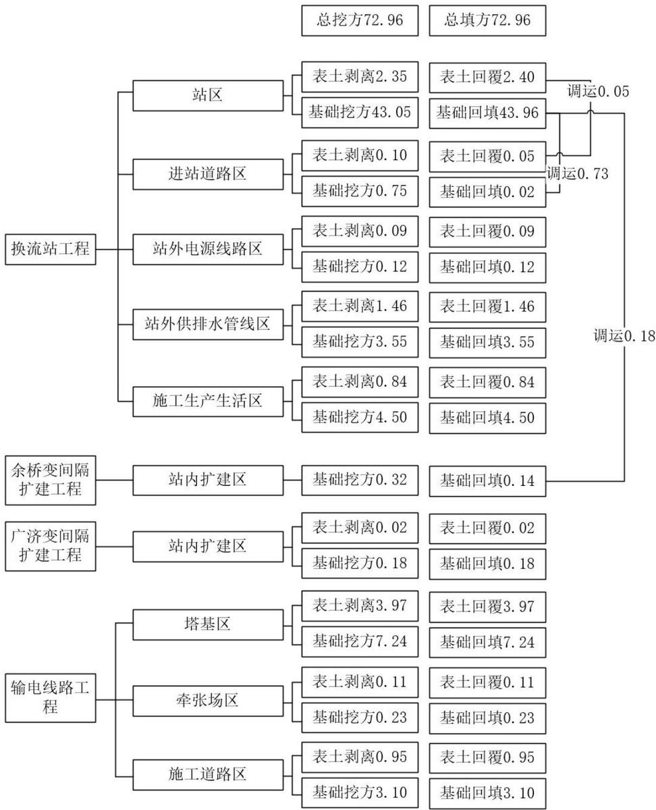

> **Zone C（应用范例层）使用边界**——仅可用于**写作风格、章节展开方式、表达逻辑、表格设计**的参考。
> **不得**用于合规判断；**不得**引入其项目数据（名称／地点／数字／单位名）；
> **不得**因其"曾经通过审批"而推定其做法在当前标准下仍然合规。
> 与 Zone A 冲突时**一律以 Zone A 为准**；Zone A 未明确规定时输出
> 「**Zone A 未明确规定，以下为参考写法，需人工判断**」。
>
> **坐标系警告**：本范例为**老八章结构**（GB 50433—2018 附录B），与 2026 版 10 章模板**同号不同义**
> （老 `1.5`＝防治目标，新 `1.5`＝水土流失预测结果；老 4→新 6 …偏移 +2；新版第 4/5 章老结构无独立章）。
> 因此 **`chapter_mapping: pending`——不得按章节号挂载**，检索一律走 `topic_tags`。
>
> **待加工**：`topic_tags`（主题标签）、`approval_basis_list`（编制依据逐字清单）、
> `structure_summary`（只提取结构：章节展开顺序／段落功能／表格栏目结构／句式模板／论证链步骤）。

1 综合说明 .......  
1.1. 项目简况.  
1.2. 编制依据 .... . 7  
1.3. 设计水平年.... .. 9  
1.4. 水土流失防治责任范围. .. 9  
1.5. 水土流失防治目标..... .... 10  
1.6. 项目水土保持评价结论.... .... 12  
1.7. 水土流失预测结果...... .... 13  
1.8. 水土保持措施布设成果... .... 14  
1.9. 水土保持监测方案...... .... 18  
1.10. 水土保持投资及效益分析成果.... ...18  
1.11. 结论 ..... ... 19  
2 项目概况 ....... ..... 22  
2.1. 项目组成及工程布置.. ..22  
2.2. 施工组织... .... 46  
2.3. 工程占地... .... 57  
2.4. 土石方平衡... ... 61  
2.5. 拆迁（移民）安置及专项设施改（迁）建... ... 64  
2.6. 施工进度 .... .... 66  
2.7. 自然概况 ...... .... 68  
3 项目水土保持评价 .............. ........ 77  
3.1. 主体工程选址（线）水土保持评价... ....77  
3.2. 建设方案与布局水土保持分析评价... ....80  
3.3. 主体工程设计中水土保持措施界定... ....96  
4 水土流失分析与预测 .................. .......98  
4.1. 水土流失现状..... ... 98  
4.2. 水土流失影响因素分析... ... 99  
4.3. 土壤流失量预测 .100  
4.4. 水土流失危害分析... ... 104  
4.5. 指导性意见... .. 105  
5 水土保持措施 ....... .... 107  
5.1. 防治区划分. .. 107  
5.2. 措施总体布局.... ... 107  
5.3. 分区措施布设... .. 113  
5.4. 施工要求... .. 136  
6 水土保持监测.... .... 143  
6.1. 监测范围和时段.... ... 143  
6.2. 监测内容和方法、频次.. ...143  
6.3. 点位布设... ... 151  
6.4. 实施条件和成果... ... 152  
7 水土保持投资估算及效益分析.... ... 154  
7.1. 投资估算... .. 154  
7.2. 效益分析.. .. 169  
8 水土保持管理.... .... 171  
8.1. 组织管理... .. 171  
8.2. 后续设计 .... .. 172  
8.3. 水土保持监测. ... 172  
8.4. 水土保持监理.... ... 173  
8.5. 水土保持施工.. ... 173  
8.6. 水土保持设施验收... ..174

## 1 综合说明

## 1.1. 项目简况

## 1.1.1. 项目基本情况

## （1）项目建设必要性

为推动安徽、湖北两省在资源互补、错峰效益、电力阶段性互济、极端情况下紧急支援、新能源消纳相互促进、提供电力现货交易通道的效益等方面发展，扩大皖鄂两省范围内优化资源配置，实现跨区域电力市场优势整合，促进电力资源高效利用，提高新能源消纳水平的潜力，建设皖鄂背靠背联网工程是必要的。

## （2）项目位置

本工程新建±260kV直流背靠背换流站一座，即松韵换流站，配套建设500kV输电线路 2×127.7km，扩建 500kV 余桥变电站、500kV 广济变电站对应出线间隔。工程位于皖西南、鄂东南交界位置，新建换流站站址位于安徽省安庆市宿松县河塌乡；500kV余桥变电站位于安庆市潜山市黄铺镇槐树村；500kV广济变电站位于湖北省武穴市石佛寺镇张岭上村。配套建设500kV 输电线路起自500kV余桥变电站（以下简称“余桥变”），经松韵换流站，止于500kV 广济变电站（以下简称“广济变”），线路途经安徽省安庆市潜山市、太湖县、宿松县，湖北省黄冈市黄梅县、武穴市，共计 2省2 市5县（市）。

## （3）建设性质

本工程属新建、改扩建类输变电项目。

## （4）规模与等级

皖鄂背靠背联网工程由新建松韵换流站工程、余桥变间隔扩建工程、广济变间隔扩建工程和新建500kV输电线路工程、220kV线路改造工程组成。其中新建松韵换流站工程采用柔性直流背靠背技术，本期换流功率 2×1500MW，包含 2 个柔直背靠背换流单元，采用对称单极接线；余桥变、广济变各扩建出线间隔2个；新建500kV输电线路工程由 2 条 500kV 线路组成，分别为：余桥变\~松韵换流站、松韵换流站\~广济变交流架空线路；对余桥\~茗南双回220kV线路进行改造。500kV新建线路路径总长度127.7km，其中 126.2km 采用同塔双回架设，1.5km 采用两条单回路并行架设，余桥变\~松韵换流站交流架空线路长度为 49.7km，曲折系数 1.19；松韵换流站\~广济变架空线路长度为78.0km，曲折系数1.19；500kV线路途经安徽省安庆市潜山市、太湖县、宿松县、湖北省黄冈市黄梅县、武穴市，其中安徽段 500kV线路长度为 70.7km，湖北段500kV 线路长度为57.0km。220kV线路改造工程采用同塔双回架设，新建220kV线路长度约0.5km，拆除 220kV线路长度约0.4km，均位于安徽省安庆市潜山市。

工程等级属于大型输变电工程。

## （5）项目组成和施工组织

按照分项工程布局，新建松韵换流站工程包括站区、进站道路区、站外供排水管线区、站外电源线路区、站外临时堆土区、施工生产生活区等。余桥变扩建工程包括站内扩建区；广济变扩建工程包括站内扩建区；输电线路工程包括塔基区、牵张场区、跨越施工区、施工道路区等。

## 1）新建松韵换流站工程

松韵换流站站址位于安徽省安庆市宿松县河塌乡。本期建设背靠背换流站一座，共包含两个柔性直流背靠背单元，采用对称单级接线，每个背靠背换流单元包括2组VSC换流阀，直流侧电压为±260kV，额定电流 2885A，额定直流功率 1500MW，总功率3000MW。换流站本期500kV交流出线4回，至余桥2回，广济2回。

换流站站址区域属于丘陵地貌，站址自然标高 30m\~60m，自然高差 30m。站址的竖向设计以土方平衡为原则，采用平坡式布置方案，设置 0.5%的排水坡度，站区场平标高为51.10m。站区围墙范围内场地高挖低填后整平，站外边坡采用拱形骨架+正六边形空心植草预制块护坡（以下简称“生态护坡”）防护，最大挖方边坡15m，位于站区东北侧，最大填方边坡16m，位于站区西北侧。站外沿挖方边坡坡顶设置截水沟，长度290m，沿挖方、填方边坡坡脚布设设置排水沟，总长度 2420m，截水沟收集雨水后通过护坡排水槽排至排水沟，排水沟汇集站区围墙外护坡坡面雨水，雨水汇集后分散排至站外水塘，排水出口处设置八字式散水。进站道路由站区东侧乡村道路引接，长度约152m，采用沥青混凝土路面，路面宽度6.0m，道路两侧各设置0.5m宽路肩，边坡采用生态护坡防护，挖方边坡最大坡高 7.15m，填方边坡最大坡高 2.10m，道路两侧布设混凝土排水沟，排水沟主要汇集路面雨水，雨水经排水沟汇集后排入南侧水塘，排水出口处设置八字式散水。站区供水采用自来水供水方案，供水水源为宿松县第三自来水厂，引接方案为从河塌乡自来水DN600 主干管上分接一根DN300 支管，通过加压泵站提升后，送水至换流站内，引接管道长度1400m。站区排水为雨污分流制排水，站区内雨水通过雨水管网汇集，再由站外雨水管排至站区南侧及西侧水塘，站外雨水管采用DN1000钢筋混凝土管，长度 300m。污水分为生活污水、事故排油、生产废水，其中生活污水经站内生化处理后，回用于站区植被浇洒及道路冲洗用水，富余部分经与生产废水一同排至市政污水管网，最终排入宿松县城城北污水处理厂；事故油通过油泵抽取回用不外排；生产废水通过站外排污管道排入宿松县泓源污水处理厂，站外新建排污管道共计18000m。站用电系统采用 3回独立电源供电，其中2回工作电源由站内引接，1回为备用电源由站外引接，站内的两路电源分别来自安徽侧和湖北侧设置的500/10kV降压变，备用电源从松兹110kV变电站35kV侧引接，引接长度10.9km，其中单回架空线路长度约10.1km，电缆线路长度约0.8km。施工通讯采取无线电通讯方式。施工生产生活区布置在站外东侧、北侧空地，站外临时堆土区布置在站区东北侧，用于堆放站区及施工生产生活区剥离表土。

经统计，新建松韵换流站工程总占地面积37.08hm2，其中永久占地14.01hm2，临时占地 23.07hm2。永久占地包括站区永久占地13.42hm2，进站道路永久占地0.48hm2，站用电源线路塔基永久占地0.11hm2。临时占地包括站外供排水管线区施工扰动临时占地15.81hm2，站用电源线路区施工扰动临时占地 1.93hm2，施工生产生活区施工扰动临时占地 4.73hm2，站外临时堆土区临时占地0.60hm2。

## 2）余桥变扩建工程

500kV余桥变电站位于安庆市潜山市黄铺镇槐树村附近，属于已建变电站，建设名称为“500kV安庆三变电站”，运行名称为“500kV余桥变电站”，前期工程已编制水土保持方案并开展了水土保持设施验收，方案批复文号为皖水保函〔2015〕1541号，水土保持设施验收回执文号为验收回执〔2020〕30号。本期扩建余桥变至松韵换流站500kV出线间隔2个，前期工程已对变电站站区进行了总体规划，对主体设备及其相应的辅助生产设施和主、辅生产建构筑物进行设计并预留了建设区域。在前期建设基础上，本期扩建内容为扩建2个500kV出线间隔，扩建2组低压电抗器设备，在原围墙内扩建，不需额外征地，扩建位置位于站区500kV 配电装置区，向东出线。施工生产区灵活布置在站内扩建区域空地，不新征用地，生活区租用变电站周边民房，扩建工程扰动面积0.20hm2。

## 3）广济变扩建工程

500kV广济变电站位于黄冈市武穴市石佛寺镇张岭上村，属于已建变电站，建设名称为“500kV武穴变电站”，运行名称为“500kV广济变电站”，前期工程已编制水土保持方案并开展了水土保持设施验收，方案批复文号为鄂水许可〔2014〕197 号，方案变更文号为鄂水许可函〔2018〕31 号，水土保持设施验收回执文号为〔2020〕17 号。本期扩建广济变至松韵换流站500kV出线间隔2个，前期工程已对变电站站区进行了总体规划，对主体设备及其相应的辅助生产设施和主、辅生产建构筑物进行设计并预留了建设区域。在前期建设基础上，本期扩建内容为扩建2个500kV 出线间隔，扩建3组低压无功设备等，在原围墙内扩建，不需额外征地，扩建位置位于站区 500kV配电装置区。施工生产区灵活布置在站内，不新征用地，生活区租用变电站周边民房，扩建工程扰动面积 0.15hm2。

## 4）输电线路工程

500kV 线路工程起自 500kV 余桥变电站，经松韵换流站，至 500kV 广济变电站，途经安徽省安庆市潜山市、太湖县、宿松县，湖北省黄冈市黄梅县、武穴市。共计2个省级行政区，2个地级行政区，5个县（区）级行政区，线路全长127.7km，其中安徽省境内 70.7km，湖北省境内57.0km，全线共架设500kV铁塔351基（其中直线塔 200 基，耐张塔151基）。500kV线路工程沿线布设牵张场35处，跨越施工场地41 处，新修施工道路 41.01km、拓宽道路 25.62km，钢板铺设 6.60km。

220kV线路改造工程位于安徽省安庆市潜山市，新建线路 0.5km，新建杆塔 2基，拆除线路0.4km，拆除杆塔 1基。220kV线路工程沿线不单独涉及布置牵张场、跨越场以及施工道路。

## （6）拆迁（移民）数量及安置方式

本工程建设沿线因无法避让部分居民建筑物，需要进行拆除，拆迁执行国家、地方有关拆迁安置政策，由建设单位按当地补偿标准给予相应的现金补偿（在主体中计列），具体安置工作由工程沿线当地政府统一负责。根据主体工程设计资料统计，拆迁建筑面积共计 3750m2。

## （7）专项设施改（迁）建

对220kV余桥\~茗南双线进行改造，改造工程位于安徽省安庆市潜山市，新建线路长度约 0.5km，新建双回耐张塔 2 基，拆除线路长度约 0.4km，拆除双回直线塔 1 基。此部分水土流失防治责任范围纳入输电线路工程塔基区。

## （8）开工与完工时间

本工程计划2026年1月开工，2027年12月完工，总工期24 个月。

## （9）总投资与土建投资

由国家电网有限公司出资建设，工程动态投资 45.80 亿元，其中土建投资 13.74 亿元。

## （10）工程占地面积

本工程项目区总占地面积为 137.74hm2，其中永久占地 30.79hm2，临时占地106.95hm2。

## （11）工程土石方挖填量

本工程挖填土石方总量为145.92 万m3，总挖方72.96万m3（其中表土剥离9.89万m3），总填方 72.96 万m3（其中表土回覆 9.89万 m3），无借方，无余方。

## （12）取土场和弃渣场数量

本工程不设置取土场和弃渣场。

## 1.1.2. 项目前期工作进展情况

受国家电网有限公司委托，本工程可研设计由国网经济技术研究院有限公司牵头，中国能源建设集团安徽省电力设计研究院有限公司（以下简称“安徽院”）、中国电力工程顾问集团中南电力设计院有限公司（以下简称“中南院”）共同承担完成。

各设计单位于 2025 年 6 月完成了本工程的可行性研究工作。电力规划设计总院于2025 年6月17\~18 日在北京市召开了本工程可行性研究报告评审会议，于2025年6月27日在北京市召开了本工程可行性研究收口报告评审会议，并于2025年7月23日以《关于报送皖鄂背靠背联网工程可行性研究报告评审意见的报告》（电规电网〔2025〕1509号）印发了本工程可行性研究报告评审意见。

根据国家电网有限公司发布的中标通知，中南院于 2025 年 4 月被确定为本工程水土保持方案编制中标单位。接受工作任务后，编制单位成立了水土保持专题项目组，对工程设计资料进行全面分析研究，并进行了现场勘察，对新建换流站、变电站站内扩建区域及输电线路沿线的自然环境、生态环境、水土流失及水土保持现状进行了调查，同时征求了地方水行政主管部门的意见，收集了项目建设区所在地的相关水土保持现状和规划资料，在水土流失预测的基础上，制定了本工程的水土流失防治措施、水土保持方案设计以及投资估算，编制完成了《皖鄂背靠背联网工程水土保持方案报告书》。

## 1.1.3. 自然简况

松韵换流站站址区域地貌呈现丘陵、岗地与岗间洼地相间分布的特征，整体地形呈两侧高、中间低的马鞍状，地面高程在 30\~60m 之间，地形起伏不大；500kV余桥变电站站址区域地貌属江淮丘陵，微地貌为丘陵、岗地以及岗间洼地（冲沟）；500kV广济变电站站址区域地貌属丘陵，地形呈北部高而东南部低，自北向东南倾斜；输电线路工程地面高程在 100m\~150m，宏观地貌主要为沿江丘陵地貌单元，微地貌分以岗地为主（含岗间洼地），地形稍有起伏。

本工程项目区属亚热带湿润季风气候，夏季炎热，梅雨明显，秋高气爽，冬季较暖，气候温和湿润。本工程沿线安徽省境内雨季为每年的5 月～9月，湖北省境内雨季为每年的 4月\~9月。

项目区涉及长江流域，安徽省线路跨越的河流有黑河、牌楼河、汊河、粮川闸中干渠、光明河、香山河、黑洋河、泗水港河、花凉亭总干渠、太宿干渠、太怀干渠、长河、凉亭河、南河、钓鱼台干渠、车马河、墨烟支渠、二郎河、新耕河、吴岭支渠等；湖北省境内跨越的河流有考田河、小溪河、袁山河、东河、花桥西河、花桥东河、雨场山港、团山河水库等。

工程沿线安徽省境内以红壤、黄棕壤、棕壤、水稻土等为主；湖北省境内土壤类型以红壤、黄棕壤、水稻土等为主。

根据中国植被类型图，项目涉及的安徽省以亚热带常绿阔叶为主；湖北省以亚热带常绿阔叶林为主。工程沿线林草覆盖率约为 51.9%～54.7%。

根据全国水土保持区划成果，项目位于南方红壤区，项目区沿线容许土壤流失量为500t/(km2·a)。项目区以水力侵蚀为主，侵蚀模数背景值为 398.6\~598.9t/(km2·a)。

本工程涉及县（市）级行政区5个，分别为潜山市、太湖县、宿松县、黄梅县、武穴市。根据《水利部办公厅关于做好国家级水土流失重点预防区和重点治理区落地上图成果应用的通知》（办水保〔2025〕170号）、《安徽省水土保持规划（2016-2030 年）》、《安庆市水土保持规划（2018-2030 年）》、《湖北省水土保持规划（2016-2030 年）》、《黄冈市水土保持规划（2016-2030 年）》、《武穴市水土保持规划（2016-2030 年）》，本工程安徽段不涉及国家级、省级、市（县）级水土流失重点预防区、治理区，湖北段黄梅县、武穴市涉及黄冈市大别山山地水土流失重点预防区、武穴市水土流失重点预防区。

本工程线路路径涉及穿越河塌乡凉亭河水源地二级保护区，穿越长度约0.55km，在保护区内立塔1 基；不涉及穿（跨）越森林公园、湿地公园、重要生境、水产种质资源保护区、生态保护红线等水土保持敏感区。

## 1.2. 编制依据

## 1.2.1. 法律法规

（1）《中华人民共和国水土保持法》（主席令第 39号，1991年 6 月29 日颁布，2010 年 12 月 25 日修订，2011 年 3 月 1 日实施）；

（2）《中华人民共和国长江保护法》（2020年12 月26日第十三届全国人民代表大会常务委员会第二十四次会议通过，2021年3月1 日起施行）；

（3）《中华人民共和国防洪法》（全国人民代表大会常务委员会，1998年 1 月 1日施行）；

（4）《中华人民共和国河道管理条例》（国务院令第3号，1988 年6月10日施行2011年1 月8日第一次修正，2017年3月1日第二次修正，2017年10月7 日《国务院关于修改部分行政法规的决定》第三次修正）；

（5）《安徽省实施<中华人民共和国水土保持法>办法》（1995年11月18日安徽省第八届人民代表大会常务委员会第二十次会议通过，2014年11月20日第15次修订，2015 年1月1日起施行）；

（6）《湖北省实施<中华人民共和国水土保持法>办法》（2015年11月26日湖北省第十二届人民代表大会常务委员会第 18次会议通过，2016年2 月1日起施行）。

## 1.2.2. 部委规章、规范性文件

（1）《生产建设项目水土保持方案管理办法》（2023 年 1 月 17 日水利部令第 53号发布）；

（2）《水利部办公厅关于印发<生产建设项目水土保持设施自主验收规程（试行）>的通知》（办水保〔2018〕133号）；

（3）《水利部办公厅关于印发<生产建设项目水土保持技术文件编写和印制格式规定（试行）>的通知》（办水保〔2018〕135号）；

（4）《水利部关于进一步深化“放管服”改革全面加强水土保持监管的意见》（水保〔2019〕160 号）；

（5）《水利部办公厅关于印发生产建设项目水土保持监督管理办法的通知》（办水保〔2019〕172 号）；

（6）《水利部办公厅关于实施生产建设项目水土保持信用监管“两单”制度的通知》（办水保〔2020〕157 号）；

（7）《自然资源部关于规范临时用地管理的通知》（自然资规〔2021〕2号）；

（8）《水利部水土保持司关于进一步加强生产建设项目水土保持方案质量管理的通知》（水保监督函〔2022〕21号）；

（9）《水利部办公厅关于印发生产建设项目水土保持方案审查要点的通知》（办水保〔2023〕177 号）；

（10）《水利部办公厅关于进一步加强部批项目水土保持监管工作的通知》（办水保〔2024〕57 号）；

（11）《水利部办公厅关于做好国家级水土流失重点预防区和重点治理区落地上图成果应用的通知》（办水保〔2025〕170号）。

## 1.2.3. 技术标准

（1）《生产建设项目水土保持技术标准》（GB50433-2018）；

（2）《生产建设项目水土流失防治标准》（GB/T50434-2018）；

（3）《水土保持工程调查与勘测标准》（GB/T51297-2018）；

（4）《水土保持工程设计规范》（GB51018-2014）；

（5）《水土保持综合治理验收规范》（GB/T15773-2008）

（6）《生产建设项目水土保持监测与评价标准》（GB/T51240-2018）；

（7）《生产建设项目土壤流失量测算导则》（SL773-2018）；

（8）《土壤侵蚀分类分级标准》（SL190-2007）；

（9）《水利水电工程制图标准水土保持图》（SL73.6-2015）；

（10）《输变电项目水土保持技术规范》（SL640-2013）；

（11）《特高压输变电工程水土保持方案内容深度规定》（DL/T5530-2017）；

（12）《土地利用现状分类》（GB/T21010-2017）；

（13）《防洪标准》（GB/T50201-2014）；

（14）《水土保持监测技术规范》（SL/T277-2024）;

（15）《表土剥离及其再利用技术要求》（GB/T45107-2024）;

（16）《水土保持监理规范》（SL/T523-2024）；

（17）《建筑边坡工程技术规范》（GB 50330-2013）；

（18）《水土保持工程质量验收与评价规范》（SL/T336-2025）。

## 1.2.4. 技术资料

（1）《皖鄂直流背靠背电力灵活互济工程可行性研究报告》，主要包括：第一卷总报告，第四卷换流站工程，第五卷线路工程，第六卷投资估算以及第七卷专题研究报告；

（2）《全国水土保持规划（2015-2030 年）》；

（3）《安徽省水土保持规划（2016-2030 年）》；

（4）《湖北省水土保持规划（2016-2030 年）》；

（5）《安庆市水土保持规划（2018-2030 年）》；

（6）《黄冈市水土保持规划（2016-2030 年）》；

（7）《武穴市水土保持规划（2016-2030 年）》。

## 1.3. 设计水平年

本工程计划2026 年1月开工，2027年12 月建成投运，总工期 24个月。根据《生产建设项目水土保持技术标准》（GB50433-2018）有关规定，水土保持方案设计水平年应为主体工程完工水土保持措施实施及发挥效益的当年或后一年，根据本工程工期安排结合项目所在地实际情况，本方案设计水平年确定为工程完工后一年，即为2028年。

## 1.4. 水土流失防治责任范围

本工程水土流失防治责任范围面积共 137.74hm2，其中永久占地面积 $3 0 . 7 9 \mathrm { h m } ^ { 2 }$ ，临时占地面积106.95hm2，按行政区统计安徽省97.97hm2、湖北省 $4 0 . 4 1 \mathrm { h m } ^ { 2 } ; \quad$ ，详见表 1.4-1、1.4-2。

表1.4-1 本工程按行政区划分水土流失防治责任范围表 单位：hm2
<table><tr><td colspan="4" rowspan="1">项目分区</td><td colspan="1" rowspan="1">永久占地</td><td colspan="1" rowspan="1">临时占地</td><td colspan="1" rowspan="1">小计</td><td colspan="1" rowspan="1">防治责任范围</td></tr><tr><td colspan="1" rowspan="12">安徽省安庆市</td><td colspan="1" rowspan="11">宿松县</td><td colspan="1" rowspan="6">换流站工程</td><td colspan="1" rowspan="1">站区</td><td colspan="1" rowspan="1">13.42</td><td colspan="1" rowspan="1"></td><td colspan="1" rowspan="1">13.42</td><td colspan="1" rowspan="1">13.42</td></tr><tr><td colspan="1" rowspan="1">进站道路区</td><td colspan="1" rowspan="1">0.48</td><td colspan="1" rowspan="1"></td><td colspan="1" rowspan="1">0.48</td><td colspan="1" rowspan="1">0.48</td></tr><tr><td colspan="1" rowspan="1">站外供排水管线区</td><td colspan="1" rowspan="1"></td><td colspan="1" rowspan="1">15.81</td><td colspan="1" rowspan="1">15.81</td><td colspan="1" rowspan="1">15.81</td></tr><tr><td colspan="1" rowspan="1">站外电源线路区</td><td colspan="1" rowspan="1">0.11</td><td colspan="1" rowspan="1">1.93</td><td colspan="1" rowspan="1">2.04</td><td colspan="1" rowspan="1">2.04</td></tr><tr><td colspan="1" rowspan="1">站外临时堆土区</td><td colspan="1" rowspan="1"></td><td colspan="1" rowspan="1">0.60</td><td colspan="1" rowspan="1">0.60</td><td colspan="1" rowspan="1">0.60</td></tr><tr><td colspan="1" rowspan="1">施工生产生活区</td><td colspan="1" rowspan="1"></td><td colspan="1" rowspan="1">4.73</td><td colspan="1" rowspan="1">4.73</td><td colspan="1" rowspan="1">4.73</td></tr><tr><td colspan="1" rowspan="4">输电线路工程</td><td colspan="1" rowspan="1">塔基区</td><td colspan="1" rowspan="1">3.94</td><td colspan="1" rowspan="1">13.21</td><td colspan="1" rowspan="1">17.15</td><td colspan="1" rowspan="1">17.15</td></tr><tr><td colspan="1" rowspan="1">牵张场区</td><td colspan="1" rowspan="1"></td><td colspan="1" rowspan="1">0.84</td><td colspan="1" rowspan="1">0.84</td><td colspan="1" rowspan="1">0.84</td></tr><tr><td colspan="1" rowspan="1">跨越施工区</td><td colspan="1" rowspan="1"></td><td colspan="1" rowspan="1">0.44</td><td colspan="1" rowspan="1">0.44</td><td colspan="1" rowspan="1">0.44</td></tr><tr><td colspan="1" rowspan="1">施工道路区</td><td colspan="1" rowspan="1"></td><td colspan="1" rowspan="1">5.52</td><td colspan="1" rowspan="1">5.52</td><td colspan="1" rowspan="1">5.52</td></tr><tr><td colspan="2" rowspan="1">小计</td><td colspan="1" rowspan="1">17.95</td><td colspan="1" rowspan="1">43.08</td><td colspan="1" rowspan="1">61.03</td><td colspan="1" rowspan="1">61.03</td></tr><tr><td colspan="1" rowspan="1">潜山市</td><td colspan="1" rowspan="1">余桥变间隔扩建工程</td><td colspan="1" rowspan="1">站内扩建区</td><td colspan="1" rowspan="1">0.20</td><td colspan="1" rowspan="1"></td><td colspan="1" rowspan="1">0.20</td><td colspan="1" rowspan="1">0.20</td></tr><tr><td colspan="1" rowspan="11"></td><td colspan="1" rowspan="5"></td><td colspan="1" rowspan="4">输电线路工程</td><td colspan="1" rowspan="1">塔基区</td><td colspan="1" rowspan="1">1.48</td><td colspan="1" rowspan="1">4.96</td><td colspan="1" rowspan="1">6.44</td><td colspan="1" rowspan="1">6.44</td></tr><tr><td colspan="1" rowspan="1">牵张场区</td><td colspan="1" rowspan="1"></td><td colspan="1" rowspan="1">0.48</td><td colspan="1" rowspan="1">0.48</td><td colspan="1" rowspan="1">0.48</td></tr><tr><td colspan="1" rowspan="1">跨越施工区</td><td colspan="1" rowspan="1"></td><td colspan="1" rowspan="1">0.16</td><td colspan="1" rowspan="1">0.16</td><td colspan="1" rowspan="1">0.16</td></tr><tr><td colspan="1" rowspan="1">施工道路区</td><td colspan="1" rowspan="1"></td><td colspan="1" rowspan="1">2.07</td><td colspan="1" rowspan="1">2.07</td><td colspan="1" rowspan="1">2.07</td></tr><tr><td colspan="2" rowspan="1">小计</td><td colspan="1" rowspan="1">1.68</td><td colspan="1" rowspan="1">7.67</td><td colspan="1" rowspan="1">9.35</td><td colspan="1" rowspan="1">9.35</td></tr><tr><td colspan="1" rowspan="5">太湖县</td><td colspan="1" rowspan="4">输电线路工程</td><td colspan="1" rowspan="1">塔基区</td><td colspan="1" rowspan="1">4.44</td><td colspan="1" rowspan="1">14.86</td><td colspan="1" rowspan="1">19.30</td><td colspan="1" rowspan="1">19.30</td></tr><tr><td colspan="1" rowspan="1">牵张场区</td><td colspan="1" rowspan="1"></td><td colspan="1" rowspan="1">0.96</td><td colspan="1" rowspan="1">0.96</td><td colspan="1" rowspan="1">0.96</td></tr><tr><td colspan="1" rowspan="1">跨越施工区</td><td colspan="1" rowspan="1"></td><td colspan="1" rowspan="1">0.48</td><td colspan="1" rowspan="1">0.48</td><td colspan="1" rowspan="1">0.48</td></tr><tr><td colspan="1" rowspan="1">施工道路区</td><td colspan="1" rowspan="1"></td><td colspan="1" rowspan="1">6.21</td><td colspan="1" rowspan="1">6.21</td><td colspan="1" rowspan="1">6.21</td></tr><tr><td colspan="2" rowspan="1">小计</td><td colspan="1" rowspan="1">4.44</td><td colspan="1" rowspan="1">22.51</td><td colspan="1" rowspan="1">26.95</td><td colspan="1" rowspan="1">26.95</td></tr><tr><td colspan="1" rowspan="1"></td><td colspan="2" rowspan="1">合计</td><td colspan="1" rowspan="1">24.07</td><td colspan="1" rowspan="1">73.26</td><td colspan="1" rowspan="1">97.33</td><td colspan="1" rowspan="1">97.33</td></tr><tr><td colspan="1" rowspan="12">湖北省黃冈市</td><td colspan="1" rowspan="5">黄梅县</td><td colspan="1" rowspan="4">输电线路工程</td><td colspan="1" rowspan="1">塔基区</td><td colspan="1" rowspan="1">3.61</td><td colspan="1" rowspan="1">12.11</td><td colspan="1" rowspan="1">15.72</td><td colspan="1" rowspan="1">15.72</td></tr><tr><td colspan="1" rowspan="1">牵张场区</td><td colspan="1" rowspan="1"></td><td colspan="1" rowspan="1">1.08</td><td colspan="1" rowspan="1">1.08</td><td colspan="1" rowspan="1">1.08</td></tr><tr><td colspan="1" rowspan="1">跨越施工区</td><td colspan="1" rowspan="1"></td><td colspan="1" rowspan="1">0.32</td><td colspan="1" rowspan="1">0.32</td><td colspan="1" rowspan="1">0.32</td></tr><tr><td colspan="1" rowspan="1">施工道路区</td><td colspan="1" rowspan="1"></td><td colspan="1" rowspan="1">5.06</td><td colspan="1" rowspan="1">5.06</td><td colspan="1" rowspan="1">5.06</td></tr><tr><td colspan="2" rowspan="1">小计</td><td colspan="1" rowspan="1">3.61</td><td colspan="1" rowspan="1">18.57</td><td colspan="1" rowspan="1">22.18</td><td colspan="1" rowspan="1">22.18</td></tr><tr><td colspan="1" rowspan="6">武穴市</td><td colspan="1" rowspan="1">广济变间隔扩建工程</td><td colspan="1" rowspan="1">站内扩建区</td><td colspan="1" rowspan="1">0.15</td><td colspan="1" rowspan="1"></td><td colspan="1" rowspan="1">0.15</td><td colspan="1" rowspan="1">0.15</td></tr><tr><td colspan="1" rowspan="4">输电线路工程</td><td colspan="1" rowspan="1">塔基区</td><td colspan="1" rowspan="1">2.96</td><td colspan="1" rowspan="1">9.91</td><td colspan="1" rowspan="1">12.87</td><td colspan="1" rowspan="1">12.87</td></tr><tr><td colspan="1" rowspan="1">牵张场区</td><td colspan="1" rowspan="1"></td><td colspan="1" rowspan="1">0.84</td><td colspan="1" rowspan="1">0.84</td><td colspan="1" rowspan="1">0.84</td></tr><tr><td colspan="1" rowspan="1">跨越施工区</td><td colspan="1" rowspan="1"></td><td colspan="1" rowspan="1">0.24</td><td colspan="1" rowspan="1">0.24</td><td colspan="1" rowspan="1">0.24</td></tr><tr><td colspan="1" rowspan="1">施工道路区</td><td colspan="1" rowspan="1"></td><td colspan="1" rowspan="1">4.13</td><td colspan="1" rowspan="1">4.13</td><td colspan="1" rowspan="1">4.13</td></tr><tr><td colspan="2" rowspan="1">小计</td><td colspan="1" rowspan="1">3.11</td><td colspan="1" rowspan="1">15.12</td><td colspan="1" rowspan="1">18.23</td><td colspan="1" rowspan="1">18.23</td></tr><tr><td colspan="3" rowspan="1">合计</td><td colspan="1" rowspan="1">6.72</td><td colspan="1" rowspan="1">33.69</td><td colspan="1" rowspan="1">40.41</td><td colspan="1" rowspan="1">40.41</td></tr><tr><td colspan="4" rowspan="1">总计</td><td colspan="1" rowspan="1">30.79</td><td colspan="1" rowspan="1">106.95</td><td colspan="1" rowspan="1">137.74</td><td colspan="1" rowspan="1">137.74</td></tr></table>

## 1.5. 水土流失防治目标

## 1.5.1. 执行标准等级

本工程涉及2个市（县）级水土流失重点防治区：黄冈市大别山山地水土流失重点预防区、武穴市水土流失重点预防区；1个水土保持敏感区：河塌乡凉亭河水源地二级保护区（穿越长度约0.55km），在保护区内立塔 1基。此外，本工程线路避让了1处生态保护红线，不涉及其他森林公园、湿地公园、重要生境、水产种质资源保护区等水土保持敏感区。

综上所述，根据《生产建设项目水土流失防治标准》（GB/T50434-2018）的规定，本工程涉及水土保持敏感区的区域执行南方红壤区一级标准，其他区域执行南方红壤区二级标准。详见表1.5-1。

表1.5-1 本工程执行水土流失防治标准等级表

<table><tr><td rowspan=1 colspan=1>省</td><td rowspan=1 colspan=1>市</td><td rowspan=1 colspan=1>县</td><td rowspan=1 colspan=1>国家级“两区”</td><td rowspan=1 colspan=1>省级“两区”</td><td rowspan=1 colspan=1>市、县级“两区”</td><td rowspan=1 colspan=1>重要水土保持敏感区域</td><td rowspan=1 colspan=1>执行标准</td></tr><tr><td rowspan=3 colspan=1>安徽省安</td><td rowspan=3 colspan=1>庆市</td><td rowspan=1 colspan=1>潜山市</td><td rowspan=5 colspan=1>1</td><td rowspan=5 colspan=1>/</td><td rowspan=1 colspan=1>1</td><td rowspan=1 colspan=1>1</td><td rowspan=2 colspan=1>南方红壤区二级标准</td></tr><tr><td rowspan=1 colspan=1>太湖县</td><td rowspan=1 colspan=1>1</td><td rowspan=1 colspan=1>1</td></tr><tr><td rowspan=1 colspan=1>宿松县</td><td rowspan=1 colspan=1>1</td><td rowspan=1 colspan=1>穿越河塌乡凉亭河水源地二级保护区</td><td rowspan=3 colspan=1>南方红壤区一级标准</td></tr><tr><td rowspan=2 colspan=1>湖北省黄</td><td rowspan=2 colspan=1>冈市</td><td rowspan=1 colspan=1>黄梅县</td><td rowspan=1 colspan=1>黄冈市大别山山地水土流失重点预防区</td><td rowspan=1 colspan=1>/</td></tr><tr><td rowspan=1 colspan=1>武穴市</td><td rowspan=1 colspan=1>黄冈市大别山山地水土流失重点预防区、武穴市水土流失重点预防区</td><td rowspan=1 colspan=1>/</td></tr></table>

## 1.5.2. 防治目标

根据《生产建设项目水土流失防治标准》（GB/T50434-2018）的有关要求，本项目水土流失防治目标为：

1）项目建设范围内的新增水土流失应得到有效控制，原有水土流失得到治理；

2）水土保持设施应安全有效；

3）水土资源、林草植被应得到最大限度地保护与恢复；

4）水土流失治理度、土壤流失控制比、渣土防护率、表土保护率、林草植被恢复率、林草覆盖率等指标应符合现行国家标准《生产建设项目水土流失防治标准》（GB/T50434-2018）的规定。

本工程指标值结合侵蚀强度、是否涉及水土保持敏感区等因素进行调整。区域内涉及水土保持敏感区的，执行一级标准，林草覆盖率提高2个百分点；沿线水土流失均以轻度侵蚀为主，土壤流失控制比调高至1.0。其它指标值无需进行调整。

本方案按沿线各省市县加权确定设计水平年综合防治目标值，具体为：水土流失治理度 97.1%，土壤流失控制比1.0，渣土防护率96.4%，表土保护率 90.5%，林草植被恢复率 97.1%，林草覆盖率 25.5%。

本工程水土流失防治目标见表1.5-2。

表 1.5-2 本工程水土流失防治标准等级表
<table><tr><td colspan="1" rowspan="2">防治标准</td><td colspan="1" rowspan="2">防治指标</td><td colspan="2" rowspan="1">方案确定目标值</td></tr><tr><td colspan="1" rowspan="1">施工期</td><td colspan="1" rowspan="1">设计水平年</td></tr><tr><td colspan="1" rowspan="4">综合防治目标值</td><td colspan="1" rowspan="1">水土流失治理度（%）</td><td colspan="1" rowspan="1"></td><td colspan="1" rowspan="1">97.1</td></tr><tr><td colspan="1" rowspan="1">土壤流失控制比</td><td colspan="1" rowspan="1"></td><td colspan="1" rowspan="1">1.0</td></tr><tr><td colspan="1" rowspan="1">渣土防护率（%）</td><td colspan="1" rowspan="1">93.5</td><td colspan="1" rowspan="1">96.4</td></tr><tr><td colspan="1" rowspan="1">表土保护率（%）</td><td colspan="1" rowspan="1">90.5</td><td colspan="1" rowspan="1">90.5</td></tr><tr><td colspan="1" rowspan="2"></td><td colspan="1" rowspan="1">林草植被恢复率（%）</td><td colspan="1" rowspan="1"></td><td colspan="1" rowspan="1">97.1</td></tr><tr><td colspan="1" rowspan="1">林草覆盖率（%）</td><td colspan="1" rowspan="1"></td><td colspan="1" rowspan="1">25.5</td></tr></table>

## 1.6. 项目水土保持评价结论

## 1.6.1. 主体工程选址（线）评价

通过与《中华人民共和国水土保持法》、《中华人民共和国长江保护法》、《安徽省实施《中华人民共和国水土保持法》办法》、《湖北省实施《中华人民共和国水土保持法》办法》以及《生产建设项目水土保持技术标准》（GB50433-2018）相关规定进行相符性分析，主体工程选址（线）未涉及崩塌和滑坡危险区、易引起严重水土流失和生态恶化地区，不涉及河流两岸、湖泊和水库周边的植物保护带，不占用全国水土保持监测网络中的水土保持监测站点、重点试验区及国家确定的水土保持长期定位观测站。通过治理，可以达到较好的环境、经济、社会和减灾效益。对于无法避让的水土流失重点预防区，主体设计建设方案已按《生产建设项目水土保持技术标准》（GB50433-2018）中的 3.2.2 的第 4 条规定优化了建设方案，提高了工程设计等级及林草覆盖率标准等，符合相关规定。

本工程在线路优化的基础上避让了 1处生态保护红线，但仍涉及穿越1 处水源地二级保护区，穿越长度约 0.55km，在保护区内立塔1 基。主体设计已考虑无害化穿（跨）越方式，并采取相应的生态保护和恢复措施。此外，本工程不涉及穿（跨）越自然遗产地、风景名胜区、水产种质资源保护区、一级保护林地、森林自然公园等水土保持敏感区，项目建设应符合相关规定的要求，建设单位在工程开工前取得相关部门同意文件，按照相关规定施工。主体工程选（址）线存在制约性因素，本方案通过提高防洪标准、截排水工程标准及林草覆盖率标准等，加强预防保护，优化施工工艺，尽量减少地表扰动和植被损坏范围，同时采取科学可行的水土流失防治措施，可满足水土保持要求，工程建设可行。

## 1.6.2. 建设方案与布局评价

本工程建设方案充分考虑资源节约和环境友好因素，换流站布置紧凑，尽量减少占地面积，竖向标高充分考虑地形条件，减少土石方工程量。变电站间隔扩建工程合理利用扩建区域内空地，减少施工扰动面积。输电线路减少土石方开挖，并采用无人机放线等先进施工架线工艺，减少扰动破坏，施工道路尽量充分利用现有道路，尽量减少地表扰动和植被破坏，对无法避让水土流失重点预防区、重点治理区及其他水土保持敏感区，建设方案落实主体工程设计要求和本方案补充相应水土流失防治要求后，满足水土保持

要求。

本工程占地类型以耕地、林地为主。主体设计考虑的换流站、变电站间隔扩建工程、输电线路永久占地符合工程实际建设需要，不存在多占用土地的情况，临时占地完全满足施工阶段各项目建设区的施工用地需要，不存在多占情况。换流站占地以永久占地为主，占地相对集中，工程建成后四周有围墙防护，站内可绿化区域进行绿化，其余部分基本硬化，对四周的生态环境影响很小；线路工程以临时占地为主，占地较为分散，不存在集中大量占用土地的情况，对生态环境的影响仅限于施工期，并且影响较小。

本工程挖、填方优先考虑就地平衡，余桥变间隔扩建工程余方调运至换流站工程综合利用，土方调运合理，临时堆土防护及表土剥离、利用方案经方案补充后能够满足水土保持要求。

根据主体工程特点，本工程施工方案以尽量减少扰动面积、尽量减少拆迁为原则。施工时合理安排工序，采用机械和人工配合进行，工程基础开挖、放线、牵张、架线等过程中都将采用有利于水土保持的施工工艺，符合水土保持要求。

换流站工程主体设计了边坡排水沟、站区绿化、雨水管、生态护坡等措施，进站道路边坡排水沟、生态护坡等措施，施工生产生活区混凝土排水沟、植草护坡等措施，站外临时堆土区混凝土排水沟等措施；余桥变间隔扩建工程施工扰动原地貌为碎石压盖，根据恢复用地原有功能原则，设置了碎石铺设；广济变间隔扩建工程原地貌为碎石压盖、植草地坪，根据恢复用地原有功能原则，设置了碎石铺设、植草地坪；500kV线路工程塔基区根据实际需要设置了浆砌石排水沟、泥浆沉淀池等措施，对施工道路进行了钢板铺设，以上措施具有水土保持功能，纳入水保措施体系，同时本方案完善补充施工前的表土剥离措施，施工期间及施工结束后各防治分区的表土回覆、耕地恢复、园地恢复、土地整治（植被恢复）、临时挡护、苫盖、铺垫、临时排水等措施，可进一步减少施工中产生的水土流失。

通过从水土保持角度对主体工程选址（线）、建设方案、工程占地、土石方平衡、施工组织、施工方法及工艺、施工时序等方面分析评价，本工程在优化施工工艺、提高防治标准指标值、采取各项水土保持措施后，水土流失防治效果可达到水土保持要求，项目建设是可行的。

## 1.7. 水土流失预测结果

本方案通过预测，本工程施工期及自然恢复期土壤流失总量 17562.3t，原地貌土壤侵蚀量3144.6t，新增土壤流失量14417.6t。根据预测结果，水土流失防治和监测重点区域为换流站站区、站外临时堆土区、线路工程塔基区及施工道路区。

本工程水土流失危害主要表现为影响生态环境，加剧水土流失、降低土地生产力、影响农业生产以及降低水利工程效益。线路沿线施工过程中由于土石方开挖形成开挖边坡，损坏了塔位原有土体结构，易导致边坡失稳，若施工过程中不采取有效措施进行挡护，极易发生土石方溜坡现象，对塔基下方原地貌及其他设施造成一定的影响。在河道附近施工时，若得不到及时有效的防护治理，水土流失将会随地表径流汇入河网，影响水质。因此工程在施工过程中应加强边坡防护、临时拦挡等措施。

## 1.8. 水土保持措施布设成果

## 1.8.1. 水土流失防治分区

本工程地貌类型属于丘陵区。结合本工程水土流失特点及后续管护的需求，按照工程组成划分为换流站工程区、余桥变间隔扩建工程区、广济变间隔扩建工程区、输电线路工程区4个一级区。按分项工程布局将换流站工程区划分为站区、进站道路区、站外电源线路区、站外供排水管线区、施工生产生活区、站外临时堆土区6个二级区；余桥变间隔扩建工程区划分为站内扩建区 1个二级区；广济变间隔扩建工程区划分为站内扩建区 1个二级区；输电线路工程区划分为塔基区、牵张场区、跨越施工区、施工道路区4个二级区。

## 1.8.2. 水土保持措施总体布局

根据本工程建设过程中水土流失的特点、危害程度以及水土流失防治目标，在对主体工程中具有水土保持功能的工程进行评价的基础上，结合工程的特点和已有的防治措施，对工程进行水土流失防治分区，合理、全面、系统的规划，提出各防治分区新增的一些水土保持措施，使之形成一个完整的水土流失防治体系。水土流失防治措施总体布局如下：

## （1）换流站工程

1）站区：施工前剥离表土并集中堆放于站内、站外临时堆土区；施工过程中，对站内临时堆土采取彩条布铺垫、密目网苫盖、植生袋装土拦挡等措施进行防护，同时设置临时排水沟、临时沉沙池等措施，站外边坡布设边坡截水沟、排水沟、生态护坡，排水沟末端修筑八字式散水；施工后期在站外布设雨水管；施工结束后对站内可绿化区域进行表土回覆、土地整治（植被恢复）并撒草绿化，对生态护坡进行表土回覆、土地整治（植被恢复）并植草，对征地范围内空地采取撒播草籽措施。

工程措施：表土剥离 10.52hm2（2.35万m3），表土回覆2.40 万m3，土地整治（植被恢复）5.46hm2，雨水管 300m，边坡截水沟290m，边坡排水沟2420m。

植物措施：站区绿化 28000m2；生态护坡 26600m2，撒播草籽 0.15hm2。

临时措施：彩条布铺垫0.18hm2，密目网苫盖0.27hm2，植生袋装土拦挡0.01 万m3，临时排水沟0.02 万m3，临时沉沙池3座（13.5m3）。

2）进站道路区：施工前剥离表土，装袋码放在边坡坡脚进行防护；施工过程中对进站道路两侧裸露边坡采用密目网苫盖，边坡设置生态护坡，道路两侧及边坡坡脚设置边坡排水沟，排水沟末端修筑八字式散水；施工结束后对边坡区域进行表土回覆并植草。

工程措施：表土剥离 0.48hm2（0.10 万 m3），表土回覆 0.05 万 m3（0.05 万 m3表土调运至站区），土地整治（植被恢复）0.13hm2，边坡排水沟442m。

植物措施：生态护坡0.13hm2。

临时措施：密目网苫盖0.13hm2，植生袋装土防护0.10 万m3。

3）站外供排水管线区：施工前对管线开挖区域剥离表土，表土与开挖其他土石方分开堆放于供排水管线一侧，施工过程中，对临时堆土采取彩条布铺垫、密目网苫盖措施进行防护；施工结束后对临时占地区域进行表土回覆、园地恢复，恢复原用地类型。

工程措施：表土剥离 4.87hm（2 1.46 万 m3），表土回覆 1.46 万 m3，园地恢复 15.81hm2。

临时措施：彩条布铺垫9.94hm2，密目网苫盖5.68hm2，植生袋装土拦挡0.25 万m3。

4）站外电源线路区：施工前对塔基永久占地及电缆沟槽开挖区域进行表土剥离，对剥离表土及过程中开挖的其他土石方分别集中堆放于塔基临时占地内及开挖沟槽一侧，对临时堆土进行彩条布铺垫、密目网苫盖、植生袋装土拦挡；施工结束后对临时占地区域进行表土回覆、耕地恢复，恢复原用地类型。

工程措施：表土剥离 0.30hm（2 0.09 万 m3），表土回覆 0.09 万 m3，耕地恢复 1.93hm2。

临时措施：彩条布铺垫1.60hm2，密目网苫盖0.48hm2，植生袋装土拦挡0.02 万m3，泥浆沉淀池34座。

5）施工生产生活区：施工前剥离表土并集中堆放至站外临时堆土区域；施工过程中主体设计设置混凝土排水沟，针对场地边坡采取植草护坡进行防护，并对地表裸露区域采取密目网苫盖；施工结束后对临时占地区域进行表土回覆、采取园地恢复、土地整治（植被恢复）、穴状整地等措施，恢复原用地类型。

工程措施：混凝土排水沟1300m，表土剥离3.97hm2（0.84 万m3），表土回覆0.84万m3，园地恢复0.51hm2，土地整治（植被恢复）4.22hm2，穴状整地9179个。

植物措施：植草护坡5700m2，栽植乔木5697株，栽植灌木3482株，撒播草籽4.22hm2，幼林抚育 4.22hm2。

临时措施：密目网苫盖4.73hm2。

6）站外临时堆土区：施工前期在堆土区域北侧、西侧、南侧设置混凝土排水沟，并在排水沟末端修筑临时沉沙池，并对临时堆土底部设置彩条布铺垫，施工过程中对临时堆土顶部设置密目网苫盖，并采取撒播草籽方式进行临时绿化；施工结束后恢复水塘。

工程措施：混凝土排水沟250m。

植物措施：撒播草籽0.57hm2。

临时措施：彩条布铺垫0.71hm2，密目网苫盖0.57hm2，临时沉沙池2座（9m3）。

（2）余桥变间隔扩建工程

1）站内扩建区：施工过程中，开挖土方堆放于站内空地，采取苫盖等临时防护措施，施工结束后开挖土石方在站内开挖区域回填平整，对扰动区域进行碎石铺设，恢复原用地类型。

工程措施：碎石铺设1200m2。

临时措施：密目网苫盖0.29hm2。

（3）广济变间隔扩建工程

1）站内扩建区：施工前对扰动地表进行表土剥离；施工过程中将剥离表土与基槽余土分开堆放在施工区域空地，采取密目网苫盖等临时防护措施；施工结束后开挖土石方在站内开挖区域回填整平，并采取表土回覆及土地整治（植被恢复），恢复原用地类型。

工程措施：碎石铺设800m2，表土剥离0.09hm2，表土回覆0.02万m3，土地整治（植被恢复）0.06hm2。

植物措施：植草地坪650m2。

临时措施：密目网苫盖0.16hm2。

（4）输电线路工程

1）塔基区

施工前在塔基施工场地周围设置彩旗绳围护，严格限制施工机械和人员活动范围，并对开挖扰动区域进行剥离表土，表土和基础开挖土方均单独堆放于临时占地范围内，施工期对临时堆土压占及其他轻微扰动区域采取彩条布铺垫、堆土外侧设植生袋拦挡、密目网苫盖等临时措施，灌注桩基础施工过程中在塔基施工场地范围内设泥浆沉淀池，塔基区根据需要设置浆砌石排水沟；施工结束后对施工扰动区域进行表土回覆，并采取耕地恢复、园地恢复、土地整治（植被恢复）、穴状整地等措施，恢复原用地类型。

工程措施：浆砌石排水沟150m3，表土剥离 15.05hm2（3.97万m3），表土回覆3.97万 m3，耕地恢复 41.38hm2，园地恢复 1.43hm2，土地整治（植被恢复）28.54hm2，穴状整地 47091 个。

植物措施：栽植灌木 47091 株，撒播草籽 28.54hm2，幼林抚育 28.54hm2。

临时措施：彩条布铺垫 50.62hm2，密目网苫盖 6.85hm2，植生袋装土拦挡 0.45 万m3，彩旗绳围护 30.38km，泥浆沉淀池 278 座。

## 2）牵张场区

施工前在牵张场周围设置彩旗绳围护、严格限制施工机械和人员活动范围，对牵引机、张力机占压的部分区域采取表土剥离并装入植生袋进行防护，施工期间对材料堆放区域、裸露地表采取彩条布铺垫，施工结束后回覆表土，根据原用地类型进行耕地恢复或土地整治（植被恢复）、穴状整地等措施，恢复原用地类型。

工程措施：表土剥离 0.42hm（2 0.11 万 m3），表土回覆 0.11 万 m3，耕地恢复 2.39hm2，土地整治（植被恢复）1.76hm2，穴状整地4200个。

植物措施：栽植乔木1296株，栽植灌木2904株，撒播草籽1.76hm2，幼林抚育1.76hm2。

临时措施：彩条布铺垫 4.20hm2，植生袋装土防护0.11万m3，彩旗绳围护5.60km。

## 3）跨越施工区

施工前在场地周围采取彩旗绳围护，严格控制施工扰动范围，施工结束后采取耕地恢复、土地整治（植被恢复）、穴状整地等措施，恢复原用地类型。

工程措施：耕地恢复1.04hm2，土地整治（植被恢复）0.60hm2，穴状整地990 个。

植物措施：栽植灌木990株，撒播草籽 0.60hm2，幼林抚育0.60hm2。

临时措施：彩旗绳围护3.48km。

## 4）施工道路区

施工前对新开辟的施工道路开挖扰动区域进行表土剥离，表土装入植生袋中堆放在道路一侧边坡处进行防护，在另一侧设置临时排水沟，排水沟开挖土石方夯实作为道路

边坡的临时防护，主体工程对部分施工道路钢板铺设；施工结束后采取表土恢复、耕地恢复、园地恢复、土地整治（植被恢复）、穴状整地等措施，恢复原用地类型。

工程措施：表土剥离 3.69hm（2 0.95 万 $\mathbf { m } ^ { 3 } )$ ），表土回覆0.95万 $\mathrm { m } ^ { 3 }$ ，耕地恢复 13.10hm2，园地恢复0.58hm2，土地整治（植被恢复） $9 . 3 1 \mathrm { h m } ^ { 2 }$ ，穴状整地23539个。

植物措施：栽植乔木 9464 株，栽植灌木 14075 株，撒播草籽 $9 . 3 1 \mathrm { h m } ^ { 2 }$ ，幼林抚育$9 . 3 1 \mathrm { h m } ^ { 2 }$ o

临时措施：彩条布铺垫0.28hm2，密目网苫盖 $0 . 0 8 \mathrm { h m } ^ { 2 }$ ，植生袋装土防护0.95 万 $\mathrm { m } ^ { 3 }$ ，钢板铺设 $1 . 9 8 \mathrm { h m } ^ { 2 }$ ，临时排水沟 0.55万m3，素土夯实0.55 万 $\mathrm { m } ^ { 3 }$ 。

## 1.9. 水土保持监测方案

本工程水土保持监测范围即水土流失防治责任范围，水土流失重点监测时段为施工准备期开始至设计水平年结束，即从 2026 年 1月开始，止于 2028 年 12 月，并在施工准备期前进行本底值监测。水土保持监测内容包括：水土流失影响因素监测、项目施工全过程各阶段扰动土地情况监测、水土流失状况监测、水土流失防治成效监测、水土流失危害监测等。监测方法主要采用地面观测、调查监测及资料分析、巡查监测、无人机低空遥感监测。根据工程水土流失特点，工程中水土流失防治和监测重点区域为换流站站区、站外临时堆土区、施工生产生活区、输电线路工程塔基区及施工道路区。根据工程特点及施工布置，确定本工程设置水土流失重点监测点位30处，包括15 个固定监测点，15 个巡查点。

## 1.10. 水土保持投资及效益分析成果

本工程水土保持措施总投资3125.53 万元，其中工程措施为608.96 万元，植物措施为 584.46 万元，监测措施为 119.16 万元，临时措施为 1262.32 万元，独立费用为 353.58万元，工程建设监理费为134.00万元，预备费为58.57 万元，水土保持补偿费为138.48万元。

水土保持总投资中安徽省工程措施、植物措施、监测措施、施工临时工程费合计1875.45万元；湖北省工程措施、植物措施、监测措施、施工临时工程费合计 704.53万元。

水土保持补偿费中安徽省水土保持补偿费为 77.86万元，湖北省水土保持补偿费为60.62 万元。

方案实施后，设计水平年各项防治目标均可达到目标值。方案各项水土保持措施建成并发挥效益后，本工程可治理水土流失面积共计 135.58hm2，可恢复林草植被面积共计50.23hm2，预计可减少水土流失量约为 8650t。可有效防治项目建设新增水土流失，提高土壤蓄水保土能力，最大程度补偿项目建设对当地生态环境的不利影响。

## 1.11. 结论

通过水土保持的分析论证，主体工程选址（线）避开易引起严重水土流失和生态恶化地区，避让了河流两岸、湖泊和水库周边的植物保护带，避让了国家水土保持监测网络中的水土保持监测站点、重点试验区及国家确定的水土保持长期定位观测站，兼顾了水土保持要求。对于无法避让的水土保持重点预防区以及其他水土保持敏感区，主体设计采取先进施工工艺、严格控制施工范围等措施，尽量减少地表扰动和植被损坏范围，本方案已相应提高防治标准值，并对水土保持敏感区内提高了防治措施工程量，项目建设方案可行，且符合水土保持法律法规、技术标准的相关规定。在工程建设过程中建设单位实施一系列的水土保持措施后，能有效地控制水土流失，达到方案所确定的防治目标及防治水土流失的目的，实现项目区环境的恢复和改善，从水土保持角度分析，本工程建设是可行的。

工程下阶段设计时进一步落实水保措施，并进一步优化换流站设计及线路路径，尽量减少施工临时占地面积，减少土石方挖填方量。施工过程中加强表土剥离保护和回覆利用，加强临时堆土过程管护。建设单位招标时明确承包商承担防治水土流失的责任、义务。施工单位应做好施工期间的水土流失防治措施。监理单位应对水土保持措施进行全过程的监督管理。监测单位应对水土保持措施进行全过程监督管理。建设单位应依据监测结果和防治目标，提出意见，组织相关单位进行完善和改进，达到方案要求。

皖鄂背靠背联网工程水土保持方案特性表
<table><tr><td colspan="2" rowspan="1">项目名称</td><td colspan="10" rowspan="1">皖鄂背靠背联网工程</td><td colspan="2" rowspan="1">流域管理机构</td><td colspan="3" rowspan="1">水利部长江水利</td><td colspan="1" rowspan="1">委员会</td></tr><tr><td colspan="2" rowspan="1">涉及省份(市、区)</td><td colspan="6" rowspan="1">安徽省、湖北省</td><td colspan="4" rowspan="1">涉及地市或个数</td><td colspan="2" rowspan="1">2</td><td colspan="3" rowspan="1">涉及县或个数</td><td colspan="1" rowspan="1">5</td></tr><tr><td colspan="2" rowspan="1">项目规模</td><td colspan="10" rowspan="1">新建松韵换流站一座，功率2×1500MW；500kV余桥变扩建出线间隔2个，500kV广济变扩建出线间隔2个；新建500kV线路工程，路径长度127.7km；220kV线路改造工程，新建 220kV线路长度0.5km，拆除 220kV 线路长度 0.4km。</td><td colspan="1" rowspan="1">总投资(万元)</td><td colspan="2" rowspan="1">458000</td><td colspan="2" rowspan="1">土建投资(万元)</td><td colspan="1" rowspan="1">137400</td></tr><tr><td colspan="3" rowspan="1">动工时间</td><td colspan="4" rowspan="1">2026.1</td><td colspan="5" rowspan="1">完工时间</td><td colspan="2" rowspan="1">2027.12</td><td colspan="3" rowspan="1">设计水平年</td><td colspan="1" rowspan="1">2028</td></tr><tr><td colspan="3" rowspan="1">工程占地（hm²）</td><td colspan="4" rowspan="1">137.74</td><td colspan="5" rowspan="1">永久占地（hm²）</td><td colspan="2" rowspan="1">30.79</td><td colspan="3" rowspan="1">临时占地（hm²）</td><td colspan="1" rowspan="1">106.95</td></tr><tr><td colspan="7" rowspan="2">土石方量（万m³）</td><td colspan="4" rowspan="1">挖方</td><td colspan="2" rowspan="1">填方</td><td colspan="3" rowspan="1">借方</td><td colspan="2" rowspan="1">余（弃）方</td></tr><tr><td colspan="4" rowspan="1">72.96</td><td colspan="2" rowspan="1">72.96</td><td colspan="3" rowspan="1">0</td><td colspan="2" rowspan="1">0</td></tr><tr><td colspan="3" rowspan="1">重点防治区名称</td><td colspan="15" rowspan="1">黄冈市大别山山地水土流失重点预防区、武穴市水土流失重点预防区。</td></tr><tr><td colspan="3" rowspan="1">地貌类型</td><td colspan="6" rowspan="1">丘陵</td><td colspan="3" rowspan="1">水土保持区划</td><td colspan="6" rowspan="1">南方红壤区</td></tr><tr><td colspan="3" rowspan="1">土壤侵蚀类型</td><td colspan="6" rowspan="1">水力侵蚀</td><td colspan="3" rowspan="1"></td><td colspan="2" rowspan="1">土壤侵蚀强度</td><td colspan="4" rowspan="1">微度、轻度</td></tr><tr><td colspan="5" rowspan="1">防治责任范围面积（hm²）</td><td colspan="4" rowspan="1">137.74</td><td colspan="5" rowspan="1">容许土壤流失量[t/（km²·a）]</td><td colspan="4" rowspan="1">500</td></tr><tr><td colspan="5" rowspan="1">土壤流失预测总量（t）</td><td colspan="4" rowspan="1">17562.3</td><td colspan="5" rowspan="1">新增土壤流失量（t）</td><td colspan="4" rowspan="1">14417.6</td></tr><tr><td colspan="6" rowspan="1">水土流失防治标准执行等级</td><td colspan="8" rowspan="1">南方红壤区一级、南方红壤区</td><td colspan="4" rowspan="1">二级</td></tr><tr><td colspan="1" rowspan="3">防治指标</td><td colspan="5" rowspan="1">水土流失治理度（%）</td><td colspan="4" rowspan="1">97.1</td><td colspan="4" rowspan="1">土壤流失控制比</td><td colspan="4" rowspan="1">1.0</td></tr><tr><td colspan="5" rowspan="1">渣土防护率（%）</td><td colspan="4" rowspan="1">96.4</td><td colspan="4" rowspan="1">表土保护率（%）</td><td colspan="4" rowspan="1">90.5</td></tr><tr><td colspan="5" rowspan="1">林草植被恢复率（%）</td><td colspan="4" rowspan="1">97.1</td><td colspan="4" rowspan="1">林草覆盖率（%）</td><td colspan="4" rowspan="1">25.5</td></tr><tr><td colspan="1" rowspan="9">防治措施及工程量</td><td colspan="5" rowspan="1">分区</td><td colspan="4" rowspan="1">工程措施</td><td colspan="4" rowspan="1">植物措施</td><td colspan="4" rowspan="1">临时措施</td></tr><tr><td colspan="3" rowspan="6">换流站工程防治区</td><td colspan="2" rowspan="1">站区</td><td colspan="4" rowspan="1">表土剥离10.52hm²，表土回覆2.40万m³，土地整治（植被恢复）5.46hm²，雨水管 300m，边坡截水沟290m，边坡排水沟2420m。</td><td colspan="4" rowspan="1">站区绿化 28000m²，生态护坡26600m²，撒播草籽 0.15hm²。</td><td colspan="4" rowspan="1">彩条布铺垫0.18hm²，密目网苫盖0.27hm²，植生袋装土拦挡0.01万m3，临时排水沟1500m/0.02万m³，临时沉沙池3座。</td></tr><tr><td colspan="2" rowspan="1">进站道路区</td><td colspan="4" rowspan="1">表土剥离 0.48hm²，表土回覆 0.05万m³，土地整治（植被恢复）0.13hm²，边坡排水沟442m。</td><td colspan="4" rowspan="1">生态护坡 1288m²。</td><td colspan="4" rowspan="1">植生袋装土防护0.10万m³，密目网苫盖0.13hm²。</td></tr><tr><td colspan="2" rowspan="1">站外电源线路区</td><td colspan="4" rowspan="1">表土剥离 0.30hm²，表土回覆0.09万m³，耕地恢复 1.93hm²。</td><td colspan="4" rowspan="1">/</td><td colspan="4" rowspan="1">彩条布铺垫1.60hm²，密目网苫盖 0.48hm²，植生袋装土拦挡0.02万m³，泥浆沉淀池34座。</td></tr><tr><td colspan="2" rowspan="1">站外供排水管线区</td><td colspan="4" rowspan="1">表土剥离 4.87hm²，表土回覆1.46万m³，园地恢复 15.81hm²。</td><td colspan="4" rowspan="1">/</td><td colspan="4" rowspan="1">彩条布铺垫9.94hm²，密目网苫盖5.68hm²，植生袋装土拦挡 0.25 万 m³。</td></tr><tr><td colspan="2" rowspan="1">施工生产生活区</td><td colspan="4" rowspan="1">混凝土排水沟 1300m，表土剥离 3.97hm²，表土回覆0.84万m³，园地恢复0.51hm²，土地整治（植被恢复）4.22hm²，穴状整地9179个。</td><td colspan="4" rowspan="1">植草护坡5700m²，栽植乔木 5697 株，栽植灌木3482 株，撒播草籽4.22hm²，幼林抚育4.22hm²。</td><td colspan="4" rowspan="1">密目网苫盖4.73hm²。</td></tr><tr><td colspan="2" rowspan="1">站外临时堆土区</td><td colspan="4" rowspan="1">混凝土排水沟250m。</td><td colspan="4" rowspan="1">撒播草籽 0.57hm²。</td><td colspan="4" rowspan="1">彩条布铺垫0.71hm²，密目网苫盖 0.57hm²，临时沉沙池2座。</td></tr><tr><td colspan="3" rowspan="1">余桥变间隔扩建工程防治区</td><td colspan="2" rowspan="1">站内扩建区</td><td colspan="4" rowspan="1">碎石铺设 1200m²。</td><td colspan="4" rowspan="1">/</td><td colspan="4" rowspan="1">密目网苫盖 0.29hm²。</td></tr><tr><td colspan="3" rowspan="1">广济变间隔扩建工程防治区</td><td colspan="2" rowspan="1">站内扩建区</td><td colspan="4" rowspan="1">碎石铺设800m²，表土剥离 0.09hm²，表土回覆 0.02万m³，土地整</td><td colspan="4" rowspan="1">植草地坪 650m²。</td><td colspan="4" rowspan="1">密目网苫盖0.16hm²。</td></tr><tr><td colspan="1" rowspan="5"></td><td colspan="1" rowspan="1"></td><td colspan="2" rowspan="1"></td><td colspan="2" rowspan="1">治（植被恢复）0.06hm2。</td><td colspan="1" rowspan="1"></td><td colspan="11" rowspan="1"></td></tr><tr><td colspan="1" rowspan="4">输电线路工程防治区</td><td colspan="2" rowspan="1">塔基区</td><td colspan="2" rowspan="1">浆砌石排水沟150m³，表土剥离15.05hm²，表土回覆3.97万m³，耕地恢复41.38hm²，园地恢复1.43hm²，土地整治（植被恢复）28.54hm²，穴状整地47091个。</td><td colspan="1" rowspan="1">栽植灌木 47091 株，撒播草籽 28.54hm2，幼林抚育 28.54hm²。</td><td colspan="11" rowspan="1">彩条布铺垫50.62hm²，密目网苫盖6.85hm²，彩旗绳围护30.38km，植生袋装土拦挡0.45万 m³，泥浆沉淀池278座。</td></tr><tr><td colspan="2" rowspan="1">牵张场区</td><td colspan="2" rowspan="1">表土剥离 0.42hm²，表土回覆0.11万m³，耕地恢复 2.39hm²，土地整治（植被恢复）1.76hm²，穴状整地4200个。</td><td colspan="1" rowspan="1">栽植乔木1296株，栽植灌木 2904 株，撒播草籽1.76hm²，幼林抚育1.76hm²。</td><td colspan="11" rowspan="1">彩条布铺垫4.20hm²，彩旗绳围护5.60km，植生袋装土防护0.11万m³。</td></tr><tr><td colspan="2" rowspan="1">跨越施工区</td><td colspan="2" rowspan="1">耕地恢复1.04m²，土地整治（植被恢复）0.60hm²，穴状整地 990个。</td><td colspan="1" rowspan="1">栽植灌木 990 株，撒播草籽 0.60hm²，幼林抚育0.60hm²。</td><td colspan="11" rowspan="1">彩旗绳围护3.48km。</td></tr><tr><td colspan="2" rowspan="1">施工道路区</td><td colspan="2" rowspan="1">表土剥离 3.69hm²，表土回覆 0.95万m³，耕地恢复13.10m²，园地恢复 0.58hm²，土地整治（植被恢复）9.31hm²，穴状整地23539个。</td><td colspan="1" rowspan="1">栽植乔木 9464株，栽植灌木 14075 株，撒播草籽9.31hm²，幼林抚育9.31hm²。</td><td colspan="11" rowspan="1">彩条布铺垫0.28hm²，密目网苫盖0.08hm²，植生袋装土防护0.95万m3，临时排水沟0.55万m3，素土夯实0.55万m³，钢板铺设1.98hm²。</td></tr><tr><td colspan="4" rowspan="1">投资（万元）</td><td colspan="2" rowspan="1">608.96</td><td colspan="1" rowspan="1">584.46</td><td colspan="11" rowspan="1">1262.32</td></tr><tr><td colspan="4" rowspan="1">水土保持总投资（万元）</td><td colspan="2" rowspan="1">3125.53</td><td colspan="1" rowspan="1">独立费用（万元）</td><td colspan="11" rowspan="1">353.58</td></tr><tr><td colspan="3" rowspan="1">建设管理费（万元）</td><td colspan="2" rowspan="1">103.20</td><td colspan="1" rowspan="1">监测费（万元）</td><td colspan="1" rowspan="1">119.16</td><td colspan="11" rowspan="1">补偿费（万元）</td></tr><tr><td colspan="3" rowspan="1">分省措施费</td><td colspan="3" rowspan="1">安徽省措施费1875.45万元；湖北省措施费704.53万元。</td><td colspan="1" rowspan="1">分省补偿费</td><td colspan="11" rowspan="1">安徽省补偿费77.8600万元；湖北省补偿费60.6200万元。</td></tr><tr><td colspan="3" rowspan="1">方案编制单位</td><td colspan="3" rowspan="1">中国电力工程顾问集团中南电力设计院有限公司</td><td colspan="1" rowspan="1">建设单位</td><td colspan="11" rowspan="1">国家电网有限公司</td></tr><tr><td colspan="3" rowspan="1">法定代表人</td><td colspan="3" rowspan="1">王志军</td><td colspan="1" rowspan="1">法定代表人</td><td colspan="11" rowspan="1">张智刚</td></tr><tr><td colspan="3" rowspan="1">地址</td><td colspan="3" rowspan="1">武汉市武昌区中南二路12号</td><td colspan="1" rowspan="1">地址</td><td colspan="11" rowspan="1">北京市西城区宣武门内大街6号</td></tr><tr><td colspan="3" rowspan="1">邮编</td><td colspan="3" rowspan="1">430071</td><td colspan="1" rowspan="1">邮编</td><td colspan="11" rowspan="1">100031</td></tr><tr><td colspan="3" rowspan="1">联系人及电话</td><td colspan="3" rowspan="1">晋一然/13593596060</td><td colspan="1" rowspan="1">联系人及电话</td><td colspan="11" rowspan="1">陈豫朝/010-66597747</td></tr><tr><td colspan="3" rowspan="1">传真</td><td colspan="3" rowspan="1">027-65262784</td><td colspan="1" rowspan="1">传真</td><td colspan="11" rowspan="1">010-66598501</td></tr><tr><td colspan="3" rowspan="1">电子信箱</td><td colspan="3" rowspan="1">Ulisses623@163.com</td><td colspan="1" rowspan="1">电子信箱</td><td colspan="11" rowspan="1">yuchao-chen@sgcc.com.cn</td></tr></table>

## 2 项目概况

## 2.1. 项目组成及工程布置

工程名称：皖鄂背靠背联网工程

建设单位：国家电网有限公司

建设地点：本工程途经：安徽省、湖北省2个省级行政区；安庆市、黄冈市2 个地市级行政区；潜山市、太湖县、宿松县、黄梅县、武穴市5个县（区）级行政区。

建设性质：新建、改扩建建设类项目

主要建设内容：皖鄂背靠背联网工程主要建设内容为：新建松韵换流站工程、500kV余桥变电站间隔扩建工程、500kV 广济变电站间隔扩建工程、新建 500kV 输电线路工程、220kV线路改造工程。新建500kV输电线路工程分别为：余桥变\~换流站、换流站\~广济变交流架空线路，线路路径总长度127.7km，途经安徽省安庆市潜山市、太湖县、宿松县，湖北省黄冈市黄梅县、武穴市，其中安徽段线路长度 70.7km，湖北段线路长度 57.0km。220kV 线路改造工程新建 220kV 线路 0.5km，拆除 220kV 线路 0.4km，位于安徽省安庆市潜山市。

总投资及土建投资：工程总投资45.80亿元，其中土建投资13.74亿元。

投资单位及出资比例：投资单位为国家电网有限公司，其中自筹资金占工程总投资的 20%，银行贷款占工程总投资的80%。

建设工期：本工程计划 2026 年 1 月开工，2027 年12 月完工，总工期为24个月。

工程组成及主要特性：工程组成及主要特性表详见表 2.1-1。

表2.1-1 工程组成及主要特性表
<table><tr><td colspan="16" rowspan="1">一、项目基本情况</td></tr><tr><td colspan="1" rowspan="1">1</td><td colspan="3" rowspan="1">项目名称</td><td colspan="12" rowspan="1">皖鄂背靠背联网工程</td></tr><tr><td colspan="1" rowspan="1">2</td><td colspan="3" rowspan="1">项目组成</td><td colspan="12" rowspan="1">新建松韵换流站工程；500kV余桥变间隔扩建工程；500kV广济变间隔扩建工程；新建余桥变~换流站、换流站~广济变500kV线路127.7km；220kV线路改造工程新建线路0.5km，拆除线路0.4km。</td></tr><tr><td colspan="1" rowspan="1">3</td><td colspan="3" rowspan="1">建设地点</td><td colspan="12" rowspan="1">松韵换流站：安徽省安庆市宿松县河塌乡。500kV余桥变电站：安徽省安庆市潜山市黄铺镇槐树村。500kV广济变电站：湖北省武穴市石佛寺镇张岭上村。500kV输电线路工程：500kV线路起于500kV余桥变电站，经松韵换流站，至500kV广济变电站，线路全长127.7km（安徽省70.7km，湖北省57.0km），其中126.2km采用同塔双回架设，1.5km采用单回架设。线路途经安徽省安庆市、湖北省黄冈市。共计2个省级行政区，2个地市级行政区，5个县（区）级行政区。220kV线路改造工程：新建线路长度0.5km，拆除线路长度0.4km。线路位于安徽省安庆市潜山市。</td></tr><tr><td colspan="1" rowspan="1">4</td><td colspan="3" rowspan="1">设计标准</td><td colspan="12" rowspan="1">防洪标准为100年一遇</td></tr><tr><td colspan="1" rowspan="1">5</td><td colspan="3" rowspan="1">工程性质</td><td colspan="12" rowspan="1">新建、扩建建设类项目</td></tr><tr><td colspan="1" rowspan="1">6</td><td colspan="3" rowspan="1">建设单位</td><td colspan="12" rowspan="1">国家电网有限公司</td></tr><tr><td colspan="1" rowspan="15">7</td><td colspan="2" rowspan="15">建设规模</td><td colspan="1" rowspan="1">换流站工程</td><td colspan="2" rowspan="1">松韵换流站</td><td colspan="10" rowspan="1">松韵换流站站址位于安徽省安庆市宿松县河塌乡。本期建设背靠背换流站一座，共包含两个柔性直流背靠背单元，采用对称单级接线，直流额定电压±260kV，额定电流 2885A，额定直流功率1500MW，总功率 3000MW。换流站本期500kV交流出线4回，至余桥2回，广济2回。</td></tr><tr><td colspan="1" rowspan="2">间隔扩建工程</td><td colspan="2" rowspan="1">余桥变电站</td><td colspan="10" rowspan="1">扩建2回500kV出线间隔至换流站，扩建2组低压电抗器。</td></tr><tr><td colspan="2" rowspan="1">广济变电站</td><td colspan="10" rowspan="1">扩建2回500kV出线间隔至换流站，扩建3 组低压电抗器。</td></tr><tr><td colspan="1" rowspan="12">输电线路工程</td><td colspan="2" rowspan="1">行政区</td><td colspan="3" rowspan="1">（省）</td><td colspan="3" rowspan="1">安徽省</td><td colspan="3" rowspan="1">湖北省</td><td colspan="1" rowspan="1">合计</td></tr><tr><td colspan="2" rowspan="2">500kV 输电线路工程</td><td colspan="3" rowspan="1">长度（km）</td><td colspan="3" rowspan="1">70.7</td><td colspan="3" rowspan="1">57.0</td><td colspan="1" rowspan="1">127.7</td></tr><tr><td colspan="3" rowspan="1">塔基数(基)</td><td colspan="3" rowspan="1">200</td><td colspan="3" rowspan="1">151</td><td colspan="1" rowspan="1">351</td></tr><tr><td colspan="2" rowspan="2">220kV 线路改造工程</td><td colspan="3" rowspan="1">长度（km）</td><td colspan="3" rowspan="1">0.5</td><td colspan="3" rowspan="1">1</td><td colspan="1" rowspan="1">0.5</td></tr><tr><td colspan="3" rowspan="1">塔基数(基)</td><td colspan="3" rowspan="1">2</td><td colspan="3" rowspan="1">1</td><td colspan="1" rowspan="1">2</td></tr><tr><td colspan="2" rowspan="1">电压等级</td><td colspan="10" rowspan="1">500kV、220kV</td></tr><tr><td colspan="2" rowspan="1">铁塔型式</td><td colspan="10" rowspan="1">均为自立铁塔，包括直线塔、转角塔、耐张塔和跨越塔。</td></tr><tr><td colspan="2" rowspan="1">基础型式</td><td colspan="10" rowspan="1">挖孔基础、灌注桩基础、承台灌注桩基础。</td></tr><tr><td colspan="2" rowspan="1">地貌类型</td><td colspan="10" rowspan="1">丘陵区</td></tr><tr><td colspan="2" rowspan="1">工程拆迁</td><td colspan="10" rowspan="1">居民拆迁由建设单位出资，由地方政府统一安置。</td></tr><tr><td colspan="1" rowspan="2">跨越</td><td colspan="1" rowspan="1">河流</td><td colspan="10" rowspan="1">项目区涉及长江流域。工程安徽境内跨越河流包括黑河、牌楼河、汉河、粮川闸中干渠、光明河、香山河、黑洋河、泗水港河、花凉亭总干渠、太宿干渠、太怀干渠、长河、凉亭河、南河、钓鱼台干渠、车马河、墨烟支渠、二郎河、新耕河、吴岭支渠等，湖北境内跨越河流包括考田河、小溪河、袁山河、东河、花桥西河、花桥东河、雨场山港、团山河水库等。</td></tr><tr><td colspan="1" rowspan="1">电力线、公路、铁路</td><td colspan="10" rowspan="1">跨越电力线、公路（高速、等级）、铁路共41次。</td></tr><tr><td colspan="1" rowspan="1">8</td><td colspan="4" rowspan="1">总投资（万元）</td><td colspan="2" rowspan="1">458000</td><td colspan="3" rowspan="1">土建投资（万元）</td><td colspan="2" rowspan="1">137400</td><td colspan="2" rowspan="1">建设期</td><td colspan="2" rowspan="1">2026年1月～2027年12月</td></tr><tr><td colspan="16" rowspan="1">二、项目组成及主要技术指标</td></tr><tr><td colspan="6" rowspan="2">项目组成</td><td colspan="5" rowspan="1">占地面积（hm²）</td><td colspan="5" rowspan="1">主要技术指标</td></tr><tr><td colspan="2" rowspan="1">永久</td><td colspan="2" rowspan="1">临时</td><td colspan="1" rowspan="1">合计</td><td colspan="2" rowspan="1">数量</td><td colspan="2" rowspan="1">长度（km）</td><td colspan="1" rowspan="1">宽度（m）</td></tr><tr><td colspan="2" rowspan="7">换流站工程</td><td colspan="4" rowspan="1">站区</td><td colspan="2" rowspan="1">13.42</td><td colspan="2" rowspan="1"></td><td colspan="1" rowspan="1">13.42</td><td colspan="2" rowspan="1"></td><td colspan="2" rowspan="1"></td><td colspan="1" rowspan="1"></td></tr><tr><td colspan="4" rowspan="1">进站道路区</td><td colspan="2" rowspan="1">0.48</td><td colspan="2" rowspan="1"></td><td colspan="1" rowspan="1">0.48</td><td colspan="2" rowspan="1"></td><td colspan="2" rowspan="1"></td><td colspan="1" rowspan="1"></td></tr><tr><td colspan="4" rowspan="1">站外电源线路区</td><td colspan="2" rowspan="1">0.11</td><td colspan="2" rowspan="1">1.93</td><td colspan="1" rowspan="1">2.04</td><td colspan="2" rowspan="1"></td><td colspan="2" rowspan="1"></td><td colspan="1" rowspan="1"></td></tr><tr><td colspan="4" rowspan="1">站外供排水管线区</td><td colspan="2" rowspan="1"></td><td colspan="2" rowspan="1">15.81</td><td colspan="1" rowspan="1">15.81</td><td colspan="2" rowspan="1"></td><td colspan="2" rowspan="1"></td><td colspan="1" rowspan="1"></td></tr><tr><td colspan="4" rowspan="1">施工生产生活区</td><td colspan="2" rowspan="1"></td><td colspan="2" rowspan="1">4.73</td><td colspan="1" rowspan="1">4.73</td><td colspan="2" rowspan="1"></td><td colspan="2" rowspan="1"></td><td colspan="1" rowspan="1"></td></tr><tr><td colspan="4" rowspan="1">站外临时堆土区</td><td colspan="2" rowspan="1"></td><td colspan="2" rowspan="1">0.60</td><td colspan="1" rowspan="1">0.60</td><td colspan="2" rowspan="1"></td><td colspan="2" rowspan="1"></td><td colspan="1" rowspan="1"></td></tr><tr><td colspan="4" rowspan="1">小计</td><td colspan="2" rowspan="1">14.01</td><td colspan="2" rowspan="1">23.07</td><td colspan="1" rowspan="1">37.08</td><td colspan="2" rowspan="1"></td><td colspan="2" rowspan="1"></td><td colspan="1" rowspan="1"></td></tr><tr><td colspan="2" rowspan="2">余桥变间隔扩建工程</td><td colspan="4" rowspan="1">站内扩建区</td><td colspan="2" rowspan="1">0.20</td><td colspan="2" rowspan="1"></td><td colspan="1" rowspan="1">0.20</td><td colspan="2" rowspan="1"></td><td colspan="2" rowspan="1"></td><td colspan="1" rowspan="1"></td></tr><tr><td colspan="4" rowspan="1">小计</td><td colspan="2" rowspan="1">0.20</td><td colspan="2" rowspan="1"></td><td colspan="1" rowspan="1">0.20</td><td colspan="2" rowspan="1"></td><td colspan="2" rowspan="1"></td><td colspan="1" rowspan="1"></td></tr><tr><td colspan="1" rowspan="2">广济变间隔扩建工程</td><td colspan="1" rowspan="1">站内扩建区</td><td colspan="1" rowspan="1">0.15</td><td colspan="2" rowspan="1"></td><td colspan="1" rowspan="1">0.15</td><td colspan="1" rowspan="1"></td><td colspan="2" rowspan="1"></td><td colspan="7" rowspan="1"></td></tr><tr><td colspan="1" rowspan="1">小计</td><td colspan="1" rowspan="1">0.15</td><td colspan="2" rowspan="1"></td><td colspan="1" rowspan="1">0.15</td><td colspan="1" rowspan="1"></td><td colspan="2" rowspan="1"></td><td colspan="7" rowspan="1"></td></tr><tr><td colspan="1" rowspan="5">输电线路工程</td><td colspan="1" rowspan="1">塔基区</td><td colspan="1" rowspan="1">16.43</td><td colspan="2" rowspan="1">55.05</td><td colspan="1" rowspan="1">71.48</td><td colspan="1" rowspan="1">351</td><td colspan="2" rowspan="1"></td><td colspan="7" rowspan="1"></td></tr><tr><td colspan="1" rowspan="1">牵张场区</td><td colspan="1" rowspan="1"></td><td colspan="2" rowspan="1">4.20</td><td colspan="1" rowspan="1">4.20</td><td colspan="1" rowspan="1">54</td><td colspan="2" rowspan="1"></td><td colspan="7" rowspan="1"></td></tr><tr><td colspan="1" rowspan="1">跨越施工区</td><td colspan="1" rowspan="1"></td><td colspan="2" rowspan="1">1.64</td><td colspan="1" rowspan="1">1.64</td><td colspan="1" rowspan="1">58</td><td colspan="2" rowspan="1"></td><td colspan="7" rowspan="1"></td></tr><tr><td colspan="1" rowspan="1">施工道路区</td><td colspan="1" rowspan="1"></td><td colspan="2" rowspan="1">22.99</td><td colspan="1" rowspan="1">22.99</td><td colspan="1" rowspan="1">新修拓宽钢板铺设</td><td colspan="2" rowspan="1">41.025.66.6</td><td colspan="7" rowspan="1">4.513</td></tr><tr><td colspan="1" rowspan="1">小计</td><td colspan="1" rowspan="1">16.43</td><td colspan="2" rowspan="1">83.88</td><td colspan="1" rowspan="1">100.31</td><td colspan="1" rowspan="1"></td><td colspan="2" rowspan="1"></td><td colspan="7" rowspan="1"></td></tr><tr><td colspan="2" rowspan="1">合计</td><td colspan="1" rowspan="1">30.79</td><td colspan="2" rowspan="1">106.95</td><td colspan="1" rowspan="1">137.74</td><td colspan="1" rowspan="1"></td><td colspan="2" rowspan="1"></td><td colspan="7" rowspan="1"></td></tr><tr><td colspan="16" rowspan="1">三、项目土石方量（单位：万m³）</td></tr><tr><td colspan="2" rowspan="1">项目组成</td><td colspan="2" rowspan="1">挖方</td><td colspan="2" rowspan="1">填方</td><td colspan="2" rowspan="1">调入</td><td colspan="8" rowspan="1">调出</td></tr><tr><td colspan="2" rowspan="1">换流站工程</td><td colspan="2" rowspan="1">56.81</td><td colspan="2" rowspan="1">56.99</td><td colspan="2" rowspan="1">0.18</td><td colspan="8" rowspan="1"></td></tr><tr><td colspan="2" rowspan="1">余桥变间隔扩建工程</td><td colspan="2" rowspan="1">0.32</td><td colspan="2" rowspan="1">0.14</td><td colspan="2" rowspan="1"></td><td colspan="8" rowspan="1">0.18</td></tr><tr><td colspan="2" rowspan="1">广济变间隔扩建工程</td><td colspan="2" rowspan="1">0.23</td><td colspan="2" rowspan="1">0.23</td><td colspan="2" rowspan="1"></td><td colspan="8" rowspan="1"></td></tr><tr><td colspan="2" rowspan="1">输电线路工程</td><td colspan="2" rowspan="1">15.60</td><td colspan="2" rowspan="1">15.60</td><td colspan="2" rowspan="1"></td><td colspan="8" rowspan="1"></td></tr><tr><td colspan="2" rowspan="1">合计</td><td colspan="2" rowspan="1">72.96</td><td colspan="2" rowspan="1">72.96</td><td colspan="2" rowspan="1"></td><td colspan="8" rowspan="1"></td></tr></table>

## 2.1.1. 换流站工程

## （1）站址地理位置

拟建松韵换流站位于安徽省安庆市宿松县河塌乡，站址东侧10m为乡村水泥道路（规划X201 县道），南侧 25m 为规划G636 国道，站址西侧约300m 为凉亭河，站址东南侧约 450m为S248省道，站址交通条件较好。

## （2）站址现状

站址区域地貌呈现丘陵、岗地与岗间洼地相间分布的特征,整体地形呈两侧高、中间低的马鞍状，地面高程在 30\~60m 之间，地形起伏不大。场地自然地形坡度介于15\~25°之间。站址占地类型以林地、园地为主，南侧占用部分水塘。场地内已建有水泥路网，交通条件较为便利。

## （3）建设规模

本工程在皖西南、鄂东交界处新建直流背靠背换流站一座，共包含两个柔性直流背靠背单元，采用对称单级接线，每个背靠背换流单元包括 2组VSC 换流阀，直流侧电压为±260kV，额定电流2885A，额定直流功率1500MW，总功率3000MW。换流站本期 500kV交流出线4回，安徽侧以 2回接入余桥变，湖北侧以2 回接入广济变。

## （4）站区总平面布置

站区方位采用长轴方向北偏西3°正北方向布置，配电装置区基本布置形式为：由北向南依次为 500kV 交流配电装置场地（安徽侧）、联接变场地（安徽侧）、启动回路（安徽侧）、桥臂电抗器场地（安徽侧）、阀厅及主辅控制楼、桥臂电抗器场地（湖北侧）、启动回路（湖北侧）、联接变场地（湖北侧）、500kV交流配电装置场地（湖北侧）。500kV交流架空线路向北、南两侧各出线2回。进站道路由站区东南侧接入，新建进站道路长度约152m。

根据工艺需求，主辅控楼及阀厅相邻布置。辅助生产区从南向北依次为警卫传达室→综合楼→车库→综合水泵房及工业与消防水池→备品备件库→检修厂房基础→露天堆场。

综合楼采用L 字型布置，南北朝向，正立面朝南，站前广场设置在综合楼与主干道之间，使得办公及休息区尽量远离噪声源及含油设备，人员进站即可见综合楼主立面及站前区广场，美观大方；警卫传达室布置在进站道路入口围墙外侧，与围墙结合布置，承担门岗、出入登记兼顾消防控制等功能，是警卫人员日常值班和生活场所；车库布置于综合楼北侧，车库周边的空地的作为消防训练场，可满足消防人员日常训练的需要；车库、综合水泵房及工业与消防水池布置在中央区域，且距离消防主目标（阀厅及联结变区）较近，消防车通行方便，可快速到达消防目标；备品备件库和消防水池之间设置运输道路，一方面满足消防车取水需求，另一方面可兼顾套管运输车辆进出备品库转弯需求，便于套管运输进站后能快速进入备品备件库；露天堆场和检修厂房（基础）利用了备品备件库北侧空地，最大程度地节约站内空间。

换流站平面布置紧凑合理，功能分区明确、清晰，用地节约，各配电装置之间连接顺畅，交直流出线方便。换流站总用地面积13.42hm2，围墙内占地面积为9.82hm2，进站道路占地面积为0.48hm2，站外边坡、排水等设施占地面积约3.60hm2，换流站新建围墙总长度 1294m，站内绿化面积约 2.80hm2。

换流站总体规划图详见附图2-1，换流站总平面布置图详见附图2-2。

## （5）站区竖向布置

场地自然标高在30\~60m，自然高差30m，四周较为开阔。站区的竖向采用平坡式布置方案，以土方平衡为原则进行竖向设计，初平标高约为49.90m，设置0.5%的排水坡度，站区终平标高约为 51.10m，百年一遇洪水位为 26m，站址标高高于百年一遇洪水位。站区挖方 45.40 万 $\mathrm { m } ^ { 3 }$ （含表土剥离 2.35万 m3），填方 46.36 万 $\mathrm { m } ^ { 3 }$ （含表土回覆2.40 万 $\mathbf { m } ^ { 3 } )$ ）。站区围墙范围内场地高挖低填后整平，站外边坡采用生态护坡进行防护。

站区边坡分为填方边坡和挖方边坡，并设置排水系统。填方边坡分布于站区北侧、西侧、南侧，采用放坡结合挡土墙支护方案，部分区域采用自然放坡方式，挖方边坡位于站区东北侧，采用自然放坡方式，边坡均分级设置并预留马道，护坡形式为拱形骨架+正六边形空心预制块植草护坡（即生态护坡）。挖方边坡坡顶设截水沟，挖方边坡、填方边坡坡底设排水沟，护坡坡面具备排水槽，满足竖向排水需求，排水出口设置散水并汇入周边水塘；站内采用有组织排水，通过雨水口、检查井收集雨水后，汇入雨水管排至站外南侧、西侧水塘。

## 1）填方边坡

填方边坡主要位于站区北侧、西侧、南侧，采用放坡+挡土墙支护的方案，最大坡高 16.0m。南侧水塘区域放坡高度为 6.0m，坡率为 1:2.0，一级放坡，挡墙墙身设置泄水孔，南侧挡土墙采用钢筋混凝土挡土墙，墙顶设计标高为45.0m，工程量约3000m3，其余区域均采用自然放坡方案，放坡高度8.0m，坡率为1:2.0，分两级放坡，高度未达8m 的由坡脚放至自然地面。填方边坡马道宽度为 3m 并采用C30 混凝土封闭，马道设置混凝土排水沟，尺寸 $0 . 5 \mathrm { m } \times 0 . 5 \mathrm { m }$ ，长度 296m。

填方边坡采用生态护坡（拱形骨架+正六边形空心植草预制块护坡）进行防护，总 面积约 $1 6 8 0 0 \mathrm { m } ^ { 2 }$

## 2）挖方边坡

挖方边坡主要位于东北侧，采用自然放坡，坡率1:1.25，坡顶放至自然地面，坡高14.8m，超过 8m 分级设置，共设置 2 级边坡。挖方边坡马道宽为 2m 并采用 C30 混凝土封闭，马道设置混凝土排水沟，尺寸 $0 . 5 \mathrm { m } \times 0 . 5 \mathrm { m }$ ，长度 300m。

挖方边坡护坡采用生态护坡，总面积约8500m2。

站外沿挖方边坡坡顶布设截水沟，截水沟断面尺寸为 $0 . 3 \mathrm { m } \times 0 . 5 \mathrm { m }$ ，砌筑厚度0.15m，总长290m；沿挖方边坡、填方边坡坡底布设排水沟，排水沟断面尺寸为 $0 . 5 \mathrm { m } \times 0 . 5 \mathrm { m }$ 混凝土砌筑厚度 0.2m，总长 2420m（含马道排水）。截水沟可拦截上坡面雨水，减少雨水对基础的冲刷，拱形护坡具备排水槽，可满足竖向排水需求；排水沟主要汇集站区围墙外护坡坡面雨水，雨水汇集后分别汇入站区南侧、西侧、西北侧水塘，边坡共设置

6个排水出口，在排水出口设置八字形散水。站区各功能区采用有组织排水，各区域内间隔20\~30m 左右设置雨水口和排水检查井，通过地下管网收集地表雨水，根据条件加设雨水口，站内雨水汇入站外雨水管，最终排入站址西侧、南侧水塘。

## （6）进站道路

换流站进站道路从站址东侧的乡道（规划X201县道）引接，新建进站道路长度约152m，道路为郊区型沥青混凝土路面，路面宽 6m，占地面积 0.48hm2。道路两侧各设置 0.5m 宽的混凝土硬路肩。为满足大件运输要求，与东侧混凝土交界位置道路转弯半径不小于 30m，道路纵向坡度小于5.00%。

进站道路主要位于挖方区，挖方边坡采用自然放坡方案，最大坡高7.15m，坡率为1:1.25，坡顶放至自然地面，共设置一级边坡；进站道路部分位于填方区，边坡采用自然放坡方案，最大坡高 2.1m，坡率为1:2.0，共设置一级边坡。进站道路护坡采用生态护坡，挖方边坡护坡面积1170m2，填方边坡护坡面积118m2。

进站道路北侧边坡坡顶和坡脚、南侧边坡坡脚设置混凝土排水沟，以汇集坡面上的地表径流，坡面径流汇集至排水沟后，沿边坡排水沟排入站区南侧水塘，边坡排水沟末端设置散水。进站道路边坡排水沟总长度442m，混凝土砌筑厚度 0.2m，截面尺寸0.5m×0.5m。

## （7）供排水系统

换流站阀外冷却采用水冷方案，站区用水包括生产用水、生活用水及消防用水，最大日需水量3797m3/天。换流站工业废水主要为阀冷却系统产生的废水，最大日排水量为 1300m3/天。生活污水排水量为 13m3/天，经处理后回用于站内浇洒，富余部分排入废水总池。事故排油采用油水分离及废水池收集，不外排。

## 1）供水系统

站区供水水源为宿松县第三自来水厂。宿松县第三自来水厂位于站址南侧约26km，近期设计日供水规模为10 万m3，远期规模15 万m3，其水源来自大官湖，可满足换流站用水量需求。

水源引接方案为从站址西侧的 DN600 主干管（宿松县第三自来水厂送出主干管）附近引接一路管道，中间经河塌乡自来水厂泵房加压送至换流站，沿站内水工管沟铺设至站内水池，站外管道长度约 1400m。供水管采用 DN300 球墨铸铁管直埋敷设方式，

管道沟槽按梯形断面开挖，挖深1.2m，顶宽1.8m，底宽0.6m，边坡比为1:0.5。考虑供水管线两侧施工临时用地，临时占地总占地宽度按 7.6m 范围计列，可满足预制管材机具、剥离的表土及开挖土方临时堆放的要求。管道沟槽施工临时占地为1.06hm2。

表2.1-2 供水管道项目施工特性表
<table><tr><td rowspan=1 colspan=1>编号</td><td rowspan=1 colspan=1>项目名称</td><td rowspan=1 colspan=1>单位</td><td rowspan=1 colspan=1>数量</td></tr><tr><td rowspan=1 colspan=1>一</td><td rowspan=1 colspan=1>供水管道</td><td rowspan=1 colspan=1>m</td><td rowspan=1 colspan=1>1400</td></tr><tr><td rowspan=1 colspan=1>1</td><td rowspan=1 colspan=1>明挖施工</td><td rowspan=1 colspan=1>m</td><td rowspan=1 colspan=1>1400</td></tr></table>

## 2）排水系统：

换流站排水采用分流制排水系统，分别为雨水排水系统、生产废水排水系统、生活污水处理及回用系统、事故排油系统。

## ——雨水排水系统

站内结合场地排水的需要，各功能区采用有组织排水，各区域内间隔20m\~30m 设置雨水口和排水检查井，通过地下管网收集地表雨水，场地被垂直于排水坡度方向的电缆沟、道路等分割的地段及被电缆沟、道路所围的封闭区域，根据条件加设雨水口，以满足场地排水的需要。站内雨水排水管道DN≥300时采用钢筋混凝土管，埋深较浅的DN200 支管采用增强级 HDPE 双壁波纹管排水管。根据换流站布置，站内雨水管线共设置2个排水出口。站内排水系统在站区征地范围内，占地不再重复计列。

站外雨水排水管采用DN1000 砼压力管直埋敷设的方式，分别布设于站外南侧、西侧围墙外，雨水排水管总长度300m。开挖管道沟槽按梯形断面开挖，挖深2.2m，底宽2.9m，边坡比为 1:0.5。考虑排水管线两侧施工临时用地，临时占地总宽度按 11.6m 范围计列，可满足预制管材机具、剥离的表土及开挖土方临时堆放的要求。站外雨水排水管占地面积0.35hm2，均为临时占地。

本工程站区场地雨水主要通过雨水口及检查井收集，汇入站区雨水管网，电缆沟积雨水、屋面雨水等通过排水管道就近排入站区雨水管网，收集后分别通过设置的DN1000雨水管排放至站区南侧及西侧水塘。

## ——生产废水排水系统

换流站生产废水排水主要由喷淋水池排水和闭式水处理装置反渗透及过滤器排水等组成，生产废水排至宿松县城城北污水处理厂（宿松三达水务有限公司）。根据调研，宿松县城城北污水处理厂处理能力为20000t/d，目前负荷在13000t/d，能满足换流站站区污废水接入量。

生产废水排水方案为站内 4个阀冷废水排放点，通过管道汇流至各自附近的废水分池，经排水泵提升抽送并收集在废水总池，经排水泵提升通过废水专用管道排至宿松县城城北污水处理厂。站外废水专用管道采用 DN250 多层钢丝缠绕改性聚乙烯耐磨复合排污管，管道总长度18000m。根据排污管道施工工艺，沿线设置检查井。按照使用功能不同检查井可划分为一般检查井、沉泥井、排气井。沉泥井位于管道沿线低点，便于管道掏挖淤泥使用；排气井位于管道沿线高点，便于管道通风；一般检查井布设在穿越高速公路、穿越河道处，便于应急响应，维护通道安全。检查井内径Ф=1000mm，深度D根据管线实际深度在2m\~5m 之间。

根据排污管道设计方案，站外废水排水管道采用直埋敷设+顶管穿越方式施工，直埋敷设沟槽按梯形断面开挖，长度17500m，挖深1.0m，底宽1.5m，边坡比为1:0.5。考虑管线两侧施工临时用地，临时占地宽度按8.0m范围计列，可满足预制管材机具、剥离的表土及开挖土方临时堆放的要求。排污管道局部穿越高速公路、居民点、跨越凉亭河等河流是采用顶管穿越方式施工，顶管管道采用暗挖形式，管道之间通过施工工井连接，对地表无扰动，顶管管道长度500m。为便于施工及后期管道检查，沿排污管道沿线每隔一段距离布设一处检查井，检查井永临结合，施工期作为施工工井，施工结束后作为运行期检查井投入使用，检查井井盖及井座采用钢纤维砼井盖。根据同类工程经验，DN250 管道检查井每处临时占地约100m2，永久占地为施工结束后检查井井盖占地合计约40m2。站外废水排水管占地面积14.40hm2，基本为临时占地，其中管道沟槽施工面积14.00hm2，检查井施工占地 0.40hm2。站外废水排水管路径图见图2.1-7。

表2.1-3 排污管道项目工程量特性表
<table><tr><td rowspan=1 colspan=1>序号</td><td rowspan=1 colspan=1>项目名称</td><td rowspan=1 colspan=1>单位</td><td rowspan=1 colspan=1>数量</td><td rowspan=1 colspan=1>备注</td></tr><tr><td rowspan=1 colspan=1></td><td rowspan=1 colspan=1>排污管道</td><td rowspan=1 colspan=1>m</td><td rowspan=1 colspan=1>18000</td><td rowspan=1 colspan=1></td></tr><tr><td rowspan=1 colspan=1>1</td><td rowspan=1 colspan=1>明挖施工</td><td rowspan=1 colspan=1>m</td><td rowspan=1 colspan=1>17500</td><td rowspan=1 colspan=1>HDPE，压力等级 1.6Mpa，DN250</td></tr><tr><td rowspan=1 colspan=1>2</td><td rowspan=1 colspan=1>顶管施工</td><td rowspan=1 colspan=1>m</td><td rowspan=1 colspan=1>500</td><td rowspan=1 colspan=1>HDPE，压力等级1.6Mpa，DN250</td></tr><tr><td rowspan=1 colspan=1>二</td><td rowspan=1 colspan=1>检查井</td><td rowspan=1 colspan=1></td><td rowspan=1 colspan=1></td><td rowspan=1 colspan=1></td></tr><tr><td rowspan=1 colspan=1>1</td><td rowspan=1 colspan=1>一般检查井</td><td rowspan=1 colspan=1>座</td><td rowspan=1 colspan=1>6</td><td rowspan=1 colspan=1>Φ1000圆形混凝土雨污水检查井</td></tr><tr><td rowspan=1 colspan=1>2</td><td rowspan=1 colspan=1>沉泥井</td><td rowspan=1 colspan=1>座</td><td rowspan=1 colspan=1>14</td><td rowspan=1 colspan=1>Φ1000圆形混凝土雨污水检查井</td></tr><tr><td rowspan=1 colspan=1>3</td><td rowspan=1 colspan=1>排气井</td><td rowspan=1 colspan=1>座</td><td rowspan=1 colspan=1>20</td><td rowspan=1 colspan=1>Φ1000圆形混凝土雨污水检查井</td></tr></table>

## ——生活污水处理及回用系统

站内生活污水主要由主控制楼、综合车库、综合楼、警传室等建筑物产生，通过管道收集并输送至地埋式一体化污水处理装置内进行生化处理，达到杂用水水质标准后贮存在站内废水池内，回用于站区植被浇洒。站内共设施1 套生活污水处理装置，处理能力为3t/h，负责全站生活污水处理，生活污水排水管道采用增强级HDPE 双壁波纹管。

——事故排油系统

换流站内油浸电气设备（包括联接变、站用变、降压变压器等）的事故排油，经设备下部的油坑收集，通过地下排油管道汇入布置在设备附近的事故集油池内，通过油泵抽取回收不外排。每侧6台联接变压器分别设置1座事故集油池，站用变压器、降压变压器与联接变共用事故集油池。每座事故油池容积按照可容纳最大一台设备100%的油量考虑。事故排油管道采用加厚镀锌钢管，管道外壁采取加强级外防腐措施。排油检查井采用钢筋混凝土污水检查井，硬化场地井盖采用重型球墨铸铁材质（不低于D400级），非硬化场地的井盖采用轻型球墨铸铁材质（B125 级）。

站外供排水管线区总占地 15.81hm2，其中供水管线占地1.06hm2，雨水排水管线占地 0.35hm2，污水排水管线管线占地 14.40hm2。

## （8）站外电源线路区

本换流站站用电系统采用 3回独立电源供电，其中2回工作电源由站内引接，1回为备用电源由站外引接。站内的两路电源分别来自安徽侧和湖北侧设置的 500/10kV 降压变，备用电源从松兹 110kV 变电站 35kV 侧引接，引接长度 10.9km（单回架空线路路径长约 10.1km，单回电缆线路路径长约 0.8km）。

根据现场实际踏勘结果，站外电源线路全长约 10.9km（新建架空线路 10.1km，新建电缆线路0.8km），新建铁塔34基，电缆直埋敷设0.8km。

新建铁塔永久占地面积按（根开+2）2计列，临时占地按（根开+10）2-永久占地计列；电缆线路采用直埋敷设方式，开挖断面为梯形，挖深1.0m，底宽1.0m，边坡比为1:0.5。考虑电缆沟道两侧施工临时用地，临时占地宽度按 8.0m 范围计列，可满足预制电缆机具、剥离的表土及开挖土方临时堆放的要求，电缆线路施工临时占地面积0.64hm2。

站用电源架空线路沿线设置 3 处牵张场，平均每处 0.04hm2，牵张场地临时占地0.12hm2，沿线跨越电力线路 3 处，跨越道路 5 处，共设置跨越施工场地 8 处，平均每处 0.04hm2，跨越施工场地临时占地 0.32hm2，电源线路沿线交通条件较好，全部采用机械化施工，需新修施工简易道路 820m，宽度 3.5m，临时占地面积0.29hm2。站外电源线路区塔基情况见表2.1-4\~表2.1-6。

## 表 2.1-4 松韵换流站站用电源线路杆塔型式明细表

<table><tr><td rowspan=1 colspan=1>型号</td><td rowspan=1 colspan=1>数量</td><td rowspan=1 colspan=1>基础根开</td><td rowspan=1 colspan=1>基础类型</td><td rowspan=1 colspan=1>单基永久占地</td><td rowspan=1 colspan=1>单基临时占地</td><td rowspan=1 colspan=1>永久占地</td><td rowspan=1 colspan=1>临时占地</td></tr><tr><td rowspan=1 colspan=1>35-CB21D-Z1-21</td><td rowspan=1 colspan=1>3</td><td rowspan=1 colspan=1>2650</td><td rowspan=1 colspan=1>灌注桩</td><td rowspan=1 colspan=1>21.6</td><td rowspan=1 colspan=1>138.4</td><td rowspan=1 colspan=1>64.8</td><td rowspan=1 colspan=1>415.2</td></tr><tr><td rowspan=1 colspan=1>35-CB21D-Z2-21</td><td rowspan=1 colspan=1>3</td><td rowspan=1 colspan=1>2819</td><td rowspan=1 colspan=1>灌注桩</td><td rowspan=1 colspan=1>23.2</td><td rowspan=1 colspan=1>141.1</td><td rowspan=1 colspan=1>69.6</td><td rowspan=1 colspan=1>423.3</td></tr><tr><td rowspan=1 colspan=1>35-CB21D-Z2-27</td><td rowspan=1 colspan=1>9</td><td rowspan=1 colspan=1>2985</td><td rowspan=1 colspan=1>灌注桩</td><td rowspan=1 colspan=1>24.9</td><td rowspan=1 colspan=1>143.7</td><td rowspan=1 colspan=1>224.1</td><td rowspan=1 colspan=1>1293.3</td></tr><tr><td rowspan=1 colspan=1>35-CB21D-Z2-30</td><td rowspan=1 colspan=1>4</td><td rowspan=1 colspan=1>3249</td><td rowspan=1 colspan=1>灌注桩</td><td rowspan=1 colspan=1>27.6</td><td rowspan=1 colspan=1>147.9</td><td rowspan=1 colspan=1>110.4</td><td rowspan=1 colspan=1>591.6</td></tr><tr><td rowspan=1 colspan=1>35-CB21D-Z2-36</td><td rowspan=1 colspan=1>2</td><td rowspan=1 colspan=1>4042</td><td rowspan=1 colspan=1>灌注桩</td><td rowspan=1 colspan=1>36.5</td><td rowspan=1 colspan=1>160.7</td><td rowspan=1 colspan=1>73.0</td><td rowspan=1 colspan=1>321.4</td></tr><tr><td rowspan=1 colspan=1>35-CB21D-J1-21</td><td rowspan=1 colspan=1>3</td><td rowspan=1 colspan=1>4406</td><td rowspan=1 colspan=1>灌注桩</td><td rowspan=1 colspan=1>41.0</td><td rowspan=1 colspan=1>166.5</td><td rowspan=1 colspan=1>123.0</td><td rowspan=1 colspan=1>499.5</td></tr><tr><td rowspan=1 colspan=1>35-CB21D-J1-24</td><td rowspan=1 colspan=1>2</td><td rowspan=1 colspan=1>4850</td><td rowspan=1 colspan=1>灌注桩</td><td rowspan=1 colspan=1>46.9</td><td rowspan=1 colspan=1>173.6</td><td rowspan=1 colspan=1>93.8</td><td rowspan=1 colspan=1>347.2</td></tr><tr><td rowspan=1 colspan=1>35-CB21D-J2-24</td><td rowspan=1 colspan=1>3</td><td rowspan=1 colspan=1>4916</td><td rowspan=1 colspan=1>灌注桩</td><td rowspan=1 colspan=1>47.8</td><td rowspan=1 colspan=1>174.7</td><td rowspan=1 colspan=1>143.4</td><td rowspan=1 colspan=1>524.1</td></tr><tr><td rowspan=1 colspan=1>35-CB21D-J3-21</td><td rowspan=1 colspan=1>2</td><td rowspan=1 colspan=1>4520</td><td rowspan=1 colspan=1>灌注桩</td><td rowspan=1 colspan=1>42.5</td><td rowspan=1 colspan=1>168.3</td><td rowspan=1 colspan=1>85.0</td><td rowspan=1 colspan=1>336.6</td></tr><tr><td rowspan=1 colspan=1>35-CB21D-J4-21</td><td rowspan=1 colspan=1>3</td><td rowspan=1 colspan=1>4578</td><td rowspan=1 colspan=1>灌注桩</td><td rowspan=1 colspan=1>43.3</td><td rowspan=1 colspan=1>169.2</td><td rowspan=1 colspan=1>129.9</td><td rowspan=1 colspan=1>507.6</td></tr><tr><td rowspan=1 colspan=1>合计</td><td rowspan=1 colspan=1>34</td><td rowspan=1 colspan=1></td><td rowspan=1 colspan=1></td><td rowspan=1 colspan=1></td><td rowspan=1 colspan=1></td><td rowspan=1 colspan=1>1117.0</td><td rowspan=1 colspan=1>5259.8</td></tr><tr><td rowspan=1 colspan=1>泥浆沉淀池</td><td rowspan=1 colspan=1>34</td><td rowspan=1 colspan=1></td><td rowspan=1 colspan=1></td><td rowspan=1 colspan=1></td><td rowspan=1 colspan=1>9</td><td rowspan=1 colspan=1></td><td rowspan=1 colspan=1>306</td></tr></table>

表2.1-5 松韵换流站站用电源线路杆塔基础型式及土石方量表
<table><tr><td rowspan=1 colspan=2>主要技术指标</td><td rowspan=1 colspan=1>灌注桩基础</td></tr><tr><td rowspan=3 colspan=1>技术指标</td><td rowspan=1 colspan=1>平均每基挖方  $( \mathbf { m } ^ { 3 } )$ </td><td rowspan=1 colspan=1>36</td></tr><tr><td rowspan=1 colspan=1>平均每基填方（m³）</td><td rowspan=1 colspan=1>36</td></tr><tr><td rowspan=1 colspan=1>基础数（基）</td><td rowspan=1 colspan=1>34</td></tr></table>

表 2.1-6 松韵换流站站用电源用地指标表
<table><tr><td rowspan=2 colspan=1>建设内容</td><td rowspan=2 colspan=1>项目名称</td><td rowspan=1 colspan=2>杆塔型式</td></tr><tr><td rowspan=1 colspan=1>直线塔</td><td rowspan=1 colspan=1>转角、耐张及跨越塔</td></tr><tr><td rowspan=6 colspan=1>架空线路</td><td rowspan=1 colspan=1>单塔根开（m）</td><td rowspan=1 colspan=1>2.65~4.04</td><td rowspan=1 colspan=1>4.41~4.92</td></tr><tr><td rowspan=1 colspan=1>单塔基永久占地  $( \mathbf { m } ^ { 2 } )$ </td><td rowspan=1 colspan=1>21.6~36.5</td><td rowspan=1 colspan=1>41.0~47.8</td></tr><tr><td rowspan=1 colspan=1>单塔基施工临时占地 $( \mathbf { m } ^ { 2 } )$ </td><td rowspan=1 colspan=1>138.4~160.7</td><td rowspan=1 colspan=1>166.5~174.7</td></tr><tr><td rowspan=1 colspan=1>塔基数量</td><td rowspan=1 colspan=1>21</td><td rowspan=1 colspan=1>13</td></tr><tr><td rowspan=1 colspan=1>塔基永久占地</td><td rowspan=1 colspan=2>基础根开外扩 2m 计列</td></tr><tr><td rowspan=1 colspan=1>塔基施工场地</td><td rowspan=1 colspan=2>基础根开外扩10m扣除永久占地</td></tr><tr><td rowspan=1 colspan=1>电缆线路</td><td rowspan=1 colspan=1>电缆线路</td><td rowspan=1 colspan=2>长度 800m，临时占地 0.64hm²。</td></tr><tr><td rowspan=4 colspan=1>临时设施</td><td rowspan=1 colspan=1>牵张场地</td><td rowspan=1 colspan=2>平均每处 0.04hm²，共计3 处，临时占地 0.12hm²。</td></tr><tr><td rowspan=1 colspan=1>跨越施工区</td><td rowspan=1 colspan=2>跨越电力线路3处，跨越道路5处，共8处，平均每处 0.04hm²，临时占地 0.32hm²。</td></tr><tr><td rowspan=1 colspan=1>施工道路</td><td rowspan=1 colspan=2>电源线路沿线交通条件较好，全部采用机械化施工，需新修施工简易道路820m，平均宽度3.5m，施工道路临时占地 0.29hm²。</td></tr><tr><td rowspan=1 colspan=1>泥浆沉淀池</td><td rowspan=1 colspan=2>塔基采用灌注桩基础，需布设泥浆沉淀池34座，尺寸为3m×3m，共计临时占地 0.03hm²。</td></tr></table>

经统计，站外电源线路区共计占地面积 $2 . 0 4 \mathrm { h m } ^ { 2 }$ ，其中永久占地 $0 . 1 1 \mathrm { h m } ^ { 2 }$ ，临时占地 1.93hm2。站外电源线路路径图见图2.1-8。

## （9）施工生产生活区

换流站工程站外施工生产生活区布置在站区东南侧及东北侧空地，地势平坦，考虑临建区域土方自平衡，站区东南侧临建场地标高定为 47.50m，东北侧临建场地标高定为 52.40m。施工生产生活区面积共计 $4 . 7 3 \mathrm { h m } ^ { 2 }$ ，其中施工生活区用地面积 $2 . 0 0 \mathrm { h m } ^ { 2 }$ ，主

要布置项目部的办公及施工人员居住；施工生产区用地面积 $2 . 7 3 \mathrm { h m } ^ { 2 }$ ，包括施工设备临时周转场地、材料堆场等。相关占地均为临时占地，占地类型为果园、林地，施工后期拆除按照原用地类型进行恢复。

## （10）临时堆土区

施工期间在站内及站址东北侧各布置一处临时堆土区，主要用于堆存站址及施工生产生活区剥离的表土。站内临时堆土区位于站区东侧，场地面积约 $0 . 1 7 \mathrm { h m } ^ { 2 }$ ，设计堆土量0.43万m3，最大堆高3.5m，平均堆高3.0m，坡比1:2。站外临时堆土区面积共计 $0 . 6 0 \mathrm { h m } ^ { 2 }$ 堆土面积约0.57万 $\mathrm { m } ^ { 2 }$ ，设计堆土量2.57万 $\mathrm { m } ^ { 3 }$ ，最大堆高5.0m，平均堆高4.5m。站外临时堆土区占地性质为临时占地，占地类型为水塘，施工结束后表土完全回用于站内绿化区域、边坡及施工生产生活区，恢复水塘。

## （11）施工力能供应

施工用水：由当地自来水厂供水。

施工用电：由松兹 110kV 变电站 35kV 侧配电装置引接，线路全长约 10.9km，其中架空线路 10.1km，电缆线路 0.8km。

施工通讯：拟采用无线电通讯方式。

换流站工程主要技术指标见表2.1-7。

表 2.1-7 换流站工程主要技术指标一览表
<table><tr><td colspan="1" rowspan="1">序号</td><td colspan="2" rowspan="1">名称</td><td colspan="1" rowspan="1">单位</td><td colspan="1" rowspan="1">数量</td><td colspan="1" rowspan="1">备注</td></tr><tr><td colspan="1" rowspan="1">1</td><td colspan="2" rowspan="1">换流站工程总用地面积</td><td colspan="1" rowspan="1"> $\mathrm { h m } ^ { 2 }$ </td><td colspan="1" rowspan="1">37.08</td><td colspan="1" rowspan="1"></td></tr><tr><td colspan="1" rowspan="1">(1)</td><td colspan="2" rowspan="1">站区用地面积</td><td colspan="1" rowspan="1"> $\mathrm { h m } ^ { 2 }$ </td><td colspan="1" rowspan="1">13.42</td><td colspan="1" rowspan="1">其中围墙内用地面积 $9 . 8 2 \mathrm { h m } ^ { 2 } \mathrm { . }$ </td></tr><tr><td colspan="1" rowspan="1">(2)</td><td colspan="2" rowspan="1">进站道路用地面积</td><td colspan="1" rowspan="1"> $\mathrm { h m } ^ { 2 }$ </td><td colspan="1" rowspan="1">0.48</td><td colspan="1" rowspan="1"></td></tr><tr><td colspan="1" rowspan="1">(3)</td><td colspan="2" rowspan="1">站外电源线路区</td><td colspan="1" rowspan="1"> $\mathrm { h m } ^ { 2 }$ </td><td colspan="1" rowspan="1">2.04</td><td colspan="1" rowspan="1">全长（新建架空/电缆）：10.9km(10.1km/0.8km)</td></tr><tr><td colspan="1" rowspan="1">(4)</td><td colspan="2" rowspan="1">站外供排水管线区</td><td colspan="1" rowspan="1"> $\mathrm { h m } ^ { 2 }$ </td><td colspan="1" rowspan="1">15.81</td><td colspan="1" rowspan="1">供水管线1.4km，雨水排水管线0.3km，废水排水管线18.0km。</td></tr><tr><td colspan="1" rowspan="1">(5)</td><td colspan="2" rowspan="1">施工生产生活区</td><td colspan="1" rowspan="1"> $\mathrm { h m } ^ { 2 }$ </td><td colspan="1" rowspan="1">4.73</td><td colspan="1" rowspan="1">位于站外东北、东南侧</td></tr><tr><td colspan="1" rowspan="1">(6)</td><td colspan="2" rowspan="1">站外临时堆土区</td><td colspan="1" rowspan="1"> $\mathrm { h m } ^ { 2 }$ </td><td colspan="1" rowspan="1">0.60</td><td colspan="1" rowspan="1">位于站区东北侧</td></tr><tr><td colspan="1" rowspan="1">2</td><td colspan="2" rowspan="1">场地自然标高</td><td colspan="1" rowspan="1">m</td><td colspan="1" rowspan="1">30~60</td><td colspan="1" rowspan="1"></td></tr><tr><td colspan="1" rowspan="1">3</td><td colspan="2" rowspan="1">百年一遇洪水位</td><td colspan="1" rowspan="1">m</td><td colspan="1" rowspan="1">26</td><td colspan="1" rowspan="1">不受百年一遇洪水影响</td></tr><tr><td colspan="1" rowspan="1">4</td><td colspan="2" rowspan="1">站区设计标高</td><td colspan="1" rowspan="1">m</td><td colspan="1" rowspan="1">51.10</td><td colspan="1" rowspan="1"></td></tr><tr><td colspan="1" rowspan="1">5</td><td colspan="2" rowspan="1">站址土石方挖填总量</td><td colspan="1" rowspan="1"> $\mathcal { F } \mathrm { ~ m } ^ { 3 }$ </td><td colspan="1" rowspan="1">82.17</td><td colspan="1" rowspan="1"></td></tr><tr><td colspan="1" rowspan="1">6</td><td colspan="2" rowspan="1">房屋拆迁情况</td><td colspan="1" rowspan="1"> $\mathrm { m } ^ { 2 }$ </td><td colspan="1" rowspan="1">3750</td><td colspan="1" rowspan="1"></td></tr><tr><td colspan="1" rowspan="1">7</td><td colspan="2" rowspan="1">站区围墙长度</td><td colspan="1" rowspan="1"> $\underline { { \mathbf { m } } }$ </td><td colspan="1" rowspan="1">1294</td><td colspan="1" rowspan="1">装配式预制围墙</td></tr><tr><td colspan="1" rowspan="1">8</td><td colspan="2" rowspan="1">挡土墙</td><td colspan="1" rowspan="1"> $\mathrm { m } ^ { 3 }$ </td><td colspan="1" rowspan="1">4000</td><td colspan="1" rowspan="1">浆砌块石挡土墙</td></tr><tr><td colspan="1" rowspan="1">9</td><td colspan="1" rowspan="1">护坡</td><td colspan="1" rowspan="1">站区</td><td colspan="1" rowspan="1"> $\mathrm { m } ^ { 2 }$ </td><td colspan="1" rowspan="1">25500</td><td colspan="1" rowspan="1">生态护坡（拱形骨架+正六边形空心植草预制块护坡）</td></tr><tr><td colspan="1" rowspan="1"></td><td colspan="1" rowspan="1"></td><td colspan="1" rowspan="1">进站道路</td><td colspan="1" rowspan="1"> $\mathrm { m } ^ { 2 }$ </td><td colspan="1" rowspan="1">1400</td><td colspan="1" rowspan="1">生态护坡（拱形骨架+正六边形空心植草预制块护坡）</td></tr><tr><td colspan="1" rowspan="2">10</td><td colspan="1" rowspan="2">截排水沟</td><td colspan="1" rowspan="1">站区</td><td colspan="1" rowspan="1">m</td><td colspan="1" rowspan="1">截水沟 290排水沟 2420</td><td colspan="1" rowspan="1">混凝土，断面尺寸0.5m×0.5m，壁厚0.2m</td></tr><tr><td colspan="1" rowspan="1">进站道路</td><td colspan="1" rowspan="1">m</td><td colspan="1" rowspan="1">排水沟 442</td><td colspan="1" rowspan="1">混凝土，断面尺寸0.5m×0.5m，壁厚0.2m</td></tr><tr><td colspan="1" rowspan="1">11</td><td colspan="2" rowspan="1">站内总建筑面积</td><td colspan="1" rowspan="1"> $\mathrm { m } ^ { 2 }$ </td><td colspan="1" rowspan="1">28666</td><td colspan="1" rowspan="1"></td></tr><tr><td colspan="1" rowspan="1">12</td><td colspan="2" rowspan="1">站内道路及广场面积</td><td colspan="1" rowspan="1"> $\overline { { { \bf m } ^ { 2 } } }$ </td><td colspan="1" rowspan="1">16100</td><td colspan="1" rowspan="1"></td></tr><tr><td colspan="1" rowspan="1">13</td><td colspan="2" rowspan="1">站区绿化</td><td colspan="1" rowspan="1"> $\mathrm { m } ^ { 2 }$ </td><td colspan="1" rowspan="1">28000</td><td colspan="1" rowspan="1"></td></tr><tr><td colspan="1" rowspan="1">14</td><td colspan="2" rowspan="1">站用电源</td><td colspan="3" rowspan="1">3 回独立供电，2 回工作电源由站内引接，1 回电源由 110kV松兹变电站接入</td></tr><tr><td colspan="1" rowspan="1">15</td><td colspan="2" rowspan="1">站区水源</td><td colspan="3" rowspan="1">自来水供水</td></tr><tr><td colspan="1" rowspan="1">16</td><td colspan="2" rowspan="1">站内排水</td><td colspan="3" rowspan="1">雨污分流，站区雨水经雨水管汇集后排至站外水塘，生活污水处理后同生产废水统一排至污水处理厂</td></tr><tr><td colspan="1" rowspan="1">17</td><td colspan="2" rowspan="1">施工通讯</td><td colspan="3" rowspan="1">采用无线电通讯</td></tr></table>

## 2.1.2. 余桥变间隔扩建工程

## （1）站址地理位置

500kV余桥变电站位于安庆市潜山市黄铺镇槐树村附近，距安庆市约 56km，为已建变电站。

## （2）前期工程概况

根据资料查阅，“余桥 500kV 变电站”前期设计阶段名称为“安庆三 500kV 变电站”，该变电站属于“安徽安庆三 500 千伏输变电工程”中的建设内容。安庆三500kV输变电工程建设内容包括新建安庆三500千伏变电站工程、500 千伏双岭变扩建安庆三出线间隔工程、500 千伏文都变扩建安庆三出线间隔工程、新建安庆三变\~文都变、双岭变输电线路工程。安庆三 500kV变电站一期工程设计主变容量为2×750MVA，500kV出线2回，220kV出线8回。站区竖向采用平坡式布置，设计标高高于百年一遇洪水位。变电站主干道东北侧为 500kV 屋外配电装置区，西南侧为主变及 220kV 配电装置区，35kV配电装置区紧邻主变场区西南侧，主控通信楼位于站区西北侧，紧邻进站大门。

2015 年12 月2日，安徽省水利厅以皖水保函〔2015〕1541号文下发了《关于安徽安庆三500千伏输变电工程水土保持方案报告书的批复》。安徽安庆三500千伏输变电工程于2016年1月开工。项目建成后，2020年8月5日安徽省水利厅以验收回执〔202030号下发了《安徽安庆三 500 千伏输变电工程水土保持设施自主验收报备回执》。

## （3）本期工程概况

本期 500kV 余桥变电站扩建至松韵换流站 500kV 出线间隔 2 个，前期工程已对变电站站区进行了总体布置，对主体设备及其相应的辅助生产设施和主、辅生产建构筑物进行设计。在前期建设的基础上，本期建设内容为：扩建 500kV 松韵换流站 2 个出线间隔设备基础及支架，#2、#3 主变低压侧分别增加 1 组低压电抗器设备基础及支架，新建间隔内电缆沟等。本期在原围墙内扩建，不需额外征地，扩建部分扰动面积约0.20hm2，场地现状为碎石地坪及站内道路。施工结束后，对破坏碎石地坪进行恢复，碎石覆盖工程量120m3。扩建施工基础开挖挖方约0.32万m3，回填土方约0.14万m3，余方0.18 万m3，余方调运至换流站工程作为基础土方回填。

500kV余桥变电站站内采用平坡式布置，站内排水系统为雨污分流制，雨水经排水沟流入站内雨水管网，汇集后排出站外，余桥变前期排水系统完备，运行良好，本期沿用前期排水设施，无需新增。

500kV余桥变电站为已建站，本期扩建工程施工水源、电源均由站内引接。施工道路利用进站道路和站内道路，施工场地利用站内扩建空地，占地面积已在施工扰动面积中考虑。

## （4）本期扩建工程与前期工程的依托关系

本期扩建场地位于前期征地围墙内，施工用电利用变电站站用电源，施工水源利用站内已有水源，本期扩建工程与前期工程依托关系见表2.1-8。

表2.1-8 500kV 余桥变电站本期扩建工程与前期工程依托关系一览表
<table><tr><td rowspan=1 colspan=1>项目</td><td rowspan=1 colspan=1></td><td rowspan=1 colspan=1>建设情况</td><td rowspan=1 colspan=1>关系</td></tr><tr><td rowspan=7 colspan=1>余桥变间隔扩建工程</td><td rowspan=1 colspan=1>站内扩建区</td><td rowspan=1 colspan=1>位于前期征地围墙内，本期扰动占地面积0.20hm²。</td><td rowspan=1 colspan=1>利用前期工程征地。</td></tr><tr><td rowspan=1 colspan=1>施工生产生活区</td><td rowspan=1 colspan=1>在前期站内设置，不新增征地。</td><td rowspan=1 colspan=1>在站内扩建区空地合理布置。</td></tr><tr><td rowspan=1 colspan=1>进站道路</td><td rowspan=1 colspan=1>利用前期工程进站道路，本期不新建。</td><td rowspan=1 colspan=1>依托前期工程</td></tr><tr><td rowspan=1 colspan=1>给排水系统</td><td rowspan=1 colspan=1>均在变电站前期工程中统一考虑，本期无新增加工程量。</td><td rowspan=1 colspan=1>依托前期工程</td></tr><tr><td rowspan=1 colspan=1>施工道路</td><td rowspan=1 colspan=1>利用变电站前期进站道路和站内道路。</td><td rowspan=1 colspan=1>依托前期工程</td></tr><tr><td rowspan=1 colspan=1>施工用电</td><td rowspan=1 colspan=1>利用变电站站用电源作为本期扩建施工电源。</td><td rowspan=1 colspan=1>依托前期工程</td></tr><tr><td rowspan=1 colspan=1>施工水源</td><td rowspan=1 colspan=1>利用站内已有水源作为本期扩建施工水源。</td><td rowspan=1 colspan=1>依托前期工程</td></tr></table>

## 2.1.3. 广济变间隔扩建工程

## （1）站址地理位置

500kV广济变电站位于湖北省武穴市石佛寺镇张岭上村，松石线S308省道东侧约

0.8km 处。

## （2）前期工程概况

根据资料查阅，“广济500 千伏变电站”前期设计阶段名称为“武穴500千伏变电站”，该变电站属于“武穴500千伏输变电工程”的建设内容。武穴500千伏输变电工程建设内容包括新建 500千伏武穴变电站工程、新建 500kV 武穴变至 500kV大吉变一回 500kV线路工程。2017 年6月，500kV武穴变电站新建工程开工，设计主变容量为1×1000MVA，500kV 出线 1 回；2023 年 12 月，500kV 广济变电站在黄石 1000 千伏变电站配套送出工程中扩建间隔 1个；2024年10月，于湖北黄冈广济500千伏变电站主变扩建工程中新建主变1座。站区竖向采用平坡式布置，设计标高高于百年一遇洪水位。变电站内部由北向南依次为 500kV配电装置、主变、电容器无功补偿装置及35kV配电装置、220kV配电装置，主控楼在站区西侧中部，大门设置在主控楼北侧。

2014 年9 月23 日，湖北省水利厅以鄂水许可〔2014〕197 号文下发了《省水利厅关于武穴 500kV 输变电等工程水土保持方案的批复》。后续依据初步设计内容，水土保持方案涉及办水保〔2016〕65 号文中变更情形，编制了该工程水土保持变更方案，2018年11月6日，湖北省水利厅以鄂水许可函〔2018〕31号文下发了《省水利厅关于黄冈武穴 500kV输变电工程水土保持方案变更的函》。项目建成后，2020 年6月 2日湖北省水利厅以〔2020〕17 号下发了《武穴 500 千伏输变电工程水土保持设施自主验收报备回执》。2023年 8 月28 日，湖北省水利厅以鄂水许可〔2023〕146 号文下发了《省水利厅关于黄石 1000 千伏变电站配套 500 千伏送出工程水土保持方案的复函》。2024年10月18日，湖北省水利厅以鄂水许可〔2024〕178 号文下发了《湖北黄冈广济500kV变电站主变扩建工程》水土保持行政许可承诺书。

## （3）本期工程概况

本期 500kV 广济变电站扩建至松韵换流站 500kV 出线间隔 2 个，前期工程已对变电站站区进行了总体布置，对主体设备及其相应的辅助生产设施和主、辅生产建构筑物进行设计。在前期建设的基础上，本期建设内容为：扩建 500kV 松韵换流站 2 个出线间隔设备基础及支架，扩建3 组低压无功设备，新增一座事故油池及电缆沟等基础设施。本期在原围墙内扩建，不需额外征地，扩建部分扰动面积约 0.15hm2，场地现状为植草地坪及站内道路。施工前，对开挖扰动区域进行表土剥离，施工结束后，对扰动区域进行表土回覆、土地整治并进行绿化。扩建施工表土剥离量约 0.02 万m3，基础开挖挖方约 0.21万m3，表土回覆量约0.02 万m3，基础回填土方约0.21 万 m3，站内土方平衡。

500kV广济变电站站内采用平坡式布置，站内排水系统为雨污分流制，雨水经排水沟流入站内雨水管网，汇集后排出站外，广济变前期排水系统完备，运行良好，本期沿用前期排水设施，无需新增。

500kV广济变电站为已建站，本期扩建工程施工水源、电源均由站内引接。施工道路利用进站道路和站内道路，施工场地利用站内空地，占地面积已在施工扰动面积中考虑。

## （4）本期扩建工程与前期工程的依托关系

本期扩建场地位于前期征地围墙内，施工用电利用变电站站用电源，施工水源利用站内已有水源，本期扩建工程与前期工程依托关系见表2.1-9。

表2.1-9 500kV 余桥变电站本期扩建工程与前期工程依托关系一览表
<table><tr><td rowspan=1 colspan=2>项目</td><td rowspan=1 colspan=1>建设情况</td><td rowspan=1 colspan=1>关系</td></tr><tr><td rowspan=7 colspan=1>广济变间隔扩建工程</td><td rowspan=1 colspan=1>站内扩建区</td><td rowspan=1 colspan=1>位于前期征地围墙内，本期扰动占地面积0.15hm²。</td><td rowspan=1 colspan=1>利用前期工程征地。</td></tr><tr><td rowspan=1 colspan=1>施工生产生活区</td><td rowspan=1 colspan=1>在前期站内设置，不新增征地。</td><td rowspan=1 colspan=1>在站内扩建区空地合理布置。</td></tr><tr><td rowspan=1 colspan=1>进站道路</td><td rowspan=1 colspan=1>利用前期工程进站道路，本期不新建。</td><td rowspan=1 colspan=1>依托前期工程</td></tr><tr><td rowspan=1 colspan=1>给排水系统</td><td rowspan=1 colspan=1>均在变电站前期工程中统一考虑，本期无新增加工程量。</td><td rowspan=1 colspan=1>依托前期工程</td></tr><tr><td rowspan=1 colspan=1>施工道路</td><td rowspan=1 colspan=1>利用变电站前期进站道路和站内道路。</td><td rowspan=1 colspan=1>依托前期工程</td></tr><tr><td rowspan=1 colspan=1>施工用电</td><td rowspan=1 colspan=1>利用变电站站用电源作为本期扩建施工电源。</td><td rowspan=1 colspan=1>依托前期工程</td></tr><tr><td rowspan=1 colspan=1>施工水源</td><td rowspan=1 colspan=1>利用站内已有水源作为本期扩建施工水源。</td><td rowspan=1 colspan=1>依托前期工程</td></tr></table>

## 2.1.4. 线路工程

## （1）线路路径选择原则

本工程线路路径方案的规划选择本着统筹兼顾，相互协调，充分考虑环境保护和水土保持因素，通过对生态保护目标的合理避让，现有设施等的充分利用等以降低水土流失和对生态环境的影响。本工程按下述原则选择线路路径：

1）根据电力系统规划要求，综合考虑线路长度、地形地貌、地质、水文气象、冰区、交通、林木、矿产、障碍设施、交叉跨越、施工、运行及地方政府意见等因素，进行多方案比较，使路径走向安全可靠，经济合理；

2）避开泥石流易发区、崩塌滑坡危险区以及易引起严重水土流失和生态恶化的地区及全国水土保持监测网络中的水土保持监测站点、重点试验区，不得占用国家确定的水土保持长期定位观测站；

3）避开军事设施、城镇规划、大型工矿企业、自然保护区、饮用水源保护区、旅游风景区及重要通信设施，减少线路工程建设对地方环境保护和经济发展的影响；

4）避让生态红线范围，尽量减少生态红线范围内立塔数量，采用加高塔高，增加档距等方式，降低对生态红线范围内的影响；

5）尽可能避开林区或沿林区边缘通过，以减少林木砍伐量，保护自然环境。对部分跨越林区线路，考虑采用增加塔高的办法跨越，仅对塔位施工范围内的林木砍伐，对山坡、沟谷的林木尽可能保留，减少破坏植被的面积，杆塔定位尽可能避开果园，经济作物田地；

6）尽量避让水土流失重点预防区和重点治理区，水土流失严重、生态脆弱的地区，重要江河、湖泊以及跨省（直辖市）的其他江河、湖泊的水功能一级区的保护区和保留区（可能影响水质的）、以及水功能二级区的饮用水源区（对水质有影响的）；

7）在路径选择中，充分体现以人为本的保护环境意识，避免大面积拆迁民房；

8）尽可能靠近现有国道、省道、县道及乡村公路，尽可能缩短新修施工道路的长度，减少扰动地表、损坏水土保持设施的面积；

9）尽量利用省、市分界地区，城镇、乡镇之间结合部，利用率较低的土地，通过本工程建设可加强该区域水土保持工作；

10）减少交叉跨越输电线路、公路及铁路等，尽可能减少跨越施工场地数量，以减少地表扰动。

## （2）线路路径方案

500kV线路起自 500kV 余桥变电站，经松韵换流站，止于 500kV 广济变电站。途经安徽省安庆市潜山市、太湖县、宿松县，湖北省黄冈市黄梅县、武穴市。共计2 个省级行政区，2 个地级行政区，5 个县级行政区。500kV 线路线路全长 127.7km（安徽省70.7km、湖北省 57.0km），其中 126.2km 采用同塔双回架设，1.5km 采用单回架设。

220kV线路改造工程位于安徽省安庆市宿松县，线路全长0.5km，采用同塔双回架设。

路径方案按照省（市）区划描述如下：

## 1）安徽段

500kV 线路：安徽段线路均位于丘陵区。线路自已建安庆余桥 500kV 变电站南侧构架起，向南走向后折向西先后跨越余桥—石牌/天柱 220kV 线路、余桥—武昌/黎河220kV 线路、余桥—茗南 220kV 线路，穿越潜山市金黄埔古井金红石砂矿（穿越长度0.9km），后折向南走线跨越已建安九高铁后，线路折向西平行已建余桥—茗南/杨桥220kV线路向西走线，抵达潜山市黄泥镇上郑墩后与已建110kV向西南方向并行走线，在赵中屋南处分开跨越黑河后右转，与已建 110kV 再次并行走线至熊家牌楼西北侧，左转跨越拟建 S343 省道、长河与已建 S360 省道，然后右转与已建 220kV共廊走线，依次跨越 110kV石牌—茗南线、拟建S344 省道、220kV余桥—茗南线后至元湾东侧，经元湾后右转跨越 S211省道后左转向南走线，经章家上屋、孙家塆、汪家回兰屋、长冲村、尹家屋，在章家枫树岭右转跨越川气东输Ⅱ线、拟建110kV茗南—建设线、220kV余桥/茗南—雨福线后左转紧接着跨越S246省道、拟建蕲太高速，然后右转向西继续走线，依次跨越 S469 省道、规划S469 省道、川气东输Ⅱ线至油树嘴西北侧，左转向南走线并在甘家嘴右转跨越安九高铁后左转钻越±500kV葛南林枫线，钻越后与±500kV葛南林枫线平行走线至鲁屋西北侧左转接入拟建松韵换流站。

线路从换流站引出向南出线，跨越规划 G636 国道，右转平行 35kV 黎河—趾凤π入河塌变电站线路向西南方向走线，跨越凉亭河至祝屋东南侧，右转向西走线至胡屋南侧，右转向西北方向走线，连续跨越 S248 省道、35kV黎河—趾凤π入河塌变电站线路（单回路段）至梅家嘴西侧，左转向西南方向走线至林岭南侧，右转向西北方向跨越G50 沪渝高速至闵元村南侧，左转向西南方向走线至蔡家大屋南侧，右转平行在建110kV黎河—二郎、黎河—松兹T 接二郎变电站线路北侧向西偏北方向走线至对桥村西侧，左转连续跨越在建 110kV 黎河—二郎、黎河—松兹 T 接二郎变电站线路、110kV黎河—松兹线，向西南方向走线至余下屋东北侧，右转向西偏北方向走线，依次跨越钓鱼台干渠、新 G105 国道、现状 G105 国道、合九铁路，至葛家屋东侧，左转向西偏南方向走线，途经葛家屋、刘家屋、戴家屋、茯苓村、陈屋，跨越车马河、S249 省道、二郎河，至石湾东侧，左转向南走线至黄屋西侧，右转向西南方向走线，经朱新屋、冷屋场，至界岭村南侧皖鄂省界止。

改造 220kV线路：由于新建500kV 线路需同时跨越3条220kV线路，为避免同时停电对电网供应产生的影响，对220kV余桥\~茗南线路进行改造工程。220kV线路改造工程起自原 220kV余桥\~茗南5#直线塔小号侧 66m 处新建耐张塔，至原 6#耐张塔（利旧）止。

## 2）湖北段

湖北段500kV线路均位于丘陵区。线路自宿松县界岭村南皖鄂省界起向西南走线，避让湖北省黄梅县枫林咀矿区金矿普查区，途经王家湾、刘壁村，然后分为两个单回线路分别在王学堂、和康家垄附近钻越±800kV复奉、锦苏线路。钻越±800kV复奉、锦苏后再由两个单回线路合为同塔双回路后向西南走线，跨越川气东送高压燃气管道，途经梅家、朱家湾、陈细房、朱沟崖、石咀、袁家、何家墩，在黄新屋附近跨越仪长石油管道，随后到达黄塝村。线路自东向西走线，途经程德六、西沙滩、上庄屋、董城，跨越已建 220kV 蕲春-蔡城/蔡城-独山牵同塔双回线路，直至苦竹乡。自苦竹乡南侧向东走线，跨越S258 省道，途经张胜二、祝家墩、杨谷志村、李家塘、杨家、何家、聂新屋、张家畈，一直向西走线，在乌龟山附近跨越大河，随后在王塘北侧绕行，跨越海南路、西干渠，在螺蛳墩北侧绕行后转向南，避让花岗岩矿区和规划矿区，跨越 S332省道，随后转向西南走线，跨越 220kV蕲春-蔡城线路后继续向南，途经叶家凹、陈湾、程家湾，在畈上陈家附近跨越220kV广济-蔡城线路和G50 沪渝高速，同时跨越川气东输高压燃气管道和仪长石油管道，直至到达团山河水库。线路自团山河水库向西南走线，途经老屋上、胡细湾，避让昂家墩遗址、兰杰村旅游用地，随后在兰志山附近跨越黄黄高铁和 110kV望压线和 110kV 蔡望线，在刘城附近避让刘荣冕夫妇墓文物区，随后途经陈垸、菱角塘村，跨越花桥西河，避让规划风机，在东贝光伏厂区南侧绕行，跨越赤叽湖港，在下吴文甫附近跨越川气东输管道和雨场山渠，随后途经张家畈、朱刘畈，在张太隆附近跨越110kV石佛寺-东贝光伏线路，最后继续向西南走线，直至到达广济变。

## （2）线路长度及铁塔数量

本工程新建500kV输电线路总长度为 127.7km，新建杆塔351基；220kV线路改造工程新建线路长度0.5km，新建杆塔2 基。工程沿线均位于丘陵区。

新建 500kV 输电线路工程共新建杆塔 351 基（直线塔 200 基，转角、耐张及跨越塔 151基），220kV线路改造工程新建杆塔 2基。本工程沿线各市（县、区）路径分段

长度及杆塔分布统计总表见表 2.1-10。

表2.1-10 本工程沿线各市（县、区）路径分段长度及塔基分布表
<table><tr><td rowspan=3 colspan=1>序号</td><td rowspan=3 colspan=1>沿线所经行政区</td><td rowspan=1 colspan=1>线路长度（km）</td><td rowspan=1 colspan=2>塔基数量（基）</td></tr><tr><td rowspan=2 colspan=1>丘陵区</td><td rowspan=1 colspan=2>丘陵区</td></tr><tr><td rowspan=1 colspan=1>直线塔</td><td rowspan=1 colspan=1>转角、耐张及跨越塔</td></tr><tr><td rowspan=1 colspan=5>500kV 新建线路工程</td></tr><tr><td rowspan=1 colspan=1>1</td><td rowspan=1 colspan=1>潜山市</td><td rowspan=1 colspan=1>12.4</td><td rowspan=1 colspan=1>14</td><td rowspan=1 colspan=1>17</td></tr><tr><td rowspan=1 colspan=1>2</td><td rowspan=1 colspan=1>太湖县</td><td rowspan=1 colspan=1>31.1</td><td rowspan=1 colspan=1>59</td><td rowspan=1 colspan=1>29</td></tr><tr><td rowspan=1 colspan=1>3</td><td rowspan=1 colspan=1>宿松县</td><td rowspan=1 colspan=1>27.2</td><td rowspan=1 colspan=1>43</td><td rowspan=1 colspan=1>36</td></tr><tr><td rowspan=1 colspan=1>4</td><td rowspan=1 colspan=1>黄梅县</td><td rowspan=1 colspan=1>32.0</td><td rowspan=1 colspan=1>47</td><td rowspan=1 colspan=1>39</td></tr><tr><td rowspan=1 colspan=1>5</td><td rowspan=1 colspan=1>武穴市</td><td rowspan=1 colspan=1>25.0</td><td rowspan=1 colspan=1>37</td><td rowspan=1 colspan=1>30</td></tr><tr><td rowspan=1 colspan=2>小计</td><td rowspan=1 colspan=1>127.7</td><td rowspan=1 colspan=1>200</td><td rowspan=1 colspan=1>151</td></tr><tr><td rowspan=1 colspan=2></td><td rowspan=1 colspan=2>220kV 线路改造工程</td><td rowspan=1 colspan=1></td></tr><tr><td rowspan=1 colspan=1>1</td><td rowspan=1 colspan=1>潜山市</td><td rowspan=1 colspan=1>0.5</td><td rowspan=1 colspan=1></td><td rowspan=1 colspan=1>2</td></tr><tr><td rowspan=1 colspan=2>小计</td><td rowspan=1 colspan=1>0.5</td><td rowspan=1 colspan=1></td><td rowspan=1 colspan=1>2</td></tr><tr><td rowspan=1 colspan=2>合计</td><td rowspan=1 colspan=1>130.2</td><td rowspan=1 colspan=1>200</td><td rowspan=1 colspan=1>153</td></tr></table>

注：耐张塔指转角、耐张及跨越塔。

## 2.1.4.1. 杆塔型式

本工程新建输电线路铁塔包括直线塔，转角塔、耐张塔。塔基占地计列原则参照《输变电工程水土保持技术规程》（Q/GDW11970.1-2023），500kV 塔基永久占地按照(根开+主柱宽度+2m)2 计列，临时施工场地结合铁塔分布和组塔方式，其中双回路塔基按照[(根开+25m)2-永久占地]计列，单回路塔基按照[(根开+20m)2-永久占地]计列，承台灌注桩基础塔基按照[(根开+30m)2-永久占地]计列；220kV 塔基永久占地按照(根开+主柱宽度+2m)2计列，临时施工场地按照[(根开+15m)2-永久占地]计列。本工程输电线路使用杆塔型式及占地面积统计详见表2.1-11\~表2.1-13。

表2.1-11 新建输电线路使用杆塔型式及占地面积统计表
<table><tr><td colspan="1" rowspan="2">项目名称</td><td colspan="2" rowspan="1">双回架设</td><td colspan="1" rowspan="1">单回架设</td></tr><tr><td colspan="1" rowspan="1">直线塔</td><td colspan="1" rowspan="1">耐张、转角及跨越塔</td><td colspan="1" rowspan="1">耐张、转角及跨越塔</td></tr><tr><td colspan="4" rowspan="1">一、安徽省</td></tr><tr><td colspan="4" rowspan="1">500kV 线路工程</td></tr><tr><td colspan="1" rowspan="1">1、永久占地</td><td colspan="1" rowspan="1"></td><td colspan="1" rowspan="1"></td><td colspan="1" rowspan="1"></td></tr><tr><td colspan="1" rowspan="1">基础根开（m）</td><td colspan="1" rowspan="1">12.0~20.1</td><td colspan="1" rowspan="1">10.7~29.4</td><td colspan="1" rowspan="1"></td></tr><tr><td colspan="1" rowspan="1">塔基永久占地面积（m²）</td><td colspan="1" rowspan="1">231.0~552.3</td><td colspan="1" rowspan="1">204.5~1129.0</td><td colspan="1" rowspan="1"></td></tr><tr><td colspan="1" rowspan="1">2、塔基施工场地（m²）</td><td colspan="1" rowspan="1">1228.2~1610.0</td><td colspan="1" rowspan="1">1186.8~2074.6</td><td colspan="1" rowspan="1"></td></tr><tr><td colspan="2" rowspan="1">220kV 线路</td><td colspan="1" rowspan="1">改造工程</td><td colspan="1" rowspan="1"></td></tr><tr><td colspan="1" rowspan="1">1、永久占地</td><td colspan="1" rowspan="1"></td><td colspan="1" rowspan="1"></td><td colspan="1" rowspan="1"></td></tr><tr><td colspan="1" rowspan="1">基础根开（m）</td><td colspan="1" rowspan="1"></td><td colspan="1" rowspan="1">11.8~12.9</td><td colspan="1" rowspan="1"></td></tr><tr><td colspan="1" rowspan="1">塔基永久占地面积  $( \mathbf { m } ^ { 2 } )$ </td><td colspan="1" rowspan="1"></td><td colspan="1" rowspan="1">231.0~278.9</td><td colspan="1" rowspan="1"></td></tr><tr><td colspan="1" rowspan="1">2、塔基施工场地  $( \mathbf { m } ^ { 2 } )$ </td><td colspan="1" rowspan="1"></td><td colspan="1" rowspan="1">564.2~603.2</td><td colspan="1" rowspan="1"></td></tr><tr><td colspan="4" rowspan="1">二、湖北省</td></tr><tr><td colspan="4" rowspan="1">500kV 线路工程</td></tr><tr><td colspan="1" rowspan="1">1、永久占地</td><td colspan="1" rowspan="1"></td><td colspan="1" rowspan="1"></td><td colspan="1" rowspan="1"></td></tr><tr><td colspan="1" rowspan="1">基础根开（m）</td><td colspan="1" rowspan="1">15.3~18.7</td><td colspan="1" rowspan="1">20.6~23.9</td><td colspan="1" rowspan="1">13.2</td></tr><tr><td colspan="1" rowspan="1">塔基永久占地面积  $( \mathbf { m } ^ { 2 } )$ </td><td colspan="1" rowspan="1">364.8~506.3</td><td colspan="1" rowspan="1">595.4~767.3</td><td colspan="1" rowspan="1">275.6</td></tr><tr><td colspan="1" rowspan="1">2、塔基施工场地  $( \mathbf { m } ^ { 2 } )$ </td><td colspan="1" rowspan="1">1407.6~1564.0</td><td colspan="1" rowspan="1">1651.4~1803.2</td><td colspan="1" rowspan="1">921.6</td></tr></table>

表2.1-12 新建输电线路杆塔型式及占地面积明细表（安徽段）
<table><tr><td rowspan=2 colspan=1>序号</td><td rowspan=2 colspan=1>塔型</td><td></td><td rowspan=2 colspan=3>铁塔型式</td><td rowspan=2 colspan=1>根开(m)</td><td rowspan=2 colspan=1>主柱宽度(m)</td><td rowspan=2 colspan=1>数量</td><td rowspan=1 colspan=2>单塔占地 $( \mathbf { m } ^ { 2 } )$ </td><td rowspan=1 colspan=2>汇总占地 $( \mathbf { m } ^ { 2 } )$ </td></tr><tr><td></td><td rowspan=1 colspan=1>永久占地</td><td rowspan=1 colspan=1>临时占地</td><td rowspan=1 colspan=1>永久占地</td><td rowspan=1 colspan=1>临时占地</td></tr><tr><td rowspan=1 colspan=1>1</td><td rowspan=1 colspan=1>500-MD21S-Z1-36</td><td></td><td rowspan=1 colspan=3></td><td rowspan=1 colspan=1>12.0</td><td rowspan=1 colspan=1>1.2</td><td rowspan=1 colspan=1>5</td><td rowspan=1 colspan=1>231.0</td><td rowspan=1 colspan=1>1228.2</td><td rowspan=1 colspan=1>1155.0</td><td rowspan=1 colspan=1>6141.0</td></tr><tr><td rowspan=1 colspan=1>2</td><td rowspan=1 colspan=1>500-ME21S-Z1-36</td><td></td><td rowspan=2 colspan=3></td><td rowspan=1 colspan=1></td><td rowspan=1 colspan=1>12.1</td><td rowspan=1 colspan=1>1.2</td><td rowspan=1 colspan=1>2</td><td rowspan=1 colspan=1>234.1</td><td rowspan=1 colspan=1>1232.8</td><td rowspan=1 colspan=1>468.2</td><td rowspan=1 colspan=1>2465.6</td></tr><tr><td rowspan=1 colspan=1>3</td><td rowspan=1 colspan=1>500-MD21S-Z1-39</td><td></td><td rowspan=1 colspan=1>12.7</td><td rowspan=1 colspan=1>1.2</td><td rowspan=1 colspan=1>6</td><td rowspan=1 colspan=1>252.8</td><td rowspan=1 colspan=1>1260.4</td><td rowspan=1 colspan=1>1516.8</td><td rowspan=1 colspan=1>7562.4</td></tr><tr><td rowspan=1 colspan=1>4</td><td rowspan=1 colspan=1>500-ME21S-Z1-39</td><td></td><td rowspan=1 colspan=3></td><td rowspan=1 colspan=1>12.8</td><td rowspan=1 colspan=1>1.2</td><td rowspan=1 colspan=1>1</td><td rowspan=1 colspan=1>256.0</td><td rowspan=1 colspan=1>1265.0</td><td rowspan=1 colspan=1>256.0</td><td rowspan=1 colspan=1>1265.0</td></tr><tr><td rowspan=1 colspan=1>5</td><td rowspan=1 colspan=1>500-MD21S-Z1-42</td><td></td><td rowspan=1 colspan=3></td><td rowspan=1 colspan=1>13.4</td><td rowspan=1 colspan=1>1.2</td><td rowspan=1 colspan=1>7</td><td rowspan=1 colspan=1>275.6</td><td rowspan=1 colspan=1>1292.6</td><td rowspan=1 colspan=1>1929.2</td><td rowspan=1 colspan=1>9048.2</td></tr><tr><td rowspan=1 colspan=1>6</td><td rowspan=1 colspan=1>500-ME21S-Z1-42</td><td></td><td rowspan=1 colspan=3></td><td rowspan=1 colspan=1></td><td rowspan=1 colspan=1>13.6</td><td rowspan=1 colspan=1>1.4</td><td rowspan=1 colspan=1>8</td><td rowspan=1 colspan=1>289.0</td><td rowspan=1 colspan=1>1311.0</td><td rowspan=1 colspan=1>2312.0</td><td rowspan=1 colspan=1>10488.0</td></tr><tr><td rowspan=1 colspan=1>7</td><td rowspan=1 colspan=1>500-ME21S-Z2-42</td><td></td><td rowspan=1 colspan=3></td><td rowspan=1 colspan=1></td><td rowspan=1 colspan=1>13.8</td><td rowspan=1 colspan=1>1.4</td><td rowspan=1 colspan=1>1</td><td rowspan=1 colspan=1>295.8</td><td rowspan=1 colspan=1>1320.2</td><td rowspan=1 colspan=1>295.8</td><td rowspan=1 colspan=1>1320.2</td></tr><tr><td rowspan=1 colspan=1>8</td><td rowspan=1 colspan=1>500-MD21S-Z1-45</td><td></td><td rowspan=1 colspan=3></td><td rowspan=1 colspan=1>14.1</td><td rowspan=1 colspan=1>1.2</td><td rowspan=1 colspan=1>4</td><td rowspan=1 colspan=1>299.3</td><td rowspan=1 colspan=1>1324.8</td><td rowspan=1 colspan=1>1197.2</td><td rowspan=1 colspan=1>5299.2</td></tr><tr><td rowspan=1 colspan=1>9</td><td rowspan=1 colspan=1>500-MD21S-ZC1-45</td><td></td><td rowspan=1 colspan=3></td><td rowspan=1 colspan=1>14.1</td><td rowspan=1 colspan=1>1.2</td><td rowspan=1 colspan=1>2</td><td rowspan=1 colspan=1>299.3</td><td rowspan=1 colspan=1>1324.8</td><td rowspan=1 colspan=1>598.6</td><td rowspan=1 colspan=1>2649.6</td></tr><tr><td rowspan=1 colspan=1>10</td><td rowspan=1 colspan=1>500-ME21S-Z1-45</td><td></td><td rowspan=1 colspan=3></td><td rowspan=1 colspan=1>14.4</td><td rowspan=1 colspan=1>1.4</td><td rowspan=1 colspan=1>5</td><td rowspan=1 colspan=1>316.8</td><td rowspan=1 colspan=1>1347.8</td><td rowspan=1 colspan=1>1584.0</td><td rowspan=1 colspan=1>6739.0</td></tr><tr><td rowspan=1 colspan=1>11</td><td rowspan=1 colspan=1>500-MD21S-Z2-45</td><td></td><td rowspan=1 colspan=3></td><td rowspan=1 colspan=1>14.5</td><td rowspan=1 colspan=1>1.2</td><td rowspan=1 colspan=1>1</td><td rowspan=1 colspan=1>313.3</td><td rowspan=1 colspan=1>1343.2</td><td rowspan=1 colspan=1>313.3</td><td rowspan=1 colspan=1>1343.2</td></tr><tr><td rowspan=1 colspan=1>12</td><td rowspan=1 colspan=1>500-MD21S-Z1-48</td><td></td><td rowspan=1 colspan=3></td><td rowspan=1 colspan=1>14.8</td><td rowspan=1 colspan=1>1.2</td><td rowspan=1 colspan=1>2</td><td rowspan=1 colspan=1>324.0</td><td rowspan=1 colspan=1>1357.0</td><td rowspan=1 colspan=1>648.0</td><td rowspan=1 colspan=1>2714.0</td></tr><tr><td rowspan=1 colspan=1>13</td><td rowspan=1 colspan=1>500-MD21S-ZC1-48</td><td></td><td rowspan=1 colspan=3></td><td rowspan=1 colspan=1>14.8</td><td rowspan=1 colspan=1>1.2</td><td rowspan=1 colspan=1>3</td><td rowspan=1 colspan=1>324.0</td><td rowspan=1 colspan=1>1357.0</td><td rowspan=1 colspan=1>972.0</td><td rowspan=1 colspan=1>4071.0</td></tr><tr><td rowspan=1 colspan=1>14</td><td rowspan=1 colspan=1>500-ME21S-Z1-48</td><td></td><td rowspan=1 colspan=3>直线</td><td rowspan=1 colspan=1>线</td><td rowspan=1 colspan=1>15.2</td><td rowspan=1 colspan=1>1.2</td><td rowspan=1 colspan=1>1</td><td rowspan=1 colspan=1>338.6</td><td rowspan=1 colspan=1>1375.4</td><td rowspan=1 colspan=1>338.6</td><td rowspan=1 colspan=1>1375.4</td></tr><tr><td rowspan=3 colspan=1>15</td><td rowspan=3 colspan=1>500-ME21S-Z2-48</td><td></td><td rowspan=3 colspan=2>塔</td><td rowspan=1 colspan=2></td><td></td><td></td><td></td><td></td><td></td><td></td><td></td></tr><tr><td></td><td rowspan=2 colspan=3>塔</td><td></td><td></td><td></td><td></td><td></td><td></td><td></td></tr><tr><td></td><td rowspan=1 colspan=1></td><td rowspan=1 colspan=1>15.3</td><td rowspan=1 colspan=1>1.2</td><td rowspan=1 colspan=1>1</td><td rowspan=1 colspan=1>342.3</td><td rowspan=1 colspan=1>1380.0</td><td rowspan=1 colspan=1>342.3</td><td rowspan=1 colspan=1>1380.0</td></tr><tr><td rowspan=3 colspan=1>16</td><td rowspan=3 colspan=1>500-ME21S-Z2-48</td><td rowspan=3 colspan=2></td><td></td><td></td><td></td><td></td><td></td><td></td><td></td><td></td><td></td></tr><tr><td rowspan=1 colspan=3></td><td rowspan=2 colspan=1></td><td rowspan=2 colspan=1>15.4</td><td rowspan=2 colspan=1>1.6</td><td rowspan=2 colspan=1>2</td><td rowspan=2 colspan=1>361.0</td><td rowspan=2 colspan=1>1403.0</td><td rowspan=2 colspan=1>722.0</td><td rowspan=2 colspan=1>2806.0</td></tr><tr><td rowspan=1 colspan=3></td></tr><tr><td rowspan=1 colspan=1>17</td><td rowspan=1 colspan=1>500-MD21S-Z1-51</td><td></td><td rowspan=1 colspan=3></td><td rowspan=1 colspan=1>15.6</td><td rowspan=1 colspan=1>1.2</td><td rowspan=1 colspan=1>1</td><td rowspan=1 colspan=1>353.4</td><td rowspan=1 colspan=1>1393.8</td><td rowspan=1 colspan=1>353.4</td><td rowspan=1 colspan=1>1393.8</td></tr><tr><td rowspan=1 colspan=1>18</td><td rowspan=1 colspan=1>500-MD21S-ZC1-51</td><td></td><td rowspan=1 colspan=3></td><td rowspan=1 colspan=1>15.6</td><td rowspan=1 colspan=1>1.2</td><td rowspan=1 colspan=1>1</td><td rowspan=1 colspan=1>353.4</td><td rowspan=1 colspan=1>1393.8</td><td rowspan=1 colspan=1>353.4</td><td rowspan=1 colspan=1>1393.8</td></tr><tr><td rowspan=1 colspan=1>19</td><td rowspan=1 colspan=1>500-ME21S-Z1-51</td><td></td><td rowspan=1 colspan=3></td><td rowspan=1 colspan=1>16.0</td><td rowspan=1 colspan=1>1.2</td><td rowspan=1 colspan=1>2</td><td rowspan=1 colspan=1>368.6</td><td rowspan=1 colspan=1>1412.2</td><td rowspan=1 colspan=1>737.2</td><td rowspan=1 colspan=1>2824.4</td></tr><tr><td rowspan=1 colspan=1>20</td><td rowspan=1 colspan=1>500-MD21S-Z2-51</td><td></td><td rowspan=1 colspan=3></td><td rowspan=1 colspan=1>16.0</td><td rowspan=1 colspan=1>1.2</td><td rowspan=1 colspan=1>3</td><td rowspan=1 colspan=1>368.6</td><td rowspan=1 colspan=1>1412.2</td><td rowspan=1 colspan=1>1105.8</td><td rowspan=1 colspan=1>4236.6</td></tr><tr><td rowspan=1 colspan=1>21</td><td rowspan=1 colspan=1>500-ME21S-Z2-51</td><td></td><td rowspan=1 colspan=3></td><td rowspan=1 colspan=1>16.2</td><td rowspan=1 colspan=1>1.4</td><td rowspan=1 colspan=1>1</td><td rowspan=1 colspan=1>384.2</td><td rowspan=1 colspan=1>1430.6</td><td rowspan=1 colspan=1>384.2</td><td rowspan=1 colspan=1>1430.6</td></tr><tr><td rowspan=1 colspan=1>22</td><td rowspan=1 colspan=1>500-MD21S-Z1-54</td><td></td><td rowspan=1 colspan=3></td><td rowspan=1 colspan=1>16.3</td><td rowspan=1 colspan=1>1.2</td><td rowspan=1 colspan=1>1</td><td rowspan=1 colspan=1>380.3</td><td rowspan=1 colspan=1>1426.0</td><td rowspan=1 colspan=1>380.3</td><td rowspan=1 colspan=1>1426.0</td></tr><tr><td rowspan=1 colspan=1>23</td><td rowspan=1 colspan=1>500-MD21S-Z2-54</td><td></td><td rowspan=1 colspan=3></td><td rowspan=1 colspan=1>16.8</td><td rowspan=1 colspan=1>1.2</td><td rowspan=1 colspan=1>4</td><td rowspan=1 colspan=1>400.0</td><td rowspan=1 colspan=1>1449.0</td><td rowspan=1 colspan=1>1600.0</td><td rowspan=1 colspan=1>5796.0</td></tr><tr><td rowspan=1 colspan=1>24</td><td rowspan=1 colspan=1>500-ME21S-Z2-54</td><td></td><td rowspan=1 colspan=3></td><td rowspan=1 colspan=1>16.9</td><td rowspan=1 colspan=1>1.4</td><td rowspan=1 colspan=1>4</td><td rowspan=1 colspan=1>412.1</td><td rowspan=1 colspan=1>1462.8</td><td rowspan=1 colspan=1>1648.4</td><td rowspan=1 colspan=1>5851.2</td></tr><tr><td rowspan=1 colspan=1>25</td><td rowspan=1 colspan=1>500-ME31S-ZK-72</td><td></td><td rowspan=1 colspan=3></td><td rowspan=1 colspan=1></td><td rowspan=1 colspan=1>16.9</td><td rowspan=1 colspan=1>1.6</td><td rowspan=1 colspan=1>2</td><td rowspan=1 colspan=1>420.3</td><td rowspan=1 colspan=1>1472.0</td><td rowspan=1 colspan=1>840.6</td><td rowspan=1 colspan=1>2944.0</td></tr><tr><td rowspan=2 colspan=1>26</td><td rowspan=2 colspan=1>500-ME21S-Z2-57</td><td rowspan=2 colspan=2></td><td rowspan=1 colspan=2></td><td rowspan=2 colspan=1></td><td rowspan=2 colspan=1>16.9</td><td rowspan=2 colspan=2>1.6</td><td rowspan=2 colspan=1>1</td><td rowspan=2 colspan=1>420.3</td><td rowspan=2 colspan=1>1472.0</td></tr><tr><td rowspan=1 colspan=3></td></tr><tr><td rowspan=1 colspan=1>27</td><td rowspan=1 colspan=1>500-MD21S-Z2-57</td><td></td><td rowspan=1 colspan=3></td><td rowspan=1 colspan=1>17.5</td><td rowspan=1 colspan=1>1.2</td><td rowspan=1 colspan=1>2</td><td rowspan=1 colspan=1>428.5</td><td rowspan=1 colspan=1>1481.2</td><td rowspan=1 colspan=1>857.0</td><td rowspan=1 colspan=1>2962.4</td></tr><tr><td rowspan=1 colspan=1>28</td><td rowspan=1 colspan=1>500-MD21S-Z1-60</td><td></td><td rowspan=1 colspan=3></td><td rowspan=1 colspan=1>17.7</td><td rowspan=1 colspan=1>1.2</td><td rowspan=1 colspan=1>3</td><td rowspan=1 colspan=1>436.8</td><td rowspan=1 colspan=1>1490.4</td><td rowspan=1 colspan=1>1310.4</td><td rowspan=1 colspan=1>4471.2</td></tr></table>

<table><tr><td colspan="1" rowspan="2">序号</td><td colspan="1" rowspan="2">塔型</td><td colspan="5" rowspan="2">铁塔型式</td><td colspan="1" rowspan="2">根开(m)</td><td colspan="1" rowspan="2">主柱宽度(m)</td><td colspan="1" rowspan="2">数量</td><td colspan="2" rowspan="1">单塔占地 $( \mathbf { m } ^ { 2 } )$ </td><td colspan="2" rowspan="1">汇总占地 $( \mathbf { m } ^ { 2 } )$ </td></tr><tr><td colspan="1" rowspan="1">永久占地</td><td colspan="1" rowspan="1">临时占地</td><td colspan="1" rowspan="1">永久占地</td><td colspan="1" rowspan="1">临时占地</td></tr><tr><td colspan="1" rowspan="1">29</td><td colspan="1" rowspan="1">500-MD21S-Z2-60</td><td colspan="5" rowspan="1"></td><td colspan="1" rowspan="1">18.3</td><td colspan="1" rowspan="1">1.2</td><td colspan="1" rowspan="1">1</td><td colspan="1" rowspan="1">462.3</td><td colspan="1" rowspan="1">1518.0</td><td colspan="1" rowspan="1">462.3</td><td colspan="1" rowspan="1">1518.0</td></tr><tr><td colspan="1" rowspan="1">30</td><td colspan="1" rowspan="1">500-MD21S-Z3-60</td><td colspan="5" rowspan="1"></td><td colspan="1" rowspan="1">18.5</td><td colspan="1" rowspan="1">1.4</td><td colspan="1" rowspan="1">1</td><td colspan="1" rowspan="1">479.6</td><td colspan="1" rowspan="1">1536.4</td><td colspan="1" rowspan="1">479.6</td><td colspan="1" rowspan="1">1536.4</td></tr><tr><td colspan="1" rowspan="1">31</td><td colspan="1" rowspan="1">500-ME21S-ZK-63</td><td colspan="5" rowspan="1"></td><td colspan="1" rowspan="1">18.5</td><td colspan="1" rowspan="1">1.4</td><td colspan="1" rowspan="1">2</td><td colspan="1" rowspan="1">479.6</td><td colspan="1" rowspan="1">1536.4</td><td colspan="1" rowspan="1">959.2</td><td colspan="1" rowspan="1">3072.8</td></tr><tr><td colspan="1" rowspan="1">32</td><td colspan="1" rowspan="1">500-MD21S-Z2-66</td><td colspan="5" rowspan="1"></td><td colspan="1" rowspan="1">19.8</td><td colspan="1" rowspan="1">1.2</td><td colspan="1" rowspan="1">1</td><td colspan="1" rowspan="1">529.0</td><td colspan="1" rowspan="1">1587.0</td><td colspan="1" rowspan="1">529.0</td><td colspan="1" rowspan="1">1587.0</td></tr><tr><td colspan="1" rowspan="1">33</td><td colspan="1" rowspan="1">500-MD21S-ZK-69</td><td colspan="5" rowspan="1"></td><td colspan="1" rowspan="1">20.1</td><td colspan="1" rowspan="1">1.4</td><td colspan="1" rowspan="1">1</td><td colspan="1" rowspan="1">552.3</td><td colspan="1" rowspan="1">1610.0</td><td colspan="1" rowspan="1">552.3</td><td colspan="1" rowspan="1">1610.0</td></tr><tr><td colspan="1" rowspan="1">34</td><td colspan="1" rowspan="1">500-MD21S-Z1-36</td><td colspan="5" rowspan="1"></td><td colspan="1" rowspan="1">12.0</td><td colspan="1" rowspan="1">1.4</td><td colspan="1" rowspan="1">4</td><td colspan="1" rowspan="1">237.2</td><td colspan="1" rowspan="1">1237.4</td><td colspan="1" rowspan="1">948.8</td><td colspan="1" rowspan="1">4949.6</td></tr><tr><td colspan="1" rowspan="1">35</td><td colspan="1" rowspan="1">500-MD21S-Z1-39</td><td colspan="5" rowspan="1"></td><td colspan="1" rowspan="1">12.7</td><td colspan="1" rowspan="1">1.4</td><td colspan="1" rowspan="1">4</td><td colspan="1" rowspan="1">259.2</td><td colspan="1" rowspan="1">1269.6</td><td colspan="1" rowspan="1">1036.8</td><td colspan="1" rowspan="1">5078.4</td></tr><tr><td colspan="1" rowspan="1">36</td><td colspan="1" rowspan="1">500-MD21S-Z1-42</td><td colspan="5" rowspan="1"></td><td colspan="1" rowspan="1">13.4</td><td colspan="1" rowspan="1">1.2</td><td colspan="1" rowspan="1">3</td><td colspan="1" rowspan="1">275.6</td><td colspan="1" rowspan="1">1292.6</td><td colspan="1" rowspan="1">826.8</td><td colspan="1" rowspan="1">3877.8</td></tr><tr><td colspan="1" rowspan="1">37</td><td colspan="1" rowspan="1">500-MD21S-Z3-45</td><td colspan="5" rowspan="1"></td><td colspan="1" rowspan="1">14.8</td><td colspan="1" rowspan="1">1.4</td><td colspan="1" rowspan="1">4</td><td colspan="1" rowspan="1">331.2</td><td colspan="1" rowspan="1">1366.2</td><td colspan="1" rowspan="1">1324.8</td><td colspan="1" rowspan="1">5464.8</td></tr><tr><td colspan="1" rowspan="1">38</td><td colspan="1" rowspan="1">500-MD21S-Z3-48</td><td colspan="5" rowspan="1"></td><td colspan="1" rowspan="1">15.5</td><td colspan="1" rowspan="1">1.4</td><td colspan="1" rowspan="1">5</td><td colspan="1" rowspan="1">357.2</td><td colspan="1" rowspan="1">1398.4</td><td colspan="1" rowspan="1">1786.0</td><td colspan="1" rowspan="1">6992.0</td></tr><tr><td colspan="1" rowspan="1">39</td><td colspan="1" rowspan="1">500-MD21S-Z3-51</td><td colspan="5" rowspan="1"></td><td colspan="1" rowspan="1"></td><td colspan="1" rowspan="1">16.3</td><td colspan="2" rowspan="1">1.4</td><td colspan="1" rowspan="1">6</td><td colspan="1" rowspan="1">388.1</td><td colspan="1" rowspan="1">1435.2</td></tr><tr><td colspan="1" rowspan="1">40</td><td colspan="1" rowspan="1">500-MD21S-Z3-54</td><td colspan="5" rowspan="1"></td><td colspan="1" rowspan="1">17.0</td><td colspan="1" rowspan="1">1.6</td><td colspan="1" rowspan="1">6</td><td colspan="1" rowspan="1">424.4</td><td colspan="1" rowspan="1">1476.6</td><td colspan="1" rowspan="1">2546.4</td><td colspan="1" rowspan="1">8859.6</td></tr><tr><td colspan="1" rowspan="1">41</td><td colspan="1" rowspan="1">500-MD21S-ZK-54</td><td colspan="4" rowspan="1"></td><td colspan="2" rowspan="1"></td><td colspan="1" rowspan="1">16.5</td><td colspan="2" rowspan="1">1.8</td><td colspan="1" rowspan="1">2</td><td colspan="1" rowspan="1">412.1</td><td colspan="1" rowspan="1">1462.8</td></tr><tr><td colspan="1" rowspan="1">42</td><td colspan="1" rowspan="1">500-MD21S-ZK-57</td><td colspan="5" rowspan="1"></td><td colspan="1" rowspan="1">17.2</td><td colspan="1" rowspan="1">1.4</td><td colspan="1" rowspan="1">1</td><td colspan="1" rowspan="1">424.4</td><td colspan="1" rowspan="1">1476.6</td><td colspan="1" rowspan="1">424.4</td><td colspan="1" rowspan="1">1476.6</td></tr><tr><td colspan="1" rowspan="1">43</td><td colspan="1" rowspan="1">500-MD21S-SJZ-21</td><td colspan="5" rowspan="1"></td><td colspan="1" rowspan="1">10.7</td><td colspan="1" rowspan="1">1.6</td><td colspan="1" rowspan="1">2</td><td colspan="1" rowspan="1">204.5</td><td colspan="1" rowspan="1">1186.8</td><td colspan="1" rowspan="1">409.0</td><td colspan="1" rowspan="1">2373.6</td></tr><tr><td colspan="1" rowspan="1">44</td><td colspan="1" rowspan="1">500-ME21S-DJ2-30</td><td colspan="5" rowspan="1"></td><td colspan="1" rowspan="1">14.3</td><td colspan="1" rowspan="1">2.2</td><td colspan="1" rowspan="1">1</td><td colspan="1" rowspan="1">342.3</td><td colspan="1" rowspan="1">1380.0</td><td colspan="1" rowspan="1">342.3</td><td colspan="1" rowspan="1">1380.0</td></tr><tr><td colspan="1" rowspan="1">45</td><td colspan="1" rowspan="1">500-ME21S-J4-30</td><td colspan="5" rowspan="1"></td><td colspan="1" rowspan="1">14.3</td><td colspan="1" rowspan="1">2.2</td><td colspan="1" rowspan="1">2</td><td colspan="1" rowspan="1">342.3</td><td colspan="1" rowspan="1">1380.0</td><td colspan="1" rowspan="1">684.6</td><td colspan="1" rowspan="1">2760.0</td></tr><tr><td colspan="1" rowspan="1">46</td><td colspan="1" rowspan="1">500-ME31S-J2-36</td><td colspan="5" rowspan="1"></td><td colspan="1" rowspan="1">14.7</td><td colspan="1" rowspan="1">1.6</td><td colspan="1" rowspan="1">1</td><td colspan="1" rowspan="1">334.9</td><td colspan="1" rowspan="1">1370.8</td><td colspan="1" rowspan="1">334.9</td><td colspan="1" rowspan="1">1370.8</td></tr><tr><td colspan="1" rowspan="1">47</td><td colspan="1" rowspan="1">500-ME31S-JC1-36</td><td colspan="5" rowspan="1"></td><td colspan="1" rowspan="1">14.7</td><td colspan="1" rowspan="1">1.6</td><td colspan="1" rowspan="1">1</td><td colspan="1" rowspan="1">334.9</td><td colspan="1" rowspan="1">1370.8</td><td colspan="1" rowspan="1">334.9</td><td colspan="1" rowspan="1">1370.8</td></tr><tr><td colspan="1" rowspan="1">48</td><td colspan="1" rowspan="1">500-ME21S-J3-33</td><td colspan="5" rowspan="1"></td><td colspan="1" rowspan="1">15.3</td><td colspan="1" rowspan="1">2.2</td><td colspan="1" rowspan="1">1</td><td colspan="1" rowspan="1">380.3</td><td colspan="1" rowspan="1">1426.0</td><td colspan="1" rowspan="1">380.3</td><td colspan="1" rowspan="1">1426.0</td></tr><tr><td colspan="1" rowspan="1">49</td><td colspan="1" rowspan="1">500-ME21S-J4-33</td><td colspan="5" rowspan="1"></td><td colspan="1" rowspan="1">15.3</td><td colspan="1" rowspan="1">2.2</td><td colspan="1" rowspan="1">2</td><td colspan="1" rowspan="1">380.3</td><td colspan="1" rowspan="1">1426.0</td><td colspan="1" rowspan="1">760.6</td><td colspan="1" rowspan="1">2852.0</td></tr><tr><td colspan="1" rowspan="1">50</td><td colspan="1" rowspan="1">500-ME21S-J1-33</td><td colspan="5" rowspan="1"></td><td colspan="1" rowspan="1">15.3</td><td colspan="1" rowspan="1">2.2</td><td colspan="1" rowspan="1">1</td><td colspan="1" rowspan="1">380.3</td><td colspan="1" rowspan="1">1426.0</td><td colspan="1" rowspan="1">380.3</td><td colspan="1" rowspan="1">1426.0</td></tr><tr><td colspan="1" rowspan="1">51</td><td colspan="1" rowspan="1">500-ME21S-J1-36</td><td colspan="5" rowspan="1"></td><td colspan="1" rowspan="1">16.3</td><td colspan="1" rowspan="1">2.2</td><td colspan="1" rowspan="1">2</td><td colspan="1" rowspan="1">420.3</td><td colspan="1" rowspan="1">1472.0</td><td colspan="1" rowspan="1">840.6</td><td colspan="1" rowspan="1">2944.0</td></tr><tr><td colspan="1" rowspan="1">52</td><td colspan="1" rowspan="1">500-ME21S-J2-36</td><td colspan="5" rowspan="1"></td><td colspan="1" rowspan="1">16.3</td><td colspan="1" rowspan="1">2.2</td><td colspan="1" rowspan="1">2</td><td colspan="1" rowspan="1">420.3</td><td colspan="1" rowspan="1">1472.0</td><td colspan="1" rowspan="1">840.6</td><td colspan="1" rowspan="1">2944.0</td></tr><tr><td colspan="1" rowspan="1">53</td><td colspan="1" rowspan="1">500-ME31S-JC1-42</td><td colspan="4" rowspan="1"></td><td colspan="2" rowspan="1"></td><td colspan="1" rowspan="1">16.4</td><td colspan="2" rowspan="1">1.6</td><td colspan="1" rowspan="1">2</td><td colspan="1" rowspan="1">400.0</td><td colspan="1" rowspan="1">1449.0</td></tr><tr><td colspan="1" rowspan="2">54</td><td colspan="1" rowspan="2">500-MD21S-J2-33</td><td colspan="3" rowspan="2">角</td><td colspan="2" rowspan="1"></td><td colspan="1" rowspan="2"></td><td colspan="1" rowspan="2">16.4</td><td colspan="2" rowspan="2">1.8</td><td colspan="1" rowspan="2">1</td><td colspan="1" rowspan="2">408.0</td><td colspan="1" rowspan="2">1458.2</td></tr><tr><td colspan="3" rowspan="1">用、</td></tr><tr><td colspan="1" rowspan="1">55</td><td colspan="1" rowspan="1">500-MD21S-J3-33</td><td colspan="5" rowspan="1">耐张</td><td colspan="1" rowspan="1">16.4</td><td colspan="1" rowspan="1">1.8</td><td colspan="1" rowspan="1">1</td><td colspan="1" rowspan="1">408.0</td><td colspan="1" rowspan="1">1458.2</td><td colspan="1" rowspan="1">408.0</td><td colspan="1" rowspan="1">1458.2</td></tr><tr><td colspan="1" rowspan="1">56</td><td colspan="1" rowspan="1">500-ME31S-JC3-42</td><td colspan="5" rowspan="1">及跨</td><td colspan="1" rowspan="1">16.5</td><td colspan="1" rowspan="1">1.8</td><td colspan="1" rowspan="1">1</td><td colspan="1" rowspan="1">412.1</td><td colspan="1" rowspan="1">1462.8</td><td colspan="1" rowspan="1">412.1</td><td colspan="1" rowspan="1">1462.8</td></tr><tr><td colspan="1" rowspan="1">57</td><td colspan="1" rowspan="1">500-ME31S-JC4-42</td><td colspan="5" rowspan="1">越塔</td><td colspan="1" rowspan="1">16.5</td><td colspan="1" rowspan="1">2.2</td><td colspan="1" rowspan="1">1</td><td colspan="1" rowspan="1">428.5</td><td colspan="1" rowspan="1">1481.2</td><td colspan="1" rowspan="1">428.5</td><td colspan="1" rowspan="1">1481.2</td></tr><tr><td colspan="1" rowspan="3">58</td><td colspan="1" rowspan="3">500-ME21S-J3-39</td><td colspan="3" rowspan="3"></td><td colspan="2" rowspan="1"></td><td></td><td></td><td></td><td></td><td></td><td></td><td></td></tr><tr><td colspan="5" rowspan="2"></td><td></td><td></td><td></td><td></td><td></td><td></td><td></td></tr><tr><td colspan="2" rowspan="1"></td><td colspan="1" rowspan="1">17.2</td><td colspan="1" rowspan="1">2.2</td><td colspan="1" rowspan="1">2</td><td colspan="1" rowspan="1">458.0</td><td colspan="1" rowspan="1">1513.4</td><td colspan="1" rowspan="1">916.0</td><td colspan="1" rowspan="1">3026.8</td></tr><tr><td colspan="1" rowspan="1">59</td><td colspan="1" rowspan="1">500-ME21S-J1-39</td><td colspan="5" rowspan="1"></td><td colspan="1" rowspan="1">17.3</td><td colspan="1" rowspan="1">2.2</td><td colspan="1" rowspan="1">4</td><td colspan="1" rowspan="1">462.3</td><td colspan="1" rowspan="1">1518.0</td><td colspan="1" rowspan="1">1849.2</td><td colspan="1" rowspan="1">6072.0</td></tr><tr><td colspan="1" rowspan="1">60</td><td colspan="1" rowspan="1">500-ME21S-J2-39</td><td colspan="5" rowspan="1"></td><td colspan="1" rowspan="1">17.3</td><td colspan="1" rowspan="1">2.2</td><td colspan="1" rowspan="1">4</td><td colspan="1" rowspan="1">462.3</td><td colspan="1" rowspan="1">1518.0</td><td colspan="1" rowspan="1">1849.2</td><td colspan="1" rowspan="1">6072.0</td></tr><tr><td colspan="1" rowspan="1">61</td><td colspan="1" rowspan="1">500-MD21S-J1-36</td><td colspan="4" rowspan="1"></td><td colspan="2" rowspan="1"></td><td colspan="1" rowspan="1">17.5</td><td colspan="2" rowspan="1">1.6</td><td colspan="1" rowspan="1">5</td><td colspan="1" rowspan="1">445.2</td><td colspan="1" rowspan="1">1499.6</td></tr><tr><td colspan="1" rowspan="1">62</td><td colspan="1" rowspan="1">500-MD21S-J3-36</td><td colspan="5" rowspan="1"></td><td colspan="1" rowspan="1"></td><td colspan="1" rowspan="1">17.5</td><td colspan="2" rowspan="1">1.8</td><td colspan="1" rowspan="1">1</td><td colspan="1" rowspan="1">453.7</td><td colspan="1" rowspan="1">1508.8</td></tr><tr><td colspan="1" rowspan="2">63</td><td colspan="1" rowspan="2">500-ME21S-J1-42</td><td></td><td colspan="2" rowspan="2"></td><td colspan="3" rowspan="1"></td><td colspan="1" rowspan="2"></td><td colspan="1" rowspan="2">18.2</td><td colspan="2" rowspan="2">1.6</td><td colspan="1" rowspan="2">1</td><td colspan="1" rowspan="2">475.2</td><td colspan="1" rowspan="2">1531.8</td></tr><tr><td></td><td colspan="3" rowspan="1"></td><td></td></tr><tr><td colspan="1" rowspan="2">64</td><td colspan="1" rowspan="2">500-MD21S-J2-39</td><td colspan="3" rowspan="2"></td><td colspan="2" rowspan="1"></td><td colspan="1" rowspan="2"></td><td colspan="1" rowspan="2">18.6</td><td colspan="2" rowspan="2">1.8</td><td colspan="1" rowspan="2">1</td><td colspan="1" rowspan="2">501.8</td><td colspan="1" rowspan="2">1559.4</td></tr><tr><td colspan="3" rowspan="1"></td><td></td></tr><tr><td colspan="1" rowspan="2">65</td><td colspan="1" rowspan="2">500-MD21S-J3-39</td><td colspan="3" rowspan="2"></td><td colspan="2" rowspan="1"></td><td colspan="1" rowspan="2"></td><td colspan="1" rowspan="2">18.6</td><td colspan="2" rowspan="2">1.8</td><td colspan="1" rowspan="2">1</td><td colspan="1" rowspan="2">501.8</td><td colspan="1" rowspan="2">1559.4</td></tr><tr><td colspan="3" rowspan="1"></td><td></td></tr><tr><td colspan="1" rowspan="1">66</td><td colspan="1" rowspan="1">500-MD21S-DJC2-42</td><td colspan="4" rowspan="1"></td><td colspan="2" rowspan="1"></td><td colspan="1" rowspan="1">19.6</td><td colspan="2" rowspan="1">2.2</td><td colspan="1" rowspan="1">1</td><td colspan="1" rowspan="1">566.4</td><td colspan="1" rowspan="1">1623.8</td></tr><tr><td colspan="1" rowspan="1">67</td><td colspan="1" rowspan="1">500-MD21S-J1-42</td><td colspan="5" rowspan="1"></td><td colspan="1" rowspan="1">19.6</td><td colspan="1" rowspan="1">1.6</td><td colspan="1" rowspan="1">1</td><td colspan="1" rowspan="1">538.2</td><td colspan="1" rowspan="1">1596.2</td><td colspan="1" rowspan="1">538.2</td><td colspan="1" rowspan="1">1596.2</td></tr><tr><td colspan="1" rowspan="1">68</td><td colspan="1" rowspan="1">500-MD21S-J2-42</td><td colspan="5" rowspan="1"></td><td colspan="1" rowspan="1">19.6</td><td colspan="1" rowspan="1">1.8</td><td colspan="1" rowspan="1">1</td><td colspan="1" rowspan="1">547.6</td><td colspan="1" rowspan="1">1605.4</td><td colspan="1" rowspan="1">547.6</td><td colspan="1" rowspan="1">1605.4</td></tr><tr><td colspan="1" rowspan="1">69</td><td colspan="1" rowspan="1">500-MD21S-JC1-42</td><td colspan="5" rowspan="1"></td><td colspan="1" rowspan="1">19.6</td><td colspan="1" rowspan="1">1.6</td><td colspan="1" rowspan="1">1</td><td colspan="1" rowspan="1">538.2</td><td colspan="1" rowspan="1">1596.2</td><td colspan="1" rowspan="1">538.2</td><td colspan="1" rowspan="1">1596.2</td></tr><tr><td colspan="1" rowspan="2">70</td><td colspan="1" rowspan="2">500-MD21S-JC3-42</td><td colspan="3" rowspan="2"></td><td colspan="1" rowspan="1"></td><td colspan="1" rowspan="2"></td><td colspan="1" rowspan="2">19.6</td><td colspan="2" rowspan="2">1.8</td><td colspan="1" rowspan="2">1</td><td colspan="1" rowspan="2">547.6</td><td colspan="7" rowspan="2">1605.4</td></tr><tr><td colspan="9" rowspan="1"></td></tr><tr><td colspan="1" rowspan="1">71</td><td colspan="1" rowspan="1">500-MD21S-J2-45</td><td colspan="4" rowspan="1"></td><td colspan="1" rowspan="1"></td><td colspan="1" rowspan="1">20.7</td><td colspan="2" rowspan="1">1.8</td><td colspan="1" rowspan="1">1</td><td colspan="1" rowspan="1">600.3</td><td colspan="7" rowspan="1">1656.0</td></tr><tr><td colspan="1" rowspan="1">72</td><td colspan="1" rowspan="1">500-MD21S-J2-48</td><td colspan="5" rowspan="1"></td><td colspan="1" rowspan="1">21.8</td><td colspan="1" rowspan="1">1.8</td><td colspan="1" rowspan="1">1</td><td colspan="1" rowspan="1">655.4</td><td colspan="1" rowspan="1">1706.6</td><td colspan="1" rowspan="1">655.4</td><td colspan="1" rowspan="1">1706.6</td></tr><tr><td colspan="1" rowspan="1">73</td><td colspan="1" rowspan="1">500-ME21S-J1-54</td><td colspan="5" rowspan="1"></td><td colspan="1" rowspan="1">22.1</td><td colspan="1" rowspan="1">1.6</td><td colspan="1" rowspan="1">1</td><td colspan="1" rowspan="1">660.5</td><td colspan="1" rowspan="1">1711.2</td><td colspan="1" rowspan="1">660.5</td><td colspan="1" rowspan="1">1711.2</td></tr><tr><td colspan="1" rowspan="1">74</td><td colspan="1" rowspan="1">500-MD21S-J2-51</td><td colspan="5" rowspan="3"></td><td colspan="1" rowspan="1">22.9</td><td colspan="1" rowspan="1">1.8</td><td colspan="1" rowspan="1">1</td><td colspan="1" rowspan="1">712.9</td><td colspan="1" rowspan="1">1757.2</td><td colspan="1" rowspan="1">712.9</td><td colspan="1" rowspan="1">1757.2</td></tr><tr><td colspan="1" rowspan="1">75</td><td colspan="1" rowspan="1">500-ME21S-J4-57</td><td colspan="1" rowspan="1">23.0</td><td colspan="1" rowspan="1">2.2</td><td colspan="1" rowspan="1">1</td><td colspan="1" rowspan="1">739.8</td><td colspan="1" rowspan="1">1780.2</td><td colspan="1" rowspan="1">739.8</td><td colspan="7" rowspan="1">1780.2</td></tr><tr><td colspan="1" rowspan="1">76</td><td colspan="1" rowspan="1">500-ME21S-J2-57</td><td colspan="1" rowspan="1">23.0</td><td colspan="1" rowspan="1">1.8</td><td colspan="1" rowspan="1">1</td><td colspan="1" rowspan="1">718.2</td><td colspan="1" rowspan="1">1761.8</td><td colspan="1" rowspan="1">718.2</td><td colspan="7" rowspan="1">1761.8</td></tr><tr><td colspan="1" rowspan="1">77</td><td colspan="1" rowspan="1">500-MD21S-J2-54</td><td colspan="5" rowspan="1"></td><td colspan="1" rowspan="1">24.0</td><td colspan="1" rowspan="1">1.8</td><td colspan="1" rowspan="1">1</td><td colspan="1" rowspan="1">772.8</td><td colspan="1" rowspan="1">1807.8</td><td colspan="1" rowspan="1">772.8</td><td colspan="1" rowspan="1">1807.8</td></tr><tr><td colspan="1" rowspan="1">78</td><td colspan="1" rowspan="1">500-MD21S-J4-54</td><td colspan="5" rowspan="1"></td><td colspan="1" rowspan="1">24.0</td><td colspan="1" rowspan="1">2.2</td><td colspan="1" rowspan="1">1</td><td colspan="1" rowspan="1">795.2</td><td colspan="1" rowspan="1">1826.2</td><td colspan="1" rowspan="1">795.2</td><td colspan="1" rowspan="1">1826.2</td></tr><tr><td colspan="1" rowspan="1">79</td><td colspan="1" rowspan="1">500-MD21S-J2-63</td><td colspan="5" rowspan="1"></td><td colspan="1" rowspan="1">27.2</td><td colspan="1" rowspan="1">1.8</td><td colspan="1" rowspan="1">1</td><td colspan="1" rowspan="1">961.0</td><td colspan="1" rowspan="1">1955.0</td><td colspan="1" rowspan="1">961.0</td><td colspan="1" rowspan="1">1955.0</td></tr><tr><td colspan="1" rowspan="1">80</td><td colspan="1" rowspan="1">500-MD21S-DJ1-69</td><td colspan="5" rowspan="1"></td><td colspan="1" rowspan="1">29.4</td><td colspan="1" rowspan="1">2.2</td><td colspan="1" rowspan="1">1</td><td colspan="1" rowspan="1">1129.0</td><td colspan="1" rowspan="1">2074.6</td><td colspan="1" rowspan="1">1129.0</td><td colspan="1" rowspan="1">2074.6</td></tr><tr><td colspan="1" rowspan="1">81</td><td colspan="1" rowspan="1">500-MD21S-DJ2-45</td><td colspan="5" rowspan="1"></td><td colspan="1" rowspan="1">20.7</td><td colspan="1" rowspan="1">2.2</td><td colspan="1" rowspan="1">1</td><td colspan="1" rowspan="1">620.0</td><td colspan="1" rowspan="1">1674.4</td><td colspan="1" rowspan="1">620.0</td><td colspan="1" rowspan="1">1674.4</td></tr><tr><td colspan="1" rowspan="1">82</td><td colspan="1" rowspan="1">500-MD21S-DJC2-30</td><td colspan="5" rowspan="1"></td><td colspan="1" rowspan="1">15.3</td><td colspan="1" rowspan="1">2.2</td><td colspan="1" rowspan="1">1</td><td colspan="1" rowspan="1">380.3</td><td colspan="1" rowspan="1">1426.0</td><td colspan="1" rowspan="1">380.3</td><td colspan="1" rowspan="1">1426.0</td></tr><tr><td colspan="1" rowspan="1">83</td><td colspan="1" rowspan="1">500-MD21S-J1-36</td><td colspan="4" rowspan="1"></td><td colspan="1" rowspan="1"></td><td colspan="1" rowspan="1">17.5</td><td colspan="2" rowspan="1">2</td><td colspan="1" rowspan="1">4</td><td colspan="1" rowspan="1">462.3</td><td colspan="7" rowspan="1">1518.0</td></tr><tr><td colspan="1" rowspan="1">84</td><td colspan="1" rowspan="1">500-MD21S-J1-39</td><td colspan="5" rowspan="1"></td><td colspan="1" rowspan="1">18.6</td><td colspan="1" rowspan="1">1.8</td><td colspan="1" rowspan="1">4</td><td colspan="1" rowspan="1">501.8</td><td colspan="1" rowspan="1">1559.4</td><td colspan="1" rowspan="1">2007.2</td><td colspan="1" rowspan="1">6237.6</td></tr><tr><td colspan="1" rowspan="1">85</td><td colspan="1" rowspan="1">500-MD21S-J2-36</td><td colspan="5" rowspan="1"></td><td colspan="1" rowspan="1">17.5</td><td colspan="1" rowspan="1">2.2</td><td colspan="1" rowspan="1">3</td><td colspan="1" rowspan="1">470.9</td><td colspan="1" rowspan="1">1527.2</td><td colspan="1" rowspan="1">1412.7</td><td colspan="1" rowspan="1">4581.6</td></tr><tr><td colspan="1" rowspan="1">86</td><td colspan="1" rowspan="1">500-MD21S-J2-39</td><td colspan="5" rowspan="1"></td><td colspan="1" rowspan="1">18.6</td><td colspan="1" rowspan="1">1.8</td><td colspan="1" rowspan="1">3</td><td colspan="1" rowspan="1">501.8</td><td colspan="1" rowspan="1">1559.4</td><td colspan="1" rowspan="1">1505.4</td><td colspan="1" rowspan="1">4678.2</td></tr><tr><td colspan="1" rowspan="1">87</td><td colspan="1" rowspan="1">500-MD21S-J2-42</td><td colspan="5" rowspan="1"></td><td colspan="1" rowspan="1">19.6</td><td colspan="1" rowspan="1">1.8</td><td colspan="1" rowspan="1">2</td><td colspan="1" rowspan="1">547.6</td><td colspan="1" rowspan="1">1605.4</td><td colspan="1" rowspan="1">1095.2</td><td colspan="1" rowspan="1">3210.8</td></tr><tr><td colspan="1" rowspan="1">88</td><td colspan="1" rowspan="1">500-MD21S-J2-45</td><td colspan="4" rowspan="2"></td><td colspan="1" rowspan="1"></td><td colspan="1" rowspan="1">20.7</td><td colspan="2" rowspan="1">1.8</td><td colspan="1" rowspan="1">5</td><td colspan="1" rowspan="1">600.3</td><td colspan="7" rowspan="1">1656.0</td></tr><tr><td colspan="1" rowspan="1">89</td><td colspan="1" rowspan="1">500-MD21S-J3-45</td><td colspan="1" rowspan="1">20.7</td><td colspan="1" rowspan="1">2.2</td><td colspan="1" rowspan="1">2</td><td colspan="1" rowspan="1">620.0</td><td colspan="1" rowspan="1">1674.4</td><td colspan="1" rowspan="1">1240.0</td><td colspan="7" rowspan="1">3348.8</td></tr><tr><td colspan="1" rowspan="1">90</td><td colspan="1" rowspan="1">500-MD21S-J3-51</td><td colspan="5" rowspan="1"></td><td colspan="1" rowspan="1">22.9</td><td colspan="1" rowspan="1">1.4</td><td colspan="1" rowspan="1">1</td><td colspan="1" rowspan="1">691.7</td><td colspan="1" rowspan="1">1738.8</td><td colspan="1" rowspan="1">691.7</td><td colspan="1" rowspan="1">1738.8</td></tr><tr><td colspan="1" rowspan="1">91</td><td colspan="1" rowspan="1">220-GD21S-J4-30</td><td colspan="4" rowspan="1"></td><td colspan="1" rowspan="1"></td><td colspan="1" rowspan="1">11.8</td><td colspan="2" rowspan="1">1.4</td><td colspan="1" rowspan="1">1</td><td colspan="1" rowspan="1">231.0</td><td colspan="7" rowspan="1">564.2</td></tr><tr><td colspan="1" rowspan="1">92</td><td colspan="1" rowspan="1">220-GD21S-J3-39</td><td colspan="5" rowspan="1"></td><td colspan="1" rowspan="1">12.9</td><td colspan="1" rowspan="1">1.8</td><td colspan="1" rowspan="1">1</td><td colspan="1" rowspan="1">278.9</td><td colspan="1" rowspan="1">603.2</td><td colspan="1" rowspan="1">278.9</td><td colspan="1" rowspan="1">603.2</td></tr><tr><td colspan="6" rowspan="1">合计</td><td colspan="1" rowspan="1"></td><td colspan="1" rowspan="1"></td><td colspan="1" rowspan="1">200</td><td colspan="1" rowspan="1"></td><td colspan="1" rowspan="1"></td><td colspan="1" rowspan="1">81003.0</td><td colspan="7" rowspan="1">287342.6</td></tr></table>

表2.1-13 输电线路杆塔型式及占地面积明细表（湖北段）
<table><tr><td colspan="1" rowspan="2">序号</td><td colspan="1" rowspan="2">塔型</td><td colspan="1" rowspan="2">铁塔型式</td><td colspan="1" rowspan="2">根开(m)</td><td colspan="1" rowspan="2">主柱宽度(m)</td><td colspan="1" rowspan="2">数量</td><td colspan="2" rowspan="1">单塔占地 $( \mathbf { m } ^ { 2 } )$ </td><td colspan="9" rowspan="1">汇总占地 $( \mathbf { m } ^ { 2 } )$ </td></tr><tr><td colspan="1" rowspan="1">永久占地</td><td colspan="1" rowspan="1">临时占地</td><td colspan="1" rowspan="1">永久占地</td><td colspan="8" rowspan="1">临时占地</td></tr><tr><td colspan="1" rowspan="1">1</td><td colspan="2" rowspan="1">500-MC21S-Z1</td><td colspan="4" rowspan="1"></td><td colspan="1" rowspan="1">16.1</td><td colspan="1" rowspan="1">1.8</td><td colspan="1" rowspan="1">34</td><td colspan="1" rowspan="1">396.0</td><td colspan="1" rowspan="1">1444.4</td><td colspan="1" rowspan="1">13464.0</td><td colspan="1" rowspan="1">49109.6</td></tr><tr><td colspan="1" rowspan="1">2</td><td colspan="2" rowspan="1">500-MC21S-Z2</td><td colspan="4" rowspan="1"></td><td colspan="1" rowspan="1">16.1</td><td colspan="1" rowspan="1">1.8</td><td colspan="1" rowspan="1">27</td><td colspan="1" rowspan="1">396.0</td><td colspan="1" rowspan="1">1444.4</td><td colspan="1" rowspan="1">10692.0</td><td colspan="1" rowspan="1">38998.8</td></tr><tr><td colspan="1" rowspan="1">3</td><td colspan="2" rowspan="1">500-MC21S-Z3</td><td colspan="4" rowspan="1"></td><td colspan="1" rowspan="1">18.7</td><td colspan="1" rowspan="1">1.8</td><td colspan="1" rowspan="1">5</td><td colspan="1" rowspan="1">506.3</td><td colspan="1" rowspan="1">1564.0</td><td colspan="1" rowspan="1">2531.5</td><td colspan="1" rowspan="1">7820.0</td></tr><tr><td colspan="1" rowspan="1">4</td><td colspan="2" rowspan="1">500-MC21S-ZK</td><td colspan="4" rowspan="1">直线</td><td colspan="1" rowspan="1">18.7</td><td colspan="1" rowspan="1">1.8</td><td colspan="1" rowspan="1">8</td><td colspan="1" rowspan="1">506.3</td><td colspan="1" rowspan="1">1564.0</td><td colspan="1" rowspan="1">4050.4</td><td colspan="1" rowspan="1">12512.0</td></tr><tr><td colspan="1" rowspan="1">5</td><td colspan="2" rowspan="1">500-MC21S-ZC1</td><td colspan="4" rowspan="1"></td><td colspan="1" rowspan="1">15.3</td><td colspan="1" rowspan="1">1.8</td><td colspan="1" rowspan="1">5</td><td colspan="1" rowspan="1">364.8</td><td colspan="1" rowspan="1">1407.6</td><td colspan="1" rowspan="1">1824.0</td><td colspan="1" rowspan="1">7038.0</td></tr><tr><td colspan="1" rowspan="1">6</td><td colspan="2" rowspan="1">500-MC21S-ZC2</td><td colspan="4" rowspan="1"></td><td colspan="1" rowspan="1">15.3</td><td colspan="1" rowspan="1">1.8</td><td colspan="1" rowspan="1">4</td><td colspan="1" rowspan="1">364.8</td><td colspan="1" rowspan="1">1407.6</td><td colspan="1" rowspan="1">1459.2</td><td colspan="1" rowspan="1">5630.4</td></tr><tr><td colspan="1" rowspan="1">7</td><td colspan="2" rowspan="1">500-MC21S-ZC3</td><td colspan="4" rowspan="1"></td><td colspan="1" rowspan="1">16.4</td><td colspan="1" rowspan="1">1.8</td><td colspan="1" rowspan="1">1</td><td colspan="1" rowspan="1">408.0</td><td colspan="1" rowspan="1">1458.2</td><td colspan="1" rowspan="1">408.0</td><td colspan="1" rowspan="1">1458.2</td></tr><tr><td colspan="1" rowspan="1">8</td><td colspan="2" rowspan="1">500-MD21S-J1</td><td colspan="4" rowspan="1">转</td><td colspan="1" rowspan="1">23.9</td><td colspan="1" rowspan="1">1.8</td><td colspan="1" rowspan="1">17</td><td colspan="1" rowspan="1">767.3</td><td colspan="1" rowspan="1">1803.2</td><td colspan="1" rowspan="1">13044.1</td><td colspan="1" rowspan="1">30654.4</td></tr><tr><td colspan="1" rowspan="1">9</td><td colspan="2" rowspan="1">500-MD21S-J2</td><td colspan="4" rowspan="1">角、</td><td colspan="1" rowspan="1">23.9</td><td colspan="1" rowspan="1">1.8</td><td colspan="1" rowspan="1">15</td><td colspan="1" rowspan="1">767.3</td><td colspan="1" rowspan="1">1803.2</td><td colspan="1" rowspan="1">11509.5</td><td colspan="1" rowspan="1">27048.0</td></tr><tr><td colspan="1" rowspan="1">10</td><td colspan="2" rowspan="1">500-MD21S-J3</td><td colspan="4" rowspan="1">耐张</td><td colspan="1" rowspan="1">23.9</td><td colspan="1" rowspan="1">1.8</td><td colspan="1" rowspan="1">14</td><td colspan="1" rowspan="1">767.3</td><td colspan="1" rowspan="1">1803.2</td><td colspan="1" rowspan="1">10742.2</td><td colspan="1" rowspan="1">25244.8</td></tr><tr><td colspan="1" rowspan="1">11</td><td colspan="2" rowspan="1">500-MD21S-J4</td><td colspan="4" rowspan="1">及跨</td><td colspan="1" rowspan="1">23.9</td><td colspan="1" rowspan="1">1.8</td><td colspan="1" rowspan="1">6</td><td colspan="1" rowspan="1">767.3</td><td colspan="1" rowspan="1">1803.2</td><td colspan="1" rowspan="1">4603.8</td><td colspan="1" rowspan="1">10819.2</td></tr><tr><td colspan="1" rowspan="1">12</td><td colspan="2" rowspan="1">500-MD21S-DJ</td><td colspan="4" rowspan="1">越塔</td><td colspan="1" rowspan="1">20.6</td><td colspan="1" rowspan="1">1.8</td><td colspan="1" rowspan="1">4</td><td colspan="1" rowspan="1">595.4</td><td colspan="1" rowspan="1">1651.4</td><td colspan="1" rowspan="1">2381.6</td><td colspan="1" rowspan="1">6605.6</td></tr><tr><td colspan="1" rowspan="2">13</td><td colspan="2" rowspan="2">500-MD21S-JC1</td><td colspan="2" rowspan="2"></td><td colspan="2" rowspan="1"></td><td colspan="1" rowspan="2"></td><td colspan="1" rowspan="2">20.6</td><td colspan="2" rowspan="2">1.8</td><td colspan="1" rowspan="2">3</td><td colspan="1" rowspan="2">595.4</td><td colspan="1" rowspan="2">1651.4</td></tr><tr><td colspan="2" rowspan="1"></td><td></td></tr><tr><td colspan="1" rowspan="4">14</td><td colspan="2" rowspan="4">500-MD21S-JC2</td><td></td><td colspan="2" rowspan="2"></td><td></td><td></td><td></td><td></td><td></td><td></td><td></td><td></td></tr><tr><td></td><td colspan="1" rowspan="2"></td><td></td><td></td><td></td><td></td><td></td><td></td><td></td></tr><tr><td colspan="3" rowspan="2"></td><td></td><td colspan="1" rowspan="2">22.8</td><td colspan="1" rowspan="2">1.8</td><td colspan="1" rowspan="2">3</td><td colspan="1" rowspan="2">707.6</td><td colspan="1" rowspan="2">1752.6</td><td colspan="1" rowspan="2">2122.8</td><td colspan="1" rowspan="2">5257.8</td></tr><tr><td colspan="3" rowspan="1"></td></tr><tr><td colspan="1" rowspan="1">15</td><td colspan="2" rowspan="1">500-MD21S-JC3</td><td colspan="2" rowspan="1"></td><td colspan="2" rowspan="1"></td><td colspan="1" rowspan="1"></td><td colspan="1" rowspan="1">22.8</td><td colspan="2" rowspan="1">1.8</td><td colspan="1" rowspan="1">1</td><td colspan="1" rowspan="1">707.6</td><td colspan="1" rowspan="1">1752.6</td></tr><tr><td colspan="1" rowspan="3">16</td><td colspan="2" rowspan="3">500-MC21D-DJ</td><td colspan="2" rowspan="3"></td><td></td><td></td><td></td><td></td><td></td><td></td><td></td><td></td><td></td></tr><tr><td colspan="3" rowspan="2"></td><td></td><td></td><td></td><td></td><td></td><td></td><td></td><td></td></tr><tr><td colspan="2" rowspan="1"></td><td colspan="1" rowspan="1">13.2</td><td colspan="1" rowspan="1">1.4</td><td colspan="1" rowspan="1">2</td><td colspan="1" rowspan="1">275.6</td><td colspan="1" rowspan="1">921.6</td><td colspan="1" rowspan="1">551.2</td><td colspan="1" rowspan="1">1843.2</td></tr><tr><td colspan="1" rowspan="1">17</td><td colspan="2" rowspan="1">52JB69</td><td colspan="4" rowspan="1"></td><td colspan="1" rowspan="1">15.2</td><td colspan="1" rowspan="1">1.4</td><td colspan="1" rowspan="1">4</td><td colspan="1" rowspan="1">346.0</td><td colspan="1" rowspan="1">993.6</td><td colspan="1" rowspan="1">1384.0</td><td colspan="1" rowspan="1">3974.4</td></tr><tr><td colspan="7" rowspan="1">合计</td><td colspan="1" rowspan="1"></td><td colspan="1" rowspan="1"></td><td colspan="1" rowspan="1">153</td><td colspan="1" rowspan="1"></td><td colspan="1" rowspan="1"></td><td colspan="1" rowspan="1">83262.1</td><td colspan="1" rowspan="1">240721.2</td></tr></table>

## 2.1.4.2. 基础结构型式

根据输电线路沿线的地质条件、水文情况及各型塔基础作用力的特点，同时按照减少土石方量、减少水土流失的原则，不同的基础型式具有不同的特点，承载能力、材料耗量、土石方量以及对环境的影响等各不相同，对输电线路而言，各个塔位的微地形相当复杂，这需要设计根据塔位不同的地质、地形及周边环境来选择适宜的基础型式，充分利用每个基础的优点，达到安全、经济、环保的目的。

本工程塔基基础主要采用挖孔桩基础、灌注桩基础、承台灌注桩基础。

表 2.1-14 塔基基础型式及适用范围一览表
<table><tr><td rowspan=1 colspan=1>序号</td><td rowspan=1 colspan=1>基础型式</td><td rowspan=1 colspan=1>基础特点</td><td rowspan=1 colspan=1>适用地区</td></tr><tr><td rowspan=1 colspan=1>1</td><td rowspan=1 colspan=1>挖孔桩基础</td><td rowspan=1 colspan=1>该基础以土代模，直接将钢筋骨架和混凝土浇适入掏挖成形的土胎内，充分利用了原状土承载位力高、变形小的优点。</td><td rowspan=1 colspan=1>用于陡坡地形及狭窄的山脊的塔，利用其基础露出高度较大的特点来满足塔位地形要求。</td></tr><tr><td rowspan=1 colspan=1>2</td><td rowspan=1 colspan=1>灌注桩基础</td><td rowspan=1 colspan=1>该基础型式通过机械成孔浇筑钢筋混凝土，通过作用于桩端的地层阻力和桩周土层的摩阻力来支撑轴向荷载，依靠桩侧土层的侧向阻力来支撑水平荷载。</td><td rowspan=1 colspan=1>适用于基础作用力很大、地质条件极差或有特殊要求，普通浅埋基础不能满足要求的塔位。</td></tr><tr><td rowspan=1 colspan=1>3</td><td rowspan=1 colspan=1>承台灌注桩基础</td><td rowspan=1 colspan=1>具有更大的作用分散力，更加牢固结实，灌注桩基础可以有效克服地质条件较差、土质松软的问题，更多用于大跨越工程基础</td><td rowspan=1 colspan=1>适用于跨越档距远、承重较大的塔基。</td></tr></table>

本工程输电线路基础型式、尺寸及土石方量一览表见表2.1-15。

表 2.1-15 塔基基础尺寸及土石方量一览表
<table><tr><td colspan="1" rowspan="2">行政区</td><td colspan="1" rowspan="2">主要技术指标</td><td colspan="5" rowspan="1">基础型式</td></tr><tr><td colspan="1" rowspan="1">挖孔基础</td><td colspan="1" rowspan="1">灌注桩基础</td><td colspan="1" rowspan="1">承台灌注桩基础</td><td colspan="2" rowspan="1">机械承台挖孔基础</td></tr><tr><td colspan="1" rowspan="6">安徽省</td><td colspan="2" rowspan="1">底宽/桩径（m）</td><td colspan="1" rowspan="1">1.2~2.2</td><td colspan="1" rowspan="1">1.2~2.4</td><td colspan="1" rowspan="1">承台：7.2×4.5/8.0×5.0灌注桩：0.9~1.0</td><td colspan="1" rowspan="1">承台：7.2×4.5桩：0.9</td></tr><tr><td colspan="2" rowspan="1">埋深（m）</td><td colspan="1" rowspan="1">8.0~16.0</td><td colspan="1" rowspan="1">8.0~18.0</td><td colspan="1" rowspan="1">12~16</td><td colspan="1" rowspan="1">2.3</td></tr><tr><td colspan="1" rowspan="4">丘陵区</td><td colspan="1" rowspan="1">挖方 $( \mathbf { m } ^ { 3 } )$ </td><td colspan="1" rowspan="1">39.8~273.7</td><td colspan="1" rowspan="1">36.2~325.7</td><td colspan="1" rowspan="1">25.7~71.2</td><td colspan="1" rowspan="1">291.0</td></tr><tr><td colspan="1" rowspan="1">填方 $( \mathbf { m } ^ { 3 } )$ </td><td colspan="1" rowspan="1"></td><td colspan="1" rowspan="1"></td><td colspan="1" rowspan="1">10.3~28.5</td><td colspan="1" rowspan="1"></td></tr><tr><td colspan="1" rowspan="1">利用方 $( \mathbf { m } ^ { 3 } )$ </td><td colspan="1" rowspan="1">39.8~273.7</td><td colspan="1" rowspan="1">36.2~325.7</td><td colspan="1" rowspan="1">15.4~42.7</td><td colspan="1" rowspan="1">291.0</td></tr><tr><td colspan="1" rowspan="1">基础数（基）</td><td colspan="1" rowspan="1">58</td><td colspan="1" rowspan="1">131</td><td colspan="1" rowspan="1">10</td><td colspan="1" rowspan="1">1</td></tr><tr><td colspan="1" rowspan="6">湖北省</td><td colspan="2" rowspan="1">底宽/桩径（m）</td><td colspan="1" rowspan="1">1.4~1.8</td><td colspan="1" rowspan="1">1.0~2.0</td><td colspan="1" rowspan="1"></td><td colspan="1" rowspan="1"></td></tr><tr><td colspan="2" rowspan="1">埋深（m）</td><td colspan="1" rowspan="1">9.0~15.0.</td><td colspan="1" rowspan="1">10.0~22.0</td><td colspan="1" rowspan="1"></td><td colspan="1" rowspan="1"></td></tr><tr><td colspan="1" rowspan="4">丘陵区</td><td colspan="1" rowspan="1">挖方 $( \mathbf { m } ^ { 3 } )$ </td><td colspan="1" rowspan="1">55.4~142.5</td><td colspan="1" rowspan="1">31.4~276.5</td><td colspan="1" rowspan="1"></td><td colspan="1" rowspan="1"></td></tr><tr><td colspan="1" rowspan="1">填方 $( \mathbf { m } ^ { 3 } )$ </td><td colspan="1" rowspan="1"></td><td colspan="1" rowspan="1"></td><td colspan="1" rowspan="1"></td><td colspan="1" rowspan="1"></td></tr><tr><td colspan="1" rowspan="1">利用方 $( \mathbf { m } ^ { 3 } )$ </td><td colspan="1" rowspan="1">55.4~142.5</td><td colspan="1" rowspan="1">31.4~276.5</td><td colspan="1" rowspan="1"></td><td colspan="1" rowspan="1"></td></tr><tr><td colspan="1" rowspan="1">基础数（基）</td><td colspan="1" rowspan="1">17</td><td colspan="1" rowspan="1">136</td><td colspan="1" rowspan="1"></td><td colspan="1" rowspan="1"></td></tr></table>

## 2.1.4.3. 主要交叉跨越

本工程线路选线时尽量减少与其他基础设施的交叉跨越，本工程输电线路主要交叉跨越情况详见表2.1-16。

表2.1-16 线路工程主要交叉跨越一览表
<table><tr><td rowspan=3 colspan=1>交叉跨越名称</td><td rowspan=1 colspan=2>跨越次数</td><td rowspan=3 colspan=1>总计</td><td rowspan=3 colspan=1>跨越场数量</td></tr><tr><td rowspan=1 colspan=2>500kV 输电线路工程</td></tr><tr><td rowspan=1 colspan=1>安徽省</td><td rowspan=1 colspan=1>湖北省</td></tr><tr><td rowspan=1 colspan=1>一、输电线路</td><td rowspan=1 colspan=1>11</td><td rowspan=1 colspan=1>10</td><td rowspan=1 colspan=1>21</td><td rowspan=1 colspan=1>21</td></tr><tr><td rowspan=1 colspan=1>220kV 线路</td><td rowspan=1 colspan=1>5</td><td rowspan=1 colspan=1>5</td><td rowspan=1 colspan=1>10</td><td rowspan=1 colspan=1>10</td></tr><tr><td rowspan=1 colspan=1>110kV 线路</td><td rowspan=1 colspan=1>5</td><td rowspan=1 colspan=1>5</td><td rowspan=1 colspan=1>10</td><td rowspan=1 colspan=1>10</td></tr><tr><td rowspan=1 colspan=1>35kV 线路</td><td rowspan=1 colspan=1>1</td><td rowspan=1 colspan=1></td><td rowspan=1 colspan=1>1</td><td rowspan=1 colspan=1>1</td></tr><tr><td rowspan=1 colspan=1>二、铁路</td><td rowspan=1 colspan=1>3</td><td rowspan=1 colspan=1>1</td><td rowspan=1 colspan=1>4</td><td rowspan=1 colspan=1>4</td></tr><tr><td rowspan=1 colspan=1>高速铁路</td><td rowspan=1 colspan=1>2</td><td rowspan=1 colspan=1>1</td><td rowspan=1 colspan=1>3</td><td rowspan=1 colspan=1>3</td></tr><tr><td rowspan=1 colspan=1>普通铁路</td><td rowspan=1 colspan=1>1</td><td rowspan=1 colspan=1></td><td rowspan=1 colspan=1>1</td><td rowspan=1 colspan=1>1</td></tr><tr><td rowspan=1 colspan=1>三、公路</td><td rowspan=1 colspan=1>13</td><td rowspan=1 colspan=1>3</td><td rowspan=1 colspan=1>16</td><td rowspan=1 colspan=1>16</td></tr><tr><td rowspan=1 colspan=1>高速公路</td><td rowspan=1 colspan=1>2</td><td rowspan=1 colspan=1>1</td><td rowspan=1 colspan=1>3</td><td rowspan=1 colspan=1>3</td></tr><tr><td rowspan=1 colspan=1>等级公路</td><td rowspan=1 colspan=1>11</td><td rowspan=1 colspan=1>2</td><td rowspan=1 colspan=1>14</td><td rowspan=1 colspan=1>14</td></tr><tr><td rowspan=1 colspan=1>四、合计</td><td rowspan=1 colspan=1>27</td><td rowspan=1 colspan=1>14</td><td rowspan=1 colspan=1>41</td><td rowspan=1 colspan=1>41</td></tr></table>

本工程迁改工程不涉及交叉跨越。结合同类线路工程实际施工经验，主体设计针对线路跨越高速公路、部分铁路及国道等重要跨越点位考虑布设跨越施工场地，其中针对跨越低电压等级、非等级道路等小型交叉跨越点，施工期可采用直接“封网”方式进行施工放线，同时河流、输油管道和输气管道均可以直接跨越，不搭设跨越架，以达到尽量节省临时占地、减少对原地貌扰动的水土保持要求。

## 2.2. 施工组织

## 2.2.1. 施工场地布设

## 2.2.1.1. 换流站工程施工场地概况

## （1）施工生产生活区

根据换流站建设规模，共分为 4 个标段，分别为土建 A 包、土建 B 包、电气安装包、调试包，土建 A包负责阀厅及相关内容，土建 B 包负责基础土建内容，电气安装包负责电气设备的安装，调试包负责调试。每个标段大约需要 6825m2的设备、材料及加工区，且存在交叉作业，时间上不能完全间隔，因此，站外共需配备27300m2的设备、材料及加工区。业主、施工、监理、设计单位办公区及会议室等公共办公区需占用10000m2。土建A、B 包、电气安装、调试单位、监理单位各需考虑2500m2的住宿区，共需占用 10000m2住宿区，经统计，全站共需临建面积47300m2。

施工生产生活区布置在站区东南侧及东北侧空地，东南侧场地设计标高定为47.50m，东北侧场地标高定为 52.40m，采取半挖半填方式进行场地平整，采用植草护坡对边坡进行防护，护坡面积共计0.57hm2。

换流站施工场地主要用以堆放土建施工阶段的砂石、砖、钢筋、模板等材料，木工和钢筋加工场，以及安装阶段的构支架和电气设备材料堆场等。在站外东南、东北处各设置1处施工生产生活区，采用租地方式，占地面积共计 4.73hm2，其中施工生活区用地面积2.00hm2，主要布置项目部的办公及施工人员居住；施工生产区用地面积2.73hm2，生产区包括施工设备临时周转场地、材料堆场等，施工生产生活区剥离表土临时堆放在站外临时堆土区。施工场地后期拆除后按照原用地类型进行园地恢复、土地整治（植被恢复）、栽植乔木、栽植灌木、撒播草籽恢复绿化。

施工生产生活区施工前采取表土剥离措施，共剥离表土0.84万m3，施工结束后进行表土回覆，回覆表土0.84万m3。

## （2）临时堆土区

## 1）站内临时堆土区

本工程充分利用站内施工场地进行土方堆存，主体设计于站内布置1处表土临时堆放场地，位于站内东侧空地，面积约 0.17hm2，设计堆土量0.43万m3，最大堆高3.5m，

平均堆高 3.0m，坡比1:2，堆存时间为2026年1月\~2026 年6月。方案针对站内临时堆土区设置彩条布铺垫、密目网苫盖、植生袋装土拦挡、临时排水沟、临时沉沙池等措施进行防护。

## 2）站外临时堆土区

考虑到表土剥离保护的要求，主体设计于站外布置1处临时堆土场地，位于站址东北侧水塘，占地面积共计0.60hm2，施工前将水塘内部抽干，用于堆存站区及施工生产生活区剥离的表土，施工结束后表土完全回用于工程绿化覆土。经调查，临时堆土标高为 46.0m，均低于堆土区周围塘埂、地面标高。临时堆土平均堆高为4.5m，最大堆高为5.0m，堆存土方量约2.57万m3，堆存时间为 2026年1月\~2027 年 6月。该临时堆土区目前已取得属地主管部门的同意意见。主体工程针对站外临时堆土区布设了混凝土排水沟，排水沟与原有排水口相连，并于排水出口设置散水（工程量计入排水沟），坡面径流经排水沟汇集后输送至原有排水口排出。同时，方案对临时堆土底部设置彩条布铺垫、顶部设置密目网苫盖，采用撒播草籽方式对堆土进行临时绿化，并在排水出口前布设临时沉沙池。

表 2.2-1换流站工程临时堆土情况表
<table><tr><td rowspan=1 colspan=1>名称</td><td rowspan=1 colspan=1>占地面积(hm2)</td><td rowspan=1 colspan=1>边坡比</td><td rowspan=1 colspan=1>平均堆高(m)</td><td rowspan=1 colspan=1>最大堆高(m)</td><td rowspan=1 colspan=1>最大堆土量(万m³)</td><td rowspan=1 colspan=1>实际堆土量(万m³)</td><td rowspan=1 colspan=1>备注</td><td rowspan=1 colspan=1>堆放时间</td></tr><tr><td rowspan=1 colspan=1>站内临时堆土区</td><td rowspan=1 colspan=1>0.17</td><td rowspan=1 colspan=1>1:2</td><td rowspan=1 colspan=1>3.0</td><td rowspan=1 colspan=1>3.5</td><td rowspan=1 colspan=1>0.60</td><td rowspan=1 colspan=1>0.43</td><td rowspan=1 colspan=1>表土</td><td rowspan=1 colspan=1>2026.01-2026.06</td></tr><tr><td rowspan=1 colspan=1>站外临时堆土区</td><td rowspan=1 colspan=1>0.60</td><td rowspan=1 colspan=1>/</td><td rowspan=1 colspan=1>4.5</td><td rowspan=1 colspan=1>5.0</td><td rowspan=1 colspan=1>2.85</td><td rowspan=1 colspan=1>2.57</td><td rowspan=1 colspan=1>表土</td><td rowspan=1 colspan=1>2026.01-2027.06</td></tr></table>

## （3）站外供排水管线区

换流站站外供水管线区：换流站供水管线主要采用D300 球墨铸铁管直埋敷设的方式，总长度1400m，管沟开挖断面为梯形，挖深为 1.2m，底宽为0.9m，边坡比为1:0.5，考虑供水管线两侧施工临时用地，临时占地宽度按7.6m 宽范围计，可满足预制管材机具、剥离的表土及开挖土方临时堆放的要求。经统计：供水系统总占地面积1.06hm2，均为临时占地。

换流站站外排水管线区：换流站站外排水管线区分为雨水排水管、废水排水管，其中雨水排水管采用DN1000 混凝土管道将站址区域雨水汇集后排入站址外部水塘，站外雨水排水管线总长 300m，采用DN1000 混凝土管道直埋敷设，开挖断面为梯形，边坡比为1:0.5，挖深2.2m，底宽2.0m，考虑排水管线两侧施工临时用地，临时占地宽度按

11.6m范围计列，可满足预制管材机具、剥离的表土及开挖土方临时堆放的要求。经统计：雨水排水管线占地面积共计0.35hm2，均为临时占地。换流站废水排水管采用DN300多层钢丝缠绕改性聚乙烯耐磨复合排污管，管道总长度 18000m，管线采用直埋敷设方式施工，直埋敷设管道按梯形断面开挖，挖深1.0m，底宽1.5m，边坡比1:0.5，考虑排水管线施工临时用地，排水管占地按 8.0m 宽范围计，可满足预制管材机具、剥离的表土及开挖土方临时堆放的要求。经统计，站外废水排水管线占地面积14.40hm2，均为临时占地。

站外供排水管线区总占地面积15.81hm2，均为临时占地。

## 2.2.1.2. 线路工程施工场地布设

线路工程塔基施工场地主要有塔基区的塔基施工临时场地、施工放线牵引的牵张场布置牵张场区、跨越输电线路、铁路、公路、高架线路等重要设施的跨越施工区。

## （1）塔基施工场地

塔基施工临时占地是包括在塔基区内的占地。塔基施工以单个塔基为单位零星布置，在塔基施工过程中每处塔基都有一处施工临时占地作为施工场地，用来临时堆置土方、砂石料、水、材料和工具等。若采用灌注桩基础，则需在塔基设置泥浆沉淀池，用于临时沉淀塔基施工泥浆。施工场地占地面积参照《输变电工程水土保持技术规程》（Q/GDW11970.1-2023）计列，500kV 单回路塔基施工区临时占地按（根开+20m）2-永久占地计列，500kV双回路塔基施工区临时占地按（根开+25m）2-永久占地计列，220kV双回路塔基施工区临时占地按（根开+15m）2-永久占地计列。

本工程输电线路塔基施工场地占地详见表2.1-8\~2.1-9。

## （2）牵张场

为满足施工放线需要，输电线路沿线需设置牵引场和张力场（本方案统称牵张场），牵张场应满足牵引机、张力机能直接运达到位，地形应平坦，能满足布置牵张设备、布置导线及施工操作等要求。

本工程根据沿线实际情况各施工标段内每隔6km～8km 设置一处牵张场地，输电线路工程平均每处牵张场占地面积约为1200m2。

牵张场平面布置包括施工通道、机械布置区、导线集放区、锚线区、压接区、工具集放区、工棚布置区、休息区、油料区和标志牌布置区。各区域四周采用彩条旗或者硬

围栏封闭。为方便机械设备和导线的运输与吊装，在牵张场地内规划出施工通道，通道宽度在3.0m左右，一般满足一辆大卡车通行便可，通道做适当平整后铺设6mm 厚钢板等，钢板铺设做到横平竖直，钢板搭头无上翘。

## （3）跨越施工场地

输电线路跨越铁路、道路（部分一般公路无需搭设）、电力线路等设施需要搭设跨越架。跨越架一般有三种形式：①采用木架或钢管式跨越架；②金属格构式跨越架；③利用铁塔作支承体，采用封网的方式跨越。通过调查同类输电工程确定本工程跨越500kV及以下等级电力线路及铁路、公路等平均每处跨越架临时占地面积约400m2。

本工程输电线路沿线施工作业场地布置情况见下表2.2-2。

表2.2-2 线路工程沿线施工作业场地布置一览表
<table><tr><td rowspan=3 colspan=1>序号</td><td rowspan=3 colspan=1>沿线所经行政区</td><td rowspan=1 colspan=2>牵张场</td><td rowspan=1 colspan=2>跨越施工场地</td></tr><tr><td rowspan=1 colspan=4>丘陵区</td></tr><tr><td rowspan=1 colspan=1>数量（个）</td><td rowspan=1 colspan=1>占地面积（hm²）</td><td rowspan=1 colspan=1>数量（个）</td><td rowspan=1 colspan=1>占地面积（hm²）</td></tr><tr><td rowspan=1 colspan=1>一</td><td rowspan=1 colspan=1>安徽省安庆市</td><td rowspan=1 colspan=1>19</td><td rowspan=1 colspan=1>4.56</td><td rowspan=1 colspan=1>27</td><td rowspan=1 colspan=1>1.08</td></tr><tr><td rowspan=1 colspan=1>1</td><td rowspan=1 colspan=1>潜山市</td><td rowspan=1 colspan=1>4</td><td rowspan=1 colspan=1>0.48</td><td rowspan=1 colspan=1>4</td><td rowspan=1 colspan=1>0.16</td></tr><tr><td rowspan=1 colspan=1>2</td><td rowspan=1 colspan=1>太湖县</td><td rowspan=1 colspan=1>8</td><td rowspan=1 colspan=1>0.96</td><td rowspan=1 colspan=1>12</td><td rowspan=1 colspan=1>0.48</td></tr><tr><td rowspan=1 colspan=1>3</td><td rowspan=1 colspan=1>宿松县</td><td rowspan=1 colspan=1>7</td><td rowspan=1 colspan=1>0.84</td><td rowspan=1 colspan=1>11</td><td rowspan=1 colspan=1>0.44</td></tr><tr><td rowspan=1 colspan=1>二</td><td rowspan=1 colspan=1>湖北省黄冈市</td><td rowspan=1 colspan=1>16</td><td rowspan=1 colspan=1>1.92</td><td rowspan=1 colspan=1>14</td><td rowspan=1 colspan=1>0.58</td></tr><tr><td rowspan=1 colspan=1>1</td><td rowspan=1 colspan=1>黄梅县</td><td rowspan=1 colspan=1>9</td><td rowspan=1 colspan=1>1.08</td><td rowspan=1 colspan=1>8</td><td rowspan=1 colspan=1>0.32</td></tr><tr><td rowspan=1 colspan=1>2</td><td rowspan=1 colspan=1>武穴市</td><td rowspan=1 colspan=1>7</td><td rowspan=1 colspan=1>0.84</td><td rowspan=1 colspan=1>6</td><td rowspan=1 colspan=1>0.24</td></tr><tr><td rowspan=1 colspan=1>三</td><td rowspan=1 colspan=1>合计</td><td rowspan=1 colspan=1>35</td><td rowspan=1 colspan=1>4.20</td><td rowspan=1 colspan=1>41</td><td rowspan=1 colspan=1>1.64</td></tr></table>

注：线路跨越输油、油气管道不考虑跨越施工场地。

经统计，本工程共布设牵张场35处，占地约 4.20hm2，布设 41处跨越场地，占地约 1.64hm2。

## （4）材料站

材料站按照不同施工标段进行设置，主要用于各包段塔材、钢材、线材、水泥、金具和绝缘子的集散，根据施工需求，材料站一般采取租用形式，如线路沿线无可供租用的场地，可将材料堆放于塔基施工场地和牵张场的材料堆放区。

## （5）施工生活场地

输电线路施工时由于线路塔基及牵张场较分散，施工周期短，沿线村庄较多，因此工程临时施工生活用房采用租用民房的方式解决。局部人烟稀少的路段可在塔基施工场

地、牵张场临时租地范围内搭设临时施工工棚。

## 2.2.2. 施工材料运输

## 2.2.2.1. 换流站工程施工材料运输

换流站工程所需施工材料均就近采购，运输采用铁路＋公路联运方案。铁路卸货车站选用安庆宿松火车站铁路货场，火车站货场至站址公路运输全程约 37.6km，经过 1座大桥、3座中桥、5 座小桥，采取措施后，满足 500t桥式车组运输条件。

## 2.2.2.2. 变电站扩建工程施工材料运输

施工材料均就近采购运输，通过站址附近的国道、省道及县道运输至扩建区。

## 2.2.2.3. 输电线路工程施工材料运输

工程建设能利用现有道路尽量利用现有道路，局部地区新建道路满足施工需求。

本方案施工道路区包括施工简易道路（新修、拓宽道路）。

新修施工道路：在无现有道路可利用的情况下，需开辟新的简易道路。按照塔位所处局部地形，部分位于坡地的塔基施工道路采取半挖半填的方式进行修筑。新修的施工道路宽度按4.5m计列，其中路面宽度3.5m，边坡及排水沟宽度1.0m，排水沟断面尺寸为：底宽×顶宽×沟 $\therefore \overrightarrow { x } = 0 . 3 \mathrm { m } \times 0 . 6 \mathrm { m } \times 0 . 3 \mathrm { m }$ ，铺设钢板的施工道路按3.0m宽计列。

拓宽道路：当现有道路不能满足工程设施运输要求时，需要在原有的乡、村道路上拓宽或加固扩建以满足运行要求，扩建宽度按1.0m计列。

本工程新修施工简易道路长度为41.01km，临时占地面积 $1 8 . 4 5 \mathrm { h m } ^ { 2 }$ ；拓宽道路长度为 25.62km，临时占地面积 2.56hm2；钢板铺设 6.60km，临时占地面积 1.98hm2。

## 2.2.2.4. 工程所需建筑材料

为了便于调度和保管施工材料，线路工程一般采用分标段设立工程项目部和材料站，各标段项目部和材料站应设在离线路较近、交通方便、通讯便利的地区，一般租用现有民房，线路施工过程分标段进行，施工管理不新征地，不新建设施。施工材料均就近采购，通过施工点附近的国道、省道及县道运输至塔基附近。

## 2.2.2.5. 材料来源及防治责任

本工程所需建筑材料主要有砂料、石料等，主要通过市场采购解决，由有资质的专供企业提供，材料生产期间的水土流失防治责任由材料生产单位负责，运输期间的水土流失防治责任由运输单位负责，并报相应的水行政主管部门备案。

工程建筑材料取料场地均应在施工招投标阶段由施工方与供应方签订有关供需及运输协议，取用当地有关部门统一指定地点的土方、石料，禁止随地取用土方、石料，并明确取料场水土流失防治责任范围属供应方，供应方应该在供应土方和石料过程中采取临时防护、恢复植被等措施防治水土流失。

## 2.2.3. 施工力能供应

## （1）换流站工程

施工用水采用自来水，用水管道提前敷设，以满足施工用水需要，外引宿松县第三自来水厂给水干管，引接长度1400m。施工电源从110kV松兹变电站35kV侧配电装置引接，采用自立铁塔架空+电缆引接，引接总长度为10.9km。施工通讯拟采用无线电通讯方式。

## （2）变电站间隔扩建工程

余桥变电站：余桥 500kV 变电站为已建站，本期扩建工程施工水源、电源均由站内引接。

广济变电站：广济 500kV 变电站为已建站，本期扩建工程施工水源、电源均由站内引接。

## （3）线路工程

线路工程施工过程中用电根据周边设施情况安排，周围已有用电用户区，可按照安全用电规定引接用于施工用电，无用电用户区可采用自备小型柴油发电机提供施工电源。线路工程每个塔基施工用水量较少，施工过程中一般都根据塔基周边水源情况确定取水方案，塔基附近有水源的，可就近接取水管引用河水，如塔基附近无任何水源，则可考虑采用水车就近输送水源来满足施工用水。施工用水、用电布设应根据塔基附近的地形条件布置在塔基施工临时场地，不再另外占地，布设管、线尽量就近解决，以减少管线牵拉对地表的扰动，施工用水不应开挖引水明沟，而应采用地表敷设管材，可减少对地表的损坏。通讯设施均依托项目所在区域附近已有的城市通讯设施。

## 2.2.4. 主要施工方法与施工工艺

## 2.2.4.1. 换流站工程

本工程在施工过程中采用机械施工和人工施工相结合的方法，具体见下表。

表 2.2-3 换流站工程主要施工工艺、方法
<table><tr><td colspan="1" rowspan="1">序号</td><td colspan="1" rowspan="1">施工场所</td><td colspan="1" rowspan="1">施工工艺、方法</td></tr><tr><td colspan="1" rowspan="1">1</td><td colspan="1" rowspan="1">三通一平</td><td colspan="1" rowspan="1">本工程三通一平部分属于换流站部分的前期准备工程，为确保该工程紧张有序的施工，科学合理的利用人力、物力资源及确保工程安全、质量和工期要求，将三通一平工程划分为三个施工段，第一施工段为场地平整与基础处理（即场内障碍物清理、土方填挖、地表标高校准及初步地基处理）；第二施工段为通路工程与临时设施搭建（即在平整后的场地上，修筑施工主干道、临时便道及材料堆放区，同时搭建临时办公区、生活区）；第三施工段为通水、通电系统施工（同步推进给排水管网敷设、水源接入，以及电力线路架设，通过以上划分，组织三个土建施工队分段流水作业，严格按照批准的施工组织设计安排施工进度，合理调配，不延误工期，确保本工程如期交工。</td></tr><tr><td colspan="1" rowspan="1">2</td><td colspan="1" rowspan="1">站区场地平整</td><td colspan="1" rowspan="1">本工程施工过程中采用机械施工与人工施工相结合的方法，统筹、合理、科学安排施工工序，避免重复施工和土方乱流。对挖填方较为集中的区域，单独进行施工组织大纲编制，组织大纲中增加水土保持要求，施工单位严格按照施工组织大纲施工。换流站场地整平可利用大型机械挖掘、填筑、推平，并使厚度满足要求，振动碾压密实，边角部位采用平板振动夯实。清基及表土剥离：换流站占地主要为林地、园地，植物根系发达，场地平整前应先清理去除树桩、根株等。清理完毕后，对站区进行表土剥离，剥离厚度根据实际情况按20cm～30cm考虑；剥离的表土与开挖土方分区堆放，土方堆存高度最高不宜超过4.0m，堆放过程中需对土方进行拍实，周边设置填土植生袋进行挡护，并设密目网苫盖。施工结束后，表土回覆利用。开挖回填时，挖方区按设计标高进行开挖，开挖宜从上到下分层分段依次进行，随时做一定的坡度以利泄水；填方区的填土分层夯实填平，整个场地按设计进行填方平整。由于填土较深，为保证质量，回填土的含水率应严格控制，防止形成橡皮土；如土质过干，应洒水湿润再压实。回填土最佳含水率（重量比）：19%～23%，最大干密度（g/cm3）：1.58～1.70。分层填土后，经检查合格方可铺填上层土。场地整平过程中宜避开雨季施工，严禁大雨期进行回填施工，并应做好防雨及排水措施。</td></tr><tr><td colspan="1" rowspan="1">3</td><td colspan="1" rowspan="1">建（构）筑物</td><td colspan="1" rowspan="1">采用人工开挖基槽，钢模板浇制钢筋混凝土。砖混、混凝土、预制构件等建材采用塔吊垂直提升，水平运输采用人力推车搬运。基础挖填施工工艺流程为：测量定位、放线→土方开挖→清理→垫层施工→基础模板安装→基础钢筋绑扎→浇捣基础砼→模板拆除→人工养护→回填土夯实→成品保护。</td></tr><tr><td colspan="1" rowspan="1">4</td><td colspan="1" rowspan="1">屋外配电网架</td><td colspan="1" rowspan="1">采用人工开挖基槽，钢模板浇制基础，钢管人字柱及螺栓角钢梁构架均在现场组装，采用吊车；设备支架为浇制基础，预制构件在现场组立。</td></tr><tr><td colspan="1" rowspan="1">5</td><td colspan="1" rowspan="1">排水管线、管沟</td><td colspan="1" rowspan="1">采用机械和人工相结合的方式开挖沟槽，管道敷设顺序为：测量定线-清除障碍物-平整工作带-管沟开挖-钢管运输、布管-组装焊接-下沟-回填-竣工验收。开挖前先剥离表层土，临时堆土一侧铺设防尘网，防止堆土扰动地表，剥离的表层土置于最底层，开挖的土方置于顶层，堆土外侧采用植生袋进行拦挡，土方顶部采用密目网进行苫盖。土方回填时按照后挖先填、先挖后填的原则进行施工。站外排水管线区施工占地宽度能够满足土方堆放、开挖放坡及施工的要求。当管道需要穿越建筑物、交通主干道等障碍物时，为避免大面积开挖对地面设施的破坏，一般采用顶管技术穿越施工。顶管技术施工方法为利用顶管设备从顶管</td></tr><tr><td colspan="1" rowspan="1"></td><td colspan="1" rowspan="1"></td><td colspan="1" rowspan="1">工作井将管材向顶管接收井进行顶进。顶管施工工艺流程为：工作井施工→设备安装→首节顶进→中继接力→实时纠偏→注浆填充→接收并贯通。供排水管线施工过程中需规范堆放土方，使用土工布等覆盖措施防止雨水冲刷，施工结束后需恢复原用地类型。</td></tr><tr><td colspan="1" rowspan="1">6</td><td colspan="1" rowspan="1">站内外道路</td><td colspan="1" rowspan="1">站内外道路可永临结合，土建施工期间宜暂铺泥结砾石面层，待土建施工、构支架吊装施工基本结束，大型施工机具退场后，再铺筑永久路面层。进站道路护坡应采用综合护坡形式，既可保障边坡稳定，又可通过植物根系稳定固土，减少水土流失；排水沟设计需达到防洪要求，沟道顺接措施完善，避免由水流冲刷造成的水土流失；施工尽量避开雨天，施工结束后需及时硬化，降低水土流失影响。</td></tr><tr><td colspan="1" rowspan="1">7</td><td colspan="1" rowspan="1">设置围堰</td><td colspan="1" rowspan="1">站区涉及占用部分水塘，在施工前将塘中水抽干，并做好围堰保护，围堰土方工程量已纳入站区土方计列。</td></tr></table>

## 2.2.4.2. 间隔扩建工程

变电站间隔扩建工程土建施工主要包括基础开挖、设备基础浇筑、构支架组立及场地修复等流程，各流程施工工艺及方法见表2.2-4。

表 2.2-4 间隔扩建工程主要施工工艺、方法
<table><tr><td rowspan=1 colspan=1>序号</td><td rowspan=1 colspan=1>施工流程</td><td rowspan=1 colspan=1>施工工艺、方法</td></tr><tr><td rowspan=1 colspan=1>1</td><td rowspan=1 colspan=1>施工准备与测量放线</td><td rowspan=1 colspan=1>依据设计图纸提供的水准点、坐标点进行测量放线，执行二级测量复核制度，确保构支架定位准确。施工前清除场地障碍物（植被、石块等），对基础土壤进行机械夯实，保证地面平整坚实。</td></tr><tr><td rowspan=1 colspan=1>2</td><td rowspan=1 colspan=1>土方工程</td><td rowspan=1 colspan=1>采用人工开挖方式，避免扰动槽底原土，超挖部分用低标号混凝土回填。开挖后及时进行钎探，验收合格后进入下一工序，发现问题需联合设计、监理协商解决。</td></tr><tr><td rowspan=1 colspan=1>3</td><td rowspan=1 colspan=1>基础施工</td><td rowspan=1 colspan=1>桩基与基础浇筑：采用机械打桩，桩基完成后浇注混凝土基础，钢筋绑扎需错开接头区域（受拉区接头≤50%），分层浇筑并振捣密实。防雷接地：水平接地体使用镀锌扁钢，垂直接地极采用角钢，焊接处防腐处理，接地电阻≤0.5Ω。</td></tr><tr><td rowspan=1 colspan=1>4</td><td rowspan=1 colspan=1>钢筋工程</td><td rowspan=1 colspan=1>钢筋进场后送检，按图纸尺寸加工成型并分类码放，绑扎时使用垫块保证保护层厚度，隐蔽验收重点检查规格、数量、连接方式及避雷网焊接质量。</td></tr><tr><td rowspan=1 colspan=1>5</td><td rowspan=1 colspan=1>模板工程</td><td rowspan=1 colspan=1>采用钢模板为主、钢木结合方式，支模前清理模板并涂脱模剂，确保平整、直顺，拼缝严密。</td></tr><tr><td rowspan=1 colspan=1>6</td><td rowspan=1 colspan=1>混凝土工程</td><td rowspan=1 colspan=1>混凝土坍落度控制在120±20mm，浇筑后覆盖薄膜养护≥7天，冬季施工添加早强剂并采用毡布保温。</td></tr><tr><td rowspan=1 colspan=1>7</td><td rowspan=1 colspan=1>地下管线施工</td><td rowspan=1 colspan=1>高压电缆与电气设备管线敷设需采取加固、防腐、保温措施，管线交叉处优先保证电力管线空间。</td></tr><tr><td rowspan=1 colspan=1>8</td><td rowspan=1 colspan=1>辅助设施施工</td><td rowspan=1 colspan=1>消防、通风、照明系统安装与主体施工同步进行，设备基础预留孔洞需复核尺寸后再二次灌浆。</td></tr><tr><td rowspan=1 colspan=1>9</td><td rowspan=1 colspan=1>回填与场地修复</td><td rowspan=1 colspan=1>分层回填并机械夯实，表层修复采用与原地面一致的材质，确保平整度和排水通畅。</td></tr></table>

## 2.2.4.3. 输电线路工程

## （1）塔基施工

## 1）基础施工

## ——一般基坑开挖

土质基坑基础采用明挖方式，在挖掘前首先清理基面及基面附近的浮石等杂物，开挖自上而下进行，基坑四壁保持稳定放坡或用挡土板支护。

遇地下水水位较高时，采用钢梁及钢模板组合挡土板配合抽水机抽水进行开挖施工，或采用单个基坑开挖后先浇筑混凝土基础以及基坑周围采用明沟排水法进行开挖施工。

在交通条件许可的塔位采用挖掘机突击挖坑的方式，以缩短挖坑的时间，避免坑壁坍塌。基坑开挖尽量保持坑壁成型完好，并做好临时堆土处理，避免坑内积水以及影响周围环境和破坏植被，基础坑开挖好后应尽快浇筑混凝土。

## ——灌注桩基础施工

灌注桩基础施工采用钻机钻进成孔，成孔过程中为防止孔壁坍塌，在孔内注入人工泥浆或利用钻削下来的粘性土与水混合的自造泥浆保护孔壁。扩壁泥浆与钻孔的土屑混合，边钻边排出，集中处理后，泥浆被重新灌入钻孔进行孔内补浆。当钻孔达到规定深度后，安放钢筋笼，在泥浆下灌注混凝土，浮在混凝土之上的泥浆抽吸至泥浆沉淀池内，禁止无序排放。

## 2）塔基开挖余土堆放及调运

采用挖孔桩基础的塔基，余土量较小，主体考虑将挖方就近堆放在塔基施工场地，施工后期回填至塔基永久占地范围内。塔基产生余方中的部分石方可考虑作为塔基排水沟、护坡的建筑材料。

灌注桩基础施工产生的泥浆经沉淀池自然沉淀后晾干，在泥浆池范围内进行回填，清理施工现场，恢复施工场地原有用地类型。

## 3）混凝土浇筑

购买成品混凝土或现场拌和的混凝土，需及时进行浇筑，浇筑先从一角或一处开始，延入四周。混凝土倾倒入模盒内，其自由倾落高度不超过 2m，超过 2m 时设置溜管、斜槽或串筒倾倒，以防离析。混凝土分层浇筑和捣固，每层厚度为 20cm，留有振捣窗口的地方在振捣后及时封严。

## （2）铁塔组装

工程铁塔安装施工采用分解组塔的施工方法。在实际施工过程中，根据铁塔的形式、高度、重量以及施工场地、施工设备等施工现场情况，确定正装分解组塔或倒装分解组塔。利用支立抱杆，吊装铁塔构件，抱杆通过牵引绳的连接拉动，随铁塔高度的增高而上升，各个构件顶端和底部支脚采用螺栓连接。

## （3）架线

线路架线采用张力架线方法施工，不同地形采取不同的放线方法，目前多采用无人机架线，在线路穿越林地、山区和江河跨越段，可免除或减少砍伐放线通道和封江断航等代价高昂的作业。施工方法依次为：架空地线展放及收紧、展放导引绳、牵放牵引绳、牵放导线、锚固导线、紧线临锚、附件安装、压接升空、间隔棒安装、耐张塔平衡挂线和跳线安装等。无人机放线一般是在机身下悬挂一平衡重物，导引绳连接其上，在地面展放机械的配合下牵引飞过塔位。由塔上人员配合或机上操作人员借助导杆将导引绳放入牵引滑车槽内，再用导引绳牵牵引绳，通过相与相间渡绳等操作，最后用牵引绳牵放导线。

线路沿线设置牵张场，采用张力机紧线，一般以张力放线施工段作为紧线段，以直线塔作为紧线操作塔。紧线完毕后进行附件、线夹、防振金具、间隔棒安装。

## （4）交叉跨越施工

架线施工中对交叉跨越情况一般采用占地和扰动均较小的搭建跨越架的方法，在需跨越的铁路、道路、电力线路等的两侧搭建跨越架，跨越架高度以不影响其运行为准。跨越架一般有三种形式：采用木架或钢管式跨越架；金属格构式跨越架；利用杆塔作支承体跨越。跨越架交叉跨越角尽量接近90°，以减少临时占地的面积。跨越施工场地施工方法如下：

1）跨越架搭设：立杆-小横杆-大横杆-剪刀撑，搭设应横平竖直。

2）跨越放线施工：跨越架、封网等搭设完毕，在点内通过迪尼玛绳贯通跨越物两侧牵引绳，并腾空。通过牵引绳与准备好的导线、地线连接，带张力缓缓收回牵引绳过跨越物，使用跨越塔代替跨越架作为支撑。

3）拆除跨越架：跨越架拆除顺序是由上而下，后绑者先拆，先绑者后拆。

## （5）施工道路施工

施工道路施工存在的主要水土流失危害为溜坡溜渣，针对路基土石方开挖期间因施工条件复杂、坡面较陡、坡面高度较高而导致溜坡、溜渣的情况，在施工前对施工道路进行表土剥离，将剥离的表土分段集中堆放后再全部装入植生袋中，对施工道路边坡进行拦挡。同时沿坡脚设置土质排水沟，以防止坡面雨水冲刷及确保坡脚过往行人、车辆安全。施工结束后对该段坡面进行表土回覆并进行土地整治、撒播种草，对占用林地的部分进行穴状整地、栽植灌木、栽植乔木恢复林地。

## 施工道路主要施工工艺：

1）掌握主线地形、地貌的详细资料，应尽量减少对农田和环境的污染和破坏。

2）测量定位：根据测量控制点，利用全站仪定出施工道路边线，并用水准仪控制道路高程。

## 3）施工方案

①先剥离表土，然后在施工道路外侧开挖边沟，并进行原地表填土前碾压。

②根据施工道路高程分层填筑，填料控制每层填筑松铺层厚度不大于 30cm，每层碾压完毕，检测压实度，不低于同层位路基设计要求压实度。

③施工道路的爬坡道应设在原地面高程较高处，根据地形的变化可以调整设置施工简易道路的走向，在尽量靠近主线的前提下，保证施工道路坡度不大于 15度，道路路基以半挖半填为主，边坡坡比控制在 1:2.0\~1:2.25，对于道路开辟过程中形成的边坡采用植生袋装土拦挡，防止顺坡溜渣的情况发生。

## （6）拆除塔基施工

①导线拆除，用吊车悬挂导线弧垂最低点，收紧绳索使导线松弛，拆除耐张线夹后匀速下放；直线段借助滑车组下放，拆除悬垂线夹。

②登杆塔拆除绝缘子串和金具，分类保存。

③杆塔拆除，先拆地线支架、横担，再拆斜材、主材，每拆一段用临时抱箍固定相邻构件，防止失稳，尽量用螺栓拆卸。

④破碎基础并清运，拆除产生的混凝土碎块与钢筋单独回收存储。

## （7）水土保持敏感区内施工

水土保持敏感区内施工时需注意以下事项：

塔基及施工场地：施工时应在工期安排上合理有序，先设置防护措施，后进行工程建设，施工中要严格控制临时占地，尽量减少对地表和植被的破坏，除施工必须不得不铲除或碾压植被外，不允许以其他任何理由铲除植被，以减少对生态环境的破坏。

基坑开挖尽量保持坑壁成形完好，并做好临时堆土的挡护及苫盖，基础坑开挖好后应尽快浇筑混凝土，回填后及时整平场地。严格控制施工范围，穿越水土保持敏感区段，应尽量控制作业面，以保持生态系统的完整性。

施工道路：材料运输过程中对施工道路进行合理的选择和规划，施工运输道路一般为单行道，尽量避免过多扰动原始地面，严禁出线下道行驶和开辟多条施工道路，避免在植被完好的地段进行道路修筑工作。对运至塔位的塔材，选择合适的位置进行堆放，减少场地的占用。

工程根据水土保持敏感区保护目标不同，有针对性的采用相关水土保持施工方式，水土保持敏感区施工方式见下表。

表 2.2-5 水土保持敏感区水土保持施工方式
<table><tr><td>敏感区分类</td><td>主要水保施工方式</td></tr><tr><td>水土流失重点预防 区、重点治理区、水 源地二级保护区等</td><td>（1）材料运输过程中对施工道路进行合理的选择和规划，施工运输道路一 般为单行道，尽量避免过多扰动原始地面，严禁出线下道行驶和开辟多条施 工道路，避免在植被完好的地段进行道路修筑工作。 （2）对运至塔位的塔材，选择合适的位置进行堆放，减少场地的占用。 （3）合理控制施工作业范围，尽量减少对地表和植被的破坏，除施工必须 不得不铲除或碾压植被外，不允许以其他任何理由铲除植被，以减少对生态 环境的破坏。 (4）基坑开挖尽量保持坑壁成型完好，并做好临时堆土的挡护及苫盖，基 础坑开挖好后应尽快浇筑混凝土，回填后及时整平场地。 （5）施工过程按照水保方案措施实施要求，提高临时苫盖、拦护等措施，</td></tr></table>

## 2.3. 工程占地

本工程占地包括永久占地和临时占地，占地类型按照《土地利用现状分类标准》（GB/T21010-2017）一级类别划分，本工程土地类型划分为耕地、林地、草地、园地等类型。

本工程总占地面积为 $1 3 7 . 7 4 \mathrm { h m } ^ { 2 }$ ，永久占地 $3 0 . 7 9 \mathrm { h m } ^ { 2 }$ ，临时占地 $1 0 6 . 9 5 \mathrm { h m } ^ { 2 }$ 。占地类型中耕地 $6 0 . 4 5 \mathrm { h m } ^ { 2 }$ 、林地 $5 1 . 7 0 \mathrm { h m } ^ { 2 }$ 、园地 $2 0 . 1 9 \mathrm { h m } ^ { 2 }$ 、草地 $3 . 1 3 \mathrm { h m } ^ { 2 }$ 、水域 $1 . 1 7 \mathrm { h m } ^ { 2 }$ 交通运输用地0.27hm2、特殊用地 $0 . 3 9 \mathrm { h m } ^ { 2 }$ 、工矿仓储用地 $0 . 0 9 \mathrm { h m } ^ { 2 }$ 、公共管理与公共服务用地 $0 . 3 5 \mathrm { h m } ^ { 2 }$

本工程占地面积统计见表 2.3-1～表2.3-3。

表 2.3-1 本工程占地面积汇总表 单位：hm2
<table><tr><td rowspan=3 colspan=2>项目分区</td><td rowspan=1 colspan=9>占地类型</td><td rowspan=2 colspan=2>占地性质</td><td rowspan=3 colspan=1>合计</td></tr><tr><td rowspan=1 colspan=9>丘陵区</td></tr><tr><td rowspan=1 colspan=1>耕地</td><td rowspan=1 colspan=1>林地</td><td rowspan=1 colspan=1>草地</td><td rowspan=1 colspan=1>园地</td><td rowspan=1 colspan=1>水域</td><td rowspan=1 colspan=1>特殊用地</td><td rowspan=1 colspan=1>工矿仓储用地</td><td rowspan=1 colspan=1>交通运输用地</td><td rowspan=1 colspan=1>公共管理与公共服务用地</td><td rowspan=1 colspan=1>永久</td><td rowspan=1 colspan=1>临时</td></tr><tr><td rowspan=7 colspan=1>换流站工程</td><td rowspan=1 colspan=1>站区</td><td rowspan=1 colspan=1></td><td rowspan=1 colspan=1>8.76</td><td rowspan=1 colspan=1>0.95</td><td rowspan=1 colspan=1>2.39</td><td rowspan=1 colspan=1>0.57</td><td rowspan=1 colspan=1>0.39</td><td rowspan=1 colspan=1>0.09</td><td rowspan=1 colspan=1>0.27</td><td rowspan=1 colspan=1></td><td rowspan=1 colspan=1>13.42</td><td rowspan=1 colspan=1></td><td rowspan=1 colspan=1>13.42</td></tr><tr><td rowspan=1 colspan=1>进站道路区</td><td rowspan=1 colspan=1></td><td rowspan=1 colspan=1>0.48</td><td rowspan=1 colspan=1></td><td rowspan=1 colspan=1></td><td rowspan=1 colspan=1></td><td rowspan=1 colspan=1></td><td rowspan=1 colspan=1></td><td rowspan=1 colspan=1></td><td rowspan=1 colspan=1></td><td rowspan=1 colspan=1>0.48</td><td rowspan=1 colspan=1></td><td rowspan=1 colspan=1>0.48</td></tr><tr><td rowspan=1 colspan=1>站外供排水管线区</td><td rowspan=1 colspan=1></td><td rowspan=1 colspan=1></td><td rowspan=1 colspan=1></td><td rowspan=1 colspan=1>15.81</td><td rowspan=1 colspan=1></td><td rowspan=1 colspan=1></td><td rowspan=1 colspan=1></td><td rowspan=1 colspan=1></td><td rowspan=1 colspan=1></td><td rowspan=1 colspan=1></td><td rowspan=1 colspan=1>15.81</td><td rowspan=1 colspan=1>15.81</td></tr><tr><td rowspan=1 colspan=1>站外电源线路区</td><td rowspan=1 colspan=1>2.04</td><td rowspan=1 colspan=1></td><td rowspan=1 colspan=1></td><td rowspan=1 colspan=1></td><td rowspan=1 colspan=1></td><td rowspan=1 colspan=1></td><td rowspan=1 colspan=1></td><td rowspan=1 colspan=1></td><td rowspan=1 colspan=1></td><td rowspan=1 colspan=1>0.11</td><td rowspan=1 colspan=1>1.93</td><td rowspan=1 colspan=1>2.04</td></tr><tr><td rowspan=1 colspan=1>站外临时堆土区</td><td rowspan=1 colspan=1></td><td rowspan=1 colspan=1></td><td rowspan=1 colspan=1></td><td rowspan=1 colspan=1></td><td rowspan=1 colspan=1>0.60</td><td rowspan=1 colspan=1></td><td rowspan=1 colspan=1></td><td rowspan=1 colspan=1></td><td rowspan=1 colspan=1></td><td rowspan=1 colspan=1></td><td rowspan=1 colspan=1>0.60</td><td rowspan=1 colspan=1>0.60</td></tr><tr><td rowspan=1 colspan=1>施工生产生活区</td><td rowspan=1 colspan=1></td><td rowspan=1 colspan=1>4.22</td><td rowspan=1 colspan=1></td><td rowspan=1 colspan=1>0.51</td><td rowspan=1 colspan=1></td><td rowspan=1 colspan=1></td><td rowspan=1 colspan=1></td><td rowspan=1 colspan=1></td><td rowspan=1 colspan=1></td><td rowspan=1 colspan=1></td><td rowspan=1 colspan=1>4.73</td><td rowspan=1 colspan=1>4.73</td></tr><tr><td rowspan=1 colspan=1>小计</td><td rowspan=1 colspan=1>2.04</td><td rowspan=1 colspan=1>13.46</td><td rowspan=1 colspan=1>0.95</td><td rowspan=1 colspan=1>18.71</td><td rowspan=1 colspan=1>1.17</td><td rowspan=1 colspan=1>0.39</td><td rowspan=1 colspan=1>0.09</td><td rowspan=1 colspan=1>0.27</td><td rowspan=1 colspan=1></td><td rowspan=1 colspan=1>14.01</td><td rowspan=1 colspan=1>23.07</td><td rowspan=1 colspan=1>37.08</td></tr><tr><td rowspan=2 colspan=1>余桥变间隔扩建工程</td><td rowspan=1 colspan=1>站内扩建区</td><td rowspan=1 colspan=1></td><td rowspan=1 colspan=1></td><td rowspan=1 colspan=1></td><td rowspan=1 colspan=1></td><td rowspan=1 colspan=1></td><td rowspan=1 colspan=1></td><td rowspan=1 colspan=1></td><td rowspan=1 colspan=1></td><td rowspan=1 colspan=1>0.20</td><td rowspan=1 colspan=1>0.20</td><td rowspan=1 colspan=1></td><td rowspan=1 colspan=1>0.20</td></tr><tr><td rowspan=1 colspan=1>小计</td><td rowspan=1 colspan=1></td><td rowspan=1 colspan=1></td><td rowspan=1 colspan=1></td><td rowspan=1 colspan=1></td><td rowspan=1 colspan=1></td><td rowspan=1 colspan=1></td><td rowspan=1 colspan=1></td><td rowspan=1 colspan=1></td><td rowspan=1 colspan=1>0.20</td><td rowspan=1 colspan=1>0.20</td><td rowspan=1 colspan=1></td><td rowspan=1 colspan=1>0.20</td></tr><tr><td rowspan=2 colspan=1>广济变间隔扩建工程</td><td rowspan=1 colspan=1>站内扩建区</td><td rowspan=1 colspan=1></td><td rowspan=1 colspan=1></td><td rowspan=1 colspan=1></td><td rowspan=1 colspan=1></td><td rowspan=1 colspan=1></td><td rowspan=1 colspan=1></td><td rowspan=1 colspan=1></td><td rowspan=1 colspan=1></td><td rowspan=1 colspan=1>0.15</td><td rowspan=1 colspan=1>0.15</td><td rowspan=1 colspan=1></td><td rowspan=1 colspan=1>0.15</td></tr><tr><td rowspan=1 colspan=1>小计</td><td rowspan=1 colspan=1></td><td rowspan=1 colspan=1></td><td rowspan=1 colspan=1></td><td rowspan=1 colspan=1></td><td rowspan=1 colspan=1></td><td rowspan=1 colspan=1></td><td rowspan=1 colspan=1></td><td rowspan=1 colspan=1></td><td rowspan=1 colspan=1>0.15</td><td rowspan=1 colspan=1>0.15</td><td rowspan=1 colspan=1></td><td rowspan=1 colspan=1>0.15</td></tr><tr><td rowspan=5 colspan=1>输电线路工程</td><td rowspan=1 colspan=1>塔基区</td><td rowspan=1 colspan=1>41.63</td><td rowspan=1 colspan=1>27.30</td><td rowspan=1 colspan=1>1.65</td><td rowspan=1 colspan=1>0.90</td><td rowspan=1 colspan=1></td><td rowspan=1 colspan=1></td><td rowspan=1 colspan=1></td><td rowspan=1 colspan=1></td><td rowspan=1 colspan=1></td><td rowspan=1 colspan=1>16.43</td><td rowspan=1 colspan=1>55.05</td><td rowspan=1 colspan=1>71.48</td></tr><tr><td rowspan=1 colspan=1>牵张场区</td><td rowspan=1 colspan=1>2.64</td><td rowspan=1 colspan=1>1.56</td><td rowspan=1 colspan=1></td><td rowspan=1 colspan=1></td><td rowspan=1 colspan=1></td><td rowspan=1 colspan=1></td><td rowspan=1 colspan=1></td><td rowspan=1 colspan=1></td><td rowspan=1 colspan=1></td><td rowspan=1 colspan=1></td><td rowspan=1 colspan=1>4.20</td><td rowspan=1 colspan=1>4.20</td></tr><tr><td rowspan=1 colspan=1>跨越施工区</td><td rowspan=1 colspan=1>1.04</td><td rowspan=1 colspan=1>0.60</td><td rowspan=1 colspan=1></td><td rowspan=1 colspan=1></td><td rowspan=1 colspan=1></td><td rowspan=1 colspan=1></td><td rowspan=1 colspan=1></td><td rowspan=1 colspan=1></td><td rowspan=1 colspan=1></td><td rowspan=1 colspan=1></td><td rowspan=1 colspan=1>1.64</td><td rowspan=1 colspan=1>1.64</td></tr><tr><td rowspan=1 colspan=1>施工道路区</td><td rowspan=1 colspan=1>13.10</td><td rowspan=1 colspan=1>8.78</td><td rowspan=1 colspan=1>0.53</td><td rowspan=1 colspan=1>0.58</td><td rowspan=1 colspan=1></td><td rowspan=1 colspan=1></td><td rowspan=1 colspan=1></td><td rowspan=1 colspan=1></td><td rowspan=1 colspan=1></td><td rowspan=1 colspan=1></td><td rowspan=1 colspan=1>22.99</td><td rowspan=1 colspan=1>22.99</td></tr><tr><td rowspan=1 colspan=1>小计</td><td rowspan=1 colspan=1>58.41</td><td rowspan=1 colspan=1>38.24</td><td rowspan=1 colspan=1>2.18</td><td rowspan=1 colspan=1>1.48</td><td rowspan=1 colspan=1></td><td rowspan=1 colspan=1></td><td rowspan=1 colspan=1></td><td rowspan=1 colspan=1></td><td rowspan=1 colspan=1></td><td rowspan=1 colspan=1>16.43</td><td rowspan=1 colspan=1>83.88</td><td rowspan=1 colspan=1>100.31</td></tr><tr><td rowspan=1 colspan=2>总计</td><td rowspan=1 colspan=1>60.45</td><td rowspan=1 colspan=1>51.70</td><td rowspan=1 colspan=1>3.13</td><td rowspan=1 colspan=1>20.19</td><td rowspan=1 colspan=1>1.17</td><td rowspan=1 colspan=1>0.39</td><td rowspan=1 colspan=1>0.09</td><td rowspan=1 colspan=1>0.27</td><td rowspan=1 colspan=1>0.35</td><td rowspan=1 colspan=1>30.79</td><td rowspan=1 colspan=1>106.95</td><td rowspan=1 colspan=1>137.74</td></tr></table>

表 2.3-2 安徽省占地面积汇总表 单位：hm2
<table><tr><td rowspan=3 colspan=3>项目分区</td><td rowspan=1 colspan=9>占地类型</td><td rowspan=2 colspan=2>占地性质</td><td rowspan=3 colspan=1>合计</td></tr><tr><td rowspan=1 colspan=9>丘陵区</td></tr><tr><td rowspan=1 colspan=1>耕地</td><td rowspan=1 colspan=1>林地</td><td rowspan=1 colspan=1>草地</td><td rowspan=1 colspan=1>园地</td><td rowspan=1 colspan=1>水域</td><td rowspan=1 colspan=1>特殊用地</td><td rowspan=1 colspan=1>工矿仓储用地</td><td rowspan=1 colspan=1>交通运输用地</td><td rowspan=1 colspan=1>公共管理与公共服务用地</td><td rowspan=1 colspan=1>永久</td><td rowspan=1 colspan=1>临时</td></tr><tr><td rowspan=6 colspan=1>潛山市</td><td rowspan=1 colspan=1>余桥变扩建工程</td><td rowspan=1 colspan=1>站内扩建区</td><td rowspan=1 colspan=1></td><td rowspan=1 colspan=1></td><td rowspan=1 colspan=1></td><td rowspan=1 colspan=1></td><td rowspan=1 colspan=1></td><td rowspan=1 colspan=1></td><td rowspan=1 colspan=1></td><td rowspan=1 colspan=1></td><td rowspan=1 colspan=1>0.20</td><td rowspan=1 colspan=1>0.20</td><td rowspan=1 colspan=1></td><td rowspan=1 colspan=1>0.20</td></tr><tr><td rowspan=4 colspan=1>输电线路工程</td><td rowspan=1 colspan=1>塔基区</td><td rowspan=1 colspan=1>3.75</td><td rowspan=1 colspan=1>2.46</td><td rowspan=1 colspan=1>0.15</td><td rowspan=1 colspan=1>0.08</td><td rowspan=1 colspan=1></td><td rowspan=1 colspan=1></td><td rowspan=1 colspan=1></td><td rowspan=1 colspan=1></td><td rowspan=1 colspan=1></td><td rowspan=1 colspan=1>1.48</td><td rowspan=1 colspan=1>4.96</td><td rowspan=1 colspan=1>6.44</td></tr><tr><td rowspan=1 colspan=1>牵张场区</td><td rowspan=1 colspan=1>0.36</td><td rowspan=1 colspan=1>0.12</td><td rowspan=1 colspan=1></td><td rowspan=1 colspan=1></td><td rowspan=1 colspan=1></td><td rowspan=1 colspan=1></td><td rowspan=1 colspan=1></td><td rowspan=1 colspan=1></td><td rowspan=1 colspan=1></td><td rowspan=1 colspan=1></td><td rowspan=1 colspan=1>0.48</td><td rowspan=1 colspan=1>0.48</td></tr><tr><td rowspan=1 colspan=1>跨越施工区</td><td rowspan=1 colspan=1>0.12</td><td rowspan=1 colspan=1>0.04</td><td rowspan=1 colspan=1></td><td rowspan=1 colspan=1></td><td rowspan=1 colspan=1></td><td rowspan=1 colspan=1></td><td rowspan=1 colspan=1></td><td rowspan=1 colspan=1></td><td rowspan=1 colspan=1></td><td rowspan=1 colspan=1></td><td rowspan=1 colspan=1>0.16</td><td rowspan=1 colspan=1>0.16</td></tr><tr><td rowspan=1 colspan=1>施工道路区</td><td rowspan=1 colspan=1>1.18</td><td rowspan=1 colspan=1>0.79</td><td rowspan=1 colspan=1>0.05</td><td rowspan=1 colspan=1>0.05</td><td rowspan=1 colspan=1></td><td rowspan=1 colspan=1></td><td rowspan=1 colspan=1></td><td rowspan=1 colspan=1></td><td rowspan=1 colspan=1></td><td rowspan=1 colspan=1></td><td rowspan=1 colspan=1>2.07</td><td rowspan=1 colspan=1>2.07</td></tr><tr><td rowspan=1 colspan=1>小</td><td rowspan=1 colspan=1>计</td><td rowspan=1 colspan=1>5.41</td><td rowspan=1 colspan=1>3.41</td><td rowspan=1 colspan=1>0.2</td><td rowspan=1 colspan=1>0.13</td><td rowspan=1 colspan=1></td><td rowspan=1 colspan=1></td><td rowspan=1 colspan=1></td><td rowspan=1 colspan=1></td><td rowspan=1 colspan=1>0.20</td><td rowspan=1 colspan=1>1.68</td><td rowspan=1 colspan=1>7.67</td><td rowspan=1 colspan=1>9.35</td></tr><tr><td rowspan=5 colspan=1>太湖县</td><td rowspan=4 colspan=1>输电线路工程</td><td rowspan=1 colspan=1>塔基区</td><td rowspan=1 colspan=1>11.24</td><td rowspan=1 colspan=1>7.37</td><td rowspan=1 colspan=1>0.45</td><td rowspan=1 colspan=1>0.24</td><td rowspan=1 colspan=1></td><td rowspan=1 colspan=1></td><td rowspan=1 colspan=1></td><td rowspan=1 colspan=1></td><td rowspan=1 colspan=1></td><td rowspan=1 colspan=1>4.44</td><td rowspan=1 colspan=1>14.86</td><td rowspan=1 colspan=1>19.30</td></tr><tr><td rowspan=1 colspan=1>牵张场区</td><td rowspan=1 colspan=1>0.60</td><td rowspan=1 colspan=1>0.36</td><td rowspan=1 colspan=1></td><td rowspan=1 colspan=1></td><td rowspan=1 colspan=1></td><td rowspan=1 colspan=1></td><td rowspan=1 colspan=1></td><td rowspan=1 colspan=1></td><td rowspan=1 colspan=1></td><td rowspan=1 colspan=1></td><td rowspan=1 colspan=1>0.96</td><td rowspan=1 colspan=1>0.96</td></tr><tr><td rowspan=1 colspan=1>跨越施工区</td><td rowspan=1 colspan=1>0.28</td><td rowspan=1 colspan=1>0.20</td><td rowspan=1 colspan=1></td><td rowspan=1 colspan=1></td><td rowspan=1 colspan=1></td><td rowspan=1 colspan=1></td><td rowspan=1 colspan=1></td><td rowspan=1 colspan=1></td><td rowspan=1 colspan=1></td><td rowspan=1 colspan=1></td><td rowspan=1 colspan=1>0.48</td><td rowspan=1 colspan=1>0.48</td></tr><tr><td rowspan=1 colspan=1>施工道路区</td><td rowspan=1 colspan=1>3.54</td><td rowspan=1 colspan=1>2.37</td><td rowspan=1 colspan=1>0.14</td><td rowspan=1 colspan=1>0.16</td><td rowspan=1 colspan=1></td><td rowspan=1 colspan=1></td><td rowspan=1 colspan=1></td><td rowspan=1 colspan=1></td><td rowspan=1 colspan=1></td><td rowspan=1 colspan=1></td><td rowspan=1 colspan=1>6.21</td><td rowspan=1 colspan=1>6.21</td></tr><tr><td rowspan=1 colspan=1>小</td><td rowspan=1 colspan=1>计</td><td rowspan=1 colspan=1>15.66</td><td rowspan=1 colspan=1>10.3</td><td rowspan=1 colspan=1>0.59</td><td rowspan=1 colspan=1>0.4</td><td rowspan=1 colspan=1></td><td rowspan=1 colspan=1></td><td rowspan=1 colspan=1></td><td rowspan=1 colspan=1></td><td rowspan=1 colspan=1></td><td rowspan=1 colspan=1>4.44</td><td rowspan=1 colspan=1>22.51</td><td rowspan=1 colspan=1>26.95</td></tr><tr><td rowspan=11 colspan=1>宿松县</td><td rowspan=6 colspan=1>换流站工程</td><td rowspan=1 colspan=1>站区</td><td rowspan=1 colspan=1></td><td rowspan=1 colspan=1>8.76</td><td rowspan=1 colspan=1>0.95</td><td rowspan=1 colspan=1>2.39</td><td rowspan=1 colspan=1>0.57</td><td rowspan=1 colspan=1>0.39</td><td rowspan=1 colspan=1>0.09</td><td rowspan=1 colspan=1>0.27</td><td rowspan=1 colspan=1></td><td rowspan=1 colspan=1>13.42</td><td rowspan=1 colspan=1></td><td rowspan=1 colspan=1>13.42</td></tr><tr><td rowspan=1 colspan=1>进站道路区</td><td rowspan=1 colspan=1></td><td rowspan=1 colspan=1>0.48</td><td rowspan=1 colspan=1></td><td rowspan=1 colspan=1></td><td rowspan=1 colspan=1></td><td rowspan=1 colspan=1></td><td rowspan=1 colspan=1></td><td rowspan=1 colspan=1></td><td rowspan=1 colspan=1></td><td rowspan=1 colspan=1>0.48</td><td rowspan=1 colspan=1></td><td rowspan=1 colspan=1>0.48</td></tr><tr><td rowspan=1 colspan=1>站外供排水管线区</td><td rowspan=1 colspan=1></td><td rowspan=1 colspan=1></td><td rowspan=1 colspan=1></td><td rowspan=1 colspan=1>15.81</td><td rowspan=1 colspan=1></td><td rowspan=1 colspan=1></td><td rowspan=1 colspan=1></td><td rowspan=1 colspan=1></td><td rowspan=1 colspan=1></td><td rowspan=1 colspan=1></td><td rowspan=1 colspan=1>15.81</td><td rowspan=1 colspan=1>15.81</td></tr><tr><td rowspan=1 colspan=1>站外电源线路区</td><td rowspan=1 colspan=1>2.04</td><td rowspan=1 colspan=1></td><td rowspan=1 colspan=1></td><td rowspan=1 colspan=1></td><td rowspan=1 colspan=1></td><td rowspan=1 colspan=1></td><td rowspan=1 colspan=1></td><td rowspan=1 colspan=1></td><td rowspan=1 colspan=1></td><td rowspan=1 colspan=1>0.11</td><td rowspan=1 colspan=1>1.93</td><td rowspan=1 colspan=1>2.04</td></tr><tr><td rowspan=1 colspan=1>站外临时堆土区</td><td rowspan=1 colspan=1></td><td rowspan=1 colspan=1></td><td rowspan=1 colspan=1></td><td rowspan=1 colspan=1></td><td rowspan=1 colspan=1>0.60</td><td rowspan=1 colspan=1></td><td rowspan=1 colspan=1></td><td rowspan=1 colspan=1></td><td rowspan=1 colspan=1></td><td rowspan=1 colspan=1></td><td rowspan=1 colspan=1>0.60</td><td rowspan=1 colspan=1>0.60</td></tr><tr><td rowspan=1 colspan=1>施工生产生活区</td><td rowspan=1 colspan=1></td><td rowspan=1 colspan=1>4.22</td><td rowspan=1 colspan=1></td><td rowspan=1 colspan=1>0.51</td><td rowspan=1 colspan=1></td><td rowspan=1 colspan=1></td><td rowspan=1 colspan=1></td><td rowspan=1 colspan=1></td><td rowspan=1 colspan=1></td><td rowspan=1 colspan=1></td><td rowspan=1 colspan=1>4.73</td><td rowspan=1 colspan=1>4.73</td></tr><tr><td rowspan=4 colspan=1>输电线路工程</td><td rowspan=1 colspan=1>塔基区</td><td rowspan=1 colspan=1>9.99</td><td rowspan=1 colspan=1>6.55</td><td rowspan=1 colspan=1>0.39</td><td rowspan=1 colspan=1>0.22</td><td rowspan=1 colspan=1></td><td rowspan=1 colspan=1></td><td rowspan=1 colspan=1></td><td rowspan=1 colspan=1></td><td rowspan=1 colspan=1></td><td rowspan=1 colspan=1>3.94</td><td rowspan=1 colspan=1>13.21</td><td rowspan=1 colspan=1>17.15</td></tr><tr><td rowspan=1 colspan=1>牵张场区</td><td rowspan=1 colspan=1>0.36</td><td rowspan=1 colspan=1>0.48</td><td rowspan=1 colspan=1></td><td rowspan=1 colspan=1></td><td rowspan=1 colspan=1></td><td rowspan=1 colspan=1></td><td rowspan=1 colspan=1></td><td rowspan=1 colspan=1></td><td rowspan=1 colspan=1></td><td rowspan=1 colspan=1></td><td rowspan=1 colspan=1>0.84</td><td rowspan=1 colspan=1>0.84</td></tr><tr><td rowspan=1 colspan=1>跨越施工区</td><td rowspan=1 colspan=1>0.24</td><td rowspan=1 colspan=1>0.20</td><td rowspan=1 colspan=1></td><td rowspan=1 colspan=1></td><td rowspan=1 colspan=1></td><td rowspan=1 colspan=1></td><td rowspan=1 colspan=1></td><td rowspan=1 colspan=1></td><td rowspan=1 colspan=1></td><td rowspan=1 colspan=1></td><td rowspan=1 colspan=1>0.44</td><td rowspan=1 colspan=1>0.44</td></tr><tr><td rowspan=1 colspan=1>施工道路区</td><td rowspan=1 colspan=1>3.14</td><td rowspan=1 colspan=1>2.11</td><td rowspan=1 colspan=1>0.13</td><td rowspan=1 colspan=1>0.14</td><td rowspan=1 colspan=1></td><td rowspan=1 colspan=1></td><td rowspan=1 colspan=1></td><td rowspan=1 colspan=1></td><td rowspan=1 colspan=1></td><td rowspan=1 colspan=1></td><td rowspan=1 colspan=1>5.52</td><td rowspan=1 colspan=1>5.52</td></tr><tr><td rowspan=1 colspan=1>小</td><td rowspan=1 colspan=1>计</td><td rowspan=1 colspan=1>15.77</td><td rowspan=1 colspan=1>22.8</td><td rowspan=1 colspan=1>1.47</td><td rowspan=1 colspan=1>20.31</td><td rowspan=1 colspan=1>0.57</td><td rowspan=1 colspan=1>0.39</td><td rowspan=1 colspan=1>0.09</td><td rowspan=1 colspan=1>0.27</td><td rowspan=1 colspan=1></td><td rowspan=1 colspan=1>17.95</td><td rowspan=1 colspan=1>43.08</td><td rowspan=1 colspan=1>61.03</td></tr><tr><td rowspan=1 colspan=3>合计</td><td rowspan=1 colspan=1>36.84</td><td rowspan=1 colspan=1>36.51</td><td rowspan=1 colspan=1>2.26</td><td rowspan=1 colspan=1>19.60</td><td rowspan=1 colspan=1>1.17</td><td rowspan=1 colspan=1>0.39</td><td rowspan=1 colspan=1>0.09</td><td rowspan=1 colspan=1>0.27</td><td rowspan=1 colspan=1>0.20</td><td rowspan=1 colspan=1>24.07</td><td rowspan=1 colspan=1>73.26</td><td rowspan=1 colspan=1>97.33</td></tr></table>

表 2.3-3 湖北省占地面积汇总表 单位：hm2
<table><tr><td rowspan=3 colspan=3>项目分区</td><td rowspan=1 colspan=9>占地类型</td><td rowspan=2 colspan=2>占地性质</td><td rowspan=3 colspan=1>合计</td></tr><tr><td rowspan=1 colspan=9>丘陵区</td></tr><tr><td rowspan=1 colspan=1>耕地</td><td rowspan=1 colspan=1>林地</td><td rowspan=1 colspan=1>草地</td><td rowspan=1 colspan=1>园地</td><td rowspan=1 colspan=1>水域</td><td rowspan=1 colspan=1>特殊用地</td><td rowspan=1 colspan=1>工矿仓储用地</td><td rowspan=1 colspan=1>交通运输用地</td><td rowspan=1 colspan=1>公共管理与公共服务用地</td><td rowspan=1 colspan=1>永久</td><td rowspan=1 colspan=1>临时</td></tr><tr><td rowspan=5 colspan=1>黃梅县</td><td rowspan=4 colspan=1>输电线路工程</td><td rowspan=1 colspan=1>塔基区</td><td rowspan=1 colspan=1>9.16</td><td rowspan=1 colspan=1>6.01</td><td rowspan=1 colspan=1>0.36</td><td rowspan=1 colspan=1>0.19</td><td rowspan=1 colspan=1></td><td rowspan=1 colspan=1></td><td rowspan=1 colspan=1></td><td rowspan=1 colspan=1></td><td rowspan=1 colspan=1></td><td rowspan=1 colspan=1>3.61</td><td rowspan=1 colspan=1>12.11</td><td rowspan=1 colspan=1>15.72</td></tr><tr><td rowspan=1 colspan=1>牵张场区</td><td rowspan=1 colspan=1>0.84</td><td rowspan=1 colspan=1>0.24</td><td rowspan=1 colspan=1></td><td rowspan=1 colspan=1></td><td rowspan=1 colspan=1></td><td rowspan=1 colspan=1></td><td rowspan=1 colspan=1></td><td rowspan=1 colspan=1></td><td rowspan=1 colspan=1></td><td rowspan=1 colspan=1>0</td><td rowspan=1 colspan=1>1.08</td><td rowspan=1 colspan=1>1.08</td></tr><tr><td rowspan=1 colspan=1>跨越施工区</td><td rowspan=1 colspan=1>0.2</td><td rowspan=1 colspan=1>0.12</td><td rowspan=1 colspan=1></td><td rowspan=1 colspan=1></td><td rowspan=1 colspan=1></td><td rowspan=1 colspan=1></td><td rowspan=1 colspan=1></td><td rowspan=1 colspan=1></td><td rowspan=1 colspan=1></td><td rowspan=1 colspan=1>0</td><td rowspan=1 colspan=1>0.32</td><td rowspan=1 colspan=1>0.32</td></tr><tr><td rowspan=1 colspan=1>施工道路区</td><td rowspan=1 colspan=1>2.88</td><td rowspan=1 colspan=1>1.93</td><td rowspan=1 colspan=1>0.12</td><td rowspan=1 colspan=1>0.13</td><td rowspan=1 colspan=1></td><td rowspan=1 colspan=1></td><td rowspan=1 colspan=1></td><td rowspan=1 colspan=1></td><td rowspan=1 colspan=1></td><td rowspan=1 colspan=1>0</td><td rowspan=1 colspan=1>5.06</td><td rowspan=1 colspan=1>5.06</td></tr><tr><td rowspan=1 colspan=1>小</td><td rowspan=1 colspan=1>计</td><td rowspan=1 colspan=1>13.08</td><td rowspan=1 colspan=1>8.3</td><td rowspan=1 colspan=1>0.48</td><td rowspan=1 colspan=1>0.32</td><td rowspan=1 colspan=1></td><td rowspan=1 colspan=1></td><td rowspan=1 colspan=1></td><td rowspan=1 colspan=1></td><td rowspan=1 colspan=1></td><td rowspan=1 colspan=1>3.61</td><td rowspan=1 colspan=1>18.57</td><td rowspan=1 colspan=1>22.18</td></tr><tr><td rowspan=6 colspan=1>武穴市</td><td rowspan=1 colspan=1>广济变扩建工程</td><td rowspan=1 colspan=1>站内扩建区</td><td rowspan=1 colspan=1></td><td rowspan=1 colspan=1></td><td rowspan=1 colspan=1></td><td rowspan=1 colspan=1></td><td rowspan=1 colspan=1></td><td rowspan=1 colspan=1></td><td rowspan=1 colspan=1></td><td rowspan=1 colspan=1></td><td rowspan=1 colspan=1>0.15</td><td rowspan=1 colspan=1>0.15</td><td rowspan=1 colspan=1></td><td rowspan=1 colspan=1>0.15</td></tr><tr><td rowspan=4 colspan=1>输电线路工程</td><td rowspan=1 colspan=1>塔基区</td><td rowspan=1 colspan=1>7.49</td><td rowspan=1 colspan=1>4.91</td><td rowspan=1 colspan=1>0.3</td><td rowspan=1 colspan=1>0.17</td><td rowspan=1 colspan=1></td><td rowspan=1 colspan=1></td><td rowspan=1 colspan=1></td><td rowspan=1 colspan=1></td><td rowspan=1 colspan=1></td><td rowspan=1 colspan=1>2.96</td><td rowspan=1 colspan=1>9.91</td><td rowspan=1 colspan=1>12.87</td></tr><tr><td rowspan=1 colspan=1>牵张场区</td><td rowspan=1 colspan=1>0.48</td><td rowspan=1 colspan=1>0.36</td><td rowspan=1 colspan=1></td><td rowspan=1 colspan=1></td><td rowspan=1 colspan=1></td><td rowspan=1 colspan=1></td><td rowspan=1 colspan=1></td><td rowspan=1 colspan=1></td><td rowspan=1 colspan=1></td><td rowspan=1 colspan=1>0</td><td rowspan=1 colspan=1>0.84</td><td rowspan=1 colspan=1>0.84</td></tr><tr><td rowspan=1 colspan=1>跨越施工区</td><td rowspan=1 colspan=1>0.2</td><td rowspan=1 colspan=1>0.04</td><td rowspan=1 colspan=1></td><td rowspan=1 colspan=1></td><td rowspan=1 colspan=1></td><td rowspan=1 colspan=1></td><td rowspan=1 colspan=1></td><td rowspan=1 colspan=1></td><td rowspan=1 colspan=1></td><td rowspan=1 colspan=1>0</td><td rowspan=1 colspan=1>0.24</td><td rowspan=1 colspan=1>0.24</td></tr><tr><td rowspan=1 colspan=1>施工道路区</td><td rowspan=1 colspan=1>2.36</td><td rowspan=1 colspan=1>1.58</td><td rowspan=1 colspan=1>0.09</td><td rowspan=1 colspan=1>0.1</td><td rowspan=1 colspan=1></td><td rowspan=1 colspan=1></td><td rowspan=1 colspan=1></td><td rowspan=1 colspan=1></td><td rowspan=1 colspan=1></td><td rowspan=1 colspan=1>0</td><td rowspan=1 colspan=1>4.13</td><td rowspan=1 colspan=1>4.13</td></tr><tr><td rowspan=1 colspan=2>小计</td><td rowspan=1 colspan=1>10.53</td><td rowspan=1 colspan=1>6.89</td><td rowspan=1 colspan=1>0.39</td><td rowspan=1 colspan=1>0.27</td><td rowspan=1 colspan=1></td><td rowspan=1 colspan=1></td><td rowspan=1 colspan=1></td><td rowspan=1 colspan=1></td><td rowspan=1 colspan=1>0.15</td><td rowspan=1 colspan=1>3.11</td><td rowspan=1 colspan=1>15.12</td><td rowspan=1 colspan=1>18.23</td></tr><tr><td rowspan=1 colspan=3>总计</td><td rowspan=1 colspan=1>23.61</td><td rowspan=1 colspan=1>15.19</td><td rowspan=1 colspan=1>0.87</td><td rowspan=1 colspan=1>0.59</td><td rowspan=1 colspan=1></td><td rowspan=1 colspan=1></td><td rowspan=1 colspan=1></td><td rowspan=1 colspan=1></td><td rowspan=1 colspan=1>0.15</td><td rowspan=1 colspan=1>6.72</td><td rowspan=1 colspan=1>33.69</td><td rowspan=1 colspan=1>40.41</td></tr></table>

## 2.4. 土石方平衡

本工程土石方平衡的原则：施工过程中土石方原则上考虑挖方、填方、调出调入利用方最终平衡。基础挖方全部平整在原地或调出回填至所需区内，塔基挖方中余方就地回填在塔基区，土石方中不包括工程建设所需的混凝土、砂石料等建筑材料。

本工程挖填土石方总量为145.92 万 $\mathrm { m } ^ { 3 }$ ，总挖方 72.96 万 $\mathrm { m } ^ { 3 }$ （其中表土剥离9.89万$\mathrm { m } ^ { 3 }$ ，基础开挖土石方63.07万 $\mathbf { m } ^ { 3 } )$ ），总填方72.96万 $\mathrm { m } ^ { 3 }$ （其中表土回覆9.89 万 $\mathrm { m } ^ { 3 }$ ，基础回填土石方63.07万 $\mathbf { m } ^ { 3 } ,$ ），无借方，无余方。

## 2.4.1. 换流站工程土石方平衡

换流站站区主要是场地平整及基础挖填而产生较大量土方，进站道路、站外供排水管线区等主要是施工挖填土方，施工生产生活区主要是场地平整土方。

换流站工程挖方56.81万 $\mathrm { m } ^ { 3 }$ ，填方 56.99 万 $\mathrm { m } ^ { 3 }$ ；区间调入利用量0.78 万 $\mathrm { m } ^ { 3 }$ 、调出利用量 0.78 万 $\mathrm { m } ^ { 3 }$ ，为进站道路区调入站区表土0.78万 $\mathrm { m } ^ { 3 }$ ；工程内由余桥变间隔扩建工程调入基础土方0.18万 $\mathrm { m } ^ { 3 }$ 。无借方，无余方。

## 2.4.2. 余桥变间隔扩建工程土石方平衡

余桥变间隔扩建施工过程中主要由于基础挖填而产生土方，基础挖方0.32 万 $\mathrm { m } ^ { 3 }$ ，基础回填0.14万 $\mathrm { m } ^ { 3 }$ ，无借方，余方0.18万 $\mathrm { m } ^ { 3 }$ ，调运至换流站站区用于基础回填。

## 2.4.3. 广济变间隔扩建工程土石方平衡

广济变间隔扩建施工过程中主要由于表土剥离、基础挖填而产生土方，表土剥离0.02 万 $\mathrm { m } ^ { 3 }$ ，表土回覆 0.02 万 $\mathrm { m } ^ { 3 }$ ，基础挖方 0.21 万 $\mathrm { m } ^ { 3 }$ ，基础回填 0.21 万 $\mathrm { m } ^ { 3 }$ ，无借方，无余方。

## 2.4.4. 线路工程土石方平衡

塔基土石方开挖填筑活动主要集中在基坑、接地槽和施工基面的开挖、填筑，本工程还有部分塔基采用了灌注桩基础，需要设置泥浆沉淀池，泥浆进行沉淀干化处理，施工结束后进行土地整治（恢复植被）或恢复耕地。对坡度较大塔基开挖土方，部分土石方可考虑塔基排水沟、护坡的建筑材料，余土在塔基永久占地范围内回填整平。牵张场区一般选择地形平缓的区域，同时采用彩条布铺垫和密目网苫盖进行防护，对于部分不平坦区域进行表土剥离并平整地表后就地回填。跨越施工场地占地区一般依地形搭建竹架，因此跨越施工场地一般不涉及土石方挖填，不考虑表土剥离措施。施工简易道路主要是利用原有的道路和乡村小道，涉及土石方挖填主要是新建道路坡度较陡路面开辟需进行表土剥离。输电线路工程挖方15.60 万 $\mathrm { m } ^ { 3 }$ ，填方 15.60 万 m3。

## 2.4.5. 表土剥离情况

本工程表土剥离厚度根据沿线实际情况按 20cm\~30cm 考虑，表土剥离原则为应剥尽剥，对于仅压占等扰动深度小于 20cm 的施工区域主要采用铺垫等方式进行防护。本工程表土保护总量约31.42 万 $\mathrm { m } ^ { 3 }$ ，其中剥离保护约9.90 万m3，通过铺垫措施及利用保护的表土量约21.52万 $\mathrm { m } ^ { 3 }$ 。

## 1、换流站工程

（1）站区：站区施工前，对林地、草地、园地区域进行表土剥离，剥离厚度根据地表情况按20\~30cm 考虑，剥离面积共10.52hm2，剥离量为2.35 万m3。表土根据施工情况，临时堆放在站内临时堆土区及站外临时堆土区，施工结束后，回覆表土至站内绿化及边坡区域2.40万m3，其中 0.05万 $\mathrm { m } ^ { 3 }$ 表土由进站道路区调入。

（2）进站道路区：施工前，对进站道路区域进行表土剥离，剥离厚度根据地表情况按 20cm 考虑。表土剥离面积为0.48hm2，剥离量为0.10 万 $\mathrm { m } ^ { 3 }$ 。剥离表土装入植生袋堆放于进站道路边坡进行防护。施工结束后，回覆表土0.05 万m3至进站道路边坡，调运表土 0.05 万 $\mathrm { m } ^ { 3 }$ 至站区。

（3）站外供排水管线区：施工前，对开挖扰动区域进行表土剥离，剥离厚度根据地表情况按30cm 考虑，剥离面积共4.87hm2，表土剥离量为1.46万m3。施工结束后将1.46 万m3表土回覆至开挖扰动地表，并恢复园地。

（4）站外电源线路区：施工前，对塔基永久占地范围内表土进行剥离，剥离厚度根据地表情况按30cm 考虑。表土剥离面积为 0.30hm2，表土剥离量为0.09万 $\mathrm { m } ^ { 3 }$ ，施工结束后0.09万m3回覆至塔基永久占地范围内，并恢复耕地。

（5）施工生产生活区：场地平整前，对施工生产生活区进行表土剥离，剥离厚度根据地表情况按园地 30cm、林地 20cm 考虑，园地剥离面积 0.51hm2、林地剥离面积3.46hm2，表土剥离量共计 0.84万m3。剥离的表土 0.19 万m3用于施工生产生活区边坡绿化覆土，剩余0.65万m3表土临时堆放在站外临时堆土区。施工结束后回覆表土至施工生产生活区扰动地表，采取园地恢复、土地整治（植被恢复）等措施。

## 2、广济变间隔扩建工程

（1）站内扩建区：施工前，对站内现有草皮进行表土剥离，剥离厚度按20cm 考虑，

表土剥离面积为0.09hm2，表土剥离量为0.02万 m3，剥离的表土集中堆放于扩建场地内空地，施工结束后回覆表土，表土回覆量为 0.02万m3。

## 3、输电线路工程

（1）塔基区：在施工前，本工程对占用耕地、园地、林地及草地类型的塔基永久占地区域进行表土剥离。剥离厚度根据沿线实际表土层情况按20cm\~30cm 综合考虑，塔基区剥离表土面积15.05hm2，剥离表土量3.97万m3，剥离的表土集中堆放于塔基施工区进行堆存，施工结束后回铺至施工扰动区，表土回覆量3.97万m3。

该区域仅对塔基基础开挖扰动范围进行表土剥离。塔基施工场地以临时占压为主，将采取彩条布铺垫进行临时防护，不再进行表土剥离，以减少扰动破坏。

（2）牵张场区：对于部分地形起伏较大的牵张场考虑进行表土剥离，并保存和利用。剥离厚度根据沿线实际表土层情况按 20cm\~30cm 综合考虑，牵张场区表土剥离面积0.42hm2，表土剥离量0.11万m3，剥离表土装入植生袋中进行防护，地形条件较好的牵张场地采取铺垫彩条布等措施进行临时防护，不再进行表土剥离，以减少扰动破坏，施工结束后回覆表土，表土回覆量0.11万m3。

（3）跨越施工区：该区域以临时占压为主，对地表扰动较轻，不进行表土剥离。

（4）施工道路区：施工简易道路包括新修道路和拓宽道路两部分。

以利用原有道路和乡村小道为主，在无现有道路可利用的情况下，本工程需新开辟临时施工道路，根据沿线实际情况对新修和拓宽的临时施工道路局部路段施工前进行表土剥离，剥离厚度按 20cm\~30cm 考虑，施工期加以保护，完工后回覆利用。施工道路区表土剥离面积3.94hm2，表土剥离量0.94万m3，施工结束后回覆表土至扰动地表，表土回覆量 0.94 万 m3。

本工程表土保护量、土石方平衡一览表见表 2.4-1\~2.4-2。

表2.4-1 工程表土保护量表
<table><tr><td colspan="2" rowspan="3">项目分区</td><td colspan="1" rowspan="2">占地面积</td><td colspan="1" rowspan="1">可剥</td><td colspan="2" rowspan="1">离表土总量</td><td colspan="3" rowspan="1">保护表土总量</td></tr><tr><td colspan="1" rowspan="1">可剥离面积</td><td colspan="1" rowspan="1">表土厚度</td><td colspan="1" rowspan="1">可剥离数量</td><td colspan="1" rowspan="1">剥离数量</td><td colspan="1" rowspan="1">铺垫及利用保护量</td><td colspan="1" rowspan="1">保护数量</td></tr><tr><td colspan="1" rowspan="1">hm²</td><td colspan="1" rowspan="1">hm²</td><td colspan="1" rowspan="1">cm</td><td colspan="1" rowspan="1">万m³</td><td colspan="1" rowspan="1">万m³</td><td colspan="1" rowspan="1">万m³</td><td colspan="1" rowspan="1">万m³</td></tr><tr><td colspan="1" rowspan="4">换流站工程区</td><td colspan="1" rowspan="1">站区</td><td colspan="1" rowspan="1">13.42</td><td colspan="1" rowspan="1">10.52</td><td colspan="1" rowspan="1">22.3</td><td colspan="1" rowspan="1">2.35</td><td colspan="1" rowspan="1">2.35</td><td colspan="1" rowspan="1">/</td><td colspan="1" rowspan="1">2.35</td></tr><tr><td colspan="1" rowspan="1">进站道路区</td><td colspan="1" rowspan="1">0.48</td><td colspan="1" rowspan="1">0.48</td><td colspan="1" rowspan="1">20.8</td><td colspan="1" rowspan="1">0.10</td><td colspan="1" rowspan="1">0.10</td><td colspan="1" rowspan="1">/</td><td colspan="1" rowspan="1">0.10</td></tr><tr><td colspan="1" rowspan="1">站外电源线路区</td><td colspan="1" rowspan="1">2.04</td><td colspan="1" rowspan="1">2.04</td><td colspan="1" rowspan="1">29.9</td><td colspan="1" rowspan="1">0.61</td><td colspan="1" rowspan="1">0.09</td><td colspan="1" rowspan="1">0.48</td><td colspan="1" rowspan="1">0.57</td></tr><tr><td colspan="1" rowspan="1">站外供排水管线区</td><td colspan="1" rowspan="1">15.81</td><td colspan="1" rowspan="1">15.81</td><td colspan="1" rowspan="1">30.0</td><td colspan="1" rowspan="1">4.74</td><td colspan="1" rowspan="1">1.46</td><td colspan="1" rowspan="1">2.92</td><td colspan="1" rowspan="1">4.38</td></tr><tr><td colspan="2" rowspan="3">项目分区</td><td colspan="1" rowspan="2">占地面积</td><td colspan="3" rowspan="1">可剥离表土总量</td><td colspan="3" rowspan="1">保护表土总量</td></tr><tr><td colspan="1" rowspan="1">可剥离面积</td><td colspan="1" rowspan="1">表土厚度</td><td colspan="1" rowspan="1">可剥离数量</td><td colspan="1" rowspan="1">剥离数量</td><td colspan="1" rowspan="1">铺垫及利用保护量</td><td colspan="1" rowspan="1">保护数量</td></tr><tr><td colspan="1" rowspan="1">hm2</td><td colspan="1" rowspan="1">hm2</td><td colspan="1" rowspan="1">cm</td><td colspan="1" rowspan="1">万m³</td><td colspan="1" rowspan="1">万m3</td><td colspan="1" rowspan="1">万m³</td><td colspan="1" rowspan="1">万m³</td></tr><tr><td colspan="1" rowspan="2"></td><td colspan="1" rowspan="1">施工生产生活区</td><td colspan="1" rowspan="1">4.73</td><td colspan="1" rowspan="1">3.97</td><td colspan="1" rowspan="1">21.2</td><td colspan="1" rowspan="1">0.84</td><td colspan="1" rowspan="1">0.84</td><td colspan="1" rowspan="1">1</td><td colspan="1" rowspan="1">0.84</td></tr><tr><td colspan="1" rowspan="1">站外临时堆土区</td><td colspan="1" rowspan="1">0.60</td><td colspan="1" rowspan="1">1</td><td colspan="1" rowspan="1">1</td><td colspan="1" rowspan="1">1</td><td colspan="1" rowspan="1">1</td><td colspan="1" rowspan="1">1</td><td colspan="1" rowspan="1">1</td></tr><tr><td colspan="1" rowspan="1">余桥变间隔扩建工程区</td><td colspan="1" rowspan="1">站内扩建区</td><td colspan="1" rowspan="1">0.20</td><td colspan="1" rowspan="1">1</td><td colspan="1" rowspan="1">1</td><td colspan="1" rowspan="1">1</td><td colspan="1" rowspan="1">1</td><td colspan="1" rowspan="1">1</td><td colspan="1" rowspan="1">/</td></tr><tr><td colspan="1" rowspan="1">广济变间隔扩建工程区</td><td colspan="1" rowspan="1">站内扩建区</td><td colspan="1" rowspan="1">0.15</td><td colspan="1" rowspan="1">0.15</td><td colspan="1" rowspan="1">20.0</td><td colspan="1" rowspan="1">0.03</td><td colspan="1" rowspan="1">0.02</td><td colspan="1" rowspan="1">1</td><td colspan="1" rowspan="1">0.02</td></tr><tr><td colspan="1" rowspan="4">输电线路工程区</td><td colspan="1" rowspan="1">塔基区</td><td colspan="1" rowspan="1">71.48</td><td colspan="1" rowspan="1">66.57</td><td colspan="1" rowspan="1">26.4</td><td colspan="1" rowspan="1">17.57</td><td colspan="1" rowspan="1">3.97</td><td colspan="1" rowspan="1">12.41</td><td colspan="1" rowspan="1">16.38</td></tr><tr><td colspan="1" rowspan="1">牵张场区</td><td colspan="1" rowspan="1">4.20</td><td colspan="1" rowspan="1">4.20</td><td colspan="1" rowspan="1">26.2</td><td colspan="1" rowspan="1">1.10</td><td colspan="1" rowspan="1">0.11</td><td colspan="1" rowspan="1">0.91</td><td colspan="1" rowspan="1">1.02</td></tr><tr><td colspan="1" rowspan="1">跨越施工区</td><td colspan="1" rowspan="1">1.64</td><td colspan="1" rowspan="1">1.64</td><td colspan="1" rowspan="1">26.2</td><td colspan="1" rowspan="1">0.43</td><td colspan="1" rowspan="1">1</td><td colspan="1" rowspan="1">0.41</td><td colspan="1" rowspan="1">0.41</td></tr><tr><td colspan="1" rowspan="1">施工道路区</td><td colspan="1" rowspan="1">22.99</td><td colspan="1" rowspan="1">21.41</td><td colspan="1" rowspan="1">26.4</td><td colspan="1" rowspan="1">5.65</td><td colspan="1" rowspan="1">0.95</td><td colspan="1" rowspan="1">4.39</td><td colspan="1" rowspan="1">5.34</td></tr><tr><td colspan="2" rowspan="1">总计</td><td colspan="1" rowspan="1">137.74</td><td colspan="1" rowspan="1">126.79</td><td colspan="1" rowspan="1"></td><td colspan="1" rowspan="1">33.42</td><td colspan="1" rowspan="1">9.90</td><td colspan="1" rowspan="1">21.52</td><td colspan="1" rowspan="1">31.42</td></tr></table>

表 2.4-2 土石方平衡一览表 单位：万m3
<table><tr><td rowspan=2 colspan=2>项目分区</td><td rowspan=1 colspan=3>挖方</td><td rowspan=1 colspan=3>填方</td><td rowspan=1 colspan=2>区间调入方</td><td rowspan=1 colspan=2>区间调出方</td></tr><tr><td rowspan=1 colspan=1>表土剥离</td><td rowspan=1 colspan=1>基础挖方</td><td rowspan=1 colspan=1>小计</td><td rowspan=1 colspan=1>表土回覆</td><td rowspan=1 colspan=1>基础回填</td><td rowspan=1 colspan=1>小计</td><td rowspan=1 colspan=1>数量</td><td rowspan=1 colspan=1>来源</td><td rowspan=1 colspan=1>数量</td><td rowspan=1 colspan=1>去向</td></tr><tr><td rowspan=5 colspan=1>换流站工程区</td><td rowspan=1 colspan=1>①站区</td><td rowspan=1 colspan=1>2.35</td><td rowspan=1 colspan=1>43.05</td><td rowspan=1 colspan=1>45.40</td><td rowspan=1 colspan=1>2.40</td><td rowspan=1 colspan=1>43.96</td><td rowspan=1 colspan=1>46.36</td><td rowspan=1 colspan=1>0.96</td><td rowspan=1 colspan=1>②⑥</td><td rowspan=1 colspan=1></td><td rowspan=1 colspan=1></td></tr><tr><td rowspan=1 colspan=1>②进站道路区</td><td rowspan=1 colspan=1>0.10</td><td rowspan=1 colspan=1>0.75</td><td rowspan=1 colspan=1>0.85</td><td rowspan=1 colspan=1>0.05</td><td rowspan=1 colspan=1>0.02</td><td rowspan=1 colspan=1>0.07</td><td rowspan=1 colspan=1></td><td rowspan=1 colspan=1></td><td rowspan=1 colspan=1>0.78</td><td rowspan=1 colspan=1>①</td></tr><tr><td rowspan=1 colspan=1>③站外电源线路区</td><td rowspan=1 colspan=1>0.09</td><td rowspan=1 colspan=1>0.12</td><td rowspan=1 colspan=1>0.21</td><td rowspan=1 colspan=1>0.09</td><td rowspan=1 colspan=1>0.12</td><td rowspan=1 colspan=1>0.21</td><td rowspan=1 colspan=1></td><td rowspan=1 colspan=1></td><td rowspan=1 colspan=1></td><td rowspan=1 colspan=1></td></tr><tr><td rowspan=1 colspan=1>④站外供排水管线区</td><td rowspan=1 colspan=1>1.46</td><td rowspan=1 colspan=1>3.55</td><td rowspan=1 colspan=1>5.01</td><td rowspan=1 colspan=1>1.46</td><td rowspan=1 colspan=1>3.55</td><td rowspan=1 colspan=1>5.01</td><td rowspan=1 colspan=1></td><td rowspan=1 colspan=1></td><td rowspan=1 colspan=1></td><td rowspan=1 colspan=1></td></tr><tr><td rowspan=1 colspan=1>⑤施工生产生活区</td><td rowspan=1 colspan=1>0.84</td><td rowspan=1 colspan=1>4.50</td><td rowspan=1 colspan=1>5.34</td><td rowspan=1 colspan=1>0.84</td><td rowspan=1 colspan=1>4.50</td><td rowspan=1 colspan=1>5.34</td><td rowspan=1 colspan=1></td><td rowspan=1 colspan=1></td><td rowspan=1 colspan=1></td><td rowspan=1 colspan=1></td></tr><tr><td rowspan=1 colspan=1></td><td rowspan=1 colspan=1>小计</td><td rowspan=1 colspan=1>4.84</td><td rowspan=1 colspan=1>51.97</td><td rowspan=1 colspan=1>56.81</td><td rowspan=1 colspan=1>4.84</td><td rowspan=1 colspan=1>52.15</td><td rowspan=1 colspan=1>56.99</td><td rowspan=1 colspan=1>0.96</td><td rowspan=1 colspan=1></td><td rowspan=1 colspan=1>0.78</td><td rowspan=1 colspan=1></td></tr><tr><td rowspan=1 colspan=1>余桥变间隔扩建工程区</td><td rowspan=1 colspan=1>⑥站内扩建区</td><td rowspan=1 colspan=1></td><td rowspan=1 colspan=1>0.32</td><td rowspan=1 colspan=1>0.32</td><td rowspan=1 colspan=1></td><td rowspan=1 colspan=1>0.14</td><td rowspan=1 colspan=1>0.14</td><td rowspan=1 colspan=1></td><td rowspan=1 colspan=1></td><td rowspan=1 colspan=1>0.18</td><td rowspan=1 colspan=1>①</td></tr><tr><td rowspan=1 colspan=1>广济变间隔扩建工程区</td><td rowspan=1 colspan=1>⑦站内扩建区</td><td rowspan=1 colspan=1>0.02</td><td rowspan=1 colspan=1>0.21</td><td rowspan=1 colspan=1>0.23</td><td rowspan=1 colspan=1>0.02</td><td rowspan=1 colspan=1>0.21</td><td rowspan=1 colspan=1>0.23</td><td rowspan=1 colspan=1></td><td rowspan=1 colspan=1></td><td rowspan=1 colspan=1></td><td rowspan=1 colspan=1></td></tr><tr><td rowspan=1 colspan=2>小计</td><td rowspan=1 colspan=1>0.02</td><td rowspan=1 colspan=1>0.53</td><td rowspan=1 colspan=1>0.55</td><td rowspan=1 colspan=1>0.02</td><td rowspan=1 colspan=1>0.35</td><td rowspan=1 colspan=1>0.37</td><td rowspan=1 colspan=1></td><td rowspan=1 colspan=1></td><td rowspan=1 colspan=1>0.18</td><td rowspan=1 colspan=1></td></tr><tr><td rowspan=3 colspan=1>输电线路工程区</td><td rowspan=1 colspan=1>塔基区</td><td rowspan=1 colspan=1>3.97</td><td rowspan=1 colspan=1>7.24</td><td rowspan=1 colspan=1>11.21</td><td rowspan=1 colspan=1>3.97</td><td rowspan=1 colspan=1>7.24</td><td rowspan=1 colspan=1>11.21</td><td rowspan=1 colspan=1></td><td rowspan=1 colspan=1></td><td rowspan=1 colspan=1></td><td rowspan=1 colspan=1></td></tr><tr><td rowspan=1 colspan=1>牵张场区</td><td rowspan=1 colspan=1>0.11</td><td rowspan=1 colspan=1>0.23</td><td rowspan=1 colspan=1>0.34</td><td rowspan=1 colspan=1>0.11</td><td rowspan=1 colspan=1>0.23</td><td rowspan=1 colspan=1>0.34</td><td rowspan=1 colspan=1></td><td rowspan=1 colspan=1></td><td rowspan=1 colspan=1></td><td rowspan=1 colspan=1></td></tr><tr><td rowspan=1 colspan=1>施工道路区</td><td rowspan=1 colspan=1>0.95</td><td rowspan=1 colspan=1>3.10</td><td rowspan=1 colspan=1>4.05</td><td rowspan=1 colspan=1>0.95</td><td rowspan=1 colspan=1>3.10</td><td rowspan=1 colspan=1>4.05</td><td rowspan=1 colspan=1></td><td rowspan=1 colspan=1></td><td rowspan=1 colspan=1></td><td rowspan=1 colspan=1></td></tr><tr><td rowspan=1 colspan=2>小计</td><td rowspan=1 colspan=1>5.03</td><td rowspan=1 colspan=1>10.57</td><td rowspan=1 colspan=1>15.60</td><td rowspan=1 colspan=1>5.03</td><td rowspan=1 colspan=1>10.57</td><td rowspan=1 colspan=1>15.60</td><td rowspan=1 colspan=1></td><td rowspan=1 colspan=1></td><td rowspan=1 colspan=1></td><td rowspan=1 colspan=1></td></tr><tr><td rowspan=1 colspan=2>合计</td><td rowspan=1 colspan=1>9.89</td><td rowspan=1 colspan=1>63.07</td><td rowspan=1 colspan=1>72.96</td><td rowspan=1 colspan=1>9.89</td><td rowspan=1 colspan=1>63.07</td><td rowspan=1 colspan=1>72.96</td><td rowspan=1 colspan=1></td><td rowspan=1 colspan=1></td><td rowspan=1 colspan=1></td><td rowspan=1 colspan=1></td></tr></table>

## 2.5. 拆迁（移民）安置及专项设施改（迁）建

## 2.5.1. 拆迁（移民）安置

本工程建设因无法避让部分居民建筑物，需要进行拆除约 $3 7 5 0 \mathrm { m } ^ { 2 }$ 。拆迁及其安置工作执行国家及地方有关拆迁安置政策，由建设单位按当地标准进行补偿，由地方政府

组织实施，相应水土流失防治工作由地方政府负责。因此，拆迁（移民）安置不纳入本工程防治责任范围。

  
图 2.3-1 工程土石方平衡图 单位：万 $\mathrm { m } ^ { 3 }$

## 2.5.2. 专项设施改（迁）建

本工程新建 500kV 线路需同时跨越 3 条 220kV 线路，为避免同时停电对电网供应产生影响，对220kV 余桥\~茗南线路进行改造。220kV线路改造工程起自原220kV 余桥\~茗南 5#直线塔小号侧 66m 处新建耐张塔，至原 6#耐张塔（利旧）止。线路改造工程拟采用永临结合方式，新建双回架空线路长约 0.5km，共新建 2 基双回耐张塔，拆除 1基双回直线塔，拆除线路长度约0.4km，过渡方案建成后，可利用中间空隙加立 1基耐张塔，实现对3 条220kV线路分档跨越，避免同停。

## 2.6. 施工进度

本工程为建设类项目，本工程计划于2026年1月开工，2027年12月完工，总工期24个月。本工程进度安排见表2.6-1。

表2.6-1 本工程施工进度一览表 单位：月
<table><tr><td rowspan=2 colspan=2>项目</td><td rowspan=1 colspan=12>2026年</td><td rowspan=1 colspan=12>2027年</td></tr><tr><td rowspan=1 colspan=1>1</td><td rowspan=1 colspan=1>2</td><td rowspan=1 colspan=1>3</td><td rowspan=1 colspan=1>4</td><td rowspan=1 colspan=1>5</td><td rowspan=1 colspan=1>6</td><td rowspan=1 colspan=1>7</td><td rowspan=1 colspan=1>8</td><td rowspan=1 colspan=1>9</td><td rowspan=1 colspan=1>10</td><td rowspan=1 colspan=1>11</td><td rowspan=1 colspan=1>12</td><td rowspan=1 colspan=1>1</td><td rowspan=1 colspan=1>2</td><td rowspan=1 colspan=1>3</td><td rowspan=1 colspan=1>4</td><td rowspan=1 colspan=1>5</td><td rowspan=1 colspan=1>6</td><td rowspan=1 colspan=1>7</td><td rowspan=1 colspan=1>8</td><td rowspan=1 colspan=1>9</td><td rowspan=1 colspan=1>10</td><td rowspan=1 colspan=1>11</td><td rowspan=1 colspan=1>12</td></tr><tr><td rowspan=1 colspan=2>1、换流站工程</td><td rowspan=1 colspan=1></td><td rowspan=1 colspan=1></td><td rowspan=1 colspan=1></td><td rowspan=1 colspan=1></td><td rowspan=1 colspan=1></td><td rowspan=1 colspan=1></td><td rowspan=1 colspan=1></td><td rowspan=1 colspan=1></td><td rowspan=1 colspan=1></td><td rowspan=1 colspan=1></td><td rowspan=1 colspan=1></td><td rowspan=1 colspan=1></td><td rowspan=1 colspan=1></td><td rowspan=1 colspan=1></td><td rowspan=1 colspan=1></td><td rowspan=1 colspan=1></td><td rowspan=1 colspan=1></td><td rowspan=1 colspan=1></td><td rowspan=1 colspan=1></td><td rowspan=1 colspan=1></td><td rowspan=1 colspan=1></td><td rowspan=1 colspan=1></td><td rowspan=1 colspan=1></td><td rowspan=1 colspan=1></td></tr><tr><td rowspan=4 colspan=1>站区</td><td rowspan=2 colspan=1>施工准备及土建工程</td><td rowspan=2 colspan=1></td><td rowspan=1 colspan=1></td><td rowspan=1 colspan=1></td><td rowspan=1 colspan=1></td><td rowspan=1 colspan=1></td><td rowspan=1 colspan=1></td><td rowspan=1 colspan=1></td><td rowspan=1 colspan=1></td><td rowspan=1 colspan=1></td><td rowspan=1 colspan=1></td><td rowspan=1 colspan=1></td><td rowspan=1 colspan=1></td><td rowspan=1 colspan=1></td><td rowspan=1 colspan=1></td><td rowspan=1 colspan=1></td><td rowspan=1 colspan=1>_</td><td rowspan=1 colspan=1>_</td><td rowspan=2 colspan=1></td><td rowspan=2 colspan=1></td><td rowspan=2 colspan=1></td><td rowspan=2 colspan=1></td><td rowspan=2 colspan=1></td><td rowspan=2 colspan=1></td><td rowspan=2 colspan=1></td></tr><tr><td rowspan=1 colspan=1></td><td rowspan=1 colspan=1></td><td rowspan=1 colspan=1></td><td rowspan=1 colspan=1></td><td rowspan=1 colspan=1></td><td rowspan=1 colspan=1></td><td rowspan=1 colspan=1></td><td rowspan=1 colspan=1></td><td rowspan=1 colspan=1></td><td rowspan=1 colspan=1></td><td rowspan=1 colspan=1></td><td rowspan=1 colspan=1></td><td rowspan=1 colspan=1></td><td rowspan=1 colspan=1></td><td rowspan=1 colspan=1></td><td rowspan=1 colspan=1></td></tr><tr><td rowspan=2 colspan=1>设备安装调试</td><td rowspan=2 colspan=1></td><td rowspan=2 colspan=1></td><td rowspan=2 colspan=1></td><td rowspan=2 colspan=1></td><td rowspan=2 colspan=1></td><td rowspan=2 colspan=1></td><td rowspan=2 colspan=1></td><td rowspan=2 colspan=1></td><td rowspan=2 colspan=1></td><td rowspan=2 colspan=1></td><td rowspan=2 colspan=1></td><td rowspan=2 colspan=1></td><td rowspan=2 colspan=1></td><td rowspan=2 colspan=1></td><td rowspan=2 colspan=1></td><td rowspan=2 colspan=1></td><td rowspan=2 colspan=1></td><td rowspan=1 colspan=1>_</td><td rowspan=1 colspan=1>_</td><td rowspan=1 colspan=1>_</td><td rowspan=1 colspan=1></td><td rowspan=2 colspan=1></td><td rowspan=2 colspan=1></td><td rowspan=2 colspan=1></td></tr><tr><td rowspan=1 colspan=1></td><td rowspan=1 colspan=1></td><td rowspan=1 colspan=1></td><td rowspan=1 colspan=1></td></tr><tr><td rowspan=2 colspan=1>进站道路区、站外供排水管线区</td><td rowspan=2 colspan=1>施工准备及土建工程</td><td rowspan=2 colspan=1></td><td rowspan=1 colspan=1>_</td><td rowspan=1 colspan=1></td><td rowspan=1 colspan=1></td><td rowspan=1 colspan=1></td><td rowspan=2 colspan=1></td><td rowspan=2 colspan=1></td><td rowspan=2 colspan=1></td><td rowspan=2 colspan=1></td><td rowspan=2 colspan=1></td><td rowspan=2 colspan=1></td><td rowspan=2 colspan=1></td><td rowspan=2 colspan=1></td><td rowspan=2 colspan=1></td><td rowspan=2 colspan=1></td><td rowspan=2 colspan=1></td><td rowspan=2 colspan=1></td><td rowspan=2 colspan=1></td><td rowspan=2 colspan=1></td><td rowspan=2 colspan=1></td><td rowspan=2 colspan=1></td><td rowspan=2 colspan=1></td><td rowspan=2 colspan=1></td><td rowspan=2 colspan=1></td></tr><tr><td rowspan=1 colspan=1></td><td rowspan=1 colspan=1></td><td rowspan=1 colspan=1></td><td rowspan=1 colspan=1></td></tr><tr><td rowspan=1 colspan=1>站外电源线路区</td><td rowspan=1 colspan=1>施工准备及土建工程</td><td rowspan=1 colspan=1></td><td rowspan=1 colspan=1></td><td rowspan=1 colspan=1></td><td rowspan=1 colspan=1></td><td rowspan=1 colspan=1></td><td rowspan=1 colspan=1></td><td rowspan=1 colspan=1></td><td rowspan=1 colspan=1></td><td rowspan=1 colspan=1></td><td rowspan=1 colspan=1></td><td rowspan=1 colspan=1></td><td rowspan=1 colspan=1></td><td rowspan=1 colspan=1></td><td rowspan=1 colspan=1></td><td rowspan=1 colspan=1></td><td rowspan=1 colspan=1></td><td rowspan=1 colspan=1></td><td rowspan=1 colspan=1></td><td rowspan=1 colspan=1></td><td rowspan=1 colspan=1></td><td rowspan=1 colspan=1></td><td rowspan=1 colspan=1></td><td rowspan=1 colspan=1></td><td rowspan=1 colspan=1></td></tr><tr><td rowspan=1 colspan=1>站外临时堆土区</td><td rowspan=1 colspan=1>施工准备及土建工程</td><td rowspan=1 colspan=1></td><td rowspan=1 colspan=1></td><td rowspan=1 colspan=1></td><td rowspan=1 colspan=1></td><td rowspan=1 colspan=1></td><td rowspan=1 colspan=1></td><td rowspan=1 colspan=1></td><td rowspan=1 colspan=1></td><td rowspan=1 colspan=1></td><td rowspan=1 colspan=1></td><td rowspan=1 colspan=1></td><td rowspan=1 colspan=1></td><td rowspan=1 colspan=1></td><td rowspan=1 colspan=1></td><td rowspan=1 colspan=1></td><td rowspan=1 colspan=1></td><td rowspan=1 colspan=1></td><td rowspan=1 colspan=1></td><td rowspan=1 colspan=1></td><td rowspan=1 colspan=1></td><td rowspan=1 colspan=1></td><td rowspan=1 colspan=1></td><td rowspan=1 colspan=1></td><td rowspan=1 colspan=1></td></tr><tr><td rowspan=1 colspan=1>施工生产生活区</td><td rowspan=1 colspan=1>施工准备及土建工程</td><td rowspan=1 colspan=1></td><td rowspan=1 colspan=1></td><td rowspan=1 colspan=1></td><td rowspan=1 colspan=1></td><td rowspan=1 colspan=1></td><td rowspan=1 colspan=1></td><td rowspan=1 colspan=1></td><td rowspan=1 colspan=1></td><td rowspan=1 colspan=1></td><td rowspan=1 colspan=1></td><td rowspan=1 colspan=1></td><td rowspan=1 colspan=1></td><td rowspan=1 colspan=1></td><td rowspan=1 colspan=1></td><td rowspan=1 colspan=1></td><td rowspan=1 colspan=1></td><td rowspan=1 colspan=1></td><td rowspan=1 colspan=1></td><td rowspan=1 colspan=1></td><td rowspan=1 colspan=1></td><td rowspan=1 colspan=1></td><td rowspan=1 colspan=1></td><td rowspan=1 colspan=1></td><td rowspan=1 colspan=1></td></tr><tr><td rowspan=1 colspan=1>2、余桥变、广济变</td><td rowspan=1 colspan=1>间隔扩建工程</td><td rowspan=1 colspan=1></td><td rowspan=1 colspan=1></td><td rowspan=1 colspan=1></td><td rowspan=1 colspan=1></td><td rowspan=1 colspan=1></td><td rowspan=1 colspan=1></td><td rowspan=1 colspan=1></td><td rowspan=1 colspan=1></td><td rowspan=1 colspan=1></td><td rowspan=1 colspan=1></td><td rowspan=1 colspan=1></td><td rowspan=1 colspan=1></td><td rowspan=1 colspan=1></td><td rowspan=1 colspan=1></td><td rowspan=1 colspan=1></td><td rowspan=1 colspan=1></td><td rowspan=1 colspan=1></td><td rowspan=1 colspan=1></td><td rowspan=1 colspan=1></td><td rowspan=1 colspan=1></td><td rowspan=1 colspan=1></td><td rowspan=1 colspan=1></td><td rowspan=1 colspan=1></td><td rowspan=1 colspan=1></td></tr><tr><td rowspan=2 colspan=1>间隔扩建区</td><td rowspan=1 colspan=1>施工准备及土建工程</td><td rowspan=1 colspan=1></td><td rowspan=1 colspan=1></td><td rowspan=1 colspan=1></td><td rowspan=1 colspan=1></td><td rowspan=1 colspan=1></td><td rowspan=1 colspan=1></td><td rowspan=1 colspan=1></td><td rowspan=1 colspan=1></td><td rowspan=1 colspan=1></td><td rowspan=1 colspan=1></td><td rowspan=1 colspan=1></td><td rowspan=1 colspan=1></td><td rowspan=1 colspan=1></td><td rowspan=1 colspan=1></td><td rowspan=1 colspan=1></td><td rowspan=1 colspan=1></td><td rowspan=1 colspan=1></td><td rowspan=1 colspan=1></td><td rowspan=1 colspan=1></td><td rowspan=1 colspan=1></td><td rowspan=1 colspan=1></td><td rowspan=1 colspan=1></td><td rowspan=1 colspan=1></td><td rowspan=1 colspan=1></td></tr><tr><td rowspan=1 colspan=1>设备安装调试</td><td rowspan=1 colspan=1></td><td rowspan=1 colspan=1></td><td rowspan=1 colspan=1></td><td rowspan=1 colspan=1></td><td rowspan=1 colspan=1></td><td rowspan=1 colspan=1></td><td rowspan=1 colspan=1></td><td rowspan=1 colspan=1></td><td rowspan=1 colspan=1></td><td rowspan=1 colspan=1></td><td rowspan=1 colspan=1></td><td rowspan=1 colspan=1></td><td rowspan=1 colspan=1></td><td rowspan=1 colspan=1></td><td rowspan=1 colspan=1></td><td rowspan=1 colspan=1></td><td rowspan=1 colspan=1></td><td rowspan=1 colspan=1></td><td rowspan=1 colspan=1></td><td rowspan=1 colspan=1></td><td rowspan=1 colspan=1></td><td rowspan=1 colspan=1></td><td rowspan=1 colspan=1></td><td rowspan=1 colspan=1></td></tr><tr><td rowspan=1 colspan=2>3、线路工程</td><td rowspan=1 colspan=1></td><td rowspan=1 colspan=1></td><td rowspan=1 colspan=1></td><td rowspan=1 colspan=1></td><td rowspan=1 colspan=1></td><td rowspan=1 colspan=1></td><td rowspan=1 colspan=1></td><td rowspan=1 colspan=1></td><td rowspan=1 colspan=1></td><td rowspan=1 colspan=1></td><td rowspan=1 colspan=1></td><td rowspan=1 colspan=1></td><td rowspan=1 colspan=1></td><td rowspan=1 colspan=1></td><td rowspan=1 colspan=1></td><td rowspan=1 colspan=1></td><td rowspan=1 colspan=1></td><td rowspan=1 colspan=1></td><td rowspan=1 colspan=1></td><td rowspan=1 colspan=1></td><td rowspan=1 colspan=1></td><td rowspan=1 colspan=1></td><td rowspan=1 colspan=1></td><td rowspan=1 colspan=1></td></tr><tr><td rowspan=4 colspan=1>塔基区</td><td rowspan=2 colspan=1>施工准备及土建工程</td><td rowspan=2 colspan=1></td><td rowspan=1 colspan=1></td><td rowspan=1 colspan=1></td><td rowspan=1 colspan=1></td><td rowspan=1 colspan=1></td><td rowspan=1 colspan=1></td><td rowspan=1 colspan=1></td><td rowspan=1 colspan=1></td><td rowspan=1 colspan=1></td><td rowspan=1 colspan=1></td><td rowspan=1 colspan=1></td><td rowspan=2 colspan=1></td><td rowspan=2 colspan=1></td><td rowspan=2 colspan=1></td><td rowspan=2 colspan=1></td><td rowspan=2 colspan=1></td><td rowspan=2 colspan=1></td><td rowspan=2 colspan=1></td><td rowspan=2 colspan=1></td><td rowspan=2 colspan=1></td><td rowspan=2 colspan=1></td><td rowspan=2 colspan=1></td><td rowspan=2 colspan=1></td><td rowspan=2 colspan=1></td></tr><tr><td rowspan=1 colspan=1></td><td rowspan=1 colspan=1></td><td rowspan=1 colspan=1></td><td rowspan=1 colspan=1></td><td rowspan=1 colspan=1></td><td rowspan=1 colspan=1></td><td rowspan=1 colspan=1></td><td rowspan=1 colspan=1></td><td rowspan=1 colspan=1></td><td rowspan=1 colspan=1></td></tr><tr><td rowspan=2 colspan=1>立塔、架线、调试、清场、验收、消缺</td><td rowspan=2 colspan=1></td><td rowspan=2 colspan=1></td><td rowspan=1 colspan=1>_</td><td rowspan=1 colspan=1>_</td><td rowspan=1 colspan=1>_</td><td rowspan=1 colspan=1>_</td><td rowspan=1 colspan=1>_</td><td rowspan=1 colspan=1></td><td rowspan=1 colspan=1>_</td><td rowspan=1 colspan=1></td><td rowspan=1 colspan=1></td><td rowspan=2 colspan=1></td><td rowspan=2 colspan=1></td><td rowspan=2 colspan=1></td><td rowspan=2 colspan=1></td><td rowspan=2 colspan=1></td><td rowspan=2 colspan=1></td><td rowspan=2 colspan=1></td><td rowspan=2 colspan=1></td><td rowspan=2 colspan=1></td><td rowspan=2 colspan=1></td><td rowspan=2 colspan=1></td><td rowspan=2 colspan=1></td><td rowspan=2 colspan=1></td></tr><tr><td rowspan=1 colspan=1></td><td rowspan=1 colspan=1></td><td rowspan=1 colspan=1></td><td rowspan=1 colspan=1></td><td rowspan=1 colspan=1></td><td rowspan=1 colspan=1></td><td rowspan=1 colspan=1></td><td rowspan=1 colspan=1></td><td rowspan=1 colspan=1></td></tr><tr><td rowspan=2 colspan=1>牵张场区、跨越施工区、施工道路区</td><td rowspan=2 colspan=1>施工准备及土建工程</td><td rowspan=1 colspan=1>_</td><td rowspan=1 colspan=1></td><td rowspan=1 colspan=1></td><td rowspan=1 colspan=1></td><td rowspan=1 colspan=1></td><td rowspan=1 colspan=1></td><td rowspan=1 colspan=1></td><td rowspan=1 colspan=1></td><td rowspan=1 colspan=1></td><td rowspan=1 colspan=1></td><td rowspan=1 colspan=1></td><td rowspan=1 colspan=1></td><td rowspan=1 colspan=1></td><td rowspan=1 colspan=1></td><td rowspan=1 colspan=1></td><td rowspan=1 colspan=1></td><td rowspan=1 colspan=1></td><td rowspan=1 colspan=1></td><td rowspan=1 colspan=1></td><td rowspan=1 colspan=1></td><td rowspan=1 colspan=1></td><td rowspan=2 colspan=1></td><td rowspan=2 colspan=1></td><td rowspan=2 colspan=1></td></tr><tr><td rowspan=1 colspan=1></td><td rowspan=1 colspan=1></td><td rowspan=1 colspan=1></td><td rowspan=1 colspan=1></td><td rowspan=1 colspan=1></td><td rowspan=1 colspan=1></td><td rowspan=1 colspan=1></td><td rowspan=1 colspan=1></td><td rowspan=1 colspan=1></td><td rowspan=1 colspan=1></td><td rowspan=1 colspan=1></td><td rowspan=1 colspan=1></td><td rowspan=1 colspan=1></td><td rowspan=1 colspan=1></td><td rowspan=1 colspan=1></td><td rowspan=1 colspan=1></td><td rowspan=1 colspan=1></td><td rowspan=1 colspan=1></td><td rowspan=1 colspan=1></td><td rowspan=1 colspan=1></td><td rowspan=1 colspan=1></td></tr></table>

## 2.7. 自然概况

## 2.7.1. 地质

## （1）换流站

站址区域为沿江丘陵，西北紧邻大别山山区，属于山区和平原的过渡地带，地形以丘陵和岗地为主，有一定起伏。整体地形呈两侧高、中间低的马鞍状，地面高程在30\~60m之间。站区发育有少量人工填土和软土，广泛分布风化岩和残积土，未见不良地质作用。地基土主要为中硬土，表层为中软土，深部为坚硬土。场地基本地震动峰值加速度为0.05g。

## （2）500kV余桥变电站

站址地处扬子断块区的东段北缘，西北与秦岭\~大别山断褶相连，北与华北断块区衔接，南与华南断褶系毗邻。新构造活动较为明显，以缓慢升降运动为主。站址地震设防烈度为Ⅵ度，基本地震加速度值为0.05g。

## （3）500kV广济变电站

站址地处大别山余脉，地质构造地处扬子准地台和大别山台隆两个大地构造单元的接合部位，构成了以丘陵为主的地貌结构。武穴市地势由西北向东南倾斜，北部为低山区，中西部为丘陵区，东南部为湖区和长江带形冲积平原，西南部为土石山区。站址地震设防烈度为Ⅵ度，基本地震加速度0.05g。

## （4）输电线路

## 1）安徽省

线路沿线宏观地貌主要为沿江丘陵地貌单元，微地貌分为岗地和平地。岗地稍有起伏，平地较为平坦。平地覆盖层以冲洪积成因的砂土和碎石土为主，发育有湖积成因的淤泥质粉质黏土，基岩为上太古界混合片麻岩。岗地覆盖层以冲洪积成因的碎石土和残积成因含碎石粉质黏土为主，基岩为第三系砾岩或砂砾岩、侏罗系砂岩或砂砾岩、志留系砂岩或砂砾岩、中元古界千枚岩等。岗间洼地覆盖层以冲洪积成因的黏性土、碎石土和残积成因含碎石粉质黏土为主，局部发育有湖积成因的淤泥质粉质黏土，基岩为第三系砾岩或砂砾岩、侏罗系砂岩或砂砾岩、志留系砂岩或砂砾岩、中元古界千枚岩等。地震动峰值加速度为0.05g，地震基本烈度为Ⅵ度。

## 2）湖北省

湖北省境内线路拟建线路位于鄂东南部，沿线上覆第四系全新统冲洪积层粉质黏土、黏土、粉土和粉细砂、卵砾石层，池塘、道路附近及人类活动区有零星填土分布，局部池塘分布于少量淤泥（软土）；路径沿线岩性变化较杂，下伏白垩系、中元古界基岩，主要以粉砂岩、砂砾岩、花岗岩、片麻岩为主。地震动峰值加速度为 0.05g，地震基本烈度为Ⅵ度。

## 2.7.2. 地貌

## （1）换流站

换流站地貌呈现丘陵、岗地与岗间洼地相间分布的特征，整体地形呈两侧高、中间低的马鞍状，地面高程在30\~60m 之间，地形起伏不大，场地自然地形坡度介于15°\~25°之间。站址百年一遇洪水位为26m，由于站址地势较高，不受内涝影响。

## （2）500kV余桥变电站

500kV余桥变电站属于江淮丘陵，微地貌为丘陵、岗地以及岗间洼地（冲沟），现场地形开阔，地形有一定起伏，但起伏不大，地面高程约39.86\~47.70m。本期扩建工程在站内场地进行，无需新征用地，场地标高同前期保持一致。

## （3）500kV广济变电站

500kV广济变电站站址地貌为湖区和长江带形冲积平原，地势起伏不大，整个站址地势呈东北高、西南低的趋势，地形自然坡度5°\~8°，现状地表标高23.60m。本期扩建工程位于变电站场地内，场地设计标高与变电站前期标高保持一致。

## （4）输电线路

## 1）安徽省境内地貌

安徽省境内工程沿线区域地貌单元为江淮丘陵，沿线微地貌单元主要有圩区、岗地和低山丘陵，地形略有起伏。占地类型以耕地、草地、林地为主，

所经地貌单元以丘陵岗地和岗间平地为主，沿线穿越少量低山。丘陵岗地地形相对高差不足50m，植被茂密，以灌木、杂草为主，岗间平地多辟为农田，以种植玉米等旱地作物为主；沿线海拔在100-150m 左右；岗间平地地势低平，河网水系发达。

## 2）湖北省境内地貌

湖北省境内工程地貌以丘陵、岗地地貌为主，占地类型主要为林地和耕地，地形整体相对平坦，相对高差不大，沿线海拔在 100-150m 左右。

## 2.7.3. 气象

本工程项目区属亚热带湿润季风气候。本工程沿线所经安徽省境内雨季为每年的 5月～9月，湖北省境内雨季为每年的 4月\~9月。本工程沿线各行政区基本气象要素特征值统计见表2.7-1。

表2.7-1 工程沿线各主要行政区基本气象要素特征值表
<table><tr><td rowspan=1 colspan=1>省(市)级</td><td rowspan=1 colspan=1>安徽省</td><td rowspan=1 colspan=1>湖北省</td></tr><tr><td rowspan=1 colspan=1>市级行政区</td><td rowspan=1 colspan=1>安庆市</td><td rowspan=1 colspan=1>黄冈市</td></tr><tr><td rowspan=1 colspan=1>多年平均气温(℃)</td><td rowspan=1 colspan=1>16.5</td><td rowspan=1 colspan=1>17.3</td></tr><tr><td rowspan=1 colspan=1>极端最高气温(℃)</td><td rowspan=1 colspan=1>44.7</td><td rowspan=1 colspan=1>40.1</td></tr><tr><td rowspan=1 colspan=1>极端最低气温(℃)</td><td rowspan=1 colspan=1>-12.5</td><td rowspan=1 colspan=1>-5.5</td></tr><tr><td rowspan=1 colspan=1>≥10℃有效积温</td><td rowspan=1 colspan=1>5200.0</td><td rowspan=1 colspan=1>5239.2</td></tr><tr><td rowspan=1 colspan=1>多年平均蒸发量(mm)</td><td rowspan=1 colspan=1>1609.4</td><td rowspan=1 colspan=1>1368.4</td></tr><tr><td rowspan=1 colspan=1>多年平均降水量(mm)</td><td rowspan=1 colspan=1>1368.0</td><td rowspan=1 colspan=1>1307.8</td></tr><tr><td rowspan=1 colspan=1>无霜期(天)</td><td rowspan=1 colspan=1>248</td><td rowspan=1 colspan=1>230</td></tr><tr><td rowspan=1 colspan=1>年平均风速(m/s)</td><td rowspan=1 colspan=1>3.0</td><td rowspan=1 colspan=1>2.4</td></tr><tr><td rowspan=1 colspan=1>24h最大降水量(mm)</td><td rowspan=1 colspan=1>259.3</td><td rowspan=1 colspan=1>272.3</td></tr><tr><td rowspan=1 colspan=1>雨季时段(月)</td><td rowspan=1 colspan=1>5~9</td><td rowspan=1 colspan=1>4~9</td></tr></table>

## 2.7.4. 水文

项目区涉及长江流域。工程沿线水系分布图见附图1-2。

## 2.7.4.1. 换流站

换流站位于凉亭河流域，凉亭河流域面积 $2 8 9 . 3 \mathrm { k m } ^ { 2 }$ ，河道长度 47.5km，均位于宿松县境内。干流沿河两岸有趾风乡、凉亭镇、松韵乡、高岭乡。流域中上游为山区、丘陵，下游汇入泊湖，凉亭河现状堤防总长47.5km，在流域内下游建有姚圩、大西、白石、荆安等4个圩口。

安徽松韵站址附近凉亭河防洪标准约 20年一遇，遇100年一遇洪水时，洪水出槽漫溢。站址附近河道断面以上流域面积约 $2 8 3 . 6 \mathrm { k m } ^ { 2 }$ ，根据“84办法”计算，拟选松韵站址附近的凉亭河100年一遇设计洪峰流量 $1 4 3 6 . 2 \mathrm { m } ^ { 3 } / \mathrm { s }$ ，两岸地貌为山前平地，洪水出槽后将在两岸平地坦化，通过曼宁公式计算，站址附近100 年一遇洪水位为26.0m。站址地面标高高于百年一遇洪水位26.0m，不受百年一遇洪水位影响。

## 2.7.4.2. 500kV 余桥变电站

500kV余桥变电站水系水域长江流域，站址南面约3.2km 处有牌楼河流过，堤防设计防洪标准为20年一遇，20年一遇设计洪水位为 22.54m，两岸堤防间距约100m，堤

顶高程约23.28m，站址地面标高高于百年一遇洪水位29.0m，不受百年一遇洪水位影响。

## 2.7.4.3. 500kV 广济变电站

本工程附近地表水系为官桥大港与长江，距官桥大港直线距离 7.0km，距长江直线距离 12km。黄冈长江干堤位于长江中下游左岸的湖北省黄冈市境内，该堤始于团风县金锣港，止于武穴市马口，与武穴市的黄广大堤相接，其中黄州段为2级堤防，其余三段为 3级堤防。本工程不受河水水位影响。

## 2.7.4.4. 输电线路工程

线路工程主要涉及长江流域。

安徽省境内沿线跨越河流有黑河、牌楼河、汊河、粮川闸中干渠、光明河、香山河、黑洋河、泗水港河、花凉亭总干渠、太宿干渠、太怀干渠、长河、凉亭河、南河、钓鱼台干渠、车马河、墨烟支渠、二郎河、新耕河、吴岭支渠等，跨越处均不通航。跨越长河、黑河、凉亭河、二郎河等较大河流时，需要考虑防渗措施。沿线经过一些小河沟、小冲沟，两岸地势较为低洼，线路应避免在上述位置立塔，塔位选择在高处。湖北省境内沿线跨越多条河流、渠道、水库，包括考田河、小溪河、袁山河、东河、花桥西河、花桥东河、雨场山港、团山河水库等。本工程跨越河流、渠道、水库等共计 28 条，所跨越河流、渠道、水库等均不通航。本工程跨越河道方式均为一档跨越，立塔点位均不涉及河道管理范围，且不在河道管理范围内堆土。本工程涉及河流均已取得主管部门原则同意复函，并在开工前取得洪评批复。

输电线路沿线河流跨越情况详见表 2.7-2、表2.7-3。

表2.7-2 工程沿线河流概况及跨越情况汇总表
<table><tr><td colspan="1" rowspan="1">流域</td><td colspan="1" rowspan="1">行政区</td><td colspan="1" rowspan="1">跨越河流</td><td colspan="1" rowspan="1">河流概况</td></tr><tr><td colspan="1" rowspan="3">长江流域</td><td colspan="1" rowspan="3">安徽省</td><td colspan="1" rowspan="1">黑河</td><td colspan="1" rowspan="1">黑河为潜水右岸支流，发源于潜山市塔畈乡五庙山北麓，流经五庙乡、槎水镇，于潜水口上游8km处汇入潜水。河道全长18.6km，流域面积76km²，平均河宽15m~30m。跨越处河宽39m，采取一档跨越，不在河道管理范围内立塔。</td></tr><tr><td colspan="1" rowspan="1">牌楼河</td><td colspan="1" rowspan="1">牌楼河为潜水重要支流，发源于潜山市黄铺镇境内，自北向南流经黄泥镇、王河镇，在潜水口上游3km处由潜水右岸汇入潜水。河道全长43km，流域面积256km²。跨越处河宽31m，采取一档跨越，不在河道管理范围内立塔。</td></tr><tr><td colspan="1" rowspan="1">汉河</td><td colspan="1" rowspan="1">汉河为滁河下游重要支流，发源于安徽省来安县北部丘陵地带，自北向南流经来安县汉河镇，于汉河集附近由滁河左岸汇入滁河。河道全长28km，流域面积165km²。跨越处河宽15m，采取一档跨越，</td></tr><tr><td colspan="2" rowspan="11"></td><td colspan="1" rowspan="1"></td><td colspan="1" rowspan="1">不在河道管理范围内立塔。</td></tr><tr><td colspan="1" rowspan="1">粮川闸中干渠</td><td colspan="1" rowspan="1">粮川闸中干渠为皖水流域重要灌溉渠道，起于潜山市黄泥镇粮川闸，向东南流经王河镇、油坝乡，最终注入皖水干流，渠道全长18.6km。跨越处河宽12m，采取一档跨越，不在河道管理范围内立塔。</td></tr><tr><td colspan="1" rowspan="1">光明河</td><td colspan="1" rowspan="1">光明河为青弋江支流，发源于安徽省泾县东南部的黄山余脉，自东南向西北流经泾县茂林镇、榔桥镇，在泾县县城西郊汇入青弋江。河道全长36km，流域面积212km²。跨越处河宽17m，采取一档跨越，不在河道管理范围内立塔。</td></tr><tr><td colspan="1" rowspan="1">香山河</td><td colspan="1" rowspan="1">香山河为皖水左岸支流，发源于潜山市天柱山北麓，流经天柱山镇、水吼镇，于皖水口上游5km处汇入。全长21.4km，流域面积 89km²。跨越处河宽20m，采取一档跨越，不在河道管理范围内立塔。</td></tr><tr><td colspan="1" rowspan="1">黑洋河</td><td colspan="1" rowspan="1">黑洋河为淮河中游左岸支流，发源于安徽省凤台县北部的永幸河灌区边缘，自西北向东南流经凤台县丁集镇、关店乡，于桂集镇附近注入淮河。河道全长 22km，流域面积138km²。跨越处河宽13m，采取一档跨越，不在河道管理范围内立塔。</td></tr><tr><td colspan="1" rowspan="1">泗水港河</td><td colspan="1" rowspan="1">泗水港河为巢湖流域柘皋河的支流，发源于安徽省巢湖市栏杆集镇境内，自东北向西南流经苏湾镇、柘皋镇，在泗水港村附近汇入柘皋河。河道全长25km，流域面积152km²。跨越处河宽20m，采取一档跨越，不在河道管理范围内立塔。</td></tr><tr><td colspan="1" rowspan="1">花凉亭总干渠</td><td colspan="1" rowspan="1">花凉亭总干渠是依托花凉亭水库修建的骨干灌溉渠道，渠首位于安徽省太湖县花凉亭水库坝下，自西向东流经太湖县、潜山市、怀宁县，终点接皖河灌区分支渠道。干渠全长68km，控制灌溉面积85万亩。跨越处河宽18m，采取一档跨越，不在河道管理范围内立塔。</td></tr><tr><td colspan="1" rowspan="1">太宿干渠</td><td colspan="1" rowspan="1">太宿于渠跨太湖、宿松两县，引皖水水源，全长31km，灌溉太湖县新仓镇、宿松县程岭乡农田3.5万亩。跨越处河宽27m，采取一档跨越，不在河道管理范围内立塔。</td></tr><tr><td colspan="1" rowspan="1">太怀干渠</td><td colspan="1" rowspan="1">太怀于渠引长河水，流经太湖县徐桥镇、怀宁县腊树镇，全长28km。跨越处河宽31m，采取一档跨越，不在河道管理范围内立塔。</td></tr><tr><td colspan="1" rowspan="1">长河</td><td colspan="1" rowspan="1">长河为皖河正源，发源于岳西县黄梅尖南麓，流经岳西、潜山、太湖县，至怀宁县石牌镇与潜水、皖水汇合形成皖河干流。安庆市境内段长32.5km，流域面积2506km²。跨越处河宽386m，采取一档跨越，不在河道管理范围内立塔。</td></tr><tr><td colspan="1" rowspan="1">凉亭河</td><td colspan="1" rowspan="1">凉亭河自大别山余脉余家新屋始，自北向南途经趾凤乡、凉亭镇、河塌乡、高岭乡至泊湖止，河流总长约45.71km。跨越处河宽203m，采取一档跨越，不在河道管理范围内立塔。</td></tr><tr><td colspan="1" rowspan="10"></td><td colspan="1" rowspan="7"></td><td colspan="1" rowspan="1">南河</td><td colspan="1" rowspan="1">南河为皖河的一级支流，发源于安徽省岳西县西南部的大别山腹地，自北向南流经岳西县店前镇、太湖县牛镇镇，在太湖县徐桥镇附近汇入皖河。河道全长52km，流域面积320km²。跨越处河宽12m，采取一档跨越，不在河道管理范围内立塔。</td></tr><tr><td colspan="1" rowspan="1">钓鱼台干渠</td><td colspan="1" rowspan="1">钓鱼台干渠为潜山市主要灌溉渠道，引潜水水源，起于钓鱼台水库，经梅城镇、黄铺镇，全长24km，灌溉面积2.3万亩。跨越处河宽15m，采取一档跨越，不在河道管理范围内立塔。</td></tr><tr><td colspan="1" rowspan="1">车马河</td><td colspan="1" rowspan="1">车马河为秋浦河上游支流，发源于安徽省石台县南部的牯牛降山区，自南向北流经石台县大演乡、仙寓镇，在石台县仁里镇附近汇入秋浦河。河道全长30km，流域面积186km²。跨越处河宽8m，采取一档跨越，不在河道管理范围内立塔。</td></tr><tr><td colspan="1" rowspan="1">墨烟支渠</td><td colspan="1" rowspan="1">墨烟支渠是淠史杭灌区淠东干渠的分支渠道，渠首位于安徽省六安市金安区淠东干渠墨烟闸，自西向东流经金安区木厂镇、马头镇，主要承担沿线农田灌溉任务。支渠全长18km，灌溉面积6.2万亩。跨越处河宽7m，采取一档跨越，不在河道管理范围内立塔。</td></tr><tr><td colspan="1" rowspan="1">二郎河</td><td colspan="1" rowspan="1">二郎河为皖水右岸支流，发源于岳西县主簿镇大别山南麓，流经岳西县、潜山市、太湖县、宿松县，于宿松县汇入皖水干流。河道全长57km，流域面积541km²。跨越处河宽31m，采取一档跨越，不在河道管理范围内立塔。</td></tr><tr><td colspan="1" rowspan="1">新耕河</td><td colspan="1" rowspan="1">新耕河为滁河左岸支流，发源于安徽省宿松县北部的大别山余脉边缘丘陵区，自北向南流经宿松县凉亭镇、河塌乡、高岭乡，在程岭乡附近汇入滁河水系。河道全长32km，流域面积198km²。跨越处河宽9m，采取一档跨越，不在河道管理范围内立塔。</td></tr><tr><td colspan="1" rowspan="1">吴岭支渠</td><td colspan="1" rowspan="1">吴岭支渠是吴岭水库灌区的核心支渠，自北向南流经宿松县凉亭镇、河塌乡，支渠全长20km，控制灌溉面积5.8万亩。跨越处河宽6m，采取一档跨越，不在河道管理范围内立塔。</td></tr><tr><td colspan="1" rowspan="3">湖北省</td><td colspan="1" rowspan="1">考田河</td><td colspan="1" rowspan="1">考田河为长江北岸一级支流，发源于湖北省黄梅县北部的大别山余脉，自北向南流经黄梅县柳林乡、停前镇、杉木乡，在黄梅镇附近注入长江。河道全长38km，流域面积197km²。跨越处河宽12m，采取一档跨越，不在河道管理范围内立塔。</td></tr><tr><td colspan="1" rowspan="1">小溪河</td><td colspan="1" rowspan="1">小溪河为举水上游支流，发源于湖北省麻城市东北部的龟峰山南麓，自东北向西南流经麻城市龟山镇、盐田河镇，在夫子河镇附近汇入举水。河道全长32km，流域面积163km²。跨越处河宽41m，采取一档跨越，不在河道管理范围内立塔。</td></tr><tr><td colspan="1" rowspan="1">袁山河</td><td colspan="1" rowspan="1">袁山河为清江下游支流，发源于湖北省恩施市南部的大山顶林区，自南向北流经恩施市盛家坝乡、芭蕉侗族乡，在恩施市舞阳坝街道附近汇入清江。河道全长45km，流域面积228km²。跨越处河宽11m，</td></tr><tr><td colspan="2" rowspan="6"></td><td colspan="1" rowspan="1"></td><td colspan="1" rowspan="1">采取一档跨越，不在河道管理范围内立塔。</td></tr><tr><td colspan="1" rowspan="1">东河</td><td colspan="1" rowspan="1">东河为浠水支流，全长31公里，流域面积127平方公里，平均河宽15-25米。跨越处河宽18m，采取一档跨越，不在河道管理范围内立塔。</td></tr><tr><td colspan="1" rowspan="1">花桥西河</td><td colspan="1" rowspan="1">花桥西河为武穴市灌溉于渠，引华阳河水，全长18公里，设计流量3m³/s，灌溉面积1.5万亩。跨越处河宽24m，采取一档跨越，不在河道管理范围内立塔。</td></tr><tr><td colspan="1" rowspan="1">花桥东河</td><td colspan="1" rowspan="1">花桥东河为蕲水支流，发源于湖北省蕲春县北部的三角山景区，自北向南流经蕲春县檀林镇、张塝镇、花桥镇，在横车镇附近汇入蕲水。河道全长36km，流域面积182km²。跨越处河宽8m，采取一档跨越，不在河道管理范围内立塔。</td></tr><tr><td colspan="1" rowspan="1">雨场山港</td><td colspan="1" rowspan="1">雨场山港为富水下游支流，发源于湖北省阳新县西南部的雨场山北麓，自西南向东北流经阳新县王英镇、三溪镇，在兴国镇附近注入富水。河道全长25km，流域面积115km²。跨越处河宽14m，采取一档跨越，不在河道管理范围内立塔。</td></tr><tr><td colspan="1" rowspan="1">团山河水库</td><td colspan="1" rowspan="1">团山河水库位于团风县，属巴河水系，控制流域面积28平方公里，总库容0.52亿立方米，设计灌溉面积3.6万亩。跨越处河宽120m，采取一档跨越，不在水库管理范围内立塔。</td></tr></table>

表2.7-3 工程沿线跨越河道明细表
<table><tr><td colspan="1" rowspan="1">序号</td><td colspan="1" rowspan="1">行政区</td><td colspan="1" rowspan="1">跨越河流名称</td><td colspan="2" rowspan="1">是否取得路径通过意见</td><td colspan="1" rowspan="1">《洪水影响评价报告》委托情况</td><td colspan="1" rowspan="1">是否在河道管理范围内立塔</td></tr><tr><td colspan="1" rowspan="1">1</td><td colspan="1" rowspan="5">潜山市</td><td colspan="1" rowspan="1">黑河</td><td colspan="2" rowspan="5">已取得潜山市水利局关于征询本工程线路路径意见的复函，明确原则同意本项目路径选址</td><td colspan="1" rowspan="1">已委托</td><td colspan="1" rowspan="1">否</td></tr><tr><td colspan="1" rowspan="1">2</td><td colspan="1" rowspan="1">牌楼河</td><td colspan="1" rowspan="1">已委托</td><td colspan="1" rowspan="1">否</td></tr><tr><td colspan="1" rowspan="1">3</td><td colspan="1" rowspan="1">汉河</td><td colspan="1" rowspan="1">已委托</td><td colspan="1" rowspan="1">否</td></tr><tr><td colspan="1" rowspan="1">4</td><td colspan="1" rowspan="1">粮川闸中干渠</td><td colspan="1" rowspan="1">已委托</td><td colspan="1" rowspan="1">否</td></tr><tr><td colspan="1" rowspan="1">5</td><td colspan="1" rowspan="1">光明河</td><td colspan="1" rowspan="1">已委托</td><td colspan="1" rowspan="1">否</td></tr><tr><td colspan="1" rowspan="1">6</td><td colspan="1" rowspan="1"></td><td colspan="1" rowspan="1">香山河</td><td colspan="2" rowspan="3">已取得太湖县水利局关于征</td><td colspan="1" rowspan="1">已委托</td><td colspan="1" rowspan="1">否</td></tr><tr><td colspan="1" rowspan="1">7</td><td colspan="1" rowspan="3">太湖县</td><td colspan="1" rowspan="1">黑洋河</td><td colspan="1" rowspan="1">已委托</td><td colspan="1" rowspan="1">否</td></tr><tr><td colspan="1" rowspan="1">8</td><td colspan="1" rowspan="1">泗水港河</td><td colspan="1" rowspan="1">已委托</td><td colspan="1" rowspan="1">否</td></tr><tr><td colspan="1" rowspan="1">9</td><td colspan="1" rowspan="1">花凉亭总干渠</td><td colspan="2" rowspan="4">询本工程线路路径意见的复函，明确原则同意本项目路径选址</td><td colspan="1" rowspan="1">已委托</td><td colspan="1" rowspan="1">否</td></tr><tr><td colspan="1" rowspan="1">10</td><td colspan="1" rowspan="3"></td><td colspan="1" rowspan="1">太宿干渠</td><td colspan="1" rowspan="1">已委托</td><td colspan="1" rowspan="1">否</td></tr><tr><td colspan="1" rowspan="1">11</td><td colspan="1" rowspan="1">太怀干渠</td><td colspan="1" rowspan="1">已委托</td><td colspan="1" rowspan="1">否</td></tr><tr><td colspan="1" rowspan="1">12</td><td colspan="1" rowspan="1">长河</td><td colspan="1" rowspan="1">已委托</td><td colspan="1" rowspan="1">否</td></tr><tr><td colspan="1" rowspan="1">13</td><td colspan="1" rowspan="7">宿松县</td><td colspan="1" rowspan="1">凉亭河</td><td colspan="2" rowspan="3">已取得宿松县水利局关于征</td><td colspan="1" rowspan="1">已委托</td><td colspan="1" rowspan="1">否</td></tr><tr><td colspan="1" rowspan="1">14</td><td colspan="1" rowspan="1">南河</td><td colspan="1" rowspan="1">已委托</td><td colspan="1" rowspan="1">否</td></tr><tr><td colspan="1" rowspan="1">15</td><td colspan="1" rowspan="1">钓鱼台干渠</td><td colspan="1" rowspan="1">已取得宿松</td><td colspan="1" rowspan="1">已委托</td><td colspan="1" rowspan="1">否</td></tr><tr><td colspan="1" rowspan="1">16</td><td colspan="1" rowspan="1">车马河</td><td colspan="2" rowspan="2">询本工程线路路径意见的复函，中明确原则同意本项目路径选址</td><td colspan="1" rowspan="1">已委托</td><td colspan="1" rowspan="1">否</td></tr><tr><td colspan="1" rowspan="1">17</td><td colspan="1" rowspan="1">墨烟支渠</td><td colspan="1" rowspan="1">已委托</td><td colspan="1" rowspan="1">否</td></tr><tr><td colspan="1" rowspan="1">18</td><td colspan="1" rowspan="1">二郎河</td><td colspan="2" rowspan="2"></td><td colspan="1" rowspan="1">已委托</td><td colspan="1" rowspan="1">否</td></tr><tr><td colspan="1" rowspan="1">19</td><td colspan="1" rowspan="1">新耕河</td><td colspan="1" rowspan="1">已委托</td><td colspan="1" rowspan="1">否</td></tr><tr><td colspan="1" rowspan="5">20</td><td></td><td></td><td></td><td></td><td colspan="3"></td></tr><tr><td colspan="1" rowspan="4"></td><td></td><td></td><td></td><td colspan="3"></td></tr><tr><td colspan="1" rowspan="3">吴岭支渠</td><td></td><td></td><td colspan="3"></td></tr><tr><td colspan="1" rowspan="2"></td><td></td><td colspan="3"></td></tr><tr><td colspan="1" rowspan="1">已委托</td><td colspan="3" rowspan="1">否</td></tr><tr><td colspan="1" rowspan="1">21</td><td colspan="1" rowspan="3">黄梅县</td><td colspan="1" rowspan="1">考田河</td><td colspan="1" rowspan="1">已取得黄梅县水利局关于征</td><td colspan="1" rowspan="1">已委托</td><td colspan="3" rowspan="1">否</td></tr><tr><td colspan="1" rowspan="1">22</td><td colspan="1" rowspan="1">小溪河</td><td colspan="1" rowspan="2">询本工程线路路径意见的复函，明确原则同意本项目路径选址</td><td colspan="1" rowspan="1">已委托</td><td colspan="3" rowspan="1">否</td></tr><tr><td colspan="1" rowspan="1">23</td><td colspan="1" rowspan="1">袁山河</td><td colspan="1" rowspan="1">已委托</td><td colspan="3" rowspan="1">否</td></tr><tr><td colspan="1" rowspan="1">24</td><td colspan="1" rowspan="5">武穴市</td><td colspan="1" rowspan="1">东河</td><td colspan="1" rowspan="5">已取得武穴市水利局关于征询本工程线路路径意见的复函，明确原则同意本项目路径选址</td><td colspan="1" rowspan="1">已委托</td><td colspan="3" rowspan="1">否</td></tr><tr><td colspan="1" rowspan="1">25</td><td colspan="1" rowspan="1">花桥西河</td><td colspan="1" rowspan="1">已委托</td><td colspan="3" rowspan="1">否</td></tr><tr><td colspan="1" rowspan="1">26</td><td colspan="1" rowspan="1">花桥东河</td><td colspan="1" rowspan="1">已委托</td><td colspan="3" rowspan="1">否</td></tr><tr><td colspan="1" rowspan="1">27</td><td colspan="1" rowspan="1">雨场山港</td><td colspan="1" rowspan="1">已委托</td><td colspan="3" rowspan="1">否</td></tr><tr><td colspan="1" rowspan="1">28</td><td colspan="1" rowspan="1">团山河水库</td><td colspan="1" rowspan="1">已委托</td><td colspan="3" rowspan="1">否</td></tr></table>

## 2.7.5. 土壤

结合中国土壤类型图，根据现场调查情况，工程沿线安徽省境内以红壤、黄棕壤、棕壤、水稻土等为主；湖北省境内土壤类型以红壤、黄棕壤、水稻土等为主。沿线表层土可剥离厚度在15cm～30cm 不等。工程沿线土壤分布见表2.7-3。

表2.7-3 工程沿线土壤分布表
<table><tr><td rowspan=1 colspan=2>行政区</td><td rowspan=2 colspan=1>土壤类型</td><td rowspan=2 colspan=1>土壤特性</td><td rowspan=2 colspan=1>可剥离范围</td><td rowspan=2 colspan=1>可剥离面积（hm²）</td><td rowspan=2 colspan=1>可剥离量(万m³)</td></tr><tr><td rowspan=1 colspan=1>省</td><td rowspan=1 colspan=1>市</td></tr><tr><td rowspan=1 colspan=1>安徽省</td><td rowspan=1 colspan=1>安庆市</td><td rowspan=1 colspan=1>项目区土壤类型以红壤、黄棕壤、棕壤、水稻土、石灰土为主。</td><td rowspan=1 colspan=1>表层土可剥离厚度在15cm～30cm 不等。</td><td rowspan=1 colspan=1>换流站工程站区、站外排水管线区等；输电线路工程塔基区、牵张场区、施工道路区等。</td><td rowspan=1 colspan=1>89.11</td><td rowspan=1 colspan=1>23.49</td></tr><tr><td rowspan=1 colspan=1>湖北省</td><td rowspan=1 colspan=1>黄冈市</td><td rowspan=1 colspan=1>土壤类型以红壤为主。</td><td rowspan=1 colspan=1>表层土可剥离厚度在20cm～30cm不等。</td><td rowspan=1 colspan=1>广济变间隔扩建工程站内扩建区、塔基区、牵张场区、施工道路区等</td><td rowspan=1 colspan=1>37.68</td><td rowspan=1 colspan=1>9.93</td></tr><tr><td rowspan=1 colspan=5>合计</td><td rowspan=1 colspan=1>126.79</td><td rowspan=1 colspan=1>33.42</td></tr></table>

表土资源调查：方案编制单位于 2025 年 7 月对项目区及沿线表土资源现状开展调查。调查范围为换流站和线路走向所涉及的区县，调查地类分别为耕地、林地、园地、草地。根据现场踏查结果，耕地表层土厚度为27cm\~30cm，林地表层土厚度为18cm\~20cm、园地表层土厚度为 26cm\~30cm、草地表层土厚度为 15cm\~20cm。因此确定本项目表土剥离厚度为耕地、园地 30cm，林地、草地20cm，具体现场调查情况如图2.7-14。

## 2.7.6. 植被

根据中国植被类型图，项目区植被以亚热带常绿阔叶林为主。工程沿线林草覆盖率

约为 51.9%～54.7%。植被类型见表 2.7-4。

表2.7-4 工程沿线植被类型表
<table><tr><td rowspan=1 colspan=2>行政区</td><td rowspan=2 colspan=1>植被类型</td><td rowspan=2 colspan=1>林草覆盖率（%）</td></tr><tr><td rowspan=1 colspan=1>省</td><td rowspan=1 colspan=1>市</td></tr><tr><td rowspan=1 colspan=1>安徽省</td><td rowspan=1 colspan=1>安庆市</td><td rowspan=1 colspan=1>项目区植被类型属于北亚热带常绿落叶阔叶林。主要乔木有松、杉、竹等针叶、阔叶类；主要灌木有大叶黄杨、金叶女贞、毛栗、映山红、胡枝子、黄荆条、野山楂、山毛榉等；草本植物主要有白茅、狗尾草、马塘草等。</td><td rowspan=1 colspan=1>54.7</td></tr><tr><td rowspan=1 colspan=1>湖北省</td><td rowspan=1 colspan=1>黄冈市</td><td rowspan=1 colspan=1>项目区植被类型属于亚热带常绿阔叶林。主要乔木树种主要有马尾松、栎类、杉木、杨树等；主要灌木有胡枝子、蔷薇、杜鹃、荆条等；主要草本植物有三叶草、野菊花、狗尾草、狗牙根等。</td><td rowspan=1 colspan=1>51.9</td></tr></table>

## 2.7.7. 水土保持敏感区

本工程线路路径不涉及国家级水土流失重点防治区（查询结果见图2.7-15），但涉及黄冈市大别山山地水土流失重点预防区、武穴市水土流失重点预防区；线路路径穿越河塌乡凉亭河水源地二级保护区（穿越情况见图2.7-16），穿越长度约0.55km，在保护区内立塔1基，已取得主管部门安庆市宿松县生态环境分局原则同意线路路径意见复函，工程开工前应取得环评批复；不涉及自然保护区、世界文化和自然遗产地、风景名胜区、地质公园、森林公园、重要湿地等水土保持敏感区。水土保持方案采取提高防治措施等级、减少占地扰动面积等措施减少工程水土流失。

## 3 项目水土保持评价

## 3.1. 主体工程选址（线）水土保持评价

## 3.1.1. 制约性因素分析

（1）依据《中华人民共和国水土保持法》、《中华人民共和国长江保护法》、《安徽省实施<中华人民共和国水土保持法>办法》、《湖北省实施<中华人民共和国水土保持法>办法》、以及《生产建设项目水土保持技术标准》（GB50433-2018）的规定和要求，对工程选址（线）进行了分析与评价并提出相应要求，具体详见表3.1-1\~表3.1-3。

表3.1-1 主体工程选址（线）水土保持制约性因素分析
<table><tr><td colspan="1" rowspan="1">序号</td><td colspan="1" rowspan="1">约束性条件</td><td colspan="1" rowspan="1">相符性分析</td><td colspan="1" rowspan="1">分析结果</td></tr><tr><td colspan="4" rowspan="1">《中华人民共和国水土保持法》</td></tr><tr><td colspan="1" rowspan="1">1</td><td colspan="1" rowspan="1">第十七条：禁止在崩塌、滑坡危险区和泥石流易发区从事取土、挖砂、采石等可能造成水土流失的活动。</td><td colspan="1" rowspan="1">本工程不在崩塌和滑坡危险区从事取土、挖砂、采石。</td><td colspan="1" rowspan="1">符合</td></tr><tr><td colspan="1" rowspan="1">2</td><td colspan="1" rowspan="1">第十八条：水土流失严重、生态脆弱的地区，应当限制或者禁止可能造成水土流失的生产建设活动，严格保护植物、沙壳、结皮、地衣等。</td><td colspan="1" rowspan="1">本工程沿线林草植被覆盖率较高，不属于水土流失严重、生态脆弱地区。施工结束后对临时占地区域进行迹地恢复。</td><td colspan="1" rowspan="1">符合</td></tr><tr><td colspan="1" rowspan="1">3</td><td colspan="1" rowspan="1">第二十四条：生产建设项目选址、选线应当避让水土流失重点预防区和重点治理区；无法避让的，应当提高防治标准，优化施工工艺，减少地表扰动和植被损坏范围，有效控制可能造成的水土流失。</td><td colspan="1" rowspan="1">本工程沿线2个县（区）涉及市级水土流失重点预防区，1个县（区）涉及县级水土流失重点预防区。本方案通过优化施工工艺，提高防治标准（土壤流失控制比提高至1，林草覆盖率提高2%），塔基施工时限定施工范围、提高林草覆盖率、塔基余土优先平摊在永久占地范围内、设置彩旗绳限界，限定施工便道，严禁施工人员越界活动和施工机械下道行驶；施工时应在工期安排上合理有序，合理安排工期，避免大风、暴雨天气施工；加强对施工人员的培训，提高水土保持防护意识，有效控制可能新增的水土流失。本方案已在执行水土流失防治一级、二级标准的基础上提高指标值。</td><td colspan="1" rowspan="1">存在约束性因素，主体工程及本方案优化施工工艺，提高防治指标后符合</td></tr><tr><td colspan="1" rowspan="1">4</td><td colspan="1" rowspan="1">第二十五条：在山区、丘陵区、风沙区以及水土保持规划确定的容易发生水土流失的其他区域开办可能造成水土流失的生产建设项目，生产建设单位应当编制水土保持方案，报县级以上人民政府水行政主管部门审批，并按照经批准的水土保持方案，采取水土流失预防和治理措施。没有能力编制水土保持方案的，应当委托具备相应技术条件的机构编制。</td><td colspan="1" rowspan="1">建设单位已委托具有水土保持方案编制技术能力的单位编制本工程水保方案，并履行相关审批手续。</td><td colspan="1" rowspan="1">符合</td></tr><tr><td colspan="1" rowspan="1">5</td><td colspan="1" rowspan="1">第二十八条：依法应当编制水土保持方案的生产建设项目，其生产建设活动中排弃的砂、石、土、矸石、尾矿、废渣等应当综合利用；不能综合利用，确需废弃的，应当堆放在水土保持方案确定的专门存放地，并采取措施保证不产生新的危害。</td><td colspan="1" rowspan="1">工程建设区域不存在永久弃土场，其他临时堆土均设置了临时堆土区，本方案也将增设临时防护措施，不产生新的危害。本工程无余方。</td><td colspan="1" rowspan="1">符合</td></tr><tr><td colspan="1" rowspan="1">6</td><td colspan="1" rowspan="1">第三十二条：在山区、丘陵区、风沙区以及水土保持规划确定的容易发生水土流失的其他区域开办生产建设项目或者从事其他生产建设活动，损坏水土保持设施、地貌植被，不能恢复原有水土保持功能的，应当缴纳水土保持补偿费，专项用于水土流失预防和治理。</td><td colspan="1" rowspan="1">本方案计列水土保持补偿费等相关水土流失防治费用，经本方案完善后可满足水土保持要求。建设单位根据法律法规要求按时缴纳水土保持补偿费。</td><td colspan="1" rowspan="1">符合</td></tr><tr><td colspan="1" rowspan="1">7</td><td colspan="1" rowspan="1">第三十八条：对生产建设活动所占用土地的地表土应当进行分层剥离、保存和利用，做到土石方挖填平衡，减少地表扰动范围；对废弃的砂、石、土、矸石、尾矿、废渣等存放地，应当采取拦挡、坡面防护、防洪排导等措施。</td><td colspan="1" rowspan="1">本方案设计中，已对工程占地范围内的表土进行表土剥离、保存和利用，便于后期绿化；临时堆土采取防护措施。</td><td colspan="1" rowspan="1">符合</td></tr><tr><td colspan="1" rowspan="1"></td><td colspan="1" rowspan="1">《安徽省实施《中华人</td><td colspan="1" rowspan="1">民共和国水土保持法》办法》</td><td colspan="1" rowspan="1"></td></tr><tr><td colspan="1" rowspan="1">1</td><td colspan="1" rowspan="1">第十八条：生产建设项目选址、选线应当避让水土流失重点预防区和重点治理区；无法避让的，应当提高防治标准，优化施工工艺，减少地表扰动和植被损坏范围，有效控制可能造成的水土流失。</td><td colspan="1" rowspan="1">本工程沿线2个县（区）涉及市级水土流失重点预防区，1个县（区）涉及县级水土流失重点预防区。本方案通过优化施工工艺，提高防治标准（土壤流失控制比提高至1，林草覆盖率提高2%），塔基施工时限定施工范围、提高林草覆盖率、塔基余土优先平摊在永久占地范围内、设置彩旗绳限界，限定施工便道，严禁施工人员越界活动和施工机械下道行驶；施工时应在工期安排上合理有序，合理安排工期，避免大风、暴雨天气施工；加强对施工人员的培训，提高水土保持防护意识，有效控制可能新增的水土流失。</td><td colspan="1" rowspan="1">符合</td></tr><tr><td colspan="1" rowspan="1">2</td><td colspan="1" rowspan="1">第十九条：在山区、丘陵区、风沙区以及因生产建设活动扰动地表、损坏植被造成轻度以上水土流失的平原区，开办下列生产建设项目，生产建设单位应当编制水土保持方案，报县级以上人民政府水行政主管部门审批，并按照经批准的水土保持方案，采取水土流失预防和治理措施：（一）铁路、公路、机场、港口、码头、桥梁、通信、市政、水工程等基础设施项目；（二）电力、石油、天然气等能源设施项目；（三）矿产开</td><td colspan="1" rowspan="1">建设单位已委托具有水土保持方案编制技术能力的单位编制本工程水保方案，并履行相关审批手续。</td><td colspan="1" rowspan="1">符合</td></tr><tr><td colspan="1" rowspan="1"></td><td colspan="1" rowspan="1">采、房地产开发、农业开发、旅游开发等项目；（四）可能造成水土流失的其他生产建设项目。前款所列生产建设项目，水土保持方案未经水行政主管部门批准的，不得开工建设。</td><td colspan="1" rowspan="1"></td><td colspan="1" rowspan="1"></td></tr><tr><td colspan="3" rowspan="1">《湖北省实施〈中华人民共和国水土保持法〉办法》</td><td colspan="1" rowspan="1"></td></tr><tr><td colspan="1" rowspan="1">1</td><td colspan="1" rowspan="1">第十条：任何单位和个人不得从事下列可能造成水土流失的活动：（一）开垦、开发植物保护带或者在二十五度以上陡坡地开垦种植农作物；（二）在崩塌、滑坡危险区和泥石流易发区开垦、取土、挖砂、开矿、采石、伐木；（三）在水土流失重点预防区和重点治理区从事铲草皮、挖树蔸、滥挖药材等破坏地表及地表植被的活动；（四）擅自占用、损坏水土保持设施；（五）其他可能造成水土流失的活动。</td><td colspan="1" rowspan="1">本工程不涉及。</td><td colspan="1" rowspan="1">符合</td></tr></table>

表 3.1-2 与《生产建设项目水土保持技术标准》水土保持制约性因素分析
<table><tr><td rowspan=1 colspan=2>GB50433-2018的约束性条件</td><td rowspan=1 colspan=1>相符性分析</td><td rowspan=1 colspan=1>分析结果</td></tr><tr><td rowspan=1 colspan=1></td><td rowspan=2 colspan=1>选址（线）应避让水土流失重点预防区和重点治理区。</td><td rowspan=2 colspan=1>本工程无法避让水土流失重点预防区，工程通过优化线路路径、杆塔型式，减少工程占地和土石方量，优化施工工艺（如塔基施工时划定施工范围、塔基余土平摊在永久占地范围内、设置彩旗绳限界，限定施工便道，严禁施工人员越界活动和施工机械下道行驶；施工时应在工期安排上合理有序，除施工必须不得铲除或碾压植被；合理安排工期，避免大风、暴雨天气施工；加强对施工人员的培训，提高水土保持防护意识）；部分杆塔采用不等高基础，经过林区采用加高杆塔跨越方式，本方案提高防治标准指标值（提高林草覆盖率、截排水工程、拦挡工程等级），有效控制可能造成的水土流失。</td><td rowspan=2 colspan=1>存在约束性因素，主体工程及本方案优化施工工艺，提高防治指标后符合。</td></tr><tr><td rowspan=3 colspan=1>(线）方面</td></tr><tr><td rowspan=1 colspan=1>选址(线)应避让河流两岸、湖泊和水库周边的植物保护带。</td><td rowspan=1 colspan=1>本工程不在河流两岸植物保护带内立塔。</td><td rowspan=1 colspan=1>符合</td></tr><tr><td rowspan=1 colspan=1>选址（线）应避让全国水土保持监测网络中的水土保持监测站点、重点试验区及国家确定的水土保持长期定位观测站。</td><td rowspan=1 colspan=1>本工程已避让了左栏所列站点及试验区。</td><td rowspan=1 colspan=1>符合</td></tr></table>

表 3.1-3 《中华人民共和国长江保护法》中水土保持制约性因素分析
<table><tr><td rowspan=1 colspan=2>约束性条件</td><td rowspan=1 colspan=1>相符性分析</td><td rowspan=1 colspan=1>分析结果</td></tr><tr><td rowspan=1 colspan=1>1</td><td rowspan=1 colspan=1>第四章、第四十九条禁止在长江流域河湖管理范围内倾倒、填埋、弃置、处理固体废弃物。</td><td rowspan=1 colspan=1>本工程项目区不涉及左侧所述行为。</td><td rowspan=1 colspan=1>符合</td></tr><tr><td rowspan=1 colspan=1>2</td><td rowspan=1 colspan=1>第五章、第六十一条禁止在长江流域水土流失严重、生态脆弱的区域开展可能造成水土流失的生产建设活动。</td><td rowspan=1 colspan=1>本工程项目区不属于长江流域水土流失严重、生态脆弱的区域。</td><td rowspan=1 colspan=1>符合</td></tr><tr><td rowspan=1 colspan=1>3</td><td rowspan=1 colspan=1>第八章、第八十八条违反本法规定，有下列行为之一的：（一）在长江干支流岸线一公里范围内新建、扩建化工园区和化工项目的；（二）在长江干流岸线三公里范围内和重要支流岸线一公里范围内新建、改建、扩建尾矿库的；(三)违反生态环境准入清单的规定进行生产建设活动的。</td><td rowspan=1 colspan=1>本工程不涉及左栏所列项目。</td><td rowspan=1 colspan=1>符合</td></tr></table>

综上所述，本工程部分区域涉及水土保持敏感区，在选址（线）及建设中虽有一定的限制性因素，通过提高防治指标，加强预防保护，优化设计及施工工艺，尽量减少地表扰动和植被损坏范围，采取科学可行的水土流失防治措施后，可满足水土保持要求，工程建设可行。

## 3.1.2. 特定水土流失类型区的特殊性分析

依据《生产建设项目水土保持技术标准》（GB50433-2018），结合本项目建设特征和区域现状，对照规范进行符合性分析，满足规范相关要求，详见下表。

表 3.1-4 水土流失类型区的水土流失特殊规定分析表
<table><tr><td rowspan=1 colspan=1>序号</td><td rowspan=1 colspan=1>制约性因素条款</td><td rowspan=1 colspan=1>本工程情况</td><td rowspan=1 colspan=1>相符性</td></tr><tr><td rowspan=1 colspan=4>南方红壤区</td></tr><tr><td rowspan=1 colspan=1>1</td><td rowspan=1 colspan=1>坡面应布设径流排导工程，防止引发崩岗、滑坡等灾害。</td><td rowspan=1 colspan=1>本工程塔基已根据坡面实际情况设施排水沟及护坡、挡墙，换流站边坡布设有排水沟。</td><td rowspan=1 colspan=1>符合本类型区特殊规定。</td></tr></table>

## 3.2. 建设方案与布局水土保持分析评价

## 3.2.1. 建设方案评价

## （1）建设方案相符性分析

本方案对照《生产建设项目水土保持技术标准》（GB50433-2018）中关于工程建设方案与布局的相关规定进行水土保持分析与评价，并提出相应要求，详见表3.2-1。

表3.2-1 《生产建设项目水土保持技术标准》关于工程建设方案与布局的分析评价
<table><tr><td colspan="2">GB50433-2018的约束性条件</td><td>相符性分析</td><td>分析 结果</td></tr><tr><td rowspan="3">建设方 案应符 合下列 规定</td><td>对无法避让水土流失 重点预防区和重点治 理区的生产建设项目， 建设方案应符合下列 规定：</td><td>本工程在可研设计阶段已尽量避开了左栏所列区域，但 线路路径仍无法避免的涉及市、县级水土流失重点防治 区。经主体设计对建设方案进行优化和水保方案分析补 充后，本工程与左栏要求相符性分析如下： 换流站总平面在可研设计阶段在满足电气设备要求基础 上，布置紧凑，功能分区明确，尽量减少永久占地面积。</td><td>符合</td></tr><tr><td>①应优化方案，减少工 程占地和土石方量。</td><td>竖向布置充分考虑地形条件，采用平坡式布置，减少土 石方工程量。输电线路优化了线路路径方案，各塔四条 腿可根据实际地形自由调节组合，并配合高低基础使用 以适应塔位原地形，进而减少了总体占地面积及塔基基 础土石方挖填工程量。优化施工组织方案，充分利用已 有道路运输，减少施工道路开挖扰动，合理安排架线施 工，采用无人机放线等先进施工架线工艺，减少牵张场 地设置数量，同时尽量减少跨越架搭建，临时施工场地 设置彩条旗围栏，严格控制临时施工扰动范围。</td><td></td></tr><tr><td>②截排水工程、拦挡工 程的工程等级和防洪 标准应提高一级。</td><td>主体设计根据《防洪标准》（GB50201-2014），本工程 防洪标准为100年一遇；根据《室外排水设计标准》（GB 50014-2021），换流站、塔基区截排水工程主体设计重 现期为10年。根据左栏要求，本方案补充设计的临时防 护措施包括对临时堆土采取了彩条布铺垫、密目网苫盖、 袋装土拦挡以及临时排水沉沙措施，对施工期的临时堆</td><td>符合</td></tr><tr><td>沙设施。</td><td>③宜布设雨洪集蓄、沉 池。</td><td>土密闭防护，严控水土流失。 本工程换流站工程均在临时排水沟末端设置了临时沉沙</td><td></td></tr><tr><td>④提高植物措施标准， 林草覆盖率应提高1~2 个百分点。</td><td></td><td>经本方案分析补充，换流站站区植被恢复与建设工程级 别为1级，其他工程涉及水土保持敏感区的，工程级别 提高为1级，同时提高林草覆盖率1~2个百分点。</td><td></td></tr></table>

根据上述分析，经主体设计优化和本方案补充完善，本工程建设方案与布局总体合理，符合水土保持相关规定与要求。

## （2）水土保持敏感区情况

## 1）水土保持重点预防区和重点治理区

根据《水利部办公厅关于做好国家级水土流失重点预防区和重点治理区落地上图成果应用的通知》（办水保〔2025〕170 号）、《黄冈市水土保持规划（2016-2030 年）》、《武穴市水土保持规划（2016-2030 年）》等相关文件，工程不涉及安徽省、安庆市水

土流失重点预防区，但涉及黄冈市大别山山地水土流失重点预防区、武穴市水土流失重点预防区，无法避让。

## 2）其他水土保持敏感区

本工程涉及穿越河塌乡凉亭河水源地二级保护区，线路路径穿越长度约0.55km，在保护区内立塔1 基。除此之外，不涉及水库、森林自然公园、饮用水水源保护区、自然遗产地、风景名胜区、水产种质资源保护区、水库、一级保护林地、森林自然公园、生态保护红线等水土保持敏感区。

本工程线路所穿（跨）越区段均不在相关法律法规规定的禁止建设区域，主体设计线路不在饮用水源保护一级区、自然保护区核心区、风景名胜区、世界文化遗产区核心景区内立塔。主体设计在水土保持敏感区尽量利用现有道路，确需布设施工简易道路的，采用钢板铺设方式，减少对地表的扰动。

主体设计考虑采用不等高基础、无人机放线等先进工艺，采用挖孔基础、灌注桩基础等，减少了塔基、施工道路等土石方开挖及地表扰动。

综上，项目涉及市、县级水土流失重点预防区，已优化施工工艺，提高防治标准（如塔基施工时要划定施工范围、采用不等高基础、塔基余土平摊在永久占地范围内、设置彩旗绳限界，固定施工便道，严禁施工人员越界活动和施工机械下道行驶；施工时应在工期安排上合理有序，除施工必须不得铲除或碾压植被；合理安排工期，抓紧时间完成施工内容，避免大风、暴雨天气施工；加强对施工人员的培训），且采用了挖孔基础，能够有效控制可能新增的水土流失。针对敏感区内建设区域，水土保持防治标准执行一级标准，后续施工过程中将加强管控、增强对施工人员的宣传培训，尽量将对生态敏感区的影响降至最低，施工结束后立即尽可能恢复原用地类型，不会对生态敏感区造成重大影响。

## 3.2.2. 工程占地评价

## （1）占地类型分析评价

本工程总占地面积为 137.74hm2，永久占地 30.79hm2，临时占地 $1 0 6 . 9 5 \mathrm { h m } ^ { 2 }$ 。占地类型中耕地 $6 0 . 4 5 \mathrm { h m } ^ { 2 }$ 、林地 $5 1 . 7 0 \mathrm { h m } ^ { 2 } .$ 、园地 20.19hm2、草地 3.13hm2、水域 1.17hm2、交通运输用地0.27hm2、特殊用地0.39hm2、工矿仓储用地 $0 . 0 9 \mathrm { h m } ^ { 2 }$ 、公共管理与公共服务用地 0.35hm2。

本工程施工过程中不可避免将会占用部分耕地、林地、草地、园地，其中临时占地在施工结束后可以恢复原使用功能，通过土质改良等措施复耕、还田还林，不影响土地生产功能。

工程占地类型基本符合水土保持要求。

## （2）占地面积漏项分析评价

新建松韵背靠背换流站已按换流站最终规模征地，考虑到机具停放场地、电气设备堆放场、项目工地、土方临时堆放及施工临建等占地，拟在围墙外布设2处施工生产生活区、1 处站外临时堆土区，临时占地面积共计 5.33hm2，施工结束后根据原用地类型恢复迹地。已建500kV余桥变电站已按变电站最终规模征地，扩建工程占地面积0.20hm2，在原有围墙内预留场地进行，不需新征用地。已建500kV广济变电站已按变电站最终规模征地，扩建工程占地面积 0.15hm2，在原有围墙内预留场地进行，不需新征用地。主体设计考虑了塔基施工占地、牵张场占地、跨越场地占地、临时施工道路占地等，施工人员生活区在附近村庄租赁房屋，不在施工场地设施工生活区。本方案经核算永久占地和临时占地完全满足施工阶段各项目建设区的占地需要，不存在漏项情况，符合水土保持要求。

## （3）占地面积分析评价

换流站工程建设区域永久占地面积 14.01hm2，施工临时占地面积23.07hm2，可满足施工需要，占地面积无需增减。

500kV 余桥变扩建工程建设区域永久占地面积 0.20hm2，施工临时占地利用永久占地内空地，可满足施工需要，占地面积无需增减。

500kV 广济变扩建工程建设区域永久占地面积 0.15hm2，施工临时占地利用永久占地内空地，可满足施工需要，占地面积无需增减。

输电线路工程主体考虑了塔基占地、塔基施工场地占地、牵张场地占地、跨越场地占地和施工道路占地，塔基永久占地根据塔基根开尺寸确定，临时占地依据输变电工程可行性研究阶段临时施工场地核算规定，从工程总体布置，施工方法、调查同类工程施工经验及实地测量等方面分析确定，在严格控制施工场地范围的前提下，充分考虑施工期间堆放材料、临时堆土、人员活动可能扰动的区域，输电线路各区占地即可满足施工需要，又不存在漏项和冗余占地，永久占地面积16.43hm2，临时占地面积83.88hm2，占地面积无需增减。

从水土保持角度分析，换流站征地严格执行相关行业标准，在保证其能够正常、安全运行的同时，尽量减少土地征用，减少地表扰动面积。项目永久占地符合工程实际建设需要，不存在多占用土地的情况，临时占地完全满足施工阶段各项目建设区的施工用地需要，不存在多占情况，经核算，本工程主体设计占地面积合理，满足工程施工要求，不存在漏项，本方案无需增减。

## （4）占地性质分析评价

本工程总占地面积为 137.74hm2，永久占地 30.79hm2，约占 22%，临时占地 106.95hm2，约占 78%。

换流站及变电站扩建工程占地较为集中，在工程建成后四周有围墙防护，站内空地基本硬化或布置绿化，对四周的生态环境影响很小。输电线路工程占地较为分散，施工临时占地较多，不存在集中大量占用土地的情况，且临时占地施工结束后均给予恢复植被，或者恢复耕地归还当地农耕，对生态环境的影响仅限于施工期，并且影响较小。

项目完工至设计水平年时对生态环境基本无影响。

## 3.2.3. 土石方平衡评价

## （1）工程土石方平衡分析评价

本工程挖填土石方总量为145.92 万m3，总挖方72.96万m3（其中表土剥离9.89万m3，基础开挖土石方63.07 万m3），总填方72.96万 $\mathrm { m } ^ { 3 }$ （其中表土回覆9.89 万m3，基础回填土石方63.07万m3），无借方，无余方。

本工程换流站站址及周边地形起伏较大，主体设计在充分考虑周边地形条件的基础上，统筹对站区、进站道路区及施工生产生活区的竖向布置进行了优化，对站址土石方量采用网格法进行计算后确定，细化了土石方量计算过程，最大程度减少了换流站工程建设的土石方挖填方量，并做到了站区土石方挖填平衡。

换流站工程表土在施工前剥离并堆放在站外临时堆土区，施工结束后用于站区绿化区域、站外边坡、施工生产生活区等区域覆土。

输电线路各防治分区土石方就地平衡，部分塔基少量余方在施工结束后回填至塔基永久占地范围内。

本工程挖、填方优先考虑就地平衡，各防治分区的开挖土方均满足回填土质要求，尽量在本区内回填，剥离的表土回填用于植被恢复或复耕。500kV余桥变电站间隔扩建工程产生余方 0.18 万m3，经主体设计综合考虑后，运至换流站站区用于基础回填，土方在各防治分区之间调运，工程土方平衡，符合工程土方减量化要求，符合水土保持要

求。

## （2）土方调运合理性分析

本工程换流站主体设计在优化站区、进站道路区竖向布置和设计标高后，根据站址自然地形地貌、站区总平面布置、竖向布置、进站道路布置等情况按综合自平衡考虑，在场平前对站区、进站道路区、施工生产生活区进行清表，清表厚度 20\~30cm，面积14.49hm2，表土共计3.29万 m3。其中进站道路区表土 0.05 万m3调运至站区，用于生态护坡及站区绿化覆土，其余表土回覆于各区用于绿化覆土；基槽余土0.73 万m3调运至站区用于边坡回填，站区填方边坡回填土来源于站区及进站道路区场平后余土，土方调运距离小于1km。调运后，换流站工程基础土方挖填平衡，土方调运合理。

余桥变电站间隔扩建工程由于前期工程场平原因，施工结束后产生 0.18万m3余土无法回填利用，考虑到工程土方平衡要求，主体设计将余桥变电站扩建产生基槽余土运至换流站站区进行基础回填，换流站站区可满足土方调运需求，工程时序衔接合理，土方调运合理。

输电线路工程塔位分散，单个铁塔基础开挖回填土石方量较小，工程挖、填方优先考虑就地平衡，塔基区开挖多余的土方，尽量避免土方重复开挖调用。

综上，本工程土石方调运符合水土保持要求。

## （3）借方来源可行性分析

本工程无借方。

## （4）临时堆土的数量和位置

主体设计考虑到表土剥离保护的要求后，于松韵换流站站内、站外各布置1处临时堆土区，站内临时堆土区位于站区东侧，占地0.17hm2，最大堆高3.5m，平均堆高3m，设计堆土量0.43 万m3；站外临时堆土区位于站址东北侧，占地面积0.60hm2，最大堆高5.0m，平均堆高4.5m，设计堆土量 2.57万m3，为减少土方运输距离，站内基槽土不再设置集中堆土场，土方就近临时堆放在施工区域附近。

输电线路塔基区永久占地范围内剥离的表土以及不能及时回填的开挖土，堆放至塔基施工场地进行防护。

## （5）可剥离表土量及表土剥离利用分析评价

主体工程设计中未考虑表土的剥离及防护措施，本方案从保护表土资源角度出发，根据地形条件，施工方法及表土层厚度情况，综合确定项目建设区可剥离表土量。本工程可剥离表土面积共126.79hm2，可剥离量 33.42 万m3，按照本方案要求，工程实际剥离表土面积39.45hm2，剥离保护量9.90万m3，铺垫及利用保护量21.52 万m3。

主体工程设计中未考虑表土的剥离及防护措施，本方案从保护表土资源角度出发，根据地形条件，施工方法及表土层厚度情况，综合确定项目建设区可剥离表土量。

换流站工程扰动土地类型为园地、林地、草地区域均可剥离表土，施工前剥离表土，剥离厚度根据实际情况按20cm\~30cm 综合考虑。

输电线路工程塔基区在施工前，对占用耕地、园地、林地及草地类型的塔基永久占地扰动区域进行表土剥离，并保存和利用。剥离厚度根据沿线实际情况按 20cm\~30cm综合考虑。塔基区其他以压占为主或轻微扰动区域将采取铺垫彩条布进行表土防护，以减少扰动破坏。塔基区施工场地以临时占压为主，建设期将采取铺垫彩条布进行表土防护。牵张场区以临时占压为主，扰动轻微，施工期将采取铺垫彩条布、钢板铺设等进行表土防护，确需进行场平的，施工前剥离表土。跨越施工场地以临时占压为主，施工期对地表扰动较轻，不进行表土剥离保护及铺垫防护。施工道路区施工简易道路以利用原有道路和乡村小道为主，新修施工道路仅考虑新开辟道路地表翻整涉及的表土剥离，其他施工道路不涉及大开挖，车辆对施工道路的扰动有限，完工后对施工道路进行整平后恢复迹地，因此无需剥离表土。

本工程剥离的表土用于复耕或植被恢复。从水土保持的角度考虑，本工程表土剥离保护与利用措施合理，为后期占地恢复利用创造先行条件。

## 3.2.4. 取土场设置评价

换流站及线路工程所需的砾石、沙子等建筑材料可从砂石厂直接购买，材料生产期间的水土流失防治责任由生产单位负责，运输过程中的水土流失防治责任由运输单位负责；工程开工前，建设单位需同相关的生产企业、运输公司签订购买及运输合同，合同中需落实水土保持相关责任。

本工程不设置专用取土场，符合水土保持要求。

## 3.2.5. 弃渣场设置评价

本项目贯彻余方资源化利用的要求和原则，开挖土石方全部回填利用，不设永久弃渣场。

## 3.2.6. 施工方法与工艺评价

本工程施工过程中采用先进的施工方法与工艺，加强施工组织管理。施工过程中采

用机械施工与人工施工相结合的方法，统筹、合理、科学安排施工工序，避免重复施工和土方乱流，施工组织大纲中增加水土保持要求，施工单位严格按照施工组织大纲施工。工程施工方法（工艺）分析评价见表 3.2-3。

表3.2-3 本工程施工方法（工艺）水土保持分析与评价
<table><tr><td>序 号</td><td colspan="2">评价内容</td><td>项目情况</td><td></td><td>水土保持分析与评价结论</td></tr><tr><td rowspan="10">1</td><td rowspan="10"></td><td rowspan="3">程、变 电站 间隔 扩建 工程</td><td rowspan="3">场地平整 换流 站工</td><td>整个场地按设计进行填方平整，挖方 区按设计标高进行开挖，开挖宜从上 到下分层分段依次进行，随时作一定 的坡度以利泄水，尽量做到当天土方</td><td>符合要求，需加强土方临时 堆放地及临时防护措施。</td></tr><tr><td>基 础</td><td>挖填平衡，减少临时堆土量。 采用机械及人工结合开挖、人工清理 符合要求，需注意挖方回填、 的方式，待浇筑基础前再清余土，并 余土去向。加强临时堆土的</td></tr><tr><td>开 挖 护坡</td><td>从速浇筑基础。填方采取分层碾压回 拦挡防护措施。 填。 松韵换流站站区护坡采用拱形骨 架+正六边形空心植草预制块护坡， 坡脚设置排水沟，挖方边坡坡顶设置</td></tr><tr><td rowspan="3">施工方法 是否符合 减少水土 流失的要 求</td><td></td><td>截水沟。 基础施工</td><td>基坑开挖主要有人工开挖、机械开挖。 浇筑混凝土基础时在挖好的基坑放置 钢筋笼、支好钢模板，进行混凝土浇 筑。基础拆除模板，测试砼强度达到 设计强度后进行土方回填。钻渣排入 泥浆沉淀池中干化处理后就地深埋。 在塔基高差超过1m时采用不等高基 础型式，结合当地地形进行基础的建</td><td>基本符合要求，应增加施工 过程中塔基剥离表土与基础 土方的分层堆放措施，开挖 土方的临时拦挡、苫盖、减 少因雨水冲刷和大风造成的 水土流失。</td></tr><tr><td>线路 工程</td><td>组塔</td><td>设，从而减少挖方。 工程铁塔安装施工采用分解组塔的施 工方法。在施工过程中，根据铁塔的 形式、高度、重量以及施工场地、施 工设备等施工现场情况，确定正装分 解组塔或倒装分解组塔。塔基跨越林 地时采用加高塔身的方法进行高跨，</td><td>基本符合要求，应注意组塔 过程中组装器具、塔材的堆 放、拦挡措施，尽量减少对 地表的扰动。</td></tr><tr><td rowspan="2"></td><td rowspan="2">架线</td><td rowspan="2">减少林木砍伐。 线路架线采用张力架线方法施工，施 工方法依次为：放线通道处理、架空 地线展放及收紧、展放导引绳、牵放 牵引绳、牵放导线、锚固导线、紧线 临锚、附件安装、压接升空、间隔棒</td><td rowspan="2">本工程架线施工中，结合国 内先进架线施工工艺和本工 程沿线地形地貌情况，选择 适宜的架线工艺。先进工艺</td></tr><tr><td>的架线施工方式虽然投资较 高，但是利用施工简易道路 安装、耐张塔平衡挂线和跳线安装等。 及牵张场地即可实施，能大</td></tr></table>

<table><tr><td colspan="1" rowspan="1">序号</td><td colspan="3" rowspan="1">评价内容</td><td colspan="1" rowspan="1">项目情况</td><td colspan="1" rowspan="1">水土保持分析与评价结论</td></tr><tr><td colspan="1" rowspan="1"></td><td colspan="1" rowspan="1"></td><td colspan="1" rowspan="1"></td><td colspan="1" rowspan="1"></td><td colspan="1" rowspan="1"></td><td colspan="1" rowspan="1">减少工程临时占地，减少可能造成的水土流失。</td></tr><tr><td colspan="1" rowspan="2">2</td><td colspan="3" rowspan="2">施工场地是否避让植被相对良好的区域和基本农田。</td><td colspan="1" rowspan="1">施工道路尽量优先利用已有的道路，尽量避免新建施工道路，尽量避让植被相对良好的区域和基本农田。可减少施工扰动，减少树木砍伐和植被破坏</td><td colspan="1" rowspan="1">符合要求，尽量避免新建施工道路。避让植被相对良好的区域和基本农田。施工过程中需严格控制施工场地范围，不占用植被相对良好的区域和基本农田。</td></tr><tr><td colspan="1" rowspan="1">换流站施工场地尽量利用红线范围内用地。塔基施工场地布设在紧邻塔基四周，尽量避让植被相对良好的区域和基本农田。临时用地要符合《自然资源部关于规范临时用地管理的通知》（自然资规（2021）2号）的要求。</td><td colspan="1" rowspan="1">符合要求，尽量紧邻永久占地，严格控制作业范围，尽量避免对植被相对良好的区域和基本农田造成破坏。</td></tr><tr><td colspan="1" rowspan="1">3</td><td colspan="3" rowspan="1">在河岸陡坡开挖土石方，以及开挖边坡下方有河渠、公路、铁路、居民点和其他重要基础设施时，是否设计渣石渡槽、溜渣洞等专门导渣或防护设施。</td><td colspan="1" rowspan="1">不涉及左栏内容。换流站及塔基选址中避让河岸陡坡以及开挖边坡下方有河渠、公路、铁路、居民点和其他重要基础设施。</td><td colspan="1" rowspan="1">符合要求。</td></tr><tr><td colspan="1" rowspan="1">4</td><td colspan="3" rowspan="1">大型料场宜分台阶开采，控制开挖深度。爆破开挖应控制装药量和爆破范围。</td><td colspan="1" rowspan="1">不涉及左栏内容。施工材料均就近采购运输。</td><td colspan="1" rowspan="1">符合要求。</td></tr><tr><td colspan="1" rowspan="1">5</td><td colspan="3" rowspan="1">土石方在运输是否采取防止沿途散溢等保护措施。</td><td colspan="1" rowspan="1">土石方在运输车辆采用密封环保车辆，防止沿途散逸。</td><td colspan="1" rowspan="1">符合要求。土石方运输过程中严格执行车辆密封要求。</td></tr><tr><td colspan="1" rowspan="1">6</td><td colspan="3" rowspan="1">是否采取表土剥离或保护措施及具体施工方法。</td><td colspan="1" rowspan="1">场平采用机械与人工相结合的施工方式进行平整。清基表土单独堆放，用于工程后期绿化覆土、耕地恢复、植被恢复。</td><td colspan="1" rowspan="1">符合要求，需加强表土的隔离和覆盖等防护措施，以保证回覆需要。</td></tr><tr><td colspan="1" rowspan="1">7</td><td colspan="3" rowspan="1">裸露地表是否及时采取防护措施，填筑土方是否做到随挖、随运、随填、随压。</td><td colspan="1" rowspan="1">裸露地表及时苫盖，避免产生扬尘等。填筑土方及时挖运填压，做好防护措施。</td><td colspan="1" rowspan="1">符合要求。裸露地表及时苫盖，填筑土方及时挖运填压。</td></tr><tr><td colspan="1" rowspan="1">8</td><td colspan="3" rowspan="1">临时堆土应集中堆放，并采取临时拦挡、苫盖、排水、沉沙等措施。</td><td colspan="1" rowspan="1">本工程换流站站根据需要设置了临时堆土区，将临时堆土集中堆放，并布设了临时拦挡、苫盖、排水、沉沙等措施。</td><td colspan="1" rowspan="1">符合要求。临时堆土集中堆放，并采取临时拦挡、苫盖、排水、沉沙等措施。</td></tr><tr><td colspan="1" rowspan="1">9</td><td colspan="3" rowspan="1">围堰填筑、拆除是否采取减少流失的有效措施。</td><td colspan="1" rowspan="1">本工程换流站工程部分区域需设置围堰。围堰填筑使用站区基础开挖土方，</td><td colspan="1" rowspan="1">符合要求。</td></tr><tr><td colspan="1" rowspan="1"></td><td colspan="3" rowspan="1"></td><td colspan="1" rowspan="1">拆除后立即回填至换流站基础区域，有效减少过程中水土流失。</td><td colspan="1" rowspan="1"></td></tr><tr><td colspan="1" rowspan="1">10</td><td colspan="3" rowspan="1">弃渣场是否满足“先拦后弃”原则。</td><td colspan="1" rowspan="1">不涉及左栏内容。本工程无弃渣场。</td><td colspan="1" rowspan="1">符合要求。</td></tr><tr><td colspan="1" rowspan="1">11</td><td colspan="3" rowspan="1">取土场开挖前是否按要求设置截（排、挡）水、沉沙等措施。</td><td colspan="1" rowspan="1">不涉及左栏内容。本工程无取土场。</td><td colspan="1" rowspan="1">符合要求。</td></tr></table>

## 3.2.7. 主体工程设计中具有水土保持功能工程的评价

## 3.2.7.1. 松韵换流站具有的水土保持功能工程分析与评价

## （1）站区

## ——雨水管

换流站站区雨水管布置在站内道路两侧，雨水经雨水管收集后，通过地下排水管汇集至站外雨水管，最终排至站外南侧和西侧水塘。按照《室外排水设计标准》（GB50014-2021）中室外排水规定设计，设计重现期为 10年。雨水管道采用双壁波纹排水管，地下铺设方式，总长300m，排水管管径为DN1000。主体工程设计的雨水管可满足站内雨水排放需要，具有水土保持功能。

## ——生态护坡

站外填方、挖方边坡坡面均采用生态护坡形式，共布设 2.66hm2，生态护坡采用拱形骨架+正六边形空心植草预制块护坡，能够为水、土植物根系提供自然交换空间，配合植草措施可快速形成绿化效果，同时具备排水槽，可满足竖向排水需求。生态护坡具有一定的水土保持功能，满足水土保持要求。

## ——边坡截、排水沟

换流站挖方边坡坡顶设置截水沟，长度290m，断面尺寸 $0 . 5 \mathrm { m } \times 0 . 5 \mathrm { m }$ ，砌筑厚度0.15m；填方边坡坡脚处设置排水沟，断面尺寸 $0 . 5 \mathrm { m } \times 0 . 5 \mathrm { m }$ ，排水沟长度2420m，砌筑厚度0.20m，雨水汇集至边坡排水沟后最终排入站外南侧、西侧水塘。主体工程设计的排水沟可满足站内雨水排放需要，根据水土保持工程措施界定原则分析，具有水土保持功能，满足水土保持要求。

## 汇水量计算：

排水沟设计标准按 10年一遇最大 10分钟降雨强度计算，利用标准降雨强度等值线图和有关转换系数进行计算：

$$
\scriptstyle { \mathsf { q } } = { \mathsf { C } } _ { \mathrm { p } } { \mathbf { C } } _ { \mathrm { t } } { \mathsf { q } } _ { 5 , 1 0 }
$$

式中：

$\mathrm { C _ { p } } ^ { \mathrm { } }$ —重现期转换系数，取1.17；

$\mathrm { C _ { t } }$ —降雨历时转换系数，取1.0；

q5,10—5 年一遇 10min 降雨强度，mm/min，取 2.2，数据根据《水土保持工程设计规范》（GB51018-2014）相关规定取值。

经计算，排水沟10年一遇最大 10min降雨强度为2.57mm/min。

设计流量计算：

Q=16.67φqF：

式中：

Qm—排水流量 $\mathrm { ( m } ^ { 3 } / \mathrm { s ) }$

q—10 年一遇 10min 降雨强度，2.57mm/min；

φ—径流系数，根据工程地貌及坡度，取 0.5；

F—集水面积 $( \mathrm { k m } ^ { 2 } )$ ，取 0.031。

经计算，汇水量 $\mathrm { Q { = } } 0 . 1 4 \mathrm { m } ^ { 3 } / \mathrm { s }$

## 排水沟校核

经试算，排水沟过水流量 0.34m3/s＞设计洪峰流量 0.14m3/s，排水沟过水能力满足设计流量要求，设计合理。

——站区绿化

送端换流站考虑绿化，主体设计在站前区、配电装置区可绿化区域进行绿化，草种选择当地适生草种，站区内绿化面积为 $2 . 8 \mathrm { h m } ^ { 2 }$ 。绿化措施可满足站区美化需要，根据水土保持工程措施界定原则分析，该措施具有水土保持功能，满足水土保持要求。

## （2）进站道路区

——边坡排水沟

换流站边坡坡脚处设置边坡排水沟，排水沟长度共计442m，断面尺寸 $0 . 5 \mathrm { m } \times 0 . 5 \mathrm { m }$ 砌筑厚度0.20m，雨水经排水沟排至站外水塘。主体工程设计的排水沟可满足站内雨水排放需要，根据水土保持工程措施界定原则分析，具有水土保持功能，满足水土保持要求。

——生态护坡

进站道路边坡坡面均采用生态护坡形式，共布设1288m2，生态护坡采用拱形骨架+正六边形空心植草预制块护坡，能够为水、土植物根系提供自然交换空间，配合植草措施可快速形成绿化效果，同时具备排水槽，可满足竖向排水需求。生态护坡具有一定的水土保持功能，满足水土保持要求。

## （3）施工生产生活区

## ——混凝土排水沟

主体设计针对施工生产生活区设置混凝土排水沟，长度共计1300m，断面尺寸0.5m×0.5m，砌筑厚度 0.2m，雨水经排水沟收集后排至相邻水塘。主体工程设计的排水沟可满足临建区域雨水排放要求，根据水土保持工程措施界定原则分析，具有水土保持功能，满足水土保持要求。

## ——植草护坡

主体工程设计在施工生产生活区边坡布设植草护坡，共计布设 5700m2。植草护坡能够为水、土植物根系提供自然交换空间，同时具有加速雨水下渗、维护边坡稳定的功能。植草护坡具有一定的水土保持功能，满足水土保持要求。

## （4）站外临时堆土区

## ——混凝土排水沟

主体设计在站外临时堆土区北侧、西侧及南侧修建混凝土排水沟，长度共计250m，断面尺寸0.4m×0.4m，砌筑厚度 0.2m，坡面雨水经排水沟收集后，流至原有排水口进行排放。主体工程设计的排水沟可满足临建区域雨水排放要求，根据水土保持工程措施界定原则分析，具有水土保持功能，满足水土保持要求。

## 汇水量计算：

排水沟设计标准按 10年一遇最大 10分钟降雨强度计算，利用标准降雨强度等值线图和有关转换系数进行计算：

$$
\scriptstyle { \mathsf { q } } = { \mathsf { C } } _ { \mathrm { p } } { \mathbf { C } } _ { \mathrm { t } } { \mathbf { q } } _ { 5 , 1 0 }
$$

式中：

Cp—重现期转换系数，取1.17；

Ct—降雨历时转换系数，取1.0；

q5,10—5 年一遇 10min 降雨强度，mm/min，取 2.2，数据根据《水土保持工程设计规范》（GB51018-2014）相关规定取值。

经计算，排水沟10年一遇最大 10min降雨强度为2.57mm/min。

设计流量计算：

Q=16.67φqF：

式中：

Qm—排水流量（m3/s）；

q—10 年一遇 10min 降雨强度，2.57mm/min；

φ—径流系数，根据工程地貌及坡度，取 0.65；

F—集水面积（km2），取0.003。

经计算，汇水量 Q=0.08m3/s。

## 排水沟校核

经试算，排水沟过水流量 0.11m3/s＞设计洪峰流量 0.08m3/s，排水沟过水能力满足设计流量要求，设计合理。

## 3.2.7.2. 余桥变扩建工程具有的水土保持功能工程分析与评价

（1）站区

## ——碎石铺设

主体工程考虑在扩建区域铺设碎石 0.12hm2，碎石覆盖厚度为 0.1m 左右，碎石量120m3。该措施可以增加场地雨水下渗，减少表面土壤流失。根据水土保持工程措施界定原则分析，该措施具有水土保持功能，满足水土保持要求。

## 3.2.7.3. 广济变扩建工程具有的水土保持功能工程分析与评价

## （1）站区

——植草地坪

主体工程考虑在扩建区域布设植草地坪 0.06hm2，该措施可以增加场地雨水下渗，减少表面土壤流失。根据水土保持工程措施界定原则分析，该措施具有水土保持功能，满足水土保持要求。

## ——碎石铺设

主体工程考虑在扩建区域铺设碎石 0.08hm2，碎石覆盖厚度为 0.1m 左右，碎石量80m3。该措施可以增加场地雨水下渗，减少表面土壤流失，根据水土保持工程措施界定原则分析，该措施具有水土保持功能，满足水土保持要求。

## 3.2.7.4. 输电线路具有的水土保持功能工程分析与评价

## （1）塔基区

输电线路设计时考虑了塔基的护坡防护、排水设计。具体情况如下：

——浆砌石排水沟

通畅良好的基面排水，有利于基面挖方边坡及基础保护范围外临空面的土体稳定。塔位有坡度时，为防止上坡侧汇水面的雨水、山洪及其他地表水对基面的冲刷影响，除位于岗间平地的塔位外，其余塔位需根据实际地形因素（考虑坡度、上坡处汇水等）在塔位上坡侧（如果基面有降基挖方，距挖方坡顶水平距离≥4m处），依地形设置部分环状排水沟，以拦截和排除周围坡面汇水面内的地表水。根据工程实际情况，可布设1道或2 道排水沟。排水沟横断面尺寸为：深×底宽×上口 $\scriptstyle \overleftrightarrow { \underline { { \mathcal { W } } } } = 0 . 5 \mathrm { m } \times 0 . 4 \mathrm { m } \times 0 . 5 \mathrm { m }$ 。浆砌石排水沟工程量共计 $1 5 0 \mathrm m ^ { 3 }$ ，其中安徽段 $1 0 0 \mathrm m ^ { 3 }$ ，湖北段 $5 0 \mathrm { m } ^ { 3 }$

汇水量计算：

排水沟设计标准按 10年一遇最大 10分钟降雨强度计算，利用标准降雨强度等值线图和有关转换系数进行计算：

$$
\scriptstyle { \mathsf { q } } = { \mathsf { C } } _ { \mathrm { p } } { \mathbf { C } } _ { \mathrm { t } } { \mathbf { q } } _ { 5 , 1 0 }
$$

式中：

$\mathrm { C _ { p } }$ —重现期转换系数，取1.17；

Ct—降雨历时转换系数，取1.0；

$\mathsf { q } 5 , 1 0 ^ { - 5 }$ 年一遇 10min 降雨强度，mm/min，取 2.2，数据根据《水土保持工程设计规范》（GB51018-2014）相关规定取值。

经计算，排水沟10年一遇最大 10min降雨强度为2.46mm/min。

设计流量计算：

Q=16.67φqF：

式中：

Qm—排水流量 $\mathrm { ( m } ^ { 3 } / \mathrm { s ) }$

q—10 年一遇 10min 降雨强度，2.45mm/min；

φ—径流系数，根据工程地貌及坡度，取 0.7；

F—集水面积 $( \mathrm { k m } ^ { 2 } )$ ，取 0.001。

经计算，汇水量 $\scriptstyle \mathrm { Q = 0 } . 0 2 \mathrm { m } ^ { 3 } / \mathrm { s }$ C

排水沟校核

经试算，排水沟过水流量 0.16m3/s＞设计洪峰流量 0.02m3/s，排水沟过水能力满足设计流量要求，设计合理。

根据水土保持工程措施界定原则分析，主体工程设计的塔基排水沟能满足塔基区排水要求，具有水土保持功能，满足水土保持要求。

——泥浆沉淀池

针对塔基灌注桩基础主体工程考虑了灌注桩基础泥浆防护临时措施。灌注桩基础在施工时，采用钻机钻进成孔，成孔过程中为防止孔壁坍塌，在孔内注入人工泥浆或利用钻削下来的粘性土与水混合的自造泥浆保护孔壁。扩壁泥浆与钻孔的土屑混合，边钻边排出，集中处理后，泥浆被重新灌入钻孔进行孔内补浆。当钻孔达到规定深度后，安放钢筋笼，在泥浆下灌注混凝土，浮在混凝土之上的泥浆被抽吸出来。

由于施工时会产生钻渣泥浆，因此需采取措施对塔基基础产生的钻渣泥浆进行处理。泥浆沉淀池采用半挖半填方式，其尺寸根据钻渣泥浆量确定，每个沉淀池地下部分池口尺寸为9m（长）×9m（宽）×1.5m（深），池壁开挖坡比控制在1：0.5，以保持边坡的稳定。待工程完工后，泥浆晾干后拍实堆放在塔基征地范围内。

灌注桩基础塔基每基布设1处泥浆沉淀池，泥浆沉淀池共计278座，其中安徽段157座，湖北段121 座。

根据水土保持工程措施界定原则分析，主体工程设计的灌注桩基础泥浆防护措施具有水土保持功能，满足水土保持要求。

## （2）施工道路区

——钢板铺设

因线路工程沿线部分区域原状土承载力较弱，为方便施工器械及材料运输，主体考虑于施工道路部分区域钢板铺设。钢板铺设能有效减轻地表扰动，保护表土。施工道路共计钢板铺设 1.98hm2，其中安徽境内设置钢板铺设 1.12hm2，湖北境内设置钢板铺设0.86hm2。

根据水土保持工程措施界定原则分析，钢板铺设具有水土保持功能，满足水土保持要求。

## 3.2.7.5. 主体工程设计的水土保持措施综合分析评价

主体工程从自身功能和安全角度考虑，布置了一系列具有水土保持功能的设施，在充分发挥主体工程自身作用的同时，有效地防治了水土流失。本方案将从全面防治水土流失的角度出发，对主体工程设计中具有水土保持功能的各项工程进行分析论证，对不能满足水土保持要求的，本方案将进行补充设计。为更好地防止施工中产生的水土流失，方案需完善补充施工期间各防治分区的临时挡护、苫盖、铺垫措施、排水、耕地恢复、园地恢复、土地整治（植被恢复）等措施。

本工程主体工程设计的水保措施分析评价见表3.2-4。

表 3.2-4 主体工程水保措施分析与评价表
<table><tr><td colspan="2" rowspan="2">项目</td><td colspan="2" rowspan="2">主体已有</td><td colspan="1" rowspan="2">存在问题及不足</td><td colspan="3" rowspan="1">方案补充完善</td></tr><tr><td colspan="1" rowspan="1">工程措施</td><td colspan="1" rowspan="1">临时措施</td><td colspan="1" rowspan="1">植物措施</td></tr><tr><td colspan="2" rowspan="6">换工 安徽省程</td><td colspan="1" rowspan="1">站区</td><td colspan="1" rowspan="1">边坡截水沟、边坡排水沟、雨水管、生态护坡、站区绿化</td><td colspan="1" rowspan="1">未考虑施工前表土剥离和防护，施工过程中针对临时堆土的铺垫、苫盖、拦挡防护及临时排水沉沙措施、施工结束后表土回覆、土地整治及绿化</td><td colspan="1" rowspan="1">表土剥离及回覆、土地整治(植被恢复）</td><td colspan="1" rowspan="1">彩条布铺垫、密目网苫盖、植生袋装土拦挡、临时排水沟、临时沉沙池</td><td colspan="1" rowspan="1">撒播草籽</td></tr><tr><td colspan="1" rowspan="1">进道站路区</td><td colspan="1" rowspan="1">边坡排水沟、生态护坡</td><td colspan="1" rowspan="1">未考虑施工前表土剥离及防护，施工过程中临时苫盖，施工结束后表土回覆、土地整治</td><td colspan="1" rowspan="1">表土剥离及回覆、土地整治(植被恢复）</td><td colspan="1" rowspan="1">植生袋装土防护、密目网苫盖</td><td colspan="1" rowspan="1">/</td></tr><tr><td colspan="1" rowspan="1">外禁非</td><td colspan="1" rowspan="1"></td><td colspan="1" rowspan="1">未考虑施工前表土剥离和防护，施工过程中临时堆土防护及临时占压地表保护，施工结束后的表土回覆及园地恢复等措施</td><td colspan="1" rowspan="1">表土剥离及回覆、园地恢复</td><td colspan="1" rowspan="1">密目网苫盖、植生袋装土拦挡、彩条布铺垫</td><td colspan="1" rowspan="1">/</td></tr><tr><td colspan="1" rowspan="1">进验区</td><td colspan="1" rowspan="1">泥浆沉淀池</td><td colspan="1" rowspan="1">未考虑施工前表土剥离与防护，施工过程临时堆土的防护，施工结束后表土回覆及施工结束后耕地恢复等措施</td><td colspan="1" rowspan="1">表土剥离及回覆、耕地恢复</td><td colspan="1" rowspan="1">彩条布铺垫、密目网苫盖、植生袋装土拦挡</td><td colspan="1" rowspan="1">/</td></tr><tr><td colspan="1" rowspan="1">定验区</td><td colspan="1" rowspan="1">混凝土排水沟、植草护坡</td><td colspan="1" rowspan="1">未考虑施工前表土剥离和防护，施工过程中扰动地表的防护，施工结束后的表土回覆及土地整治等措施</td><td colspan="1" rowspan="1">表土剥离及回覆、园地恢复、土地整治(植被恢复）、穴状整地</td><td colspan="1" rowspan="1">密目网苫盖</td><td colspan="1" rowspan="1">栽植乔木、栽植灌木、撒播草籽、幼林抚育</td></tr><tr><td colspan="1" rowspan="1">站外验时区</td><td colspan="1" rowspan="1">混凝土排水沟</td><td colspan="1" rowspan="1">未考虑施工过程中临时堆土防护及临时绿化、临时沉沙措施</td><td colspan="1" rowspan="1">/</td><td colspan="1" rowspan="1">彩条布铺垫、密目网苫盖、临时沉沙池</td><td colspan="1" rowspan="1">撒播草籽</td></tr><tr><td colspan="1" rowspan="1">河才 程</td><td colspan="1" rowspan="1">安徽省</td><td colspan="1" rowspan="1">始世</td><td colspan="1" rowspan="1">碎石铺设</td><td colspan="1" rowspan="1">未考虑施工过程中临时堆土防护措施</td><td colspan="1" rowspan="1">/</td><td colspan="1" rowspan="1">密目网苫盖</td><td colspan="1" rowspan="1">/</td></tr><tr><td colspan="1" rowspan="1">制情号</td><td colspan="1" rowspan="1">湖北省</td><td colspan="1" rowspan="1">站内区</td><td colspan="1" rowspan="1">碎石铺设、植草地坪</td><td colspan="1" rowspan="1">未考虑施工前表土剥离及恢复、施工过程中临时堆土防护、施工结</td><td colspan="1" rowspan="1">表土剥离及回覆、土地整治(植</td><td colspan="1" rowspan="1">密目网苫盖</td><td colspan="1" rowspan="1">/</td></tr><tr><td colspan="1" rowspan="1">建工程</td><td colspan="1" rowspan="1"></td><td colspan="1" rowspan="1"></td><td colspan="1" rowspan="1"></td><td colspan="1" rowspan="1">束后表土回覆等措施</td><td colspan="1" rowspan="1">被恢复）</td><td colspan="1" rowspan="1"></td><td colspan="1" rowspan="1"></td></tr><tr><td colspan="1" rowspan="4">龄整单</td><td colspan="1" rowspan="4">安徽省、湖北省</td><td colspan="1" rowspan="1">塔基区</td><td colspan="1" rowspan="1">浆砌石排水沟、泥浆沉淀池</td><td colspan="1" rowspan="1">未考虑施工前表土剥离与防护，施工过程临时堆土的防护，施工结束后表土回覆及土地整治，施工场地植被恢复等措施</td><td colspan="1" rowspan="1">表土剥离及回覆、耕地恢复、园地恢复、土地整治(植被恢复）、穴状整地</td><td colspan="1" rowspan="1">植生袋装土拦挡、密目网苫盖、彩条布铺垫、彩旗绳围护</td><td colspan="1" rowspan="1">栽植灌木、撒播草籽、幼林抚育</td></tr><tr><td colspan="1" rowspan="1">废张区</td><td colspan="1" rowspan="1">/</td><td colspan="1" rowspan="1">未考虑施工前表土剥离和防护，施工过程中临时防护，施工结束后表土回覆、迹地恢复、土地整治等措施</td><td colspan="1" rowspan="1">表土剥离及回覆、耕地恢复、土地整治(植被恢复）、穴状整地</td><td colspan="1" rowspan="1">彩条布铺垫、彩旗绳围护、植生袋装土防护</td><td colspan="1" rowspan="1">栽植乔木、栽植灌木、撒播草籽、幼林抚育</td></tr><tr><td colspan="1" rowspan="1">跨越施工区</td><td colspan="1" rowspan="1">/</td><td colspan="1" rowspan="1">未考虑完工后扰动地表的迹地恢复、土地整治等措施</td><td colspan="1" rowspan="1">耕地恢复、土地整治（植被恢复）、穴状整地</td><td colspan="1" rowspan="1">彩旗绳围护</td><td colspan="1" rowspan="1">栽植灌木、撒播草籽、幼林抚育</td></tr><tr><td colspan="1" rowspan="1">施道工区</td><td colspan="1" rowspan="1">钢板铺设</td><td colspan="1" rowspan="1">未考虑施工前表土剥离与防护，完工后扰动地表的表土回覆、迹地恢复、土地整治等措施</td><td colspan="1" rowspan="1">表土剥离及回覆、耕地恢复、园地恢复、土地整治(植被恢复）、穴状整地</td><td colspan="1" rowspan="1">彩条布铺垫、密目网苫盖、植生袋装土防护、临时排水沟、素土夯实</td><td colspan="1" rowspan="1">栽植乔木、栽植灌木、撒播草籽、幼林抚育</td></tr></table>

## 3.3. 主体工程设计中水土保持措施界定

根据《生产建设项目水土保持技术标准》（GB 50433-2018）的界定原则，将换流站站区雨水排水管网设施、护坡、站区绿化等防护措施，线路塔基的护坡、排水沟、泥浆沉淀池等界定为水土保持措施，其投资纳入本方案投资估算中。主体工程设计中具有的水土保持功能工程的措施工程量及投资见表 3.3-1\~3.3-4。

表3.3-1 换流站工程界定为水土保持措施的工程量及投资一览表
<table><tr><td colspan="2" rowspan="1">项目分区</td><td colspan="2" rowspan="1">水保措施</td><td colspan="1" rowspan="1">单位</td><td colspan="1" rowspan="1">数量</td><td colspan="1" rowspan="1">工程投资（万元）</td></tr><tr><td colspan="1" rowspan="8">换流站工程</td><td colspan="1" rowspan="5">站区</td><td colspan="1" rowspan="3">工程措施</td><td colspan="1" rowspan="1">边坡排水沟</td><td colspan="1" rowspan="1">m</td><td colspan="1" rowspan="1">2420</td><td colspan="1" rowspan="1">163.84</td></tr><tr><td colspan="1" rowspan="1">边坡截水沟</td><td colspan="1" rowspan="1">m</td><td colspan="1" rowspan="1">290</td><td colspan="1" rowspan="1">20.25</td></tr><tr><td colspan="1" rowspan="1">雨水管</td><td colspan="1" rowspan="1"> $\mathbf { m }$ </td><td colspan="1" rowspan="1">300</td><td colspan="1" rowspan="1">12.06</td></tr><tr><td colspan="1" rowspan="2">植物措施</td><td colspan="1" rowspan="1">生态护坡</td><td colspan="1" rowspan="1"> $\mathrm { m } ^ { 2 }$ </td><td colspan="1" rowspan="1">26600</td><td colspan="1" rowspan="1">148.30</td></tr><tr><td colspan="1" rowspan="1">站区绿化</td><td colspan="1" rowspan="1"> $\mathrm { m } ^ { 2 }$ </td><td colspan="1" rowspan="1">28000</td><td colspan="1" rowspan="1">77.58</td></tr><tr><td colspan="1" rowspan="2">进站道路区</td><td colspan="1" rowspan="1">工程措施</td><td colspan="1" rowspan="1">边坡排水沟</td><td colspan="1" rowspan="1">m</td><td colspan="1" rowspan="1">442</td><td colspan="1" rowspan="1">44.97</td></tr><tr><td colspan="1" rowspan="1">植物措施</td><td colspan="1" rowspan="1">生态护坡</td><td colspan="1" rowspan="1"> $\mathrm { m } ^ { 2 }$ </td><td colspan="1" rowspan="1">1288</td><td colspan="1" rowspan="1">7.81</td></tr><tr><td colspan="1" rowspan="1">站外电源线路</td><td colspan="1" rowspan="1">临时措施</td><td colspan="1" rowspan="1">泥浆沉淀池</td><td colspan="1" rowspan="1">座</td><td colspan="1" rowspan="1">34</td><td colspan="1" rowspan="1">3.06</td></tr><tr><td colspan="1" rowspan="4"></td><td colspan="1" rowspan="1">区</td><td colspan="1" rowspan="1"></td><td colspan="1" rowspan="1"></td><td colspan="1" rowspan="1"></td><td colspan="1" rowspan="1"></td><td colspan="1" rowspan="1"></td></tr><tr><td colspan="1" rowspan="1">站外临时堆土区</td><td colspan="1" rowspan="1">工程措施</td><td colspan="1" rowspan="1">混凝土排水沟</td><td colspan="1" rowspan="1">m</td><td colspan="1" rowspan="1">250</td><td colspan="1" rowspan="1">11.85</td></tr><tr><td colspan="1" rowspan="2">施工生产生活区</td><td colspan="1" rowspan="1">工程措施</td><td colspan="1" rowspan="1">混凝土排水沟</td><td colspan="1" rowspan="1">m</td><td colspan="1" rowspan="1">1300</td><td colspan="1" rowspan="1">88.01</td></tr><tr><td colspan="1" rowspan="1">植物措施</td><td colspan="1" rowspan="1">植草护坡</td><td colspan="1" rowspan="1"> $\mathrm { m } ^ { 2 }$ </td><td colspan="1" rowspan="1">5700</td><td colspan="1" rowspan="1">14.25</td></tr><tr><td colspan="3" rowspan="1">合计</td><td colspan="1" rowspan="1"></td><td colspan="1" rowspan="1"></td><td colspan="1" rowspan="1"></td><td colspan="1" rowspan="1">632.63</td></tr></table>

表3.3-2 余桥变扩建工程水土保持措施工程量及投资一览表
<table><tr><td rowspan=1 colspan=1>项目</td><td rowspan=1 colspan=1>分区</td><td rowspan=1 colspan=2>水保措施</td><td rowspan=1 colspan=1>单位</td><td rowspan=1 colspan=1>数量</td><td rowspan=1 colspan=1>工程投资（万元）</td></tr><tr><td rowspan=1 colspan=1>余桥变间隔扩建工程</td><td rowspan=1 colspan=1>站内扩建区</td><td rowspan=1 colspan=1>工程措施</td><td rowspan=1 colspan=1>碎石铺设</td><td rowspan=1 colspan=1> $\mathrm { m } ^ { 2 }$ </td><td rowspan=1 colspan=1>1200</td><td rowspan=1 colspan=1>5.52</td></tr><tr><td rowspan=1 colspan=2>合计</td><td rowspan=1 colspan=1></td><td rowspan=1 colspan=1></td><td rowspan=1 colspan=1></td><td rowspan=1 colspan=1></td><td rowspan=1 colspan=1>5.52</td></tr></table>

表3.3-3 广济变扩建工程水土保持措施工程量及投资一览表
<table><tr><td rowspan=1 colspan=1>项目</td><td rowspan=1 colspan=1>分区</td><td rowspan=1 colspan=2>水保措施</td><td rowspan=1 colspan=1>单位</td><td rowspan=1 colspan=1>数量</td><td rowspan=1 colspan=1>工程投资（万元）</td></tr><tr><td rowspan=2 colspan=1>广济变间隔扩建工程</td><td rowspan=2 colspan=1>站内扩建区</td><td rowspan=1 colspan=1>工程措施</td><td rowspan=1 colspan=1>碎石铺设</td><td rowspan=1 colspan=1> $\mathrm { m } ^ { 2 }$ </td><td rowspan=1 colspan=1>800</td><td rowspan=1 colspan=1>4.14</td></tr><tr><td rowspan=1 colspan=1>植物措施</td><td rowspan=1 colspan=1>植草地坪</td><td rowspan=1 colspan=1> $\mathrm { m } ^ { 2 }$ </td><td rowspan=1 colspan=1>650</td><td rowspan=1 colspan=1>4.69</td></tr><tr><td rowspan=1 colspan=2>合计</td><td rowspan=1 colspan=1></td><td rowspan=1 colspan=1></td><td rowspan=1 colspan=1></td><td rowspan=1 colspan=1></td><td rowspan=1 colspan=1>8.83</td></tr></table>

表3.3-4 输电线路工程水土保持措施工程量及投资一览表
<table><tr><td rowspan=1 colspan=1>项目</td><td rowspan=1 colspan=1>分区</td><td rowspan=1 colspan=2>水保措施</td><td rowspan=1 colspan=1>单位</td><td rowspan=1 colspan=1>数量</td><td rowspan=1 colspan=1>工程投资（万元）</td></tr><tr><td rowspan=4 colspan=1>输电线路工程</td><td rowspan=2 colspan=1>塔基区</td><td rowspan=1 colspan=1>工程措施</td><td rowspan=1 colspan=1>浆砌石排水沟</td><td rowspan=1 colspan=1> $\mathrm { m } ^ { 3 }$ </td><td rowspan=1 colspan=1>150</td><td rowspan=1 colspan=1>21.00</td></tr><tr><td rowspan=1 colspan=1>临时措施</td><td rowspan=1 colspan=1>泥浆沉淀池</td><td rowspan=1 colspan=1>座</td><td rowspan=1 colspan=1>278</td><td rowspan=1 colspan=1>83.40</td></tr><tr><td rowspan=2 colspan=1>施工道路区</td><td rowspan=2 colspan=1>临时措施</td><td rowspan=1 colspan=1>钢板铺设(安徽省）</td><td rowspan=1 colspan=1> $\mathrm { m } ^ { 2 }$ </td><td rowspan=1 colspan=1>11200</td><td rowspan=1 colspan=1>45.92</td></tr><tr><td rowspan=1 colspan=1>钢板铺设(湖北省）</td><td rowspan=1 colspan=1> $\mathrm { m } ^ { 2 }$ </td><td rowspan=1 colspan=1>8600</td><td rowspan=1 colspan=1>43.00</td></tr><tr><td rowspan=1 colspan=2>合计</td><td rowspan=1 colspan=1></td><td rowspan=1 colspan=1></td><td rowspan=1 colspan=1></td><td rowspan=1 colspan=1></td><td rowspan=1 colspan=1>193.32</td></tr></table>

## 4 水土流失分析与预测

## 4.1. 水土流失现状

## 4.1.1. 水土流失类型及强度

根据全国土壤侵蚀第二次遥感普查报告、各省水土流失遥感调查成果、《全国水土保持公报（2024 年）》、《安徽水土保持公报（2024 年）》、《湖北省水土保持公报（2024 年）》等专题报告，并结合工程现场调查，项目区所经区域为水蚀，侵蚀形式主要为面蚀、沟蚀，土壤侵蚀强度以微度、轻度侵蚀为主，详见表4.1-1。

表4.1-1 项目区水土流失面积统计表 单位：km2
<table><tr><td rowspan=2 colspan=1>行政区</td><td rowspan=1 colspan=6>水土流失面积</td><td rowspan=2 colspan=1>水土流失面积比例(%)</td></tr><tr><td rowspan=1 colspan=1>轻度</td><td rowspan=1 colspan=1>中度</td><td rowspan=1 colspan=1>強烈</td><td rowspan=1 colspan=1>极强烈</td><td rowspan=1 colspan=1>剧烈</td><td rowspan=1 colspan=1>小计</td></tr><tr><td rowspan=1 colspan=1>安庆市</td><td rowspan=1 colspan=1>1771.19</td><td rowspan=1 colspan=1>257.98</td><td rowspan=1 colspan=1>677.73</td><td rowspan=1 colspan=1>41.03</td><td rowspan=1 colspan=1>16.49</td><td rowspan=1 colspan=1>2164.42</td><td rowspan=1 colspan=1>16.00</td></tr><tr><td rowspan=1 colspan=1>黄冈市</td><td rowspan=1 colspan=1>2714.61</td><td rowspan=1 colspan=1>435.94</td><td rowspan=1 colspan=1>134.73</td><td rowspan=1 colspan=1>116.30</td><td rowspan=1 colspan=1>42.28</td><td rowspan=1 colspan=1>3443.86</td><td rowspan=1 colspan=1>19.73</td></tr></table>

## 4.1.2. 项目区水土保持区划

根据《全国水土保持区划（试行）》及各省水土保持规划，项目位于南方红壤区。根据《土壤侵蚀分类分级标准》，项目区容许土壤流失量为 $5 0 0 \mathrm { t } / ( \mathrm { k m } ^ { 2 } { \cdot } \mathrm { a } )$ o

项目区水土保持区划情况见表4.1-2。工程沿线土壤侵蚀强度分布图见附图1-3。

表 4.1-2 项目区水土保持区划情况表
<table><tr><td rowspan=1 colspan=1>一级区</td><td rowspan=1 colspan=1>二级区</td><td rowspan=1 colspan=1>三级区</td><td rowspan=1 colspan=1>行政区（县市）</td><td rowspan=1 colspan=1>容许土壤流失量 $\left( { \bf t } / { \bf k m } ^ { 2 } . { \bf a } \right)$ </td></tr><tr><td rowspan=3 colspan=1>南方红壤区</td><td rowspan=1 colspan=1>大别山-桐柏山山地丘陵区</td><td rowspan=1 colspan=1>桐柏大别山山地丘陵水源涵养保土区</td><td rowspan=1 colspan=1>潜山市、太湖县</td><td rowspan=1 colspan=1>500</td></tr><tr><td rowspan=1 colspan=1>江淮丘陵及下游平原区</td><td rowspan=1 colspan=1>沿江丘陵岗地农田防护人居环境维护区</td><td rowspan=1 colspan=1>宿松县</td><td rowspan=1 colspan=1>500</td></tr><tr><td rowspan=1 colspan=1>大别山-桐柏山山地丘陵区</td><td rowspan=1 colspan=1>桐柏大别山山地丘陵水源涵养保土区</td><td rowspan=1 colspan=1>黄梅县、武穴市</td><td rowspan=1 colspan=1>500</td></tr></table>

## 4.1.3. 项目区土壤侵蚀模数背景值

收集各省水土流失遥感调查结果、各省水土保持监测公报、项目区土壤侵蚀强度图和项目区内已验收的同类工程监测结果，同时征求了各县市（区）水土保持局（站）专家的意见，根据原地貌土地占地类型，最终确定工程沿线的原地貌土壤侵蚀模数。项目区以水力侵蚀为主，土壤侵蚀模数背景值为 $3 9 8 . 6 { \sim } 5 9 8 . 9 \mathrm { t } / ( \mathrm { k m } ^ { 2 } { \cdot } \mathrm { a } )$ o

## 4.2. 水土流失影响因素分析

## 4.2.1. 水土流失影响分析

本工程为建设类项目，水土流失主要发生在施工期（含施工准备期），建设过程中场地开挖、回填、平整等施工过程必然扰动原地表，损坏原地表土壤、植被，并形成松散堆积体，易造成新的水土流失。项目建设可能产生土壤流失影响因素及侵蚀强度分析如表 4.2-1。

表 4.2-1 项目建设可能产生土壤流失影响因素及侵蚀强度分析
<table><tr><td rowspan=1 colspan=2>项目分区</td><td rowspan=1 colspan=1>产生土壤流失的影响因素</td><td rowspan=1 colspan=1>侵蚀特点</td></tr><tr><td rowspan=1 colspan=4>项目施工准备期及施工期水土流失因素分析</td></tr><tr><td rowspan=5 colspan=1>换流站工程</td><td rowspan=1 colspan=1>站区</td><td rowspan=1 colspan=1>场地平整，站区管沟和基坑开挖、临时堆放余土以及建筑物建设等扰动地表</td><td rowspan=1 colspan=1>产生强烈～极强烈水蚀</td></tr><tr><td rowspan=1 colspan=1>进站道路区</td><td rowspan=1 colspan=1>土方开挖回填，扰动地表</td><td rowspan=1 colspan=1>产生强烈～极强烈水蚀</td></tr><tr><td rowspan=1 colspan=1>施工生产生活区</td><td rowspan=1 colspan=1>场地平整，土方开挖回填扰动</td><td rowspan=1 colspan=1>产生强烈～极强烈水蚀</td></tr><tr><td rowspan=1 colspan=1>站外供排水管线区</td><td rowspan=1 colspan=1>管沟开挖，破坏原地貌</td><td rowspan=1 colspan=1>产生中度～强烈水蚀</td></tr><tr><td rowspan=1 colspan=1>站外临时堆土区</td><td rowspan=1 colspan=1>临时占压土地，使地表结构破损</td><td rowspan=1 colspan=1>产生轻度水蚀</td></tr><tr><td rowspan=1 colspan=1>余桥变间隔扩建工程</td><td rowspan=1 colspan=1>站内扩建区</td><td rowspan=1 colspan=1>场地平整，基坑开挖等扰动地表</td><td rowspan=1 colspan=1>产生强烈～极强烈水蚀</td></tr><tr><td rowspan=1 colspan=1>广济变间隔扩建工程</td><td rowspan=1 colspan=1>站内扩建区</td><td rowspan=1 colspan=1>场地平整，基坑开挖等扰动地表</td><td rowspan=1 colspan=1>产生强烈～极强烈水蚀</td></tr><tr><td rowspan=4 colspan=1>输电线路工程</td><td rowspan=1 colspan=1>塔基区</td><td rowspan=1 colspan=1>基坑开挖使地面裸露、表土破损、破坏原地貌，临时堆土堆置期间坡面松散</td><td rowspan=1 colspan=1>产生强烈～极强烈水蚀</td></tr><tr><td rowspan=1 colspan=1>牵张场区</td><td rowspan=1 colspan=1>牵张机施工过程占用土地，使地面表土破损、破坏原地貌、损坏地表植被，局部区域存在土方挖填</td><td rowspan=1 colspan=1>产生中度水蚀</td></tr><tr><td rowspan=1 colspan=1>跨越施工区</td><td rowspan=1 colspan=1>临时占压土地，使地表结构破损、破坏原地貌、损坏地表植被</td><td rowspan=1 colspan=1>产生中度水蚀</td></tr><tr><td rowspan=1 colspan=1>施工道路区</td><td rowspan=1 colspan=1>主要为人为、车辆踩踏地表造成地表结构破损、破坏原地貌、损坏地表植被，南方红壤区部分区域存在土方挖填</td><td rowspan=1 colspan=1>产生中度～强烈水蚀</td></tr><tr><td rowspan=1 colspan=4>自然恢复期水土流失因素分析</td></tr><tr><td rowspan=1 colspan=2>植被恢复区</td><td rowspan=1 colspan=1>植物措施尚未完全发挥水土保持作用，有少量流失。</td><td rowspan=1 colspan=1>产生轻度～中度水蚀</td></tr></table>

## 4.2.2. 扰动地表、损毁植被面积

本工程总占地面积为 $1 3 7 . 7 4 \mathrm { h m } ^ { 2 }$ ，永久占地 $3 0 . 7 9 \mathrm { h m } ^ { 2 }$ ，临时占地 $1 0 6 . 9 5 \mathrm { h m } ^ { 2 }$ 。占地类型中耕地 $6 0 . 4 5 \mathrm { h m } ^ { 2 }$ 、林地 $5 1 . 7 0 \mathrm { h m } ^ { 2 }$ 、园地 $2 0 . 1 9 \mathrm { h m } ^ { 2 }$ 、草地 $3 . 1 3 \mathrm { h m } ^ { 2 }$ 、水域 $1 . 1 7 \mathrm { h m } ^ { 2 }$ 交通运输用地 $0 . 2 7 \mathrm { h m } ^ { 2 }$ 、特殊用地 $0 . 3 9 \mathrm { h m } ^ { 2 }$ 、工矿仓储用地 $0 . 0 9 \mathrm { h m } ^ { 2 }$ 、公共管理与公共服务用地 $0 . 3 5 \mathrm { h m } ^ { 2 }$ ，损毁植被面积共计 $5 4 . 8 3 \mathrm { h m } ^ { 2 }$ 0

## 4.2.3. 废弃土（石、渣）量

本工程挖填土石方总量为145.92 万 $\mathrm { m } ^ { 3 }$ ，总挖方 72.96 万 $\mathrm { m } ^ { 3 }$ （其中表土剥离9.89万$\mathrm { m } ^ { 3 }$ ，基础开挖土石方63.07 万m3），总填方72.96万 $\mathrm { m } ^ { 3 }$ （其中表土回覆9.89 万 $\mathrm { m } ^ { 3 }$ ，基础回填土石方63.07万m3），无借方，无余方。

本工程采取相应措施进行水土流失防护，结合工程实际建设情况，合理补充完善水土保持措施体系，最大限度控制施工中、施工后的可能产生的水土流失，符合水土保持要求。

## 4.3. 土壤流失量预测

## 4.3.1. 预测单元

预测单元为工程建设扰动地表的时段、扰动形式总体相同、扰动强度和特点大体一致的区域。根据《生产建设项目土壤流失量测算导则》（SL773-2018）规定，结合输变电工程特点及区域地形地貌特点。本工程水土流失预测（计算）单元见表4.3-1。

表4.3-1 本工程水土流失预测（计算）单元划分表
<table><tr><td rowspan=1 colspan=2>预测单元</td><td rowspan=1 colspan=1>生产建设项目土壤流失类型（水力侵蚀）</td></tr><tr><td rowspan=6 colspan=1>换流站工程</td><td rowspan=1 colspan=1>站区</td><td rowspan=1 colspan=1>地表翻扰型一般扰动地表</td></tr><tr><td rowspan=1 colspan=1>进站道路区</td><td rowspan=1 colspan=1>地表翻扰型一般扰动地表</td></tr><tr><td rowspan=1 colspan=1>站外供排水管线区</td><td rowspan=1 colspan=1>地表翻扰型一般扰动地表</td></tr><tr><td rowspan=1 colspan=1>站外电源线路区</td><td rowspan=1 colspan=1>植被破坏型一般扰动地、地表翻扰型一般扰动地表</td></tr><tr><td rowspan=1 colspan=1>施工生产生活区</td><td rowspan=1 colspan=1>地表翻扰型一般扰动地表</td></tr><tr><td rowspan=1 colspan=1>站外临时堆土区</td><td rowspan=1 colspan=1>植被破坏型一般扰动地表；临时堆土区：上方无来水工程堆积体</td></tr><tr><td rowspan=1 colspan=1>余桥变间隔扩建工程</td><td rowspan=1 colspan=1>站内扩建区</td><td rowspan=1 colspan=1>地表翻扰型一般扰动地表</td></tr><tr><td rowspan=1 colspan=1>广济变间隔扩建工程</td><td rowspan=1 colspan=1>站内扩建区</td><td rowspan=1 colspan=1>地表翻扰型一般扰动地表</td></tr><tr><td rowspan=5 colspan=1>线路工程</td><td rowspan=2 colspan=1>塔基区</td><td rowspan=1 colspan=1>塔基永久占地区：地表翻扰型一般扰动地表</td></tr><tr><td rowspan=1 colspan=1>塔基临时施工场地区：植被破坏型一般扰动地表、上方无来水工程堆积体</td></tr><tr><td rowspan=1 colspan=1>牵张场区</td><td rowspan=1 colspan=1>植被破坏型一般扰动地表</td></tr><tr><td rowspan=1 colspan=1>跨越施工区</td><td rowspan=1 colspan=1>植被破坏型一般扰动地表</td></tr><tr><td rowspan=1 colspan=1>施工道路区</td><td rowspan=1 colspan=1>植被破坏型一般扰动地表、地表翻扰型一般扰动地表</td></tr></table>

## 4.3.2. 预测时段

根据《生产建设项目水土保持技术标准》（GB 50433-2018）规定，生产建设项目可能产生的水土流失量应按施工期（含施工准备期）、自然恢复期两个时段进行预测。每个预测单元的施工期预测时段按最不利情况考虑，超过雨季长度的按全年计，未超过

雨季长度的按占雨（风）季长度比例计算，本工程涉及湿润区，自然恢复期取2年。本工程水土流失预测时段划分见表4.3-2。

表4.3-2 本工程水土流失预测时段一览表
<table><tr><td rowspan=1 colspan=2>工程名称</td><td rowspan=1 colspan=1>施工名称</td><td rowspan=1 colspan=1>预测时段</td><td rowspan=1 colspan=1>预测时间(年)</td></tr><tr><td rowspan=8 colspan=1>换流站工程</td><td rowspan=2 colspan=1>站区、施工生产生活区、站外临时堆土区</td><td rowspan=1 colspan=1>施工期</td><td rowspan=1 colspan=1>2026.1-2027.12</td><td rowspan=1 colspan=1>2.0</td></tr><tr><td rowspan=1 colspan=1>自然恢复期</td><td rowspan=1 colspan=1>单项工程施工结束后2.0年</td><td rowspan=1 colspan=1>2.0</td></tr><tr><td rowspan=2 colspan=1>进站道路区</td><td rowspan=1 colspan=1>施工期</td><td rowspan=1 colspan=1>2026.1-2026.5</td><td rowspan=1 colspan=1>0.5</td></tr><tr><td rowspan=1 colspan=1>自然恢复期</td><td rowspan=1 colspan=1>单项工程施工结束后2.0年</td><td rowspan=1 colspan=1>2.0</td></tr><tr><td rowspan=2 colspan=1>站外供排水管线区</td><td rowspan=1 colspan=1>施工期</td><td rowspan=1 colspan=1>2026.1-2026.2</td><td rowspan=1 colspan=1>0.2</td></tr><tr><td rowspan=1 colspan=1>自然恢复期</td><td rowspan=1 colspan=1>1</td><td rowspan=1 colspan=1>/</td></tr><tr><td rowspan=2 colspan=1>站外电源线路区</td><td rowspan=1 colspan=1>施工期</td><td rowspan=1 colspan=1>2026.1-2026.2</td><td rowspan=1 colspan=1>0.2</td></tr><tr><td rowspan=1 colspan=1>自然恢复期</td><td rowspan=1 colspan=1>/</td><td rowspan=1 colspan=1>1</td></tr><tr><td rowspan=2 colspan=1>余桥变间隔扩建工程</td><td rowspan=2 colspan=1>站内扩建区</td><td rowspan=1 colspan=1>施工期</td><td rowspan=1 colspan=1>2026.1-2026.6</td><td rowspan=1 colspan=1>0.5</td></tr><tr><td rowspan=1 colspan=1>自然恢复期</td><td rowspan=1 colspan=1>/</td><td rowspan=1 colspan=1>/</td></tr><tr><td rowspan=2 colspan=1>广济变间隔扩建工程</td><td rowspan=2 colspan=1>站内扩建区</td><td rowspan=1 colspan=1>施工期</td><td rowspan=1 colspan=1>2026.1-2026.6</td><td rowspan=1 colspan=1>0.5</td></tr><tr><td rowspan=1 colspan=1>自然恢复期</td><td rowspan=1 colspan=1>单项工程施工结束后2.0年</td><td rowspan=1 colspan=1>2.0</td></tr><tr><td rowspan=4 colspan=1>输电线路工程</td><td rowspan=2 colspan=1>塔基区、施工道路区</td><td rowspan=1 colspan=1>施工期</td><td rowspan=1 colspan=1>2026.1-2026.12</td><td rowspan=1 colspan=1>1.0</td></tr><tr><td rowspan=1 colspan=1>自然恢复期</td><td rowspan=1 colspan=1>单项工程施工结束后2.0年</td><td rowspan=1 colspan=1>2.0</td></tr><tr><td rowspan=2 colspan=1>牵张场区、跨越施工区</td><td rowspan=1 colspan=1>施工期</td><td rowspan=1 colspan=1>2026.8-2026.12</td><td rowspan=1 colspan=1>0.3</td></tr><tr><td rowspan=1 colspan=1>自然恢复期</td><td rowspan=1 colspan=1>单项工程施工结束后2.0年</td><td rowspan=1 colspan=1>2.0</td></tr></table>

## 4.3.3. 土壤侵蚀模数

项目施工期将损坏原有地形地貌和植被，增加土壤的可侵蚀性；另一方面，由于场地平整时，挖、填土方不仅造成大面积的裸露地面，而且会改变原地形，增大侵蚀扰动表面积。

自然恢复初期，项目区主体工程和水土保持措施布置的防护措施都已发挥一定的保水保土功能，而植物措施发挥保水保土作用则具有后效性。因为植物栽植初期根系不发达，扎根较浅，还不具备较强的固土能力，地面也未形成较强的覆盖来抵御降雨、径流等外营力侵蚀作用，故在自然恢复期仍存在一定程度的水土流失。

项目施工期和自然恢复期土壤流失量根据《生产建设项目土壤流失量测算导则》（SL773-2018）推荐公式计算，扰动前后各土壤侵蚀因子可根据项目区地形地貌、气候（降雨、风速等）、土地利用、植被情况等实际情况结合输变电工程特点，参照《生产建设项目土壤流失量测算导则》（SL773-2018）确定取值，详见表4.3-3\~表4.3-4。

表4.3-3 本工程土壤流失预测计算公式表
<table><tr><td>生产建设项目土壤</td><td>土壤流失量计算公式</td><td>备注</td></tr></table>

<table><tr><td rowspan=4 colspan=1>水力作用</td><td rowspan=1 colspan=1>植被破坏型一般扰动地表土壤流失</td><td rowspan=1 colspan=1> $\mathrm { M _ { y z } = R K L _ { y } S _ { y } B E T A }$ </td><td rowspan=1 colspan=1>式中 $\mathbf { M } _ { \mathrm { y z } }$ 为植被破坏型一般扰动地表计算单元土壤流失量（t），R为降雨侵蚀力因子，K为土壤可蚀性因子， $\mathrm { L _ { y } }$ 为坡长因子， $\mathrm { S _ { y } }$ 为坡度因子，B为植被覆盖因子，E为工程措施因子，T为耕作措施因子，A为计算单元的水平投影面积。</td></tr><tr><td rowspan=1 colspan=1>地表翻扰型一般扰动地表土壤流失</td><td rowspan=1 colspan=1> $\mathrm { M _ { y d } { = } R K _ { y d } L _ { y } S _ { y } B E T A }$ </td><td rowspan=1 colspan=1>式中 $\mathrm { K _ { y d } = N K , \Delta \Psi \ M _ { y d } }$ 为地表翻扰型一般扰动地表计算单元土壤流失量（t）， $\mathrm { K _ { y d } }$ 为地表翻扰后土壤可蚀性因子，N为地表翻扰后土壤可蚀性因子增大系数，可取2.13，其他同上。</td></tr><tr><td rowspan=1 colspan=1>上方无来水工程堆积体土壤流失量</td><td rowspan=1 colspan=1> $\mathrm { M } _ { \mathrm { d w } } { = } \mathrm { X R G } _ { \mathrm { d w } } \mathrm { L } _ { \mathrm { d w } } \mathrm { S } _ { \mathrm { d w } } \mathrm { A }$ </td><td rowspan=1 colspan=1> $\mathrm { M } _ { \mathrm { d w } }$ 为上方无来水工程堆积体土壤流失量（t），X为堆积体形态因子，  $\mathrm { G } _ { \mathrm { d w } }$ 为堆积体土质因子，  $\mathrm { L } _ { \mathrm { d w } }$ 为堆积体坡长因子， $\mathbf { S } _ { \mathrm { d w } }$ 为堆积体坡度因子。</td></tr><tr><td rowspan=1 colspan=1>上方有来水工程堆积体土壤流失量</td><td rowspan=1 colspan=1> $\mathrm { M _ { d y } = F _ { d y } G _ { d y } L _ { d y } S _ { d y } A + M _ { d w } }$ </td><td rowspan=1 colspan=1> $\mathrm { F _ { d y } }$ 为径流冲蚀力因子，  $\mathrm { M } _ { \mathrm { d w } }$ 为上方无来水工程堆积体土壤流失量（t），  $\mathrm { G _ { d y } }$    $\mathrm { L } _ { \mathrm { d y } }$    $\mathrm { S _ { d y } }$ 含义同上方无来水工程堆积体。</td></tr></table>

表4.3-4 本工程各计算单元土壤流失因子取值表
<table><tr><td rowspan=1 colspan=1>行政区/土壤侵蚀因子</td><td rowspan=1 colspan=1>潜山市</td><td rowspan=1 colspan=1>太湖县</td><td rowspan=1 colspan=1>宿松县</td><td rowspan=1 colspan=1>黄梅县</td><td rowspan=1 colspan=1>武穴市</td></tr><tr><td rowspan=1 colspan=1>降雨侵蚀力因子R</td><td rowspan=1 colspan=1>6102.7</td><td rowspan=1 colspan=1>6333.7</td><td rowspan=1 colspan=1>6661</td><td rowspan=1 colspan=1>7652.7</td><td rowspan=1 colspan=1>7652.1</td></tr><tr><td rowspan=1 colspan=1>土壤可蚀性因子K</td><td rowspan=1 colspan=1>0.0029</td><td rowspan=1 colspan=1>0.0027</td><td rowspan=1 colspan=1>0.0027</td><td rowspan=1 colspan=1>0.0042</td><td rowspan=1 colspan=1>0.0042</td></tr><tr><td rowspan=1 colspan=1>坡长因子</td><td rowspan=1 colspan=5>Ly=（λ/20）m投影坡长λ：换流站站区取100m，进站道路区取50m，站外电源线路区取10m，施工生产生活区取100m，站外排水管线工程区取15，站外临时堆土区取100m，站内扩建区取50m，输电线路塔基区取20~35m，塔基施工场地区取26~40m，牵张场区取40m，跨越场地区取20m，施工道路区取100m。</td></tr><tr><td rowspan=1 colspan=1>坡度因子</td><td rowspan=1 colspan=5>Sy=-1.5+17/[1+e(2.3-6.1sinθ)]坡度因子：安徽省丘陵区坡度θ取10°~15°，湖北省丘陵区坡度θ取10°~15°</td></tr><tr><td rowspan=4 colspan=1>植被覆盖因子B</td><td rowspan=1 colspan=5>原地貌植被覆盖因子：农地取1。换流站取0.006，安徽省线路工程取0.06，湖北省线路工程取 0.006。</td></tr><tr><td rowspan=1 colspan=5>施工期：B均取1</td></tr><tr><td rowspan=1 colspan=5>自然恢复期第1年：农地取1。换流站取0.028；安徽省线路工程取0.02，湖北省线路工程取 0.02。</td></tr><tr><td rowspan=1 colspan=5>自然恢复期第2年：农地取1。换流站取0.01；安徽省线路工程取0.013，湖北省线路工程取 0.013。</td></tr><tr><td rowspan=1 colspan=1>工程措施因子E</td><td rowspan=1 colspan=5>1</td></tr><tr><td rowspan=1 colspan=1>耕作措施因子</td><td rowspan=1 colspan=5>T=T1 ×T2，非农地 T 取 1；T1 均取 0.499，T2 取 0.42。</td></tr><tr><td rowspan=1 colspan=1>计算单元水平投影面积</td><td rowspan=1 colspan=5>A=10-4ωλ计算单元宽度ω：换流站站区取50m，进站道路区取1.5m，站外电源线路区取1.5m，站外供排水管线区取1.5m，施工生产生活区取50m，站外临时堆土区取50m，站内扩建区取20m，输电线路塔基区取20~35m，塔基施工场地区取26m~40m，牵张场区取30m，跨越场地区取10m，施工道路区取1.5m；</td></tr><tr><td rowspan=1 colspan=1>工程堆积体形态因子X</td><td rowspan=1 colspan=5>X 均取 0.92</td></tr><tr><td rowspan=1 colspan=1>堆积体土质因子</td><td rowspan=1 colspan=5>Gdw=a1eb1δ 土石质因子 a1 取 0.046，b1 取-3.379；侵蚀面土体砾石含量δ换流站取 0.1；线路工程δ取值 0.1。</td></tr><tr><td rowspan=1 colspan=1>堆积体坡度因子</td><td rowspan=1 colspan=5>Sdw=（θ/25）d1，坡度θ换流站工程取45；线路工程塔基区取10~20。</td></tr><tr><td rowspan=1 colspan=1>堆积体坡长因子</td><td rowspan=1 colspan=5>Ldw=（λ/5）f1，坡长因子系数 f1 取 0.632。</td></tr></table>

## 4.3.4. 预测结果

本工程施工期及自然恢复期土壤流失总量 17562t，原地貌土壤侵蚀量 3144t，新增土壤流失量 14418t。本工程土壤流失量汇总情况详见表 4.3-5，工程各分区土壤流失量预测情况详见附表4-1。

表4.3-5 本工程土壤流失量预测汇总表 单位：t
<table><tr><td rowspan=2 colspan=2>预测区域</td><td rowspan=1 colspan=3>施工期</td><td rowspan=1 colspan=3>自然恢复期</td></tr><tr><td rowspan=1 colspan=1>背景流失量(t)</td><td rowspan=1 colspan=1>预测流失量（t)</td><td rowspan=1 colspan=1>新增流失量(t)</td><td rowspan=1 colspan=1>背景流失量（t)</td><td rowspan=1 colspan=1>预测流失量(t)</td><td rowspan=1 colspan=1>新增流失量(t)</td></tr><tr><td rowspan=7 colspan=1>换流站工程</td><td rowspan=1 colspan=1>站区</td><td rowspan=1 colspan=1>74.9</td><td rowspan=1 colspan=1>2549.1</td><td rowspan=1 colspan=1>2474.3</td><td rowspan=1 colspan=1>37.4</td><td rowspan=1 colspan=1>88.0</td><td rowspan=1 colspan=1>50.5</td></tr><tr><td rowspan=1 colspan=1>进站道路区</td><td rowspan=1 colspan=1>0.2</td><td rowspan=1 colspan=1>35.6</td><td rowspan=1 colspan=1>35.4</td><td rowspan=1 colspan=1>0.6</td><td rowspan=1 colspan=1>2.4</td><td rowspan=1 colspan=1>1.8</td></tr><tr><td rowspan=1 colspan=1>施工生产生活区</td><td rowspan=1 colspan=1>6.7</td><td rowspan=1 colspan=1>1255.8</td><td rowspan=1 colspan=1>1249.1</td><td rowspan=1 colspan=1>4.2</td><td rowspan=1 colspan=1>18.3</td><td rowspan=1 colspan=1>14.0</td></tr><tr><td rowspan=1 colspan=1>站外临时堆土区</td><td rowspan=1 colspan=1>5.0</td><td rowspan=1 colspan=1>2154.1</td><td rowspan=1 colspan=1>2149.1</td><td rowspan=1 colspan=1>3.6</td><td rowspan=1 colspan=1>13.5</td><td rowspan=1 colspan=1>9.9</td></tr><tr><td rowspan=1 colspan=1>站外供排水管线区</td><td rowspan=1 colspan=1>28.9</td><td rowspan=1 colspan=1>334.7</td><td rowspan=1 colspan=1>305.8</td><td rowspan=1 colspan=1>70.7</td><td rowspan=1 colspan=1>97.3</td><td rowspan=1 colspan=1>26.6</td></tr><tr><td rowspan=1 colspan=1>站外电源线路区</td><td rowspan=1 colspan=1>0.4</td><td rowspan=1 colspan=1>15.2</td><td rowspan=1 colspan=1>14.8</td><td rowspan=1 colspan=1>3.5</td><td rowspan=1 colspan=1>5.3</td><td rowspan=1 colspan=1>1.8</td></tr><tr><td rowspan=1 colspan=1>小计</td><td rowspan=1 colspan=1>116.1</td><td rowspan=1 colspan=1>6344.5</td><td rowspan=1 colspan=1>6228.5</td><td rowspan=1 colspan=1>120.0</td><td rowspan=1 colspan=1>224.8</td><td rowspan=1 colspan=1>104.6</td></tr><tr><td rowspan=2 colspan=1>余桥变间隔扩建工程</td><td rowspan=1 colspan=1>站内扩建区</td><td rowspan=1 colspan=1>0.0</td><td rowspan=1 colspan=1>9.8</td><td rowspan=1 colspan=1>9.8</td><td rowspan=1 colspan=1>0.0</td><td rowspan=1 colspan=1>0.0</td><td rowspan=1 colspan=1>0.0</td></tr><tr><td rowspan=1 colspan=1>小计</td><td rowspan=1 colspan=1>0.0</td><td rowspan=1 colspan=1>9.8</td><td rowspan=1 colspan=1>9.8</td><td rowspan=1 colspan=1>0.0</td><td rowspan=1 colspan=1>0.0</td><td rowspan=1 colspan=1>0.0</td></tr><tr><td rowspan=2 colspan=1>广济变间隔扩建工程</td><td rowspan=1 colspan=1>站内扩建区</td><td rowspan=1 colspan=1>0.1</td><td rowspan=1 colspan=1>8.2</td><td rowspan=1 colspan=1>8.2</td><td rowspan=1 colspan=1>0.1</td><td rowspan=1 colspan=1>0.9</td><td rowspan=1 colspan=1>0.7</td></tr><tr><td rowspan=1 colspan=1>小计</td><td rowspan=1 colspan=1>0.1</td><td rowspan=1 colspan=1>8.2</td><td rowspan=1 colspan=1>8.2</td><td rowspan=1 colspan=1>0.1</td><td rowspan=1 colspan=1>0.9</td><td rowspan=1 colspan=1>0.7</td></tr><tr><td rowspan=5 colspan=1>输电线路工程</td><td rowspan=1 colspan=1>塔基区</td><td rowspan=1 colspan=1>551.7</td><td rowspan=1 colspan=1>5836.0</td><td rowspan=1 colspan=1>5284.3</td><td rowspan=1 colspan=1>1089.7</td><td rowspan=1 colspan=1>1310.8</td><td rowspan=1 colspan=1>221.1</td></tr><tr><td rowspan=1 colspan=1>牵张场</td><td rowspan=1 colspan=1>24.5</td><td rowspan=1 colspan=1>97.5</td><td rowspan=1 colspan=1>73.0</td><td rowspan=1 colspan=1>84.3</td><td rowspan=1 colspan=1>86.7</td><td rowspan=1 colspan=1>2.5</td></tr><tr><td rowspan=1 colspan=1>跨越施工场地</td><td rowspan=1 colspan=1>7.0</td><td rowspan=1 colspan=1>25.6</td><td rowspan=1 colspan=1>18.6</td><td rowspan=1 colspan=1>22.2</td><td rowspan=1 colspan=1>22.9</td><td rowspan=1 colspan=1>0.7</td></tr><tr><td rowspan=1 colspan=1>施工道路区</td><td rowspan=1 colspan=1>528.3</td><td rowspan=1 colspan=1>2932.5</td><td rowspan=1 colspan=1>2404.3</td><td rowspan=1 colspan=1>600.6</td><td rowspan=1 colspan=1>662.1</td><td rowspan=1 colspan=1>61.5</td></tr><tr><td rowspan=1 colspan=1>小计</td><td rowspan=1 colspan=1>1111.5</td><td rowspan=1 colspan=1>8891.6</td><td rowspan=1 colspan=1>7780.2</td><td rowspan=1 colspan=1>1796.8</td><td rowspan=1 colspan=1>2082.5</td><td rowspan=1 colspan=1>285.8</td></tr><tr><td rowspan=1 colspan=2>总计</td><td rowspan=1 colspan=1>1227.7</td><td rowspan=1 colspan=1>15254.1</td><td rowspan=1 colspan=1>14026.5</td><td rowspan=1 colspan=1>1916.9</td><td rowspan=1 colspan=1>2308.2</td><td rowspan=1 colspan=1>391.1</td></tr></table>

注：表中施工期包括施工准备期和土建施工期。

## 4.4. 水土流失危害分析

本工程建设占用部分耕地并砍伐一定数量的林木，施工建设期将扰动地表、破坏植被，如不采取有效的水土保持措施，将对建设区的水土资源和经济发展带来不利影响，主要表现在：

## （1）影响生态环境

本工程沿线穿越部分水土保持敏感区，施工过程中如采取的水土保持措施不当，将对水土保持敏感区造成一定的影响。

工程施工占用耕地、砍伐树木等，如不采取有效的水土保持措施，将使生态环境最基本的水土资源受到影响，土地蓄水保水能力有所降低，泥沙沉积淤塞渠道等水利设施，良田被泥沙压埋，会造成一定的经济损失。

## （2）加剧水土流失，降低土地生产力，影响农业生产

由于工程建设中原地貌及植被受到一定程度的破坏，诱发了水土流失。项目区多年形成的地表粗颗粒是良好的保护层，一旦破坏，极易产生水土流失，如不采取防护措施，造成土壤侵蚀加剧。

由于工程建设中原地貌及植被受到一定程度的破坏，诱发了水土流失。同时工程施工使裸露的地面增加，扰动了原土层和岩层，为溅蚀、面蚀、细沟侵蚀、浅沟和切沟侵蚀创造了条件。本工程线路沿线占用了一定数量的耕地，施工中如得不到及时有效的防护治理，在降雨和人为因素的作用下，临时堆土会沿边坡汇入周围农田中，加剧水土流失，影响农业生产。

## （3）影响河道水质

在河道附近施工时，若得不到及时有效的防护治理，水土流失将会随地表径流汇入河网，影响水质。

此外，线路工程建设扰动土地产生的水土流失，使耕地土壤的有机质流失，土壤结构遭到破坏，土壤中的氮磷、有机物及无机盐等营养物质含量减少，同时土壤中动物、微生物及它们的衍生物数量也大大降低，使土地条件改变，给以后的植被恢复工作增加难度，使土地生产力降低。

## 4.5. 指导性意见

预测结果是在未采取有效防护措施时可能的流失结果。产生水土流失的因素较多，其中地面坡度、降雨强度是造成水土流失的主要因素，而采取综合性的水土保持防护措施将对水土流失有较强的抑制作用。工程水土保持防护措施的布置应本着与施工进度同步的原则，减缓施工扰动引起的新增水土流失，及时恢复植被。

## （1）防治重点区域的指导性意见

根据预测结果，水土流失防治和监测重点区域为换流站站区、站外临时堆土区、施工生产生活区、线路工程塔基区及施工道路区。

## （2）防治重点时段的指导性意见

根据预测结果，本工程的重点防治时段为施工期，因此，在措施体系防治方面，重点加强施工期间的临时防护措施体系，同时，结合工程措施和植物措施，确保施工结束后自然恢复期内施工扰动地面的水土流失得到有效治理。

## （3）防治措施的指导性意见

本工程防治措施应从边坡防护、排水设施、临时拦挡等几个主要方面入手，并与必要的植物措施相结合，最大程度地减缓新增水土流失的发生。

施工期间人员活动比较频繁，扰动比较集中，待施工结束后将对各施工区进行平整和原地貌恢复。施工期间主要的建设活动为换流站、塔基等基础开挖和回填，所采取的防治措施应结合主体工程，植物措施宜结合季节适时及时开展，当主体工程建成投运时，工程措施和植物措施均应及时到位。

## （4）施工进度安排的指导性意见

根据预测结果，换流站土建施工及输电线路塔基基础施工是本工程水土流失量较大的时段，加强主体工程施工进度的紧凑安排，尽量避免大风和暴雨天气施工，可以有效地缩短强度水土流失时段。根据线路工程塔基施工特点，可考虑对单基塔施工结束后分别进行土地整治和迹地恢复措施。

## （5）水土保持监测工作安排的指导性意见

根据预测结果，在工程沿线选择有代表性点位，监测临时堆土土体变化情况、水蚀因子作用下土壤流失量以及林草覆盖率的观测。

## 5 水土保持措施

## 5.1. 防治区划分

## 5.1.1. 分区原则

本方案按照《生产建设项目水土保持技术标准》（GB 50433-2018）的规定，根据工程布局、施工扰动特点、建设时序、地貌特征、自然属性、水土流失影响等因素，结合项目区域自然环境状况进行水土流失防治分区。

（1）各分区之间具有显著差异性。

（2）各分区内造成水土流失的主导因子和防治措施相近或相似。

（3）一级分区应具有控制性、整体性、全局性，按地貌类型划分区。

（4）二级分区按工程组成及特点分区。

（5）三级分区结合工程布局和施工扰动特点进行分区。

## 5.1.2. 水土流失防治分区

一级分区按照地貌地形划分，二级分区按照工程组成及特点划分，三级分区按照工程布局分区。本方案具体水土流失防治分区见表5.1-1。

表5.1-1 本工程水土流失防治分区
<table><tr><td rowspan=1 colspan=1>一级分区</td><td rowspan=1 colspan=4>丘陵区</td></tr><tr><td rowspan=1 colspan=1>二级分区</td><td rowspan=1 colspan=1>换流站工程区</td><td rowspan=1 colspan=1>余桥变间隔扩建工程区</td><td rowspan=1 colspan=1>广济变间隔扩建工程区</td><td rowspan=1 colspan=1>输电线路工程区</td></tr><tr><td rowspan=6 colspan=1>三级分区</td><td rowspan=1 colspan=1>①站区</td><td rowspan=1 colspan=1>①站内扩建区</td><td rowspan=1 colspan=1>①站内扩建区</td><td rowspan=1 colspan=1>①塔基区</td></tr><tr><td rowspan=1 colspan=1>②进站道路区</td><td rowspan=1 colspan=1></td><td rowspan=1 colspan=1></td><td rowspan=1 colspan=1>②牵张场区</td></tr><tr><td rowspan=1 colspan=1>③站外供排水管线区</td><td rowspan=1 colspan=1></td><td rowspan=1 colspan=1></td><td rowspan=1 colspan=1>③跨越施工区</td></tr><tr><td rowspan=1 colspan=1>④站外电源线路区</td><td rowspan=1 colspan=1></td><td rowspan=1 colspan=1></td><td rowspan=1 colspan=1>④施工道路区</td></tr><tr><td rowspan=1 colspan=1>⑤站外临时堆土区</td><td rowspan=1 colspan=1></td><td rowspan=1 colspan=1></td><td rowspan=1 colspan=1></td></tr><tr><td rowspan=1 colspan=1>⑥施工生产生活区</td><td rowspan=1 colspan=1></td><td rowspan=1 colspan=1></td><td rowspan=1 colspan=1></td></tr></table>

## 5.2. 措施总体布局

## 5.2.1. 防治措施布设原则

本工程防治措施总体布局遵循“预防为主、保护优先、全面规划、综合治理、因地制宜、突出重点、科学管理、注重效益”的方针，坚持“水土保持设施必须与主体工程同时设计、同时施工、同时投产使用”的“三同时”原则，在满足设计深度与主体工程相适应外，做好水土保持措施与主体工程设计相互衔接，综合考虑工程建设时序，合理安排水保工程与主体工程建设之间的关系，树立人与自然和谐相处的理念，尊重自然规律，注重措施设计与周边景观相协调的原则。

按照预防和治理相结合的原则，坚持局部与整体防治、单项防治措施与综合防治措施相协调、兼顾生态效益与经济效益，按分区进行措施总体布置。

## 5.2.2. 水土流失防治措施体系

——水土流失预防措施

## （1）优化工程设计

通过在对主体工程水土保持评价的基础上，对主体工程施工组织设计，包括土方倒运、工序安排、进度安排、工艺改进、土石方平衡等提出水土保持建议，通过设计优化减少土石方量。

## （2）加强管理，规范施工

做好水土流失临时措施，塔基施工过程中表土的临时防护，牵张场地、施工道路等在施工完工后要进行植被恢复；尽量缩短施工周期，减少疏松地面的裸露时间，合理安排施工时间，尽量避开雨季和汛期，同时安排好土方区间调运时的工程时序安排。

## ——水土流失防治措施

根据水土流失防治分区，在水土流失预测及分析评价主体工程中具有水土保持功能工程的基础上，把水土保持工程措施、植物措施、临时措施有机结合起来，形成完整的、科学的水土流失防治措施体系和总体布局。工程永久性占地区：该区开挖量较大，对地表扰动相对剧烈，水土流失防治以工程措施为主，裸露地表部分必要时辅以植物措施。工程临时性占地区：临时占地区主要是换流站施工生产生活区、站外排水管线区和输电线路塔基施工场地、牵张场、跨越施工场地、施工道路等。对该区的水土流失防治主要以管理措施、植物措施以及临时措施为主。

防治措施体系和总体布局详叙如下：

## 1）换流站工程区

## ①站区

施工前剥离表土并集中堆放于站内、站外临时堆土区；施工过程中，对站内临时堆土采取彩条布铺垫、密目网苫盖、植生袋装土拦挡等措施进行防护，同时设置临时排水沟、临时沉沙池等措施，站外边坡布设边坡截水沟、排水沟、生态护坡，排水沟末端修筑八字式散水；施工后期在站外布设雨水管；施工结束后对站内可绿化区域进行表土回覆、土地整治（植被恢复）并撒草绿化，对生态护坡进行表土回覆、土地整治（植被恢复）并植草，对征地范围内空地采取撒播草籽措施。

## ②进站道路区

施工前剥离表土，装袋码放在边坡坡脚进行防护；施工过程中对进站道路两侧裸露边坡采用密目网苫盖，边坡设置生态护坡，道路两侧及边坡坡脚设置边坡排水沟，排水沟末端修筑八字式散水；施工结束后对边坡区域进行表土回覆并植草。

## ③站外供排水管线区

施工前对管线开挖区域剥离表土，表土与开挖其他土石方分开堆放于供排水管线一侧，施工过程中，对临时堆土采取彩条布铺垫、密目网苫盖措施进行防护；施工结束后对临时占地区域进行表土回覆、园地恢复，恢复原用地类型。

## ④站外电源线路区

施工前对塔基永久占地及电缆沟槽开挖区域进行表土剥离，对剥离表土及过程中开挖的其他土石方分别集中堆放于塔基临时占地内及开挖沟槽一侧，对临时堆土进行彩条布铺垫、密目网苫盖、植生袋装土拦挡；施工结束后对临时占地区域进行表土回覆、耕地恢复，恢复原用地类型。

## ⑤施工生产生活区

施工前剥离表土并集中堆放至站外临时堆土区域；施工过程中主体设计设置混凝土排水沟，针对场地边坡采取植草护坡进行防护，并对地表裸露区域采取密目网苫盖；施工结束后对临时占地区域进行表土回覆、采取园地恢复、土地整治（植被恢复）、穴状整地等措施，恢复原用地类型。

## ⑥站外临时堆土区

施工前期在堆土区域北侧、西侧、南侧设置混凝土排水沟，并在排水沟末端修筑临时沉沙池，并对临时堆土底部设置彩条布铺垫，施工过程中对临时堆土顶部设置密目网苫盖，同时采取撒播草籽方式进行临时绿化；施工结束后恢复水塘。

## 2）余桥变间隔扩建工程区

## ①站内扩建区

施工过程中，开挖土方堆放于站内空地，采取苫盖等临时防护措施，施工结束后开挖土石方在站内开挖区域回填平整，对扰动区域进行碎石铺设，恢复原用地类型。

## 3）广济变间隔扩建工程区

## ①站内扩建区

施工前对扰动地表进行表土剥离；施工过程中将剥离表土与基槽余土分开堆放在施工区域空地，采取密目网苫盖等临时防护措施；施工结束后开挖土石方在站内开挖区域回填整平，并采取表土回覆及土地整治（植被恢复），恢复原用地类型。

## 4）输电线路工程区

## ①塔基区

施工前在塔基施工场地周围设置彩旗绳围护，严格限制施工机械和人员活动范围，并对开挖扰动区域进行剥离表土，表土和基础开挖土方均单独堆放于临时占地范围内，施工期对临时堆土压占及其他轻微扰动区域采取彩条布铺垫、堆土外侧设植生袋拦挡、密目网苫盖等临时措施，灌注桩基础施工过程中在塔基施工场地范围内设泥浆沉淀池，塔基区根据需要设置浆砌石排水沟；施工结束后对施工扰动区域进行表土回覆，并采取耕地恢复、园地恢复、土地整治（植被恢复）、穴状整地等措施，恢复原用地类型。

本工程共计278基塔使用灌注桩基础，对于此类塔基，施工过程中在塔基施工场地范围内设泥浆沉淀池，施工结束后进行表土回覆、恢复耕地或土地整治（植被恢复），并采取栽植灌木、撒草措施辅助恢复植被。

## ②牵张场区

牵张场尽量选择在较为平坦区域并避开乔木林地，场地布设时应充分考虑地形条件，减少场平土方挖填量。施工前在牵张场周围设置彩旗绳围护、严格限制施工机械和人员活动范围，对牵引机、张力机占压的部分区域采取表土剥离并装入植生袋进行防护，施工期间对材料堆放区域、裸露地表采取彩条布铺垫，施工结束后回覆表土，根据原用地类型进行耕地恢复或土地整治（植被恢复）、穴状整地等措施，恢复原用地类型。

## ③跨越施工区

跨越施工场地对地表扰动较小，施工前在场地周围采取彩旗绳围护，严格控制施工扰动范围，施工结束后采取耕地恢复、土地整治（植被恢复）、穴状整地等措施，恢复原用地类型。

## ④施工道路区

施工前对新开辟的施工道路开挖扰动区域进行表土剥离，表土装入植生袋中堆放在道路一侧边坡处进行防护，在另一侧设置临时排水沟，排水沟开挖土石方夯实作为道路边坡的临时防护，主体工程对部分施工道路钢板铺设；施工结束后采取表土恢复、耕地恢复、园地恢复、土地整治（植被恢复）、穴状整地等措施，恢复原用地类型。

本工程防治措施体系详见表 5.2-1\~5.2-4，水土流失防治分区及水土保持措施总体布局图见附图5-1\~附图5-5，各防治分区水土保持措施典型设计图见附图5-6\~附图5-26。

表5.2-1 换流站工程水土流失防治措施体系表
<table><tr><td rowspan=1 colspan=2>防治区</td><td rowspan=1 colspan=1>措施类型</td><td rowspan=1 colspan=1>水土流失防治措施</td></tr><tr><td rowspan=16 colspan=1>换流站工程防治区</td><td rowspan=3 colspan=1>站区</td><td rowspan=1 colspan=1>工程措施</td><td rowspan=1 colspan=1>边坡排水沟、边坡截水沟、雨水管、表土剥离、表土回覆、土地整治（植被恢复）</td></tr><tr><td rowspan=1 colspan=1>植物措施</td><td rowspan=1 colspan=1>站区绿化、生态护坡、撒播草籽</td></tr><tr><td rowspan=1 colspan=1>临时措施</td><td rowspan=1 colspan=1>彩条布铺垫、密目网苫盖、植生袋装土拦挡、临时排水沟、临时沉沙池</td></tr><tr><td rowspan=3 colspan=1>进站道路区</td><td rowspan=1 colspan=1>工程措施</td><td rowspan=1 colspan=1>边坡排水沟、表土剥离、表土回覆、土地整治（植被恢复）</td></tr><tr><td rowspan=1 colspan=1>植物措施</td><td rowspan=1 colspan=1>生态护坡</td></tr><tr><td rowspan=1 colspan=1>临时措施</td><td rowspan=1 colspan=1>植生袋装土防护、密目网苫盖</td></tr><tr><td rowspan=3 colspan=1>施工生产生活区</td><td rowspan=1 colspan=1>工程措施</td><td rowspan=1 colspan=1>混凝土排水沟、表土剥离、表土回覆、园地恢复、土地整治（植被恢复）、穴状整地</td></tr><tr><td rowspan=1 colspan=1>植物措施</td><td rowspan=1 colspan=1>植草护坡、栽植乔木、栽植灌木、撒播草籽、幼林抚育</td></tr><tr><td rowspan=1 colspan=1>临时措施</td><td rowspan=1 colspan=1>密目网苫盖</td></tr><tr><td rowspan=2 colspan=1>站外电源线路区</td><td rowspan=1 colspan=1>工程措施</td><td rowspan=1 colspan=1>表土剥离、表土回覆、耕地恢复</td></tr><tr><td rowspan=1 colspan=1>临时措施</td><td rowspan=1 colspan=1>彩条布铺垫、密目网苫盖、植生袋装土拦挡、泥浆沉淀池</td></tr><tr><td rowspan=2 colspan=1>站外供排水管线区</td><td rowspan=1 colspan=1>工程措施</td><td rowspan=1 colspan=1>表土剥离、表土回覆、园地恢复</td></tr><tr><td rowspan=1 colspan=1>临时措施</td><td rowspan=1 colspan=1>植生袋装土拦挡、密目网苫盖、彩条布铺垫</td></tr><tr><td rowspan=3 colspan=1>站外临时堆土区</td><td rowspan=1 colspan=1>工程措施</td><td rowspan=1 colspan=1>混凝土排水沟</td></tr><tr><td rowspan=1 colspan=1>植物措施</td><td rowspan=1 colspan=1>撒播草籽</td></tr><tr><td rowspan=1 colspan=1>临时措施</td><td rowspan=1 colspan=1>彩条布铺垫、密目网苫盖、临时沉沙池</td></tr></table>

表5.2-2 余桥变扩建工程水土流失防治措施体系表
<table><tr><td rowspan=1 colspan=2>防治区</td><td rowspan=1 colspan=1>措施类型</td><td rowspan=1 colspan=1>水土流失防治措施</td></tr><tr><td rowspan=2 colspan=1>余桥变间隔扩建工程防治区</td><td rowspan=2 colspan=1>站内扩建区</td><td rowspan=1 colspan=1>工程措施</td><td rowspan=1 colspan=1>碎石铺设</td></tr><tr><td rowspan=1 colspan=1>临时措施</td><td rowspan=1 colspan=1>密目网苫盖</td></tr></table>

表5.2-3 广济变扩建工程水土流失防治措施体系表
<table><tr><td rowspan=1 colspan=2>防治区</td><td rowspan=1 colspan=1>措施类型</td><td rowspan=1 colspan=1>水土流失防治措施</td></tr><tr><td rowspan=3 colspan=1>广济变间隔扩建工程防治区</td><td rowspan=3 colspan=1>站内扩建区</td><td rowspan=1 colspan=1>工程措施</td><td rowspan=1 colspan=1>表土剥离、表土回覆、土地整治（植被恢复）、碎石铺设</td></tr><tr><td rowspan=1 colspan=1>植物措施</td><td rowspan=1 colspan=1>植草地坪</td></tr><tr><td rowspan=1 colspan=1>临时措施</td><td rowspan=1 colspan=1>密目网苫盖</td></tr></table>

表5.2-4 线路工程水土流失防治措施体系表
<table><tr><td colspan="2" rowspan="1">防治区</td><td colspan="1" rowspan="1">措施类型</td><td colspan="1" rowspan="1">水土流失防治措施</td></tr><tr><td colspan="1" rowspan="4">输电线路工程防治区</td><td colspan="1" rowspan="3">塔基区</td><td colspan="1" rowspan="1">工程措施</td><td colspan="1" rowspan="1">浆砌石排水沟、表土剥离、表土回覆、耕地恢复、园地恢复、土地整治（植被恢复）、穴状整地</td></tr><tr><td colspan="1" rowspan="1">植物措施</td><td colspan="1" rowspan="1">栽植灌木、撒播草籽、幼林抚育</td></tr><tr><td colspan="1" rowspan="1">临时措施</td><td colspan="1" rowspan="1">泥浆沉淀池、植生袋装土拦挡、密目网苫盖、彩条布铺垫、彩旗绳围护</td></tr><tr><td colspan="1" rowspan="1">牵张场区</td><td colspan="1" rowspan="1">工程措施</td><td colspan="1" rowspan="1">表土剥离、表土回覆、耕地恢复、土地整治（植被</td></tr><tr><td colspan="1" rowspan="9"></td><td colspan="1" rowspan="3"></td><td colspan="1" rowspan="1"></td><td colspan="1" rowspan="1">恢复）、穴状整地</td></tr><tr><td colspan="1" rowspan="1">植物措施</td><td colspan="1" rowspan="1">栽植乔木、栽植灌木、撒播草籽、幼林抚育</td></tr><tr><td colspan="1" rowspan="1">临时措施</td><td colspan="1" rowspan="1">密目网苫盖、彩旗绳围护、植生袋装土防护</td></tr><tr><td colspan="1" rowspan="3">跨越施工区</td><td colspan="1" rowspan="1">工程措施</td><td colspan="1" rowspan="1">耕地恢复、土地整治（植被恢复）、穴状整地</td></tr><tr><td colspan="1" rowspan="1">植物措施</td><td colspan="1" rowspan="1">栽植灌木、撒播草籽、幼林抚育</td></tr><tr><td colspan="1" rowspan="1">临时措施</td><td colspan="1" rowspan="1">彩旗绳围护</td></tr><tr><td colspan="1" rowspan="3">施工道路区</td><td colspan="1" rowspan="1">工程措施</td><td colspan="1" rowspan="1">表土剥离、表土回覆、耕地恢复、园地恢复、土地整治（植被恢复）、穴状整地</td></tr><tr><td colspan="1" rowspan="1">植物措施</td><td colspan="1" rowspan="1">栽植乔木、栽植灌木、撒播草籽、幼林抚育</td></tr><tr><td colspan="1" rowspan="1">临时措施</td><td colspan="1" rowspan="1">钢板铺设、彩条布铺垫、密目网苫盖、植生袋装土防护、临时排水沟、素土夯实</td></tr></table>

## 5.3. 分区措施布设

## 5.3.1. 设计标准

## （1）工程措施

1）防洪标准：参照《防洪标准》（GB50201-2014），换流站、线路工程防护等级为Ⅰ级，防洪标准百年一遇。

2）排水工程：参照《变电所给水排水设计规范》（DL/T5143-2002）、《室外排水设计标准》（GB50014-2021）、《水土保持工程设计规范》（GB51018-2014），换流站边坡排水沟设计重现期为 5 年，采用 10 年一遇 10min 降雨量校核；线路塔基区排水沟按 10 年一遇10min降水量校核。

3）护坡工程：根据《建筑边坡工程技术规范》（GB50330-2013）和《水利水电工程水土保持技术规范》（SL575-2012），本工程护坡级别由 3级提高到2 级，执行2级标准。

## 4）土地整治工程

①土地整治（植被恢复）：

参照《水土保持工程设计规范》（GB51018-2014），考虑项目区土地利用类型主要为草地、林地，施工条件等因素，表土剥离的厚度按 20cm 考虑，施工结束后需要后期恢复绿化的，进行土地整治后回覆表土，表土回覆厚度按 20\~45cm 的标准。

## ②穴状整地

参照《水土保持工程设计规范》（GB51018-2014）、《生态公益林建设技术规程》（GB/T18337.3-2001），对占用林地，需要后期栽植苗木的区域，对苗木栽植处进行穴状整地，以满足植被恢复的要求。穴状整地规格为长径×短径×坑深为$6 0 \mathrm { c m } { \times } 4 0 \mathrm { c m } { \times } 5 0 \mathrm { c m }$

## ③耕地、园地恢复

参照《水土保持工程设计规范》（GB51018-2014），对占用耕地、园地且开挖扰动深度超过 20cm 的区域，施工前进行表土剥离，考虑项目区表土厚度及施工条件等因素，表土剥离的厚度按 30cm 考虑，施工结束后进行场地清理、坑凹回填、表土回覆，人工施肥，机械耕翻地后可满足作物生长需要。

## （2）植物措施

1）参照《水土保持工程设计规范》（GB51018-2014），结合气候类型与降水条件，换流站站区植被恢复与建设工程级别为1 级，可参考园林绿化标准，选择优良园林绿化树草种。其他工程植被恢复与建设工程级别为3 级，涉及水土保持敏感区的提高为2级。

造林方式：采用植苗造林，苗木质量等级均为Ⅰ级苗，一般区域灌木种植密度采取1500 株/hm2，乔木种植密度采取 1200 株/hm2。线路工程涉及水土保持敏感区范围内灌木种植密度提升至1800 株/hm2，乔木种植密度提升至1500 株/hm2。

撒播草籽：草籽尽量采用多草种混播，根据项目区沿线各地水热条件和现场收资实际情况，撒播密度标准为80kg/hm2，线路工程涉及水土保持敏感区范围内播种量提高 20%。

## 2）立地条件类型与树种选择

植物措施布设需要根据项目区立地条件类型、降水量、雨季时段、气候类型进行树种选择。项目区立地条件的划分主要是以项目区所在原地貌土壤类型作为主导因子，根据不同的土壤特性进行分类。根据适地适树，因地制宜的原则，编制人员通过现场调查、咨询当地水土保持部门并结合工程沿线气候带，对当地乡土树种和草种的生长情况、生态学和生物学特性进行了分析和比选，选择并确定了适宜于本工程区立地条件的树种和草种。

## （3）临时措施

本方案临时措施设计主要依据《水土保持工程设计规范》（GB51018-2014）、《水利水电工程水土保持技术规范》（SL575-2012）中的相关规定，临时排水沟设计标准按 10年一遇短历时暴雨计算，沉沙池的设计施工应符合国家行业标准《水利水电工程沉沙池设计规范》（SL/T269-2019）相关规定。

## 5.3.2. 设计原则

根据不同水土流失防治区的特点和水土流失状况，确定各区的防治重点和措施配置。措施配置中，以工程措施控制大面积、高强度水土流失，为植物措施的实施创造条件；同时以植物措施、与工程措施配套，提高水土保持效果、节省工程投资、改善生态环境。措施布置注重功效性，坚持工程措施、临时措施和植物措施相结合，做到措施布设不重不漏、系统全面。

## （1）工程措施

1）土地整治主要针对换流站的站区、施工生产生活区等、输电线路的塔基区及施工区、牵张场地、施工道路区等覆土平整和施工迹地恢复。

2）施工前对扰动区域进行表土剥离，施工结束后回覆以便于后期恢复。

3）沿线施工临时占用耕地的区域，施工完结后需恢复耕地。

4）根据规范要求，对排水沟（含防冲措施）等工程进行典型设计，并估算工程量；根据塔基位置将塔基分为坡地型、平地型，针对坡地型塔基布设排水沟等措施。

## （2）植物措施

1）水土保持植物措施在布设上应遵循以下原则：

a．因地制宜，因害设防的原则；b．“适地适树”原则。根据立地条件选择适宜的树种，根据树种的生物学及生态学特性选择相应的立地类型；c．优先考虑乡土树种，注重绿化、美化相结合的绿化模式；d．坚持高标准整地，科学栽植，提高造林成活率和保存率；e．调查项目区内同类工程植被恢复采取的草种、树种。

## 2）立地条件类型与树种选择

根据项目区立地条件条件分析，本着“适地适草”的原则，工程各省采用绿化树（草）种、规格见下表。工程各省采用绿化树（草）种见表5.3-1，树（草）种规格见表5.3-2，所选树（草）种特性见表5.3-3。

表5.3-1 本工程采用绿化树草种一览表
<table><tr><td rowspan=2 colspan=1>行政区</td><td rowspan=1 colspan=3>绿化树草种</td></tr><tr><td rowspan=1 colspan=1>乔木</td><td rowspan=1 colspan=1>灌木</td><td rowspan=1 colspan=1>草籽</td></tr><tr><td rowspan=1 colspan=1>安徽省</td><td rowspan=1 colspan=1>香樟</td><td rowspan=1 colspan=1>岗松</td><td rowspan=2 colspan=1>狗牙根、黑麦草</td></tr><tr><td rowspan=1 colspan=1>湖北省</td><td rowspan=1 colspan=1>麻栎</td><td rowspan=1 colspan=1>多花木兰</td></tr></table>

表 5.3-2 植被恢复树（草）种规格表
<table><tr><td rowspan=1 colspan=5>乔木苗</td></tr><tr><td rowspan=1 colspan=1>苗木名称（乔木）</td><td rowspan=1 colspan=1>苗木种类</td><td rowspan=1 colspan=1>苗高（cm）≥</td><td rowspan=1 colspan=1>蓬径（cm）≥</td><td rowspan=1 colspan=1></td></tr><tr><td rowspan=1 colspan=1>香樟</td><td rowspan=1 colspan=1>移植苗</td><td rowspan=1 colspan=1>100</td><td rowspan=1 colspan=1>40</td><td rowspan=1 colspan=1></td></tr><tr><td rowspan=1 colspan=1>麻栎</td><td rowspan=1 colspan=1>移植苗</td><td rowspan=1 colspan=1>100</td><td rowspan=1 colspan=1>40</td><td rowspan=1 colspan=1></td></tr><tr><td rowspan=1 colspan=5>灌木苗</td></tr><tr><td rowspan=1 colspan=1>苗木名称（灌木）</td><td rowspan=1 colspan=1>苗木种类</td><td rowspan=1 colspan=1>苗高（cm）≥</td><td rowspan=1 colspan=1>蓬径（cm）≥</td><td rowspan=1 colspan=1></td></tr><tr><td rowspan=1 colspan=1>岗松</td><td rowspan=1 colspan=1>容器苗</td><td rowspan=1 colspan=1>30</td><td rowspan=1 colspan=1>35</td><td rowspan=1 colspan=1></td></tr><tr><td rowspan=1 colspan=5>种子</td></tr><tr><td rowspan=1 colspan=1>种子名称</td><td rowspan=1 colspan=1>等级</td><td rowspan=1 colspan=1>纯度</td><td rowspan=1 colspan=1>净度</td><td rowspan=1 colspan=1>发芽率</td></tr><tr><td rowspan=1 colspan=1>狗牙根、黑麦草</td><td rowspan=1 colspan=1>一级种</td><td rowspan=1 colspan=1>&gt;90%</td><td rowspan=1 colspan=1>&gt;90%</td><td rowspan=1 colspan=1>&gt;80%</td></tr></table>

表 5.3-3 主要绿化树草种生物学和生态学特性表
<table><tr><td rowspan=1 colspan=1>类型</td><td rowspan=1 colspan=1>种分</td><td rowspan=1 colspan=1>分类</td><td rowspan=1 colspan=1>特性</td><td rowspan=1 colspan=1>抗性</td><td rowspan=1 colspan=1>主要用途</td></tr><tr><td rowspan=2 colspan=1>乔木</td><td rowspan=1 colspan=1>香樟</td><td rowspan=1 colspan=1>樟科、樟属</td><td rowspan=1 colspan=1>樟科樟属高可达30米，直径可达3米，树冠广卵形;枝、叶及木材均有樟脑气味;树皮黄褐色，有不规则的纵裂。顶芽广卵形或圆球形，鳞片宽卵形或近圆形，外面略被绢状毛。枝条圆柱形，淡褐色，无毛。叶互生，卵状椭圆形，长6~12厘米，宽2.5~5.5厘米，先端急尖，基部宽楔形至近圆形，边缘全缘，软骨质，有时呈微波状，上面绿色或黄绿色，有光泽，下面黄绿色或灰绿色，晦暗。喜温暖湿润，于海拔1800m以下地区生长。</td><td rowspan=1 colspan=1>耐湿</td><td rowspan=1 colspan=1>绿化固土</td></tr><tr><td rowspan=1 colspan=1>麻栎</td><td rowspan=1 colspan=1>壳斗科栎属</td><td rowspan=1 colspan=1>麻栎，是壳斗科栎属多年生的乔木植物。树干高大；高达30米，胸径达1米，树皮深灰褐色，深纵裂。幼枝被灰黄色柔毛，后渐脱落，老时灰黄色，具淡黄色皮孔。冬芽圆锥形，被柔毛。叶片形态多样，通常为长椭圆状披针形，长8-19厘米，宽2-6厘米，顶端长渐尖，基部圆形或宽楔形，叶缘有刺芒状锯齿，叶片两面同色。喜光，生长于中低山、丘陵或平原。</td><td rowspan=1 colspan=1>耐寒、耐干旱</td><td rowspan=1 colspan=1>绿化固土</td></tr><tr><td rowspan=1 colspan=1>灌木</td><td rowspan=1 colspan=1>岗松</td><td rowspan=1 colspan=1>桃金娘科岗松属</td><td rowspan=1 colspan=1>桃金娘科岗松属灌木，分布于福建、湖北、安徽等省，性喜高温、湿润，生长适宜温度为22-32℃，耐热、耐旱、耐风，常生于低丘及荒山草坡与灌丛中，为荒山绿化树种。</td><td rowspan=1 colspan=1>耐旱</td><td rowspan=1 colspan=1>绿化固土</td></tr><tr><td rowspan=2 colspan=1>草种</td><td rowspan=1 colspan=1>黑麦草</td><td rowspan=1 colspan=1>禾本科黑麦草属</td><td rowspan=1 colspan=1>在中国长江流域，山地丘陵区域生长状况良好。喜温凉湿润气候。光照强、日照短、温度较低对分蘖有利。</td><td rowspan=1 colspan=1>耐贫瘠</td><td rowspan=1 colspan=1>绿化固土</td></tr><tr><td rowspan=1 colspan=1>狗牙根</td><td rowspan=1 colspan=1>禾本科狗牙根属</td><td rowspan=1 colspan=1>禾本科狗牙根属多年生草本植物，秆直立或下部匍匐，直立部分高10-30cm，直径1-1.5mm。狗牙根适合在温暖潮湿和温暖半干旱地区生长，极耐热耐旱，耐践踏。狗牙根喜在排水良好的肥沃土壤中生长，生长于村庄附近、道旁河岸、荒地山坡。</td><td rowspan=1 colspan=1>耐热、耐旱</td><td rowspan=1 colspan=1>绿化固土</td></tr></table>

（3）临时措施  
1）临时措施设计遵循简便、易行、实用、随主体工程施工进度及时布设的原则。  
2）施工过程中，临时堆土采取拦挡措施。

3）对施工剥离的地表熟土，进行单独防护，施工结束后回覆表土。针对剥离的表土及临时堆土进行防护，采用植生袋装土拦挡及用密目网遮盖，密目网规格可根据沿线地形地貌等情况选用800目\~1200 目。

4）换流站站区、施工生产生活区及施工道路等布设临时排水沟及沉沙措施，灌注桩基础塔基处设置泥浆沉淀池。

5）对塔基施工场地、牵张场地、跨越施工区等施工扰动范围进行彩旗绳围护限界。

## 5.3.3. 措施布设

## （1）换流站工程

## 1）站区

## （a）工程措施

——雨水管

根据站内竖向布置，换流站站区雨水采用有组织排水，各区域内间隔 20m\~30m设置雨水口和排水检查井。站外雨水管为钢筋混凝土管，管径DN1000，长度共计300m，站内雨水经雨水口收集后汇入站外雨水管，最终排入站址西侧、南侧水塘。

## ——边坡截、排水沟

站区围墙外侧挖方边坡坡顶处设置截水沟，挖方和填方边坡等坡脚处设置排水沟，雨水经截、排水沟收集后排至站址西侧、南侧水塘。截水沟长290m，排水沟长2420m，断面尺寸 0.5m×0.5m，混凝土砌筑厚度 0.2m。混凝土排水沟出口设置八字式排水口作为消能顺接措施，八字式排水口工程量计入排水沟。

——表土剥离及回覆

施工前，对站区占地进行表土剥离，剥离厚度根据地表情况按20\~30cm 考虑，剥离面积共 10.52hm2，剥离量 2.35 万 m3，表土集中堆放于站内及站外临时堆土区，并采取临时防护措施，施工结束后，对站区绿化区域及边坡采取表土回覆，表土回覆2.40万 m3（含进站道路区调入表土0.05万m3）。

## ——土地整治（植被恢复）

施工完毕后对站区、边坡与用地红线之间区域进行杂物清理、场地平整、增施有机肥等整治活动，从而达到改善立地条件、保持水土和促进林草生长的目的。土地整治（植被恢复）面积5.46hm2。

## （b）植物措施

## ——站区绿化

土地整治结束后，对站前区、配电装置场地、站区道路广场围墙之间的可绿化区域进行绿化，绿化面积28000m2。

——生态护坡

站区边坡分别对挖方边坡和填方边坡设置生态护坡进行防护，采用拱形骨架+正六边形空心植草预制块护坡进行防护，防护面积26600m2。

## ——撒播草籽

土地整治结束后，对站区边坡至征地红线之间空地采用撒播草籽的方式进行绿化，草籽选用狗牙根、黑麦草 1:1 比例混合，撒播密度见 5.3.1（2）植物措施设计标准。经统计：撒播草籽面积0.15hm2。

## （c）临时措施

## ——临时排水沟、临时沉沙池

为保障施工期站区场地及站内临时堆土区排水通畅，本方案考虑在场地内四周及临时堆土区四周修建临时排水沟，排水沟末端设置沉沙池。雨水经临时排水沟汇流后进入沉沙池，经沉沙池沉沙后排入边坡排水沟，沉沙池定期清淤。站区共布设排水沟1500m，断面均为矩形，断面尺寸为：上底宽×下底宽=0.6m×0.3m。单个沉沙池的尺寸均为：长×宽×深=2.5m×1.2m×1.5m，单个沉沙池容积为4.5m3，站区排水沟末端修建临时沉沙池3座。

经统计：临时排水沟共布设1500m，挖方量0.02 万m3，临时沉沙池共布设3 座，挖方量 13.50m3。

## 2）进站道路区

## （a）工程措施

## ——边坡排水沟

进站道路边坡坡脚设置排水沟，断面尺寸为0.5m×0.5m，排水沟比降不小于0.005，雨水经排水沟汇集后排至站外水塘，排水沟工程量442m。

——表土剥离及回覆、土地整治（植被恢复）

施工前，对进站道路区进行表土剥离，剥离面积共0.48hm2，剥离厚度20\~30cm，剥离表土量为0.10 万m3，施工结束后回覆表土，回覆表土量0.05 万m3，调出表土0.05万 m3至站区，并采取土地整治（植被恢复），面积0.13hm2。

## （b）植物措施

——生态护坡

进站道路边坡采用拱形骨架+正六边形空心植草预制块护坡进行防护，护坡面积

1288m2。

## （c）临时措施

## ——植生袋装土防护、密目网苫盖

将施工前剥离的表土装入植生袋，施工过程中码放在进站道路边坡进行防护，道路裸露边坡在雨天或风天采取密目网苫盖措施进行防护。

经统计：植生袋装土防护 0.10万m3，密目网苫盖面积共0.13hm2。

## 3）站外供排水管线区

## （a）工程措施

## ——表土剥离及回覆

施工前，对管沟开挖区域进行表土剥离，剥离厚度根据地表情况按 30cm 考虑，剥离面积共4.87hm2，表土剥离量为1.46 万m3。施工结束后表土全部回覆于开挖区域，表土回覆量为1.46 万m3。

## ——园地恢复

工程完工后，通过对扰动的场地进行坑凹回填、翻松土壤、增施有机肥等整治活动，利于原用地类型恢复。经统计，共计恢复园地15.81hm2。

## （b）临时措施

——植生袋装土拦挡、密目网苫盖、彩条布铺垫

排水管施工期间，为防止雨水冲刷临时堆土而产生新的水土流失，本方案考虑对临时堆土区采取必要的防护措施，堆土边界设置植生袋装土拦挡，植生袋成“品”字分层形堆砌成环状，植生袋拦挡断面为梯形（梯形断面尺寸：上底宽×下底宽×高=0.6m×1.2m×1.2m）；在临时堆土区的堆土坡顶、坡面采用密目网苫盖，密目网边缘用植生袋装土压实，表土堆存区域底部铺垫彩条布进行保护。经统计：植生袋装土拦挡工程量 0.25 万 m3，彩条布铺垫 9.94hm2，密目网苫盖 5.68hm2。

## 4）站外电源线路区

## （a）工程措施

## ——表土剥离及回覆

施工前，对塔基永久占地区域进行表土剥离，剥离厚度根据地表情况按 30cm 考 虑，剥离面积0.30hm2，表土剥离量0.09万m3。施工结束后表土全部回覆，表土回覆

量为 0.09 万 m3。

——耕地恢复

工程完工后，针对施工扰动区域进行凹坑回填、翻松土壤、增施有机肥等整治活动，利于后期恢复原用地类型。站外电源线路区土地整治面积 1.93hm2，采取复耕。

## （b）临时措施

——彩条布铺垫、密目网苫盖、植生袋装土拦挡

施工过程中对临时占地进行彩条布铺垫，剥离表土堆放于施工临时堆土区域，并对堆土进行密目网苫盖，在密目网底部使用植生袋装土进行拦挡。共计彩条布铺垫1.60hm2，密目网苫盖 0.48hm2，植生袋装土拦挡 0.02 万 m3。

## ——泥浆沉淀池

为使用灌注桩基础的塔基设置泥浆沉淀池，泥浆沉淀池尺寸为 3m×3m×1.5m，共计设置泥浆沉淀池34座。

## 5）施工生产生活区

（a）工程措施

——混凝土排水沟

主体设计在施工生产生活区内布设混凝土排水沟，断面尺寸为0.5m×0.5m，场地雨水经排水沟收集后排入施工生产生活区旁水塘。经统计，布设混凝土排水沟1300m。

## ——表土剥离及回覆

因施工生产生活区需进行平整，施工前，对施工生产生活区进行表土剥离，剥离厚度20\~30cm，施工结束后将表土回覆至原扰动区域用于园地恢复或土地整治（植被恢复）。经统计：表土剥离 3.97hm2，表土回覆0.84万m3。

## ——园地恢复

工程结束后，针对占用园地区域进行凹坑回填、翻松土壤、增施有机肥等整治活动，利于后期恢复原用地类型。经统计，园地恢复面积0.51hm2。

## ——土地整治（植被恢复）

工程完工后，通过对扰动的场地进行坑凹回填、翻松土壤、增施有机肥等活动，利于后续恢复植被。经统计，土地整治面积4.22hm2。

——穴状整地

在工程完工后对需栽植灌木和乔木树苗处进行穴状整地，以满足后期植被恢复的要求。穴状整地规格：长径×短径×坑深为60cm×40cm×50cm。共需穴状整地9179 个。

## （b）植物措施

——栽植乔木

施工结束后对占用林地区域进行林地恢复，乔木采用香樟。经统计，栽植乔木5697株。

## ——栽植灌木

施工结束后对占用林地区域进行林地恢复，灌木采用岗松。经统计，栽植灌木3482株。

## ——撒播草籽

土地整治结束后，对恢复植被区域撒播狗牙根、黑麦草草草籽恢复植被，按 1:1比例混合播撒，撒播密度见 5.3.1（2）植物措施设计标准。经统计：撒播草籽面积为4.22hm2。

## （c）临时措施

——密目网苫盖

施工过程中，采用密目网对施工生产生活区扰动地表进行苫盖防护，减少因压占或踩踏导致的水土流失。经统计，密目网苫盖面积共计4.73hm2。

## 6）站外临时堆土区

## （a）工程措施

——混凝土排水沟

主体设计在站外临时堆土区北侧、西侧及南侧布设混凝土排水沟，断面尺寸为0.4m×0.4m，用于汇集坡面雨水，雨水经排水沟收集后排入原有雨水排水口。经统计，布设混凝土排水沟250m。

## （b）植物措施

## ——撒播草籽

本工程临时堆土时间约 1.5 年，方案设计对临时堆土采取撒播草籽方式进行临时绿化，采用狗牙根、黑麦草草草籽按1:1比例混合播撒。经统计，撒播草籽面积为0.57hm2。

## （c）临时措施

——彩条布铺垫、密目网苫盖

施工前，在临时堆土区的底部铺设彩条布隔离堆存表土，堆土顶部采用密目网苫盖。经统计：彩条布铺垫0.71hm2，密目网苫盖0.57hm2。

——临时沉沙池

方案设计在混凝土排水沟末端设置临时沉沙池。雨水经排水沟汇流后进入沉沙池，经沉沙池沉沙后排入原有排水口，沉沙池定期清淤。单个沉沙池的尺寸均为：长×宽×深=2.5m×1.2m×1.5m，容积为 4.5m3。临时堆土区修建沉沙池 2 座。

## （2）余桥变间隔扩建工程

1）站内扩建区

（a）工程措施

——碎石铺设

站内扩建区原地貌为碎石覆盖，施工结束后回覆扰动区域原有功能，需对碎石损毁区域重新铺筑碎石。碎石覆盖厚度为10cm 左右，面积1200m2。

## （b）临时措施

——密目网苫盖

施工过程中，对临时堆土采取密目网苫盖措施对土地进行保护，共计布设密目网0.29hm2。

## （3）广济变间隔扩建工程

1）站内扩建区

（a）工程措施

——碎石铺设

主体设计对部分扰动区域设置碎石铺设，碎石覆盖厚度为10cm左右，面积800m2。

——表土剥离及回覆

施工前对开挖区域进行表土剥离，剥离厚度根据地表情况按 20cm 考虑，剥离面积共0.09hm2，表土剥离量为0.02万m3。施工结束后表土全部回覆，表土回覆量为0.02万 m3。

——土地整治（植被恢复）

工程完工后，通过对扰动的场地进行坑凹回填、翻松土壤、增施有机肥等整治活

动，恢复土地原有功能，便于后续恢复植被。土地整治面积0.06hm2。

## （b）植物措施

## ——植草地坪

施工结束后布置植草地坪恢复扰动区域原用地类型，共计布设植草地坪650m2。

## （c）临时措施

## ——密目网苫盖

施工期间对临时堆土上方采取密目网苫盖措施对土体进行保护，共计布设密目网0.16hm2。

## （4）线路工程

## 1）塔基区

本工程新建线路工程全线塔基数量为351 基，均位于丘陵区。通过与主体设计沟通配合，塔基所在微地貌主要有平地型（0°～5°）、坡地型（5°～35°），本工程新建线路塔基主要以平地型为主，坡地型塔基主要分布在安徽省宿松县、太湖县以及湖北省武穴市、黄梅县。位于缓坡的塔基，采用高低腿基础，当上坡侧汇水对其冲刷影响较大时，布设环状排水沟，减少雨水对土质的冲刷。余土压实后在塔基基面范围内堆放呈龟背形，边缘按1:1.5 放坡，防止积水。本方案已将排水沟计列为主体已有措施，纳入水土保持措施体系。施工完毕后回覆预先剥离开挖区域表土并根据原用地类型恢复植被或复耕。

本工程输电线路工程水保措施量将分省统计，其工程量详见5.3.4节工程量汇总表。

## （a）工程措施

## ——表土剥离及回覆

施工前，对占用耕地、林地、园地和草地且开挖扰动深度超过 20cm 的区域进行表土剥离，剥离厚度根据地表情况按20cm～30cm 考虑。施工结束后进行表土回覆，为耕地、园地及植被恢复提供条件。

经统计，表土剥离面积、表土剥离量和表土回覆量分别为：安徽境内 8.49hm2、2.24 万 m3、2.24 万 m3；湖北境内 6.56hm2、1.73 万 m3、1.73 万 m3。

## ——耕地恢复、园地恢复、土地整治（植被恢复）

在塔基基础施工后，对于塔基区占用耕地和园地区域，施工结束后进行场地清理、

坑凹回填，人工施肥，耕翻地后可满足作物生长需要；对塔基区占用林地、草地需要后期恢复绿化区域进行土地整治，改善施工迹地的理化性质，以满足后期植被生长环境要求。

经统计，耕地恢复面积分别为：安徽境内23.34hm2，湖北境内18.04hm2；园地恢复面积分别为：安徽境内 0.81hm2，湖北境内0.62hm2；土地整治（植被恢复）面积分别为：安徽境内 16.10hm2，湖北境内 12.44hm2。

## ——穴状整地

在工程完工后对塔基区占用的林地进行穴状整地，以满足后期栽植灌木恢复林地的要求。穴状整地规格：长径×短径×坑深为60cm×40cm×50cm。

经统计，穴状整地个数分别为：安徽境内26564 个；湖北境内 20527个。

——浆砌石排水沟

针对部分坡地型塔基需设置浆砌石排水沟，减少因地表径流产生的水土流失。经统计，各省浆砌石排水沟工程量分别为：安徽境内100m3，湖北境内50m3。其中安徽省境内宿松县工程量为50m3，太湖县工程量为50m3，湖北省境内黄梅县工程量为25m3，武穴市工程量为25m3。

## （b）植物措施

——栽植灌木、幼林抚育

塔基施工临时占地范围内，对占用林地区域进行植被恢复，为保证输电线路安全运行，采用“灌+草”的形式，并在灌木栽植后两年内采取抚育措施。安徽省灌木选择岗松，湖北省灌木选择多花木兰，栽植密度见5.3.1（2）植物措施设计标准。

经统计，各省植被恢复面积、栽植灌木、幼林抚育工程量分别为：安徽境内16.10hm2、26564 株、16.10hm2；湖北境内 12.44hm2、20527 株、12.44hm2。

## 撒播草籽

塔基区土地整治后对占用林地、草地等需要植被恢复的区域撒播草籽，根据当地自然环境条件，草籽选取狗牙根、黑麦草混播，撒播密度见 5.3.1（2）植物措施设计标准。

经统计，各省撒播草籽面积分别为：安徽境内16.10hm2；湖北境内12.44hm2。

## （c）临时措施

## ——植生袋装土拦挡、密目网苫盖、彩条布铺垫

塔基在施工过程中必然会产生临时堆土，主要为表土和基槽余土，塔基区基础开挖土方临时堆存于塔基两侧，并采取相应的水土保持临时措施对堆土进行防护。考虑到土石方工程的时间、空间分布，塔基施工过程中，剥离的表土和开挖临时土石方不能及时回填，分别集中堆放。此外组塔架线阶段也应采取铺垫、苫盖措施对表土进行保护。

塔基临时堆土防护措施：临时堆土大体呈棱台形堆放于塔基两侧，四周采取植生袋装土进行拦挡，填土袋规格为长×宽×高=0.6m×0.4m×0.2m，坡顶、坡面采用密目网临时覆盖，下方采用彩条布进行铺垫。填袋土主要利用塔基开挖出的临时堆土，施工结束后将填土袋清理干净，袋中的土方回填利用。

经统计，植生袋装土拦挡、彩条布铺垫和密目网苫盖工程量分别为：安徽境内0.25万 m3、28.55hm2、3.86hm2；湖北境内 0.20 万 m3、22.07m2、2.99hm2。

## ——彩旗绳围护

为防止施工人员及车辆跨越塔基施工场地租地范围作业，造成大面积的地表扰动，施工期间对塔基施工场地四周布设彩条旗进行围护，只留有施工作业面进出口。

经统计，彩旗绳围护工程量分别为：安徽境内17.14km、湖北境内13.24km。

## ——泥浆沉淀池

针对塔基灌注桩基础主体工程考虑了灌注桩基础泥浆防护临时措施。泥浆沉淀池采用半挖半填方式，其尺寸根据钻渣泥浆量确定，每个沉淀池地下部分池口尺寸为9m（长）×9m（宽）×1.5m（深），池壁开挖坡比控制在1：0.5，以保持边坡的稳定。

经统计，需要设置泥浆沉淀池的数量分别为：安徽内157座；湖北境内121座。

## 2）牵张场区

## （a）工程措施

本工程沿线选取地势较为平坦的区域布设牵张场，对部分坡度较大的牵张场采取半挖半填的方式进行平整，并对部分扰动区域剥离表土。

——表土剥离及回覆

施工前对部分扰动区域进行表土剥离，剥离厚度为20\~30cm，施工结束后回覆表土。经统计，表土剥离面积、表土剥离量、表土回覆量分别为：安徽境内 0.24hm2、

0.06 万 m3、0.06 万 m3；湖北境内 0.18hm2、0.05 万 m3、0.05 万 m3。

——耕地恢复、土地整治（植被恢复）

对牵张场区林地需要后期恢复绿化的区域进行土地整治，改善施工迹地的理化性质，以满足后期植被生长环境要求。对于牵张场地占用耕地的区域，施工结束后进行场地清理、坑凹回填，人工施肥，机械耕翻地后可满足作物生长需要。

经统计，耕地恢复面积分别：安徽境内1.35hm2、湖北境内1.04hm2。土地整治（植被恢复）面积分别为：安徽境内0.99hm2、湖北境内0.77hm2。

## ——穴状整地

在工程完工后对牵张场区占用林地区域进行穴状整地，以满足后期栽植灌木恢复植被的要求。穴状整地规格：长径×短径×坑深为60cm×40cm×50cm。

经统计，穴状整地个数分别为：安徽境内2369个、湖北境内1266个。

## （b）植物措施

——栽植乔木、栽植灌木、幼林抚育

对牵张场区占用林地区域进行植被恢复，根据原用地类型采用“乔+灌+草”的形式。安徽省乔木选择香樟、灌木选择岗松，湖北省乔木选择麻栎、灌木选择多花木兰，栽植密度见5.3.1（2）植物措施设计标准。栽植后的两年内采取抚育措施。

经统计，各省栽植乔木、灌木株数及幼林抚育面积分别为：安徽境内栽植乔木731株，栽植灌木1638 株，幼林抚育0.99hm2；湖北境内栽植乔木565株，栽植灌木1266株，幼林抚育 0.77hm2。

## ——撒播草籽

牵张场区土地整治后对占用林地、草地等区域可绿化域撒播草籽，根据当地自然环境条件，草籽为狗牙根、黑麦草混播，撒播密度见5.3.1（2）植物措施设计标准。

经统计，各省撒播草籽面积、草籽量分别为：安徽境内0.99hm2、湖北境内0.77hm2。

## （c）临时措施

## ——彩条布铺垫

为减少对地表的扰动，在牵张场地内铺设一定数量的彩条布用于隔离地表，以满足施工结束后耕地恢复或植被恢复需要。

经统计：彩条布铺垫面积分别为：安徽境内2.37hm2，湖北境内1.83hm2。

## ——彩旗绳围护

为防止施工人员及车辆跨越牵张场租地范围作业，严格控制施工扰动范围，避免造成大面积的地表扰动，在施工期内对牵张场三侧布设彩条旗进行围护（如条件允许，布设铁架围栏亦可）。

经统计：彩旗绳围护工程量分别为：安徽境内3.16km；湖北境内2.44km。

## ——植生袋装土拦挡

对牵张场区域剥离的表土装入植生袋，堆放于牵张场临时占地范围内空地进行保护，施工结束后表土回覆至扰动地表。

经统计：植生袋装土的工程量分别为：安徽境内0.06万m3；湖北境内0.05万m3。

## 3）跨越施工区

## （a）工程措施

## ——土地整治

对跨越施工区占用林地需要后期恢复绿化区域进行土地整治，改善施工迹地的理化性质，以满足后期植被生长环境要求。对于跨越施工场地区占用耕地的区域，施工结束后进行场地清理、坑凹回填，人工施肥，机械耕翻地后可满足作物生长需要。

经统计：耕地恢复分别为：安徽境内0.59hm2；湖北境内0.45hm2。土地整治（植被恢复）面积分别为：安徽境内0.34hm2；湖北境内0.26hm2。

## ——穴状整地

在工程完工后对跨越施工区占用的林地进行穴状整地，以满足后期栽植灌木恢复林地的要求。穴状整地规格：长径×短径×坑深为60cm×40cm×50cm。

经统计，跨越施工区穴状整地数量为：安徽境内558个；湖北境内432 个。

## （b）植物措施

——栽植灌木、幼林抚育

对跨越施工区占用林地区域进行植被恢复，根据原地貌采用“灌+草”的形式。植物选择岗松，栽植密度见 5.3.1（2）植物措施设计标准。栽植后的两年内采取抚育措施。

经统计，各省栽植灌木株数及幼林抚育面积分别为：安徽境内 558株、0.34hm2；湖北境内 432 株、0.26hm2。

## ——撒播草籽

跨越施工区土地整治后对占用草地区域等可绿化域撒播草籽进行植被恢复。根据当地自然环境条件，选择狗牙根、黑麦草混播，撒播密度见 5.3.1（2）植物措施设计标准。

经统计，各省撒播草籽面积分别为：安徽境内0.34hm2、湖北境内0.26hm2。

## （c）临时措施

## ——彩旗绳围护

为防止施工人员及车辆跨越场租地范围作业，严格限制扰动范围，避免造成大面积的地表扰动，在施工期内对跨越场地三侧布设彩条旗进行围护。

经统计：彩旗绳围护工程量分别为：安徽境内1.96km；湖北境内1.52km。

## 4）施工道路区

## （a）工程措施

## ——表土剥离及回覆

拓宽道路区域的扰动以踩踏和伐疏枝条为主，对部分凹凸不平的地方进行简单的填凹削凸，扰动深度小于20cm，该部分表土可不进行剥离，而新修施工道路部分区域不可避免的需要进行场平，本方案考虑对新修施工道路开挖扰动深度超过 20cm 占用耕地、林地、园地和草地区域进行表土剥离，并将表土采用植生袋装袋进行防护，后期用于新修道路区域迹地恢复。

经统计，表土剥离面积、表土剥离量和回覆量分别为：安徽境内 2.08hm2、0.54万 m3、0.54 万 m3，湖北境内 1.61hm2、0.41 万 m3、0.41 万 m3。

——耕地恢复、园地恢复、土地整治（植被恢复）

对施工道路区占用的林地、草地区域需要后期恢复绿化区域进行土地整治，改善施工迹地的理化性质，以满足后期植被生长环境要求。对于施工道路区占用耕地和园地区域，施工结束后进行场地清理、坑凹回填，人工施肥，机械耕翻地后可满足作物生长需要。

经统计：耕地恢复面积分别为：安徽境内7.39hm2、湖北境内 5.71hm2；园地恢复面积分别为：安徽省0.33hm2、湖北省0.25hm2；土地整治（植被恢复）面积分别为：安徽境内 5.25hm2；湖北境内 4.06hm2。

## ——穴状整地

在工程完工后对施工道路区占用的林地进行穴状整地，以满足后期栽植乔、灌木恢复林地的要求。穴状整地规格：长径×短径×坑深为60cm×40cm×50cm。

经统计，穴状整地个数分别为：安徽境内13278 个；湖北境内 10261个。

## （b）植物措施

——栽植乔木、栽植灌木、幼林抚育

施工道路区施工结束后对占用林地区域进行植被恢复，根据原地貌情况采用“乔+草”或“灌+草”的形式，为保证线路运行安全，输电线路下方不栽植乔木。灌木树种选择岗松，栽植密度见 5.3.1（2）植物措施设计标准。栽植后的两年内采取抚育措施。

经统计，各省栽植乔木、灌木株数及幼林抚育分别为：安徽境内栽植乔木 5339 株、栽植灌木7940株、撒播草籽5.25hm2；湖北境内栽植乔木4125株、栽植灌木6135 株、撒播草籽 4.06hm2。

## 撒播草籽

施工道路区施工结束后对占用林地、草地等区域撒播草籽，根据当地自然环境条件，草种选择狗牙根、黑麦草混播，撒播密度见5.3.1（2）植物措施设计标准。

经统计，各省撒播草籽面积分别为：安徽境内5.25hm2、湖北境内4.06hm2。

## （c）临时措施

——植生袋装土拦挡

考虑到部分施工道路修筑前进行了表土剥离，同时部分施工道路可能存在一定的放坡，方案设计采取填土袋拦挡措施对堆放土方及道路边坡的坡脚实施挡护。施工结束后拆除填土袋。

经统计：植生袋土（石）填筑及拆除工程量为：安徽境内 0.54 万 m3，湖北境内0.41 万 m3。

## 钢板铺设

部分地形较平坦，不需路床整形修建的施工道路，为方便施工器械及材料运输，减轻地表扰动，主体考虑于施工道路部分区域钢板铺设，钢板厚度为6mm。

经统计：钢板铺设的工程量分别为：安徽境内1.12hm2，湖北境内0.86hm2。

## ——临时排水沟、素土夯实

施工过程中对上游汇水需要导排的施工道路设置临时排水沟，做好临时排水工程，防止水土流失，临时排水沟开挖断面为梯形，上底为0.6m、下底为 0.3m、深为0.3m。临时排水沟排水最终排入已有道路排水沟或者凹地、植被条件较好的区域。此外，排水沟开挖土石方夯实作为施工道路边坡的临时防护。

经统计：临时排水沟及素土夯实的工程量分别为：安徽境内 0.31 万 $\mathrm { m } ^ { 3 }$ 、0.31 万$\mathrm { m } ^ { 3 }$ ，湖北境内 0.24 万 m3、0.24 万 m3。

## ——彩条布铺垫、密目网苫盖

施工期间对施工道路区袋装土堆放扰动区域采取彩条布铺垫，对边坡裸露地表采取密目网苫盖措施进行防护。经统计，彩条布铺垫工程量分别为：安徽省 0.16hm2、湖北省 $0 . 1 2 \mathrm { h m } ^ { 2 } ; $ ；密目网苫盖工程量分别为：安徽省0.05hm2，湖北省0.03hm2。

## 5.3.4. 防治措施工程量汇总

本工程水土保持工程量汇总详见表5.3-4\~表5.3-6。

表 5.3-4 本工程水土保持措施汇总表
<table><tr><td colspan="2" rowspan="1">防治分区</td><td colspan="2" rowspan="1">措施名称</td><td colspan="1" rowspan="1">单位</td><td colspan="1" rowspan="1">数量</td></tr><tr><td colspan="1" rowspan="19">换流站工程</td><td colspan="1" rowspan="14">站区</td><td colspan="1" rowspan="6">工程措施</td><td colspan="1" rowspan="1">表土剥离</td><td colspan="1" rowspan="1"> $\mathrm { h m } ^ { 2 }$ </td><td colspan="1" rowspan="1">10.52</td></tr><tr><td colspan="1" rowspan="1">表土回覆</td><td colspan="1" rowspan="1"> $\mathcal { F } \mathrm { ~ m } ^ { 3 }$ </td><td colspan="1" rowspan="1">2.40</td></tr><tr><td colspan="1" rowspan="1">土地整治（植被恢复）</td><td colspan="1" rowspan="1"> $\mathrm { h m } ^ { 2 }$ </td><td colspan="1" rowspan="1">5.46</td></tr><tr><td colspan="1" rowspan="1">雨水管</td><td colspan="1" rowspan="1">m</td><td colspan="1" rowspan="1">300</td></tr><tr><td colspan="1" rowspan="1">边坡排水沟</td><td colspan="1" rowspan="1">m</td><td colspan="1" rowspan="1">2420</td></tr><tr><td colspan="1" rowspan="1">边坡截水沟</td><td colspan="1" rowspan="1">m</td><td colspan="1" rowspan="1">290</td></tr><tr><td colspan="1" rowspan="3">植物措施</td><td colspan="1" rowspan="1">站区绿化</td><td colspan="1" rowspan="1"> $\mathrm { m } ^ { 2 }$ </td><td colspan="1" rowspan="1">28000</td></tr><tr><td colspan="1" rowspan="1">生态护坡</td><td colspan="1" rowspan="1"> $\mathrm { m } ^ { 2 }$ </td><td colspan="1" rowspan="1">26600</td></tr><tr><td colspan="1" rowspan="1">撒播草籽</td><td colspan="1" rowspan="1"> $\mathrm { h m } ^ { 2 }$ </td><td colspan="1" rowspan="1">0.15</td></tr><tr><td colspan="1" rowspan="5">临时措施</td><td colspan="1" rowspan="1">彩条布铺垫</td><td colspan="1" rowspan="1"> $\mathrm { h m } ^ { 2 }$ </td><td colspan="1" rowspan="1">0.18</td></tr><tr><td colspan="1" rowspan="1">密目网苫盖</td><td colspan="1" rowspan="1"> $\mathrm { h m } ^ { 2 }$ </td><td colspan="1" rowspan="1">0.27</td></tr><tr><td colspan="1" rowspan="1">植生袋装土拦挡</td><td colspan="1" rowspan="1"> $\mathcal { F } \mathrm { ~ m } ^ { 3 }$ </td><td colspan="1" rowspan="1">0.01</td></tr><tr><td colspan="1" rowspan="1">临时排水沟</td><td colspan="1" rowspan="1"> $\mathcal { F } \mathrm { ~ m } ^ { 3 }$ </td><td colspan="1" rowspan="1">0.02</td></tr><tr><td colspan="1" rowspan="1">临时沉沙池</td><td colspan="1" rowspan="1"> $| \widecheck { \underline { { \mu } } } | | _ { \widehat { \mathbf { \Sigma } } }$ </td><td colspan="1" rowspan="1">3</td></tr><tr><td colspan="1" rowspan="5">进站道路区</td><td colspan="1" rowspan="4">工程措施</td><td colspan="1" rowspan="1">表土剥离</td><td colspan="1" rowspan="1"> $\mathrm { h m } ^ { 2 }$ </td><td colspan="1" rowspan="1">0.48</td></tr><tr><td colspan="1" rowspan="1">表土回覆</td><td colspan="1" rowspan="1"> $\mathcal { F } \mathrm { ~ m } ^ { 3 }$ </td><td colspan="1" rowspan="1">0.05</td></tr><tr><td colspan="1" rowspan="1">土地整治（植被恢复）</td><td colspan="1" rowspan="1"> $\mathrm { h m } ^ { 2 }$ </td><td colspan="1" rowspan="1">0.13</td></tr><tr><td colspan="1" rowspan="1">边坡排水沟</td><td colspan="1" rowspan="1">m</td><td colspan="1" rowspan="1">442</td></tr><tr><td colspan="1" rowspan="1">植物措施</td><td colspan="1" rowspan="1">生态护坡</td><td colspan="1" rowspan="1"> $\mathrm { m } ^ { 2 }$ </td><td colspan="1" rowspan="1">1288</td></tr><tr><td colspan="1" rowspan="32"></td><td colspan="1" rowspan="2"></td><td colspan="1" rowspan="2">临时措施</td><td colspan="1" rowspan="1">密目网苫盖</td><td colspan="1" rowspan="1"> $\mathrm { h m } ^ { 2 }$ </td><td colspan="1" rowspan="1">0.13</td></tr><tr><td colspan="1" rowspan="1">植生袋装土防护</td><td colspan="1" rowspan="1">万m³</td><td colspan="1" rowspan="1">0.10</td></tr><tr><td colspan="1" rowspan="6">站外供排水管线区</td><td colspan="1" rowspan="3">工程措施</td><td colspan="1" rowspan="1">表土剥离</td><td colspan="1" rowspan="1"> $\mathrm { h m } ^ { 2 }$ </td><td colspan="1" rowspan="1">4.87</td></tr><tr><td colspan="1" rowspan="1">表土回覆</td><td colspan="1" rowspan="1">万m³</td><td colspan="1" rowspan="1">1.46</td></tr><tr><td colspan="1" rowspan="1">园地恢复</td><td colspan="1" rowspan="1">hm²</td><td colspan="1" rowspan="1">15.81</td></tr><tr><td colspan="1" rowspan="3">临时措施</td><td colspan="1" rowspan="1">彩条布铺垫</td><td colspan="1" rowspan="1"> $\mathrm { h m } ^ { 2 }$ </td><td colspan="1" rowspan="1">9.94</td></tr><tr><td colspan="1" rowspan="1">密目网苫盖</td><td colspan="1" rowspan="1">hm²</td><td colspan="1" rowspan="1">5.68</td></tr><tr><td colspan="1" rowspan="1">植生袋装土拦挡</td><td colspan="1" rowspan="1">万m³</td><td colspan="1" rowspan="1">0.25</td></tr><tr><td colspan="1" rowspan="7">站外电源线路区</td><td colspan="1" rowspan="3">工程措施</td><td colspan="1" rowspan="1">表土剥离</td><td colspan="1" rowspan="1">hm²</td><td colspan="1" rowspan="1">0.30</td></tr><tr><td colspan="1" rowspan="1">表土回覆</td><td colspan="1" rowspan="1"> $\mathcal { F } \mathrm { ~ m } ^ { 3 }$ </td><td colspan="1" rowspan="1">0.09</td></tr><tr><td colspan="1" rowspan="1">耕地恢复</td><td colspan="1" rowspan="1"> $\mathrm { h m } ^ { 2 }$ </td><td colspan="1" rowspan="1">1.93</td></tr><tr><td colspan="1" rowspan="4">临时措施</td><td colspan="1" rowspan="1">彩条布铺垫</td><td colspan="1" rowspan="1">hm²</td><td colspan="1" rowspan="1">1.60</td></tr><tr><td colspan="1" rowspan="1">密目网苫盖</td><td colspan="1" rowspan="1">hm²</td><td colspan="1" rowspan="1">0.48</td></tr><tr><td colspan="1" rowspan="1">植生袋装土拦挡</td><td colspan="1" rowspan="1">万m³</td><td colspan="1" rowspan="1">0.02</td></tr><tr><td colspan="1" rowspan="1">泥浆沉淀池</td><td colspan="1" rowspan="1">座</td><td colspan="1" rowspan="1">34</td></tr><tr><td colspan="1" rowspan="6">施工生产生</td><td colspan="1" rowspan="6">工程措施</td><td colspan="1" rowspan="1">混凝土排水沟</td><td colspan="1" rowspan="1">m</td><td colspan="1" rowspan="1">1300</td></tr><tr><td colspan="1" rowspan="1">表土剥离</td><td colspan="1" rowspan="1"> $\mathrm { h m } ^ { 2 }$ </td><td colspan="1" rowspan="1">3.97</td></tr><tr><td colspan="1" rowspan="1">表土回覆</td><td colspan="1" rowspan="1">万m³</td><td colspan="1" rowspan="1">0.84</td></tr><tr><td colspan="1" rowspan="1">园地恢复</td><td colspan="1" rowspan="1"> $\mathrm { h m } ^ { 2 }$ </td><td colspan="1" rowspan="1">0.51</td></tr><tr><td colspan="1" rowspan="1">土地整治（植被恢复）</td><td colspan="1" rowspan="1">hm²</td><td colspan="1" rowspan="1">4.22</td></tr><tr><td colspan="1" rowspan="1">穴状整地</td><td colspan="1" rowspan="1">个</td><td colspan="1" rowspan="1">9179</td></tr><tr><td colspan="1" rowspan="6">活区</td><td colspan="1" rowspan="5">植物措施</td><td colspan="1" rowspan="1">植草护坡</td><td colspan="1" rowspan="1">m²</td><td colspan="1" rowspan="1">5700</td></tr><tr><td colspan="1" rowspan="1">栽植乔木</td><td colspan="1" rowspan="1">株</td><td colspan="1" rowspan="1">5697</td></tr><tr><td colspan="1" rowspan="1">栽植灌木</td><td colspan="1" rowspan="1">株</td><td colspan="1" rowspan="1">3482</td></tr><tr><td colspan="1" rowspan="1">撒播草籽</td><td colspan="1" rowspan="1">hm²</td><td colspan="1" rowspan="1">4.22</td></tr><tr><td colspan="1" rowspan="1">幼林抚育</td><td colspan="1" rowspan="1"> $\mathrm { h m } ^ { 2 }$ </td><td colspan="1" rowspan="1">4.22</td></tr><tr><td colspan="1" rowspan="1">临时措施</td><td colspan="1" rowspan="1">密目网苫盖</td><td colspan="1" rowspan="1"> $\mathrm { h m } ^ { 2 }$ </td><td colspan="1" rowspan="1">4.73</td></tr><tr><td colspan="1" rowspan="5">站外临时堆土区</td><td colspan="1" rowspan="1">工程措施</td><td colspan="1" rowspan="1">混凝土排水沟</td><td colspan="1" rowspan="1">m</td><td colspan="1" rowspan="1">250</td></tr><tr><td colspan="1" rowspan="1">植物措施</td><td colspan="1" rowspan="1">撒播草籽</td><td colspan="1" rowspan="1">hm²</td><td colspan="1" rowspan="1">0.57</td></tr><tr><td colspan="1" rowspan="3">临时措施</td><td colspan="1" rowspan="1">彩条布铺垫</td><td colspan="1" rowspan="1"> $\mathrm { h m } ^ { 2 }$ </td><td colspan="1" rowspan="1">0.71</td></tr><tr><td colspan="1" rowspan="1">密目网苫盖</td><td colspan="1" rowspan="1"> $\mathrm { h m } ^ { 2 }$ </td><td colspan="1" rowspan="1">0.57</td></tr><tr><td colspan="1" rowspan="1">临时沉沙池</td><td colspan="1" rowspan="1">座</td><td colspan="1" rowspan="1">2</td></tr><tr><td colspan="1" rowspan="2">余桥变间隔扩建工程</td><td colspan="1" rowspan="2">站内扩建区</td><td colspan="1" rowspan="1">工程措施</td><td colspan="1" rowspan="1">碎石铺设</td><td colspan="1" rowspan="1">m²</td><td colspan="1" rowspan="1">1200</td></tr><tr><td colspan="1" rowspan="1">临时措施</td><td colspan="1" rowspan="1">密目网苫盖</td><td colspan="1" rowspan="1"> $\mathrm { h m } ^ { 2 }$ </td><td colspan="1" rowspan="1">0.29</td></tr><tr><td colspan="1" rowspan="5">广济变间隔扩建工程</td><td colspan="1" rowspan="5">站内扩建区</td><td colspan="1" rowspan="4">工程措施</td><td colspan="1" rowspan="1">碎石铺设</td><td colspan="1" rowspan="1">m²</td><td colspan="1" rowspan="1">800</td></tr><tr><td colspan="1" rowspan="1">表土剥离</td><td colspan="1" rowspan="1"> $\mathrm { h m } ^ { 2 }$ </td><td colspan="1" rowspan="1">0.09</td></tr><tr><td colspan="1" rowspan="1">表土回覆</td><td colspan="1" rowspan="1">万m³</td><td colspan="1" rowspan="1">0.02</td></tr><tr><td colspan="1" rowspan="1">土地整治（植被恢复）</td><td colspan="1" rowspan="1">hm²</td><td colspan="1" rowspan="1">0.06</td></tr><tr><td colspan="1" rowspan="1">植物措施</td><td colspan="1" rowspan="1">植草地坪</td><td colspan="1" rowspan="1">m²</td><td colspan="1" rowspan="1">650</td></tr><tr><td colspan="1" rowspan="1"></td><td colspan="1" rowspan="1"></td><td colspan="1" rowspan="1">临时措施</td><td colspan="1" rowspan="1">密目网苫盖</td><td colspan="1" rowspan="1"> $\mathrm { h m } ^ { 2 }$ </td><td colspan="1" rowspan="1">0.16</td></tr><tr><td colspan="1" rowspan="38">输电线路工程</td><td colspan="1" rowspan="15">塔基区</td><td colspan="1" rowspan="7">工程措施</td><td colspan="1" rowspan="1">浆砌石排水沟</td><td colspan="1" rowspan="1"> $\mathrm { m } ^ { 3 }$ </td><td colspan="1" rowspan="1">150</td></tr><tr><td colspan="1" rowspan="1">表土剥离</td><td colspan="1" rowspan="1"> $\mathrm { h m } ^ { 2 }$ </td><td colspan="1" rowspan="1">15.05</td></tr><tr><td colspan="1" rowspan="1">表土回覆</td><td colspan="1" rowspan="1"> $\mathcal { F } \mathrm { ~ m } ^ { 3 }$ </td><td colspan="1" rowspan="1">3.97</td></tr><tr><td colspan="1" rowspan="1">耕地恢复</td><td colspan="1" rowspan="1"> $\mathrm { h m } ^ { 2 }$ </td><td colspan="1" rowspan="1">41.38</td></tr><tr><td colspan="1" rowspan="1">园地恢复</td><td colspan="1" rowspan="1"> $\mathrm { h m } ^ { 2 }$ </td><td colspan="1" rowspan="1">1.43</td></tr><tr><td colspan="1" rowspan="1">土地整治（植被恢复）</td><td colspan="1" rowspan="1"> $\mathrm { h m } ^ { 2 }$ </td><td colspan="1" rowspan="1">28.54</td></tr><tr><td colspan="1" rowspan="1">穴状整地</td><td colspan="1" rowspan="1">个</td><td colspan="1" rowspan="1">47091</td></tr><tr><td colspan="1" rowspan="3">植物措施</td><td colspan="1" rowspan="1">撒播草籽</td><td colspan="1" rowspan="1"> $\mathrm { h m } ^ { 2 }$ </td><td colspan="1" rowspan="1">28.54</td></tr><tr><td colspan="1" rowspan="1">栽植灌木</td><td colspan="1" rowspan="1">株</td><td colspan="1" rowspan="1">47091</td></tr><tr><td colspan="1" rowspan="1">幼林抚育</td><td colspan="1" rowspan="1"> $\mathrm { h m } ^ { 2 }$ </td><td colspan="1" rowspan="1">28.54</td></tr><tr><td colspan="1" rowspan="5">临时措施</td><td colspan="1" rowspan="1">彩条布铺垫</td><td colspan="1" rowspan="1"> $\mathrm { h m } ^ { 2 }$ </td><td colspan="1" rowspan="1">50.62</td></tr><tr><td colspan="1" rowspan="1">密目网苫盖</td><td colspan="1" rowspan="1"> $\mathrm { h m } ^ { 2 }$ </td><td colspan="1" rowspan="1">6.85</td></tr><tr><td colspan="1" rowspan="1">彩旗绳围护</td><td colspan="1" rowspan="1">km</td><td colspan="1" rowspan="1">30.38</td></tr><tr><td colspan="1" rowspan="1">植生袋装土拦挡</td><td colspan="1" rowspan="1"> $\mathcal { F } \mathrm { ~ m } ^ { 3 }$ </td><td colspan="1" rowspan="1">0.45</td></tr><tr><td colspan="1" rowspan="1">泥浆沉淀池</td><td colspan="1" rowspan="1">座</td><td colspan="1" rowspan="1">278</td></tr><tr><td colspan="1" rowspan="12">牵张场区</td><td colspan="1" rowspan="5">工程措施</td><td colspan="1" rowspan="1">表土剥离</td><td colspan="1" rowspan="1"> $\mathrm { h m } ^ { 2 }$ </td><td colspan="1" rowspan="1">0.42</td></tr><tr><td colspan="1" rowspan="1">表土回覆</td><td colspan="1" rowspan="1"> $\mathcal { F } \mathrm { ~ m } ^ { 3 }$ </td><td colspan="1" rowspan="1">0.11</td></tr><tr><td colspan="1" rowspan="1">耕地恢复</td><td colspan="1" rowspan="1"> $\mathrm { h m } ^ { 2 }$ </td><td colspan="1" rowspan="1">2.39</td></tr><tr><td colspan="1" rowspan="1">土地整治（植被恢复）</td><td colspan="1" rowspan="1"> $\mathrm { h m } ^ { 2 }$ </td><td colspan="1" rowspan="1">1.76</td></tr><tr><td colspan="1" rowspan="1">穴状整地</td><td colspan="1" rowspan="1">个</td><td colspan="1" rowspan="1">4200</td></tr><tr><td colspan="1" rowspan="4">植物措施</td><td colspan="1" rowspan="1">栽植乔木</td><td colspan="1" rowspan="1">株</td><td colspan="1" rowspan="1">1296</td></tr><tr><td colspan="1" rowspan="1">栽植灌木</td><td colspan="1" rowspan="1">株</td><td colspan="1" rowspan="1">2904</td></tr><tr><td colspan="1" rowspan="1">撒播草籽</td><td colspan="1" rowspan="1"> $\mathrm { h m } ^ { 2 }$ </td><td colspan="1" rowspan="1">1.76</td></tr><tr><td colspan="1" rowspan="1">幼林抚育</td><td colspan="1" rowspan="1"> $\mathrm { h m } ^ { 2 }$ </td><td colspan="1" rowspan="1">1.76</td></tr><tr><td colspan="1" rowspan="3">临时措施</td><td colspan="1" rowspan="1">彩条布铺垫</td><td colspan="1" rowspan="1"> $\mathrm { h m } ^ { 2 }$ </td><td colspan="1" rowspan="1">4.20</td></tr><tr><td colspan="1" rowspan="1">彩旗绳围护</td><td colspan="1" rowspan="1">km</td><td colspan="1" rowspan="1">5.60</td></tr><tr><td colspan="1" rowspan="1">植生袋装土防护</td><td colspan="1" rowspan="1"> $\mathcal { F } \mathrm { ~ m } ^ { 3 }$ </td><td colspan="1" rowspan="1">0.11</td></tr><tr><td colspan="1" rowspan="7">跨越施工区</td><td colspan="1" rowspan="3">工程措施</td><td colspan="1" rowspan="1">耕地恢复</td><td colspan="1" rowspan="1"> $\mathrm { h m } ^ { 2 }$ </td><td colspan="1" rowspan="1">1.04</td></tr><tr><td colspan="1" rowspan="1">土地整治（植被恢复）</td><td colspan="1" rowspan="1"> $\mathrm { h m } ^ { 2 }$ </td><td colspan="1" rowspan="1">0.60</td></tr><tr><td colspan="1" rowspan="1">穴状整地</td><td colspan="1" rowspan="1">个</td><td colspan="1" rowspan="1">990</td></tr><tr><td colspan="1" rowspan="3">植物措施</td><td colspan="1" rowspan="1">栽植灌木</td><td colspan="1" rowspan="1">株</td><td colspan="1" rowspan="1">990</td></tr><tr><td colspan="1" rowspan="1">撒播草籽</td><td colspan="1" rowspan="1"> $\mathrm { h m } ^ { 2 }$ </td><td colspan="1" rowspan="1">0.60</td></tr><tr><td colspan="1" rowspan="1">幼林抚育</td><td colspan="1" rowspan="1"> $\mathrm { h m } ^ { 2 }$ </td><td colspan="1" rowspan="1">0.60</td></tr><tr><td colspan="1" rowspan="1">临时措施</td><td colspan="1" rowspan="1">彩旗绳围护</td><td colspan="1" rowspan="1">km</td><td colspan="1" rowspan="1">3.48</td></tr><tr><td colspan="1" rowspan="4">施工道路区</td><td colspan="1" rowspan="4">工程措施</td><td colspan="1" rowspan="1">表土剥离</td><td colspan="1" rowspan="1"> $\mathrm { h m } ^ { 2 }$ </td><td colspan="1" rowspan="1">3.69</td></tr><tr><td colspan="1" rowspan="1">表土回覆</td><td colspan="1" rowspan="1"> $\mathcal { F } \mathrm { ~ m } ^ { 3 }$ </td><td colspan="1" rowspan="1">0.95</td></tr><tr><td colspan="1" rowspan="1">耕地恢复</td><td colspan="1" rowspan="1"> $\mathrm { h m } ^ { 2 }$ </td><td colspan="1" rowspan="1">13.10</td></tr><tr><td colspan="1" rowspan="1">园地恢复</td><td colspan="1" rowspan="1"> $\mathrm { h m } ^ { 2 }$ </td><td colspan="1" rowspan="1">0.58</td></tr><tr><td colspan="1" rowspan="12"></td><td colspan="1" rowspan="12"></td><td colspan="1" rowspan="2"></td><td colspan="1" rowspan="1">土地整治（植被恢复）</td><td colspan="1" rowspan="1"> $\mathrm { h m } ^ { 2 }$ </td><td colspan="1" rowspan="1">9.31</td></tr><tr><td colspan="1" rowspan="1">穴状整地</td><td colspan="1" rowspan="1">个</td><td colspan="1" rowspan="1">23539</td></tr><tr><td colspan="1" rowspan="4">植物措施</td><td colspan="1" rowspan="1">栽植乔木</td><td colspan="1" rowspan="1">株</td><td colspan="1" rowspan="1">9464</td></tr><tr><td colspan="1" rowspan="1">栽植灌木</td><td colspan="1" rowspan="1">株</td><td colspan="1" rowspan="1">14075</td></tr><tr><td colspan="1" rowspan="1">撒播草籽</td><td colspan="1" rowspan="1"> $\mathrm { h m } ^ { 2 }$ </td><td colspan="1" rowspan="1">9.31</td></tr><tr><td colspan="1" rowspan="1">幼林抚育</td><td colspan="1" rowspan="1"> $\mathrm { h m } ^ { 2 }$ </td><td colspan="1" rowspan="1">9.31</td></tr><tr><td colspan="1" rowspan="6">临时措施</td><td colspan="1" rowspan="1">彩条布铺垫</td><td colspan="1" rowspan="1"> $\mathrm { h m } ^ { 2 }$ </td><td colspan="1" rowspan="1">0.28</td></tr><tr><td colspan="1" rowspan="1">密目网苫盖</td><td colspan="1" rowspan="1"> $\mathrm { h m } ^ { 2 }$ </td><td colspan="1" rowspan="1">0.08</td></tr><tr><td colspan="1" rowspan="1">钢板铺设</td><td colspan="1" rowspan="1"> $\mathrm { h m } ^ { 2 }$ </td><td colspan="1" rowspan="1">1.98</td></tr><tr><td colspan="1" rowspan="1">植生袋装土防护</td><td colspan="1" rowspan="1"> $\mathcal { F } \mathrm { ~ m } ^ { 3 }$ </td><td colspan="1" rowspan="1">0.95</td></tr><tr><td colspan="1" rowspan="1">临时排水沟</td><td colspan="1" rowspan="1">万 $\mathrm { m } ^ { 3 }$ </td><td colspan="1" rowspan="1">0.55</td></tr><tr><td colspan="1" rowspan="1">素土夯实</td><td colspan="1" rowspan="1">万 $\mathrm { m } ^ { 3 }$ </td><td colspan="1" rowspan="1">0.55</td></tr></table>

表5.3-5 线路工程水土保持措施工程量汇总表（安徽境内）
<table><tr><td colspan="2" rowspan="1">防治分区</td><td colspan="2" rowspan="1">措施名称</td><td colspan="1" rowspan="1">单位</td><td colspan="1" rowspan="1">数量</td></tr><tr><td colspan="1" rowspan="25">输电线路工程</td><td colspan="1" rowspan="15">塔基区</td><td colspan="1" rowspan="7">工程措施</td><td colspan="1" rowspan="1">表土剥离</td><td colspan="1" rowspan="1"> $\mathrm { h m } ^ { 2 }$ </td><td colspan="1" rowspan="1">8.49</td></tr><tr><td colspan="1" rowspan="1">表土回覆</td><td colspan="1" rowspan="1"> $\mathcal { F } \mathrm { ~ m } ^ { 3 }$ </td><td colspan="1" rowspan="1">2.24</td></tr><tr><td colspan="1" rowspan="1">耕地恢复</td><td colspan="1" rowspan="1"> $\mathrm { h m } ^ { 2 }$ </td><td colspan="1" rowspan="1">23.34</td></tr><tr><td colspan="1" rowspan="1">园地恢复</td><td colspan="1" rowspan="1"> $\mathrm { h m } ^ { 2 }$ </td><td colspan="1" rowspan="1">0.81</td></tr><tr><td colspan="1" rowspan="1">土地整治（植被恢复）</td><td colspan="1" rowspan="1"> $\mathrm { h m } ^ { 2 }$ </td><td colspan="1" rowspan="1">16.10</td></tr><tr><td colspan="1" rowspan="1">穴状整地</td><td colspan="1" rowspan="1">个</td><td colspan="1" rowspan="1">26564</td></tr><tr><td colspan="1" rowspan="1">浆砌石排水沟</td><td colspan="1" rowspan="1"> $\mathrm { m } ^ { 3 }$ </td><td colspan="1" rowspan="1">100</td></tr><tr><td colspan="1" rowspan="3">植物措施</td><td colspan="1" rowspan="1">栽植灌木</td><td colspan="1" rowspan="1">株</td><td colspan="1" rowspan="1">26564</td></tr><tr><td colspan="1" rowspan="1">撒播草籽</td><td colspan="1" rowspan="1"> $\mathrm { h m } ^ { 2 }$ </td><td colspan="1" rowspan="1">16.10</td></tr><tr><td colspan="1" rowspan="1">幼林抚育</td><td colspan="1" rowspan="1"> $\mathrm { h m } ^ { 2 }$ </td><td colspan="1" rowspan="1">16.10</td></tr><tr><td colspan="1" rowspan="5">临时措施</td><td colspan="1" rowspan="1">彩条布铺垫</td><td colspan="1" rowspan="1"> $\mathrm { h m } ^ { 2 }$ </td><td colspan="1" rowspan="1">28.55</td></tr><tr><td colspan="1" rowspan="1">密目网苫盖</td><td colspan="1" rowspan="1"> $\mathrm { h m } ^ { 2 }$ </td><td colspan="1" rowspan="1">3.86</td></tr><tr><td colspan="1" rowspan="1">彩旗绳围护</td><td colspan="1" rowspan="1"> $\mathrm { k m }$ </td><td colspan="1" rowspan="1">17.14</td></tr><tr><td colspan="1" rowspan="1">植生袋装土拦挡</td><td colspan="1" rowspan="1"> $\mathcal { F } \mathrm { ~ m } ^ { 3 }$ </td><td colspan="1" rowspan="1">0.25</td></tr><tr><td colspan="1" rowspan="1">泥浆沉淀池</td><td colspan="1" rowspan="1">座</td><td colspan="1" rowspan="1">157</td></tr><tr><td colspan="1" rowspan="10">牵张场区</td><td colspan="1" rowspan="5">工程措施</td><td colspan="1" rowspan="1">表土剥离</td><td colspan="1" rowspan="1"> $\mathrm { h m } ^ { 2 }$ </td><td colspan="1" rowspan="1">0.24</td></tr><tr><td colspan="1" rowspan="1">表土回覆</td><td colspan="1" rowspan="1"> $\mathcal { F } \mathrm { ~ m } ^ { 3 }$ </td><td colspan="1" rowspan="1">0.06</td></tr><tr><td colspan="1" rowspan="1">耕地恢复</td><td colspan="1" rowspan="1"> $\mathrm { h m } ^ { 2 }$ </td><td colspan="1" rowspan="1">1.35</td></tr><tr><td colspan="1" rowspan="1">土地整治（植被恢复）</td><td colspan="1" rowspan="1"> $\mathrm { h m } ^ { 2 }$ </td><td colspan="1" rowspan="1">0.99</td></tr><tr><td colspan="1" rowspan="1">穴状整地</td><td colspan="1" rowspan="1"> $\uparrow$ </td><td colspan="1" rowspan="1">2369</td></tr><tr><td colspan="1" rowspan="4">植物措施</td><td colspan="1" rowspan="1">栽植乔木</td><td colspan="1" rowspan="1">株</td><td colspan="1" rowspan="1">731</td></tr><tr><td colspan="1" rowspan="1">栽植灌木</td><td colspan="1" rowspan="1">株</td><td colspan="1" rowspan="1">1638</td></tr><tr><td colspan="1" rowspan="1">撒播草籽</td><td colspan="1" rowspan="1"> $\mathrm { h m } ^ { 2 }$ </td><td colspan="1" rowspan="1">0.99</td></tr><tr><td colspan="1" rowspan="1">幼林抚育</td><td colspan="1" rowspan="1"> $\mathrm { h m } ^ { 2 }$ </td><td colspan="1" rowspan="1">0.99</td></tr><tr><td colspan="1" rowspan="1">临时措施</td><td colspan="1" rowspan="1">彩条布铺垫</td><td colspan="1" rowspan="1"> $\mathrm { h m } ^ { 2 }$ </td><td colspan="1" rowspan="1">2.37</td></tr><tr><td colspan="1" rowspan="25"></td><td colspan="1" rowspan="2"></td><td colspan="1" rowspan="2"></td><td colspan="1" rowspan="1">彩旗绳围护</td><td colspan="1" rowspan="1"> $\mathrm { k m }$ </td><td colspan="1" rowspan="1">3.16</td></tr><tr><td colspan="1" rowspan="1">植生袋装土防护</td><td colspan="1" rowspan="1"> $\mathcal { F } \mathrm { ~ m } ^ { 3 }$ </td><td colspan="1" rowspan="1">0.06</td></tr><tr><td colspan="1" rowspan="7">跨越施工区</td><td colspan="1" rowspan="3">工程措施</td><td colspan="1" rowspan="1">耕地恢复</td><td colspan="1" rowspan="1"> $\mathrm { h m } ^ { 2 }$ </td><td colspan="1" rowspan="1">0.59</td></tr><tr><td colspan="1" rowspan="1">土地整治（植被恢复）</td><td colspan="1" rowspan="1"> $\mathrm { h m } ^ { 2 }$ </td><td colspan="1" rowspan="1">0.34</td></tr><tr><td colspan="1" rowspan="1">穴状整地</td><td colspan="1" rowspan="1">个</td><td colspan="1" rowspan="1">558</td></tr><tr><td colspan="1" rowspan="3">植物措施</td><td colspan="1" rowspan="1">栽植灌木</td><td colspan="1" rowspan="1">株</td><td colspan="1" rowspan="1">558</td></tr><tr><td colspan="1" rowspan="1">撒播草籽</td><td colspan="1" rowspan="1"> $\mathrm { h m } ^ { 2 }$ </td><td colspan="1" rowspan="1">0.34</td></tr><tr><td colspan="1" rowspan="1">幼林抚育</td><td colspan="1" rowspan="1"> $\mathrm { h m } ^ { 2 }$ </td><td colspan="1" rowspan="1">0.34</td></tr><tr><td colspan="1" rowspan="1">临时措施</td><td colspan="1" rowspan="1">彩旗绳围护</td><td colspan="1" rowspan="1">km</td><td colspan="1" rowspan="1">1.96</td></tr><tr><td colspan="1" rowspan="16">施工道路区</td><td colspan="1" rowspan="6">工程措施</td><td colspan="1" rowspan="1">表土剥离</td><td colspan="1" rowspan="1"> $\mathrm { h m } ^ { 2 }$ </td><td colspan="1" rowspan="1">2.08</td></tr><tr><td colspan="1" rowspan="1">表土回覆</td><td colspan="1" rowspan="1"> $\mathcal { F } \mathrm { ~ m } ^ { 3 }$ </td><td colspan="1" rowspan="1">0.54</td></tr><tr><td colspan="1" rowspan="1">耕地恢复</td><td colspan="1" rowspan="1"> $\mathrm { h m } ^ { 2 }$ </td><td colspan="1" rowspan="1">7.39</td></tr><tr><td colspan="1" rowspan="1">园地恢复</td><td colspan="1" rowspan="1"> $\mathrm { h m } ^ { 2 }$ </td><td colspan="1" rowspan="1">0.33</td></tr><tr><td colspan="1" rowspan="1">土地整治（植被恢复）</td><td colspan="1" rowspan="1"> $\mathrm { h m } ^ { 2 }$ </td><td colspan="1" rowspan="1">5.25</td></tr><tr><td colspan="1" rowspan="1">穴状整地</td><td colspan="1" rowspan="1">个</td><td colspan="1" rowspan="1">13278</td></tr><tr><td colspan="1" rowspan="4">植物措施</td><td colspan="1" rowspan="1">栽植乔木</td><td colspan="1" rowspan="1">株</td><td colspan="1" rowspan="1">5339</td></tr><tr><td colspan="1" rowspan="1">栽植灌木</td><td colspan="1" rowspan="1">株</td><td colspan="1" rowspan="1">7940</td></tr><tr><td colspan="1" rowspan="1">撒播草籽</td><td colspan="1" rowspan="1"> $\mathrm { h m } ^ { 2 }$ </td><td colspan="1" rowspan="1">5.25</td></tr><tr><td colspan="1" rowspan="1">幼林抚育</td><td colspan="1" rowspan="1"> $\mathrm { h m } ^ { 2 }$ </td><td colspan="1" rowspan="1">5.25</td></tr><tr><td colspan="1" rowspan="6">临时措施</td><td colspan="1" rowspan="1">彩条布铺垫</td><td colspan="1" rowspan="1"> $\mathrm { h m } ^ { 2 }$ </td><td colspan="1" rowspan="1">0.16</td></tr><tr><td colspan="1" rowspan="1">密目网苫盖</td><td colspan="1" rowspan="1"> $\mathrm { h m } ^ { 2 }$ </td><td colspan="1" rowspan="1">0.05</td></tr><tr><td colspan="1" rowspan="1">钢板铺设</td><td colspan="1" rowspan="1"> $\mathrm { h m } ^ { 2 }$ </td><td colspan="1" rowspan="1">1.12</td></tr><tr><td colspan="1" rowspan="1">植生袋装土防护</td><td colspan="1" rowspan="1">万 $\mathrm { m } ^ { 3 }$ </td><td colspan="1" rowspan="1">0.54</td></tr><tr><td colspan="1" rowspan="1">临时排水沟</td><td colspan="1" rowspan="1">万 $\mathrm { m } ^ { 3 }$ </td><td colspan="1" rowspan="1">0.31</td></tr><tr><td colspan="1" rowspan="1">素土夯实</td><td colspan="1" rowspan="1">万 $\mathrm { m } ^ { 3 }$ </td><td colspan="1" rowspan="1">0.31</td></tr></table>

表 5.3-6 线路工程水土保持措施工程量汇总表（湖北境内）
<table><tr><td colspan="2" rowspan="1">防治分区</td><td colspan="2" rowspan="1">措施名称</td><td colspan="1" rowspan="1">单位</td><td colspan="1" rowspan="1">数量</td></tr><tr><td colspan="1" rowspan="13">输电线路工程</td><td colspan="1" rowspan="13">塔基区</td><td colspan="1" rowspan="7">工程措施</td><td colspan="1" rowspan="1">表土剥离</td><td colspan="1" rowspan="1"> $\mathrm { h m } ^ { 2 }$ </td><td colspan="1" rowspan="1">6.56</td></tr><tr><td colspan="1" rowspan="1">表土回覆</td><td colspan="1" rowspan="1"> $\mathcal { F } \mathrm { ~ m } ^ { 3 }$ </td><td colspan="1" rowspan="1">1.73</td></tr><tr><td colspan="1" rowspan="1">耕地恢复</td><td colspan="1" rowspan="1"> $\mathrm { h m } ^ { 2 }$ </td><td colspan="1" rowspan="1">18.04</td></tr><tr><td colspan="1" rowspan="1">园地恢复</td><td colspan="1" rowspan="1"> $\mathrm { h m } ^ { 2 }$ </td><td colspan="1" rowspan="1">0.62</td></tr><tr><td colspan="1" rowspan="1">土地整治（植被恢复）</td><td colspan="1" rowspan="1"> $\mathrm { h m } ^ { 2 }$ </td><td colspan="1" rowspan="1">12.44</td></tr><tr><td colspan="1" rowspan="1">穴状整地</td><td colspan="1" rowspan="1">个</td><td colspan="1" rowspan="1">20527</td></tr><tr><td colspan="1" rowspan="1">浆砌石排水沟</td><td colspan="1" rowspan="1"> $\mathrm { m } ^ { 3 }$ </td><td colspan="1" rowspan="1">50</td></tr><tr><td colspan="1" rowspan="3">植物措施</td><td colspan="1" rowspan="1">栽植灌木</td><td colspan="1" rowspan="1">株</td><td colspan="1" rowspan="1">20527</td></tr><tr><td colspan="1" rowspan="1">撒播草籽</td><td colspan="1" rowspan="1"> $\mathrm { h m } ^ { 2 }$ </td><td colspan="1" rowspan="1">12.44</td></tr><tr><td colspan="1" rowspan="1">幼林抚育</td><td colspan="1" rowspan="1"> $\mathrm { h m } ^ { 2 }$ </td><td colspan="1" rowspan="1">12.44</td></tr><tr><td colspan="1" rowspan="3">临时措施</td><td colspan="1" rowspan="1">彩条布铺垫</td><td colspan="1" rowspan="1"> $\mathrm { h m } ^ { 2 }$ </td><td colspan="1" rowspan="1">22.07</td></tr><tr><td colspan="1" rowspan="1">密目网苫盖</td><td colspan="1" rowspan="1"> $\mathrm { h m } ^ { 2 }$ </td><td colspan="1" rowspan="1">2.99</td></tr><tr><td colspan="1" rowspan="1">彩旗绳围护</td><td colspan="1" rowspan="1">km</td><td colspan="1" rowspan="1">13.24</td></tr><tr><td colspan="1" rowspan="37"></td><td colspan="1" rowspan="2"></td><td colspan="1" rowspan="2"></td><td colspan="1" rowspan="1">植生袋装土拦挡</td><td colspan="1" rowspan="1">万m³</td><td colspan="1" rowspan="1">0.20</td></tr><tr><td colspan="1" rowspan="1">泥浆沉淀池*</td><td colspan="1" rowspan="1">座</td><td colspan="1" rowspan="1">121</td></tr><tr><td colspan="1" rowspan="12">牵张场区</td><td colspan="1" rowspan="5">工程措施</td><td colspan="1" rowspan="1">表土剥离</td><td colspan="1" rowspan="1"> $\mathrm { h m } ^ { 2 }$ </td><td colspan="1" rowspan="1">0.18</td></tr><tr><td colspan="1" rowspan="1">表土回覆</td><td colspan="1" rowspan="1">万m³</td><td colspan="1" rowspan="1">0.05</td></tr><tr><td colspan="1" rowspan="1">耕地恢复</td><td colspan="1" rowspan="1"> $\mathrm { h m } ^ { 2 }$ </td><td colspan="1" rowspan="1">1.04</td></tr><tr><td colspan="1" rowspan="1">土地整治（植被恢复）</td><td colspan="1" rowspan="1"> $\mathrm { h m } ^ { 2 }$ </td><td colspan="1" rowspan="1">0.77</td></tr><tr><td colspan="1" rowspan="1">穴状整地</td><td colspan="1" rowspan="1">个</td><td colspan="1" rowspan="1">1831</td></tr><tr><td colspan="1" rowspan="4">植物措施</td><td colspan="1" rowspan="1">栽植乔木</td><td colspan="1" rowspan="1">株</td><td colspan="1" rowspan="1">565</td></tr><tr><td colspan="1" rowspan="1">栽植灌木</td><td colspan="1" rowspan="1">株</td><td colspan="1" rowspan="1">1266</td></tr><tr><td colspan="1" rowspan="1">撒播草籽</td><td colspan="1" rowspan="1"> $\mathrm { h m } ^ { 2 }$ </td><td colspan="1" rowspan="1">0.77</td></tr><tr><td colspan="1" rowspan="1">幼林抚育</td><td colspan="1" rowspan="1"> $\mathrm { h m } ^ { 2 }$ </td><td colspan="1" rowspan="1">0.77</td></tr><tr><td colspan="1" rowspan="3">临时措施</td><td colspan="1" rowspan="1">彩条布铺垫</td><td colspan="1" rowspan="1"> $\mathrm { h m } ^ { 2 }$ </td><td colspan="1" rowspan="1">1.83</td></tr><tr><td colspan="1" rowspan="1">彩旗绳围护</td><td colspan="1" rowspan="1">km</td><td colspan="1" rowspan="1">2.44</td></tr><tr><td colspan="1" rowspan="1">植生袋装土拦挡</td><td colspan="1" rowspan="1"> $\mathcal { F } \mathrm { ~ m } ^ { 3 }$ </td><td colspan="1" rowspan="1">0.05</td></tr><tr><td colspan="1" rowspan="7">跨越施工区</td><td colspan="1" rowspan="3">工程措施</td><td colspan="1" rowspan="1">耕地恢复</td><td colspan="1" rowspan="1"> $\mathrm { h m } ^ { 2 }$ </td><td colspan="1" rowspan="1">0.45</td></tr><tr><td colspan="1" rowspan="1">土地整治（植被恢复）</td><td colspan="1" rowspan="1"> $\mathrm { h m } ^ { 2 }$ </td><td colspan="1" rowspan="1">0.26</td></tr><tr><td colspan="1" rowspan="1">穴状整地</td><td colspan="1" rowspan="1">个</td><td colspan="1" rowspan="1">432</td></tr><tr><td colspan="1" rowspan="3">植物措施</td><td colspan="1" rowspan="1">栽植灌木</td><td colspan="1" rowspan="1">株</td><td colspan="1" rowspan="1">432</td></tr><tr><td colspan="1" rowspan="1">撒播草籽</td><td colspan="1" rowspan="1"> $\mathrm { h m } ^ { 2 }$ </td><td colspan="1" rowspan="1">0.26</td></tr><tr><td colspan="1" rowspan="1">幼林抚育</td><td colspan="1" rowspan="1"> $\mathrm { h m } ^ { 2 }$ </td><td colspan="1" rowspan="1">0.26</td></tr><tr><td colspan="1" rowspan="1">临时措施</td><td colspan="1" rowspan="1">彩旗绳围护</td><td colspan="1" rowspan="1">km</td><td colspan="1" rowspan="1">1.52</td></tr><tr><td colspan="1" rowspan="16">施工道路区</td><td colspan="1" rowspan="6">工程措施</td><td colspan="1" rowspan="1">表土剥离</td><td colspan="1" rowspan="1"> $\mathrm { h m } ^ { 2 }$ </td><td colspan="1" rowspan="1">1.61</td></tr><tr><td colspan="1" rowspan="1">表土回覆</td><td colspan="1" rowspan="1"> $\mathcal { F } \mathrm { ~ m } ^ { 3 }$ </td><td colspan="1" rowspan="1">0.41</td></tr><tr><td colspan="1" rowspan="1">耕地恢复</td><td colspan="1" rowspan="1"> $\mathrm { h m } ^ { 2 }$ </td><td colspan="1" rowspan="1">5.71</td></tr><tr><td colspan="1" rowspan="1">园地恢复</td><td colspan="1" rowspan="1"> $\mathrm { h m } ^ { 2 }$ </td><td colspan="1" rowspan="1">0.25</td></tr><tr><td colspan="1" rowspan="1">土地整治（植被恢复）</td><td colspan="1" rowspan="1"> $\mathrm { h m } ^ { 2 }$ </td><td colspan="1" rowspan="1">4.06</td></tr><tr><td colspan="1" rowspan="1">穴状整地</td><td colspan="1" rowspan="1">个</td><td colspan="1" rowspan="1">10261</td></tr><tr><td colspan="1" rowspan="4">植物措施</td><td colspan="1" rowspan="1">栽植乔木</td><td colspan="1" rowspan="1">株</td><td colspan="1" rowspan="1">4125</td></tr><tr><td colspan="1" rowspan="1">栽植灌木</td><td colspan="1" rowspan="1">株</td><td colspan="1" rowspan="1">6135</td></tr><tr><td colspan="1" rowspan="1">撒播草籽</td><td colspan="1" rowspan="1"> $\mathrm { h m } ^ { 2 }$ </td><td colspan="1" rowspan="1">4.06</td></tr><tr><td colspan="1" rowspan="1">幼林抚育</td><td colspan="1" rowspan="1"> $\mathrm { h m } ^ { 2 }$ </td><td colspan="1" rowspan="1">4.06</td></tr><tr><td colspan="1" rowspan="6">临时措施</td><td colspan="1" rowspan="1">彩条布铺垫</td><td colspan="1" rowspan="1"> $\mathrm { h m } ^ { 2 }$ </td><td colspan="1" rowspan="1">0.12</td></tr><tr><td colspan="1" rowspan="1">密目网苫盖</td><td colspan="1" rowspan="1"> $\mathrm { h m } ^ { 2 }$ </td><td colspan="1" rowspan="1">0.03</td></tr><tr><td colspan="1" rowspan="1">钢板铺设</td><td colspan="1" rowspan="1"> $\mathrm { h m } ^ { 2 }$ </td><td colspan="1" rowspan="1">0.86</td></tr><tr><td colspan="1" rowspan="1">植生袋装土拦挡</td><td colspan="1" rowspan="1"> $\mathcal { F } \mathrm { ~ m } ^ { 3 }$ </td><td colspan="1" rowspan="1">0.41</td></tr><tr><td colspan="1" rowspan="1">临时排水沟</td><td colspan="1" rowspan="1">万m³</td><td colspan="1" rowspan="1">0.24</td></tr><tr><td colspan="1" rowspan="1">素土夯实</td><td colspan="1" rowspan="1">万m³</td><td colspan="1" rowspan="1">0.24</td></tr></table>

## 5.4. 施工要求

## 5.4.1. 施工原则

（1）与主体工程相配合、协调，在不影响主体工程施工的前提下，尽可能利用线路沿线已有的水、电、交通等施工条件，减少施工辅助设施工程量。

（2）按照“三同时”的原则，水土保持措施实施进度与主体工程建设进度相适应，及时防治新增水土流失。

（3）施工进度安排坚持“保护优先、先挡后弃、及时跟进”的原则，堆土先采取拦挡措施，临建工程施工完毕后，按原占地类型及时进行恢复，植物措施在整地的基础上尽快实施。

## 5.4.2. 施工组织形式

本方案防治措施主要有工程措施、植物措施和临时防护措施，不同的措施其施工组织形式不同，应区别对待。

施工时应根据各防治区域具体的工程措施合理安排各施工工序，减少或避免各工序间的相互干扰，与主体工程施工一并进行。

植物措施设计以经济实用、方便施工和美观大方为原则。塔基区、施工区临时占地区等结合主体工程进行种植草或植树。植物措施施工要选择雨季或雨季即将来临进行，以防恶劣天气造成的不必要的损失，造成新的水土流失。草籽撒播前，在种草的区域内铺填一定厚度的表土。

土地整治应按复垦或草籽撒播要求对地形进行整理。注意将埋在土壤内的杂物等清除。同时要考虑草地的排水状况，过干过湿润不利于草籽植物的生长。对于需恢复农田耕作的整地时可同时施入基肥，同时要注意增施氮肥，施基肥应混入 10cm 土层中，整地施肥时注意土地整平，耕松表土，用滚轴压平，使其紧实，坑洼处必须填平。5.4.3. 主要水土保持工程施工方法与施工工艺

## 5.4.3.1. 表土剥离及回覆

本工程对耕地、园地、林地及草地的扰动开挖区域进行表土剥离。

## （1）施工准备

建好施工平面控制网、高程系统，按设计要求放出开挖高程及开挖边线。

## （2）测量放样

表土剥离前，利用全站仪及水准仪进行测量放样，确定开挖范围、高程，并打（放）

开挖范围、开挖深度控制桩线。

## （3）表土剥离

根据测量放样，大范围区域的表土剥离采用推土机推至存储区，对于地形有起伏且区域较小部位采用铁锹、锄头清除施工场地表层土，再采用推土机推至存储区，若临时堆放场地较远，可采用自卸汽车运输至设定的临时堆放场地存放。

考虑项目区表土厚度及施工条件等因素，表土剥离的厚度按20cm～30cm。

## （4）堆存保护

由于表土存储无压实度要求，因此按要求堆放在存储地后进行拍实即可，临时堆土底部彩条布铺垫，减缓清理堆土时对原地貌的扰动，表层苫盖密目网，防止刮风引起扬尘。

## （5）表土回覆

施工结束后将表土运至回覆场地进行铺料、整平、压实，据原占地类型、立地条件及环境绿化等需要，表土回覆厚度按20cm～45cm 的标准。

## 5.4.3.2. 护坡工程

浆砌石护坡工程施工工艺包括基土清理、基土碾压、基座施工、浆砌石砌筑等。基土清理，基面清理范围包括坡面及阶面，顶部其边界应在设计基面边线外 30cm～50cm。避免对已清理的基土造成人为破坏，堤基表层不合格土、杂物等必须清除，堤基范围内的坑、槽、沟等，应按堤身填筑要求进行回填处理。护坡工程所需块石、砂、水泥等材料同主体工程一并购买，浆砌石砌筑采用人工砌筑并修整，水泥砂浆由小型拌合机械现场拌制，砌筑前，应在砌体外将石料上的泥垢冲洗干净，砌筑时保持砌石表面湿润；应采用坐浆法分层砌筑，铺浆厚宜 3cm～5cm，随铺浆随砌石，砌缝需用砂浆填充饱满，不得无浆直按贴靠，砌缝内砂浆应采用扁铁插捣密实；上下层砌石应错缝砌筑；砌体外露面应平整美观，外露面上的砌缝应预留约4cm 深的空隙，以备勾缝处理；水平缝宽应不大于 2.5cm，竖缝宽应不大于 4cm；勾缝前必须清缝，用水冲净并保持缝槽内湿润，砂浆应分次向缝内填塞密实；勾缝砂浆标号应高于砌体砂浆；应按实有砌缝勾平缝，严禁勾假缝、凸缝；砌筑完毕后应保持砌体表面湿润做好养护。

## 5.4.3.3. 排水沟工程

混凝土排水沟施工工艺包括沟槽开挖、砌筑、抹面等。排水沟沟槽开挖采用挖掘机配合人工开挖，出渣采用手推车或拖拉机运至线路防治责任范围填平。排水沟所需块石同主体工程一并购买，人工砌筑并修整，水泥砂浆由小型拌合机械现场拌制，排

水沟出水口采用C15 混凝土做成散水。

## 5.4.3.4. 土地整治工程

土地整治时先清除表层块石、杂物等，再翻耕100\~200mm，要求整治后的地面坡度要均匀一致、且应满足植被生长要求；控制平整工作量，保持与周边微地形的一致性、协调性，避免产生较大翻土挖填；平整后的土地要尽量保持一定的肥力。

复耕应将按照《土地复垦质量控制标准》（TD/T1036-2013）的相关要求，进行土地整治后耕地恢复，兼顾自然条件与土地类型，复耕后地形地貌与当地自然环境和景观相协调。旱地田面坡度不宜超过25°，有效耕植土层厚度不低于30cm，土壤容重≤1.4g/cm3，砾石含量≤15%，pH值宜在5.5-8.0 范围，宜选择机械化施工为主、人工为辅的翻土、碎土、配合施肥的复耕方案以保持土壤具有较好的肥力，以利后期作物生长。

## 5.4.3.5. 草籽播种

播种时间：结合本工程施工进度，播种时间为4 月～6月、9月～11月。

撒播：把种子尽可能均匀地撒在地表松土表面并耧耙覆土。

本工程草籽采用狗牙根、黑麦草，种子比例均为 1:1，撒播密度为 80kg/hm2，水土保持敏感区撒播密度提高 20%，撒播密度96kg/hm2，播种深度：2cm。

## 5.4.3.6. 乔、灌木种植及抚育管理

## （1）栽植

栽植时间：结合本工程施工进度，播种时间为4 月～6月、9月～11月。

栽植方法：乔、灌木的栽植采用人工直播，栽植前穴状整地，坑内的土块必须打碎整平，工作内容主要包括挖坑、栽植、浇水、覆土、保墒、清理，穴状整地规格：长径×短径×坑深为 60cm×40cm×50cm。

树种选择：根据当地自然环境条件，本工程安徽、湖北境内乔木选择喜树，灌木选择岗松；。

栽植密度：灌木种植密度为 1500 株/hm2、乔木栽植密度为 1200 株/hm2。水土保持敏感区灌木种植密度为1800株/hm2、乔木栽植密度为1500 株/hm2。

## （2）抚育管理

结合松土、除草和施肥工作，可进行补植补造，造林后的 1年内，进行2 次砍灌除草、松土施肥等抚育管理工作，造林后的第2年，进行1次抚育工作。随着树龄的增加，其植株所需营养也在提高，因而施肥量也要不断增加，但在幼树阶段不能施用

尿素、硫酸二氢铵等含氮高的化肥。

## 5.4.3.7. 密目网苫盖、装土植生袋拦挡、彩条布铺垫

密目网和彩条布就近购买。临时堆放的细颗粒土石料，为了避免裸露，在顶部及四周采用密目网苫盖进行防护，人工将密目网边缘用细铁丝缝合连接在一起。为防止开挖土方顺坡溜，人工用植生袋装土后在临时堆土下边坡进行拦挡，高度约1.2m。密目网拆除时，先拆除装土植生袋，分片折网，叠好后回收待用。

为了避免对原地貌进行扰动，在临时堆放材料底部采取彩条布铺垫措施。施工后期，拆除密目网苫盖、彩条布铺垫，将密目网、彩条布分片折叠，叠好后回收。

## 5.4.3.8. 彩旗绳围护

彩条旗就近购买，汽车运输至场地后，根据已确定的场地边界范围安装即可，人工采用铁锤等工具将支架钉入地下，地下钉入 30cm，地面出露70cm。固定好木条后，将彩条旗绑定在木条上。拆除时，先拆除彩条旗，然后拆除固定木条。

## 5.4.3.9. 泥浆沉淀池

本工程部分塔基使用灌注桩基础，需设置泥浆沉淀池措施对塔基基础产生的钻渣泥浆进行处理，泥浆沉淀池设置在塔基施工场地范围内，泥浆沉淀池尺寸为：长×宽$\times \approx 1 . 0 \mathrm { m } \times 9 . 0 \mathrm { m } \times 1 . 0 \mathrm { m }$ ，池壁开挖坡比控制在 1：0.5，以保持边坡的稳定。灌注桩施工产生的泥浆，通过泥浆沉淀池进行沉淀，干化后的泥浆在塔基施工场地范围内就地深埋。泥浆沉淀池采用半挖半填方式，开挖土石方垒筑在泥浆池四周，施工结束后回填土石方将泥浆沉淀池填平，最后进行场地平整。

## 5.4.4. 施工质量要求

水土保持工程实施后，各项治理措施必须符合规定的质量要求，并经规定的质量测定方法确定后，才能作为治理成果进行数量统计。

根据《开发建设项目水土保持设施验收技术规程》（GB/T22490-2008）、《水土保持综合治理验收规范》（GB/T15773-2008）等的相关规定：水保各项治理措施的基本要求是总体布局合理，各项措施位置符合规划要求，规格、尺寸、质量使用材料、施工方法符合施工和设计标准经暴雨考验后基本完好。

排水沟有效地控制地表径流，排水去处有妥善处理。在经规定频率的暴雨考验后，排水沟及护坡等的完好率在 90%以上。

水土保持种草的位置应符合各类草种所需要的立地条件，种草密度达到设计要求。采用经济价值高、保土保水能力强、抗污染性能好的优良草种，当年出苗率与成活率

在 80%以上，三年后保存率在70%以上。

## 5.4.5. 进度安排

根据水土保持技术规范要求，水土保持措施实施计划安排原则如下：

（1）按照“三同时”原则，坚持预防为主，及时防治。

（2）永久性占地区工程措施坚持“先防护、后施工”的原则，及时控制施工过程中的水土流失。

（3）临时占地区使用完毕后需及时拆除并进行场地清理整治。

（4）植物措施应根据季节及时实施。

本工程水土保持的实施进度，本着预防为主、及时防治的原则，根据工程进度进行安排，尽可能减少施工过程中的水土流失。本工程水土保持措施施工进度见表5.4-1。

表5.4-1 本工程水土保持措施施工进度表
<table><tr><td colspan="3" rowspan="2">防治分区</td><td colspan="1" rowspan="2">措施类型</td><td colspan="1" rowspan="2">措施名称</td><td colspan="12" rowspan="1">2026年</td><td colspan="12" rowspan="1">2027年</td></tr><tr><td colspan="1" rowspan="1"></td><td colspan="1" rowspan="1">2</td><td colspan="1" rowspan="1">3</td><td colspan="1" rowspan="1">4</td><td colspan="1" rowspan="1">5</td><td colspan="1" rowspan="1">6</td><td colspan="1" rowspan="1">7</td><td colspan="1" rowspan="1">8</td><td colspan="1" rowspan="1">9</td><td colspan="1" rowspan="1">10</td><td colspan="1" rowspan="1">111</td><td colspan="1" rowspan="1">2</td><td colspan="1" rowspan="1">1</td><td colspan="1" rowspan="1">2</td><td colspan="1" rowspan="1">3</td><td colspan="1" rowspan="1">4</td><td colspan="1" rowspan="1">5</td><td colspan="1" rowspan="1">6</td><td colspan="1" rowspan="1"></td><td colspan="1" rowspan="1">8</td><td colspan="1" rowspan="1">9</td><td colspan="1" rowspan="1">101</td><td colspan="1" rowspan="1">1</td><td colspan="1" rowspan="1">12</td></tr><tr><td colspan="3" rowspan="1"></td><td colspan="1" rowspan="1">主体工程</td><td colspan="1" rowspan="1"></td><td colspan="1" rowspan="1"></td><td colspan="1" rowspan="1"></td><td colspan="1" rowspan="1"></td><td colspan="1" rowspan="1"></td><td colspan="1" rowspan="1"></td><td colspan="1" rowspan="1"></td><td colspan="1" rowspan="1"></td><td colspan="1" rowspan="1"></td><td colspan="1" rowspan="1"></td><td colspan="1" rowspan="1"></td><td colspan="1" rowspan="1"></td><td colspan="1" rowspan="1"></td><td colspan="1" rowspan="1"></td><td colspan="1" rowspan="1"></td><td colspan="1" rowspan="1"></td><td colspan="1" rowspan="1"></td><td colspan="1" rowspan="1"></td><td colspan="1" rowspan="1"></td><td colspan="1" rowspan="1"></td><td colspan="1" rowspan="1"></td><td colspan="1" rowspan="1"></td><td colspan="1" rowspan="1"></td><td colspan="1" rowspan="1"></td><td colspan="1" rowspan="1"></td></tr><tr><td colspan="1" rowspan="26">丘陵区</td><td colspan="1" rowspan="19">换流站工程</td><td colspan="1" rowspan="5">站区</td><td colspan="1" rowspan="3">工程措施</td><td colspan="1" rowspan="1">表土剥离</td><td colspan="1" rowspan="1"></td><td colspan="1" rowspan="1"></td><td colspan="1" rowspan="1"></td><td colspan="1" rowspan="1"></td><td colspan="1" rowspan="1"></td><td colspan="1" rowspan="1"></td><td colspan="1" rowspan="1"></td><td colspan="1" rowspan="1"></td><td colspan="1" rowspan="1"></td><td colspan="1" rowspan="1"></td><td colspan="1" rowspan="1"></td><td colspan="1" rowspan="1"></td><td colspan="1" rowspan="1"></td><td colspan="1" rowspan="1"></td><td colspan="1" rowspan="1"></td><td colspan="1" rowspan="1"></td><td colspan="1" rowspan="1"></td><td colspan="1" rowspan="1"></td><td colspan="1" rowspan="1"></td><td colspan="1" rowspan="1"></td><td colspan="1" rowspan="1"></td><td colspan="1" rowspan="1"></td><td colspan="1" rowspan="1"></td><td colspan="1" rowspan="1"></td></tr><tr><td colspan="1" rowspan="1">雨水管、边坡截水沟、边坡排水沟</td><td colspan="1" rowspan="1"></td><td colspan="1" rowspan="1"></td><td colspan="1" rowspan="1"></td><td colspan="1" rowspan="1"></td><td colspan="1" rowspan="1"></td><td colspan="1" rowspan="1"></td><td colspan="1" rowspan="1"></td><td colspan="1" rowspan="1"></td><td colspan="1" rowspan="1"></td><td colspan="1" rowspan="1"></td><td colspan="1" rowspan="1"></td><td colspan="1" rowspan="1"></td><td colspan="1" rowspan="1"></td><td colspan="1" rowspan="1"></td><td colspan="1" rowspan="1"></td><td colspan="1" rowspan="1"></td><td colspan="1" rowspan="1"></td><td colspan="1" rowspan="1"></td><td colspan="1" rowspan="1"></td><td colspan="1" rowspan="1"></td><td colspan="1" rowspan="1"></td><td colspan="1" rowspan="1"></td><td colspan="1" rowspan="1"></td><td colspan="1" rowspan="1"></td></tr><tr><td colspan="1" rowspan="1">表土回覆、土地整治</td><td colspan="1" rowspan="1"></td><td colspan="1" rowspan="1"></td><td colspan="1" rowspan="1"></td><td colspan="1" rowspan="1"></td><td colspan="1" rowspan="1"></td><td colspan="1" rowspan="1"></td><td colspan="1" rowspan="1"></td><td colspan="1" rowspan="1"></td><td colspan="1" rowspan="1"></td><td colspan="1" rowspan="1"></td><td colspan="1" rowspan="1"></td><td colspan="1" rowspan="1"></td><td colspan="1" rowspan="1"></td><td colspan="1" rowspan="1"></td><td colspan="1" rowspan="1"></td><td colspan="1" rowspan="1"></td><td colspan="1" rowspan="1"></td><td colspan="1" rowspan="1"></td><td colspan="1" rowspan="1"></td><td colspan="1" rowspan="1"></td><td colspan="1" rowspan="1"></td><td colspan="1" rowspan="1"></td><td colspan="1" rowspan="1"></td><td colspan="1" rowspan="1"></td></tr><tr><td colspan="1" rowspan="1">植物措施</td><td colspan="1" rowspan="1">站区绿化、生态护坡、撒播草籽</td><td colspan="1" rowspan="1"></td><td colspan="1" rowspan="1"></td><td colspan="1" rowspan="1"></td><td colspan="1" rowspan="1"></td><td colspan="1" rowspan="1"></td><td colspan="1" rowspan="1"></td><td colspan="1" rowspan="1"></td><td colspan="1" rowspan="1"></td><td colspan="1" rowspan="1"></td><td colspan="1" rowspan="1"></td><td colspan="1" rowspan="1"></td><td colspan="1" rowspan="1"></td><td colspan="1" rowspan="1"></td><td colspan="1" rowspan="1"></td><td colspan="1" rowspan="1"></td><td colspan="1" rowspan="1"></td><td colspan="1" rowspan="1"></td><td colspan="1" rowspan="1"></td><td colspan="1" rowspan="1"></td><td colspan="1" rowspan="1"></td><td colspan="1" rowspan="1"></td><td colspan="1" rowspan="1"></td><td colspan="1" rowspan="1"></td><td colspan="1" rowspan="1"></td></tr><tr><td colspan="1" rowspan="1">临时措施</td><td colspan="1" rowspan="1">密目网苫盖、植生袋装土拦挡、临时排水沟、临时沉沙池</td><td colspan="1" rowspan="1"></td><td colspan="1" rowspan="1"></td><td colspan="1" rowspan="1"></td><td colspan="1" rowspan="1"></td><td colspan="1" rowspan="1"></td><td colspan="1" rowspan="1"></td><td colspan="1" rowspan="1"></td><td colspan="1" rowspan="1"></td><td colspan="1" rowspan="1"></td><td colspan="1" rowspan="1"></td><td colspan="1" rowspan="1"></td><td colspan="1" rowspan="1"></td><td colspan="1" rowspan="1"></td><td colspan="1" rowspan="1"></td><td colspan="1" rowspan="1"></td><td colspan="1" rowspan="1"></td><td colspan="1" rowspan="1"></td><td colspan="1" rowspan="1"></td><td colspan="1" rowspan="1"></td><td colspan="1" rowspan="1"></td><td colspan="1" rowspan="1"></td><td colspan="1" rowspan="1"></td><td colspan="1" rowspan="1"></td><td colspan="1" rowspan="1"></td></tr><tr><td colspan="1" rowspan="4">进站道路区</td><td colspan="1" rowspan="2">工程措施</td><td colspan="1" rowspan="1">表土剥离、表土回覆、土地整治</td><td colspan="1" rowspan="1"></td><td colspan="1" rowspan="1"></td><td colspan="1" rowspan="1"></td><td colspan="1" rowspan="1"></td><td colspan="1" rowspan="1"></td><td colspan="1" rowspan="1"></td><td colspan="1" rowspan="1"></td><td colspan="1" rowspan="1"></td><td colspan="1" rowspan="1"></td><td colspan="1" rowspan="1"></td><td colspan="1" rowspan="1"></td><td colspan="1" rowspan="1"></td><td colspan="1" rowspan="1"></td><td colspan="1" rowspan="1"></td><td colspan="1" rowspan="1"></td><td colspan="1" rowspan="1"></td><td colspan="1" rowspan="1"></td><td colspan="1" rowspan="1"></td><td colspan="1" rowspan="1"></td><td colspan="1" rowspan="1"></td><td colspan="1" rowspan="1"></td><td colspan="1" rowspan="1"></td><td colspan="1" rowspan="1"></td><td colspan="1" rowspan="1"></td></tr><tr><td colspan="1" rowspan="1">边坡排水沟</td><td colspan="1" rowspan="1"></td><td colspan="1" rowspan="1"></td><td colspan="1" rowspan="1"></td><td colspan="1" rowspan="1"></td><td colspan="1" rowspan="1"></td><td colspan="1" rowspan="1"></td><td colspan="1" rowspan="1"></td><td colspan="1" rowspan="1"></td><td colspan="1" rowspan="1"></td><td colspan="1" rowspan="1"></td><td colspan="1" rowspan="1"></td><td colspan="1" rowspan="1"></td><td colspan="1" rowspan="1"></td><td colspan="1" rowspan="1"></td><td colspan="1" rowspan="1"></td><td colspan="1" rowspan="1"></td><td colspan="1" rowspan="1"></td><td colspan="1" rowspan="1"></td><td colspan="1" rowspan="1"></td><td colspan="1" rowspan="1"></td><td colspan="1" rowspan="1"></td><td colspan="1" rowspan="1"></td><td colspan="1" rowspan="1"></td><td colspan="1" rowspan="1"></td></tr><tr><td colspan="1" rowspan="1">植物措施</td><td colspan="1" rowspan="1">生态护坡、撒播草籽</td><td colspan="1" rowspan="1"></td><td colspan="1" rowspan="1"></td><td colspan="1" rowspan="1"></td><td colspan="1" rowspan="1"></td><td colspan="1" rowspan="1"></td><td colspan="1" rowspan="1"></td><td colspan="1" rowspan="1"></td><td colspan="1" rowspan="1"></td><td colspan="1" rowspan="1"></td><td colspan="1" rowspan="1"></td><td colspan="1" rowspan="1"></td><td colspan="1" rowspan="1"></td><td colspan="1" rowspan="1"></td><td colspan="1" rowspan="1"></td><td colspan="1" rowspan="1"></td><td colspan="1" rowspan="1"></td><td colspan="1" rowspan="1"></td><td colspan="1" rowspan="1"></td><td colspan="1" rowspan="1"></td><td colspan="1" rowspan="1"></td><td colspan="1" rowspan="1"></td><td colspan="1" rowspan="1"></td><td colspan="1" rowspan="1"></td><td colspan="1" rowspan="1"></td></tr><tr><td colspan="1" rowspan="1">临时措施</td><td colspan="1" rowspan="1">植生袋装土拦挡、密目网苦盖</td><td colspan="1" rowspan="1"></td><td colspan="1" rowspan="1"></td><td colspan="1" rowspan="1"></td><td colspan="1" rowspan="1"></td><td colspan="1" rowspan="1"></td><td colspan="1" rowspan="1"></td><td colspan="1" rowspan="1"></td><td colspan="1" rowspan="1"></td><td colspan="1" rowspan="1"></td><td colspan="1" rowspan="1"></td><td colspan="1" rowspan="1"></td><td colspan="1" rowspan="1"></td><td colspan="1" rowspan="1"></td><td colspan="1" rowspan="1"></td><td colspan="1" rowspan="1"></td><td colspan="1" rowspan="1"></td><td colspan="1" rowspan="1"></td><td colspan="1" rowspan="1"></td><td colspan="1" rowspan="1"></td><td colspan="1" rowspan="1"></td><td colspan="1" rowspan="1"></td><td colspan="1" rowspan="1"></td><td colspan="1" rowspan="1"></td><td colspan="1" rowspan="1"></td></tr><tr><td colspan="1" rowspan="4">施工生产生活区</td><td colspan="1" rowspan="2">工程措施</td><td colspan="1" rowspan="1">表土剥离及回覆</td><td colspan="1" rowspan="1"></td><td colspan="1" rowspan="1"></td><td colspan="1" rowspan="1"></td><td colspan="1" rowspan="1"></td><td colspan="1" rowspan="1"></td><td colspan="1" rowspan="1"></td><td colspan="1" rowspan="1"></td><td colspan="1" rowspan="1"></td><td colspan="1" rowspan="1"></td><td colspan="1" rowspan="1"></td><td colspan="1" rowspan="1"></td><td colspan="1" rowspan="1"></td><td colspan="1" rowspan="1"></td><td colspan="1" rowspan="1"></td><td colspan="1" rowspan="1"></td><td colspan="1" rowspan="1"></td><td colspan="1" rowspan="1"></td><td colspan="1" rowspan="1"></td><td colspan="1" rowspan="1"></td><td colspan="1" rowspan="1"></td><td colspan="1" rowspan="1"></td><td colspan="1" rowspan="1"></td><td colspan="1" rowspan="1"></td><td colspan="1" rowspan="1"></td></tr><tr><td colspan="1" rowspan="1">土地整治、穴状整地</td><td colspan="1" rowspan="1"></td><td colspan="1" rowspan="1"></td><td colspan="1" rowspan="1"></td><td colspan="1" rowspan="1"></td><td colspan="1" rowspan="1"></td><td colspan="1" rowspan="1"></td><td colspan="1" rowspan="1"></td><td colspan="1" rowspan="1"></td><td colspan="1" rowspan="1"></td><td colspan="1" rowspan="1"></td><td colspan="1" rowspan="1"></td><td colspan="1" rowspan="1"></td><td colspan="1" rowspan="1"></td><td colspan="1" rowspan="1"></td><td colspan="1" rowspan="1"></td><td colspan="1" rowspan="1"></td><td colspan="1" rowspan="1"></td><td colspan="1" rowspan="1"></td><td colspan="1" rowspan="1"></td><td colspan="1" rowspan="1"></td><td colspan="1" rowspan="1"></td><td colspan="1" rowspan="1"></td><td colspan="1" rowspan="1"></td><td colspan="1" rowspan="1"></td></tr><tr><td colspan="1" rowspan="1">植物措施</td><td colspan="1" rowspan="1">栽植乔木、栽植灌木、撒播草籽、幼林抚育</td><td colspan="1" rowspan="1"></td><td colspan="1" rowspan="1"></td><td colspan="1" rowspan="1"></td><td colspan="1" rowspan="1"></td><td colspan="1" rowspan="1"></td><td colspan="1" rowspan="1"></td><td colspan="1" rowspan="1"></td><td colspan="1" rowspan="1"></td><td colspan="1" rowspan="1"></td><td colspan="1" rowspan="1"></td><td colspan="1" rowspan="1"></td><td colspan="1" rowspan="1"></td><td colspan="1" rowspan="1"></td><td colspan="1" rowspan="1"></td><td colspan="1" rowspan="1"></td><td colspan="1" rowspan="1"></td><td colspan="1" rowspan="1"></td><td colspan="1" rowspan="1"></td><td colspan="1" rowspan="1"></td><td colspan="1" rowspan="1"></td><td colspan="1" rowspan="1"></td><td colspan="1" rowspan="1"></td><td colspan="1" rowspan="1"></td><td colspan="1" rowspan="1"></td></tr><tr><td colspan="1" rowspan="1">临时措施</td><td colspan="1" rowspan="1">密目网苫盖</td><td colspan="1" rowspan="1"></td><td colspan="1" rowspan="1"></td><td colspan="1" rowspan="1"></td><td colspan="1" rowspan="1"></td><td colspan="1" rowspan="1"></td><td colspan="1" rowspan="1"></td><td colspan="1" rowspan="1"></td><td colspan="1" rowspan="1"></td><td colspan="1" rowspan="1"></td><td colspan="1" rowspan="1"></td><td colspan="1" rowspan="1"></td><td colspan="1" rowspan="1"></td><td colspan="1" rowspan="1"></td><td colspan="1" rowspan="1"></td><td colspan="1" rowspan="1"></td><td colspan="1" rowspan="1"></td><td colspan="1" rowspan="1"></td><td colspan="1" rowspan="1"></td><td colspan="1" rowspan="1"></td><td colspan="1" rowspan="1"></td><td colspan="1" rowspan="1"></td><td colspan="1" rowspan="1"></td><td colspan="1" rowspan="1"></td><td colspan="1" rowspan="1"></td></tr><tr><td colspan="1" rowspan="3">站外临时堆土区</td><td colspan="1" rowspan="1">工程措施</td><td colspan="1" rowspan="1">土地整治</td><td colspan="1" rowspan="1"></td><td colspan="1" rowspan="1"></td><td colspan="1" rowspan="1"></td><td colspan="1" rowspan="1"></td><td colspan="1" rowspan="1"></td><td colspan="1" rowspan="1"></td><td colspan="1" rowspan="1"></td><td colspan="1" rowspan="1"></td><td colspan="1" rowspan="1"></td><td colspan="1" rowspan="1"></td><td colspan="1" rowspan="1"></td><td colspan="1" rowspan="1"></td><td colspan="1" rowspan="1"></td><td colspan="1" rowspan="1"></td><td colspan="1" rowspan="1"></td><td colspan="1" rowspan="1"></td><td colspan="1" rowspan="1"></td><td colspan="1" rowspan="1"></td><td colspan="1" rowspan="1"></td><td colspan="1" rowspan="1"></td><td colspan="1" rowspan="1"></td><td colspan="1" rowspan="1"></td><td colspan="1" rowspan="1"></td><td colspan="1" rowspan="1"></td></tr><tr><td colspan="1" rowspan="1">植物措施</td><td colspan="1" rowspan="1">撒播草籽</td><td colspan="1" rowspan="1"></td><td colspan="1" rowspan="1"></td><td colspan="1" rowspan="1"></td><td colspan="1" rowspan="1"></td><td colspan="1" rowspan="1"></td><td colspan="1" rowspan="1"></td><td colspan="1" rowspan="1"></td><td colspan="1" rowspan="1"></td><td colspan="1" rowspan="1"></td><td colspan="1" rowspan="1"></td><td colspan="1" rowspan="1"></td><td colspan="1" rowspan="1"></td><td colspan="1" rowspan="1"></td><td colspan="1" rowspan="1"></td><td colspan="1" rowspan="1"></td><td colspan="1" rowspan="1"></td><td colspan="1" rowspan="1"></td><td colspan="1" rowspan="1"></td><td colspan="1" rowspan="1"></td><td colspan="1" rowspan="1"></td><td colspan="1" rowspan="1"></td><td colspan="1" rowspan="1"></td><td colspan="1" rowspan="1"></td><td colspan="1" rowspan="1"></td></tr><tr><td colspan="1" rowspan="1">临时措施</td><td colspan="1" rowspan="1">植生袋装土拦挡、密目网苫盖、临时排水沟、临时沉沙池</td><td colspan="1" rowspan="1"></td><td colspan="1" rowspan="1"></td><td colspan="1" rowspan="1"></td><td colspan="1" rowspan="1"></td><td colspan="1" rowspan="1"></td><td colspan="1" rowspan="1"></td><td colspan="1" rowspan="1"></td><td colspan="1" rowspan="1"></td><td colspan="1" rowspan="1"></td><td colspan="1" rowspan="1"></td><td colspan="1" rowspan="1"></td><td colspan="1" rowspan="1"></td><td colspan="1" rowspan="1"></td><td colspan="1" rowspan="1"></td><td colspan="1" rowspan="1"></td><td colspan="1" rowspan="1"></td><td colspan="1" rowspan="1"></td><td colspan="1" rowspan="1"></td><td colspan="1" rowspan="1"></td><td colspan="1" rowspan="1"></td><td colspan="1" rowspan="1"></td><td colspan="1" rowspan="1"></td><td colspan="1" rowspan="1"></td><td colspan="1" rowspan="1"></td></tr><tr><td colspan="1" rowspan="3">站外供排水管线区</td><td colspan="1" rowspan="2">工程措施</td><td colspan="1" rowspan="1">表土剥离</td><td colspan="1" rowspan="1"></td><td colspan="1" rowspan="1"></td><td colspan="1" rowspan="1"></td><td colspan="1" rowspan="1"></td><td colspan="1" rowspan="1"></td><td colspan="1" rowspan="1"></td><td colspan="1" rowspan="1"></td><td colspan="1" rowspan="1"></td><td colspan="1" rowspan="1"></td><td colspan="1" rowspan="1"></td><td colspan="1" rowspan="1"></td><td colspan="1" rowspan="1"></td><td colspan="1" rowspan="1"></td><td colspan="1" rowspan="1"></td><td colspan="1" rowspan="1"></td><td colspan="1" rowspan="1"></td><td colspan="1" rowspan="1"></td><td colspan="1" rowspan="1"></td><td colspan="1" rowspan="1"></td><td colspan="1" rowspan="1"></td><td colspan="1" rowspan="1"></td><td colspan="1" rowspan="1"></td><td colspan="1" rowspan="1"></td><td colspan="1" rowspan="1"></td></tr><tr><td colspan="1" rowspan="1">表土回覆、土地整治</td><td colspan="1" rowspan="1"></td><td colspan="1" rowspan="1"></td><td colspan="1" rowspan="1"></td><td colspan="1" rowspan="1"></td><td colspan="1" rowspan="1"></td><td colspan="1" rowspan="1"></td><td colspan="1" rowspan="1"></td><td colspan="1" rowspan="1"></td><td colspan="1" rowspan="1"></td><td colspan="1" rowspan="1"></td><td colspan="1" rowspan="1"></td><td colspan="1" rowspan="1"></td><td colspan="1" rowspan="1"></td><td colspan="1" rowspan="1"></td><td colspan="1" rowspan="1"></td><td colspan="1" rowspan="1"></td><td colspan="1" rowspan="1"></td><td colspan="1" rowspan="1"></td><td colspan="1" rowspan="1"></td><td colspan="1" rowspan="1"></td><td colspan="1" rowspan="1"></td><td colspan="1" rowspan="1"></td><td colspan="1" rowspan="1"></td><td colspan="1" rowspan="1"></td></tr><tr><td colspan="1" rowspan="1">临时措施</td><td colspan="1" rowspan="1">植生袋装土拦挡、密目网苫盖、彩条布铺垫</td><td colspan="1" rowspan="1"></td><td colspan="1" rowspan="1"></td><td colspan="1" rowspan="1"></td><td colspan="1" rowspan="1"></td><td colspan="1" rowspan="1"></td><td colspan="1" rowspan="1"></td><td colspan="1" rowspan="1"></td><td colspan="1" rowspan="1"></td><td colspan="1" rowspan="1"></td><td colspan="1" rowspan="1"></td><td colspan="1" rowspan="1"></td><td colspan="1" rowspan="1"></td><td colspan="1" rowspan="1"></td><td colspan="1" rowspan="1"></td><td colspan="1" rowspan="1"></td><td colspan="1" rowspan="1"></td><td colspan="1" rowspan="1"></td><td colspan="1" rowspan="1"></td><td colspan="1" rowspan="1"></td><td colspan="1" rowspan="1"></td><td colspan="1" rowspan="1"></td><td colspan="1" rowspan="1"></td><td colspan="1" rowspan="1"></td><td colspan="1" rowspan="1"></td></tr><tr><td colspan="1" rowspan="2">余桥变间隔扩建工程</td><td colspan="1" rowspan="2">站内扩建区</td><td colspan="1" rowspan="1">工程措施</td><td colspan="1" rowspan="1">碎石铺设</td><td colspan="1" rowspan="1"></td><td colspan="1" rowspan="1"></td><td colspan="1" rowspan="1"></td><td colspan="1" rowspan="1"></td><td colspan="1" rowspan="1"></td><td colspan="1" rowspan="1"></td><td colspan="1" rowspan="1"></td><td colspan="1" rowspan="1"></td><td colspan="1" rowspan="1"></td><td colspan="1" rowspan="1"></td><td colspan="1" rowspan="1"></td><td colspan="1" rowspan="1"></td><td colspan="1" rowspan="1"></td><td colspan="1" rowspan="1"></td><td colspan="1" rowspan="1"></td><td colspan="1" rowspan="1"></td><td colspan="1" rowspan="1"></td><td colspan="1" rowspan="1"></td><td colspan="1" rowspan="1"></td><td colspan="1" rowspan="1"></td><td colspan="1" rowspan="1"></td><td colspan="1" rowspan="1"></td><td colspan="1" rowspan="1"></td><td colspan="1" rowspan="1"></td></tr><tr><td colspan="1" rowspan="1">临时措施</td><td colspan="1" rowspan="1">密目网苫盖</td><td colspan="1" rowspan="1"></td><td colspan="1" rowspan="1"></td><td colspan="1" rowspan="1"></td><td colspan="1" rowspan="1"></td><td colspan="1" rowspan="1"></td><td colspan="1" rowspan="1"></td><td colspan="1" rowspan="1"></td><td colspan="1" rowspan="1"></td><td colspan="1" rowspan="1"></td><td colspan="1" rowspan="1"></td><td colspan="1" rowspan="1"></td><td colspan="1" rowspan="1"></td><td colspan="1" rowspan="1"></td><td colspan="1" rowspan="1"></td><td colspan="1" rowspan="1"></td><td colspan="1" rowspan="1"></td><td colspan="1" rowspan="1"></td><td colspan="1" rowspan="1"></td><td colspan="1" rowspan="1"></td><td colspan="1" rowspan="1"></td><td colspan="1" rowspan="1"></td><td colspan="1" rowspan="1"></td><td colspan="1" rowspan="1"></td><td colspan="1" rowspan="1"></td></tr><tr><td colspan="1" rowspan="5">广济变间隔扩建工程</td><td colspan="1" rowspan="5">站内扩建区</td><td colspan="1" rowspan="4">工程措施</td><td colspan="1" rowspan="1">碎石铺设</td><td colspan="1" rowspan="1"></td><td colspan="1" rowspan="1"></td><td colspan="1" rowspan="1"></td><td colspan="1" rowspan="1"></td><td colspan="1" rowspan="1"></td><td colspan="1" rowspan="1"></td><td colspan="1" rowspan="1"></td><td colspan="1" rowspan="1"></td><td colspan="1" rowspan="1"></td><td colspan="1" rowspan="1"></td><td colspan="1" rowspan="1"></td><td colspan="1" rowspan="1"></td><td colspan="1" rowspan="1"></td><td colspan="1" rowspan="1"></td><td colspan="1" rowspan="1"></td><td colspan="1" rowspan="1"></td><td colspan="1" rowspan="1"></td><td colspan="1" rowspan="1"></td><td colspan="1" rowspan="1"></td><td colspan="1" rowspan="1"></td><td colspan="1" rowspan="1"></td><td colspan="1" rowspan="1"></td><td colspan="1" rowspan="1"></td><td colspan="1" rowspan="1"></td></tr><tr><td colspan="1" rowspan="1">表土剥离</td><td colspan="1" rowspan="1"></td><td colspan="1" rowspan="1"></td><td colspan="1" rowspan="1"></td><td colspan="1" rowspan="1"></td><td colspan="1" rowspan="1"></td><td colspan="1" rowspan="1"></td><td colspan="1" rowspan="1"></td><td colspan="1" rowspan="1"></td><td colspan="1" rowspan="1"></td><td colspan="1" rowspan="1"></td><td colspan="1" rowspan="1"></td><td colspan="1" rowspan="1"></td><td colspan="1" rowspan="1"></td><td colspan="1" rowspan="1"></td><td colspan="1" rowspan="1"></td><td colspan="1" rowspan="1"></td><td colspan="1" rowspan="1"></td><td colspan="1" rowspan="1"></td><td colspan="1" rowspan="1"></td><td colspan="1" rowspan="1"></td><td colspan="1" rowspan="1"></td><td colspan="1" rowspan="1"></td><td colspan="1" rowspan="1"></td><td colspan="1" rowspan="1"></td></tr><tr><td colspan="1" rowspan="1">表土回覆</td><td colspan="1" rowspan="1"></td><td colspan="1" rowspan="1"></td><td colspan="1" rowspan="1"></td><td colspan="1" rowspan="1"></td><td colspan="1" rowspan="1"></td><td colspan="1" rowspan="1"></td><td colspan="1" rowspan="1"></td><td colspan="1" rowspan="1"></td><td colspan="1" rowspan="1"></td><td colspan="1" rowspan="1"></td><td colspan="1" rowspan="1"></td><td colspan="1" rowspan="1"></td><td colspan="1" rowspan="1"></td><td colspan="1" rowspan="1"></td><td colspan="1" rowspan="1"></td><td colspan="1" rowspan="1"></td><td colspan="1" rowspan="1"></td><td colspan="1" rowspan="1"></td><td colspan="1" rowspan="1"></td><td colspan="1" rowspan="1"></td><td colspan="1" rowspan="1"></td><td colspan="1" rowspan="1"></td><td colspan="1" rowspan="1"></td><td colspan="1" rowspan="1"></td></tr><tr><td colspan="1" rowspan="1">土地整治</td><td colspan="1" rowspan="1"></td><td colspan="1" rowspan="1"></td><td colspan="1" rowspan="1"></td><td colspan="1" rowspan="1"></td><td colspan="1" rowspan="1"></td><td colspan="1" rowspan="1"></td><td colspan="1" rowspan="1"></td><td colspan="1" rowspan="1"></td><td colspan="1" rowspan="1"></td><td colspan="1" rowspan="1"></td><td colspan="1" rowspan="1"></td><td colspan="1" rowspan="1"></td><td colspan="1" rowspan="1"></td><td colspan="1" rowspan="1"></td><td colspan="1" rowspan="1"></td><td colspan="1" rowspan="1"></td><td colspan="1" rowspan="1"></td><td colspan="1" rowspan="1"></td><td colspan="1" rowspan="1"></td><td colspan="1" rowspan="1"></td><td colspan="1" rowspan="1"></td><td colspan="1" rowspan="1"></td><td colspan="1" rowspan="1"></td><td colspan="1" rowspan="1"></td></tr><tr><td colspan="1" rowspan="1">植物措施</td><td colspan="1" rowspan="1">植草地坪</td><td colspan="1" rowspan="1"></td><td colspan="1" rowspan="1"></td><td colspan="1" rowspan="1"></td><td colspan="1" rowspan="1"></td><td colspan="1" rowspan="1"></td><td colspan="1" rowspan="1"></td><td colspan="1" rowspan="1"></td><td colspan="1" rowspan="1"></td><td colspan="1" rowspan="1"></td><td colspan="1" rowspan="1"></td><td colspan="1" rowspan="1"></td><td colspan="1" rowspan="1"></td><td colspan="1" rowspan="1"></td><td colspan="1" rowspan="1"></td><td colspan="1" rowspan="1"></td><td colspan="1" rowspan="1"></td><td colspan="1" rowspan="1"></td><td colspan="1" rowspan="1"></td><td colspan="1" rowspan="1"></td><td colspan="1" rowspan="1"></td><td colspan="1" rowspan="1"></td><td colspan="1" rowspan="1"></td><td colspan="1" rowspan="1"></td><td colspan="1" rowspan="1"></td></tr><tr><td colspan="2" rowspan="18">线路工程</td><td colspan="1" rowspan="1"></td><td colspan="1" rowspan="1"></td><td colspan="1" rowspan="1">临时措施</td><td colspan="3" rowspan="1">密目网苫盖</td><td colspan="1" rowspan="1"></td><td colspan="1" rowspan="1"></td><td colspan="1" rowspan="1"></td><td colspan="1" rowspan="1"></td><td colspan="1" rowspan="1"></td><td colspan="1" rowspan="1"></td><td colspan="1" rowspan="1"></td><td colspan="1" rowspan="1"></td><td colspan="1" rowspan="1"></td><td colspan="1" rowspan="1"></td><td colspan="1" rowspan="1"></td><td colspan="1" rowspan="1"></td><td colspan="1" rowspan="1"></td><td colspan="1" rowspan="1"></td><td colspan="1" rowspan="1"></td><td colspan="1" rowspan="1"></td><td colspan="1" rowspan="1"></td><td colspan="1" rowspan="1"></td><td colspan="1" rowspan="1"></td><td colspan="1" rowspan="1"></td><td colspan="1" rowspan="1"></td></tr><tr><td colspan="1" rowspan="5">塔基区</td><td colspan="1" rowspan="3">工程措施</td><td colspan="1" rowspan="1">表土剥离</td><td colspan="1" rowspan="1"></td><td colspan="1" rowspan="1"></td><td colspan="1" rowspan="1"></td><td colspan="1" rowspan="1"></td><td colspan="1" rowspan="1"></td><td colspan="1" rowspan="1"></td><td colspan="1" rowspan="1"></td><td colspan="1" rowspan="1"></td><td colspan="1" rowspan="1"></td><td colspan="1" rowspan="1"></td><td colspan="1" rowspan="1"></td><td colspan="1" rowspan="1"></td><td colspan="1" rowspan="1"></td><td colspan="1" rowspan="1"></td><td colspan="1" rowspan="1"></td><td colspan="1" rowspan="1"></td><td colspan="1" rowspan="1"></td><td colspan="1" rowspan="1"></td><td colspan="1" rowspan="1"></td><td colspan="1" rowspan="1"></td><td colspan="1" rowspan="1"></td><td colspan="1" rowspan="1"></td><td colspan="1" rowspan="1"></td><td colspan="1" rowspan="1"></td></tr><tr><td colspan="1" rowspan="1">表土回覆、土地整治</td><td colspan="1" rowspan="1"></td><td colspan="1" rowspan="1"></td><td colspan="1" rowspan="1"></td><td colspan="1" rowspan="1"></td><td colspan="1" rowspan="1"></td><td colspan="1" rowspan="1"></td><td colspan="1" rowspan="1"></td><td colspan="1" rowspan="1"></td><td colspan="1" rowspan="1"></td><td colspan="1" rowspan="1"></td><td colspan="1" rowspan="1"></td><td colspan="1" rowspan="1"></td><td colspan="1" rowspan="1"></td><td colspan="1" rowspan="1"></td><td colspan="1" rowspan="1"></td><td colspan="1" rowspan="1"></td><td colspan="1" rowspan="1"></td><td colspan="1" rowspan="1"></td><td colspan="1" rowspan="1"></td><td colspan="1" rowspan="1"></td><td colspan="1" rowspan="1"></td><td colspan="1" rowspan="1"></td><td colspan="1" rowspan="1"></td><td colspan="1" rowspan="1"></td></tr><tr><td colspan="1" rowspan="1">浆砌石排水沟</td><td colspan="1" rowspan="1"></td><td colspan="1" rowspan="1"></td><td colspan="1" rowspan="1"></td><td colspan="1" rowspan="1"></td><td colspan="1" rowspan="1"></td><td colspan="1" rowspan="1"></td><td colspan="1" rowspan="1"></td><td colspan="1" rowspan="1"></td><td colspan="1" rowspan="1"></td><td colspan="1" rowspan="1"></td><td colspan="1" rowspan="1"></td><td colspan="1" rowspan="1"></td><td colspan="1" rowspan="1"></td><td colspan="1" rowspan="1"></td><td colspan="1" rowspan="1"></td><td colspan="1" rowspan="1"></td><td colspan="1" rowspan="1"></td><td colspan="1" rowspan="1"></td><td colspan="1" rowspan="1"></td><td colspan="1" rowspan="1"></td><td colspan="1" rowspan="1"></td><td colspan="1" rowspan="1"></td><td colspan="1" rowspan="1"></td><td colspan="1" rowspan="1"></td></tr><tr><td colspan="1" rowspan="1">植物措施</td><td colspan="1" rowspan="1">穴状整地、栽植灌木、播撒草籽、幼林抚育</td><td colspan="1" rowspan="1"></td><td colspan="1" rowspan="1"></td><td colspan="1" rowspan="1"></td><td colspan="1" rowspan="1"></td><td colspan="1" rowspan="1"></td><td colspan="1" rowspan="1"></td><td colspan="1" rowspan="1"></td><td colspan="1" rowspan="1"></td><td colspan="1" rowspan="1"></td><td colspan="1" rowspan="1"></td><td colspan="1" rowspan="1"></td><td colspan="1" rowspan="1"></td><td colspan="1" rowspan="1"></td><td colspan="1" rowspan="1"></td><td colspan="1" rowspan="1"></td><td colspan="1" rowspan="1"></td><td colspan="1" rowspan="1"></td><td colspan="1" rowspan="1"></td><td colspan="1" rowspan="1"></td><td colspan="1" rowspan="1"></td><td colspan="1" rowspan="1"></td><td colspan="1" rowspan="1"></td><td colspan="1" rowspan="1"></td><td colspan="1" rowspan="1"></td></tr><tr><td colspan="1" rowspan="1">临时措施</td><td colspan="1" rowspan="1">泥浆沉淀池、植生袋装土拦挡、密目网苫盖、彩条布铺垫、彩旗绳围护</td><td colspan="1" rowspan="1"></td><td colspan="1" rowspan="1"></td><td colspan="1" rowspan="1"></td><td colspan="1" rowspan="1"></td><td colspan="1" rowspan="1"></td><td colspan="1" rowspan="1"></td><td colspan="1" rowspan="1"></td><td colspan="1" rowspan="1"></td><td colspan="1" rowspan="1"></td><td colspan="1" rowspan="1"></td><td colspan="1" rowspan="1"></td><td colspan="1" rowspan="1"></td><td colspan="1" rowspan="1"></td><td colspan="1" rowspan="1"></td><td colspan="1" rowspan="1"></td><td colspan="1" rowspan="1"></td><td colspan="1" rowspan="1"></td><td colspan="1" rowspan="1"></td><td colspan="1" rowspan="1"></td><td colspan="1" rowspan="1"></td><td colspan="1" rowspan="1"></td><td colspan="1" rowspan="1"></td><td colspan="1" rowspan="1"></td><td colspan="1" rowspan="1"></td></tr><tr><td colspan="1" rowspan="4">牵张场区</td><td colspan="1" rowspan="2">工程措施</td><td colspan="1" rowspan="1">表土剥离及回覆</td><td colspan="1" rowspan="1"></td><td colspan="1" rowspan="1"></td><td colspan="1" rowspan="1"></td><td colspan="1" rowspan="1"></td><td colspan="1" rowspan="1"></td><td colspan="1" rowspan="1"></td><td colspan="1" rowspan="1"></td><td colspan="1" rowspan="1"></td><td colspan="1" rowspan="1"></td><td colspan="1" rowspan="1"></td><td colspan="1" rowspan="1"></td><td colspan="1" rowspan="1"></td><td colspan="1" rowspan="1"></td><td colspan="1" rowspan="1"></td><td colspan="1" rowspan="1"></td><td colspan="1" rowspan="1"></td><td colspan="1" rowspan="1"></td><td colspan="1" rowspan="1"></td><td colspan="1" rowspan="1"></td><td colspan="1" rowspan="1"></td><td colspan="1" rowspan="1"></td><td colspan="1" rowspan="1"></td><td colspan="1" rowspan="1"></td><td colspan="1" rowspan="1"></td></tr><tr><td colspan="1" rowspan="1">土地整治</td><td colspan="1" rowspan="1"></td><td colspan="1" rowspan="1"></td><td colspan="1" rowspan="1"></td><td colspan="1" rowspan="1"></td><td colspan="1" rowspan="1"></td><td colspan="1" rowspan="1"></td><td colspan="1" rowspan="1"></td><td colspan="1" rowspan="1"></td><td colspan="1" rowspan="1"></td><td colspan="1" rowspan="1"></td><td colspan="1" rowspan="1"></td><td colspan="1" rowspan="1"></td><td colspan="1" rowspan="1"></td><td colspan="1" rowspan="1"></td><td colspan="1" rowspan="1"></td><td colspan="1" rowspan="1"></td><td colspan="1" rowspan="1"></td><td colspan="1" rowspan="1"></td><td colspan="1" rowspan="1"></td><td colspan="1" rowspan="1"></td><td colspan="1" rowspan="1"></td><td colspan="1" rowspan="1"></td><td colspan="1" rowspan="1"></td><td colspan="1" rowspan="1"></td></tr><tr><td colspan="1" rowspan="1">植物措施</td><td colspan="1" rowspan="1">穴状整地、栽植灌木、播撒草籽、幼林抚育</td><td colspan="1" rowspan="1"></td><td colspan="1" rowspan="1"></td><td colspan="1" rowspan="1"></td><td colspan="1" rowspan="1"></td><td colspan="1" rowspan="1"></td><td colspan="1" rowspan="1"></td><td colspan="1" rowspan="1"></td><td colspan="1" rowspan="1"></td><td colspan="1" rowspan="1"></td><td colspan="1" rowspan="1"></td><td colspan="1" rowspan="1"></td><td colspan="1" rowspan="1"></td><td colspan="1" rowspan="1"></td><td colspan="1" rowspan="1"></td><td colspan="1" rowspan="1"></td><td colspan="1" rowspan="1"></td><td colspan="1" rowspan="1"></td><td colspan="1" rowspan="1"></td><td colspan="1" rowspan="1"></td><td colspan="1" rowspan="1"></td><td colspan="1" rowspan="1"></td><td colspan="1" rowspan="1"></td><td colspan="1" rowspan="1"></td><td colspan="1" rowspan="1"></td></tr><tr><td colspan="1" rowspan="1">临时措施</td><td colspan="1" rowspan="1">彩条布铺垫、彩旗绳围护、密目网苫盖、植生袋装土拦挡</td><td colspan="1" rowspan="1"></td><td colspan="1" rowspan="1"></td><td colspan="1" rowspan="1"></td><td colspan="1" rowspan="1"></td><td colspan="1" rowspan="1"></td><td colspan="1" rowspan="1"></td><td colspan="1" rowspan="1"></td><td colspan="1" rowspan="1"></td><td colspan="1" rowspan="1"></td><td colspan="1" rowspan="1"></td><td colspan="1" rowspan="1"></td><td colspan="1" rowspan="1"></td><td colspan="1" rowspan="1"></td><td colspan="1" rowspan="1"></td><td colspan="1" rowspan="1"></td><td colspan="1" rowspan="1"></td><td colspan="1" rowspan="1"></td><td colspan="1" rowspan="1"></td><td colspan="1" rowspan="1"></td><td colspan="1" rowspan="1"></td><td colspan="1" rowspan="1"></td><td colspan="1" rowspan="1"></td><td colspan="1" rowspan="1"></td><td colspan="1" rowspan="1"></td></tr><tr><td colspan="1" rowspan="3">跨越施工区</td><td colspan="1" rowspan="1">工程措施</td><td colspan="1" rowspan="1">土地整治、穴状整地</td><td colspan="1" rowspan="1"></td><td colspan="1" rowspan="1"></td><td colspan="1" rowspan="1"></td><td colspan="1" rowspan="1"></td><td colspan="1" rowspan="1"></td><td colspan="1" rowspan="1"></td><td colspan="1" rowspan="1"></td><td colspan="1" rowspan="1"></td><td colspan="1" rowspan="1"></td><td colspan="1" rowspan="1"></td><td colspan="1" rowspan="1"></td><td colspan="1" rowspan="1"></td><td colspan="1" rowspan="1"></td><td colspan="1" rowspan="1"></td><td colspan="1" rowspan="1"></td><td colspan="1" rowspan="1"></td><td colspan="1" rowspan="1"></td><td colspan="1" rowspan="1"></td><td colspan="1" rowspan="1"></td><td colspan="1" rowspan="1"></td><td colspan="1" rowspan="1"></td><td colspan="1" rowspan="1"></td><td colspan="1" rowspan="1"></td><td colspan="1" rowspan="1"></td></tr><tr><td colspan="1" rowspan="1">植物措施</td><td colspan="1" rowspan="1">撒播草籽、栽植灌木、幼林抚育</td><td colspan="1" rowspan="1"></td><td colspan="1" rowspan="1"></td><td colspan="1" rowspan="1"></td><td colspan="1" rowspan="1"></td><td colspan="1" rowspan="1"></td><td colspan="1" rowspan="1"></td><td colspan="1" rowspan="1"></td><td colspan="1" rowspan="1"></td><td colspan="1" rowspan="1"></td><td colspan="1" rowspan="1"></td><td colspan="1" rowspan="1"></td><td colspan="1" rowspan="1"></td><td colspan="1" rowspan="1"></td><td colspan="1" rowspan="1"></td><td colspan="1" rowspan="1"></td><td colspan="1" rowspan="1"></td><td colspan="1" rowspan="1"></td><td colspan="1" rowspan="1"></td><td colspan="1" rowspan="1"></td><td colspan="1" rowspan="1"></td><td colspan="1" rowspan="1"></td><td colspan="1" rowspan="1"></td><td colspan="1" rowspan="1"></td><td colspan="1" rowspan="1"></td></tr><tr><td colspan="1" rowspan="1">临时措施</td><td colspan="1" rowspan="1">彩旗绳围护</td><td colspan="1" rowspan="1"></td><td colspan="1" rowspan="1"></td><td colspan="1" rowspan="1"></td><td colspan="1" rowspan="1"></td><td colspan="1" rowspan="1"></td><td colspan="1" rowspan="1"></td><td colspan="1" rowspan="1"></td><td colspan="1" rowspan="1"></td><td colspan="1" rowspan="1"></td><td colspan="1" rowspan="1"></td><td colspan="1" rowspan="1"></td><td colspan="1" rowspan="1"></td><td colspan="1" rowspan="1"></td><td colspan="1" rowspan="1"></td><td colspan="1" rowspan="1"></td><td colspan="1" rowspan="1"></td><td colspan="1" rowspan="1"></td><td colspan="1" rowspan="1"></td><td colspan="1" rowspan="1"></td><td colspan="1" rowspan="1"></td><td colspan="1" rowspan="1"></td><td colspan="1" rowspan="1"></td><td colspan="1" rowspan="1"></td><td colspan="1" rowspan="1"></td></tr><tr><td colspan="1" rowspan="5">施工道路区</td><td colspan="1" rowspan="2">工程措施</td><td colspan="1" rowspan="1">表土剥离</td><td colspan="1" rowspan="1"></td><td colspan="1" rowspan="1"></td><td colspan="1" rowspan="1"></td><td colspan="1" rowspan="1"></td><td colspan="1" rowspan="1"></td><td colspan="1" rowspan="1"></td><td colspan="1" rowspan="1"></td><td colspan="1" rowspan="1"></td><td colspan="1" rowspan="1"></td><td colspan="1" rowspan="1"></td><td colspan="1" rowspan="1"></td><td colspan="1" rowspan="1"></td><td colspan="1" rowspan="1"></td><td colspan="1" rowspan="1"></td><td colspan="1" rowspan="1"></td><td colspan="1" rowspan="1"></td><td colspan="1" rowspan="1"></td><td colspan="1" rowspan="1"></td><td colspan="1" rowspan="1"></td><td colspan="1" rowspan="1"></td><td colspan="1" rowspan="1"></td><td colspan="1" rowspan="1"></td><td colspan="1" rowspan="1"></td><td colspan="1" rowspan="1"></td></tr><tr><td colspan="1" rowspan="1">表土回覆、土地整治、穴状整地</td><td colspan="1" rowspan="1"></td><td colspan="1" rowspan="1"></td><td colspan="1" rowspan="1"></td><td colspan="1" rowspan="1"></td><td colspan="1" rowspan="1"></td><td colspan="1" rowspan="1"></td><td colspan="1" rowspan="1"></td><td colspan="1" rowspan="1"></td><td colspan="1" rowspan="1"></td><td colspan="1" rowspan="1"></td><td colspan="1" rowspan="1"></td><td colspan="1" rowspan="1"></td><td colspan="1" rowspan="1"></td><td colspan="1" rowspan="1"></td><td colspan="1" rowspan="1"></td><td colspan="1" rowspan="1"></td><td colspan="1" rowspan="1"></td><td colspan="1" rowspan="1"></td><td colspan="1" rowspan="1"></td><td colspan="1" rowspan="1"></td><td colspan="1" rowspan="1"></td><td colspan="1" rowspan="1"></td><td colspan="1" rowspan="1"></td><td colspan="1" rowspan="1"></td></tr><tr><td colspan="1" rowspan="1">植物措施</td><td colspan="1" rowspan="1">栽植乔木、栽植灌木、播撒草籽、幼林抚育</td><td colspan="1" rowspan="1"></td><td colspan="1" rowspan="1"></td><td colspan="1" rowspan="1"></td><td colspan="1" rowspan="1"></td><td colspan="1" rowspan="1"></td><td colspan="1" rowspan="1"></td><td colspan="1" rowspan="1"></td><td colspan="1" rowspan="1"></td><td colspan="1" rowspan="1"></td><td colspan="1" rowspan="1"></td><td colspan="1" rowspan="1"></td><td colspan="1" rowspan="1"></td><td colspan="1" rowspan="1"></td><td colspan="1" rowspan="1"></td><td colspan="1" rowspan="1"></td><td colspan="1" rowspan="1"></td><td colspan="1" rowspan="1"></td><td colspan="1" rowspan="1"></td><td colspan="1" rowspan="1"></td><td colspan="1" rowspan="1"></td><td colspan="1" rowspan="1"></td><td colspan="1" rowspan="1"></td><td colspan="1" rowspan="1"></td><td colspan="1" rowspan="1"></td></tr><tr><td colspan="1" rowspan="2">临时措施</td><td colspan="1" rowspan="1">彩条布铺垫、密目网苫盖、钢板铺设、植生袋装土拦挡</td><td colspan="1" rowspan="1"></td><td colspan="1" rowspan="1"></td><td colspan="1" rowspan="1"></td><td colspan="1" rowspan="1"></td><td colspan="1" rowspan="1"></td><td colspan="1" rowspan="1"></td><td colspan="1" rowspan="1"></td><td colspan="1" rowspan="1"></td><td colspan="1" rowspan="1"></td><td colspan="1" rowspan="1"></td><td colspan="1" rowspan="1"></td><td colspan="1" rowspan="1"></td><td colspan="1" rowspan="1"></td><td colspan="1" rowspan="1"></td><td colspan="1" rowspan="1"></td><td colspan="1" rowspan="1"></td><td colspan="1" rowspan="1"></td><td colspan="1" rowspan="1"></td><td colspan="1" rowspan="1"></td><td colspan="1" rowspan="1"></td><td colspan="1" rowspan="1"></td><td colspan="1" rowspan="1"></td><td colspan="1" rowspan="1"></td><td colspan="1" rowspan="1"></td></tr><tr><td colspan="1" rowspan="1">临时排水沟、素土夯实</td><td colspan="1" rowspan="1"></td><td colspan="1" rowspan="1"></td><td colspan="1" rowspan="1"></td><td colspan="1" rowspan="1"></td><td colspan="1" rowspan="1"></td><td colspan="1" rowspan="1"></td><td colspan="1" rowspan="1"></td><td colspan="1" rowspan="1"></td><td colspan="1" rowspan="1"></td><td colspan="1" rowspan="1"></td><td colspan="1" rowspan="1"></td><td colspan="1" rowspan="1"></td><td colspan="1" rowspan="1"></td><td colspan="1" rowspan="1"></td><td colspan="1" rowspan="1"></td><td colspan="1" rowspan="1"></td><td colspan="1" rowspan="1"></td><td colspan="1" rowspan="1"></td><td colspan="1" rowspan="1"></td><td colspan="1" rowspan="1"></td><td colspan="1" rowspan="1"></td><td colspan="1" rowspan="1"></td><td colspan="1" rowspan="1"></td><td colspan="1" rowspan="1"></td></tr></table>

注：

## 6 水土保持监测

本工程的水土保持监测按照《生产建设项目水土保持监测与评价标准》（GB/T51240-2018）、《水利部关于进一步加强“放管服”改革全面加强水土保持监管的意见》（水保〔2019〕160号）、《水利部办公厅关于进一步加强生产建设项目水土保持监测工作的通知》（办水保〔2020〕161号）要求实施，并应与主体工程同步开展。

## 6.1. 监测范围和时段

监测范围为本方案确定的水土流失防治责任范围，以及项目建设过程中扰动与危害的其他区域。监测分区与水土流失防治分区一致。

本工程属建设类项目，其水土保持监测时段应从施工准备期开始至设计水平年结束，并在施工准备期前进行本底值监测。本工程监测时段从 2025 年 12 月开始，止于 2028年12月，以每年4 月\~10 月（雨季）为重点监测时段。

## 6.2. 监测内容和方法、频次

## 6.2.1. 监测内容

根据《生产建设项目水土保持监测与评价标准》（GB/T51240-2018）、《水利部办公厅关于进一步加强生产建设项目水土保持监测工作的通知》（办水保〔2020〕161号），本工程监测内容主要包括水土流失影响因素监测、项目施工全过程各阶段扰动土地情况监测、水土流失状况监测、水土流失防治成效监测、水土流失危害监测等。

水土流失影响因素应重点监测包括气象水文、地形地貌、地表组成物质、植被等自然影响因素。

扰动土地情况监测方面，应重点监测实际发生的永久和临时占地、扰动地表植被面积、土石方挖填情况、永久和临时堆土量及变化情况等，本工程无取土场及弃土场，但需对临时堆土的占地面积及堆放方式进行监测。

在水土流失状况方面，应重点监测水土流失类型、形式、面积、分布、强度及变化情况等。

水土流失防治成效监测的内容包括：工程措施的类型、数量、分布和完好程度；植物措施的种类、面积、分布、生长状况、成活率、保存率和林草覆盖率；临时措施的类型、数量和分布；主体工程和各项水土保持措施的实施进度情况；水土保持措施对主体工程安全建设和运行发挥的作用；水土保持措施对周边生态环境发挥的作用。水土流失危害监测的内容包括：水土流失对主体工程造成危害的方式、数量和强度；水土流失掩埋冲毁农田、道路、居民点等的数量、程度；生产建设项目造成的沙化、崩塌、滑坡、泥石流等灾害；对水源地、生态敏感区、江河湖泊的危害。在工程开工建设之前，应对项目区土壤侵蚀背景值进行监测；在大暴雨、特大暴雨、泥石流、沙尘暴等自然灾害后应进行重大水土流失事件监测，事发后一周内上报地方水行政主管部门。

## 6.2.2. 监测方法与频次

## 6.2.2.1. 监测方法

根据“关于印发《生产建设项目水土保持监测规程（试行）》的通知”（办水保〔2015139号）、《生产建设项目水土保持监测与评价标准》（GB/T51240-2018）和《水利部办公厅关于进一步加强生产建设项目水土保持监测工作的通知》（办水保〔2020〕161号），结合工程区域水土流失特性，本工程主要采用地面观测、调查监测及资料分析、巡查监测、无人机低空遥感监测和卫星遥感片监测相结合的方式进行监测。

本工程选取换流站站区及站外临时堆土区为典型的长时间保留定点监测点，进行驻点监测，并对重点塔基及施工区作定点监测，其他点位以调查巡查监测为主。建设项目在整个建设期（含施工准备期内）必须全程开展监测。

## （1）地面观测

根据项目建设区实际情况设置定位观测点，主要采用简易径流小区法、测钎法、侵蚀沟量测法和沉沙池法监测。

1）简易径流小区法：主要针对换流站站区及施工期较长的大跨越塔基，选择具有代表性，且交通方便、观测便利的土质稳定坡面，简易径流小区面积可根据坡面情况布设，面积不应小于 10m2，形状宜采用矩形，径流小区四周设置水泥板或金属板等截水墙围成矩形，边墙高出地面 10\~20cm，埋入地下 20\~30cm，小区底端修建集流槽，通过集流管连接沉沙池，沉沙池采用高标号水泥抹面。沉沙池出口排水沟用Φ25mmPVC管，施工完毕后用棉砂堵塞，PVC 管接边坡下游的排水沟。按照设计频次或每次降雨后测量泥沙集蓄设施中的泥沙量，然后计算土壤流失量。

2）测钎法：测钎法可适用于开挖、填筑和堆弃形成的、以土质为主的稳定坡面土壤流失简易监测，于本工程中可应用于山丘区塔基水土流失量监测。按照每月1次的频次观测钉帽距地面的高度变化，通过测量观测区土壤容重、坡面面积、坡面坡度及土壤流失厚度计算出坡面土壤流失量。

3）侵蚀沟量测法：在具有一定坡度的坡面上，重点监测边坡的水蚀量，量测坡面形成初期的坡度、坡长、地面组成物质、容重等，每次降雨后对选定坡面上的侵蚀沟数量、深度、长度进行量测，测算出侵蚀沟的体积，计算得出沟蚀量。

4）沉沙池法：结合本工程换流站站区和施工生产生活区排水沟末端的沉沙池，可采用沉沙池法，定期观测清理沉沙池土石物质，晾干称重，求得土壤流失量。

施工阶段地面观测法重点针对换流站站区、进站道路区、站外临时堆土区、输电线路塔基区的土壤侵蚀强度、水土流失状况进行监测；施工完成后，地面观测法重点对各区域土壤侵蚀强度、土壤流失控制比达标情况进行监测。

## （2）调查监测及资料分析

## 1）场地占用土地面积和扰动地表面积

对地形、地貌的变化情况、建设项目占用土地面积、扰动地表面积情况的监测，由监测人员进行实地调查、量测记录，并结合设计文件资料，进行对比核实，计算场地占用土地面积和扰动地表面积。

## 2）项目挖方、填方数量及堆放面积

采用查阅设计文件资料，沿扰动边际进行跟踪作业，结合实地情况调查，地形测量分析，进行对比核实，计算项目区挖方、填方数量，各个施工阶段所产生的土石方数量及堆放面积。人工开挖与填方边坡坡度等采用地形测量法。施工完成后，重点关注开挖土方是否完成回填，场地是否平整。

## 3）项目区林草覆盖度

施工前采用抽样调查、测量等方法，选择有代表性的地块，分别确定项目区原地貌调查地样方，并进行现场测量和计算。土建施工结束后，通过样方调查的方式，确定林草植被恢复情况。

## 4）水土保持措施的实施面积、数量和质量

采用抽样调查的方式，通过实地调查核实。对于工程措施，主要调查其稳定性、完好程度、质量和运行状况，按照《水土保持监测技术规范》（SL/T277-2024）中规定的方法，并参照相关规定进行调查，在施工完成后，定期赴工程现场开展调查监测，对措施的稳定性、完好程度、质量及运行情况进行跟踪调查。

植物措施主要调查林草的成活率、保存率、生长发育情况及其植物覆盖度的变化。

## 5）水土流失防治效果

施工期重点关注临时拦挡、临时苫盖等临时措施的防护效果，确定施工期渣土防护率等指标达标情况。施工完成后，通过面积量测、样方调查等方式，确定扰动土地迹地恢复情况。

6）水土保持措施的保土效益，拦渣效益通过量测实际拦渣量进行计算。

## （3）巡查监测

对生产建设的各个环节进行巡视，从而全面把握进程，及时发现建设过程中的问题，需要巡视者对施工方法和施工时序十分清楚。

## （4）遥感监测

本工程属于点+线路工程，施工作业面较分散，项目区占地和扰动地表面积、防治责任范围变化情况、林草植被恢复情况等可在现场调查的基础上辅以无人机低空遥感监测和卫星遥感片监测进行分析统计。完成遥感数据处理、应用分析最终获得项目区的遥感影像资料，全面、直观地对项目区施工动态进行监测。

## ①无人机低空遥感监测

适用于大面积、长距离的线性项目，通过对项目区高分辨率遥感影像的解译，能够及时、快速、客观、周期性地获取水土保持相关信息。利用遥感技术监测建设项目地表扰动、水土保持措施布局、水土流失面积、水土流失强度及分布等内容。

无人机遥感监测主要利用先进的无人驾驶飞行器技术、遥感传感器技术、遥测遥控技术、通讯技术、GPS差分定位技术和遥感应用技术，实现自动化、智能化、专用化快速获取空间遥感信息。监测方法是以监测区域地形、地貌设计航摄方案，利用无人机进行野外航摄，整理航摄范围内航片，通过遥感影像处理软件对影像进行拼接、纠正等处理，得到水土保持监测结果。

## ②卫星遥感片监测

在监测过程中每季度拍摄1期卫星遥感图像。完成遥感数据处理、应用分析最终获得项目区的遥感影像资料，全面、直观地对项目区施工动态进行监测。

## （5）资料分析法

项目区地形、地貌、植被、气象、水文、土地利用、水土流失等水土保持背景值可在实地调查的基础上，收集当地已有资料进行分析。施工过程中的扰动地表面积、土石方量、水土保持措施实施数量等依据工程设计资料、监理资料并结合现场实地调查确定。项目施工、运行阶段的水土保持措施管理、水土流失防治、各级水行政主管部门监督检查情况，主要利用资料分析法收集相关资料进行统计。在项目建设过程中，还要采用询问法向周边群众咨询，掌握本项目对当地及周边地区的影响和危害情况。

## 6.2.2.2. 监测频次

根据《生产建设项目水土保持监测与评价标准》（GB/T51240-2018）、《水利部办

公厅关于进一步加强生产建设项目水土保持监测工作的通知》（办水保〔2020〕161号），监测频次应符合：

## （1）水土流失影响因素情况

扰动土地情况应至少每月监测1次，全过程记录防护措施实施情况。

气象因子每月1次，降雨和风力等气象资料可通过收集资料，或设置监测设备观测。降雨量、平均风速和风向每月统计。日降水量超过25mm或1小时降水量超过8mm的降水统计降水量和历时，风速大于5m/s时统计风速、风向、出现的次数或频率；地形地貌状况监测频次监测期不少于1次；地表组成物质监测频次施工准备期和试运行期各监测1次；植被状况监测频次施工准备期前测定1次；地表扰动情况和水土流失防治责任范围实地量测监测频次应不少于每月1次，典型地段监测每月1次。遥感监测应在施工前开展1次，施工期每年不少于1次，试运行期1次。

## （2）水土流失状况监测

水土流失状况应至少每月监测1 次，发生强降水等情况后应及时加测。

土壤侵蚀强度施工准备期前和监测期末各 1次，施工期每年不少于1 次；土壤流失量、应不少于每月1次，遇暴雨、大风等应加测。土壤流失面积、土壤流失量潜在土壤流失量监测精度不小于 90%。地表扰动情况点式项目每月监测1次；线型项目全线巡查每季度不少于1 次，典型地段每月1 次。

## （3）水土流失危害监测

水土流失危害事件发生后1周内完成监测工作。

## （4）水土保持措施监测

工程措施重点区域每月监测记录不少于 1次，整体状况每季度不少于1次；植物措施类型及面积每季度监测不少于1次；栽植6个月后调查成活率，保存率及生长状况每年不少于1次；郁闭度与盖度每年在植被生长最茂盛的季节监测1次；临时措施不少于每月监测记录1 次；措施实施情况每季度统计1次；水土保持措施对主体工程安全建设和运行、对周边水土保持生态环境发挥的作用监测每年汛期前后及大风、暴雨后进行调查。

## （5）本项目土壤侵蚀强度、土壤流失量采用定位观测

在监测期内每月监测1 次，遇到大风天气（风力大于17m/s）或暴雨天气（日降雨量≥25mm）加测，整个监测期加测次数控制在 2～3 次；水土流失灾害事件发生后1周内完成监测。

本工程监测内容、监测频次及监测程序见表 6.2-1。

表6.2-1 水土保持监测内容、监测频次、监测程序一览表
<table><tr><td colspan="1" rowspan="2">项目</td><td colspan="1" rowspan="2">监测内容</td><td colspan="3" rowspan="1">监测要求</td><td colspan="1" rowspan="2">监测程序</td></tr><tr><td colspan="1" rowspan="1">监测方法</td><td colspan="1" rowspan="1">监测频次</td><td colspan="1" rowspan="1">监测精度</td></tr><tr><td colspan="1" rowspan="1">水土流失影响因素监测</td><td colspan="1" rowspan="1">气象水文、地形地貌、地表组成物质、植被等自然影响因素；项目建设对原地表、水土保持设施、植被的占压和损毁情况；项目征占地和水土流失防治责任范围变化情况。</td><td colspan="1" rowspan="1">采用调查、资料分析方法、遥感监测的方法</td><td colspan="1" rowspan="1">气象因子每月1次，扰动土地情况应至少每月监测1次，全过程记录防护措施实施情况。降雨和风力等气象资料可通过收集资料，或设置监测设备观测。降雨量、平均风速和风向每月统计。日降水量超过25mm或1 小时降水量超过8mm的降水统计降水量和历时，风速大于5m/s时统计风速、风向、出现的次数或频率；地形地貌状况监测频次监测期不少于1次；地表组成物质监测频次施工准备期和试运行期各监测1次；植被状况监测频次施工准备期前测定1次；地表扰动情况和水土流失防治责任范围实地量测监测频次应不少于每月1次，典型地段监测每月1次。遥感监测应在施工前开展1次，施工期每年不少于1次，试运行期1次。</td><td colspan="1" rowspan="1">1、遥感影像空间分辨率应不低于2.5m。2、遥感监测流程、质量要求、成果汇总等满足《水土保持遥感监测技术规范（SL592-2012）》要求。3、点型扰动面积监测精度不小于95%，线型扰动面积监测精度不小于90%。</td><td colspan="1" rowspan="1">1、根据水土保持方案，结合项目建设特点，收集区域相关资料，同时开展现场调查。2、工程建设过程中，按照监测方法和频次监测各分区的扰动情况，填写记录表。3 汇总水土流失影响因素情况监测结果，编写监测季度报告。</td></tr><tr><td colspan="1" rowspan="1">水土流失状况监测</td><td colspan="1" rowspan="1">水土流失类型、形式、面积、分布及强度；各监测分区及重点对象的土壤流失量。</td><td colspan="1" rowspan="1">采用实地量测、资料分析的方法</td><td colspan="1" rowspan="1">水土流失状况应至少每月监测1次，发生强降水等情况后应及时加测。土壤侵蚀强度施工准备期前和监测期末各1次，施工期每年不少于1次；土壤流失量、应不少于每月1次，遇暴雨、大风等应加测。土壤流失面积、土壤流失量潜在土壤流失量监测精度不小于90%。</td><td colspan="1" rowspan="1">点型扰动面积监测精度不小于95%，线型扰动面积监测精度不小于 90%。</td><td colspan="1" rowspan="1">1、根据水土保持方案，结合施工组织设计和平面布局图，实地界定生产建设项目防治责任范围。2、工程建设过程中，按照监测方法和频次监测各分区的扰动情况，填写记录表。并与水土保持方案确定的防治责任范围进行对比，分析变化原因。3分析汇总扰动情况监测结果，提出意见，编写监测季度报告。</td></tr><tr><td colspan="1" rowspan="1">水土流失危害监测</td><td colspan="1" rowspan="1">水土流失对主体工程造成危害的方式、数量和强度；水土流失掩埋冲毁农田、道路、居民点等的数量、程度；对高</td><td colspan="1" rowspan="1">采用地面观测、实地量测、资料分析的</td><td colspan="1" rowspan="1">水土流失危害事件发生后1周内完成监测工作。</td><td colspan="1" rowspan="1">遥感监测流程、质量要求、成果汇总等满足《水土保持监测技术规范(SL/T 277-2024)》</td><td colspan="1" rowspan="1">1、工程建设前，根据水土保持方案，监测防治责任范围内土壤流失面积。2、工程建设过程中，根据监测分区、监测点和设施布设情况，按照监测频次，监测水土流失情况，采集影像资料，填写</td></tr><tr><td colspan="1" rowspan="2"></td><td colspan="1" rowspan="2">等级公路、铁路、输变电、输油（气）管线等重大工程造成的危害；生产建设项目造成的沙化、崩塌、滑坡、泥石流等灾害；对水源地、生态敏感区、江河湖泊、水库、塘坝、航道的危害。</td><td colspan="1" rowspan="1">方法、遥感监测</td><td colspan="1" rowspan="2"></td><td colspan="1" rowspan="2">要求。</td><td colspan="1" rowspan="2">记录表。3、发现水土流失危害事件，应现场通知建设单位，并开展监测，填写水土流失危害监测记录表，5日内编制水土流失危害事件监测报告并提交建设单位。4、按监测分区，整理记录表，获得水土流失情况，编写监测季度报告。</td></tr><tr><td colspan="1" rowspan="1">的方法</td></tr><tr><td colspan="1" rowspan="1">水土保持措施监测</td><td colspan="1" rowspan="1">工程措施的类型、数量、分布和完好程度；植物措施的种类、面积、分布、生长状况、成活率、保存率和林草覆盖率；临时措施的类型、数量和分布；主体工程和各项水土保持措施的实施进度情况；水土保持措施对主体工程安全建设和运行发挥的作用；水土保持措施对周边生态环境发挥的作用。</td><td colspan="1" rowspan="1">采用实地量测和资料分析的方法。</td><td colspan="1" rowspan="1">工程措施重点区域每月监测记录不少于1次，整体状况每季度不少于1次；植物措施类型及面积每季度监测不少于1次；栽植6个月后调查成活率，保存率及生长状况每年不少于1次；郁闭度与盖度每年在植被生长最茂盛的季节监测1次；临时措施不少于每月监测记录1次；措施实施情况每季度统计1次；水土保持措施对主体工程安全建设和运行、对周边水土保持生态环境发挥的作用监测每年汛期前后及大风、暴雨后进行调查。</td><td colspan="1" rowspan="1">水土保持措施监测精度不小于 95%。</td><td colspan="1" rowspan="1">1、根据水土保持方案、施工组织设计、施工图等，建立水土保持措施名录。主要包括各类措施的数量、位置和实施进度等。2、工程建设过程中，应按监测方法和频次，开展水土保持措施监测，填写记录表。3、分析汇总水土保持措施监测结果，提出监测意见，编写监测季度报告。</td></tr></table>

## 6.3. 点位布设

依据主体工程建设特点、施工中易产生新增水土流失的区域及项目区原有水土流失类型、强度等因素，确定本工程设置水土流失重点监测点位30处，包括15 个固定监测点和 15个巡查点。

为了体现水土保持监测的全面性、典型性和代表性，本工程水土保持重点监测部位为换流站站区、站外临时堆土区、站外供排水管线区，输电线路沿线典型的塔基区、牵张场、施工道路等区域。

表6.3-1 水土保持监测点位布设表
<table><tr><td rowspan=1 colspan=1>项目</td><td rowspan=1 colspan=2>行政区划</td><td rowspan=1 colspan=1>监测点位</td><td rowspan=1 colspan=1>数量</td><td rowspan=1 colspan=1>备注</td></tr><tr><td rowspan=5 colspan=1>换流站工程</td><td rowspan=6 colspan=1>安徽省</td><td rowspan=5 colspan=1>安庆市宿松县</td><td rowspan=1 colspan=1>站区</td><td rowspan=1 colspan=1>2</td><td rowspan=1 colspan=1>1处固定监测点，1处巡查点</td></tr><tr><td rowspan=1 colspan=1>进站道路区</td><td rowspan=1 colspan=1>1</td><td rowspan=1 colspan=1>巡查点</td></tr><tr><td rowspan=1 colspan=1>施工生产生活区</td><td rowspan=1 colspan=1>2</td><td rowspan=1 colspan=1>固定监测点</td></tr><tr><td rowspan=1 colspan=1>站外临时堆土区</td><td rowspan=1 colspan=1>1</td><td rowspan=1 colspan=1>固定监测点</td></tr><tr><td rowspan=1 colspan=1>站外供排水管线区</td><td rowspan=1 colspan=1>1</td><td rowspan=1 colspan=1>巡查点</td></tr><tr><td rowspan=1 colspan=1>余桥变间隔扩建工程</td><td rowspan=1 colspan=1>安庆市潜山市</td><td rowspan=1 colspan=1>站内扩建区</td><td rowspan=1 colspan=1>1</td><td rowspan=1 colspan=1>巡查点</td></tr><tr><td rowspan=1 colspan=1>广济变间隔扩建工程</td><td rowspan=1 colspan=1>湖北省</td><td rowspan=1 colspan=1>黄冈市武穴市</td><td rowspan=1 colspan=1>站内扩建区</td><td rowspan=1 colspan=1>1</td><td rowspan=1 colspan=1>巡查点</td></tr><tr><td rowspan=6 colspan=1>输电线路工程</td><td rowspan=3 colspan=1>安徽省</td><td rowspan=3 colspan=1>安庆市潜山市、太湖县、宿松县</td><td rowspan=1 colspan=1>塔基区</td><td rowspan=1 colspan=1>4</td><td rowspan=1 colspan=1>固定监测点，500kV线路沿线每县布设1处，220kV线路改造工程布设1处</td></tr><tr><td rowspan=1 colspan=1>牵张场区</td><td rowspan=1 colspan=1>3</td><td rowspan=1 colspan=1>巡查点，500kV线路沿线每县布设1处</td></tr><tr><td rowspan=1 colspan=1>施工道路区</td><td rowspan=1 colspan=1>6</td><td rowspan=1 colspan=1>固定监测点3处、巡查点3处</td></tr><tr><td rowspan=3 colspan=1>湖北省</td><td rowspan=3 colspan=1>黄冈市黄梅县、武穴市</td><td rowspan=1 colspan=1>塔基区</td><td rowspan=1 colspan=1>2</td><td rowspan=1 colspan=1>固定监测点，500kV线路沿线每县布设1处</td></tr><tr><td rowspan=1 colspan=1>牵张场区</td><td rowspan=1 colspan=1>2</td><td rowspan=1 colspan=1>巡查点，500kV线路沿线每县布设1处</td></tr><tr><td rowspan=1 colspan=1>施工道路区</td><td rowspan=1 colspan=1>4</td><td rowspan=1 colspan=1>固定监测点2处、巡查点2处</td></tr><tr><td rowspan=1 colspan=4>合计</td><td rowspan=1 colspan=1>30</td><td rowspan=1 colspan=1>15 个固定监测点,15个巡查点</td></tr></table>

## 6.4. 实施条件和成果

## 6.4.1. 实施条件

## （1）监测设施、设备及消耗性材料

为准确获取各项地面观测及调查数据，水土保持监测必须采用现代技术与传统手段相结合的方法，借助一定的先进仪器设备，使监测方法更科学，监测结论更合理。如利用全球定位系统（GPS）对临时堆土区形态变化作动态监测并应用于遥感监测中，用红外线（激光）测距仪对防治责任范围、扰动土地面积、水土流失面积、扰动土地整治面积等进行现场测量；用便携式植被覆盖度测量仪测量植被恢复面积，用水样、土样分析仪器分析典型区域含沙量以及土方养分等。

## （2）监测人员配置

本工程水土保持监测由建设单位自行开展监测或者委托具备完成本工程监测任务的单位开展水土保持监测工作。承担委托的监测机构必须按规定的监测内容、方法、时段对项目建设实施水土保持监测。

本工程沿线监测人员配置情况详见表 6.4-2。

表6.4-2 各省监测人员配置情况一览表
<table><tr><td rowspan=2 colspan=1>序号</td><td rowspan=2 colspan=1>行政区划</td><td rowspan=1 colspan=2>监测人员人数（个）</td><td rowspan=1 colspan=2>监测时间（年）</td></tr><tr><td rowspan=1 colspan=1>施工期</td><td rowspan=1 colspan=1>设计水平年</td><td rowspan=1 colspan=1>施工期</td><td rowspan=1 colspan=1>设计水平年</td></tr><tr><td rowspan=1 colspan=1>1</td><td rowspan=1 colspan=1>安徽省</td><td rowspan=1 colspan=1>3</td><td rowspan=1 colspan=1>1</td><td rowspan=1 colspan=1>2</td><td rowspan=1 colspan=1>1</td></tr><tr><td rowspan=1 colspan=1>2</td><td rowspan=1 colspan=1>湖北省</td><td rowspan=1 colspan=1>2</td><td rowspan=1 colspan=1>1</td><td rowspan=1 colspan=1>2</td><td rowspan=1 colspan=1>1</td></tr><tr><td rowspan=1 colspan=2>合计</td><td rowspan=1 colspan=1>5</td><td rowspan=1 colspan=1>2</td><td rowspan=1 colspan=1>/</td><td rowspan=1 colspan=1>1</td></tr></table>

## 6.4.2. 监测成果

监测成果应包括监测实施方案、监测记录表、监测意见、监测季度报告、水土保持监测总结报告、相关监测图件、影像资料。

（1）监测实施方案应根据实际情况，结合水土保持方案合理确定监测重点及计划。

（2）监测季度报告客观反映工程施工过程中水土保持监测情况，及时上报建设单位及水行政或流域监督管理部门，建设单位应当在工程建设期间将水土保持监测季报在其官方网站公开，同时在业主项目部和施工项目部公开。

（3）水土保持监测总结报告应内容全面、数据真实、重点突出、结论客观。报告包括以下内容：①建设项目及水土保持工作概况。包括项目建设概况、水土流失防治工作概况及监测工作实施概况。②重点部位水土流失动态监测结果。包括防治责任范围监测结果（包括水土保持防治责任范围、建设期扰动土地面积）。③水土流失防治措施监测结果。包括工程措施及实施进度、植物措施及实施进度及临时措施实施进度。④土壤流失量分析。包括各阶段土壤流失量分析、各扰动土地类型土壤流失量分析。⑤水土流失防治效果监测结果。包括水土流失治理度、土壤流失控制比、渣土防护率、表土保护率、林草植被恢复率及林草覆盖率。⑥结论。包括水土流失动态变化、水土保持措施评价、存在问题及建议、综合结论。

（4）监测图件主要包括工程地理位置图、监测分区及监测点位分布图、水土流失防治责任范围图、工程建设前项目区水土流失现状图、水土保持措施布局图、工程竣工后项目区水土流失现状图等，作为监测成果报告的附图。

（5）监测影像资料主要包括监测过程中各监测点（简易观测点）照片、水土保持设施施工前、中、后照片及监测人员现场监测的录像资料等。

## （6）监测制度

每次监测前，需对仪器设备进行检验，合格后方可投入使用。对每次监测结果进行统计分析，做出简要评价，提出防治水土流失的意见及建议。监测单位要及时对监测成果进行整理、统计、分析和归档，监测单位在项目开工前向有关水行政主管部门报送《生产建设项目水土保持监测实施方案》；监测过程中，每季度报送《生产建设项目水土保持监测季度报告表》，并在监测季报和总结报告等监测成果中提出“绿黄红”三色评价结论。因降雨、大风或人为原因发生严重水土流失及危害事件的，应于事件发生后1周内报告有关情况；水土保持监测任务完成后，应于3个月内报送《生产建设项目水土保持监测总结报告》。

## （7）监测成果报告

监测单位应当在每季度第一个月向审批水土保持方案的水行政主管部门报送上一季度的监测季报。其中，本工程属于水利部审批的生产建设项目，监测季报应向项目涉及的流域管理机构及省水行政主管部门报送。

## （8）实行生产建设项目水土保持监测三色评价

生产建设项目水土保持监测三色评价是指监测单位依据扰动的土地情况、水土流失状况、防治成效及水土流失危害等监测结果，对生产建设项目水土流失防治情况进行评价，在监测季报和总结报告中明确“绿黄红”三色评价结论。

## 7 水土保持投资估算及效益分析

## 7.1. 投资估算

## 7.1.1. 编制原则及依据

## 7.1.1.1. 编制原则

（1）投资估算编制的项目划分、费用构成、表格形式等应依据水土保持工程概(估)算编制规定编写；

（2）水土保持投资估算的价格水平年、人工单价、主体材料价格、施工机械台时费、估算定额、取费项目及费率与主体工程一致，不足部分按《水利部关于发布<水利工程设计概（估）算编制规定>及水利工程系列定额的通知》（水总〔2024〕323号文）规定计列；

（3）主体工程估算定额中未明确的，如表土剥离、表土回覆、土地整治、撒播草籽、栽植乔（灌木）木、临时拦挡、临时苫盖、临时排水沟等措施采用水土保持的定额、取费项目及费率；

（4）工程投资估算价格水平年为 2025年第二季度。

## 7.1.1.2. 编制依据

（1）《水利部关于发布<水利工程设计概（估）算编制规定>及水利工程系列定额的通知》（水总〔2024〕323 号）；

（2）《电网工程建设预算编制与计算规定》（2018年版）；

（3）《电力建设工程概算定额》2018年版-建筑工程、电气设备安装工程；

（4）《电力建设工程装置性材料综合预算价格》（2018年版）；

（5）《电力建设工程施工机械台班费用定额》（2018年版）；

（6）《电力工程造价与定额管理总站关于发布 2018 版电力建设工程概预算定额2024 年度价格水平调整的通知》（定额〔2025〕1 号）；

（7）《关于颁布<变电站一键顺控分系统调试补充定额（试行）等 14项企业计价依据>的通知》(国家电网电定〔2025〕20 号)；

（8）《关于落实<国家发展改革委关于进一步放开建设项目专业服务价格的通知>的指导意见》（中电联定额〔2015〕162号）；

（9）《水土保持补偿费征收使用管理办法》（财综〔2014〕8 号）；

（10）《财政部关于水土保持补偿费等四项非税收入划转税务部门征收的通知》（财税〔2020〕58 号）；

（11）《湖北省物价局 省财政厅 省水利厅关于水土保持补偿费收费标准的通知》（鄂价环资〔2017〕93 号）；

（12）《安徽省发展改革委 安徽省财政厅 安徽省水利厅 国家税务总局安徽省税务局关于延续执行阶段性降低水土保持补偿费收费标准的通知》（皖发改价费函〔2024437 号）。

## 7.1.2 编制说明

## 7.1.2.1

水土保持工程投资由工程措施费、植物措施费、监测措施费、施工临时工程费、独立费用、预备费、水土保持补偿费构成，具体见表7.1-1。

表7.1-1 人工预算单价计列原则
<table><tr><td rowspan=9 colspan=1>费用构成</td><td rowspan=2 colspan=1>1</td><td rowspan=2 colspan=1>工程措施费</td><td rowspan=1 colspan=1>主体已有</td><td rowspan=1 colspan=1>直接费、间接费、利润、税金</td></tr><tr><td rowspan=1 colspan=1>方案新增</td><td rowspan=1 colspan=1>直接费、间接费、利润、材料补差、税金</td></tr><tr><td rowspan=2 colspan=1>2</td><td rowspan=2 colspan=1>植物措施费</td><td rowspan=1 colspan=1>主体已有</td><td rowspan=1 colspan=1>直接费、间接费、利润、税金</td></tr><tr><td rowspan=1 colspan=1>方案新增</td><td rowspan=1 colspan=1>直接费、间接费、利润、材料补差、税金</td></tr><tr><td rowspan=1 colspan=1>3</td><td rowspan=1 colspan=2>监测措施费</td><td rowspan=1 colspan=1>水土保持监测费、弃渣场稳定监测费、建设期监测费</td></tr><tr><td rowspan=1 colspan=1>4</td><td rowspan=1 colspan=2>施工临时工程费</td><td rowspan=1 colspan=1>临时防护工程费、其他临时工程费、施工安全生产专项</td></tr><tr><td rowspan=1 colspan=1>5</td><td rowspan=1 colspan=2>独立费用</td><td rowspan=1 colspan=1>建设管理费、工程建设监理费、科研勘测设计费</td></tr><tr><td rowspan=1 colspan=1>6</td><td rowspan=1 colspan=3>预备费</td></tr><tr><td rowspan=1 colspan=1>7</td><td rowspan=1 colspan=3>水土保持补偿费</td></tr></table>

## 7.1.1.3. 估算编制方法说明

## （1）基础单价编制

## 1）人工预算单价

人工预算单价根据水利部《水利工程设计概（估）算编制规定 水土保持工程》（水总〔2024〕323号）人工预算单价标准计取，安徽省、湖北省为一般地区，人工工时为6.38 元/时。

各省人工工时预算单价见表7.1-2。

表7.1-2 水土保持工程人工单价表
<table><tr><td rowspan=1 colspan=1>序号</td><td rowspan=1 colspan=1>项目</td><td rowspan=1 colspan=1>安徽省</td><td rowspan=1 colspan=1>湖北省</td></tr><tr><td rowspan=1 colspan=1>1</td><td rowspan=1 colspan=1>人工工时预算单价（元/时）</td><td rowspan=1 colspan=1>6.38</td><td rowspan=1 colspan=1>6.38</td></tr></table>

## 2）材料预算单价

主要材料预算价格由当地市场材料原价、运杂费、运输保险费和采购及保管费组成；材料原价以 2025 年第二季度当地市场价格为准；运杂费铁路运输按《铁路货物运价规

则》及有关规定计算，公路及水路运输按所在省交通部门规定标准或市场调查标准计算；运输保险费按工程所在地标准计算；采购及报关费按材料运到工地仓库不含增值税价格的 2.3%计算。

苗木、草、种子预算价格以苗圃或工程所在地市场价格、运杂费和采购及报关费计算。采购及保管费按运到工地不含增值税价格的 0.55%\~1.1%计算。

## 3）施工用水用电价格

与主体工程一致。

## 4）施工机械台时费

根据水利部《水利工程施工机械台时费定额》（水总〔2024〕323号）进行编制。

## （2）工程单价编制

工程措施和植物措施单价由直接费、间接费、利润、材料补差和税金组成。

直接费包括基本直接费和其他直接费。基本直接费指人工费、材料费和施工机械使用费三项。其他直接费指冬雨季施工增加费、夜间施工增加费、临时设施费和其他。

间接费包括规费和企业管理费。规费指社会保险费和住房公积金。企业管理费包括管理人员工资、差旅交通费、办公费、固定资产使用费、工具用具使用费、职工福利费、工会经费、职工教育经费、劳动保护费、保险费、财务费用、税金和其他。

利润：按直接费与间接费之和的 7%计算。

材料补差：按材料预算价格与材料计价之差乘以材料消耗量计算。

税金：按直接费、间接费、利润、材料补差之和的9%计算。

本方案编制阶段为可研设计阶段，故单价乘以10%的扩大系数。本工程单价费率取值详见表 7.1-3。

表7.1-3工程定额费率表
<table><tr><td colspan="1" rowspan="2">序号</td><td colspan="1" rowspan="2">费用名称</td><td colspan="4" rowspan="1">安徽省</td><td colspan="4" rowspan="1">湖北省</td><td colspan="1" rowspan="2">取费基础</td></tr><tr><td colspan="1" rowspan="1">土地整治工程</td><td colspan="1" rowspan="1">工程措施(除土地整治）</td><td colspan="1" rowspan="1">植物措施</td><td colspan="1" rowspan="1">其他措施</td><td colspan="1" rowspan="1">土地整治工程</td><td colspan="1" rowspan="1">工程措施（除土地整治）</td><td colspan="1" rowspan="1">植物措施</td><td colspan="1" rowspan="1">其他措施</td></tr><tr><td colspan="1" rowspan="1">一</td><td colspan="1" rowspan="1">其他直接费</td><td colspan="1" rowspan="1">2.3</td><td colspan="1" rowspan="1">3.3</td><td colspan="1" rowspan="1">2.3</td><td colspan="1" rowspan="1">3.3</td><td colspan="1" rowspan="1">2.3</td><td colspan="1" rowspan="1">3.3</td><td colspan="1" rowspan="1">2.3</td><td colspan="1" rowspan="1">3.3</td><td colspan="1" rowspan="1">直接费</td></tr><tr><td colspan="1" rowspan="1">1.1</td><td colspan="1" rowspan="1">冬雨季施工增加费</td><td colspan="1" rowspan="1">0.5</td><td colspan="1" rowspan="1">0.8</td><td colspan="1" rowspan="1">0.5</td><td colspan="1" rowspan="1">0.8</td><td colspan="1" rowspan="1">0.5</td><td colspan="1" rowspan="1">0.8</td><td colspan="1" rowspan="1">0.5</td><td colspan="1" rowspan="1">0.8</td><td colspan="1" rowspan="1"></td></tr><tr><td colspan="1" rowspan="1">1.2</td><td colspan="1" rowspan="1">临时设施费</td><td colspan="1" rowspan="1">1</td><td colspan="1" rowspan="1">2</td><td colspan="1" rowspan="1">1</td><td colspan="1" rowspan="1">2</td><td colspan="1" rowspan="1">1</td><td colspan="1" rowspan="1">2</td><td colspan="1" rowspan="1">1</td><td colspan="1" rowspan="1">2</td><td colspan="1" rowspan="1"></td></tr><tr><td colspan="1" rowspan="1">1.3</td><td colspan="1" rowspan="1">其他</td><td colspan="1" rowspan="1">0.5</td><td colspan="1" rowspan="1">0.5</td><td colspan="1" rowspan="1">0.5</td><td colspan="1" rowspan="1">0.5</td><td colspan="1" rowspan="1">0.5</td><td colspan="1" rowspan="1">0.5</td><td colspan="1" rowspan="1">0.5</td><td colspan="1" rowspan="1">0.5</td><td colspan="1" rowspan="1"></td></tr><tr><td colspan="1" rowspan="1">二</td><td colspan="1" rowspan="1">间接费</td><td colspan="1" rowspan="1">5</td><td colspan="1" rowspan="1">5</td><td colspan="1" rowspan="1">6</td><td colspan="1" rowspan="1">7</td><td colspan="1" rowspan="1">5</td><td colspan="1" rowspan="1">5</td><td colspan="1" rowspan="1">6</td><td colspan="1" rowspan="1">7</td><td colspan="1" rowspan="1">直接费</td></tr><tr><td colspan="1" rowspan="1">三</td><td colspan="1" rowspan="1">利润</td><td colspan="1" rowspan="1">7</td><td colspan="1" rowspan="1">7</td><td colspan="1" rowspan="1">7</td><td colspan="1" rowspan="1">7</td><td colspan="1" rowspan="1">7</td><td colspan="1" rowspan="1"></td><td colspan="1" rowspan="1">7</td><td colspan="1" rowspan="1">7</td><td colspan="1" rowspan="1">直接费+间接费+利润</td></tr><tr><td colspan="1" rowspan="1">五</td><td colspan="1" rowspan="1">税金</td><td colspan="1" rowspan="1">9</td><td colspan="1" rowspan="1">9</td><td colspan="1" rowspan="1">9</td><td colspan="1" rowspan="1">9</td><td colspan="1" rowspan="1">9</td><td colspan="1" rowspan="1"></td><td colspan="1" rowspan="1">9</td><td colspan="1" rowspan="1">9</td><td colspan="1" rowspan="1">直接工程费+间接费+利润+税金</td></tr><tr><td colspan="1" rowspan="1">六</td><td colspan="1" rowspan="1">扩大</td><td colspan="1" rowspan="1">10</td><td colspan="1" rowspan="1">10</td><td colspan="1" rowspan="1">10</td><td colspan="1" rowspan="1">10</td><td colspan="1" rowspan="1">10</td><td colspan="1" rowspan="1"></td><td colspan="1" rowspan="1">10</td><td colspan="1" rowspan="1">10</td><td colspan="1" rowspan="1"></td></tr></table>

## （3）水土保持工程估算编制

## 1）工程措施

工程措施估算按设计工程量乘以工程单价进行编制。

## 2）植物措施

植物措施估算按设计工程量乘以工程单价进行编制。

## 3）监测措施

①水土保持监测：土建设施及设备按设计工程量和设备清单乘以单价计列；②本工程不涉及弃渣场，因此不计列弃渣场稳定监测费；③建设期观测费按照“监测措施总费用-（水土保持监测费+弃渣场稳定监测费）”的方式计列。

## 4）施工临时工程

临时防护工程按设计工程量乘以单价编制，其他临时工程按一至三部分投资合计的2.0%计取，施工安全生产专项按一至四部分建安工作量（不含设备购置费）之和的2.5%计算。

## 5）独立费用

## ①建设管理费

建设管理费包含项目经常费、技术咨询费。项目经常费按工程水土保持设施验收费计列，其中：换流站工程根据《国家电网有限公司特高压直流工程环保水保监测与验收费用计列指导意见》（国家电网电定〔2025〕20号）计取；500kV交流工程根据《输变电工程环保水保监测与验收费用计列指导意见（试行）》（GDFY-2025-03）计取。

技术咨询费主要为弃渣场稳定安全评估费，其中：不涉及四级以上弃渣场的不计列此项费用；涉及四级以上弃渣场的，按市场调节价计列或根据实际计算相应费用。本工程不涉及弃渣场，不列此项费用。

## ②工程建设监理费

换流站工程根据《特高压直流工程环水保监理、监测及验收费用研究》计取；500kV交流工程根据《750kV及以下输变电工程环境保护与水土保持监理、监测、验收费用计

列指导意见》计取。

## ③科研勘测设计费

科研勘测设计费包含工程科学研究试验费、工程勘测设计费。

工程科学研究试验费：不涉及四级以上弃渣场及特殊工程的，不计列此项费用；涉及或大型、特殊工程的，经论证需开展有关科学研究试验的项目，按照一至四部分投资合计的0.2%\~0.5%计列此项费用，也可根据工程实际需求经方案论证后计列。本工程不涉及弃渣场及特殊工程，不列此项费用。

工程勘测设计费根据水土保持方案报告实际合同金额计列。

## 6）预备费

预备费包括基本预备费和价差预备费。本方案编制阶段为可研设计阶段，基本预备费分为两部分进行计算，其中主体已有措施的基本预备费与主体工程计列原则保持一致，按2%计列；水保新增措施的基本预备费按一至五部分之和的3%计列。生产建设项目水土保持工程不单独计列价差预备费。

## 7）水土保持补偿费

水土保持补偿费收费标准根据工程沿线各省关于水土保持补偿费相关规定执行，具体见表 7.1-5。

表7.1-5 水土保持补偿费取费标准
<table><tr><td rowspan=1 colspan=1>行政区</td><td rowspan=1 colspan=1>水土保持补偿费取费标准单价</td></tr><tr><td rowspan=1 colspan=1>安徽省</td><td rowspan=1 colspan=1>0.8 元/m²</td></tr><tr><td rowspan=1 colspan=1>湖北省</td><td rowspan=1 colspan=1>1.5 元/m²</td></tr></table>

## 7.1.2. 估算成果

## 7.1.2.1. 水土保持投资估算汇总

本工程水土保持措施总投资3125.53 万元，其中工程措施为608.96 万元，植物措施为 584.46 万元，监测措施为 119.16 万元，临时措施为 1262.32 万元，独立费用为 353.58万元（其中工程建设监理费为134.00万元），预备费为58.57 万元，水土保持补偿费为138.48 万元。

水土保持总投资中安徽省措施费为1875.45万元；湖北省措施费为704.53万元。

水土保持补偿费中安徽省水土保持补偿费为 77.86 万元，湖北省水土保持补偿费60.62 万元。

表7.1-6 水土保持投资估算总表 单位：万元
<table><tr><td rowspan=1 colspan=1>序号</td><td rowspan=1 colspan=1>工程或费用名称</td><td rowspan=1 colspan=1>建筑安装工程费</td><td rowspan=1 colspan=1>设备购置费</td><td rowspan=1 colspan=1>独立费用</td><td rowspan=1 colspan=1>合计</td></tr><tr><td rowspan=1 colspan=1></td><td rowspan=1 colspan=1>第一部分 工程措施</td><td rowspan=1 colspan=1>608.96</td><td rowspan=1 colspan=1></td><td rowspan=1 colspan=1></td><td rowspan=1 colspan=1>608.96</td></tr><tr><td rowspan=1 colspan=1>一</td><td rowspan=1 colspan=1>换流站工程区</td><td rowspan=1 colspan=1>431.05</td><td rowspan=1 colspan=1></td><td rowspan=1 colspan=1></td><td rowspan=1 colspan=1>431.05</td></tr><tr><td rowspan=1 colspan=1>(一)</td><td rowspan=1 colspan=1>表土保护工程</td><td rowspan=1 colspan=1>71.05</td><td rowspan=1 colspan=1></td><td rowspan=1 colspan=1></td><td rowspan=1 colspan=1>71.05</td></tr><tr><td rowspan=1 colspan=1>(二)</td><td rowspan=1 colspan=1>土地整治工程</td><td rowspan=1 colspan=1>19.02</td><td rowspan=1 colspan=1></td><td rowspan=1 colspan=1></td><td rowspan=1 colspan=1>19.02</td></tr><tr><td rowspan=1 colspan=1>(三)</td><td rowspan=1 colspan=1>防洪排导工程</td><td rowspan=1 colspan=1>340.98</td><td rowspan=1 colspan=1></td><td rowspan=1 colspan=1></td><td rowspan=1 colspan=1>340.98</td></tr><tr><td rowspan=1 colspan=1>二</td><td rowspan=1 colspan=1>余桥变间隔扩建工程区</td><td rowspan=1 colspan=1>5.52</td><td rowspan=1 colspan=1></td><td rowspan=1 colspan=1></td><td rowspan=1 colspan=1>5.52</td></tr><tr><td rowspan=1 colspan=1>(一)</td><td rowspan=1 colspan=1>降水蓄渗工程</td><td rowspan=1 colspan=1>5.52</td><td rowspan=1 colspan=1></td><td rowspan=1 colspan=1></td><td rowspan=1 colspan=1>5.52</td></tr><tr><td rowspan=1 colspan=1>三</td><td rowspan=1 colspan=1>广济变间隔扩建工程区</td><td rowspan=1 colspan=1>4.48</td><td rowspan=1 colspan=1></td><td rowspan=1 colspan=1></td><td rowspan=1 colspan=1>4.48</td></tr><tr><td rowspan=1 colspan=1>(一)</td><td rowspan=1 colspan=1>降水蓄渗工程</td><td rowspan=1 colspan=1>4.14</td><td rowspan=1 colspan=1></td><td rowspan=1 colspan=1></td><td rowspan=1 colspan=1>4.14</td></tr><tr><td rowspan=1 colspan=1>(二)</td><td rowspan=1 colspan=1>表土保护工程</td><td rowspan=1 colspan=1>0.30</td><td rowspan=1 colspan=1></td><td rowspan=1 colspan=1></td><td rowspan=1 colspan=1>0.30</td></tr><tr><td rowspan=1 colspan=1>(三)</td><td rowspan=1 colspan=1>土地整治工程</td><td rowspan=1 colspan=1>0.04</td><td rowspan=1 colspan=1></td><td rowspan=1 colspan=1></td><td rowspan=1 colspan=1>0.04</td></tr><tr><td rowspan=1 colspan=1>四</td><td rowspan=1 colspan=1>输电线路工程区</td><td rowspan=1 colspan=1>167.91</td><td rowspan=1 colspan=1></td><td rowspan=1 colspan=1></td><td rowspan=1 colspan=1>167.91</td></tr><tr><td rowspan=1 colspan=1>(一)</td><td rowspan=1 colspan=1>表土保护工程</td><td rowspan=1 colspan=1>73.26</td><td rowspan=1 colspan=1></td><td rowspan=1 colspan=1></td><td rowspan=1 colspan=1>73.26</td></tr><tr><td rowspan=1 colspan=1>(二)</td><td rowspan=1 colspan=1>土地整治工程</td><td rowspan=1 colspan=1>73.65</td><td rowspan=1 colspan=1></td><td rowspan=1 colspan=1></td><td rowspan=1 colspan=1>73.65</td></tr><tr><td rowspan=1 colspan=1>(三)</td><td rowspan=1 colspan=1>防洪排导工程</td><td rowspan=1 colspan=1>21.00</td><td rowspan=1 colspan=1></td><td rowspan=1 colspan=1></td><td rowspan=1 colspan=1>21.00</td></tr><tr><td rowspan=1 colspan=1></td><td rowspan=1 colspan=1>第二部分 植物措施</td><td rowspan=1 colspan=1>584.46</td><td rowspan=1 colspan=1></td><td rowspan=1 colspan=1></td><td rowspan=1 colspan=1>584.46</td></tr><tr><td rowspan=1 colspan=1>一</td><td rowspan=1 colspan=1>换流站工程区</td><td rowspan=1 colspan=1>290.70</td><td rowspan=1 colspan=1></td><td rowspan=1 colspan=1></td><td rowspan=1 colspan=1>290.70</td></tr><tr><td rowspan=1 colspan=1>(一)</td><td rowspan=1 colspan=1>绿化工程</td><td rowspan=1 colspan=1>247.31</td><td rowspan=1 colspan=1></td><td rowspan=1 colspan=1></td><td rowspan=1 colspan=1>247.31</td></tr><tr><td rowspan=1 colspan=1>(二)</td><td rowspan=1 colspan=1>植被恢复与建设工程</td><td rowspan=1 colspan=1>34.42</td><td rowspan=1 colspan=1></td><td rowspan=1 colspan=1></td><td rowspan=1 colspan=1>34.42</td></tr><tr><td rowspan=1 colspan=1>(三)</td><td rowspan=1 colspan=1>抚育工程</td><td rowspan=1 colspan=1>8.97</td><td rowspan=1 colspan=1></td><td rowspan=1 colspan=1></td><td rowspan=1 colspan=1>8.97</td></tr><tr><td rowspan=1 colspan=1>二</td><td rowspan=1 colspan=1>广济变间隔扩建工程区</td><td rowspan=1 colspan=1>4.69</td><td rowspan=1 colspan=1></td><td rowspan=1 colspan=1></td><td rowspan=1 colspan=1>4.69</td></tr><tr><td rowspan=1 colspan=1>(一)</td><td rowspan=1 colspan=1>绿化工程</td><td rowspan=1 colspan=1>4.69</td><td rowspan=1 colspan=1></td><td rowspan=1 colspan=1></td><td rowspan=1 colspan=1>4.69</td></tr><tr><td rowspan=1 colspan=1>三</td><td rowspan=1 colspan=1>输电线路工程区</td><td rowspan=1 colspan=1>289.07</td><td rowspan=1 colspan=1></td><td rowspan=1 colspan=1></td><td rowspan=1 colspan=1>289.07</td></tr><tr><td rowspan=1 colspan=1>(一)</td><td rowspan=1 colspan=1>植被恢复与建设工程</td><td rowspan=1 colspan=1>205.07</td><td rowspan=1 colspan=1></td><td rowspan=1 colspan=1></td><td rowspan=1 colspan=1>205.07</td></tr><tr><td rowspan=1 colspan=1>(二)</td><td rowspan=1 colspan=1>抚育工程</td><td rowspan=1 colspan=1>84.00</td><td rowspan=1 colspan=1></td><td rowspan=1 colspan=1></td><td rowspan=1 colspan=1>84.00</td></tr><tr><td rowspan=1 colspan=1></td><td rowspan=1 colspan=1>第三部分 监测措施</td><td rowspan=1 colspan=1>119.16</td><td rowspan=1 colspan=1></td><td rowspan=1 colspan=1></td><td rowspan=1 colspan=1>119.16</td></tr><tr><td rowspan=1 colspan=1></td><td rowspan=1 colspan=1>第四部分 施工临时工程</td><td rowspan=1 colspan=1>1262.32</td><td rowspan=1 colspan=1></td><td rowspan=1 colspan=1></td><td rowspan=1 colspan=1>1262.32</td></tr><tr><td rowspan=1 colspan=1>一</td><td rowspan=1 colspan=1>临时防护工程</td><td rowspan=1 colspan=1>1199.98</td><td rowspan=1 colspan=1></td><td rowspan=1 colspan=1></td><td rowspan=1 colspan=1>1199.98</td></tr><tr><td rowspan=1 colspan=1>(一)</td><td rowspan=1 colspan=1>换流站工程区</td><td rowspan=1 colspan=1>204.07</td><td rowspan=1 colspan=1></td><td rowspan=1 colspan=1></td><td rowspan=1 colspan=1>204.07</td></tr><tr><td rowspan=1 colspan=1>(二)</td><td rowspan=1 colspan=1>余桥变间隔扩建工程区</td><td rowspan=1 colspan=1>1.22</td><td rowspan=1 colspan=1></td><td rowspan=1 colspan=1></td><td rowspan=1 colspan=1>1.22</td></tr><tr><td rowspan=1 colspan=1>(三)</td><td rowspan=1 colspan=1>广济变间隔扩建工程区</td><td rowspan=1 colspan=1>0.54</td><td rowspan=1 colspan=1></td><td rowspan=1 colspan=1></td><td rowspan=1 colspan=1>0.54</td></tr><tr><td rowspan=1 colspan=1>(四)</td><td rowspan=1 colspan=1>输电线路工程区</td><td rowspan=1 colspan=1>994.15</td><td rowspan=1 colspan=1></td><td rowspan=1 colspan=1></td><td rowspan=1 colspan=1>994.15</td></tr><tr><td rowspan=1 colspan=1>二</td><td rowspan=1 colspan=1>其他临时工程</td><td rowspan=1 colspan=1>16.15</td><td rowspan=1 colspan=1></td><td rowspan=1 colspan=1></td><td rowspan=1 colspan=1>16.15</td></tr><tr><td rowspan=1 colspan=1>三</td><td rowspan=1 colspan=1>施工安全生产专项</td><td rowspan=1 colspan=1>46.19</td><td rowspan=1 colspan=1></td><td rowspan=1 colspan=1></td><td rowspan=1 colspan=1>46.19</td></tr><tr><td rowspan=1 colspan=1></td><td rowspan=1 colspan=1>第五部分 独立费用</td><td rowspan=1 colspan=1></td><td rowspan=1 colspan=1></td><td rowspan=1 colspan=1>353.58</td><td rowspan=1 colspan=1>353.58</td></tr><tr><td rowspan=1 colspan=1></td><td rowspan=1 colspan=1>建设管理费</td><td rowspan=1 colspan=1></td><td rowspan=1 colspan=1></td><td rowspan=1 colspan=1>103.00</td><td rowspan=1 colspan=1>103.00</td></tr><tr><td rowspan=1 colspan=1>二</td><td rowspan=1 colspan=1>工程建设监理费</td><td rowspan=1 colspan=1></td><td rowspan=1 colspan=1></td><td rowspan=1 colspan=1>134.00</td><td rowspan=1 colspan=1>134.00</td></tr><tr><td rowspan=1 colspan=1>三</td><td rowspan=1 colspan=1>科研勘测设计费</td><td rowspan=1 colspan=1></td><td rowspan=1 colspan=1></td><td rowspan=1 colspan=1>116.58</td><td rowspan=1 colspan=1>116.58</td></tr><tr><td rowspan=1 colspan=1>I</td><td rowspan=1 colspan=1>一至五部分合计</td><td rowspan=1 colspan=1>2574.90</td><td rowspan=1 colspan=1></td><td rowspan=1 colspan=1>353.58</td><td rowspan=1 colspan=1>2928.48</td></tr><tr><td rowspan=1 colspan=1>II</td><td rowspan=1 colspan=1>预备费</td><td rowspan=1 colspan=1></td><td rowspan=1 colspan=1></td><td rowspan=1 colspan=1></td><td rowspan=1 colspan=1>58.57</td></tr><tr><td rowspan=1 colspan=1>III</td><td rowspan=1 colspan=1>水土保持补偿费</td><td rowspan=1 colspan=1></td><td rowspan=1 colspan=1></td><td rowspan=1 colspan=1></td><td rowspan=1 colspan=1>138.48</td></tr><tr><td rowspan=1 colspan=2>水土保持总投资（I+ⅡI+III）</td><td rowspan=1 colspan=1></td><td rowspan=1 colspan=1></td><td rowspan=1 colspan=1></td><td rowspan=1 colspan=1>3125.53</td></tr></table>

表7.1-7水土保持监测措施费投资估算详表
<table><tr><td rowspan=1 colspan=1>序号</td><td rowspan=1 colspan=2>工程类别</td><td rowspan=1 colspan=1>取费基数</td><td rowspan=1 colspan=1>费用</td><td rowspan=1 colspan=1>取费基数</td><td rowspan=1 colspan=1>小计(万元)</td></tr><tr><td rowspan=1 colspan=1>1</td><td rowspan=1 colspan=2>新建换流站工程</td><td rowspan=1 colspan=1>新建</td><td rowspan=1 colspan=1>54.93万元/站</td><td rowspan=1 colspan=1>1 站</td><td rowspan=1 colspan=1>54.93</td></tr><tr><td rowspan=1 colspan=1>2</td><td rowspan=1 colspan=2>变电站间隔扩建工程</td><td rowspan=1 colspan=1>扩建</td><td rowspan=1 colspan=1>20.95万元/站</td><td rowspan=1 colspan=1>2站（×0.4系数）</td><td rowspan=1 colspan=1>16.76</td></tr><tr><td rowspan=3 colspan=1>3</td><td rowspan=3 colspan=1>输电线路工程</td><td rowspan=1 colspan=1>余桥变~换流站500kV线路工程</td><td rowspan=1 colspan=1>路径长度&gt;30km，每增加1km</td><td rowspan=1 colspan=1>16.93 万元</td><td rowspan=1 colspan=1>49.7km</td><td rowspan=1 colspan=1>16.93</td></tr><tr><td rowspan=1 colspan=1>换流站~广济变500kV 线路工程</td><td rowspan=1 colspan=1>路径长度&gt;30km，每增加 1km</td><td rowspan=1 colspan=1>21.97万元</td><td rowspan=1 colspan=1>78.0km</td><td rowspan=1 colspan=1>21.97</td></tr><tr><td rowspan=1 colspan=1>220kV 线路迁改工程</td><td rowspan=1 colspan=1>路径长度≤20km</td><td rowspan=1 colspan=1>8.57万元</td><td rowspan=1 colspan=1>0.5km</td><td rowspan=1 colspan=1>8.57</td></tr><tr><td rowspan=1 colspan=4>合计</td><td rowspan=1 colspan=1></td><td rowspan=1 colspan=1></td><td rowspan=1 colspan=1>119.16</td></tr></table>

## 7.1.2.2. 分部工程估算表

## （1）安徽境内

安徽境内工程措施、植物措施、监测措施、施工临时工程投资估算汇总见表7.1-8\~7.1-11。

表7.1-8 安徽省水土保持工程措施投资估算表
<table><tr><td colspan="1" rowspan="1">序号</td><td colspan="1" rowspan="1">工程或费用名称</td><td colspan="1" rowspan="1">单位</td><td colspan="1" rowspan="1">数量</td><td colspan="1" rowspan="1">单价（元）</td><td colspan="1" rowspan="1">合计（万元）</td></tr><tr><td colspan="1" rowspan="1"></td><td colspan="1" rowspan="1">第一部分 工程措施</td><td colspan="1" rowspan="1"></td><td colspan="1" rowspan="1"></td><td colspan="1" rowspan="1"></td><td colspan="1" rowspan="1">532.78</td></tr><tr><td colspan="1" rowspan="1"></td><td colspan="1" rowspan="1">换流站工程区</td><td colspan="1" rowspan="1"></td><td colspan="1" rowspan="1"></td><td colspan="1" rowspan="1"></td><td colspan="1" rowspan="1">431.05</td></tr><tr><td colspan="1" rowspan="1">(一)</td><td colspan="1" rowspan="1">站区</td><td colspan="1" rowspan="1"></td><td colspan="1" rowspan="1"></td><td colspan="1" rowspan="1"></td><td colspan="1" rowspan="1">234.81</td></tr><tr><td colspan="1" rowspan="1">1</td><td colspan="1" rowspan="1">表土保护工程</td><td colspan="1" rowspan="1"></td><td colspan="1" rowspan="1"></td><td colspan="1" rowspan="1"></td><td colspan="1" rowspan="1">35.62</td></tr><tr><td colspan="1" rowspan="1"></td><td colspan="1" rowspan="1">表土剥离</td><td colspan="1" rowspan="1"> $\mathrm { h m } ^ { 2 }$ </td><td colspan="1" rowspan="1">10.52</td><td colspan="1" rowspan="1">7237.00</td><td colspan="1" rowspan="1">7.61</td></tr><tr><td colspan="1" rowspan="1"></td><td colspan="1" rowspan="1">表土回覆</td><td colspan="1" rowspan="1"> $\mathcal { F } \mathrm { ~ m } ^ { 3 }$ </td><td colspan="1" rowspan="1">2.40</td><td colspan="1" rowspan="1">116718.00</td><td colspan="1" rowspan="1">28.01</td></tr><tr><td colspan="1" rowspan="1">2</td><td colspan="1" rowspan="1">土地整治工程</td><td colspan="1" rowspan="1"></td><td colspan="1" rowspan="1"></td><td colspan="1" rowspan="1"></td><td colspan="1" rowspan="1">3.04</td></tr><tr><td colspan="1" rowspan="1"></td><td colspan="1" rowspan="1">土地整治（植被恢复）</td><td colspan="1" rowspan="1"> $\mathrm { h m } ^ { 2 }$ </td><td colspan="1" rowspan="1">5.46</td><td colspan="1" rowspan="1">5567.00</td><td colspan="1" rowspan="1">3.04</td></tr><tr><td colspan="1" rowspan="1">3</td><td colspan="1" rowspan="1">防洪排导工程</td><td colspan="1" rowspan="1"></td><td colspan="1" rowspan="1"></td><td colspan="1" rowspan="1"></td><td colspan="1" rowspan="1">196.15</td></tr><tr><td colspan="1" rowspan="1"></td><td colspan="1" rowspan="1">边坡排水沟</td><td colspan="1" rowspan="1">m</td><td colspan="1" rowspan="1">2420.00</td><td colspan="1" rowspan="1">677.02</td><td colspan="1" rowspan="1">163.84</td></tr><tr><td colspan="1" rowspan="1"></td><td colspan="1" rowspan="1">边坡截水沟</td><td colspan="1" rowspan="1">m</td><td colspan="1" rowspan="1">290.00</td><td colspan="1" rowspan="1">698.28</td><td colspan="1" rowspan="1">20.25</td></tr><tr><td colspan="1" rowspan="1"></td><td colspan="1" rowspan="1">雨水管</td><td colspan="1" rowspan="1">m</td><td colspan="1" rowspan="1">300.00</td><td colspan="1" rowspan="1">402.00</td><td colspan="1" rowspan="1">12.06</td></tr><tr><td colspan="1" rowspan="1">(二)</td><td colspan="1" rowspan="1">进站道路区</td><td colspan="1" rowspan="1"></td><td colspan="1" rowspan="1"></td><td colspan="1" rowspan="1"></td><td colspan="1" rowspan="1">45.97</td></tr><tr><td colspan="1" rowspan="1">1</td><td colspan="1" rowspan="1">表土保护工程</td><td colspan="1" rowspan="1"></td><td colspan="1" rowspan="1"></td><td colspan="1" rowspan="1"></td><td colspan="1" rowspan="1">0.93</td></tr><tr><td colspan="1" rowspan="1"></td><td colspan="1" rowspan="1">表土剥离</td><td colspan="1" rowspan="1"> $\overline { { \mathrm { h m } ^ { 2 } } }$ </td><td colspan="1" rowspan="1">0.48</td><td colspan="1" rowspan="1">7237.00</td><td colspan="1" rowspan="1">0.35</td></tr><tr><td colspan="1" rowspan="1"></td><td colspan="1" rowspan="1">表土回覆</td><td colspan="1" rowspan="1"> $\mathcal { F } \mathrm { ~ m } ^ { 3 }$ </td><td colspan="1" rowspan="1">0.05</td><td colspan="1" rowspan="1">116718.00</td><td colspan="1" rowspan="1">0.58</td></tr><tr><td colspan="1" rowspan="1">2</td><td colspan="1" rowspan="1">土地整治工程</td><td colspan="1" rowspan="1"></td><td colspan="1" rowspan="1"></td><td colspan="1" rowspan="1"></td><td colspan="1" rowspan="1">0.07</td></tr><tr><td colspan="1" rowspan="1"></td><td colspan="1" rowspan="1">土地整治（植被恢复）</td><td colspan="1" rowspan="1"> $\mathrm { h m } ^ { 2 }$ </td><td colspan="1" rowspan="1">0.13</td><td colspan="1" rowspan="1">5567.00</td><td colspan="1" rowspan="1">0.07</td></tr><tr><td colspan="1" rowspan="1">3</td><td colspan="1" rowspan="1">防洪排导工程</td><td colspan="1" rowspan="1"></td><td colspan="1" rowspan="1"></td><td colspan="1" rowspan="1"></td><td colspan="1" rowspan="1">44.97</td></tr><tr><td colspan="1" rowspan="1"></td><td colspan="1" rowspan="1">混凝土排水沟</td><td colspan="1" rowspan="1">m</td><td colspan="1" rowspan="1">442.00</td><td colspan="1" rowspan="1">1017.32</td><td colspan="1" rowspan="1">44.97</td></tr><tr><td colspan="1" rowspan="1">(三)</td><td colspan="1" rowspan="1">站外供排水管线区</td><td colspan="1" rowspan="1"></td><td colspan="1" rowspan="1"></td><td colspan="1" rowspan="1"></td><td colspan="1" rowspan="1">31.13</td></tr><tr><td colspan="1" rowspan="1">1</td><td colspan="1" rowspan="1">表土保护工程</td><td colspan="1" rowspan="1"></td><td colspan="1" rowspan="1"></td><td colspan="1" rowspan="1"></td><td colspan="1" rowspan="1">20.56</td></tr><tr><td colspan="1" rowspan="1"></td><td colspan="1" rowspan="1">表土剥离</td><td colspan="1" rowspan="1"> $\mathrm { h m } ^ { 2 }$ </td><td colspan="1" rowspan="1">4.87</td><td colspan="1" rowspan="1">7237.00</td><td colspan="1" rowspan="1">3.52</td></tr><tr><td colspan="1" rowspan="1"></td><td colspan="1" rowspan="1">表土回覆</td><td colspan="1" rowspan="1"> $\mathcal { F } \mathrm { ~ m } ^ { 3 }$ </td><td colspan="1" rowspan="1">1.46</td><td colspan="1" rowspan="1">116718.00</td><td colspan="1" rowspan="1">17.04</td></tr><tr><td colspan="1" rowspan="1">2</td><td colspan="1" rowspan="1">土地整治工程</td><td colspan="1" rowspan="1"></td><td colspan="1" rowspan="1"></td><td colspan="1" rowspan="1"></td><td colspan="1" rowspan="1">10.57</td></tr><tr><td colspan="1" rowspan="1"></td><td colspan="1" rowspan="1">园地恢复</td><td colspan="1" rowspan="1">hm²</td><td colspan="1" rowspan="1">15.81</td><td colspan="1" rowspan="1">6687.97</td><td colspan="1" rowspan="1">10.57</td></tr><tr><td colspan="1" rowspan="1">(四)</td><td colspan="1" rowspan="1">站外电源工程区</td><td colspan="1" rowspan="1"></td><td colspan="1" rowspan="1"></td><td colspan="1" rowspan="1"></td><td colspan="1" rowspan="1">2.63</td></tr><tr><td colspan="1" rowspan="1">1</td><td colspan="1" rowspan="1">表土保护工程</td><td colspan="1" rowspan="1"></td><td colspan="1" rowspan="1"></td><td colspan="1" rowspan="1"></td><td colspan="1" rowspan="1">1.27</td></tr><tr><td colspan="1" rowspan="1"></td><td colspan="1" rowspan="1">表土剥离</td><td colspan="1" rowspan="1"> $\mathrm { h m } ^ { 2 }$ </td><td colspan="1" rowspan="1">0.30</td><td colspan="1" rowspan="1">7237.00</td><td colspan="1" rowspan="1">0.22</td></tr><tr><td colspan="1" rowspan="1"></td><td colspan="1" rowspan="1">表土回覆</td><td colspan="1" rowspan="1"> $\mathcal { F } \mathrm { ~ m } ^ { 3 }$ </td><td colspan="1" rowspan="1">0.09</td><td colspan="1" rowspan="1">116718.00</td><td colspan="1" rowspan="1">1.05</td></tr><tr><td colspan="1" rowspan="1">2</td><td colspan="1" rowspan="1">土地整治工程</td><td colspan="1" rowspan="1"></td><td colspan="1" rowspan="1"></td><td colspan="1" rowspan="1"></td><td colspan="1" rowspan="1">1.36</td></tr><tr><td colspan="1" rowspan="1"></td><td colspan="1" rowspan="1">耕地恢复</td><td colspan="1" rowspan="1"> $\overline { { \mathrm { h m } ^ { 2 } } }$ </td><td colspan="1" rowspan="1">2.04</td><td colspan="1" rowspan="1">6687.97</td><td colspan="1" rowspan="1">1.36</td></tr><tr><td colspan="1" rowspan="1">(五)</td><td colspan="1" rowspan="1">施工生产生活区</td><td colspan="1" rowspan="1"></td><td colspan="1" rowspan="1"></td><td colspan="1" rowspan="1"></td><td colspan="1" rowspan="1">106.97</td></tr><tr><td colspan="1" rowspan="1">1</td><td colspan="1" rowspan="1">防洪排导工程</td><td colspan="1" rowspan="1"></td><td colspan="1" rowspan="1"></td><td colspan="1" rowspan="1"></td><td colspan="1" rowspan="1">88.01</td></tr><tr><td colspan="1" rowspan="1"></td><td colspan="1" rowspan="1">混凝土排水沟</td><td colspan="1" rowspan="1">m</td><td colspan="1" rowspan="1">1300.00</td><td colspan="1" rowspan="1">677.02</td><td colspan="1" rowspan="1">88.01</td></tr><tr><td colspan="1" rowspan="1">1</td><td colspan="1" rowspan="1">表土保护工程</td><td colspan="1" rowspan="1"></td><td colspan="1" rowspan="1"></td><td colspan="1" rowspan="1"></td><td colspan="1" rowspan="1">12.67</td></tr><tr><td colspan="1" rowspan="1"></td><td colspan="1" rowspan="1">表土剥离</td><td colspan="1" rowspan="1">hm²</td><td colspan="1" rowspan="1">3.97</td><td colspan="1" rowspan="1">7237.00</td><td colspan="1" rowspan="1">2.87</td></tr><tr><td colspan="1" rowspan="1"></td><td colspan="1" rowspan="1">表土回覆</td><td colspan="1" rowspan="1">m³</td><td colspan="1" rowspan="1">0.84</td><td colspan="1" rowspan="1">116718.00</td><td colspan="1" rowspan="1">9.80</td></tr><tr><td colspan="1" rowspan="1">2</td><td colspan="1" rowspan="1">土地整治工程</td><td colspan="1" rowspan="1"></td><td colspan="1" rowspan="1"></td><td colspan="1" rowspan="1"></td><td colspan="1" rowspan="1">3.98</td></tr><tr><td colspan="1" rowspan="1"></td><td colspan="1" rowspan="1">园地恢复</td><td colspan="1" rowspan="1">hm²</td><td colspan="1" rowspan="1">0.51</td><td colspan="1" rowspan="1">6687.97</td><td colspan="1" rowspan="1">0.34</td></tr><tr><td colspan="1" rowspan="1"></td><td colspan="1" rowspan="1">土地整治（植被恢复）</td><td colspan="1" rowspan="1">hm²</td><td colspan="1" rowspan="1">4.22</td><td colspan="1" rowspan="1">5567.00</td><td colspan="1" rowspan="1">2.35</td></tr><tr><td colspan="1" rowspan="1"></td><td colspan="1" rowspan="1">穴状整地</td><td colspan="1" rowspan="1">个</td><td colspan="1" rowspan="1">9179</td><td colspan="1" rowspan="1">1.41</td><td colspan="1" rowspan="1">1.29</td></tr><tr><td colspan="1" rowspan="1">(六)</td><td colspan="1" rowspan="1">站外临时堆土区</td><td colspan="1" rowspan="1"></td><td colspan="1" rowspan="1"></td><td colspan="1" rowspan="1"></td><td colspan="1" rowspan="1">11.85</td></tr><tr><td colspan="1" rowspan="1">1</td><td colspan="1" rowspan="1">防洪排导工程</td><td colspan="1" rowspan="1"></td><td colspan="1" rowspan="1"></td><td colspan="1" rowspan="1"></td><td colspan="1" rowspan="1">11.85</td></tr><tr><td colspan="1" rowspan="1"></td><td colspan="1" rowspan="1">混凝土排水沟</td><td colspan="1" rowspan="1">m</td><td colspan="1" rowspan="1">250</td><td colspan="1" rowspan="1">473.91</td><td colspan="1" rowspan="1">11.85</td></tr><tr><td colspan="1" rowspan="1">二</td><td colspan="1" rowspan="1">余桥变间隔扩建工程区</td><td colspan="1" rowspan="1"></td><td colspan="1" rowspan="1"></td><td colspan="1" rowspan="1"></td><td colspan="1" rowspan="1">5.52</td></tr><tr><td colspan="1" rowspan="1">(一)</td><td colspan="1" rowspan="1">站内扩建区</td><td colspan="1" rowspan="1"></td><td colspan="1" rowspan="1"></td><td colspan="1" rowspan="1"></td><td colspan="1" rowspan="1">5.52</td></tr><tr><td colspan="1" rowspan="1">1</td><td colspan="1" rowspan="1">降水蓄渗工程</td><td colspan="1" rowspan="1"></td><td colspan="1" rowspan="1"></td><td colspan="1" rowspan="1"></td><td colspan="1" rowspan="1">5.52</td></tr><tr><td colspan="1" rowspan="1"></td><td colspan="1" rowspan="1">碎石铺设</td><td colspan="1" rowspan="1"> $\mathrm { m } ^ { 2 }$ </td><td colspan="1" rowspan="1">1200.00</td><td colspan="1" rowspan="1">46.00</td><td colspan="1" rowspan="1">5.52</td></tr><tr><td colspan="1" rowspan="1">三</td><td colspan="1" rowspan="1">输电线路工程区</td><td colspan="1" rowspan="1"></td><td colspan="1" rowspan="1"></td><td colspan="1" rowspan="1"></td><td colspan="1" rowspan="1">96.21</td></tr><tr><td colspan="1" rowspan="1">(一)</td><td colspan="1" rowspan="1">塔基区</td><td colspan="1" rowspan="1"></td><td colspan="1" rowspan="1"></td><td colspan="1" rowspan="1"></td><td colspan="1" rowspan="1">75.14</td></tr><tr><td colspan="1" rowspan="1">1</td><td colspan="1" rowspan="1">表土保护工程</td><td colspan="1" rowspan="1"></td><td colspan="1" rowspan="1"></td><td colspan="1" rowspan="1"></td><td colspan="1" rowspan="1">32.28</td></tr><tr><td colspan="1" rowspan="1"></td><td colspan="1" rowspan="1">表土剥离</td><td colspan="1" rowspan="1">hm²</td><td colspan="1" rowspan="1">8.49</td><td colspan="1" rowspan="1">7237.00</td><td colspan="1" rowspan="1">6.14</td></tr><tr><td colspan="1" rowspan="1"></td><td colspan="1" rowspan="1">表土回覆</td><td colspan="1" rowspan="1">m³</td><td colspan="1" rowspan="1">2.24</td><td colspan="1" rowspan="1">116718.00</td><td colspan="1" rowspan="1">26.14</td></tr><tr><td colspan="1" rowspan="1">2</td><td colspan="1" rowspan="1">防洪排导工程</td><td colspan="1" rowspan="1"></td><td colspan="1" rowspan="1"></td><td colspan="1" rowspan="1"></td><td colspan="1" rowspan="1">14.00</td></tr><tr><td colspan="1" rowspan="1"></td><td colspan="1" rowspan="1">浆砌石排水沟</td><td colspan="1" rowspan="1"> $\mathrm { m } ^ { 3 }$ </td><td colspan="1" rowspan="1">100.00</td><td colspan="1" rowspan="1">1400.00</td><td colspan="1" rowspan="1">14.00</td></tr><tr><td colspan="1" rowspan="1">3</td><td colspan="1" rowspan="1">土地整治工程</td><td colspan="1" rowspan="1"></td><td colspan="1" rowspan="1"></td><td colspan="1" rowspan="1"></td><td colspan="1" rowspan="1">28.86</td></tr><tr><td colspan="1" rowspan="1"></td><td colspan="1" rowspan="1">耕地恢复</td><td colspan="1" rowspan="1">hm²</td><td colspan="1" rowspan="1">23.34</td><td colspan="1" rowspan="1">6687.97</td><td colspan="1" rowspan="1">15.61</td></tr><tr><td colspan="1" rowspan="1"></td><td colspan="1" rowspan="1">园地恢复</td><td colspan="1" rowspan="1"> $\overline { { \mathrm { h m } ^ { 2 } } }$ </td><td colspan="1" rowspan="1">0.81</td><td colspan="1" rowspan="1">6687.97</td><td colspan="1" rowspan="1">0.54</td></tr><tr><td colspan="1" rowspan="1"></td><td colspan="1" rowspan="1">土地整治（植被恢复）</td><td colspan="1" rowspan="1"> $\mathrm { h m } ^ { 2 }$ </td><td colspan="1" rowspan="1">16.10</td><td colspan="1" rowspan="1">5567.00</td><td colspan="1" rowspan="1">8.96</td></tr><tr><td colspan="1" rowspan="1"></td><td colspan="1" rowspan="1">穴状整地</td><td colspan="1" rowspan="1">个</td><td colspan="1" rowspan="1">26564</td><td colspan="1" rowspan="1">1.41</td><td colspan="1" rowspan="1">3.75</td></tr><tr><td colspan="1" rowspan="1">(二)</td><td colspan="1" rowspan="1">牵张场区</td><td colspan="1" rowspan="1"></td><td colspan="1" rowspan="1"></td><td colspan="1" rowspan="1"></td><td colspan="1" rowspan="1">2.65</td></tr><tr><td colspan="1" rowspan="1">1</td><td colspan="1" rowspan="1">表土保护工程</td><td colspan="1" rowspan="1"></td><td colspan="1" rowspan="1"></td><td colspan="1" rowspan="1"></td><td colspan="1" rowspan="1">0.87</td></tr><tr><td colspan="1" rowspan="1"></td><td colspan="1" rowspan="1">表土剥离</td><td colspan="1" rowspan="1">hm²</td><td colspan="1" rowspan="1">0.24</td><td colspan="1" rowspan="1">7237.00</td><td colspan="1" rowspan="1">0.17</td></tr><tr><td colspan="1" rowspan="1"></td><td colspan="1" rowspan="1">表土回覆</td><td colspan="1" rowspan="1">万m³</td><td colspan="1" rowspan="1">0.06</td><td colspan="1" rowspan="1">116718.00</td><td colspan="1" rowspan="1">0.70</td></tr><tr><td colspan="1" rowspan="1">2</td><td colspan="1" rowspan="1">土地整治工程</td><td colspan="1" rowspan="1"></td><td colspan="1" rowspan="1"></td><td colspan="1" rowspan="1"></td><td colspan="1" rowspan="1">1.68</td></tr><tr><td colspan="1" rowspan="1"></td><td colspan="1" rowspan="1">土地整治（耕地恢复）</td><td colspan="1" rowspan="1"> $\mathrm { h m } ^ { 2 }$ </td><td colspan="1" rowspan="1">1.35</td><td colspan="1" rowspan="1">6687.97</td><td colspan="1" rowspan="1">0.90</td></tr><tr><td colspan="1" rowspan="1"></td><td colspan="1" rowspan="1">土地整治（植被恢复）</td><td colspan="1" rowspan="1"> $\mathrm { h m } ^ { 2 }$ </td><td colspan="1" rowspan="1">0.99</td><td colspan="1" rowspan="1">5567.00</td><td colspan="1" rowspan="1">0.55</td></tr><tr><td colspan="1" rowspan="1"></td><td colspan="1" rowspan="1">穴状整地</td><td colspan="1" rowspan="1">个</td><td colspan="1" rowspan="1">2369</td><td colspan="1" rowspan="1">1.41</td><td colspan="1" rowspan="1">0.33</td></tr><tr><td colspan="1" rowspan="1">(三)</td><td colspan="1" rowspan="1">跨越施工区</td><td colspan="1" rowspan="1"></td><td colspan="1" rowspan="1"></td><td colspan="1" rowspan="1"></td><td colspan="1" rowspan="1">0.66</td></tr><tr><td colspan="1" rowspan="1">1</td><td colspan="1" rowspan="1">土地整治工程</td><td colspan="1" rowspan="1"></td><td colspan="1" rowspan="1"></td><td colspan="1" rowspan="1"></td><td colspan="1" rowspan="1">0.66</td></tr><tr><td colspan="1" rowspan="1"></td><td colspan="1" rowspan="1">土地整治（耕地恢复）</td><td colspan="1" rowspan="1">hm²</td><td colspan="1" rowspan="1">0.59</td><td colspan="1" rowspan="1">6687.97</td><td colspan="1" rowspan="1">0.39</td></tr><tr><td colspan="1" rowspan="1"></td><td colspan="1" rowspan="1">土地整治（植被恢复）</td><td colspan="1" rowspan="1">hm²</td><td colspan="1" rowspan="1">0.34</td><td colspan="1" rowspan="1">5567.00</td><td colspan="1" rowspan="1">0.19</td></tr><tr><td colspan="1" rowspan="1"></td><td colspan="1" rowspan="1">穴状整地</td><td colspan="1" rowspan="1">个</td><td colspan="1" rowspan="1">558</td><td colspan="1" rowspan="1">1.41</td><td colspan="1" rowspan="1">0.08</td></tr><tr><td colspan="1" rowspan="1">(四)</td><td colspan="1" rowspan="1">施工道路区</td><td colspan="1" rowspan="1"></td><td colspan="1" rowspan="1"></td><td colspan="1" rowspan="1"></td><td colspan="1" rowspan="1">17.76</td></tr><tr><td colspan="1" rowspan="1">1</td><td colspan="1" rowspan="1">表土保护工程</td><td colspan="1" rowspan="1"></td><td colspan="1" rowspan="1"></td><td colspan="1" rowspan="1"></td><td colspan="1" rowspan="1">7.81</td></tr><tr><td colspan="1" rowspan="1"></td><td colspan="1" rowspan="1">表土剥离</td><td colspan="1" rowspan="1"> $\mathrm { h m } ^ { 2 }$ </td><td colspan="1" rowspan="1">2.08</td><td colspan="1" rowspan="1">7237.00</td><td colspan="1" rowspan="1">1.51</td></tr><tr><td colspan="1" rowspan="1"></td><td colspan="1" rowspan="1">表土回覆</td><td colspan="1" rowspan="1"> $\mathrm { m } ^ { 3 }$ </td><td colspan="1" rowspan="1">0.54</td><td colspan="1" rowspan="1">116718.00</td><td colspan="1" rowspan="1">6.30</td></tr><tr><td colspan="1" rowspan="1">2</td><td colspan="1" rowspan="1">土地整治工程</td><td colspan="1" rowspan="1"></td><td colspan="1" rowspan="1"></td><td colspan="1" rowspan="1"></td><td colspan="1" rowspan="1">9.95</td></tr><tr><td colspan="1" rowspan="1"></td><td colspan="1" rowspan="1">耕地恢复</td><td colspan="1" rowspan="1"> $\mathrm { h m } ^ { 2 }$ </td><td colspan="1" rowspan="1">7.39</td><td colspan="1" rowspan="1">6687.97</td><td colspan="1" rowspan="1">4.94</td></tr><tr><td colspan="1" rowspan="1"></td><td colspan="1" rowspan="1">园地恢复</td><td colspan="1" rowspan="1"> $\mathrm { h m } ^ { 2 }$ </td><td colspan="1" rowspan="1">0.33</td><td colspan="1" rowspan="1">6687.97</td><td colspan="1" rowspan="1">0.22</td></tr><tr><td colspan="1" rowspan="1"></td><td colspan="1" rowspan="1">土地整治（植被恢复）</td><td colspan="1" rowspan="1"> $\mathrm { h m } ^ { 2 }$ </td><td colspan="1" rowspan="1">5.25</td><td colspan="1" rowspan="1">5567.00</td><td colspan="1" rowspan="1">2.92</td></tr><tr><td colspan="1" rowspan="1"></td><td colspan="1" rowspan="1">穴状整地</td><td colspan="1" rowspan="1">个</td><td colspan="1" rowspan="1">13278</td><td colspan="1" rowspan="1">1.41</td><td colspan="1" rowspan="1">1.87</td></tr></table>

表7.1-9 安徽省水土保持植物措施投资估算表
<table><tr><td colspan="1" rowspan="1">序号</td><td colspan="1" rowspan="1">工程或费用名称</td><td colspan="1" rowspan="1">单位</td><td colspan="1" rowspan="1">数量</td><td colspan="1" rowspan="1">单价（元）</td><td colspan="1" rowspan="1">合计（万元）</td></tr><tr><td colspan="1" rowspan="1"></td><td colspan="1" rowspan="1">第二部分 植物措施</td><td colspan="1" rowspan="1"></td><td colspan="1" rowspan="1"></td><td colspan="1" rowspan="1"></td><td colspan="1" rowspan="1">463.23</td></tr><tr><td colspan="1" rowspan="1"></td><td colspan="1" rowspan="1">换流站工程区</td><td colspan="1" rowspan="1"></td><td colspan="1" rowspan="1"></td><td colspan="1" rowspan="1"></td><td colspan="1" rowspan="1">290.70</td></tr><tr><td colspan="1" rowspan="1">(一)</td><td colspan="1" rowspan="1">站区</td><td colspan="1" rowspan="1"></td><td colspan="1" rowspan="1"></td><td colspan="1" rowspan="1"></td><td colspan="1" rowspan="1">226.01</td></tr><tr><td colspan="1" rowspan="1">1</td><td colspan="1" rowspan="1">绿化工程</td><td colspan="1" rowspan="1"></td><td colspan="1" rowspan="1"></td><td colspan="1" rowspan="1"></td><td colspan="1" rowspan="1">225.88</td></tr><tr><td colspan="1" rowspan="1"></td><td colspan="1" rowspan="1">站区绿化</td><td colspan="1" rowspan="1"> $\mathrm { m } ^ { 2 }$ </td><td colspan="1" rowspan="1">28000.00</td><td colspan="1" rowspan="1">21.71</td><td colspan="1" rowspan="1">77.58</td></tr><tr><td colspan="1" rowspan="1"></td><td colspan="1" rowspan="1">生态护坡</td><td colspan="1" rowspan="1"> $\mathrm { m } ^ { 2 }$ </td><td colspan="1" rowspan="1">26600.00</td><td colspan="1" rowspan="1">55.75</td><td colspan="1" rowspan="1">148.30</td></tr><tr><td colspan="1" rowspan="1">2</td><td colspan="1" rowspan="1">植被恢复与建设工程</td><td colspan="1" rowspan="1"></td><td colspan="1" rowspan="1"></td><td colspan="1" rowspan="1"></td><td colspan="1" rowspan="1">0.13</td></tr><tr><td colspan="1" rowspan="1"></td><td colspan="1" rowspan="1">撒播草籽</td><td colspan="1" rowspan="1"> $\mathrm { h m } ^ { 2 }$ </td><td colspan="1" rowspan="1">0.15</td><td colspan="1" rowspan="1">8498.94</td><td colspan="1" rowspan="1">0.13</td></tr><tr><td colspan="1" rowspan="1">(二)</td><td colspan="1" rowspan="1">进站道路区</td><td colspan="1" rowspan="1"></td><td colspan="1" rowspan="1"></td><td colspan="1" rowspan="1"></td><td colspan="1" rowspan="1">7.18</td></tr><tr><td colspan="1" rowspan="1">1</td><td colspan="1" rowspan="1">绿化工程</td><td colspan="1" rowspan="1"></td><td colspan="1" rowspan="1"></td><td colspan="1" rowspan="1"></td><td colspan="1" rowspan="1">7.18</td></tr><tr><td colspan="1" rowspan="1"></td><td colspan="1" rowspan="1">生态护坡</td><td colspan="1" rowspan="1"> $\mathrm { m } ^ { 2 }$ </td><td colspan="1" rowspan="1">1288.00</td><td colspan="1" rowspan="1">55.75</td><td colspan="1" rowspan="1">7.18</td></tr><tr><td colspan="1" rowspan="1">(三)</td><td colspan="1" rowspan="1">施工生产生活区</td><td colspan="1" rowspan="1"></td><td colspan="1" rowspan="1"></td><td colspan="1" rowspan="1"></td><td colspan="1" rowspan="1">57.03</td></tr><tr><td colspan="1" rowspan="1">1</td><td colspan="1" rowspan="1">绿化工程</td><td colspan="1" rowspan="1"></td><td colspan="1" rowspan="1"></td><td colspan="1" rowspan="1"></td><td colspan="1" rowspan="1">14.25</td></tr><tr><td colspan="1" rowspan="1"></td><td colspan="1" rowspan="1">植草护坡</td><td colspan="1" rowspan="1"> $\mathrm { m } ^ { 2 }$ </td><td colspan="1" rowspan="1">5700.00</td><td colspan="1" rowspan="1">25.00</td><td colspan="1" rowspan="1">14.25</td></tr><tr><td colspan="1" rowspan="1">1</td><td colspan="1" rowspan="1">植被恢复与建设工程</td><td colspan="1" rowspan="1"></td><td colspan="1" rowspan="1"></td><td colspan="1" rowspan="1"></td><td colspan="1" rowspan="1">33.81</td></tr><tr><td colspan="1" rowspan="1"></td><td colspan="1" rowspan="1">撒播草籽</td><td colspan="1" rowspan="1"> $\mathrm { h m } ^ { 2 }$ </td><td colspan="1" rowspan="1">4.22</td><td colspan="1" rowspan="1">8498.94</td><td colspan="1" rowspan="1">3.59</td></tr><tr><td colspan="1" rowspan="1"></td><td colspan="1" rowspan="1">栽植灌木</td><td colspan="1" rowspan="1">株</td><td colspan="1" rowspan="1">3482</td><td colspan="1" rowspan="1">22.07</td><td colspan="1" rowspan="1">7.68</td></tr><tr><td colspan="1" rowspan="1"></td><td colspan="1" rowspan="1">栽植乔木</td><td colspan="1" rowspan="1">株</td><td colspan="1" rowspan="1">5697</td><td colspan="1" rowspan="1">39.57</td><td colspan="1" rowspan="1">22.54</td></tr><tr><td colspan="1" rowspan="1">2</td><td colspan="1" rowspan="1">抚育工程</td><td colspan="1" rowspan="1"></td><td colspan="1" rowspan="1"></td><td colspan="1" rowspan="1"></td><td colspan="1" rowspan="1">8.97</td></tr><tr><td colspan="1" rowspan="1"></td><td colspan="1" rowspan="1">幼林抚育（第一年）</td><td colspan="1" rowspan="1"> $\mathrm { h m } ^ { 2 }$ </td><td colspan="1" rowspan="1">4.22</td><td colspan="1" rowspan="1">12538.82</td><td colspan="1" rowspan="1">5.29</td></tr><tr><td colspan="1" rowspan="1"></td><td colspan="1" rowspan="1">幼林抚育（第二年）</td><td colspan="1" rowspan="1"> $\mathrm { h m } ^ { 2 }$ </td><td colspan="1" rowspan="1">4.22</td><td colspan="1" rowspan="1">8730.62</td><td colspan="1" rowspan="1">3.68</td></tr><tr><td colspan="1" rowspan="1">(四)</td><td colspan="1" rowspan="1">站外临时堆土区</td><td colspan="1" rowspan="1"></td><td colspan="1" rowspan="1"></td><td colspan="1" rowspan="1"></td><td colspan="1" rowspan="1">0.48</td></tr><tr><td colspan="1" rowspan="1">1</td><td colspan="1" rowspan="1">植被恢复与建设工程</td><td colspan="1" rowspan="1"></td><td colspan="1" rowspan="1"></td><td colspan="1" rowspan="1"></td><td colspan="1" rowspan="1">0.48</td></tr><tr><td colspan="1" rowspan="1"></td><td colspan="1" rowspan="1">撒播草籽</td><td colspan="1" rowspan="1"> $\mathrm { h m } ^ { 2 }$ </td><td colspan="1" rowspan="1">0.57</td><td colspan="1" rowspan="1">8498.94</td><td colspan="1" rowspan="1">0.48</td></tr><tr><td colspan="1" rowspan="1">二</td><td colspan="1" rowspan="1">输电线路工程区</td><td colspan="1" rowspan="1"></td><td colspan="1" rowspan="1"></td><td colspan="1" rowspan="1"></td><td colspan="1" rowspan="1">172.53</td></tr><tr><td colspan="1" rowspan="1">(一)</td><td colspan="1" rowspan="1">塔基区</td><td colspan="1" rowspan="1"></td><td colspan="1" rowspan="1"></td><td colspan="1" rowspan="1"></td><td colspan="1" rowspan="1">106.56</td></tr><tr><td colspan="1" rowspan="1">1</td><td colspan="1" rowspan="1">植被恢复与建设工程</td><td colspan="1" rowspan="1"></td><td colspan="1" rowspan="1"></td><td colspan="1" rowspan="1"></td><td colspan="1" rowspan="1">72.31</td></tr><tr><td colspan="1" rowspan="1"></td><td colspan="1" rowspan="1">撒播草籽</td><td colspan="1" rowspan="1"> $\mathrm { h m } ^ { 2 }$ </td><td colspan="1" rowspan="1">16.10</td><td colspan="1" rowspan="1">8498.94</td><td colspan="1" rowspan="1">13.68</td></tr><tr><td colspan="1" rowspan="1"></td><td colspan="1" rowspan="1">栽植灌木</td><td colspan="1" rowspan="1">株</td><td colspan="1" rowspan="1">26564</td><td colspan="1" rowspan="1">22.07</td><td colspan="1" rowspan="1">58.63</td></tr><tr><td colspan="1" rowspan="1">2</td><td colspan="1" rowspan="1">抚育工程</td><td colspan="1" rowspan="1"></td><td colspan="1" rowspan="1"></td><td colspan="1" rowspan="1"></td><td colspan="1" rowspan="1">34.25</td></tr><tr><td colspan="1" rowspan="1"></td><td colspan="1" rowspan="1">幼林抚育（第一年）</td><td colspan="1" rowspan="1"> $\mathrm { h m } ^ { 2 }$ </td><td colspan="1" rowspan="1">16.10</td><td colspan="1" rowspan="1">12538.82</td><td colspan="1" rowspan="1">20.19</td></tr><tr><td colspan="1" rowspan="1"></td><td colspan="1" rowspan="1">幼林抚育（第二年）</td><td colspan="1" rowspan="1"> $\mathrm { h m } ^ { 2 }$ </td><td colspan="1" rowspan="1">16.1</td><td colspan="1" rowspan="1">8730.62</td><td colspan="1" rowspan="1">14.06</td></tr><tr><td colspan="1" rowspan="1">(二)</td><td colspan="1" rowspan="1">牵张场区</td><td colspan="1" rowspan="1"></td><td colspan="1" rowspan="1"></td><td colspan="1" rowspan="1"></td><td colspan="1" rowspan="1">9.45</td></tr><tr><td colspan="1" rowspan="1">1</td><td colspan="1" rowspan="1">植被恢复与建设工程</td><td colspan="1" rowspan="1"></td><td colspan="1" rowspan="1"></td><td colspan="1" rowspan="1"></td><td colspan="1" rowspan="1">7.35</td></tr><tr><td colspan="1" rowspan="1"></td><td colspan="1" rowspan="1">栽植乔木</td><td colspan="1" rowspan="1">株</td><td colspan="1" rowspan="1">731.00</td><td colspan="1" rowspan="1">39.57</td><td colspan="1" rowspan="1">2.89</td></tr><tr><td colspan="1" rowspan="1"></td><td colspan="1" rowspan="1">栽植灌木</td><td colspan="1" rowspan="1">株</td><td colspan="1" rowspan="1">1638</td><td colspan="1" rowspan="1">22.07</td><td colspan="1" rowspan="1">3.62</td></tr><tr><td colspan="1" rowspan="1"></td><td colspan="1" rowspan="1">撒播草籽</td><td colspan="1" rowspan="1"> $\overline { { \mathrm { h m } ^ { 2 } } }$ </td><td colspan="1" rowspan="1">0.99</td><td colspan="1" rowspan="1">8498.94</td><td colspan="1" rowspan="1">0.84</td></tr><tr><td colspan="1" rowspan="1">2</td><td colspan="1" rowspan="1">抚育工程</td><td colspan="1" rowspan="1"></td><td colspan="1" rowspan="1"></td><td colspan="1" rowspan="1"></td><td colspan="1" rowspan="1">2.10</td></tr><tr><td colspan="1" rowspan="1"></td><td colspan="1" rowspan="1">幼林抚育（第一年）</td><td colspan="1" rowspan="1"> $\mathrm { h m } ^ { 2 }$ </td><td colspan="1" rowspan="1">0.99</td><td colspan="1" rowspan="1">12538.82</td><td colspan="1" rowspan="1">1.24</td></tr><tr><td colspan="1" rowspan="1"></td><td colspan="1" rowspan="1">幼林抚育（第二年）</td><td colspan="1" rowspan="1"> $\mathrm { h m } ^ { 2 }$ </td><td colspan="1" rowspan="1">0.99</td><td colspan="1" rowspan="1">8730.62</td><td colspan="1" rowspan="1">0.86</td></tr><tr><td colspan="1" rowspan="1">(三)</td><td colspan="1" rowspan="1">跨越施工区</td><td colspan="1" rowspan="1"></td><td colspan="1" rowspan="1"></td><td colspan="1" rowspan="1"></td><td colspan="1" rowspan="1">2.25</td></tr><tr><td colspan="1" rowspan="1">1</td><td colspan="1" rowspan="1">植被恢复与建设工程</td><td colspan="1" rowspan="1"></td><td colspan="1" rowspan="1"></td><td colspan="1" rowspan="1"></td><td colspan="1" rowspan="1">1.52</td></tr><tr><td colspan="1" rowspan="1"></td><td colspan="1" rowspan="1">撒播草籽</td><td colspan="1" rowspan="1"> $\mathrm { h m } ^ { 2 }$ </td><td colspan="1" rowspan="1">0.34</td><td colspan="1" rowspan="1">8498.94</td><td colspan="1" rowspan="1">0.29</td></tr><tr><td colspan="1" rowspan="1"></td><td colspan="1" rowspan="1">栽植灌木</td><td colspan="1" rowspan="1"> $^ { \ddag \sharp }$ </td><td colspan="1" rowspan="1">558</td><td colspan="1" rowspan="1">22.07</td><td colspan="1" rowspan="1">1.23</td></tr><tr><td colspan="1" rowspan="1">2</td><td colspan="1" rowspan="1">抚育工程</td><td colspan="1" rowspan="1"></td><td colspan="1" rowspan="1"></td><td colspan="1" rowspan="1"></td><td colspan="1" rowspan="1">0.73</td></tr><tr><td colspan="1" rowspan="1"></td><td colspan="1" rowspan="1">幼林抚育（第一年）</td><td colspan="1" rowspan="1"> $\mathrm { h m } ^ { 2 }$ </td><td colspan="1" rowspan="1">0.34</td><td colspan="1" rowspan="1">12538.82</td><td colspan="1" rowspan="1">0.43</td></tr><tr><td colspan="1" rowspan="1"></td><td colspan="1" rowspan="1">幼林抚育（第二年）</td><td colspan="1" rowspan="1"> $\mathrm { h m } ^ { 2 }$ </td><td colspan="1" rowspan="1">0.34</td><td colspan="1" rowspan="1">8730.62</td><td colspan="1" rowspan="1">0.30</td></tr><tr><td colspan="1" rowspan="1">(四)</td><td colspan="1" rowspan="1">施工道路区</td><td colspan="1" rowspan="1"></td><td colspan="1" rowspan="1"></td><td colspan="1" rowspan="1"></td><td colspan="1" rowspan="1">54.27</td></tr><tr><td colspan="1" rowspan="1">1</td><td colspan="1" rowspan="1">植被恢复与建设工程</td><td colspan="1" rowspan="1"></td><td colspan="1" rowspan="1"></td><td colspan="1" rowspan="1"></td><td colspan="1" rowspan="1">43.11</td></tr><tr><td colspan="1" rowspan="1"></td><td colspan="1" rowspan="1">栽植乔木</td><td colspan="1" rowspan="1">株</td><td colspan="1" rowspan="1">5339</td><td colspan="1" rowspan="1">39.57</td><td colspan="1" rowspan="1">21.13</td></tr><tr><td colspan="1" rowspan="1"></td><td colspan="1" rowspan="1">栽植灌木</td><td colspan="1" rowspan="1">株</td><td colspan="1" rowspan="1">7940</td><td colspan="1" rowspan="1">22.07</td><td colspan="1" rowspan="1">17.52</td></tr><tr><td colspan="1" rowspan="1"></td><td colspan="1" rowspan="1">撒播草籽</td><td colspan="1" rowspan="1"> $\mathrm { h m } ^ { 2 }$ </td><td colspan="1" rowspan="1">5.25</td><td colspan="1" rowspan="1">8498.94</td><td colspan="1" rowspan="1">4.46</td></tr><tr><td colspan="1" rowspan="1">2</td><td colspan="1" rowspan="1">抚育工程</td><td colspan="1" rowspan="1"></td><td colspan="1" rowspan="1"></td><td colspan="1" rowspan="1"></td><td colspan="1" rowspan="1">11.16</td></tr><tr><td colspan="1" rowspan="1"></td><td colspan="1" rowspan="1">幼林抚育（第一年）</td><td colspan="1" rowspan="1"> $\mathrm { h m } ^ { 2 }$ </td><td colspan="1" rowspan="1">5.25</td><td colspan="1" rowspan="1">12538.82</td><td colspan="1" rowspan="1">6.58</td></tr><tr><td colspan="1" rowspan="1"></td><td colspan="1" rowspan="1">幼林抚育（第二年）</td><td colspan="1" rowspan="1"> $\mathrm { h m } ^ { 2 }$ </td><td colspan="1" rowspan="1">5.25</td><td colspan="1" rowspan="1">8730.62</td><td colspan="1" rowspan="1">4.58</td></tr></table>

表7.1-10安徽省水土保持监测措施投资估算表
<table><tr><td rowspan=1 colspan=1>序号</td><td rowspan=1 colspan=1>工程或费用名称</td><td rowspan=1 colspan=1>单位</td><td rowspan=1 colspan=1>数量</td><td rowspan=1 colspan=1>单价（元）</td><td rowspan=1 colspan=1>合计（万元）</td></tr><tr><td rowspan=1 colspan=1></td><td rowspan=1 colspan=1>第三部分 监测措施</td><td rowspan=1 colspan=1></td><td rowspan=1 colspan=1></td><td rowspan=1 colspan=1></td><td rowspan=1 colspan=1>90.04</td></tr></table>

表7.1-11安徽省水土保持临时措施投资估算表
<table><tr><td colspan="1" rowspan="1">序号</td><td colspan="1" rowspan="1">工程或费用名称</td><td colspan="1" rowspan="1">单位</td><td colspan="1" rowspan="1">数量</td><td colspan="1" rowspan="1">单价（元）</td><td colspan="1" rowspan="1">合计（万元）</td></tr><tr><td colspan="1" rowspan="1"></td><td colspan="1" rowspan="1">第四部分临时措施</td><td colspan="1" rowspan="1"></td><td colspan="1" rowspan="1"></td><td colspan="1" rowspan="1"></td><td colspan="1" rowspan="1">784.32</td></tr><tr><td colspan="1" rowspan="1">一</td><td colspan="1" rowspan="1">临时防护工程</td><td colspan="1" rowspan="1"></td><td colspan="1" rowspan="1"></td><td colspan="1" rowspan="1"></td><td colspan="1" rowspan="1">741.24</td></tr><tr><td colspan="1" rowspan="1">(一)</td><td colspan="1" rowspan="1">换流站工程区</td><td colspan="1" rowspan="1"></td><td colspan="1" rowspan="1"></td><td colspan="1" rowspan="1"></td><td colspan="1" rowspan="1">204.07</td></tr><tr><td colspan="1" rowspan="1">1</td><td colspan="1" rowspan="1">站区</td><td colspan="1" rowspan="1"></td><td colspan="1" rowspan="1"></td><td colspan="1" rowspan="1"></td><td colspan="1" rowspan="1">5.40</td></tr><tr><td colspan="1" rowspan="1">1.1</td><td colspan="1" rowspan="1">临时苫盖</td><td colspan="1" rowspan="1"></td><td colspan="1" rowspan="1"></td><td colspan="1" rowspan="1"></td><td colspan="1" rowspan="1">2.19</td></tr><tr><td colspan="1" rowspan="1"></td><td colspan="1" rowspan="1">彩条布铺垫</td><td colspan="1" rowspan="1"> $\mathrm { h m } ^ { 2 }$ </td><td colspan="1" rowspan="1">0.18</td><td colspan="1" rowspan="1">58573.00</td><td colspan="1" rowspan="1">1.05</td></tr><tr><td colspan="1" rowspan="1"></td><td colspan="1" rowspan="1">密目网苫盖</td><td colspan="1" rowspan="1"> $\mathrm { h m } ^ { 2 }$ </td><td colspan="1" rowspan="1">0.27</td><td colspan="1" rowspan="1">42111.00</td><td colspan="1" rowspan="1">1.14</td></tr><tr><td colspan="1" rowspan="1">1.2</td><td colspan="1" rowspan="1">临时拦挡</td><td colspan="1" rowspan="1"></td><td colspan="1" rowspan="1"></td><td colspan="1" rowspan="1"></td><td colspan="1" rowspan="1">2.57</td></tr><tr><td colspan="1" rowspan="1"></td><td colspan="1" rowspan="1">装土植生袋填筑</td><td colspan="1" rowspan="1">万m³</td><td colspan="1" rowspan="1">0.01</td><td colspan="1" rowspan="1">2405458.00</td><td colspan="1" rowspan="1">2.41</td></tr><tr><td colspan="1" rowspan="1"></td><td colspan="1" rowspan="1">装土植生袋拆除</td><td colspan="1" rowspan="1">万m³</td><td colspan="1" rowspan="1">0.01</td><td colspan="1" rowspan="1">156094.00</td><td colspan="1" rowspan="1">0.16</td></tr><tr><td colspan="1" rowspan="1">1.3</td><td colspan="1" rowspan="1">临时排水</td><td colspan="1" rowspan="1"></td><td colspan="1" rowspan="1"></td><td colspan="1" rowspan="1"></td><td colspan="1" rowspan="1">0.34</td></tr><tr><td colspan="1" rowspan="1"></td><td colspan="1" rowspan="1">临时排水沟</td><td colspan="1" rowspan="1">万 $\mathrm { m } ^ { 3 }$ </td><td colspan="1" rowspan="1">0.02</td><td colspan="1" rowspan="1">171431.00</td><td colspan="1" rowspan="1">0.34</td></tr><tr><td colspan="1" rowspan="1">1.4</td><td colspan="1" rowspan="1">临时沉沙池</td><td colspan="1" rowspan="1">座</td><td colspan="1" rowspan="1">3</td><td colspan="1" rowspan="1">1014.60</td><td colspan="1" rowspan="1">0.30</td></tr><tr><td colspan="1" rowspan="1">2</td><td colspan="1" rowspan="1">进站道路区</td><td colspan="1" rowspan="1"></td><td colspan="1" rowspan="1"></td><td colspan="1" rowspan="1"></td><td colspan="1" rowspan="1">26.16</td></tr><tr><td colspan="1" rowspan="1">2.1</td><td colspan="1" rowspan="1">临时苫盖</td><td colspan="1" rowspan="1"></td><td colspan="1" rowspan="1"></td><td colspan="1" rowspan="1"></td><td colspan="1" rowspan="1">0.55</td></tr><tr><td colspan="1" rowspan="1"></td><td colspan="1" rowspan="1">密目网苫盖</td><td colspan="1" rowspan="1"> $\mathrm { h m } ^ { 2 }$ </td><td colspan="1" rowspan="1">0.13</td><td colspan="1" rowspan="1">42111.00</td><td colspan="1" rowspan="1">0.55</td></tr><tr><td colspan="1" rowspan="1">2.2</td><td colspan="1" rowspan="1">临时拦挡</td><td colspan="1" rowspan="1"></td><td colspan="1" rowspan="1"></td><td colspan="1" rowspan="1"></td><td colspan="1" rowspan="1">25.61</td></tr><tr><td colspan="1" rowspan="1"></td><td colspan="1" rowspan="1">装土植生袋填筑</td><td colspan="1" rowspan="1">万m³</td><td colspan="1" rowspan="1">0.1</td><td colspan="1" rowspan="1">2405458.00</td><td colspan="1" rowspan="1">24.05</td></tr><tr><td colspan="1" rowspan="1"></td><td colspan="1" rowspan="1">装土植生袋拆除</td><td colspan="1" rowspan="1">万m³</td><td colspan="1" rowspan="1">0.1</td><td colspan="1" rowspan="1">156094.00</td><td colspan="1" rowspan="1">1.56</td></tr><tr><td colspan="1" rowspan="1">3</td><td colspan="1" rowspan="1">站外供排水管线区</td><td colspan="1" rowspan="1"></td><td colspan="1" rowspan="1"></td><td colspan="1" rowspan="1"></td><td colspan="1" rowspan="1">146.18</td></tr><tr><td colspan="1" rowspan="1">3.1</td><td colspan="1" rowspan="1">临时苦盖</td><td colspan="1" rowspan="1"></td><td colspan="1" rowspan="1"></td><td colspan="1" rowspan="1"></td><td colspan="1" rowspan="1">82.14</td></tr><tr><td colspan="1" rowspan="1"></td><td colspan="1" rowspan="1">彩条布铺垫</td><td colspan="1" rowspan="1"> $\mathrm { h m } ^ { 2 }$ </td><td colspan="1" rowspan="1">9.94</td><td colspan="1" rowspan="1">58573.00</td><td colspan="1" rowspan="1">58.22</td></tr><tr><td colspan="1" rowspan="1"></td><td colspan="1" rowspan="1">密目网苫盖</td><td colspan="1" rowspan="1"> $\mathrm { h m } ^ { 2 }$ </td><td colspan="1" rowspan="1">5.68</td><td colspan="1" rowspan="1">42111.00</td><td colspan="1" rowspan="1">23.92</td></tr><tr><td colspan="1" rowspan="1">3.2</td><td colspan="1" rowspan="1">临时拦挡</td><td colspan="1" rowspan="1"></td><td colspan="1" rowspan="1"></td><td colspan="1" rowspan="1"></td><td colspan="1" rowspan="1">64.04</td></tr><tr><td colspan="1" rowspan="1"></td><td colspan="1" rowspan="1">装土植生袋填筑</td><td colspan="1" rowspan="1"> $\mathcal { F } \mathrm { ~ m } ^ { 3 }$ </td><td colspan="1" rowspan="1">0.25</td><td colspan="1" rowspan="1">2405458.00</td><td colspan="1" rowspan="1">60.14</td></tr><tr><td colspan="1" rowspan="1"></td><td colspan="1" rowspan="1">装土植生袋拆除</td><td colspan="1" rowspan="1"> $\mathcal { F } \mathrm { ~ m } ^ { 3 }$ </td><td colspan="1" rowspan="1">0.25</td><td colspan="1" rowspan="1">156094.00</td><td colspan="1" rowspan="1">3.90</td></tr><tr><td colspan="1" rowspan="1">4</td><td colspan="1" rowspan="1">站外电源设施区</td><td colspan="1" rowspan="1"></td><td colspan="1" rowspan="1"></td><td colspan="1" rowspan="1"></td><td colspan="1" rowspan="1">19.57</td></tr><tr><td colspan="1" rowspan="1">4.1</td><td colspan="1" rowspan="1">临时苫盖</td><td colspan="1" rowspan="1"></td><td colspan="1" rowspan="1"></td><td colspan="1" rowspan="1"></td><td colspan="1" rowspan="1">11.39</td></tr><tr><td colspan="1" rowspan="1"></td><td colspan="1" rowspan="1">彩条布铺垫</td><td colspan="1" rowspan="1">hm²</td><td colspan="1" rowspan="1">1.6</td><td colspan="1" rowspan="1">58573.00</td><td colspan="1" rowspan="1">9.37</td></tr><tr><td colspan="1" rowspan="1"></td><td colspan="1" rowspan="1">密目网苫盖</td><td colspan="1" rowspan="1">hm2</td><td colspan="1" rowspan="1">0.48</td><td colspan="1" rowspan="1">42111.00</td><td colspan="1" rowspan="1">2.02</td></tr><tr><td colspan="1" rowspan="1">4.2</td><td colspan="1" rowspan="1">临时拦挡</td><td colspan="1" rowspan="1"></td><td colspan="1" rowspan="1"></td><td colspan="1" rowspan="1"></td><td colspan="1" rowspan="1">5.12</td></tr><tr><td colspan="1" rowspan="1"></td><td colspan="1" rowspan="1">装土植生袋填筑</td><td colspan="1" rowspan="1">万m³</td><td colspan="1" rowspan="1">0.02</td><td colspan="1" rowspan="1">2405458.00</td><td colspan="1" rowspan="1">4.81</td></tr><tr><td colspan="1" rowspan="1"></td><td colspan="1" rowspan="1">装土植生袋拆除</td><td colspan="1" rowspan="1">万m³</td><td colspan="1" rowspan="1">0.02</td><td colspan="1" rowspan="1">156094.00</td><td colspan="1" rowspan="1">0.31</td></tr><tr><td colspan="1" rowspan="1">4.3</td><td colspan="1" rowspan="1">泥浆沉淀池</td><td colspan="1" rowspan="1">座</td><td colspan="1" rowspan="1">34</td><td colspan="1" rowspan="1">900.00</td><td colspan="1" rowspan="1">3.06</td></tr><tr><td colspan="1" rowspan="1">5</td><td colspan="1" rowspan="1">站外临时堆土区</td><td colspan="1" rowspan="1"></td><td colspan="1" rowspan="1"></td><td colspan="1" rowspan="1"></td><td colspan="1" rowspan="1">6.76</td></tr><tr><td colspan="1" rowspan="1">5.1</td><td colspan="1" rowspan="1">临时苫盖</td><td colspan="1" rowspan="1"></td><td colspan="1" rowspan="1"></td><td colspan="1" rowspan="1"></td><td colspan="1" rowspan="1">6.56</td></tr><tr><td colspan="1" rowspan="1"></td><td colspan="1" rowspan="1">彩条布铺垫</td><td colspan="1" rowspan="1">hm2</td><td colspan="1" rowspan="1">0.71</td><td colspan="1" rowspan="1">58573.00</td><td colspan="1" rowspan="1">4.16</td></tr><tr><td colspan="1" rowspan="1"></td><td colspan="1" rowspan="1">密目网苫盖</td><td colspan="1" rowspan="1">hm²</td><td colspan="1" rowspan="1">0.57</td><td colspan="1" rowspan="1">42111.00</td><td colspan="1" rowspan="1">2.40</td></tr><tr><td colspan="1" rowspan="1">5.2</td><td colspan="1" rowspan="1">临时沉沙池</td><td colspan="1" rowspan="1">座</td><td colspan="1" rowspan="1">2</td><td colspan="1" rowspan="1">1014.60</td><td colspan="1" rowspan="1">0.20</td></tr><tr><td colspan="1" rowspan="1">(二)</td><td colspan="1" rowspan="1">余桥变间隔扩建工程区</td><td colspan="1" rowspan="1"></td><td colspan="1" rowspan="1"></td><td colspan="1" rowspan="1"></td><td colspan="1" rowspan="1">1.22</td></tr><tr><td colspan="1" rowspan="1">1</td><td colspan="1" rowspan="1">站内扩建区</td><td colspan="1" rowspan="1"></td><td colspan="1" rowspan="1"></td><td colspan="1" rowspan="1"></td><td colspan="1" rowspan="1">1.22</td></tr><tr><td colspan="1" rowspan="1">1.1</td><td colspan="1" rowspan="1">临时苫盖</td><td colspan="1" rowspan="1"></td><td colspan="1" rowspan="1"></td><td colspan="1" rowspan="1"></td><td colspan="1" rowspan="1">1.22</td></tr><tr><td colspan="1" rowspan="1"></td><td colspan="1" rowspan="1">密目网苫盖</td><td colspan="1" rowspan="1">hm²</td><td colspan="1" rowspan="1">0.29</td><td colspan="1" rowspan="1">42111.00</td><td colspan="1" rowspan="1">1.22</td></tr><tr><td colspan="1" rowspan="1">(三)</td><td colspan="1" rowspan="1">输电线路工程区</td><td colspan="1" rowspan="1"></td><td colspan="1" rowspan="1"></td><td colspan="1" rowspan="1"></td><td colspan="1" rowspan="1">535.95</td></tr><tr><td colspan="1" rowspan="1">1</td><td colspan="1" rowspan="1">塔基区</td><td colspan="1" rowspan="1"></td><td colspan="1" rowspan="1"></td><td colspan="1" rowspan="1"></td><td colspan="1" rowspan="1">304.00</td></tr><tr><td colspan="1" rowspan="1">1.1</td><td colspan="1" rowspan="1">泥浆沉淀池</td><td colspan="1" rowspan="1">座</td><td colspan="1" rowspan="1">157</td><td colspan="1" rowspan="1">3000.00</td><td colspan="1" rowspan="1">47.10</td></tr><tr><td colspan="1" rowspan="1">1.2</td><td colspan="1" rowspan="1">临时拦挡</td><td colspan="1" rowspan="1"></td><td colspan="1" rowspan="1"></td><td colspan="1" rowspan="1"></td><td colspan="1" rowspan="1">64.04</td></tr><tr><td colspan="1" rowspan="1"></td><td colspan="1" rowspan="1">装土植生袋填筑</td><td colspan="1" rowspan="1">万m³</td><td colspan="1" rowspan="1">0.25</td><td colspan="1" rowspan="1">240545800</td><td colspan="1" rowspan="1">60.14</td></tr><tr><td colspan="1" rowspan="1"></td><td colspan="1" rowspan="1">装土植生袋拆除</td><td colspan="1" rowspan="1">万m³</td><td colspan="1" rowspan="1">0.25</td><td colspan="1" rowspan="1">156094.00</td><td colspan="1" rowspan="1">3.90</td></tr><tr><td colspan="1" rowspan="1">1.3</td><td colspan="1" rowspan="1">临时苫盖</td><td colspan="1" rowspan="1"></td><td colspan="1" rowspan="1"></td><td colspan="1" rowspan="1"></td><td colspan="1" rowspan="1">183.48</td></tr><tr><td colspan="1" rowspan="1"></td><td colspan="1" rowspan="1">密目网苫盖</td><td colspan="1" rowspan="1">hm²</td><td colspan="1" rowspan="1">3.86</td><td colspan="1" rowspan="1">42111.00</td><td colspan="1" rowspan="1">16.25</td></tr><tr><td colspan="1" rowspan="1"></td><td colspan="1" rowspan="1">彩条布铺垫</td><td colspan="1" rowspan="1">hm²</td><td colspan="1" rowspan="1">28.55</td><td colspan="1" rowspan="1">58573.00</td><td colspan="1" rowspan="1">167.23</td></tr><tr><td colspan="1" rowspan="1">1.4</td><td colspan="1" rowspan="1">临时围护</td><td colspan="1" rowspan="1"></td><td colspan="1" rowspan="1"></td><td colspan="1" rowspan="1"></td><td colspan="1" rowspan="1">9.38</td></tr><tr><td colspan="1" rowspan="1"></td><td colspan="1" rowspan="1">彩条绳围护</td><td colspan="1" rowspan="1">km</td><td colspan="1" rowspan="1">17.14</td><td colspan="1" rowspan="1">5474.40</td><td colspan="1" rowspan="1">9.38</td></tr><tr><td colspan="1" rowspan="1">2</td><td colspan="1" rowspan="1">牵张场区</td><td colspan="1" rowspan="1"></td><td colspan="1" rowspan="1"></td><td colspan="1" rowspan="1"></td><td colspan="1" rowspan="1">30.98</td></tr><tr><td colspan="1" rowspan="1">2.1</td><td colspan="1" rowspan="1">临时苫盖</td><td colspan="1" rowspan="1"></td><td colspan="1" rowspan="1"></td><td colspan="1" rowspan="1"></td><td colspan="1" rowspan="1">13.88</td></tr><tr><td colspan="1" rowspan="1"></td><td colspan="1" rowspan="1">彩条布铺垫</td><td colspan="1" rowspan="1">hm²</td><td colspan="1" rowspan="1">2.37</td><td colspan="1" rowspan="1">58573.00</td><td colspan="1" rowspan="1">13.88</td></tr><tr><td colspan="1" rowspan="1">2.2</td><td colspan="1" rowspan="1">临时拦挡</td><td colspan="1" rowspan="1"></td><td colspan="1" rowspan="1"></td><td colspan="1" rowspan="1"></td><td colspan="1" rowspan="1">15.37</td></tr><tr><td colspan="1" rowspan="1"></td><td colspan="1" rowspan="1">装土植生袋填筑</td><td colspan="1" rowspan="1">万m³</td><td colspan="1" rowspan="1">0.06</td><td colspan="1" rowspan="1">2405458.00</td><td colspan="1" rowspan="1">14.43</td></tr><tr><td colspan="1" rowspan="1"></td><td colspan="1" rowspan="1">装土植生袋拆除</td><td colspan="1" rowspan="1">万m³</td><td colspan="1" rowspan="1">0.06</td><td colspan="1" rowspan="1">156094.00</td><td colspan="1" rowspan="1">0.94</td></tr><tr><td colspan="1" rowspan="1">2.3</td><td colspan="1" rowspan="1">临时围护</td><td colspan="1" rowspan="1"></td><td colspan="1" rowspan="1"></td><td colspan="1" rowspan="1"></td><td colspan="1" rowspan="1">1.73</td></tr><tr><td colspan="1" rowspan="1"></td><td colspan="1" rowspan="1">彩旗绳围护</td><td colspan="1" rowspan="1">km</td><td colspan="1" rowspan="1">3.16</td><td colspan="1" rowspan="1">5474.40</td><td colspan="1" rowspan="1">1.73</td></tr><tr><td colspan="1" rowspan="1">3</td><td colspan="1" rowspan="1">跨越施工区</td><td colspan="1" rowspan="1"></td><td colspan="1" rowspan="1"></td><td colspan="1" rowspan="1"></td><td colspan="1" rowspan="1">1.07</td></tr><tr><td colspan="1" rowspan="1">3.1</td><td colspan="1" rowspan="1">临时围护</td><td colspan="1" rowspan="1"></td><td colspan="1" rowspan="1"></td><td colspan="1" rowspan="1"></td><td colspan="1" rowspan="1">1.07</td></tr><tr><td colspan="1" rowspan="1"></td><td colspan="1" rowspan="1">彩旗绳围护</td><td colspan="1" rowspan="1">km</td><td colspan="1" rowspan="1">1.96</td><td colspan="1" rowspan="1">5474.40</td><td colspan="1" rowspan="1">1.07</td></tr><tr><td colspan="1" rowspan="1">4</td><td colspan="1" rowspan="1">施工道路区</td><td colspan="1" rowspan="1"></td><td colspan="1" rowspan="1"></td><td colspan="1" rowspan="1"></td><td colspan="1" rowspan="1">199.90</td></tr><tr><td colspan="1" rowspan="1">4.1</td><td colspan="1" rowspan="1">临时拦挡</td><td colspan="1" rowspan="1"></td><td colspan="1" rowspan="1"></td><td colspan="1" rowspan="1"></td><td colspan="1" rowspan="1">138.32</td></tr><tr><td colspan="1" rowspan="1"></td><td colspan="1" rowspan="1">装土植生袋填筑</td><td colspan="1" rowspan="1">万m³</td><td colspan="1" rowspan="1">0.54</td><td colspan="1" rowspan="1">2405458.00</td><td colspan="1" rowspan="1">129.89</td></tr><tr><td colspan="1" rowspan="1"></td><td colspan="1" rowspan="1">装土植生袋拆除</td><td colspan="1" rowspan="1">万m³</td><td colspan="1" rowspan="1">0.54</td><td colspan="1" rowspan="1">156094.00</td><td colspan="1" rowspan="1">8.43</td></tr><tr><td colspan="1" rowspan="1">4.2</td><td colspan="1" rowspan="1">临时排水</td><td colspan="1" rowspan="1"></td><td colspan="1" rowspan="1"></td><td colspan="1" rowspan="1"></td><td colspan="1" rowspan="1">14.51</td></tr><tr><td colspan="1" rowspan="1"></td><td colspan="1" rowspan="1">临时排水沟</td><td colspan="1" rowspan="1">万m³</td><td colspan="1" rowspan="1">0.31</td><td colspan="1" rowspan="1">171431.00</td><td colspan="1" rowspan="1">5.31</td></tr><tr><td colspan="1" rowspan="1"></td><td colspan="1" rowspan="1">素土夯实</td><td colspan="1" rowspan="1">万m³</td><td colspan="1" rowspan="1">0.31</td><td colspan="1" rowspan="1">296863.00</td><td colspan="1" rowspan="1">9.20</td></tr><tr><td colspan="1" rowspan="1">4.3</td><td colspan="1" rowspan="1">铺设钢板</td><td colspan="1" rowspan="1">m2</td><td colspan="1" rowspan="1">11200</td><td colspan="1" rowspan="1">41.00</td><td colspan="1" rowspan="1">45.92</td></tr><tr><td colspan="1" rowspan="1">4.4</td><td colspan="1" rowspan="1">临时苫盖</td><td colspan="1" rowspan="1"></td><td colspan="1" rowspan="1"></td><td colspan="1" rowspan="1"></td><td colspan="1" rowspan="1">1.15</td></tr><tr><td colspan="1" rowspan="1"></td><td colspan="1" rowspan="1">密目网苫盖</td><td colspan="1" rowspan="1">hm²</td><td colspan="1" rowspan="1">0.05</td><td colspan="1" rowspan="1">42111.00</td><td colspan="1" rowspan="1">0.21</td></tr><tr><td colspan="1" rowspan="1"></td><td colspan="1" rowspan="1">彩条布铺垫</td><td colspan="1" rowspan="1"> $\mathrm { h m } ^ { 2 }$ </td><td colspan="1" rowspan="1">0.16</td><td colspan="1" rowspan="1">58573.00</td><td colspan="1" rowspan="1">0.94</td></tr><tr><td colspan="1" rowspan="1">二</td><td colspan="1" rowspan="1">其他临时工程</td><td colspan="1" rowspan="1"> $\%$ </td><td colspan="1" rowspan="1">592.35</td><td colspan="1" rowspan="1">2.0</td><td colspan="1" rowspan="1">11.85</td></tr><tr><td colspan="1" rowspan="1">三</td><td colspan="1" rowspan="1">施工安全生产专项</td><td colspan="1" rowspan="1">%</td><td colspan="1" rowspan="1">1249.36</td><td colspan="1" rowspan="1">2.5</td><td colspan="1" rowspan="1">31.23</td></tr></table>

## （2）湖北境内

湖北境内工程措施、植物措施、监测措施、施工临时工程投资估算汇总见表7.1-12\~7.1-15。

表7.1-12湖北省水土保持工程措施投资估算表
<table><tr><td colspan="1" rowspan="1">序号</td><td colspan="1" rowspan="1">工程或费用名称</td><td colspan="1" rowspan="1">单位</td><td colspan="1" rowspan="1">数量</td><td colspan="1" rowspan="1">单价（元）</td><td colspan="1" rowspan="1">合计（万元）</td></tr><tr><td colspan="1" rowspan="1"></td><td colspan="1" rowspan="1">第一部分 工程措施</td><td colspan="1" rowspan="1"></td><td colspan="1" rowspan="1"></td><td colspan="1" rowspan="1"></td><td colspan="1" rowspan="1">76.18</td></tr><tr><td colspan="1" rowspan="1">一</td><td colspan="1" rowspan="1">广济变间隔扩建工程区</td><td colspan="1" rowspan="1"></td><td colspan="1" rowspan="1"></td><td colspan="1" rowspan="1"></td><td colspan="1" rowspan="1">4.48</td></tr><tr><td colspan="1" rowspan="1">(一)</td><td colspan="1" rowspan="1">站内扩建区</td><td colspan="1" rowspan="1"></td><td colspan="1" rowspan="1"></td><td colspan="1" rowspan="1"></td><td colspan="1" rowspan="1">4.48</td></tr><tr><td colspan="1" rowspan="1">1</td><td colspan="1" rowspan="1">降水蓄渗工程</td><td colspan="1" rowspan="1"></td><td colspan="1" rowspan="1"></td><td colspan="1" rowspan="1"></td><td colspan="1" rowspan="1">4.14</td></tr><tr><td colspan="1" rowspan="1"></td><td colspan="1" rowspan="1">碎石铺设</td><td colspan="1" rowspan="1">m2</td><td colspan="1" rowspan="1">800.00</td><td colspan="1" rowspan="1">51.75</td><td colspan="1" rowspan="1">4.14</td></tr><tr><td colspan="1" rowspan="1">2</td><td colspan="1" rowspan="1">表土保护工程</td><td colspan="1" rowspan="1"></td><td colspan="1" rowspan="1"></td><td colspan="1" rowspan="1"></td><td colspan="1" rowspan="1">0.30</td></tr><tr><td colspan="1" rowspan="1"></td><td colspan="1" rowspan="1">表土剥离</td><td colspan="1" rowspan="1">hm²</td><td colspan="1" rowspan="1">0.09</td><td colspan="1" rowspan="1">8064.00</td><td colspan="1" rowspan="1">0.07</td></tr><tr><td colspan="1" rowspan="1"></td><td colspan="1" rowspan="1">表土回覆</td><td colspan="1" rowspan="1">万m³</td><td colspan="1" rowspan="1">0.02</td><td colspan="1" rowspan="1">116718.00</td><td colspan="1" rowspan="1">0.23</td></tr><tr><td colspan="1" rowspan="1">3</td><td colspan="1" rowspan="1">土地整治工程</td><td colspan="1" rowspan="1"></td><td colspan="1" rowspan="1"></td><td colspan="1" rowspan="1"></td><td colspan="1" rowspan="1">0.04</td></tr><tr><td colspan="1" rowspan="1"></td><td colspan="1" rowspan="1">土地整治（植被恢复）</td><td colspan="1" rowspan="1">hm²</td><td colspan="1" rowspan="1">0.06</td><td colspan="1" rowspan="1">6182.00</td><td colspan="1" rowspan="1">0.04</td></tr><tr><td colspan="1" rowspan="1">二</td><td colspan="1" rowspan="1">输电线路工程区</td><td colspan="1" rowspan="1"></td><td colspan="1" rowspan="1"></td><td colspan="1" rowspan="1"></td><td colspan="1" rowspan="1">71.70</td></tr><tr><td colspan="1" rowspan="1">(一)</td><td colspan="1" rowspan="1">塔基区</td><td colspan="1" rowspan="1"></td><td colspan="1" rowspan="1"></td><td colspan="1" rowspan="1"></td><td colspan="1" rowspan="1">55.14</td></tr><tr><td colspan="1" rowspan="1">1</td><td colspan="1" rowspan="1">表土保护工程</td><td colspan="1" rowspan="1"></td><td colspan="1" rowspan="1"></td><td colspan="1" rowspan="1"></td><td colspan="1" rowspan="1">25.48</td></tr><tr><td colspan="1" rowspan="1"></td><td colspan="1" rowspan="1">表土剥离</td><td colspan="1" rowspan="1">hm²</td><td colspan="1" rowspan="1">6.56</td><td colspan="1" rowspan="1">8064.00</td><td colspan="1" rowspan="1">5.29</td></tr><tr><td colspan="1" rowspan="1"></td><td colspan="1" rowspan="1">表土回覆</td><td colspan="1" rowspan="1">万m³</td><td colspan="1" rowspan="1">1.73</td><td colspan="1" rowspan="1">116718.00</td><td colspan="1" rowspan="1">20.19</td></tr><tr><td colspan="1" rowspan="1">2</td><td colspan="1" rowspan="1">防洪排导工程</td><td colspan="1" rowspan="1"></td><td colspan="1" rowspan="1"></td><td colspan="1" rowspan="1"></td><td colspan="1" rowspan="1">7.00</td></tr><tr><td colspan="1" rowspan="1"></td><td colspan="1" rowspan="1">浆砌石排水沟</td><td colspan="1" rowspan="1">m³</td><td colspan="1" rowspan="1">50.00</td><td colspan="1" rowspan="1">1400.00</td><td colspan="1" rowspan="1">7.00</td></tr><tr><td colspan="1" rowspan="1">3</td><td colspan="1" rowspan="1">土地整治工程</td><td colspan="1" rowspan="1"></td><td colspan="1" rowspan="1"></td><td colspan="1" rowspan="1"></td><td colspan="1" rowspan="1">22.66</td></tr><tr><td colspan="1" rowspan="1"></td><td colspan="1" rowspan="1">耕地恢复</td><td colspan="1" rowspan="1">hm²</td><td colspan="1" rowspan="1">18.04</td><td colspan="1" rowspan="1">6472.36</td><td colspan="1" rowspan="1">11.68</td></tr><tr><td colspan="1" rowspan="1"></td><td colspan="1" rowspan="1">园地恢复</td><td colspan="1" rowspan="1">hm²</td><td colspan="1" rowspan="1">0.62</td><td colspan="1" rowspan="1">6472.36</td><td colspan="1" rowspan="1">0.40</td></tr><tr><td colspan="1" rowspan="1"></td><td colspan="1" rowspan="1">土地整治（植被恢复）</td><td colspan="1" rowspan="1">hm²</td><td colspan="1" rowspan="1">12.44</td><td colspan="1" rowspan="1">6182.00</td><td colspan="1" rowspan="1">7.69</td></tr><tr><td colspan="1" rowspan="1"></td><td colspan="1" rowspan="1">穴状整地</td><td colspan="1" rowspan="1">个</td><td colspan="1" rowspan="1">20527</td><td colspan="1" rowspan="1">1.41</td><td colspan="1" rowspan="1">2.89</td></tr><tr><td colspan="1" rowspan="1">(二)</td><td colspan="1" rowspan="1">牵张场区</td><td colspan="1" rowspan="1"></td><td colspan="1" rowspan="1"></td><td colspan="1" rowspan="1"></td><td colspan="1" rowspan="1">2.14</td></tr><tr><td colspan="1" rowspan="1">1</td><td colspan="1" rowspan="1">表土保护工程</td><td colspan="1" rowspan="1"></td><td colspan="1" rowspan="1"></td><td colspan="1" rowspan="1"></td><td colspan="1" rowspan="1">0.73</td></tr><tr><td colspan="1" rowspan="1"></td><td colspan="1" rowspan="1">表土剥离</td><td colspan="1" rowspan="1">hm²</td><td colspan="1" rowspan="1">0.18</td><td colspan="1" rowspan="1">8064.00</td><td colspan="1" rowspan="1">0.15</td></tr><tr><td colspan="1" rowspan="1"></td><td colspan="1" rowspan="1">表土回覆</td><td colspan="1" rowspan="1">m³</td><td colspan="1" rowspan="1">0.05</td><td colspan="1" rowspan="1">116718.00</td><td colspan="1" rowspan="1">0.58</td></tr><tr><td colspan="1" rowspan="1">2</td><td colspan="1" rowspan="1">土地整治工程</td><td colspan="1" rowspan="1"></td><td colspan="1" rowspan="1"></td><td colspan="1" rowspan="1"></td><td colspan="1" rowspan="1">1.41</td></tr><tr><td colspan="1" rowspan="1"></td><td colspan="1" rowspan="1">耕地恢复</td><td colspan="1" rowspan="1">hm²</td><td colspan="1" rowspan="1">1.04</td><td colspan="1" rowspan="1">6472.36</td><td colspan="1" rowspan="1">0.67</td></tr><tr><td colspan="1" rowspan="1"></td><td colspan="1" rowspan="1">土地整治（植被恢复）</td><td colspan="1" rowspan="1">hm²</td><td colspan="1" rowspan="1">0.77</td><td colspan="1" rowspan="1">6182.00</td><td colspan="1" rowspan="1">0.48</td></tr><tr><td colspan="1" rowspan="1"></td><td colspan="1" rowspan="1">穴状整地</td><td colspan="1" rowspan="1">个</td><td colspan="1" rowspan="1">1831</td><td colspan="1" rowspan="1">1.41</td><td colspan="1" rowspan="1">0.26</td></tr><tr><td colspan="1" rowspan="1">(三)</td><td colspan="1" rowspan="1">跨越施工区</td><td colspan="1" rowspan="1"></td><td colspan="1" rowspan="1"></td><td colspan="1" rowspan="1"></td><td colspan="1" rowspan="1">0.51</td></tr><tr><td colspan="1" rowspan="1">1</td><td colspan="1" rowspan="1">土地整治工程</td><td colspan="1" rowspan="1"></td><td colspan="1" rowspan="1"></td><td colspan="1" rowspan="1"></td><td colspan="1" rowspan="1">0.51</td></tr><tr><td colspan="1" rowspan="1"></td><td colspan="1" rowspan="1">耕地恢复</td><td colspan="1" rowspan="1">hm²</td><td colspan="1" rowspan="1">0.45</td><td colspan="1" rowspan="1">6472.36</td><td colspan="1" rowspan="1">0.29</td></tr><tr><td colspan="1" rowspan="1"></td><td colspan="1" rowspan="1">土地整治（植被恢复）</td><td colspan="1" rowspan="1">hm²</td><td colspan="1" rowspan="1">0.26</td><td colspan="1" rowspan="1">6182.00</td><td colspan="1" rowspan="1">0.16</td></tr><tr><td colspan="1" rowspan="1"></td><td colspan="1" rowspan="1">穴状整地</td><td colspan="1" rowspan="1">个</td><td colspan="1" rowspan="1">432.00</td><td colspan="1" rowspan="1">1.41</td><td colspan="1" rowspan="1">0.06</td></tr><tr><td colspan="1" rowspan="1">(四)</td><td colspan="1" rowspan="1">施工道路区</td><td colspan="1" rowspan="1"></td><td colspan="1" rowspan="1"></td><td colspan="1" rowspan="1"></td><td colspan="1" rowspan="1">13.91</td></tr><tr><td colspan="1" rowspan="1">1</td><td colspan="1" rowspan="1">表土保护工程</td><td colspan="1" rowspan="1"></td><td colspan="1" rowspan="1"></td><td colspan="1" rowspan="1"></td><td colspan="1" rowspan="1">6.09</td></tr><tr><td colspan="1" rowspan="1"></td><td colspan="1" rowspan="1">表土剥离</td><td colspan="1" rowspan="1"> $\mathrm { h m } ^ { 2 }$ </td><td colspan="1" rowspan="1">1.61</td><td colspan="1" rowspan="1">8064.00</td><td colspan="1" rowspan="1">1.30</td></tr><tr><td colspan="1" rowspan="1"></td><td colspan="1" rowspan="1">表土回覆</td><td colspan="1" rowspan="1"> $\mathrm { m } ^ { 3 }$ </td><td colspan="1" rowspan="1">0.41</td><td colspan="1" rowspan="1">116718.00</td><td colspan="1" rowspan="1">4.79</td></tr><tr><td colspan="1" rowspan="1">2</td><td colspan="1" rowspan="1">土地整治工程</td><td colspan="1" rowspan="1"></td><td colspan="1" rowspan="1"></td><td colspan="1" rowspan="1"></td><td colspan="1" rowspan="1">7.82</td></tr><tr><td colspan="1" rowspan="1"></td><td colspan="1" rowspan="1">耕地恢复</td><td colspan="1" rowspan="1"> $\mathrm { h m } ^ { 2 }$ </td><td colspan="1" rowspan="1">5.71</td><td colspan="1" rowspan="1">6472.36</td><td colspan="1" rowspan="1">3.70</td></tr><tr><td colspan="1" rowspan="1"></td><td colspan="1" rowspan="1">园地恢复</td><td colspan="1" rowspan="1"> $\mathrm { h m } ^ { 2 }$ </td><td colspan="1" rowspan="1">0.25</td><td colspan="1" rowspan="1">6472.36</td><td colspan="1" rowspan="1">0.16</td></tr><tr><td colspan="1" rowspan="1"></td><td colspan="1" rowspan="1">土地整治（植被恢复）</td><td colspan="1" rowspan="1"> $\mathrm { h m } ^ { 2 }$ </td><td colspan="1" rowspan="1">4.06</td><td colspan="1" rowspan="1">6182.00</td><td colspan="1" rowspan="1">2.51</td></tr><tr><td colspan="1" rowspan="1"></td><td colspan="1" rowspan="1">穴状整地</td><td colspan="1" rowspan="1"> $\uparrow$ </td><td colspan="1" rowspan="1">10261</td><td colspan="1" rowspan="1">1.41</td><td colspan="1" rowspan="1">1.45</td></tr></table>

表7.1-13湖北省水土保持植物措施投资估算表
<table><tr><td rowspan=1 colspan=1>序号</td><td rowspan=1 colspan=1>工程或费用名称</td><td rowspan=1 colspan=1>单位</td><td rowspan=1 colspan=1>数量</td><td rowspan=1 colspan=1>单价（元）</td><td rowspan=1 colspan=1>合计（万元）</td></tr><tr><td rowspan=1 colspan=1></td><td rowspan=1 colspan=1>第二部分 植物措施</td><td rowspan=1 colspan=1></td><td rowspan=1 colspan=1></td><td rowspan=1 colspan=1></td><td rowspan=1 colspan=1>121.23</td></tr><tr><td rowspan=1 colspan=1>一</td><td rowspan=1 colspan=1>广济变间隔扩建工程区</td><td rowspan=1 colspan=1></td><td rowspan=1 colspan=1></td><td rowspan=1 colspan=1></td><td rowspan=1 colspan=1>4.69</td></tr><tr><td rowspan=1 colspan=1>(一)</td><td rowspan=1 colspan=1>站内扩建区</td><td rowspan=1 colspan=1></td><td rowspan=1 colspan=1></td><td rowspan=1 colspan=1></td><td rowspan=1 colspan=1>4.69</td></tr><tr><td rowspan=1 colspan=1>1</td><td rowspan=1 colspan=1>绿化工程</td><td rowspan=1 colspan=1></td><td rowspan=1 colspan=1></td><td rowspan=1 colspan=1></td><td rowspan=1 colspan=1>4.69</td></tr><tr><td rowspan=1 colspan=1></td><td rowspan=1 colspan=1>植草地坪</td><td rowspan=1 colspan=1> $\mathrm { m } ^ { 2 }$ </td><td rowspan=1 colspan=1>650</td><td rowspan=1 colspan=1>72.15</td><td rowspan=1 colspan=1>4.69</td></tr><tr><td rowspan=1 colspan=1> $\underline { { \underline { { \mathbf { \delta \pi } } } } }$ </td><td rowspan=1 colspan=1>输电线路工程区</td><td rowspan=1 colspan=1></td><td rowspan=1 colspan=1></td><td rowspan=1 colspan=1></td><td rowspan=1 colspan=1>116.54</td></tr><tr><td rowspan=1 colspan=1>(一)</td><td rowspan=1 colspan=1>塔基区</td><td rowspan=1 colspan=1></td><td rowspan=1 colspan=1></td><td rowspan=1 colspan=1></td><td rowspan=1 colspan=1>70.22</td></tr><tr><td rowspan=1 colspan=1>1</td><td rowspan=1 colspan=1>植被恢复与建设工程</td><td rowspan=1 colspan=1></td><td rowspan=1 colspan=1></td><td rowspan=1 colspan=1></td><td rowspan=1 colspan=1>44.84</td></tr><tr><td rowspan=1 colspan=1></td><td rowspan=1 colspan=1>撒播草籽</td><td rowspan=1 colspan=1> $\mathrm { h m } ^ { 2 }$ </td><td rowspan=1 colspan=1>12.44</td><td rowspan=1 colspan=1>7874.31</td><td rowspan=1 colspan=1>9.80</td></tr><tr><td rowspan=1 colspan=1></td><td rowspan=1 colspan=1>栽植灌木</td><td rowspan=1 colspan=1>株</td><td rowspan=1 colspan=1>20527</td><td rowspan=1 colspan=1>17.07</td><td rowspan=1 colspan=1>35.04</td></tr><tr><td rowspan=1 colspan=1>2</td><td rowspan=1 colspan=1>抚育工程</td><td rowspan=1 colspan=1></td><td rowspan=1 colspan=1></td><td rowspan=1 colspan=1></td><td rowspan=1 colspan=1>25.38</td></tr><tr><td rowspan=1 colspan=1></td><td rowspan=1 colspan=1>幼林抚育（第一年）</td><td rowspan=1 colspan=1> $\mathrm { h m } ^ { 2 }$ </td><td rowspan=1 colspan=1>12.44</td><td rowspan=1 colspan=1>12023.69</td><td rowspan=1 colspan=1>14.96</td></tr><tr><td rowspan=1 colspan=1></td><td rowspan=1 colspan=1>幼林抚育（第二年）</td><td rowspan=1 colspan=1> $\mathrm { h m } ^ { 2 }$ </td><td rowspan=1 colspan=1>12.44</td><td rowspan=1 colspan=1>8376.42</td><td rowspan=1 colspan=1>10.42</td></tr><tr><td rowspan=1 colspan=1>(二)</td><td rowspan=1 colspan=1>牵张场区</td><td rowspan=1 colspan=1></td><td rowspan=1 colspan=1></td><td rowspan=1 colspan=1></td><td rowspan=1 colspan=1>6.58</td></tr><tr><td rowspan=1 colspan=1>1</td><td rowspan=1 colspan=1>植被恢复与建设工程</td><td rowspan=1 colspan=1></td><td rowspan=1 colspan=1></td><td rowspan=1 colspan=1></td><td rowspan=1 colspan=1>5.01</td></tr><tr><td rowspan=1 colspan=1></td><td rowspan=1 colspan=1>栽植乔木</td><td rowspan=1 colspan=1>株</td><td rowspan=1 colspan=1>0.77</td><td rowspan=1 colspan=1>7874.31</td><td rowspan=1 colspan=1>0.61</td></tr><tr><td rowspan=1 colspan=1></td><td rowspan=1 colspan=1>栽植灌木</td><td rowspan=1 colspan=1>株</td><td rowspan=1 colspan=1>565</td><td rowspan=1 colspan=1>39.57</td><td rowspan=1 colspan=1>2.24</td></tr><tr><td rowspan=1 colspan=1></td><td rowspan=1 colspan=1>撒播草籽</td><td rowspan=1 colspan=1> $\mathrm { h m } ^ { 2 }$ </td><td rowspan=1 colspan=1>1266</td><td rowspan=1 colspan=1>17.07</td><td rowspan=1 colspan=1>2.16</td></tr><tr><td rowspan=1 colspan=1>2</td><td rowspan=1 colspan=1>抚育工程</td><td rowspan=1 colspan=1></td><td rowspan=1 colspan=1></td><td rowspan=1 colspan=1></td><td rowspan=1 colspan=1>1.57</td></tr><tr><td rowspan=1 colspan=1></td><td rowspan=1 colspan=1>幼林抚育（第一年）</td><td rowspan=1 colspan=1> $\mathrm { h m } ^ { 2 }$ </td><td rowspan=1 colspan=1>0.77</td><td rowspan=1 colspan=1>12023.69</td><td rowspan=1 colspan=1>0.93</td></tr><tr><td rowspan=1 colspan=1></td><td rowspan=1 colspan=1>幼林抚育（第二年）</td><td rowspan=1 colspan=1> $\mathrm { h m } ^ { 2 }$ </td><td rowspan=1 colspan=1>0.77</td><td rowspan=1 colspan=1>8376.42</td><td rowspan=1 colspan=1>0.64</td></tr><tr><td rowspan=1 colspan=1>(三)</td><td rowspan=1 colspan=1>跨越施工区</td><td rowspan=1 colspan=1></td><td rowspan=1 colspan=1></td><td rowspan=1 colspan=1></td><td rowspan=1 colspan=1>1.47</td></tr><tr><td rowspan=1 colspan=1>1</td><td rowspan=1 colspan=1>植被恢复与建设工程</td><td rowspan=1 colspan=1></td><td rowspan=1 colspan=1></td><td rowspan=1 colspan=1></td><td rowspan=1 colspan=1>0.94</td></tr><tr><td rowspan=1 colspan=1></td><td rowspan=1 colspan=1>撒播草籽</td><td rowspan=1 colspan=1> $\mathrm { h m } ^ { 2 }$ </td><td rowspan=1 colspan=1>0.26</td><td rowspan=1 colspan=1>7874.31</td><td rowspan=1 colspan=1>0.20</td></tr><tr><td rowspan=1 colspan=1></td><td rowspan=1 colspan=1>栽植灌木</td><td rowspan=1 colspan=1>株</td><td rowspan=1 colspan=1>432</td><td rowspan=1 colspan=1>17.07</td><td rowspan=1 colspan=1>0.74</td></tr><tr><td rowspan=1 colspan=1>2</td><td rowspan=1 colspan=1>抚育工程</td><td rowspan=1 colspan=1></td><td rowspan=1 colspan=1></td><td rowspan=1 colspan=1></td><td rowspan=1 colspan=1>0.53</td></tr><tr><td rowspan=1 colspan=1></td><td rowspan=1 colspan=1>幼林抚育（第一年）</td><td rowspan=1 colspan=1> $\mathrm { h m } ^ { 2 }$ </td><td rowspan=1 colspan=1>0.26</td><td rowspan=1 colspan=1>12023.69</td><td rowspan=1 colspan=1>0.31</td></tr><tr><td rowspan=1 colspan=1></td><td rowspan=1 colspan=1>幼林抚育（第二年）</td><td rowspan=1 colspan=1> $\mathrm { h m } ^ { 2 }$ </td><td rowspan=1 colspan=1>0.26</td><td rowspan=1 colspan=1>8376.42</td><td rowspan=1 colspan=1>0.22</td></tr><tr><td rowspan=1 colspan=1>(四)</td><td rowspan=1 colspan=1>施工道路区</td><td rowspan=1 colspan=1></td><td rowspan=1 colspan=1></td><td rowspan=1 colspan=1></td><td rowspan=1 colspan=1>38.27</td></tr><tr><td rowspan=1 colspan=1>1</td><td rowspan=1 colspan=1>植被恢复与建设工程</td><td rowspan=1 colspan=1></td><td rowspan=1 colspan=1></td><td rowspan=1 colspan=1></td><td rowspan=1 colspan=1>29.99</td></tr><tr><td rowspan=1 colspan=1></td><td rowspan=1 colspan=1>栽植乔木</td><td rowspan=1 colspan=1>株</td><td rowspan=1 colspan=1>4125</td><td rowspan=1 colspan=1>39.57</td><td rowspan=1 colspan=1>16.32</td></tr><tr><td rowspan=1 colspan=1></td><td rowspan=1 colspan=1>栽植灌木</td><td rowspan=1 colspan=1>株</td><td rowspan=1 colspan=1>6135</td><td rowspan=1 colspan=1>17.07</td><td rowspan=1 colspan=1>10.47</td></tr><tr><td rowspan=1 colspan=1></td><td rowspan=1 colspan=1>撒播草籽</td><td rowspan=1 colspan=1> $\mathrm { h m } ^ { 2 }$ </td><td rowspan=1 colspan=1>4.06</td><td rowspan=1 colspan=1>7874.31</td><td rowspan=1 colspan=1>3.20</td></tr><tr><td rowspan=1 colspan=1>2</td><td rowspan=1 colspan=1>抚育工程</td><td rowspan=1 colspan=1></td><td rowspan=1 colspan=1></td><td rowspan=1 colspan=1></td><td rowspan=1 colspan=1>8.28</td></tr><tr><td rowspan=1 colspan=1></td><td rowspan=1 colspan=1>幼林抚育（第一年）</td><td rowspan=1 colspan=1> $\mathrm { h m } ^ { 2 }$ </td><td rowspan=1 colspan=1>4.06</td><td rowspan=1 colspan=1>12023.69</td><td rowspan=1 colspan=1>4.88</td></tr><tr><td rowspan=1 colspan=1></td><td rowspan=1 colspan=1>幼林抚育（第二年）</td><td rowspan=1 colspan=1> $\mathrm { h m } ^ { 2 }$ </td><td rowspan=1 colspan=1>4.06</td><td rowspan=1 colspan=1>8376.42</td><td rowspan=1 colspan=1>3.40</td></tr></table>

表7.1-14湖北省水土保持监测措施投资估算表
<table><tr><td rowspan=1 colspan=1>序号</td><td rowspan=1 colspan=1>工程或费用名称</td><td rowspan=1 colspan=1>单位</td><td rowspan=1 colspan=1>数量</td><td rowspan=1 colspan=1>单价（元）</td><td rowspan=1 colspan=1>合计（万元）</td></tr><tr><td rowspan=1 colspan=1></td><td rowspan=1 colspan=1>第三部分 监测措施</td><td rowspan=1 colspan=1></td><td rowspan=1 colspan=1></td><td rowspan=1 colspan=1></td><td rowspan=1 colspan=1>29.12</td></tr></table>

表7.1-15湖北省水土保持施工临时工程投资估算表
<table><tr><td rowspan=1 colspan=1>序号</td><td rowspan=1 colspan=1>工程或费用名称</td><td rowspan=1 colspan=1>单位</td><td rowspan=1 colspan=1>数量</td><td rowspan=1 colspan=1>单价（元）</td><td rowspan=1 colspan=1>合计（万元）</td></tr><tr><td rowspan=1 colspan=1></td><td rowspan=1 colspan=1>第四部分 临时措施</td><td rowspan=1 colspan=1></td><td rowspan=1 colspan=1></td><td rowspan=1 colspan=1></td><td rowspan=1 colspan=1>478.00</td></tr><tr><td rowspan=1 colspan=1>一</td><td rowspan=1 colspan=1>临时防护工程</td><td rowspan=1 colspan=1></td><td rowspan=1 colspan=1></td><td rowspan=1 colspan=1></td><td rowspan=1 colspan=1>458.74</td></tr><tr><td rowspan=1 colspan=1>(一)</td><td rowspan=1 colspan=1>广济变间隔扩建工程区</td><td rowspan=1 colspan=1></td><td rowspan=1 colspan=1></td><td rowspan=1 colspan=1></td><td rowspan=1 colspan=1>0.54</td></tr><tr><td rowspan=1 colspan=1>1</td><td rowspan=1 colspan=1>站内扩建区</td><td rowspan=1 colspan=1></td><td rowspan=1 colspan=1></td><td rowspan=1 colspan=1></td><td rowspan=1 colspan=1>0.54</td></tr><tr><td rowspan=1 colspan=1>1.1</td><td rowspan=1 colspan=1>临时苫盖</td><td rowspan=1 colspan=1></td><td rowspan=1 colspan=1></td><td rowspan=1 colspan=1></td><td rowspan=1 colspan=1>0.54</td></tr><tr><td rowspan=1 colspan=1></td><td rowspan=1 colspan=1>密目网苫盖</td><td rowspan=1 colspan=1> $\mathrm { h m } ^ { 2 }$ </td><td rowspan=1 colspan=1>0.16</td><td rowspan=1 colspan=1>33717.00</td><td rowspan=1 colspan=1>0.54</td></tr><tr><td rowspan=1 colspan=1>(二)</td><td rowspan=1 colspan=1>输电线路工程区</td><td rowspan=1 colspan=1></td><td rowspan=1 colspan=1></td><td rowspan=1 colspan=1></td><td rowspan=1 colspan=1>458.20</td></tr><tr><td rowspan=1 colspan=1>1</td><td rowspan=1 colspan=1>塔基区</td><td rowspan=1 colspan=1></td><td rowspan=1 colspan=1></td><td rowspan=1 colspan=1></td><td rowspan=1 colspan=1>270.51</td></tr><tr><td rowspan=1 colspan=1>1.1</td><td rowspan=1 colspan=1>泥浆沉淀池</td><td rowspan=1 colspan=1>座</td><td rowspan=1 colspan=1>121</td><td rowspan=1 colspan=1>3000.00</td><td rowspan=1 colspan=1>36.30</td></tr><tr><td rowspan=1 colspan=1>1.2</td><td rowspan=1 colspan=1>临时拦挡</td><td rowspan=1 colspan=1></td><td rowspan=1 colspan=1></td><td rowspan=1 colspan=1></td><td rowspan=1 colspan=1>51.23</td></tr><tr><td rowspan=1 colspan=1></td><td rowspan=1 colspan=1>装土植生袋填筑</td><td rowspan=1 colspan=1>万m³</td><td rowspan=1 colspan=1>0.2</td><td rowspan=1 colspan=1>2405458.00</td><td rowspan=1 colspan=1>48.11</td></tr><tr><td rowspan=1 colspan=1></td><td rowspan=1 colspan=1>装土植生袋拆除</td><td rowspan=1 colspan=1>万m³</td><td rowspan=1 colspan=1>0.2</td><td rowspan=1 colspan=1>156094.00</td><td rowspan=1 colspan=1>3.12</td></tr><tr><td rowspan=1 colspan=1>1.3</td><td rowspan=1 colspan=1>临时苫盖</td><td rowspan=1 colspan=1></td><td rowspan=1 colspan=1></td><td rowspan=1 colspan=1></td><td rowspan=1 colspan=1>175.67</td></tr><tr><td rowspan=1 colspan=1></td><td rowspan=1 colspan=1>密目网苫盖</td><td rowspan=1 colspan=1> $\mathrm { h m } ^ { 2 }$ </td><td rowspan=1 colspan=1>2.99</td><td rowspan=1 colspan=1>33717.00</td><td rowspan=1 colspan=1>10.08</td></tr><tr><td rowspan=1 colspan=1></td><td rowspan=1 colspan=1>彩条布铺垫</td><td rowspan=1 colspan=1> $\overline { { \mathrm { h m } ^ { 2 } } }$ </td><td rowspan=1 colspan=1>22.07</td><td rowspan=1 colspan=1>68404.00</td><td rowspan=1 colspan=1>150.97</td></tr><tr><td rowspan=1 colspan=1>1.4</td><td rowspan=1 colspan=1>临时围护</td><td rowspan=1 colspan=1></td><td rowspan=1 colspan=1></td><td rowspan=1 colspan=1></td><td rowspan=1 colspan=1>7.31</td></tr><tr><td rowspan=1 colspan=1></td><td rowspan=1 colspan=1>彩旗绳围护</td><td rowspan=1 colspan=1>km</td><td rowspan=1 colspan=1>13.24</td><td rowspan=1 colspan=1>5521.80</td><td rowspan=1 colspan=1>7.31</td></tr><tr><td rowspan=1 colspan=1>2</td><td rowspan=1 colspan=1>牵张场区</td><td rowspan=1 colspan=1></td><td rowspan=1 colspan=1></td><td rowspan=1 colspan=1></td><td rowspan=1 colspan=1>26.68</td></tr><tr><td rowspan=1 colspan=1>2.1</td><td rowspan=1 colspan=1>临时苫盖</td><td rowspan=1 colspan=1></td><td rowspan=1 colspan=1></td><td rowspan=1 colspan=1></td><td rowspan=1 colspan=1>12.52</td></tr><tr><td rowspan=1 colspan=1></td><td rowspan=1 colspan=1>彩条布铺垫</td><td rowspan=1 colspan=1>hm²</td><td rowspan=1 colspan=1>1.83</td><td rowspan=1 colspan=1>68404.00</td><td rowspan=1 colspan=1>12.52</td></tr><tr><td rowspan=1 colspan=1>2.2</td><td rowspan=1 colspan=1>临时拦挡</td><td rowspan=1 colspan=1></td><td rowspan=1 colspan=1></td><td rowspan=1 colspan=1></td><td rowspan=1 colspan=1>12.81</td></tr><tr><td rowspan=1 colspan=1></td><td rowspan=1 colspan=1>装土植生袋填筑</td><td rowspan=1 colspan=1>万m³</td><td rowspan=1 colspan=1>0.05</td><td rowspan=1 colspan=1>2405458.00</td><td rowspan=1 colspan=1>12.03</td></tr><tr><td rowspan=1 colspan=1></td><td rowspan=1 colspan=1>装土植生袋拆除</td><td rowspan=1 colspan=1>万m³</td><td rowspan=1 colspan=1>0.05</td><td rowspan=1 colspan=1>156094.00</td><td rowspan=1 colspan=1>0.78</td></tr><tr><td rowspan=1 colspan=1>2.3</td><td rowspan=1 colspan=1>临时围护</td><td rowspan=1 colspan=1></td><td rowspan=1 colspan=1></td><td rowspan=1 colspan=1></td><td rowspan=1 colspan=1>1.35</td></tr><tr><td rowspan=1 colspan=1></td><td rowspan=1 colspan=1>彩旗绳围护</td><td rowspan=1 colspan=1>km</td><td rowspan=1 colspan=1>2.44</td><td rowspan=1 colspan=1>5521.80</td><td rowspan=1 colspan=1>1.35</td></tr><tr><td rowspan=1 colspan=1>3</td><td rowspan=1 colspan=1>跨越施工区</td><td rowspan=1 colspan=1></td><td rowspan=1 colspan=1></td><td rowspan=1 colspan=1></td><td rowspan=1 colspan=1>0.84</td></tr><tr><td rowspan=1 colspan=1>3.1</td><td rowspan=1 colspan=1>临时围护</td><td rowspan=1 colspan=1></td><td rowspan=1 colspan=1></td><td rowspan=1 colspan=1></td><td rowspan=1 colspan=1>0.84</td></tr><tr><td rowspan=1 colspan=1></td><td rowspan=1 colspan=1>彩旗绳围护</td><td rowspan=1 colspan=1>km</td><td rowspan=1 colspan=1>1.52</td><td rowspan=1 colspan=1>5521.80</td><td rowspan=1 colspan=1>0.84</td></tr><tr><td rowspan=1 colspan=1>4</td><td rowspan=1 colspan=1>施工道路区</td><td rowspan=1 colspan=1></td><td rowspan=1 colspan=1></td><td rowspan=1 colspan=1></td><td rowspan=1 colspan=1>160.17</td></tr><tr><td rowspan=1 colspan=1>4.1</td><td rowspan=1 colspan=1>临时拦挡</td><td rowspan=1 colspan=1></td><td rowspan=1 colspan=1></td><td rowspan=1 colspan=1></td><td rowspan=1 colspan=1>105.02</td></tr><tr><td rowspan=1 colspan=1></td><td rowspan=1 colspan=1>装土植生袋填筑</td><td rowspan=1 colspan=1>万m³</td><td rowspan=1 colspan=1>0.41</td><td rowspan=1 colspan=1>2405458.00</td><td rowspan=1 colspan=1>98.62</td></tr><tr><td rowspan=1 colspan=1></td><td rowspan=1 colspan=1>装土植生袋拆除</td><td rowspan=1 colspan=1>万m³</td><td rowspan=1 colspan=1>0.41</td><td rowspan=1 colspan=1>156094.00</td><td rowspan=1 colspan=1>6.40</td></tr><tr><td rowspan=1 colspan=1>4.2</td><td rowspan=1 colspan=1>临时排水</td><td rowspan=1 colspan=1></td><td rowspan=1 colspan=1></td><td rowspan=1 colspan=1></td><td rowspan=1 colspan=1>11.23</td></tr><tr><td rowspan=1 colspan=1></td><td rowspan=1 colspan=1>临时排水沟</td><td rowspan=1 colspan=1>万m³</td><td rowspan=1 colspan=1>0.24</td><td rowspan=1 colspan=1>171431.00</td><td rowspan=1 colspan=1>4.11</td></tr><tr><td rowspan=1 colspan=1></td><td rowspan=1 colspan=1>素土夯实</td><td rowspan=1 colspan=1>万m³</td><td rowspan=1 colspan=1>0.24</td><td rowspan=1 colspan=1>296863.00</td><td rowspan=1 colspan=1>7.12</td></tr><tr><td rowspan=1 colspan=1>4.3</td><td rowspan=1 colspan=1>铺设钢板</td><td rowspan=1 colspan=1> $\mathrm { m } ^ { 2 }$ </td><td rowspan=1 colspan=1>8600</td><td rowspan=1 colspan=1>50.00</td><td rowspan=1 colspan=1>43.00</td></tr><tr><td rowspan=1 colspan=1>4.4</td><td rowspan=1 colspan=1>临时苫盖</td><td rowspan=1 colspan=1></td><td rowspan=1 colspan=1></td><td rowspan=1 colspan=1></td><td rowspan=1 colspan=1>0.92</td></tr><tr><td rowspan=1 colspan=1></td><td rowspan=1 colspan=1>密目网苫盖</td><td rowspan=1 colspan=1>hm2</td><td rowspan=1 colspan=1>0.03</td><td rowspan=1 colspan=1>33717.00</td><td rowspan=1 colspan=1>0.10</td></tr><tr><td rowspan=1 colspan=1></td><td rowspan=1 colspan=1>彩条布铺垫</td><td rowspan=1 colspan=1> $\mathrm { h m } ^ { 2 }$ </td><td rowspan=1 colspan=1>0.12</td><td rowspan=1 colspan=1>68404.00</td><td rowspan=1 colspan=1>0.82</td></tr><tr><td rowspan=1 colspan=1>二</td><td rowspan=1 colspan=1>其他临时工程</td><td rowspan=1 colspan=1>%</td><td rowspan=1 colspan=1>214.84</td><td rowspan=1 colspan=1>2.00</td><td rowspan=1 colspan=1>4.30</td></tr><tr><td rowspan=1 colspan=1>三</td><td rowspan=1 colspan=1>施工安全生产专项</td><td rowspan=1 colspan=1>%</td><td rowspan=1 colspan=1>598.58</td><td rowspan=1 colspan=1>2.50</td><td rowspan=1 colspan=1>14.96</td></tr></table>

## 7.1.3. 独立费用估算表

本工程独立费用估算见表7.1-16。

表7.1-16独立费用估算表

<table><tr><td rowspan=1 colspan=1>序号</td><td rowspan=1 colspan=1>工程名称及费用</td><td rowspan=1 colspan=1>编制依据及计算公式</td><td rowspan=1 colspan=1>费用（万元）</td></tr><tr><td rowspan=1 colspan=1>1</td><td rowspan=1 colspan=1>建设管理费</td><td rowspan=1 colspan=1>换流站工程根据《国家电网有限公司特高压直流工程环保水保监测与验收费用计列指导意见》（国家电网电定（2025）20号）计取；500kV交流工程根据《输变电工程环保水保监测与验收费用计列指导意见（试行）》（GDFY-2025-03）计取。</td><td rowspan=1 colspan=1>103.00</td></tr><tr><td rowspan=1 colspan=1>2</td><td rowspan=1 colspan=1>工程建设监理费</td><td rowspan=1 colspan=1>参考《特高压直流工程环保水保监理、监测及验收费用编制细则》计取，同时根据工程实际情况，类比以往同类工程经验计取。</td><td rowspan=1 colspan=1>134.00</td></tr><tr><td rowspan=1 colspan=1>3</td><td rowspan=1 colspan=1>科研勘测设计费</td><td rowspan=1 colspan=1>依据《关于落实〈国家发展改革委关于进一步放开建设项目专业服务价格的通知〉（发改价格（2015）299号）的指导意见》（中电联定额（2015）162号）计列，并结合实际情况计列。</td><td rowspan=1 colspan=1>116.58</td></tr><tr><td rowspan=1 colspan=1>4</td><td rowspan=1 colspan=1>合计</td><td rowspan=1 colspan=1></td><td rowspan=1 colspan=1>353.58</td></tr></table>

## 7.1.4. 水土保持补偿费

本工程水土保持补偿费见表7.1-17。

表 7.1-17 本工程水土保持补偿费计算表
<table><tr><td rowspan=1 colspan=1>序号</td><td rowspan=1 colspan=1>沿线所经行政区</td><td rowspan=1 colspan=1>征占用土地面积（hm²）</td><td rowspan=1 colspan=1>单价（元/m²）</td><td rowspan=1 colspan=1>补偿费（万元）</td></tr><tr><td rowspan=1 colspan=1>1</td><td rowspan=1 colspan=1>潜山市</td><td rowspan=1 colspan=1>9.35</td><td rowspan=1 colspan=1>0.8</td><td rowspan=1 colspan=1>7.48</td></tr><tr><td rowspan=1 colspan=1>2</td><td rowspan=1 colspan=1>太湖县</td><td rowspan=1 colspan=1>26.95</td><td rowspan=1 colspan=1>0.8</td><td rowspan=1 colspan=1>21.56</td></tr><tr><td rowspan=1 colspan=1>3</td><td rowspan=1 colspan=1>宿松县</td><td rowspan=1 colspan=1>61.03</td><td rowspan=1 colspan=1>0.8</td><td rowspan=1 colspan=1>48.82</td></tr><tr><td rowspan=1 colspan=1>4</td><td rowspan=1 colspan=1>黄梅县</td><td rowspan=1 colspan=1>22.18</td><td rowspan=1 colspan=1>1.5</td><td rowspan=1 colspan=1>33.27</td></tr><tr><td rowspan=1 colspan=1>5</td><td rowspan=1 colspan=1>武穴市</td><td rowspan=1 colspan=1>18.23</td><td rowspan=1 colspan=1>1.5</td><td rowspan=1 colspan=1>27.35</td></tr><tr><td rowspan=1 colspan=2>合计</td><td rowspan=1 colspan=1></td><td rowspan=1 colspan=1></td><td rowspan=1 colspan=1>138.48</td></tr></table>

## 7.1.5. 分年度投资

本工程水土保持投资分年度实施计划见表 7.1-18。

表7.1-18本工程水土保持投资分年度实施计划表单位：万元
<table><tr><td colspan="1" rowspan="2">序号</td><td colspan="1" rowspan="2">工程或费用名称</td><td colspan="3" rowspan="1">分年度</td><td colspan="1" rowspan="2">合计</td></tr><tr><td colspan="1" rowspan="1">2026</td><td colspan="1" rowspan="1">2027</td><td colspan="1" rowspan="1">2028</td></tr><tr><td colspan="1" rowspan="1"></td><td colspan="1" rowspan="1">第一部分 工程措施</td><td colspan="1" rowspan="1">533.37</td><td colspan="1" rowspan="1">75.59</td><td colspan="1" rowspan="1"></td><td colspan="1" rowspan="1">608.96</td></tr><tr><td colspan="1" rowspan="1">一</td><td colspan="1" rowspan="1">换流站工程区</td><td colspan="1" rowspan="1">389.32</td><td colspan="1" rowspan="1">41.73</td><td colspan="1" rowspan="1"></td><td colspan="1" rowspan="1">431.05</td></tr><tr><td colspan="1" rowspan="1">(一)</td><td colspan="1" rowspan="1">表土保护工程</td><td colspan="1" rowspan="1">42.63</td><td colspan="1" rowspan="1">28.42</td><td colspan="1" rowspan="1"></td><td colspan="1" rowspan="1">71.05</td></tr><tr><td colspan="1" rowspan="1">(二)</td><td colspan="1" rowspan="1">土地整治工程</td><td colspan="1" rowspan="1">5.71</td><td colspan="1" rowspan="1">13.31</td><td colspan="1" rowspan="1"></td><td colspan="1" rowspan="1">19.02</td></tr><tr><td colspan="1" rowspan="1">(三)</td><td colspan="1" rowspan="1">防洪排导工程</td><td colspan="1" rowspan="1">340.98</td><td colspan="1" rowspan="1"></td><td colspan="1" rowspan="1"></td><td colspan="1" rowspan="1">340.98</td></tr><tr><td colspan="1" rowspan="1">二</td><td colspan="1" rowspan="1">余桥变间隔扩建工程区</td><td colspan="1" rowspan="1">5.52</td><td colspan="1" rowspan="1"></td><td colspan="1" rowspan="1"></td><td colspan="1" rowspan="1">5.52</td></tr><tr><td colspan="1" rowspan="1">(一)</td><td colspan="1" rowspan="1">降水蓄渗工程</td><td colspan="1" rowspan="1">5.52</td><td colspan="1" rowspan="1"></td><td colspan="1" rowspan="1"></td><td colspan="1" rowspan="1">5.52</td></tr><tr><td colspan="1" rowspan="1">三</td><td colspan="1" rowspan="1">广济变间隔扩建工程区</td><td colspan="1" rowspan="1"></td><td colspan="1" rowspan="1">4.48</td><td colspan="1" rowspan="1"></td><td colspan="1" rowspan="1">4.48</td></tr><tr><td colspan="1" rowspan="1">(一)</td><td colspan="1" rowspan="1">降水蓄渗工程</td><td colspan="1" rowspan="1"></td><td colspan="1" rowspan="1">4.14</td><td colspan="1" rowspan="1"></td><td colspan="1" rowspan="1">4.14</td></tr><tr><td colspan="1" rowspan="1">(二)</td><td colspan="1" rowspan="1">表土保护工程</td><td colspan="1" rowspan="1"></td><td colspan="1" rowspan="1">0.30</td><td colspan="1" rowspan="1"></td><td colspan="1" rowspan="1">0.30</td></tr><tr><td colspan="1" rowspan="1">(三)</td><td colspan="1" rowspan="1">土地整治工程</td><td colspan="1" rowspan="1"></td><td colspan="1" rowspan="1">0.04</td><td colspan="1" rowspan="1"></td><td colspan="1" rowspan="1">0.04</td></tr><tr><td colspan="1" rowspan="1">四</td><td colspan="1" rowspan="1">输电线路工程区</td><td colspan="1" rowspan="1">138.53</td><td colspan="1" rowspan="1">29.38</td><td colspan="1" rowspan="1"></td><td colspan="1" rowspan="1">167.91</td></tr><tr><td colspan="1" rowspan="1">(一)</td><td colspan="1" rowspan="1">表土保护工程</td><td colspan="1" rowspan="1">58.61</td><td colspan="1" rowspan="1">14.65</td><td colspan="1" rowspan="1"></td><td colspan="1" rowspan="1">73.26</td></tr><tr><td colspan="1" rowspan="1">(二)</td><td colspan="1" rowspan="1">土地整治工程</td><td colspan="1" rowspan="1">58.92</td><td colspan="1" rowspan="1">14.73</td><td colspan="1" rowspan="1"></td><td colspan="1" rowspan="1">73.65</td></tr><tr><td colspan="1" rowspan="1">(三)</td><td colspan="1" rowspan="1">防洪排导工程</td><td colspan="1" rowspan="1">21.00</td><td colspan="1" rowspan="1"></td><td colspan="1" rowspan="1"></td><td colspan="1" rowspan="1">21.00</td></tr><tr><td colspan="1" rowspan="1"></td><td colspan="1" rowspan="1">第二部分 植物措施</td><td colspan="1" rowspan="1">144.54</td><td colspan="1" rowspan="1">439.92</td><td colspan="1" rowspan="1"></td><td colspan="1" rowspan="1">584.46</td></tr><tr><td colspan="1" rowspan="1">一</td><td colspan="1" rowspan="1">换流站工程区</td><td colspan="1" rowspan="1"></td><td colspan="1" rowspan="1">290.70</td><td colspan="1" rowspan="1"></td><td colspan="1" rowspan="1">290.70</td></tr><tr><td colspan="1" rowspan="1">(一)</td><td colspan="1" rowspan="1">绿化工程</td><td colspan="1" rowspan="1"></td><td colspan="1" rowspan="1">247.31</td><td colspan="1" rowspan="1"></td><td colspan="1" rowspan="1">247.31</td></tr><tr><td colspan="1" rowspan="1">(二)</td><td colspan="1" rowspan="1">植被恢复与建设工程</td><td colspan="1" rowspan="1"></td><td colspan="1" rowspan="1">34.42</td><td colspan="1" rowspan="1"></td><td colspan="1" rowspan="1">34.42</td></tr><tr><td colspan="1" rowspan="1">(三)</td><td colspan="1" rowspan="1">抚育工程</td><td colspan="1" rowspan="1"></td><td colspan="1" rowspan="1">8.97</td><td colspan="1" rowspan="1"></td><td colspan="1" rowspan="1">8.97</td></tr><tr><td colspan="1" rowspan="1">二</td><td colspan="1" rowspan="1">广济变间隔扩建工程区</td><td colspan="1" rowspan="1"></td><td colspan="1" rowspan="1">4.69</td><td colspan="1" rowspan="1"></td><td colspan="1" rowspan="1">4.69</td></tr><tr><td colspan="1" rowspan="1">(一)</td><td colspan="1" rowspan="1">绿化工程</td><td colspan="1" rowspan="1"></td><td colspan="1" rowspan="1">4.69</td><td colspan="1" rowspan="1"></td><td colspan="1" rowspan="1">4.69</td></tr><tr><td colspan="1" rowspan="1">三</td><td colspan="1" rowspan="1">输电线路工程区</td><td colspan="1" rowspan="1">144.54</td><td colspan="1" rowspan="1">144.53</td><td colspan="1" rowspan="1"></td><td colspan="1" rowspan="1">289.07</td></tr><tr><td colspan="1" rowspan="1">(一)</td><td colspan="1" rowspan="1">植被恢复与建设工程</td><td colspan="1" rowspan="1"></td><td colspan="1" rowspan="1">205.07</td><td colspan="1" rowspan="1"></td><td colspan="1" rowspan="1">205.07</td></tr><tr><td colspan="1" rowspan="1">(二)</td><td colspan="1" rowspan="1">抚育工程</td><td colspan="1" rowspan="1"></td><td colspan="1" rowspan="1">33.60</td><td colspan="1" rowspan="1">50.40</td><td colspan="1" rowspan="1">84.00</td></tr><tr><td colspan="1" rowspan="1"></td><td colspan="1" rowspan="1">第三部分 监测措施</td><td colspan="1" rowspan="1"></td><td colspan="1" rowspan="1">47.66</td><td colspan="1" rowspan="1">71.50</td><td colspan="1" rowspan="1">119.16</td></tr><tr><td colspan="1" rowspan="1"></td><td colspan="1" rowspan="1">第四部分 施工临时工程</td><td colspan="1" rowspan="1">955.16</td><td colspan="1" rowspan="1">307.16</td><td colspan="1" rowspan="1"></td><td colspan="1" rowspan="1">1262.32</td></tr><tr><td colspan="1" rowspan="1">一</td><td colspan="1" rowspan="1">临时防护工程</td><td colspan="1" rowspan="1">917.76</td><td colspan="1" rowspan="1">282.22</td><td colspan="1" rowspan="1"></td><td colspan="1" rowspan="1">1199.98</td></tr><tr><td colspan="1" rowspan="1">(一)</td><td colspan="1" rowspan="1">换流站工程区</td><td colspan="1" rowspan="1">122.44</td><td colspan="1" rowspan="1">81.63</td><td colspan="1" rowspan="1"></td><td colspan="1" rowspan="1">204.07</td></tr><tr><td colspan="1" rowspan="1">(二)</td><td colspan="1" rowspan="1">余桥变间隔扩建工程区</td><td colspan="1" rowspan="1"></td><td colspan="1" rowspan="1">1.22</td><td colspan="1" rowspan="1"></td><td colspan="1" rowspan="1">1.22</td></tr><tr><td colspan="1" rowspan="1">(三)</td><td colspan="1" rowspan="1">广济变间隔扩建工程区</td><td colspan="1" rowspan="1"></td><td colspan="1" rowspan="1">0.54</td><td colspan="1" rowspan="1"></td><td colspan="1" rowspan="1">0.54</td></tr><tr><td colspan="1" rowspan="1">(四)</td><td colspan="1" rowspan="1">输电线路工程区</td><td colspan="1" rowspan="1">795.32</td><td colspan="1" rowspan="1">198.83</td><td colspan="1" rowspan="1"></td><td colspan="1" rowspan="1">994.15</td></tr><tr><td colspan="1" rowspan="1">二</td><td colspan="1" rowspan="1">其他临时工程</td><td colspan="1" rowspan="1">9.69</td><td colspan="1" rowspan="1">6.46</td><td colspan="1" rowspan="1"></td><td colspan="1" rowspan="1">16.15</td></tr><tr><td colspan="1" rowspan="1">三</td><td colspan="1" rowspan="1">施工安全生产专项</td><td colspan="1" rowspan="1">27.71</td><td colspan="1" rowspan="1">18.48</td><td colspan="1" rowspan="1"></td><td colspan="1" rowspan="1">46.19</td></tr><tr><td colspan="1" rowspan="1"></td><td colspan="1" rowspan="1">第五部分 独立费用</td><td colspan="1" rowspan="1">212.15</td><td colspan="1" rowspan="1">141.43</td><td colspan="1" rowspan="1">0.00</td><td colspan="1" rowspan="1">353.58</td></tr><tr><td colspan="1" rowspan="1">一</td><td colspan="1" rowspan="1">建设管理费</td><td colspan="1" rowspan="1">61.80</td><td colspan="1" rowspan="1">41.20</td><td colspan="1" rowspan="1"></td><td colspan="1" rowspan="1">103.00</td></tr><tr><td colspan="1" rowspan="1">二</td><td colspan="1" rowspan="1">工程建设监理费</td><td colspan="1" rowspan="1">80.40</td><td colspan="1" rowspan="1">53.60</td><td colspan="1" rowspan="1"></td><td colspan="1" rowspan="1">134.00</td></tr><tr><td colspan="1" rowspan="1">三</td><td colspan="1" rowspan="1">科研勘测设计费</td><td colspan="1" rowspan="1">69.95</td><td colspan="1" rowspan="1">46.63</td><td colspan="1" rowspan="1"></td><td colspan="1" rowspan="1">116.58</td></tr><tr><td colspan="1" rowspan="1">I</td><td colspan="1" rowspan="1">一至五部分合计</td><td colspan="1" rowspan="1">1845.22</td><td colspan="1" rowspan="1">1011.76</td><td colspan="1" rowspan="1">71.50</td><td colspan="1" rowspan="1">2928.48</td></tr><tr><td colspan="1" rowspan="1">II</td><td colspan="1" rowspan="1">预备费</td><td colspan="1" rowspan="1">17.57</td><td colspan="1" rowspan="1">23.43</td><td colspan="1" rowspan="1">17.56</td><td colspan="1" rowspan="1">58.56</td></tr><tr><td colspan="1" rowspan="1">III</td><td colspan="1" rowspan="1">水土保持补偿费</td><td colspan="1" rowspan="1">138.48</td><td colspan="1" rowspan="1"></td><td colspan="1" rowspan="1"></td><td colspan="1" rowspan="1">138.48</td></tr><tr><td colspan="2" rowspan="1">水土保持总投资（Ⅰ+Ⅱ+II）</td><td colspan="1" rowspan="1">2001.27</td><td colspan="1" rowspan="1">1035.19</td><td colspan="1" rowspan="1">89.06</td><td colspan="1" rowspan="1">3125.52</td></tr></table>

## 7.2. 效益分析

本方案实施后各项水土保持措施起到了保持水土、保护生态环境的作用。设计水平年六项防治指标均达到或超过了预期的治理目标，方案实施后效果显著。

## （1）水土流失治理度

设计水平年末，各项水土保持措施实施完毕并初步发挥效益后，可减少水土流失量8650t，水土流失治理度可达指标值。

## （2）土壤流失控制比

本工程水土流失防治责任范围内治理后每平方公里年平均土壤流失量均小于等于

当地容许土壤流失量，土壤流失控制比可达到目标值。

## （3）渣土防护率

工程建设过程中临时堆土均采取临时拦挡、苫盖等防护措施，渣土防护率可达目标值。

## （4）表土保护率

本工程对存在表土资源且开挖深度超过 20cm 的区域进行表土剥离，其他占压扰动为主的区域对表土进行苫盖保护，表土保护率可达目标值。

## （5）林草植被恢复率

设计水平年末，项目区内可恢复林草植被区域基本恢复林草植被，林草植被恢复率可达目标值。

## （6）林草覆盖率

本工程换流站站区内考虑绿化，塔基区永久占地及其他各类施工临时占地有条件进行植被恢复的均实施植物措施，林草覆盖率可达目标值。

表7.2-1 水土流失防治效果分析评价指标表
<table><tr><td rowspan=1 colspan=1>防治指标</td><td rowspan=1 colspan=1>标准值</td><td rowspan=1 colspan=1>防治指标</td><td rowspan=1 colspan=1>单位</td><td rowspan=1 colspan=1>数量</td><td rowspan=1 colspan=1>计算结果</td><td rowspan=1 colspan=1>评价结果</td></tr><tr><td rowspan=2 colspan=1>水土流失治理度（%）</td><td rowspan=2 colspan=1>97.10</td><td rowspan=1 colspan=1>水土流失治理达标面积</td><td rowspan=1 colspan=1> $\mathrm { h m } ^ { 2 }$ </td><td rowspan=1 colspan=1>135.58</td><td rowspan=2 colspan=1>98.43</td><td rowspan=2 colspan=1>达标</td></tr><tr><td rowspan=1 colspan=1>水土流失总面积</td><td rowspan=1 colspan=1>hm²</td><td rowspan=1 colspan=1>137.74</td></tr><tr><td rowspan=2 colspan=1>土壤流失控制比</td><td rowspan=2 colspan=1>1.00</td><td rowspan=1 colspan=1>容许土壤流失量</td><td rowspan=1 colspan=1> $\mathrm { t } / \mathrm { k m } ^ { 2 } \cdot \mathbf { a }$ </td><td rowspan=1 colspan=1>500</td><td rowspan=2 colspan=1>1.02</td><td rowspan=2 colspan=1>达标</td></tr><tr><td rowspan=1 colspan=1>治理后土壤流失量</td><td rowspan=1 colspan=1>t/km²·a</td><td rowspan=1 colspan=1>490</td></tr><tr><td rowspan=2 colspan=1>渣土防护率（%）</td><td rowspan=2 colspan=1>96.40</td><td rowspan=1 colspan=1>实际挡护的临时堆土量</td><td rowspan=1 colspan=1>万m³</td><td rowspan=1 colspan=1>64.42</td><td rowspan=2 colspan=1>97.53</td><td rowspan=2 colspan=1>达标</td></tr><tr><td rowspan=1 colspan=1>临时堆土总量</td><td rowspan=1 colspan=1>万m³</td><td rowspan=1 colspan=1>62.83</td></tr><tr><td rowspan=2 colspan=1>表土保护率（%）</td><td rowspan=2 colspan=1>90.50</td><td rowspan=1 colspan=1>保护的表土量</td><td rowspan=1 colspan=1>万m³</td><td rowspan=1 colspan=1>31.42</td><td rowspan=2 colspan=1>94.02</td><td rowspan=2 colspan=1>达标</td></tr><tr><td rowspan=1 colspan=1>可剥离表土总量</td><td rowspan=1 colspan=1>万m³</td><td rowspan=1 colspan=1>33.42</td></tr><tr><td rowspan=2 colspan=1>林草植被恢复率（%）</td><td rowspan=2 colspan=1>97.10</td><td rowspan=1 colspan=1>林草类植被面积</td><td rowspan=1 colspan=1>hm²</td><td rowspan=1 colspan=1>49.90</td><td rowspan=2 colspan=1>99.09</td><td rowspan=2 colspan=1>达标</td></tr><tr><td rowspan=1 colspan=1>可恢复林草植被面积</td><td rowspan=1 colspan=1>hm²</td><td rowspan=1 colspan=1>50.36</td></tr><tr><td rowspan=2 colspan=1>林草覆盖率（%）</td><td rowspan=2 colspan=1>25.5</td><td rowspan=1 colspan=1>林草类植被面积</td><td rowspan=1 colspan=1>hm2</td><td rowspan=1 colspan=1>49.90</td><td rowspan=2 colspan=1>36.23</td><td rowspan=2 colspan=1>达标</td></tr><tr><td rowspan=1 colspan=1>项目建设区总面积</td><td rowspan=1 colspan=1>hm²</td><td rowspan=1 colspan=1>137.74</td></tr></table>

## 8 水土保持管理

为贯彻落实《中华人民共和国水土保持法》，确保水土保持方案落到实处，在本方案实施过程中，建设单位应切实做好水土保持工程的招投标工作，落实水土保持设计、施工、监理、监测工作。要求项目施工单位具有相应的专业资质，尤其注意在承包合同中明确水土流失防治责任。建设单位需成立水土保持方案实施管理机构，制定水土保持管理规章制度，主动向水行政主管部门做好水土保持工程的竣工验收备案工作。

## 8.1. 组织管理

根据国家有关法律法规，生产建设单位是生产建设项目水土流失防治的责任主体，应当加强全过程水土保持管理，优化施工工艺和时序，提高水土资源利用效率，减少地表扰动和植被损坏，及时采取水土保持措施，有效控制可能造成的水土流失。水土保持方案经水利部批准后，建设单位将成立“皖鄂背靠背联网工程”水土保持方案实施管理机构，配置专职人员负责水土保持工作的组织、管理和落实。负责协调水土保持方案与主体工程的关系，统一领导，规范施工，制定方案实施的目标责任制，提出方案的实施、检查、验收方法和要求。同时建设单位将加强对施工技术人员水土保持法律、法规的宣传工作，提高其水土保持法律意识。

水土保持实施管理机构应认真贯彻、执行“预防为主、保护优先、全面规划、综合防治、因地制宜、突出重点、科学管理、注重效益”的水土保持工作方针；建立水土保持目标责任制，把水土保持列为工程进度、质量考核的内容之一，按年度向水行政主管部门报告水土流失防治情况，制定水土保持方案详细实施计划；工程施工期间，与设计、施工、监理单位保持畅通联系，协调好水土保持方案与主体工程的关系，确保水土保持设施的有效落实，并按时竣工，最大限度减少人为造成的水土流失和生态环境的破坏；定期深入工程现场进行检查，掌握工程施工和运行期间的水土流失状况及其防治措施落实状况。依据《水土保持补偿费征收使用管理办法》（财综〔2014〕8号）、《关于水土保持补偿费等四项非税收入划转税务部门征收的通知》（财税〔2020〕58 号）的要求，在工程开工前应及时缴纳水土保持补偿费。自觉接受水行政主管部门的监督检查，与沿线各省、市、县地方水行政主管部门保持密切联系，工程开工及时报告。按国家档案法有关规定建立水土保持工作档案。根据《基建部关于印发电网建设项目数码照片采集与管理办法的通知》（基建质量〔2016〕56号）规定做好水土保持施工记录和其他资料（如临时措施的影像资料、照片等）的管理、存档，以备监督检查和验收时查阅。

## 8.2. 后续设计

按照《中华人民共和国水土保持法》有关条款“生产建设项目中的水土保持设施，应当与主体工程同时设计、同时施工、同时投产使用”的规定，本水土保持方案经水行政主管部门批复后，建设单位将本方案制定的防治措施内容和投资纳入主体工程后续设计文件中，按程序与主体工程设计一并报经有关部门审核，作为水土保持措施实施的依据。无设计的水土保持措施，不得通过水土保持自主设施验收。

依据《生产建设项目水土保持方案管理办法》（2023 年 1 月 17 日水利部令第 53 号发布），需要编制初步设计的生产建设项目，其初步设计应当包括水土保持篇章，明确水土流失防治措施、标准和水土保持投资，其施工图设计应当细化水土保持措施设计，应当编制水土保持专册，后续设计中还应加强水土保持措施图件的要求，按照国家电网有限公司相关文件要求对换流站和线路工程水保措施实施专项设计和“一基一设计”，特别是塔基土方处置、护坡、排水沟等措施的布设。项目初步设计阶段应进一步细化水保方案各防治分区中的各项水土保持措施投资，进一步明确水土保持措施概算费用。

当生产建设项目的地点、规模发生重大变化的，建设单位将补充或者修改水土保持方案并报水利部批准。水土保持方案实施过程中，水土保持措施需要作出重大变更的，应当经水利部批准。

## 8.3. 水土保持监测

水土保持监测工作应与主体工程建设同步开展。

根据《生产建设项目水土保持方案管理办法》（水利部令第 53 号）有关要求，对可能造成严重水土流失的大中型生产建设项目，生产建设单位应当组织对生产建设活动造成的水土流失进行监测，及时定量掌握水土流失及防治状况，科学评价防治成效，按照有关规定向水行政主管部门报送监测情况。承担生产建设项目水土保持监测工作的单位不得作为该生产建设项目水土保持设施验收报告编制的第三方机构。未依法依规开展水土保持监测的，水土保持设施验收结论应当为不合格，生产建设项目不得投产使用。

根据《水利部关于进一步深化“放管服”改革全面加强水土保持监管的意见》（水保2019〕160号）的要求、《水利部办公厅关于进一步加强生产建设项目水土保持监测工作的通知》（办水保〔2020〕161号），国家电网有限公司开工前自行或委托具有水土保持监测能力的单位承担本工程的水土保持监测工作，并明确专人负责监测工作组织协调。监测单位应在开工前编制水土保持监测实施方案。监测过程中，水土保持监测单位根据监测情况，在监测季报和总结报告等监测成果中提出“绿黄红”三色评价结论。监测结果应当公开，生产建设单位在工程建设期间将水土保持监测季报在其官方网站公开，同时在业主项目部和施工项目部公开。监测单位将监测成果定期向水行政主管部门报告，并对监测成果进行综合分析，验证水土保持措施的合理性、科学性，水土保持设施竣工验收时提交水土保持监测报告。

监测单位在监测过程中所获得的监测数据、监测图件和影像资料应妥善保存，在项目竣工后移交至建设单位存档。

## 8.4. 水土保持监理

根据《水利部关于进一步深化“放管服”改革全面加强水土保持监管的意见》（水保2019〕160号）要求，凡主体工程开展监理工作的项目，应按照水土保持监理标准和规范开展水土保持工程施工监理。本工程占地面积 137.74 公顷，土石方挖填总量 145.92万立方，因此应配备具有水土保持专业监理资格的工程师开展水土保持监理工作。生产建设项目的水土保持监理，应当按照水利工程建设监理的规定和水土保持监理规范执行。

根据《生产建设项目水土保持方案管理办法》（水利部令第 53 号）有关要求，生产建设项目的水土保持监理，应当按照水利工程建设监理的规定和水土保持监理规范执行。承担生产建设项目水土保持监理工作的单位不得作为该生产建设项目水土保持设施验收报告编制的第三方机构。未依法依规开展水土保持监理的，水土保持设施验收结论应当为不合格，生产建设项目不得投产使用。

本工程水土保持方案经批准后，为确保方案如期实施和方案实施质量，将实行工程监理制，并接受各级水行政主管部门的监督和检查。水土保持监理工程师要对水土保持方案的落实情况进行验收，确保水土保持各项措施的数量和质量，对水土保持设施的单元工程、分部工程、单位工程提出质量评定意见，并指导施工，接受当地水行政主管部门的监督检查，监理单位定期向建设单位提交水土保持工程监理报告。水土保持监理单位应收集施工过程的影像资料，作为备查和水土保持设施验收报告的依据。

## 8.5. 水土保持施工

根据《生产建设项目水土保持方案管理办法》（水利部令第 53 号）有关要求，生产建设单位应当将水土保持工作任务和内容纳入施工合同，落实施工单位水土保持责任，在建设过程中同步实施水土保持方案提出的水土保持措施，保证水土保持措施的质量、实施进度和资金投入。

建设单位在工程施工招标文件和施工合同中明确施工单位的水土保持责任，强化奖惩制度，规范施工行为。对施工单位提出水土保持措施的施工要求，组织施工单位学习、宣传《中华人民共和国水土保持法》，提高工程建设者的水土保持自觉行动意识。要求施工单位配备水土保持专业人员，以解决措施实施过程中的技术问题，接受当地水行政主管部门的监督检查。同时，应明确承包商在各工程分区的水土流失防治范围及防治责任，外购砂石材料应在购买合同中明确砂石料场的水土流失防治责任。施工管理满足下列要求：

施工期应严格控制施工扰动范围，禁止随意压占破坏地表植被。设立保护地表及植被的警示牌，施工过程中应注重保护表土与植被。注意施工及生活用火安全，防止火灾烧毁地表植被。建成的水土保持工作应有明确的管理维护要求。加强施工人员的培训和教育，树立保护植被的意识，严禁乱砍、乱伐。严格按设计方案施工，开挖、回填土石方。严格控制施工扰动面积，不得随意扩大施工范围。合理安排工期，尽量避开雨季施工。优化施工工艺，避免重复开挖。自觉接受水行政主管部门的监督，对不达标的措施及时整改。施工完成后，施工单位应在工程验收合格后，方能撤离施工现场。

## 8.6. 水土保持设施验收

## （1）检查

在工程实施过程中，建设单位应与水行政主管部门积极配合，成立专门管理机构，负责对工程水土保持方案的实施进度、质量、资金落实等情况进行监督，保证水土保持方案高标准、高质量、按进度完成。强化责任，加强检查力度，杜绝施工过程中各种不规范、不文明的行为发生，严防对当地生态环境造成严重破坏。

## （2）水土保持设施竣工验收

依据《水利部办公厅关于印发生产建设项目水土保持监督管理办法的通知》（办水保2019〕172号），生产建设单位是生产建设项目水土保持设施验收的责任主体。在方案实施过程中，建设单位首先进行自检，加强对施工单位的检查，同时加强与水行政主管部门合作，自觉接受地方水行政主管部门的监督管理。建设单位对水行政主管部门监督检查中发现的问题及时处理并回复整改结果。

在主体工程竣工验收时，应依据相关文件，同时验收水土保持设施，水土保持设施验收合格后，主体工程方可正式投入使用，验收不合格，主体工程不得投入运行。验收时，建设单位应依据《水利部关于加强事中事后监管规范生产建设项目水土保持设施自主验收的通知》（水保〔2017〕365 号）、《水利部办公厅关于印发生产建设项目水土保持设施自主验收规程（试行）的通知》（办水保〔2018〕133号）、《生产建设项目水土保持方案管理办法》（水利部令第 53 号）开展水土保持设施自主验收工作，并报水行政主管部门备案。

①生产建设项目投产使用前，生产建设单位应当按照水利部规定的标准和要求，开展水土保持设施自主验收，验收结果向社会公开并报审批水土保持方案的水行政主管部门备案。水行政主管部门应当出具备案回执。生产建设单位组织第三方机构编制水土保持设施验收报告，承担生产建设项目水土保持方案技术评审、水土保持监测、水土保持监理工作的单位不得作为该生产建设项目水土保持设施验收报告编制的第三方机构。

②明确验收结论。水土保持设施验收报告编制完成后，生产建设单位按照水土保持法律法规、标准规范、水土保持方案及其审批决定、水土保持后续设计等，组织水土保持设施验收工作，形成水土保持设施验收鉴定书，明确水土保持设施验收合格的结论。水土保持设施验收合格后，生产建设项目方可通过竣工验收和投产使用。

③公开验收情况。除按照国家规定需要保密的情形外，生产建设单位在水土保持设施验收合格后，通过其官方网站或者其他便于公众知悉的方式向社会公示水土保持设施验收鉴定书、水土保持设施验收报告和水土保持监测总结报告，公示时间不少于20个工作日。对于公众反映的主要问题和意见，生产建设单位将及时给予处理或者回应。

④报备验收材料。生产建设单位在向社会公示水土保持设施验收材料后、生产建设项目投产使用前，在自主验收通过后3个月内向水利部报备水土保持设施验收材料。报备材料包括水土保持设施验收鉴定书、水土保持设施验收报告和水土保持监测总结报告。生产建设单位、第三方机构和水土保持监测机构分别对水土保持设施验收鉴定书、水土保持设施验收报告和水土保持监测总结报告等材料的真实性负责。

验收过程中应注意总结水土保持措施实施过程中的成功经验和不足部分，对没有足额完成的部分或有缺陷的工程，责令相关责任单位整改完善，直到水土保持措施能够按照本工程水土保持防治标准达到验收的指标。

生产建设项目水土保持设施验收合格后，生产建设单位或者运行管理单位应当依法防治生产运行过程中发生的水土流失，加强对水土保持设施的管理维护，确保水土保持设施长期发挥效益。