> **Zone C（应用范例层）使用边界**——仅可用于**写作风格、章节展开方式、表达逻辑、表格设计**的参考。
> **不得**用于合规判断；**不得**引入其项目数据（名称／地点／数字／单位名）；
> **不得**因其"曾经通过审批"而推定其做法在当前标准下仍然合规。
> 与 Zone A 冲突时**一律以 Zone A 为准**；Zone A 未明确规定时输出
> 「**Zone A 未明确规定，以下为参考写法，需人工判断**」。
>
> **坐标系警告**：本范例为**老八章结构**（GB 50433—2018 附录B），与 2026 版 10 章模板**同号不同义**
> （老 `1.5`＝防治目标，新 `1.5`＝水土流失预测结果；老 4→新 6 …偏移 +2；新版第 4/5 章老结构无独立章）。
> 因此 **`chapter_mapping: pending`——不得按章节号挂载**，检索一律走 `topic_tags`。
>
> **待加工**：`topic_tags`（主题标签）、`approval_basis_list`（编制依据逐字清单）、
> `structure_summary`（只提取结构：章节展开顺序／段落功能／表格栏目结构／句式模板／论证链步骤）。

<!-- 本文件由原方案 PDF 分段转换后拼接：共 2 段，原 222 页（MinerU 云单文件上限 200 页） -->

1 综合说明.......  
1.1 项目简况..  
1.2 编制依据....  
1.3 设计水平年... .. 7  
1.4 水土流失防治责任范围... .. 8  
1.5 水土流失防治目标..... .. 8  
1.6 项目水土保持评价结论.. .. 9  
1.7 水土流失预测结果...... ... 11  
1.8 水土保持措施布设成果... ... 11  
1.9 水土保持监测方案....... .... 15  
1.10 水土保持投资及效益分析成果... ...17  
1.11 结论... ... 17  
2 项目概况...... .... 21  
2.1 项目组成及工程布置... .... 21  
2.2 施工组织.. ... 36  
2.3 工程占地...... .... 50  
2.4 土石方平衡... ... 53  
2.5 拆迁（移民）安置与专项设施改（迁）建...... ... 61  
2.6 施工进度.... ... 61  
2.7 自然概况.. ... 62  
3 项目水土保持评价........ ..... 83  
3.1 主体工程选址（线）水土保持评价... ....83  
3.2 建设方案与布局水土保持评价.... .....84  
3.3 主体工程设计中水土保持措施界定.. ....107  
4 水土流失分析与预测......... .... 109  
4.1 水土流失现状... ... 109  
4.2 水土流失影响因素分析... ...109  
4.3 土壤流失量预测. ... 110  
4.4 水土流失危害分析... ... 124  
4.5 指导性意见... ... 124  
5 水土保持措施......... ..... 128  
5.1 防治区划分... ... 128  
5.2 措施总体布局... ... 129  
5.3 分区措施布设.... ... 137  
5.4 施工要求.... ... 167  
6 水土保持监测....... .... 174  
6.1 范围与时段.... ... 174  
6.2 内容和方法.... ... 174  
6.3 点位布设...... ... 177  
6.4 实施条件和成果... ... 179  
7 水土保持投资估算及效益分析......... ......183  
7.1 投资估算.... .... 183  
7.2 效益分析.... .... 208  
8 水土保持管理......... ...... 212  
8.1 组织管理... ... 212  
8.2 后续设计.... ... 213  
8.3 水土保持监测.. ... 213  
8.4 水土保持监理... ... 214  
8.5 水土保持施工.... ... 215  
8.6 水土保持设施验收.... ... 216

## 附件一、附表

1、防治责任范围表

2、防治标准指标计算表

3、水土保持投资单价分析表

## 附件二、相关文件

1．林海～平安第二回500kV线路工程水土保持方案专题委托合同

2．《国家发展改革委关于黑龙江林海\~吉林平安第二回 500 千伏交流线路工程核准的批复》（发改能源〔2026〕304 号）

3．《关于印发林海～平安第二回 500kV 线路工程可行性研究报告评审意见的通知》（电规规划〔2024〕2057 号）

4．《关于〈关于林海-平安第二回500千伏线路工程占用黑龙江镜泊湖森林公园的请示〉的答复意见》（黑龙江省林业和草原局〔2024〕-1257）

5．《宁安市人民政府关于〈林海-平安第二回500千伏线路工程（黑龙江省段）允许生态保护红线内有限人为活动论证报告〉的批复》（宁政函〔2025〕46 号）

6．《关于林海-平安第二回500千伏线路工程（吉林段）项目建设用地预审与选址初审意见的报告》（敦自然资发〔2025〕10号）

7．《关于中国电力工程顾问集团东北电力设计院有限公司关于林海-平安第二回 500 千伏线路工程路径协议复核备案意见的复函》（牡丹江市水务局，2025 年5月20日）

8．《关于征求鸡西-林海第二回500千伏线路工程、林海-平安第二回500 千伏线路工程路径意见的复函》（宁安市水务局 宁水函〔2025〕133号）

9．《关于征求林海-平安第二回 500 千伏线路工程路径协议复核备案的复函》（敦化市水务局，敦水函字〔2025〕19号）

10．《关于方\~牡\~敦\~包500kV输变电工程水土保持方案的复函》（水

## 函〔2005〕76 号）

11．《关于印发方-牡-敦-包 500 千伏输变电工程水土保持设施竣工验收意见的函》（办水保函〔2007〕616号）

12．《关于林海～平安第二回 500 千伏线路工程表土剥离利用方案的报备情况说明》（国家电网公司东北分部，2026 年4月2 日）

13．《关于林海～平安第二回 500 千伏线路工程洪水影响评价工作的承诺函》（国家电网公司东北分部，2026 年5月27 日）

14．《黑龙江林海\~吉林平安第二回500千伏交流线路工程穿越国家级水土流失重点防治区不可避让论证报告》（2026 年2月）

## 附件三、附图

图 纸 目 录
<table><tr><td rowspan=1 colspan=1>序号</td><td rowspan=1 colspan=1>图号</td><td rowspan=1 colspan=1>图纸名称</td></tr><tr><td rowspan=1 colspan=1>1</td><td rowspan=1 colspan=1>附图1</td><td rowspan=1 colspan=1>项目地理位置图</td></tr><tr><td rowspan=1 colspan=1>2</td><td rowspan=1 colspan=1>附图2</td><td rowspan=1 colspan=1>项目路径走向布置图</td></tr><tr><td rowspan=1 colspan=1>3</td><td rowspan=1 colspan=1>附图 3(1/3~3/3)</td><td rowspan=1 colspan=1>铁塔一览图</td></tr><tr><td rowspan=1 colspan=1>4</td><td rowspan=1 colspan=1>附图4</td><td rowspan=1 colspan=1>基础一览图</td></tr><tr><td rowspan=1 colspan=1>5</td><td rowspan=1 colspan=1>附图5</td><td rowspan=1 colspan=1>林海 500kV 变总平面布置图</td></tr><tr><td rowspan=1 colspan=1>6</td><td rowspan=1 colspan=1>附图6</td><td rowspan=1 colspan=1>平安 500kV 变总平面布置图</td></tr><tr><td rowspan=1 colspan=1>7</td><td rowspan=1 colspan=1>附图7</td><td rowspan=1 colspan=1>项目区域水系分布图</td></tr><tr><td rowspan=1 colspan=1>8</td><td rowspan=1 colspan=1>附图 8(1/2~2/2)</td><td rowspan=1 colspan=1>项目区土壤侵蚀强度分布图</td></tr><tr><td rowspan=1 colspan=1>9</td><td rowspan=1 colspan=1>附图9</td><td rowspan=1 colspan=1>防治责任范围内林草植被分布图</td></tr><tr><td rowspan=1 colspan=1>10</td><td rowspan=1 colspan=1>附图 10</td><td rowspan=1 colspan=1>输电线路水土保持措施总体布局及监测点位图</td></tr><tr><td rowspan=1 colspan=1>11</td><td rowspan=1 colspan=1>附图 11</td><td rowspan=1 colspan=1>林海500kV变电站水土保持措施总体布局及监测点位图</td></tr><tr><td rowspan=1 colspan=1>12</td><td rowspan=1 colspan=1>附图 12</td><td rowspan=1 colspan=1>平安500kV变电站水土保持措施总体布局及监测点位图</td></tr><tr><td rowspan=1 colspan=1>13</td><td rowspan=1 colspan=1>附图 13</td><td rowspan=1 colspan=1>山丘区塔基浆砌石挡土墙典型图</td></tr><tr><td rowspan=1 colspan=1>14</td><td rowspan=1 colspan=1>附图 14</td><td rowspan=1 colspan=1>山丘区塔基浆砌石护坡典型图</td></tr><tr><td rowspan=1 colspan=1>15</td><td rowspan=1 colspan=1>附图 15</td><td rowspan=1 colspan=1>山丘区塔基截（排）水沟典型图</td></tr><tr><td rowspan=1 colspan=1>16</td><td rowspan=1 colspan=1>附图 16</td><td rowspan=1 colspan=1>泥浆沉淀池典型设计图</td></tr><tr><td rowspan=1 colspan=1>17</td><td rowspan=1 colspan=1>附图 17</td><td rowspan=1 colspan=1>山丘区塔基及塔基施工区水土保持措施典型设计图（A3）</td></tr><tr><td rowspan=1 colspan=1>18</td><td rowspan=1 colspan=1>附图 18</td><td rowspan=1 colspan=1>平原区塔基及塔基施工区水土保持措施典型设计图（A3）</td></tr><tr><td rowspan=1 colspan=1>19</td><td rowspan=1 colspan=1>附图 19</td><td rowspan=1 colspan=1>牵张场地区水土保持措施典型设计图</td></tr><tr><td rowspan=1 colspan=1>20</td><td rowspan=1 colspan=1>附图 20</td><td rowspan=1 colspan=1>跨越场地水土保持措施典型设计图</td></tr><tr><td rowspan=1 colspan=1>21</td><td rowspan=1 colspan=1>附图 21</td><td rowspan=1 colspan=1>施工道路水土保持措施典型设计图</td></tr><tr><td rowspan=1 colspan=1>22</td><td rowspan=1 colspan=1>附图 22</td><td rowspan=1 colspan=1>山丘区施工道路防护典型设计图                                早</td></tr><tr><td rowspan=1 colspan=1>23</td><td rowspan=1 colspan=1>附图 23</td><td rowspan=1 colspan=1>林海 500kV变电站绿化典型设计图</td></tr><tr><td rowspan=1 colspan=1>24</td><td rowspan=1 colspan=1>附图 24</td><td rowspan=1 colspan=1>平安 500kV变电站绿化典型设计图</td></tr><tr><td rowspan=1 colspan=1>25</td><td rowspan=1 colspan=1>附图 25</td><td rowspan=1 colspan=1>变电站临时堆土场临时防护典型设计图</td></tr></table>

## 1 综合说明

## 1.1 项目简况

## 1.1.1 项目基本情况

## 1.1.1.1 项目建设的必要性

黑龙江东部地区新能源资源丰富，开发潜力较大。“十四五”期间黑龙江东部电网装机总规模将达到31722MW，2026年大负荷、新能源保证出力方式下，黑龙江东部地区盈余电力5242MW，地区新能源受限问题突出。为有效缓解黑龙江地区多电压力，加强黑龙江东部电网与东北主干网架的联系，充分发挥省间互济作用，满足“十五五”吉林省用电需求，建设黑龙江林海～吉林平安第二回500千伏交流线路工程（以下简称“本项目”）是必要的。

## 1.1.1.2 项目地理位置、规模与等级

本项目途经黑龙江省牡丹江市西安区、宁安市，吉林省延边朝鲜族自治州敦化市。共计 2个省，2个地级市，3个县级市（区）。

项目建设规模为：1）新建林海～平安第二回 500kV线路路径总长度153.46km，其中黑龙江境内111.62km，吉林境内 41.84km，全线采用单回路架设；2）林海 500kV变电站（以下简称“林海变”）扩建 1 个 500kV 出线间隔，装设 1 组 120Mvar 高压并联电抗器、中性点加装小电抗，在#2主变压器 66kV 低压侧装设 1 组 60Mvar 低压并联电抗器；3）平安500kV变电站（以下简称“平安变”）扩建1个500kV 出线间隔，在#1主变压器66kV低压侧装设1 组60Mvar 低压并联电抗器。

工程建设性质为线路部分新建，变电站部分扩建，工程等级为I级。

## 1.1.1.3 项目组成

本项目包括输电线路和变电站两部分。

## a）输电线路

林海～平安第二回 500kV线路采用1条常规型单回路，起自林海变，止于平安变，线路路径呈东北-西南走向，路径长度 153.46km，全线新建 316 基塔，其中直线塔 258基，耐张塔58基。

本项目输电线路共布置交叉跨越施工场地181处，布设牵张场地32处。工程沿线施工道路包括新修汽车运输道路、拓宽道路和人抬道路三类，其中新修汽车运输道路长度41.21km、宽 3.5\~6.5m；拓宽道路长度 27.94km、扩宽 1.5m；人抬道路长 32.08km、宽

1.0m。施工道路剥离的表土沿道路一侧集中堆放，临时堆土宽度 1.0m\~1.9m、堆高  
0.4m\~0.9m，坡比控制在 1:1\~1:1.5。

## b）变电站

1）林海变：本期为站内扩建，在前期预留的配电装置区域扩建 1 回500kV 出线间隔，本期出线上装设 1组120Mvar高压并联电抗器、中性点加装小电抗，在#2主变66kV低压侧装设 1 组 60Mvar 低压并联电抗器；建设500kV 间隔设备支架及基础、1组高抗基础及防火墙、1组低抗基础及防火墙、相间道路及电缆沟道等。

2）平安变：本期为站内扩建，在前期预留的配电装置区域扩建 1 回500kV 出线间隔，在#1 主变66kV 低压侧装设1 组60Mvar 低压并联电抗器；建设500kV间隔设备支架及基础、1组低抗基础及防火墙、1座事故油池、相间道路及电缆沟道等。

## 1.1.1.4 施工组织

## a）输电线路

在塔基施工过程中每处塔基设一处施工临时占地，用来临时堆置土方、砂石料、水、材料和工具等。牵张场地选择地形较平整、四周较空旷的场地，线路每隔4km～5km 设置1 处牵张场地，共设置 32处。线路跨越铁路、道路、电力线路、通信线路等设施需要搭设跨越架，共搭设跨越架181处。施工道路尽量利用现有道路，当现有道路路面宽度不能满足汽车运输要求时，需对其进行拓宽使用，拓宽道路长度 27.94km、扩宽1.5m；另新修汽车运输道路长 41.21km、宽 3.5\~6.5m；人抬道路长 32.08km、宽 1.0m。输电线路施工所需材料站和施工生活区租用线路沿线库房或民房，不单独设置。

塔基基础开挖土石方堆放在塔基施工场地。将剥离的表土和开挖的一般土分开堆放。架线施工多采用无人机放线，可充分利用施工道路等场地进行操作，不需新增占地。

## b）变电站

本项目林海变和平安变均为站内扩建，施工生产生活区紧邻变电站围墙外布设。施工中将剥离的表土运至各自站区500kV配电装置区预留场地（非本期扩建场地）的表土临时堆土场内堆放；基础回填土就近堆放在基坑周围，部分基槽余土先行平整利用在各站区围墙内 500kV 配电装置区预留间隔内非临时堆土场区的区域（厚度按 20cm），其余基槽余土集中堆放在临时堆土场内，随施工进展平整利用在临时堆土场区内。施工用水、用电、通信全部依托各变电站现有设施。

## 1.1.1.5 拆迁数量及安置方式

本项目拆除居民房面积共计416m2，由建设单位按当地补偿标准给予相应的现金补

偿（在主体中计列），委托地方政府负责具体实施。拆迁房屋的水土流失防治责任主体为地方政府，拆迁房屋施工的防治责任范围不纳入本项目。

## 1.1.1.6 专项设施改（迁）建

本项目不涉及专项设施改（迁）建。

## 1.1.1.7 工期、投资

本项目计划 2026 年6月开工建设，2027年12 月底建成投运，总工期 19个月。项目总投资53568万元，其中土建投资为19087万元，由国家电网公司东北分部投资建设。

## 1.1.1.8 占地及土石方

本项目建设占地面积合计 94.74hm2，其中：永久占地10.96hm2，临时占地83.78hm2。占地类型划分为旱地、水田、果园、其他园地、乔木林地、灌木林地、其他林地、其他草地、公用设施用地。

本项目挖填方总量为41.38万m3，其中挖方总量20.69万m（3 其中表土剥离量15.67万m3），填方总量20.69万m3（其中表土回覆量 15.67 万m3），挖填方平衡。

本项目不涉及取土场和弃渣场。

## 1.1.2 项目前期工作进展情况

2024年8月，中国电力工程顾问集团东北电力设计院有限公司编制完成《林海～平安第二回500 千伏线路工程可行性研究报告（收口版）》，2024 年9 月26 日，电力规划设计总院以电规规划〔2024〕2057 号《关于印发林海～平安第二回 500kV 线路工程可行性研究报告评审意见的通知》下发了可研评审意见，可研评审意见（节选）详见附件二（3）。

2025年5月启动项目初步设计工作，目前项目处于初步设计阶段。

2026年2月，国家发展和改革委员会以发改能源〔2026〕304 号《国家发展改革委关于黑龙江林海\~吉林平安第二回 500 千伏交流线路工程核准的批复》对本项目进行了核准，核准文件见附件二（2）。

本项目表土剥离利用方案按黑龙江省和吉林省分段开展，分别完成了占用耕地耕作层土壤剥离利用方案和临时用地表土剥离利用方案。2024 年12 月\~2025 年2 月，牡丹江市自然资源局西安分局、宁安市自然资源局和宁安市农业农村局联合组织专家进行技术评审工作，形成《林海～平安第二回500千伏线路工程（黑龙江省段）耕作层土壤剥离利用方案专家组评审论证意见》、《林海～平安第二回500 千伏线路工程临时用地（黑龙江省段）表土剥离利用方案专家组评审论证意见》；2024年 12 月\~2025 年 2 月，敦化市自然资源局组织专家进行技术评审工作，形成《林海～平安第二回500 千伏线路工程（吉林段）占用耕地耕作层土壤剥离实施方案评审意见》、《林海～平安第二回500千伏线路工程临时用地（吉林段）)表土剥离方案评审见》。建设单位将形成的耕作层土壤/表土剥离利用方案技术成果及专家组评审意见分别报送至西安区自然资源局、宁安市自然资源局、敦化市自然资源局完成报备，报备情况见附件二（12）。目前，本项目环境影响评价、防洪影响评价工作等正在有序开展中。

受国家电网公司东北分部委托，中国电力工程顾问集团东北电力设计院有限公司开展了本工程水土保持方案报告书编制工作。接受任务后，我单位成立了水土保持专题项目组，项目组成员对工程设计资料进行了全面分析研究，于 2024 年 7月、2025年7月进行了现场踏勘，对项目附近的自然环境、生态环境﹑水土流失及水土保持现状等进行了调查，依据《生产建设项目水土保持技术标准》(GB50433-2018)等文件的规定，编制完成了《黑龙江林海～吉林平安第二回 500千伏交流线路工程水土保持方案报告书》。

## 1.1.3 自然简况

## 1.1.3.1 地貌类型

本项目位于黑龙江省牡丹江市西安区、宁安市，吉林省延边朝鲜族自治州敦化市，线路路径所经过的地貌类型主要有低山丘陵和平原。输电线路沿线地形比例：山丘 85%，平原 15%。林海变站址地貌单元属东北山区向河谷平原过渡带，自然高程 302.85～311.90m。平安变站址属山前台地，自然高程 491.20m\~496.10m。

## 1.1.3.2 气候类型及主要气象要素

项目区属中温带湿润型气候。多年平均气温 3.8℃\~4.0℃，≥10℃的积温2611℃\~2696.6℃ ， 多 年 平 均 蒸 发 量 1489.3mm\~1523.1mm ， 多 年 平 均 降 雨 量548.6mm\~663.2mm，无霜期 134d\~148d，多年平均风速 2.5m/s\~3.2m/s，年均大风日数18d\~30d，最大冻土深度 179cm\~191cm。降雨量集中在 6\~9 月；大风天气集中在 3\~5 月。

## 1.1.3.3 土壤类型、林草植被类型及覆盖率

项目区主要土壤类型为暗棕壤、灰棕壤、草甸土、白浆土、沼泽土，表土层厚度20～30cm。

项目区植被类型属于温带针阔叶混交林，林草覆盖率为65%\~70%。

## 1.1.3.4 水土保持现状

根据《全国水土保持规划（2015-2030年）》、《黑龙江省水土保持规划（2015-2030年）》和《吉林省水土保持规划（2016-2030 年）》，牡丹江市西安区、宁安市和延边朝鲜族自治州敦化市的水土保持区划属于东北黑土区\~长白山-完达山山地丘陵区\~长白山山地水源涵养减灾区。项目区容许土壤流失量 $2 0 0 \mathrm { t } / ( \mathrm { k m } ^ { 2 } { \cdot } \mathrm { a } )$ 0

项目区以水力侵蚀为主，侵蚀强度为轻度。工程建设区原地貌土壤侵蚀模数：黑龙江省山丘区 $6 0 0 \mathrm { t } / ( \mathrm { k m } ^ { 2 } { \cdot } \mathrm { a } )$ 、平原区 $2 4 0 { \sim } 3 5 0 \mathrm { t } / ( \mathrm { k m } ^ { 2 } { \cdot } \mathrm { a } )$ ，吉林省山丘区 $6 8 0 \mathrm { t } / ( \mathrm { k m } ^ { 2 } { \cdot } \mathrm { a } )$ 、平原区$2 6 0 { \sim } 3 8 0 \mathrm { t } / ( \mathrm { k m } ^ { 2 } { \cdot } \mathrm { a } )$ o

本项目涉及2个国家级水土流失重点防治区：东北漫川漫岗国家级水土流失重点治理区、长白山国家级水土流失重点预防区；1个省级水土流失重点治理区：黑龙江省级东北漫川漫岗水土流失重点治理区。

据主体设计及现场调查结果，本项目线路路径不涉及湿地公园、世界文化和自然遗产地；避让了黑龙江境内的镜泊湖省级自然保护区、镜泊湖世界地质公园、镜泊湖国家级风景名胜区、卧龙乡地下饮用水源保护区（乡镇级）、马河乡地下饮用水源保护区（乡镇级），避让了吉林省境内的雁鸣湖国家级自然保护区。在线路优化的基础上，本工程输电线路仍需穿（跨）越镜泊湖国家森林公园（一般控制区）15.149km（立塔32基）、张广才岭-老爷岭水源涵养与生物多样性维护功能生态保护红线（宁安市）15.46km（立塔35基）、松花江生物多样性维护功能生态保护红线（敦化市）1.25km（立塔3基）。建设单位已取得相关主管部门同意文件（见附件二（4、5、6）），并开展了不可避让论证，后续按照相关规定施工。

## 1.2 编制依据

## 1.2.1 法律法规

1）《中华人民共和国水土保持法》（2011年3月1 日修订施行）。

2）《中华人民共和国防洪法》（2016年7月2日修订施行）。

3）《中华人民共和国土地管理法》（2020年1月1 日修订施行）。

4）《中华人民共和国黑土地保护法》（2022 年8月1日修订施行）。

5）《黑龙江省水土保持条例》（2018年3月1日起施行）。

6）《吉林省水土保持条例》（2014年3月1 日修订施行）。

7）《黑龙江省黑土地保护利用条例》（2023年12 月24日黑龙江省第十四届人民代表大会常务委员会第九次会议修订，自 2024年3月1日起施行）。

8）《黑龙江省耕地保护条例》（2021年10月29日黑龙江省第十三届人民代表大会常务委员会第二十八次会议修订，自2022年1月1日起施行）。

9）《吉林省黑土地保护条例》（2022年11月30日吉林省第十三届人民代表大会

常务委员会第三十七次会议修订通过，2023年4月1 日起施行）。

## 1.2.2 部委规章及规范性文件

1）《生产建设项目水土保持方案管理办法》（水利部令53号）。

2）《水利部办公厅关于进一步加强生产建设项目水土保持监测工作的通知》（办水保〔2020〕161 号）。

3）《水利部办公厅关于印发〈生产建设项目水土保持监测规程（试行）〉的通知》（办水保〔2015〕139 号）。

4）《水利部办公厅关于印发生产建设项目水土保持技术文件编写和印制格式规定（试行）的通知》（办水保〔2018〕135号）。

5）《水利部关于进一步深化“放管服”改革全面加强水土保持监管的意见》（水保〔2019〕160 号）。

6）《水利部办公厅关于进一步加强部批项目水土保持监管工作的通知》（水保〔202457号）。

7）《水利部办公厅关于实施生产建设项目水土保持信用监管“两单”制度的通知》（办水保〔2020〕157 号）。

8）《水利部关于加强水土保持空间管控的意见》（水保〔2024〕4 号）。

9）《水利部办公厅关于做好国家级水土流失重点预防区和重点治理区落地上图成果应用的通知》（办水保〔2025〕170 号）。

10）《黑龙江省人民政府办公厅关于建设占用耕地耕作层土壤剥离利用工作的指导意见（试行）》（黑政办规定〔2021〕18号）。

11）《吉林省人民政府办公厅关于印发吉林省建设占用耕地耕作层土壤剥离利用管理办法的通知》（办吉政办发〔2022〕17号）。

## 1.2.3 技术标准

1）《生产建设项目水土保持技术标准》（GB 50433-2018）。

2）《生产建设项目水土流失防治标准》（GB/T 50434-2018）。

3）《生产建设项目水土保持监测与评价标准》（GB/T 51240-2018）。

4）《生产建设项目土壤流失量测算导则》（SL773-2018）。

5）《防洪标准》（GB 50201-2014）。

6）《水土保持工程设计规范》（GB 51018-2014）。

7）《土地利用现状分类》（GB/T 21010-2017）。

8）《表土剥离及其再利用技术要求》（GB/T45107-2024）。

9）《黑土区水土流失综合治理技术规范》（SL/T446-2024）。

10）《土壤侵蚀分类分级标准》（SL190-2007）。

11）《水利水电工程制图标准水土保持图》（SL73.6-2026）。

12）《水土保持监理规范》（SL/T523-2024）。

13）《输变电项目水土保持技术规范》（SL640-2013）。

14）《建设占用耕地表土剥离技术规范》（吉林地方标准 DB23/T 2278-2015)。

15）《建设占用耕地耕作层土壤剥离利用技术规范》（黑龙江省地方标准 DB23/T2913-2021）。

## 1.2.4 技术资料

1）《全国水土保持规划（2015-2030 年）》。

2）《黑龙江省水土保持规划（2015-2030 年）》。

3）《吉林省水土保持规划（2016-2030 年）》。

4）《牡丹江市水土保持规划（2019-2030 年）》。

5）《延边朝鲜族自治州水土保持规划（2018-2030 年）》。

6）《林海～平安第二回 500 千伏线路工程可行性研究报告（收口版）》（中国电力工程顾问集团东北电力设计院有限公司，2024年9 月）。

7）《关于印发林海～平安第二回500kV线路工程可行性研究报告评审意见的通知》（电规电网〔2024〕2057 号，2024 年 9 月）。

8）《黑龙江林海\~吉林平安第二回500千伏交流线路工程穿越国家级水土流失重点防治区不可避让论证报告》（中国电力工程顾问集团东北电力设计院有限公司，2026年2 月）。

9）《关于林海～平安第二回500千伏线路工程表土剥离利用方案的报备情况说明》（国家电网公司东北分部，2026年 4月2日）。

10）林海～平安第二回500kV线路工程路径意见的复函。

## 1.3 设计水平年

本项目计划2026年6月开工，2027年12月底建成投运，总工期19个月。根据《生产建设项目水土保持技术标准》（GB50433-2018），结合本项目实际情况，本方案设计水平年确定为主体工程完工后的第一年，即2028年。

## 1.4 水土流失防治责任范围

本项目水土流失防治责任范围为 94.74hm2，其中：永久占地 $1 0 . 9 6 \mathrm { h m } ^ { 2 }$ ，临时占地83.78hm2。

按行政区划统计为：黑龙江省水土流失防治责任范围 $6 9 . 7 2 \mathrm { h m } ^ { 2 }$ ，其中永久占地7.69hm2，临时占地 62.03hm2；吉林省水土流失防治责任范围 $2 5 . 0 2 \mathrm { h m } ^ { 2 }$ ，其中永久占地3.27hm2，临时占地21.75hm2。各行政区水土流失防治责任范围详见附表1。

本项目水土流失防治责任单位为国家电网公司东北分部。

## 1.5 水土流失防治目标

## 1.5.1 执行标准等级

项目区位于东北黑土区，根据《水利部办公厅关于做好国家级水土流失重点预防区和重点治理区落地上图成果应用的通知》（办水保〔2025〕170 号），通过全国水土保持信息管理系统查询，本项目涉及东北漫川漫岗国家级水土流失重点治理区（牡丹江市西安区）、长白山国家级水土流失重点预防区（延边朝鲜族自治州敦化市）；根据《黑龙江省水土保持规划（2015\~2030）》，宁安市涉及黑龙江省级东北漫川漫岗水土流失重点治理区。且线路穿越镜泊湖国家森林公园（一般控制区）、张广才岭-老爷岭水源涵养与生物多样性维护功能生态保护红线（宁安市）、松花江生物多样性维护功能生态保护红线（敦化市）。

根据《生产建设项目水土流失防治标准》（GB/T50434-2018）的规定，本项目水土流失防治标准执行东北黑土区建设类项目水土流失防治一级标准。本项目水土流失防治标准见表 1.5-1。

表1.5-1 本项目水土流失防治标准
<table><tr><td rowspan=1 colspan=1>省</td><td rowspan=1 colspan=2>市（县、区）</td><td rowspan=1 colspan=1>国家级水土流失重点防治区</td><td rowspan=1 colspan=1>省级水土流失重点防治区</td><td rowspan=1 colspan=1>重要水土保持敏感区</td><td rowspan=1 colspan=1>水土保持区划</td><td rowspan=1 colspan=1>执行标准</td></tr><tr><td rowspan=2 colspan=1>黑龙江省</td><td rowspan=2 colspan=1>牡丹江市</td><td rowspan=1 colspan=1>西安区</td><td rowspan=1 colspan=1>东北漫川漫岗国家级水土流失重点治理区</td><td rowspan=1 colspan=1></td><td rowspan=1 colspan=1></td><td rowspan=3 colspan=1>东北黑土区</td><td rowspan=3 colspan=1>东北黑土区一级</td></tr><tr><td rowspan=1 colspan=1>宁安市</td><td rowspan=1 colspan=1></td><td rowspan=1 colspan=1>黑龙江省级东北漫川漫岗水土流失重点治理区</td><td rowspan=1 colspan=1>镜泊湖国家森林公园、张广才岭-老爷岭水源涵养与生物多样性维护功能生态保护红线</td></tr><tr><td rowspan=1 colspan=1>吉林省</td><td rowspan=1 colspan=1>延边朝鲜族自治州</td><td rowspan=1 colspan=1>敦化市</td><td rowspan=1 colspan=1>长白山国家级水土流失重点预防区</td><td rowspan=1 colspan=1></td><td rowspan=1 colspan=1>松花江生物多样性维护功能生态保护红线</td></tr></table>

## 1.5.2 防治目标

根据《生产建设项目水土保持技术标准》（GB50433-2018），本工程水土保持方案应达到水土流失防治基本目标：

1）项目建设范围内的新增水土流失应得到最大限度的保护与恢复；

2）水土保持设施应安全有效；

3）水土资源、林草植被应得到最大限度的保护与恢复；

4）本项目所在地区气候类型属于中温带湿润型气候，土壤侵蚀强度为轻度，以水力侵蚀为主，根据《生产建设项目水土流失防治标准》（GB/T50434-2018）“土壤流失控制比在轻度侵蚀为主的区域不应小于 1.0”。因项目区土壤侵蚀以轻度水力侵蚀为主，所以确定本工程土壤流失控制比为 1.0。根据 GB50433-2018第 3.2.2条第 4 款：对无法避让水土流失重点预防区和重点治理区的项目，林草覆盖率应提高 1%\~2%。本项目涉及国家级水土流失重点治理区、国家级水土流失重点预防区和黑龙江省级水土流失重点治理区林草覆盖率提高 2%。

综上，最终确定本项目水土流失防治目标为：水土流失治理度 97%，土壤流失控制比1.0，渣土防护率97%，表土保护率 98%，林草植被恢复率97％，林草覆盖率27%。各项指标计算表1.5-2。

表1.5-2 水土流失防治目标值计算情况表
<table><tr><td rowspan=2 colspan=1>防治标准</td><td rowspan=2 colspan=1>行政区</td><td rowspan=2 colspan=1>防治指标</td><td rowspan=1 colspan=2>标准值</td><td rowspan=1 colspan=2>修正因子</td><td rowspan=1 colspan=2>采用标准</td></tr><tr><td rowspan=1 colspan=1>施工期</td><td rowspan=1 colspan=1>设计水平年</td><td rowspan=1 colspan=1>按土壤侵蚀强度修正</td><td rowspan=1 colspan=1>水土流失重点防治区修正</td><td rowspan=1 colspan=1>施工期</td><td rowspan=1 colspan=1>设计水平年</td></tr><tr><td rowspan=6 colspan=1>东北黑土区一级标准</td><td rowspan=6 colspan=1>黑龙江省牡丹江市西安区、宁安市；吉林省延边朝鲜族自治州敦化市</td><td rowspan=1 colspan=1>水土流失治理度（%）</td><td rowspan=1 colspan=1>-</td><td rowspan=1 colspan=1>97</td><td rowspan=1 colspan=1></td><td rowspan=1 colspan=1></td><td rowspan=1 colspan=1>-</td><td rowspan=1 colspan=1>97</td></tr><tr><td rowspan=1 colspan=1>土壤流失控制比</td><td rowspan=1 colspan=1>-</td><td rowspan=1 colspan=1>0.90</td><td rowspan=1 colspan=1>+0.10</td><td rowspan=1 colspan=1></td><td rowspan=1 colspan=1>-</td><td rowspan=1 colspan=1>1.0</td></tr><tr><td rowspan=1 colspan=1>渣土防护率（%）</td><td rowspan=1 colspan=1>95</td><td rowspan=1 colspan=1>97</td><td rowspan=1 colspan=1></td><td rowspan=1 colspan=1></td><td rowspan=1 colspan=1>95</td><td rowspan=1 colspan=1>97</td></tr><tr><td rowspan=1 colspan=1>表土保护率（%）</td><td rowspan=1 colspan=1>98</td><td rowspan=1 colspan=1>98</td><td rowspan=1 colspan=1></td><td rowspan=1 colspan=1></td><td rowspan=1 colspan=1>98</td><td rowspan=1 colspan=1>98</td></tr><tr><td rowspan=1 colspan=1>林草植被恢复率（%）</td><td rowspan=1 colspan=1>-</td><td rowspan=1 colspan=1>97</td><td rowspan=1 colspan=1></td><td rowspan=1 colspan=1></td><td rowspan=1 colspan=1></td><td rowspan=1 colspan=1>97</td></tr><tr><td rowspan=1 colspan=1>林草覆盖率（%）</td><td rowspan=1 colspan=1>-</td><td rowspan=1 colspan=1>25</td><td rowspan=1 colspan=1></td><td rowspan=1 colspan=1>+2</td><td rowspan=1 colspan=1></td><td rowspan=1 colspan=1>27</td></tr></table>

## 1.6 项目水土保持评价结论

## 1.6.1 主体工程选址（线）评价

主体设计选址选线符合相关法律、法规及规范要求，通过与《中华人民共和国水土保持法》和《生产建设项目水土保持技术标准》（GB50433-2018）相关规定进行相符性分析，本项目所在位置不涉及河流两岸、湖泊和水库周边的植物保护带，也不涉及全国水土保持监测网络中的水土保持监测站点和水土保持长期定位观测站，项目建设区不涉及泥石流易发区、崩塌滑坡危险区和易引起严重水土流失和生态恶化区。

对于无法避让的水土流失重点治理区、水土流失重点预防区、森林公园、生态保护红线等水土保持敏感区，工程采取高跨、无人机放线等先进的施工工艺；材料运输采取人抬，不新开辟汽车运输道路；塔基施工采取非机械化施工方式；严格控制施工范围，设置醒目的标志牌、边界线，保持与其他未扰动区的有效隔离，禁止大开挖减少对原状地表土的扰动；尽量加快施工速度，土石方做到随挖随填，减少大量堆土，减少区内的土地扰动。同时本方案在执行水土流失防治指标一级标准的基础上提高林草覆盖率，补充完善水土保持措施布设。综上所述，本工程的选址（线）可行。

## 1.6.2 建设方案与布局评价

本项目为输变电工程，建设方案充分考虑资源节约和环境友好因素，线路铁塔基础设计全方位高低腿，减小了土石方开挖，经过林区采用加高铁塔跨越，并采用无人机放线等先进施工架线工艺，减少林区破坏，施工道路以利用现有道路为主，尽量减小地表扰动和植被破坏，对无法避让水土流失重点治理区、水土流失重点预防区、森林公园、生态保护红线等水土保持敏感区，建设方案按照主体工程设计要求和本方案补充的相应水土保持措施并提高防治标准指标值后，满足水土保持要求。

本项目占地类型以旱地、乔木林地为主。主体设计考虑了输电线路塔基及塔基施工区、牵张场地、跨越施工场地区和施工道路区占地，考虑了变电站永久占地和施工临时占地，项目占地不存在漏项。林海变和平安变均为站内扩建，在站外设置施工生产生活区且严格控制临时占地面积，满足水土保持要求。输电线路和变电站永久占地符合工程实际建设需要，不存在多占用土地的情况；主体考虑的临时占地在满足施工阶段各项目建设区施工用地需要的基础上，不存在多占用土地的情况。

主体工程已考虑对塔基工程区永久占耕地区域和施工道路临时占用耕地、园地、林地、草地的区域进行剥离，为更好地保护表土资源，本方案考虑补充对塔基永久占用园地、林地和草地的区域进行表土剥离及铺垫防护措施，施工结束后剥离表土回覆利用，为后期土地恢复利用创造条件。经分析本工程挖填方总量为41.38万m3，其中总挖方 20.69 万 m3（其中表土剥离量 15.67 万 m3），总填方 20.69 万 m3（其中表土回覆量15.67万m3）；挖填平衡，不涉及取弃土，符合水土保持要求。

本项目不设置取土（石、砂）场和弃土（石、渣）场。

根据主体工程特点，本项目施工方案以尽量减少扰动面积、尽量减少旱地占用、尽量减少拆迁为原则。施工时合理安排工序，采用机械和人工配合进行，工程基础开挖、放线、牵张、架线等过程中都将采用有利于水土保持的施工工艺，符合水土保持要求。

本方案对主体设计中输电线路的浆砌石挡土墙、护坡、截（排）水沟、表土剥离及回覆、钢板铺垫、灌注桩基础泥浆沉淀池，变电站站区绿化等水保措施进行了界定，并针对工程建设特点和水土保持防治需要，补充完善了本项目的水土保持措施体系，增加了建设期间及施工结束后的表土剥离及回覆、临时堆土场拦挡、苫盖、土地整治、植被恢复等措施。

工程在严格落实本方案提出的各项水土保持措施和要求后可满足水土保持要求，项目建设在水土保持方面是可行的。

## 1.7 水土流失预测结果

本项目建设期可能造成的土壤流失预测总量为4063t，新增土壤流失量为 2581t。水土流失重点部位为塔基及塔基施工区、施工道路区。

本项目水土流失产生的重点时段为施工期。水土流失危害主要表现为影响生态环境，加剧水土流失，降低土地生产力、影响农业生产。因此工程在施工过程中应加强边坡防护、堆土临时防护等措施。

## 1.8 水土保持措施布设成果

本项目水土流失防治分区：

一级分区：按照地貌分为两个区，即山丘区、平原区。

二级分区：按照工程布局和项目组成划分为三个区，即输电线路区、林海变电站区、平安变电站区。

三级分区：按项目布局分区，1）输电线路区——塔基及塔基施工区、牵张场地区、跨越施工场地区、施工道路区；2）林海变电站区——站区扩建区、施工生产生活区、施工道路区、站内余土平整利用区；3）平安变电站区——站区扩建区、施工生产生活区、站内余土平整利用区。

## 1.8.1 山丘区（输电线路区）

## 1）塔基及塔基施工区

## ——措施布局

施工前对塔基永久占地占用耕地、园地、林地和草地的区域、对塔基施工区（不含表土临时堆土场）临时占用耕地、园地、林地和草地的区域进行表土剥离。施工过程中，在塔基施工场地周围设置彩条旗围护，对塔基及塔基施工区临时堆土场设置彩条布铺底、堆土下坡侧设填土编织袋拦挡、堆土表面设密目网苫盖；塔基及塔基施工区根据需要设置浆砌石挡土墙、浆砌石护坡、浆砌石截（排）水沟及消能设施；灌注桩基础在塔基施工场地范围设泥浆沉淀池。施工结束后对表土剥离区域进行表土回覆，对除硬化外的塔基永久占地及施工临时占地区域进行土地整治，对塔基永久占地占用耕地及塔基施工临时占用耕地、园地区域交还复耕；对塔基永久占地范围内占用园地、林地、草地区域及塔基施工临时占用林地、草地区域恢复植被。

## ——主要工程量

工程措施：①浆砌石挡土墙174m3；②浆砌石护坡 57m3；③浆砌石截（排）水沟长60m，浆砌石量 43.7m3，散水消能混凝土 0.58m3；④表土剥离面积 32.98hm2，表土量8.11 万 m3；⑤表土回覆量 8.11 万 m3；⑥土地整治面积 40.84hm2（其中交还复耕面积19.40hm2）。

植物措施：绿化面积21.44hm2，其中灌草结合绿化面积 16.96hm2（栽植灌木 135680株）。

临时措施：①彩条旗围护长度 11925m；②编织袋装土临时挡护量 5863.125m3；③临时堆土表面密目网苫盖54998m2；④彩条布铺底面积 140450m2；⑤泥浆沉淀池（容积90m3）28 座。

## 2）牵张场地区

## ——措施布局

施工中在牵张场周围设置彩条旗围护；牵张场地内采取彩条布和钢板铺底防护。施工结束后，进行土地整治、植被恢复，占用耕地和园地的交还复耕。

## ——主要工程量

工程措施：土地整治面积5.40hm2（其中交还复耕面积2.00hm2）。

植物措施：绿化面积3.40hm2，均为灌草结合绿化（栽植灌木 27200株）。

临时措施：①彩条旗围护长度1755m；②彩条布铺底面积54000m2；③钢板铺底面积 4000m2。

## 3）跨越施工场地区

## ——措施布局

施工中在跨越施工场地周围设置彩条旗围护、底部布设彩条布。施工结束后，进行土地整治、植被恢复，占用耕地的交还复耕。

## ——主要工程量

工程措施：土地整治面积2.12hm2（其中交还复耕面积1.40hm2）。

植物措施：绿化面积0.72hm2，为灌草结合绿化（栽植灌木5760株）。

临时措施：彩条旗围护长度3000m，彩条布铺底面积21200m2。。

## 4）施工道路区

## ——措施布局

施工前对施工道路（除人抬道路及表土临时堆土场外）临时占用耕地、园地、林地和草地的区域进行表土剥离。施工过程中，在新修汽车运输道路两侧、拓宽道路一侧及人抬道路两侧设置彩条旗围护；新修汽车运输道路及拓宽道路铺设钢板；山丘区施工道路汇水面积较大地段的新修汽车运输道路上坡侧设置临时排水沟，排水沟末端设置沉沙池；相对高差较大的新修汽车运输道路填方边坡设置编织袋装土防护；临时堆土采取密目网苫盖、彩条布铺底防护。施工结束后进行土地整治、植被恢复，占用耕地、园地的交还复耕。

## ——主要工程量

工程措施：①表土剥离面积 14.57hm2，表土量 3.55 万 m3；②表土回覆量 3.55 万m3；③土地整治面积 20.59hm2（其中交还复耕面积10.47hm2）。

植物措施：绿化面积 13.33hm2，其中乔草结合绿化面积 13.03hm2（栽植乔木26060株）。

临时措施：①铺设钢板29884m2；②彩条旗围护长度 64325m；③临时排水沟 1360m，挖方326.4m3，排水沟末端设置临时沉沙池共 10座；④编织袋装土边坡防护 932.5m3；⑤临时堆土表面密目网苫盖66122m2；⑥彩条布铺底面积60109m2。

## 1.8.2 平原区

## 1.8.2.1 输电线路区

## 1）塔基及塔基施工区

## ——措施布局

施工前对塔基永久占地占用耕地、园地、林地和草地的区域、对塔基施工区（不含表土临时堆土场）临时占用耕地、园地、林地和草地的区域进行表土剥离。施工过程中，在塔基施工场地周围设置彩条旗围护；对塔基及塔基施工区临时堆土场设置彩条布铺底、堆土外侧设填土编织袋拦挡、堆土表面设密目网苫盖等临时措施；灌注桩基础施工过程中在塔基施工场地范围设泥浆沉淀池。施工结束后对表土剥离区域进行表土回覆，对除硬化外的塔基永久占地及施工临时占地区域进行土地整治，对塔基永久占地占用耕地及塔基施工临时占用耕地、园地区域交还复耕，对塔基永久占地范围内占用园地、林地、草地区域及塔基施工临时占用林地、草地区域恢复植被。

## ——主要工程量

工程措施：①表土剥离6.06hm2，表土量1.75万m3；②表土回覆量1.75 万m3；③土地整治面积7.56hm2（其中交还复耕面积6.81hm2）。

植物措施：撒播种草面积0.75hm2，其中灌草结合绿化0.48hm2（栽植灌木3840株）。

临时措施：①彩条旗围护长度 2295m；②编织袋装土临时挡护量 274.5m3；③密目网苫盖11193m2；④彩条布铺底面积28050m2；⑤泥浆沉淀池（容积110m3）41个。

## 2）牵张场地区

## ——措施布局

施工中在牵张场周围设置彩条旗围护，场地内采取彩条布和钢板铺底防护。施工结束后，进行土地整治，占用耕地和园地的交还复耕。

## ——主要工程量

工程措施：土地整治面积1.00hm2（全部交还复耕）。

临时措施：①彩条旗围护长度 325m；②彩条布铺底面积 10000m2；③钢板铺底面积 1200m2。

## 3）跨越施工场地区

## ——措施布局

施工中在跨越施工场地周围设置彩条旗围护、底部铺设彩条布。施工结束后，进行土地整治后交还复耕。

## ——主要工程量

工程措施：土地整治面积1.70hm2（全部交还复耕）。

临时措施：彩条旗围护长度2630m，彩条布铺底面积17000m2。

## 4）施工道路区

## ——措施布局

施工前对施工道路（除表土临时堆土场外）临时占用耕地、园地、林地和草地的区域进行表土剥离。施工过程中，在新修汽车运输道路两侧及拓宽道路一侧设置彩条旗围护；新修汽车运输道路及拓宽道路铺设钢板；临时堆土采取密目网苫盖、彩条布铺底防护。施工结束后进行土地整治、植被恢复，占用耕地的交还复耕。

## ——主要工程量

工程措施：①表土剥离面积6.53hm2，表土量1.80万m3；②表土回覆量1.80万m3；③土地整治面积9.80hm2（其中交还复耕面积7.58hm2）。

植物措施：绿化面积2.22hm2，其中乔草结合绿化面积1.46hm2（栽植乔木2920株）。

临时措施：①铺设钢板 22935m2；②彩条旗围护长度 22935m；③临时堆土表面密目网苫盖 45578m2；④彩条布铺底面积 41433m2。

## 1.8.2.1 林海变电站区

## 1）站区扩建区

## ——措施布局

施工前对林海变站区扩建场地已实施绿化区域进行表土剥离。施工结束后对可绿化区域进行表土回覆、土地整治和恢复植被。

## ——主要工程量

工程措施：①表土剥离面积 0.20hm2，表土量0.04 万m3；②表土回覆量0.04万m3；③土地整治面积0.12hm2。

植物措施：绿化面积0.12hm2。

## 2）施工生产生活区

## ——措施布局

施工前对施工生产生活区进行表土剥离。施工过程中，对材料堆放场地采取彩条布铺底。施工结束后，进行回覆表土、土地整治后交还复耕。

## ——主要工程量

工程措施：①表土剥离面积0.30hm2，表土量0.09万m3；②表土回覆量0.09万m3；③土地整治面积0.30hm2（全部交还复耕）。

临时措施：彩条布铺底面积1000m2。

## 3）施工道路区

## ——措施布局

施工前在规划好的施工道路上铺设钢板进行防护。施工结束后，进行土地整治后交还复耕。

## ——主要工程量

工程措施：土地整治面积0.11hm2（全部交还复耕）。

临时措施：钢板平铺垫面积1080m2。

## 4）站内余土平整利用区

## ——措施布局

施工前对站内余土平整利用区已实施绿化场地进行表土剥离。施工过程中，对临时堆土场采取临时拦挡、密目网苫盖、彩条布铺底防护。施工结束后对可绿化区域进行表土回覆、土地整治和恢复植被。

## ——主要工程量

工程措施：①表土剥离面积 0.72hm2，表土量0.14 万m3；②表土回覆量0.14万m3；③土地整治面积0.72hm2。

植物措施：绿化面积0.72hm2。

临时措施：①彩条布铺底面积 2400m2；②编织袋装土临时挡护量105m3；③临时堆土表面密目网苫盖2880m2。

## 1.8.2.3 平安变电站区

## 1）站区扩建区

## ——措施布局

施工前对平安变站区扩建场地已实施绿化区域进行表土剥离。施工结束后对可绿化区域进行表土回覆、土地整治和恢复植被。

## ——主要工程量

工程措施：①表土剥离面积 0.22hm2，表土量0.04 万m3；②表土回覆量0.04万m3；③土地整治面积0.14hm2。

植物措施：绿化面积0.14hm2。

## 2）施工生产生活区

## ——措施布局

施工前对施工生产生活区进行表土剥离。施工过程中，对材料堆放场地采取彩条布铺底。施工结束后，进行回覆表土、土地整治后交还复耕。

## ——主要工程量

工程措施：①表土剥离面积0.30hm2，表土量0.09万m3；②表土回覆量0.09万m3；③土地整治面积0.30hm2（全部交还复耕）。

临时措施：彩条布铺底面积1000m2。

## 3）站内余土平整利用区

## ——措施布局

施工前对余土平整利用区已实施绿化场地进行表土剥离。施工过程中，对临时堆土

场采取临时拦挡、密目网苫盖、彩条布铺底防护。施工结束后对可绿化区域进行表土回覆、土地整治和恢复植被。

## ——主要工程量

工程措施：①表土剥离面积 0.30hm2，表土量0.06 万m3；②表土回覆量0.06万m3；③土地整治面积0.30hm2。

植物措施：绿化面积0.30hm2。

临时措施：①彩条布铺底面积 1840m2；②编织袋装土临时挡护量 110.25m3；③临时堆土表面密目网苫盖 2208m2。

## 1.9 水土保持监测方案

监测内容包括：水土流失影响因素、项目施工全过程各阶段扰动土地情况、水土流失状况、水土流失防治成效、水土流失危害。

水土保持监测时段从施工准备期 2026 年 5 月开始，至设计水平年 2028 年 12 月结束。监测方法采用地面观测、调查量测、无人机遥感监测等多种方式。

本项目设置8个地面观测点，19个调查量测点。水土保持重点监测部位为输电线路沿线典型的塔基及塔基施工区、施工道路等区域。

## 1.10 水土保持投资及效益分析成果

本项目建设期水土保持总投资2224.00 万元，水土保持投资中工程措施投资265.74万元，植物措施投资540.12 万元，监测措施费 68.44 万元，临时措施投资804.99万元，独立费用290.52 万元（其中水土保持监理费41.08 万元），预备费159.29 万元，水土保持补偿费94.90万元（黑龙江省83.64 万元、吉林省11.26万元）。

通过水土保持效益分析，本方案实施后各项水土保持措施起到了保持水土的作用。设计水平年水土流失治理度达98.91%，土壤流失控制比达 1.0，渣土防护率达98.85%，表土保护率98.93%，林草植被恢复率达 97.59%，林草覆盖率达96.40%，六项防治指标均达到并超过了预期的治理目标。水土保持措施实施后，可治理水土流失面积93.70hm2，林草植被建设面积42.10hm2，减少水土流失量3897t。

## 1.11 结论

通过水土保持的分析论证，主体工程选址（线）避开了易引起严重水土流失和生态恶化地区，避让了河流两岸、湖泊和水库周边的植物保护带，不涉及国家水土保持监测网络中的水土保持监测站点、重点试验区及国家确定的水土保持长期定位观测站，兼顾了水土保持要求。对于无法避让的水土保持重点预防区和重点治理区以及其他水土保持敏感区，主体设计采取先进施工工艺、严格控制施工范围等措施，尽量减少地表扰动和植被损坏范围，本方案已相应提高防治标准指标值，并对水土保持敏感区内强化了措施设计，项目建设方案可行，且符合水土保持法律法规、技术标准的相关规定。在工程建设过程中建设单位实施一系列的水土保持措施后，能有效地控制水土流失，达到方案所确定的防治目标及防治水土流失的目的，实现项目区环境的恢复和改善，从水土保持角度分析，本工程建设是可行的。

工程下阶段设计时进一步落实水土保持措施，尽量减少施工临时占地面积，减少土石方挖填方量。施工过程中加强表土剥离保护和回覆利用，加强临时堆土过程管护。建设单位招标时明确承包商承担防治水土流失的责任、义务。

建设单位应根据完成水土保持方案报告书及其批复意见的要求，应在开工前一次性缴纳水土保持补偿费，应根据水土保持方案报告书及其批复意见的要求同步开展水土保持后续设计；根据《生产建设项目水土保持方案管理办法》（水利部令第 53 号）的要求编制的水土保持后续设计，其初步设计应当包括水土保持篇章，明确水土流失防治措施、标准和水土保持投资，其施工图设计应当细化水土保持措施设计；建设单位应当将水土保持工作任务和内容纳入施工合同，落实施工单位水土保持责任，在建设过程中同步实施水土保持方案提出的水土保持措施，保证水土保持措施的质量、实施进度和资金投入；加强施工管理，严格要求水土保持施工单位落实水土保持工程，按本方案要求实施水土保持工程，保证水土保持工程的数量和质量；同步开展水土保持监理与监测工作，强化水土保持监理与监测在建设项目中发挥的作用，建设单位应当组织对本项目建设造成的水土流失进行监测，及时定量掌握水土流失及防治状况，科学评价防治成效，按照有关规定向水行政主管部门报送监测情况。本工程的水土保持监理，应当按照水利工程建设监理的规定和水土保持监理规范执行；在主体工程完工后、投入使用前，应组织开展水土保持设施自主验收工作，将自主验收情况向社会公开同时向方案审批部门报备，水土保持设施验收合格后，本项目方可投入使用。

林海～平安第二回 500 千伏线路工程水土保持方案特性表
<table><tr><td colspan="3" rowspan="1">项目名称</td><td colspan="3" rowspan="1">黑龙江林海～吉林平安第二回500千伏交流线路工程</td><td colspan="5" rowspan="1">流域管理机构</td><td colspan="1" rowspan="1">水利部松辽水利委员会</td></tr><tr><td colspan="3" rowspan="1">涉及省（市、区）</td><td colspan="2" rowspan="1">黑龙江省、吉林省</td><td colspan="1" rowspan="1">涉及地市或个数</td><td colspan="3" rowspan="1">牡丹江市、延边朝鲜族自治州</td><td colspan="2" rowspan="1">涉及县或个数</td><td colspan="1" rowspan="1">西安区、宁安市、敦化市</td></tr><tr><td colspan="3" rowspan="1">项目规模</td><td colspan="3" rowspan="1">新建林海~平安第二回 500kV 线路路径长度153.46km，单回路架设；林海变扩建1个500kV出线间隔，1组120Mvar高抗、中性点加装小电抗、1 组 60Mvar低抗；平安变扩建1个500kV出线间隔，1 组 60Mvar 低抗</td><td colspan="3" rowspan="1">总投资(万元）</td><td colspan="2" rowspan="1">53568</td><td colspan="1" rowspan="1">土建投资(万元)</td></tr><tr><td colspan="3" rowspan="1">动工时间</td><td colspan="2" rowspan="1">2026年6月</td><td colspan="1" rowspan="1">完工时间</td><td colspan="3" rowspan="1">2027年12月</td><td colspan="2" rowspan="1">设计水平年</td><td colspan="1" rowspan="1">2028年</td></tr><tr><td colspan="3" rowspan="1">工程占地(hm²）</td><td colspan="2" rowspan="1">94.74</td><td colspan="1" rowspan="1">永久占地（hm2）</td><td colspan="3" rowspan="1">10.96</td><td colspan="2" rowspan="1">临时占地（hm²）</td><td colspan="1" rowspan="1">83.78</td></tr><tr><td colspan="5" rowspan="2">土石方量(万 m³)</td><td colspan="1" rowspan="1">挖方</td><td colspan="3" rowspan="1">填方</td><td colspan="2" rowspan="1">借方</td><td colspan="1" rowspan="1">余（弃）方</td></tr><tr><td colspan="1" rowspan="1">20.69</td><td colspan="3" rowspan="1">20.69</td><td colspan="2" rowspan="1"></td><td colspan="1" rowspan="1"></td></tr><tr><td colspan="5" rowspan="1">重点防治区名称</td><td colspan="7" rowspan="1">东北漫川漫岗国家级水土流失重点治理区、长白山国家级水土流失重点预防区，黑龙江省级东北漫川漫岗水土流失重点治理区</td></tr><tr><td colspan="5" rowspan="1">地貌类型</td><td colspan="2" rowspan="1">山丘、平原</td><td colspan="3" rowspan="1">水土保持区划</td><td colspan="2" rowspan="1">东北黑土区</td></tr><tr><td colspan="5" rowspan="1">土壤侵蚀类型</td><td colspan="2" rowspan="1">水力侵蚀</td><td colspan="3" rowspan="1">土壤侵蚀强度</td><td colspan="2" rowspan="1">轻度</td></tr><tr><td colspan="5" rowspan="1">防治责任范围面积（hm²）</td><td colspan="2" rowspan="1">94.74</td><td colspan="3" rowspan="1">容许土壤流失量（t/km².a）</td><td colspan="2" rowspan="1">200</td></tr><tr><td colspan="5" rowspan="1">土壤流失预测总量（t）</td><td colspan="2" rowspan="1">4063</td><td colspan="3" rowspan="1">新增土壤流失量（t）</td><td colspan="2" rowspan="1">2581</td></tr><tr><td colspan="5" rowspan="1">水土流失防治标准执行等级</td><td colspan="7" rowspan="1">东北黑土区建设类项目水土流失防治一级标准</td></tr><tr><td colspan="2" rowspan="3">防治指标</td><td colspan="3" rowspan="1">水土流失治理度（%）</td><td colspan="2" rowspan="1">97</td><td colspan="3" rowspan="1">土壤流失控制比</td><td colspan="2" rowspan="1">1.0</td></tr><tr><td colspan="3" rowspan="1">渣土防护率（%）</td><td colspan="2" rowspan="1">97</td><td colspan="3" rowspan="1">表土保护率（%）</td><td colspan="2" rowspan="1">98</td></tr><tr><td colspan="3" rowspan="1">林草植被恢复率（%）</td><td colspan="2" rowspan="1">97</td><td colspan="3" rowspan="1">林草覆盖率（%）</td><td colspan="2" rowspan="1">27</td></tr><tr><td colspan="1" rowspan="6">防治措施及工程量</td><td colspan="1" rowspan="1"></td><td colspan="2" rowspan="1">防治分区</td><td colspan="4" rowspan="1">工程措施</td><td colspan="2" rowspan="1">植物措施</td><td colspan="2" rowspan="1">临时措施</td></tr><tr><td colspan="1" rowspan="4">山丘区</td><td colspan="1" rowspan="4">输电线路区</td><td colspan="1" rowspan="1">塔基及塔基施工区</td><td colspan="4" rowspan="1">①浆砌石挡土墙174m³；②浆砌石护坡57m³；③浆砌石截（排）水沟长60m，浆砌石量43.7m³，散水消能混凝土0.58m³；④表土剥离面积32.98hm²，表土量8.11万m³；⑤表土回覆量8.11万m³；⑥土地整治面积 40.84hm²。</td><td colspan="2" rowspan="1">绿化面积 21.44hm²，其中灌草结合绿化面积 16.96hm²（栽植灌木135680株）。</td><td colspan="2" rowspan="1">①彩条旗围护长度11925m;②编织袋装土临时挡护量5863.125m³；③临时堆土表面密目网苫盖54998m²；④彩条布铺底面积140450m²；⑤泥浆沉淀池（容积90m³）28座。</td></tr><tr><td colspan="1" rowspan="1">牵张场地区</td><td colspan="4" rowspan="1">土地整治面积 5.40hm²。</td><td colspan="2" rowspan="1">绿化面积 3.40hm²，均为灌草结合绿化（栽植灌木 27200 株）。</td><td colspan="2" rowspan="1">①彩条旗围护长度1755m；②彩条布铺底面积54000m²；③钢板铺底面积 4000m²。</td></tr><tr><td colspan="1" rowspan="1">跨越施工场地区</td><td colspan="4" rowspan="1">土地整治面积 2.12hm²。</td><td colspan="2" rowspan="1">绿化面积 0.72hm²，为灌草结合绿化（栽植灌木 5760 株）。</td><td colspan="2" rowspan="1">彩条旗围护长度3000m，彩条布铺底面积21200m²。</td></tr><tr><td colspan="1" rowspan="1">施工道路区</td><td colspan="4" rowspan="1">①表土剥离面积14.57hm²，表土量3.55万m³；②表土回覆量3.55万m³；③土地整治面积 20.59hm²。</td><td colspan="2" rowspan="1">绿化面积13.33hm²，其中乔草结合绿化面积13.03hm²（栽植乔木 26060 株）。</td><td colspan="2" rowspan="1">①铺设钢板 29884m²；②彩条旗围护长度64325m；③临时排水沟1360m，挖方326.4m³，临时沉沙池10座；④编织袋装土边坡防护932.5m³；⑤临时堆土表面密目网苫盖66122m²；⑥彩条布铺底面积60109m²。</td></tr><tr><td colspan="1" rowspan="1">平原区</td><td colspan="1" rowspan="1">输电线路区</td><td colspan="1" rowspan="1">塔基及塔基施工区</td><td colspan="4" rowspan="1">①表土剥离 6.06hm²，表土量 1.75万m³；②表土回覆量1.75万m³；③土地整治面积 7.56hm²。</td><td colspan="2" rowspan="1">撒播种草面积0.75hm²，其中灌草结合绿化 0.48hm²(栽植灌木 3840 株）。</td><td colspan="2" rowspan="1">①彩条旗围护长度 2295m；②编织袋装土临时挡护量274.5m³；③密目网苫盖11193m²；④彩条布铺底28050m²；⑤泥浆沉淀池（容积110m³）41个。</td></tr><tr><td colspan="1" rowspan="10"></td><td colspan="1" rowspan="3"></td><td colspan="1" rowspan="3"></td><td colspan="1" rowspan="1">牵张场地区</td><td colspan="3" rowspan="1">土地整治面积1.00hm²。</td><td colspan="2" rowspan="1">/</td><td colspan="3" rowspan="1">①彩条旗围护长度325m；②彩条布铺底面积10000m2；③钢板铺底面积1200m²。</td></tr><tr><td colspan="1" rowspan="1">跨越施工场地区</td><td colspan="3" rowspan="1">土地整治面积 1.70hm²。</td><td colspan="2" rowspan="1"></td><td colspan="3" rowspan="1">彩条旗围护长度2630m，彩条布铺底面积17000m²。</td></tr><tr><td colspan="1" rowspan="1">施工道路区</td><td colspan="3" rowspan="1">①表土剥离面积6.53hm²，表土量1.80万m3；②表土回覆量1.80万m³；③土地整治面积 9.80hm²。</td><td colspan="2" rowspan="1">绿化面积 2.22hm²，其中乔草结合绿化面积1.46hm²（栽植乔木2920 株）。</td><td colspan="3" rowspan="1">①铺设钢板22935m²；②彩条旗围护长度22935m；③临时堆土表面密目网苫盖45578m²；④彩条布铺底面积41433m²。</td></tr><tr><td colspan="1" rowspan="7">平原区</td><td colspan="1" rowspan="4">林海变电站区</td><td colspan="1" rowspan="1">站区扩建区</td><td colspan="3" rowspan="1">①表土剥离面积 0.20hm²，表土量0.04万m³；②表土回覆量 0.04万m³；③土地整治面积 0.12hm²。</td><td colspan="2" rowspan="1">绿化面积 0.12hm²。</td><td colspan="3" rowspan="1">/</td></tr><tr><td colspan="1" rowspan="1">施工生产生活区</td><td colspan="3" rowspan="1">①表土剥离面积0.30hm²，表土量0.09万m³；②表土回覆量 0.09万m³；③土地整治面积 0.30hm²。</td><td colspan="2" rowspan="1"></td><td colspan="3" rowspan="1">彩条布铺底面积1000m²。</td></tr><tr><td colspan="1" rowspan="1">施工道路区</td><td colspan="3" rowspan="1">土地整治面积 0.11hm²。</td><td colspan="2" rowspan="1"></td><td colspan="3" rowspan="1">钢板铺垫面积 1080m²。</td></tr><tr><td colspan="1" rowspan="1">站内余土平整利用区</td><td colspan="3" rowspan="1">①表土剥离面积 0.72hm²，表土量0.14万m³；②表土回覆量 0.14万m³；③土地整治面积 0.72hm²。</td><td colspan="2" rowspan="1">绿化面积 0.72hm²。</td><td colspan="3" rowspan="1">①彩条布铺底面积2400m²;②编织袋装土临时挡护量105m³；③临时堆土表面密目网苫盖 2880m²。</td></tr><tr><td colspan="1" rowspan="3">平安变电站区</td><td colspan="1" rowspan="1">站区扩建区</td><td colspan="3" rowspan="1">①表土剥离面积 0.22hm²，表土量0.04万m³；②表土回覆量 0.04万m³；③土地整治面积 0.14hm²。</td><td colspan="2" rowspan="1">绿化面积 0.14hm²。</td><td colspan="3" rowspan="1">1</td></tr><tr><td colspan="1" rowspan="1">施工生产生活区</td><td colspan="3" rowspan="1">①表土剥离面积 0.30hm²，表土量0.09万m³；②表土回覆量 0.09万m³；③土地整治面积 0.30hm²。</td><td colspan="2" rowspan="1"></td><td colspan="3" rowspan="1">彩条布铺底面积1000m²。</td></tr><tr><td colspan="1" rowspan="1">站内余土平整利用区</td><td colspan="3" rowspan="1">①表土剥离面积 0.30hm²，表土量0.06万m³；②表土回覆量 0.06万m³；③土地整治面积 0.30hm²。</td><td colspan="2" rowspan="1">绿化面积 0.30hm²。</td><td colspan="3" rowspan="1">①彩条布铺底面积1840m²;②编织袋装土临时挡护量110.25m³；③临时堆土表面密目网苫盖 2208m²。</td></tr><tr><td colspan="4" rowspan="1">投资（万元）</td><td colspan="3" rowspan="1">265.74</td><td colspan="2" rowspan="1">540.12</td><td colspan="3" rowspan="1">804.99</td></tr><tr><td colspan="4" rowspan="1">水土保持总投资（万元）</td><td colspan="3" rowspan="1">2224.00</td><td colspan="2" rowspan="1">独立费（万元）</td><td colspan="3" rowspan="1">290.52</td></tr><tr><td colspan="4" rowspan="1">监理费（万元）</td><td colspan="1" rowspan="1">41.08</td><td colspan="1" rowspan="1">监测费（万元）</td><td colspan="2" rowspan="1">68.44</td><td colspan="1" rowspan="1">补偿费（万元）</td><td colspan="3" rowspan="1">94.90（黑龙江省83.64、吉林省11.26）</td></tr><tr><td colspan="3" rowspan="1">方案编制单位</td><td colspan="3" rowspan="1">中国电力工程顾问集团东北电力设计院有限公司</td><td colspan="2" rowspan="1">建设单位</td><td colspan="4" rowspan="1">国家电网公司东北分部</td></tr><tr><td colspan="3" rowspan="1">法定代表人</td><td colspan="3" rowspan="1">倪海/0431-85798543</td><td colspan="2" rowspan="1">法定代表人</td><td colspan="4" rowspan="1">黄震</td></tr><tr><td colspan="3" rowspan="1">地址</td><td colspan="3" rowspan="1">长春市人民大街4368号</td><td colspan="2" rowspan="1">地址</td><td colspan="4" rowspan="1">沈阳市浑南新区盘营路北街1号</td></tr><tr><td colspan="3" rowspan="1">邮编</td><td colspan="3" rowspan="1">130021</td><td colspan="2" rowspan="1">邮编</td><td colspan="4" rowspan="1">110168</td></tr><tr><td colspan="3" rowspan="1">联系人及电话</td><td colspan="3" rowspan="1">谭义惠/0431-85799331</td><td colspan="2" rowspan="1">联系人及电话</td><td colspan="4" rowspan="1">朱时雨 024-23126106</td></tr><tr><td colspan="3" rowspan="1">传真</td><td colspan="3" rowspan="1">0431-85798122</td><td colspan="2" rowspan="1">传真</td><td colspan="4" rowspan="1">024-23126106</td></tr><tr><td colspan="3" rowspan="1">电子邮箱</td><td colspan="3" rowspan="1">tanyihui@nepdi.net</td><td colspan="2" rowspan="1">电子邮箱</td><td colspan="4" rowspan="1">zhushiyu@ne.sgcc.com.cn</td></tr></table>

## 2 项目概况

## 2.1 项目组成及工程布置

## 2.1.1 项目基本情况

项目名称：黑龙江林海～吉林平安第二回 500千伏交流线路工程

建设单位：国家电网公司东北分部

建设规模：1）新建林海～平安第二回500kV 线路路径长度153.46km，其中黑龙江境内111.62km，吉林境内41.84km，全线采用单回路架设；2）扩建林海变，本期扩建 1个500kV出线间隔、1组 120Mvar高抗、中性点加装小电抗、1组60Mvar 低抗；3）扩建平安变，本期扩建1个500kV出线间隔、1组60Mvar 低抗。

工程性质与等级：线路部分新建，变电站部分扩建，工程等级为Ⅰ级。

建设工期：2026年6月开工，2027年12月底建成投运，共计19个月。

工程投资：工程总投资53568万元，其中土建投资为19087万元，由国家电网公司东北分部投资建设。本项目自筹资金 20%，其余资金由银行贷款完成。

## 2.1.2 地理位置及交通

本项目线路起自黑龙江省牡丹江市西安区境内的林海变，止于吉林省延边朝鲜族自治州敦化市官地镇境内的平安变，线路路径呈东北-西南走向，沿线途经黑龙江省牡丹江市西安区、宁安市，吉林省延边朝鲜族自治州敦化市，共计 2 个省，2 个地级市，3个县级市（区）。线路沿线交通情况一般，周围有 G201 国道、省道、县道、村村通道路等。

林海变位于黑龙江省牡丹江市西安区东和村西侧，在牡丹江市南侧约 18km，距东和村 0.2km。进站道路由站址北侧村村通道路上引接，该道路路况较好，交通比较便利。

平安变位于吉林省敦化市官地镇境内，处于官地镇和沙河沿镇交界处，在敦化市东北方向约20km。站址东侧约300m 为 G201国道，该道路路况较好，交通比较便利；进站道路由东侧G201国道上引接。

项目地理位置图见附图1。

## 2.1.3 工程特性

本项目项目组成及工程特性见表 2.1-1。

表 2.1-1 项目基本组成及工程特性指标表
<table><tr><td rowspan=1 colspan=14>一、项目基本情况</td></tr><tr><td rowspan=1 colspan=1>1</td><td rowspan=1 colspan=2>项目名称</td><td rowspan=1 colspan=11>黑龙江林海～吉林平安第二回500千伏交流线路工程</td></tr><tr><td rowspan=1 colspan=1>2</td><td rowspan=1 colspan=2>建设地点</td><td rowspan=1 colspan=11>黑龙江省牡丹江市西安区、宁安市；吉林省延边朝鲜族自治州敦化市。</td></tr><tr><td rowspan=1 colspan=1>3</td><td rowspan=1 colspan=2>建设单位</td><td rowspan=1 colspan=11>国家电网公司东北分部</td></tr><tr><td rowspan=1 colspan=1>4</td><td rowspan=1 colspan=2>工程性质</td><td rowspan=1 colspan=11>线路部分新建，变电站部分扩建。</td></tr><tr><td rowspan=10 colspan=1>6</td><td rowspan=10 colspan=1>建设规模</td><td rowspan=8 colspan=1>输电线路</td><td rowspan=1 colspan=3>行政区</td><td rowspan=1 colspan=3>黑龙江省</td><td rowspan=1 colspan=3>吉林省</td><td rowspan=1 colspan=2>合计</td></tr><tr><td rowspan=1 colspan=3>线路路径长度(km)</td><td rowspan=1 colspan=3>111.62</td><td rowspan=1 colspan=3>41.84</td><td rowspan=1 colspan=2>153.46</td></tr><tr><td rowspan=1 colspan=3>塔基数量（基）</td><td rowspan=1 colspan=3>236</td><td rowspan=1 colspan=3>80</td><td rowspan=1 colspan=2>316</td></tr><tr><td rowspan=1 colspan=3>电压等级</td><td rowspan=1 colspan=8>500kV 交流线路</td></tr><tr><td rowspan=1 colspan=3>铁塔形式</td><td rowspan=1 colspan=8>均为自立铁塔，直线塔使用酒杯塔，耐张转角塔使用干字型塔。</td></tr><tr><td rowspan=1 colspan=3>塔基基础型式</td><td rowspan=1 colspan=8>直柱板式基础、挖孔基础、灌注桩基础</td></tr><tr><td rowspan=2 colspan=1>主要跨越</td><td rowspan=1 colspan=2>跨越主要河流</td><td rowspan=1 colspan=8>主要跨越花脸沟河、缸窑河、小石头河、榆林河、蛤蟆河、卧龙河、苇子沟、马莲河、养胖沟、黑瞎子沟河、石头河、松乙河、房身沟河、大夹吉河、小夹吉河、官地河等河流，跨越河流均为不通航河流。</td></tr><tr><td rowspan=1 colspan=2>其它跨越</td><td rowspan=1 colspan=8>跨越35kV以上电力线6次，跨越铁路1次，跨越公路（国道、省道、一般道路）3次，跨越水泥路、10kV及以下电力线、架空通信线171次</td></tr><tr><td rowspan=2 colspan=1>变电工程</td><td rowspan=1 colspan=3>林海变</td><td rowspan=1 colspan=8>扩建1个500kV出线间隔至平安变，在其出线上装设1组 120Mvar高抗、中性点加装小电抗，在#2 主变 66kV 低压侧装设 1 组 60Mvar 低抗。</td></tr><tr><td rowspan=1 colspan=3>平安变</td><td rowspan=1 colspan=8>扩建1 个 500kV 出线间隔至林海变，在#1 主变 66kV 低压侧装设 1 组60Mvar 低抗。</td></tr><tr><td rowspan=1 colspan=1>7工</td><td rowspan=1 colspan=1>程总投</td><td rowspan=1 colspan=1>资工</td><td rowspan=1 colspan=11>程总投资53568万元，其中土建投资为19087万元</td></tr><tr><td rowspan=1 colspan=1>8</td><td rowspan=1 colspan=1>8工程建设</td><td rowspan=1 colspan=1>期本</td><td rowspan=1 colspan=11>工程计划2026年6月开工建设，2027年12月底建成投运，总工期19个月</td></tr><tr><td rowspan=1 colspan=2>二、项目基</td><td rowspan=1 colspan=12>本组成</td></tr><tr><td rowspan=2 colspan=5>项目组成</td><td rowspan=1 colspan=5>占地面积（hm²）</td><td rowspan=1 colspan=4>指标特性</td></tr><tr><td rowspan=1 colspan=2>合计</td><td rowspan=1 colspan=1>永久</td><td rowspan=1 colspan=2>临时</td><td rowspan=1 colspan=1>数量</td><td rowspan=1 colspan=2>长度（km）</td><td rowspan=1 colspan=1>宽度（m）</td></tr><tr><td rowspan=5 colspan=2>输电线路</td><td rowspan=1 colspan=3>塔基及塔基施工区</td><td rowspan=1 colspan=2>48.59</td><td rowspan=1 colspan=1>9.34</td><td rowspan=1 colspan=2>39.25</td><td rowspan=1 colspan=1>316基</td><td rowspan=1 colspan=2></td><td rowspan=1 colspan=1></td></tr><tr><td rowspan=1 colspan=3>牵张场地区</td><td rowspan=1 colspan=2>6.40</td><td rowspan=1 colspan=1></td><td rowspan=1 colspan=2>6.40</td><td rowspan=1 colspan=1>32处</td><td rowspan=1 colspan=2></td><td rowspan=1 colspan=1></td></tr><tr><td rowspan=1 colspan=3>跨越施工场地区</td><td rowspan=1 colspan=2>3.82</td><td rowspan=1 colspan=1></td><td rowspan=1 colspan=2>3.82</td><td rowspan=1 colspan=1>181 处</td><td rowspan=1 colspan=2></td><td rowspan=1 colspan=1></td></tr><tr><td rowspan=1 colspan=3>施工道路区</td><td rowspan=1 colspan=2>33.60</td><td rowspan=1 colspan=1></td><td rowspan=1 colspan=2>33.60</td><td rowspan=1 colspan=1></td><td rowspan=1 colspan=2>新建汽运41.21;拓宽27.94;人抬 32.08</td><td rowspan=1 colspan=1>汽运3.5~6.5（另设临时堆土宽1.4~1.9);拓宽1.5（另设临时堆土宽1.0）；人抬1.0</td></tr><tr><td rowspan=1 colspan=3>小计</td><td rowspan=1 colspan=2>92.41</td><td rowspan=1 colspan=1>9.34</td><td rowspan=1 colspan=2>83.07</td><td rowspan=1 colspan=1></td><td rowspan=1 colspan=2></td><td rowspan=1 colspan=1></td></tr><tr><td rowspan=5 colspan=2>林海变</td><td rowspan=1 colspan=3>站区扩建区</td><td rowspan=1 colspan=2>0.30</td><td rowspan=1 colspan=1>0.30</td><td rowspan=1 colspan=2></td><td rowspan=1 colspan=1></td><td rowspan=1 colspan=2></td><td rowspan=1 colspan=1></td></tr><tr><td rowspan=1 colspan=3>施工生产生活区</td><td rowspan=1 colspan=2>0.30</td><td rowspan=1 colspan=1></td><td rowspan=1 colspan=2>0.30</td><td rowspan=1 colspan=1></td><td rowspan=1 colspan=2></td><td rowspan=1 colspan=1></td></tr><tr><td rowspan=1 colspan=3>施工道路区</td><td rowspan=1 colspan=2>0.11</td><td rowspan=1 colspan=1></td><td rowspan=1 colspan=2>0.11</td><td rowspan=1 colspan=1></td><td rowspan=1 colspan=2>0.36</td><td rowspan=1 colspan=1>3.0</td></tr><tr><td rowspan=1 colspan=3>站内余土平整利用区</td><td rowspan=1 colspan=2>0.72</td><td rowspan=1 colspan=1>0.72</td><td rowspan=1 colspan=2></td><td rowspan=1 colspan=1></td><td rowspan=1 colspan=2></td><td rowspan=1 colspan=1></td></tr><tr><td rowspan=1 colspan=3>小计</td><td rowspan=1 colspan=2>1.43</td><td rowspan=1 colspan=1>1.02</td><td rowspan=1 colspan=2>0.41</td><td rowspan=1 colspan=1></td><td rowspan=1 colspan=2></td><td rowspan=1 colspan=1></td></tr><tr><td rowspan=4 colspan=2>平安变</td><td rowspan=1 colspan=3>站区扩建区</td><td rowspan=1 colspan=2>0.30</td><td rowspan=1 colspan=1>0.30</td><td rowspan=1 colspan=2></td><td rowspan=1 colspan=1></td><td rowspan=1 colspan=2></td><td rowspan=1 colspan=1></td></tr><tr><td rowspan=1 colspan=3>施工生产生活区</td><td rowspan=1 colspan=2>0.30</td><td rowspan=1 colspan=1></td><td rowspan=1 colspan=2>0.30</td><td rowspan=1 colspan=1></td><td rowspan=1 colspan=2></td><td rowspan=1 colspan=1></td></tr><tr><td rowspan=1 colspan=3>站内余土平整利用区</td><td rowspan=1 colspan=2>0.30</td><td rowspan=1 colspan=1>0.30</td><td rowspan=1 colspan=2></td><td rowspan=1 colspan=1></td><td rowspan=1 colspan=2></td><td rowspan=1 colspan=1></td></tr><tr><td rowspan=1 colspan=3>小计</td><td rowspan=1 colspan=2>0.90</td><td rowspan=1 colspan=1>0.60</td><td rowspan=1 colspan=2>0.30</td><td rowspan=1 colspan=1></td><td rowspan=1 colspan=2></td><td rowspan=1 colspan=1></td></tr><tr><td rowspan=1 colspan=5>合计</td><td rowspan=1 colspan=2>94.74</td><td rowspan=1 colspan=1>10.96</td><td rowspan=1 colspan=2>83.78</td><td rowspan=1 colspan=1></td><td rowspan=1 colspan=2></td><td rowspan=1 colspan=1></td></tr></table>

<table><tr><td rowspan=1 colspan=9>三、项目土石方量</td></tr><tr><td rowspan=2 colspan=2>项目</td><td rowspan=2 colspan=1>挖方(万m³)</td><td rowspan=2 colspan=1>填方(万m³)</td><td rowspan=1 colspan=2>调运方（万m³）</td><td rowspan=2 colspan=1>借方(万m³)</td><td rowspan=2 colspan=1>余方(万m³)</td><td rowspan=2 colspan=1>表土（万m³)</td></tr><tr><td rowspan=1 colspan=1>调入</td><td rowspan=1 colspan=1>调出</td></tr><tr><td rowspan=2 colspan=1>输电线路</td><td rowspan=1 colspan=1>塔基及塔基施工区</td><td rowspan=1 colspan=1>14.23</td><td rowspan=1 colspan=1>14.23</td><td rowspan=1 colspan=1></td><td rowspan=1 colspan=1></td><td rowspan=1 colspan=1></td><td rowspan=1 colspan=1></td><td rowspan=1 colspan=1>9.86</td></tr><tr><td rowspan=1 colspan=1>施工道路区</td><td rowspan=1 colspan=1>5.77</td><td rowspan=1 colspan=1>5.77</td><td rowspan=1 colspan=1></td><td rowspan=1 colspan=1></td><td rowspan=1 colspan=1></td><td rowspan=1 colspan=1></td><td rowspan=1 colspan=1>5.35</td></tr><tr><td rowspan=3 colspan=1>林海变</td><td rowspan=1 colspan=1>站区扩建区</td><td rowspan=1 colspan=1>0.19</td><td rowspan=1 colspan=1>0.07</td><td rowspan=1 colspan=1></td><td rowspan=1 colspan=1>0.12</td><td rowspan=1 colspan=1></td><td rowspan=1 colspan=1></td><td rowspan=1 colspan=1>0.04</td></tr><tr><td rowspan=1 colspan=1>施工生产生活区</td><td rowspan=1 colspan=1>0.09</td><td rowspan=1 colspan=1>0.09</td><td rowspan=1 colspan=1></td><td rowspan=1 colspan=1></td><td rowspan=1 colspan=1></td><td rowspan=1 colspan=1></td><td rowspan=1 colspan=1>0.09</td></tr><tr><td rowspan=1 colspan=1>站内余土平整利用区</td><td rowspan=1 colspan=1>0.14</td><td rowspan=1 colspan=1>0.26</td><td rowspan=1 colspan=1>0.12</td><td rowspan=1 colspan=1></td><td rowspan=1 colspan=1></td><td rowspan=1 colspan=1></td><td rowspan=1 colspan=1>0.14</td></tr><tr><td rowspan=3 colspan=1>平安变</td><td rowspan=1 colspan=1>站区扩建区</td><td rowspan=1 colspan=1>0.12</td><td rowspan=1 colspan=1>0.06</td><td rowspan=1 colspan=1></td><td rowspan=1 colspan=1>0.06</td><td rowspan=1 colspan=1></td><td rowspan=1 colspan=1></td><td rowspan=1 colspan=1>0.04</td></tr><tr><td rowspan=1 colspan=1>施工生产生活区</td><td rowspan=1 colspan=1>0.09</td><td rowspan=1 colspan=1>0.09</td><td rowspan=1 colspan=1></td><td rowspan=1 colspan=1></td><td rowspan=1 colspan=1></td><td rowspan=1 colspan=1></td><td rowspan=1 colspan=1>0.09</td></tr><tr><td rowspan=1 colspan=1>站内余土平整利用区</td><td rowspan=1 colspan=1>0.06</td><td rowspan=1 colspan=1>0.12</td><td rowspan=1 colspan=1>0.06</td><td rowspan=1 colspan=1></td><td rowspan=1 colspan=1></td><td rowspan=1 colspan=1></td><td rowspan=1 colspan=1>0.06</td></tr><tr><td rowspan=1 colspan=1></td><td rowspan=1 colspan=1>合计</td><td rowspan=1 colspan=1>20.69</td><td rowspan=1 colspan=1>20.69</td><td rowspan=1 colspan=1>0.18</td><td rowspan=1 colspan=1>0.18</td><td rowspan=1 colspan=1></td><td rowspan=1 colspan=1></td><td rowspan=1 colspan=1>15.67</td></tr><tr><td rowspan=1 colspan=1>临时堆土场</td><td rowspan=1 colspan=8>①输电线路：在每基塔基临时施工区内各设置2处临时堆土场，分别堆放表土和土石方，表土堆高1.0m~2.0m、坡比1:1.5，且耕作层土壤与其他表土分开堆放；土石方堆高2.0m~2.5m、坡比1:1~1:1.5。施工道路沿道路一侧设临时堆土区，用于堆放表土，堆高0.4m~0.9m、坡比1:1~1:1.5。②变电站：在各变电站围墙内500kV配电装置区预留间隔设置2处临时堆土场（站内余土平整利用区内），分别堆放表土和土石方，堆高均为1.5m、坡比1:1.5；对于表土堆放场，耕作层土壤与其他表土要求分开堆存。</td></tr></table>

## 2.1.4 前期工程概况与本期依托关系

## a）林海变

## 1）变电站现状及水土保持方案编制、批复情况

林海变于2006 年建成投运。本站规划建设2 组750MVA主变压器、500kV出线10回、220kV 出线14回；目前已建成2组主变压器、500kV出线3回，220kV出线9回。现有进站道路、护坡、雨水排水设施（含排水沟）、站内绿化情况良好，具有完备的水土保持设施。

林海变新建工程为方-牡-敦-包500kV输变电工程组成部分，2005年2月21日，水利部以《关于方-牡-敦-包500kV输变电工程水土保持方案的复函》（水函〔2005〕76号）批复了该变电站新建工程水土保持方案。2007年10月，水利部以《关于印发方-牡-敦-包500千伏输变电工程水土保持设施竣工验收意见的函》（办水保函〔2007〕616号）批复了该变电站新建工程水土保持设施验收工作。

## 2）依托关系

本期林海变为扩建工程，扩建部分在变电站原有围墙内预留场地，无新征占地。本期工程依托原有进站道路，站内雨水排水依托前期雨水排水设施，施工用水、用电和通讯均依托原有站内供给，本期扩建产生余土 $1 2 0 0 \mathrm { m } ^ { 3 }$ 全部平整利用在 500kV 配电装置 2个预留间隔内，临时堆土场利用站区围墙内500kV配电装置区预留间隔（余土平整利用场地内）。本期扩建与前期工程的依托关系见表 2.1.2。

表 2.1-2 林海变本期与前期的依托关系
<table><tr><td rowspan=1 colspan=1>名称</td><td rowspan=1 colspan=1>既有工程建设内容</td><td rowspan=1 colspan=1>本期与前期依托关系</td></tr><tr><td rowspan=1 colspan=1>进站道路</td><td rowspan=1 colspan=1>进站道路从站址北侧的村村通道路引接，引接长度100m，进站道路宽6m，混凝土路面。</td><td rowspan=1 colspan=1>依托原有(本期围墙声屏障改造，站外新建1条施工便道）</td></tr><tr><td rowspan=1 colspan=1>供排水系统</td><td rowspan=1 colspan=1>变电站采取打井取水，主要用于生活用水。站区雨水排水采用有组织排水方式，地表设排水明沟、雨水口，地下埋设排水管，集中排至站外西侧东川河。</td><td rowspan=1 colspan=1>依托原有</td></tr><tr><td rowspan=1 colspan=1>电源</td><td rowspan=1 colspan=1>站内电源</td><td rowspan=1 colspan=1>依托站内电源。</td></tr><tr><td rowspan=1 colspan=1>余土平整利用场地</td><td rowspan=1 colspan=1>本期扩建余土1200m³全部平整利用在站区围墙内500kV配电装置区2个预留间隔内</td><td rowspan=1 colspan=1>依托站区 500kV 配电装置区2个预留间隔</td></tr><tr><td rowspan=1 colspan=1>临时堆土场</td><td rowspan=1 colspan=1>利用站区围墙内500kV配电装置区预留间隔(站内余土平整利用区内）。</td><td rowspan=1 colspan=1>依托站区 500kV配电装置区预留间隔</td></tr></table>

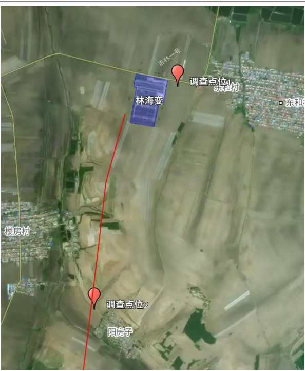  
图 2.1-1 林海变现状图

## b）平安变

## 1）变电站现状及水土保持方案编制、批复情况

平安变于2006年建成投运。本站规划建设2组750MVA 主变压器、500kV出线10回、220kV出线14 回；目前已建成2组主变压器、500kV出线5回，220kV出线8回。现有进站道路、挡土墙、雨水排水设施（含排水沟）、站内绿化情况良好，具有完备的水土保持设施。

平安变新建工程为方-牡-敦-包 500kV输变电工程组成部分，水利部以《关于方-牡-敦-包500kV输变电工程水土保持方案的复函》（水函〔2005〕76 号）批复了该变电站新建工程水土保持方案。2007年 10月，水利部以《关于印发方-牡-敦-包 500千伏输变电工程水土保持设施竣工验收意见的函》（办水保函〔2007〕616 号）批复了该变电站新建工程水土保持设施验收工作。

## 2）依托关系

本期平安变为扩建工程，扩建部分在变电站原有围墙内预留场地，无新征占地。本期工程依托原有进站道路，站内雨水排水依托前期雨水排水设施，施工用水、用电和通讯均依托原有站内供给，本期扩建产生余土 600m3 全部平整利用在 500kV 配电装置 1个预留间隔内，临时堆土场利用站区围墙内500kV配电装置区预留间隔（余土平整利用场地内）。本期扩建与前期工程的依托关系见下表2.1-3 所示。

表 2.1-3 平安变本期与前期的依托关系
<table><tr><td rowspan=1 colspan=1>名称</td><td rowspan=1 colspan=1>既有工程建设内容</td><td rowspan=1 colspan=1>本期与前期依托关系</td></tr><tr><td rowspan=1 colspan=1>进站道路</td><td rowspan=1 colspan=1>进站道路从站区东侧的G201国道引接，长度300m，路面宽度6m，为混凝土路面。</td><td rowspan=1 colspan=1>依托原有</td></tr><tr><td rowspan=1 colspan=1>供排水系统</td><td rowspan=1 colspan=1>变电站采取打井取水，主要用于生活用水。站区围墙外四周设置排水沟，站区内排水采用地表设排水明沟、雨水口，地下埋设排水管，集中排至站外西侧沙河。</td><td rowspan=1 colspan=1>依托原有</td></tr><tr><td rowspan=1 colspan=1>电源</td><td rowspan=1 colspan=1>站内电源。</td><td rowspan=1 colspan=1>依托站内电源</td></tr><tr><td rowspan=1 colspan=1>余土平整利用场地</td><td rowspan=1 colspan=1>本期扩建余土600m³全部平整利用在站区围墙内500kV配电装置区1个预留间隔内</td><td rowspan=1 colspan=1>依托站区500kV配电装置区1个预留间隔</td></tr><tr><td rowspan=1 colspan=1>临时堆土场</td><td rowspan=1 colspan=1>利用站区围墙内500kV配电装置区预留间隔（站内余土平整利用区内）。</td><td rowspan=1 colspan=1>依托站区500kV配电装置区预留间隔</td></tr></table>

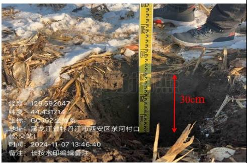  
平安变全貌（2025.7）

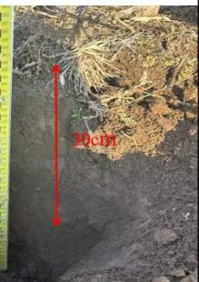  
平安变站内情况（2025.7）

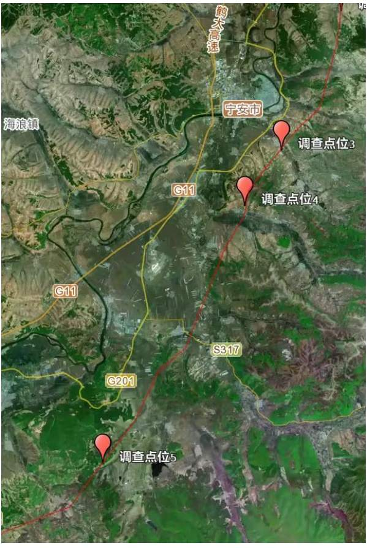  
平安变进站道路（2025.7）  
图2.1-2 平安变现状图

## 2.1.5 项目组成与布置

本项目由变电站部分和输电线路部分两部分组成，项目路径走向布置见附图2。

## 2.1.5.1 输电线路

## a）线路路径

各省路径方案描述如下：

## 1）黑龙江境内

新建线路由林海变西侧构架出线后向南绕行楼房村，整体并行于已建 500kV林海\~平安第一回线路（以下简称“林平一回”）东侧走线，在解放村西侧转向西南绕行宁安市城镇，随后途经大唐村、新农村及卧龙村，依次避让宁安市马河乡富路村山砂场开采区、宁安市渤海镇青山村山砂场开采区，至红星村南侧时路径与已建林平一回分开绕行避让镜泊湖风景名胜区外缘，选择在镜泊湖国家森林公园的边界穿越。路径在良种场村西侧再次平行于林平一回，在其东侧向西南走线约 6.3km 后到达省界分界点。本段路径长111.62km，新建塔基 236 基。

## 2）吉林境内

线路在小东沟村南侧进入吉林省敦化市境内，继续平行已建林平一回东侧向西南走线，穿越敦化市大山咀南部煤炭资源普查区，避让沿线岭后村、三道沟村、三家子村等村庄，在黑背村东南侧转向西直至平安变本期进线间隔。本段路径长41.84km，新建塔基80基。

## b）线路长度、地形及铁塔数量

本项目新建500kV输电线路路径长153.46km，航空距离 141.93km，线路曲折系数1.08；全线单回路架设，导线型号为 JL3/G1A-630/45。

线路沿线地面高程 260m\~900m，其中：山丘区线路长度 130.07km，平原区线路长度23.39km。共新建铁塔316基，其中直线塔258基，耐张塔58基。

输电线路沿线各行政区域内线路路径长度、地形及铁塔情况详见表2.1-4。

表2.1-4 线路沿线各行政区域长度与铁塔数量表
<table><tr><td rowspan=3 colspan=2>沿线所经过行政区</td><td rowspan=1 colspan=3>线路长度（km）</td><td rowspan=1 colspan=5>塔基数量（基）</td></tr><tr><td rowspan=2 colspan=1>山丘区</td><td rowspan=2 colspan=1>平原区</td><td rowspan=2 colspan=1>小计</td><td rowspan=1 colspan=2>山丘区</td><td rowspan=1 colspan=2>平原区</td><td rowspan=2 colspan=1>小计</td></tr><tr><td rowspan=1 colspan=1>直线塔</td><td rowspan=1 colspan=1>耐张塔</td><td rowspan=1 colspan=1>直线塔</td><td rowspan=1 colspan=1>耐张塔</td></tr><tr><td rowspan=1 colspan=2>黑龙江省</td><td rowspan=1 colspan=1>89.92</td><td rowspan=1 colspan=1>21.70</td><td rowspan=1 colspan=1>111.62</td><td rowspan=1 colspan=1>158</td><td rowspan=1 colspan=1>29</td><td rowspan=1 colspan=1>40</td><td rowspan=1 colspan=1>9</td><td rowspan=1 colspan=1>236</td></tr><tr><td rowspan=2 colspan=1>牡丹江市</td><td rowspan=1 colspan=1>西安区</td><td rowspan=1 colspan=1></td><td rowspan=1 colspan=1>5.70</td><td rowspan=1 colspan=1>5.70</td><td rowspan=1 colspan=1></td><td rowspan=1 colspan=1></td><td rowspan=1 colspan=1>10</td><td rowspan=1 colspan=1>3</td><td rowspan=1 colspan=1>13</td></tr><tr><td rowspan=1 colspan=1>宁安市</td><td rowspan=1 colspan=1>89.92</td><td rowspan=1 colspan=1>16.00</td><td rowspan=1 colspan=1>105.92</td><td rowspan=1 colspan=1>158</td><td rowspan=1 colspan=1>29</td><td rowspan=1 colspan=1>30</td><td rowspan=1 colspan=1>6</td><td rowspan=1 colspan=1>223</td></tr><tr><td rowspan=1 colspan=2>吉林省</td><td rowspan=1 colspan=1>40.15</td><td rowspan=1 colspan=1>1.69</td><td rowspan=1 colspan=1>41.84</td><td rowspan=1 colspan=1>60</td><td rowspan=1 colspan=1>18</td><td rowspan=1 colspan=1></td><td rowspan=1 colspan=1>2</td><td rowspan=1 colspan=1>80</td></tr><tr><td rowspan=1 colspan=1>延边朝鲜族自治州</td><td rowspan=1 colspan=1>敦化市</td><td rowspan=1 colspan=1>40.15</td><td rowspan=1 colspan=1>1.69</td><td rowspan=1 colspan=1>41.84</td><td rowspan=1 colspan=1>60</td><td rowspan=1 colspan=1>18</td><td rowspan=1 colspan=1></td><td rowspan=1 colspan=1>2</td><td rowspan=1 colspan=1>80</td></tr><tr><td rowspan=1 colspan=2>合计</td><td rowspan=1 colspan=1>130.07</td><td rowspan=1 colspan=1>23.39</td><td rowspan=1 colspan=1>153.46</td><td rowspan=1 colspan=1>218</td><td rowspan=1 colspan=1>47</td><td rowspan=1 colspan=1>40</td><td rowspan=1 colspan=1>11</td><td rowspan=1 colspan=1>316</td></tr></table>

## c）铁塔型式

本项目铁塔型式均为自立铁塔，包括直线塔和耐张塔。直线塔采用酒杯塔，转角耐张塔采用干字型塔。

塔基占地按照本项目主体设计文件、表土剥离利用方案及《国家电网有限公司关于印发《输变电工程水土保持技术规程第1部分：水土保持方案》等9项企业标准》（国家电网企管〔2023〕561 号）附录 C（资料性）架空输电线路占地面积估算原则，塔基永久占地按照（铁塔根开+主柱宽度）每侧外扩 1m 计，主柱宽度取 1.4m；施工场地占地单回路塔基施工区按“（根开+20m）×（根开+20m）-永久占地+临时表土堆放场”进行计算，其中机械化施工的塔基施工区按“非机械化施工塔基施工区×1.2+临时表土堆放场”进行计算，表土剥离利用方案确定每基塔临时表土堆土场按 $3 0 0 \mathrm { m } ^ { 2 }$ 考虑（耕作层土壤与其他表土分开堆放）。

本项目铁塔型式及占地面积详见表 2.1-5 和表2.1-6。线路铁塔型式见附图3。

表2.1-5 本项目塔基型式及占地面积统计表
<table><tr><td colspan="1" rowspan="2">地形</td><td colspan="1" rowspan="2">塔型</td><td colspan="1" rowspan="2">型号</td><td colspan="1" rowspan="2">半根开(mm)</td><td colspan="3" rowspan="1">塔基数量（基）</td><td colspan="1" rowspan="1">单塔</td><td colspan="2" rowspan="1">单塔临时占地(m2)</td><td colspan="1" rowspan="1">永久占</td><td colspan="3" rowspan="1">临时占地(m²)</td></tr><tr><td colspan="1" rowspan="1">非机械化施工</td><td colspan="1" rowspan="1">机械化施工</td><td colspan="1" rowspan="1">小计</td><td colspan="1" rowspan="1">占地(m2)</td><td colspan="1" rowspan="1">非机械化施工</td><td colspan="1" rowspan="1">机械化施工</td><td colspan="1" rowspan="1">设计）(m2)</td><td colspan="1" rowspan="1">主体设计</td><td colspan="1" rowspan="1">表土剥离利用方案</td><td colspan="1" rowspan="1">小计</td></tr><tr><td colspan="3" rowspan="1">一、黑龙江省牡丹江市</td><td colspan="1" rowspan="1"></td><td colspan="1" rowspan="1">58</td><td colspan="1" rowspan="1">178</td><td colspan="1" rowspan="1">236</td><td colspan="1" rowspan="1"></td><td colspan="1" rowspan="1"></td><td colspan="1" rowspan="1"></td><td colspan="1" rowspan="1">66671</td><td colspan="1" rowspan="1">224677</td><td colspan="1" rowspan="1">70800</td><td colspan="1" rowspan="1">295477</td></tr><tr><td colspan="3" rowspan="1">西安区</td><td colspan="1" rowspan="1"></td><td colspan="1" rowspan="1">0</td><td colspan="1" rowspan="1">13</td><td colspan="1" rowspan="1">13</td><td colspan="1" rowspan="1"></td><td colspan="1" rowspan="1"></td><td colspan="1" rowspan="1"></td><td colspan="1" rowspan="1">3435</td><td colspan="1" rowspan="1">12566</td><td colspan="1" rowspan="1">3900</td><td colspan="1" rowspan="1">16466</td></tr><tr><td colspan="1" rowspan="15">平原区</td><td colspan="1" rowspan="10">直线塔</td><td colspan="1" rowspan="1">ZB1-45</td><td colspan="1" rowspan="1">4560</td><td colspan="1" rowspan="1">0</td><td colspan="1" rowspan="1">2</td><td colspan="1" rowspan="1">2</td><td colspan="1" rowspan="1">157</td><td colspan="1" rowspan="1">691</td><td colspan="1" rowspan="1">829</td><td colspan="1" rowspan="1">314</td><td colspan="1" rowspan="1">1659</td><td colspan="1" rowspan="1">600</td><td colspan="1" rowspan="1">2259</td></tr><tr><td colspan="1" rowspan="1">ZB2-27</td><td colspan="1" rowspan="1">3120</td><td colspan="1" rowspan="1">0</td><td colspan="1" rowspan="1">1</td><td colspan="1" rowspan="1">1</td><td colspan="1" rowspan="1">93</td><td colspan="1" rowspan="1">596</td><td colspan="1" rowspan="1">715</td><td colspan="1" rowspan="1">93</td><td colspan="1" rowspan="1">715</td><td colspan="1" rowspan="1">300</td><td colspan="1" rowspan="1">1015</td></tr><tr><td colspan="1" rowspan="1">ZB3-54</td><td colspan="1" rowspan="1">5865</td><td colspan="1" rowspan="1">0</td><td colspan="1" rowspan="1">1</td><td colspan="1" rowspan="1">1</td><td colspan="1" rowspan="1">229</td><td colspan="1" rowspan="1">778</td><td colspan="1" rowspan="1">933</td><td colspan="1" rowspan="1">229</td><td colspan="1" rowspan="1">933</td><td colspan="1" rowspan="1">300</td><td colspan="1" rowspan="1">1233</td></tr><tr><td colspan="1" rowspan="1">ZB3-57</td><td colspan="1" rowspan="1">6165</td><td colspan="1" rowspan="1">0</td><td colspan="1" rowspan="1">1</td><td colspan="1" rowspan="1">1</td><td colspan="1" rowspan="1">247</td><td colspan="1" rowspan="1">798</td><td colspan="1" rowspan="1">957</td><td colspan="1" rowspan="1">247</td><td colspan="1" rowspan="1">957</td><td colspan="1" rowspan="1">300</td><td colspan="1" rowspan="1">1257</td></tr><tr><td colspan="1" rowspan="1">ZBCK1-51</td><td colspan="1" rowspan="1">5687</td><td colspan="1" rowspan="1">0</td><td colspan="1" rowspan="1">1</td><td colspan="1" rowspan="1">1</td><td colspan="1" rowspan="1">218</td><td colspan="1" rowspan="1">766</td><td colspan="1" rowspan="1">919</td><td colspan="1" rowspan="1">218</td><td colspan="1" rowspan="1">919</td><td colspan="1" rowspan="1">300</td><td colspan="1" rowspan="1">1219</td></tr><tr><td colspan="1" rowspan="1">ZBT-51</td><td colspan="1" rowspan="1">5520</td><td colspan="1" rowspan="1">0</td><td colspan="1" rowspan="1">1</td><td colspan="1" rowspan="1">1</td><td colspan="1" rowspan="1">209</td><td colspan="1" rowspan="1">755</td><td colspan="1" rowspan="1">906</td><td colspan="1" rowspan="1">209</td><td colspan="1" rowspan="1">906</td><td colspan="1" rowspan="1">300</td><td colspan="1" rowspan="1">1206</td></tr><tr><td colspan="1" rowspan="1">ZBCK2-63</td><td colspan="1" rowspan="1">7247</td><td colspan="1" rowspan="1">0</td><td colspan="1" rowspan="1">1</td><td colspan="1" rowspan="1">1</td><td colspan="1" rowspan="1">320</td><td colspan="1" rowspan="1">870</td><td colspan="1" rowspan="1">1044</td><td colspan="1" rowspan="1">320</td><td colspan="1" rowspan="1">1044</td><td colspan="1" rowspan="1">300</td><td colspan="1" rowspan="1">1344</td></tr><tr><td colspan="1" rowspan="1">ZBCKT-72</td><td colspan="1" rowspan="1">8192</td><td colspan="1" rowspan="1">0</td><td colspan="1" rowspan="1">1</td><td colspan="1" rowspan="1">1</td><td colspan="1" rowspan="1">391</td><td colspan="1" rowspan="1">932</td><td colspan="1" rowspan="1">1119</td><td colspan="1" rowspan="1">391</td><td colspan="1" rowspan="1">1119</td><td colspan="1" rowspan="1">300</td><td colspan="1" rowspan="1">1419</td></tr><tr><td colspan="1" rowspan="1">ZBC4-63</td><td colspan="1" rowspan="1">7316</td><td colspan="1" rowspan="1">0</td><td colspan="1" rowspan="1">1</td><td colspan="1" rowspan="1">1</td><td colspan="1" rowspan="1">325</td><td colspan="1" rowspan="1">874</td><td colspan="1" rowspan="1">1049</td><td colspan="1" rowspan="1">325</td><td colspan="1" rowspan="1">1049</td><td colspan="1" rowspan="1">300</td><td colspan="1" rowspan="1">1349</td></tr><tr><td colspan="1" rowspan="1">小计</td><td colspan="1" rowspan="1"></td><td colspan="1" rowspan="1">0</td><td colspan="1" rowspan="1">10</td><td colspan="1" rowspan="1">10</td><td colspan="1" rowspan="1"></td><td colspan="1" rowspan="1"></td><td colspan="1" rowspan="1"></td><td colspan="1" rowspan="1">2346</td><td colspan="1" rowspan="1">9301</td><td colspan="1" rowspan="1">3000</td><td colspan="1" rowspan="1">12301</td></tr><tr><td colspan="1" rowspan="4">耐张塔</td><td colspan="1" rowspan="1">JC1-45</td><td colspan="1" rowspan="1">8505</td><td colspan="1" rowspan="1">0</td><td colspan="1" rowspan="1">1</td><td colspan="1" rowspan="1">1</td><td colspan="1" rowspan="1">417</td><td colspan="1" rowspan="1">953</td><td colspan="1" rowspan="1">1144</td><td colspan="1" rowspan="1">417</td><td colspan="1" rowspan="1">1144</td><td colspan="1" rowspan="1">300</td><td colspan="1" rowspan="1">1444</td></tr><tr><td colspan="1" rowspan="1">JC1-39</td><td colspan="1" rowspan="1">7545</td><td colspan="1" rowspan="1">0</td><td colspan="1" rowspan="1">1</td><td colspan="1" rowspan="1">1</td><td colspan="1" rowspan="1">342</td><td colspan="1" rowspan="1">889</td><td colspan="1" rowspan="1">1067</td><td colspan="1" rowspan="1">342</td><td colspan="1" rowspan="1">1067</td><td colspan="1" rowspan="1">300</td><td colspan="1" rowspan="1">1367</td></tr><tr><td colspan="1" rowspan="1">DJ-33</td><td colspan="1" rowspan="1">7380</td><td colspan="1" rowspan="1">0</td><td colspan="1" rowspan="1">1</td><td colspan="1" rowspan="1">1</td><td colspan="1" rowspan="1">330</td><td colspan="1" rowspan="1">878</td><td colspan="1" rowspan="1">1054</td><td colspan="1" rowspan="1">330</td><td colspan="1" rowspan="1">1054</td><td colspan="1" rowspan="1">300</td><td colspan="1" rowspan="1">1354</td></tr><tr><td colspan="1" rowspan="1">小计</td><td colspan="1" rowspan="1"></td><td colspan="1" rowspan="1">0</td><td colspan="1" rowspan="1">3</td><td colspan="1" rowspan="1">3</td><td colspan="1" rowspan="1"></td><td colspan="1" rowspan="1"></td><td colspan="1" rowspan="1"></td><td colspan="1" rowspan="1">1088</td><td colspan="1" rowspan="1">3265</td><td colspan="1" rowspan="1">900</td><td colspan="1" rowspan="1">4165</td></tr><tr><td colspan="2" rowspan="1">合计</td><td colspan="1" rowspan="1"></td><td colspan="1" rowspan="1">0</td><td colspan="1" rowspan="1">13</td><td colspan="1" rowspan="1">13</td><td colspan="1" rowspan="1"></td><td colspan="1" rowspan="1"></td><td colspan="1" rowspan="1"></td><td colspan="1" rowspan="1">3435</td><td colspan="1" rowspan="1">12566</td><td colspan="1" rowspan="1">3900</td><td colspan="1" rowspan="1">16466</td></tr><tr><td colspan="1" rowspan="1"></td><td colspan="2" rowspan="1">宁安市</td><td colspan="1" rowspan="1"></td><td colspan="1" rowspan="1">58</td><td colspan="1" rowspan="1">165</td><td colspan="1" rowspan="1">223</td><td colspan="1" rowspan="1"></td><td colspan="1" rowspan="1"></td><td colspan="1" rowspan="1"></td><td colspan="1" rowspan="1">63237</td><td colspan="1" rowspan="1">212111</td><td colspan="1" rowspan="1">66900</td><td colspan="1" rowspan="1">279011</td></tr><tr><td colspan="1" rowspan="16">平原区</td><td colspan="1" rowspan="16">直线塔</td><td colspan="1" rowspan="1">ZBC4-63</td><td colspan="1" rowspan="1">7316</td><td colspan="1" rowspan="1">0</td><td colspan="1" rowspan="1">2</td><td colspan="1" rowspan="1">2</td><td colspan="1" rowspan="1">325</td><td colspan="1" rowspan="1">874</td><td colspan="1" rowspan="1">1049</td><td colspan="1" rowspan="1">650</td><td colspan="1" rowspan="1">2098</td><td colspan="1" rowspan="1">600</td><td colspan="1" rowspan="1">2698</td></tr><tr><td colspan="1" rowspan="1">ZBC4-66</td><td colspan="1" rowspan="1">7646</td><td colspan="1" rowspan="1">0</td><td colspan="1" rowspan="1">2</td><td colspan="1" rowspan="1">2</td><td colspan="1" rowspan="1">349</td><td colspan="1" rowspan="1">896</td><td colspan="1" rowspan="1">1075</td><td colspan="1" rowspan="1">699</td><td colspan="1" rowspan="1">2151</td><td colspan="1" rowspan="1">600</td><td colspan="1" rowspan="1">2751</td></tr><tr><td colspan="1" rowspan="1">ZBC3-54</td><td colspan="1" rowspan="1">5865</td><td colspan="1" rowspan="1">0</td><td colspan="1" rowspan="1">1</td><td colspan="1" rowspan="1">1</td><td colspan="1" rowspan="1">229</td><td colspan="1" rowspan="1">778</td><td colspan="1" rowspan="1">933</td><td colspan="1" rowspan="1">229</td><td colspan="1" rowspan="1">933</td><td colspan="1" rowspan="1">300</td><td colspan="1" rowspan="1">1233</td></tr><tr><td colspan="1" rowspan="1">ZB1-42</td><td colspan="1" rowspan="1">4290</td><td colspan="1" rowspan="1">0</td><td colspan="1" rowspan="1">2</td><td colspan="1" rowspan="1">2</td><td colspan="1" rowspan="1">144</td><td colspan="1" rowspan="1">673</td><td colspan="1" rowspan="1">808</td><td colspan="1" rowspan="1">287</td><td colspan="1" rowspan="1">1616</td><td colspan="1" rowspan="1">600</td><td colspan="1" rowspan="1">2216</td></tr><tr><td colspan="1" rowspan="1">ZB2-36</td><td colspan="1" rowspan="1">4020</td><td colspan="1" rowspan="1">0</td><td colspan="1" rowspan="1">3</td><td colspan="1" rowspan="1">3</td><td colspan="1" rowspan="1">131</td><td colspan="1" rowspan="1">655</td><td colspan="1" rowspan="1">786</td><td colspan="1" rowspan="1">393</td><td colspan="1" rowspan="1">2359</td><td colspan="1" rowspan="1">900</td><td colspan="1" rowspan="1">3259</td></tr><tr><td colspan="1" rowspan="1">ZB2-39</td><td colspan="1" rowspan="1">4320</td><td colspan="1" rowspan="1">0</td><td colspan="1" rowspan="1">1</td><td colspan="1" rowspan="1">1</td><td colspan="1" rowspan="1">145</td><td colspan="1" rowspan="1">675</td><td colspan="1" rowspan="1">810</td><td colspan="1" rowspan="1">145</td><td colspan="1" rowspan="1">810</td><td colspan="1" rowspan="1">300</td><td colspan="1" rowspan="1">1110</td></tr><tr><td colspan="1" rowspan="1">ZBT-39</td><td colspan="1" rowspan="1">4320</td><td colspan="1" rowspan="1">0</td><td colspan="1" rowspan="1">1</td><td colspan="1" rowspan="1">1</td><td colspan="1" rowspan="1">145</td><td colspan="1" rowspan="1">675</td><td colspan="1" rowspan="1">810</td><td colspan="1" rowspan="1">145</td><td colspan="1" rowspan="1">810</td><td colspan="1" rowspan="1">300</td><td colspan="1" rowspan="1">1110</td></tr><tr><td colspan="1" rowspan="1">ZB3-39</td><td colspan="1" rowspan="1">4365</td><td colspan="1" rowspan="1">0</td><td colspan="1" rowspan="1">1</td><td colspan="1" rowspan="1">1</td><td colspan="1" rowspan="1">147</td><td colspan="1" rowspan="1">678</td><td colspan="1" rowspan="1">814</td><td colspan="1" rowspan="1">147</td><td colspan="1" rowspan="1">814</td><td colspan="1" rowspan="1">300</td><td colspan="1" rowspan="1">1114</td></tr><tr><td colspan="1" rowspan="1">ZB3-42</td><td colspan="1" rowspan="1">4665</td><td colspan="1" rowspan="1">0</td><td colspan="1" rowspan="1">2</td><td colspan="1" rowspan="1">2</td><td colspan="1" rowspan="1">162</td><td colspan="1" rowspan="1">698</td><td colspan="1" rowspan="1">838</td><td colspan="1" rowspan="1">324</td><td colspan="1" rowspan="1">1676</td><td colspan="1" rowspan="1">600</td><td colspan="1" rowspan="1">2276</td></tr><tr><td colspan="1" rowspan="1">ZB3-48</td><td colspan="1" rowspan="1">5265</td><td colspan="1" rowspan="1">0</td><td colspan="1" rowspan="1">3</td><td colspan="1" rowspan="1">3</td><td colspan="1" rowspan="1">194</td><td colspan="1" rowspan="1">738</td><td colspan="1" rowspan="1">886</td><td colspan="1" rowspan="1">582</td><td colspan="1" rowspan="1">2657</td><td colspan="1" rowspan="1">900</td><td colspan="1" rowspan="1">3557</td></tr><tr><td colspan="1" rowspan="1">ZB3-54</td><td colspan="1" rowspan="1">5865</td><td colspan="1" rowspan="1">0</td><td colspan="1" rowspan="1">3</td><td colspan="1" rowspan="1">3</td><td colspan="1" rowspan="1">229</td><td colspan="1" rowspan="1">778</td><td colspan="1" rowspan="1">933</td><td colspan="1" rowspan="1">687</td><td colspan="1" rowspan="1">2800</td><td colspan="1" rowspan="1">900</td><td colspan="1" rowspan="1">3700</td></tr><tr><td colspan="1" rowspan="1">ZB3-51</td><td colspan="1" rowspan="1">5565</td><td colspan="1" rowspan="1">0</td><td colspan="1" rowspan="1">3</td><td colspan="1" rowspan="1">3</td><td colspan="1" rowspan="1">211</td><td colspan="1" rowspan="1">758</td><td colspan="1" rowspan="1">910</td><td colspan="1" rowspan="1">633</td><td colspan="1" rowspan="1">2729</td><td colspan="1" rowspan="1">900</td><td colspan="1" rowspan="1">3629</td></tr><tr><td colspan="1" rowspan="1">ZB3-57</td><td colspan="1" rowspan="1">6165</td><td colspan="1" rowspan="1">0</td><td colspan="1" rowspan="1">4</td><td colspan="1" rowspan="1">4</td><td colspan="1" rowspan="1">247</td><td colspan="1" rowspan="1">798</td><td colspan="1" rowspan="1">957</td><td colspan="1" rowspan="1">990</td><td colspan="1" rowspan="1">3829</td><td colspan="1" rowspan="1">1200</td><td colspan="1" rowspan="1">5029</td></tr><tr><td colspan="1" rowspan="1">ZB3-60</td><td colspan="1" rowspan="1">6465</td><td colspan="1" rowspan="1">0</td><td colspan="1" rowspan="1">1</td><td colspan="1" rowspan="1">1</td><td colspan="1" rowspan="1">267</td><td colspan="1" rowspan="1">818</td><td colspan="1" rowspan="1">981</td><td colspan="1" rowspan="1">267</td><td colspan="1" rowspan="1">981</td><td colspan="1" rowspan="1">300</td><td colspan="1" rowspan="1">1281</td></tr><tr><td colspan="1" rowspan="1">ZBCKT-54</td><td colspan="1" rowspan="1">6302</td><td colspan="1" rowspan="1">0</td><td colspan="1" rowspan="1">1</td><td colspan="1" rowspan="1">1</td><td colspan="1" rowspan="1">256</td><td colspan="1" rowspan="1">807</td><td colspan="1" rowspan="1">968</td><td colspan="1" rowspan="1">256</td><td colspan="1" rowspan="1">968</td><td colspan="1" rowspan="1">300</td><td colspan="1" rowspan="1">1268</td></tr><tr><td colspan="1" rowspan="1">小计</td><td colspan="1" rowspan="1"></td><td colspan="1" rowspan="1">0</td><td colspan="1" rowspan="1">30</td><td colspan="1" rowspan="1">30</td><td colspan="1" rowspan="1"></td><td colspan="1" rowspan="1"></td><td colspan="1" rowspan="1"></td><td colspan="1" rowspan="1">6434</td><td colspan="1" rowspan="1">27233</td><td colspan="1" rowspan="1">9000</td><td colspan="1" rowspan="1">36233</td></tr><tr><td colspan="1" rowspan="2">地形</td><td colspan="1" rowspan="2">塔型</td><td colspan="1" rowspan="2">型号</td><td colspan="1" rowspan="2">半根开(mm)</td><td colspan="3" rowspan="1">塔基数量（基）</td><td colspan="1" rowspan="1">单塔</td><td colspan="2" rowspan="1">单塔临时占地(m2)</td><td colspan="1" rowspan="1">永久占地(主体</td><td colspan="3" rowspan="1">临时占地(m²)</td></tr><tr><td colspan="1" rowspan="1">非机械化施工</td><td colspan="1" rowspan="1">机械化施工</td><td colspan="1" rowspan="1">小计</td><td colspan="1" rowspan="1">占地(m2)</td><td colspan="1" rowspan="1">非机械化施工</td><td colspan="1" rowspan="1">机械化施工</td><td colspan="1" rowspan="1">设计）(m2)</td><td colspan="1" rowspan="1">主体设计</td><td colspan="1" rowspan="1">表土剥离利用方案</td><td colspan="1" rowspan="1">小计</td></tr><tr><td colspan="1" rowspan="7"></td><td colspan="1" rowspan="6">耐张塔</td><td colspan="1" rowspan="1">JC1-36</td><td colspan="1" rowspan="1">7065</td><td colspan="1" rowspan="1">0</td><td colspan="1" rowspan="1">1</td><td colspan="1" rowspan="1">1</td><td colspan="1" rowspan="1">307</td><td colspan="1" rowspan="1">858</td><td colspan="1" rowspan="1">1029</td><td colspan="1" rowspan="1">307</td><td colspan="1" rowspan="1">1029</td><td colspan="1" rowspan="1">300</td><td colspan="1" rowspan="1">1329</td></tr><tr><td colspan="1" rowspan="1">JC1-48</td><td colspan="1" rowspan="1">8985</td><td colspan="1" rowspan="1">0</td><td colspan="1" rowspan="1">1</td><td colspan="1" rowspan="1">1</td><td colspan="1" rowspan="1">457</td><td colspan="1" rowspan="1">985</td><td colspan="1" rowspan="1">1182</td><td colspan="1" rowspan="1">457</td><td colspan="1" rowspan="1">1182</td><td colspan="1" rowspan="1">300</td><td colspan="1" rowspan="1">1482</td></tr><tr><td colspan="1" rowspan="1">J1-24</td><td colspan="1" rowspan="1">5150</td><td colspan="1" rowspan="1">0</td><td colspan="1" rowspan="1">1</td><td colspan="1" rowspan="1">1</td><td colspan="1" rowspan="1">188</td><td colspan="1" rowspan="1">730</td><td colspan="1" rowspan="1">876</td><td colspan="1" rowspan="1">188</td><td colspan="1" rowspan="1">876</td><td colspan="1" rowspan="1">300</td><td colspan="1" rowspan="1">1176</td></tr><tr><td colspan="1" rowspan="1">J1-30</td><td colspan="1" rowspan="1">6110</td><td colspan="1" rowspan="1">0</td><td colspan="1" rowspan="1">1</td><td colspan="1" rowspan="1">1</td><td colspan="1" rowspan="1">244</td><td colspan="1" rowspan="1">794</td><td colspan="1" rowspan="1">953</td><td colspan="1" rowspan="1">244</td><td colspan="1" rowspan="1">953</td><td colspan="1" rowspan="1">300</td><td colspan="1" rowspan="1">1253</td></tr><tr><td colspan="1" rowspan="1">JC2-42</td><td colspan="1" rowspan="1">8035</td><td colspan="1" rowspan="1">0</td><td colspan="1" rowspan="1">2</td><td colspan="1" rowspan="1">2</td><td colspan="1" rowspan="1">379</td><td colspan="1" rowspan="1">922</td><td colspan="1" rowspan="1">1106</td><td colspan="1" rowspan="1">758</td><td colspan="1" rowspan="1">2213</td><td colspan="1" rowspan="1">600</td><td colspan="1" rowspan="1">2813</td></tr><tr><td colspan="1" rowspan="1">小计</td><td colspan="1" rowspan="1"></td><td colspan="1" rowspan="1">0</td><td colspan="1" rowspan="1">6</td><td colspan="1" rowspan="1">6</td><td colspan="1" rowspan="1"></td><td colspan="1" rowspan="1"></td><td colspan="1" rowspan="1"></td><td colspan="1" rowspan="1">1954</td><td colspan="1" rowspan="1">6253</td><td colspan="1" rowspan="1">1800</td><td colspan="1" rowspan="1">8053</td></tr><tr><td colspan="1" rowspan="1"></td><td colspan="1" rowspan="1">合计</td><td colspan="1" rowspan="1"></td><td colspan="1" rowspan="1">0</td><td colspan="1" rowspan="1">36</td><td colspan="1" rowspan="1">36</td><td colspan="1" rowspan="1"></td><td colspan="1" rowspan="1"></td><td colspan="1" rowspan="1"></td><td colspan="1" rowspan="1">8387</td><td colspan="1" rowspan="1">33486</td><td colspan="1" rowspan="1">10800</td><td colspan="1" rowspan="1">44286</td></tr><tr><td colspan="2" rowspan="36">山丘区直线塔</td><td colspan="1" rowspan="1">ZB3-27</td><td colspan="1" rowspan="1">3170</td><td colspan="1" rowspan="1">0</td><td colspan="1" rowspan="1">1</td><td colspan="1" rowspan="1">1</td><td colspan="1" rowspan="1">95</td><td colspan="1" rowspan="1">599</td><td colspan="1" rowspan="1">719</td><td colspan="1" rowspan="1">95</td><td colspan="1" rowspan="1">719</td><td colspan="1" rowspan="1">300</td><td colspan="1" rowspan="1">1019</td></tr><tr><td colspan="1" rowspan="1">ZB3-45</td><td colspan="1" rowspan="1">4965</td><td colspan="1" rowspan="1">0</td><td colspan="1" rowspan="1">2</td><td colspan="1" rowspan="1">2</td><td colspan="1" rowspan="1">178</td><td colspan="1" rowspan="1">718</td><td colspan="1" rowspan="1">862</td><td colspan="1" rowspan="1">355</td><td colspan="1" rowspan="1">1723</td><td colspan="1" rowspan="1">600</td><td colspan="1" rowspan="1">2323</td></tr><tr><td colspan="1" rowspan="1">ZB3-48</td><td colspan="1" rowspan="1">5265</td><td colspan="1" rowspan="1">3</td><td colspan="1" rowspan="1">5</td><td colspan="1" rowspan="1">8</td><td colspan="1" rowspan="1">194</td><td colspan="1" rowspan="1">738</td><td colspan="1" rowspan="1">886</td><td colspan="1" rowspan="1">1552</td><td colspan="1" rowspan="1">6642</td><td colspan="1" rowspan="1">2400</td><td colspan="1" rowspan="1">9042</td></tr><tr><td colspan="1" rowspan="1">ZB3-51</td><td colspan="1" rowspan="1">5565</td><td colspan="1" rowspan="1">6</td><td colspan="1" rowspan="1">4</td><td colspan="1" rowspan="1">10</td><td colspan="1" rowspan="1">211</td><td colspan="1" rowspan="1">758</td><td colspan="1" rowspan="1">910</td><td colspan="1" rowspan="1">2111</td><td colspan="1" rowspan="1">8186</td><td colspan="1" rowspan="1">3000</td><td colspan="1" rowspan="1">11186</td></tr><tr><td colspan="1" rowspan="1">ZB3-54</td><td colspan="1" rowspan="1">5865</td><td colspan="1" rowspan="1">6</td><td colspan="1" rowspan="1">8</td><td colspan="1" rowspan="1">14</td><td colspan="1" rowspan="1">229</td><td colspan="1" rowspan="1">778</td><td colspan="1" rowspan="1">933</td><td colspan="1" rowspan="1">3205</td><td colspan="1" rowspan="1">12135</td><td colspan="1" rowspan="1">4200</td><td colspan="1" rowspan="1">16335</td></tr><tr><td colspan="1" rowspan="1">ZB3-57</td><td colspan="1" rowspan="1">6165</td><td colspan="1" rowspan="1">8</td><td colspan="1" rowspan="1">10</td><td colspan="1" rowspan="1">18</td><td colspan="1" rowspan="1">247</td><td colspan="1" rowspan="1">798</td><td colspan="1" rowspan="1">957</td><td colspan="1" rowspan="1">4454</td><td colspan="1" rowspan="1">15956</td><td colspan="1" rowspan="1">5400</td><td colspan="1" rowspan="1">21356</td></tr><tr><td colspan="1" rowspan="1">ZB3-60</td><td colspan="1" rowspan="1">6465</td><td colspan="1" rowspan="1">7</td><td colspan="1" rowspan="1">7</td><td colspan="1" rowspan="1">14</td><td colspan="1" rowspan="1">267</td><td colspan="1" rowspan="1">818</td><td colspan="1" rowspan="1">981</td><td colspan="1" rowspan="1">3733</td><td colspan="1" rowspan="1">12593</td><td colspan="1" rowspan="1">4200</td><td colspan="1" rowspan="1">16793</td></tr><tr><td colspan="1" rowspan="1">ZBK1-72</td><td colspan="1" rowspan="1">7842</td><td colspan="1" rowspan="1">0</td><td colspan="1" rowspan="1">1</td><td colspan="1" rowspan="1">1</td><td colspan="1" rowspan="1">364</td><td colspan="1" rowspan="1">909</td><td colspan="1" rowspan="1">1091</td><td colspan="1" rowspan="1">364</td><td colspan="1" rowspan="1">1091</td><td colspan="1" rowspan="1">300</td><td colspan="1" rowspan="1">1391</td></tr><tr><td colspan="1" rowspan="1">ZBK2-66</td><td colspan="1" rowspan="1">7569</td><td colspan="1" rowspan="1">0</td><td colspan="1" rowspan="1">1</td><td colspan="1" rowspan="1">1</td><td colspan="1" rowspan="1">344</td><td colspan="1" rowspan="1">891</td><td colspan="1" rowspan="1">1069</td><td colspan="1" rowspan="1">344</td><td colspan="1" rowspan="1">1069</td><td colspan="1" rowspan="1">300</td><td colspan="1" rowspan="1">1369</td></tr><tr><td colspan="1" rowspan="1">ZBK2-69</td><td colspan="1" rowspan="1">7899</td><td colspan="1" rowspan="1">1</td><td colspan="1" rowspan="1">1</td><td colspan="1" rowspan="1">2</td><td colspan="1" rowspan="1">369</td><td colspan="1" rowspan="1">913</td><td colspan="1" rowspan="1">1096</td><td colspan="1" rowspan="1">737</td><td colspan="1" rowspan="1">2008</td><td colspan="1" rowspan="1">600</td><td colspan="1" rowspan="1">2608</td></tr><tr><td colspan="1" rowspan="1">ZBK2-75</td><td colspan="1" rowspan="1">8539</td><td colspan="1" rowspan="1">0</td><td colspan="1" rowspan="1">1</td><td colspan="1" rowspan="1">1</td><td colspan="1" rowspan="1">419</td><td colspan="1" rowspan="1">955</td><td colspan="1" rowspan="1">1147</td><td colspan="1" rowspan="1">419</td><td colspan="1" rowspan="1">1147</td><td colspan="1" rowspan="1">300</td><td colspan="1" rowspan="1">1447</td></tr><tr><td colspan="1" rowspan="1">ZBC3-48</td><td colspan="1" rowspan="1">5270</td><td colspan="1" rowspan="1">0</td><td colspan="1" rowspan="1">1</td><td colspan="1" rowspan="1">1</td><td colspan="1" rowspan="1">194</td><td colspan="1" rowspan="1">738</td><td colspan="1" rowspan="1">886</td><td colspan="1" rowspan="1">194</td><td colspan="1" rowspan="1">886</td><td colspan="1" rowspan="1">300</td><td colspan="1" rowspan="1">1186</td></tr><tr><td colspan="1" rowspan="1">ZBC3-51</td><td colspan="1" rowspan="1">5565</td><td colspan="1" rowspan="1">1</td><td colspan="1" rowspan="1">3</td><td colspan="1" rowspan="1">4</td><td colspan="1" rowspan="1">211</td><td colspan="1" rowspan="1">758</td><td colspan="1" rowspan="1">910</td><td colspan="1" rowspan="1">844</td><td colspan="1" rowspan="1">3487</td><td colspan="1" rowspan="1">1200</td><td colspan="1" rowspan="1">4687</td></tr><tr><td colspan="1" rowspan="1">ZBC3-54</td><td colspan="1" rowspan="1">5865</td><td colspan="1" rowspan="1">1</td><td colspan="1" rowspan="1">0</td><td colspan="1" rowspan="1">1</td><td colspan="1" rowspan="1">229</td><td colspan="1" rowspan="1">778</td><td colspan="1" rowspan="1">933</td><td colspan="1" rowspan="1">229</td><td colspan="1" rowspan="1">778</td><td colspan="1" rowspan="1">300</td><td colspan="1" rowspan="1">1078</td></tr><tr><td colspan="1" rowspan="1">ZBC3-57</td><td colspan="1" rowspan="1">6165</td><td colspan="1" rowspan="1">2</td><td colspan="1" rowspan="1">2</td><td colspan="1" rowspan="1">4</td><td colspan="1" rowspan="1">247</td><td colspan="1" rowspan="1">798</td><td colspan="1" rowspan="1">957</td><td colspan="1" rowspan="1">990</td><td colspan="1" rowspan="1">3510</td><td colspan="1" rowspan="1">1200</td><td colspan="1" rowspan="1">4710</td></tr><tr><td colspan="1" rowspan="1">ZBC3-60</td><td colspan="1" rowspan="1">6465</td><td colspan="1" rowspan="1">1</td><td colspan="1" rowspan="1">2</td><td colspan="1" rowspan="1">3</td><td colspan="1" rowspan="1">267</td><td colspan="1" rowspan="1">818</td><td colspan="1" rowspan="1">981</td><td colspan="1" rowspan="1">800</td><td colspan="1" rowspan="1">2780</td><td colspan="1" rowspan="1">900</td><td colspan="1" rowspan="1">3680</td></tr><tr><td colspan="1" rowspan="1">ZBC4-51</td><td colspan="1" rowspan="1">5996</td><td colspan="1" rowspan="1">0</td><td colspan="1" rowspan="1">2</td><td colspan="1" rowspan="1">2</td><td colspan="1" rowspan="1">237</td><td colspan="1" rowspan="1">787</td><td colspan="1" rowspan="1">944</td><td colspan="1" rowspan="1">474</td><td colspan="1" rowspan="1">1888</td><td colspan="1" rowspan="1">600</td><td colspan="1" rowspan="1">2488</td></tr><tr><td colspan="1" rowspan="1">ZBC4-54</td><td colspan="1" rowspan="1">6326</td><td colspan="1" rowspan="1">0</td><td colspan="1" rowspan="1">2</td><td colspan="1" rowspan="1">2</td><td colspan="1" rowspan="1">258</td><td colspan="1" rowspan="1">808</td><td colspan="1" rowspan="1">970</td><td colspan="1" rowspan="1">515</td><td colspan="1" rowspan="1">1940</td><td colspan="1" rowspan="1">600</td><td colspan="1" rowspan="1">2540</td></tr><tr><td colspan="1" rowspan="1">ZBC4-57</td><td colspan="1" rowspan="1">6656</td><td colspan="1" rowspan="1">0</td><td colspan="1" rowspan="1">1</td><td colspan="1" rowspan="1">1</td><td colspan="1" rowspan="1">279</td><td colspan="1" rowspan="1">830</td><td colspan="1" rowspan="1">996</td><td colspan="1" rowspan="1">279</td><td colspan="1" rowspan="1">996</td><td colspan="1" rowspan="1">300</td><td colspan="1" rowspan="1">1296</td></tr><tr><td colspan="1" rowspan="1">ZBC4-60</td><td colspan="1" rowspan="1">6986</td><td colspan="1" rowspan="1">0</td><td colspan="1" rowspan="1">2</td><td colspan="1" rowspan="1">2</td><td colspan="1" rowspan="1">302</td><td colspan="1" rowspan="1">852</td><td colspan="1" rowspan="1">1023</td><td colspan="1" rowspan="1">604</td><td colspan="1" rowspan="1">2046</td><td colspan="1" rowspan="1">600</td><td colspan="1" rowspan="1">2646</td></tr><tr><td colspan="1" rowspan="1">ZBC4-63</td><td colspan="1" rowspan="1">7316</td><td colspan="1" rowspan="1">3</td><td colspan="1" rowspan="1">10</td><td colspan="1" rowspan="1">13</td><td colspan="1" rowspan="1">325</td><td colspan="1" rowspan="1">874</td><td colspan="1" rowspan="1">1049</td><td colspan="1" rowspan="1">4227</td><td colspan="1" rowspan="1">13113</td><td colspan="1" rowspan="1">3900</td><td colspan="1" rowspan="1">17013</td></tr><tr><td colspan="1" rowspan="1">ZBC4-66</td><td colspan="1" rowspan="1">7646</td><td colspan="1" rowspan="1">4</td><td colspan="1" rowspan="1">4</td><td colspan="1" rowspan="1">8</td><td colspan="1" rowspan="1">349</td><td colspan="1" rowspan="1">896</td><td colspan="1" rowspan="1">1075</td><td colspan="1" rowspan="1">2795</td><td colspan="1" rowspan="1">7886</td><td colspan="1" rowspan="1">2400</td><td colspan="1" rowspan="1">10286</td></tr><tr><td colspan="1" rowspan="1">ZBC4-69</td><td colspan="1" rowspan="1">7976</td><td colspan="1" rowspan="1">1</td><td colspan="1" rowspan="1">1</td><td colspan="1" rowspan="1">2</td><td colspan="1" rowspan="1">374</td><td colspan="1" rowspan="1">918</td><td colspan="1" rowspan="1">1102</td><td colspan="1" rowspan="1">749</td><td colspan="1" rowspan="1">2020</td><td colspan="1" rowspan="1">600</td><td colspan="1" rowspan="1">2620</td></tr><tr><td colspan="1" rowspan="1">ZBCT-45</td><td colspan="1" rowspan="1">4915</td><td colspan="1" rowspan="1">0</td><td colspan="1" rowspan="1">1</td><td colspan="1" rowspan="1">1</td><td colspan="1" rowspan="1">175</td><td colspan="1" rowspan="1">715</td><td colspan="1" rowspan="1">858</td><td colspan="1" rowspan="1">175</td><td colspan="1" rowspan="1">858</td><td colspan="1" rowspan="1">300</td><td colspan="1" rowspan="1">1158</td></tr><tr><td colspan="1" rowspan="1">ZBCK1-51</td><td colspan="1" rowspan="1">5687</td><td colspan="1" rowspan="1">1</td><td colspan="1" rowspan="1">1</td><td colspan="1" rowspan="1">2</td><td colspan="1" rowspan="1">218</td><td colspan="1" rowspan="1">766</td><td colspan="1" rowspan="1">919</td><td colspan="1" rowspan="1">437</td><td colspan="1" rowspan="1">1685</td><td colspan="1" rowspan="1">600</td><td colspan="1" rowspan="1">2285</td></tr><tr><td colspan="1" rowspan="1">ZBCK1-54</td><td colspan="1" rowspan="1">6002</td><td colspan="1" rowspan="1">1</td><td colspan="1" rowspan="1">2</td><td colspan="1" rowspan="1">3</td><td colspan="1" rowspan="1">237</td><td colspan="1" rowspan="1">787</td><td colspan="1" rowspan="1">944</td><td colspan="1" rowspan="1">712</td><td colspan="1" rowspan="1">2676</td><td colspan="1" rowspan="1">900</td><td colspan="1" rowspan="1">3576</td></tr><tr><td colspan="1" rowspan="1">ZBCK1-60</td><td colspan="1" rowspan="1">6632</td><td colspan="1" rowspan="1">0</td><td colspan="1" rowspan="1">2</td><td colspan="1" rowspan="1">2</td><td colspan="1" rowspan="1">278</td><td colspan="1" rowspan="1">829</td><td colspan="1" rowspan="1">995</td><td colspan="1" rowspan="1">555</td><td colspan="1" rowspan="1">1989</td><td colspan="1" rowspan="1">600</td><td colspan="1" rowspan="1">2589</td></tr><tr><td colspan="1" rowspan="1">ZBCK1-66</td><td colspan="1" rowspan="1">7262</td><td colspan="1" rowspan="1">0</td><td colspan="1" rowspan="1">1</td><td colspan="1" rowspan="1">1</td><td colspan="1" rowspan="1">321</td><td colspan="1" rowspan="1">871</td><td colspan="1" rowspan="1">1045</td><td colspan="1" rowspan="1">321</td><td colspan="1" rowspan="1">1045</td><td colspan="1" rowspan="1">300</td><td colspan="1" rowspan="1">1345</td></tr><tr><td colspan="1" rowspan="1">ZBCK2-51</td><td colspan="1" rowspan="1">5987</td><td colspan="1" rowspan="1">0</td><td colspan="1" rowspan="1">2</td><td colspan="1" rowspan="1">2</td><td colspan="1" rowspan="1">236</td><td colspan="1" rowspan="1">786</td><td colspan="1" rowspan="1">943</td><td colspan="1" rowspan="1">473</td><td colspan="1" rowspan="1">1886</td><td colspan="1" rowspan="1">600</td><td colspan="1" rowspan="1">2486</td></tr><tr><td colspan="1" rowspan="1">ZBCK2-60</td><td colspan="1" rowspan="1">6932</td><td colspan="1" rowspan="1">0</td><td colspan="1" rowspan="1">5</td><td colspan="1" rowspan="1">5</td><td colspan="1" rowspan="1">298</td><td colspan="1" rowspan="1">849</td><td colspan="1" rowspan="1">1018</td><td colspan="1" rowspan="1">1490</td><td colspan="1" rowspan="1">5092</td><td colspan="1" rowspan="1">1500</td><td colspan="1" rowspan="1">6592</td></tr><tr><td colspan="1" rowspan="1">ZBCK2-63</td><td colspan="1" rowspan="1">7247</td><td colspan="1" rowspan="1">0</td><td colspan="1" rowspan="1">3</td><td colspan="1" rowspan="1">3</td><td colspan="1" rowspan="1">320</td><td colspan="1" rowspan="1">870</td><td colspan="1" rowspan="1">1044</td><td colspan="1" rowspan="1">961</td><td colspan="1" rowspan="1">3131</td><td colspan="1" rowspan="1">900</td><td colspan="1" rowspan="1">4031</td></tr><tr><td colspan="1" rowspan="1">ZBCK2-66</td><td colspan="1" rowspan="1">7562</td><td colspan="1" rowspan="1">0</td><td colspan="1" rowspan="1">4</td><td colspan="1" rowspan="1">4</td><td colspan="1" rowspan="1">343</td><td colspan="1" rowspan="1">891</td><td colspan="1" rowspan="1">1069</td><td colspan="1" rowspan="1">1373</td><td colspan="1" rowspan="1">4275</td><td colspan="1" rowspan="1">1200</td><td colspan="1" rowspan="1">5475</td></tr><tr><td colspan="1" rowspan="1">ZBCK2-69</td><td colspan="1" rowspan="1">7877</td><td colspan="1" rowspan="1">0</td><td colspan="1" rowspan="1">3</td><td colspan="1" rowspan="1">3</td><td colspan="1" rowspan="1">367</td><td colspan="1" rowspan="1">911</td><td colspan="1" rowspan="1">1094</td><td colspan="1" rowspan="1">1101</td><td colspan="1" rowspan="1">3281</td><td colspan="1" rowspan="1">900</td><td colspan="1" rowspan="1">4181</td></tr><tr><td colspan="1" rowspan="1">ZBCK2-75</td><td colspan="1" rowspan="1">8507</td><td colspan="1" rowspan="1">0</td><td colspan="1" rowspan="1">2</td><td colspan="1" rowspan="1">2</td><td colspan="1" rowspan="1">417</td><td colspan="1" rowspan="1">953</td><td colspan="1" rowspan="1">1144</td><td colspan="1" rowspan="1">833</td><td colspan="1" rowspan="1">2288</td><td colspan="1" rowspan="1">600</td><td colspan="1" rowspan="1">2888</td></tr><tr><td colspan="1" rowspan="1">ZBCKT-54</td><td colspan="1" rowspan="1">6302</td><td colspan="1" rowspan="1">0</td><td colspan="1" rowspan="1">3</td><td colspan="1" rowspan="1">3</td><td colspan="1" rowspan="1">256</td><td colspan="1" rowspan="1">807</td><td colspan="1" rowspan="1">968</td><td colspan="1" rowspan="1">768</td><td colspan="1" rowspan="1">2905</td><td colspan="1" rowspan="1">900</td><td colspan="1" rowspan="1">3805</td></tr><tr><td colspan="1" rowspan="1">ZBCKT-57</td><td colspan="1" rowspan="1">6617</td><td colspan="1" rowspan="1">0</td><td colspan="1" rowspan="1">2</td><td colspan="1" rowspan="1">2</td><td colspan="1" rowspan="1">277</td><td colspan="1" rowspan="1">828</td><td colspan="1" rowspan="1">993</td><td colspan="1" rowspan="1">553</td><td colspan="1" rowspan="1">1987</td><td colspan="1" rowspan="1">600</td><td colspan="1" rowspan="1">2587</td></tr><tr><td colspan="1" rowspan="2">地形</td><td colspan="1" rowspan="2">塔型</td><td colspan="1" rowspan="2">型号</td><td colspan="1" rowspan="2">半根开(mm)</td><td colspan="3" rowspan="1">塔基数量（基）</td><td colspan="1" rowspan="1">单塔</td><td colspan="2" rowspan="1">单塔临时占地(m2)</td><td colspan="1" rowspan="2">永久占地(主体设计）(m2)</td><td colspan="3" rowspan="1">临时占地(m²)</td></tr><tr><td colspan="1" rowspan="1">非机械化施工</td><td colspan="1" rowspan="1">机械化施工</td><td colspan="1" rowspan="1">小计</td><td colspan="1" rowspan="1">占地(m2)</td><td colspan="1" rowspan="1">非机械化施工</td><td colspan="1" rowspan="1">机械化施工</td><td colspan="1" rowspan="1">主体设计</td><td colspan="1" rowspan="1">表土剥离利用方案</td><td colspan="1" rowspan="1">小计</td></tr><tr><td colspan="1" rowspan="23"></td><td colspan="1" rowspan="7"></td><td colspan="1" rowspan="1">ZBCKT-60</td><td colspan="1" rowspan="1">6932</td><td colspan="1" rowspan="1">0</td><td colspan="1" rowspan="1">1</td><td colspan="1" rowspan="1">1</td><td colspan="1" rowspan="1">298</td><td colspan="1" rowspan="1">849</td><td colspan="1" rowspan="1">1018</td><td colspan="1" rowspan="1">298</td><td colspan="1" rowspan="1">1018</td><td colspan="1" rowspan="1">300</td><td colspan="1" rowspan="1">1318</td></tr><tr><td colspan="1" rowspan="1">ZBCKT-63</td><td colspan="1" rowspan="1">7247</td><td colspan="1" rowspan="1">0</td><td colspan="1" rowspan="1">3</td><td colspan="1" rowspan="1">3</td><td colspan="1" rowspan="1">320</td><td colspan="1" rowspan="1">870</td><td colspan="1" rowspan="1">1044</td><td colspan="1" rowspan="1">961</td><td colspan="1" rowspan="1">3131</td><td colspan="1" rowspan="1">900</td><td colspan="1" rowspan="1">4031</td></tr><tr><td colspan="1" rowspan="1">ZBCKT-72</td><td colspan="1" rowspan="1">8192</td><td colspan="1" rowspan="1">0</td><td colspan="1" rowspan="1">1</td><td colspan="1" rowspan="1">1</td><td colspan="1" rowspan="1">391</td><td colspan="1" rowspan="1">932</td><td colspan="1" rowspan="1">1119</td><td colspan="1" rowspan="1">391</td><td colspan="1" rowspan="1">1119</td><td colspan="1" rowspan="1">300</td><td colspan="1" rowspan="1">1419</td></tr><tr><td colspan="1" rowspan="1">ZBCK3-72</td><td colspan="1" rowspan="1">8342</td><td colspan="1" rowspan="1">0</td><td colspan="1" rowspan="1">1</td><td colspan="1" rowspan="1">1</td><td colspan="1" rowspan="1">403</td><td colspan="1" rowspan="1">942</td><td colspan="1" rowspan="1">1131</td><td colspan="1" rowspan="1">403</td><td colspan="1" rowspan="1">1131</td><td colspan="1" rowspan="1">300</td><td colspan="1" rowspan="1">1431</td></tr><tr><td colspan="1" rowspan="1">ZBCK3-75</td><td colspan="1" rowspan="1">8657</td><td colspan="1" rowspan="1">2</td><td colspan="1" rowspan="1">1</td><td colspan="1" rowspan="1">3</td><td colspan="1" rowspan="1">429</td><td colspan="1" rowspan="1">963</td><td colspan="1" rowspan="1">1156</td><td colspan="1" rowspan="1">1287</td><td colspan="1" rowspan="1">3082</td><td colspan="1" rowspan="1">900</td><td colspan="1" rowspan="1">3982</td></tr><tr><td colspan="1" rowspan="1">ZBCK3-81</td><td colspan="1" rowspan="1">9287</td><td colspan="1" rowspan="1">0</td><td colspan="1" rowspan="1">1</td><td colspan="1" rowspan="1">1</td><td colspan="1" rowspan="1">483</td><td colspan="1" rowspan="1">1005</td><td colspan="1" rowspan="1">1206</td><td colspan="1" rowspan="1">483</td><td colspan="1" rowspan="1">1206</td><td colspan="1" rowspan="1">300</td><td colspan="1" rowspan="1">1506</td></tr><tr><td colspan="1" rowspan="1">小计</td><td colspan="1" rowspan="1"></td><td colspan="1" rowspan="1">48</td><td colspan="1" rowspan="1">110</td><td colspan="1" rowspan="1">158</td><td colspan="1" rowspan="1"></td><td colspan="1" rowspan="1"></td><td colspan="1" rowspan="1"></td><td colspan="1" rowspan="1">43646</td><td colspan="1" rowspan="1">148384</td><td colspan="1" rowspan="1">47400</td><td colspan="1" rowspan="1">195784</td></tr><tr><td colspan="1" rowspan="15">耐张塔</td><td colspan="1" rowspan="1">J1-33</td><td colspan="1" rowspan="1">6590</td><td colspan="1" rowspan="1">1</td><td colspan="1" rowspan="1">2</td><td colspan="1" rowspan="1">3</td><td colspan="1" rowspan="1">275</td><td colspan="1" rowspan="1">826</td><td colspan="1" rowspan="1">991</td><td colspan="1" rowspan="1">825</td><td colspan="1" rowspan="1">2808</td><td colspan="1" rowspan="1">900</td><td colspan="1" rowspan="1">3708</td></tr><tr><td colspan="1" rowspan="1">J2-24</td><td colspan="1" rowspan="1">5145</td><td colspan="1" rowspan="1">1</td><td colspan="1" rowspan="1">1</td><td colspan="1" rowspan="1">2</td><td colspan="1" rowspan="1">187</td><td colspan="1" rowspan="1">730</td><td colspan="1" rowspan="1">876</td><td colspan="1" rowspan="1">375</td><td colspan="1" rowspan="1">1606</td><td colspan="1" rowspan="1">600</td><td colspan="1" rowspan="1">2206</td></tr><tr><td colspan="1" rowspan="1">J2-27</td><td colspan="1" rowspan="1">5625</td><td colspan="1" rowspan="1">0</td><td colspan="1" rowspan="1">1</td><td colspan="1" rowspan="1">1</td><td colspan="1" rowspan="1">215</td><td colspan="1" rowspan="1">762</td><td colspan="1" rowspan="1">914</td><td colspan="1" rowspan="1">215</td><td colspan="1" rowspan="1">914</td><td colspan="1" rowspan="1">300</td><td colspan="1" rowspan="1">1214</td></tr><tr><td colspan="1" rowspan="1">JC1-39</td><td colspan="1" rowspan="1">7545</td><td colspan="1" rowspan="1">0</td><td colspan="1" rowspan="1">2</td><td colspan="1" rowspan="1">2</td><td colspan="1" rowspan="1">342</td><td colspan="1" rowspan="1">889</td><td colspan="1" rowspan="1">1067</td><td colspan="1" rowspan="1">684</td><td colspan="1" rowspan="1">2135</td><td colspan="1" rowspan="1">600</td><td colspan="1" rowspan="1">2735</td></tr><tr><td colspan="1" rowspan="1">JC1-42</td><td colspan="1" rowspan="1">8025</td><td colspan="1" rowspan="1">0</td><td colspan="1" rowspan="1">2</td><td colspan="1" rowspan="1">2</td><td colspan="1" rowspan="1">378</td><td colspan="1" rowspan="1">921</td><td colspan="1" rowspan="1">1106</td><td colspan="1" rowspan="1">757</td><td colspan="1" rowspan="1">2211</td><td colspan="1" rowspan="1">600</td><td colspan="1" rowspan="1">2811</td></tr><tr><td colspan="1" rowspan="1">JC1-45</td><td colspan="1" rowspan="1">8505</td><td colspan="1" rowspan="1">2</td><td colspan="1" rowspan="1">2</td><td colspan="1" rowspan="1">4</td><td colspan="1" rowspan="1">417</td><td colspan="1" rowspan="1">953</td><td colspan="1" rowspan="1">1144</td><td colspan="1" rowspan="1">1666</td><td colspan="1" rowspan="1">4194</td><td colspan="1" rowspan="1">1200</td><td colspan="1" rowspan="1">5394</td></tr><tr><td colspan="1" rowspan="1">JC1-48</td><td colspan="1" rowspan="1">8985</td><td colspan="1" rowspan="1">1</td><td colspan="1" rowspan="1">2</td><td colspan="1" rowspan="1">3</td><td colspan="1" rowspan="1">457</td><td colspan="1" rowspan="1">985</td><td colspan="1" rowspan="1">1182</td><td colspan="1" rowspan="1">1370</td><td colspan="1" rowspan="1">3349</td><td colspan="1" rowspan="1">900</td><td colspan="1" rowspan="1">4249</td></tr><tr><td colspan="1" rowspan="1">JC1-51</td><td colspan="1" rowspan="1">9465</td><td colspan="1" rowspan="1">1</td><td colspan="1" rowspan="1">1</td><td colspan="1" rowspan="1">2</td><td colspan="1" rowspan="1">499</td><td colspan="1" rowspan="1">1017</td><td colspan="1" rowspan="1">1220</td><td colspan="1" rowspan="1">997</td><td colspan="1" rowspan="1">2237</td><td colspan="1" rowspan="1">600</td><td colspan="1" rowspan="1">2837</td></tr><tr><td colspan="1" rowspan="1">JC1-54</td><td colspan="1" rowspan="1">9945</td><td colspan="1" rowspan="1">0</td><td colspan="1" rowspan="1">2</td><td colspan="1" rowspan="1">2</td><td colspan="1" rowspan="1">542</td><td colspan="1" rowspan="1">1049</td><td colspan="1" rowspan="1">1259</td><td colspan="1" rowspan="1">1085</td><td colspan="1" rowspan="1">2517</td><td colspan="1" rowspan="1">600</td><td colspan="1" rowspan="1">3117</td></tr><tr><td colspan="1" rowspan="1">JC2-36</td><td colspan="1" rowspan="1">7075</td><td colspan="1" rowspan="1">0</td><td colspan="1" rowspan="1">1</td><td colspan="1" rowspan="1">1</td><td colspan="1" rowspan="1">308</td><td colspan="1" rowspan="1">858</td><td colspan="1" rowspan="1">1030</td><td colspan="1" rowspan="1">308</td><td colspan="1" rowspan="1">1030</td><td colspan="1" rowspan="1">300</td><td colspan="1" rowspan="1">1330</td></tr><tr><td colspan="1" rowspan="1">JC2-42</td><td colspan="1" rowspan="1">8035</td><td colspan="1" rowspan="1">1</td><td colspan="1" rowspan="1">1</td><td colspan="1" rowspan="1">2</td><td colspan="1" rowspan="1">379</td><td colspan="1" rowspan="1">922</td><td colspan="1" rowspan="1">1106</td><td colspan="1" rowspan="1">758</td><td colspan="1" rowspan="1">2028</td><td colspan="1" rowspan="1">600</td><td colspan="1" rowspan="1">2628</td></tr><tr><td colspan="1" rowspan="1">JC2-45</td><td colspan="1" rowspan="1">8515</td><td colspan="1" rowspan="1">1</td><td colspan="1" rowspan="1">1</td><td colspan="1" rowspan="1">2</td><td colspan="1" rowspan="1">417</td><td colspan="1" rowspan="1">954</td><td colspan="1" rowspan="1">1145</td><td colspan="1" rowspan="1">835</td><td colspan="1" rowspan="1">2098</td><td colspan="1" rowspan="1">600</td><td colspan="1" rowspan="1">2698</td></tr><tr><td colspan="1" rowspan="1">JC2-51</td><td colspan="1" rowspan="1">9475</td><td colspan="1" rowspan="1">1</td><td colspan="1" rowspan="1">0</td><td colspan="1" rowspan="1">1</td><td colspan="1" rowspan="1">500</td><td colspan="1" rowspan="1">1018</td><td colspan="1" rowspan="1">1221</td><td colspan="1" rowspan="1">500</td><td colspan="1" rowspan="1">1018</td><td colspan="1" rowspan="1">300</td><td colspan="1" rowspan="1">1318</td></tr><tr><td colspan="1" rowspan="1">JC3-39</td><td colspan="1" rowspan="1">8485</td><td colspan="1" rowspan="1">1</td><td colspan="1" rowspan="1">1</td><td colspan="1" rowspan="1">2</td><td colspan="1" rowspan="1">415</td><td colspan="1" rowspan="1">952</td><td colspan="1" rowspan="1">1142</td><td colspan="1" rowspan="1">830</td><td colspan="1" rowspan="1">2094</td><td colspan="1" rowspan="1">600</td><td colspan="1" rowspan="1">2694</td></tr><tr><td colspan="1" rowspan="1">小计</td><td colspan="1" rowspan="1"></td><td colspan="1" rowspan="1">10</td><td colspan="1" rowspan="1">19</td><td colspan="1" rowspan="1">29</td><td colspan="1" rowspan="1"></td><td colspan="1" rowspan="1"></td><td colspan="1" rowspan="1"></td><td colspan="1" rowspan="1">11203</td><td colspan="1" rowspan="1">30240</td><td colspan="1" rowspan="1">8700</td><td colspan="1" rowspan="1">38940</td></tr><tr><td colspan="2" rowspan="1">合计</td><td colspan="1" rowspan="1"></td><td colspan="1" rowspan="1">58</td><td colspan="1" rowspan="1">129</td><td colspan="1" rowspan="1">187</td><td colspan="1" rowspan="1"></td><td colspan="1" rowspan="1"></td><td colspan="1" rowspan="1"></td><td colspan="1" rowspan="1">54849</td><td colspan="1" rowspan="1">178625</td><td colspan="1" rowspan="1">56100</td><td colspan="1" rowspan="1">234725</td></tr><tr><td colspan="3" rowspan="1">二、吉林省延边朝鲜族自治州</td><td colspan="1" rowspan="1"></td><td colspan="1" rowspan="1">63</td><td colspan="1" rowspan="1">17</td><td colspan="1" rowspan="1">80</td><td colspan="1" rowspan="1"></td><td colspan="1" rowspan="1"></td><td colspan="1" rowspan="1"></td><td colspan="1" rowspan="1">26718</td><td colspan="1" rowspan="1">72978</td><td colspan="1" rowspan="1">24000</td><td colspan="1" rowspan="1">96978</td></tr><tr><td colspan="3" rowspan="1">敦化市</td><td colspan="1" rowspan="1"></td><td colspan="1" rowspan="1">63</td><td colspan="1" rowspan="1">17</td><td colspan="1" rowspan="1">80</td><td colspan="1" rowspan="1"></td><td colspan="1" rowspan="1"></td><td colspan="1" rowspan="1"></td><td colspan="1" rowspan="1">26718</td><td colspan="1" rowspan="1">72978</td><td colspan="1" rowspan="1">24000</td><td colspan="1" rowspan="1">96978</td></tr><tr><td colspan="1" rowspan="3">平原区</td><td colspan="1" rowspan="2">耐张塔</td><td colspan="1" rowspan="1">JC1-36</td><td colspan="1" rowspan="1">7065</td><td colspan="1" rowspan="1">0</td><td colspan="1" rowspan="1">1</td><td colspan="1" rowspan="1">1</td><td colspan="1" rowspan="1">307</td><td colspan="1" rowspan="1">858</td><td colspan="1" rowspan="1">1029</td><td colspan="1" rowspan="1">307</td><td colspan="1" rowspan="1">1029</td><td colspan="1" rowspan="1">300</td><td colspan="1" rowspan="1">1329</td></tr><tr><td colspan="1" rowspan="1">SDJ-27</td><td colspan="1" rowspan="1">7382</td><td colspan="1" rowspan="1">0</td><td colspan="1" rowspan="1">1</td><td colspan="1" rowspan="1">1</td><td colspan="1" rowspan="1">330</td><td colspan="1" rowspan="1">879</td><td colspan="1" rowspan="1">1054</td><td colspan="1" rowspan="1">330</td><td colspan="1" rowspan="1">1054</td><td colspan="1" rowspan="1">300</td><td colspan="1" rowspan="1">1354</td></tr><tr><td colspan="1" rowspan="1"></td><td colspan="1" rowspan="1">合计</td><td colspan="1" rowspan="1"></td><td colspan="1" rowspan="1">0</td><td colspan="1" rowspan="1">2</td><td colspan="1" rowspan="1">2</td><td colspan="1" rowspan="1"></td><td colspan="1" rowspan="1"></td><td colspan="1" rowspan="1"></td><td colspan="1" rowspan="1">637</td><td colspan="1" rowspan="1">2083</td><td colspan="1" rowspan="1">600</td><td colspan="1" rowspan="1">2683</td></tr><tr><td colspan="1" rowspan="13">山丘区</td><td colspan="1" rowspan="13">直线塔</td><td colspan="1" rowspan="1">ZBC2-51</td><td colspan="1" rowspan="1">5515</td><td colspan="1" rowspan="1">2</td><td colspan="1" rowspan="1">0</td><td colspan="1" rowspan="1">2</td><td colspan="1" rowspan="1">208</td><td colspan="1" rowspan="1">755</td><td colspan="1" rowspan="1">906</td><td colspan="1" rowspan="1">416</td><td colspan="1" rowspan="1">1509</td><td colspan="1" rowspan="1">600</td><td colspan="1" rowspan="1">2109</td></tr><tr><td colspan="1" rowspan="1">ZBC3-45</td><td colspan="1" rowspan="1">4970</td><td colspan="1" rowspan="1">1</td><td colspan="1" rowspan="1">0</td><td colspan="1" rowspan="1">1</td><td colspan="1" rowspan="1">178</td><td colspan="1" rowspan="1">718</td><td colspan="1" rowspan="1">862</td><td colspan="1" rowspan="1">178</td><td colspan="1" rowspan="1">718</td><td colspan="1" rowspan="1">300</td><td colspan="1" rowspan="1">1018</td></tr><tr><td colspan="1" rowspan="1">ZBC3-48</td><td colspan="1" rowspan="1">5270</td><td colspan="1" rowspan="1">2</td><td colspan="1" rowspan="1">0</td><td colspan="1" rowspan="1">2</td><td colspan="1" rowspan="1">194</td><td colspan="1" rowspan="1">738</td><td colspan="1" rowspan="1">886</td><td colspan="1" rowspan="1">389</td><td colspan="1" rowspan="1">1477</td><td colspan="1" rowspan="1">600</td><td colspan="1" rowspan="1">2077</td></tr><tr><td colspan="1" rowspan="1">ZBC3-51</td><td colspan="1" rowspan="1">5565</td><td colspan="1" rowspan="1">4</td><td colspan="1" rowspan="1">0</td><td colspan="1" rowspan="1">4</td><td colspan="1" rowspan="1">211</td><td colspan="1" rowspan="1">758</td><td colspan="1" rowspan="1">910</td><td colspan="1" rowspan="1">844</td><td colspan="1" rowspan="1">3032</td><td colspan="1" rowspan="1">1200</td><td colspan="1" rowspan="1">4232</td></tr><tr><td colspan="1" rowspan="1">ZBC3-54</td><td colspan="1" rowspan="1">5865</td><td colspan="1" rowspan="1">4</td><td colspan="1" rowspan="1">1</td><td colspan="1" rowspan="1">5</td><td colspan="1" rowspan="1">229</td><td colspan="1" rowspan="1">778</td><td colspan="1" rowspan="1">933</td><td colspan="1" rowspan="1">1145</td><td colspan="1" rowspan="1">4045</td><td colspan="1" rowspan="1">1500</td><td colspan="1" rowspan="1">5545</td></tr><tr><td colspan="1" rowspan="1">ZBC3-57</td><td colspan="1" rowspan="1">6165</td><td colspan="1" rowspan="1">4</td><td colspan="1" rowspan="1">2</td><td colspan="1" rowspan="1">6</td><td colspan="1" rowspan="1">247</td><td colspan="1" rowspan="1">798</td><td colspan="1" rowspan="1">957</td><td colspan="1" rowspan="1">1485</td><td colspan="1" rowspan="1">5106</td><td colspan="1" rowspan="1">1800</td><td colspan="1" rowspan="1">6906</td></tr><tr><td colspan="1" rowspan="1">ZBC3-60</td><td colspan="1" rowspan="1">6465</td><td colspan="1" rowspan="1">6</td><td colspan="1" rowspan="1">0</td><td colspan="1" rowspan="1">6</td><td colspan="1" rowspan="1">267</td><td colspan="1" rowspan="1">818</td><td colspan="1" rowspan="1">981</td><td colspan="1" rowspan="1">1600</td><td colspan="1" rowspan="1">4906</td><td colspan="1" rowspan="1">1800</td><td colspan="1" rowspan="1">6706</td></tr><tr><td colspan="1" rowspan="1">ZBC4-48</td><td colspan="1" rowspan="1">5666</td><td colspan="1" rowspan="1">1</td><td colspan="1" rowspan="1">0</td><td colspan="1" rowspan="1">1</td><td colspan="1" rowspan="1">217</td><td colspan="1" rowspan="1">765</td><td colspan="1" rowspan="1">918</td><td colspan="1" rowspan="1">217</td><td colspan="1" rowspan="1">765</td><td colspan="1" rowspan="1">300</td><td colspan="1" rowspan="1">1065</td></tr><tr><td colspan="1" rowspan="1">ZBC4-51</td><td colspan="1" rowspan="1">5996</td><td colspan="1" rowspan="1">1</td><td colspan="1" rowspan="1">0</td><td colspan="1" rowspan="1">1</td><td colspan="1" rowspan="1">237</td><td colspan="1" rowspan="1">787</td><td colspan="1" rowspan="1">944</td><td colspan="1" rowspan="1">237</td><td colspan="1" rowspan="1">787</td><td colspan="1" rowspan="1">300</td><td colspan="1" rowspan="1">1087</td></tr><tr><td colspan="1" rowspan="1">ZBC4-54</td><td colspan="1" rowspan="1">6326</td><td colspan="1" rowspan="1">2</td><td colspan="1" rowspan="1">0</td><td colspan="1" rowspan="1">2</td><td colspan="1" rowspan="1">258</td><td colspan="1" rowspan="1">808</td><td colspan="1" rowspan="1">970</td><td colspan="1" rowspan="1">515</td><td colspan="1" rowspan="1">1617</td><td colspan="1" rowspan="1">600</td><td colspan="1" rowspan="1">2217</td></tr><tr><td colspan="1" rowspan="1">ZBC4-57</td><td colspan="1" rowspan="1">6656</td><td colspan="1" rowspan="1">1</td><td colspan="1" rowspan="1">0</td><td colspan="1" rowspan="1">1</td><td colspan="1" rowspan="1">279</td><td colspan="1" rowspan="1">830</td><td colspan="1" rowspan="1">996</td><td colspan="1" rowspan="1">279</td><td colspan="1" rowspan="1">830</td><td colspan="1" rowspan="1">300</td><td colspan="1" rowspan="1">1130</td></tr><tr><td colspan="1" rowspan="1">ZBC4-60</td><td colspan="1" rowspan="1">6986</td><td colspan="1" rowspan="1">2</td><td colspan="1" rowspan="1">0</td><td colspan="1" rowspan="1">2</td><td colspan="1" rowspan="1">302</td><td colspan="1" rowspan="1">852</td><td colspan="1" rowspan="1">1023</td><td colspan="1" rowspan="1">604</td><td colspan="1" rowspan="1">1705</td><td colspan="1" rowspan="1">600</td><td colspan="1" rowspan="1">2305</td></tr><tr><td colspan="1" rowspan="1">ZBC4-63</td><td colspan="1" rowspan="1">7316</td><td colspan="1" rowspan="1">4</td><td colspan="1" rowspan="1">1</td><td colspan="1" rowspan="1">5</td><td colspan="1" rowspan="1">325</td><td colspan="1" rowspan="1">874</td><td colspan="1" rowspan="1">1049</td><td colspan="1" rowspan="1">1626</td><td colspan="1" rowspan="1">4546</td><td colspan="1" rowspan="1">1500</td><td colspan="1" rowspan="1">6046</td></tr><tr><td colspan="1" rowspan="28"></td><td colspan="1" rowspan="15"></td><td colspan="1" rowspan="1">ZBC4-66</td><td colspan="1" rowspan="1">7646</td><td colspan="1" rowspan="1">2</td><td colspan="1" rowspan="1">1</td><td colspan="1" rowspan="1">3</td><td colspan="1" rowspan="1">349</td><td colspan="1" rowspan="1">896</td><td colspan="1" rowspan="1">1075</td><td colspan="1" rowspan="1">1048</td><td colspan="1" rowspan="1">2868</td><td colspan="1" rowspan="1">900</td><td colspan="1" rowspan="1">3768</td></tr><tr><td colspan="1" rowspan="1">ZBC4-69</td><td colspan="1" rowspan="1">7976</td><td colspan="1" rowspan="1">2</td><td colspan="1" rowspan="1">1</td><td colspan="1" rowspan="1">3</td><td colspan="1" rowspan="1">374</td><td colspan="1" rowspan="1">918</td><td colspan="1" rowspan="1">1102</td><td colspan="1" rowspan="1">1123</td><td colspan="1" rowspan="1">2938</td><td colspan="1" rowspan="1">900</td><td colspan="1" rowspan="1">3838</td></tr><tr><td colspan="1" rowspan="1">ZBCK2-66</td><td colspan="1" rowspan="1">7562</td><td colspan="1" rowspan="1">2</td><td colspan="1" rowspan="1">0</td><td colspan="1" rowspan="1">2</td><td colspan="1" rowspan="1">343</td><td colspan="1" rowspan="1">891</td><td colspan="1" rowspan="1">1069</td><td colspan="1" rowspan="1">686</td><td colspan="1" rowspan="1">1781</td><td colspan="1" rowspan="1">600</td><td colspan="1" rowspan="1">2381</td></tr><tr><td colspan="1" rowspan="1">ZBCK1-63</td><td colspan="1" rowspan="1">6947</td><td colspan="1" rowspan="1">1</td><td colspan="1" rowspan="1">0</td><td colspan="1" rowspan="1">1</td><td colspan="1" rowspan="1">299</td><td colspan="1" rowspan="1">850</td><td colspan="1" rowspan="1">1020</td><td colspan="1" rowspan="1">299</td><td colspan="1" rowspan="1">850</td><td colspan="1" rowspan="1">300</td><td colspan="1" rowspan="1">1150</td></tr><tr><td colspan="1" rowspan="1">ZBCK2-57</td><td colspan="1" rowspan="1">6617</td><td colspan="1" rowspan="1">1</td><td colspan="1" rowspan="1">0</td><td colspan="1" rowspan="1">1</td><td colspan="1" rowspan="1">277</td><td colspan="1" rowspan="1">828</td><td colspan="1" rowspan="1">993</td><td colspan="1" rowspan="1">277</td><td colspan="1" rowspan="1">828</td><td colspan="1" rowspan="1">300</td><td colspan="1" rowspan="1">1128</td></tr><tr><td colspan="1" rowspan="1">ZBCK2-63</td><td colspan="1" rowspan="1">7247</td><td colspan="1" rowspan="1">1</td><td colspan="1" rowspan="1">0</td><td colspan="1" rowspan="1">1</td><td colspan="1" rowspan="1">320</td><td colspan="1" rowspan="1">870</td><td colspan="1" rowspan="1">1044</td><td colspan="1" rowspan="1">320</td><td colspan="1" rowspan="1">870</td><td colspan="1" rowspan="1">300</td><td colspan="1" rowspan="1">1170</td></tr><tr><td colspan="1" rowspan="1">ZBCK2-75</td><td colspan="1" rowspan="1">8507</td><td colspan="1" rowspan="1">1</td><td colspan="1" rowspan="1">0</td><td colspan="1" rowspan="1">1</td><td colspan="1" rowspan="1">417</td><td colspan="1" rowspan="1">953</td><td colspan="1" rowspan="1">1144</td><td colspan="1" rowspan="1">417</td><td colspan="1" rowspan="1">953</td><td colspan="1" rowspan="1">300</td><td colspan="1" rowspan="1">1253</td></tr><tr><td colspan="1" rowspan="1">ZBCK3-69</td><td colspan="1" rowspan="1">8027</td><td colspan="1" rowspan="1">1</td><td colspan="1" rowspan="1">0</td><td colspan="1" rowspan="1">1</td><td colspan="1" rowspan="1">378</td><td colspan="1" rowspan="1">921</td><td colspan="1" rowspan="1">1106</td><td colspan="1" rowspan="1">378</td><td colspan="1" rowspan="1">921</td><td colspan="1" rowspan="1">300</td><td colspan="1" rowspan="1">1221</td></tr><tr><td colspan="1" rowspan="1">ZBCK3-72</td><td colspan="1" rowspan="1">8342</td><td colspan="1" rowspan="1">1</td><td colspan="1" rowspan="1">1</td><td colspan="1" rowspan="1">2</td><td colspan="1" rowspan="1">403</td><td colspan="1" rowspan="1">942</td><td colspan="1" rowspan="1">1131</td><td colspan="1" rowspan="1">807</td><td colspan="1" rowspan="1">2073</td><td colspan="1" rowspan="1">600</td><td colspan="1" rowspan="1">2673</td></tr><tr><td colspan="1" rowspan="1">ZBCK3-75</td><td colspan="1" rowspan="1">8657</td><td colspan="1" rowspan="1">0</td><td colspan="1" rowspan="1">1</td><td colspan="1" rowspan="1">1</td><td colspan="1" rowspan="1">429</td><td colspan="1" rowspan="1">963</td><td colspan="1" rowspan="1">1156</td><td colspan="1" rowspan="1">429</td><td colspan="1" rowspan="1">1156</td><td colspan="1" rowspan="1">300</td><td colspan="1" rowspan="1">1456</td></tr><tr><td colspan="1" rowspan="1">ZBCK3-78</td><td colspan="1" rowspan="1">8972</td><td colspan="1" rowspan="1">1</td><td colspan="1" rowspan="1">1</td><td colspan="1" rowspan="1">2</td><td colspan="1" rowspan="1">456</td><td colspan="1" rowspan="1">984</td><td colspan="1" rowspan="1">1181</td><td colspan="1" rowspan="1">911</td><td colspan="1" rowspan="1">2165</td><td colspan="1" rowspan="1">600</td><td colspan="1" rowspan="1">2765</td></tr><tr><td colspan="1" rowspan="1">ZB2-48</td><td colspan="1" rowspan="1">5220</td><td colspan="1" rowspan="1">1</td><td colspan="1" rowspan="1">0</td><td colspan="1" rowspan="1">1</td><td colspan="1" rowspan="1">192</td><td colspan="1" rowspan="1">735</td><td colspan="1" rowspan="1">882</td><td colspan="1" rowspan="1">192</td><td colspan="1" rowspan="1">735</td><td colspan="1" rowspan="1">300</td><td colspan="1" rowspan="1">1035</td></tr><tr><td colspan="1" rowspan="1">ZB2-51</td><td colspan="1" rowspan="1">5520</td><td colspan="1" rowspan="1">2</td><td colspan="1" rowspan="1">0</td><td colspan="1" rowspan="1">2</td><td colspan="1" rowspan="1">209</td><td colspan="1" rowspan="1">755</td><td colspan="1" rowspan="1">906</td><td colspan="1" rowspan="1">417</td><td colspan="1" rowspan="1">1510</td><td colspan="1" rowspan="1">600</td><td colspan="1" rowspan="1">2110</td></tr><tr><td colspan="1" rowspan="1">ZBK1-51</td><td colspan="1" rowspan="1">5637</td><td colspan="1" rowspan="1">1</td><td colspan="1" rowspan="1">0</td><td colspan="1" rowspan="1">1</td><td colspan="1" rowspan="1">215</td><td colspan="1" rowspan="1">763</td><td colspan="1" rowspan="1">915</td><td colspan="1" rowspan="1">215</td><td colspan="1" rowspan="1">763</td><td colspan="1" rowspan="1">300</td><td colspan="1" rowspan="1">1063</td></tr><tr><td colspan="1" rowspan="1">小计</td><td colspan="1" rowspan="1"></td><td colspan="1" rowspan="1">51</td><td colspan="1" rowspan="1">9</td><td colspan="1" rowspan="1">60</td><td colspan="1" rowspan="1"></td><td colspan="1" rowspan="1"></td><td colspan="1" rowspan="1"></td><td colspan="1" rowspan="1">17055</td><td colspan="1" rowspan="1">51453</td><td colspan="1" rowspan="1">18000</td><td colspan="1" rowspan="1">69453</td></tr><tr><td colspan="1" rowspan="12">耐张塔</td><td colspan="1" rowspan="1">JC1-36</td><td colspan="1" rowspan="1">7065</td><td colspan="1" rowspan="1">0</td><td colspan="1" rowspan="1">1</td><td colspan="1" rowspan="1">1</td><td colspan="1" rowspan="1">307</td><td colspan="1" rowspan="1">858</td><td colspan="1" rowspan="1">1029</td><td colspan="1" rowspan="1">307</td><td colspan="1" rowspan="1">1029</td><td colspan="1" rowspan="1">300</td><td colspan="1" rowspan="1">1329</td></tr><tr><td colspan="1" rowspan="1">JC1-39</td><td colspan="1" rowspan="1">7545</td><td colspan="1" rowspan="1">1</td><td colspan="1" rowspan="1">1</td><td colspan="1" rowspan="1">2</td><td colspan="1" rowspan="1">342</td><td colspan="1" rowspan="1">889</td><td colspan="1" rowspan="1">1067</td><td colspan="1" rowspan="1">684</td><td colspan="1" rowspan="1">1957</td><td colspan="1" rowspan="1">600</td><td colspan="1" rowspan="1">2557</td></tr><tr><td colspan="1" rowspan="1">JC1-48</td><td colspan="1" rowspan="1">8985</td><td colspan="1" rowspan="1">2</td><td colspan="1" rowspan="1">0</td><td colspan="1" rowspan="1">2</td><td colspan="1" rowspan="1">457</td><td colspan="1" rowspan="1">985</td><td colspan="1" rowspan="1">1182</td><td colspan="1" rowspan="1">913</td><td colspan="1" rowspan="1">1970</td><td colspan="1" rowspan="1">600</td><td colspan="1" rowspan="1">2570</td></tr><tr><td colspan="1" rowspan="1">JC1-45</td><td colspan="1" rowspan="1">8505</td><td colspan="1" rowspan="1">3</td><td colspan="1" rowspan="1">1</td><td colspan="1" rowspan="1">4</td><td colspan="1" rowspan="1">417</td><td colspan="1" rowspan="1">953</td><td colspan="1" rowspan="1">1144</td><td colspan="1" rowspan="1">1666</td><td colspan="1" rowspan="1">4003</td><td colspan="1" rowspan="1">1200</td><td colspan="1" rowspan="1">5203</td></tr><tr><td colspan="1" rowspan="1">JC1-51</td><td colspan="1" rowspan="1">9465</td><td colspan="1" rowspan="1">1</td><td colspan="1" rowspan="1">0</td><td colspan="1" rowspan="1">1</td><td colspan="1" rowspan="1">499</td><td colspan="1" rowspan="1">1017</td><td colspan="1" rowspan="1">1220</td><td colspan="1" rowspan="1">499</td><td colspan="1" rowspan="1">1017</td><td colspan="1" rowspan="1">300</td><td colspan="1" rowspan="1">1317</td></tr><tr><td colspan="1" rowspan="1">JC1-54</td><td colspan="1" rowspan="1">9945</td><td colspan="1" rowspan="1">1</td><td colspan="1" rowspan="1">1</td><td colspan="1" rowspan="1">2</td><td colspan="1" rowspan="1">542</td><td colspan="1" rowspan="1">1049</td><td colspan="1" rowspan="1">1259</td><td colspan="1" rowspan="1">1085</td><td colspan="1" rowspan="1">2307</td><td colspan="1" rowspan="1">600</td><td colspan="1" rowspan="1">2907</td></tr><tr><td colspan="1" rowspan="1">JC1-63</td><td colspan="1" rowspan="1">11385</td><td colspan="1" rowspan="1">1</td><td colspan="1" rowspan="1">1</td><td colspan="1" rowspan="1">2</td><td colspan="1" rowspan="1">685</td><td colspan="1" rowspan="1">1144</td><td colspan="1" rowspan="1">1373</td><td colspan="1" rowspan="1">1370</td><td colspan="1" rowspan="1">2518</td><td colspan="1" rowspan="1">600</td><td colspan="1" rowspan="1">3118</td></tr><tr><td colspan="1" rowspan="1">JC1-66</td><td colspan="1" rowspan="1">11865</td><td colspan="1" rowspan="1">1</td><td colspan="1" rowspan="1">0</td><td colspan="1" rowspan="1">1</td><td colspan="1" rowspan="1">736</td><td colspan="1" rowspan="1">1176</td><td colspan="1" rowspan="1">1412</td><td colspan="1" rowspan="1">736</td><td colspan="1" rowspan="1">1176</td><td colspan="1" rowspan="1">300</td><td colspan="1" rowspan="1">1476</td></tr><tr><td colspan="1" rowspan="1">JC2-45</td><td colspan="1" rowspan="1">8515</td><td colspan="1" rowspan="1">1</td><td colspan="1" rowspan="1">0</td><td colspan="1" rowspan="1">1</td><td colspan="1" rowspan="1">417</td><td colspan="1" rowspan="1">954</td><td colspan="1" rowspan="1">1145</td><td colspan="1" rowspan="1">417</td><td colspan="1" rowspan="1">954</td><td colspan="1" rowspan="1">300</td><td colspan="1" rowspan="1">1254</td></tr><tr><td colspan="1" rowspan="1">JC3-45</td><td colspan="1" rowspan="1">9565</td><td colspan="1" rowspan="1">1</td><td colspan="1" rowspan="1">0</td><td colspan="1" rowspan="1">1</td><td colspan="1" rowspan="1">508</td><td colspan="1" rowspan="1">1024</td><td colspan="1" rowspan="1">1228</td><td colspan="1" rowspan="1">508</td><td colspan="1" rowspan="1">1024</td><td colspan="1" rowspan="1">300</td><td colspan="1" rowspan="1">1324</td></tr><tr><td colspan="1" rowspan="1">JC3-63</td><td colspan="1" rowspan="1">12805</td><td colspan="1" rowspan="1">0</td><td colspan="1" rowspan="1">1</td><td colspan="1" rowspan="1">1</td><td colspan="1" rowspan="1">842</td><td colspan="1" rowspan="1">1239</td><td colspan="1" rowspan="1">1486</td><td colspan="1" rowspan="1">842</td><td colspan="1" rowspan="1">1486</td><td colspan="1" rowspan="1">300</td><td colspan="1" rowspan="1">1786</td></tr><tr><td colspan="1" rowspan="1">小计</td><td colspan="1" rowspan="1"></td><td colspan="1" rowspan="1">12</td><td colspan="1" rowspan="1">6</td><td colspan="1" rowspan="1">18</td><td colspan="1" rowspan="1"></td><td colspan="1" rowspan="1"></td><td colspan="1" rowspan="1"></td><td colspan="1" rowspan="1">9027</td><td colspan="1" rowspan="1">19441</td><td colspan="1" rowspan="1">5400</td><td colspan="1" rowspan="1">24841</td></tr><tr><td colspan="2" rowspan="1">合计</td><td colspan="1" rowspan="1"></td><td colspan="1" rowspan="1">63</td><td colspan="1" rowspan="1">15</td><td colspan="1" rowspan="1">78</td><td colspan="1" rowspan="1"></td><td colspan="1" rowspan="1"></td><td colspan="1" rowspan="1"></td><td colspan="1" rowspan="1">26081</td><td colspan="1" rowspan="1">70894</td><td colspan="1" rowspan="1">23400</td><td colspan="1" rowspan="1">94294</td></tr><tr><td colspan="3" rowspan="1">总计</td><td colspan="1" rowspan="1"></td><td colspan="1" rowspan="1">121</td><td colspan="1" rowspan="1">195</td><td colspan="1" rowspan="1">316</td><td colspan="1" rowspan="1"></td><td colspan="1" rowspan="1"></td><td colspan="1" rowspan="1"></td><td colspan="1" rowspan="1">93390</td><td colspan="1" rowspan="1">297655</td><td colspan="1" rowspan="1">94800</td><td colspan="1" rowspan="1">392455</td></tr></table>

## d）塔基基础结构型式

根据工程地质、水文条件及各塔型基础作用力的特点，同时按照减少土石方量、减少水土流失的原则，本工程主要采用直柱板式基础、挖孔基础、灌注桩基础，结合地形山丘区塔基采用不等高基础。基础型式及适用范围如下：

1）直柱板式基础：在地下水位较浅或基坑不易掏挖成形的直线塔及耐张转角塔推荐采用直柱板式基础。

2）挖孔基础：在无地下水的硬塑粘性土地基及强风化破碎岩石或全风化岩石地基（基坑能够挖成形）上的所有直线塔及耐张转角塔推荐采用挖孔基础。

3）灌注桩基础：主要用于淤泥、软塑土、流砂等地下水较高的软弱土地基。  
本项目输电线路基础型式及土石方情况见表 2.1-7。基础型式见附图4。

表2.1-7 本项目基础型式及土石方量一览表
<table><tr><td rowspan=2 colspan=1>行政区</td><td rowspan=2 colspan=2>主要技术指标</td><td rowspan=2 colspan=1>单位</td><td rowspan=1 colspan=3>基础型式</td><td rowspan=2 colspan=1>合计</td></tr><tr><td rowspan=1 colspan=1>直柱板式基础</td><td rowspan=1 colspan=1>挖孔基础</td><td rowspan=1 colspan=1>灌注桩基础</td></tr><tr><td rowspan=2 colspan=1></td><td rowspan=1 colspan=2>底宽/桩径（B）</td><td rowspan=1 colspan=1>m</td><td rowspan=1 colspan=1>4.0~7.2</td><td rowspan=1 colspan=1>1.2~1.4</td><td rowspan=1 colspan=1>1.0~1.6</td><td rowspan=1 colspan=1></td></tr><tr><td rowspan=1 colspan=2>埋深（H）</td><td rowspan=1 colspan=1>m</td><td rowspan=1 colspan=1>3.5~4.2</td><td rowspan=1 colspan=1>7.0~11.0</td><td rowspan=1 colspan=1>9.0~14.5</td><td rowspan=1 colspan=1></td></tr><tr><td rowspan=14 colspan=1>黑龙江省</td><td rowspan=7 colspan=1>山丘区</td><td rowspan=1 colspan=1>平均每基挖方</td><td rowspan=1 colspan=1> $\mathrm { m } ^ { 3 } / \ddagger$ </td><td rowspan=1 colspan=1>480</td><td rowspan=1 colspan=1>70</td><td rowspan=1 colspan=1>180(含泥浆沉淀池挖方90）</td><td rowspan=1 colspan=1></td></tr><tr><td rowspan=1 colspan=1>平均每基填方</td><td rowspan=1 colspan=1>m³/基</td><td rowspan=1 colspan=1>360</td><td rowspan=1 colspan=1>20</td><td rowspan=1 colspan=1>90（仅为泥浆沉淀池填方）</td><td rowspan=1 colspan=1></td></tr><tr><td rowspan=1 colspan=1>平均每基余方</td><td rowspan=1 colspan=1> $\mathrm { m } ^ { 3 } / \ddagger$ </td><td rowspan=1 colspan=1>120</td><td rowspan=1 colspan=1>50</td><td rowspan=1 colspan=1>90</td><td rowspan=1 colspan=1></td></tr><tr><td rowspan=1 colspan=1>基础数量</td><td rowspan=1 colspan=1> $\ngeq$ </td><td rowspan=1 colspan=1>16</td><td rowspan=1 colspan=1>156</td><td rowspan=1 colspan=1>15</td><td rowspan=1 colspan=1>187</td></tr><tr><td rowspan=1 colspan=1>挖方总数</td><td rowspan=1 colspan=1> $\mathrm { m } ^ { 3 }$ </td><td rowspan=1 colspan=1>7680</td><td rowspan=1 colspan=1>10920</td><td rowspan=1 colspan=1>2700</td><td rowspan=1 colspan=1>21300</td></tr><tr><td rowspan=1 colspan=1>填方总数</td><td rowspan=1 colspan=1> $\mathrm { m } ^ { 3 }$ </td><td rowspan=1 colspan=1>5760</td><td rowspan=1 colspan=1>3120</td><td rowspan=1 colspan=1>1350</td><td rowspan=1 colspan=1>10230</td></tr><tr><td rowspan=1 colspan=1>余方总数</td><td rowspan=1 colspan=1> $\mathrm { m } ^ { 3 }$ </td><td rowspan=1 colspan=1>1920</td><td rowspan=1 colspan=1>7800</td><td rowspan=1 colspan=1>1350</td><td rowspan=1 colspan=1>11070</td></tr><tr><td rowspan=7 colspan=1>平原区</td><td rowspan=1 colspan=1>平均每基挖方</td><td rowspan=1 colspan=1> $\mathrm { m } ^ { 3 } / \ddagger$ </td><td rowspan=1 colspan=1>565</td><td rowspan=1 colspan=1></td><td rowspan=1 colspan=1>220(含泥浆沉淀池挖方110）</td><td rowspan=1 colspan=1></td></tr><tr><td rowspan=1 colspan=1>平均每基填方</td><td rowspan=1 colspan=1> $\mathrm { m } ^ { 3 } /$ 基</td><td rowspan=1 colspan=1>420</td><td rowspan=1 colspan=1></td><td rowspan=1 colspan=1>110(仅为泥浆沉淀池填方）</td><td rowspan=1 colspan=1></td></tr><tr><td rowspan=1 colspan=1>平均每基余方</td><td rowspan=1 colspan=1>m³/基</td><td rowspan=1 colspan=1>145</td><td rowspan=1 colspan=1></td><td rowspan=1 colspan=1>110</td><td rowspan=1 colspan=1></td></tr><tr><td rowspan=1 colspan=1>基础数量</td><td rowspan=1 colspan=1>基</td><td rowspan=1 colspan=1>10</td><td rowspan=1 colspan=1></td><td rowspan=1 colspan=1>39</td><td rowspan=1 colspan=1>49</td></tr><tr><td rowspan=1 colspan=1>挖方总数</td><td rowspan=1 colspan=1> $\mathrm { m } ^ { 3 }$ </td><td rowspan=1 colspan=1>5650</td><td rowspan=1 colspan=1></td><td rowspan=1 colspan=1>8580</td><td rowspan=1 colspan=1>14230</td></tr><tr><td rowspan=1 colspan=1>填方总数</td><td rowspan=1 colspan=1> $\mathrm { m } ^ { 3 }$ </td><td rowspan=1 colspan=1>4200</td><td rowspan=1 colspan=1></td><td rowspan=1 colspan=1>4290</td><td rowspan=1 colspan=1>8490</td></tr><tr><td rowspan=1 colspan=1>余方总数</td><td rowspan=1 colspan=1> $\mathrm { m } ^ { 3 }$ </td><td rowspan=1 colspan=1>1450</td><td rowspan=1 colspan=1></td><td rowspan=1 colspan=1>4290</td><td rowspan=1 colspan=1>5740</td></tr><tr><td rowspan=14 colspan=1>吉林省</td><td rowspan=7 colspan=1>山丘区</td><td rowspan=1 colspan=1>平均每基挖方</td><td rowspan=1 colspan=1>m³/基</td><td rowspan=1 colspan=1>480</td><td rowspan=1 colspan=1>70</td><td rowspan=1 colspan=1>180(含泥浆沉淀池挖方90）</td><td rowspan=1 colspan=1></td></tr><tr><td rowspan=1 colspan=1>平均每基填方</td><td rowspan=1 colspan=1>m³/基</td><td rowspan=1 colspan=1>360</td><td rowspan=1 colspan=1>20</td><td rowspan=1 colspan=1>90（仅为泥浆沉淀池填方）</td><td rowspan=1 colspan=1></td></tr><tr><td rowspan=1 colspan=1>平均每基余方</td><td rowspan=1 colspan=1> $\mathrm { m } ^ { 3 } /$ 基</td><td rowspan=1 colspan=1>120</td><td rowspan=1 colspan=1>50</td><td rowspan=1 colspan=1>90</td><td rowspan=1 colspan=1></td></tr><tr><td rowspan=1 colspan=1>基础数量</td><td rowspan=1 colspan=1>基</td><td rowspan=1 colspan=1>2</td><td rowspan=1 colspan=1>63</td><td rowspan=1 colspan=1>13</td><td rowspan=1 colspan=1>78</td></tr><tr><td rowspan=1 colspan=1>挖方总数</td><td rowspan=1 colspan=1> $\mathrm { m } ^ { 3 }$ </td><td rowspan=1 colspan=1>960</td><td rowspan=1 colspan=1>4410</td><td rowspan=1 colspan=1>2340</td><td rowspan=1 colspan=1>7710</td></tr><tr><td rowspan=1 colspan=1>填方总数</td><td rowspan=1 colspan=1> $\mathrm { m } ^ { 3 }$ </td><td rowspan=1 colspan=1>720</td><td rowspan=1 colspan=1>1260</td><td rowspan=1 colspan=1>1170</td><td rowspan=1 colspan=1>3150</td></tr><tr><td rowspan=1 colspan=1>余方总数</td><td rowspan=1 colspan=1> $\mathrm { m } ^ { 3 }$ </td><td rowspan=1 colspan=1>240</td><td rowspan=1 colspan=1>3150</td><td rowspan=1 colspan=1>1170</td><td rowspan=1 colspan=1>4560</td></tr><tr><td rowspan=7 colspan=1>平原区</td><td rowspan=1 colspan=1>平均每基挖方</td><td rowspan=1 colspan=1>m³/基</td><td rowspan=1 colspan=1></td><td rowspan=1 colspan=1></td><td rowspan=1 colspan=1>220(含泥浆沉淀池挖方110）</td><td rowspan=1 colspan=1></td></tr><tr><td rowspan=1 colspan=1>平均每基填方</td><td rowspan=1 colspan=1>m³/基</td><td rowspan=1 colspan=1></td><td rowspan=1 colspan=1></td><td rowspan=1 colspan=1>110(仅为泥浆沉淀池填方）</td><td rowspan=1 colspan=1></td></tr><tr><td rowspan=1 colspan=1>平均每基余方</td><td rowspan=1 colspan=1>m³/基</td><td rowspan=1 colspan=1></td><td rowspan=1 colspan=1></td><td rowspan=1 colspan=1>110</td><td rowspan=1 colspan=1></td></tr><tr><td rowspan=1 colspan=1>基础数量</td><td rowspan=1 colspan=1>基</td><td rowspan=1 colspan=1></td><td rowspan=1 colspan=1></td><td rowspan=1 colspan=1>2</td><td rowspan=1 colspan=1>2</td></tr><tr><td rowspan=1 colspan=1>挖方总数</td><td rowspan=1 colspan=1> $\mathrm { m } ^ { 3 }$ </td><td rowspan=1 colspan=1></td><td rowspan=1 colspan=1></td><td rowspan=1 colspan=1>440</td><td rowspan=1 colspan=1>440</td></tr><tr><td rowspan=1 colspan=1>填方总数</td><td rowspan=1 colspan=1> $\mathrm { m } ^ { 3 }$ </td><td rowspan=1 colspan=1></td><td rowspan=1 colspan=1></td><td rowspan=1 colspan=1>220</td><td rowspan=1 colspan=1>220</td></tr><tr><td rowspan=1 colspan=1>余方总数</td><td rowspan=1 colspan=1> $\mathrm { m } ^ { 3 }$ </td><td rowspan=1 colspan=1></td><td rowspan=1 colspan=1></td><td rowspan=1 colspan=1>220</td><td rowspan=1 colspan=1>220</td></tr></table>

## e）主要交叉跨越

输电线路主要交叉跨越情况参见表 2.1-8。

表2.1-8 输电线路主要交叉跨越情况一览表
<table><tr><td rowspan=3 colspan=1>序号</td><td rowspan=3 colspan=1>交叉跨越名称</td><td rowspan=1 colspan=4>跨越次数</td></tr><tr><td rowspan=1 colspan=2>黑龙江省</td><td rowspan=1 colspan=1>吉林省</td><td rowspan=2 colspan=1>小计</td></tr><tr><td rowspan=1 colspan=1>西安区</td><td rowspan=1 colspan=1>宁安市</td><td rowspan=1 colspan=1>敦化市</td></tr><tr><td rowspan=1 colspan=1>1</td><td rowspan=1 colspan=1>220kV 线路</td><td rowspan=1 colspan=1></td><td rowspan=1 colspan=1>1</td><td rowspan=1 colspan=1>1</td><td rowspan=1 colspan=1>2</td></tr><tr><td rowspan=1 colspan=1>2</td><td rowspan=1 colspan=1>110kV 线路</td><td rowspan=1 colspan=1>1</td><td rowspan=1 colspan=1></td><td rowspan=1 colspan=1></td><td rowspan=1 colspan=1>1</td></tr><tr><td rowspan=1 colspan=1>3</td><td rowspan=1 colspan=1>66kV（35kV）线路</td><td rowspan=1 colspan=1></td><td rowspan=1 colspan=1>3</td><td rowspan=1 colspan=1></td><td rowspan=1 colspan=1>3</td></tr><tr><td rowspan=1 colspan=1>4</td><td rowspan=1 colspan=1>铁路</td><td rowspan=1 colspan=1></td><td rowspan=1 colspan=1>1</td><td rowspan=1 colspan=1></td><td rowspan=1 colspan=1>1</td></tr><tr><td rowspan=1 colspan=1>5</td><td rowspan=1 colspan=1>国道、省道、一般公路</td><td rowspan=1 colspan=1></td><td rowspan=1 colspan=1>2</td><td rowspan=1 colspan=1>1</td><td rowspan=1 colspan=1>3</td></tr><tr><td rowspan=1 colspan=1>6</td><td rowspan=1 colspan=1>水泥路、10kV及以下电力线、架空通信线</td><td rowspan=1 colspan=1>10</td><td rowspan=1 colspan=1>116</td><td rowspan=1 colspan=1>45</td><td rowspan=1 colspan=1>171</td></tr><tr><td rowspan=1 colspan=2>合计</td><td rowspan=1 colspan=1>11</td><td rowspan=1 colspan=1>123</td><td rowspan=1 colspan=1>47</td><td rowspan=1 colspan=1>181</td></tr></table>

备注：跨越河流均为不通航河流，无需跨越架。

## 2.1.5.2 林海变

## 1）总平面布置

站区500kV配电装置布置在站区南侧，东西方向出线；220kV配电装置布置在站区北侧，向北出线；主变压器和66kV 无功补偿设备中间排列，主控通信综合检修联合建筑布置在站前区，进站大门布置在站区的北侧。本站前期工程已按最终规模征地，全站总占地面积为7.62hm2，围墙内占地面积为6.35hm2，全站场地平整前期工程已完成。本期扩建用地0.30hm2，在站区原围墙内建设，无新征占地。

本期在500kV配电装置区（由南向北第二个出线间隔西侧）扩建1个500kV出线间隔至平安变，在500kV出线侧装设1组120Mvar高抗及中性点小电抗；在#2主变压器66kV低压侧装设1组60Mvar低抗。

本期土建施工有 500kV间隔设备支架及基础、1 组高抗基础及防火墙、1 组低抗基础及防火墙、相间道路及电缆沟道等；在林海变西南侧高抗附近，对原有部分围墙增设声屏障，新设声屏障长度35m、高6m。

本期扩建支架及基础埋深2.6m，电缆沟（明沟）断面为1.0m×1.0m，建（构）筑物、电缆沟等基础开挖产生余土1200m3，拟全部平整利用在站区围墙内500kV 配电装置区2个预留间隔内（在本期500kV扩建间隔南北两侧），余土平整利用场地面积7200m2。

本期林海变总平面图见附图5，主要技术指标见表2.1-9。

表2.1-9 本期林海变主要技术指标
<table><tr><td rowspan=1 colspan=1>序号</td><td rowspan=1 colspan=2>名称</td><td rowspan=1 colspan=1>单位</td><td rowspan=1 colspan=1>数量</td><td rowspan=1 colspan=1>备注</td></tr><tr><td rowspan=3 colspan=1>1</td><td rowspan=3 colspan=1>征占地面积</td><td rowspan=1 colspan=1>总征地</td><td rowspan=1 colspan=1> $\mathrm { h m } ^ { 2 }$ </td><td rowspan=1 colspan=1>7.62</td><td rowspan=2 colspan=1>前期已征地</td></tr><tr><td rowspan=1 colspan=1>其中：围墙内占地</td><td rowspan=1 colspan=1> $\mathrm { h m } ^ { 2 }$ </td><td rowspan=1 colspan=1>6.35</td></tr><tr><td rowspan=1 colspan=1>本期扩建占地</td><td rowspan=1 colspan=1> $\mathrm { h m } ^ { 2 }$ </td><td rowspan=1 colspan=1>0.30</td><td rowspan=1 colspan=1>已征地范围内，不新增征地</td></tr><tr><td rowspan=1 colspan=1>2</td><td rowspan=1 colspan=2>新建电缆沟长度</td><td rowspan=1 colspan=1> $\mathbf { m }$ </td><td rowspan=1 colspan=1>100</td><td rowspan=1 colspan=1>本期新建</td></tr><tr><td rowspan=1 colspan=1>3</td><td rowspan=1 colspan=2>新建及修复站内道路面积</td><td rowspan=1 colspan=1> $\mathrm { m } ^ { 2 }$ </td><td rowspan=1 colspan=1>180</td><td rowspan=1 colspan=1>本期新建及修复</td></tr><tr><td rowspan=1 colspan=1>4</td><td rowspan=1 colspan=2>修复绿化场地面积</td><td rowspan=1 colspan=1> $\mathrm { m } ^ { 2 }$ </td><td rowspan=1 colspan=1>1200</td><td rowspan=1 colspan=1>本期新建及修复</td></tr><tr><td rowspan=3 colspan=1>5</td><td rowspan=3 colspan=1>土石方</td><td rowspan=1 colspan=1>挖方</td><td rowspan=1 colspan=1> $\mathrm { m } ^ { 3 }$ </td><td rowspan=1 colspan=1>1500</td><td rowspan=1 colspan=1></td></tr><tr><td rowspan=1 colspan=1>填方</td><td rowspan=1 colspan=1> $\mathrm { m } ^ { 3 }$ </td><td rowspan=1 colspan=1>300</td><td rowspan=1 colspan=1></td></tr><tr><td rowspan=1 colspan=1>基槽余土</td><td rowspan=1 colspan=1> $\mathrm { m } ^ { 3 }$ </td><td rowspan=1 colspan=1>1200</td><td rowspan=1 colspan=1>平整利用在站区内 500kV配电装置区2 个预留间隔内，平整利用面积7200m²，厚度15cm~20cm</td></tr></table>

## 2）竖向布置

林海变站址区域南高北低，站区竖向采取平坡式布置，设置1.0%\~1.3%的排水坡度，从南向北找坡。站区场地在前期工程已完成场地平整：500kV配电装置区场地设计标高306.40m\~309.04m，南北向最大高差 2.64m、东西向无高差；主变及 220kV 配电装置区场地标高305.20m\~306.50m，南北向高差 1.30m、东西向无高差；站区内道路或路缘石高度超出周围草坪0.10m\~0.15m。站区内现有场地雨水大部分通过草坪透水蓄渗，少部分经附近雨水口、雨水管线及站区北侧的排水沟收集，最终由站区北侧中部雨水口排出站外。

500kV配电装置区本期扩建场地设计标高 308.03m\~308.14m，场地竖向布置与前期的场地协调，场地平整标高及场地排水方向与前期保持一致。

余土平整利用场地现有标高由南向北为 308.14m\~309.04m、307.91m\~308.67m，余土平整厚度 15cm\~20cm。平整利用后，场地标高由南向北为 308.34m\~309.20m，308.10m\~308.85m，超出现有道路或路缘石高度 0m\~0.10m，设计考虑加高路缘石高度与平整利用后的余土平整利用场地高度持平或略高，且该场地后期恢复草坪，具有较好的透水蓄渗功能，场地内雨水大部分就地蓄渗，少量雨水通过地面坡度排出，经道路两侧雨水口、雨水管线汇入已建的排水系统中。站内余土平整利用预留区标高变化对原有排水系统基本无影响。

## 2.1.5.3 平安变

## 1）总平面布置

500kV配电装置布置在变电站的北侧，东西方向出线；220kV配电装置布置在变电站的南侧，向南出线；主变压器及 66kV配电装置布置在中间；主控通信楼布置在东侧站前区，进站大门布置在站区东侧。本站前期工程已按最终规模征地，全站总占地面积

为7.29hm2，围墙内占地面积为6.10hm2，全站场地平整前期工程已完成。本期扩建用地面积0.30hm2，在站区原围墙内建设，无新征占地。

本期在500kV配电装置区（由北向南第三个出线间隔东侧）扩建 1个500kV出线间隔至林海变，在#1主变压器66kV低压侧装设1组60Mvar低抗。

本期土建施工有 500kV间隔设备支架及基础、1 组低抗基础及防火墙、1 座事故油池、相间道路及电缆沟道等。

本期扩建支架及基础埋深3.0m，电缆沟断面为 0.8m×0.8m，建（构）筑物、电缆沟等基础开挖产生余土 600m3，拟全部平整利用在站区围墙内 500kV配电装置区1 个预留间隔内（在站区最北侧），余土平整利用场地面积3000m2。

本期平安变总平面图见附图6，主要技术指标见表2.1-10。

表 2.1-10 平安变总平面布置技术指标
<table><tr><td rowspan=1 colspan=1>序号</td><td rowspan=1 colspan=2>名称</td><td rowspan=1 colspan=1>单位</td><td rowspan=1 colspan=1>数量</td><td rowspan=1 colspan=1>备注</td></tr><tr><td rowspan=3 colspan=1>1</td><td rowspan=3 colspan=1>征占地面积</td><td rowspan=1 colspan=1>总征地</td><td rowspan=1 colspan=1> $\mathrm { h m } ^ { 2 }$ </td><td rowspan=1 colspan=1>7.29</td><td rowspan=2 colspan=1>前期已征地</td></tr><tr><td rowspan=1 colspan=1>其中：围墙内占地</td><td rowspan=1 colspan=1> $\mathrm { h m } ^ { 2 }$ </td><td rowspan=1 colspan=1>6.10</td></tr><tr><td rowspan=1 colspan=1>本期扩建占地</td><td rowspan=1 colspan=1> $\mathrm { h m } ^ { 2 }$ </td><td rowspan=1 colspan=1>0.30</td><td rowspan=1 colspan=1>围墙内，不新增征地</td></tr><tr><td rowspan=1 colspan=1>2</td><td rowspan=1 colspan=2>新建电缆沟长度</td><td rowspan=1 colspan=1> $\mathbf { m }$ </td><td rowspan=1 colspan=1>70</td><td rowspan=1 colspan=1>本期新建</td></tr><tr><td rowspan=1 colspan=1>3</td><td rowspan=1 colspan=2>修复绿化场地面积</td><td rowspan=1 colspan=1> $\mathrm { m } ^ { 2 }$ </td><td rowspan=1 colspan=1>1400</td><td rowspan=1 colspan=1></td></tr><tr><td rowspan=3 colspan=1>4</td><td rowspan=3 colspan=1>土石方</td><td rowspan=1 colspan=1>挖方</td><td rowspan=1 colspan=1> $\mathrm { m } ^ { 3 }$ </td><td rowspan=1 colspan=1>800</td><td rowspan=1 colspan=1></td></tr><tr><td rowspan=1 colspan=1>填方</td><td rowspan=1 colspan=1> $\mathrm { m } ^ { 3 }$ </td><td rowspan=1 colspan=1>200</td><td rowspan=1 colspan=1></td></tr><tr><td rowspan=1 colspan=1>基槽余土</td><td rowspan=1 colspan=1> $\mathrm { m } ^ { 3 }$ </td><td rowspan=1 colspan=1>600</td><td rowspan=1 colspan=1>平整利用在站区内500kV配电装置区1个预留间隔内，平整利用面积3000m²，厚度20cm</td></tr></table>

## 2）竖向布置

平安变站区竖向采取平坡式布置，站区场地在前期工程已完成场地平整：500kV配电装置区场地设计标高 493.70m\~494.95m，地面坡度5.6‰\~7.6‰，由东向西、由北向南两个方向找坡；220kV 配电装置场地标高 493.70m\~495.45m，地面坡度 2.1‰\~8.0‰，由东向西、由北向南两个方向找坡；主变及 66kV 配电装置场地及站前区标高493.70m\~495.60m，地面坡度1.0‰\~8.0‰，由东向西、由北向南两个方向找坡；站区内道路或路缘石高度超出周围草坪0.10m\~0.15m。站区内现有场地雨水大部分通过草坪透水蓄渗，少部分经附近雨水口、雨水管线及站区东西两侧排水沟收集，最终由站区西南角雨水口排出站外。

500kV配电装置区本期扩建场地设计标高 494.80m\~494.85m，场地竖向布置与前期的场地协调，场地平整标高及场地排水方向与前期保持一致。

余土平整利用场地现有标高为 494.00m\~494.80m，余土平整厚度 20cm。平整利用后，场地标高为 494.20m\~495.00m，超出道路或路缘石高度 0.05m\~0.10m，设计考虑加高路缘石高度与平整利用后的余土平整利用场地高度持平或略高，且该场地后期恢复草坪，具有较好的透水蓄渗功能，场地内雨水大部分就地蓄渗，少量雨水通过地面坡度排出，经道路两侧雨水口、雨水管线汇入已建的排水系统中。站内余土平整利用预留区标高变化对原有排水系统基本无影响。

## 2.2 施工组织

## 2.2.1 施工场地布置

## 2.2.1.1 输电线路

## 1）塔基施工场地

塔基基础施工临时场地以单个塔基为单位零星布置。在塔基施工过程中每处塔基都有一处施工临时占地作为施工场地，用来临时堆置土方、砂石料、水、材料和工具等。若采用灌注桩基础，则需在塔基设置泥浆沉淀池，用于临时沉淀塔基施工泥浆。

本项目500kV线路山丘区机械化施工塔基施工场地占地 $7 1 9 \mathrm { m } ^ { 2 } \sim 1 4 8 6 \mathrm { m } ^ { 2 }$ ，非机械化施工塔基施工场地占地 $7 1 8 \mathrm { m } ^ { 2 } \mathrm { \sim } 1 1 7 6 \mathrm { m } ^ { 2 }$ 。平原区全部采取机械化施工，其塔基施工场地占地 $7 1 5 \mathrm { m } ^ { 2 } \sim 1 1 8 2 \mathrm { m } ^ { 2 }$ 。塔基施工场地占地面积详见前表2.1-5。

## 2）牵张场地

为满足施工放线需要，在输电线路沿线选择场地较为平整、四周较为空旷、破坏植被较少的地区设置牵张场。牵张场应满足牵引机、张力机能直接运达到位，能满足布置牵张设备、布置导线及施工操作等要求。

牵张场平面布置包括施工通道、机械布置区、导线集放区、锚线区、压接区、工具集放区、工棚布置区、休息区、油料区和标志牌布置区。各区域四周采用硬围栏封闭，区域之间用红白三角旗隔开。为方便机械设备和导线的运输与吊装，在牵张场地内规划出施工通道，通道宽度在4.0m左右，一般满足一辆自卸汽车通行便可。

按照主体设计，本项目线路长度 4km～5km 设置 1 处牵张场地，共 32处，平均每处占地面积 $2 0 0 0 \mathrm { m } ^ { 2 }$ ，临时征地面积 $6 . 4 0 \mathrm { h m } ^ { 2 }$ 。输电线路沿线牵张场地布置情况见表2.2-1。

表2.2-1 输电线路沿线牵张场地布置一览表
<table><tr><td colspan="3" rowspan="2">沿线所经过行政区</td><td colspan="1" rowspan="2">数量(处）</td><td colspan="3" rowspan="1">土地利用类型 $\left( \mathrm { h m } ^ { 2 } \right)$ </td></tr><tr><td colspan="1" rowspan="1">耕地（旱地）</td><td colspan="1" rowspan="1">林地（其他林地）</td><td colspan="1" rowspan="1">小计</td></tr><tr><td colspan="3" rowspan="1">一、黑龙江省</td><td colspan="1" rowspan="1">23</td><td colspan="1" rowspan="1">2.60</td><td colspan="1" rowspan="1">2.00</td><td colspan="1" rowspan="1">4.60</td></tr><tr><td colspan="1" rowspan="3">牡丹江市</td><td colspan="1" rowspan="1">西安区</td><td colspan="1" rowspan="1">平原区</td><td colspan="1" rowspan="1">1</td><td colspan="1" rowspan="1">0.20</td><td colspan="1" rowspan="1"></td><td colspan="1" rowspan="1">0.20</td></tr><tr><td colspan="1" rowspan="2">宁安市</td><td colspan="1" rowspan="1">山丘区</td><td colspan="1" rowspan="1">19</td><td colspan="1" rowspan="1">1.80</td><td colspan="1" rowspan="1">2.00</td><td colspan="1" rowspan="1">3.80</td></tr><tr><td colspan="1" rowspan="1">平原区</td><td colspan="1" rowspan="1">3</td><td colspan="1" rowspan="1">0.60</td><td colspan="1" rowspan="1"></td><td colspan="1" rowspan="1">0.60</td></tr><tr><td colspan="3" rowspan="2">沿线所经过行政区</td><td colspan="1" rowspan="2">数量(处)</td><td colspan="3" rowspan="1">土地利用类型（hm²）</td></tr><tr><td colspan="1" rowspan="1">耕地（旱地）</td><td colspan="1" rowspan="1">林地（其他林地）</td><td colspan="1" rowspan="1">小计</td></tr><tr><td colspan="3" rowspan="1">二、吉林省</td><td colspan="1" rowspan="1">9</td><td colspan="1" rowspan="1">0.40</td><td colspan="1" rowspan="1">1.40</td><td colspan="1" rowspan="1">1.80</td></tr><tr><td colspan="1" rowspan="2">延边朝鲜族自治州</td><td colspan="1" rowspan="2">敦化市</td><td colspan="1" rowspan="1">山丘区</td><td colspan="1" rowspan="1">8</td><td colspan="1" rowspan="1">0.20</td><td colspan="1" rowspan="1">1.40</td><td colspan="1" rowspan="1">1.60</td></tr><tr><td colspan="1" rowspan="1">平原区</td><td colspan="1" rowspan="1">1</td><td colspan="1" rowspan="1">0.20</td><td colspan="1" rowspan="1"></td><td colspan="1" rowspan="1">0.20</td></tr><tr><td colspan="3" rowspan="1">合计</td><td colspan="1" rowspan="1">32</td><td colspan="1" rowspan="1">3.00</td><td colspan="1" rowspan="1">3.40</td><td colspan="1" rowspan="1">6.40</td></tr></table>

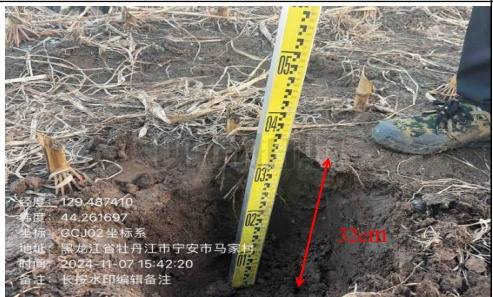

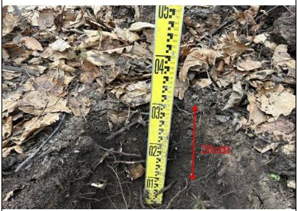  
图 2.2-1 输电线路牵张场地布置实例图

## 3）跨越施工场地

本项目输电线路除跨越河流外，对跨越铁路、道路、高压线等设施需要搭设跨越架。跨越架一般有三种形式：①采用木架或钢管式跨越架；②金属格构式跨越架；③利用铁塔作支承体跨越。通过调查同类输电工程跨越架搭设方式并参照《输变电工程水土保持技术规程》（国家电网企管〔2023〕561号）要求，确定跨越35kV～220kV等级输电线路、铁路、国道、省道、一般公路跨越施工场地每处按 $4 0 0 \mathrm { m } ^ { 2 }$ 取值（跨越架在跨越对象两侧各20m×10m），跨越水泥路、10kV及以下电力线、架空通信线跨越施工场地每处按 $2 0 0 \mathrm { m } ^ { 2 }$ 取值（跨越架在跨越对象两侧各 10m×10m）。交叉跨越角尽量接近 $9 0 ^ { \circ }$ ，以减少临时占地的面积。

本项目跨越铁路、国道、省道、一般公路、高压线（35kV及以上电力线）共计10处，跨越水泥路、10kV及以下电力线、架空通信线171 处，临时占地面积共 3.82hm2。本项目输电线路沿线跨越施工作业场地布置情况见表 2.2-2。

表2.2-2 输电线路沿线跨越施工作业场地布置一览表
<table><tr><td rowspan=2 colspan=3>沿线所经过行政区</td><td rowspan=1 colspan=2>跨越对象</td><td rowspan=1 colspan=3>土地利用类型 $\left( \mathrm { h m } ^ { 2 } \right)$ </td></tr><tr><td rowspan=1 colspan=1>名称</td><td rowspan=1 colspan=1>数量(处)</td><td rowspan=1 colspan=1>耕地(旱地)</td><td rowspan=1 colspan=1>林地(其他林地）</td><td rowspan=1 colspan=1>小计</td></tr><tr><td rowspan=1 colspan=3>一、黑龙江省</td><td rowspan=1 colspan=1></td><td rowspan=1 colspan=1>134</td><td rowspan=1 colspan=1>2.44</td><td rowspan=1 colspan=1>0.40</td><td rowspan=1 colspan=1>2.84</td></tr><tr><td rowspan=7 colspan=1>牡丹江市</td><td rowspan=3 colspan=1>西安区</td><td rowspan=2 colspan=1>平原区</td><td rowspan=1 colspan=1>110kV 线路</td><td rowspan=1 colspan=1>1</td><td rowspan=1 colspan=1>0.04</td><td rowspan=1 colspan=1></td><td rowspan=1 colspan=1>0.04</td></tr><tr><td rowspan=1 colspan=1>水泥路、10kV及以下电力线、架空通信线</td><td rowspan=1 colspan=1>10</td><td rowspan=1 colspan=1>0.20</td><td rowspan=1 colspan=1></td><td rowspan=1 colspan=1>0.20</td></tr><tr><td rowspan=1 colspan=1>小计</td><td rowspan=1 colspan=1></td><td rowspan=1 colspan=1>11</td><td rowspan=1 colspan=1>0.24</td><td rowspan=1 colspan=1></td><td rowspan=1 colspan=1>0.24</td></tr><tr><td rowspan=4 colspan=1>宁安市</td><td rowspan=2 colspan=1>山丘区</td><td rowspan=1 colspan=1>66kV(35kV)线路、铁路、国道、省道、一般公路</td><td rowspan=1 colspan=1>7</td><td rowspan=1 colspan=1>0.08</td><td rowspan=1 colspan=1>0.20</td><td rowspan=1 colspan=1>0.28</td></tr><tr><td rowspan=1 colspan=1>水泥路、10kV及以下电力线、架空通信线</td><td rowspan=1 colspan=1>45</td><td rowspan=1 colspan=1>0.70</td><td rowspan=1 colspan=1>0.20</td><td rowspan=1 colspan=1>0.90</td></tr><tr><td rowspan=1 colspan=1>平原区</td><td rowspan=1 colspan=1>水泥路、10kV及以下电力线、架空通信线</td><td rowspan=1 colspan=1>71</td><td rowspan=1 colspan=1>1.42</td><td rowspan=1 colspan=1></td><td rowspan=1 colspan=1>1.42</td></tr><tr><td rowspan=1 colspan=1>小计</td><td rowspan=1 colspan=1></td><td rowspan=1 colspan=1>123</td><td rowspan=1 colspan=1>2.20</td><td rowspan=1 colspan=1>0.40</td><td rowspan=1 colspan=1>2.60</td></tr><tr><td rowspan=1 colspan=3>二、吉林省</td><td rowspan=1 colspan=1></td><td rowspan=1 colspan=1>47</td><td rowspan=1 colspan=1>0.66</td><td rowspan=1 colspan=1>0.32</td><td rowspan=1 colspan=1>0.98</td></tr><tr><td rowspan=4 colspan=1>延边朝鲜族自治州</td><td rowspan=4 colspan=1>敦化市</td><td rowspan=2 colspan=1>山丘区</td><td rowspan=1 colspan=1>220kV 线路、国道</td><td rowspan=1 colspan=1>2</td><td rowspan=1 colspan=1></td><td rowspan=1 colspan=1>0.08</td><td rowspan=1 colspan=1>0.08</td></tr><tr><td rowspan=1 colspan=1>水泥路、10kV及以下电力线、架空通信线</td><td rowspan=1 colspan=1>43</td><td rowspan=1 colspan=1>0.62</td><td rowspan=1 colspan=1>0.24</td><td rowspan=1 colspan=1>0.86</td></tr><tr><td rowspan=1 colspan=1>平原区</td><td rowspan=1 colspan=1>水泥路、10kV及以下电力线、架空通信线</td><td rowspan=1 colspan=1>2</td><td rowspan=1 colspan=1>0.04</td><td rowspan=1 colspan=1></td><td rowspan=1 colspan=1>0.04</td></tr><tr><td rowspan=1 colspan=1>小计</td><td rowspan=1 colspan=1></td><td rowspan=1 colspan=1>47</td><td rowspan=1 colspan=1>0.66</td><td rowspan=1 colspan=1>0.32</td><td rowspan=1 colspan=1>0.98</td></tr><tr><td rowspan=1 colspan=3>合计</td><td rowspan=1 colspan=1></td><td rowspan=1 colspan=1>181</td><td rowspan=1 colspan=1>3.10</td><td rowspan=1 colspan=1>0.72</td><td rowspan=1 colspan=1>3.82</td></tr></table>

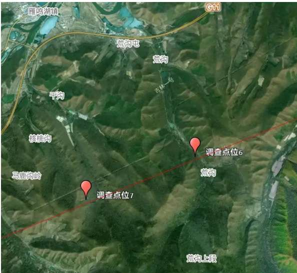

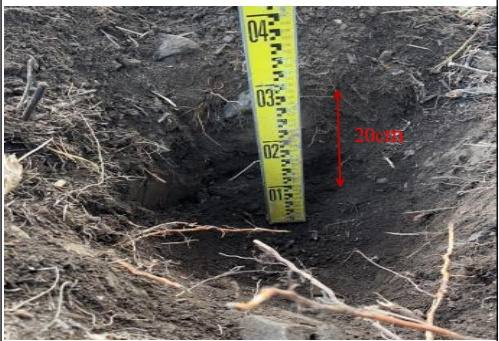  
图2.2-2 输电线路跨越施工场地布置实例图

## 4）施工道路

本项目对外交通主要解决建筑材料和牵引张拉设备等运输问题，施工中尽可能的利用现有道路运输。本项目施工道路包括新修汽车运输道路、拓宽道路和人抬道路三部分，其中：新修汽车运输道路总长 41.21km，拓宽道路总长 27.94km，人抬道路总长 32.08km。施工道路具体布设如下：

1）线路沿线相对高差200m\~500m 的山丘区，交通条件较差，主体工程设计至林地植被稀疏的塔位采取汽车运输方式，至林地植被茂盛的塔位（含穿越镜泊湖国家森林公园和生态保护红线）采取人抬运输方式。新修汽车运输道路长 7.46km，宽5.0m\~6.5m（含临时排水沟、边坡），采取半填半挖形式，路基挖方及填方高度小于0.5m，边坡按1:1.5控制，填方坡脚及边坡采用编织袋装土防护；局部施工道路的上坡侧设置临时排水沟，临时排水沟挖方就近回填在施工道路低洼处。人抬道路长 26.50km、宽1.0m，采用土质道路，无土石方扰动，不涉及路基。

2）线路沿线相对高差小于200m的山丘区，施工中尽可能利用已有道路，当现有道路路面宽度不能满足汽车运输要求时，需对其进行拓宽使用；对位于部分耕地、园地和林地植被稀疏的塔位需要新建汽车运输道路，以便施工机械到达塔基施工区域；位于林地植被茂盛的塔位，需临时开辟人抬道路。拓宽道路长 14.17km、扩宽占地宽1.5m，确保拓宽后路面宽3.5m；拓宽道路路面标高与现有道路基本一致，拓宽道路有一定的挖填方量；现有道路路面已平整，基本无挖填方扰动。新建汽车运输道路长度17.70km，道路宽 3.5m\~4.5m，顺地势修建，路面需进行简单平整、压实，不涉及路基边坡防护和排水设施。人抬道路长5.58km，宽1.0m，采用土质道路，无土石方扰动。

3）平原区塔基尽可能利用已有道路，当现有道路路面宽度不能满足汽车运输要求时，需对其进行拓宽使用；位于部分耕地、草地和林地中央的塔基，则需要新建汽车运输道路以便施工机械到达塔基施工区域，路面无土石方开挖。平原区拓宽道路长13.77km、扩宽占地宽1.5m，确保拓宽后路面宽 3.5m；拓宽道路路面标高与现有道路基本一致，拓宽道路基本无挖填方量；现有道路路面已平整，无挖填方扰动。新建汽车运输道路长度 16.05km，道路宽 3.5m。

根据本项目表土剥离利用方案，新修汽车运输道路、拓宽道路剥离的表土尽可能沿道路一侧堆放；受地形影响，山丘区部分路段表土需运至附近地势平缓处并沿道路一侧堆放。

本工程输电线路沿线施工道路及临时堆土区布置情况见表2.2-3。

表2.2-3 输电线路沿线施工道路及临时堆土区布置一览表
<table><tr><td rowspan=2 colspan=4>行政区</td><td rowspan=1 colspan=9>新修汽车运输道路</td><td rowspan=1 colspan=9>拓宽道路</td><td rowspan=1 colspan=2>人抬道路</td><td rowspan=1 colspan=1></td></tr><tr><td rowspan=1 colspan=1>水田</td><td rowspan=1 colspan=1>旱地</td><td rowspan=1 colspan=1>果园</td><td rowspan=1 colspan=1>其他园灌地</td><td rowspan=1 colspan=1>木林地</td><td rowspan=1 colspan=1>乔木林地</td><td rowspan=1 colspan=1>其他林地</td><td rowspan=1 colspan=1>其他草地</td><td rowspan=1 colspan=1>小计</td><td rowspan=1 colspan=1>水田</td><td rowspan=1 colspan=1>旱地</td><td rowspan=1 colspan=1>果园</td><td rowspan=1 colspan=1>其他园灌地</td><td rowspan=1 colspan=1>木林地</td><td rowspan=1 colspan=1>乔木林地</td><td rowspan=1 colspan=1>其他林其地</td><td rowspan=1 colspan=1>他草地</td><td rowspan=1 colspan=1>小计</td><td rowspan=1 colspan=1>旱地</td><td rowspan=1 colspan=1>乔木林地</td><td rowspan=1 colspan=1>小计</td></tr><tr><td rowspan=1 colspan=4>一、黑龙江省</td><td rowspan=1 colspan=1></td><td rowspan=1 colspan=1></td><td rowspan=1 colspan=1></td><td rowspan=1 colspan=1></td><td rowspan=1 colspan=1></td><td rowspan=1 colspan=1></td><td rowspan=1 colspan=1></td><td rowspan=1 colspan=1></td><td rowspan=1 colspan=1></td><td rowspan=1 colspan=1></td><td rowspan=1 colspan=1></td><td rowspan=1 colspan=1></td><td rowspan=1 colspan=1></td><td rowspan=1 colspan=1></td><td rowspan=1 colspan=1></td><td rowspan=1 colspan=1></td><td rowspan=1 colspan=1></td><td rowspan=1 colspan=1></td><td rowspan=1 colspan=1></td><td rowspan=1 colspan=1></td><td rowspan=1 colspan=1></td></tr><tr><td rowspan=12 colspan=1>牡丹江市</td><td rowspan=4 colspan=1>西安区</td><td rowspan=4 colspan=1>平原区</td><td rowspan=1 colspan=1>道路长度（km）</td><td rowspan=1 colspan=1></td><td rowspan=1 colspan=1>2.11</td><td rowspan=1 colspan=1></td><td rowspan=1 colspan=1></td><td rowspan=1 colspan=1></td><td rowspan=1 colspan=1>0.05</td><td rowspan=1 colspan=1>0.10</td><td rowspan=1 colspan=1></td><td rowspan=1 colspan=1>2.26</td><td rowspan=1 colspan=1></td><td rowspan=1 colspan=1>2.22</td><td rowspan=1 colspan=1></td><td rowspan=1 colspan=1></td><td rowspan=1 colspan=1></td><td rowspan=1 colspan=1></td><td rowspan=1 colspan=1></td><td rowspan=1 colspan=1></td><td rowspan=1 colspan=1>2.22</td><td rowspan=1 colspan=1></td><td rowspan=1 colspan=1></td><td rowspan=1 colspan=1></td></tr><tr><td rowspan=1 colspan=1>道路面积(m²)</td><td rowspan=1 colspan=1></td><td rowspan=1 colspan=1>7385</td><td rowspan=1 colspan=1></td><td rowspan=1 colspan=1></td><td rowspan=1 colspan=1></td><td rowspan=1 colspan=1>175</td><td rowspan=1 colspan=1>350</td><td rowspan=1 colspan=1></td><td rowspan=1 colspan=1>7910</td><td rowspan=1 colspan=1></td><td rowspan=1 colspan=1>3330</td><td rowspan=1 colspan=1></td><td rowspan=1 colspan=1></td><td rowspan=1 colspan=1></td><td rowspan=1 colspan=1></td><td rowspan=1 colspan=1></td><td rowspan=1 colspan=1></td><td rowspan=1 colspan=1>3330</td><td rowspan=1 colspan=1></td><td rowspan=1 colspan=1></td><td rowspan=1 colspan=1></td></tr><tr><td rowspan=1 colspan=1>临时堆土面积(m²)</td><td rowspan=1 colspan=1></td><td rowspan=1 colspan=1>3587</td><td rowspan=1 colspan=1></td><td rowspan=1 colspan=1></td><td rowspan=1 colspan=1></td><td rowspan=1 colspan=1>70</td><td rowspan=1 colspan=1>140</td><td rowspan=1 colspan=1></td><td rowspan=1 colspan=1>3797</td><td rowspan=1 colspan=1></td><td rowspan=1 colspan=1>2442</td><td rowspan=1 colspan=1></td><td rowspan=1 colspan=1></td><td rowspan=1 colspan=1></td><td rowspan=1 colspan=1></td><td rowspan=1 colspan=1></td><td rowspan=1 colspan=1></td><td rowspan=1 colspan=1>2442</td><td rowspan=1 colspan=1></td><td rowspan=1 colspan=1></td><td rowspan=1 colspan=1></td></tr><tr><td rowspan=1 colspan=1>面积小计(hm²)</td><td rowspan=1 colspan=1></td><td rowspan=1 colspan=1>1.10</td><td rowspan=1 colspan=1></td><td rowspan=1 colspan=1></td><td rowspan=1 colspan=1></td><td rowspan=1 colspan=1>0.02</td><td rowspan=1 colspan=1>0.05</td><td rowspan=1 colspan=1></td><td rowspan=1 colspan=1>1.17</td><td rowspan=1 colspan=1></td><td rowspan=1 colspan=1>0.58</td><td rowspan=1 colspan=1></td><td rowspan=1 colspan=1></td><td rowspan=1 colspan=1></td><td rowspan=1 colspan=1></td><td rowspan=1 colspan=1></td><td rowspan=1 colspan=1></td><td rowspan=1 colspan=1>0.58</td><td rowspan=1 colspan=1></td><td rowspan=1 colspan=1></td><td rowspan=1 colspan=1></td></tr><tr><td rowspan=8 colspan=1>宁安市</td><td rowspan=4 colspan=1>山丘区</td><td rowspan=1 colspan=1>道路长度（km）</td><td rowspan=1 colspan=1></td><td rowspan=1 colspan=1>8.67</td><td rowspan=1 colspan=1>0.42</td><td rowspan=1 colspan=1>0.23</td><td rowspan=1 colspan=1></td><td rowspan=1 colspan=1>3.76</td><td rowspan=1 colspan=1>2.50</td><td rowspan=1 colspan=1></td><td rowspan=1 colspan=1>15.58</td><td rowspan=1 colspan=1></td><td rowspan=1 colspan=1>7.09</td><td rowspan=1 colspan=1>0.12</td><td rowspan=1 colspan=1>0.30</td><td rowspan=1 colspan=1></td><td rowspan=1 colspan=1>3.60</td><td rowspan=1 colspan=1></td><td rowspan=1 colspan=1>0.56</td><td rowspan=1 colspan=1>11.67</td><td rowspan=1 colspan=1>2.66</td><td rowspan=1 colspan=1>12.72</td><td rowspan=1 colspan=1>15.38</td></tr><tr><td rowspan=1 colspan=1>道路面积(m²)</td><td rowspan=1 colspan=1></td><td rowspan=1 colspan=1>39015</td><td rowspan=1 colspan=1>1890</td><td rowspan=1 colspan=1>1035</td><td rowspan=1 colspan=1></td><td rowspan=1 colspan=1>22560</td><td rowspan=1 colspan=1>11250</td><td rowspan=1 colspan=1></td><td rowspan=1 colspan=1>75750</td><td rowspan=1 colspan=1></td><td rowspan=1 colspan=1>10635</td><td rowspan=1 colspan=1>180</td><td rowspan=1 colspan=1>450</td><td rowspan=1 colspan=1>0</td><td rowspan=1 colspan=1>5400</td><td rowspan=1 colspan=1>0</td><td rowspan=1 colspan=1>840</td><td rowspan=1 colspan=1>17505</td><td rowspan=1 colspan=1>2660</td><td rowspan=1 colspan=1>12720</td><td rowspan=1 colspan=1>15380</td></tr><tr><td rowspan=1 colspan=1>临时堆土面积(m²)</td><td rowspan=1 colspan=1></td><td rowspan=1 colspan=1>16473</td><td rowspan=1 colspan=1>672</td><td rowspan=1 colspan=1>368</td><td rowspan=1 colspan=1></td><td rowspan=1 colspan=1>6768</td><td rowspan=1 colspan=1>4000</td><td rowspan=1 colspan=1></td><td rowspan=1 colspan=1>28281</td><td rowspan=1 colspan=1></td><td rowspan=1 colspan=1>7799</td><td rowspan=1 colspan=1>120</td><td rowspan=1 colspan=1>300</td><td rowspan=1 colspan=1></td><td rowspan=1 colspan=1>3600</td><td rowspan=1 colspan=1></td><td rowspan=1 colspan=1>560</td><td rowspan=1 colspan=1>12379</td><td rowspan=1 colspan=1></td><td rowspan=1 colspan=1></td><td rowspan=1 colspan=1>0</td></tr><tr><td rowspan=1 colspan=1>面积小计(hm²)</td><td rowspan=1 colspan=1></td><td rowspan=1 colspan=1>5.55</td><td rowspan=1 colspan=1>0.26</td><td rowspan=1 colspan=1>0.14</td><td rowspan=1 colspan=1></td><td rowspan=1 colspan=1>2.93</td><td rowspan=1 colspan=1>1.53</td><td rowspan=1 colspan=1></td><td rowspan=1 colspan=1>10.41</td><td rowspan=1 colspan=1></td><td rowspan=1 colspan=1>1.84</td><td rowspan=1 colspan=1>0.03</td><td rowspan=1 colspan=1>0.08</td><td rowspan=1 colspan=1></td><td rowspan=1 colspan=1>0.90</td><td rowspan=1 colspan=1></td><td rowspan=1 colspan=1>0.14</td><td rowspan=1 colspan=1>2.99</td><td rowspan=1 colspan=1>0.27</td><td rowspan=1 colspan=1>1.27</td><td rowspan=1 colspan=1>1.54</td></tr><tr><td rowspan=4 colspan=1>平原区</td><td rowspan=1 colspan=1>道路长度（km）</td><td rowspan=1 colspan=1>0.43</td><td rowspan=1 colspan=1>10.08</td><td rowspan=1 colspan=1></td><td rowspan=1 colspan=1></td><td rowspan=1 colspan=1>0.67</td><td rowspan=1 colspan=1>1.42</td><td rowspan=1 colspan=1></td><td rowspan=1 colspan=1>1.09</td><td rowspan=1 colspan=1>13.69</td><td rowspan=1 colspan=1>1.26</td><td rowspan=1 colspan=1>7.72</td><td rowspan=1 colspan=1></td><td rowspan=1 colspan=1></td><td rowspan=1 colspan=1>0.86</td><td rowspan=1 colspan=1></td><td rowspan=1 colspan=1>0.56</td><td rowspan=1 colspan=1>0.92</td><td rowspan=1 colspan=1>11.32</td><td rowspan=1 colspan=1></td><td rowspan=1 colspan=1></td><td rowspan=1 colspan=1>0</td></tr><tr><td rowspan=1 colspan=1>道路面积(m²)</td><td rowspan=1 colspan=1>1505</td><td rowspan=1 colspan=1>35280</td><td rowspan=1 colspan=1></td><td rowspan=1 colspan=1></td><td rowspan=1 colspan=1>2345</td><td rowspan=1 colspan=1>4970</td><td rowspan=1 colspan=1></td><td rowspan=1 colspan=1>3815</td><td rowspan=1 colspan=1>47915</td><td rowspan=1 colspan=1>1890</td><td rowspan=1 colspan=1></td><td rowspan=1 colspan=1></td><td rowspan=1 colspan=1></td><td rowspan=1 colspan=1>1290</td><td rowspan=1 colspan=1></td><td rowspan=1 colspan=1>840</td><td rowspan=1 colspan=1>1380</td><td rowspan=1 colspan=1>5400</td><td rowspan=1 colspan=1></td><td rowspan=1 colspan=1></td><td rowspan=1 colspan=1>0</td></tr><tr><td rowspan=1 colspan=1>临时堆土面积(m²)</td><td rowspan=1 colspan=1>731</td><td rowspan=1 colspan=1>17136</td><td rowspan=1 colspan=1></td><td rowspan=1 colspan=1></td><td rowspan=1 colspan=1>938</td><td rowspan=1 colspan=1>1988</td><td rowspan=1 colspan=1></td><td rowspan=1 colspan=1>1526</td><td rowspan=1 colspan=1>22319</td><td rowspan=1 colspan=1>1386</td><td rowspan=1 colspan=1></td><td rowspan=1 colspan=1></td><td rowspan=1 colspan=1></td><td rowspan=1 colspan=1>860</td><td rowspan=1 colspan=1></td><td rowspan=1 colspan=1>560</td><td rowspan=1 colspan=1>920</td><td rowspan=1 colspan=1>3726</td><td rowspan=1 colspan=1></td><td rowspan=1 colspan=1></td><td rowspan=1 colspan=1>0</td></tr><tr><td rowspan=1 colspan=1>面积小计(hm²)</td><td rowspan=1 colspan=1>0.22</td><td rowspan=1 colspan=1>5.24</td><td rowspan=1 colspan=1></td><td rowspan=1 colspan=1></td><td rowspan=1 colspan=1>0.33</td><td rowspan=1 colspan=1>0.70</td><td rowspan=1 colspan=1></td><td rowspan=1 colspan=1>0.53</td><td rowspan=1 colspan=1>7.02</td><td rowspan=1 colspan=1>0.33</td><td rowspan=1 colspan=1></td><td rowspan=1 colspan=1></td><td rowspan=1 colspan=1></td><td rowspan=1 colspan=1>0.22</td><td rowspan=1 colspan=1></td><td rowspan=1 colspan=1>0.14</td><td rowspan=1 colspan=1>0.23</td><td rowspan=1 colspan=1>0.92</td><td rowspan=1 colspan=1></td><td rowspan=1 colspan=1></td><td rowspan=1 colspan=1></td></tr><tr><td rowspan=1 colspan=1></td><td rowspan=1 colspan=1></td><td rowspan=1 colspan=1>二、吉</td><td rowspan=1 colspan=1>林省</td><td rowspan=1 colspan=1></td><td rowspan=1 colspan=1></td><td rowspan=1 colspan=1></td><td rowspan=1 colspan=1></td><td rowspan=1 colspan=1></td><td rowspan=1 colspan=1></td><td rowspan=1 colspan=1></td><td rowspan=1 colspan=1></td><td rowspan=1 colspan=1></td><td rowspan=1 colspan=1></td><td rowspan=1 colspan=1></td><td rowspan=1 colspan=1></td><td rowspan=1 colspan=1></td><td rowspan=1 colspan=1></td><td rowspan=1 colspan=1></td><td rowspan=1 colspan=1></td><td rowspan=1 colspan=1></td><td rowspan=1 colspan=1></td><td rowspan=1 colspan=1></td><td rowspan=1 colspan=1></td><td rowspan=1 colspan=1></td></tr><tr><td rowspan=8 colspan=1>延边朝鲜族自治州</td><td rowspan=8 colspan=1>敦化市</td><td rowspan=4 colspan=1>山丘区</td><td rowspan=1 colspan=1>道路长度（km）</td><td rowspan=1 colspan=1></td><td rowspan=1 colspan=1>2.82</td><td rowspan=1 colspan=1>0.16</td><td rowspan=1 colspan=1></td><td rowspan=1 colspan=1></td><td rowspan=1 colspan=1>3.70</td><td rowspan=1 colspan=1>2.90</td><td rowspan=1 colspan=1></td><td rowspan=1 colspan=1>9.58</td><td rowspan=1 colspan=1></td><td rowspan=1 colspan=1>0.35</td><td rowspan=1 colspan=1>0.07</td><td rowspan=1 colspan=1></td><td rowspan=1 colspan=1></td><td rowspan=1 colspan=1>0.25</td><td rowspan=1 colspan=1>1.20</td><td rowspan=1 colspan=1>0.63</td><td rowspan=1 colspan=1>2.50</td><td rowspan=1 colspan=1>2.92</td><td rowspan=1 colspan=1>13.78</td><td rowspan=1 colspan=1>16.70</td></tr><tr><td rowspan=1 colspan=1>道路面积(m²)</td><td rowspan=1 colspan=1></td><td rowspan=1 colspan=1>12690</td><td rowspan=1 colspan=1>720</td><td rowspan=1 colspan=1></td><td rowspan=1 colspan=1></td><td rowspan=1 colspan=1>22200</td><td rowspan=1 colspan=1>13050</td><td rowspan=1 colspan=1></td><td rowspan=1 colspan=1>48660</td><td rowspan=1 colspan=1></td><td rowspan=1 colspan=1>525</td><td rowspan=1 colspan=1>105</td><td rowspan=1 colspan=1></td><td rowspan=1 colspan=1></td><td rowspan=1 colspan=1>375</td><td rowspan=1 colspan=1>1800</td><td rowspan=1 colspan=1>945</td><td rowspan=1 colspan=1>3750</td><td rowspan=1 colspan=1>2920</td><td rowspan=1 colspan=1>13780</td><td rowspan=1 colspan=1>16700</td></tr><tr><td rowspan=1 colspan=1>临时堆土面积(m²)</td><td rowspan=1 colspan=1></td><td rowspan=1 colspan=1>5358</td><td rowspan=1 colspan=1>256</td><td rowspan=1 colspan=1></td><td rowspan=1 colspan=1></td><td rowspan=1 colspan=1>6660</td><td rowspan=1 colspan=1>4640</td><td rowspan=1 colspan=1></td><td rowspan=1 colspan=1>16914</td><td rowspan=1 colspan=1></td><td rowspan=1 colspan=1>385</td><td rowspan=1 colspan=1>70</td><td rowspan=1 colspan=1></td><td rowspan=1 colspan=1></td><td rowspan=1 colspan=1>250</td><td rowspan=1 colspan=1>1200</td><td rowspan=1 colspan=1>630</td><td rowspan=1 colspan=1>2535</td><td rowspan=1 colspan=1></td><td rowspan=1 colspan=1></td><td rowspan=1 colspan=1>0</td></tr><tr><td rowspan=1 colspan=1>面积小计(hm²)</td><td rowspan=1 colspan=1></td><td rowspan=1 colspan=1>1.80</td><td rowspan=1 colspan=1>0.10</td><td rowspan=1 colspan=1></td><td rowspan=1 colspan=1></td><td rowspan=1 colspan=1>2.89</td><td rowspan=1 colspan=1>1.77</td><td rowspan=1 colspan=1></td><td rowspan=1 colspan=1>6.56</td><td rowspan=1 colspan=1></td><td rowspan=1 colspan=1>0.09</td><td rowspan=1 colspan=1>0.02</td><td rowspan=1 colspan=1></td><td rowspan=1 colspan=1></td><td rowspan=1 colspan=1>0.06</td><td rowspan=1 colspan=1>0.30</td><td rowspan=1 colspan=1>0.16</td><td rowspan=1 colspan=1>0.63</td><td rowspan=1 colspan=1>0.29</td><td rowspan=1 colspan=1>1.38</td><td rowspan=1 colspan=1>1.67</td></tr><tr><td rowspan=4 colspan=1>平原区</td><td rowspan=1 colspan=1>道路长度（km）</td><td rowspan=1 colspan=1></td><td rowspan=1 colspan=1>0.10</td><td rowspan=1 colspan=1></td><td rowspan=1 colspan=1></td><td rowspan=1 colspan=1></td><td rowspan=1 colspan=1></td><td rowspan=1 colspan=1></td><td rowspan=1 colspan=1></td><td rowspan=1 colspan=1>0.10</td><td rowspan=1 colspan=1>0.23</td><td rowspan=1 colspan=1></td><td rowspan=1 colspan=1></td><td rowspan=1 colspan=1></td><td rowspan=1 colspan=1></td><td rowspan=1 colspan=1></td><td rowspan=1 colspan=1></td><td rowspan=1 colspan=1></td><td rowspan=1 colspan=1>0.23</td><td rowspan=1 colspan=1></td><td rowspan=1 colspan=1></td><td rowspan=1 colspan=1>0</td></tr><tr><td rowspan=1 colspan=1>道路面积(m²)</td><td rowspan=1 colspan=1></td><td rowspan=1 colspan=1>350</td><td rowspan=1 colspan=1></td><td rowspan=1 colspan=1></td><td rowspan=1 colspan=1></td><td rowspan=1 colspan=1></td><td rowspan=1 colspan=1></td><td rowspan=1 colspan=1></td><td rowspan=1 colspan=1>350</td><td rowspan=1 colspan=1>345</td><td rowspan=1 colspan=1></td><td rowspan=1 colspan=1></td><td rowspan=1 colspan=1></td><td rowspan=1 colspan=1></td><td rowspan=1 colspan=1></td><td rowspan=1 colspan=1></td><td rowspan=1 colspan=1></td><td rowspan=1 colspan=1>345</td><td rowspan=1 colspan=1></td><td rowspan=1 colspan=1></td><td rowspan=1 colspan=1>0</td></tr><tr><td rowspan=1 colspan=1>临时堆土面积(m²)</td><td rowspan=1 colspan=1></td><td rowspan=1 colspan=1>170</td><td rowspan=1 colspan=1></td><td rowspan=1 colspan=1></td><td rowspan=1 colspan=1></td><td rowspan=1 colspan=1></td><td rowspan=1 colspan=1></td><td rowspan=1 colspan=1></td><td rowspan=1 colspan=1>170</td><td rowspan=1 colspan=1>253</td><td rowspan=1 colspan=1></td><td rowspan=1 colspan=1></td><td rowspan=1 colspan=1></td><td rowspan=1 colspan=1></td><td rowspan=1 colspan=1></td><td rowspan=1 colspan=1></td><td rowspan=1 colspan=1></td><td rowspan=1 colspan=1>253</td><td rowspan=1 colspan=1></td><td rowspan=1 colspan=1></td><td rowspan=1 colspan=1>0</td></tr><tr><td rowspan=1 colspan=1>面积小计(hm²)</td><td rowspan=1 colspan=1></td><td rowspan=1 colspan=1>0.05</td><td rowspan=1 colspan=1></td><td rowspan=1 colspan=1></td><td rowspan=1 colspan=1></td><td rowspan=1 colspan=1></td><td rowspan=1 colspan=1></td><td rowspan=1 colspan=1></td><td rowspan=1 colspan=1>0.05</td><td rowspan=1 colspan=1>0.06</td><td rowspan=1 colspan=1></td><td rowspan=1 colspan=1></td><td rowspan=1 colspan=1></td><td rowspan=1 colspan=1></td><td rowspan=1 colspan=1></td><td rowspan=1 colspan=1></td><td rowspan=1 colspan=1></td><td rowspan=1 colspan=1>0.06</td><td rowspan=1 colspan=1></td><td rowspan=1 colspan=1></td><td rowspan=1 colspan=1></td></tr></table>

<table><tr><td rowspan=2 colspan=3>行政区</td><td rowspan=1 colspan=9>新修汽车运输道路</td><td rowspan=1 colspan=9>拓宽道路</td><td rowspan=1 colspan=3>人抬道路</td></tr><tr><td rowspan=1 colspan=1>水田</td><td rowspan=1 colspan=1>旱地</td><td rowspan=1 colspan=1>果园</td><td rowspan=1 colspan=1>其他园地</td><td rowspan=1 colspan=1>灌木林地</td><td rowspan=1 colspan=1>乔木林地</td><td rowspan=1 colspan=1>其他林地</td><td rowspan=1 colspan=1>其他草地</td><td rowspan=1 colspan=1>小计</td><td rowspan=1 colspan=1>水田</td><td rowspan=1 colspan=1>旱地</td><td rowspan=1 colspan=1>果园</td><td rowspan=1 colspan=1>其他园灌地</td><td rowspan=1 colspan=1>木林地</td><td rowspan=1 colspan=1>乔木林地</td><td rowspan=1 colspan=1>其他林其地</td><td rowspan=1 colspan=1>他草地</td><td rowspan=1 colspan=1>小计</td><td rowspan=1 colspan=1>旱地</td><td rowspan=1 colspan=1>乔木林地</td><td rowspan=1 colspan=1>小计</td></tr><tr><td rowspan=8 colspan=1>合计</td><td rowspan=3 colspan=1>山丘区</td><td rowspan=1 colspan=1>道路长度（km）</td><td rowspan=1 colspan=1></td><td rowspan=1 colspan=1>11.49</td><td rowspan=1 colspan=1>0.58</td><td rowspan=1 colspan=1>0.23</td><td rowspan=1 colspan=1>0.00</td><td rowspan=1 colspan=1>7.46</td><td rowspan=1 colspan=1>5.40</td><td rowspan=1 colspan=1></td><td rowspan=1 colspan=1>25.16</td><td rowspan=1 colspan=1></td><td rowspan=1 colspan=1>7.44</td><td rowspan=1 colspan=1>0.19</td><td rowspan=1 colspan=1>0.30</td><td rowspan=1 colspan=1>0.00</td><td rowspan=1 colspan=1>3.85</td><td rowspan=1 colspan=1>1.20</td><td rowspan=1 colspan=1>1.19</td><td rowspan=1 colspan=1>14.17</td><td rowspan=1 colspan=1>5.58</td><td rowspan=1 colspan=1>26.50</td><td rowspan=1 colspan=1>32.08</td></tr><tr><td rowspan=1 colspan=1>道路面积(m²)</td><td rowspan=1 colspan=1></td><td rowspan=1 colspan=1>51705</td><td rowspan=1 colspan=1>2610</td><td rowspan=1 colspan=1>1035</td><td rowspan=1 colspan=1></td><td rowspan=1 colspan=1>44760</td><td rowspan=1 colspan=1>24300</td><td rowspan=1 colspan=1></td><td rowspan=1 colspan=1>124410</td><td rowspan=1 colspan=1></td><td rowspan=1 colspan=1>11160</td><td rowspan=1 colspan=1>285</td><td rowspan=1 colspan=1>450</td><td rowspan=1 colspan=1>0</td><td rowspan=1 colspan=1>5775</td><td rowspan=1 colspan=1>1800</td><td rowspan=1 colspan=1>1785</td><td rowspan=1 colspan=1>21255</td><td rowspan=1 colspan=1>5580</td><td rowspan=1 colspan=1>26500</td><td rowspan=1 colspan=1>32080</td></tr><tr><td rowspan=1 colspan=1>临时堆土面积(m²)</td><td rowspan=1 colspan=1></td><td rowspan=1 colspan=1>21831</td><td rowspan=1 colspan=1>928</td><td rowspan=1 colspan=1>368</td><td rowspan=1 colspan=1></td><td rowspan=1 colspan=1>13428</td><td rowspan=1 colspan=1>8640</td><td rowspan=1 colspan=1></td><td rowspan=1 colspan=1>45195</td><td rowspan=1 colspan=1></td><td rowspan=1 colspan=1>8184</td><td rowspan=1 colspan=1>190</td><td rowspan=1 colspan=1>300</td><td rowspan=1 colspan=1>0</td><td rowspan=1 colspan=1>3850</td><td rowspan=1 colspan=1>1200</td><td rowspan=1 colspan=1>1190</td><td rowspan=1 colspan=1>14914</td><td rowspan=1 colspan=1></td><td rowspan=1 colspan=1></td><td rowspan=1 colspan=1></td></tr><tr><td rowspan=1 colspan=1></td><td rowspan=1 colspan=1>面积小计(hm²)</td><td rowspan=1 colspan=1></td><td rowspan=1 colspan=1>7.35</td><td rowspan=1 colspan=1>0.36</td><td rowspan=1 colspan=1>0.14</td><td rowspan=1 colspan=1></td><td rowspan=1 colspan=1>5.82</td><td rowspan=1 colspan=1>3.30</td><td rowspan=1 colspan=1></td><td rowspan=1 colspan=1>16.97</td><td rowspan=1 colspan=1></td><td rowspan=1 colspan=1>1.93</td><td rowspan=1 colspan=1>0.05</td><td rowspan=1 colspan=1>0.08</td><td rowspan=1 colspan=1>0.00</td><td rowspan=1 colspan=1>0.96</td><td rowspan=1 colspan=1>0.30</td><td rowspan=1 colspan=1>0.30</td><td rowspan=1 colspan=1>3.62</td><td rowspan=1 colspan=1>0.56</td><td rowspan=1 colspan=1>2.65</td><td rowspan=1 colspan=1>3.21</td></tr><tr><td rowspan=4 colspan=1>平原区</td><td rowspan=1 colspan=1>道路长度（km）</td><td rowspan=1 colspan=1>0.43</td><td rowspan=1 colspan=1>12.29</td><td rowspan=1 colspan=1></td><td rowspan=1 colspan=1></td><td rowspan=1 colspan=1>0.67</td><td rowspan=1 colspan=1>1.47</td><td rowspan=1 colspan=1>0.10</td><td rowspan=1 colspan=1>1.09</td><td rowspan=1 colspan=1>16.05</td><td rowspan=1 colspan=1>1.49</td><td rowspan=1 colspan=1>9.94</td><td rowspan=1 colspan=1></td><td rowspan=1 colspan=1></td><td rowspan=1 colspan=1>0.86</td><td rowspan=1 colspan=1></td><td rowspan=1 colspan=1>0.56</td><td rowspan=1 colspan=1>0.92</td><td rowspan=1 colspan=1>13.77</td><td rowspan=1 colspan=1></td><td rowspan=1 colspan=1></td><td rowspan=1 colspan=1></td></tr><tr><td rowspan=1 colspan=1>道路面积(m²)</td><td rowspan=1 colspan=1>1505</td><td rowspan=1 colspan=1>43015</td><td rowspan=1 colspan=1></td><td rowspan=1 colspan=1></td><td rowspan=1 colspan=1>2345</td><td rowspan=1 colspan=1>5145</td><td rowspan=1 colspan=1>350</td><td rowspan=1 colspan=1>3815</td><td rowspan=1 colspan=1>56175</td><td rowspan=1 colspan=1>2235</td><td rowspan=1 colspan=1>3330</td><td rowspan=1 colspan=1></td><td rowspan=1 colspan=1></td><td rowspan=1 colspan=1>1290</td><td rowspan=1 colspan=1></td><td rowspan=1 colspan=1>840</td><td rowspan=1 colspan=1>1380</td><td rowspan=1 colspan=1>9075</td><td rowspan=1 colspan=1></td><td rowspan=1 colspan=1></td><td rowspan=1 colspan=1></td></tr><tr><td rowspan=1 colspan=1>临时堆土面积(m²)</td><td rowspan=1 colspan=1>731</td><td rowspan=1 colspan=1>20893</td><td rowspan=1 colspan=1></td><td rowspan=1 colspan=1></td><td rowspan=1 colspan=1>938</td><td rowspan=1 colspan=1>2058</td><td rowspan=1 colspan=1>140</td><td rowspan=1 colspan=1>1526</td><td rowspan=1 colspan=1>26286</td><td rowspan=1 colspan=1>1639</td><td rowspan=1 colspan=1>2442</td><td rowspan=1 colspan=1></td><td rowspan=1 colspan=1></td><td rowspan=1 colspan=1>860</td><td rowspan=1 colspan=1></td><td rowspan=1 colspan=1>560</td><td rowspan=1 colspan=1>920</td><td rowspan=1 colspan=1>6421</td><td rowspan=1 colspan=1></td><td rowspan=1 colspan=1></td><td rowspan=1 colspan=1></td></tr><tr><td rowspan=1 colspan=1>面积小计(hm²)</td><td rowspan=1 colspan=1>0.22</td><td rowspan=1 colspan=1>6.39</td><td rowspan=1 colspan=1></td><td rowspan=1 colspan=1></td><td rowspan=1 colspan=1>0.33</td><td rowspan=1 colspan=1>0.72</td><td rowspan=1 colspan=1>0.05</td><td rowspan=1 colspan=1>0.53</td><td rowspan=1 colspan=1>8.24</td><td rowspan=1 colspan=1>0.39</td><td rowspan=1 colspan=1>0.58</td><td rowspan=1 colspan=1></td><td rowspan=1 colspan=1></td><td rowspan=1 colspan=1>0.22</td><td rowspan=1 colspan=1></td><td rowspan=1 colspan=1>0.14</td><td rowspan=1 colspan=1>0.23</td><td rowspan=1 colspan=1>1.56</td><td rowspan=1 colspan=1></td><td rowspan=1 colspan=1></td><td rowspan=1 colspan=1></td></tr><tr><td rowspan=4 colspan=2>总计</td><td rowspan=1 colspan=1>道路长度（km）</td><td rowspan=1 colspan=1>0.43</td><td rowspan=1 colspan=1>23.78</td><td rowspan=1 colspan=1>0.58</td><td rowspan=1 colspan=1>0.23</td><td rowspan=1 colspan=1>0.67</td><td rowspan=1 colspan=1>8.93</td><td rowspan=1 colspan=1>5.5</td><td rowspan=1 colspan=1>1.09</td><td rowspan=1 colspan=1>41.21</td><td rowspan=1 colspan=1>1.49</td><td rowspan=1 colspan=1>17.38</td><td rowspan=1 colspan=1>0.19</td><td rowspan=1 colspan=1>0.3</td><td rowspan=1 colspan=1>0.86</td><td rowspan=1 colspan=1>3.85</td><td rowspan=1 colspan=1>1.76</td><td rowspan=1 colspan=1>2.11</td><td rowspan=1 colspan=1>27.94</td><td rowspan=1 colspan=1>5.58</td><td rowspan=1 colspan=1>26.50</td><td rowspan=1 colspan=1>32.08</td></tr><tr><td rowspan=1 colspan=1>道路面积(m²)</td><td rowspan=1 colspan=1>1505</td><td rowspan=1 colspan=1>94720</td><td rowspan=1 colspan=1>2610</td><td rowspan=1 colspan=1>1035</td><td rowspan=1 colspan=1>2345</td><td rowspan=1 colspan=1>49905</td><td rowspan=1 colspan=1>24650</td><td rowspan=1 colspan=1>3815</td><td rowspan=1 colspan=1>180585</td><td rowspan=1 colspan=1>2235</td><td rowspan=1 colspan=1>14490</td><td rowspan=1 colspan=1>285</td><td rowspan=1 colspan=1>450</td><td rowspan=1 colspan=1>1290</td><td rowspan=1 colspan=1>5775</td><td rowspan=1 colspan=1>2640</td><td rowspan=1 colspan=1>3165</td><td rowspan=1 colspan=1>30330</td><td rowspan=1 colspan=1>5580</td><td rowspan=1 colspan=1>26500</td><td rowspan=1 colspan=1>32080</td></tr><tr><td rowspan=1 colspan=1>临时堆土面积(m²)</td><td rowspan=1 colspan=1>731</td><td rowspan=1 colspan=1>42724</td><td rowspan=1 colspan=1>928</td><td rowspan=1 colspan=1>368</td><td rowspan=1 colspan=1>938</td><td rowspan=1 colspan=1>15486</td><td rowspan=1 colspan=1>8780</td><td rowspan=1 colspan=1>1526</td><td rowspan=1 colspan=1>71481</td><td rowspan=1 colspan=1>1639</td><td rowspan=1 colspan=1>10626</td><td rowspan=1 colspan=1>190</td><td rowspan=1 colspan=1>300</td><td rowspan=1 colspan=1>860</td><td rowspan=1 colspan=1>3850</td><td rowspan=1 colspan=1>1760</td><td rowspan=1 colspan=1>2110</td><td rowspan=1 colspan=1>21335</td><td rowspan=1 colspan=1>0</td><td rowspan=1 colspan=1>0</td><td rowspan=1 colspan=1>0</td></tr><tr><td rowspan=1 colspan=1>面积小计(hm²)</td><td rowspan=1 colspan=1>0.22</td><td rowspan=1 colspan=1>13.74</td><td rowspan=1 colspan=1>0.36</td><td rowspan=1 colspan=1>0.14</td><td rowspan=1 colspan=1>0.33</td><td rowspan=1 colspan=1>6.54</td><td rowspan=1 colspan=1>3.35</td><td rowspan=1 colspan=1>0.53</td><td rowspan=1 colspan=1>25.21</td><td rowspan=1 colspan=1>0.39</td><td rowspan=1 colspan=1>2.51</td><td rowspan=1 colspan=1>0.05</td><td rowspan=1 colspan=1>0.08</td><td rowspan=1 colspan=1>0.22</td><td rowspan=1 colspan=1>0.96</td><td rowspan=1 colspan=1>0.44</td><td rowspan=1 colspan=1>0.53</td><td rowspan=1 colspan=1>5.18</td><td rowspan=1 colspan=1>0.56</td><td rowspan=1 colspan=1>2.65</td><td rowspan=1 colspan=1>3.21</td></tr></table>

## 5）材料站

根据沿线的交通情况，本项目沿线拟租用已有库房或民房作为材料站，具体地点将由施工单位选定，便于塔材、钢材、线材、水泥、金具和绝缘子的集散。如线路沿线无可供租用的场地，可将材料堆放于塔基施工场地和牵张场的材料堆放区，不单独设置材料站场地。

## 6）施工生活区

输电线路施工时由于线路塔基及牵张场较分散，施工周期短，沿线村庄较多，因此工程临时施工生活用房采用租用民房的方式解决。

## 2.2.1.2 变电站

## 1）林海变

本期林海变在原围墙内扩建。考虑到施工方便，在站区东北侧围墙外、紧邻进站道路临时用地0.30hm2作为施工生产生活区。经核实，施工生产生活区地形平坦，且与已有的进站道路有良好的衔接，地形和面积符合施工生产要求。

林海变对外交通方便，站内已设置环形道路，道路宽度在3.5m\~6.0m 之间。施工建材由汽车运输，可到达施工场地。考虑到站区隔声屏施工，在站区西侧围墙外另外考虑1条施工便道，施工便道从现有乡道上接引，引接长度360m、宽3m，采用土质道路，无土石方扰动。

## 2）平安变

本期平安变在原围墙内扩建。考虑到施工方便，在站区东侧围墙外、紧邻进站道路临时用地0.30hm2作为施工生产生活区。经核实，施工生产生活区地形平坦，与已有的进站道路有良好的衔接，地形和面积符合施工生产要求。

平安变对外交通方便，站内已设置环形道路，道路宽度3.5m\~6.0m。施工建材由汽车运输，可到达施工场地。

## 2.2.2 临时堆土场

## 2.2.2.1 输电线路

本项目输电线路仅塔基区和施工道路区涉及到临时堆土。

## 1）塔基区临时堆土场

在塔基施工过程中，在每处塔基施工区内设置 2处临时堆土场，分别用于堆放表土和基础挖方。

山丘区单塔临时存放基础挖方量 $7 0 \mathrm { m } ^ { 3 } { \sim } 4 8 0 \mathrm { m } ^ { 3 }$ 、临时堆放表土量 $2 4 0 \mathrm { m } ^ { 3 } { \sim } 4 7 0 \mathrm { m } ^ { 3 }$ 。本方案设计平均每基塔临时存放基础挖方量按 220m3考虑，其临时堆土区8m×16m，设计堆高 2.0m\~2.2m，堆土各边坡比控制在 1:1\~1:1.5；平均每基塔临时堆放表土量 $4 0 0 \mathrm { m } ^ { 3 }$ 虑，其临时堆土区 15m×20m，设计堆高 1.0m\~2.0m，堆土各向边坡比控制在 1:1.5，且耕作层土壤与其他表土分开堆放。

平原区单塔临时存放基础挖方量 $1 1 0 \mathrm { m } ^ { 3 } { \sim } 5 6 5 \mathrm { m } ^ { 3 }$ 、临时堆放表土量 240m3\~450m3。本方案设计平均每基塔临时存放基础挖方量按 280m3考虑，其临时堆土区8m×18m，设计堆高 2.5m，堆土各向边坡比控制在 1:1\~1:1.5；平均每基塔临时堆放表土量390m3考虑，其临时堆土区 15m×20m，设计堆高 1.0m\~2.0m，堆土各边坡比控制在 1:1.5，且耕作层土壤与其他表土分开堆放。

塔基基础土方施工工期较短，一般为20d，平原区临时堆土不需要进行拦挡。但考虑到不利天气因素，平原区个别塔位土建施工工期较长，其临时堆土区采用编织袋装土挡护。考虑到地形条件及不利天气因素，对山丘区临时堆土区全部采用编织袋装土挡护。

## 2）施工道路区临时堆土

新修汽车运输道路、扩宽道路涉及到路面简单平整，采取随挖随填，无路面平整土方堆放。人抬道路无土石方开挖及堆放。

根据本项目表土剥离利用方案，新修汽车运输道路、拓宽道路剥离的表土尽可能沿道路一侧集中堆放，堆土时间最大不超过3 个月；受地形影响，山丘区部分路段表土需运至地势平缓处并沿道路一侧堆放。临时堆土区占地原则为：

新修汽车运输道路：①山丘区占用旱地的堆土宽度按 1.9m、堆高 0.9m，占用乔木林地的堆土宽度按1.8m、堆高 0.9m，占用果园、其他园地、其他林地的堆土宽度按 1.6m、堆高 0.8m；②平原区占用旱地的堆土宽度按1.7m、堆高0.8m，占用果园、其他园地、乔木林地、其他林地、其他草地的堆土宽度按 1.4m、堆高0.7m。临时堆土坡比控制在1:1\~1:1.5。

拓宽道路：山丘区、平原区占用水田、旱地的堆土宽度按 1.1m、堆高 0.5m，占用果园、其他园地、乔木林地、其他林地、其他草地的堆土宽度按 1.0m、堆高 0.4m。临时堆土坡比控制在 1:1\~1:1.5。

本项目输电线路沿线施工道路临时堆土区布置情况见表2.2-3。

## 2.2.2.2 变电站

林海变和平安变扩建土建施工工期较短，一般为6 个月，回填土石方量也较小。施工中规划好土石方量，需要回填的基槽土堆放在基础周围，短暂堆放后回填；部分基槽

余土先行平整利用在各站区围墙内 500kV 配电装置区预留间隔内非临时堆土场区的区域，按设计厚度平整；其余基槽余土集中堆放在临时堆土场内，随施工进展平整利用在临时堆土场区内。表土集中堆放在各自临时堆土场内。

## 1）林海变

本期林海变扩建产生基槽余土 $1 2 0 0 \mathrm { m } ^ { 3 }$ ，拟全部平整利用在站区围墙内 500kV 配电装置区2 个预留间隔内，可平整利用面积 7200m2，平整厚度 15cm\~20cm。站内余土平整利用场地中： $4 8 0 0 \mathrm { m } ^ { 2 }$ 为非临时堆土场区，可先行平整基槽余土 $8 6 0 \mathrm m ^ { 3 }$ ，该部分基槽余土无需临时堆放；剩余基槽余土 $3 4 0 \mathrm m ^ { 3 }$ 集中堆放在临时堆土场内，临时堆土场区占地面积 2400m2。

在站区围墙内500kV配电装置区预留间隔设置2 处临时堆土场（站内余土平整利用区内）。其中：表土堆放场规格为 $3 0 \mathrm { m } { \times } 7 1 \mathrm { m }$ ，占地面积 $2 1 3 0 \mathrm { m } ^ { 2 }$ ，堆高 1.5m，坡比 1:1.5，经计算设计堆土量为 $2 7 5 0 \mathrm { m } ^ { 3 }$ ，满足堆放表土 $2 7 4 0 \mathrm { m } ^ { 3 }$ 的要求（含堆放施工生产生活区耕作层土壤 $9 0 0 \mathrm m ^ { 3 }$ ，耕作层土壤与其他表土分开堆存）。基础土方堆放场规格为 30m×9m，占地面积 $2 7 0 \mathrm { m } ^ { 2 }$ ，堆高1.5m，坡比1:1.5，经计算设计堆土量为 $3 4 4 \mathrm { m } ^ { 3 }$ ，满足堆放基槽余$\pm \ 3 4 0 \mathrm { m } ^ { 3 }$ 的要求。

## 2）平安变

本期平安变扩建产生基槽余土 $6 0 0 \mathrm { m } ^ { 3 }$ ，拟全部平整利用在站区围墙内 500kV配电装置区 1个预留间隔内，可平整利用面积 $3 0 0 0 \mathrm { m } ^ { 2 }$ ，平整厚度20cm。站内余土平整利用场地中： $1 1 6 0 \mathrm m ^ { 2 }$ 为非临时堆土场区，可先行平整基槽余土 $2 3 2 \mathrm { m } ^ { 3 }$ ，该部分基槽余土无需临时堆放；剩余基槽余土 $3 6 8 \mathrm { m } ^ { 3 }$ 集中堆放在临时堆土场内，临时堆土场区占地面积 $1 8 4 0 \mathrm m ^ { 2 }$

在站区围墙内500kV配电装置区预留间隔设置2 处临时堆土场（站内余土平整利用区内）。其中：表土堆放场规格为16m×96m，占地面积 $1 5 3 6 \mathrm { m } ^ { 2 }$ ，堆高 1.5m，坡比 1:1.5，经计算设计堆土量为 $1 9 5 5 \mathrm { m } ^ { 3 }$ ，满足堆放表土 $1 9 4 0 \mathrm { m } ^ { 3 }$ 的要求（含堆放施工生产生活区耕作层土壤 $9 0 0 \mathrm m ^ { 3 }$ ，耕作层土壤与其他表土分开堆存）。基础土方堆放场规格为 $1 6 \mathrm { m } { \times } 1 9 \mathrm { m }$ 占地面积 $3 0 4 \mathrm { m } ^ { 2 }$ ，堆高1.5m，坡比1:1.5，经计算设计堆土量为 $3 8 5 \mathrm { m } ^ { 3 }$ ，满足堆放基槽余$\pm ~ 3 6 8 \mathrm { m } ^ { 3 }$ 的要求。

各变电站临时堆土场设计指标见表 2.2-4，临时堆土场布置情况见附图5、附图6。

表 2.2-4 各变电站临时堆土场情况表
<table><tr><td rowspan=1 colspan=2>名称</td><td rowspan=1 colspan=1>位置</td><td rowspan=1 colspan=1>占地面积(m×m)</td><td rowspan=1 colspan=1>设计堆高(m)</td><td rowspan=1 colspan=1>设计堆土量(m³)</td><td rowspan=1 colspan=1>实际堆土量(m³)</td><td rowspan=1 colspan=1>坡比</td><td rowspan=1 colspan=1>临时堆土时间</td></tr><tr><td rowspan=2 colspan=1>林海变</td><td rowspan=1 colspan=1>1#堆土场(表土)</td><td rowspan=1 colspan=1>林海变站区500kV配电装置区预留</td><td rowspan=1 colspan=1>30×71</td><td rowspan=1 colspan=1>1.5</td><td rowspan=1 colspan=1>2750</td><td rowspan=1 colspan=1>2740</td><td rowspan=1 colspan=1>1:1.5</td><td rowspan=1 colspan=1>2027.5~2028.4</td></tr><tr><td rowspan=1 colspan=1>2#堆土场(基槽余土)</td><td rowspan=1 colspan=1>间隔（站内余土平整利用区内）</td><td rowspan=1 colspan=1>30×9</td><td rowspan=1 colspan=1>1.5</td><td rowspan=1 colspan=1>344</td><td rowspan=1 colspan=1>340</td><td rowspan=1 colspan=1>1:1.5</td><td rowspan=1 colspan=1>2027.5~2028.4</td></tr><tr><td rowspan=2 colspan=1>平安变</td><td rowspan=1 colspan=1>3#堆土场(表土)</td><td rowspan=1 colspan=1>平安变站区500kV配电装置区预留</td><td rowspan=1 colspan=1>16×96</td><td rowspan=1 colspan=1>1.5</td><td rowspan=1 colspan=1>1955</td><td rowspan=1 colspan=1>1940</td><td rowspan=1 colspan=1>1:1.5</td><td rowspan=1 colspan=1>2027.5~2028.4</td></tr><tr><td rowspan=1 colspan=1>4#堆土场（基槽余土)</td><td rowspan=1 colspan=1>间隔（站内余土平整利用区内）</td><td rowspan=1 colspan=1>16×19</td><td rowspan=1 colspan=1>1.5</td><td rowspan=1 colspan=1>385</td><td rowspan=1 colspan=1>368</td><td rowspan=1 colspan=1>1:1.5</td><td rowspan=1 colspan=1>2027.5~2028.4</td></tr></table>

## 2.2.3 工程施工条件

## 2.2.3.1 施工力能

施工力能引接包括施工用水、施工电源、施工通信。

输电线路施工过程中用电采用自备小型柴油发电机提供施工电源。每个塔基施工用水量较少，采用水车就近输送水源来满足施工用水。通讯设施均依托项目所在区域附近已有的城市通讯设施，通常采用无线电通信方式。

林海变和平安变均已建成投运，本期扩建施工用水、电源、通信均依托各自变电站现有设施。

## 2.2.3.2 施工材料的来源及防治责任

本项目建设需要的石料、碎石料、砂石料和钢材、水泥等，设计中尽量考虑就近就地采购，优先采用当地的原材料。

为保证工程质量，落实水土流失防治责任，建设单位必须到有经营资质的正规建材供应商处采购砂、石和其它建材，不得收购当地私挖滥采的石料，避免工程建设造成水土流失失控的局面。建筑材料供应商承担相应的水土流失防治责任。

## 2.2.4 主要的施工方法和施工工艺

## 2.2.4.1 输电线路

铁塔施工时优先采用原状土基础，尽可能不进行施工场地平整，减少对地表的扰动，利用原地形、原状土进行施工。输电线路施工工艺流程详见图2.2-3。

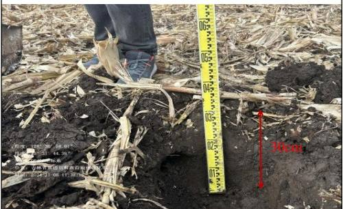  
图2.2-3 输电线路施工工艺流程图

## 1）基坑开挖

——一般基坑开挖

基坑开挖采用人工开挖，以及人工开挖和爆破二者相结合的方式，不采用大开挖、大爆破的方式。在挖掘前首先清理基面及基面附近的浮石等杂物，开挖自上而下进行，基坑四壁保持稳定放坡或用挡土板支护。

基坑开挖尽量保持坑壁成型完好，并做好临时堆土处理，避免坑内积水以及影响周围环境和破坏植被，基础坑开挖好后应尽快浇筑混凝土。

——灌注桩基础施工

地下水位较高的软弱土地基一般采用钻孔灌注桩基础，采用钻孔工艺。

泥浆池开挖前，先剥离地表层土，集中堆放。钻孔工艺为湿钻法，钻头带水作业，开钻后螺旋钻头将基孔土逐层剥离，并被注入钻头的工艺水稀释为泥浆，继而在钻杆螺旋的作用下排出地表，再通过排泥管路排入泥浆池。基土随水排入泥浆池后开始沉淀与水分离，而分离后的沉清水在钻机供水系统的作用下被注入钻头，循环利用。基础施工结束后，排放泥浆池上层澄清水，清理池中淤泥，就近晾干后就地深埋。泥浆沉淀池清淤后，将沉淀池开挖土方回填，多余部分平整自然沉降；泥浆沉淀池的开挖与回填土方量均含在该塔基基础挖填方中。钻孔-灌注施工工艺如图2.2-4。

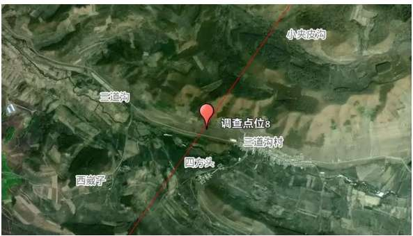  
图2.2-4 钻孔灌注施工工艺图

## 2）塔基开挖土方堆放

塔基开挖土石方堆放在塔基施工场地。塔基开挖回填后，尚余一定量的余方，考虑到塔基余土具有点多、分散的特点，回填后所余土方平整在塔基及塔基施工区，采取人工夯实、分层碾压方式，最终塔基占地区回填后一般高出原地面不足 20cm。对于山丘区较陡的坡地，塔基余土很难自然堆放在塔位上，需在堆放前先修建挡土墙拦挡。

## 3）混凝土浇筑及养护

在挖好的基坑放置钢筋笼、支好钢模板后，进行混凝土浇筑。500kV线路基础混凝土要求必须机械搅拌。根据采用基础型式的不同，在基础浇筑后进行人工或自然养护，待混凝土达到一定强度后测试混凝土强度。基础浇筑用的砂石料、水、钢筋等材料就近雇佣车辆拉运，现场由混凝土搅拌车拌制混凝土。

## 4）基坑回填

基础拆除模板，测试混凝土强度达到设计强度后进行土方回填。基坑回填采取分层夯实，每回填 300mm 厚度夯实一次。坑口的地面上应筑防沉层，防沉层的上部边宽不得小于坑口边宽，其高度根据土质夯实程度确定，一般为 300mm～500mm。经过沉降后及时补填夯实，坑口回填土不低于地面。

## 5）铁塔组立

组塔一般采用在现场与基础对接，分解组塔型式。在实际施工过程中，根据铁塔的形式、高度、重量以及施工场地、施工设备等施工现场情况。确定正装分解组塔或倒装分解组塔。利用支立抱杆，吊装铁塔构件，抱杆通过牵引绳的连接拉动，随铁塔高度的增高而上升，各个构件顶端和底部支脚采用螺栓连接。

## 6）架线及附件安装

线路架线采用张力架线方法施工。具体施工方法为：架空地线展放及收紧、展放导引绳、牵放牵引绳、牵放导线、锚固导线、紧线临锚、附件安装、压接升空、间隔棒安装、耐张塔平衡挂线和跳线安装等。

线路沿线设置牵张场，采用张力机紧线，一般以张力放线施工段作为紧线段，以直线塔作为紧线操作塔。紧线完毕后进行附件、线夹、防振金具、间隔棒等安装。

不同地形采取不同的放线方法，目前多采用无人机牵引导线，施工人员可充分利用施工道路等场地进行操作，不需新增占地；在线路穿越林地、丘陵段，可免除或减少砍伐放线通道。无人机放线施工工艺为：一般是在机身下悬挂一平衡重物，导引绳连接其上，在地面展放机械的配合下牵引飞过塔位。由塔上人员配合或机上操作人员借助导杆将导引绳放入牵引滑车槽内，再用导引绳牵引，通过相与相间渡绳等操作，最后用牵引绳牵放导线。

## 7）交叉跨越施工

## ——跨越电力线、公路、铁路、架空通信线

架线施工中对交叉跨越情况一般采用占地和扰动均较小的搭建跨越架的方法，在需跨越的电力线、公路、铁路、架空通信线的两侧搭建跨越架，跨越架高度以不影响其运行为准。

跨越架一般有三种形式：①采用木架或钢管式跨越架；②金属格构式跨越架；③利用铁塔作支承体跨越。跨越架交叉跨越角尽量接近90°，以减少临时占地的面积。

跨越架、封网等搭设完毕后必须经验收合格，方可进行跨越架线施工。施工完成后对施工场地及时清理和平整，根据场地功能进行恢复，保证地面无土面裸露。

## ——跨越河流

本项目输电线路河流跨越处均为一档跨越。施工完成后对施工场地及时清理和平整，根据场地功能进行绿化，保证地面无土面裸露。

8）水土保持敏感区域内施工

水土保持敏感区内施工时要满足以下要求：

①施工道路：水土保持敏感区域内塔基采取非机械化施工，施工道路采取人抬道路，大大减少了过多扰动原始地面强度和面积。对运至塔位的塔材，选择合适的位置进行堆放，尽量避开、减少植被完好的地段。

②塔基及施工场地：施工时应在工期安排上合理有序，先设置拦挡措施，后进行工程建设，尽量减少对地表和植被的破坏，除施工必须不得不铲除或碾压植被外，不允许以其它任何理由铲除植被，以减少对生态环境的破坏。临时堆土及时采取四周拦挡、上铺下盖的措施，回填后及时整平。施工中要严格控制临时占地，减少破坏原地貌、植被的面积。基坑开挖尽量保持坑壁成型完好，并做好临时堆土的挡护及苫盖，基础坑开挖好后应尽快浇筑混凝土。严格控制施工范围，穿越水土保持敏感区段，应尽量控制作业面，以保持生态系统的完整性。

工程根据各个敏感区保护目标不同，有针对性的采用相关环保施工方式，防止施工建设对水土保持敏感区的扰动程度。

## 2.2.4.2 变电站

## 1）表土剥离及场地平整

本期林海变和平安变均为站内扩建，各变电站扩建场地已在前期工程完成场地平整。本期扩建电缆沟、建（构）筑物等基础开挖产生余土全部平整在站区围墙内 500kV配电装置区预留间隔内，平整厚度15cm\~20cm。

林海变和平安变站区在前期工程均已实施绿化，本期扩建需对已实施绿化的扩建场地和平整基槽余土场地进行表土剥离（按 20cm 厚），平整前采用 74kW 推土机清除表土层，并推运至设在站区 500kV配电装置区预留场地（非本期扩建场地）的临时堆土场内堆放，运距按100m考虑。

## 2）基槽开挖

本期变电站建（构）筑物主要为500kV配电装置构架、高抗及防火墙、低抗及防火墙等。各类建（构）筑物基础（包括沟道）视其大小、深浅和相邻间距，采用单独或局部成片的开挖方式。基础施工应避免在雨天施工。

人工开挖基槽（沟）时，基槽（沟）的开口坡度根据不同土质条件确定，挖出的基槽土临时堆放在一侧。

## 3）土方回填及基槽余土平整

本期变电站扩建产生土方量较小，且土建施工期较短，一般不超过6 个月，需要回

填的基槽土堆放在基础周围便于回填使用。土方回填要求分层碾压回填。对于边缘压实不到之处，辅以人工和电动冲压夯实。沟管、建构筑物的基坑回填采用蛙式打夯机夯实，压实系数不小于0.97。

部分基槽余土直接平整利用在站区围墙内 500kV 配电装置区预留间隔内非临时堆土场区的区域（平整利用前已剥离表土），平整厚度 15cm\~20cm，无需临时堆放；剩余基槽余土集中堆放在临时堆土场内，随施工进展平整利用在临时堆土场区内。

## 4）扩建场地供排水管线施工

本期各变电站扩建场地供排水管线施工以机械施工为主，人工施工为辅，用挖掘机挖至距设计高程0.3m\~0.5m 时改用人工施工继续下挖，直至设计高程并清理槽底。管沟开挖边坡比1:0.5，施工开挖断面底口宽度分别根据不同管径及管道数量确定，两侧留有一定的余地。开挖后的土料堆放于管线开挖沟的一侧，作为回填用。管线安装完毕，进行土方回填，分层夯实，管顶以上0.8m 以内用蛙式打夯机夯实，管顶0.8m 以上用拖拉机压实。

## 2.3 工程占地

## 2.3.1 输电线路

输电线路永久占地为塔基永久占地；临时占地包括塔基施工场地、牵张场地、跨越施工场地和施工道路区。

## 2.3.1.1 塔基及塔基施工区

主体设计塔基永久占地9.34hm2，塔基施工临时占地29.77hm2。

表土剥离利用方案确定每基塔临时表土堆场占地300m2，本项目共316基塔，则临时表土堆场占地共计9.48hm2。

综上，塔基及塔基施工区总占地面积为 48.59hm2，其中：塔基永久占地 9.34hm2，塔基施工临时占地39.25hm2；占地类型为水田、旱地、果园、其他园地、乔木林地、灌木林地、其他林地、其他草地等。

## 2.3.1.2 牵张场地区

主体设计全线牵张场地共计32处，平均每处临时占地2000m2，占地面积共 $6 . 4 0 \mathrm { h m } ^ { 2 }$ 占地类型为旱地、其他林地。

## 2.3.1.3 跨越施工场地占地

主体设计全线共设 181处跨越施工场地，其中：跨越35kV～220kV等级输电线路、铁路、国道、省道、一般公路共 10 处，平均每处临时占地面积 $4 0 0 \mathrm { m } ^ { 2 } ;$ ；跨越水泥路、

10kV 及以下电力线、架空通信线 171 处，平均每处临时占地面积 $2 0 0 \mathrm { m } ^ { 2 }$ 。跨越施工场地总占地面积3.82hm2；占地类型为旱地、其他林地。

## 2.3.1.4 施工道路区

主体设计新修汽车运输道路长41.21km、占地宽3.5m\~6.5m，扩宽道路长27.97km、占地宽1.5m，人抬道路长度32.08km、宽1.0m；主体设计施工道路临时占地24.31hm2。

表土剥离利用方案确定新修汽车运输道路表土堆土宽度1.4m\~1.9m，拓宽道路表土堆土宽度1.0m；表土剥离利用方案确定表土堆土区占地面积为 $9 . 2 9 \mathrm { h m } ^ { 2 } .$

综上，施工道路区总占地面积为 $3 3 . 6 0 \mathrm { h m } ^ { 2 }$ ；占地类型为水田、旱地、果园、其他园地、乔木林地、灌木林地、其他林地、其他草地等。

## 2.3.2 变电站

主体已列：林海变站内扩建占地面积0.30hm2，平安变站内扩建占地面积 0.30hm2。两个变电站扩建施工生产生活区临时占地面积均为 $0 . 3 0 \mathrm { h m } ^ { 2 }$ 计；林海变改造站区围墙处声屏障，在站区西侧围墙外设1条施工道路长360m，宽3m；本期林海变和平安变扩建产生基槽余土平整利用在各站区500kV配电装置区预留间隔内，林海变基槽余土平整利用面积7200m2，平安变基槽余土平整利用面积3000m2。

主体设计及表土剥离利用方案确定的工程占地情况见下表，本方案无补充占地。

表2.3-1 主体设计及表土剥离利用方案占地情况表 单位：hm2
<table><tr><td rowspan=1 colspan=1>项目组成</td><td rowspan=1 colspan=2>单项工程</td><td rowspan=1 colspan=1>占地性质</td><td rowspan=1 colspan=1>主体设计</td><td rowspan=1 colspan=1>表土剥离利用方案确定</td><td rowspan=1 colspan=1>小计</td></tr><tr><td rowspan=5 colspan=1>输电线路</td><td rowspan=2 colspan=1>塔基及施工区</td><td rowspan=1 colspan=1>塔基区</td><td rowspan=1 colspan=1>永久</td><td rowspan=1 colspan=1>9.34</td><td rowspan=1 colspan=1></td><td rowspan=1 colspan=1>9.34</td></tr><tr><td rowspan=1 colspan=1>塔基施工区</td><td rowspan=1 colspan=1>临时</td><td rowspan=1 colspan=1>29.77</td><td rowspan=1 colspan=1>9.48</td><td rowspan=1 colspan=1>39.25</td></tr><tr><td rowspan=1 colspan=2>牵张场地区</td><td rowspan=1 colspan=1>临时</td><td rowspan=1 colspan=1>6.40</td><td rowspan=1 colspan=1></td><td rowspan=1 colspan=1>6.40</td></tr><tr><td rowspan=1 colspan=2>跨越施工场地区</td><td rowspan=1 colspan=1>临时</td><td rowspan=1 colspan=1>3.82</td><td rowspan=1 colspan=1></td><td rowspan=1 colspan=1>3.82</td></tr><tr><td rowspan=1 colspan=2>施工道路区</td><td rowspan=1 colspan=1>临时</td><td rowspan=1 colspan=1>24.31</td><td rowspan=1 colspan=1>9.29</td><td rowspan=1 colspan=1>33.60</td></tr><tr><td rowspan=4 colspan=1>林海变</td><td rowspan=1 colspan=2>站区扩建区</td><td rowspan=1 colspan=1>永久</td><td rowspan=1 colspan=1>0.30</td><td rowspan=1 colspan=1></td><td rowspan=1 colspan=1>0.30</td></tr><tr><td rowspan=1 colspan=2>施工生产生活区</td><td rowspan=1 colspan=1>临时</td><td rowspan=1 colspan=1>0.30</td><td rowspan=1 colspan=1></td><td rowspan=1 colspan=1>0.30</td></tr><tr><td rowspan=1 colspan=2>施工道路区</td><td rowspan=1 colspan=1>临时</td><td rowspan=1 colspan=1>0.11</td><td rowspan=1 colspan=1></td><td rowspan=1 colspan=1>0.11</td></tr><tr><td rowspan=1 colspan=2>站内余土平整利用区</td><td rowspan=1 colspan=1>永久</td><td rowspan=1 colspan=1>0.72</td><td rowspan=1 colspan=1></td><td rowspan=1 colspan=1>0.72</td></tr><tr><td rowspan=3 colspan=1>平安变</td><td rowspan=1 colspan=2>站区扩建区</td><td rowspan=1 colspan=1>永久</td><td rowspan=1 colspan=1>0.30</td><td rowspan=1 colspan=1></td><td rowspan=1 colspan=1>0.30</td></tr><tr><td rowspan=1 colspan=2>施工生产生活区</td><td rowspan=1 colspan=1>临时</td><td rowspan=1 colspan=1>0.30</td><td rowspan=1 colspan=1></td><td rowspan=1 colspan=1>0.30</td></tr><tr><td rowspan=1 colspan=2>站内余土平整利用区</td><td rowspan=1 colspan=1>永久</td><td rowspan=1 colspan=1>0.30</td><td rowspan=1 colspan=1></td><td rowspan=1 colspan=1>0.30</td></tr><tr><td rowspan=3 colspan=3>合计</td><td rowspan=1 colspan=1>永久</td><td rowspan=1 colspan=1>10.96</td><td rowspan=1 colspan=1></td><td rowspan=1 colspan=1>10.96</td></tr><tr><td rowspan=1 colspan=1>临时</td><td rowspan=1 colspan=1>65.01</td><td rowspan=1 colspan=1>18.77</td><td rowspan=1 colspan=1>83.78</td></tr><tr><td rowspan=1 colspan=1>小计</td><td rowspan=1 colspan=1>75.97</td><td rowspan=1 colspan=1>18.77</td><td rowspan=1 colspan=1>94.74</td></tr></table>

## 2.3.3 工程总占地

本项目总占地面积 94.74hm2，其中：永久占地 10.96hm2，临时占地 83.78hm2。

按行政区划统计为：黑龙江省水土流失防治责任范围 69.72hm2，其中永久占地7.69hm2，临时占地 62.03hm2；吉林省水土流失防治责任范围 25.02hm2，其中永久占地3.27hm2，临时占地 21.75hm2。

根据《土地利用现状分类标准》（GBT21010-2017）二级类别，本工程土地类型划分为旱地、水田、果园、其他园地、乔木林地、灌木林地、其他林地、其他草地、公用设施用地。占地类型中：旱地 48.81hm2、水田 0.95hm2、果园 1.07hm2、其他园地 0.53hm2、乔木林 30.05hm2、灌木林地 1.00hm2、其他林地 9.43hm2、其他草地 1.28hm2、公用设施用地 1.62hm2。

工程占地面积统计见表2.3-2。

表2.3-2 工程征占地情况统计详表 单位： $\mathbf { h } \mathbf { m } ^ { 2 }$
<table><tr><td colspan="3" rowspan="3">项目</td><td colspan="10" rowspan="1">土地利用类型</td><td colspan="2" rowspan="2">按地形分类</td><td colspan="2" rowspan="2">占地性质</td><td colspan="1" rowspan="3">合计</td></tr><tr><td colspan="2" rowspan="1">耕地</td><td colspan="2" rowspan="1">园地</td><td colspan="3" rowspan="1">林地</td><td colspan="1" rowspan="1">草地</td><td colspan="1" rowspan="1">公共管理与公共服务用地</td><td colspan="1" rowspan="1">小计</td></tr><tr><td colspan="1" rowspan="1">水田</td><td colspan="1" rowspan="1">旱地</td><td colspan="1" rowspan="1">果园</td><td colspan="1" rowspan="1">其他园地</td><td colspan="1" rowspan="1">乔木林地</td><td colspan="1" rowspan="1">灌木林地</td><td colspan="1" rowspan="1">其他林地</td><td colspan="1" rowspan="1">其他草地</td><td colspan="1" rowspan="1">公用设施用地</td><td colspan="1" rowspan="1"></td><td colspan="1" rowspan="1">山丘区</td><td colspan="1" rowspan="1">平原区</td><td colspan="1" rowspan="1">永久</td><td colspan="1" rowspan="1">临时</td></tr><tr><td colspan="1" rowspan="1">1</td><td colspan="2" rowspan="1">黑龙江省</td><td colspan="1" rowspan="1">0.89</td><td colspan="1" rowspan="1">42.47</td><td colspan="1" rowspan="1">0.95</td><td colspan="1" rowspan="1">0.53</td><td colspan="1" rowspan="1">17.50</td><td colspan="1" rowspan="1">1.00</td><td colspan="1" rowspan="1">4.24</td><td colspan="1" rowspan="1">1.12</td><td colspan="1" rowspan="1">1.02</td><td colspan="1" rowspan="1">69.72</td><td colspan="1" rowspan="1">48.88</td><td colspan="1" rowspan="1">20.84</td><td colspan="1" rowspan="1">7.69</td><td colspan="1" rowspan="1">62.03</td><td colspan="1" rowspan="1">69.72</td></tr><tr><td colspan="1" rowspan="1">1.1</td><td colspan="2" rowspan="1">牡丹江市</td><td colspan="1" rowspan="1">0.89</td><td colspan="1" rowspan="1">42.47</td><td colspan="1" rowspan="1">0.95</td><td colspan="1" rowspan="1">0.53</td><td colspan="1" rowspan="1">17.50</td><td colspan="1" rowspan="1">1.00</td><td colspan="1" rowspan="1">4.24</td><td colspan="1" rowspan="1">1.12</td><td colspan="1" rowspan="1">1.02</td><td colspan="1" rowspan="1">69.72</td><td colspan="1" rowspan="1">48.88</td><td colspan="1" rowspan="1">20.84</td><td colspan="1" rowspan="1">7.69</td><td colspan="1" rowspan="1">62.03</td><td colspan="1" rowspan="1">69.72</td></tr><tr><td colspan="1" rowspan="1">1.1.1</td><td colspan="2" rowspan="1">西安区</td><td colspan="1" rowspan="1"></td><td colspan="1" rowspan="1">4.45</td><td colspan="1" rowspan="1"></td><td colspan="1" rowspan="1"></td><td colspan="1" rowspan="1">0.02</td><td colspan="1" rowspan="1">0.12</td><td colspan="1" rowspan="1"></td><td colspan="1" rowspan="1"></td><td colspan="1" rowspan="1">1.02</td><td colspan="1" rowspan="1">5.61</td><td colspan="1" rowspan="1"></td><td colspan="1" rowspan="1">5.61</td><td colspan="1" rowspan="1">1.36</td><td colspan="1" rowspan="1">4.25</td><td colspan="1" rowspan="1">5.61</td></tr><tr><td colspan="1" rowspan="6">林海变临</td><td colspan="1" rowspan="1">永久占地</td><td colspan="1" rowspan="1">站区扩建区</td><td colspan="1" rowspan="1"></td><td colspan="1" rowspan="1"></td><td colspan="1" rowspan="1"></td><td colspan="1" rowspan="1"></td><td colspan="1" rowspan="1"></td><td colspan="1" rowspan="1"></td><td colspan="1" rowspan="1"></td><td colspan="1" rowspan="1"></td><td colspan="1" rowspan="1">0.30</td><td colspan="1" rowspan="1">0.30</td><td colspan="1" rowspan="1"></td><td colspan="1" rowspan="1">0.30</td><td colspan="1" rowspan="1">0.30</td><td colspan="1" rowspan="1"></td><td colspan="1" rowspan="1">0.30</td></tr><tr><td colspan="1" rowspan="4">时占地</td><td colspan="1" rowspan="1">施工生产生活区</td><td colspan="1" rowspan="1"></td><td colspan="1" rowspan="1">0.30</td><td colspan="1" rowspan="1"></td><td colspan="1" rowspan="1"></td><td colspan="1" rowspan="1"></td><td colspan="1" rowspan="1"></td><td colspan="1" rowspan="1"></td><td colspan="1" rowspan="1"></td><td colspan="1" rowspan="1"></td><td colspan="1" rowspan="1">0.30</td><td colspan="1" rowspan="1"></td><td colspan="1" rowspan="1">0.30</td><td colspan="1" rowspan="1"></td><td colspan="1" rowspan="1">0.30</td><td colspan="1" rowspan="1">0.30</td></tr><tr><td colspan="1" rowspan="1">施工道路区</td><td colspan="1" rowspan="1"></td><td colspan="1" rowspan="1">0.11</td><td colspan="1" rowspan="1"></td><td colspan="1" rowspan="1"></td><td colspan="1" rowspan="1"></td><td colspan="1" rowspan="1"></td><td colspan="1" rowspan="1"></td><td colspan="1" rowspan="1"></td><td colspan="1" rowspan="1"></td><td colspan="1" rowspan="1">0.11</td><td colspan="1" rowspan="1"></td><td colspan="1" rowspan="1">0.11</td><td colspan="1" rowspan="1"></td><td colspan="1" rowspan="1">0.11</td><td colspan="1" rowspan="1">0.11</td></tr><tr><td colspan="1" rowspan="1">站内余土平整利用区</td><td colspan="1" rowspan="1"></td><td colspan="1" rowspan="1"></td><td colspan="1" rowspan="1"></td><td colspan="1" rowspan="1"></td><td colspan="1" rowspan="1"></td><td colspan="1" rowspan="1"></td><td colspan="1" rowspan="1"></td><td colspan="1" rowspan="1"></td><td colspan="1" rowspan="1">0.72</td><td colspan="1" rowspan="1">0.72</td><td colspan="1" rowspan="1"></td><td colspan="1" rowspan="1">0.72</td><td colspan="1" rowspan="1">0.72</td><td colspan="1" rowspan="1"></td><td colspan="1" rowspan="1">0.72</td></tr><tr><td colspan="1" rowspan="1">小计</td><td colspan="1" rowspan="1"></td><td colspan="1" rowspan="1">0.41</td><td colspan="1" rowspan="1"></td><td colspan="1" rowspan="1"></td><td colspan="1" rowspan="1"></td><td colspan="1" rowspan="1"></td><td colspan="1" rowspan="1"></td><td colspan="1" rowspan="1"></td><td colspan="1" rowspan="1">0.72</td><td colspan="1" rowspan="1">1.13</td><td colspan="1" rowspan="1"></td><td colspan="1" rowspan="1">1.13</td><td colspan="1" rowspan="1">0.72</td><td colspan="1" rowspan="1">0.41</td><td colspan="1" rowspan="1">1.13</td></tr><tr><td colspan="1" rowspan="1"></td><td colspan="1" rowspan="1">合计</td><td colspan="1" rowspan="1"></td><td colspan="1" rowspan="1">0.41</td><td colspan="1" rowspan="1"></td><td colspan="1" rowspan="1"></td><td colspan="1" rowspan="1"></td><td colspan="1" rowspan="1"></td><td colspan="1" rowspan="1"></td><td colspan="1" rowspan="1"></td><td colspan="1" rowspan="1">1.02</td><td colspan="1" rowspan="1">1.43</td><td colspan="1" rowspan="1"></td><td colspan="1" rowspan="1">1.43</td><td colspan="1" rowspan="1">1.02</td><td colspan="1" rowspan="1">0.41</td><td colspan="1" rowspan="1">1.43</td></tr><tr><td colspan="1" rowspan="7">输电线路</td><td colspan="1" rowspan="1">永久占地</td><td colspan="1" rowspan="1">塔基区</td><td colspan="1" rowspan="1"></td><td colspan="1" rowspan="1">0.34</td><td colspan="1" rowspan="1"></td><td colspan="1" rowspan="1"></td><td colspan="1" rowspan="1"></td><td colspan="1" rowspan="1"></td><td colspan="1" rowspan="1"></td><td colspan="1" rowspan="1"></td><td colspan="1" rowspan="1"></td><td colspan="1" rowspan="1">0.34</td><td colspan="1" rowspan="1"></td><td colspan="1" rowspan="1">0.34</td><td colspan="1" rowspan="1">0.34</td><td colspan="1" rowspan="1"></td><td colspan="1" rowspan="1">0.34</td></tr><tr><td colspan="1" rowspan="5">临时占地</td><td colspan="1" rowspan="1">塔基施工区</td><td colspan="1" rowspan="1"></td><td colspan="1" rowspan="1">1.58</td><td colspan="1" rowspan="1"></td><td colspan="1" rowspan="1"></td><td colspan="1" rowspan="1"></td><td colspan="1" rowspan="1">0.07</td><td colspan="1" rowspan="1"></td><td colspan="1" rowspan="1"></td><td colspan="1" rowspan="1"></td><td colspan="1" rowspan="1">1.65</td><td colspan="1" rowspan="1"></td><td colspan="1" rowspan="1">1.65</td><td colspan="1" rowspan="1"></td><td colspan="1" rowspan="1">1.65</td><td colspan="1" rowspan="1">1.65</td></tr><tr><td colspan="1" rowspan="1">牵张场地区</td><td colspan="1" rowspan="1"></td><td colspan="1" rowspan="1">0.20</td><td colspan="1" rowspan="1"></td><td colspan="1" rowspan="1"></td><td colspan="1" rowspan="1"></td><td colspan="1" rowspan="1"></td><td colspan="1" rowspan="1"></td><td colspan="1" rowspan="1"></td><td colspan="1" rowspan="1"></td><td colspan="1" rowspan="1">0.20</td><td colspan="1" rowspan="1"></td><td colspan="1" rowspan="1">0.20</td><td colspan="1" rowspan="1"></td><td colspan="1" rowspan="1">0.20</td><td colspan="1" rowspan="1">0.20</td></tr><tr><td colspan="1" rowspan="1">跨越施工场地区</td><td colspan="1" rowspan="1"></td><td colspan="1" rowspan="1">0.24</td><td colspan="1" rowspan="1"></td><td colspan="1" rowspan="1"></td><td colspan="1" rowspan="1"></td><td colspan="1" rowspan="1"></td><td colspan="1" rowspan="1"></td><td colspan="1" rowspan="1"></td><td colspan="1" rowspan="1"></td><td colspan="1" rowspan="1">0.24</td><td colspan="1" rowspan="1"></td><td colspan="1" rowspan="1">0.24</td><td colspan="1" rowspan="1"></td><td colspan="1" rowspan="1">0.24</td><td colspan="1" rowspan="1">0.24</td></tr><tr><td colspan="1" rowspan="1">施工道路区</td><td colspan="1" rowspan="1"></td><td colspan="1" rowspan="1">1.68</td><td colspan="1" rowspan="1"></td><td colspan="1" rowspan="1"></td><td colspan="1" rowspan="1">0.02</td><td colspan="1" rowspan="1">0.05</td><td colspan="1" rowspan="1"></td><td colspan="1" rowspan="1"></td><td colspan="1" rowspan="1"></td><td colspan="1" rowspan="1">1.75</td><td colspan="1" rowspan="1"></td><td colspan="1" rowspan="1">1.75</td><td colspan="1" rowspan="1"></td><td colspan="1" rowspan="1">1.75</td><td colspan="1" rowspan="1">1.75</td></tr><tr><td colspan="1" rowspan="1">小计</td><td colspan="1" rowspan="1"></td><td colspan="1" rowspan="1">3.70</td><td colspan="1" rowspan="1"></td><td colspan="1" rowspan="1"></td><td colspan="1" rowspan="1">0.02</td><td colspan="1" rowspan="1">0.12</td><td colspan="1" rowspan="1"></td><td colspan="1" rowspan="1"></td><td colspan="1" rowspan="1"></td><td colspan="1" rowspan="1">3.84</td><td colspan="1" rowspan="1"></td><td colspan="1" rowspan="1">3.84</td><td colspan="1" rowspan="1"></td><td colspan="1" rowspan="1">3.84</td><td colspan="1" rowspan="1">3.84</td></tr><tr><td colspan="2" rowspan="1">合计</td><td colspan="1" rowspan="1"></td><td colspan="1" rowspan="1">4.04</td><td colspan="1" rowspan="1"></td><td colspan="1" rowspan="1"></td><td colspan="1" rowspan="1">0.02</td><td colspan="1" rowspan="1">0.12</td><td colspan="1" rowspan="1"></td><td colspan="1" rowspan="1"></td><td colspan="1" rowspan="1"></td><td colspan="1" rowspan="1">4.18</td><td colspan="1" rowspan="1"></td><td colspan="1" rowspan="1">4.18</td><td colspan="1" rowspan="1">0.34</td><td colspan="1" rowspan="1">3.84</td><td colspan="1" rowspan="1">4.18</td></tr><tr><td colspan="1" rowspan="1">1.1.2</td><td colspan="2" rowspan="1">宁安市</td><td colspan="1" rowspan="1">0.89</td><td colspan="1" rowspan="1">38.02</td><td colspan="1" rowspan="1">0.95</td><td colspan="1" rowspan="1">0.53</td><td colspan="1" rowspan="1">17.48</td><td colspan="1" rowspan="1">0.88</td><td colspan="1" rowspan="1">4.24</td><td colspan="1" rowspan="1">1.12</td><td colspan="1" rowspan="1"></td><td colspan="1" rowspan="1">64.11</td><td colspan="1" rowspan="1">48.88</td><td colspan="1" rowspan="1">15.23</td><td colspan="1" rowspan="1">6.33</td><td colspan="1" rowspan="1">57.78</td><td colspan="1" rowspan="1">64.11</td></tr><tr><td colspan="1" rowspan="3">输电线路</td><td colspan="1" rowspan="1">永久占地</td><td colspan="1" rowspan="1">塔基区</td><td colspan="1" rowspan="1">0.07</td><td colspan="1" rowspan="1">3.80</td><td colspan="1" rowspan="1">0.13</td><td colspan="1" rowspan="1">0.06</td><td colspan="1" rowspan="1">2.17</td><td colspan="1" rowspan="1">0.06</td><td colspan="1" rowspan="1">0.03</td><td colspan="1" rowspan="1">0.01</td><td colspan="1" rowspan="1"></td><td colspan="1" rowspan="1">6.33</td><td colspan="1" rowspan="1">5.49</td><td colspan="1" rowspan="1">0.84</td><td colspan="1" rowspan="1">6.33</td><td colspan="1" rowspan="1"></td><td colspan="1" rowspan="1">6.33</td></tr><tr><td colspan="1" rowspan="2">临时占地</td><td colspan="1" rowspan="1">塔基施工区</td><td colspan="1" rowspan="1">0.27</td><td colspan="1" rowspan="1">16.72</td><td colspan="1" rowspan="1">0.53</td><td colspan="1" rowspan="1">0.25</td><td colspan="1" rowspan="1">9.51</td><td colspan="1" rowspan="1">0.27</td><td colspan="1" rowspan="1">0.14</td><td colspan="1" rowspan="1">0.21</td><td colspan="1" rowspan="1"></td><td colspan="1" rowspan="1">27.90</td><td colspan="1" rowspan="1">23.47</td><td colspan="1" rowspan="1">4.43</td><td colspan="1" rowspan="1"></td><td colspan="1" rowspan="1">27.90</td><td colspan="1" rowspan="1">27.90</td></tr><tr><td colspan="1" rowspan="1">牵张场地区</td><td colspan="1" rowspan="1"></td><td colspan="1" rowspan="1">2.40</td><td colspan="1" rowspan="1"></td><td colspan="1" rowspan="1"></td><td colspan="1" rowspan="1"></td><td colspan="1" rowspan="1"></td><td colspan="1" rowspan="1">2.00</td><td colspan="1" rowspan="1"></td><td colspan="1" rowspan="1"></td><td colspan="1" rowspan="1">4.40</td><td colspan="1" rowspan="1">3.80</td><td colspan="1" rowspan="1">0.60</td><td colspan="1" rowspan="1"></td><td colspan="1" rowspan="1">4.40</td><td colspan="1" rowspan="1">4.40</td></tr><tr><td colspan="1" rowspan="4"></td><td colspan="1" rowspan="3"></td><td colspan="1" rowspan="1">跨越施工场地区</td><td colspan="1" rowspan="1"></td><td colspan="1" rowspan="1">2.20</td><td colspan="1" rowspan="1"></td><td colspan="1" rowspan="1"></td><td colspan="1" rowspan="1"></td><td colspan="1" rowspan="1"></td><td colspan="1" rowspan="1">0.40</td><td colspan="1" rowspan="1"></td><td colspan="1" rowspan="1"></td><td colspan="1" rowspan="1">2.60</td><td colspan="1" rowspan="1">1.18</td><td colspan="1" rowspan="1">1.42</td><td colspan="1" rowspan="1"></td><td colspan="1" rowspan="1">2.60</td><td colspan="1" rowspan="1">2.60</td></tr><tr><td colspan="1" rowspan="1">施工道路区</td><td colspan="1" rowspan="1">0.55</td><td colspan="1" rowspan="1">12.90</td><td colspan="1" rowspan="1">0.29</td><td colspan="1" rowspan="1">0.22</td><td colspan="1" rowspan="1">5.80</td><td colspan="1" rowspan="1">0.55</td><td colspan="1" rowspan="1">1.67</td><td colspan="1" rowspan="1">0.90</td><td colspan="1" rowspan="1"></td><td colspan="1" rowspan="1">22.88</td><td colspan="1" rowspan="1">14.94</td><td colspan="1" rowspan="1">7.94</td><td colspan="1" rowspan="1"></td><td colspan="1" rowspan="1">22.88</td><td colspan="1" rowspan="1">22.88</td></tr><tr><td colspan="1" rowspan="1">小计</td><td colspan="1" rowspan="1">0.82</td><td colspan="1" rowspan="1">34.22</td><td colspan="1" rowspan="1">0.82</td><td colspan="1" rowspan="1">0.47</td><td colspan="1" rowspan="1">15.31</td><td colspan="1" rowspan="1">0.82</td><td colspan="1" rowspan="1">4.21</td><td colspan="1" rowspan="1">1.11</td><td colspan="1" rowspan="1"></td><td colspan="1" rowspan="1">57.78</td><td colspan="1" rowspan="1">43.39</td><td colspan="1" rowspan="1">14.39</td><td colspan="1" rowspan="1"></td><td colspan="1" rowspan="1">57.78</td><td colspan="1" rowspan="1">57.78</td></tr><tr><td colspan="2" rowspan="1">合计</td><td colspan="1" rowspan="1">0.89</td><td colspan="1" rowspan="1">38.02</td><td colspan="1" rowspan="1">0.95</td><td colspan="1" rowspan="1">0.53</td><td colspan="1" rowspan="1">17.48</td><td colspan="1" rowspan="1">0.88</td><td colspan="1" rowspan="1">4.24</td><td colspan="1" rowspan="1">1.12</td><td colspan="1" rowspan="1"></td><td colspan="1" rowspan="1">64.11</td><td colspan="1" rowspan="1">48.88</td><td colspan="1" rowspan="1">15.23</td><td colspan="1" rowspan="1">6.33</td><td colspan="1" rowspan="1">57.78</td><td colspan="1" rowspan="1">64.11</td></tr><tr><td colspan="1" rowspan="1">2</td><td colspan="2" rowspan="1">吉林省</td><td colspan="1" rowspan="1">0.06</td><td colspan="1" rowspan="1">6.34</td><td colspan="1" rowspan="1">0.12</td><td colspan="1" rowspan="1"></td><td colspan="1" rowspan="1">12.55</td><td colspan="1" rowspan="1"></td><td colspan="1" rowspan="1">5.19</td><td colspan="1" rowspan="1">0.16</td><td colspan="1" rowspan="1">0.60</td><td colspan="1" rowspan="1">25.02</td><td colspan="1" rowspan="1">23.44</td><td colspan="1" rowspan="1">1.58</td><td colspan="1" rowspan="1">3.27</td><td colspan="1" rowspan="1">21.75</td><td colspan="1" rowspan="1">25.02</td></tr><tr><td colspan="1" rowspan="1">2.1</td><td colspan="2" rowspan="1">延边朝鲜族自治州</td><td colspan="1" rowspan="1">0.06</td><td colspan="1" rowspan="1">6.34</td><td colspan="1" rowspan="1">0.12</td><td colspan="1" rowspan="1"></td><td colspan="1" rowspan="1">12.55</td><td colspan="1" rowspan="1"></td><td colspan="1" rowspan="1">5.19</td><td colspan="1" rowspan="1">0.16</td><td colspan="1" rowspan="1">0.60</td><td colspan="1" rowspan="1">25.02</td><td colspan="1" rowspan="1">23.44</td><td colspan="1" rowspan="1">1.58</td><td colspan="1" rowspan="1">3.27</td><td colspan="1" rowspan="1">21.75</td><td colspan="1" rowspan="1">25.02</td></tr><tr><td colspan="1" rowspan="1">2.1.1</td><td colspan="1" rowspan="1"></td><td colspan="1" rowspan="1">敦化市</td><td colspan="1" rowspan="1">0.06</td><td colspan="1" rowspan="1">6.34</td><td colspan="1" rowspan="1">0.12</td><td colspan="1" rowspan="1"></td><td colspan="1" rowspan="1">12.55</td><td colspan="1" rowspan="1"></td><td colspan="1" rowspan="1">5.19</td><td colspan="1" rowspan="1">0.16</td><td colspan="1" rowspan="1">0.60</td><td colspan="1" rowspan="1">25.02</td><td colspan="1" rowspan="1">23.44</td><td colspan="1" rowspan="1">1.58</td><td colspan="1" rowspan="1">3.27</td><td colspan="1" rowspan="1">21.75</td><td colspan="1" rowspan="1">25.02</td></tr><tr><td colspan="1" rowspan="5">平安变临</td><td colspan="1" rowspan="1">永久占地</td><td colspan="1" rowspan="1">站区扩建区</td><td colspan="1" rowspan="1"></td><td colspan="1" rowspan="1"></td><td colspan="1" rowspan="1"></td><td colspan="1" rowspan="1"></td><td colspan="1" rowspan="1"></td><td colspan="1" rowspan="1"></td><td colspan="1" rowspan="1"></td><td colspan="1" rowspan="1"></td><td colspan="1" rowspan="1">0.30</td><td colspan="1" rowspan="1">0.30</td><td colspan="1" rowspan="1"></td><td colspan="1" rowspan="1">0.30</td><td colspan="1" rowspan="1">0.30</td><td colspan="1" rowspan="1"></td><td colspan="1" rowspan="1">0.30</td></tr><tr><td colspan="1" rowspan="3">时占地</td><td colspan="1" rowspan="1">施工生产生活区</td><td colspan="1" rowspan="1"></td><td colspan="1" rowspan="1">0.30</td><td colspan="1" rowspan="1"></td><td colspan="1" rowspan="1"></td><td colspan="1" rowspan="1"></td><td colspan="1" rowspan="1"></td><td colspan="1" rowspan="1"></td><td colspan="1" rowspan="1"></td><td colspan="1" rowspan="1"></td><td colspan="1" rowspan="1">0.30</td><td colspan="1" rowspan="1"></td><td colspan="1" rowspan="1">0.30</td><td colspan="1" rowspan="1"></td><td colspan="1" rowspan="1">0.30</td><td colspan="1" rowspan="1">0.30</td></tr><tr><td colspan="1" rowspan="1">站内余土平整利用区</td><td colspan="1" rowspan="1"></td><td colspan="1" rowspan="1"></td><td colspan="1" rowspan="1"></td><td colspan="1" rowspan="1"></td><td colspan="1" rowspan="1"></td><td colspan="1" rowspan="1"></td><td colspan="1" rowspan="1"></td><td colspan="1" rowspan="1"></td><td colspan="1" rowspan="1">0.30</td><td colspan="1" rowspan="1">0.30</td><td colspan="1" rowspan="1"></td><td colspan="1" rowspan="1">0.30</td><td colspan="1" rowspan="1">0.30</td><td colspan="1" rowspan="1"></td><td colspan="1" rowspan="1">0.30</td></tr><tr><td colspan="1" rowspan="1">小计</td><td colspan="1" rowspan="1"></td><td colspan="1" rowspan="1">0.30</td><td colspan="1" rowspan="1"></td><td colspan="1" rowspan="1"></td><td colspan="1" rowspan="1"></td><td colspan="1" rowspan="1"></td><td colspan="1" rowspan="1"></td><td colspan="1" rowspan="1"></td><td colspan="1" rowspan="1">0.30</td><td colspan="1" rowspan="1">0.60</td><td colspan="1" rowspan="1"></td><td colspan="1" rowspan="1">0.60</td><td colspan="1" rowspan="1">0.30</td><td colspan="1" rowspan="1">0.30</td><td colspan="1" rowspan="1">0.60</td></tr><tr><td colspan="1" rowspan="1"></td><td colspan="1" rowspan="1">合计</td><td colspan="1" rowspan="1"></td><td colspan="1" rowspan="1">0.30</td><td colspan="1" rowspan="1"></td><td colspan="1" rowspan="1"></td><td colspan="1" rowspan="1"></td><td colspan="1" rowspan="1"></td><td colspan="1" rowspan="1"></td><td colspan="1" rowspan="1"></td><td colspan="1" rowspan="1">0.60</td><td colspan="1" rowspan="1">0.90</td><td colspan="1" rowspan="1"></td><td colspan="1" rowspan="1">0.90</td><td colspan="1" rowspan="1">0.60</td><td colspan="1" rowspan="1">0.30</td><td colspan="1" rowspan="1">0.90</td></tr><tr><td colspan="1" rowspan="7">输电线路</td><td colspan="1" rowspan="1">永久占地</td><td colspan="1" rowspan="1">塔基区</td><td colspan="1" rowspan="1"></td><td colspan="1" rowspan="1">0.50</td><td colspan="1" rowspan="1"></td><td colspan="1" rowspan="1"></td><td colspan="1" rowspan="1">1.85</td><td colspan="1" rowspan="1"></td><td colspan="1" rowspan="1">0.32</td><td colspan="1" rowspan="1"></td><td colspan="1" rowspan="1"></td><td colspan="1" rowspan="1">2.67</td><td colspan="1" rowspan="1">2.61</td><td colspan="1" rowspan="1">0.06</td><td colspan="1" rowspan="1">2.67</td><td colspan="1" rowspan="1"></td><td colspan="1" rowspan="1">2.67</td></tr><tr><td colspan="1" rowspan="5">临时占地</td><td colspan="1" rowspan="1">塔基施工区</td><td colspan="1" rowspan="1"></td><td colspan="1" rowspan="1">2.25</td><td colspan="1" rowspan="1"></td><td colspan="1" rowspan="1"></td><td colspan="1" rowspan="1">6.37</td><td colspan="1" rowspan="1"></td><td colspan="1" rowspan="1">1.08</td><td colspan="1" rowspan="1"></td><td colspan="1" rowspan="1"></td><td colspan="1" rowspan="1">9.70</td><td colspan="1" rowspan="1">9.43</td><td colspan="1" rowspan="1">0.27</td><td colspan="1" rowspan="1"></td><td colspan="1" rowspan="1">9.70</td><td colspan="1" rowspan="1">9.70</td></tr><tr><td colspan="1" rowspan="1">牵张场地区</td><td colspan="1" rowspan="1"></td><td colspan="1" rowspan="1">0.40</td><td colspan="1" rowspan="1"></td><td colspan="1" rowspan="1"></td><td colspan="1" rowspan="1">0.00</td><td colspan="1" rowspan="1"></td><td colspan="1" rowspan="1">1.40</td><td colspan="1" rowspan="1"></td><td colspan="1" rowspan="1"></td><td colspan="1" rowspan="1">1.80</td><td colspan="1" rowspan="1">1.60</td><td colspan="1" rowspan="1">0.20</td><td colspan="1" rowspan="1"></td><td colspan="1" rowspan="1">1.80</td><td colspan="1" rowspan="1">1.80</td></tr><tr><td colspan="1" rowspan="1">跨越施工场地区</td><td colspan="1" rowspan="1"></td><td colspan="1" rowspan="1">0.66</td><td colspan="1" rowspan="1"></td><td colspan="1" rowspan="1"></td><td colspan="1" rowspan="1">0.00</td><td colspan="1" rowspan="1"></td><td colspan="1" rowspan="1">0.32</td><td colspan="1" rowspan="1"></td><td colspan="1" rowspan="1"></td><td colspan="1" rowspan="1">0.98</td><td colspan="1" rowspan="1">0.94</td><td colspan="1" rowspan="1">0.04</td><td colspan="1" rowspan="1"></td><td colspan="1" rowspan="1">0.98</td><td colspan="1" rowspan="1">0.98</td></tr><tr><td colspan="1" rowspan="1">施工道路区</td><td colspan="1" rowspan="1">0.06</td><td colspan="1" rowspan="1">2.23</td><td colspan="1" rowspan="1">0.12</td><td colspan="1" rowspan="1"></td><td colspan="1" rowspan="1">4.33</td><td colspan="1" rowspan="1"></td><td colspan="1" rowspan="1">2.07</td><td colspan="1" rowspan="1">0.16</td><td colspan="1" rowspan="1"></td><td colspan="1" rowspan="1">8.97</td><td colspan="1" rowspan="1">8.86</td><td colspan="1" rowspan="1">0.11</td><td colspan="1" rowspan="1"></td><td colspan="1" rowspan="1">8.97</td><td colspan="1" rowspan="1">8.97</td></tr><tr><td colspan="1" rowspan="1">小计</td><td colspan="1" rowspan="1">0.06</td><td colspan="1" rowspan="1">5.54</td><td colspan="1" rowspan="1">0.12</td><td colspan="1" rowspan="1"></td><td colspan="1" rowspan="1">10.70</td><td colspan="1" rowspan="1"></td><td colspan="1" rowspan="1">4.87</td><td colspan="1" rowspan="1">0.16</td><td colspan="1" rowspan="1"></td><td colspan="1" rowspan="1">21.45</td><td colspan="1" rowspan="1">20.83</td><td colspan="1" rowspan="1">0.62</td><td colspan="1" rowspan="1"></td><td colspan="1" rowspan="1">21.45</td><td colspan="1" rowspan="1">21.45</td></tr><tr><td colspan="2" rowspan="1">合计</td><td colspan="1" rowspan="1">0.06</td><td colspan="1" rowspan="1">6.04</td><td colspan="1" rowspan="1">0.12</td><td colspan="1" rowspan="1"></td><td colspan="1" rowspan="1">12.55</td><td colspan="1" rowspan="1"></td><td colspan="1" rowspan="1">5.19</td><td colspan="1" rowspan="1">0.16</td><td colspan="1" rowspan="1"></td><td colspan="1" rowspan="1">24.12</td><td colspan="1" rowspan="1">23.44</td><td colspan="1" rowspan="1">0.68</td><td colspan="1" rowspan="1">2.67</td><td colspan="1" rowspan="1">21.45</td><td colspan="1" rowspan="1">24.12</td></tr><tr><td colspan="3" rowspan="1">总计</td><td colspan="1" rowspan="1">0.95</td><td colspan="1" rowspan="1">48.81</td><td colspan="1" rowspan="1">1.07</td><td colspan="1" rowspan="1">0.53</td><td colspan="1" rowspan="1">30.05</td><td colspan="1" rowspan="1">1.00</td><td colspan="1" rowspan="1">9.43</td><td colspan="1" rowspan="1">1.28</td><td colspan="1" rowspan="1">1.62</td><td colspan="1" rowspan="1">94.74</td><td colspan="1" rowspan="1">72.32</td><td colspan="1" rowspan="1">22.42</td><td colspan="1" rowspan="1">10.96</td><td colspan="1" rowspan="1">83.78</td><td colspan="1" rowspan="1">94.74</td></tr></table>

## 2.4 土石方平衡

## 2.4.1 表土平衡

## 2.4.1.1 输电线路

## 1）塔基及塔基施工区

根据《林海～平安第二回500千伏线路工程（黑龙江省段）耕作层土壤剥离利用方案》和《林海～平安第二回500千伏线路工程（吉林段）耕作层土壤剥离利用方案》，对塔基永久占地中占用耕地的全部进行表土剥离，剥离厚度 30cm，黑龙江省段表土剥离面积 $4 . 2 1 \mathrm { h m } ^ { 2 }$ （山丘区 $3 . 1 3 \mathrm { h m } ^ { 2 }$ 、平原区 $1 . 0 8 \mathrm { h m } ^ { 2 }$ ）、表土量 1.26 万 $\mathrm { m } ^ { 3 }$ （山丘区 0.94万 $\mathbf { m } ^ { 3 } .$ 、平原区 $0 . 3 2 \ \mathcal { F } \ \mathrm { m } ^ { 3 } \ ,$ ），吉林省段表土剥离面积 $0 . 5 0 \mathrm { h m } ^ { 2 }$ （山丘区 $0 . 4 4 \mathrm { h m } ^ { 2 }$ 、平原区0.06hm2）、表土量 $0 . 1 5 \mathrm { ~ } \overline { { \mathcal { A } } } \mathrm { ~ m } ^ { 3 }$ （山丘区 $0 . 1 3 \ \overline { { \mathcal { H } } } \ \mathrm { m } ^ { 3 }$ 、平原区 0.02万m3）；剥离的表土集中堆放在附近临时表土堆放场，平均运距 30m，采用74kW推土机完成。施工结束后，按表土剥离区域的土地利用类型，将表土回覆至塔基永久占地范围内并进行土地整治，对占用耕地的交还复耕。

根据《林海～平安第二回500千伏线路工程临时用地（黑龙江省段）表土剥离利用方案》和《林海～平安第二回 500 千伏线路工程临时用地（吉林段）表土剥离利用方案》，塔基施工临时占地表土剥离范围为占用耕地、园地、林地和草地的区域（不含临时堆土区），剥离厚度耕地30cm，园地、林地和草地 20cm。表土剥离利用方案中，黑龙江省段塔基施工临时占地表土剥离面积为耕地 $1 3 . 9 8 \mathrm { h m } ^ { 2 } ( $ （山丘区 $9 . 9 0 \mathrm { h m } ^ { 2 }$ 、平原区 $4 . 0 8 \mathrm { h m } ^ { 2 }$ ）、园地 $0 . 5 4 \mathrm { h m } ^ { 2 } ( $ （山丘区）、林地 $7 . 7 4 \mathrm { h m } ^ { 2 } ( $ （山丘区 $7 . 3 5 \mathrm { h m } ^ { 2 } .$ 、平原区 0.39hm2）、草地 $0 . 1 4 \mathrm { h m } ^ { 2 }$ （平原区），表土量共 $5 . 8 8 \mathrm { ~ ‰ ~ }$ （山丘区 4.55万 $\mathbf { m } ^ { 3 } .$ 、平原区 $1 . 3 3 \ \overline { { \mathcal { H } } } \ \mathrm { m } ^ { 3 } \ \mathrm { ) }$ ）；吉林省段塔基施工临时占地表土剥离面积为耕地 $1 . 8 3 \mathrm { h m } ^ { 2 }$ （山丘区 $1 . 6 2 \mathrm { h m } ^ { 2 }$ 、平原区 $0 . 2 1 \mathrm { h m } ^ { 2 } \textrm { , }$ ）、林地 $5 . 4 7 \mathrm { h m } ^ { 2 }$ （山丘区），表土量共 1.64万 $\mathrm { m } ^ { 3 }$ （山丘区 $1 . 5 8 \mathrm { ~ ‰ ~ }$ 、平原区0.06 万 $\mathrm { m } ^ { 3 }$ ）。剥离的表土集中堆放在附近临时表土堆放场，且耕地表土与林地、草地表土分开堆放，平均运距30m，采用74kW 推土机完成。施工结束后，按表土剥离区域的土地利用类型，将表土全部回填于塔基施工临时占地范围内并进行土地整治。

针对表土剥离方案，没有对塔基永久占地范围内占用园地、林地、草地的区域进行表土剥离，本方案对此进行补充。

本方案补充：对塔基永久占地范围内占用园地、林地、草地的区域进行表土剥离，剥离厚度20cm，黑龙江省段表土剥离面积 $2 . 4 6 \mathrm { h m } ^ { 2 }$ （山丘区 $2 . 3 6 \mathrm { h m } ^ { 2 }$ 、平原区 $0 . 1 0 \mathrm { h m } ^ { 2 } )$ 表土量 0.49 万 $\mathrm { m } ^ { 3 ( }$ （ 山丘区 0.47 万 $\mathrm { m } ^ { 3 }$ 、平原区0.02万 $\mathrm { m } ^ { 3 }$ ）；吉林省段表土剥离面积 $2 . 1 7 \mathrm { h m } ^ { 2 }$ （山丘区），表土量 0.44 万 $\mathrm { m } ^ { 3 }$ （山丘区）；剥离的表土集中堆放在附近临时表土堆放场，且与耕地表土分开堆放，平均运距 30m，采用74kW推土机完成。施工结束后，按表土剥离区域的土地利用类型，将表土回覆至塔基永久占地范围内。

综上，塔基及塔基施工区剥离表土面积共计 $3 9 . 0 4 \mathrm { h m } ^ { 2 }$ ，表土量 9.86 万 $\mathrm { m } ^ { 3 }$ ；施工结束后，按表土剥离区域的土地利用类型，将表土回覆于本区，表土回覆量 9.86 万 $\mathrm { m } ^ { 3 }$ 。其中：塔基永久占地范围内耕植层黑土剥离面积4.71hm2，剥离黑土量1.41万 $\mathbf { m } ^ { 3 } \mathbf { ; }$ ；塔基施工临时占地中耕植层黑土剥离面积 $1 5 . 8 1 \mathrm { h m } ^ { 2 }$ ，剥离黑土量4.74 万 $\mathrm { m } ^ { 3 }$

## 2）牵张场地

表土剥离利用方案不对牵张场地进行表土剥离。

本方案考虑到：牵张施工对地表扰动较小，且牵张场地不涉及土石方挖填，故本方案也不考虑本区剥离表土。

## 3）跨越施工场地

表土剥离利用方案不对跨越施工场地进行表土剥离。

本方案考虑到：跨越施工对地表扰动较小，跨越施工场地一般不涉及土石方挖填，故本方案也不考虑本区剥离表土。

## 4）施工道路

根据《林海～平安第二回500千伏线路工程临时用地（黑龙江省段）表土剥离利用方案》和《林海～平安第二回 500 千伏线路工程临时用地（吉林段）表土剥离利用方案》，施工道路表土剥离范围为占用耕地、园地、林地和草地的区域，剥离厚度耕地 30cm，园地、林地和草地 20cm。表土剥离利用方案中，黑龙江省段施工道路表土剥离面积为耕地 $9 . 9 0 \mathrm { h m } ^ { 2 }$ （山丘区 $4 . 9 6 \mathrm { h m } ^ { 2 }$ 、平原区 $4 . 9 4 \mathrm { h m } ^ { 2 } \mathrm { ~ }$ ）、园地 $0 . 3 6 \mathrm { h m } ^ { 2 } ( $ （山丘区）、林地 $4 . 9 2 \mathrm { h m } ^ { 2 }$ （山丘区 $3 . 9 2 \mathrm { h m } ^ { 2 }$ 、平原区 $1 . 0 0 \mathrm { h m } ^ { 2 }$ ）、草地 $0 . 6 0 \mathrm { h m } ^ { 2 } \left( \right.$ （山丘区 $0 . 0 8 \mathrm { h m } ^ { 2 }$ 、平原区 $0 . 5 2 \mathrm { h m } ^ { 2 }$ ），表土量共4.14万 $\mathrm { m } ^ { 3 }$ （山丘区 2.36 万 $\mathrm { m } ^ { 3 }$ 、平原区1.78 万 $\mathrm { m } ^ { 3 } \mathrm { ~ . ~ }$ ）；吉林省段施工道路表土剥离面积为耕地 $1 . 3 9 \mathrm { h m } ^ { 2 }$ （山丘区 $1 . 3 2 \mathrm { h m } ^ { 2 }$ 、平原区 $0 . 0 7 \mathrm { h m } ^ { 2 } \AA \AA )$ ）、园地 $0 . 0 9 \mathrm { h m } ^ { 2 }$ （山丘区）、林地 $3 . 7 4 \mathrm { h m } ^ { 2 }$ （山丘区）、草地 $0 . 1 0 \mathrm { h m } ^ { 2 }$ （山丘区），表土量共 $1 . 2 1 \ \overline { { \mathcal { H } } } \ \mathrm { m } ^ { 3 }$ （山丘区 1.19万 $\mathrm { m } ^ { 3 }$ 、平原区 $0 . 0 2 \ \overline { { \mathcal { H } } } \ \mathrm { m } ^ { 3 } .$ ）。剥离的表土沿道路一侧堆放，施工结束后，表土全部回填于本区表土剥离区域内。

本方案按照表土剥离利用方案执行完全能够起到保护表土的要求，不再补充施工道路表土剥离。

综上，施工道路区剥离表土面积共计 $2 1 . 1 0 \mathrm { h m } ^ { 2 }$ ，表土量5.35万 $\mathrm { m } ^ { 3 }$ ；施工结束后，表土全部回填于本区，表土回覆量5.35 万 $\mathrm { m } ^ { 3 }$ 。其中：施工道路临时占地中耕植层黑土剥离面积 $1 1 . 2 9 \mathrm { h m } ^ { 2 }$ ，剥离黑土量3.39 万 $\mathrm { m } ^ { 3 }$

## 2.4.1.2 变电站

根据工程场地实际情况，本方案考虑对可剥离表土的站区和施工生产生活区进行表土剥离，具体为：

1）林海变扩建区可剥离表土面积 $0 . 2 0 \mathrm { h m } ^ { 2 }$ （扣除原有硬化地面及盖板电缆沟面积），根据前期工程水保资料及实际勘察，站内可剥离表土厚度20cm，表土量0.04万m3；施工生产生活区占用旱地，可剥离表土面积 $0 . 3 0 \mathrm { h m } ^ { 2 }$ 、厚度 30cm，表土量 0.09 万 $\mathrm { m } ^ { 3 }$ （即耕植层黑土剥离量）；站外临时施工道路不涉及土石方挖填，施工中采取钢板铺垫，不考虑表土剥离；站内余土平整利用区利用站区围墙内500kV配电装置区2个预留间隔，该场地前期已采取草坪绿化，可剥离表土面积 $0 . 7 2 \mathrm { h m } ^ { 2 }$ ，表土厚度按20cm，表土量0.14万 $\mathrm { m } ^ { 3 }$ 。站区扩建场地表土、站内余土平整利用区表土与施工生产生活区耕作层土壤分开堆放在站区500kV配电装置区预留间隔（站内余土平整利用区内）的表土临时堆土场内，施工后期站区表土用于变电站绿化覆土，施工生产生活区耕作层土壤用于自身复耕覆土。

2）平安变扩建区剥离可表土面积 $0 . 2 2 \mathrm { h m } ^ { 2 }$ （扣除原有硬化地面及盖板电缆沟面积），根据前期工程水保资料及实际勘察，站内可剥离表土厚度20cm，表土量 $0 . 0 4 \mathrm { ~ \mathscr ~ { ~ H ~ } ~ m ~ } ^ { 3 }$ ；施工生产生活区占用旱地，可剥离表土面积 $0 . 3 0 \mathrm { h m } ^ { 2 }$ 、厚度 30cm，表土量 0.09 万 $\mathrm { m } ^ { 3 }$ （即耕植层黑土剥离量）；站内余土平整利用区利用站区围墙内500kV配电装置区1个预留间隔，该场地前期已采取草坪绿化，可剥离表土面积 $0 . 3 0 \mathrm { h m } ^ { 2 }$ ，表土厚度20cm，表土量0.06 万 $\mathrm { m } ^ { 3 } .$ 。站区扩建场地表土、站内余土平整利用区表土与施工生产生活区表土分开堆放在站区500kV配电装置区预留间隔（站内余土平整利用区内）的表土临时堆土场内，施工后期站区表土用于变电站绿化覆土，施工生产生活区耕作层土壤用于自身复耕覆土。

## 2.4.2 工程基础土石方平衡

## 2.4.2.1 输电线路

塔基基础挖填方量为8.74 $\mathcal { F } \mathrm { ~ m } ^ { 3 }$ ，其中：挖方 $4 . 3 7 ~ \sqrt { \mathrm { ~ H ~ } } \mathrm { m } ^ { 3 }$ ，填方 4.37 万 $\mathrm { m } ^ { 3 }$ 。灌注桩基础施工需要设置泥浆池，泥浆经沉淀池干化后就地深埋，不考虑外运。

牵张场地一般选择地形平缓的区域，一般不涉及土石方挖填。

跨越施工场地占地区一般依地形搭建跨越架，不涉及土石方挖填。

位于山丘区的部分新修汽车运输道路、扩宽道路涉及到路面平整，采取随挖随填，挖方、填方量均为0.42万 $\mathrm { m } ^ { 3 } .$ 。平原区新修汽车运输道路、扩宽道路地形平缓，一般不涉

及土石方挖填。人抬道路采用土质道路，无土石方扰动。

## 2.4.2.2 变电站

本期林海变和平安变均为站内扩建，扩建场地已在前期工程完成场地平整。林海变扩建挖方0.15万 $\mathrm { m } ^ { 3 }$ ，填方 0.03 万 $\mathrm { m } ^ { 3 , }$ ，基槽余土0.12万 $\mathrm { m } ^ { 3 }$ 全部平整利用在站区围墙内500kV配电装置区 2个预留间隔内；平安变扩建挖方0.08 万 $\mathrm { m } ^ { 3 }$ ，填方 $0 . 0 2 \ \overline { { \mathcal { H } } } \ \mathrm { m } ^ { 3 } ,$ ，基槽余土 0.06 万 $\mathrm { m } ^ { 3 }$ 全部平整利用在站区围墙内 500kV配电装置区1 个预留间隔内。

## 2.4.3 水土保持方案土石方总平衡

本项目挖填方总量为 41.38 万 $\mathrm { m } ^ { 3 }$ 。其中：挖方总量 20.69 万 $\mathrm { m } ^ { 3 }$ （其中表土剥离量$1 5 . 6 7 ~ \overline { { \mathcal { H } } } ~ \mathrm { m } ^ { 3 } ~ ,$ ），填方总量 $2 0 . 6 9 \mathrm { ~ } \overline { { \mathrm { ~ \mathscr { H } ~ } } } \mathrm { ~ m } ^ { 3 }$ （其中表土回覆量 $1 5 . 6 7 ~ \overline { { \mathcal { H } } } ~ \mathbf { m } ^ { 3 } \mathbf { \Sigma } )$ ）。具体为：

输电线路挖填方量为40.00万 $\mathrm { m } ^ { 3 }$ ，其中：挖方 20.00万 $\mathrm { m } ^ { 3 }$ （其中表土剥离量15.21万 $\mathbf { m } ^ { 3 } )$ ），填方 $2 0 . 0 0 \mathrm { ~ } \overline { { \mathrm { ~ \mathscr { H } ~ } } } \mathrm { m } ^ { 3 }$ （其中表土回覆量15.21万 $\mathbf { m } ^ { 3 } )$ ，挖填方平衡。

变电站工程挖填方量为 $1 . 3 8 \mathrm { ~ \mathscr ~ { ~ H ~ } ~ m ~ } ^ { 3 }$ ，其中：挖方 0.69 万 $\mathrm { m } ^ { 3 }$ （其中表土剥离量 0.46$\mathcal { F } \mathrm { ~ m } ^ { 3 } \mathrm { ~ ) ~ }$ ），填方 0.69万 $\mathrm { m } ^ { 3 }$ （其中表土回覆量0.46万 $\mathbf { m } ^ { 3 } )$ ，挖填方平衡。

本项目各部分土石方平衡及流向见表 2.4-1 和图2.4-1。表土剥离及回覆见表2.4-2。

表2.4-1 土石方平衡及流向 单位：万 $\mathbf { m } ^ { 3 }$
<table><tr><td colspan="3" rowspan="2">分区</td><td colspan="1" rowspan="2">分类</td><td colspan="1" rowspan="2">开挖</td><td colspan="1" rowspan="2">回填或回覆</td><td colspan="2" rowspan="1">调入方</td><td colspan="2" rowspan="1">调出方</td><td colspan="2" rowspan="1">弃方</td></tr><tr><td colspan="1" rowspan="1">数量</td><td colspan="1" rowspan="1">来源</td><td colspan="1" rowspan="1">数量</td><td colspan="1" rowspan="1">去向</td><td colspan="1" rowspan="1">数量去</td><td colspan="1" rowspan="1">向</td></tr><tr><td colspan="3" rowspan="1">一、输电线路</td><td colspan="1" rowspan="1"></td><td colspan="1" rowspan="1"></td><td colspan="1" rowspan="1"></td><td colspan="1" rowspan="1"></td><td colspan="1" rowspan="1"></td><td colspan="1" rowspan="1"></td><td colspan="1" rowspan="1"></td><td colspan="1" rowspan="1"></td><td colspan="1" rowspan="1"></td></tr><tr><td colspan="1" rowspan="5">山丘区</td><td colspan="2" rowspan="2">塔基及塔基施工区</td><td colspan="1" rowspan="1">表土</td><td colspan="1" rowspan="1">8.11</td><td colspan="1" rowspan="1">8.11</td><td colspan="1" rowspan="1"></td><td colspan="1" rowspan="1"></td><td colspan="1" rowspan="1"></td><td colspan="1" rowspan="1"></td><td colspan="1" rowspan="1"></td><td colspan="1" rowspan="1"></td></tr><tr><td colspan="1" rowspan="1">土石方</td><td colspan="1" rowspan="1">2.90</td><td colspan="1" rowspan="1">2.90</td><td colspan="1" rowspan="1"></td><td colspan="1" rowspan="1"></td><td colspan="1" rowspan="1"></td><td colspan="1" rowspan="1"></td><td colspan="1" rowspan="1"></td><td colspan="1" rowspan="1"></td></tr><tr><td colspan="2" rowspan="2">施工道路区</td><td colspan="1" rowspan="1">表土</td><td colspan="1" rowspan="1">3.55</td><td colspan="1" rowspan="1">3.55</td><td colspan="1" rowspan="1"></td><td colspan="1" rowspan="1"></td><td colspan="1" rowspan="1"></td><td colspan="1" rowspan="1"></td><td colspan="1" rowspan="1"></td><td colspan="1" rowspan="1"></td></tr><tr><td colspan="1" rowspan="1">土石方</td><td colspan="1" rowspan="1">0.42</td><td colspan="1" rowspan="1">0.42</td><td colspan="1" rowspan="1"></td><td colspan="1" rowspan="1"></td><td colspan="1" rowspan="1"></td><td colspan="1" rowspan="1"></td><td colspan="1" rowspan="1"></td><td colspan="1" rowspan="1"></td></tr><tr><td colspan="2" rowspan="1">小计</td><td colspan="1" rowspan="1"></td><td colspan="1" rowspan="1">14.98</td><td colspan="1" rowspan="1">14.98</td><td colspan="1" rowspan="1"></td><td colspan="1" rowspan="1"></td><td colspan="1" rowspan="1"></td><td colspan="1" rowspan="1"></td><td colspan="1" rowspan="1"></td><td colspan="1" rowspan="1"></td></tr><tr><td colspan="1" rowspan="4">平原区</td><td colspan="2" rowspan="2">塔基及塔基施工区</td><td colspan="1" rowspan="1">表土</td><td colspan="1" rowspan="1">1.75</td><td colspan="1" rowspan="1">1.75</td><td colspan="1" rowspan="1"></td><td colspan="1" rowspan="1"></td><td colspan="1" rowspan="1"></td><td colspan="1" rowspan="1"></td><td colspan="1" rowspan="1"></td><td colspan="1" rowspan="1"></td></tr><tr><td colspan="1" rowspan="1">土石方</td><td colspan="1" rowspan="1">1.47</td><td colspan="1" rowspan="1">1.47</td><td colspan="1" rowspan="1"></td><td colspan="1" rowspan="1"></td><td colspan="1" rowspan="1"></td><td colspan="1" rowspan="1"></td><td colspan="1" rowspan="1"></td><td colspan="1" rowspan="1"></td></tr><tr><td colspan="2" rowspan="1">施工道路区</td><td colspan="1" rowspan="1">表土</td><td colspan="1" rowspan="1">1.80</td><td colspan="1" rowspan="1">1.80</td><td colspan="1" rowspan="1"></td><td colspan="1" rowspan="1"></td><td colspan="1" rowspan="1"></td><td colspan="1" rowspan="1"></td><td colspan="1" rowspan="1"></td><td colspan="1" rowspan="1"></td></tr><tr><td colspan="3" rowspan="1">小计</td><td colspan="1" rowspan="1">5.02</td><td colspan="1" rowspan="1">5.02</td><td colspan="1" rowspan="1"></td><td colspan="1" rowspan="1"></td><td colspan="1" rowspan="1"></td><td colspan="1" rowspan="1"></td><td colspan="1" rowspan="1"></td><td colspan="1" rowspan="1"></td></tr><tr><td colspan="3" rowspan="3">输电线路合计</td><td colspan="1" rowspan="1">表土</td><td colspan="1" rowspan="1">15.21</td><td colspan="1" rowspan="1">15.21</td><td colspan="1" rowspan="1"></td><td colspan="1" rowspan="1"></td><td colspan="1" rowspan="1"></td><td colspan="1" rowspan="1"></td><td colspan="1" rowspan="1"></td><td colspan="1" rowspan="1"></td></tr><tr><td colspan="1" rowspan="1">土石方</td><td colspan="1" rowspan="1">4.79</td><td colspan="1" rowspan="1">4.79</td><td colspan="1" rowspan="1"></td><td colspan="1" rowspan="1"></td><td colspan="1" rowspan="1"></td><td colspan="1" rowspan="1"></td><td colspan="1" rowspan="1"></td><td colspan="1" rowspan="1"></td></tr><tr><td colspan="1" rowspan="1">小计</td><td colspan="1" rowspan="1">20.00</td><td colspan="1" rowspan="1">20.00</td><td colspan="1" rowspan="1"></td><td colspan="1" rowspan="1"></td><td colspan="1" rowspan="1"></td><td colspan="1" rowspan="1"></td><td colspan="1" rowspan="1"></td><td colspan="1" rowspan="1"></td></tr><tr><td colspan="4" rowspan="1">二、变电站</td><td colspan="1" rowspan="1"></td><td colspan="1" rowspan="1"></td><td colspan="1" rowspan="1"></td><td colspan="1" rowspan="1"></td><td colspan="1" rowspan="1"></td><td colspan="1" rowspan="1"></td><td colspan="1" rowspan="1"></td><td colspan="1" rowspan="1"></td></tr><tr><td colspan="1" rowspan="6">平原区</td><td colspan="1" rowspan="6">林海变</td><td colspan="1" rowspan="2">站区扩建区</td><td colspan="1" rowspan="1">表土</td><td colspan="1" rowspan="1">0.04</td><td colspan="1" rowspan="1">0.04</td><td colspan="1" rowspan="1"></td><td colspan="1" rowspan="1"></td><td colspan="1" rowspan="1"></td><td colspan="1" rowspan="1"></td><td colspan="1" rowspan="1"></td><td colspan="1" rowspan="1"></td></tr><tr><td colspan="1" rowspan="1">土石方</td><td colspan="1" rowspan="1">0.15</td><td colspan="1" rowspan="1">0.03</td><td colspan="1" rowspan="1"></td><td colspan="1" rowspan="1"></td><td colspan="1" rowspan="1">0.12</td><td colspan="1" rowspan="1">站内余土平整利用区</td><td colspan="1" rowspan="1"></td><td colspan="1" rowspan="1"></td></tr><tr><td colspan="1" rowspan="1">施工生产生活区</td><td colspan="1" rowspan="1">表土</td><td colspan="1" rowspan="1">0.09</td><td colspan="1" rowspan="1">0.09</td><td colspan="1" rowspan="1"></td><td colspan="1" rowspan="1"></td><td colspan="1" rowspan="1"></td><td colspan="1" rowspan="1"></td><td colspan="1" rowspan="1"></td><td colspan="1" rowspan="1"></td></tr><tr><td colspan="1" rowspan="2">站内余土平整利用区</td><td colspan="1" rowspan="1">表土</td><td colspan="1" rowspan="1">0.14</td><td colspan="1" rowspan="1">0.14</td><td colspan="1" rowspan="1"></td><td colspan="1" rowspan="1"></td><td colspan="1" rowspan="1"></td><td colspan="1" rowspan="1"></td><td colspan="1" rowspan="1"></td><td colspan="1" rowspan="1"></td></tr><tr><td colspan="1" rowspan="1">土石方</td><td colspan="1" rowspan="1"></td><td colspan="1" rowspan="1">0.12</td><td colspan="1" rowspan="1">0.12</td><td colspan="1" rowspan="1">站区扩建区</td><td colspan="1" rowspan="1"></td><td colspan="1" rowspan="1"></td><td colspan="1" rowspan="1"></td><td colspan="1" rowspan="1"></td></tr><tr><td colspan="1" rowspan="1">小计</td><td colspan="1" rowspan="1"></td><td colspan="1" rowspan="1">0.42</td><td colspan="1" rowspan="1">0.42</td><td colspan="1" rowspan="1">0.12</td><td colspan="1" rowspan="1"></td><td colspan="1" rowspan="1">0.12</td><td colspan="1" rowspan="1"></td><td colspan="1" rowspan="1"></td><td colspan="1" rowspan="1"></td></tr><tr><td colspan="1" rowspan="6">平原区</td><td colspan="1" rowspan="6">平安变</td><td colspan="1" rowspan="2">站区扩建区</td><td colspan="1" rowspan="1">表</td><td colspan="1" rowspan="1">0.04</td><td colspan="1" rowspan="1">0.04</td><td colspan="1" rowspan="1"></td><td colspan="1" rowspan="1"></td><td colspan="1" rowspan="1"></td><td colspan="1" rowspan="1"></td><td colspan="1" rowspan="1"></td><td colspan="1" rowspan="1"></td></tr><tr><td colspan="1" rowspan="1">土石方</td><td colspan="1" rowspan="1">0.08</td><td colspan="1" rowspan="1">0.02</td><td colspan="1" rowspan="1"></td><td colspan="1" rowspan="1"></td><td colspan="1" rowspan="1">0.06</td><td colspan="1" rowspan="1">站内余土平整利用区</td><td colspan="1" rowspan="1"></td><td colspan="1" rowspan="1"></td></tr><tr><td colspan="1" rowspan="1">施工生产生活区</td><td colspan="1" rowspan="1">表土</td><td colspan="1" rowspan="1">0.09</td><td colspan="1" rowspan="1">0.09</td><td colspan="1" rowspan="1"></td><td colspan="1" rowspan="1"></td><td colspan="1" rowspan="1"></td><td colspan="1" rowspan="1"></td><td colspan="1" rowspan="1"></td><td colspan="1" rowspan="1"></td></tr><tr><td colspan="1" rowspan="2">站内余土平整利用区</td><td colspan="1" rowspan="1">表土</td><td colspan="1" rowspan="1">0.06</td><td colspan="1" rowspan="1">0.06</td><td colspan="1" rowspan="1"></td><td colspan="1" rowspan="1"></td><td colspan="1" rowspan="1"></td><td colspan="1" rowspan="1"></td><td colspan="1" rowspan="1"></td><td colspan="1" rowspan="1"></td></tr><tr><td colspan="1" rowspan="1">土石方</td><td colspan="1" rowspan="1"></td><td colspan="1" rowspan="1">0.06</td><td colspan="1" rowspan="1">0.06</td><td colspan="1" rowspan="1">站区扩建区</td><td colspan="1" rowspan="1"></td><td colspan="1" rowspan="1"></td><td colspan="1" rowspan="1"></td><td colspan="1" rowspan="1"></td></tr><tr><td colspan="1" rowspan="1">小计</td><td colspan="1" rowspan="1">十</td><td colspan="1" rowspan="1">0.27</td><td colspan="1" rowspan="1">0.27</td><td colspan="1" rowspan="1">0.06</td><td colspan="1" rowspan="1"></td><td colspan="1" rowspan="1">0.06</td><td colspan="1" rowspan="1"></td><td colspan="1" rowspan="1"></td><td colspan="1" rowspan="1"></td></tr><tr><td colspan="3" rowspan="3">变电站合计</td><td colspan="1" rowspan="1">表土</td><td colspan="1" rowspan="1">0.46</td><td colspan="1" rowspan="1">0.46</td><td colspan="1" rowspan="1"></td><td colspan="1" rowspan="1"></td><td colspan="1" rowspan="1"></td><td colspan="1" rowspan="1"></td><td colspan="1" rowspan="1"></td><td colspan="1" rowspan="1"></td></tr><tr><td colspan="1" rowspan="1">土石方</td><td colspan="1" rowspan="1">0.23</td><td colspan="1" rowspan="1">0.23</td><td colspan="1" rowspan="1">0.18</td><td colspan="1" rowspan="1"></td><td colspan="1" rowspan="1">0.18</td><td colspan="1" rowspan="1"></td><td colspan="1" rowspan="1"></td><td colspan="1" rowspan="1"></td></tr><tr><td colspan="1" rowspan="1">小计</td><td colspan="1" rowspan="1">0.69</td><td colspan="1" rowspan="1">0.69</td><td colspan="1" rowspan="1">0.18</td><td colspan="1" rowspan="1"></td><td colspan="1" rowspan="1">0.18</td><td colspan="1" rowspan="1"></td><td colspan="1" rowspan="1"></td><td colspan="1" rowspan="1"></td></tr><tr><td colspan="3" rowspan="3">工程总计</td><td colspan="1" rowspan="1">表土</td><td colspan="1" rowspan="1">15.67</td><td colspan="1" rowspan="1">15.67</td><td colspan="1" rowspan="1"></td><td colspan="1" rowspan="1"></td><td colspan="1" rowspan="1"></td><td colspan="1" rowspan="1"></td><td colspan="1" rowspan="1"></td><td colspan="1" rowspan="1"></td></tr><tr><td colspan="1" rowspan="1">土石方</td><td colspan="1" rowspan="1">5.02</td><td colspan="1" rowspan="1">5.02</td><td colspan="1" rowspan="1">0.18</td><td colspan="1" rowspan="1"></td><td colspan="1" rowspan="1">0.18</td><td colspan="1" rowspan="1"></td><td colspan="1" rowspan="1"></td><td colspan="1" rowspan="1"></td></tr><tr><td colspan="1" rowspan="1">小计</td><td colspan="1" rowspan="1">20.69</td><td colspan="1" rowspan="1">20.69</td><td colspan="1" rowspan="1">0.18</td><td colspan="1" rowspan="1"></td><td colspan="1" rowspan="1">0.18</td><td colspan="1" rowspan="1"></td><td colspan="1" rowspan="1"></td><td colspan="1" rowspan="1"></td></tr></table>

注：1) 土石方均为折算后的自然方，实方折算为自然方的系数1.2；2) 外购砂石料不计入土石方平衡。

表2.4-2 表土剥离及回覆平衡一览表 单位：万 $\mathbf { m } ^ { 3 }$

<table><tr><td rowspan=2 colspan=3>分区</td><td rowspan=2 colspan=1>剥离</td><td rowspan=2 colspan=1>回填或回覆</td><td rowspan=1 colspan=2>调入方</td><td rowspan=1 colspan=2>调出方</td><td rowspan=1 colspan=2>弃方</td><td rowspan=1 colspan=2>表土临时堆存利用方</td><td rowspan=1 colspan=1>备注</td></tr><tr><td rowspan=1 colspan=1>数量来</td><td rowspan=1 colspan=1>源数</td><td rowspan=1 colspan=1>量去</td><td rowspan=1 colspan=1>向数</td><td rowspan=1 colspan=1>量去</td><td rowspan=1 colspan=1>向</td><td rowspan=1 colspan=1>数量</td><td rowspan=1 colspan=1>堆存位置</td><td rowspan=1 colspan=1></td></tr><tr><td rowspan=1 colspan=3>一、输电线路</td><td rowspan=1 colspan=1>15.21</td><td rowspan=1 colspan=1>15.21</td><td rowspan=1 colspan=1></td><td rowspan=1 colspan=1></td><td rowspan=1 colspan=1></td><td rowspan=1 colspan=1></td><td rowspan=1 colspan=1></td><td rowspan=1 colspan=1></td><td rowspan=1 colspan=1></td><td rowspan=1 colspan=1></td><td rowspan=1 colspan=1></td></tr><tr><td rowspan=3 colspan=1>山丘区</td><td rowspan=1 colspan=2>塔基及塔基施工区</td><td rowspan=1 colspan=1>8.11</td><td rowspan=1 colspan=1>8.11</td><td rowspan=1 colspan=1></td><td rowspan=1 colspan=1></td><td rowspan=1 colspan=1></td><td rowspan=1 colspan=1></td><td rowspan=1 colspan=1></td><td rowspan=1 colspan=1></td><td rowspan=1 colspan=1>8.11</td><td rowspan=1 colspan=1>塔基施工场地临时堆土区</td><td rowspan=1 colspan=1>剥离厚度：耕地30cm，园地、林地和草地 20cm</td></tr><tr><td rowspan=1 colspan=2>施工道路区</td><td rowspan=1 colspan=1>3.55</td><td rowspan=1 colspan=1>3.55</td><td rowspan=1 colspan=1></td><td rowspan=1 colspan=1></td><td rowspan=1 colspan=1></td><td rowspan=1 colspan=1></td><td rowspan=1 colspan=1></td><td rowspan=1 colspan=1></td><td rowspan=1 colspan=1>3.55</td><td rowspan=1 colspan=1>施工道路临时堆土区</td><td rowspan=1 colspan=1>剥离厚度：耕地30cm，园地、林地和草地 20cm</td></tr><tr><td rowspan=1 colspan=2>小计</td><td rowspan=1 colspan=1>11.66</td><td rowspan=1 colspan=1>11.66</td><td rowspan=1 colspan=1></td><td rowspan=1 colspan=1></td><td rowspan=1 colspan=1></td><td rowspan=1 colspan=1></td><td rowspan=1 colspan=1></td><td rowspan=1 colspan=1></td><td rowspan=1 colspan=1></td><td rowspan=1 colspan=1></td><td rowspan=1 colspan=1></td></tr><tr><td rowspan=3 colspan=1>平原区</td><td rowspan=1 colspan=2>塔基及塔基施工区</td><td rowspan=1 colspan=1>1.75</td><td rowspan=1 colspan=1>1.75</td><td rowspan=1 colspan=1></td><td rowspan=1 colspan=1></td><td rowspan=1 colspan=1></td><td rowspan=1 colspan=1></td><td rowspan=1 colspan=1></td><td rowspan=1 colspan=1></td><td rowspan=1 colspan=1>1.75</td><td rowspan=1 colspan=1>塔基施工场地临时堆土区</td><td rowspan=1 colspan=1>剥离厚度：耕地30cm，园地、林地和草地 20cm</td></tr><tr><td rowspan=1 colspan=2>施工道路区</td><td rowspan=1 colspan=1>1.80</td><td rowspan=1 colspan=1>1.80</td><td rowspan=1 colspan=1></td><td rowspan=1 colspan=1></td><td rowspan=1 colspan=1></td><td rowspan=1 colspan=1></td><td rowspan=1 colspan=1></td><td rowspan=1 colspan=1></td><td rowspan=1 colspan=1>1.80</td><td rowspan=1 colspan=1>施工道路临时堆土区</td><td rowspan=1 colspan=1>剥离厚度：耕地30cm，园地、林地和草地 20cm</td></tr><tr><td rowspan=1 colspan=2>小计</td><td rowspan=1 colspan=1>3.55</td><td rowspan=1 colspan=1>3.55</td><td rowspan=1 colspan=1></td><td rowspan=1 colspan=1></td><td rowspan=1 colspan=1></td><td rowspan=1 colspan=1></td><td rowspan=1 colspan=1></td><td rowspan=1 colspan=1></td><td rowspan=1 colspan=1></td><td rowspan=1 colspan=1></td><td rowspan=1 colspan=1></td></tr><tr><td rowspan=1 colspan=1></td><td rowspan=1 colspan=2>二、变电站</td><td rowspan=1 colspan=1>0.46</td><td rowspan=1 colspan=1>0.46</td><td rowspan=1 colspan=1></td><td rowspan=1 colspan=1></td><td rowspan=1 colspan=1></td><td rowspan=1 colspan=1></td><td rowspan=1 colspan=1></td><td rowspan=1 colspan=1></td><td rowspan=1 colspan=1></td><td rowspan=1 colspan=1></td><td rowspan=1 colspan=1></td></tr><tr><td rowspan=4 colspan=1>平原区</td><td rowspan=4 colspan=1>林海变</td><td rowspan=1 colspan=1>站区扩建区</td><td rowspan=1 colspan=1>0.04</td><td rowspan=1 colspan=1>0.04</td><td rowspan=1 colspan=1></td><td rowspan=1 colspan=1></td><td rowspan=1 colspan=1></td><td rowspan=1 colspan=1></td><td rowspan=1 colspan=1></td><td rowspan=1 colspan=1></td><td rowspan=1 colspan=1>0.04</td><td rowspan=1 colspan=1>站区500kV配电</td><td rowspan=1 colspan=1>剥离厚度 20cm</td></tr><tr><td rowspan=1 colspan=1>施工生产生活区</td><td rowspan=1 colspan=1>0.09</td><td rowspan=1 colspan=1>0.09</td><td rowspan=1 colspan=1></td><td rowspan=1 colspan=1></td><td rowspan=1 colspan=1></td><td rowspan=1 colspan=1></td><td rowspan=1 colspan=1></td><td rowspan=1 colspan=1></td><td rowspan=1 colspan=1>0.09</td><td rowspan=1 colspan=1>装置区预留间隔（站内余土平整</td><td rowspan=1 colspan=1>剥离厚度 30cm</td></tr><tr><td rowspan=1 colspan=1>站内余土平整利用区</td><td rowspan=1 colspan=1>0.14</td><td rowspan=1 colspan=1>0.14</td><td rowspan=1 colspan=1></td><td rowspan=1 colspan=1></td><td rowspan=1 colspan=1></td><td rowspan=1 colspan=1></td><td rowspan=1 colspan=1></td><td rowspan=1 colspan=1></td><td rowspan=1 colspan=1>0.14</td><td rowspan=1 colspan=1>利用区内）临时堆土场</td><td rowspan=1 colspan=1>剥离厚度 20cm</td></tr><tr><td rowspan=1 colspan=1>小计</td><td rowspan=1 colspan=1>0.27</td><td rowspan=1 colspan=1>0.27</td><td rowspan=1 colspan=1></td><td rowspan=1 colspan=1></td><td rowspan=1 colspan=1></td><td rowspan=1 colspan=1></td><td rowspan=1 colspan=1></td><td rowspan=1 colspan=1></td><td rowspan=1 colspan=1></td><td rowspan=1 colspan=1></td><td rowspan=1 colspan=1></td></tr><tr><td rowspan=4 colspan=1>平原区</td><td rowspan=4 colspan=1>平安变</td><td rowspan=1 colspan=1>站区扩建区</td><td rowspan=1 colspan=1>0.04</td><td rowspan=1 colspan=1>0.04</td><td rowspan=1 colspan=1></td><td rowspan=1 colspan=1></td><td rowspan=1 colspan=1></td><td rowspan=1 colspan=1></td><td rowspan=1 colspan=1></td><td rowspan=1 colspan=1></td><td rowspan=1 colspan=1>0.04</td><td rowspan=1 colspan=1>站区 500kV配电</td><td rowspan=1 colspan=1>剥离厚度 20cm</td></tr><tr><td rowspan=1 colspan=1>施工生产生活区</td><td rowspan=1 colspan=1>0.09</td><td rowspan=1 colspan=1>0.09</td><td rowspan=1 colspan=1></td><td rowspan=1 colspan=1></td><td rowspan=1 colspan=1></td><td rowspan=1 colspan=1></td><td rowspan=1 colspan=1></td><td rowspan=1 colspan=1></td><td rowspan=1 colspan=1>0.09</td><td rowspan=1 colspan=1>装置区预留间隔（站内余土平整</td><td rowspan=1 colspan=1>剥离厚度 30cm</td></tr><tr><td rowspan=1 colspan=1>站内余土平整利用区</td><td rowspan=1 colspan=1>0.06</td><td rowspan=1 colspan=1>0.06</td><td rowspan=1 colspan=1></td><td rowspan=1 colspan=1></td><td rowspan=1 colspan=1></td><td rowspan=1 colspan=1></td><td rowspan=1 colspan=1></td><td rowspan=1 colspan=1></td><td rowspan=1 colspan=1>0.06</td><td rowspan=1 colspan=1>利用区内）临时堆土场</td><td rowspan=1 colspan=1>剥离厚度 20cm</td></tr><tr><td rowspan=1 colspan=1>小计</td><td rowspan=1 colspan=1>0.19</td><td rowspan=1 colspan=1>0.19</td><td rowspan=1 colspan=1></td><td rowspan=1 colspan=1></td><td rowspan=1 colspan=1></td><td rowspan=1 colspan=1></td><td rowspan=1 colspan=1></td><td rowspan=1 colspan=1></td><td rowspan=1 colspan=1></td><td rowspan=1 colspan=1></td><td rowspan=1 colspan=1></td></tr><tr><td rowspan=1 colspan=3>工程总计</td><td rowspan=1 colspan=1>15.67</td><td rowspan=1 colspan=1>15.67</td><td rowspan=1 colspan=1></td><td rowspan=1 colspan=1></td><td rowspan=1 colspan=1></td><td rowspan=1 colspan=1></td><td rowspan=1 colspan=1></td><td rowspan=1 colspan=1></td><td rowspan=1 colspan=1></td><td rowspan=1 colspan=1></td><td rowspan=1 colspan=1></td></tr></table>

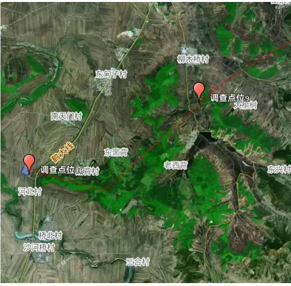  
图2.4-1 工程土石方平衡框图

## 2.5 拆迁安置与专项设施改（迁）建

本项目沿线因无法避让部分居民建筑物，需要进行拆除，拆迁执行国家、地方有关拆迁安置政策，由建设单位按当地补偿标准给予相应的现金补偿（在主体中计列），本项目拆迁面积共计416m2，委托地方政府负责具体实施。拆迁房屋的水土流失防治责任主体为地方政府，拆迁房屋施工的防治责任范围不纳入本项目。

## 2.6 施工进度

本项目按 19 个月的施工期作施工进度安排，拟于 2026 年 6 月 1 日开工，2027 年12月31日完成。工程施工进度安排具体见表 2.6-1 和图2.6-1。

表2.6-1 本项目施工进度安排
<table><tr><td rowspan=1 colspan=3>项目</td><td rowspan=1 colspan=1>施工时段</td><td rowspan=1 colspan=1>施工期限</td></tr><tr><td rowspan=7 colspan=1>输电线路</td><td rowspan=4 colspan=1>塔基及塔基施工区</td><td rowspan=1 colspan=1>塔位复测及基坑开挖</td><td rowspan=1 colspan=1>2026.6.1~2027.5.31（每个工段2个月）</td><td rowspan=1 colspan=1>12个月</td></tr><tr><td rowspan=1 colspan=1>塔基基础施工</td><td rowspan=1 colspan=1>2026.7.1~2027.6.30(每个工段2个月)</td><td rowspan=1 colspan=1>12个月</td></tr><tr><td rowspan=1 colspan=1>铁塔组立</td><td rowspan=1 colspan=1>2026.10.1~2027.7.31（每个工段2个月）</td><td rowspan=1 colspan=1>10个月</td></tr><tr><td rowspan=1 colspan=1>架线、调试、清场、验收</td><td rowspan=1 colspan=1>2027.1.1~2027.12.31（每个工段2个月）</td><td rowspan=1 colspan=1>12个月</td></tr><tr><td rowspan=1 colspan=1>牵张场地</td><td rowspan=1 colspan=1>架线施工</td><td rowspan=1 colspan=1>2027.1.1~2027.10.31（每个工段2个月）</td><td rowspan=1 colspan=1>10个月</td></tr><tr><td rowspan=1 colspan=1>跨越施工场地</td><td rowspan=1 colspan=1>架线施工</td><td rowspan=1 colspan=1>2027.1.1~2027.10.31（每个工段2个月）</td><td rowspan=1 colspan=1>10个月</td></tr><tr><td rowspan=1 colspan=1>施工道路</td><td rowspan=1 colspan=1>塔基基坑开挖、基础施工、铁塔组立、架线等</td><td rowspan=1 colspan=1>2026.6.1~2027.12.31(1 个完整工段6个月)</td><td rowspan=1 colspan=1>19个月</td></tr><tr><td rowspan=3 colspan=1>变电站</td><td rowspan=2 colspan=1>林海变</td><td rowspan=1 colspan=1>站区扩建区</td><td rowspan=1 colspan=1>2027.5.1~2027.12.31</td><td rowspan=1 colspan=1>8个月</td></tr><tr><td rowspan=1 colspan=1>施工便道</td><td rowspan=1 colspan=1>2027.6.1~2027.10.31</td><td rowspan=1 colspan=1>5个月</td></tr><tr><td rowspan=1 colspan=2>平安变</td><td rowspan=1 colspan=1>2027.5.1~2027.12.31</td><td rowspan=1 colspan=1>8个月</td></tr></table>

<table><tr><td rowspan=1 colspan=2>年度</td><td rowspan=1 colspan=7>2026</td><td rowspan=1 colspan=12>2027</td></tr><tr><td rowspan=1 colspan=2>月份</td><td rowspan=1 colspan=1>6</td><td rowspan=1 colspan=1>7</td><td rowspan=1 colspan=1>8</td><td rowspan=1 colspan=1>9</td><td rowspan=1 colspan=1>10</td><td rowspan=1 colspan=1>11</td><td rowspan=1 colspan=1>12</td><td rowspan=1 colspan=1>1</td><td rowspan=1 colspan=1>2</td><td rowspan=1 colspan=1>3</td><td rowspan=1 colspan=1>4</td><td rowspan=1 colspan=1>5</td><td rowspan=1 colspan=1>6</td><td rowspan=1 colspan=1>7</td><td rowspan=1 colspan=1>8</td><td rowspan=1 colspan=1>9</td><td rowspan=1 colspan=1>10</td><td rowspan=1 colspan=1>11</td><td rowspan=1 colspan=1>12</td></tr><tr><td rowspan=9 colspan=1>线路工程</td><td rowspan=5 colspan=1>塔基及塔基施工区</td><td rowspan=1 colspan=1></td><td rowspan=1 colspan=1></td><td rowspan=1 colspan=1>塔位复</td><td rowspan=1 colspan=1>测及</td><td rowspan=1 colspan=1>基坑开</td><td rowspan=1 colspan=1>挖</td><td rowspan=1 colspan=1>每个</td><td rowspan=1 colspan=1>工段2</td><td rowspan=1 colspan=1>个月)</td><td rowspan=1 colspan=1></td><td rowspan=1 colspan=1></td><td rowspan=1 colspan=1></td><td rowspan=2 colspan=1></td><td rowspan=3 colspan=1></td><td rowspan=4 colspan=1>每个工</td><td rowspan=4 colspan=1>段2</td><td rowspan=4 colspan=1>个月</td><td rowspan=4 colspan=1></td><td rowspan=4 colspan=1></td></tr><tr><td rowspan=4 colspan=1></td><td rowspan=1 colspan=1></td><td rowspan=1 colspan=1></td><td rowspan=1 colspan=1>塔基</td><td rowspan=1 colspan=1>基础施</td><td rowspan=1 colspan=1>工【每</td><td rowspan=1 colspan=1>个工</td><td rowspan=1 colspan=1>段2个</td><td rowspan=1 colspan=1>月）</td><td rowspan=1 colspan=1></td><td rowspan=1 colspan=1></td><td rowspan=1 colspan=1></td></tr><tr><td rowspan=3 colspan=1></td><td rowspan=3 colspan=1></td><td rowspan=3 colspan=1></td><td rowspan=1 colspan=1></td><td rowspan=1 colspan=1></td><td rowspan=1 colspan=1>铁塔组</td><td rowspan=1 colspan=1>立（每</td><td rowspan=1 colspan=1>个工段</td><td rowspan=1 colspan=1>2个月</td><td rowspan=1 colspan=1>)</td><td rowspan=1 colspan=1></td><td rowspan=1 colspan=1></td></tr><tr><td rowspan=2 colspan=1></td><td rowspan=2 colspan=1></td><td rowspan=2 colspan=1></td><td rowspan=1 colspan=1></td><td rowspan=1 colspan=1></td><td rowspan=1 colspan=1>架</td><td rowspan=1 colspan=1>线、调</td><td rowspan=1 colspan=1>试、清</td><td rowspan=1 colspan=1>场、验</td><td rowspan=1 colspan=1>收（</td></tr><tr><td rowspan=1 colspan=1></td><td rowspan=1 colspan=1></td><td rowspan=1 colspan=1></td><td rowspan=1 colspan=1></td><td rowspan=1 colspan=1></td><td rowspan=1 colspan=1></td><td rowspan=1 colspan=1></td><td rowspan=1 colspan=1></td><td rowspan=1 colspan=1></td><td rowspan=1 colspan=1></td><td rowspan=1 colspan=1></td><td rowspan=1 colspan=1></td></tr><tr><td rowspan=2 colspan=1>牵张场地跨越施工场地</td><td rowspan=2 colspan=1></td><td rowspan=2 colspan=1></td><td rowspan=2 colspan=1></td><td rowspan=2 colspan=1></td><td rowspan=2 colspan=1></td><td rowspan=2 colspan=1></td><td rowspan=2 colspan=1></td><td rowspan=1 colspan=1></td><td rowspan=1 colspan=1></td><td rowspan=1 colspan=1></td><td rowspan=1 colspan=1></td><td rowspan=1 colspan=1>架线施</td><td rowspan=1 colspan=1>工（每</td><td rowspan=1 colspan=1>个工段</td><td rowspan=1 colspan=1>2个</td><td rowspan=1 colspan=1>月）</td><td rowspan=1 colspan=1></td><td rowspan=1 colspan=1></td><td rowspan=1 colspan=1></td></tr><tr><td rowspan=1 colspan=1></td><td rowspan=1 colspan=1></td><td rowspan=1 colspan=1></td><td rowspan=1 colspan=1></td><td rowspan=1 colspan=1></td><td rowspan=1 colspan=1></td><td rowspan=1 colspan=1></td><td rowspan=1 colspan=1></td><td rowspan=1 colspan=1></td><td rowspan=1 colspan=1></td><td rowspan=1 colspan=1></td><td rowspan=1 colspan=1></td></tr><tr><td rowspan=2 colspan=1>施工道路</td><td rowspan=1 colspan=1></td><td rowspan=1 colspan=1></td><td rowspan=1 colspan=1></td><td rowspan=1 colspan=1>塔</td><td rowspan=1 colspan=1>塔基基坑</td><td rowspan=1 colspan=1>开挖</td><td rowspan=1 colspan=1>、基础</td><td rowspan=1 colspan=1>施工</td><td rowspan=1 colspan=1>、铁塔</td><td rowspan=1 colspan=1>组立、</td><td rowspan=1 colspan=1>架线等</td><td rowspan=1 colspan=2>（每个工段</td><td rowspan=1 colspan=1>6个月</td><td rowspan=1 colspan=1>）</td><td rowspan=1 colspan=1></td><td rowspan=1 colspan=1></td><td rowspan=1 colspan=1></td><td rowspan=1 colspan=1></td></tr><tr><td rowspan=1 colspan=1></td><td rowspan=1 colspan=1></td><td rowspan=1 colspan=1></td><td rowspan=1 colspan=1></td><td rowspan=1 colspan=1></td><td rowspan=1 colspan=1></td><td rowspan=1 colspan=1></td><td rowspan=1 colspan=1></td><td rowspan=1 colspan=1></td><td rowspan=1 colspan=1></td><td rowspan=1 colspan=1></td><td rowspan=1 colspan=1></td><td rowspan=1 colspan=1></td><td rowspan=1 colspan=1></td><td rowspan=1 colspan=1></td><td rowspan=1 colspan=1></td><td rowspan=1 colspan=1></td><td rowspan=1 colspan=1></td><td rowspan=1 colspan=1></td></tr><tr><td rowspan=4 colspan=1>变电站</td><td rowspan=2 colspan=1>林海变</td><td rowspan=2 colspan=1></td><td rowspan=2 colspan=1></td><td rowspan=2 colspan=1></td><td rowspan=2 colspan=1></td><td rowspan=2 colspan=1></td><td rowspan=2 colspan=1></td><td rowspan=2 colspan=1></td><td rowspan=2 colspan=1></td><td rowspan=2 colspan=1></td><td rowspan=2 colspan=1></td><td rowspan=2 colspan=1></td><td rowspan=1 colspan=1></td><td rowspan=1 colspan=1></td><td rowspan=1 colspan=1></td><td rowspan=1 colspan=1>站区扩</td><td rowspan=1 colspan=1>建</td><td rowspan=1 colspan=1></td><td rowspan=1 colspan=1></td><td rowspan=1 colspan=1></td></tr><tr><td rowspan=1 colspan=1></td><td rowspan=1 colspan=1></td><td rowspan=1 colspan=1>施</td><td rowspan=1 colspan=1>工道</td><td rowspan=1 colspan=1>路</td><td rowspan=1 colspan=1></td><td rowspan=1 colspan=1></td><td rowspan=1 colspan=1></td></tr><tr><td rowspan=2 colspan=1>平安变</td><td rowspan=2 colspan=1></td><td rowspan=2 colspan=1></td><td rowspan=2 colspan=1></td><td rowspan=2 colspan=1></td><td rowspan=2 colspan=1></td><td rowspan=2 colspan=1></td><td rowspan=2 colspan=1></td><td rowspan=2 colspan=1></td><td rowspan=2 colspan=1></td><td rowspan=2 colspan=1></td><td rowspan=2 colspan=1></td><td rowspan=1 colspan=1></td><td rowspan=1 colspan=1></td><td rowspan=1 colspan=1></td><td rowspan=1 colspan=1></td><td rowspan=1 colspan=1></td><td rowspan=1 colspan=1></td><td rowspan=1 colspan=1></td><td rowspan=1 colspan=1></td></tr><tr><td rowspan=1 colspan=1></td><td rowspan=1 colspan=1></td><td rowspan=1 colspan=1></td><td rowspan=1 colspan=1></td><td rowspan=1 colspan=1></td><td rowspan=1 colspan=1></td><td rowspan=1 colspan=1></td><td rowspan=1 colspan=1></td></tr></table>

图2.6-1 工程施工进度轮廓图

## 2.7 自然概况

## 2.7.1 地质

## 2.7.1.1 输电线路

## 1）地层岩性

线路所经地段地貌单元包括低山丘陵地貌、熔岩台地及部分山间平地，以低山丘陵为主，约占线路总长度的 63.4％，熔岩台地约占线路总长度的15％，山间平地占线路总长度的21.6％。

低山丘陵地貌区：该段地层岩性主要为第四系粉质黏土、碎石类土，主要由残、坡积而成，岩性为粉质黏土混砂砾及少量碎石，黄褐色、灰褐色；下伏基岩为花岗岩、砂岩。本线路沿线地表覆盖较好，塔位及其附近基本无基岩裸露，表层为植土。

熔岩台地地貌区：该段地形平坦开阔，主要为农田，以旱田为主，局部为水稻田。

山间平地地貌区：该段分布在丘陵底部沟谷附近，一般长度不大，间歇分布。该地貌单元内的地层岩性为第四系全新统～第四系上更新统黏性土、砂类土、碎石类土层，下伏侏罗纪砂岩及中生代侵入花岗岩。

## 2）水文地质

线路沿线地下水类型为第四系孔隙潜水和基岩裂隙水。第四系孔隙潜水主要分布于山间平地及熔岩台地，含水层为第四系黏性土、砂类层，部分地段水位较浅，埋深0.00m\~3.00m，大部分地段埋深在 5m 以下，主要接受大气降水入渗补给，以蒸发、人工开采及向下游径流、渗流等形式排泄，地下水位随季节性变化明显，年变幅可达1.00m～2.00m。基岩裂隙水主要分布于低山丘陵地段，基岩裂隙水含水层为强风化和中等风化岩石，基岩裂隙水埋藏较深，可不考虑基岩裂隙水对塔位影响。

线路沿线大部分地段地下水位埋藏较深，可不考虑水的腐蚀性；仅在丘间平地及靠近河流处地下水位埋藏较浅，地下水对混凝土结构具微腐蚀，对混凝土结构中的钢筋具微腐蚀。地基土对混凝土结构具微腐蚀，对混凝土结构中钢筋具微腐蚀，对钢结构具微\~弱腐蚀。

## 3）地震动参数

根据《建筑抗震设计规范》GB 50011-2010（2016 年版）及《中国地震动参数区划图》（GB 18306-2015），本项目线路沿线对应Ⅱ类场地的震动峰值加速度为 0.05g（对应的地震基本烈度为6度）。

## 4）不良地质

场地附近未发现滑坡、崩塌、塌陷、泥石流、地面沉降、地震液化等不良地质作用。局部地段有小型冲沟发育，对线路基本无影响，铁塔定位时应予以避让。

## 2.7.1.2 变电站

## a）林海变

## 1）地层岩性

站址区地层岩性为第四系沉积层，主要为冲积—洪积形成的粉质粘土层，其下为砂岩或泥质粉砂岩。地层岩性自上而下为粉质粘土（可塑）、粉质粘土（硬塑）、粉质粘土（软塑）、砂岩（全风化）和泥质粉砂岩（全风化）。

## 2）水文地质

站址内地下水埋藏较深，局部存在上层滞水，赋存于第四系沉积层中，主要补给来源为大气降水和人工灌溉，主要排泄途经为蒸发，地下水对混凝土无侵蚀性。

## 3）地震动参数

根据《建筑抗震设计规范》（GB 50011-2016），站址区基本地震烈度为 6 度，地震动峰值加速度值为0.05g，设计地震分组为第一组。

## b）平安变

## 1）地层岩性

站址区地层岩性为第四系坡积、洪积层的粘性土，下伏基岩为第四系晚更新世气孔状玄武岩。地层岩性自上而下为粉质粘土（硬塑、可塑）、玄武岩。

## 2）水文地质

站址内地下水埋藏较深，赋存于第四系晚更新世气孔状玄武岩中，主要补给来源为大气降水和人工灌溉，主要排泄途经为蒸发。

## 3）地震动参数

根据《建筑抗震设计规范》（GB 50011-2016），站址区基本地震烈度为 6 度，地震动峰值加速度值为0.05g，设计地震分组为第一组。

## 2.7.2 地貌

## a）输电线路

本项目线路途经黑龙江省牡丹江市西安区、宁安市，吉林省延边朝鲜族自治州敦化市，沿线海拔高度在 200m\~900m 之间。沿途的地形地貌以山丘、熔岩台地和山间平地为主，沿线地形比例为山丘约85%、平原约15%。

## b）变电站

林海变站址区地貌单元上属东北山区向河谷平原过渡带，地势较开阔，地表较平缓，整 体 呈 现 南 高 北 低 ， 自 然 高 程 302.85m ～ 311.90m ； 站 区 内 场 地 设 计 标 高305.20m\~309.04m，不受百年一遇洪水及内涝影响。林海变本期为站内扩建，扩建场地计标高 308.03m\~308.14m，站内余土平整利用区场地现有标高 308.14m\~309.04m、307.91m\~308.67m，该场地目前为绿化草坪。

平安变站址区地貌单元为山前台地，地势相对较平坦、开阔，整体呈现东北高西南低；站区内场地设计标高 493.70m\~495.60m，不受百年一遇洪水及内涝影响。平安变本期为站内扩建，扩建场地设计标高494.80m\~494.85m，站内余土平整利用区场地设计标高 494.00m\~494.80m，该场地目前为绿化草坪。

工程建设区地貌现状见图2.7-1。  
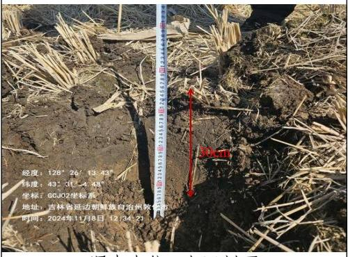  
林海变扩建场地

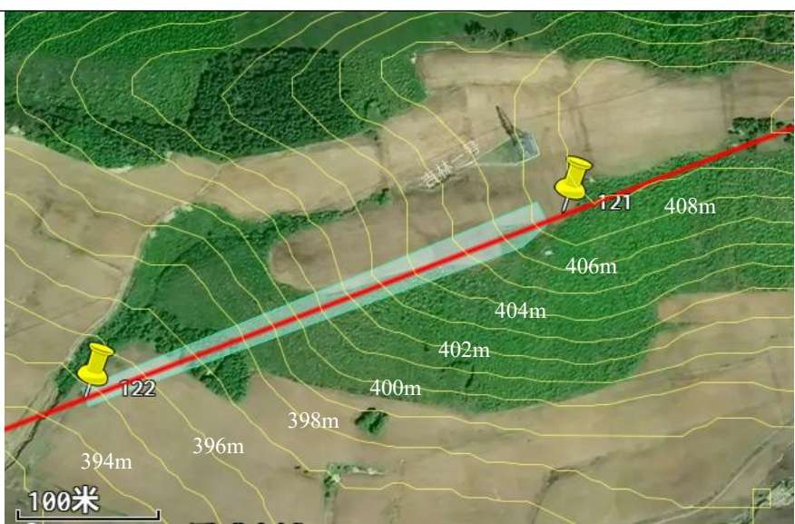  
林海变东北侧施工生产生活区

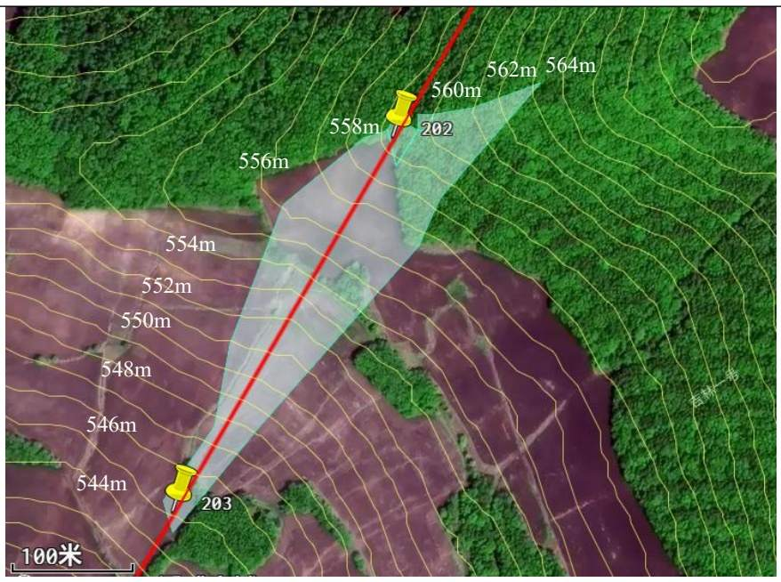  
平安变扩建场地

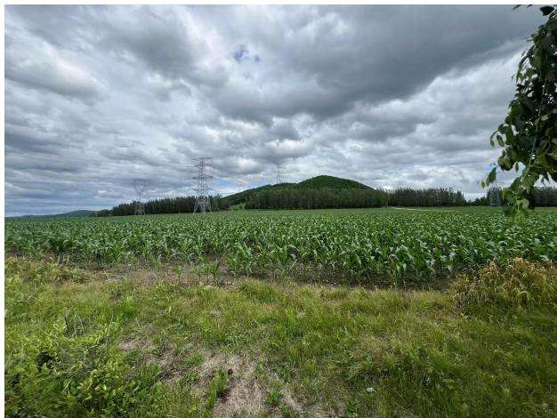  
平安变东侧施工生产生活区

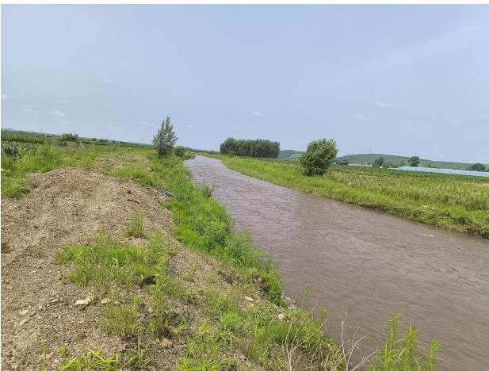  
线路跨越榆林河

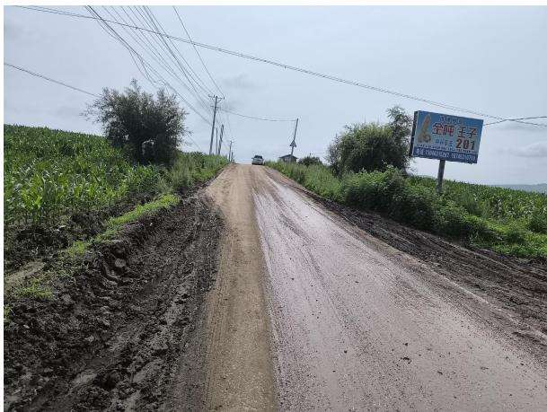  
线路跨越宁兰线

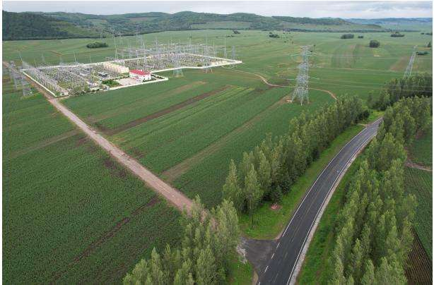  
跨越国道 G201（平安变 500kV 出线侧）

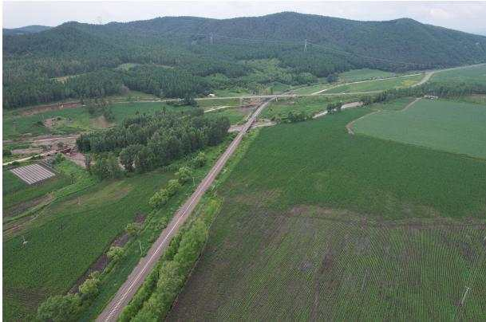  
跨越铁路

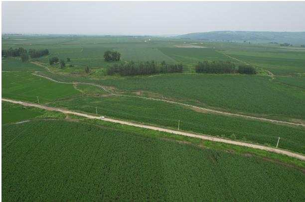  
线路平原区（黑龙江境内）

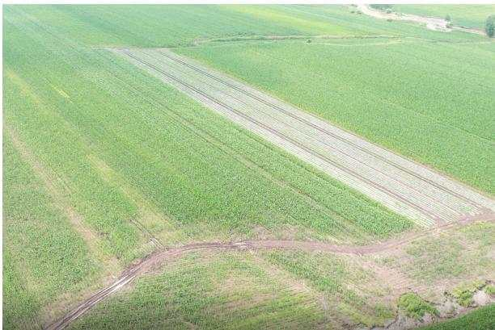  
沿线平原区（吉林境内）

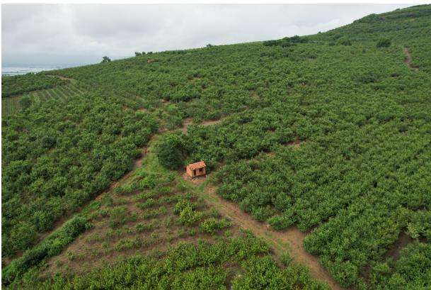  
沿线山丘区（黑龙江境内）

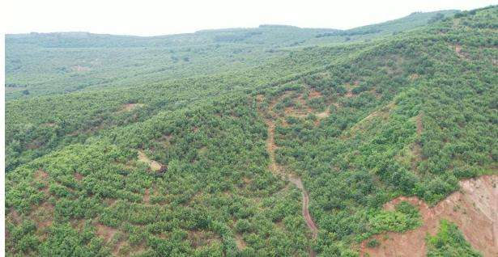  
沿线山丘区（吉林境内）

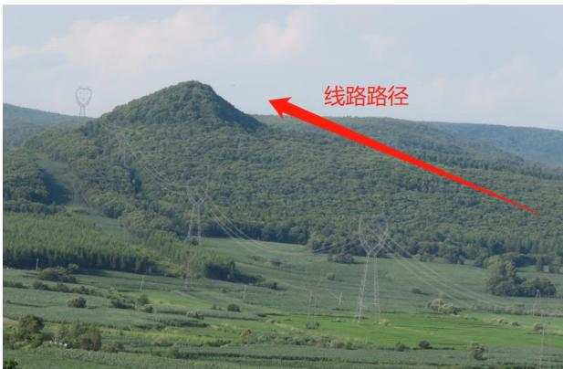  
穿越镜泊湖国家森林公园

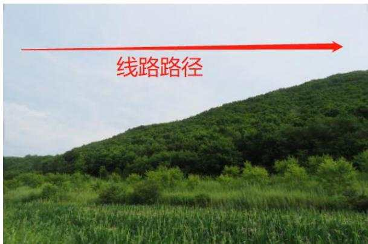  
穿越生态保护红线处（宁安市褚家村附近）  
图2.7-1 项目区地貌现状照片

## 2.7.3 气象

本项目线路途经黑龙江省牡丹江市西安区、宁安市，吉林省延边朝鲜族自治州敦化市。项目区属中温带湿润型气候。四季分明，光照充足，季风明显，春季干燥多风，夏季雨热同期，冬季寒冷漫长。根据沿线各地区多年气象资料，多年平均气温 3.8℃\~4.0℃，≥10℃的积温 $2 6 1 1 ^ { \circ } \mathrm { C } { \sim } 2 6 9 6 . 6 ^ { \circ } \mathrm { C }$ ，多年平均蒸发量 1489.3mm\~1523.1mm，多年平均降雨量 548.6mm\~663.2mm，无霜期 134d\~148d，多年平均风速 2.5m/s\~3.2m/s，年均大风日数18d\~30d，最大冻土深度 179cm\~191cm。降雨量集中在 6\~9 月；大风天气主要集中在3\~5 月。

气象资料来源于宁安市气象观测站、敦化市气象观测站，资料系列长度为 1971 年\~2021 年。项目区主要气象要素特征值见表2.7-1。

表2.7-1 主要气候特征指标
<table><tr><td rowspan=2 colspan=1>序号</td><td rowspan=2 colspan=1>项目</td><td rowspan=2 colspan=1>单位</td><td rowspan=1 colspan=1>黑龙江省</td><td rowspan=1 colspan=1>吉林省</td></tr><tr><td rowspan=1 colspan=1>宁安市、西安区</td><td rowspan=1 colspan=1>敦化市</td></tr><tr><td rowspan=1 colspan=1>1</td><td rowspan=1 colspan=1>多年平均气温</td><td rowspan=1 colspan=1> $^ \circ \mathrm { C }$ </td><td rowspan=1 colspan=1>4.0</td><td rowspan=1 colspan=1>3.4</td></tr><tr><td rowspan=1 colspan=1>2</td><td rowspan=1 colspan=1>≥10℃积温</td><td rowspan=1 colspan=1>℃</td><td rowspan=1 colspan=1>2696.6</td><td rowspan=1 colspan=1>2611</td></tr><tr><td rowspan=1 colspan=1>3</td><td rowspan=1 colspan=1>多年平均蒸发量</td><td rowspan=1 colspan=1>mm</td><td rowspan=1 colspan=1>1489.3</td><td rowspan=1 colspan=1>1523.1</td></tr><tr><td rowspan=1 colspan=1>4</td><td rowspan=1 colspan=1>多年平均降水量</td><td rowspan=1 colspan=1>mm</td><td rowspan=1 colspan=1>548.6</td><td rowspan=1 colspan=1>663.2</td></tr><tr><td rowspan=1 colspan=1>5</td><td rowspan=1 colspan=1>无霜期</td><td rowspan=1 colspan=1>d</td><td rowspan=1 colspan=1>148</td><td rowspan=1 colspan=1>134</td></tr><tr><td rowspan=1 colspan=1>6</td><td rowspan=1 colspan=1>平均风速</td><td rowspan=1 colspan=1>m/s</td><td rowspan=1 colspan=1>2.5</td><td rowspan=1 colspan=1>3.2</td></tr><tr><td rowspan=1 colspan=1>7</td><td rowspan=1 colspan=1>冬季主导风向</td><td rowspan=1 colspan=1>1</td><td rowspan=1 colspan=1>SW</td><td rowspan=1 colspan=1>SW</td></tr><tr><td rowspan=1 colspan=1>8</td><td rowspan=1 colspan=1>大风日数</td><td rowspan=1 colspan=1>d</td><td rowspan=1 colspan=1>18</td><td rowspan=1 colspan=1>30</td></tr><tr><td rowspan=1 colspan=1>9</td><td rowspan=1 colspan=1>雨季时段</td><td rowspan=1 colspan=1>月</td><td rowspan=1 colspan=1>6~9</td><td rowspan=1 colspan=1>6~9</td></tr><tr><td rowspan=1 colspan=1>10</td><td rowspan=1 colspan=1>风季时段</td><td rowspan=1 colspan=1>月</td><td rowspan=1 colspan=1>3~5</td><td rowspan=1 colspan=1>3~5</td></tr><tr><td rowspan=1 colspan=1>11</td><td rowspan=1 colspan=1>最大冻土深度</td><td rowspan=1 colspan=1>cm</td><td rowspan=1 colspan=1>191</td><td rowspan=1 colspan=1>179</td></tr></table>

## 2.7.4 水文

项目区地处松花江流域，属于牡丹江水系。项目区水系分布情况见附图7。

本项目沿途的地形地貌以平地、低山丘陵为主，线路沿线主要跨越花脸沟、缸窑沟、小石头河、榆林河、蛤蟆河、卧龙河、苇子沟、马莲河、养胖沟、黑瞎子沟河、石头河、松乙河、房身沟河、大夹吉河、小夹吉河、官地河等河流。跨越河流均为不通航河流。

## 1）花脸沟河

花脸沟河属于牡丹江水系，发源于宁安市张广才岭的东部山区，海拔高度 950m，于福兴三队北约 2km 处汇入牡丹江，汇入点海拔高度 143m，流域面积 123.44km2，河长 30.5km，多年平均流量 0.74m3/s。

本线路在解放村西侧约 1.3km 处跨越花脸沟河，跨越处沟宽 10m、深 1.5m，沟内常年无水。本线路一档跨越花脸沟，无河道管理范围内立塔及施工临时占地。

## 2）缸窑河

缸窑河属于牡丹江水系，发源于长白山余脉，张广才岭的东部，海拔高度 850m，流域面积107.31km2，于宁东村西侧约1.6km 处汇入牡丹江，河流长度23.5km，多年平均流量 0.64m3/s。

本线路在宁东村东侧约800m 处跨越缸窑河，跨越处沟宽15m、深1.5m，沟内常年无水。本线路一档跨越缸窑河，无河道管理范围内立塔及施工临时占地。

## 3）小石头河

小石头河属于牡丹江水系，发源于宁安市种畜场，属于张广才岭的东部山区，当地称为半节沟，由数条无名小沟汇聚而成，于烧锅村西北侧约2.2km处汇入牡丹江。

本线路在烧锅村南侧约 1km 处跨越小石头河，跨越处主河道宽 30m、深约 2.0m，河道内常年有水，水深约0.8m。本线路一档跨越小石头河，无河道管理范围内立塔及施工临时占地。

## 4）榆林河

榆林河发源于宁安市东部山区，海拔高度 930m，该河为蛤蚂河支流，于八家子屯西以东0.5km 处汇入蛤蚂河，汇入点海拔高度270m。榆林河流域面积220.63km2，河长40km，多年平均流量 1.33m3/s。

本线路在龙江村东侧约600m 处跨越榆林河，跨越处主河道宽30m、深约1.5m，河道内常年有水。本线路一档跨越榆林河，无河道管理范围内立塔及施工临时占地。

## 5）蛤蟆河

蛤蚂河属于牡丹江水系，发源于宁安市东南的广大山区，海拔高度 750m，河长90km，河道比降 1/4000 左右，流域面积达 1841.38km2，多年平均流量 10.59m3/s，于宁

安市城正南汇入牡丹江，汇入点海拔高度 251m。

本线路在三道湾村北侧约700m 处跨越蛤蟆河，跨越处主河道宽 35m、深约2.0m，河道较为顺直，河道两岸为丘陵缓坡。本线路一档跨越蛤蟆河，无河道管理范围内立塔及施工临时占地。

## 6）卧龙河

卧龙河属于牡丹江水系，为蛤蚂河支流，于罗城沟村以西1km 处汇入蛤蟆河，卧龙河流域面积 120km2，河长 25km，多年平均流量 3.25m3/s。

本线路在卧龙村东侧约700m 处跨越卧龙河，跨越处河道宽30m、深2.0m，沟内常年有水。本线路一档跨越卧龙河，无河道管理范围内立塔，施工临时占地仅施工道路涉及卧龙河河道管理范围长度约150m、宽3.5m。

## 7）苇子沟

苇子沟河属于牡丹江水系，为马莲河支流，位于宁安市东京城镇境内。苇子沟河由东南向西北流经兴安村、蚕场村、光明村，在东京城镇中马河村南约1.5km 处汇入马莲河，流域面积49.413km2，河流长15km，河槽宽度15m\~25m，河床平均比降25‰。

本线路在兴安村南侧约 500m 处跨越苇子沟，跨越处沟宽 8m、深 1.0m，沟内常年有水。本线路一档跨越苇子沟，无河道管理范围内立塔及施工临时占地。

## 8）马莲河

马莲河位于宁安市中部，为牡丹江右岸一级支流。马莲河发源于长白山脉老爷岭，马河乡鹿道村东山，由南向北流经马河乡、东京城镇，在下马河东2.5km 处汇入牡丹江。马莲河流域面积833.25km2，全长53km，河槽平均宽度 10m\~25m，平均比降 5.0‰，年径流深175mm。主要支流有鹿道沟、四道河、杨胖子沟河及苇子沟河等。

本线路在马河乡南侧约900m 处跨越马莲河，跨越处河道宽50m、深2.0m，河道内常年有水。本线路一档跨越马莲河，无河道管理范围内立塔及施工临时占地。

## 9）养胖沟

养胖沟发源于牡丹江市、宁安县东部山区红光村南侧约8km 山脉，属山间季节性河沟，该沟为马莲河支流，于光城村以西 80m处汇入马莲河。养胖沟流域面积80km2，沟长 20km，多年平均流量 2.95m3/s。

本线路在富路村南侧约100m 处一次跨越养胖沟，跨越处河道宽15m、深1.0m，河道内常年有水。线路于红光村北侧约400m处二次跨越养胖沟，跨越处沟宽25m、深1.5m，河道内常年有水。本线路两次跨越养胖沟均为一档跨越，无河道管理范围内立塔及施工

临时占地。

## 10）黑瞎子沟河

黑瞎子沟河为牡丹江右岸一级支流，全部位于宁安市境内，属山区性河流、坡度较陡、水流较急。黑瞎子沟河流域面积 94.7km2，全长25km。

本线路在红星村西南侧约4200m 处跨越黑瞎子沟河，跨越处河道宽10m、深1.0m，河道内常年有水。本线路一档跨越黑瞎子沟河，无河道管理范围内立塔及施工临时占地。

## 11）石头河

石头河为牡丹江右岸一级支流，全部位于宁安市境内，属山区性河流、坡度较陡、水流较急。石头河流域面积85.7km2，全长22km。

本线路在石头河村西北侧约 7500m 处跨越石头河，跨越处河道宽 10m、深 1.0m，河道内常年有水。本线路一档跨越石头河，无河道管理范围内立塔及施工临时占地。

## 12）松乙河

松乙河发源于长白山脉张广才岭，由太平沟、清沟子、湾沟等众多小沟汇聚而成，最终汇入镜泊湖。该河流域面积492km2，河长41km，多年平均流量2.96m3/s。

本线路在松乙桥村东侧约 1.5km 处跨越松乙河，跨越处河道宽 40m、深 2.0m，跨越处河道较顺直，两岸无堤防，河道内常年有水。本线路一档跨越松乙河，无河道管理范围内立塔及施工临时占地。

## 13）房身沟河

房身沟河发源于长白山余脉，张广才岭的崇山峻岭之中，由八道沟、七道沟、六道沟、五道沟、四道沟、三道沟、二道沟、青沟子等汇聚而成，最终汇入镜泊湖。该河流域面积 204.8km2，河长 30 ㎞；多年平均流量 1.27m³/s。

本线路在庆丰村西侧约600m 处跨越房身沟河，跨越处河道宽约 10m，深约1.0m，河道两岸无堤防，河道内常年有水，水深较浅。本线路一档跨越房身沟河，无河道管理范围内立塔及施工临时占地。

## 14）大夹吉河

大夹吉河发源于牡丹江地区，长白山余脉，张广才岭镜泊湖乡南部的牛心顶子西2km，海拔高度 880m；由西崴子沟、小西沟等众多小沟汇聚而成，最终汇入镜泊湖。该河流域面积 155km2，河长 25.5km，多年平均流量 0.98m3/s。

本线路在良种场村北侧约 700m 处跨越大夹吉河，跨越处河道较为顺直，河道宽15m、深 1.0m，河道两岸无堤防，河道内常年有水，水深较浅。本线路一档跨越大夹吉

河，无河道管理范围内立塔及施工临时占地。

## 15）小夹吉河

小夹吉河发源于牡丹江地区，长白山余脉，海拔高度 910m；由大东沟、小东沟、汇聚而成，小夹吉河于西河口屯附近汇入大夹吉河，最终汇入镜泊湖。小夹吉河流域面积 73.34km2，河长 24km，多年平均流量 0.46m3/s。

本线路在东方红林厂副业队西北侧约1km处跨越小夹吉河，跨越处主河道宽约8m，深约 0.6m，河道较为顺直，河道两岸为丘陵缓坡。本线路一档跨越小夹吉河，无河道管理范围内立塔及施工临时占地。

## 16）官地河

官地河发源于境内东南大黑岭西端北麓，属牡丹江一级支流，流域面积为407km2，从东南至西北流经官地村转向东北，于横道子村东汇入牡丹江，敦化境内河长54.9km。

本线路于大榆树村北侧约600m 处、官地水库坝址下游约2km 处斜跨越官地河，跨越处河道较顺直，河道宽8m、深1.0m，河道两岸无堤防，河道内常年有水，水深较浅。本线路一档跨越官地河，跨越处两侧塔位地势相对较高，无河道管理范围内立塔及施工临时占地。

针对本项目线路工程跨越河流及施工道路涉及卧龙河河道管理范围，承诺在项目建设过程中不在河道管理范围内堆土，临时堆土避开雨季和汛期。建设单位已出具承诺，承诺“在洪水影响评价报告审批许可前，绝不开工建设涉及、跨越河道段施工”。

本项目沿线跨越河流洪评开展情况见表2.7-2。

表 2.7-2 跨越河流洪评开展情况一览表
<table><tr><td colspan="1" rowspan="1">序号</td><td colspan="1" rowspan="1">河流名称</td><td colspan="1" rowspan="1">行政主管单位</td><td colspan="1" rowspan="1">是否取得路径通过意见</td><td colspan="1" rowspan="1">是否在河道管理范围内立塔</td><td colspan="1" rowspan="1">是否涉及在河道管理范围施工及临时占地</td><td colspan="1" rowspan="1">是否需要洪评</td><td colspan="1" rowspan="1">洪评工作进展情况</td></tr><tr><td colspan="1" rowspan="1">1</td><td colspan="1" rowspan="1">花脸沟河</td><td colspan="1" rowspan="13">宁安市水利局</td><td colspan="1" rowspan="13">已取得，意见中明确原则同意路径方案</td><td colspan="1" rowspan="7">否</td><td colspan="1" rowspan="7">否</td><td colspan="1" rowspan="1">是</td><td colspan="1" rowspan="1">开展中</td></tr><tr><td colspan="1" rowspan="1">2</td><td colspan="1" rowspan="1">缸窑河</td><td colspan="1" rowspan="1">是</td><td colspan="1" rowspan="1">开展中</td></tr><tr><td colspan="1" rowspan="1">3</td><td colspan="1" rowspan="1">小石头河</td><td colspan="1" rowspan="1">是</td><td colspan="1" rowspan="1">开展中</td></tr><tr><td colspan="1" rowspan="1">4</td><td colspan="1" rowspan="1">榆林河</td><td colspan="1" rowspan="1">是</td><td colspan="1" rowspan="1">开展中</td></tr><tr><td colspan="1" rowspan="1">5</td><td colspan="1" rowspan="1">兰岗东进引水渠</td><td colspan="1" rowspan="1">否</td><td colspan="1" rowspan="1">1</td></tr><tr><td colspan="1" rowspan="1">6</td><td colspan="1" rowspan="1">蛤蟆河</td><td colspan="1" rowspan="1">是</td><td colspan="1" rowspan="1">开展中</td></tr><tr><td colspan="1" rowspan="1">7</td><td colspan="1" rowspan="1">桦树川总干渠</td><td colspan="1" rowspan="1">否</td><td colspan="1" rowspan="1">/</td></tr><tr><td colspan="1" rowspan="1">8</td><td colspan="1" rowspan="1">卧龙河</td><td colspan="1" rowspan="1">否</td><td colspan="1" rowspan="1">是</td><td colspan="1" rowspan="1">是</td><td colspan="1" rowspan="1">开展中</td></tr><tr><td colspan="1" rowspan="1">9</td><td colspan="1" rowspan="1">卧龙河干渠</td><td colspan="1" rowspan="5">否</td><td colspan="1" rowspan="5">否</td><td colspan="1" rowspan="1">否</td><td colspan="1" rowspan="1">/</td></tr><tr><td colspan="1" rowspan="1">10</td><td colspan="1" rowspan="1">苇子沟</td><td colspan="1" rowspan="1">是</td><td colspan="1" rowspan="1">开展中</td></tr><tr><td colspan="1" rowspan="1">11</td><td colspan="1" rowspan="1">马莲河</td><td colspan="1" rowspan="1">是</td><td colspan="1" rowspan="1">开展中</td></tr><tr><td colspan="1" rowspan="1">12</td><td colspan="1" rowspan="1">养胖沟</td><td colspan="1" rowspan="1">是</td><td colspan="1" rowspan="1">开展中</td></tr><tr><td colspan="1" rowspan="1">13</td><td colspan="1" rowspan="1">黑瞎子沟河</td><td colspan="1" rowspan="1">是</td><td colspan="1" rowspan="1">开展中</td></tr><tr><td colspan="1" rowspan="1">14</td><td colspan="1" rowspan="1">石头河</td><td colspan="1" rowspan="5"></td><td colspan="1" rowspan="5"></td><td colspan="1" rowspan="5"></td><td colspan="1" rowspan="5"></td><td colspan="1" rowspan="1">是</td><td colspan="1" rowspan="1">开展中</td></tr><tr><td colspan="1" rowspan="1">15</td><td colspan="1" rowspan="1">松乙河</td><td colspan="1" rowspan="1">是</td><td colspan="1" rowspan="1">开展中</td></tr><tr><td colspan="1" rowspan="1">16</td><td colspan="1" rowspan="1">房身沟河</td><td colspan="1" rowspan="1">是</td><td colspan="1" rowspan="1">开展中</td></tr><tr><td colspan="1" rowspan="1">17</td><td colspan="1" rowspan="1">大夹吉河</td><td colspan="1" rowspan="1">是</td><td colspan="1" rowspan="1">开展中</td></tr><tr><td colspan="1" rowspan="1">18</td><td colspan="1" rowspan="1">小夹吉河</td><td colspan="1" rowspan="1">否</td><td colspan="1" rowspan="1">1</td></tr><tr><td colspan="1" rowspan="1">19</td><td colspan="1" rowspan="1">官地河</td><td colspan="1" rowspan="2">敦化市水利局</td><td colspan="1" rowspan="2">已取得，意见中明确原则同意路径方案</td><td colspan="1" rowspan="2">否</td><td colspan="1" rowspan="2">否</td><td colspan="1" rowspan="1">是</td><td colspan="1" rowspan="1">开展中</td></tr><tr><td colspan="1" rowspan="1">20</td><td colspan="1" rowspan="1">无名河沟</td><td colspan="1" rowspan="1">是</td><td colspan="1" rowspan="1">开展中</td></tr></table>

## 2.7.5 土壤

## 2.7.5.1 项目区土壤类型

项目区主要土壤类型为暗棕壤、灰棕壤、草甸土、白浆土、沼泽土。其中：

牡丹江市西安区、宁安市境内土壤类型主要为暗棕壤、草甸土、沼泽土；延边朝鲜族自治州敦化市境内土壤类型主要为灰棕壤、白浆土、沼泽土。

暗棕壤：暗棕壤是在温带湿润型气候和针阔混交林下发育形成的一种地带性土壤，其表层有较丰富的有机质，腐殖质的积累量较多，是比较肥沃的森林土壤。因季节性冻层的存在，淋溶作用较弱，土壤水分终年处于湿润状态，理化性质呈中性到酸性。表层土厚约 20cm\~30cm。

灰棕壤：灰棕壤是在寒温带或温带山地生物气候条件下形成的土壤。腐殖质层有机质含量很高，但下层急剧减少，团粒结构，下层为块状。土壤酸度大，pH值一般在 4.8-5.3之间。表层土厚约 20cm\~30cm。

草甸土：草甸土是在草甸植被和地下水浸润作用下形成的土壤。腐殖质层较厚含有丰富的有机质，含有丰富的养分，肥力水平较高，生产潜力较大，多为团粒或屑粒状结构，较为松软，有利于通气和保水。草甸土质地类型比较复杂，包括砂土、壤土、粘土各种类型，表土腐殖土厚度20cm\~30cm。

白浆土：白浆土是在温带半湿润及湿润区森林、草甸植被下，在微度倾斜岗地的上轻下粘母质上，经过白浆化等成土过程形成的土壤。白浆土的黑土层较薄，肥力较低，成土母质主要是第四纪河湖粘土沉积物，质地多为轻粘土，部分可达中至重黏土。表土腐殖土厚度约20cm。

沼泽土：沼泽土是发育于长期积水并生长喜湿植物的低洼地土壤，土壤呈微酸性至酸性。表土腐殖土厚度 20cm\~30cm。

## 2.7.5.2 表土资源调查、保护、堆存及回覆利用方案

## a）表土资源调查

本项目建设占用黑土地，根据《中华人民共和黑土地保护法》及相关法律法规要求，2024 年 12 月\~2025 年 2月，国家电网公司东北分部委托吉林省誉佳房地产土地评估咨询有限公司完成占用耕地耕作层土壤剥离利用方案和临时用地表土剥离利用方案。吉林省誉佳房地产土地评估咨询有限公司按黑龙江省和吉林省分段开展了耕作土层等表土资源调查。

调查范围为线路工程沿线各市（区）耕地的耕作层，林地、园地、草地的表土。调查内容主要包括土壤类型、分布、耕作层/表土厚度、地表作物、土壤理化性状等状况。

调查点位选择充分考虑地形地貌、土地利用类型、耕地质量等级等因素，共设置10调查点位。本项目线路沿线调查点位和土壤剖面情况见表2.7-3。

根据土壤调查结果，项目区土壤类型以黑土为主，黑龙江段耕地坡度＜1°，耕作层厚度 30cm，园地、林地、草地表土厚度 20cm，有机质含量 24.3\~32.1g/kg、pH6.3\~7.01，质地比较黏重，土壤质量为Ⅱ类表土；吉林段耕地坡度≤2°，耕作层平均厚度 30cm，园地、林地、草地表土厚度20cm，有机质含量 29.5\~42.5g/kg、pH为6.5左右，质地为黏土，土壤质量为Ⅱ类表土。

表2.7-3 线路沿线调查点位及土壤剖面一览表
<table><tr><td colspan="1" rowspan="1">线路途径的行政区</td><td colspan="1" rowspan="1">调查点位布设示意图</td><td colspan="1" rowspan="1">调查点剖面图</td><td colspan="1" rowspan="1">备注</td></tr><tr><td colspan="1" rowspan="2">黑龙江牡丹江市西安区</td><td colspan="1" rowspan="2"></td><td colspan="1" rowspan="1">调查点位1-旱地剖面</td><td colspan="1" rowspan="1">西安区河口村</td></tr><tr><td colspan="1" rowspan="1"> 调查点位2-旱地剖面</td><td colspan="1" rowspan="1">西安区阳房子村</td></tr><tr><td colspan="1" rowspan="4">黑龙江牡丹江市宁安市</td><td colspan="1" rowspan="1"></td><td colspan="1" rowspan="2">调查点位3-旱地剖面</td><td colspan="1" rowspan="2">宁安市东升村</td></tr><tr><td colspan="1" rowspan="3"></td></tr><tr><td colspan="1" rowspan="1">调查点位4-旱地剖面</td><td colspan="1" rowspan="1">宁安市马家村</td></tr><tr><td colspan="1" rowspan="1">调查点位5-林地剖面</td><td colspan="1" rowspan="1">宁安市前新官地屯</td></tr><tr><td colspan="1" rowspan="5">吉林延边朝鲜族自治州敦化市</td><td colspan="1" rowspan="2"></td><td colspan="1" rowspan="1">调查点位6-林地剖面</td><td colspan="1" rowspan="1">敦化市荒沟林场</td></tr><tr><td colspan="1" rowspan="1">调查点位7-旱地剖面</td><td colspan="1" rowspan="1">敦化市荒沟林场</td></tr><tr><td colspan="1" rowspan="1"></td><td colspan="1" rowspan="1">调查点位8-旱地剖面</td><td colspan="1" rowspan="1">敦化市二道沟村</td></tr><tr><td colspan="1" rowspan="2"></td><td colspan="1" rowspan="1">调查点位9-水田剖面</td><td colspan="1" rowspan="1">敦化市柳木沟村</td></tr><tr><td colspan="1" rowspan="1">调查点位10-旱地剖面</td><td colspan="1" rowspan="1">敦化市河北村</td></tr></table>

## b）表土保护方案

结合表土资源调查厚度、质量、地形坡度等因素，确定输电线路塔基及塔基施工区（不含临时堆土区）、施工道路区（不含临时堆土区），及变电站站区扩建区、站内余土平整利用区、施工生产生活区用地范围内耕地耕作层剥离厚度为 30cm、园地、林地、草地表土剥离厚度为20cm。表土剥离工艺采用条带表土外移剥离法，剥离采用74kw推土机，剥离宽度 3m、推距 30\~40m。本项目可剥离表土面积共计84.52hm2，剥离表土量15.67万m3，表土就近堆放在表土堆土区。剥离的表土中：

输电线路塔基永久占地范围内，耕植层黑土剥离面积 4.71hm2，剥离黑土量1.41万m3。其中：黑龙江境内耕植层黑土剥离面积 4.21hm2，剥离黑土量 1.26 万 m3；吉林省境内耕植层黑土剥离面积0.50hm2，剥离黑土量0.15 万m3。后续根据用土需求将用于塔基永久区域复垦覆土。

输电线路临时用地范围内，耕植层黑土剥离面积27.10hm2，剥离黑土量8.13万m3。其中：黑龙江境内耕植层黑土剥离面积 $2 3 . 8 8 \mathrm { h m } ^ { 2 }$ ，剥离黑土量7.164万m3；吉林省境内耕植层黑土剥离面积 3.22hm2，剥离黑土量 0.966万 m3。后续根据用土需求将用于临时用地区域复垦覆土。

变电站临时用地范围内，耕植层黑土剥离面积 0.60hm2，剥离黑土量0.18万m3。其中：林海变施工生产生活区耕植层黑土剥离面积0.30hm2，剥离黑土量0.09万m3；平安变施工生产生活区耕植层黑土剥离面积0.30hm2，剥离黑土量0.09 万m3。后续根据用土需求将用于各站施工生产生活区复垦覆土。

对于输电线路牵张场地区、跨越施工场地区、临时堆土区及变电站施工道路区等施工扰动表层厚度小于 20cm，其临时用地表面采取铺垫隔离保护表土措施。通过铺垫措施保护表土面积共计29.09hm2。

本项目占地范围内可剥离表土范围、面积、厚度、数量详见表2.7-4。

表2.7-4 本项目可剥离表土统计表
<table><tr><td colspan="3" rowspan="2">分区</td><td colspan="1" rowspan="2">可剥离表土范围</td><td colspan="1" rowspan="2">可剥离表土的占地类型</td><td colspan="1" rowspan="2">可剥离占地面积(hm²)</td><td colspan="3" rowspan="1">剥离表土面积（hm²）</td><td colspan="1" rowspan="1">剥离</td><td colspan="1" rowspan="1">表土</td><td colspan="3" rowspan="1">表土临时堆存利用方</td></tr><tr><td colspan="1" rowspan="1">剥离方案</td><td colspan="1" rowspan="1">水保补充</td><td colspan="1" rowspan="1">小计</td><td colspan="1" rowspan="1">厚度(cm）</td><td colspan="1" rowspan="1">量(m³)</td><td colspan="1" rowspan="1">数量(m³)</td><td colspan="2" rowspan="1">堆存位置</td></tr><tr><td colspan="3" rowspan="1">一、输电线路</td><td colspan="1" rowspan="1"></td><td colspan="1" rowspan="1"></td><td colspan="1" rowspan="1">82.19</td><td colspan="1" rowspan="1">55.51</td><td colspan="1" rowspan="1">4.63</td><td colspan="1" rowspan="1">60.14</td><td colspan="1" rowspan="1"></td><td colspan="1" rowspan="1">15.21</td><td colspan="1" rowspan="1">15.21</td><td colspan="2" rowspan="1"></td></tr><tr><td colspan="1" rowspan="4">黑龙江(牡丹江市）</td><td colspan="1" rowspan="4">山丘区</td><td colspan="1" rowspan="4">塔基及塔基施工区</td><td colspan="1" rowspan="4">塔基永久占地范围</td><td colspan="1" rowspan="1">耕地</td><td colspan="1" rowspan="1">3.13</td><td colspan="1" rowspan="1">3.13</td><td colspan="1" rowspan="1"></td><td colspan="1" rowspan="1">3.13</td><td colspan="1" rowspan="1">30</td><td colspan="1" rowspan="1">0.94</td><td colspan="1" rowspan="1">0.94</td><td colspan="2" rowspan="4">塔基施工场地临时堆土区</td></tr><tr><td colspan="3" rowspan="1">园地</td><td colspan="1" rowspan="1">0.19</td><td colspan="1" rowspan="1"></td><td colspan="1" rowspan="1">0.19</td><td colspan="3" rowspan="1">0.19</td><td colspan="1" rowspan="1">20</td><td colspan="1" rowspan="1">0.04</td><td colspan="2" rowspan="1">0.04</td></tr><tr><td colspan="3" rowspan="1">林地</td><td colspan="1" rowspan="1">2.17</td><td colspan="1" rowspan="1"></td><td colspan="1" rowspan="1">2.17</td><td colspan="3" rowspan="1">2.17</td><td colspan="1" rowspan="1">20</td><td colspan="1" rowspan="1">0.43</td><td colspan="2" rowspan="1">0.43</td></tr><tr><td colspan="3" rowspan="1">小计</td><td colspan="1" rowspan="1">5.49</td><td colspan="1" rowspan="1">3.13</td><td colspan="1" rowspan="1">2.36</td><td colspan="3" rowspan="1">5.49</td><td colspan="1" rowspan="1"></td><td colspan="1" rowspan="1">1.41</td><td colspan="2" rowspan="1">1.41</td></tr><tr><td colspan="3" rowspan="2">分区</td><td colspan="1" rowspan="2">可剥离表土范围</td><td colspan="1" rowspan="2">可剥离表土的占地类型</td><td colspan="1" rowspan="2">可剥离占地面积 $\left( \mathrm { h m } ^ { 2 } \right)$ </td><td colspan="3" rowspan="1">剥离表土面积（hm²）</td><td colspan="1" rowspan="1">剥离</td><td colspan="1" rowspan="1">表土</td><td colspan="2" rowspan="1">表土临时堆存利用方</td></tr><tr><td colspan="1" rowspan="1">剥离方案</td><td colspan="1" rowspan="1">水保补充</td><td colspan="1" rowspan="1">小计</td><td colspan="1" rowspan="1">厚度(cm)</td><td colspan="1" rowspan="1">量 $\left( \mathbf { m } ^ { 3 } \right)$ </td><td colspan="1" rowspan="1">数量(m³)</td><td colspan="1" rowspan="1">堆存位置</td></tr><tr><td colspan="1" rowspan="23"></td><td colspan="1" rowspan="10"></td><td colspan="1" rowspan="5">塔基及塔基施工区</td><td colspan="1" rowspan="5">塔基临时占地范围（不含临时堆土区）</td><td colspan="1" rowspan="1">耕地</td><td colspan="1" rowspan="1">13.14</td><td colspan="1" rowspan="1">9.90</td><td colspan="1" rowspan="1"></td><td colspan="1" rowspan="1">9.90</td><td colspan="1" rowspan="1">30</td><td colspan="1" rowspan="1">2.97</td><td colspan="1" rowspan="1">2.97</td><td colspan="1" rowspan="5"></td></tr><tr><td colspan="1" rowspan="1">园地</td><td colspan="1" rowspan="1">0.78</td><td colspan="1" rowspan="1">0.54</td><td colspan="1" rowspan="1"></td><td colspan="1" rowspan="1">0.54</td><td colspan="1" rowspan="1">20</td><td colspan="1" rowspan="1">0.11</td><td colspan="1" rowspan="1">0.11</td></tr><tr><td colspan="1" rowspan="1">林地</td><td colspan="1" rowspan="1">9.51</td><td colspan="1" rowspan="1">7.35</td><td colspan="1" rowspan="1"></td><td colspan="1" rowspan="1">7.35</td><td colspan="1" rowspan="1">20</td><td colspan="1" rowspan="1">1.47</td><td colspan="1" rowspan="1">1.47</td></tr><tr><td colspan="1" rowspan="1">草地</td><td colspan="1" rowspan="1">0.04</td><td colspan="1" rowspan="1">0</td><td colspan="1" rowspan="1"></td><td colspan="1" rowspan="1">0</td><td colspan="1" rowspan="1">20</td><td colspan="1" rowspan="1">0</td><td colspan="1" rowspan="1"></td></tr><tr><td colspan="1" rowspan="1">小计</td><td colspan="1" rowspan="1">23.47</td><td colspan="1" rowspan="1">17.79</td><td colspan="1" rowspan="1">0</td><td colspan="1" rowspan="1">17.79</td><td colspan="1" rowspan="1"></td><td colspan="1" rowspan="1">4.55</td><td colspan="1" rowspan="1">4.55</td></tr><tr><td colspan="1" rowspan="5">施工道路区</td><td colspan="1" rowspan="5">施工道路临时占地范围（不含临时堆土区）</td><td colspan="1" rowspan="1">耕地</td><td colspan="1" rowspan="1">7.66</td><td colspan="1" rowspan="1">4.96</td><td colspan="1" rowspan="1"></td><td colspan="1" rowspan="1">4.96</td><td colspan="1" rowspan="1">30</td><td colspan="1" rowspan="1">1.49</td><td colspan="1" rowspan="1">1.49</td><td colspan="1" rowspan="5">施工道路临时堆土区</td></tr><tr><td colspan="1" rowspan="1">园地</td><td colspan="1" rowspan="1">0.51</td><td colspan="1" rowspan="1">0.36</td><td colspan="1" rowspan="1"></td><td colspan="1" rowspan="1">0.36</td><td colspan="1" rowspan="1">20</td><td colspan="1" rowspan="1">0.07</td><td colspan="1" rowspan="1">0.07</td></tr><tr><td colspan="1" rowspan="1">林地</td><td colspan="1" rowspan="1">6.63</td><td colspan="1" rowspan="1">3.92</td><td colspan="1" rowspan="1"></td><td colspan="1" rowspan="1">3.92</td><td colspan="1" rowspan="1">20</td><td colspan="1" rowspan="1">0.78</td><td colspan="1" rowspan="1">0.78</td></tr><tr><td colspan="1" rowspan="1">草地</td><td colspan="1" rowspan="1">0.14</td><td colspan="1" rowspan="1">0.08</td><td colspan="1" rowspan="1"></td><td colspan="1" rowspan="1">0.08</td><td colspan="1" rowspan="1">20</td><td colspan="1" rowspan="1">0.02</td><td colspan="1" rowspan="1">0.02</td></tr><tr><td colspan="1" rowspan="1">小计</td><td colspan="1" rowspan="1">14.94</td><td colspan="1" rowspan="1">9.32</td><td colspan="1" rowspan="1">0</td><td colspan="1" rowspan="1">9.32</td><td colspan="1" rowspan="1"></td><td colspan="1" rowspan="1">2.36</td><td colspan="1" rowspan="1">2.36</td></tr><tr><td colspan="1" rowspan="12">平原区</td><td colspan="1" rowspan="4">塔基及塔基施工区</td><td colspan="1" rowspan="4">塔基永久占地范围</td><td colspan="1" rowspan="1">耕地</td><td colspan="1" rowspan="1">1.08</td><td colspan="1" rowspan="1">1.08</td><td colspan="1" rowspan="1"></td><td colspan="1" rowspan="1">1.08</td><td colspan="1" rowspan="1">30</td><td colspan="1" rowspan="1">0.32</td><td colspan="1" rowspan="1">0.32</td><td colspan="1" rowspan="8">塔基施工场地临时堆土区</td></tr><tr><td colspan="1" rowspan="1">林地</td><td colspan="1" rowspan="1">0.09</td><td colspan="1" rowspan="1"></td><td colspan="1" rowspan="1">0.09</td><td colspan="1" rowspan="1">0.09</td><td colspan="1" rowspan="1">20</td><td colspan="1" rowspan="1">0.018</td><td colspan="1" rowspan="1">0.018</td></tr><tr><td colspan="1" rowspan="1">草地</td><td colspan="1" rowspan="1">0.01</td><td colspan="1" rowspan="1"></td><td colspan="1" rowspan="1">0.01</td><td colspan="1" rowspan="1">0.01</td><td colspan="1" rowspan="1">20</td><td colspan="1" rowspan="1">0.002</td><td colspan="1" rowspan="1">0.002</td></tr><tr><td colspan="1" rowspan="1">小计</td><td colspan="1" rowspan="1">1.18</td><td colspan="1" rowspan="1">1.08</td><td colspan="1" rowspan="1">0.10</td><td colspan="1" rowspan="1">1.18</td><td colspan="1" rowspan="1"></td><td colspan="1" rowspan="1">0.34</td><td colspan="1" rowspan="1">0.34</td></tr><tr><td colspan="1" rowspan="4">塔基及塔基施工区</td><td colspan="1" rowspan="4">塔基临时占地范围（不含临时堆土区）</td><td colspan="1" rowspan="1">耕地</td><td colspan="1" rowspan="1">5.43</td><td colspan="1" rowspan="1">4.08</td><td colspan="1" rowspan="1"></td><td colspan="1" rowspan="1">4.08</td><td colspan="1" rowspan="1">30</td><td colspan="1" rowspan="1">1.22</td><td colspan="1" rowspan="1">1.22</td></tr><tr><td colspan="1" rowspan="1">林地</td><td colspan="1" rowspan="1">0.48</td><td colspan="1" rowspan="1">0.39</td><td colspan="1" rowspan="1"></td><td colspan="1" rowspan="1">0.39</td><td colspan="1" rowspan="1">20</td><td colspan="1" rowspan="1">0.08</td><td colspan="1" rowspan="1">0.08</td></tr><tr><td colspan="1" rowspan="1">草地</td><td colspan="1" rowspan="1">0.17</td><td colspan="1" rowspan="1">0.14</td><td colspan="1" rowspan="1"></td><td colspan="1" rowspan="1">0.14</td><td colspan="1" rowspan="1">20</td><td colspan="1" rowspan="1">0.03</td><td colspan="1" rowspan="1">0.03</td></tr><tr><td colspan="1" rowspan="1">小计</td><td colspan="1" rowspan="1">6.08</td><td colspan="1" rowspan="1">4.61</td><td colspan="1" rowspan="1">0</td><td colspan="1" rowspan="1">4.61</td><td colspan="1" rowspan="1"></td><td colspan="1" rowspan="1">1.33</td><td colspan="1" rowspan="1">1.33</td></tr><tr><td colspan="1" rowspan="4">施工道路区</td><td colspan="1" rowspan="4">施工道路临时占地范围（不含临时堆土区）</td><td colspan="1" rowspan="1">耕地</td><td colspan="1" rowspan="1">7.47</td><td colspan="1" rowspan="1">4.94</td><td colspan="1" rowspan="1"></td><td colspan="1" rowspan="1">4.94</td><td colspan="1" rowspan="1">30</td><td colspan="1" rowspan="1">1.48</td><td colspan="1" rowspan="1">1.48</td><td colspan="1" rowspan="3">施工道路临时堆土区</td></tr><tr><td colspan="1" rowspan="1">林地</td><td colspan="1" rowspan="1">1.46</td><td colspan="1" rowspan="1">1.00</td><td colspan="1" rowspan="1"></td><td colspan="1" rowspan="1">1.00</td><td colspan="1" rowspan="1">20</td><td colspan="1" rowspan="1">0.20</td><td colspan="1" rowspan="1">0.20</td></tr><tr><td colspan="1" rowspan="1">草地</td><td colspan="1" rowspan="1">0.76</td><td colspan="1" rowspan="1">0.52</td><td colspan="1" rowspan="1"></td><td colspan="1" rowspan="1">0.52</td><td colspan="1" rowspan="1">20</td><td colspan="1" rowspan="1">0.10</td><td colspan="1" rowspan="1">0.10</td><td colspan="1" rowspan="1">时</td></tr><tr><td colspan="1" rowspan="1">小计</td><td colspan="1" rowspan="1">9.69</td><td colspan="1" rowspan="1">6.46</td><td colspan="1" rowspan="1">0</td><td colspan="1" rowspan="1">6.46</td><td colspan="1" rowspan="1"></td><td colspan="1" rowspan="1">1.78</td><td colspan="1" rowspan="1">1.78</td><td colspan="1" rowspan="1"></td></tr><tr><td colspan="1" rowspan="1"></td><td colspan="1" rowspan="1"></td><td colspan="2" rowspan="1">合计</td><td colspan="1" rowspan="1">60.85</td><td colspan="1" rowspan="1">42.39</td><td colspan="1" rowspan="1">2.46</td><td colspan="1" rowspan="1">44.85</td><td colspan="1" rowspan="1"></td><td colspan="1" rowspan="1">11.78</td><td colspan="1" rowspan="1">11.78</td><td colspan="1" rowspan="1"></td></tr><tr><td colspan="1" rowspan="15">吉林(延边朝鲜族自治州）</td><td colspan="1" rowspan="11">山丘区</td><td colspan="1" rowspan="3">塔基及塔基施工区</td><td colspan="1" rowspan="3">塔基永久占地范围</td><td colspan="1" rowspan="1">耕地</td><td colspan="1" rowspan="1">0.44</td><td colspan="1" rowspan="1">0.44</td><td colspan="1" rowspan="1"></td><td colspan="1" rowspan="1">0.44</td><td colspan="1" rowspan="1">30</td><td colspan="1" rowspan="1">0.13</td><td colspan="1" rowspan="1">0.13</td><td colspan="1" rowspan="3">塔基施工场地临时堆土</td></tr><tr><td colspan="1" rowspan="1">林地</td><td colspan="1" rowspan="1">2.17</td><td colspan="1" rowspan="1"></td><td colspan="1" rowspan="1">2.17</td><td colspan="1" rowspan="1">2.17</td><td colspan="1" rowspan="1">20</td><td colspan="1" rowspan="1">0.44</td><td colspan="1" rowspan="1">0.44</td></tr><tr><td colspan="1" rowspan="1">小计</td><td colspan="1" rowspan="1">2.61</td><td colspan="1" rowspan="1">0.44</td><td colspan="1" rowspan="1">2.17</td><td colspan="1" rowspan="1">2.61</td><td colspan="1" rowspan="1"></td><td colspan="1" rowspan="1">0.57</td><td colspan="1" rowspan="1">0.57</td><td colspan="1" rowspan="1">地临</td></tr><tr><td colspan="1" rowspan="3">塔基及塔基施工区</td><td colspan="1" rowspan="3">塔基临时占地范围（不含临时堆土区）</td><td colspan="1" rowspan="1">耕地</td><td colspan="1" rowspan="1">1.98</td><td colspan="1" rowspan="1">1.62</td><td colspan="1" rowspan="1"></td><td colspan="1" rowspan="1">1.62</td><td colspan="1" rowspan="1">30</td><td colspan="1" rowspan="1">0.486</td><td colspan="1" rowspan="1">0.486</td><td colspan="1" rowspan="1"></td></tr><tr><td colspan="1" rowspan="1">林地</td><td colspan="1" rowspan="1">7.45</td><td colspan="1" rowspan="1">5.47</td><td colspan="1" rowspan="1"></td><td colspan="1" rowspan="1">5.47</td><td colspan="1" rowspan="1">20</td><td colspan="1" rowspan="1">1.094</td><td colspan="1" rowspan="1">1.094</td></tr><tr><td colspan="1" rowspan="1">小计</td><td colspan="1" rowspan="1">9.43</td><td colspan="1" rowspan="1">7.09</td><td colspan="1" rowspan="1">0</td><td colspan="1" rowspan="1">7.09</td><td colspan="1" rowspan="1"></td><td colspan="1" rowspan="1">1.58</td><td colspan="1" rowspan="1">1.58</td><td colspan="1" rowspan="1"></td></tr><tr><td colspan="1" rowspan="5">施工道路区</td><td colspan="1" rowspan="5">施工道路临时占地范围（不含临时堆土区）</td><td colspan="1" rowspan="1">耕地</td><td colspan="1" rowspan="1">2.18</td><td colspan="1" rowspan="1">1.32</td><td colspan="1" rowspan="1"></td><td colspan="1" rowspan="1">1.32</td><td colspan="1" rowspan="1">30</td><td colspan="1" rowspan="1">0.40</td><td colspan="1" rowspan="1">0.40</td><td colspan="1" rowspan="5">施工道路临时堆土区</td></tr><tr><td colspan="1" rowspan="1">园地</td><td colspan="1" rowspan="1">0.12</td><td colspan="1" rowspan="1">0.09</td><td colspan="1" rowspan="1"></td><td colspan="1" rowspan="1">0.09</td><td colspan="1" rowspan="1">20</td><td colspan="1" rowspan="1">0.02</td><td colspan="1" rowspan="1">0.02</td></tr><tr><td colspan="1" rowspan="1">林地</td><td colspan="1" rowspan="1">6.40</td><td colspan="1" rowspan="1">3.74</td><td colspan="1" rowspan="1"></td><td colspan="1" rowspan="1">3.74</td><td colspan="1" rowspan="1">20</td><td colspan="1" rowspan="1">0.75</td><td colspan="1" rowspan="1">0.75</td></tr><tr><td colspan="1" rowspan="1">草地</td><td colspan="1" rowspan="1">0.16</td><td colspan="1" rowspan="1">0.10</td><td colspan="1" rowspan="1"></td><td colspan="1" rowspan="1">0.10</td><td colspan="1" rowspan="1">20</td><td colspan="1" rowspan="1">0.02</td><td colspan="1" rowspan="1">0.02</td></tr><tr><td colspan="1" rowspan="1">小计</td><td colspan="1" rowspan="1">8.86</td><td colspan="1" rowspan="1">5.28</td><td colspan="1" rowspan="1">0</td><td colspan="1" rowspan="1">5.28</td><td colspan="1" rowspan="1"></td><td colspan="1" rowspan="1">1.19</td><td colspan="1" rowspan="1">1.19</td></tr><tr><td colspan="1" rowspan="4">平原区</td><td colspan="1" rowspan="2">塔基及塔基施工区</td><td colspan="1" rowspan="2">塔基永久占地范围</td><td colspan="1" rowspan="1">耕地</td><td colspan="1" rowspan="1">0.06</td><td colspan="1" rowspan="1">0.06</td><td colspan="1" rowspan="1"></td><td colspan="1" rowspan="1">0.06</td><td colspan="1" rowspan="1">30</td><td colspan="1" rowspan="1">0.02</td><td colspan="1" rowspan="1">0.02</td><td colspan="1" rowspan="4">塔基施工场地临时堆土区</td></tr><tr><td colspan="1" rowspan="1">小计</td><td colspan="1" rowspan="1">0.06</td><td colspan="1" rowspan="1">0.06</td><td colspan="1" rowspan="1">0</td><td colspan="1" rowspan="1">0.06</td><td colspan="1" rowspan="1"></td><td colspan="1" rowspan="1">0.02</td><td colspan="1" rowspan="1">0.02</td></tr><tr><td colspan="1" rowspan="2">塔基及塔基施工区</td><td colspan="1" rowspan="2">塔基临时占地范围（不含临时堆土区）</td><td colspan="1" rowspan="1">耕地</td><td colspan="1" rowspan="1">0.27</td><td colspan="1" rowspan="1">0.21</td><td colspan="1" rowspan="1"></td><td colspan="1" rowspan="1">0.21</td><td colspan="1" rowspan="1">30</td><td colspan="1" rowspan="1">0.06</td><td colspan="1" rowspan="1">0.06</td></tr><tr><td colspan="1" rowspan="1">小计</td><td colspan="1" rowspan="1">0.27</td><td colspan="1" rowspan="1">0.21</td><td colspan="1" rowspan="1">0</td><td colspan="1" rowspan="1">0.21</td><td colspan="1" rowspan="1"></td><td colspan="1" rowspan="1">0.06</td><td colspan="1" rowspan="1">0.06</td></tr><tr><td colspan="3" rowspan="2">分区</td><td colspan="1" rowspan="2">可剥离表土范围</td><td colspan="1" rowspan="2">可剥离表土的占地类型</td><td colspan="1" rowspan="2">可剥离占地面积(hm²）</td><td colspan="3" rowspan="1">剥离表土面积（hm²）</td><td colspan="1" rowspan="2">剥离厚度(cm）</td><td colspan="1" rowspan="2">表土量(m³)</td><td colspan="2" rowspan="1">表土临时堆存利用方</td></tr><tr><td colspan="1" rowspan="1">剥离方案</td><td colspan="1" rowspan="1">水保补充</td><td colspan="1" rowspan="1">小计</td><td colspan="1" rowspan="1">数量(m3)</td><td colspan="2" rowspan="1">堆存位置</td></tr><tr><td colspan="1" rowspan="2"></td><td colspan="1" rowspan="2"></td><td colspan="1" rowspan="2">施工道路区</td><td colspan="1" rowspan="2">施工道路临时占地范围（不含临时堆土区）</td><td colspan="1" rowspan="1">耕地</td><td colspan="1" rowspan="1">0.11</td><td colspan="1" rowspan="1">0.07</td><td colspan="1" rowspan="1"></td><td colspan="1" rowspan="1">0.07</td><td colspan="1" rowspan="1">30</td><td colspan="1" rowspan="1">0.02</td><td colspan="1" rowspan="1">0.02</td><td colspan="2" rowspan="2">施工道路临时堆土区</td></tr><tr><td colspan="1" rowspan="1">小计</td><td colspan="1" rowspan="1">0.11</td><td colspan="1" rowspan="1">0.07</td><td colspan="1" rowspan="1">0</td><td colspan="1" rowspan="1">0.07</td><td colspan="1" rowspan="1"></td><td colspan="1" rowspan="1">0.02</td><td colspan="2" rowspan="1">0.02</td></tr><tr><td colspan="1" rowspan="1"></td><td colspan="4" rowspan="1">合计</td><td colspan="1" rowspan="1">21.34</td><td colspan="1" rowspan="1">13.12</td><td colspan="1" rowspan="1">2.17</td><td colspan="1" rowspan="1">15.29</td><td colspan="1" rowspan="1"></td><td colspan="1" rowspan="1">3.43</td><td colspan="1" rowspan="1">3.43</td><td colspan="2" rowspan="1"></td></tr><tr><td colspan="3" rowspan="1">二、林海变</td><td colspan="1" rowspan="1"></td><td colspan="1" rowspan="1"></td><td colspan="1" rowspan="1">1.43</td><td colspan="1" rowspan="1">0</td><td colspan="1" rowspan="1">1.22</td><td colspan="1" rowspan="1">1.22</td><td colspan="1" rowspan="1"></td><td colspan="1" rowspan="1">0.27</td><td colspan="1" rowspan="1">0.27</td><td colspan="2" rowspan="1"></td></tr><tr><td colspan="1" rowspan="5">牡丹江市</td><td colspan="1" rowspan="4">平原区</td><td colspan="1" rowspan="1">站区扩建区</td><td colspan="1" rowspan="1">扩建区已绿化场地</td><td colspan="1" rowspan="1">公用设施用地</td><td colspan="1" rowspan="1">0.30</td><td colspan="1" rowspan="1"></td><td colspan="1" rowspan="1">0.20</td><td colspan="1" rowspan="1">0.20</td><td colspan="1" rowspan="1">20</td><td colspan="1" rowspan="1">0.04</td><td colspan="1" rowspan="1">0.04</td><td colspan="2" rowspan="4">林海变站区500kV配电装置区预留间隔（站内余土平整利用区内）临时堆土场</td></tr><tr><td colspan="1" rowspan="1">施工生产生活区</td><td colspan="1" rowspan="1">临时占用耕地范围</td><td colspan="1" rowspan="1">耕地</td><td colspan="1" rowspan="1">0.30</td><td colspan="1" rowspan="1"></td><td colspan="1" rowspan="1">0.30</td><td colspan="1" rowspan="1">0.30</td><td colspan="1" rowspan="1">30</td><td colspan="1" rowspan="1">0.09</td><td colspan="2" rowspan="1">0.09</td></tr><tr><td colspan="1" rowspan="1">施工道路区</td><td colspan="1" rowspan="1">不剥离(钢板铺垫）</td><td colspan="1" rowspan="1">耕地</td><td colspan="1" rowspan="1">0.11</td><td colspan="1" rowspan="1"></td><td colspan="1" rowspan="1">0</td><td colspan="1" rowspan="1">0</td><td colspan="1" rowspan="1">1</td><td colspan="1" rowspan="1"></td><td colspan="2" rowspan="1"></td></tr><tr><td colspan="1" rowspan="1">站内余土平整利用区</td><td colspan="1" rowspan="1">预留间隔已绿化</td><td colspan="1" rowspan="1">公用设施用地</td><td colspan="1" rowspan="1">0.72</td><td colspan="1" rowspan="1"></td><td colspan="1" rowspan="1">0.72</td><td colspan="1" rowspan="1">0.72</td><td colspan="1" rowspan="1">20</td><td colspan="1" rowspan="1">0.14</td><td colspan="2" rowspan="1">0.14</td></tr><tr><td colspan="4" rowspan="1">合计</td><td colspan="1" rowspan="1">1.43</td><td colspan="1" rowspan="1"></td><td colspan="1" rowspan="1">1.22</td><td colspan="1" rowspan="1">1.22</td><td colspan="1" rowspan="1"></td><td colspan="1" rowspan="1">0.27</td><td colspan="1" rowspan="1">0.27</td><td colspan="2" rowspan="1"></td></tr><tr><td colspan="3" rowspan="1">三、平安变</td><td colspan="1" rowspan="1"></td><td colspan="1" rowspan="1"></td><td colspan="1" rowspan="1">0.90</td><td colspan="1" rowspan="1"></td><td colspan="1" rowspan="1">0.82</td><td colspan="1" rowspan="1">0.82</td><td colspan="1" rowspan="1"></td><td colspan="1" rowspan="1">0.19</td><td colspan="1" rowspan="1">0.19</td><td colspan="2" rowspan="1"></td></tr><tr><td colspan="1" rowspan="4">延边朝鲜族自治州</td><td colspan="1" rowspan="3">平原区</td><td colspan="1" rowspan="1">站区扩建区</td><td colspan="1" rowspan="1">扩建区已绿化场地</td><td colspan="1" rowspan="1">公用设施用地</td><td colspan="1" rowspan="1">0.30</td><td colspan="1" rowspan="1"></td><td colspan="1" rowspan="1">0.22</td><td colspan="1" rowspan="1">0.22</td><td colspan="1" rowspan="1">20</td><td colspan="1" rowspan="1">0.04</td><td colspan="1" rowspan="1">0.04</td><td colspan="2" rowspan="2">平安变站区500kV配电装置区预留间隔（站内余土平</td></tr><tr><td colspan="1" rowspan="1">施工生产生活区</td><td colspan="1" rowspan="1">临时占用耕地范围</td><td colspan="1" rowspan="1">旱地</td><td colspan="1" rowspan="1">0.30</td><td colspan="1" rowspan="1"></td><td colspan="1" rowspan="1">0.30</td><td colspan="1" rowspan="1">0.30</td><td colspan="1" rowspan="1">30</td><td colspan="1" rowspan="1">0.09</td><td colspan="2" rowspan="1">0.09</td></tr><tr><td colspan="1" rowspan="1">站内余土平整利用区</td><td colspan="1" rowspan="1">预留间隔已绿化</td><td colspan="1" rowspan="1">公用设施用地</td><td colspan="1" rowspan="1">0.30</td><td colspan="1" rowspan="1"></td><td colspan="1" rowspan="1">0.30</td><td colspan="1" rowspan="1">0.30</td><td colspan="1" rowspan="1">20</td><td colspan="1" rowspan="1">0.06</td><td colspan="1" rowspan="1">0.06</td><td colspan="2" rowspan="1">整利用区内）临时堆土场</td></tr><tr><td colspan="4" rowspan="1">合计</td><td colspan="1" rowspan="1">0.90</td><td colspan="1" rowspan="1"></td><td colspan="1" rowspan="1">0.82</td><td colspan="1" rowspan="1">0.82</td><td colspan="1" rowspan="1"></td><td colspan="1" rowspan="1">0.19</td><td colspan="1" rowspan="1">0.19</td><td colspan="2" rowspan="1"></td></tr><tr><td colspan="5" rowspan="1">总计</td><td colspan="1" rowspan="1">84.52</td><td colspan="1" rowspan="1">55.51</td><td colspan="1" rowspan="1">6.67</td><td colspan="1" rowspan="1">62.18</td><td colspan="1" rowspan="1"></td><td colspan="1" rowspan="1">15.67</td><td colspan="1" rowspan="1">15.67</td><td colspan="2" rowspan="1"></td></tr></table>

## c）堆存及回覆利用方案

塔基及塔基施工区剥离出的耕作层土壤/表土运至各个塔基施工场地临时堆土区堆存，平均运距约 30m，采用74kw 推土机推至堆土区，耕作层土壤与其他表土分开堆存；施工道路剥离出的耕作层土壤/表土沿道路一侧堆土区堆放或地形平缓处堆土区堆存，运距0\~30m，采用 74kw推土机推至堆土区。耕作层土壤/表土堆存前，在其底部铺垫彩条布，塔基施工区堆放高度堆高 1.0m\~2.0m、坡比1:1.5，施工道路堆放高度0.4m\~0.9m、坡比 1:1\~1:1.5，防止坍塌、滑坡及水土流失；当遇到降水天气，应中止堆放。

林海变、平安变的站区扩建区、站内余土平整利用区剥离出的表土运至各变电站临时堆土场堆存，平均运距约 100m，采用74kw推土机推至临时堆土场；施工生产生活区剥离出的耕作层土壤运至各变电站临时堆土场并与表土分开堆存，平均运距约 500m，采用 3.5t 自卸汽车运至临时堆土场。耕作层土壤/表土堆存前，在其底部铺垫彩条布，堆放高度控制在1.5m 以内，堆体边坡坡度控制在1:1.5，防止坍塌、滑坡及水土流失；

当遇到降水天气，应中止堆放。

耕作层土壤/表土堆存场地现状为空地，地形平坦，土壤无污染，无地质灾害发生及不存在隐患，非水源保护区，塔基及塔基施工区储存耕作土/表土的时间不超过1个月，施工道路区储存耕作土/表土的时间一般为 3个月，林海变及平安变储存耕作土/表土的时间不超过 12个月，存储时间较短，同时储存区有较好的排水条件，不会发生新的水土流失，能够很好的保存肥力。

根据耕作层土壤/表土剥离利用方案，耕地耕作土壤用于各剥离区域塔基下方和临时用地复耕覆土，耕作层覆土厚度30cm；园地、林地、草地表土用于剥离区域恢复园/绿化覆土，覆土厚度20cm。

## 2.7.6 植被

项目区植被类型属温带针阔叶混交林，农作物为一年一熟，林草覆盖率为65%\~70%。

牡丹江市属于中温带兴安岭—长白山地区，地带性植被以针叶树和阔叶树为主。针叶树包括红松、落叶松、樟子松、云杉、冷杉等；硬阔叶树主要有水曲柳、胡桃楸、黄檗、蒙古栎等；软阔叶树木以椴树、白桦、杨树、柳树等为主。牡丹江市林草覆盖率65%。

敦化市地处长白山腹地，牡丹江源头，其植被类型丰富多样，境内植被大多为针阔混交林，只有少量的草甸植被和沼译植被在沟谷低洼处生长。树种包括红松、落叶松、樟子松、云杉等针叶树，以及水曲柳、胡桃楸、黄檗、蒙古栎、椴树、白桦、杨树、柳树等阔叶树。敦化市林草覆盖率70%。

## 2.7.7 水土保持敏感区

## 2.7.7.1 项目区水土流失重点防治区

根据《水利部办公厅关于做好国家级水土流失重点预防区和重点治理区落地上图成果应用的通知》（办水保〔2025〕170 号），通过全国水土保持信息管理系统查询，本项目涉及东北漫川漫岗国家级水土流失重点治理区、长白山国家级水土流失重点预防区共10处小流域。具体见表2.7-4。

表2.7-4 工程涉及国家级水土流失重点预防区、重点治理区一览表
<table><tr><td rowspan=1 colspan=1>序号</td><td rowspan=1 colspan=1>名称</td><td rowspan=1 colspan=1>行政区</td><td rowspan=1 colspan=1>小流域数量</td><td rowspan=1 colspan=1>穿越长度(km)</td><td rowspan=1 colspan=1>立塔数量（基）</td></tr><tr><td rowspan=1 colspan=1>1</td><td rowspan=1 colspan=1>东北漫川漫岗国家级水土流失重点治理区</td><td rowspan=1 colspan=1>黑龙江省牡丹江市西安区</td><td rowspan=1 colspan=1>1</td><td rowspan=1 colspan=1>5.2</td><td rowspan=1 colspan=1>12</td></tr><tr><td rowspan=1 colspan=1>2</td><td rowspan=1 colspan=1>长白山国家级水土流失重点预防区</td><td rowspan=1 colspan=1>吉林省延边朝鲜族自治州敦化市</td><td rowspan=1 colspan=1>9</td><td rowspan=1 colspan=1>21.3</td><td rowspan=1 colspan=1>41</td></tr><tr><td rowspan=1 colspan=2>合计</td><td rowspan=1 colspan=1></td><td rowspan=1 colspan=1>10</td><td rowspan=1 colspan=1>26.5</td><td rowspan=1 colspan=1>53</td></tr></table>

本项目在黑龙江省牡丹江市宁安市不涉及国家级重点预防区及重点治理区，根据《黑龙江省水土保持规划（2015\~2030）》，宁安市涉及黑龙江省级东北漫川漫岗水土流失重点治理区。宁安市境内线路路径长度为 105.83km，立塔223 基。

1）不可避让东北漫川漫岗国家级水土流失重点治理区论证

林海变位于东北漫川漫岗国家级水土流失重点治理区内，本期林海变为站内扩建，故林海变线路出线端路径无法完全避让。同时受线路西北侧水源地、矿产资源、牡丹江市城镇规划范围，线路东侧牡丹江国家级自然保护区、矿产资源及沿线居民区等因素制约，通过优化路径、加大档距后仍需穿越东北漫川漫岗国家级水土流失重点治理区长度5.2km、立塔 12 基。

2）不可避让长白山国家级水土流失重点预防区论证

本线路整体为东北\~西南走线，受线路北侧雁鸣湖国家级自然保护区、雁鸣湖镇规划范围、牡丹江河道管理范围、保护林地及线路南侧敦化市生态保护红线等因素制约，线路路径无法完全避让长白山国家级水土流失重点预防区。考虑到沿线交通条件、地形条件、线路走廊障碍物等影响因素，线路优化后平行已建林海\~平安一回线南侧走线，通过加高杆塔高度、优化杆塔基础型式（主要采用挖孔基础）等仍需穿越长白山国家级水土流失重点预防区长度21.3km、立塔41基。

根据《水利部办公厅关于做好国家级水土流失重点预防区和重点治理区落地上图成果应用的通知》（办水保〔2025〕170 号），对无法避让国家级两区的，主体设计单位优化调整路径并开展不可避让论证，形成不可避让论证报告详见附件二（13）。

## 2.7.7.2 其他

本项目不涉及水功能一级区的保护区和保留区、湿地公园、世界文化和自然遗产地。但线路沿线存在自然保护区、风景名胜区、地质公园、森林公园、饮用水水源保护区、生态保护红线等敏感区较多。路径选择遵循尽量避让以上敏感区，若因自然地理条件等限制性因素确实无法避让的，必须避让自然保护区的核心区和缓冲区、风景名胜区的核心区、森林公园的核心保护区等，尽量选择生态价值较低的区域经过，同时尽可能减少穿越敏感区的线路长度和塔基数量。

在线路优化的基础上，本工程线路避让了黑龙江境内的镜泊湖省级自然保护区（线路西侧最近 1.30km）、镜泊湖世界地质公园（线路西侧最近 0.50km）、镜泊湖国家级风景名胜区（线路西侧最近 0.50km）、卧龙乡地下饮用水源保护区（乡镇级，线路西北侧约 1.65km）、马河乡地下饮用水源保护区（乡镇级，线路西北侧约 1.65km），避让了吉林省境内的雁鸣湖国家级自然保护区（线路北侧最近0.50km）；不可避免穿越镜泊湖国家森林公园（一般控制区）、生态保护红线。穿越镜泊湖国家森林公园（一般控制区）15.149km、张广才岭-老爷岭水源涵养与生物多样性维护功能生态保护红线（宁安市）15.46km、松花江生物多样性维护功能生态保护红线（敦化市）1.25km。本项目涉及到水土保持敏感区见表2.7-5。

表2.7-5 本项目涉及到一览表
<table><tr><td rowspan=1 colspan=1>序号</td><td rowspan=1 colspan=1>水土保持敏感区</td><td rowspan=1 colspan=1>行政区</td><td rowspan=1 colspan=1>级别</td><td rowspan=1 colspan=1>主管部门</td><td rowspan=1 colspan=1>保护对象</td><td rowspan=1 colspan=1>穿（跨）越情况</td><td rowspan=1 colspan=1>协议情况</td></tr><tr><td rowspan=1 colspan=1>1</td><td rowspan=1 colspan=1>镜泊湖国家森林公园</td><td rowspan=1 colspan=1>宁安市</td><td rowspan=1 colspan=1>国家级</td><td rowspan=1 colspan=1>国家林业和草原局</td><td rowspan=1 colspan=1>森林风景资源、野生动植物资源、森林生态系统</td><td rowspan=1 colspan=1>穿越一般控制区15.149km，立 32基塔</td><td rowspan=1 colspan=1>取得主管部门“答复意见”，同意线路路径</td></tr><tr><td rowspan=1 colspan=1>2</td><td rowspan=1 colspan=1>张广才岭-老爷岭水源涵养与生物多样性维护功能生态保护红线</td><td rowspan=1 colspan=1>宁安市</td><td rowspan=1 colspan=1>省级</td><td rowspan=1 colspan=1>黑龙江省自然资源厅</td><td rowspan=1 colspan=1>水源涵养、生物多样性</td><td rowspan=1 colspan=1>穿越生态红线15.46km，立 35基塔</td><td rowspan=1 colspan=1>取得主管部门意见</td></tr><tr><td rowspan=1 colspan=1>3</td><td rowspan=1 colspan=1>松花江生物多样性维护功能生态保护红线</td><td rowspan=1 colspan=1>敦化市</td><td rowspan=1 colspan=1>省级</td><td rowspan=1 colspan=1>吉林省自然资源厅</td><td rowspan=1 colspan=1>生物多样性</td><td rowspan=1 colspan=1>穿越生态红线1.25km，立 3 基塔</td><td rowspan=1 colspan=1>取得主管部门意见</td></tr></table>

## 1）不可避让镜泊湖国家森林公园论证

本线路为东北\~西南走线，镜泊湖国家森林公园东西向跨度长达约 140km，从大的空间角度来说，必然存在交叉。

本线路并行林海\~平安一回线路东侧走线，如线路向西调整，必然跨越第一回线路，同时穿越镜泊湖省级自然保护区、镜泊湖国家级风景名胜区。如线路向东调整，穿越镜泊湖森林公园长度更长，影响更大。线路穿越镜泊湖国家森林公园的路径长度已优化至最短，最大程度保护了生态系统的完整性。

本线路穿越镜泊湖国家森林公园（一般控制区）15.149km，不涉及国家重点公益林和一级林地。针对线路穿越镜泊湖国家森林公园（一般控制区），黑龙江省林业和草原局以《关于〈林海\~平安第二回 500千伏线路工程占用黑龙江镜泊湖国家森林公园的请示〉的答复意见》（〔2024〕-1257 号）同意线路路径。

## 2）不可避让张广才岭-老爷岭水源涵养与生物多样性维护功能生态保护红线论证

线路穿越的张广才岭-老爷岭水源涵养与生物多样性维护功能生态保护红线范围基本与镜泊湖国家级森林公园范围基本重叠，由于本项目线路穿越镜泊湖国家级森林公园，故不可避免的穿越张广才岭-老爷岭水源涵养与生物多样性维护功能生态保护红线。

本线路穿越张广才岭-老爷岭水源涵养与生物多样性维护功能生态保护红线15.46km。针对线路穿越生态保护红线，宁安市人民政府以《宁安市人民政府关于〈林海-平安第二回 500 千伏线路工程（黑龙江省段）允许生态保护红线内有限人为活动论

证报告〉的批复》（宁政函〔2025〕-46 号）同意线路路径。

## 3）不可避让松花江生物多样性维护功能生态保护红线论证

根据电网系统规划及两侧对端变电站间隔预留情况，本线路并行林海\~平安一回线路东侧走线，既符合系统电气距离最优原则，又能最大限度减少新增廊道资源占用。如本线路考虑绕行生态保护红线，则会与已建第一回线路发生换接或交叉二次。因两条线路导线截面不同，导线排布方式不同，导致在覆冰、大风等极端工况下，交叉点处不同线径导线跳跃、舞动幅值和频率不同，存在放电短路风险，设计无法采用换接方案和交叉二次方案，故不可避免的穿越松花江生物多样性维护功能生态保护红线。

本线路穿越松花江生物多样性维护功能生态保护红线1.25km。敦化市自然资源局以《关于林海\~平安第二回 500 千伏线路（吉林段）项目建设用地预审与选址初审意见的报告》（敦自然资发〔2025〕10号）明确本项目符合国土空间规划管控规则，不涉及各级自然保护区，符合生态保护红线内允许有限人为活动。

本项目线路路径与敏感区位置关系见图 2.7-3 至图2.7-5。

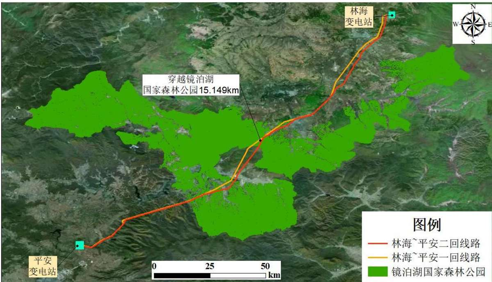  
2.7-3 线路路径与镜泊湖国家森林公园位置关系图

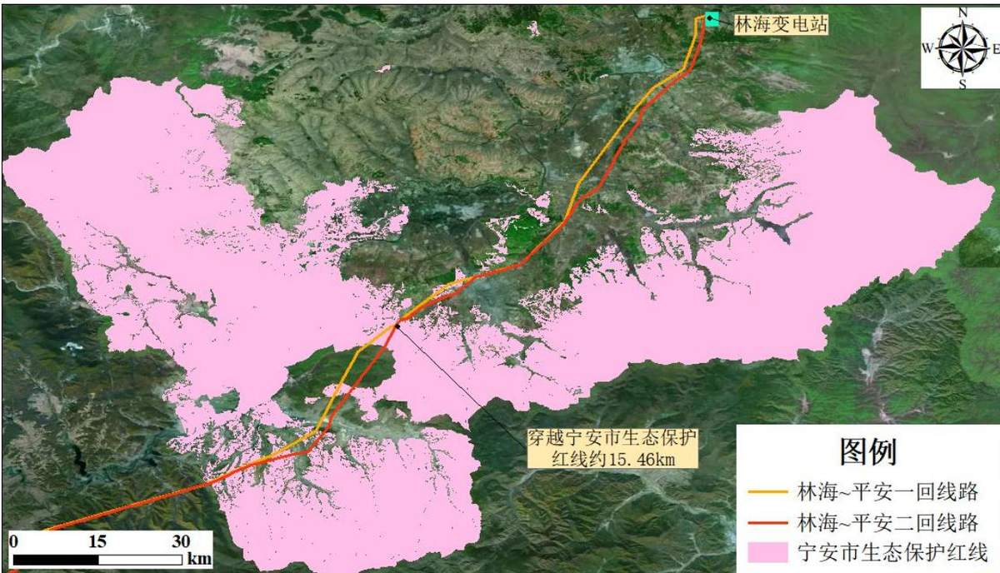  
2.7-4 线路路径与张广才岭-老爷岭水源涵养与生物多样性维护功能生态保护红线的位置关系图

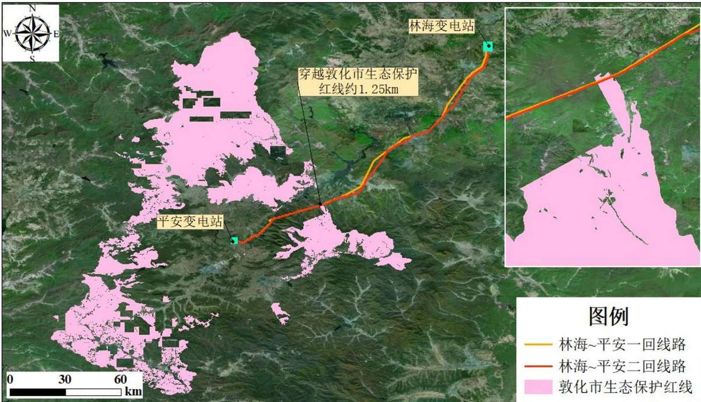  
2.7-5 线路路径与松花江生物多样性维护功能生态保护红线的位置关系图

## 3 项目水土保持评价

## 3.1 主体工程选址（线）水土保持评价

对照《中华人民共和国水土保持法》、《生产建设项目水土保持技术标准》（GB50433-2018）等关于工程选址（线）水土保持制约性因素分析与评价见表3.1-1 至表 3.1-3。

表3.1-1 与《中华人民共和国水土保持法》的制约性因素分析
<table><tr><td rowspan=1 colspan=1>序号</td><td rowspan=1 colspan=1>基本规定</td><td rowspan=1 colspan=1>本工程实施情况</td><td rowspan=1 colspan=1>评价</td></tr><tr><td rowspan=1 colspan=1>1</td><td rowspan=1 colspan=1>第十七条：禁止在崩塌、滑坡危险区和泥石流易发区从事取土、挖砂、采石等可能造成水土流失的活动。</td><td rowspan=1 colspan=1>本项目不在崩塌、滑坡危险区和泥石流易发区从事取土、挖砂、采石等活动。</td><td rowspan=1 colspan=1>符合</td></tr><tr><td rowspan=1 colspan=1>2</td><td rowspan=1 colspan=1>第十八条：水土流失严重、生态脆弱的地区，应当限制或者禁止可能造成水土流失的生产建设活动，严格保护植物、沙壳、结皮、地衣等。</td><td rowspan=1 colspan=1>线路沿线水土流失强度以轻度侵蚀为主，水土流失较轻。线路穿越水土保持敏感区，本方案严格控制扰动地表和植被损坏范围、减少工程占地、加强工程管理，临时占地区表面铺设彩条布等措施保护植物等。</td><td rowspan=1 colspan=1>本方案采取减少占地、加强工程管理，优化施工工艺后符合</td></tr><tr><td rowspan=1 colspan=1>3</td><td rowspan=1 colspan=1>第二十四条：生产建设项目选址、选线应当避让水土流失重点预防区和重点治理区；无法避让的，应当提高防治标准，优化施工工艺，减少地表扰动和植被损坏范围，有效控制可能造成的水土流失。</td><td rowspan=1 colspan=1>工程沿线3个市（区）全部涉及国家级、省级水土流失治理重点区和水土流失重点预防区。山丘区采用不等高基础减少地表扰动和植被损坏范围，优化施工工艺，塔基余土平整在永久占地范围内，设置彩旗绳限界，严禁越界施工；施工中加强工程管理、合理安排工期，避免大风、暴雨天气施工，有效控制可能新增的水土流失。</td><td rowspan=1 colspan=1>存在约束性因素，主体工程及本方案优化施工工艺，提高防治指标值后基本符合</td></tr></table>

表3.1-2 与《生产建设项目水土保持技术标准》的制约性因素分析
<table><tr><td colspan="2">基本规定</td><td>本工程实施情况</td><td>评价</td></tr><tr><td>工程 选址 (线) 方面</td><td>3.2.1第1款：主体工程选址（线）应 避让水土流失重点预防区和重点治 理区。</td><td>本项目选址（线）无法避让国家级水土流失重点 预防区和重点治理区，主体设计单位优化调整路 径并开展不可避让论证。林海变位于东北漫川漫 岗国家级水土流失重点治理区内，本期林海变为 站内扩建，故林海变线路出线端路径无法完全避 让。线路整体为东北~西南走线，受线路北侧雁 鸣湖国家级自然保护区、雁鸣湖镇规划范围、牡 丹江河道管理范围、保护林地及线路南侧敦化市 生态保护红线等因素制约，线路路径无法完全避 让长白山国家级水土流失重点预防区。 另外，线路途径的黑龙江宁安市属于黑龙江省级 东北漫川漫岗水土流失重点治理。 对于本项目选址无法避让水土流失重点预防区 和重点治理区，本方案提高防治指标值（林草覆 盖率提高2%）；山丘区采用不等高基础，经过 林区采用加高铁塔跨越；优化施工工艺，塔基余 土平整在永久占地范围内，设置彩旗绳限界，严 禁越界施工；临时占地区表面采用彩条布等，减 少对地表扰动；施工中加强工程管理、合理安排 工期，抓紧时间完成施工内容，避免大风、暴雨 天气施工，有效控制新增的水土流失。</td><td>存在约束 性因素，主 体工程及 本方案优 化施工工 艺，提高防 治指标值 后符合</td></tr><tr><td colspan="1" rowspan="2"></td><td colspan="1" rowspan="1">3.2.1第2款：主体工程选址（线）应避让河流两岸、湖泊和水库周边的植物保护带。</td><td colspan="1" rowspan="1">线路沿线跨越小石头河、蛤蟆河等河流，一档跨越，不在植物保护带和河道管理范围内立塔。</td><td colspan="1" rowspan="1">符合</td></tr><tr><td colspan="1" rowspan="1">3.2.1第3款：主体工程选址（线）应避让全国水土保持监测网络中的水土保持监测站点、重点试验区及国家确定的水土保持长期定位观测站。</td><td colspan="1" rowspan="1">项目建设区不涉及全国水土保持监测网络中的水土保持监测站点、重点试验区，不占用国家确定的水土保持长期定位观测站。</td><td colspan="1" rowspan="1">符合</td></tr></table>

表 3.1-3 不同水土流失类型区的水土流失特殊规定分析表
<table><tr><td rowspan=1 colspan=1>基本规定</td><td rowspan=1 colspan=1>本工程实施情况</td><td rowspan=1 colspan=1>评价</td></tr><tr><td rowspan=1 colspan=1>3.3.1东北黑土区应符合下列规定：第1款：应合理利用和保护黑土资源；第2款：在丘陵漫岗区宜布设坡面径流排导工程；第3款：防护措施应考虑冻害影响。</td><td rowspan=1 colspan=1>本方案设计中考虑了剥离表土及利用，表土集中堆放在临时堆土场内，采取拦挡、苫盖措施。丘陵漫岗区塔基区考虑了排导措施。土建施工尽量避开冬季安排。本工程排水沟护坡等措施考虑了防冻害要求。</td><td rowspan=1 colspan=1>符合</td></tr></table>

综上所述，本项目在选址（线）及建设中通过采取高跨、无人机放线等先进的施工工艺，严格控制施工范围，设置醒目的标示牌、边界线等有效措施，可有效减少地表扰动和植被损坏范围，降低水土流失影响，同时本方案提高防治标准，补充完善水土保持措施后，可满足水土保持要求，项目选址（线）基本可行。

## 3.2 建设方案与布局水土保持评价

## 3.2.1 建设方案评价

## a）建设方案相符性分析

本方案对照《生产建设项目水土保持技术标准》（GB50433-2018）中关于工程建设方案的相关规定进行水土保持分析与评价，并提出相应要求，详见表3.2-1。

表 3.2-1 《生产建设项目水土保持技术标准》关于工程建设方案的分析评价
<table><tr><td colspan="3" rowspan="1">基本规定</td><td colspan="1" rowspan="1">本工程实施情况</td><td colspan="1" rowspan="1">评价</td></tr><tr><td colspan="1" rowspan="2">建设方案应符合下列规定</td><td colspan="2" rowspan="1">3.2.2第3 款：山丘区输电工程塔基应采用不等高基础，经过林区的应采用加高铁塔跨越方式。</td><td colspan="1" rowspan="1">根据主体工程设计资料，本项目为减少基面土石方开挖量和破坏山区植被，在山丘区塔基采用高低腿塔及主柱加高。在路径选择时，尽量避开林区，对线路走廊范围内不能避开的林区，采用加高塔身的方法进行高跨，减少林木砍伐。</td><td colspan="1" rowspan="1">符合</td></tr><tr><td colspan="1" rowspan="1">3.2.2 第 4款：对无法避让水土流失重点预防区和重点治理区的生产建设项目，建设方案应符合下列规定：</td><td colspan="1" rowspan="1">1）应优化方案，减少工程占地和土石方量。</td><td colspan="1" rowspan="1">主体设计优化线路路径方案后仍无法避免的涉及工程选址涉及国家级、省级水土流失重点防治区。主体设计通过减少了新建铁塔数量，选择适宜的铁塔根开，减少永久占地；山丘区铁塔优先使用原状土基础，采用高低基础以适应塔位原地形，进而减少了输电线路工程总体占地面积及塔基基础土石方量。优化施工组织方案，充分利用已有道路，减少施工道路开挖扰动；合理安排架线施工，采用无人机放线等先进施工架线工艺，减少牵张场地设置数量，临时施工场地设置彩条旗围栏，严格控制临时施工扰动范围。</td><td colspan="1" rowspan="1">符合</td></tr><tr><td colspan="1" rowspan="3"></td><td colspan="1" rowspan="3"></td><td colspan="1" rowspan="1">2）截排水工程、拦挡工程的工程等级和防洪标准应提高一级。</td><td colspan="1" rowspan="1">主体设计在部分坡地型塔基区设置截排水沟、挡土墙和护坡，以防止上坡侧雨水冲刷基面；塔基排水沟设计标准由3年一遇提高至5年一遇10min降水量设计，挡土墙和护坡工程等级均提高一级。经本方案分析补充，本项目设计的拦挡工程主要为塔基区临时土方拦挡，临时堆土采取了彩条布铺垫、密目网苫盖以及袋装土拦挡，对施工期的临时堆土密闭防护，严控水土流失。</td><td colspan="1" rowspan="1">符合</td></tr><tr><td colspan="1" rowspan="1">3）宜布设雨洪集蓄、沉沙设施。</td><td colspan="1" rowspan="1">输电线路铁塔分散且占地较小，不需布设雨洪集蓄、沉沙设施。山丘区施工道路临时排水末端设置沉沙池。</td><td colspan="1" rowspan="1">基本符合</td></tr><tr><td colspan="1" rowspan="1">4）提高植物措施标准，林草覆盖率应提高1个~2个百分点。</td><td colspan="1" rowspan="1">经本方案分析补充，结合工程特点确定输电线路植被措施按3级标准、变电站植被措施按2级标准。同时提高林草覆盖率 2%。</td><td colspan="1" rowspan="1">符合</td></tr><tr><td colspan="1" rowspan="6">主体工程施工组织设计</td><td colspan="2" rowspan="1">3.2.7第1 款：应控制施工场地占地，避开植被相对良好的区域和基本农田区。</td><td colspan="1" rowspan="1">本项目施工场地占地面积均进行了优化设计，在满足工程施工需要的情况下，尽可能少占地；在占地类型方面，尽量避让植被相对良好区，不涉及占用基本农田区。</td><td colspan="1" rowspan="1">符合</td></tr><tr><td colspan="2" rowspan="1">3.2.7第2款：应合理安排施工，防止重复开挖和多次倒运，减少裸露时间和范围。</td><td colspan="1" rowspan="1">本项目施工安排合理有序，一定程度上减少了重复开挖和土(石、渣)多次倒运等情况。</td><td colspan="1" rowspan="1">符合</td></tr><tr><td colspan="2" rowspan="1">3.2.7第3款：在河岸陡坡开挖土石方，以及开挖边坡下方有河渠、公路、铁路、居民点和其他重要基础设施时，宜设计渣石渡槽、溜渣洞等专门设施，将开挖的土石导出。</td><td colspan="1" rowspan="1">本项目不涉及。</td><td colspan="1" rowspan="1">符合</td></tr><tr><td colspan="2" rowspan="1">3.2.7第4款：弃土、弃石、弃渣应分类堆放。</td><td colspan="1" rowspan="1">本项目不涉及弃方；临时堆土堆放在临时堆土场内，并采取临时防护措施。</td><td colspan="1" rowspan="1">符合</td></tr><tr><td colspan="2" rowspan="1">3.2.7第5款：外借土石方应优先考虑利用其它工程废弃的土（石、渣）外购土(石、料)应选择合规的料场。</td><td colspan="1" rowspan="1">本项目无外借土方；外购石（料）选择合规料场，并在采购协议中明确了因取石（料）造成的水土流失防治责任的由供应商方。</td><td colspan="1" rowspan="1">符合</td></tr><tr><td colspan="2" rowspan="1">3.2.7 第 7款：工程标段划分应考虑合理调配土石方，减少取土（石）方、弃土（石、渣）方和临时占地数量。</td><td colspan="1" rowspan="1">变电站扩建基槽余土平整在各站内 500kV配电装区预留间隔内；输电线路塔位分散，单塔开挖土石方量较小，可塔基及塔基施工区就地回填平整利用。</td><td colspan="1" rowspan="1">符合</td></tr><tr><td colspan="1" rowspan="6">主体工程施工方面</td><td colspan="2" rowspan="1">3.2.8第1款：施工活动应控制在设计的施工道路、施工场地内。</td><td colspan="1" rowspan="1">本项目施工过程中严格按照设计资料控制施工道路、施工场地范围，本方案在施工道路和施工场地周围设置彩条旗围栏，有效控制施工活动范围。</td><td colspan="1" rowspan="1">符合</td></tr><tr><td colspan="2" rowspan="1">3.2.8第2款：施工开始前应首先对表土进行剥离或保护，剥离的表土应集中堆放，并采取防护措施。</td><td colspan="1" rowspan="1">对工程扰动区内，有可剥离表土的均采取了表土剥离及保护措施。本方案补充和完善表土剥离及保护措施，通过本方案新增措施后是相符的。</td><td colspan="1" rowspan="1">符合</td></tr><tr><td colspan="2" rowspan="1">3.2.8第3款：裸露地表应及时防护，减少地表裸露时间；填筑土方时应随挖、随运、随填、随压。</td><td colspan="1" rowspan="1">本方案新增裸露地表防护措施。通过本方案新增措施后相符要求，工程施工过程中填筑土方做到随挖、随运、随填、随压。</td><td colspan="1" rowspan="1">符合</td></tr><tr><td colspan="2" rowspan="1">3.2.8第4款：临时堆土(石、渣)及应集中堆放，并采取临时拦挡、苫盖、排水、沉沙等措施。</td><td colspan="1" rowspan="1">根据施工组织规划，专门设置临时堆土场，但主体工程未设计防护措施。本方案新增临时堆土场地的临时拦挡、苫盖等措施。通过本方案新增措施后是相符的。</td><td colspan="1" rowspan="1">符合</td></tr><tr><td colspan="2" rowspan="1">3.2.8第5款：施工产生的泥浆应先通过泥浆沉淀池沉淀，再采取其他处理措施。</td><td colspan="1" rowspan="1">主体工程对采用灌注桩基础的铁塔设置泥浆沉淀池，待工程完工后，泥浆晾干后就地深埋。</td><td colspan="1" rowspan="1">符合</td></tr><tr><td colspan="2" rowspan="1">3.2.8第6款：围堰填筑、拆除应采取减少流失的有效措施。</td><td colspan="1" rowspan="1">本项目施工不涉及围堰作业。</td><td colspan="1" rowspan="1">不涉及</td></tr><tr><td colspan="1" rowspan="2"></td><td colspan="1" rowspan="1">3.2.8第7款：弃土（石、渣）场地应事先设置拦挡措施，弃土（石、渣）应有序堆放。</td><td colspan="1" rowspan="1">本项目不设置弃土（石、渣）场。</td><td colspan="2" rowspan="1">不涉及</td></tr><tr><td colspan="1" rowspan="1">3.2.8第9款：土（石、料、渣、矸石）方在运输过程中应采取保护措施，防止沿途散溢。</td><td colspan="1" rowspan="1">本项目运输过程中采用封闭式的专用拉土车。</td><td colspan="2" rowspan="1">符合</td></tr></table>

根据上述分析，经主体设计优化和水保方案补充，本项目建设方案总体合理，符合水土保持相关规定与要求。

## b）水土保持敏感区情况

1）水土保持重点预防区和重点治理区

根据《水利部关于加强水土保持空间管控的意见》（水保〔2024〕4号）、《水利部办公厅关于做好国家级水土流失重点预防区和重点治理区落地上图成果应用的通知》（办水保〔2025〕170号）要求，生产建设项目选址、选线应当避让水土流失重点预防区和重点治理区，确实无法避让的，应充分开展不可避让论证，并提高水土流失防治标准和措施等级，优化施工工艺，减少地表扰动和植被损坏范围，有效控制可能造成的水土流失。本工程按照国家级水土流失重点预防区和重点治理区划定成果进行路径优化设计，线路路径确实无法避让时，尽量减少在保护区范围内的长度以及立塔数量。

经路径优化及论证：①在黑龙江省牡丹江市西安区境内，已建林海变位于东北漫川漫岗国家级水土流失重点治理区，无法避让，原路径方案涉及东北漫川漫岗国家级水土流失重点治理区路径长度6.3km、立塔数量15基；通过增加塔高、加大档距，优化后穿越长度5.2km、立塔数量12基，优化减少穿越长度1.1km、减少立塔3 基。②在吉林省延边朝鲜族自治州敦化市境内，受线路附近雁鸣湖自然保护区、雁鸣湖镇规划范围、牡丹江河道管理范围、保护林地及敦化市生态保护红线等因素制约，无法避让，原路径方案涉及长白山国家级水土流失重点预防区路径长度 24.1km、立塔数量47基；通过加大档距、减少拐点数量，优化后穿越长度21.3km、立塔数量41基，优化减少穿越长度2.8km、减少立塔6基。

线路在黑龙江省牡丹江市宁安市境内，涉及省级东北漫川漫岗水土流失重点治理区。宁安市境内线路路径长度为105.92km，通过增加塔高、加大档距，优化后立塔223基，优化减少立塔17基（优化前立塔 240基）。

## 2）其他水土保持敏感区

线路路径经过优化后避让了自然保护区、风景名胜区、地质公园、饮用水源保护区等水土保持敏感区，工程在线路优化的基础上仍需穿越镜泊湖国家森林公园（一般控制区）、张广才岭-老爷岭水源涵养与生物多样性维护功能生态保护红线（宁安市）、松花江生物多样性维护功能生态保护红线（敦化市），主体设计已与相关部门进行沟通，并取得相关部门同意文件。

在水土保持敏感区内采取无人机放线、高跨施工工艺；材料运输采取人抬，不新开辟汽车运输道路；塔基施工采取非机械化施工方式；严格控制施工范围，设置醒目的标志牌、边界线，保持与其他未扰动区的有效隔离，禁止大开挖减少对原状地表土的扰动；尽量加快施工速度，土石方做到随挖随填，减少大量堆土，减少区内土地扰动；当不可避免的存在少量临时堆土时，堆土场采取拦挡、苫盖等水保措施；施工结束后进行植被恢复，选取原地貌相同的草种和乔（灌）木种进行栽植并定期抚育。工程穿越水土保持敏感区已取得相关部门的支持性文件，项目建设应符合相关规定的要求。本方案也提高了经过水土保持敏感区的水土流失防治标准及林草覆盖率指标。因此，本项目经过水土保持敏感区虽然存在一定的制约因素，但在采取相应防护措施后可满足水土保持要求。

## 3.2.2 工程占地评价

## 3.2.2.1 占地类型分析评价

本项目占地面积 94.74hm2，占地类型中水田 0.95hm2、旱地 48.81hm2、果园 1.07hm2、其他园地 0.53hm2、乔木林地 30.05hm2、灌木林地 1.00hm2、其他林地 9.43hm2、其他草地1.28hm2、公用设施用地 1.62hm2。工程占地类型不存在限制性因素，符合水土保持要求。

## 3.2.2.2 占地面积分析评价

主体考虑了塔基永久占地、塔基施工场地占地、牵张场地占地、跨越场地占地和施工道路占地，塔基永久占地根据塔基根开尺寸确定，临时占地依据输变电工程可行性研究阶段临时施工场地核算规定，以及表土剥离利用方案确定的表土临时堆土占地。

本期林海变、平安变均为站内扩建，无新征占地；为满足各变电站扩建需求，林海变在站区外新增临时用地0.30hm2作为施工生产生活区，在站区西侧围墙外由乡道接引一条临时施工道路长360m（宽度3.0m），便于隔声屏施工；平安变在站区外新增临时用地0.30hm2作为施工生产生活区。变电站扩建产生余土全部平整利用在各站内500kV配电装置区预留间隔，临时堆土场设在站内余土平整利用区内。结合工程建设实际情况，材料堆放场设在站区扩建场地和施工生产生活区内。

从工程总体布置，施工方法、调查同类工程施工经验及实地测量等方面分析确定，在严格控制施工场地范围的前提下，充分考虑施工期间堆放材料、临时堆土、人员活动可能扰动的区域，输电线路和变电站各区占地可满足施工需要，不存在漏项和冗余占地。

从水土保持角度分析，项目永久占地符合工程实际建设需要，不存在多占用土地的情况；临时占地完全满足施工阶段各项目建设区的施工用地需要，不存在多占情况。经核算，本项目主体设计和表土剥离利用方案占地面积合理，满足工程施工要求，不存在漏项，本方案无增减。

## 3.2.2.3 占地性质分析评价

本项目总占地面积94.74hm2，其中：永久占地10.96hm2，占11.57%；临时占地83.78hm2，占88.43%。

输电线路占地较为分散，施工临时占地较多，不存在集中大量占用土地的情况，且临时占地施工结束后均给予恢复植被，或者交还复耕，对生态环境的影响仅限于施工期，并且影响较小。项目完工至设计水平年时对生态环境基本无影响。

林海变和平安变均为站内扩建，临时租用的施工生产生活区紧邻变电站布设，减少了对周边的影响。施工结束后，对临时占地区恢复原地貌，对站区扩建场地及站内余土平整利用区按各变电站绿化要求进行绿化。变电站建设对生态环境的影响仅限于施工期，项目完工至设计水平年时对生态环境基本无影响。

## 3.2.2.4 占地时段及施工组织分析评价

输电线路采取分段施工，每个施工标段工期共6个月，对于每个施工标段：从塔基基坑开挖、混凝土浇筑至基坑回填完成通常为4个月（每基塔1个月），此过程中产生塔基永久占地、塔基施工临时占地（含临时堆土场）及施工道路用地，随着基坑回填完成，塔基施工临时占地中的临时堆土场也退出；铁塔组立通常为2个月（每基塔1个月），塔基施工临时占地及施工道路用地仍在占用；架线、调试、清场、验收通常为2个月（每基塔1个月），塔基施工临时占地及施工道路用地继续占用，此过程增加跨越施工场地、牵张场地临时占地。随着每个施工标段（每基塔3个月）结束，塔基施工临时占地、施工道路、跨越施工场地、牵张场地也结束占用，同期对上述临时占地及塔基永久占地恢复原地貌。

林海变、平安变扩建工期分别为8个月，即2027年5月至2027年12月，同期有施工生产生活区临时用地。考虑到林海变和平安变扩建分别产生基槽余土1200m3和600m3，需平整利用在各站区预留间隔内。为此，在站区扩建场地扰动前，同步对该场地和余土平整利用场地进行表土剥离，并集中运至临时堆土场（设在余土平整利用场地内）集中堆放。施工生产生活区占用耕地，剥离出的耕作层土壤运至站区临时堆土场堆存，且与站区表土、基槽土分开堆放。站区扩建产生基槽余土一部分按平整利用厚度直接平整利用在非临时堆土场区的余土平整利用场地内；剩余基槽土集中堆放在临时堆土场内，待表土临时堆土场的退出，再平整利用在本区域内。随着变电站施工进度，2027年9月本期扩建区完成土建施工后，将表土回覆于该区可绿化区域；2027年12月完成设备调试、清场，施工生产生活区也结束占用，考虑到冬季因素，2028年4月\~5月对施工生产生活区实施耕作层土壤回覆并完成土地整治。

综上所述，主体工程占地范围及类型符合国家有关政策及水土保持相关要求，符合节约用地和减少扰动的要求，临时占地满足施工要求。从水土保持角度分析，该项工程占地是合理的。

## 3.2.3 土石方平衡评价

## 3.2.3.1 可剥离表土量、表土集中防护及利用分析评价

## a）输电线路

## 1）表土剥离利用方案

根据《林海～平安第二回500千伏线路工程（黑龙江省段）耕作层土壤剥离利用方案》和《林海～平安第二回500千伏线路工程（吉林段）耕作层土壤剥离利用方案》，耕地耕作层厚度 30cm，并对塔基永久占地范围占用耕地（水田和旱地）的全部进行表土剥离，剥离厚度 30cm，黑龙江段表土剥离面积 $4 . 2 1 \mathrm { h m } ^ { 2 }$ 、表土量 $1 . 2 6 \mathrm { ~ \mathscr { H } ~ m } ^ { 3 }$ ，吉林段表土剥离面积 $0 . 5 0 \mathrm { h m } ^ { 2 }$ 、表土量 $0 . 1 5 \mathrm { ~ \mathscr ~ { ~ H ~ } ~ m ~ } ^ { 3 }$ 。剥离的表土集中堆放在附近临时表土堆放场，施工结束后，按表土剥离区域的土地利用类型，将表土全部回填于塔基永久占地范围内。

根据《林海～平安第二回500千伏线路工程临时用地（黑龙江省段）表土剥离利用方案》和《林海～平安第二回 500 千伏线路工程临时用地（吉林段）表土剥离利用方案》，项目区内耕地表土厚度 30cm、园地、林地和草地表土厚度20cm，对塔基施工临时占地、施工道路占用耕地、园地、林地和草地的区域进行表土剥离，剥离厚度耕地 30cm、园地、林地和草地 20cm。黑龙江段临时占地区域表土剥离面积 $3 8 . 1 8 \mathrm { h m } ^ { 2 }$ （耕地 23.88hm2、园地 $0 . 9 0 \mathrm { h m } ^ { 2 }$ 、林地 $1 2 . 6 6 \mathrm { h m } ^ { 2 }$ 、草地 $0 . 7 4 \mathrm { h m } ^ { 2 }$ ），表土量共 $1 0 . 0 3 \ \overline { { \mathcal { H } } } \ \mathrm { m } ^ { 3 } ;$ ；吉林段临时占地区域表土剥离面积 $1 4 . 2 9 \mathrm { h m } ^ { 2 }$ （耕地 $3 . 1 5 \mathrm { h m } ^ { 2 }$ 、园地 $0 . 0 9 \mathrm { h m } ^ { 2 }$ 、林地 $9 . 2 1 \mathrm { h m } ^ { 2 }$ 、草地$0 . 1 0 \mathrm { h m } ^ { 2 } \mathrm { ~ , ~ }$ ），表土量共 $2 . 8 4 \mathrm { ~ \mathscr ~ { ~ H ~ } ~ m ~ } ^ { 3 }$ 。剥离的表土集中堆放在各区临时表土堆放场，且耕地表土与林地、草地表土分开堆放。施工结束后，按表土剥离区域的土地利用类型，将表土全部回填于各区施工临时占地范围内。

## 2）本方案设计

为更好地保护表土资源，本方案考虑补充对塔基永久占地范围内占用园地、林地和草地的区域进行表土剥离，并保存和利用。根据现场调查结合表土剥离利用方案，确定园地、林地和草地剥离厚度为 20cm，黑龙江段表土剥离面积 2.46hm2（园地 0.19hm2、林地 2.26hm2，草地 0.01hm2），表土量共 0.49 万 m3；吉林段表土剥离面积 2.17hm2（林地），表土量 0.44 万m3。剥离的表土集中堆放在附近临时表土堆放场，且耕地表土与林地、草地表土分开堆放。施工结束后，按表土剥离区域的土地利用类型，将表土全部回填于塔基永久占地范围内。

牵张场地以临时占压为主，无土石方扰动，考虑到重型机械占压和材料堆放，本方案采取表面铺垫彩条布和钢板防护，不考虑剥离表土。

跨越施工场地以临时占压为主，施工期对地表扰动较轻，本方案不考虑表土剥离保护及铺垫防护。

## b）变电站

林海变：根据变电站扩建场地实际情况，施工前对已实施绿化的扩建场地进行表土剥离，表土剥离面积 0.20hm2，剥离厚度 20cm，表土量 0.04万m3。施工生产生活区占地类型为旱地，施工前对其进行表土剥离，剥离面积 0.30hm2，厚度按 30cm 计，表土量0.09 万m3。站内余土平整利用区利用站区围墙内500kV配电装置区 2个预留间隔，施工前对已实施绿化的站内余土平整利用区进行表土剥离，表土剥离面积 0.72hm2，厚度按 20cm，表土量0.14万m3。站区扩建场地表土、站内余土平整利用区表土与施工生产生活区耕作层土壤分开堆放在站区 500kV配电装置区预留间隔（站内余土平整利用区内）的表土临时堆土场内，施工后期站区表土用于变电站绿化覆土，施工生产生活区耕作层土壤用于自身复耕覆土。

平安变：根据变电站扩建场地实际情况，施工前对已实施绿化的扩建场地进行表土剥离，表土剥离面积 0.22hm2，剥离厚度 20cm，表土量 0.04万m3。考虑到施工生产生活区占地类型为旱地，施工前对其进行表土剥离，剥离面积0.30hm2，厚度按30cm 计，表土量0.06万m3。站内余土平整利用区利用站区围墙内 500kV配电装置区1个预留间隔，施工前对已实施绿化的站内余土平整利用区进行表土剥离，表土剥离面积0.30hm2，厚度按20cm，表土量0.06 万m3。站区扩建场地表土、站内余土平整利用区表土与施工生产生活区表土分开堆放在站区500kV配电装置区预留间隔（站内余土平整利用区内）的表土临时堆土场内。施工后期站区表土用于变电站绿化覆土，施工生产生活区耕作层

土壤用于自身复耕覆土。

根据以上分析，表土剥离利用方案对塔基永久占地占用耕地（水田和旱地）的全部进行表土剥离，同时对塔基施工临时占地和施工道路占用耕地、园地、林地和草地的区域进行表土剥离，表土集中堆放和后期利用，满足保护表土的要求。表土剥离利用方案符合黑土地保护法。

本方案补充了塔基永久占地占用园地、林地、草地区域的表土剥离，以及变电站扩建场地、施工生产生活区、站内余土平整利用区的表土剥离。经方案补充后项目建设区可剥离表土总量为15.67万 $\mathrm { m } ^ { 3 }$ ，施工过程中表土集中堆放。完工后剥离的表土全部回覆至扰动后的场地利用，全面整地后进行交还复耕或植被恢复。本项目表土可全部回覆利用，无外借和废弃。从水土保持的角度考虑，本项目工程充分保护表土资源，耕地表土与林地、草地表土分开堆放储存，并分别采取彩条布铺底、密目网苫盖等临时防护措施；施工结束术后，按表土剥离区域的土地利用类型，将表土回填于复耕和植被恢复区域，满足表土剥离及其再利用技术要求，同时满足水土保持技术要求。

## 3.2.3.2 工程土石方平衡分析评价

根据对本项目的水土保持分析，本工程挖填方总量为41.38万 $\mathrm { m } ^ { 3 }$ 。工程总挖方20.69万 $\mathrm { m } ^ { 3 }$ （其中表土剥离量 $1 5 . 6 7 ~ \overline { { \mathcal { H } } } ~ \mathbf { m } ^ { 3 } ~ )$ ），总填方 20.69 万 $\mathrm { m } ^ { 3 }$ （其中表土回覆量 15.67 万$\mathbf { m } ^ { 3 } )$ ；土石方挖填平衡，不涉及取、弃土。

输电线路挖填方量为 40.00 万 $\mathrm { m } ^ { 3 }$ ，其中：挖方 $2 0 . 0 0 \mathrm { ~ } \overline { { \mathcal { H } } } \mathrm { ~ m } ^ { 3 }$ ，填方 20.00 万 $\mathrm { m } ^ { 3 }$ ；塔基余土 $2 . 0 2 \mathrm { ~ \mathscr ~ { ~ H ~ } ~ m ~ } ^ { 3 }$ ，均堆放在塔基永久占地范围内，自然沉降计入填方。输电线路无借方和弃方，挖填方平衡。

变电站挖填方量为1.38万 $\mathrm { m } ^ { 3 }$ ，其中：挖方0.69万 $\mathrm { m } ^ { 3 }$ ，填方 0.69 万 $\mathbf { m } ^ { 3 } ;$ ；变电站扩建产生余 $\pm 0 . 1 8 \mathcal { \ F } \mathfrak { m } ^ { 3 }$ ，全部在站区围墙内500kV配电装置区预留间隔内平整利用，无弃方。

主体工程土石方挖填施工兼顾方便施工、节约投资、减少占地和重复搬运、减少扰动和开挖面积、弃渣优化减量等要求，设计施工标准和工程量合理，基本满足水土保持要求；表土剥离利用方案对塔基永久占地范围内耕作层土壤进行剥离、保护和利用，对塔基施工临时占地和施工道路占用耕地、园地、林地和草地的区域的表土进行剥离和利用，符合黑土地保护法。本方案针对主体工程部分缺少的土石方量进行估算补充，补充了塔基永久占地占用园地、林地和草地的表土剥离量及变电站扩建场地、施工生产生活区、站内余土平整利用区的表土剥离量；同时考虑到施工结束后各区域的植被恢复，考虑了各个区域的表土剥离措施和表土利用方向。

## 3.2.3.3 工程土石方调配的评价

本项目输电线路塔位分散，单个铁塔基础开挖回填土石方量较小，塔基施工开挖多余的土方，尽量避免土方重复开挖调用，在施工完工后回填至塔基征地范围内。输电线路各分区无土石方调配，符合水土保持要求。

林海变扩建产生余土0.12万m3，平安变扩建产生余土0.06 万m3，全部在各站区围墙内 500kV 配电装置区预留间隔内平整利用。站区围墙内 500kV 配电装置区预留间隔场地在前期工程已完成场平，场地平整标高为设计标高，且已采取草坪绿化，其面积满足平整利用基槽余土需求，平整厚度为15cm\~20cm。变电站土石方为站内调配，符合水土保持要求。

变电站扩建场地表土、站内余土平整利用区表土与施工生产生活区表土分开堆放在站区 500kV配电装置区预留间隔（站内余土平整利用区内）的表土临时堆土场内。施工结束后，站区与施工生产生活区同步进行迹地恢复工作，站区表土用于变电站绿化覆土，施工生产生活区耕作层土壤用于自身复耕覆土。变电站各分区表土全部为自身绿化（或复耕）覆土，符合水土保持要求。

## 3.2.3.4 临时堆土场的数量和位置

输电线路在每基塔施工场地设置 2处临时堆土场，分别用于堆放剥离的表土和基础挖方。新修汽车运输道路、拓宽道路剥离的表土尽可能沿道路一侧集中堆放；山丘区部分路段表土需运至地势平缓处并沿道路一侧堆放。

林海变和平安变站区扩建、站内余土平整利用区和施工生产生活区剥离的表土集中堆放于设在站区500kV配电装置区预留间隔（站内余土平整利用区内）的表土临时堆土场内，且站区扩建表土、站内余土平整利用区表土与施工生产生活区耕作层土壤分区堆放，便于站区绿化覆土和施工生产生活区复耕覆土需求。

## 3.2.4 取土场设置评价

本项目无外借土石方。工程所需的碎石、沙子等建筑材料全部购买，材料生产期间的水土流失防治责任由生产单位负责，运输期间的水土流失防治责任由运输单位负责，工程开工前，建设单位需同相关的生产企业、运输公司签订购买及运输合同，合同中需落实水土保持相关责任。

本项目建设不涉及专门取土场。

## 3.2.5 弃渣场设置评价

本项目不涉及弃渣（土）场。

## 3.2.6 施工方法与施工工艺评价

本项目施工过程中采用先进的施工方法与工艺，加强施工组织管理。施工过程中采用机械施工与人工施工相结合的方法，统筹、合理、科学安排施工工序，避免重复施工和土方乱流，施工组织中增加水土保持要求，施工单位严格按照施工组织施工。本工程施工方法（工艺）分析评价见表3.2-2。

表 3.2-2 本项目施工方法（工艺）分析与评价
<table><tr><td rowspan=1 colspan=1>序号</td><td rowspan=1 colspan=1>评价内容</td><td rowspan=1 colspan=3>项目情况</td><td rowspan=1 colspan=1>水土保持评价与结论</td></tr><tr><td rowspan=5 colspan=2>施工方法是否符合减少水1土流失的要求。</td><td rowspan=3 colspan=1>输电线路</td><td rowspan=1 colspan=1>基础施工</td><td rowspan=1 colspan=1>一般基坑开挖采用人工开挖，以及人工开挖和微爆破技术二者相结合，不采用大开挖、大爆破。灌注桩基础施工设置泥浆沉淀池，待工程完工后，泥浆晾干后就地深埋。塔基开挖土方堆放在塔基施工场地。浇筑混凝土基础，在挖好的基坑放置钢筋笼、支好钢模板，再进行浇筑。基础拆除模板，测试砼强度达到设计强度后进行土方回填。</td><td rowspan=1 colspan=1>应增加施工过程中塔基剥离表土与基础土方的分层堆放措施；临时堆土采取临时拦挡、苫盖、减少因雨水冲刷和大风造成的水土流失。</td></tr><tr><td rowspan=1 colspan=1>组塔</td><td rowspan=1 colspan=1>采用分解组塔的施工方法。在施工过程中，根据铁塔的形式、高度、重量以及施工场地、施工设备等施工现场情况，确定正装分解组塔或倒装分解组塔。</td><td rowspan=1 colspan=1>塔基施工区围绕塔基四周布设，材料临时堆放和组装均在该区域内进行，塔基施工区的占地面积根据塔基的施工要求确定，既可控制施工临时占地，又能有效减少对地面的二次扰动。</td></tr><tr><td rowspan=1 colspan=1>架线线</td><td rowspan=1 colspan=1>线路架线采用张力架线方法施工。沿线设置牵张场，采用无人机牵引导。在线路穿越林地、山丘段，多采用无人机架线。</td><td rowspan=1 colspan=1>牵张场地较为平整、无土石方开挖。架线施工采用无人机架线，利用施工简易道路及牵张场地即可实施，大大减少对植被的破坏，减少工程临时占地。</td></tr><tr><td rowspan=2 colspan=1>变电站</td><td rowspan=1 colspan=1>场地平整</td><td rowspan=1 colspan=1>林海变和平安变本期均为站内扩建，前期工程完成场地平整。本期扩建产生余土平整利用在站区围墙内500kV配电装置区预留间隔内。</td><td rowspan=1 colspan=1>规划土石方的利用，部分基槽余土直接平整利用在站区围墙内 500kV 配电装置区预留间隔内非临时堆土场的区域（平整利用前剥离表土），剩余基槽余土考虑堆放在临时堆土场内。减少临时堆土量，避免土石方二次倒运。加强土方临时堆放及临时防护措施。</td></tr><tr><td rowspan=1 colspan=1>基础开挖</td><td rowspan=1 colspan=1>采用机械及人工结合开挖。填方采取分层碾压回填。基础施工应避免在雨天施工。</td><td rowspan=1 colspan=1>符合要求。</td></tr></table>

<table><tr><td rowspan=1 colspan=1>序号</td><td rowspan=1 colspan=1>评价内容</td><td rowspan=1 colspan=1>项目情况</td><td rowspan=1 colspan=1>水土保持评价与结论</td></tr><tr><td rowspan=4 colspan=1>2</td><td rowspan=4 colspan=1>施工场地是否避让植被相对良好的区域和基本农田。</td><td rowspan=1 colspan=1>塔基施工场地布设在紧邻塔基四周，尽量避让植被相对良好的区域和基本农田。</td><td rowspan=1 colspan=1>符合要求。施工过程中塔基施工区四周设置彩条旗围栏，严格控制作业范围。</td></tr><tr><td rowspan=1 colspan=1>牵张场地较为平整、四周较为空旷，尽量避让植被相对良好的区域和基本农田。</td><td rowspan=1 colspan=1>符合要求。牵张场地三侧设置彩条旗围栏，严格控制作业范围。</td></tr><tr><td rowspan=1 colspan=1>施工道路尽量利用已有道路，对不满足运输条件的新建汽车运输道路、扩宽道路和人抬道路。新建道路不涉及植被相对良好的区域和基本农田。</td><td rowspan=1 colspan=1>符合要求。施工便道两侧设置彩条旗围栏，避免新增对地表的扰动，减轻对地面扰动。</td></tr><tr><td rowspan=1 colspan=1>变电站的施工生产生活区紧邻站区布置，占地类型为旱地；不涉及植被良好的区域和基本农田。</td><td rowspan=1 colspan=1>符合要求。变电站的施工生产生活区紧邻站区，严格控制作业范围，减少地表扰动面积。</td></tr><tr><td rowspan=1 colspan=1>3</td><td rowspan=1 colspan=1>在河岸陡坡开挖土石方，以及开挖边坡下方有河渠、公路、铁路、居民点和其他重要基础设施时，是否设计渣石渡槽、溜渣洞等专门导渣或防护设施。</td><td rowspan=1 colspan=1>不涉及左栏内容。变电站及塔基选址中避让河岸陡坡以及开挖边坡下方有河渠、公路、铁路、居符民点和其他重要基础设施。</td><td rowspan=1 colspan=1>合要求。</td></tr><tr><td rowspan=1 colspan=1>4</td><td rowspan=1 colspan=1>大型料场宜分台阶开采，控制开挖深度。爆破开挖应控不制装药量和爆破范围。</td><td rowspan=1 colspan=1>涉及左栏内容。施工材料均就近采购运输。</td><td rowspan=1 colspan=1>符合要求。</td></tr><tr><td rowspan=1 colspan=1>5</td><td rowspan=1 colspan=1>土石方在运输是否采取防土止沿途散溢等保护措施。</td><td rowspan=1 colspan=1>石方运输车辆在运输过程中对土方进行洒水和苫盖，防止沿途散逸。</td><td rowspan=1 colspan=1>符合要求。土石方后期运输过程中严格执行苫盖防护要求。</td></tr><tr><td rowspan=1 colspan=1>6</td><td rowspan=1 colspan=1>是否采取表土剥离或保护措施及具体施工方法。</td><td rowspan=1 colspan=1>表土剥离利用方案，结合占地类型、施工方法及表土层厚度，明确了项目建设区可剥离表土量。表土剥离采取机械为主、人工为辅的施工方式。剥离的表土集中堆放，便于后期场地恢复覆土。</td><td rowspan=1 colspan=1>符合要求。需加强表土的隔离和覆盖等防护措施，以保证回覆需要。</td></tr><tr><td rowspan=1 colspan=1>7</td><td rowspan=1 colspan=1>裸露地表是否及时采取防护措施，填筑土方是否做到随挖、随运、随填、随压。</td><td rowspan=1 colspan=1>裸露地表及时苫盖，避免产生扬尘等。填筑土方及时挖运填压，做好防护措施。</td><td rowspan=1 colspan=1>符合要求。裸露地表及时苫盖，填筑土方及时挖运填压。</td></tr><tr><td rowspan=1 colspan=1>8</td><td rowspan=1 colspan=1>临时堆土应集中堆放，并采取临时拦挡、苫盖、排水、沉沙等措施。</td><td rowspan=1 colspan=1>根据需要设置了临时堆土场，将临时堆土集中堆放，并布设了临时铺底、拦挡、苫盖等措施。</td><td rowspan=1 colspan=1>符合要求。临时堆土集中堆放，并采取临时铺底、拦挡、苫盖等措施。</td></tr><tr><td rowspan=1 colspan=1>9</td><td rowspan=1 colspan=1>施工产生的泥浆是否设置泥浆沉淀池，泥浆沉淀后的处置措施是否明确。</td><td rowspan=1 colspan=1>灌注桩基础均设置泥浆沉淀池。泥浆经沉淀干化后就地深埋。</td><td rowspan=1 colspan=1>符合要求。</td></tr><tr><td rowspan=1 colspan=1>10</td><td rowspan=1 colspan=1>围堰填筑、拆除是否采取减少流失的有效措施。</td><td rowspan=1 colspan=1>本项目不涉及围堰填筑及拆除工作。</td><td rowspan=1 colspan=1>符合要求。</td></tr></table>

## 3.2.7 主体工程设计中具有水土保持功能工程的评价

主体工程从自身功能和安全角度考虑，布置了一系列具有水土保持功能的设施，在充分发挥主体工程自身作用的同时，有效地防治了水土流失。本方案将从全面防治水土流失的角度出发，对主体工程设计中具有水土保持功能的各项工程进行分析论证，对不能满足水土保持要求的，本方案将进行补充设计。

## 3.2.7.1 输电线路

## a）山丘区

## 1）塔基及塔基施工区

## ——浆砌石挡土墙

输电线路塔位分散，单个基础开挖产生的余土量较小。对于基础开挖产生的余土，一般根据塔位现场情况采取就地处置的方式。

对于山丘区铁塔基础开挖的余土，首先用于塔座基面四周的平整；当铁塔位于山包或斜坡，塔位四周或下坡侧为陡坡时，降低基面与基坑开挖的土石方无法就地堆稳，应在堆土的下方修一道挡土墙，将余土堆放在挡土墙内，不让余土产生滑坡，避免水土流失和影响周边生态环境。主体设计山丘区有 2 处塔基区设置浆砌石挡土墙，浆砌石量174m3。其中黑龙江境内 1 处，挡土墙长度 20m，外露高度 2m，基础埋深 1.0m，墙顶宽度 0.6m，浆砌石量64m3；吉林境内1处，挡土墙长度 20m，外露高度4m，基础埋深1.2m，墙顶宽度 0.6m，浆砌石量 110m3。

根据水土保持工程措施界定原则分析，主体工程设计的塔基挡土墙能有效拦挡塔基区余土，具有水土保持功能。

## ——浆砌石护坡

在塔基位置在岩石层较浅且地势起伏较大，坡度较为陡峭的位置布设浆砌石护坡，可以起到防止土壤侵蚀。保持结构稳定，同时防止因雨水渗透而导致的滑坡风险。护坡沿塔位周围自然山坡或基面挖方后的缓坡面用 MU20 块石砌筑，对塔基边坡起保护作用。护坡坡脚置于原状土土层上，山坡削成小于 50°，用 M5水泥砂浆砌筑、勾缝，并每隔 1m设一个泄水孔，预埋设φ100PVC 管。

经统计，山丘区有 3基塔位设置浆砌石护坡，浆砌石量共57m3。其中黑龙江境内2基塔位，护坡长度 30m，防护高度 1m\~2m、厚度 0.3m，坡比 1:1，基础埋深 0.6m，浆砌石量36m3；吉林境内 1 基塔位，护坡长度15m，防护高度2m、厚度 0.3m，坡比 1:1，基础埋深0.6m，浆砌石量 21m3。

根据水土保持工程措施界定原则分析，主体工程设计的塔基边坡防护措施可防止雨水冲刷，具有水土保持功能。

## ——浆砌石截（排）水沟及消能设施

为防止上山坡侧汇水面的雨水、山洪对塔基基面的冲刷，除位于面包形山顶或山脊的塔位外，其余山丘区塔位需根据实际地形因素（考虑坡度、上坡处汇水等）在塔位上坡侧（如果基面有降基挖方，距挖方坡顶水平距离≥4m 处），依山势设置部分环状截（排）水沟，以拦截和排除周围山坡汇水面内的地表水。

截（排）水沟设计标准按 5年一遇 10min 降水量设计，其横断面尺寸为：底宽×上口宽×深=0.4m×0.5m×0.5m（I 型），底宽×上口宽×深=0.8m×1.0m×1.0m（II 型），浆砌石防护壁厚0.2m；沟底应留有不小于 5%的纵向坡度。截（排）水沟末端与自然沟道顺接在较平缓区域，截（排）水沟出口设八字式散水措施，其横断面尺寸为：I型末端宽0.8m、长 1.0m，II 型末端宽 1.2m，长 1.0m，采用 C15 混凝土做散水，其防护厚度 0.08m。

开挖排水沟的土方，不得随意抛在沟边或塔位上方的坡顶，需集中堆放在临时堆土场内，施工完毕后可平整在塔基征地范围内；排水沟施工应与降基、基坑开挖等土石方工程同步进行，以使排水沟在线路施工过程中，就对基面及边坡起保护作用。

经统计，山丘区有4 基塔位设置浆砌石截（排）水沟及消能设施，截（排）水沟总长60m、浆砌石量43.7m3，八字式散水口共 8处、C15 混凝土量0.58m3。其中：黑龙江境内 3基塔位，截（排）水沟长45m、浆砌石量31.5m3，八字式散水口6处、C15 混凝土量 0.42m3；吉林境内 1 基塔位，排水沟长 15m，浆砌石量 12.2m3，八字式散水口 2处、C15混凝土量0.16m3。塔基区浆砌石截（排）水沟及消能设施工程量见表3.2-3。

表3.2-3 塔基区浆砌石截（排）水沟及消能设施工程量一览表
<table><tr><td rowspan=2 colspan=1>行政区</td><td rowspan=2 colspan=1>塔位桩号</td><td rowspan=1 colspan=4>截（排）水沟</td><td rowspan=1 colspan=1>散水消能</td></tr><tr><td rowspan=1 colspan=1>型号</td><td rowspan=1 colspan=1>断面(底宽×上口宽×深</td><td rowspan=1 colspan=1>）长度（m）</td><td rowspan=1 colspan=1>浆砌石工程量 $\left( \mathbf { m } ^ { 3 } \right)$ </td><td rowspan=1 colspan=1>C15 混凝土工程量 $\left( \mathbf { m } ^ { 3 } \right)$ </td></tr><tr><td rowspan=4 colspan=1>黑龙江省</td><td rowspan=1 colspan=1>#122</td><td rowspan=1 colspan=1>I型</td><td rowspan=1 colspan=1>0.4m×0.5m×0.5m</td><td rowspan=1 colspan=1>15</td><td rowspan=1 colspan=1>7.1</td><td rowspan=1 colspan=1>0.10</td></tr><tr><td rowspan=1 colspan=1>#203</td><td rowspan=1 colspan=1>ⅡI型</td><td rowspan=1 colspan=1>0.8m×1.0m×1.0m</td><td rowspan=1 colspan=1>15</td><td rowspan=1 colspan=1>12.2</td><td rowspan=1 colspan=1>0.16</td></tr><tr><td rowspan=1 colspan=1>#233</td><td rowspan=1 colspan=1>ⅡI型</td><td rowspan=1 colspan=1>0.8m×1.0m×1.0m</td><td rowspan=1 colspan=1>15</td><td rowspan=1 colspan=1>12.2</td><td rowspan=1 colspan=1>0.16</td></tr><tr><td rowspan=1 colspan=1>小计</td><td rowspan=1 colspan=1></td><td rowspan=1 colspan=1></td><td rowspan=1 colspan=1>45</td><td rowspan=1 colspan=1>31.5</td><td rowspan=1 colspan=1>0.42</td></tr><tr><td rowspan=1 colspan=1>吉林省</td><td rowspan=1 colspan=1>#282</td><td rowspan=1 colspan=1>II型</td><td rowspan=1 colspan=1>0.8m×1.0m×1.0m</td><td rowspan=1 colspan=1>15</td><td rowspan=1 colspan=1>12.2</td><td rowspan=1 colspan=1>0.16</td></tr><tr><td rowspan=1 colspan=2>合计</td><td rowspan=1 colspan=1></td><td rowspan=1 colspan=1></td><td rowspan=1 colspan=1>60</td><td rowspan=1 colspan=1>43.7</td><td rowspan=1 colspan=1>0.58</td></tr></table>

排水沟水文计算

①设计流量计算

设计流量计算公式：

$$
Q _ { \mathrm { m } } { = } 1 6 . 6 7 \varphi q F
$$

公式 3.2-1

式中：

$Q _ { \mathrm { m } }$ ——设计流量，m3/s；

φ——径流系数。根据《水土保持工程设计规范》（GB51018-2014）中关于径流系

数参考值的建议（查GB51018-2014 表A.4.1-1 获取），塔基汇水区域为落叶林地，径流系数按0.60考虑。

q——设计重现期和降雨历时内的平均降雨强度（mm/min）。本工程排水沟按5年一遇 10min短历时暴雨设计。 $\scriptstyle { \mathsf { q } } 5 , 1 0 = 2 . 0 { \mathrm { m m } } / { \mathrm { m i n } }$

F——汇水面积，km2。

本项目设有截（排）水沟的4基塔位，其汇水面积及设计流量见表3.2-4。

表 3.2-4 塔基截（排）水沟汇水面积及设计流量一览表
<table><tr><td colspan="1" rowspan="1">塔位桩号</td><td colspan="6" rowspan="1">汇水面积区域</td><td colspan="1" rowspan="1">汇水面积 $F \ ( \mathrm { k m } ^ { 2 } )$ </td><td colspan="1" rowspan="1">设计流量 $\underline { { \mathrm { Q } _ { \mathrm { m } } \ : ( \mathrm { m } ^ { 3 } / \mathrm { s } \ : ) } }$ </td></tr><tr><td colspan="1" rowspan="1">#122</td><td colspan="7" rowspan="1">0.0062</td><td colspan="1" rowspan="1">0.1240</td></tr><tr><td colspan="7" rowspan="4">#203                                             </td><td colspan="1" rowspan="4">0.0272</td><td colspan="1" rowspan="4">0.5441</td></tr><tr><td colspan="1" rowspan="1"></td></tr><tr><td colspan="2" rowspan="1"></td></tr><tr><td colspan="1" rowspan="1"></td></tr><tr><td>塔位 桩号</td><td>汇水面积区域</td><td>汇水面积  $F \ ( \mathrm { k m } ^ { 2 } )$ </td><td colspan="8">设计流量  $\mathrm { Q } _ { \mathrm { m } } \mathrm { ~ } ( \mathrm { ~ m } ^ { 3 } / \mathrm { s ~ } )$ </td></tr><tr><td>#233</td><td>560m 558m 556m 554m 552m 233 550m 548m 100米 546m 544m 542m</td><td>0.0282</td><td colspan="8">0.5641</td></tr><tr><td>#282 282 495m 100米</td><td>515m 510m 500m 505m</td><td>0.0212</td><td colspan="8">0.4241</td></tr></table>

②过流能力计算

排水沟过流能力采用明渠均匀流公式计算确定。

$$
Q { = } A \times V\tag{公式 3.2-2}
$$

式中：

Q——过水流量 $\mathrm { ( ~ m } ^ { 3 } / \mathrm { s } \mathrm { ) }$

A——过水断面面积 $\left( \mathrm { m } ^ { 2 } \right)$ ，需考虑安全超高0.3m；

V——流速（m/s）。

$$
V = \frac { 1 } { n } \times R ^ { \frac { 2 } { 3 } } \times i ^ { \frac { 1 } { 2 } }\tag{公式 3.2-3}
$$

式中：

V——流速（m/s）；

R——水力半径（m）；

i——水力坡度，取 0.05；

n——粗糙系数，根据 GB51018-2014 表 A.4.2-2，浆砌石明沟取 0.025。

表3.2-5 排水沟过流能力计算表
<table><tr><td rowspan=1 colspan=1>塔位桩号</td><td rowspan=1 colspan=1>底宽B(m)</td><td rowspan=1 colspan=1>水深H(m)</td><td rowspan=1 colspan=1>过流面积 $\textbf { A } ( \mathbf { m } ^ { 2 } )$ </td><td rowspan=1 colspan=1>湿周x(m)</td><td rowspan=1 colspan=1>水力半径R(m)</td><td rowspan=1 colspan=1>糙率n</td><td rowspan=1 colspan=1>纵向坡降i</td><td rowspan=1 colspan=1>流速V $\mathrm { ( ~ m / s ~ ) }$ </td><td rowspan=1 colspan=1>过流能力流量Q $\mathrm { ( ~ m ^ { 3 } / s ~ ) }$ </td><td rowspan=1 colspan=1>设计流 $\lesseqqgtr \mathrm { Q } _ { \mathrm { m } }$  $\mathrm { ( ~ m ^ { 3 } / s ~ ) }$ </td></tr><tr><td rowspan=1 colspan=1>#122</td><td rowspan=1 colspan=1>0.4</td><td rowspan=1 colspan=1>0.2</td><td rowspan=1 colspan=1>0.084</td><td rowspan=1 colspan=1>0.802</td><td rowspan=1 colspan=1>0.105</td><td rowspan=1 colspan=1>0.025</td><td rowspan=1 colspan=1>0.05</td><td rowspan=1 colspan=1>1.989</td><td rowspan=1 colspan=1>0.167</td><td rowspan=1 colspan=1>0.1240</td></tr><tr><td rowspan=1 colspan=1>#203</td><td rowspan=1 colspan=1>0.8</td><td rowspan=1 colspan=1>0.7</td><td rowspan=1 colspan=1>0.609</td><td rowspan=1 colspan=1>2.207</td><td rowspan=1 colspan=1>0.276</td><td rowspan=1 colspan=1>0.025</td><td rowspan=1 colspan=1>0.05</td><td rowspan=1 colspan=1>3.790</td><td rowspan=1 colspan=1>2.308</td><td rowspan=1 colspan=1>0.5441</td></tr><tr><td rowspan=1 colspan=1>#233</td><td rowspan=1 colspan=1>0.8</td><td rowspan=1 colspan=1>0.7</td><td rowspan=1 colspan=1>0.609</td><td rowspan=1 colspan=1>2.207</td><td rowspan=1 colspan=1>0.276</td><td rowspan=1 colspan=1>0.025</td><td rowspan=1 colspan=1>0.05</td><td rowspan=1 colspan=1>3.790</td><td rowspan=1 colspan=1>2.308</td><td rowspan=1 colspan=1>0.5641</td></tr><tr><td rowspan=1 colspan=1>#282</td><td rowspan=1 colspan=1>0.8</td><td rowspan=1 colspan=1>0.7</td><td rowspan=1 colspan=1>0.609</td><td rowspan=1 colspan=1>2.207</td><td rowspan=1 colspan=1>0.276</td><td rowspan=1 colspan=1>0.025</td><td rowspan=1 colspan=1>0.05</td><td rowspan=1 colspan=1>3.790</td><td rowspan=1 colspan=1>2.308</td><td rowspan=1 colspan=1>0.4241</td></tr></table>

## ③排水沟校核

经计算， $Q { \mathrm { { > } } } Q _ { \mathrm { { m } } } ,$ 经校核，塔基排水沟断面满足汇水流量要求。

根据水土保持工程措施界定原则分析，主体工程设计的山丘区塔基截（排）水沟及消能设施能满足塔基及塔基施工区排水要求，具有水土保持功能。

——表土剥离及回覆

根据表土剥离利用方案，对塔基永久占地中占用耕地的全部进行表土剥离，对塔基施工区（不含表土临时堆土场）临时占用耕地、园地、林地和草地的区域进行表土剥离，剥离厚度耕地 30cm、园地、林地和草地 20cm。山丘区塔基及塔基施工区剥离表土面积共计 $2 8 . 4 5 \mathrm { h m } ^ { 2 }$ ，共剥离表土 $7 . 2 0 \mathrm { ~ \textmu ~ } \mathrm { ~ m ~ } ^ { 3 }$ ，施工结束后表土全部回覆本区。具体为：

黑龙江境内剥离表土面积 $2 0 . 9 2 \mathrm { h m } ^ { 2 }$ ，表土量5.49万m3。其中：永久占地范围内剥离面积 $3 . 1 3 \mathrm { h m } ^ { 2 }$ 、表土量 $0 . 9 4 \mathrm { ~ \mathcal ~ { ~ H ~ } ~ m ~ } ^ { 3 } ;$ ；施工临时占地范围内剥离面积 $1 7 . 7 9 \mathrm { h m } ^ { 2 }$ 、表土量4.55 万 m3。

吉林境内剥离表土面积 $7 . 5 3 \mathrm { h m } ^ { 2 }$ ，表土量 $1 . 7 1 \ \overline { { \mathcal { H } } } \ \mathrm { m } ^ { 3 }$ 。其中：永久占地范围内剥离面积$0 . 4 4 \mathrm { h m } ^ { 2 }$ ，表土量0.13万 $\mathbf { m } ^ { 3 } ;$ ；施工临时占地范围内剥离面积 $7 . 0 9 \mathrm { h m } ^ { 2 }$ 、表土量1.58万 $\mathrm { m } ^ { 3 } .$

经分析，表土剥离利用方案设计塔基永久占地及施工临时占地的表土剥离及回覆，可以有效保护地表土资源不流失、不浪费，保护现有表土的种植能力，起到了较好的水土保持功能。

——灌注桩基础泥浆沉淀池

针对山丘区塔基灌注桩基础，主体工程考虑了灌注桩基础泥浆防护临时措施。在每基灌注桩基础外设置1个泥浆沉淀池，为半挖半填式土坑。平均每基灌注桩产生钻渣泥浆90m3，沉淀池地下部分尺寸为：长×宽×深=10m×5m×2m，足以容纳钻孔灌注桩产生的钻渣泥浆。沉淀池池壁开挖坡比控制在1:0.5，以保持边坡的稳定。待工程完工后，泥浆晾干后就地深埋。

经统计，山丘区共28基塔设置泥浆沉淀池，其中黑龙江境内15座，吉林境内13座。

根据水土保持工程措施界定原则分析，主体工程设计的灌注桩基础泥浆防护措施具有水土保持功能，其数量及尺寸等均能满足水土保持需要。

分析评价：通过对山丘区塔基及塔基施工区水土保持措施的分析，主体工程设计的挡土墙、护坡、截（排）水沟、灌注桩基础泥浆沉淀池等的布设位置和工程量合理，满足水土保持要求；表土剥离利用方案设计的塔基永久占地范围内耕作层土壤剥离及回覆，塔基施工区（不含表土临时堆土场）临时占用耕地、园地、林地和草地区域的表土剥离及回覆布设位置、工程量合理，也满足水土保持要求。

但主体工程没有考虑对塔基永久占地范围内占用园地、林地和草地进行表土剥离及回覆；施工过程中防止越界施工，临时堆土的拦挡、苫盖及铺底措施；施工结束后的土地整治，塔基永久占地范围内占用耕地的复耕，塔基永久占地范围内占用园地、林地和草地的植被恢复，塔基施工临时占用耕地、园地的复耕，以及塔基施工临时占用林地、草地的植被恢复措施。本方案设计时予以补充。

## 2）牵张场地区

主体工程没有提出牵张场地的防护措施，缺乏施工中防止越界施工和地表占压防护，施工结束后的土地整治、复耕及植被恢复措施。方案设计时予以补充。

## 3）跨越施工场地区

主体设计未提出跨越施工场地的防护措施，缺乏施工中防止越界施工和地表占压防护，施工结束后的土地整治、复耕及植被恢复措施。方案设计时予以补充。

## 4）施工道路区

## ——表土剥离及回覆

根据本工程表土剥离利用方案，对施工道路（除人抬道路及表土临时堆土场外）临时占用耕地、园地、林地和草地的区域进行表土剥离，剥离厚度耕地30cm、园地、林地和草地 20cm。山丘区施工道路区剥离表土面积共计 14.57hm2，共剥离表土3.55万 m3，施工结束后表土全部回覆本区。其中：黑龙江境内剥离表土面积 9.32hm2，表土量 2.36万m3；吉林境内剥离表土面积 5.25hm2，表土量1.19万m3。

经分析，表土剥离利用方案设计施工道路的表土剥离及回覆，可以有效保护地表土资源不流失、不浪费，保护现有表土的种植能力，起到了较好的水土保持功能。

## ——钢板铺垫

山丘区新建汽车运输道路长度25.16km，主体设计提出路面铺设钢板，钢板宽度按3.0m（中间留有空隙宽 0.5m），材料重复利用率按三次计，钢板面积 25160m2，厚度为10mm。其中黑龙江境内 15580m（2 道路长 15.58km），吉林境内 9580m（2 道路长 9.58km）。

经分析，主体采取钢板铺垫主要原因是为了降低机械对地表的扰动，具有防止水土流失的作用，有较好的水土保持功能。

分析评价：通过对山丘区施工道路水土保持措施的分析，主体工程设计的钢板铺垫布设位置和工程量合理，满足水土保持要求；表土剥离利用方案设计的施工道路临时占用耕地、园地、林地和草地的区域表土剥离及回覆布设位置、工程量合理，也满足水土保持要求。但没有考虑防止越界施工，拓宽道路铺底防护，新修汽车运输道路边坡防护、临时排水及沉沙池，临时堆土的苫盖及铺底措施，施工结束后的土地整治、复耕及植被恢复措施。方案设计时予以补充。

## b）平原区

## 1）塔基及塔基施工区

——表土剥离及回覆

根据表土剥离利用方案，对塔基永久占地中占用耕地的全部进行表土剥离，对塔基施工区（不含表土临时堆土场）临时占用耕地、园地、林地和草地的区域进行表土剥离，剥离厚度耕地 30cm、园地、林地和草地 20cm。平原区塔基及塔基施工区剥离表土面积共计 5.96hm2，共剥离表土 1.73万m3，施工结束后表土全部回覆本区。具体为：

黑龙江境内剥离表土面积5.69hm2，表土量1.65万m3。其中：永久占地范围内剥离面积 1.08hm2、表土量0.32万m3；施工临时占地范围内剥离面积 4.61hm2、表土量1.33万 m3。

吉林境内剥离表土面积0.27hm2，表土量0.08万m3。其中：永久占地范围内剥离面积0.06hm2，表土量0.02万m3；施工临时占地范围内剥离面积0.21hm2、表土量0.06万m3。

经分析，表土剥离利用方案设计的表土剥离及回覆，可以有效保护地表土资源不流失、不浪费，保护现有表土的种植能力，起到了较好的水土保持功能。

## ——灌注桩基础泥浆沉淀池

针对平原塔基灌注桩基础，主体工程考虑了灌注桩基础泥浆防护临时措施。在每基灌注桩基础外设置1个泥浆沉淀池，为半挖半填式土坑。平均每基钻渣泥浆为 $1 1 0 \mathrm m ^ { 3 }$ 沉淀池地下部分尺寸为：长 $\times \frac { 4 2 } { 5 4 } \times \dot { \gamma } \frac { 5 } { 4 } = 1 0 \mathrm { m } \times 6 \mathrm { m } \times 2 \mathrm { m }$ ，足以容纳钻孔灌注桩产生的钻渣泥浆。待工程完工后，泥浆晾干后就地深埋。

经统计，平原区共41基塔设置泥浆沉淀池，其中黑龙江境内39座，吉林境内2座。

根据水土保持工程措施界定原则分析，主体工程设计的灌注桩基础泥浆防护措施具有水土保持功能，其数量及尺寸等均能满足水土保持需要。

分析评价：通过对平原区塔基及塔基施工区水土保持措施的分析，主体工程设计的灌注桩基础泥浆沉淀池布设位置和工程量合理，满足水土保持要求；表土剥离利用方案设计的塔基永久占地范围内耕作层土壤剥离及回覆，塔基施工区（不含表土临时堆土场）临时占用耕地、园地、林地和草地的区域表土剥离及回覆布设位置、工程量合理，也满足水土保持要求。

但没有考虑对塔基永久占地范围内占用园地、林地和草地进行表土剥离及回覆；施工过程中防止越界施工，临时堆土的拦挡、苫盖及铺底措施；施工结束后的土地整治，塔基永久占地范围内占用耕地的复耕，塔基永久占地范围内占用园地、林地和草地的植被恢复，塔基施工临时占用耕地、园地的复耕，以及塔基施工临时占用林地、草地的植被恢复措施。本方案设计时予以补充。

## 2）牵张场地区

主体工程没有提出牵张场地的防护措施，缺乏施工中防止越界施工和地表占压防护，以及施工结束后的土地整治、临时占地区恢复原地貌等措施。方案设计时予以补充。

## 3）跨越施工场地区

主体设计未提出跨越施工场地的防护措施，缺乏施工中防止越界施工和地表占压防护，以及施工结束后的土地整治、恢复原地貌措施。方案设计时予以补充。

## 4）施工道路区

——表土剥离及回覆

根据表土剥离利用方案，对施工道路（除人抬道路外）临时占用耕地、园地、林地和草地的区域进行表土剥离，剥离厚度耕地 30cm、园地、林地和草地 20cm。平原区施工道路区剥离表土面积共计 $6 . 5 3 \mathrm { h m } ^ { 2 }$ ，共剥离表土1.80 万 m3，施工结束后表土全部回覆本区。其中：黑龙江境内剥离表土面积 6.46hm2，表土量 1.78 万m3；吉林境内剥离表土面积 0.07hm2，表土量 0.02 万 m3。

经分析，主体设计施工道路的表土剥离及回覆，可以有效保护地表土资源不流失、不浪费，保护现有表土的种植能力，起到了较好的水土保持功能。

## —— 钢板铺垫

平原区新建汽车运输道路长度16.05km。主体设计提出路面铺设钢板，钢板宽度按3.0m（中间留有空隙宽 0.5m），材料重复使用率按3次计算，钢板面积 16050m2，厚度为10mm。其中黑龙江境内15950m（2 道路长 15.95km），吉林境内100m（2 道路长0.10km）。

经分析，主体采取钢板铺垫主要原因是为了降低机械对地表的扰动，具有防止水土流失的作用，有较好的水土保持功能。

分析评价：通过对平原区施工道路水土保持措施的分析，主体工程设计的钢板铺垫布设位置和工程量合理，满足水土保持要求；表土剥离利用方案设计的临时占用耕地、园地、林地和草地的区域表土剥离及回覆布设位置、工程量合理，也满足水土保持要求。但没有考虑防止越界施工，拓宽道路铺底防护，临时堆土的苫盖及铺底措施，施工结束后的土地整治、复耕及植被恢复措施。方案设计时予以补充。

## 3.2.7.2 变电站

## a）林海变

## 1）站区扩建区绿化

主体工程设计林海变扩建区与前期工程保持一致，采取植草绿化，执行2级标准。扩建区绿化面积 1200m2，选择适应当地气候条件的草种及在前期工程绿化中已使用过的生长良好的草种。

## 2）施工道路区

主体工程设计在本期高抗附近围墙侧设置隔声屏障施工临时道路采取铺垫钢板。临时施工道路长360m，宽3m，钢板铺设面积1080m2。

分析评价：通过对林海变扩建区、施工生产生活区、施工道路区及站内余土平整利用区水土保持措施的分析，主体工程设计站区扩建场地的绿化布设位置和工程量合理，施工道路区钢板铺垫布设位置和工程量合理，满足水土保持要求。

但主体工程没有考虑变电站扩建区及站内余土平整利用区已实施绿化区域、施工生产生活区的表土剥离及临时防护措施、表土利用情况；也没有考虑施工结束后，扩建区及站内余土平整利用区绿化区域的土地整治及绿化规划，施工生产生活区的土地整治及复耕措施。本方案将从这些方面进行补充。

## b）平安变

## 1）站区扩建区绿化

主体工程设计平安 500kV变电站扩建区绿化与前期工程保持一致，采取植草绿化，执行 2 级标准。扩建区绿化面积 1400m2，选择适应当地气候条件的草种及在前期工程绿化中已使用过的生长良好的草种。

分析评价：通过对平安变扩建区、施工生产生活区及站内余土平整利用区水土保持措施的分析，主体工程设计站区扩建场地的绿化布设位置和工程量合理，满足水土保持要求。

但主体工程没有考虑站区扩建区及站内余土平整利用区已实施绿化区域和施工生产生活区的表土剥离及临时防护措施、表土利用情况；也没有考虑施工结束后，扩建区及站内余土平整利用区的土地整治及绿化规划，施工生产生活区的土地整治及复耕措施。本方案将从这些方面进行补充

## 3.2.7.3 主体工程水土保持措施综合评价

本方案将从全面防治水土流失的角度出发，对主体工程设计中具有水土保持功能的各项工程进行分析论证，对不能满足水土保持要求的，本方案将进行补充设计。为更好地防治本工程建设产生的水土流失，方案需补充：

1）输电线路：对塔基永久占地范围内占用园地、林地和草地进行表土剥离及回覆；施工期塔基施工区彩条旗围护、临时堆土场的临时防护、铺垫，牵张场地彩条旗围护、彩条布及钢板铺底，跨越施工场地区彩条旗围护，施工道路彩条旗围护；施工结束后各防治区的土地整治和植被恢复等措施。

2）变电站：施工前林海变、平安变站区扩建区、站内余土平整利用区已实施绿化区域和施工生产生活区的表土剥离；施工期间临时堆土的临时防护措施；施工结束后林海变、平安变站区扩建区及站内余土平整利用区可绿化区域，及其施工生产生活区表土回覆、土地整治、植被恢复或复耕。

本项目主体工程水土保持设计评价见表 3.2-6。

表3.2-6 主体工程水土保持设计分析评价
<table><tr><td colspan="2" rowspan="1">分区</td><td colspan="1" rowspan="1">分类措施</td><td colspan="1" rowspan="1">主体已有</td><td colspan="1" rowspan="1">存在的问题</td><td colspan="1" rowspan="1">补充措施</td></tr><tr><td colspan="2" rowspan="1">一、输电线路</td><td colspan="1" rowspan="1"></td><td colspan="1" rowspan="1"></td><td colspan="1" rowspan="1"></td><td colspan="1" rowspan="1"></td></tr><tr><td colspan="1" rowspan="12">山丘区</td><td colspan="1" rowspan="3">塔基及塔基施工区</td><td colspan="1" rowspan="1">工程措施</td><td colspan="1" rowspan="1">①浆砌石挡土墙；②浆砌石护坡；③浆砌石截（排）水沟及消能设施；④表土剥离与回覆（塔基永久占耕地区域、临时占用耕地、园地、林地和草地区域）</td><td colspan="1" rowspan="1">未考虑塔基永久占地范围内占用园地、林地和草地的表土剥离及回覆；施工结束后的土地整治，塔基永久占地范围内占用耕地的复耕，塔基施工临时占用耕地、园地的复耕</td><td colspan="1" rowspan="1">塔基永久占地范围内占用园地、林地和草地的表土剥离与表土回覆；可恢复区域土地整治；塔基永久占地范围内占用耕地、塔基施工临时占用耕地和园地区域复耕。</td></tr><tr><td colspan="1" rowspan="1">植物措施</td><td colspan="1" rowspan="1"></td><td colspan="1" rowspan="1">未考虑塔基永久占地范围内占用园地、林地和草地的植被恢复，塔基施工临时占用林地、草地的植被恢复措施</td><td colspan="1" rowspan="1">塔基永久占地范围内占用园地、林地和草地区域撒播种草，施工临时占用林地、草地区域种植灌木、撒播种草。</td></tr><tr><td colspan="1" rowspan="1">临时措施泥</td><td colspan="1" rowspan="1">浆沉淀池</td><td colspan="1" rowspan="1">未考虑防止越界施工，临时堆土的防护措施</td><td colspan="1" rowspan="1">彩条旗围护；临时堆土拦挡、苫盖、彩条布铺底措施</td></tr><tr><td colspan="1" rowspan="3">牵张场地区</td><td colspan="1" rowspan="1">工程措施</td><td colspan="1" rowspan="1"></td><td colspan="1" rowspan="1">未考虑施工结束后土地整治，施工临时占用耕地、园地的复耕措施</td><td colspan="1" rowspan="1">土地整治；施工临时占用耕地和园地区域复耕</td></tr><tr><td colspan="1" rowspan="1">植物措施</td><td colspan="1" rowspan="1"></td><td colspan="1" rowspan="1">未考虑施工后占用林地和草地区域的植被恢复</td><td colspan="1" rowspan="1">种植灌木，撒播种草</td></tr><tr><td colspan="1" rowspan="1">临时措施</td><td colspan="1" rowspan="1"></td><td colspan="1" rowspan="1">未考虑防止越界施工，裸露地表铺底防护</td><td colspan="1" rowspan="1">彩条旗围护；彩条布铺底、钢板铺底</td></tr><tr><td colspan="1" rowspan="3">跨越施工场地区</td><td colspan="1" rowspan="1">工程措施</td><td colspan="1" rowspan="1"></td><td colspan="1" rowspan="1">未考虑施工结束后土地整治，临时占用耕地的复耕</td><td colspan="1" rowspan="1">土地整治；施工临时占用耕地区域复耕</td></tr><tr><td colspan="1" rowspan="1">植物措施</td><td colspan="1" rowspan="1"></td><td colspan="1" rowspan="1">未考虑施工后占用林地区域的植被恢复</td><td colspan="1" rowspan="1">种植灌木，撒播种草</td></tr><tr><td colspan="1" rowspan="1">临时措施</td><td colspan="1" rowspan="1"></td><td colspan="1" rowspan="1">未考虑防止越界施工，裸露地表铺底防护</td><td colspan="1" rowspan="1">彩条旗围护；彩条布铺底</td></tr><tr><td colspan="1" rowspan="3">施工道路区</td><td colspan="1" rowspan="1">工程措施</td><td colspan="1" rowspan="1">表土剥离与回覆（临时占用耕地、园地、林地和草地区域）</td><td colspan="1" rowspan="1">未考虑施工结束后土地整治，施工临时占用耕地、园地的复耕措施</td><td colspan="1" rowspan="1">土地整治；施工临时占用耕地和园地区域复耕</td></tr><tr><td colspan="1" rowspan="1">植物措施</td><td colspan="1" rowspan="1"></td><td colspan="1" rowspan="1">未考虑施工结束后占用林地和草地区域的植被恢复</td><td colspan="1" rowspan="1">种植乔木，撒播种草</td></tr><tr><td colspan="1" rowspan="1">临时措施</td><td colspan="1" rowspan="1">新修汽车运输道路钢板铺垫</td><td colspan="1" rowspan="1">未考虑防止越界施工，拓宽道路铺底防护，新修汽车运输道路边坡防护、临时排水及沉沙池，临时堆土防护措施</td><td colspan="1" rowspan="1">彩条旗围护；拓宽道路钢板铺垫；填方坡脚及边坡编织袋防护；施工道路上坡面临时排水沟，排水沟末端设置沉沙池；临时堆土苫盖、彩条布铺底</td></tr><tr><td colspan="1" rowspan="1">平原区</td><td colspan="1" rowspan="1">塔基及塔基施工区</td><td colspan="1" rowspan="1">工程措施</td><td colspan="1" rowspan="1">表土剥离与回覆（塔基永久占耕地区域、临时占用耕地、园地、林地和草地区域）</td><td colspan="1" rowspan="1">未考虑塔基永久占地范围内占用园地、林地和草地的表土剥离及回覆；施工结束后的土地整治，塔基永久占地范围内占用耕地的复耕，塔基施工临时占用耕地、园地的复耕</td><td colspan="1" rowspan="1">塔基永久占地范围内占用园地、林地和草地的表土剥离与表土回覆；可恢复区域土地整治；塔基永久占地范围内占用耕地、塔基施工临时占用耕地和园地区域复耕</td></tr><tr><td colspan="1" rowspan="1"></td><td colspan="1" rowspan="1">分区</td><td colspan="1" rowspan="1">分类措施</td><td colspan="1" rowspan="1">主体已有</td><td colspan="1" rowspan="1">存在的问题</td><td colspan="1" rowspan="1">补充措施</td></tr><tr><td colspan="1" rowspan="9"></td><td colspan="1" rowspan="2"></td><td colspan="1" rowspan="1">植物措施</td><td colspan="1" rowspan="1"></td><td colspan="1" rowspan="1">未考虑塔基永久占地范围内占用园地、林地和草地的植被恢复，塔基施工临时占用林地、草地的植被恢复措施</td><td colspan="1" rowspan="1">塔基永久占地范围内占用园地、林地和草地区域撒播种草，施工临时占用林地、草地区域种植灌木、撒播种草</td></tr><tr><td colspan="1" rowspan="1">临时措施泥</td><td colspan="1" rowspan="1">浆沉淀池</td><td colspan="1" rowspan="1">未考虑防止越界施工，临时堆土防护措施</td><td colspan="1" rowspan="1">彩条旗围护；临时堆土的临时拦挡、苫盖、彩条布铺底措施</td></tr><tr><td colspan="1" rowspan="2">牵张场地区</td><td colspan="1" rowspan="1">工程措施</td><td colspan="1" rowspan="1"></td><td colspan="1" rowspan="1">未考虑施工结束后土地整治，施工临时占用耕地的复耕措施</td><td colspan="1" rowspan="1">土地整治施工临时占用耕地区域复耕</td></tr><tr><td colspan="1" rowspan="1">临时措施</td><td colspan="1" rowspan="1"></td><td colspan="1" rowspan="1">未考虑防止越界施工措施，裸露地表铺底防护</td><td colspan="1" rowspan="1">彩条旗围护；彩条布铺底、钢板铺底</td></tr><tr><td colspan="1" rowspan="2">跨越施工场地区</td><td colspan="1" rowspan="1">工程措施</td><td colspan="1" rowspan="1"></td><td colspan="1" rowspan="1">未考虑防止越界施工措施，施工结束后土地整治，临时占用耕地的复耕措施</td><td colspan="1" rowspan="1">彩条旗围护；土地整治；施工临时占用耕地区域复耕</td></tr><tr><td colspan="1" rowspan="1">临时措施</td><td colspan="1" rowspan="1"></td><td colspan="1" rowspan="1">未考虑防止越界施工，裸露地表铺底防护</td><td colspan="1" rowspan="1">彩条旗围护；彩条布铺底</td></tr><tr><td colspan="1" rowspan="3">施工道路区</td><td colspan="1" rowspan="1">工程措施</td><td colspan="1" rowspan="1">表土剥离与回覆（临时占用耕地、园地、林地和草地区域）</td><td colspan="1" rowspan="1">未考虑施工结束后土地整治，施工临时占用耕地、园地的复耕措施</td><td colspan="1" rowspan="1">土地整治；施工临时占用耕地和园地区域复耕</td></tr><tr><td colspan="1" rowspan="1">植物措施</td><td colspan="1" rowspan="1"></td><td colspan="1" rowspan="1">未考虑施工后占用林地和草地区域的植被恢复</td><td colspan="1" rowspan="1">种植乔木，撒播种草</td></tr><tr><td colspan="1" rowspan="1">临时措施</td><td colspan="1" rowspan="1">新修汽车运输道路钢板铺垫</td><td colspan="1" rowspan="1">未考虑防止越界施工措施，拓宽道路铺底防护，临时堆土防护措施</td><td colspan="1" rowspan="1">彩条旗围护；拓宽道路钢板铺垫；临时堆土苫盖、彩条布铺底措施</td></tr><tr><td colspan="1" rowspan="1">二、</td><td colspan="1" rowspan="1">二、变电站</td><td colspan="1" rowspan="1"></td><td colspan="1" rowspan="1"></td><td colspan="1" rowspan="1"></td><td colspan="1" rowspan="1"></td></tr><tr><td colspan="1" rowspan="12">林海变</td><td colspan="1" rowspan="3">站区扩建区</td><td colspan="1" rowspan="1">工程措施</td><td colspan="1" rowspan="1"></td><td colspan="1" rowspan="1">未考虑扩建区已实施绿化区域表土剥离，施工结束后表土回覆及土地整治</td><td colspan="1" rowspan="1">扩建区已实施绿化区域表土剥离；表土回覆及土地整治</td></tr><tr><td colspan="1" rowspan="1">植物措施</td><td colspan="1" rowspan="1">绿化</td><td colspan="1" rowspan="1">未对扩建区进行具体的绿化规划</td><td colspan="1" rowspan="1">对扩建区提出具体的绿化规划</td></tr><tr><td colspan="1" rowspan="1">临时措施</td><td colspan="1" rowspan="1"></td><td colspan="1" rowspan="1"></td><td colspan="1" rowspan="1"></td></tr><tr><td colspan="1" rowspan="3">施工生产生活区</td><td colspan="1" rowspan="1">工程措施</td><td colspan="1" rowspan="1"></td><td colspan="1" rowspan="1">未考虑表土剥离，施工结束后表土回覆、土地整治及复耕</td><td colspan="1" rowspan="1">表土剥离；表土回覆、土地整治及复耕</td></tr><tr><td colspan="1" rowspan="1">植物措施</td><td colspan="1" rowspan="1"></td><td colspan="1" rowspan="1"></td><td colspan="1" rowspan="1"></td></tr><tr><td colspan="1" rowspan="1">临时措施</td><td colspan="1" rowspan="1"></td><td colspan="1" rowspan="1">未考虑临时材料堆放场铺底措施</td><td colspan="1" rowspan="1">材料堆放场彩条布铺底</td></tr><tr><td colspan="1" rowspan="3">施工道路区</td><td colspan="1" rowspan="1">工程措施</td><td colspan="1" rowspan="1"></td><td colspan="1" rowspan="1">未考虑施工结束后土地整治及复耕</td><td colspan="1" rowspan="1">土地整治及复耕</td></tr><tr><td colspan="1" rowspan="1">植物措施</td><td colspan="1" rowspan="1"></td><td colspan="1" rowspan="1"></td><td colspan="1" rowspan="1"></td></tr><tr><td colspan="1" rowspan="1">临时措施</td><td colspan="1" rowspan="1">钢板铺垫</td><td colspan="1" rowspan="1"></td><td colspan="1" rowspan="1"></td></tr><tr><td colspan="1" rowspan="3">站内余土平整利用区</td><td colspan="1" rowspan="1">工程措施</td><td colspan="1" rowspan="1"></td><td colspan="1" rowspan="1">未考虑已实施绿化区域表土剥离，施工结束后表土回覆及土地整治</td><td colspan="1" rowspan="1">已实施绿化区域表土剥离；表土回覆及土地整治</td></tr><tr><td colspan="1" rowspan="1">植物措施</td><td colspan="1" rowspan="1"></td><td colspan="1" rowspan="1">未考虑站内余土平整利用区的植被恢复</td><td colspan="1" rowspan="1">草坪绿化</td></tr><tr><td colspan="1" rowspan="1">临时措施</td><td colspan="1" rowspan="1"></td><td colspan="1" rowspan="1">未考虑临时堆土防护措施</td><td colspan="1" rowspan="1">临时堆土场彩条布铺底、临时拦挡、苫盖措施</td></tr><tr><td colspan="1" rowspan="3">平安变</td><td colspan="1" rowspan="3">站区扩建区</td><td colspan="1" rowspan="1">工程措施</td><td colspan="1" rowspan="1"></td><td colspan="1" rowspan="1">未考虑扩建区已实施绿化区域表土剥离，施工结束后表土回覆及土地整治</td><td colspan="1" rowspan="1">扩建区已实施绿化区域表土剥离；表土回覆及土地整治</td></tr><tr><td colspan="1" rowspan="1">植物措施</td><td colspan="1" rowspan="1">绿化</td><td colspan="1" rowspan="1">未对扩建区进行具体的绿化规划</td><td colspan="1" rowspan="1">对扩建区提出具体的绿化规划</td></tr><tr><td colspan="1" rowspan="1">临时措施</td><td colspan="1" rowspan="1"></td><td colspan="1" rowspan="1"></td><td colspan="1" rowspan="1"></td></tr><tr><td colspan="2" rowspan="1">分区</td><td colspan="1" rowspan="1">分类措施</td><td colspan="1" rowspan="1">主体已有</td><td colspan="1" rowspan="1">存在的问题</td><td colspan="1" rowspan="1">补充措施</td></tr><tr><td colspan="1" rowspan="6"></td><td colspan="1" rowspan="3">施工生产生活区</td><td colspan="1" rowspan="1">工程措施</td><td colspan="1" rowspan="1"></td><td colspan="1" rowspan="1">未考虑表土剥离，施工结束后表土回覆、土地整治及复耕</td><td colspan="1" rowspan="1">表土剥离；表土回覆、土地整治及复耕</td></tr><tr><td colspan="1" rowspan="1">植物措施</td><td colspan="1" rowspan="1"></td><td colspan="1" rowspan="1"></td><td colspan="1" rowspan="1"></td></tr><tr><td colspan="1" rowspan="1">临时措施</td><td colspan="1" rowspan="1"></td><td colspan="1" rowspan="1">未考虑临时材料堆放场铺底措施</td><td colspan="1" rowspan="1">材料堆放场彩条布铺底</td></tr><tr><td colspan="1" rowspan="3">站内余土平整利用区</td><td colspan="1" rowspan="1">工程措施</td><td colspan="1" rowspan="1"></td><td colspan="1" rowspan="1">未考虑已实施绿化区域表土剥离，施工结束后表土回覆及土地整治</td><td colspan="1" rowspan="1">已实施绿化区域表土剥离；表土回覆及土地整治</td></tr><tr><td colspan="1" rowspan="1">植物措施</td><td colspan="1" rowspan="1"></td><td colspan="1" rowspan="1">未考虑站内余土平整利用区的植被恢复</td><td colspan="1" rowspan="1">草坪绿化</td></tr><tr><td colspan="1" rowspan="1">临时措施</td><td colspan="1" rowspan="1"></td><td colspan="1" rowspan="1">未考虑临时堆土防护措施</td><td colspan="1" rowspan="1">临时堆土场彩条布铺底、临时拦挡、苫盖措施</td></tr></table>

## 3.3 主体工程设计中水土保持措施界定

根据《生产建设项目水土保持技术标准》（GB50433-2018)的界定原则，将输电线路的浆砌石挡土墙、护坡、截（排）水沟及消能设施、表土剥离及回覆、钢板铺垫、泥浆沉淀池，变电站站区扩建区绿化等界定为水土保持措施，其投资纳入本方案投资估算中。

主体工程中水土保持防护措施及工程量汇总见表 3.3-1。

表 3.3-1 主体工程中水土保持防护措施工程量及投资一览表
<table><tr><td rowspan=1 colspan=1>项目</td><td rowspan=1 colspan=2>分区</td><td rowspan=1 colspan=2>措施</td><td rowspan=1 colspan=1>类型及措施量</td><td rowspan=1 colspan=1>单位</td><td rowspan=1 colspan=1>工程量</td><td rowspan=1 colspan=1>单价(元)</td><td rowspan=1 colspan=1>合计(万元)</td></tr><tr><td rowspan=1 colspan=9>一、输电线路</td><td rowspan=1 colspan=1>376.35</td></tr><tr><td rowspan=20 colspan=1>黑龙江省</td><td rowspan=12 colspan=1>山丘区</td><td rowspan=8 colspan=1>塔基及塔基施工区</td><td rowspan=7 colspan=1>工程措施</td><td rowspan=1 colspan=1>浆砌石挡土墙</td><td rowspan=1 colspan=1>浆砌石</td><td rowspan=1 colspan=1> $\mathrm { m } ^ { 3 }$ </td><td rowspan=1 colspan=1>64</td><td rowspan=1 colspan=1>1470</td><td rowspan=1 colspan=1>9.41</td></tr><tr><td rowspan=1 colspan=1>浆砌石护坡</td><td rowspan=1 colspan=1>浆砌石</td><td rowspan=1 colspan=1> $\mathrm { m } ^ { 3 }$ </td><td rowspan=1 colspan=1>36</td><td rowspan=1 colspan=1>1470</td><td rowspan=1 colspan=1>5.29</td></tr><tr><td rowspan=2 colspan=1>浆砌石截（排）水沟及消能设施</td><td rowspan=1 colspan=1>浆砌石</td><td rowspan=1 colspan=1> $\mathrm { m } ^ { 3 }$ </td><td rowspan=1 colspan=1>31.5</td><td rowspan=1 colspan=1>1637</td><td rowspan=1 colspan=1>5.16</td></tr><tr><td rowspan=1 colspan=1>C15 混凝土</td><td rowspan=1 colspan=1> $\mathrm { m } ^ { 3 }$ </td><td rowspan=1 colspan=1>0.42</td><td rowspan=1 colspan=1>412.</td><td rowspan=1 colspan=1>0.02</td></tr><tr><td rowspan=1 colspan=1>表土剥离</td><td rowspan=1 colspan=1>表土剥离</td><td rowspan=1 colspan=1> $\mathrm { m } ^ { 2 }$ </td><td rowspan=1 colspan=1>209200</td><td rowspan=1 colspan=1>0.86</td><td rowspan=1 colspan=1>17.99</td></tr><tr><td rowspan=1 colspan=1>表土堆存</td><td rowspan=1 colspan=1>表土堆存(运距 30m)</td><td rowspan=1 colspan=1> $\mathrm { m } ^ { 3 }$ </td><td rowspan=1 colspan=1>54900</td><td rowspan=1 colspan=1>2.64</td><td rowspan=1 colspan=1>14.49</td></tr><tr><td rowspan=1 colspan=1>表土回覆</td><td rowspan=1 colspan=1>表土回覆</td><td rowspan=1 colspan=1> $\mathrm { m } ^ { 3 }$ </td><td rowspan=1 colspan=1>54900</td><td rowspan=1 colspan=1>2.64</td><td rowspan=1 colspan=1>14.49</td></tr><tr><td rowspan=1 colspan=1>临时措施</td><td rowspan=1 colspan=1>泥浆沉淀池</td><td rowspan=1 colspan=1>容积 90m³/个</td><td rowspan=1 colspan=1> $\nVDash$ </td><td rowspan=1 colspan=1>15</td><td rowspan=1 colspan=1>900</td><td rowspan=1 colspan=1>1.35</td></tr><tr><td rowspan=4 colspan=1>施工道路区</td><td rowspan=3 colspan=1>工程措施</td><td rowspan=1 colspan=1>表土剥离</td><td rowspan=1 colspan=1>表土剥离</td><td rowspan=1 colspan=1> $\mathrm { m } ^ { 2 }$ </td><td rowspan=1 colspan=1>93200</td><td rowspan=1 colspan=1>0.86</td><td rowspan=1 colspan=1>8.02</td></tr><tr><td rowspan=1 colspan=1>表土堆存</td><td rowspan=1 colspan=1>表土堆存(运距 30m)</td><td rowspan=1 colspan=1> $\mathrm { m } ^ { 3 }$ </td><td rowspan=1 colspan=1>23600</td><td rowspan=1 colspan=1>2.64</td><td rowspan=1 colspan=1>6.23</td></tr><tr><td rowspan=1 colspan=1>表土回覆</td><td rowspan=1 colspan=1>表土回覆</td><td rowspan=1 colspan=1> $\mathrm { m } ^ { 3 }$ </td><td rowspan=1 colspan=1>23600</td><td rowspan=1 colspan=1>2.64</td><td rowspan=1 colspan=1>6.23</td></tr><tr><td rowspan=1 colspan=1>临时措施</td><td rowspan=1 colspan=1>钢板铺垫</td><td rowspan=1 colspan=1>铺设长15.58km、宽3.0m（中间留空隙宽0.5m)，重复利用率3次</td><td rowspan=1 colspan=1> $\mathrm { m } ^ { 2 }$ </td><td rowspan=1 colspan=1>15580</td><td rowspan=1 colspan=1>50.24</td><td rowspan=1 colspan=1>78.27</td></tr><tr><td rowspan=8 colspan=1>平原区</td><td rowspan=4 colspan=1>塔基及塔基施工区</td><td rowspan=3 colspan=1>工程措施</td><td rowspan=1 colspan=1>表土剥离</td><td rowspan=1 colspan=1>表土剥离</td><td rowspan=1 colspan=1> $\mathrm { m } ^ { 2 }$ </td><td rowspan=1 colspan=1>56900</td><td rowspan=1 colspan=1>0.86</td><td rowspan=1 colspan=1>4.89</td></tr><tr><td rowspan=1 colspan=1>表土堆存</td><td rowspan=1 colspan=1>表土堆存(运距 30m)</td><td rowspan=1 colspan=1> $\mathrm { m } ^ { 3 }$ </td><td rowspan=1 colspan=1>16500</td><td rowspan=1 colspan=1>2.64</td><td rowspan=1 colspan=1>4.36</td></tr><tr><td rowspan=1 colspan=1>表土回覆</td><td rowspan=1 colspan=1>表土回覆</td><td rowspan=1 colspan=1> $\mathrm { m } ^ { 3 }$ </td><td rowspan=1 colspan=1>16500</td><td rowspan=1 colspan=1>2.64</td><td rowspan=1 colspan=1>4.36</td></tr><tr><td rowspan=1 colspan=1>临时措施</td><td rowspan=1 colspan=1>泥浆沉淀池</td><td rowspan=1 colspan=1>容积110m³/个</td><td rowspan=1 colspan=1> $\nVDash$ </td><td rowspan=1 colspan=1>39</td><td rowspan=1 colspan=1>1100</td><td rowspan=1 colspan=1>4.29</td></tr><tr><td rowspan=4 colspan=1>施工道路区</td><td rowspan=3 colspan=1>工程措施</td><td rowspan=1 colspan=1>表土剥离</td><td rowspan=1 colspan=1>表土剥离</td><td rowspan=1 colspan=1> $\mathrm { m } ^ { 2 }$ </td><td rowspan=1 colspan=1>64600</td><td rowspan=1 colspan=1>0.86</td><td rowspan=1 colspan=1>5.56</td></tr><tr><td rowspan=1 colspan=1>表土堆存</td><td rowspan=1 colspan=1>表土堆存(运距 30m)</td><td rowspan=1 colspan=1> $\mathrm { m } ^ { 3 }$ </td><td rowspan=1 colspan=1>17800</td><td rowspan=1 colspan=1>2.64</td><td rowspan=1 colspan=1>4.70</td></tr><tr><td rowspan=1 colspan=1>表土回覆</td><td rowspan=1 colspan=1>表土回覆</td><td rowspan=1 colspan=1> $\mathrm { m } ^ { 3 }$ </td><td rowspan=1 colspan=1>17800</td><td rowspan=1 colspan=1>2.64</td><td rowspan=1 colspan=1>4.70</td></tr><tr><td rowspan=1 colspan=1>临时措施</td><td rowspan=1 colspan=1>钢板铺垫</td><td rowspan=1 colspan=1>铺设长15.95km，宽3.0m（中间留空隙宽0.5m），重复利用率3次</td><td rowspan=1 colspan=1> $\mathrm { m } ^ { 2 }$ </td><td rowspan=1 colspan=1>15950</td><td rowspan=1 colspan=1>50.00</td><td rowspan=1 colspan=1>79.75</td></tr></table>

<table><tr><td rowspan=1 colspan=1>项目</td><td rowspan=1 colspan=2>分区</td><td rowspan=1 colspan=2>措施</td><td rowspan=1 colspan=2>类型及措施量</td><td rowspan=1 colspan=1>单位工</td><td rowspan=1 colspan=1>程量</td><td rowspan=1 colspan=1>单价(元)</td><td rowspan=1 colspan=1>合计(万元)</td></tr><tr><td rowspan=20 colspan=1>吉林省</td><td rowspan=12 colspan=1>山丘区</td><td rowspan=8 colspan=1>塔基及塔基施工区</td><td rowspan=7 colspan=1>工程措施</td><td rowspan=1 colspan=1>浆砌石挡土墙</td><td rowspan=1 colspan=2>浆砌石</td><td rowspan=1 colspan=1> $\mathrm { m } ^ { 3 }$ </td><td rowspan=1 colspan=1>110</td><td rowspan=1 colspan=1>1344.5</td><td rowspan=1 colspan=1>14.79</td></tr><tr><td rowspan=1 colspan=1>浆砌石护坡</td><td rowspan=1 colspan=2>浆砌石</td><td rowspan=1 colspan=1> $\mathrm { m } ^ { 3 }$ </td><td rowspan=1 colspan=1>21</td><td rowspan=1 colspan=1>1344.5</td><td rowspan=1 colspan=1>2.82</td></tr><tr><td rowspan=2 colspan=1>浆砌石截（排）水沟及消能设施</td><td rowspan=1 colspan=2>浆砌石</td><td rowspan=1 colspan=1> $\mathrm { m } ^ { 3 }$ </td><td rowspan=1 colspan=1>12.2</td><td rowspan=1 colspan=1>1600.79</td><td rowspan=1 colspan=1>1.95</td></tr><tr><td rowspan=1 colspan=2>C15混凝土</td><td rowspan=1 colspan=1> $\mathrm { m } ^ { 3 }$ </td><td rowspan=1 colspan=1>0.16</td><td rowspan=1 colspan=1>475.00</td><td rowspan=1 colspan=1>0.01</td></tr><tr><td rowspan=1 colspan=1>表土剥离</td><td rowspan=1 colspan=2>表土剥离</td><td rowspan=1 colspan=1> $\mathrm { m } ^ { 2 }$ </td><td rowspan=1 colspan=1>75300</td><td rowspan=1 colspan=1>0.87</td><td rowspan=1 colspan=1>6.55</td></tr><tr><td rowspan=1 colspan=1>表土堆存</td><td rowspan=1 colspan=2>表土堆存(运距 30m)</td><td rowspan=1 colspan=1> $\mathrm { m } ^ { 3 }$ </td><td rowspan=1 colspan=1>17100</td><td rowspan=1 colspan=1>2.67</td><td rowspan=1 colspan=1>4.57</td></tr><tr><td rowspan=1 colspan=1>表土回覆</td><td rowspan=1 colspan=2>表土回覆</td><td rowspan=1 colspan=1> $\mathrm { m } ^ { 3 }$ </td><td rowspan=1 colspan=1>17100</td><td rowspan=1 colspan=1>2.67</td><td rowspan=1 colspan=1>4.57</td></tr><tr><td rowspan=1 colspan=1>临时措施</td><td rowspan=1 colspan=1>泥浆沉淀池</td><td rowspan=1 colspan=2>容积 $9 0 \mathrm { m } ^ { 3 } / \uparrow$ </td><td rowspan=1 colspan=1>座</td><td rowspan=1 colspan=1>13</td><td rowspan=1 colspan=1>900</td><td rowspan=1 colspan=1>1.17</td></tr><tr><td rowspan=4 colspan=1>施工道路区</td><td rowspan=3 colspan=1>工程措施</td><td rowspan=1 colspan=1>表土剥离</td><td rowspan=1 colspan=2>表土剥离</td><td rowspan=1 colspan=1> $\mathrm { m } ^ { 2 }$ </td><td rowspan=1 colspan=1>52500</td><td rowspan=1 colspan=1>0.87</td><td rowspan=1 colspan=1>4.57</td></tr><tr><td rowspan=1 colspan=1>表土堆存</td><td rowspan=1 colspan=2>表土堆存(运距 30m)</td><td rowspan=1 colspan=1> $\mathrm { m } ^ { 3 }$ </td><td rowspan=1 colspan=1>11900</td><td rowspan=1 colspan=1>2.67</td><td rowspan=1 colspan=1>3.18</td></tr><tr><td rowspan=1 colspan=1>表土回覆</td><td rowspan=1 colspan=2>表土回覆</td><td rowspan=1 colspan=1> $\mathrm { m } ^ { 3 }$ </td><td rowspan=1 colspan=1>11900</td><td rowspan=1 colspan=1>2.67</td><td rowspan=1 colspan=1>3.18</td></tr><tr><td rowspan=1 colspan=1>临时措施</td><td rowspan=1 colspan=1>钢板铺垫</td><td rowspan=1 colspan=2>铺设长9.58km、宽3.0m(中间留空隙宽0.5m)，重复利用率3次</td><td rowspan=1 colspan=1> $\mathrm { m } ^ { 2 }$ </td><td rowspan=1 colspan=1>9580</td><td rowspan=1 colspan=1>50.00</td><td rowspan=1 colspan=1>47.90</td></tr><tr><td rowspan=8 colspan=1>平原区</td><td rowspan=4 colspan=1>塔基及塔基施工区</td><td rowspan=3 colspan=1>工程措施</td><td rowspan=1 colspan=1>表土剥离</td><td rowspan=1 colspan=2>表土剥离</td><td rowspan=1 colspan=1> $\mathrm { m } ^ { 2 }$ </td><td rowspan=1 colspan=1>2700</td><td rowspan=1 colspan=1>0.87</td><td rowspan=1 colspan=1>0.23</td></tr><tr><td rowspan=1 colspan=1>表土堆存</td><td rowspan=1 colspan=2>表土堆存(运距 30m)</td><td rowspan=1 colspan=1> $\mathrm { m } ^ { 3 }$ </td><td rowspan=1 colspan=1>800</td><td rowspan=1 colspan=1>2.67</td><td rowspan=1 colspan=1>0.21</td></tr><tr><td rowspan=1 colspan=1>表土回覆</td><td rowspan=1 colspan=2>表土回覆</td><td rowspan=1 colspan=1> $\mathrm { m } ^ { 3 }$ </td><td rowspan=1 colspan=1>800</td><td rowspan=1 colspan=1>2.67</td><td rowspan=1 colspan=1>0.21</td></tr><tr><td rowspan=1 colspan=1>临时措施</td><td rowspan=1 colspan=1>泥浆沉淀池</td><td rowspan=1 colspan=2>容积110m³/个</td><td rowspan=1 colspan=1>座</td><td rowspan=1 colspan=1>2</td><td rowspan=1 colspan=1>1100</td><td rowspan=1 colspan=1>0.22</td></tr><tr><td rowspan=4 colspan=1>施工道路区</td><td rowspan=3 colspan=1>工程措施</td><td rowspan=1 colspan=1>表土剥离</td><td rowspan=1 colspan=2>表土剥离</td><td rowspan=1 colspan=1> $\mathrm { m } ^ { 2 }$ </td><td rowspan=1 colspan=1>700</td><td rowspan=1 colspan=1>0.87</td><td rowspan=1 colspan=1>0.06</td></tr><tr><td rowspan=1 colspan=1>表土堆存</td><td rowspan=1 colspan=2>表土堆存(运距30m)</td><td rowspan=1 colspan=1> $\mathrm { m } ^ { 3 }$ </td><td rowspan=1 colspan=1>200</td><td rowspan=1 colspan=1>2.67</td><td rowspan=1 colspan=1>0.05</td></tr><tr><td rowspan=1 colspan=1>表土回覆</td><td rowspan=1 colspan=2>表土回覆</td><td rowspan=1 colspan=1> $\mathrm { m } ^ { 3 }$ </td><td rowspan=1 colspan=1>200</td><td rowspan=1 colspan=1>2.67</td><td rowspan=1 colspan=1>0.05</td></tr><tr><td rowspan=1 colspan=1>临时措施</td><td rowspan=1 colspan=1>钢板铺垫</td><td rowspan=1 colspan=2>铺设长0.10km、宽3.0m(中间留空隙宽0.5m)，重复利用率3次</td><td rowspan=1 colspan=1> $\mathrm { m } ^ { 2 }$ </td><td rowspan=1 colspan=1>100</td><td rowspan=1 colspan=1>50.00</td><td rowspan=1 colspan=1>0.50</td></tr><tr><td rowspan=1 colspan=1>二、林</td><td rowspan=1 colspan=9>海变</td><td rowspan=1 colspan=1>6.03</td></tr><tr><td rowspan=2 colspan=1>黑龙江省</td><td rowspan=2 colspan=1>平原区</td><td rowspan=1 colspan=1>扩建场地区</td><td rowspan=1 colspan=1>植物措施</td><td rowspan=1 colspan=1>扩建场地绿化</td><td rowspan=1 colspan=1>绿化</td><td rowspan=1 colspan=2> $\mathrm { m } ^ { 2 }$ </td><td rowspan=1 colspan=1>1200</td><td rowspan=1 colspan=1>5.00</td><td rowspan=1 colspan=1>0.60</td></tr><tr><td rowspan=1 colspan=1>施工道路区</td><td rowspan=1 colspan=1>临时措施</td><td rowspan=1 colspan=1>钢板铺垫</td><td rowspan=1 colspan=1>铺设长360km、宽3m</td><td rowspan=1 colspan=2> $\mathrm { m } ^ { 2 }$ </td><td rowspan=1 colspan=1>1080</td><td rowspan=1 colspan=1>50.24</td><td rowspan=1 colspan=1>5.43</td></tr><tr><td rowspan=1 colspan=1>三、平</td><td rowspan=1 colspan=9>安变</td><td rowspan=1 colspan=1>0.70</td></tr><tr><td rowspan=1 colspan=1>吉林省</td><td rowspan=1 colspan=1>平原区</td><td rowspan=1 colspan=1>扩建场地区</td><td rowspan=1 colspan=1>植物措施扩</td><td rowspan=1 colspan=1>建场地绿化</td><td rowspan=1 colspan=1>绿化</td><td rowspan=1 colspan=2> $\mathrm { m } ^ { 2 }$ </td><td rowspan=1 colspan=1>1400</td><td rowspan=1 colspan=1>5.00</td><td rowspan=1 colspan=1>0.70</td></tr><tr><td rowspan=1 colspan=6>合计</td><td rowspan=1 colspan=3></td><td rowspan=1 colspan=1></td><td rowspan=1 colspan=1>383.08</td></tr></table>

## 4 水土流失分析与预测

## 4.1 水土流失现状

根据《黑龙江省水土保持公报（2024年）》和《吉林省水土保持公报（2024年）》，项目区水土流失情况见表4.1-1。

表4.1-1 项目区水土流失现状情况一览表 单位： $\mathbf { k m } ^ { 2 }$
<table><tr><td rowspan=2 colspan=1>行政区划</td><td rowspan=2 colspan=1>侵蚀类型</td><td rowspan=2 colspan=2>水土流失面积</td><td rowspan=1 colspan=1>失</td><td rowspan=1 colspan=4>其中</td></tr><tr><td rowspan=1 colspan=1>轻度</td><td rowspan=1 colspan=1>中度</td><td rowspan=1 colspan=1>强烈</td><td rowspan=1 colspan=1>极强烈</td><td rowspan=1 colspan=1>剧烈</td></tr><tr><td rowspan=1 colspan=1>黑龙江省</td><td rowspan=1 colspan=8></td></tr><tr><td rowspan=1 colspan=1>牡丹江市</td><td rowspan=1 colspan=8></td></tr><tr><td rowspan=1 colspan=1>西安区</td><td rowspan=1 colspan=1>水力侵蚀</td><td rowspan=1 colspan=2>74.71</td><td rowspan=1 colspan=1>65.42</td><td rowspan=1 colspan=1>6.43</td><td rowspan=1 colspan=1>1.90</td><td rowspan=1 colspan=1>0.89</td><td rowspan=1 colspan=1>0.07</td></tr><tr><td rowspan=1 colspan=1>宁安市</td><td rowspan=1 colspan=1>水力侵蚀</td><td rowspan=1 colspan=2>1428.56</td><td rowspan=1 colspan=1>1164.61</td><td rowspan=1 colspan=1>175.31</td><td rowspan=1 colspan=1>63.93</td><td rowspan=1 colspan=1>23.60</td><td rowspan=1 colspan=1>1.11</td></tr><tr><td rowspan=1 colspan=1>吉林省</td><td rowspan=1 colspan=8></td></tr><tr><td rowspan=1 colspan=1>延边朝鲜族自治州</td><td rowspan=1 colspan=8></td></tr><tr><td rowspan=1 colspan=1>敦化市</td><td rowspan=1 colspan=1>水力侵蚀</td><td rowspan=1 colspan=2>853.96</td><td rowspan=1 colspan=1>700.39</td><td rowspan=1 colspan=1>97.55</td><td rowspan=1 colspan=1>34.38</td><td rowspan=1 colspan=1>15.62</td><td rowspan=1 colspan=1>6.02</td></tr></table>

线路途经黑龙江省牡丹江市西安区和宁安市、吉林省延边朝鲜族自治州敦化市，属东北黑土区，容许土壤流失量 $2 0 0 \mathrm { t } / ( \mathrm { k m } ^ { 2 } { \cdot } \mathrm { a } )$ 。项目区为水力侵蚀，侵蚀强度为轻度。

## 4.2 水土流失影响因素分析

本项目扰动地表面积 94.74hm2，其中永久占地 $1 0 . 9 6 \mathrm { h m } ^ { 2 }$ ，临时占地 $8 3 . 7 8 \mathrm { h m } ^ { 2 }$ 。损毁植被面积包括林地（乔木林地、灌木林地、其他林地）、草地（其他草地），共计 $4 1 . 7 6 \mathrm { h m } ^ { 2 }$

本项目为建设类项目，水土流失主要发生在建设期，建设过程中场地开挖、回填、平整等施工过程必然扰动原地表，损坏原地表土壤、植被，并形成松散堆积体，易造成新的水土流失。本项目建设活动可能造成的水土流失危害性分析见表4.2-1。

表4.2-1 本项目建设可能造成的水土流失危害性分析
<table><tr><td rowspan=1 colspan=1>项目分区</td><td rowspan=1 colspan=1>引起水土流失的建设活动</td><td rowspan=1 colspan=1>危害性分析</td><td rowspan=1 colspan=1>可能产生的后果</td></tr><tr><td rowspan=3 colspan=1>输电线路</td><td rowspan=1 colspan=1>塔基基础开挖、扰动地表，压埋地表、土方临时堆放。</td><td rowspan=1 colspan=1>表土破损、地面裸露、松散土方临时堆放、转运、使用。</td><td rowspan=1 colspan=1>土壤抗蚀性、抗冲性降低，易被冲刷和搬运，造成水土流失。</td></tr><tr><td rowspan=1 colspan=1>牵张机占用土地，破坏原地貌、损坏地表植被。</td><td rowspan=1 colspan=1>地面裸露</td><td rowspan=1 colspan=1>表土抗蚀性降低，造成水土流失。</td></tr><tr><td rowspan=1 colspan=1>主要为人为、车辆踩踏地表造成地表结构破损、破坏原地貌、损坏地表植被。</td><td rowspan=1 colspan=1>地面裸露</td><td rowspan=1 colspan=1>表土抗蚀性降低，造成水土流失。</td></tr><tr><td rowspan=2 colspan=1>变电工程</td><td rowspan=1 colspan=1>林海变和平安变扩建场地平整、基础开挖、回填土石方；工程建设产生多余土石方拟平整利用在站区围墙内 500kV 配电装置区预留间隔内。</td><td rowspan=1 colspan=1>土壤涵养水源能力降低，破坏土层结构，土石方调运过程产生遗撒。</td><td rowspan=1 colspan=1>原有水保设施受到破坏，土壤透水性降低，表土抗蚀性降低，易形成水土流失。</td></tr><tr><td rowspan=1 colspan=1>施工生产生活区施工机具碾压、土方临时堆放及使用。</td><td rowspan=1 colspan=1>地表疏松。</td><td rowspan=1 colspan=1>土壤抗蚀性、抗冲性降低，易被冲刷和搬运，造成水土流失。</td></tr></table>

## 4.3 土壤流失量预测

## 4.3.1 预测单元

预测单元为工程建设扰动地表的时段、扰动形式总体相同、扰动强度和特点大体一致的区域。根据《生产建设项目土壤流失量测算导则》（SL773-2018）规定，结合输变电工程特点及区域地形地貌特点。各预测单元土壤流失类型及面积见表4.3-2。

表 4.3-2 预测单元土壤流失类型及面积
<table><tr><td colspan="4" rowspan="2">水土流失预测单元</td><td colspan="1" rowspan="2">土壤流失类型(水力作用)</td><td colspan="2" rowspan="1">水土流失面积（hm²）</td></tr><tr><td colspan="1" rowspan="1">施工期</td><td colspan="1" rowspan="1">自然恢复期</td></tr><tr><td colspan="5" rowspan="1">一、输电线路</td><td colspan="1" rowspan="1">92.41</td><td colspan="1" rowspan="1">92.22</td></tr><tr><td colspan="1" rowspan="21">黑龙江省牡丹江市</td><td colspan="1" rowspan="7">西安区</td><td colspan="1" rowspan="7">平原区</td><td colspan="1" rowspan="3">塔基及塔基施工区</td><td colspan="1" rowspan="1">植被破坏型一般扰动地表</td><td colspan="1" rowspan="1">1.07</td><td colspan="1" rowspan="3">1.98</td></tr><tr><td colspan="1" rowspan="1">地表翻扰型一般扰动地表</td><td colspan="1" rowspan="1">0.34</td></tr><tr><td colspan="1" rowspan="1">上方无来水工程堆积体</td><td colspan="1" rowspan="1">0.58</td></tr><tr><td colspan="1" rowspan="1">牵张场地区</td><td colspan="1" rowspan="1">植被破坏型一般扰动地表</td><td colspan="1" rowspan="1">0.20</td><td colspan="1" rowspan="1">0.20</td></tr><tr><td colspan="1" rowspan="1">跨越施工场地区</td><td colspan="1" rowspan="1">植被破坏型一般扰动地表</td><td colspan="1" rowspan="1">0.24</td><td colspan="1" rowspan="1">0.24</td></tr><tr><td colspan="1" rowspan="2">施工道路区</td><td colspan="1" rowspan="1">植被破坏型一般扰动地表</td><td colspan="1" rowspan="1">1.13</td><td colspan="1" rowspan="2">1.75</td></tr><tr><td colspan="1" rowspan="1">上方无来水工程堆积体</td><td colspan="1" rowspan="1">0.62</td></tr><tr><td colspan="1" rowspan="14">宁安市</td><td colspan="1" rowspan="7">山丘区</td><td colspan="1" rowspan="3">塔基及塔基施工区</td><td colspan="1" rowspan="1">植被破坏型一般扰动地表</td><td colspan="1" rowspan="1">15.47</td><td colspan="1" rowspan="2">28.85</td></tr><tr><td colspan="1" rowspan="1">地表翻扰型一般扰动地表</td><td colspan="1" rowspan="1">5.49</td></tr><tr><td colspan="1" rowspan="1">上方无来水工程堆积体</td><td colspan="1" rowspan="1">8.00</td><td colspan="1" rowspan="1"></td></tr><tr><td colspan="1" rowspan="1">牵张场地区</td><td colspan="1" rowspan="1">植被破坏型一般扰动地表</td><td colspan="1" rowspan="1">3.80</td><td colspan="1" rowspan="1">3.80</td></tr><tr><td colspan="1" rowspan="1">跨越施工场地区</td><td colspan="1" rowspan="1">植被破坏型一般扰动地表</td><td colspan="1" rowspan="1">1.18</td><td colspan="1" rowspan="1">1.18</td></tr><tr><td colspan="1" rowspan="2">施工道路区</td><td colspan="1" rowspan="1">植被破坏型一般扰动地表</td><td colspan="1" rowspan="1">10.87</td><td colspan="1" rowspan="2">14.94</td></tr><tr><td colspan="1" rowspan="1">上方无来水工程堆积体</td><td colspan="1" rowspan="1">4.07</td></tr><tr><td colspan="1" rowspan="7">平原区</td><td colspan="1" rowspan="3">塔基及塔基施工区</td><td colspan="1" rowspan="1">植被破坏型一般扰动地表</td><td colspan="1" rowspan="1">2.83</td><td colspan="1" rowspan="3">5.25</td></tr><tr><td colspan="1" rowspan="1">地表翻扰型一般扰动地表</td><td colspan="1" rowspan="1">0.84</td></tr><tr><td colspan="1" rowspan="1">上方无来水工程堆积体</td><td colspan="1" rowspan="1">1.60</td></tr><tr><td colspan="1" rowspan="1">牵张场地区</td><td colspan="1" rowspan="1">植被破坏型一般扰动地表</td><td colspan="1" rowspan="1">0.60</td><td colspan="1" rowspan="1">0.60</td></tr><tr><td colspan="1" rowspan="1">跨越施工场地区</td><td colspan="1" rowspan="1">植被破坏型一般扰动地表</td><td colspan="1" rowspan="1">1.42</td><td colspan="1" rowspan="1">1.42</td></tr><tr><td colspan="1" rowspan="2">施工道路区</td><td colspan="1" rowspan="1">植被破坏型一般扰动地表</td><td colspan="1" rowspan="1">5.34</td><td colspan="1" rowspan="2">7.94</td></tr><tr><td colspan="1" rowspan="1">上方无来水工程堆积体</td><td colspan="1" rowspan="1">2.60</td></tr><tr><td colspan="1" rowspan="14">吉林省延边朝鲜族自治州</td><td colspan="1" rowspan="14">敦化市</td><td colspan="1" rowspan="7">山丘区</td><td colspan="1" rowspan="3">塔基及塔基施工区</td><td colspan="1" rowspan="1">植被破坏型一般扰动地表</td><td colspan="1" rowspan="1">6.09</td><td colspan="1" rowspan="2">11.99</td></tr><tr><td colspan="1" rowspan="1">地表翻扰型一般扰动地表</td><td colspan="1" rowspan="1">2.61</td></tr><tr><td colspan="1" rowspan="1">上方无来水工程堆积体</td><td colspan="1" rowspan="1">3.34</td><td colspan="1" rowspan="1"></td></tr><tr><td colspan="1" rowspan="1">牵张场地区</td><td colspan="1" rowspan="1">植被破坏型一般扰动地表</td><td colspan="1" rowspan="1">1.60</td><td colspan="1" rowspan="1">1.60</td></tr><tr><td colspan="1" rowspan="1">跨越施工场地区</td><td colspan="1" rowspan="1">植被破坏型一般扰动地表</td><td colspan="1" rowspan="1">0.94</td><td colspan="1" rowspan="1">0.94</td></tr><tr><td colspan="1" rowspan="2">施工道路区</td><td colspan="1" rowspan="1">植被破坏型一般扰动地表</td><td colspan="1" rowspan="1">6.91</td><td colspan="1" rowspan="2">8.86</td></tr><tr><td colspan="1" rowspan="1">上方无来水工程堆积体</td><td colspan="1" rowspan="1">1.95</td></tr><tr><td colspan="1" rowspan="7">平原区</td><td colspan="1" rowspan="3">塔基及塔基施工区</td><td colspan="1" rowspan="1">植被破坏型一般扰动地表</td><td colspan="1" rowspan="1">0.18</td><td colspan="1" rowspan="3">0.33</td></tr><tr><td colspan="1" rowspan="1">地表翻扰型一般扰动地表</td><td colspan="1" rowspan="1">0.06</td></tr><tr><td colspan="1" rowspan="1">上方无来水工程堆积体</td><td colspan="1" rowspan="1">0.09</td></tr><tr><td colspan="1" rowspan="1">牵张场地区</td><td colspan="1" rowspan="1">植被破坏型一般扰动地表</td><td colspan="1" rowspan="1">0.20</td><td colspan="1" rowspan="1">0.20</td></tr><tr><td colspan="1" rowspan="1">跨越施工场地区</td><td colspan="1" rowspan="1">植被破坏型一般扰动地表</td><td colspan="1" rowspan="1">0.04</td><td colspan="1" rowspan="1">0.04</td></tr><tr><td colspan="1" rowspan="2">施工道路区</td><td colspan="1" rowspan="1">植被破坏型一般扰动地表</td><td colspan="1" rowspan="1">0.07</td><td colspan="1" rowspan="2">0.11</td></tr><tr><td colspan="1" rowspan="1">上方无来水工程堆积体</td><td colspan="1" rowspan="1">0.04</td></tr><tr><td colspan="4" rowspan="2">水土流失预测单元</td><td colspan="1" rowspan="2">土壤流失类型(水力作用)</td><td colspan="2" rowspan="1">水土流失面积 $\left( \mathbf { \hat { h } m } ^ { 2 } \right)$ </td></tr><tr><td colspan="1" rowspan="1">施工期</td><td colspan="1" rowspan="1">自然恢复期</td></tr><tr><td colspan="5" rowspan="1">二、变电站</td><td colspan="1" rowspan="1">2.33</td><td colspan="1" rowspan="1">1.99</td></tr><tr><td colspan="1" rowspan="5">林海变</td><td colspan="1" rowspan="5">西安区</td><td colspan="1" rowspan="5">平原区</td><td colspan="1" rowspan="1">站区扩建区</td><td colspan="1" rowspan="1">地表翻扰型一般扰动地表</td><td colspan="1" rowspan="1">0.30</td><td colspan="1" rowspan="1">0.12</td></tr><tr><td colspan="1" rowspan="1">施工生产生活区</td><td colspan="1" rowspan="1">植被破坏型一般扰动地表</td><td colspan="1" rowspan="1">0.30</td><td colspan="1" rowspan="1">0.30</td></tr><tr><td colspan="1" rowspan="1">施工道路区</td><td colspan="1" rowspan="1">植被破坏型一般扰动地表</td><td colspan="1" rowspan="1">0.11</td><td colspan="1" rowspan="1">0.11</td></tr><tr><td colspan="1" rowspan="2">站内余土平整利用区</td><td colspan="1" rowspan="1">植被破坏型一般扰动地表</td><td colspan="1" rowspan="1">0.48</td><td colspan="1" rowspan="2">0.72</td></tr><tr><td colspan="1" rowspan="1">上方无来水工程堆积体</td><td colspan="1" rowspan="1">0.24</td></tr><tr><td colspan="1" rowspan="4">平安变</td><td colspan="1" rowspan="4">敦化市</td><td colspan="1" rowspan="4">平原区</td><td colspan="1" rowspan="1">站区扩建区</td><td colspan="1" rowspan="1">地表翻扰型一般扰动地表</td><td colspan="1" rowspan="1">0.30</td><td colspan="1" rowspan="1">0.14</td></tr><tr><td colspan="1" rowspan="1">施工生产生活区</td><td colspan="1" rowspan="1">植被破坏型一般扰动地表</td><td colspan="1" rowspan="1">0.30</td><td colspan="1" rowspan="1">0.30</td></tr><tr><td colspan="1" rowspan="2">站内余土平整利用区</td><td colspan="1" rowspan="1">植被破坏型一般扰动地表</td><td colspan="1" rowspan="1">0.12</td><td colspan="1" rowspan="2">0.30</td></tr><tr><td colspan="1" rowspan="1">上方无来水工程堆积体</td><td colspan="1" rowspan="1">0.18</td></tr><tr><td colspan="4" rowspan="1">合计</td><td colspan="1" rowspan="1"></td><td colspan="1" rowspan="1">94.74</td><td colspan="1" rowspan="1">94.21</td></tr></table>

## 4.3.2 预测时段

预测时段包括施工期（含施工准备期）和自然恢复期。各单元预测时段根据各类工程施工进度安排，按最不利情况考虑，未超过雨（风）季长度的按占雨（风）季长度的比例计算，超过雨（风）季长度的按全年预测。项目区雨季一般为每年6～9 月；大风天气一般为 3～5 月。项目区属于湿润区，本项目自然恢复期取 2年。

本项目水土流失预测时段划分见表4.3-3。

表4.3-3 水土流失预测时段一览表
<table><tr><td rowspan=1 colspan=3>项目</td><td rowspan=1 colspan=1>施工时段</td><td rowspan=1 colspan=1>施工期预测时段（年）</td><td rowspan=1 colspan=1>自然恢复期预测时段（年）</td></tr><tr><td rowspan=4 colspan=1>输电线路</td><td rowspan=1 colspan=2>塔基及塔基施工区</td><td rowspan=1 colspan=1>2026.6.1~2027.12.31（每基塔施工工期一般不超过3个月）</td><td rowspan=1 colspan=1>0.75</td><td rowspan=1 colspan=1>2.0</td></tr><tr><td rowspan=1 colspan=2>牵张场地区</td><td rowspan=1 colspan=1>2027.1.1~2027.10.31(每处牵张场地使用时间不超过2个月）</td><td rowspan=1 colspan=1>0.5</td><td rowspan=1 colspan=1>2.0</td></tr><tr><td rowspan=1 colspan=2>跨越施工场地区</td><td rowspan=1 colspan=1>2027.1.1~2027.10.31(每处跨越施工场地使用时间不超过2个月）</td><td rowspan=1 colspan=1>0.5</td><td rowspan=1 colspan=1>2.0</td></tr><tr><td rowspan=1 colspan=2>施工道路区</td><td rowspan=1 colspan=1>2026.6.1~2027.12.31（分标段分工段，每个工段不超过6个月）</td><td rowspan=1 colspan=1>1.0</td><td rowspan=1 colspan=1>2.0</td></tr><tr><td rowspan=5 colspan=1>林海变</td><td rowspan=1 colspan=2>站区扩建区</td><td rowspan=1 colspan=1>2027.5.1~2027.12.31</td><td rowspan=1 colspan=1>1.0</td><td rowspan=1 colspan=1>2.0</td></tr><tr><td rowspan=1 colspan=2>施工生产生活区</td><td rowspan=1 colspan=1>2027.5.1~2027.12.31</td><td rowspan=1 colspan=1>1.0</td><td rowspan=1 colspan=1>2.0</td></tr><tr><td rowspan=1 colspan=2>施工道路区</td><td rowspan=1 colspan=1>2027.6.1~2027.10.31</td><td rowspan=1 colspan=1>1.0</td><td rowspan=1 colspan=1>2.0</td></tr><tr><td rowspan=2 colspan=1>站内余土平整利用区</td><td rowspan=1 colspan=1>非临时堆土区</td><td rowspan=1 colspan=1>2027.5.1~2027.12.31</td><td rowspan=1 colspan=1>1.0</td><td rowspan=1 colspan=1>2.0</td></tr><tr><td rowspan=1 colspan=1>临时堆土区</td><td rowspan=1 colspan=1>2027.5.1~2028.4.30</td><td rowspan=1 colspan=1>1.0</td><td rowspan=1 colspan=1>2.0</td></tr><tr><td rowspan=4 colspan=1>平安变</td><td rowspan=1 colspan=2>站区扩建区</td><td rowspan=1 colspan=1>2027.5.1~2027.12.31</td><td rowspan=1 colspan=1>1.0</td><td rowspan=1 colspan=1>2.0</td></tr><tr><td rowspan=1 colspan=2>施工生产生活区</td><td rowspan=1 colspan=1>2027.5.1~2027.12.31</td><td rowspan=1 colspan=1>1.0</td><td rowspan=1 colspan=1>2.0</td></tr><tr><td rowspan=2 colspan=1>站内余土平整利用区</td><td rowspan=1 colspan=1>非临时堆土区</td><td rowspan=1 colspan=1>2027.5.1~2027.12.31</td><td rowspan=1 colspan=1>1.0</td><td rowspan=1 colspan=1>2.0</td></tr><tr><td rowspan=1 colspan=1>临时堆土区</td><td rowspan=1 colspan=1>2027.5.1~2028.4.30</td><td rowspan=1 colspan=1>1.0</td><td rowspan=1 colspan=1>2.0</td></tr></table>

## 4.3.3 土壤侵蚀模数

## 4.3.3.1 原地貌土壤侵蚀模数的选取

线路途经黑龙江省牡丹江市西安区和宁安市、吉林省延边朝鲜族自治州敦化市。根据对项目建设区现场踏勘、调查，同时根据《黑龙江省水土保持公告（2024 年）》、《吉林省水土保持公告（2024 年）》、针对项目区域的地形、地貌、降雨、土壤、植被等水土流失影响因子的特性及预测区域土壤受扰动情况，通过与当地水土保持专家咨询，结合变电站前期工程水土保持监测成果，确定原地貌土壤侵蚀模数。具体见表4.3-4。

表4.3-4 项目区原地貌土壤侵蚀模数一览表
<table><tr><td rowspan=1 colspan=2>项目</td><td rowspan=1 colspan=1>地形</td><td rowspan=1 colspan=2>预测单元</td><td rowspan=1 colspan=1>原地貌土壤侵蚀模数t/(km2·a)</td></tr><tr><td rowspan=16 colspan=1>黑龙江省牡丹江市</td><td rowspan=8 colspan=1>西安区</td><td rowspan=8 colspan=1>平原区</td><td rowspan=4 colspan=1>输电线路</td><td rowspan=1 colspan=1>塔基及塔基施工区</td><td rowspan=1 colspan=1>350</td></tr><tr><td rowspan=1 colspan=1>牵张场地区</td><td rowspan=1 colspan=1>350</td></tr><tr><td rowspan=1 colspan=1>跨越施工场地区</td><td rowspan=1 colspan=1>350</td></tr><tr><td rowspan=1 colspan=1>施工道路区</td><td rowspan=1 colspan=1>350</td></tr><tr><td rowspan=4 colspan=1>林海变</td><td rowspan=1 colspan=1>站区扩建区</td><td rowspan=1 colspan=1>240</td></tr><tr><td rowspan=1 colspan=1>施工生产生活区</td><td rowspan=1 colspan=1>350</td></tr><tr><td rowspan=1 colspan=1>施工道路区</td><td rowspan=1 colspan=1>350</td></tr><tr><td rowspan=1 colspan=1>站内余土平整利用区</td><td rowspan=1 colspan=1>240</td></tr><tr><td rowspan=8 colspan=1>宁安市</td><td rowspan=4 colspan=1>山丘区</td><td rowspan=4 colspan=1>输电线路</td><td rowspan=1 colspan=1>塔基及塔基施工区</td><td rowspan=1 colspan=1>600</td></tr><tr><td rowspan=1 colspan=1>牵张场地区</td><td rowspan=1 colspan=1>600</td></tr><tr><td rowspan=1 colspan=1>跨越施工场地区</td><td rowspan=1 colspan=1>600</td></tr><tr><td rowspan=1 colspan=1>施工道路区</td><td rowspan=1 colspan=1>600</td></tr><tr><td rowspan=4 colspan=1>平原区</td><td rowspan=4 colspan=1>输电线路</td><td rowspan=1 colspan=1>塔基及塔基施工区</td><td rowspan=1 colspan=1>340</td></tr><tr><td rowspan=1 colspan=1>牵张场地区</td><td rowspan=1 colspan=1>340</td></tr><tr><td rowspan=1 colspan=1>跨越施工场地区</td><td rowspan=1 colspan=1>340</td></tr><tr><td rowspan=1 colspan=1>施工道路区</td><td rowspan=1 colspan=1>340</td></tr><tr><td rowspan=11 colspan=1>吉林省延边朝鲜族自治州</td><td rowspan=11 colspan=1>敦化市</td><td rowspan=4 colspan=1>山丘区</td><td rowspan=4 colspan=1>输电线路</td><td rowspan=1 colspan=1>塔基及塔基施工区</td><td rowspan=1 colspan=1>680</td></tr><tr><td rowspan=1 colspan=1>牵张场地区</td><td rowspan=1 colspan=1>680</td></tr><tr><td rowspan=1 colspan=1>跨越施工场地区</td><td rowspan=1 colspan=1>680</td></tr><tr><td rowspan=1 colspan=1>施工道路区</td><td rowspan=1 colspan=1>680</td></tr><tr><td rowspan=7 colspan=1>平原区</td><td rowspan=4 colspan=1>输电线路</td><td rowspan=1 colspan=1>塔基及塔基施工区</td><td rowspan=1 colspan=1>380</td></tr><tr><td rowspan=1 colspan=1>牵张场地区</td><td rowspan=1 colspan=1>380</td></tr><tr><td rowspan=1 colspan=1>跨越施工场地区</td><td rowspan=1 colspan=1>380</td></tr><tr><td rowspan=1 colspan=1>施工道路区</td><td rowspan=1 colspan=1>380</td></tr><tr><td rowspan=3 colspan=1>平安变</td><td rowspan=1 colspan=1>站区扩建区</td><td rowspan=1 colspan=1>260</td></tr><tr><td rowspan=1 colspan=1>施工生产生活区</td><td rowspan=1 colspan=1>380</td></tr><tr><td rowspan=1 colspan=1>站内余土平整利用区</td><td rowspan=1 colspan=1>260</td></tr></table>

## 4.3.3.2 扰动后土壤侵蚀模数的选取

## a）植被破坏型

土壤流失量背景值及施工中植被破坏型计算参照植被破坏型一般扰动地表土壤侵蚀模数计算，公式如下:

$$
M _ { \mathrm { y z } } { = } 1 0 0 R K L _ { \mathrm { y } } S _ { \mathrm { y } } B E T
$$

式中：

M—植被破坏型一般扰动地表计算单元土壤侵蚀模数， $\mathbf { t } / \mathbf { \Gamma } \left( \mathbf { k m } ^ { 2 } { \cdot } \mathbf { a } \right)$

R—降雨侵蚀力因子， $\mathbf { M J \cdot m m } / \ ( \mathbf { \ h m ^ { 2 } \cdot h } )$

K—土壤可蚀性因子， $\mathrm { t \cdot h m ^ { 2 } \cdot h / ( h m ^ { 2 } \cdot M J \cdot m m ) } .$

$L _ { \mathrm { y } }$ —坡长因子，无量纲，塔基及塔基施工区取40m（其中地表翻扰型取10m）；牵张场地区取30m；跨越施工场地区取20m；施工道路区取30m；变电站扩建区取50m，施工生产生活区60m，站内余土平整利用区60m。

$S _ { \mathrm { y } }$ —坡度因子，无量纲，平原区坡度取 $1 ^ { \circ } { \sim } 5 ^ { \circ }$ ，山丘区取 $5 ^ { \circ } { \sim } 2 0 ^ { \circ }$ ；

B—植被覆盖因子，无量纲，施工中取1；背景值计算中果园及旱地取1，乔木林地取0.196，各分区按占地类型面积加权平均后取值；

E—工程措施因子，无量纲，施工中取1；背景值取山丘区旱地取 0.414、林地及草地取 1，平原区旱地取0.335、林地及草地取 1，各分区按占地类型面积加权平均后取值；

T—耕作措施因子，无量纲， $T { = } T _ { 1 } { \times } T _ { 2 }$ ，施工中取 1；背景值 $T _ { 1 }$ 中耕培垄取0.499（山丘区）、等高耕作取0.431（平原区）， $T _ { 2 }$ 东北平原区取0.33，非农地取1.0。

## b）地表翻扰型一般扰动地表扰动后土壤侵蚀模数

各预测单元扰动后土壤侵蚀模数以地表翻扰型一般扰动地表计算单元土壤流失量公式为基础，按照时间尺度进行推求。地表翻扰型一般扰动地表计算单元土壤流失量公式如下：

$$
\begin{array} { c } { M _ { \mathrm { y d } } = R K _ { \mathrm { y d } } L _ { \mathrm { y } } S _ { \mathrm { y } } B E T A } \\ { K _ { \mathrm { y d } } = N K } \end{array}
$$

式中：

$M _ { \mathrm { y d } }$ ——地表翻扰型一般扰动地表计算单元土壤流失量，t；

R——降雨侵蚀力因子， $\mathbf { M J \cdot m m } / ( \mathbf { h m } ^ { 2 } { \cdot } \mathbf { h } )$ ；

$K _ { \mathrm { y d } }$ ——地表翻扰后土壤可蚀性因子， $\mathrm { t \cdot h m ^ { 2 } \cdot h / ( h m ^ { 2 } \cdot M J \cdot m m ) }$

$L _ { \mathrm { y } }$ ——坡长因子，无量纲，塔基及塔基施工区取40m；牵张场地区取 $3 5 \mathrm { m } ;$ 跨越施工

场地区取15m；施工道路区取30m；

$S _ { \mathrm { y } } { \mathrm { \cdot } }$ ——坡度因子，无量纲，塔基及塔基施工区、牵张场地区、跨越施工场地区、施工道路区取计算中取2°；

B——植被覆盖因子，无量纲，背景值计算中果园及旱地取1，乔木林地取0.196，各分区按占地类型加权平均后取值，施工中取 1；

E——工程措施因子，无量纲；

T——耕作措施因子，无量纲，施工中取1；

A——计算单元的水平投影面积，hm2；

N——地表翻扰后土壤可蚀性因子增大系数，无量纲；

K——土壤可蚀性因子， $\mathrm { t \cdot h m ^ { 2 } \cdot h / ( h m ^ { 2 } \cdot M J \cdot m m ) }$

各预测单元均按照多年平均这一时间尺度计算地表翻扰型一般扰动地表计算单元土壤流失量，经整理分析，扰动后土壤侵蚀模数计算成果见表4.3-5。

## c）工程堆积体

临时堆土场可按照工程堆积体上方无来水土壤侵蚀模数公式计算；工程堆积体上方无来水土壤流失量公式如下：

$$
M _ { \mathrm { d w } } { = } 1 0 0 X R G _ { \mathrm { d w } } L _ { \mathrm { d w } } S _ { \mathrm { d w } }
$$

式中：

$M _ { \mathrm { d w } }$ ——上方无来水工程堆积体测算单元土壤侵蚀模数， $\mathbf { t } / \mathbf { \Gamma } ( \mathrm { k m } ^ { 2 } { \cdot } \mathbf { a } )$

X——工程堆积体形态因子，无量纲；

R——降雨侵蚀力因子， $\mathbf { M J \cdot m m } / ( \mathbf { h m ^ { 2 } \cdot h } )$

$G \mathrm { d w }$ ——上方无来水工程堆积体土石质因子， $\mathrm { t \cdot h m ^ { 2 } \cdot h / ( h m ^ { 2 } \cdot M J \cdot m m ) }$ ；

$L _ { \mathrm { d w } }$ ——上方无来水工程堆积体坡长因子，无量纲；

$S _ { \mathrm { d w } }$ ——上方无来水工程堆积体坡度因子，无量纲。

根据上式计算，上方无来水工程堆积体土壤侵蚀模数计算详见表4.3-6。

表4.3-5 施工期一般扰动地表土壤侵蚀模数计算表
<table><tr><td colspan="4" rowspan="1">防治分区</td><td colspan="1" rowspan="1">土壤流失类型</td><td colspan="1" rowspan="1">R</td><td colspan="1" rowspan="1">K</td><td colspan="1" rowspan="1"> $\mathrm { K _ { y d } }$ (2.13K)</td><td colspan="1" rowspan="1">Ly(λ/20)m</td><td colspan="1" rowspan="1"> $\mathrm { S _ { y } }$ </td><td colspan="1" rowspan="1">B</td><td colspan="1" rowspan="1">E</td><td colspan="1" rowspan="1">T</td><td colspan="1" rowspan="1">土壤侵蚀模数 t/(km2·a)</td></tr><tr><td colspan="4" rowspan="1">一、输电线路</td><td colspan="1" rowspan="1"></td><td colspan="1" rowspan="1"></td><td colspan="1" rowspan="1"></td><td colspan="1" rowspan="1"></td><td colspan="1" rowspan="1"></td><td colspan="1" rowspan="1"></td><td colspan="1" rowspan="1"></td><td colspan="1" rowspan="1"></td><td colspan="1" rowspan="1"></td><td colspan="1" rowspan="1"></td></tr><tr><td colspan="1" rowspan="15">黑龙江省牡丹江市</td><td colspan="1" rowspan="5">西安区</td><td colspan="1" rowspan="5">平原区</td><td colspan="1" rowspan="2">塔基及塔基施工区</td><td colspan="1" rowspan="1">植被破坏型 一般扰动地表</td><td colspan="1" rowspan="1">1521.1</td><td colspan="1" rowspan="1">0.0371</td><td colspan="1" rowspan="1"></td><td colspan="1" rowspan="1">1.019</td><td colspan="1" rowspan="1">0.2035</td><td colspan="1" rowspan="1">1</td><td colspan="1" rowspan="1">1</td><td colspan="1" rowspan="1">1</td><td colspan="1" rowspan="1">1171</td></tr><tr><td colspan="1" rowspan="1">地表翻扰型 一般扰动地表</td><td colspan="1" rowspan="1">1521.1</td><td colspan="1" rowspan="1">0.0371</td><td colspan="1" rowspan="1">0.0790</td><td colspan="1" rowspan="1">0.979</td><td colspan="1" rowspan="1">0.2035</td><td colspan="1" rowspan="1">1</td><td colspan="1" rowspan="1">1</td><td colspan="1" rowspan="1">1</td><td colspan="1" rowspan="1">2395</td></tr><tr><td colspan="1" rowspan="1">牵张场地区</td><td colspan="1" rowspan="1">植被破坏型  般扰动地表</td><td colspan="1" rowspan="1">1521.1</td><td colspan="1" rowspan="1">0.0327</td><td colspan="1" rowspan="1"></td><td colspan="1" rowspan="1">1.084</td><td colspan="1" rowspan="1">0.2035</td><td colspan="1" rowspan="1">1</td><td colspan="1" rowspan="1">1</td><td colspan="1" rowspan="1">1</td><td colspan="1" rowspan="1">1098</td></tr><tr><td colspan="1" rowspan="1">跨越施工场地区</td><td colspan="1" rowspan="1">植被破坏型 一般扰动地表</td><td colspan="1" rowspan="1">1521.1</td><td colspan="1" rowspan="1">0.0371</td><td colspan="1" rowspan="1"></td><td colspan="1" rowspan="1">1.000</td><td colspan="1" rowspan="1">0.2035</td><td colspan="1" rowspan="1">1</td><td colspan="1" rowspan="1">1</td><td colspan="1" rowspan="1">1</td><td colspan="1" rowspan="1">1148</td></tr><tr><td colspan="1" rowspan="1">施工道路区</td><td colspan="1" rowspan="1">植被破坏型  一般扰动地表</td><td colspan="1" rowspan="1">1521.1</td><td colspan="1" rowspan="1">0.0371</td><td colspan="1" rowspan="1"></td><td colspan="1" rowspan="1">1.084</td><td colspan="1" rowspan="1">0.2035</td><td colspan="1" rowspan="1">1</td><td colspan="1" rowspan="1">1</td><td colspan="1" rowspan="1">1</td><td colspan="1" rowspan="1">1245</td></tr><tr><td colspan="1" rowspan="10">宁安市</td><td colspan="1" rowspan="5">山丘区</td><td colspan="1" rowspan="2">塔基及塔基施工区</td><td colspan="1" rowspan="1">植被破坏型 一般扰动地表</td><td colspan="1" rowspan="1">1656.4</td><td colspan="1" rowspan="1">0.0327</td><td colspan="1" rowspan="1"></td><td colspan="1" rowspan="1">1.029</td><td colspan="1" rowspan="1">0.3738</td><td colspan="1" rowspan="1">1</td><td colspan="1" rowspan="1">1</td><td colspan="1" rowspan="1">1</td><td colspan="1" rowspan="1">2083</td></tr><tr><td colspan="1" rowspan="1">地表翻扰型一般扰动地表</td><td colspan="1" rowspan="1">1656.4</td><td colspan="1" rowspan="1">0.0327</td><td colspan="1" rowspan="1">0.0697</td><td colspan="1" rowspan="1">0.969</td><td colspan="1" rowspan="1">0.3738</td><td colspan="1" rowspan="1">1</td><td colspan="1" rowspan="1">1</td><td colspan="1" rowspan="1">1</td><td colspan="1" rowspan="1">4178</td></tr><tr><td colspan="1" rowspan="1">牵张场地区</td><td colspan="1" rowspan="1">植被破坏型 一般扰动地表</td><td colspan="1" rowspan="1">1656.4</td><td colspan="1" rowspan="1">0.0327</td><td colspan="1" rowspan="1"></td><td colspan="1" rowspan="1">1.129</td><td colspan="1" rowspan="1">0.3738</td><td colspan="1" rowspan="1">1</td><td colspan="1" rowspan="1">1</td><td colspan="1" rowspan="1">1</td><td colspan="1" rowspan="1">2286</td></tr><tr><td colspan="1" rowspan="1">跨越施工场地区</td><td colspan="1" rowspan="1">植被破坏型 一般扰动地表</td><td colspan="1" rowspan="1">1656.4</td><td colspan="1" rowspan="1">0.0327</td><td colspan="1" rowspan="1"></td><td colspan="1" rowspan="1">1.000</td><td colspan="1" rowspan="1">0.3738</td><td colspan="1" rowspan="1">1</td><td colspan="1" rowspan="1">1</td><td colspan="1" rowspan="1">1</td><td colspan="1" rowspan="1">2025</td></tr><tr><td colspan="1" rowspan="1">施工道路区</td><td colspan="1" rowspan="1">植被破坏型 一般扰动地表</td><td colspan="1" rowspan="1">1656.4</td><td colspan="1" rowspan="1">0.0327</td><td colspan="1" rowspan="1"></td><td colspan="1" rowspan="1">1.129</td><td colspan="1" rowspan="1">0.3738</td><td colspan="1" rowspan="1">1</td><td colspan="1" rowspan="1">1</td><td colspan="1" rowspan="1">1</td><td colspan="1" rowspan="1">2286</td></tr><tr><td colspan="1" rowspan="5">平原区</td><td colspan="1" rowspan="2">塔基及塔基施工区</td><td colspan="1" rowspan="1">植被破坏型一般扰动地表</td><td colspan="1" rowspan="1">1656.4</td><td colspan="1" rowspan="1">0.0327</td><td colspan="1" rowspan="1"></td><td colspan="1" rowspan="1">1.019</td><td colspan="1" rowspan="1">0.2035</td><td colspan="1" rowspan="1">1</td><td colspan="1" rowspan="1">1</td><td colspan="1" rowspan="1">1</td><td colspan="1" rowspan="1">1124</td></tr><tr><td colspan="1" rowspan="1">地表翻扰型 一般扰动地表</td><td colspan="1" rowspan="1">1656.4</td><td colspan="1" rowspan="1">0.0327</td><td colspan="1" rowspan="1">0.0697</td><td colspan="1" rowspan="1">0.979</td><td colspan="1" rowspan="1">0.2035</td><td colspan="1" rowspan="1">1</td><td colspan="1" rowspan="1">1</td><td colspan="1" rowspan="1">1</td><td colspan="1" rowspan="1">2299</td></tr><tr><td colspan="1" rowspan="1">牵张场地区</td><td colspan="1" rowspan="1">植被破坏型 一般扰动地表</td><td colspan="1" rowspan="1">1656.4</td><td colspan="1" rowspan="1">0.0327</td><td colspan="1" rowspan="1"></td><td colspan="1" rowspan="1">1.084</td><td colspan="1" rowspan="1">0.2035</td><td colspan="1" rowspan="1">1</td><td colspan="1" rowspan="1">1</td><td colspan="1" rowspan="1">1</td><td colspan="1" rowspan="1">1195</td></tr><tr><td colspan="1" rowspan="1">跨越施工场地区</td><td colspan="1" rowspan="1">植被破坏型一一般扰动地表</td><td colspan="1" rowspan="1">1656.4</td><td colspan="1" rowspan="1">0.0327</td><td colspan="1" rowspan="1"></td><td colspan="1" rowspan="1">1.000</td><td colspan="1" rowspan="1">0.2035</td><td colspan="1" rowspan="1">1</td><td colspan="1" rowspan="1">1</td><td colspan="1" rowspan="1">1</td><td colspan="1" rowspan="1">1102</td></tr><tr><td colspan="1" rowspan="1">施工道路区</td><td colspan="1" rowspan="1">植被破坏型 一般扰动地表</td><td colspan="1" rowspan="1">1656.4</td><td colspan="1" rowspan="1">0.0327</td><td colspan="1" rowspan="1"></td><td colspan="1" rowspan="1">1.084</td><td colspan="1" rowspan="1">0.2035</td><td colspan="1" rowspan="1">1</td><td colspan="1" rowspan="1">1</td><td colspan="1" rowspan="1">1</td><td colspan="1" rowspan="1">1195</td></tr><tr><td colspan="1" rowspan="10">吉林省延边朝鲜族自治州</td><td colspan="1" rowspan="10">敦化市</td><td colspan="1" rowspan="5">山丘区</td><td colspan="1" rowspan="2">塔基及塔基施工区</td><td colspan="1" rowspan="1">植被破坏型 一般扰动地表</td><td colspan="1" rowspan="1">1975.1</td><td colspan="1" rowspan="1">0.0302</td><td colspan="1" rowspan="1"></td><td colspan="1" rowspan="1">1.029</td><td colspan="1" rowspan="1">0.3738</td><td colspan="1" rowspan="1">1</td><td colspan="1" rowspan="1">1</td><td colspan="1" rowspan="1">1</td><td colspan="1" rowspan="1">2294</td></tr><tr><td colspan="1" rowspan="1">地表翻扰型 一般扰动地表</td><td colspan="1" rowspan="1">1975.1</td><td colspan="1" rowspan="1">0.0302</td><td colspan="1" rowspan="1">0.0643</td><td colspan="1" rowspan="1">0.969</td><td colspan="1" rowspan="1">0.3738</td><td colspan="1" rowspan="1">1</td><td colspan="1" rowspan="1">1</td><td colspan="1" rowspan="1">1</td><td colspan="1" rowspan="1">4601</td></tr><tr><td colspan="1" rowspan="1">牵张场地区</td><td colspan="1" rowspan="1">植被破坏型 一般扰动地表</td><td colspan="1" rowspan="1">1975.1</td><td colspan="1" rowspan="1">0.0302</td><td colspan="1" rowspan="1"></td><td colspan="1" rowspan="1">1.129</td><td colspan="1" rowspan="1">0.3738</td><td colspan="1" rowspan="1">1</td><td colspan="1" rowspan="1">1</td><td colspan="1" rowspan="1">1</td><td colspan="1" rowspan="1">2518</td></tr><tr><td colspan="1" rowspan="1">跨越施工场地区</td><td colspan="1" rowspan="1">植被破坏型 一般扰动地表</td><td colspan="1" rowspan="1">1975.1</td><td colspan="1" rowspan="1">0.0302</td><td colspan="1" rowspan="1"></td><td colspan="1" rowspan="1">1.000</td><td colspan="1" rowspan="1">0.3738</td><td colspan="1" rowspan="1">1</td><td colspan="1" rowspan="1">1</td><td colspan="1" rowspan="1">1</td><td colspan="1" rowspan="1">2230</td></tr><tr><td colspan="1" rowspan="1">施工道路区</td><td colspan="1" rowspan="1">植被破坏型  般扰动地表</td><td colspan="1" rowspan="1">1975.1</td><td colspan="1" rowspan="1">0.0302</td><td colspan="1" rowspan="1"></td><td colspan="1" rowspan="1">1.129</td><td colspan="1" rowspan="1">0.3738</td><td colspan="1" rowspan="1">1</td><td colspan="1" rowspan="1">1</td><td colspan="1" rowspan="1">1</td><td colspan="1" rowspan="1">2518</td></tr><tr><td colspan="1" rowspan="5">平原区</td><td colspan="1" rowspan="2">塔基及塔基施工区</td><td colspan="1" rowspan="1">植被破坏型 一般扰动地表</td><td colspan="1" rowspan="1">1975.1</td><td colspan="1" rowspan="1">0.0302</td><td colspan="1" rowspan="1"></td><td colspan="1" rowspan="1">1.019</td><td colspan="1" rowspan="1">0.2035</td><td colspan="1" rowspan="1">1</td><td colspan="1" rowspan="1">1</td><td colspan="1" rowspan="1">1</td><td colspan="1" rowspan="1">1237</td></tr><tr><td colspan="1" rowspan="1">地表翻扰型  一般扰动地表</td><td colspan="1" rowspan="1">1975.1</td><td colspan="1" rowspan="1">0.0302</td><td colspan="1" rowspan="1">0.0643</td><td colspan="1" rowspan="1">0.979</td><td colspan="1" rowspan="1">0.2035</td><td colspan="1" rowspan="1">1</td><td colspan="1" rowspan="1">1</td><td colspan="1" rowspan="1">1</td><td colspan="1" rowspan="1">2532</td></tr><tr><td colspan="1" rowspan="1">牵张场地区</td><td colspan="1" rowspan="1">植被破坏型  一般扰动地表</td><td colspan="1" rowspan="1">1975.1</td><td colspan="1" rowspan="1">0.0302</td><td colspan="1" rowspan="1"></td><td colspan="1" rowspan="1">1.084</td><td colspan="1" rowspan="1">0.2035</td><td colspan="1" rowspan="1">1</td><td colspan="1" rowspan="1">1</td><td colspan="1" rowspan="1">1</td><td colspan="1" rowspan="1">1316</td></tr><tr><td colspan="1" rowspan="1">跨越施工场地区</td><td colspan="1" rowspan="1">植被破坏型  般扰动地表</td><td colspan="1" rowspan="1">1975.1</td><td colspan="1" rowspan="1">0.0302</td><td colspan="1" rowspan="1"></td><td colspan="1" rowspan="1">1.000</td><td colspan="1" rowspan="1">0.2035</td><td colspan="1" rowspan="1">1</td><td colspan="1" rowspan="1">1</td><td colspan="1" rowspan="1">1</td><td colspan="1" rowspan="1">1214</td></tr><tr><td colspan="1" rowspan="1">施工道路区</td><td colspan="1" rowspan="1">植被破坏型  般扰动地表</td><td colspan="1" rowspan="1">1975.1</td><td colspan="1" rowspan="1">0.0302</td><td colspan="1" rowspan="1"></td><td colspan="1" rowspan="1">1.084</td><td colspan="1" rowspan="1">0.2035</td><td colspan="1" rowspan="1">1</td><td colspan="1" rowspan="1">1</td><td colspan="1" rowspan="1">1</td><td colspan="1" rowspan="1">1316</td></tr><tr><td colspan="4" rowspan="1">防治分区</td><td colspan="1" rowspan="1">土壤流失类型</td><td colspan="1" rowspan="1">R</td><td colspan="1" rowspan="1">K</td><td colspan="1" rowspan="1"> $\mathrm { K _ { y d } }$ (2.13K)</td><td colspan="1" rowspan="1"> $\mathrm { L _ { y } }$ (λ/20)m</td><td colspan="1" rowspan="1"> $\mathrm { S _ { y } }$ </td><td colspan="1" rowspan="1">B</td><td colspan="1" rowspan="1">E</td><td colspan="1" rowspan="1">T</td><td colspan="1" rowspan="1">土壤侵蚀模数 t/(km²·a)</td></tr><tr><td colspan="4" rowspan="1">二、变电站</td><td colspan="1" rowspan="1"></td><td colspan="1" rowspan="1"></td><td colspan="1" rowspan="1"></td><td colspan="1" rowspan="1"></td><td colspan="1" rowspan="1"></td><td colspan="1" rowspan="1"></td><td colspan="1" rowspan="1"></td><td colspan="1" rowspan="1"></td><td colspan="1" rowspan="1"></td><td colspan="1" rowspan="1"></td></tr><tr><td colspan="1" rowspan="4">林海变</td><td colspan="1" rowspan="4">西安区</td><td colspan="1" rowspan="4">平原区</td><td colspan="1" rowspan="1">站区扩建区</td><td colspan="1" rowspan="1">地表翻扰型一般扰动地表</td><td colspan="1" rowspan="1">1521.1</td><td colspan="1" rowspan="1">0.0371</td><td colspan="1" rowspan="1">0.0790</td><td colspan="1" rowspan="1">1.201</td><td colspan="1" rowspan="1">0.2035</td><td colspan="1" rowspan="1">1</td><td colspan="1" rowspan="1">1</td><td colspan="1" rowspan="1">1</td><td colspan="1" rowspan="1">2938</td></tr><tr><td colspan="1" rowspan="1">施工生产生活区</td><td colspan="1" rowspan="1">植被破坏型一般扰动地表</td><td colspan="1" rowspan="1">1521.1</td><td colspan="1" rowspan="1">0.0371</td><td colspan="1" rowspan="1"></td><td colspan="1" rowspan="1">1.246</td><td colspan="1" rowspan="1">0.2035</td><td colspan="1" rowspan="1">1</td><td colspan="1" rowspan="1">1</td><td colspan="1" rowspan="1">1</td><td colspan="1" rowspan="1">1431</td></tr><tr><td colspan="1" rowspan="1">施工道路区</td><td colspan="1" rowspan="1">植被破坏型一般扰动地表</td><td colspan="1" rowspan="1">1521.1</td><td colspan="1" rowspan="1">0.0371</td><td colspan="1" rowspan="1"></td><td colspan="1" rowspan="1">1.201</td><td colspan="1" rowspan="1">0.2035</td><td colspan="1" rowspan="1">1</td><td colspan="1" rowspan="1">1</td><td colspan="1" rowspan="1">1</td><td colspan="1" rowspan="1">1379</td></tr><tr><td colspan="1" rowspan="1">站内余土平整利用区</td><td colspan="1" rowspan="1">植被破坏型一般扰动地表</td><td colspan="1" rowspan="1">1521.1</td><td colspan="1" rowspan="1">0.0371</td><td colspan="1" rowspan="1"></td><td colspan="1" rowspan="1">1.246</td><td colspan="1" rowspan="1">0.2035</td><td colspan="1" rowspan="1">1</td><td colspan="1" rowspan="1">1</td><td colspan="1" rowspan="1">1</td><td colspan="1" rowspan="1">1431</td></tr><tr><td colspan="1" rowspan="3">平安变</td><td colspan="1" rowspan="3">敦化市</td><td colspan="1" rowspan="3">平原区</td><td colspan="1" rowspan="1">站区扩建区</td><td colspan="1" rowspan="1">地表翻扰型一般扰动地表</td><td colspan="1" rowspan="1">1975.1</td><td colspan="1" rowspan="1">0.0302</td><td colspan="1" rowspan="1">0.0643</td><td colspan="1" rowspan="1">1.201</td><td colspan="1" rowspan="1">0.2035</td><td colspan="1" rowspan="1">1</td><td colspan="1" rowspan="1">1</td><td colspan="1" rowspan="1">1</td><td colspan="1" rowspan="1">3106</td></tr><tr><td colspan="1" rowspan="1">施工生产生活区</td><td colspan="1" rowspan="1">植被破坏型一般扰动地表</td><td colspan="1" rowspan="1">1975.1</td><td colspan="1" rowspan="1">0.0302</td><td colspan="1" rowspan="1"></td><td colspan="1" rowspan="1">1.246</td><td colspan="1" rowspan="1">0.2035</td><td colspan="1" rowspan="1">1</td><td colspan="1" rowspan="1">1</td><td colspan="1" rowspan="1">1</td><td colspan="1" rowspan="1">1431</td></tr><tr><td colspan="1" rowspan="1">站内余土平整利用区</td><td colspan="1" rowspan="1">植被破坏型 一般扰动地表</td><td colspan="1" rowspan="1">1975.1</td><td colspan="1" rowspan="1">0.0302</td><td colspan="1" rowspan="1"></td><td colspan="1" rowspan="1">1.246</td><td colspan="1" rowspan="1">0.2035</td><td colspan="1" rowspan="1">1</td><td colspan="1" rowspan="1">1</td><td colspan="1" rowspan="1">1</td><td colspan="1" rowspan="1">1512</td></tr></table>

表4.3-6 上方无来水工程堆积体土壤侵蚀模数
<table><tr><td rowspan=2 colspan=4>防治分区</td><td rowspan=2 colspan=1>X</td><td rowspan=2 colspan=1>R</td><td rowspan=1 colspan=4> $\mathrm { G } _ { \mathrm { d w } }$ </td><td rowspan=1 colspan=2> $\mathrm { L } _ { \mathrm { d w } }$ </td><td rowspan=1 colspan=1></td><td rowspan=1 colspan=3> $\mathrm { S _ { d w } }$ </td><td rowspan=1 colspan=1>土壤侵蚀模</td></tr><tr><td rowspan=1 colspan=1>a1</td><td rowspan=1 colspan=1> $\mathbf { b } _ { 1 }$ </td><td rowspan=1 colspan=1>δ</td><td rowspan=1 colspan=1> $\mathsf { a } _ { 1 } \mathsf { e } ^ { \mathsf { b } _ { 1 } \delta }$ </td><td rowspan=1 colspan=1>λ</td><td rowspan=1 colspan=1>f1</td><td rowspan=1 colspan=1>(λ/5) f1</td><td rowspan=1 colspan=1>θ</td><td rowspan=1 colspan=1>d1</td><td rowspan=1 colspan=1>(0/25)d1</td><td rowspan=1 colspan=1>数 t/(km2·a)</td></tr><tr><td rowspan=1 colspan=17>一、输电线路</td></tr><tr><td rowspan=6 colspan=1>黑龙江省牡丹江市</td><td rowspan=2 colspan=1>西安区</td><td rowspan=2 colspan=1>平原区</td><td rowspan=1 colspan=1>塔基及塔基施工区</td><td rowspan=1 colspan=1>1</td><td rowspan=1 colspan=1>1521.1</td><td rowspan=1 colspan=1>0.046</td><td rowspan=1 colspan=1>-3.379</td><td rowspan=1 colspan=1>0.3</td><td rowspan=1 colspan=1>0.01668</td><td rowspan=1 colspan=1>3.75</td><td rowspan=1 colspan=1>0.632</td><td rowspan=1 colspan=1>0.8338</td><td rowspan=1 colspan=1>37</td><td rowspan=1 colspan=1>1.245</td><td rowspan=1 colspan=1>1.6292</td><td rowspan=1 colspan=1>3447</td></tr><tr><td rowspan=1 colspan=1>施工道路区</td><td rowspan=1 colspan=1>1</td><td rowspan=1 colspan=1>1521.1</td><td rowspan=1 colspan=1>0.046</td><td rowspan=1 colspan=1>-3.379</td><td rowspan=1 colspan=1>0.3</td><td rowspan=1 colspan=1>0.01668</td><td rowspan=1 colspan=1>1.5</td><td rowspan=1 colspan=1>0.632</td><td rowspan=1 colspan=1>0.4672</td><td rowspan=1 colspan=1>43</td><td rowspan=1 colspan=1>1.245</td><td rowspan=1 colspan=1>1.9644</td><td rowspan=1 colspan=1>2329</td></tr><tr><td rowspan=4 colspan=1>宁安市</td><td rowspan=2 colspan=1>山丘区</td><td rowspan=1 colspan=1>塔基及塔基施工区</td><td rowspan=1 colspan=1>1</td><td rowspan=1 colspan=1>1656.4</td><td rowspan=1 colspan=1>0.046</td><td rowspan=1 colspan=1>-3.379</td><td rowspan=1 colspan=1>0.2</td><td rowspan=1 colspan=1>0.02339</td><td rowspan=1 colspan=1>3.75</td><td rowspan=1 colspan=1>0.632</td><td rowspan=1 colspan=1>0.8338</td><td rowspan=1 colspan=1>37</td><td rowspan=1 colspan=1>1.245</td><td rowspan=1 colspan=1>1.6292</td><td rowspan=1 colspan=1>5263</td></tr><tr><td rowspan=1 colspan=1>施工道路区</td><td rowspan=1 colspan=1>1</td><td rowspan=1 colspan=1>1656.4</td><td rowspan=1 colspan=1>0.046</td><td rowspan=1 colspan=1>-3.379</td><td rowspan=1 colspan=1>0.2</td><td rowspan=1 colspan=1>0.02339</td><td rowspan=1 colspan=1>1.5</td><td rowspan=1 colspan=1>0.632</td><td rowspan=1 colspan=1>0.4672</td><td rowspan=1 colspan=1>43</td><td rowspan=1 colspan=1>1.245</td><td rowspan=1 colspan=1>1.9644</td><td rowspan=1 colspan=1>3556</td></tr><tr><td rowspan=2 colspan=1>平原区</td><td rowspan=1 colspan=1>塔基及塔基施工区</td><td rowspan=1 colspan=1>1</td><td rowspan=1 colspan=1>1656.4</td><td rowspan=1 colspan=1>0.046</td><td rowspan=1 colspan=1>-3.379</td><td rowspan=1 colspan=1>0.3</td><td rowspan=1 colspan=1>0.01668</td><td rowspan=1 colspan=1>3.75</td><td rowspan=1 colspan=1>0.632</td><td rowspan=1 colspan=1>0.8338</td><td rowspan=1 colspan=1>37</td><td rowspan=1 colspan=1>1.245</td><td rowspan=1 colspan=1>1.6292</td><td rowspan=1 colspan=1>3753</td></tr><tr><td rowspan=1 colspan=1>施工道路区</td><td rowspan=1 colspan=1>1</td><td rowspan=1 colspan=1>1656.4</td><td rowspan=1 colspan=1>0.046</td><td rowspan=1 colspan=1>-3.379</td><td rowspan=1 colspan=1>0.3</td><td rowspan=1 colspan=1>0.01668</td><td rowspan=1 colspan=1>1.5</td><td rowspan=1 colspan=1>0.632</td><td rowspan=1 colspan=1>0.4672</td><td rowspan=1 colspan=1>43</td><td rowspan=1 colspan=1>1.245</td><td rowspan=1 colspan=1>1.9644</td><td rowspan=1 colspan=1>2536</td></tr><tr><td rowspan=4 colspan=1>吉林省延边朝鲜族自治州</td><td rowspan=4 colspan=1>敦化市</td><td rowspan=2 colspan=1>山丘区</td><td rowspan=1 colspan=1>塔基及塔基施工区</td><td rowspan=1 colspan=1>1</td><td rowspan=1 colspan=1>1975.1</td><td rowspan=1 colspan=1>0.046</td><td rowspan=1 colspan=1>-3.379</td><td rowspan=1 colspan=1>0.2</td><td rowspan=1 colspan=1>0.02339</td><td rowspan=1 colspan=1>3.75</td><td rowspan=1 colspan=1>0.632</td><td rowspan=1 colspan=1>0.8338</td><td rowspan=1 colspan=1>37</td><td rowspan=1 colspan=1>1.245</td><td rowspan=1 colspan=1>1.6292</td><td rowspan=1 colspan=1>6276</td></tr><tr><td rowspan=1 colspan=1>施工道路区</td><td rowspan=1 colspan=1>1</td><td rowspan=1 colspan=1>1975.1</td><td rowspan=1 colspan=1>0.046</td><td rowspan=1 colspan=1>-3.379</td><td rowspan=1 colspan=1>0.2</td><td rowspan=1 colspan=1>0.02339</td><td rowspan=1 colspan=1>1.5</td><td rowspan=1 colspan=1>0.632</td><td rowspan=1 colspan=1>0.4672</td><td rowspan=1 colspan=1>43</td><td rowspan=1 colspan=1>1.245</td><td rowspan=1 colspan=1>1.9644</td><td rowspan=1 colspan=1>4241</td></tr><tr><td rowspan=2 colspan=1>平原区</td><td rowspan=1 colspan=1>塔基及塔基施工区</td><td rowspan=1 colspan=1>1</td><td rowspan=1 colspan=1>1975.1</td><td rowspan=1 colspan=1>0.046</td><td rowspan=1 colspan=1>-3.379</td><td rowspan=1 colspan=1>0.3</td><td rowspan=1 colspan=1>0.01668</td><td rowspan=1 colspan=1>3.75</td><td rowspan=1 colspan=1>0.632</td><td rowspan=1 colspan=1>0.8338</td><td rowspan=1 colspan=1>37</td><td rowspan=1 colspan=1>1.245</td><td rowspan=1 colspan=1>1.6292</td><td rowspan=1 colspan=1>4475</td></tr><tr><td rowspan=1 colspan=1>施工道路区</td><td rowspan=1 colspan=1>1</td><td rowspan=1 colspan=1>1975.1</td><td rowspan=1 colspan=1>0.046</td><td rowspan=1 colspan=1>-3.379</td><td rowspan=1 colspan=1>0.3</td><td rowspan=1 colspan=1>0.01668</td><td rowspan=1 colspan=1>1.5</td><td rowspan=1 colspan=1>0.632</td><td rowspan=1 colspan=1>0.4672</td><td rowspan=1 colspan=1>43</td><td rowspan=1 colspan=1>1.245</td><td rowspan=1 colspan=1>1.9644</td><td rowspan=1 colspan=1>3024</td></tr><tr><td rowspan=1 colspan=10>二、变电站</td><td rowspan=1 colspan=2></td><td rowspan=1 colspan=4></td><td rowspan=1 colspan=1></td></tr><tr><td rowspan=1 colspan=1>林海变</td><td rowspan=1 colspan=1>西安区</td><td rowspan=1 colspan=1>山丘区</td><td rowspan=1 colspan=1>施工生产生活区</td><td rowspan=1 colspan=1>1</td><td rowspan=1 colspan=1>1521.1</td><td rowspan=1 colspan=1>0.046</td><td rowspan=1 colspan=1>-3.379</td><td rowspan=1 colspan=1>0.3</td><td rowspan=1 colspan=1>0.01668</td><td rowspan=1 colspan=1>4.50</td><td rowspan=1 colspan=1>0.632</td><td rowspan=1 colspan=1>0.9356</td><td rowspan=1 colspan=1>37</td><td rowspan=1 colspan=1>1.245</td><td rowspan=1 colspan=1>1.6292</td><td rowspan=1 colspan=1>3868</td></tr><tr><td rowspan=1 colspan=1>平安变</td><td rowspan=1 colspan=1>敦化市</td><td rowspan=1 colspan=1>山丘区</td><td rowspan=1 colspan=1>施工生产生活区</td><td rowspan=1 colspan=1>1</td><td rowspan=1 colspan=1>1975.1</td><td rowspan=1 colspan=1>0.046</td><td rowspan=1 colspan=1>-3.379</td><td rowspan=1 colspan=1>0.3</td><td rowspan=1 colspan=1>0.01668</td><td rowspan=1 colspan=1>4.50</td><td rowspan=1 colspan=1>0.632</td><td rowspan=1 colspan=1>0.9356</td><td rowspan=1 colspan=1>37</td><td rowspan=1 colspan=1>1.245</td><td rowspan=1 colspan=1>1.6292</td><td rowspan=1 colspan=1>5022</td></tr></table>

## 4.3.3.3 自然恢复期土壤侵蚀模数的选取

自然恢复期指各单元施工扰动结束后未采取水土保持措施条件下，松散裸露面逐步趋于稳定、植被自然恢复，土壤侵蚀强度减弱并接近原背景值所需的时间。结合项目所在区自然条件，确定本项目自然恢复期为2 年。自然恢复期土壤流失量参照植被破坏型一般扰动地表土壤侵蚀模数计算。

经计算扰动后土壤侵蚀模数见表 4.3-7。

表 4.3-7 本项目建设期土壤侵蚀模数
<table><tr><td colspan="4" rowspan="3">项目</td><td colspan="1" rowspan="3">扰动类型</td><td colspan="3" rowspan="1">扰动后土壤侵蚀模数 $\left[ { \bf t } / ( { \bf k m } ^ { 2 } \cdot { \bf a } ) \right]$ </td></tr><tr><td colspan="1" rowspan="2">施工期(含施工准备期）</td><td colspan="2" rowspan="1">自然恢复期</td></tr><tr><td colspan="1" rowspan="1">第1年</td><td colspan="1" rowspan="1">第2年</td></tr><tr><td colspan="4" rowspan="1">一、输电线路</td><td colspan="1" rowspan="1"></td><td colspan="1" rowspan="1"></td><td colspan="1" rowspan="1"></td><td colspan="1" rowspan="1"></td></tr><tr><td colspan="1" rowspan="21">黑龙江省牡丹江市</td><td colspan="1" rowspan="7">西安区</td><td colspan="1" rowspan="7">平原区</td><td colspan="1" rowspan="3">塔基及塔基施工区</td><td colspan="1" rowspan="1">植被破坏型一般扰动地表</td><td colspan="1" rowspan="1">1171</td><td colspan="1" rowspan="3">819</td><td colspan="1" rowspan="3">375</td></tr><tr><td colspan="1" rowspan="1">地表翻扰型一般扰动地表</td><td colspan="1" rowspan="1">2395</td></tr><tr><td colspan="1" rowspan="1">上方无来水工程堆积体</td><td colspan="1" rowspan="1">3447</td></tr><tr><td colspan="1" rowspan="1">牵张场地区</td><td colspan="1" rowspan="1">植被破坏型一般扰动地表</td><td colspan="1" rowspan="1">1098</td><td colspan="1" rowspan="1">768</td><td colspan="1" rowspan="1">346</td></tr><tr><td colspan="1" rowspan="1">跨越施工场地区</td><td colspan="1" rowspan="1">植被破坏型一般扰动地表</td><td colspan="1" rowspan="1">1148</td><td colspan="1" rowspan="1">781</td><td colspan="1" rowspan="1">312</td></tr><tr><td colspan="1" rowspan="2">施工道路区</td><td colspan="1" rowspan="1">植被破坏型一般扰动地表</td><td colspan="1" rowspan="1">1245</td><td colspan="1" rowspan="2">872</td><td colspan="1" rowspan="2">374</td></tr><tr><td colspan="1" rowspan="1">上方无来水工程堆积体</td><td colspan="1" rowspan="1">2329</td></tr><tr><td colspan="1" rowspan="14">宁安市</td><td colspan="1" rowspan="7">山丘区</td><td colspan="1" rowspan="3">塔基及塔基施工区</td><td colspan="1" rowspan="1">植被破坏型一般扰动地表</td><td colspan="1" rowspan="1">2083</td><td colspan="1" rowspan="3">1458</td><td colspan="1" rowspan="3">706</td></tr><tr><td colspan="1" rowspan="1">地表翻扰型一般扰动地表</td><td colspan="1" rowspan="1">4178</td></tr><tr><td colspan="1" rowspan="1">上方无来水工程堆积体</td><td colspan="1" rowspan="1">5263</td></tr><tr><td colspan="1" rowspan="1">牵张场地区</td><td colspan="1" rowspan="1">植被破坏型一般扰动地表</td><td colspan="1" rowspan="1">2286</td><td colspan="1" rowspan="1">1600</td><td colspan="1" rowspan="1">572</td></tr><tr><td colspan="1" rowspan="1">跨越施工场地区植</td><td colspan="1" rowspan="1">被破坏型一般扰动地表</td><td colspan="1" rowspan="1">2025</td><td colspan="1" rowspan="1">1417</td><td colspan="1" rowspan="1">506</td></tr><tr><td colspan="1" rowspan="2">施工道路区</td><td colspan="1" rowspan="1">植被破坏型一般扰动地表</td><td colspan="1" rowspan="1">2286</td><td colspan="1" rowspan="2">1600</td><td colspan="1" rowspan="2">686</td></tr><tr><td colspan="1" rowspan="1">上方无来水工程堆积体</td><td colspan="1" rowspan="1">3556</td></tr><tr><td colspan="1" rowspan="7">平原区</td><td colspan="1" rowspan="3">塔基及塔基施工区</td><td colspan="1" rowspan="1">植被破坏型一般扰动地表</td><td colspan="1" rowspan="1">1124</td><td colspan="1" rowspan="3">786</td><td colspan="1" rowspan="3">378</td></tr><tr><td colspan="1" rowspan="1">地表翻扰型一般扰动地表</td><td colspan="1" rowspan="1">2299</td></tr><tr><td colspan="1" rowspan="1">上方无来水工程堆积体</td><td colspan="1" rowspan="1">3753</td></tr><tr><td colspan="1" rowspan="1">牵张场地区</td><td colspan="1" rowspan="1">植被破坏型一般扰动地表</td><td colspan="1" rowspan="1">1195</td><td colspan="1" rowspan="1">837</td><td colspan="1" rowspan="1">359</td></tr><tr><td colspan="1" rowspan="1">跨越施工场地区植</td><td colspan="1" rowspan="1">被破坏型一般扰动地表</td><td colspan="1" rowspan="1">1102</td><td colspan="1" rowspan="1">772</td><td colspan="1" rowspan="1">331</td></tr><tr><td colspan="1" rowspan="2">施工道路区</td><td colspan="1" rowspan="1">植被破坏型一般扰动地表</td><td colspan="1" rowspan="1">1195</td><td colspan="1" rowspan="2">837</td><td colspan="1" rowspan="2">359</td></tr><tr><td colspan="1" rowspan="1">上方无来水工程堆积体</td><td colspan="1" rowspan="1">2536</td></tr><tr><td colspan="1" rowspan="7">吉林省延边朝鲜族自治州</td><td colspan="1" rowspan="7">敦化市</td><td colspan="1" rowspan="7">山丘区</td><td colspan="1" rowspan="3">塔基及塔基施工区</td><td colspan="1" rowspan="1">植被破坏型一般扰动地表</td><td colspan="1" rowspan="1">2294</td><td colspan="1" rowspan="3">1606</td><td colspan="1" rowspan="3">756</td></tr><tr><td colspan="1" rowspan="1">地表翻扰型一般扰动地表</td><td colspan="1" rowspan="1">4601</td></tr><tr><td colspan="1" rowspan="1">上方无来水工程堆积体</td><td colspan="1" rowspan="1">6276</td></tr><tr><td colspan="1" rowspan="1">牵张场地区</td><td colspan="1" rowspan="1">植被破坏型一般扰动地表</td><td colspan="1" rowspan="1">2518</td><td colspan="1" rowspan="1">1763</td><td colspan="1" rowspan="1">629</td></tr><tr><td colspan="1" rowspan="1">跨越施工场地区植</td><td colspan="1" rowspan="1">被破坏型一般扰动地表</td><td colspan="1" rowspan="1">2230</td><td colspan="1" rowspan="1">1561</td><td colspan="1" rowspan="1">557</td></tr><tr><td colspan="1" rowspan="2">施工道路区</td><td colspan="1" rowspan="1">植被破坏型一般扰动地表</td><td colspan="1" rowspan="1">2518</td><td colspan="1" rowspan="2">1763</td><td colspan="1" rowspan="2">730</td></tr><tr><td colspan="1" rowspan="1">上方无来水工程堆积体</td><td colspan="1" rowspan="1">4241</td></tr><tr><td colspan="4" rowspan="3">项目</td><td colspan="1" rowspan="3">扰动类型</td><td colspan="3" rowspan="1">扰动后土壤侵蚀模数 $\left[ { \bf t } / ( { \bf k } { \bf m } ^ { 2 } \cdot { \bf a } ) \right]$ </td></tr><tr><td colspan="1" rowspan="2">施工期(含施工准备期）</td><td colspan="2" rowspan="1">自然恢复期</td></tr><tr><td colspan="1" rowspan="1">第1年</td><td colspan="1" rowspan="1">第2年</td></tr><tr><td colspan="1" rowspan="7"></td><td colspan="1" rowspan="7"></td><td colspan="1" rowspan="7">平原区</td><td colspan="1" rowspan="3">塔基及塔基施工区</td><td colspan="1" rowspan="1">植被破坏型一般扰动地表</td><td colspan="1" rowspan="1">1237</td><td colspan="1" rowspan="3">866</td><td colspan="1" rowspan="3">396</td></tr><tr><td colspan="1" rowspan="1">地表翻扰型一般扰动地表</td><td colspan="1" rowspan="1">2532</td></tr><tr><td colspan="1" rowspan="1">上方无来水工程堆积体</td><td colspan="1" rowspan="1">4475</td></tr><tr><td colspan="1" rowspan="1">牵张场地区</td><td colspan="1" rowspan="1">植被破坏型一般扰动地表</td><td colspan="1" rowspan="1">1316</td><td colspan="1" rowspan="1">922</td><td colspan="1" rowspan="1">369</td></tr><tr><td colspan="1" rowspan="1">跨越施工场地区植</td><td colspan="1" rowspan="1">被破坏型一般扰动地表</td><td colspan="1" rowspan="1">1214</td><td colspan="1" rowspan="1">850</td><td colspan="1" rowspan="1">340</td></tr><tr><td colspan="1" rowspan="2">施工道路区</td><td colspan="1" rowspan="1">植被破坏型一般扰动地表</td><td colspan="1" rowspan="1">1316</td><td colspan="1" rowspan="2">922</td><td colspan="1" rowspan="2">382</td></tr><tr><td colspan="1" rowspan="1">上方无来水工程堆积体</td><td colspan="1" rowspan="1">3024</td></tr><tr><td colspan="2" rowspan="1">二、变电站</td><td colspan="2" rowspan="1"></td><td colspan="1" rowspan="1"></td><td colspan="1" rowspan="1"></td><td colspan="1" rowspan="1"></td><td colspan="1" rowspan="1"></td></tr><tr><td colspan="1" rowspan="5">林海变西</td><td colspan="1" rowspan="5">安区</td><td colspan="1" rowspan="5">平原区</td><td colspan="1" rowspan="1">站区扩建区</td><td colspan="1" rowspan="1">地表翻扰型一般扰动地表</td><td colspan="1" rowspan="1">2938</td><td colspan="1" rowspan="1">1175</td><td colspan="1" rowspan="1">294</td></tr><tr><td colspan="1" rowspan="1">施工生产生活区植</td><td colspan="1" rowspan="1">被破坏型一般扰动地表</td><td colspan="1" rowspan="1">1431</td><td colspan="1" rowspan="1">930</td><td colspan="1" rowspan="1">429</td></tr><tr><td colspan="1" rowspan="1">施工道路区</td><td colspan="1" rowspan="1">植被破坏型一般扰动地表</td><td colspan="1" rowspan="1">1379</td><td colspan="1" rowspan="1">897</td><td colspan="1" rowspan="1">414</td></tr><tr><td colspan="1" rowspan="2">站内余土平整利用区</td><td colspan="1" rowspan="1">植被破坏型一般扰动地表</td><td colspan="1" rowspan="1">1431</td><td colspan="1" rowspan="2">715</td><td colspan="1" rowspan="2">300</td></tr><tr><td colspan="1" rowspan="1">上方无来水工程堆积体</td><td colspan="1" rowspan="1">3868</td></tr><tr><td colspan="1" rowspan="4">平安变敦</td><td colspan="1" rowspan="4">化市平</td><td colspan="1" rowspan="4">原区</td><td colspan="1" rowspan="1">站区扩建区</td><td colspan="1" rowspan="1">地表翻扰型一般扰动地表</td><td colspan="1" rowspan="1">3106</td><td colspan="1" rowspan="1">1242</td><td colspan="1" rowspan="1">311</td></tr><tr><td colspan="1" rowspan="1">施工生产生活区植</td><td colspan="1" rowspan="1">被破坏型一般扰动地表</td><td colspan="1" rowspan="1">1431</td><td colspan="1" rowspan="1">715</td><td colspan="1" rowspan="1">358</td></tr><tr><td colspan="1" rowspan="2">站内余土平整利植用区</td><td colspan="1" rowspan="1">被破坏型一般扰动地表</td><td colspan="1" rowspan="1">1512</td><td colspan="1" rowspan="2">756</td><td colspan="1" rowspan="2">318</td></tr><tr><td colspan="1" rowspan="1">上方无来水工程堆积体</td><td colspan="1" rowspan="1">5022</td></tr></table>

## 4.3.3.4 预测结果

土壤侵蚀主要指在自然营力和人类活动作用下，土壤或其他地面组成物质被破坏、剥蚀、搬运和沉积的过程。对于本项目来说，主要指施工过程中产生的地貌形态、土壤结构及地表植被破坏后造成的加速侵蚀量。利用下面的公式计算出本项目各个预测单元在施工期、自然恢复期的新增水土流失量。水土流失量计算公式如下：

$$
W = \sum _ { j = 1 } ^ { 2 } \sum _ { i = 1 } ^ { n } \bigl ( \mathrm { \Delta } F _ { j i } \times \Delta M _ { j i } \times T _ { j i } \mathrm { \Delta } \bigr )
$$

式中：

$W$ —土壤流失量，t；

$\Delta W$ —新增土壤流失量，t；

$F _ { \mathrm { j i } }$ ——第j 时段第i 单元的预测面积， $\mathrm { k m } ^ { 2 } ;$

$M _ { \mathrm { i k } }$ ——第j 时段第i 单元的土壤侵蚀模数， $\mathrm { t } / \mathrm { k m } ^ { 2 } \cdot \mathbf { a }$

$\Delta M _ { \mathrm { j i } }$ ——第j 时段第i 单元的新增土壤侵蚀模数， $\mathbf { t } / \mathrm { k m } ^ { 2 } { \cdot } \mathbf { a } ;$

$T _ { \mathrm { j i } }$ ——第j 时段第i单元的预测时间，a。

经计算，工程建设期产生的水土流失总量4063t，原地貌水土流失总量1482t，新增水土流失总量2581t。

表4.3-8 建设期水土流失量汇总
<table><tr><td colspan="4" rowspan="2">预测单元</td><td colspan="3" rowspan="1">施工期</td><td colspan="3" rowspan="1">自然恢复期</td><td colspan="3" rowspan="1">合计</td></tr><tr><td colspan="1" rowspan="1">背景流失量(t)</td><td colspan="1" rowspan="1">预测流失量(t)</td><td colspan="1" rowspan="1">新增流失量(t)</td><td colspan="1" rowspan="1">背景流失量(t)</td><td colspan="1" rowspan="1">预测流失量新(t)</td><td colspan="1" rowspan="1">增流失量(t)</td><td colspan="1" rowspan="1">背景流失量(t)</td><td colspan="1" rowspan="1">预测流失量(t)</td><td colspan="1" rowspan="1">新增流失量(t)</td></tr><tr><td colspan="4" rowspan="1">一、输电线路</td><td colspan="1" rowspan="1"></td><td colspan="1" rowspan="1"></td><td colspan="1" rowspan="1"></td><td colspan="1" rowspan="1"></td><td colspan="1" rowspan="1"></td><td colspan="1" rowspan="1"></td><td colspan="1" rowspan="1"></td><td colspan="1" rowspan="1"></td><td colspan="1" rowspan="1"></td></tr><tr><td colspan="1" rowspan="12">黑龙江省牡丹江市</td><td colspan="1" rowspan="4">西安区</td><td colspan="1" rowspan="4">平原区</td><td colspan="1" rowspan="1">塔基及塔基施工区</td><td colspan="1" rowspan="1">5.2</td><td colspan="1" rowspan="1">30.5</td><td colspan="1" rowspan="1">25.3</td><td colspan="1" rowspan="1">13.9</td><td colspan="1" rowspan="1">23.6</td><td colspan="1" rowspan="1">9.8</td><td colspan="1" rowspan="1">19.1</td><td colspan="1" rowspan="1">54.1</td><td colspan="1" rowspan="1">35.1</td></tr><tr><td colspan="1" rowspan="1">牵张场地区</td><td colspan="1" rowspan="1">0.4</td><td colspan="1" rowspan="1">1.1</td><td colspan="1" rowspan="1">0.7</td><td colspan="1" rowspan="1">1.4</td><td colspan="1" rowspan="1">2.2</td><td colspan="1" rowspan="1">0.8</td><td colspan="1" rowspan="1">1.8</td><td colspan="1" rowspan="1">3.3</td><td colspan="1" rowspan="1">1.6</td></tr><tr><td colspan="1" rowspan="1">跨越施工场地区</td><td colspan="1" rowspan="1">0.4</td><td colspan="1" rowspan="1">1.4</td><td colspan="1" rowspan="1">1.0</td><td colspan="1" rowspan="1">1.7</td><td colspan="1" rowspan="1">2.6</td><td colspan="1" rowspan="1">0.9</td><td colspan="1" rowspan="1">2.1</td><td colspan="1" rowspan="1">4.0</td><td colspan="1" rowspan="1">1.9</td></tr><tr><td colspan="1" rowspan="1">施工道路区</td><td colspan="1" rowspan="1">6.1</td><td colspan="1" rowspan="1">28.5</td><td colspan="1" rowspan="1">22.4</td><td colspan="1" rowspan="1">12.3</td><td colspan="1" rowspan="1">21.8</td><td colspan="1" rowspan="1">9.5</td><td colspan="1" rowspan="1">18.4</td><td colspan="1" rowspan="1">50.3</td><td colspan="1" rowspan="1">31.9</td></tr><tr><td colspan="1" rowspan="8">宁安市</td><td colspan="1" rowspan="4">山丘区</td><td colspan="1" rowspan="1">塔基及塔基施工区</td><td colspan="1" rowspan="1">130.3</td><td colspan="1" rowspan="1">729.5</td><td colspan="1" rowspan="1">599.2</td><td colspan="1" rowspan="1">346.2</td><td colspan="1" rowspan="1">624.4</td><td colspan="1" rowspan="1">278.2</td><td colspan="1" rowspan="1">476.5</td><td colspan="1" rowspan="1">1354.0</td><td colspan="1" rowspan="1">877.5</td></tr><tr><td colspan="1" rowspan="1">牵张场地区</td><td colspan="1" rowspan="1">11.4</td><td colspan="1" rowspan="1">43.4</td><td colspan="1" rowspan="1">32.0</td><td colspan="1" rowspan="1">45.6</td><td colspan="1" rowspan="1">82.5</td><td colspan="1" rowspan="1">36.9</td><td colspan="1" rowspan="1">57.0</td><td colspan="1" rowspan="1">126.0</td><td colspan="1" rowspan="1">69.0</td></tr><tr><td colspan="1" rowspan="1">跨越施工场地区</td><td colspan="1" rowspan="1">3.5</td><td colspan="1" rowspan="1">11.9</td><td colspan="1" rowspan="1">8.4</td><td colspan="1" rowspan="1">14.2</td><td colspan="1" rowspan="1">22.7</td><td colspan="1" rowspan="1">8.5</td><td colspan="1" rowspan="1">17.7</td><td colspan="1" rowspan="1">34.6</td><td colspan="1" rowspan="1">16.9</td></tr><tr><td colspan="1" rowspan="1">施工道路区</td><td colspan="1" rowspan="1">89.6</td><td colspan="1" rowspan="1">393.3</td><td colspan="1" rowspan="1">303.6</td><td colspan="1" rowspan="1">179.3</td><td colspan="1" rowspan="1">341.6</td><td colspan="1" rowspan="1">162.3</td><td colspan="1" rowspan="1">268.9</td><td colspan="1" rowspan="1">734.9</td><td colspan="1" rowspan="1">465.9</td></tr><tr><td colspan="1" rowspan="4">平原区</td><td colspan="1" rowspan="1">塔基及塔基施工区</td><td colspan="1" rowspan="1">13.4</td><td colspan="1" rowspan="1">83.4</td><td colspan="1" rowspan="1">69.9</td><td colspan="1" rowspan="1">35.7</td><td colspan="1" rowspan="1">61.1</td><td colspan="1" rowspan="1">25.4</td><td colspan="1" rowspan="1">49.1</td><td colspan="1" rowspan="1">144.5</td><td colspan="1" rowspan="1">95.4</td></tr><tr><td colspan="1" rowspan="1">牵张场地区</td><td colspan="1" rowspan="1">1.0</td><td colspan="1" rowspan="1">3.6</td><td colspan="1" rowspan="1">2.6</td><td colspan="1" rowspan="1">4.1</td><td colspan="1" rowspan="1">7.2</td><td colspan="1" rowspan="1">3.1</td><td colspan="1" rowspan="1">5.1</td><td colspan="1" rowspan="1">10.8</td><td colspan="1" rowspan="1">5.7</td></tr><tr><td colspan="1" rowspan="1">跨越施工场地区</td><td colspan="1" rowspan="1">2.4</td><td colspan="1" rowspan="1">7.8</td><td colspan="1" rowspan="1">5.4</td><td colspan="1" rowspan="1">9.7</td><td colspan="1" rowspan="1">15.7</td><td colspan="1" rowspan="1">6.0</td><td colspan="1" rowspan="1">12.1</td><td colspan="1" rowspan="1">23.5</td><td colspan="1" rowspan="1">11.4</td></tr><tr><td colspan="1" rowspan="1">施工道路区</td><td colspan="1" rowspan="1">27.0</td><td colspan="1" rowspan="1">129.8</td><td colspan="1" rowspan="1">102.8</td><td colspan="1" rowspan="1">54.0</td><td colspan="1" rowspan="1">94.9</td><td colspan="1" rowspan="1">40.9</td><td colspan="1" rowspan="1">81.0</td><td colspan="1" rowspan="1">224.7</td><td colspan="1" rowspan="1">143.7</td></tr><tr><td colspan="1" rowspan="8">吉林省延边朝鲜族自治州</td><td colspan="1" rowspan="8">敦化市</td><td colspan="1" rowspan="4">山丘区</td><td colspan="1" rowspan="1">塔基及塔基施工区</td><td colspan="1" rowspan="1">61.4</td><td colspan="1" rowspan="1">352.1</td><td colspan="1" rowspan="1">290.7</td><td colspan="1" rowspan="1">163.1</td><td colspan="1" rowspan="1">283.2</td><td colspan="1" rowspan="1">120.1</td><td colspan="1" rowspan="1">224.5</td><td colspan="1" rowspan="1">635.3</td><td colspan="1" rowspan="1">410.8</td></tr><tr><td colspan="1" rowspan="1">牵张场地区</td><td colspan="1" rowspan="1">5.4</td><td colspan="1" rowspan="1">20.1</td><td colspan="1" rowspan="1">14.7</td><td colspan="1" rowspan="1">21.8</td><td colspan="1" rowspan="1">38.3</td><td colspan="1" rowspan="1">16.5</td><td colspan="1" rowspan="1">27.2</td><td colspan="1" rowspan="1">58.4</td><td colspan="1" rowspan="1">31.2</td></tr><tr><td colspan="1" rowspan="1">跨越施工场地区</td><td colspan="1" rowspan="1">3.2</td><td colspan="1" rowspan="1">10.5</td><td colspan="1" rowspan="1">7.3</td><td colspan="1" rowspan="1">12.8</td><td colspan="1" rowspan="1">19.9</td><td colspan="1" rowspan="1">7.1</td><td colspan="1" rowspan="1">16.0</td><td colspan="1" rowspan="1">30.4</td><td colspan="1" rowspan="1">14.4</td></tr><tr><td colspan="1" rowspan="1">施工道路区</td><td colspan="1" rowspan="1">60.2</td><td colspan="1" rowspan="1">256.7</td><td colspan="1" rowspan="1">196.4</td><td colspan="1" rowspan="1">120.5</td><td colspan="1" rowspan="1">220.9</td><td colspan="1" rowspan="1">100.4</td><td colspan="1" rowspan="1">180.7</td><td colspan="1" rowspan="1">477.5</td><td colspan="1" rowspan="1">296.8</td></tr><tr><td colspan="1" rowspan="4">平原区</td><td colspan="1" rowspan="1">塔基及塔基施工区</td><td colspan="1" rowspan="1">0.9</td><td colspan="1" rowspan="1">5.8</td><td colspan="1" rowspan="1">4.9</td><td colspan="1" rowspan="1">2.5</td><td colspan="1" rowspan="1">4.2</td><td colspan="1" rowspan="1">1.7</td><td colspan="1" rowspan="1">3.4</td><td colspan="1" rowspan="1">10.0</td><td colspan="1" rowspan="1">6.5</td></tr><tr><td colspan="1" rowspan="1">牵张场地区</td><td colspan="1" rowspan="1">0.4</td><td colspan="1" rowspan="1">1.3</td><td colspan="1" rowspan="1">0.9</td><td colspan="1" rowspan="1">1.5</td><td colspan="1" rowspan="1">2.6</td><td colspan="1" rowspan="1">1.1</td><td colspan="1" rowspan="1">1.9</td><td colspan="1" rowspan="1">3.9</td><td colspan="1" rowspan="1">2.0</td></tr><tr><td colspan="1" rowspan="1">跨越施工场地区</td><td colspan="1" rowspan="1">0.1</td><td colspan="1" rowspan="1">0.2</td><td colspan="1" rowspan="1">0.2</td><td colspan="1" rowspan="1">0.3</td><td colspan="1" rowspan="1">0.5</td><td colspan="1" rowspan="1">0.2</td><td colspan="1" rowspan="1">0.4</td><td colspan="1" rowspan="1">0.7</td><td colspan="1" rowspan="1">0.3</td></tr><tr><td colspan="1" rowspan="1">施工道路区</td><td colspan="1" rowspan="1">0.4</td><td colspan="1" rowspan="1">2.1</td><td colspan="1" rowspan="1">1.7</td><td colspan="1" rowspan="1">0.8</td><td colspan="1" rowspan="1">1.4</td><td colspan="1" rowspan="1">0.6</td><td colspan="1" rowspan="1">1.3</td><td colspan="1" rowspan="1">3.6</td><td colspan="1" rowspan="1">2.3</td></tr><tr><td colspan="4" rowspan="1">小计</td><td colspan="1" rowspan="1">423</td><td colspan="1" rowspan="1">2113</td><td colspan="1" rowspan="1">1690</td><td colspan="1" rowspan="1">1041</td><td colspan="1" rowspan="1">1871</td><td colspan="1" rowspan="1">831</td><td colspan="1" rowspan="1">1464</td><td colspan="1" rowspan="1">3985</td><td colspan="1" rowspan="1">2521</td></tr><tr><td colspan="4" rowspan="1">二、变电站</td><td colspan="1" rowspan="1"></td><td colspan="1" rowspan="1"></td><td colspan="1" rowspan="1"></td><td colspan="1" rowspan="1"></td><td colspan="1" rowspan="1"></td><td colspan="1" rowspan="1"></td><td colspan="1" rowspan="1"></td><td colspan="1" rowspan="1"></td><td colspan="1" rowspan="1"></td></tr><tr><td colspan="1" rowspan="4">林海变</td><td colspan="1" rowspan="4">西安区</td><td colspan="1" rowspan="4">平原区</td><td colspan="1" rowspan="1">站区扩建区</td><td colspan="1" rowspan="1">0.7</td><td colspan="1" rowspan="1">8.8</td><td colspan="1" rowspan="1">8.1</td><td colspan="1" rowspan="1">0.6</td><td colspan="1" rowspan="1">1.8</td><td colspan="1" rowspan="1">1.2</td><td colspan="1" rowspan="1">1.3</td><td colspan="1" rowspan="1">10.6</td><td colspan="1" rowspan="1">9.3</td></tr><tr><td colspan="1" rowspan="1">施工生产生活区</td><td colspan="1" rowspan="1">1.1</td><td colspan="1" rowspan="1">4.3</td><td colspan="1" rowspan="1">3.2</td><td colspan="1" rowspan="1">2.1</td><td colspan="1" rowspan="1">4.1</td><td colspan="1" rowspan="1">2.0</td><td colspan="1" rowspan="1">3.2</td><td colspan="1" rowspan="1">8.4</td><td colspan="1" rowspan="1">5.2</td></tr><tr><td colspan="1" rowspan="1">施工道路区</td><td colspan="1" rowspan="1">0.4</td><td colspan="1" rowspan="1">1.5</td><td colspan="1" rowspan="1">1.1</td><td colspan="1" rowspan="1">0.8</td><td colspan="1" rowspan="1">1.4</td><td colspan="1" rowspan="1">0.7</td><td colspan="1" rowspan="1">1.2</td><td colspan="1" rowspan="1">3.0</td><td colspan="1" rowspan="1">1.8</td></tr><tr><td colspan="1" rowspan="1">站内余土平整利用区</td><td colspan="1" rowspan="1">1.7</td><td colspan="1" rowspan="1">16.1</td><td colspan="1" rowspan="1">14.4</td><td colspan="1" rowspan="1">3.5</td><td colspan="1" rowspan="1">7.3</td><td colspan="1" rowspan="1">3.9</td><td colspan="1" rowspan="1">5.2</td><td colspan="1" rowspan="1">23.5</td><td colspan="1" rowspan="1">18.3</td></tr><tr><td colspan="1" rowspan="3">平安变</td><td colspan="1" rowspan="3">敦化市</td><td colspan="1" rowspan="3">平原区</td><td colspan="1" rowspan="1">站区扩建区</td><td colspan="1" rowspan="1">0.8</td><td colspan="1" rowspan="1">9.3</td><td colspan="1" rowspan="1">8.5</td><td colspan="1" rowspan="1">0.7</td><td colspan="1" rowspan="1">2.2</td><td colspan="1" rowspan="1">1.4</td><td colspan="1" rowspan="1">1.5</td><td colspan="1" rowspan="1">11.5</td><td colspan="1" rowspan="1">10.0</td></tr><tr><td colspan="1" rowspan="1">施工生产生活区</td><td colspan="1" rowspan="1">1.1</td><td colspan="1" rowspan="1">4.3</td><td colspan="1" rowspan="1">3.2</td><td colspan="1" rowspan="1">2.3</td><td colspan="1" rowspan="1">3.2</td><td colspan="1" rowspan="1">0.9</td><td colspan="1" rowspan="1">3.4</td><td colspan="1" rowspan="1">7.5</td><td colspan="1" rowspan="1">4.1</td></tr><tr><td colspan="1" rowspan="1">站内余土平整利用区</td><td colspan="1" rowspan="1">0.8</td><td colspan="1" rowspan="1">10.9</td><td colspan="1" rowspan="1">10.1</td><td colspan="1" rowspan="1">1.6</td><td colspan="1" rowspan="1">3.2</td><td colspan="1" rowspan="1">1.7</td><td colspan="1" rowspan="1">2.3</td><td colspan="1" rowspan="1">14.1</td><td colspan="1" rowspan="1">11.7</td></tr><tr><td colspan="4" rowspan="1">小计</td><td colspan="1" rowspan="1">7</td><td colspan="1" rowspan="1">55</td><td colspan="1" rowspan="1">49</td><td colspan="1" rowspan="1">11</td><td colspan="1" rowspan="1">23</td><td colspan="1" rowspan="1">12</td><td colspan="1" rowspan="1">18</td><td colspan="1" rowspan="1">78</td><td colspan="1" rowspan="1">60</td></tr><tr><td colspan="4" rowspan="1">合计</td><td colspan="1" rowspan="1">430</td><td colspan="1" rowspan="1">2168</td><td colspan="1" rowspan="1">1739</td><td colspan="1" rowspan="1">1053</td><td colspan="1" rowspan="1">1895</td><td colspan="1" rowspan="1">842</td><td colspan="1" rowspan="1">1482</td><td colspan="1" rowspan="1">4063</td><td colspan="1" rowspan="1">2581</td></tr></table>

表4.3-9 施工期水土流失量
<table><tr><td colspan="4" rowspan="1">预测单元</td><td colspan="1" rowspan="1">土壤流失类型</td><td colspan="1" rowspan="1">土壤侵蚀背景值(t/(km²·a))</td><td colspan="1" rowspan="1">扰动后土壤侵蚀模数（t/(km²·a)）</td><td colspan="1" rowspan="1">侵蚀面积侵(hm²)</td><td colspan="1" rowspan="1">蚀时间背(a)</td><td colspan="1" rowspan="1">景流失量(t)</td><td colspan="1" rowspan="1">预测流失量（t）</td><td colspan="1" rowspan="1">新增流失量(t)</td></tr><tr><td colspan="12" rowspan="1">一、输电线路</td></tr><tr><td colspan="1" rowspan="10">黑龙江省牡丹江市</td><td colspan="1" rowspan="7">西安区</td><td colspan="1" rowspan="7">平原区</td><td colspan="1" rowspan="3">塔基及塔基施工区</td><td colspan="1" rowspan="1">植被破坏型一般扰动地表</td><td colspan="1" rowspan="1">350</td><td colspan="1" rowspan="1">1171</td><td colspan="1" rowspan="1">1.07</td><td colspan="1" rowspan="1">0.75</td><td colspan="1" rowspan="1">2.8</td><td colspan="1" rowspan="1">9.4</td><td colspan="1" rowspan="1">6.6</td></tr><tr><td colspan="1" rowspan="1">地表翻扰型一般扰动地表</td><td colspan="1" rowspan="1">350</td><td colspan="1" rowspan="1">2395</td><td colspan="1" rowspan="1">0.34</td><td colspan="1" rowspan="1">0.75</td><td colspan="1" rowspan="1">0.9</td><td colspan="1" rowspan="1">6.1</td><td colspan="1" rowspan="1">5.2</td></tr><tr><td colspan="1" rowspan="1">上方无来水工程堆积体</td><td colspan="1" rowspan="1">350</td><td colspan="1" rowspan="1">3447</td><td colspan="1" rowspan="1">0.58</td><td colspan="1" rowspan="1">0.75</td><td colspan="1" rowspan="1">1.5</td><td colspan="1" rowspan="1">15.0</td><td colspan="1" rowspan="1">13.5</td></tr><tr><td colspan="1" rowspan="1">牵张场地区</td><td colspan="1" rowspan="1">植被破坏型一般扰动地表</td><td colspan="1" rowspan="1">350</td><td colspan="1" rowspan="1">1098</td><td colspan="1" rowspan="1">0.20</td><td colspan="1" rowspan="1">0.5</td><td colspan="1" rowspan="1">0.4</td><td colspan="1" rowspan="1">1.1</td><td colspan="1" rowspan="1">0.7</td></tr><tr><td colspan="1" rowspan="1">跨越施工场地区</td><td colspan="1" rowspan="1">植被破坏型一般扰动地表</td><td colspan="1" rowspan="1">350</td><td colspan="1" rowspan="1">1148</td><td colspan="1" rowspan="1">0.24</td><td colspan="1" rowspan="1">0.5</td><td colspan="1" rowspan="1">0.4</td><td colspan="1" rowspan="1">1.4</td><td colspan="1" rowspan="1">1.0</td></tr><tr><td colspan="1" rowspan="2">施工道路区</td><td colspan="1" rowspan="1">植被破坏型一般扰动地表</td><td colspan="1" rowspan="1">350</td><td colspan="1" rowspan="1">1245</td><td colspan="1" rowspan="1">1.13</td><td colspan="1" rowspan="1">1.0</td><td colspan="1" rowspan="1">4.0</td><td colspan="1" rowspan="1">14.1</td><td colspan="1" rowspan="1">10.1</td></tr><tr><td colspan="1" rowspan="1">上方无来水工程堆积体</td><td colspan="1" rowspan="1">350</td><td colspan="1" rowspan="1">2329</td><td colspan="1" rowspan="1">0.62</td><td colspan="1" rowspan="1">1.0</td><td colspan="1" rowspan="1">2.2</td><td colspan="1" rowspan="1">14.4</td><td colspan="1" rowspan="1">12.3</td></tr><tr><td colspan="1" rowspan="3">宁安市</td><td colspan="1" rowspan="3">山丘区</td><td colspan="1" rowspan="3">塔基及塔基施工区</td><td colspan="1" rowspan="1">植被破坏型一般扰动地表</td><td colspan="1" rowspan="1">600</td><td colspan="1" rowspan="1">2083</td><td colspan="1" rowspan="1">15.47</td><td colspan="1" rowspan="1">0.75</td><td colspan="1" rowspan="1">69.6</td><td colspan="1" rowspan="1">241.7</td><td colspan="1" rowspan="1">172.1</td></tr><tr><td colspan="1" rowspan="1">地表翻扰型一般扰动地表</td><td colspan="1" rowspan="1">600</td><td colspan="1" rowspan="1">4178</td><td colspan="1" rowspan="1">5.49</td><td colspan="1" rowspan="1">0.75</td><td colspan="1" rowspan="1">24.7</td><td colspan="1" rowspan="1">172.0</td><td colspan="1" rowspan="1">147.3</td></tr><tr><td colspan="1" rowspan="1">上方无来水工程堆积体</td><td colspan="1" rowspan="1">600</td><td colspan="1" rowspan="1">5263</td><td colspan="1" rowspan="1">8.00</td><td colspan="1" rowspan="1">0.75</td><td colspan="1" rowspan="1">36.0</td><td colspan="1" rowspan="1">315.8</td><td colspan="1" rowspan="1">279.8</td></tr><tr><td colspan="4" rowspan="1">预测单元</td><td colspan="1" rowspan="1">土壤流失类型</td><td colspan="1" rowspan="1">土壤侵蚀背景值(t/(km²·a))</td><td colspan="1" rowspan="1">扰动后土壤侵蚀模数（t/(km²·a)）</td><td colspan="1" rowspan="1">侵蚀面积侵(hm²)</td><td colspan="1" rowspan="1">蚀时间(a)</td><td colspan="1" rowspan="1">背景流失量(t)</td><td colspan="1" rowspan="1">预测流失量（t）</td><td colspan="1" rowspan="1">新增流失量（t)</td></tr><tr><td colspan="1" rowspan="11"></td><td colspan="1" rowspan="11"></td><td colspan="1" rowspan="4"></td><td colspan="1" rowspan="1">牵张场地区</td><td colspan="1" rowspan="1">植被破坏型一般扰动地表</td><td colspan="1" rowspan="1">600</td><td colspan="1" rowspan="1">2286</td><td colspan="1" rowspan="1">3.80</td><td colspan="1" rowspan="1">0.5</td><td colspan="1" rowspan="1">11.4</td><td colspan="1" rowspan="1">43.4</td><td colspan="1" rowspan="1">32.0</td></tr><tr><td colspan="1" rowspan="1">跨越施工场地区</td><td colspan="1" rowspan="1">植被破坏型一般扰动地表</td><td colspan="1" rowspan="1">600</td><td colspan="1" rowspan="1">2025</td><td colspan="1" rowspan="1">1.18</td><td colspan="1" rowspan="1">0.5</td><td colspan="1" rowspan="1">3.5</td><td colspan="1" rowspan="1">11.9</td><td colspan="1" rowspan="1">8.4</td></tr><tr><td colspan="1" rowspan="2">施工道路区</td><td colspan="1" rowspan="1">植被破坏型一般扰动地表</td><td colspan="1" rowspan="1">600</td><td colspan="1" rowspan="1">2286</td><td colspan="1" rowspan="1">10.87</td><td colspan="1" rowspan="1">1.0</td><td colspan="1" rowspan="1">65.2</td><td colspan="1" rowspan="1">248.5</td><td colspan="1" rowspan="1">183.3</td></tr><tr><td colspan="1" rowspan="1">上方无来水工程堆积体</td><td colspan="1" rowspan="1">600</td><td colspan="1" rowspan="1">3556</td><td colspan="1" rowspan="1">4.07</td><td colspan="1" rowspan="1">1.0</td><td colspan="1" rowspan="1">24.4</td><td colspan="1" rowspan="1">144.7</td><td colspan="1" rowspan="1">120.3</td></tr><tr><td colspan="1" rowspan="7">平原区</td><td colspan="1" rowspan="3">塔基及塔基施工区</td><td colspan="1" rowspan="1">植被破坏型一般扰动地表</td><td colspan="1" rowspan="1">340</td><td colspan="1" rowspan="1">1124</td><td colspan="1" rowspan="1">2.83</td><td colspan="1" rowspan="1">0.75</td><td colspan="1" rowspan="1">7.2</td><td colspan="1" rowspan="1">23.8</td><td colspan="1" rowspan="1">16.6</td></tr><tr><td colspan="1" rowspan="1">地表翻扰型一般扰动地表</td><td colspan="1" rowspan="1">340</td><td colspan="1" rowspan="1">2299</td><td colspan="1" rowspan="1">0.84</td><td colspan="1" rowspan="1">0.75</td><td colspan="1" rowspan="1">2.1</td><td colspan="1" rowspan="1">14.5</td><td colspan="1" rowspan="1">12.3</td></tr><tr><td colspan="1" rowspan="1">上方无来水工程堆积体</td><td colspan="1" rowspan="1">340</td><td colspan="1" rowspan="1">3753</td><td colspan="1" rowspan="1">1.60</td><td colspan="1" rowspan="1">0.75</td><td colspan="1" rowspan="1">4.1</td><td colspan="1" rowspan="1">45.0</td><td colspan="1" rowspan="1">41.0</td></tr><tr><td colspan="1" rowspan="1">牵张场地区</td><td colspan="1" rowspan="1">植被破坏型一般扰动地表</td><td colspan="1" rowspan="1">340</td><td colspan="1" rowspan="1">1195</td><td colspan="1" rowspan="1">0.60</td><td colspan="1" rowspan="1">0.5</td><td colspan="1" rowspan="1">1.0</td><td colspan="1" rowspan="1">3.6</td><td colspan="1" rowspan="1">2.6</td></tr><tr><td colspan="1" rowspan="1">跨越施工场地区</td><td colspan="1" rowspan="1">植被破坏型一般扰动地表</td><td colspan="1" rowspan="1">340</td><td colspan="1" rowspan="1">1102</td><td colspan="1" rowspan="1">1.42</td><td colspan="1" rowspan="1">0.5</td><td colspan="1" rowspan="1">2.4</td><td colspan="1" rowspan="1">7.8</td><td colspan="1" rowspan="1">5.4</td></tr><tr><td colspan="1" rowspan="2">施工道路区</td><td colspan="1" rowspan="1">植被破坏型一般扰动地表</td><td colspan="1" rowspan="1">340</td><td colspan="1" rowspan="1">1195</td><td colspan="1" rowspan="1">5.34</td><td colspan="1" rowspan="1">1.0</td><td colspan="1" rowspan="1">18.2</td><td colspan="1" rowspan="1">63.8</td><td colspan="1" rowspan="1">45.7</td></tr><tr><td colspan="1" rowspan="1">上方无来水工程堆积体</td><td colspan="1" rowspan="1">340</td><td colspan="1" rowspan="1">2536</td><td colspan="1" rowspan="1">2.60</td><td colspan="1" rowspan="1">1.0</td><td colspan="1" rowspan="1">8.8</td><td colspan="1" rowspan="1">65.9</td><td colspan="1" rowspan="1">57.1</td></tr><tr><td colspan="1" rowspan="14">吉林省延边朝鲜族自治州</td><td colspan="1" rowspan="14">敦化市</td><td colspan="1" rowspan="7">山丘区</td><td colspan="1" rowspan="3">塔基及塔基施工区</td><td colspan="1" rowspan="1">植被破坏型一般扰动地表</td><td colspan="1" rowspan="1">680</td><td colspan="1" rowspan="1">2294</td><td colspan="1" rowspan="1">6.09</td><td colspan="1" rowspan="1">0.75</td><td colspan="1" rowspan="1">31.1</td><td colspan="1" rowspan="1">104.8</td><td colspan="1" rowspan="1">73.7</td></tr><tr><td colspan="1" rowspan="1">地表翻扰型一般扰动地表</td><td colspan="1" rowspan="1">680</td><td colspan="1" rowspan="1">4601</td><td colspan="1" rowspan="1">2.61</td><td colspan="1" rowspan="1">0.75</td><td colspan="1" rowspan="1">13.3</td><td colspan="1" rowspan="1">90.1</td><td colspan="1" rowspan="1">76.8</td></tr><tr><td colspan="1" rowspan="1">上方无来水工程堆积体</td><td colspan="1" rowspan="1">680</td><td colspan="1" rowspan="1">6276</td><td colspan="1" rowspan="1">3.34</td><td colspan="1" rowspan="1">0.75</td><td colspan="1" rowspan="1">17.0</td><td colspan="1" rowspan="1">157.2</td><td colspan="1" rowspan="1">140.2</td></tr><tr><td colspan="1" rowspan="1">牵张场地区</td><td colspan="1" rowspan="1">植被破坏型一般扰动地表</td><td colspan="1" rowspan="1">680</td><td colspan="1" rowspan="1">2518</td><td colspan="1" rowspan="1">1.60</td><td colspan="1" rowspan="1">0.5</td><td colspan="1" rowspan="1">5.4</td><td colspan="1" rowspan="1">20.1</td><td colspan="1" rowspan="1">14.7</td></tr><tr><td colspan="1" rowspan="1">跨越施工场地区</td><td colspan="1" rowspan="1">植被破坏型一般扰动地表</td><td colspan="1" rowspan="1">680</td><td colspan="1" rowspan="1">2230</td><td colspan="1" rowspan="1">0.94</td><td colspan="1" rowspan="1">0.5</td><td colspan="1" rowspan="1">3.2</td><td colspan="1" rowspan="1">10.5</td><td colspan="1" rowspan="1">7.3</td></tr><tr><td colspan="1" rowspan="2">施工道路区</td><td colspan="1" rowspan="1">植被破坏型一般扰动地表</td><td colspan="1" rowspan="1">680</td><td colspan="1" rowspan="1">2518</td><td colspan="1" rowspan="1">6.91</td><td colspan="1" rowspan="1">1.0</td><td colspan="1" rowspan="1">47.0</td><td colspan="1" rowspan="1">174.0</td><td colspan="1" rowspan="1">127.0</td></tr><tr><td colspan="1" rowspan="1">上方无来水工程堆积体</td><td colspan="1" rowspan="1">680</td><td colspan="1" rowspan="1">4241</td><td colspan="1" rowspan="1">1.95</td><td colspan="1" rowspan="1">1.0</td><td colspan="1" rowspan="1">13.3</td><td colspan="1" rowspan="1">82.7</td><td colspan="1" rowspan="1">69.4</td></tr><tr><td colspan="1" rowspan="7">平原区</td><td colspan="1" rowspan="3">塔基及塔基施工区</td><td colspan="1" rowspan="1">植被破坏型一般扰动地表</td><td colspan="1" rowspan="1">380</td><td colspan="1" rowspan="1">1237</td><td colspan="1" rowspan="1">0.18</td><td colspan="1" rowspan="1">0.75</td><td colspan="1" rowspan="1">0.5</td><td colspan="1" rowspan="1">1.7</td><td colspan="1" rowspan="1">1.2</td></tr><tr><td colspan="1" rowspan="1">地表翻扰型一般扰动地表</td><td colspan="1" rowspan="1">380</td><td colspan="1" rowspan="1">2532</td><td colspan="1" rowspan="1">0.06</td><td colspan="1" rowspan="1">0.75</td><td colspan="1" rowspan="1">0.2</td><td colspan="1" rowspan="1">1.1</td><td colspan="1" rowspan="1">1.0</td></tr><tr><td colspan="1" rowspan="1">上方无来水工程堆积体</td><td colspan="1" rowspan="1">380</td><td colspan="1" rowspan="1">4475</td><td colspan="1" rowspan="1">0.09</td><td colspan="1" rowspan="1">0.75</td><td colspan="1" rowspan="1">0.3</td><td colspan="1" rowspan="1">3.0</td><td colspan="1" rowspan="1">2.8</td></tr><tr><td colspan="1" rowspan="1">牵张场地区</td><td colspan="1" rowspan="1">植被破坏型一般扰动地表</td><td colspan="1" rowspan="1">380</td><td colspan="1" rowspan="1">1316</td><td colspan="1" rowspan="1">0.20</td><td colspan="1" rowspan="1">0.5</td><td colspan="1" rowspan="1">0.4</td><td colspan="1" rowspan="1">1.3</td><td colspan="1" rowspan="1">0.9</td></tr><tr><td colspan="1" rowspan="1">跨越施工场地区</td><td colspan="1" rowspan="1">植被破坏型一般扰动地表</td><td colspan="1" rowspan="1">380</td><td colspan="1" rowspan="1">1214</td><td colspan="1" rowspan="1">0.04</td><td colspan="1" rowspan="1">0.5</td><td colspan="1" rowspan="1">0.1</td><td colspan="1" rowspan="1">0.2</td><td colspan="1" rowspan="1">0.2</td></tr><tr><td colspan="1" rowspan="2">施工道路区</td><td colspan="1" rowspan="1">植被破坏型一般扰动地表</td><td colspan="1" rowspan="1">380</td><td colspan="1" rowspan="1">1316</td><td colspan="1" rowspan="1">0.07</td><td colspan="1" rowspan="1">1.0</td><td colspan="1" rowspan="1">0.3</td><td colspan="1" rowspan="1">0.9</td><td colspan="1" rowspan="1">0.7</td></tr><tr><td colspan="1" rowspan="1">上方无来水工程堆积体</td><td colspan="1" rowspan="1">380</td><td colspan="1" rowspan="1">3024</td><td colspan="1" rowspan="1">0.04</td><td colspan="1" rowspan="1">1.0</td><td colspan="1" rowspan="1">0.2</td><td colspan="1" rowspan="1">1.2</td><td colspan="1" rowspan="1">1.1</td></tr><tr><td colspan="4" rowspan="1">小计</td><td colspan="1" rowspan="1"></td><td colspan="1" rowspan="1"></td><td colspan="1" rowspan="1"></td><td colspan="1" rowspan="1">92.41</td><td colspan="1" rowspan="1"></td><td colspan="1" rowspan="1">423</td><td colspan="1" rowspan="1">2113</td><td colspan="1" rowspan="1">1690</td></tr><tr><td colspan="4" rowspan="1">预测单元</td><td colspan="1" rowspan="1">土壤流失类型</td><td colspan="1" rowspan="1">土壤侵蚀背景值(t/(km²·a))</td><td colspan="1" rowspan="1">扰动后土壤侵蚀模数（t/(km²·a)）</td><td colspan="1" rowspan="1">侵蚀面积侵(hm²)</td><td colspan="1" rowspan="1">蚀时间背(a)</td><td colspan="1" rowspan="1">景流失量(t)</td><td colspan="1" rowspan="1">预测流失量（t）</td><td colspan="1" rowspan="1">新增流失量（t)</td></tr><tr><td colspan="12" rowspan="1">二、变电站</td></tr><tr><td colspan="1" rowspan="5">林海变</td><td colspan="1" rowspan="5">西安区</td><td colspan="1" rowspan="5">山丘区</td><td colspan="1" rowspan="1">站区扩建区</td><td colspan="1" rowspan="1">地表翻扰型一般扰动地表</td><td colspan="1" rowspan="1">240</td><td colspan="1" rowspan="1">2938</td><td colspan="1" rowspan="1">0.30</td><td colspan="1" rowspan="1">1.0</td><td colspan="1" rowspan="1">0.7</td><td colspan="1" rowspan="1">8.8</td><td colspan="1" rowspan="1">8.1</td></tr><tr><td colspan="1" rowspan="1">施工生产生活区</td><td colspan="1" rowspan="1">植被破坏型一般扰动地表</td><td colspan="1" rowspan="1">350</td><td colspan="1" rowspan="1">1431</td><td colspan="1" rowspan="1">0.30</td><td colspan="1" rowspan="1">1.0</td><td colspan="1" rowspan="1">1.1</td><td colspan="1" rowspan="1">4.3</td><td colspan="1" rowspan="1">3.2</td></tr><tr><td colspan="1" rowspan="1">施工道路区</td><td colspan="1" rowspan="1">植被破坏型一般扰动地表</td><td colspan="1" rowspan="1">350</td><td colspan="1" rowspan="1">1379</td><td colspan="1" rowspan="1">0.11</td><td colspan="1" rowspan="1">1.0</td><td colspan="1" rowspan="1">0.4</td><td colspan="1" rowspan="1">1.5</td><td colspan="1" rowspan="1">1.1</td></tr><tr><td colspan="1" rowspan="2">站内余土平整利用区</td><td colspan="1" rowspan="1">植被破坏型一般扰动地表</td><td colspan="1" rowspan="1">240</td><td colspan="1" rowspan="1">1431</td><td colspan="1" rowspan="1">0.48</td><td colspan="1" rowspan="1">1.0</td><td colspan="1" rowspan="1">1.2</td><td colspan="1" rowspan="1">6.9</td><td colspan="1" rowspan="1">5.7</td></tr><tr><td colspan="1" rowspan="1">上方无来水工程堆积体</td><td colspan="1" rowspan="1">240</td><td colspan="1" rowspan="1">3868</td><td colspan="1" rowspan="1">0.24</td><td colspan="1" rowspan="1">1.0</td><td colspan="1" rowspan="1">0.6</td><td colspan="1" rowspan="1">9.3</td><td colspan="1" rowspan="1">8.7</td></tr><tr><td colspan="1" rowspan="4">平安变</td><td colspan="1" rowspan="4">敦化市</td><td colspan="1" rowspan="4">山丘区</td><td colspan="1" rowspan="1">站区扩建区</td><td colspan="1" rowspan="1">地表翻扰型一般扰动地表</td><td colspan="1" rowspan="1">260</td><td colspan="1" rowspan="1">3106</td><td colspan="1" rowspan="1">0.30</td><td colspan="1" rowspan="1">1.0</td><td colspan="1" rowspan="1">0.8</td><td colspan="1" rowspan="1">9.3</td><td colspan="1" rowspan="1">8.5</td></tr><tr><td colspan="1" rowspan="1">施工生产生活区</td><td colspan="1" rowspan="1">植被破坏型一般扰动地表</td><td colspan="1" rowspan="1">380</td><td colspan="1" rowspan="1">1431</td><td colspan="1" rowspan="1">0.30</td><td colspan="1" rowspan="1">1.0</td><td colspan="1" rowspan="1">1.1</td><td colspan="1" rowspan="1">4.3</td><td colspan="1" rowspan="1">3.2</td></tr><tr><td colspan="1" rowspan="2">站内余土平整利用区</td><td colspan="1" rowspan="1">植被破坏型一般扰动地表</td><td colspan="1" rowspan="1">260</td><td colspan="1" rowspan="1">1512</td><td colspan="1" rowspan="1">0.12</td><td colspan="1" rowspan="1">1.0</td><td colspan="1" rowspan="1">0.3</td><td colspan="1" rowspan="1">1.8</td><td colspan="1" rowspan="1">1.5</td></tr><tr><td colspan="1" rowspan="1">上方无来水工程堆积体</td><td colspan="1" rowspan="1">260</td><td colspan="1" rowspan="1">5022</td><td colspan="1" rowspan="1">0.18</td><td colspan="1" rowspan="1">1.0</td><td colspan="1" rowspan="1">0.5</td><td colspan="1" rowspan="1">9.0</td><td colspan="1" rowspan="1">8.6</td></tr><tr><td colspan="4" rowspan="1">小计</td><td colspan="1" rowspan="1"></td><td colspan="1" rowspan="1"></td><td colspan="1" rowspan="1"></td><td colspan="1" rowspan="1">2.33</td><td colspan="1" rowspan="1"></td><td colspan="1" rowspan="1">7</td><td colspan="1" rowspan="1">55</td><td colspan="1" rowspan="1">49</td></tr><tr><td colspan="4" rowspan="1">合计</td><td colspan="1" rowspan="1"></td><td colspan="1" rowspan="1"></td><td colspan="1" rowspan="1"></td><td colspan="1" rowspan="1">94.74</td><td colspan="1" rowspan="1"></td><td colspan="1" rowspan="1">430</td><td colspan="1" rowspan="1">2168</td><td colspan="1" rowspan="1">1739</td></tr></table>

表4.3-10 自然恢复期土壤流失量
<table><tr><td colspan="4" rowspan="2">预测单元</td><td colspan="1" rowspan="2">土壤侵蚀背景值(t/(km²·a))</td><td colspan="2" rowspan="1">自然恢复期</td><td colspan="1" rowspan="2">侵蚀面积（hm²）</td><td colspan="1" rowspan="2">背景流失量(t)</td><td colspan="1" rowspan="2">预测流失量(t)</td><td colspan="1" rowspan="2">新增流失量（t）</td></tr><tr><td colspan="1" rowspan="1">第1年</td><td colspan="1" rowspan="1">第2年</td></tr><tr><td colspan="11" rowspan="1">一、输电线路</td></tr><tr><td colspan="1" rowspan="8">黑龙江省牡丹江市</td><td colspan="1" rowspan="4">西安区</td><td colspan="1" rowspan="4">平原区</td><td colspan="1" rowspan="1">塔基及塔基施工区</td><td colspan="1" rowspan="1">350</td><td colspan="1" rowspan="1">819</td><td colspan="1" rowspan="1">375</td><td colspan="1" rowspan="1">1.98</td><td colspan="1" rowspan="1">13.9</td><td colspan="1" rowspan="1">23.6</td><td colspan="1" rowspan="1">9.8</td></tr><tr><td colspan="1" rowspan="1">牵张场地区</td><td colspan="1" rowspan="1">350</td><td colspan="1" rowspan="1">768</td><td colspan="1" rowspan="1">346</td><td colspan="1" rowspan="1">0.20</td><td colspan="1" rowspan="1">1.4</td><td colspan="1" rowspan="1">2.2</td><td colspan="1" rowspan="1">0.8</td></tr><tr><td colspan="1" rowspan="1">跨越施工场地区</td><td colspan="1" rowspan="1">350</td><td colspan="1" rowspan="1">781</td><td colspan="1" rowspan="1">312</td><td colspan="1" rowspan="1">0.24</td><td colspan="1" rowspan="1">1.7</td><td colspan="1" rowspan="1">2.6</td><td colspan="1" rowspan="1">0.9</td></tr><tr><td colspan="1" rowspan="1">施工道路区</td><td colspan="1" rowspan="1">350</td><td colspan="1" rowspan="1">872</td><td colspan="1" rowspan="1">374</td><td colspan="1" rowspan="1">1.75</td><td colspan="1" rowspan="1">12.3</td><td colspan="1" rowspan="1">21.8</td><td colspan="1" rowspan="1">9.5</td></tr><tr><td colspan="1" rowspan="4">宁安市</td><td colspan="1" rowspan="4">山丘区</td><td colspan="1" rowspan="1">塔基及塔基施工区</td><td colspan="1" rowspan="1">600</td><td colspan="1" rowspan="1">1458</td><td colspan="1" rowspan="1">706</td><td colspan="1" rowspan="1">28.85</td><td colspan="1" rowspan="1">346.2</td><td colspan="1" rowspan="1">624.4</td><td colspan="1" rowspan="1">278.2</td></tr><tr><td colspan="1" rowspan="1">牵张场地区</td><td colspan="1" rowspan="1">600</td><td colspan="1" rowspan="1">1600</td><td colspan="1" rowspan="1">572</td><td colspan="1" rowspan="1">3.80</td><td colspan="1" rowspan="1">45.6</td><td colspan="1" rowspan="1">82.5</td><td colspan="1" rowspan="1">36.9</td></tr><tr><td colspan="1" rowspan="1">跨越施工场地区</td><td colspan="1" rowspan="1">600</td><td colspan="1" rowspan="1">1417</td><td colspan="1" rowspan="1">506</td><td colspan="1" rowspan="1">1.18</td><td colspan="1" rowspan="1">14.2</td><td colspan="1" rowspan="1">22.7</td><td colspan="1" rowspan="1">8.5</td></tr><tr><td colspan="1" rowspan="1">施工道路区</td><td colspan="1" rowspan="1">600</td><td colspan="1" rowspan="1">1600</td><td colspan="1" rowspan="1">686</td><td colspan="1" rowspan="1">14.94</td><td colspan="1" rowspan="1">179.3</td><td colspan="1" rowspan="1">341.6</td><td colspan="1" rowspan="1">162.3</td></tr><tr><td colspan="1" rowspan="4"></td><td colspan="1" rowspan="4"></td><td colspan="1" rowspan="4">平原区</td><td colspan="1" rowspan="1">塔基及塔基施工区</td><td colspan="1" rowspan="1">340</td><td colspan="1" rowspan="1">786</td><td colspan="1" rowspan="1">378</td><td colspan="1" rowspan="1">5.25</td><td colspan="1" rowspan="1">35.7</td><td colspan="1" rowspan="1">61.1</td><td colspan="1" rowspan="1">25.4</td></tr><tr><td colspan="1" rowspan="1">牵张场地区</td><td colspan="1" rowspan="1">340</td><td colspan="1" rowspan="1">837</td><td colspan="1" rowspan="1">359</td><td colspan="1" rowspan="1">0.60</td><td colspan="1" rowspan="1">4.1</td><td colspan="1" rowspan="1">7.2</td><td colspan="1" rowspan="1">3.1</td></tr><tr><td colspan="1" rowspan="1">跨越施工场地区</td><td colspan="1" rowspan="1">340</td><td colspan="1" rowspan="1">772</td><td colspan="1" rowspan="1">331</td><td colspan="1" rowspan="1">1.42</td><td colspan="1" rowspan="1">9.7</td><td colspan="1" rowspan="1">15.7</td><td colspan="1" rowspan="1">6.0</td></tr><tr><td colspan="1" rowspan="1">施工道路区</td><td colspan="1" rowspan="1">340</td><td colspan="1" rowspan="1">837</td><td colspan="1" rowspan="1">359</td><td colspan="1" rowspan="1">7.94</td><td colspan="1" rowspan="1">54.0</td><td colspan="1" rowspan="1">94.9</td><td colspan="1" rowspan="1">40.9</td></tr><tr><td colspan="1" rowspan="8">吉林省延边朝鲜族自治州</td><td colspan="1" rowspan="8">敦化市</td><td colspan="1" rowspan="4">山丘区</td><td colspan="1" rowspan="1">塔基及塔基施工区</td><td colspan="1" rowspan="1">680</td><td colspan="1" rowspan="1">1606</td><td colspan="1" rowspan="1">756</td><td colspan="1" rowspan="1">11.99</td><td colspan="1" rowspan="1">163.1</td><td colspan="1" rowspan="1">283.2</td><td colspan="1" rowspan="1">120.1</td></tr><tr><td colspan="1" rowspan="1">牵张场地区</td><td colspan="1" rowspan="1">680</td><td colspan="1" rowspan="1">1763</td><td colspan="1" rowspan="1">629</td><td colspan="1" rowspan="1">1.60</td><td colspan="1" rowspan="1">21.8</td><td colspan="1" rowspan="1">38.3</td><td colspan="1" rowspan="1">16.5</td></tr><tr><td colspan="1" rowspan="1">跨越施工场地区</td><td colspan="1" rowspan="1">680</td><td colspan="1" rowspan="1">1561</td><td colspan="1" rowspan="1">557</td><td colspan="1" rowspan="1">0.94</td><td colspan="1" rowspan="1">12.8</td><td colspan="1" rowspan="1">19.9</td><td colspan="1" rowspan="1">7.1</td></tr><tr><td colspan="1" rowspan="1">施工道路区</td><td colspan="1" rowspan="1">680</td><td colspan="1" rowspan="1">1763</td><td colspan="1" rowspan="1">730</td><td colspan="1" rowspan="1">8.86</td><td colspan="1" rowspan="1">120.5</td><td colspan="1" rowspan="1">220.9</td><td colspan="1" rowspan="1">100.4</td></tr><tr><td colspan="1" rowspan="4">平原区</td><td colspan="1" rowspan="1">塔基及塔基施工区</td><td colspan="1" rowspan="1">380</td><td colspan="1" rowspan="1">866</td><td colspan="1" rowspan="1">396</td><td colspan="1" rowspan="1">0.33</td><td colspan="1" rowspan="1">2.5</td><td colspan="1" rowspan="1">4.2</td><td colspan="1" rowspan="1">1.7</td></tr><tr><td colspan="1" rowspan="1">牵张场地区</td><td colspan="1" rowspan="1">380</td><td colspan="1" rowspan="1">922</td><td colspan="1" rowspan="1">369</td><td colspan="1" rowspan="1">0.20</td><td colspan="1" rowspan="1">1.5</td><td colspan="1" rowspan="1">2.6</td><td colspan="1" rowspan="1">1.1</td></tr><tr><td colspan="1" rowspan="1">跨越施工场地区</td><td colspan="1" rowspan="1">380</td><td colspan="1" rowspan="1">850</td><td colspan="1" rowspan="1">340</td><td colspan="1" rowspan="1">0.04</td><td colspan="1" rowspan="1">0.3</td><td colspan="1" rowspan="1">0.5</td><td colspan="1" rowspan="1">0.2</td></tr><tr><td colspan="1" rowspan="1">施工道路区</td><td colspan="1" rowspan="1">380</td><td colspan="1" rowspan="1">922</td><td colspan="1" rowspan="1">382</td><td colspan="1" rowspan="1">0.11</td><td colspan="1" rowspan="1">0.8</td><td colspan="1" rowspan="1">1.4</td><td colspan="1" rowspan="1">0.6</td></tr><tr><td colspan="1" rowspan="1"></td><td colspan="3" rowspan="1">小计</td><td colspan="1" rowspan="1"></td><td colspan="1" rowspan="1"></td><td colspan="1" rowspan="1"></td><td colspan="1" rowspan="1">92.22</td><td colspan="1" rowspan="1">1041</td><td colspan="1" rowspan="1">1872</td><td colspan="1" rowspan="1">831</td></tr><tr><td colspan="1" rowspan="1">二、变电站</td><td colspan="3" rowspan="1"></td><td colspan="1" rowspan="1"></td><td colspan="2" rowspan="1"></td><td colspan="1" rowspan="1"></td><td colspan="1" rowspan="1"></td><td colspan="1" rowspan="1"></td><td colspan="1" rowspan="1"></td></tr><tr><td colspan="1" rowspan="4">林海变</td><td colspan="1" rowspan="4">西安区</td><td colspan="1" rowspan="4">平原区</td><td colspan="1" rowspan="1">站区扩建区</td><td colspan="1" rowspan="1">240</td><td colspan="1" rowspan="1">1175</td><td colspan="1" rowspan="1">294</td><td colspan="1" rowspan="1">0.12</td><td colspan="1" rowspan="1">0.6</td><td colspan="1" rowspan="1">1.8</td><td colspan="1" rowspan="1">1.2</td></tr><tr><td colspan="1" rowspan="1">施工生产生活区</td><td colspan="1" rowspan="1">350</td><td colspan="1" rowspan="1">930</td><td colspan="1" rowspan="1">429</td><td colspan="1" rowspan="1">0.30</td><td colspan="1" rowspan="1">2.1</td><td colspan="1" rowspan="1">4.1</td><td colspan="1" rowspan="1">2.0</td></tr><tr><td colspan="1" rowspan="1">施工道路区</td><td colspan="1" rowspan="1">350</td><td colspan="1" rowspan="1">897</td><td colspan="1" rowspan="1">414</td><td colspan="1" rowspan="1">0.11</td><td colspan="1" rowspan="1">0.8</td><td colspan="1" rowspan="1">1.4</td><td colspan="1" rowspan="1">0.7</td></tr><tr><td colspan="1" rowspan="1">站内余土平整利用区</td><td colspan="1" rowspan="1">240</td><td colspan="1" rowspan="1">715</td><td colspan="1" rowspan="1">300</td><td colspan="1" rowspan="1">0.72</td><td colspan="1" rowspan="1">3.5</td><td colspan="1" rowspan="1">7.3</td><td colspan="1" rowspan="1">3.9</td></tr><tr><td colspan="1" rowspan="3">平安变</td><td colspan="1" rowspan="3">敦化市</td><td colspan="1" rowspan="3">平原区</td><td colspan="1" rowspan="1">站区扩建区</td><td colspan="1" rowspan="1">260</td><td colspan="1" rowspan="1">1242</td><td colspan="1" rowspan="1">311</td><td colspan="1" rowspan="1">0.14</td><td colspan="1" rowspan="1">0.7</td><td colspan="1" rowspan="1">2.2</td><td colspan="1" rowspan="1">1.4</td></tr><tr><td colspan="1" rowspan="1">施工生产生活区</td><td colspan="1" rowspan="1">380</td><td colspan="1" rowspan="1">715</td><td colspan="1" rowspan="1">358</td><td colspan="1" rowspan="1">0.30</td><td colspan="1" rowspan="1">2.3</td><td colspan="1" rowspan="1">3.2</td><td colspan="1" rowspan="1">0.9</td></tr><tr><td colspan="1" rowspan="1">站内余土平整利用区</td><td colspan="1" rowspan="1">260</td><td colspan="1" rowspan="1">756</td><td colspan="1" rowspan="1">318</td><td colspan="1" rowspan="1">0.30</td><td colspan="1" rowspan="1">1.6</td><td colspan="1" rowspan="1">3.2</td><td colspan="1" rowspan="1">1.7</td></tr><tr><td colspan="4" rowspan="1">小计</td><td colspan="1" rowspan="1"></td><td colspan="1" rowspan="1"></td><td colspan="1" rowspan="1"></td><td colspan="1" rowspan="1">1.99</td><td colspan="1" rowspan="1">11</td><td colspan="1" rowspan="1">23</td><td colspan="1" rowspan="1">12</td></tr><tr><td colspan="4" rowspan="1">合计</td><td colspan="1" rowspan="1"></td><td colspan="1" rowspan="1"></td><td colspan="1" rowspan="1"></td><td colspan="1" rowspan="1">94.21</td><td colspan="1" rowspan="1">1053</td><td colspan="1" rowspan="1">1895</td><td colspan="1" rowspan="1">842</td></tr></table>

## 4.4 水土流失危害分析

本项目建设占用耕地、园地、林地、草地等，施工建设期将扰动地表，如不采取有效的水土保持措施，将对建设区的水土资源和经济发展带来不利影响，主要表现在：

## 1）影响生态环境

本项目沿线穿越镜泊湖国家森林公园（一般控制区）、张广才岭-老爷岭水源涵养与生物多样性维护功能生态保护红线（宁安市）、松花江生物多样性维护功能生态保护红线（敦化市）等水土保持敏感区，施工过程中如采取的水土保持措施不当，将对水土保持敏感区造成一定的影响。

工程施工占用旱地、砍伐树木等，如不采取有效的水土保持措施，将使生态环境最基本的水土资源受到影响，土地蓄水保水能力有所降低，泥沙沉积淤塞渠道等水利设施，良田被泥沙压埋，会造成一定的经济损失。

## 2）加剧水土流失，降低土地生产力，影响农业生产

在建设过程中，如不采取有效防护措施，使原地貌被挖损、土层结构被破坏，造成土壤抗蚀性、抗冲性降低，易被冲刷和搬运，使土壤有机质流失，肥力下降，立地条件恶化，水保功能下降，易造成水土资源的流失，影响农业生产。

## 3）降低水利工程效益

线路沿线平原区域水利化程度较高，如沿线跨越的河道和干渠防护堤，如在线路路径走线及塔基位置布设时不避开水利设施，也不采取防治措施，汛期发生暴雨时，可能对防洪堤坝产生不利影响。

## 4.5 指导性意见

## 4.5.1 防治重点部位的指导性意见

通过水土流失预测，不同分区新增流失量份额见表4.5-1 和图 4-1。

表4.5-1 建设期不同项目分区预测的流失份额一览表
<table><tr><td rowspan=1 colspan=2>项目建设区</td><td rowspan=1 colspan=1>新增水土流失量（t）</td><td rowspan=1 colspan=1>所占比例（%）</td></tr><tr><td rowspan=4 colspan=1>输电线路</td><td rowspan=1 colspan=1>塔基及塔基施工区</td><td rowspan=1 colspan=1>1425</td><td rowspan=1 colspan=1>55.23</td></tr><tr><td rowspan=1 colspan=1>牵张场地区</td><td rowspan=1 colspan=1>109</td><td rowspan=1 colspan=1>4.24</td></tr><tr><td rowspan=1 colspan=1>跨越施工场地区</td><td rowspan=1 colspan=1>45</td><td rowspan=1 colspan=1>1.74</td></tr><tr><td rowspan=1 colspan=1>施工道路区</td><td rowspan=1 colspan=1>941</td><td rowspan=1 colspan=1>36.45</td></tr><tr><td rowspan=2 colspan=1>变电站</td><td rowspan=1 colspan=1>林海变</td><td rowspan=1 colspan=1>35</td><td rowspan=1 colspan=1>1.34</td></tr><tr><td rowspan=1 colspan=1>平安变</td><td rowspan=1 colspan=1>26</td><td rowspan=1 colspan=1>1.00</td></tr><tr><td rowspan=1 colspan=2>合计</td><td rowspan=1 colspan=1>2581</td><td rowspan=1 colspan=1>100</td></tr></table>

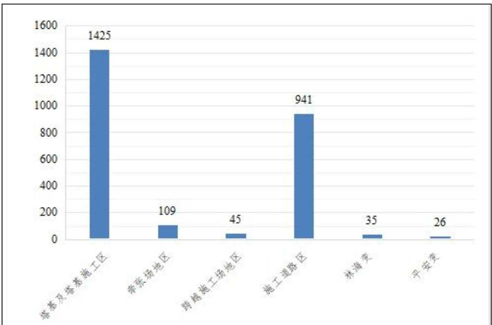  
图 4.5-1 不同项目区新增水土流失量分布图

本项目塔基及塔基施工区、施工道路区产生的新增水土流失量所占比例最大。因此，上述 2个区域为重点防治区域。

## 4.5.2 对防治重点时段的指导性意见

不同建设期水土流失总量变化情况详见表 4.5-2 和图4-2。

表 4.5-2 不同建设期水土流失总量变化情况
<table><tr><td rowspan=3 colspan=1>时期</td><td rowspan=1 colspan=7>流失量（t）</td><td rowspan=3 colspan=1>所占比例(%)</td></tr><tr><td rowspan=1 colspan=4>输电线路</td><td rowspan=1 colspan=2>变电站</td><td rowspan=2 colspan=1>合计</td></tr><tr><td rowspan=1 colspan=1>塔基及塔基施工区</td><td rowspan=1 colspan=1>牵张场地区</td><td rowspan=1 colspan=1>跨越施工场地区</td><td rowspan=1 colspan=1>施工道路区</td><td rowspan=1 colspan=1>林海变</td><td rowspan=1 colspan=1>平安变</td></tr><tr><td rowspan=1 colspan=1>施工期</td><td rowspan=1 colspan=1>1201</td><td rowspan=1 colspan=1>70</td><td rowspan=1 colspan=1>32</td><td rowspan=1 colspan=1>810</td><td rowspan=1 colspan=1>31</td><td rowspan=1 colspan=1>24</td><td rowspan=1 colspan=1>2168</td><td rowspan=1 colspan=1>53.37</td></tr><tr><td rowspan=1 colspan=1>自然恢复期</td><td rowspan=1 colspan=1>997</td><td rowspan=1 colspan=1>133</td><td rowspan=1 colspan=1>61</td><td rowspan=1 colspan=1>681</td><td rowspan=1 colspan=1>15</td><td rowspan=1 colspan=1>9</td><td rowspan=1 colspan=1>1895</td><td rowspan=1 colspan=1>46.63</td></tr><tr><td rowspan=1 colspan=1>合计</td><td rowspan=1 colspan=1>2198</td><td rowspan=1 colspan=1>202</td><td rowspan=1 colspan=1>93</td><td rowspan=1 colspan=1>1491</td><td rowspan=1 colspan=1>45</td><td rowspan=1 colspan=1>33</td><td rowspan=1 colspan=1>4063</td><td rowspan=1 colspan=1>100.00</td></tr></table>

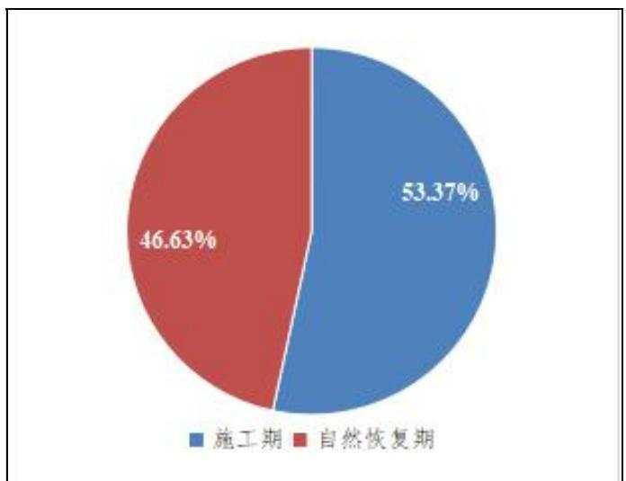  
图4.5-2 建设期不同时段水土流失量分布图

建设期不同建设区由于预测时段、占地面积等预测基础数据不同，其水土流失量在时间上亦呈不均衡分布。施工期工程施工量大，水土流失量也较大；自然恢复期各建设区工程建设基本完成，水土流失量都有所降低。因此，水土流失主要发生在施工期（含施工准备期），为重点监测时段。

## 4.5.3 指导性意见

## 1）重点区域

本项目水土流失重点区域为输电线路的塔基及塔基施工区、施工道路区。

## 2）重点时段

本项目水土流失重点时段是施工期，主要为建设中产生的临时堆土。因此，在措施体系防治方面，重点加强施工期间的临时防护措施体系，同时，结合工程措施和植物措施，确保施工结束后自然恢复期内施工扰动地面的水土流失得到有效治理。

## 3）措施布设

本项目防治措施应从边坡防护、截排水设施、临时拦挡等几个主要方面入手，并与必要的植物措施相结合，最大程度地避免水土流失的发生。

施工期间人员活动比较频繁，扰动比较集中，待施工结束后将对各施工区进行平整和原地貌恢复。施工期间主要的建设活动为变电站、塔基等基础开挖和回填，所采取的防治措施应结合主体工程，采取工程措施和临时措施相结合，植物措施宜结合季节适时及时开展。当主体工程建成投运时，工程措施和植物措施均应及时到位。

## 4）对施工进度安排的意见

加强主体工程施工进度的紧凑安排，尽量避免大风和暴雨天气施工，可以有效地缩短强度流失时段。根据预测结果，施工期是新增水土流失较严重的时期，建议在施工中加速主体工程施工进度，有效缩短水土流失时段。主体工程施工期间，在其非施工的空地段，考虑先期进行植物措施的种植和抚育。植物措施结合主体工程施工进度的安排，分期、分批地实施。

## 5）水土保持监测工作安排的指导性意见

根据预测结果，选择有代表性点位，监测临时堆土土体变化情况、水蚀因子作用下土壤流失量以及林草覆盖率的观测。重点监测输电线路塔基及塔基施工区、施工道路区等部位，注重施工期检查。

## 5 水土保持措施

## 5.1 防治区划分

本方案按照《生产建设项目水土保持技术标准》（GB50433-2018）的规定，根据输电线路占地类型和用途、占用方式、工程施工时间布置及建设顺序、工程地区水土流失状况及水土流失防治目标，结合项目区域自然环境状况划分水土流失防治分区。

1）一级分区：按照地貌分为两个区，即山丘区、平原区。

2）二级分区：按照工程布局和项目组成划分为三个区，即输电线路区、林海变电站区、平安变电站区。

3）三级分区：按照扰动特点、占地性质划分，具体为：

输电线路区划分为四个分区，即①塔基及塔基施工区、②牵张场地区、③跨越施工场地区、④施工道路区。

林海变电站区划分为四个分区，即①站区扩建区、②施工生产生活区、③施工道路区、④站内余土平整利用区；

平安变电站区划分为三个分区，即①站区扩建区、②施工生产生活区、③站内余土平整利用区。

本项目水土流失防治分区详见表 5.1-1。

表5.1-1 本项目水土流失防治分区一览表
<table><tr><td rowspan=1 colspan=3>水土流失防治分区</td><td rowspan=2 colspan=1>面积 $( \mathbf { h } \mathbf { m } ^ { 2 } )$ </td><td rowspan=2 colspan=1>备注</td></tr><tr><td rowspan=1 colspan=1>一级分区</td><td rowspan=1 colspan=1>二级分区</td><td rowspan=1 colspan=1>三级分区</td></tr><tr><td rowspan=4 colspan=1>山丘区</td><td rowspan=4 colspan=1>输电线路区</td><td rowspan=1 colspan=1>塔基及塔基施工区</td><td rowspan=1 colspan=1>41.00</td><td rowspan=4 colspan=1>黑龙江境内线路长89.92km，吉林境内线路长40.15km</td></tr><tr><td rowspan=1 colspan=1>牵张场地区</td><td rowspan=1 colspan=1>5.40</td></tr><tr><td rowspan=1 colspan=1>跨越施工场地区</td><td rowspan=1 colspan=1>2.12</td></tr><tr><td rowspan=1 colspan=1>施工道路区</td><td rowspan=1 colspan=1>23.80</td></tr><tr><td rowspan=11 colspan=1>平原区</td><td rowspan=4 colspan=1>输电线路区</td><td rowspan=1 colspan=1>塔基及塔基施工区</td><td rowspan=1 colspan=1>7.59</td><td rowspan=4 colspan=1>黑龙江境内线路长21.70km，吉林境内线路长1.69km</td></tr><tr><td rowspan=1 colspan=1>牵张场地区</td><td rowspan=1 colspan=1>1.00</td></tr><tr><td rowspan=1 colspan=1>跨越施工场地区</td><td rowspan=1 colspan=1>1.70</td></tr><tr><td rowspan=1 colspan=1>施工道路区</td><td rowspan=1 colspan=1>9.80</td></tr><tr><td rowspan=4 colspan=1>林海变电站区</td><td rowspan=1 colspan=1>站区扩建区</td><td rowspan=1 colspan=1>0.30</td><td rowspan=4 colspan=1>黑龙江西安区境内</td></tr><tr><td rowspan=1 colspan=1>施工生产生活区</td><td rowspan=1 colspan=1>0.30</td></tr><tr><td rowspan=1 colspan=1>施工道路区</td><td rowspan=1 colspan=1>0.11</td></tr><tr><td rowspan=1 colspan=1>站内余土平整利用区</td><td rowspan=1 colspan=1>0.72</td></tr><tr><td rowspan=3 colspan=1>平安变电站区</td><td rowspan=1 colspan=1>站区扩建区</td><td rowspan=1 colspan=1>0.30</td><td rowspan=3 colspan=1>吉林敦化市境内</td></tr><tr><td rowspan=1 colspan=1>施工生产生活区</td><td rowspan=1 colspan=1>0.30</td><td rowspan=1 colspan=1>吉</td></tr><tr><td rowspan=1 colspan=1>站内余土平整利用区</td><td rowspan=1 colspan=1>0.30</td></tr><tr><td rowspan=1 colspan=3>总计</td><td rowspan=1 colspan=1>94.74</td><td rowspan=1 colspan=1></td></tr></table>

## 5.2 措施总体布局

## 5.2.1 防治措施布设原则

本方案根据“预防为主、保护优先、全面规划、综合治理、因地制宜、突出重点、科学管理、注重效益”的方针，坚持“水土保持工程必须与主体工程同时设计、同时施工、同时投产使用”的“三同时”原则，在满足设计深度与主体工程相适应外，做好水土保持措施与主体工程设计相互衔接，综合考虑工程建设时序，合理安排水保工程与主体工程建设之间的关系，树立人与自然和谐相处的理念，尊重自然规律，注重措施设计与周边景观相协调的原则。

按照预防和治理相结合的原则，坚持局部与整体防治、单项防治措施与综合防治措施相协调、兼顾生态效益与经济效益，按分区进行措施总体布置。

## 5.2.2 防治措施布局

根据本项目各防治分区的具体情况，采取不同的、行之有效的防治措施、方法和手段，对可能产生水土流失的区域进行防治。在本工程水土保持措施在布局上，突出工程措施与植物措施结合，重点时段、重点区域集中治理的特点。

## 5.2.2.1 山丘区

## ——输电线路区

## 1）塔基及塔基施工区

施工前对塔基永久占地占用耕地、园地、林地和草地的区域、对塔基施工区（不含表土临时堆土场）临时占用耕地、园地、林地和草地的区域进行表土剥离。施工过程中，在塔基施工场地周围设置彩条旗围护，严格限制施工机械和人员活动范围；对塔基及塔基施工区临时堆土场设置彩条布铺底、堆土下坡侧设填土编织袋拦挡、堆土表面设密目网苫盖等临时措施；塔基及塔基施工区根据需要设置浆砌石挡土墙、浆砌石护坡、浆砌石截（排）水沟及消能设施；灌注桩基础施工过程中在塔基施工场地范围设泥浆沉淀池。施工结束后对表土剥离区域进行表土回覆，对除硬化外的塔基永久占地及施工临时占地区域进行土地整治，对塔基永久占地占用耕地及塔基施工临时占用耕地、园地区域交还复耕，对塔基永久占地范围内占用园地、林地、草地区域及塔基施工临时占用林地、草地区域恢复植被。

## 2）牵张场地区

施工中在牵张场周围设置彩条旗围护、严格限制施工机械和人员活动范围；场地内采取彩条布和钢板铺底防护。施工结束后，进行土地整治、植被恢复，占用耕地和园地

的交还复耕。

## 3）跨越施工场地区

施工中在跨越施工场地周围设置彩条旗围护、严格限制施工机械和人员活动范围；场地底部采取彩条布防护。施工结束后，进行土地整治、植被恢复，占用耕地的交还复耕。

## 4）施工道路区

施工前对施工道路（除人抬道路及表土临时堆土场外）临时占用耕地、园地、林地和草地的区域进行表土剥离。施工过程中，施工中在新修汽车运输道路两侧、拓宽道路一侧及人抬道路两侧设置彩条旗围护，严格限制施工机械和人员活动范围；新修汽车运输道路及拓宽道路铺设钢板；山丘区施工道路汇水面积较大地段的新修汽车运输道路上坡侧设置临时排水沟，排水沟末端设置沉沙池；相对高差较大的新修汽车运输道路填方边坡设置编织袋装土防护；临时堆土采取密目网苫盖、彩条布铺底防护。施工结束后进行表土回覆、土地整治、植被恢复，占用耕地、园地的交还复耕。

## 5.2.2.2 平原区

## a）输电线路区

## 1）塔基及塔基施工区

施工前对塔基永久占地占用耕地、园地、林地和草地的区域、对塔基施工区（不含表土临时堆土场）临时占用耕地、园地、林地和草地的区域进行表土剥离。施工过程中，在塔基施工场地周围设置彩条旗围护，严格限制施工机械和人员活动范围；对塔基及塔基施工区临时堆土场设置彩条布铺底、堆土外侧设填土编织袋拦挡、堆土表面设密目网苫盖等临时措施；灌注桩基础施工过程中在塔基施工场地范围设泥浆沉淀池。施工结束后对表土剥离区域进行表土回覆，对除硬化外的塔基永久占地及施工临时占地区域进行土地整治，对塔基永久占地占用耕地及塔基施工临时占用耕地、园地区域交还复耕，对塔基永久占地范围内占用园地、林地、草地区域及塔基施工临时占用林地、草地区域恢复植被。

## 2）牵张场地区

施工中在牵张场周围设置彩条旗围护、严格限制施工机械和人员活动范围；场地内采取彩条布和钢板铺底防护。施工结束后，进行土地整治，占用耕地和园地的交还复耕。

## 3）跨越施工场地区

施工中在跨越施工场地周围设置彩条旗围护、严格限制施工扰动范围；场地底部采

取彩条布防护。施工结束后，跨越施工场地进行土地整治，占用耕地的交还复耕。

## 4）施工道路区

施工前对施工道路（除表土临时堆土场外）临时占用耕地、园地、林地和草地的区域进行表土剥离。施工过程中，施工中在新修汽车运输道路两侧及拓宽道路一侧设置彩条旗围护，严格限制施工机械和人员活动范围；新修汽车运输道路及拓宽道路铺设钢板；临时堆土采取密目网苫盖、彩条布铺底防护。施工结束后进行表土回覆、土地整治、植被恢复，占用耕地的交还复耕。

## b）林海变电站区

## 1）站区扩建区

施工前对林海变站区扩建场地已实施绿化区域进行表土剥离。施工结束后对可绿化区域进行表土回覆、土地整治和恢复植被。

## 2）施工生产生活区

施工前对施工生产生活区进行表土剥离。施工过程中，对材料堆放场地采取彩条布铺底。施工结束后，进行回覆表土、土地整治后交还复耕。

## 3）施工道路区

施工前在规划好的施工道路上铺设钢板进行防护。施工结束后，进行土地整治后交还复耕。

## 4）站内余土平整利用区

施工前对站内余土平整利用区已实施绿化场地进行表土剥离。施工过程中，对临时堆土场采取临时拦挡、密目网苫盖、彩条布铺底防护。施工结束后对可绿化区域进行表土回覆、土地整治和恢复植被。

## c）平安变电站区

## 1）站区扩建区

施工前对平安变站区扩建场地已实施绿化区域进行表土剥离。施工结束后对可绿化区域进行表土回覆、土地整治和恢复植被。

## 2）施工生产生活区

施工前对施工生产生活区进行表土剥离。施工过程中，对材料堆放场地采取彩条布铺底。施工结束后，进行回覆表土、土地整治后交还复耕。

## 3）站内余土平整利用区

施工前对站内余土平整利用区已实施绿化区域进行表土剥离。施工过程中，对临时

堆土场采取临时拦挡、密目网苫盖、彩条布铺底防护。施工结束后对可绿化区域进行表土回覆、土地整治和恢复植被。

## 5.2.3 防治措施体系

## a）水土流失预防措施

## 1）优化工程设计

通过在对主体工程水土保持评价的基础上，对主体工程施工组织设计，包括土方导运、工序安排、进度安排、工艺改进、土石方平衡等提出水土保持建议，通过设计优化使本工程无弃土弃渣量。

## 2）加强管理，规范施工

做好水土流失临时措施，变电站、塔基施工过程中表土临时防护，牵张场地、施工道路等在施工完工后要进行植被恢复；尽量缩短施工周期，减少疏松地面的裸露时间，合理安排施工时间，尽量避开雨天和大风天气，同时安排好土方综合利用的工程时序。

## b）水土流失治理措施

根据水土流失防治分区，在水土流失预测及分析评价主体工程中具有水土保持功能工程的基础上，把水土保持工程措施、植物措施、临时措施有机结合起来，形成完整的、科学的水土流失防治措施体系和总体布局。主要水土保持防治类型均为各单项工程项目建设区中的永久占地区和临时占地区。

工程永久性占地区：该区开挖量较大，对地表扰动较剧烈，水土流失防治以工程措施为主，裸露地表部分必要时辅以植物措施。由于主体工程永久性占地区出于工程安全考虑，在主体工程设计中已采取了安全防护措施，这些措施一般具有水土保持功能。各单项工程水土保持方案在对其进行评价的基础上，根据需要进行补充水土保持方案设计。

工程临时性占地区：临时占地区主要是变电站施工生产生活区和输电线路塔基施工场地、牵张场地、跨越施工场地、施工道路等。对该区的水土流失防治主要以管理措施、植物措施以及临时措施为主。

本项目各防治分区水土保持措施布局情况详见表 5.2-1，水土保持防治措施体系见图 5.2-1。

表5.2-1 各防治分区水土保持措施布局情况
<table><tr><td colspan="1" rowspan="1">一级分区</td><td colspan="1" rowspan="1">二级分区</td><td colspan="1" rowspan="1">三级分区</td><td colspan="2" rowspan="1">措施</td><td colspan="1" rowspan="1">位置</td><td colspan="1" rowspan="1">结构形式</td></tr><tr><td colspan="2" rowspan="30">输电线路山丘区区</td><td colspan="1" rowspan="14">塔基及塔基施工区</td><td colspan="1" rowspan="8">工程措施</td><td colspan="1" rowspan="1">浆砌石挡土墙</td><td colspan="1" rowspan="1">塔位四周或下坡侧</td><td colspan="1" rowspan="1">浆砌石</td></tr><tr><td colspan="1" rowspan="1">浆砌石护坡</td><td colspan="1" rowspan="1">塔位周围自然山坡或基面挖方</td><td colspan="1" rowspan="1">浆砌石</td></tr><tr><td colspan="1" rowspan="1">浆砌石截(排)水沟</td><td colspan="1" rowspan="1">在塔位上坡侧</td><td colspan="1" rowspan="1">浆砌石</td></tr><tr><td colspan="1" rowspan="1">消能设施</td><td colspan="1" rowspan="1">截（排）水沟末端</td><td colspan="1" rowspan="1">C15 混凝土</td></tr><tr><td colspan="1" rowspan="1">表土剥离</td><td colspan="1" rowspan="1">塔基永久占用耕地、园地、林地和草地的区域，塔基施工区（不含表土临时堆土场）临时占用耕地、园地、林地和草地的区域</td><td colspan="1" rowspan="1">剥离厚度20~30cm</td></tr><tr><td colspan="1" rowspan="1">表土回覆</td><td colspan="1" rowspan="1">塔基永久占地及施工临时占地剥离表土的区域</td><td colspan="1" rowspan="1">表土</td></tr><tr><td colspan="1" rowspan="1">土地整治</td><td colspan="1" rowspan="1">塔基永久占地及施工临时占地</td><td colspan="1" rowspan="1">机械整地</td></tr><tr><td colspan="1" rowspan="1">交还复耕</td><td colspan="1" rowspan="1">塔基永久占用耕地，塔基施工临时占用耕地、园地区域</td><td colspan="1" rowspan="1">满足复耕要求</td></tr><tr><td colspan="1" rowspan="2">植物措施</td><td colspan="1" rowspan="1">灌草绿化</td><td colspan="1" rowspan="1">临时占用林地的区域</td><td colspan="1" rowspan="1">灌草绿化</td></tr><tr><td colspan="1" rowspan="1">撒播种草</td><td colspan="1" rowspan="1">塔基永久占用园地、林地、草地区域，塔基施工临时占用草地区域</td><td colspan="1" rowspan="1">撒播</td></tr><tr><td colspan="1" rowspan="4">临时措施</td><td colspan="1" rowspan="1">泥浆沉淀池</td><td colspan="1" rowspan="1">灌注桩基础</td><td colspan="1" rowspan="1">土质</td></tr><tr><td colspan="1" rowspan="1">彩条旗围护</td><td colspan="1" rowspan="1">施工场地边界</td><td colspan="1" rowspan="1">彩条旗</td></tr><tr><td colspan="1" rowspan="1">临时拦挡</td><td colspan="1" rowspan="1">临时堆土场</td><td colspan="1" rowspan="1">编织袋装土</td></tr><tr><td colspan="1" rowspan="1">密目网苫盖及彩条布铺底</td><td colspan="1" rowspan="1">临时堆土场</td><td colspan="1" rowspan="1">密目网、彩条布</td></tr><tr><td colspan="1" rowspan="6">牵张场地区</td><td colspan="1" rowspan="2">工程措施</td><td colspan="1" rowspan="1">土地整治</td><td colspan="1" rowspan="1">临时占地区域</td><td colspan="1" rowspan="1">机械整地</td></tr><tr><td colspan="1" rowspan="1">交还复耕</td><td colspan="1" rowspan="1">临时占用耕地、园地区域</td><td colspan="1" rowspan="1">满足复耕要求</td></tr><tr><td colspan="1" rowspan="1">植物措施</td><td colspan="1" rowspan="1">灌草绿化</td><td colspan="1" rowspan="1">临时占用林地的区域</td><td colspan="1" rowspan="1">灌草绿化</td></tr><tr><td colspan="1" rowspan="3">临时措施</td><td colspan="1" rowspan="1">彩条旗围护</td><td colspan="1" rowspan="1">施工场地边界</td><td colspan="1" rowspan="1">彩条旗</td></tr><tr><td colspan="1" rowspan="1">彩条布铺底</td><td colspan="1" rowspan="1">设备占压区域</td><td colspan="1" rowspan="1">彩条布</td></tr><tr><td colspan="1" rowspan="1">钢板铺底</td><td colspan="1" rowspan="1">规划的施工通道、重型设备占压区</td><td colspan="1" rowspan="1">钢板厚10mm</td></tr><tr><td colspan="1" rowspan="5">跨越施工场地区</td><td colspan="1" rowspan="2">工程措施</td><td colspan="1" rowspan="1">土地整治</td><td colspan="1" rowspan="1">临时占地区域</td><td colspan="1" rowspan="1">机械整地</td></tr><tr><td colspan="1" rowspan="1">交还复耕</td><td colspan="1" rowspan="1">临时占用耕地区域</td><td colspan="1" rowspan="1">满足复耕要求</td></tr><tr><td colspan="1" rowspan="1">植物措施</td><td colspan="1" rowspan="1">灌草绿化</td><td colspan="1" rowspan="1">临时占用林地的区域</td><td colspan="1" rowspan="1">灌草绿化</td></tr><tr><td colspan="1" rowspan="2">临时措施</td><td colspan="1" rowspan="1">彩条旗围护</td><td colspan="1" rowspan="1">施工场地边界</td><td colspan="1" rowspan="1">彩条旗</td></tr><tr><td colspan="1" rowspan="1">彩条布铺底</td><td colspan="1" rowspan="1">占压区域底部</td><td colspan="1" rowspan="1">彩条布</td></tr><tr><td colspan="1" rowspan="5">施工道路区</td><td colspan="1" rowspan="4">工程措施</td><td colspan="1" rowspan="1">表土剥离</td><td colspan="1" rowspan="1">除人抬道路及表土临时堆土场外，临时占用耕地、园地、林地和草地的区域</td><td colspan="1" rowspan="1">剥离厚度20~30cm</td></tr><tr><td colspan="1" rowspan="1">表土回覆</td><td colspan="1" rowspan="1">剥离表土的区域</td><td colspan="1" rowspan="1">表土</td></tr><tr><td colspan="1" rowspan="1">土地整治</td><td colspan="1" rowspan="1">临时占地区域</td><td colspan="1" rowspan="1">机械整地</td></tr><tr><td colspan="1" rowspan="1">交还复耕</td><td colspan="1" rowspan="1">临时占用耕地、园地区域</td><td colspan="1" rowspan="1">满足复耕要求</td></tr><tr><td colspan="1" rowspan="1">植物措施</td><td colspan="1" rowspan="1">乔草绿化</td><td colspan="1" rowspan="1">临时占用林地的区域</td><td colspan="1" rowspan="1">乔草绿化</td></tr><tr><td colspan="1" rowspan="7"></td><td colspan="1" rowspan="7"></td><td colspan="1" rowspan="7"></td><td colspan="1" rowspan="1"></td><td colspan="1" rowspan="1">撒播种草</td><td colspan="1" rowspan="1">临时占用草地的区域</td><td colspan="1" rowspan="1">撒播</td></tr><tr><td colspan="1" rowspan="6">临时措施</td><td colspan="1" rowspan="1">钢板铺垫</td><td colspan="1" rowspan="1">新修汽车运输道路及拓宽道路</td><td colspan="1" rowspan="1">钢板厚10mm</td></tr><tr><td colspan="1" rowspan="1">彩条旗围护</td><td colspan="1" rowspan="1">新修汽车运输道路两侧、拓宽道路一侧及人抬道路两侧</td><td colspan="1" rowspan="1">彩条旗</td></tr><tr><td colspan="1" rowspan="1">临时排水沟</td><td colspan="1" rowspan="1">汇水面积较大地段的新修汽车运输道路上坡面</td><td colspan="1" rowspan="1">土质排水沟</td></tr><tr><td colspan="1" rowspan="1">沉沙池</td><td colspan="1" rowspan="1">临时排水沟末端</td><td colspan="1" rowspan="1">C15 混凝土抹面</td></tr><tr><td colspan="1" rowspan="1">编织袋装土边坡防护</td><td colspan="1" rowspan="1">相对高差较大的新修汽车运输道路填方边坡</td><td colspan="1" rowspan="1">编织袋装土</td></tr><tr><td colspan="1" rowspan="1">密目网苫盖及彩条布铺底</td><td colspan="1" rowspan="1">临时堆土场</td><td colspan="1" rowspan="1">密目网、彩条布</td></tr><tr><td colspan="2" rowspan="24">输电线路平原区区</td><td colspan="1" rowspan="10">塔基及塔基施工区</td><td colspan="1" rowspan="4">工程措施</td><td colspan="1" rowspan="1">表土剥离</td><td colspan="1" rowspan="1">塔基永久占用耕地、园地、林地和草地的区域，塔基施工区(不含表土临时堆土场)临时占用耕地、园地、林地和草地的区域</td><td colspan="1" rowspan="1">剥离厚度20~30cm</td></tr><tr><td colspan="1" rowspan="1">表土回覆</td><td colspan="1" rowspan="1">塔基永久占地及施工临时占地剥离表土的区域</td><td colspan="1" rowspan="1">表土</td></tr><tr><td colspan="1" rowspan="1">土地整治</td><td colspan="1" rowspan="1">塔基永久占地及施工临时占地</td><td colspan="1" rowspan="1">机械整地</td></tr><tr><td colspan="1" rowspan="1">交还复耕</td><td colspan="1" rowspan="1">塔基永久占地占用耕地，塔基施工临时占用耕地和园地区域</td><td colspan="1" rowspan="1">满足复耕要求</td></tr><tr><td colspan="1" rowspan="2">植物措施</td><td colspan="1" rowspan="1">灌草绿化</td><td colspan="1" rowspan="1">临时占用林地的区域</td><td colspan="1" rowspan="1">灌草绿化</td></tr><tr><td colspan="1" rowspan="1">撒播种草</td><td colspan="1" rowspan="1">塔基永久占地占用园地、林地、草地区域，塔基施工临时占用草地区域</td><td colspan="1" rowspan="1">撒播</td></tr><tr><td colspan="1" rowspan="4">临时措施</td><td colspan="1" rowspan="1">泥浆沉淀池</td><td colspan="1" rowspan="1">灌注桩基础</td><td colspan="1" rowspan="1">土质</td></tr><tr><td colspan="1" rowspan="1">彩条旗围护</td><td colspan="1" rowspan="1">施工场地边界</td><td colspan="1" rowspan="1">彩条旗</td></tr><tr><td colspan="1" rowspan="1">临时拦挡</td><td colspan="1" rowspan="1">临时堆土场</td><td colspan="1" rowspan="1">编织袋装土</td></tr><tr><td colspan="1" rowspan="1">密目网苫盖及彩条布铺底</td><td colspan="1" rowspan="1">临时堆土场</td><td colspan="1" rowspan="1">密目网、彩条布</td></tr><tr><td colspan="1" rowspan="5">牵张场地区</td><td colspan="1" rowspan="2">工程措施</td><td colspan="1" rowspan="1">土地整治</td><td colspan="1" rowspan="1">临时占地区域</td><td colspan="1" rowspan="1">机械整地</td></tr><tr><td colspan="1" rowspan="1">交还复耕</td><td colspan="1" rowspan="1">临时占用耕地区域</td><td colspan="1" rowspan="1">满足复耕要求</td></tr><tr><td colspan="1" rowspan="3">临时措施</td><td colspan="1" rowspan="1">彩条旗围护</td><td colspan="1" rowspan="1">施工场地边界</td><td colspan="1" rowspan="1">彩条旗</td></tr><tr><td colspan="1" rowspan="1">彩条布铺底</td><td colspan="1" rowspan="1">设备占压区域</td><td colspan="1" rowspan="1">彩条布</td></tr><tr><td colspan="1" rowspan="1">钢板铺底</td><td colspan="1" rowspan="1">规划的施工通道、重型设备占压区</td><td colspan="1" rowspan="1">钢板厚10mm</td></tr><tr><td colspan="1" rowspan="4">跨越施工场地区</td><td colspan="1" rowspan="2">工程措施</td><td colspan="1" rowspan="1">土地整治</td><td colspan="1" rowspan="1">临时占地区域</td><td colspan="1" rowspan="1">机械整地</td></tr><tr><td colspan="1" rowspan="1">交还复耕</td><td colspan="1" rowspan="1">临时占用耕地区域</td><td colspan="1" rowspan="1">满足复耕要求</td></tr><tr><td colspan="1" rowspan="2">临时措施</td><td colspan="1" rowspan="1">彩条旗围护</td><td colspan="1" rowspan="1">施工场地边界</td><td colspan="1" rowspan="1">彩条旗</td></tr><tr><td colspan="1" rowspan="1">彩条布铺底</td><td colspan="1" rowspan="1">占压区域底部</td><td colspan="1" rowspan="1">彩条布</td></tr><tr><td colspan="1" rowspan="5">施工道路区</td><td colspan="1" rowspan="4">工程措施</td><td colspan="1" rowspan="1">表土剥离</td><td colspan="1" rowspan="1">临时占用耕地、园地、林地和草地的区域</td><td colspan="1" rowspan="1">剥离厚度20~30cm</td></tr><tr><td colspan="1" rowspan="1">表土回覆</td><td colspan="1" rowspan="1">剥离表土的区域</td><td colspan="1" rowspan="1">表土</td></tr><tr><td colspan="1" rowspan="1">土地整治</td><td colspan="1" rowspan="1">临时占地区域</td><td colspan="1" rowspan="1">机械整地</td></tr><tr><td colspan="1" rowspan="1">交还复耕</td><td colspan="1" rowspan="1">临时占用耕地、园地区域</td><td colspan="1" rowspan="1">满足复耕要求</td></tr><tr><td colspan="1" rowspan="1">植物措施</td><td colspan="1" rowspan="1">乔草绿化</td><td colspan="1" rowspan="1">临时占用林地的区域</td><td colspan="1" rowspan="1">乔草绿化</td></tr><tr><td colspan="1" rowspan="4"></td><td colspan="1" rowspan="4"></td><td colspan="1" rowspan="4"></td><td colspan="1" rowspan="1"></td><td colspan="1" rowspan="1">撒播种草</td><td colspan="1" rowspan="1">临时占用草地的区域</td><td colspan="1" rowspan="1">撒播</td></tr><tr><td colspan="1" rowspan="3">临时措施</td><td colspan="1" rowspan="1">钢板铺垫</td><td colspan="1" rowspan="1">新修汽车运输道路及拓宽道路</td><td colspan="1" rowspan="1">钢板厚10mm</td></tr><tr><td colspan="1" rowspan="1">彩条旗围护</td><td colspan="1" rowspan="1">新修汽车运输道路两侧及拓宽道路一侧</td><td colspan="1" rowspan="1">彩条旗</td></tr><tr><td colspan="1" rowspan="1">密目网苫盖及彩条布铺底</td><td colspan="1" rowspan="1">临时堆土场</td><td colspan="1" rowspan="1">密目网、彩条布</td></tr><tr><td colspan="1" rowspan="30">平原区</td><td colspan="1" rowspan="16">林海变电站区</td><td colspan="1" rowspan="4">站区扩建区</td><td colspan="1" rowspan="3">工程措施</td><td colspan="1" rowspan="1">表土剥离</td><td colspan="1" rowspan="1">扩建区已实施绿化区域</td><td colspan="1" rowspan="1">剥离厚度 20cm</td></tr><tr><td colspan="1" rowspan="1">表土回覆</td><td colspan="1" rowspan="1">扩建区可绿化区域</td><td colspan="1" rowspan="1">表土</td></tr><tr><td colspan="1" rowspan="1">土地整治</td><td colspan="1" rowspan="1">扩建区可绿化区域</td><td colspan="1" rowspan="1">机械整地</td></tr><tr><td colspan="1" rowspan="1">植物措施</td><td colspan="1" rowspan="1">撒播种草</td><td colspan="1" rowspan="1">扩建区可绿化区域</td><td colspan="1" rowspan="1">撒播</td></tr><tr><td colspan="1" rowspan="4">施工生产生活区</td><td colspan="1" rowspan="3">工程措施</td><td colspan="1" rowspan="1">表土剥离</td><td colspan="1" rowspan="1">占用旱地的区域</td><td colspan="1" rowspan="1">剥离厚度 30cm</td></tr><tr><td colspan="1" rowspan="1">表土回覆</td><td colspan="1" rowspan="1">占用旱地的区域</td><td colspan="1" rowspan="1">表土</td></tr><tr><td colspan="1" rowspan="1">土地整治及交还复耕</td><td colspan="1" rowspan="1">占用旱地的区域</td><td colspan="1" rowspan="1">机械整地</td></tr><tr><td colspan="1" rowspan="1">临时措施</td><td colspan="1" rowspan="1">彩条布铺底</td><td colspan="1" rowspan="1">材料堆放场地</td><td colspan="1" rowspan="1">彩条布</td></tr><tr><td colspan="1" rowspan="2">施工道路区</td><td colspan="1" rowspan="1">工程措施</td><td colspan="1" rowspan="1">土地整治及交还复耕</td><td colspan="1" rowspan="1">临时占用旱地的区域</td><td colspan="1" rowspan="1">机械整地，并满足复耕要求</td></tr><tr><td colspan="1" rowspan="1">临时措施</td><td colspan="1" rowspan="1">钢板铺垫</td><td colspan="1" rowspan="1">临时占用旱地的区域</td><td colspan="1" rowspan="1">钢板厚 10mm</td></tr><tr><td colspan="1" rowspan="6">站内余土平整利用区</td><td colspan="1" rowspan="3">工程措施</td><td colspan="1" rowspan="1">表土剥离</td><td colspan="1" rowspan="1">已实施绿化区域</td><td colspan="1" rowspan="1">剥离厚度 20cm</td></tr><tr><td colspan="1" rowspan="1">表土回覆</td><td colspan="1" rowspan="1">可绿化区域</td><td colspan="1" rowspan="1">表土</td></tr><tr><td colspan="1" rowspan="1">土地整治</td><td colspan="1" rowspan="1">可绿化区域</td><td colspan="1" rowspan="1">机械整地</td></tr><tr><td colspan="1" rowspan="1">植物措施</td><td colspan="1" rowspan="1">撒播种草</td><td colspan="1" rowspan="1">可绿化区域</td><td colspan="1" rowspan="1">撒播</td></tr><tr><td colspan="1" rowspan="2">临时措施</td><td colspan="1" rowspan="1">临时拦挡</td><td colspan="1" rowspan="1">临时堆土场</td><td colspan="1" rowspan="1">编织袋装土</td></tr><tr><td colspan="1" rowspan="1">密目网苫盖及彩条布铺底</td><td colspan="1" rowspan="1">临时堆土场</td><td colspan="1" rowspan="1">密目网、彩条布</td></tr><tr><td colspan="1" rowspan="14">平安变电站区</td><td colspan="1" rowspan="4">站区扩建区</td><td colspan="1" rowspan="3">工程措施</td><td colspan="1" rowspan="1">表土剥离</td><td colspan="1" rowspan="1">扩建区已实施绿化区域</td><td colspan="1" rowspan="1">剥离厚度 20cm</td></tr><tr><td colspan="1" rowspan="1">表土回覆</td><td colspan="1" rowspan="1">扩建区可绿化区域</td><td colspan="1" rowspan="1">表土</td></tr><tr><td colspan="1" rowspan="1">土地整治</td><td colspan="1" rowspan="1">扩建区可绿化区域</td><td colspan="1" rowspan="1">机械整地</td></tr><tr><td colspan="1" rowspan="1">植物措施</td><td colspan="1" rowspan="1">撒播种草</td><td colspan="1" rowspan="1">扩建区可绿化区域</td><td colspan="1" rowspan="1">撒播</td></tr><tr><td colspan="1" rowspan="4">施工生产生活区</td><td colspan="1" rowspan="3">工程措施</td><td colspan="1" rowspan="1">表土剥离</td><td colspan="1" rowspan="1">占用旱地区域</td><td colspan="1" rowspan="1">剥离厚度 30cm</td></tr><tr><td colspan="1" rowspan="1">表土回覆</td><td colspan="1" rowspan="1">占用旱地的区域</td><td colspan="1" rowspan="1">表土</td></tr><tr><td colspan="1" rowspan="1">土地整治及交还复耕</td><td colspan="1" rowspan="1">占用旱地的区域</td><td colspan="1" rowspan="1">机械整地，并满足复耕要求</td></tr><tr><td colspan="1" rowspan="1">临时措施</td><td colspan="1" rowspan="1">彩条布铺底</td><td colspan="1" rowspan="1">材料堆放场地</td><td colspan="1" rowspan="1">彩条布</td></tr><tr><td colspan="1" rowspan="6">站内余土平整利用区</td><td colspan="1" rowspan="3">工程措施</td><td colspan="1" rowspan="1">表土剥离</td><td colspan="1" rowspan="1">已实施绿化区域</td><td colspan="1" rowspan="1">剥离厚度 20cm</td></tr><tr><td colspan="1" rowspan="1">表土回覆</td><td colspan="1" rowspan="1">可绿化区域</td><td colspan="1" rowspan="1">表土</td></tr><tr><td colspan="1" rowspan="1">土地整治</td><td colspan="1" rowspan="1">可绿化区域</td><td colspan="1" rowspan="1">机械整地</td></tr><tr><td colspan="1" rowspan="1">植物措施</td><td colspan="1" rowspan="1">撒播种草</td><td colspan="1" rowspan="1">可绿化区域</td><td colspan="1" rowspan="1">撒播</td></tr><tr><td colspan="1" rowspan="2">临时措施</td><td colspan="1" rowspan="1">临时拦挡</td><td colspan="1" rowspan="1">临时堆土场</td><td colspan="1" rowspan="1">编织袋装土</td></tr><tr><td colspan="1" rowspan="1">密目网苫盖及彩条布铺底</td><td colspan="1" rowspan="1">临时堆土场</td><td colspan="1" rowspan="1">密目网、彩条布</td></tr></table>

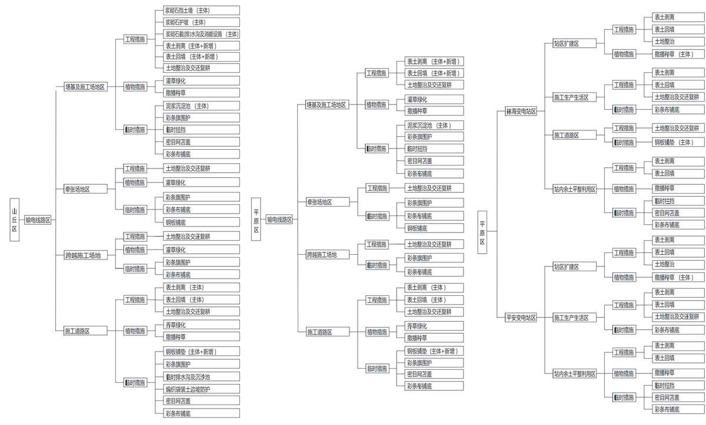  
图5.2-1 工程水土保持措施防治体系图

## 5.3 分区措施布设

## 5.3.1 设计标准及要求

## 5.3.1.1 工程措施

1）防洪标准：变电站、线路工程防护等级为Ⅰ级，防洪标准100年一遇。

2）截排水工程：根据《水土保持工程设计规范》（GB 51018-2014），线路工程截（排）水沟级别由3级提高到2级，执行 2级标准，按5 年一遇10min降水量设计。

3）拦挡工程：根据主体设计，线路挡土墙防护工程级别由5级提高到4级。

4）护坡工程：根据主体设计，线路坡面斜坡防护工程级别由5级提高到4级。

5）土地整治工程：根据《水土保持工程设计规范》（GB 51018-2014）及表土剥离利用方案，表土剥离的厚度按 20cm\~30cm；根据原占地类型、立地条件及环境绿化等需要，土地平整后表土回覆厚度按20cm\~30cm 标准。

## 5.3.1.2 植物措施

按照《水土保持工程设计规范》（GB51018-2014），本工程变电站植被恢复与建设工程级别为2 级，输电线路植被恢复与建设工程级别为 3 级，并根据生态防护和环境保护要求，按生态公益林标准执行。临时占用林地，采取“乔-草”、“灌-草”复合方式恢复植被。

乔、灌木栽植方法：栽植乔、灌木穴状整地大小为：穴径×坑深=40cm×40cm。清除砾石杂草，回填表土20cm。裸根苗苗木直立穴中，保持根系舒展，分层覆土、踏实，埋土至地径上2cm，栽后及时灌水。

栽植乔木：采用植苗方式，乔木种植密度 2000株/hm2。

栽植灌木：采用植苗方式，灌木种植密度 8000株/hm2（2株/穴）。

撒播种草：草籽采用多草种混播，根据项目区沿线各地水热条件的实际情况，撒播密度标准为 80kg/hm2。

种子、苗木质量：水土保持植物措施的草种必须是一级种子，并有“一签、三证”，即要有标签、生产经营许可证、合格证、植物检验检疫证。苗木要选购《主要造林树种苗木质量分级》（GB6000-1999）中一级壮苗。

根据适地适树，因地制宜的原则，编制人员通过现场调查、咨询当地水土保持部门并结合工程沿线气候带，对当地乡土树种和草种的生长情况、生态学和生物学特性进行了分析和比选，选择并确定了适宜于项目区立地条件的树种和草种。本方案优选用水曲柳、落叶松、紫穗槐、胡枝子、早熟禾、高羊矛、冰草等优良水土保持草树种。备选树

种和草种的生物学特性见表5.3-1。

表5.3-1 草种、灌木生物学特性
<table><tr><td rowspan=1 colspan=1>植物品种</td><td rowspan=1 colspan=1>植物性状</td><td rowspan=1 colspan=1>生态习性</td><td rowspan=1 colspan=1>种植时间种</td><td rowspan=1 colspan=1>植方式</td><td rowspan=1 colspan=1>苗木规格</td><td rowspan=1 colspan=1>质量</td></tr><tr><td rowspan=1 colspan=1>水曲柳</td><td rowspan=1 colspan=1>落叶乔木</td><td rowspan=1 colspan=1>喜湿润，喜光，耐寒，喜肥沃湿润土壤，生长快，抗风力强，耐水湿，适应性强，较耐盐碱，在湿润、肥沃、土层深厚的土壤上生长旺盛。</td><td rowspan=1 colspan=1>春季</td><td rowspan=1 colspan=1>植苗</td><td rowspan=1 colspan=1>胸径≥4cm</td><td rowspan=1 colspan=1>一级苗</td></tr><tr><td rowspan=1 colspan=1>落叶松</td><td rowspan=1 colspan=1>落叶乔木</td><td rowspan=1 colspan=1>喜光，耐寒，耐干旱，对土方的适应性较强，有一定的耐水湿能力，缓坡及丘陵地带生长旺盛。</td><td rowspan=1 colspan=1>春季</td><td rowspan=1 colspan=1>植苗</td><td rowspan=1 colspan=1>胸径≥4cm</td><td rowspan=1 colspan=1>一级苗</td></tr><tr><td rowspan=1 colspan=1>紫穗槐</td><td rowspan=1 colspan=1>落叶灌木</td><td rowspan=1 colspan=1>耐寒、耐旱、耐湿、耐盐碱、抗风沙、抗逆性极强，可用种子繁殖及进行根萌芽无性繁殖，萌芽性强，根系发达</td><td rowspan=1 colspan=1>春季</td><td rowspan=1 colspan=1>植苗</td><td rowspan=1 colspan=1>灌高≥60cm</td><td rowspan=1 colspan=1>一级苗</td></tr><tr><td rowspan=1 colspan=1>胡枝子</td><td rowspan=1 colspan=1>落叶灌木</td><td rowspan=1 colspan=1>耐旱、耐瘠薄、耐酸性、耐盐碱、萌芽力强，根系发达；对土壤适应性强。</td><td rowspan=1 colspan=1>春季</td><td rowspan=1 colspan=1>植苗</td><td rowspan=1 colspan=1>灌高≥60cm</td><td rowspan=1 colspan=1>一级苗</td></tr><tr><td rowspan=1 colspan=1>早熟禾</td><td rowspan=1 colspan=1>草原性旱生植物</td><td rowspan=1 colspan=1>一年生或冬性禾草；生长速度快，竞争力强；再生力强，抗修剪，耐践踏。</td><td rowspan=1 colspan=1>春季</td><td rowspan=1 colspan=1>撒播</td><td rowspan=1 colspan=1>种子纯度&gt;90%</td><td rowspan=1 colspan=1>一级</td></tr><tr><td rowspan=1 colspan=1>高羊茅</td><td rowspan=1 colspan=1>草原性旱生植物</td><td rowspan=1 colspan=1>多年生草本；适应性强，出苗快；根系入土较深，耐热、耐寒、耐旱的特性。</td><td rowspan=1 colspan=1>春季</td><td rowspan=1 colspan=1>撒播</td><td rowspan=1 colspan=1>种子纯度&gt;90%</td><td rowspan=1 colspan=1>一级</td></tr><tr><td rowspan=1 colspan=1>冰草</td><td rowspan=1 colspan=1>草原性旱生植物</td><td rowspan=1 colspan=1>多年生草本；适应性强，出苗快；耐热、耐寒、耐旱的特性。</td><td rowspan=1 colspan=1>春季</td><td rowspan=1 colspan=1>撒播</td><td rowspan=1 colspan=1>种子纯度&gt;90%</td><td rowspan=1 colspan=1>一级</td></tr></table>

## 5.3.1.3 临时措施

本方案临时措施设计主要依据《生产建设项目水土保持技术标准》（GB50433-2018）、《水土保持工程设计规范》（GB51018-2014）、《水利水电工程水土保持技术规范》（SL575-2012）中的相关规定，以简便、易行、实用、随主体工程施工进度及时布设的原则，作为本项目临时措施的设计标准。

## 5.3.2 山丘区

## 5.3.2.1 输电线路区

a）塔基及塔基施工区

1）工程措施

——浆砌石挡土墙

当塔位四周或下坡侧为陡坡时，主体工程设计在堆土的下方修一道挡土墙，将余土堆放在挡土墙内。

挡土墙采取仰斜型重力式挡土墙，用块石以水泥砂浆砌筑和勾缝，墙体尺寸根据工程地质、地形情况，按《砌体结构设计手册（GBJ3-88）》选用。挡土墙础埋深1.2m，墙基位于原状土层上，以保证墙体的稳定，并按规定要求留泄水孔。当墙体较长时，应

按规定设置伸缩缝；当地基变化明显时尚需加设沉降缝。

经统计，山丘区有2 处塔基区设置浆砌石挡土墙，浆砌石量174m3。其中：黑龙江境内涉及1基，挡土墙长度20m、外露高度2m，浆砌石量64m3；吉林境内涉及1基，挡土墙长度20m、外露高度 4m，浆砌石量110m3。

## 山丘区塔基浆砌石挡土墙典型图见附图 12。

## ——浆砌石护坡

护坡沿塔位周围自然山坡或基面挖方后的缓坡面用MU20 块石砌筑，对塔基边坡起保护作用。

主体工程设计山丘区共 3 基塔位设置浆砌石护坡，浆砌石量 57m3。其中：黑龙江境内涉及2基，护坡长度30m、防护高度1m\~2m，浆砌石量36m3；吉林境内涉及1基，护坡长度15m，防护高度2m，浆砌石量21m3。

## 山丘区塔基浆砌石护坡典型图见附图 13。

——浆砌石截（排）水沟及消能设施

主体工程设计山丘区塔基及塔基施工区共4基塔位设置浆砌石截（排）水沟，其断面尺寸为：底宽×上口宽×深=0.4m×0.5m×0.5m（I 型），底宽×上口宽×深=0.8m×1.0m×1.0m（II 型），浆砌石防护壁厚0.2m，沟底留有不小于 5%的纵向坡度。排水沟末端与自然沟道顺接在较平缓区域，排水沟出口设八字式消能散水措施，其横断面尺寸为：I 型末端宽 0.8m、长 1.0m，II 型末端宽 1.2m，长 1.0m，C15 混凝土防护厚度 0.08m。

山丘区塔基及塔基施工区截（排）水沟总长60m、浆砌石量43.7m3，八字式散水口共8 处、C15混凝土量0.58m3。其中黑龙江境内涉及 3基，截（排）水沟长45m、浆砌石量 31.5m3，八字式散水口 6处、C15 混凝土量0.42m3；吉林境内1基塔位，排水沟长15m，浆砌石量 12.2m3，八字式散水口 2 处、C15 混凝土量 0.16m3。

塔基区排水沟执行1 级标准按5 年一遇10min 降雨强度，超高按 30cm 考虑。山丘区塔基截（排）水沟典型图见附图14。

## ——表土剥离及回覆

表土剥离利用方案对塔基永久占地中占用耕地的全部进行表土剥离，剥离厚度30cm；对塔基施工区（不含表土临时堆土场）临时占用耕地、园地、林地和草地的区域进行表土剥离，剥离厚度耕地30cm、园地、林地和草地20cm。表土剥离利用方案设计本区剥离表土面积28.45hm2，表土量 7.20万m3，施工结束后表土全部回覆本区。其中：黑龙江境内剥离表土面积20.92hm2，表土量5.49万m3；吉林境内剥离表土面积7.53hm2，

表土量 1.71 万 m3。

本方案补充：对塔基永久占地中占用园地、林地和草地的区域进行表土剥离，剥离厚度 20cm，剥离表土面积 4.53hm2，表土量0.91万m3，施工结束后表土全部回覆本区。其中：黑龙江境内剥离表土面积 2.36hm2，表土量 0.47 万 m3；吉林境内剥离表土面积2.17hm2，表土量 0.44 万 m3。

综上，塔基及塔基施工区剥离表土面积 32.98hm2，表土量8.11 万m3。其中：黑龙江境内剥离表土面积 23.28hm2，表土量 5.96 万 m3；吉林境内剥离表土面积 9.70hm2，表土量2.15 万 m3。采用 74kW 推土机清理表土，并推运至附近临时表土堆放场堆存，平均运距30m。

施工结束后表土回覆于本区剥离表土的区域，为复耕和绿化提供条件。表土回覆量8.11 万 m3，其中：黑龙江境内 5.96 万 m3，吉林境内 2.15 万 m3。

## ——土地整治及交还复耕

在实施绿化和复耕前，对可绿化区域和复耕区域进行土地整治，采取37kW拖拉机进行整地，整地面积 40.84hm2，耕深 30cm。其中黑龙江境内整地面积 28.85hm2，吉林境内整地面积 11.99hm2。

对塔基永久占地范围中占用耕地、塔基施工临时占用耕地和园地的区域，在整地满足复耕要求后交还，交还复耕面积 19.40hm2（永久3.50hm2、临时 15.90hm2）。其中黑龙江境内复耕面积 16.99hm（2 永久 3.07hm2、临时 13.92hm2），吉林境内复耕面积 2.41hm2（永久 0.43hm2、临时 1.98hm2）。

## 2）植物措施

施工结束后对扰动范围内的土地需进行植被恢复。塔基及塔基施工区永久占地范围内占用园地、林地、草地和塔基施工临时占用草地的，采取撒播种草恢复植被；塔基施工临时占用林地的，采取“灌-草”结合进行植被恢复。

经统计，山丘区塔基及塔基施工区可绿化面积共计 21.44hm2，其中黑龙江境内可绿化面积 11.86hm2，吉林境内可绿化面积 9.58hm2。灌木栽植前进行穴状整地，规格为穴径×坑深=40cm×40cm，穴状整地数量 67840 个，其中黑龙江境内 38040 个，吉林境内29800个。灌木选择紫穗槐、胡枝子混交，种植密度8000 株/hm2（2株/穴）；草种选择高羊茅、冰草，按1:1混播，播种量80kg/hm2。

山丘区塔基及塔基施工区植被恢复设计技术指标见表5.3-2。

表5.3-2 山丘区塔基及塔基施工区绿化工程量
<table><tr><td rowspan=1 colspan=2>位置</td><td rowspan=1 colspan=1>草种或树种</td><td rowspan=1 colspan=1>播种方式</td><td rowspan=1 colspan=1>种子或苗木质量</td><td rowspan=1 colspan=1>播种量</td><td rowspan=1 colspan=1>可绿化面积（hm²）</td><td rowspan=1 colspan=1>草种量(kg)</td><td rowspan=1 colspan=1>灌木(株)</td></tr><tr><td rowspan=6 colspan=1>黑龙江境内</td><td rowspan=1 colspan=1>塔基永久占用园地、林地、草地的区域</td><td rowspan=1 colspan=1>高羊茅、冰草</td><td rowspan=1 colspan=1>1:1 混播</td><td rowspan=1 colspan=1>一级种</td><td rowspan=1 colspan=1>80kg/hm²</td><td rowspan=1 colspan=1>2.31</td><td rowspan=1 colspan=1>184.8</td><td rowspan=1 colspan=1></td></tr><tr><td rowspan=1 colspan=1>塔基施工临时占用草地的区域</td><td rowspan=1 colspan=1>高羊茅、冰草</td><td rowspan=1 colspan=1>1:1 混播</td><td rowspan=1 colspan=1>一级种</td><td rowspan=1 colspan=1>80kg/hm²</td><td rowspan=1 colspan=1>0.04</td><td rowspan=1 colspan=1>3.2</td><td rowspan=1 colspan=1></td></tr><tr><td rowspan=3 colspan=1>塔基施工临时占用林地的区域</td><td rowspan=1 colspan=1>紫穗槐、胡枝子</td><td rowspan=1 colspan=1>栽植</td><td rowspan=1 colspan=1>一级苗</td><td rowspan=1 colspan=1>8000 株/hm²(2 株/穴)</td><td rowspan=1 colspan=1>3.80</td><td rowspan=1 colspan=1></td><td rowspan=1 colspan=1>76080</td></tr><tr><td rowspan=1 colspan=1>高羊茅、冰草</td><td rowspan=1 colspan=1>1:1 混播</td><td rowspan=1 colspan=1>一级种</td><td rowspan=1 colspan=1>80kg/hm²</td><td rowspan=1 colspan=1>5.71</td><td rowspan=1 colspan=1>456.8</td><td rowspan=1 colspan=1></td></tr><tr><td rowspan=1 colspan=1>小计</td><td rowspan=1 colspan=1></td><td rowspan=1 colspan=1></td><td rowspan=1 colspan=1></td><td rowspan=1 colspan=1>9.51</td><td rowspan=1 colspan=1>456.8</td><td rowspan=1 colspan=1>76080</td></tr><tr><td rowspan=1 colspan=2>合计</td><td rowspan=1 colspan=1></td><td rowspan=1 colspan=1></td><td rowspan=1 colspan=1></td><td rowspan=1 colspan=1>11.86</td><td rowspan=1 colspan=1>644.8</td><td rowspan=1 colspan=1>76080</td></tr><tr><td rowspan=5 colspan=1>吉林境内</td><td rowspan=1 colspan=1>塔基永久占用园地、林地、草地的区域</td><td rowspan=1 colspan=1>高羊茅、冰草</td><td rowspan=1 colspan=1>1:1 混播</td><td rowspan=1 colspan=1>一级种</td><td rowspan=1 colspan=1>80kg/hm²</td><td rowspan=1 colspan=1>2.13</td><td rowspan=1 colspan=1>170.4</td><td rowspan=1 colspan=1></td></tr><tr><td rowspan=3 colspan=1>塔基施工临时占用林地的区域</td><td rowspan=1 colspan=1>紫穗槐、胡枝子</td><td rowspan=1 colspan=1>栽植</td><td rowspan=1 colspan=1>一级苗</td><td rowspan=1 colspan=1>8000 株/hm²(2 株/穴)</td><td rowspan=1 colspan=1>2.98</td><td rowspan=1 colspan=1></td><td rowspan=1 colspan=1>59600</td></tr><tr><td rowspan=1 colspan=1>高羊茅、冰草</td><td rowspan=1 colspan=1>1:1 混播</td><td rowspan=1 colspan=1>一级种</td><td rowspan=1 colspan=1>80kg/hm²</td><td rowspan=1 colspan=1>4.47</td><td rowspan=1 colspan=1>357.6</td><td rowspan=1 colspan=1></td></tr><tr><td rowspan=1 colspan=1>小计</td><td rowspan=1 colspan=1></td><td rowspan=1 colspan=1></td><td rowspan=1 colspan=1></td><td rowspan=1 colspan=1>7.45</td><td rowspan=1 colspan=1>357.6</td><td rowspan=1 colspan=1>59600</td></tr><tr><td rowspan=1 colspan=2>合计</td><td rowspan=1 colspan=1></td><td rowspan=1 colspan=1></td><td rowspan=1 colspan=1></td><td rowspan=1 colspan=1>9.58</td><td rowspan=1 colspan=1>528.0</td><td rowspan=1 colspan=1>59600</td></tr><tr><td rowspan=1 colspan=3>总计</td><td rowspan=1 colspan=1></td><td rowspan=1 colspan=1></td><td rowspan=1 colspan=1></td><td rowspan=1 colspan=1>21.44</td><td rowspan=1 colspan=1>1172.8</td><td rowspan=1 colspan=1>135680</td></tr></table>

## 3）临时措施

## ——泥浆沉淀池

山丘区共28基塔采用灌注桩基础，灌注桩施工前，先对塔基及塔基施工区剥离表层土，剥离的表层土全部装入编织袋内，根据需要围挡在灌注桩基础施工区域外围和泥浆沉淀池周围，施工结束后拆除编织袋，回覆塔基及塔基施工区表土。

山丘区塔基共设置泥浆沉淀池28 座。其中黑龙江境内设置泥浆沉淀池15座，吉林境内设置泥浆沉淀池 13座。泥浆沉淀池地下部分尺寸：长×宽×深=10m×5m×2m，容积为90m3。泥浆沉淀池典型设计图见附图15。

## ——彩条旗围护

为防止施工人员及车辆跨越塔基施工场地租地范围作业，造成大面积的地表扰动，施工期间对塔基施工场地四周布设彩条旗进行围护，平均每基塔约90m。

经统计，山丘区塔基共 265 基，需设置彩条旗共 23850m。考虑临时材料可以重复使用，考虑重复利用率按两次计，实际需要彩条旗 11925m。其中黑龙江境内 187 基塔需彩条旗8415m，吉林境内 78基塔需彩条旗3510m。

## ——临时拦挡

塔基在施工过程中产生临时堆土，主要为基坑土和表土，集中堆放在每基塔施工场

地内，表土及开挖土分开堆放。

山丘区单塔存放临时堆土量 $7 0 \mathrm { m } ^ { 3 } { \sim } 4 8 0 \mathrm { m } ^ { 3 }$ 、临时堆放表土量 240m3\~470m3，塔基基础土方施工工期较短，一般不超过30d。

考虑到山丘区地形条件及不利天气因素，为防治溜坡溜渣，在临时堆土下坡侧设置编织袋装土挡护措施，挡护断面呈梯形，两侧坡比为1:0.5，上底宽0.5m，下底宽 1.0m，高度为 0.5m（即每延米 0.375m3）。

每基塔临时堆土量平均按220m3考虑，其临时堆土区8m×16m，设计堆高2.0m\~2.2m，堆土各向边坡比控制在 1:1.5；每基塔临时堆放表土量 400m3 考虑，其临时堆土区15m×20m，设计堆高1.0m\~2.0m，堆土各向边坡比控制在 1:1.5。每基塔编织袋装土挡护长度 59m，挡护量 22.125m3。

山丘区共 265 基塔，挡护长度 15635m，工程量 5863.125m3。其中黑龙江境内 187基塔临时堆土挡护长度11033m，工程量 4137.375m3；吉林境内78基塔临时堆土挡护长度4602m，工程量 1725.75m3。编织袋挡护土料全部来自塔基基础挖方或剥离的表土，施工结束后全部回填塔基及塔基施工区内。

## ——密目网苫盖、彩条布铺底

塔基及塔基施工区临时堆土表面采用密目网苫盖，每基塔临时堆土苫盖面积514m2。由于塔基施工临时堆土一般不超过 30天，本方案按 40%塔基数量考虑塔基区临时堆土密目网苫盖量，则 107 基塔密目网苫盖量共 54998m2。其中黑龙江境内 75 基塔密目网苫盖 38550m2，吉林境内 32 基塔密目网苫盖 16448m2。

为避免清理回填土时对原地貌的扰动，先在临时堆土及堆料区域底部铺设彩条布，以降低清理场地时的扰动程度，塔基及塔基施工区其他以压占为主或轻微扰动区域采取铺垫彩条布防护。单个塔基平均铺设彩条布530m2，山丘区265 塔基彩条布铺底面积共140450m2。其中黑龙江境内彩条布铺底面积99110m2，吉林境内彩条布铺底面积41340m2。

山丘区塔基及塔基施工区水土保持措施典型设计图见附图16。

## b）牵张场地区

## 1）工程措施

## ——土地整治及交还复耕

在实施绿化和复耕前，对可绿化区域和复耕区域进行土地整治，采取37kW拖拉机进行整地，整地面积5.40hm2，耕深30cm。其中黑龙江境内3.80hm2，吉林境内1.60hm2。

对牵张场地临时占用耕地和园地的区域，在整地满足复耕要求后交还，交还复耕面

积2.00hm2。其中黑龙江境内复耕面积1.80hm2，吉林境内复耕面积 0.20hm2。

## 2）植物措施

施工结束后对扰动范围内的土地需进行植被恢复。对原占地类型为林地的，采取“灌-草”结合进行植被恢复。

经统计，山丘区牵张场地可绿化面积共计 3.40hm2，其中黑龙江境内可绿化面积2.00hm2，吉林境内可绿化面积1.40hm2。灌木栽植前进行穴状整地，规格为穴径×坑深=40cm×40cm，穴状整地数量13600 个，其中黑龙江境内8000 个，吉林境内5600个。灌木选择紫穗槐、胡枝子混交，种植密度 8000 株/hm2（2 株/穴）；草种选择高羊茅、冰草，按 1:1 混播，播种量 80kg/hm2。

山丘区牵张场地植被恢复设计技术指标见表 5.3-3。

表5.3-3 山丘区牵张场地植被恢复技术指标
<table><tr><td rowspan=1 colspan=1>位置</td><td rowspan=1 colspan=1>草种或树种</td><td rowspan=1 colspan=1>播种方式</td><td rowspan=1 colspan=1>种子或苗木质量</td><td rowspan=1 colspan=1>播种量</td><td rowspan=1 colspan=1>可绿化面积(hm²)</td><td rowspan=1 colspan=1>草种量(kg)</td><td rowspan=1 colspan=1>灌木(株)</td></tr><tr><td rowspan=3 colspan=1>黑龙江境内</td><td rowspan=1 colspan=1>紫穗槐、胡枝子</td><td rowspan=1 colspan=1>栽植</td><td rowspan=1 colspan=1>一级苗</td><td rowspan=1 colspan=1>8000 株/hm²(2 株/穴)</td><td rowspan=1 colspan=1>0.80</td><td rowspan=1 colspan=1></td><td rowspan=1 colspan=1>16000</td></tr><tr><td rowspan=1 colspan=1>高羊茅、冰草</td><td rowspan=1 colspan=1>1:1 混播</td><td rowspan=1 colspan=1>一级种</td><td rowspan=1 colspan=1>80kg/hm²</td><td rowspan=1 colspan=1>1.20</td><td rowspan=1 colspan=1>96.0</td><td rowspan=1 colspan=1></td></tr><tr><td rowspan=1 colspan=1>小计</td><td rowspan=1 colspan=1></td><td rowspan=1 colspan=1></td><td rowspan=1 colspan=1></td><td rowspan=1 colspan=1>2.00</td><td rowspan=1 colspan=1>96.0</td><td rowspan=1 colspan=1>16000</td></tr><tr><td rowspan=3 colspan=1>吉林境内</td><td rowspan=1 colspan=1>紫穗槐、胡枝子</td><td rowspan=1 colspan=1>栽植</td><td rowspan=1 colspan=1>一级苗</td><td rowspan=1 colspan=1>8000 株/hm²(2 株/穴)</td><td rowspan=1 colspan=1>0.56</td><td rowspan=1 colspan=1></td><td rowspan=1 colspan=1>11200</td></tr><tr><td rowspan=1 colspan=1>高羊茅、冰草</td><td rowspan=1 colspan=1>1:1 混播</td><td rowspan=1 colspan=1>一级种</td><td rowspan=1 colspan=1>80kg/hm²</td><td rowspan=1 colspan=1>0.84</td><td rowspan=1 colspan=1>67.2</td><td rowspan=1 colspan=1></td></tr><tr><td rowspan=1 colspan=1>小计</td><td rowspan=1 colspan=1></td><td rowspan=1 colspan=1></td><td rowspan=1 colspan=1></td><td rowspan=1 colspan=1>1.40</td><td rowspan=1 colspan=1>67.2</td><td rowspan=1 colspan=1>11200</td></tr><tr><td rowspan=1 colspan=2>合计</td><td rowspan=1 colspan=1></td><td rowspan=1 colspan=1></td><td rowspan=1 colspan=1></td><td rowspan=1 colspan=1>3.40</td><td rowspan=1 colspan=1>163.2</td><td rowspan=1 colspan=1>27200</td></tr></table>

## 3）临时措施

## ——彩条旗围护

为防止施工人员及车辆跨越牵张场租地范围作业，造成大面积的地表扰动，在施工期内对牵张场三侧布设彩条旗进行围护，单个牵张场彩条旗围护130m。

山丘区牵张场地共 27 个，需设置彩条旗共 3510m。考虑临时材料可以重复使用，重复利用率按两次计，实际需要彩条旗1755m，其中黑龙江境内1235m，吉林境内520m。

## ——彩条布铺底

为减少对地表的扰动，在牵张场地内铺设一定数量的彩条布，以满足施工结束后植被恢复需要，单个牵张场铺设彩条布为 2000m2。

山丘区牵张场地共 27个，彩条布铺底面积54000m2。其中黑龙江境内38000m2，吉林境内 16000m2。

——钢板铺底

为方便机械设备和导线的运输与吊装，降低重型机械及车辆对原地貌的扰动，在牵张场地内设置施工通道、重型设备占压位置，铺设10mm 厚钢板，单个牵张场铺设钢板400m2。

山丘区牵张场地共 27 个，考虑临时材料可以重复使用，重复利用率按三次计，实际需要钢板4000m2，其中：黑龙江境内山丘区19 处牵张场地，钢板使用面积按7处计，需钢板2800m2；吉林境内山丘区8处牵张场地，钢板使用面积按3处计，需钢板1200m2。

## c）跨越施工场地区

## 1）工程措施

## ——土地整治及交还复耕

在实施绿化和复耕前，对可绿化区域和复耕区域进行土地整治，采取37kW拖拉机进行整地，整地面积 2.12hm2，耕深 30cm。其中黑龙江境内 1.18hm2，吉林境内 0.94hm2。

对跨越施工场地区临时占用耕地的区域，在整地满足复耕要求后交还，交还复耕面积1.40hm2。其中黑龙江境内复耕面积0.78hm2，吉林境内复耕面积 0.62hm2。

## 2）植物措施

施工结束后对扰动范围内的土地需进行植被恢复。对原占地类型为林地的，采取“灌-草”结合进行植被恢复。

经统计，山丘区跨越施工场地可绿化面积共计 0.72hm2，其中黑龙江境内可绿化面积0.40hm2，吉林境内可绿化面积 0.32hm2。灌木栽植前进行穴状整地，规格为穴径×坑深=40cm×40cm，穴状整地数量2880个，其中黑龙江境内 1600个，吉林境内1280个。灌木选择紫穗槐、胡枝子混交，种植密度 8000 株/hm2（2 株/穴）；草种选择高羊茅、冰草，按 1:1 混播，播种量 80kg/hm2。

山丘区跨越施工场区植被恢复设计技术指标见表 5.3-4。

表 5.3-4 山丘区跨越施工场区植被恢复技术指标
<table><tr><td rowspan=1 colspan=1>位置</td><td rowspan=1 colspan=1>草种或树种</td><td rowspan=1 colspan=1>播种方式</td><td rowspan=1 colspan=1>种子或苗木质量</td><td rowspan=1 colspan=1>播种量</td><td rowspan=1 colspan=1>可绿化面积 $\left( \mathbf { \hat { h } m } ^ { 2 } \right)$ </td><td rowspan=1 colspan=1>草种量(kg)</td><td rowspan=1 colspan=1>灌木(株)</td></tr><tr><td rowspan=3 colspan=1>黑龙江境内</td><td rowspan=1 colspan=1>紫穗槐、胡枝子</td><td rowspan=1 colspan=1>栽植</td><td rowspan=1 colspan=1>一级苗</td><td rowspan=1 colspan=1>8000 株 $/ \mathrm { h m } ^ { 2 }$ (2 株/穴)</td><td rowspan=1 colspan=1>0.16</td><td rowspan=1 colspan=1></td><td rowspan=1 colspan=1>3200</td></tr><tr><td rowspan=1 colspan=1>高羊茅、冰草</td><td rowspan=1 colspan=1>1:1 混播</td><td rowspan=1 colspan=1>一级种</td><td rowspan=1 colspan=1>80kg/hm²</td><td rowspan=1 colspan=1>0.24</td><td rowspan=1 colspan=1>19.2</td><td rowspan=1 colspan=1></td></tr><tr><td rowspan=1 colspan=1>小计</td><td rowspan=1 colspan=1></td><td rowspan=1 colspan=1></td><td rowspan=1 colspan=1></td><td rowspan=1 colspan=1>0.40</td><td rowspan=1 colspan=1>19.2</td><td rowspan=1 colspan=1>3200</td></tr><tr><td rowspan=3 colspan=1>吉林境内</td><td rowspan=1 colspan=1>紫穗槐、胡枝子</td><td rowspan=1 colspan=1>栽植</td><td rowspan=1 colspan=1>一级苗</td><td rowspan=1 colspan=1>8000 株/hm²(2 株/穴)</td><td rowspan=1 colspan=1>0.13</td><td rowspan=1 colspan=1></td><td rowspan=1 colspan=1>2560</td></tr><tr><td rowspan=1 colspan=1>高羊茅、冰草</td><td rowspan=1 colspan=1>1:1 混播</td><td rowspan=1 colspan=1>一级种</td><td rowspan=1 colspan=1> $\underline { { 8 0 \mathrm { k g } / \mathrm { h m } ^ { 2 } } }$ </td><td rowspan=1 colspan=1>0.19</td><td rowspan=1 colspan=1>15.2</td><td rowspan=1 colspan=1></td></tr><tr><td rowspan=1 colspan=1>小计</td><td rowspan=1 colspan=1></td><td rowspan=1 colspan=1></td><td rowspan=1 colspan=1></td><td rowspan=1 colspan=1>0.32</td><td rowspan=1 colspan=1>15.2</td><td rowspan=1 colspan=1>2560</td></tr><tr><td rowspan=1 colspan=2>合计</td><td rowspan=1 colspan=1></td><td rowspan=1 colspan=1></td><td rowspan=1 colspan=1></td><td rowspan=1 colspan=1>0.72</td><td rowspan=1 colspan=1>34.4</td><td rowspan=1 colspan=1>5760</td></tr></table>

## 3）临时措施

## ——彩条旗围护

为防止施工人员及机械跨越租地范围作业，引起更多的地表扰动，施工期间对跨越施工场地三侧布设彩旗绳围栏限定施工范围。

跨越公路、铁路、500kV 以下、35kV 及以上电力线：每处跨越施工场地占地面积为400m2，单个跨越施工场地布设围栏80m。山丘区共9处，其中黑龙江境内7处，吉林境内2处。考虑临时材料可以重复使用，重复利用率按两次计，实际需要彩条旗360m，其中黑龙江境内280m，吉林境内80m。

跨越水泥路、10kV 及以下电力线、架空通信线：每处跨越施工场地占地面积为200m2，单个跨越施工场地布设围栏 60m。山丘区共 88 处，其中黑龙江境内 45处，吉林境内 43 处。考虑临时材料可以重复使用，重复利用率按两次计，实际需要彩条旗2640m，其中黑龙江境内 1350m，吉林境内 1290m。

综上，山丘区跨越施工场地区实际需要彩条旗3000m，其中黑龙江境内1630m，吉林境内 1370m。

## ——彩条布铺底

为减少对地表的扰动，在跨越施工场地内铺设一定数量的彩条布，以满足施工结束后植被恢复需要。

山丘区跨越施工场地共 97 处，9处彩条布铺底面积 400m2/处，88处彩条布铺底面积 200m2/处，彩条布铺底面积共 21200m2。其中黑龙江境内 11800m2，吉林境内 9400m2。

## d）施工道路区

## 1）工程措施

## ——表土剥离及回覆

表土剥离利用方案对施工道路（除人抬道路及表土临时堆土场外）临时占用耕地、园地、林地和草地的区域进行表土剥离，剥离厚度耕地30cm、园地、林地和草地20cm。表土剥离利用方案设计山丘区本区剥离表土面积 14.57hm2，表土量3.55万m3，施工结束后表土全部回覆本区。其中：黑龙江境内剥离表土面积 9.32hm2，表土量2.36万m3；吉林境内剥离表土面积 5.25hm2，表土量1.19万m3。采用 74kW 推土机清理表土，并推运至附近临时表土堆放场堆存，平均运距 30m。

施工结束后表土回覆于本区剥离表土的区域，为复耕和绿化提供条件。表土回覆量3.55 万 m3，其中：黑龙江境内 2.36 万 m3，吉林境内 1.19 万 m3。

## ——土地整治及交还复耕

在实施绿化和复耕前，对可绿化区域和复耕区域进行土地整治。新修汽车运输道路和拓宽道路采取 37kW 拖拉机进行整地，整地面积 20.59hm2，耕深 30cm，其中黑龙江境内 13.40hm2，吉林境内 7.19hm2。对于人抬道路采取畜力整地，整地面积 3.21hm2，耕深 30cm，其中黑龙江境内 1.54hm2，吉林境内 1.67hm2。

施工道路区临时占用耕地和园地的区域需复耕，在整地满足复耕要求后交还。山丘区交还复耕面积共交还复耕面积10.47hm2，其中黑龙江境内8.17hm2，吉林境内2.30hm2。

## 2）植物措施

施工结束后对扰动范围内的土地需进行植被恢复。对原占地类型为林地的，采取“乔-草”结合进行植被恢复；对原占地类型为草地的，采取撒播种草恢复植被。

经统计，山丘区施工道路可绿化面积共计 13.33hm2，其中黑龙江境内可绿化面积6.77hm2，吉林境内可绿化面积6.56hm2。乔木栽植前进行穴状整地，规格为穴径×坑深=40cm×40cm，穴状整地数量26060个，其中黑龙江境内13260 个，吉林境内12800个。黑龙江境内乔木选择水曲柳，吉林境内乔木选择落叶松，种植密度 2000 株/hm2（1 株/穴）；草种选择高羊茅、冰草，按1:1混播，播种量80kg/hm2。

山丘区施工道路区植被恢复设计技术指标见表5.3-5。

表5.3-5 山丘区施工道路植被恢复技术指标
<table><tr><td rowspan=1 colspan=2>位置</td><td rowspan=1 colspan=1>草种或树种</td><td rowspan=1 colspan=1>播种方式</td><td rowspan=1 colspan=1>种子或苗木质量</td><td rowspan=1 colspan=1>播种量</td><td rowspan=1 colspan=1>可绿化面积(hm²)</td><td rowspan=1 colspan=1>草种量(kg)</td><td rowspan=1 colspan=1>乔木(株)</td></tr><tr><td rowspan=5 colspan=1>黑龙江境内</td><td rowspan=3 colspan=1>占用林地</td><td rowspan=1 colspan=1>水曲柳</td><td rowspan=1 colspan=1>栽植</td><td rowspan=1 colspan=1>一级苗</td><td rowspan=1 colspan=1>2000 株/hm²(1 株/穴)</td><td rowspan=1 colspan=1>0.66</td><td rowspan=1 colspan=1></td><td rowspan=1 colspan=1>13260</td></tr><tr><td rowspan=1 colspan=1>高羊茅、冰草</td><td rowspan=1 colspan=1>1:1 混播</td><td rowspan=1 colspan=1>一级种</td><td rowspan=1 colspan=1>80kg/hm²</td><td rowspan=1 colspan=1>5.97</td><td rowspan=1 colspan=1>477.6</td><td rowspan=1 colspan=1></td></tr><tr><td rowspan=1 colspan=1>小计</td><td rowspan=1 colspan=1></td><td rowspan=1 colspan=1></td><td rowspan=1 colspan=1></td><td rowspan=1 colspan=1>6.63</td><td rowspan=1 colspan=1>477.6</td><td rowspan=1 colspan=1>13260</td></tr><tr><td rowspan=1 colspan=1>占用草地</td><td rowspan=1 colspan=1>高羊茅、冰草</td><td rowspan=1 colspan=1>1:1 混播</td><td rowspan=1 colspan=1>一级种</td><td rowspan=1 colspan=1>80kg/hm²</td><td rowspan=1 colspan=1>0.14</td><td rowspan=1 colspan=1>11.2</td><td rowspan=1 colspan=1></td></tr><tr><td rowspan=1 colspan=1></td><td rowspan=1 colspan=1>合计</td><td rowspan=1 colspan=1></td><td rowspan=1 colspan=1></td><td rowspan=1 colspan=1></td><td rowspan=1 colspan=1>6.77</td><td rowspan=1 colspan=1>488.8</td><td rowspan=1 colspan=1>13260</td></tr><tr><td rowspan=5 colspan=1>吉林境内</td><td rowspan=3 colspan=1>占用林地</td><td rowspan=1 colspan=1>落叶松</td><td rowspan=1 colspan=1>栽植</td><td rowspan=1 colspan=1>一级苗</td><td rowspan=1 colspan=1>2000 株/hm²(1 株/穴)</td><td rowspan=1 colspan=1>0.64</td><td rowspan=1 colspan=1></td><td rowspan=1 colspan=1>12800</td></tr><tr><td rowspan=1 colspan=1>高羊茅、冰草</td><td rowspan=1 colspan=1>1:1 混播</td><td rowspan=1 colspan=1>一级种</td><td rowspan=1 colspan=1>80kg/hm²</td><td rowspan=1 colspan=1>5.76</td><td rowspan=1 colspan=1>460.8</td><td rowspan=1 colspan=1></td></tr><tr><td rowspan=1 colspan=1>小计</td><td rowspan=1 colspan=1></td><td rowspan=1 colspan=1></td><td rowspan=1 colspan=1></td><td rowspan=1 colspan=1>6.40</td><td rowspan=1 colspan=1>460.8</td><td rowspan=1 colspan=1>12800</td></tr><tr><td rowspan=1 colspan=1>占用草地</td><td rowspan=1 colspan=1>高羊茅、冰草</td><td rowspan=1 colspan=1>1:1 混播</td><td rowspan=1 colspan=1>一级种</td><td rowspan=1 colspan=1>80kg/hm²</td><td rowspan=1 colspan=1>0.16</td><td rowspan=1 colspan=1>12.8</td><td rowspan=1 colspan=1></td></tr><tr><td rowspan=1 colspan=2>合计</td><td rowspan=1 colspan=1></td><td rowspan=1 colspan=1></td><td rowspan=1 colspan=1></td><td rowspan=1 colspan=1>6.56</td><td rowspan=1 colspan=1>473.6</td><td rowspan=1 colspan=1>12800</td></tr><tr><td rowspan=1 colspan=3>总计</td><td rowspan=1 colspan=1></td><td rowspan=1 colspan=1></td><td rowspan=1 colspan=1></td><td rowspan=1 colspan=1>13.33</td><td rowspan=1 colspan=1>962.4</td><td rowspan=1 colspan=1>26060</td></tr></table>

## 3）临时措施

——钢板铺垫

主体设计山丘区新建汽车运输道路路面采取钢板防护，钢板厚度10mm，考虑重复利用率按三次计，铺设钢板面积 $2 5 1 6 0 \mathrm { m } ^ { 2 }$ 。其中黑龙江境内15580m2，吉林境内9580m2。

拓宽道路为汽车运输道路，为减少机械对地表的扰动，本方案考虑对拓宽道路路面采取钢板防护，钢板厚度 10mm。山丘区拓宽道路长 14.17km、宽 1.5m，考虑重复利用率按三次计，铺设钢板面积 4724m2。其中黑龙江境内 3890m2（道路长 11.67km），吉林境内 $8 3 4 \mathrm { m } ^ { 2 }$ （道路长 2.50km）。

综上，山丘区施工道路铺设钢板面积29884m2。其中黑龙江境内 19470m2，吉林境内 $1 0 4 1 4 \mathrm { m } ^ { 2 }$

## ——彩条旗围护

为防止施工人员及机械跨越租地范围作业，施工期间对新建汽车运输道路两侧、拓宽道路一侧及人抬道路两侧设置彩旗绳围栏限定施工范围。考虑线路为分段施工，且临时材料可以重复使用，重复利用率按两次计，山丘区施工道路实际需要彩条旗64325m。其中：新建汽车运输道路长25.16km，设置彩条旗围护25160m；拓宽道路长14.17km、设置彩条旗围护7085m；人抬道路长度32.08km，设置彩条旗围护 32080m。

按分省为：黑龙江境内彩条旗 36795m（新建汽车运输道路长 15.58km、拓宽道路长 11.67km、人抬道路长 15.38km），吉林境内彩条旗 27530m（新建汽车运输道路长9.58km、拓宽道路长 2.50km、人抬道路长 16.70km）。

——临时排水沟、沉沙池

对于汇水面积较大地段的新修汽车运输道路，在其上坡侧设置临时排水沟，排水沟末端与自然沟道顺接在较平缓区域。临时土质排水沟长 1360m，其断面尺寸为：底宽0.4m、沟深0.4m，沟底留有不小于0.3%的纵向坡度，排水沟挖方 326.4m3。其中黑龙江境内临时土质排水沟长 690m，排水沟挖方165.6m3，吉林境内临时土质排水沟长670m，排水沟挖方 160.8m3。

临时排水沟与自然沟道顺接前，即临时排水沟末端设置临时沉沙池，沉沙池出水通过溢流排出。沉沙池尺寸为：长×宽×深=2m×1.5m×1.5m，容积为 4.5m3，池体为C15混凝土抹面防护。全线共设置10 座，黑龙江和吉林境内各5座。

临时排水沟水文计算

①设计流量计算

设计流量计算：

$$
Q _ { \mathrm { m } } { = } 1 6 . 6 7 \varphi q F
$$

公式 5.3-1

式中：

$Q _ { \mathrm { m } }$ ——设计流量， $\mathrm { m } ^ { 3 } / \mathrm { s }$

$\varphi \cdot$ ——径流系数。根据《水土保持工程设计规范》（GB51018-2014）中关于径流系数参考值的建议（查GB51018-2014 表A.4.1-1 获取），临时排水沟汇水区域为粗粒土坡面，径流系数按0.10考虑。

q——设计重现期和降雨历时内的平均降雨强度（mm/min）。本工程临时排水沟按3年一遇10min短历时暴雨设计。 $\scriptstyle { \mathsf { q } } 5 , 1 0 = 2 . 0 { \mathrm { m m } } / { \mathrm { m i n } }$ （查 GB51018-2014 图 A.4.1-1 获取）；重现期转换系数 $\mathrm { C _ { p } } { = } 0 . 8 3$ （查 GB51018-2014 表 A.4.1-2 获取）；降雨历时转换系数 $\mathrm { C _ { t } }$ 根据降雨历时 $\scriptstyle \mathbf { t = l } 0 \operatorname* { m i n }$ 及 $\mathrm { C } _ { 6 0 } { = } 0 . 3 5$ （查 GB51018-2014 图 A.4.1-2 获取），得到 ${ \mathrm { C } } _ { \mathrm { f } } { = } 1 . 0$ （查GB51018-2014 表 A.4.1-3 获取）。通过计算 $q \mathrm { = } C _ { p } C _ { t } q _ { 5 , I 0 } \mathrm { = } 0 . 8 3 \times 1 . 0 { \times } 2 . 0 \mathrm { = } 1 . 6 6 \mathrm { \ m m / m i n }$

F——汇水面积， $\mathrm { k m } ^ { 2 } .$ 。根据该区域地形及降水情况，临时排水沟最大汇水面积为$0 . 0 2 1 2 \mathrm { k m } ^ { 2 }$

经计算设计流量 $\mathrm { Q _ { m } { = } 0 . 0 5 8 7 m ^ { 3 } / s }$ 0

②过流能力计算

临时排水沟过流能力采用明渠均匀流公式计算确定。

$$
Q { = } A \times V
$$

公式 5.3-2

式中：

Q——过水流量（m³/s）；

A——过水断面面积 $\left( { \mathrm { m } } ^ { 2 } \right)$ ，需考虑安全超高0.2m；

V——流速（m/s）；

$$
V = \frac { 1 } { n } \times R ^ { \frac { 2 } { 3 } } \times i ^ { \frac { 1 } { 2 } }\tag{公式 5.3-3}
$$

式中：

V——流速（m/s）；

R——水力半径（m）；

i——水力坡度，取 0.03；

n——粗糙系数，根据《灌溉与排水工程设计标准》（GB50288-2018）第7.2.8 条，临时排水沟为新挖土质排水沟取0.025；

表5.3-6 临时排水沟过流能力计算表
<table><tr><td rowspan=1 colspan=1>底宽B(m)</td><td rowspan=1 colspan=1>水深H(m)</td><td rowspan=1 colspan=1>过流面积A $\left( \mathbf { m } ^ { 2 } \right)$ </td><td rowspan=1 colspan=1>湿周x（m）</td><td rowspan=1 colspan=1>水力半径R(m)</td><td rowspan=1 colspan=1>糙率n</td><td rowspan=1 colspan=1>纵向坡降i</td><td rowspan=1 colspan=1>流速V(m/s)</td><td rowspan=1 colspan=1>流量Q $\mathrm { ( ~ m ^ { 3 } / s ~ ) }$ </td></tr><tr><td rowspan=1 colspan=1>0.4</td><td rowspan=1 colspan=1>0.2</td><td rowspan=1 colspan=1>0.100</td><td rowspan=1 colspan=1>0.847</td><td rowspan=1 colspan=1>0.118</td><td rowspan=1 colspan=1>0.025</td><td rowspan=1 colspan=1>0.03</td><td rowspan=1 colspan=1>1.665</td><td rowspan=1 colspan=1>0.167</td></tr></table>

## ③临时排水沟校核

经计算， $Q { \mathrm { { > } } } Q _ { \mathrm { { m } } } .$ ，经校核，施工道路临时排水沟断面满足汇水流量要求。

## ——编织袋装土边坡防护

线路沿线相对高差 200m\~500m 的山丘区，新修汽车运输道路一般为半填半挖形式，挖方和填方边坡均按1:1.5控制。

新修汽车运输道路剥离的表土部分装入编织袋，用于填方边坡防护，其余表土堆放在道路一侧临时堆土区内。山丘区施工道路编织袋装土边坡防护长度 7460m，工程量为932.5m3。其中黑龙江境内编织袋装土边坡防护长3760m，工程量 $4 7 0 \mathrm m ^ { 3 }$ ，吉林境内编织袋装土边坡防护长3700m，工程量462.5m3。

## ——密目网苫盖、彩条布铺底

本项目新修汽车运输道路、拓宽道路剥离的表土尽可能沿道路一侧堆放；受地形影响，山丘区部分路段表土需运至附近地势平缓处并沿道路一侧堆放。

山丘区临时堆土区设置为：①新修汽车运输道路占用旱地的堆土宽度 1.9m、高度0.9m；占用乔木林地的堆土宽度 1.8m、高度 0.9m；占用果园、其他园地、其他林地的堆土宽度1.6m、高度0.8m。②拓宽道路占用旱地的堆土宽度1.1m、高度0.5m；占用果园、其他园地、乔木林地、其他林地、其他草地的堆土宽度 1.0m、高度 0.4m。各临时堆土区堆土边坡比控制在 1:1。考虑到山丘区施工道路临时堆土高度较小，本方案设计临时堆土表面采取密目网苫盖。临时堆土总长度 39330m（新修汽车运输道路25160m、拓宽道路14170m），密目网苫盖总面积 $6 6 1 2 2 \mathrm { m } ^ { 2 }$ 。其中：黑龙江境内临时堆土长度27250m（新修汽车运输道路15580m、拓宽道路 11670m），密目网苫盖总面积 44727m2；吉林境内临时堆土长度 12080m（新修汽车运输道路 9580m、拓宽道路 2500m），密目网苫盖总面积 21395m2。

为避免清理回填土时对原地貌的扰动，先在临时堆土区域底部铺设彩条布，以降低清理场地时的扰动程度。山丘区施工道路临时堆土场彩条布铺底面积共 $6 0 1 0 9 \mathrm { m } ^ { 2 }$ ，其中：黑龙江境内 $4 0 6 6 0 \mathrm { m } ^ { 2 }$ ，吉林境内 $1 9 4 4 9 \mathrm { m } ^ { 2 }$

山丘区施工道路临时堆土区密目网苫盖、彩条布铺底防护具体表5.3-7。

表5.3-7 山丘区施工道路临时堆土区临时防护
<table><tr><td rowspan=2 colspan=2>项目</td><td rowspan=1 colspan=2>道路长度（km）</td><td rowspan=2 colspan=1>临时堆土区设置</td><td rowspan=1 colspan=2>密目网苫盖(m²)</td><td rowspan=1 colspan=2>彩条布铺底（m²）</td></tr><tr><td rowspan=1 colspan=1>黑龙江</td><td rowspan=1 colspan=1>吉林</td><td rowspan=1 colspan=1>黑龙江</td><td rowspan=1 colspan=1>吉林</td><td rowspan=1 colspan=1>黑龙江</td><td rowspan=1 colspan=1>吉林</td></tr><tr><td rowspan=4 colspan=1>新修汽车运输道路</td><td rowspan=1 colspan=1>旱地</td><td rowspan=1 colspan=1>8.67</td><td rowspan=1 colspan=1>2.82</td><td rowspan=1 colspan=1>宽1.9m、高0.9m</td><td rowspan=1 colspan=1>18121</td><td rowspan=1 colspan=1>5894</td><td rowspan=1 colspan=1>16473</td><td rowspan=1 colspan=1>5358</td></tr><tr><td rowspan=1 colspan=1>乔木林地</td><td rowspan=1 colspan=1>3.76</td><td rowspan=1 colspan=1>3.70</td><td rowspan=1 colspan=1>宽1.8m、高0.9m</td><td rowspan=1 colspan=1>7445</td><td rowspan=1 colspan=1>7326</td><td rowspan=1 colspan=1>6768</td><td rowspan=1 colspan=1>6660</td></tr><tr><td rowspan=1 colspan=1>果园、其他园地、其他林地</td><td rowspan=1 colspan=1>3.15</td><td rowspan=1 colspan=1>3.06</td><td rowspan=1 colspan=1>宽1.6m、高0.8m</td><td rowspan=1 colspan=1>5544</td><td rowspan=1 colspan=1>5386</td><td rowspan=1 colspan=1>5040</td><td rowspan=1 colspan=1>4896</td></tr><tr><td rowspan=1 colspan=1>小计</td><td rowspan=1 colspan=1>15.58</td><td rowspan=1 colspan=1>9.58</td><td rowspan=1 colspan=1></td><td rowspan=1 colspan=1>31110</td><td rowspan=1 colspan=1>18606</td><td rowspan=1 colspan=1>28281</td><td rowspan=1 colspan=1>16914</td></tr><tr><td rowspan=3 colspan=1>拓宽道路</td><td rowspan=1 colspan=1>旱地</td><td rowspan=1 colspan=1>7.09</td><td rowspan=1 colspan=1>0.35</td><td rowspan=1 colspan=1>宽1.1m、高0.5m</td><td rowspan=1 colspan=1>8579</td><td rowspan=1 colspan=1>424</td><td rowspan=1 colspan=1>7799</td><td rowspan=1 colspan=1>385</td></tr><tr><td rowspan=1 colspan=1>果园、其他园地、乔木林地、其他林地、其他草地</td><td rowspan=1 colspan=1>4.58</td><td rowspan=1 colspan=1>2.15</td><td rowspan=1 colspan=1>宽1.0m、高0.4m</td><td rowspan=1 colspan=1>5038</td><td rowspan=1 colspan=1>2365</td><td rowspan=1 colspan=1>4580</td><td rowspan=1 colspan=1>2150</td></tr><tr><td rowspan=1 colspan=1>小计</td><td rowspan=1 colspan=1>11.67</td><td rowspan=1 colspan=1>2.5</td><td rowspan=1 colspan=1></td><td rowspan=1 colspan=1>13617</td><td rowspan=1 colspan=1>2789</td><td rowspan=1 colspan=1>12379</td><td rowspan=1 colspan=1>2535</td></tr><tr><td rowspan=1 colspan=2>合计</td><td rowspan=1 colspan=1>27.25</td><td rowspan=1 colspan=1>12.08</td><td rowspan=1 colspan=1></td><td rowspan=1 colspan=1>44727</td><td rowspan=1 colspan=1>21395</td><td rowspan=1 colspan=1>40660</td><td rowspan=1 colspan=1>19449</td></tr></table>

## 5.3.3 平原区

## 5.3.3.1 输电线路区

## a）塔基及塔基施工区

## 1）工程措施

## ——表土剥离及回覆

表土剥离利用方案对塔基永久占地中占用耕地的全部进行表土剥离，剥离厚度30cm；对塔基施工区（不含表土临时堆土场）临时占用耕地、园地、林地和草地的区域及直柱板式基础开挖放坡地面扰动区域进行表土剥离，剥离厚度耕地30cm、园地、林地和草地 20cm。表土剥离利用方案设计本区剥离表土面积 5.96hm2，表土量 1.73万 m3，施工结束后表土全部回覆本区。其中：黑龙江境内剥离表土面积 5.69hm2，表土量 1.65万m3；吉林境内剥离表土面积 0.27hm2，表土量0.08万m3。

本方案补充：对塔基永久占地中占用园地、林地和草地的区域进行表土剥离，剥离厚度 20cm，剥离表土面积 0.10hm2，表土量 0.02万 m3，施工结束后表土全部回覆本区。平原区塔基永久占地补充表土剥离仅涉及到黑龙江境内。

综上，塔基及塔基施工区剥离表土面积 6.06hm2，表土量1.75万m3。其中：黑龙江境内剥离表土面积 5.79hm2，表土量1.67万 m3；吉林境内剥离表土面积 0.27hm2，表土量0.08万m3。采用 74kW推土机清理表土，并推运至附近临时表土堆放场堆存，平均运距30m。

施工结束后表土回覆于本区剥离表土的区域，为复耕和绿化提供条件。表土回覆量1.75 万 m3，其中：黑龙江境内 1.67 万 m3，吉林境内 0.08 万 m3。

## ——土地整治及交还复耕

在实施绿化和复耕前，对可绿化区域和复耕区域进行土地整治，采取37kW拖拉机进行整地，整地面积 7.56hm2，耕深 30cm。其中黑龙江境内整地面积 7.23hm2，吉林境内整地面积 0.33hm2。

对塔基永久占地范围中占用耕地、塔基施工临时占用耕地和园地的区域，在整地满足复耕要求后，交给当地农民使用，交还复耕面积共 6.81hm2（永久 1.11hm2、临时5.70hm2）。其中黑龙江境内复耕面积 6.48hm2（永久 1.05hm2、临时 5.43hm2），吉林境内复耕面积 0.33hm2（永久 0.06hm2、临时 0.27hm2）。

## 2）植物措施

施工结束后对扰动范围内的土地进行植被恢复。塔基及塔基施工区永久占地范围内占用林地、草地和塔基施工临时占用草地的，采取撒播种草恢复；塔基施工临时占用林地的，采取“灌-草”结合进行恢复；塔基施工临时占用草地的，采取撒播种草恢复植被。

经统计，平原区塔基及塔基施工区可绿化面积共计 0.75hm2，全部位于黑龙江境内。灌木栽植前进行穴状整地，规格为穴径×坑深=40cm×40cm，穴状整地数量 1920个。黑龙江境内灌木选择紫穗槐、胡枝子混交，种植密度 8000 株/hm2（2 株/穴）；草种选择高羊茅、冰草，按1:1混播，播种量80kg/hm2。

平原区塔基及塔基施工区植被恢复设计技术指标见表5.3-8。

表5.3-8 平原区塔基及塔基施工区绿化工程量
<table><tr><td rowspan=1 colspan=2>位置</td><td rowspan=1 colspan=1>草种或树种</td><td rowspan=1 colspan=1>播种方式</td><td rowspan=1 colspan=1>种子或苗木质量</td><td rowspan=1 colspan=1>播种量</td><td rowspan=1 colspan=1>可绿化面积（hm²）</td><td rowspan=1 colspan=1>草种量(kg)</td><td rowspan=1 colspan=1>灌木(株)</td></tr><tr><td rowspan=6 colspan=1>黑龙江境内</td><td rowspan=1 colspan=1>塔基永久占用林地、草地</td><td rowspan=1 colspan=1>高羊茅、冰草</td><td rowspan=1 colspan=1>1:1 混播</td><td rowspan=1 colspan=1>一级种</td><td rowspan=1 colspan=1>80kg/hm²</td><td rowspan=1 colspan=1>0.10</td><td rowspan=1 colspan=1>8.0</td><td rowspan=1 colspan=1></td></tr><tr><td rowspan=3 colspan=1>塔基施工临时占用林地</td><td rowspan=1 colspan=1>紫穗槐、胡枝子</td><td rowspan=1 colspan=1>栽植</td><td rowspan=1 colspan=1>一级苗</td><td rowspan=1 colspan=1>8000 株/hm²(2 株/穴)</td><td rowspan=1 colspan=1>0.19</td><td rowspan=1 colspan=1></td><td rowspan=1 colspan=1>3840</td></tr><tr><td rowspan=1 colspan=1>高羊茅、冰草</td><td rowspan=1 colspan=1>1:1 混播</td><td rowspan=1 colspan=1>一级种</td><td rowspan=1 colspan=1>80kg/hm²</td><td rowspan=1 colspan=1>0.29</td><td rowspan=1 colspan=1>23.2</td><td rowspan=1 colspan=1></td></tr><tr><td rowspan=1 colspan=1>小计</td><td rowspan=1 colspan=1></td><td rowspan=1 colspan=1></td><td rowspan=1 colspan=1></td><td rowspan=1 colspan=1>0.48</td><td rowspan=1 colspan=1>23.2</td><td rowspan=1 colspan=1>3840</td></tr><tr><td rowspan=1 colspan=1>塔基施工临时占用草地</td><td rowspan=1 colspan=1>高羊茅、冰草</td><td rowspan=1 colspan=1>1:1 混播</td><td rowspan=1 colspan=1>一级种</td><td rowspan=1 colspan=1>80kg/hm²</td><td rowspan=1 colspan=1>0.17</td><td rowspan=1 colspan=1>13.6</td><td rowspan=1 colspan=1></td></tr><tr><td rowspan=1 colspan=1>合计</td><td rowspan=1 colspan=1></td><td rowspan=1 colspan=1></td><td rowspan=1 colspan=1></td><td rowspan=1 colspan=1></td><td rowspan=1 colspan=1>0.75</td><td rowspan=1 colspan=1>44.8</td><td rowspan=1 colspan=1>3840</td></tr></table>

## 3）临时措施

——泥浆沉淀池

平原区共41基塔采用灌注桩基础，灌注桩施工前，先对塔基及塔基施工区剥离表层土，剥离的表层土全部装入编织袋内，根据需要围挡在灌注桩基础施工区域外围和泥浆

沉淀池周围，施工结束后拆除编织袋，回覆塔基及塔基施工区表土。

平原区塔基共设置泥浆沉淀池41 个，其中黑龙江境内 39个、吉林境内 2个。泥浆沉淀池地下部分尺寸：长×宽×深=10m×6m×2m，容积 110m3。

## ——彩条旗围护

为防止施工人员及车辆跨越塔基施工场地租地范围作业，造成大面积的地表扰动，施工期间对塔基施工场地四周布设彩条旗进行围护，平均每基塔约90m。

经统计，平原区塔基共 51 基，需设置彩条旗共 4590m。考虑临时材料可以重复使用，考虑重复利用率按两次计，实际需要彩条旗 2295m。其中黑龙江境内 49 基塔需彩条旗 2205m，吉林境内2基塔需彩条旗90m。

## ——临时拦挡

塔基在施工过程中产生临时堆土，主要为基坑土和表土，集中堆放在每基塔施工场 地内，表土及开挖土分开堆放。

平原区单塔存放临时堆土量 110m3\~565m3、临时堆放表土量240m3\~450m3，且塔基基础土方施工工期较短，一般为20d，临时堆土不需要进行拦挡。但考虑到个别塔基因不利天气因素，土建施工工期较长，按10%铁塔数量在临时堆土区域四周采用编织袋装土挡护，挡护断面呈梯形，两侧坡比为 1:0.5，上底宽 0.5m，下底宽1.0m，高度为0.5m（即每延米0.375m3）。

每基塔临时堆土量平均按 280m3考虑，其临时堆土区 8m×18m，设计堆高2.5m，堆土各向边坡比控制在1:1.5；每基塔临时堆放表土量390m3考虑，其临时堆土区15m×20m，设计堆高3.0m，堆土各向边坡比控制在1.0m\~2.0m。每基塔编织袋装土挡护长度 122m，挡护量 45.75m3。

平原区共51基塔，按10%铁塔数量考虑临时堆土编织袋装土挡护，6基塔临时挡护长度732m，工程274.5m3。黑龙江境内 5基塔临时堆土挡护长度 610m，工程量228.75m3；吉林境内1基塔临时堆土挡护长度122m，工程量 45.75m3。编织袋挡护土料全部来自塔基基础挖方或剥离的表土，施工结束后全部回填塔基及塔基施工区内。

## ——密目网苫盖、彩条布铺底

塔基及塔基施工区临时堆土表面采用密目网苫盖。每基塔临时堆土苫盖面积533m2。由于塔基施工临时堆土一般不超过 30天，本方案按 40%塔基数量考虑塔基区临时堆土密目网苫盖量，则平原区21基塔密目网苫盖量共 11193m2。其中：黑龙江境内20 基塔密目网苫盖10660m2，吉林境内1基塔密目网苫盖533m2。

为避免清理回填土时对原地貌的扰动，先在临时堆土区域底部铺设彩条布，以降低清理场地时的扰动程度，塔基及塔基施工区其他以压占为主或轻微扰动区域采取铺垫彩条布防护。单个塔基平均铺设彩条布550m2，平原区51塔基彩条布铺底面积共28050m2。其中黑龙江境内彩条布铺底面积26950m2，吉林境内彩条布铺底面积1100m2。

平原区塔基及塔基施工区水水土保持措施典型设计图见附图17。

## b）牵张场地区

## 1）工程措施

## ——土地整治及交还复耕

在实施复耕前，对复耕区域进行土地整治，采取37kW拖拉机进行整地，整地面积1.00hm2，耕深 30cm。其中黑龙江境内 0.80hm2，吉林境内 0.20hm2。

对牵张场地临时占用耕地的区域，在整地满足复耕要求后交还，交还复耕面积共1.00hm2。其中黑龙江境内 0.80hm2，吉林境内 0.20hm2。

## 2）临时措施

## ——彩条旗围护

为防止施工人员及车辆跨越牵张场租地范围作业，造成大面积的地表扰动，在施工期内对牵张场三侧布设彩条旗进行围护，单个牵张场彩条旗围护130m。

平原区牵张场地共 5 个，需设置彩条旗共 650m。考虑临时材料可以重复使用，重复利用率按两次计，实际需要彩条旗 325m。其中黑龙江境内260m，吉林境内65m。

## ——彩条布铺底

为减少对地表的扰动，在牵张场地内铺设一定数量的彩条布，以满足施工结束后植被恢复需要，单个牵张场铺设彩条布为 2000m2。

平原区牵张场地共 5个，彩条布铺底面积10000m2。其中黑龙江境内8000m2，吉林境内 2000m2。

## ——钢板铺底

为方便机械设备和导线的运输与吊装，降低重型机械及车辆对原地貌的扰动，在牵张场地内设置施工通道、重型设备占压位置，铺设10mm 厚钢板，单个牵张场铺设钢板400m2。

平区牵张场地共5个，考虑临时材料可以重复使用，重复利用率按三次计，实际需要钢板 1200m2，其中：黑龙江境内平原区 4 处牵张场地，钢板使用面积按 2 处计，需钢板 800m2；吉林境内平原区1 处牵张场地，钢板使用面积按1处计，需钢板400m2。

## c）跨越施工场地区

## 1）工程措施

## ——土地整治及交还复耕

在实施复耕前，对复耕区域进行土地整治，采取37kW拖拉机进行整地，整地面积1.70hm2，耕深 30cm。其中黑龙江境内 1.66hm2，吉林境内 0.04hm2。

对跨越施工场地区临时占用耕地的区域，在整地满足复耕要求后交还，交还复耕面积共 1.70hm2，其中黑龙江境内 1.66hm2，吉林境内 0.04hm2。

## 2）临时措施

## ——彩条旗围护

为防止施工人员及机械跨越租地范围作业，引起更多的地表扰动，施工期间对跨越施工场地三侧布设彩旗绳围栏限定施工范围。

跨越公路、铁路、500kV 以下、35kV 及以上电力线：每处跨越施工场地占地面积为400m2，单个跨越施工场地布设围栏80m。平原区共1处，位于黑龙江境内，需要彩条旗 80m。

跨越水泥路、10kV 及以下电力线、架空通信线：每处跨越施工场地占地面积为200m2，单个跨越施工场地布设围栏 60m。平原区共 83 处，其中黑龙江境内 81处，吉林境内2处。考虑临时材料可以重复使用，重复利用率按两次计，实际需要彩条旗2490m，其中黑龙江境内2430m，吉林境内60m。

综上，平原区跨越施工场地区实际需要彩条旗2630m。其中黑龙江境内2570m，吉林境内60m。

## ——彩条布铺底

为减少对地表的扰动，在跨越施工场地内铺设一定数量的彩条布，以满足施工结束后植被恢复需要。

平原区跨越施工场地共 84 处，1处彩条布铺底面积 400m2/处，83处彩条布铺底面积 200m2/处，彩条布铺底面积共 17000m2。其中黑龙江境内 16600m2，吉林境内 400m2。

## d）施工道路区

## 1）工程措施

## ——表土剥离及回覆

表土剥离利用方案对施工道路（除表土临时堆土场外）临时占用耕地、园地、林地和草地的区域进行表土剥离，剥离厚度耕地 30cm、园地、林地和草地 20cm。表土剥离利用方案设计平原区本区剥离表土面积 6.53hm2，表土量 1.80万m3，施工结束后表土全部回覆本区。其中：黑龙江境内剥离表土面积 6.46hm2，表土量 1.78万m3；吉林境内剥离表土面积 0.07hm2，表土量 0.02 万 m3。采用 74kW推土机清理表土，并推运至附近临时表土堆放场堆存，平均运距30m。

施工结束后表土回覆于本区剥离表土的区域，为复耕和绿化提供条件。表土回覆量1.80 万 m3，其中：黑龙江境 1.78 万 m3，吉林境内 0.02 万 m3。

## ——土地整治及交还复耕

在实施绿化和复耕前，对可绿化区域和复耕区域进行土地整治，采取37kW拖拉机进行整地，整地面积9.80hm2，耕深30cm。其中黑龙江境内9.69hm2，吉林境内0.11hm2。

施工道路区临时占用耕地和园地的区域需复耕，在整地满足复耕要求后交还。平原区交还复耕面积共交还复耕面积7.58hm2。其中黑龙江境内复耕面积7.47hm2，吉林境内复耕面积 0.11hm2。

## 2）植物措施

施工结束后对扰动范围内的土地需进行植被恢复。对原占地类型为林地的，采取“乔-草”结合进行植被恢复；对原占地类型为草地的，采取撒播种草恢复植被。

经统计，平原区施工道路可绿化面积共计 2.22hm2，全部位于黑龙江境内。乔木栽植前进行穴状整地，规格为穴径×坑深=40cm×40cm，穴状整地数量 2920 个。黑龙江境内乔木选择水曲柳，种植密度2000株/hm2（1 株/穴）；草种选择高羊茅、冰草，按1:1混播，播种量80kg/hm2。平原区施工道路区植被恢复设计技术指标见表5.3-9。

表5.3-9 平原区施工道路植被恢复技术指标
<table><tr><td rowspan=1 colspan=2>位置</td><td rowspan=1 colspan=1>草种或树种</td><td rowspan=1 colspan=1>播种方式</td><td rowspan=1 colspan=1>种子或苗木质量</td><td rowspan=1 colspan=1>播种量</td><td rowspan=1 colspan=1>可绿化面积(hm²)</td><td rowspan=1 colspan=1>草种量(kg)</td><td rowspan=1 colspan=1>乔木(株)</td></tr><tr><td rowspan=5 colspan=1>黑龙江境内</td><td rowspan=3 colspan=1>占用林地</td><td rowspan=1 colspan=1>水曲柳</td><td rowspan=1 colspan=1>栽植</td><td rowspan=1 colspan=1>一级苗</td><td rowspan=1 colspan=1>2000 株/hm²(1 株/穴)</td><td rowspan=1 colspan=1>0.15</td><td rowspan=1 colspan=1></td><td rowspan=1 colspan=1>2920</td></tr><tr><td rowspan=1 colspan=1>高羊茅、冰草</td><td rowspan=1 colspan=1>1:1 混播</td><td rowspan=1 colspan=1>一级种</td><td rowspan=1 colspan=1>80kg/hm²</td><td rowspan=1 colspan=1>1.31</td><td rowspan=1 colspan=1>104.8</td><td rowspan=1 colspan=1></td></tr><tr><td rowspan=1 colspan=1>小计</td><td rowspan=1 colspan=1></td><td rowspan=1 colspan=1></td><td rowspan=1 colspan=1></td><td rowspan=1 colspan=1>1.46</td><td rowspan=1 colspan=1>104.8</td><td rowspan=1 colspan=1>2920</td></tr><tr><td rowspan=1 colspan=1>占用草地</td><td rowspan=1 colspan=1>高羊茅、冰草</td><td rowspan=1 colspan=1>1:1 混播</td><td rowspan=1 colspan=1>一级种</td><td rowspan=1 colspan=1>80kg/hm²</td><td rowspan=1 colspan=1>0.76</td><td rowspan=1 colspan=1>60.8</td><td rowspan=1 colspan=1></td></tr><tr><td rowspan=1 colspan=2>合计</td><td rowspan=1 colspan=1></td><td rowspan=1 colspan=1></td><td rowspan=1 colspan=1></td><td rowspan=1 colspan=1>2.22</td><td rowspan=1 colspan=1>165.6</td><td rowspan=1 colspan=1>2920</td></tr></table>

## 3）临时措施

—— 钢板铺垫

主体设计平原区新建汽车运输道路路面采取钢板防护，钢板厚度10mm，考虑材料重复使用率按3 次计算，铺设钢板面积 $1 6 0 5 0 \mathrm { m } ^ { 2 }$ 。其中黑龙江境内 $1 5 9 5 0 \mathrm { m } ^ { 2 }$ ，吉林境内

100m2。

拓宽道路为汽车运输道路，为减少机械对地表的扰动，本方案考虑对拓宽道路路面采取钢板防护，钢板厚度 10mm。平原区拓宽道路长13.77km、宽 1.5m，考虑材料重复使用率按3次计算，铺设钢板面积 6885m2。其中黑龙江境内6770m2（道路长13.54km），吉林境内 115m2（道路长 0.23km）。

综上，平原区施工道路铺设钢板面积22935m2。其中黑龙江境内 22720m2，吉林境内 215m2。

## ——彩条旗围护

为防止施工人员及机械跨越租地范围作业，施工期间对新建汽车运输道路两侧、拓宽道路一侧设置彩旗绳围栏限定施工范围。考虑线路为分段施工，且临时材料可以重复使用，重复利用率按两次计，平原区实际需要彩条旗 22935m，其中：新建汽车运输道路长 16.05km，设置彩条旗围护 16050m；拓宽道路长 13.77km、设置彩条旗围护 6885m。

按分省为：黑龙江境内彩条旗 22720m（新建汽车运输道路长 15.95km、拓宽道路长13.54km），吉林境内彩条旗215m（新建汽车运输道路长0.10km、拓宽道路长0.23km）。

## ——密目网苫盖、彩条布铺底

本项目拓宽道路、新修汽车运输道路剥离的表土沿道路一侧堆放。

平原区临时堆土区设置为：①新修汽车运输道路占用旱地的堆土宽度 1.7m、高度0.8m；占用果园、其他园地、乔木林地、其他林地、其他草地的堆土宽度按1.4m、高度0.7m。②拓宽道路占用水田、旱地的堆土宽度1.1m、高度0.5m；占用果园、其他园地、乔木林地、其他林地、其他草地的堆土宽度1.0m、高度0.4m。各临时堆土区堆土边坡比控制在1:1。考虑到平原区施工道路临时堆土高度较小，本方案设计临时堆土表面采取密目网苫盖。临时堆土总长度 29820m（新修汽车运输道路16050m、拓宽道路13770m），密目网苫盖总面积45578m2。其中：黑龙江境内临时堆土长度 29490m（新修汽车运输道路15950m、拓宽道路13540m），密目网苫盖总面积 45113m2；吉林境内临时堆土长度330m（新修汽车运输道路100m、拓宽道路230m），密目网苫盖总面积465m2。

为避免清理回填土时对原地貌的扰动，先在临时堆土区域底部铺设彩条布，以降低清理场地时的扰动程度。平原区施工道路临时堆土场彩条布铺底面积共41433m2。其中：黑龙江境内彩条布铺底面积41010m2，吉林境内彩条布铺底面积423m2。

平原区施工道路临时堆土区密目网苫盖、彩条布铺底防护具体表5.3-10。

表5.3-10 平原区施工道路临时堆土区临时防护
<table><tr><td rowspan=2 colspan=2>项目</td><td rowspan=1 colspan=2>道路长度（km）</td><td rowspan=2 colspan=1>临时堆土区设置</td><td rowspan=1 colspan=2>密目网苫盖(m²)</td><td rowspan=1 colspan=2>彩条布铺底（m²）</td></tr><tr><td rowspan=1 colspan=1>黑龙江</td><td rowspan=1 colspan=1>吉林</td><td rowspan=1 colspan=1>黑龙江</td><td rowspan=1 colspan=1>吉林</td><td rowspan=1 colspan=1>黑龙江</td><td rowspan=1 colspan=1>吉林</td></tr><tr><td rowspan=3 colspan=1>新修汽车运输道路</td><td rowspan=1 colspan=1>水田、旱地</td><td rowspan=1 colspan=1>12.62</td><td rowspan=1 colspan=1>0.10</td><td rowspan=1 colspan=1>宽1.7m、高0.8m</td><td rowspan=1 colspan=1>23600</td><td rowspan=1 colspan=1>187</td><td rowspan=1 colspan=1>21454</td><td rowspan=1 colspan=1>170</td></tr><tr><td rowspan=1 colspan=1>果园、其他园地、乔木林地、其他林地、其他草地</td><td rowspan=1 colspan=1>3.33</td><td rowspan=1 colspan=1></td><td rowspan=1 colspan=1>宽1.7m、高0.7m</td><td rowspan=1 colspan=1>5129</td><td rowspan=1 colspan=1></td><td rowspan=1 colspan=1>4662</td><td rowspan=1 colspan=1></td></tr><tr><td rowspan=1 colspan=1>小计</td><td rowspan=1 colspan=1>15.95</td><td rowspan=1 colspan=1>0.10</td><td rowspan=1 colspan=1></td><td rowspan=1 colspan=1>28729</td><td rowspan=1 colspan=1>187</td><td rowspan=1 colspan=1>26116</td><td rowspan=1 colspan=1>170</td></tr><tr><td rowspan=3 colspan=1>拓宽道路</td><td rowspan=1 colspan=1>水田、旱地</td><td rowspan=1 colspan=1>11.20</td><td rowspan=1 colspan=1>0.23</td><td rowspan=1 colspan=1>宽1.1m、高0.5m</td><td rowspan=1 colspan=1>13552</td><td rowspan=1 colspan=1>278</td><td rowspan=1 colspan=1>12320</td><td rowspan=1 colspan=1>253</td></tr><tr><td rowspan=1 colspan=1>果园、其他园地、乔木林地、其他林地、其他草地</td><td rowspan=1 colspan=1>2.34</td><td rowspan=1 colspan=1></td><td rowspan=1 colspan=1>宽1.0m、高0.4m</td><td rowspan=1 colspan=1>2832</td><td rowspan=1 colspan=1></td><td rowspan=1 colspan=1>2574</td><td rowspan=1 colspan=1></td></tr><tr><td rowspan=1 colspan=1>小计</td><td rowspan=1 colspan=1>13.54</td><td rowspan=1 colspan=1>0.23</td><td rowspan=1 colspan=1></td><td rowspan=1 colspan=1>16384</td><td rowspan=1 colspan=1>278</td><td rowspan=1 colspan=1>14894</td><td rowspan=1 colspan=1>253</td></tr><tr><td rowspan=1 colspan=2>合计</td><td rowspan=1 colspan=1>29.49</td><td rowspan=1 colspan=1>0.33</td><td rowspan=1 colspan=1></td><td rowspan=1 colspan=1>45113</td><td rowspan=1 colspan=1>465</td><td rowspan=1 colspan=1>41010</td><td rowspan=1 colspan=1>423</td></tr></table>

## 5.3.2.2 林海变电站区

## a）站区扩建区

## 1）工程措施

## ——表土剥离及回覆

本方案设计施工前对前期工程已实施绿化的扰动区域进行表土剥离，剥离厚度按20cm 考虑。采用74kW 推土机清理表土，扩建区可剥离表土面积共 0.20hm2，表土量0.04万m3。扩建区剥离的表土堆放在设在站区500kV 配电装置区预留间隔（站内余土平整利用区内）的表土临时堆土场内。

施工结束后，将表土回覆于站区扩建区的可绿化区域，为绿化提供条件，表土回覆量 0.04 万 m3。

## ——土地整治

在实施绿化前，采取37kW拖拉机对可绿化区域进行土地整治，整地面积0.12hm2。

## 2）植物措施

施工结束后，对站区扩建区可绿化区域采取撒播种草（草坪）的方式恢复植被，植被恢复面积 0.12hm2。草种选择高羊茅、早熟禾，按 1:1 混播，播种量 80kg/hm2，混播草籽量 9.6kg。

## b）施工生产生活区

## 1）工程措施

## ——表土剥离及回覆

施工生产生活区占用旱地，为保护表土资源，本方案设计对该场地进行表土剥离，

剥离面积0.30hm2，采用74kW推土机清理表土，厚度按30cm计，表土量0.09万m3，与扩建区剥离的表土一并集中堆放在设在站区500kV配电装置区预留间隔（站内余土平整利用区内）的表土临时堆土场内，且与扩建区表土采取彩条布隔开堆放。

施工结束后，将表土回覆于施工生产生活区，表土回覆量0.09万m3。

## ——土地整治及交还复耕

本方案设计对整个施工生产生活区进行土地整治，整地面积0.30hm2。采取37kW拖拉机进行整地，在整地满足复耕要求后交还，交还复耕面积0.30hm2。

## 2）临时措施

## ——彩条布铺底

为减少对地表的扰动，本方案设计施工前在临时材料堆放场地底部铺设彩条布，铺垫面积共 1000m2。

## c）施工道路区

## 1）工程措施

## ——土地整治及交还复耕

本方案设计施工结束后对临时施工道路区域进行土地整治，整地面积 0.11hm2。采取37kW拖拉机进行整地，在整地满足复耕要求后交还，交还复耕面积 0.11hm2。

## 2）临时措施

## ——钢板铺垫

主体设计临时施工道路路面采取 10mm厚钢板防护，道路长360m，宽3m，钢板铺垫面积 1080m2。

## d）站内余土平整利用区

## 1）工程措施

## ——表土剥离及回覆

本方案设计施工前对前期工程已实施绿化的站内余土平整利用区进行表土剥离，剥离厚度按 20cm 考虑。采用 74kW 推土机清理表土，站内余土平整利用区可剥离表土面积共 0.72hm2，表土量 0.14万m3。站内余土平整利用区剥离的表土与站区扩建区的表土一同堆放在设在本区的表土临时堆土场内。

施工结束后，将表土回覆于站内余土平整利用区的可绿化区域，为绿化提供条件，表土回覆量0.14 万m3。

## ——土地整治

在实施绿化前，采取37kW拖拉机对可绿化区域进行土地整治，整地面积0.72hm2。

## 2）植物措施

施工结束后，对站内余土平整利用区可绿化区域采取撒播种草（草坪）的方式恢复植被，植被恢复面积0.72hm2。草种选择高羊茅、早熟禾，按1:1 混播，播种量80kg/hm2，混播草籽量 57.6kg。

## 2）临时措施

## ——临时拦挡

本方案设计在站内余土平整利用区设置1处表土临时堆土场，占地30m×71m，1处土石方临时堆土场，占地30m×9m，用于临时存放林海变在施工过程中产生临时堆土，主要为回填土和表土。

临时堆土场最大堆土高度1.5m，达到设计标高后，修整坡面达到1:1.5坡比。为防止临时堆土滑塌流失及风蚀，考虑用编织袋装土挡护，挡护断面呈梯形，上底宽0.5m，下底宽1.0m，高度为0.5m（即每延米0.375m3），挡护长度280m，编织袋装土挡护量105m3。

## ——密目网苫盖、彩条布铺底

为防治风蚀，临时堆土表面采用密目网苫盖，密目网苫盖面积2880m2。

为降低清理场地时的扰动程度，在临时堆土场底部铺设一定数量的彩条布，彩条布铺底面积 2400m2。

## 5.3.2.3 平安变电站区

## a）站区扩建区

## 1）工程措施

## ——表土剥离及回覆

本方案设计施工前对前期工程已实施绿化的扰动区域进行表土剥离，剥离厚度按20cm 考虑。采用74kW 推土机清理表土，扩建区可剥离表土面积共 0.22hm2，表土量0.04万m3。扩建区剥离的表土堆放在设在站区500kV 配电装置区预留间隔（站内余土平整利用区内）的表土临时堆土场内。

施工结束后，将表土回覆于站区扩建区的可绿化区域，为绿化提供条件，表土回覆量 0.04 万 m3。

## ——土地整治

在实施绿化前，采取37kW拖拉机对可绿化区域进行土地整治，整地面积0.14hm2。

## 2）植物措施

施工结束后，对站区扩建区可绿化区域采取撒播种草的方式恢复植被，植被恢复面积 0.14hm2。草种选择高羊茅、早熟禾，按 1:1 混播，播种量 80kg/hm2，草籽量 11.2kg。

## b）施工生产生活区

## 1）工程措施

## ——表土剥离及回覆

施工生产生活区占用旱地，为保护表土资源，本方案设计对该场地进行表土剥离，剥离面积0.30hm2，采用74kW推土机清理表土，厚度按30cm计，表土量0.09万m3，与扩建区剥离的表土一并集中堆放在设在站区500kV配电装置区预留间隔（站内余土平整利用区内）的表土临时堆土场内，且与扩建区表土采取彩条布隔开堆放。

施工结束后，将施工生产生活区的表土回覆于本区，表土回覆量0.09万m3。

## ——土地整治及交还复耕

本方案设计对整个施工生产生活区进行土地整治，整地面积0.30hm2。采取37kW拖拉机进行整地，在整地满足复耕要求后交还，交还复耕面积0.30hm2。

## 2）临时措施

## ——彩条布铺底

为减少对地表的扰动，本方案设计施工前在临时材料堆放场地区铺设彩条布，铺垫面积共 1000m2。

## c）站内余土平整利用区

## 1）工程措施

## ——表土剥离及回覆

本方案设计施工前对前期工程已实施绿化的站内余土平整利用区进行表土剥离，剥离厚度按 20cm 考虑。采用 74kW 推土机清理表土，站内余土平整利用区可剥离表土面积共 0.30hm2，表土量 0.06万m3。站内余土平整利用区剥离的表土与站区扩建区的表土一同堆放在设在本区的表土临时堆土场内。

施工结束后，将表土回覆于站内余土平整利用区的可绿化区域，为绿化提供条件，表土回覆量0.06 万m3。

## ——土地整治

在实施绿化前，采取37kW拖拉机对可绿化区域进行土地整治，整地面积0.30hm2。

## 2）植物措施

施工结束后，对站内余土平整利用区可绿化区域采取撒播种草（草坪）的方式恢复

植被，植被恢复面积0.30hm2。草种选择高羊茅、早熟禾，按1:1 混播，播种量80kg/hm2，混播草籽量 24.0kg。

## 3）临时措施

## ——临时拦挡

本方案设计在站内余土平整利用区设置1处表土临时堆土场，占地16m×96m，1处土石方临时堆土场，占地16m×19m，用于临时存放林海变在施工过程中产生临时堆土，主要为回填土和表土。

临时堆土场最大堆土高度1.5m，达到设计标高后，修整坡面达到1:1.5坡比。为防止临时堆土滑塌流失及风蚀，考虑用编织袋装土挡护，挡护断面呈梯形，上底宽0.5m，下底宽1.0m，高度为0.5m（即每延米0.375m3），挡护长度294m，编织袋装土挡护量110.25m3。

## ——密目网苫盖、彩条布铺底

为防治风蚀，临时堆土表面采用密目网苫盖，密目网苫盖面积2208m2。

为降低清理场地时的扰动程度，在临时堆土场底部铺设一定数量的彩条布，彩条布铺底面积 1840m2。

## 5.3.4 防治措施工程量汇总

本项目水土保持措施汇总工程量情况详见表 5.3-11至表5.3-13。

5.3-11 水土保持工程措施汇总表
<table><tr><td colspan="4" rowspan="1">分区</td><td colspan="1" rowspan="1">工程措施</td><td colspan="1" rowspan="1">单位</td><td colspan="1" rowspan="1">工程量</td><td colspan="1" rowspan="1">布设位置</td><td colspan="1" rowspan="1">实施时间</td></tr><tr><td colspan="1" rowspan="14">黑龙江省</td><td colspan="1" rowspan="14">山丘区</td><td colspan="1" rowspan="14">输电线路区</td><td colspan="1" rowspan="9">塔基及塔基施工区</td><td colspan="1" rowspan="1">浆砌石挡土墙</td><td colspan="1" rowspan="1"> $\mathrm { m } ^ { 3 }$ </td><td colspan="1" rowspan="1">64</td><td colspan="1" rowspan="1">塔位四周或下坡侧陡坡</td><td colspan="1" rowspan="1">2026.7~2026.10</td></tr><tr><td colspan="1" rowspan="1">浆砌石护坡</td><td colspan="1" rowspan="1"> $\mathrm { m } ^ { 3 }$ </td><td colspan="1" rowspan="1">36</td><td colspan="1" rowspan="1">塔位周围自然山坡或基面挖方</td><td colspan="1" rowspan="1">2026.7~2026.10</td></tr><tr><td colspan="1" rowspan="2">浆砌石截（排）水沟</td><td colspan="1" rowspan="1">m</td><td colspan="1" rowspan="1">45</td><td colspan="1" rowspan="2">在塔位上坡侧</td><td colspan="1" rowspan="2">2026.7~2026.10</td></tr><tr><td colspan="1" rowspan="1"> $\mathrm { m } ^ { 3 }$ </td><td colspan="1" rowspan="1">31.5</td></tr><tr><td colspan="1" rowspan="1">消能设施</td><td colspan="1" rowspan="1"> $\mathrm { m } ^ { 3 }$ </td><td colspan="1" rowspan="1">0.42</td><td colspan="1" rowspan="1">截（排）水沟末端</td><td colspan="1" rowspan="1">2026.7~2026.10</td></tr><tr><td colspan="1" rowspan="2">表土剥离</td><td colspan="1" rowspan="1"> $\mathrm { h m } ^ { 2 }$ </td><td colspan="1" rowspan="1">23.28</td><td colspan="1" rowspan="2">塔基永久占用耕地、园地、</td><td colspan="1" rowspan="2">2026.6~2026.112027.4~2027.5</td></tr><tr><td colspan="1" rowspan="1"> $\mathcal { F } \mathrm { ~ m } ^ { 3 }$ </td><td colspan="1" rowspan="1">5.96</td><td colspan="1" rowspan="2">施工区（不含表土临时堆土场）临时占用耕地、园地、林地和草地的区域</td></tr><tr><td colspan="1" rowspan="1">表土回覆</td><td colspan="1" rowspan="1"> $\mathcal { F } \mathrm { ~ m } ^ { 3 }$ </td><td colspan="1" rowspan="1">5.96</td><td colspan="1" rowspan="1">2026.8~2026.112027.4~2027.8</td></tr><tr><td colspan="1" rowspan="1">土地整治</td><td colspan="1" rowspan="1"> $\mathrm { h m } ^ { 2 }$ </td><td colspan="1" rowspan="1">28.85</td><td colspan="1" rowspan="1">塔基永久占地及施工临时占地（含复耕整地16.99）</td><td colspan="1" rowspan="1">2026.8~2026.112027.5~2027.10</td></tr><tr><td colspan="1" rowspan="1">牵张场地区</td><td colspan="1" rowspan="1">土地整治</td><td colspan="1" rowspan="1"> $\mathrm { h m } ^ { 2 }$ </td><td colspan="1" rowspan="1">3.80</td><td colspan="1" rowspan="1">临时占地区域（含复耕整地1.80）</td><td colspan="1" rowspan="1">2027.6~2027.11</td></tr><tr><td colspan="1" rowspan="1">跨越施工场地区</td><td colspan="1" rowspan="1">土地整治</td><td colspan="1" rowspan="1"> $\mathrm { h m } ^ { 2 }$ </td><td colspan="1" rowspan="1">1.18</td><td colspan="1" rowspan="1">临时占地区域(含复耕整地 0.78）</td><td colspan="1" rowspan="1">2027.6~2027.11</td></tr><tr><td colspan="1" rowspan="3">施工道路区</td><td colspan="1" rowspan="2">表土剥离</td><td colspan="1" rowspan="1"> $\mathrm { h m } ^ { 2 }$ </td><td colspan="1" rowspan="1">9.32</td><td colspan="1" rowspan="3">临时占用耕地、园地、林地和草地的区域（除人抬道路及表土临时堆土场外）</td><td colspan="1" rowspan="2">2026.6~2026.112027.4~2027.10</td></tr><tr><td colspan="1" rowspan="1"> $\mathcal { F } \mathrm { ~ m } ^ { 3 }$ </td><td colspan="1" rowspan="1">2.36</td></tr><tr><td colspan="1" rowspan="1">表土回覆</td><td colspan="1" rowspan="1"> $\mathcal { F } \mathrm { ~ m } ^ { 3 }$ </td><td colspan="1" rowspan="1">2.36</td><td colspan="1" rowspan="1">2026.10~2026.112027.5~2027.11</td></tr><tr><td colspan="1" rowspan="12"></td><td colspan="1" rowspan="2"></td><td colspan="1" rowspan="2"></td><td colspan="1" rowspan="2"></td><td colspan="1" rowspan="1">土地整治(机械）</td><td colspan="1" rowspan="1">hm²</td><td colspan="1" rowspan="1">13.40</td><td colspan="1" rowspan="2">临时占地区域（含复耕整地8.17）</td><td colspan="2" rowspan="2">2026.10~2026.112027.5~2027.11</td></tr><tr><td colspan="1" rowspan="1">土地整治(畜力)</td><td colspan="1" rowspan="1">hm²</td><td colspan="2" rowspan="1">1.54</td></tr><tr><td colspan="1" rowspan="10">平原区</td><td colspan="1" rowspan="10">输电线路区</td><td colspan="1" rowspan="4">塔基及塔基施工区</td><td colspan="1" rowspan="2">表土剥离</td><td colspan="1" rowspan="1">hm²</td><td colspan="1" rowspan="1">5.79</td><td colspan="1" rowspan="2">塔基永久占用耕地、园地、林地和草地的区域，塔基施工区(不含表土临时堆土场</td><td colspan="2" rowspan="2">2026.6~2026.112027.4~2027.5</td></tr><tr><td colspan="1" rowspan="1">万m³</td><td colspan="2" rowspan="1">1.67</td></tr><tr><td colspan="1" rowspan="1">表土回覆</td><td colspan="1" rowspan="1">万m³</td><td colspan="1" rowspan="1">1.67</td><td colspan="1" rowspan="1">临时占用耕地、园地、林地和草地的区域</td><td colspan="2" rowspan="1">2026.8~2026.112027.4~2027.8</td></tr><tr><td colspan="1" rowspan="1">土地整治</td><td colspan="1" rowspan="1">hm²</td><td colspan="1" rowspan="1">7.23</td><td colspan="1" rowspan="1">塔基永久占地及施工临时占地（含复耕整地6.48）</td><td colspan="2" rowspan="1">2026.8~2026.112027.5~2027.10</td></tr><tr><td colspan="1" rowspan="1">牵张场地区</td><td colspan="1" rowspan="1">土地整治</td><td colspan="1" rowspan="1">hm²</td><td colspan="1" rowspan="1">0.80</td><td colspan="1" rowspan="1">临时占地区域（全部为复耕整地）</td><td colspan="2" rowspan="1">2027.6~2027.11</td></tr><tr><td colspan="1" rowspan="1">跨越施工场地区</td><td colspan="1" rowspan="1">土地整治</td><td colspan="1" rowspan="1">hm²</td><td colspan="1" rowspan="1">1.66</td><td colspan="1" rowspan="1">临时占地区域(全部为复耕整地)</td><td colspan="2" rowspan="1">2027.6~2027.11</td></tr><tr><td colspan="1" rowspan="4">施工道路区</td><td colspan="1" rowspan="2">表土剥离</td><td colspan="1" rowspan="1">hm2</td><td colspan="1" rowspan="1">6.46</td><td colspan="1" rowspan="3">临时占用耕地、园地、林地和草地的区域</td><td colspan="2" rowspan="2">2026.6~2026.112027.4~2027.10</td></tr><tr><td colspan="1" rowspan="1">万m³</td><td colspan="2" rowspan="1">1.78</td></tr><tr><td colspan="1" rowspan="1">表土回覆</td><td colspan="1" rowspan="1">万m³</td><td colspan="1" rowspan="1">1.78</td><td colspan="2" rowspan="1">2026.10~2026.112027.5~2027.11</td></tr><tr><td colspan="1" rowspan="1">土地整治</td><td colspan="1" rowspan="1">hm²</td><td colspan="1" rowspan="1">9.69</td><td colspan="1" rowspan="1">临时占地区域（含复耕整地7.47）</td><td colspan="2" rowspan="1">2026.10~2026.112027.5~2027.11</td></tr><tr><td colspan="1" rowspan="13">黑龙江省</td><td colspan="1" rowspan="13">平原区</td><td colspan="1" rowspan="13">林海变电站区</td><td colspan="1" rowspan="4">站区扩建区</td><td colspan="1" rowspan="2">表土剥离</td><td colspan="1" rowspan="1">hm²</td><td colspan="1" rowspan="1">0.20</td><td colspan="1" rowspan="2">扩建区已实施绿化区域</td><td colspan="2" rowspan="2">2027.5</td></tr><tr><td colspan="1" rowspan="1">万m³</td><td colspan="2" rowspan="1">0.04</td></tr><tr><td colspan="1" rowspan="1">表土回覆</td><td colspan="1" rowspan="1">万m³</td><td colspan="1" rowspan="1">0.04</td><td colspan="1" rowspan="2">扩建区可绿化区域</td><td colspan="2" rowspan="1">2027.10~2027.11</td></tr><tr><td colspan="1" rowspan="1">土地整治</td><td colspan="1" rowspan="1">hm²</td><td colspan="1" rowspan="1">0.12</td><td colspan="2" rowspan="1">2028.5</td></tr><tr><td colspan="1" rowspan="4">施工生产生活区</td><td colspan="1" rowspan="2">表土剥离</td><td colspan="1" rowspan="1">hm2</td><td colspan="1" rowspan="1">0.30</td><td colspan="1" rowspan="3">临时占用耕地区域</td><td colspan="2" rowspan="2">2027.5</td></tr><tr><td colspan="1" rowspan="1">万m³</td><td colspan="2" rowspan="1">0.09</td></tr><tr><td colspan="1" rowspan="1">表土回覆</td><td colspan="1" rowspan="1">万m3</td><td colspan="1" rowspan="1">0.09</td><td colspan="2" rowspan="1">2028.4~2028.5</td></tr><tr><td colspan="1" rowspan="1">土地整治</td><td colspan="1" rowspan="1">hm²</td><td colspan="1" rowspan="1">0.30</td><td colspan="1" rowspan="1">临时占地区域(全部复耕整地)</td><td colspan="2" rowspan="1">2028.5</td></tr><tr><td colspan="1" rowspan="1">施工道路区</td><td colspan="1" rowspan="1">土地整治</td><td colspan="1" rowspan="1">hm²</td><td colspan="1" rowspan="1">0.11</td><td colspan="1" rowspan="1">临时占地区域(全部复耕整地)</td><td colspan="2" rowspan="1">2027.10</td></tr><tr><td colspan="1" rowspan="4">站内余土平整利用区</td><td colspan="1" rowspan="2">表土剥离</td><td colspan="1" rowspan="1">hm2</td><td colspan="1" rowspan="1">0.72</td><td colspan="1" rowspan="2">已实施绿化区域</td><td colspan="2" rowspan="2">2027.5</td></tr><tr><td colspan="1" rowspan="1">万m3</td><td colspan="2" rowspan="1">0.14</td></tr><tr><td colspan="1" rowspan="1">表土回覆</td><td colspan="1" rowspan="1">万m³</td><td colspan="1" rowspan="1">0.14</td><td colspan="1" rowspan="2">可绿化区域</td><td colspan="2" rowspan="1">2027.8~2027.122028.4~2028.5</td></tr><tr><td colspan="1" rowspan="1">土地整治</td><td colspan="1" rowspan="1">hm2</td><td colspan="1" rowspan="1">0.72</td><td colspan="2" rowspan="1">2028.5</td></tr><tr><td colspan="1" rowspan="9">吉林省</td><td colspan="1" rowspan="9">山丘区</td><td colspan="1" rowspan="9">输电线路区</td><td colspan="1" rowspan="9">塔基及塔基施工区</td><td colspan="1" rowspan="1">浆砌石挡土墙</td><td colspan="1" rowspan="1">m³</td><td colspan="1" rowspan="1">110</td><td colspan="1" rowspan="1">塔位四周或下坡侧陡坡</td><td colspan="2" rowspan="1">2026.7~2026.10</td></tr><tr><td colspan="1" rowspan="1">浆砌石护坡</td><td colspan="1" rowspan="1">m3</td><td colspan="1" rowspan="1">21</td><td colspan="1" rowspan="1">塔位四周或下坡侧陡坡</td><td colspan="2" rowspan="1">2026.7~2026.10</td></tr><tr><td colspan="1" rowspan="2">浆砌石截（排）水沟</td><td colspan="1" rowspan="1">m</td><td colspan="1" rowspan="1">15</td><td colspan="1" rowspan="2">在塔位上坡侧</td><td colspan="2" rowspan="2">2026.7~2026.10</td></tr><tr><td colspan="1" rowspan="1">m3</td><td colspan="2" rowspan="1">12.2</td></tr><tr><td colspan="1" rowspan="1">消能设施</td><td colspan="1" rowspan="1">m³</td><td colspan="1" rowspan="1">0.16</td><td colspan="1" rowspan="1">截（排）水沟末端</td><td colspan="2" rowspan="1">2026.7~2026.10</td></tr><tr><td colspan="1" rowspan="2">表土剥离</td><td colspan="1" rowspan="1">hm2</td><td colspan="1" rowspan="1">9.70</td><td colspan="1" rowspan="3">塔基永久占用耕地、园地、林地和草地的区域，塔基施工区(不含表土临时堆土场)临时占用耕地、园地、林地和草地的区域</td><td colspan="2" rowspan="2">2026.6~2026.112027.4~2027.5</td></tr><tr><td colspan="1" rowspan="1">万m3</td><td colspan="2" rowspan="1">2.15</td></tr><tr><td colspan="1" rowspan="1">表土回覆</td><td colspan="1" rowspan="1">万m³</td><td colspan="1" rowspan="1">2.15</td><td colspan="2" rowspan="1">2026.8~2026.112027.4~2027.8</td></tr><tr><td colspan="1" rowspan="1">土地整治</td><td colspan="1" rowspan="1">hm²</td><td colspan="1" rowspan="1">11.99</td><td colspan="1" rowspan="1">塔基永久占地及施工临时占地（含复耕整地2.41）</td><td colspan="2" rowspan="1">2026.8~2026.112027.5~2027.10</td></tr><tr><td colspan="1" rowspan="17"></td><td colspan="1" rowspan="7"></td><td colspan="1" rowspan="7"></td><td colspan="1" rowspan="1">牵张场地区</td><td colspan="1" rowspan="1">土地整治</td><td colspan="1" rowspan="1">hm²</td><td colspan="1" rowspan="1">1.60</td><td colspan="1" rowspan="1">临时占地区域（含复耕整地0.20）</td><td colspan="2" rowspan="1">2027.6~2027.11</td></tr><tr><td colspan="1" rowspan="1">跨越施工场地区</td><td colspan="1" rowspan="1">土地整治</td><td colspan="1" rowspan="1">hm²</td><td colspan="1" rowspan="1">0.94</td><td colspan="1" rowspan="1">临时占地区域(含复耕整地 0.62)</td><td colspan="2" rowspan="1">2027.6~2027.11</td></tr><tr><td colspan="1" rowspan="5">施工道路区</td><td colspan="1" rowspan="2">表土剥离</td><td colspan="1" rowspan="1">hm2</td><td colspan="1" rowspan="1">5.25</td><td colspan="1" rowspan="3">临时占用耕地、园地、林地和草地的区域（除人抬道路及表土临时堆土场外）</td><td colspan="2" rowspan="2">2026.6~2026.112027.4~2027.10</td></tr><tr><td colspan="1" rowspan="1">万m3</td><td colspan="2" rowspan="1">1.19</td></tr><tr><td colspan="1" rowspan="1">表土回覆</td><td colspan="1" rowspan="1">万m³</td><td colspan="1" rowspan="1">1.19</td><td colspan="2" rowspan="1">2026.10~2026.112027.5~2027.11</td></tr><tr><td colspan="1" rowspan="1">土地整治（机械）</td><td colspan="1" rowspan="1">hm²</td><td colspan="1" rowspan="1">7.19</td><td colspan="1" rowspan="2">临时占地区域(含复耕整地2.30)</td><td colspan="2" rowspan="2">2026.10~2026.112027.5~2027.11</td></tr><tr><td colspan="1" rowspan="1">土地整治(畜力)</td><td colspan="1" rowspan="1">hm²</td><td colspan="2" rowspan="1">1.67</td></tr><tr><td colspan="1" rowspan="10">平原区</td><td colspan="1" rowspan="10">输电线路区</td><td colspan="1" rowspan="4">塔基及塔基施工区</td><td colspan="1" rowspan="2">表土剥离</td><td colspan="1" rowspan="1">hm2</td><td colspan="1" rowspan="1">0.27</td><td colspan="1" rowspan="2">塔基永久占用耕地、园地、林地和草地的区域，塔基施</td><td colspan="2" rowspan="2">2026.6~2026.112027.4~2027.5</td></tr><tr><td colspan="1" rowspan="1">万m3</td><td colspan="2" rowspan="1">0.08</td></tr><tr><td colspan="1" rowspan="1">表土回覆</td><td colspan="1" rowspan="1">万m³</td><td colspan="1" rowspan="1">0.08</td><td colspan="1" rowspan="1">工区(不含表土临时堆土场)临时占用耕地、园地、林地和草地的区域</td><td colspan="2" rowspan="1">2026.8~2026.112027.4~2027.8</td></tr><tr><td colspan="1" rowspan="1">土地整治</td><td colspan="1" rowspan="1">hm²</td><td colspan="1" rowspan="1">0.33</td><td colspan="1" rowspan="1">塔基永久占地及施工临时占地（全部为复耕整地）</td><td colspan="2" rowspan="1">2026.8~2026.112027.5~2027.10</td></tr><tr><td colspan="1" rowspan="1">牵张场地区</td><td colspan="1" rowspan="1">土地整治</td><td colspan="1" rowspan="1">hm²</td><td colspan="1" rowspan="1">0.20</td><td colspan="1" rowspan="1">临时占地区域(全部为复耕整地)</td><td colspan="2" rowspan="1">2027.6~2027.11</td></tr><tr><td colspan="1" rowspan="1">跨越施工场地区</td><td colspan="1" rowspan="1">土地整治</td><td colspan="1" rowspan="1">hm²</td><td colspan="1" rowspan="1">0.04</td><td colspan="1" rowspan="1">临时占地区域(全部为复耕整地)</td><td colspan="2" rowspan="1">2027.6~2027.11</td></tr><tr><td colspan="1" rowspan="4">施工道路区</td><td colspan="1" rowspan="2">表土剥离</td><td colspan="1" rowspan="1">hm2</td><td colspan="1" rowspan="1">0.07</td><td colspan="1" rowspan="3">临时占用耕地、园地、林地和草地的区域</td><td colspan="2" rowspan="2">2026.6~2026.112027.4~2027.10</td></tr><tr><td colspan="1" rowspan="1">万m3</td><td colspan="2" rowspan="1">0.02</td></tr><tr><td colspan="1" rowspan="1">表土回覆</td><td colspan="1" rowspan="1">万m³</td><td colspan="1" rowspan="1">0.02</td><td colspan="2" rowspan="1">2026.10~2026.112027.5~2027.11</td></tr><tr><td colspan="1" rowspan="1">土地整治</td><td colspan="1" rowspan="1">hm²</td><td colspan="1" rowspan="1">0.11</td><td colspan="1" rowspan="1">临时占地区域(全部为复耕整地)</td><td colspan="2" rowspan="1">2026.10~2026.112027.5~2027.11</td></tr><tr><td colspan="1" rowspan="12">吉林省</td><td colspan="1" rowspan="12">平原区</td><td colspan="1" rowspan="12">平安变电站区</td><td colspan="1" rowspan="4">站区扩建区</td><td colspan="1" rowspan="2">表土剥离</td><td colspan="1" rowspan="1">hm²</td><td colspan="1" rowspan="1">0.22</td><td colspan="1" rowspan="2">扩建区已实施绿化区域</td><td colspan="2" rowspan="2">2027.5</td></tr><tr><td colspan="1" rowspan="1">万m3</td><td colspan="2" rowspan="1">0.04</td></tr><tr><td colspan="1" rowspan="1">表土回覆</td><td colspan="1" rowspan="1">万m³</td><td colspan="1" rowspan="1">0.04</td><td colspan="1" rowspan="2">扩建区可绿化区域</td><td colspan="2" rowspan="1">2027.10~2027.11</td></tr><tr><td colspan="1" rowspan="1">土地整治</td><td colspan="1" rowspan="1">hm²</td><td colspan="1" rowspan="1">0.14</td><td colspan="2" rowspan="1">2028.5</td></tr><tr><td colspan="1" rowspan="4">施工生产生活区</td><td colspan="1" rowspan="2">表土剥离</td><td colspan="1" rowspan="1">hm²</td><td colspan="1" rowspan="1">0.30</td><td colspan="1" rowspan="2">临时占用耕地区域</td><td colspan="2" rowspan="2">2027.5</td></tr><tr><td colspan="1" rowspan="1">万m3</td><td colspan="2" rowspan="1">0.09</td></tr><tr><td colspan="1" rowspan="1">表土回覆</td><td colspan="1" rowspan="1">万m3</td><td colspan="1" rowspan="1">0.09</td><td colspan="1" rowspan="1">临时占用耕地区域</td><td colspan="2" rowspan="1">2028.4~2028.5</td></tr><tr><td colspan="1" rowspan="1">土地整治</td><td colspan="1" rowspan="1">hm²</td><td colspan="1" rowspan="1">0.30</td><td colspan="1" rowspan="1">临时占地区域(全部复耕整地）</td><td colspan="2" rowspan="1">2028.5</td></tr><tr><td colspan="1" rowspan="4">站内余土平整利用区</td><td colspan="1" rowspan="2">表土剥离</td><td colspan="1" rowspan="1">hm2</td><td colspan="1" rowspan="1">0.30</td><td colspan="1" rowspan="2">已实施绿化区域</td><td colspan="2" rowspan="2">2027.5</td></tr><tr><td colspan="1" rowspan="1">万m3</td><td colspan="2" rowspan="1">0.06</td></tr><tr><td colspan="1" rowspan="1">表土回覆</td><td colspan="1" rowspan="1">万m³</td><td colspan="1" rowspan="1">0.06</td><td colspan="1" rowspan="2">可绿化区域</td><td colspan="2" rowspan="1">2027.8~2027.112028.4~2028.5</td></tr><tr><td colspan="1" rowspan="1">土地整治</td><td colspan="1" rowspan="1">hm2</td><td colspan="1" rowspan="1">0.30</td><td colspan="2" rowspan="1">2028.5</td></tr></table>

表 5.3-12 水土保持植物措施汇总表
<table><tr><td colspan="4" rowspan="1">分区</td><td colspan="1" rowspan="1">植物措施</td><td colspan="1" rowspan="1">规格</td><td colspan="1" rowspan="1">单位</td><td colspan="1" rowspan="1">工程量</td><td colspan="1" rowspan="1">防护面积（hm²）</td><td colspan="1" rowspan="1">布设位置</td><td colspan="1" rowspan="1">实施时间</td></tr><tr><td colspan="1" rowspan="36">黑龙江省</td><td colspan="1" rowspan="20">山丘区</td><td colspan="1" rowspan="20">输电线路区</td><td colspan="1" rowspan="6">塔基及塔基施工区</td><td colspan="1" rowspan="1">穴状整地</td><td colspan="1" rowspan="1">40×40</td><td colspan="1" rowspan="1">个</td><td colspan="1" rowspan="1">38040</td><td colspan="1" rowspan="4">9.51</td><td colspan="1" rowspan="4">塔基施工临时占用林地的区域</td><td colspan="1" rowspan="6">2026.9~112027.5~112028.5~6</td></tr><tr><td colspan="1" rowspan="3">灌草绿化</td><td colspan="1" rowspan="1">紫穗槐、胡枝子</td><td colspan="1" rowspan="1">株</td><td colspan="1" rowspan="1">76080</td></tr><tr><td colspan="1" rowspan="2">高羊茅、冰草</td><td colspan="1" rowspan="1">hm2</td><td colspan="1" rowspan="1">5.71</td></tr><tr><td colspan="1" rowspan="1">kg</td><td colspan="1" rowspan="1">456.8</td></tr><tr><td colspan="1" rowspan="2">撒播种草</td><td colspan="1" rowspan="2">高羊茅、冰草</td><td colspan="1" rowspan="1">hm²</td><td colspan="1" rowspan="1">2.35</td><td colspan="1" rowspan="2">2.35</td><td colspan="1" rowspan="2">除硬化外的塔基永久占用园地、林地、草地和塔基施工临时占用草地的区域</td></tr><tr><td colspan="1" rowspan="1">kg</td><td colspan="1" rowspan="1">188.0</td></tr><tr><td colspan="1" rowspan="4">牵张场地区</td><td colspan="1" rowspan="1">穴状整地</td><td colspan="1" rowspan="1">40×40</td><td colspan="1" rowspan="1">个</td><td colspan="1" rowspan="1">8000</td><td colspan="1" rowspan="4">2.00</td><td colspan="1" rowspan="4">临时占用林地区域</td><td colspan="1" rowspan="4">2027.6~112028.5~6</td></tr><tr><td colspan="1" rowspan="3">灌草绿化</td><td colspan="1" rowspan="1">紫穗槐、胡枝子</td><td colspan="1" rowspan="1">株</td><td colspan="1" rowspan="1">16000</td></tr><tr><td colspan="1" rowspan="2">高羊茅、冰草</td><td colspan="1" rowspan="1">hm2</td><td colspan="1" rowspan="1">1.20</td></tr><tr><td colspan="1" rowspan="1">kg</td><td colspan="1" rowspan="1">96.0</td></tr><tr><td colspan="1" rowspan="4">跨越施工场地区</td><td colspan="1" rowspan="1">穴状整地</td><td colspan="1" rowspan="1">40×40</td><td colspan="1" rowspan="1">个</td><td colspan="1" rowspan="1">1600</td><td colspan="1" rowspan="4">0.40</td><td colspan="1" rowspan="4">临时占用林地区域</td><td colspan="1" rowspan="4">2027.6~112028.5~6</td></tr><tr><td colspan="1" rowspan="3">灌草绿化</td><td colspan="1" rowspan="1">紫穗槐、胡枝子</td><td colspan="1" rowspan="1">株</td><td colspan="1" rowspan="1">3200</td></tr><tr><td colspan="1" rowspan="2">高羊茅、冰草</td><td colspan="1" rowspan="1">hm2</td><td colspan="1" rowspan="1">0.24</td></tr><tr><td colspan="1" rowspan="1">kg</td><td colspan="1" rowspan="1">19.2</td></tr><tr><td colspan="1" rowspan="6">施工道路区</td><td colspan="1" rowspan="1">穴状整地</td><td colspan="1" rowspan="1">40×40</td><td colspan="1" rowspan="1">个</td><td colspan="1" rowspan="1">13260</td><td colspan="1" rowspan="4">6.63</td><td colspan="1" rowspan="4">临时占用林地区域</td><td colspan="1" rowspan="6">2026.10~112027.5~112028.5~6</td></tr><tr><td colspan="1" rowspan="3">乔草绿化</td><td colspan="1" rowspan="1">水曲柳</td><td colspan="1" rowspan="1">株</td><td colspan="1" rowspan="1">13260</td></tr><tr><td colspan="1" rowspan="2">高羊茅、冰草</td><td colspan="1" rowspan="1">hm2</td><td colspan="1" rowspan="1">5.97</td></tr><tr><td colspan="1" rowspan="1">kg</td><td colspan="1" rowspan="1">477.6</td></tr><tr><td colspan="1" rowspan="2">撒播种草</td><td colspan="1" rowspan="2">高羊茅、冰草</td><td colspan="1" rowspan="1">hm2</td><td colspan="1" rowspan="1">0.14</td><td colspan="1" rowspan="2">0.14</td><td colspan="1" rowspan="2">临时占用草地区域</td></tr><tr><td colspan="1" rowspan="1">kg</td><td colspan="1" rowspan="1">11.2</td></tr><tr><td colspan="1" rowspan="16">平原区</td><td colspan="1" rowspan="12">输电线路区</td><td colspan="1" rowspan="6">塔基及塔基施工区</td><td colspan="1" rowspan="1">穴状整地</td><td colspan="1" rowspan="1">40×40</td><td colspan="1" rowspan="1">个</td><td colspan="1" rowspan="1">1920</td><td colspan="1" rowspan="4">0.48</td><td colspan="1" rowspan="4">临时占用林地的区域</td><td colspan="1" rowspan="6">2026.9~112027.5~112028.5~6</td></tr><tr><td colspan="1" rowspan="3">灌草绿化</td><td colspan="1" rowspan="1">紫穗槐、胡枝子</td><td colspan="1" rowspan="1">株</td><td colspan="1" rowspan="1">3840</td></tr><tr><td colspan="1" rowspan="2">高羊茅、冰草</td><td colspan="1" rowspan="1">hm2</td><td colspan="1" rowspan="1">0.29</td></tr><tr><td colspan="1" rowspan="1">kg</td><td colspan="1" rowspan="1">23.2</td></tr><tr><td colspan="1" rowspan="2">撒播种草</td><td colspan="1" rowspan="2">高羊茅、冰草</td><td colspan="1" rowspan="1">hm²</td><td colspan="1" rowspan="1">0.27</td><td colspan="1" rowspan="2">0.27</td><td colspan="1" rowspan="2">除硬化外的塔基永久占用林地、草地和塔基施工临时占用草地的区域</td></tr><tr><td colspan="1" rowspan="1">kg</td><td colspan="1" rowspan="1">21.6</td></tr><tr><td colspan="1" rowspan="6">施工道路区</td><td colspan="1" rowspan="1">穴状整地</td><td colspan="1" rowspan="1">40×40</td><td colspan="1" rowspan="1">个</td><td colspan="1" rowspan="1">2920</td><td colspan="1" rowspan="4">1.46</td><td colspan="1" rowspan="4">临时占用林地区域</td><td colspan="1" rowspan="6">2026.10~112027.5~112028.5~6</td></tr><tr><td colspan="1" rowspan="3">乔草绿化</td><td colspan="1" rowspan="1">水曲柳</td><td colspan="1" rowspan="1">株</td><td colspan="1" rowspan="1">2920</td></tr><tr><td colspan="1" rowspan="2">高羊茅、冰草</td><td colspan="1" rowspan="1">hm2</td><td colspan="1" rowspan="1">1.31</td></tr><tr><td colspan="1" rowspan="1">kg</td><td colspan="1" rowspan="1">104.8</td></tr><tr><td colspan="1" rowspan="2">撒播种草</td><td colspan="1" rowspan="2">高羊茅、冰草</td><td colspan="1" rowspan="1">hm2</td><td colspan="1" rowspan="1">0.76</td><td colspan="1" rowspan="2">0.76</td><td colspan="1" rowspan="2">临时占用草地区域</td></tr><tr><td colspan="1" rowspan="1">kg</td><td colspan="1" rowspan="1">60.8</td></tr><tr><td colspan="1" rowspan="4">林海变电站区</td><td colspan="1" rowspan="2">站区扩建区</td><td colspan="1" rowspan="2">撒播种草</td><td colspan="1" rowspan="2">高羊茅、早熟禾</td><td colspan="1" rowspan="1">hm2</td><td colspan="1" rowspan="1">0.12</td><td colspan="1" rowspan="2">0.12</td><td colspan="1" rowspan="2">扩建区可绿化区域</td><td colspan="1" rowspan="2">2028.5~6</td></tr><tr><td colspan="1" rowspan="1">kg</td><td colspan="1" rowspan="1">9.6</td></tr><tr><td colspan="1" rowspan="2">站内余土平整利用区</td><td colspan="1" rowspan="2">撒播种草</td><td colspan="1" rowspan="2">高羊茅、早熟禾</td><td colspan="1" rowspan="1">hm2</td><td colspan="1" rowspan="1">0.72</td><td colspan="1" rowspan="2">0.72</td><td colspan="1" rowspan="2">可绿化区域</td><td colspan="1" rowspan="2">2028.5~6</td></tr><tr><td colspan="1" rowspan="1">kg</td><td colspan="1" rowspan="1">57.6</td></tr><tr><td colspan="4" rowspan="1">分区</td><td colspan="1" rowspan="1">植物措施</td><td colspan="1" rowspan="1">规格</td><td colspan="1" rowspan="1">单位</td><td colspan="1" rowspan="1">工程量</td><td colspan="1" rowspan="1">防护面积 $\left( \mathbf { \hat { h } m } ^ { 2 } \right)$ </td><td colspan="1" rowspan="1">布设位置</td><td colspan="1" rowspan="1">实施时间</td></tr><tr><td colspan="1" rowspan="24">吉林省</td><td colspan="1" rowspan="20">山丘区</td><td colspan="1" rowspan="20">输电线路区</td><td colspan="1" rowspan="6">塔基及塔基施工区</td><td colspan="1" rowspan="1">穴状整地</td><td colspan="1" rowspan="1">40×40</td><td colspan="1" rowspan="1">个</td><td colspan="1" rowspan="1">29800</td><td colspan="1" rowspan="4">7.45</td><td colspan="1" rowspan="4">塔基施工临时占用林地、草地的区域</td><td colspan="1" rowspan="6">2026.9~112027.5~112028.5~6</td></tr><tr><td colspan="1" rowspan="3">灌草绿化</td><td colspan="1" rowspan="1">胡枝子、丁香</td><td colspan="1" rowspan="1">株</td><td colspan="1" rowspan="1">59600</td></tr><tr><td colspan="1" rowspan="2">高羊茅、冰草</td><td colspan="1" rowspan="1"> $\mathrm { h m } ^ { 2 }$ </td><td colspan="1" rowspan="1">4.47</td></tr><tr><td colspan="1" rowspan="1"> $\mathrm { k g }$ </td><td colspan="1" rowspan="1">357.6</td></tr><tr><td colspan="1" rowspan="2">撒播种草</td><td colspan="1" rowspan="2">高羊茅、冰草</td><td colspan="1" rowspan="2"> $\mathrm { h m } ^ { 2 }$  $\mathrm { k g }$ </td><td colspan="1" rowspan="1">2.13</td><td colspan="1" rowspan="2">2.13</td><td colspan="1" rowspan="2">除硬化外的塔基永久占用园地、林地、草地的区域</td></tr><tr><td colspan="1" rowspan="1">170.4</td></tr><tr><td colspan="1" rowspan="4">牵张场地区</td><td colspan="1" rowspan="1">穴状整地</td><td colspan="1" rowspan="1">40×40</td><td colspan="1" rowspan="1">个</td><td colspan="1" rowspan="1">5600</td><td colspan="1" rowspan="4">1.40</td><td colspan="1" rowspan="4">临时占用林地区域</td><td colspan="1" rowspan="4">2027.6~112028.5~6</td></tr><tr><td colspan="1" rowspan="3">灌草绿化</td><td colspan="1" rowspan="1">胡枝子、丁香</td><td colspan="1" rowspan="1">株</td><td colspan="1" rowspan="1">11200</td></tr><tr><td colspan="1" rowspan="2">高羊茅、冰草</td><td colspan="1" rowspan="1"> $\mathrm { h m } ^ { 2 }$ </td><td colspan="1" rowspan="1">0.84</td></tr><tr><td colspan="1" rowspan="1">kg</td><td colspan="1" rowspan="1">67.2</td></tr><tr><td colspan="1" rowspan="4">跨越施工场地区</td><td colspan="1" rowspan="1">穴状整地</td><td colspan="1" rowspan="1">40×40</td><td colspan="1" rowspan="1">个</td><td colspan="1" rowspan="1">1280</td><td colspan="1" rowspan="4">0.32</td><td colspan="1" rowspan="4">临时占用林地区域</td><td colspan="1" rowspan="4">2027.6~112028.5~6</td></tr><tr><td colspan="1" rowspan="3">灌草绿化</td><td colspan="1" rowspan="1">胡枝子、丁香</td><td colspan="1" rowspan="1">株</td><td colspan="1" rowspan="1">2560</td></tr><tr><td colspan="1" rowspan="2">高羊茅、冰草</td><td colspan="1" rowspan="1"> $\mathrm { h m } ^ { 2 }$ </td><td colspan="1" rowspan="1">0.19</td></tr><tr><td colspan="1" rowspan="1">kg</td><td colspan="1" rowspan="1">15.2</td></tr><tr><td colspan="1" rowspan="6">施工道路区</td><td colspan="1" rowspan="1">穴状整地</td><td colspan="1" rowspan="1">40×40</td><td colspan="1" rowspan="1">个</td><td colspan="1" rowspan="1">12800</td><td colspan="1" rowspan="4">6.40</td><td colspan="1" rowspan="4">临时占用林地区域</td><td colspan="1" rowspan="4">2026.10~112027.5~112028.5~6</td></tr><tr><td colspan="1" rowspan="3">乔草绿化高</td><td colspan="1" rowspan="1">落叶松</td><td colspan="1" rowspan="1">株</td><td colspan="1" rowspan="1">12800</td></tr><tr><td colspan="1" rowspan="2">羊茅、冰草</td><td colspan="1" rowspan="1"> $\mathrm { h m } ^ { 2 }$ </td><td colspan="1" rowspan="1">5.76</td></tr><tr><td colspan="1" rowspan="1">kg</td><td colspan="1" rowspan="1">460.8</td></tr><tr><td colspan="1" rowspan="2">撒播种草</td><td colspan="1" rowspan="2">高羊茅、冰草</td><td colspan="1" rowspan="1"> $\mathrm { h m } ^ { 2 }$ </td><td colspan="1" rowspan="1">0.16</td><td colspan="1" rowspan="2">0.16</td><td colspan="1" rowspan="2">临时占用草地区域</td><td colspan="1" rowspan="2">2027.5~82028.5~6</td></tr><tr><td colspan="1" rowspan="1"> $\mathrm { k g }$ </td><td colspan="1" rowspan="1">12.8</td></tr><tr><td colspan="1" rowspan="4">平原区</td><td colspan="1" rowspan="4">平安变电站区</td><td colspan="1" rowspan="2">站区扩建区撒</td><td colspan="1" rowspan="2">播种草</td><td colspan="1" rowspan="2">高羊茅、早熟禾</td><td colspan="1" rowspan="1"> $\mathrm { h m } ^ { 2 }$ </td><td colspan="1" rowspan="1">0.14</td><td colspan="1" rowspan="2">0.14</td><td colspan="1" rowspan="2">扩建区可绿化区域</td><td colspan="1" rowspan="2">2028.5~6</td></tr><tr><td colspan="1" rowspan="1">kg</td><td colspan="1" rowspan="1">11.2</td></tr><tr><td colspan="1" rowspan="2">站内余土平整利用区</td><td colspan="1" rowspan="2">撒播种草</td><td colspan="1" rowspan="2">高羊茅、早熟禾</td><td colspan="1" rowspan="1"> $\mathrm { h m } ^ { 2 }$ </td><td colspan="1" rowspan="1">0.30</td><td colspan="1" rowspan="2">0.30</td><td colspan="1" rowspan="2">可绿化区域</td><td colspan="1" rowspan="2">2028.5~6</td></tr><tr><td colspan="1" rowspan="1">kg</td><td colspan="1" rowspan="1">24.0</td></tr></table>

表 5.3-13 水土保持临时措施汇总表
<table><tr><td colspan="4" rowspan="1">分区</td><td colspan="1" rowspan="1">临时措施</td><td colspan="1" rowspan="1">单位</td><td colspan="1" rowspan="1">工程量</td><td colspan="1" rowspan="1">布设位置</td><td colspan="1" rowspan="1">实施时间</td></tr><tr><td colspan="1" rowspan="10">黑龙江省</td><td colspan="1" rowspan="10">山丘区</td><td colspan="1" rowspan="10">输电线路区</td><td colspan="1" rowspan="5">塔基及塔基施工区</td><td colspan="1" rowspan="1">泥浆沉淀池（容积 $9 0 \mathrm { m } ^ { 3 } \ )$ </td><td colspan="1" rowspan="1">座</td><td colspan="1" rowspan="1">15</td><td colspan="1" rowspan="1">灌注桩基础</td><td colspan="1" rowspan="1">2026.7~2026.11</td></tr><tr><td colspan="1" rowspan="1">彩条旗围护</td><td colspan="1" rowspan="1">m</td><td colspan="1" rowspan="1">8415</td><td colspan="1" rowspan="1">施工场地边界</td><td colspan="1" rowspan="1">2026.6~2027.12</td></tr><tr><td colspan="1" rowspan="1">临时拦挡</td><td colspan="1" rowspan="1"> $\mathrm { m } ^ { 3 }$ </td><td colspan="1" rowspan="1">4137.375</td><td colspan="1" rowspan="3">临时堆土场</td><td colspan="1" rowspan="3">2026.6~2027.8</td></tr><tr><td colspan="1" rowspan="1">密目网苫盖</td><td colspan="1" rowspan="1"> $\mathrm { m } ^ { 2 }$ </td><td colspan="1" rowspan="1">38550</td></tr><tr><td colspan="1" rowspan="1">彩条布铺底</td><td colspan="1" rowspan="1"> $\mathrm { m } ^ { 2 }$ </td><td colspan="1" rowspan="1">99110</td></tr><tr><td colspan="1" rowspan="3">牵张场地区</td><td colspan="1" rowspan="1">彩条旗围护</td><td colspan="1" rowspan="1">m</td><td colspan="1" rowspan="1">1235</td><td colspan="1" rowspan="1">施工场地边界</td><td colspan="1" rowspan="3">2027.1~2027.10</td></tr><tr><td colspan="1" rowspan="1">彩条布铺底</td><td colspan="1" rowspan="1"> $\mathrm { m } ^ { 2 }$ </td><td colspan="1" rowspan="1">38000</td><td colspan="1" rowspan="1">设备占压区域</td></tr><tr><td colspan="1" rowspan="1">钢板铺底</td><td colspan="1" rowspan="1"> $\mathrm { m } ^ { 2 }$ </td><td colspan="1" rowspan="1">2800</td><td colspan="1" rowspan="1">规划施工通道、重型设备占压位置</td></tr><tr><td colspan="1" rowspan="2">跨越施工场地区</td><td colspan="1" rowspan="1">彩条旗围护</td><td colspan="1" rowspan="1"> $\mathbf { m }$ </td><td colspan="1" rowspan="1">1630</td><td colspan="1" rowspan="1">施工场地边界</td><td colspan="1" rowspan="1">2027.1~2027.10</td></tr><tr><td colspan="1" rowspan="1">彩条布铺底</td><td colspan="1" rowspan="1"> $\mathrm { m } ^ { 2 }$ </td><td colspan="1" rowspan="1">11800</td><td colspan="1" rowspan="1">施工场地底部</td><td colspan="1" rowspan="1">2027.1~2027.10</td></tr><tr><td colspan="1" rowspan="28"></td><td colspan="1" rowspan="9"></td><td colspan="1" rowspan="9"></td><td colspan="1" rowspan="9">施工道路区</td><td colspan="1" rowspan="1">钢板铺垫</td><td colspan="1" rowspan="1"> $\mathrm { m } ^ { 2 }$ </td><td colspan="1" rowspan="1">19470</td><td colspan="1" rowspan="1">新修汽车运输道路及拓宽道路</td><td colspan="1" rowspan="1">2026.6~2026.112027.4~2027.11</td></tr><tr><td colspan="1" rowspan="1">彩条旗围护</td><td colspan="1" rowspan="1">m</td><td colspan="1" rowspan="1">36795</td><td colspan="1" rowspan="1">新建汽车运输道路两侧、拓宽道路一侧、人抬道路两侧</td><td colspan="1" rowspan="1">2026.6~2027.12</td></tr><tr><td colspan="1" rowspan="2">临时排水沟</td><td colspan="1" rowspan="1">m</td><td colspan="1" rowspan="1">690</td><td colspan="1" rowspan="2">汇水面积较大的新修汽车运输道路上坡面</td><td colspan="1" rowspan="2">2026.6~2026.8</td></tr><tr><td colspan="1" rowspan="1"> $\mathrm { m } ^ { 3 }$ </td><td colspan="1" rowspan="1">165.6</td></tr><tr><td colspan="1" rowspan="1">沉沙池（容积4.5m³)</td><td colspan="1" rowspan="1">座</td><td colspan="1" rowspan="1">5</td><td colspan="1" rowspan="1">临时排水沟末端</td><td colspan="1" rowspan="1">2027.5~2027.8</td></tr><tr><td colspan="1" rowspan="2">编织袋装土边坡防护</td><td colspan="1" rowspan="1">m</td><td colspan="1" rowspan="1">3760</td><td colspan="1" rowspan="2">相对高差较大的新修汽车运输道路填方边坡</td><td colspan="1" rowspan="2">2026.6~2026.112027.5~2027.11</td></tr><tr><td colspan="1" rowspan="1"> $\mathrm { m } ^ { 3 }$ </td><td colspan="1" rowspan="1">470</td></tr><tr><td colspan="1" rowspan="1">密目网苫盖</td><td colspan="1" rowspan="1"> $\mathrm { m } ^ { 2 }$ </td><td colspan="1" rowspan="1">44727</td><td colspan="1" rowspan="2">临时堆土场</td><td colspan="1" rowspan="2">2026.6~2026.112027.4~2027.11</td></tr><tr><td colspan="1" rowspan="1">彩条布铺底</td><td colspan="1" rowspan="1"> $\mathrm { m } ^ { 2 }$ </td><td colspan="1" rowspan="1">40660</td></tr><tr><td colspan="1" rowspan="19">平原区</td><td colspan="1" rowspan="14">输电线路区</td><td colspan="1" rowspan="5">塔基及塔基施工区</td><td colspan="1" rowspan="1">泥浆沉淀池（容积110m³）</td><td colspan="1" rowspan="1">座</td><td colspan="1" rowspan="1">39</td><td colspan="1" rowspan="1">灌注桩基础</td><td colspan="1" rowspan="1">2026.7~2026.11</td></tr><tr><td colspan="1" rowspan="1">彩条旗围护</td><td colspan="1" rowspan="1">m</td><td colspan="1" rowspan="1">2205</td><td colspan="1" rowspan="1">施工场地边界</td><td colspan="1" rowspan="1">2026.6~2027.12</td></tr><tr><td colspan="1" rowspan="1">临时拦挡</td><td colspan="1" rowspan="1"> $\mathrm { m } ^ { 3 }$ </td><td colspan="1" rowspan="1">228.75</td><td colspan="1" rowspan="3">临时堆土场</td><td colspan="1" rowspan="3">2026.6~2027.8</td></tr><tr><td colspan="1" rowspan="1">密目网苫盖</td><td colspan="1" rowspan="1"> $\mathrm { m } ^ { 2 }$ </td><td colspan="1" rowspan="1">10660</td></tr><tr><td colspan="1" rowspan="1">彩条布铺底</td><td colspan="1" rowspan="1"> $\mathrm { m } ^ { 2 }$ </td><td colspan="1" rowspan="1">26950</td></tr><tr><td colspan="1" rowspan="3">牵张场地区</td><td colspan="1" rowspan="1">彩条旗围护</td><td colspan="1" rowspan="1">m</td><td colspan="1" rowspan="1">260</td><td colspan="1" rowspan="1">施工场地边界</td><td colspan="1" rowspan="3">2027.1~2027.10</td></tr><tr><td colspan="1" rowspan="1">彩条布铺底</td><td colspan="1" rowspan="1"> $\mathrm { m } ^ { 2 }$ </td><td colspan="1" rowspan="1">8000</td><td colspan="1" rowspan="1">设备占压区域</td></tr><tr><td colspan="1" rowspan="1">钢板铺底</td><td colspan="1" rowspan="1"> $\mathrm { m } ^ { 2 }$ </td><td colspan="1" rowspan="1">800</td><td colspan="1" rowspan="1">规划施工通道、重型设备占压位置</td></tr><tr><td colspan="1" rowspan="2">跨越施工场地区</td><td colspan="1" rowspan="1">彩条旗围护</td><td colspan="1" rowspan="1">m</td><td colspan="1" rowspan="1">2570</td><td colspan="1" rowspan="1">施工场地边界</td><td colspan="1" rowspan="1">2027.1~2027.10</td></tr><tr><td colspan="1" rowspan="1">彩条布铺底</td><td colspan="1" rowspan="1"> $\mathrm { m } ^ { 2 }$ </td><td colspan="1" rowspan="1">16600</td><td colspan="1" rowspan="1">施工场地底部</td><td colspan="1" rowspan="1">2027.1~2027.10</td></tr><tr><td colspan="1" rowspan="4">施工道路区</td><td colspan="1" rowspan="1">钢板铺垫</td><td colspan="1" rowspan="1"> $\mathrm { m } ^ { 2 }$ </td><td colspan="1" rowspan="1">22720</td><td colspan="1" rowspan="1">新修汽车运输道路及拓宽道路</td><td colspan="1" rowspan="1">2026.6~2026.112027.4~2027.11</td></tr><tr><td colspan="1" rowspan="1">彩条旗围护</td><td colspan="1" rowspan="1">m</td><td colspan="1" rowspan="1">22720</td><td colspan="1" rowspan="1">施工场地边界</td><td colspan="1" rowspan="1">2026.6~2027.12</td></tr><tr><td colspan="1" rowspan="1">密目网苫盖</td><td colspan="1" rowspan="1"> $\mathrm { m } ^ { 2 }$ </td><td colspan="1" rowspan="1">45113</td><td colspan="1" rowspan="2">临时堆土场</td><td colspan="1" rowspan="2">2026.6~2026.112027.4~2027.11</td></tr><tr><td colspan="1" rowspan="1">彩条布铺底</td><td colspan="1" rowspan="1"> $\mathrm { m } ^ { 2 }$ </td><td colspan="1" rowspan="1">41010</td></tr><tr><td colspan="1" rowspan="5">林海变电站区</td><td colspan="1" rowspan="1">施工生产生活区</td><td colspan="1" rowspan="1">彩条布铺底</td><td colspan="1" rowspan="1"> $\mathrm { m } ^ { 2 }$ </td><td colspan="1" rowspan="1">1000</td><td colspan="1" rowspan="1">临时材料堆放场地</td><td colspan="1" rowspan="1">2027.5~2027.12</td></tr><tr><td colspan="1" rowspan="1">施工道路区</td><td colspan="1" rowspan="1">钢板铺垫</td><td colspan="1" rowspan="1"> $\mathrm { m } ^ { 2 }$ </td><td colspan="1" rowspan="1">1080</td><td colspan="1" rowspan="1">临时施工道路</td><td colspan="1" rowspan="1">2027.6~2027.10</td></tr><tr><td colspan="1" rowspan="3">站内余土平整利用区</td><td colspan="1" rowspan="1">临时拦挡</td><td colspan="1" rowspan="1"> $\mathrm { m } ^ { 3 }$ </td><td colspan="1" rowspan="1">105</td><td colspan="1" rowspan="3">临时堆土场</td><td colspan="1" rowspan="3">2027.5~2028.4</td></tr><tr><td colspan="1" rowspan="1">密目网苫盖</td><td colspan="1" rowspan="1"> $\mathrm { m } ^ { 2 }$ </td><td colspan="1" rowspan="1">2880</td></tr><tr><td colspan="1" rowspan="1">彩条布铺底</td><td colspan="1" rowspan="1"> $\mathrm { m } ^ { 2 }$ </td><td colspan="1" rowspan="1">2400</td></tr><tr><td colspan="1" rowspan="10">吉林省</td><td colspan="1" rowspan="10">山丘区</td><td colspan="1" rowspan="10">输电线路区</td><td colspan="1" rowspan="5">塔基及塔基施工区</td><td colspan="1" rowspan="1">泥浆沉淀池（容积 90m³）</td><td colspan="1" rowspan="1">座</td><td colspan="1" rowspan="1">13</td><td colspan="1" rowspan="1">灌注桩基础</td><td colspan="1" rowspan="1">2026.7~2026.11</td></tr><tr><td colspan="1" rowspan="1">彩条旗围护</td><td colspan="1" rowspan="1">m</td><td colspan="1" rowspan="1">3510</td><td colspan="1" rowspan="1">施工场地边界</td><td colspan="1" rowspan="1">2026.6~2027.12</td></tr><tr><td colspan="1" rowspan="1">临时拦挡</td><td colspan="1" rowspan="1"> $\mathrm { m } ^ { 3 }$ </td><td colspan="1" rowspan="1">1725.75</td><td colspan="1" rowspan="3">临时堆土场</td><td colspan="1" rowspan="3">2026.6~2027.8</td></tr><tr><td colspan="1" rowspan="1">密目网苫盖</td><td colspan="1" rowspan="1"> $\mathrm { m } ^ { 2 }$ </td><td colspan="1" rowspan="1">16448</td></tr><tr><td colspan="1" rowspan="1">彩条布铺底</td><td colspan="1" rowspan="1"> $\mathrm { m } ^ { 2 }$ </td><td colspan="1" rowspan="1">41340</td></tr><tr><td colspan="1" rowspan="3">牵张场地区</td><td colspan="1" rowspan="1">彩条旗围护</td><td colspan="1" rowspan="1">m</td><td colspan="1" rowspan="1">520</td><td colspan="1" rowspan="1">施工场地边界</td><td colspan="1" rowspan="3">2027.1~2027.10</td></tr><tr><td colspan="1" rowspan="1">彩条布铺底</td><td colspan="1" rowspan="1"> $\mathrm { m } ^ { 2 }$ </td><td colspan="1" rowspan="1">16000</td><td colspan="1" rowspan="1">设备占压区域</td></tr><tr><td colspan="1" rowspan="1">钢板铺底</td><td colspan="1" rowspan="1"> $\mathrm { m } ^ { 2 }$ </td><td colspan="1" rowspan="1">1200</td><td colspan="1" rowspan="1">规划施工通道、重型设备占压位置</td></tr><tr><td colspan="1" rowspan="2">跨越施工场地区</td><td colspan="1" rowspan="1">彩条旗围护</td><td colspan="1" rowspan="1">m</td><td colspan="1" rowspan="1">1370</td><td colspan="1" rowspan="1">施工场地边界</td><td colspan="1" rowspan="1">2027.1~2027.10</td></tr><tr><td colspan="1" rowspan="1">彩条布铺底</td><td colspan="1" rowspan="1"> $\mathrm { m } ^ { 2 }$ </td><td colspan="1" rowspan="1">9400</td><td colspan="1" rowspan="1">施工场地底部</td><td colspan="1" rowspan="1">2027.1~2027.10</td></tr><tr><td colspan="1" rowspan="27"></td><td colspan="1" rowspan="9"></td><td colspan="1" rowspan="9"></td><td colspan="1" rowspan="9">施工道路区</td><td colspan="1" rowspan="1">钢板铺垫</td><td colspan="1" rowspan="1">m²</td><td colspan="1" rowspan="1">10414</td><td colspan="1" rowspan="1">新修汽车运输道路及拓宽道路</td><td colspan="1" rowspan="1">2026.6~2026.112027.4~2027.11</td></tr><tr><td colspan="1" rowspan="1">彩条旗围护</td><td colspan="1" rowspan="1">m</td><td colspan="1" rowspan="1">27530</td><td colspan="1" rowspan="1">新建汽车运输道路两侧、拓宽道路一侧、人抬道路两侧</td><td colspan="1" rowspan="1">2026.6~2027.12</td></tr><tr><td colspan="1" rowspan="2">临时排水沟</td><td colspan="1" rowspan="1">m</td><td colspan="1" rowspan="1">670</td><td colspan="1" rowspan="2">汇水面积较大的新修汽车运输道路上坡面</td><td colspan="1" rowspan="3">2026.6~2026.82027.5~2027.8</td></tr><tr><td colspan="1" rowspan="1">m3</td><td colspan="1" rowspan="1">160.8</td></tr><tr><td colspan="1" rowspan="1">沉沙池（容积4.5m³)</td><td colspan="1" rowspan="1">座</td><td colspan="1" rowspan="1">5</td><td colspan="1" rowspan="1">临时排水沟末端</td></tr><tr><td colspan="1" rowspan="2">编织袋装土边坡防护</td><td colspan="1" rowspan="1">m</td><td colspan="1" rowspan="1">3700</td><td colspan="1" rowspan="2">相对高差较大的新修汽车运输道路填方边坡</td><td colspan="1" rowspan="2">2026.6~2026.112027.5~2027.11</td></tr><tr><td colspan="1" rowspan="1">m3</td><td colspan="1" rowspan="1">462.5</td></tr><tr><td colspan="1" rowspan="1">密目网苫盖</td><td colspan="1" rowspan="1">m2</td><td colspan="1" rowspan="1">21395</td><td colspan="1" rowspan="2">临时堆土场</td><td colspan="1" rowspan="2">2026.6~2026.112027.4~2027.11</td></tr><tr><td colspan="1" rowspan="1">彩条布铺底</td><td colspan="1" rowspan="1">m2</td><td colspan="1" rowspan="1">19449</td></tr><tr><td colspan="1" rowspan="18">平原区</td><td colspan="1" rowspan="14">输电线路区</td><td colspan="1" rowspan="5">塔基及塔基施工区</td><td colspan="1" rowspan="1">泥浆沉淀池（容积110m³）</td><td colspan="1" rowspan="1">座</td><td colspan="1" rowspan="1">2</td><td colspan="1" rowspan="1">灌注桩基础</td><td colspan="1" rowspan="1">2026.7~2026.11</td></tr><tr><td colspan="1" rowspan="1">彩条旗围护</td><td colspan="1" rowspan="1">m</td><td colspan="1" rowspan="1">90</td><td colspan="1" rowspan="1">施工场地边界</td><td colspan="1" rowspan="1">2026.6~2027.12</td></tr><tr><td colspan="1" rowspan="1">临时拦挡</td><td colspan="1" rowspan="1">m³</td><td colspan="1" rowspan="1">45.75</td><td colspan="1" rowspan="3">临时堆土场</td><td colspan="1" rowspan="3">2026.6~2027.8</td></tr><tr><td colspan="1" rowspan="1">密目网苫盖</td><td colspan="1" rowspan="1">m2</td><td colspan="1" rowspan="1">533</td></tr><tr><td colspan="1" rowspan="1">彩条布铺底</td><td colspan="1" rowspan="1">m2</td><td colspan="1" rowspan="1">1100</td></tr><tr><td colspan="1" rowspan="3">牵张场地区</td><td colspan="1" rowspan="1">彩条旗围护</td><td colspan="1" rowspan="1">m</td><td colspan="1" rowspan="1">65</td><td colspan="1" rowspan="1">施工场地边界</td><td colspan="1" rowspan="3">2027.1~2027.10</td></tr><tr><td colspan="1" rowspan="1">彩条布铺底</td><td colspan="1" rowspan="1">m2</td><td colspan="1" rowspan="1">2000</td><td colspan="1" rowspan="1">设备占压区域</td></tr><tr><td colspan="1" rowspan="1">钢板铺底</td><td colspan="1" rowspan="1">m²</td><td colspan="1" rowspan="1">400</td><td colspan="1" rowspan="1">规划施工通道、重型设备占压位置</td></tr><tr><td colspan="1" rowspan="2">跨越施工场地区</td><td colspan="1" rowspan="1">彩条旗围护</td><td colspan="1" rowspan="1">m</td><td colspan="1" rowspan="1">60</td><td colspan="1" rowspan="1">施工场地边界</td><td colspan="1" rowspan="1">2027.1~2027.10</td></tr><tr><td colspan="1" rowspan="1">彩条布铺底</td><td colspan="1" rowspan="1">m2</td><td colspan="1" rowspan="1">400</td><td colspan="1" rowspan="1">施工场地底部</td><td colspan="1" rowspan="1">2027.1~2027.10</td></tr><tr><td colspan="1" rowspan="4">施工道路区</td><td colspan="1" rowspan="1">钢板铺垫</td><td colspan="1" rowspan="1">m²</td><td colspan="1" rowspan="1">215</td><td colspan="1" rowspan="1">新修汽车运输道路及拓宽道路</td><td colspan="1" rowspan="1">2026.6~2026.112027.4~2027.11</td></tr><tr><td colspan="1" rowspan="1">彩条旗围护</td><td colspan="1" rowspan="1">m</td><td colspan="1" rowspan="1">215</td><td colspan="1" rowspan="1">施工场地边界</td><td colspan="1" rowspan="1">2026.6~2027.12</td></tr><tr><td colspan="1" rowspan="1">密目网苫盖</td><td colspan="1" rowspan="1">m2</td><td colspan="1" rowspan="1">465</td><td colspan="1" rowspan="2">临时堆土场</td><td colspan="1" rowspan="2">2026.6~2026.112027.4~2027.11</td></tr><tr><td colspan="1" rowspan="1">彩条布铺底</td><td colspan="1" rowspan="1">m2</td><td colspan="1" rowspan="1">423</td></tr><tr><td colspan="1" rowspan="4">平安变电站区</td><td colspan="1" rowspan="1">施工生产生活区</td><td colspan="1" rowspan="1">彩条布铺底</td><td colspan="1" rowspan="1">m²</td><td colspan="1" rowspan="1">1000</td><td colspan="1" rowspan="1">临时材料堆放场地</td><td colspan="1" rowspan="1">2027.5~2027.12</td></tr><tr><td colspan="1" rowspan="3">站内余土平整利用区</td><td colspan="1" rowspan="1">临时拦挡</td><td colspan="1" rowspan="1">m3</td><td colspan="1" rowspan="1">110.25</td><td colspan="1" rowspan="3">临时堆土场</td><td colspan="1" rowspan="3">2027.5~2028.4</td></tr><tr><td colspan="1" rowspan="1">密目网苫盖</td><td colspan="1" rowspan="1">m2</td><td colspan="1" rowspan="1">2208</td></tr><tr><td colspan="1" rowspan="1">彩条布铺底</td><td colspan="1" rowspan="1">m²</td><td colspan="1" rowspan="1">1840</td></tr></table>

## 5.4 施工要求

## 5.4.1 施工方法

## 5.4.1.1 表土剥离及回覆

## 1）表土剥离

根据测量放样，塔基区、施工道路区表土剥离采用74kW推土机清理表层土，并推至临时表土存放场，平均运距 30m。变电站区采用74kW推土机清理表土，并推至设在站内余土平整利用区的临时堆土区，平均运距100m；施工生产生活区采用74kW推土机清理表土，采用 3.5t 自卸汽车运输至设在站内余土平整利用区的临时堆土区，运距按

0.5km 考虑。

考虑项目区表土厚度及施工条件等因素，变电站站内扩建区的表土剥离厚度按20cm，站外施工生产区临时占用的旱地按 30cm；输电线路表土剥离的厚度依据本工程耕作层土壤及表土剥离利用方案按耕地 30cm，园地、林地和草地 20cm。

## 2）堆存保护

表土存储无压实度要求，按要求堆放在存储地后进行拍实即可，临时堆土底部铺设彩条布，减缓清理堆土时对原地貌的扰动，表层苫盖密目网，防止刮风引起扬尘。

## 3）表土回覆

土地平整后将表土运至可实施绿化和复耕区域，进行铺料、整平。据原占地类型、立地条件及环境绿化等需要，表土回覆厚度按 20cm\~40cm 的标准。

## 5.4.1.2 浆砌石挡土墙

浆砌石砌筑采用坐浆法，先铺砂浆在砌，无架空、通缝、叠砌现象，达到平整、稳定、密实、错缝及设计高等要求，参照主体设计。

## 1）测量放线

采用经纬仪、水准仪对挡土墙的主要四大角轴线相关尺寸进行测量放线。根据测量放线结果设置定位桩，采用外控轴线向设计轴线量取。采用水准仪对开挖部位的原始地貌进行复测，并做好记录。用石灰洒出开挖线，进行基础开挖。

## 2）清基挖土

土方开挖采用挖掘机及自卸车配合进行，由边到中，自上而下，分层循序进行取土。当开挖到接近路基设计顶面时，根据土质情况注意预留碾压沉落高度，严防超挖。挖土过程中，基底工作面按设计保持一定的纵、横坡度。

## 3）浆砌石挡土墙

墙体施工严格按《水电工程施工组织设计规范》（NB/T10491-2021）、《砌石坝设计规范》（SL25-2006）、《水工建筑物荷载设计规范》（SL744-2016）、《水工建筑物抗震设计标准》（GB51247-2018）执行。

## 5.4.1.3 浆砌石护坡

浆砌石护坡施工工艺包括基土清理、基土碾压、基座施工、浆砌石砌筑等。基土清理范围包括坡面及阶面，顶部其边界在设计基面边线外 30cm\~50cm。挡土墙工程所需块石、砂、水泥等材料同主体工程一并购买，浆砌石砌筑采用人工砌筑并修整，水泥砂浆由小型拌合机械现场拌制。

浆砌石砌筑采用坐浆法分层砌筑，随铺浆随砌石，砌缝需用砂浆填充饱满，不得无浆直接贴靠，砌缝内砂浆应采用扁铁插捣密实；上下层砌石应错缝砌筑。砌筑完毕后应保持砌体表面湿润做好养护。

## 5.4.1.4 浆砌石截排水沟

浆砌石截排水沟施工工艺包括沟槽开挖、砌筑、抹面等。排水沟沟槽开挖采用挖掘机配合人工开挖，土方集中堆放在临时堆土区，待施工结束后，平整于塔基及塔基施工区或施工场地区。排水沟出水口采用C15 素混凝土做成散水。排水沟所需块石同主体工程一并购买，人工砌筑并修整，水泥砂浆由小型拌合机械现场拌制。

## 5.4.1.5 土地整治及复耕

土地整治前先清除表层块石、杂物等，山丘区人抬道路采取畜力整地，其余采取37kW拖拉机进行翻耕，耕深 30cm。要求整治后的地面坡度要均匀一致且应满足植被生长或复耕要求；平整后的土地要尽量保持一定的肥力。

复耕应将按照《土地复垦质量控制标准》（TD/T1036-2013）的相关要求，进行交还复耕，兼顾自然条件与土地类型，复耕后地形地貌与当地自然环境和景观相协调。旱地田面坡度不宜超过25°，有效耕作土层厚度不低于30cm。

## 5.4.1.6 灌木栽植及草籽播种方法

## 1）乔（灌）木栽植

乔（灌）木栽植前进行穴状整地，规格为穴径×坑深=40cm×40cm。清除坑内砾石杂草，回填表土 20cm。裸根苗苗木直立穴中，保持根系舒展，分层覆土、踏实，埋土至地径上2cm，栽后及时灌水。栽植时间选择在4月下旬\~5 月、10\~11月。乔木选择水曲柳、落叶松，种植密度 2000 株/hm2（1 株/穴）；灌木选择紫穗槐、胡枝子，灌木种植密度 8000 株/hm2（2 株/穴）。

## 2）种草播种

草籽播种前需要进行去芒处理，播种时草籽与化肥按1:0.1的比例拌合。播种时间选择在施工结束后第一个造林种草季节（最好为 4\~6 月 10 日前），采用人工播种，播深1\~2cm，播后稍镇压。草籽采用多草种混播，高羊茅、冰草按 1:1混播，高羊茅、早熟禾按 1:1混播，撒播密度标准均为80kg/hm2。

## 3）抚育管理

撒播种草后及时覆土，用草席或无纺布进行覆盖以免被风吹走。

结合松土和施肥工作，进行补植补造，造林后的2 年内，每年进行一次松土施肥等

抚育管理工作。随着树龄的增加，其植株所需营养也在提高，因而施肥量也要不断增加。

4）植物措施设计采用保土保水能力强、抗污染性能好的优良树草种，用于水土保持植物措施的籽种必须是一级种，要有“一签、三证”，即要有标签、生产经营许可证、产品合格证、植物检疫证。塔基及塔基施工区实施撒播种草，其他临时占地区结合原地貌进行乔草、灌草或撒播种草恢复植被。

## 5.4.2 施工质量要求

水土保持工程实施后，各项治理措施必须符合规定的质量要求，并经规定的质量测定方法确定后，才能作为治理成果进行数量统计。

根据《开发建设项目水土保持设施验收技术规程》（GB/T22490-2008）等的相关规定：水保各项治理措施的基本要求是总体布局合理，各项措施位置符合规划要求，规格、尺寸、质量和使用材料、施工方法符合施工和设计标准经暴雨考验后基本完好。

排水沟有效地控制地表径流，排水去处有妥善处理。在经规定频率的暴雨考验后，排水沟的完好率在90%以上。

水土保持种草的位置应符合各类草种所需要的立地条件，种草密度达到设计要求。采用经济价值高、保土保水能力强、抗污染性能好的优良草种，当年出苗率与成活率在90%以上，三年后保存率在85%以上。

## 5.4.3 施工进度安排

根据水土保持技术规范要求，水土保持措施实施计划安排原则如下：

1）按照“三同时”原则，结合主体工程施工组织设计、建设工期、工艺流程的要求，积极坚持稳妥、留有余地、尽快发挥效益的原则，确保水土保持措施分区布设、施工的季节性、施工工序、措施保证、工程质量和施工安全，分期实施，合理安排。保证水土保持工程施工的组织性、计划性、有序性和资金、材料、机械设备等资源的有效配置，确保工程按期完成。

2）各防治分区的工程措施坚持“先防护后施工”原则，及时控制施工过程中的水土流失。坚持预防为主，及时防治，实施进度与主体工程协调一致。

3）工程临时堆土场、堆料场坚持“先防护，后堆放”及“防护并行”的原则。

4）临时占地区使用完毕后及时拆除并进行场地清理整治。

5）坚持先工程措施再植物措施，工程措施尽量避开大风和暴雨天气。植物措施应以第一个造林种草季节（最好为 6月前、10 月后）为主。施工建设中，应按照“先拦后弃”的原则，先期安排水土保持措施的实施。结合区域气候特点和工程建设特点及水土流失类型特征，在适宜的季节进行相应的措施布设。

建议在下一步设计中，主体设计单位应充分关注本方案的补充措施，如：施工期间临时拦挡、苫盖、铺底措施；施工结束后植被恢复措施。将其投资一并纳入主体工程设计中。

工程水土保持措施年度实施计划见图5.4-1。

<table><tr><td rowspan=1 colspan=4>年度</td><td rowspan=1 colspan=6>2026年</td><td rowspan=1 colspan=7>2027年</td><td rowspan=1 colspan=2>2028</td><td rowspan=1 colspan=2>年</td></tr><tr><td rowspan=1 colspan=4>月份</td><td rowspan=1 colspan=1>6</td><td rowspan=1 colspan=2>7   8   9</td><td rowspan=1 colspan=1>10</td><td rowspan=1 colspan=2>11  12</td><td rowspan=1 colspan=1>2    3</td><td rowspan=1 colspan=1>4   5   6</td><td rowspan=1 colspan=2>1    8    9</td><td rowspan=1 colspan=3>10  11   12</td><td rowspan=1 colspan=1>2    3</td><td rowspan=1 colspan=1>4</td><td rowspan=1 colspan=1>5    6</td><td rowspan=1 colspan=1>7</td></tr><tr><td rowspan=32 colspan=1>输电路区</td><td rowspan=12 colspan=1>塔基及塔基施工区</td><td rowspan=1 colspan=1></td><td rowspan=1 colspan=1>主体工程</td><td rowspan=1 colspan=1></td><td rowspan=1 colspan=2></td><td rowspan=1 colspan=1></td><td rowspan=1 colspan=2></td><td rowspan=1 colspan=1></td><td rowspan=1 colspan=1></td><td rowspan=1 colspan=2></td><td rowspan=1 colspan=3></td><td rowspan=1 colspan=1></td><td rowspan=1 colspan=2></td><td rowspan=1 colspan=1></td></tr><tr><td rowspan=6 colspan=1>工相施范</td><td rowspan=1 colspan=1>浆砌石挡土墙</td><td rowspan=1 colspan=1></td><td rowspan=1 colspan=2></td><td rowspan=1 colspan=1></td><td rowspan=1 colspan=2></td><td rowspan=1 colspan=1></td><td rowspan=1 colspan=1></td><td rowspan=1 colspan=2></td><td rowspan=1 colspan=3></td><td rowspan=1 colspan=1></td><td rowspan=1 colspan=2></td><td rowspan=1 colspan=1></td></tr><tr><td rowspan=1 colspan=1>浆砌石护坡</td><td rowspan=1 colspan=1></td><td rowspan=1 colspan=2></td><td rowspan=1 colspan=1></td><td rowspan=1 colspan=2></td><td rowspan=1 colspan=1></td><td rowspan=1 colspan=1></td><td rowspan=1 colspan=2></td><td rowspan=1 colspan=3></td><td rowspan=1 colspan=1></td><td rowspan=1 colspan=2></td><td rowspan=1 colspan=1></td></tr><tr><td rowspan=1 colspan=1>浆砌石截(排)水沟及消能设施</td><td rowspan=1 colspan=1></td><td rowspan=1 colspan=2></td><td rowspan=1 colspan=1></td><td rowspan=1 colspan=2></td><td rowspan=1 colspan=1></td><td rowspan=1 colspan=1></td><td rowspan=1 colspan=2></td><td rowspan=1 colspan=3></td><td rowspan=1 colspan=1></td><td rowspan=1 colspan=2></td><td rowspan=1 colspan=1></td></tr><tr><td rowspan=1 colspan=1>表土剥离</td><td rowspan=1 colspan=1></td><td rowspan=1 colspan=2></td><td rowspan=1 colspan=2></td><td rowspan=1 colspan=1></td><td rowspan=1 colspan=1></td><td rowspan=1 colspan=1></td><td rowspan=1 colspan=2></td><td rowspan=1 colspan=3></td><td rowspan=1 colspan=1></td><td rowspan=1 colspan=2></td><td rowspan=1 colspan=1></td></tr><tr><td rowspan=1 colspan=1>表土回覆</td><td rowspan=1 colspan=1></td><td rowspan=1 colspan=1></td><td rowspan=1 colspan=1></td><td rowspan=1 colspan=2></td><td rowspan=1 colspan=1></td><td rowspan=1 colspan=1></td><td rowspan=1 colspan=1></td><td rowspan=1 colspan=2></td><td rowspan=1 colspan=3></td><td rowspan=1 colspan=1></td><td rowspan=1 colspan=2></td><td rowspan=1 colspan=1></td></tr><tr><td rowspan=1 colspan=1>土地整治、交还复耕</td><td rowspan=1 colspan=1></td><td rowspan=1 colspan=1></td><td rowspan=1 colspan=1></td><td rowspan=1 colspan=2></td><td rowspan=1 colspan=1></td><td rowspan=1 colspan=1></td><td rowspan=1 colspan=1></td><td rowspan=1 colspan=2></td><td rowspan=1 colspan=3></td><td rowspan=1 colspan=1></td><td rowspan=1 colspan=2></td><td rowspan=1 colspan=1></td></tr><tr><td rowspan=1 colspan=1>植物施</td><td rowspan=1 colspan=1>灌草绿化、撒播种草</td><td rowspan=1 colspan=1></td><td rowspan=1 colspan=2></td><td rowspan=1 colspan=2></td><td rowspan=1 colspan=1></td><td rowspan=1 colspan=1></td><td rowspan=1 colspan=1></td><td rowspan=1 colspan=2></td><td rowspan=1 colspan=3></td><td rowspan=1 colspan=1></td><td rowspan=1 colspan=2></td><td rowspan=1 colspan=1></td></tr><tr><td rowspan=4 colspan=1>收时施</td><td rowspan=1 colspan=1>泥浆沉淀池</td><td rowspan=1 colspan=1></td><td rowspan=1 colspan=2></td><td rowspan=1 colspan=2></td><td rowspan=1 colspan=1></td><td rowspan=1 colspan=1></td><td rowspan=1 colspan=1></td><td rowspan=1 colspan=2></td><td rowspan=1 colspan=3></td><td rowspan=1 colspan=1></td><td rowspan=1 colspan=2></td><td rowspan=1 colspan=1></td></tr><tr><td rowspan=1 colspan=1>彩条旗围护</td><td rowspan=1 colspan=1></td><td rowspan=1 colspan=2></td><td rowspan=1 colspan=3></td><td rowspan=1 colspan=1></td><td rowspan=1 colspan=1></td><td rowspan=1 colspan=2></td><td rowspan=1 colspan=3></td><td rowspan=1 colspan=1></td><td rowspan=1 colspan=2></td><td rowspan=1 colspan=1></td></tr><tr><td rowspan=1 colspan=1>彩条布铺底、密目网苫盖</td><td rowspan=1 colspan=1></td><td rowspan=1 colspan=2></td><td rowspan=1 colspan=3></td><td rowspan=1 colspan=1></td><td rowspan=1 colspan=1></td><td rowspan=1 colspan=1></td><td rowspan=1 colspan=1></td><td rowspan=1 colspan=3></td><td rowspan=1 colspan=1></td><td rowspan=1 colspan=2></td><td rowspan=1 colspan=1></td></tr><tr><td rowspan=1 colspan=1>编织袋装土拦挡</td><td rowspan=1 colspan=1></td><td rowspan=1 colspan=2></td><td rowspan=1 colspan=3></td><td rowspan=1 colspan=1></td><td rowspan=1 colspan=1></td><td rowspan=1 colspan=1></td><td rowspan=1 colspan=1></td><td rowspan=1 colspan=3></td><td rowspan=1 colspan=1></td><td rowspan=1 colspan=2></td><td rowspan=1 colspan=1></td></tr><tr><td rowspan=5 colspan=1>牵张场地区</td><td rowspan=1 colspan=1></td><td rowspan=1 colspan=1>主体工程</td><td rowspan=1 colspan=1></td><td rowspan=1 colspan=2></td><td rowspan=1 colspan=3></td><td rowspan=1 colspan=1></td><td rowspan=1 colspan=1></td><td rowspan=1 colspan=2></td><td rowspan=1 colspan=3></td><td rowspan=1 colspan=1></td><td rowspan=1 colspan=2></td><td rowspan=1 colspan=1></td></tr><tr><td rowspan=1 colspan=1>工招程施</td><td rowspan=1 colspan=1>土地整治、交还复耕</td><td rowspan=1 colspan=1></td><td rowspan=1 colspan=2></td><td rowspan=1 colspan=3></td><td rowspan=1 colspan=1></td><td rowspan=1 colspan=1></td><td rowspan=1 colspan=2></td><td rowspan=1 colspan=2></td><td rowspan=1 colspan=1></td><td rowspan=1 colspan=1></td><td rowspan=1 colspan=2></td><td rowspan=1 colspan=1></td></tr><tr><td rowspan=1 colspan=1>植物措施</td><td rowspan=1 colspan=1>灌草绿化、撒播种草</td><td rowspan=1 colspan=1></td><td rowspan=1 colspan=2></td><td rowspan=1 colspan=3></td><td rowspan=1 colspan=1></td><td rowspan=1 colspan=1></td><td rowspan=1 colspan=2></td><td rowspan=1 colspan=2></td><td rowspan=1 colspan=1></td><td rowspan=1 colspan=1></td><td rowspan=1 colspan=2></td><td rowspan=1 colspan=1></td></tr><tr><td rowspan=1 colspan=1>临时</td><td rowspan=1 colspan=1>彩条旗围护</td><td rowspan=1 colspan=1></td><td rowspan=1 colspan=2></td><td rowspan=1 colspan=3></td><td rowspan=1 colspan=1></td><td rowspan=1 colspan=1></td><td rowspan=1 colspan=2></td><td rowspan=1 colspan=1></td><td rowspan=1 colspan=2></td><td rowspan=1 colspan=1></td><td rowspan=1 colspan=2></td><td rowspan=1 colspan=1></td></tr><tr><td rowspan=1 colspan=1>措施</td><td rowspan=1 colspan=1>彩条布铺底、钢板铺底</td><td rowspan=1 colspan=1></td><td rowspan=1 colspan=2></td><td rowspan=1 colspan=3></td><td rowspan=1 colspan=1></td><td rowspan=1 colspan=1></td><td rowspan=1 colspan=2></td><td rowspan=1 colspan=1></td><td rowspan=1 colspan=2></td><td rowspan=1 colspan=1></td><td rowspan=1 colspan=2></td><td rowspan=1 colspan=1></td></tr><tr><td rowspan=5 colspan=1>跨越施工场地区</td><td rowspan=1 colspan=1></td><td rowspan=1 colspan=1>主体工程</td><td rowspan=1 colspan=1></td><td rowspan=1 colspan=2></td><td rowspan=1 colspan=3></td><td rowspan=1 colspan=1></td><td rowspan=1 colspan=1></td><td rowspan=1 colspan=2></td><td rowspan=1 colspan=1></td><td rowspan=1 colspan=2></td><td rowspan=1 colspan=1></td><td rowspan=1 colspan=2></td><td rowspan=1 colspan=1></td></tr><tr><td rowspan=1 colspan=1>工程</td><td rowspan=1 colspan=1>土地整治、交还复耕</td><td rowspan=1 colspan=1></td><td rowspan=1 colspan=2></td><td rowspan=1 colspan=3></td><td rowspan=1 colspan=1></td><td rowspan=1 colspan=1></td><td rowspan=1 colspan=2></td><td rowspan=1 colspan=3></td><td rowspan=1 colspan=1></td><td rowspan=1 colspan=2></td><td rowspan=1 colspan=1></td></tr><tr><td rowspan=1 colspan=1>措施</td><td rowspan=1 colspan=1>灌草绿化、撒播种草</td><td rowspan=1 colspan=1></td><td rowspan=1 colspan=2></td><td rowspan=1 colspan=3></td><td rowspan=1 colspan=1></td><td rowspan=1 colspan=1></td><td rowspan=1 colspan=2></td><td rowspan=1 colspan=2></td><td rowspan=1 colspan=1></td><td rowspan=1 colspan=1></td><td rowspan=1 colspan=2></td><td rowspan=1 colspan=1></td></tr><tr><td rowspan=2 colspan=1>临时施</td><td rowspan=1 colspan=1>彩条旗围护</td><td rowspan=1 colspan=1></td><td rowspan=1 colspan=2></td><td rowspan=1 colspan=3></td><td rowspan=1 colspan=1></td><td rowspan=1 colspan=1></td><td rowspan=1 colspan=2></td><td rowspan=1 colspan=1></td><td rowspan=1 colspan=2></td><td rowspan=1 colspan=1></td><td rowspan=1 colspan=2></td><td rowspan=1 colspan=1></td></tr><tr><td rowspan=1 colspan=1>彩条布铺底</td><td rowspan=1 colspan=1></td><td rowspan=1 colspan=2></td><td rowspan=1 colspan=3></td><td rowspan=1 colspan=1></td><td rowspan=1 colspan=1></td><td rowspan=1 colspan=2></td><td rowspan=1 colspan=1></td><td rowspan=1 colspan=2></td><td rowspan=1 colspan=1></td><td rowspan=1 colspan=2></td><td rowspan=1 colspan=1></td></tr><tr><td rowspan=10 colspan=1>施工道路区</td><td rowspan=1 colspan=1></td><td rowspan=1 colspan=1>主体工程</td><td rowspan=1 colspan=1></td><td rowspan=1 colspan=2></td><td rowspan=1 colspan=3></td><td rowspan=1 colspan=1></td><td rowspan=1 colspan=1></td><td rowspan=1 colspan=2></td><td rowspan=1 colspan=3></td><td rowspan=1 colspan=1></td><td rowspan=1 colspan=2></td><td rowspan=1 colspan=1></td></tr><tr><td rowspan=3 colspan=1>工程施</td><td rowspan=1 colspan=1>表土剥离</td><td rowspan=1 colspan=1></td><td rowspan=1 colspan=2></td><td rowspan=1 colspan=2></td><td rowspan=1 colspan=1></td><td rowspan=1 colspan=1></td><td rowspan=1 colspan=1></td><td rowspan=1 colspan=2></td><td rowspan=1 colspan=3></td><td rowspan=1 colspan=1></td><td rowspan=1 colspan=2></td><td rowspan=1 colspan=1></td></tr><tr><td rowspan=1 colspan=1>表土回覆</td><td rowspan=1 colspan=1></td><td rowspan=1 colspan=2></td><td rowspan=1 colspan=2></td><td rowspan=1 colspan=1></td><td rowspan=1 colspan=1></td><td rowspan=1 colspan=1></td><td rowspan=1 colspan=2></td><td rowspan=1 colspan=2></td><td rowspan=1 colspan=1></td><td rowspan=1 colspan=1></td><td rowspan=1 colspan=2></td><td rowspan=1 colspan=1></td></tr><tr><td rowspan=1 colspan=1>土地整治、交还复耕</td><td rowspan=1 colspan=1></td><td rowspan=1 colspan=2></td><td rowspan=1 colspan=2></td><td rowspan=1 colspan=1></td><td rowspan=1 colspan=1></td><td rowspan=1 colspan=1></td><td rowspan=1 colspan=2></td><td rowspan=1 colspan=2></td><td rowspan=1 colspan=1></td><td rowspan=1 colspan=1></td><td rowspan=1 colspan=2></td><td rowspan=1 colspan=1></td></tr><tr><td rowspan=1 colspan=1>植物施</td><td rowspan=1 colspan=1>乔草绿化、撒播种草</td><td rowspan=1 colspan=1></td><td rowspan=1 colspan=2></td><td rowspan=1 colspan=2></td><td rowspan=1 colspan=1></td><td rowspan=1 colspan=1></td><td rowspan=1 colspan=1></td><td rowspan=1 colspan=2></td><td rowspan=1 colspan=2></td><td rowspan=1 colspan=1></td><td rowspan=1 colspan=1></td><td rowspan=1 colspan=2></td><td rowspan=1 colspan=1></td></tr><tr><td rowspan=2 colspan=1></td><td rowspan=1 colspan=1>钢板铺底</td><td rowspan=1 colspan=1>_</td><td rowspan=1 colspan=2></td><td rowspan=1 colspan=2>_</td><td rowspan=1 colspan=1></td><td rowspan=1 colspan=1></td><td rowspan=1 colspan=1></td><td rowspan=1 colspan=2></td><td rowspan=1 colspan=2></td><td rowspan=1 colspan=1></td><td rowspan=1 colspan=1></td><td rowspan=1 colspan=2></td><td rowspan=1 colspan=1></td></tr><tr><td rowspan=1 colspan=1>彩条旗围护</td><td rowspan=1 colspan=1>_</td><td rowspan=1 colspan=2></td><td rowspan=1 colspan=3></td><td rowspan=1 colspan=1></td><td rowspan=1 colspan=1></td><td rowspan=1 colspan=2></td><td rowspan=1 colspan=3></td><td rowspan=1 colspan=1></td><td rowspan=1 colspan=2></td><td rowspan=1 colspan=1></td></tr><tr><td rowspan=3 colspan=1>临时措施</td><td rowspan=1 colspan=1>临时排水沟及沉沙池</td><td rowspan=1 colspan=1>_</td><td rowspan=1 colspan=2></td><td rowspan=1 colspan=3></td><td rowspan=1 colspan=1></td><td rowspan=1 colspan=1></td><td rowspan=1 colspan=2></td><td rowspan=1 colspan=3></td><td rowspan=1 colspan=1></td><td rowspan=1 colspan=2></td><td rowspan=1 colspan=1></td></tr><tr><td rowspan=1 colspan=1>编织袋装土边坡防护</td><td rowspan=1 colspan=1>_</td><td rowspan=1 colspan=2></td><td rowspan=1 colspan=2></td><td rowspan=1 colspan=1></td><td rowspan=1 colspan=1></td><td rowspan=1 colspan=1></td><td rowspan=1 colspan=2></td><td rowspan=1 colspan=2></td><td rowspan=1 colspan=1></td><td rowspan=1 colspan=1></td><td rowspan=1 colspan=2></td><td rowspan=1 colspan=1></td></tr><tr><td rowspan=1 colspan=1>彩条布铺底、密目网苫盖</td><td rowspan=1 colspan=1></td><td rowspan=1 colspan=2></td><td rowspan=1 colspan=2></td><td rowspan=1 colspan=1></td><td rowspan=1 colspan=1></td><td rowspan=1 colspan=1></td><td rowspan=1 colspan=2></td><td rowspan=1 colspan=2></td><td rowspan=1 colspan=1></td><td rowspan=1 colspan=1></td><td rowspan=1 colspan=2></td><td rowspan=1 colspan=1></td></tr></table>

<table><tr><td rowspan=1 colspan=4>年度</td><td rowspan=1 colspan=3>2026年</td><td rowspan=1 colspan=7>2027年</td><td rowspan=1 colspan=2>2028</td><td rowspan=1 colspan=3>年</td></tr><tr><td rowspan=1 colspan=4>月份</td><td rowspan=1 colspan=1>6</td><td rowspan=1 colspan=1>78   9</td><td rowspan=1 colspan=1>101112</td><td rowspan=1 colspan=1>1 23</td><td rowspan=1 colspan=1>4</td><td rowspan=1 colspan=1>5</td><td rowspan=1 colspan=1>6</td><td rowspan=1 colspan=1>7   8  9</td><td rowspan=1 colspan=2>101112</td><td rowspan=1 colspan=1>1   2   3</td><td rowspan=1 colspan=1>4</td><td rowspan=1 colspan=2>5    6</td><td rowspan=1 colspan=1>7</td></tr><tr><td rowspan=14 colspan=1>林海变电站区</td><td rowspan=4 colspan=1>站区扩建区</td><td rowspan=1 colspan=2>主体工程</td><td rowspan=1 colspan=1></td><td rowspan=1 colspan=1></td><td rowspan=1 colspan=1></td><td rowspan=1 colspan=1></td><td rowspan=1 colspan=1></td><td rowspan=1 colspan=1></td><td rowspan=1 colspan=1></td><td rowspan=1 colspan=1></td><td rowspan=1 colspan=2></td><td rowspan=1 colspan=1></td><td rowspan=1 colspan=3></td><td rowspan=1 colspan=1></td></tr><tr><td rowspan=1 colspan=1>工程</td><td rowspan=1 colspan=1>表土剥离</td><td rowspan=1 colspan=1></td><td rowspan=1 colspan=1></td><td rowspan=1 colspan=1></td><td rowspan=1 colspan=1></td><td rowspan=1 colspan=1></td><td rowspan=1 colspan=1></td><td rowspan=1 colspan=1></td><td rowspan=1 colspan=1></td><td rowspan=1 colspan=2></td><td rowspan=1 colspan=1></td><td rowspan=1 colspan=3></td><td rowspan=1 colspan=1></td></tr><tr><td rowspan=1 colspan=1>措施</td><td rowspan=1 colspan=1>表土回覆、土地整治</td><td rowspan=1 colspan=1></td><td rowspan=1 colspan=1></td><td rowspan=1 colspan=1></td><td rowspan=1 colspan=1></td><td rowspan=1 colspan=3></td><td rowspan=1 colspan=1></td><td rowspan=1 colspan=2></td><td rowspan=1 colspan=1></td><td rowspan=1 colspan=1></td><td rowspan=1 colspan=1></td><td rowspan=1 colspan=1></td><td rowspan=1 colspan=1></td></tr><tr><td rowspan=1 colspan=1>施</td><td rowspan=1 colspan=1>撒播种草</td><td rowspan=1 colspan=1></td><td rowspan=1 colspan=1></td><td rowspan=1 colspan=1></td><td rowspan=1 colspan=1></td><td rowspan=1 colspan=1></td><td rowspan=1 colspan=2></td><td rowspan=1 colspan=1></td><td rowspan=1 colspan=2></td><td rowspan=1 colspan=1></td><td rowspan=1 colspan=1></td><td rowspan=1 colspan=2></td><td rowspan=1 colspan=1></td></tr><tr><td rowspan=3 colspan=1>施工生产生活区</td><td rowspan=1 colspan=1>工程</td><td rowspan=1 colspan=1>表土剥离</td><td rowspan=1 colspan=1></td><td rowspan=1 colspan=1></td><td rowspan=1 colspan=1></td><td rowspan=1 colspan=1></td><td rowspan=1 colspan=1></td><td rowspan=1 colspan=2></td><td rowspan=1 colspan=1></td><td rowspan=1 colspan=2></td><td rowspan=1 colspan=1></td><td rowspan=1 colspan=3></td><td rowspan=1 colspan=1></td></tr><tr><td rowspan=1 colspan=1>措施</td><td rowspan=1 colspan=1>表土回覆、土地整治</td><td rowspan=1 colspan=1></td><td rowspan=1 colspan=1></td><td rowspan=1 colspan=1></td><td rowspan=1 colspan=1></td><td rowspan=1 colspan=1></td><td rowspan=1 colspan=2></td><td rowspan=1 colspan=1></td><td rowspan=1 colspan=2></td><td rowspan=1 colspan=1></td><td rowspan=1 colspan=3></td><td rowspan=1 colspan=1></td></tr><tr><td rowspan=1 colspan=1>临时措施</td><td rowspan=1 colspan=1>彩条布铺底</td><td rowspan=1 colspan=1></td><td rowspan=1 colspan=1></td><td rowspan=1 colspan=1></td><td rowspan=1 colspan=1></td><td rowspan=1 colspan=1></td><td rowspan=1 colspan=2></td><td rowspan=1 colspan=1></td><td rowspan=1 colspan=2></td><td rowspan=1 colspan=1></td><td rowspan=1 colspan=3></td><td rowspan=1 colspan=1></td></tr><tr><td rowspan=2 colspan=1>施工道路区</td><td rowspan=1 colspan=1>工程措施</td><td rowspan=1 colspan=1>土地整治、交还复耕</td><td rowspan=1 colspan=1></td><td rowspan=1 colspan=1></td><td rowspan=1 colspan=1></td><td rowspan=1 colspan=1></td><td rowspan=1 colspan=3></td><td rowspan=1 colspan=1></td><td rowspan=1 colspan=1></td><td rowspan=1 colspan=1></td><td rowspan=1 colspan=1></td><td rowspan=1 colspan=3></td><td rowspan=1 colspan=1></td></tr><tr><td rowspan=1 colspan=1>动施</td><td rowspan=1 colspan=1>钢板铺垫</td><td rowspan=1 colspan=1></td><td rowspan=1 colspan=1></td><td rowspan=1 colspan=1></td><td rowspan=1 colspan=1></td><td rowspan=1 colspan=2></td><td rowspan=1 colspan=1></td><td rowspan=1 colspan=1></td><td rowspan=1 colspan=1></td><td rowspan=1 colspan=1></td><td rowspan=1 colspan=1></td><td rowspan=1 colspan=3></td><td rowspan=1 colspan=1></td></tr><tr><td rowspan=3 colspan=1>站内余土平整</td><td rowspan=2 colspan=1>相施</td><td rowspan=1 colspan=1>表土剥离</td><td rowspan=1 colspan=1></td><td rowspan=1 colspan=1></td><td rowspan=1 colspan=1></td><td rowspan=1 colspan=1></td><td rowspan=1 colspan=1></td><td rowspan=1 colspan=1></td><td rowspan=1 colspan=1></td><td rowspan=1 colspan=1></td><td rowspan=1 colspan=2></td><td rowspan=1 colspan=1></td><td rowspan=1 colspan=3></td><td rowspan=1 colspan=1></td></tr><tr><td rowspan=1 colspan=1>表土回覆、土地整治</td><td rowspan=1 colspan=1></td><td rowspan=1 colspan=1></td><td rowspan=1 colspan=1></td><td rowspan=1 colspan=1></td><td rowspan=1 colspan=3></td><td rowspan=1 colspan=1></td><td rowspan=1 colspan=2></td><td rowspan=1 colspan=1></td><td rowspan=1 colspan=2></td><td rowspan=1 colspan=1></td><td rowspan=1 colspan=1></td></tr><tr><td rowspan=1 colspan=1>施</td><td rowspan=1 colspan=1>撒播种草</td><td rowspan=1 colspan=1></td><td rowspan=1 colspan=1></td><td rowspan=1 colspan=1></td><td rowspan=1 colspan=1></td><td rowspan=1 colspan=3></td><td rowspan=1 colspan=1></td><td rowspan=1 colspan=2></td><td rowspan=1 colspan=1></td><td rowspan=1 colspan=1></td><td rowspan=1 colspan=2></td><td rowspan=1 colspan=1></td></tr><tr><td rowspan=2 colspan=1>利用区</td><td rowspan=2 colspan=1>临时措施</td><td rowspan=1 colspan=1>编织袋装土拦挡</td><td rowspan=1 colspan=1></td><td rowspan=1 colspan=1></td><td rowspan=1 colspan=1></td><td rowspan=1 colspan=1></td><td rowspan=1 colspan=1></td><td rowspan=1 colspan=2></td><td rowspan=1 colspan=1></td><td rowspan=1 colspan=2></td><td rowspan=1 colspan=1></td><td rowspan=1 colspan=1></td><td rowspan=1 colspan=2></td><td rowspan=1 colspan=1></td></tr><tr><td rowspan=1 colspan=1>彩条布铺底、密目网苫盖</td><td rowspan=1 colspan=1></td><td rowspan=1 colspan=1></td><td rowspan=1 colspan=1></td><td rowspan=1 colspan=1></td><td rowspan=1 colspan=1></td><td rowspan=1 colspan=2></td><td rowspan=1 colspan=1></td><td rowspan=1 colspan=2></td><td rowspan=1 colspan=1></td><td rowspan=1 colspan=1></td><td rowspan=1 colspan=2></td><td rowspan=1 colspan=1></td></tr><tr><td rowspan=12 colspan=1>平安变电站区</td><td rowspan=4 colspan=1>站区扩建区</td><td rowspan=1 colspan=1></td><td rowspan=1 colspan=1>主体工程</td><td rowspan=1 colspan=1></td><td rowspan=1 colspan=1></td><td rowspan=1 colspan=1></td><td rowspan=1 colspan=1></td><td rowspan=1 colspan=1></td><td rowspan=1 colspan=2></td><td rowspan=1 colspan=1></td><td rowspan=1 colspan=2></td><td rowspan=1 colspan=1></td><td rowspan=1 colspan=3></td><td rowspan=1 colspan=1></td></tr><tr><td rowspan=2 colspan=1>工程施</td><td rowspan=1 colspan=1>表土剥离</td><td rowspan=1 colspan=1></td><td rowspan=1 colspan=1></td><td rowspan=1 colspan=1></td><td rowspan=1 colspan=1></td><td rowspan=1 colspan=1></td><td rowspan=1 colspan=2></td><td rowspan=1 colspan=1></td><td rowspan=1 colspan=2></td><td rowspan=1 colspan=1></td><td rowspan=1 colspan=3></td><td rowspan=1 colspan=1></td></tr><tr><td rowspan=1 colspan=1>表土回覆、土地整治</td><td rowspan=1 colspan=1></td><td rowspan=1 colspan=1></td><td rowspan=1 colspan=1></td><td rowspan=1 colspan=1></td><td rowspan=1 colspan=1></td><td rowspan=1 colspan=2></td><td rowspan=1 colspan=1></td><td rowspan=1 colspan=2></td><td rowspan=1 colspan=1></td><td rowspan=1 colspan=1></td><td rowspan=1 colspan=2></td><td rowspan=1 colspan=1></td></tr><tr><td rowspan=1 colspan=1>饰</td><td rowspan=1 colspan=1>撒播种草</td><td rowspan=1 colspan=1></td><td rowspan=1 colspan=1></td><td rowspan=1 colspan=1></td><td rowspan=1 colspan=1></td><td rowspan=1 colspan=1></td><td rowspan=1 colspan=2></td><td rowspan=1 colspan=1></td><td rowspan=1 colspan=2></td><td rowspan=1 colspan=1></td><td rowspan=1 colspan=1></td><td rowspan=1 colspan=2></td><td rowspan=1 colspan=1></td></tr><tr><td rowspan=3 colspan=1>施工生</td><td rowspan=2 colspan=1>工程措施</td><td rowspan=1 colspan=1>表土剥离</td><td rowspan=1 colspan=1></td><td rowspan=1 colspan=1></td><td rowspan=1 colspan=1></td><td rowspan=1 colspan=1></td><td rowspan=1 colspan=1></td><td rowspan=1 colspan=2></td><td rowspan=1 colspan=1></td><td rowspan=1 colspan=2></td><td rowspan=1 colspan=1></td><td rowspan=1 colspan=3></td><td rowspan=1 colspan=1></td></tr><tr><td rowspan=1 colspan=1>表土回覆、土地整治</td><td rowspan=1 colspan=1></td><td rowspan=1 colspan=1></td><td rowspan=1 colspan=1></td><td rowspan=1 colspan=1></td><td rowspan=1 colspan=1></td><td rowspan=1 colspan=2></td><td rowspan=1 colspan=1></td><td rowspan=1 colspan=2></td><td rowspan=1 colspan=1></td><td rowspan=1 colspan=3></td><td rowspan=1 colspan=1></td></tr><tr><td rowspan=1 colspan=1>临时措施</td><td rowspan=1 colspan=1>彩条布铺底</td><td rowspan=1 colspan=1></td><td rowspan=1 colspan=1></td><td rowspan=1 colspan=1></td><td rowspan=1 colspan=1></td><td rowspan=1 colspan=1></td><td rowspan=1 colspan=2></td><td rowspan=1 colspan=1></td><td rowspan=1 colspan=2></td><td rowspan=1 colspan=1></td><td rowspan=1 colspan=3></td><td rowspan=1 colspan=1></td></tr><tr><td rowspan=5 colspan=1>站内余土平整利用区</td><td rowspan=2 colspan=1>工程措施</td><td rowspan=1 colspan=1>表土剥离</td><td rowspan=1 colspan=1></td><td rowspan=1 colspan=1></td><td rowspan=1 colspan=1></td><td rowspan=1 colspan=1></td><td rowspan=1 colspan=1></td><td rowspan=1 colspan=2></td><td rowspan=1 colspan=1></td><td rowspan=1 colspan=2></td><td rowspan=1 colspan=1></td><td rowspan=1 colspan=3></td><td rowspan=1 colspan=1></td></tr><tr><td rowspan=1 colspan=1>表土回覆、土地整治</td><td rowspan=1 colspan=1></td><td rowspan=1 colspan=1></td><td rowspan=1 colspan=1></td><td rowspan=1 colspan=1></td><td rowspan=1 colspan=3></td><td rowspan=1 colspan=1></td><td rowspan=1 colspan=2></td><td rowspan=1 colspan=1></td><td rowspan=1 colspan=3></td><td rowspan=1 colspan=1></td></tr><tr><td rowspan=1 colspan=1>植物措施</td><td rowspan=1 colspan=1>撒播种草</td><td rowspan=1 colspan=1></td><td rowspan=1 colspan=1></td><td rowspan=1 colspan=1></td><td rowspan=1 colspan=1></td><td rowspan=1 colspan=3></td><td rowspan=1 colspan=1></td><td rowspan=1 colspan=2></td><td rowspan=1 colspan=1></td><td rowspan=1 colspan=1></td><td rowspan=1 colspan=2></td><td rowspan=1 colspan=1></td></tr><tr><td rowspan=2 colspan=1>临时措施</td><td rowspan=1 colspan=1>编织袋装土拦挡</td><td rowspan=1 colspan=1></td><td rowspan=1 colspan=1></td><td rowspan=1 colspan=1></td><td rowspan=1 colspan=1></td><td rowspan=1 colspan=1></td><td rowspan=1 colspan=2></td><td rowspan=1 colspan=1></td><td rowspan=1 colspan=2></td><td rowspan=1 colspan=1></td><td rowspan=1 colspan=1></td><td rowspan=1 colspan=2></td><td rowspan=1 colspan=1></td></tr><tr><td rowspan=1 colspan=1>彩条布铺底、密目网苫盖</td><td rowspan=1 colspan=1></td><td rowspan=1 colspan=1></td><td rowspan=1 colspan=1></td><td rowspan=1 colspan=1></td><td rowspan=1 colspan=1></td><td rowspan=1 colspan=2></td><td rowspan=1 colspan=1></td><td rowspan=1 colspan=2></td><td rowspan=1 colspan=1></td><td rowspan=1 colspan=1></td><td rowspan=1 colspan=2></td><td rowspan=1 colspan=1></td></tr></table>

图5.4-1 工程水土保持措施年度实施计划图

## 6 水土保持监测

## 6.1 范围与时段

水土保持监测范围为水土流失防治责任范围，监测分区与水土流失防治分区一致。本工程监测范围面积94.74hm2。

据《水利部办公厅关于进一步加强生产建设项目水土保持监测工作的通知》（办水保〔2020〕161 号）、《生产建设项目水土保持技术标准》（GB50433-2018）、《生产建设项目水土保持监测与评价标准》（GB/T51240-2018），本工程为建设类项目，项目于2026年6月开工，于2027年12月完工，总工期19 个月。根据工程现状，确定本方案总的监测时间段从 2026年 6月开始至设计水平年，即 2026 年 6月～2028年 12月，以每年6月\~9月（雨季）为重点监测时段。

## 6.2 内容和方法

## 6.2.1 监测内容

根据《水利部办公厅关于进一步加强生产建设项目水土保持监测工作的通知》（办水保〔2020〕161 号）、《生产建设项目水土保持监测规程（试行）》（2015年6 月）、《生产建设项目水土保持监测与评价标准》（GB/T51240-2018），结合本工程的实际情况确定监测内容。

本工程水土保持监测内容主要为：水土流失影响因素、项目施工全过程各阶段扰动土地情况、水土流失状况、水土流失防治成效、水土流失危害。

## 1）水土流失影响因素监测

水土流失影响因素监测应包括：气象水文、地形地貌、地表组成物质、植被等自然影响因素；项目建设对原地表、水土保持设施、植被的占压和损毁情况；项目征占地和水土流失防治责任范围变化情况。

## 2）项目施工全过程各阶段扰动土地情况监测

项目建设对原地表、植被的占压和损毁情况，项目征占地和水土流失防治责任范围变化情况。

## 3）水土流失状况监测

水土流失状况监测应包括：水土流失类型、形式、面积、分布及强度；土壤侵蚀模数背景值；重点监测实际造成的水土流失面积、分布、土壤流失量及变化情况等。

## 4）水土流失防治成效监测

水土流失防治成效监测的内容包括：工程措施的类型、数量、分布和完好程度；植物措施的种类、面积、分布、生长状况、成活率、保存率和林草覆盖率；临时措施的类型、数量和分布；主体工程和各项水土保持措施的实施进展情况；水土保持措施对主体工程安全建设和运行发挥的作用；水土保持措施对周边生态环境发挥的作用。

水土流失防治成效监测应重点监测实际采取水土保持工程、植物和临时措施的位置、数量，以及实施水土保持措施前后的防治效果对比情况等。

## 5）水土流失危害监测

水土流失危害监测应包括：水土流失对主体工程造成危害的方式、数量和程度；应重点监测水土流失对主体工程、周边重要设施等造成的影响及危害。

## 6.2.2 监测方法与频次

## 6.2.2.1 监测方法

根据《水利部办公厅关于进一步加强生产建设项目水土保持监测工作的通知》（办水保〔2020〕161 号）、《生产建设项目水土保持监测规程（试行）》（2015年6 月）、《生产建设项目水土保持监测与评价标准》（GB/T51240-2018），本工程采用地面观测、调查量测、无人机遥感监测等多种方式进行监测。

## 1）地面观测

根据工程实际情况设置定位观测点，主要采用本工程地面观测宜选择测钎法、侵蚀沟量测法、沉沙池法等。

测钎法：在选定的坡面上，将φ0.5cm～φ1.0cm，长 50cm～100cm 的测钎按相距1m×1m 纵横每行间隔交叉，横纵各 3 根垂直插入坡面，测钎顶端与坡面齐平，并在顶端上涂上红漆，编号记录。每次暴雨后、大风过后以及时段末，观测测钎顶端露出地面的高度，计算土壤侵蚀深度和土壤侵蚀量。

侵蚀沟量测法：重点监测边坡的土壤流失量，量测坡面形成初期的坡度、坡长、地面组成物质、容重等，典型场次降雨或多降雨后侵蚀沟的体积。具体是在监测重点地段对一定面积内（与测钎法布设在同一监测坡面）的侵蚀沟数量、深度、长度进行量算，计算出土壤流失量。

沉沙池法：结合本项目输电线路施工道路临时排水沟末端的沉沙池，定期观测清理沉沙池土石物质，晾干称重，求得土壤流失量。

## 2）调查量测

对项目区气象、水文、土壤、植被、土地利用等资料进行收集，结合实地调查量测分析给各指标赋值；对水土流失危害监测涉及指标主要通过对项目区重点地段进行典型调查和对周边居民进行访谈调查，获取调调查数据。对防治责任范围、扰动地表面积、实施（或损坏）水土保持设施面积进行数据统计，通过采用 GPS 卫星定位系统技术、人工测量等方法进行复核。通过抽查、划样方水土保持工程措施、植物措施的防治效果进行现场调查。

## 3）无人机遥感监测

本项目利用遥感技术监测建设项目地表扰动、水土保持措施布局、水土流失面积、水土流失强度及分布等内容。

无人机遥感监测主要利用先进的无人驾驶飞行器技术、遥感传感器技术、遥测遥控技术、通讯技术、GPS 差分定位技术和遥感应用技术，实现自动化、智能化、专用化快速获取空间遥感信息。监测方法是以监测区域地形、地貌设计航摄方案，利用无人机进行野外航摄，整理航摄范围内航片，通过遥感影像处理软件对影像进行拼接、纠正等处理，得到水土保持监测结果。

## 6.2.2.2 监测频次

## 1）水土流失影响因素情况

气象水文、地形地貌、土壤、植被等自然影响因素，项目开工前至少调查1次。

## 2）扰动土地情况监测

扰动土地情况至少每月监测 1 次。

## 3）水土流失状况监测

水土流失类型及形式监测每年不少于 1 次；水土流失面积监测每季度不少于 1 次；土壤侵蚀强度施工准备期前和监测期末各 1 次，施工期每年不少于 1 次。

## 4）水土流失危害监测

水土流失危害事件发生后 1周内完成监测工作。

## 5）水土保持措施及水土流失防治成效监测

工程措施重点区域每月监测记录不少于 1 次，整体状况每季度不少于 1 次；植物措施类型及面积每季度监测不少于 1 次；成活率、保存率及生长状况在栽植 6 个月后调查、每年调查 1 次保存率及生长状况；郁闭度与盖度每年在植被生长最茂盛的季节监测 1 次；临时措施不少于每月监测记录 1 次；水土流失防治成效每季度监测 1 次，其中临时措施至少每月监测 1 次；水土保持措施对主体工程安全建设和运行、对周边水土保持生态环境发挥的作用监测每年汛期前后及大风、暴雨后进行调查。

在工程开工建设之前，应对项目区原地貌土壤侵蚀模数进行监测；在大暴雨、特大暴雨、泥石流等自然灾害后应进行重大水土流失事件监测，事发后一周内上报地方水行政主管部门，监测方法以调查法为主。

本工程水土流失监测内容、方法及频次具体见表 6.2-1。

表6.2-1 本工程水土流失监测内容、方法及频次表
<table><tr><td rowspan=1 colspan=1>项目</td><td rowspan=1 colspan=1>监测内容</td><td rowspan=1 colspan=1>监测方法</td><td rowspan=1 colspan=1>监测频次</td></tr><tr><td rowspan=1 colspan=1>水土流失影响因素监测</td><td rowspan=1 colspan=1>气象水文、地形地貌、地表组成物质、植被等自然影响因素；项目建设对原地表、水土保持设施、植被的占压和损毁情况；项目征占地和水土流失防治责任范围变化情况。</td><td rowspan=1 colspan=1>调查量测、无人机遥感监测</td><td rowspan=1 colspan=1>项目开工前及施工完工后各至少调查1次。</td></tr><tr><td rowspan=1 colspan=1>扰动土地情况监测</td><td rowspan=1 colspan=1>实际发生的永久和临时占地、扰动地表植被面积变化情况。</td><td rowspan=1 colspan=1>调查量测、无人机遥感监测</td><td rowspan=1 colspan=1>扰动土地情况至少每月监测1次。</td></tr><tr><td rowspan=1 colspan=1>水土流失状况监测</td><td rowspan=1 colspan=1>水土流失类型、形式、面积、分布及强度；各监测分区及其重点对象的土壤流失量。</td><td rowspan=1 colspan=1>地面观测、调查量测、无人机遥感监测</td><td rowspan=1 colspan=1>水土流失类型及形式监测每年不少于1次；水土流失面积监测每季度不少于1次；土壤侵蚀强度施工准备期前和监测期末各1次，施工期每年不少于1次；水土流失状况应至少每月监测1次，发生强降水等情况后应及时加测。</td></tr><tr><td rowspan=1 colspan=1>水土流失危害监测</td><td rowspan=1 colspan=1>水土流失对主体工程造成危害的方式、数量和强度；水土流失对主体工程、周边重要设施等造成的影响及危害。</td><td rowspan=1 colspan=1>调查量测、无人机遥感监测</td><td rowspan=1 colspan=1>水土流失危害事件发生后1周内完成监测工作。</td></tr><tr><td rowspan=1 colspan=1>水土保持措施及水土流失防治成效监测</td><td rowspan=1 colspan=1>工程措施的类型、数量、分布和完好程度；植物措施的种类、面积、分布、生长状况、成活率、保存率和林草覆盖率；临时措施的类型、数量和分布；主体工程和各项水土保持措施的实施进度情况；水土保持措施对主体工程安全建设和运行发挥的作用；水土保持措施对周边生态环境发挥的作用。</td><td rowspan=1 colspan=1>实地量测、无人机遥感监测</td><td rowspan=1 colspan=1>工程措施重点区域每月监测记录不少于1次，整体状况每季度不少于1次；植物类型及面积每季度监测不少于1次；成活率、保存率及生长状况在栽植6个月后调查、每年调查1次保存率及生长状况;郁闭度与盖度每年在植被生长最茂盛的季节监测1次；水土流失防治成效每季度监测1次，其中临时措施至少每月监测1次。</td></tr></table>

## 6.3 点位布设

依据主体工程建设特点、施工中易产生新增水土流失的区域及项目区原有水土流失类型、强度等因素，确定本项目设置8个地面观测点，19个调查量测点。监测点位布设详见表 6.3-1 和附图 9\~10。

本项目水土保持重点监测部位为输电线路沿线塔基及塔基施工区、施工道路等区域。

表6.3-1 施工期监测点位布设情况表
<table><tr><td rowspan=1 colspan=1>序号</td><td rowspan=1 colspan=2>监测区</td><td rowspan=1 colspan=1>域</td><td rowspan=1 colspan=1>监测方法</td><td rowspan=1 colspan=1>监测点位</td><td rowspan=1 colspan=1>备注</td><td rowspan=1 colspan=1>监测内容</td></tr><tr><td rowspan=1 colspan=1>1</td><td rowspan=5 colspan=1>山丘区</td><td rowspan=5 colspan=1>输电线路区</td><td rowspan=2 colspan=1>塔基及塔基施工区</td><td rowspan=1 colspan=1>地面观测</td><td rowspan=1 colspan=1>3</td><td rowspan=1 colspan=1>黑龙江省牡丹江宁安市2处，延边朝鲜族自治州敦化市1处</td><td rowspan=1 colspan=1>水土流失影响因素、扰动土地情况、水土流失状况、水土流失防治成效、水土流失危害</td></tr><tr><td rowspan=1 colspan=1>4</td><td rowspan=1 colspan=1>调查量测</td><td rowspan=1 colspan=1>3</td><td rowspan=1 colspan=1>黑龙江省牡丹江宁安市2处，延边朝鲜族自治州敦化市1处</td><td rowspan=1 colspan=1>水土流失影响因素、扰动土地情况、水土流失危害</td></tr><tr><td rowspan=1 colspan=1>5</td><td rowspan=1 colspan=1>牵张场地</td><td rowspan=1 colspan=1>调查量测</td><td rowspan=1 colspan=1>2</td><td rowspan=1 colspan=1>黑龙江省牡丹江宁安市1 处，延边朝鲜族自治州敦化市1处</td><td rowspan=1 colspan=1>水土流失影响因素、扰动土地情况、水土流失危害</td></tr><tr><td rowspan=1 colspan=1>6</td><td rowspan=1 colspan=1>跨越施工场地</td><td rowspan=1 colspan=1>调查量测</td><td rowspan=1 colspan=1>2</td><td rowspan=1 colspan=1>黑龙江省牡丹江宁安市1处，延边朝鲜族自治州敦化市1处</td><td rowspan=1 colspan=1>水土流失影响因素、扰动土地情况、水土流失危害</td></tr><tr><td rowspan=1 colspan=1>7</td><td rowspan=1 colspan=1>施工道路</td><td rowspan=1 colspan=1>调查量测</td><td rowspan=1 colspan=1>2</td><td rowspan=1 colspan=1>黑龙江省牡丹江宁安市1 处，延边朝鲜族自治州敦化市1处</td><td rowspan=1 colspan=1>水土流失影响因素、扰动土地情况、水土流失危害</td></tr><tr><td rowspan=1 colspan=1>8</td><td rowspan=1 colspan=1></td><td rowspan=1 colspan=2>小计</td><td rowspan=1 colspan=1></td><td rowspan=1 colspan=1>12</td><td rowspan=1 colspan=1>3个地面观测点，9个调查量测点</td><td rowspan=1 colspan=1></td></tr><tr><td rowspan=1 colspan=1>9</td><td rowspan=6 colspan=1>平原区</td><td rowspan=5 colspan=1>输电线路区</td><td rowspan=2 colspan=1>塔基及塔基施工区</td><td rowspan=1 colspan=1>地面观测</td><td rowspan=1 colspan=1>3</td><td rowspan=1 colspan=1>黑龙江省牡丹江西安区1 处、牡丹江宁安市 1处，延边朝鲜族自治州敦化市1处</td><td rowspan=1 colspan=1>水土流失影响因素、扰动土地情况、水土流失状况、水土流失防治成效、水土流失危害</td></tr><tr><td rowspan=1 colspan=1>10</td><td rowspan=1 colspan=1>调查量测</td><td rowspan=1 colspan=1>3</td><td rowspan=1 colspan=1>黑龙江省牡丹江西安区1 处、牡丹江宁安市 1处，延边朝鲜族自治州敦化市1处</td><td rowspan=1 colspan=1>水土流失影响因素、扰动土地情况、水土流失危害</td></tr><tr><td rowspan=1 colspan=1>11</td><td rowspan=1 colspan=1>牵张场地</td><td rowspan=1 colspan=1>调查量测</td><td rowspan=1 colspan=1>2</td><td rowspan=1 colspan=1>黑龙江省宁安市1处，延边朝鲜族自治州敦化市1处</td><td rowspan=1 colspan=1>水土流失影响因素、扰动土地情况、水土流失危害</td></tr><tr><td rowspan=1 colspan=1>12</td><td rowspan=1 colspan=1>跨越施工场地</td><td rowspan=1 colspan=1>调查量测</td><td rowspan=1 colspan=1>2</td><td rowspan=1 colspan=1>黑龙江省牡丹江宁安市1处，延边朝鲜族自治州敦化市1处</td><td rowspan=1 colspan=1>水土流失影响因素、扰动土地情况、水土流失危害</td></tr><tr><td rowspan=1 colspan=1>13</td><td rowspan=1 colspan=1>施工道路</td><td rowspan=1 colspan=1>调查量测</td><td rowspan=1 colspan=1>3</td><td rowspan=1 colspan=1>黑龙江省牡丹江西安区1 处、牡丹江宁安市 1处，延边朝鲜族自治州敦化市1处</td><td rowspan=1 colspan=1>水土流失影响因素、扰动土地情况、水土流失危害</td></tr><tr><td rowspan=1 colspan=1>14</td><td rowspan=1 colspan=1>林海变电站区</td><td rowspan=1 colspan=1>站内余土平整利用区</td><td rowspan=1 colspan=1>地面观测</td><td rowspan=1 colspan=1>1</td><td rowspan=1 colspan=1>站内余土平整利用区临时堆土场1处</td><td rowspan=1 colspan=1>水土流失影响因素、扰动土地情况、水土流失状况、水土流失防治成效、水土流失危害</td></tr><tr><td rowspan=1 colspan=1>15</td><td rowspan=1 colspan=1></td><td rowspan=1 colspan=1>平安变电站区</td><td rowspan=1 colspan=1>站内余土平整利用区</td><td rowspan=1 colspan=1>地面观测</td><td rowspan=1 colspan=1>1</td><td rowspan=1 colspan=1>站内余土平整利用区临时堆土场1处</td><td rowspan=1 colspan=1>水土流失影响因素、扰动土地情况、水土流失状况、水土流失防治成效、水土流失危害</td></tr><tr><td rowspan=1 colspan=1>16</td><td rowspan=1 colspan=1></td><td rowspan=1 colspan=2>小计</td><td rowspan=1 colspan=1></td><td rowspan=1 colspan=1>15</td><td rowspan=1 colspan=1>5 个地面观测点，10个调查量测点</td><td rowspan=1 colspan=1></td></tr><tr><td rowspan=1 colspan=4>合计</td><td rowspan=1 colspan=1></td><td rowspan=1 colspan=1>27</td><td rowspan=1 colspan=1>8个地面观测点，19个调查量测点</td><td rowspan=1 colspan=1></td></tr></table>

监测时可以根据工程具体施工进度，调整各监测点位的监测项目；监测主要针对动土区域，进行水蚀监测。

## 6.4 实施条件和成果

## 6.4.1 监测设施设备及人员配置

## 6.4.1.1 监测设施、设备及消耗性材料

本项目主要监测设备见表6.4-1。

表 6.4-1 监测设备及消耗性材料一览表
<table><tr><td rowspan=1 colspan=1>序号</td><td rowspan=1 colspan=1>类别</td><td rowspan=1 colspan=1>名称</td><td rowspan=1 colspan=1>单位</td><td rowspan=1 colspan=1>数量</td></tr><tr><td rowspan=1 colspan=1></td><td rowspan=12 colspan=1>监测设备</td><td rowspan=1 colspan=1>GPS 全球定位仪</td><td rowspan=1 colspan=1>台</td><td rowspan=1 colspan=1>2</td></tr><tr><td rowspan=2 colspan=1></td><td rowspan=1 colspan=1>无人机</td><td rowspan=1 colspan=1>台</td><td rowspan=1 colspan=1>2</td></tr><tr><td rowspan=1 colspan=1>数码相机</td><td rowspan=1 colspan=1>台</td><td rowspan=1 colspan=1>2</td></tr><tr><td rowspan=9 colspan=1>1</td><td rowspan=1 colspan=1>摄像机</td><td rowspan=1 colspan=1>台</td><td rowspan=1 colspan=1>2</td></tr><tr><td rowspan=1 colspan=1>全站仪</td><td rowspan=1 colspan=1>个</td><td rowspan=1 colspan=1>2</td></tr><tr><td rowspan=1 colspan=1>坡度仪</td><td rowspan=1 colspan=1>个</td><td rowspan=1 colspan=1>2</td></tr><tr><td rowspan=1 colspan=1>天平</td><td rowspan=1 colspan=1>台</td><td rowspan=1 colspan=1>2</td></tr><tr><td rowspan=1 colspan=1>烘箱</td><td rowspan=1 colspan=1>台</td><td rowspan=1 colspan=1>1</td></tr><tr><td rowspan=1 colspan=1>红外线（激光）测距仪</td><td rowspan=1 colspan=1>台</td><td rowspan=1 colspan=1>2</td></tr><tr><td rowspan=1 colspan=1>便携式植被覆盖度测量仪</td><td rowspan=1 colspan=1>组</td><td rowspan=1 colspan=1>2</td></tr><tr><td rowspan=1 colspan=1>土壤水份快速测定仪</td><td rowspan=1 colspan=1>台</td><td rowspan=1 colspan=1>2</td></tr><tr><td rowspan=1 colspan=1>风向风速自记仪</td><td rowspan=1 colspan=1>台</td><td rowspan=1 colspan=1>2</td></tr><tr><td rowspan=7 colspan=1>2</td><td rowspan=7 colspan=1>消耗性材料</td><td rowspan=1 colspan=1>记录夹</td><td rowspan=1 colspan=1>个</td><td rowspan=1 colspan=1>12</td></tr><tr><td rowspan=1 colspan=1>采样工具</td><td rowspan=1 colspan=1>个</td><td rowspan=1 colspan=1>6</td></tr><tr><td rowspan=1 colspan=1>测钎</td><td rowspan=1 colspan=1>支</td><td rowspan=1 colspan=1>144</td></tr><tr><td rowspan=1 colspan=1>皮尺</td><td rowspan=1 colspan=1>把</td><td rowspan=1 colspan=1>2</td></tr><tr><td rowspan=1 colspan=1>监测场围栏绳</td><td rowspan=1 colspan=1>m</td><td rowspan=1 colspan=1>200</td></tr><tr><td rowspan=1 colspan=1>标志牌</td><td rowspan=1 colspan=1>块</td><td rowspan=1 colspan=1>8</td></tr><tr><td rowspan=1 colspan=1>钢卷尺</td><td rowspan=1 colspan=1>个</td><td rowspan=1 colspan=1>2</td></tr></table>

## 6.4.1.2 监测人员

本项目水土保持监测由建设单位自行或委托有水土保持监测能力的单位开展水土保持监测工作。水土保持监测按6人考虑。本项目监测人员配置情况详见表6.4-2。

表 6.4-2 监测人员配置情况一览表
<table><tr><td rowspan=2 colspan=1>序号</td><td rowspan=2 colspan=1>行政区</td><td rowspan=1 colspan=2>监测人员人数（个）</td><td rowspan=1 colspan=2>监测时间（月）</td></tr><tr><td rowspan=1 colspan=1>施工期</td><td rowspan=1 colspan=1>设计水平年</td><td rowspan=1 colspan=1>施工期</td><td rowspan=1 colspan=1>设计水平年</td></tr><tr><td rowspan=1 colspan=1>1</td><td rowspan=1 colspan=1>黑龙江省</td><td rowspan=1 colspan=1>3</td><td rowspan=1 colspan=1>2</td><td rowspan=1 colspan=1>24</td><td rowspan=1 colspan=1>12</td></tr><tr><td rowspan=1 colspan=1>2</td><td rowspan=1 colspan=1>吉林省</td><td rowspan=1 colspan=1>3</td><td rowspan=1 colspan=1>2</td><td rowspan=1 colspan=1>24</td><td rowspan=1 colspan=1>12</td></tr></table>

## 6.4.2 水土保持监测流程

水土保持监测流程图见图6.4-1。

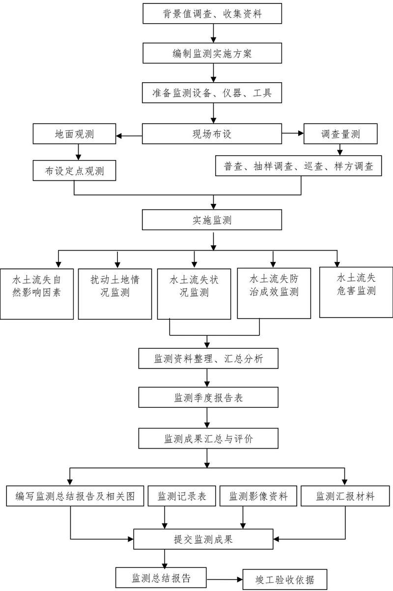  
图6.4-1 水土保持监测流程图

## 6.4.3 监测成果

监测成果应包括水土保持监测实施方案、监测报告、图件、数据表（册）、影像资料等。其中监测报告包括季度报告表、专项报告和总结报告；数据表（册）包括原始记录表和汇总分析表。

1）监测实施方案：在施工准备期之前进行现场查勘和调查，编制水土保持监测实施方案。

2）监测报告：包括季度报告表、专项报告和总结报告，监测期间应编制季度报告表、发生严重水土流失灾害事件时，应于发生事件一周后完成专项报告，监测工作完成后，编制监测总结报告。在监测季报和总结报告等监测成果中提出“绿、黄、红”三色评价结论，验证水土保持措施的合理性、科学性。

3）图件：包含项目区地理位置图、扰动地表分布图、监测分区与监测点分布图、土壤侵蚀强度图、水土保持措施分布图。

4）数据表（册）：包含原始记录表和汇总分析表。

5）影像资料：包含监测过程中拍摄的反映水土流失动态变化及治理措施实施的照片、录像等。

## 6.4.4 监测要求

1）在方案批复后，工程要开展水土保持监测，监测单位要及时对监测资料和监测成果进行统计、整理和分析，监测工作全部结束后，对监测结果做出综合评价与分析，编写完成本工程水土保持监测总结报告；

2）水土保持监测费用应专款专用，并接受当地水土保持监测机构的技术指导、技术培训。

3）编制监测实施方案，上报备案；

4）依据监测实施方案实施监测；

5）及时对监测资料整理，每季度对监测结果进行统计与分析，编写季度监测报告表，监测单位应当在每季度第1个月向主管部门及项目涉及的流域管理机构报送上一季度的监测季报。

6）上报制度：监测实施方案、监测成果及时上报水行政主管部门备案、存档。

7）监测成果应采用纸质和电子版形式保存，做好数据备份。

8）本项目若在生产建设期间出现了严重的水土流失事件，应随时向生产建设单位汇报。

9）建立施工过程中水土保持监测的影像、遥感、照片等档案资料；发生水土流失危害事件的，应现场通知建设单位，并展开监测，填写记录表，在监测季报和总结报告等监测成果中提出“绿、黄、红”三色评价结论，验证水土保持措施的合理性、科学性，水土保持设施竣工验收时提交水土保持监测报告。

## 6.4.5 监测制度

1）待该项工程水土保持方案得到批复后，监测单位要根据本报告书和《生产建设项目水土保持监测规程（试行）》编制监测实施方案，报送水行政主管部门及监测机构认可备案。

2）监测单位的监测人员依据水土保持监测实施方案实施监测。每次监测前，需对监测仪器、设备进行检验，合格后方可投入使用。监测人员要接受当地水土保持监测机构的技术指导、技术培训，并定期向当地水行政主管部门报告监测成果。

3）监测费用应专款专用，不得挪用。

4）监测单位要及时对监测资料和监测成果进行统计、整理和分析，并做出评价。若发现异常情况，应立即通知业主与当地水土保持行政主管部门。

5）监测工作全部结束后，要对监测结果做出综合评价与分析，编写该项工程水土保持监测总结报告。建设单位将监测单位编制的监测施行方案、监测总结报告，及时报送当地水土保持行政主管部门及相关的监测机构存档、备案。

6）监测单位自觉接受当地水行政主管部门的监督检查。

## 7 水土保持投资估算及效益分析

## 7.1 投资估算

## 7.1.1 编制原则及依据

## 7.1.1.1 编制原则

1）本方案水土保持投资估算作为主体工程投资估算的组成部分，列入主体投资中。

2）本方案水土保持投资估算编制的项目划分、费用构成、编制方法、估算表格形式等依据《水利工程设计概（估）算编制规定水土保持工程》编制。

3）水土保持投资估算的价格水平与主体工程价格水平保持一致，即工程单价中的主要材料价格、施工水电单价等与主体工程一致。

4）工程项目单价采用与主体工程相配套的定额标准编制，主体工程定额中没有的工程项目，采用《水土保持工程概算定额》的定额、取费项目及费率。

5）措施材料和苗木单价依据当地价格水平确定。

6）工程投资估算价格水平年为 2025年第四季度。

## 7.1.1.2 编制依据

1）《林海～平安第二回 500 千伏线路工程可行性研究报告》中投资估算及财务评价部分。

2）《电网工程建设预算编制与计算规定》（2018年版）。

3）《电力建设工程概算定额》（2018年版）。

4）《电力建设工程定额和费用计算规定》（2018年版）。

5）《水利部关于发布〈水利工程设计概（估）算编制规定〉及水利工程系列定额的通知》（水利部 水总〔2024〕323 号文）。

6）《电力工程造价与定额管理总站关于发布2018版电力建设工程概预算定额2025年度价格水平调整的通知》（电力工程造价与定额管理总站文件 定额〔2026〕1号）。

7）《输变电工程环保水保监测与验收费用计列指导意见（试行）》（国家电网有限公司电力建设定额站标准GDFY-2025-03）。

8）《财政部关于水土保持补偿费等四项非税收入划转税务部门征收的通知》（财税〔2020〕58 号）。

9）《黑龙江省物价监督管理局黑龙江省财政厅关于转发《国家发展改革委财政部关于降低电信网码号资源占用费等部分行政事业性收费标准的通知》的通知》（黑价联

〔2017〕23 号）。

10）《吉林省财政厅吉林省发展和改革委员会吉林省财政厅国家税务总局吉林省税务局中国人民银行长春中心支行关于印发<吉林省水土保持补偿费征收使用管理办法>的通知》（吉财税〔2022〕952号）。

11）《吉林省发改委吉林省财政厅吉林省水利厅关于核定吉林省水土保持补偿费收费标准及有关问题的通知》（吉发改收费联〔2022〕670号）。

12）《吉林省水利厅关于进一步做好全省水土保持补偿费征收使用有关工作的通知》（吉水保函〔2023〕1 号）。

## 7.1.2 编制说明与估算成果

## 7.1.2.1 费用构成

根据《生产建设项目水土保持方案技术标准》（GB50433-2018）和《水土保持工程概（估）算编制规定》，水土保持工程投资由工程措施费、植物措施费、监测措施费、施工临时工程费、独立费用、预备费、水土保持补偿费构成，见表7.1-1。

表 7.1-1 水土保持工程投资费用构成表
<table><tr><td rowspan=9 colspan=1>费用构成</td><td rowspan=2 colspan=1>1</td><td rowspan=2 colspan=1>工程措施费</td><td rowspan=1 colspan=1>主体已有</td><td rowspan=1 colspan=1>按主体工程投资</td></tr><tr><td rowspan=1 colspan=1>方案新增</td><td rowspan=1 colspan=1>直接费、间接费、利润、材料补差、税金</td></tr><tr><td rowspan=2 colspan=1>2</td><td rowspan=2 colspan=1>植物措施费</td><td rowspan=1 colspan=1>主体已有</td><td rowspan=1 colspan=1>按主体工程投资</td></tr><tr><td rowspan=1 colspan=1>方案新增</td><td rowspan=1 colspan=1>直接费、间接费、利润、材料补差、税金</td></tr><tr><td rowspan=1 colspan=1>3</td><td rowspan=1 colspan=1>监测措施费</td><td rowspan=1 colspan=1>方案新增</td><td rowspan=1 colspan=1>设备费、观测费</td></tr><tr><td rowspan=1 colspan=1>4</td><td rowspan=1 colspan=2>施工临时工程费</td><td rowspan=1 colspan=1>临时防护工程费、其他临时工程费、施工安全生产专项</td></tr><tr><td rowspan=1 colspan=1>5</td><td rowspan=1 colspan=2>独立费用</td><td rowspan=1 colspan=1>建设管理费、工程建设监理费、科研勘测设计费</td></tr><tr><td rowspan=1 colspan=1>6</td><td rowspan=1 colspan=3>预备费</td></tr><tr><td rowspan=1 colspan=1>7</td><td rowspan=1 colspan=3>水土保持补偿费</td></tr></table>

## 7.1.2.2 估算编制方法说明

## a）基础单价编制

## 1）人工预算单价

本方案新增水土保持措施人工预算单价根据《水利工程设计概估算编制规定》计算，工程项目跨不同地区类别的人工单价按工程规模综合分析确定。详见表7.1-2。

表 7.1-2 水土保持工程人工预算单价表
<table><tr><td rowspan=2 colspan=1>序号</td><td rowspan=2 colspan=1>项目</td><td rowspan=2 colspan=1>地区类别</td><td rowspan=1 colspan=2>黑龙江</td><td rowspan=1 colspan=1>吉林</td></tr><tr><td rowspan=1 colspan=1>宁安市</td><td rowspan=1 colspan=1>西安区</td><td rowspan=1 colspan=1>敦化市</td></tr><tr><td rowspan=3 colspan=1>1</td><td rowspan=3 colspan=1>基准人工工日单价定额（元/工时）</td><td rowspan=1 colspan=1>一般地区</td><td rowspan=1 colspan=1></td><td rowspan=1 colspan=1>6.38</td><td rowspan=1 colspan=1></td></tr><tr><td rowspan=1 colspan=1>一类地区</td><td rowspan=1 colspan=1>6.57</td><td rowspan=1 colspan=1></td><td rowspan=1 colspan=1></td></tr><tr><td rowspan=1 colspan=1>二类地区</td><td rowspan=1 colspan=1></td><td rowspan=1 colspan=1></td><td rowspan=1 colspan=1>6.75</td></tr><tr><td rowspan=1 colspan=1>2</td><td rowspan=1 colspan=1>综合分析取值（元/工时）</td><td rowspan=1 colspan=1></td><td rowspan=1 colspan=2>6.56（按面积占比加权，宁安市面积占比 92.65%，西安区面积占地 7.35%）</td><td rowspan=1 colspan=1>6.75</td></tr></table>

## 2）材料预算价格

①材料预算价格：材料预算价格由材料原价、包装费、运杂费、采购及保管费五项组成。材料价格以当地市场价格为准，运杂费根据运距取值，采购及保管费率视实际情况而定。

②苗木草种价格：苗木、草种的预算价格按当地市场价格加运杂费和采购及保管费计算，运杂费根据运距取值，采购及保管费率按运到工地价的1.0%计算。

③材料基价：当计算的材料除税预算价格超过规定的限制价格（材料基价）时，应按基价计入工程单价参加取费，超过部分以材料补差形式计算，列人单价表并计取税金。主要材料基价为：柴油 3020元/t、乔木15元/株、灌木5 元/株、种子60 元/kg。

④施工用水用电价格：与主体工程一致。

本项目主要材料预算表见表7.1-3。

表7.1-3 主要材料预算价格表
<table><tr><td rowspan=1 colspan=1>序号</td><td rowspan=1 colspan=1>名称及规格</td><td rowspan=1 colspan=1>单位</td><td rowspan=1 colspan=1>黑龙江单价（元）</td><td rowspan=1 colspan=1>吉林单价(元)</td><td rowspan=1 colspan=1>备注</td></tr><tr><td rowspan=1 colspan=1>1</td><td rowspan=1 colspan=1>水</td><td rowspan=1 colspan=1> $\mathrm { m } ^ { 3 }$ </td><td rowspan=1 colspan=1>4.9</td><td rowspan=1 colspan=1>4.5</td><td rowspan=1 colspan=1>主体</td></tr><tr><td rowspan=1 colspan=1>2</td><td rowspan=1 colspan=1>电</td><td rowspan=1 colspan=1>kWh</td><td rowspan=1 colspan=1>0.84</td><td rowspan=1 colspan=1>0.825</td><td rowspan=1 colspan=1>主体</td></tr><tr><td rowspan=1 colspan=1>3</td><td rowspan=1 colspan=1>柴油</td><td rowspan=1 colspan=1>kg</td><td rowspan=1 colspan=1>8.73</td><td rowspan=1 colspan=1>8.83</td><td rowspan=1 colspan=1>主体</td></tr><tr><td rowspan=1 colspan=1>4</td><td rowspan=1 colspan=1>汽油</td><td rowspan=1 colspan=1>kg</td><td rowspan=1 colspan=1>10.03</td><td rowspan=1 colspan=1>10.04</td><td rowspan=1 colspan=1>主体</td></tr><tr><td rowspan=1 colspan=1>5</td><td rowspan=1 colspan=1>农家土杂肥</td><td rowspan=1 colspan=1> $\mathrm { m } ^ { 3 }$ </td><td rowspan=1 colspan=1>120</td><td rowspan=1 colspan=1>110</td><td rowspan=1 colspan=1>含运杂费、采购及保管费</td></tr><tr><td rowspan=1 colspan=1>6</td><td rowspan=1 colspan=1>密目网</td><td rowspan=1 colspan=1> $\mathrm { m } ^ { 2 }$ </td><td rowspan=1 colspan=1>2.60</td><td rowspan=1 colspan=1>2.30</td><td rowspan=1 colspan=1>含运杂费、采购及保管费</td></tr><tr><td rowspan=1 colspan=1>7</td><td rowspan=1 colspan=1>彩条布</td><td rowspan=1 colspan=1> $\mathrm { m } ^ { 2 }$ </td><td rowspan=1 colspan=1>2.00</td><td rowspan=1 colspan=1>1.90</td><td rowspan=1 colspan=1>含运杂费、采购及保管费</td></tr><tr><td rowspan=1 colspan=1>8</td><td rowspan=1 colspan=1>彩条旗</td><td rowspan=1 colspan=1>m</td><td rowspan=1 colspan=1>0.50</td><td rowspan=1 colspan=1>0.50</td><td rowspan=1 colspan=1>含运杂费、采购及保管费</td></tr><tr><td rowspan=1 colspan=1>9</td><td rowspan=1 colspan=1>编织袋</td><td rowspan=1 colspan=1>个</td><td rowspan=1 colspan=1>1.25</td><td rowspan=1 colspan=1>1.20</td><td rowspan=1 colspan=1>含运杂费、采购及保管费</td></tr><tr><td rowspan=1 colspan=1>10</td><td rowspan=1 colspan=1>原木</td><td rowspan=1 colspan=1> $\mathrm { m } ^ { 3 }$ </td><td rowspan=1 colspan=1>150.00</td><td rowspan=1 colspan=1>150.00</td><td rowspan=1 colspan=1>含运杂费、采购及保管费</td></tr><tr><td rowspan=1 colspan=1>11</td><td rowspan=1 colspan=1>铅丝 8~12#</td><td rowspan=1 colspan=1>kg</td><td rowspan=1 colspan=1>21.90</td><td rowspan=1 colspan=1>21.90</td><td rowspan=1 colspan=1>含运杂费、采购及保管费</td></tr><tr><td rowspan=1 colspan=1>12</td><td rowspan=1 colspan=1>草籽(高羊茅、冰草、早熟禾)</td><td rowspan=1 colspan=1>kg</td><td rowspan=1 colspan=1>86.00</td><td rowspan=1 colspan=1>85.00</td><td rowspan=1 colspan=1>含运杂费、采购及保管费</td></tr><tr><td rowspan=1 colspan=1>13</td><td rowspan=1 colspan=1>苗木费（紫穗槐、胡枝子，灌丛高 60cm）</td><td rowspan=1 colspan=1>株</td><td rowspan=1 colspan=1>15.00</td><td rowspan=1 colspan=1>14.00</td><td rowspan=1 colspan=1>含运杂费、采购及保管费</td></tr><tr><td rowspan=1 colspan=1>14</td><td rowspan=1 colspan=1>苗木费（水曲柳，胸径4cm）</td><td rowspan=1 colspan=1>株</td><td rowspan=1 colspan=1>40.00</td><td rowspan=1 colspan=1></td><td rowspan=1 colspan=1>含运杂费、采购及保管费</td></tr><tr><td rowspan=1 colspan=1>15</td><td rowspan=1 colspan=1>苗木费（落叶松，胸径4cm）</td><td rowspan=1 colspan=1>株</td><td rowspan=1 colspan=1></td><td rowspan=1 colspan=1>35.00</td><td rowspan=1 colspan=1>含运杂费、采购及保管费</td></tr></table>

## 3）施工机械台时费

施工机械使用费依据《水利工程施工机械台时费定额》及有关规定计算。

## b）工程单价编制

工程措施和植物措施单价由直接费、间接费、利润、材料补差和税金组成。

## 1）直接费

直接费包括基本直接费和其它直接费。基本直接费指人工费、材料费和机械使用费。其他直接费指冬雨季施工增加费、夜间施工增加费、临时设施费和其他。

人工费=定额劳动量（工日）×人工预算单价（元/工日）

材料费=定额材料用量×材料预算单价

机械使用费=定额机械使用量（台时）×施工机械台时费（元/台时）

其他直接费=基本直接费×其他直接费费率

2）间接费：间接费＝直接费×间接费率

3）利润：利润=（直接费+间接费）×利润率

4）材料补差：材料补差=（材料预算价格-材料基价）×材料消耗量

5）税金：税金=（直接费+间接费+利润+材料补差）×税率

6）本方案编制阶段为可研设计阶段，单价乘以 10%的扩大系数。

本方案措施费率取值详见表7.1-4。

表7.1-4 措施费率表
<table><tr><td rowspan=2 colspan=1>序号</td><td rowspan=2 colspan=1>费用名称</td><td rowspan=2 colspan=1>单位</td><td rowspan=1 colspan=3>费率</td><td rowspan=2 colspan=1>计算基础</td></tr><tr><td rowspan=1 colspan=1>工程措施(除土地整治工程)临时措施</td><td rowspan=1 colspan=1>工程措施(土地整治工程)</td><td rowspan=1 colspan=1>植物措施</td></tr><tr><td rowspan=1 colspan=1>一</td><td rowspan=1 colspan=1>直接费</td><td rowspan=1 colspan=1></td><td rowspan=1 colspan=1></td><td rowspan=1 colspan=1></td><td rowspan=1 colspan=1></td><td rowspan=1 colspan=1></td></tr><tr><td rowspan=1 colspan=1>1</td><td rowspan=1 colspan=1>基本直接费</td><td rowspan=1 colspan=1></td><td rowspan=1 colspan=1></td><td rowspan=1 colspan=1></td><td rowspan=1 colspan=1></td><td rowspan=1 colspan=1></td></tr><tr><td rowspan=1 colspan=1>1.1</td><td rowspan=1 colspan=1>人工费</td><td rowspan=1 colspan=1></td><td rowspan=1 colspan=1></td><td rowspan=1 colspan=1></td><td rowspan=1 colspan=1></td><td rowspan=1 colspan=1>人工预算单价</td></tr><tr><td rowspan=1 colspan=1>1.2</td><td rowspan=1 colspan=1>材料费</td><td rowspan=1 colspan=1></td><td rowspan=1 colspan=1></td><td rowspan=1 colspan=1></td><td rowspan=1 colspan=1></td><td rowspan=1 colspan=1>材料预算单价</td></tr><tr><td rowspan=1 colspan=1>1.3</td><td rowspan=1 colspan=1>施工机械使用费</td><td rowspan=1 colspan=1></td><td rowspan=1 colspan=1></td><td rowspan=1 colspan=1></td><td rowspan=1 colspan=1></td><td rowspan=1 colspan=1>施工机械台时费</td></tr><tr><td rowspan=1 colspan=1>2</td><td rowspan=1 colspan=1>其他直接费</td><td rowspan=1 colspan=1>%</td><td rowspan=1 colspan=1>5.3</td><td rowspan=1 colspan=1>3.0</td><td rowspan=1 colspan=1>3.0</td><td rowspan=1 colspan=1>基本直接费</td></tr><tr><td rowspan=1 colspan=1>2.1</td><td rowspan=1 colspan=1>冬雨季施工增加费</td><td rowspan=1 colspan=1>%</td><td rowspan=1 colspan=1>2.5</td><td rowspan=1 colspan=1>1.5</td><td rowspan=1 colspan=1>1.5</td><td rowspan=1 colspan=1></td></tr><tr><td rowspan=1 colspan=1>2.2</td><td rowspan=1 colspan=1>夜间施工增加费</td><td rowspan=1 colspan=1>%</td><td rowspan=1 colspan=1>0.3</td><td rowspan=1 colspan=1>0</td><td rowspan=1 colspan=1>0</td><td rowspan=1 colspan=1></td></tr><tr><td rowspan=1 colspan=1>2.3</td><td rowspan=1 colspan=1>临时设施费</td><td rowspan=1 colspan=1>%</td><td rowspan=1 colspan=1>2.0</td><td rowspan=1 colspan=1>1.0</td><td rowspan=1 colspan=1>1.0</td><td rowspan=1 colspan=1></td></tr><tr><td rowspan=1 colspan=1>2.4</td><td rowspan=1 colspan=1>其他</td><td rowspan=1 colspan=1>%</td><td rowspan=1 colspan=1>0.5</td><td rowspan=1 colspan=1>0.5</td><td rowspan=1 colspan=1>0.5</td><td rowspan=1 colspan=1></td></tr><tr><td rowspan=1 colspan=1>二</td><td rowspan=1 colspan=1>间接费</td><td rowspan=1 colspan=1>%</td><td rowspan=1 colspan=1>5</td><td rowspan=1 colspan=1>5</td><td rowspan=1 colspan=1>6</td><td rowspan=1 colspan=1>直接费</td></tr><tr><td rowspan=1 colspan=1>三</td><td rowspan=1 colspan=1>利润</td><td rowspan=1 colspan=1>%</td><td rowspan=1 colspan=1>7</td><td rowspan=1 colspan=1>7</td><td rowspan=1 colspan=1>7</td><td rowspan=1 colspan=1>直接费+间接费</td></tr><tr><td rowspan=1 colspan=1>四</td><td rowspan=1 colspan=1>材料补差</td><td rowspan=1 colspan=1></td><td rowspan=1 colspan=1></td><td rowspan=1 colspan=1></td><td rowspan=1 colspan=1></td><td rowspan=1 colspan=1></td></tr><tr><td rowspan=1 colspan=1>五</td><td rowspan=1 colspan=1>税金</td><td rowspan=1 colspan=1>%</td><td rowspan=1 colspan=1>9</td><td rowspan=1 colspan=1>9</td><td rowspan=1 colspan=1>9</td><td rowspan=1 colspan=1>直接费+间接费+利润+材料补差</td></tr><tr><td rowspan=1 colspan=1>六</td><td rowspan=1 colspan=1>投资估算扩大</td><td rowspan=1 colspan=1>%</td><td rowspan=1 colspan=1>10</td><td rowspan=1 colspan=1>10</td><td rowspan=1 colspan=1>10</td><td rowspan=1 colspan=1>直接费+间接费+利润+税金+材料补差+税金</td></tr></table>

## c）水土保持工程估算编制

1）工程措施

工程措施估算按设计工程量乘以工程单价进行编制。

2）植物措施

植物措施估算按设计工程量乘以工程单价进行编制。

## 3）监测措施

根据《输变电工程环保水保监测与验收费用计列指导意见（试行）》（国家电网有限公司电力建设定额站标准GDFY-2025-03）计取费用。

## 4）临时工程费

临时防护工程按设计工程量乘以单价编制，其他临时工程按第一至第三部分投资之和的 2.0%计取，施工安全生产专项按第一至第四部分建安工作量（不含设备购置费）之和的2.5%计取。

## 5）独立费用

①建设管理费：包括项目管理费（含水土保持竣工验收费）和技术咨询费。项目经常费按方案投资第一至第四部分之和的 2.0%计算；水土保持设施验收费根据《输变电工程环保水保监测与验收费用计列指导意见（试行）》（GDFY-2025-03）计列。技术咨询费按方案投资第一至第四部分之和的 1.0%计算。

②工程建设监理费根据国家电网《750kV及以下输变电工程环境保护与水土保持监理、监测、验收费用计列指导意见》计列。

③科研勘测设计费：包括工程勘测设计费及水土保持方案编制。工程勘测设计费参照《国家计委、建设部关于发布<工程勘察设计收费管理规定>的通知》（计价格〔2002〕10号）计算。水土保持方案编制费按合同计列。

## 6）预备费

本项目预备费仅为基本预备费，按方案投资第一至第五部分之和的10.0%计算。

## 7）水土保持补偿费

根据黑龙江省物价监督管理局黑龙江省财政厅关于转发《国家发展改革委财政部关于降低电信网码号资源占用费等部分行政事业性收费标准的通知》的通知》（黑价联〔2017〕23号）、《吉林省发改委吉林省财政厅吉林省水利厅关于核定吉林省水土保持补偿费收费标准及有关问题的通知》（吉发改收费联〔2022〕670 号），工程沿线水土保持补偿费标准为：黑龙江省按1.20元/m2（不足 $1 \mathrm m ^ { 2 }$ 按 $1 \mathrm m ^ { 2 }$ 计列），吉林省按0.45 元/m2（不足 1m2按 1m2计列）。

## 7.1.3 估算成果

## 7.1.3.1 投资估算汇总

本项目建设期水土保持总投资2224.00 万元，水土保持投资中工程措施投资265.74

万元，植物措施投资540.12 万元，监测措施费 68.44 万元，临时措施投资804.99万元，独立费用290.52 万元（其中水土保持监理费41.08 万元），预备费159.29 万元，水土保持补偿费94.90万元。本项目水土保持投资估算总表见表7.1-5。

表 7.1-5 本项目水土保持投资估算总表 单位：万元
<table><tr><td colspan="1" rowspan="1">序号</td><td colspan="1" rowspan="1">工程或费用名称</td><td colspan="1" rowspan="1">建筑安装工程费</td><td colspan="1" rowspan="1">设备购置费</td><td colspan="1" rowspan="1">独立费用</td><td colspan="1" rowspan="1">合计</td></tr><tr><td colspan="1" rowspan="1"></td><td colspan="1" rowspan="1">第一部分 工程措施</td><td colspan="1" rowspan="1">265.74</td><td colspan="1" rowspan="1"></td><td colspan="1" rowspan="1"></td><td colspan="1" rowspan="1">265.74</td></tr><tr><td colspan="1" rowspan="1">一</td><td colspan="1" rowspan="1">输电线路区</td><td colspan="1" rowspan="1">252.78</td><td colspan="1" rowspan="1"></td><td colspan="1" rowspan="1"></td><td colspan="1" rowspan="1">252.78</td></tr><tr><td colspan="1" rowspan="1">(一)</td><td colspan="1" rowspan="1">塔基及塔基施工区</td><td colspan="1" rowspan="1">169.14</td><td colspan="1" rowspan="1"></td><td colspan="1" rowspan="1"></td><td colspan="1" rowspan="1">169.14</td></tr><tr><td colspan="1" rowspan="1"></td><td colspan="1" rowspan="1">挡渣工程</td><td colspan="1" rowspan="1">24.20</td><td colspan="1" rowspan="1"></td><td colspan="1" rowspan="1"></td><td colspan="1" rowspan="1">24.20</td></tr><tr><td colspan="1" rowspan="1"></td><td colspan="1" rowspan="1">边坡防护工程</td><td colspan="1" rowspan="1">8.11</td><td colspan="1" rowspan="1"></td><td colspan="1" rowspan="1"></td><td colspan="1" rowspan="1">8.11</td></tr><tr><td colspan="1" rowspan="1"></td><td colspan="1" rowspan="1">防洪排导工程</td><td colspan="1" rowspan="1">7.14</td><td colspan="1" rowspan="1"></td><td colspan="1" rowspan="1"></td><td colspan="1" rowspan="1">7.14</td></tr><tr><td colspan="1" rowspan="1"></td><td colspan="1" rowspan="1">表土保护工程</td><td colspan="1" rowspan="1">85.85</td><td colspan="1" rowspan="1"></td><td colspan="1" rowspan="1"></td><td colspan="1" rowspan="1">85.85</td></tr><tr><td colspan="1" rowspan="1"></td><td colspan="1" rowspan="1">土地整治工程</td><td colspan="1" rowspan="1">43.84</td><td colspan="1" rowspan="1"></td><td colspan="1" rowspan="1"></td><td colspan="1" rowspan="1">43.84</td></tr><tr><td colspan="1" rowspan="1">(二）</td><td colspan="1" rowspan="1">牵张场地区</td><td colspan="1" rowspan="1">5.79</td><td colspan="1" rowspan="1"></td><td colspan="1" rowspan="1"></td><td colspan="1" rowspan="1">5.79</td></tr><tr><td colspan="1" rowspan="1"></td><td colspan="1" rowspan="1">土地整治工程</td><td colspan="1" rowspan="1">5.79</td><td colspan="1" rowspan="1"></td><td colspan="1" rowspan="1"></td><td colspan="1" rowspan="1">5.79</td></tr><tr><td colspan="1" rowspan="1">（三）</td><td colspan="1" rowspan="1">跨越施工场地区</td><td colspan="1" rowspan="1">3.45</td><td colspan="1" rowspan="1"></td><td colspan="1" rowspan="1"></td><td colspan="1" rowspan="1">3.45</td></tr><tr><td colspan="1" rowspan="1"></td><td colspan="1" rowspan="1">土地整治工程</td><td colspan="1" rowspan="1">3.45</td><td colspan="1" rowspan="1"></td><td colspan="1" rowspan="1"></td><td colspan="1" rowspan="1">3.45</td></tr><tr><td colspan="1" rowspan="1">（四）</td><td colspan="1" rowspan="1">施工道路区</td><td colspan="1" rowspan="1">74.40</td><td colspan="1" rowspan="1"></td><td colspan="1" rowspan="1"></td><td colspan="1" rowspan="1">74.40</td></tr><tr><td colspan="1" rowspan="1"></td><td colspan="1" rowspan="1">表土保护工程</td><td colspan="1" rowspan="1">43.35</td><td colspan="1" rowspan="1"></td><td colspan="1" rowspan="1"></td><td colspan="1" rowspan="1">43.35</td></tr><tr><td colspan="1" rowspan="1"></td><td colspan="1" rowspan="1">土地整治工程</td><td colspan="1" rowspan="1">31.05</td><td colspan="1" rowspan="1"></td><td colspan="1" rowspan="1"></td><td colspan="1" rowspan="1">31.05</td></tr><tr><td colspan="1" rowspan="1">二</td><td colspan="1" rowspan="1">林海变电站区</td><td colspan="1" rowspan="1">7.72</td><td colspan="1" rowspan="1"></td><td colspan="1" rowspan="1"></td><td colspan="1" rowspan="1">7.72</td></tr><tr><td colspan="1" rowspan="1">(一)</td><td colspan="1" rowspan="1">站区扩建区</td><td colspan="1" rowspan="1">0.94</td><td colspan="1" rowspan="1"></td><td colspan="1" rowspan="1"></td><td colspan="1" rowspan="1">0.94</td></tr><tr><td colspan="1" rowspan="1"></td><td colspan="1" rowspan="1">表土保护工程</td><td colspan="1" rowspan="1">0.83</td><td colspan="1" rowspan="1"></td><td colspan="1" rowspan="1"></td><td colspan="1" rowspan="1">0.83</td></tr><tr><td colspan="1" rowspan="1"></td><td colspan="1" rowspan="1">土地整治工程</td><td colspan="1" rowspan="1">0.11</td><td colspan="1" rowspan="1"></td><td colspan="1" rowspan="1"></td><td colspan="1" rowspan="1">0.11</td></tr><tr><td colspan="1" rowspan="1">(二)</td><td colspan="1" rowspan="1">施工生产生活区</td><td colspan="1" rowspan="1">3.10</td><td colspan="1" rowspan="1"></td><td colspan="1" rowspan="1"></td><td colspan="1" rowspan="1">3.10</td></tr><tr><td colspan="1" rowspan="1"></td><td colspan="1" rowspan="1">表土保护工程</td><td colspan="1" rowspan="1">2.82</td><td colspan="1" rowspan="1"></td><td colspan="1" rowspan="1"></td><td colspan="1" rowspan="1">2.82</td></tr><tr><td colspan="1" rowspan="1"></td><td colspan="1" rowspan="1">土地整治工程</td><td colspan="1" rowspan="1">0.28</td><td colspan="1" rowspan="1"></td><td colspan="1" rowspan="1"></td><td colspan="1" rowspan="1">0.28</td></tr><tr><td colspan="1" rowspan="1">（三）</td><td colspan="1" rowspan="1">施工道路区</td><td colspan="1" rowspan="1">0.10</td><td colspan="1" rowspan="1"></td><td colspan="1" rowspan="1"></td><td colspan="1" rowspan="1">0.10</td></tr><tr><td colspan="1" rowspan="1"></td><td colspan="1" rowspan="1">土地整治工程</td><td colspan="1" rowspan="1">0.10</td><td colspan="1" rowspan="1"></td><td colspan="1" rowspan="1"></td><td colspan="1" rowspan="1">0.10</td></tr><tr><td colspan="1" rowspan="1">（四）</td><td colspan="1" rowspan="1">站内余土平整利用区</td><td colspan="1" rowspan="1">3.58</td><td colspan="1" rowspan="1"></td><td colspan="1" rowspan="1"></td><td colspan="1" rowspan="1">3.58</td></tr><tr><td colspan="1" rowspan="1"></td><td colspan="1" rowspan="1">表土保护工程</td><td colspan="1" rowspan="1">2.92</td><td colspan="1" rowspan="1"></td><td colspan="1" rowspan="1"></td><td colspan="1" rowspan="1">2.92</td></tr><tr><td colspan="1" rowspan="1"></td><td colspan="1" rowspan="1">土地整治工程</td><td colspan="1" rowspan="1">0.66</td><td colspan="1" rowspan="1"></td><td colspan="1" rowspan="1"></td><td colspan="1" rowspan="1">0.66</td></tr><tr><td colspan="1" rowspan="1">三</td><td colspan="1" rowspan="1">平安变电站区</td><td colspan="1" rowspan="1">5.24</td><td colspan="1" rowspan="1"></td><td colspan="1" rowspan="1"></td><td colspan="1" rowspan="1">5.24</td></tr><tr><td colspan="1" rowspan="1">(一)</td><td colspan="1" rowspan="1">站区扩建区</td><td colspan="1" rowspan="1">0.64</td><td colspan="1" rowspan="1"></td><td colspan="1" rowspan="1"></td><td colspan="1" rowspan="1">0.64</td></tr><tr><td colspan="1" rowspan="1"></td><td colspan="1" rowspan="1">表土保护工程</td><td colspan="1" rowspan="1">0.52</td><td colspan="1" rowspan="1"></td><td colspan="1" rowspan="1"></td><td colspan="1" rowspan="1">0.52</td></tr><tr><td colspan="1" rowspan="1"></td><td colspan="1" rowspan="1">土地整治工程</td><td colspan="1" rowspan="1">0.12</td><td colspan="1" rowspan="1"></td><td colspan="1" rowspan="1"></td><td colspan="1" rowspan="1">0.12</td></tr><tr><td colspan="1" rowspan="1">（二）</td><td colspan="1" rowspan="1">施工生产生活区</td><td colspan="1" rowspan="1">3.08</td><td colspan="1" rowspan="1"></td><td colspan="1" rowspan="1"></td><td colspan="1" rowspan="1">3.08</td></tr><tr><td colspan="1" rowspan="1"></td><td colspan="1" rowspan="1">表土保护工程</td><td colspan="1" rowspan="1">2.82</td><td colspan="1" rowspan="1"></td><td colspan="1" rowspan="1"></td><td colspan="1" rowspan="1">2.82</td></tr><tr><td colspan="1" rowspan="1"></td><td colspan="1" rowspan="1">土地整治工程</td><td colspan="1" rowspan="1">0.26</td><td colspan="1" rowspan="1"></td><td colspan="1" rowspan="1"></td><td colspan="1" rowspan="1">0.26</td></tr><tr><td colspan="1" rowspan="1">（三）</td><td colspan="1" rowspan="1">站内余土平整利用区</td><td colspan="1" rowspan="1">1.52</td><td colspan="1" rowspan="1"></td><td colspan="1" rowspan="1"></td><td colspan="1" rowspan="1">1.52</td></tr><tr><td colspan="1" rowspan="1"></td><td colspan="1" rowspan="1">表土保护工程</td><td colspan="1" rowspan="1">1.26</td><td colspan="1" rowspan="1"></td><td colspan="1" rowspan="1"></td><td colspan="1" rowspan="1">1.26</td></tr><tr><td colspan="1" rowspan="1"></td><td colspan="1" rowspan="1">土地整治工程</td><td colspan="1" rowspan="1">0.26</td><td colspan="1" rowspan="1"></td><td colspan="1" rowspan="1"></td><td colspan="1" rowspan="1">0.26</td></tr><tr><td colspan="1" rowspan="1"></td><td colspan="1" rowspan="1">第二部分 植物措施</td><td colspan="1" rowspan="1">540.12</td><td colspan="1" rowspan="1"></td><td colspan="1" rowspan="1"></td><td colspan="1" rowspan="1">540.12</td></tr><tr><td colspan="1" rowspan="1">一</td><td colspan="1" rowspan="1">输电线路区</td><td colspan="1" rowspan="1">533.72</td><td colspan="1" rowspan="1"></td><td colspan="1" rowspan="1"></td><td colspan="1" rowspan="1">533.72</td></tr><tr><td colspan="1" rowspan="1">(一)</td><td colspan="1" rowspan="1">塔基及塔基施工区</td><td colspan="1" rowspan="1">296.69</td><td colspan="1" rowspan="1"></td><td colspan="1" rowspan="1"></td><td colspan="1" rowspan="1">296.69</td></tr><tr><td colspan="1" rowspan="1"></td><td colspan="1" rowspan="1">植被恢复与建设工程</td><td colspan="1" rowspan="1">292.01</td><td colspan="1" rowspan="1"></td><td colspan="1" rowspan="1"></td><td colspan="1" rowspan="1">292.01</td></tr><tr><td colspan="1" rowspan="1"></td><td colspan="1" rowspan="1">抚育工程</td><td colspan="1" rowspan="1">4.68</td><td colspan="1" rowspan="1"></td><td colspan="1" rowspan="1"></td><td colspan="1" rowspan="1">4.68</td></tr><tr><td colspan="1" rowspan="1">（二）</td><td colspan="1" rowspan="1">牵张场地区</td><td colspan="1" rowspan="1">56.95</td><td colspan="1" rowspan="1"></td><td colspan="1" rowspan="1"></td><td colspan="1" rowspan="1">56.95</td></tr><tr><td colspan="1" rowspan="1"></td><td colspan="1" rowspan="1">植被恢复与建设工程</td><td colspan="1" rowspan="1">56.05</td><td colspan="1" rowspan="1"></td><td colspan="1" rowspan="1"></td><td colspan="1" rowspan="1">56.05</td></tr><tr><td colspan="1" rowspan="1"></td><td colspan="1" rowspan="1">抚育工程</td><td colspan="1" rowspan="1">0.90</td><td colspan="1" rowspan="1"></td><td colspan="1" rowspan="1"></td><td colspan="1" rowspan="1">0.90</td></tr><tr><td colspan="1" rowspan="1">（三）</td><td colspan="1" rowspan="1">跨越施工场地区</td><td colspan="1" rowspan="1">12.04</td><td colspan="1" rowspan="1"></td><td colspan="1" rowspan="1"></td><td colspan="1" rowspan="1">12.04</td></tr><tr><td colspan="1" rowspan="1"></td><td colspan="1" rowspan="1">植被恢复与建设工程</td><td colspan="1" rowspan="1">11.84</td><td colspan="1" rowspan="1"></td><td colspan="1" rowspan="1"></td><td colspan="1" rowspan="1">11.84</td></tr><tr><td colspan="1" rowspan="1"></td><td colspan="1" rowspan="1">抚育工程</td><td colspan="1" rowspan="1">0.20</td><td colspan="1" rowspan="1"></td><td colspan="1" rowspan="1"></td><td colspan="1" rowspan="1">0.20</td></tr><tr><td colspan="1" rowspan="1">（四）</td><td colspan="1" rowspan="1">施工道路区</td><td colspan="1" rowspan="1">168.04</td><td colspan="1" rowspan="1"></td><td colspan="1" rowspan="1"></td><td colspan="1" rowspan="1">168.04</td></tr><tr><td colspan="1" rowspan="1"></td><td colspan="1" rowspan="1">植被恢复与建设工程</td><td colspan="1" rowspan="1">164.17</td><td colspan="1" rowspan="1"></td><td colspan="1" rowspan="1"></td><td colspan="1" rowspan="1">164.17</td></tr><tr><td colspan="1" rowspan="1"></td><td colspan="1" rowspan="1">抚育工程</td><td colspan="1" rowspan="1">3.87</td><td colspan="1" rowspan="1"></td><td colspan="1" rowspan="1"></td><td colspan="1" rowspan="1">3.87</td></tr><tr><td colspan="1" rowspan="1">二</td><td colspan="1" rowspan="1">林海变电站区</td><td colspan="1" rowspan="1">4.20</td><td colspan="1" rowspan="1"></td><td colspan="1" rowspan="1"></td><td colspan="1" rowspan="1">4.20</td></tr><tr><td colspan="1" rowspan="1">(一)</td><td colspan="1" rowspan="1">站区扩建区</td><td colspan="1" rowspan="1">0.60</td><td colspan="1" rowspan="1"></td><td colspan="1" rowspan="1"></td><td colspan="1" rowspan="1">0.60</td></tr><tr><td colspan="1" rowspan="1"></td><td colspan="1" rowspan="1">绿化工程</td><td colspan="1" rowspan="1">0.60</td><td colspan="1" rowspan="1"></td><td colspan="1" rowspan="1"></td><td colspan="1" rowspan="1">0.60</td></tr><tr><td colspan="1" rowspan="1">(二)</td><td colspan="1" rowspan="1">站内余土平整利用区</td><td colspan="1" rowspan="1">3.60</td><td colspan="1" rowspan="1"></td><td colspan="1" rowspan="1"></td><td colspan="1" rowspan="1">3.60</td></tr><tr><td colspan="1" rowspan="1"></td><td colspan="1" rowspan="1">绿化工程</td><td colspan="1" rowspan="1">3.60</td><td colspan="1" rowspan="1"></td><td colspan="1" rowspan="1"></td><td colspan="1" rowspan="1">3.60</td></tr><tr><td colspan="1" rowspan="1">三</td><td colspan="1" rowspan="1">平安变电站区</td><td colspan="1" rowspan="1">2.20</td><td colspan="1" rowspan="1"></td><td colspan="1" rowspan="1"></td><td colspan="1" rowspan="1">2.20</td></tr><tr><td colspan="1" rowspan="1">(一)</td><td colspan="1" rowspan="1">站区扩建区</td><td colspan="1" rowspan="1">0.70</td><td colspan="1" rowspan="1"></td><td colspan="1" rowspan="1"></td><td colspan="1" rowspan="1">0.70</td></tr><tr><td colspan="1" rowspan="1"></td><td colspan="1" rowspan="1">绿化工程</td><td colspan="1" rowspan="1">0.70</td><td colspan="1" rowspan="1"></td><td colspan="1" rowspan="1"></td><td colspan="1" rowspan="1">0.70</td></tr><tr><td colspan="1" rowspan="1">(二）</td><td colspan="1" rowspan="1">站内余土平整利用区</td><td colspan="1" rowspan="1">1.50</td><td colspan="1" rowspan="1"></td><td colspan="1" rowspan="1"></td><td colspan="1" rowspan="1">1.50</td></tr><tr><td colspan="1" rowspan="1"></td><td colspan="1" rowspan="1">绿化工程</td><td colspan="1" rowspan="1">1.50</td><td colspan="1" rowspan="1"></td><td colspan="1" rowspan="1"></td><td colspan="1" rowspan="1">1.50</td></tr><tr><td colspan="1" rowspan="1"></td><td colspan="1" rowspan="1">第三部分 监测措施</td><td colspan="1" rowspan="1">68.44</td><td colspan="1" rowspan="1"></td><td colspan="1" rowspan="1"></td><td colspan="1" rowspan="1">68.44</td></tr><tr><td colspan="1" rowspan="1">一</td><td colspan="1" rowspan="1">水土保持监测</td><td colspan="1" rowspan="1">41.07</td><td colspan="1" rowspan="1"></td><td colspan="1" rowspan="1"></td><td colspan="1" rowspan="1">41.07</td></tr><tr><td colspan="1" rowspan="1">二</td><td colspan="1" rowspan="1">观测费</td><td colspan="1" rowspan="1">27.37</td><td colspan="1" rowspan="1"></td><td colspan="1" rowspan="1"></td><td colspan="1" rowspan="1">27.37</td></tr><tr><td colspan="1" rowspan="1"></td><td colspan="1" rowspan="1">第四部分 施工临时工程</td><td colspan="1" rowspan="1">804.99</td><td colspan="1" rowspan="1"></td><td colspan="1" rowspan="1"></td><td colspan="1" rowspan="1">804.99</td></tr><tr><td colspan="1" rowspan="1">一</td><td colspan="1" rowspan="1">临时防护工程</td><td colspan="1" rowspan="1">759.17</td><td colspan="1" rowspan="1"></td><td colspan="1" rowspan="1"></td><td colspan="1" rowspan="1">759.17</td></tr><tr><td colspan="1" rowspan="1">(一)</td><td colspan="1" rowspan="1">输电线路区</td><td colspan="1" rowspan="1">744.71</td><td colspan="1" rowspan="1"></td><td colspan="1" rowspan="1"></td><td colspan="1" rowspan="1">744.71</td></tr><tr><td colspan="1" rowspan="1">1</td><td colspan="1" rowspan="1">塔基及塔基施工区</td><td colspan="1" rowspan="1">232.00</td><td colspan="1" rowspan="1"></td><td colspan="1" rowspan="1"></td><td colspan="1" rowspan="1">232.00</td></tr><tr><td colspan="1" rowspan="1"></td><td colspan="1" rowspan="1">苫盖防护</td><td colspan="1" rowspan="1">102.91</td><td colspan="1" rowspan="1"></td><td colspan="1" rowspan="1"></td><td colspan="1" rowspan="1">102.91</td></tr><tr><td colspan="1" rowspan="1"></td><td colspan="1" rowspan="1">临时拦挡工程</td><td colspan="1" rowspan="1">112.75</td><td colspan="1" rowspan="1"></td><td colspan="1" rowspan="1"></td><td colspan="1" rowspan="1">112.75</td></tr><tr><td colspan="1" rowspan="1"></td><td colspan="1" rowspan="1">临时沉沙池</td><td colspan="1" rowspan="1">7.03</td><td colspan="1" rowspan="1"></td><td colspan="1" rowspan="1"></td><td colspan="1" rowspan="1">7.03</td></tr><tr><td colspan="1" rowspan="1"></td><td colspan="1" rowspan="1">彩条旗围护</td><td colspan="1" rowspan="1">9.31</td><td colspan="1" rowspan="1"></td><td colspan="1" rowspan="1"></td><td colspan="1" rowspan="1">9.31</td></tr><tr><td colspan="1" rowspan="1">2</td><td colspan="1" rowspan="1">牵张场地区</td><td colspan="1" rowspan="1">53.90</td><td colspan="1" rowspan="1"></td><td colspan="1" rowspan="1"></td><td colspan="1" rowspan="1">53.90</td></tr><tr><td colspan="1" rowspan="1"></td><td colspan="1" rowspan="1">苫盖防护</td><td colspan="1" rowspan="1">52.54</td><td colspan="1" rowspan="1"></td><td colspan="1" rowspan="1"></td><td colspan="1" rowspan="1">52.54</td></tr><tr><td colspan="1" rowspan="1"></td><td colspan="1" rowspan="1">彩条旗围护</td><td colspan="1" rowspan="1">1.36</td><td colspan="1" rowspan="1"></td><td colspan="1" rowspan="1"></td><td colspan="1" rowspan="1">1.36</td></tr><tr><td colspan="1" rowspan="1">3</td><td colspan="1" rowspan="1">跨越施工场地区</td><td colspan="1" rowspan="1">19.47</td><td colspan="1" rowspan="1"></td><td colspan="1" rowspan="1"></td><td colspan="1" rowspan="1">19.47</td></tr><tr><td colspan="1" rowspan="1"></td><td colspan="1" rowspan="1">苫盖防护（彩条布铺底）</td><td colspan="1" rowspan="1">15.79</td><td colspan="1" rowspan="1"></td><td colspan="1" rowspan="1"></td><td colspan="1" rowspan="1">15.79</td></tr><tr><td colspan="1" rowspan="1"></td><td colspan="1" rowspan="1">彩条旗围护</td><td colspan="1" rowspan="1">3.68</td><td colspan="1" rowspan="1"></td><td colspan="1" rowspan="1"></td><td colspan="1" rowspan="1">3.68</td></tr><tr><td colspan="1" rowspan="1">4</td><td colspan="1" rowspan="1">施工道路区</td><td colspan="1" rowspan="1">439.34</td><td colspan="1" rowspan="1"></td><td colspan="1" rowspan="1"></td><td colspan="1" rowspan="1">439.34</td></tr><tr><td colspan="1" rowspan="1"></td><td colspan="1" rowspan="1">苫盖防护</td><td colspan="1" rowspan="1">363.60</td><td colspan="1" rowspan="1"></td><td colspan="1" rowspan="1"></td><td colspan="1" rowspan="1">363.60</td></tr><tr><td colspan="1" rowspan="1"></td><td colspan="1" rowspan="1">临时拦挡工程</td><td colspan="1" rowspan="1">17.16</td><td colspan="1" rowspan="1"></td><td colspan="1" rowspan="1"></td><td colspan="1" rowspan="1">17.16</td></tr><tr><td colspan="1" rowspan="1"></td><td colspan="1" rowspan="1">临时排水</td><td colspan="1" rowspan="1">1.40</td><td colspan="1" rowspan="1"></td><td colspan="1" rowspan="1"></td><td colspan="1" rowspan="1">1.40</td></tr><tr><td colspan="1" rowspan="1"></td><td colspan="1" rowspan="1">彩条旗围护</td><td colspan="1" rowspan="1">57.18</td><td colspan="1" rowspan="1"></td><td colspan="1" rowspan="1"></td><td colspan="1" rowspan="1">57.18</td></tr><tr><td colspan="1" rowspan="1">(二)</td><td colspan="1" rowspan="1">林海变电站区</td><td colspan="1" rowspan="1">10.26</td><td colspan="1" rowspan="1"></td><td colspan="1" rowspan="1"></td><td colspan="1" rowspan="1">10.26</td></tr><tr><td colspan="1" rowspan="1">1</td><td colspan="1" rowspan="1">施工生产生活区</td><td colspan="1" rowspan="1">0.42</td><td colspan="1" rowspan="1"></td><td colspan="1" rowspan="1"></td><td colspan="1" rowspan="1">0.42</td></tr><tr><td colspan="1" rowspan="1"></td><td colspan="1" rowspan="1">苫盖防护</td><td colspan="1" rowspan="1">0.42</td><td colspan="1" rowspan="1"></td><td colspan="1" rowspan="1"></td><td colspan="1" rowspan="1">0.42</td></tr><tr><td colspan="1" rowspan="1">2</td><td colspan="1" rowspan="1">施工道路区</td><td colspan="1" rowspan="1">5.43</td><td colspan="1" rowspan="1"></td><td colspan="1" rowspan="1"></td><td colspan="1" rowspan="1">5.43</td></tr><tr><td colspan="1" rowspan="1"></td><td colspan="1" rowspan="1">苫盖防护</td><td colspan="1" rowspan="1">5.43</td><td colspan="1" rowspan="1"></td><td colspan="1" rowspan="1"></td><td colspan="1" rowspan="1">5.43</td></tr><tr><td colspan="1" rowspan="1">3</td><td colspan="1" rowspan="1">站内余土平整利用区</td><td colspan="1" rowspan="1">4.41</td><td colspan="1" rowspan="1"></td><td colspan="1" rowspan="1"></td><td colspan="1" rowspan="1">4.41</td></tr><tr><td colspan="1" rowspan="1"></td><td colspan="1" rowspan="1">苫盖防护</td><td colspan="1" rowspan="1">2.48</td><td colspan="1" rowspan="1"></td><td colspan="1" rowspan="1"></td><td colspan="1" rowspan="1">2.48</td></tr><tr><td colspan="1" rowspan="1"></td><td colspan="1" rowspan="1">临时拦挡工程</td><td colspan="1" rowspan="1">1.93</td><td colspan="1" rowspan="1"></td><td colspan="1" rowspan="1"></td><td colspan="1" rowspan="1">1.93</td></tr><tr><td colspan="1" rowspan="1">(三)</td><td colspan="1" rowspan="1">平安变电站区</td><td colspan="1" rowspan="1">4.20</td><td colspan="1" rowspan="1"></td><td colspan="1" rowspan="1"></td><td colspan="1" rowspan="1">4.20</td></tr><tr><td colspan="1" rowspan="1">1</td><td colspan="1" rowspan="1">施工生产生活区</td><td colspan="1" rowspan="1">0.40</td><td colspan="1" rowspan="1"></td><td colspan="1" rowspan="1"></td><td colspan="1" rowspan="1">0.40</td></tr><tr><td colspan="1" rowspan="1"></td><td colspan="1" rowspan="1">苫盖防护</td><td colspan="1" rowspan="1">0.40</td><td colspan="1" rowspan="1"></td><td colspan="1" rowspan="1"></td><td colspan="1" rowspan="1">0.40</td></tr><tr><td colspan="1" rowspan="1">3</td><td colspan="1" rowspan="1">站内余土平整利用区</td><td colspan="1" rowspan="1">3.80</td><td colspan="1" rowspan="1"></td><td colspan="1" rowspan="1"></td><td colspan="1" rowspan="1">3.80</td></tr><tr><td colspan="1" rowspan="1"></td><td colspan="1" rowspan="1">苫盖防护</td><td colspan="1" rowspan="1">1.77</td><td colspan="1" rowspan="1"></td><td colspan="1" rowspan="1"></td><td colspan="1" rowspan="1">1.77</td></tr><tr><td colspan="1" rowspan="1"></td><td colspan="1" rowspan="1">临时拦挡工程</td><td colspan="1" rowspan="1">2.03</td><td colspan="1" rowspan="1"></td><td colspan="1" rowspan="1"></td><td colspan="1" rowspan="1">2.03</td></tr><tr><td colspan="1" rowspan="1">二</td><td colspan="1" rowspan="1">其它临时工程</td><td colspan="1" rowspan="1">14.20</td><td colspan="1" rowspan="1"></td><td colspan="1" rowspan="1"></td><td colspan="1" rowspan="1">14.20</td></tr><tr><td colspan="1" rowspan="1">三</td><td colspan="1" rowspan="1">施工安全生产专项</td><td colspan="1" rowspan="1">31.62</td><td colspan="1" rowspan="1"></td><td colspan="1" rowspan="1"></td><td colspan="1" rowspan="1">31.62</td></tr><tr><td colspan="1" rowspan="1"></td><td colspan="1" rowspan="1">第五部分 独立费用</td><td colspan="1" rowspan="1"></td><td colspan="1" rowspan="1"></td><td colspan="1" rowspan="1">290.52</td><td colspan="1" rowspan="1">290.52</td></tr><tr><td colspan="1" rowspan="1"></td><td colspan="1" rowspan="1">建设管理费</td><td colspan="1" rowspan="1"></td><td colspan="1" rowspan="1"></td><td colspan="1" rowspan="1">109.91</td><td colspan="1" rowspan="1">109.91</td></tr><tr><td colspan="1" rowspan="1"></td><td colspan="1" rowspan="1">工程建设监理费</td><td colspan="1" rowspan="1"></td><td colspan="1" rowspan="1"></td><td colspan="1" rowspan="1">41.08</td><td colspan="1" rowspan="1">41.08</td></tr><tr><td colspan="1" rowspan="1"></td><td colspan="1" rowspan="1">科研勘测费</td><td colspan="1" rowspan="1"></td><td colspan="1" rowspan="1"></td><td colspan="1" rowspan="1">139.53</td><td colspan="1" rowspan="1">139.53</td></tr><tr><td colspan="1" rowspan="1">I</td><td colspan="1" rowspan="1">一至五部分合计</td><td colspan="1" rowspan="1">1679.29</td><td colspan="1" rowspan="1"></td><td colspan="1" rowspan="1">290.52</td><td colspan="1" rowspan="1">1969.81</td></tr><tr><td colspan="1" rowspan="1">ⅡI</td><td colspan="1" rowspan="1">预备费</td><td colspan="1" rowspan="1"></td><td colspan="1" rowspan="1"></td><td colspan="1" rowspan="1"></td><td colspan="1" rowspan="1">159.29</td></tr><tr><td colspan="1" rowspan="1">ⅢII</td><td colspan="1" rowspan="1">水土保持补偿费</td><td colspan="1" rowspan="1"></td><td colspan="1" rowspan="1"></td><td colspan="1" rowspan="1"></td><td colspan="1" rowspan="1">94.90</td></tr><tr><td colspan="1" rowspan="1"></td><td colspan="1" rowspan="1">水土保持总投资</td><td colspan="1" rowspan="1"></td><td colspan="1" rowspan="1"></td><td colspan="1" rowspan="1"></td><td colspan="1" rowspan="1">2224.00</td></tr></table>

## 7.1.3.2 分部措施投资表

a）分部估算汇总表

表7.1-6 水土保持分部投资汇总表
<table><tr><td colspan="1" rowspan="1">序号</td><td colspan="1" rowspan="1">工程或费用名称</td><td colspan="1" rowspan="1">黑龙江</td><td colspan="1" rowspan="1">吉林</td><td colspan="1" rowspan="1">合计</td></tr><tr><td colspan="1" rowspan="1"></td><td colspan="1" rowspan="1">第一部分工程措施</td><td colspan="1" rowspan="1">191.56</td><td colspan="1" rowspan="1">74.18</td><td colspan="1" rowspan="1">265.74</td></tr><tr><td colspan="1" rowspan="1">一</td><td colspan="1" rowspan="1">山丘区</td><td colspan="1" rowspan="1">137.18</td><td colspan="1" rowspan="1">67.56</td><td colspan="1" rowspan="1">204.74</td></tr><tr><td colspan="1" rowspan="1">(一)</td><td colspan="1" rowspan="1">输电线路区</td><td colspan="1" rowspan="1">137.18</td><td colspan="1" rowspan="1">67.56</td><td colspan="1" rowspan="1">204.74</td></tr><tr><td colspan="1" rowspan="1">1</td><td colspan="1" rowspan="1">塔基及塔基施工区</td><td colspan="1" rowspan="1">98.00</td><td colspan="1" rowspan="1">49.73</td><td colspan="1" rowspan="1">147.73</td></tr><tr><td colspan="1" rowspan="1">1.1</td><td colspan="1" rowspan="1">挡渣工程</td><td colspan="1" rowspan="1">9.41</td><td colspan="1" rowspan="1">14.79</td><td colspan="1" rowspan="1">24.20</td></tr><tr><td colspan="1" rowspan="1">1.2</td><td colspan="1" rowspan="1">边坡防护工程</td><td colspan="1" rowspan="1">5.29</td><td colspan="1" rowspan="1">2.82</td><td colspan="1" rowspan="1">8.11</td></tr><tr><td colspan="1" rowspan="1">1.3</td><td colspan="1" rowspan="1">防洪排导工程</td><td colspan="1" rowspan="1">5.18</td><td colspan="1" rowspan="1">1.96</td><td colspan="1" rowspan="1">7.14</td></tr><tr><td colspan="1" rowspan="1">1.4</td><td colspan="1" rowspan="1">表土保护工程</td><td colspan="1" rowspan="1">51.48</td><td colspan="1" rowspan="1">19.92</td><td colspan="1" rowspan="1">71.40</td></tr><tr><td colspan="1" rowspan="1">1.5</td><td colspan="1" rowspan="1">土地整治工程</td><td colspan="1" rowspan="1">26.64</td><td colspan="1" rowspan="1">10.24</td><td colspan="1" rowspan="1">36.88</td></tr><tr><td colspan="1" rowspan="1">2</td><td colspan="1" rowspan="1">牵张场地区</td><td colspan="1" rowspan="1">3.51</td><td colspan="1" rowspan="1">1.37</td><td colspan="1" rowspan="1">4.88</td></tr><tr><td colspan="1" rowspan="1">2.1</td><td colspan="1" rowspan="1">土地整治工程</td><td colspan="1" rowspan="1">3.51</td><td colspan="1" rowspan="1">1.37</td><td colspan="1" rowspan="1">4.88</td></tr><tr><td colspan="1" rowspan="1">3</td><td colspan="1" rowspan="1">跨越施工场地区</td><td colspan="1" rowspan="1">1.09</td><td colspan="1" rowspan="1">0.80</td><td colspan="1" rowspan="1">1.89</td></tr><tr><td colspan="1" rowspan="1">3.1</td><td colspan="1" rowspan="1">土地整治工程</td><td colspan="1" rowspan="1">1.09</td><td colspan="1" rowspan="1">0.80</td><td colspan="1" rowspan="1">1.89</td></tr><tr><td colspan="1" rowspan="1">4</td><td colspan="1" rowspan="1">施工道路区</td><td colspan="1" rowspan="1">34.58</td><td colspan="1" rowspan="1">15.66</td><td colspan="1" rowspan="1">50.24</td></tr><tr><td colspan="1" rowspan="1">4.1</td><td colspan="1" rowspan="1">表土保护工程</td><td colspan="1" rowspan="1">20.48</td><td colspan="1" rowspan="1">7.75</td><td colspan="1" rowspan="1">28.23</td></tr><tr><td colspan="1" rowspan="1">4.2</td><td colspan="1" rowspan="1">土地整治工程</td><td colspan="1" rowspan="1">14.10</td><td colspan="1" rowspan="1">7.91</td><td colspan="1" rowspan="1">22.01</td></tr><tr><td colspan="1" rowspan="1">二</td><td colspan="1" rowspan="1">平原区</td><td colspan="1" rowspan="1">54.38</td><td colspan="1" rowspan="1">6.62</td><td colspan="1" rowspan="1">61.00</td></tr><tr><td colspan="1" rowspan="1">(一)</td><td colspan="1" rowspan="1">输电线路区</td><td colspan="1" rowspan="1">46.66</td><td colspan="1" rowspan="1">1.38</td><td colspan="1" rowspan="1">48.04</td></tr><tr><td colspan="1" rowspan="1">1</td><td colspan="1" rowspan="1">塔基及塔基施工区</td><td colspan="1" rowspan="1">20.48</td><td colspan="1" rowspan="1">0.93</td><td colspan="1" rowspan="1">21.41</td></tr><tr><td colspan="1" rowspan="1">1.1</td><td colspan="1" rowspan="1">表土保护工程</td><td colspan="1" rowspan="1">13.80</td><td colspan="1" rowspan="1">0.65</td><td colspan="1" rowspan="1">14.45</td></tr><tr><td colspan="1" rowspan="1">1.2</td><td colspan="1" rowspan="1">土地整治工程</td><td colspan="1" rowspan="1">6.68</td><td colspan="1" rowspan="1">0.28</td><td colspan="1" rowspan="1">6.96</td></tr><tr><td colspan="1" rowspan="1">2</td><td colspan="1" rowspan="1">牵张场地区</td><td colspan="1" rowspan="1">0.74</td><td colspan="1" rowspan="1">0.17</td><td colspan="1" rowspan="1">0.91</td></tr><tr><td colspan="1" rowspan="1">2.1</td><td colspan="1" rowspan="1">土地整治工程</td><td colspan="1" rowspan="1">0.74</td><td colspan="1" rowspan="1">0.17</td><td colspan="1" rowspan="1">0.91</td></tr><tr><td colspan="1" rowspan="1">3</td><td colspan="1" rowspan="1">跨越施工场地区</td><td colspan="1" rowspan="1">1.53</td><td colspan="1" rowspan="1">0.03</td><td colspan="1" rowspan="1">1.56</td></tr><tr><td colspan="1" rowspan="1">3.1</td><td colspan="1" rowspan="1">土地整治工程</td><td colspan="1" rowspan="1">1.53</td><td colspan="1" rowspan="1">0.03</td><td colspan="1" rowspan="1">1.56</td></tr><tr><td colspan="1" rowspan="1">4</td><td colspan="1" rowspan="1">施工道路区</td><td colspan="1" rowspan="1">23.91</td><td colspan="1" rowspan="1">0.25</td><td colspan="1" rowspan="1">24.16</td></tr><tr><td colspan="1" rowspan="1">4.1</td><td colspan="1" rowspan="1">表土保护工程</td><td colspan="1" rowspan="1">14.96</td><td colspan="1" rowspan="1">0.16</td><td colspan="1" rowspan="1">15.12</td></tr><tr><td colspan="1" rowspan="1">4.2</td><td colspan="1" rowspan="1">土地整治工程</td><td colspan="1" rowspan="1">8.95</td><td colspan="1" rowspan="1">0.09</td><td colspan="1" rowspan="1">9.04</td></tr><tr><td colspan="1" rowspan="1">(二)</td><td colspan="1" rowspan="1">林海变电站区(黑龙江)平安变电站区（吉林）</td><td colspan="1" rowspan="1">7.72</td><td colspan="1" rowspan="1">5.24</td><td colspan="1" rowspan="1">12.96</td></tr><tr><td colspan="1" rowspan="1">1</td><td colspan="1" rowspan="1">站区扩建区</td><td colspan="1" rowspan="1">0.94</td><td colspan="1" rowspan="1">0.64</td><td colspan="1" rowspan="1">1.58</td></tr><tr><td colspan="1" rowspan="1">1.1</td><td colspan="1" rowspan="1">表土保护工程</td><td colspan="1" rowspan="1">0.83</td><td colspan="1" rowspan="1">0.52</td><td colspan="1" rowspan="1">1.35</td></tr><tr><td colspan="1" rowspan="1">1.2</td><td colspan="1" rowspan="1">土地整治工程</td><td colspan="1" rowspan="1">0.11</td><td colspan="1" rowspan="1">0.12</td><td colspan="1" rowspan="1">0.23</td></tr><tr><td colspan="1" rowspan="1">2</td><td colspan="1" rowspan="1">施工生产生活区</td><td colspan="1" rowspan="1">3.10</td><td colspan="1" rowspan="1">3.08</td><td colspan="1" rowspan="1">6.18</td></tr><tr><td colspan="1" rowspan="1">2.1</td><td colspan="1" rowspan="1">表土保护工程</td><td colspan="1" rowspan="1">2.82</td><td colspan="1" rowspan="1">2.82</td><td colspan="1" rowspan="1">5.64</td></tr><tr><td colspan="1" rowspan="1">2.2</td><td colspan="1" rowspan="1">土地整治工程</td><td colspan="1" rowspan="1">0.28</td><td colspan="1" rowspan="1">0.26</td><td colspan="1" rowspan="1">0.54</td></tr><tr><td colspan="1" rowspan="1">3</td><td colspan="1" rowspan="1">施工道路区</td><td colspan="1" rowspan="1">0.10</td><td colspan="1" rowspan="1"></td><td colspan="1" rowspan="1">0.10</td></tr><tr><td colspan="1" rowspan="1">3.1</td><td colspan="1" rowspan="1">土地整治工程</td><td colspan="1" rowspan="1">0.10</td><td colspan="1" rowspan="1"></td><td colspan="1" rowspan="1">0.10</td></tr><tr><td colspan="1" rowspan="1">4</td><td colspan="1" rowspan="1">站内余土平整利用区</td><td colspan="1" rowspan="1">3.58</td><td colspan="1" rowspan="1">1.52</td><td colspan="1" rowspan="1">5.10</td></tr><tr><td colspan="1" rowspan="1">4.1</td><td colspan="1" rowspan="1">表土保护工程</td><td colspan="1" rowspan="1">2.92</td><td colspan="1" rowspan="1">1.26</td><td colspan="1" rowspan="1">4.18</td></tr><tr><td colspan="1" rowspan="1">4.2</td><td colspan="1" rowspan="1">土地整治工程</td><td colspan="1" rowspan="1">0.66</td><td colspan="1" rowspan="1">0.26</td><td colspan="1" rowspan="1">0.92</td></tr><tr><td colspan="1" rowspan="1"></td><td colspan="1" rowspan="1">第二部分植物措施</td><td colspan="1" rowspan="1">317.83</td><td colspan="1" rowspan="1">222.29</td><td colspan="1" rowspan="1">540.12</td></tr><tr><td colspan="1" rowspan="1">一</td><td colspan="1" rowspan="1">山丘区</td><td colspan="1" rowspan="1">286.75</td><td colspan="1" rowspan="1">220.09</td><td colspan="1" rowspan="1">506.84</td></tr><tr><td colspan="1" rowspan="1">(一)</td><td colspan="1" rowspan="1">输电线路区</td><td colspan="1" rowspan="1">286.75</td><td colspan="1" rowspan="1">220.09</td><td colspan="1" rowspan="1">506.84</td></tr><tr><td colspan="1" rowspan="1">1</td><td colspan="1" rowspan="1">塔基及塔基施工区</td><td colspan="1" rowspan="1">165.47</td><td colspan="1" rowspan="1">122.71</td><td colspan="1" rowspan="1">288.18</td></tr><tr><td colspan="1" rowspan="1">1.1</td><td colspan="1" rowspan="1">植被恢复与建设工程</td><td colspan="1" rowspan="1">162.93</td><td colspan="1" rowspan="1">120.70</td><td colspan="1" rowspan="1">283.63</td></tr><tr><td colspan="1" rowspan="1">1.2</td><td colspan="1" rowspan="1">抚育工程</td><td colspan="1" rowspan="1">2.54</td><td colspan="1" rowspan="1">2.01</td><td colspan="1" rowspan="1">4.55</td></tr><tr><td colspan="1" rowspan="1">2</td><td colspan="1" rowspan="1">牵张场地区</td><td colspan="1" rowspan="1">34.30</td><td colspan="1" rowspan="1">22.65</td><td colspan="1" rowspan="1">56.95</td></tr><tr><td colspan="1" rowspan="1">2.1</td><td colspan="1" rowspan="1">植被恢复与建设工程</td><td colspan="1" rowspan="1">33.77</td><td colspan="1" rowspan="1">22.28</td><td colspan="1" rowspan="1">56.05</td></tr><tr><td colspan="1" rowspan="1">2.2</td><td colspan="1" rowspan="1">抚育工程</td><td colspan="1" rowspan="1">0.53</td><td colspan="1" rowspan="1">0.37</td><td colspan="1" rowspan="1">0.90</td></tr><tr><td colspan="1" rowspan="1">3</td><td colspan="1" rowspan="1">跨越施工场地区</td><td colspan="1" rowspan="1">6.86</td><td colspan="1" rowspan="1">5.18</td><td colspan="1" rowspan="1">12.04</td></tr><tr><td colspan="1" rowspan="1">3.1</td><td colspan="1" rowspan="1">植被恢复与建设工程</td><td colspan="1" rowspan="1">6.75</td><td colspan="1" rowspan="1">5.09</td><td colspan="1" rowspan="1">11.84</td></tr><tr><td colspan="1" rowspan="1">3.2</td><td colspan="1" rowspan="1">抚育工程</td><td colspan="1" rowspan="1">0.11</td><td colspan="1" rowspan="1">0.09</td><td colspan="1" rowspan="1">0.20</td></tr><tr><td colspan="1" rowspan="1">4</td><td colspan="1" rowspan="1">施工道路区</td><td colspan="1" rowspan="1">80.12</td><td colspan="1" rowspan="1">69.55</td><td colspan="1" rowspan="1">149.67</td></tr><tr><td colspan="1" rowspan="1">4.1</td><td colspan="1" rowspan="1">植被恢复与建设工程</td><td colspan="1" rowspan="1">78.36</td><td colspan="1" rowspan="1">67.83</td><td colspan="1" rowspan="1">146.19</td></tr><tr><td colspan="1" rowspan="1">4.2</td><td colspan="1" rowspan="1">抚育工程</td><td colspan="1" rowspan="1">1.76</td><td colspan="1" rowspan="1">1.72</td><td colspan="1" rowspan="1">3.48</td></tr><tr><td colspan="1" rowspan="1">二</td><td colspan="1" rowspan="1">平原区</td><td colspan="1" rowspan="1">31.08</td><td colspan="1" rowspan="1">2.20</td><td colspan="1" rowspan="1">33.28</td></tr><tr><td colspan="1" rowspan="1">(一)</td><td colspan="1" rowspan="1">输电线路区</td><td colspan="1" rowspan="1">26.88</td><td colspan="1" rowspan="1">0</td><td colspan="1" rowspan="1">26.88</td></tr><tr><td colspan="1" rowspan="1">1</td><td colspan="1" rowspan="1">塔基及塔基施工区</td><td colspan="1" rowspan="1">8.51</td><td colspan="1" rowspan="1"></td><td colspan="1" rowspan="1">8.51</td></tr><tr><td colspan="1" rowspan="1">1.1</td><td colspan="1" rowspan="1">植被恢复与建设工程</td><td colspan="1" rowspan="1">8.38</td><td colspan="1" rowspan="1"></td><td colspan="1" rowspan="1">8.38</td></tr><tr><td colspan="1" rowspan="1">1.2</td><td colspan="1" rowspan="1">抚育工程</td><td colspan="1" rowspan="1">0.13</td><td colspan="1" rowspan="1"></td><td colspan="1" rowspan="1">0.13</td></tr><tr><td colspan="1" rowspan="1">2</td><td colspan="1" rowspan="1">施工道路区</td><td colspan="1" rowspan="1">18.37</td><td colspan="1" rowspan="1"></td><td colspan="1" rowspan="1">18.37</td></tr><tr><td colspan="1" rowspan="1">2.1</td><td colspan="1" rowspan="1">植被恢复与建设工程</td><td colspan="1" rowspan="1">17.98</td><td colspan="1" rowspan="1"></td><td colspan="1" rowspan="1">17.98</td></tr><tr><td colspan="1" rowspan="1">2.2</td><td colspan="1" rowspan="1">抚育工程</td><td colspan="1" rowspan="1">0.39</td><td colspan="1" rowspan="1"></td><td colspan="1" rowspan="1">0.39</td></tr><tr><td colspan="1" rowspan="1">(二)</td><td colspan="1" rowspan="1">林海变电站区(黑龙江)平安变电站区（吉林）</td><td colspan="1" rowspan="1">4.20</td><td colspan="1" rowspan="1">2.20</td><td colspan="1" rowspan="1">6.40</td></tr><tr><td colspan="1" rowspan="1">1</td><td colspan="1" rowspan="1">站区扩建区</td><td colspan="1" rowspan="1">0.60</td><td colspan="1" rowspan="1">0.70</td><td colspan="1" rowspan="1">1.30</td></tr><tr><td colspan="1" rowspan="1"></td><td colspan="1" rowspan="1">绿化工程</td><td colspan="1" rowspan="1">0.60</td><td colspan="1" rowspan="1">0.70</td><td colspan="1" rowspan="1">1.30</td></tr><tr><td colspan="1" rowspan="1">2</td><td colspan="1" rowspan="1">站内余土平整利用区</td><td colspan="1" rowspan="1">3.60</td><td colspan="1" rowspan="1">1.50</td><td colspan="1" rowspan="1">5.10</td></tr><tr><td colspan="1" rowspan="1"></td><td colspan="1" rowspan="1">绿化工程</td><td colspan="1" rowspan="1">3.60</td><td colspan="1" rowspan="1">1.50</td><td colspan="1" rowspan="1">5.10</td></tr><tr><td colspan="1" rowspan="1"></td><td colspan="1" rowspan="1">第三部分监测措施</td><td colspan="1" rowspan="1">43.08</td><td colspan="1" rowspan="1">25.36</td><td colspan="1" rowspan="1">68.44</td></tr><tr><td colspan="1" rowspan="1">一</td><td colspan="1" rowspan="1">水土保持监测</td><td colspan="1" rowspan="1">25.85</td><td colspan="1" rowspan="1">15.22</td><td colspan="1" rowspan="1">41.07</td></tr><tr><td colspan="1" rowspan="1">二</td><td colspan="1" rowspan="1">观测费</td><td colspan="1" rowspan="1">17.23</td><td colspan="1" rowspan="1">10.14</td><td colspan="1" rowspan="1">27.37</td></tr><tr><td colspan="1" rowspan="1"></td><td colspan="1" rowspan="1">第四部分临时措施</td><td colspan="1" rowspan="1">603.91</td><td colspan="1" rowspan="1">201.08</td><td colspan="1" rowspan="1">804.99</td></tr><tr><td colspan="1" rowspan="1">一</td><td colspan="1" rowspan="1">临时防护工程</td><td colspan="1" rowspan="1">573.95</td><td colspan="1" rowspan="1">185.22</td><td colspan="1" rowspan="1">759.17</td></tr><tr><td colspan="1" rowspan="1">(一)</td><td colspan="1" rowspan="1">山丘区</td><td colspan="1" rowspan="1">351.63</td><td colspan="1" rowspan="1">174.54</td><td colspan="1" rowspan="1">526.17</td></tr><tr><td colspan="1" rowspan="1">2</td><td colspan="1" rowspan="1">输电线路区</td><td colspan="1" rowspan="1">351.63</td><td colspan="1" rowspan="1">174.54</td><td colspan="1" rowspan="1">526.17</td></tr><tr><td colspan="1" rowspan="1">2.1</td><td colspan="1" rowspan="1">塔基及塔基施工区</td><td colspan="1" rowspan="1">143.83</td><td colspan="1" rowspan="1">59.70</td><td colspan="1" rowspan="1">203.53</td></tr><tr><td colspan="1" rowspan="1">(1)</td><td colspan="1" rowspan="1">苫盖防护</td><td colspan="1" rowspan="1">61.14</td><td colspan="1" rowspan="1">24.36</td><td colspan="1" rowspan="1">85.50</td></tr><tr><td colspan="1" rowspan="1">(2)</td><td colspan="1" rowspan="1">临时拦挡工程</td><td colspan="1" rowspan="1">75.85</td><td colspan="1" rowspan="1">31.85</td><td colspan="1" rowspan="1">107.70</td></tr><tr><td colspan="1" rowspan="1">(3)</td><td colspan="1" rowspan="1">临时沉沙池</td><td colspan="1" rowspan="1">1.35</td><td colspan="1" rowspan="1">1.17</td><td colspan="1" rowspan="1">2.52</td></tr><tr><td colspan="1" rowspan="1">(4)</td><td colspan="1" rowspan="1">彩条旗围护</td><td colspan="1" rowspan="1">5.49</td><td colspan="1" rowspan="1">2.32</td><td colspan="1" rowspan="1">7.81</td></tr><tr><td colspan="1" rowspan="1">2.2</td><td colspan="1" rowspan="1">牵张场地区</td><td colspan="1" rowspan="1">30.73</td><td colspan="1" rowspan="1">12.79</td><td colspan="1" rowspan="1">43.52</td></tr><tr><td colspan="1" rowspan="1">(1)</td><td colspan="1" rowspan="1">苫盖防护</td><td colspan="1" rowspan="1">29.92</td><td colspan="1" rowspan="1">12.45</td><td colspan="1" rowspan="1">42.37</td></tr><tr><td colspan="1" rowspan="1">(2)</td><td colspan="1" rowspan="1">彩条旗围护</td><td colspan="1" rowspan="1">0.81</td><td colspan="1" rowspan="1">0.34</td><td colspan="1" rowspan="1">1.15</td></tr><tr><td colspan="1" rowspan="1">2.3</td><td colspan="1" rowspan="1">跨越施工场地区</td><td colspan="1" rowspan="1">5.98</td><td colspan="1" rowspan="1">4.69</td><td colspan="1" rowspan="1">10.67</td></tr><tr><td colspan="1" rowspan="1">(1)</td><td colspan="1" rowspan="1">苫盖防护（彩条布铺底）</td><td colspan="1" rowspan="1">4.92</td><td colspan="1" rowspan="1">3.79</td><td colspan="1" rowspan="1">8.71</td></tr><tr><td colspan="1" rowspan="1">(2)</td><td colspan="1" rowspan="1">彩条旗围护</td><td colspan="1" rowspan="1">1.06</td><td colspan="1" rowspan="1">0.90</td><td colspan="1" rowspan="1">1.96</td></tr><tr><td colspan="1" rowspan="1">2.4</td><td colspan="1" rowspan="1">施工道路区</td><td colspan="1" rowspan="1">171.09</td><td colspan="1" rowspan="1">97.36</td><td colspan="1" rowspan="1">268.45</td></tr><tr><td colspan="1" rowspan="1">(1)</td><td colspan="1" rowspan="1">苫盖防护</td><td colspan="1" rowspan="1">137.77</td><td colspan="1" rowspan="1">69.92</td><td colspan="1" rowspan="1">207.69</td></tr><tr><td colspan="1" rowspan="1">(2)</td><td colspan="1" rowspan="1">临时拦挡工程</td><td colspan="1" rowspan="1">8.62</td><td colspan="1" rowspan="1">8.54</td><td colspan="1" rowspan="1">17.16</td></tr><tr><td colspan="1" rowspan="1">(3)</td><td colspan="1" rowspan="1">临时排水</td><td colspan="1" rowspan="1">0.67</td><td colspan="1" rowspan="1">0.73</td><td colspan="1" rowspan="1">1.40</td></tr><tr><td colspan="1" rowspan="1">(4)</td><td colspan="1" rowspan="1">彩条旗围护</td><td colspan="1" rowspan="1">24.03</td><td colspan="1" rowspan="1">18.17</td><td colspan="1" rowspan="1">42.20</td></tr><tr><td colspan="1" rowspan="1">(二)</td><td colspan="1" rowspan="1">平原区</td><td colspan="1" rowspan="1">222.32</td><td colspan="1" rowspan="1">10.68</td><td colspan="1" rowspan="1">233.00</td></tr><tr><td colspan="1" rowspan="1">1</td><td colspan="1" rowspan="1">输电线路区</td><td colspan="1" rowspan="1">212.06</td><td colspan="1" rowspan="1">6.48</td><td colspan="1" rowspan="1">218.54</td></tr><tr><td colspan="1" rowspan="1">1.1</td><td colspan="1" rowspan="1">塔基及塔基施工区</td><td colspan="1" rowspan="1">26.65</td><td colspan="1" rowspan="1">1.82</td><td colspan="1" rowspan="1">28.47</td></tr><tr><td colspan="1" rowspan="1">(1)</td><td colspan="1" rowspan="1">苫盖防护</td><td colspan="1" rowspan="1">16.72</td><td colspan="1" rowspan="1">0.69</td><td colspan="1" rowspan="1">17.41</td></tr><tr><td colspan="1" rowspan="1">(2)</td><td colspan="1" rowspan="1">临时拦挡工程</td><td colspan="1" rowspan="1">4.20</td><td colspan="1" rowspan="1">0.85</td><td colspan="1" rowspan="1">5.05</td></tr><tr><td colspan="1" rowspan="1">(3)</td><td colspan="1" rowspan="1">临时沉沙池</td><td colspan="1" rowspan="1">4.29</td><td colspan="1" rowspan="1">0.22</td><td colspan="1" rowspan="1">4.51</td></tr><tr><td colspan="1" rowspan="1">(4)</td><td colspan="1" rowspan="1">彩条旗围护</td><td colspan="1" rowspan="1">1.44</td><td colspan="1" rowspan="1">0.06</td><td colspan="1" rowspan="1">1.50</td></tr><tr><td colspan="1" rowspan="1">1.2</td><td colspan="1" rowspan="1">牵张场地区</td><td colspan="1" rowspan="1">7.53</td><td colspan="1" rowspan="1">2.85</td><td colspan="1" rowspan="1">10.38</td></tr><tr><td colspan="1" rowspan="1">(1)</td><td colspan="1" rowspan="1">苫盖防护</td><td colspan="1" rowspan="1">7.36</td><td colspan="1" rowspan="1">2.81</td><td colspan="1" rowspan="1">10.17</td></tr><tr><td colspan="1" rowspan="1">(2)</td><td colspan="1" rowspan="1">彩条旗围护</td><td colspan="1" rowspan="1">0.17</td><td colspan="1" rowspan="1">0.04</td><td colspan="1" rowspan="1">0.21</td></tr><tr><td colspan="1" rowspan="1">1.3</td><td colspan="1" rowspan="1">跨越施工场地区</td><td colspan="1" rowspan="1">8.60</td><td colspan="1" rowspan="1">0.20</td><td colspan="1" rowspan="1">8.80</td></tr><tr><td colspan="1" rowspan="1">(1)</td><td colspan="1" rowspan="1">苫盖防护（彩条布铺底）</td><td colspan="1" rowspan="1">6.92</td><td colspan="1" rowspan="1">0.16</td><td colspan="1" rowspan="1">7.08</td></tr><tr><td colspan="1" rowspan="1">(2)</td><td colspan="1" rowspan="1">彩条旗围护</td><td colspan="1" rowspan="1">1.68</td><td colspan="1" rowspan="1">0.04</td><td colspan="1" rowspan="1">1.72</td></tr><tr><td colspan="1" rowspan="1">1.4</td><td colspan="1" rowspan="1">施工道路区</td><td colspan="1" rowspan="1">169.28</td><td colspan="1" rowspan="1">1.61</td><td colspan="1" rowspan="1">170.89</td></tr><tr><td colspan="1" rowspan="1">(1)</td><td colspan="1" rowspan="1">苫盖防护</td><td colspan="1" rowspan="1">154.44</td><td colspan="1" rowspan="1">1.47</td><td colspan="1" rowspan="1">155.91</td></tr><tr><td colspan="1" rowspan="1">(2)</td><td colspan="1" rowspan="1">彩条旗围护</td><td colspan="1" rowspan="1">14.84</td><td colspan="1" rowspan="1">0.14</td><td colspan="1" rowspan="1">14.98</td></tr><tr><td colspan="1" rowspan="1">2</td><td colspan="1" rowspan="1">林海变电站区(黑龙江)平安变电站区（吉林）</td><td colspan="1" rowspan="1">10.26</td><td colspan="1" rowspan="1">4.20</td><td colspan="1" rowspan="1">14.46</td></tr><tr><td colspan="1" rowspan="1">2.1</td><td colspan="1" rowspan="1">施工生产生活区</td><td colspan="1" rowspan="1">0.42</td><td colspan="1" rowspan="1">0.40</td><td colspan="1" rowspan="1">0.82</td></tr><tr><td colspan="1" rowspan="1">(1)</td><td colspan="1" rowspan="1">苫盖防护</td><td colspan="1" rowspan="1">0.42</td><td colspan="1" rowspan="1">0.40</td><td colspan="1" rowspan="1">0.82</td></tr><tr><td colspan="1" rowspan="1">2.2</td><td colspan="1" rowspan="1">施工道路区</td><td colspan="1" rowspan="1">5.43</td><td colspan="1" rowspan="1"></td><td colspan="1" rowspan="1">5.43</td></tr><tr><td colspan="1" rowspan="1">(1)</td><td colspan="1" rowspan="1">苫盖防护</td><td colspan="1" rowspan="1">5.43</td><td colspan="1" rowspan="1"></td><td colspan="1" rowspan="1">5.43</td></tr><tr><td colspan="1" rowspan="1">2.3</td><td colspan="1" rowspan="1">站内余土平整利用区</td><td colspan="1" rowspan="1">4.41</td><td colspan="1" rowspan="1">3.80</td><td colspan="1" rowspan="1">8.21</td></tr><tr><td colspan="1" rowspan="1">(1)</td><td colspan="1" rowspan="1">苫盖防护</td><td colspan="1" rowspan="1">2.48</td><td colspan="1" rowspan="1">1.77</td><td colspan="1" rowspan="1">4.25</td></tr><tr><td colspan="1" rowspan="1">(2)</td><td colspan="1" rowspan="1">临时拦挡工程</td><td colspan="1" rowspan="1">1.93</td><td colspan="1" rowspan="1">2.03</td><td colspan="1" rowspan="1">3.96</td></tr><tr><td colspan="1" rowspan="1">二</td><td colspan="1" rowspan="1">其它临时工程</td><td colspan="1" rowspan="1">8.72</td><td colspan="1" rowspan="1">5.48</td><td colspan="1" rowspan="1">14.20</td></tr><tr><td colspan="1" rowspan="1">三</td><td colspan="1" rowspan="1">施工安全生产专项</td><td colspan="1" rowspan="1">21.24</td><td colspan="1" rowspan="1">10.38</td><td colspan="1" rowspan="1">31.62</td></tr><tr><td colspan="1" rowspan="1"></td><td colspan="1" rowspan="1">合计</td><td colspan="1" rowspan="1">1156.38</td><td colspan="1" rowspan="1">522.91</td><td colspan="1" rowspan="1">1679.29</td></tr></table>

## b）黑龙江境内分部估算表

表7.1-7 黑龙江省境内水土保持分部估算表
<table><tr><td colspan="1" rowspan="1">序号</td><td colspan="1" rowspan="1">工程或费用名称</td><td colspan="1" rowspan="1">单位</td><td colspan="1" rowspan="1">数量</td><td colspan="1" rowspan="1">单价(元)</td><td colspan="1" rowspan="1">合计(万元)</td></tr><tr><td colspan="1" rowspan="1"></td><td colspan="1" rowspan="1">第一部分工程措施</td><td colspan="1" rowspan="1"></td><td colspan="1" rowspan="1"></td><td colspan="1" rowspan="1"></td><td colspan="1" rowspan="1">191.56</td></tr><tr><td colspan="1" rowspan="1">一</td><td colspan="1" rowspan="1">山丘区</td><td colspan="1" rowspan="1"></td><td colspan="1" rowspan="1"></td><td colspan="1" rowspan="1"></td><td colspan="1" rowspan="1">137.18</td></tr><tr><td colspan="1" rowspan="1">(一)</td><td colspan="1" rowspan="1">输电线路区</td><td colspan="1" rowspan="1"></td><td colspan="1" rowspan="1"></td><td colspan="1" rowspan="1"></td><td colspan="1" rowspan="1">137.18</td></tr><tr><td colspan="1" rowspan="1">1</td><td colspan="1" rowspan="1">塔基及塔基施工区</td><td colspan="1" rowspan="1"></td><td colspan="1" rowspan="1"></td><td colspan="1" rowspan="1"></td><td colspan="1" rowspan="1">98.00</td></tr><tr><td colspan="1" rowspan="1">1.1</td><td colspan="1" rowspan="1">挡渣工程</td><td colspan="1" rowspan="1"></td><td colspan="1" rowspan="1"></td><td colspan="1" rowspan="1"></td><td colspan="1" rowspan="1">9.41</td></tr><tr><td colspan="1" rowspan="1"></td><td colspan="1" rowspan="1">浆砌石挡渣墙</td><td colspan="1" rowspan="1"> $\mathrm { m } ^ { 3 }$ </td><td colspan="1" rowspan="1">64</td><td colspan="1" rowspan="1">1470.00</td><td colspan="1" rowspan="1">9.41</td></tr><tr><td colspan="1" rowspan="1">1.2</td><td colspan="1" rowspan="1">边坡防护工程</td><td colspan="1" rowspan="1"></td><td colspan="1" rowspan="1"></td><td colspan="1" rowspan="1"></td><td colspan="1" rowspan="1">5.29</td></tr><tr><td colspan="1" rowspan="1"></td><td colspan="1" rowspan="1">浆砌石护坡</td><td colspan="1" rowspan="1"> $\mathrm { m } ^ { 3 }$ </td><td colspan="1" rowspan="1">36</td><td colspan="1" rowspan="1">1470.00</td><td colspan="1" rowspan="1">5.29</td></tr><tr><td colspan="1" rowspan="1">1.3</td><td colspan="1" rowspan="1">防洪排导工程</td><td colspan="1" rowspan="1"></td><td colspan="1" rowspan="1"></td><td colspan="1" rowspan="1"></td><td colspan="1" rowspan="1">5.18</td></tr><tr><td colspan="1" rowspan="1"></td><td colspan="1" rowspan="1">浆砌石截排水沟</td><td colspan="1" rowspan="1"> $\mathrm { m } ^ { 3 }$ </td><td colspan="1" rowspan="1">31.5</td><td colspan="1" rowspan="1">1637.00</td><td colspan="1" rowspan="1">5.16</td></tr><tr><td colspan="1" rowspan="1"></td><td colspan="1" rowspan="1">消能设施</td><td colspan="1" rowspan="1"> $\mathrm { m } ^ { 3 }$ </td><td colspan="1" rowspan="1">0.42</td><td colspan="1" rowspan="1">412.00</td><td colspan="1" rowspan="1">0.02</td></tr><tr><td colspan="1" rowspan="1">1.4</td><td colspan="1" rowspan="1">表土保护工程</td><td colspan="1" rowspan="1"></td><td colspan="1" rowspan="1"></td><td colspan="1" rowspan="1"></td><td colspan="1" rowspan="1">51.48</td></tr><tr><td colspan="1" rowspan="1"></td><td colspan="1" rowspan="1">表土剥离（机械）</td><td colspan="1" rowspan="1"> $\mathrm { m } ^ { 2 }$ </td><td colspan="1" rowspan="1">232800</td><td colspan="1" rowspan="1">0.86</td><td colspan="1" rowspan="1">20.02</td></tr><tr><td colspan="1" rowspan="1"></td><td colspan="1" rowspan="1">表土堆存（机械推土距离30m）</td><td colspan="1" rowspan="1"> $\mathrm { m } ^ { 3 }$ </td><td colspan="1" rowspan="1">59600</td><td colspan="1" rowspan="1">2.64</td><td colspan="1" rowspan="1">15.73</td></tr><tr><td colspan="1" rowspan="1"></td><td colspan="1" rowspan="1">表土回覆（机械推土距离30m）</td><td colspan="1" rowspan="1"> $\mathrm { m } ^ { 3 }$ </td><td colspan="1" rowspan="1">59600</td><td colspan="1" rowspan="1">2.64</td><td colspan="1" rowspan="1">15.73</td></tr><tr><td colspan="1" rowspan="1">1.5</td><td colspan="1" rowspan="1">土地整治工程</td><td colspan="1" rowspan="1"></td><td colspan="1" rowspan="1"></td><td colspan="1" rowspan="1"></td><td colspan="1" rowspan="1">26.64</td></tr><tr><td colspan="1" rowspan="1"></td><td colspan="1" rowspan="1">全面整地（机械）</td><td colspan="1" rowspan="1"> $\mathrm { h m } ^ { 2 }$ </td><td colspan="1" rowspan="1">28.85</td><td colspan="1" rowspan="1">9232.56</td><td colspan="1" rowspan="1">26.64</td></tr><tr><td colspan="1" rowspan="1">2</td><td colspan="1" rowspan="1">牵张场地区</td><td colspan="1" rowspan="1"></td><td colspan="1" rowspan="1"></td><td colspan="1" rowspan="1"></td><td colspan="1" rowspan="1">3.51</td></tr><tr><td colspan="1" rowspan="1">2.1</td><td colspan="1" rowspan="1">土地整治工程</td><td colspan="1" rowspan="1"></td><td colspan="1" rowspan="1"></td><td colspan="1" rowspan="1"></td><td colspan="1" rowspan="1">3.51</td></tr><tr><td colspan="1" rowspan="1"></td><td colspan="1" rowspan="1">全面整地（机械）</td><td colspan="1" rowspan="1"> $\mathrm { h m } ^ { 2 }$ </td><td colspan="1" rowspan="1">3.80</td><td colspan="1" rowspan="1">9232.56</td><td colspan="1" rowspan="1">3.51</td></tr><tr><td colspan="1" rowspan="1">3</td><td colspan="1" rowspan="1">跨越施工场地区</td><td colspan="1" rowspan="1"></td><td colspan="1" rowspan="1"></td><td colspan="1" rowspan="1"></td><td colspan="1" rowspan="1">1.09</td></tr><tr><td colspan="1" rowspan="1">3.1</td><td colspan="1" rowspan="1">土地整治工程</td><td colspan="1" rowspan="1"></td><td colspan="1" rowspan="1"></td><td colspan="1" rowspan="1"></td><td colspan="1" rowspan="1">1.09</td></tr><tr><td colspan="1" rowspan="1"></td><td colspan="1" rowspan="1">全面整地（机械）</td><td colspan="1" rowspan="1"> $\mathrm { h m } ^ { 2 }$ </td><td colspan="1" rowspan="1">1.18</td><td colspan="1" rowspan="1">9232.56</td><td colspan="1" rowspan="1">1.09</td></tr><tr><td colspan="1" rowspan="1">4</td><td colspan="1" rowspan="1">施工道路区</td><td colspan="1" rowspan="1"></td><td colspan="1" rowspan="1"></td><td colspan="1" rowspan="1"></td><td colspan="1" rowspan="1">34.58</td></tr><tr><td colspan="1" rowspan="1">4.1</td><td colspan="1" rowspan="1">表土保护工程</td><td colspan="1" rowspan="1"></td><td colspan="1" rowspan="1"></td><td colspan="1" rowspan="1"></td><td colspan="1" rowspan="1">20.48</td></tr><tr><td colspan="1" rowspan="1"></td><td colspan="1" rowspan="1">表土剥离（机械）</td><td colspan="1" rowspan="1"> $\mathrm { m } ^ { 2 }$ </td><td colspan="1" rowspan="1">93200</td><td colspan="1" rowspan="1">0.86</td><td colspan="1" rowspan="1">8.02</td></tr><tr><td colspan="1" rowspan="1"></td><td colspan="1" rowspan="1">表土堆存（机械推土距离30m）</td><td colspan="1" rowspan="1"> $\mathrm { m } ^ { 3 }$ </td><td colspan="1" rowspan="1">23600</td><td colspan="1" rowspan="1">2.64</td><td colspan="1" rowspan="1">6.23</td></tr><tr><td colspan="1" rowspan="1"></td><td colspan="1" rowspan="1">表土回覆（机械推土距离30m）</td><td colspan="1" rowspan="1"> $\mathrm { m } ^ { 3 }$ </td><td colspan="1" rowspan="1">23600</td><td colspan="1" rowspan="1">2.64</td><td colspan="1" rowspan="1">6.23</td></tr><tr><td colspan="1" rowspan="1">4.2</td><td colspan="1" rowspan="1">土地整治工程</td><td colspan="1" rowspan="1"></td><td colspan="1" rowspan="1"></td><td colspan="1" rowspan="1"></td><td colspan="1" rowspan="1">14.10</td></tr><tr><td colspan="1" rowspan="1"></td><td colspan="1" rowspan="1">全面整地（机械）</td><td colspan="1" rowspan="1"> $\mathrm { h m } ^ { 2 }$ </td><td colspan="1" rowspan="1">13.40</td><td colspan="1" rowspan="1">9232.56</td><td colspan="1" rowspan="1">12.37</td></tr><tr><td colspan="1" rowspan="1"></td><td colspan="1" rowspan="1">全面整地（畜力）</td><td colspan="1" rowspan="1"> $\mathrm { h m } ^ { 2 }$ </td><td colspan="1" rowspan="1">1.54</td><td colspan="1" rowspan="1">11227.98</td><td colspan="1" rowspan="1">1.73</td></tr><tr><td colspan="1" rowspan="1">二</td><td colspan="1" rowspan="1">平原区</td><td colspan="1" rowspan="1"></td><td colspan="1" rowspan="1"></td><td colspan="1" rowspan="1"></td><td colspan="1" rowspan="1">54.38</td></tr><tr><td colspan="1" rowspan="1">(一)</td><td colspan="1" rowspan="1">输电线路区</td><td colspan="1" rowspan="1"></td><td colspan="1" rowspan="1"></td><td colspan="1" rowspan="1"></td><td colspan="1" rowspan="1">46.66</td></tr><tr><td colspan="1" rowspan="1">1</td><td colspan="1" rowspan="1">塔基及塔基施工区</td><td colspan="1" rowspan="1"></td><td colspan="1" rowspan="1"></td><td colspan="1" rowspan="1"></td><td colspan="1" rowspan="1">20.48</td></tr><tr><td colspan="1" rowspan="1">1.1</td><td colspan="1" rowspan="1">表土保护工程</td><td colspan="1" rowspan="1"></td><td colspan="1" rowspan="1"></td><td colspan="1" rowspan="1"></td><td colspan="1" rowspan="1">13.80</td></tr><tr><td colspan="1" rowspan="1"></td><td colspan="1" rowspan="1">表土剥离</td><td colspan="1" rowspan="1"> $\mathrm { m } ^ { 2 }$ </td><td colspan="1" rowspan="1">57900</td><td colspan="1" rowspan="1">0.86</td><td colspan="1" rowspan="1">4.98</td></tr><tr><td colspan="1" rowspan="1"></td><td colspan="1" rowspan="1">表土堆存（机械推土距离30m）</td><td colspan="1" rowspan="1"> $\mathrm { m } ^ { 3 }$ </td><td colspan="1" rowspan="1">16700</td><td colspan="1" rowspan="1">2.64</td><td colspan="1" rowspan="1">4.41</td></tr><tr><td colspan="1" rowspan="1"></td><td colspan="1" rowspan="1">表土回覆（机械推土距离30m）</td><td colspan="1" rowspan="1"> $\mathrm { m } ^ { 3 }$ </td><td colspan="1" rowspan="1">16700</td><td colspan="1" rowspan="1">2.64</td><td colspan="1" rowspan="1">4.41</td></tr><tr><td colspan="1" rowspan="1">1.2</td><td colspan="1" rowspan="1">土地整治工程</td><td colspan="1" rowspan="1"></td><td colspan="1" rowspan="1"></td><td colspan="1" rowspan="1"></td><td colspan="1" rowspan="1">6.68</td></tr><tr><td colspan="1" rowspan="1"></td><td colspan="1" rowspan="1">全面整地（机械）</td><td colspan="1" rowspan="1"> $\mathrm { h m } ^ { 2 }$ </td><td colspan="1" rowspan="1">7.23</td><td colspan="1" rowspan="1">9232.56</td><td colspan="1" rowspan="1">6.68</td></tr><tr><td colspan="1" rowspan="1">2</td><td colspan="1" rowspan="1">牵张场地区</td><td colspan="1" rowspan="1"></td><td colspan="1" rowspan="1"></td><td colspan="1" rowspan="1"></td><td colspan="1" rowspan="1">0.74</td></tr><tr><td colspan="1" rowspan="1">2.1</td><td colspan="1" rowspan="1">土地整治工程</td><td colspan="1" rowspan="1"></td><td colspan="1" rowspan="1"></td><td colspan="1" rowspan="1"></td><td colspan="1" rowspan="1">0.74</td></tr><tr><td colspan="1" rowspan="1"></td><td colspan="1" rowspan="1">全面整地（机械）</td><td colspan="1" rowspan="1"> $\mathrm { h m } ^ { 2 }$ </td><td colspan="1" rowspan="1">0.80</td><td colspan="1" rowspan="1">9232.56</td><td colspan="1" rowspan="1">0.74</td></tr><tr><td colspan="1" rowspan="1">3</td><td colspan="1" rowspan="1">跨越施工场地区</td><td colspan="1" rowspan="1"></td><td colspan="1" rowspan="1"></td><td colspan="1" rowspan="1"></td><td colspan="1" rowspan="1">1.53</td></tr><tr><td colspan="1" rowspan="1">3.1</td><td colspan="1" rowspan="1">土地整治工程</td><td colspan="1" rowspan="1"></td><td colspan="1" rowspan="1"></td><td colspan="1" rowspan="1"></td><td colspan="1" rowspan="1">1.53</td></tr><tr><td colspan="1" rowspan="1"></td><td colspan="1" rowspan="1">全面整地（机械）</td><td colspan="1" rowspan="1"> $\mathrm { h m } ^ { 2 }$ </td><td colspan="1" rowspan="1">1.66</td><td colspan="1" rowspan="1">9232.56</td><td colspan="1" rowspan="1">1.53</td></tr><tr><td colspan="1" rowspan="1">4</td><td colspan="1" rowspan="1">施工道路区</td><td colspan="1" rowspan="1"></td><td colspan="1" rowspan="1"></td><td colspan="1" rowspan="1"></td><td colspan="1" rowspan="1">23.91</td></tr><tr><td colspan="1" rowspan="1">4.1</td><td colspan="1" rowspan="1">表土保护工程</td><td colspan="1" rowspan="1"></td><td colspan="1" rowspan="1"></td><td colspan="1" rowspan="1"></td><td colspan="1" rowspan="1">14.96</td></tr><tr><td colspan="1" rowspan="1"></td><td colspan="1" rowspan="1">表土剥离</td><td colspan="1" rowspan="1"> $\mathrm { m } ^ { 2 }$ </td><td colspan="1" rowspan="1">64600</td><td colspan="1" rowspan="1">0.86</td><td colspan="1" rowspan="1">5.56</td></tr><tr><td colspan="1" rowspan="1"></td><td colspan="1" rowspan="1">表土堆存（机械推土距离30m）</td><td colspan="1" rowspan="1"> $\mathrm { m } ^ { 3 }$ </td><td colspan="1" rowspan="1">17800</td><td colspan="1" rowspan="1">2.64</td><td colspan="1" rowspan="1">4.70</td></tr><tr><td colspan="1" rowspan="1"></td><td colspan="1" rowspan="1">表土回覆（机械推土距离30m）</td><td colspan="1" rowspan="1"> $\mathrm { m } ^ { 3 }$ </td><td colspan="1" rowspan="1">17800</td><td colspan="1" rowspan="1">2.64</td><td colspan="1" rowspan="1">4.70</td></tr><tr><td colspan="1" rowspan="1">4.2</td><td colspan="1" rowspan="1">土地整治工程</td><td colspan="1" rowspan="1"></td><td colspan="1" rowspan="1"></td><td colspan="1" rowspan="1"></td><td colspan="1" rowspan="1">8.95</td></tr><tr><td colspan="1" rowspan="1"></td><td colspan="1" rowspan="1">全面整地（机械）</td><td colspan="1" rowspan="1"> $\mathrm { h m } ^ { 2 }$ </td><td colspan="1" rowspan="1">9.69</td><td colspan="1" rowspan="1">9232.56</td><td colspan="1" rowspan="1">8.95</td></tr><tr><td colspan="1" rowspan="1">(二)</td><td colspan="1" rowspan="1">林海变电站区</td><td colspan="1" rowspan="1"></td><td colspan="1" rowspan="1"></td><td colspan="1" rowspan="1"></td><td colspan="1" rowspan="1">7.72</td></tr><tr><td colspan="1" rowspan="1">1</td><td colspan="1" rowspan="1">站区扩建区</td><td colspan="1" rowspan="1"></td><td colspan="1" rowspan="1"></td><td colspan="1" rowspan="1"></td><td colspan="1" rowspan="1">0.94</td></tr><tr><td colspan="1" rowspan="1">1.1</td><td colspan="1" rowspan="1">表土保护工程</td><td colspan="1" rowspan="1"></td><td colspan="1" rowspan="1"></td><td colspan="1" rowspan="1"></td><td colspan="1" rowspan="1">0.83</td></tr><tr><td colspan="1" rowspan="1"></td><td colspan="1" rowspan="1">表土剥离（机械）</td><td colspan="1" rowspan="1"> $\mathrm { m } ^ { 2 }$ </td><td colspan="1" rowspan="1">2000</td><td colspan="1" rowspan="1">0.86</td><td colspan="1" rowspan="1">0.17</td></tr><tr><td colspan="1" rowspan="1"></td><td colspan="1" rowspan="1">表土堆存（机械推土距离100m）</td><td colspan="1" rowspan="1"> $\mathrm { m } ^ { 3 }$ </td><td colspan="1" rowspan="1">400</td><td colspan="1" rowspan="1">8.23</td><td colspan="1" rowspan="1">0.33</td></tr><tr><td colspan="1" rowspan="1"></td><td colspan="1" rowspan="1">表土回覆（机械推土距离100m）</td><td colspan="1" rowspan="1"> $\mathrm { m } ^ { 3 }$ </td><td colspan="1" rowspan="1">400</td><td colspan="1" rowspan="1">8.23</td><td colspan="1" rowspan="1">0.33</td></tr><tr><td colspan="1" rowspan="1">1.2</td><td colspan="1" rowspan="1">土地整治工程</td><td colspan="1" rowspan="1"></td><td colspan="1" rowspan="1"></td><td colspan="1" rowspan="1"></td><td colspan="1" rowspan="1">0.11</td></tr><tr><td colspan="1" rowspan="1"></td><td colspan="1" rowspan="1">全面整地（机械）</td><td colspan="1" rowspan="1"> $\mathrm { h m } ^ { 2 }$ </td><td colspan="1" rowspan="1">0.12</td><td colspan="1" rowspan="1">9232.56</td><td colspan="1" rowspan="1">0.11</td></tr><tr><td colspan="1" rowspan="1">2</td><td colspan="1" rowspan="1">施工生产生活区</td><td colspan="1" rowspan="1"></td><td colspan="1" rowspan="1"></td><td colspan="1" rowspan="1"></td><td colspan="1" rowspan="1">3.10</td></tr><tr><td colspan="1" rowspan="1">2.1</td><td colspan="1" rowspan="1">表土保护工程</td><td colspan="1" rowspan="1"></td><td colspan="1" rowspan="1"></td><td colspan="1" rowspan="1"></td><td colspan="1" rowspan="1">2.82</td></tr><tr><td colspan="1" rowspan="1"></td><td colspan="1" rowspan="1">表土剥离（机械）</td><td colspan="1" rowspan="1"> $\mathrm { m } ^ { 2 }$ </td><td colspan="1" rowspan="1">3000</td><td colspan="1" rowspan="1">0.86</td><td colspan="1" rowspan="1">0.26</td></tr><tr><td colspan="1" rowspan="1"></td><td colspan="1" rowspan="1">表土堆存(自卸汽车3.5t运输)</td><td colspan="1" rowspan="1"> $\mathrm { m } ^ { 3 }$ </td><td colspan="1" rowspan="1">900</td><td colspan="1" rowspan="1">12.87</td><td colspan="1" rowspan="1">1.16</td></tr><tr><td colspan="1" rowspan="1"></td><td colspan="1" rowspan="1">表土倒运(自卸汽车3.5t运输)</td><td colspan="1" rowspan="1"> $\mathrm { m } ^ { 3 }$ </td><td colspan="1" rowspan="1">900</td><td colspan="1" rowspan="1">12.87</td><td colspan="1" rowspan="1">1.16</td></tr><tr><td colspan="1" rowspan="1"></td><td colspan="1" rowspan="1">表土回填（机械推土距离30m）</td><td colspan="1" rowspan="1"> $\mathrm { m } ^ { 3 }$ </td><td colspan="1" rowspan="1">900</td><td colspan="1" rowspan="1">2.64</td><td colspan="1" rowspan="1">0.24</td></tr><tr><td colspan="1" rowspan="1">2.2</td><td colspan="1" rowspan="1">土地整治工程</td><td colspan="1" rowspan="1"></td><td colspan="1" rowspan="1"></td><td colspan="1" rowspan="1"></td><td colspan="1" rowspan="1">0.28</td></tr><tr><td colspan="1" rowspan="1"></td><td colspan="1" rowspan="1">全面整地（机械）</td><td colspan="1" rowspan="1"> $\mathrm { h m } ^ { 2 }$ </td><td colspan="1" rowspan="1">0.30</td><td colspan="1" rowspan="1">9232.56</td><td colspan="1" rowspan="1">0.28</td></tr><tr><td colspan="1" rowspan="1">3</td><td colspan="1" rowspan="1">施工道路区</td><td colspan="1" rowspan="1"></td><td colspan="1" rowspan="1"></td><td colspan="1" rowspan="1"></td><td colspan="1" rowspan="1">0.10</td></tr><tr><td colspan="1" rowspan="1">3.1</td><td colspan="1" rowspan="1">土地整治工程</td><td colspan="1" rowspan="1"></td><td colspan="1" rowspan="1"></td><td colspan="1" rowspan="1"></td><td colspan="1" rowspan="1">0.10</td></tr><tr><td colspan="1" rowspan="1"></td><td colspan="1" rowspan="1">全面整地（机械）</td><td colspan="1" rowspan="1"> $\mathrm { h m } ^ { 2 }$ </td><td colspan="1" rowspan="1">0.11</td><td colspan="1" rowspan="1">9232.56</td><td colspan="1" rowspan="1">0.10</td></tr><tr><td colspan="1" rowspan="1">4</td><td colspan="1" rowspan="1">站内余土平整利用区</td><td colspan="1" rowspan="1"></td><td colspan="1" rowspan="1"></td><td colspan="1" rowspan="1"></td><td colspan="1" rowspan="1">3.58</td></tr><tr><td colspan="1" rowspan="1">4.1</td><td colspan="1" rowspan="1">表土保护工程</td><td colspan="1" rowspan="1"></td><td colspan="1" rowspan="1"></td><td colspan="1" rowspan="1"></td><td colspan="1" rowspan="1">2.92</td></tr><tr><td colspan="1" rowspan="1"></td><td colspan="1" rowspan="1">表土剥离（机械）</td><td colspan="1" rowspan="1">m2</td><td colspan="1" rowspan="1">7200</td><td colspan="1" rowspan="1">0.86</td><td colspan="1" rowspan="1">0.62</td></tr><tr><td colspan="1" rowspan="1"></td><td colspan="1" rowspan="1">表土堆存（机械推土距离100m）</td><td colspan="1" rowspan="1"> $\mathrm { m } ^ { 3 }$ </td><td colspan="1" rowspan="1">1400</td><td colspan="1" rowspan="1">8.23</td><td colspan="1" rowspan="1">1.15</td></tr><tr><td colspan="1" rowspan="1"></td><td colspan="1" rowspan="1">表土回覆（机械推土距离100m）</td><td colspan="1" rowspan="1">m³</td><td colspan="1" rowspan="1">1400</td><td colspan="1" rowspan="1">8.23</td><td colspan="1" rowspan="1">1.15</td></tr><tr><td colspan="1" rowspan="1">4.2</td><td colspan="1" rowspan="1">土地整治工程</td><td colspan="1" rowspan="1"></td><td colspan="1" rowspan="1"></td><td colspan="1" rowspan="1"></td><td colspan="1" rowspan="1">0.66</td></tr><tr><td colspan="1" rowspan="1"></td><td colspan="1" rowspan="1">全面整地（机械）</td><td colspan="1" rowspan="1"> $\mathrm { h m } ^ { 2 }$ </td><td colspan="1" rowspan="1">0.72</td><td colspan="1" rowspan="1">9232.56</td><td colspan="1" rowspan="1">0.66</td></tr><tr><td colspan="1" rowspan="1"></td><td colspan="1" rowspan="1">第二部分植物措施</td><td colspan="1" rowspan="1"></td><td colspan="1" rowspan="1"></td><td colspan="1" rowspan="1"></td><td colspan="1" rowspan="1">317.83</td></tr><tr><td colspan="1" rowspan="1">一</td><td colspan="1" rowspan="1">山丘区</td><td colspan="1" rowspan="1"></td><td colspan="1" rowspan="1"></td><td colspan="1" rowspan="1"></td><td colspan="1" rowspan="1">286.75</td></tr><tr><td colspan="1" rowspan="1">(一)</td><td colspan="1" rowspan="1">输电线路区</td><td colspan="1" rowspan="1"></td><td colspan="1" rowspan="1"></td><td colspan="1" rowspan="1"></td><td colspan="1" rowspan="1">286.75</td></tr><tr><td colspan="1" rowspan="1">1</td><td colspan="1" rowspan="1">塔基及塔基施工区</td><td colspan="1" rowspan="1"></td><td colspan="1" rowspan="1"></td><td colspan="1" rowspan="1"></td><td colspan="1" rowspan="1">165.47</td></tr><tr><td colspan="1" rowspan="1">1.1</td><td colspan="1" rowspan="1">植被恢复与建设工程</td><td colspan="1" rowspan="1"></td><td colspan="1" rowspan="1"></td><td colspan="1" rowspan="1"></td><td colspan="1" rowspan="1">162.93</td></tr><tr><td colspan="1" rowspan="1">(1)</td><td colspan="1" rowspan="1">种草（撒播种草）</td><td colspan="1" rowspan="1">hm²</td><td colspan="1" rowspan="1">8.06</td><td colspan="1" rowspan="1">10063.43</td><td colspan="1" rowspan="1">8.11</td></tr><tr><td colspan="1" rowspan="1">(2)</td><td colspan="1" rowspan="1">种树</td><td colspan="1" rowspan="1"></td><td colspan="1" rowspan="1"></td><td colspan="1" rowspan="1"></td><td colspan="1" rowspan="1">154.82</td></tr><tr><td colspan="1" rowspan="1"></td><td colspan="1" rowspan="1">穴状整地</td><td colspan="1" rowspan="1">个</td><td colspan="1" rowspan="1">38040</td><td colspan="1" rowspan="1">0.62</td><td colspan="1" rowspan="1">2.36</td></tr><tr><td colspan="1" rowspan="1"></td><td colspan="1" rowspan="1">栽植（灌木）</td><td colspan="1" rowspan="1">株</td><td colspan="1" rowspan="1">76080</td><td colspan="1" rowspan="1">20.04</td><td colspan="1" rowspan="1">152.46</td></tr><tr><td colspan="1" rowspan="1">1.2</td><td colspan="1" rowspan="1">抚育工程</td><td colspan="1" rowspan="1"></td><td colspan="1" rowspan="1"></td><td colspan="1" rowspan="1"></td><td colspan="1" rowspan="1">2.54</td></tr><tr><td colspan="1" rowspan="1"></td><td colspan="1" rowspan="1">幼林抚育（第一年）</td><td colspan="1" rowspan="1">hm²</td><td colspan="1" rowspan="1">9.51</td><td colspan="1" rowspan="1">1514.73</td><td colspan="1" rowspan="1">1.44</td></tr><tr><td colspan="1" rowspan="1"></td><td colspan="1" rowspan="1">幼林抚育（第二年）</td><td colspan="1" rowspan="1">hm²</td><td colspan="1" rowspan="1">9.51</td><td colspan="1" rowspan="1">1152.32</td><td colspan="1" rowspan="1">1.10</td></tr><tr><td colspan="1" rowspan="1">2</td><td colspan="1" rowspan="1">牵张场地区</td><td colspan="1" rowspan="1"></td><td colspan="1" rowspan="1"></td><td colspan="1" rowspan="1"></td><td colspan="1" rowspan="1">34.30</td></tr><tr><td colspan="1" rowspan="1">2.1</td><td colspan="1" rowspan="1">植被恢复与建设工程</td><td colspan="1" rowspan="1"></td><td colspan="1" rowspan="1"></td><td colspan="1" rowspan="1"></td><td colspan="1" rowspan="1">33.77</td></tr><tr><td colspan="1" rowspan="1">(1)</td><td colspan="1" rowspan="1">种草（撒播种草）</td><td colspan="1" rowspan="1">hm²</td><td colspan="1" rowspan="1">1.20</td><td colspan="1" rowspan="1">10063.43</td><td colspan="1" rowspan="1">1.21</td></tr><tr><td colspan="1" rowspan="1">(2)</td><td colspan="1" rowspan="1">种树</td><td colspan="1" rowspan="1"></td><td colspan="1" rowspan="1"></td><td colspan="1" rowspan="1"></td><td colspan="1" rowspan="1">32.56</td></tr><tr><td colspan="1" rowspan="1"></td><td colspan="1" rowspan="1">穴状整地</td><td colspan="1" rowspan="1">个</td><td colspan="1" rowspan="1">8000</td><td colspan="1" rowspan="1">0.62</td><td colspan="1" rowspan="1">0.50</td></tr><tr><td colspan="1" rowspan="1"></td><td colspan="1" rowspan="1">栽植（灌木）</td><td colspan="1" rowspan="1">株</td><td colspan="1" rowspan="1">16000</td><td colspan="1" rowspan="1">20.04</td><td colspan="1" rowspan="1">32.06</td></tr><tr><td colspan="1" rowspan="1">2.2</td><td colspan="1" rowspan="1">抚育工程</td><td colspan="1" rowspan="1"></td><td colspan="1" rowspan="1"></td><td colspan="1" rowspan="1"></td><td colspan="1" rowspan="1">0.53</td></tr><tr><td colspan="1" rowspan="1"></td><td colspan="1" rowspan="1">幼林抚育（第一年）</td><td colspan="1" rowspan="1">hm²</td><td colspan="1" rowspan="1">2.00</td><td colspan="1" rowspan="1">1514.73</td><td colspan="1" rowspan="1">0.30</td></tr><tr><td colspan="1" rowspan="1"></td><td colspan="1" rowspan="1">幼林抚育（第二年）</td><td colspan="1" rowspan="1">hm²</td><td colspan="1" rowspan="1">2.00</td><td colspan="1" rowspan="1">1152.32</td><td colspan="1" rowspan="1">0.23</td></tr><tr><td colspan="1" rowspan="1">3</td><td colspan="1" rowspan="1">跨越施工场地区</td><td colspan="1" rowspan="1"></td><td colspan="1" rowspan="1"></td><td colspan="1" rowspan="1"></td><td colspan="1" rowspan="1">6.86</td></tr><tr><td colspan="1" rowspan="1">3.1</td><td colspan="1" rowspan="1">植被恢复与建设工程</td><td colspan="1" rowspan="1"></td><td colspan="1" rowspan="1"></td><td colspan="1" rowspan="1"></td><td colspan="1" rowspan="1">6.75</td></tr><tr><td colspan="1" rowspan="1">(1)</td><td colspan="1" rowspan="1">种草（撒播种草）</td><td colspan="1" rowspan="1">hm²</td><td colspan="1" rowspan="1">0.24</td><td colspan="1" rowspan="1">10063.43</td><td colspan="1" rowspan="1">0.24</td></tr><tr><td colspan="1" rowspan="1">(2)</td><td colspan="1" rowspan="1">种树</td><td colspan="1" rowspan="1"></td><td colspan="1" rowspan="1"></td><td colspan="1" rowspan="1"></td><td colspan="1" rowspan="1">6.51</td></tr><tr><td colspan="1" rowspan="1"></td><td colspan="1" rowspan="1">穴状整地</td><td colspan="1" rowspan="1">个</td><td colspan="1" rowspan="1">1600</td><td colspan="1" rowspan="1">0.62</td><td colspan="1" rowspan="1">0.10</td></tr><tr><td colspan="1" rowspan="1"></td><td colspan="1" rowspan="1">栽植（灌木）</td><td colspan="1" rowspan="1">株</td><td colspan="1" rowspan="1">3200</td><td colspan="1" rowspan="1">20.04</td><td colspan="1" rowspan="1">6.41</td></tr><tr><td colspan="1" rowspan="1">3.2</td><td colspan="1" rowspan="1">抚育工程</td><td colspan="1" rowspan="1"></td><td colspan="1" rowspan="1"></td><td colspan="1" rowspan="1"></td><td colspan="1" rowspan="1">0.11</td></tr><tr><td colspan="1" rowspan="1"></td><td colspan="1" rowspan="1">幼林抚育（第一年）</td><td colspan="1" rowspan="1">hm²</td><td colspan="1" rowspan="1">0.40</td><td colspan="1" rowspan="1">1514.73</td><td colspan="1" rowspan="1">0.06</td></tr><tr><td colspan="1" rowspan="1"></td><td colspan="1" rowspan="1">幼林抚育（第二年）</td><td colspan="1" rowspan="1">hm²</td><td colspan="1" rowspan="1">0.40</td><td colspan="1" rowspan="1">1152.32</td><td colspan="1" rowspan="1">0.05</td></tr><tr><td colspan="1" rowspan="1">4</td><td colspan="1" rowspan="1">施工道路区</td><td colspan="1" rowspan="1"></td><td colspan="1" rowspan="1"></td><td colspan="1" rowspan="1"></td><td colspan="1" rowspan="1">80.12</td></tr><tr><td colspan="1" rowspan="1">4.1</td><td colspan="1" rowspan="1">植被恢复与建设工程</td><td colspan="1" rowspan="1"></td><td colspan="1" rowspan="1"></td><td colspan="1" rowspan="1"></td><td colspan="1" rowspan="1">78.36</td></tr><tr><td colspan="1" rowspan="1">(1)</td><td colspan="1" rowspan="1">种草（撒播种草）</td><td colspan="1" rowspan="1">hm²</td><td colspan="1" rowspan="1">6.11</td><td colspan="1" rowspan="1">10063.43</td><td colspan="1" rowspan="1">6.15</td></tr><tr><td colspan="1" rowspan="1">(2)</td><td colspan="1" rowspan="1">种树</td><td colspan="1" rowspan="1"></td><td colspan="1" rowspan="1"></td><td colspan="1" rowspan="1"></td><td colspan="1" rowspan="1">72.21</td></tr><tr><td colspan="1" rowspan="1"></td><td colspan="1" rowspan="1">穴状整地</td><td colspan="1" rowspan="1">个</td><td colspan="1" rowspan="1">13260</td><td colspan="1" rowspan="1">0.62</td><td colspan="1" rowspan="1">0.82</td></tr><tr><td colspan="1" rowspan="1"></td><td colspan="1" rowspan="1">栽植（乔木）</td><td colspan="1" rowspan="1">株</td><td colspan="1" rowspan="1">13260</td><td colspan="1" rowspan="1">53.84</td><td colspan="1" rowspan="1">71.39</td></tr><tr><td colspan="1" rowspan="1">4.2</td><td colspan="1" rowspan="1">抚育工程</td><td colspan="1" rowspan="1"></td><td colspan="1" rowspan="1"></td><td colspan="1" rowspan="1"></td><td colspan="1" rowspan="1">1.76</td></tr><tr><td colspan="1" rowspan="1"></td><td colspan="1" rowspan="1">幼林抚育（第一年）</td><td colspan="1" rowspan="1"> $\mathrm { h m } ^ { 2 }$ </td><td colspan="1" rowspan="1">6.63</td><td colspan="1" rowspan="1">1514.73</td><td colspan="1" rowspan="1">1.00</td></tr><tr><td colspan="1" rowspan="1"></td><td colspan="1" rowspan="1">幼林抚育（第二年）</td><td colspan="1" rowspan="1">hm²</td><td colspan="1" rowspan="1">6.63</td><td colspan="1" rowspan="1">1152.32</td><td colspan="1" rowspan="1">0.76</td></tr><tr><td colspan="1" rowspan="1">二</td><td colspan="1" rowspan="1">平原区</td><td colspan="1" rowspan="1"></td><td colspan="1" rowspan="1"></td><td colspan="1" rowspan="1"></td><td colspan="1" rowspan="1">31.08</td></tr><tr><td colspan="1" rowspan="1">(一)</td><td colspan="1" rowspan="1">输电线路区</td><td colspan="1" rowspan="1"></td><td colspan="1" rowspan="1"></td><td colspan="1" rowspan="1"></td><td colspan="1" rowspan="1">26.88</td></tr><tr><td colspan="1" rowspan="1">1</td><td colspan="1" rowspan="1">塔基及塔基施工区</td><td colspan="1" rowspan="1"></td><td colspan="1" rowspan="1"></td><td colspan="1" rowspan="1"></td><td colspan="1" rowspan="1">8.51</td></tr><tr><td colspan="1" rowspan="1">1.1</td><td colspan="1" rowspan="1">植被恢复与建设工程</td><td colspan="1" rowspan="1"></td><td colspan="1" rowspan="1"></td><td colspan="1" rowspan="1"></td><td colspan="1" rowspan="1">8.38</td></tr><tr><td colspan="1" rowspan="1">(1)</td><td colspan="1" rowspan="1">种草（撒播种草）</td><td colspan="1" rowspan="1">hm²</td><td colspan="1" rowspan="1">0.56</td><td colspan="1" rowspan="1">10063.43</td><td colspan="1" rowspan="1">0.56</td></tr><tr><td colspan="1" rowspan="1">(2)</td><td colspan="1" rowspan="1">种树</td><td colspan="1" rowspan="1"></td><td colspan="1" rowspan="1"></td><td colspan="1" rowspan="1"></td><td colspan="1" rowspan="1">7.82</td></tr><tr><td colspan="1" rowspan="1"></td><td colspan="1" rowspan="1">穴状整地</td><td colspan="1" rowspan="1">个</td><td colspan="1" rowspan="1">1920</td><td colspan="1" rowspan="1">0.62</td><td colspan="1" rowspan="1">0.12</td></tr><tr><td colspan="1" rowspan="1"></td><td colspan="1" rowspan="1">栽植（灌木）</td><td colspan="1" rowspan="1">株</td><td colspan="1" rowspan="1">3840</td><td colspan="1" rowspan="1">20.04</td><td colspan="1" rowspan="1">7.70</td></tr><tr><td colspan="1" rowspan="1">1.2</td><td colspan="1" rowspan="1">抚育工程</td><td colspan="1" rowspan="1"></td><td colspan="1" rowspan="1"></td><td colspan="1" rowspan="1"></td><td colspan="1" rowspan="1">0.13</td></tr><tr><td colspan="1" rowspan="1"></td><td colspan="1" rowspan="1">幼林抚育（第一年）</td><td colspan="1" rowspan="1">hm²</td><td colspan="1" rowspan="1">0.48</td><td colspan="1" rowspan="1">1514.73</td><td colspan="1" rowspan="1">0.07</td></tr><tr><td colspan="1" rowspan="1"></td><td colspan="1" rowspan="1">幼林抚育（第二年）</td><td colspan="1" rowspan="1">hm²</td><td colspan="1" rowspan="1">0.48</td><td colspan="1" rowspan="1">1152.32</td><td colspan="1" rowspan="1">0.06</td></tr><tr><td colspan="1" rowspan="1">2</td><td colspan="1" rowspan="1">施工道路区</td><td colspan="1" rowspan="1"></td><td colspan="1" rowspan="1"></td><td colspan="1" rowspan="1"></td><td colspan="1" rowspan="1">18.37</td></tr><tr><td colspan="1" rowspan="1">2.1</td><td colspan="1" rowspan="1">植被恢复与建设工程</td><td colspan="1" rowspan="1"></td><td colspan="1" rowspan="1"></td><td colspan="1" rowspan="1"></td><td colspan="1" rowspan="1">17.98</td></tr><tr><td colspan="1" rowspan="1">(1)</td><td colspan="1" rowspan="1">种草（撒播种草）</td><td colspan="1" rowspan="1">hm²</td><td colspan="1" rowspan="1">2.07</td><td colspan="1" rowspan="1">10063.43</td><td colspan="1" rowspan="1">2.08</td></tr><tr><td colspan="1" rowspan="1">(2)</td><td colspan="1" rowspan="1">种树</td><td colspan="1" rowspan="1"></td><td colspan="1" rowspan="1"></td><td colspan="1" rowspan="1"></td><td colspan="1" rowspan="1">15.90</td></tr><tr><td colspan="1" rowspan="1"></td><td colspan="1" rowspan="1">穴状整地</td><td colspan="1" rowspan="1">个</td><td colspan="1" rowspan="1">2920</td><td colspan="1" rowspan="1">0.62</td><td colspan="1" rowspan="1">0.18</td></tr><tr><td colspan="1" rowspan="1"></td><td colspan="1" rowspan="1">栽植</td><td colspan="1" rowspan="1">株</td><td colspan="1" rowspan="1">2920</td><td colspan="1" rowspan="1">53.84</td><td colspan="1" rowspan="1">15.72</td></tr><tr><td colspan="1" rowspan="1">2.2</td><td colspan="1" rowspan="1">抚育工程</td><td colspan="1" rowspan="1"></td><td colspan="1" rowspan="1"></td><td colspan="1" rowspan="1"></td><td colspan="1" rowspan="1">0.39</td></tr><tr><td colspan="1" rowspan="1"></td><td colspan="1" rowspan="1">幼林抚育（第一年）</td><td colspan="1" rowspan="1">hm²</td><td colspan="1" rowspan="1">1.46</td><td colspan="1" rowspan="1">1514.73</td><td colspan="1" rowspan="1">0.22</td></tr><tr><td colspan="1" rowspan="1"></td><td colspan="1" rowspan="1">幼林抚育（第二年）</td><td colspan="1" rowspan="1">hm²</td><td colspan="1" rowspan="1">1.46</td><td colspan="1" rowspan="1">1152.32</td><td colspan="1" rowspan="1">0.17</td></tr><tr><td colspan="1" rowspan="1">(二)</td><td colspan="1" rowspan="1">林海变电站区</td><td colspan="1" rowspan="1"></td><td colspan="1" rowspan="1"></td><td colspan="1" rowspan="1"></td><td colspan="1" rowspan="1">4.20</td></tr><tr><td colspan="1" rowspan="1">1</td><td colspan="1" rowspan="1">站区扩建区</td><td colspan="1" rowspan="1"></td><td colspan="1" rowspan="1"></td><td colspan="1" rowspan="1"></td><td colspan="1" rowspan="1">0.60</td></tr><tr><td colspan="1" rowspan="1">1.1</td><td colspan="1" rowspan="1">绿化工程</td><td colspan="1" rowspan="1"></td><td colspan="1" rowspan="1"></td><td colspan="1" rowspan="1"></td><td colspan="1" rowspan="1">0.60</td></tr><tr><td colspan="1" rowspan="1"></td><td colspan="1" rowspan="1">植草</td><td colspan="1" rowspan="1">m²</td><td colspan="1" rowspan="1">1200</td><td colspan="1" rowspan="1">5.00</td><td colspan="1" rowspan="1">0.60</td></tr><tr><td colspan="1" rowspan="1">2</td><td colspan="1" rowspan="1">站内余土平整利用区</td><td colspan="1" rowspan="1"></td><td colspan="1" rowspan="1"></td><td colspan="1" rowspan="1"></td><td colspan="1" rowspan="1">3.60</td></tr><tr><td colspan="1" rowspan="1">2.1</td><td colspan="1" rowspan="1">绿化工程</td><td colspan="1" rowspan="1"></td><td colspan="1" rowspan="1"></td><td colspan="1" rowspan="1"></td><td colspan="1" rowspan="1">3.60</td></tr><tr><td colspan="1" rowspan="1"></td><td colspan="1" rowspan="1">植草</td><td colspan="1" rowspan="1">m²</td><td colspan="1" rowspan="1">7200</td><td colspan="1" rowspan="1">5.00</td><td colspan="1" rowspan="1">3.60</td></tr><tr><td colspan="1" rowspan="1"></td><td colspan="1" rowspan="1">第三部分监测措施</td><td colspan="1" rowspan="1"></td><td colspan="1" rowspan="1"></td><td colspan="1" rowspan="1"></td><td colspan="1" rowspan="1">43.08</td></tr><tr><td colspan="1" rowspan="1">一</td><td colspan="1" rowspan="1">水土保持监测</td><td colspan="1" rowspan="1"></td><td colspan="1" rowspan="1"></td><td colspan="1" rowspan="1"></td><td colspan="1" rowspan="1">25.85</td></tr><tr><td colspan="1" rowspan="1">二</td><td colspan="1" rowspan="1">观测费</td><td colspan="1" rowspan="1"></td><td colspan="1" rowspan="1"></td><td colspan="1" rowspan="1"></td><td colspan="1" rowspan="1">17.23</td></tr><tr><td colspan="1" rowspan="1"></td><td colspan="1" rowspan="1">第四部分临时措施</td><td colspan="1" rowspan="1"></td><td colspan="1" rowspan="1"></td><td colspan="1" rowspan="1"></td><td colspan="1" rowspan="1">603.91</td></tr><tr><td colspan="1" rowspan="1">一</td><td colspan="1" rowspan="1">临时防护工程</td><td colspan="1" rowspan="1"></td><td colspan="1" rowspan="1"></td><td colspan="1" rowspan="1"></td><td colspan="1" rowspan="1">573.95</td></tr><tr><td colspan="1" rowspan="1">(一)</td><td colspan="1" rowspan="1">山丘区</td><td colspan="1" rowspan="1"></td><td colspan="1" rowspan="1"></td><td colspan="1" rowspan="1"></td><td colspan="1" rowspan="1">351.63</td></tr><tr><td colspan="1" rowspan="1">1</td><td colspan="1" rowspan="1">输电线路区</td><td colspan="1" rowspan="1"></td><td colspan="1" rowspan="1"></td><td colspan="1" rowspan="1"></td><td colspan="1" rowspan="1">351.63</td></tr><tr><td colspan="1" rowspan="1">1.1</td><td colspan="1" rowspan="1">塔基及塔基施工区</td><td colspan="1" rowspan="1"></td><td colspan="1" rowspan="1"></td><td colspan="1" rowspan="1"></td><td colspan="1" rowspan="1">143.83</td></tr><tr><td colspan="1" rowspan="1">(1)</td><td colspan="1" rowspan="1">苫盖防护</td><td colspan="1" rowspan="1"></td><td colspan="1" rowspan="1"></td><td colspan="1" rowspan="1"></td><td colspan="1" rowspan="1">61.14</td></tr><tr><td colspan="1" rowspan="1"></td><td colspan="1" rowspan="1">彩条布铺底</td><td colspan="1" rowspan="1">m²</td><td colspan="1" rowspan="1">99110</td><td colspan="1" rowspan="1">4.17</td><td colspan="1" rowspan="1">41.33</td></tr><tr><td colspan="1" rowspan="1"></td><td colspan="1" rowspan="1">密目网苫盖</td><td colspan="1" rowspan="1">m2</td><td colspan="1" rowspan="1">38550</td><td colspan="1" rowspan="1">5.14</td><td colspan="1" rowspan="1">19.81</td></tr><tr><td colspan="1" rowspan="1">(2)</td><td colspan="1" rowspan="1">临时拦挡工程</td><td colspan="1" rowspan="1"></td><td colspan="1" rowspan="1"></td><td colspan="1" rowspan="1"></td><td colspan="1" rowspan="1">75.85</td></tr><tr><td colspan="1" rowspan="1"></td><td colspan="1" rowspan="1">临时拦挡</td><td colspan="1" rowspan="1">m³</td><td colspan="1" rowspan="1">4137.375</td><td colspan="1" rowspan="1">167.22</td><td colspan="1" rowspan="1">69.19</td></tr><tr><td colspan="1" rowspan="1"></td><td colspan="1" rowspan="1">临时拦挡拆除</td><td colspan="1" rowspan="1">m³</td><td colspan="1" rowspan="1">4137.375</td><td colspan="1" rowspan="1">16.10</td><td colspan="1" rowspan="1">6.66</td></tr><tr><td colspan="1" rowspan="1">(3)</td><td colspan="1" rowspan="1">临时沉沙池</td><td colspan="1" rowspan="1"></td><td colspan="1" rowspan="1"></td><td colspan="1" rowspan="1"></td><td colspan="1" rowspan="1">1.35</td></tr><tr><td colspan="1" rowspan="1"></td><td colspan="1" rowspan="1">泥浆沉淀池（容积90m³）</td><td colspan="1" rowspan="1">座</td><td colspan="1" rowspan="1">15</td><td colspan="1" rowspan="1">900.00</td><td colspan="1" rowspan="1">1.35</td></tr><tr><td colspan="1" rowspan="1">(4)</td><td colspan="1" rowspan="1">彩条旗围护</td><td colspan="1" rowspan="1">m</td><td colspan="1" rowspan="1">8415</td><td colspan="1" rowspan="1">6.53</td><td colspan="1" rowspan="1">5.49</td></tr><tr><td colspan="1" rowspan="1">1.2</td><td colspan="1" rowspan="1">牵张场地区</td><td colspan="1" rowspan="1"></td><td colspan="1" rowspan="1"></td><td colspan="1" rowspan="1"></td><td colspan="1" rowspan="1">30.73</td></tr><tr><td colspan="1" rowspan="1">(1)</td><td colspan="1" rowspan="1">苫盖防护</td><td colspan="1" rowspan="1"></td><td colspan="1" rowspan="1"></td><td colspan="1" rowspan="1"></td><td colspan="1" rowspan="1">29.92</td></tr><tr><td colspan="1" rowspan="1"></td><td colspan="1" rowspan="1">彩条布铺底</td><td colspan="1" rowspan="1"> $\mathrm { m } ^ { 2 }$ </td><td colspan="1" rowspan="1">38000</td><td colspan="1" rowspan="1">4.17</td><td colspan="1" rowspan="1">15.85</td></tr><tr><td colspan="1" rowspan="1"></td><td colspan="1" rowspan="1">钢板铺底</td><td colspan="1" rowspan="1"> $\mathrm { m } ^ { 2 }$ </td><td colspan="1" rowspan="1">2800</td><td colspan="1" rowspan="1">50.24</td><td colspan="1" rowspan="1">14.07</td></tr><tr><td colspan="1" rowspan="1">(2)</td><td colspan="1" rowspan="1">彩条旗围护</td><td colspan="1" rowspan="1">m</td><td colspan="1" rowspan="1">1235</td><td colspan="1" rowspan="1">6.53</td><td colspan="1" rowspan="1">0.81</td></tr><tr><td colspan="1" rowspan="1">1.3</td><td colspan="1" rowspan="1">跨越施工场地区</td><td colspan="1" rowspan="1"></td><td colspan="1" rowspan="1"></td><td colspan="1" rowspan="1"></td><td colspan="1" rowspan="1">5.98</td></tr><tr><td colspan="1" rowspan="1">(1)</td><td colspan="1" rowspan="1">苫盖防护（彩条布铺底）</td><td colspan="1" rowspan="1"> $\mathrm { m } ^ { 2 }$ </td><td colspan="1" rowspan="1">11800</td><td colspan="1" rowspan="1">4.17</td><td colspan="1" rowspan="1">4.92</td></tr><tr><td colspan="1" rowspan="1">(2)</td><td colspan="1" rowspan="1">彩条旗围护</td><td colspan="1" rowspan="1"> $\mathbf { m }$ </td><td colspan="1" rowspan="1">1630</td><td colspan="1" rowspan="1">6.53</td><td colspan="1" rowspan="1">1.06</td></tr><tr><td colspan="1" rowspan="1">1.4</td><td colspan="1" rowspan="1">施工道路区</td><td colspan="1" rowspan="1"></td><td colspan="1" rowspan="1"></td><td colspan="1" rowspan="1"></td><td colspan="1" rowspan="1">171.09</td></tr><tr><td colspan="1" rowspan="1">(1)</td><td colspan="1" rowspan="1">苫盖防护</td><td colspan="1" rowspan="1"></td><td colspan="1" rowspan="1"></td><td colspan="1" rowspan="1"></td><td colspan="1" rowspan="1">137.77</td></tr><tr><td colspan="1" rowspan="1"></td><td colspan="1" rowspan="1">钢板铺底</td><td colspan="1" rowspan="1"> $\mathrm { m } ^ { 2 }$ </td><td colspan="1" rowspan="1">19470</td><td colspan="1" rowspan="1">50.24</td><td colspan="1" rowspan="1">97.82</td></tr><tr><td colspan="1" rowspan="1"></td><td colspan="1" rowspan="1">彩条布铺底</td><td colspan="1" rowspan="1"> $\mathrm { m } ^ { 2 }$ </td><td colspan="1" rowspan="1">40660</td><td colspan="1" rowspan="1">4.17</td><td colspan="1" rowspan="1">16.96</td></tr><tr><td colspan="1" rowspan="1"></td><td colspan="1" rowspan="1">密目网苫盖</td><td colspan="1" rowspan="1"> $\mathrm { m } ^ { 2 }$ </td><td colspan="1" rowspan="1">44727</td><td colspan="1" rowspan="1">5.14</td><td colspan="1" rowspan="1">22.99</td></tr><tr><td colspan="1" rowspan="1">(2)</td><td colspan="1" rowspan="1">临时拦挡工程</td><td colspan="1" rowspan="1"></td><td colspan="1" rowspan="1"></td><td colspan="1" rowspan="1"></td><td colspan="1" rowspan="1">8.62</td></tr><tr><td colspan="1" rowspan="1"></td><td colspan="1" rowspan="1">临时拦挡</td><td colspan="1" rowspan="1"> $\mathrm { m } ^ { 3 }$ </td><td colspan="1" rowspan="1">470</td><td colspan="1" rowspan="1">167.22</td><td colspan="1" rowspan="1">7.86</td></tr><tr><td colspan="1" rowspan="1"></td><td colspan="1" rowspan="1">临时拦挡拆除</td><td colspan="1" rowspan="1"> $\mathrm { m } ^ { 3 }$ </td><td colspan="1" rowspan="1">470</td><td colspan="1" rowspan="1">16.10</td><td colspan="1" rowspan="1">0.76</td></tr><tr><td colspan="1" rowspan="1">(3)</td><td colspan="1" rowspan="1">临时排水</td><td colspan="1" rowspan="1"></td><td colspan="1" rowspan="1"></td><td colspan="1" rowspan="1"></td><td colspan="1" rowspan="1">0.67</td></tr><tr><td colspan="1" rowspan="1"></td><td colspan="1" rowspan="1">土方开挖</td><td colspan="1" rowspan="1"> $\mathrm { m } ^ { 3 }$ </td><td colspan="1" rowspan="1">165.6</td><td colspan="1" rowspan="1">9.57</td><td colspan="1" rowspan="1">0.16</td></tr><tr><td colspan="1" rowspan="1"></td><td colspan="1" rowspan="1">沉沙池（容积4.5m³）</td><td colspan="1" rowspan="1"> $\boxed { \frac { \sqrt { \underline { { A } } } } { \underline { { A } } } }$ </td><td colspan="1" rowspan="1">5</td><td colspan="1" rowspan="1">1022.60</td><td colspan="1" rowspan="1">0.51</td></tr><tr><td colspan="1" rowspan="1">(4)</td><td colspan="1" rowspan="1">彩条旗围护</td><td colspan="1" rowspan="1">m</td><td colspan="1" rowspan="1">36795</td><td colspan="1" rowspan="1">6.53</td><td colspan="1" rowspan="1">24.03</td></tr><tr><td colspan="1" rowspan="1">(二)</td><td colspan="1" rowspan="1">平原区</td><td colspan="1" rowspan="1"></td><td colspan="1" rowspan="1"></td><td colspan="1" rowspan="1"></td><td colspan="1" rowspan="1">222.32</td></tr><tr><td colspan="1" rowspan="1">1</td><td colspan="1" rowspan="1">输电线路区</td><td colspan="1" rowspan="1"></td><td colspan="1" rowspan="1"></td><td colspan="1" rowspan="1"></td><td colspan="1" rowspan="1">212.06</td></tr><tr><td colspan="1" rowspan="1">1.1</td><td colspan="1" rowspan="1">塔基及塔基施工区</td><td colspan="1" rowspan="1"></td><td colspan="1" rowspan="1"></td><td colspan="1" rowspan="1"></td><td colspan="1" rowspan="1">26.65</td></tr><tr><td colspan="1" rowspan="1">(1)</td><td colspan="1" rowspan="1">苫盖防护</td><td colspan="1" rowspan="1"></td><td colspan="1" rowspan="1"></td><td colspan="1" rowspan="1"></td><td colspan="1" rowspan="1">16.72</td></tr><tr><td colspan="1" rowspan="1"></td><td colspan="1" rowspan="1">彩条布铺底</td><td colspan="1" rowspan="1"> $\mathrm { m } ^ { 2 }$ </td><td colspan="1" rowspan="1">26950</td><td colspan="1" rowspan="1">4.17</td><td colspan="1" rowspan="1">11.24</td></tr><tr><td colspan="1" rowspan="1"></td><td colspan="1" rowspan="1">密目网苫盖</td><td colspan="1" rowspan="1"> $\mathrm { m } ^ { 2 }$ </td><td colspan="1" rowspan="1">10660</td><td colspan="1" rowspan="1">5.14</td><td colspan="1" rowspan="1">5.48</td></tr><tr><td colspan="1" rowspan="1">(2)</td><td colspan="1" rowspan="1">临时拦挡工程</td><td colspan="1" rowspan="1"></td><td colspan="1" rowspan="1"></td><td colspan="1" rowspan="1"></td><td colspan="1" rowspan="1">4.20</td></tr><tr><td colspan="1" rowspan="1"></td><td colspan="1" rowspan="1">临时拦挡</td><td colspan="1" rowspan="1"> $\mathrm { m } ^ { 3 }$ </td><td colspan="1" rowspan="1">228.75</td><td colspan="1" rowspan="1">167.22</td><td colspan="1" rowspan="1">3.83</td></tr><tr><td colspan="1" rowspan="1"></td><td colspan="1" rowspan="1">临时拦挡拆除</td><td colspan="1" rowspan="1"> $\mathrm { m } ^ { 3 }$ </td><td colspan="1" rowspan="1">228.75</td><td colspan="1" rowspan="1">16.10</td><td colspan="1" rowspan="1">0.37</td></tr><tr><td colspan="1" rowspan="1">(3)</td><td colspan="1" rowspan="1">临时沉沙池</td><td colspan="1" rowspan="1"></td><td colspan="1" rowspan="1"></td><td colspan="1" rowspan="1"></td><td colspan="1" rowspan="1">4.29</td></tr><tr><td colspan="1" rowspan="1"></td><td colspan="1" rowspan="1">泥浆沉淀池（容积110m³）</td><td colspan="1" rowspan="1">座</td><td colspan="1" rowspan="1">39</td><td colspan="1" rowspan="1">1100.00</td><td colspan="1" rowspan="1">4.29</td></tr><tr><td colspan="1" rowspan="1">(4)</td><td colspan="1" rowspan="1">彩条旗围护</td><td colspan="1" rowspan="1">m</td><td colspan="1" rowspan="1">2205</td><td colspan="1" rowspan="1">6.53</td><td colspan="1" rowspan="1">1.44</td></tr><tr><td colspan="1" rowspan="1">1.2</td><td colspan="1" rowspan="1">牵张场地区</td><td colspan="1" rowspan="1"></td><td colspan="1" rowspan="1"></td><td colspan="1" rowspan="1"></td><td colspan="1" rowspan="1">7.53</td></tr><tr><td colspan="1" rowspan="1">(1)</td><td colspan="1" rowspan="1">苫盖防护</td><td colspan="1" rowspan="1"></td><td colspan="1" rowspan="1"></td><td colspan="1" rowspan="1"></td><td colspan="1" rowspan="1">7.36</td></tr><tr><td colspan="1" rowspan="1"></td><td colspan="1" rowspan="1">彩条布铺底</td><td colspan="1" rowspan="1"> $\mathrm { m } ^ { 2 }$ </td><td colspan="1" rowspan="1">8000</td><td colspan="1" rowspan="1">4.17</td><td colspan="1" rowspan="1">3.34</td></tr><tr><td colspan="1" rowspan="1"></td><td colspan="1" rowspan="1">钢板铺底</td><td colspan="1" rowspan="1"> $\mathrm { m } ^ { 2 }$ </td><td colspan="1" rowspan="1">800</td><td colspan="1" rowspan="1">50.24</td><td colspan="1" rowspan="1">4.02</td></tr><tr><td colspan="1" rowspan="1">(2)</td><td colspan="1" rowspan="1">彩条旗围护</td><td colspan="1" rowspan="1">m</td><td colspan="1" rowspan="1">260</td><td colspan="1" rowspan="1">6.53</td><td colspan="1" rowspan="1">0.17</td></tr><tr><td colspan="1" rowspan="1">1.3</td><td colspan="1" rowspan="1">跨越施工场地区</td><td colspan="1" rowspan="1"></td><td colspan="1" rowspan="1"></td><td colspan="1" rowspan="1"></td><td colspan="1" rowspan="1">8.60</td></tr><tr><td colspan="1" rowspan="1">(1)</td><td colspan="1" rowspan="1">苫盖防护（彩条布铺底）</td><td colspan="1" rowspan="1"> $\mathrm { m } ^ { 2 }$ </td><td colspan="1" rowspan="1">16600</td><td colspan="1" rowspan="1">4.17</td><td colspan="1" rowspan="1">6.92</td></tr><tr><td colspan="1" rowspan="1">(2)</td><td colspan="1" rowspan="1">彩条旗围护</td><td colspan="1" rowspan="1">m</td><td colspan="1" rowspan="1">2570</td><td colspan="1" rowspan="1">6.53</td><td colspan="1" rowspan="1">1.68</td></tr><tr><td colspan="1" rowspan="1">1.4</td><td colspan="1" rowspan="1">施工道路区</td><td colspan="1" rowspan="1"></td><td colspan="1" rowspan="1"></td><td colspan="1" rowspan="1"></td><td colspan="1" rowspan="1">169.28</td></tr><tr><td colspan="1" rowspan="1">(1)</td><td colspan="1" rowspan="1">苫盖防护</td><td colspan="1" rowspan="1"></td><td colspan="1" rowspan="1"></td><td colspan="1" rowspan="1"></td><td colspan="1" rowspan="1">154.44</td></tr><tr><td colspan="1" rowspan="1"></td><td colspan="1" rowspan="1">钢板铺底</td><td colspan="1" rowspan="1"> $\mathrm { m } ^ { 2 }$ </td><td colspan="1" rowspan="1">22720</td><td colspan="1" rowspan="1">50.24</td><td colspan="1" rowspan="1">114.15</td></tr><tr><td colspan="1" rowspan="1"></td><td colspan="1" rowspan="1">彩条布铺底</td><td colspan="1" rowspan="1"> $\mathrm { m } ^ { 2 }$ </td><td colspan="1" rowspan="1">41010</td><td colspan="1" rowspan="1">4.17</td><td colspan="1" rowspan="1">17.10</td></tr><tr><td colspan="1" rowspan="1"></td><td colspan="1" rowspan="1">密目网苫盖</td><td colspan="1" rowspan="1"> $\mathrm { m } ^ { 2 }$ </td><td colspan="1" rowspan="1">45113</td><td colspan="1" rowspan="1">5.14</td><td colspan="1" rowspan="1">23.19</td></tr><tr><td colspan="1" rowspan="1">(2)</td><td colspan="1" rowspan="1">彩条旗围护</td><td colspan="1" rowspan="1">m</td><td colspan="1" rowspan="1">22720</td><td colspan="1" rowspan="1">6.53</td><td colspan="1" rowspan="1">14.84</td></tr><tr><td colspan="1" rowspan="1">2</td><td colspan="1" rowspan="1">林海变电站区</td><td colspan="1" rowspan="1"></td><td colspan="1" rowspan="1"></td><td colspan="1" rowspan="1"></td><td colspan="1" rowspan="1">10.26</td></tr><tr><td colspan="1" rowspan="1">2.1</td><td colspan="1" rowspan="1">施工生产生活区</td><td colspan="1" rowspan="1"></td><td colspan="1" rowspan="1"></td><td colspan="1" rowspan="1"></td><td colspan="1" rowspan="1">0.42</td></tr><tr><td colspan="1" rowspan="1">(1)</td><td colspan="1" rowspan="1">苫盖防护</td><td colspan="1" rowspan="1"></td><td colspan="1" rowspan="1"></td><td colspan="1" rowspan="1"></td><td colspan="1" rowspan="1">0.42</td></tr><tr><td colspan="1" rowspan="1"></td><td colspan="1" rowspan="1">彩条布铺底</td><td colspan="1" rowspan="1"> $\mathrm { m } ^ { 2 }$ </td><td colspan="1" rowspan="1">1000</td><td colspan="1" rowspan="1">4.17</td><td colspan="1" rowspan="1">0.42</td></tr><tr><td colspan="1" rowspan="1">2.2</td><td colspan="1" rowspan="1">施工道路区</td><td colspan="1" rowspan="1"></td><td colspan="1" rowspan="1"></td><td colspan="1" rowspan="1"></td><td colspan="1" rowspan="1">5.43</td></tr><tr><td colspan="1" rowspan="1">(1)</td><td colspan="1" rowspan="1">苫盖防护</td><td colspan="1" rowspan="1"></td><td colspan="1" rowspan="1"></td><td colspan="1" rowspan="1"></td><td colspan="1" rowspan="1">5.43</td></tr><tr><td colspan="1" rowspan="1"></td><td colspan="1" rowspan="1">钢板铺垫</td><td colspan="1" rowspan="1"> $\mathrm { m } ^ { 2 }$ </td><td colspan="1" rowspan="1">1080</td><td colspan="1" rowspan="1">50.24</td><td colspan="1" rowspan="1">5.43</td></tr><tr><td colspan="1" rowspan="1">2.3</td><td colspan="1" rowspan="1">站内余土平整利用区</td><td colspan="1" rowspan="1"></td><td colspan="1" rowspan="1"></td><td colspan="1" rowspan="1"></td><td colspan="1" rowspan="1">4.41</td></tr><tr><td colspan="1" rowspan="1">(1)</td><td colspan="1" rowspan="1">苫盖防护</td><td colspan="1" rowspan="1"></td><td colspan="1" rowspan="1"></td><td colspan="1" rowspan="1"></td><td colspan="1" rowspan="1">2.48</td></tr><tr><td colspan="1" rowspan="1"></td><td colspan="1" rowspan="1">彩条布铺底</td><td colspan="1" rowspan="1"> $\mathrm { m } ^ { 2 }$ </td><td colspan="1" rowspan="1">2400</td><td colspan="1" rowspan="1">4.17</td><td colspan="1" rowspan="1">1.00</td></tr><tr><td colspan="1" rowspan="1"></td><td colspan="1" rowspan="1">密目网苫盖</td><td colspan="1" rowspan="1"> $\mathrm { m } ^ { 2 }$ </td><td colspan="1" rowspan="1">2880</td><td colspan="1" rowspan="1">5.14</td><td colspan="1" rowspan="1">1.48</td></tr><tr><td colspan="1" rowspan="1">(2)</td><td colspan="1" rowspan="1">临时拦挡工程</td><td colspan="1" rowspan="1"></td><td colspan="1" rowspan="1"></td><td colspan="1" rowspan="1"></td><td colspan="1" rowspan="1">1.93</td></tr><tr><td colspan="1" rowspan="1"></td><td colspan="1" rowspan="1">临时拦挡</td><td colspan="1" rowspan="1"> $\mathrm { m } ^ { 3 }$ </td><td colspan="1" rowspan="1">105</td><td colspan="1" rowspan="1">167.22</td><td colspan="1" rowspan="1">1.76</td></tr><tr><td colspan="1" rowspan="1"></td><td colspan="1" rowspan="1">临时拦挡拆除</td><td colspan="1" rowspan="1"> $\mathrm { m } ^ { 3 }$ </td><td colspan="1" rowspan="1">105</td><td colspan="1" rowspan="1">16.10</td><td colspan="1" rowspan="1">0.17</td></tr><tr><td colspan="1" rowspan="1">二</td><td colspan="1" rowspan="1">其它临时工程</td><td colspan="1" rowspan="1"></td><td colspan="1" rowspan="1">2%</td><td colspan="1" rowspan="1">435.98</td><td colspan="1" rowspan="1">8.72</td></tr><tr><td colspan="1" rowspan="1">三</td><td colspan="1" rowspan="1">施工安全生产专项</td><td colspan="1" rowspan="1"></td><td colspan="1" rowspan="1">2.50%</td><td colspan="1" rowspan="1">849.56</td><td colspan="1" rowspan="1">21.24</td></tr><tr><td colspan="1" rowspan="1"></td><td colspan="1" rowspan="1">合计</td><td colspan="1" rowspan="1"></td><td colspan="1" rowspan="1"></td><td colspan="1" rowspan="1"></td><td colspan="1" rowspan="1">1156.38</td></tr></table>

c）吉林境内分部估算表

表7.1-8 吉林省境内水土保持分部估算表
<table><tr><td colspan="1" rowspan="1">序号</td><td colspan="1" rowspan="1">工程或费用名称</td><td colspan="1" rowspan="1">单位</td><td colspan="1" rowspan="1">数量</td><td colspan="1" rowspan="1">单价(元)</td><td colspan="1" rowspan="1">合计(万元)</td></tr><tr><td colspan="1" rowspan="1"></td><td colspan="1" rowspan="1">第一部分工程措施</td><td colspan="1" rowspan="1"></td><td colspan="1" rowspan="1"></td><td colspan="1" rowspan="1"></td><td colspan="1" rowspan="1">74.18</td></tr><tr><td colspan="1" rowspan="1">一</td><td colspan="1" rowspan="1">山丘区</td><td colspan="1" rowspan="1"></td><td colspan="1" rowspan="1"></td><td colspan="1" rowspan="1"></td><td colspan="1" rowspan="1">67.56</td></tr><tr><td colspan="1" rowspan="1">(一)</td><td colspan="1" rowspan="1">输电线路区</td><td colspan="1" rowspan="1"></td><td colspan="1" rowspan="1"></td><td colspan="1" rowspan="1"></td><td colspan="1" rowspan="1">67.56</td></tr><tr><td colspan="1" rowspan="1">1</td><td colspan="1" rowspan="1">塔基及塔基施工区</td><td colspan="1" rowspan="1"></td><td colspan="1" rowspan="1"></td><td colspan="1" rowspan="1"></td><td colspan="1" rowspan="1">49.73</td></tr><tr><td colspan="1" rowspan="1">1.1</td><td colspan="1" rowspan="1">挡渣工程</td><td colspan="1" rowspan="1"></td><td colspan="1" rowspan="1"></td><td colspan="1" rowspan="1"></td><td colspan="1" rowspan="1">14.79</td></tr><tr><td colspan="1" rowspan="1"></td><td colspan="1" rowspan="1">浆砌石挡渣墙</td><td colspan="1" rowspan="1"> $\mathrm { m } ^ { 3 }$ </td><td colspan="1" rowspan="1">110</td><td colspan="1" rowspan="1">1344.50</td><td colspan="1" rowspan="1">14.79</td></tr><tr><td colspan="1" rowspan="1">1.2</td><td colspan="1" rowspan="1">边坡防护工程</td><td colspan="1" rowspan="1"></td><td colspan="1" rowspan="1"></td><td colspan="1" rowspan="1"></td><td colspan="1" rowspan="1">2.82</td></tr><tr><td colspan="1" rowspan="1"></td><td colspan="1" rowspan="1">浆砌石护坡</td><td colspan="1" rowspan="1"> $\mathrm { m } ^ { 3 }$ </td><td colspan="1" rowspan="1">21</td><td colspan="1" rowspan="1">1344.50</td><td colspan="1" rowspan="1">2.82</td></tr><tr><td colspan="1" rowspan="1">1.3</td><td colspan="1" rowspan="1">防洪排导工程</td><td colspan="1" rowspan="1"></td><td colspan="1" rowspan="1"></td><td colspan="1" rowspan="1"></td><td colspan="1" rowspan="1">1.96</td></tr><tr><td colspan="1" rowspan="1"></td><td colspan="1" rowspan="1">浆砌石截排水沟</td><td colspan="1" rowspan="1"> $\mathrm { m } ^ { 3 }$ </td><td colspan="1" rowspan="1">12.2</td><td colspan="1" rowspan="1">1600.79</td><td colspan="1" rowspan="1">1.95</td></tr><tr><td colspan="1" rowspan="1"></td><td colspan="1" rowspan="1">消能设施</td><td colspan="1" rowspan="1"> $\mathrm { m } ^ { 3 }$ </td><td colspan="1" rowspan="1">0.16</td><td colspan="1" rowspan="1">475.00</td><td colspan="1" rowspan="1">0.01</td></tr><tr><td colspan="1" rowspan="1">1.4</td><td colspan="1" rowspan="1">表土保护工程</td><td colspan="1" rowspan="1"></td><td colspan="1" rowspan="1"></td><td colspan="1" rowspan="1"></td><td colspan="1" rowspan="1">19.92</td></tr><tr><td colspan="1" rowspan="1"></td><td colspan="1" rowspan="1">表土剥离（机械）</td><td colspan="1" rowspan="1"> $\mathrm { m } ^ { 2 }$ </td><td colspan="1" rowspan="1">97000</td><td colspan="1" rowspan="1">0.87</td><td colspan="1" rowspan="1">8.44</td></tr><tr><td colspan="1" rowspan="1"></td><td colspan="1" rowspan="1">表土堆存（机械推土距离30m）</td><td colspan="1" rowspan="1"> $\mathrm { m } ^ { 3 }$ </td><td colspan="1" rowspan="1">21500</td><td colspan="1" rowspan="1">2.67</td><td colspan="1" rowspan="1">5.74</td></tr><tr><td colspan="1" rowspan="1"></td><td colspan="1" rowspan="1">表土回覆（机械推土距离30m）</td><td colspan="1" rowspan="1"> $\mathrm { m } ^ { 3 }$ </td><td colspan="1" rowspan="1">21500</td><td colspan="1" rowspan="1">2.67</td><td colspan="1" rowspan="1">5.74</td></tr><tr><td colspan="1" rowspan="1">1.5</td><td colspan="1" rowspan="1">土地整治工程</td><td colspan="1" rowspan="1"></td><td colspan="1" rowspan="1"></td><td colspan="1" rowspan="1"></td><td colspan="1" rowspan="1">10.24</td></tr><tr><td colspan="1" rowspan="1"></td><td colspan="1" rowspan="1">全面整地（机械）</td><td colspan="1" rowspan="1"> $\mathrm { h m } ^ { 2 }$ </td><td colspan="1" rowspan="1">11.99</td><td colspan="1" rowspan="1">8536.83</td><td colspan="1" rowspan="1">10.24</td></tr><tr><td colspan="1" rowspan="1">2</td><td colspan="1" rowspan="1">牵张场地区</td><td colspan="1" rowspan="1"></td><td colspan="1" rowspan="1"></td><td colspan="1" rowspan="1"></td><td colspan="1" rowspan="1">1.37</td></tr><tr><td colspan="1" rowspan="1">2.1</td><td colspan="1" rowspan="1">土地整治工程</td><td colspan="1" rowspan="1"></td><td colspan="1" rowspan="1"></td><td colspan="1" rowspan="1"></td><td colspan="1" rowspan="1">1.37</td></tr><tr><td colspan="1" rowspan="1"></td><td colspan="1" rowspan="1">全面整地（机械）</td><td colspan="1" rowspan="1"> $\mathrm { h m } ^ { 2 }$ </td><td colspan="1" rowspan="1">1.60</td><td colspan="1" rowspan="1">8536.83</td><td colspan="1" rowspan="1">1.37</td></tr><tr><td colspan="1" rowspan="1">3</td><td colspan="1" rowspan="1">跨越施工场地区</td><td colspan="1" rowspan="1"></td><td colspan="1" rowspan="1"></td><td colspan="1" rowspan="1"></td><td colspan="1" rowspan="1">0.80</td></tr><tr><td colspan="1" rowspan="1">3.1</td><td colspan="1" rowspan="1">土地整治工程</td><td colspan="1" rowspan="1"></td><td colspan="1" rowspan="1"></td><td colspan="1" rowspan="1"></td><td colspan="1" rowspan="1">0.80</td></tr><tr><td colspan="1" rowspan="1"></td><td colspan="1" rowspan="1">全面整地（机械）</td><td colspan="1" rowspan="1"> $\mathrm { h m } ^ { 2 }$ </td><td colspan="1" rowspan="1">0.94</td><td colspan="1" rowspan="1">8536.83</td><td colspan="1" rowspan="1">0.80</td></tr><tr><td colspan="1" rowspan="1">4</td><td colspan="1" rowspan="1">施工道路区</td><td colspan="1" rowspan="1"></td><td colspan="1" rowspan="1"></td><td colspan="1" rowspan="1"></td><td colspan="1" rowspan="1">15.66</td></tr><tr><td colspan="1" rowspan="1">4.1</td><td colspan="1" rowspan="1">表土保护工程</td><td colspan="1" rowspan="1"></td><td colspan="1" rowspan="1"></td><td colspan="1" rowspan="1"></td><td colspan="1" rowspan="1">7.75</td></tr><tr><td colspan="1" rowspan="1"></td><td colspan="1" rowspan="1">表土剥离</td><td colspan="1" rowspan="1"> $\mathrm { m } ^ { 2 }$ </td><td colspan="1" rowspan="1">52500</td><td colspan="1" rowspan="1">0.87</td><td colspan="1" rowspan="1">4.57</td></tr><tr><td colspan="1" rowspan="1"></td><td colspan="1" rowspan="1">表土堆存（机械推土距离30m）</td><td colspan="1" rowspan="1"> $\mathrm { m } ^ { 3 }$ </td><td colspan="1" rowspan="1">11900</td><td colspan="1" rowspan="1">2.67</td><td colspan="1" rowspan="1">3.18</td></tr><tr><td colspan="1" rowspan="1"></td><td colspan="1" rowspan="1">表土回覆（机械推土距离30m）</td><td colspan="1" rowspan="1"> $\mathrm { m } ^ { 3 }$ </td><td colspan="1" rowspan="1">11900</td><td colspan="1" rowspan="1">2.67</td><td colspan="1" rowspan="1">3.18</td></tr><tr><td colspan="1" rowspan="1">4.2</td><td colspan="1" rowspan="1">土地整治工程</td><td colspan="1" rowspan="1"></td><td colspan="1" rowspan="1"></td><td colspan="1" rowspan="1"></td><td colspan="1" rowspan="1">7.91</td></tr><tr><td colspan="1" rowspan="1"></td><td colspan="1" rowspan="1">全面整地（机械）</td><td colspan="1" rowspan="1"> $\mathrm { h m } ^ { 2 }$ </td><td colspan="1" rowspan="1">7.19</td><td colspan="1" rowspan="1">8536.83</td><td colspan="1" rowspan="1">6.14</td></tr><tr><td colspan="1" rowspan="1"></td><td colspan="1" rowspan="1">全面整地（畜力）</td><td colspan="1" rowspan="1"> $\mathrm { h m } ^ { 2 }$ </td><td colspan="1" rowspan="1">1.67</td><td colspan="1" rowspan="1">10602.42</td><td colspan="1" rowspan="1">1.77</td></tr><tr><td colspan="1" rowspan="1">二</td><td colspan="1" rowspan="1">平原区</td><td colspan="1" rowspan="1"></td><td colspan="1" rowspan="1"></td><td colspan="1" rowspan="1"></td><td colspan="1" rowspan="1">6.62</td></tr><tr><td colspan="1" rowspan="1">(一)</td><td colspan="1" rowspan="1">输电线路区</td><td colspan="1" rowspan="1"></td><td colspan="1" rowspan="1"></td><td colspan="1" rowspan="1"></td><td colspan="1" rowspan="1">1.38</td></tr><tr><td colspan="1" rowspan="1">1</td><td colspan="1" rowspan="1">塔基及塔基施工区</td><td colspan="1" rowspan="1"></td><td colspan="1" rowspan="1"></td><td colspan="1" rowspan="1"></td><td colspan="1" rowspan="1">0.93</td></tr><tr><td colspan="1" rowspan="1">1.1</td><td colspan="1" rowspan="1">表土保护工程</td><td colspan="1" rowspan="1"></td><td colspan="1" rowspan="1"></td><td colspan="1" rowspan="1"></td><td colspan="1" rowspan="1">0.65</td></tr><tr><td colspan="1" rowspan="1"></td><td colspan="1" rowspan="1">表土剥离</td><td colspan="1" rowspan="1"> $\mathrm { m } ^ { 2 }$ </td><td colspan="1" rowspan="1">2700</td><td colspan="1" rowspan="1">0.87</td><td colspan="1" rowspan="1">0.23</td></tr><tr><td colspan="1" rowspan="1"></td><td colspan="1" rowspan="1">表土堆存（机械推土距离30m）</td><td colspan="1" rowspan="1"> $\mathrm { m } ^ { 3 }$ </td><td colspan="1" rowspan="1">800</td><td colspan="1" rowspan="1">2.67</td><td colspan="1" rowspan="1">0.21</td></tr><tr><td colspan="1" rowspan="1"></td><td colspan="1" rowspan="1">表土回覆（机械推土距离30m）</td><td colspan="1" rowspan="1"> $\mathrm { m } ^ { 3 }$ </td><td colspan="1" rowspan="1">800</td><td colspan="1" rowspan="1">2.67</td><td colspan="1" rowspan="1">0.21</td></tr><tr><td colspan="1" rowspan="1">1.2</td><td colspan="1" rowspan="1">土地整治工程</td><td colspan="1" rowspan="1"></td><td colspan="1" rowspan="1"></td><td colspan="1" rowspan="1"></td><td colspan="1" rowspan="1">0.28</td></tr><tr><td colspan="1" rowspan="1"></td><td colspan="1" rowspan="1">全面整地（机械）</td><td colspan="1" rowspan="1"> $\mathrm { h m } ^ { 2 }$ </td><td colspan="1" rowspan="1">0.33</td><td colspan="1" rowspan="1">8536.83</td><td colspan="1" rowspan="1">0.28</td></tr><tr><td colspan="1" rowspan="1">2</td><td colspan="1" rowspan="1">牵张场地区</td><td colspan="1" rowspan="1"></td><td colspan="1" rowspan="1"></td><td colspan="1" rowspan="1"></td><td colspan="1" rowspan="1">0.17</td></tr><tr><td colspan="1" rowspan="1">2.1</td><td colspan="1" rowspan="1">土地整治工程</td><td colspan="1" rowspan="1"></td><td colspan="1" rowspan="1"></td><td colspan="1" rowspan="1"></td><td colspan="1" rowspan="1">0.17</td></tr><tr><td colspan="1" rowspan="1"></td><td colspan="1" rowspan="1">全面整地（机械）</td><td colspan="1" rowspan="1"> $\mathrm { h m } ^ { 2 }$ </td><td colspan="1" rowspan="1">0.20</td><td colspan="1" rowspan="1">8536.83</td><td colspan="1" rowspan="1">0.17</td></tr><tr><td colspan="1" rowspan="1">3</td><td colspan="1" rowspan="1">跨越施工场地区</td><td colspan="1" rowspan="1"></td><td colspan="1" rowspan="1"></td><td colspan="1" rowspan="1"></td><td colspan="1" rowspan="1">0.03</td></tr><tr><td colspan="1" rowspan="1">3.1</td><td colspan="1" rowspan="1">土地整治工程</td><td colspan="1" rowspan="1"></td><td colspan="1" rowspan="1"></td><td colspan="1" rowspan="1"></td><td colspan="1" rowspan="1">0.03</td></tr><tr><td colspan="1" rowspan="1"></td><td colspan="1" rowspan="1">全面整地（机械）</td><td colspan="1" rowspan="1"> $\mathrm { h m } ^ { 2 }$ </td><td colspan="1" rowspan="1">0.04</td><td colspan="1" rowspan="1">8536.83</td><td colspan="1" rowspan="1">0.03</td></tr><tr><td colspan="1" rowspan="1">4</td><td colspan="1" rowspan="1">施工道路区</td><td colspan="1" rowspan="1"></td><td colspan="1" rowspan="1"></td><td colspan="1" rowspan="1"></td><td colspan="1" rowspan="1">0.25</td></tr><tr><td colspan="1" rowspan="1">4.1</td><td colspan="1" rowspan="1">表土保护工程</td><td colspan="1" rowspan="1"></td><td colspan="1" rowspan="1"></td><td colspan="1" rowspan="1"></td><td colspan="1" rowspan="1">0.16</td></tr><tr><td colspan="1" rowspan="1"></td><td colspan="1" rowspan="1">表土剥离</td><td colspan="1" rowspan="1"> $\mathrm { m } ^ { 2 }$ </td><td colspan="1" rowspan="1">700</td><td colspan="1" rowspan="1">0.87</td><td colspan="1" rowspan="1">0.06</td></tr><tr><td colspan="1" rowspan="1"></td><td colspan="1" rowspan="1">表土堆存（机械推土距离30m）</td><td colspan="1" rowspan="1"> $\mathrm { m } ^ { 3 }$ </td><td colspan="1" rowspan="1">200</td><td colspan="1" rowspan="1">2.67</td><td colspan="1" rowspan="1">0.05</td></tr><tr><td colspan="1" rowspan="1"></td><td colspan="1" rowspan="1">表土回覆（机械推土距离30m）</td><td colspan="1" rowspan="1"> $\mathrm { m } ^ { 3 }$ </td><td colspan="1" rowspan="1">200</td><td colspan="1" rowspan="1">2.67</td><td colspan="1" rowspan="1">0.05</td></tr><tr><td colspan="1" rowspan="1">4.2</td><td colspan="1" rowspan="1">土地整治工程</td><td colspan="1" rowspan="1"></td><td colspan="1" rowspan="1"></td><td colspan="1" rowspan="1"></td><td colspan="1" rowspan="1">0.09</td></tr><tr><td colspan="1" rowspan="1"></td><td colspan="1" rowspan="1">全面整地（机械）</td><td colspan="1" rowspan="1"> $\mathrm { h m } ^ { 2 }$ </td><td colspan="1" rowspan="1">0.11</td><td colspan="1" rowspan="1">8536.83</td><td colspan="1" rowspan="1">0.09</td></tr><tr><td colspan="1" rowspan="1">(二)</td><td colspan="1" rowspan="1">平安变电站区</td><td colspan="1" rowspan="1"></td><td colspan="1" rowspan="1"></td><td colspan="1" rowspan="1"></td><td colspan="1" rowspan="1">5.24</td></tr><tr><td colspan="1" rowspan="1">1</td><td colspan="1" rowspan="1">站区扩建区</td><td colspan="1" rowspan="1"></td><td colspan="1" rowspan="1"></td><td colspan="1" rowspan="1"></td><td colspan="1" rowspan="1">0.64</td></tr><tr><td colspan="1" rowspan="1">1.1</td><td colspan="1" rowspan="1">表土保护工程</td><td colspan="1" rowspan="1"></td><td colspan="1" rowspan="1"></td><td colspan="1" rowspan="1"></td><td colspan="1" rowspan="1">0.52</td></tr><tr><td colspan="1" rowspan="1"></td><td colspan="1" rowspan="1">表土剥离（机械）</td><td colspan="1" rowspan="1"> $\mathrm { m } ^ { 2 }$ </td><td colspan="1" rowspan="1">2200</td><td colspan="1" rowspan="1">0.87</td><td colspan="1" rowspan="1">0.19</td></tr><tr><td colspan="1" rowspan="1"></td><td colspan="1" rowspan="1">表土堆存（机械推土距离100m）</td><td colspan="1" rowspan="1"> $\mathrm { m } ^ { 3 }$ </td><td colspan="1" rowspan="1">400</td><td colspan="1" rowspan="1">8.29</td><td colspan="1" rowspan="1">0.33</td></tr><tr><td colspan="1" rowspan="1"></td><td colspan="1" rowspan="1">表土回覆（机械推土距离100m）</td><td colspan="1" rowspan="1"> $\mathrm { m } ^ { 3 }$ </td><td colspan="1" rowspan="1">400</td><td colspan="1" rowspan="1">8.29</td><td colspan="1" rowspan="1">0.33</td></tr><tr><td colspan="1" rowspan="1">1.2</td><td colspan="1" rowspan="1">土地整治工程</td><td colspan="1" rowspan="1"></td><td colspan="1" rowspan="1"></td><td colspan="1" rowspan="1"></td><td colspan="1" rowspan="1">0.12</td></tr><tr><td colspan="1" rowspan="1"></td><td colspan="1" rowspan="1">全面整地（机械）</td><td colspan="1" rowspan="1"> $\mathrm { h m } ^ { 2 }$ </td><td colspan="1" rowspan="1">0.14</td><td colspan="1" rowspan="1">8536.83</td><td colspan="1" rowspan="1">0.12</td></tr><tr><td colspan="1" rowspan="1">2</td><td colspan="1" rowspan="1">施工生产生活区</td><td colspan="1" rowspan="1"></td><td colspan="1" rowspan="1"></td><td colspan="1" rowspan="1"></td><td colspan="1" rowspan="1">3.08</td></tr><tr><td colspan="1" rowspan="1">2.1</td><td colspan="1" rowspan="1">表土保护工程</td><td colspan="1" rowspan="1"></td><td colspan="1" rowspan="1"></td><td colspan="1" rowspan="1"></td><td colspan="1" rowspan="1">2.82</td></tr><tr><td colspan="1" rowspan="1"></td><td colspan="1" rowspan="1">表土剥离（机械）</td><td colspan="1" rowspan="1"> $\mathrm { m } ^ { 2 }$ </td><td colspan="1" rowspan="1">3000</td><td colspan="1" rowspan="1">0.87</td><td colspan="1" rowspan="1">0.26</td></tr><tr><td colspan="1" rowspan="1"></td><td colspan="1" rowspan="1">表土堆存(自卸汽车3.5t运输)</td><td colspan="1" rowspan="1"> $\mathrm { m } ^ { 3 }$ </td><td colspan="1" rowspan="1">900</td><td colspan="1" rowspan="1">12.92</td><td colspan="1" rowspan="1">1.16</td></tr><tr><td colspan="1" rowspan="1"></td><td colspan="1" rowspan="1">表土倒运(自卸汽车3.5t运输)</td><td colspan="1" rowspan="1"> $\mathrm { m } ^ { 3 }$ </td><td colspan="1" rowspan="1">900</td><td colspan="1" rowspan="1">12.92</td><td colspan="1" rowspan="1">1.16</td></tr><tr><td colspan="1" rowspan="1"></td><td colspan="1" rowspan="1">表土回填（机械推土距离30m）</td><td colspan="1" rowspan="1"> $\mathrm { m } ^ { 3 }$ </td><td colspan="1" rowspan="1">900</td><td colspan="1" rowspan="1">2.67</td><td colspan="1" rowspan="1">0.24</td></tr><tr><td colspan="1" rowspan="1">2.2</td><td colspan="1" rowspan="1">土地整治工程</td><td colspan="1" rowspan="1"></td><td colspan="1" rowspan="1"></td><td colspan="1" rowspan="1"></td><td colspan="1" rowspan="1">0.26</td></tr><tr><td colspan="1" rowspan="1"></td><td colspan="1" rowspan="1">全面整地（机械）</td><td colspan="1" rowspan="1"> $\mathrm { h m } ^ { 2 }$ </td><td colspan="1" rowspan="1">0.30</td><td colspan="1" rowspan="1">8536.83</td><td colspan="1" rowspan="1">0.26</td></tr><tr><td colspan="1" rowspan="1">3</td><td colspan="1" rowspan="1">站内余土平整利用区</td><td colspan="1" rowspan="1"></td><td colspan="1" rowspan="1"></td><td colspan="1" rowspan="1"></td><td colspan="1" rowspan="1">1.52</td></tr><tr><td colspan="1" rowspan="1">3.1</td><td colspan="1" rowspan="1">表土保护工程</td><td colspan="1" rowspan="1"></td><td colspan="1" rowspan="1"></td><td colspan="1" rowspan="1"></td><td colspan="1" rowspan="1">1.26</td></tr><tr><td colspan="1" rowspan="1"></td><td colspan="1" rowspan="1">表土剥离（机械）</td><td colspan="1" rowspan="1"> $\mathrm { m } ^ { 2 }$ </td><td colspan="1" rowspan="1">3000</td><td colspan="1" rowspan="1">0.87</td><td colspan="1" rowspan="1">0.26</td></tr><tr><td colspan="1" rowspan="1"></td><td colspan="1" rowspan="1">表土堆存（机械推土距离100m）</td><td colspan="1" rowspan="1"> $\mathrm { m } ^ { 3 }$ </td><td colspan="1" rowspan="1">600</td><td colspan="1" rowspan="1">8.29</td><td colspan="1" rowspan="1">0.50</td></tr><tr><td colspan="1" rowspan="1"></td><td colspan="1" rowspan="1">表土回覆（机械推土距离100m）</td><td colspan="1" rowspan="1"> $\mathrm { m } ^ { 3 }$ </td><td colspan="1" rowspan="1">600</td><td colspan="1" rowspan="1">8.29</td><td colspan="1" rowspan="1">0.50</td></tr><tr><td colspan="1" rowspan="1">3.2</td><td colspan="1" rowspan="1">土地整治工程</td><td colspan="1" rowspan="1"></td><td colspan="1" rowspan="1"></td><td colspan="1" rowspan="1"></td><td colspan="1" rowspan="1">0.26</td></tr><tr><td colspan="1" rowspan="1"></td><td colspan="1" rowspan="1">全面整地（机械）</td><td colspan="1" rowspan="1"> $\mathrm { h m } ^ { 2 }$ </td><td colspan="1" rowspan="1">0.3</td><td colspan="1" rowspan="1">8536.83</td><td colspan="1" rowspan="1">0.26</td></tr><tr><td colspan="1" rowspan="1"></td><td colspan="1" rowspan="1">第二部分植物措施</td><td colspan="1" rowspan="1"></td><td colspan="1" rowspan="1"></td><td colspan="1" rowspan="1"></td><td colspan="1" rowspan="1">222.29</td></tr><tr><td colspan="1" rowspan="1">一</td><td colspan="1" rowspan="1">山丘区</td><td colspan="1" rowspan="1"></td><td colspan="1" rowspan="1"></td><td colspan="1" rowspan="1"></td><td colspan="1" rowspan="1">220.09</td></tr><tr><td colspan="1" rowspan="1">(一)</td><td colspan="1" rowspan="1">输电线路区</td><td colspan="1" rowspan="1"></td><td colspan="1" rowspan="1"></td><td colspan="1" rowspan="1"></td><td colspan="1" rowspan="1">220.09</td></tr><tr><td colspan="1" rowspan="1">1</td><td colspan="1" rowspan="1">塔基及塔基施工区</td><td colspan="1" rowspan="1"></td><td colspan="1" rowspan="1"></td><td colspan="1" rowspan="1"></td><td colspan="1" rowspan="1">122.71</td></tr><tr><td colspan="1" rowspan="1">1.1</td><td colspan="1" rowspan="1">植被恢复与建设工程</td><td colspan="1" rowspan="1"></td><td colspan="1" rowspan="1"></td><td colspan="1" rowspan="1"></td><td colspan="1" rowspan="1">120.70</td></tr><tr><td colspan="1" rowspan="1">(1)</td><td colspan="1" rowspan="1">种草（撒播种草）</td><td colspan="1" rowspan="1"> $\mathrm { h m } ^ { 2 }$ </td><td colspan="1" rowspan="1">6.6</td><td colspan="1" rowspan="1">9982.29</td><td colspan="1" rowspan="1">6.59</td></tr><tr><td colspan="1" rowspan="1">(2)</td><td colspan="1" rowspan="1">种树</td><td colspan="1" rowspan="1"></td><td colspan="1" rowspan="1"></td><td colspan="1" rowspan="1"></td><td colspan="1" rowspan="1">114.11</td></tr><tr><td colspan="1" rowspan="1"></td><td colspan="1" rowspan="1">穴状整地</td><td colspan="1" rowspan="1">个</td><td colspan="1" rowspan="1">29800</td><td colspan="1" rowspan="1">0.63</td><td colspan="1" rowspan="1">1.88</td></tr><tr><td colspan="1" rowspan="1"></td><td colspan="1" rowspan="1">栽植（灌木）</td><td colspan="1" rowspan="1">株</td><td colspan="1" rowspan="1">59600</td><td colspan="1" rowspan="1">18.83</td><td colspan="1" rowspan="1">112.23</td></tr><tr><td colspan="1" rowspan="1">1.2</td><td colspan="1" rowspan="1">抚育工程</td><td colspan="1" rowspan="1"></td><td colspan="1" rowspan="1"></td><td colspan="1" rowspan="1"></td><td colspan="1" rowspan="1">2.01</td></tr><tr><td colspan="1" rowspan="1"></td><td colspan="1" rowspan="1">幼林抚育（第一年）</td><td colspan="1" rowspan="1"> $\mathrm { h m } ^ { 2 }$ </td><td colspan="1" rowspan="1">7.45</td><td colspan="1" rowspan="1">1526.17</td><td colspan="1" rowspan="1">1.14</td></tr><tr><td colspan="1" rowspan="1"></td><td colspan="1" rowspan="1">幼林抚育（第二年）</td><td colspan="1" rowspan="1"> $\mathrm { h m } ^ { 2 }$ </td><td colspan="1" rowspan="1">7.45</td><td colspan="1" rowspan="1">1163.35</td><td colspan="1" rowspan="1">0.87</td></tr><tr><td colspan="1" rowspan="1">2</td><td colspan="1" rowspan="1">牵张场地区</td><td colspan="1" rowspan="1"></td><td colspan="1" rowspan="1"></td><td colspan="1" rowspan="1"></td><td colspan="1" rowspan="1">22.65</td></tr><tr><td colspan="1" rowspan="1">2.1</td><td colspan="1" rowspan="1">植被恢复与建设工程</td><td colspan="1" rowspan="1"></td><td colspan="1" rowspan="1"></td><td colspan="1" rowspan="1"></td><td colspan="1" rowspan="1">22.28</td></tr><tr><td colspan="1" rowspan="1">(1)</td><td colspan="1" rowspan="1">种草（撒播种草）</td><td colspan="1" rowspan="1"> $\mathrm { h m } ^ { 2 }$ </td><td colspan="1" rowspan="1">0.84</td><td colspan="1" rowspan="1">9982.29</td><td colspan="1" rowspan="1">0.84</td></tr><tr><td colspan="1" rowspan="1">(2)</td><td colspan="1" rowspan="1">种树</td><td colspan="1" rowspan="1"></td><td colspan="1" rowspan="1"></td><td colspan="1" rowspan="1"></td><td colspan="1" rowspan="1">21.44</td></tr><tr><td colspan="1" rowspan="1"></td><td colspan="1" rowspan="1">穴状整地</td><td colspan="1" rowspan="1">个</td><td colspan="1" rowspan="1">5600</td><td colspan="1" rowspan="1">0.63</td><td colspan="1" rowspan="1">0.35</td></tr><tr><td colspan="1" rowspan="1"></td><td colspan="1" rowspan="1">栽植（灌木）</td><td colspan="1" rowspan="1">株</td><td colspan="1" rowspan="1">11200</td><td colspan="1" rowspan="1">18.83</td><td colspan="1" rowspan="1">21.09</td></tr><tr><td colspan="1" rowspan="1">2.2</td><td colspan="1" rowspan="1">抚育工程</td><td colspan="1" rowspan="1"></td><td colspan="1" rowspan="1"></td><td colspan="1" rowspan="1"></td><td colspan="1" rowspan="1">0.37</td></tr><tr><td colspan="1" rowspan="1"></td><td colspan="1" rowspan="1">幼林抚育（第一年）</td><td colspan="1" rowspan="1"> $\mathrm { h m } ^ { 2 }$ </td><td colspan="1" rowspan="1">1.40</td><td colspan="1" rowspan="1">1526.17</td><td colspan="1" rowspan="1">0.21</td></tr><tr><td colspan="1" rowspan="1"></td><td colspan="1" rowspan="1">幼林抚育（第二年）</td><td colspan="1" rowspan="1"> $\mathrm { h m } ^ { 2 }$ </td><td colspan="1" rowspan="1">1.40</td><td colspan="1" rowspan="1">1163.35</td><td colspan="1" rowspan="1">0.16</td></tr><tr><td colspan="1" rowspan="1">3</td><td colspan="1" rowspan="1">跨越施工场地区</td><td colspan="1" rowspan="1"></td><td colspan="1" rowspan="1"></td><td colspan="1" rowspan="1"></td><td colspan="1" rowspan="1">5.18</td></tr><tr><td colspan="1" rowspan="1">3.1</td><td colspan="1" rowspan="1">植被恢复与建设工程</td><td colspan="1" rowspan="1"></td><td colspan="1" rowspan="1"></td><td colspan="1" rowspan="1"></td><td colspan="1" rowspan="1">5.09</td></tr><tr><td colspan="1" rowspan="1">(1)</td><td colspan="1" rowspan="1">种草（撒播种草）</td><td colspan="1" rowspan="1"> $\mathrm { h m } ^ { 2 }$ </td><td colspan="1" rowspan="1">0.19</td><td colspan="1" rowspan="1">9982.29</td><td colspan="1" rowspan="1">0.19</td></tr><tr><td colspan="1" rowspan="1">(2)</td><td colspan="1" rowspan="1">种树</td><td colspan="1" rowspan="1"></td><td colspan="1" rowspan="1"></td><td colspan="1" rowspan="1"></td><td colspan="1" rowspan="1">4.90</td></tr><tr><td colspan="1" rowspan="1"></td><td colspan="1" rowspan="1">穴状整地</td><td colspan="1" rowspan="1">个</td><td colspan="1" rowspan="1">1280</td><td colspan="1" rowspan="1">0.63</td><td colspan="1" rowspan="1">0.08</td></tr><tr><td colspan="1" rowspan="1"></td><td colspan="1" rowspan="1">栽植（灌木）</td><td colspan="1" rowspan="1">株</td><td colspan="1" rowspan="1">2560</td><td colspan="1" rowspan="1">18.83</td><td colspan="1" rowspan="1">4.82</td></tr><tr><td colspan="1" rowspan="1">3.2</td><td colspan="1" rowspan="1">抚育工程</td><td colspan="1" rowspan="1"></td><td colspan="1" rowspan="1"></td><td colspan="1" rowspan="1"></td><td colspan="1" rowspan="1">0.09</td></tr><tr><td colspan="1" rowspan="1"></td><td colspan="1" rowspan="1">幼林抚育（第一年）</td><td colspan="1" rowspan="1"> $\mathrm { h m } ^ { 2 }$ </td><td colspan="1" rowspan="1">0.32</td><td colspan="1" rowspan="1">1526.17</td><td colspan="1" rowspan="1">0.05</td></tr><tr><td colspan="1" rowspan="1"></td><td colspan="1" rowspan="1">幼林抚育（第二年）</td><td colspan="1" rowspan="1"> $\mathrm { h m } ^ { 2 }$ </td><td colspan="1" rowspan="1">0.32</td><td colspan="1" rowspan="1">1163.35</td><td colspan="1" rowspan="1">0.04</td></tr><tr><td colspan="1" rowspan="1">4</td><td colspan="1" rowspan="1">施工道路区</td><td colspan="1" rowspan="1"></td><td colspan="1" rowspan="1"></td><td colspan="1" rowspan="1"></td><td colspan="1" rowspan="1">69.55</td></tr><tr><td colspan="1" rowspan="1">4.1</td><td colspan="1" rowspan="1">植被恢复与建设工程</td><td colspan="1" rowspan="1"></td><td colspan="1" rowspan="1"></td><td colspan="1" rowspan="1"></td><td colspan="1" rowspan="1">67.83</td></tr><tr><td colspan="1" rowspan="1">(1)</td><td colspan="1" rowspan="1">种草（撒播种草）</td><td colspan="1" rowspan="1"> $\mathrm { h m } ^ { 2 }$ </td><td colspan="1" rowspan="1">5.92</td><td colspan="1" rowspan="1">9982.29</td><td colspan="1" rowspan="1">5.91</td></tr><tr><td colspan="1" rowspan="1">(2)</td><td colspan="1" rowspan="1">种树</td><td colspan="1" rowspan="1"></td><td colspan="1" rowspan="1"></td><td colspan="1" rowspan="1"></td><td colspan="1" rowspan="1">61.92</td></tr><tr><td colspan="1" rowspan="1"></td><td colspan="1" rowspan="1">穴状整地</td><td colspan="1" rowspan="1">个</td><td colspan="1" rowspan="1">12800</td><td colspan="1" rowspan="1">0.63</td><td colspan="1" rowspan="1">0.81</td></tr><tr><td colspan="1" rowspan="1"></td><td colspan="1" rowspan="1">栽植（乔木）</td><td colspan="1" rowspan="1">株</td><td colspan="1" rowspan="1">12800</td><td colspan="1" rowspan="1">47.74</td><td colspan="1" rowspan="1">61.11</td></tr><tr><td colspan="1" rowspan="1">4.2</td><td colspan="1" rowspan="1">抚育工程</td><td colspan="1" rowspan="1"></td><td colspan="1" rowspan="1"></td><td colspan="1" rowspan="1"></td><td colspan="1" rowspan="1">1.72</td></tr><tr><td colspan="1" rowspan="1"></td><td colspan="1" rowspan="1">幼林抚育（第一年）</td><td colspan="1" rowspan="1"> $\mathrm { h m } ^ { 2 }$ </td><td colspan="1" rowspan="1">6.4</td><td colspan="1" rowspan="1">1526.17</td><td colspan="1" rowspan="1">0.98</td></tr><tr><td colspan="1" rowspan="1"></td><td colspan="1" rowspan="1">幼林抚育（第二年）</td><td colspan="1" rowspan="1"> $\mathrm { h m } ^ { 2 }$ </td><td colspan="1" rowspan="1">6.4</td><td colspan="1" rowspan="1">1163.35</td><td colspan="1" rowspan="1">0.74</td></tr><tr><td colspan="1" rowspan="1">二</td><td colspan="1" rowspan="1">平原区</td><td colspan="1" rowspan="1"></td><td colspan="1" rowspan="1"></td><td colspan="1" rowspan="1"></td><td colspan="1" rowspan="1">2.20</td></tr><tr><td colspan="1" rowspan="1">(一)</td><td colspan="1" rowspan="1">输电线路</td><td colspan="1" rowspan="1"></td><td colspan="1" rowspan="1"></td><td colspan="1" rowspan="1"></td><td colspan="1" rowspan="1">0</td></tr><tr><td colspan="1" rowspan="1">(二)</td><td colspan="1" rowspan="1">平安变电站区</td><td colspan="1" rowspan="1"></td><td colspan="1" rowspan="1"></td><td colspan="1" rowspan="1"></td><td colspan="1" rowspan="1">2.20</td></tr><tr><td colspan="1" rowspan="1">1</td><td colspan="1" rowspan="1">站区扩建区</td><td colspan="1" rowspan="1"></td><td colspan="1" rowspan="1"></td><td colspan="1" rowspan="1"></td><td colspan="1" rowspan="1">0.70</td></tr><tr><td colspan="1" rowspan="1">1.1</td><td colspan="1" rowspan="1">绿化工程</td><td colspan="1" rowspan="1"></td><td colspan="1" rowspan="1"></td><td colspan="1" rowspan="1"></td><td colspan="1" rowspan="1">0.70</td></tr><tr><td colspan="1" rowspan="1"></td><td colspan="1" rowspan="1">植草</td><td colspan="1" rowspan="1"> $\mathrm { m } ^ { 2 }$ </td><td colspan="1" rowspan="1">1400</td><td colspan="1" rowspan="1">5.00</td><td colspan="1" rowspan="1">0.70</td></tr><tr><td colspan="1" rowspan="1">2</td><td colspan="1" rowspan="1">站内余土平整利用区</td><td colspan="1" rowspan="1"></td><td colspan="1" rowspan="1"></td><td colspan="1" rowspan="1"></td><td colspan="1" rowspan="1">1.50</td></tr><tr><td colspan="1" rowspan="1">2.1</td><td colspan="1" rowspan="1">绿化工程</td><td colspan="1" rowspan="1"></td><td colspan="1" rowspan="1"></td><td colspan="1" rowspan="1"></td><td colspan="1" rowspan="1">1.50</td></tr><tr><td colspan="1" rowspan="1"></td><td colspan="1" rowspan="1">植草</td><td colspan="1" rowspan="1"> $\mathrm { m } ^ { 2 }$ </td><td colspan="1" rowspan="1">3000</td><td colspan="1" rowspan="1">5.00</td><td colspan="1" rowspan="1">1.50</td></tr><tr><td colspan="1" rowspan="1"></td><td colspan="1" rowspan="1">第三部分监测措施</td><td colspan="1" rowspan="1"></td><td colspan="1" rowspan="1"></td><td colspan="1" rowspan="1"></td><td colspan="1" rowspan="1">25.36</td></tr><tr><td colspan="1" rowspan="1"></td><td colspan="1" rowspan="1">水土保持监测</td><td colspan="1" rowspan="1"></td><td colspan="1" rowspan="1"></td><td colspan="1" rowspan="1"></td><td colspan="1" rowspan="1">15.22</td></tr><tr><td colspan="1" rowspan="1"> $\underline { { \underline { { \mathbf { \delta \pi } } } } }$ </td><td colspan="1" rowspan="1">观测费</td><td colspan="1" rowspan="1"></td><td colspan="1" rowspan="1"></td><td colspan="1" rowspan="1"></td><td colspan="1" rowspan="1">10.14</td></tr><tr><td colspan="1" rowspan="1"></td><td colspan="1" rowspan="1">第四部分临时措施</td><td colspan="1" rowspan="1"></td><td colspan="1" rowspan="1"></td><td colspan="1" rowspan="1"></td><td colspan="1" rowspan="1">201.08</td></tr><tr><td colspan="1" rowspan="1">一</td><td colspan="1" rowspan="1">临时防护工程</td><td colspan="1" rowspan="1"></td><td colspan="1" rowspan="1"></td><td colspan="1" rowspan="1"></td><td colspan="1" rowspan="1">185.22</td></tr><tr><td colspan="1" rowspan="1">(一)</td><td colspan="1" rowspan="1">山丘区</td><td colspan="1" rowspan="1"></td><td colspan="1" rowspan="1"></td><td colspan="1" rowspan="1"></td><td colspan="1" rowspan="1">174.54</td></tr><tr><td colspan="1" rowspan="1">1</td><td colspan="1" rowspan="1">输电线路区</td><td colspan="1" rowspan="1"></td><td colspan="1" rowspan="1"></td><td colspan="1" rowspan="1"></td><td colspan="1" rowspan="1">174.54</td></tr><tr><td colspan="1" rowspan="1">1.1</td><td colspan="1" rowspan="1">塔基及塔基施工区</td><td colspan="1" rowspan="1"></td><td colspan="1" rowspan="1"></td><td colspan="1" rowspan="1"></td><td colspan="1" rowspan="1">59.70</td></tr><tr><td colspan="1" rowspan="1">(1)</td><td colspan="1" rowspan="1">苫盖防护</td><td colspan="1" rowspan="1"></td><td colspan="1" rowspan="1"></td><td colspan="1" rowspan="1"></td><td colspan="1" rowspan="1">24.36</td></tr><tr><td colspan="1" rowspan="1"></td><td colspan="1" rowspan="1">彩条布铺底</td><td colspan="1" rowspan="1"> $\mathrm { m } ^ { 2 }$ </td><td colspan="1" rowspan="1">41340</td><td colspan="1" rowspan="1">4.03</td><td colspan="1" rowspan="1">16.66</td></tr><tr><td colspan="1" rowspan="1"></td><td colspan="1" rowspan="1">密目网苫盖</td><td colspan="1" rowspan="1"> $\mathrm { m } ^ { 2 }$ </td><td colspan="1" rowspan="1">16448</td><td colspan="1" rowspan="1">4.68</td><td colspan="1" rowspan="1">7.70</td></tr><tr><td colspan="1" rowspan="1">(2)</td><td colspan="1" rowspan="1">临时拦挡工程</td><td colspan="1" rowspan="1"></td><td colspan="1" rowspan="1"></td><td colspan="1" rowspan="1"></td><td colspan="1" rowspan="1">31.85</td></tr><tr><td colspan="1" rowspan="1"></td><td colspan="1" rowspan="1">临时拦挡</td><td colspan="1" rowspan="1"> $\mathrm { m } ^ { 3 }$ </td><td colspan="1" rowspan="1">1725.75</td><td colspan="1" rowspan="1">167.99</td><td colspan="1" rowspan="1">28.99</td></tr><tr><td colspan="1" rowspan="1"></td><td colspan="1" rowspan="1">临时拦挡拆除</td><td colspan="1" rowspan="1"> $\mathrm { m } ^ { 3 }$ </td><td colspan="1" rowspan="1">1725.75</td><td colspan="1" rowspan="1">16.57</td><td colspan="1" rowspan="1">2.86</td></tr><tr><td colspan="1" rowspan="1">(3)</td><td colspan="1" rowspan="1">临时沉沙池</td><td colspan="1" rowspan="1"></td><td colspan="1" rowspan="1"></td><td colspan="1" rowspan="1"></td><td colspan="1" rowspan="1">1.17</td></tr><tr><td colspan="1" rowspan="1"></td><td colspan="1" rowspan="1">泥浆沉淀池（容积90m³）</td><td colspan="1" rowspan="1">座</td><td colspan="1" rowspan="1">13</td><td colspan="1" rowspan="1">900.00</td><td colspan="1" rowspan="1">1.17</td></tr><tr><td colspan="1" rowspan="1">(4)</td><td colspan="1" rowspan="1">彩条旗围护</td><td colspan="1" rowspan="1">m</td><td colspan="1" rowspan="1">3510</td><td colspan="1" rowspan="1">6.60</td><td colspan="1" rowspan="1">2.32</td></tr><tr><td colspan="1" rowspan="1">1.2</td><td colspan="1" rowspan="1">牵张场地区</td><td colspan="1" rowspan="1"></td><td colspan="1" rowspan="1"></td><td colspan="1" rowspan="1"></td><td colspan="1" rowspan="1">12.79</td></tr><tr><td colspan="1" rowspan="1">(1)</td><td colspan="1" rowspan="1">苫盖防护</td><td colspan="1" rowspan="1"></td><td colspan="1" rowspan="1"></td><td colspan="1" rowspan="1"></td><td colspan="1" rowspan="1">12.45</td></tr><tr><td colspan="1" rowspan="1"></td><td colspan="1" rowspan="1">彩条布铺底</td><td colspan="1" rowspan="1"> $\mathrm { m } ^ { 2 }$ </td><td colspan="1" rowspan="1">16000</td><td colspan="1" rowspan="1">4.03</td><td colspan="1" rowspan="1">6.45</td></tr><tr><td colspan="1" rowspan="1"></td><td colspan="1" rowspan="1">钢板铺底</td><td colspan="1" rowspan="1"> $\mathrm { m } ^ { 2 }$ </td><td colspan="1" rowspan="1">1200</td><td colspan="1" rowspan="1">50.00</td><td colspan="1" rowspan="1">6.00</td></tr><tr><td colspan="1" rowspan="1">(2)</td><td colspan="1" rowspan="1">彩条旗围护</td><td colspan="1" rowspan="1">m</td><td colspan="1" rowspan="1">520</td><td colspan="1" rowspan="1">6.60</td><td colspan="1" rowspan="1">0.34</td></tr><tr><td colspan="1" rowspan="1">1.3</td><td colspan="1" rowspan="1">跨越施工场地区</td><td colspan="1" rowspan="1"></td><td colspan="1" rowspan="1"></td><td colspan="1" rowspan="1"></td><td colspan="1" rowspan="1">4.69</td></tr><tr><td colspan="1" rowspan="1">(1)</td><td colspan="1" rowspan="1">苫盖防护（彩条布铺底）</td><td colspan="1" rowspan="1"> $\mathrm { m } ^ { 2 }$ </td><td colspan="1" rowspan="1">9400</td><td colspan="1" rowspan="1">4.03</td><td colspan="1" rowspan="1">3.79</td></tr><tr><td colspan="1" rowspan="1">(2)</td><td colspan="1" rowspan="1">彩条旗围护</td><td colspan="1" rowspan="1">m</td><td colspan="1" rowspan="1">1370</td><td colspan="1" rowspan="1">6.60</td><td colspan="1" rowspan="1">0.90</td></tr><tr><td colspan="1" rowspan="1">1.4</td><td colspan="1" rowspan="1">施工道路区</td><td colspan="1" rowspan="1"></td><td colspan="1" rowspan="1"></td><td colspan="1" rowspan="1"></td><td colspan="1" rowspan="1">97.36</td></tr><tr><td colspan="1" rowspan="1">(1)</td><td colspan="1" rowspan="1">苫盖防护</td><td colspan="1" rowspan="1"></td><td colspan="1" rowspan="1"></td><td colspan="1" rowspan="1"></td><td colspan="1" rowspan="1">69.92</td></tr><tr><td colspan="1" rowspan="1"></td><td colspan="1" rowspan="1">钢板铺底</td><td colspan="1" rowspan="1"> $\mathrm { m } ^ { 2 }$ </td><td colspan="1" rowspan="1">10414</td><td colspan="1" rowspan="1">50.00</td><td colspan="1" rowspan="1">52.07</td></tr><tr><td colspan="1" rowspan="1"></td><td colspan="1" rowspan="1">彩条布铺底</td><td colspan="1" rowspan="1"> $\mathrm { m } ^ { 2 }$ </td><td colspan="1" rowspan="1">19449</td><td colspan="1" rowspan="1">4.03</td><td colspan="1" rowspan="1">7.84</td></tr><tr><td colspan="1" rowspan="1"></td><td colspan="1" rowspan="1">密目网苫盖</td><td colspan="1" rowspan="1"> $\mathrm { m } ^ { 2 }$ </td><td colspan="1" rowspan="1">21395</td><td colspan="1" rowspan="1">4.68</td><td colspan="1" rowspan="1">10.01</td></tr><tr><td colspan="1" rowspan="1">(2)</td><td colspan="1" rowspan="1">临时拦挡工程</td><td colspan="1" rowspan="1"></td><td colspan="1" rowspan="1"></td><td colspan="1" rowspan="1"></td><td colspan="1" rowspan="1">8.54</td></tr><tr><td colspan="1" rowspan="1"></td><td colspan="1" rowspan="1">临时拦挡</td><td colspan="1" rowspan="1"> $\mathrm { m } ^ { 3 }$ </td><td colspan="1" rowspan="1">462.5</td><td colspan="1" rowspan="1">167.99</td><td colspan="1" rowspan="1">7.77</td></tr><tr><td colspan="1" rowspan="1"></td><td colspan="1" rowspan="1">临时拦挡拆除</td><td colspan="1" rowspan="1"> $\mathrm { m } ^ { 3 }$ </td><td colspan="1" rowspan="1">462.5</td><td colspan="1" rowspan="1">16.57</td><td colspan="1" rowspan="1">0.77</td></tr><tr><td colspan="1" rowspan="1">(3)</td><td colspan="1" rowspan="1">临时排水</td><td colspan="1" rowspan="1"></td><td colspan="1" rowspan="1"></td><td colspan="1" rowspan="1"></td><td colspan="1" rowspan="1">0.73</td></tr><tr><td colspan="1" rowspan="1"></td><td colspan="1" rowspan="1">土方开挖</td><td colspan="1" rowspan="1"> $\mathrm { m } ^ { 3 }$ </td><td colspan="1" rowspan="1">160.8</td><td colspan="1" rowspan="1">9.85</td><td colspan="1" rowspan="1">0.16</td></tr><tr><td colspan="1" rowspan="1"></td><td colspan="1" rowspan="1">沉沙池（容积4.5m³）</td><td colspan="1" rowspan="1"> $\boxed { \frac { \sqrt { \underline { { A } } } } { \underline { { A } } } }$ </td><td colspan="1" rowspan="1">5</td><td colspan="1" rowspan="1">1144.23</td><td colspan="1" rowspan="1">0.57</td></tr><tr><td colspan="1" rowspan="1">(4)</td><td colspan="1" rowspan="1">彩条旗围护</td><td colspan="1" rowspan="1">m</td><td colspan="1" rowspan="1">27530</td><td colspan="1" rowspan="1">6.60</td><td colspan="1" rowspan="1">18.17</td></tr><tr><td colspan="1" rowspan="1">(二)</td><td colspan="1" rowspan="1">平原区</td><td colspan="1" rowspan="1"></td><td colspan="1" rowspan="1"></td><td colspan="1" rowspan="1"></td><td colspan="1" rowspan="1">10.68</td></tr><tr><td colspan="1" rowspan="1">1</td><td colspan="1" rowspan="1">输电线路区</td><td colspan="1" rowspan="1"></td><td colspan="1" rowspan="1"></td><td colspan="1" rowspan="1"></td><td colspan="1" rowspan="1">6.48</td></tr><tr><td colspan="1" rowspan="1">1.1</td><td colspan="1" rowspan="1">塔基及塔基施工区</td><td colspan="1" rowspan="1"></td><td colspan="1" rowspan="1"></td><td colspan="1" rowspan="1"></td><td colspan="1" rowspan="1">1.82</td></tr><tr><td colspan="1" rowspan="1">(1)</td><td colspan="1" rowspan="1">苫盖防护</td><td colspan="1" rowspan="1"></td><td colspan="1" rowspan="1"></td><td colspan="1" rowspan="1"></td><td colspan="1" rowspan="1">0.69</td></tr><tr><td colspan="1" rowspan="1"></td><td colspan="1" rowspan="1">彩条布铺底</td><td colspan="1" rowspan="1"> $\mathrm { m } ^ { 2 }$ </td><td colspan="1" rowspan="1">1100</td><td colspan="1" rowspan="1">4.03</td><td colspan="1" rowspan="1">0.44</td></tr><tr><td colspan="1" rowspan="1"></td><td colspan="1" rowspan="1">密目网苫盖</td><td colspan="1" rowspan="1"> $\mathrm { m } ^ { 2 }$ </td><td colspan="1" rowspan="1">533</td><td colspan="1" rowspan="1">4.68</td><td colspan="1" rowspan="1">0.25</td></tr><tr><td colspan="1" rowspan="1">(2)</td><td colspan="1" rowspan="1">临时拦挡工程</td><td colspan="1" rowspan="1"></td><td colspan="1" rowspan="1"></td><td colspan="1" rowspan="1"></td><td colspan="1" rowspan="1">0.85</td></tr><tr><td colspan="1" rowspan="1"></td><td colspan="1" rowspan="1">临时拦挡</td><td colspan="1" rowspan="1"> $\mathrm { m } ^ { 3 }$ </td><td colspan="1" rowspan="1">45.75</td><td colspan="1" rowspan="1">167.99</td><td colspan="1" rowspan="1">0.77</td></tr><tr><td colspan="1" rowspan="1"></td><td colspan="1" rowspan="1">临时拦挡拆除</td><td colspan="1" rowspan="1"> $\mathrm { m } ^ { 3 }$ </td><td colspan="1" rowspan="1">45.75</td><td colspan="1" rowspan="1">16.57</td><td colspan="1" rowspan="1">0.08</td></tr><tr><td colspan="1" rowspan="1">(3)</td><td colspan="1" rowspan="1">临时沉沙池</td><td colspan="1" rowspan="1"></td><td colspan="1" rowspan="1"></td><td colspan="1" rowspan="1"></td><td colspan="1" rowspan="1">0.22</td></tr><tr><td colspan="1" rowspan="1"></td><td colspan="1" rowspan="1">泥浆沉淀池（容积110m³）</td><td colspan="1" rowspan="1">座</td><td colspan="1" rowspan="1">2</td><td colspan="1" rowspan="1">1100.00</td><td colspan="1" rowspan="1">0.22</td></tr><tr><td colspan="1" rowspan="1">(4)</td><td colspan="1" rowspan="1">彩条旗围护</td><td colspan="1" rowspan="1">m</td><td colspan="1" rowspan="1">90</td><td colspan="1" rowspan="1">6.60</td><td colspan="1" rowspan="1">0.06</td></tr><tr><td colspan="1" rowspan="1">1.2</td><td colspan="1" rowspan="1">牵张场地区</td><td colspan="1" rowspan="1"></td><td colspan="1" rowspan="1"></td><td colspan="1" rowspan="1"></td><td colspan="1" rowspan="1">2.85</td></tr><tr><td colspan="1" rowspan="1">(1)</td><td colspan="1" rowspan="1">苫盖防护</td><td colspan="1" rowspan="1"></td><td colspan="1" rowspan="1"></td><td colspan="1" rowspan="1"></td><td colspan="1" rowspan="1">2.81</td></tr><tr><td colspan="1" rowspan="1"></td><td colspan="1" rowspan="1">彩条布铺底</td><td colspan="1" rowspan="1"> $\mathrm { m } ^ { 2 }$ </td><td colspan="1" rowspan="1">2000</td><td colspan="1" rowspan="1">4.03</td><td colspan="1" rowspan="1">0.81</td></tr><tr><td colspan="1" rowspan="1"></td><td colspan="1" rowspan="1">钢板铺底</td><td colspan="1" rowspan="1"> $\mathrm { m } ^ { 2 }$ </td><td colspan="1" rowspan="1">400</td><td colspan="1" rowspan="1">50.00</td><td colspan="1" rowspan="1">2.00</td></tr><tr><td colspan="1" rowspan="1">(2)</td><td colspan="1" rowspan="1">彩条旗围护</td><td colspan="1" rowspan="1">m</td><td colspan="1" rowspan="1">65</td><td colspan="1" rowspan="1">6.60</td><td colspan="1" rowspan="1">0.04</td></tr><tr><td colspan="1" rowspan="1">1.3</td><td colspan="1" rowspan="1">跨越施工场地区</td><td colspan="1" rowspan="1"></td><td colspan="1" rowspan="1"></td><td colspan="1" rowspan="1"></td><td colspan="1" rowspan="1">0.20</td></tr><tr><td colspan="1" rowspan="1">(1)</td><td colspan="1" rowspan="1">苫盖防护（彩条布铺底）</td><td colspan="1" rowspan="1"> $\mathrm { m } ^ { 2 }$ </td><td colspan="1" rowspan="1">400</td><td colspan="1" rowspan="1">4.03</td><td colspan="1" rowspan="1">0.16</td></tr><tr><td colspan="1" rowspan="1">(2)</td><td colspan="1" rowspan="1">彩条旗围护</td><td colspan="1" rowspan="1">m</td><td colspan="1" rowspan="1">60</td><td colspan="1" rowspan="1">6.60</td><td colspan="1" rowspan="1">0.04</td></tr><tr><td colspan="1" rowspan="1">1.4</td><td colspan="1" rowspan="1">施工道路区</td><td colspan="1" rowspan="1"></td><td colspan="1" rowspan="1"></td><td colspan="1" rowspan="1"></td><td colspan="1" rowspan="1">1.61</td></tr><tr><td colspan="1" rowspan="1">(1)</td><td colspan="1" rowspan="1">苫盖防护</td><td colspan="1" rowspan="1"></td><td colspan="1" rowspan="1"></td><td colspan="1" rowspan="1"></td><td colspan="1" rowspan="1">1.47</td></tr><tr><td colspan="1" rowspan="1"></td><td colspan="1" rowspan="1">钢板铺底</td><td colspan="1" rowspan="1"> $\mathrm { m } ^ { 2 }$ </td><td colspan="1" rowspan="1">215</td><td colspan="1" rowspan="1">50.00</td><td colspan="1" rowspan="1">1.08</td></tr><tr><td colspan="1" rowspan="1"></td><td colspan="1" rowspan="1">彩条布铺底</td><td colspan="1" rowspan="1"> $\mathrm { m } ^ { 2 }$ </td><td colspan="1" rowspan="1">423</td><td colspan="1" rowspan="1">4.03</td><td colspan="1" rowspan="1">0.17</td></tr><tr><td colspan="1" rowspan="1"></td><td colspan="1" rowspan="1">密目网苫盖</td><td colspan="1" rowspan="1"> $\mathrm { m } ^ { 2 }$ </td><td colspan="1" rowspan="1">465</td><td colspan="1" rowspan="1">4.68</td><td colspan="1" rowspan="1">0.22</td></tr><tr><td colspan="1" rowspan="1">(2)</td><td colspan="1" rowspan="1">彩条旗围护</td><td colspan="1" rowspan="1">m</td><td colspan="1" rowspan="1">215</td><td colspan="1" rowspan="1">6.60</td><td colspan="1" rowspan="1">0.14</td></tr><tr><td colspan="1" rowspan="1">2</td><td colspan="1" rowspan="1">平安变电站区</td><td colspan="1" rowspan="1"></td><td colspan="1" rowspan="1"></td><td colspan="1" rowspan="1"></td><td colspan="1" rowspan="1">4.20</td></tr><tr><td colspan="1" rowspan="1">2.1</td><td colspan="1" rowspan="1">施工生产生活区</td><td colspan="1" rowspan="1"></td><td colspan="1" rowspan="1"></td><td colspan="1" rowspan="1"></td><td colspan="1" rowspan="1">0.40</td></tr><tr><td colspan="1" rowspan="1">(1)</td><td colspan="1" rowspan="1">苫盖防护</td><td colspan="1" rowspan="1"></td><td colspan="1" rowspan="1"></td><td colspan="1" rowspan="1"></td><td colspan="1" rowspan="1">0.40</td></tr><tr><td colspan="1" rowspan="1"></td><td colspan="1" rowspan="1">彩条布铺底</td><td colspan="1" rowspan="1"> $\mathrm { m } ^ { 2 }$ </td><td colspan="1" rowspan="1">1000</td><td colspan="1" rowspan="1">4.03</td><td colspan="1" rowspan="1">0.40</td></tr><tr><td colspan="1" rowspan="1">2.2</td><td colspan="1" rowspan="1">站内余土平整利用区</td><td colspan="1" rowspan="1"></td><td colspan="1" rowspan="1"></td><td colspan="1" rowspan="1"></td><td colspan="1" rowspan="1">3.80</td></tr><tr><td colspan="1" rowspan="1">(1)</td><td colspan="1" rowspan="1">苫盖防护</td><td colspan="1" rowspan="1"></td><td colspan="1" rowspan="1"></td><td colspan="1" rowspan="1"></td><td colspan="1" rowspan="1">1.77</td></tr><tr><td colspan="1" rowspan="1"></td><td colspan="1" rowspan="1">彩条布铺底</td><td colspan="1" rowspan="1"> $\mathrm { m } ^ { 2 }$ </td><td colspan="1" rowspan="1">1840</td><td colspan="1" rowspan="1">4.03</td><td colspan="1" rowspan="1">0.74</td></tr><tr><td colspan="1" rowspan="1"></td><td colspan="1" rowspan="1">密目网苫盖</td><td colspan="1" rowspan="1"> $\mathrm { m } ^ { 2 }$ </td><td colspan="1" rowspan="1">2208</td><td colspan="1" rowspan="1">4.68</td><td colspan="1" rowspan="1">1.03</td></tr><tr><td colspan="1" rowspan="1">(2)</td><td colspan="1" rowspan="1">临时拦挡工程</td><td colspan="1" rowspan="1"></td><td colspan="1" rowspan="1"></td><td colspan="1" rowspan="1"></td><td colspan="1" rowspan="1">2.03</td></tr><tr><td colspan="1" rowspan="1"></td><td colspan="1" rowspan="1">临时拦挡</td><td colspan="1" rowspan="1"> $\mathrm { m } 3$ </td><td colspan="1" rowspan="1">110.25</td><td colspan="1" rowspan="1">167.99</td><td colspan="1" rowspan="1">1.85</td></tr><tr><td colspan="1" rowspan="1"></td><td colspan="1" rowspan="1">临时拦挡拆除</td><td colspan="1" rowspan="1"> $\mathrm { m } 3$ </td><td colspan="1" rowspan="1">110.25</td><td colspan="1" rowspan="1">16.57</td><td colspan="1" rowspan="1">0.18</td></tr><tr><td colspan="1" rowspan="1">二</td><td colspan="1" rowspan="1">其它临时工程</td><td colspan="1" rowspan="1"></td><td colspan="1" rowspan="1">2%</td><td colspan="1" rowspan="1">274.12</td><td colspan="1" rowspan="1">5.48</td></tr><tr><td colspan="1" rowspan="1">三</td><td colspan="1" rowspan="1">施工安全生产专项</td><td colspan="1" rowspan="1"></td><td colspan="1" rowspan="1">2.50%</td><td colspan="1" rowspan="1">415.03</td><td colspan="1" rowspan="1">10.38</td></tr><tr><td colspan="1" rowspan="1"></td><td colspan="1" rowspan="1">合计</td><td colspan="1" rowspan="1"></td><td colspan="1" rowspan="1"></td><td colspan="1" rowspan="1"></td><td colspan="1" rowspan="1">522.91</td></tr></table>

## 7.1.3.2 监测措施计算表

根据《输变电工程环保水保监测与验收费用计列指导意见（试行）》的批复（GDFY-2025-03），本项目监测措施费为 68.44 万元。

## 7.1.3.3 独立费用计算表

建设期独立费用估算见表7.1-9。

表7.1-9 独立费用估算表
<table><tr><td rowspan=1 colspan=1>序号</td><td rowspan=1 colspan=1>费用名称</td><td rowspan=1 colspan=1>编制依据及计算公式</td><td rowspan=1 colspan=1>费用（万元）</td></tr><tr><td rowspan=1 colspan=1>1</td><td rowspan=1 colspan=1>建设管理费</td><td rowspan=1 colspan=1></td><td rowspan=1 colspan=1>109.91</td></tr><tr><td rowspan=1 colspan=1>1.1</td><td rowspan=1 colspan=1>项目经常费</td><td rowspan=1 colspan=1>（工程措施+植物措施+监测措施+施工临时工程）×2%</td><td rowspan=1 colspan=1>33.59</td></tr><tr><td rowspan=1 colspan=1>1.2</td><td rowspan=1 colspan=1>水土保持设施验收费</td><td rowspan=1 colspan=1>根据《输变电工程环保水保监测与验收费用计列指导意见（试行）》（GDFY-2025-03）计列</td><td rowspan=1 colspan=1>59.53</td></tr><tr><td rowspan=1 colspan=1>1.3</td><td rowspan=1 colspan=1>技术咨询费</td><td rowspan=1 colspan=1>（工程措施+植物措施+监测措施+施工临时工程）×1%</td><td rowspan=1 colspan=1>16.79</td></tr><tr><td rowspan=1 colspan=1>2</td><td rowspan=1 colspan=1>工程建设监理费</td><td rowspan=1 colspan=1>根据《750kV及以下输变电工程环境保护与水土保持监理、监测、验收费用计列指导意见》计列</td><td rowspan=1 colspan=1>41.08</td></tr><tr><td rowspan=1 colspan=1>3</td><td rowspan=1 colspan=1>科研勘测设计费</td><td rowspan=1 colspan=1>根据《国家计委、建设部关于发布&lt;工程勘察设计收费管理规定&gt;的通知》（计价格〔2002〕10号）；水土保持方案编制费按合同计列</td><td rowspan=1 colspan=1>139.53</td></tr><tr><td rowspan=1 colspan=1>4</td><td rowspan=1 colspan=1>合计</td><td rowspan=1 colspan=1></td><td rowspan=1 colspan=1>290.52</td></tr></table>

表 7.1-10 水土保持设施验收费估算表
<table><tr><td rowspan=1 colspan=1>序号</td><td rowspan=1 colspan=1>工程类别</td><td rowspan=1 colspan=1>取费标准</td><td rowspan=1 colspan=1>单价</td><td rowspan=1 colspan=1>小计（万元）</td><td rowspan=1 colspan=1>工程量</td></tr><tr><td rowspan=3 colspan=1>1</td><td rowspan=3 colspan=1>架空线路</td><td rowspan=1 colspan=1>路径长度≤30km</td><td rowspan=1 colspan=1>10.13 万元×1.1</td><td rowspan=1 colspan=1>11.14</td><td rowspan=1 colspan=1>单回路，153.46km（考虑到</td></tr><tr><td rowspan=1 colspan=1>路径长度&gt;30km，每增加 1km</td><td rowspan=1 colspan=1>0.16 万元×1.1</td><td rowspan=1 colspan=1>21.72</td><td rowspan=1 colspan=1>山丘区线路长度占比85%，按一般山地 1.1 系数调整）</td></tr><tr><td rowspan=1 colspan=1>小计</td><td rowspan=1 colspan=1></td><td rowspan=1 colspan=1>32.86</td><td rowspan=1 colspan=1></td></tr><tr><td rowspan=1 colspan=1>2</td><td rowspan=1 colspan=1>变电站</td><td rowspan=1 colspan=1>扩建</td><td rowspan=1 colspan=1>19.05万元/站×(0.4~0.7)</td><td rowspan=1 colspan=1>26.67</td><td rowspan=1 colspan=1>平安变、林海变</td></tr><tr><td rowspan=1 colspan=2>合计</td><td rowspan=1 colspan=1></td><td rowspan=1 colspan=1></td><td rowspan=1 colspan=1>59.53</td><td rowspan=1 colspan=1></td></tr></table>

表7.1-11 工程建设监理费估算表
<table><tr><td rowspan=1 colspan=1>序号</td><td rowspan=1 colspan=1>工程类别</td><td rowspan=1 colspan=1>取费标准</td><td rowspan=1 colspan=1>单价/费率</td><td rowspan=1 colspan=1>小计(万元)</td><td rowspan=1 colspan=1>工程量</td></tr><tr><td rowspan=4 colspan=1>1</td><td rowspan=4 colspan=1>架空线路</td><td rowspan=1 colspan=1>路径长度≤8km</td><td rowspan=1 colspan=1>1.71万元×1.1×1.3</td><td rowspan=1 colspan=1>2.44</td><td rowspan=3 colspan=1>单回路，153.46km(考虑到山丘区线路长度占比 85%，按一般山地 1.1 系数调整;寒冷地区按1.3 系数调整）</td></tr><tr><td rowspan=1 colspan=1>8km&lt;线路长度≤50km，每增加 1km</td><td rowspan=1 colspan=1>0.16 万元×1.1×1.3</td><td rowspan=1 colspan=1>9.61</td></tr><tr><td rowspan=1 colspan=1>线路长度&gt;50km，每增加1km</td><td rowspan=1 colspan=1>0.16 万元/km×0.90×1.1×1.3</td><td rowspan=1 colspan=1>21.28</td></tr><tr><td rowspan=1 colspan=1>小计</td><td rowspan=1 colspan=1></td><td rowspan=1 colspan=1>38.33</td><td rowspan=1 colspan=1></td></tr><tr><td rowspan=1 colspan=1>2</td><td rowspan=1 colspan=1>变电站</td><td rowspan=1 colspan=1>建筑工程费+安装工程费</td><td rowspan=1 colspan=1>0.16%</td><td rowspan=1 colspan=1>2.75</td><td rowspan=1 colspan=1>平安变：建筑工程费+安装工程费=326+502=828万元；林海变：建筑工程费+安装工程费=408+467=875 万元</td></tr><tr><td rowspan=1 colspan=2>合计</td><td rowspan=1 colspan=1></td><td rowspan=1 colspan=1></td><td rowspan=1 colspan=1>41.08</td><td rowspan=1 colspan=1></td></tr></table>

## 7.1.3.4 水土保持补偿费计算表

本项目水土保持补偿费见表7.1-12。

表7.1-12 水土保持补偿费估算表
<table><tr><td rowspan=1 colspan=3>行政区划</td><td rowspan=1 colspan=1>占地面积 $\left( { \mathrm { m } } ^ { 2 } \right)$ </td><td rowspan=1 colspan=1>水土保持补偿费计征面积 $\left( \mathbf { m } ^ { 2 } \right)$ </td><td rowspan=1 colspan=1>补偿标准 $( \mathrm { ~ \overline { { \mathcal {pi } } } / m ^ { 2 } } )$ </td><td rowspan=1 colspan=1>小计(元)</td></tr><tr><td rowspan=3 colspan=1>黑龙江省</td><td rowspan=2 colspan=1>牡丹江市</td><td rowspan=1 colspan=1>西安区</td><td rowspan=1 colspan=1>56080</td><td rowspan=1 colspan=1>56080</td><td rowspan=1 colspan=1>1.20</td><td rowspan=1 colspan=1>67296.00</td></tr><tr><td rowspan=1 colspan=1>宁安市</td><td rowspan=1 colspan=1>640943</td><td rowspan=1 colspan=1>640943</td><td rowspan=1 colspan=1>1.20</td><td rowspan=1 colspan=1>769131.60</td></tr><tr><td rowspan=1 colspan=2>小计</td><td rowspan=1 colspan=1>697023</td><td rowspan=1 colspan=1>697023</td><td rowspan=1 colspan=1></td><td rowspan=1 colspan=1>836427.60</td></tr><tr><td rowspan=1 colspan=1>吉林省</td><td rowspan=1 colspan=1>延边朝鲜族自治州</td><td rowspan=1 colspan=1>敦化市</td><td rowspan=1 colspan=1>250173</td><td rowspan=1 colspan=1>250173</td><td rowspan=1 colspan=1>0.45</td><td rowspan=1 colspan=1>112577.85</td></tr><tr><td rowspan=1 colspan=3>总计</td><td rowspan=1 colspan=1>947196</td><td rowspan=1 colspan=1>947196</td><td rowspan=1 colspan=1></td><td rowspan=1 colspan=1>949005.45</td></tr></table>

## 7.1.3.5 工程单价汇总表

本项目水土保持措施单价汇总表见表 7.1-14。

表7.1-14 工程措施单价汇总表
<table><tr><td rowspan=2 colspan=1>编号</td><td rowspan=2 colspan=1>工程名称</td><td rowspan=2 colspan=1>单位</td><td rowspan=2 colspan=1>单价</td><td rowspan=1 colspan=10>其中</td></tr><tr><td rowspan=1 colspan=2>人工费</td><td rowspan=1 colspan=1>材料费</td><td rowspan=1 colspan=1>机械使用费</td><td rowspan=1 colspan=1>其他直接费</td><td rowspan=1 colspan=1>间接费</td><td rowspan=1 colspan=1>利润</td><td rowspan=1 colspan=1>材料补差</td><td rowspan=1 colspan=1>税金</td><td rowspan=1 colspan=1>扩大系数</td></tr><tr><td rowspan=1 colspan=14>一、黑龙江省</td></tr><tr><td rowspan=1 colspan=1></td><td rowspan=1 colspan=1>浆砌石护坡</td><td rowspan=1 colspan=1>m³</td><td rowspan=1 colspan=1>1470.00</td><td rowspan=6 colspan=10>引用主体工程</td></tr><tr><td rowspan=1 colspan=1></td><td rowspan=1 colspan=1>浆砌石截排水沟</td><td rowspan=1 colspan=1>m³</td><td rowspan=1 colspan=1>1637.00</td></tr><tr><td rowspan=1 colspan=1></td><td rowspan=1 colspan=1>C15混凝土</td><td rowspan=1 colspan=1>m3</td><td rowspan=1 colspan=1>412.00</td></tr><tr><td rowspan=1 colspan=1></td><td rowspan=1 colspan=1>泥浆沉淀池（容积90m³）</td><td rowspan=1 colspan=1>座</td><td rowspan=1 colspan=1>900.00</td><td rowspan=1 colspan=1></td></tr><tr><td rowspan=1 colspan=1></td><td rowspan=1 colspan=1>泥浆沉淀池（容积110m³）</td><td rowspan=1 colspan=1>座</td><td rowspan=1 colspan=1>1100.00</td></tr><tr><td rowspan=1 colspan=1></td><td rowspan=1 colspan=1>钢板铺垫</td><td rowspan=1 colspan=1>m2</td><td rowspan=1 colspan=1>50.24</td></tr><tr><td rowspan=1 colspan=1>01162</td><td rowspan=1 colspan=1>表土剥离（推土机74kW）</td><td rowspan=1 colspan=1>100m²</td><td rowspan=1 colspan=1>86.30</td><td rowspan=1 colspan=2>4.59</td><td rowspan=1 colspan=1>6.49</td><td rowspan=1 colspan=1>33.56</td><td rowspan=1 colspan=1>2.37</td><td rowspan=1 colspan=1>2.35</td><td rowspan=1 colspan=1>3.46</td><td rowspan=1 colspan=1>19.15</td><td rowspan=1 colspan=1>6.48</td><td rowspan=1 colspan=1>7.85</td></tr><tr><td rowspan=1 colspan=1>01171</td><td rowspan=1 colspan=1>74kW推土机推土(推土距离30m</td><td rowspan=1 colspan=1>100m³</td><td rowspan=1 colspan=1>264.48</td><td rowspan=1 colspan=2>12.46</td><td rowspan=1 colspan=1>13.30</td><td rowspan=1 colspan=1>108.41</td><td rowspan=1 colspan=1>7.11</td><td rowspan=1 colspan=1>7.06</td><td rowspan=1 colspan=1>10.38</td><td rowspan=1 colspan=1>61.87</td><td rowspan=1 colspan=1>19.85</td><td rowspan=1 colspan=1>24.04</td></tr><tr><td rowspan=1 colspan=1>01256</td><td rowspan=1 colspan=1>表土运输（自卸汽车3.5t运输）</td><td rowspan=1 colspan=1>100m³</td><td rowspan=1 colspan=1>1286.92</td><td rowspan=1 colspan=2>35.42</td><td rowspan=1 colspan=1>39.54</td><td rowspan=1 colspan=1>755.44</td><td rowspan=1 colspan=1>44.01</td><td rowspan=1 colspan=1>43.72</td><td rowspan=1 colspan=1>64.27</td><td rowspan=1 colspan=1>90.93</td><td rowspan=1 colspan=1>96.60</td><td rowspan=1 colspan=1>116.99</td></tr><tr><td rowspan=1 colspan=1>01177</td><td rowspan=1 colspan=1>表土回填（机械推土距离100m）</td><td rowspan=1 colspan=1>100m³</td><td rowspan=1 colspan=1>823.04</td><td rowspan=1 colspan=2>41.33</td><td rowspan=1 colspan=1>41.46</td><td rowspan=1 colspan=1>335.56</td><td rowspan=1 colspan=1>22.17</td><td rowspan=1 colspan=1>22.03</td><td rowspan=1 colspan=1>32.38</td><td rowspan=1 colspan=1>191.51</td><td rowspan=1 colspan=1>61.78</td><td rowspan=1 colspan=1>74.82</td></tr><tr><td rowspan=1 colspan=1>08063</td><td rowspan=1 colspan=1>全面整地（机械）</td><td rowspan=1 colspan=1>1hm²</td><td rowspan=1 colspan=1>9232.56</td><td rowspan=1 colspan=2>124.64</td><td rowspan=1 colspan=1>6102.00</td><td rowspan=1 colspan=1>253.84</td><td rowspan=1 colspan=1>194.41</td><td rowspan=1 colspan=1>333.74</td><td rowspan=1 colspan=1>490.60</td><td rowspan=1 colspan=1>200.99</td><td rowspan=1 colspan=1>693.02</td><td rowspan=1 colspan=1>839.32</td></tr><tr><td rowspan=1 colspan=1>08060</td><td rowspan=1 colspan=1>全面整地（畜力）</td><td rowspan=1 colspan=1>1hm²</td><td rowspan=1 colspan=1>11227.98</td><td rowspan=1 colspan=2>1990.30</td><td rowspan=1 colspan=1>6102.00</td><td rowspan=1 colspan=1></td><td rowspan=1 colspan=1>242.77</td><td rowspan=1 colspan=1>416.75</td><td rowspan=1 colspan=1>612.63</td><td rowspan=1 colspan=1></td><td rowspan=1 colspan=1>842.80</td><td rowspan=1 colspan=1>1020.73</td></tr><tr><td rowspan=1 colspan=1>01004</td><td rowspan=1 colspan=1>人工挖排水沟</td><td rowspan=1 colspan=1>100m³自然方</td><td rowspan=1 colspan=1>957.47</td><td rowspan=1 colspan=2>655.34</td><td rowspan=1 colspan=1>19.66</td><td rowspan=1 colspan=1></td><td rowspan=1 colspan=1>35.78</td><td rowspan=1 colspan=1>35.54</td><td rowspan=1 colspan=1>52.24</td><td rowspan=1 colspan=1></td><td rowspan=1 colspan=1>71.87</td><td rowspan=1 colspan=1>87.04</td></tr><tr><td rowspan=1 colspan=1>11080</td><td rowspan=1 colspan=1>沉沙池工程</td><td rowspan=1 colspan=1>座</td><td rowspan=1 colspan=1>1022.60</td><td rowspan=1 colspan=2>197.46</td><td rowspan=1 colspan=1>523.45</td><td rowspan=1 colspan=1></td><td rowspan=1 colspan=1>24.93</td><td rowspan=1 colspan=1>37.96</td><td rowspan=1 colspan=1>55.80</td><td rowspan=1 colspan=1></td><td rowspan=1 colspan=1>76.76</td><td rowspan=1 colspan=1>92.96</td></tr><tr><td rowspan=1 colspan=1>03005</td><td rowspan=1 colspan=1>铺密目网工程</td><td rowspan=1 colspan=1>100m²</td><td rowspan=1 colspan=1>513.96</td><td rowspan=1 colspan=2>65.60</td><td rowspan=1 colspan=1>296.74</td><td rowspan=1 colspan=1></td><td rowspan=1 colspan=1>19.20</td><td rowspan=1 colspan=1>19.08</td><td rowspan=1 colspan=1>28.04</td><td rowspan=1 colspan=1></td><td rowspan=1 colspan=1>38.58</td><td rowspan=1 colspan=1>46.72</td></tr><tr><td rowspan=1 colspan=1>03005</td><td rowspan=1 colspan=1>铺彩条布工程</td><td rowspan=1 colspan=1>100m²</td><td rowspan=1 colspan=1>416.82</td><td rowspan=1 colspan=2>65.60</td><td rowspan=1 colspan=1>228.26</td><td rowspan=1 colspan=1></td><td rowspan=1 colspan=1>15.57</td><td rowspan=1 colspan=1>15.47</td><td rowspan=1 colspan=1>22.74</td><td rowspan=1 colspan=1></td><td rowspan=1 colspan=1>31.29</td><td rowspan=1 colspan=1>37.89</td></tr><tr><td rowspan=1 colspan=1>07039</td><td rowspan=1 colspan=1>彩旗围护</td><td rowspan=1 colspan=1>100m</td><td rowspan=1 colspan=1>653.03</td><td rowspan=1 colspan=2>160.72</td><td rowspan=1 colspan=1>299.65</td><td rowspan=1 colspan=1></td><td rowspan=1 colspan=1>24.40</td><td rowspan=1 colspan=1>24.24</td><td rowspan=1 colspan=1>35.63</td><td rowspan=1 colspan=1></td><td rowspan=1 colspan=1>49.02</td><td rowspan=1 colspan=1>59.37</td></tr><tr><td rowspan=1 colspan=1>03056</td><td rowspan=1 colspan=1>编织袋土石堆筑工程</td><td rowspan=1 colspan=1>100m³堰体方</td><td rowspan=1 colspan=1>16722.32</td><td rowspan=1 colspan=2>7622.72</td><td rowspan=1 colspan=1>4166.25</td><td rowspan=1 colspan=1></td><td rowspan=1 colspan=1>624.82</td><td rowspan=1 colspan=1>620.69</td><td rowspan=1 colspan=1>912.41</td><td rowspan=1 colspan=1></td><td rowspan=1 colspan=1>1255.22</td><td rowspan=1 colspan=1>1520.21</td></tr><tr><td rowspan=1 colspan=1>03057</td><td rowspan=1 colspan=1>编织袋土石拆除工程</td><td rowspan=1 colspan=1>100m³堰体方</td><td rowspan=1 colspan=1>1610.16</td><td rowspan=1 colspan=2>1102.08</td><td rowspan=1 colspan=1>33.06</td><td rowspan=1 colspan=1></td><td rowspan=1 colspan=1>60.16</td><td rowspan=1 colspan=1>59.77</td><td rowspan=1 colspan=1>87.85</td><td rowspan=1 colspan=1></td><td rowspan=1 colspan=1>120.86</td><td rowspan=1 colspan=1>146.38</td></tr><tr><td rowspan=1 colspan=1>08036</td><td rowspan=1 colspan=1>穴状整地</td><td rowspan=1 colspan=1>100 个</td><td rowspan=1 colspan=1>61.66</td><td rowspan=1 colspan=2>40.02</td><td rowspan=1 colspan=1>4.00</td><td rowspan=1 colspan=1></td><td rowspan=1 colspan=1>1.32</td><td rowspan=1 colspan=1>2.72</td><td rowspan=1 colspan=1>3.36</td><td rowspan=1 colspan=1></td><td rowspan=1 colspan=1>4.63</td><td rowspan=1 colspan=1>5.61</td></tr><tr><td rowspan=1 colspan=1>08110</td><td rowspan=1 colspan=1>植苗造林（水曲柳）</td><td rowspan=1 colspan=1>100株</td><td rowspan=1 colspan=1>5383.77</td><td rowspan=1 colspan=2>72.82</td><td rowspan=1 colspan=1>1588.01</td><td rowspan=1 colspan=1></td><td rowspan=1 colspan=1>49.82</td><td rowspan=1 colspan=1>102.64</td><td rowspan=1 colspan=1>126.93</td><td rowspan=1 colspan=1>2550.00</td><td rowspan=1 colspan=1>404.12</td><td rowspan=1 colspan=1>489.43</td></tr><tr><td rowspan=1 colspan=1>08116</td><td rowspan=1 colspan=1>植苗造林（紫穗槐、胡枝子）</td><td rowspan=1 colspan=1>100株</td><td rowspan=1 colspan=1>2004.39</td><td rowspan=1 colspan=2>33.46</td><td rowspan=1 colspan=1>524.40</td><td rowspan=1 colspan=1></td><td rowspan=1 colspan=1>16.74</td><td rowspan=1 colspan=1>34.48</td><td rowspan=1 colspan=1>42.64</td><td rowspan=1 colspan=1>1020.00</td><td rowspan=1 colspan=1>150.45</td><td rowspan=1 colspan=1>182.22</td></tr><tr><td rowspan=1 colspan=1>08081</td><td rowspan=1 colspan=1>撒播草籽（高羊矛、冰草、早熟禾</td><td rowspan=1 colspan=1>1hm²</td><td rowspan=1 colspan=1>10063.43</td><td rowspan=1 colspan=2>364.08</td><td rowspan=1 colspan=1>5040.00</td><td rowspan=1 colspan=1></td><td rowspan=1 colspan=1>162.12</td><td rowspan=1 colspan=1>333.97</td><td rowspan=1 colspan=1>413.01</td><td rowspan=1 colspan=1>2080.00</td><td rowspan=1 colspan=1>755.39</td><td rowspan=1 colspan=1>914.86</td></tr><tr><td rowspan=1 colspan=1>08181</td><td rowspan=1 colspan=1>幼林抚育（第一年）</td><td rowspan=1 colspan=1>1hm²·a</td><td rowspan=1 colspan=1>1514.73</td><td rowspan=1 colspan=2>873.79</td><td rowspan=1 colspan=1>207.62</td><td rowspan=1 colspan=1></td><td rowspan=1 colspan=1>32.44</td><td rowspan=1 colspan=1>66.83</td><td rowspan=1 colspan=1>82.65</td><td rowspan=1 colspan=1></td><td rowspan=1 colspan=1>113.70</td><td rowspan=1 colspan=1>137.70</td></tr><tr><td rowspan=1 colspan=1>08182</td><td rowspan=1 colspan=1>幼林抚育（第二年）</td><td rowspan=1 colspan=1>1hm²·a</td><td rowspan=1 colspan=1>1152.32</td><td rowspan=1 colspan=2>679.62</td><td rowspan=1 colspan=1>143.05</td><td rowspan=1 colspan=1></td><td rowspan=1 colspan=1>24.68</td><td rowspan=1 colspan=1>50.84</td><td rowspan=1 colspan=1>62.87</td><td rowspan=1 colspan=1></td><td rowspan=1 colspan=1>86.50</td><td rowspan=1 colspan=1>104.76</td></tr></table>

<table><tr><td rowspan=2 colspan=1>编号</td><td rowspan=2 colspan=1>工程名称</td><td rowspan=2 colspan=1>单位</td><td rowspan=2 colspan=1>单价</td><td rowspan=1 colspan=9>其中</td></tr><tr><td rowspan=1 colspan=1>人工费</td><td rowspan=1 colspan=1>材料费</td><td rowspan=1 colspan=1>机械使用费其</td><td rowspan=1 colspan=1>他直接费间</td><td rowspan=1 colspan=1>接费</td><td rowspan=1 colspan=1>利润</td><td rowspan=1 colspan=1>材料补差</td><td rowspan=1 colspan=1>税金</td><td rowspan=1 colspan=1>扩大系数</td></tr><tr><td rowspan=1 colspan=13>二、吉林省</td></tr><tr><td rowspan=1 colspan=1></td><td rowspan=1 colspan=1>浆砌石护坡</td><td rowspan=1 colspan=1>m³</td><td rowspan=1 colspan=1>1344.50</td><td rowspan=6 colspan=9>引用主体工程</td></tr><tr><td rowspan=1 colspan=1></td><td rowspan=1 colspan=1>浆砌石截排水沟</td><td rowspan=1 colspan=1>m³</td><td rowspan=1 colspan=1>1600.79</td></tr><tr><td rowspan=1 colspan=1></td><td rowspan=1 colspan=1>C15 混凝土</td><td rowspan=1 colspan=1>m³</td><td rowspan=1 colspan=1>475.00</td></tr><tr><td rowspan=1 colspan=1></td><td rowspan=1 colspan=1>泥浆沉淀池（容积90m³）</td><td rowspan=1 colspan=1>座</td><td rowspan=1 colspan=1>900.00</td></tr><tr><td rowspan=1 colspan=1></td><td rowspan=1 colspan=1>泥浆沉淀池（容积110m³）</td><td rowspan=1 colspan=1>座</td><td rowspan=1 colspan=1>1100.00</td></tr><tr><td rowspan=1 colspan=1></td><td rowspan=1 colspan=1>钢板铺垫</td><td rowspan=1 colspan=1>m2</td><td rowspan=1 colspan=1>50.00</td></tr><tr><td rowspan=1 colspan=1>01162</td><td rowspan=1 colspan=1>表土剥离（推土机74kW）</td><td rowspan=1 colspan=1>100m²</td><td rowspan=1 colspan=1>86.97</td><td rowspan=1 colspan=1>4.73</td><td rowspan=1 colspan=1>6.51</td><td rowspan=1 colspan=1>33.59</td><td rowspan=1 colspan=1>2.38</td><td rowspan=1 colspan=1>2.36</td><td rowspan=1 colspan=1>3.47</td><td rowspan=1 colspan=1>19.49</td><td rowspan=1 colspan=1>6.53</td><td rowspan=1 colspan=1>7.91</td></tr><tr><td rowspan=1 colspan=1>01171</td><td rowspan=1 colspan=1>74kW推土机推土(推土距离30m</td><td rowspan=1 colspan=1>100m³</td><td rowspan=1 colspan=1>266.54</td><td rowspan=1 colspan=1>12.83</td><td rowspan=1 colspan=1>13.35</td><td rowspan=1 colspan=1>108.51</td><td rowspan=1 colspan=1>7.14</td><td rowspan=1 colspan=1>7.09</td><td rowspan=1 colspan=1>10.42</td><td rowspan=1 colspan=1>62.96</td><td rowspan=1 colspan=1>20.01</td><td rowspan=1 colspan=1>24.23</td></tr><tr><td rowspan=1 colspan=1>01256</td><td rowspan=1 colspan=1>表土运输（自卸汽车3.5t运输）</td><td rowspan=1 colspan=1>100m³</td><td rowspan=1 colspan=1>1291.76</td><td rowspan=1 colspan=1>36.45</td><td rowspan=1 colspan=1>39.64</td><td rowspan=1 colspan=1>756.38</td><td rowspan=1 colspan=1>44.12</td><td rowspan=1 colspan=1>43.83</td><td rowspan=1 colspan=1>64.43</td><td rowspan=1 colspan=1>92.52</td><td rowspan=1 colspan=1>96.96</td><td rowspan=1 colspan=1>117.43</td></tr><tr><td rowspan=1 colspan=1>01177</td><td rowspan=1 colspan=1>表土回填（机械推土距离100m）</td><td rowspan=1 colspan=1>100m³</td><td rowspan=1 colspan=1>829.43</td><td rowspan=1 colspan=1>42.53</td><td rowspan=1 colspan=1>41.62</td><td rowspan=1 colspan=1>335.87</td><td rowspan=1 colspan=1>22.26</td><td rowspan=1 colspan=1>22.11</td><td rowspan=1 colspan=1>32.51</td><td rowspan=1 colspan=1>194.87</td><td rowspan=1 colspan=1>62.26</td><td rowspan=1 colspan=1>75.40</td></tr><tr><td rowspan=1 colspan=1>08063</td><td rowspan=1 colspan=1>全面整地（机械）</td><td rowspan=1 colspan=1>1hm²</td><td rowspan=1 colspan=1>8536.83</td><td rowspan=1 colspan=1>128.25</td><td rowspan=1 colspan=1>5593.50</td><td rowspan=1 colspan=1>254.24</td><td rowspan=1 colspan=1>179.28</td><td rowspan=1 colspan=1>307.76</td><td rowspan=1 colspan=1>452.41</td><td rowspan=1 colspan=1>204.51</td><td rowspan=1 colspan=1>640.80</td><td rowspan=1 colspan=1>776.08</td></tr><tr><td rowspan=1 colspan=1>08060</td><td rowspan=1 colspan=1>全面整地（畜力）</td><td rowspan=1 colspan=1>1hm²</td><td rowspan=1 colspan=1>10602.42</td><td rowspan=1 colspan=1>2047.95</td><td rowspan=1 colspan=1>5593.50</td><td rowspan=1 colspan=1></td><td rowspan=1 colspan=1>229.24</td><td rowspan=1 colspan=1>393.53</td><td rowspan=1 colspan=1>578.50</td><td rowspan=1 colspan=1></td><td rowspan=1 colspan=1>795.84</td><td rowspan=1 colspan=1>963.86</td></tr><tr><td rowspan=1 colspan=1>01004</td><td rowspan=1 colspan=1>人工挖排水沟</td><td rowspan=1 colspan=1>100m³自然方</td><td rowspan=1 colspan=1>985.22</td><td rowspan=1 colspan=1>674.33</td><td rowspan=1 colspan=1>20.23</td><td rowspan=1 colspan=1></td><td rowspan=1 colspan=1>36.81</td><td rowspan=1 colspan=1>36.57</td><td rowspan=1 colspan=1>53.76</td><td rowspan=1 colspan=1></td><td rowspan=1 colspan=1>73.95</td><td rowspan=1 colspan=1>89.57</td></tr><tr><td rowspan=1 colspan=1>11080</td><td rowspan=1 colspan=1>沉沙池工程</td><td rowspan=1 colspan=1>座</td><td rowspan=1 colspan=1>1144.23</td><td rowspan=1 colspan=1>203.18</td><td rowspan=1 colspan=1>603.49</td><td rowspan=1 colspan=1></td><td rowspan=1 colspan=1>42.75</td><td rowspan=1 colspan=1>42.47</td><td rowspan=1 colspan=1>62.43</td><td rowspan=1 colspan=1></td><td rowspan=1 colspan=1>85.89</td><td rowspan=1 colspan=1>104.02</td></tr><tr><td rowspan=1 colspan=1>03005</td><td rowspan=1 colspan=1>铺密目网工程</td><td rowspan=1 colspan=1>100m²</td><td rowspan=1 colspan=1>468.09</td><td rowspan=1 colspan=1>67.50</td><td rowspan=1 colspan=1>262.50</td><td rowspan=1 colspan=1></td><td rowspan=1 colspan=1>17.49</td><td rowspan=1 colspan=1>17.37</td><td rowspan=1 colspan=1>25.54</td><td rowspan=1 colspan=1></td><td rowspan=1 colspan=1>35.14</td><td rowspan=1 colspan=1>42.55</td></tr><tr><td rowspan=1 colspan=1>03005</td><td rowspan=1 colspan=1>铺彩条布工程</td><td rowspan=1 colspan=1>100m²</td><td rowspan=1 colspan=1>403.35</td><td rowspan=1 colspan=1>67.50</td><td rowspan=1 colspan=1>216.85</td><td rowspan=1 colspan=1></td><td rowspan=1 colspan=1>15.07</td><td rowspan=1 colspan=1>14.97</td><td rowspan=1 colspan=1>22.01</td><td rowspan=1 colspan=1></td><td rowspan=1 colspan=1>30.28</td><td rowspan=1 colspan=1>36.67</td></tr><tr><td rowspan=1 colspan=1>07039</td><td rowspan=1 colspan=1>彩旗围护</td><td rowspan=1 colspan=1>100m</td><td rowspan=1 colspan=1>659.63</td><td rowspan=1 colspan=1>165.38</td><td rowspan=1 colspan=1>299.65</td><td rowspan=1 colspan=1></td><td rowspan=1 colspan=1>24.65</td><td rowspan=1 colspan=1>24.48</td><td rowspan=1 colspan=1>35.99</td><td rowspan=1 colspan=1></td><td rowspan=1 colspan=1>49.51</td><td rowspan=1 colspan=1>59.97</td></tr><tr><td rowspan=1 colspan=1>03056</td><td rowspan=1 colspan=1>编织袋土石堆筑工程</td><td rowspan=1 colspan=1>100m³堰体方</td><td rowspan=1 colspan=1>16799.09</td><td rowspan=1 colspan=1>7843.50</td><td rowspan=1 colspan=1>3999.60</td><td rowspan=1 colspan=1></td><td rowspan=1 colspan=1>627.68</td><td rowspan=1 colspan=1>623.54</td><td rowspan=1 colspan=1>916.60</td><td rowspan=1 colspan=1></td><td rowspan=1 colspan=1>1260.98</td><td rowspan=1 colspan=1>1527.19</td></tr><tr><td rowspan=1 colspan=1>03057</td><td rowspan=1 colspan=1>编织袋土石拆除工程</td><td rowspan=1 colspan=1>100m³堰体方</td><td rowspan=1 colspan=1>1656.81</td><td rowspan=1 colspan=1>1134.00</td><td rowspan=1 colspan=1>34.02</td><td rowspan=1 colspan=1></td><td rowspan=1 colspan=1>61.91</td><td rowspan=1 colspan=1>61.50</td><td rowspan=1 colspan=1>90.40</td><td rowspan=1 colspan=1></td><td rowspan=1 colspan=1>124.36</td><td rowspan=1 colspan=1>150.62</td></tr><tr><td rowspan=1 colspan=1>08036</td><td rowspan=1 colspan=1>穴状整地</td><td rowspan=1 colspan=1>100个</td><td rowspan=1 colspan=1>63.45</td><td rowspan=1 colspan=1>41.18</td><td rowspan=1 colspan=1>4.12</td><td rowspan=1 colspan=1></td><td rowspan=1 colspan=1>1.36</td><td rowspan=1 colspan=1>2.80</td><td rowspan=1 colspan=1>3.46</td><td rowspan=1 colspan=1></td><td rowspan=1 colspan=1>4.76</td><td rowspan=1 colspan=1>5.77</td></tr><tr><td rowspan=1 colspan=1>08110</td><td rowspan=1 colspan=1>植苗造林（落叶松）</td><td rowspan=1 colspan=1>100株</td><td rowspan=1 colspan=1>4774.01</td><td rowspan=1 colspan=1>75.04</td><td rowspan=1 colspan=1>1587.02</td><td rowspan=1 colspan=1></td><td rowspan=1 colspan=1>49.86</td><td rowspan=1 colspan=1>102.72</td><td rowspan=1 colspan=1>127.02</td><td rowspan=1 colspan=1>2040.00</td><td rowspan=1 colspan=1>358.35</td><td rowspan=1 colspan=1>434.00</td></tr><tr><td rowspan=1 colspan=1>08116</td><td rowspan=1 colspan=1>植苗造林（紫穗槐、胡枝子）</td><td rowspan=1 colspan=1>100株</td><td rowspan=1 colspan=1>1883.05</td><td rowspan=1 colspan=1>34.48</td><td rowspan=1 colspan=1>524.06</td><td rowspan=1 colspan=1></td><td rowspan=1 colspan=1>16.76</td><td rowspan=1 colspan=1>34.52</td><td rowspan=1 colspan=1>42.69</td><td rowspan=1 colspan=1>918.00</td><td rowspan=1 colspan=1>141.35</td><td rowspan=1 colspan=1>171.19</td></tr><tr><td rowspan=1 colspan=1>08081</td><td rowspan=1 colspan=1>撒播草籽（高羊矛、冰草、早熟禾</td><td rowspan=1 colspan=1>1hm²</td><td rowspan=1 colspan=1>9982.29</td><td rowspan=1 colspan=1>374.63</td><td rowspan=1 colspan=1>5040.00</td><td rowspan=1 colspan=1></td><td rowspan=1 colspan=1>162.44</td><td rowspan=1 colspan=1>334.62</td><td rowspan=1 colspan=1>413.82</td><td rowspan=1 colspan=1>2000.00</td><td rowspan=1 colspan=1>749.30</td><td rowspan=1 colspan=1>907.48</td></tr><tr><td rowspan=1 colspan=1>08181</td><td rowspan=1 colspan=1>幼林抚育（第一年）</td><td rowspan=1 colspan=1>1hm²·a</td><td rowspan=1 colspan=1>1526.17</td><td rowspan=1 colspan=1>899.10</td><td rowspan=1 colspan=1>190.47</td><td rowspan=1 colspan=1></td><td rowspan=1 colspan=1>32.69</td><td rowspan=1 colspan=1>51.33</td><td rowspan=1 colspan=1>83.27</td><td rowspan=1 colspan=1></td><td rowspan=1 colspan=1>114.56</td><td rowspan=1 colspan=1>138.74</td></tr><tr><td rowspan=1 colspan=1>08182</td><td rowspan=1 colspan=1>幼林抚育（第二年）</td><td rowspan=1 colspan=1>1hm²·a</td><td rowspan=1 colspan=1>1163.35</td><td rowspan=1 colspan=1>699.30</td><td rowspan=1 colspan=1>131.24</td><td rowspan=1 colspan=1></td><td rowspan=1 colspan=1>24.92</td><td rowspan=1 colspan=1>51.33</td><td rowspan=1 colspan=1>63.48</td><td rowspan=1 colspan=1></td><td rowspan=1 colspan=1>87.32</td><td rowspan=1 colspan=1>105.76</td></tr></table>

## 7.1.3.6 施工机械台时费汇总表

施工机械台时费汇总表见表7.1-15。

表7.1-15 施工机械台时费汇总表
<table><tr><td rowspan=2 colspan=1>序号</td><td rowspan=2 colspan=1>名称及规格</td><td rowspan=2 colspan=1>台时费</td><td rowspan=1 colspan=5>其中</td></tr><tr><td rowspan=1 colspan=1>折旧费</td><td rowspan=1 colspan=1>修理及替换设备费</td><td rowspan=1 colspan=1>安装拆卸费</td><td rowspan=1 colspan=1>人工费</td><td rowspan=1 colspan=1>动力燃料费</td></tr><tr><td rowspan=1 colspan=1></td><td rowspan=1 colspan=7>一、黑龙江省</td></tr><tr><td rowspan=1 colspan=1>01072</td><td rowspan=1 colspan=1>拖拉机 37kW</td><td rowspan=1 colspan=1>31.73</td><td rowspan=1 colspan=1>3.19</td><td rowspan=1 colspan=1>2.78</td><td rowspan=1 colspan=1>0.20</td><td rowspan=1 colspan=1>12.270</td><td rowspan=1 colspan=1>13.288</td></tr><tr><td rowspan=1 colspan=1>01054</td><td rowspan=1 colspan=1>推土机 74kW</td><td rowspan=1 colspan=1>86.04</td><td rowspan=1 colspan=1>16.81</td><td rowspan=1 colspan=1>20.92</td><td rowspan=1 colspan=1>0.86</td><td rowspan=1 colspan=1>21.473</td><td rowspan=1 colspan=1>25.972</td></tr><tr><td rowspan=1 colspan=1>01053</td><td rowspan=1 colspan=1>推土机 59kW</td><td rowspan=1 colspan=1>64.31</td><td rowspan=1 colspan=1>9.17</td><td rowspan=1 colspan=1>12.36</td><td rowspan=1 colspan=1>0.47</td><td rowspan=1 colspan=1>21.473</td><td rowspan=1 colspan=1>20.838</td></tr><tr><td rowspan=1 colspan=1>01002</td><td rowspan=1 colspan=1>单斗挖掘机 1.0t</td><td rowspan=1 colspan=1>121.86</td><td rowspan=1 colspan=1>28.37</td><td rowspan=1 colspan=1>30.29</td><td rowspan=1 colspan=1></td><td rowspan=1 colspan=1>24.540</td><td rowspan=1 colspan=1>38.656</td></tr><tr><td rowspan=1 colspan=1>03011</td><td rowspan=1 colspan=1>自卸汽车3.5t</td><td rowspan=1 colspan=1>82.47</td><td rowspan=1 colspan=1>6.60</td><td rowspan=1 colspan=1>3.42</td><td rowspan=1 colspan=1></td><td rowspan=1 colspan=1>12.270</td><td rowspan=1 colspan=1>60.18</td></tr><tr><td rowspan=1 colspan=1></td><td rowspan=1 colspan=7>二、吉林省</td></tr><tr><td rowspan=1 colspan=1>01072</td><td rowspan=1 colspan=1>拖拉机 37kW</td><td rowspan=1 colspan=1>31.78</td><td rowspan=1 colspan=1>3.19</td><td rowspan=1 colspan=1>2.78</td><td rowspan=1 colspan=1>0.20</td><td rowspan=1 colspan=1>12.319</td><td rowspan=1 colspan=1>13.288</td></tr><tr><td rowspan=1 colspan=1>01054</td><td rowspan=1 colspan=1>推土机 74kW</td><td rowspan=1 colspan=1>86.12</td><td rowspan=1 colspan=1>16.81</td><td rowspan=1 colspan=1>20.92</td><td rowspan=1 colspan=1>0.86</td><td rowspan=1 colspan=1>21.559</td><td rowspan=1 colspan=1>25.972</td></tr><tr><td rowspan=1 colspan=1>01053</td><td rowspan=1 colspan=1>推土机 59kW</td><td rowspan=1 colspan=1>64.40</td><td rowspan=1 colspan=1>9.17</td><td rowspan=1 colspan=1>12.36</td><td rowspan=1 colspan=1>0.47</td><td rowspan=1 colspan=1>21.559</td><td rowspan=1 colspan=1>20.838</td></tr><tr><td rowspan=1 colspan=1>01002</td><td rowspan=1 colspan=1>单斗挖掘机 1.0t</td><td rowspan=1 colspan=1>121.95</td><td rowspan=1 colspan=1>28.37</td><td rowspan=1 colspan=1>30.29</td><td rowspan=1 colspan=1></td><td rowspan=1 colspan=1>24.638</td><td rowspan=1 colspan=1>38.656</td></tr><tr><td rowspan=1 colspan=1>03011</td><td rowspan=1 colspan=1>自卸汽车3.5t</td><td rowspan=1 colspan=1>82.58</td><td rowspan=1 colspan=1>6.60</td><td rowspan=1 colspan=1>3.42</td><td rowspan=1 colspan=1></td><td rowspan=1 colspan=1>12.319</td><td rowspan=1 colspan=1>60.24</td></tr></table>

## 7.1.3.7 分年度投资估算表

本项目水土保持措施进度安排及分年度投资计划表见表7.1-16。

表 7.1-16 水土保持措施分年度投资计划表 单位：万元
<table><tr><td colspan="2" rowspan="1">工程或费用名称</td><td colspan="1" rowspan="1">2026年</td><td colspan="1" rowspan="1">2027年</td><td colspan="1" rowspan="1">2028年</td><td colspan="1" rowspan="1">合计</td></tr><tr><td colspan="2" rowspan="1">第一部分 工程措施</td><td colspan="1" rowspan="1">118.27</td><td colspan="1" rowspan="1">145.09</td><td colspan="1" rowspan="1">2.38</td><td colspan="1" rowspan="1">265.74</td></tr><tr><td colspan="1" rowspan="4">输电线路区</td><td colspan="1" rowspan="1">塔基及塔基施工区</td><td colspan="1" rowspan="1">80.29</td><td colspan="1" rowspan="1">88.85</td><td colspan="1" rowspan="1"></td><td colspan="1" rowspan="1">169.14</td></tr><tr><td colspan="1" rowspan="1">牵张场地区</td><td colspan="1" rowspan="1"></td><td colspan="1" rowspan="1">5.79</td><td colspan="1" rowspan="1"></td><td colspan="1" rowspan="1">5.79</td></tr><tr><td colspan="1" rowspan="1">跨越施工场地区</td><td colspan="1" rowspan="1"></td><td colspan="1" rowspan="1">3.45</td><td colspan="1" rowspan="1"></td><td colspan="1" rowspan="1">3.45</td></tr><tr><td colspan="1" rowspan="1">施工道路区</td><td colspan="1" rowspan="1">37.98</td><td colspan="1" rowspan="1">36.42</td><td colspan="1" rowspan="1"></td><td colspan="1" rowspan="1">74.40</td></tr><tr><td colspan="1" rowspan="4">林海变电站区</td><td colspan="1" rowspan="1">站区扩建区</td><td colspan="1" rowspan="1"></td><td colspan="1" rowspan="1">0.94</td><td colspan="1" rowspan="1"></td><td colspan="1" rowspan="1">0.94</td></tr><tr><td colspan="1" rowspan="1">施工生产生活区</td><td colspan="1" rowspan="1"></td><td colspan="1" rowspan="1">2.60</td><td colspan="1" rowspan="1">0.50</td><td colspan="1" rowspan="1">3.10</td></tr><tr><td colspan="1" rowspan="1">施工道路区</td><td colspan="1" rowspan="1"></td><td colspan="1" rowspan="1">0.10</td><td colspan="1" rowspan="1"></td><td colspan="1" rowspan="1">0.10</td></tr><tr><td colspan="1" rowspan="1">站内余土平整利用区</td><td colspan="1" rowspan="1"></td><td colspan="1" rowspan="1">2.80</td><td colspan="1" rowspan="1">0.78</td><td colspan="1" rowspan="1">3.58</td></tr><tr><td colspan="1" rowspan="3">平安变电站区</td><td colspan="1" rowspan="1">站区扩建区</td><td colspan="1" rowspan="1"></td><td colspan="1" rowspan="1">0.64</td><td colspan="1" rowspan="1"></td><td colspan="1" rowspan="1">0.64</td></tr><tr><td colspan="1" rowspan="1">施工生产生活区</td><td colspan="1" rowspan="1"></td><td colspan="1" rowspan="1">2.60</td><td colspan="1" rowspan="1">0.48</td><td colspan="1" rowspan="1">3.08</td></tr><tr><td colspan="1" rowspan="1">站内余土平整利用区</td><td colspan="1" rowspan="1"></td><td colspan="1" rowspan="1">0.90</td><td colspan="1" rowspan="1">0.62</td><td colspan="1" rowspan="1">1.52</td></tr><tr><td colspan="2" rowspan="1">第二部分 植物措施</td><td colspan="1" rowspan="1">59.34</td><td colspan="1" rowspan="1">397.30</td><td colspan="1" rowspan="1">83.48</td><td colspan="1" rowspan="1">540.12</td></tr><tr><td colspan="1" rowspan="4">输电线路区</td><td colspan="1" rowspan="1">塔基及塔基施工区</td><td colspan="1" rowspan="1">59.34</td><td colspan="1" rowspan="1">207.68</td><td colspan="1" rowspan="1">29.67</td><td colspan="1" rowspan="1">296.69</td></tr><tr><td colspan="1" rowspan="1">牵张场地区</td><td colspan="1" rowspan="1"></td><td colspan="1" rowspan="1">45.56</td><td colspan="1" rowspan="1">11.39</td><td colspan="1" rowspan="1">56.95</td></tr><tr><td colspan="1" rowspan="1">跨越施工场地区</td><td colspan="1" rowspan="1"></td><td colspan="1" rowspan="1">9.63</td><td colspan="1" rowspan="1">2.41</td><td colspan="1" rowspan="1">12.04</td></tr><tr><td colspan="1" rowspan="1">施工道路区</td><td colspan="1" rowspan="1"></td><td colspan="1" rowspan="1">134.43</td><td colspan="1" rowspan="1">33.61</td><td colspan="1" rowspan="1">168.04</td></tr><tr><td colspan="1" rowspan="2">林海变电站区</td><td colspan="1" rowspan="1">站区扩建区</td><td colspan="1" rowspan="1"></td><td colspan="1" rowspan="1"></td><td colspan="1" rowspan="1">0.60</td><td colspan="1" rowspan="1">0.60</td></tr><tr><td colspan="1" rowspan="1">站内余土平整利用区</td><td colspan="1" rowspan="1"></td><td colspan="1" rowspan="1"></td><td colspan="1" rowspan="1">3.60</td><td colspan="1" rowspan="1">3.60</td></tr><tr><td colspan="1" rowspan="2">平安变电站区</td><td colspan="1" rowspan="1">站区扩建区</td><td colspan="1" rowspan="1"></td><td colspan="1" rowspan="1"></td><td colspan="1" rowspan="1">0.70</td><td colspan="1" rowspan="1">0.70</td></tr><tr><td colspan="1" rowspan="1">站内余土平整利用区</td><td colspan="1" rowspan="1"></td><td colspan="1" rowspan="1"></td><td colspan="1" rowspan="1">1.50</td><td colspan="1" rowspan="1">1.50</td></tr><tr><td colspan="2" rowspan="1">第三部分 监测措施</td><td colspan="1" rowspan="1">27.38</td><td colspan="1" rowspan="1">30.80</td><td colspan="1" rowspan="1">10.26</td><td colspan="1" rowspan="1">68.44</td></tr><tr><td colspan="2" rowspan="1">水土保持监测</td><td colspan="1" rowspan="1">16.43</td><td colspan="1" rowspan="1">18.48</td><td colspan="1" rowspan="1">6.16</td><td colspan="1" rowspan="1">41.07</td></tr><tr><td colspan="2" rowspan="1">观测费</td><td colspan="1" rowspan="1">10.95</td><td colspan="1" rowspan="1">12.32</td><td colspan="1" rowspan="1">4.10</td><td colspan="1" rowspan="1">27.37</td></tr><tr><td colspan="2" rowspan="1">第四部分 施工临时工程</td><td colspan="1" rowspan="1">428.00</td><td colspan="1" rowspan="1">376.99</td><td colspan="1" rowspan="1"></td><td colspan="1" rowspan="1">804.99</td></tr><tr><td colspan="1" rowspan="4">输电线路区</td><td colspan="1" rowspan="1">塔基及塔基施工区</td><td colspan="1" rowspan="1">139.20</td><td colspan="1" rowspan="1">92.80</td><td colspan="1" rowspan="1"></td><td colspan="1" rowspan="1">232.00</td></tr><tr><td colspan="1" rowspan="1">牵张场地区</td><td colspan="1" rowspan="1"></td><td colspan="1" rowspan="1">53.90</td><td colspan="1" rowspan="1"></td><td colspan="1" rowspan="1">53.90</td></tr><tr><td colspan="1" rowspan="1">跨越施工场地区</td><td colspan="1" rowspan="1"></td><td colspan="1" rowspan="1">19.47</td><td colspan="1" rowspan="1"></td><td colspan="1" rowspan="1">19.47</td></tr><tr><td colspan="1" rowspan="1">施工道路区</td><td colspan="1" rowspan="1">263.60</td><td colspan="1" rowspan="1">175.74</td><td colspan="1" rowspan="1"></td><td colspan="1" rowspan="1">439.34</td></tr><tr><td colspan="1" rowspan="3">林海变电站区</td><td colspan="1" rowspan="1">施工生产生活区</td><td colspan="1" rowspan="1"></td><td colspan="1" rowspan="1">0.42</td><td colspan="1" rowspan="1"></td><td colspan="1" rowspan="1">0.42</td></tr><tr><td colspan="1" rowspan="1">施工道路区</td><td colspan="1" rowspan="1"></td><td colspan="1" rowspan="1">5.43</td><td colspan="1" rowspan="1"></td><td colspan="1" rowspan="1">5.43</td></tr><tr><td colspan="1" rowspan="1">站内余土平整利用区</td><td colspan="1" rowspan="1"></td><td colspan="1" rowspan="1">4.41</td><td colspan="1" rowspan="1"></td><td colspan="1" rowspan="1">4.41</td></tr><tr><td colspan="1" rowspan="2">平安变电站区</td><td colspan="1" rowspan="1">施工生产生活区</td><td colspan="1" rowspan="1"></td><td colspan="1" rowspan="1">0.40</td><td colspan="1" rowspan="1"></td><td colspan="1" rowspan="1">0.40</td></tr><tr><td colspan="1" rowspan="1">站内余土平整利用区</td><td colspan="1" rowspan="1"></td><td colspan="1" rowspan="1">3.80</td><td colspan="1" rowspan="1"></td><td colspan="1" rowspan="1">3.80</td></tr><tr><td colspan="2" rowspan="1">其它临时工程</td><td colspan="1" rowspan="1">7.81</td><td colspan="1" rowspan="1">6.39</td><td colspan="1" rowspan="1"></td><td colspan="1" rowspan="1">14.20</td></tr><tr><td colspan="2" rowspan="1">施工安全生产专项</td><td colspan="1" rowspan="1">17.39</td><td colspan="1" rowspan="1">14.23</td><td colspan="1" rowspan="1"></td><td colspan="1" rowspan="1">31.62</td></tr><tr><td colspan="2" rowspan="1">第五部分独立费用</td><td colspan="1" rowspan="1">88.73</td><td colspan="1" rowspan="1">117.79</td><td colspan="1" rowspan="1">84.00</td><td colspan="1" rowspan="1">290.52</td></tr><tr><td colspan="2" rowspan="1">建设管理费</td><td colspan="1" rowspan="1">16.49</td><td colspan="1" rowspan="1">27.48</td><td colspan="1" rowspan="1">65.94</td><td colspan="1" rowspan="1">109.91</td></tr><tr><td colspan="2" rowspan="1">工程建设监理费</td><td colspan="1" rowspan="1">16.43</td><td colspan="1" rowspan="1">20.54</td><td colspan="1" rowspan="1">4.11</td><td colspan="1" rowspan="1">41.08</td></tr><tr><td colspan="2" rowspan="1">科研勘测费</td><td colspan="1" rowspan="1">55.81</td><td colspan="1" rowspan="1">69.77</td><td colspan="1" rowspan="1">13.95</td><td colspan="1" rowspan="1">139.53</td></tr><tr><td colspan="2" rowspan="1">预备费</td><td colspan="1" rowspan="1">63.72</td><td colspan="1" rowspan="1">79.65</td><td colspan="1" rowspan="1">15.92</td><td colspan="1" rowspan="1">159.29</td></tr><tr><td colspan="2" rowspan="1">水土保持补偿费</td><td colspan="1" rowspan="1">94.90</td><td colspan="1" rowspan="1"></td><td colspan="1" rowspan="1"></td><td colspan="1" rowspan="1">94.90</td></tr><tr><td colspan="2" rowspan="1">水土保持总投资</td><td colspan="1" rowspan="1">880.34</td><td colspan="1" rowspan="1">1147.62</td><td colspan="1" rowspan="1">196.04</td><td colspan="1" rowspan="1">2224.00</td></tr></table>

## 7.2 效益分析

## 7.2.1 水土流失治理目标

本项目涉及国家级、省级水土流失重点治理区和预防区，穿越镜泊湖国家森林公园（一般控制区）、张广才岭-老爷岭水源涵养与生物多样性维护功能生态保护红线（宁安市）、松花江生物多样性维护功能生态保护红线（敦化市）。

根据《生产建设项目水土流失防治标准》（GB/T50434-2018）的规定，本工程水土流失防治标准执行东北黑土区一级标准。

基于水土流失强度、水土流失重点防治区等因素，对所采用的标准进行修正，以确定防治目标。本项目防治标准计算见附表2-1，综合防治目标值见表7.2-1。

表7.2-1 水土流失防治目标值
<table><tr><td rowspan=2 colspan=1>防治标准</td><td rowspan=2 colspan=1>防治指标</td><td rowspan=1 colspan=2>采用标准</td></tr><tr><td rowspan=1 colspan=1>施工期</td><td rowspan=1 colspan=1>设计水平年</td></tr><tr><td rowspan=6 colspan=1>综合防治目标</td><td rowspan=1 colspan=1>水土流失治理度（%）</td><td rowspan=1 colspan=1>1</td><td rowspan=1 colspan=1>97</td></tr><tr><td rowspan=1 colspan=1>土壤流失控制比</td><td rowspan=1 colspan=1>-</td><td rowspan=1 colspan=1>1.0</td></tr><tr><td rowspan=1 colspan=1>渣土防护率（%）</td><td rowspan=1 colspan=1>95</td><td rowspan=1 colspan=1>97</td></tr><tr><td rowspan=1 colspan=1>表土保护率（%）</td><td rowspan=1 colspan=1>98</td><td rowspan=1 colspan=1>98</td></tr><tr><td rowspan=1 colspan=1>林草植被恢复率（%）</td><td rowspan=1 colspan=1></td><td rowspan=1 colspan=1>97</td></tr><tr><td rowspan=1 colspan=1>林草覆盖率（%）</td><td rowspan=1 colspan=1></td><td rowspan=1 colspan=1>27</td></tr></table>

## 7.2.2 水土流失治理度

本项目占地面积 $9 4 . 7 4 \mathrm { h m } ^ { 2 }$ ，扰动土地面积 $9 4 . 7 4 \mathrm { h m } ^ { 2 }$ ，水土保持措施治理面积$9 3 . 1 7 \mathrm { h m } ^ { 2 } ; $ ，建构筑物及场地硬化面积 $0 . 5 3 \mathrm { h m } ^ { 2 }$ 。至设计水平年，水土流失治理度为98.91%，计算见表 7.2-2。

表7.2-2 水土流失治理度计算表
<table><tr><td rowspan=2 colspan=2>项目区</td><td rowspan=2 colspan=1>占地面积扰(hm²)</td><td rowspan=2 colspan=1>动面积(hm²)</td><td rowspan=1 colspan=3>水保措施面积（hm²）</td><td rowspan=2 colspan=1>建构筑物及场地硬化(hm²)</td><td rowspan=2 colspan=1>水土流失治理度(%)</td></tr><tr><td rowspan=1 colspan=1>植物措施</td><td rowspan=1 colspan=1>工程措施</td><td rowspan=1 colspan=1>小计</td></tr><tr><td rowspan=1 colspan=2>一、输电线路</td><td rowspan=1 colspan=1>92.41</td><td rowspan=1 colspan=1>92.41</td><td rowspan=1 colspan=1>40.82</td><td rowspan=1 colspan=1>50.36</td><td rowspan=1 colspan=1>91.18</td><td rowspan=1 colspan=1>0.19</td><td rowspan=1 colspan=1>98.88</td></tr><tr><td rowspan=1 colspan=2>塔基及塔基施工区</td><td rowspan=1 colspan=1>48.59</td><td rowspan=1 colspan=1>48.59</td><td rowspan=1 colspan=1>21.69</td><td rowspan=1 colspan=1>26.21</td><td rowspan=1 colspan=1>47.90</td><td rowspan=1 colspan=1>0.19</td><td rowspan=1 colspan=1>98.97</td></tr><tr><td rowspan=1 colspan=2>牵张场地区</td><td rowspan=1 colspan=1>6.40</td><td rowspan=1 colspan=1>6.40</td><td rowspan=1 colspan=1>3.33</td><td rowspan=1 colspan=1>3.00</td><td rowspan=1 colspan=1>6.33</td><td rowspan=1 colspan=1></td><td rowspan=1 colspan=1>98.91</td></tr><tr><td rowspan=1 colspan=2>跨越施工场地区</td><td rowspan=1 colspan=1>3.82</td><td rowspan=1 colspan=1>3.82</td><td rowspan=1 colspan=1>0.70</td><td rowspan=1 colspan=1>3.10</td><td rowspan=1 colspan=1>3.80</td><td rowspan=1 colspan=1></td><td rowspan=1 colspan=1>99.48</td></tr><tr><td rowspan=1 colspan=2>施工道路</td><td rowspan=1 colspan=1>33.60</td><td rowspan=1 colspan=1>33.60</td><td rowspan=1 colspan=1>15.10</td><td rowspan=1 colspan=1>18.05</td><td rowspan=1 colspan=1>33.15</td><td rowspan=1 colspan=1></td><td rowspan=1 colspan=1>98.68</td></tr><tr><td rowspan=1 colspan=2>二、变电站</td><td rowspan=1 colspan=1>2.33</td><td rowspan=1 colspan=1>2.33</td><td rowspan=1 colspan=1>1.28</td><td rowspan=1 colspan=1>0.71</td><td rowspan=1 colspan=1>1.99</td><td rowspan=1 colspan=1>0.34</td><td rowspan=1 colspan=1>100.00</td></tr><tr><td rowspan=4 colspan=1>林海变电站区</td><td rowspan=1 colspan=1>站区扩建区</td><td rowspan=1 colspan=1>0.30</td><td rowspan=1 colspan=1>0.30</td><td rowspan=1 colspan=1>0.12</td><td rowspan=1 colspan=1></td><td rowspan=1 colspan=1>0.12</td><td rowspan=1 colspan=1>0.18</td><td rowspan=1 colspan=1>100.00</td></tr><tr><td rowspan=1 colspan=1>施工生产生活区</td><td rowspan=1 colspan=1>0.30</td><td rowspan=1 colspan=1>0.30</td><td rowspan=1 colspan=1></td><td rowspan=1 colspan=1>0.30</td><td rowspan=1 colspan=1>0.30</td><td rowspan=1 colspan=1></td><td rowspan=1 colspan=1>100.00</td></tr><tr><td rowspan=1 colspan=1>施工道路区</td><td rowspan=1 colspan=1>0.11</td><td rowspan=1 colspan=1>0.11</td><td rowspan=1 colspan=1></td><td rowspan=1 colspan=1>0.11</td><td rowspan=1 colspan=1>0.11</td><td rowspan=1 colspan=1></td><td rowspan=1 colspan=1>100.00</td></tr><tr><td rowspan=1 colspan=1>站内余土平整利用区</td><td rowspan=1 colspan=1>0.72</td><td rowspan=1 colspan=1>0.72</td><td rowspan=1 colspan=1>0.72</td><td rowspan=1 colspan=1></td><td rowspan=1 colspan=1>0.72</td><td rowspan=1 colspan=1></td><td rowspan=1 colspan=1>100.00</td></tr><tr><td rowspan=3 colspan=1>平安变电站区</td><td rowspan=1 colspan=1>站区扩建区</td><td rowspan=1 colspan=1>0.30</td><td rowspan=1 colspan=1>0.30</td><td rowspan=1 colspan=1>0.14</td><td rowspan=1 colspan=1></td><td rowspan=1 colspan=1>0.14</td><td rowspan=1 colspan=1>0.16</td><td rowspan=1 colspan=1>100.00</td></tr><tr><td rowspan=1 colspan=1>施工生产生活区</td><td rowspan=1 colspan=1>0.30</td><td rowspan=1 colspan=1>0.30</td><td rowspan=1 colspan=1></td><td rowspan=1 colspan=1>0.30</td><td rowspan=1 colspan=1>0.30</td><td rowspan=1 colspan=1></td><td rowspan=1 colspan=1>100.00</td></tr><tr><td rowspan=1 colspan=1>站内余土平整利用区</td><td rowspan=1 colspan=1>0.30</td><td rowspan=1 colspan=1>0.30</td><td rowspan=1 colspan=1>0.30</td><td rowspan=1 colspan=1></td><td rowspan=1 colspan=1>0.30</td><td rowspan=1 colspan=1></td><td rowspan=1 colspan=1>100.00</td></tr><tr><td rowspan=1 colspan=2>合计</td><td rowspan=1 colspan=1>94.74</td><td rowspan=1 colspan=1>94.74</td><td rowspan=1 colspan=1>42.10</td><td rowspan=1 colspan=1>51.07</td><td rowspan=1 colspan=1>93.17</td><td rowspan=1 colspan=1>0.53</td><td rowspan=1 colspan=1>98.91</td></tr></table>

## 7.2.3 土壤流失控制比

本项目建设区采取了有效的水土保持防治措施后，至设计水平年，平均土壤侵蚀模数可达到 $2 0 0 \mathrm { t / k m } ^ { 2 } .$ a，水土流失控制比为 1.0，满足方案目标值，有效地控制了因项目建设产生的水土流失。

## 7.2.4 渣土防护率

本项目不设永久弃渣场。

工程施工过程中设置临时堆土场，输电线路在每处塔基附近设 2处临时堆土场，临时堆土量共 14.23 万 m3；施工道路临时堆土量共 6.05万m3；变电站施工在各站内余土平整利用区内设 2处临时堆土场，临时堆土量共 0.54 万 m3。综上，本项目临时堆土量共计 20.82万 m2，采取临时拦挡、苫盖措施后，土方石预计有效拦挡量为 20.58万m3，由此计算渣土防护率为 98.85%。

## 7.2.5 表土防护率

本项目剥离表土量 15.67万m3；对于输电线路牵张场地区、跨越施工场地区、临时堆土区及变电站施工道路区等施工扰动表层厚度小于 20cm，其临时用地表面采取铺垫隔离保护表土措施，铺垫保护表土面积共计29.09hm2（表土按5.82万 m3计）。表土防护率可达到 98.93%。

## 7.2.6 林草植被恢复率、林草覆盖率

项目建设区可绿化面积43.14hm2，实施绿化面积42.10hm2。至设计水平年，林草植被恢复率、林草覆盖率见表7.2-3。

表 7.2-3 林草植被恢复率、林草覆盖率
<table><tr><td rowspan=1 colspan=2>项目区</td><td rowspan=1 colspan=1>可绿化面积(hm²)</td><td rowspan=1 colspan=1>绿化面积(hm²)</td><td rowspan=1 colspan=1>复耕面积(hm²)</td><td rowspan=1 colspan=1>占地面积(hm²)</td><td rowspan=1 colspan=1>林草植被恢复率（%）</td><td rowspan=1 colspan=1>林草覆盖率（%）</td></tr><tr><td rowspan=1 colspan=2>一、输电线路</td><td rowspan=1 colspan=1>41.86</td><td rowspan=1 colspan=1>40.82</td><td rowspan=1 colspan=1>50.36</td><td rowspan=1 colspan=1>92.41</td><td rowspan=1 colspan=1>97.52</td><td rowspan=1 colspan=1>97.09</td></tr><tr><td rowspan=1 colspan=2>塔基及塔基施工区</td><td rowspan=1 colspan=1>22.19</td><td rowspan=1 colspan=1>21.69</td><td rowspan=1 colspan=1>26.21</td><td rowspan=1 colspan=1>48.59</td><td rowspan=1 colspan=1>97.75</td><td rowspan=1 colspan=1>96.21</td></tr><tr><td rowspan=1 colspan=2>牵张场地区</td><td rowspan=1 colspan=1>3.40</td><td rowspan=1 colspan=1>3.33</td><td rowspan=1 colspan=1>3.00</td><td rowspan=1 colspan=1>6.40</td><td rowspan=1 colspan=1>97.94</td><td rowspan=1 colspan=1>97.94</td></tr><tr><td rowspan=1 colspan=2>跨越施工场地区</td><td rowspan=1 colspan=1>0.72</td><td rowspan=1 colspan=1>0.70</td><td rowspan=1 colspan=1>3.10</td><td rowspan=1 colspan=1>3.82</td><td rowspan=1 colspan=1>97.22</td><td rowspan=1 colspan=1>97.22</td></tr><tr><td rowspan=1 colspan=2>施工道路</td><td rowspan=1 colspan=1>15.55</td><td rowspan=1 colspan=1>15.10</td><td rowspan=1 colspan=1>18.05</td><td rowspan=1 colspan=1>33.60</td><td rowspan=1 colspan=1>97.11</td><td rowspan=1 colspan=1>97.14</td></tr><tr><td rowspan=1 colspan=2>二、变电站</td><td rowspan=1 colspan=1>1.28</td><td rowspan=1 colspan=1>1.28</td><td rowspan=1 colspan=1>0.71</td><td rowspan=1 colspan=1>2.33</td><td rowspan=1 colspan=1>100.00</td><td rowspan=1 colspan=1>79.01</td></tr><tr><td rowspan=2 colspan=1>林海变</td><td rowspan=1 colspan=1>站区扩建区</td><td rowspan=1 colspan=1>0.12</td><td rowspan=1 colspan=1>0.12</td><td rowspan=1 colspan=1></td><td rowspan=1 colspan=1>0.30</td><td rowspan=1 colspan=1>100.00</td><td rowspan=1 colspan=1>40.00</td></tr><tr><td rowspan=1 colspan=1>施工生产生活区</td><td rowspan=1 colspan=1></td><td rowspan=1 colspan=1></td><td rowspan=1 colspan=1>0.30</td><td rowspan=1 colspan=1>0.30</td><td rowspan=1 colspan=1></td><td rowspan=1 colspan=1>0.00</td></tr><tr><td rowspan=2 colspan=1>电站区</td><td rowspan=1 colspan=1>施工道路区</td><td rowspan=1 colspan=1></td><td rowspan=1 colspan=1></td><td rowspan=1 colspan=1>0.11</td><td rowspan=1 colspan=1>0.11</td><td rowspan=1 colspan=1></td><td rowspan=1 colspan=1>0.00</td></tr><tr><td rowspan=1 colspan=1>站内余土平整利用区</td><td rowspan=1 colspan=1>0.72</td><td rowspan=1 colspan=1>0.72</td><td rowspan=1 colspan=1></td><td rowspan=1 colspan=1>0.72</td><td rowspan=1 colspan=1>100.00</td><td rowspan=1 colspan=1>100.00</td></tr><tr><td rowspan=3 colspan=1>平安变电站区</td><td rowspan=1 colspan=1>站区扩建</td><td rowspan=1 colspan=1>0.14</td><td rowspan=1 colspan=1>0.14</td><td rowspan=1 colspan=1></td><td rowspan=1 colspan=1>0.30</td><td rowspan=1 colspan=1>100.00</td><td rowspan=1 colspan=1>46.67</td></tr><tr><td rowspan=1 colspan=1>施工生产生活区</td><td rowspan=1 colspan=1></td><td rowspan=1 colspan=1></td><td rowspan=1 colspan=1>0.30</td><td rowspan=1 colspan=1>0.30</td><td rowspan=1 colspan=1></td><td rowspan=1 colspan=1>0.00</td></tr><tr><td rowspan=1 colspan=1>站内余土平整利用区</td><td rowspan=1 colspan=1>0.30</td><td rowspan=1 colspan=1>0.30</td><td rowspan=1 colspan=1></td><td rowspan=1 colspan=1>0.30</td><td rowspan=1 colspan=1>100.00</td><td rowspan=1 colspan=1>100.00</td></tr><tr><td rowspan=1 colspan=2>合计</td><td rowspan=1 colspan=1>43.14</td><td rowspan=1 colspan=1>42.10</td><td rowspan=1 colspan=1>51.07</td><td rowspan=1 colspan=1>94.74</td><td rowspan=1 colspan=1>97.59</td><td rowspan=1 colspan=1>96.42</td></tr></table>

综上所述，本工程采取水土保持措施后，有效的控制了水土流失，保护了水土资源并对其进行合理利用，恢复了生态环境，六项防治指标均达到并超过了预期的治理目标。具体见防治效果汇总表 7.2-4。

表 7.2-4 水土保持防治目标达标分析表
<table><tr><td rowspan=1 colspan=1>序号</td><td rowspan=1 colspan=1>项目</td><td rowspan=1 colspan=1>目标值</td><td rowspan=1 colspan=1>评估依据</td><td rowspan=1 colspan=1>单位</td><td rowspan=1 colspan=1>数量</td><td rowspan=1 colspan=1>方案预测值</td><td rowspan=1 colspan=1>达标情况</td></tr><tr><td rowspan=2 colspan=1>1</td><td rowspan=2 colspan=1>水土流失治理度</td><td rowspan=2 colspan=1>97%</td><td rowspan=1 colspan=1>水土流失防治面积</td><td rowspan=1 colspan=1> $\mathrm { h m } ^ { 2 }$ </td><td rowspan=1 colspan=1>93.70</td><td rowspan=2 colspan=1>98.91%</td><td rowspan=2 colspan=1>达到预期目标</td></tr><tr><td rowspan=1 colspan=1>建设区扰动面积</td><td rowspan=1 colspan=1> $\mathrm { h m } ^ { 2 }$ </td><td rowspan=1 colspan=1>94.97</td></tr><tr><td rowspan=2 colspan=1>2</td><td rowspan=2 colspan=1>土壤流失控制比</td><td rowspan=2 colspan=1>1.0</td><td rowspan=1 colspan=1>项目区容许土壤侵蚀模数</td><td rowspan=1 colspan=1> $\mathrm { t } / \mathrm { k m } ^ { 2 } . \mathrm { a }$ </td><td rowspan=1 colspan=1>200</td><td rowspan=2 colspan=1>1.0</td><td rowspan=2 colspan=1>达到预期目标</td></tr><tr><td rowspan=1 colspan=1>方案实施后土壤侵蚀强度</td><td rowspan=1 colspan=1> $\mathrm { t } / \mathrm { k m } ^ { 2 } . \mathrm { a }$ </td><td rowspan=1 colspan=1>200</td></tr><tr><td rowspan=2 colspan=1>3</td><td rowspan=2 colspan=1>渣土防护率</td><td rowspan=2 colspan=1>97%</td><td rowspan=1 colspan=1>设计拦挡的土方（石、渣）量</td><td rowspan=1 colspan=1> $\overline { { \mathcal { H } } } \mathrm { ~ m } ^ { 3 }$ </td><td rowspan=1 colspan=1>20.58</td><td rowspan=2 colspan=1>98.85%</td><td rowspan=2 colspan=1>达到预期目标</td></tr><tr><td rowspan=1 colspan=1>土方（石、渣）量</td><td rowspan=1 colspan=1> $\mathcal { F } \mathrm { ~ m } ^ { 3 }$ </td><td rowspan=1 colspan=1>20.82</td></tr><tr><td rowspan=2 colspan=1>4</td><td rowspan=2 colspan=1>表土保护率</td><td rowspan=2 colspan=1>98%</td><td rowspan=1 colspan=1>实际保护表土量</td><td rowspan=1 colspan=1> $\mathcal { F } \mathrm { ~ m } ^ { 3 }$ </td><td rowspan=1 colspan=1>21.26</td><td rowspan=2 colspan=1>98.93%</td><td rowspan=2 colspan=1>达到预期目标</td></tr><tr><td rowspan=1 colspan=1>可剥离表土量</td><td rowspan=1 colspan=1> $\mathcal { F } \mathrm { ~ m } ^ { 3 }$ </td><td rowspan=1 colspan=1>21.49</td></tr><tr><td rowspan=2 colspan=1>5</td><td rowspan=2 colspan=1>林草植被恢复率</td><td rowspan=2 colspan=1>97%</td><td rowspan=1 colspan=1>林草植被面积</td><td rowspan=1 colspan=1> $\mathrm { h m } ^ { 2 }$ </td><td rowspan=1 colspan=1>42.10</td><td rowspan=2 colspan=1>97.59%</td><td rowspan=2 colspan=1>达到预期目标</td></tr><tr><td rowspan=1 colspan=1>可恢复林草植被面积</td><td rowspan=1 colspan=1> $\mathrm { h m } ^ { 2 }$ </td><td rowspan=1 colspan=1>43.14</td></tr><tr><td rowspan=2 colspan=1>6</td><td rowspan=2 colspan=1>林草覆盖率</td><td rowspan=2 colspan=1>27%</td><td rowspan=1 colspan=1>林草植被面积</td><td rowspan=1 colspan=1> $\mathrm { h m } ^ { 2 }$ </td><td rowspan=1 colspan=1>42.10</td><td rowspan=2 colspan=1>96.40%</td><td rowspan=2 colspan=1>达到预期目标</td></tr><tr><td rowspan=1 colspan=1>项目建设区总面积</td><td rowspan=1 colspan=1> $\mathrm { h m } ^ { 2 }$ </td><td rowspan=1 colspan=1>43.67</td></tr></table>

本方案对工程建设过程中可能产生水土流失的区域布设了水土保持防护措施，使新增水土流失得到有效控制，原有水土流失得到治理。采取水土保持措施后可减少土壤流失量 3897t。

表7.2-5 减少土壤侵蚀量计算表 单位：t
<table><tr><td rowspan=1 colspan=2>项目</td><td rowspan=1 colspan=1>土壤流失预测总量</td><td rowspan=1 colspan=1>设计水平年后土壤流失量</td><td rowspan=1 colspan=1>減少土壤流失量</td></tr><tr><td rowspan=4 colspan=1>输电线路区</td><td rowspan=1 colspan=1>塔基及塔基施工区</td><td rowspan=1 colspan=1>2197.9</td><td rowspan=1 colspan=1>96.7</td><td rowspan=1 colspan=1>2101.2</td></tr><tr><td rowspan=1 colspan=1>跨越施工场地区</td><td rowspan=1 colspan=1>202.4</td><td rowspan=1 colspan=1>6.1</td><td rowspan=1 colspan=1>196.3</td></tr><tr><td rowspan=1 colspan=1>牵张场地区</td><td rowspan=1 colspan=1>93.2</td><td rowspan=1 colspan=1>2.8</td><td rowspan=1 colspan=1>90.4</td></tr><tr><td rowspan=1 colspan=1>施工道路区</td><td rowspan=1 colspan=1>1491.0</td><td rowspan=1 colspan=1>59.6</td><td rowspan=1 colspan=1>1431.4</td></tr><tr><td rowspan=4 colspan=1>林海变电站区</td><td rowspan=1 colspan=1>站区扩建区</td><td rowspan=1 colspan=1>10.6</td><td rowspan=1 colspan=1>0.3</td><td rowspan=1 colspan=1>10.3</td></tr><tr><td rowspan=1 colspan=1>施工生产生活区</td><td rowspan=1 colspan=1>8.4</td><td rowspan=1 colspan=1>0.3</td><td rowspan=1 colspan=1>8.1</td></tr><tr><td rowspan=1 colspan=1>施工道路区</td><td rowspan=1 colspan=1>3.0</td><td rowspan=1 colspan=1>0.1</td><td rowspan=1 colspan=1>2.9</td></tr><tr><td rowspan=1 colspan=1>站内余土平整利用区</td><td rowspan=1 colspan=1>23.5</td><td rowspan=1 colspan=1>0.7</td><td rowspan=1 colspan=1>22.8</td></tr><tr><td rowspan=3 colspan=1>平安变电站区</td><td rowspan=1 colspan=1>站区扩建区</td><td rowspan=1 colspan=1>11.5</td><td rowspan=1 colspan=1>0.3</td><td rowspan=1 colspan=1>11.2</td></tr><tr><td rowspan=1 colspan=1>施工生产生活区</td><td rowspan=1 colspan=1>7.5</td><td rowspan=1 colspan=1>0.2</td><td rowspan=1 colspan=1>7.3</td></tr><tr><td rowspan=1 colspan=1>站内余土平整利用区</td><td rowspan=1 colspan=1>14.1</td><td rowspan=1 colspan=1>0.4</td><td rowspan=1 colspan=1>13.7</td></tr><tr><td rowspan=1 colspan=2>合计</td><td rowspan=1 colspan=1>4063</td><td rowspan=1 colspan=1>168</td><td rowspan=1 colspan=1>3897</td></tr></table>

## 8 水土保持管理

为贯彻落实《中华人民共和国水土保持法》、《生产建设项目水土保持方案管理办法》（水利部令第 53 号）、《水利部关于进一步深化“放管服”改革全面加强水土保持监管的意见》（水保〔2019〕160 号）、《水利部办公厅关于进一步加强生产建设项目水土保持监测工作的通知》（办水保〔2020〕161号），确保水土保持方案落到实处，在本方案实施过程中，项目建设单位将切实做好水土保持工程的招投标工作，落实工程的设计、施工、监理、监测工作，要求项目施工单位具有相应的专业资质，尤其注意在承包合同中明确水土流失防治责任，并依法成立水土保持方案实施领导小组，制定水土保持管理规章制度，主动向水行政主管部门做好水土保持工程的竣工验收备案工作。

## 8.1 组织管理

本方案由项目建设单位组织实施，建设单位加强领导和组织管理，成立“黑龙江林海～吉林平安第二回500千伏交流线路工程”水土保持方案实施领导小组，设置专人负责水土保持工作，落实“项目法人制、招投标制和施工监理制”；制定方案施行的目标责任制和施行、检查、验收的具体办法和要求，建立健全水土保持管理的规章制度，建立水土保持工程档案，落实建设单位防治责任；并从施工招投标入手，落实施工单位防治责任；随时向水行政主管部门报告建设信息，工程开工时应向当地水行政主管部门备案，并与当地水行政主管部门保持密切联系，接受其监督检查，确保各年度水土保持工程按方案设计落到实处。

本项目各项水土保持措施投资纳入项目建设资金统一管理，并与主体工程建设资金同时调拨使用、同时施工、同时发挥效益，建设单位应积极开展工作，落实资金，保证方案施行。

建设单位要做好资金使用管理，建立水土保持资金档案，进行专项管理，保证建设资金及时足额到位，保障水土保持工作顺利进行。水土保持设施竣工验收时建设单位应就水土保持投资估算调整情况、分年度投资安排、资金到位情况和经费支出情况提出总结报告。

按国家档案法有关规定建立水土保持工作档案。根据《基建部关于印发电网建设项目数码照片采集与管理办法的通知》（基建质量〔2016〕56 号）规定做好水土保持施工记录和其他资料（如临时措施的影像资料、照片等）的管理、存档，以备监督检查和验收时查阅。

根据《水利部办公厅关于实施生产建设项目水土保持信用监管“两单”制度的通知》（办水保〔2020〕157号）及《生产建设项目水土保持方案管理办法》（水利部令第53号）相关要求，生产建设单位如有：“未批先建”“未批先弃”“未验先投”的；作出不实承诺或者未履行承诺的；未按规定组织开展水土保持设计、监测、监理工作的；水土保持工程、植物、临时措施落实不足50%的；不满足验收标准和条件而通过自主验收的；应当列入水土保持“重点关注名单”。在“重点关注名单”公开期内再次发生应当列入“重点关注名单”情形的，或作出不实承诺被撤销准予许可决定的，或被实施水土保持行政强制的，或拒不执行水土保持行政处罚决定的，应当列入水土保持“黑名单”。

## 8.2 后续设计

根据《水利部关于进一步深化“放管服”改革全面加强水土保持监管的意见》（水保〔2019〕160号）文件要求，建设单位应当依据批准的水土保持方案与主体工程同步开展水土保持初步设计和施工图设计，按程序与主体工程设计一并报经有关部门审核，作为水土保持措施实施的依据。弃渣场等重要防护对象应当开展点对点勘查与设计，无设计的水土保持措施，不得通过水土保持设施自主验收。

根据《生产建设项目水土保持方案管理办法》（水利部令第 53 号）的要求，本工程的初步设计应当包括水土保持篇章，明确水土流失防治措施、标准和水土保持投资，其施工图设计应当细化水土保持措施设计。

本项目的水土保持方案批复后，当项目的地点、规模发生重大变化的及水土保持方案实施过程中水土保持措施需要作出重大变更的，必须严格按照水利部办公厅印发的《生产建设项目水土保持方案管理办法》（水利部令第 53 号）文件补充或者修改水土保持方案并报原审批机关批准。

根据《水利部办公厅关于实施生产建设项目水土保持信用监管“两单”制度的通知》（办水保〔2020〕157号），设计单位如有：未按水土保持方案和设计规范开展设计，擅自降低防治标准等级的；应当列入水土保持“重点关注名单”。在“重点关注名单”公开期内再次发生应当列入“重点关注名单”情形的，或在设计工作及相关技术成果中弄虚作假、谋取不正当利益的，或被实施水土保持行政强制的，或拒不执行水土保持行政处罚决定的，应当列入水土保持“黑名单”。

## 8.3 水土保持监测

水土保持监测工作应与主体工程建设同步开展。根据《水利部关于进一步深化“放管服”改革全面加强水土保持监管的意见》（水保〔2019〕160号）以及《水利部办公厅关于进一步加强生产建设项目水土保持监测工作的通知》（办水保〔2020〕161号）及《生产建设项目水土保持方案管理办法》（水利部令第 53 号）的要求，建设单位开工前自行或委托具有水土保持监测能力的监测单位承担本工程的水土保持监测工作，并明确专人负责监测工作组织协调。

监测单位应针对该项工程施工特点进行监测：项目区本底值情况、水土流失影响因素、水土流失状况、水土流失危害和水土保持措施等；同时建立施工过程中水土保持监测的影像、遥感、照片等档案资料；发生水土流失危害事件的，应现场通知建设单位，并展开监测，填写记录表。监测单位应当在每季度第一个月向审批水土保持方案的水行政主管部门报送上一季度的监测报告。水土保持监测工作实行水土保持监测“绿黄红”三色评价，水土保持监测单位根据监测情况，监测季报和总结报告等监测成果中提出“绿、黄、红”三色评价结论，验证水土保持措施的合理性、科学性，水土保持设施竣工验收时提交水土保持监测报告。监测成果应当公开，建设单位应当在本工程建设期间将水土保持监测季报在其官方网站公开，同时在业主项目部和施工项目部公开。本项目水土保持设施自主验收完成到水行政主管部门报备时，建设单位应当提供水土保持监测总结报告及相关监测成果报告将作为验收的依据。

根据《水利部办公厅关于实施生产建设项目水土保持信用监管“两单”制度的通知》（办水保〔2020〕157号），监测单位如有：迟于合同规定 6个月以上未开展监测工作的；同一项目的监测季报2次未按时提交的；监测季报三色评价和总结报告结论与实际不符的；应当列入水土保持“重点关注名单”。在“重点关注名单”公开期内再次发生应当列入“重点关注名单”情形的，或在监测工作及相关技术成果中弄虚作假、谋取不正当利益的，或被实施水土保持行政强制的，或拒不执行水土保持行政处罚决定的，应当列入水土保持“黑名单”。

## 8.4 水土保持监理

根据《中华人民共和国水土保持法》、《生产建设项目水土保持技术标准》（GB50433-2018）及《水利部关于进一步深化“放管服”改革，全面加强水土保持监管的意见》（水保〔2019〕160 号）文件要求，凡主体工程开展监理工作的项目，应当按照水土保持监理标准和规范开展水土保持工程施工监理。其中，征占地面积在 20 公顷以上或者挖填土石方总量在 20 万立方米以上的项目，应当配备水土保持专业监理资格的工程师；征占地面积在200公顷以上或者挖填土石方总量在200万立方米以上的项目，应当由具有水土保持施工监理专业资质的单位承担监理任务。本工程占地面积为94.74hm2，土石方总量41.38万m3，水土保持监理单位应当配备水土保持专业监理资格的工程师，对水土保持工程的质量、进度及投资等进行控制，对水土保持工程实施信息管理和合同管理，确保工程如期完成。

根据《水利工程建设监理规定》，批复的水土保持方案在实施过程中，必须进行水土保持监理，其监理成果包括监理大事记、月报、年报、总结报告是开发建设项目水土保持设施验收的基础。水土保持监理主要内容为水土保持工程合同管理，按照合同控制工程建设的投资、工期和质量，并协调有关各方的关系，对水土保持方案实施阶段的招投标工作和水土保持措施施工实施全过程的监理。

根据《水利部办公厅关于实施生产建设项目水土保持信用监管“两单”制度的通知》（办水保〔2020〕157号），监理单位如有：对施工单位违反规定擅自作出重大变更未予制止和督促整改的；对未批先弃、乱弃乱倒、顺坡溜渣、随意开挖等未予制止和督促整改的；应当列入水土保持“重点关注名单”。在“重点关注名单”公开期内再次发生应当列入“重点关注名单”情形的，或在监理工作及相关技术成果中弄虚作假、谋取不正当利益的，或被实施水土保持行政强制的，或拒不执行水土保持行政处罚决定的，应当列入水土保持“黑名单”。

## 8.5 水土保持施工

建设单位在水土保持方案实施过程中应采取“三制”质量保证措施，即实行项目法人责任制、工程招投标制和工程监理制，以保证水土保持方案的顺利实施，并达到预期的设计目标。

建设单位在主体工程招投标文件中，要明确施工和监理单位的水土保持责任和具体要求；建设单位应按水土保持工程技术要求，把水土保持工程各项内容纳入招投标文件的正式条款中，中标后承包商与建设单位签订水土保持责任合同，以合同条款形式明确承包商应承担的防治水土流失的责任、义务和实施的水土保持措施。工程建设所需砂石料，在购买合同中应明确料场的水土流失防治责任由供货方负责。

为了保证工程水土保持方案提出的各项水土保持防治措施的实施和落实，建设单位应派专人负责管理建设中的水土保持管理和实施工作，按照水土保持方案的治理措施、进度安排、技术标准等，严格要求施工单位，保质保量地完成水土保持各项措施。同时对施工单位组织《中华人民共和国水土保持法》学习、宣传工作，提高工程建设者的水土保持自觉行动意识。同时应配备水土保持专业人员，以解决措施实施过程中的技术问

题，接受水行政主管部门的监督检查。

本项目建设过程中造成的水土流失主要由施工单位的施工活动造成，施工单位的施工活动是否按照规程、规范进行，是否做到文明施工，很大程度上决定造成水土流失量的多少，因此，在工程整个建设期业主都要加强对施工单位的管理，发现问题及时进行整改。施工单位要严格按照水土保持方案将施工期的各项临时防护措施落实到位。建设单位应严格要求施工单位在水土流失防治责任范围内进行施工活动，不得随意在范围以外扰动地表，破坏项目区周边植被。

根据《水利部办公厅关于实施生产建设项目水土保持信用监管“两单”制度的通知》（办水保〔2020〕157号），施工单位如有：水土保持工程、植物、临时措施落实到位不足 50%的；未按照监督检查、监测、监理意见要求对未批先弃、乱弃乱倒、顺坡溜渣、随意开挖等问题进行整改的；应当列入水土保持“重点关注名单”。在“重点关注名单”公开期内再次发生应当列入“重点关注名单”情形的，或在施工工作及相关技术成果中弄虚作假、谋取不正当利益的，或被实施水土保持行政强制的，或拒不执行水土保持行政处罚决定的，应当列入水土保持“黑名单”。

## 8.6 水土保持设施验收

按照《水利部关于加强事中事后监管规范生产建设项目水土保持设施自主验收的通知》（水保〔2017〕365 号）、《水利部办公厅关于印发生产建设项目水土保持监督管理办法的通知》（水保〔2019〕172 号）、《生产建设项目水土保持方案管理办法》（水利部令第 53 号）要求，本项目投产使用前，建设单位应当根据水土保持方案及其审批决定，组织第三方机构编制本项目水土保持设施验收报告。

水土保持设施验收报告编制完成后，建设单位应当按照水土保持法律法规、标准规范、水土保持方案及其审批决定、水土保持后续设计等，组织水土保持设施验收工作，形成验收鉴定书，明确水土保持设施验收合格的结论。水土保持设施验收合格后，生产项目方可投产使用。

建设单位应当在本项目水土保持设施验收合格后，及时在其官方网站或者其他公众知悉的网站公开水土保持设施验收材料，公开时间不得少于 20 个工作日。对于公众反映的主要问题和意见，生产建设单位应当及时给予处理或回应。

建设单位应当在水土保持措施验收通过 3个月内，向水土保持方案审批机关报备水土保持设施验收材料。报备材料包括水土保持设施验收鉴定书、水土保持设施验收报告和水土保持监测总结报告。建设单位、第三方机构和水土保持监测机构分别对水土保持设施验收鉴定书、水土保持设施验收报告和水土保持监测总结报告等材料的真实性负责。

根据《水利部办公厅关于实施生产建设项目水土保持信用监管“两单”制度的通知》（办水保〔2020〕157号），验收报告编制单位如有：不满足验收标准和条件而做出验收结论的；应当列入水土保持“重点关注名单”。在“重点关注名单”公开期内再次发生应当列入“重点关注名单”情形的，或在验收工作及相关技术成果中弄虚作假、谋取不正当利益的，或被实施水土保持行政强制的，或拒不执行水土保持行政处罚决定的，应当列入水土保持“黑名单”。建设单位如有：未验先投的；不满足验收标准和条件而通过自主验收的；应当列入水土保持“重点关注名单”。在“重点关注名单”公开期内再次发生应当列入“重点关注名单”情形的，或作出不实承诺被撤销准予许可决定的，或被实施水土保持行政强制的，或拒不执行水土保持行政处罚决定的，应当列入水土保持“黑名单”。