> **Zone C（应用范例层）使用边界**——仅可用于**写作风格、章节展开方式、表达逻辑、表格设计**的参考。
> **不得**用于合规判断；**不得**引入其项目数据（名称／地点／数字／单位名）；
> **不得**因其"曾经通过审批"而推定其做法在当前标准下仍然合规。
> 与 Zone A 冲突时**一律以 Zone A 为准**；Zone A 未明确规定时输出
> 「**Zone A 未明确规定，以下为参考写法，需人工判断**」。
>
> **坐标系警告**：本范例为**老八章结构**（GB 50433—2018 附录B），与 2026 版 10 章模板**同号不同义**
> （老 `1.5`＝防治目标，新 `1.5`＝水土流失预测结果；老 4→新 6 …偏移 +2；新版第 4/5 章老结构无独立章）。
> 因此 **`chapter_mapping: pending`——不得按章节号挂载**，检索一律走 `topic_tags`。
>
> **待加工**：`topic_tags`（主题标签）、`approval_basis_list`（编制依据逐字清单）、
> `structure_summary`（只提取结构：章节展开顺序／段落功能／表格栏目结构／句式模板／论证链步骤）。

<!-- 本文件由原方案 PDF 分段转换后拼接：共 3 段，原 410 页（MinerU 云单文件上限 200 页） -->

1 综合说明....  
1.1 项目简况.. -1 -  
1.2 编制依据.. . - 8 -  
1.3 设计水平年. .- 11 -  
1.4 水土流失防治责任范围 . - 11 -  
1.5 水土流失防治目标.... .. - 11 -  
1.6 项目水土保持评价结论. . - 13 -  
1.7 水土流失预测结果.... .. - 19 -  
1.8 水土保持措施布设成果 .. - 20 -  
1.9 水土保持监测方案..... . - 28 -  
1.10 水土保持投资及效益分析成果. ..- 28 -  
1.11 结论...... ..- 29 -  
2 项目概况..... .. - 35 -  
2.1 项目组成及工程布置. ..- 35 -  
2.2 施工组织.. - 141 -  
2.3 工程占地.. . - 203 -  
2.4 土石方平衡.. .- 208 -  
2.5拆迁（移民）安置与专项设施改（迁）建... ..- 235 -  
2.6 施工进度.... . - 235 -  
2.7 自然概况.. . - 236 -  
3 项目水土保持评价.. ... - 266 -  
3.1主体工程选址（线）水土保持评价. ..- 266 -  
3.2 建设方案与布局水土保持评价.. . - 269 -  
3.3 主体工程设计中水土保持措施界定... ..- 308 -  
4 水土流失分析与预测.... .. - 314 -  
4.1 水土流失现状... .. - 314 -  
4.2 水土流失影响因素分析... ..- 315 -  
4.3 土壤流失量预测. .. - 318 -  
4.4 水土流失危害分析.. .. - 358 -  
4.5 指导性意见.... .. - 359 -  
5 水土保持措施. ... - 361 -  
5.1 防治区划分.. ...- 361 -  
5.2 措施总体布局.. .. - 363 -  
5.3 分区措施布设... ... - 374 -  
5.4 施工要求.... .. - 424 -  
6 水土保持监测... .- 431 -  
6.1 范围和时段.. .. - 431 -  
6.2 内容和方法... .. - 431 -  
6.3 监测点位布设... .. - 436 -  
6.4 实施条件和成果... .. - 441 -  
7 水土保持投资估算及效益分析. .- 44 -5-  
7.1 投资估算.... .. - 445 -  
7.2 效益分析.. .. - 448 -  
8 水土保持管理... ... - 473 -  
8.1 组织管理... . - 473 -  
8.2 后续设计.. . - 474 -  
8.3 水土保持监测. . - 475 -  
8.4 水土保持监理... .. - 475 -  
8.5 水土保持施工... .. - 476 -  
8.6 水土保持设施验收... .. - 477 -

## 附表：

附表1 水土流失防治责任范围表

附表2 防治标准指标计算表

附表3 单价分析表

附表4 表土临时堆放场情况表

附表5 砾幕临时堆放场情况表

附表6 土石方临时周转场情况表

附表7 内蒙段工程涉及水域情况表

附表8 甘肃段工程涉及水域情况表

附表9 新疆段工程涉及水域情况表

## 附件：

附件1 方案编制中标通知书

附件2 内蒙古自治区、甘肃省和新疆维吾尔自治区自然资源厅用地预审与选址意见书

附件3 内蒙古段和甘肃段取（弃）土场协议

附件4《自然资源部关于规范和完善砂石开采管理的通知》（自然资发〔2023〕57号）

附件5 《新疆维吾尔自治区自然资源厅关于印发<新疆维吾尔自治区矿产资源管理若干事项暂行办法>的通知》（新自然资规〔2021〕1号）

附件6 《哈密市自然资源局伊州区分局关于临哈铁路额济纳至哈密段（梧桐水至哈密东）扩能改造工程砂石矿设置征求意见的回复函》（2025年4月24日）

附件7-1《哈密市文化体育广播电视和旅游局关于对<关于申请核查临哈铁路额济纳至哈密段扩能改造工程哈密市伊州区境内线路方案是否压覆文物的函>的复函》（2025年1月17日）

附件7-2《哈密市文化体育广播电视和旅游局关于对<申请审核临哈铁路额济纳至哈密段扩能改造工程涉及哈密市蒲家坎儿井文物影响评估报告的函>的复函》（2025年3月26日）

附件8-1《额济纳旗文化旅游广电局关于临哈铁路额济纳至哈密段扩能改造工程内蒙古段涉及居延遗址T7烽燧、川吉图库勒烽火台线路方案的复函》（额文旅广函〔2024〕173号）

附件8-2《内蒙古自治区文物局关于在居延遗址T7烽燧、川吉图库勒烽火台建设控制地带内实施临哈铁路额济纳至哈密段扩能改造工程(内蒙古段）审核的请示》（内文物字〔2025〕91号）

附件8-3《内蒙古自治区人民政府办公厅关于加强生态保护红线管理的实施意见（试行）》（内政办发〔2023〕74号）

附件9《国铁集团、内蒙古自治区人民政府、甘肃省人民政府、新疆维吾尔自治区人民政府关于临哈铁路额济纳至哈密段扩能改造工程可行性研究报告的批复》（国铁发改〔2025〕225号）（此件不予公开）

附件10-1《额济纳旗水务局关于<临哈铁路额济纳至哈密段扩能改造工程（内蒙古段）防洪评价报告>审批许可决定书》（额水河许可决〔2025〕1号）

附件10-2《肃北县农业农村和水务局关于核查临哈铁路额济纳至哈密段扩能改造工程是否涉及河道等相关情况的复函》（2025年2月20日）

附件10-3《新疆维吾尔自治区哈密市伊州区水利局关于临哈铁路额济纳至哈密段扩能改造工程防洪评价征求意见的复函》（2025年2月25日）

附件10-4 《新疆生产建设兵团第十三师新星市水利局关于对<关于临哈铁路额济纳至哈密段扩能改造工程防洪评价征求意见的函>的复函》（2025年2月26日）

附件10-5 《临哈铁路额济纳至哈密段扩能改造工程补充洪水影响评价报告》（2025年11月）

附件11弃土（渣）综合利用协议及支撑文件

附件12《额济纳旗人民政府关于临哈铁路额济纳至哈密段扩能改造工程借方综合利用有关情况的说明》（2025年9月16日）

附件13《肃北蒙古族自治县人民政府关于临哈铁路额济纳至哈密段扩能改造工程借方综合利用有关情况的说明》（2025年9月28日）

附件14《临哈铁路有限责任公司关于临哈铁路额济纳至哈密段（新疆段）扩能改造工程取土采石事宜的承诺》（临哈工程函〔2025〕166号）

## 附图册另附

## 1 综合说明

## 1.1 项目简况

## 1.1.1 项目基本概况

## （1）项目建设的必要性

临哈铁路额济纳至哈密段扩能改造工程（以下简称“临哈铁路额哈段”或“本项目”)是我国《中长期铁路网规划》京津冀\~西北区际快捷大能力通道的重要组成部分，是国家北部边疆铁路和“西煤东运”路网体系的重要节点，也是《国家综合立体交通网规划纲要》沿边通道的关键节点，可短捷、高效联通内蒙古、新疆两大边疆自治区，大幅缩短两地间的时空距离、构筑进出疆高质量交通走廊。受限于单线内燃和站间距离大等因素，既有临哈铁路输送能力已无法满足铁路通道运输需求。本项目的建设将全面提升新疆对外运输通道能力，完善新疆煤炭集疏运体系，为疆煤外运提供保障，有效缓解相关地区煤炭供应长期紧张的状况。本项目的建设对强化北部边疆地区交通通道，促进沿边地区经济发展与国土开发，加强民族团结，促进口岸贸易繁荣发展具有重要作用。综上，本项目符合我国《中长期铁路网规划（2015年\~2030年）》的相关要求，项目的建设十分必要和迫切。

## （2）项目基本情况

地理位置：本项目位于内蒙古自治区、甘肃省、新疆维吾尔自治区境内，整体呈东西走向。项目东起临哈铁路既有额济纳站（东经101°01'53.54"，北纬41°53'49.09"），向西途经内蒙古自治区阿拉善盟额济纳旗、甘肃省酒泉市肃北蒙古族自治县、新疆维吾尔自治区哈密市伊州区、新疆生产建设兵团第十三师新星市至项目终点既有哈密东站(东经93°35'30.15"，北纬42°44'30.51"）。

## 建设性质：改扩建工程

建设规模：临河至哈密铁路（简称“临哈铁路”）东起内蒙古自治区巴彦淖尔市临河站，西至新疆维吾尔自治区哈密市哈密东站，全长约1390km，车站46座。临哈铁路额哈段是临哈铁路的西段组成部分，既有线长度639.90km，车站19座，设计标准为国铁Ⅰ级；单线，内燃牵引，预留电气化条件；设计行车速度120km/h。该项目于2014年6月开工建设，2015年12月开通运营。哈密东站扩能改造工程按混合式三级六场改建，下行系统，到达场、调车场和出发场呈纵列式布置。该项目于2025年5月开工，目前工

程正在建设中。

本次扩能改造在既有临哈铁路额哈段单线、内燃基础上进行电气化、万吨改造，以及额济纳至梧桐水段增建二线工程。改建后线路正线全长640.08km（内蒙古自治区302.92km，甘肃省129.30km，新疆维吾尔自治区207.86km）：其中额济纳至梧桐水段增建二线长度435.78km（单绕段130.37km，并行段302.72km，双绕段2.69km），并既有线电气化、万吨改造435.60km；梧桐水至哈密段既有线电气化、万吨改造204.30km。

另包括额济纳地区、梧桐水地区和哈密枢纽等相关工程：1）额济纳地区：改建嘉策铁路联络线长度0.526km；2）梧桐水地区：淖梧铁路接轨梧桐水站引起既有临哈铁路站后及四电工程以及梧桐水站改建；3）哈密枢纽：哈密东站新建万吨分解线，哈密东站改建机务折返段，哈密站扩建货车检修车间。

建设等级：1）额济纳至梧桐水段：重载铁路，双线，设计行车速度120km/h，电力牵引；2）梧桐水至哈密东段：国铁Ⅰ级，单线，设计行车速度120km/h，电力牵引。

## （3）项目组成

本项目由路基工程、站场工程、桥梁工程、改移工程、取（弃）土场、施工生产生活区、临时电力线路和施工便道，共计8个工程分区组成。

1）永久工程主要由路基工程、站场工程、桥梁工程和改移工程组成。

①路基工程：正线全长609.92km（区间路基558.77km，站场路基51.15km），其中增建二线路基长度410.68km（区间路基377.24km，站场路基33.44km），单线电气化改造路基长度199.24km（区间路基181.53km，站场路基17.71km）；改建嘉策铁路联络线路基长度0.526km（全部为区间路基）。

②站场工程：共设车站24座，其中新建站5座，改扩建站19座。正线新建AT牵引变电所11座，双线AT分区所8座，单线AT分区所4座，双线AT所16座，单线AT所7座。正线设给水站1个和生活供水站24个。牵引变电和给排水工程占地及土石方均纳入就近的站场工程。

③桥梁工程：正线共设158座，全长25.10km，占增建二线长度的6%；其中单线桥合计24.915km/156座，包括特大桥8.135km/8座，大桥10.282km/36座，中、小桥6.498km/112座；双线桥0.183km/2座，包括：大桥0.140km/1座，中桥0.043km/1座。共设框架桥15732.81m²/29座，其中新建框架桥2051.26m²/2座，接长11560.55m²/22座，置换顶进399m²/2座，既有框架桥加固1722m²/3座；共设涵洞12.773km/1201座，其中新建框架涵 0.198km/11座，接长框架涵10.795km/1136座，接长盖板涵 0.417km/39座，顶进框架涵1.364km/15座。哈密东机务折返段设接长箱形桥175顶m²/1座，新建顶进涵 45 横延米/2 座。

④改移工程：共设改移道路156处，全长128.37km;其中改移公路1处，长度1.03km;改移乡村道路155处，长度127.34km。

2）临时工程包括取（弃）土场、施工生产生活区、施工便道和临时电力线路。

①取（弃）土场：全线共设取（弃）土场43处（内蒙古自治区29处，甘肃省14处），临时占地369.66hm²，其中平地型25处，山坡型13处，山丘型5处。设计取土量1591.44万m³中1406.07万m³来自取土场，其余185.37万m³采用外购方式；弃土弃置于43处取（弃）土场，全部为平地填凹型。

②施工生产生活区：全线共设施工生产生活区193处（大型临时工程35处，临时堆土场158处）。

大型临时工程包括：铺轨基地2处，制（存）梁场3处，混凝土集中拌合站11处，材料厂7处，贮水站12处。临时占地80.90hm²。

临时堆土场包括：表土临时堆放场9处，砾幕临时堆放场106处，土石方临时周转场43处。上述158处临时堆土场占地共计17.45hm²（永临结合），堆放表土共计1.76万m³，单个堆高3.0\~4.0m，堆存期1.5年\~2年；堆放砾幕共计9.67万m³，单个堆高3.0\~4.0m，堆存期1.5年\~2年；堆放周转土石方共计29.31万m³，单个堆高3.0m，堆存期1.5年\~2年。周转周期按照3个月计列。

③施工便道：全线共设498.52km，临时占地172.26hm²（新增144.26hm²，永临结合28hm²），其中新建便道248.14km（227.64km新增临时占地，20.50km永临结合），改（扩）建便道250.38km（182.72km新增临时占地，67.66km永临结合）。

④临时电力线路：全线共设 271.76km(232.17km新增临时占地，39.59km 永临结合)，临时占地1.36hm²（新增1.16hm²，永临结合0.20hm²）。

## （4）施工组织

1）施工用水采用封闭洒水汽车运送运至施工工点，其中起点\~DK887+200段主要利用额济纳旗市政水源，DK887+200\~DK1068+796段主要利用马鬃山镇自来水厂水源，DK1068+796\~DK1118+329利用肃北县霍勒扎德盖北东矿业有限责任公司水源，DK1118+329\~终点利用哈密市政水源。

2)施工用电主要采用自发电和架设临时电力线路方式解决施工用电，另千条沟站存轨基地、制（存）梁场从千条沟变电站沿线路接引10kv电力线，马鬃山站拌合站接引地方电源。施工架设临时电力线路271.76km(232.17km新增临时占地，39.59km永临结合)。

## (5） 工程占地

本项目总占地面积 1888.71hm²，其中永久占地 1292.73hm²，临时占地 595.98hm²;另有风沙防护工程用地97.17hm²。

## (6)土石方平衡

本项目土石方挖填总量为2590.75 万 $\mathrm { m } ^ { 3 }$ ，其中挖方600.23万 $\mathrm { m } ^ { 3 }$ （含表土剥离1.76万 $\mathrm { m } ^ { 3 }$ ，砾幕剥离9.67万 $\mathrm { m } ^ { 3 }$ ），填方1990.52万 $\mathrm { m } ^ { 3 }$ （含表土回覆1.76万 $\mathrm { m } ^ { 3 }$ ，砾幕回覆9.67万 $\mathrm { m } ^ { 3 }$ ），借方1591.44万 $\mathrm { m } ^ { 3 }$ （1406.07万 $\mathrm { m } ^ { 3 }$ 来自取土场，185.37万 $\mathrm { m } ^ { 3 }$ 采用外购方式），余方201.15万 $\mathrm { m } ^ { 3 }$ （综合利用 35.0万 $\mathrm { m } ^ { 3 }$ ，剩余166.15万 $\mathrm { m } ^ { 3 }$ 清运至取（弃）土场）;利用方 434.08万 $\mathrm { m } ^ { 3 }$ （移挖作填 384.98万 $\mathrm { m } ^ { 3 }$ ，区间调配14.10万 $\mathrm { m } ^ { 3 }$ ，地方综合利用35.0万 $\mathrm { m } ^ { 3 }$ ），工程土石方利用率72.3%。

## （7）拆迁安置及专项设施改（迁）建

全线共拆迁房屋面积8314m²，拆迁安置采取货币补偿机制，由当地政府统一安排，安置区域水土流失防治责任不纳入本工程范围。

全线共设改移道路156处，全长128.37km，其中改移公路1处、改移乡村道路155处。

## （8）施工进度、总投资与土建投资

本工程总工期30个月，计划于2026年1月开工，2028年6月完工。项目总投资171.90亿元，其中土建投资135.02亿元。

## 1.1.2 项目前期工作进展情况

## （1）主体工程设计单位和设计情况

## 1）设计分工

临哈铁路额哈段扩能改造工程勘察设计工作由中铁第五勘察设计院集团有限公司（以下简称“铁五院”）、中铁工程设计咨询集团有限公司（以下简称“中铁设计”）、中铁第一勘察设计院集团有限公司（以下简称“铁一院”）共同承担，铁一院为总体单位。其中：铁五院承担额济纳（不含）至蒙甘界（DK685+200\~DK987+940）、额济纳地区的改建嘉策铁路联络线设计工作，中铁设计承担蒙甘界至坎儿井段（DK987+940\~DK1201+300）、梧桐水地区的淖梧铁路接轨梧桐水站引起既有临哈铁路站后及四电工程以及梧桐水站改建设计工作，铁一院为总体单位并承担坎儿井（含）至哈密东段（DK1201+300\~DK1325+100）、哈密枢纽哈密东站新建万吨分解线，哈密东站改建机务折返段，哈密站扩建货车检修车间的设计工作。

## 2）设计过程

2024年10月，主设单位铁五院、中铁设计、铁一院编制完成了可行性研究报告（送审稿）编制工作。同年10月31日至11月3日，国铁集团鉴定中心对本项目可行性研究报告（送审稿）进行了审查；同年12月，根据可研审查意见，主设单位修编完成了《临哈铁路额济纳至哈密段扩能改造工程可行性研究报告（鉴修稿）》。

2025年1月，主设单位铁五院、中铁设计、铁一院完成了《临哈铁路额济纳至哈密段扩能改造工程初步设计（送审稿）》，同年1月21日至23日，国铁集团鉴定中心对本项目初步设计文件（送审稿）进行了审查；2025年2月，根据预审审查意见，主设单位修编完成了《临哈铁路额济纳至哈密段扩能改造工程初步设计（鉴修稿）》。

目前，临哈铁路额济纳至哈密段扩能改造工程前期勘察设计工作处于初步设计阶段。

## （2）项目前期支撑性文件

## 1）用地预审与选址意见

2025年2月\~3月，内蒙古自治区、甘肃省和新疆维吾尔自治区自然资源厅分别对临哈铁路额哈密段扩能改造工程内蒙段、甘肃段、新疆段出具了建设用地预审与选址意见。详见附件2（P523）。

## 2）可行性研究报告

2025年7月，中国国家铁路集团有限公司联合内蒙古自治区人民政府、甘肃省人民政府、新疆维吾尔自治区政府以《关于临哈铁路额济纳至哈密段扩能改造工程可行性研究报告的批复》（国铁发改〔2025〕225号）对本项目可行性研究报告予以批复（项目代码：2403-000000-04-01-379344）。详见附件9（P602）。

## 3）环境影响评价

环境影响报告书已于2025年9月编制完成送审稿。受生态环境部环境影响评价与排放管理司的委托，部环境工程评估中心于2025年10月23日至24日召开本项目环境影响报告书技术评估会，目前正在根据评估意见进行修改完善中。

## 4）防洪评价

本项目共涉及34条河流，其中内蒙古自治区阿拉善盟额济纳旗涉及25条，分别为纳林河、安都河、聋子河、西河、乌兰艾立格河、马特格尔河、敖包河、西河故道、千条尾沟、千条沟、咸水沟左一沟、蓬勃山一沟、红梁子沟、哈珠沟、哈珠甲沟、清河沟右支一沟甲沟、清河沟右支一沟、梧桐沟右支沟、梧桐沟、梧桐沟左支二沟、清河沟右支二沟、清河沟右三沟、清河右四沟、基东沟、清河沟；甘肃省酒泉市肃北蒙古族自治县涉及6条，分别为少斜沟、白沙滩沟、白沙滩右支三沟、白沙滩左支八沟、白沙滩左支九沟、白沙滩左支十沟；新疆维吾尔自治区哈密市伊州区涉及3条，分别为图拉尔根、乌尊苏西沟、梧桐沟。其洪评工作开展情况具体如下：

内蒙段：2025年4月，额济纳旗水务局以《关于<临哈铁路额济纳至哈密段扩能改造工程（内蒙古段）防洪评价报告>审批许可决定书》（额水河许可决〔2025〕1号）对本项目内蒙段防洪评价报告予以批复。根据洪评批复，线路在额济纳旗内共涉及25条河流，工程新建桥涵26座及两端衔接路基布置方案满足防洪影响评价要求。（附件10-1，P603）。

甘肃段：2025年2月，肃北蒙古族自治县农业农村和水务局在《关于核查临哈铁路额济纳至哈密段扩能改造工程是否涉及河道等相关情况的复函》中指出：根据临哈铁路有限责任公司提供的坐标点范围核查，临哈铁路额济纳至哈密段扩能改造工程甘肃段不涉及划定河道管理范围的河道，无需开展防洪评价工作。（附件10-2，P607）。

新疆段：2025年2月，新疆维吾尔自治区哈密市伊州区水利局与新疆生产建设兵团第十三师新星市水利局分别复函指出，临哈铁路额济纳至哈密段扩能改造工程在伊州区境内及第十三师新星市区域内的建设内容、规模与选址等各方面，均不会对河道行洪及现有防洪设施产生任何影响，因此无需开展防洪评价工作。（附件10-3、附件10-4，P608、609）。

2025年11月，本项目洪评单位对内蒙古自治区阿拉善盟额济纳旗境内涉及的安都河，甘肃省酒泉市肃北蒙古族自治县境内涉及的少斜沟、白沙滩沟、白沙滩右支三沟、白沙滩左支八沟、白沙滩左支九沟、白沙滩左支十沟，以及新疆维吾尔自治区哈密市伊州区境内涉及的图拉尔根、乌尊苏西沟、梧桐沟等未开展洪评河沟进行了补充防洪评价。根据《临哈铁路额济纳至哈密段扩能改造工程补充洪水影响评价报告》的评价结论，涉及10处涉河工点从防洪标准、桥涵过流能力、桥涵顶标高等方面均满足规范和防洪要求。（附件10-5，P610）。

## （3）方案编制工作的开展情况

接受水土保持方案编制任务后，中铁设计立即成立了水土保持方案项目组，对工程设计资料进行全面分析研究，对项目现场进行多次查勘，收集了沿线水土保持规划、环境敏感区、生态保护红线等基础资料。根据《中华人民共和国水土保持法》等法律法规，中铁设计于2025年11月编制完成了《临哈铁路额济纳至哈密段扩能改造工程水土保持方案报告书》。

## 1.1.3 自然简况

项目区地形地貌以平原微丘区和山岭重丘区为主。气候类型为温带大陆性极干旱气候区，年平均气温5.1\~9.9°C；年降水量35.2\~65.6mm，雨季集中在每年的6\~9月；年蒸发量2974.7\~3399.6mm，≥10℃有效年积温3003\~4073℃；风季集中在每年的3\~6月，年平均风速2.6\~4.4m/s，主导风向为W、WSW、NE、ENE，年大风日数 20\~49d，无霜期为163\~185d，最大冻土深度120\~188cm。

项目区位于内陆河流域，沿线主要跨越黑河流域和内陆湖水系。临哈铁路额哈段额济纳站至天草站范围属黑河流域，主要河流为黑河流域西河即木伦郭勒河、红柳峡；其余段位为内陆湖水系，主要河流为马鬃山红柳沟及东庙儿沟。沿线土壤类型为荒漠土类，以灰漠土、灰棕漠土为主。项目区表土剥离厚度为平原微丘区耕地15cm，林地5cm，草地5cm，山岭重丘区无表土分布；砾幕层主要分布在裸岩石砾地，平均剥离厚度约2cm。

项目区植被类型属温带荒漠植被。工程沿线地区分布盐生、旱生植物种类，以灌木、半灌木以及草甸、草原植物为主，项目区现状林草覆盖率约5\~20%。

根据《全国水土保持规划（2015\~2030年）》（国函〔2015〕160号），线路经过的内蒙古自治区阿拉善盟额济纳旗属北方风沙区-河西走廊及阿拉善高原区-阿拉善高原山地防沙生态维护区；甘肃省酒泉市肃北蒙古族自治县属北方风沙区-河西走廊及阿拉善高原区-河西走廊农田防护防沙区；新疆维吾尔自治区哈密市伊州区属北方风沙区-北疆山地盆地区-吐哈盆地生态维护防沙区。

根据《土壤侵蚀分类分级标准》（SL190-2007），内蒙古自治区阿拉善盟额济纳旗、甘肃省酒泉市肃北蒙古族自治县、新疆维吾尔自治区哈密市伊州区、新疆生产建设兵团第十三师新星市属于以风力侵蚀为主，兼有水力侵蚀的北方风沙区，容许土壤流失量为1500t/（km²·a）。内蒙古自治区阿拉善盟额济纳旗属于以强烈及以上风力侵蚀为主；甘肃省酒泉市肃北蒙古族自治县马鬃山镇沿线属于以剧烈风力侵蚀为主；新疆维吾尔自治区哈密市伊州区及新疆生产建设兵团第十三师新星市属于以剧烈风力侵蚀为主，兼有轻度水力侵蚀。

根据《水利部办公厅关于做好国家级水土流失重点预防区和重点治理区落地上图成果应用的通知》（办水保〔2025〕170号），本项目不涉及国家级水土流失重点预防区和重点治理区。依据《内蒙古自治区人民政府关于划分水土流失重点预防区和重点治理区的通告》（内政发〔2016〕44号）、《甘肃省人民政府关于划定省级水土流失重点预防区和重点治理区的公告》（甘政发〔2016〕59号）、《新疆维吾尔自治区水利厅关于印发新疆自治区级水土流失重点预防区和重点治理区复核划分成果的通知》（新水水保〔2019〕4号），本项目不涉及省级（自治区级）水土流失重点预防区和重点治理区。根据《肃北蒙古族自治县人民政府关于划定县级水土流失重点预防区和重点治理区的公告》（2022年6月），线路途经肃北蒙古族自治县马鬃山镇狼娃山片区产业基地，该区域属于马鬃山经济开发区县级水土流失重点治理区。

受既有临哈铁路线路走向、车站站址、地质条件等因素限制，线路不可避免地穿越1处内蒙古自治区生态保护红线，并涉及2处全国重点文物保护单位（T7烽燧、川吉图库勒烽火台）和2处未定级文物保护单位（甲渠塞天田、蒲家坎儿井）。

## 1.2 编制依据

## 1.2.1 法律法规

（1）《中华人民共和国水土保持法》（1991年6月29日第七届全国人民代表大会常务委员会第二十次通过，2010年12月25日第十一届全国人民代表大会常务委员会第十八次会议修订，2011年3月1日修订实施）；

（2）《内蒙古自治区水土保持条例》（2015年7月26日内蒙古自治区第十二届人民代表大会常务委员会第十七次会议通过，2024年7月25日内蒙古自治区第十四届人民代表大会常务委员会第十一次会议修订，2024年9月1日起施行）；

（3）《甘肃省水土保持条例》（2012年8月10日甘肃省第十一届人民代表大会常务委员会第二十八次会议通过，2023年9月27日甘肃省第十四届人民代表大会常务委员会第五次会议修订）；

（4）《新疆维吾尔自治区实施<中华人民共和国水土保持法>办法》（1994年9月24日新疆维吾尔自治区第八届人民代表大会常务委员会通过，2013年7月31日新疆维吾尔自治区第十二届人民代表大会常务委员会修订，2013年10月1日施行）。

## 1.2.2 部委规章

（1）《生产建设项目水土保持方案管理办法》（水利部令第53号，2023年3月1日起施行）。

## 1.2.3 规范性文件

(1)《中共中央办公厅国务院办公厅印发<关于加强新时代水土保持工作的意见>》（2023年1月3日印发）；

（2）《水利部贯彻落实<关于加强新时代水土保持工作的意见>实施方案》（水利部，2023年1月31日印发）；

(3）《水利部办公厅关于印发生产建设项目水土保持技术文件编写和印制格式规定（试行）的通知》（办水保〔2018〕135号）；

（4）《水利部关于进一步深化“放管服”改革全面加强水土保持监管的意见》（水保〔2019〕160号）；

（5）《水利部办公厅关于印发生产建设项目水土保持监督管理办法的通知》（办水保〔2019〕172号）；

(6）《水利部办公厅关于实施生产建设项目水土保持信用监管“两单”制度的通知》（办水保〔2020〕157号）;

(7）《水利部办公厅关于进一步加强生产建设项目水土保持监测工作的通知》（办水保〔2020〕161号）；

(8）《水利部办公厅关于进一步加强河湖管理范围内建设项目管理的通知》（办河湖〔2020〕177号）；

(9）《水利部办公厅关于印发生产建设项目水土保持问题分类和责任追究标准的通知》（办水保函〔2020〕564号）；

（10）《水利部办公厅国铁集团办公厅<关于加强铁路建设项目水土保持工作的通知>》（办水保〔2023〕3号）；

（11）《水利部印发关于加强水土保持空间管控的意见》（水保〔2024〕4号）；

（12）《水利部办公厅关于进一步加强部批项目水土保持监管工作的通知》（办水保〔2024〕57号）;

（13）《自然资源部关于规范和完善砂石开采管理的通知》（自然资发〔2023〕57号）；

（14）《兵团党委办公厅兵团办公厅印发<关于加强新时代水土保持工作的实施方案>的通知》（2023年12月24日印发）；

(15）《关于印发<新疆维吾尔自治区矿产资源管理若干事项暂行办法>的通知》（新自然资规〔2021〕1号）。

## 1.2.4 技术标准、规范

（1）《生产建设项目水土保持技术标准》（GB50433-2018）；

（2）《生产建设项目水土流失防治标准》（GB/T50434-2018）；

（3）《土壤侵蚀分类分级标准》（SL190-2007）；

（4）《水土保持工程设计规范》（GB51018-2014）；

（5）《水土保持工程调查与勘测标准》（GB/T51297-2018）；

（6）《生产建设项目土壤流失量测算导则》（SL773-2018）；

（7）《土地利用现状分类》（GB/T21010-2017）；

（8）《生产建设项目水土保持监测与评价标准》（GB/T51240-2018）；

（9）《水土保持监理规范》（SL/T523-2024）；

（10）《水土保持工程质量验收与评价规范》（SL/T336-2025）；

（11）《水利水电工程制图标准·水土保持图》（SL73.6-2015）；

（12）《铁路工程绿化设计和施工质量控制标准（北方地区）》（中国国家铁路集团有限公司，Q/CR9527-2020）；

（13）《铁路工程取弃土（渣）场设计和施工质量控制标准》（中国国家铁路集团有限公司，Q/CR 9261-2023）；

（14）《铁路工程建设项目临时用地复垦规范》（中国国家铁路集团有限公司，Q/CR9161-2023)。

## 1.2.5 技术文件和资料

（1）《临哈铁路额济纳至哈密段扩能改造工程可行性研究报告》（鉴修稿）（中铁第五勘察设计院集团有限公司、中铁工程设计咨询集团有限公司、中铁第一勘察设计院集团有限公司，2024年12月）；

（2）《临哈铁路额济纳至哈密段扩能改造工程初步设计》（送审稿）（中铁第五勘察设计院集团有限公司、中铁工程设计咨询集团有限公司、中铁第一勘察设计院集团有限公司，2025年1月）；

（3）《临哈铁路额济纳至哈密段扩能改造工程初步设计》（鉴修稿）（中铁第五勘察设计院集团有限公司、中铁工程设计咨询集团有限公司、中铁第一勘察设计院集团有限公司，2025年2月）；

（4）《全国水土保持规划（2015\~2030年）》（国函〔2015〕160号）；

（5）《内蒙古自治区水土保持规划（2016\~2030年）》（内政办发〔2017〕8号）；

（6）《甘肃省水土保持规划（2016\~2030年）》（甘水发〔2016〕88号）；

（7）《新疆维吾尔自治区水土保持规划（2018\~2030年）》（新政函〔2018〕146号）；

（8）《阿拉善盟水土保持规划（2021\~2030年）》（阿署办发〔2022〕34号）；

（9）《酒泉市水土保持规划（2023\~2030年）》（2023年12月）；

（10）《新疆维吾尔自治区哈密市水土保持规划（2022\~2030年）》（2020年10月）；

（11）《新疆生产建设兵团水土保持规划（2015-2030年）》（2017年3月）；

(12）《水利部办公厅关于做好国家级水土流失重点预防区和重点治理区落地上图成果应用的通知》（办水保〔2025〕170号）；

（13）《内蒙古自治区水土保持公报（2024年度）》；

（14）《甘肃省水土保持公报（2024年）》；

（15）《新疆维吾尔自治区水土保持公报（2024年）》；

（16）《新疆生产建设兵团水土保持公报（2024年）》；

(17）《肃北蒙古族自治县人民政府关于划定县级水土流失重点预防区和重点治理

区的公告》（2022年6月）；

（18）沿线自然保护区、饮用水水源保护区、生态保护红线、永久基本农田、基本草原、土壤、林业和气象等资料。

## 1.3 设计水平年

本项目属于建设类项目，根据《生产建设项目水土保持技术标准》中关于设计水平年的规定“水土保持方案确定的水土保持措施实施完毕并初步发挥效益的年份”。本项目计划于2028年6月建成完工，方案设计水平年确定为主体工程完工后当年，即2028年。

## 1.4 水土流失防治责任范围

本项目水土流失防治责任范围共计1985.88hm²，其中永久占地1292.73hm²，临时占地595.98hm²，风沙防护用地97.17hm²。各行政区水土流失防治责任范围分别为内蒙古自治区阿拉善盟额济纳旗1259.71hm²，甘肃省酒泉市肃北蒙古族自治县590.39hm²，新疆维吾尔自治区哈密市伊州区119.60hm²，新疆生产建设兵团第十三师新星市16.18hm²。水土流失防治责任范围详见附表1（P480）。

## 1.5 水土流失防治目标

## 1.5.1 执行标准等级

依据《全国水土保持区划（2015\~2030年）》（国函〔2015〕160号），本项目线路所经的内蒙古自治区阿拉善盟额济纳旗、甘肃省酒泉市肃北蒙古族自治县、新疆维吾尔自治区哈密市伊州区及新疆生产建设兵团第十三师新星市，均属北方风沙区。

(1)依据《水利部办公厅关于做好国家级水土流失重点预防区和重点治理区落地上图成果应用的通知》（办水保〔2025〕170号），本项目不涉及国家级水土流失重点预防区和重点治理区。依据《内蒙古自治区人民政府关于划分水土流失重点预防区和重点治理区的通告》（内政发〔2016〕44号）、《甘肃省人民政府关于划定省级水土流失重点预防区和重点治理区的公告》（甘政发〔2016〕59号）、《新疆维吾尔自治区水利厅关于印发新疆自治区级水土流失重点预防区和重点治理区复核划分成果的通知》（新水水保〔2019〕4号），本项目不涉及省级（自治区级）水土流失重点预防区和重点治理区。根据《肃北蒙古族自治县人民政府关于划定县级水土流失重点预防区和重点治理区的公告》（2022年6月），线路途经肃北蒙古族自治县马鬃山镇狼娃山片区产业基地，该区域属于马鬃山经济开发区县级水土流失重点治理区。

(2）本工程穿越内蒙古自治区生态保护红线等环境敏感区，且无法避让T7烽燧等

文物保护单位。

（3）本项目起点（额济纳旗）与终点（哈密市）均位于县级及以上城市区域。

因此，依据《生产建设项目水土流失防治标准》（GB/T50434-2018）第4.0.1条的规定，本项目水土流失防治标准执行北方风沙区一级标准。

## 1.5.2 防治目标

## （1）基本目标

根据《生产建设项目水土保持技术标准》（GB50433-2018），生产建设项目水土流失防治应达到的基本目标，一是项目建设范围内的新增水土流失应得到有效控制，原有水土流失得到治理；二是水土保持设施应安全有效；三是水土资源、林草植被应得到最大限度的保护与恢复。

## (2） 定量目标

水土流失治理度、土壤流失控制比、渣土防护率、表土保护率、林草植被恢复率、林草覆盖率六项指标应符合现行国家标准《生产建设项目水土流失防治标准》（GB/T50434-2018）的规定。

1）6项防治指标达到《生产建设项目水土流失防治标准》的要求；

2)对无法避让水土流失重点预防区和重点治理区的生产建设项目，林草覆盖率应提高 1%\~2%;

线路无法绕避马鬃山经济开发区县级水土流失重点治理区，但根据《生产建设项目水土流失防治标准》（GB/T50434-2018），干旱程度按照现行《中国气候区划名称与代码-气候带和气候大区》GB/T17297中的“多年平均干燥指标”确定，大于等于16为极干旱地区。经计算，阿拉善盟额济纳旗干燥度为115；酒泉市肃北蒙古族自治县干燥度为54；哈密市伊州区及新疆生产建设兵团第十三师新星市干燥度为117，均远大于16，因此本项目处于极干旱地区，林草覆盖率不作定量要求。

3）位于极干旱区的，水土流失治理度可降低5%\~8%；位于干旱地区的，水土流失治理度、林草植被恢复率、林草覆盖率可降低3%\~5%;

根据《生产建设项目水土流失防治标准》（GB/T50434-2018），由于本项目处于极干旱地区，因此水土流失治理度降低5%。

4）土壤流失控制比在中度以上侵蚀为主的区域可降低0.1\~0.2;

根据《内蒙古自治区水土保持公报（2024年度）》、《甘肃省水土保持公报（2024年）》、《新疆维吾尔自治区水土保持公报（2024年）》、《新疆生产建设兵团水土保持公报（2024年）》显示，项目位于北方风沙区，内蒙古自治区阿拉善盟额济纳旗属于以强烈及以上风力侵蚀为主；甘肃省酒泉市肃北蒙古族自治县马鬃山镇沿线属于以剧烈风力侵蚀为主；新疆维吾尔自治区哈密市伊州区及新疆生产建设兵团第十三师新星市属于以剧烈风力侵蚀为主，兼有轻度水力侵蚀。因此，土壤流失控制比降低0.1。

5）在中山区的项目渣土防护率可减少1%\~3%；在极高山、高山区的项目渣土防护 率可减少 3%\~5%;

本项目不涉及中山区、极高山和高山区，渣土防护率不根据地形调整。

6）位于城市区的项目，渣土防护率和林草覆盖率可提高1%\~2%;

本项目沿线段落主要位于荒漠戈壁区和城市区域外，因此渣土防护率和林草覆盖率不按城市区进行调整。

综上，项目区处于极干旱地区和北方风沙区，根据《生产建设项目水土流失防治标准》（GB/T50434-2018），水土流失治理度降低5%；现状土壤侵蚀强度以强烈风力侵蚀为主，兼有轻度水力侵蚀，土壤流失控制比降低0.1。

项目区属于北方风沙区，但工程沿线分布有耕地、林地及草地。本方案依据各土地类型表土分布调查情况，对表土保护率提出要求，表土保护率确定为87.1%。

项目区属于极干旱区，林草植被恢复率、林草覆盖率可不作定量要求，但结合主体设计文件，方案提出站场场坪绿化、部分取（弃）土场绿化纳入林草植被恢复率、林草植被覆盖率计算，本项目林草植被恢复率确定为82.7%，林草覆盖确定为1.1%。

经调整后六项防治指标分别为：水土流失治理度80%、土壤流失控制比0.70、渣土防护率 87%，表土保护率 87.1%、林草植被恢复率 82.7%、林草覆盖率1.1%。

表 1.5-1 水土流失防治目标及调整值表
<table><tr><td rowspan=2 colspan=1>地貌类型</td><td rowspan=2 colspan=1>行政区划</td><td rowspan=2 colspan=1>防护标准等级</td><td rowspan=2 colspan=1>防治指标</td><td rowspan=1 colspan=1>施工期</td><td rowspan=1 colspan=6>设计水平年</td></tr><tr><td rowspan=1 colspan=1>标准规定</td><td rowspan=1 colspan=1>标准规定</td><td rowspan=1 colspan=1>按干旱程度修正</td><td rowspan=1 colspan=1>按重点防治区修正</td><td rowspan=1 colspan=1>按侵蚀强度调整</td><td rowspan=1 colspan=1>按地形采调整</td><td rowspan=1 colspan=1>用标准</td></tr><tr><td rowspan=6 colspan=1>北方风沙区（新甘蒙高原盆地区）</td><td rowspan=6 colspan=1>内蒙古自治区阿拉善盟额济纳旗、甘肃省酒泉市肃北北蒙古族自治县、新疆维吾尔自治区哈密市伊州区、新疆级生产建设兵团第十三师新星市</td><td rowspan=6 colspan=1>方风沙区水土流失防治一标准</td><td rowspan=1 colspan=1>水土流失治理度(%)</td><td rowspan=1 colspan=1></td><td rowspan=1 colspan=1>85</td><td rowspan=1 colspan=1>-5</td><td rowspan=1 colspan=1>一</td><td rowspan=1 colspan=1></td><td rowspan=1 colspan=1></td><td rowspan=1 colspan=1>80</td></tr><tr><td rowspan=1 colspan=1>土壤流失控制比</td><td rowspan=1 colspan=1>一</td><td rowspan=1 colspan=1>0.80</td><td rowspan=1 colspan=1>一</td><td rowspan=1 colspan=1>一</td><td rowspan=1 colspan=1>-0.10</td><td rowspan=1 colspan=1></td><td rowspan=1 colspan=1>0.70</td></tr><tr><td rowspan=1 colspan=1>渣土防护率(%)</td><td rowspan=1 colspan=1>85</td><td rowspan=1 colspan=1>87</td><td rowspan=1 colspan=1>一</td><td rowspan=1 colspan=1>一</td><td rowspan=1 colspan=1>一</td><td rowspan=1 colspan=1>一</td><td rowspan=1 colspan=1>87</td></tr><tr><td rowspan=1 colspan=1>表土保护率(%)</td><td rowspan=1 colspan=1>*</td><td rowspan=1 colspan=1>*</td><td rowspan=1 colspan=1></td><td rowspan=1 colspan=1>一</td><td rowspan=1 colspan=1>一</td><td rowspan=1 colspan=1>一</td><td rowspan=1 colspan=1>87.1</td></tr><tr><td rowspan=1 colspan=1>林草植被恢复率(%)</td><td rowspan=1 colspan=1>一</td><td rowspan=1 colspan=1>93</td><td rowspan=1 colspan=1></td><td rowspan=1 colspan=1>一</td><td rowspan=1 colspan=1>一</td><td rowspan=1 colspan=1>一</td><td rowspan=1 colspan=1>82.7</td></tr><tr><td rowspan=1 colspan=1>林草覆盖率(%)</td><td rowspan=1 colspan=1>一</td><td rowspan=1 colspan=1>20</td><td rowspan=1 colspan=1></td><td rowspan=1 colspan=1>一</td><td rowspan=1 colspan=1>一</td><td rowspan=1 colspan=1>一</td><td rowspan=1 colspan=1>1.1</td></tr></table>

## 1.6 项目水土保持评价结论

## 1.6.1主体工程选址（线）评价

通过对照分析《中华人民共和国水土保持法》、《生产建设项目水土保持技术标准》（GB50433-2018）相关规定，受既有临哈铁路走向、既有车站位置、地质等综合因素影响，主体工程无法完全避让马鬃山经济开发区县级水土流失重点治理区，未涉及河流两侧和水库周边的植物保护带，也不涉及全国水土保持监测网络中的水土保持监测站、重点试验区和水土保持长期定位观测站。线路不可避免地穿越1处内蒙古自治区生态保护红线，并涉及2处全国重点文物保护单位和2处未定级文物保护单位，项目建设应符合相关规定的要求。

本项目取(弃)土场为平地填凹型，按照《水土保持工程设计规范》(GB51018-2014)，取（弃）土场可不开展弃渣稳定计算。

主体工程通过优化线路纵断面，控制土石方数量，减少取（弃）土场个数和土石方工程量；路基基底换填土石方优先考虑作为本项目自身填方使用，减少弃渣；桥梁桩基础设置泥浆沉淀池固化施工；施工生产生活区和施工便道在满足施工要求的条件下，尽量永临结合，减少场地个数和便道长度；临时堆土场尽量与其他征占地范围统筹考虑，减少新增临时占地数量。在严格控制地表扰动范围，加强取土弃渣管控和防护，并采取各项防治措施的前提下，主体工程选址（线）满足水土保持要求。

## 1.6.2 建设方案与布局评价

(1)受既有临哈铁路敷设方式影响，本项目增建二线无隧道工程，桥梁占比约6%。本项目严格遵循“永临结合”的原则，在临时工程布置上，体现了集约化设计，将临时堆土场及施工便道等，在不影响施工的前提下，尽量与永久占地合并布置，从而减少工程新增占地，符合生产建设项目水土保持技术标准。

全线不涉及填高大于20m的高路堤，涉及挖深大于30m的深路堑1处，最大挖深34.5m，位于DK846+577\~DK847+452，为增建二线路基在既有线右侧帮宽形成，属于半挖半填路基，不具备隧道实施条件，主体工程综合考虑采用深路堑设计方案。主体工程在保证路基边坡稳定安全的基础上，路基边坡采用不带截水槽拱形骨架防护、孔窗式防护的综合护坡工程，保证边坡稳定。

根据《铁路工程绿化设计和施工质量控制标准》（北方地区）相关规定，项目区年均降水量不足200mm，年蒸发量大，属于极干旱地区，本项目可不实施铁路绿色通道绿化工程。

## （2）线路涉及水土流失重点防治区的评价

线路无法避让马鬃山经济开发区县级水土流失重点治理区，为降低因工程建设引起的水土流失程度，方案采取以下措施：

1）鉴于本项目为既有铁路扩能改造项目，受限于既有临哈铁路走行方式，本次扩能改造仍基本维持既有临哈铁路走向和建设形式。本次扩能改造工程按照“移挖作填、永临结合”的原则，最大程度控制了工程土石方量和占地面积。

2）主体工程已布设了较为完善的截排水系统，主体工程采用50年一遇防洪标准，满足工程设计要求。本方案对山岭重丘区取（弃）土场和施工生产生活区设计了截排水和沉沙措施，截排水工程设计标准按5年一遇10min的降雨强度计算。

3）主体设计在路基两侧、站场内部均布设了截排水和沉沙设施；方案补充了临时排水和顺接沉沙等临时措施。

4）本项目全部位于北方风沙区，且属于极干旱区，林草植被恢复率、林草覆盖率可不作定量要求。方案提出了防治目标要求，其中林草植被恢复率82.7%，林草覆盖率1.1%，严控施工扰动范围，最大限度保护地表植被、沙壳、沙结皮和砾幕层等资源，符合生产建设项目水土保持技术标准。

5)线路不可避免地穿越1处内蒙古自治区生态保护红线，并涉及2处全国重点文物保护单位和2处未定级文物保护单位。工程在生态保护红线以及文物保护单位保护范围内未设置取（弃）土场、铺轨基地、制（存）梁场、混凝土集中拌合站等大临工程。在生态保护红线范围内的施工便道布置采用永临结合和优化施组方案，未新增临时占地。施工过程中，在本项目征占地界周边设置彩条旗严格控制施工活动及扰动范围。同时，通过加强机械养护、优化施工工艺，可有效控制工程建设对水土保持敏感区的影响。

## 1.6.3 推荐方案的水土保持分析评价

## （1）工程占地分析评价

本工程总占地1888.71hm²，其中永久占地 1292.73hm²，临时占地 595.98hm²。

永久占地方面，工程永久占地共计1292.73hm²，平均每公里1.8324hm²，低于《新建铁路工程项目建设用地指标》（建标〔2008〕232号）中表3.2.4中Ⅰ级单线、电力牵引铁路平原地形用地指标4.6900hm²/km。根据内蒙古自治区、甘肃省和新疆维吾尔自治区自然资源厅用地预审与选址意见书，本项目全线项目永久占地应控制在561.4534hm²以内（不含改移道路、交通运输用地、导流堤），其中，内蒙古自治区301.2994hm²，甘肃省208.7262hm²，新疆维吾尔自治区51.4278hm²。本工程现阶段永久占地共计1292.73hm²，扣除改移道路用地78.20hm²、交通运输用地639hm²（扣除改移道路交通运输用地）、导流堤用地40.66hm²后，为534.87hm²，满足用地预审要求。

临时占地方面，取（弃）土场、施工生产生活区、施工便道和临时电力线路新增临时占地为595.98hm²。主体设计考虑了集约布设、永临结合，减少临时工程占地。共设置43处取（弃）土场，占地面积369.66hm²，容量能够满足要求，占地面积合理。本项目共设施工生产生活区193处，包括主体设计的制（存）梁场、铺轨基地等35处大型临时工程，临时占地80.90hm²；其余158处为本方案中根据需求新设置的临时堆土场，均设置在永久用地或临时占地范围内，不再新增占地。全线共设施工便道498.52km，其中新建便道248.14km，改（扩）建便道250.38km。新建便道按3\~5m宽计列占地，改（扩）建便道按3m宽计列占地，施工便道临时占地 $1 4 4 . 2 6 \mathrm { h m } ^ { 2 }$ 。对照已建成和在建铁路工程的施工生产生活区的实际情况及结合本工程的特点，本工程施工场地的设置满足集约用地和施工要求，符合水土保持的要求。

## （2）土石方平衡分析评价

## 1）弃渣减量化评价

根据《生产建设项目水土保持方案管理办法》（水利部令第53号）及《水利部办公厅国铁集团办公厅关于加强铁路建设项目水土保持工作的通知》（办水保〔2023〕3号）相关要求，主体设计深入开展了弃渣减量化专题研究工作。本工程在可行性研究后，对部分路段纵断面进行了调整，并加大了路基、站场等工点的土石方移挖作填和工点间调配利用，最大限度的降低借方和弃方。主体设计根据水土保持规范开展土石方源头减量研究，通过优化线路纵断面设计、降低沿线车站综合维修车间扩建场坪标高、优化路基边坡坡率和换填等措施，初步设计阶段本项目土石方量较可研阶段共减少230.50万m³，减少设置取（弃）土场18处，弃土量减少141.97万m³。另主体工程挖方按照“移挖作填，能用尽用”的原则，满足填料要求的土石方均回填利用，利用量达到422.65万m³，挖方利用率达到71.8%，从源头减缓工程建设带来的生态环境影响，符合水土保持要求。

## 2）余方资源化评价

为全面推进弃渣“资源化”利用，在初步设计阶段，建设单位组织主体设计和方案编制单位对本项目弃渣综合利用开展了专项调查与研究，并与沿线各旗县人民政府及发改、交通、水利、自然资源等主管部门多次对接，全面梳理旗县内项目余方数量及处置方案，尽最大可能寻找可供本工程综合利用的渠道，并对旗县内在建、拟建项目，深入研判其利用本工程土石余方的可行性。但由于本项目主要穿行于戈壁荒漠无人地区，沿线规划和在建的生产建设项目数量稀少。编制单位通过调查铁路压覆矿企业对接矿坑回填及治理需求、与沿线砂石料场对接料场回填及治理需求、与车站配套铁路物流园对接填方需求、地方发改局等部门对接综合利用需求等方式梳理，最终确定将本项目35万m³弃方采取综合利用形式处置，分别为：“额济纳旗达镇八道桥东山采石场建筑石料用凝灰岩、安山岩矿新建 $1 0 \times 1 0 ^ { 4 } \mathrm { m } ^ { 3 } / \mathrm { a }$ 建设项目”回填及治理综合利用弃土约15.0万m³;“肃北县境内甘肃铁达物流运输有限公司明水站铁路专用线工程”配套物流园场平填筑综合利用弃土约 20.0万 m³。

## 3）借方综合利用评价

项目需外借土石方1591.44万 $\mathrm { m } ^ { 3 }$ ，借方主要为路基和站场工程填料。在勘察设计阶段，肃北蒙古族自治县人民政府、额济纳旗人民政府先后组织铁路建设单位、设计单位、当地自然资源、水务、住房和城乡建设等部门及相关企业开展专题研究，全面梳理旗县内项目余方数量及处置方案，尽最大可能寻找可供本工程综合利用的渠道，并对旗县内在建、拟建项目，深入研判其土石余方用作本工程填料的可行性。

经调查，结合线路走向及周边道路交通条件，额济纳旗及肃北蒙古族自治县借方综合利用工作小组重点排查了运距50公里范围内的乡镇及工矿企业，广泛调研了周边项目的余方资源，发现区域内已审批备案的项目以“自身挖填平衡”或“需外借土方”类型为主，无法为本项目提供填料。同时，也未能找到施工时序与本工程相匹配的填料来源。综上，受区域内项目余方资源匮乏、施工时序不匹配等因素制约，目前额济纳旗及肃北蒙古族自治县境内无合适项目可支撑本项目实现借方综合利用。因此项目借方1406.07万 $\mathrm { m } ^ { 3 }$ 取自沿线设置的43处取土场，185.37万 $\mathrm { m } ^ { 3 }$ 采用外购方式。

## 4）土石方平衡评价

本项目土石方挖填总量2590.75万 $\mathrm { m } ^ { 3 }$ ，其中挖方600.23 万 $\mathrm { m } ^ { 3 }$ ，填方 1990.52万 $\mathrm { m } ^ { 3 }$ 借方 1591.44 万 $\mathrm { m } ^ { 3 }$ （1406.07万 $\mathrm { m } ^ { 3 }$ 来自取土场，185.37万 $\mathrm { m } ^ { 3 }$ 采用外购方式）。利用方434.08万 $\mathrm { m } ^ { 3 }$ （移挖作填384.98万 $\mathrm { m } ^ { 3 }$ ，区间调配14.10万 $\mathrm { m } ^ { 3 }$ ，地方综合利用35.0万m³)，挖方利用率达到72.3%，利用方主要用于路基、站场、桥梁的填筑，从源头上减少了水土流失的产生。项目将产生201.15万 $\mathrm { m } ^ { 3 }$ 余方（综合利用35.0万 $\mathrm { m } ^ { 3 }$ ，剩余166.15万 $\mathrm { m } ^ { 3 }$ 清运至取（弃）土场），弃方产生主要原因为取（弃）土场无用层及部分路基、桥梁、站场开挖土石方达不到工程填料的标准要求，工程弃方回填至43处取土坑处置。

本项目表土可剥离总量1.76万 $\mathrm { m } ^ { 3 }$ ，表土回覆利用量1.76万 $\mathbf { m } ^ { 3 } ;$ 用于后期土地整治，绿化覆土，无剩余。表土利用时优先考虑本区回覆，不足部分调配至相邻区域。本项目砾幕可剥离总量9.67万 $\mathrm { m } ^ { 3 }$ ，后期回铺总量9.67万 $\mathrm { m } ^ { 3 }$ ，用于本区域场地后期砾石覆盖。

经方案分析评价，核增表土和砾幕剥离、回覆利用量。本工程土石方数量计算合理，无遗漏，充分考虑了工点移挖作填和就近调配，土石方调运节点适宜、时序可行、运距合理，余方开展了弃渣综合利用调查，工程土石方平衡可行，符合《生产建设项目水土保持技术标准》（GB50433-2018）要求。

## （3）取（弃）土场设置分析评价

经土石方调配，本项目总借方为1591.44万 $\mathrm { m } ^ { 3 }$ ，其中1406.07万 $\mathrm { m } ^ { 3 }$ 来自沿线 43 处取土场，185.37万 $\mathrm { m } ^ { 3 }$ 采用外购方式。

## 1）取（弃）土场设置

本项目共设取土场43处（内蒙古自治区29处，甘肃省14处），其中平地型25处，山坡型13处，山丘型5处，占地类型为裸岩石砾地。借方量1591.44万m³，其中1406.07万m³取自取土场，185.37万m³通过外购解决。取土场选址均不涉及崩塌和滑坡危险区、泥石流易发区等地质灾害易发区，且未涉及生态环境敏感区、生态保护红线和永久基本农田，对景观要求高的地段已避开了正常的视线范围，不涉及河湖管理范围。取土场布设了完善的水土保持措施，取土结束后及时恢复原地类。综上，取土场选址合理，符合水土保持要求。

弃土回填至43处取土场形成的取土坑内，取（弃）土场类型全部为平地填凹型，占地类型为裸岩石砾地。取（弃）土场选址不涉及生态环境敏感区、生态保护红线和永久基本农田，经后期部分植被恢复及回铺砾幕，基本不会对当地植被和沙结皮构成较大影响；取（弃）土场不涉及对公共设施、基础设施、工业企业、居民点等有重大影响的区域，也不涉及崩塌、滑坡、泥石流等地质灾害易发区，不涉及河湖管理范围和已建成水库，同时也避开了风口区域；取（弃）土场安全影响范围内不存在重大安全敏感目标。取（弃）土作业完毕后，及时恢复原用地类型。综上，取（弃）土场选址合理，符合水土保持要求。

## 2）外购

本项目在新疆维吾尔自治区境内不设取土场，借方采用外购方式。

根据《自然资源部关于规范和完善砂石开采管理的通知》（自然资发〔2023〕57号）（附件4，P567）、《关于印发<新疆维吾尔自治区矿产资源管理若干事项暂行办法>的通知》（新自然资规〔2021〕1号）（附件5，P569），新疆建设项目全面实行矿业权竞争性出让，一律执行招标、拍卖、挂牌方式公开竞争性出让，建设项目的取土场按照招拍挂“净矿”出让方式办理，由所在地的自然资源主管部门组织开展实地踏勘，合理确定采矿权出让范围，并商有关部门办理相应的用地（林、草）、环保、水保、安全等涉矿手续。建设项目取土场采矿权挂牌出让成交结果在各县自然资源局公示，明确中标人，以及项目名称、开采矿种、地理位置、面积、资源储量、开采标高、资源开发利用情况、矿山地质环境保护及土地复垦要求、拟出让年限等基本情况，中标人取得矿产资源使用权后，与项目施工单位依法签订外购协议。相对应的取土场单独立项、单独编报水土保持方案，取土场及其运输道路均不纳入本报告书。

本项目在新疆维吾尔自治区境内外购185.37万m³，源于5处石料场。根据哈密市自然资源局伊州区分局《关于临哈铁路额济纳至哈密段（梧桐水至哈密东）扩能改造工程砂石矿设置征求意见的回复函》（2025年4月24日），石料场选址无压覆既有矿产资源，伊州区林草局等十余主管部门同意选址；本项目在申请办理砂石矿采矿许可证时，应依据《关于印发<新疆维吾尔自治区矿产资源管理若干事项暂行办法>的通知》（新自然资规〔2021〕1号）、《哈密市伊州区矿产资源总体规划（2021-2025年）》等相关要求，由项目施工单位企业法人提交申请资料，哈密市自然资源局伊州区分局按要求报伊州区政府审议通过后，按程序采取竞争性出让的方式办理砂石矿采矿许可证。结合地勘资料，石料场储量均大于规划开采量，因此取土量能满足工程建设要求。综上，5处石料场外购土方案可行，后续按照规定做好水土保持工作。临哈铁路有限责任公司承诺严格遵守国家和地方相关法律法规及矿业权竞争性出让制度，本项目在新疆境内所需的工程填料将以招标、拍卖、挂牌方式公开出让获得采矿权，并在开工前取得5处石料场水土保持方案批复，详见附件14（P655）。

## （4）施工方法与工艺分析评价

主体工程按先土建后安装调试的顺序进行安排，处理好各阶段施工时序关系。土建工程的土石方作业按照“随挖随运，移挖作填”的原则，桥梁的下部与路基施工紧密配合。施工场地遵循永临结合，施工便道尽量依托既有道路布设，按照运输方便、易于管理、安全可靠和经济适用的原则，充分考虑项目特点，尽量利用项目区地形地貌，减少大挖大填。综上，本项目施工方法与工艺基本合理，符合水土保持要求。

## （5）主体设计具有水土保持功能工程的评价

主体设计纳入水土保持防治体系的措施有：路基区的截排水工程、边坡综合防护、路基防风固沙措施；站场区的排水、边坡防护和站内绿化；桥梁区导流堤；取（弃）土场削坡开级取土等均界定为主体工程具有水土保持功能的防治措施。

主体设计未开展表土、砾幕层剥离利用和临时防护；裸露面临时苫盖；路基、站场临时截排水沉沙措施，桥梁泥浆沉淀措施；施工便道彩条旗拦挡；平原微丘区有绿化条件的临时工程撒播草籽绿化，方案予以补充完善。

## 1.7 水土流失预测结果

（1）本项目永久弃方201.15万m³，表土临时堆放量1.76万 $\mathrm { m } ^ { 3 }$ ，砾幕临时堆放量9.67万 $\mathrm { m } ^ { 3 }$ ，扰动地表面积1888.71hm²，损毁植被面积 233.40hm²。

（2）本项目可能产生土壤流失总量165.13万t，原地貌土壤流失量8.96万t，新增土壤流失量156.17万t，其中施工期新增141.21万t，自然恢复期新增14.96万t。

（3）本项目土壤流失重点时段为施工期，路基区、取（弃）土场区和站场区为水土流失重点部位和重点防治对象，也是水土保持监测重点区域。

(4）由于扰动和破坏了原地貌，加剧了水土流失，尤其在施工期间可能造成的危害较为严重，如不采取有效的水土保持措施，施工建设对地表植被、沙壳及沙结皮、道路及牧草地等带来不利影响；需重点做好施工期水土流失防治措施，减少对临哈铁路运营

维护、草场放牧及沿线居民生产生活造成的不良影响。

## 1.8 水土保持措施布设成果

项目区气候类型为温带大陆性极干旱气候区，沿线地形地貌主要有平原微丘区、山岭重丘区。根据项目区地形地貌和气候类型等特点，一级防治分区按地貌类型划分为平原微丘区和山岭重丘区。按照工程组成和布局，二级防治分区划分为路基防治区，风沙防护工程防治区，站场防治区，桥梁防治区，改移工程防治区，取（弃）土场防治区，施工生产生活防治区，临时电力线路防治区和施工便道防治区共9个防治分区。

## 1.8.1 平原微丘区

## 1.8.1.1 I-1 区-路基防治区

## （1）防治措施布设情况

施工前，先剥离表土、砾幕层，表土及砾幕分类集中堆放，并采取临时防护措施，场地周边布设限界彩条旗。

施工过程中，路基边坡采取横向排水槽防护、不带截水槽拱形骨架护坡措施，路基两侧布设排水沟、侧沟及天沟等截排水工程，顺接至周边排水系统或自然沟渠；永久排水设施未具备排水功能前，结合排水沟位置开挖临时土质排水沟并设临时沉沙池，土质边坡裸露面临时苫盖密目网。

施工结束后，对路堤坡脚至用地界、路堑堑顶至用地界进行土地整治，并回覆砾幕。

## （2）水土保持措施工程

工程措施：表土剥离面积 $1 3 . 3 6 \mathrm { h m } ^ { 2 }$ ，表土剥离量0.67hm²，砾幕剥离面积33.14hm²，砾幕剥离量0.67万m³，砾幕回覆量0.21万m³，土地整治面积10.73hm²。路基边坡生态综合防护（拱形骨架护坡面积 $2 4 . 4 5 \mathrm { h m } ^ { 2 }$ ，横向排水槽1218m）；路基两侧排水设施（侧沟23868m，天沟354m，排水沟1963m）。实施时段：2026年4月\~2026年9月，2027年4月\~2027年9月；

临时措施：路基两侧临时排水沉沙（排水沟2317m，沉沙池54座）；路基边坡裸露面临时苫盖（苫盖密目网 $2 4 . 4 5 \mathrm { h m } ^ { 2 } )$ ；堆土临时防护（袋装土填筑1590m³，苫盖密目网0.27hm²），砾幕临时防护（袋装土填筑 $2 4 6 \mathrm m ^ { 3 }$ ），限界彩条旗87129m。实施时段：2026年4月\~2027年9月。

## 1.8.1.2 I-2 区-风沙防护工程防治区

施工前，场地周边布设限界彩条旗。

施工结束后，路基外围营造芦苇、石方格等综合防风固沙体系，修复既有线HDPE网格防沙措施，并对施工扰动范围进行土地整治。

工程措施：土地整治面积68.31hm²，风沙防护措施（芦苇方格沙障 $1 8 . 0 8 \mathrm { h m } ^ { 2 }$ ，碎石方格沙障 5.81hm²，既有线 HDPE网格修复 10.54hm²，高芦苇沙障13538m）。实施时段：2027年7月\~2027年9月；

临时措施：限界彩条旗21440m。实施时段：2027年7月\~2027年9月。

## 1.8.1.3 I-3 区-站场防治区

## （1）防治措施布设情况

施工前，先剥离表土、砾幕层，表土及砾幕分类集中堆放，并采取临时防护措施，场地周边布设限界彩条旗。

施工过程中，站内路基边坡采取横向排水槽防护、不带截水槽拱形骨架护坡措施，站内路基两侧布设排水沟、天沟及侧沟等截排水工程，顺接至周边排水系统或自然沟渠；永久排水设施未具备排水功能前，结合排水沟位置开挖临时土质排水沟并设临时沉沙池，土质边坡裸露面临时苫盖密目网；站场场坪裸露区临时苫盖密目网。

施工结束后，将表土回铺至站场绿化区域，并进行土地整治；站场场坪绿化区域栽植乔灌草绿化，并配套布设灌溉措施。

## （2）水土保持措施工程量

工程措施：表土剥离面积10.22hm²，表土剥离量0.68万m³，表土回覆量0.65万m³;砾幕剥离面积6.98hm²，砾幕剥离量0.14万m³；土地整治面积 $1 . 7 5 \mathrm { h m } ^ { 2 } ; \quad$ 站场边坡防护工程（拱形骨架护坡面积17.57hm²，横向排水槽护坡504m），站场边坡及站区排水顺接工程（侧沟2364m，站内排水沟15938m）；灌溉设施14套。实施时段：2026年4月\~2026年9月，2027年4月\~2027年9月。

植物措施：站内绿化（撒播草籽 $1 . 7 6 \mathrm { h m } ^ { 2 }$ ，栽植灌木518株，栽植乔木514株）。实施时段：2027年4月\~2027年6月。

临时措施：站内路基临时排水沉沙（排水沟18302m，沉沙池16座）；站区裸露面临时苫盖(密目网 17.57hm²);临时堆土场防护(编织袋拦挡 269m³，苫盖密目网 0.20hm²);砾幕临时防护（编织袋拦挡112m³）；限界彩条旗19264m。实施时段：2026年4月\~2027年9月。

## 1.8.1.4 I-4 区-桥梁防治区

## （1）防治措施布设情况

施工前，先剥离表土、砾幕层，表土及砾幕分类集中堆放，并采取临时防护措施，场地周边布设限界彩条旗。

施工过程中，桥墩钻孔桩接入泥浆沉淀池，钻渣固化处理；漫流区线路上游布设导流设施。

施工结束后，桥下施工扰动区域土地整治，砾幕层回铺至裸露面。

## （2）水土保持措施工程量

工程措施：表土剥离面积6.06hm²，表土剥离量0.31万 $\mathrm { m } ^ { 3 }$ ；砾幕剥离面积2.51hm²，砾幕剥离量0.05万 m³，砾幕回覆量 0.03万 $\mathrm { m } ^ { 3 } ;$ 土地整治面积1.57hm²，导流堤长18017m。实施时段：2026年4月\~2026年9月，2027年4月\~2027年9月；

临时措施：桥梁钻渣防护工程（泥浆沉淀池17座，沉沙池34座），临时堆土场防护（编织袋拦挡199m³，苫盖密目网0.12hm²）；砾幕临时防护（编织袋拦挡80m³）；限界彩条旗2444m。实施时段：2026年4月\~2027年9月。

## 1.8.1.5 I-5 区-改移工程防治区

## （1）防治措施布设情况

施工前，先剥离表土、砾幕层，表土及砾幕分类集中堆放，并采取临时防护措施，场地周边布设限界彩条旗。

施工过程中，改移道路边坡苫盖密目网。

施工结束后，将砾幕层分别回铺至扰动裸露面，对新疆段剥离的表土就近回覆，并进行土地整治。

## （2）水土保持措施工程量

工程措施：表土剥离面积 $1 . 5 4 \mathrm { h m } ^ { 2 }$ ，表土剥离量0.10万m³；表土回覆量0.04万m³;砾幕剥离面积1.83hm²，砾幕剥离量0.04万m³，砾幕回覆量0.05万m³；土地整治面积3.08hm2。实施时段：2026年4月\~2026年9月，2027年4月\~2027年9月；

临时措施：改移道路边坡临时苫盖（苫盖密目网2.57hm²），临时堆土场防护（编织袋拦挡 $1 8 2 \mathrm { m } ^ { 3 }$ ，苫盖密目网0.02hm²）；砾幕临时防护（编织袋拦挡 $1 0 4 \mathrm { m } ^ { 3 } )$ ；限界彩条旗33563m。实施时段：2026年4月\~2027年9月。

## 1.8.1.6 I-6 区-取（弃）土场防治区

## （1）防治措施布设情况

取弃土前，先剥离砾幕层，集中堆放，并采取临时防护措施，场区外侧布设高立式PE阻沙沙障和限界彩条旗。

取土过程中，取土边坡采取削坡开级，裸露边坡苫盖密目网；漫流区取（弃）土场上游布设导流设施。

取土结束后，进行土地整治、表土回覆，对场地内撒播草籽或回覆砾幕。对沙质边坡的取（弃）土场喷洒固沙剂，终采平台布设田字格土埂。

## （2）水土保持措施工程量

工程措施：表土回覆量1.06万 $\mathbf { m } ^ { 3 } \mathbf { ; }$ 砾幕剥离面积72.66hm²，砾幕剥离量1.47万 $\mathrm { m } ^ { 3 }$

砾幕回覆量1.85万m³；土地整治面积112.87hm²，削坡分级 $2 . 5 9 \mathrm { h m } ^ { 2 } ; $ 田字格土埂8702m;  
导流堤763m。实施时段：2026年1月\~2026年9月，2027年4月\~2027年12月。

植物措施：撒播草籽20.11hm2。实施时段：2027年4月\~2027年6月，2028年4月\~2027年6月。

临时措施：苫盖密目网33.88hm²；高立式PE阻沙沙障2957m；砾幕临时防护（编织袋拦挡716m³）；限界彩条旗11086m；坡面固沙9.5hm²。实施时段：2026年1月\~2027年12月。

## 1.8.1.7 I-7 区-施工生产生活防治区

## （1）防治措施布设情况

施工前，先剥离砾幕层，集中堆放，并采取临时防护措施，场地周边布设限界彩条旗。

施工过程中，裸露面进行临时苫盖；对临时周转场采取临时防护措施。

施工结束后，对施工扰动区域进行土地整治，回覆砾幕。

## （2）水土保持措施工程量

工程措施：砾幕剥离面积29.29hm²，砾幕剥离量0.58万m³，砾幕回覆量0.76万m³;土地整治面积38.36hm2。实施时段2026年1月\~2026年9月，2027年4月\~2027年12月；

临时措施：施工场地临时苫盖（苫盖密目网9.87hm²）；砾幕临时防护（编织袋拦挡194m³）；土石方临时周转场防护（编织袋拦挡2868m³，苫盖密目网11.06hm²）；限界彩条旗2913m。实施时段：2026年1月\~2027年12月。

## 1.8.1.8 I-8 区-临时电力线路防治区

## （1）防治措施布设情况

施工前，先剥离砾幕层，集中堆放，并采取临时防护措施，场地周边布设限界彩条旗。

施工过程中，裸露面进行临时苫盖。

施工结束后，对施工扰动区域进行土地整治，回覆砾幕。

## （2）水土保持措施工程量

工程措施：砾幕剥离面积0.13hm²，砾幕剥离量0.002万m³，砾幕回覆量0.01万m³;土地整治面积0.41hm²。实施时段：2026年4月\~2026年9月；

临时措施：裸露面临时苫盖（苫盖密目网 $0 . 4 1 \mathrm { h m } ^ { 2 }$ ）；砾幕临时防护（编织袋拦挡12m³）；限界彩条旗95223m。实施时段：2026年4月\~2026年9月。

## 1.8.1.9 I-9 区-施工便道防治区

## （1）防治措施布设情况

施工前，施工便道两侧布设限界彩条旗。

施工过程中，便道裸露边坡临时苫盖。

施工结束后，进行土地整治。

## （2）水土保持措施工程量

工程措施：土地整治57.15hm²。实施时段：2026年1月\~2026年9月，2027年4月\~2027年12月；

临时措施：裸露边坡临时苫盖（苫盖密目网8.14hm²）；限界彩条旗303970m。实施时段：2026年1月\~2027年12月。

## 1.8.2 山岭重丘区

## 1.8.2.1 II-1 区-路基防治区

## （1）防治措施布设情况

施工前，先剥离砾幕层，集中堆放，并采取临时防护措施，场地周边布设限界彩条旗。

施工过程中，路基边坡采取横向排水槽防护、不带截水槽拱形骨架护坡、孔窗式护坡措施，路基两侧布设排水沟、侧沟及天沟，顺接至周边排水系统或自然沟渠；永久排水设施未具备排水功能前，结合排水沟位置开挖临时土质排水沟并设临时沉沙池，土质边坡裸露面临时苫盖密目网。

施工结束后，对路堤坡脚至用地界、路堑堑顶至用地界进行土地整治，并回覆砾幕。

## （2）水土保持措施工程量

工程措施：砾幕剥离面积117.06hm²，砾幕剥离量2.34万m³，砾幕回覆量0.41万m³，土地整治面积20.32hm²。路基边坡生态综合防护（拱形骨架护坡面积84.19hm²，孔窗式护坡0.09hm²，横向排水槽1778m)；路基两侧排水设施（侧沟96662m，天沟3499m，排水沟28023m）。实施时段：2026年4月\~2026年9月，2027年4月\~2027年9月；

临时措施：路基两侧临时排水沉沙（排水沟31522m，沉沙池240座）；路基边坡裸露面临时苫盖（苫盖密目网84.28hm²）；砾幕临时防护（编织袋拦挡498m³）；限界彩条旗174531m。实施时段：2026年4月\~2027年9月。

## 1.8.2.2 II-2 区-风沙防护工程防治区

## （1）防治措施布设情况

施工前，场地周边布设限界彩条旗。

施工结束后，路基外围营造芦苇、石方格等综合防风固沙体系，修复既有线HDPE

网格防沙措施，并对施工扰动范围进行土地整治。

## （2）水土保持措施工程量

工程措施：土地整治28.86hm2；风沙防护措施（芦苇方格沙障18.37hm²，碎石方格沙障9.89hm²，既有线 HDPE 网格修复17.94hm²，高芦苇沙障23052m）。实施时段：2027年6月\~2027年9月；

临时措施：限界彩条旗8821m。实施时段：2027年6月\~2027年9月。

## 1.8.2.3 II-3 区-站场防治区

## （1）防治措施布设情况

施工前，先剥离砾幕层，集中堆放，并采取临时防护措施，场地周边布设限界彩条旗。

施工过程中，站内路基边坡采取横向排水槽防护、不带截水槽拱形骨架护坡措施，站内路基两侧布设排水沟、天沟及侧沟等截排水工程，顺接至周边排水系统或自然沟渠：永久排水设施未具备排水功能前，结合排水沟位置开挖临时土质排水沟并设临时沉沙池，土质边坡裸露面临时苫盖密目网；站场场坪裸露区临时苫盖密目网。

施工结束后，将表土回铺至站场绿化区域，并进行土地整治；站场场坪绿化区域栽植乔灌草绿化，并配套布设灌溉措施。

## （2）水土保持措施工程量

工程措施：表土回覆量0.01万m³；砾幕剥离面积22.51hm²，砾幕剥离量0.45万m³;土地整治面积0.05hm²；站场边坡防护工程（拱形骨架护坡面积10.08hm²，横向排水槽护坡191m），站场边坡及站区排水顺接工程（侧沟2431m，站内排水沟18973m）；灌溉设施2套。实施时段：2026年4月\~2026年9月，2027年4月\~2027年9月。

植物措施：站内绿化（撒播草籽0.045hm²，栽植灌木28株）。实施时段：2026年4月\~2027年6月。

临时措施：站内路基临时排水沉沙（排水沟21404m，沉沙池8座）；站区裸露面临时苫盖（苫盖密目网10.08hm²）；砾幕临时防护（编织袋拦挡189m³）；限界彩条旗17553m。实施时段：2026年4月\~2027年9月。

## 1.8.2.4 II-4 区-桥梁防治区

## （1）防治措施布设情况

施工前，先剥离砾幕层，集中堆放，并采取临时防护措施，场地周边布设限界彩条旗。

施工过程中，桥墩钻孔桩顺接泥浆沉淀池，钻渣固化处理；漫流区线路上游布设导流设施。

施工结束后，桥下施工扰动区域土地整治，砾幕层回铺至裸露面。

## （2）水土保持措施工程量

工程措施：砾幕剥离面积9.51hm²，砾幕剥离量0.19万m³，砾幕回覆量0.20万m³;土地整治面积9.73hm²，导流堤长20293m。实施时段：2026年4月\~2026年9月，2027年4月\~2027年9月；

临时措施：桥梁钻渣防护工程（泥浆沉淀池19座，沉沙池38座）；砾幕临时防护（编织袋拦挡147m3）；限界彩条旗15134m。实施时段：2026年4月\~2027年9月。

## 1.8.2.5 II-5 区-改移工程防治区

## （1）防治措施布设情况

施工前，先剥离砾幕层，集中堆放，并采取临时防护措施，场地周边布设限界彩条旗。

施工过程中，改移道路边坡苫盖密目网。

施工结束后，将砾幕层分别回铺至扰动裸露面并土地整治。

## （2）水土保持措施工程量

工程措施：砾幕剥离面积4.53hm²，砾幕剥离量0.09万m³，砾幕回覆量0.12万m³;土地整治面积5.93hm2。实施时段：2026年4月\~2026年9月，2027年4月\~2027年9月；

临时措施：改移道路边坡临时苫盖（苫盖密目网5.93hm²）；砾幕临时防护（编织袋拦挡260m³）；限界彩条旗69211m。实施时段：2026年4月\~2027年9月。

## 1.8.2.6 II-6 区-取（弃）土场防治区

## （1）防治措施布设情况

取土前，先剥离砾幕层，集中堆放，并采取临时防护措施。场区外侧布设高立式PE阻沙沙障和限界彩条旗。山坡型及漫流区取（弃）土场外围布设排水沉沙措施。

取土过程中，取土边坡采取削坡开级，裸露边坡苫盖密目网；漫流区取（弃）土场上游布设导流设施。

取土结束后，进行土地整治、砾幕回覆。

## （2）水土保持措施工程量

工程措施：砾幕剥离面积149.71hm²，砾幕剥离量3.00万m³，砾幕回覆量5.19万m³；土地整治面积256.79hm²，削坡分级5.90hm2；导流堤1529m。实施时段：2026年1月\~2026年9月，2027年4月\~2027年12月。

临时措施：临时排水沉沙（排水沟12824m，沉沙池24座）；苫盖密目网77.09hm²;高立式PE阻沙沙障2743m；砾幕临时防护（编织袋拦挡2116m³)；限界彩条旗36563m。

实施时段：2026年1月\~2027年12月。

## 1.8.2.7 II-7 区-施工生产生活防治区

## （1）防治措施布设情况

施工前，先剥离砾幕层，集中堆放，并采取临时防护措施，场地周边布设限界彩条旗。

施工过程中，施工场地周边布设临时排水沉沙措施，裸露面进行临时苫盖；对临时周转场采取临时防护措施。

施工结束后，进行土地整治；回覆砾幕。

## （2）水土保持措施工程量

工程措施：砾幕剥离面积32.25hm²，砾幕剥离量0.64万m³，砾幕回覆量0.83万m³;土地整治面积41.34hm2。实施时段：2026年1月\~2026年9月，2027年4月\~2027年12月；

临时措施：场区周围临时排水沉沙（排水沟10608m，沉沙池18座），施工场地临时苫盖（苫盖密目网16.54hm²）；砾幕临时防护（编织袋拦挡233m³）；土石方临时周转场防护（干砌石挡坎14765m³，苫盖密目网43.26hm²，排水沟11250m，沉沙池33座）;限界彩条旗11282m。实施时段：2026年1月\~2027年12月。

## 1.8.2.8 II-8 区-临时电力线路防治区

## （1）防治措施布设情况

施工前，先剥离砾幕层，集中堆放，并采取临时防护措施。立杆基坑上游坡顶布设挡水埂，下游坡脚布设装土草袋拦挡，场地周边布设限界彩条旗。

施工过程中，裸露面进行临时苫盖。

施工结束后，对施工扰动区域进行土地整治，回覆砾幕。

## （2）水土保持措施工程量

工程措施：砾幕剥离面积0.32hm²，砾幕剥离量0.01万 $\mathrm { m } ^ { 3 }$ ，砾幕回覆量0.01万 $\mathrm { m } ^ { 3 }$ の土地整治面积0.48hm2。实施时段：2026年4月\~2026年9月；

临时措施：裸露面临时苫盖（苫盖密目网0.75hm²）；砾幕临时防护（编织袋拦挡35m³）；挡水埂13990m；坡脚拦挡（编织袋拦挡4455m³）；限界彩条旗176537m。实施时段：2026年4月\~2026年9月。

## 1.8.2.9 II-9 区-施工便道防治区

## （1）防治措施布设情况

施工前，施工便道上游坡顶布设挡水埂，下游坡脚布设装土草袋拦挡，两侧布设限界彩条旗。

施工过程中，便道裸露边坡临时苫盖。

施工结束后，进行土地整治。

## （2）水土保持措施工程量

工程措施：土地整治87.12hm²。实施时段：2026年1月\~2026年9月，2027年4月\~2027年12月；

临时措施：裸露边坡临时苫盖（苫盖密目网14.90hm²）；限界彩条旗569580m；挡水埂77370m；坡脚拦挡（编织袋拦挡77370m3）。实施时段：2026年1月\~2027年12月。

## 1.9 水土保持监测方案

## （1）监测范围和内容

本项目水土保持监测范围与防治责任范围一致，监测内容包括水土流失影响因素、水土流失状况、水土流失危害和水土保持措施等；监测重点区域为路基和取（弃）土场。

## （2）监测时段

本项目监测时段应从施工准备期开始（2026年1月）至设计水平年（2028年）结束，以施工期风季和雨季为重点监测时段。重点监测时段为施工期，施工期应重点监测工程扰动地表面积、土壤流失量、取（弃）土场和水土保持措施实施情况；试运行期应重点监测植被措施恢复、工程措施运行及其防治效果。

## （3）监测方法

水土保持监测方法主要采取调查监测、定位监测以及遥感监测相结合的监测方法，其中风蚀监测主要采用测钎法和集沙仪法，水蚀监测主要采用集沙池法和测钎法。

## （4）监测点位

全线共设水土保持监测点117处。其中，土壤流失量监测点69处，含水蚀监测点26处、风蚀监测点43处；水土保持措施监测点48处，含工程措施监测点43处、植物措施监测点5处。

## 1.10 水土保持投资及效益分析成果

## （1）估算投资

本工程水土保持总投资61788.63万元，其中工程措施投资47025.19万元，植物措施投资24.55万元，监测措施862.55万元，施工临时工程投资5981.40万元，独立费用4341.34万元（其中水土保持监理费597.52万元），基本预备费614.29万元，水土保持补偿费2939.31万元。

内蒙古自治区水土保持总投资42087.44万元，其中工程措施投资32775.37万元，植物措施投资19.45万元，监测措施409.81万元，施工临时工程投资3745.95万元，独立费用2774.45万元（其中水土保持监理费384.38万元），基本预备费384.49万元，水土保持补偿费1977.92万元。

甘肃省水土保持总投资15297.69万元，其中工程措施投资10865.41万元，植物措施投资0.61万元，监测措施169.76万元，施工临时工程投资2099.55万元，独立费用1150.04万元（其中水土保持监理费158.03万元），基本预备费185.77万元，水土保持补偿费826.55万元。

新疆维吾尔自治区水土保持总投资4403.5万元，其中工程措施投资3384.41万元，植物措施投资4.49万元，监测措施282.98万元，施工临时工程投资135.90万元，独立费用416.85万元（其中水土保持监理费55.11万元），基本预备费44.03万元，水土保持补偿费134.84万元。

## （2）效益分析

方案实施后，可减少的水土流失量约112.44万t，设计水平年各项防治目标均可达到目标值。项目区新增侵蚀基本得到治理，周边生态环境得到改善。水土保持措施的实施，为项目区生态、经济、社会的可持续发展创造了良好的条件。

## 1.11 结论

（1）受既有临哈铁路走向、车站站址和国土空间规划等综合因素限制，主体工程选址（线）无法避让马鬃山经济开发区县级水土流失重点治理区。此外，线路不可避免地穿越1处内蒙古自治区生态保护红线，并涉及2处全国重点文物保护单位和2处未定级文物保护单位，项目建设应符合相关规定的要求。

主体工程选址（线）未涉及河流两岸和水库周边植被保护带，不涉及全国水土保持监测网络中的水土保持监测站、重点试验区，也未占用水土保持长期定位观测站（点）。主体设计充分考虑了水土保持要求，施工工艺可减少地表扰动和植被损坏范围，不足部分经本方案完善后，工程建设的水土流失影响可得到有效控制。主体工程选址（线）符合水土保持要求。

（2）主体工程建设方案可行，符合《生产建设项目水土保持技术标准》（GB50433-2018）的要求。

（3）主体工程考虑了部分水土保持措施，不足部分经本方案完善后，水土保持措施体系合理、全面，实施水土保持措施后可达到控制水土流失的目的。

(4)建设单位应将水土保持措施与主体工程同时实施，加强与地方水行政主管部门联系，依法依规实施水土保持监理和监测。建设单位还应严格控制水土保持方案变更，水土保持方案一经批准，必须严格执行，因特殊情况确需调整的，应及时按规定办理变更审批手续。对在水土保持方案确定的弃渣场外新设弃渣场的，或者因弃渣量增加导致弃渣场等级提高的，建设单位应当开展弃渣减量化、资源化论证，并按程序办理变更审批手续。建设单位认真听取水行政主管部门对水土保持工作的建议和要求，同时建设单位和监理单位要加强现场组织管理，临时工区的布设应进一步查明工程地质资料，尽可能永临结合，减少地表扰动范围。项目完工后，建设单位可自行或委托第三方技术服务机构编制水土保持设施验收报告，及时向主管水行政主管部门报备。

## （5）下阶段的工作要求和建议

1）严格按照批复的水土保持方案要求，做好水土保持后续设计，落实水土保持“三同时”制度。

2）下阶段主体设计进一步优化工程占地和土石方数量；施工单位应选择手续齐全的砂石料场，并在外购填料合同中明确水土流失防治责任由供应方负责。

3）施工期，建设单位和施工单位应关注大风或暴雨天气，及时做好临时防护措施。尤其遇到大风预警，建设单位应通知施工单位对裸露边坡等区域及时采取临时苫盖措施，并做好苫盖材料压脚固定。建设单位还应组织施工单位定期对排水设施内部、出口的沉积物进行清理；定期检查苫盖材料完整性，及时进行补充和加固。

4）线路涉及北方风沙区生态脆弱的戈壁荒漠，施工过程中严格控制地表扰动范围禁止随意践踏征占地界线外的区域，严防侵界施工。取（弃）土场、施工便道、施工场地等临时占地界线外，插设彩条旗拉绳等标识物，标记施工作业范围。加强保护沙化地区沙结皮、砾幕层和沙生植被，做好施工期临时防护措施。

表1-1 水土保持方案特性表
<table><tr><td colspan="1" rowspan="1">项目名称</td><td colspan="6" rowspan="1">临哈铁路额济纳至哈密段扩能改造工程</td><td colspan="2" rowspan="1">流域管理机构</td><td colspan="1" rowspan="1">黄河水利委员会代管内陆河流域</td></tr><tr><td colspan="1" rowspan="1">涉及省（市、区）</td><td colspan="2" rowspan="1">内蒙古自治区、甘肃省、新疆维吾尔自治区</td><td colspan="2" rowspan="1">涉及地市或个数</td><td colspan="2" rowspan="1">阿拉善盟、酒泉市、哈密市、新疆生产建设兵团第十三师新星市</td><td colspan="2" rowspan="1">涉及区（县）或个数市伊</td><td colspan="1" rowspan="1">额济纳旗、肃北蒙古族自治县、哈密州区、新疆生产建设兵团第十三师新星市</td></tr><tr><td colspan="1" rowspan="1">项目规模</td><td colspan="2" rowspan="1">临哈铁路额哈段正线全长640.08km，其中额济纳至梧桐水段增建二线长度435.78km，并电气化、万吨改造；梧桐水至哈密东段既有线长度204.30km，电气化、万吨改造。改建嘉策铁路联络线长度0.526km；淖梧铁路接轨梧桐水站引起既有临哈铁路站后及四电工程（线路长度3.74km）以及梧桐水站改建；哈密东站新建万吨分解线，哈密东站改建机务折返段，哈密站扩建货车检修车间。</td><td colspan="2" rowspan="1">总投资(亿元)</td><td colspan="2" rowspan="1">171.90</td><td colspan="2" rowspan="1">土建投资(亿元)</td><td colspan="1" rowspan="1">135.02</td></tr><tr><td colspan="1" rowspan="1">动工时间</td><td colspan="2" rowspan="1">2026年1月</td><td colspan="2" rowspan="1">完工时间</td><td colspan="2" rowspan="1">2028年6月</td><td colspan="2" rowspan="1">设计水平年</td><td colspan="1" rowspan="1">2028年</td></tr><tr><td colspan="1" rowspan="1">工程占地（hm²）</td><td colspan="2" rowspan="1">1888.71</td><td colspan="2" rowspan="1">永久占地（hm²）</td><td colspan="2" rowspan="1">1292.73</td><td colspan="2" rowspan="1">临时占地（hm²）</td><td colspan="1" rowspan="1">595.98</td></tr><tr><td colspan="3" rowspan="2">土石方量（万m³）</td><td colspan="2" rowspan="1">挖方</td><td colspan="2" rowspan="1">填方</td><td colspan="2" rowspan="1">借方</td><td colspan="1" rowspan="1">余方</td></tr><tr><td colspan="2" rowspan="1">600.23</td><td colspan="2" rowspan="1">1990.52</td><td colspan="2" rowspan="1">1591.44</td><td colspan="1" rowspan="1">201.15</td></tr><tr><td colspan="2" rowspan="1">重点防治区名称</td><td colspan="3" rowspan="1">马</td><td colspan="5" rowspan="1">鬃山经济开发区县级水土流失重点治理区</td></tr><tr><td colspan="2" rowspan="1">地貌类型</td><td colspan="3" rowspan="1">平原微丘区、山岭重丘区</td><td colspan="3" rowspan="1">水土保持区划</td><td colspan="2" rowspan="1">北方风沙区</td></tr><tr><td colspan="2" rowspan="1">土壤侵蚀类型</td><td colspan="3" rowspan="1">风力侵蚀为主，兼有水力侵蚀</td><td colspan="3" rowspan="1">土壤侵蚀强度</td><td colspan="2" rowspan="1">强烈及以上风力侵蚀、兼有轻度水力侵蚀</td></tr><tr><td colspan="2" rowspan="1">防治责任范围（hm²）</td><td colspan="3" rowspan="1">1985.88</td><td colspan="3" rowspan="1">容许土壤流失量（t/km²·a）</td><td colspan="2" rowspan="1">1500t/km²·a</td></tr><tr><td colspan="2" rowspan="1">土壤流失预测总量（万t）</td><td colspan="3" rowspan="1">165.13</td><td colspan="3" rowspan="1">新增土壤流失量（万t）</td><td colspan="2" rowspan="1">156.17</td></tr><tr><td colspan="2" rowspan="1">水土流失防治标准执行等级</td><td colspan="6" rowspan="1">北方风沙区一级防治标准</td><td colspan="2" rowspan="1"></td></tr><tr><td colspan="1" rowspan="3">防治指标(北方风沙区)</td><td colspan="3" rowspan="1">水土流失治理度（%）</td><td colspan="2" rowspan="1">80</td><td colspan="2" rowspan="1">土壤流失控制比</td><td colspan="2" rowspan="1">0.70</td></tr><tr><td colspan="3" rowspan="1">渣土防护率（%）</td><td colspan="2" rowspan="1">87</td><td colspan="2" rowspan="1">表土保护率（%）</td><td colspan="2" rowspan="1">87.1</td></tr><tr><td colspan="3" rowspan="1">林草植被恢复率（%）</td><td colspan="2" rowspan="1">82.7</td><td colspan="2" rowspan="1">林草覆盖率（%）</td><td colspan="2" rowspan="1">1.1</td></tr><tr><td colspan="2" rowspan="8">防治措施及工程量I区-平原微丘区</td><td colspan="1" rowspan="1">防治分区</td><td colspan="1" rowspan="1">工程措施</td><td colspan="1" rowspan="1">植物措施</td><td colspan="5" rowspan="1">临时措施</td></tr><tr><td colspan="1" rowspan="1">路基防治区</td><td colspan="1" rowspan="1">表土剥离面积13.36hm²，表土剥离量0.67hm²，砾幕剥离面积 33.14hm²,砾幕剥离量0.67万m³砾幕回覆量0.21万m³，土地整治面积10.73hm²。路基边坡生态综合防护（拱形骨架护坡面积24.45hm²，横向排水槽1218m）；路基两侧排水设施(侧沟23868m，天沟354m，排水沟1963m)。</td><td colspan="1" rowspan="1">/</td><td colspan="5" rowspan="1">路基两侧临时排水沉沙（临时排水沟2317m，临时沉沙池54座）；路基边坡裸露面临时苫盖（苫盖密目网 24.45hm²）；堆土临时防护（袋装土填筑1590m³，苫盖密目网0.27hm²），砾幕临时防护（袋装土填筑246m³），限界彩条旗87129m。</td></tr><tr><td colspan="1" rowspan="1">风沙防护工程防治区</td><td colspan="1" rowspan="1">土地整治面积68.31hm²，风沙防护措施（芦苇方格沙障18.08hm²，碎石方格沙障5.81hm²，既有线 HDPE 网格修复 10.54hm2，高芦苇沙障13538m）。</td><td colspan="1" rowspan="1">/</td><td colspan="5" rowspan="1">限界彩条旗21440m。</td></tr><tr><td colspan="1" rowspan="1">站场防治区</td><td colspan="1" rowspan="1">表土剥离面积10.22hm²2，表土剥离量0.68万m³，表土回覆量0.65万m³；砾幕剥离面积6.98hm²，砾幕剥离量0.14万m³；土地整治面积1.75hm2;站场边坡防护工程（拱形骨架护坡面积17.57hm²，横向排水槽护坡504m），站场边坡及站区排水顺接工程（侧沟2364m，站内排水沟15938m）；灌溉设施14套。</td><td colspan="1" rowspan="1">站内绿化（撒播草籽1.76hm²，栽植灌木518株，栽植乔木514株）。</td><td colspan="5" rowspan="1">站内路基临时排水沉沙（临时排水沟18302m，末端顺接沉沙池16座）；站区裸露面临时苫盖（苫盖密目网17.57hm²）；临时堆土场防护（编织袋拦挡269m³，苫盖密目网0.20hm²）；砾幕临时防护（编织袋拦挡112m³）；限界彩条旗19264m。</td></tr><tr><td colspan="1" rowspan="1">桥梁防治区</td><td colspan="1" rowspan="1">表土剥离面积6.06hm²，表土剥离量0.31万m³;砾幕剥离面积2.51hm²，砾幕剥离量0.05万m³，砾幕回覆量0.03万m³；土地整治面积1.57hm²，导流堤长18017m。</td><td colspan="1" rowspan="1"></td><td colspan="5" rowspan="1">桥梁钻渣防护工程(泥浆沉淀池17座，沉沙池34座)，临时堆土场防护（编织袋拦挡199m³，苫盖密目网0.12hm²）；砾幕临时防护（编织袋拦挡80m³）；限界彩条旗2444m。</td></tr><tr><td colspan="1" rowspan="1">改移工程防治区</td><td colspan="1" rowspan="1">表土剥离面积1.54hm²，表土剥离量0.10万m³;表土回覆量0.04万m³；砾幕剥离面积1.83hm²，砾幕剥离量0.04万m³，砾幕回覆量0.05万m³;土地整治面积 3.08hm²。</td><td colspan="1" rowspan="1">/</td><td colspan="5" rowspan="1">改移道路边坡临时苫盖（苫盖密目网2.57hm²），临时堆土场防护（编织袋拦挡182m³，苫盖密目网0.02hm²）；砾幕临时防护（编织袋拦挡104m³）；限界彩条旗33563m。</td></tr><tr><td colspan="1" rowspan="1">取（弃）土场防治区</td><td colspan="1" rowspan="1">表土回覆量1.06万m³;砾幕剥离面积72.66hm²，砾幕剥离量1.47万m³，砾幕回覆量1.85万m³;土地整治面积 112.87hm²，削坡分级 2.59hm²;田字格土埂8702m；导流堤763m。</td><td colspan="1" rowspan="1">撒播草籽 20.11hm²。</td><td colspan="5" rowspan="1">苫盖密目网 33.88hm²；高立式 PE 阻沙沙障 2957m;砾幕临时防护（编织袋拦挡716m³）；限界彩条旗11086m；坡面固沙9.5hm²。</td></tr><tr><td colspan="1" rowspan="1">施工生产生活</td><td colspan="1" rowspan="1">砾幕剥离面积29.29hm²,砾幕剥离量0.58万 m³，</td><td colspan="1" rowspan="1">/</td><td colspan="5" rowspan="1">施工场地临时苫盖（苫盖密目网9.87hm²）；砾幕临</td></tr><tr><td colspan="2" rowspan="9">Ⅱ区-山岭重丘区</td><td colspan="1" rowspan="3"></td><td colspan="1" rowspan="1">防治区</td><td colspan="1" rowspan="1">砾幕回覆量0.76万m³;土地整治面积 38.36hm²</td><td colspan="5" rowspan="1"></td></tr><tr><td colspan="1" rowspan="1">临时电力线路防治区</td><td colspan="1" rowspan="1">砾幕剥离面积0.13hm2，砾幕剥离量0.002万m³砾幕回覆量0.01万m³；土地整治面积0.41hm²</td><td colspan="1" rowspan="1">/</td><td colspan="4" rowspan="1">裸露面临时苫盖（苫盖密目网0.41hm²）；砾幕临时防护（编织袋拦挡12m³）；限界彩条旗95223m。</td></tr><tr><td colspan="1" rowspan="1">施工便道防治区</td><td colspan="1" rowspan="1">土地整治 57.15hm²。</td><td colspan="1" rowspan="1">/</td><td colspan="4" rowspan="1">裸露边坡临时苫盖（苫盖密目网8.14hm²）；限界彩条旗 303970m。</td></tr><tr><td colspan="1" rowspan="1">路基防治区</td><td colspan="1" rowspan="1">砾幕剥离面积117.06hm²，砾幕剥离量2.34万m³，砾幕回覆量0.41万m³，土地整治面积20.32hm²。路基边坡生态综合防护（拱形骨架护坡面积 84.19hm²，孔窗式护坡0.09hm²，横向排水槽1778m);路基两侧排水设施(侧沟 96662m，天沟3499m，排水沟28023m）。</td><td colspan="1" rowspan="1"></td><td colspan="5" rowspan="1">路基两侧临时排水沉沙（临时排水沟31522m，临时沉沙池240座）；路基边坡裸露面临时苫盖（苫盖密目网 84.28hm²)；砾幕临时防护(编织袋拦挡 498m³);限界彩条旗174531m。</td></tr><tr><td colspan="1" rowspan="1">风沙防护工程防治区</td><td colspan="1" rowspan="1">土地整治28.86hm²；风沙防护措施（芦苇方格沙障18.37hm²，碎石方格沙障9.89hm2，既有线HDPE网格修复 17.94hm2，高芦苇沙障23052m）。</td><td colspan="1" rowspan="1">/</td><td colspan="5" rowspan="1">限界彩条旗 8821m。</td></tr><tr><td colspan="1" rowspan="1">站场防治区</td><td colspan="1" rowspan="1">表土回覆量0.01万m³;砾幕剥离面积22.51hm²，砾幕剥离量0.45万m³；土地整治面积0.05hm2;站场边坡防护工程（拱形骨架护坡面积站内10.08hm²，横向排水槽护坡191m），站场边坡及站区排水顺接工程（侧沟2431m，站内排水沟18973m）；灌溉设施2套。</td><td colspan="1" rowspan="1">绿化（撒播草籽0.045hm²，栽顺接植灌木28株）。</td><td colspan="5" rowspan="1">站内路基临时排水沉沙（临时排水沟21404m，末端沉沙池8座）；站区裸露面临时苫盖（苫盖密目网10.08hm²）；砾幕临时防护（编织袋拦挡189m³）；限界彩条旗17553m。</td></tr><tr><td colspan="1" rowspan="1">桥梁防治区</td><td colspan="1" rowspan="1">砾幕剥离面积9.51hm²，砾幕剥离量0.19万m³，砾幕回覆量0.20万m³；土地整治面积9.73hm²，导流堤长20293m。</td><td colspan="1" rowspan="1"></td><td colspan="5" rowspan="1">桥梁钻渣防护工程(泥浆沉淀池19座，沉沙池38座);砾幕临时防护（编织袋拦挡147m³）；限界彩条旗15134m。</td></tr><tr><td colspan="1" rowspan="1">改移工程防治区</td><td colspan="1" rowspan="1">砾幕剥离面积4.53hm²，砾幕剥离量0.09万m³砾幕回覆量0.12万m³；土地整治面积 5.93hm²。</td><td colspan="1" rowspan="1">1</td><td colspan="5" rowspan="1">改移道路边坡临时苫盖（苫盖密目网5.93hm²）；砾幕临时防护（编织袋拦挡260m³）；限界彩条旗69211m。</td></tr><tr><td colspan="1" rowspan="1">取（弃）土场防治区</td><td colspan="1" rowspan="1">砾幕剥离面积149.71hm²，砾幕剥离量3.00万m³，砾幕回覆量5.19万m³；土地整治面积256.79hm²，削坡分级5.90hm²；导流堤1529m。</td><td colspan="1" rowspan="1"></td><td colspan="5" rowspan="1">临时排水沉沙（临时排水沟12824m，临时沉沙池24座）；苫盖密目网 77.09hm²；高立式 PE阻沙沙障2743m；砾幕临时防护（编织袋拦挡2116m³）；限界</td></tr><tr><td colspan="1" rowspan="4"></td><td colspan="1" rowspan="1"></td><td colspan="2" rowspan="1"></td><td colspan="1" rowspan="1"></td><td colspan="5" rowspan="1">彩条旗36563m。</td></tr><tr><td colspan="1" rowspan="1">施工生产生活防治区</td><td colspan="2" rowspan="1">砾幕剥离面积32.25hm²，砾幕剥离量0.64万m³砾幕回覆量0.83万 m³;土地整治面积 41.34hm²。</td><td colspan="1" rowspan="1">/</td><td colspan="5" rowspan="1">场区周围临时排水沉沙（土质排水沟10608m，顺接沉沙池18座），施工场地临时苫盖（苫盖密目网16.54hm²）；砾幕临时防护（编织袋拦挡233m³）；土石方临时周转场防护（干砌石挡坎14765m³，苫盖密目网43.26hm²，排水沟11250m，沉沙池 33座）；限界彩条旗11282m。</td></tr><tr><td colspan="1" rowspan="1">临时电力线路防治区</td><td colspan="2" rowspan="1">砾幕剥离面积0.32hm2，砾幕剥离量0.01万m³砾幕回覆量0.01万m³；土地整治面积 0.48hm²。</td><td colspan="1" rowspan="1">1</td><td colspan="5" rowspan="1">裸露面临时苫盖（密目苫盖0.75hm²）；砾幕临时防护（编织袋拦挡35m³）；挡水埂13990m；坡脚拦挡（编织袋拦挡4455m³）；限界彩条旗176537m。</td></tr><tr><td colspan="1" rowspan="1">施工便道防治区</td><td colspan="2" rowspan="1">土地整治 87.12hm²。</td><td colspan="1" rowspan="1">1</td><td colspan="5" rowspan="1">裸露边坡临时苫盖（苫盖密目网14.90hm²）；限界彩条旗569580m；挡水埂77370m；坡脚拦挡（编织袋拦挡77370m³）。</td></tr><tr><td colspan="2" rowspan="1">投资（万元）</td><td colspan="2" rowspan="1">47025.19</td><td colspan="1" rowspan="1">24.55</td><td colspan="5" rowspan="1">5981.40</td></tr><tr><td colspan="2" rowspan="1">水土保持总投资（万元）</td><td colspan="2" rowspan="1">61788.63</td><td colspan="1" rowspan="1">独立费用（万元）</td><td colspan="5" rowspan="1">4341.34</td></tr><tr><td colspan="2" rowspan="1">监理费（万元）</td><td colspan="1" rowspan="1">597.52</td><td colspan="1" rowspan="1">监测费（万元）</td><td colspan="1" rowspan="1">862.55</td><td colspan="1" rowspan="1">补偿费（万元）</td><td colspan="4" rowspan="1">2939.31</td></tr><tr><td colspan="2" rowspan="1">编制单位</td><td colspan="2" rowspan="1">中铁工程设计咨询集团有限公司</td><td colspan="1" rowspan="1">建设单位</td><td colspan="5" rowspan="1">临哈铁路有限责任公司</td></tr><tr><td colspan="2" rowspan="1">法定代表人及电话</td><td colspan="2" rowspan="1">辛兵</td><td colspan="1" rowspan="1">法定代表人及电话</td><td colspan="5" rowspan="1">贾文军</td></tr><tr><td colspan="2" rowspan="1">地址</td><td colspan="2" rowspan="1">北京市丰台区广安路15号</td><td colspan="1" rowspan="1">地址</td><td colspan="5" rowspan="1">内蒙古自治区呼和浩特市新城区呼伦贝尔北路16号</td></tr><tr><td colspan="2" rowspan="1">邮编</td><td colspan="2" rowspan="1">100055</td><td colspan="1" rowspan="1">邮编</td><td colspan="5" rowspan="1">010051</td></tr><tr><td colspan="2" rowspan="1">联系人及电话</td><td colspan="2" rowspan="1">刘登峰/010-51830108</td><td colspan="1" rowspan="1">联系人及电话</td><td colspan="5" rowspan="1">于强哉/0471-2245067</td></tr><tr><td colspan="2" rowspan="1">电子邮箱</td><td colspan="2" rowspan="1">liudengfeng@crecg.com</td><td colspan="1" rowspan="1">电子邮箱</td><td colspan="5" rowspan="1">htlcyqz@126.com</td></tr><tr><td colspan="2" rowspan="1">传真</td><td colspan="2" rowspan="1">1</td><td colspan="1" rowspan="1">传真</td><td colspan="5" rowspan="1">1</td></tr></table>

## 2 项目概况

## 2.1 项目组成及工程布置

## 2.1.1 项目基本情况

（1）项目概况

1）项目名称：临哈铁路额济纳至哈密段扩能改造工程

2）建设地点：内蒙古自治区阿拉善盟额济纳旗、甘肃省酒泉市肃北蒙古族自治县、新疆维吾尔自治区哈密市伊州区、新疆生产建设兵团第十三师新星市

3）建设单位：临哈铁路有限责任公司

4）建设性质：铁路改扩建工程

5）建设等级及规模：

①临哈铁路额济纳至梧桐水段：重载铁路，现状为单线，本次增建二线并实施电气化工程，设计行车速度120km/h，电力牵引，线间距4.2m；正线实施既有单线改建和增建二线工程，其中既有线改建单线长度435.60km，增建二线长度435.78km，改（扩）建车站13座。

②临哈铁路梧桐水至哈密东段：国铁Ⅰ级，维持单线，设计行车速度120km/h，本次实施电气化改造线路长度204.30km；新建车站5座，改（扩）建车站6座。

③改建嘉策铁路联络线长度0.526km;

④淖梧铁路接轨梧桐水站引起既有临哈铁路站后及四电工程以及梧桐水站改建;

⑤哈密东站新建万吨分解线，哈密东站改建机务折返段，哈密站扩建货车检修车间。

6）建设工期：总工期30个月，计划2026年1月开工，2028年6月完工。

7）工程投资：总投资171.90亿元，其中土建投资135.02亿元，由国铁集团、内蒙古自治区、甘肃省及新疆维吾尔自治区共同承担。

## (2）建设范围

1）临哈铁路额哈段正线工程

既有额哈铁路为单线，全长639.90km。本项目改建后线路正线全长640.08km。

①额济纳（不含）至梧桐水段：既有线长度435.60km，增建二线后长度435.78km（并行段302.72km，单绕段130.37km，双绕段2.69km），并实施电气化、万吨改造。

②梧桐水至哈密东段：既有线长度204.30km，维持单线，实施电气化、万吨改造。

现状电气化主要由架设接触网电杆和埋设电缆两部门组成。架设接触网电杆位置在铁路路基路肩及上边坡范围内（单侧），开挖断面为2.0（宽）×1.8m（深）×4.0m（深），接触网电杆单侧间隔45m\~50m在路肩位置埋设1处。电缆布设位置在铁路路基坡脚（堑顶）至排水沟（侧沟）范围内（单侧），通信埋设电缆开挖断面为0.5m（宽）×0.6\~1.2m（深）（均在铁路用地范围内）。均为直接开挖埋设即可。占地和土石方数量纳入主体工程路基和站场的占地及土石方范围。

万吨改造主要为延长到发线及新开车站增加股道引起的站场路基附属工程。占地和土石方数量纳入主体工程站场的占地及土石方范围。

## 2）额济纳地区相关工程

①改建嘉策铁路联络线

既有嘉峪关至策克铁路（简称“嘉策铁路”）联络线以12#道岔侧向自临哈铁路K697+599.434处接轨，受二线并行既有线右侧5.0m引入川地托站影响，需对嘉策铁路联络线进行改建。改建嘉策铁路联络线自二线侧向以12#道岔接轨，岔心里程为临哈铁路K697+683.618，依次采用R-1200m、R-3498m两个圆曲线，接入既有嘉策铁路联络线JK0+533，改建线路长 0.526km。

②预留酒泉至额济纳铁路（简称“酒额铁路”）西接天草站、东接沙枣园站（预留）条件，沙枣园站线间距设计为5.0m。

## 3）梧桐水地区相关工程

淖毛湖至梧桐水铁路（简称“淖梧铁路”）接轨梧桐水站引起的既有临哈铁路改建工程：

①梧桐水站哈密端出站改建临哈铁路站后及四电工程，GDK1120+900-GDK1124+424.68，线路长度3.74km(铺轨及线下工程纳入淖梧铁路范围，不属于本工程建设范围）。

②淖梧铁路接轨梧桐水站引起的梧桐水站改建工程。

## 4）哈密枢纽相关工程

## ①哈密东站新建万吨分解线

下行增设万吨分解线工程结合拟建哈密东站扩能改造工程，利用拟建下行到达场南侧预留线位，东端自改建兰新下行线DK1359+915处设12#道岔引出，新建2条到发线均电化，中部以9号交叉渡线连接下行到达场西咽喉（满足分解后列车上峰条件），前后有效长均为900m、平坡。西端经9号交叉渡线衔接改建兰新下行线及机走线，并设机待线1条以提升作业灵活性。相关线下工程（含路基、桥涵等）已纳入哈密东站扩能改造工程实施，其占地、土石方已纳入哈密东站扩能改造工程，本项目仅实施轨道、接

触网、信号、通信等线上工程。

## ②哈密东站改建机务折返段

哈密东站机务折返段位于哈密东站上行到达场与下行出发场之间。本次对哈密东站机务折返段能力进行改造。本项目与哈密东扩能改造工程界面划分以一度停车线为界，一度停车线以内为本项目相关工程内容，具体包括新增东、西出段线各1条；延长机9、机10两条电力机车整备待班线检查坑至80m×1.1m×1.4m，满足双八轴机车整备需求，并整体接长整备库至86m×58.5m；西端增设整备场，将既有机21\~机23线改造为2条电力机车整备待班线（预留1条），配套新建45m×（20m+4.5m）西整备库，北侧还建机24走行线；同步优化东、西整备场咽喉区股道，并新增32间（64床）乘务员候班房屋。

## ③哈密站扩建货车检修车间

通过改造既有修车库、新建相关库房及补强设施，将检修能力提升至段修32台位、厂修4台位；同时优化线路，拆除旧存车线并新建4条存车线。

## （3）地理位置及交通条件

## 1）地理位置

本项目横跨内蒙古自治区、甘肃省、新疆维吾尔自治区，位于内蒙古自治区阿拉善盟额济纳旗、甘肃省酒泉市肃北蒙古族自治县、新疆维吾尔自治区哈密市伊州区、新疆生产建设兵团第十三师新星市境内。

项目东起临哈铁路既有额济纳站（东经101°01'53.54"，北纬41°53'49.09"），向西依次经过阿拉善盟额济纳旗、酒泉市肃北蒙古族自治县、哈密市伊州区、新疆生产建设兵团第十三师新星市至项目终点既有哈密东站（东经93°35'30.15"，北纬42°44'30.51"）。

## 2）交通条件

项目区既有铁路主要有临哈铁路、酒额铁路、嘉策铁路、兰新铁路、格库铁路、兰新高铁等，其中临哈铁路、兰新铁路可作为直发料、外来料的运输通道。沿线主要公路有京新高速、国道G331（丹阿线）、G215；省道S312、S328、S229；县道X510、X513、X940；另有县道或乡道沿线路纵横分布，与主干道连通，可作为施工运输辅助及支线道路供本项目施工利用。

## （4）线路径路

正线：线路起自临哈铁路额济纳站哈密端咽喉区外侧DK685+200处，线路以左双绕方案依次采用800m、1000m、1600m3处半径曲线，改建额济纳站机务折返段部分环场道路，以框架桥上跨G7京新高速公路额济纳连接线，经全国文物保护单位-居延遗址-T7烽燧保护范围西侧，左线于纳林河中桥西侧接入既有线，右线并行既有线右侧增建二线。增建二线并行既有线右侧跨S312公路并穿越川吉图库烽火台建设控制地带后，引入川地托站。出站后并行既有线右侧跨策克口岸运煤专用公路，于既有线右侧15m处跨嘉策铁路，于DK723+523处预留沙枣园站开站条件，跨X940公路，依次引入天草站、千条沟站、鞍子山站，并于既有线右侧上跨在建G331公路，依次引入风雷山站、咸味井站，上跨S229省道、嘉黑公路后引入黑鹰山站，后并行既有线依次引入小红井、红泉站，于临哈铁路DK987+940处至蒙甘省界。线路自蒙甘省界起继续在既有线右侧增建二线，向西引入马鬃山站，出站后继续向西于K1030+450上跨国道G215，而后向西分别引入黑山梁站、明水站，于临哈铁路DK1117+241处至甘新省界，终至梧桐水站。梧桐水至哈密东段维持既有临哈铁路单线走行方案，不实施增建二线工程；线路出坎儿井站向西穿越沙漠戈壁，后上跨连霍高速公路，自南侧经过疙瘩井村、牙吾龙开发区后，下穿兰州至乌鲁木齐高速铁路后，终至哈密东站。

改建嘉策铁路联络线：改建嘉策铁路联络线自二线侧向以12#道岔接轨，岔心里程为临哈铁路K697+683.618，依次采用R-1200m、R-3498m两个圆曲线，接入既有嘉策铁路联络线 JK0+533。

表2.1-1 线路经过行政区划分表
<table><tr><td rowspan=1 colspan=3>行政区域</td><td rowspan=2 colspan=1>线路名称</td><td rowspan=1 colspan=2>里程范围</td><td rowspan=1 colspan=2>线路长度（km）</td></tr><tr><td rowspan=1 colspan=1>省、自治区</td><td rowspan=1 colspan=1>市、盟、直辖县级市</td><td rowspan=1 colspan=1>区、县、旗</td><td rowspan=1 colspan=1>起始里程</td><td rowspan=1 colspan=1>终点里程</td><td rowspan=1 colspan=1>小计</td><td rowspan=1 colspan=1>分计</td></tr><tr><td rowspan=2 colspan=1>内蒙古自治区</td><td rowspan=2 colspan=1>阿拉善盟</td><td rowspan=2 colspan=1>额济纳旗</td><td rowspan=1 colspan=1>改建嘉策铁路联络线</td><td rowspan=1 colspan=1>DJK0+000（=临哈铁路DK697+599.434)</td><td rowspan=1 colspan=1>JK0+533a（=嘉策铁路联络线 JK0+533）</td><td rowspan=1 colspan=1>0.53</td><td rowspan=2 colspan=1>303.45</td></tr><tr><td rowspan=5 colspan=1>正线</td><td rowspan=1 colspan=1>DK685+200</td><td rowspan=1 colspan=1>DK987+940</td><td rowspan=1 colspan=1>302.92</td></tr><tr><td rowspan=1 colspan=1>甘肃省</td><td rowspan=1 colspan=1>酒泉市</td><td rowspan=1 colspan=1>肃北蒙古族自治县</td><td rowspan=1 colspan=1>DK987+940</td><td rowspan=1 colspan=1>DK1117+241</td><td rowspan=1 colspan=1>129.30</td><td rowspan=1 colspan=1>129.30</td></tr><tr><td rowspan=6 colspan=1>新疆维吾尔自治区</td><td rowspan=3 colspan=1>哈密市</td><td rowspan=3 colspan=1>伊州区</td><td rowspan=1 colspan=1>DK1117+241</td><td rowspan=1 colspan=1>DK1295+500</td><td rowspan=1 colspan=1>178.26</td><td rowspan=3 colspan=1>190.51</td></tr><tr><td rowspan=1 colspan=1>DK1303+150</td><td rowspan=1 colspan=1>DK1312+000</td><td rowspan=1 colspan=1>8.85</td></tr><tr><td rowspan=1 colspan=1>DK1321+000</td><td rowspan=1 colspan=1>DK1324+400</td><td rowspan=1 colspan=1>3.40</td></tr><tr><td rowspan=3 colspan=2>新疆生产建设兵团第十三师新星市</td><td rowspan=3 colspan=1>正线</td><td rowspan=1 colspan=1>DK1295+500</td><td rowspan=1 colspan=1>DK1303+150</td><td rowspan=1 colspan=1>7.65</td><td rowspan=3 colspan=1>17.35</td></tr><tr><td rowspan=1 colspan=1>DK1312+000</td><td rowspan=1 colspan=1>DK1321+000</td><td rowspan=1 colspan=1>9.00</td></tr><tr><td rowspan=1 colspan=1>K1324+400</td><td rowspan=1 colspan=1>K1325+100</td><td rowspan=1 colspan=1>0.70</td></tr><tr><td rowspan=3 colspan=4>合计</td><td rowspan=1 colspan=1>改建嘉策铁路联络线</td><td rowspan=1 colspan=1>1</td><td rowspan=1 colspan=1>0.53</td><td rowspan=1 colspan=1>0.53</td></tr><tr><td rowspan=1 colspan=1>正线</td><td rowspan=1 colspan=1>1</td><td rowspan=1 colspan=1>640.08</td><td rowspan=1 colspan=1>640.08</td></tr><tr><td rowspan=1 colspan=1>1</td><td rowspan=1 colspan=1>1</td><td rowspan=1 colspan=1>640.61</td><td rowspan=1 colspan=1>640.61</td></tr></table>

本项目增建二线集中在额济纳（不含）至梧桐水段，既有线长435.60km，增建二线435.78km，包含并行段302.72km，单绕段130.37km，双绕段2.69km。

根据《铁路线路设计规范》（TB10098-2017）中6.4.11条要求“增建的第二线与既有线在共同路基上且线间距不大于5m时，两线的轨面高程宜相等”；既有线增二线路基是在既有线的路基本体上进行帮宽布置，为整体式路基，增建二线路基长度（含站场路基）占增建二线全长的94%。在线间距大于5m的段落，主要因为增建二线桥梁与既有桥安全要求拉开线间距，若降低纵断面，需增加变坡点，根据重载铁路设计要求，V形纵断面变坡点不宜设置在重载桥梁段落；既有铁路涵洞设计净空一般采用最小值，降低增二线设计高程将会造成接长涵洞净空不足，造成既有标准降低，不符合扩能改造设计原则；且两线高差过大，则需要在既有线一侧设置挡砟墙等防护措施，不仅增加工程量，同时也扩大了对既有线影响。根据《铁路车站及枢纽设计规范》3.3.9及3.3.10规定，到发线上道岔不应与竖曲线或变坡点重叠，到发线的顺接坡道范围应为道岔前后普通轨枕至出站信号机。顺接坡道的坡度不宜大于6%，且相邻坡段的坡度代数差不宜大于3%o，坡段长度不应小于50m。因道岔为一整体，岔区直向股道与侧向股道应位于同一高度，故通过咽喉区顺坡可降的高度最高仅有0.5m左右，本次设计咽喉区已经结合既有场坪标高顺坡，无法再降低坡度。

综上所述，增二线设计高程受到既有线设计标高的限制，无进一步优化空间。

表 2.1-2 增建二线路段并行及绕行段统计表
<table><tr><td colspan="1" rowspan="1">序号</td><td colspan="1" rowspan="1">起点里程</td><td colspan="1" rowspan="1">终点里程</td><td colspan="1" rowspan="1">长度/m</td><td colspan="1" rowspan="1">双绕/m</td><td colspan="1" rowspan="1">并行/m</td><td colspan="1" rowspan="1">单绕/m</td><td colspan="1" rowspan="1">绕行原因</td></tr><tr><td colspan="1" rowspan="1">1</td><td colspan="1" rowspan="1">DK685+200</td><td colspan="1" rowspan="1">DK687+800</td><td colspan="1" rowspan="1">2693</td><td colspan="1" rowspan="1">2693</td><td colspan="1" rowspan="1"></td><td colspan="1" rowspan="1"></td><td colspan="1" rowspan="1">绕避 T7 烽燧保护范围</td></tr><tr><td colspan="1" rowspan="1">2</td><td colspan="1" rowspan="1">DK687+800</td><td colspan="1" rowspan="1">DK691+700</td><td colspan="1" rowspan="1">3900</td><td colspan="1" rowspan="1"></td><td colspan="1" rowspan="1">3900</td><td colspan="1" rowspan="1"></td><td colspan="1" rowspan="1"></td></tr><tr><td colspan="1" rowspan="1">3</td><td colspan="1" rowspan="1">DK691+700</td><td colspan="1" rowspan="1">DK693+500</td><td colspan="1" rowspan="1">1800</td><td colspan="1" rowspan="1"></td><td colspan="1" rowspan="1"></td><td colspan="1" rowspan="1">1800</td><td colspan="1" rowspan="1">跨 S312 大桥拉开间距</td></tr><tr><td colspan="1" rowspan="1">4</td><td colspan="1" rowspan="1">DK693+500</td><td colspan="1" rowspan="1">DK701+100</td><td colspan="1" rowspan="1">7600</td><td colspan="1" rowspan="1"></td><td colspan="1" rowspan="1">7600</td><td colspan="1" rowspan="1"></td><td colspan="1" rowspan="1">5m 线间距引入川地托</td></tr><tr><td colspan="1" rowspan="1">5</td><td colspan="1" rowspan="1">DK701+100</td><td colspan="1" rowspan="1">DK705+100</td><td colspan="1" rowspan="1">4000</td><td colspan="1" rowspan="1"></td><td colspan="1" rowspan="1"></td><td colspan="1" rowspan="1">4000</td><td colspan="1" rowspan="1">跨嘉策铁路中桥拉开间距</td></tr><tr><td colspan="1" rowspan="1">6</td><td colspan="1" rowspan="1">DK705+100</td><td colspan="1" rowspan="1">DK712+600</td><td colspan="1" rowspan="1">7500</td><td colspan="1" rowspan="1"></td><td colspan="1" rowspan="1">7500</td><td colspan="1" rowspan="1"></td><td colspan="1" rowspan="1"></td></tr><tr><td colspan="1" rowspan="1">7</td><td colspan="1" rowspan="1">DK712+600</td><td colspan="1" rowspan="1">DK714+400</td><td colspan="1" rowspan="1">1800</td><td colspan="1" rowspan="1"></td><td colspan="1" rowspan="1"></td><td colspan="1" rowspan="1">1800</td><td colspan="1" rowspan="1">木伦郭勒河大桥拉开间距</td></tr><tr><td colspan="1" rowspan="1">8</td><td colspan="1" rowspan="1">DK714+400</td><td colspan="1" rowspan="1">DK795+500</td><td colspan="1" rowspan="1">81100</td><td colspan="1" rowspan="1"></td><td colspan="1" rowspan="1">81100</td><td colspan="1" rowspan="1"></td><td colspan="1" rowspan="1"></td></tr><tr><td colspan="1" rowspan="1">9</td><td colspan="1" rowspan="1">DK795+500</td><td colspan="1" rowspan="1">DK797+200</td><td colspan="1" rowspan="1">1700</td><td colspan="1" rowspan="1"></td><td colspan="1" rowspan="1"></td><td colspan="1" rowspan="1">1700</td><td colspan="1" rowspan="1">鞍子山大桥拉开间距</td></tr><tr><td colspan="1" rowspan="1">10</td><td colspan="1" rowspan="1">DK797+200</td><td colspan="1" rowspan="1">DK809+600</td><td colspan="1" rowspan="1">12400</td><td colspan="1" rowspan="1"></td><td colspan="1" rowspan="1">12400</td><td colspan="1" rowspan="1"></td><td colspan="1" rowspan="1">鞍子山站按 8m 并行</td></tr><tr><td colspan="1" rowspan="1">11</td><td colspan="1" rowspan="1">DK809+600</td><td colspan="1" rowspan="1">DK811+900</td><td colspan="1" rowspan="1">2300</td><td colspan="1" rowspan="1"></td><td colspan="1" rowspan="1"></td><td colspan="1" rowspan="1">2300</td><td colspan="1" rowspan="1">鞍子山西大桥拉开间距</td></tr><tr><td colspan="1" rowspan="1">12</td><td colspan="1" rowspan="1">DK811+900</td><td colspan="1" rowspan="1">DK816+200</td><td colspan="1" rowspan="1">4300</td><td colspan="1" rowspan="1"></td><td colspan="1" rowspan="1">4300</td><td colspan="1" rowspan="1"></td><td colspan="1" rowspan="1"></td></tr><tr><td colspan="1" rowspan="1">13</td><td colspan="1" rowspan="1">DK816+200</td><td colspan="1" rowspan="1">DK818+500</td><td colspan="1" rowspan="1">2300</td><td colspan="1" rowspan="1"></td><td colspan="1" rowspan="1"></td><td colspan="1" rowspan="1">2300</td><td colspan="1" rowspan="1">蓬勃山西特大桥拉开间距</td></tr><tr><td colspan="1" rowspan="1">14</td><td colspan="1" rowspan="1">DK818+500</td><td colspan="1" rowspan="1">DK827+400</td><td colspan="1" rowspan="1">8900</td><td colspan="1" rowspan="1"></td><td colspan="1" rowspan="1">8900</td><td colspan="1" rowspan="1"></td><td colspan="1" rowspan="1"></td></tr><tr><td colspan="1" rowspan="1">15</td><td colspan="1" rowspan="1">DK827+400</td><td colspan="1" rowspan="1">DK829+900</td><td colspan="1" rowspan="1">2500</td><td colspan="1" rowspan="1"></td><td colspan="1" rowspan="1"></td><td colspan="1" rowspan="1">2500</td><td colspan="1" rowspan="1">蓬勃山西大桥拉开间距</td></tr><tr><td colspan="1" rowspan="1">16</td><td colspan="1" rowspan="1">DK829+900</td><td colspan="1" rowspan="1">DK844+200</td><td colspan="1" rowspan="1">14300</td><td colspan="1" rowspan="1"></td><td colspan="1" rowspan="1">14300</td><td colspan="1" rowspan="1"></td><td colspan="1" rowspan="1"></td></tr><tr><td colspan="1" rowspan="1">17</td><td colspan="1" rowspan="1">DK844+200</td><td colspan="1" rowspan="1">DK846+000</td><td colspan="1" rowspan="1">2020</td><td colspan="1" rowspan="1"></td><td colspan="1" rowspan="1"></td><td colspan="1" rowspan="1">2020</td><td colspan="1" rowspan="1">风雷山2号大桥拉开间距</td></tr><tr><td colspan="1" rowspan="1">18</td><td colspan="1" rowspan="1">DK846+000</td><td colspan="1" rowspan="1">DK857+400</td><td colspan="1" rowspan="1">11180</td><td colspan="1" rowspan="1"></td><td colspan="1" rowspan="1">11180</td><td colspan="1" rowspan="1"></td><td colspan="1" rowspan="1"></td></tr><tr><td colspan="1" rowspan="1">19</td><td colspan="1" rowspan="1">DK857+400</td><td colspan="1" rowspan="1">DK858+750</td><td colspan="1" rowspan="1">1350</td><td colspan="1" rowspan="1"></td><td colspan="1" rowspan="1"></td><td colspan="1" rowspan="1">1350</td><td colspan="1" rowspan="1">砾石滩1号中桥拉开间距</td></tr><tr><td colspan="1" rowspan="1">20</td><td colspan="1" rowspan="1">DK858+750</td><td colspan="1" rowspan="1">DK877+400</td><td colspan="1" rowspan="1">18650</td><td colspan="1" rowspan="1"></td><td colspan="1" rowspan="1">18650</td><td colspan="1" rowspan="1"></td><td colspan="1" rowspan="1"></td></tr><tr><td colspan="1" rowspan="1">21</td><td colspan="1" rowspan="1">DK877+400</td><td colspan="1" rowspan="1">DK879+500</td><td colspan="1" rowspan="1">2100</td><td colspan="1" rowspan="1"></td><td colspan="1" rowspan="1"></td><td colspan="1" rowspan="1">2100</td><td colspan="1" rowspan="1">砾石滩特大桥拉开间距</td></tr><tr><td colspan="1" rowspan="1">22</td><td colspan="1" rowspan="1">DK879+500</td><td colspan="1" rowspan="1">DK881+600</td><td colspan="1" rowspan="1">2100</td><td colspan="1" rowspan="1"></td><td colspan="1" rowspan="1">2100</td><td colspan="1" rowspan="1"></td><td colspan="1" rowspan="1"></td></tr><tr><td colspan="1" rowspan="1">23</td><td colspan="1" rowspan="1">DK881+600</td><td colspan="1" rowspan="1">DK883+600</td><td colspan="1" rowspan="1">2000</td><td colspan="1" rowspan="1"></td><td colspan="1" rowspan="1"></td><td colspan="1" rowspan="1">2000</td><td colspan="1" rowspan="1">咸味井特大桥拉开间距</td></tr><tr><td colspan="1" rowspan="1">24</td><td colspan="1" rowspan="1">DK883+600</td><td colspan="1" rowspan="1">DK896+900</td><td colspan="1" rowspan="1">13300</td><td colspan="1" rowspan="1"></td><td colspan="1" rowspan="1">13300</td><td colspan="1" rowspan="1"></td><td colspan="1" rowspan="1"></td></tr><tr><td colspan="1" rowspan="1">25</td><td colspan="1" rowspan="1">DK896+900</td><td colspan="1" rowspan="1">DK911+100</td><td colspan="1" rowspan="1">14200</td><td colspan="1" rowspan="1"></td><td colspan="1" rowspan="1"></td><td colspan="1" rowspan="1">14200</td><td colspan="1" rowspan="1">连续的大桥拉开间距</td></tr><tr><td colspan="1" rowspan="1">26</td><td colspan="1" rowspan="1">DK911+100</td><td colspan="1" rowspan="1">DK941+700</td><td colspan="1" rowspan="1">30600</td><td colspan="1" rowspan="1"></td><td colspan="1" rowspan="1">30600</td><td colspan="1" rowspan="1"></td><td colspan="1" rowspan="1"></td></tr><tr><td colspan="1" rowspan="1">27</td><td colspan="1" rowspan="1">DK941+700</td><td colspan="1" rowspan="1">DK943+350</td><td colspan="1" rowspan="1">1650</td><td colspan="1" rowspan="1"></td><td colspan="1" rowspan="1"></td><td colspan="1" rowspan="1">1650</td><td colspan="1" rowspan="1">小红井1号中桥拉开间距</td></tr><tr><td colspan="1" rowspan="1">28</td><td colspan="1" rowspan="1">DK943+350</td><td colspan="1" rowspan="1">DK948+600</td><td colspan="1" rowspan="1">5250</td><td colspan="1" rowspan="1"></td><td colspan="1" rowspan="1">5250</td><td colspan="1" rowspan="1"></td><td colspan="1" rowspan="1"></td></tr><tr><td colspan="1" rowspan="1">29</td><td colspan="1" rowspan="1">DK948+600</td><td colspan="1" rowspan="1">DK951+300</td><td colspan="1" rowspan="1">2700</td><td colspan="1" rowspan="1"></td><td colspan="1" rowspan="1"></td><td colspan="1" rowspan="1">2700</td><td colspan="1" rowspan="1">小红井2号中桥拉开间距</td></tr><tr><td colspan="1" rowspan="1">30</td><td colspan="1" rowspan="1">DK951+300</td><td colspan="1" rowspan="1">DK956+100</td><td colspan="1" rowspan="1">4800</td><td colspan="1" rowspan="1"></td><td colspan="1" rowspan="1">4800</td><td colspan="1" rowspan="1"></td><td colspan="1" rowspan="1"></td></tr><tr><td colspan="1" rowspan="1">31</td><td colspan="1" rowspan="1">DK956+100</td><td colspan="1" rowspan="1">DK957+500</td><td colspan="1" rowspan="1">1400</td><td colspan="1" rowspan="1"></td><td colspan="1" rowspan="1"></td><td colspan="1" rowspan="1">1400</td><td colspan="1" rowspan="1">红柳峡大桥拉开间距</td></tr><tr><td colspan="1" rowspan="1">32</td><td colspan="1" rowspan="1">DK957+500</td><td colspan="1" rowspan="1">DK966+600</td><td colspan="1" rowspan="1">9100</td><td colspan="1" rowspan="1"></td><td colspan="1" rowspan="1">9100</td><td colspan="1" rowspan="1"></td><td colspan="1" rowspan="1"></td></tr><tr><td colspan="1" rowspan="1">33</td><td colspan="1" rowspan="1">DK966+600</td><td colspan="1" rowspan="1">DK970+500</td><td colspan="1" rowspan="1">3900</td><td colspan="1" rowspan="1"></td><td colspan="1" rowspan="1"></td><td colspan="1" rowspan="1">3900</td><td colspan="1" rowspan="1">红柳峡特大桥拉开间距</td></tr><tr><td colspan="1" rowspan="1">34</td><td colspan="1" rowspan="1">DK970+500</td><td colspan="1" rowspan="1">DK980+200</td><td colspan="1" rowspan="1">9700</td><td colspan="1" rowspan="1"></td><td colspan="1" rowspan="1">9700</td><td colspan="1" rowspan="1"></td><td colspan="1" rowspan="1"></td></tr><tr><td colspan="1" rowspan="1">35</td><td colspan="1" rowspan="1">DK980+200</td><td colspan="1" rowspan="1">DK980+900</td><td colspan="1" rowspan="1">700</td><td colspan="1" rowspan="1"></td><td colspan="1" rowspan="1">700</td><td colspan="1" rowspan="1"></td><td colspan="1" rowspan="1">改建既有线后并行</td></tr><tr><td colspan="1" rowspan="1">36</td><td colspan="1" rowspan="1">DK980+900</td><td colspan="1" rowspan="1">DK987+940</td><td colspan="1" rowspan="1">7023</td><td colspan="1" rowspan="1"></td><td colspan="1" rowspan="1">7023</td><td colspan="1" rowspan="1"></td><td colspan="1" rowspan="1">设计分界</td></tr><tr><td colspan="1" rowspan="1">37</td><td colspan="1" rowspan="1">DK987+940</td><td colspan="1" rowspan="1">DK990+500</td><td colspan="1" rowspan="1">2560</td><td colspan="1" rowspan="1"></td><td colspan="1" rowspan="1">2560</td><td colspan="1" rowspan="1"></td><td colspan="1" rowspan="1">受力涵洞控制线间距</td></tr><tr><td colspan="1" rowspan="1">38</td><td colspan="1" rowspan="1">DK990+500</td><td colspan="1" rowspan="1">DK991+150</td><td colspan="1" rowspan="1">650</td><td colspan="1" rowspan="1"></td><td colspan="1" rowspan="1">650</td><td colspan="1" rowspan="1"></td><td colspan="1" rowspan="1"></td></tr><tr><td colspan="1" rowspan="1">39</td><td colspan="1" rowspan="1">DK991+150</td><td colspan="1" rowspan="1">DK995+700</td><td colspan="1" rowspan="1">4550</td><td colspan="1" rowspan="1"></td><td colspan="1" rowspan="1"></td><td colspan="1" rowspan="1">4550</td><td colspan="1" rowspan="1">新建桥梁控制线间距</td></tr><tr><td colspan="1" rowspan="1">40</td><td colspan="1" rowspan="1">DK995+700</td><td colspan="1" rowspan="1">DK996+400</td><td colspan="1" rowspan="1">700</td><td colspan="1" rowspan="1"></td><td colspan="1" rowspan="1">700</td><td colspan="1" rowspan="1"></td><td colspan="1" rowspan="1"></td></tr><tr><td colspan="1" rowspan="1">41</td><td colspan="1" rowspan="1">DK996+400</td><td colspan="1" rowspan="1">DK997+400</td><td colspan="1" rowspan="1">1000</td><td colspan="1" rowspan="1"></td><td colspan="1" rowspan="1">1000</td><td colspan="1" rowspan="1"></td><td colspan="1" rowspan="1">受力涵洞控制线间距</td></tr><tr><td colspan="1" rowspan="1">42</td><td colspan="1" rowspan="1">DK997+400</td><td colspan="1" rowspan="1">DK998+150</td><td colspan="1" rowspan="1">750</td><td colspan="1" rowspan="1"></td><td colspan="1" rowspan="1">750</td><td colspan="1" rowspan="1"></td><td colspan="1" rowspan="1"></td></tr><tr><td colspan="1" rowspan="1">43</td><td colspan="1" rowspan="1">DK998+150</td><td colspan="1" rowspan="1">DK999+200</td><td colspan="1" rowspan="1">1050</td><td colspan="1" rowspan="1"></td><td colspan="1" rowspan="1"></td><td colspan="1" rowspan="1">1050</td><td colspan="1" rowspan="1">新建桥梁控制线间距</td></tr><tr><td colspan="1" rowspan="1">44</td><td colspan="1" rowspan="1">DK999+200</td><td colspan="1" rowspan="1">DK999+800</td><td colspan="1" rowspan="1">600</td><td colspan="1" rowspan="1"></td><td colspan="1" rowspan="1">600</td><td colspan="1" rowspan="1"></td><td colspan="1" rowspan="1"></td></tr><tr><td colspan="1" rowspan="1">45</td><td colspan="1" rowspan="1">DK999+800</td><td colspan="1" rowspan="1">DK1003+800</td><td colspan="1" rowspan="1">4000</td><td colspan="1" rowspan="1"></td><td colspan="1" rowspan="1"></td><td colspan="1" rowspan="1">4000</td><td colspan="1" rowspan="1">新建桥梁控制线间距</td></tr><tr><td colspan="1" rowspan="1">46</td><td colspan="1" rowspan="1">DK1003+800</td><td colspan="1" rowspan="1">DK1005+000</td><td colspan="1" rowspan="1">1200</td><td colspan="1" rowspan="1"></td><td colspan="1" rowspan="1">1200</td><td colspan="1" rowspan="1"></td><td colspan="1" rowspan="1"></td></tr><tr><td colspan="1" rowspan="1">47</td><td colspan="1" rowspan="1">DK1005+000</td><td colspan="1" rowspan="1">DK1009+300</td><td colspan="1" rowspan="1">4300</td><td colspan="1" rowspan="1"></td><td colspan="1" rowspan="1"></td><td colspan="1" rowspan="1">4300</td><td colspan="1" rowspan="1">新建桥梁控制线间距</td></tr><tr><td colspan="1" rowspan="1">48</td><td colspan="1" rowspan="1">DK1009+300</td><td colspan="1" rowspan="1">DK1009+700</td><td colspan="1" rowspan="1">400</td><td colspan="1" rowspan="1"></td><td colspan="1" rowspan="1">400</td><td colspan="1" rowspan="1"></td><td colspan="1" rowspan="1"></td></tr><tr><td colspan="1" rowspan="1">49</td><td colspan="1" rowspan="1">DK1009+700</td><td colspan="1" rowspan="1">DK1010+800</td><td colspan="1" rowspan="1">1100</td><td colspan="1" rowspan="1"></td><td colspan="1" rowspan="1"></td><td colspan="1" rowspan="1">1100</td><td colspan="1" rowspan="1">新建桥梁控制线间距</td></tr><tr><td colspan="1" rowspan="1">50</td><td colspan="1" rowspan="1">DK1010+800</td><td colspan="1" rowspan="1">DK1011+050</td><td colspan="1" rowspan="1">250</td><td colspan="1" rowspan="1"></td><td colspan="1" rowspan="1">250</td><td colspan="1" rowspan="1"></td><td colspan="1" rowspan="1"></td></tr><tr><td colspan="1" rowspan="1">51</td><td colspan="1" rowspan="1">DK1011+050</td><td colspan="1" rowspan="1">DK1014+650</td><td colspan="1" rowspan="1">3600</td><td colspan="1" rowspan="1"></td><td colspan="1" rowspan="1"></td><td colspan="1" rowspan="1">3600</td><td colspan="1" rowspan="1">新建桥梁控制线间距</td></tr><tr><td colspan="1" rowspan="1">52</td><td colspan="1" rowspan="1">DK1014+650</td><td colspan="1" rowspan="1">DK1014+900</td><td colspan="1" rowspan="1">250</td><td colspan="1" rowspan="1"></td><td colspan="1" rowspan="1">250</td><td colspan="1" rowspan="1"></td><td colspan="1" rowspan="1"></td></tr><tr><td colspan="1" rowspan="1">53</td><td colspan="1" rowspan="1">DK1014+900</td><td colspan="1" rowspan="1">DK1016+400</td><td colspan="1" rowspan="1">1500</td><td colspan="1" rowspan="1"></td><td colspan="1" rowspan="1"></td><td colspan="1" rowspan="1">1500</td><td colspan="1" rowspan="1">新建桥梁控制线间距</td></tr><tr><td colspan="1" rowspan="1">54</td><td colspan="1" rowspan="1">DK1016+400</td><td colspan="1" rowspan="1">DK1017+000</td><td colspan="1" rowspan="1">600</td><td colspan="1" rowspan="1"></td><td colspan="1" rowspan="1">600</td><td colspan="1" rowspan="1"></td><td colspan="1" rowspan="1">受力涵洞控制线间距</td></tr><tr><td colspan="1" rowspan="1">55</td><td colspan="1" rowspan="1">DK1017+000</td><td colspan="1" rowspan="1">DK1018+850</td><td colspan="1" rowspan="1">1850</td><td colspan="1" rowspan="1"></td><td colspan="1" rowspan="1"></td><td colspan="1" rowspan="1">1850</td><td colspan="1" rowspan="1">新建桥梁控制线间距</td></tr><tr><td colspan="1" rowspan="1">56</td><td colspan="1" rowspan="1">DK1018+850</td><td colspan="1" rowspan="1">DK1019+150</td><td colspan="1" rowspan="1">300</td><td colspan="1" rowspan="1"></td><td colspan="1" rowspan="1">300</td><td colspan="1" rowspan="1"></td><td colspan="1" rowspan="1"></td></tr><tr><td colspan="1" rowspan="1">57</td><td colspan="1" rowspan="1">DK1019+150</td><td colspan="1" rowspan="1">DK1021+350</td><td colspan="1" rowspan="1">2200</td><td colspan="1" rowspan="1"></td><td colspan="1" rowspan="1"></td><td colspan="1" rowspan="1">2200</td><td colspan="1" rowspan="1">新建桥梁控制线间距</td></tr><tr><td colspan="1" rowspan="1">58</td><td colspan="1" rowspan="1">DK1021+350</td><td colspan="1" rowspan="1">DK1021+800</td><td colspan="1" rowspan="1">450</td><td colspan="1" rowspan="1"></td><td colspan="1" rowspan="1">450</td><td colspan="1" rowspan="1"></td><td colspan="1" rowspan="1"></td></tr><tr><td colspan="1" rowspan="1">59</td><td colspan="1" rowspan="1">DK1021+800</td><td colspan="1" rowspan="1">DK1025+300</td><td colspan="1" rowspan="1">3500</td><td colspan="1" rowspan="1"></td><td colspan="1" rowspan="1"></td><td colspan="1" rowspan="1">3500</td><td colspan="1" rowspan="1">新建桥梁控制线间距</td></tr><tr><td colspan="1" rowspan="1">60</td><td colspan="1" rowspan="1">DK1025+300</td><td colspan="1" rowspan="1">DK1029+250</td><td colspan="1" rowspan="1">3950</td><td colspan="1" rowspan="1"></td><td colspan="1" rowspan="1">3950</td><td colspan="1" rowspan="1"></td><td colspan="1" rowspan="1">马鬃山站场布置控制线间距</td></tr><tr><td colspan="1" rowspan="1">61</td><td colspan="1" rowspan="1">DK1029+250</td><td colspan="1" rowspan="1">DK1031+450</td><td colspan="1" rowspan="1">2200</td><td colspan="1" rowspan="1"></td><td colspan="1" rowspan="1"></td><td colspan="1" rowspan="1">2200</td><td colspan="1" rowspan="1">新建桥梁控制线间距</td></tr><tr><td colspan="1" rowspan="1">62</td><td colspan="1" rowspan="1">DK1031+450</td><td colspan="1" rowspan="1">DK1033+200</td><td colspan="1" rowspan="1">1750</td><td colspan="1" rowspan="1"></td><td colspan="1" rowspan="1">1750</td><td colspan="1" rowspan="1"></td><td colspan="1" rowspan="1"></td></tr><tr><td colspan="1" rowspan="1">63</td><td colspan="1" rowspan="1">DK1033+200</td><td colspan="1" rowspan="1">DK1035+100</td><td colspan="1" rowspan="1">1900</td><td colspan="1" rowspan="1"></td><td colspan="1" rowspan="1"></td><td colspan="1" rowspan="1">1900</td><td colspan="1" rowspan="1">新建桥梁控制线间距</td></tr><tr><td colspan="1" rowspan="1">64</td><td colspan="1" rowspan="1">DK1035+100</td><td colspan="1" rowspan="1">DK1035+850</td><td colspan="1" rowspan="1">750</td><td colspan="1" rowspan="1"></td><td colspan="1" rowspan="1">750</td><td colspan="1" rowspan="1"></td><td colspan="1" rowspan="1"></td></tr><tr><td colspan="1" rowspan="1">65</td><td colspan="1" rowspan="1">DK1035+850</td><td colspan="1" rowspan="1">DK1037+450</td><td colspan="1" rowspan="1">1600</td><td colspan="1" rowspan="1"></td><td colspan="1" rowspan="1"></td><td colspan="1" rowspan="1">1600</td><td colspan="1" rowspan="1">新建桥梁控制线间距</td></tr><tr><td colspan="1" rowspan="1">66</td><td colspan="1" rowspan="1">DK1037+450</td><td colspan="1" rowspan="1">DK1037+800</td><td colspan="1" rowspan="1">350</td><td colspan="1" rowspan="1"></td><td colspan="1" rowspan="1">350</td><td colspan="1" rowspan="1"></td><td colspan="1" rowspan="1"></td></tr><tr><td colspan="1" rowspan="1">67</td><td colspan="1" rowspan="1">DK1037+800</td><td colspan="1" rowspan="1">DK1040+450</td><td colspan="1" rowspan="1">2650</td><td colspan="1" rowspan="1"></td><td colspan="1" rowspan="1"></td><td colspan="1" rowspan="1">2650</td><td colspan="1" rowspan="1">新建桥梁控制线间距</td></tr><tr><td colspan="1" rowspan="1">68</td><td colspan="1" rowspan="1">DK1040+450</td><td colspan="1" rowspan="1">DK1042+100</td><td colspan="1" rowspan="1">1650</td><td colspan="1" rowspan="1"></td><td colspan="1" rowspan="1">1650</td><td colspan="1" rowspan="1"></td><td colspan="1" rowspan="1"></td></tr><tr><td colspan="1" rowspan="1">69</td><td colspan="1" rowspan="1">DK1042+100</td><td colspan="1" rowspan="1">DK1046+200</td><td colspan="1" rowspan="1">4100</td><td colspan="1" rowspan="1"></td><td colspan="1" rowspan="1"></td><td colspan="1" rowspan="1">4100</td><td colspan="1" rowspan="1">新建桥梁控制线间距</td></tr><tr><td colspan="1" rowspan="1">70</td><td colspan="1" rowspan="1">DK1046+200</td><td colspan="1" rowspan="1">DK1046+250</td><td colspan="1" rowspan="1">50</td><td colspan="1" rowspan="1"></td><td colspan="1" rowspan="1">50</td><td colspan="1" rowspan="1"></td><td colspan="1" rowspan="1"></td></tr><tr><td colspan="1" rowspan="1">71</td><td colspan="1" rowspan="1">DK1046+250</td><td colspan="1" rowspan="1">DK1053+450</td><td colspan="1" rowspan="1">7200</td><td colspan="1" rowspan="1"></td><td colspan="1" rowspan="1"></td><td colspan="1" rowspan="1">7200</td><td colspan="1" rowspan="1">新建桥梁控制线间距</td></tr><tr><td colspan="1" rowspan="1">72</td><td colspan="1" rowspan="1">DK1053+450</td><td colspan="1" rowspan="1">DK1053+600</td><td colspan="1" rowspan="1">150</td><td colspan="1" rowspan="1"></td><td colspan="1" rowspan="1">150</td><td colspan="1" rowspan="1"></td><td colspan="1" rowspan="1"></td></tr><tr><td colspan="1" rowspan="1">73</td><td colspan="1" rowspan="1">DK1053+600</td><td colspan="1" rowspan="1">DK1058+550</td><td colspan="1" rowspan="1">4950</td><td colspan="1" rowspan="1"></td><td colspan="1" rowspan="1"></td><td colspan="1" rowspan="1">4950</td><td colspan="1" rowspan="1">新建桥梁控制线间距</td></tr><tr><td colspan="1" rowspan="1">74</td><td colspan="1" rowspan="1">DK1058+550</td><td colspan="1" rowspan="1">DK1058+750</td><td colspan="1" rowspan="1">200</td><td colspan="1" rowspan="1"></td><td colspan="1" rowspan="1">200</td><td colspan="1" rowspan="1"></td><td colspan="1" rowspan="1"></td></tr><tr><td colspan="1" rowspan="1">75</td><td colspan="1" rowspan="1">DK1058+750</td><td colspan="1" rowspan="1">DK1059+950</td><td colspan="1" rowspan="1">1200</td><td colspan="1" rowspan="1"></td><td colspan="1" rowspan="1"></td><td colspan="1" rowspan="1">1200</td><td colspan="1" rowspan="1">新建桥梁控制线间距</td></tr><tr><td colspan="1" rowspan="1">76</td><td colspan="1" rowspan="1">DK1059+950</td><td colspan="1" rowspan="1">DK1060+250</td><td colspan="1" rowspan="1">300</td><td colspan="1" rowspan="1"></td><td colspan="1" rowspan="1">300</td><td colspan="1" rowspan="1"></td><td colspan="1" rowspan="1"></td></tr><tr><td colspan="1" rowspan="1">77</td><td colspan="1" rowspan="1">DK1060+250</td><td colspan="1" rowspan="1">DK1067+850</td><td colspan="1" rowspan="1">7600</td><td colspan="1" rowspan="1"></td><td colspan="1" rowspan="1"></td><td colspan="1" rowspan="1">7600</td><td colspan="1" rowspan="1">新建桥梁控制线间距</td></tr><tr><td colspan="1" rowspan="1">78</td><td colspan="1" rowspan="1">DK1067+850</td><td colspan="1" rowspan="1">DK1070+300</td><td colspan="1" rowspan="1">2450</td><td colspan="1" rowspan="1"></td><td colspan="1" rowspan="1">2450</td><td colspan="1" rowspan="1"></td><td colspan="1" rowspan="1">黑山梁站场布置控制线间距</td></tr><tr><td colspan="1" rowspan="1">79</td><td colspan="1" rowspan="1">DK1070+300</td><td colspan="1" rowspan="1">DK1071+050</td><td colspan="1" rowspan="1">750</td><td colspan="1" rowspan="1"></td><td colspan="1" rowspan="1">750</td><td colspan="1" rowspan="1"></td><td colspan="1" rowspan="1"></td></tr><tr><td colspan="1" rowspan="1">80</td><td colspan="1" rowspan="1">DK1071+050</td><td colspan="1" rowspan="1">DK1074+250</td><td colspan="1" rowspan="1">3200</td><td colspan="1" rowspan="1"></td><td colspan="1" rowspan="1">3200</td><td colspan="1" rowspan="1"></td><td colspan="1" rowspan="1"></td></tr><tr><td colspan="1" rowspan="1">81</td><td colspan="1" rowspan="1">DK1074+250</td><td colspan="1" rowspan="1">DK1076+550</td><td colspan="1" rowspan="1">2300</td><td colspan="1" rowspan="1"></td><td colspan="1" rowspan="1"></td><td colspan="1" rowspan="1">2300</td><td colspan="1" rowspan="1">新建桥梁控制线间距</td></tr><tr><td colspan="1" rowspan="1">82</td><td colspan="1" rowspan="1">DK1076+550</td><td colspan="1" rowspan="1">DK1077+050</td><td colspan="1" rowspan="1">500</td><td colspan="1" rowspan="1"></td><td colspan="1" rowspan="1">500</td><td colspan="1" rowspan="1"></td><td colspan="1" rowspan="1"></td></tr><tr><td colspan="1" rowspan="1">83</td><td colspan="1" rowspan="1">DK1077+050</td><td colspan="1" rowspan="1">DK1078+450</td><td colspan="1" rowspan="1">1400</td><td colspan="1" rowspan="1"></td><td colspan="1" rowspan="1"></td><td colspan="1" rowspan="1">1400</td><td colspan="1" rowspan="1">新建桥梁控制线间距</td></tr><tr><td colspan="1" rowspan="1">84</td><td colspan="1" rowspan="1">DK1078+450</td><td colspan="1" rowspan="1">DK1079+050</td><td colspan="1" rowspan="1">600</td><td colspan="1" rowspan="1"></td><td colspan="1" rowspan="1">600</td><td colspan="1" rowspan="1"></td><td colspan="1" rowspan="1"></td></tr><tr><td colspan="1" rowspan="1">85</td><td colspan="1" rowspan="1">DK1079+050</td><td colspan="1" rowspan="1">DK1080+800</td><td colspan="1" rowspan="1">1750</td><td colspan="1" rowspan="1"></td><td colspan="1" rowspan="1"></td><td colspan="1" rowspan="1">1750</td><td colspan="1" rowspan="1">新建桥梁控制线间距</td></tr><tr><td colspan="1" rowspan="1">86</td><td colspan="1" rowspan="1">DK1080+800</td><td colspan="1" rowspan="1">DK1082+650</td><td colspan="1" rowspan="1">1850</td><td colspan="1" rowspan="1"></td><td colspan="1" rowspan="1">1850</td><td colspan="1" rowspan="1"></td><td colspan="1" rowspan="1"></td></tr><tr><td colspan="1" rowspan="1">87</td><td colspan="1" rowspan="1">DK1082+650</td><td colspan="1" rowspan="1">DK1083+850</td><td colspan="1" rowspan="1">1200</td><td colspan="1" rowspan="1"></td><td colspan="1" rowspan="1"></td><td colspan="1" rowspan="1">1200</td><td colspan="1" rowspan="1">新建桥梁控制线间距</td></tr><tr><td colspan="1" rowspan="1">88</td><td colspan="1" rowspan="1">DK1083+850</td><td colspan="1" rowspan="1">DK1083+950</td><td colspan="1" rowspan="1">100</td><td colspan="1" rowspan="1"></td><td colspan="1" rowspan="1">100</td><td colspan="1" rowspan="1"></td><td colspan="1" rowspan="1"></td></tr><tr><td colspan="1" rowspan="1">89</td><td colspan="1" rowspan="1">DK1083+950</td><td colspan="1" rowspan="1">DK1084+850</td><td colspan="1" rowspan="1">900</td><td colspan="1" rowspan="1"></td><td colspan="1" rowspan="1"></td><td colspan="1" rowspan="1">900</td><td colspan="1" rowspan="1">新建桥梁控制线间距</td></tr><tr><td colspan="1" rowspan="1">90</td><td colspan="1" rowspan="1">DK1084+850</td><td colspan="1" rowspan="1">DK1090+050</td><td colspan="1" rowspan="1">5200</td><td colspan="1" rowspan="1"></td><td colspan="1" rowspan="1">5200</td><td colspan="1" rowspan="1"></td><td colspan="1" rowspan="1">受力涵洞控制线间距</td></tr><tr><td colspan="1" rowspan="1">91</td><td colspan="1" rowspan="1">DK1090+050</td><td colspan="1" rowspan="1">DK1091+600</td><td colspan="1" rowspan="1">1550</td><td colspan="1" rowspan="1"></td><td colspan="1" rowspan="1"></td><td colspan="1" rowspan="1">1550</td><td colspan="1" rowspan="1">新建桥梁控制线间距</td></tr><tr><td colspan="1" rowspan="1">92</td><td colspan="1" rowspan="1">DK1091+600</td><td colspan="1" rowspan="1">DK1092+500</td><td colspan="1" rowspan="1">900</td><td colspan="1" rowspan="1"></td><td colspan="1" rowspan="1">900</td><td colspan="1" rowspan="1"></td><td colspan="1" rowspan="1"></td></tr><tr><td colspan="1" rowspan="1">93</td><td colspan="1" rowspan="1">DK1092+500</td><td colspan="1" rowspan="1">DK1093+400</td><td colspan="1" rowspan="1">900</td><td colspan="1" rowspan="1"></td><td colspan="1" rowspan="1"></td><td colspan="1" rowspan="1">900</td><td colspan="1" rowspan="1">新建桥梁控制线间距</td></tr><tr><td colspan="1" rowspan="1">94</td><td colspan="1" rowspan="1">DK1093+400</td><td colspan="1" rowspan="1">DK1097+000</td><td colspan="1" rowspan="1">3600</td><td colspan="1" rowspan="1"></td><td colspan="1" rowspan="1">3600</td><td colspan="1" rowspan="1"></td><td colspan="1" rowspan="1">明水站场布置控制线间距</td></tr><tr><td colspan="1" rowspan="1">95</td><td colspan="1" rowspan="1">DK1097+000</td><td colspan="1" rowspan="1">DK1099+400</td><td colspan="1" rowspan="1">2400</td><td colspan="1" rowspan="1"></td><td colspan="1" rowspan="1"></td><td colspan="1" rowspan="1">2400</td><td colspan="1" rowspan="1">新建桥梁控制线间距</td></tr><tr><td colspan="1" rowspan="1">96</td><td colspan="1" rowspan="1">DK1099+400</td><td colspan="1" rowspan="1">DK1099+900</td><td colspan="1" rowspan="1">500</td><td colspan="1" rowspan="1"></td><td colspan="1" rowspan="1">500</td><td colspan="1" rowspan="1"></td><td colspan="1" rowspan="1"></td></tr><tr><td colspan="1" rowspan="1">97</td><td colspan="1" rowspan="1">DK1099+900</td><td colspan="1" rowspan="1">DK1100+800</td><td colspan="1" rowspan="1">900</td><td colspan="1" rowspan="1"></td><td colspan="1" rowspan="1">900</td><td colspan="1" rowspan="1"></td><td colspan="1" rowspan="1">受力涵洞控制线间距</td></tr><tr><td colspan="1" rowspan="1">98</td><td colspan="1" rowspan="1">DK1100+800</td><td colspan="1" rowspan="1">DK1101+450</td><td colspan="1" rowspan="1">650</td><td colspan="1" rowspan="1"></td><td colspan="1" rowspan="1">650</td><td colspan="1" rowspan="1"></td><td colspan="1" rowspan="1"></td></tr><tr><td colspan="1" rowspan="1">99</td><td colspan="1" rowspan="1">DK1101+450</td><td colspan="1" rowspan="1">DK1102+500</td><td colspan="1" rowspan="1">1050</td><td colspan="1" rowspan="1"></td><td colspan="1" rowspan="1">1050</td><td colspan="1" rowspan="1"></td><td colspan="1" rowspan="1">受力涵洞控制线间距</td></tr><tr><td colspan="1" rowspan="1">100</td><td colspan="1" rowspan="1">DK1102+500</td><td colspan="1" rowspan="1">DK1103+500</td><td colspan="1" rowspan="1">1000</td><td colspan="1" rowspan="1"></td><td colspan="1" rowspan="1">1000</td><td colspan="1" rowspan="1"></td><td colspan="1" rowspan="1"></td></tr><tr><td colspan="1" rowspan="1">101</td><td colspan="1" rowspan="1">DK1103+500</td><td colspan="1" rowspan="1">DK1105+700</td><td colspan="1" rowspan="1">2200</td><td colspan="1" rowspan="1"></td><td colspan="1" rowspan="1"></td><td colspan="1" rowspan="1">2200</td><td colspan="1" rowspan="1">新建桥梁控制线间距</td></tr><tr><td colspan="1" rowspan="1">102</td><td colspan="1" rowspan="1">DK1105+700</td><td colspan="1" rowspan="1">DK1106+600</td><td colspan="1" rowspan="1">900</td><td colspan="1" rowspan="1"></td><td colspan="1" rowspan="1">900</td><td colspan="1" rowspan="1"></td><td colspan="1" rowspan="1">受力涵洞控制线间距</td></tr><tr><td colspan="1" rowspan="1">103</td><td colspan="1" rowspan="1">DK1106+600</td><td colspan="1" rowspan="1">DK1109+150</td><td colspan="1" rowspan="1">2550</td><td colspan="1" rowspan="1"></td><td colspan="1" rowspan="1"></td><td colspan="1" rowspan="1">2550</td><td colspan="1" rowspan="1">新建桥梁控制线间距</td></tr><tr><td colspan="1" rowspan="1">104</td><td colspan="1" rowspan="1">DK1109+150</td><td colspan="1" rowspan="1">DK1110+150</td><td colspan="1" rowspan="1">1000</td><td colspan="1" rowspan="1"></td><td colspan="1" rowspan="1">1000</td><td colspan="1" rowspan="1"></td><td colspan="1" rowspan="1"></td></tr><tr><td colspan="1" rowspan="1">105</td><td colspan="1" rowspan="1">DK1110+150</td><td colspan="1" rowspan="1">DK1111+100</td><td colspan="1" rowspan="1">950</td><td colspan="1" rowspan="1"></td><td colspan="1" rowspan="1">950</td><td colspan="1" rowspan="1"></td><td colspan="1" rowspan="1">受力涵洞控制线间距</td></tr><tr><td colspan="1" rowspan="1">106</td><td colspan="1" rowspan="1">DK1111+100</td><td colspan="1" rowspan="1">DK1111+200</td><td colspan="1" rowspan="1">100</td><td colspan="1" rowspan="1"></td><td colspan="1" rowspan="1">100</td><td colspan="1" rowspan="1"></td><td colspan="1" rowspan="1"></td></tr><tr><td colspan="1" rowspan="1">107</td><td colspan="1" rowspan="1">DK1111+200</td><td colspan="1" rowspan="1">DK1113+000</td><td colspan="1" rowspan="1">1800</td><td colspan="1" rowspan="1"></td><td colspan="1" rowspan="1"></td><td colspan="1" rowspan="1">1800</td><td colspan="1" rowspan="1">新建桥梁控制线间距</td></tr><tr><td colspan="1" rowspan="1">108</td><td colspan="1" rowspan="1">DK1113+000</td><td colspan="1" rowspan="1">DK1113+450</td><td colspan="1" rowspan="1">450</td><td colspan="1" rowspan="1"></td><td colspan="1" rowspan="1">450</td><td colspan="1" rowspan="1"></td><td colspan="1" rowspan="1"></td></tr><tr><td colspan="1" rowspan="1">109</td><td colspan="1" rowspan="1">DK1113+450</td><td colspan="1" rowspan="1">DK1115+250</td><td colspan="1" rowspan="1">1800</td><td colspan="1" rowspan="1"></td><td colspan="1" rowspan="1"></td><td colspan="1" rowspan="1">1800</td><td colspan="1" rowspan="1">新建桥梁控制线间距</td></tr><tr><td colspan="1" rowspan="1">110</td><td colspan="1" rowspan="1">DK1115+250</td><td colspan="1" rowspan="1">DK1115+800</td><td colspan="1" rowspan="1">550</td><td colspan="1" rowspan="1"></td><td colspan="1" rowspan="1">550</td><td colspan="1" rowspan="1"></td><td colspan="1" rowspan="1"></td></tr><tr><td colspan="1" rowspan="1">111</td><td colspan="1" rowspan="1">DK1115+800</td><td colspan="1" rowspan="1">DK1116+650</td><td colspan="1" rowspan="1">850</td><td colspan="1" rowspan="1"></td><td colspan="1" rowspan="1"></td><td colspan="1" rowspan="1">850</td><td colspan="1" rowspan="1">新建桥梁控制线间距</td></tr><tr><td colspan="1" rowspan="1">112</td><td colspan="1" rowspan="1">DK1116+650</td><td colspan="1" rowspan="1">DK1120+900</td><td colspan="1" rowspan="1">4250</td><td colspan="1" rowspan="1"></td><td colspan="1" rowspan="1">4250</td><td colspan="1" rowspan="1"></td><td colspan="1" rowspan="1">梧桐水站场布置控制线间距</td></tr></table>

梧桐水至哈密东为单线电化，并万吨改造，梧桐水(不含)哈密东既有线长204.30km，线路平纵维持既有。

表 2.1-3 项目组成及主要技术指标表
<table><tr><td colspan="9" rowspan="1">一、项目基本情况</td></tr><tr><td colspan="1" rowspan="1">1</td><td colspan="1" rowspan="1">建设地点</td><td colspan="4" rowspan="1">内蒙古自治区阿拉善盟额济纳旗、甘肃省酒泉市肃北蒙古族自治县、新疆维吾尔自治区哈密市伊州区、新疆生产建设兵团第十三师新星市</td><td colspan="1" rowspan="1">2</td><td colspan="1" rowspan="1">所在流域</td><td colspan="1" rowspan="1">内陆河流域</td></tr><tr><td colspan="1" rowspan="1">3</td><td colspan="1" rowspan="1">铁路等级</td><td colspan="4" rowspan="1">额济纳至梧桐水段：重载铁路；梧桐水至哈密东段：国铁Ⅰ级</td><td colspan="1" rowspan="1">4</td><td colspan="1" rowspan="1">工程性质</td><td colspan="1" rowspan="1">改扩建</td></tr><tr><td colspan="1" rowspan="1">5</td><td colspan="1" rowspan="1">建设单位</td><td colspan="5" rowspan="1">临哈铁路有限责任公司</td><td colspan="2" rowspan="1"></td></tr><tr><td colspan="1" rowspan="3">6</td><td colspan="1" rowspan="3">正线等级</td><td colspan="2" rowspan="1">设计行车速度</td><td colspan="2" rowspan="1">120km/h</td><td colspan="1" rowspan="1">线间距</td><td colspan="2" rowspan="1">额济纳至梧桐水段：4.2m</td></tr><tr><td colspan="2" rowspan="1">轨道结构</td><td colspan="2" rowspan="1">有砟轨道</td><td colspan="1" rowspan="1">正线数目</td><td colspan="2" rowspan="1">额济纳至梧桐水段：双线；梧桐水至哈密东段：单线</td></tr><tr><td colspan="2" rowspan="1">到发线有效长</td><td colspan="2" rowspan="1">1700m，部分1050m</td><td colspan="1" rowspan="1">最大坡度</td><td colspan="2" rowspan="1">6%0</td></tr><tr><td colspan="1" rowspan="1">7</td><td colspan="1" rowspan="1">工程总投资</td><td colspan="4" rowspan="1">171.90 亿元</td><td colspan="1" rowspan="1">土建投资</td><td colspan="2" rowspan="1">135.02 亿元</td></tr><tr><td colspan="1" rowspan="1">8</td><td colspan="1" rowspan="1">建设工期</td><td colspan="7" rowspan="1">项目总工期30个月，计划于2026年1月开工，2028年6月完工</td></tr><tr><td colspan="1" rowspan="1">9</td><td colspan="1" rowspan="1">施工用水</td><td colspan="7" rowspan="1">施工用水采用封闭洒水汽车运送运至施工工点，其中起点~DK887+200段主要利用额济纳旗市政水源，DK887+200~DK1068+796段主要利用马鬃山镇自来水厂水源，DK1068+796~DK1118+329利用肃北县霍勒扎德盖北东矿业有限责任公司水源，DK1118+329~终点利用哈密市政水源。</td></tr><tr><td colspan="1" rowspan="1">10</td><td colspan="1" rowspan="1">施工用电</td><td colspan="7" rowspan="1">施工用电主要采用自发电和架设临时电力线路方式解决施工用电，另千条沟站存轨基地、制（存）梁场从千条沟变电站沿线路接引10kv电力线，马鬃山站拌合站接引地方电源。</td></tr><tr><td colspan="9" rowspan="1">二、项目组成及主要技术指标</td></tr><tr><td colspan="2" rowspan="2">项目组成</td><td colspan="4" rowspan="1">占地面积（hm²）</td><td colspan="3" rowspan="2">主要技术指标</td></tr><tr><td colspan="1" rowspan="1">合计</td><td colspan="2" rowspan="1">永久占地</td><td colspan="1" rowspan="1">临时占地</td></tr><tr><td colspan="1" rowspan="1">1</td><td colspan="1" rowspan="1">路基工程</td><td colspan="1" rowspan="1">838.25</td><td colspan="2" rowspan="1">838.25</td><td colspan="1" rowspan="1"></td><td colspan="3" rowspan="1">正线路基工程全长609.92km（区间路基558.77km，站场路基51.15km），其中增建二线路基长度410.68km（区间路基377.24km，站场路基33.44km），单线电气化改造路基长度199.24km（区间路基181.53km，站场路基</td></tr><tr><td colspan="1" rowspan="1"></td><td colspan="1" rowspan="1"></td><td colspan="1" rowspan="1"></td><td colspan="2" rowspan="1"></td><td colspan="1" rowspan="1"></td><td colspan="3" rowspan="1">17.71km）；改建嘉策铁路联络线路基长度0.526km（全部为区间路基）。</td></tr><tr><td colspan="1" rowspan="1">2</td><td colspan="1" rowspan="1">站场工程</td><td colspan="1" rowspan="1">255.20</td><td colspan="2" rowspan="1">255.20</td><td colspan="1" rowspan="1">/</td><td colspan="3" rowspan="1">正线设车站24座，新建站5处，改扩建站19处。</td></tr><tr><td colspan="1" rowspan="1">3</td><td colspan="1" rowspan="1">桥梁工程</td><td colspan="1" rowspan="1">121.08</td><td colspan="2" rowspan="1">121.08</td><td colspan="1" rowspan="1"></td><td colspan="3" rowspan="1">共设桥梁158座，全长25.10km。其中单线桥合计24.915km/156 座，包括：特大桥8.135km/8座，大桥10.282km/36座，中、小桥6.498km/112座；双线桥0.183km/2座，包括：大桥0.140km/1座，中桥 0.043km/1座；共设框架桥15732.81m²/29座，其中：新建框架桥2051.26m²/2座，接长11560.55m²/22座，置换顶进399m2/2座，既有框架桥加固1722m2/3座；共设涵洞12.773km/1201座，其中：新建框架涵0.198km/11座，接长框架涵10.795km/1136座，接长盖板涵0.417km/39座，顶进框架涵1.364km/15座。哈密东机务折返段设接长箱形桥175顶m²/1座，新建顶进给排水护涵45横延米/2座。</td></tr><tr><td colspan="1" rowspan="1">4</td><td colspan="1" rowspan="1">改移工程</td><td colspan="1" rowspan="1">78.20</td><td colspan="2" rowspan="1">78.20</td><td colspan="1" rowspan="1">/</td><td colspan="3" rowspan="1">改移道路156处，全长128.37km；其中改移公路1处-1.03km，改移乡村道路155处-127.34km。</td></tr><tr><td colspan="1" rowspan="1">5</td><td colspan="1" rowspan="1">取(弃)土场</td><td colspan="1" rowspan="1">369.66</td><td colspan="2" rowspan="1"></td><td colspan="1" rowspan="1">369.66</td><td colspan="3" rowspan="1">取土场43处，其中平地型25处，山坡型13处，山丘型5处；弃渣回填取土坑的取（弃）土场43处，全部为平地填凹型。</td></tr><tr><td colspan="1" rowspan="1">6</td><td colspan="1" rowspan="1">施工生产生活区</td><td colspan="1" rowspan="1">80.90</td><td colspan="2" rowspan="1"></td><td colspan="1" rowspan="1">80.90</td><td colspan="3" rowspan="1">全线共设施工生产生活区193处(大型临时工程35处，临时堆土场158处），其中大型临时工程包括：铺轨基地2处，制（存）梁场3处，混凝土集中拌合站11处，材料厂7处，贮水站12处；临时堆土场包括：表土临时堆放场9处，砾幕临时堆放场106处，土石方临时周转场43处。</td></tr><tr><td colspan="1" rowspan="1">7</td><td colspan="1" rowspan="1">临时电力线路</td><td colspan="1" rowspan="1">1.16</td><td colspan="2" rowspan="1">/</td><td colspan="1" rowspan="1">1.16</td><td colspan="3" rowspan="1">临时电力线路271.76km。</td></tr><tr><td colspan="1" rowspan="1">8</td><td colspan="1" rowspan="1">施工便道</td><td colspan="1" rowspan="1">144.26</td><td colspan="2" rowspan="1">1</td><td colspan="1" rowspan="1">144.26</td><td colspan="3" rowspan="1">施工便道498.52km，其中新建便道248.14km，改（扩）建便道250.38km。</td></tr><tr><td colspan="2" rowspan="1">合计</td><td colspan="1" rowspan="1">1888.71</td><td colspan="2" rowspan="1">1292.73</td><td colspan="1" rowspan="1">595.98</td><td colspan="3" rowspan="1">1</td></tr><tr><td colspan="2" rowspan="1"></td><td colspan="7" rowspan="1">三、本项目土石方工程量（单位：万m³）</td></tr><tr><td colspan="2" rowspan="1">项目组成</td><td colspan="2" rowspan="1">挖方</td><td colspan="2" rowspan="1">填方</td><td colspan="3" rowspan="1">借方</td></tr><tr><td colspan="1" rowspan="1">主</td><td colspan="1" rowspan="1">路基工程</td><td colspan="2" rowspan="1">293.69</td><td colspan="2" rowspan="1">1415.41</td><td colspan="3" rowspan="1">1213.17</td></tr><tr><td colspan="1" rowspan="1">体</td><td colspan="1" rowspan="1">站场工程</td><td colspan="2" rowspan="1">157.51</td><td colspan="2" rowspan="1">497.22</td><td colspan="3" rowspan="1">362.86</td></tr><tr><td colspan="1" rowspan="1">工</td><td colspan="1" rowspan="1">桥梁工程</td><td colspan="2" rowspan="1">56.47</td><td colspan="2" rowspan="1">24.76</td><td colspan="3" rowspan="1">/</td></tr><tr><td colspan="1" rowspan="1">程</td><td colspan="1" rowspan="1">改移工程</td><td colspan="2" rowspan="1">3.65</td><td colspan="2" rowspan="1">19.04</td><td colspan="3" rowspan="1">15.41</td></tr><tr><td colspan="1" rowspan="1">临</td><td colspan="1" rowspan="1">取（弃）土场</td><td colspan="2" rowspan="1">63.30</td><td colspan="2" rowspan="1">8.10</td><td colspan="3" rowspan="1">1</td></tr><tr><td colspan="1" rowspan="1">时</td><td colspan="1" rowspan="1">施工生产生活区</td><td colspan="2" rowspan="1">7.69</td><td colspan="2" rowspan="1">8.06</td><td colspan="3" rowspan="1">1</td></tr><tr><td colspan="1" rowspan="1">工</td><td colspan="1" rowspan="1">临时电力线路区</td><td colspan="2" rowspan="1">3.18</td><td colspan="2" rowspan="1">3.19</td><td colspan="3" rowspan="1">1</td></tr><tr><td colspan="1" rowspan="1">程</td><td colspan="1" rowspan="1">施工便道</td><td colspan="2" rowspan="1">14.74</td><td colspan="2" rowspan="1">14.74</td><td colspan="3" rowspan="1">1</td></tr><tr><td colspan="2" rowspan="1">合计</td><td colspan="2" rowspan="1">600.23</td><td colspan="2" rowspan="1">1990.52</td><td colspan="3" rowspan="1">1591.44</td></tr></table>

## （5）依托工程历史沿革及水土保持工作开展情况

## 1）既有临哈铁路额济纳至哈密段

## ①历史沿革

临哈铁路东起内蒙古自治区巴彦淖尔市临河站，西至新疆维吾尔自治区哈密市哈密东站，全长约1390km，共设车站46座。临哈铁路是经国务院批准《中长期铁路网规划》中的路网干线。为国家“一带一路”倡议的重要北部通道及新疆第二条出疆铁路大通道，战略地位突出，显著缩短了新疆与华北地区的运输距离，是“疆煤外运”和连接中亚的关键走廊。

既有临哈铁路额济纳至哈密段是临哈铁路的西段组成部分，正线长度639.90km，共设车站19座。设计标准为国铁Ⅰ级；单线，内燃牵引，预留电气化条件；设计行车速度120km/h。2014年6月额哈铁路开工建设，2015年12月全线开通运营。

## ②水土保持工作开展情况

水土保持方案报告书：2011年3月，水利部以《关于新建额济纳至哈密铁路水土保持方案的复函》（水利部水保函〔2011〕41号）对临哈铁路额哈段水土保持方案予以批复。

水土保持监测：2015年5月\~2020年8月，黄河水土保持绥德治理监督局（绥德水土保持科学试验站）对临哈铁路额哈段开展了水土保持监测工作。

水土保持监理：2015年5月\~2020年8月，建设单位委托西安黄河工程监理有限公司开展临哈铁路额哈段水土保持监理工作。

水土保持设施验收：建设单位委托水利部黄河水利委员会黄河上中游管理局西安规划设计研究院开展额哈铁路水土保持设施验收工作。2020年11月，建设单位组织对额哈铁路水土保持设施开展自主验收并向水利部进行报备；同年12月，建设单位取得水利部水土保持设施自主验收报备回执。根据既有临哈铁路额哈段水土保持设施验收调查报告，既有线验收阶段的水土流失防治指标为：扰动土地整治率96.62%，水土流失总治理度95.04%，土壤流失控制比0.6，拦渣率99.0%，林草植被恢复率47.50%，林草覆盖率6.55%。

③既有临哈铁路额济纳至哈密段水土保持措施布设情况

## A.路基工程

施工前，先剥离表土，并采取临时防护措施。

施工过程中，路基边坡采取不带截水槽拱形骨架护坡、拱形骨架护坡、碎石土包坡措施，路基两侧布设排水沟、侧沟及天沟等截排水工程，顺接至周边排水系统或自然沟渠。

容包括在既有站南侧新建下行系统，下行系统按照三级三场布置，新建到达场、调车场和到发场；既有作为上行系统使用；在上、下行系统间将既有下行到发场部分作为交换场及机走线；对既有机务段和站修所进行扩建。该工程已于2025年5月正式全面开工，目前正在建设中。

结合该项目与临哈铁路额哈段扩能改造工程情况，哈密东站扩能改造工程将哈密东站新建万吨分解线线下路基、桥涵及其附属工程纳入该工程范围，线上轨道、信号、通信、电力、接触网等站后工程共由本项目实施。新建万吨分解线工程占地和土石方包含在哈密东站扩能改造工程范围内。哈密东站机务折返段改建工程内容包括新建机务整备库，改造咽喉区线路，新建机务宿舍楼等工程。该工程在机务段走行线东西两端一度停车位与哈密东站扩能改造工程划分工程界面，一度停车线以外路基、轨道、电气化、房建等相关工程均属于哈密东站扩能改造工程，占地和土石方纳入该工程。一度停车线以内路基、轨道、电气化、房建等相关工程属于本工程，占地和土石方均已纳入本工程。

## ②水土保持工作开展情况

水土保持方案报告书：中国铁路乌鲁木齐局集团有限公司哈密铁路建设指挥部于2023年8月委托开展了水土保持方案报告书的编制工作。2025年2月，哈密东站扩能改造工程取得新疆生产建设兵团水利局批复。

水土保持监测：2025年6月，哈密铁路建设指挥部已组织新疆中天则生态环境科技有限公司对哈密东站扩能改造工程开展了水土保持监测工作，目前工作正在进行中。

水土保持监理：2025年6月，哈密铁路建设指挥部已组织华瑞生态科技（天津）有限公司对哈密东站扩能改造工程开展了水土保持监理工作，目前工作正在进行中。

## 2.1.2 路基工程

## （1）临哈铁路额哈段正线

既有额哈铁路路基全长611.32km，最大填高18.3m，最大挖深35.6m。

额济纳（不含）至梧桐水段既有线长度435.60km，增建二线长度435.78km，其中路基长度410.68km，包括区间路基长度377.24km，站内路基长度33.44km，路基长度占线路全长的 94%。

梧桐水至哈密东段只实施既有单线电气化改造，不实施增建二线工程。既有线长度204.30km，其中路基长度199.24km，包括区间路基长度181.53km，站内路基长度17.71km，路基长度占该段正线全长的98%。

（2）改建嘉策铁路联络线：联络线全长0.526km，均为区间路基工程。

## 2.1.2.1 既有线路基病害整治工程

## (1）既有线沙害防治工程

## 1）风沙路基防治原则

风沙路基防治坚持“以防为主，防治结合”的原则，根据沙源、风况、沙丘活动情况和既有线风沙危害程度等，结合当地铁路、公路及地方防沙治沙经验，以工程防沙为主，因地制宜，就地取材，综合治理。

风沙防护宽度根据风速、风向、地形地貌、线路走向、路基形式、防护目标、土地资源、风沙危害程度等因素综合确定。平面防沙宽度在沙害中等地段迎主导风向侧设置宽度180m，背主导风向侧设置宽度80m。

## 2）防沙固沙措施

结合地下水情况，综合分析沙源、风速、风向及输沙量等因素，采用以工程固沙为主的防护体系，防护宽度按照规范要求，并充分借鉴既有额哈线治沙经验。两侧防沙体系应自路堤坡脚外依次设置防火带、防护带等。根据风沙危害等级：防火带宽度为20m，对防护带内地表植被及易燃附着物进行清除，防止火源侵蚀防护带。

风沙平面防护设置固沙方格沙障和芦苇高立式沙障，其中平原微丘区采用芦苇方格固沙，山岭重丘区采用PE网格和石方格固沙。平原微丘区地下水位高，植物生长环境好的地段，存在局部沙陇沙害地段，采用芦苇固沙方格沙障，沙障内种植耐旱灌木；其余地段采用工程防沙措施。风沙路基防风固沙措施详见2.1.2.7节-沙害路基防风固沙工程。

## （2）既有线水害路基整治工程

本项目采取抬高线路纵坡、挖方段设侧沟、天沟、导流堤处理既有铁路水害问题。

1）分布在河流附近的路基、黑河漫流区浸水路堤设防标高：百年洪水位+波浪侵袭高+壅水高+0.5m。一般在防护高度处留2m宽护道，以下填料采用渗水性好的A、B组土填筑，浸水部分边坡坡率放缓一级。护道及护道以下边坡采用混凝土护坡+防冲刷脚墙，脚墙顶宽0.7m，高2.5m，一般埋深1m。

2）分布在低洼地段的水害路基，填方地段采用在坡脚设置防冲刷脚墙，加固范围为前后两涵洞间的路基。挖方地段采用在上游边坡处设置挡水墙、导流堤加固，挡水墙顶部标高为工点处百年水位+0.5m。

## （3）既有线路肩宽度不足整治工程

改建既有线及增建第二线路基应按照新建路基设计，并注意与既有路基地段的衔接和过渡。同时应采取措施减少施工对运营干扰，保证行车安全及施工安全。

## 1）路基面形状及宽度

既有铁路路基面设三角形路拱，由路基中心线向两侧设4%的人字排水坡。土质路

堤路基面宽度为7.8m，路堑为7.1m。

## 2）路基基床

基床表层厚0.6m，底层厚1.9m，总厚度为2.5m。

## 3）基床表层、基床底层和基床以下路堤填料

基床表层采用 A 组填料；基床底层除 K685+200\~K796+097.65 段采用C 组填料外，其他段落采用A、B组填料；基床以下采用A、B、C组填料。

## 4）路基边坡

路堑边坡坡率1:0.5\~1:4.0，路堤边坡坡率一般1:1.5\~2.0。大风区考虑风蚀对路堤边坡吹蚀作用，路基面宽度每侧加宽0.2m。

## 2.1.2.2 既有线增建二线路基工程

增建第二线路基应按新建路基设计，并注意与既有路基地段的衔接和过渡；同时应采取措施减少施工对运营干扰，保证行车安全及施工安全。

## （1）路基面形状及宽度

线间距D≤8.7m，路基面形状一般采用一面坡，并向外侧设置4%横向排水坡，有设置线间排水条件时可设置线间沟。路堑增二线侧增设侧沟和侧沟平台。线间距D>8.7m时，路基面形状一般采用三角拱，两侧设置4%横向排水坡，两线间设置梯形线间沟。路堑增二线侧设侧沟和侧沟平台。

## （2）路基基床、基床底层和基床以下路堤填料

路基基床表层采用A组填料；基床底层采用A、B组填料；基床以下K685+200\~K796+000段采用A、B组填料，其余段落采用A、B、C组填料。基床表层厚0.7m，基床底层厚2.3m。

## （3）路基标准横断面

1）增建二线路基与既有路基并行等高

①线间距4.2m≤D≤8.7m 路堤标准横断面。

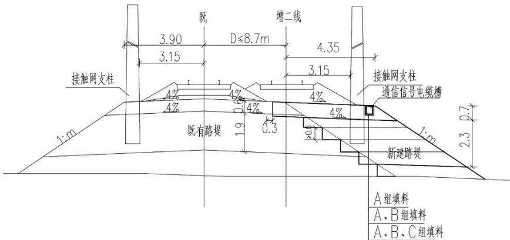  
图2.1.2-1增建二线与既有线并行等高地段路堤标准横断面图（单位：m）

②线间距 $4 . 2 \mathrm { { m } \leqslant D \leqslant 8 . 7 \mathrm { { m } } }$ 时，路堑增二线侧增设侧沟和侧沟平台，既有线侧兼顾增设接触网杆及既有线路堑病害治理，考虑调整侧沟及边坡增设防护网等防护措施。

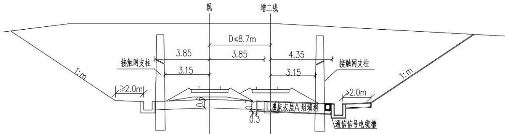  
图2.1.2-2 增建二线与既有线并行等高地段路堑  
（一般土质、软质岩、全强风化硬质岩）标准横断面图（单位：m）

③线间距D>8.7m时，路堤两线间填料填筑平整，第二线路基面应设计为三角形路拱，由中心线向两侧设4%的横向排水坡，两线路基间设置线间沟。

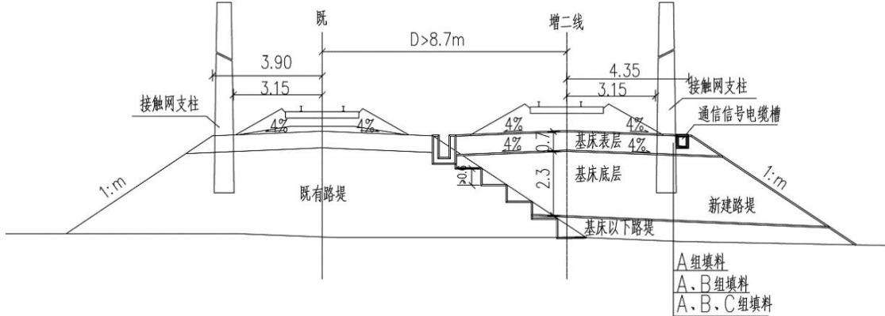  
图2.1.2-3 增建二线与既有线并行等高地段路堤标准横断面图（单位：m）

④线间距D>8.7m时，路堑两线间设置线间沟排水，路堑增二线侧设侧沟和侧沟平台，既有线侧兼顾增设接触网支柱及既有线路堑病害治理，考虑调整侧沟及边坡增设防护网等防护措施。

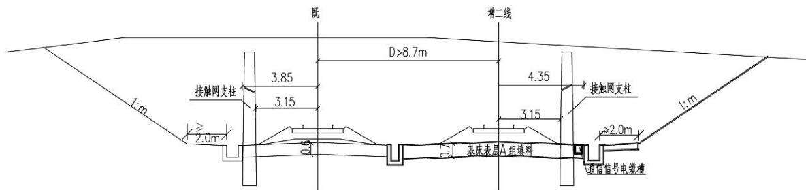  
图2.1.2-4 增建二线与既有线并行等高地段路堑标准横断面图（单位：m）  
(一般土质、软质岩、全强风化硬质岩)

2）增建二线路基与既有路基并行不等高

①D>3.9+4.35+1.5Δh 时，两线间用C 组填料填筑平整。

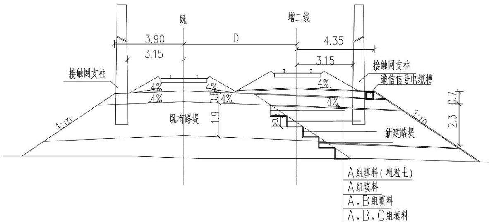

图2.1.2-5 增建二线路基路肩高于既有路肩地段路堤标准横断面图（单位：m）  
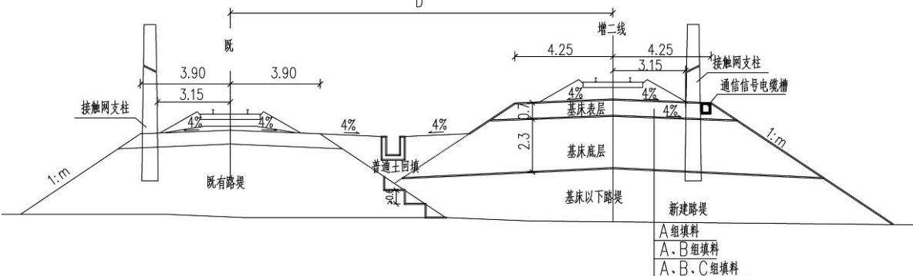  
图2.1.2-6 增建二线与既有线并行不等高地段路堤标准横断面图（单位：m）

3）既有线换侧增二线时，当有条件二次过渡时，可利用增二线进行过渡，对既有线进行改建。先在既有线一侧增建二线，待二线建成后，既有线停运，利用增二线过渡，等既有线改造完成，恢复运营。

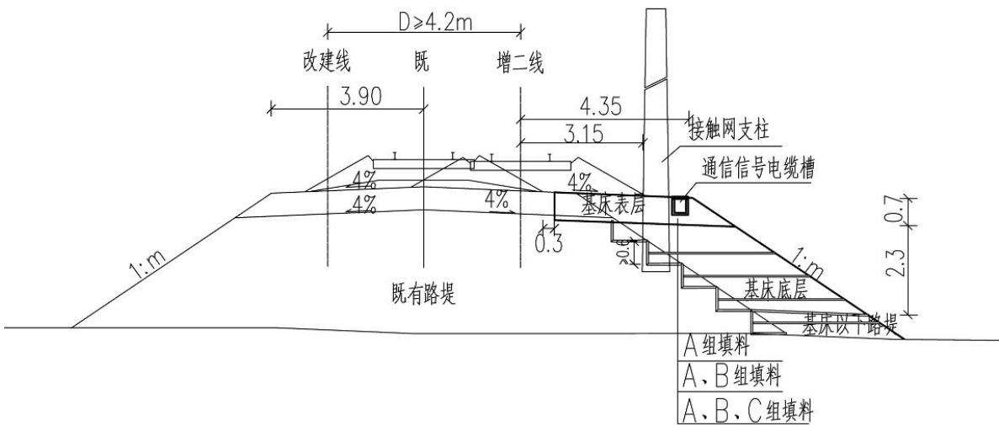  
图2.1.2-7 增建二线换侧时改建既有线路堤标准横断面图一（单位：m）

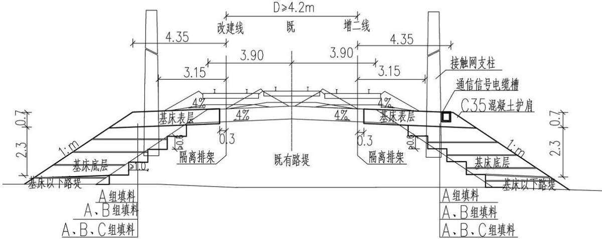  
图2.1.2-8 增建二线换侧时改建既有线路堤标准横断面图二（单位：m）

## 2.1.2.3 局部绕行段新建路基工程

额济纳地区改建嘉策铁路联络线、全国文物保护单位-T7烽燧线路左侧双线绕行段等情况引起局部段落绕行后新建铁路，建设标准按新建路基设计。

## （1）路基面形状及宽度

区间直线地段路基面宽度，按国铁I级电气化铁路标准执行，路基面设三角形路拱，由路基中心线向两侧设4%的人字排水坡。曲线加宽时，路基面仍保持三角形。重载铁路路堤的路肩宽度不小于1.0m，路堑的路肩宽度不小于0.8m。单线土质路堤路基面宽度为8.5m，路堑为8.1m；双线土质路堤及路堑路基面宽度为12.7m。

表 2.1.2-1 直线地段标准路基面宽度
<table><tr><td rowspan=1 colspan=4>项目</td><td rowspan=1 colspan=1>单位</td><td rowspan=1 colspan=1>重载铁路</td></tr><tr><td rowspan=4 colspan=1>路基类型</td><td rowspan=4 colspan=1>土质</td><td rowspan=2 colspan=1>单线</td><td rowspan=1 colspan=1>路堤</td><td rowspan=1 colspan=1>m</td><td rowspan=1 colspan=1>8.5</td></tr><tr><td rowspan=1 colspan=1>路堑</td><td rowspan=1 colspan=1>m</td><td rowspan=1 colspan=1>8.1</td></tr><tr><td rowspan=2 colspan=1>双线</td><td rowspan=1 colspan=1>路堤</td><td rowspan=1 colspan=1>m</td><td rowspan=1 colspan=1>12.7</td></tr><tr><td rowspan=1 colspan=1>路堑</td><td rowspan=1 colspan=1>m</td><td rowspan=1 colspan=1>12.7</td></tr></table>

备注：并行帮宽既有铁路地段路基半宽按上述路基面宽度的半宽取值（路堤：单绕4.25m，T7烽燧双绕段及增二线段路堤4.35m；路堑：单绕段4.05m，T7烽燧双绕及增二线段路堤4.35m）。

## （2）路基基床

## 1）基床结构

路基基床由表层和底层组成，基床表层厚0.7m，基床底层厚2.3m，总厚度3.0m。

## 2）路堤基床

表层采用A组填料，不均匀系数Cu不应小于10，最大粒径不应大于60mm；路基基床底层采用砾石类土、碎石类土及砂类土中的A、B组填料填筑，填料的最大粒径不应大于100mm。

## 3）路堑基床

路堑地段基床表层换填0.7m厚A组填料，基床底层全部或部分采用A、B组填料填筑或换填。路堑地段基床范围的天然地基基本承载力应不小于180kPa，土质应满足A、B组填料要求、密实度应满足基床底层压实标准，否则挖除换填或地基加固处理。

## （3）基床以下路堤填料

路堤在额济纳平原区段DK685+200\~DK796+000可就近取用粉、细砂作为基床以下填料，并采用A、B组碎石土填料包边填筑。填筑碾压时粉、细砂填料含水率应接近最优含水率，可采用加水湿润或重型碾压等措施。

其余段落基床以下路堤采用A、B、C组填料，最大粒径不应大于摊铺厚度的2/3，且不应大于150mm。

## （4）路基标准横断面

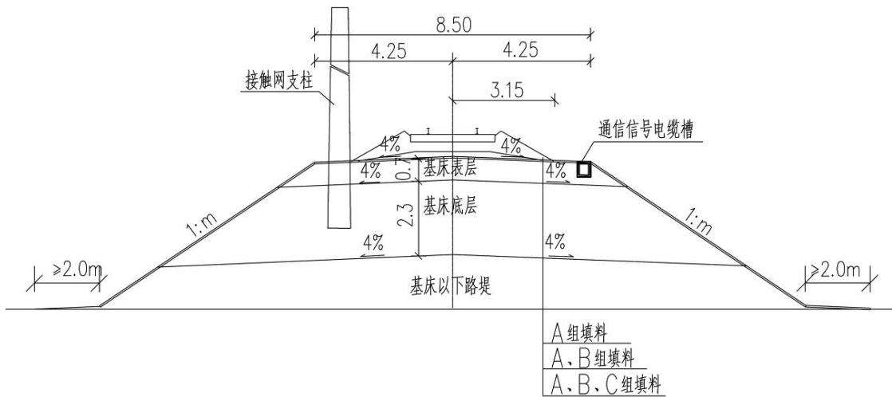

图 2.1.2-9 单线路堤标准横断面（单位：m）  
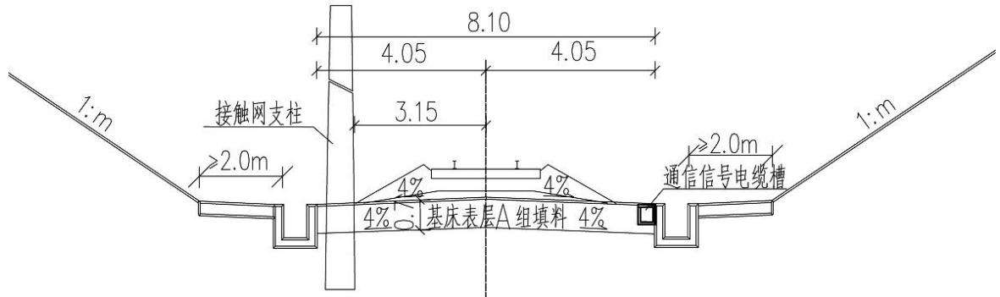  
图2.1.2-10 单线路堑标准横断面（单位：m）

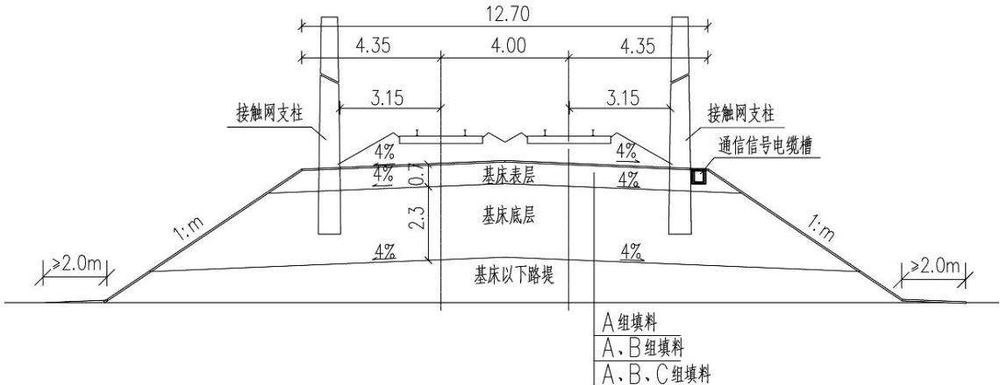  
图2.1.2-11 双线路堤标准横断面（单位：m）

## 2.1.2.4 路基边坡防护工程

## （1）路堤边坡防护

路堤边坡高度<6m时，边坡每隔20m设一道横向排水槽，槽深0.1，槽宽0.3m，路肩下设预制C35混凝土拦水坎与横向排水槽衔接，拦水坎厚0.1m。

路堤边坡高度≥6m时，采用不带截水槽的拱形骨架护坡。

## （2）路堑边坡防护

路堑边坡高度<6m时，边坡每隔20m设一道横向排水槽，槽深0.1，槽宽0.3m，路肩下设预制C35混凝土拦水坎与横向排水槽衔接，拦水坎厚0.1m。

路堑边坡高度≥6m时，采用不带截水槽的拱形骨架护坡。

## 2.1.2.5 区间路基排水工程

（1）对路基有危害的地面水采取拦截或引排措施，遵循“早接远送”的原则，结合沿线地形、地貌及工程情况合理设置排水工程。

（2）路基位于干旱荒漠、平坦戈壁地貌，起伏不大的平原微丘区，不能形成地表径流的地段或区间路基两侧均匀取土的段落，路基两侧不设排水设施。

（3）非干旱荒漠、平坦戈壁地貌，地面横坡明显的填方地段，横坡上方一侧设置排水沟，地面横坡不明显地段，在路基两侧设置排水沟。

（4）路堑地段在两侧设置混凝土梯形侧沟，底宽0.4m，深0.6m，边坡坡率1:1;沟身采用C30、C35混凝土浇筑，壁厚0.3m。侧沟平台宽3m，采用混凝土硬化，便于后续机械清沙。

（5）路堑地面横坡明显地段，可在堑顶上方一侧设置梯形天沟，底宽0.4m，沟深0.6m，边坡坡率1:1，沟身采用C30混凝土浇筑，壁厚0.2m。若地面横坡不明显，可不设天沟。

（6）路基两侧设混凝土梯形排水沟，底宽0.6m，深0.6m，边坡坡率1:1；沟身采

用C30、C35 混凝土浇筑，壁厚0.2m。

（7）排水沟、侧沟、天沟均按50年一遇防洪标准设计，安全超高0.2m，纵坡不小于2%。

## 2.1.2.6 铁路绿色通道绿化工程

根据《铁路工程绿化设计和施工质量控制标准》（北方地区）相关规定，项目区年均降水量不足200mm，年蒸发量大，属于极干旱地区，不实施铁路绿色通道绿化工程。

## 2.1.2.7 沙害路基防风固沙工程

## （1）风沙路基防治原则

风沙路基防治坚持“以防为主，防治结合”的原则，根据沙源、风况、沙丘活动情况和既有线风沙危害程度等，结合当地铁路、公路及地方防沙治沙经验，以工程防沙为主，因地制宜，就地取材，综合治理。

风沙防护宽度根据风速、风向、地形地貌、线路走向、路基形式、防护目标、土地资源、风沙危害程度等因素综合确定。平面防沙宽度在沙害中等地段迎主导风向侧设置宽度180m，背主导风向侧设置宽度80m。

## （2）防沙固沙措施

结合地下水情况，综合分析沙源、风速、风向及输沙量等因素，主要采用以工程固沙为主的防护体系，防护宽度按照规范要求，并充分借鉴既有额哈线治沙经验。两侧防沙体系应自路堤坡脚外依次设置防火带、防护带等。根据风沙危害等级：防火带宽度为20m，对防护带内地表植被及易燃附着物进行清除，防止火源侵蚀防护带。

风沙平面防护设置固沙方格沙障和芦苇高立式沙障。

中等沙害段落路基平面防护示意图详见下图。

## （3）防风固沙工点分布情况

本项目沙害路基防护长度全长15031m，主要采用芦苇方格、芦苇高立式沙障等防风固沙措施，防风固沙工点具体详见下表。

表 2.1.2-2 沙害路基防风固沙工点分布明细表
<table><tr><td rowspan=1 colspan=1>序号</td><td rowspan=1 colspan=1>起点里程</td><td rowspan=1 colspan=1>终点里程</td><td rowspan=1 colspan=1>侧别</td><td rowspan=1 colspan=1>与铁路位置关系</td><td rowspan=1 colspan=1>沙害路基防护长度(m)</td><td rowspan=1 colspan=1>风沙严重程度</td><td rowspan=1 colspan=1>固沙方格类型</td></tr><tr><td rowspan=1 colspan=1>1 DK</td><td rowspan=1 colspan=1>719+523D</td><td rowspan=1 colspan=1>K720+000</td><td rowspan=1 colspan=1>两侧</td><td rowspan=1 colspan=1>紧邻路堤坡脚</td><td rowspan=1 colspan=1>477</td><td rowspan=1 colspan=1>中等</td><td rowspan=1 colspan=1>芦苇方格、芦苇高立式沙障</td></tr><tr><td rowspan=1 colspan=1>2</td><td rowspan=1 colspan=1>DK720+000D</td><td rowspan=1 colspan=1>K721+943</td><td rowspan=1 colspan=1>两侧</td><td rowspan=1 colspan=1>紧邻路堤坡脚</td><td rowspan=1 colspan=1>1943</td><td rowspan=1 colspan=1>中等</td><td rowspan=1 colspan=1>高芦苇高立式沙障</td></tr><tr><td rowspan=1 colspan=1>3</td><td rowspan=1 colspan=1>DK722+600D</td><td rowspan=1 colspan=1>K726+000</td><td rowspan=1 colspan=1>两侧</td><td rowspan=1 colspan=1>紧邻路堤坡脚</td><td rowspan=1 colspan=1>3400</td><td rowspan=1 colspan=1>中等</td><td rowspan=1 colspan=1>芦苇方格、芦苇高立式沙障</td></tr><tr><td rowspan=1 colspan=1>4</td><td rowspan=1 colspan=1>DK816+223D</td><td rowspan=1 colspan=1>K816+300</td><td rowspan=1 colspan=1>两侧</td><td rowspan=1 colspan=1>紧邻路堤坡脚</td><td rowspan=1 colspan=1>77</td><td rowspan=1 colspan=1>中等</td><td rowspan=1 colspan=1>芦苇方格、芦苇高立式沙障</td></tr><tr><td rowspan=1 colspan=1>5</td><td rowspan=1 colspan=1>DK830+189D</td><td rowspan=1 colspan=1>K833+300</td><td rowspan=1 colspan=1>两侧</td><td rowspan=1 colspan=1>紧邻路堤坡脚</td><td rowspan=1 colspan=1>3111</td><td rowspan=1 colspan=1>轻微~中等</td><td rowspan=1 colspan=1>高芦苇高立式沙障</td></tr><tr><td rowspan=1 colspan=1>6D</td><td rowspan=1 colspan=1>K840+700D</td><td rowspan=1 colspan=1>K841+923</td><td rowspan=1 colspan=1>两侧</td><td rowspan=1 colspan=1>紧邻路堤坡脚</td><td rowspan=1 colspan=1>1223</td><td rowspan=1 colspan=1>轻微~中等</td><td rowspan=1 colspan=1>高芦苇高立式沙障</td></tr><tr><td rowspan=1 colspan=1>7</td><td rowspan=1 colspan=1>K1317+400K</td><td rowspan=1 colspan=1>1322+200</td><td rowspan=1 colspan=1>右侧</td><td rowspan=1 colspan=1>路堤坡脚外100m</td><td rowspan=1 colspan=1>4800</td><td rowspan=1 colspan=1>中等</td><td rowspan=1 colspan=1>高芦苇高立式沙障</td></tr><tr><td rowspan=1 colspan=3>合计</td><td rowspan=1 colspan=1></td><td rowspan=1 colspan=1></td><td rowspan=1 colspan=1>15031</td><td rowspan=1 colspan=1></td><td rowspan=1 colspan=1></td></tr></table>

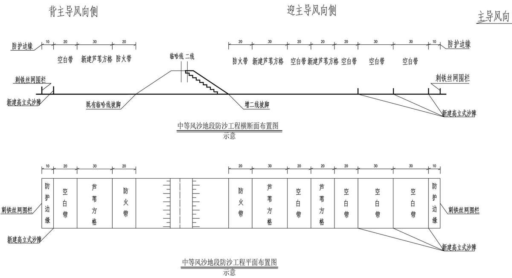  
图 2.1.2-12 中等沙害段落一路基防沙带平面和断面示意图

## 2.1.2.8 特殊路基工点概况

## （1）DK720+123\~DK720+573沙害路基防护工程（中等沙害）

## 1）工点概况

工点起讫里程DK720+123\~DK720+573，长450m，为风沙防护路基。增建二线于既有线右侧并肩而行，线路主要以填方通过，边坡最大填高4.1m。线路左侧为既有额哈铁路。既有路基边坡坡率为1:1.75，无风沙防护工程。

工点内对工程有影响的不良地质主要为风沙，主要表现为风蚀及戈壁风沙流。区内大风频繁，风力较强，沿线最大风速25m/s，主导风向为NW，年平均大风日数为44天，刮风时有就地起沙现象，易形成戈壁风沙流。特殊岩土主要为盐渍土和填土，盐渍土土质疏松，地表可见白色盐壳，易溶盐平均含量约0.719%，类型为中硫酸盐渍土，地下水位埋深1.6\~2.9m；填土为杂色，稍密-密实，稍湿，成分以粉细砂、碎石为主，为既有铁路路基填料，主要分布于既有铁路路基，Ⅱ级普通土，工程性质一般。

## 2）工点主要工程措施

## ①基床处理及路基填筑

A.基床表层填筑A组填料，厚0.7m；基床底层填筑A、B 组填料，厚2.3m；基床以下采用C组粉、细砂填料填筑。

B.路基形式为单面坡，由既有线砟脚向外设4%的排水坡，基床表层及底层底面均做成向外侧倾斜4%的单向排水横坡。

②边坡防护工程

A.路堤边坡坡率采用1:1.75。

B.基床表层外设台阶式C35现浇混凝土护肩。

C.DK720+123\~DK720+573段左侧沿既有线边坡挖宽度不小于1.0m的台阶，并在台阶处自地面起至基床表层以下通铺抗拉强度不小于30kN/m的双向土工格栅（GGR/PP/BS30-30），间距0.6m。

D.路堤右侧边坡每隔20m设一道C35预制混凝土横向排水槽，路肩下设预制C35混凝土拦水坎与横向排水槽衔接，横向排水槽处边坡底部设置现浇C35混凝土全埋式脚墙。

## ③地基处理工程

DK720+123\~DK720+375 段路基基底至坡脚外 2m 宽度范围内挖除换填0.3m厚碎石土，其上铺设0.2m中粗砂垫层夹铺一层复合土工膜。

## ④风沙防护

A.线路右侧迎主导风向侧防护宽度为150m，于迎风侧设置20m宽防火带+150m宽防护带，防护带内自靠近线路侧至远离线路侧分别为：30m宽芦苇方格+20m宽空白带+20m宽芦苇方格+80m宽折线型高立式阻沙沙障（3道）；于背风侧设置20m宽防火带+50m宽防护带，防护带自靠近线路侧至远离线路侧分别为30m宽芦苇方格+20m宽折线型高立式阻沙沙障。高立式阻沙沙障为1.5m高钢筋混凝土立柱+2cm净间距芦苇把高立式阻沙沙障。

B.工程防沙设施避开工点范围内的长势良好的灌木丛，维持原貌，不得对其破坏。

## (2）DK744+939\~DK745+123 路基边坡防护工程

## 1）工点概况

工点起讫里程DK744+939\~DK745+123，长184m，为坡面防护路基。增建二线于既有线右侧并肩面行，线路以填方通过，路堤边坡最大高度7.19m。线路左侧为既有额哈线，线间距为4.2m。既有路基工程边坡坡率约为1:2，两侧路堤边坡、护道、截沙沟边坡采用铺设0.08m厚C30混凝土预制块防护。

本段位于额济纳旗赛罕陶汉苏木境内，额济纳河洪积平原，地形起伏，呈沙垄状。该沙垄沿N35°W方向呈长条状展布，近南北向延伸约 6km，垄体宽40\~100m，高5\~12m，地表无结皮，地表植被主要为胡杨、白刺和芦苇，植被覆盖率低于10%。

本段不良地质主要为风沙，主要表现为风蚀及戈壁风沙流。区内大风频繁，风力较强，沿线最大风速25m/s，主导风向为NW，年平均大风日数为44天，刮风时有就地起沙现象，易形成戈壁风沙流。特殊岩土主要为盐渍土和填土，盐渍土土质疏松，地表可见白色盐壳，易溶盐平均含量约0.843%，类型为中亚硫酸盐渍土-硫酸盐渍土，地下水位埋深0.6\~2.6m；填土主要为素填土和填筑土，素填土系既有铁路施工路堑开挖弃土，主要分布于既有铁路路堑两侧，Ⅱ级普通土，工程性质较差，填筑土为既有铁路路基填料，主要分布于既有铁路路基，Ⅱ级普通土，工程性质一般。

## 2）主要工程措施

## ①基床处理及路基填筑

A.基床表层填筑 A 组填料，厚 0.7m；基床底层填筑A、B组填料，厚 2.3m；基床以下采用C组粉、细砂填料填筑。

B.路基面形式为单面坡，由既有线砟脚向外设4%的单面坡。

## ②边坡防护工程

A.路堤边坡坡率采用1:2。

B.基床表层外设阶梯式C35现浇混凝土防护路肩。

C.路堤边坡采用铺设0.08m厚C35 混凝土预制块防护，主要利用原护坡拆除的预制块。边坡沿高度方向每隔 0.6m通铺一层的GGR/PP/BS30-30 双向土工格栅。

D.DK744+939\~DK745+123段左侧沿既有线边坡挖宽度不小于1.0m的台阶。

E.新线右侧坡脚至坡脚外5m为既有截沙沟防护范围，边坡施工前需拆除原有混凝 土预制块，边坡施工完成后将拆除的混凝土预制块重新铺设。

## ③地基处理工程

基地采用重型碾压处理，处理范围为自既有线坡脚至新线右侧坡脚外3m。

## ④风沙防护

保留既有风沙防护工程，对既有破损HDPE网格、高立式沙障PE网格进行修复。

## (3）DK846+577\~DK847+452 深路堑、高路堤边坡防护

## 1）工点概况

工点起讫里程DK846+577\~DK847+452，长875m，于既有线右侧并肩而行，与既有线线间距4.20\~4.33m，以路堑和路堤形式通过该段，边坡最大挖方深度约34.5m，边坡最大填方高度约15.6m。附近有便道，交通条件一般。工点位于剥蚀丘陵区，地形较起伏。植被稀少，仅在冲沟内长有梭梭柴、白刺、红柳等少量耐旱植物，覆盖率低于20%。

既有线K846+577\~K846+925段路堑右侧边坡采用拦石墙支挡，K847+185\~K847+405 段、K847+413\~K847+452段路堤右侧分别采用路堤挡墙、路肩挡墙收坡。

工点内不良地质为风蚀，主导风向为NW。特殊岩土主要为含盐土、填土，填土主要分布于既有铁路填方地段，主要为素填土、填筑土。

## 2）主要工程措施

## ①路基基床处理

路基面形式为单面坡，由线路中心向右侧设4%的排水坡。路基基床表层及底层的底部均做成向右侧倾斜4%的横向排水坡。DK846+577\~DK847+138段增二线路堑硬质岩地段基床表层挖除 0.7m换填 A 组填料；DK847+138\~DK847+185 段增二线路堤基床表层填厚0.7m的A组填料，基床底层填厚2.3m的A、B组填料，基床以下路堤采用A、B、C组填料；DK847+185\~DK847+452段桩板墙挡护段落，桩板墙顶部高程以下回填级配碎石掺5%水泥。

DK846+577\~DK847+138段路堑挖方破碎后可作为A、B、C组填料用作本段落路堤填料。

## ②边坡坡率

路堑边坡坡率为1:1\~1:1.25，路堤边坡坡率为1:1.5\~1:1.75。

## ③边坡防护

A.路堤段基床表层外设台阶式C35现浇混凝土护肩。

B.DK846+577\~DK847+138段增二线路堑段落开挖方式采用机械开挖。

C.DK847+150\~DK847+425段既有线左侧边坡提质改造设主动网防护。

D.DK846+577\~DK847+058 段增二线右侧一级边坡、DK846+596\~DK846+908 段增二线右侧二级边坡设孔窗式护坡。

E.DK847+138\~DK847+452.25 段增二线右侧路堤边坡采用 C35 混凝土横向排水槽防护，边坡坡率1:1.5\~1:1.75。

F.DK847+138\~DK847+452.25段沿既有线右侧边坡挖台阶，台阶宽度不小于1m。

G.DK847+156\~DK847+452.25段帮宽路堤在填筑过程中自地面起至基床表层以下沿台阶每隔 0.6m 铺设一层双向土工格栅(GGR/PP/BS30-30)。

## ④支挡工程

## A.路堑挡墙

DK846+577\~DK846+924段增二线右侧设重力式路堑挡土墙，墙高3\~6m，挡墙胸背坡率1:0.25，挡墙墙身采用C35现浇混凝土浇筑，墙背超出地面部分采用 M10浆砌片石回填。挡墙于两端设置端墙，墙高3\~6m。

## B.桩板墙

DK847+185\~DK847+452 段增二线右侧边坡设 C45 钢筋混凝土桩板墙，间距 5.0m，桩截面尺寸为 2.25m(宽)×2.75m(厚)，1#\~9#桩桩长12m，悬臂段5m，锚固段7m，计9根；10#\~14#桩桩长14m，悬臂段6m，锚固段8m，计5根；15#\~39#、47#\~54#桩桩长16m，悬臂段7m，锚固段9m，计33根；40#\~46#桩桩长18m，悬臂段8m，锚固段10m，计7根；共计54根。墙背超出地面部分采用M10浆砌片石回填。基床表层下边坡体内通长铺设双向拉伸土工格栅(GGR/PP/BS30-30)。

## ⑤冲击碾压

DK847+185\~DK847+452段增二线坡脚至桩板墙间采用冲击碾压处理。

## (4）DK984+138\~DK984+563 高路堤边坡防护工程

## 1）工点概况

工点起讫里程DK984+138\~DK984+563，全长425m；线路以路堤形式通过该段，中心最大填方高度约17.41m。线路左侧为既有额哈线，线间距为4.2m；既有线以填方形式通过，最大填高约18m。既有边坡采用骨架护坡，局部设置排水沟。工点位于剥蚀丘陵区，地形较起伏。植被稀少，仅在冲沟内长有梭梭柴、白刺、红柳等少量耐旱植物，覆盖率低于20%。

工点内对工程有影响的不良地质主要为风蚀，主导风向为NW。特殊岩土主要为含盐土，场地内表层细砂、细角砾土中含有白色、纤维状石膏，局部呈层状。

## 2）主要工程措施

## ①路基基床处理

路基面形式为单面坡，由既有线砟脚向外设4%的排水坡。路基基床表层及底层的底部均做成向帮宽侧倾斜4%的单向排水坡。基床表层填0.7m厚的A组填料，基床底层填2.3m厚的A、B组填料，基床以下路堤采用A、B、C组填料。

## ②边坡坡率

路堤一级边坡坡率为1:1.5，二级边坡坡率为1:1.75。

## ③边坡防护

A.路堤段基床表层外设台阶式C35现浇混凝土路肩。

B.DK984+138\~DK984+563段右侧增二线帮宽路堤边坡采用不带截水槽C35 混凝土骨架护坡防护，骨架采用C35混凝土浇筑，骨架镶边与护肩衔接。一级边坡高6m，边坡分级处设置宽5.0m厚0.2m的C35混凝土边坡平台。沿既有线右侧边坡挖台阶，台阶宽度不小于1m。

C.帮宽路堤在填筑过程中自地面起至基床表层以下每隔0.6m通长铺设一层单向土工格栅(GGR/PP/US160)，土工格栅极限抗拉强度不小于160kN/m。

## ④基底处理

增二线帮宽路基基底采用重型碾压处理，处理范围至坡脚外3m。

## (5）DK1053+140\~DK1053+360膨胀岩深路堑

## 1）地质概况

## ①地形地貌

工点位于北山剥蚀丘陵区，地势整体平缓开阔，略有起伏，植被稀少，砾石遍布，交通困难。

## ②地层岩性

由上到下依次为：第四系全新统人工填土层（Q4ml）填筑土、第四系全新统冲洪积层（Q4al+pl）中砂、新近系上新统（N2）泥岩。

## ③水文地质条件

勘察期间未见大的地表水系。地下水为基岩裂隙水，埋深一般大于20m。

## ④特殊岩土、不良地质

不良地质主要为风沙，风沙对线路危害程度轻微。

特殊岩土主要为膨胀岩、人工填土。新近系泥岩具弱\~中等膨胀性。

## 2）既有线概况

既有线为挖方，线路中心最大挖深约为13m。一级边坡坡率约为1:1.5，二级边坡坡率约为1:1.75。DK1053+150\~DK1053+240右侧、DK1053+150\~DK1053+210左侧一级边

坡、DK1053+160\~DK1053+230右侧、DK1053+160\~DK1053+200左侧二级边坡采用混 凝土拱形截水骨架防护，DK1053+150\~DK1053+260两侧设混凝土挡墙。 DK1053+180\~DK1053+300左侧设预制块混凝土天沟。

## 3）主要工程措施

## ①既有线隔离防护、拆除工程

A.与既有线并行路堑地段，路堑边坡开挖前，在既有线路肩或其他适当位置处，设置临时行车隔离网，防止开挖过程土石进入线路影响行车安全。

B.拆除既有线右侧的混凝土挡墙、侧沟及骨架护坡。

C.路基工程施工完毕利用天窗时间拆除行车隔离网。

D.DK1053+140.00\~DK1053+360.00段增二线路堑开挖前于既有线路肩处设工字钢 防护，深3.5m。

## ②填料设计

增建第二线路基在既有线右侧加宽形成，基床表层接既有线设向外4%排水横坡。

基床表层填筑0.7m厚冻胀不敏感的A组填料，基床表层以下设置0.15m厚中粗砂内夹铺一层复合土工膜，膨胀岩地段基床底层换填0.85m厚冻胀弱敏感的A、B组。

## ③支挡工程

A.DK1053+140\~+300右侧路堑坡脚设重力式路堑挡墙，墙高4m，顶宽1.6m，墙胸、 背坡坡率1:0.2，墙身采用C35混凝土浇筑。沿线路方向每隔6m左右设置伸缩缝，伸缩 缝宽2cm，缝内采用沥青麻筋填塞，深0.2m。

B.路堑挡墙与一般边坡衔接处需设踏步。

## ④路堑边坡防护

A.路堑边坡一级边坡坡率1:1.5，二级边坡坡率1:1.75。

B.DK1053+140\~+165右侧一级边坡、DK1053+245\~+300右侧二级边坡、DK1053+300\~+360 右侧一级边坡采用 C35 混凝土横向截水槽防护，DK1053+165\~+300右侧一级边坡、DK1053+165\~+245右侧二级边坡采用C35混凝土拱型骨架防护（骨架间距3×3）。

## ⑤排水工程

A.DK1053+140\~+360右侧设置混凝土梯形侧沟，底宽0.4m，深0.9m，壁厚0.1m， 采用C35钢筋混凝土预制；侧沟外设置2m宽平台，采用0.1m厚混凝土预制块铺砌。 B.DK1053+140\~+360右侧设置混凝土梯形天沟，底宽0.4m，深0.6m，壁厚0.1m。

## （6）DK1072+590\~DK1072+910增二线路基、盐渍土路基

## 1）地质概况

## ①地形地貌

工点位于北山剥蚀丘陵区，地势整体平缓开阔，略有起伏，植被稀少，砾石遍布，交通困难。

## ②地层岩性

由上到下依次为：第四系全新统人工填土层填筑土、华力西期花岗岩、闪长岩。

## ③水文地质条件

勘察期间未见大的地表水系。地下水为基岩裂隙水，埋深一般大于20m。

## ④特殊岩土、不良地质

不良地质主要为风沙，风沙对线路危害程度轻微。特殊岩土主要为盐渍土、人工填土。

## 2）既有线概况

既有线线路中心最大填高约4.5m。边坡坡率约1:1.5，无分级;K1072+590\~K1072+910段右侧设混凝土护肩、混凝土防护冲刷护脚。

## 3）主要工程措施

## ①既有线隔离防护、拆除工程

A.利用天窗时间于改建范围既有线两侧护肩上设置行车隔离网，避免人员及材料侵入轨道影响运营安全。

B.拆除既有线右侧的混凝土护肩及混凝土防冲刷脚墙。

C.路基工程施工完毕利用天窗时间拆除行车隔离网。

## ②填料设计

增建第二线路基在既有线右侧加宽形成，基床表层接既有线设向外4%排水横坡。

基床表层填筑0.7m厚冻胀弱敏感的A组填料，基床底层2.3m厚冻胀弱敏感的A、B组填料，路基本体填筑A、B、C组填料。

## ③地基加固

路堤段地面上0.5m处设置复合土工膜（两布一膜）隔断层，并在复合土工膜上、下各设置0.10m厚的中粗砂保护层。地面有积水时隔断层底面高程应高于当地最高地面积水高程。

## ④坡面防护

## A.路堤边坡坡率 1:1.5。

B.线路右侧沿既有边坡开挖高度不小于0.6m的台阶，挖台阶处分层铺4m长土工格栅，土工格栅每层竖向间隔0.6m，分层加筋，分层碾压。当边坡宽度小于4m时，通铺土工格栅，土工格栅每层竖向间隔0.6m。

C.DK1072+590\~DK1072+910 右侧边坡采用C35 混凝土横向排水槽防护，沿线路方向每隔10m左右设置伸缩缝，伸缩缝宽2cm，缝内采用沥青麻筋填塞，深0.2m。

## （7）DK1114+280\~DK1114+400 水害路基

## 1）地质概况

## ①地形地貌

工点位于北山剥蚀丘陵区，地势整体平缓开阔，略有起伏，植被稀少，砾石遍布，交通困难。

## ②地层岩性

由上到下依次为：第四系全新统人工填土层填筑土、第四系全新统冲洪积层砾砂、细角砾土、华力西期花岗岩。

## ③水文地质条件

勘察期间未见大的地表水系。地下水为基岩裂隙水，埋深一般大于20m。

④不良地质、特殊岩土

不良地质主要为风沙，风沙对线路危害程度轻微。

特殊岩土主要为盐渍土、人工填土。

## 2）既有线概况

既有线为填方，路基最大填高约5.3m，边坡坡率约为1:1.5。

路基范围内水害较发育，线路左侧洪水沿戈壁滩漫流，浸泡左侧路基坡脚，容易造成局部路基与边坡或锥坡溜坍、涵洞淤堵等线路病害。

## 3）主要工程措施

## ①既有线隔离防护、拆除工程

A.利用天窗时间于改建范围既有线两侧护肩上设置行车隔离网，避免人员及材料侵入轨道影响运营安全。

B.拆除既有线右侧护肩。

C.路基工程施工完毕利用天窗时间拆除行车隔离网。

## ②既有线改造工程

线路左侧K1114+400\~K1115+400段设置封闭式导流堤，沿导流堤小里程方向K1114+280\~K1114+400 段坡脚处设C35混凝土防冲刷脚墙，顶宽0.7m，高2.5m，埋深1m。沿线温差大，沿线路方向6m左右设置伸缩缝，伸缩缝宽2cm，缝内采用沥青麻筋填塞，深0.2m。脚墙顶设平台，采用0.1m厚预制混凝土板铺砌，浸水防护标高1551.9m到平台处于既有线边坡坡面采用0.1m厚预制混凝土板铺砌。

③填料设计

增建第二线路基在既有线右侧加宽形成，基床表层填筑0.7m厚冻胀弱敏感A组填料，基床底层填筑2.3m厚冻胀弱敏感A、B组填料，路基以下填筑A、B、C组填料。

④地基加固：

A.路基基底采用重型碾压加固。

B.在地面上0.5m处设置复合土工膜（两布一膜）隔断层，并在复合土工膜上、下各设置0.10m厚的中粗砂保护层。地面有积水时隔断层底面高程应高于当地最高地面积水高程。

## ⑤路堤边坡防护

A.路堤边坡坡率 1:1.5。

B.线路右侧沿既有边坡开挖高度不小于0.6m的台阶，挖台阶处分层铺4m长土工格栅，土工格栅每层竖向间隔0.6m，分层加筋，分层碾压。当边坡宽度小于4m时，通铺土工格栅，土工格栅每层竖向间隔0.6m。

C.增二线 DK1114+280\~DK1114+325右侧边坡采用 C35 混凝土骨架护坡防护，DK1114+325\~DK1114+400右侧边坡采用C35混凝土横向排水槽防护，沿线温差大，沿线路方向10m左右设置伸缩缝，伸缩缝宽2cm，缝内采用沥青麻筋填塞，深0.2m。

表 2.1.2-3 路基工点填高挖深指标明细表
<table><tr><td rowspan=2 colspan=1>序号</td><td rowspan=1 colspan=3>工点起讫里程</td><td rowspan=2 colspan=1>路基长度(m)</td><td rowspan=2 colspan=1>工点类型</td><td rowspan=1 colspan=2>路堤</td><td rowspan=1 colspan=2>路堑</td><td rowspan=2 colspan=1>备注</td></tr><tr><td rowspan=1 colspan=1>起点里程</td><td rowspan=1 colspan=1>~</td><td rowspan=1 colspan=1>终点里程</td><td rowspan=1 colspan=1>长度（m）</td><td rowspan=1 colspan=1>最大填高(m)</td><td rowspan=1 colspan=1>长度（m）</td><td rowspan=1 colspan=1>最大挖深(m)</td></tr><tr><td rowspan=1 colspan=1>1#</td><td rowspan=1 colspan=1>DK685+200</td><td rowspan=1 colspan=1>~</td><td rowspan=1 colspan=1>DK687+395</td><td rowspan=1 colspan=1>2195</td><td rowspan=1 colspan=1>区间路基</td><td rowspan=1 colspan=1>2195</td><td rowspan=1 colspan=1>9</td><td rowspan=1 colspan=1></td><td rowspan=1 colspan=1></td><td rowspan=1 colspan=1></td></tr><tr><td rowspan=1 colspan=1>2#</td><td rowspan=1 colspan=1>DK687+438</td><td rowspan=1 colspan=1>~</td><td rowspan=1 colspan=1>DK692+373</td><td rowspan=1 colspan=1>4935</td><td rowspan=1 colspan=1>区间路基</td><td rowspan=1 colspan=1>4935</td><td rowspan=1 colspan=1>9</td><td rowspan=1 colspan=1></td><td rowspan=1 colspan=1></td><td rowspan=1 colspan=1></td></tr><tr><td rowspan=1 colspan=1>3#</td><td rowspan=1 colspan=1>DK692+760</td><td rowspan=1 colspan=1>~</td><td rowspan=1 colspan=1>DK694+100</td><td rowspan=1 colspan=1>1340</td><td rowspan=1 colspan=1>区间路基</td><td rowspan=1 colspan=1>1340</td><td rowspan=1 colspan=1>10.8</td><td rowspan=1 colspan=1></td><td rowspan=1 colspan=1></td><td rowspan=1 colspan=1></td></tr><tr><td rowspan=1 colspan=1>4#</td><td rowspan=1 colspan=1>DK694+100</td><td rowspan=1 colspan=1>~</td><td rowspan=1 colspan=1>DK695+900</td><td rowspan=1 colspan=1>1800</td><td rowspan=1 colspan=1>站场路基</td><td rowspan=1 colspan=1>1800</td><td rowspan=1 colspan=1>4.3</td><td rowspan=1 colspan=1></td><td rowspan=1 colspan=1></td><td rowspan=1 colspan=1>川地托站站内路基</td></tr><tr><td rowspan=1 colspan=1>5#</td><td rowspan=1 colspan=1>DK695+900</td><td rowspan=1 colspan=1>～</td><td rowspan=1 colspan=1>DK702+014</td><td rowspan=1 colspan=1>6114</td><td rowspan=1 colspan=1>区间路基</td><td rowspan=1 colspan=1>6114</td><td rowspan=1 colspan=1>10.8</td><td rowspan=1 colspan=1></td><td rowspan=1 colspan=1></td><td rowspan=1 colspan=1></td></tr><tr><td rowspan=1 colspan=1>6#</td><td rowspan=1 colspan=1>DK702+089</td><td rowspan=1 colspan=1>~</td><td rowspan=1 colspan=1>DK702+526</td><td rowspan=1 colspan=1>437</td><td rowspan=1 colspan=1>区间路基</td><td rowspan=1 colspan=1>437</td><td rowspan=1 colspan=1>12.4</td><td rowspan=1 colspan=1></td><td rowspan=1 colspan=1></td><td rowspan=1 colspan=1></td></tr><tr><td rowspan=1 colspan=1>7#</td><td rowspan=1 colspan=1>DK702+654</td><td rowspan=1 colspan=1>~</td><td rowspan=1 colspan=1>DK713+819</td><td rowspan=1 colspan=1>11165</td><td rowspan=1 colspan=1>区间路基</td><td rowspan=1 colspan=1>11165</td><td rowspan=1 colspan=1>12.1</td><td rowspan=1 colspan=1></td><td rowspan=1 colspan=1></td><td rowspan=1 colspan=1></td></tr><tr><td rowspan=1 colspan=1>8#</td><td rowspan=1 colspan=1>DK714+319</td><td rowspan=1 colspan=1>~</td><td rowspan=1 colspan=1>DK715+385</td><td rowspan=1 colspan=1>1066</td><td rowspan=1 colspan=1>区间路基</td><td rowspan=1 colspan=1>1066</td><td rowspan=1 colspan=1>4.7</td><td rowspan=1 colspan=1></td><td rowspan=1 colspan=1></td><td rowspan=1 colspan=1></td></tr><tr><td rowspan=1 colspan=1>9#</td><td rowspan=1 colspan=1>DK715+492</td><td rowspan=1 colspan=1>~</td><td rowspan=1 colspan=1>DK715+705</td><td rowspan=1 colspan=1>213</td><td rowspan=1 colspan=1>区间路基</td><td rowspan=1 colspan=1>213</td><td rowspan=1 colspan=1>7.9</td><td rowspan=1 colspan=1></td><td rowspan=1 colspan=1></td><td rowspan=1 colspan=1></td></tr><tr><td rowspan=1 colspan=1>10#</td><td rowspan=1 colspan=1>DK715+730</td><td rowspan=1 colspan=1>~</td><td rowspan=1 colspan=1>DK717+020</td><td rowspan=1 colspan=1>1290</td><td rowspan=1 colspan=1>区间路基</td><td rowspan=1 colspan=1>1290</td><td rowspan=1 colspan=1>7.5</td><td rowspan=1 colspan=1></td><td rowspan=1 colspan=1></td><td rowspan=1 colspan=1></td></tr><tr><td rowspan=1 colspan=1>11#</td><td rowspan=1 colspan=1>DK717+062</td><td rowspan=1 colspan=1>~</td><td rowspan=1 colspan=1>DK717+376</td><td rowspan=1 colspan=1>314</td><td rowspan=1 colspan=1>区间路基</td><td rowspan=1 colspan=1>314</td><td rowspan=1 colspan=1>7.1</td><td rowspan=1 colspan=1></td><td rowspan=1 colspan=1></td><td rowspan=1 colspan=1></td></tr><tr><td rowspan=1 colspan=1>12#</td><td rowspan=1 colspan=1>DK717+410</td><td rowspan=1 colspan=1>~</td><td rowspan=1 colspan=1>DK718+151</td><td rowspan=1 colspan=1>741</td><td rowspan=1 colspan=1>区间路基</td><td rowspan=1 colspan=1>741</td><td rowspan=1 colspan=1>6.8</td><td rowspan=1 colspan=1></td><td rowspan=1 colspan=1></td><td rowspan=1 colspan=1></td></tr><tr><td rowspan=1 colspan=1>13#</td><td rowspan=1 colspan=1>DK718+177</td><td rowspan=1 colspan=1>~</td><td rowspan=1 colspan=1>DK736+550</td><td rowspan=1 colspan=1>18373</td><td rowspan=1 colspan=1>区间路基</td><td rowspan=1 colspan=1>18373</td><td rowspan=1 colspan=1>5.4</td><td rowspan=1 colspan=1></td><td rowspan=1 colspan=1></td><td rowspan=1 colspan=1></td></tr><tr><td rowspan=1 colspan=1>14#</td><td rowspan=1 colspan=1>DK736+550</td><td rowspan=1 colspan=1>~</td><td rowspan=1 colspan=1>DK739+550</td><td rowspan=1 colspan=1>3000</td><td rowspan=1 colspan=1>站场路基</td><td rowspan=1 colspan=1>3000</td><td rowspan=1 colspan=1>4.5</td><td rowspan=1 colspan=1></td><td rowspan=1 colspan=1></td><td rowspan=1 colspan=1>天草站站内路基</td></tr><tr><td rowspan=1 colspan=1>15#</td><td rowspan=1 colspan=1>DK739+550</td><td rowspan=1 colspan=1>~</td><td rowspan=1 colspan=1>DK777+450</td><td rowspan=1 colspan=1>37900</td><td rowspan=1 colspan=1>区间路基</td><td rowspan=1 colspan=1>37900</td><td rowspan=1 colspan=1>10.2</td><td rowspan=1 colspan=1></td><td rowspan=1 colspan=1></td><td rowspan=1 colspan=1></td></tr><tr><td rowspan=1 colspan=1>16#</td><td rowspan=1 colspan=1>DK777+450</td><td rowspan=1 colspan=1>~</td><td rowspan=1 colspan=1>DK779+950</td><td rowspan=1 colspan=1>2500</td><td rowspan=1 colspan=1>站场路基</td><td rowspan=1 colspan=1>2500</td><td rowspan=1 colspan=1>3.8</td><td rowspan=1 colspan=1></td><td rowspan=1 colspan=1></td><td rowspan=1 colspan=1>千条沟站站内路基</td></tr><tr><td rowspan=1 colspan=1>17#</td><td rowspan=1 colspan=1>DK779+950</td><td rowspan=1 colspan=1>~</td><td rowspan=1 colspan=1>DK787+327</td><td rowspan=1 colspan=1>7377</td><td rowspan=1 colspan=1>区间路基</td><td rowspan=1 colspan=1>7377</td><td rowspan=1 colspan=1>6.4</td><td rowspan=1 colspan=1></td><td rowspan=1 colspan=1></td><td rowspan=1 colspan=1></td></tr><tr><td rowspan=1 colspan=1>18#</td><td rowspan=1 colspan=1>DK787+438</td><td rowspan=1 colspan=1>~</td><td rowspan=1 colspan=1>DK789+056</td><td rowspan=1 colspan=1>1618</td><td rowspan=1 colspan=1>区间路基</td><td rowspan=1 colspan=1>1618</td><td rowspan=1 colspan=1>6</td><td rowspan=1 colspan=1></td><td rowspan=1 colspan=1></td><td rowspan=1 colspan=1></td></tr><tr><td rowspan=1 colspan=1>19#</td><td rowspan=1 colspan=1>DK789+080</td><td rowspan=1 colspan=1>~</td><td rowspan=1 colspan=1>DK790+112</td><td rowspan=1 colspan=1>1032</td><td rowspan=1 colspan=1>区间路基</td><td rowspan=1 colspan=1>1032</td><td rowspan=1 colspan=1>4</td><td rowspan=1 colspan=1></td><td rowspan=1 colspan=1></td><td rowspan=1 colspan=1></td></tr><tr><td rowspan=1 colspan=1>20#</td><td rowspan=1 colspan=1>DK790+136</td><td rowspan=1 colspan=1>~</td><td rowspan=1 colspan=1>DK791+142</td><td rowspan=1 colspan=1>1006</td><td rowspan=1 colspan=1>区间路基</td><td rowspan=1 colspan=1>1006</td><td rowspan=1 colspan=1>5.1</td><td rowspan=1 colspan=1></td><td rowspan=1 colspan=1></td><td rowspan=1 colspan=1></td></tr><tr><td rowspan=1 colspan=1>21#</td><td rowspan=1 colspan=1>DK791+166</td><td rowspan=1 colspan=1></td><td rowspan=1 colspan=1>DK793+142</td><td rowspan=1 colspan=1>1976</td><td rowspan=1 colspan=1>区间路基</td><td rowspan=1 colspan=1>1976</td><td rowspan=1 colspan=1>5.7</td><td rowspan=1 colspan=1></td><td rowspan=1 colspan=1></td><td rowspan=1 colspan=1></td></tr></table>

2 项目概况
<table><tr><td colspan="1" rowspan="2">序号</td><td colspan="3" rowspan="1">工点起讫里程</td><td colspan="1" rowspan="1">路基长度</td><td colspan="1" rowspan="2">工点类型</td><td colspan="2" rowspan="1">路堤</td><td colspan="2" rowspan="1">路堑</td><td colspan="1" rowspan="2">备注</td></tr><tr><td colspan="1" rowspan="1">起点里程</td><td colspan="1" rowspan="1">~</td><td colspan="1" rowspan="1">终点里程</td><td colspan="1" rowspan="1">(m)</td><td colspan="1" rowspan="1">长度（m）</td><td colspan="1" rowspan="1">最大填高(m)</td><td colspan="1" rowspan="1">长度（m）</td><td colspan="1" rowspan="1">最大挖深(m)</td></tr><tr><td colspan="1" rowspan="1">22#</td><td colspan="1" rowspan="1">DK793+176</td><td colspan="1" rowspan="1">~</td><td colspan="1" rowspan="1">DK796+102</td><td colspan="1" rowspan="1">2926</td><td colspan="1" rowspan="1">区间路基</td><td colspan="1" rowspan="1">2926</td><td colspan="1" rowspan="1">5.9</td><td colspan="1" rowspan="1"></td><td colspan="1" rowspan="1"></td><td colspan="1" rowspan="1"></td></tr><tr><td colspan="1" rowspan="1">23#</td><td colspan="1" rowspan="1">DK796+310</td><td colspan="1" rowspan="1">~</td><td colspan="1" rowspan="1">DK800+809</td><td colspan="1" rowspan="1">4499</td><td colspan="1" rowspan="1">区间路基</td><td colspan="1" rowspan="1">4102</td><td colspan="1" rowspan="1">6.5</td><td colspan="1" rowspan="1">397</td><td colspan="1" rowspan="1">4</td><td colspan="1" rowspan="1"></td></tr><tr><td colspan="1" rowspan="1">24#</td><td colspan="1" rowspan="1">DK801+211</td><td colspan="1" rowspan="1">~</td><td colspan="1" rowspan="1">DK805+151</td><td colspan="1" rowspan="1">3940</td><td colspan="1" rowspan="1">区间路基</td><td colspan="1" rowspan="1">3592</td><td colspan="1" rowspan="1">8.2</td><td colspan="1" rowspan="1">348</td><td colspan="1" rowspan="1">8</td><td colspan="1" rowspan="1"></td></tr><tr><td colspan="1" rowspan="1">25#</td><td colspan="1" rowspan="1">DK805+258</td><td colspan="1" rowspan="1">~</td><td colspan="1" rowspan="1">DK805+600</td><td colspan="1" rowspan="1">342</td><td colspan="1" rowspan="1">区间路基</td><td colspan="1" rowspan="1">312</td><td colspan="1" rowspan="1">7.8</td><td colspan="1" rowspan="1">30</td><td colspan="1" rowspan="1">7</td><td colspan="1" rowspan="1"></td></tr><tr><td colspan="1" rowspan="1">26#</td><td colspan="1" rowspan="1">DK805+600</td><td colspan="1" rowspan="1">~</td><td colspan="1" rowspan="1">DK807+830</td><td colspan="1" rowspan="1">2200</td><td colspan="1" rowspan="1">站场路基</td><td colspan="1" rowspan="1">2006</td><td colspan="1" rowspan="1">5.8</td><td colspan="1" rowspan="1">194</td><td colspan="1" rowspan="1">7.3</td><td colspan="1" rowspan="1">鞍子山站站内路基</td></tr><tr><td colspan="1" rowspan="1">27#</td><td colspan="1" rowspan="1">DK807+830</td><td colspan="1" rowspan="1">~</td><td colspan="1" rowspan="1">DK807+858</td><td colspan="1" rowspan="1">28</td><td colspan="1" rowspan="1">区间路基</td><td colspan="1" rowspan="1">28</td><td colspan="1" rowspan="1">8.6</td><td colspan="1" rowspan="1"></td><td colspan="1" rowspan="1"></td><td colspan="1" rowspan="1"></td></tr><tr><td colspan="1" rowspan="1">28#</td><td colspan="1" rowspan="1">DK807+885</td><td colspan="1" rowspan="1">~</td><td colspan="1" rowspan="1">DK808+447</td><td colspan="1" rowspan="1">562</td><td colspan="1" rowspan="1">区间路基</td><td colspan="1" rowspan="1">562</td><td colspan="1" rowspan="1">8.2</td><td colspan="1" rowspan="1"></td><td colspan="1" rowspan="1"></td><td colspan="1" rowspan="1"></td></tr><tr><td colspan="1" rowspan="1">29#</td><td colspan="1" rowspan="1">DK808+483</td><td colspan="1" rowspan="1">~</td><td colspan="1" rowspan="1">DK810+233</td><td colspan="1" rowspan="1">1750</td><td colspan="1" rowspan="1">区间路基</td><td colspan="1" rowspan="1">1750</td><td colspan="1" rowspan="1">8.4</td><td colspan="1" rowspan="1"></td><td colspan="1" rowspan="1"></td><td colspan="1" rowspan="1"></td></tr><tr><td colspan="1" rowspan="1">30#</td><td colspan="1" rowspan="1">DK810+510</td><td colspan="1" rowspan="1">~</td><td colspan="1" rowspan="1">DK813+752</td><td colspan="1" rowspan="1">3242</td><td colspan="1" rowspan="1">区间路基</td><td colspan="1" rowspan="1">3242</td><td colspan="1" rowspan="1">11</td><td colspan="1" rowspan="1"></td><td colspan="1" rowspan="1"></td><td colspan="1" rowspan="1"></td></tr><tr><td colspan="1" rowspan="1">31#</td><td colspan="1" rowspan="1">DK813+835</td><td colspan="1" rowspan="1">~</td><td colspan="1" rowspan="1">DK814+071</td><td colspan="1" rowspan="1">236</td><td colspan="1" rowspan="1">区间路基</td><td colspan="1" rowspan="1">215</td><td colspan="1" rowspan="1">16.5</td><td colspan="1" rowspan="1">21</td><td colspan="1" rowspan="1">29.7</td><td colspan="1" rowspan="1"></td></tr><tr><td colspan="1" rowspan="1">32#</td><td colspan="1" rowspan="1">DK814+108</td><td colspan="1" rowspan="1">~</td><td colspan="1" rowspan="1">DK817+178</td><td colspan="1" rowspan="1">3070</td><td colspan="1" rowspan="1">区间路基</td><td colspan="1" rowspan="1">2799</td><td colspan="1" rowspan="1">16.1</td><td colspan="1" rowspan="1">271</td><td colspan="1" rowspan="1">19.4</td><td colspan="1" rowspan="1"></td></tr><tr><td colspan="1" rowspan="1">33#</td><td colspan="1" rowspan="1">DK817+745</td><td colspan="1" rowspan="1">~</td><td colspan="1" rowspan="1">DK828+076</td><td colspan="1" rowspan="1">10331</td><td colspan="1" rowspan="1">区间路基</td><td colspan="1" rowspan="1">9419</td><td colspan="1" rowspan="1">15.7</td><td colspan="1" rowspan="1">912</td><td colspan="1" rowspan="1">12</td><td colspan="1" rowspan="1"></td></tr><tr><td colspan="1" rowspan="1">34#</td><td colspan="1" rowspan="1">DK828+259</td><td colspan="1" rowspan="1">~</td><td colspan="1" rowspan="1">DK830+163</td><td colspan="1" rowspan="1">1904</td><td colspan="1" rowspan="1">区间路基</td><td colspan="1" rowspan="1">1736</td><td colspan="1" rowspan="1">4.5</td><td colspan="1" rowspan="1">168</td><td colspan="1" rowspan="1">5.4</td><td colspan="1" rowspan="1"></td></tr><tr><td colspan="1" rowspan="1">35#</td><td colspan="1" rowspan="1">DK830+189</td><td colspan="1" rowspan="1">~</td><td colspan="1" rowspan="1">DK835+500</td><td colspan="1" rowspan="1">5311</td><td colspan="1" rowspan="1">区间路基</td><td colspan="1" rowspan="1">4842</td><td colspan="1" rowspan="1">12.3</td><td colspan="1" rowspan="1">469</td><td colspan="1" rowspan="1">6.9</td><td colspan="1" rowspan="1"></td></tr><tr><td colspan="1" rowspan="1">36#</td><td colspan="1" rowspan="1">DK835+500</td><td colspan="1" rowspan="1">~</td><td colspan="1" rowspan="1">DK838+200</td><td colspan="1" rowspan="1">2336</td><td colspan="1" rowspan="1">站场路基</td><td colspan="1" rowspan="1">2130</td><td colspan="1" rowspan="1">8.3</td><td colspan="1" rowspan="1">206</td><td colspan="1" rowspan="1">7.1</td><td colspan="1" rowspan="1">风雷山站站内路基</td></tr><tr><td colspan="1" rowspan="1">37#</td><td colspan="1" rowspan="1">DK838+200</td><td colspan="1" rowspan="1">~</td><td colspan="1" rowspan="1">DK844+070</td><td colspan="1" rowspan="1">5870</td><td colspan="1" rowspan="1">区间路基</td><td colspan="1" rowspan="1">5352</td><td colspan="1" rowspan="1">11.9</td><td colspan="1" rowspan="1">518</td><td colspan="1" rowspan="1">12.1</td><td colspan="1" rowspan="1"></td></tr><tr><td colspan="1" rowspan="1">38#</td><td colspan="1" rowspan="1">DK844+180</td><td colspan="1" rowspan="1">~</td><td colspan="1" rowspan="1">DK844+762</td><td colspan="1" rowspan="1">582</td><td colspan="1" rowspan="1">区间路基</td><td colspan="1" rowspan="1">582</td><td colspan="1" rowspan="1">6.5</td><td colspan="1" rowspan="1"></td><td colspan="1" rowspan="1"></td><td colspan="1" rowspan="1"></td></tr><tr><td colspan="1" rowspan="1">39#</td><td colspan="1" rowspan="1">DK845+071</td><td colspan="1" rowspan="1">~</td><td colspan="1" rowspan="1">DK845+542</td><td colspan="1" rowspan="1">471</td><td colspan="1" rowspan="1">区间路基</td><td colspan="1" rowspan="1">471</td><td colspan="1" rowspan="1">7.1</td><td colspan="1" rowspan="1"></td><td colspan="1" rowspan="1"></td><td colspan="1" rowspan="1"></td></tr><tr><td colspan="1" rowspan="1">40#</td><td colspan="1" rowspan="1">DK845+685</td><td colspan="1" rowspan="1">~</td><td colspan="1" rowspan="1">DK851+154</td><td colspan="1" rowspan="1">5469</td><td colspan="1" rowspan="1">区间路基</td><td colspan="1" rowspan="1">4986</td><td colspan="1" rowspan="1">15.6</td><td colspan="1" rowspan="1">483</td><td colspan="1" rowspan="1">34.5</td><td colspan="1" rowspan="1"></td></tr><tr><td colspan="1" rowspan="1">41#</td><td colspan="1" rowspan="1">DK851+211</td><td colspan="1" rowspan="1">~</td><td colspan="1" rowspan="1">DK853+692</td><td colspan="1" rowspan="1">2481</td><td colspan="1" rowspan="1">区间路基</td><td colspan="1" rowspan="1">2481</td><td colspan="1" rowspan="1">14.4</td><td colspan="1" rowspan="1"></td><td colspan="1" rowspan="1"></td><td colspan="1" rowspan="1"></td></tr><tr><td colspan="1" rowspan="1">42#</td><td colspan="1" rowspan="1">DK853+726</td><td colspan="1" rowspan="1">~</td><td colspan="1" rowspan="1">DK857+975</td><td colspan="1" rowspan="1">4249</td><td colspan="1" rowspan="1">区间路基</td><td colspan="1" rowspan="1">3874</td><td colspan="1" rowspan="1">14.4</td><td colspan="1" rowspan="1">375</td><td colspan="1" rowspan="1">20</td><td colspan="1" rowspan="1"></td></tr><tr><td colspan="1" rowspan="1">43#</td><td colspan="1" rowspan="1">DK858+005</td><td colspan="1" rowspan="1">~</td><td colspan="1" rowspan="1">DK858+321</td><td colspan="1" rowspan="1">316</td><td colspan="1" rowspan="1">区间路基</td><td colspan="1" rowspan="1">288</td><td colspan="1" rowspan="1">13.4</td><td colspan="1" rowspan="1">28</td><td colspan="1" rowspan="1">8</td><td colspan="1" rowspan="1"></td></tr><tr><td colspan="1" rowspan="1">44#</td><td colspan="1" rowspan="1">DK858+429</td><td colspan="1" rowspan="1">~</td><td colspan="1" rowspan="1">DK860+245</td><td colspan="1" rowspan="1">1816</td><td colspan="1" rowspan="1">区间路基</td><td colspan="1" rowspan="1">1656</td><td colspan="1" rowspan="1">11.8</td><td colspan="1" rowspan="1">160</td><td colspan="1" rowspan="1">9</td><td colspan="1" rowspan="1"></td></tr><tr><td colspan="1" rowspan="1">45#</td><td colspan="1" rowspan="1">DK860+279</td><td colspan="1" rowspan="1">~</td><td colspan="1" rowspan="1">DK867+780</td><td colspan="1" rowspan="1">7501</td><td colspan="1" rowspan="1">区间路基</td><td colspan="1" rowspan="1">6839</td><td colspan="1" rowspan="1">10.9</td><td colspan="1" rowspan="1">662</td><td colspan="1" rowspan="1">7</td><td colspan="1" rowspan="1"></td></tr><tr><td colspan="1" rowspan="1">46#</td><td colspan="1" rowspan="1">DK867+804</td><td colspan="1" rowspan="1">~</td><td colspan="1" rowspan="1">DK872+709</td><td colspan="1" rowspan="1">4905</td><td colspan="1" rowspan="1">区间路基</td><td colspan="1" rowspan="1">4472</td><td colspan="1" rowspan="1">8.1</td><td colspan="1" rowspan="1">433</td><td colspan="1" rowspan="1">3.9</td><td colspan="1" rowspan="1"></td></tr><tr><td colspan="1" rowspan="1">47#</td><td colspan="1" rowspan="1">DK872+817</td><td colspan="1" rowspan="1">~</td><td colspan="1" rowspan="1">DK873+446</td><td colspan="1" rowspan="1">629</td><td colspan="1" rowspan="1">区间路基</td><td colspan="1" rowspan="1">629</td><td colspan="1" rowspan="1">10.3</td><td colspan="1" rowspan="1"></td><td colspan="1" rowspan="1"></td><td colspan="1" rowspan="1"></td></tr><tr><td colspan="1" rowspan="1">48#</td><td colspan="1" rowspan="1">DK873+491</td><td colspan="1" rowspan="1">~</td><td colspan="1" rowspan="1">DK876+121</td><td colspan="1" rowspan="1">2630</td><td colspan="1" rowspan="1">区间路基</td><td colspan="1" rowspan="1">2630</td><td colspan="1" rowspan="1">7.7</td><td colspan="1" rowspan="1"></td><td colspan="1" rowspan="1"></td><td colspan="1" rowspan="1"></td></tr><tr><td colspan="1" rowspan="1">49#</td><td colspan="1" rowspan="1">DK876+145</td><td colspan="1" rowspan="1">~</td><td colspan="1" rowspan="1">DK878+019</td><td colspan="1" rowspan="1">1874</td><td colspan="1" rowspan="1">区间路基</td><td colspan="1" rowspan="1">1874</td><td colspan="1" rowspan="1">5.8</td><td colspan="1" rowspan="1"></td><td colspan="1" rowspan="1"></td><td colspan="1" rowspan="1"></td></tr><tr><td colspan="1" rowspan="1">50#</td><td colspan="1" rowspan="1">DK878+775</td><td colspan="1" rowspan="1">~</td><td colspan="1" rowspan="1">DK879+400</td><td colspan="1" rowspan="1">625</td><td colspan="1" rowspan="1">区间路基</td><td colspan="1" rowspan="1">625</td><td colspan="1" rowspan="1">5.9</td><td colspan="1" rowspan="1"></td><td colspan="1" rowspan="1"></td><td colspan="1" rowspan="1"></td></tr><tr><td colspan="1" rowspan="1">51#</td><td colspan="1" rowspan="1">DK879+400</td><td colspan="1" rowspan="1">~</td><td colspan="1" rowspan="1">DK881+700</td><td colspan="1" rowspan="1">2300</td><td colspan="1" rowspan="1">站场路基</td><td colspan="1" rowspan="1">2300</td><td colspan="1" rowspan="1">6.1</td><td colspan="1" rowspan="1"></td><td colspan="1" rowspan="1"></td><td colspan="1" rowspan="1">咸味井站站内路基</td></tr><tr><td colspan="1" rowspan="1">52#</td><td colspan="1" rowspan="1">DK881+700</td><td colspan="1" rowspan="1">~</td><td colspan="1" rowspan="1">DK881+833</td><td colspan="1" rowspan="1">133</td><td colspan="1" rowspan="1">区间路基</td><td colspan="1" rowspan="1">133</td><td colspan="1" rowspan="1">5.2</td><td colspan="1" rowspan="1"></td><td colspan="1" rowspan="1"></td><td colspan="1" rowspan="1"></td></tr><tr><td colspan="1" rowspan="1">53#</td><td colspan="1" rowspan="1">DK882+433</td><td colspan="1" rowspan="1">~</td><td colspan="1" rowspan="1">DK882+738</td><td colspan="1" rowspan="1">305</td><td colspan="1" rowspan="1">区间路基</td><td colspan="1" rowspan="1">278</td><td colspan="1" rowspan="1">10.3</td><td colspan="1" rowspan="1">27</td><td colspan="1" rowspan="1">6.7</td><td colspan="1" rowspan="1"></td></tr><tr><td colspan="1" rowspan="1">54#</td><td colspan="1" rowspan="1">DK882+765</td><td colspan="1" rowspan="1">~</td><td colspan="1" rowspan="1">DK885+924</td><td colspan="1" rowspan="1">3159</td><td colspan="1" rowspan="1">区间路基</td><td colspan="1" rowspan="1">2880</td><td colspan="1" rowspan="1">10.5</td><td colspan="1" rowspan="1">279</td><td colspan="1" rowspan="1">6.1</td><td colspan="1" rowspan="1"></td></tr><tr><td colspan="1" rowspan="1">55#</td><td colspan="1" rowspan="1">DK885+966</td><td colspan="1" rowspan="1">~</td><td colspan="1" rowspan="1">DK889+260</td><td colspan="1" rowspan="1">3294</td><td colspan="1" rowspan="1">区间路基</td><td colspan="1" rowspan="1">3003</td><td colspan="1" rowspan="1">10.7</td><td colspan="1" rowspan="1">291</td><td colspan="1" rowspan="1">5.7</td><td colspan="1" rowspan="1"></td></tr><tr><td colspan="1" rowspan="1">56#</td><td colspan="1" rowspan="1">DK889+294</td><td colspan="1" rowspan="1">~</td><td colspan="1" rowspan="1">DK890+038</td><td colspan="1" rowspan="1">744</td><td colspan="1" rowspan="1">区间路基</td><td colspan="1" rowspan="1">678</td><td colspan="1" rowspan="1">10.9</td><td colspan="1" rowspan="1">66</td><td colspan="1" rowspan="1">5.2</td><td colspan="1" rowspan="1"></td></tr><tr><td colspan="1" rowspan="1">57#</td><td colspan="1" rowspan="1">DK890+118</td><td colspan="1" rowspan="1">~</td><td colspan="1" rowspan="1">DK892+020</td><td colspan="1" rowspan="1">1902</td><td colspan="1" rowspan="1">区间路基</td><td colspan="1" rowspan="1">1902</td><td colspan="1" rowspan="1">11.3</td><td colspan="1" rowspan="1"></td><td colspan="1" rowspan="1"></td><td colspan="1" rowspan="1"></td></tr><tr><td colspan="1" rowspan="1">58#</td><td colspan="1" rowspan="1">DK892+227</td><td colspan="1" rowspan="1">～</td><td colspan="1" rowspan="1">DK894+737</td><td colspan="1" rowspan="1">2510</td><td colspan="1" rowspan="1">区间路基</td><td colspan="1" rowspan="1">2510</td><td colspan="1" rowspan="1">11.8</td><td colspan="1" rowspan="1"></td><td colspan="1" rowspan="1"></td><td colspan="1" rowspan="1"></td></tr><tr><td colspan="1" rowspan="1">59#</td><td colspan="1" rowspan="1">DK894+762</td><td colspan="1" rowspan="1">~</td><td colspan="1" rowspan="1">DK897+345</td><td colspan="1" rowspan="1">2583</td><td colspan="1" rowspan="1">区间路基</td><td colspan="1" rowspan="1">2583</td><td colspan="1" rowspan="1">11.2</td><td colspan="1" rowspan="1"></td><td colspan="1" rowspan="1"></td><td colspan="1" rowspan="1"></td></tr><tr><td colspan="1" rowspan="1">60#</td><td colspan="1" rowspan="1">DK897+722</td><td colspan="1" rowspan="1">~</td><td colspan="1" rowspan="1">DK899+587</td><td colspan="1" rowspan="1">1865</td><td colspan="1" rowspan="1">区间路基</td><td colspan="1" rowspan="1">1865</td><td colspan="1" rowspan="1">12.1</td><td colspan="1" rowspan="1"></td><td colspan="1" rowspan="1"></td><td colspan="1" rowspan="1"></td></tr><tr><td colspan="1" rowspan="1">61#</td><td colspan="1" rowspan="1">DK899+611</td><td colspan="1" rowspan="1">~</td><td colspan="1" rowspan="1">DK900+200</td><td colspan="1" rowspan="1">589</td><td colspan="1" rowspan="1">区间路基</td><td colspan="1" rowspan="1">589</td><td colspan="1" rowspan="1">11.2</td><td colspan="1" rowspan="1"></td><td colspan="1" rowspan="1"></td><td colspan="1" rowspan="1"></td></tr><tr><td colspan="1" rowspan="1">62#</td><td colspan="1" rowspan="1">DK900+242</td><td colspan="1" rowspan="1">~</td><td colspan="1" rowspan="1">DK900+971</td><td colspan="1" rowspan="1">729</td><td colspan="1" rowspan="1">区间路基</td><td colspan="1" rowspan="1">729</td><td colspan="1" rowspan="1">11.3</td><td colspan="1" rowspan="1"></td><td colspan="1" rowspan="1"></td><td colspan="1" rowspan="1"></td></tr><tr><td colspan="1" rowspan="1">63#</td><td colspan="1" rowspan="1">DK901+004</td><td colspan="1" rowspan="1">~</td><td colspan="1" rowspan="1">DK901+356</td><td colspan="1" rowspan="1">352</td><td colspan="1" rowspan="1">区间路基</td><td colspan="1" rowspan="1">321</td><td colspan="1" rowspan="1">11.8</td><td colspan="1" rowspan="1">31</td><td colspan="1" rowspan="1">6.2</td><td colspan="1" rowspan="1"></td></tr><tr><td colspan="1" rowspan="1">64#</td><td colspan="1" rowspan="1">DK901+663</td><td colspan="1" rowspan="1">~</td><td colspan="1" rowspan="1">DK902+406</td><td colspan="1" rowspan="1">743</td><td colspan="1" rowspan="1">区间路基</td><td colspan="1" rowspan="1">677</td><td colspan="1" rowspan="1">10.7</td><td colspan="1" rowspan="1">66</td><td colspan="1" rowspan="1">5.9</td><td colspan="1" rowspan="1"></td></tr><tr><td colspan="1" rowspan="1">65#</td><td colspan="1" rowspan="1">DK902+432</td><td colspan="1" rowspan="1">~</td><td colspan="1" rowspan="1">DK904+199</td><td colspan="1" rowspan="1">1767</td><td colspan="1" rowspan="1">区间路基</td><td colspan="1" rowspan="1">1611</td><td colspan="1" rowspan="1">11.2</td><td colspan="1" rowspan="1">156</td><td colspan="1" rowspan="1">6.4</td><td colspan="1" rowspan="1"></td></tr></table>

2 项目概况
<table><tr><td rowspan=2 colspan=1>序号</td><td rowspan=1 colspan=3>工点起讫里程</td><td rowspan=1 colspan=1>路基长度</td><td rowspan=2 colspan=1>工点类型</td><td rowspan=1 colspan=2>路堤</td><td rowspan=1 colspan=2>路堑</td><td rowspan=2 colspan=1>备注</td></tr><tr><td rowspan=1 colspan=1>起点里程</td><td rowspan=1 colspan=1>~</td><td rowspan=1 colspan=1>终点里程</td><td rowspan=1 colspan=1>(m)</td><td rowspan=1 colspan=1>长度（m）</td><td rowspan=1 colspan=1>最大填高(m)</td><td rowspan=1 colspan=1>长度（m）</td><td rowspan=1 colspan=1>最大挖深(m)</td></tr><tr><td rowspan=1 colspan=1>66#</td><td rowspan=1 colspan=1>DK904+223</td><td rowspan=1 colspan=1>~</td><td rowspan=1 colspan=1>DK905+812</td><td rowspan=1 colspan=1>1589</td><td rowspan=1 colspan=1>区间路基</td><td rowspan=1 colspan=1>1449</td><td rowspan=1 colspan=1>11.8</td><td rowspan=1 colspan=1>140</td><td rowspan=1 colspan=1>5.7</td><td rowspan=1 colspan=1></td></tr><tr><td rowspan=1 colspan=1>67#</td><td rowspan=1 colspan=1>DK906+318</td><td rowspan=1 colspan=1>~</td><td rowspan=1 colspan=1>DK906+622</td><td rowspan=1 colspan=1>304</td><td rowspan=1 colspan=1>区间路基</td><td rowspan=1 colspan=1>304</td><td rowspan=1 colspan=1>11.8</td><td rowspan=1 colspan=1></td><td rowspan=1 colspan=1></td><td rowspan=1 colspan=1></td></tr><tr><td rowspan=1 colspan=1>68#</td><td rowspan=1 colspan=1>DK906+735</td><td rowspan=1 colspan=1>~</td><td rowspan=1 colspan=1>DK909+888</td><td rowspan=1 colspan=1>3153</td><td rowspan=1 colspan=1>区间路基</td><td rowspan=1 colspan=1>3153</td><td rowspan=1 colspan=1>11.6</td><td rowspan=1 colspan=1></td><td rowspan=1 colspan=1></td><td rowspan=1 colspan=1></td></tr><tr><td rowspan=1 colspan=1>69#</td><td rowspan=1 colspan=1>DK910+132</td><td rowspan=1 colspan=1>~</td><td rowspan=1 colspan=1>DK910+650</td><td rowspan=1 colspan=1>518</td><td rowspan=1 colspan=1>区间路基</td><td rowspan=1 colspan=1>518</td><td rowspan=1 colspan=1>12</td><td rowspan=1 colspan=1></td><td rowspan=1 colspan=1></td><td rowspan=1 colspan=1></td></tr><tr><td rowspan=1 colspan=1>70#</td><td rowspan=1 colspan=1>DK910+650</td><td rowspan=1 colspan=1>~</td><td rowspan=1 colspan=1>DK913+250</td><td rowspan=1 colspan=1>2600</td><td rowspan=1 colspan=1>站场路基</td><td rowspan=1 colspan=1>2370</td><td rowspan=1 colspan=1>9.9</td><td rowspan=1 colspan=1>230</td><td rowspan=1 colspan=1>4.1</td><td rowspan=1 colspan=1>黑鹰山站站內路基</td></tr><tr><td rowspan=1 colspan=1>71#</td><td rowspan=1 colspan=1>DK913+250</td><td rowspan=1 colspan=1>~</td><td rowspan=1 colspan=1>DK914+152</td><td rowspan=1 colspan=1>902</td><td rowspan=1 colspan=1>区间路基</td><td rowspan=1 colspan=1>902</td><td rowspan=1 colspan=1>12</td><td rowspan=1 colspan=1></td><td rowspan=1 colspan=1></td><td rowspan=1 colspan=1></td></tr><tr><td rowspan=1 colspan=1>72#</td><td rowspan=1 colspan=1>DK914+260</td><td rowspan=1 colspan=1>~</td><td rowspan=1 colspan=1>DK915+367</td><td rowspan=1 colspan=1>1107</td><td rowspan=1 colspan=1>区间路基</td><td rowspan=1 colspan=1>1107</td><td rowspan=1 colspan=1>12</td><td rowspan=1 colspan=1></td><td rowspan=1 colspan=1></td><td rowspan=1 colspan=1></td></tr><tr><td rowspan=1 colspan=1>73#</td><td rowspan=1 colspan=1>DK915+401</td><td rowspan=1 colspan=1>~</td><td rowspan=1 colspan=1>DK917+015</td><td rowspan=1 colspan=1>1614</td><td rowspan=1 colspan=1>区间路基</td><td rowspan=1 colspan=1>1614</td><td rowspan=1 colspan=1>12</td><td rowspan=1 colspan=1></td><td rowspan=1 colspan=1></td><td rowspan=1 colspan=1></td></tr><tr><td rowspan=1 colspan=1>74#</td><td rowspan=1 colspan=1>DK917+222</td><td rowspan=1 colspan=1>~</td><td rowspan=1 colspan=1>DK918+121</td><td rowspan=1 colspan=1>899</td><td rowspan=1 colspan=1>区间路基</td><td rowspan=1 colspan=1>899</td><td rowspan=1 colspan=1>12</td><td rowspan=1 colspan=1></td><td rowspan=1 colspan=1></td><td rowspan=1 colspan=1></td></tr><tr><td rowspan=1 colspan=1>75#</td><td rowspan=1 colspan=1>DK918+147</td><td rowspan=1 colspan=1>~</td><td rowspan=1 colspan=1>DK918+890</td><td rowspan=1 colspan=1>743</td><td rowspan=1 colspan=1>区间路基</td><td rowspan=1 colspan=1>743</td><td rowspan=1 colspan=1>12</td><td rowspan=1 colspan=1></td><td rowspan=1 colspan=1></td><td rowspan=1 colspan=1></td></tr><tr><td rowspan=1 colspan=1>76#</td><td rowspan=1 colspan=1>DK919+226</td><td rowspan=1 colspan=1>~</td><td rowspan=1 colspan=1>DK922+198</td><td rowspan=1 colspan=1>2972</td><td rowspan=1 colspan=1>区间路基</td><td rowspan=1 colspan=1>2972</td><td rowspan=1 colspan=1>12</td><td rowspan=1 colspan=1></td><td rowspan=1 colspan=1></td><td rowspan=1 colspan=1></td></tr><tr><td rowspan=1 colspan=1>77#</td><td rowspan=1 colspan=1>DK922+599</td><td rowspan=1 colspan=1>~</td><td rowspan=1 colspan=1>DK923+670</td><td rowspan=1 colspan=1>1071</td><td rowspan=1 colspan=1>区间路基</td><td rowspan=1 colspan=1>1071</td><td rowspan=1 colspan=1>12</td><td rowspan=1 colspan=1></td><td rowspan=1 colspan=1></td><td rowspan=1 colspan=1></td></tr><tr><td rowspan=1 colspan=1>78#</td><td rowspan=1 colspan=1>DK923+694</td><td rowspan=1 colspan=1>~</td><td rowspan=1 colspan=1>DK924+152</td><td rowspan=1 colspan=1>458</td><td rowspan=1 colspan=1>区间路基</td><td rowspan=1 colspan=1>458</td><td rowspan=1 colspan=1>12</td><td rowspan=1 colspan=1></td><td rowspan=1 colspan=1></td><td rowspan=1 colspan=1></td></tr><tr><td rowspan=1 colspan=1>79#</td><td rowspan=1 colspan=1>DK924+176</td><td rowspan=1 colspan=1>~</td><td rowspan=1 colspan=1>DK926+061</td><td rowspan=1 colspan=1>1885</td><td rowspan=1 colspan=1>区间路基</td><td rowspan=1 colspan=1>1885</td><td rowspan=1 colspan=1>12</td><td rowspan=1 colspan=1></td><td rowspan=1 colspan=1></td><td rowspan=1 colspan=1></td></tr><tr><td rowspan=1 colspan=1>80#</td><td rowspan=1 colspan=1>DK926+103</td><td rowspan=1 colspan=1>~</td><td rowspan=1 colspan=1>DK929+549</td><td rowspan=1 colspan=1>3446</td><td rowspan=1 colspan=1>区间路基</td><td rowspan=1 colspan=1>3446</td><td rowspan=1 colspan=1>12</td><td rowspan=1 colspan=1></td><td rowspan=1 colspan=1></td><td rowspan=1 colspan=1></td></tr><tr><td rowspan=1 colspan=1>81#</td><td rowspan=1 colspan=1>DK929+573</td><td rowspan=1 colspan=1>～</td><td rowspan=1 colspan=1>DK933+753</td><td rowspan=1 colspan=1>4180</td><td rowspan=1 colspan=1>区间路基</td><td rowspan=1 colspan=1>4180</td><td rowspan=1 colspan=1>12</td><td rowspan=1 colspan=1></td><td rowspan=1 colspan=1></td><td rowspan=1 colspan=1></td></tr><tr><td rowspan=1 colspan=1>82#</td><td rowspan=1 colspan=1>DK933+787</td><td rowspan=1 colspan=1>~</td><td rowspan=1 colspan=1>DK938+861</td><td rowspan=1 colspan=1>5074</td><td rowspan=1 colspan=1>区间路基</td><td rowspan=1 colspan=1>5074</td><td rowspan=1 colspan=1>12</td><td rowspan=1 colspan=1></td><td rowspan=1 colspan=1></td><td rowspan=1 colspan=1></td></tr><tr><td rowspan=1 colspan=1>83#</td><td rowspan=1 colspan=1>DK939+360</td><td rowspan=1 colspan=1>~</td><td rowspan=1 colspan=1>DK939+366</td><td rowspan=1 colspan=1>6</td><td rowspan=1 colspan=1>区间路基</td><td rowspan=1 colspan=1>6</td><td rowspan=1 colspan=1>12</td><td rowspan=1 colspan=1></td><td rowspan=1 colspan=1></td><td rowspan=1 colspan=1></td></tr><tr><td rowspan=1 colspan=1>84#</td><td rowspan=1 colspan=1>DK939+366</td><td rowspan=1 colspan=1>~</td><td rowspan=1 colspan=1>DK941+850</td><td rowspan=1 colspan=1>2484</td><td rowspan=1 colspan=1>站场路基</td><td rowspan=1 colspan=1>2484</td><td rowspan=1 colspan=1>9.6</td><td rowspan=1 colspan=1></td><td rowspan=1 colspan=1></td><td rowspan=1 colspan=1>小红井站站内路基</td></tr><tr><td rowspan=1 colspan=1>85#</td><td rowspan=1 colspan=1>DK941+850</td><td rowspan=1 colspan=1>~</td><td rowspan=1 colspan=1>DK942+729</td><td rowspan=1 colspan=1>879</td><td rowspan=1 colspan=1>区间路基</td><td rowspan=1 colspan=1>879</td><td rowspan=1 colspan=1>11.8</td><td rowspan=1 colspan=1></td><td rowspan=1 colspan=1></td><td rowspan=1 colspan=1></td></tr><tr><td rowspan=1 colspan=1>86#</td><td rowspan=1 colspan=1>DK942+817</td><td rowspan=1 colspan=1>~</td><td rowspan=1 colspan=1>DK949+216</td><td rowspan=1 colspan=1>6399</td><td rowspan=1 colspan=1>区间路基</td><td rowspan=1 colspan=1>5834</td><td rowspan=1 colspan=1>11.2</td><td rowspan=1 colspan=1>565</td><td rowspan=1 colspan=1>6.4</td><td rowspan=1 colspan=1></td></tr><tr><td rowspan=1 colspan=1>87#</td><td rowspan=1 colspan=1>DK949+290</td><td rowspan=1 colspan=1>~</td><td rowspan=1 colspan=1>DK953+209</td><td rowspan=1 colspan=1>3919</td><td rowspan=1 colspan=1>区间路基</td><td rowspan=1 colspan=1>3573</td><td rowspan=1 colspan=1>10.8</td><td rowspan=1 colspan=1>346</td><td rowspan=1 colspan=1>4.8</td><td rowspan=1 colspan=1></td></tr></table>

2 项目概况
<table><tr><td rowspan=2 colspan=1>序号</td><td rowspan=1 colspan=3>工点起讫里程</td><td rowspan=1 colspan=1>路基长度</td><td rowspan=2 colspan=1>工点类型</td><td rowspan=1 colspan=2>路堤</td><td rowspan=1 colspan=2>路堑</td><td rowspan=2 colspan=1>备注</td></tr><tr><td rowspan=1 colspan=1>起点里程</td><td rowspan=1 colspan=1>~</td><td rowspan=1 colspan=1>终点里程</td><td rowspan=1 colspan=1>(m)</td><td rowspan=1 colspan=1>长度（m）</td><td rowspan=1 colspan=1>最大填高(m)</td><td rowspan=1 colspan=1>长度（m）</td><td rowspan=1 colspan=1>最大挖深(m)</td></tr><tr><td rowspan=1 colspan=1>88#</td><td rowspan=1 colspan=1>DK953+317</td><td rowspan=1 colspan=1>~</td><td rowspan=1 colspan=1>DK956+585</td><td rowspan=1 colspan=1>3268</td><td rowspan=1 colspan=1>区间路基</td><td rowspan=1 colspan=1>2979</td><td rowspan=1 colspan=1>10.5</td><td rowspan=1 colspan=1>289</td><td rowspan=1 colspan=1>2.1</td><td rowspan=1 colspan=1></td></tr><tr><td rowspan=1 colspan=1>89#</td><td rowspan=1 colspan=1>DK956+610</td><td rowspan=1 colspan=1></td><td rowspan=1 colspan=1>DK956+669</td><td rowspan=1 colspan=1>59</td><td rowspan=1 colspan=1>区间路基</td><td rowspan=1 colspan=1>54</td><td rowspan=1 colspan=1>9.2</td><td rowspan=1 colspan=1>5</td><td rowspan=1 colspan=1>2.8</td><td rowspan=1 colspan=1></td></tr><tr><td rowspan=1 colspan=1>90#</td><td rowspan=1 colspan=1>DK957+038</td><td rowspan=1 colspan=1>~</td><td rowspan=1 colspan=1>DK959+462</td><td rowspan=1 colspan=1>2424</td><td rowspan=1 colspan=1>区间路基</td><td rowspan=1 colspan=1>2424</td><td rowspan=1 colspan=1>8.1</td><td rowspan=1 colspan=1></td><td rowspan=1 colspan=1></td><td rowspan=1 colspan=1></td></tr><tr><td rowspan=1 colspan=1>91#</td><td rowspan=1 colspan=1>DK959+550</td><td rowspan=1 colspan=1>~</td><td rowspan=1 colspan=1>DK967+106</td><td rowspan=1 colspan=1>7556</td><td rowspan=1 colspan=1>区间路基</td><td rowspan=1 colspan=1>6889</td><td rowspan=1 colspan=1>9.3</td><td rowspan=1 colspan=1>667</td><td rowspan=1 colspan=1>2.1</td><td rowspan=1 colspan=1></td></tr><tr><td rowspan=1 colspan=1>92#</td><td rowspan=1 colspan=1>DK967+809</td><td rowspan=1 colspan=1>~</td><td rowspan=1 colspan=1>DK969+558</td><td rowspan=1 colspan=1>1749</td><td rowspan=1 colspan=1>区间路基</td><td rowspan=1 colspan=1>1749</td><td rowspan=1 colspan=1>8.8</td><td rowspan=1 colspan=1></td><td rowspan=1 colspan=1></td><td rowspan=1 colspan=1></td></tr><tr><td rowspan=1 colspan=1>93#</td><td rowspan=1 colspan=1>DK969+799</td><td rowspan=1 colspan=1>~</td><td rowspan=1 colspan=1>DK974+533</td><td rowspan=1 colspan=1>4734</td><td rowspan=1 colspan=1>区间路基</td><td rowspan=1 colspan=1>4316</td><td rowspan=1 colspan=1>11.3</td><td rowspan=1 colspan=1>418</td><td rowspan=1 colspan=1>10.1</td><td rowspan=1 colspan=1></td></tr><tr><td rowspan=1 colspan=1>94#</td><td rowspan=1 colspan=1>DK974+871</td><td rowspan=1 colspan=1>~</td><td rowspan=1 colspan=1>DK976+852</td><td rowspan=1 colspan=1>1981</td><td rowspan=1 colspan=1>区间路基</td><td rowspan=1 colspan=1>1806</td><td rowspan=1 colspan=1>11.2</td><td rowspan=1 colspan=1>175</td><td rowspan=1 colspan=1>6.9</td><td rowspan=1 colspan=1></td></tr><tr><td rowspan=1 colspan=1>95#</td><td rowspan=1 colspan=1>DK976+891</td><td rowspan=1 colspan=1>~</td><td rowspan=1 colspan=1>DK980+700</td><td rowspan=1 colspan=1>3809</td><td rowspan=1 colspan=1>区间路基</td><td rowspan=1 colspan=1>3473</td><td rowspan=1 colspan=1>11.2</td><td rowspan=1 colspan=1>336</td><td rowspan=1 colspan=1>6.7</td><td rowspan=1 colspan=1></td></tr><tr><td rowspan=1 colspan=1>96#</td><td rowspan=1 colspan=1>DK980+700</td><td rowspan=1 colspan=1>~</td><td rowspan=1 colspan=1>DK983+110</td><td rowspan=1 colspan=1>2410</td><td rowspan=1 colspan=1>站场路基</td><td rowspan=1 colspan=1>2197</td><td rowspan=1 colspan=1>10.9</td><td rowspan=1 colspan=1>213</td><td rowspan=1 colspan=1>4.9</td><td rowspan=1 colspan=1>红泉站站内路基</td></tr><tr><td rowspan=1 colspan=1>97#</td><td rowspan=1 colspan=1>DK983+282</td><td rowspan=1 colspan=1>~</td><td rowspan=1 colspan=1>DK987+940</td><td rowspan=1 colspan=1>4658</td><td rowspan=1 colspan=1>区间路基</td><td rowspan=1 colspan=1>4658</td><td rowspan=1 colspan=1>16.2</td><td rowspan=1 colspan=1></td><td rowspan=1 colspan=1></td><td rowspan=1 colspan=1>勘察设计分界里程（蒙甘省界）</td></tr><tr><td rowspan=1 colspan=1>98#</td><td rowspan=1 colspan=1>DK987+940</td><td rowspan=1 colspan=1>~</td><td rowspan=1 colspan=1>DK991+742</td><td rowspan=1 colspan=1>3802</td><td rowspan=1 colspan=1>区间路基</td><td rowspan=1 colspan=1>3345</td><td rowspan=1 colspan=1>9</td><td rowspan=1 colspan=1>457</td><td rowspan=1 colspan=1>6</td><td rowspan=1 colspan=1></td></tr><tr><td rowspan=1 colspan=1>99#</td><td rowspan=1 colspan=1>DK994+024</td><td rowspan=1 colspan=1>~</td><td rowspan=1 colspan=1>DK994+929</td><td rowspan=1 colspan=1>905</td><td rowspan=1 colspan=1>区间路基</td><td rowspan=1 colspan=1>796</td><td rowspan=1 colspan=1>5</td><td rowspan=1 colspan=1>109</td><td rowspan=1 colspan=1>5</td><td rowspan=1 colspan=1></td></tr><tr><td rowspan=1 colspan=1>100#</td><td rowspan=1 colspan=1>DK994+970</td><td rowspan=1 colspan=1>~</td><td rowspan=1 colspan=1>DK998+655</td><td rowspan=1 colspan=1>3685</td><td rowspan=1 colspan=1>区间路基</td><td rowspan=1 colspan=1>3242</td><td rowspan=1 colspan=1>5</td><td rowspan=1 colspan=1>443</td><td rowspan=1 colspan=1>5</td><td rowspan=1 colspan=1></td></tr><tr><td rowspan=1 colspan=1>101#</td><td rowspan=1 colspan=1>DK998+731</td><td rowspan=1 colspan=1>~</td><td rowspan=1 colspan=1>DK1000+366</td><td rowspan=1 colspan=1>1635</td><td rowspan=1 colspan=1>区间路基</td><td rowspan=1 colspan=1>1635</td><td rowspan=1 colspan=1>5</td><td rowspan=1 colspan=1></td><td rowspan=1 colspan=1></td><td rowspan=1 colspan=1></td></tr><tr><td rowspan=1 colspan=1>102#</td><td rowspan=1 colspan=1>DK1000+402</td><td rowspan=1 colspan=1>~</td><td rowspan=1 colspan=1>DK1001+068</td><td rowspan=1 colspan=1>666</td><td rowspan=1 colspan=1>区间路基</td><td rowspan=1 colspan=1>666</td><td rowspan=1 colspan=1>5</td><td rowspan=1 colspan=1></td><td rowspan=1 colspan=1></td><td rowspan=1 colspan=1></td></tr><tr><td rowspan=1 colspan=1>103#</td><td rowspan=1 colspan=1>DK1001+096</td><td rowspan=1 colspan=1>~</td><td rowspan=1 colspan=1>DK1001+328</td><td rowspan=1 colspan=1>232</td><td rowspan=1 colspan=1>区间路基</td><td rowspan=1 colspan=1>232</td><td rowspan=1 colspan=1>4</td><td rowspan=1 colspan=1></td><td rowspan=1 colspan=1></td><td rowspan=1 colspan=1></td></tr><tr><td rowspan=1 colspan=1>104#</td><td rowspan=1 colspan=1>DK1001+356</td><td rowspan=1 colspan=1>~</td><td rowspan=1 colspan=1>DK1002+613</td><td rowspan=1 colspan=1>1257</td><td rowspan=1 colspan=1>区间路基</td><td rowspan=1 colspan=1>1257</td><td rowspan=1 colspan=1>7</td><td rowspan=1 colspan=1></td><td rowspan=1 colspan=1></td><td rowspan=1 colspan=1></td></tr><tr><td rowspan=1 colspan=1>105#</td><td rowspan=1 colspan=1>DK1002+657</td><td rowspan=1 colspan=1>~</td><td rowspan=1 colspan=1>DK1002+971</td><td rowspan=1 colspan=1>314</td><td rowspan=1 colspan=1>区间路基</td><td rowspan=1 colspan=1>314</td><td rowspan=1 colspan=1>7</td><td rowspan=1 colspan=1></td><td rowspan=1 colspan=1></td><td rowspan=1 colspan=1></td></tr><tr><td rowspan=1 colspan=1>106#</td><td rowspan=1 colspan=1>DK1003+019</td><td rowspan=1 colspan=1>~</td><td rowspan=1 colspan=1>DK1003+211</td><td rowspan=1 colspan=1>192</td><td rowspan=1 colspan=1>区间路基</td><td rowspan=1 colspan=1>192</td><td rowspan=1 colspan=1>6</td><td rowspan=1 colspan=1></td><td rowspan=1 colspan=1></td><td rowspan=1 colspan=1></td></tr><tr><td rowspan=1 colspan=1>107#</td><td rowspan=1 colspan=1>DK1003+255</td><td rowspan=1 colspan=1>~</td><td rowspan=1 colspan=1>DK1005+747</td><td rowspan=1 colspan=1>2492</td><td rowspan=1 colspan=1>区间路基</td><td rowspan=1 colspan=1>2193</td><td rowspan=1 colspan=1>6</td><td rowspan=1 colspan=1>299</td><td rowspan=1 colspan=1>1</td><td rowspan=1 colspan=1></td></tr><tr><td rowspan=1 colspan=1>108#</td><td rowspan=1 colspan=1>DK1005+928</td><td rowspan=1 colspan=1>～</td><td rowspan=1 colspan=1>DK1006+304</td><td rowspan=1 colspan=1>376</td><td rowspan=1 colspan=1>区间路基</td><td rowspan=1 colspan=1>376</td><td rowspan=1 colspan=1>6</td><td rowspan=1 colspan=1></td><td rowspan=1 colspan=1></td><td rowspan=1 colspan=1></td></tr><tr><td rowspan=1 colspan=1>109#</td><td rowspan=1 colspan=1>DK1006+383</td><td rowspan=1 colspan=1>2</td><td rowspan=1 colspan=1>DK1006+736</td><td rowspan=1 colspan=1>353</td><td rowspan=1 colspan=1>区间路基</td><td rowspan=1 colspan=1>353</td><td rowspan=1 colspan=1>6</td><td rowspan=1 colspan=1></td><td rowspan=1 colspan=1></td><td rowspan=1 colspan=1></td></tr></table>

2 项目概况
<table><tr><td rowspan=2 colspan=1>序号</td><td rowspan=1 colspan=3>工点起讫里程</td><td rowspan=1 colspan=1>路基长度</td><td rowspan=2 colspan=1>工点类型</td><td rowspan=1 colspan=2>路堤</td><td rowspan=1 colspan=2>路堑</td><td rowspan=2 colspan=1>备注</td></tr><tr><td rowspan=1 colspan=1>起点里程</td><td rowspan=1 colspan=1>~</td><td rowspan=1 colspan=1>终点里程</td><td rowspan=1 colspan=1>(m)</td><td rowspan=1 colspan=1>长度（m）</td><td rowspan=1 colspan=1>最大填高(m)</td><td rowspan=1 colspan=1>长度（m）</td><td rowspan=1 colspan=1>最大挖深(m)</td></tr><tr><td rowspan=1 colspan=1>110#</td><td rowspan=1 colspan=1>DK1006+812</td><td rowspan=1 colspan=1>~</td><td rowspan=1 colspan=1>DK1007+767</td><td rowspan=1 colspan=1>955</td><td rowspan=1 colspan=1>区间路基</td><td rowspan=1 colspan=1>840</td><td rowspan=1 colspan=1>5</td><td rowspan=1 colspan=1>115</td><td rowspan=1 colspan=1>1</td><td rowspan=1 colspan=1></td></tr><tr><td rowspan=1 colspan=1>111#</td><td rowspan=1 colspan=1>DK1007+879</td><td rowspan=1 colspan=1>~</td><td rowspan=1 colspan=1>DK1008+819</td><td rowspan=1 colspan=1>940</td><td rowspan=1 colspan=1>区间路基</td><td rowspan=1 colspan=1>940</td><td rowspan=1 colspan=1>10</td><td rowspan=1 colspan=1></td><td rowspan=1 colspan=1></td><td rowspan=1 colspan=1></td></tr><tr><td rowspan=1 colspan=1>112#</td><td rowspan=1 colspan=1>DK1008+919</td><td rowspan=1 colspan=1>~</td><td rowspan=1 colspan=1>DK1010+183</td><td rowspan=1 colspan=1>1264</td><td rowspan=1 colspan=1>区间路基</td><td rowspan=1 colspan=1>1264</td><td rowspan=1 colspan=1>10</td><td rowspan=1 colspan=1></td><td rowspan=1 colspan=1></td><td rowspan=1 colspan=1></td></tr><tr><td rowspan=1 colspan=1>113#</td><td rowspan=1 colspan=1>DK1010+297</td><td rowspan=1 colspan=1>~</td><td rowspan=1 colspan=1>DK1011+515</td><td rowspan=1 colspan=1>1218</td><td rowspan=1 colspan=1>区间路基</td><td rowspan=1 colspan=1>1218</td><td rowspan=1 colspan=1>10</td><td rowspan=1 colspan=1></td><td rowspan=1 colspan=1></td><td rowspan=1 colspan=1></td></tr><tr><td rowspan=1 colspan=1>114#</td><td rowspan=1 colspan=1>DK1011+563</td><td rowspan=1 colspan=1>~</td><td rowspan=1 colspan=1>DK1011+967</td><td rowspan=1 colspan=1>404</td><td rowspan=1 colspan=1>区间路基</td><td rowspan=1 colspan=1>404</td><td rowspan=1 colspan=1>6</td><td rowspan=1 colspan=1></td><td rowspan=1 colspan=1></td><td rowspan=1 colspan=1></td></tr><tr><td rowspan=1 colspan=1>115#</td><td rowspan=1 colspan=1>DK1012+046</td><td rowspan=1 colspan=1>~</td><td rowspan=1 colspan=1>DK1012+388</td><td rowspan=1 colspan=1>342</td><td rowspan=1 colspan=1>区间路基</td><td rowspan=1 colspan=1>342</td><td rowspan=1 colspan=1>6</td><td rowspan=1 colspan=1></td><td rowspan=1 colspan=1></td><td rowspan=1 colspan=1></td></tr><tr><td rowspan=1 colspan=1>116#</td><td rowspan=1 colspan=1>DK1012+437</td><td rowspan=1 colspan=1>~</td><td rowspan=1 colspan=1>DK1012+793</td><td rowspan=1 colspan=1>356</td><td rowspan=1 colspan=1>区间路基</td><td rowspan=1 colspan=1>356</td><td rowspan=1 colspan=1>7</td><td rowspan=1 colspan=1></td><td rowspan=1 colspan=1></td><td rowspan=1 colspan=1></td></tr><tr><td rowspan=1 colspan=1>117#</td><td rowspan=1 colspan=1>DK1012+871</td><td rowspan=1 colspan=1>~</td><td rowspan=1 colspan=1>DK1014+047</td><td rowspan=1 colspan=1>1176</td><td rowspan=1 colspan=1>区间路基</td><td rowspan=1 colspan=1>1176</td><td rowspan=1 colspan=1>6</td><td rowspan=1 colspan=1></td><td rowspan=1 colspan=1></td><td rowspan=1 colspan=1></td></tr><tr><td rowspan=1 colspan=1>118#</td><td rowspan=1 colspan=1>DK1014+103</td><td rowspan=1 colspan=1>~</td><td rowspan=1 colspan=1>DK1015+436</td><td rowspan=1 colspan=1>1333</td><td rowspan=1 colspan=1>区间路基</td><td rowspan=1 colspan=1>1333</td><td rowspan=1 colspan=1>12</td><td rowspan=1 colspan=1></td><td rowspan=1 colspan=1></td><td rowspan=1 colspan=1></td></tr><tr><td rowspan=1 colspan=1>119#</td><td rowspan=1 colspan=1>DK1015+520</td><td rowspan=1 colspan=1>~</td><td rowspan=1 colspan=1>DK1017+534</td><td rowspan=1 colspan=1>2014</td><td rowspan=1 colspan=1>区间路基</td><td rowspan=1 colspan=1>2014</td><td rowspan=1 colspan=1>7</td><td rowspan=1 colspan=1></td><td rowspan=1 colspan=1></td><td rowspan=1 colspan=1></td></tr><tr><td rowspan=1 colspan=1>120#</td><td rowspan=1 colspan=1>DK1017+612</td><td rowspan=1 colspan=1>~</td><td rowspan=1 colspan=1>DK1017+912</td><td rowspan=1 colspan=1>300</td><td rowspan=1 colspan=1>区间路基</td><td rowspan=1 colspan=1>300</td><td rowspan=1 colspan=1>5</td><td rowspan=1 colspan=1></td><td rowspan=1 colspan=1></td><td rowspan=1 colspan=1></td></tr><tr><td rowspan=1 colspan=1>121#</td><td rowspan=1 colspan=1>DK1017+958</td><td rowspan=1 colspan=1>~</td><td rowspan=1 colspan=1>DK1018+182</td><td rowspan=1 colspan=1>224</td><td rowspan=1 colspan=1>区间路基</td><td rowspan=1 colspan=1>224</td><td rowspan=1 colspan=1>6</td><td rowspan=1 colspan=1></td><td rowspan=1 colspan=1></td><td rowspan=1 colspan=1></td></tr><tr><td rowspan=1 colspan=1>122#</td><td rowspan=1 colspan=1>DK1018+294</td><td rowspan=1 colspan=1>~</td><td rowspan=1 colspan=1>DK1019+653</td><td rowspan=1 colspan=1>1359</td><td rowspan=1 colspan=1>区间路基</td><td rowspan=1 colspan=1>1359</td><td rowspan=1 colspan=1>6</td><td rowspan=1 colspan=1></td><td rowspan=1 colspan=1></td><td rowspan=1 colspan=1></td></tr><tr><td rowspan=1 colspan=1>123#</td><td rowspan=1 colspan=1>DK1019+797</td><td rowspan=1 colspan=1>~</td><td rowspan=1 colspan=1>DK1020+708</td><td rowspan=1 colspan=1>911</td><td rowspan=1 colspan=1>区间路基</td><td rowspan=1 colspan=1>911</td><td rowspan=1 colspan=1>7</td><td rowspan=1 colspan=1></td><td rowspan=1 colspan=1></td><td rowspan=1 colspan=1></td></tr><tr><td rowspan=1 colspan=1>124#</td><td rowspan=1 colspan=1>DK1020+887</td><td rowspan=1 colspan=1>~</td><td rowspan=1 colspan=1>DK1022+306</td><td rowspan=1 colspan=1>1419</td><td rowspan=1 colspan=1>区间路基</td><td rowspan=1 colspan=1>1419</td><td rowspan=1 colspan=1>7</td><td rowspan=1 colspan=1></td><td rowspan=1 colspan=1></td><td rowspan=1 colspan=1></td></tr><tr><td rowspan=1 colspan=1>125#</td><td rowspan=1 colspan=1>DK1022+390</td><td rowspan=1 colspan=1>~</td><td rowspan=1 colspan=1>DK1023+318</td><td rowspan=1 colspan=1>928</td><td rowspan=1 colspan=1>区间路基</td><td rowspan=1 colspan=1>928</td><td rowspan=1 colspan=1>5</td><td rowspan=1 colspan=1></td><td rowspan=1 colspan=1></td><td rowspan=1 colspan=1></td></tr><tr><td rowspan=1 colspan=1>126#</td><td rowspan=1 colspan=1>DK1023+741</td><td rowspan=1 colspan=1>~</td><td rowspan=1 colspan=1>DK1024+935</td><td rowspan=1 colspan=1>1194</td><td rowspan=1 colspan=1>区间路基</td><td rowspan=1 colspan=1>1051</td><td rowspan=1 colspan=1>2</td><td rowspan=1 colspan=1>143</td><td rowspan=1 colspan=1>9</td><td rowspan=1 colspan=1></td></tr><tr><td rowspan=1 colspan=1>127#</td><td rowspan=1 colspan=1>DK1025+029</td><td rowspan=1 colspan=1>~</td><td rowspan=1 colspan=1>DK1025+250</td><td rowspan=1 colspan=1>221</td><td rowspan=1 colspan=1>区间路基</td><td rowspan=1 colspan=1>221</td><td rowspan=1 colspan=1>8</td><td rowspan=1 colspan=1></td><td rowspan=1 colspan=1></td><td rowspan=1 colspan=1></td></tr><tr><td rowspan=1 colspan=1>128#</td><td rowspan=1 colspan=1>DK1025+250</td><td rowspan=1 colspan=1>~</td><td rowspan=1 colspan=1>DK1028+550</td><td rowspan=1 colspan=1>3300</td><td rowspan=1 colspan=1>站场路基</td><td rowspan=1 colspan=1>3300</td><td rowspan=1 colspan=1>11</td><td rowspan=1 colspan=1></td><td rowspan=1 colspan=1></td><td rowspan=1 colspan=1>马鬃山站站内路基</td></tr><tr><td rowspan=1 colspan=1>129#</td><td rowspan=1 colspan=1>DK1028+550</td><td rowspan=1 colspan=1>~</td><td rowspan=1 colspan=1>DK1029+660</td><td rowspan=1 colspan=1>1110</td><td rowspan=1 colspan=1>区间路基</td><td rowspan=1 colspan=1>1110</td><td rowspan=1 colspan=1>6</td><td rowspan=1 colspan=1></td><td rowspan=1 colspan=1></td><td rowspan=1 colspan=1></td></tr><tr><td rowspan=1 colspan=1>130#</td><td rowspan=1 colspan=1>DK1029+706</td><td rowspan=1 colspan=1>～</td><td rowspan=1 colspan=1>DK1030+436</td><td rowspan=1 colspan=1>730</td><td rowspan=1 colspan=1>区间路基</td><td rowspan=1 colspan=1>730</td><td rowspan=1 colspan=1>5</td><td rowspan=1 colspan=1></td><td rowspan=1 colspan=1></td><td rowspan=1 colspan=1></td></tr><tr><td rowspan=1 colspan=1>131#</td><td rowspan=1 colspan=1>DK1030+450</td><td rowspan=1 colspan=1>2</td><td rowspan=1 colspan=1>DK1030+621</td><td rowspan=1 colspan=1>171</td><td rowspan=1 colspan=1>区间路基</td><td rowspan=1 colspan=1>171</td><td rowspan=1 colspan=1>6</td><td rowspan=1 colspan=1></td><td rowspan=1 colspan=1></td><td rowspan=1 colspan=1></td></tr></table>

2 项目概况
<table><tr><td rowspan=2 colspan=1>序号</td><td rowspan=1 colspan=3>工点起讫里程</td><td rowspan=1 colspan=1>路基长度</td><td rowspan=2 colspan=1>工点类型</td><td rowspan=1 colspan=2>路堤</td><td rowspan=1 colspan=2>路堑</td><td rowspan=2 colspan=1>备注</td></tr><tr><td rowspan=1 colspan=1>起点里程</td><td rowspan=1 colspan=1>~</td><td rowspan=1 colspan=1>终点里程</td><td rowspan=1 colspan=1>(m)</td><td rowspan=1 colspan=1>长度（m）</td><td rowspan=1 colspan=1>最大填高(m)</td><td rowspan=1 colspan=1>长度（m）</td><td rowspan=1 colspan=1>最大挖深(m)</td></tr><tr><td rowspan=1 colspan=1>132#</td><td rowspan=1 colspan=1>DK1030+927</td><td rowspan=1 colspan=1>~</td><td rowspan=1 colspan=1>DK1033+964</td><td rowspan=1 colspan=1>3037</td><td rowspan=1 colspan=1>区间路基</td><td rowspan=1 colspan=1>3037</td><td rowspan=1 colspan=1>9</td><td rowspan=1 colspan=1></td><td rowspan=1 colspan=1></td><td rowspan=1 colspan=1></td></tr><tr><td rowspan=1 colspan=1>133#</td><td rowspan=1 colspan=1>DK1034+029</td><td rowspan=1 colspan=1>~</td><td rowspan=1 colspan=1>DK1034+390</td><td rowspan=1 colspan=1>361</td><td rowspan=1 colspan=1>区间路基</td><td rowspan=1 colspan=1>361</td><td rowspan=1 colspan=1>7</td><td rowspan=1 colspan=1></td><td rowspan=1 colspan=1></td><td rowspan=1 colspan=1></td></tr><tr><td rowspan=1 colspan=1>134#</td><td rowspan=1 colspan=1>DK1034+471</td><td rowspan=1 colspan=1>~</td><td rowspan=1 colspan=1>DK1036+357</td><td rowspan=1 colspan=1>1886</td><td rowspan=1 colspan=1>区间路基</td><td rowspan=1 colspan=1>1886</td><td rowspan=1 colspan=1>4</td><td rowspan=1 colspan=1></td><td rowspan=1 colspan=1></td><td rowspan=1 colspan=1></td></tr><tr><td rowspan=1 colspan=1>135#</td><td rowspan=1 colspan=1>DK1036+401</td><td rowspan=1 colspan=1>~</td><td rowspan=1 colspan=1>DK1036+881</td><td rowspan=1 colspan=1>480</td><td rowspan=1 colspan=1>区间路基</td><td rowspan=1 colspan=1>480</td><td rowspan=1 colspan=1>5</td><td rowspan=1 colspan=1></td><td rowspan=1 colspan=1></td><td rowspan=1 colspan=1></td></tr><tr><td rowspan=1 colspan=1>136#</td><td rowspan=1 colspan=1>DK1036+959</td><td rowspan=1 colspan=1>~</td><td rowspan=1 colspan=1>DK1038+360</td><td rowspan=1 colspan=1>1401</td><td rowspan=1 colspan=1>区间路基</td><td rowspan=1 colspan=1>1401</td><td rowspan=1 colspan=1>8</td><td rowspan=1 colspan=1></td><td rowspan=1 colspan=1></td><td rowspan=1 colspan=1></td></tr><tr><td rowspan=1 colspan=1>137#</td><td rowspan=1 colspan=1>DK1038+534</td><td rowspan=1 colspan=1>~</td><td rowspan=1 colspan=1>DK1038+747</td><td rowspan=1 colspan=1>213</td><td rowspan=1 colspan=1>区间路基</td><td rowspan=1 colspan=1>213</td><td rowspan=1 colspan=1>6</td><td rowspan=1 colspan=1></td><td rowspan=1 colspan=1></td><td rowspan=1 colspan=1></td></tr><tr><td rowspan=1 colspan=1>138#</td><td rowspan=1 colspan=1>DK1038+795</td><td rowspan=1 colspan=1>~</td><td rowspan=1 colspan=1>DK1039+648</td><td rowspan=1 colspan=1>853</td><td rowspan=1 colspan=1>区间路基</td><td rowspan=1 colspan=1>853</td><td rowspan=1 colspan=1>8</td><td rowspan=1 colspan=1></td><td rowspan=1 colspan=1></td><td rowspan=1 colspan=1></td></tr><tr><td rowspan=1 colspan=1>139#</td><td rowspan=1 colspan=1>DK1039+680</td><td rowspan=1 colspan=1>~</td><td rowspan=1 colspan=1>DK1039+820</td><td rowspan=1 colspan=1>140</td><td rowspan=1 colspan=1>区间路基</td><td rowspan=1 colspan=1>140</td><td rowspan=1 colspan=1>7</td><td rowspan=1 colspan=1></td><td rowspan=1 colspan=1></td><td rowspan=1 colspan=1></td></tr><tr><td rowspan=1 colspan=1>140#</td><td rowspan=1 colspan=1>DK1039+852</td><td rowspan=1 colspan=1>~</td><td rowspan=1 colspan=1>DK1039+879</td><td rowspan=1 colspan=1>27</td><td rowspan=1 colspan=1>区间路基</td><td rowspan=1 colspan=1>27</td><td rowspan=1 colspan=1>7</td><td rowspan=1 colspan=1></td><td rowspan=1 colspan=1></td><td rowspan=1 colspan=1></td></tr><tr><td rowspan=1 colspan=1>141#</td><td rowspan=1 colspan=1>DK1039+913</td><td rowspan=1 colspan=1>~</td><td rowspan=1 colspan=1>DK1043+701</td><td rowspan=1 colspan=1>3788</td><td rowspan=1 colspan=1>区间路基</td><td rowspan=1 colspan=1>3333</td><td rowspan=1 colspan=1>5</td><td rowspan=1 colspan=1>455</td><td rowspan=1 colspan=1>5</td><td rowspan=1 colspan=1></td></tr><tr><td rowspan=1 colspan=1>142#</td><td rowspan=1 colspan=1>DK1043+747</td><td rowspan=1 colspan=1>~</td><td rowspan=1 colspan=1>DK1043+807</td><td rowspan=1 colspan=1>60</td><td rowspan=1 colspan=1>区间路基</td><td rowspan=1 colspan=1>60</td><td rowspan=1 colspan=1>7</td><td rowspan=1 colspan=1></td><td rowspan=1 colspan=1></td><td rowspan=1 colspan=1></td></tr><tr><td rowspan=1 colspan=1>143#</td><td rowspan=1 colspan=1>DK1043+851</td><td rowspan=1 colspan=1>~</td><td rowspan=1 colspan=1>DK1044+701</td><td rowspan=1 colspan=1>850</td><td rowspan=1 colspan=1>区间路基</td><td rowspan=1 colspan=1>748</td><td rowspan=1 colspan=1>4</td><td rowspan=1 colspan=1>102</td><td rowspan=1 colspan=1>1</td><td rowspan=1 colspan=1></td></tr><tr><td rowspan=1 colspan=1>144#</td><td rowspan=1 colspan=1>DK1044+779</td><td rowspan=1 colspan=1>~</td><td rowspan=1 colspan=1>DK1045+536</td><td rowspan=1 colspan=1>757</td><td rowspan=1 colspan=1>区间路基</td><td rowspan=1 colspan=1>666</td><td rowspan=1 colspan=1>7</td><td rowspan=1 colspan=1>91</td><td rowspan=1 colspan=1>2</td><td rowspan=1 colspan=1></td></tr><tr><td rowspan=1 colspan=1>145#</td><td rowspan=1 colspan=1>DK1045+615</td><td rowspan=1 colspan=1>~</td><td rowspan=1 colspan=1>DK1046+807</td><td rowspan=1 colspan=1>1192</td><td rowspan=1 colspan=1>区间路基</td><td rowspan=1 colspan=1>1049</td><td rowspan=1 colspan=1>6</td><td rowspan=1 colspan=1>143</td><td rowspan=1 colspan=1>3</td><td rowspan=1 colspan=1></td></tr><tr><td rowspan=1 colspan=1>146#</td><td rowspan=1 colspan=1>DK1047+969</td><td rowspan=1 colspan=1>~</td><td rowspan=1 colspan=1>DK1048+339</td><td rowspan=1 colspan=1>370</td><td rowspan=1 colspan=1>区间路基</td><td rowspan=1 colspan=1>326</td><td rowspan=1 colspan=1>8</td><td rowspan=1 colspan=1>44</td><td rowspan=1 colspan=1>3</td><td rowspan=1 colspan=1></td></tr><tr><td rowspan=1 colspan=1>147#</td><td rowspan=1 colspan=1>DK1048+521</td><td rowspan=1 colspan=1>~</td><td rowspan=1 colspan=1>DK1050+566</td><td rowspan=1 colspan=1>2045</td><td rowspan=1 colspan=1>区间路基</td><td rowspan=1 colspan=1>1799</td><td rowspan=1 colspan=1>13</td><td rowspan=1 colspan=1>246</td><td rowspan=1 colspan=1>4</td><td rowspan=1 colspan=1></td></tr><tr><td rowspan=1 colspan=1>148#</td><td rowspan=1 colspan=1>DK1051+362</td><td rowspan=1 colspan=1>~</td><td rowspan=1 colspan=1>DK1052+418</td><td rowspan=1 colspan=1>1056</td><td rowspan=1 colspan=1>区间路基</td><td rowspan=1 colspan=1>1056</td><td rowspan=1 colspan=1>7</td><td rowspan=1 colspan=1></td><td rowspan=1 colspan=1></td><td rowspan=1 colspan=1></td></tr><tr><td rowspan=1 colspan=1>149#</td><td rowspan=1 colspan=1>DK1052+592</td><td rowspan=1 colspan=1>~</td><td rowspan=1 colspan=1>DK1052+800</td><td rowspan=1 colspan=1>208</td><td rowspan=1 colspan=1>区间路基</td><td rowspan=1 colspan=1>208</td><td rowspan=1 colspan=1>8</td><td rowspan=1 colspan=1></td><td rowspan=1 colspan=1></td><td rowspan=1 colspan=1></td></tr><tr><td rowspan=1 colspan=1>150#</td><td rowspan=1 colspan=1>DK1052+883</td><td rowspan=1 colspan=1>~</td><td rowspan=1 colspan=1>DK1054+325</td><td rowspan=1 colspan=1>1442</td><td rowspan=1 colspan=1>区间路基</td><td rowspan=1 colspan=1>1269</td><td rowspan=1 colspan=1>9</td><td rowspan=1 colspan=1>173</td><td rowspan=1 colspan=1>14</td><td rowspan=1 colspan=1></td></tr><tr><td rowspan=1 colspan=1>151#</td><td rowspan=1 colspan=1>DK1054+373</td><td rowspan=1 colspan=1>~</td><td rowspan=1 colspan=1>DK1055+547</td><td rowspan=1 colspan=1>1174</td><td rowspan=1 colspan=1>区间路基</td><td rowspan=1 colspan=1>1033</td><td rowspan=1 colspan=1>7</td><td rowspan=1 colspan=1>141</td><td rowspan=1 colspan=1>16</td><td rowspan=1 colspan=1></td></tr><tr><td rowspan=1 colspan=1>152#</td><td rowspan=1 colspan=1>DK1055+585</td><td rowspan=1 colspan=1>～</td><td rowspan=1 colspan=1>DK1056+005</td><td rowspan=1 colspan=1>420</td><td rowspan=1 colspan=1>区间路基</td><td rowspan=1 colspan=1>420</td><td rowspan=1 colspan=1>5</td><td rowspan=1 colspan=1></td><td rowspan=1 colspan=1></td><td rowspan=1 colspan=1></td></tr><tr><td rowspan=1 colspan=1>153#</td><td rowspan=1 colspan=1>DK1056+040</td><td rowspan=1 colspan=1>2</td><td rowspan=1 colspan=1>DK1056+406</td><td rowspan=1 colspan=1>366</td><td rowspan=1 colspan=1>区间路基</td><td rowspan=1 colspan=1>366</td><td rowspan=1 colspan=1>11</td><td rowspan=1 colspan=1></td><td rowspan=1 colspan=1></td><td rowspan=1 colspan=1></td></tr></table>

2 项目概况
<table><tr><td rowspan=2 colspan=1>序号</td><td rowspan=1 colspan=3>工点起讫里程</td><td rowspan=1 colspan=1>路基长度</td><td rowspan=2 colspan=1>工点类型</td><td rowspan=1 colspan=2>路堤</td><td rowspan=1 colspan=2>路堑</td><td rowspan=2 colspan=1>备注</td></tr><tr><td rowspan=1 colspan=1>起点里程</td><td rowspan=1 colspan=1>~</td><td rowspan=1 colspan=1>终点里程</td><td rowspan=1 colspan=1>(m)</td><td rowspan=1 colspan=1>长度（m）</td><td rowspan=1 colspan=1>最大填高(m)</td><td rowspan=1 colspan=1>长度（m）</td><td rowspan=1 colspan=1>最大挖深(m)</td></tr><tr><td rowspan=1 colspan=1>154#</td><td rowspan=1 colspan=1>DK1056+497</td><td rowspan=1 colspan=1>~</td><td rowspan=1 colspan=1>DK1059+328</td><td rowspan=1 colspan=1>2831</td><td rowspan=1 colspan=1>区间路基</td><td rowspan=1 colspan=1>2491</td><td rowspan=1 colspan=1>11</td><td rowspan=1 colspan=1>340</td><td rowspan=1 colspan=1>14</td><td rowspan=1 colspan=1></td></tr><tr><td rowspan=1 colspan=1>155#</td><td rowspan=1 colspan=1>DK1059+384</td><td rowspan=1 colspan=1>~</td><td rowspan=1 colspan=1>DK1060+920</td><td rowspan=1 colspan=1>1536</td><td rowspan=1 colspan=1>区间路基</td><td rowspan=1 colspan=1>1352</td><td rowspan=1 colspan=1>11</td><td rowspan=1 colspan=1>184</td><td rowspan=1 colspan=1>2</td><td rowspan=1 colspan=1></td></tr><tr><td rowspan=1 colspan=1>156#</td><td rowspan=1 colspan=1>DK1060+962</td><td rowspan=1 colspan=1>~</td><td rowspan=1 colspan=1>DK1061+917</td><td rowspan=1 colspan=1>955</td><td rowspan=1 colspan=1>区间路基</td><td rowspan=1 colspan=1>840</td><td rowspan=1 colspan=1>6</td><td rowspan=1 colspan=1>115</td><td rowspan=1 colspan=1>3</td><td rowspan=1 colspan=1></td></tr><tr><td rowspan=1 colspan=1>157#</td><td rowspan=1 colspan=1>DK1061+970</td><td rowspan=1 colspan=1>~</td><td rowspan=1 colspan=1>DK1062+891</td><td rowspan=1 colspan=1>921</td><td rowspan=1 colspan=1>区间路基</td><td rowspan=1 colspan=1>810</td><td rowspan=1 colspan=1>13</td><td rowspan=1 colspan=1>111</td><td rowspan=1 colspan=1>7</td><td rowspan=1 colspan=1></td></tr><tr><td rowspan=1 colspan=1>158#</td><td rowspan=1 colspan=1>DK1062+947</td><td rowspan=1 colspan=1>~</td><td rowspan=1 colspan=1>DK1064+065</td><td rowspan=1 colspan=1>1118</td><td rowspan=1 colspan=1>区间路基</td><td rowspan=1 colspan=1>984</td><td rowspan=1 colspan=1>12</td><td rowspan=1 colspan=1>134</td><td rowspan=1 colspan=1>4</td><td rowspan=1 colspan=1></td></tr><tr><td rowspan=1 colspan=1>159#</td><td rowspan=1 colspan=1>DK1064+123</td><td rowspan=1 colspan=1>~</td><td rowspan=1 colspan=1>DK1065+329</td><td rowspan=1 colspan=1>1206</td><td rowspan=1 colspan=1>区间路基</td><td rowspan=1 colspan=1>1061</td><td rowspan=1 colspan=1>11</td><td rowspan=1 colspan=1>145</td><td rowspan=1 colspan=1>4</td><td rowspan=1 colspan=1></td></tr><tr><td rowspan=1 colspan=1>160#</td><td rowspan=1 colspan=1>DK1066+598</td><td rowspan=1 colspan=1>~</td><td rowspan=1 colspan=1>DK1067+900</td><td rowspan=1 colspan=1>1302</td><td rowspan=1 colspan=1>区间路基</td><td rowspan=1 colspan=1>1146</td><td rowspan=1 colspan=1>13</td><td rowspan=1 colspan=1>156</td><td rowspan=1 colspan=1>8</td><td rowspan=1 colspan=1></td></tr><tr><td rowspan=1 colspan=1>161#</td><td rowspan=1 colspan=1>DK1067+900</td><td rowspan=1 colspan=1>~</td><td rowspan=1 colspan=1>DK1070+300</td><td rowspan=1 colspan=1>2400</td><td rowspan=1 colspan=1>站场路基</td><td rowspan=1 colspan=1>2112</td><td rowspan=1 colspan=1>7</td><td rowspan=1 colspan=1>288</td><td rowspan=1 colspan=1>3</td><td rowspan=1 colspan=1>黑山梁站站内路基</td></tr><tr><td rowspan=1 colspan=1>162#</td><td rowspan=1 colspan=1>DK1070+300</td><td rowspan=1 colspan=1>~</td><td rowspan=1 colspan=1>DK1074+781</td><td rowspan=1 colspan=1>4481</td><td rowspan=1 colspan=1>区间路基</td><td rowspan=1 colspan=1>4481</td><td rowspan=1 colspan=1>4</td><td rowspan=1 colspan=1></td><td rowspan=1 colspan=1></td><td rowspan=1 colspan=1></td></tr><tr><td rowspan=1 colspan=1>163#</td><td rowspan=1 colspan=1>DK1074+816</td><td rowspan=1 colspan=1>~</td><td rowspan=1 colspan=1>DK1075+347</td><td rowspan=1 colspan=1>531</td><td rowspan=1 colspan=1>区间路基</td><td rowspan=1 colspan=1>531</td><td rowspan=1 colspan=1>5</td><td rowspan=1 colspan=1></td><td rowspan=1 colspan=1></td><td rowspan=1 colspan=1></td></tr><tr><td rowspan=1 colspan=1>164#</td><td rowspan=1 colspan=1>DK1075+383</td><td rowspan=1 colspan=1>~</td><td rowspan=1 colspan=1>DK1077+930</td><td rowspan=1 colspan=1>2547</td><td rowspan=1 colspan=1>区间路基</td><td rowspan=1 colspan=1>2547</td><td rowspan=1 colspan=1>4</td><td rowspan=1 colspan=1></td><td rowspan=1 colspan=1></td><td rowspan=1 colspan=1></td></tr><tr><td rowspan=1 colspan=1>165#</td><td rowspan=1 colspan=1>DK1077+958</td><td rowspan=1 colspan=1>~</td><td rowspan=1 colspan=1>DK1079+555</td><td rowspan=1 colspan=1>1597</td><td rowspan=1 colspan=1>区间路基</td><td rowspan=1 colspan=1>1597</td><td rowspan=1 colspan=1>6</td><td rowspan=1 colspan=1></td><td rowspan=1 colspan=1></td><td rowspan=1 colspan=1></td></tr><tr><td rowspan=1 colspan=1>166#</td><td rowspan=1 colspan=1>DK1079+583</td><td rowspan=1 colspan=1>~</td><td rowspan=1 colspan=1>DK1083+186</td><td rowspan=1 colspan=1>3603</td><td rowspan=1 colspan=1>区间路基</td><td rowspan=1 colspan=1>3170</td><td rowspan=1 colspan=1>9</td><td rowspan=1 colspan=1>433</td><td rowspan=1 colspan=1>6</td><td rowspan=1 colspan=1></td></tr><tr><td rowspan=1 colspan=1>167#</td><td rowspan=1 colspan=1>DK1083+223</td><td rowspan=1 colspan=1>~</td><td rowspan=1 colspan=1>DK1084+536</td><td rowspan=1 colspan=1>1313</td><td rowspan=1 colspan=1>区间路基</td><td rowspan=1 colspan=1>1313</td><td rowspan=1 colspan=1>8</td><td rowspan=1 colspan=1></td><td rowspan=1 colspan=1></td><td rowspan=1 colspan=1></td></tr><tr><td rowspan=1 colspan=1>168#</td><td rowspan=1 colspan=1>DK1084+572</td><td rowspan=1 colspan=1>~</td><td rowspan=1 colspan=1>DK1090+909</td><td rowspan=1 colspan=1>6337</td><td rowspan=1 colspan=1>区间路基</td><td rowspan=1 colspan=1>5576</td><td rowspan=1 colspan=1>5</td><td rowspan=1 colspan=1>761</td><td rowspan=1 colspan=1>2</td><td rowspan=1 colspan=1></td></tr><tr><td rowspan=1 colspan=1>169#</td><td rowspan=1 colspan=1>DK1091+313</td><td rowspan=1 colspan=1>~</td><td rowspan=1 colspan=1>DK1092+937</td><td rowspan=1 colspan=1>1624</td><td rowspan=1 colspan=1>区间路基</td><td rowspan=1 colspan=1>1429</td><td rowspan=1 colspan=1>5</td><td rowspan=1 colspan=1>195</td><td rowspan=1 colspan=1>2</td><td rowspan=1 colspan=1></td></tr><tr><td rowspan=1 colspan=1>170#</td><td rowspan=1 colspan=1>DK1093+358</td><td rowspan=1 colspan=1>~</td><td rowspan=1 colspan=1>DK1095+500</td><td rowspan=1 colspan=1>2133</td><td rowspan=1 colspan=1>站场路基</td><td rowspan=1 colspan=1>2133</td><td rowspan=1 colspan=1>7</td><td rowspan=1 colspan=1></td><td rowspan=1 colspan=1></td><td rowspan=1 colspan=1>明水站站内路基</td></tr><tr><td rowspan=1 colspan=1>171#</td><td rowspan=1 colspan=1>DK1095+500</td><td rowspan=1 colspan=1>~</td><td rowspan=1 colspan=1>DK1097+040</td><td rowspan=1 colspan=1>1540</td><td rowspan=1 colspan=1>区间路基</td><td rowspan=1 colspan=1>1355</td><td rowspan=1 colspan=1>1</td><td rowspan=1 colspan=1>185</td><td rowspan=1 colspan=1>4</td><td rowspan=1 colspan=1></td></tr><tr><td rowspan=1 colspan=1>172#</td><td rowspan=1 colspan=1>DK1097+411</td><td rowspan=1 colspan=1>~</td><td rowspan=1 colspan=1>DK1098+776</td><td rowspan=1 colspan=1>1365</td><td rowspan=1 colspan=1>区间路基</td><td rowspan=1 colspan=1>1365</td><td rowspan=1 colspan=1>8</td><td rowspan=1 colspan=1></td><td rowspan=1 colspan=1></td><td rowspan=1 colspan=1></td></tr><tr><td rowspan=1 colspan=1>173#</td><td rowspan=1 colspan=1>DK1098+852</td><td rowspan=1 colspan=1>~</td><td rowspan=1 colspan=1>DK1105+083</td><td rowspan=1 colspan=1>6231</td><td rowspan=1 colspan=1>区间路基</td><td rowspan=1 colspan=1>6231</td><td rowspan=1 colspan=1>7</td><td rowspan=1 colspan=1></td><td rowspan=1 colspan=1></td><td rowspan=1 colspan=1></td></tr><tr><td rowspan=1 colspan=1>174#</td><td rowspan=1 colspan=1>DK1105+225</td><td rowspan=1 colspan=1>～</td><td rowspan=1 colspan=1>DK1107+210</td><td rowspan=1 colspan=1>1985</td><td rowspan=1 colspan=1>区间路基</td><td rowspan=1 colspan=1>1985</td><td rowspan=1 colspan=1>6</td><td rowspan=1 colspan=1></td><td rowspan=1 colspan=1></td><td rowspan=1 colspan=1></td></tr><tr><td rowspan=1 colspan=1>175#</td><td rowspan=1 colspan=1>DK1107+648</td><td rowspan=1 colspan=1>~</td><td rowspan=1 colspan=1>DK1112+481</td><td rowspan=1 colspan=1>4833</td><td rowspan=1 colspan=1>区间路基</td><td rowspan=1 colspan=1>4253</td><td rowspan=1 colspan=1>7</td><td rowspan=1 colspan=1>580</td><td rowspan=1 colspan=1>2</td><td rowspan=1 colspan=1></td></tr></table>

2 项目概况
<table><tr><td rowspan=2 colspan=1>序号</td><td rowspan=1 colspan=3>工点起讫里程</td><td rowspan=1 colspan=1>路基长度</td><td rowspan=2 colspan=1>工点类型</td><td rowspan=1 colspan=2>路堤</td><td rowspan=1 colspan=2>路堑</td><td rowspan=2 colspan=1>备注</td></tr><tr><td rowspan=1 colspan=1>起点里程</td><td rowspan=1 colspan=1>~</td><td rowspan=1 colspan=1>终点里程</td><td rowspan=1 colspan=1>(m)</td><td rowspan=1 colspan=1>长度（m）</td><td rowspan=1 colspan=1>最大填高(m)</td><td rowspan=1 colspan=1>长度（m）</td><td rowspan=1 colspan=1>最大挖深(m)</td></tr><tr><td rowspan=1 colspan=1>176#</td><td rowspan=1 colspan=1>DK1112+509</td><td rowspan=1 colspan=1>~</td><td rowspan=1 colspan=1>DK1113+971</td><td rowspan=1 colspan=1>1462</td><td rowspan=1 colspan=1>区间路基</td><td rowspan=1 colspan=1>1462</td><td rowspan=1 colspan=1>5</td><td rowspan=1 colspan=1></td><td rowspan=1 colspan=1></td><td rowspan=1 colspan=1></td></tr><tr><td rowspan=1 colspan=1>177#</td><td rowspan=1 colspan=1>DK1114+281</td><td rowspan=1 colspan=1>~</td><td rowspan=1 colspan=1>DK1116+527</td><td rowspan=1 colspan=1>2246</td><td rowspan=1 colspan=1>区间路基</td><td rowspan=1 colspan=1>2246</td><td rowspan=1 colspan=1>9</td><td rowspan=1 colspan=1></td><td rowspan=1 colspan=1></td><td rowspan=1 colspan=1></td></tr><tr><td rowspan=1 colspan=1>178#</td><td rowspan=1 colspan=1>DK1116+611</td><td rowspan=1 colspan=1>~</td><td rowspan=1 colspan=1>DK1117+000</td><td rowspan=1 colspan=1>389</td><td rowspan=1 colspan=1>区间路基</td><td rowspan=1 colspan=1>389</td><td rowspan=1 colspan=1>10</td><td rowspan=1 colspan=1></td><td rowspan=1 colspan=1></td><td rowspan=1 colspan=1></td></tr><tr><td rowspan=1 colspan=1>179#</td><td rowspan=1 colspan=1>DK1117+000</td><td rowspan=1 colspan=1>~</td><td rowspan=1 colspan=1>DK1120+980</td><td rowspan=1 colspan=1>3980</td><td rowspan=1 colspan=1>站场路基</td><td rowspan=1 colspan=1>3980</td><td rowspan=1 colspan=1>12</td><td rowspan=1 colspan=1></td><td rowspan=1 colspan=1></td><td rowspan=1 colspan=1>梧桐水站站内路基（增二线终点）</td></tr><tr><td rowspan=1 colspan=1>180#</td><td rowspan=1 colspan=1>DK1145+100</td><td rowspan=1 colspan=1>~</td><td rowspan=1 colspan=1>DK1147+400</td><td rowspan=1 colspan=1>2300</td><td rowspan=1 colspan=1>站场路基</td><td rowspan=1 colspan=1>2300</td><td rowspan=1 colspan=1>4</td><td rowspan=1 colspan=1></td><td rowspan=1 colspan=1></td><td rowspan=1 colspan=1>塞北山站站内路基</td></tr><tr><td rowspan=1 colspan=1>181#</td><td rowspan=1 colspan=1>DK1168+600</td><td rowspan=1 colspan=1>~</td><td rowspan=1 colspan=1>DK1171+200</td><td rowspan=1 colspan=1>2600</td><td rowspan=1 colspan=1>站场路基</td><td rowspan=1 colspan=1>2288</td><td rowspan=1 colspan=1>8</td><td rowspan=1 colspan=1>312</td><td rowspan=1 colspan=1>3</td><td rowspan=1 colspan=1>柔远站站内路基</td></tr><tr><td rowspan=1 colspan=1>182#</td><td rowspan=1 colspan=1>DK1184+350</td><td rowspan=1 colspan=1>~</td><td rowspan=1 colspan=1>DK1185+850</td><td rowspan=1 colspan=1>1500</td><td rowspan=1 colspan=1>站场路基</td><td rowspan=1 colspan=1>1500</td><td rowspan=1 colspan=1>4</td><td rowspan=1 colspan=1></td><td rowspan=1 colspan=1></td><td rowspan=1 colspan=1>野马泉站站内路基</td></tr><tr><td rowspan=1 colspan=1>183#</td><td rowspan=1 colspan=1>DK1201+400</td><td rowspan=1 colspan=1>~</td><td rowspan=1 colspan=1>DK1203+550</td><td rowspan=1 colspan=1>2150</td><td rowspan=1 colspan=1>站场路基</td><td rowspan=1 colspan=1>2150</td><td rowspan=1 colspan=1>14</td><td rowspan=1 colspan=1></td><td rowspan=1 colspan=1></td><td rowspan=1 colspan=1>坎儿井站站内路基</td></tr><tr><td rowspan=1 colspan=1>184#</td><td rowspan=1 colspan=1>DK1216+500</td><td rowspan=1 colspan=1>~</td><td rowspan=1 colspan=1>DK1217+850</td><td rowspan=1 colspan=1>1350</td><td rowspan=1 colspan=1>站场路基</td><td rowspan=1 colspan=1>1350</td><td rowspan=1 colspan=1>6</td><td rowspan=1 colspan=1></td><td rowspan=1 colspan=1></td><td rowspan=1 colspan=1>鹰胶山站站內路基</td></tr><tr><td rowspan=1 colspan=1>185#</td><td rowspan=1 colspan=1>DK1242+150</td><td rowspan=1 colspan=1>~</td><td rowspan=1 colspan=1>DK1244+420</td><td rowspan=1 colspan=1>2270</td><td rowspan=1 colspan=1>站场路基</td><td rowspan=1 colspan=1>2270</td><td rowspan=1 colspan=1>7</td><td rowspan=1 colspan=1></td><td rowspan=1 colspan=1></td><td rowspan=1 colspan=1>东庙沟站站内路基</td></tr><tr><td rowspan=1 colspan=1>186#</td><td rowspan=1 colspan=1>DK1255+550</td><td rowspan=1 colspan=1>~</td><td rowspan=1 colspan=1>DK1256+900</td><td rowspan=1 colspan=1>1350</td><td rowspan=1 colspan=1>站场路基</td><td rowspan=1 colspan=1>1350</td><td rowspan=1 colspan=1>8</td><td rowspan=1 colspan=1></td><td rowspan=1 colspan=1></td><td rowspan=1 colspan=1>咯尔里克站站內路基</td></tr><tr><td rowspan=1 colspan=1>187#</td><td rowspan=1 colspan=1>DK1283+270</td><td rowspan=1 colspan=1>~</td><td rowspan=1 colspan=1>DK1284+270</td><td rowspan=1 colspan=1>1000</td><td rowspan=1 colspan=1>站场路基</td><td rowspan=1 colspan=1>1000</td><td rowspan=1 colspan=1>6</td><td rowspan=1 colspan=1></td><td rowspan=1 colspan=1></td><td rowspan=1 colspan=1>骆驼圈子站站内路基</td></tr><tr><td rowspan=1 colspan=1>188#</td><td rowspan=1 colspan=1>DK1297+000</td><td rowspan=1 colspan=1>~</td><td rowspan=1 colspan=1>DK1298+350</td><td rowspan=1 colspan=1>1350</td><td rowspan=1 colspan=1>站场路基</td><td rowspan=1 colspan=1>1350</td><td rowspan=1 colspan=1>6</td><td rowspan=1 colspan=1></td><td rowspan=1 colspan=1></td><td rowspan=1 colspan=1>疙瘩井站站内路基</td></tr><tr><td rowspan=1 colspan=1>189#</td><td rowspan=1 colspan=1>DK1314+000</td><td rowspan=1 colspan=1>~</td><td rowspan=1 colspan=1>DK1316+150</td><td rowspan=1 colspan=1>2150</td><td rowspan=1 colspan=1>站场路基</td><td rowspan=1 colspan=1>2150</td><td rowspan=1 colspan=1>5</td><td rowspan=1 colspan=1></td><td rowspan=1 colspan=1></td><td rowspan=1 colspan=1>红星站站内路基</td></tr><tr><td rowspan=1 colspan=1></td><td rowspan=1 colspan=10>改建嘉策铁路联络线</td></tr><tr><td rowspan=1 colspan=1>1#</td><td rowspan=1 colspan=1>DJK0+000</td><td rowspan=1 colspan=1>~</td><td rowspan=1 colspan=1>DJK0+533</td><td rowspan=1 colspan=1>526</td><td rowspan=1 colspan=1>区间路基</td><td rowspan=1 colspan=1>526</td><td rowspan=1 colspan=1>5.8</td><td rowspan=1 colspan=1></td><td rowspan=1 colspan=1></td><td rowspan=1 colspan=1></td></tr></table>

## 2.1.3 站场工程

## 2.1.3.1 概述

正线共设车站24座，分别为川地托站、天草站、千条沟站、鞍子山站、风雷山站、咸味井站、黑鹰山站、小红井站、红泉站、马鬃山站、黑山梁站、明水站、梧桐水站、塞北山站、柔远站、野马泉站、坎儿井站、鹰胶山站、东庙沟站、咯尔里克站、骆驼圈子站、疙瘩井站、红星站，以及哈密东站。其中，野马泉站、鹰胶山站、咯尔里克站、疙瘩井站、红星站共5座车站为本次新建车站；其余19座均为改扩建车站。

各车站性质、建设内容和工程概况详见表2.1.3-1。

表2.1.3-1各车站性质、竖向布置工程、建设内容设施概况
<table><tr><td colspan="1" rowspan="3">序号</td><td colspan="1" rowspan="3">车站名称</td><td colspan="1" rowspan="3">中心里程</td><td colspan="1" rowspan="3">车站性质</td><td colspan="1" rowspan="2">到发线改有效长站</td><td colspan="1" rowspan="3">造后车规模（含正线）</td><td colspan="1" rowspan="1"></td><td colspan="2" rowspan="1">占地面积</td><td colspan="7" rowspan="1">竖向布置</td><td colspan="1" rowspan="3">车站改扩建情况</td></tr><tr><td colspan="1" rowspan="2">侧别</td><td colspan="1" rowspan="1">新增</td><td colspan="1" rowspan="1">既有铁路用地</td><td colspan="1" rowspan="1">现状地面标高</td><td colspan="1" rowspan="1">轨面标高</td><td colspan="1" rowspan="1">标高限</td><td colspan="1" rowspan="1">填方</td><td colspan="1" rowspan="1">挖方</td><td colspan="1" rowspan="1">最大最填高</td><td colspan="1" rowspan="1">大挖深</td></tr><tr><td colspan="1" rowspan="1">(m)</td><td colspan="1" rowspan="1">(hm²)</td><td colspan="1" rowspan="1">(hm²)</td><td colspan="1" rowspan="1">(m)</td><td colspan="1" rowspan="1">(m)</td><td colspan="1" rowspan="1">制因素</td><td colspan="1" rowspan="1">(万方)</td><td colspan="1" rowspan="1">（万方</td><td colspan="1" rowspan="1">）（m)</td><td colspan="1" rowspan="1">(m)</td></tr><tr><td colspan="1" rowspan="1">1</td><td colspan="1" rowspan="1">川地托站</td><td colspan="1" rowspan="1">DK695+000越</td><td colspan="1" rowspan="1">行站</td><td colspan="1" rowspan="1">1050</td><td colspan="1" rowspan="1">1台4线</td><td colspan="1" rowspan="1">右</td><td colspan="1" rowspan="1">1.7</td><td colspan="1" rowspan="1">1.26</td><td colspan="1" rowspan="1">931~933</td><td colspan="1" rowspan="1">943.78</td><td colspan="1" rowspan="1">既有工程场地标高</td><td colspan="1" rowspan="1">5.40</td><td colspan="1" rowspan="1">2.78</td><td colspan="1" rowspan="1">2.5</td><td colspan="1" rowspan="1">1.7</td><td colspan="1" rowspan="1">新增到发线1条，到发线有效长维持1050m。接建既有车站综合楼，拆除还建基本站台。上行到发线满足通行超限货物列车条件。两端咽喉正线间各设1组小八字渡线。</td></tr><tr><td colspan="1" rowspan="1">2</td><td colspan="1" rowspan="1">天草站</td><td colspan="1" rowspan="1">DK737+823 越</td><td colspan="1" rowspan="1">行站</td><td colspan="1" rowspan="1">1700</td><td colspan="1" rowspan="1">4线</td><td colspan="1" rowspan="1">左</td><td colspan="1" rowspan="1">5.33</td><td colspan="1" rowspan="1">5.47</td><td colspan="1" rowspan="1">948~9529</td><td colspan="1" rowspan="1">52.59</td><td colspan="1" rowspan="1">既有工程场地标高</td><td colspan="1" rowspan="1">19.20</td><td colspan="1" rowspan="1">4.31</td><td colspan="1" rowspan="1">4.2</td><td colspan="1" rowspan="1">0.3</td><td colspan="1" rowspan="1">新增到发线1条，到发线有效长延长至1700m；延长轨道车库线，并实施预轨道车库线，既有大机停留线延长。上行到发线满足通行超限货物列车条件。两端咽喉正线间各设1组小八字渡线。</td></tr><tr><td colspan="1" rowspan="1">3</td><td colspan="1" rowspan="1">千条沟站</td><td colspan="1" rowspan="1">DK779+073 越</td><td colspan="1" rowspan="1">行站</td><td colspan="1" rowspan="1">1700</td><td colspan="1" rowspan="1">4线</td><td colspan="1" rowspan="1">左</td><td colspan="1" rowspan="1">3.07</td><td colspan="1" rowspan="1">1.81</td><td colspan="1" rowspan="1">937~9399</td><td colspan="1" rowspan="1">41.08</td><td colspan="1" rowspan="1">既有工程场地标高</td><td colspan="1" rowspan="1">7.40</td><td colspan="1" rowspan="1">2.90</td><td colspan="1" rowspan="1">2.3</td><td colspan="1" rowspan="1">0.3</td><td colspan="1" rowspan="1">新增到发线1条，到发线有效长延长至1700m。上下行到发线均满足通行超限货物列车条件。两端各设1组单渡线。</td></tr><tr><td colspan="1" rowspan="1">4</td><td colspan="1" rowspan="1">鞍子山站</td><td colspan="1" rowspan="1">DK806+673 越</td><td colspan="1" rowspan="1">行站</td><td colspan="1" rowspan="1">1050</td><td colspan="1" rowspan="1">1台4线</td><td colspan="1" rowspan="1">右</td><td colspan="1" rowspan="1">4</td><td colspan="1" rowspan="1">3.37</td><td colspan="1" rowspan="1">1038~10431</td><td colspan="1" rowspan="1">045.08</td><td colspan="1" rowspan="1">既有工程场地标高</td><td colspan="1" rowspan="1">12.10</td><td colspan="1" rowspan="1">3.22</td><td colspan="1" rowspan="1">6.0</td><td colspan="1" rowspan="1">1.2</td><td colspan="1" rowspan="1">新增到发线1条，到发线有效长维持既有1050m；延长轨道车库线，并实施预轨道车库线，既有大机停留线延长。拆除还建既有车站综合楼和基本站台。上行到发线满足通行超限货物列车条件。两端咽喉正线间各设1组小八字渡线。</td></tr><tr><td colspan="1" rowspan="1">5</td><td colspan="1" rowspan="1">风雷山站</td><td colspan="1" rowspan="1">DK836+523 越</td><td colspan="1" rowspan="1">行站</td><td colspan="1" rowspan="1">1700</td><td colspan="1" rowspan="1">1台4线</td><td colspan="1" rowspan="1">右</td><td colspan="1" rowspan="1">3.11</td><td colspan="1" rowspan="1">2.53</td><td colspan="1" rowspan="1">1184~11911</td><td colspan="1" rowspan="1">192.21</td><td colspan="1" rowspan="1">既有工程场地标高</td><td colspan="1" rowspan="1">13.80</td><td colspan="1" rowspan="1">4.12</td><td colspan="1" rowspan="1">5.6</td><td colspan="1" rowspan="1">0.3</td><td colspan="1" rowspan="1">新增到发线1条，到发线有效长延长至1700m。拆除还建既有车站综合楼和基本站台。上行到发线满足通行超限货物列车条件。两端咽喉正线间各设1组小八字渡线。</td></tr><tr><td colspan="1" rowspan="1">6</td><td colspan="1" rowspan="1">咸味井站</td><td colspan="1" rowspan="1">DK880+958越</td><td colspan="1" rowspan="1">行站</td><td colspan="1" rowspan="1">1700</td><td colspan="1" rowspan="1">4线</td><td colspan="1" rowspan="1">左</td><td colspan="1" rowspan="1">2.53</td><td colspan="1" rowspan="1">1.93</td><td colspan="1" rowspan="1">1275~12781</td><td colspan="1" rowspan="1">282.89</td><td colspan="1" rowspan="1">既有工程场地标高</td><td colspan="1" rowspan="1">13.70</td><td colspan="1" rowspan="1">2.20</td><td colspan="1" rowspan="1">7.6</td><td colspan="1" rowspan="1">2.3</td><td colspan="1" rowspan="1">新增到发线1条，到发线有效长延长至1700m；设大机停留线1条，有效长450m。上下行到发线均满足通行超限货物列车条件。两端各设1组单渡线。</td></tr><tr><td colspan="1" rowspan="1">7</td><td colspan="1" rowspan="1">黑鹰山站</td><td colspan="1" rowspan="1">DK912+012中</td><td colspan="1" rowspan="1">间站</td><td colspan="1" rowspan="1">1050</td><td colspan="1" rowspan="1">4线</td><td colspan="1" rowspan="1">左</td><td colspan="1" rowspan="1">6.53</td><td colspan="1" rowspan="1">3.87</td><td colspan="1" rowspan="1">1390~14001</td><td colspan="1" rowspan="1">398.65</td><td colspan="1" rowspan="1">既有工程场地标高</td><td colspan="1" rowspan="1">34.90</td><td colspan="1" rowspan="1">4.04</td><td colspan="1" rowspan="1">8.8</td><td colspan="1" rowspan="1">1.8</td><td colspan="1" rowspan="1">新增到发线1条，到发线有效长维持1050m。延长轨道车库线，并实施预轨道车库线，既有大机停留线延长。上行到发线满足通行超限货物列车条件。两端咽喉正线间各设1组小八字渡线。</td></tr><tr><td colspan="1" rowspan="1">8</td><td colspan="1" rowspan="1">小红井站</td><td colspan="1" rowspan="1">DK940+960越</td><td colspan="1" rowspan="1">行站</td><td colspan="1" rowspan="1">1700</td><td colspan="1" rowspan="1">4线</td><td colspan="1" rowspan="1">左</td><td colspan="1" rowspan="1">2.78</td><td colspan="1" rowspan="1">2.67</td><td colspan="1" rowspan="1">1427~14321</td><td colspan="1" rowspan="1">433.52</td><td colspan="1" rowspan="1">既有工程场地标高</td><td colspan="1" rowspan="1">14.10</td><td colspan="1" rowspan="1">1.40</td><td colspan="1" rowspan="1">6.3</td><td colspan="1" rowspan="1">0.3</td><td colspan="1" rowspan="1">新增到发线1条，到发线有效长延长至1700m。上行到发线满足通行超限货物列车条件。哈密端设小八字渡线，额济纳端设单渡线。</td></tr><tr><td colspan="1" rowspan="1">9</td><td colspan="1" rowspan="1">红泉站</td><td colspan="1" rowspan="1">DK981+950越</td><td colspan="1" rowspan="1">行站</td><td colspan="1" rowspan="1">1700</td><td colspan="1" rowspan="1">4线</td><td colspan="1" rowspan="1">左</td><td colspan="1" rowspan="1">2.87</td><td colspan="1" rowspan="1">2.6</td><td colspan="1" rowspan="1">1500~15141</td><td colspan="1" rowspan="1">509.54</td><td colspan="1" rowspan="1">既有工程场地标高</td><td colspan="1" rowspan="1">15.80</td><td colspan="1" rowspan="1">5.70</td><td colspan="1" rowspan="1">11</td><td colspan="1" rowspan="1">3.3</td><td colspan="1" rowspan="1">曲线站；新增到发线1条，到发线有效长延长至1700m；设大机停留线1条，有效长450m。上下行到发线均满足通行超限货物列车条件。两端咽喉正线间各设1组小八字渡线。</td></tr><tr><td colspan="1" rowspan="1">10  马</td><td colspan="1" rowspan="1">鬃山站 D</td><td colspan="1" rowspan="1">K1026+596中</td><td colspan="1" rowspan="1">间站</td><td colspan="1" rowspan="1">1700</td><td colspan="1" rowspan="1">1 台5线</td><td colspan="1" rowspan="1">左</td><td colspan="1" rowspan="1">11.86</td><td colspan="1" rowspan="1">11.98</td><td colspan="1" rowspan="1">1666~16681</td><td colspan="1" rowspan="1">675.65</td><td colspan="1" rowspan="1">既有工程场地标高</td><td colspan="1" rowspan="1">59.65</td><td colspan="1" rowspan="1">5.10</td><td colspan="1" rowspan="1">9.8</td><td colspan="1" rowspan="1"></td><td colspan="1" rowspan="1">站对侧新增到发线1条，改建后车站共设5条到发线(含正线2条)，到发线向哈密端延长，有效长度满足1700m。拆除既有货物线并于站对侧新设贯通式货物线1条，有效长度满足1700m，货物线与到发线接轨处各设安全线1条，同时于货场线额济纳端咽喉处新建轨道衡一处，并于站对侧新建1000×32m宽集装箱货物堆场1处，堆场硬化面采用煤矸石铺砌，并采用集装箱正面吊起重机进行装卸作业。改建既有工区，增设轨道车库线1条，有效长度满足120m，并延长2条大机停放线有效长度至300m。同时哈密端咽喉区预留专用线接轨条件。</td></tr><tr><td colspan="1" rowspan="1">11</td><td colspan="1" rowspan="1">黑山梁站D</td><td colspan="1" rowspan="1">K1068+796会</td><td colspan="1" rowspan="1">让站</td><td colspan="1" rowspan="1">1700</td><td colspan="1" rowspan="1">4线</td><td colspan="1" rowspan="1">左</td><td colspan="1" rowspan="1">5.54</td><td colspan="1" rowspan="1">6.27</td><td colspan="1" rowspan="1">1682~16931</td><td colspan="1" rowspan="1">687.69</td><td colspan="1" rowspan="1">既有工程场地标高</td><td colspan="1" rowspan="1">9.40</td><td colspan="1" rowspan="1">3.80</td><td colspan="1" rowspan="1">5.0</td><td colspan="1" rowspan="1">7.6</td><td colspan="1" rowspan="1">站对侧新增到发线1条，改建后车站共设4条到发线(含正线2条)，到发线向哈密端延长，有效长度满足1700m。同时改建哈密端咽喉区外正线曲线，正线曲线半径由原3500m调整为1600m。本次改建于车站额济纳端咽喉设小八字渡线1组，并预留专用线接轨条件。</td></tr><tr><td colspan="1" rowspan="1">12</td><td colspan="1" rowspan="1">明水站</td><td colspan="1" rowspan="1">DK1094+496中</td><td colspan="1" rowspan="1">间站</td><td colspan="1" rowspan="1">1050</td><td colspan="1" rowspan="1">1 台5线</td><td colspan="1" rowspan="1">左</td><td colspan="1" rowspan="1">8.14</td><td colspan="1" rowspan="1">8.93</td><td colspan="1" rowspan="1">1640~16481</td><td colspan="1" rowspan="1">650.29</td><td colspan="1" rowspan="1">既有工程场地标高</td><td colspan="1" rowspan="1">14.52</td><td colspan="1" rowspan="1">1.54</td><td colspan="1" rowspan="1">7.9</td><td colspan="1" rowspan="1"></td><td colspan="1" rowspan="1">受车站两端桥梁控制，增建二线与正线间线间距为10.0m，改建既有（4）道为临哈铁路上行线正线。车站共设4条到发线（含正线2条），有效长度满足1050m，既有（1）、（3）道需换60轨。改建两端咽喉区，在建广汇物流明水站煤炭储配基地铁路专用线自两端咽喉区外正线接轨。站对侧预留到发线1条，有效长度满足1050m，并预留铁达专用线接轨条件</td></tr><tr><td colspan="1" rowspan="3">序号</td><td colspan="1" rowspan="3">车站名称</td><td colspan="1" rowspan="3">中心里程</td><td colspan="1" rowspan="3">车站性质</td><td colspan="1" rowspan="2">到发线改有效长站</td><td colspan="1" rowspan="3">造后车规模（含正线）</td><td colspan="1" rowspan="3">侧别</td><td colspan="1" rowspan="1">占地</td><td colspan="1" rowspan="1">面积</td><td colspan="4" rowspan="1">竖向布置</td><td colspan="3" rowspan="1"></td><td colspan="1" rowspan="3">车站改扩建情况</td></tr><tr><td colspan="1" rowspan="1">新增</td><td colspan="1" rowspan="1">既有铁路用地</td><td colspan="1" rowspan="1">现状地面标高</td><td colspan="1" rowspan="1">轨面标高</td><td colspan="1" rowspan="2">标高限制因素</td><td colspan="1" rowspan="1">填方</td><td colspan="1" rowspan="1">挖方</td><td colspan="1" rowspan="1">最大填高</td><td colspan="1" rowspan="1">最大挖深</td></tr><tr><td colspan="1" rowspan="1">(m)</td><td colspan="1" rowspan="1">(hm²)</td><td colspan="1" rowspan="1">(hm²)</td><td colspan="1" rowspan="1">(m)</td><td colspan="1" rowspan="1">(m)</td><td colspan="1" rowspan="1">(万方)</td><td colspan="1" rowspan="1">(万方)</td><td colspan="1" rowspan="1">(m)</td><td colspan="1" rowspan="1">(m)</td></tr><tr><td colspan="1" rowspan="1">13</td><td colspan="1" rowspan="1">梧桐水站 D</td><td colspan="1" rowspan="1">K1118+329</td><td colspan="1" rowspan="1">中间站</td><td colspan="1" rowspan="1">1700</td><td colspan="1" rowspan="1">8线</td><td colspan="1" rowspan="1">右</td><td colspan="1" rowspan="1">14.62</td><td colspan="1" rowspan="1">11.07</td><td colspan="1" rowspan="1">1527~15361</td><td colspan="1" rowspan="1">539.03</td><td colspan="1" rowspan="1">既有工程场地标高</td><td colspan="1" rowspan="1">64.61</td><td colspan="1" rowspan="1">3.80</td><td colspan="1" rowspan="1">9.2</td><td colspan="1" rowspan="1"></td><td colspan="1" rowspan="1">新建IV道与淖梧铁路上行正线贯通（重车方向），淖梧铁路下行正线与既有临哈铁路正线（Ⅱ道）贯通，梧桐水以西改建临哈铁路正线下穿淖梧下行正线后，中穿淖梧铁路接入站内。改建后梧桐水站共设到发线8条（含正线3条），既有到发线向哈密端延长，并于站同侧新建到发线4条，有效长度均满足1700m。改建既有工区，分别延长两条大机停留线有效长至380m，450m。</td></tr><tr><td colspan="1" rowspan="1">14</td><td colspan="1" rowspan="1">塞北山站 D</td><td colspan="1" rowspan="1">K1145+926</td><td colspan="1" rowspan="1">会让站</td><td colspan="1" rowspan="1">1700</td><td colspan="1" rowspan="1">3线</td><td colspan="1" rowspan="1">右</td><td colspan="1" rowspan="1">1.29</td><td colspan="1" rowspan="1">5.23</td><td colspan="1" rowspan="1">1411~14201</td><td colspan="1" rowspan="1">419.04</td><td colspan="1" rowspan="1">既有工程场地标高</td><td colspan="1" rowspan="1">9.22</td><td colspan="1" rowspan="1">1.71</td><td colspan="1" rowspan="1">7.0</td><td colspan="1" rowspan="1"></td><td colspan="1" rowspan="1">本次方案维持车站现有规模不变，向两端延长到发线有效长至1700m并电化，同时改建既有（3）道为超级超限货物列车到发线，（I）、3道到发线线间距由5.0m调整为5.3m。改建塞北山站到发线有效长范围内换算坡度为 2.3%0。</td></tr><tr><td colspan="1" rowspan="1">15</td><td colspan="1" rowspan="1">柔远站</td><td colspan="1" rowspan="1">DK1169+576</td><td colspan="1" rowspan="1">会让站</td><td colspan="1" rowspan="1">1700</td><td colspan="1" rowspan="1">3线</td><td colspan="1" rowspan="1">右</td><td colspan="1" rowspan="1">0.74</td><td colspan="1" rowspan="1">2.82</td><td colspan="1" rowspan="1">1280~12881</td><td colspan="1" rowspan="1">285.85</td><td colspan="1" rowspan="1">既有工程场地标高</td><td colspan="1" rowspan="1">4.34</td><td colspan="1" rowspan="1">1.20</td><td colspan="1" rowspan="1">8.7</td><td colspan="1" rowspan="1">2.8</td><td colspan="1" rowspan="1">本次车站不新增规模，既有到发线有效长向哈密端延长至1700m，车站到发线有效长范围内均位于1%o坡度上，两端咽喉区位于6%0坡度上。改建既有（3）道为可通行超级超限货物列车到发线，线间距由5.0m改建为5.3m，红淖铁路至临哈铁路联络线引入站内与改建3道接轨并设置安全线1条，有效长满足50m，额济纳端咽喉设机待线1条，有效长满足60m</td></tr><tr><td colspan="1" rowspan="1">16 野</td><td colspan="1" rowspan="1">马泉站 D</td><td colspan="1" rowspan="1">K1185+100会</td><td colspan="1" rowspan="1">让站</td><td colspan="1" rowspan="1">1050</td><td colspan="1" rowspan="1">1 台 3 线</td><td colspan="1" rowspan="1">左</td><td colspan="1" rowspan="1">2.92</td><td colspan="1" rowspan="1">2.51</td><td colspan="1" rowspan="1">1197~12041</td><td colspan="1" rowspan="1">204.82</td><td colspan="1" rowspan="1">既有工程场地标高</td><td colspan="1" rowspan="1">6.67</td><td colspan="1" rowspan="1">1.46</td><td colspan="1" rowspan="1">4.5</td><td colspan="1" rowspan="1"></td><td colspan="1" rowspan="1">新建车站中心里程为K1185+100，站房位于线路左侧，于既有正线两侧各新建到发线1条，有效长均满足1050m，1道哈密端设安全线1条，有效长满足50m，新建50×5×0.3m行车指挥站台1座。</td></tr><tr><td colspan="1" rowspan="1">17</td><td colspan="1" rowspan="1">坎儿井站DK</td><td colspan="1" rowspan="1">1202+226会</td><td colspan="1" rowspan="1">让站</td><td colspan="1" rowspan="1">1700</td><td colspan="1" rowspan="1">3线</td><td colspan="1" rowspan="1">右</td><td colspan="1" rowspan="1">3.15</td><td colspan="1" rowspan="1">5.47</td><td colspan="1" rowspan="1">1196~1199</td><td colspan="1" rowspan="1">1207</td><td colspan="1" rowspan="1">既有工程场地标高</td><td colspan="1" rowspan="1">21.43</td><td colspan="1" rowspan="1">6.59</td><td colspan="1" rowspan="1">12</td><td colspan="1" rowspan="1">/</td><td colspan="1" rowspan="1">规模维持既有，到发线有效长延长至1700m，新增1条养护机械停留线，车站电化。</td></tr><tr><td colspan="1" rowspan="1">18</td><td colspan="1" rowspan="1">鹰胶山站 D</td><td colspan="1" rowspan="1">K1217+250</td><td colspan="1" rowspan="1">会让站</td><td colspan="1" rowspan="1">1050</td><td colspan="1" rowspan="1">1 台3 线</td><td colspan="1" rowspan="1">右</td><td colspan="1" rowspan="1">1.84</td><td colspan="1" rowspan="1">3.92</td><td colspan="1" rowspan="1">1137~1142</td><td colspan="1" rowspan="1">1146</td><td colspan="1" rowspan="1">既有工程场地标高</td><td colspan="1" rowspan="1">11.95</td><td colspan="1" rowspan="1">3.06</td><td colspan="1" rowspan="1">6.0</td><td colspan="1" rowspan="1"></td><td colspan="1" rowspan="1">新建车站整体位于3%（坡段长1530m）直线段上，中心里程K1217+250，设到发线3条（含正线1条），有效长1050m，设50m×5m×0.3m行车站台1座。站内到发线均为60kg/m无缝钢轨，道岔采用60kg/m/12号混凝土枕道岔。车站北侧新建信号楼一处。</td></tr><tr><td colspan="1" rowspan="1">19</td><td colspan="1" rowspan="1">东庙沟站 D</td><td colspan="1" rowspan="1">K1242+865</td><td colspan="1" rowspan="1">会让站</td><td colspan="1" rowspan="1">1700</td><td colspan="1" rowspan="1">3线</td><td colspan="1" rowspan="1">右</td><td colspan="1" rowspan="1">1.08</td><td colspan="1" rowspan="1">3.43</td><td colspan="1" rowspan="1">1028~1030</td><td colspan="1" rowspan="1">1034</td><td colspan="1" rowspan="1">既有工程场地标高</td><td colspan="1" rowspan="1">11.69</td><td colspan="1" rowspan="1">3.84</td><td colspan="1" rowspan="1">6.0</td><td colspan="1" rowspan="1"></td><td colspan="1" rowspan="1">车站规模维持既有，结合既有平纵条件，车站西侧延长到发线有效长至1700m，站内到发线均更换为60kg/m无缝钢轨，道岔均更换采用60kg/m1/18号混凝土枕道岔，改建两端咽喉。于既有房屋处接建信号房屋。</td></tr><tr><td colspan="1" rowspan="1">20咯</td><td colspan="1" rowspan="1">尔里克站</td><td colspan="1" rowspan="1">DK1256+310</td><td colspan="1" rowspan="1">会让站</td><td colspan="1" rowspan="1">1050</td><td colspan="1" rowspan="1">3线</td><td colspan="1" rowspan="1">右</td><td colspan="1" rowspan="1">2.22</td><td colspan="1" rowspan="1">3.36</td><td colspan="1" rowspan="1">963~966</td><td colspan="1" rowspan="1">970</td><td colspan="1" rowspan="1">既有工程场地标高</td><td colspan="1" rowspan="1">11.08</td><td colspan="1" rowspan="1">2.09</td><td colspan="1" rowspan="1">7.0</td><td colspan="1" rowspan="1"></td><td colspan="1" rowspan="1">新建车站整体位于1%（坡段长1450m）直线段上，中心里程K1256+310，设到发线3条（含正线1条），有效长 1050m，设 50m×5m×0.3m 行车站台1座。站内到发线均为 60kg/m 无缝钢轨，道岔采用 60kg/m1/12 号混凝土枕道岔。车站北侧新建信号楼一处。</td></tr><tr><td colspan="1" rowspan="1">21骆</td><td colspan="1" rowspan="1">驼圈子站</td><td colspan="1" rowspan="1">DK1282+856</td><td colspan="1" rowspan="1">中间站</td><td colspan="1" rowspan="1">1700</td><td colspan="1" rowspan="1">4线</td><td colspan="1" rowspan="1">右</td><td colspan="1" rowspan="1">3.58</td><td colspan="1" rowspan="1">2.5</td><td colspan="1" rowspan="1">822~824</td><td colspan="1" rowspan="1">830</td><td colspan="1" rowspan="1">既有工程场地标高</td><td colspan="1" rowspan="1">16.58</td><td colspan="1" rowspan="1">4.73</td><td colspan="1" rowspan="1">4.5</td><td colspan="1" rowspan="1"></td><td colspan="1" rowspan="1">规模维持既有，到发线有效长延长至1700m，扩建综合维修车间，车站北侧在建一处专用线，接轨于车站东端咽喉，车站电化。</td></tr><tr><td colspan="1" rowspan="1">22 疙</td><td colspan="1" rowspan="1">瘩井站 DK</td><td colspan="1" rowspan="1">1297+750 会</td><td colspan="1" rowspan="1">让站</td><td colspan="1" rowspan="1">1050</td><td colspan="1" rowspan="1">3线</td><td colspan="1" rowspan="1">右</td><td colspan="1" rowspan="1">2.02</td><td colspan="1" rowspan="1">2.47</td><td colspan="1" rowspan="1">773~778</td><td colspan="1" rowspan="1">781</td><td colspan="1" rowspan="1">既有工程场地标高</td><td colspan="1" rowspan="1">8.53</td><td colspan="1" rowspan="1">2.79</td><td colspan="1" rowspan="1">4.0</td><td colspan="1" rowspan="1">1.0</td><td colspan="1" rowspan="1">新建车站整体位于6%（坡段长1650m）直线段上，中心里程K1297+750，设到发线3条（含正线1条），有效长1050m，设50m×5m×0.3m行车站台1座。站内到发线均为60kg/m无缝钢轨，道岔采用60kg/m1/12号混凝土枕道岔。车站北侧新建信号楼一处。</td></tr><tr><td colspan="1" rowspan="1">23</td><td colspan="1" rowspan="1">红星站</td><td colspan="1" rowspan="1">DK1315+350</td><td colspan="1" rowspan="1">会让站</td><td colspan="1" rowspan="1">1700</td><td colspan="1" rowspan="1">3线</td><td colspan="1" rowspan="1">右</td><td colspan="1" rowspan="1">2.89</td><td colspan="1" rowspan="1">3.55</td><td colspan="1" rowspan="1">744~746</td><td colspan="1" rowspan="1">749</td><td colspan="1" rowspan="1">既有工程场地标高</td><td colspan="1" rowspan="1">12.80</td><td colspan="1" rowspan="1">2.85</td><td colspan="1" rowspan="1">2.5</td><td colspan="1" rowspan="1">1.0 效</td><td colspan="1" rowspan="1">新建车站整体位于0%。（坡段长2100m）直线段上，中心里程K1315+350，设到发线3条（含正线1条），有长 1050m，设50m×5m×0.3m 行车站台1座。站内到发线均为 60kg/m 无缝钢轨，道岔采用60kg/m1/12号混凝土枕道岔。车站北侧新建信号楼一处。</td></tr><tr><td colspan="1" rowspan="1">24哈</td><td colspan="1" rowspan="1">密东站 D</td><td colspan="1" rowspan="1">K1327+350</td><td colspan="1" rowspan="1">区段站</td><td colspan="1" rowspan="1">850 二</td><td colspan="1" rowspan="1">级四场</td><td colspan="1" rowspan="1">右</td><td colspan="1" rowspan="1">3.15</td><td colspan="1" rowspan="1"></td><td colspan="1" rowspan="1">737~738</td><td colspan="1" rowspan="1">742.63</td><td colspan="1" rowspan="1">既有工程场地标高</td><td colspan="1" rowspan="1">18.63</td><td colspan="1" rowspan="1">1.95</td><td colspan="1" rowspan="1">5</td><td colspan="1" rowspan="1">0.5</td><td colspan="1" rowspan="1">规模维持既有（二级四场），新建万吨分解线，改建机务折返段。下行增设万吨分解线工程结合拟建哈密东站扩能改造工程，利用拟建下行到达场南侧预留线位，东端自改建兰新下行线DK1359+915处设12#道岔引出，新建2条到发线均电化，中部以9号交叉渡线连接下行到达场西咽喉（满足分解后列车上峰条件），前后有效长均为900m、平坡。西端经9号交叉渡线衔接改建兰新下行线及机走</td></tr></table>

<table><tr><td rowspan=5 colspan=1>序号</td><td rowspan=5 colspan=1>车站名称</td><td rowspan=5 colspan=1>中心里程</td><td rowspan=5 colspan=1>车站性质</td><td rowspan=3 colspan=1>到发线</td><td rowspan=3 colspan=1>改造后车</td><td></td><td></td><td></td><td></td><td></td><td></td><td></td><td></td></tr><tr><td rowspan=4 colspan=9>竖向布置既有铁现状地面轨面                                   最大最大                                                      车站改扩建情况标高                                          挖深(hm²)(hm²)              (m)                        （万方）（m）(m)</td></tr><tr><td rowspan=1 colspan=2>占地面积</td></tr><tr><td rowspan=1 colspan=1>有效长</td><td rowspan=2 colspan=1>站规核线（合侧别</td><td rowspan=1 colspan=1>新增</td><td rowspan=1 colspan=1>既有铁地</td><td rowspan=1 colspan=1>现状地面</td><td rowspan=1 colspan=1>轨面</td><td rowspan=2 colspan=1>标高图素方</td><td rowspan=1 colspan=1>挖方</td><td rowspan=1 colspan=1>最填大高</td></tr><tr><td rowspan=1 colspan=1>(m)</td><td rowspan=1 colspan=1>(hm²)</td><td rowspan=1 colspan=1>(hm²)</td><td rowspan=1 colspan=1>(m)</td><td rowspan=1 colspan=1>(m)</td><td rowspan=1 colspan=1>(万方)</td><td rowspan=1 colspan=1>(m)</td></tr><tr><td rowspan=1 colspan=1></td><td rowspan=1 colspan=1></td><td rowspan=1 colspan=1></td><td rowspan=1 colspan=1></td><td rowspan=1 colspan=1></td><td rowspan=1 colspan=4></td><td rowspan=1 colspan=1></td><td rowspan=1 colspan=1></td><td rowspan=1 colspan=1></td><td rowspan=1 colspan=1></td><td rowspan=1 colspan=1>线，并设机待线1条以提升作业灵活性。相关线下工程（含路基、桥涵等）已纳入哈密东站扩能改造实施，其占地、土石方已纳入哈密东站扩能改造工程，本项目仅实施轨道、接触网、信号、通信等线上工程。哈密东站机务折返段位于哈密东站上行到达场与下行出发场之间。本次对哈密东站机务折返段能力进行改造。本项目与哈密东扩能改造工程界面划分以一度停车线为界，一度停车线以内为本项目相关工程内容，具体包括新增东、西出段线各1条；延长机9、机10两条电力机车整备待班线检查坑至80m×1.1m×1.4m，满足双八轴机车整备需求，并整体接长整备库至86m×58.5m；西端增设整备场，将既有机21~机23线改造为2条电力机车整备待班线（预留1条），配套新建45m×（20m+4.5m）西整备库，北侧还建机24走行线；同步优化东、西整备场咽喉区股道，并新增32间（64床）乘务员候班房屋。</td></tr></table>

备注：加粗行表示本项目新建车站。

标高1650.29m。车站整体呈东-西向布置，东向为额济纳方向进站端，西向为哈密方向出站端，站场周边整体地势呈东高西低，地形较平缓。站场场坪工程以填方为主，局部最大填高约7.9m。车站填方14.52万m³，挖方1.54万m³。

## 4）站场排水及顺接工程

明水站所处地区较为平坦，车站在DK1093+400-DK1093+560、DK1094+030-DK1095+600段落线路南侧存在既有路堤排水沟，主要排水径路为路堤沟排向排洪涵洞或地势低洼处，其余段落线路两侧不设路堤排水沟，沿坡脚散排至地势低洼处；车站改建后还建对应段落既有路堤排水沟。

## （13）梧桐水站

## 1）地理位置

梧桐水站为临哈铁路中间站，车站中心里程DK1118+329，位于新疆维吾尔自治区与甘肃省交界处，距甘肃省酒泉市肃北蒙古族自治县马鬃山镇约103km，新疆维吾尔自治区哈密市伊州区骆驼圈子镇约160km。车站哈密端有拟建淖梧铁路接入，额济纳端有规划梧红铁路引出。站址区位于北山剥蚀丘陵区，地势整体平缓开阔，略有起伏，地面高程为1527\~1539m，相对高差约1\~3m，最大相对高差约11m。植被稀少，砾石遍布，交通困难。

## 2）站场平面布置

梧桐水站站房位于线路右侧，既有到发线4条，有效长度均满足1050m，既有50×5×0.3m行车指挥站台1座；站同左设工区1处，既有轨道车库线1条，有效长度120m，既有大机停放线2条，有效长度满足250m。既有临哈铁路右侧增建第二线，新建IV道与淖梧铁路上行正线贯通（重车方向），淖梧铁路下行正线与既有临哈铁路正线（Ⅱ道）贯通，梧桐水以西改建临哈铁路正线下穿淖梧下行正线后，中穿淖梧铁路接入站内。改建后梧桐水站共设到发线8条（含正线3条），既有到发线向哈密端延长，并于站同侧新建到发线4条，有效长度均满足1700m。改建既有工区，分别延长两条大机停留线有效长至380m，450m。车站永久用地共计25.69hm²，其中新增占地14.62hm²，利用既有铁路用地11.07hm²。改建后车站示意图如下。

## 4）站场排水及顺接工程

既有红星站站站内路基无排水管沟，本次改建车站站内路基两侧不增设路堤排水沟。

## （24）哈密东站

## 1）地理位置

哈密东站中心里程为K1327+350，车站位于新疆维吾尔自治区第十三师新星市境内，是哈密铁路枢纽的技术作业站，主要承担办理各方向货物列车的解体、编组作业，直达列车的中转作业，上、下行旅客列车通过，本务机车出入段、摘挂。

## 2）站场平面布置

## ①哈密东站新建万吨分解线

哈密东站型现状为混合式二级四场，分布下行到发场（I场）、调车场（Ⅱ场）、上行到发场（Ⅲ场）、峰前到达场（IV场），峰前到达场设到达线8条，上行到发场（兼直通）设到发线12条（含正线2条，机走线1条）；下行到发场(兼直通）设到发线13条（含正线2条）；调车场设调车线24条。

综合考虑线路走向、车流特点以及相关路网情况，本着“充分利用既有设施设备、结合近期工程建设”的原则，配套在哈密枢纽内哈密东站配套新建万吨组合分解场。其中万吨组合场工程已由哈密东站万吨扩能改造工程项目实施，并于2024年12月开通运营。

下行增设万吨分解线工程结合拟建哈密东站扩能改造工程，利用拟建下行到达场南侧预留增设万吨分解场工程线位，东侧于改建兰新下行线DK1359+915处设12#道岔引出，新建2条到发线均电化，中部以9号交叉渡线连接拟建下行到达场西端咽喉（满足分解后列车上峰条件），前部与后部有效长均为900m，西侧衔接改建兰新下行线，设9号交叉渡线与机走线相互连接，并设一条机待线，增加作业灵活性，到发线有效长范围均为平坡。新建万吨分解线工程的线下工程（含路基、桥涵及其附属工程）已包含在哈密东站扩能改造工程实施，其占地、土石方已纳入哈密东站扩能改造工程，本项目仅实施轨道、接触网、信号、通信等线上工程。

## ②哈密东站改建机务折返段

哈密东站机务折返段位于哈密东站，上行到达场与下行出发场之间。本次对哈密东站机务折返段能力进行改造。本项目与哈密东扩能改造工程界面划分以一度停车线为界，一度停车线以内为本项目相关工程内容，具体包括新增东出段线1条、西出段线1条；延长机9、机10两条电力机车整备待班线检查坑至80m×1.1m×1.4m，以适应双八轴机车整备作业需求，并整体接长整备库，接长后轴线尺寸为86m×58.5m；段西端增设整备场，改建西端2条既备用机车停留线和1条走行线（机21\~机23）为2线电力机车整备待班线（另预留1条），配套新建西整备库，轴线尺寸为45m×（20m+4.5m）；西整备库北侧还建机车走行线1条（机24）；同时改建优化东、西整备场咽喉区股道。配套新增乘务员候班房屋32间（64床）。哈密东站改建机务折返段永久用地共3.15hm²，全部为既有铁路用地。

哈密东站改建机务折返段现状地面标高737\~738m，场坪设计标高742.63m。改建机务折返段场坪以填方为主，站场最大填高约5m，最大挖深约0.5m。改建机务折返段填方 18.63 万 m³，挖方 1.95 万 m³。

## 3）站场竖向布置

哈密东站周边微地形为冲洪积平原，站场场坪设计标高748.78m。车站整体呈东-西向布置，站场周边整体地势平缓，无明显高差。站场场坪以填方为主。

11560.55m²/22座，置换顶进399m²/2座，既有框架桥加固1722m²/3座。

正线共设涵洞12.773km/1201座，其中：新建框架涵0.198km/11座，接长框架涵10.795km/1136座，接长盖板涵 0.417km/39座，顶进框架涵 1.364km/15座。

## （2）哈密枢纽相关工程

哈密东机务折返段接长箱形桥175顶m²/1座，新建顶进给排水护涵45横延米/2座。

## 2.1.4.2 主要设计原则

（1）防洪频率：100年一遇防洪标准

## （2）桥涵布置原则

1）桥梁设置应满足河流、水文、通航和道路立交要求，并结合地质条件及合理的路桥分界高度统筹研究确定。

2）当跨越高等级公路、铁路或遇有高墩深谷，采用常用跨度梁跨越无法通过或不经济时，视情况选用大跨度连续梁、刚构、拱桥、斜拉桥或节段拼装大跨度简支梁、钢混结合梁等特殊桥梁结构。

## 2.1.4.3 墩台及基础类型

## (1） 墩台

标准跨度桥梁根据单双线简支梁桥墩进行改造，以满足重载铁路运营需求。其余非标准跨度或方案需要特殊设计的桥墩，则需结合本线桥梁布置特点，选择门墩或空心墩，优先采用圆端形；桥台采用T形桥台。

对于桥梁并行区段或线间距较小时段，优先采用桩基础方案。为保障既有铁路运营安全及正常通行，需对既有铁路路基坡面、桥台锥体结构实施有效防护与加固处理；当工程条件受限或需进一步降低施工对既有线的扰动时，新建二线桥梁宜采用高桩承台设计。本线拟采用钻孔桩或挖孔桩防护，对既有铁路路基及桥梁构筑物进行防护加固，最大限度控制施工影响。

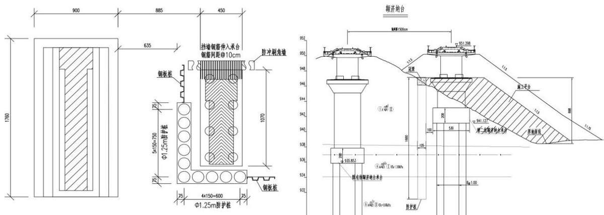  
图 2.1.4-1 桥台防护示意图

## (2) 桩基础类型

1）桩基础采用钻孔灌注桩施工，常用桩径为φ100cm、φ125cm。

2）上覆土层较厚，而下承持力层地基基本承载力σ，≥600kPa的岩石按嵌入式柱桩设计，其余均按摩擦桩基础设计。

3）上覆土层较薄，而下承持力层地基基本承载力σ，≥600kPa的岩石按明挖扩大或挖井基础设计。

## 2.1.4.4 桥梁导流堤

## （1）概况

桥梁导流堤的主要作用是引导水流平顺通过桥孔，提高桥孔泄洪能力，减少对桥下河床的集中冲刷，减缓冲刷进程，减少对墩台和路基的冲刷威胁。

本项目穿越我国典型西北漫流区，水流散乱漫流，无固定沟槽或岸线。一般漫流区修建桥涵工程，为稳定河段、约束水流，避免铁路路堤直接受水流冲刷的危害，桥涵上、下游应设置相应的导流设施。

## （2）桥梁导流堤设置原则

根据《铁路工程水文勘测设计规范》（TB10017-2021），导流堤设置原则如下：

1）漫流区相邻的桥涵之间应设置封闭式导流堤，导流堤迎水面应进行铺砌。

2）封闭式导流堤应设置在上游侧，本项目为增二线工程，若二线位于既有线下游侧，则导流堤应设置在既有线上游侧；若二线位于既有线上游侧，则导流堤应设置在二线上游侧。

3）导流堤设置时，尽量减小堤身与集中股流的交角，堤身避免进入主槽，以减轻水流的集中冲刷，同时堤身平面曲线力求平顺。

## （3）导流堤断面尺寸

导流堤断面尺寸如下图所示，导流堤高度h根据地形、流量、水流状况等确定，一般取100\~200cm线形内插，平顺。

钻孔桩施工泥浆护壁，泥浆成分除膨润土和水外，还有两种添加剂一CMC和纯碱；CMC是纤维素醚，属于水溶性的聚阴离子纤维化合物，起到增稠、保水、助悬浮作用。

钻孔泥浆中无重金属、剧毒类、有机类等物质，且无毒添加剂含量较低，而泥浆使用的时段较短，钻孔桩施工过程泥浆对地下水水质影响很小。

## （2）泥浆池布置原则

经济原则：充分利用项目区现有地形改造，节约土地，尽量减少临时工程投入。

安全原则：场地布置符合安全生产、劳动保护、防火、防洪等要求，利于安全救助。

实用原则：靠近施工工点布置，不重复建设，确保各项设施高效使用。

环保原则：根据有关施工资料，尽可能减少对环境产生的不利影响。

## （3）泥浆池设置

一般泥浆池和沉淀池并列布置；部分泥浆回用，其他废弃部分在充分沉淀之后，达到泥水分离和泥浆固化的效果。陆桥桥墩产生的泥浆直接顺接泥浆池沉淀。

## （4）泥浆外运

沉淀池沉渣及灌注混凝土溢出的废弃钻渣及时清除，用汽车弃运至指定的取（弃）土场。钻渣运输采用钻渣运输车。泥浆车采用全封闭的罐式运输车。运输车在罐顶和底部设进浆口和排浆口；泥浆通过泥浆泵打入罐车，装满后，将进浆口封闭，运输至指定地点弃浆，通过排浆口排出。运输罐车的封闭性较好，可杜绝泥浆运输过程的污染。

表2.1.4-1 本项目增建二线段桥梁布设表
<table><tr><td colspan="1" rowspan="1">序号</td><td colspan="1" rowspan="1">桥梁名称</td><td colspan="1" rowspan="1">线别</td><td colspan="1" rowspan="1">中心里程</td><td colspan="1" rowspan="1">孔跨布置</td><td colspan="1" rowspan="1">跨越水体名称</td><td colspan="1" rowspan="1">桥全长(m)</td><td colspan="1" rowspan="1">用途</td><td colspan="1" rowspan="1">最大桥高(m)</td><td colspan="1" rowspan="1">基础类型</td><td colspan="1" rowspan="1">水中墩数量(个)</td></tr><tr><td colspan="1" rowspan="1">1</td><td colspan="1" rowspan="1">纳林河中桥</td><td colspan="1" rowspan="1">双线</td><td colspan="1" rowspan="1">DK687+417</td><td colspan="1" rowspan="1">1-32m 简支 T 梁</td><td colspan="1" rowspan="1">纳林河</td><td colspan="1" rowspan="1">43</td><td colspan="1" rowspan="1">排洪</td><td colspan="1" rowspan="1"></td><td colspan="1" rowspan="1">钻孔灌注桩</td><td colspan="1" rowspan="1">1</td></tr><tr><td colspan="1" rowspan="1">2</td><td colspan="1" rowspan="1">跨312 省道大桥</td><td colspan="1" rowspan="1">单线</td><td colspan="1" rowspan="1">DK692+567</td><td colspan="1" rowspan="1">（10-32m+2-24m）简支T梁</td><td colspan="1" rowspan="1"></td><td colspan="1" rowspan="1">387</td><td colspan="1" rowspan="1">立交</td><td colspan="1" rowspan="1"></td><td colspan="1" rowspan="1">钻孔灌注桩</td><td colspan="1" rowspan="1">1</td></tr><tr><td colspan="1" rowspan="1">3</td><td colspan="1" rowspan="1">跨干渠中桥</td><td colspan="1" rowspan="1">单线</td><td colspan="1" rowspan="1">DK702+052</td><td colspan="1" rowspan="1">2-32m 简支T 梁</td><td colspan="1" rowspan="1">安都河</td><td colspan="1" rowspan="1">75</td><td colspan="1" rowspan="1">立交</td><td colspan="1" rowspan="1">9.86</td><td colspan="1" rowspan="1">钻孔灌注桩</td><td colspan="1" rowspan="1">/</td></tr><tr><td colspan="1" rowspan="1">4</td><td colspan="1" rowspan="1">跨嘉策铁路中桥</td><td colspan="1" rowspan="1">单线</td><td colspan="1" rowspan="1">DK702+590</td><td colspan="1" rowspan="1">（2-32m+2-24m）简支T梁</td><td colspan="1" rowspan="1"></td><td colspan="1" rowspan="1">128</td><td colspan="1" rowspan="1">立交</td><td colspan="1" rowspan="1">12.74</td><td colspan="1" rowspan="1">钻孔灌注桩</td><td colspan="1" rowspan="1">1</td></tr><tr><td colspan="1" rowspan="1">5</td><td colspan="1" rowspan="1">木伦郭勒河大桥</td><td colspan="1" rowspan="1">单线</td><td colspan="1" rowspan="1">DK714+069</td><td colspan="1" rowspan="1">15-32m 简支 T 梁</td><td colspan="1" rowspan="1">西河</td><td colspan="1" rowspan="1">500</td><td colspan="1" rowspan="1">立交</td><td colspan="1" rowspan="1">7.37</td><td colspan="1" rowspan="1">钻孔灌注桩</td><td colspan="1" rowspan="1">1</td></tr><tr><td colspan="1" rowspan="1">6</td><td colspan="1" rowspan="1">木伦郭勒中桥</td><td colspan="1" rowspan="1">单线</td><td colspan="1" rowspan="1">DK715+439</td><td colspan="1" rowspan="1">3-32m 简支 T 梁</td><td colspan="1" rowspan="1"></td><td colspan="1" rowspan="1">107</td><td colspan="1" rowspan="1">立交</td><td colspan="1" rowspan="1">6.57</td><td colspan="1" rowspan="1">钻孔灌注桩</td><td colspan="1" rowspan="1">1</td></tr><tr><td colspan="1" rowspan="1">7</td><td colspan="1" rowspan="1">木伦郭勒小桥</td><td colspan="1" rowspan="1">单线</td><td colspan="1" rowspan="1">DK715+718</td><td colspan="1" rowspan="1">1-16m 简支 T梁</td><td colspan="1" rowspan="1"></td><td colspan="1" rowspan="1">25</td><td colspan="1" rowspan="1">立交</td><td colspan="1" rowspan="1">5.95</td><td colspan="1" rowspan="1">钻孔灌注桩</td><td colspan="1" rowspan="1">1</td></tr><tr><td colspan="1" rowspan="1">8</td><td colspan="1" rowspan="1">乌兰额尔根郭勒1号中桥</td><td colspan="1" rowspan="1">单线</td><td colspan="1" rowspan="1">DK717+041</td><td colspan="1" rowspan="1">1-32m 简支 T 梁</td><td colspan="1" rowspan="1">乌兰艾立格河</td><td colspan="1" rowspan="1">42</td><td colspan="1" rowspan="1">排洪</td><td colspan="1" rowspan="1">5.82</td><td colspan="1" rowspan="1">钻孔灌注桩</td><td colspan="1" rowspan="1">1</td></tr><tr><td colspan="1" rowspan="1">9</td><td colspan="1" rowspan="1">乌兰额尔根郭勒2号中桥</td><td colspan="1" rowspan="1">单线</td><td colspan="1" rowspan="1">DK717+393</td><td colspan="1" rowspan="1">1-24m 简支 T 梁</td><td colspan="1" rowspan="1"></td><td colspan="1" rowspan="1">34</td><td colspan="1" rowspan="1">立交</td><td colspan="1" rowspan="1">5.96</td><td colspan="1" rowspan="1">钻孔灌注桩</td><td colspan="1" rowspan="1">1</td></tr><tr><td colspan="1" rowspan="1">10</td><td colspan="1" rowspan="1">乌兰额尔根郭勒小桥</td><td colspan="1" rowspan="1">单线</td><td colspan="1" rowspan="1">DK718+164</td><td colspan="1" rowspan="1">1-16m 简支 T梁</td><td colspan="1" rowspan="1"></td><td colspan="1" rowspan="1">26</td><td colspan="1" rowspan="1">排洪立交</td><td colspan="1" rowspan="1">5.73</td><td colspan="1" rowspan="1">钻孔灌注桩</td><td colspan="1" rowspan="1">1</td></tr><tr><td colspan="1" rowspan="1">11</td><td colspan="1" rowspan="1">千条山1号中桥</td><td colspan="1" rowspan="1">单线</td><td colspan="1" rowspan="1">DK787+383</td><td colspan="1" rowspan="1">3-32m 简支 T 梁</td><td colspan="1" rowspan="1">千条尾沟</td><td colspan="1" rowspan="1">111</td><td colspan="1" rowspan="1">排洪</td><td colspan="1" rowspan="1">6.15</td><td colspan="1" rowspan="1">钻孔灌注桩</td><td colspan="1" rowspan="1">/</td></tr><tr><td colspan="1" rowspan="1">12</td><td colspan="1" rowspan="1">千条山1号小桥</td><td colspan="1" rowspan="1">单线</td><td colspan="1" rowspan="1">DK789+068</td><td colspan="1" rowspan="1">1-16 简支 T 梁</td><td colspan="1" rowspan="1"></td><td colspan="1" rowspan="1">24</td><td colspan="1" rowspan="1">排洪</td><td colspan="1" rowspan="1">4.4</td><td colspan="1" rowspan="1">钻孔灌注桩</td><td colspan="1" rowspan="1">1</td></tr><tr><td colspan="1" rowspan="1">13</td><td colspan="1" rowspan="1">千条山2号小桥</td><td colspan="1" rowspan="1">单线</td><td colspan="1" rowspan="1">DK790+124</td><td colspan="1" rowspan="1">1-16 简支 T 梁</td><td colspan="1" rowspan="1"></td><td colspan="1" rowspan="1">24</td><td colspan="1" rowspan="1">立交</td><td colspan="1" rowspan="1">3.89</td><td colspan="1" rowspan="1">钻孔灌注桩</td><td colspan="1" rowspan="1">1</td></tr><tr><td colspan="1" rowspan="1">14</td><td colspan="1" rowspan="1">千条山3号小桥</td><td colspan="1" rowspan="1">单线</td><td colspan="1" rowspan="1">DK791+154</td><td colspan="1" rowspan="1">1-16 简支 T 梁</td><td colspan="1" rowspan="1"></td><td colspan="1" rowspan="1">24</td><td colspan="1" rowspan="1">排洪</td><td colspan="1" rowspan="1">4.68</td><td colspan="1" rowspan="1">钻孔灌注桩</td><td colspan="1" rowspan="1">1</td></tr><tr><td colspan="1" rowspan="1">15</td><td colspan="1" rowspan="1">千条山2号中桥</td><td colspan="1" rowspan="1">单线</td><td colspan="1" rowspan="1">DK793+159</td><td colspan="1" rowspan="1">1-24 简支 T 梁</td><td colspan="1" rowspan="1"></td><td colspan="1" rowspan="1">34</td><td colspan="1" rowspan="1">排洪</td><td colspan="1" rowspan="1">6.25</td><td colspan="1" rowspan="1">钻孔灌注桩</td><td colspan="1" rowspan="1">1</td></tr><tr><td colspan="1" rowspan="1">16</td><td colspan="1" rowspan="1">鞍子山大桥</td><td colspan="1" rowspan="1">单线</td><td colspan="1" rowspan="1">DK796+206</td><td colspan="1" rowspan="1">6-32m 简支 T 梁</td><td colspan="1" rowspan="1"></td><td colspan="1" rowspan="1">208</td><td colspan="1" rowspan="1">排洪</td><td colspan="1" rowspan="1">7.2</td><td colspan="1" rowspan="1">钻孔灌注桩</td><td colspan="1" rowspan="1">1</td></tr><tr><td colspan="1" rowspan="1">17</td><td colspan="1" rowspan="1">千条沟大桥</td><td colspan="1" rowspan="1">单线</td><td colspan="1" rowspan="1">DK801+010</td><td colspan="1" rowspan="1">12-32m 简支 T 梁</td><td colspan="1" rowspan="1">千条尾沟</td><td colspan="1" rowspan="1">402</td><td colspan="1" rowspan="1">排洪</td><td colspan="1" rowspan="1">5.24</td><td colspan="1" rowspan="1">钻孔灌注桩</td><td colspan="1" rowspan="1">1</td></tr><tr><td colspan="1" rowspan="1">18</td><td colspan="1" rowspan="1">千条沟中桥</td><td colspan="1" rowspan="1">单线</td><td colspan="1" rowspan="1">DK805+205</td><td colspan="1" rowspan="1">3-32m 简支 T 梁</td><td colspan="1" rowspan="1"></td><td colspan="1" rowspan="1">107</td><td colspan="1" rowspan="1">排洪</td><td colspan="1" rowspan="1">5.05</td><td colspan="1" rowspan="1">钻孔灌注桩</td><td colspan="1" rowspan="1">1</td></tr><tr><td colspan="1" rowspan="1">19</td><td colspan="1" rowspan="1">千条沟小桥</td><td colspan="1" rowspan="1">单线</td><td colspan="1" rowspan="1">DK805+922</td><td colspan="1" rowspan="1">1-16m 简支 T 梁</td><td colspan="1" rowspan="1"></td><td colspan="1" rowspan="1">30</td><td colspan="1" rowspan="1">排洪</td><td colspan="1" rowspan="1"></td><td colspan="1" rowspan="1">钻孔灌注桩</td><td colspan="1" rowspan="1">1</td></tr><tr><td colspan="1" rowspan="1">20</td><td colspan="1" rowspan="1">鞍子山西小桥</td><td colspan="1" rowspan="1">单线</td><td colspan="1" rowspan="1">DK807+872</td><td colspan="1" rowspan="1">1-16m 简支 T 梁</td><td colspan="1" rowspan="1"></td><td colspan="1" rowspan="1">27</td><td colspan="1" rowspan="1">排洪</td><td colspan="1" rowspan="1"></td><td colspan="1" rowspan="1">钻孔灌注桩</td><td colspan="1" rowspan="1">/</td></tr><tr><td colspan="1" rowspan="1">21</td><td colspan="1" rowspan="1">鞍子山西1号中桥</td><td colspan="1" rowspan="1">单线</td><td colspan="1" rowspan="1">DK808+465</td><td colspan="1" rowspan="1">1-24m 简支 T 梁</td><td colspan="1" rowspan="1"></td><td colspan="1" rowspan="1">36</td><td colspan="1" rowspan="1">排洪</td><td colspan="1" rowspan="1">6.5</td><td colspan="1" rowspan="1">钻孔灌注桩</td><td colspan="1" rowspan="1">1</td></tr><tr><td colspan="1" rowspan="1">22</td><td colspan="1" rowspan="1">鞍子山西大桥</td><td colspan="1" rowspan="1">单线</td><td colspan="1" rowspan="1">DK810+372</td><td colspan="1" rowspan="1">8-32m 简支 T 梁</td><td colspan="1" rowspan="1"></td><td colspan="1" rowspan="1">277</td><td colspan="1" rowspan="1">排洪</td><td colspan="1" rowspan="1">14</td><td colspan="1" rowspan="1">钻孔灌注桩</td><td colspan="1" rowspan="1">/</td></tr><tr><td colspan="1" rowspan="1">23</td><td colspan="1" rowspan="1">鞍子山西2号中桥</td><td colspan="1" rowspan="1">单线</td><td colspan="1" rowspan="1">DK813+794</td><td colspan="1" rowspan="1">3-24m 简支 T 梁</td><td colspan="1" rowspan="1"></td><td colspan="1" rowspan="1">83</td><td colspan="1" rowspan="1">排洪</td><td colspan="1" rowspan="1">5.54</td><td colspan="1" rowspan="1">钻孔灌注桩</td><td colspan="1" rowspan="1">1</td></tr><tr><td colspan="1" rowspan="1">24</td><td colspan="1" rowspan="1">鞍子山西3号中桥</td><td colspan="1" rowspan="1">单线</td><td colspan="1" rowspan="1">DK814+090</td><td colspan="1" rowspan="1">1-24m 简支 T 梁</td><td colspan="1" rowspan="1"></td><td colspan="1" rowspan="1">37</td><td colspan="1" rowspan="1">排洪</td><td colspan="1" rowspan="1">6.79</td><td colspan="1" rowspan="1">钻孔灌注桩</td><td colspan="1" rowspan="1">1</td></tr><tr><td colspan="1" rowspan="1">25</td><td colspan="1" rowspan="1">蓬勃山西特大桥</td><td colspan="1" rowspan="1">单线</td><td colspan="1" rowspan="1">DK817+462</td><td colspan="1" rowspan="1">17-32m 简支 T 梁</td><td colspan="1" rowspan="1">咸水沟左一沟</td><td colspan="1" rowspan="1">567</td><td colspan="1" rowspan="1">排洪</td><td colspan="1" rowspan="1">28.28</td><td colspan="1" rowspan="1">钻孔灌注桩</td><td colspan="1" rowspan="1">1</td></tr><tr><td colspan="1" rowspan="1">26</td><td colspan="1" rowspan="1">蓬勃山西大桥</td><td colspan="1" rowspan="1">单线</td><td colspan="1" rowspan="1">DK828+168</td><td colspan="1" rowspan="1">7-24m 简支 T 梁</td><td colspan="1" rowspan="1">蓬勃山一沟</td><td colspan="1" rowspan="1">183</td><td colspan="1" rowspan="1">排洪</td><td colspan="1" rowspan="1">5.3</td><td colspan="1" rowspan="1">钻孔灌注桩</td><td colspan="1" rowspan="1">/</td></tr><tr><td colspan="1" rowspan="1">27</td><td colspan="1" rowspan="1">蓬勃山西小桥</td><td colspan="1" rowspan="1">单线</td><td colspan="1" rowspan="1">DK830+176</td><td colspan="1" rowspan="1">1-16m 简支 T 梁</td><td colspan="1" rowspan="1"></td><td colspan="1" rowspan="1">26</td><td colspan="1" rowspan="1">排洪</td><td colspan="1" rowspan="1">5.1</td><td colspan="1" rowspan="1">钻孔灌注桩</td><td colspan="1" rowspan="1">1</td></tr><tr><td colspan="1" rowspan="1">28</td><td colspan="1" rowspan="1">风雷山1号中桥</td><td colspan="1" rowspan="1">单线</td><td colspan="1" rowspan="1">DK835+758</td><td colspan="1" rowspan="1">3-24m 简支 T 梁</td><td colspan="1" rowspan="1"></td><td colspan="1" rowspan="1">84</td><td colspan="1" rowspan="1">排洪</td><td colspan="1" rowspan="1">10.83</td><td colspan="1" rowspan="1">钻孔灌注桩</td><td colspan="1" rowspan="1">1</td></tr><tr><td colspan="1" rowspan="1">29</td><td colspan="1" rowspan="1">风雷山1号大桥</td><td colspan="1" rowspan="1">双线+单线</td><td colspan="1" rowspan="1">DK837+475</td><td colspan="1" rowspan="1">4-32m 简支 T 梁</td><td colspan="1" rowspan="1"></td><td colspan="1" rowspan="1">140</td><td colspan="1" rowspan="1">排洪</td><td colspan="1" rowspan="1">10.85</td><td colspan="1" rowspan="1">钻孔灌注桩</td><td colspan="1" rowspan="1">1</td></tr><tr><td colspan="1" rowspan="1">30</td><td colspan="1" rowspan="1">风雷山2号中桥</td><td colspan="1" rowspan="1">单线</td><td colspan="1" rowspan="1">DK844+125</td><td colspan="1" rowspan="1">3-32m 简支 T 梁</td><td colspan="1" rowspan="1"></td><td colspan="1" rowspan="1">110</td><td colspan="1" rowspan="1">排洪</td><td colspan="1" rowspan="1">9.8</td><td colspan="1" rowspan="1">钻孔灌注桩</td><td colspan="1" rowspan="1">1</td></tr><tr><td colspan="1" rowspan="1">31</td><td colspan="1" rowspan="1">风雷山2号大桥</td><td colspan="1" rowspan="1">单线</td><td colspan="1" rowspan="1">DK844+917</td><td colspan="1" rowspan="1">9-32m 简支 T 梁</td><td colspan="1" rowspan="1"></td><td colspan="1" rowspan="1">309</td><td colspan="1" rowspan="1">排洪</td><td colspan="1" rowspan="1">17.4</td><td colspan="1" rowspan="1">钻孔灌注桩</td><td colspan="1" rowspan="1">1</td></tr><tr><td colspan="1" rowspan="1">32</td><td colspan="1" rowspan="1">风雷山3号大桥</td><td colspan="1" rowspan="1">单线</td><td colspan="1" rowspan="1">DK845+614</td><td colspan="1" rowspan="1">4-32m 简支 T 梁</td><td colspan="1" rowspan="1"></td><td colspan="1" rowspan="1">143</td><td colspan="1" rowspan="1">排洪</td><td colspan="1" rowspan="1">13.67</td><td colspan="1" rowspan="1">钻孔灌注桩</td><td colspan="1" rowspan="1">1</td></tr><tr><td colspan="1" rowspan="1">33</td><td colspan="1" rowspan="1">红旗山1号中桥</td><td colspan="1" rowspan="1">单线</td><td colspan="1" rowspan="1">DK851+183</td><td colspan="1" rowspan="1">3-16m 简支 T 梁</td><td colspan="1" rowspan="1"></td><td colspan="1" rowspan="1">57</td><td colspan="1" rowspan="1">排洪</td><td colspan="1" rowspan="1">4.5</td><td colspan="1" rowspan="1">钻孔灌注桩</td><td colspan="1" rowspan="1">1</td></tr><tr><td colspan="1" rowspan="1">34</td><td colspan="1" rowspan="1">红旗山2号中桥</td><td colspan="1" rowspan="1">单线</td><td colspan="1" rowspan="1">DK853+709</td><td colspan="1" rowspan="1">1-24m 简支 T 梁</td><td colspan="1" rowspan="1"></td><td colspan="1" rowspan="1">34</td><td colspan="1" rowspan="1">排洪</td><td colspan="1" rowspan="1">5.6</td><td colspan="1" rowspan="1">钻孔灌注桩</td><td colspan="1" rowspan="1">/</td></tr><tr><td colspan="1" rowspan="1">35</td><td colspan="1" rowspan="1">砾石滩小桥</td><td colspan="1" rowspan="1">单线</td><td colspan="1" rowspan="1">DK857+990</td><td colspan="1" rowspan="1">1-16m 简支 T 梁</td><td colspan="1" rowspan="1">红梁子沟</td><td colspan="1" rowspan="1">30</td><td colspan="1" rowspan="1">排洪立交</td><td colspan="1" rowspan="1">9.2</td><td colspan="1" rowspan="1">钻孔灌注桩</td><td colspan="1" rowspan="1">1</td></tr><tr><td colspan="1" rowspan="1">36</td><td colspan="1" rowspan="1">砾石滩1号中桥</td><td colspan="1" rowspan="1">单线</td><td colspan="1" rowspan="1">DK858+375</td><td colspan="1" rowspan="1">3-32m 简支T 梁</td><td colspan="1" rowspan="1"></td><td colspan="1" rowspan="1">108</td><td colspan="1" rowspan="1">排洪</td><td colspan="1" rowspan="1">6.7</td><td colspan="1" rowspan="1">钻孔灌注桩</td><td colspan="1" rowspan="1">/</td></tr><tr><td colspan="1" rowspan="1">37</td><td colspan="1" rowspan="1">砾石滩2号中桥</td><td colspan="1" rowspan="1">单线</td><td colspan="1" rowspan="1">DK860+262</td><td colspan="1" rowspan="1">1-24m 简支 T 梁</td><td colspan="1" rowspan="1"></td><td colspan="1" rowspan="1">34</td><td colspan="1" rowspan="1">立交</td><td colspan="1" rowspan="1">7.1</td><td colspan="1" rowspan="1">钻孔灌注桩</td><td colspan="1" rowspan="1">1</td></tr><tr><td colspan="1" rowspan="1">38</td><td colspan="1" rowspan="1">砾石山1号小桥</td><td colspan="1" rowspan="1">单线</td><td colspan="1" rowspan="1">DK867+792</td><td colspan="1" rowspan="1">1-16m 简支 T 梁</td><td colspan="1" rowspan="1"></td><td colspan="1" rowspan="1">24</td><td colspan="1" rowspan="1">排洪</td><td colspan="1" rowspan="1">5.5</td><td colspan="1" rowspan="1">钻孔灌注桩</td><td colspan="1" rowspan="1">1</td></tr><tr><td colspan="1" rowspan="1">39</td><td colspan="1" rowspan="1">砾石山1号中桥</td><td colspan="1" rowspan="1">单线</td><td colspan="1" rowspan="1">DK872+763</td><td colspan="1" rowspan="1">3-32m 简支 T 梁</td><td colspan="1" rowspan="1"></td><td colspan="1" rowspan="1">108</td><td colspan="1" rowspan="1">排洪</td><td colspan="1" rowspan="1">6.48</td><td colspan="1" rowspan="1">钻孔灌注桩</td><td colspan="1" rowspan="1">/</td></tr><tr><td colspan="1" rowspan="1">40</td><td colspan="1" rowspan="1">砾石山2号中桥</td><td colspan="1" rowspan="1">单线</td><td colspan="1" rowspan="1">DK873+469</td><td colspan="1" rowspan="1">1-32m 简支 T梁</td><td colspan="1" rowspan="1"></td><td colspan="1" rowspan="1">45</td><td colspan="1" rowspan="1">排洪</td><td colspan="1" rowspan="1">9.75</td><td colspan="1" rowspan="1">钻孔灌注桩</td><td colspan="1" rowspan="1">1</td></tr><tr><td colspan="1" rowspan="1">41</td><td colspan="1" rowspan="1">砾石山2号小桥</td><td colspan="1" rowspan="1">单线</td><td colspan="1" rowspan="1">DK876+133</td><td colspan="1" rowspan="1">1-16m 简支 T 梁</td><td colspan="1" rowspan="1"></td><td colspan="1" rowspan="1">24</td><td colspan="1" rowspan="1">排洪</td><td colspan="1" rowspan="1">6.23</td><td colspan="1" rowspan="1">钻孔灌注桩</td><td colspan="1" rowspan="1">1</td></tr><tr><td colspan="1" rowspan="1">42</td><td colspan="1" rowspan="1">砾石滩特大桥</td><td colspan="1" rowspan="1">单线</td><td colspan="1" rowspan="1">DK878+397</td><td colspan="1" rowspan="1">45-16m 简支 T 梁</td><td colspan="1" rowspan="1">哈珠沟</td><td colspan="1" rowspan="1">756</td><td colspan="1" rowspan="1">排洪</td><td colspan="1" rowspan="1">5.95</td><td colspan="1" rowspan="1">钻孔灌注桩</td><td colspan="1" rowspan="1">1</td></tr><tr><td colspan="1" rowspan="1">43</td><td colspan="1" rowspan="1">咸味井特大桥</td><td colspan="1" rowspan="1">单线</td><td colspan="1" rowspan="1">DK882+133</td><td colspan="1" rowspan="1">18-32m 简支 T 梁</td><td colspan="1" rowspan="1">哈珠沟</td><td colspan="1" rowspan="1">600</td><td colspan="1" rowspan="1">排洪</td><td colspan="1" rowspan="1">6.2</td><td colspan="1" rowspan="1">钻孔灌注桩</td><td colspan="1" rowspan="1">1</td></tr><tr><td colspan="1" rowspan="1">44</td><td colspan="1" rowspan="1">咸味井小桥</td><td colspan="1" rowspan="1">单线</td><td colspan="1" rowspan="1">DK882+752</td><td colspan="1" rowspan="1">1-16m 简支 T 梁</td><td colspan="1" rowspan="1">哈珠沟</td><td colspan="1" rowspan="1">27</td><td colspan="1" rowspan="1">排洪</td><td colspan="1" rowspan="1">7.25</td><td colspan="1" rowspan="1">钻孔灌注桩</td><td colspan="1" rowspan="1">1</td></tr><tr><td colspan="1" rowspan="1">45</td><td colspan="1" rowspan="1">咸味井中桥</td><td colspan="1" rowspan="1">单线</td><td colspan="1" rowspan="1">DK885+945</td><td colspan="1" rowspan="1">1-32m 简支 T 梁</td><td colspan="1" rowspan="1"></td><td colspan="1" rowspan="1">42</td><td colspan="1" rowspan="1">排洪</td><td colspan="1" rowspan="1">4.8</td><td colspan="1" rowspan="1">钻孔灌注桩</td><td colspan="1" rowspan="1">1</td></tr><tr><td colspan="1" rowspan="1">46</td><td colspan="1" rowspan="1">哈珠南山1号中桥</td><td colspan="1" rowspan="1">单线</td><td colspan="1" rowspan="1">DK889+277</td><td colspan="1" rowspan="1">1-24m 简支T梁</td><td colspan="1" rowspan="1"></td><td colspan="1" rowspan="1">34</td><td colspan="1" rowspan="1">排洪</td><td colspan="1" rowspan="1">6.4</td><td colspan="1" rowspan="1">钻孔灌注桩</td><td colspan="1" rowspan="1">1</td></tr><tr><td colspan="1" rowspan="1">47</td><td colspan="1" rowspan="1">哈珠南山2号中桥</td><td colspan="1" rowspan="1">单线</td><td colspan="1" rowspan="1">DK890+078</td><td colspan="1" rowspan="1">2-32m 简支 T 梁</td><td colspan="1" rowspan="1"></td><td colspan="1" rowspan="1">80</td><td colspan="1" rowspan="1">排洪</td><td colspan="1" rowspan="1">9.6</td><td colspan="1" rowspan="1">钻孔灌注桩</td><td colspan="1" rowspan="1">/</td></tr><tr><td colspan="1" rowspan="1">48</td><td colspan="1" rowspan="1">哈珠南山大桥</td><td colspan="1" rowspan="1">单线</td><td colspan="1" rowspan="1">DK892+124</td><td colspan="1" rowspan="1">8-24m 简支 T 梁</td><td colspan="1" rowspan="1"></td><td colspan="1" rowspan="1">207</td><td colspan="1" rowspan="1">排洪</td><td colspan="1" rowspan="1">4.8</td><td colspan="1" rowspan="1">钻孔灌注桩</td><td colspan="1" rowspan="1">1</td></tr><tr><td colspan="1" rowspan="1">49</td><td colspan="1" rowspan="1">哈珠南山小桥</td><td colspan="1" rowspan="1">单线</td><td colspan="1" rowspan="1">DK894+750</td><td colspan="1" rowspan="1">1-16m 简支 T 梁</td><td colspan="1" rowspan="1"></td><td colspan="1" rowspan="1">25</td><td colspan="1" rowspan="1">排洪</td><td colspan="1" rowspan="1">3.3</td><td colspan="1" rowspan="1">钻孔灌注桩</td><td colspan="1" rowspan="1">1</td></tr><tr><td colspan="1" rowspan="1">50</td><td colspan="1" rowspan="1">石头井1号大桥</td><td colspan="1" rowspan="1">单线</td><td colspan="1" rowspan="1">DK897+534</td><td colspan="1" rowspan="1">6-32m+7-24m 简支 T 梁</td><td colspan="1" rowspan="1">哈珠甲沟</td><td colspan="1" rowspan="1">377</td><td colspan="1" rowspan="1">立交</td><td colspan="1" rowspan="1">5.7</td><td colspan="1" rowspan="1">钻孔灌注桩</td><td colspan="1" rowspan="1">/</td></tr><tr><td colspan="1" rowspan="1">51</td><td colspan="1" rowspan="1">石头井1号小桥</td><td colspan="1" rowspan="1">单线</td><td colspan="1" rowspan="1">DK899+599</td><td colspan="1" rowspan="1">1-16m 简支 T 梁</td><td colspan="1" rowspan="1"></td><td colspan="1" rowspan="1">24</td><td colspan="1" rowspan="1">排洪</td><td colspan="1" rowspan="1">5.36</td><td colspan="1" rowspan="1">钻孔灌注桩</td><td colspan="1" rowspan="1">1</td></tr><tr><td colspan="1" rowspan="1">52</td><td colspan="1" rowspan="1">石头井1号中桥</td><td colspan="1" rowspan="1">单线</td><td colspan="1" rowspan="1">DK900+221</td><td colspan="1" rowspan="1">1-32m 简支 T梁</td><td colspan="1" rowspan="1">清河沟右支一沟甲沟</td><td colspan="1" rowspan="1">42</td><td colspan="1" rowspan="1">排洪</td><td colspan="1" rowspan="1">6.67</td><td colspan="1" rowspan="1">钻孔灌注桩</td><td colspan="1" rowspan="1">1</td></tr><tr><td colspan="1" rowspan="1">53</td><td colspan="1" rowspan="1">石头井2号中桥</td><td colspan="1" rowspan="1">单线</td><td colspan="1" rowspan="1">DK900+988</td><td colspan="1" rowspan="1">1-24m 简支 T 梁</td><td colspan="1" rowspan="1"></td><td colspan="1" rowspan="1">33</td><td colspan="1" rowspan="1">排洪</td><td colspan="1" rowspan="1">5.93</td><td colspan="1" rowspan="1">钻孔灌注桩</td><td colspan="1" rowspan="1">1</td></tr><tr><td colspan="1" rowspan="1">54</td><td colspan="1" rowspan="1">石头井2号大桥</td><td colspan="1" rowspan="1">单线</td><td colspan="1" rowspan="1">DK901+510</td><td colspan="1" rowspan="1">3-24m+9-16m+3-24m 简支 T 梁</td><td colspan="1" rowspan="1"></td><td colspan="1" rowspan="1">307</td><td colspan="1" rowspan="1">排洪</td><td colspan="1" rowspan="1">5.35</td><td colspan="1" rowspan="1">钻孔灌注桩</td><td colspan="1" rowspan="1">/</td></tr><tr><td colspan="1" rowspan="1">55</td><td colspan="1" rowspan="1">石头井2号小桥</td><td colspan="1" rowspan="1">单线</td><td colspan="1" rowspan="1">DK902+419</td><td colspan="1" rowspan="1">1-16m 简支 T 梁</td><td colspan="1" rowspan="1"></td><td colspan="1" rowspan="1">26</td><td colspan="1" rowspan="1">排洪</td><td colspan="1" rowspan="1">6.33</td><td colspan="1" rowspan="1">钻孔灌注桩</td><td colspan="1" rowspan="1">1</td></tr><tr><td colspan="1" rowspan="1">56</td><td colspan="1" rowspan="1">黑鹰山1号小桥</td><td colspan="1" rowspan="1">单线</td><td colspan="1" rowspan="1">DK904+211</td><td colspan="1" rowspan="1">1-16m 简支 T 梁</td><td colspan="1" rowspan="1"></td><td colspan="1" rowspan="1">24</td><td colspan="1" rowspan="1">排洪</td><td colspan="1" rowspan="1">4.82</td><td colspan="1" rowspan="1">钻孔灌注桩</td><td colspan="1" rowspan="1">1</td></tr><tr><td colspan="1" rowspan="1">57</td><td colspan="1" rowspan="1">黑鹰山1号大桥</td><td colspan="1" rowspan="1">单线</td><td colspan="1" rowspan="1">DK906+065</td><td colspan="1" rowspan="1">15-32m 简支 T 梁</td><td colspan="1" rowspan="1">清河沟右支一沟</td><td colspan="1" rowspan="1">506</td><td colspan="1" rowspan="1">排洪</td><td colspan="1" rowspan="1">14.52</td><td colspan="1" rowspan="1">钻孔灌注桩</td><td colspan="1" rowspan="1">1</td></tr><tr><td colspan="1" rowspan="1">58</td><td colspan="1" rowspan="1">黑鹰山1号中桥</td><td colspan="1" rowspan="1">单线</td><td colspan="1" rowspan="1">DK906+679</td><td colspan="1" rowspan="1">3-32m 简支 T 梁</td><td colspan="1" rowspan="1"></td><td colspan="1" rowspan="1">113</td><td colspan="1" rowspan="1">排洪</td><td colspan="1" rowspan="1">11.59</td><td colspan="1" rowspan="1">钻孔灌注桩</td><td colspan="1" rowspan="1">/</td></tr><tr><td colspan="1" rowspan="1">59</td><td colspan="1" rowspan="1">黑鹰山2号大桥</td><td colspan="1" rowspan="1">单线</td><td colspan="1" rowspan="1">DK910+010</td><td colspan="1" rowspan="1">7-32m 简支T 梁</td><td colspan="1" rowspan="1">梧桐沟右支沟</td><td colspan="1" rowspan="1">244</td><td colspan="1" rowspan="1">排洪</td><td colspan="1" rowspan="1">12.3</td><td colspan="1" rowspan="1">钻孔灌注桩</td><td colspan="1" rowspan="1">1</td></tr><tr><td colspan="1" rowspan="1">60</td><td colspan="1" rowspan="1">黑鹰山3号中桥</td><td colspan="1" rowspan="1">单线</td><td colspan="1" rowspan="1">DK914+206</td><td colspan="1" rowspan="1">3-32m 简支T 梁</td><td colspan="1" rowspan="1"></td><td colspan="1" rowspan="1">108</td><td colspan="1" rowspan="1">排洪</td><td colspan="1" rowspan="1">7.21</td><td colspan="1" rowspan="1">钻孔灌注桩</td><td colspan="1" rowspan="1">/</td></tr><tr><td colspan="1" rowspan="1">61</td><td colspan="1" rowspan="1">黑鹰山4号中桥</td><td colspan="1" rowspan="1">单线</td><td colspan="1" rowspan="1">DK915+384</td><td colspan="1" rowspan="1">1-24m 简支 T 梁</td><td colspan="1" rowspan="1"></td><td colspan="1" rowspan="1">34</td><td colspan="1" rowspan="1">排洪</td><td colspan="1" rowspan="1">4.16</td><td colspan="1" rowspan="1">钻孔灌注桩</td><td colspan="1" rowspan="1">1</td></tr><tr><td colspan="1" rowspan="1">62</td><td colspan="1" rowspan="1">黑鹰山3号大桥</td><td colspan="1" rowspan="1">单线</td><td colspan="1" rowspan="1">DK917+119</td><td colspan="1" rowspan="1">6-32m 简支 T 梁</td><td colspan="1" rowspan="1"></td><td colspan="1" rowspan="1">207</td><td colspan="1" rowspan="1">排洪</td><td colspan="1" rowspan="1">5.73</td><td colspan="1" rowspan="1">钻孔灌注桩</td><td colspan="1" rowspan="1">1</td></tr><tr><td colspan="1" rowspan="1">63</td><td colspan="1" rowspan="1">黑鹰山2号小桥</td><td colspan="1" rowspan="1">单线</td><td colspan="1" rowspan="1">DK918+134</td><td colspan="1" rowspan="1">1-16m 简支 T 梁</td><td colspan="1" rowspan="1"></td><td colspan="1" rowspan="1">26</td><td colspan="1" rowspan="1">排洪</td><td colspan="1" rowspan="1">4.68</td><td colspan="1" rowspan="1">钻孔灌注桩</td><td colspan="1" rowspan="1">/</td></tr><tr><td colspan="1" rowspan="1">64</td><td colspan="1" rowspan="1">黑鹰山4号大桥</td><td colspan="1" rowspan="1">单线</td><td colspan="1" rowspan="1">DK919+058</td><td colspan="1" rowspan="1">10-32m 简支 T 梁</td><td colspan="1" rowspan="1">梧桐沟</td><td colspan="1" rowspan="1">336</td><td colspan="1" rowspan="1">排洪</td><td colspan="1" rowspan="1">7.37</td><td colspan="1" rowspan="1">钻孔灌注桩</td><td colspan="1" rowspan="1">1</td></tr><tr><td colspan="1" rowspan="1">65</td><td colspan="1" rowspan="1">黑鹰山5号大桥</td><td colspan="1" rowspan="1">单线</td><td colspan="1" rowspan="1">DK922+399</td><td colspan="1" rowspan="1">12-32m 简支 T 梁</td><td colspan="1" rowspan="1">梧桐沟左支二沟</td><td colspan="1" rowspan="1">401</td><td colspan="1" rowspan="1">排洪</td><td colspan="1" rowspan="1">6.57</td><td colspan="1" rowspan="1">钻孔灌注桩</td><td colspan="1" rowspan="1">1</td></tr><tr><td colspan="1" rowspan="1">66</td><td colspan="1" rowspan="1">梧桐井1号小桥</td><td colspan="1" rowspan="1">单线</td><td colspan="1" rowspan="1">DK923+682</td><td colspan="1" rowspan="1">1-16m 简支 T 梁</td><td colspan="1" rowspan="1"></td><td colspan="1" rowspan="1">24</td><td colspan="1" rowspan="1">排洪</td><td colspan="1" rowspan="1">4.7</td><td colspan="1" rowspan="1">钻孔灌注桩</td><td colspan="1" rowspan="1">1</td></tr><tr><td colspan="1" rowspan="1">67</td><td colspan="1" rowspan="1">梧桐井2号小桥</td><td colspan="1" rowspan="1">单线</td><td colspan="1" rowspan="1">DK924+164</td><td colspan="1" rowspan="1">1-16m 简支 T 梁</td><td colspan="1" rowspan="1"></td><td colspan="1" rowspan="1">24</td><td colspan="1" rowspan="1">排洪</td><td colspan="1" rowspan="1">4.7</td><td colspan="1" rowspan="1">钻孔灌注桩</td><td colspan="1" rowspan="1">1</td></tr><tr><td colspan="1" rowspan="1">68</td><td colspan="1" rowspan="1">西陶勒1号中桥</td><td colspan="1" rowspan="1">单线</td><td colspan="1" rowspan="1">DK926+082</td><td colspan="1" rowspan="1">1-32m 简支 T 梁</td><td colspan="1" rowspan="1"></td><td colspan="1" rowspan="1">42</td><td colspan="1" rowspan="1">排洪</td><td colspan="1" rowspan="1">4.5</td><td colspan="1" rowspan="1">钻孔灌注桩</td><td colspan="1" rowspan="1">1</td></tr><tr><td colspan="1" rowspan="1">69</td><td colspan="1" rowspan="1">西陶勒小桥</td><td colspan="1" rowspan="1">单线</td><td colspan="1" rowspan="1">DK929+561</td><td colspan="1" rowspan="1">1-16m 简支 T 梁</td><td colspan="1" rowspan="1"></td><td colspan="1" rowspan="1">24</td><td colspan="1" rowspan="1">排洪</td><td colspan="1" rowspan="1">3.7</td><td colspan="1" rowspan="1">钻孔灌注桩</td><td colspan="1" rowspan="1">1</td></tr><tr><td colspan="1" rowspan="1">70</td><td colspan="1" rowspan="1">西陶勒2号中桥</td><td colspan="1" rowspan="1">单线</td><td colspan="1" rowspan="1">DK933+770</td><td colspan="1" rowspan="1">1-24m 简支T 梁</td><td colspan="1" rowspan="1"></td><td colspan="1" rowspan="1">34</td><td colspan="1" rowspan="1">排洪</td><td colspan="1" rowspan="1">4.8</td><td colspan="1" rowspan="1">钻孔灌注桩</td><td colspan="1" rowspan="1">1</td></tr><tr><td colspan="1" rowspan="1">71</td><td colspan="1" rowspan="1">小红井大桥</td><td colspan="1" rowspan="1">单线</td><td colspan="1" rowspan="1">DK939+111</td><td colspan="1" rowspan="1">15-32m 简支 T 梁</td><td colspan="1" rowspan="1">清河沟右支二沟</td><td colspan="1" rowspan="1">499</td><td colspan="1" rowspan="1">排洪</td><td colspan="1" rowspan="1">7.5</td><td colspan="1" rowspan="1">钻孔灌注桩</td><td colspan="1" rowspan="1">/</td></tr><tr><td colspan="1" rowspan="1">72</td><td colspan="1" rowspan="1">小红井1号中桥</td><td colspan="1" rowspan="1">单线</td><td colspan="1" rowspan="1">DK942+773</td><td colspan="1" rowspan="1">3-24m 简支 T 梁</td><td colspan="1" rowspan="1">清河沟右三沟</td><td colspan="1" rowspan="1">88</td><td colspan="1" rowspan="1">人畜通道</td><td colspan="1" rowspan="1">7.8</td><td colspan="1" rowspan="1">钻孔灌注桩</td><td colspan="1" rowspan="1">1</td></tr><tr><td colspan="1" rowspan="1">73</td><td colspan="1" rowspan="1">小红井2号中桥</td><td colspan="1" rowspan="1">单线</td><td colspan="1" rowspan="1">DK949+253</td><td colspan="1" rowspan="1">2-32m 简支T 梁</td><td colspan="1" rowspan="1"></td><td colspan="1" rowspan="1">74</td><td colspan="1" rowspan="1">人畜通道</td><td colspan="1" rowspan="1">6.4</td><td colspan="1" rowspan="1">钻孔灌注桩</td><td colspan="1" rowspan="1">1</td></tr><tr><td colspan="1" rowspan="1">74</td><td colspan="1" rowspan="1">红柳峡1号中桥</td><td colspan="1" rowspan="1">单线</td><td colspan="1" rowspan="1">DK953+263</td><td colspan="1" rowspan="1">3-32m 简支 T梁</td><td colspan="1" rowspan="1">清河右四沟</td><td colspan="1" rowspan="1">108</td><td colspan="1" rowspan="1">排洪</td><td colspan="1" rowspan="1">16.7</td><td colspan="1" rowspan="1">钻孔灌注桩</td><td colspan="1" rowspan="1">/</td></tr><tr><td colspan="1" rowspan="1">75</td><td colspan="1" rowspan="1">红柳峡小桥</td><td colspan="1" rowspan="1">单线</td><td colspan="1" rowspan="1">DK956+598</td><td colspan="1" rowspan="1">1-16m 简支 T 梁</td><td colspan="1" rowspan="1"></td><td colspan="1" rowspan="1">25</td><td colspan="1" rowspan="1">排洪</td><td colspan="1" rowspan="1">5.5</td><td colspan="1" rowspan="1">钻孔灌注桩</td><td colspan="1" rowspan="1">1</td></tr><tr><td colspan="1" rowspan="1">76</td><td colspan="1" rowspan="1">红柳峡大桥</td><td colspan="1" rowspan="1">单线</td><td colspan="1" rowspan="1">DK956+854</td><td colspan="1" rowspan="1">11-32m 简支 T 梁</td><td colspan="1" rowspan="1"></td><td colspan="1" rowspan="1">369</td><td colspan="1" rowspan="1">排洪</td><td colspan="1" rowspan="1">6.5</td><td colspan="1" rowspan="1">钻孔灌注桩</td><td colspan="1" rowspan="1">1</td></tr><tr><td colspan="1" rowspan="1">77</td><td colspan="1" rowspan="1">红柳峡2号中桥</td><td colspan="1" rowspan="1">单线</td><td colspan="1" rowspan="1">DK959+506</td><td colspan="1" rowspan="1">3-24m 简支 T 梁</td><td colspan="1" rowspan="1"></td><td colspan="1" rowspan="1">88</td><td colspan="1" rowspan="1">排洪</td><td colspan="1" rowspan="1">9.4</td><td colspan="1" rowspan="1">钻孔灌注桩</td><td colspan="1" rowspan="1">1</td></tr><tr><td colspan="1" rowspan="1">78</td><td colspan="1" rowspan="1">红柳峡特大桥</td><td colspan="1" rowspan="1">单线</td><td colspan="1" rowspan="1">DK967+458</td><td colspan="1" rowspan="1">21-32m 简支 T 梁</td><td colspan="1" rowspan="1">清河沟</td><td colspan="1" rowspan="1">703</td><td colspan="1" rowspan="1">排洪</td><td colspan="1" rowspan="1">10.3</td><td colspan="1" rowspan="1">钻孔灌注桩</td><td colspan="1" rowspan="1">1</td></tr><tr><td colspan="1" rowspan="1">79</td><td colspan="1" rowspan="1">白梁1号大桥</td><td colspan="1" rowspan="1">单线</td><td colspan="1" rowspan="1">DK969+679</td><td colspan="1" rowspan="1">7-32m 简支 T 梁</td><td colspan="1" rowspan="1"></td><td colspan="1" rowspan="1">241</td><td colspan="1" rowspan="1">排洪</td><td colspan="1" rowspan="1">7.8</td><td colspan="1" rowspan="1">钻孔灌注桩</td><td colspan="1" rowspan="1">1</td></tr><tr><td colspan="1" rowspan="1">80</td><td colspan="1" rowspan="1">白梁2号大桥</td><td colspan="1" rowspan="1">单线</td><td colspan="1" rowspan="1">DK974+702</td><td colspan="1" rowspan="1">10-32m 简支 T 梁</td><td colspan="1" rowspan="1"></td><td colspan="1" rowspan="1">338</td><td colspan="1" rowspan="1">排洪</td><td colspan="1" rowspan="1">18.2</td><td colspan="1" rowspan="1">钻孔灌注桩</td><td colspan="1" rowspan="1">1</td></tr><tr><td colspan="1" rowspan="1">81</td><td colspan="1" rowspan="1">白梁中桥</td><td colspan="1" rowspan="1">单线</td><td colspan="1" rowspan="1">DK976+872</td><td colspan="1" rowspan="1">1-24m 简支 T 梁</td><td colspan="1" rowspan="1"></td><td colspan="1" rowspan="1">39</td><td colspan="1" rowspan="1">排洪</td><td colspan="1" rowspan="1">11</td><td colspan="1" rowspan="1">钻孔灌注桩</td><td colspan="1" rowspan="1">1</td></tr><tr><td colspan="1" rowspan="1">82</td><td colspan="1" rowspan="1">红泉大桥</td><td colspan="1" rowspan="1">单线</td><td colspan="1" rowspan="1">DK983+196</td><td colspan="1" rowspan="1">5-32m 简支 T 梁</td><td colspan="1" rowspan="1"></td><td colspan="1" rowspan="1">172</td><td colspan="1" rowspan="1">排洪</td><td colspan="1" rowspan="1">19.2</td><td colspan="1" rowspan="1">钻孔灌注桩</td><td colspan="1" rowspan="1">/</td></tr><tr><td colspan="1" rowspan="1">83</td><td colspan="1" rowspan="1">复线斜沟特大桥</td><td colspan="1" rowspan="1">单线</td><td colspan="1" rowspan="1">DK992+883</td><td colspan="1" rowspan="1">69-32m 简支 T 梁</td><td colspan="1" rowspan="1">少斜沟</td><td colspan="1" rowspan="1">2282</td><td colspan="1" rowspan="1">排洪</td><td colspan="1" rowspan="1">12</td><td colspan="1" rowspan="1">钻孔灌注桩</td><td colspan="1" rowspan="1">1</td></tr><tr><td colspan="1" rowspan="1">84</td><td colspan="1" rowspan="1">复线斜沟1号小桥</td><td colspan="1" rowspan="1">单线</td><td colspan="1" rowspan="1">DK994+950</td><td colspan="1" rowspan="1">1-24m 简支 T 梁</td><td colspan="1" rowspan="1"></td><td colspan="1" rowspan="1">41</td><td colspan="1" rowspan="1">排洪</td><td colspan="1" rowspan="1">8</td><td colspan="1" rowspan="1">钻孔灌注桩</td><td colspan="1" rowspan="1">1</td></tr><tr><td colspan="1" rowspan="1">85</td><td colspan="1" rowspan="1">复线斜沟2号中桥</td><td colspan="1" rowspan="1">单线</td><td colspan="1" rowspan="1">DK998+693</td><td colspan="1" rowspan="1">2-32m 简支 T 梁</td><td colspan="1" rowspan="1"></td><td colspan="1" rowspan="1">76</td><td colspan="1" rowspan="1">排洪</td><td colspan="1" rowspan="1">6</td><td colspan="1" rowspan="1">钻孔灌注桩</td><td colspan="1" rowspan="1">1</td></tr><tr><td colspan="1" rowspan="1">86</td><td colspan="1" rowspan="1">复线斜沟3号中桥</td><td colspan="1" rowspan="1">单线</td><td colspan="1" rowspan="1">DK1000+384</td><td colspan="1" rowspan="1">1-24m 简支 T 梁</td><td colspan="1" rowspan="1"></td><td colspan="1" rowspan="1">36</td><td colspan="1" rowspan="1">排洪</td><td colspan="1" rowspan="1">6</td><td colspan="1" rowspan="1">钻孔灌注桩</td><td colspan="1" rowspan="1">1</td></tr><tr><td colspan="1" rowspan="1">87</td><td colspan="1" rowspan="1">复线少斜1号小桥</td><td colspan="1" rowspan="1">单线</td><td colspan="1" rowspan="1">DK1001+082</td><td colspan="1" rowspan="1">1-16m 简支 T 梁</td><td colspan="1" rowspan="1"></td><td colspan="1" rowspan="1">28</td><td colspan="1" rowspan="1">排洪</td><td colspan="1" rowspan="1">5.5</td><td colspan="1" rowspan="1">钻孔灌注桩</td><td colspan="1" rowspan="1">/</td></tr><tr><td colspan="1" rowspan="1">88</td><td colspan="1" rowspan="1">复线少斜2号小桥</td><td colspan="1" rowspan="1">单线</td><td colspan="1" rowspan="1">DK1001+342</td><td colspan="1" rowspan="1">1-16m 简支 T 梁</td><td colspan="1" rowspan="1"></td><td colspan="1" rowspan="1">28</td><td colspan="1" rowspan="1">排洪</td><td colspan="1" rowspan="1">6</td><td colspan="1" rowspan="1">钻孔灌注桩</td><td colspan="1" rowspan="1">1</td></tr><tr><td colspan="1" rowspan="1">89</td><td colspan="1" rowspan="1">复线少斜1号中桥</td><td colspan="1" rowspan="1">单线</td><td colspan="1" rowspan="1">DK1002+635</td><td colspan="1" rowspan="1">1-32m 简支 T 梁</td><td colspan="1" rowspan="1"></td><td colspan="1" rowspan="1">44</td><td colspan="1" rowspan="1">排洪</td><td colspan="1" rowspan="1">6.5</td><td colspan="1" rowspan="1">钻孔灌注桩</td><td colspan="1" rowspan="1">1</td></tr><tr><td colspan="1" rowspan="1">90</td><td colspan="1" rowspan="1">复线少斜2号中桥</td><td colspan="1" rowspan="1">单线</td><td colspan="1" rowspan="1">DK1002+995</td><td colspan="1" rowspan="1">1-32m 简支 T梁</td><td colspan="1" rowspan="1"></td><td colspan="1" rowspan="1">48</td><td colspan="1" rowspan="1">排洪</td><td colspan="1" rowspan="1">8</td><td colspan="1" rowspan="1">钻孔灌注桩</td><td colspan="1" rowspan="1">1</td></tr><tr><td colspan="1" rowspan="1">91</td><td colspan="1" rowspan="1">复线少斜3号中桥</td><td colspan="1" rowspan="1">单线</td><td colspan="1" rowspan="1">DK1003+233</td><td colspan="1" rowspan="1">1-32m 简支 T 梁</td><td colspan="1" rowspan="1"></td><td colspan="1" rowspan="1">44</td><td colspan="1" rowspan="1">排洪</td><td colspan="1" rowspan="1">6.5</td><td colspan="1" rowspan="1">钻孔灌注桩</td><td colspan="1" rowspan="1">/</td></tr><tr><td colspan="1" rowspan="1">92</td><td colspan="1" rowspan="1">复线少斜大桥</td><td colspan="1" rowspan="1">单线</td><td colspan="1" rowspan="1">DK1005+838</td><td colspan="1" rowspan="1">10-16m 简支 T 梁</td><td colspan="1" rowspan="1"></td><td colspan="1" rowspan="1">181</td><td colspan="1" rowspan="1">排洪</td><td colspan="1" rowspan="1">7</td><td colspan="1" rowspan="1">钻孔灌注桩</td><td colspan="1" rowspan="1">1</td></tr><tr><td colspan="1" rowspan="1">93</td><td colspan="1" rowspan="1">复线少斜4号中桥</td><td colspan="1" rowspan="1">单线</td><td colspan="1" rowspan="1">DK1006+344</td><td colspan="1" rowspan="1">2-32m 简支 T 梁</td><td colspan="1" rowspan="1"></td><td colspan="1" rowspan="1">79</td><td colspan="1" rowspan="1">排洪</td><td colspan="1" rowspan="1">7</td><td colspan="1" rowspan="1">钻孔灌注桩</td><td colspan="1" rowspan="1">1</td></tr><tr><td colspan="1" rowspan="1">94</td><td colspan="1" rowspan="1">复线少斜5号中桥</td><td colspan="1" rowspan="1">单线</td><td colspan="1" rowspan="1">DK1006+774</td><td colspan="1" rowspan="1">2-32m 简支 T 梁</td><td colspan="1" rowspan="1"></td><td colspan="1" rowspan="1">76</td><td colspan="1" rowspan="1">排洪</td><td colspan="1" rowspan="1">6.5</td><td colspan="1" rowspan="1">钻孔灌注桩</td><td colspan="1" rowspan="1">1</td></tr><tr><td colspan="1" rowspan="1">95</td><td colspan="1" rowspan="1">复线跃进山1号中桥</td><td colspan="1" rowspan="1">单线</td><td colspan="1" rowspan="1">DK1007+823</td><td colspan="1" rowspan="1">3-32m 简支 T 梁</td><td colspan="1" rowspan="1"></td><td colspan="1" rowspan="1">112</td><td colspan="1" rowspan="1">排洪</td><td colspan="1" rowspan="1">7</td><td colspan="1" rowspan="1">钻孔灌注桩</td><td colspan="1" rowspan="1">/</td></tr><tr><td colspan="1" rowspan="1">96</td><td colspan="1" rowspan="1">复线跃进山2号中桥</td><td colspan="1" rowspan="1">单线</td><td colspan="1" rowspan="1">DK1008+869</td><td colspan="1" rowspan="1">3-24m 简支 T 梁</td><td colspan="1" rowspan="1"></td><td colspan="1" rowspan="1">100</td><td colspan="1" rowspan="1">排洪</td><td colspan="1" rowspan="1">12</td><td colspan="1" rowspan="1">钻孔灌注桩</td><td colspan="1" rowspan="1">1</td></tr><tr><td colspan="1" rowspan="1">97</td><td colspan="1" rowspan="1">复线跃进山3号中桥</td><td colspan="1" rowspan="1">单线</td><td colspan="1" rowspan="1">DK1010+240</td><td colspan="1" rowspan="1">3-32m 简支 T 梁</td><td colspan="1" rowspan="1"></td><td colspan="1" rowspan="1">114</td><td colspan="1" rowspan="1">排洪</td><td colspan="1" rowspan="1">8.5</td><td colspan="1" rowspan="1">钻孔灌注桩</td><td colspan="1" rowspan="1">1</td></tr><tr><td colspan="1" rowspan="1">98</td><td colspan="1" rowspan="1">复线跃进山4号中桥</td><td colspan="1" rowspan="1">单线</td><td colspan="1" rowspan="1">DK1011+539</td><td colspan="1" rowspan="1">1-32m 简支 T 梁</td><td colspan="1" rowspan="1"></td><td colspan="1" rowspan="1">48</td><td colspan="1" rowspan="1">排洪</td><td colspan="1" rowspan="1">8</td><td colspan="1" rowspan="1">钻孔灌注桩</td><td colspan="1" rowspan="1">1</td></tr><tr><td colspan="1" rowspan="1">99</td><td colspan="1" rowspan="1">复线跃进山5号中桥</td><td colspan="1" rowspan="1">单线</td><td colspan="1" rowspan="1">DK1012+007</td><td colspan="1" rowspan="1">2-32m 简支 T 梁</td><td colspan="1" rowspan="1"></td><td colspan="1" rowspan="1">79</td><td colspan="1" rowspan="1">排洪</td><td colspan="1" rowspan="1">7</td><td colspan="1" rowspan="1">钻孔灌注桩</td><td colspan="1" rowspan="1">1</td></tr><tr><td colspan="1" rowspan="1">100</td><td colspan="1" rowspan="1">复线跃进山6号中桥</td><td colspan="1" rowspan="1">单线</td><td colspan="1" rowspan="1">DK1012+413</td><td colspan="1" rowspan="1">1-32m 简支 T 梁</td><td colspan="1" rowspan="1"></td><td colspan="1" rowspan="1">49</td><td colspan="1" rowspan="1">排洪</td><td colspan="1" rowspan="1">8</td><td colspan="1" rowspan="1">钻孔灌注桩</td><td colspan="1" rowspan="1">1</td></tr><tr><td colspan="1" rowspan="1">101</td><td colspan="1" rowspan="1">复线跃进山7号中桥</td><td colspan="1" rowspan="1">单线</td><td colspan="1" rowspan="1">DK1012+832</td><td colspan="1" rowspan="1">2-32m 简支 T 梁</td><td colspan="1" rowspan="1"></td><td colspan="1" rowspan="1">78</td><td colspan="1" rowspan="1">排洪</td><td colspan="1" rowspan="1">7</td><td colspan="1" rowspan="1">钻孔灌注桩</td><td colspan="1" rowspan="1">1</td></tr><tr><td colspan="1" rowspan="1">102</td><td colspan="1" rowspan="1">复线跃进山8号中桥</td><td colspan="1" rowspan="1">单线</td><td colspan="1" rowspan="1">DK1014+075</td><td colspan="1" rowspan="1">1-32m 简支 T 梁</td><td colspan="1" rowspan="1"></td><td colspan="1" rowspan="1">56</td><td colspan="1" rowspan="1">排洪</td><td colspan="1" rowspan="1">11</td><td colspan="1" rowspan="1">钻孔灌注桩</td><td colspan="1" rowspan="1">1</td></tr><tr><td colspan="1" rowspan="1">103</td><td colspan="1" rowspan="1">复线跃进山9号中桥</td><td colspan="1" rowspan="1">单线</td><td colspan="1" rowspan="1">DK1015+478</td><td colspan="1" rowspan="1">2-32m 简支 T 梁</td><td colspan="1" rowspan="1"></td><td colspan="1" rowspan="1">84</td><td colspan="1" rowspan="1">排洪</td><td colspan="1" rowspan="1">9.5</td><td colspan="1" rowspan="1">钻孔灌注桩</td><td colspan="1" rowspan="1">/</td></tr><tr><td colspan="1" rowspan="1">104</td><td colspan="1" rowspan="1">复线马鬃山1号中桥</td><td colspan="1" rowspan="1">单线</td><td colspan="1" rowspan="1">DK1017+573</td><td colspan="1" rowspan="1">2-32m 简支 T 梁</td><td colspan="1" rowspan="1"></td><td colspan="1" rowspan="1">78</td><td colspan="1" rowspan="1">排洪</td><td colspan="1" rowspan="1">7</td><td colspan="1" rowspan="1">钻孔灌注桩</td><td colspan="1" rowspan="1">1</td></tr><tr><td colspan="1" rowspan="1">105</td><td colspan="1" rowspan="1">复线马鬃山2号中桥</td><td colspan="1" rowspan="1">单线</td><td colspan="1" rowspan="1">DK1017+935</td><td colspan="1" rowspan="1">1-32m 简支 T梁</td><td colspan="1" rowspan="1"></td><td colspan="1" rowspan="1">46</td><td colspan="1" rowspan="1">排洪</td><td colspan="1" rowspan="1">7</td><td colspan="1" rowspan="1">钻孔灌注桩</td><td colspan="1" rowspan="1">1</td></tr><tr><td colspan="1" rowspan="1">106</td><td colspan="1" rowspan="1">复线马鬃山3号中桥</td><td colspan="1" rowspan="1">单线</td><td colspan="1" rowspan="1">DK1018+238</td><td colspan="1" rowspan="1">3-32m 简支 T 梁</td><td colspan="1" rowspan="1"></td><td colspan="1" rowspan="1">112</td><td colspan="1" rowspan="1">排洪</td><td colspan="1" rowspan="1">7.5</td><td colspan="1" rowspan="1">钻孔灌注桩</td><td colspan="1" rowspan="1">/</td></tr><tr><td colspan="1" rowspan="1">107</td><td colspan="1" rowspan="1">复线马鬃山大桥</td><td colspan="1" rowspan="1">单线</td><td colspan="1" rowspan="1">DK1019+725</td><td colspan="1" rowspan="1">4-32m 简支 T 梁</td><td colspan="1" rowspan="1"></td><td colspan="1" rowspan="1">144</td><td colspan="1" rowspan="1">排洪</td><td colspan="1" rowspan="1">7.5</td><td colspan="1" rowspan="1">钻孔灌注桩</td><td colspan="1" rowspan="1">1</td></tr><tr><td colspan="1" rowspan="1">108</td><td colspan="1" rowspan="1">复线公婆泉1号大桥</td><td colspan="1" rowspan="1">单线</td><td colspan="1" rowspan="1">DK1020+798</td><td colspan="1" rowspan="1">5-32m 简支 T 梁</td><td colspan="1" rowspan="1"></td><td colspan="1" rowspan="1">179</td><td colspan="1" rowspan="1">排洪</td><td colspan="1" rowspan="1">8</td><td colspan="1" rowspan="1">钻孔灌注桩</td><td colspan="1" rowspan="1">/</td></tr><tr><td colspan="1" rowspan="1">109</td><td colspan="1" rowspan="1">复线公婆泉1号中桥</td><td colspan="1" rowspan="1">单线</td><td colspan="1" rowspan="1">DK1022+348</td><td colspan="1" rowspan="1">2-32m 简支 T 梁</td><td colspan="1" rowspan="1"></td><td colspan="1" rowspan="1">84</td><td colspan="1" rowspan="1">排洪</td><td colspan="1" rowspan="1">9</td><td colspan="1" rowspan="1">钻孔灌注桩</td><td colspan="1" rowspan="1">1</td></tr><tr><td colspan="1" rowspan="1">110</td><td colspan="1" rowspan="1">复线公婆泉2号中桥</td><td colspan="1" rowspan="1">单线</td><td colspan="1" rowspan="1">DK1023+530</td><td colspan="1" rowspan="1">2-32m 简支 T 梁</td><td colspan="1" rowspan="1"></td><td colspan="1" rowspan="1">423</td><td colspan="1" rowspan="1">排洪</td><td colspan="1" rowspan="1">11.5</td><td colspan="1" rowspan="1">钻孔灌注桩</td><td colspan="1" rowspan="1">1</td></tr><tr><td colspan="1" rowspan="1">111</td><td colspan="1" rowspan="1">复线公婆泉2号大桥</td><td colspan="1" rowspan="1">单线</td><td colspan="1" rowspan="1">DK1024+982</td><td colspan="1" rowspan="1">7-32m 简支 T 梁</td><td colspan="1" rowspan="1"></td><td colspan="1" rowspan="1">94</td><td colspan="1" rowspan="1">排洪</td><td colspan="1" rowspan="1">10</td><td colspan="1" rowspan="1">钻孔灌注桩</td><td colspan="1" rowspan="1">/</td></tr><tr><td colspan="1" rowspan="1">112</td><td colspan="1" rowspan="1">复线公婆泉3号中桥</td><td colspan="1" rowspan="1">单线</td><td colspan="1" rowspan="1">DK1029+683</td><td colspan="1" rowspan="1">3-24m 简支 T 梁</td><td colspan="1" rowspan="1"></td><td colspan="1" rowspan="1">46</td><td colspan="1" rowspan="1">排洪</td><td colspan="1" rowspan="1">7</td><td colspan="1" rowspan="1">钻孔灌注桩</td><td colspan="1" rowspan="1">1</td></tr><tr><td colspan="1" rowspan="1">113</td><td colspan="1" rowspan="1">复线公婆泉4号中桥</td><td colspan="1" rowspan="1">单线</td><td colspan="1" rowspan="1">DK1030+443</td><td colspan="1" rowspan="1">1-32m 简支 T 梁</td><td colspan="1" rowspan="1"></td><td colspan="1" rowspan="1">14</td><td colspan="1" rowspan="1">排洪</td><td colspan="1" rowspan="1"></td><td colspan="1" rowspan="1">钻孔灌注桩</td><td colspan="1" rowspan="1">/</td></tr><tr><td colspan="1" rowspan="1">114</td><td colspan="1" rowspan="1">复线公婆泉3号大桥</td><td colspan="1" rowspan="1">单线</td><td colspan="1" rowspan="1">DK1030+774</td><td colspan="1" rowspan="1">9-32m 简支 T 梁</td><td colspan="1" rowspan="1"></td><td colspan="1" rowspan="1">306</td><td colspan="1" rowspan="1">排洪</td><td colspan="1" rowspan="1">6</td><td colspan="1" rowspan="1">钻孔灌注桩</td><td colspan="1" rowspan="1">/</td></tr><tr><td colspan="1" rowspan="1">115</td><td colspan="1" rowspan="1">复线狼娃山1号中桥</td><td colspan="1" rowspan="1">单线</td><td colspan="1" rowspan="1">DK1033+997</td><td colspan="1" rowspan="1">2-24m 简支T 梁</td><td colspan="1" rowspan="1"></td><td colspan="1" rowspan="1">65</td><td colspan="1" rowspan="1">排洪</td><td colspan="1" rowspan="1">8</td><td colspan="1" rowspan="1">钻孔灌注桩</td><td colspan="1" rowspan="1">/</td></tr><tr><td colspan="1" rowspan="1">116</td><td colspan="1" rowspan="1">复线狼娃山2号中桥</td><td colspan="1" rowspan="1">单线</td><td colspan="1" rowspan="1">DK1034+431</td><td colspan="1" rowspan="1">2-32m 简支 T 梁</td><td colspan="1" rowspan="1"></td><td colspan="1" rowspan="1">81</td><td colspan="1" rowspan="1">排洪</td><td colspan="1" rowspan="1">9.5</td><td colspan="1" rowspan="1">钻孔灌注桩</td><td colspan="1" rowspan="1">1</td></tr><tr><td colspan="1" rowspan="1">117</td><td colspan="1" rowspan="1">复线狼娃山3号中桥</td><td colspan="1" rowspan="1">单线</td><td colspan="1" rowspan="1">DK1036+379</td><td colspan="1" rowspan="1">1-32m 简支 T 梁</td><td colspan="1" rowspan="1"></td><td colspan="1" rowspan="1">44</td><td colspan="1" rowspan="1">排洪</td><td colspan="1" rowspan="1">6</td><td colspan="1" rowspan="1">钻孔灌注桩</td><td colspan="1" rowspan="1">1</td></tr><tr><td colspan="1" rowspan="1">118</td><td colspan="1" rowspan="1">复线狼娃山4号中桥</td><td colspan="1" rowspan="1">单线</td><td colspan="1" rowspan="1">DK1036+920</td><td colspan="1" rowspan="1">2-32m 简支 T 梁</td><td colspan="1" rowspan="1"></td><td colspan="1" rowspan="1">78</td><td colspan="1" rowspan="1">排洪</td><td colspan="1" rowspan="1">7</td><td colspan="1" rowspan="1">钻孔灌注桩</td><td colspan="1" rowspan="1">1</td></tr><tr><td colspan="1" rowspan="1">119</td><td colspan="1" rowspan="1">复线狼娃山大桥</td><td colspan="1" rowspan="1">单线</td><td colspan="1" rowspan="1">DK1038+447</td><td colspan="1" rowspan="1">5-32m 简支 T 梁</td><td colspan="1" rowspan="1"></td><td colspan="1" rowspan="1">174</td><td colspan="1" rowspan="1">排洪</td><td colspan="1" rowspan="1">6</td><td colspan="1" rowspan="1">钻孔灌注桩</td><td colspan="1" rowspan="1">/</td></tr><tr><td colspan="1" rowspan="1">120</td><td colspan="1" rowspan="1">复线狼娃山5号中桥</td><td colspan="1" rowspan="1">单线</td><td colspan="1" rowspan="1">DK1038+771</td><td colspan="1" rowspan="1">1-32m 简支 T 梁</td><td colspan="1" rowspan="1"></td><td colspan="1" rowspan="1">48</td><td colspan="1" rowspan="1">排洪</td><td colspan="1" rowspan="1">8.5</td><td colspan="1" rowspan="1">钻孔灌注桩</td><td colspan="1" rowspan="1">/</td></tr><tr><td colspan="1" rowspan="1">121</td><td colspan="1" rowspan="1">复线狼娃山1号小桥</td><td colspan="1" rowspan="1">单线</td><td colspan="1" rowspan="1">DK1039+664</td><td colspan="1" rowspan="1">1-16m 简支 T 梁</td><td colspan="1" rowspan="1"></td><td colspan="1" rowspan="1">32</td><td colspan="1" rowspan="1">排洪</td><td colspan="1" rowspan="1">8</td><td colspan="1" rowspan="1">钻孔灌注桩</td><td colspan="1" rowspan="1">1</td></tr><tr><td colspan="1" rowspan="1">122</td><td colspan="1" rowspan="1">复线狼娃山2号小桥</td><td colspan="1" rowspan="1">单线</td><td colspan="1" rowspan="1">DK1039+836</td><td colspan="1" rowspan="1">1-16m 简支 T 梁</td><td colspan="1" rowspan="1"></td><td colspan="1" rowspan="1">32</td><td colspan="1" rowspan="1">排洪</td><td colspan="1" rowspan="1">8.5</td><td colspan="1" rowspan="1">钻孔灌注桩</td><td colspan="1" rowspan="1">1</td></tr><tr><td colspan="1" rowspan="1">123</td><td colspan="1" rowspan="1">复线狼娃山3号小桥</td><td colspan="1" rowspan="1">单线</td><td colspan="1" rowspan="1">DK1039+896</td><td colspan="1" rowspan="1">1-16m 简支 T 梁</td><td colspan="1" rowspan="1"></td><td colspan="1" rowspan="1">34</td><td colspan="1" rowspan="1">排洪</td><td colspan="1" rowspan="1">9</td><td colspan="1" rowspan="1">钻孔灌注桩</td><td colspan="1" rowspan="1">1</td></tr><tr><td colspan="1" rowspan="1">124</td><td colspan="1" rowspan="1">复线狼娃山6号中桥</td><td colspan="1" rowspan="1">单线</td><td colspan="1" rowspan="1">DK1043+724</td><td colspan="1" rowspan="1">1-32m 简支 T 梁</td><td colspan="1" rowspan="1"></td><td colspan="1" rowspan="1">46</td><td colspan="1" rowspan="1">排洪</td><td colspan="1" rowspan="1">7</td><td colspan="1" rowspan="1">钻孔灌注桩</td><td colspan="1" rowspan="1">1</td></tr><tr><td colspan="1" rowspan="1">125</td><td colspan="1" rowspan="1">复线狼娃山7号中桥</td><td colspan="1" rowspan="1">单线</td><td colspan="1" rowspan="1">DK1043+829</td><td colspan="1" rowspan="1">1-32m 简支 T 梁</td><td colspan="1" rowspan="1"></td><td colspan="1" rowspan="1">44</td><td colspan="1" rowspan="1">排洪</td><td colspan="1" rowspan="1">6.5</td><td colspan="1" rowspan="1">钻孔灌注桩</td><td colspan="1" rowspan="1">1</td></tr><tr><td colspan="1" rowspan="1">126</td><td colspan="1" rowspan="1">复线清水泉1号中桥</td><td colspan="1" rowspan="1">单线</td><td colspan="1" rowspan="1">DK1044+740</td><td colspan="1" rowspan="1">2-32m 简支 T 梁</td><td colspan="1" rowspan="1"></td><td colspan="1" rowspan="1">78</td><td colspan="1" rowspan="1">排洪</td><td colspan="1" rowspan="1">7</td><td colspan="1" rowspan="1">钻孔灌注桩</td><td colspan="1" rowspan="1">1</td></tr><tr><td colspan="1" rowspan="1">127</td><td colspan="1" rowspan="1">复线清水泉2号中桥</td><td colspan="1" rowspan="1">单线</td><td colspan="1" rowspan="1">DK1045+576</td><td colspan="1" rowspan="1">2-32m 简支 T 梁</td><td colspan="1" rowspan="1"></td><td colspan="1" rowspan="1">79</td><td colspan="1" rowspan="1">排洪</td><td colspan="1" rowspan="1">7</td><td colspan="1" rowspan="1">钻孔灌注桩</td><td colspan="1" rowspan="1">1</td></tr><tr><td colspan="1" rowspan="1">128</td><td colspan="1" rowspan="1">复线清水泉1号特大桥</td><td colspan="1" rowspan="1">单线</td><td colspan="1" rowspan="1">DK1047+388</td><td colspan="1" rowspan="1">11-32+1-24+3-32+3-24+18-32m简支梁</td><td colspan="1" rowspan="1"></td><td colspan="1" rowspan="1">1162</td><td colspan="1" rowspan="1">排洪</td><td colspan="1" rowspan="1">9.5</td><td colspan="1" rowspan="1">钻孔灌注桩</td><td colspan="1" rowspan="1">1</td></tr><tr><td colspan="1" rowspan="1">129</td><td colspan="1" rowspan="1">复线清水泉1号大桥</td><td colspan="1" rowspan="1">单线</td><td colspan="1" rowspan="1">DK1048+430</td><td colspan="1" rowspan="1">5-32m 简支 T 梁</td><td colspan="1" rowspan="1"></td><td colspan="1" rowspan="1">182</td><td colspan="1" rowspan="1">排洪</td><td colspan="1" rowspan="1">9.5</td><td colspan="1" rowspan="1">钻孔灌注桩</td><td colspan="1" rowspan="1">1</td></tr><tr><td colspan="1" rowspan="1">130</td><td colspan="1" rowspan="1">复线清水泉2号特大桥</td><td colspan="1" rowspan="1">单线</td><td colspan="1" rowspan="1">DK1050+964</td><td colspan="1" rowspan="1">24-32m 简支 T 梁</td><td colspan="1" rowspan="1"></td><td colspan="1" rowspan="1">796</td><td colspan="1" rowspan="1">排洪</td><td colspan="1" rowspan="1">5</td><td colspan="1" rowspan="1">钻孔灌注桩</td><td colspan="1" rowspan="1">1</td></tr><tr><td colspan="1" rowspan="1">131</td><td colspan="1" rowspan="1">复线清水泉2号大桥</td><td colspan="1" rowspan="1">单线</td><td colspan="1" rowspan="1">DK1052+505</td><td colspan="1" rowspan="1">5-32m 简支 T 梁</td><td colspan="1" rowspan="1"></td><td colspan="1" rowspan="1">174</td><td colspan="1" rowspan="1">排洪</td><td colspan="1" rowspan="1">6.5</td><td colspan="1" rowspan="1">钻孔灌注桩</td><td colspan="1" rowspan="1">1</td></tr><tr><td colspan="1" rowspan="1">132</td><td colspan="1" rowspan="1">复线清水泉3号中桥</td><td colspan="1" rowspan="1">单线</td><td colspan="1" rowspan="1">DK1052+842</td><td colspan="1" rowspan="1">2-32m 简支 T 梁</td><td colspan="1" rowspan="1"></td><td colspan="1" rowspan="1">83</td><td colspan="1" rowspan="1">排洪</td><td colspan="1" rowspan="1">9</td><td colspan="1" rowspan="1">钻孔灌注桩</td><td colspan="1" rowspan="1">1</td></tr><tr><td colspan="1" rowspan="1">133</td><td colspan="1" rowspan="1">复线清水泉4号中桥</td><td colspan="1" rowspan="1">单线</td><td colspan="1" rowspan="1">DK1054+349</td><td colspan="1" rowspan="1">1-32m 简支 T 梁</td><td colspan="1" rowspan="1"></td><td colspan="1" rowspan="1">48</td><td colspan="1" rowspan="1">排洪</td><td colspan="1" rowspan="1">8</td><td colspan="1" rowspan="1">钻孔灌注桩</td><td colspan="1" rowspan="1">1</td></tr><tr><td colspan="1" rowspan="1">134</td><td colspan="1" rowspan="1">复线清水泉5号中桥</td><td colspan="1" rowspan="1">单线</td><td colspan="1" rowspan="1">DK1055+566</td><td colspan="1" rowspan="1">1-24m 简支 T 梁</td><td colspan="1" rowspan="1"></td><td colspan="1" rowspan="1">38</td><td colspan="1" rowspan="1">排洪</td><td colspan="1" rowspan="1">7</td><td colspan="1" rowspan="1">钻孔灌注桩</td><td colspan="1" rowspan="1">/</td></tr><tr><td colspan="1" rowspan="1">135</td><td colspan="1" rowspan="1">复线清水泉小桥</td><td colspan="1" rowspan="1">单线</td><td colspan="1" rowspan="1">DK1056+023</td><td colspan="1" rowspan="1">1-16m 简支 T 梁</td><td colspan="1" rowspan="1"></td><td colspan="1" rowspan="1">35</td><td colspan="1" rowspan="1">排洪</td><td colspan="1" rowspan="1">9</td><td colspan="1" rowspan="1">钻孔灌注桩</td><td colspan="1" rowspan="1">1</td></tr><tr><td colspan="1" rowspan="1">136</td><td colspan="1" rowspan="1">复线清水泉6号中桥</td><td colspan="1" rowspan="1">单线</td><td colspan="1" rowspan="1">DK1056+452</td><td colspan="1" rowspan="1">2-32m 简支 T 梁</td><td colspan="1" rowspan="1"></td><td colspan="1" rowspan="1">91</td><td colspan="1" rowspan="1">排洪</td><td colspan="1" rowspan="1">12</td><td colspan="1" rowspan="1">钻孔灌注桩</td><td colspan="1" rowspan="1">1</td></tr><tr><td colspan="1" rowspan="1">137</td><td colspan="1" rowspan="1">复线清水泉7号中桥</td><td colspan="1" rowspan="1">单线</td><td colspan="1" rowspan="1">DK1059+356</td><td colspan="1" rowspan="1">1-32m 简支 T 梁</td><td colspan="1" rowspan="1"></td><td colspan="1" rowspan="1">56</td><td colspan="1" rowspan="1">排洪</td><td colspan="1" rowspan="1">11.5</td><td colspan="1" rowspan="1">钻孔灌注桩</td><td colspan="1" rowspan="1">1</td></tr><tr><td colspan="1" rowspan="1">138</td><td colspan="1" rowspan="1">复线清水泉8号中桥</td><td colspan="1" rowspan="1">单线</td><td colspan="1" rowspan="1">DK1060+941</td><td colspan="1" rowspan="1">1-24m 简支 T 梁</td><td colspan="1" rowspan="1"></td><td colspan="1" rowspan="1">42</td><td colspan="1" rowspan="1">排洪</td><td colspan="1" rowspan="1">9.5</td><td colspan="1" rowspan="1">钻孔灌注桩</td><td colspan="1" rowspan="1">1</td></tr><tr><td colspan="1" rowspan="1">139</td><td colspan="1" rowspan="1">复线清水泉9号中桥</td><td colspan="1" rowspan="1">单线</td><td colspan="1" rowspan="1">DK1061+944</td><td colspan="1" rowspan="1">1-32m 简支 T 梁</td><td colspan="1" rowspan="1"></td><td colspan="1" rowspan="1">53</td><td colspan="1" rowspan="1">排洪</td><td colspan="1" rowspan="1">10</td><td colspan="1" rowspan="1">钻孔灌注桩</td><td colspan="1" rowspan="1">1</td></tr><tr><td colspan="1" rowspan="1">140</td><td colspan="1" rowspan="1">复线清水泉10号中桥</td><td colspan="1" rowspan="1">单线</td><td colspan="1" rowspan="1">DK1062+919</td><td colspan="1" rowspan="1">1-32m 简支 T 梁</td><td colspan="1" rowspan="1"></td><td colspan="1" rowspan="1">56</td><td colspan="1" rowspan="1">排洪</td><td colspan="1" rowspan="1">11.5</td><td colspan="1" rowspan="1">钻孔灌注桩</td><td colspan="1" rowspan="1">/</td></tr><tr><td colspan="1" rowspan="1">141</td><td colspan="1" rowspan="1">复线清水泉11号中桥</td><td colspan="1" rowspan="1">单线</td><td colspan="1" rowspan="1">DK1064+094</td><td colspan="1" rowspan="1">1-32m 简支 T 梁</td><td colspan="1" rowspan="1"></td><td colspan="1" rowspan="1">58</td><td colspan="1" rowspan="1">排洪</td><td colspan="1" rowspan="1">12</td><td colspan="1" rowspan="1">钻孔灌注桩</td><td colspan="1" rowspan="1">1</td></tr><tr><td colspan="1" rowspan="1">142</td><td colspan="1" rowspan="1">复线清水泉3号特大桥</td><td colspan="1" rowspan="1">单线</td><td colspan="1" rowspan="1">DK1065+964</td><td colspan="1" rowspan="1">38-32m 简支 T 梁</td><td colspan="1" rowspan="1"></td><td colspan="1" rowspan="1">1269</td><td colspan="1" rowspan="1">排洪</td><td colspan="1" rowspan="1">10.5</td><td colspan="1" rowspan="1">钻孔灌注桩</td><td colspan="1" rowspan="1">1</td></tr><tr><td colspan="1" rowspan="1">143</td><td colspan="1" rowspan="1">复线黑山梁1号中桥</td><td colspan="1" rowspan="1">单线</td><td colspan="1" rowspan="1">DK1074+799</td><td colspan="1" rowspan="1">1-24m 简支 T 梁</td><td colspan="1" rowspan="1"></td><td colspan="1" rowspan="1">35</td><td colspan="1" rowspan="1">排洪</td><td colspan="1" rowspan="1">6</td><td colspan="1" rowspan="1">钻孔灌注桩</td><td colspan="1" rowspan="1">1</td></tr><tr><td colspan="1" rowspan="1">144</td><td colspan="1" rowspan="1">复线黑山梁2号中桥</td><td colspan="1" rowspan="1">单线</td><td colspan="1" rowspan="1">DK1075+365</td><td colspan="1" rowspan="1">1-24m 简支 T 梁</td><td colspan="1" rowspan="1"></td><td colspan="1" rowspan="1">36</td><td colspan="1" rowspan="1">排洪</td><td colspan="1" rowspan="1">6</td><td colspan="1" rowspan="1">钻孔灌注桩</td><td colspan="1" rowspan="1">1</td></tr><tr><td colspan="1" rowspan="1">145</td><td colspan="1" rowspan="1">复线黑山梁1号小桥</td><td colspan="1" rowspan="1">单线</td><td colspan="1" rowspan="1">DK1077+944</td><td colspan="1" rowspan="1">1-16m 简支 T 梁</td><td colspan="1" rowspan="1"></td><td colspan="1" rowspan="1">28</td><td colspan="1" rowspan="1">排洪</td><td colspan="1" rowspan="1">6.5</td><td colspan="1" rowspan="1">钻孔灌注桩</td><td colspan="1" rowspan="1">1</td></tr><tr><td colspan="1" rowspan="1">146</td><td colspan="1" rowspan="1">复线黑山梁2号小桥</td><td colspan="1" rowspan="1">单线</td><td colspan="1" rowspan="1">DK1079+569</td><td colspan="1" rowspan="1">1-16m 简支 T 梁</td><td colspan="1" rowspan="1"></td><td colspan="1" rowspan="1">28</td><td colspan="1" rowspan="1">排洪</td><td colspan="1" rowspan="1">6</td><td colspan="1" rowspan="1">钻孔灌注桩</td><td colspan="1" rowspan="1">1</td></tr><tr><td colspan="1" rowspan="1">147</td><td colspan="1" rowspan="1">复线马鞍山小桥</td><td colspan="1" rowspan="1">单线</td><td colspan="1" rowspan="1">DK1083+205</td><td colspan="1" rowspan="1">1-16m 简支 T 梁</td><td colspan="1" rowspan="1"></td><td colspan="1" rowspan="1">37</td><td colspan="1" rowspan="1">排洪</td><td colspan="1" rowspan="1">10</td><td colspan="1" rowspan="1">钻孔灌注桩</td><td colspan="1" rowspan="1">1</td></tr><tr><td colspan="1" rowspan="1">148</td><td colspan="1" rowspan="1">复线马鞍山中桥</td><td colspan="1" rowspan="1">单线</td><td colspan="1" rowspan="1">DK1084+554</td><td colspan="1" rowspan="1">1-24m 简支 T 梁</td><td colspan="1" rowspan="1"></td><td colspan="1" rowspan="1">36</td><td colspan="1" rowspan="1">排洪</td><td colspan="1" rowspan="1">7</td><td colspan="1" rowspan="1">钻孔灌注桩</td><td colspan="1" rowspan="1">1</td></tr><tr><td colspan="1" rowspan="1">149</td><td colspan="1" rowspan="1">复线马鞍山1号大桥</td><td colspan="1" rowspan="1">单线</td><td colspan="1" rowspan="1">DK1091+111</td><td colspan="1" rowspan="1">12-32m 简支 T 梁</td><td colspan="1" rowspan="1"></td><td colspan="1" rowspan="1">404</td><td colspan="1" rowspan="1">排洪</td><td colspan="1" rowspan="1">7</td><td colspan="1" rowspan="1">钻孔灌注桩</td><td colspan="1" rowspan="1">1</td></tr><tr><td colspan="1" rowspan="1">150</td><td colspan="1" rowspan="1">复线马鞍山2号大桥</td><td colspan="1" rowspan="1">单线</td><td colspan="1" rowspan="1">DK1093+152</td><td colspan="1" rowspan="1">11-32m 简支梁+4-16m 刚构</td><td colspan="1" rowspan="1"></td><td colspan="1" rowspan="1">430</td><td colspan="1" rowspan="1">排洪</td><td colspan="1" rowspan="1">6</td><td colspan="1" rowspan="1">钻孔灌注桩</td><td colspan="1" rowspan="1">1</td></tr><tr><td colspan="1" rowspan="1">151</td><td colspan="1" rowspan="1">复线明水1号大桥</td><td colspan="1" rowspan="1">单线</td><td colspan="1" rowspan="1">DK1097+226</td><td colspan="1" rowspan="1">4-16m 刚构+9-32m 简支梁</td><td colspan="1" rowspan="1"></td><td colspan="1" rowspan="1">371</td><td colspan="1" rowspan="1">排洪</td><td colspan="1" rowspan="1">12</td><td colspan="1" rowspan="1">钻孔灌注桩</td><td colspan="1" rowspan="1">1</td></tr><tr><td colspan="1" rowspan="1">152</td><td colspan="1" rowspan="1">复线明水中桥</td><td colspan="1" rowspan="1">单线</td><td colspan="1" rowspan="1">DK1098+814</td><td colspan="1" rowspan="1">2-32m 简支 T 梁</td><td colspan="1" rowspan="1"></td><td colspan="1" rowspan="1">76</td><td colspan="1" rowspan="1">排洪</td><td colspan="1" rowspan="1">6</td><td colspan="1" rowspan="1">钻孔灌注桩</td><td colspan="1" rowspan="1">1</td></tr><tr><td colspan="1" rowspan="1">153</td><td colspan="1" rowspan="1">复线明水2号大桥</td><td colspan="1" rowspan="1">单线</td><td colspan="1" rowspan="1">DK1105+154</td><td colspan="1" rowspan="1">4-32m 简支 T 梁</td><td colspan="1" rowspan="1"></td><td colspan="1" rowspan="1">142</td><td colspan="1" rowspan="1">排洪</td><td colspan="1" rowspan="1">7.5</td><td colspan="1" rowspan="1">钻孔灌注桩</td><td colspan="1" rowspan="1">1</td></tr><tr><td colspan="1" rowspan="1">154</td><td colspan="1" rowspan="1">复线明水3号大桥</td><td colspan="1" rowspan="1">单线</td><td colspan="1" rowspan="1">DK1107+429</td><td colspan="1" rowspan="1">13-32m 简支 T 梁</td><td colspan="1" rowspan="1"></td><td colspan="1" rowspan="1">438</td><td colspan="1" rowspan="1">排洪</td><td colspan="1" rowspan="1">7.5</td><td colspan="1" rowspan="1">钻孔灌注桩</td><td colspan="1" rowspan="1">1</td></tr><tr><td colspan="1" rowspan="1">155</td><td colspan="1" rowspan="1">复线明水1号小桥</td><td colspan="1" rowspan="1">单线</td><td colspan="1" rowspan="1">DK1112+495</td><td colspan="1" rowspan="1">1-16m 简支 T 梁</td><td colspan="1" rowspan="1"></td><td colspan="1" rowspan="1">28</td><td colspan="1" rowspan="1">排洪</td><td colspan="1" rowspan="1">6</td><td colspan="1" rowspan="1">钻孔灌注桩</td><td colspan="1" rowspan="1">1</td></tr><tr><td colspan="1" rowspan="1">156</td><td colspan="1" rowspan="1">复线明水4号大桥</td><td colspan="1" rowspan="1">单线</td><td colspan="1" rowspan="1">DK1114+126</td><td colspan="1" rowspan="1">12-24m 简支 T 梁</td><td colspan="1" rowspan="1"></td><td colspan="1" rowspan="1">310</td><td colspan="1" rowspan="1">排洪</td><td colspan="1" rowspan="1">7.5</td><td colspan="1" rowspan="1">钻孔灌注桩</td><td colspan="1" rowspan="1">1</td></tr><tr><td colspan="1" rowspan="1">157</td><td colspan="1" rowspan="1">复线梧桐水1号中桥</td><td colspan="1" rowspan="1">单线</td><td colspan="1" rowspan="1">DK1116+569</td><td colspan="1" rowspan="1">2-32m 简支 T 梁</td><td colspan="1" rowspan="1"></td><td colspan="1" rowspan="1">84</td><td colspan="1" rowspan="1">排洪</td><td colspan="1" rowspan="1">9.5</td><td colspan="1" rowspan="1">钻孔灌注桩</td><td colspan="1" rowspan="1">/</td></tr></table>

## 2.1.5 牵引变电工程

## 2.1.5.1 牵引变电方式

正线采用AT供电方式，联络线等采用带回流线的直接供电方式。

正线新建AT牵引变电所11座，双线AT分区所8座，单线AT分区所4座，双线AT 所16座，单线 AT 所 7座。

## 2.1.5.2 牵引变电配套房建设施

牵引变电所、AT分区所、AT所场坪设计高程为100年一遇防洪水位之上；除此以外的场所场坪设计标高宜超过周边自然场地高程1.5m之上。

牵引变电所内设4.5m\~5.5m宽的道路，所内空地采取水泥全硬化，周围设2.5m高实体围墙。

本项目车站新建和既有信号楼均为车站室内变电所供电，未新增占地面积。牵引变电工程占地和土石方量均已纳入就近的站场工程，未单独计列。

表 2.1.5-1 牵引变电场所设置一览表
<table><tr><td rowspan=1 colspan=1>序号</td><td rowspan=1 colspan=6>工程名称</td><td rowspan=1 colspan=1>所名</td><td rowspan=1 colspan=1>所址里程</td><td rowspan=1 colspan=1>容量</td><td rowspan=1 colspan=1>位置</td><td rowspan=1 colspan=1>备注</td></tr><tr><td rowspan=1 colspan=1>1</td><td rowspan=1 colspan=6></td><td rowspan=1 colspan=1>天草</td><td rowspan=1 colspan=1>DK740+800</td><td rowspan=1 colspan=1>2×(25+25)</td><td rowspan=1 colspan=1>左侧</td><td rowspan=1 colspan=1>区间</td></tr><tr><td rowspan=2 colspan=1>2</td><td rowspan=2 colspan=2></td><td rowspan=1 colspan=1></td><td rowspan=2 colspan=2></td><td rowspan=1 colspan=1></td><td rowspan=2 colspan=1></td><td rowspan=2 colspan=1>千条沟</td><td rowspan=2 colspan=1>DK797+520</td><td rowspan=2 colspan=2>2×(25+25)</td></tr><tr><td rowspan=1 colspan=2></td><td rowspan=1 colspan=2></td></tr><tr><td rowspan=4 colspan=1>3</td><td rowspan=4 colspan=2></td><td rowspan=4 colspan=3></td><td rowspan=1 colspan=1></td><td></td><td></td><td></td><td></td><td></td></tr><tr><td rowspan=3 colspan=2></td><td></td><td></td><td></td><td></td><td></td><td></td></tr><tr><td rowspan=2 colspan=1></td><td rowspan=2 colspan=1>风雷山</td><td rowspan=2 colspan=1>DK852+850</td><td rowspan=2 colspan=1>2×(25+25)</td><td rowspan=2 colspan=1>右侧</td><td rowspan=2 colspan=1>区间</td></tr><tr><td rowspan=1 colspan=1></td></tr><tr><td rowspan=1 colspan=1>4</td><td rowspan=6 colspan=6>新建220kV牵引变电所</td><td rowspan=1 colspan=1></td><td rowspan=1 colspan=1></td><td rowspan=1 colspan=1>黑鹰山</td><td rowspan=1 colspan=2>DK907+400</td></tr><tr><td rowspan=1 colspan=1>5</td><td rowspan=1 colspan=1>小红井</td><td rowspan=1 colspan=1>DK957+900</td><td rowspan=1 colspan=1>2×(25+25)</td><td rowspan=1 colspan=1>左侧</td><td rowspan=1 colspan=1>区间</td></tr><tr><td rowspan=1 colspan=1>6</td><td rowspan=1 colspan=1>梧桐水</td><td rowspan=1 colspan=1>GDK1123+800</td><td rowspan=1 colspan=1>2×（25+40)</td><td rowspan=1 colspan=1>右侧</td><td rowspan=1 colspan=1>区间</td></tr><tr><td rowspan=1 colspan=1>7</td><td rowspan=1 colspan=1>野马泉</td><td rowspan=1 colspan=1>DK1180+700</td><td rowspan=1 colspan=1>2×(25+25)</td><td rowspan=1 colspan=1>左侧</td><td rowspan=1 colspan=1>区间</td></tr><tr><td rowspan=1 colspan=1>8</td><td rowspan=1 colspan=1>东庙沟</td><td rowspan=1 colspan=1>DK1238+800</td><td rowspan=1 colspan=1>2×(25+25)</td><td rowspan=1 colspan=1>左侧</td><td rowspan=1 colspan=1>区间</td></tr><tr><td rowspan=1 colspan=1>9</td><td rowspan=1 colspan=1>疙瘩井</td><td rowspan=1 colspan=1>DK1294+650</td><td rowspan=1 colspan=1>2×(25+25)</td><td rowspan=1 colspan=1>右侧</td><td rowspan=1 colspan=1>区间</td></tr><tr><td rowspan=1 colspan=1>10</td><td rowspan=1 colspan=6>新建330kV牵引</td><td rowspan=1 colspan=1>马鬃山</td><td rowspan=1 colspan=1>DK1015+400</td><td rowspan=1 colspan=1>2×(31.5+31.5)</td><td rowspan=1 colspan=1>左侧</td><td rowspan=1 colspan=1>区间</td></tr><tr><td rowspan=1 colspan=1>11</td><td rowspan=1 colspan=6>变电所</td><td rowspan=1 colspan=1>黑山梁</td><td rowspan=1 colspan=1>DK1074+000</td><td rowspan=1 colspan=1>2×（40+31.5）</td><td rowspan=1 colspan=1>左侧</td><td rowspan=1 colspan=1>区间</td></tr></table>

## 2.1.6 给排水等管线工程

## （1）给排水管线工程

## 1）正线供水和给水情况

额济纳至蒙甘界段（起点\~DK987+940）各站饮用水，统一由额济纳净水厂制备的灌装纯净水供应。川地托站和天草站的生产生活杂用水利用既有地下水源；其余各站的生产生活杂用水则由额济纳站供水基地的水罐车运水供应；新建区间牵引变电所的零星用水采用汽车拉水方式解决。

蒙甘界至坎儿井段（DK987+940\~DK1201+300）沿线各站均无地下水源条件，生活用水采用水罐车运水供应，其中额济纳站供水基地负责供应马鬃山站、黑山梁站、明水站，饮用水同样采用额济纳净水厂灌装的纯净水；哈密东供水基地则供应梧桐水站、塞北山站、柔远站的生活用水；野马泉站与区间牵引变电所的零星用水按汽车拉水考虑。

坎儿井至哈密东段（DK1201+300\~终点），既有车站水源设施能力均满足本次新增用水需求，各站水源维持现状；该段新建的鹰胶山站、咯尔里克站、疙瘩井站、红星站等无人值守站及区间牵引变电所的用水，均采用汽车拉水方式，由骆驼圈子站统筹提供。

2）给排水室外管线工程布设情况

管线整体布置给水管线、污水管线及消防管线均采用直埋敷设方式，埋深严格按照当地冻土层厚度标准执行，确保管线在冬季低温环境下正常运行，避免冻胀损坏。在给水管线与房屋出户管衔接处、主干管分段位置均设置闸阀井，便于管线检修与控制；排水管线直线段每隔约40m设置检查井，转角处、坡度变化处额外增设检查井，保障排水通畅与后期维护；污水处理站等环保设施统一设置于远离房屋及站场核心区域的边缘地带，有效规避卫生安全隐患。消防管线敷设严格按照铁路站场房屋室外消防设计要求执行，在房屋周边合理铺设消防主干管及分支管线，并同步设置室外消火栓，确保火灾发生时能够快速响应，满足应急灭火供水需求。室外新铺设给水管道中，管径<DN100的采用给水PE管，连接方式为热熔焊接；管径≥DN100的采用球墨铸铁管，连接方式为承插口连接，配套橡胶圈接口保障密封性能。室外埋地重力排水管采用SN8级HDPE双壁波纹排水管，承插口连接并配备橡胶圈接口；室外压力排水管道采用给水PE管，热熔焊接连接。沿线各车站工程给排水管线工程数量详见下表。

表 2.1.6-1 各车站工程给排水管线工程数量详见下表
<table><tr><td colspan="1" rowspan="2">序号</td><td colspan="1" rowspan="2">车站</td><td colspan="4" rowspan="1">新铺设给水管线（m）</td><td colspan="1" rowspan="1">拆除原有给水管线(m)</td><td colspan="1" rowspan="1">新铺设排水管线（m)排</td><td colspan="1" rowspan="1">拆除原有水管线(m)</td><td colspan="1" rowspan="2">挖方(m³)</td><td colspan="1" rowspan="2">填方（m³）</td></tr><tr><td colspan="1" rowspan="1">DN100 以下D</td><td colspan="1" rowspan="1">N100D</td><td colspan="1" rowspan="1">N150D</td><td colspan="1" rowspan="1">N200D</td><td colspan="1" rowspan="1">N150 及以下</td><td colspan="1" rowspan="1">DN300</td><td colspan="1" rowspan="1">DN200</td></tr><tr><td colspan="1" rowspan="1">1</td><td colspan="1" rowspan="1">川地托</td><td colspan="1" rowspan="1">131</td><td colspan="1" rowspan="1">266</td><td colspan="1" rowspan="1"></td><td colspan="1" rowspan="1"></td><td colspan="1" rowspan="1">315</td><td colspan="1" rowspan="1">38</td><td colspan="1" rowspan="1"></td><td colspan="1" rowspan="1">1889</td><td colspan="1" rowspan="1">1889</td></tr><tr><td colspan="1" rowspan="1">2</td><td colspan="1" rowspan="1">天草</td><td colspan="1" rowspan="1">367</td><td colspan="1" rowspan="1">969</td><td colspan="1" rowspan="1"></td><td colspan="1" rowspan="1">1174</td><td colspan="1" rowspan="1">316</td><td colspan="1" rowspan="1">1274</td><td colspan="1" rowspan="1">243</td><td colspan="1" rowspan="1">23408</td><td colspan="1" rowspan="1">23408</td></tr><tr><td colspan="1" rowspan="1">3</td><td colspan="1" rowspan="1">千条沟</td><td colspan="1" rowspan="1">61</td><td colspan="1" rowspan="1"></td><td colspan="1" rowspan="1">102</td><td colspan="1" rowspan="1"></td><td colspan="1" rowspan="1">73</td><td colspan="1" rowspan="1">81</td><td colspan="1" rowspan="1">15</td><td colspan="1" rowspan="1">1916</td><td colspan="1" rowspan="1">1916</td></tr><tr><td colspan="1" rowspan="1">4</td><td colspan="1" rowspan="1">鞍子山</td><td colspan="1" rowspan="1">482</td><td colspan="1" rowspan="1">469</td><td colspan="1" rowspan="1">479</td><td colspan="1" rowspan="1">854</td><td colspan="1" rowspan="1">496</td><td colspan="1" rowspan="1">1226</td><td colspan="1" rowspan="1">310</td><td colspan="1" rowspan="1">24489</td><td colspan="1" rowspan="1">24489</td></tr><tr><td colspan="1" rowspan="1">5</td><td colspan="1" rowspan="1">风雷山</td><td colspan="1" rowspan="1">24</td><td colspan="1" rowspan="1"></td><td colspan="1" rowspan="1">73</td><td colspan="1" rowspan="1"></td><td colspan="1" rowspan="1"></td><td colspan="1" rowspan="1">86</td><td colspan="1" rowspan="1"></td><td colspan="1" rowspan="1">1399</td><td colspan="1" rowspan="1">1399</td></tr><tr><td colspan="1" rowspan="1">6</td><td colspan="1" rowspan="1">咸味井</td><td colspan="1" rowspan="1">58</td><td colspan="1" rowspan="1"></td><td colspan="1" rowspan="1">91</td><td colspan="1" rowspan="1"></td><td colspan="1" rowspan="1">52</td><td colspan="1" rowspan="1">96</td><td colspan="1" rowspan="1">35</td><td colspan="1" rowspan="1">1357</td><td colspan="1" rowspan="1">1357</td></tr><tr><td colspan="1" rowspan="1">7</td><td colspan="1" rowspan="1">黑鹰山</td><td colspan="1" rowspan="1">556</td><td colspan="1" rowspan="1">711</td><td colspan="1" rowspan="1">1087</td><td colspan="1" rowspan="1">1473</td><td colspan="1" rowspan="1">447</td><td colspan="1" rowspan="1">1423</td><td colspan="1" rowspan="1">240</td><td colspan="1" rowspan="1">28427</td><td colspan="1" rowspan="1">28427</td></tr><tr><td colspan="1" rowspan="1">8</td><td colspan="1" rowspan="1">小红井</td><td colspan="1" rowspan="1">45</td><td colspan="1" rowspan="1"></td><td colspan="1" rowspan="1">92</td><td colspan="1" rowspan="1"></td><td colspan="1" rowspan="1">30</td><td colspan="1" rowspan="1">59</td><td colspan="1" rowspan="1"></td><td colspan="1" rowspan="1">1131</td><td colspan="1" rowspan="1">1131</td></tr><tr><td colspan="1" rowspan="1">9</td><td colspan="1" rowspan="1">红泉</td><td colspan="1" rowspan="1">40</td><td colspan="1" rowspan="1"></td><td colspan="1" rowspan="1">108</td><td colspan="1" rowspan="1"></td><td colspan="1" rowspan="1">31</td><td colspan="1" rowspan="1">64</td><td colspan="1" rowspan="1"></td><td colspan="1" rowspan="1">1575</td><td colspan="1" rowspan="1">1575</td></tr><tr><td colspan="1" rowspan="1">10</td><td colspan="1" rowspan="1">马鬃山</td><td colspan="1" rowspan="1">639</td><td colspan="1" rowspan="1">8649</td><td colspan="1" rowspan="1">118</td><td colspan="1" rowspan="1">4901</td><td colspan="1" rowspan="1">458</td><td colspan="1" rowspan="1">2171</td><td colspan="1" rowspan="1">413</td><td colspan="1" rowspan="1">101121</td><td colspan="1" rowspan="1">101121</td></tr><tr><td colspan="1" rowspan="1">11</td><td colspan="1" rowspan="1">黑山梁</td><td colspan="1" rowspan="1"></td><td colspan="1" rowspan="1">88</td><td colspan="1" rowspan="1"></td><td colspan="1" rowspan="1"></td><td colspan="1" rowspan="1"></td><td colspan="1" rowspan="1">5</td><td colspan="1" rowspan="1"></td><td colspan="1" rowspan="1">522</td><td colspan="1" rowspan="1">522</td></tr><tr><td colspan="1" rowspan="1">12</td><td colspan="1" rowspan="1">明水</td><td colspan="1" rowspan="1">995</td><td colspan="1" rowspan="1">2050</td><td colspan="1" rowspan="1">1977</td><td colspan="1" rowspan="1"></td><td colspan="1" rowspan="1">170</td><td colspan="1" rowspan="1">1905</td><td colspan="1" rowspan="1">28</td><td colspan="1" rowspan="1">43186</td><td colspan="1" rowspan="1">43186</td></tr><tr><td colspan="1" rowspan="1">13</td><td colspan="1" rowspan="1">梧桐水</td><td colspan="1" rowspan="1">833</td><td colspan="1" rowspan="1">4149</td><td colspan="1" rowspan="1">2184</td><td colspan="1" rowspan="1">951</td><td colspan="1" rowspan="1">280</td><td colspan="1" rowspan="1">3778</td><td colspan="1" rowspan="1">280</td><td colspan="1" rowspan="1">100223</td><td colspan="1" rowspan="1">100223</td></tr><tr><td colspan="1" rowspan="1">14</td><td colspan="1" rowspan="1">塞北山</td><td colspan="1" rowspan="1"></td><td colspan="1" rowspan="1">212</td><td colspan="1" rowspan="1"></td><td colspan="1" rowspan="1"></td><td colspan="1" rowspan="1"></td><td colspan="1" rowspan="1">5</td><td colspan="1" rowspan="1"></td><td colspan="1" rowspan="1">1537</td><td colspan="1" rowspan="1">1537</td></tr><tr><td colspan="1" rowspan="1">15</td><td colspan="1" rowspan="1">野马泉</td><td colspan="1" rowspan="1"></td><td colspan="1" rowspan="1"></td><td colspan="1" rowspan="1"></td><td colspan="1" rowspan="1"></td><td colspan="1" rowspan="1"></td><td colspan="1" rowspan="1">37</td><td colspan="1" rowspan="1"></td><td colspan="1" rowspan="1">395</td><td colspan="1" rowspan="1">395</td></tr><tr><td colspan="1" rowspan="1">16</td><td colspan="1" rowspan="1">柔远</td><td colspan="1" rowspan="1"></td><td colspan="1" rowspan="1">193</td><td colspan="1" rowspan="1"></td><td colspan="1" rowspan="1"></td><td colspan="1" rowspan="1"></td><td colspan="1" rowspan="1">5</td><td colspan="1" rowspan="1"></td><td colspan="1" rowspan="1">1404</td><td colspan="1" rowspan="1">1404</td></tr><tr><td colspan="1" rowspan="1">17</td><td colspan="1" rowspan="1">坎儿井</td><td colspan="1" rowspan="1">10</td><td colspan="1" rowspan="1">68</td><td colspan="1" rowspan="1"></td><td colspan="1" rowspan="1"></td><td colspan="1" rowspan="1">21</td><td colspan="1" rowspan="1">93</td><td colspan="1" rowspan="1">20</td><td colspan="1" rowspan="1">1143</td><td colspan="1" rowspan="1">1143</td></tr><tr><td colspan="11" rowspan="1"></td></tr><tr><td colspan="1" rowspan="2">序号</td><td colspan="1" rowspan="2">车站</td><td colspan="4" rowspan="1">新铺设给水管线（m)</td><td colspan="1" rowspan="1">拆除原有给水管线(m)</td><td colspan="1" rowspan="1">新铺设排水管线（m)排</td><td colspan="1" rowspan="1">拆除原有水管线(m)</td><td colspan="1" rowspan="2">挖方(m³)</td><td colspan="1" rowspan="2">填方（m³)</td></tr><tr><td colspan="1" rowspan="1">DN100 以下D</td><td colspan="1" rowspan="1">N100D</td><td colspan="1" rowspan="1">N150D</td><td colspan="1" rowspan="1">N200D</td><td colspan="1" rowspan="1">N150 及以下</td><td colspan="1" rowspan="1">DN300</td><td colspan="1" rowspan="1">DN200</td></tr><tr><td colspan="1" rowspan="1">18</td><td colspan="1" rowspan="1">鹰胶山</td><td colspan="1" rowspan="1"></td><td colspan="1" rowspan="1">10</td><td colspan="1" rowspan="1"></td><td colspan="1" rowspan="1"></td><td colspan="1" rowspan="1"></td><td colspan="1" rowspan="1">50</td><td colspan="1" rowspan="1"></td><td colspan="1" rowspan="1">323</td><td colspan="1" rowspan="1">323</td></tr><tr><td colspan="1" rowspan="1">19</td><td colspan="1" rowspan="1">东庙沟</td><td colspan="1" rowspan="1">10</td><td colspan="1" rowspan="1">65</td><td colspan="1" rowspan="1"></td><td colspan="1" rowspan="1"></td><td colspan="1" rowspan="1">35</td><td colspan="1" rowspan="1">20</td><td colspan="1" rowspan="1">20</td><td colspan="1" rowspan="1">809</td><td colspan="1" rowspan="1">809</td></tr><tr><td colspan="1" rowspan="1">20</td><td colspan="1" rowspan="1">咯尔里克</td><td colspan="1" rowspan="1"></td><td colspan="1" rowspan="1">10</td><td colspan="1" rowspan="1"></td><td colspan="1" rowspan="1"></td><td colspan="1" rowspan="1"></td><td colspan="1" rowspan="1">50</td><td colspan="1" rowspan="1"></td><td colspan="1" rowspan="1">323</td><td colspan="1" rowspan="1">323</td></tr><tr><td colspan="1" rowspan="1">21</td><td colspan="1" rowspan="1">骆驼圈子</td><td colspan="1" rowspan="1">130</td><td colspan="1" rowspan="1">410</td><td colspan="1" rowspan="1">1657</td><td colspan="1" rowspan="1"></td><td colspan="1" rowspan="1">230</td><td colspan="1" rowspan="1">1514</td><td colspan="1" rowspan="1">300</td><td colspan="1" rowspan="1">23506</td><td colspan="1" rowspan="1">23506</td></tr><tr><td colspan="1" rowspan="1">22</td><td colspan="1" rowspan="1">疙瘩井</td><td colspan="1" rowspan="1"></td><td colspan="1" rowspan="1">10</td><td colspan="1" rowspan="1"></td><td colspan="1" rowspan="1"></td><td colspan="1" rowspan="1"></td><td colspan="1" rowspan="1">50</td><td colspan="1" rowspan="1"></td><td colspan="1" rowspan="1">323</td><td colspan="1" rowspan="1">323</td></tr><tr><td colspan="1" rowspan="1">23</td><td colspan="1" rowspan="1">红星</td><td colspan="1" rowspan="1"></td><td colspan="1" rowspan="1">10</td><td colspan="1" rowspan="1"></td><td colspan="1" rowspan="1"></td><td colspan="1" rowspan="1"></td><td colspan="1" rowspan="1">50</td><td colspan="1" rowspan="1"></td><td colspan="1" rowspan="1">323</td><td colspan="1" rowspan="1">323</td></tr><tr><td colspan="1" rowspan="1">24</td><td colspan="1" rowspan="1">哈密东</td><td colspan="1" rowspan="1">851</td><td colspan="1" rowspan="1">633</td><td colspan="1" rowspan="1">959</td><td colspan="1" rowspan="1">2893</td><td colspan="1" rowspan="1">595</td><td colspan="1" rowspan="1">5817</td><td colspan="1" rowspan="1">388</td><td colspan="1" rowspan="1">53347</td><td colspan="1" rowspan="1">53347</td></tr></table>

## 3）典型车站

马鬃山站新铺设给水管线约8km，拆除原有给水管线约0.4km；新铺设排水管线约2km，拆除原有排水管线约0.4km，具体布置详见附图10-3。梧桐水站新铺设给水管线约8km，同步拆除随房屋拆迁的原有给水管线；新铺设排水管线约3.7km，同步拆除随房屋拆迁的原有排水管线，具体布置详见附图10-4。

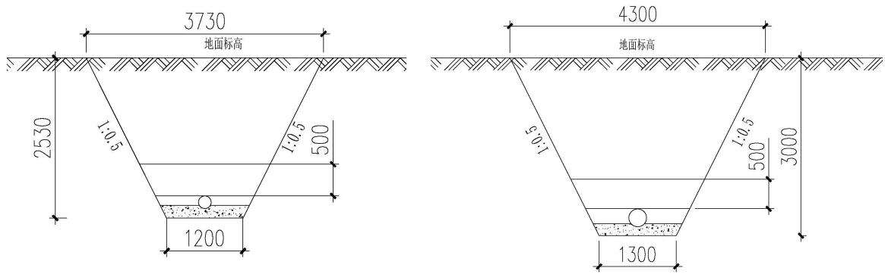  
图 2.1.6-1 沿线给水及排水剖面示意图

## （2）接触网挂网立杆供电管线工程

接触网挂网立杆供电管线由架设接触网电杆和架设电缆两部门组成。架设接触网电杆位置在铁路路基路肩及上边坡范围内（单侧），开挖断面为2.0（宽）×1.8m（深）×4.0m（深），接触网电杆单侧间隔45m\~50m在路肩位置埋设1处。改建后线路正线全长640.08km，全线电杆基础约12816个。土石方挖方18.45万m³，填方18.45万m³，即挖即填，无弃方。杆塔基础采用掏挖基础、挖孔基础，如下图所示。

1）掏挖基础：原状土掏挖基础能充分利用原状土承载力高，变形小的优点，主要用于塔位地形坡度较小、基底便于掏挖成型的塔位。与板式基础相比可减少基坑开挖量，减少施工弃土，有效降低施工对环境的破坏，同时，掏挖式基础在浇筑混凝土时地面下部分不用支模，施工更加方便，降低了施工费用。

2）挖孔基础：位于场地较窄、坡度较陡、高台阶地等的塔位，在塔腿不能满足要求或基础埋深不能满足要求的特殊情况下，推荐采用挖孔基础，利用其可露出高度较大的特点来满足塔位地形或埋深的要求，减小塔基开方量，是本工程的主要基础型式。

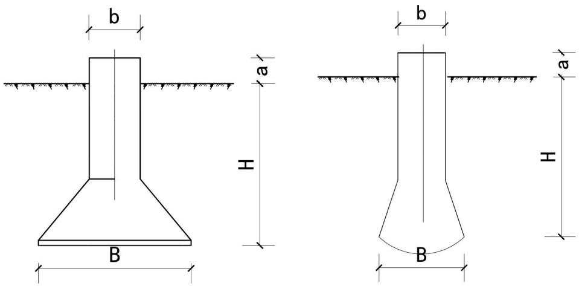  
图 2.1.6-2 电杆掏挖基础及挖孔基础示意图

## （3）通信及信号工程

通信电缆布设位置在铁路路基坡脚（堑顶）至排水沟（侧沟）范围内（单侧），通信埋设电缆开挖断面为0.5m（宽）×（0.6\~1.2m）（深），均在铁路用地范围内。改建后线路正线全长640.08km，土石方挖方19.20万m³，填方19.20万m³，即挖即填，无弃方。

信号电缆布设在各车站站场场界往两端区间路基各延长1.5km范围，铁路路基坡脚(堑顶)至排水沟(侧沟)范围内(单侧),通信埋设电缆开挖断面为0.5m(宽)×(0.6\~1.2m)（深），均在铁路用地范围内。由于土石方数量很小，不再单独计列，即挖即填，无弃方。

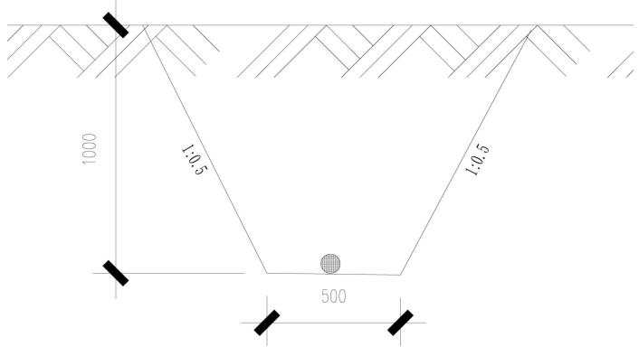  
图 2.1.6-3 通信及信号工程剖面示意图

以上给排水等管线工程占地和土石方数量纳入主体工程站场的占地及土石方范围。

## 2.1.7 改移工程

本项目铁路运行径路按照立交、全封闭的原则运营，既有道路与铁路交叉部位采取改移道路方式解决平交道路问题。

全线涉及改移道路156处，其中改移公路1处，改移长度1.03km，路面材料为沥青混凝土；改移乡村道路155处，改移长度127.34km，路面材料为碎石路。主要技术标准不低于原道路标准；改移道路全长128.37km，占地面积78.20hm²。改移道路产生的弃土、建筑垃圾纳入本方案取（弃）土场统一处置。

表 2.1.7-1 改移道路概况表
<table><tr><td rowspan=1 colspan=3>行政区划</td><td rowspan=2 colspan=1>道路等级</td><td rowspan=2 colspan=1>处数</td><td rowspan=1 colspan=1>长度</td><td rowspan=1 colspan=2>土石方(万m³)</td></tr><tr><td rowspan=1 colspan=1>省、自治区</td><td rowspan=1 colspan=1>市、盟、直辖县级市</td><td rowspan=1 colspan=1>区、县、旗</td><td rowspan=1 colspan=1>km</td><td rowspan=1 colspan=1>填方</td><td rowspan=1 colspan=1>挖方</td></tr><tr><td rowspan=2 colspan=1>内蒙古自治区</td><td rowspan=2 colspan=1>阿拉善盟</td><td rowspan=2 colspan=1>额济纳旗</td><td rowspan=1 colspan=1>公路</td><td rowspan=1 colspan=1>1</td><td rowspan=1 colspan=1>1.03</td><td rowspan=1 colspan=1>0.12</td><td rowspan=1 colspan=1>0.67</td></tr><tr><td rowspan=1 colspan=1>乡村道路</td><td rowspan=1 colspan=1>73</td><td rowspan=1 colspan=1>44.67</td><td rowspan=1 colspan=1>4.5</td><td rowspan=1 colspan=1>2.00</td></tr><tr><td rowspan=1 colspan=1>甘肃省</td><td rowspan=1 colspan=1>酒泉市</td><td rowspan=1 colspan=1>肃北蒙古族自治县</td><td rowspan=1 colspan=1>乡村道路</td><td rowspan=1 colspan=1>67</td><td rowspan=1 colspan=1>75.32</td><td rowspan=1 colspan=1>12.95</td><td rowspan=1 colspan=1>0.7</td></tr><tr><td rowspan=1 colspan=1>新疆维吾尔自治区</td><td rowspan=1 colspan=1>哈密市</td><td rowspan=1 colspan=1>伊州区</td><td rowspan=1 colspan=1>乡村道路</td><td rowspan=1 colspan=1>15</td><td rowspan=1 colspan=1>7.35</td><td rowspan=1 colspan=1>1.25</td><td rowspan=1 colspan=1>0.06</td></tr><tr><td rowspan=3 colspan=3>全线</td><td rowspan=1 colspan=1>公路</td><td rowspan=1 colspan=1>1</td><td rowspan=1 colspan=1>1.03</td><td rowspan=1 colspan=1>0.12</td><td rowspan=1 colspan=1>0.67</td></tr><tr><td rowspan=1 colspan=1>乡村道路</td><td rowspan=1 colspan=1>155</td><td rowspan=1 colspan=1>127.34</td><td rowspan=1 colspan=1>18.70</td><td rowspan=1 colspan=1>2.76</td></tr><tr><td rowspan=1 colspan=1>合计</td><td rowspan=1 colspan=1>156</td><td rowspan=1 colspan=1>128.37</td><td rowspan=1 colspan=1>18.82</td><td rowspan=1 colspan=1>3.43</td></tr></table>

表2.1.7-2 改移道路工点统计表
<table><tr><td rowspan=2 colspan=1>序号</td><td rowspan=1 colspan=3>行政区划</td><td rowspan=2 colspan=1>相应铁路里程</td><td rowspan=1 colspan=3>既有道路情况</td><td rowspan=2 colspan=1>改路长度（m）</td><td rowspan=2 colspan=1>占地(hm²)</td><td rowspan=1 colspan=2>土石方数量</td></tr><tr><td rowspan=1 colspan=1>省、自治区</td><td rowspan=1 colspan=1>市、盟、直辖县级市</td><td rowspan=1 colspan=1>区、县、旗</td><td rowspan=1 colspan=1>道路等级</td><td rowspan=1 colspan=1>路面宽度(m)</td><td rowspan=1 colspan=1>路面材料</td><td rowspan=1 colspan=1>挖方(m³)</td><td rowspan=1 colspan=1>填方(m³)</td></tr><tr><td rowspan=1 colspan=1>1</td><td rowspan=1 colspan=1>内蒙古自治区</td><td rowspan=1 colspan=1>阿拉善盟</td><td rowspan=1 colspan=1>额济纳旗</td><td rowspan=1 colspan=1>DK685+570</td><td rowspan=1 colspan=1>一级公路</td><td rowspan=1 colspan=1>10.5</td><td rowspan=1 colspan=1>沥青混凝土</td><td rowspan=1 colspan=1>1030</td><td rowspan=1 colspan=1>1.6</td><td rowspan=1 colspan=1>6651</td><td rowspan=1 colspan=1>1218</td></tr><tr><td rowspan=1 colspan=1>2</td><td rowspan=1 colspan=1>内蒙古自治区</td><td rowspan=1 colspan=1>阿拉善盟</td><td rowspan=1 colspan=1>额济纳旗</td><td rowspan=1 colspan=1>DK687+196~DK687+660</td><td rowspan=1 colspan=1>乡村道路</td><td rowspan=1 colspan=1>4</td><td rowspan=1 colspan=1>泥结碎石</td><td rowspan=1 colspan=1>634</td><td rowspan=1 colspan=1>0.51</td><td rowspan=1 colspan=1>171</td><td rowspan=1 colspan=1>460</td></tr><tr><td rowspan=1 colspan=1>3</td><td rowspan=1 colspan=1>内蒙古自治区</td><td rowspan=1 colspan=1>阿拉善盟</td><td rowspan=1 colspan=1>额济纳旗</td><td rowspan=1 colspan=1>DK690+760~DK692+600</td><td rowspan=1 colspan=1>乡村道路</td><td rowspan=1 colspan=1>4</td><td rowspan=1 colspan=1>泥结碎石</td><td rowspan=1 colspan=1>1241</td><td rowspan=1 colspan=1>1.07</td><td rowspan=1 colspan=1>506</td><td rowspan=1 colspan=1>2102</td></tr><tr><td rowspan=1 colspan=1>4</td><td rowspan=1 colspan=1>内蒙古自治区</td><td rowspan=1 colspan=1>阿拉善盟</td><td rowspan=1 colspan=1>额济纳旗</td><td rowspan=1 colspan=1>DK698+940</td><td rowspan=1 colspan=1>乡村道路</td><td rowspan=1 colspan=1>5.5</td><td rowspan=1 colspan=1>泥结碎石</td><td rowspan=1 colspan=1>216</td><td rowspan=1 colspan=1>0.14</td><td rowspan=1 colspan=1>50</td><td rowspan=1 colspan=1>45</td></tr><tr><td rowspan=1 colspan=1>5</td><td rowspan=1 colspan=1>内蒙古自治区</td><td rowspan=1 colspan=1>阿拉善盟</td><td rowspan=1 colspan=1>额济纳旗</td><td rowspan=1 colspan=1>DK732+550</td><td rowspan=1 colspan=1>临时道路</td><td rowspan=1 colspan=1>7</td><td rowspan=1 colspan=1>沥青混凝土</td><td rowspan=1 colspan=1>530</td><td rowspan=1 colspan=1>0.56</td><td rowspan=1 colspan=1>1869</td><td rowspan=1 colspan=1>649</td></tr><tr><td rowspan=1 colspan=1>6</td><td rowspan=1 colspan=1>内蒙古自治区</td><td rowspan=1 colspan=1>阿拉善盟</td><td rowspan=1 colspan=1>额济纳旗</td><td rowspan=1 colspan=1>DK736+550~DK737+820</td><td rowspan=1 colspan=1>乡村道路</td><td rowspan=1 colspan=1>4</td><td rowspan=1 colspan=1>泥结碎石</td><td rowspan=1 colspan=1>704</td><td rowspan=1 colspan=1>0.56</td><td rowspan=1 colspan=1>15</td><td rowspan=1 colspan=1>712</td></tr><tr><td rowspan=1 colspan=1>7</td><td rowspan=1 colspan=1>内蒙古自治区</td><td rowspan=1 colspan=1>阿拉善盟</td><td rowspan=1 colspan=1>额济纳旗</td><td rowspan=1 colspan=1>DK805+921</td><td rowspan=1 colspan=1>乡村道路</td><td rowspan=1 colspan=1>4</td><td rowspan=1 colspan=1>泥结碎石</td><td rowspan=1 colspan=1>100</td><td rowspan=1 colspan=1>0.05</td><td rowspan=1 colspan=1>100</td><td rowspan=1 colspan=1>1</td></tr><tr><td rowspan=1 colspan=1>8</td><td rowspan=1 colspan=1>内蒙古自治区</td><td rowspan=1 colspan=1>阿拉善盟</td><td rowspan=1 colspan=1>额济纳旗</td><td rowspan=1 colspan=1>DK806+743~DK806+892</td><td rowspan=1 colspan=1>乡村道路</td><td rowspan=1 colspan=1>4</td><td rowspan=1 colspan=1>泥结碎石</td><td rowspan=1 colspan=1>151</td><td rowspan=1 colspan=1>0.11</td><td rowspan=1 colspan=1>27</td><td rowspan=1 colspan=1>73</td></tr><tr><td rowspan=1 colspan=1>9</td><td rowspan=1 colspan=1>内蒙古自治区</td><td rowspan=1 colspan=1>阿拉善盟</td><td rowspan=1 colspan=1>额济纳旗</td><td rowspan=1 colspan=1>DK807+000~DK807+450</td><td rowspan=1 colspan=1>乡村道路</td><td rowspan=1 colspan=1>4</td><td rowspan=1 colspan=1>泥结碎石</td><td rowspan=1 colspan=1>501</td><td rowspan=1 colspan=1>0.41</td><td rowspan=1 colspan=1>82</td><td rowspan=1 colspan=1>523</td></tr><tr><td rowspan=1 colspan=1>10</td><td rowspan=1 colspan=1>内蒙古自治区</td><td rowspan=1 colspan=1>阿拉善盟</td><td rowspan=1 colspan=1>额济纳旗</td><td rowspan=1 colspan=1>DK807+871</td><td rowspan=1 colspan=1>乡村道路</td><td rowspan=1 colspan=1>4</td><td rowspan=1 colspan=1>泥结碎石</td><td rowspan=1 colspan=1>388</td><td rowspan=1 colspan=1>0.28</td><td rowspan=1 colspan=1>312</td><td rowspan=1 colspan=1>399</td></tr><tr><td rowspan=1 colspan=1>11</td><td rowspan=1 colspan=1>内蒙古自治区</td><td rowspan=1 colspan=1>阿拉善盟</td><td rowspan=1 colspan=1>额济纳旗</td><td rowspan=1 colspan=1>DK817+587</td><td rowspan=1 colspan=1>乡村道路</td><td rowspan=1 colspan=1>4</td><td rowspan=1 colspan=1>泥结碎石</td><td rowspan=1 colspan=1>120</td><td rowspan=1 colspan=1>0.08</td><td rowspan=1 colspan=1>152</td><td rowspan=1 colspan=1>49</td></tr><tr><td rowspan=1 colspan=1>12</td><td rowspan=1 colspan=1>内蒙古自治区</td><td rowspan=1 colspan=1>阿拉善盟</td><td rowspan=1 colspan=1>额济纳旗</td><td rowspan=1 colspan=1>DK821+160~DK821+300</td><td rowspan=1 colspan=1>乡村道路</td><td rowspan=1 colspan=1>4</td><td rowspan=1 colspan=1>泥结碎石</td><td rowspan=1 colspan=1>150</td><td rowspan=1 colspan=1>0.15</td><td rowspan=1 colspan=1>416</td><td rowspan=1 colspan=1>147</td></tr><tr><td rowspan=1 colspan=1>13</td><td rowspan=1 colspan=1>内蒙古自治区</td><td rowspan=1 colspan=1>阿拉善盟</td><td rowspan=1 colspan=1>额济纳旗</td><td rowspan=1 colspan=1>DK823+080~DK823+380</td><td rowspan=1 colspan=1>乡村道路</td><td rowspan=1 colspan=1>4</td><td rowspan=1 colspan=1>泥结碎石</td><td rowspan=1 colspan=1>201</td><td rowspan=1 colspan=1>0.17</td><td rowspan=1 colspan=1>134</td><td rowspan=1 colspan=1>108</td></tr><tr><td rowspan=1 colspan=1>14</td><td rowspan=1 colspan=1>内蒙古自治区</td><td rowspan=1 colspan=1>阿拉善盟</td><td rowspan=1 colspan=1>额济纳旗</td><td rowspan=1 colspan=1>DK824+860~DK825+460</td><td rowspan=1 colspan=1>乡村道路</td><td rowspan=1 colspan=1>4</td><td rowspan=1 colspan=1>泥结碎石</td><td rowspan=1 colspan=1>590</td><td rowspan=1 colspan=1>0.47</td><td rowspan=1 colspan=1>293</td><td rowspan=1 colspan=1>334</td></tr><tr><td rowspan=1 colspan=1>15</td><td rowspan=1 colspan=1>内蒙古自治区</td><td rowspan=1 colspan=1>阿拉善盟</td><td rowspan=1 colspan=1>额济纳旗</td><td rowspan=1 colspan=1>DK825+700~DK826+960</td><td rowspan=1 colspan=1>乡村道路</td><td rowspan=1 colspan=1>4</td><td rowspan=1 colspan=1>泥结碎石</td><td rowspan=1 colspan=1>1270</td><td rowspan=1 colspan=1>1.04</td><td rowspan=1 colspan=1>449</td><td rowspan=1 colspan=1>1226</td></tr><tr><td rowspan=1 colspan=1>16</td><td rowspan=1 colspan=1>内蒙古自治区</td><td rowspan=1 colspan=1>阿拉善盟</td><td rowspan=1 colspan=1>额济纳旗</td><td rowspan=1 colspan=1>DK826+900~DK828+860</td><td rowspan=1 colspan=1>乡村道路</td><td rowspan=1 colspan=1>4</td><td rowspan=1 colspan=1>泥结碎石</td><td rowspan=1 colspan=1>1911</td><td rowspan=1 colspan=1>1.56</td><td rowspan=1 colspan=1>731</td><td rowspan=1 colspan=1>1165</td></tr><tr><td rowspan=1 colspan=1>17</td><td rowspan=1 colspan=1>内蒙古自治区</td><td rowspan=1 colspan=1>阿拉善盟</td><td rowspan=1 colspan=1>额济纳旗</td><td rowspan=1 colspan=1>DK828+223</td><td rowspan=1 colspan=1>乡村道路</td><td rowspan=1 colspan=1>4</td><td rowspan=1 colspan=1>泥结碎石</td><td rowspan=1 colspan=1>90</td><td rowspan=1 colspan=1>0.06</td><td rowspan=1 colspan=1>87</td><td rowspan=1 colspan=1>3</td></tr><tr><td rowspan=1 colspan=1>18</td><td rowspan=1 colspan=1>内蒙古自治区</td><td rowspan=1 colspan=1>阿拉善盟</td><td rowspan=1 colspan=1>额济纳旗</td><td rowspan=1 colspan=1>DK829+440~DK829+840</td><td rowspan=1 colspan=1>乡村道路</td><td rowspan=1 colspan=1>4</td><td rowspan=1 colspan=1>泥结碎石</td><td rowspan=1 colspan=1>390</td><td rowspan=1 colspan=1>0.33</td><td rowspan=1 colspan=1>514</td><td rowspan=1 colspan=1>277</td></tr><tr><td rowspan=1 colspan=1>19</td><td rowspan=1 colspan=1>内蒙古自治区</td><td rowspan=1 colspan=1>阿拉善盟</td><td rowspan=1 colspan=1>额济纳旗</td><td rowspan=1 colspan=1>DK837+460</td><td rowspan=1 colspan=1>乡村道路</td><td rowspan=1 colspan=1>4</td><td rowspan=1 colspan=1>泥结碎石</td><td rowspan=1 colspan=1>100</td><td rowspan=1 colspan=1>0.05</td><td rowspan=1 colspan=1>19</td><td rowspan=1 colspan=1>62</td></tr><tr><td rowspan=1 colspan=1>20</td><td rowspan=1 colspan=1>内蒙古自治区</td><td rowspan=1 colspan=1>阿拉善盟</td><td rowspan=1 colspan=1>额济纳旗</td><td rowspan=1 colspan=1>DK843+150~DK843+250</td><td rowspan=1 colspan=1>乡村道路</td><td rowspan=1 colspan=1>4</td><td rowspan=1 colspan=1>泥结碎石</td><td rowspan=1 colspan=1>82</td><td rowspan=1 colspan=1>0.07</td><td rowspan=1 colspan=1>13</td><td rowspan=1 colspan=1>76</td></tr><tr><td rowspan=1 colspan=1>21</td><td rowspan=1 colspan=1>内蒙古自治区</td><td rowspan=1 colspan=1>阿拉善盟</td><td rowspan=1 colspan=1>额济纳旗</td><td rowspan=1 colspan=1>DK845+649</td><td rowspan=1 colspan=1>乡村道路</td><td rowspan=1 colspan=1>4</td><td rowspan=1 colspan=1>泥结碎石</td><td rowspan=1 colspan=1>100</td><td rowspan=1 colspan=1>0.06</td><td rowspan=1 colspan=1>19</td><td rowspan=1 colspan=1>29</td></tr></table>

2 项目概况
<table><tr><td rowspan=2 colspan=1>序号</td><td rowspan=1 colspan=3>行政区划</td><td rowspan=2 colspan=1>相应铁路里程</td><td rowspan=1 colspan=3>既有道路情况</td><td rowspan=2 colspan=1>改路长度（m）</td><td rowspan=2 colspan=1>占地(hm2)</td><td rowspan=1 colspan=2>土石方数量</td></tr><tr><td rowspan=1 colspan=1>省、自治区</td><td rowspan=1 colspan=1>市、盟、直辖县级市</td><td rowspan=1 colspan=1>区、县、旗</td><td rowspan=1 colspan=1>道路等级</td><td rowspan=1 colspan=1>路面宽度(m)</td><td rowspan=1 colspan=1>路面材料</td><td rowspan=1 colspan=1>挖方(m³)</td><td rowspan=1 colspan=1>填方(m³)</td></tr><tr><td rowspan=1 colspan=1>22</td><td rowspan=1 colspan=1>内蒙古自治区</td><td rowspan=1 colspan=1>阿拉善盟</td><td rowspan=1 colspan=1>额济纳旗</td><td rowspan=1 colspan=1>DK849+060~DK849+200</td><td rowspan=1 colspan=1>乡村道路</td><td rowspan=1 colspan=1>4</td><td rowspan=1 colspan=1>泥结碎石</td><td rowspan=1 colspan=1>131</td><td rowspan=1 colspan=1>0.11</td><td rowspan=1 colspan=1>62</td><td rowspan=1 colspan=1>40</td></tr><tr><td rowspan=1 colspan=1>23</td><td rowspan=1 colspan=1>内蒙古自治区</td><td rowspan=1 colspan=1>阿拉善盟</td><td rowspan=1 colspan=1>额济纳旗</td><td rowspan=1 colspan=1>DK850+420~DK850+760</td><td rowspan=1 colspan=1>乡村道路</td><td rowspan=1 colspan=1>4</td><td rowspan=1 colspan=1>泥结碎石</td><td rowspan=1 colspan=1>330</td><td rowspan=1 colspan=1>0.27</td><td rowspan=1 colspan=1>9</td><td rowspan=1 colspan=1>256</td></tr><tr><td rowspan=1 colspan=1>24</td><td rowspan=1 colspan=1>内蒙古自治区</td><td rowspan=1 colspan=1>阿拉善盟</td><td rowspan=1 colspan=1>额济纳旗</td><td rowspan=1 colspan=1>DK852+000~DK852+160</td><td rowspan=1 colspan=1>乡村道路</td><td rowspan=1 colspan=1>4</td><td rowspan=1 colspan=1>泥结碎石</td><td rowspan=1 colspan=1>141</td><td rowspan=1 colspan=1>0.11</td><td rowspan=1 colspan=1>26</td><td rowspan=1 colspan=1>77</td></tr><tr><td rowspan=1 colspan=1>25</td><td rowspan=1 colspan=1>内蒙古自治区</td><td rowspan=1 colspan=1>阿拉善盟</td><td rowspan=1 colspan=1>额济纳旗</td><td rowspan=1 colspan=1>DK852+300~DK852+460</td><td rowspan=1 colspan=1>乡村道路</td><td rowspan=1 colspan=1>4</td><td rowspan=1 colspan=1>泥结碎石</td><td rowspan=1 colspan=1>161</td><td rowspan=1 colspan=1>0.12</td><td rowspan=1 colspan=1>60</td><td rowspan=1 colspan=1>35</td></tr><tr><td rowspan=1 colspan=1>26</td><td rowspan=1 colspan=1>内蒙古自治区</td><td rowspan=1 colspan=1>阿拉善盟</td><td rowspan=1 colspan=1>额济纳旗</td><td rowspan=1 colspan=1>DK853+020~DK853+600</td><td rowspan=1 colspan=1>乡村道路</td><td rowspan=1 colspan=1>4</td><td rowspan=1 colspan=1>泥结碎石</td><td rowspan=1 colspan=1>571</td><td rowspan=1 colspan=1>0.46</td><td rowspan=1 colspan=1>183</td><td rowspan=1 colspan=1>192</td></tr><tr><td rowspan=1 colspan=1>27</td><td rowspan=1 colspan=1>内蒙古自治区</td><td rowspan=1 colspan=1>阿拉善盟</td><td rowspan=1 colspan=1>额济纳旗</td><td rowspan=1 colspan=1>DK854+400~DK854+800</td><td rowspan=1 colspan=1>乡村道路</td><td rowspan=1 colspan=1>4</td><td rowspan=1 colspan=1>泥结碎石</td><td rowspan=1 colspan=1>420</td><td rowspan=1 colspan=1>0.34</td><td rowspan=1 colspan=1>151</td><td rowspan=1 colspan=1>186</td></tr><tr><td rowspan=1 colspan=1>28</td><td rowspan=1 colspan=1>内蒙古自治区</td><td rowspan=1 colspan=1>阿拉善盟</td><td rowspan=1 colspan=1>额济纳旗</td><td rowspan=1 colspan=1>DK854+860~DK855+880</td><td rowspan=1 colspan=1>乡村道路</td><td rowspan=1 colspan=1>4</td><td rowspan=1 colspan=1>泥结碎石</td><td rowspan=1 colspan=1>920</td><td rowspan=1 colspan=1>0.74</td><td rowspan=1 colspan=1>381</td><td rowspan=1 colspan=1>349</td></tr><tr><td rowspan=1 colspan=1>29</td><td rowspan=1 colspan=1>内蒙古自治区</td><td rowspan=1 colspan=1>阿拉善盟</td><td rowspan=1 colspan=1>额济纳旗</td><td rowspan=1 colspan=1>DK855+900~DK856+900</td><td rowspan=1 colspan=1>乡村道路</td><td rowspan=1 colspan=1>4</td><td rowspan=1 colspan=1>泥结碎石</td><td rowspan=1 colspan=1>1000</td><td rowspan=1 colspan=1>0.81</td><td rowspan=1 colspan=1>226</td><td rowspan=1 colspan=1>710</td></tr><tr><td rowspan=1 colspan=1>30</td><td rowspan=1 colspan=1>内蒙古自治区</td><td rowspan=1 colspan=1>阿拉善盟</td><td rowspan=1 colspan=1>额济纳旗</td><td rowspan=1 colspan=1>DK857+700~DK859+080</td><td rowspan=1 colspan=1>乡村道路</td><td rowspan=1 colspan=1>4</td><td rowspan=1 colspan=1>泥结碎石</td><td rowspan=1 colspan=1>1651</td><td rowspan=1 colspan=1>1.29</td><td rowspan=1 colspan=1>555</td><td rowspan=1 colspan=1>934</td></tr><tr><td rowspan=1 colspan=1>31</td><td rowspan=1 colspan=1>内蒙古自治区</td><td rowspan=1 colspan=1>阿拉善盟</td><td rowspan=1 colspan=1>额济纳旗</td><td rowspan=1 colspan=1>DK859+260~DK859+460</td><td rowspan=1 colspan=1>乡村道路</td><td rowspan=1 colspan=1>4</td><td rowspan=1 colspan=1>泥结碎石</td><td rowspan=1 colspan=1>200</td><td rowspan=1 colspan=1>0.16</td><td rowspan=1 colspan=1>6</td><td rowspan=1 colspan=1>101</td></tr><tr><td rowspan=1 colspan=1>32</td><td rowspan=1 colspan=1>内蒙古自治区</td><td rowspan=1 colspan=1>阿拉善盟</td><td rowspan=1 colspan=1>额济纳旗</td><td rowspan=1 colspan=1>DK892+064</td><td rowspan=1 colspan=1>乡村道路</td><td rowspan=1 colspan=1>4</td><td rowspan=1 colspan=1>泥结碎石</td><td rowspan=1 colspan=1>116</td><td rowspan=1 colspan=1>0.1</td><td rowspan=1 colspan=1>1077</td><td rowspan=1 colspan=1>1</td></tr><tr><td rowspan=1 colspan=1>33</td><td rowspan=1 colspan=1>内蒙古自治区</td><td rowspan=1 colspan=1>阿拉善盟</td><td rowspan=1 colspan=1>额济纳旗</td><td rowspan=1 colspan=1>DK897+550</td><td rowspan=1 colspan=1>乡村道路</td><td rowspan=1 colspan=1>4</td><td rowspan=1 colspan=1>泥结碎石</td><td rowspan=1 colspan=1>80</td><td rowspan=1 colspan=1>0.05</td><td rowspan=1 colspan=1>139</td><td rowspan=1 colspan=1>13</td></tr><tr><td rowspan=1 colspan=1>34</td><td rowspan=1 colspan=1>内蒙古自治区</td><td rowspan=1 colspan=1>阿拉善盟</td><td rowspan=1 colspan=1>额济纳旗</td><td rowspan=1 colspan=1>DK901+490</td><td rowspan=1 colspan=1>乡村道路</td><td rowspan=1 colspan=1>4</td><td rowspan=1 colspan=1>泥结碎石</td><td rowspan=1 colspan=1>141</td><td rowspan=1 colspan=1>0.16</td><td rowspan=1 colspan=1>1902</td><td rowspan=1 colspan=1>1</td></tr><tr><td rowspan=1 colspan=1>35</td><td rowspan=1 colspan=1>内蒙古自治区</td><td rowspan=1 colspan=1>阿拉善盟</td><td rowspan=1 colspan=1>额济纳旗</td><td rowspan=1 colspan=1>DK910+590</td><td rowspan=1 colspan=1>乡村道路</td><td rowspan=1 colspan=1>8</td><td rowspan=1 colspan=1>泥结碎石</td><td rowspan=1 colspan=1>160</td><td rowspan=1 colspan=1>0.15</td><td rowspan=1 colspan=1>4</td><td rowspan=1 colspan=1>117</td></tr><tr><td rowspan=1 colspan=1>36</td><td rowspan=1 colspan=1>内蒙古自治区</td><td rowspan=1 colspan=1>阿拉善盟</td><td rowspan=1 colspan=1>额济纳旗</td><td rowspan=1 colspan=1>DK910+650~DK912+200</td><td rowspan=1 colspan=1>乡村道路</td><td rowspan=1 colspan=1>4</td><td rowspan=1 colspan=1>泥结碎石</td><td rowspan=1 colspan=1>1821</td><td rowspan=1 colspan=1>1.5</td><td rowspan=1 colspan=1>732</td><td rowspan=1 colspan=1>1757</td></tr><tr><td rowspan=1 colspan=1>37</td><td rowspan=1 colspan=1>内蒙古自治区</td><td rowspan=1 colspan=1>阿拉善盟</td><td rowspan=1 colspan=1>额济纳旗</td><td rowspan=1 colspan=1>DK913+050</td><td rowspan=1 colspan=1>乡村道路</td><td rowspan=1 colspan=1>4</td><td rowspan=1 colspan=1>泥结碎石</td><td rowspan=1 colspan=1>110</td><td rowspan=1 colspan=1>0.08</td><td rowspan=1 colspan=1>94</td><td rowspan=1 colspan=1>17</td></tr><tr><td rowspan=1 colspan=1>38</td><td rowspan=1 colspan=1>内蒙古自治区</td><td rowspan=1 colspan=1>阿拉善盟</td><td rowspan=1 colspan=1>额济纳旗</td><td rowspan=1 colspan=1>DK913+050~DK914+250</td><td rowspan=1 colspan=1>乡村道路</td><td rowspan=1 colspan=1>4</td><td rowspan=1 colspan=1>泥结碎石</td><td rowspan=1 colspan=1>1253</td><td rowspan=1 colspan=1>1.02</td><td rowspan=1 colspan=1>1301</td><td rowspan=1 colspan=1>874</td></tr><tr><td rowspan=1 colspan=1>39</td><td rowspan=1 colspan=1>内蒙古自治区</td><td rowspan=1 colspan=1>阿拉善盟</td><td rowspan=1 colspan=1>额济纳旗</td><td rowspan=1 colspan=1>DK938+910</td><td rowspan=1 colspan=1>乡村道路</td><td rowspan=1 colspan=1>4</td><td rowspan=1 colspan=1>泥结碎石</td><td rowspan=1 colspan=1>110</td><td rowspan=1 colspan=1>0.07</td><td rowspan=1 colspan=1>17</td><td rowspan=1 colspan=1>12</td></tr><tr><td rowspan=1 colspan=1>40</td><td rowspan=1 colspan=1>内蒙古自治区</td><td rowspan=1 colspan=1>阿拉善盟</td><td rowspan=1 colspan=1>额济纳旗</td><td rowspan=1 colspan=1>DK717+400~DK717+900</td><td rowspan=1 colspan=1>乡村道路</td><td rowspan=1 colspan=1>4</td><td rowspan=1 colspan=1>泥结碎石</td><td rowspan=1 colspan=1>541</td><td rowspan=1 colspan=1>0.43</td><td rowspan=1 colspan=1>27</td><td rowspan=1 colspan=1>333</td></tr><tr><td rowspan=1 colspan=1>41</td><td rowspan=1 colspan=1>内蒙古自治区</td><td rowspan=1 colspan=1>阿拉善盟</td><td rowspan=1 colspan=1>额济纳旗</td><td rowspan=1 colspan=1>DK719+730~DK720+210</td><td rowspan=1 colspan=1>乡村道路</td><td rowspan=1 colspan=1>4</td><td rowspan=1 colspan=1>泥结碎石</td><td rowspan=1 colspan=1>521</td><td rowspan=1 colspan=1>0.43</td><td rowspan=1 colspan=1>151</td><td rowspan=1 colspan=1>481</td></tr><tr><td rowspan=1 colspan=1>42</td><td rowspan=1 colspan=1>内蒙古自治区</td><td rowspan=1 colspan=1>阿拉善盟</td><td rowspan=1 colspan=1>额济纳旗</td><td rowspan=1 colspan=1>DK829+980~DK830+740</td><td rowspan=1 colspan=1>乡村道路</td><td rowspan=1 colspan=1>4</td><td rowspan=1 colspan=1>泥结碎石</td><td rowspan=1 colspan=1>761</td><td rowspan=1 colspan=1>0.62</td><td rowspan=1 colspan=1>190</td><td rowspan=1 colspan=1>618</td></tr><tr><td rowspan=1 colspan=1>43</td><td rowspan=1 colspan=1>内蒙古自治区</td><td rowspan=1 colspan=1>阿拉善盟</td><td rowspan=1 colspan=1>额济纳旗</td><td rowspan=1 colspan=1>DK873+450~DK874+200</td><td rowspan=1 colspan=1>乡村道路</td><td rowspan=1 colspan=1>4</td><td rowspan=1 colspan=1>泥结碎石</td><td rowspan=1 colspan=1>740</td><td rowspan=1 colspan=1>0.63</td><td rowspan=1 colspan=1>74</td><td rowspan=1 colspan=1>1378</td></tr><tr><td rowspan=1 colspan=1>44</td><td rowspan=1 colspan=1>内蒙古自治区</td><td rowspan=1 colspan=1>阿拉善盟</td><td rowspan=1 colspan=1>额济纳旗</td><td rowspan=1 colspan=1>DK874+500~DK875+800</td><td rowspan=1 colspan=1>乡村道路</td><td rowspan=1 colspan=1>4</td><td rowspan=1 colspan=1>泥结碎石</td><td rowspan=1 colspan=1>1381</td><td rowspan=1 colspan=1>1.19</td><td rowspan=1 colspan=1>536</td><td rowspan=1 colspan=1>2118</td></tr></table>

中铁工程设计咨询集团有限公司

2 项目概况
<table><tr><td rowspan=2 colspan=1>序号</td><td rowspan=1 colspan=3>行政区划</td><td rowspan=2 colspan=1>相应铁路里程</td><td rowspan=1 colspan=3>既有道路情况</td><td rowspan=2 colspan=1>改路长度（m）</td><td rowspan=2 colspan=1>占地(hm²)</td><td rowspan=1 colspan=2>土石方数量</td></tr><tr><td rowspan=1 colspan=1>省、自治区</td><td rowspan=1 colspan=1>市、盟、直辖县级市</td><td rowspan=1 colspan=1>区、县、旗</td><td rowspan=1 colspan=1>道路等级</td><td rowspan=1 colspan=1>路面宽度(m)</td><td rowspan=1 colspan=1>路面材料</td><td rowspan=1 colspan=1>挖方(m³)</td><td rowspan=1 colspan=1>填方(m³)</td></tr><tr><td rowspan=1 colspan=1>45</td><td rowspan=1 colspan=1>内蒙古自治区</td><td rowspan=1 colspan=1>阿拉善盟</td><td rowspan=1 colspan=1>额济纳旗</td><td rowspan=1 colspan=1>DK877+350~DK878+100</td><td rowspan=1 colspan=1>乡村道路</td><td rowspan=1 colspan=1>4</td><td rowspan=1 colspan=1>泥结碎石</td><td rowspan=1 colspan=1>781</td><td rowspan=1 colspan=1>0.67</td><td rowspan=1 colspan=1>111</td><td rowspan=1 colspan=1>1235</td></tr><tr><td rowspan=1 colspan=1>46</td><td rowspan=1 colspan=1>内蒙古自治区</td><td rowspan=1 colspan=1>阿拉善盟</td><td rowspan=1 colspan=1>额济纳旗</td><td rowspan=1 colspan=1>DK879+030~DK880+900</td><td rowspan=1 colspan=1>乡村道路</td><td rowspan=1 colspan=1>4</td><td rowspan=1 colspan=1>泥结碎石</td><td rowspan=1 colspan=1>2000</td><td rowspan=1 colspan=1>1.63</td><td rowspan=1 colspan=1>122</td><td rowspan=1 colspan=1>2573</td></tr><tr><td rowspan=1 colspan=1>47</td><td rowspan=1 colspan=1>内蒙古自治区</td><td rowspan=1 colspan=1>阿拉善盟</td><td rowspan=1 colspan=1>额济纳旗</td><td rowspan=1 colspan=1>DK882+360~DK883+000</td><td rowspan=1 colspan=1>乡村道路</td><td rowspan=1 colspan=1>4</td><td rowspan=1 colspan=1>泥结碎石</td><td rowspan=1 colspan=1>741</td><td rowspan=1 colspan=1>0.61</td><td rowspan=1 colspan=1>16</td><td rowspan=1 colspan=1>645</td></tr><tr><td rowspan=1 colspan=1>48</td><td rowspan=1 colspan=1>内蒙古自治区</td><td rowspan=1 colspan=1>阿拉善盟</td><td rowspan=1 colspan=1>额济纳旗</td><td rowspan=1 colspan=1>DK883+895~DK884+170</td><td rowspan=1 colspan=1>乡村道路</td><td rowspan=1 colspan=1>4</td><td rowspan=1 colspan=1>泥结碎石</td><td rowspan=1 colspan=1>301</td><td rowspan=1 colspan=1>0.26</td><td rowspan=1 colspan=1>15</td><td rowspan=1 colspan=1>334</td></tr><tr><td rowspan=1 colspan=1>49</td><td rowspan=1 colspan=1>内蒙古自治区</td><td rowspan=1 colspan=1>阿拉善盟</td><td rowspan=1 colspan=1>额济纳旗</td><td rowspan=1 colspan=1>DK884+850~DK885+030</td><td rowspan=1 colspan=1>乡村道路</td><td rowspan=1 colspan=1>4</td><td rowspan=1 colspan=1>泥结碎石</td><td rowspan=1 colspan=1>195</td><td rowspan=1 colspan=1>0.16</td><td rowspan=1 colspan=1>30</td><td rowspan=1 colspan=1>84</td></tr><tr><td rowspan=1 colspan=1>50</td><td rowspan=1 colspan=1>内蒙古自治区</td><td rowspan=1 colspan=1>阿拉善盟</td><td rowspan=1 colspan=1>额济纳旗</td><td rowspan=1 colspan=1>DK885+700~DK886+600</td><td rowspan=1 colspan=1>乡村道路</td><td rowspan=1 colspan=1>4</td><td rowspan=1 colspan=1>泥结碎石</td><td rowspan=1 colspan=1>941</td><td rowspan=1 colspan=1>0.78</td><td rowspan=1 colspan=1>82</td><td rowspan=1 colspan=1>1220</td></tr><tr><td rowspan=1 colspan=1>51</td><td rowspan=1 colspan=1>内蒙古自治区</td><td rowspan=1 colspan=1>阿拉善盟</td><td rowspan=1 colspan=1>额济纳旗</td><td rowspan=1 colspan=1>DK866+920~DK887+400</td><td rowspan=1 colspan=1>乡村道路</td><td rowspan=1 colspan=1>4</td><td rowspan=1 colspan=1>泥结碎石</td><td rowspan=1 colspan=1>500</td><td rowspan=1 colspan=1>0.42</td><td rowspan=1 colspan=1>96</td><td rowspan=1 colspan=1>400</td></tr><tr><td rowspan=1 colspan=1>52</td><td rowspan=1 colspan=1>内蒙古自治区</td><td rowspan=1 colspan=1>阿拉善盟</td><td rowspan=1 colspan=1>额济纳旗</td><td rowspan=1 colspan=1>DK888+085~DK888+530</td><td rowspan=1 colspan=1>乡村道路</td><td rowspan=1 colspan=1>4</td><td rowspan=1 colspan=1>泥结碎石</td><td rowspan=1 colspan=1>487</td><td rowspan=1 colspan=1>0.43</td><td rowspan=1 colspan=1>150</td><td rowspan=1 colspan=1>613</td></tr><tr><td rowspan=1 colspan=1>53</td><td rowspan=1 colspan=1>内蒙古自治区</td><td rowspan=1 colspan=1>阿拉善盟</td><td rowspan=1 colspan=1>额济纳旗</td><td rowspan=1 colspan=1>DK890+850~DK891+300</td><td rowspan=1 colspan=1>乡村道路</td><td rowspan=1 colspan=1>4</td><td rowspan=1 colspan=1>泥结碎石</td><td rowspan=1 colspan=1>461</td><td rowspan=1 colspan=1>0.38</td><td rowspan=1 colspan=1>174</td><td rowspan=1 colspan=1>270</td></tr><tr><td rowspan=1 colspan=1>54</td><td rowspan=1 colspan=1>内蒙古自治区</td><td rowspan=1 colspan=1>阿拉善盟</td><td rowspan=1 colspan=1>额济纳旗</td><td rowspan=1 colspan=1>DK891+690~DK893+200</td><td rowspan=1 colspan=1>乡村道路</td><td rowspan=1 colspan=1>4</td><td rowspan=1 colspan=1>泥结碎石</td><td rowspan=1 colspan=1>1521</td><td rowspan=1 colspan=1>1.25</td><td rowspan=1 colspan=1>146</td><td rowspan=1 colspan=1>2467</td></tr><tr><td rowspan=1 colspan=1>55</td><td rowspan=1 colspan=1>内蒙古自治区</td><td rowspan=1 colspan=1>阿拉善盟</td><td rowspan=1 colspan=1>额济纳旗</td><td rowspan=1 colspan=1>DK894+700~DK895+200</td><td rowspan=1 colspan=1>乡村道路</td><td rowspan=1 colspan=1>4</td><td rowspan=1 colspan=1>泥结碎石</td><td rowspan=1 colspan=1>540</td><td rowspan=1 colspan=1>0.45</td><td rowspan=1 colspan=1>98</td><td rowspan=1 colspan=1>516</td></tr><tr><td rowspan=1 colspan=1>56</td><td rowspan=1 colspan=1>内蒙古自治区</td><td rowspan=1 colspan=1>阿拉善盟</td><td rowspan=1 colspan=1>额济纳旗</td><td rowspan=1 colspan=1>DK899+360~DK899+630</td><td rowspan=1 colspan=1>乡村道路</td><td rowspan=1 colspan=1>4</td><td rowspan=1 colspan=1>泥结碎石</td><td rowspan=1 colspan=1>273</td><td rowspan=1 colspan=1>0.22</td><td rowspan=1 colspan=1>41</td><td rowspan=1 colspan=1>22</td></tr><tr><td rowspan=1 colspan=1>57</td><td rowspan=1 colspan=1>内蒙古自治区</td><td rowspan=1 colspan=1>阿拉善盟</td><td rowspan=1 colspan=1>额济纳旗</td><td rowspan=1 colspan=1>DK900+900~DK902+100</td><td rowspan=1 colspan=1>乡村道路</td><td rowspan=1 colspan=1>4</td><td rowspan=1 colspan=1>泥结碎石</td><td rowspan=1 colspan=1>1280</td><td rowspan=1 colspan=1>1.05</td><td rowspan=1 colspan=1>340</td><td rowspan=1 colspan=1>1378</td></tr><tr><td rowspan=1 colspan=1>58</td><td rowspan=1 colspan=1>内蒙古自治区</td><td rowspan=1 colspan=1>阿拉善盟</td><td rowspan=1 colspan=1>额济纳旗</td><td rowspan=1 colspan=1>DK902+500~DK905+050</td><td rowspan=1 colspan=1>乡村道路</td><td rowspan=1 colspan=1>4</td><td rowspan=1 colspan=1>泥结碎石</td><td rowspan=1 colspan=1>2561</td><td rowspan=1 colspan=1>2.31</td><td rowspan=1 colspan=1>2540</td><td rowspan=1 colspan=1>5155</td></tr><tr><td rowspan=1 colspan=1>59</td><td rowspan=1 colspan=1>内蒙古自治区</td><td rowspan=1 colspan=1>阿拉善盟</td><td rowspan=1 colspan=1>额济纳旗</td><td rowspan=1 colspan=1>DK913+500~DK913+820</td><td rowspan=1 colspan=1>乡村道路</td><td rowspan=1 colspan=1>4</td><td rowspan=1 colspan=1>泥结碎石</td><td rowspan=1 colspan=1>341</td><td rowspan=1 colspan=1>0.29</td><td rowspan=1 colspan=1>217</td><td rowspan=1 colspan=1>247</td></tr><tr><td rowspan=1 colspan=1>60</td><td rowspan=1 colspan=1>内蒙古自治区</td><td rowspan=1 colspan=1>阿拉善盟</td><td rowspan=1 colspan=1>额济纳旗</td><td rowspan=1 colspan=1>DK914+500~DK914+600</td><td rowspan=1 colspan=1>乡村道路</td><td rowspan=1 colspan=1>4</td><td rowspan=1 colspan=1>泥结碎石</td><td rowspan=1 colspan=1>100</td><td rowspan=1 colspan=1>0.08</td><td rowspan=1 colspan=1>92</td><td rowspan=1 colspan=1>24</td></tr><tr><td rowspan=1 colspan=1>61</td><td rowspan=1 colspan=1>内蒙古自治区</td><td rowspan=1 colspan=1>阿拉善盟</td><td rowspan=1 colspan=1>额济纳旗</td><td rowspan=1 colspan=1>DK915+150~DK915+430</td><td rowspan=1 colspan=1>乡村道路</td><td rowspan=1 colspan=1>4</td><td rowspan=1 colspan=1>泥结碎石</td><td rowspan=1 colspan=1>300</td><td rowspan=1 colspan=1>0.25</td><td rowspan=1 colspan=1>20</td><td rowspan=1 colspan=1>269</td></tr><tr><td rowspan=1 colspan=1>62</td><td rowspan=1 colspan=1>内蒙古自治区</td><td rowspan=1 colspan=1>阿拉善盟</td><td rowspan=1 colspan=1>额济纳旗</td><td rowspan=1 colspan=1>DK915+960~DK916+630</td><td rowspan=1 colspan=1>乡村道路</td><td rowspan=1 colspan=1>4</td><td rowspan=1 colspan=1>泥结碎石</td><td rowspan=1 colspan=1>762</td><td rowspan=1 colspan=1>0.64</td><td rowspan=1 colspan=1>311</td><td rowspan=1 colspan=1>545</td></tr><tr><td rowspan=1 colspan=1>63</td><td rowspan=1 colspan=1>内蒙古自治区</td><td rowspan=1 colspan=1>阿拉善盟</td><td rowspan=1 colspan=1>额济纳旗</td><td rowspan=1 colspan=1>DK917+300~DK918+700</td><td rowspan=1 colspan=1>乡村道路</td><td rowspan=1 colspan=1>4</td><td rowspan=1 colspan=1>泥结碎石</td><td rowspan=1 colspan=1>1421</td><td rowspan=1 colspan=1>1.17</td><td rowspan=1 colspan=1>130</td><td rowspan=1 colspan=1>1370</td></tr><tr><td rowspan=1 colspan=1>64</td><td rowspan=1 colspan=1>内蒙古自治区</td><td rowspan=1 colspan=1>阿拉善盟</td><td rowspan=1 colspan=1>额济纳旗</td><td rowspan=1 colspan=1>DK919+185~DK919+705</td><td rowspan=1 colspan=1>乡村道路</td><td rowspan=1 colspan=1>4</td><td rowspan=1 colspan=1>泥结碎石</td><td rowspan=1 colspan=1>540</td><td rowspan=1 colspan=1>0.43</td><td rowspan=1 colspan=1>17</td><td rowspan=1 colspan=1>298</td></tr><tr><td rowspan=1 colspan=1>65</td><td rowspan=1 colspan=1>内蒙古自治区</td><td rowspan=1 colspan=1>阿拉善盟</td><td rowspan=1 colspan=1>额济纳旗</td><td rowspan=1 colspan=1>DK921+000~DK921+420</td><td rowspan=1 colspan=1>乡村道路</td><td rowspan=1 colspan=1>4</td><td rowspan=1 colspan=1>泥结碎石</td><td rowspan=1 colspan=1>461</td><td rowspan=1 colspan=1>0.39</td><td rowspan=1 colspan=1>259</td><td rowspan=1 colspan=1>385</td></tr><tr><td rowspan=1 colspan=1>66</td><td rowspan=1 colspan=1>内蒙古自治区</td><td rowspan=1 colspan=1>阿拉善盟</td><td rowspan=1 colspan=1>额济纳旗</td><td rowspan=1 colspan=1>DK923+500~DK924+500</td><td rowspan=1 colspan=1>乡村道路</td><td rowspan=1 colspan=1>4</td><td rowspan=1 colspan=1>泥结碎石</td><td rowspan=1 colspan=1>1058</td><td rowspan=1 colspan=1>0.84</td><td rowspan=1 colspan=1>286</td><td rowspan=1 colspan=1>517</td></tr><tr><td rowspan=1 colspan=1>67</td><td rowspan=1 colspan=1>内蒙古自治区</td><td rowspan=1 colspan=1>阿拉善盟</td><td rowspan=1 colspan=1>额济纳旗</td><td rowspan=1 colspan=1>DK925+070~DK925+550</td><td rowspan=1 colspan=1>乡村道路</td><td rowspan=1 colspan=1>4</td><td rowspan=1 colspan=1>泥结碎石</td><td rowspan=1 colspan=1>501</td><td rowspan=1 colspan=1>0.42</td><td rowspan=1 colspan=1>94</td><td rowspan=1 colspan=1>460</td></tr></table>

中铁工程设计咨询集团有限公司

2 项目概况
<table><tr><td rowspan=2 colspan=1>序号</td><td rowspan=1 colspan=3>行政区划</td><td rowspan=2 colspan=1>相应铁路里程</td><td rowspan=1 colspan=3>既有道路情况</td><td rowspan=2 colspan=1>改路长度（m）</td><td rowspan=2 colspan=1>占地(hm2)</td><td rowspan=1 colspan=2>土石方数量</td></tr><tr><td rowspan=1 colspan=1>省、自治区</td><td rowspan=1 colspan=1>市、盟、直辖县级市</td><td rowspan=1 colspan=1>区、县、旗</td><td rowspan=1 colspan=1>道路等级</td><td rowspan=1 colspan=1>路面宽度(m)</td><td rowspan=1 colspan=1>路面材料</td><td rowspan=1 colspan=1>挖方(m³)</td><td rowspan=1 colspan=1>填方(m³)</td></tr><tr><td rowspan=1 colspan=1>68</td><td rowspan=1 colspan=1>内蒙古自治区</td><td rowspan=1 colspan=1>阿拉善盟</td><td rowspan=1 colspan=1>额济纳旗</td><td rowspan=1 colspan=1>DK929+300~DK930+750</td><td rowspan=1 colspan=1>乡村道路</td><td rowspan=1 colspan=1>4</td><td rowspan=1 colspan=1>泥结碎石</td><td rowspan=1 colspan=1>1481</td><td rowspan=1 colspan=1>1.28</td><td rowspan=1 colspan=1>64</td><td rowspan=1 colspan=1>3131</td></tr><tr><td rowspan=1 colspan=1>69</td><td rowspan=1 colspan=1>内蒙古自治区</td><td rowspan=1 colspan=1>阿拉善盟</td><td rowspan=1 colspan=1>额济纳旗</td><td rowspan=1 colspan=1>DK931+300~DK931+900</td><td rowspan=1 colspan=1>乡村道路</td><td rowspan=1 colspan=1>4</td><td rowspan=1 colspan=1>泥结碎石</td><td rowspan=1 colspan=1>664</td><td rowspan=1 colspan=1>0.55</td><td rowspan=1 colspan=1>28</td><td rowspan=1 colspan=1>550</td></tr><tr><td rowspan=1 colspan=1>70</td><td rowspan=1 colspan=1>内蒙古自治区</td><td rowspan=1 colspan=1>阿拉善盟</td><td rowspan=1 colspan=1>额济纳旗</td><td rowspan=1 colspan=1>DK932+450~DK932+910</td><td rowspan=1 colspan=1>乡村道路</td><td rowspan=1 colspan=1>4</td><td rowspan=1 colspan=1>泥结碎石</td><td rowspan=1 colspan=1>506</td><td rowspan=1 colspan=1>0.39</td><td rowspan=1 colspan=1>45</td><td rowspan=1 colspan=1>257</td></tr><tr><td rowspan=1 colspan=1>71</td><td rowspan=1 colspan=1>内蒙古自治区</td><td rowspan=1 colspan=1>阿拉善盟</td><td rowspan=1 colspan=1>额济纳旗</td><td rowspan=1 colspan=1>DK933+500~DK933+965</td><td rowspan=1 colspan=1>乡村道路</td><td rowspan=1 colspan=1>4</td><td rowspan=1 colspan=1>泥结碎石</td><td rowspan=1 colspan=1>481</td><td rowspan=1 colspan=1>0.39</td><td rowspan=1 colspan=1>232</td><td rowspan=1 colspan=1>323</td></tr><tr><td rowspan=1 colspan=1>72</td><td rowspan=1 colspan=1>内蒙古自治区</td><td rowspan=1 colspan=1>阿拉善盟</td><td rowspan=1 colspan=1>额济纳旗</td><td rowspan=1 colspan=1>DK938+050~DK938+210</td><td rowspan=1 colspan=1>乡村道路</td><td rowspan=1 colspan=1>4</td><td rowspan=1 colspan=1>泥结碎石</td><td rowspan=1 colspan=1>160</td><td rowspan=1 colspan=1>0.13</td><td rowspan=1 colspan=1>12</td><td rowspan=1 colspan=1>45</td></tr><tr><td rowspan=1 colspan=1>73</td><td rowspan=1 colspan=1>内蒙古自治区</td><td rowspan=1 colspan=1>阿拉善盟</td><td rowspan=1 colspan=1>额济纳旗</td><td rowspan=1 colspan=1>DK939+300~DK939+600</td><td rowspan=1 colspan=1>乡村道路</td><td rowspan=1 colspan=1>4</td><td rowspan=1 colspan=1>泥结碎石</td><td rowspan=1 colspan=1>301</td><td rowspan=1 colspan=1>0.25</td><td rowspan=1 colspan=1>73</td><td rowspan=1 colspan=1>311</td></tr><tr><td rowspan=1 colspan=1>74</td><td rowspan=1 colspan=1>内蒙古自治区</td><td rowspan=1 colspan=1>阿拉善盟</td><td rowspan=1 colspan=1>额济纳旗</td><td rowspan=1 colspan=1>DK945+300~DK945+580</td><td rowspan=1 colspan=1>乡村道路</td><td rowspan=1 colspan=1>4</td><td rowspan=1 colspan=1>泥结碎石</td><td rowspan=1 colspan=1>281</td><td rowspan=1 colspan=1>0.25</td><td rowspan=1 colspan=1>255</td><td rowspan=1 colspan=1>366</td></tr><tr><td rowspan=1 colspan=1>75</td><td rowspan=1 colspan=1>甘肃省</td><td rowspan=1 colspan=1>酒泉市</td><td rowspan=1 colspan=1>肃北蒙古族自治县</td><td rowspan=1 colspan=1>DK997+400~DK997+550</td><td rowspan=1 colspan=1>乡村道路</td><td rowspan=1 colspan=1>3</td><td rowspan=1 colspan=1>泥结碎石</td><td rowspan=1 colspan=1>185</td><td rowspan=1 colspan=1>0.09</td><td rowspan=1 colspan=1>16</td><td rowspan=1 colspan=1>316</td></tr><tr><td rowspan=1 colspan=1>76</td><td rowspan=1 colspan=1>甘肃省</td><td rowspan=1 colspan=1>酒泉市</td><td rowspan=1 colspan=1>肃北蒙古族自治县</td><td rowspan=1 colspan=1>DK998+150~DK998+250</td><td rowspan=1 colspan=1>乡村道路</td><td rowspan=1 colspan=1>3</td><td rowspan=1 colspan=1>泥结碎石</td><td rowspan=1 colspan=1>130</td><td rowspan=1 colspan=1>0.06</td><td rowspan=1 colspan=1>11</td><td rowspan=1 colspan=1>222</td></tr><tr><td rowspan=1 colspan=1>77</td><td rowspan=1 colspan=1>甘肃省</td><td rowspan=1 colspan=1>酒泉市</td><td rowspan=1 colspan=1>肃北蒙古族自治县</td><td rowspan=1 colspan=1>DK998+700~DK999+650</td><td rowspan=1 colspan=1>乡村道路</td><td rowspan=1 colspan=1>3</td><td rowspan=1 colspan=1>泥结碎石</td><td rowspan=1 colspan=1>1024</td><td rowspan=1 colspan=1>0.48</td><td rowspan=1 colspan=1>88</td><td rowspan=1 colspan=1>1751</td></tr><tr><td rowspan=1 colspan=1>78</td><td rowspan=1 colspan=1>甘肃省</td><td rowspan=1 colspan=1>酒泉市</td><td rowspan=1 colspan=1>肃北蒙古族自治县</td><td rowspan=1 colspan=1>DK1000+400~DK1001+900乡</td><td rowspan=1 colspan=1>村道路</td><td rowspan=1 colspan=1>3</td><td rowspan=1 colspan=1>泥结碎石</td><td rowspan=1 colspan=1>1553</td><td rowspan=1 colspan=1>0.73</td><td rowspan=1 colspan=1>133</td><td rowspan=1 colspan=1>2656</td></tr><tr><td rowspan=1 colspan=1>79</td><td rowspan=1 colspan=1>甘肃省</td><td rowspan=1 colspan=1>酒泉市</td><td rowspan=1 colspan=1>肃北蒙古族自治县</td><td rowspan=1 colspan=1>DK1001+951</td><td rowspan=1 colspan=1>乡村道路</td><td rowspan=1 colspan=1>6</td><td rowspan=1 colspan=1>泥结碎石</td><td rowspan=1 colspan=1>139</td><td rowspan=1 colspan=1>0.43</td><td rowspan=1 colspan=1>595</td><td rowspan=1 colspan=1>953</td></tr><tr><td rowspan=1 colspan=1>80</td><td rowspan=1 colspan=1>甘肃省</td><td rowspan=1 colspan=1>酒泉市</td><td rowspan=1 colspan=1>肃北蒙古族自治县</td><td rowspan=1 colspan=1>DK1002+000~DK1003+000乡</td><td rowspan=1 colspan=1>村道路</td><td rowspan=1 colspan=1>3</td><td rowspan=1 colspan=1>泥结碎石</td><td rowspan=1 colspan=1>981</td><td rowspan=1 colspan=1>0.46</td><td rowspan=1 colspan=1>84</td><td rowspan=1 colspan=1>1678</td></tr><tr><td rowspan=1 colspan=1>81</td><td rowspan=1 colspan=1>甘肃省</td><td rowspan=1 colspan=1>酒泉市</td><td rowspan=1 colspan=1>肃北蒙古族自治县</td><td rowspan=1 colspan=1>DK1003+000~DK1003+350乡</td><td rowspan=1 colspan=1>村道路</td><td rowspan=1 colspan=1>3</td><td rowspan=1 colspan=1>泥结碎石</td><td rowspan=1 colspan=1>359</td><td rowspan=1 colspan=1>0.17</td><td rowspan=1 colspan=1>31</td><td rowspan=1 colspan=1>614</td></tr><tr><td rowspan=1 colspan=1>82</td><td rowspan=1 colspan=1>甘肃省</td><td rowspan=1 colspan=1>酒泉市</td><td rowspan=1 colspan=1>肃北蒙古族自治县</td><td rowspan=1 colspan=1>DK1004+750~DK1005+078乡</td><td rowspan=1 colspan=1>村道路</td><td rowspan=1 colspan=1>3</td><td rowspan=1 colspan=1>泥结碎石</td><td rowspan=1 colspan=1>374</td><td rowspan=1 colspan=1>0.18</td><td rowspan=1 colspan=1>32</td><td rowspan=1 colspan=1>639</td></tr><tr><td rowspan=1 colspan=1>83</td><td rowspan=1 colspan=1>甘肃省</td><td rowspan=1 colspan=1>酒泉市</td><td rowspan=1 colspan=1>肃北蒙古族自治县</td><td rowspan=1 colspan=1>DK1005+500~DK1005+780乡</td><td rowspan=1 colspan=1>村道路</td><td rowspan=1 colspan=1>3</td><td rowspan=1 colspan=1>泥结碎石</td><td rowspan=1 colspan=1>317</td><td rowspan=1 colspan=1>0.15</td><td rowspan=1 colspan=1>27</td><td rowspan=1 colspan=1>542</td></tr><tr><td rowspan=1 colspan=1>84</td><td rowspan=1 colspan=1>甘肃省</td><td rowspan=1 colspan=1>酒泉市</td><td rowspan=1 colspan=1>肃北蒙古族自治县</td><td rowspan=1 colspan=1>DK1005+877~DK1006+100乡</td><td rowspan=1 colspan=1>村道路</td><td rowspan=1 colspan=1>3</td><td rowspan=1 colspan=1>泥结碎石</td><td rowspan=1 colspan=1>289</td><td rowspan=1 colspan=1>0.14</td><td rowspan=1 colspan=1>25</td><td rowspan=1 colspan=1>494</td></tr><tr><td rowspan=1 colspan=1>85</td><td rowspan=1 colspan=1>甘肃省</td><td rowspan=1 colspan=1>酒泉市</td><td rowspan=1 colspan=1>肃北蒙古族自治县</td><td rowspan=1 colspan=1>DK1006+350~DK1006+550乡</td><td rowspan=1 colspan=1>村道路</td><td rowspan=1 colspan=1>3</td><td rowspan=1 colspan=1>泥结碎石</td><td rowspan=1 colspan=1>224</td><td rowspan=1 colspan=1>0.11</td><td rowspan=1 colspan=1>19</td><td rowspan=1 colspan=1>382</td></tr><tr><td rowspan=1 colspan=1>86</td><td rowspan=1 colspan=1>甘肃省</td><td rowspan=1 colspan=1>酒泉市</td><td rowspan=1 colspan=1>肃北蒙古族自治县</td><td rowspan=1 colspan=1>DK1006+782~DK1006+977乡</td><td rowspan=1 colspan=1>村道路</td><td rowspan=1 colspan=1>3</td><td rowspan=1 colspan=1>泥结碎石</td><td rowspan=1 colspan=1>226</td><td rowspan=1 colspan=1>0.11</td><td rowspan=1 colspan=1>19</td><td rowspan=1 colspan=1>387</td></tr><tr><td rowspan=1 colspan=1>87</td><td rowspan=1 colspan=1>甘肃省</td><td rowspan=1 colspan=1>酒泉市</td><td rowspan=1 colspan=1>肃北蒙古族自治县</td><td rowspan=1 colspan=1>DK1007+860~DK1008+830乡</td><td rowspan=1 colspan=1>村道路</td><td rowspan=1 colspan=1>3</td><td rowspan=1 colspan=1>泥结碎石</td><td rowspan=1 colspan=1>1015</td><td rowspan=1 colspan=1>0.48</td><td rowspan=1 colspan=1>87</td><td rowspan=1 colspan=1>1735</td></tr><tr><td rowspan=1 colspan=1>88</td><td rowspan=1 colspan=1>甘肃省</td><td rowspan=1 colspan=1>酒泉市</td><td rowspan=1 colspan=1>肃北蒙古族自治县</td><td rowspan=1 colspan=1>DK1011+972~DK1013+917乡</td><td rowspan=1 colspan=1>村道路</td><td rowspan=1 colspan=1>3</td><td rowspan=1 colspan=1>泥结碎石</td><td rowspan=1 colspan=1>1981</td><td rowspan=1 colspan=1>0.94</td><td rowspan=1 colspan=1>169</td><td rowspan=1 colspan=1>3387</td></tr><tr><td rowspan=1 colspan=1>89</td><td rowspan=1 colspan=1>甘肃省</td><td rowspan=1 colspan=1>酒泉市</td><td rowspan=1 colspan=1>肃北蒙古族自治县</td><td rowspan=1 colspan=1>DK1013+922~DK1023+600乡</td><td rowspan=1 colspan=1>村道路</td><td rowspan=1 colspan=1>3</td><td rowspan=1 colspan=1>泥结碎石</td><td rowspan=1 colspan=1>9646</td><td rowspan=1 colspan=1>4.56</td><td rowspan=1 colspan=1>825</td><td rowspan=1 colspan=1>16494</td></tr><tr><td rowspan=1 colspan=1>90</td><td rowspan=1 colspan=1>甘肃省</td><td rowspan=1 colspan=1>酒泉市</td><td rowspan=1 colspan=1>肃北蒙古族自治县</td><td rowspan=1 colspan=1>DK1023+720~DK1023+970乡</td><td rowspan=1 colspan=1>村道路</td><td rowspan=1 colspan=1>3</td><td rowspan=1 colspan=1>泥结碎石</td><td rowspan=1 colspan=1>258</td><td rowspan=1 colspan=1>0.12</td><td rowspan=1 colspan=1>22</td><td rowspan=1 colspan=1>442</td></tr></table>

中铁工程设计咨询集团有限公司

2 项目概况
<table><tr><td rowspan=2 colspan=1>序号</td><td rowspan=1 colspan=3>行政区划</td><td rowspan=2 colspan=1>相应铁路里程</td><td rowspan=1 colspan=3>既有道路情况</td><td rowspan=2 colspan=1>改路长度（m）</td><td rowspan=2 colspan=1>占地(hm2)</td><td rowspan=1 colspan=2>土石方数量</td></tr><tr><td rowspan=1 colspan=1>省、自治区</td><td rowspan=1 colspan=1>市、盟、直辖县级市</td><td rowspan=1 colspan=1>区、县、旗</td><td rowspan=1 colspan=1>道路等级</td><td rowspan=1 colspan=1>路面宽度(m)</td><td rowspan=1 colspan=1>路面材料</td><td rowspan=1 colspan=1>挖方(m³)</td><td rowspan=1 colspan=1>填方(m³)</td></tr><tr><td rowspan=1 colspan=1>91</td><td rowspan=1 colspan=1>甘肃省</td><td rowspan=1 colspan=1>酒泉市</td><td rowspan=1 colspan=1>肃北蒙古族自治县</td><td rowspan=1 colspan=1>DK1024+820~DK1024+953乡</td><td rowspan=1 colspan=1>村道路</td><td rowspan=1 colspan=1>3</td><td rowspan=1 colspan=1>泥结碎石</td><td rowspan=1 colspan=1>148</td><td rowspan=1 colspan=1>0.07</td><td rowspan=1 colspan=1>13</td><td rowspan=1 colspan=1>253</td></tr><tr><td rowspan=1 colspan=1>92</td><td rowspan=1 colspan=1>甘肃省</td><td rowspan=1 colspan=1>酒泉市</td><td rowspan=1 colspan=1>肃北蒙古族自治县</td><td rowspan=1 colspan=1>DK1025+000~DK1025+300乡</td><td rowspan=1 colspan=1>村道路</td><td rowspan=1 colspan=1>3</td><td rowspan=1 colspan=1>泥结碎石</td><td rowspan=1 colspan=1>396</td><td rowspan=1 colspan=1>0.19</td><td rowspan=1 colspan=1>34</td><td rowspan=1 colspan=1>678</td></tr><tr><td rowspan=1 colspan=1>93</td><td rowspan=1 colspan=1>甘肃省</td><td rowspan=1 colspan=1>酒泉市</td><td rowspan=1 colspan=1>肃北蒙古族自治县</td><td rowspan=1 colspan=1>DK1025+590~DK1026+030乡</td><td rowspan=1 colspan=1>村道路</td><td rowspan=1 colspan=1>3</td><td rowspan=1 colspan=1>泥结碎石</td><td rowspan=1 colspan=1>637</td><td rowspan=1 colspan=1>0.30</td><td rowspan=1 colspan=1>54</td><td rowspan=1 colspan=1>1090</td></tr><tr><td rowspan=1 colspan=1>94</td><td rowspan=1 colspan=1>甘肃省</td><td rowspan=1 colspan=1>酒泉市</td><td rowspan=1 colspan=1>肃北蒙古族自治县</td><td rowspan=1 colspan=1>DK1026+700~DK1028+108乡</td><td rowspan=1 colspan=1>村道路</td><td rowspan=1 colspan=1>3</td><td rowspan=1 colspan=1>泥结碎石</td><td rowspan=1 colspan=1>1383</td><td rowspan=1 colspan=1>0.65</td><td rowspan=1 colspan=1>118</td><td rowspan=1 colspan=1>2364</td></tr><tr><td rowspan=1 colspan=1>95</td><td rowspan=1 colspan=1>甘肃省</td><td rowspan=1 colspan=1>酒泉市</td><td rowspan=1 colspan=1>肃北蒙古族自治县</td><td rowspan=1 colspan=1>DK1027+710~DK1028+430乡</td><td rowspan=1 colspan=1>村道路</td><td rowspan=1 colspan=1>3</td><td rowspan=1 colspan=1>泥结碎石</td><td rowspan=1 colspan=1>745</td><td rowspan=1 colspan=1>0.35</td><td rowspan=1 colspan=1>64</td><td rowspan=1 colspan=1>1274</td></tr><tr><td rowspan=1 colspan=1>96</td><td rowspan=1 colspan=1>甘肃省</td><td rowspan=1 colspan=1>酒泉市</td><td rowspan=1 colspan=1>肃北蒙古族自治县</td><td rowspan=1 colspan=1>DK1029+700~DK1030+400乡</td><td rowspan=1 colspan=1>村道路</td><td rowspan=1 colspan=1>3</td><td rowspan=1 colspan=1>泥结碎石</td><td rowspan=1 colspan=1>769</td><td rowspan=1 colspan=1>0.36</td><td rowspan=1 colspan=1>66</td><td rowspan=1 colspan=1>1315</td></tr><tr><td rowspan=1 colspan=1>97</td><td rowspan=1 colspan=1>甘肃省</td><td rowspan=1 colspan=1>酒泉市</td><td rowspan=1 colspan=1>肃北蒙古族自治县</td><td rowspan=1 colspan=1>DK1030+480~DK1030+620乡</td><td rowspan=1 colspan=1>村道路</td><td rowspan=1 colspan=1>3</td><td rowspan=1 colspan=1>泥结碎石</td><td rowspan=1 colspan=1>188</td><td rowspan=1 colspan=1>0.09</td><td rowspan=1 colspan=1>16</td><td rowspan=1 colspan=1>321</td></tr><tr><td rowspan=1 colspan=1>98</td><td rowspan=1 colspan=1>甘肃省</td><td rowspan=1 colspan=1>酒泉市</td><td rowspan=1 colspan=1>肃北蒙古族自治县</td><td rowspan=1 colspan=1>DK1030+869~DK1032+000乡</td><td rowspan=1 colspan=1>村道路</td><td rowspan=1 colspan=1>3</td><td rowspan=1 colspan=1>泥结碎石</td><td rowspan=1 colspan=1>1151</td><td rowspan=1 colspan=1>0.54</td><td rowspan=1 colspan=1>98</td><td rowspan=1 colspan=1>1969</td></tr><tr><td rowspan=1 colspan=1>99</td><td rowspan=1 colspan=1>甘肃省</td><td rowspan=1 colspan=1>酒泉市</td><td rowspan=1 colspan=1>肃北蒙古族自治县</td><td rowspan=1 colspan=1>DK1031+800~DK1033+295乡</td><td rowspan=1 colspan=1>村道路</td><td rowspan=1 colspan=1>3</td><td rowspan=1 colspan=1>泥结碎石</td><td rowspan=1 colspan=1>1482</td><td rowspan=1 colspan=1>0.70</td><td rowspan=1 colspan=1>127</td><td rowspan=1 colspan=1>2534</td></tr><tr><td rowspan=1 colspan=1>100</td><td rowspan=1 colspan=1>甘肃省</td><td rowspan=1 colspan=1>酒泉市</td><td rowspan=1 colspan=1>肃北蒙古族自治县</td><td rowspan=1 colspan=1>DK1033+070~DK1034+020乡</td><td rowspan=1 colspan=1>村道路</td><td rowspan=1 colspan=1>3</td><td rowspan=1 colspan=1>泥结碎石</td><td rowspan=1 colspan=1>998</td><td rowspan=1 colspan=1>0.47</td><td rowspan=1 colspan=1>85</td><td rowspan=1 colspan=1>1706</td></tr><tr><td rowspan=1 colspan=1>101</td><td rowspan=1 colspan=1>甘肃省</td><td rowspan=1 colspan=1>酒泉市</td><td rowspan=1 colspan=1>肃北蒙古族自治县</td><td rowspan=1 colspan=1>DK1033+583~DK1033+985乡</td><td rowspan=1 colspan=1>村道路</td><td rowspan=1 colspan=1>3</td><td rowspan=1 colspan=1>泥结碎石</td><td rowspan=1 colspan=1>430</td><td rowspan=1 colspan=1>0.20</td><td rowspan=1 colspan=1>37</td><td rowspan=1 colspan=1>735</td></tr><tr><td rowspan=1 colspan=1>102</td><td rowspan=1 colspan=1>甘肃省</td><td rowspan=1 colspan=1>酒泉市</td><td rowspan=1 colspan=1>肃北蒙古族自治县</td><td rowspan=1 colspan=1>DK1034+435~DK1034+800乡</td><td rowspan=1 colspan=1>村道路</td><td rowspan=1 colspan=1>3</td><td rowspan=1 colspan=1>泥结碎石</td><td rowspan=1 colspan=1>375</td><td rowspan=1 colspan=1>0.18</td><td rowspan=1 colspan=1>32</td><td rowspan=1 colspan=1>641</td></tr><tr><td rowspan=1 colspan=1>103</td><td rowspan=1 colspan=1>甘肃省</td><td rowspan=1 colspan=1>酒泉市</td><td rowspan=1 colspan=1>肃北蒙古族自治县</td><td rowspan=1 colspan=1>DK1034+900~DK1035+220乡</td><td rowspan=1 colspan=1>村道路</td><td rowspan=1 colspan=1>3</td><td rowspan=1 colspan=1>泥结碎石</td><td rowspan=1 colspan=1>362</td><td rowspan=1 colspan=1>0.17</td><td rowspan=1 colspan=1>31</td><td rowspan=1 colspan=1>619</td></tr><tr><td rowspan=1 colspan=1>104</td><td rowspan=1 colspan=1>甘肃省</td><td rowspan=1 colspan=1>酒泉市</td><td rowspan=1 colspan=1>肃北蒙古族自治县</td><td rowspan=1 colspan=1>DK1035+960~DK1036+950乡</td><td rowspan=1 colspan=1>村道路</td><td rowspan=1 colspan=1>3</td><td rowspan=1 colspan=1>泥结碎石</td><td rowspan=1 colspan=1>1004</td><td rowspan=1 colspan=1>0.48</td><td rowspan=1 colspan=1>86</td><td rowspan=1 colspan=1>1717</td></tr><tr><td rowspan=1 colspan=1>105</td><td rowspan=1 colspan=1>甘肃省</td><td rowspan=1 colspan=1>酒泉市</td><td rowspan=1 colspan=1>肃北蒙古族自治县</td><td rowspan=1 colspan=1>DK1037+560~DK1038+350乡</td><td rowspan=1 colspan=1>村道路</td><td rowspan=1 colspan=1>3</td><td rowspan=1 colspan=1>泥结碎石</td><td rowspan=1 colspan=1>766</td><td rowspan=1 colspan=1>0.36</td><td rowspan=1 colspan=1>66</td><td rowspan=1 colspan=1>1310</td></tr><tr><td rowspan=1 colspan=1>106</td><td rowspan=1 colspan=1>甘肃省</td><td rowspan=1 colspan=1>酒泉市</td><td rowspan=1 colspan=1>肃北蒙古族自治县</td><td rowspan=1 colspan=1>DK1038+750~DK1040+100乡</td><td rowspan=1 colspan=1>村道路</td><td rowspan=1 colspan=1>3</td><td rowspan=1 colspan=1>泥结碎石</td><td rowspan=1 colspan=1>1393</td><td rowspan=1 colspan=1>0.66</td><td rowspan=1 colspan=1>119</td><td rowspan=1 colspan=1>2381</td></tr><tr><td rowspan=1 colspan=1>107</td><td rowspan=1 colspan=1>甘肃省</td><td rowspan=1 colspan=1>酒泉市</td><td rowspan=1 colspan=1>肃北蒙古族自治县</td><td rowspan=1 colspan=1>DK1040+280~DK1040+920乡</td><td rowspan=1 colspan=1>村道路</td><td rowspan=1 colspan=1>3</td><td rowspan=1 colspan=1>泥结碎石</td><td rowspan=1 colspan=1>745</td><td rowspan=1 colspan=1>0.35</td><td rowspan=1 colspan=1>64</td><td rowspan=1 colspan=1>1274</td></tr><tr><td rowspan=1 colspan=1>108</td><td rowspan=1 colspan=1>甘肃省</td><td rowspan=1 colspan=1>酒泉市</td><td rowspan=1 colspan=1>肃北蒙古族自治县</td><td rowspan=1 colspan=1>DK1043+820~DK1044+225乡</td><td rowspan=1 colspan=1>村道路</td><td rowspan=1 colspan=1>3</td><td rowspan=1 colspan=1>泥结碎石</td><td rowspan=1 colspan=1>473</td><td rowspan=1 colspan=1>0.22</td><td rowspan=1 colspan=1>40</td><td rowspan=1 colspan=1>810</td></tr><tr><td rowspan=1 colspan=1>109</td><td rowspan=1 colspan=1>甘肃省</td><td rowspan=1 colspan=1>酒泉市</td><td rowspan=1 colspan=1>肃北蒙古族自治县</td><td rowspan=1 colspan=1>DK1044+350~DK1044+620乡</td><td rowspan=1 colspan=1>村道路</td><td rowspan=1 colspan=1>3</td><td rowspan=1 colspan=1>泥结碎石</td><td rowspan=1 colspan=1>330</td><td rowspan=1 colspan=1>0.16</td><td rowspan=1 colspan=1>28</td><td rowspan=1 colspan=1>565</td></tr><tr><td rowspan=1 colspan=1>110</td><td rowspan=1 colspan=1>甘肃省</td><td rowspan=1 colspan=1>酒泉市</td><td rowspan=1 colspan=1>肃北蒙古族自治县</td><td rowspan=1 colspan=1>DK1046+300~DK1046+868乡</td><td rowspan=1 colspan=1>村道路</td><td rowspan=1 colspan=1>3</td><td rowspan=1 colspan=1>泥结碎石</td><td rowspan=1 colspan=1>591</td><td rowspan=1 colspan=1>0.28</td><td rowspan=1 colspan=1>51</td><td rowspan=1 colspan=1>1011</td></tr><tr><td rowspan=1 colspan=1>111</td><td rowspan=1 colspan=1>甘肃省</td><td rowspan=1 colspan=1>酒泉市</td><td rowspan=1 colspan=1>肃北蒙古族自治县</td><td rowspan=1 colspan=1>DK1051+930~DK1052+440乡</td><td rowspan=1 colspan=1>村道路</td><td rowspan=1 colspan=1>3</td><td rowspan=1 colspan=1>泥结碎石</td><td rowspan=1 colspan=1>551</td><td rowspan=1 colspan=1>0.26</td><td rowspan=1 colspan=1>47</td><td rowspan=1 colspan=1>943</td></tr><tr><td rowspan=1 colspan=1>112</td><td rowspan=1 colspan=1>甘肃省</td><td rowspan=1 colspan=1>酒泉市</td><td rowspan=1 colspan=1>肃北蒙古族自治县</td><td rowspan=1 colspan=1>DK1052+578~DK1052+810乡</td><td rowspan=1 colspan=1>村道路</td><td rowspan=1 colspan=1>3</td><td rowspan=1 colspan=1>泥结碎石</td><td rowspan=1 colspan=1>238</td><td rowspan=1 colspan=1>0.11</td><td rowspan=1 colspan=1>20</td><td rowspan=1 colspan=1>407</td></tr><tr><td rowspan=1 colspan=1>113</td><td rowspan=1 colspan=1>甘肃省</td><td rowspan=1 colspan=1>酒泉市</td><td rowspan=1 colspan=1>肃北蒙古族自治县</td><td rowspan=1 colspan=1>DK1055+364~DK1055+678乡</td><td rowspan=1 colspan=1>村道路</td><td rowspan=1 colspan=1>3</td><td rowspan=1 colspan=1>泥结碎石</td><td rowspan=1 colspan=1>301</td><td rowspan=1 colspan=1>0.14</td><td rowspan=1 colspan=1>26</td><td rowspan=1 colspan=1>515</td></tr></table>

中铁工程设计咨询集团有限公司

2 项目概况
<table><tr><td rowspan=2 colspan=1>序号</td><td rowspan=1 colspan=3>行政区划</td><td rowspan=2 colspan=1>相应铁路里程</td><td rowspan=1 colspan=3>既有道路情况</td><td rowspan=2 colspan=1>改路长度（m）</td><td rowspan=2 colspan=1>占地(hm2)</td><td rowspan=1 colspan=2>土石方数量</td></tr><tr><td rowspan=1 colspan=1>省、自治区</td><td rowspan=1 colspan=1>市、盟、直辖县级市</td><td rowspan=1 colspan=1>区、县、旗</td><td rowspan=1 colspan=1>道路等级</td><td rowspan=1 colspan=1>路面宽度(m)</td><td rowspan=1 colspan=1>路面材料</td><td rowspan=1 colspan=1>挖方(m³)</td><td rowspan=1 colspan=1>填方(m³)</td></tr><tr><td rowspan=1 colspan=1>114</td><td rowspan=1 colspan=1>甘肃省</td><td rowspan=1 colspan=1>酒泉市</td><td rowspan=1 colspan=1>肃北蒙古族自治县</td><td rowspan=1 colspan=1>DK1055+828~DK1056+679乡</td><td rowspan=1 colspan=1>村道路</td><td rowspan=1 colspan=1>3</td><td rowspan=1 colspan=1>泥结碎石</td><td rowspan=1 colspan=1>851</td><td rowspan=1 colspan=1>0.40</td><td rowspan=1 colspan=1>73</td><td rowspan=1 colspan=1>1454</td></tr><tr><td rowspan=1 colspan=1>115</td><td rowspan=1 colspan=1>甘肃省</td><td rowspan=1 colspan=1>酒泉市</td><td rowspan=1 colspan=1>肃北蒙古族自治县</td><td rowspan=1 colspan=1>DK1057+027~DK1057+246乡</td><td rowspan=1 colspan=1>村道路</td><td rowspan=1 colspan=1>3</td><td rowspan=1 colspan=1>泥结碎石</td><td rowspan=1 colspan=1>221</td><td rowspan=1 colspan=1>0.10</td><td rowspan=1 colspan=1>19</td><td rowspan=1 colspan=1>377</td></tr><tr><td rowspan=1 colspan=1>116</td><td rowspan=1 colspan=1>甘肃省</td><td rowspan=1 colspan=1>酒泉市</td><td rowspan=1 colspan=1>肃北蒙古族自治县</td><td rowspan=1 colspan=1>DK1057+523~DK1057+936乡</td><td rowspan=1 colspan=1>村道路</td><td rowspan=1 colspan=1>3</td><td rowspan=1 colspan=1>泥结碎石</td><td rowspan=1 colspan=1>428</td><td rowspan=1 colspan=1>0.20</td><td rowspan=1 colspan=1>37</td><td rowspan=1 colspan=1>731</td></tr><tr><td rowspan=1 colspan=1>117</td><td rowspan=1 colspan=1>甘肃省</td><td rowspan=1 colspan=1>酒泉市</td><td rowspan=1 colspan=1>肃北蒙古族自治县</td><td rowspan=1 colspan=1>DK1064+100</td><td rowspan=1 colspan=1>乡村道路</td><td rowspan=1 colspan=1>3</td><td rowspan=1 colspan=1>泥结碎石</td><td rowspan=1 colspan=1>92</td><td rowspan=1 colspan=1>0.04</td><td rowspan=1 colspan=1>8</td><td rowspan=1 colspan=1>157</td></tr><tr><td rowspan=1 colspan=1>118</td><td rowspan=1 colspan=1>甘肃省</td><td rowspan=1 colspan=1>酒泉市</td><td rowspan=1 colspan=1>肃北蒙古族自治县</td><td rowspan=1 colspan=1>DK1065+600~DK1066+500乡</td><td rowspan=1 colspan=1>村道路</td><td rowspan=1 colspan=1>3</td><td rowspan=1 colspan=1>泥结碎石</td><td rowspan=1 colspan=1>907</td><td rowspan=1 colspan=1>0.43</td><td rowspan=1 colspan=1>78</td><td rowspan=1 colspan=1>1550</td></tr><tr><td rowspan=1 colspan=1>119</td><td rowspan=1 colspan=1>甘肃省</td><td rowspan=1 colspan=1>酒泉市</td><td rowspan=1 colspan=1>肃北蒙古族自治县</td><td rowspan=1 colspan=1>DK1066+955~DK1068+000乡</td><td rowspan=1 colspan=1>村道路</td><td rowspan=1 colspan=1>3</td><td rowspan=1 colspan=1>泥结碎石</td><td rowspan=1 colspan=1>1120</td><td rowspan=1 colspan=1>0.53</td><td rowspan=1 colspan=1>96</td><td rowspan=1 colspan=1>1915</td></tr><tr><td rowspan=1 colspan=1>120</td><td rowspan=1 colspan=1>甘肃省</td><td rowspan=1 colspan=1>酒泉市</td><td rowspan=1 colspan=1>肃北蒙古族自治县</td><td rowspan=1 colspan=1>DK1068+321~DK1069+037乡</td><td rowspan=1 colspan=1>村道路</td><td rowspan=1 colspan=1>3</td><td rowspan=1 colspan=1>泥结碎石</td><td rowspan=1 colspan=1>708</td><td rowspan=1 colspan=1>0.33</td><td rowspan=1 colspan=1>61</td><td rowspan=1 colspan=1>1210</td></tr><tr><td rowspan=1 colspan=1>121</td><td rowspan=1 colspan=1>甘肃省</td><td rowspan=1 colspan=1>酒泉市</td><td rowspan=1 colspan=1>肃北蒙古族自治县</td><td rowspan=1 colspan=1>DK1069+100~DK1069+340乡</td><td rowspan=1 colspan=1>村道路</td><td rowspan=1 colspan=1>3</td><td rowspan=1 colspan=1>泥结碎石</td><td rowspan=1 colspan=1>258</td><td rowspan=1 colspan=1>0.12</td><td rowspan=1 colspan=1>22</td><td rowspan=1 colspan=1>442</td></tr><tr><td rowspan=1 colspan=1>122</td><td rowspan=1 colspan=1>甘肃省</td><td rowspan=1 colspan=1>酒泉市</td><td rowspan=1 colspan=1>肃北蒙古族自治县</td><td rowspan=1 colspan=1>DK1069+100~DK1069+977乡</td><td rowspan=1 colspan=1>村道路</td><td rowspan=1 colspan=1>3</td><td rowspan=1 colspan=1>泥结碎石</td><td rowspan=1 colspan=1>882</td><td rowspan=1 colspan=1>0.42</td><td rowspan=1 colspan=1>75</td><td rowspan=1 colspan=1>1508</td></tr><tr><td rowspan=1 colspan=1>123</td><td rowspan=1 colspan=1>甘肃省</td><td rowspan=1 colspan=1>酒泉市</td><td rowspan=1 colspan=1>肃北蒙古族自治县</td><td rowspan=1 colspan=1>DK1070+000~DK1075+735乡</td><td rowspan=1 colspan=1>村道路</td><td rowspan=1 colspan=1>3</td><td rowspan=1 colspan=1>泥结碎石</td><td rowspan=1 colspan=1>5744</td><td rowspan=1 colspan=1>2.72</td><td rowspan=1 colspan=1>491</td><td rowspan=1 colspan=1>9823</td></tr><tr><td rowspan=1 colspan=1>124</td><td rowspan=1 colspan=1>甘肃省</td><td rowspan=1 colspan=1>酒泉市</td><td rowspan=1 colspan=1>肃北蒙古族自治县</td><td rowspan=1 colspan=1>DK1075+938~DK1081+426乡</td><td rowspan=1 colspan=1>村道路</td><td rowspan=1 colspan=1>3</td><td rowspan=1 colspan=1>泥结碎石</td><td rowspan=1 colspan=1>5506</td><td rowspan=1 colspan=1>2.60</td><td rowspan=1 colspan=1>471</td><td rowspan=1 colspan=1>9415</td></tr><tr><td rowspan=1 colspan=1>125</td><td rowspan=1 colspan=1>甘肃省</td><td rowspan=1 colspan=1>酒泉市</td><td rowspan=1 colspan=1>肃北蒙古族自治县</td><td rowspan=1 colspan=1>DK1081+700~DK1093+900乡</td><td rowspan=1 colspan=1>村道路</td><td rowspan=1 colspan=1>3</td><td rowspan=1 colspan=1>泥结碎石</td><td rowspan=1 colspan=1>12239</td><td rowspan=1 colspan=1>5.79</td><td rowspan=1 colspan=1>1046</td><td rowspan=1 colspan=1>20929</td></tr><tr><td rowspan=1 colspan=1>126</td><td rowspan=1 colspan=1>甘肃省</td><td rowspan=1 colspan=1>酒泉市</td><td rowspan=1 colspan=1>肃北蒙古族自治县</td><td rowspan=1 colspan=1>DK1090+930</td><td rowspan=1 colspan=1>乡村道路</td><td rowspan=1 colspan=1>3</td><td rowspan=1 colspan=1>泥结碎石</td><td rowspan=1 colspan=1>36</td><td rowspan=1 colspan=1>0.02</td><td rowspan=1 colspan=1>3</td><td rowspan=1 colspan=1>61</td></tr><tr><td rowspan=1 colspan=1>127</td><td rowspan=1 colspan=1>甘肃省</td><td rowspan=1 colspan=1>酒泉市</td><td rowspan=1 colspan=1>肃北蒙古族自治县</td><td rowspan=1 colspan=1>DK1092+850~DK1092+950乡</td><td rowspan=1 colspan=1>村道路</td><td rowspan=1 colspan=1>3</td><td rowspan=1 colspan=1>泥结碎石</td><td rowspan=1 colspan=1>129</td><td rowspan=1 colspan=1>0.06</td><td rowspan=1 colspan=1>11</td><td rowspan=1 colspan=1>221</td></tr><tr><td rowspan=1 colspan=1>128</td><td rowspan=1 colspan=1>甘肃省</td><td rowspan=1 colspan=1>酒泉市</td><td rowspan=1 colspan=1>肃北蒙古族自治县</td><td rowspan=1 colspan=1>DK1094+185~DK1094+363乡</td><td rowspan=1 colspan=1>村道路</td><td rowspan=1 colspan=1>3</td><td rowspan=1 colspan=1>泥结碎石</td><td rowspan=1 colspan=1>187</td><td rowspan=1 colspan=1>0.09</td><td rowspan=1 colspan=1>16</td><td rowspan=1 colspan=1>320</td></tr><tr><td rowspan=1 colspan=1>129</td><td rowspan=1 colspan=1>甘肃省</td><td rowspan=1 colspan=1>酒泉市</td><td rowspan=1 colspan=1>肃北蒙古族自治县</td><td rowspan=1 colspan=1>DK1094+630~DK1095+000乡</td><td rowspan=1 colspan=1>村道路</td><td rowspan=1 colspan=1>3</td><td rowspan=1 colspan=1>泥结碎石</td><td rowspan=1 colspan=1>479</td><td rowspan=1 colspan=1>0.23</td><td rowspan=1 colspan=1>41</td><td rowspan=1 colspan=1>819</td></tr><tr><td rowspan=1 colspan=1>130</td><td rowspan=1 colspan=1>甘肃省</td><td rowspan=1 colspan=1>酒泉市</td><td rowspan=1 colspan=1>肃北蒙古族自治县</td><td rowspan=1 colspan=1>DK1095+270~DK1095+725</td><td rowspan=1 colspan=1>乡村道路</td><td rowspan=1 colspan=1>3</td><td rowspan=1 colspan=1>泥结碎石</td><td rowspan=1 colspan=1>452</td><td rowspan=1 colspan=1>0.21</td><td rowspan=1 colspan=1>39</td><td rowspan=1 colspan=1>772</td></tr><tr><td rowspan=1 colspan=1>131</td><td rowspan=1 colspan=1>甘肃省</td><td rowspan=1 colspan=1>酒泉市</td><td rowspan=1 colspan=1>肃北蒙古族自治县</td><td rowspan=1 colspan=1>DK1097+090</td><td rowspan=1 colspan=1>乡村道路</td><td rowspan=1 colspan=1>3</td><td rowspan=1 colspan=1>泥结碎石</td><td rowspan=1 colspan=1>58</td><td rowspan=1 colspan=1>0.03</td><td rowspan=1 colspan=1>5</td><td rowspan=1 colspan=1>100</td></tr><tr><td rowspan=1 colspan=1>132</td><td rowspan=1 colspan=1>甘肃省</td><td rowspan=1 colspan=1>酒泉市</td><td rowspan=1 colspan=1>肃北蒙古族自治县</td><td rowspan=1 colspan=1>DK1097+350</td><td rowspan=1 colspan=1>乡村道路</td><td rowspan=1 colspan=1>3</td><td rowspan=1 colspan=1>泥结碎石</td><td rowspan=1 colspan=1>80</td><td rowspan=1 colspan=1>0.04</td><td rowspan=1 colspan=1>7</td><td rowspan=1 colspan=1>136</td></tr><tr><td rowspan=1 colspan=1>133</td><td rowspan=1 colspan=1>甘肃省</td><td rowspan=1 colspan=1>酒泉市</td><td rowspan=1 colspan=1>肃北蒙古族自治县</td><td rowspan=1 colspan=1>DK1098+100</td><td rowspan=1 colspan=1>乡村道路</td><td rowspan=1 colspan=1>3</td><td rowspan=1 colspan=1>泥结碎石</td><td rowspan=1 colspan=1>26</td><td rowspan=1 colspan=1>0.01</td><td rowspan=1 colspan=1>2</td><td rowspan=1 colspan=1>45</td></tr><tr><td rowspan=1 colspan=1>134</td><td rowspan=1 colspan=1>甘肃省</td><td rowspan=1 colspan=1>酒泉市</td><td rowspan=1 colspan=1>肃北蒙古族自治县</td><td rowspan=1 colspan=1>DK1099+230</td><td rowspan=1 colspan=1>乡村道路</td><td rowspan=1 colspan=1>3</td><td rowspan=1 colspan=1>泥结碎石</td><td rowspan=1 colspan=1>36</td><td rowspan=1 colspan=1>0.02</td><td rowspan=1 colspan=1>3</td><td rowspan=1 colspan=1>61</td></tr><tr><td rowspan=1 colspan=1>135</td><td rowspan=1 colspan=1>甘肃省</td><td rowspan=1 colspan=1>酒泉市</td><td rowspan=1 colspan=1>肃北蒙古族自治县</td><td rowspan=1 colspan=1>DK1105+100</td><td rowspan=1 colspan=1>乡村道路</td><td rowspan=1 colspan=1>3</td><td rowspan=1 colspan=1>泥结碎石</td><td rowspan=1 colspan=1>76</td><td rowspan=1 colspan=1>0.04</td><td rowspan=1 colspan=1>6</td><td rowspan=1 colspan=1>129</td></tr><tr><td rowspan=1 colspan=1>136</td><td rowspan=1 colspan=1>甘肃省</td><td rowspan=1 colspan=1>酒泉市</td><td rowspan=1 colspan=1>肃北蒙古族自治县</td><td rowspan=1 colspan=1>DK1106+926~DK1116+212乡</td><td rowspan=1 colspan=1>村道路</td><td rowspan=1 colspan=1>3</td><td rowspan=1 colspan=1>泥结碎石</td><td rowspan=1 colspan=1>9304</td><td rowspan=1 colspan=1>4.40</td><td rowspan=1 colspan=1>795</td><td rowspan=1 colspan=1>15909</td></tr></table>

2 项目概况
<table><tr><td rowspan=2 colspan=1>序号</td><td rowspan=1 colspan=3>行政区划</td><td rowspan=2 colspan=1>相应铁路里程</td><td rowspan=1 colspan=3>既有道路情况</td><td rowspan=2 colspan=1>改路长度（m）</td><td rowspan=2 colspan=1>占地(hm2)</td><td rowspan=1 colspan=2>土石方数量</td></tr><tr><td rowspan=1 colspan=1>省、自治区</td><td rowspan=1 colspan=1>市、盟、直辖县级市</td><td rowspan=1 colspan=1>区、县、旗</td><td rowspan=1 colspan=1>道路等级</td><td rowspan=1 colspan=1>路面宽度(m)</td><td rowspan=1 colspan=1>路面材料</td><td rowspan=1 colspan=1>挖方(m³)</td><td rowspan=1 colspan=1>填方(m³)</td></tr><tr><td rowspan=1 colspan=1>137</td><td rowspan=1 colspan=1>甘肃省</td><td rowspan=1 colspan=1>酒泉市</td><td rowspan=1 colspan=1>肃北蒙古族自治县</td><td rowspan=1 colspan=1>DK1107+900~DK1108+100</td><td rowspan=1 colspan=1>乡村道路</td><td rowspan=1 colspan=1>3</td><td rowspan=1 colspan=1>泥结碎石</td><td rowspan=1 colspan=1>204</td><td rowspan=1 colspan=1>0.10</td><td rowspan=1 colspan=1>17</td><td rowspan=1 colspan=1>349</td></tr><tr><td rowspan=1 colspan=1>138</td><td rowspan=1 colspan=1>甘肃省</td><td rowspan=1 colspan=1>酒泉市</td><td rowspan=1 colspan=1>肃北蒙古族自治县</td><td rowspan=1 colspan=1>DK1108+350~DK1108+490</td><td rowspan=1 colspan=1>乡村道路</td><td rowspan=1 colspan=1>3</td><td rowspan=1 colspan=1>泥结碎石</td><td rowspan=1 colspan=1>148</td><td rowspan=1 colspan=1>0.07</td><td rowspan=1 colspan=1>13</td><td rowspan=1 colspan=1>254</td></tr><tr><td rowspan=1 colspan=1>139</td><td rowspan=1 colspan=1>甘肃省</td><td rowspan=1 colspan=1>酒泉市</td><td rowspan=1 colspan=1>肃北蒙古族自治县</td><td rowspan=1 colspan=1>DK1108+750~DK1108+880</td><td rowspan=1 colspan=1>乡村道路</td><td rowspan=1 colspan=1>3</td><td rowspan=1 colspan=1>泥结碎石</td><td rowspan=1 colspan=1>126</td><td rowspan=1 colspan=1>0.06</td><td rowspan=1 colspan=1>11</td><td rowspan=1 colspan=1>215</td></tr><tr><td rowspan=1 colspan=1>140</td><td rowspan=1 colspan=1>甘肃省</td><td rowspan=1 colspan=1>酒泉市</td><td rowspan=1 colspan=1>肃北蒙古族自治县</td><td rowspan=1 colspan=1>DK1109+070~DK1109+430</td><td rowspan=1 colspan=1>乡村道路</td><td rowspan=1 colspan=1>3</td><td rowspan=1 colspan=1>泥结碎石</td><td rowspan=1 colspan=1>363</td><td rowspan=1 colspan=1>0.17</td><td rowspan=1 colspan=1>31</td><td rowspan=1 colspan=1>620</td></tr><tr><td rowspan=1 colspan=1>141</td><td rowspan=1 colspan=1>甘肃省</td><td rowspan=1 colspan=1>酒泉市</td><td rowspan=1 colspan=1>肃北蒙古族自治县</td><td rowspan=1 colspan=1>DK1116+820~DK1117+150</td><td rowspan=1 colspan=1>乡村道路</td><td rowspan=1 colspan=1>3</td><td rowspan=1 colspan=1>泥结碎石</td><td rowspan=1 colspan=1>498</td><td rowspan=1 colspan=1>0.24</td><td rowspan=1 colspan=1>43</td><td rowspan=1 colspan=1>852</td></tr><tr><td rowspan=1 colspan=1>142</td><td rowspan=1 colspan=1>新疆维吾尔自治区</td><td rowspan=1 colspan=1>哈密市</td><td rowspan=1 colspan=1>伊州区</td><td rowspan=1 colspan=1>DK1117+582~DK1117+813</td><td rowspan=1 colspan=1>乡村道路</td><td rowspan=1 colspan=1>3</td><td rowspan=1 colspan=1>泥结碎石</td><td rowspan=1 colspan=1>216</td><td rowspan=1 colspan=1>0.10</td><td rowspan=1 colspan=1>18</td><td rowspan=1 colspan=1>369</td></tr><tr><td rowspan=1 colspan=1>143</td><td rowspan=1 colspan=1>新疆维吾尔自治区</td><td rowspan=1 colspan=1>哈密市</td><td rowspan=1 colspan=1>伊州区</td><td rowspan=1 colspan=1>DK1118+500~DK1119+640</td><td rowspan=1 colspan=1>乡村道路</td><td rowspan=1 colspan=1>3</td><td rowspan=1 colspan=1>泥结碎石</td><td rowspan=1 colspan=1>1141</td><td rowspan=1 colspan=1>0.54</td><td rowspan=1 colspan=1>98</td><td rowspan=1 colspan=1>1951</td></tr><tr><td rowspan=1 colspan=1>144</td><td rowspan=1 colspan=1>新疆维吾尔自治区</td><td rowspan=1 colspan=1>哈密市</td><td rowspan=1 colspan=1>伊州区</td><td rowspan=1 colspan=1>DK1119+835~DK1120+110</td><td rowspan=1 colspan=1>乡村道路</td><td rowspan=1 colspan=1>3</td><td rowspan=1 colspan=1>泥结碎石</td><td rowspan=1 colspan=1>267</td><td rowspan=1 colspan=1>0.13</td><td rowspan=1 colspan=1>23</td><td rowspan=1 colspan=1>457</td></tr><tr><td rowspan=1 colspan=1>145</td><td rowspan=1 colspan=1>新疆维吾尔自治区</td><td rowspan=1 colspan=1>哈密市</td><td rowspan=1 colspan=1>伊州区</td><td rowspan=1 colspan=1>DK1120+193~DK1120+274</td><td rowspan=1 colspan=1>乡村道路</td><td rowspan=1 colspan=1>3</td><td rowspan=1 colspan=1>泥结碎石</td><td rowspan=1 colspan=1>78</td><td rowspan=1 colspan=1>0.04</td><td rowspan=1 colspan=1>7</td><td rowspan=1 colspan=1>133</td></tr><tr><td rowspan=1 colspan=1>146</td><td rowspan=1 colspan=1>新疆维吾尔自治区</td><td rowspan=1 colspan=1>哈密市</td><td rowspan=1 colspan=1>伊州区</td><td rowspan=1 colspan=1>DK1120+358~DK1120+805</td><td rowspan=1 colspan=1>乡村道路</td><td rowspan=1 colspan=1>3</td><td rowspan=1 colspan=1>泥结碎石</td><td rowspan=1 colspan=1>450</td><td rowspan=1 colspan=1>0.21</td><td rowspan=1 colspan=1>39</td><td rowspan=1 colspan=1>770</td></tr><tr><td rowspan=1 colspan=1>147</td><td rowspan=1 colspan=1>新疆维吾尔自治区</td><td rowspan=1 colspan=1>哈密市</td><td rowspan=1 colspan=1>伊州区</td><td rowspan=1 colspan=1>DK1120+957~DK1121+850</td><td rowspan=1 colspan=1>乡村道路</td><td rowspan=1 colspan=1>3</td><td rowspan=1 colspan=1>泥结碎石</td><td rowspan=1 colspan=1>922</td><td rowspan=1 colspan=1>0.44</td><td rowspan=1 colspan=1>79</td><td rowspan=1 colspan=1>1577</td></tr><tr><td rowspan=1 colspan=1>148</td><td rowspan=1 colspan=1>新疆维吾尔自治区</td><td rowspan=1 colspan=1>哈密市</td><td rowspan=1 colspan=1>伊州区</td><td rowspan=1 colspan=1>DK1145+075~DK1145+165</td><td rowspan=1 colspan=1>乡村道路</td><td rowspan=1 colspan=1>3</td><td rowspan=1 colspan=1>泥结碎石</td><td rowspan=1 colspan=1>86</td><td rowspan=1 colspan=1>0.04</td><td rowspan=1 colspan=1>7</td><td rowspan=1 colspan=1>147</td></tr><tr><td rowspan=1 colspan=1>149</td><td rowspan=1 colspan=1>新疆维吾尔自治区</td><td rowspan=1 colspan=1>哈密市</td><td rowspan=1 colspan=1>伊州区</td><td rowspan=1 colspan=1>DK1145+800~DK1145+932</td><td rowspan=1 colspan=1>乡村道路</td><td rowspan=1 colspan=1>3</td><td rowspan=1 colspan=1>泥结碎石</td><td rowspan=1 colspan=1>125</td><td rowspan=1 colspan=1>0.06</td><td rowspan=1 colspan=1>11</td><td rowspan=1 colspan=1>213</td></tr><tr><td rowspan=1 colspan=1>150</td><td rowspan=1 colspan=1>新疆维吾尔自治区</td><td rowspan=1 colspan=1>哈密市</td><td rowspan=1 colspan=1>伊州区</td><td rowspan=1 colspan=1>DK1146+300~DK1147+410</td><td rowspan=1 colspan=1>乡村道路</td><td rowspan=1 colspan=1>3</td><td rowspan=1 colspan=1>泥结碎石</td><td rowspan=1 colspan=1>1096</td><td rowspan=1 colspan=1>0.52</td><td rowspan=1 colspan=1>94</td><td rowspan=1 colspan=1>1875</td></tr><tr><td rowspan=1 colspan=1>151</td><td rowspan=1 colspan=1>新疆维吾尔自治区</td><td rowspan=1 colspan=1>哈密市</td><td rowspan=1 colspan=1>伊州区</td><td rowspan=1 colspan=1>DK1146+559~DK1147+413</td><td rowspan=1 colspan=1>乡村道路</td><td rowspan=1 colspan=1>3</td><td rowspan=1 colspan=1>泥结碎石</td><td rowspan=1 colspan=1>860</td><td rowspan=1 colspan=1>0.41</td><td rowspan=1 colspan=1>74</td><td rowspan=1 colspan=1>1471</td></tr><tr><td rowspan=1 colspan=1>152</td><td rowspan=1 colspan=1>新疆维吾尔自治区</td><td rowspan=1 colspan=1>哈密市</td><td rowspan=1 colspan=1>伊州区</td><td rowspan=1 colspan=1>DK1168+735~DK1168+940</td><td rowspan=1 colspan=1>乡村道路</td><td rowspan=1 colspan=1>3</td><td rowspan=1 colspan=1>泥结碎石</td><td rowspan=1 colspan=1>203</td><td rowspan=1 colspan=1>0.10</td><td rowspan=1 colspan=1>17</td><td rowspan=1 colspan=1>347</td></tr><tr><td rowspan=1 colspan=1>153</td><td rowspan=1 colspan=1>新疆维吾尔自治区</td><td rowspan=1 colspan=1>哈密市</td><td rowspan=1 colspan=1>伊州区</td><td rowspan=1 colspan=1>DK1170+200~DK1170+300</td><td rowspan=1 colspan=1>乡村道路</td><td rowspan=1 colspan=1>3</td><td rowspan=1 colspan=1>泥结碎石</td><td rowspan=1 colspan=1>96</td><td rowspan=1 colspan=1>0.05</td><td rowspan=1 colspan=1>8</td><td rowspan=1 colspan=1>165</td></tr><tr><td rowspan=1 colspan=1>154</td><td rowspan=1 colspan=1>新疆维吾尔自治区</td><td rowspan=1 colspan=1>哈密市</td><td rowspan=1 colspan=1>伊州区</td><td rowspan=1 colspan=1>DK1170+740~DK1171+250</td><td rowspan=1 colspan=1>乡村道路</td><td rowspan=1 colspan=1>3</td><td rowspan=1 colspan=1>泥结碎石</td><td rowspan=1 colspan=1>509</td><td rowspan=1 colspan=1>0.24</td><td rowspan=1 colspan=1>44</td><td rowspan=1 colspan=1>871</td></tr><tr><td rowspan=1 colspan=1>155</td><td rowspan=1 colspan=1>新疆维吾尔自治区</td><td rowspan=1 colspan=1>哈密市</td><td rowspan=1 colspan=1>伊州区</td><td rowspan=1 colspan=1>DK1185+050~DK1185+960</td><td rowspan=1 colspan=1>乡村道路</td><td rowspan=1 colspan=1>3</td><td rowspan=1 colspan=1>泥结碎石</td><td rowspan=1 colspan=1>961</td><td rowspan=1 colspan=1>0.45</td><td rowspan=1 colspan=1>82</td><td rowspan=1 colspan=1>1643</td></tr><tr><td rowspan=1 colspan=1>156</td><td rowspan=1 colspan=1>新疆维吾尔自治区</td><td rowspan=1 colspan=1>哈密市</td><td rowspan=1 colspan=1>伊州区</td><td rowspan=1 colspan=1>DK1281+400~DK1281+660</td><td rowspan=1 colspan=1>乡村道路</td><td rowspan=1 colspan=1>3</td><td rowspan=1 colspan=1>泥结碎石</td><td rowspan=1 colspan=1>342</td><td rowspan=1 colspan=1>0.36</td><td rowspan=1 colspan=1>27</td><td rowspan=1 colspan=1>547</td></tr></table>

## 2.2 施工组织

## 2.2.1 施工生产生活区布置

## 2.2.1.1 概况

全线共设施工生产生活区193处（大型临时工程35处，临时堆土场158处）。

大型临时工程包括：铺轨基地2处，制（存）梁场3处，混凝土集中拌合站11处，材料厂7处，贮水站12处。新增临时占地80.90hm²。

临时堆土场包括：表土临时堆放场9处，砾幕临时堆放场106处，土石方临时周转场43处。上述158处临时堆土场占地共计17.45hm²（永临结合），堆放表土共计1.76万m³，单个堆高3.0\~4.0m，堆存期1.5年\~2年；堆放砾幕共计9.67万m³，单个堆高3.0\~4.0m，堆存期1.5年\~2年；堆放周转土石方共计 $2 9 . 3 1 \mathrm { ~ } \overline { { \mathrm { ~ \mathscr { H } ~ } } } \mathrm { ~ m } ^ { 3 }$ ，单个堆高3.0m，堆存期1.5年\~2年。周转周期按照3个月计列。

## 2.2.1.2 布置方案

## （1）铺轨基地

全线共设铺轨基地2处，分别位于千条沟站、梧桐水站附近空地内，临时占地14.34hm²，占地类型为裸岩石砾地，具体详见下表。

表 2.2.1-1 铺轨基地设置表
<table><tr><td rowspan=2 colspan=1>序号</td><td rowspan=2 colspan=1>名称</td><td rowspan=1 colspan=3>行政区划</td><td rowspan=2 colspan=1>里程位置</td><td rowspan=2 colspan=1>侧别</td><td rowspan=1 colspan=1>距离</td><td rowspan=1 colspan=1>占地面积</td><td rowspan=2 colspan=1>占地类型</td></tr><tr><td rowspan=1 colspan=1>省、自治区</td><td rowspan=1 colspan=1>市、盟县</td><td rowspan=1 colspan=1>、旗</td><td rowspan=1 colspan=1>(km)</td><td rowspan=1 colspan=1> $\overline { { ( \mathbf { h } \mathbf { m } ^ { 2 } ) } }$ </td></tr><tr><td rowspan=1 colspan=1>1</td><td rowspan=1 colspan=1>千条沟站存轨基地</td><td rowspan=1 colspan=1>内蒙古自治区</td><td rowspan=1 colspan=1>阿拉善盟</td><td rowspan=1 colspan=1>额济纳旗</td><td rowspan=1 colspan=1>DK779+073</td><td rowspan=1 colspan=1>右侧</td><td rowspan=1 colspan=1>0.10</td><td rowspan=1 colspan=1>4.67</td><td rowspan=1 colspan=1>裸岩石砾地</td></tr><tr><td rowspan=1 colspan=1>2 梧</td><td rowspan=1 colspan=1>桐水站铺轨基地新</td><td rowspan=1 colspan=1>疆维吾尔自治区</td><td rowspan=1 colspan=1>哈密市</td><td rowspan=1 colspan=1>伊州区D</td><td rowspan=1 colspan=1>K1119+000</td><td rowspan=1 colspan=1>右侧</td><td rowspan=1 colspan=1>0.65</td><td rowspan=1 colspan=1>9.67</td><td rowspan=1 colspan=1>裸岩石砾地</td></tr><tr><td rowspan=1 colspan=4>合计</td><td rowspan=1 colspan=1></td><td rowspan=1 colspan=1>1</td><td rowspan=1 colspan=1></td><td rowspan=1 colspan=1></td><td rowspan=1 colspan=1>14.34</td><td rowspan=1 colspan=1>1</td></tr></table>

## （2）制（存）梁场

全线共设制（存）梁场3处，分别位于既有千条沟站、黑鹰山站、梧桐水站，临时占地 $1 2 . 8 6 \mathrm { h m } ^ { 2 }$ ，占地类型主要为裸岩石砾地，具体详见下表。

表2.2.1-2 制（存）梁场设置表
<table><tr><td rowspan=2 colspan=1>序号</td><td rowspan=2 colspan=1>名称</td><td rowspan=1 colspan=3>行政区划</td><td rowspan=2 colspan=1>里程位置侧</td><td rowspan=2 colspan=1>别</td><td rowspan=1 colspan=1>距离</td><td rowspan=1 colspan=1>占地面积</td><td rowspan=2 colspan=1>占地类型</td></tr><tr><td rowspan=1 colspan=1>省、自治区</td><td rowspan=1 colspan=1>市、盟</td><td rowspan=1 colspan=1>县、旗</td><td rowspan=1 colspan=1>(km)</td><td rowspan=1 colspan=1> $\overline { { ( \mathbf { h } \mathbf { m } ^ { 2 } ) } }$ </td></tr><tr><td rowspan=1 colspan=1>1</td><td rowspan=1 colspan=1>千条沟站制（存）梁场</td><td rowspan=1 colspan=1>内蒙古自治区</td><td rowspan=1 colspan=1>阿拉善盟</td><td rowspan=1 colspan=1>额济纳旗</td><td rowspan=1 colspan=1>DK779+073右侧</td><td rowspan=1 colspan=1>右侧</td><td rowspan=1 colspan=1>0.1</td><td rowspan=1 colspan=1>5.33</td><td rowspan=1 colspan=1>裸岩石砾地</td></tr><tr><td rowspan=1 colspan=1>2</td><td rowspan=1 colspan=1>黑鹰山站存梁场</td><td rowspan=1 colspan=1>内蒙古自治区</td><td rowspan=1 colspan=1>阿拉善盟</td><td rowspan=1 colspan=1>额济纳旗</td><td rowspan=1 colspan=1>DK912+011右</td><td rowspan=1 colspan=1>侧</td><td rowspan=1 colspan=1>0.1</td><td rowspan=1 colspan=1>5.33</td><td rowspan=1 colspan=1>裸岩石砾地</td></tr><tr><td rowspan=1 colspan=1>3</td><td rowspan=1 colspan=1>梧桐水站制（存）梁场</td><td rowspan=1 colspan=1>新疆维吾尔自治区</td><td rowspan=1 colspan=1>哈密市</td><td rowspan=1 colspan=1>伊州区D</td><td rowspan=1 colspan=1>K1118+600右</td><td rowspan=1 colspan=1>侧</td><td rowspan=1 colspan=1>0.5</td><td rowspan=1 colspan=1>2.20</td><td rowspan=1 colspan=1>裸岩石砾地</td></tr><tr><td rowspan=1 colspan=5>合计</td><td rowspan=1 colspan=1>1</td><td rowspan=1 colspan=1></td><td rowspan=1 colspan=1></td><td rowspan=1 colspan=1>12.86</td><td rowspan=1 colspan=1>1</td></tr></table>

## （3）混凝土集中拌合站

全线共设混凝土集中拌合站11处，临时占地21.34hm²，占地类型主要为裸岩石砾地，具体详见下表。

表 2.2.1-3 混凝土集中拌合站设置表
<table><tr><td rowspan=2 colspan=1>序号</td><td rowspan=2 colspan=1>名称</td><td rowspan=1 colspan=3>行政区划</td><td rowspan=2 colspan=1>里程位置</td><td rowspan=2 colspan=1>侧别</td><td rowspan=1 colspan=1>距离</td><td rowspan=1 colspan=1>占地面积</td><td rowspan=2 colspan=1>占地类型</td></tr><tr><td rowspan=1 colspan=1>省、自治区</td><td rowspan=1 colspan=1>市、盟</td><td rowspan=1 colspan=1>县、旗</td><td rowspan=1 colspan=1>(km)</td><td rowspan=1 colspan=1>(hm2)</td></tr><tr><td rowspan=1 colspan=1>1</td><td rowspan=1 colspan=1>1#拌合站</td><td rowspan=1 colspan=1>内蒙古自治区</td><td rowspan=1 colspan=1>阿拉善盟</td><td rowspan=1 colspan=1>额济纳旗</td><td rowspan=1 colspan=1>DK699+000</td><td rowspan=1 colspan=1>右侧</td><td rowspan=1 colspan=1>0.1</td><td rowspan=1 colspan=1>2.0</td><td rowspan=1 colspan=1>裸岩石砾地</td></tr><tr><td rowspan=1 colspan=1>2</td><td rowspan=1 colspan=1>2#拌合站</td><td rowspan=1 colspan=1>内蒙古自治区</td><td rowspan=1 colspan=1>阿拉善盟</td><td rowspan=1 colspan=1>额济纳旗</td><td rowspan=1 colspan=1>DK769+000</td><td rowspan=1 colspan=1>右侧</td><td rowspan=1 colspan=1>0.1</td><td rowspan=1 colspan=1>2.0</td><td rowspan=1 colspan=1>裸岩石砾地</td></tr><tr><td rowspan=1 colspan=1>3</td><td rowspan=1 colspan=1>3#拌合站</td><td rowspan=1 colspan=1>内蒙古自治区阿</td><td rowspan=1 colspan=1>拉善盟</td><td rowspan=1 colspan=1>额济纳旗</td><td rowspan=1 colspan=1>DK801+300</td><td rowspan=1 colspan=1>右侧</td><td rowspan=1 colspan=1>0.1</td><td rowspan=1 colspan=1>2.0</td><td rowspan=1 colspan=1>裸岩石砾地</td></tr><tr><td rowspan=1 colspan=1>4</td><td rowspan=1 colspan=1>4#拌合站</td><td rowspan=1 colspan=1>内蒙古自治区阿</td><td rowspan=1 colspan=1>拉善盟</td><td rowspan=1 colspan=1>额济纳旗</td><td rowspan=1 colspan=1>DK836+700</td><td rowspan=1 colspan=1>右侧</td><td rowspan=1 colspan=1>0.1</td><td rowspan=1 colspan=1>2.0</td><td rowspan=1 colspan=1>裸岩石砾地</td></tr><tr><td rowspan=1 colspan=1>5</td><td rowspan=1 colspan=1>5#拌合站</td><td rowspan=1 colspan=1>内蒙古自治区</td><td rowspan=1 colspan=1>阿拉善盟</td><td rowspan=1 colspan=1>额济纳旗</td><td rowspan=1 colspan=1>DK869+120</td><td rowspan=1 colspan=1>右侧</td><td rowspan=1 colspan=1>0.1</td><td rowspan=1 colspan=1>2.0</td><td rowspan=1 colspan=1>裸岩石砾地</td></tr><tr><td rowspan=1 colspan=1>6</td><td rowspan=1 colspan=1>6#拌合站</td><td rowspan=1 colspan=1>内蒙古自治区阿</td><td rowspan=1 colspan=1>拉善盟</td><td rowspan=1 colspan=1>额济纳旗</td><td rowspan=1 colspan=1>DK892+700</td><td rowspan=1 colspan=1>右侧</td><td rowspan=1 colspan=1>0.1</td><td rowspan=1 colspan=1>2.0</td><td rowspan=1 colspan=1>裸岩石砾地</td></tr><tr><td rowspan=1 colspan=1>7</td><td rowspan=1 colspan=1>7#拌合站</td><td rowspan=1 colspan=1>内蒙古自治区</td><td rowspan=1 colspan=1>阿拉善盟</td><td rowspan=1 colspan=1>额济纳旗</td><td rowspan=1 colspan=1>DK912+600</td><td rowspan=1 colspan=1>右侧</td><td rowspan=1 colspan=1>0.1</td><td rowspan=1 colspan=1>2.0</td><td rowspan=1 colspan=1>裸岩石砾地</td></tr><tr><td rowspan=1 colspan=1>8</td><td rowspan=1 colspan=1>8#拌合站</td><td rowspan=1 colspan=1>内蒙古自治区</td><td rowspan=1 colspan=1>阿拉善盟</td><td rowspan=1 colspan=1>额济纳旗</td><td rowspan=1 colspan=1>DK933+600</td><td rowspan=1 colspan=1>右侧</td><td rowspan=1 colspan=1>0.1</td><td rowspan=1 colspan=1>2.0</td><td rowspan=1 colspan=1>裸岩石砾地</td></tr><tr><td rowspan=1 colspan=1>9</td><td rowspan=1 colspan=1>9#拌合站</td><td rowspan=1 colspan=1>内蒙古自治区</td><td rowspan=1 colspan=1>阿拉善盟</td><td rowspan=1 colspan=1>额济纳旗</td><td rowspan=1 colspan=1>DK988+100</td><td rowspan=1 colspan=1>右侧</td><td rowspan=1 colspan=1>0.84</td><td rowspan=1 colspan=1>2.0</td><td rowspan=1 colspan=1>裸岩石砾地</td></tr><tr><td rowspan=1 colspan=1>10</td><td rowspan=1 colspan=1>10#拌合站</td><td rowspan=1 colspan=1>甘肃省</td><td rowspan=1 colspan=1>酒泉市</td><td rowspan=1 colspan=1>肃北蒙古族自治县</td><td rowspan=1 colspan=1>DK1026+596左</td><td rowspan=1 colspan=1>侧</td><td rowspan=1 colspan=1>0.1</td><td rowspan=1 colspan=1>1.67</td><td rowspan=1 colspan=1>裸岩石砾地</td></tr><tr><td rowspan=1 colspan=1>11</td><td rowspan=1 colspan=1>11#拌合站</td><td rowspan=1 colspan=1>甘肃省</td><td rowspan=1 colspan=1>酒泉市</td><td rowspan=1 colspan=1>肃北蒙古族自治县</td><td rowspan=1 colspan=1>DK1094+560左</td><td rowspan=1 colspan=1>侧</td><td rowspan=1 colspan=1>0.05</td><td rowspan=1 colspan=1>1.67</td><td rowspan=1 colspan=1>裸岩石砾地</td></tr><tr><td rowspan=1 colspan=5>合计</td><td rowspan=1 colspan=1>1</td><td rowspan=1 colspan=1></td><td rowspan=1 colspan=1></td><td rowspan=1 colspan=1>21.34</td><td rowspan=1 colspan=1>1</td></tr></table>

## （4）材料厂

全线设7处材料厂，临时占地13.68hm²，占地类型为裸岩石砾地，详见下表。

表2.2.1-4 材料厂设置表
<table><tr><td rowspan=2 colspan=1>序号</td><td rowspan=2 colspan=1>名称</td><td rowspan=1 colspan=3>行政区划</td><td rowspan=2 colspan=1>里程位置</td><td rowspan=2 colspan=1>侧别</td><td rowspan=1 colspan=1>距离</td><td rowspan=1 colspan=1>占地面积</td><td rowspan=2 colspan=1>占地类型</td></tr><tr><td rowspan=1 colspan=1>省、自治区</td><td rowspan=1 colspan=1>市、盟</td><td rowspan=1 colspan=1>区、县、旗</td><td rowspan=1 colspan=1>(km)</td><td rowspan=1 colspan=1>(hm²)</td></tr><tr><td rowspan=1 colspan=1>1</td><td rowspan=1 colspan=1>1#材料厂</td><td rowspan=1 colspan=1>内蒙古自治区</td><td rowspan=1 colspan=1>阿拉善盟</td><td rowspan=1 colspan=1>额济纳旗</td><td rowspan=1 colspan=1>DK747+000</td><td rowspan=1 colspan=1>右侧</td><td rowspan=1 colspan=1>0.1</td><td rowspan=1 colspan=1>2.67</td><td rowspan=1 colspan=1>裸岩石砾地</td></tr><tr><td rowspan=1 colspan=1>2</td><td rowspan=1 colspan=1>2#材料厂</td><td rowspan=1 colspan=1>内蒙古自治区</td><td rowspan=1 colspan=1>阿拉善盟</td><td rowspan=1 colspan=1>额济纳旗</td><td rowspan=1 colspan=1>DK807+500</td><td rowspan=1 colspan=1>右侧</td><td rowspan=1 colspan=1>0.1</td><td rowspan=1 colspan=1>2.67</td><td rowspan=1 colspan=1>裸岩石砾地</td></tr><tr><td rowspan=1 colspan=1>3</td><td rowspan=1 colspan=1>3#材料厂</td><td rowspan=1 colspan=1>内蒙古自治区</td><td rowspan=1 colspan=1>阿拉善盟</td><td rowspan=1 colspan=1>额济纳旗</td><td rowspan=1 colspan=1>DK876+800</td><td rowspan=1 colspan=1>右侧</td><td rowspan=1 colspan=1>0.1</td><td rowspan=1 colspan=1>2.67</td><td rowspan=1 colspan=1>裸岩石砾地</td></tr><tr><td rowspan=1 colspan=1>4</td><td rowspan=1 colspan=1>4#材料厂</td><td rowspan=1 colspan=1>内蒙古自治区</td><td rowspan=1 colspan=1>阿拉善盟</td><td rowspan=1 colspan=1>额济纳旗</td><td rowspan=1 colspan=1>DK937+700右</td><td rowspan=1 colspan=1>侧</td><td rowspan=1 colspan=1>0.1</td><td rowspan=1 colspan=1>2.67</td><td rowspan=1 colspan=1>裸岩石砾地</td></tr><tr><td rowspan=1 colspan=1>5</td><td rowspan=1 colspan=1>5#材料厂</td><td rowspan=1 colspan=1>甘肃省</td><td rowspan=1 colspan=1>酒泉市</td><td rowspan=1 colspan=1>肃北蒙古族自治县</td><td rowspan=1 colspan=1>DK1026+700左</td><td rowspan=1 colspan=1>侧</td><td rowspan=1 colspan=1>0.1</td><td rowspan=1 colspan=1>1.0</td><td rowspan=1 colspan=1>裸岩石砾地</td></tr><tr><td rowspan=1 colspan=1>6</td><td rowspan=1 colspan=1>6#材料厂</td><td rowspan=1 colspan=1>甘肃省</td><td rowspan=1 colspan=1>酒泉市</td><td rowspan=1 colspan=1>肃北蒙古族自治县</td><td rowspan=1 colspan=1>DK1094+480左</td><td rowspan=1 colspan=1>侧</td><td rowspan=1 colspan=1>0.05</td><td rowspan=1 colspan=1>1.0</td><td rowspan=1 colspan=1>裸岩石砾地</td></tr><tr><td rowspan=1 colspan=1>7</td><td rowspan=1 colspan=1>7#材料厂</td><td rowspan=1 colspan=1>新疆维吾尔自治区</td><td rowspan=1 colspan=1>哈密市</td><td rowspan=1 colspan=1>伊州区</td><td rowspan=1 colspan=1>DK1327+350右</td><td rowspan=1 colspan=1>侧</td><td rowspan=1 colspan=1>0.1</td><td rowspan=1 colspan=1>1.0</td><td rowspan=1 colspan=1>裸岩石砾地</td></tr><tr><td rowspan=1 colspan=5>合计</td><td rowspan=1 colspan=1>1</td><td rowspan=1 colspan=1></td><td rowspan=1 colspan=1></td><td rowspan=1 colspan=1>13.68</td><td rowspan=1 colspan=1>1</td></tr></table>

## （5）贮水站

全线设12处贮水站，临时占地 $1 8 . 6 8 \mathrm { h m } ^ { 2 }$ ，占地类型为裸岩石砾地，详见下表。

表 2.2.1-5 贮水站设置表
<table><tr><td rowspan=2 colspan=1>序号</td><td rowspan=2 colspan=1>名称</td><td rowspan=1 colspan=3>行政区划</td><td rowspan=2 colspan=1>里程位置</td><td rowspan=2 colspan=1>侧别</td><td rowspan=1 colspan=1>距离</td><td rowspan=1 colspan=1>占地面积</td><td rowspan=2 colspan=1>占地类型</td></tr><tr><td rowspan=1 colspan=1>自治区</td><td rowspan=1 colspan=1>盟</td><td rowspan=1 colspan=1>旗</td><td rowspan=1 colspan=1>(km)</td><td rowspan=1 colspan=1>(hm²)</td></tr><tr><td rowspan=1 colspan=1>1</td><td rowspan=1 colspan=1>1#贮水站</td><td rowspan=1 colspan=1>内蒙古自治区</td><td rowspan=1 colspan=1>阿拉善盟额</td><td rowspan=1 colspan=1>济纳旗</td><td rowspan=1 colspan=1>DK778+900</td><td rowspan=1 colspan=1>右侧</td><td rowspan=1 colspan=1>0.1</td><td rowspan=1 colspan=1>3.33</td><td rowspan=1 colspan=1>裸岩石砾地</td></tr><tr><td rowspan=1 colspan=1>2</td><td rowspan=1 colspan=1>2#贮水站</td><td rowspan=1 colspan=1>内蒙古自治区</td><td rowspan=1 colspan=1>阿拉善盟额</td><td rowspan=1 colspan=1>济纳旗</td><td rowspan=1 colspan=1>DK836+900</td><td rowspan=1 colspan=1>右侧</td><td rowspan=1 colspan=1>0.1</td><td rowspan=1 colspan=1>3.33</td><td rowspan=1 colspan=1>裸岩石砾地</td></tr><tr><td rowspan=1 colspan=1>3</td><td rowspan=1 colspan=1>3#贮水站</td><td rowspan=1 colspan=1>内蒙古自治区</td><td rowspan=1 colspan=1>阿拉善盟额</td><td rowspan=1 colspan=1>济纳旗</td><td rowspan=1 colspan=1>DK912+100</td><td rowspan=1 colspan=1>右侧</td><td rowspan=1 colspan=1>0.1</td><td rowspan=1 colspan=1>3.33</td><td rowspan=1 colspan=1>裸岩石砾地</td></tr><tr><td rowspan=1 colspan=1>4</td><td rowspan=1 colspan=1>4#贮水站</td><td rowspan=1 colspan=1>内蒙古自治区</td><td rowspan=1 colspan=1>阿拉善盟</td><td rowspan=1 colspan=1>额济纳旗</td><td rowspan=1 colspan=1>DK988+200</td><td rowspan=1 colspan=1>右侧</td><td rowspan=1 colspan=1>0.87</td><td rowspan=1 colspan=1>3.33</td><td rowspan=1 colspan=1>裸岩石砾地</td></tr><tr><td rowspan=1 colspan=1>5</td><td rowspan=1 colspan=1>5#贮水站</td><td rowspan=1 colspan=1>甘肃省</td><td rowspan=1 colspan=1>酒泉市</td><td rowspan=1 colspan=1>肃北蒙古族自治县</td><td rowspan=1 colspan=1>DK1026+880右</td><td rowspan=1 colspan=1>侧</td><td rowspan=1 colspan=1>0.1</td><td rowspan=1 colspan=1>0.67</td><td rowspan=1 colspan=1>裸岩石砾地</td></tr><tr><td rowspan=1 colspan=1>6</td><td rowspan=1 colspan=1>6#贮水站</td><td rowspan=1 colspan=1>甘肃省</td><td rowspan=1 colspan=1>酒泉市</td><td rowspan=1 colspan=1>肃北蒙古族自治县</td><td rowspan=1 colspan=1>DK1068+810右</td><td rowspan=1 colspan=1>侧</td><td rowspan=1 colspan=1>0.1</td><td rowspan=1 colspan=1>0.67</td><td rowspan=1 colspan=1>裸岩石砾地</td></tr><tr><td rowspan=1 colspan=1>7</td><td rowspan=1 colspan=1>7#贮水站</td><td rowspan=1 colspan=1>甘肃省</td><td rowspan=1 colspan=1>酒泉市</td><td rowspan=1 colspan=1>肃北蒙古族自治县</td><td rowspan=1 colspan=1>DK1094+210右</td><td rowspan=1 colspan=1>侧</td><td rowspan=1 colspan=1>0.1</td><td rowspan=1 colspan=1>0.67</td><td rowspan=1 colspan=1>裸岩石砾地</td></tr><tr><td rowspan=1 colspan=1>8</td><td rowspan=1 colspan=1>8#贮水站新</td><td rowspan=1 colspan=1>疆维吾尔自治区</td><td rowspan=1 colspan=1>哈密市</td><td rowspan=1 colspan=1>伊州区</td><td rowspan=1 colspan=1>DK1118+340右</td><td rowspan=1 colspan=1>侧</td><td rowspan=1 colspan=1>0.1</td><td rowspan=1 colspan=1>0.67</td><td rowspan=1 colspan=1>裸岩石砾地</td></tr><tr><td rowspan=1 colspan=1>9</td><td rowspan=1 colspan=1>9#贮水站新</td><td rowspan=1 colspan=1>疆维吾尔自治区</td><td rowspan=1 colspan=1>哈密市</td><td rowspan=1 colspan=1>伊州区</td><td rowspan=1 colspan=1>DK1145+850右</td><td rowspan=1 colspan=1>侧</td><td rowspan=1 colspan=1>0.1</td><td rowspan=1 colspan=1>0.67</td><td rowspan=1 colspan=1>裸岩石砾地</td></tr><tr><td rowspan=1 colspan=1>10</td><td rowspan=1 colspan=1>10#贮水站新</td><td rowspan=1 colspan=1>疆维吾尔自治区</td><td rowspan=1 colspan=1>哈密市</td><td rowspan=1 colspan=1>伊州区</td><td rowspan=1 colspan=1>DK1169+620右</td><td rowspan=1 colspan=1>侧</td><td rowspan=1 colspan=1>0.1</td><td rowspan=1 colspan=1>0.67</td><td rowspan=1 colspan=1>裸岩石砾地</td></tr><tr><td rowspan=1 colspan=1>11</td><td rowspan=1 colspan=1>11#贮水站新</td><td rowspan=1 colspan=1>疆维吾尔自治区</td><td rowspan=1 colspan=1>哈密市</td><td rowspan=1 colspan=1>伊州区</td><td rowspan=1 colspan=1>DK1185+100右</td><td rowspan=1 colspan=1>侧</td><td rowspan=1 colspan=1>0.1</td><td rowspan=1 colspan=1>0.67</td><td rowspan=1 colspan=1>裸岩石砾地</td></tr><tr><td rowspan=1 colspan=1>12</td><td rowspan=1 colspan=1>12#贮水站新</td><td rowspan=1 colspan=1>疆维吾尔自治区</td><td rowspan=1 colspan=1>哈密市</td><td rowspan=1 colspan=1>伊州区</td><td rowspan=1 colspan=1>DK1202+300右</td><td rowspan=1 colspan=1>侧</td><td rowspan=1 colspan=1>0.1</td><td rowspan=1 colspan=1>0.67</td><td rowspan=1 colspan=1>裸岩石砾地</td></tr><tr><td rowspan=1 colspan=5>合计</td><td rowspan=1 colspan=1>1</td><td rowspan=1 colspan=1></td><td rowspan=1 colspan=1></td><td rowspan=1 colspan=1>18.68</td><td rowspan=1 colspan=1>1</td></tr></table>

## （6）施工营地

本项目沿线施工生产区分布均匀，施工营地基本结合沿线各大临工程、桥梁空地、站场工程区等进行设置，靠近城镇人口聚集区的营地可直接租用当地民房，不靠近人口聚集区的营地与大临工程合设，或者就近零星分布在永久占地内。本项目沿线地形平缓，桥梁施工营地结合桥梁永久征地进行布设，拟在特大桥永久征地范围内设置施工营地，用于机械停放或材料堆存，施工营地未新增临时占地。

## 2.2.2 施工便道

## （1）施工便道设置原则

为了满足施工运输的要求，本线除充分利用沿线公路及乡道作为运输主干道外，根据工程具体位置及沿线道路情况，新建及改（扩）建施工便道，便道主要为通往取（弃）土场、施工生产生活区的便道及线路伴行道路。当既有公路为泥结碎石路面及标准以下，或沥青路面宽小于3.5m，应考虑改建和扩建便道。

大临工程均沿线路两侧布设，铁路既有综合维修便道基本能满足通行需求，不能满足运输需求的段落，在铁路一侧新建伴行便道；取（弃）土场施工便道不能满足运输需求的，铁路与取（弃）土场之间采取新建施工便道。

生态保护红线内的施工便道布置上优先实施非生态红线段落路基工点，利用永久用地红线范围运输土石方、混凝土、钢材等材料，待土建等大型装运工序施工基本结束后实施生态红线段落路基工点，最后利用坡脚至用地界范围3\~5m配合运输剩余建筑材料：另利用临哈铁路的既有贯通维修通道作为辅助通道远距离下穿既有线桥梁的方式保证运输。施工便道通过采用优先利用永临结合和优化施组方案，未新增临时占地。

## （2）施工便道设置标准

施工便道采用单车道，采取泥结碎石路面，按四级公路标准设计。为保障行车安全与通行效率，施工便道考虑设置错车道。错车道宽度为6.0m，有效长度为10m，每间隔300m设置一处。在此基础上，各类便道的临时用地宽度计列标准为：平原区新建取（弃）土场便道、通往大临工程便道、线路伴行便道路基平均宽度按4.5m计列临时用地宽度。丘陵地带新建便道平均宽度按5.0m计列临时用地宽度。改（扩）建便道临时用地宽度按平均扩增3.0m计列。临时电力线路新建施工便道路基宽度按3.0m计列临时用地宽度。

## （3）施工便道设置情况

全线共设施工便道498.52km，其中新建便道248.14km（227.64km新增临时占地，20.50km永临结合），改（扩）建便道250.38km（182.72km新增临时占地，67.66km永临结合）。全线施工便道占地面积共计172.26hm²，其中永临结合28.0hm²，新增临时占地144.26hm²，占地类型为裸岩石砾地和草地，详见下表。

表 2.2.2-1 施工便道设置情况汇总表
<table><tr><td rowspan=2 colspan=2>便道类型</td><td rowspan=1 colspan=3>便道长度（km）</td><td rowspan=1 colspan=3>占地面积（hm²）</td></tr><tr><td rowspan=1 colspan=1>永临结合(生态保护红线范围内)</td><td rowspan=1 colspan=1>新增</td><td rowspan=1 colspan=1>合计</td><td rowspan=1 colspan=1>永临结合(生态保护红线范围内)</td><td rowspan=1 colspan=1>新增</td><td rowspan=1 colspan=1>合计</td></tr><tr><td rowspan=5 colspan=1>新建便道</td><td rowspan=1 colspan=1>大临工程施工便道</td><td rowspan=1 colspan=1>1</td><td rowspan=1 colspan=1>12.61</td><td rowspan=1 colspan=1>12.61</td><td rowspan=1 colspan=1>/</td><td rowspan=1 colspan=1>5.67</td><td rowspan=1 colspan=1>5.67</td></tr><tr><td rowspan=1 colspan=1>取（弃）土场施工便道</td><td rowspan=1 colspan=1>1</td><td rowspan=1 colspan=1>65.31</td><td rowspan=1 colspan=1>65.31</td><td rowspan=1 colspan=1>1</td><td rowspan=1 colspan=1>29.87</td><td rowspan=1 colspan=1>29.87</td></tr><tr><td rowspan=1 colspan=1>线路伴行便道</td><td rowspan=1 colspan=1>10.31</td><td rowspan=1 colspan=1>59.82</td><td rowspan=1 colspan=1>70.13</td><td rowspan=1 colspan=1>4.64</td><td rowspan=1 colspan=1>26.92</td><td rowspan=1 colspan=1>31.56</td></tr><tr><td rowspan=1 colspan=1>临时电力线路便道</td><td rowspan=1 colspan=1>10.19</td><td rowspan=1 colspan=1>89.90</td><td rowspan=1 colspan=1>100.09</td><td rowspan=1 colspan=1>3.06</td><td rowspan=1 colspan=1>26.98</td><td rowspan=1 colspan=1>30.04</td></tr><tr><td rowspan=1 colspan=1>小计</td><td rowspan=1 colspan=1>20.50</td><td rowspan=1 colspan=1>227.64</td><td rowspan=1 colspan=1>248.14</td><td rowspan=1 colspan=1>7.70</td><td rowspan=1 colspan=1>89.44</td><td rowspan=1 colspan=1>97.14</td></tr><tr><td rowspan=2 colspan=1>改扩建便道</td><td rowspan=1 colspan=1>线路伴行便道</td><td rowspan=1 colspan=1>67.66</td><td rowspan=1 colspan=1>182.72</td><td rowspan=1 colspan=1>250.38</td><td rowspan=1 colspan=1>20.3</td><td rowspan=1 colspan=1>54.82</td><td rowspan=1 colspan=1>75.12</td></tr><tr><td rowspan=1 colspan=1>小计</td><td rowspan=1 colspan=1>67.66</td><td rowspan=1 colspan=1>182.72</td><td rowspan=1 colspan=1>250.38</td><td rowspan=1 colspan=1>20.30</td><td rowspan=1 colspan=1>54.82</td><td rowspan=1 colspan=1>75.12</td></tr><tr><td rowspan=1 colspan=2>合计</td><td rowspan=1 colspan=1>88.16</td><td rowspan=1 colspan=1>410.36</td><td rowspan=1 colspan=1>498.52</td><td rowspan=1 colspan=1>28.00</td><td rowspan=1 colspan=1>144.26</td><td rowspan=1 colspan=1>172.26</td></tr></table>

表 2.2.2-2 通往大临工程施工便道设置情况一览表
<table><tr><td colspan="1" rowspan="2">序号</td><td colspan="1" rowspan="2">施工生产生活区名称</td><td colspan="3" rowspan="1">行政区划</td><td colspan="1" rowspan="2">里程位置</td><td colspan="3" rowspan="1">新建便道</td><td colspan="1" rowspan="1">占地类型</td></tr><tr><td colspan="1" rowspan="1">省、自治区</td><td colspan="1" rowspan="1">市、盟</td><td colspan="1" rowspan="1">区、县、旗</td><td colspan="1" rowspan="1">便道长度（km）平</td><td colspan="1" rowspan="1">均宽度（m）占</td><td colspan="1" rowspan="1">地面积（hm²）裸</td><td colspan="1" rowspan="1">岩石砾地</td></tr><tr><td colspan="1" rowspan="1">1</td><td colspan="1" rowspan="1">1#拌合站</td><td colspan="1" rowspan="1">内蒙古自治区</td><td colspan="1" rowspan="1">阿拉善盟</td><td colspan="1" rowspan="1">额济纳旗</td><td colspan="1" rowspan="1">DK699+000</td><td colspan="1" rowspan="1">0.25</td><td colspan="1" rowspan="1">4.5</td><td colspan="1" rowspan="1">0.11</td><td colspan="1" rowspan="1">0.11</td></tr><tr><td colspan="1" rowspan="1">2</td><td colspan="1" rowspan="1">1#材料厂</td><td colspan="1" rowspan="1">内蒙古自治区</td><td colspan="1" rowspan="1">阿拉善盟</td><td colspan="1" rowspan="1">额济纳旗</td><td colspan="1" rowspan="1">DK747+000</td><td colspan="1" rowspan="1">0.1</td><td colspan="1" rowspan="1">4.5</td><td colspan="1" rowspan="1">0.045</td><td colspan="1" rowspan="1">0.045</td></tr><tr><td colspan="1" rowspan="1">3</td><td colspan="1" rowspan="1">千条沟站存轨基地</td><td colspan="1" rowspan="1">内蒙古自治区</td><td colspan="1" rowspan="1">阿拉善盟</td><td colspan="1" rowspan="1">额济纳旗</td><td colspan="1" rowspan="1">DK779+073</td><td colspan="1" rowspan="1">8.33</td><td colspan="1" rowspan="1">4.5</td><td colspan="1" rowspan="1">3.75</td><td colspan="1" rowspan="1">3.75</td></tr><tr><td colspan="1" rowspan="1">4</td><td colspan="1" rowspan="1">2#材料厂</td><td colspan="1" rowspan="1">内蒙古自治区</td><td colspan="1" rowspan="1">阿拉善盟</td><td colspan="1" rowspan="1">额济纳旗</td><td colspan="1" rowspan="1">DK807+500</td><td colspan="1" rowspan="1">0.1</td><td colspan="1" rowspan="1">4.5</td><td colspan="1" rowspan="1">0.045</td><td colspan="1" rowspan="1">0.045</td></tr><tr><td colspan="1" rowspan="1">5</td><td colspan="1" rowspan="1">4#拌合站</td><td colspan="1" rowspan="1">内蒙古自治区</td><td colspan="1" rowspan="1">阿拉善盟</td><td colspan="1" rowspan="1">额济纳旗</td><td colspan="1" rowspan="1">DK836+700</td><td colspan="1" rowspan="1">0.81</td><td colspan="1" rowspan="1">4.5</td><td colspan="1" rowspan="1">0.36</td><td colspan="1" rowspan="1">0.36</td></tr><tr><td colspan="1" rowspan="1">6</td><td colspan="1" rowspan="1">2#贮水站</td><td colspan="1" rowspan="1">内蒙古自治区</td><td colspan="1" rowspan="1">阿拉善盟</td><td colspan="1" rowspan="1">额济纳旗</td><td colspan="1" rowspan="1">DK836+900</td><td colspan="1" rowspan="1">0.47</td><td colspan="1" rowspan="1">4.5</td><td colspan="1" rowspan="1">0.21</td><td colspan="1" rowspan="1">0.21</td></tr><tr><td colspan="1" rowspan="1">7</td><td colspan="1" rowspan="1">3#材料厂</td><td colspan="1" rowspan="1">内蒙古自治区</td><td colspan="1" rowspan="1">阿拉善盟</td><td colspan="1" rowspan="1">额济纳旗</td><td colspan="1" rowspan="1">DK876+800</td><td colspan="1" rowspan="1">0.1</td><td colspan="1" rowspan="1">4.5</td><td colspan="1" rowspan="1">0.045</td><td colspan="1" rowspan="1">0.045</td></tr><tr><td colspan="1" rowspan="1">8</td><td colspan="1" rowspan="1">4#材料厂</td><td colspan="1" rowspan="1">内蒙古自治区</td><td colspan="1" rowspan="1">阿拉善盟</td><td colspan="1" rowspan="1">额济纳旗</td><td colspan="1" rowspan="1">DK937+700</td><td colspan="1" rowspan="1">0.1</td><td colspan="1" rowspan="1">4.5</td><td colspan="1" rowspan="1">0.045</td><td colspan="1" rowspan="1">0.045</td></tr><tr><td colspan="1" rowspan="1">9</td><td colspan="1" rowspan="1">10#拌合站</td><td colspan="1" rowspan="1">甘肃省</td><td colspan="1" rowspan="1">酒泉市</td><td colspan="1" rowspan="1">肃北蒙古族自治县</td><td colspan="1" rowspan="1">DK1026+596</td><td colspan="1" rowspan="1">0.1</td><td colspan="1" rowspan="1">4.5</td><td colspan="1" rowspan="1">0.045</td><td colspan="1" rowspan="1">0.045</td></tr><tr><td colspan="1" rowspan="1">10</td><td colspan="1" rowspan="1">5#材料厂</td><td colspan="1" rowspan="1">甘肃省</td><td colspan="1" rowspan="1">酒泉市</td><td colspan="1" rowspan="1">肃北蒙古族自治县</td><td colspan="1" rowspan="1">DK1026+700</td><td colspan="1" rowspan="1">0.1</td><td colspan="1" rowspan="1">4.5</td><td colspan="1" rowspan="1">0.045</td><td colspan="1" rowspan="1">0.045</td></tr><tr><td colspan="1" rowspan="1">11</td><td colspan="1" rowspan="1">5#贮水站</td><td colspan="1" rowspan="1">甘肃省</td><td colspan="1" rowspan="1">酒泉市</td><td colspan="1" rowspan="1">肃北蒙古族自治县</td><td colspan="1" rowspan="1">DK1026+880</td><td colspan="1" rowspan="1">0.1</td><td colspan="1" rowspan="1">4.5</td><td colspan="1" rowspan="1">0.045</td><td colspan="1" rowspan="1">0.045</td></tr><tr><td colspan="1" rowspan="1">12</td><td colspan="1" rowspan="1">6#贮水站</td><td colspan="1" rowspan="1">甘肃省</td><td colspan="1" rowspan="1">酒泉市</td><td colspan="1" rowspan="1">肃北蒙古族自治县</td><td colspan="1" rowspan="1">DK1068+810</td><td colspan="1" rowspan="1">0.1</td><td colspan="1" rowspan="1">4.5</td><td colspan="1" rowspan="1">0.045</td><td colspan="1" rowspan="1">0.045</td></tr><tr><td colspan="1" rowspan="1">13</td><td colspan="1" rowspan="1">7#贮水站</td><td colspan="1" rowspan="1">甘肃省</td><td colspan="1" rowspan="1">酒泉市</td><td colspan="1" rowspan="1">肃北蒙古族自治县</td><td colspan="1" rowspan="1">DK1094+210</td><td colspan="1" rowspan="1">0.1</td><td colspan="1" rowspan="1">4.5</td><td colspan="1" rowspan="1">0.045</td><td colspan="1" rowspan="1">0.045</td></tr><tr><td colspan="1" rowspan="1">14</td><td colspan="1" rowspan="1">6#材料厂</td><td colspan="1" rowspan="1">甘肃省</td><td colspan="1" rowspan="1">酒泉市</td><td colspan="1" rowspan="1">肃北蒙古族自治县</td><td colspan="1" rowspan="1">DK1094+480</td><td colspan="1" rowspan="1">0.05</td><td colspan="1" rowspan="1">4.5</td><td colspan="1" rowspan="1">0.023</td><td colspan="1" rowspan="1">0.023</td></tr><tr><td colspan="1" rowspan="1">15</td><td colspan="1" rowspan="1">11#拌合站</td><td colspan="1" rowspan="1">甘肃省</td><td colspan="1" rowspan="1">酒泉市</td><td colspan="1" rowspan="1">肃北蒙古族自治县</td><td colspan="1" rowspan="1">DK1094+560</td><td colspan="1" rowspan="1">0.05</td><td colspan="1" rowspan="1">4.5</td><td colspan="1" rowspan="1">0.023</td><td colspan="1" rowspan="1">0.023</td></tr><tr><td colspan="1" rowspan="1">16</td><td colspan="1" rowspan="1">8#贮水站</td><td colspan="1" rowspan="1">新疆维吾尔自治区</td><td colspan="1" rowspan="1">哈密市</td><td colspan="1" rowspan="1">伊州区</td><td colspan="1" rowspan="1">DK1118+340</td><td colspan="1" rowspan="1">0.1</td><td colspan="1" rowspan="1">4.5</td><td colspan="1" rowspan="1">0.045</td><td colspan="1" rowspan="1">0.045</td></tr><tr><td colspan="1" rowspan="1">17</td><td colspan="1" rowspan="1">梧桐水站制（存）梁场</td><td colspan="1" rowspan="1">新疆维吾尔自治区</td><td colspan="1" rowspan="1">哈密市</td><td colspan="1" rowspan="1">伊州区</td><td colspan="1" rowspan="1">DK1118+600</td><td colspan="1" rowspan="1">0.5</td><td colspan="1" rowspan="1">4.5</td><td colspan="1" rowspan="1">0.225</td><td colspan="1" rowspan="1">0.225</td></tr><tr><td colspan="1" rowspan="1">18</td><td colspan="1" rowspan="1">梧桐水站铺轨基地</td><td colspan="1" rowspan="1">新疆维吾尔自治区</td><td colspan="1" rowspan="1">哈密市</td><td colspan="1" rowspan="1">伊州区</td><td colspan="1" rowspan="1">DK1119+000</td><td colspan="1" rowspan="1">0.65</td><td colspan="1" rowspan="1">4.5</td><td colspan="1" rowspan="1">0.293</td><td colspan="1" rowspan="1">0.293</td></tr><tr><td colspan="1" rowspan="1">19</td><td colspan="1" rowspan="1">9#贮水站</td><td colspan="1" rowspan="1">新疆维吾尔自治区</td><td colspan="1" rowspan="1">哈密市</td><td colspan="1" rowspan="1">伊州区</td><td colspan="1" rowspan="1">DK1145+850</td><td colspan="1" rowspan="1">0.1</td><td colspan="1" rowspan="1">4.5</td><td colspan="1" rowspan="1">0.045</td><td colspan="1" rowspan="1">0.045</td></tr><tr><td colspan="1" rowspan="1">20</td><td colspan="1" rowspan="1">10#贮水站</td><td colspan="1" rowspan="1">新疆维吾尔自治区</td><td colspan="1" rowspan="1">哈密市</td><td colspan="1" rowspan="1">伊州区</td><td colspan="1" rowspan="1">DK1169+620</td><td colspan="1" rowspan="1">0.1</td><td colspan="1" rowspan="1">4.5</td><td colspan="1" rowspan="1">0.045</td><td colspan="1" rowspan="1">0.045</td></tr><tr><td colspan="1" rowspan="1">21</td><td colspan="1" rowspan="1">11#贮水站</td><td colspan="1" rowspan="1">新疆维吾尔自治区</td><td colspan="1" rowspan="1">哈密市</td><td colspan="1" rowspan="1">伊州区</td><td colspan="1" rowspan="1">DK1185+100</td><td colspan="1" rowspan="1">0.1</td><td colspan="1" rowspan="1">4.5</td><td colspan="1" rowspan="1">0.045</td><td colspan="1" rowspan="1">0.045</td></tr><tr><td colspan="1" rowspan="1">22</td><td colspan="1" rowspan="1">12#贮水站</td><td colspan="1" rowspan="1">新疆维吾尔自治区</td><td colspan="1" rowspan="1">哈密市</td><td colspan="1" rowspan="1">伊州区</td><td colspan="1" rowspan="1">DK1202+300</td><td colspan="1" rowspan="1">0.1</td><td colspan="1" rowspan="1">4.5</td><td colspan="1" rowspan="1">0.045</td><td colspan="1" rowspan="1">0.045</td></tr><tr><td colspan="1" rowspan="1">23</td><td colspan="1" rowspan="1">7#材料厂</td><td colspan="1" rowspan="1">新疆维吾尔自治区</td><td colspan="1" rowspan="1">哈密市</td><td colspan="1" rowspan="1">伊州区</td><td colspan="1" rowspan="1">DK1327+350</td><td colspan="1" rowspan="1">0.1</td><td colspan="1" rowspan="1">4.5</td><td colspan="1" rowspan="1">0.045</td><td colspan="1" rowspan="1">0.045</td></tr><tr><td colspan="1" rowspan="1"></td><td colspan="5" rowspan="1">合计</td><td colspan="1" rowspan="1">12.61</td><td colspan="1" rowspan="1"></td><td colspan="1" rowspan="1">5.67</td><td colspan="1" rowspan="1">5.67</td></tr></table>

表 2.2.2-3 通往取（弃）土场施工便道设置情况一览表
<table><tr><td rowspan=3 colspan=1>序号</td><td rowspan=3 colspan=1>取（弃）土场名称</td><td rowspan=3 colspan=1>取土场类型</td><td rowspan=3 colspan=1>里程位置</td><td rowspan=1 colspan=6>新建便道</td><td rowspan=1 colspan=2>合计</td><td rowspan=1 colspan=1>占地类型</td></tr><tr><td rowspan=1 colspan=1>平原便道</td><td rowspan=1 colspan=1>平均宽度</td><td rowspan=1 colspan=1>占地面积</td><td rowspan=1 colspan=1>丘陵便道</td><td rowspan=1 colspan=1>平均宽度</td><td rowspan=1 colspan=1>占地面积</td><td rowspan=1 colspan=1>便道长度</td><td rowspan=1 colspan=1>占地面积</td><td rowspan=2 colspan=1>裸岩石砾地</td></tr><tr><td rowspan=1 colspan=1>(km)</td><td rowspan=1 colspan=1>(m)</td><td rowspan=1 colspan=1>(hm²)</td><td rowspan=1 colspan=1>(km)</td><td rowspan=1 colspan=1>(m)</td><td rowspan=1 colspan=1>(hm²)</td><td rowspan=1 colspan=1>(km)</td><td rowspan=1 colspan=1>(hm²)</td></tr><tr><td rowspan=1 colspan=1>1</td><td rowspan=1 colspan=1>取弃土（渣）场01</td><td rowspan=1 colspan=1>平地型</td><td rowspan=1 colspan=1>K689+200</td><td rowspan=1 colspan=1>0.75</td><td rowspan=1 colspan=1>4.5</td><td rowspan=1 colspan=1>0.34</td><td rowspan=1 colspan=1></td><td rowspan=1 colspan=1></td><td rowspan=1 colspan=1></td><td rowspan=1 colspan=1>0.75</td><td rowspan=1 colspan=1>0.34</td><td rowspan=1 colspan=1>0.34</td></tr><tr><td rowspan=1 colspan=1>2</td><td rowspan=1 colspan=1>取弃土（渣）场03</td><td rowspan=1 colspan=1>平地型</td><td rowspan=1 colspan=1>K698+300</td><td rowspan=1 colspan=1>0.46</td><td rowspan=1 colspan=1>4.5</td><td rowspan=1 colspan=1>0.21</td><td rowspan=1 colspan=1></td><td rowspan=1 colspan=1></td><td rowspan=1 colspan=1></td><td rowspan=1 colspan=1>0.46</td><td rowspan=1 colspan=1>0.21</td><td rowspan=1 colspan=1>0.21</td></tr><tr><td rowspan=1 colspan=1>3</td><td rowspan=1 colspan=1>取弃土（渣）场 04</td><td rowspan=1 colspan=1>平地型</td><td rowspan=1 colspan=1>K731+600</td><td rowspan=1 colspan=1>11.52</td><td rowspan=1 colspan=1>4.5</td><td rowspan=1 colspan=1>5.18</td><td rowspan=1 colspan=1></td><td rowspan=1 colspan=1></td><td rowspan=1 colspan=1></td><td rowspan=1 colspan=1>11.52</td><td rowspan=1 colspan=1>5.18</td><td rowspan=1 colspan=1>5.18</td></tr><tr><td rowspan=1 colspan=1>4</td><td rowspan=1 colspan=1>取弃土（渣）场 06</td><td rowspan=1 colspan=1>平地型</td><td rowspan=1 colspan=1>K749+400</td><td rowspan=1 colspan=1>1.63</td><td rowspan=1 colspan=1>4.5</td><td rowspan=1 colspan=1>0.73</td><td rowspan=1 colspan=1></td><td rowspan=1 colspan=1></td><td rowspan=1 colspan=1></td><td rowspan=1 colspan=1>1.63</td><td rowspan=1 colspan=1>0.73</td><td rowspan=1 colspan=1>0.73</td></tr><tr><td rowspan=1 colspan=1>5</td><td rowspan=1 colspan=1>取弃土（渣）场38</td><td rowspan=1 colspan=1>山坡型</td><td rowspan=1 colspan=1>K760+500</td><td rowspan=1 colspan=1></td><td rowspan=1 colspan=1></td><td rowspan=1 colspan=1></td><td rowspan=1 colspan=1>2.25</td><td rowspan=1 colspan=1>5</td><td rowspan=1 colspan=1>1.13</td><td rowspan=1 colspan=1>2.25</td><td rowspan=1 colspan=1>1.13</td><td rowspan=1 colspan=1>1.13</td></tr><tr><td rowspan=1 colspan=1>6</td><td rowspan=1 colspan=1>取弃土（渣）场10</td><td rowspan=1 colspan=1>平地型</td><td rowspan=1 colspan=1>K785+100</td><td rowspan=1 colspan=1>0.57</td><td rowspan=1 colspan=1>4.5</td><td rowspan=1 colspan=1>0.26</td><td rowspan=1 colspan=1></td><td rowspan=1 colspan=1></td><td rowspan=1 colspan=1></td><td rowspan=1 colspan=1>0.57</td><td rowspan=1 colspan=1>0.26</td><td rowspan=1 colspan=1>0.26</td></tr><tr><td rowspan=1 colspan=1>7</td><td rowspan=1 colspan=1>取弃土（渣）场11</td><td rowspan=1 colspan=1>山坡型</td><td rowspan=1 colspan=1>K800+800</td><td rowspan=1 colspan=1>0.62</td><td rowspan=1 colspan=1>4.5</td><td rowspan=1 colspan=1>0.28</td><td rowspan=1 colspan=1>0.1</td><td rowspan=1 colspan=1>5</td><td rowspan=1 colspan=1>0.05</td><td rowspan=1 colspan=1>0.72</td><td rowspan=1 colspan=1>0.33</td><td rowspan=1 colspan=1>0.33</td></tr><tr><td rowspan=1 colspan=1>8</td><td rowspan=1 colspan=1>取弃土（渣）场12</td><td rowspan=1 colspan=1>平地型</td><td rowspan=1 colspan=1>K815+000</td><td rowspan=1 colspan=1>0.45</td><td rowspan=1 colspan=1>4.5</td><td rowspan=1 colspan=1>0.2</td><td rowspan=1 colspan=1></td><td rowspan=1 colspan=1></td><td rowspan=1 colspan=1></td><td rowspan=1 colspan=1>0.45</td><td rowspan=1 colspan=1>0.2</td><td rowspan=1 colspan=1>0.2</td></tr><tr><td rowspan=1 colspan=1>9</td><td rowspan=1 colspan=1>取弃土（渣）场13</td><td rowspan=1 colspan=1>山坡型</td><td rowspan=1 colspan=1>K819+200</td><td rowspan=1 colspan=1>0.22</td><td rowspan=1 colspan=1>4.5</td><td rowspan=1 colspan=1>0.1</td><td rowspan=1 colspan=1></td><td rowspan=1 colspan=1></td><td rowspan=1 colspan=1></td><td rowspan=1 colspan=1>0.22</td><td rowspan=1 colspan=1>0.1</td><td rowspan=1 colspan=1>0.1</td></tr><tr><td rowspan=1 colspan=1>10</td><td rowspan=1 colspan=1>取弃土（渣）场17</td><td rowspan=1 colspan=1>平地型</td><td rowspan=1 colspan=1>K847+200</td><td rowspan=1 colspan=1>0.62</td><td rowspan=1 colspan=1>4.5</td><td rowspan=1 colspan=1>0.28</td><td rowspan=1 colspan=1></td><td rowspan=1 colspan=1></td><td rowspan=1 colspan=1></td><td rowspan=1 colspan=1>0.62</td><td rowspan=1 colspan=1>0.28</td><td rowspan=1 colspan=1>0.28</td></tr><tr><td rowspan=1 colspan=1>11</td><td rowspan=1 colspan=1>取弃土（渣）场24</td><td rowspan=1 colspan=1>山坡型</td><td rowspan=1 colspan=1>K883+803</td><td rowspan=1 colspan=1>0.87</td><td rowspan=1 colspan=1>4.5</td><td rowspan=1 colspan=1>0.15</td><td rowspan=1 colspan=1>0.16</td><td rowspan=1 colspan=1>5</td><td rowspan=1 colspan=1>0.08</td><td rowspan=1 colspan=1>1.03</td><td rowspan=1 colspan=1>0.23</td><td rowspan=1 colspan=1>0.23</td></tr><tr><td rowspan=1 colspan=1>12</td><td rowspan=1 colspan=1>取弃土（渣）场25</td><td rowspan=1 colspan=1>山丘型</td><td rowspan=1 colspan=1>K886+900</td><td rowspan=1 colspan=1>0.48</td><td rowspan=1 colspan=1>4.5</td><td rowspan=1 colspan=1>0.22</td><td rowspan=1 colspan=1></td><td rowspan=1 colspan=1></td><td rowspan=1 colspan=1></td><td rowspan=1 colspan=1>0.48</td><td rowspan=1 colspan=1>0.22</td><td rowspan=1 colspan=1>0.22</td></tr><tr><td rowspan=1 colspan=1>13</td><td rowspan=1 colspan=1>取弃土（渣）场26</td><td rowspan=1 colspan=1>平地型</td><td rowspan=1 colspan=1>K890+200</td><td rowspan=1 colspan=1>0.5</td><td rowspan=1 colspan=1>4.5</td><td rowspan=1 colspan=1>0.23</td><td rowspan=1 colspan=1></td><td rowspan=1 colspan=1></td><td rowspan=1 colspan=1></td><td rowspan=1 colspan=1>0.5</td><td rowspan=1 colspan=1>0.23</td><td rowspan=1 colspan=1>0.23</td></tr><tr><td rowspan=1 colspan=1>14</td><td rowspan=1 colspan=1>取弃土（渣）场27</td><td rowspan=1 colspan=1>山坡型</td><td rowspan=1 colspan=1>K899+200</td><td rowspan=1 colspan=1>3.99</td><td rowspan=1 colspan=1>4.5</td><td rowspan=1 colspan=1>1.8</td><td rowspan=1 colspan=1>1.33</td><td rowspan=1 colspan=1>5</td><td rowspan=1 colspan=1>0.67</td><td rowspan=1 colspan=1>5.32</td><td rowspan=1 colspan=1>2.47</td><td rowspan=1 colspan=1>2.47</td></tr><tr><td rowspan=1 colspan=1>15</td><td rowspan=1 colspan=1>取弃土（渣）场29</td><td rowspan=1 colspan=1>山坡型</td><td rowspan=1 colspan=1>K915+200</td><td rowspan=1 colspan=1>3.37</td><td rowspan=1 colspan=1>4.5</td><td rowspan=1 colspan=1>1.52</td><td rowspan=1 colspan=1>1.58</td><td rowspan=1 colspan=1>5</td><td rowspan=1 colspan=1>0.79</td><td rowspan=1 colspan=1>4.95</td><td rowspan=1 colspan=1>2.31</td><td rowspan=1 colspan=1>2.31</td></tr><tr><td rowspan=1 colspan=1>16</td><td rowspan=1 colspan=1>取弃土（渣）场30</td><td rowspan=1 colspan=1>平地型</td><td rowspan=1 colspan=1>K923+000</td><td rowspan=1 colspan=1>0.52</td><td rowspan=1 colspan=1>4.5</td><td rowspan=1 colspan=1>0.23</td><td rowspan=1 colspan=1></td><td rowspan=1 colspan=1></td><td rowspan=1 colspan=1></td><td rowspan=1 colspan=1>0.52</td><td rowspan=1 colspan=1>0.23</td><td rowspan=1 colspan=1>0.23</td></tr><tr><td rowspan=1 colspan=1>17</td><td rowspan=1 colspan=1>取弃土（渣）场31</td><td rowspan=1 colspan=1>山丘型</td><td rowspan=1 colspan=1>K929+500</td><td rowspan=1 colspan=1>2.06</td><td rowspan=1 colspan=1>4.5</td><td rowspan=1 colspan=1>0.93</td><td rowspan=1 colspan=1>0.13</td><td rowspan=1 colspan=1>5</td><td rowspan=1 colspan=1>0.07</td><td rowspan=1 colspan=1>2.19</td><td rowspan=1 colspan=1>1</td><td rowspan=1 colspan=1>1</td></tr><tr><td rowspan=1 colspan=1>18</td><td rowspan=1 colspan=1>取弃土（渣）场32</td><td rowspan=1 colspan=1>山坡型</td><td rowspan=1 colspan=1>K935+000</td><td rowspan=1 colspan=1>0.84</td><td rowspan=1 colspan=1>4.5</td><td rowspan=1 colspan=1>0.38</td><td rowspan=1 colspan=1>0.93</td><td rowspan=1 colspan=1>5</td><td rowspan=1 colspan=1>0.47</td><td rowspan=1 colspan=1>1.77</td><td rowspan=1 colspan=1>0.85</td><td rowspan=1 colspan=1>0.85</td></tr><tr><td rowspan=1 colspan=1>19</td><td rowspan=1 colspan=1>取弃土（渣）场35</td><td rowspan=1 colspan=1>山坡型</td><td rowspan=1 colspan=1>K984+600</td><td rowspan=1 colspan=1>4.31</td><td rowspan=1 colspan=1>4.5</td><td rowspan=1 colspan=1>1.94</td><td rowspan=1 colspan=1>1.29</td><td rowspan=1 colspan=1>5</td><td rowspan=1 colspan=1>0.65</td><td rowspan=1 colspan=1>5.6</td><td rowspan=1 colspan=1>2.59</td><td rowspan=1 colspan=1>2.59</td></tr><tr><td rowspan=1 colspan=1>20</td><td rowspan=1 colspan=1>路基1号取（弃）土场</td><td rowspan=1 colspan=1>平地型</td><td rowspan=1 colspan=1>K996+200</td><td rowspan=1 colspan=1>0.62</td><td rowspan=1 colspan=1>4.5</td><td rowspan=1 colspan=1>0.28</td><td rowspan=1 colspan=1></td><td rowspan=1 colspan=1></td><td rowspan=1 colspan=1></td><td rowspan=1 colspan=1>0.62</td><td rowspan=1 colspan=1>0.28</td><td rowspan=1 colspan=1>0.28</td></tr></table>

2 项目概况
<table><tr><td rowspan=3 colspan=1>序号</td><td rowspan=3 colspan=1>取（弃）土场名称</td><td rowspan=3 colspan=1>取土场类型</td><td rowspan=3 colspan=1>里程位置</td><td rowspan=1 colspan=6>新建便道</td><td rowspan=1 colspan=2>合计</td><td rowspan=1 colspan=1>占地类型</td></tr><tr><td rowspan=1 colspan=1>平原便道</td><td rowspan=1 colspan=1>平均宽度</td><td rowspan=1 colspan=1>占地面积</td><td rowspan=1 colspan=1>丘陵便道</td><td rowspan=1 colspan=1>平均宽度</td><td rowspan=1 colspan=1>占地面积</td><td rowspan=1 colspan=1>便道长度</td><td rowspan=1 colspan=1>占地面积</td><td rowspan=2 colspan=1>裸岩石砾地</td></tr><tr><td rowspan=1 colspan=1>(km)</td><td rowspan=1 colspan=1>(m)</td><td rowspan=1 colspan=1>(hm2)</td><td rowspan=1 colspan=1>(km)</td><td rowspan=1 colspan=1>(m)</td><td rowspan=1 colspan=1>(hm²)</td><td rowspan=1 colspan=1>(km)</td><td rowspan=1 colspan=1>(hm²)</td></tr><tr><td rowspan=1 colspan=1>21</td><td rowspan=1 colspan=1>路基2号取（弃）土场</td><td rowspan=1 colspan=1>平地型</td><td rowspan=1 colspan=1>K1004+500</td><td rowspan=1 colspan=1>0.62</td><td rowspan=1 colspan=1>4.5</td><td rowspan=1 colspan=1>0.28</td><td rowspan=1 colspan=1></td><td rowspan=1 colspan=1></td><td rowspan=1 colspan=1></td><td rowspan=1 colspan=1>0.62</td><td rowspan=1 colspan=1>0.28</td><td rowspan=1 colspan=1>0.28</td></tr><tr><td rowspan=1 colspan=1>22</td><td rowspan=1 colspan=1>路基3号取（弃）土场</td><td rowspan=1 colspan=1>平地型</td><td rowspan=1 colspan=1>K1006+200</td><td rowspan=1 colspan=1>0.34</td><td rowspan=1 colspan=1>4.5</td><td rowspan=1 colspan=1>0.15</td><td rowspan=1 colspan=1></td><td rowspan=1 colspan=1></td><td rowspan=1 colspan=1></td><td rowspan=1 colspan=1>0.34</td><td rowspan=1 colspan=1>0.15</td><td rowspan=1 colspan=1>0.15</td></tr><tr><td rowspan=1 colspan=1>23</td><td rowspan=1 colspan=1>路基4号取（弃）土场</td><td rowspan=1 colspan=1>山丘型</td><td rowspan=1 colspan=1>K1022+800</td><td rowspan=1 colspan=1>0.55</td><td rowspan=1 colspan=1>4.5</td><td rowspan=1 colspan=1>0.25</td><td rowspan=1 colspan=1>0.7</td><td rowspan=1 colspan=1>5</td><td rowspan=1 colspan=1>0.35</td><td rowspan=1 colspan=1>1.25</td><td rowspan=1 colspan=1>0.6</td><td rowspan=1 colspan=1>0.6</td></tr><tr><td rowspan=1 colspan=1>24</td><td rowspan=1 colspan=1>路基5号取（弃）土场</td><td rowspan=1 colspan=1>平地型</td><td rowspan=1 colspan=1>K1028+300</td><td rowspan=1 colspan=1>1.56</td><td rowspan=1 colspan=1>4.5</td><td rowspan=1 colspan=1>0.7</td><td rowspan=1 colspan=1></td><td rowspan=1 colspan=1></td><td rowspan=1 colspan=1></td><td rowspan=1 colspan=1>1.56</td><td rowspan=1 colspan=1>0.7</td><td rowspan=1 colspan=1>0.7</td></tr><tr><td rowspan=1 colspan=1>25</td><td rowspan=1 colspan=1>路基6号取（弃）土场</td><td rowspan=1 colspan=1>平地型</td><td rowspan=1 colspan=1>K1033+200</td><td rowspan=1 colspan=1>0.36</td><td rowspan=1 colspan=1>4.5</td><td rowspan=1 colspan=1>0.16</td><td rowspan=1 colspan=1></td><td rowspan=1 colspan=1></td><td rowspan=1 colspan=1></td><td rowspan=1 colspan=1>0.36</td><td rowspan=1 colspan=1>0.16</td><td rowspan=1 colspan=1>0.16</td></tr><tr><td rowspan=1 colspan=1>26</td><td rowspan=1 colspan=1>路基17号取（弃）土场</td><td rowspan=1 colspan=1>山坡型</td><td rowspan=1 colspan=1>K1041+500</td><td rowspan=1 colspan=1>1.4</td><td rowspan=1 colspan=1>4.5</td><td rowspan=1 colspan=1>0.63</td><td rowspan=1 colspan=1>1.2</td><td rowspan=1 colspan=1>5</td><td rowspan=1 colspan=1>0.60</td><td rowspan=1 colspan=1>2.6</td><td rowspan=1 colspan=1>1.23</td><td rowspan=1 colspan=1>1.23</td></tr><tr><td rowspan=1 colspan=1>27</td><td rowspan=1 colspan=1>路基7号取（弃）土场</td><td rowspan=1 colspan=1>山坡型</td><td rowspan=1 colspan=1>K1057+000</td><td rowspan=1 colspan=1>2.51</td><td rowspan=1 colspan=1>4.5</td><td rowspan=1 colspan=1>1.13</td><td rowspan=1 colspan=1>2.9</td><td rowspan=1 colspan=1>5</td><td rowspan=1 colspan=1>1.45</td><td rowspan=1 colspan=1>5.41</td><td rowspan=1 colspan=1>2.58</td><td rowspan=1 colspan=1>2.58</td></tr><tr><td rowspan=1 colspan=1>28</td><td rowspan=1 colspan=1>路基8号取（弃）土场</td><td rowspan=1 colspan=1>平地型</td><td rowspan=1 colspan=1>K1067+300</td><td rowspan=1 colspan=1>0.8</td><td rowspan=1 colspan=1>4.5</td><td rowspan=1 colspan=1>0.36</td><td rowspan=1 colspan=1>0.4</td><td rowspan=1 colspan=1>5</td><td rowspan=1 colspan=1>0.20</td><td rowspan=1 colspan=1>1.2</td><td rowspan=1 colspan=1>0.56</td><td rowspan=1 colspan=1>0.56</td></tr><tr><td rowspan=1 colspan=1>29</td><td rowspan=1 colspan=1>路基10号取（弃）土场</td><td rowspan=1 colspan=1>平地型</td><td rowspan=1 colspan=1>K1081+100</td><td rowspan=1 colspan=1>0.62</td><td rowspan=1 colspan=1>4.5</td><td rowspan=1 colspan=1>0.28</td><td rowspan=1 colspan=1></td><td rowspan=1 colspan=1></td><td rowspan=1 colspan=1></td><td rowspan=1 colspan=1>0.62</td><td rowspan=1 colspan=1>0.28</td><td rowspan=1 colspan=1>0.28</td></tr><tr><td rowspan=1 colspan=1>30</td><td rowspan=1 colspan=1>路基12号取（弃）土场</td><td rowspan=1 colspan=1>平地型</td><td rowspan=1 colspan=1>K1093+300</td><td rowspan=1 colspan=1>3.24</td><td rowspan=1 colspan=1>4.5</td><td rowspan=1 colspan=1>1.46</td><td rowspan=1 colspan=1></td><td rowspan=1 colspan=1></td><td rowspan=1 colspan=1></td><td rowspan=1 colspan=1>3.24</td><td rowspan=1 colspan=1>1.46</td><td rowspan=1 colspan=1>1.46</td></tr><tr><td rowspan=1 colspan=1>31</td><td rowspan=1 colspan=1>路基16号取（弃）土场</td><td rowspan=1 colspan=1>平地型</td><td rowspan=1 colspan=1>K1100+500</td><td rowspan=1 colspan=1>2.6</td><td rowspan=1 colspan=1>4.5</td><td rowspan=1 colspan=1>1.17</td><td rowspan=1 colspan=1></td><td rowspan=1 colspan=1></td><td rowspan=1 colspan=1></td><td rowspan=1 colspan=1>2.6</td><td rowspan=1 colspan=1>1.17</td><td rowspan=1 colspan=1>1.17</td></tr><tr><td rowspan=1 colspan=1>32</td><td rowspan=1 colspan=1>路基13号取（弃）土场</td><td rowspan=1 colspan=1>平地型</td><td rowspan=1 colspan=1>K1106+100</td><td rowspan=1 colspan=1>1.67</td><td rowspan=1 colspan=1>4.5</td><td rowspan=1 colspan=1>0.75</td><td rowspan=1 colspan=1></td><td rowspan=1 colspan=1></td><td rowspan=1 colspan=1></td><td rowspan=1 colspan=1>1.67</td><td rowspan=1 colspan=1>0.75</td><td rowspan=1 colspan=1>0.75</td></tr><tr><td rowspan=1 colspan=1>33</td><td rowspan=1 colspan=1>路基15号取（弃）土场</td><td rowspan=1 colspan=1>山坡型</td><td rowspan=1 colspan=1>K1115+000</td><td rowspan=1 colspan=1>1.07</td><td rowspan=1 colspan=1>4.5</td><td rowspan=1 colspan=1>0.48</td><td rowspan=1 colspan=1>0.6</td><td rowspan=1 colspan=1>5</td><td rowspan=1 colspan=1>0.30</td><td rowspan=1 colspan=1>1.67</td><td rowspan=1 colspan=1>0.78</td><td rowspan=1 colspan=1>0.78</td></tr><tr><td rowspan=1 colspan=2>合计</td><td rowspan=1 colspan=1></td><td rowspan=1 colspan=1></td><td rowspan=1 colspan=1>51.74</td><td rowspan=1 colspan=1></td><td rowspan=1 colspan=1>23.06</td><td rowspan=1 colspan=1>13.57</td><td rowspan=1 colspan=1></td><td rowspan=1 colspan=1>6.81</td><td rowspan=1 colspan=1>65.31</td><td rowspan=1 colspan=1>29.87</td><td rowspan=1 colspan=1>29.87</td></tr></table>

表2.2.2-4 线路伴行便道设置情况一览表
<table><tr><td rowspan=2 colspan=1>序号</td><td rowspan=1 colspan=3>行政区划</td><td rowspan=1 colspan=2>新建便道</td><td rowspan=1 colspan=2>改扩建便道</td><td rowspan=1 colspan=1>新增占</td><td rowspan=1 colspan=3>占地类型</td><td rowspan=2 colspan=1>永临结合(hm2)</td><td rowspan=2 colspan=1>总占地面积(hm²)</td></tr><tr><td rowspan=1 colspan=1>省、自治区</td><td rowspan=1 colspan=1>市、盟、直辖县级市</td><td rowspan=1 colspan=1>区、县、旗</td><td rowspan=1 colspan=1>平原便道（km）</td><td rowspan=1 colspan=1>平均宽度(m)</td><td rowspan=1 colspan=1>长度（km）</td><td rowspan=1 colspan=1>平均宽度(m)</td><td rowspan=1 colspan=1>地面积(hm2)</td><td rowspan=1 colspan=1>裸岩石砾地</td><td rowspan=1 colspan=1>其他草地天</td><td rowspan=1 colspan=1>然牧草地</td></tr><tr><td rowspan=1 colspan=1>1</td><td rowspan=1 colspan=1>内蒙古自治区</td><td rowspan=1 colspan=1>阿拉善盟</td><td rowspan=1 colspan=1>额济纳旗</td><td rowspan=1 colspan=1>70.13</td><td rowspan=1 colspan=1>4.5</td><td rowspan=1 colspan=1>163.22</td><td rowspan=1 colspan=1>3</td><td rowspan=1 colspan=1>55.59</td><td rowspan=1 colspan=1>36.92</td><td rowspan=1 colspan=1>18.67</td><td rowspan=1 colspan=1></td><td rowspan=1 colspan=1>24.94</td><td rowspan=1 colspan=1>80.53</td></tr><tr><td rowspan=1 colspan=1>2</td><td rowspan=1 colspan=1>甘肃省</td><td rowspan=1 colspan=1>酒泉市</td><td rowspan=1 colspan=1>肃北蒙古族自治县</td><td rowspan=1 colspan=1></td><td rowspan=1 colspan=1></td><td rowspan=1 colspan=1>63.685</td><td rowspan=1 colspan=1>3</td><td rowspan=1 colspan=1>19.11</td><td rowspan=1 colspan=1>19.11</td><td rowspan=1 colspan=1></td><td rowspan=1 colspan=1></td><td rowspan=1 colspan=1></td><td rowspan=1 colspan=1>19.11</td></tr><tr><td rowspan=1 colspan=1>3</td><td rowspan=1 colspan=1>新疆维吾尔自治区</td><td rowspan=1 colspan=1>哈密市</td><td rowspan=1 colspan=1>伊州区</td><td rowspan=1 colspan=1></td><td rowspan=1 colspan=1></td><td rowspan=1 colspan=1>19.475</td><td rowspan=1 colspan=1>3</td><td rowspan=1 colspan=1>5.84</td><td rowspan=1 colspan=1></td><td rowspan=1 colspan=1>3</td><td rowspan=1 colspan=1>2.84</td><td rowspan=1 colspan=1></td><td rowspan=1 colspan=1>5.84</td></tr><tr><td rowspan=1 colspan=1>4</td><td rowspan=1 colspan=1>新疆维吾尔自治区</td><td rowspan=1 colspan=2>新疆生产建设兵团第十三师新星市</td><td rowspan=1 colspan=1></td><td rowspan=1 colspan=1></td><td rowspan=1 colspan=1>4</td><td rowspan=1 colspan=1>3</td><td rowspan=1 colspan=1>1.2</td><td rowspan=1 colspan=1></td><td rowspan=1 colspan=1></td><td rowspan=1 colspan=1>1.2</td><td rowspan=1 colspan=1></td><td rowspan=1 colspan=1>1.2</td></tr><tr><td rowspan=1 colspan=1></td><td rowspan=1 colspan=3>合计</td><td rowspan=1 colspan=1>70.13</td><td rowspan=1 colspan=1></td><td rowspan=1 colspan=1>250.38</td><td rowspan=1 colspan=1></td><td rowspan=1 colspan=1>81.74</td><td rowspan=1 colspan=1>56.03</td><td rowspan=1 colspan=1>21.67</td><td rowspan=1 colspan=1>4.04</td><td rowspan=1 colspan=1>24.94</td><td rowspan=1 colspan=1>106.68</td></tr></table>

表 2.2.2-5 临时电力线路施工便道设置情况一览表
<table><tr><td rowspan=2 colspan=1>序号</td><td rowspan=1 colspan=3>行政区划</td><td rowspan=1 colspan=2>新建便道</td><td rowspan=2 colspan=1>新增占地面积(hm2)</td><td rowspan=1 colspan=1>占地类型</td><td rowspan=2 colspan=1>永临结合(hm²)</td><td rowspan=2 colspan=1>总占地面积(hm²)</td></tr><tr><td rowspan=1 colspan=1>省、自治区</td><td rowspan=1 colspan=1>市、盟、直辖县级市</td><td rowspan=1 colspan=1>区、县、旗</td><td rowspan=1 colspan=1>平原便道（km）</td><td rowspan=1 colspan=1>平均宽度（m）</td><td rowspan=1 colspan=1>裸岩石砾地</td></tr><tr><td rowspan=1 colspan=1>1</td><td rowspan=1 colspan=1>内蒙古自治区</td><td rowspan=1 colspan=1>阿拉善盟</td><td rowspan=1 colspan=1>额济纳旗</td><td rowspan=1 colspan=1>69.05</td><td rowspan=1 colspan=1>3</td><td rowspan=1 colspan=1>20.72</td><td rowspan=1 colspan=1>20.72</td><td rowspan=1 colspan=1>3.06</td><td rowspan=1 colspan=1>23.78</td></tr><tr><td rowspan=1 colspan=1>2</td><td rowspan=1 colspan=1>甘肃省</td><td rowspan=1 colspan=1>酒泉市</td><td rowspan=1 colspan=1>肃北蒙古族自治县</td><td rowspan=1 colspan=1>20.85</td><td rowspan=1 colspan=1>3</td><td rowspan=1 colspan=1>6.26</td><td rowspan=1 colspan=1>6.26</td><td rowspan=1 colspan=1></td><td rowspan=1 colspan=1>6.26</td></tr><tr><td rowspan=1 colspan=1></td><td rowspan=1 colspan=3>合计</td><td rowspan=1 colspan=1>89.90</td><td rowspan=1 colspan=1></td><td rowspan=1 colspan=1>26.98</td><td rowspan=1 colspan=1>26.98</td><td rowspan=1 colspan=1>3.06</td><td rowspan=1 colspan=1>30.04</td></tr></table>

## 2.2.3施工用水、供电、燃料及建筑材料来源与供应

## 2.2.3.1 施工用水、供电、燃料来源与供应

## （1）施工用水

## 1）额济纳至蒙甘界段（起点\~DK987+940）

本段沿线地表水不发育，主要水系有内陆水系的额济纳河。此外，沿线分布有些许内陆的间歇性河流以及积水湖泊，水量很小，水质较差，不适宜饮用，由于受干旱气候环境的影响，河流均断流，湖泊范围局部缩小或已趋于干枯。根据额济纳水务局相关规定，地表水只能用作灌溉需求，不得利用其进行施工。本段沿线地下水水质较差，具有化学侵蚀及氯盐侵蚀性，需要净化处理方可满足施工用水要求。本段除地表水及地下水分布外，内蒙古境内有额济纳旗达来呼布镇和甘肃境内马鬃山镇有市政水源，可通过汽车运输的方式供本段大里程端部分路桥等工程使用。

综上，起点\~DK887+200段主要利用额济纳旗市政水源，DK887+200\~DK987+940段主要由马鬃山镇自来水厂提供，利用汽车运至施工工点。

## 2）蒙甘界至坎儿井段（DK987+940\~DK1201+300）

本段沿线主要为戈壁滩地，多山前漫流区，无较大河流水系，地表水不发育，仅线路两侧局部可见取土场积水，沿线地表水基本无法利用。沿线基岩分布地段河流水系不发育，基岩裂隙水补给来源较贫乏，沿线仅明水及哈密地下水可以利用，其余地段水量较小或盐碱性强，难以利用。经调查，沿线暂不具备打井取水条件。因此，本段施工用水需利用就近市政水源，通过汽车运输的方式供本段路桥等工程使用。

综上，DK987+940\~DK1068+796段主要由马鬃山镇自来水厂提供，利用汽车运至施工工点；DK1068+796\~K1118+329使用肃北蒙古族自治县霍勒扎德盖北东矿业有限责任公司取水，通过汽车运至施工工点；DK1118+329\~DK1201+300利用哈密市政水源，通过汽车运至施工工点。

## 3）坎儿井至哈密东段（DK1201+300\~终点）

本段沿线无地表水，车站工点距自来水管网基本较远，施工用水采用哈密市政水源，汽车运至各施工工点。

## (2）施工供电

## 1）额济纳至蒙甘界段（起点\~DK987+940）

本段所经地区地方电网欠发达，沿线分布较少110kv、35kv电力线，属于专用供电线路，不能T接以供本段工程施工用电。根据主体设计调查情况，本段施工用电考虑架设临时电力线路，共设置临时电力线路250.91km。

## 2）蒙甘界至坎儿井段（DK987+940\~DK1201+300）

本段所经地区地方电网欠发达，沿线分布较少110kv、35kv、10kv电力线，地方电力资源较为匮乏。梁场和铺轨基地考虑从明水变电站沿线路接引10kv电力线，保证施工用电，马鬃山站拌合站永临结合采用地方电，其他桥梁工点、临时场站考虑自发电。本段共设置临时电力线路20.85km。

## 3）坎儿井至哈密东段（DK1201+300\~终点）

本段工程内容主要为电气化改造、新开车站及既有站改建，用电需求小，且无大桥等大型用电工点。同时，因未规划新建电力贯通线，无法实现施工供电的永临结合。为减少临时占地和对原地貌的扰动，推荐本段施工用电采用自发电方案，不另设临时电力线路。

综上，全线共需架设临时电力线路271.76km，电杆档距按100m考虑，每处立杆扰动面积约5m²。按照施工组织设计和项目区实际情况，电力线路架设若与伴行便道共廊道布置，无需单独设施工道路。若电力线路架设单独布置，电力线路架设需设置施工道路，施工道路按3m考虑；临时电力线路设置明细详见2.2.6节。

## （3）施工燃料

沿线燃料供应充足，施工机具使用燃料可就近购买。

## 2.2.3.2 建筑材料来源、供应及水土流失防治责任

（1）碎石、片石、块石：沿线额济纳旗有天成矿业、八道桥石料场、鞍子山石料场以及黑鹰山昊鑫矿业等，肃北蒙古族自治县有旭辉矿业、鑫辉晶建材等，哈密市有砚威石料、新疆交投砂石料等砂料厂，料源主要为山石、卵石破碎，产量、储量能满足本线施工需要，由汽车运输至工地。

(2）中粗砂：由额济纳地区天鹅湖西砂场、诺干毛都砂场、一号山瑞越矿业有限责任公司，肃北蒙古族自治县吐鲁东砂石料厂，哈密市旭辉矿业、砚威石料、新疆交投砂石料等砂料场供应，料源主要为天然砂，产量、储量能满足本线施工需要，汽车运输至工地。

（3）砖、石灰：沿线砖和石灰厂较多，规模及运输条件可满足本线建设需要。

(4）道砟：项目附近有天成矿业、吐鲁东砂石料厂、柳园采石场等道砟场分布，利用营业火车、工程列车和汽车相结合的运输方式运输至工地。

## （5）相关水土流失防治责任

建设单位、施工单位在签订购货合同时，合同中应明确建设材料的水土流失防治责任由供方承担，以免出现水土流失防治责任遗漏。

## 2.2.4 取土来源

经土石方调配，本项目总借方为1591.44万 $\mathrm { m } ^ { 3 }$ 。其中，1406.07万 $\mathrm { m } ^ { 3 }$ 来自沿线43处取土场（用于内蒙古自治区和甘肃省），185.37万 $\mathrm { m } ^ { 3 }$ 采用外购方式（用于新疆维吾尔自治区）。

## 2.2.4.1 取土场设置

## （1）取土场概况

主体设计按照“由近到远，节约用地”的设计原则，结合项目区地形地貌、自然环境、地质状况等建设条件、法律法规和当地风俗习惯，会同相关行政主管部门，深入现场开展实地查勘，开展取土场的选址工作。建设单位已组织主设单位，会同当地水利、自然资源、生态环境、林业等行政主管部门，经实地勘察确认后，签订了取土场协议。

本项目共设取土场43处（内蒙古自治区29处，甘肃省14处），借方量1591.44万m³，其中1406.07万m³取自取土场，185.37万m³通过外购解决。取土场类型包括平地型、山坡型和山丘型，其中平地型25处，山坡型13处，山丘型5处。取土场临时占地369.66hm²，占地类型为裸岩石砾地。方案收集了取土场工程地质资料，1:2000比例尺的地形图等基础资料；取土场概况及地质调查资料详见下表，取土场选址协议详见附件3（P526）。

## （2）取土场开采方式及地形条件

## 1）山坡型、山丘型取土场取土方式及要求

山坡型、山丘型取土场采取自上而下开采，无用层采用人工配合挖掘机开挖，有用料采用梯段开采，挖掘机挖装，自卸汽车运至各使用点。需自采加工的反滤料、垫层料及混凝土骨料的石料由挖掘机装自卸汽车运输至填料加工场。成品料由装载机装车，自卸汽车运至各使用点。

## 2）平地型取土场取土方式及要求

土料采用人工配合推土机进行剥离收集，分区开采。土料有用层采用立面开采，采用挖掘机开挖，装自卸汽车运至工作面进行填筑。

根据地勘资料，本项目取土场剥采比按0.5%\~9%考虑。所产生的无用料与项目剥离的2cm厚砾幕层，已统筹考虑并纳入设计。

## （3）前期场地准备和后期恢复方向

1）施工前，对取（弃）土场地表砾幕进行剥离收集。取土前，先划分工作区域，先对第一个工作面的砾幕进行剥离；砾幕临时堆放于取（弃）土场不影响施工的角落，边堆放边拍实，坡脚利用填土沙袋围挡。场区外侧布设高立式PE阻沙沙障和限界彩条旗。山坡型及漫流区取（弃）土场外围布设排水沉沙措施。

第一个工作面取土完成后，把第二个工作面的表层砾幕平铺于第一个工作面上，减少临时堆土量及倒运次数，其余工作面以此类推。多余砾幕根据开采计划临时堆存在取土工作面后方已恢复区域，用于后续开采平台的恢复。

2）取土过程中，取土边坡采取削坡开级，裸露边坡苫盖密目网；漫流区取（弃）土场上游布设导流设施。

3）取土结束后，对取（弃）土场工作面和边坡进行土地整治。平原微丘区取（弃）土场进行表土回覆，对场地内撒播草籽或回覆砾幕。对沙质边坡的取（弃）土场喷洒固沙剂；山岭重丘区取（弃）土场进行砾幕回覆。

表2.2.4-1 取（弃）土场概况表

<table><tr><td colspan="1" rowspan="2">序号</td><td colspan="3" rowspan="1">行政区划</td><td colspan="1" rowspan="1">取土场名称</td><td colspan="2" rowspan="1">中心坐标</td><td colspan="1" rowspan="1">里程位置</td><td colspan="1" rowspan="1">侧别</td><td colspan="1" rowspan="1">直线距离</td><td colspan="1" rowspan="1">取土场类型</td><td colspan="1" rowspan="1">储量</td><td colspan="1" rowspan="1">设计取土量</td><td colspan="1" rowspan="1">平均取土深度</td><td colspan="1" rowspan="1">最大取土边坡高度/深度</td><td colspan="1" rowspan="1">开采</td><td colspan="1" rowspan="1">汇水面积</td><td colspan="1" rowspan="2">占地面积(hm²)</td><td colspan="1" rowspan="2">占地类型</td><td colspan="1" rowspan="2">涉及水土流失重点防治区情况</td></tr><tr><td colspan="1" rowspan="1">省、自治区</td><td colspan="1" rowspan="1">市、盟</td><td colspan="1" rowspan="1">区、县、旗</td><td colspan="1" rowspan="1"></td><td colspan="1" rowspan="1">经度</td><td colspan="1" rowspan="1">纬度</td><td colspan="1" rowspan="1"></td><td colspan="1" rowspan="1"></td><td colspan="1" rowspan="1">m</td><td colspan="1" rowspan="1"></td><td colspan="1" rowspan="1">万m³</td><td colspan="1" rowspan="1">万m³</td><td colspan="1" rowspan="1">m</td><td colspan="1" rowspan="1">m</td><td colspan="1" rowspan="1">坡比</td><td colspan="1" rowspan="1">km2</td></tr><tr><td colspan="1" rowspan="1">1</td><td colspan="1" rowspan="1">内蒙古自治区</td><td colspan="1" rowspan="1">阿拉善盟</td><td colspan="1" rowspan="1">额济纳旗</td><td colspan="1" rowspan="1">取弃土（渣）场01</td><td colspan="1" rowspan="1">100°59'38.46"</td><td colspan="1" rowspan="1">41°56'9.35"</td><td colspan="1" rowspan="1">K689+200</td><td colspan="1" rowspan="1">右侧</td><td colspan="1" rowspan="1">830</td><td colspan="1" rowspan="1">平地型</td><td colspan="1" rowspan="1">10.7</td><td colspan="1" rowspan="1">10</td><td colspan="1" rowspan="1">3.6</td><td colspan="1" rowspan="1">6</td><td colspan="1" rowspan="1">1:5 0</td><td colspan="1" rowspan="1">.05</td><td colspan="1" rowspan="1">2.76</td><td colspan="1" rowspan="1">裸岩石砾地</td><td colspan="1" rowspan="1">不涉及</td></tr><tr><td colspan="1" rowspan="1">2</td><td colspan="1" rowspan="1">内蒙古自治区</td><td colspan="1" rowspan="1">阿拉善盟</td><td colspan="1" rowspan="1">额济纳旗</td><td colspan="1" rowspan="1">取弃土（渣）场03</td><td colspan="1" rowspan="1">100°54'16.91"</td><td colspan="1" rowspan="1">41°59'8.18"</td><td colspan="1" rowspan="1">K698+300</td><td colspan="1" rowspan="1">左侧</td><td colspan="1" rowspan="1">620</td><td colspan="1" rowspan="1">平地型</td><td colspan="1" rowspan="1">26.8</td><td colspan="1" rowspan="1">26.82</td><td colspan="1" rowspan="1">4.3</td><td colspan="1" rowspan="1">6</td><td colspan="1" rowspan="1">1:5 0</td><td colspan="1" rowspan="1">.12</td><td colspan="1" rowspan="1">6.27</td><td colspan="1" rowspan="1">裸岩石砾地</td><td colspan="1" rowspan="1">不涉及</td></tr><tr><td colspan="1" rowspan="1">3</td><td colspan="1" rowspan="1">内蒙古自治区</td><td colspan="1" rowspan="1">阿拉善盟</td><td colspan="1" rowspan="1">额济纳旗</td><td colspan="1" rowspan="1">取弃土（渣）场04</td><td colspan="1" rowspan="1">100°32'48.64"</td><td colspan="1" rowspan="1">42°09'19.33"</td><td colspan="1" rowspan="1">K731+600</td><td colspan="1" rowspan="1">右侧</td><td colspan="1" rowspan="1">右侧 12000</td><td colspan="1" rowspan="1">平地型</td><td colspan="1" rowspan="1">32.9</td><td colspan="1" rowspan="1">21.71</td><td colspan="1" rowspan="1">3.8</td><td colspan="1" rowspan="1">5</td><td colspan="1" rowspan="1">1:5</td><td colspan="1" rowspan="1">0.1</td><td colspan="1" rowspan="1">5.66</td><td colspan="1" rowspan="1">裸岩石砾地</td><td colspan="1" rowspan="1">不涉及</td></tr><tr><td colspan="1" rowspan="1">4</td><td colspan="1" rowspan="1">内蒙古自治区</td><td colspan="1" rowspan="1">阿拉善盟</td><td colspan="1" rowspan="1">额济纳旗</td><td colspan="1" rowspan="1">取弃土（渣）场06</td><td colspan="1" rowspan="1">100°18'43.28"</td><td colspan="1" rowspan="1">42°04'56.07"</td><td colspan="1" rowspan="1">K749+400</td><td colspan="1" rowspan="1">右侧</td><td colspan="1" rowspan="1">右侧 1770</td><td colspan="1" rowspan="1">平地型</td><td colspan="1" rowspan="1">12</td><td colspan="1" rowspan="1">12</td><td colspan="1" rowspan="1">4.4</td><td colspan="1" rowspan="1">8</td><td colspan="1" rowspan="1">1:5 0</td><td colspan="1" rowspan="1">.05</td><td colspan="1" rowspan="1">2.73</td><td colspan="1" rowspan="1">裸岩石砾地</td><td colspan="1" rowspan="1">不涉及</td></tr><tr><td colspan="1" rowspan="1">5</td><td colspan="1" rowspan="1">内蒙古自治区</td><td colspan="1" rowspan="1">阿拉善盟</td><td colspan="1" rowspan="1">额济纳旗</td><td colspan="1" rowspan="1">取弃土（渣）场38</td><td colspan="1" rowspan="1">100°0941.49"</td><td colspan="1" rowspan="1">42°27'14.05"</td><td colspan="1" rowspan="1">K760+500</td><td colspan="1" rowspan="1">右侧</td><td colspan="1" rowspan="1">右侧 41200</td><td colspan="1" rowspan="1">山坡型</td><td colspan="1" rowspan="1">141.3</td><td colspan="1" rowspan="1">141.3</td><td colspan="1" rowspan="1">3</td><td colspan="1" rowspan="1">29</td><td colspan="1" rowspan="1">1:5 0</td><td colspan="1" rowspan="1">.82</td><td colspan="1" rowspan="1">47.12</td><td colspan="1" rowspan="1">裸岩石砾地</td><td colspan="1" rowspan="1">不涉及</td></tr><tr><td colspan="1" rowspan="1">6</td><td colspan="1" rowspan="1">内蒙古自治区</td><td colspan="1" rowspan="1">阿拉善盟</td><td colspan="1" rowspan="1">额济纳旗</td><td colspan="1" rowspan="1">取弃土（渣）场10</td><td colspan="1" rowspan="1">99°52'56.40"</td><td colspan="1" rowspan="1">42°06'19.02"</td><td colspan="1" rowspan="1">K785+100</td><td colspan="1" rowspan="1">右侧</td><td colspan="1" rowspan="1">770</td><td colspan="1" rowspan="1">平地型</td><td colspan="1" rowspan="1">34.2</td><td colspan="1" rowspan="1">12.12</td><td colspan="1" rowspan="1">4.5</td><td colspan="1" rowspan="1">8</td><td colspan="1" rowspan="1">1:5 0</td><td colspan="1" rowspan="1">.05</td><td colspan="1" rowspan="1">2.69</td><td colspan="1" rowspan="1">裸岩石砾地</td><td colspan="1" rowspan="1">不涉及</td></tr><tr><td colspan="1" rowspan="1">7</td><td colspan="1" rowspan="1">内蒙古自治区</td><td colspan="1" rowspan="1">阿拉善盟</td><td colspan="1" rowspan="1">额济纳旗</td><td colspan="1" rowspan="1">取弃土（渣）场11</td><td colspan="1" rowspan="1">99°41'54.06"</td><td colspan="1" rowspan="1">42°07'50.11"</td><td colspan="1" rowspan="1">K800+800</td><td colspan="1" rowspan="1">右侧</td><td colspan="1" rowspan="1">740</td><td colspan="1" rowspan="1">山坡型</td><td colspan="1" rowspan="1">78.46</td><td colspan="1" rowspan="1">78.46</td><td colspan="1" rowspan="1">4.7</td><td colspan="1" rowspan="1">16</td><td colspan="1" rowspan="1">1:5 0</td><td colspan="1" rowspan="1">.31</td><td colspan="1" rowspan="1">16.86</td><td colspan="1" rowspan="1">裸岩石砾地</td><td colspan="1" rowspan="1">不涉及</td></tr><tr><td colspan="1" rowspan="1">8</td><td colspan="1" rowspan="1">内蒙古自治区</td><td colspan="1" rowspan="1">阿拉善盟</td><td colspan="1" rowspan="1">额济纳旗</td><td colspan="1" rowspan="1">取弃土（渣）场12</td><td colspan="1" rowspan="1">99°31'54.46"</td><td colspan="1" rowspan="1">42°06'25.11"</td><td colspan="1" rowspan="1">K815+000</td><td colspan="1" rowspan="1">右侧</td><td colspan="1" rowspan="1">670</td><td colspan="1" rowspan="1">平地型</td><td colspan="1" rowspan="1">53.6</td><td colspan="1" rowspan="1">45.07</td><td colspan="1" rowspan="1">4.2</td><td colspan="1" rowspan="1">7</td><td colspan="1" rowspan="1">1:5 0</td><td colspan="1" rowspan="1">.23</td><td colspan="1" rowspan="1">10.75</td><td colspan="1" rowspan="1">裸岩石砾地</td><td colspan="1" rowspan="1">不涉及</td></tr><tr><td colspan="1" rowspan="1">9</td><td colspan="1" rowspan="1">内蒙古自治区</td><td colspan="1" rowspan="1">阿拉善盟</td><td colspan="1" rowspan="1">额济纳旗</td><td colspan="1" rowspan="1">取弃土（渣）场13</td><td colspan="1" rowspan="1">99°29'16.22"</td><td colspan="1" rowspan="1">42°06'10.01"</td><td colspan="1" rowspan="1">K819+200</td><td colspan="1" rowspan="1">右侧</td><td colspan="1" rowspan="1">540</td><td colspan="1" rowspan="1">山坡型</td><td colspan="1" rowspan="1">67.2</td><td colspan="1" rowspan="1">56</td><td colspan="1" rowspan="1">3.6</td><td colspan="1" rowspan="1">50</td><td colspan="1" rowspan="1">1:5 0</td><td colspan="1" rowspan="1">.29</td><td colspan="1" rowspan="1">15.40</td><td colspan="1" rowspan="1">裸岩石砾地</td><td colspan="1" rowspan="1">不涉及</td></tr><tr><td colspan="1" rowspan="1">10</td><td colspan="1" rowspan="1">内蒙古自治区</td><td colspan="1" rowspan="1">阿拉善盟</td><td colspan="1" rowspan="1">额济纳旗</td><td colspan="1" rowspan="1">取弃土（渣）场14</td><td colspan="1" rowspan="1">99°25'45.45"</td><td colspan="1" rowspan="1">42°06'5.11"</td><td colspan="1" rowspan="1">K823+900</td><td colspan="1" rowspan="1">右侧</td><td colspan="1" rowspan="1">310</td><td colspan="1" rowspan="1">平地型</td><td colspan="1" rowspan="1">49.7</td><td colspan="1" rowspan="1">15.13</td><td colspan="1" rowspan="1">2.8</td><td colspan="1" rowspan="1">11</td><td colspan="1" rowspan="1">1:5 0</td><td colspan="1" rowspan="1">.11</td><td colspan="1" rowspan="1">5.40</td><td colspan="1" rowspan="1">裸岩石砾地</td><td colspan="1" rowspan="1">不涉及</td></tr><tr><td colspan="1" rowspan="1">11</td><td colspan="1" rowspan="1">内蒙古自治区</td><td colspan="1" rowspan="1">阿拉善盟</td><td colspan="1" rowspan="1">额济纳旗</td><td colspan="1" rowspan="1">取弃土（渣）场15</td><td colspan="1" rowspan="1">99°23'26.64"</td><td colspan="1" rowspan="1">42°05'52.07"</td><td colspan="1" rowspan="1">K827+100</td><td colspan="1" rowspan="1">右侧</td><td colspan="1" rowspan="1">230</td><td colspan="1" rowspan="1">山丘型</td><td colspan="1" rowspan="1">46.7</td><td colspan="1" rowspan="1">31.6</td><td colspan="1" rowspan="1">3.1</td><td colspan="1" rowspan="1">21</td><td colspan="1" rowspan="1">1:5</td><td colspan="1" rowspan="1">0.2</td><td colspan="1" rowspan="1">10.17</td><td colspan="1" rowspan="1">裸岩石砾地</td><td colspan="1" rowspan="1">不涉及</td></tr><tr><td colspan="1" rowspan="1">12</td><td colspan="1" rowspan="1">内蒙古自治区</td><td colspan="1" rowspan="1">阿拉善盟</td><td colspan="1" rowspan="1">额济纳旗</td><td colspan="1" rowspan="1">取弃土（渣）场16</td><td colspan="1" rowspan="1">99°18'44.06"</td><td colspan="1" rowspan="1">42°05'02.11"</td><td colspan="1" rowspan="1">K834+500</td><td colspan="1" rowspan="1">右侧</td><td colspan="1" rowspan="1">530</td><td colspan="1" rowspan="1">平地型</td><td colspan="1" rowspan="1">144.2</td><td colspan="1" rowspan="1">16.55</td><td colspan="1" rowspan="1">4.9</td><td colspan="1" rowspan="1">17</td><td colspan="1" rowspan="1">1:5 0</td><td colspan="1" rowspan="1">.07</td><td colspan="1" rowspan="1">3.35</td><td colspan="1" rowspan="1">裸岩石砾地</td><td colspan="1" rowspan="1">不涉及</td></tr><tr><td colspan="1" rowspan="1">13</td><td colspan="1" rowspan="1">内蒙古自治区</td><td colspan="1" rowspan="1">阿拉善盟</td><td colspan="1" rowspan="1">额济纳旗</td><td colspan="1" rowspan="1">取弃土（渣）场17</td><td colspan="1" rowspan="1">99°10'33.12"</td><td colspan="1" rowspan="1">42°06'27.11"</td><td colspan="1" rowspan="1">K847+200</td><td colspan="1" rowspan="1">右侧</td><td colspan="1" rowspan="1">690</td><td colspan="1" rowspan="1">平地型</td><td colspan="1" rowspan="1">37.5</td><td colspan="1" rowspan="1">16.62</td><td colspan="1" rowspan="1">3.5</td><td colspan="1" rowspan="1">7</td><td colspan="1" rowspan="1">1:50</td><td colspan="1" rowspan="1">.09</td><td colspan="1" rowspan="1">4.77</td><td colspan="1" rowspan="1">裸岩石砾地</td><td colspan="1" rowspan="1">不涉及</td></tr><tr><td colspan="1" rowspan="1">14</td><td colspan="1" rowspan="1">内蒙古自治区</td><td colspan="1" rowspan="1">阿拉善盟</td><td colspan="1" rowspan="1">额济纳旗</td><td colspan="1" rowspan="1">取弃土（渣）场18</td><td colspan="1" rowspan="1">99°06'53.85"</td><td colspan="1" rowspan="1">42°06'24.25"</td><td colspan="1" rowspan="1">K851+400</td><td colspan="1" rowspan="1">右侧</td><td colspan="1" rowspan="1">460</td><td colspan="1" rowspan="1">平地型</td><td colspan="1" rowspan="1">53.4</td><td colspan="1" rowspan="1">19.07</td><td colspan="1" rowspan="1">4.1</td><td colspan="1" rowspan="1">6</td><td colspan="1" rowspan="1">1:5 0</td><td colspan="1" rowspan="1">.09</td><td colspan="1" rowspan="1">4.60</td><td colspan="1" rowspan="1">裸岩石砾地</td><td colspan="1" rowspan="1">不涉及</td></tr><tr><td colspan="1" rowspan="1">15</td><td colspan="1" rowspan="1">内蒙古自治区</td><td colspan="1" rowspan="1">阿拉善盟</td><td colspan="1" rowspan="1">额济纳旗</td><td colspan="1" rowspan="1">取弃土（渣）场21</td><td colspan="1" rowspan="1">98°58'22.93"</td><td colspan="1" rowspan="1">42°08'38.26"</td><td colspan="1" rowspan="1">K863+900</td><td colspan="1" rowspan="1">右侧</td><td colspan="1" rowspan="1">1100</td><td colspan="1" rowspan="1">山坡型</td><td colspan="1" rowspan="1">102.6</td><td colspan="1" rowspan="1">16</td><td colspan="1" rowspan="1">3</td><td colspan="1" rowspan="1">10</td><td colspan="1" rowspan="1">1:5</td><td colspan="1" rowspan="1">0.1</td><td colspan="1" rowspan="1">5.37</td><td colspan="1" rowspan="1">裸岩石砾地</td><td colspan="1" rowspan="1">不涉及</td></tr><tr><td colspan="1" rowspan="1">16</td><td colspan="1" rowspan="1">内蒙古自治区</td><td colspan="1" rowspan="1">阿拉善盟</td><td colspan="1" rowspan="1">额济纳旗</td><td colspan="1" rowspan="1">取弃土（渣）场22</td><td colspan="1" rowspan="1">98°5416.40"</td><td colspan="1" rowspan="1">42°09'01.05"</td><td colspan="1" rowspan="1">K869+500</td><td colspan="1" rowspan="1">右侧</td><td colspan="1" rowspan="1">350</td><td colspan="1" rowspan="1">平地型</td><td colspan="1" rowspan="1">37.6</td><td colspan="1" rowspan="1">32.94</td><td colspan="1" rowspan="1">3.9</td><td colspan="1" rowspan="1">8</td><td colspan="1" rowspan="1">1:5 0</td><td colspan="1" rowspan="1">.16</td><td colspan="1" rowspan="1">8.42</td><td colspan="1" rowspan="1">裸岩石砾地</td><td colspan="1" rowspan="1">不涉及</td></tr><tr><td colspan="1" rowspan="1">17</td><td colspan="1" rowspan="1">内蒙古自治区</td><td colspan="1" rowspan="1">阿拉善盟</td><td colspan="1" rowspan="1">额济纳旗</td><td colspan="1" rowspan="1">取弃土（渣）场24</td><td colspan="1" rowspan="1">98°45'29.06"</td><td colspan="1" rowspan="1">42°09'9.90"</td><td colspan="1" rowspan="1">K883+803</td><td colspan="1" rowspan="1">右侧</td><td colspan="1" rowspan="1">1025</td><td colspan="1" rowspan="1">山坡型</td><td colspan="1" rowspan="1">22.2</td><td colspan="1" rowspan="1">15.3</td><td colspan="1" rowspan="1">3</td><td colspan="1" rowspan="1">15</td><td colspan="1" rowspan="1">1:5 0</td><td colspan="1" rowspan="1">.1</td><td colspan="1" rowspan="1">5.06</td><td colspan="1" rowspan="1">裸岩石砾地</td><td colspan="1" rowspan="1">不涉及</td></tr><tr><td colspan="1" rowspan="1">18</td><td colspan="1" rowspan="1">内蒙古自治区</td><td colspan="1" rowspan="1">阿拉善盟</td><td colspan="1" rowspan="1">额济纳旗</td><td colspan="1" rowspan="1">取弃土（渣）场25</td><td colspan="1" rowspan="1">98°43'10.64"</td><td colspan="1" rowspan="1">42°10'7.61"</td><td colspan="1" rowspan="1">K886+900</td><td colspan="1" rowspan="1">右侧</td><td colspan="1" rowspan="1">630</td><td colspan="1" rowspan="1">山丘型</td><td colspan="1" rowspan="1">46.9</td><td colspan="1" rowspan="1">30.81</td><td colspan="1" rowspan="1">4.7</td><td colspan="1" rowspan="1">14</td><td colspan="1" rowspan="1">1:5 0</td><td colspan="1" rowspan="1">.12</td><td colspan="1" rowspan="1">6.62</td><td colspan="1" rowspan="1">裸岩石砾地</td><td colspan="1" rowspan="1">不涉及</td></tr><tr><td colspan="1" rowspan="1">19</td><td colspan="1" rowspan="1">内蒙古自治区</td><td colspan="1" rowspan="1">阿拉善盟</td><td colspan="1" rowspan="1">额济纳旗</td><td colspan="1" rowspan="1">取弃土（渣）场26</td><td colspan="1" rowspan="1">98°40'54.84"</td><td colspan="1" rowspan="1">42°10'44.08"</td><td colspan="1" rowspan="1">K890+200</td><td colspan="1" rowspan="1">右侧</td><td colspan="1" rowspan="1">580</td><td colspan="1" rowspan="1">平地型</td><td colspan="1" rowspan="1">27.2</td><td colspan="1" rowspan="1">13.74</td><td colspan="1" rowspan="1">4.2</td><td colspan="1" rowspan="1">10</td><td colspan="1" rowspan="1">1:5 0</td><td colspan="1" rowspan="1">.07</td><td colspan="1" rowspan="1">3.31</td><td colspan="1" rowspan="1">裸岩石砾地</td><td colspan="1" rowspan="1">不涉及</td></tr><tr><td colspan="1" rowspan="1">20</td><td colspan="1" rowspan="1">内蒙古自治区</td><td colspan="1" rowspan="1">阿拉善盟</td><td colspan="1" rowspan="1">额济纳旗</td><td colspan="1" rowspan="1">取弃土（渣）场27</td><td colspan="1" rowspan="1">98°349.97"</td><td colspan="1" rowspan="1">42°13'10.11"</td><td colspan="1" rowspan="1">K899+200</td><td colspan="1" rowspan="1">右侧</td><td colspan="1" rowspan="1">4700</td><td colspan="1" rowspan="1">山坡型</td><td colspan="1" rowspan="1">24.5</td><td colspan="1" rowspan="1">12.2</td><td colspan="1" rowspan="1">2.2</td><td colspan="1" rowspan="1">9</td><td colspan="1" rowspan="1">1:5 0</td><td colspan="1" rowspan="1">.11</td><td colspan="1" rowspan="1">5.66</td><td colspan="1" rowspan="1">裸岩石砾地</td><td colspan="1" rowspan="1">不涉及</td></tr><tr><td colspan="1" rowspan="1">21</td><td colspan="1" rowspan="1">内蒙古自治区</td><td colspan="1" rowspan="1">阿拉善盟</td><td colspan="1" rowspan="1">额济纳旗</td><td colspan="1" rowspan="1">取弃土（渣）场28</td><td colspan="1" rowspan="1">98°26'44.65"</td><td colspan="1" rowspan="1">42°10'6.44"</td><td colspan="1" rowspan="1">K909+600</td><td colspan="1" rowspan="1">右侧</td><td colspan="1" rowspan="1">830</td><td colspan="1" rowspan="1">山丘型</td><td colspan="1" rowspan="1">35.1</td><td colspan="1" rowspan="1">35.1</td><td colspan="1" rowspan="1">6.8</td><td colspan="1" rowspan="1">23</td><td colspan="1" rowspan="1">1:5 0</td><td colspan="1" rowspan="1">.14</td><td colspan="1" rowspan="1">5.13</td><td colspan="1" rowspan="1">裸岩石砾地</td><td colspan="1" rowspan="1">不涉及</td></tr><tr><td colspan="1" rowspan="1">22</td><td colspan="1" rowspan="1">内蒙古自治区</td><td colspan="1" rowspan="1">阿拉善盟</td><td colspan="1" rowspan="1">额济纳旗</td><td colspan="1" rowspan="1">取弃土（渣）场29</td><td colspan="1" rowspan="1">98°22'32.63"</td><td colspan="1" rowspan="1">42°12'16.11"</td><td colspan="1" rowspan="1">K915+200</td><td colspan="1" rowspan="1">右侧</td><td colspan="1" rowspan="1">5600</td><td colspan="1" rowspan="1">山坡型</td><td colspan="1" rowspan="1">282.6</td><td colspan="1" rowspan="1">66.5</td><td colspan="1" rowspan="1">4.9</td><td colspan="1" rowspan="1">16</td><td colspan="1" rowspan="1">1:5 0</td><td colspan="1" rowspan="1">.27</td><td colspan="1" rowspan="1">13.48</td><td colspan="1" rowspan="1">裸岩石砾地</td><td colspan="1" rowspan="1">不涉及</td></tr><tr><td colspan="1" rowspan="1">23</td><td colspan="1" rowspan="1">内蒙古自治区</td><td colspan="1" rowspan="1">阿拉善盟</td><td colspan="1" rowspan="1">额济纳旗</td><td colspan="1" rowspan="1">取弃土（渣）场30</td><td colspan="1" rowspan="1">98°17'21.62"</td><td colspan="1" rowspan="1">42°08'38.20"</td><td colspan="1" rowspan="1">K923+000</td><td colspan="1" rowspan="1">右侧</td><td colspan="1" rowspan="1">580</td><td colspan="1" rowspan="1">平地型</td><td colspan="1" rowspan="1">14.2</td><td colspan="1" rowspan="1">8.54</td><td colspan="1" rowspan="1">2.7</td><td colspan="1" rowspan="1">5</td><td colspan="1" rowspan="1">1:5 0</td><td colspan="1" rowspan="1">.06</td><td colspan="1" rowspan="1">3.16</td><td colspan="1" rowspan="1">裸岩石砾地</td><td colspan="1" rowspan="1">不涉及</td></tr><tr><td colspan="1" rowspan="1">24</td><td colspan="1" rowspan="1">内蒙古自治区</td><td colspan="1" rowspan="1">阿拉善盟</td><td colspan="1" rowspan="1">额济纳旗</td><td colspan="1" rowspan="1">取弃土（渣）场31</td><td colspan="1" rowspan="1">98°12'25.07"</td><td colspan="1" rowspan="1">42°08'50.11"</td><td colspan="1" rowspan="1">K929+500</td><td colspan="1" rowspan="1">右侧</td><td colspan="1" rowspan="1">右侧 2170</td><td colspan="1" rowspan="1">山丘型</td><td colspan="1" rowspan="1">43.6</td><td colspan="1" rowspan="1">11.9</td><td colspan="1" rowspan="1">2.9</td><td colspan="1" rowspan="1">19</td><td colspan="1" rowspan="1">1:5</td><td colspan="1" rowspan="1">0.08</td><td colspan="1" rowspan="1">4.15</td><td colspan="1" rowspan="1">裸岩石砾地</td><td colspan="1" rowspan="1">不涉及</td></tr><tr><td colspan="1" rowspan="1">25</td><td colspan="1" rowspan="1">内蒙古自治区</td><td colspan="1" rowspan="1">阿拉善盟</td><td colspan="1" rowspan="1">额济纳旗</td><td colspan="1" rowspan="1">取弃土（渣）场32</td><td colspan="1" rowspan="1">98°08'45.73"</td><td colspan="1" rowspan="1">42°08'0.31"</td><td colspan="1" rowspan="1">K935+000</td><td colspan="1" rowspan="1">右侧</td><td colspan="1" rowspan="1">1900</td><td colspan="1" rowspan="1">山坡型</td><td colspan="1" rowspan="1">42.8</td><td colspan="1" rowspan="1">30.96</td><td colspan="1" rowspan="1">3.2</td><td colspan="1" rowspan="1">24</td><td colspan="1" rowspan="1">1:5</td><td colspan="1" rowspan="1">0.18</td><td colspan="1" rowspan="1">9.62</td><td colspan="1" rowspan="1">裸岩石砾地</td><td colspan="1" rowspan="1">不涉及</td></tr><tr><td colspan="1" rowspan="1">26</td><td colspan="1" rowspan="1">内蒙古自治区</td><td colspan="1" rowspan="1">阿拉善盟</td><td colspan="1" rowspan="1">额济纳旗</td><td colspan="1" rowspan="1">取弃土（渣）场33</td><td colspan="1" rowspan="1">98°07'23.68"</td><td colspan="1" rowspan="1">42°06'48.98"</td><td colspan="1" rowspan="1">K937+200</td><td colspan="1" rowspan="1">右侧</td><td colspan="1" rowspan="1">230</td><td colspan="1" rowspan="1">山坡型</td><td colspan="1" rowspan="1">18.9</td><td colspan="1" rowspan="1">14.42</td><td colspan="1" rowspan="1">3.3</td><td colspan="1" rowspan="1">17</td><td colspan="1" rowspan="1">1:5</td><td colspan="1" rowspan="1">0.08</td><td colspan="1" rowspan="1">4.33</td><td colspan="1" rowspan="1">裸岩石砾地</td><td colspan="1" rowspan="1">不涉及</td></tr><tr><td colspan="1" rowspan="1">27</td><td colspan="1" rowspan="1">内蒙古自治区</td><td colspan="1" rowspan="1">阿拉善盟</td><td colspan="1" rowspan="1">额济纳旗</td><td colspan="1" rowspan="1">取弃土（渣）场34</td><td colspan="1" rowspan="1">98°06'31.04"</td><td colspan="1" rowspan="1">42°06'47.58"</td><td colspan="1" rowspan="1">K938+500</td><td colspan="1" rowspan="1">右侧</td><td colspan="1" rowspan="1">240</td><td colspan="1" rowspan="1">平地型</td><td colspan="1" rowspan="1">24.12</td><td colspan="1" rowspan="1">24.12</td><td colspan="1" rowspan="1">6.1</td><td colspan="1" rowspan="1">17</td><td colspan="1" rowspan="1">1:5</td><td colspan="1" rowspan="1">0.08</td><td colspan="1" rowspan="1">3.95</td><td colspan="1" rowspan="1">裸岩石砾地</td><td colspan="1" rowspan="1">不涉及</td></tr><tr><td colspan="1" rowspan="1">28</td><td colspan="1" rowspan="1">内蒙古自治区</td><td colspan="1" rowspan="1">阿拉善盟</td><td colspan="1" rowspan="1">额济纳旗</td><td colspan="1" rowspan="1">取弃土（渣）场35</td><td colspan="1" rowspan="1">97°34'28.43"</td><td colspan="1" rowspan="1">42°11'8.92"</td><td colspan="1" rowspan="1">K984+600</td><td colspan="1" rowspan="1">右侧</td><td colspan="1" rowspan="1">360</td><td colspan="1" rowspan="1">山坡型</td><td colspan="1" rowspan="1">34</td><td colspan="1" rowspan="1">33.96</td><td colspan="1" rowspan="1">5.4</td><td colspan="1" rowspan="1">16</td><td colspan="1" rowspan="1">1:5</td><td colspan="1" rowspan="1">0.12</td><td colspan="1" rowspan="1">6.31</td><td colspan="1" rowspan="1">裸岩石砾地</td><td colspan="1" rowspan="1">不涉及</td></tr><tr><td colspan="1" rowspan="1">29</td><td colspan="1" rowspan="1">内蒙古自治区</td><td colspan="1" rowspan="1">阿拉善盟</td><td colspan="1" rowspan="1">额济纳旗</td><td colspan="1" rowspan="1">取弃土（渣）场36</td><td colspan="1" rowspan="1">97°33'51.30"</td><td colspan="1" rowspan="1">42°11'24.46"</td><td colspan="1" rowspan="1">K985+600</td><td colspan="1" rowspan="1">右侧</td><td colspan="1" rowspan="1">右侧 840</td><td colspan="1" rowspan="1">平地型</td><td colspan="1" rowspan="1">43.83</td><td colspan="1" rowspan="1">43.83</td><td colspan="1" rowspan="1">5.4</td><td colspan="1" rowspan="1">9</td><td colspan="1" rowspan="1">1:5</td><td colspan="1" rowspan="1">0.19</td><td colspan="1" rowspan="1">8.12</td><td colspan="1" rowspan="1">裸岩石砾地</td><td colspan="1" rowspan="1">不涉及</td></tr><tr><td colspan="1" rowspan="1">30</td><td colspan="1" rowspan="1">甘肃省</td><td colspan="1" rowspan="1">酒泉市</td><td colspan="1" rowspan="1">肃北蒙古族自治县</td><td colspan="1" rowspan="1">路基1号取（弃）土场</td><td colspan="1" rowspan="1">97°27'42.04"</td><td colspan="1" rowspan="1">42°13'56.53″</td><td colspan="1" rowspan="1">K996+200</td><td colspan="1" rowspan="1">右侧</td><td colspan="1" rowspan="1">600</td><td colspan="1" rowspan="1">平地型</td><td colspan="1" rowspan="1">54</td><td colspan="1" rowspan="1">26.4</td><td colspan="1" rowspan="1">3.6</td><td colspan="1" rowspan="1">12</td><td colspan="1" rowspan="1">1:5</td><td colspan="1" rowspan="1">0.16</td><td colspan="1" rowspan="1">7.40</td><td colspan="1" rowspan="1">裸岩石砾地</td><td colspan="1" rowspan="1">不涉及</td></tr><tr><td colspan="1" rowspan="1">31</td><td colspan="1" rowspan="1">甘肃省</td><td colspan="1" rowspan="1">酒泉市</td><td colspan="1" rowspan="1">肃北蒙古族自治县</td><td colspan="1" rowspan="1">路基2号取（弃）土场</td><td colspan="1" rowspan="1">97°22'23.84″</td><td colspan="1" rowspan="1">42°16′12.54″</td><td colspan="1" rowspan="1">K1004+500</td><td colspan="1" rowspan="1">右侧</td><td colspan="1" rowspan="1">600</td><td colspan="1" rowspan="1">平地型</td><td colspan="1" rowspan="1">64</td><td colspan="1" rowspan="1">46.9</td><td colspan="1" rowspan="1">11.9</td><td colspan="1" rowspan="1">21</td><td colspan="1" rowspan="1">1:5</td><td colspan="1" rowspan="1">0.1</td><td colspan="1" rowspan="1">3.95</td><td colspan="1" rowspan="1">裸岩石砾地</td><td colspan="1" rowspan="1">不涉及</td></tr><tr><td colspan="1" rowspan="1">32</td><td colspan="1" rowspan="1">甘肃省</td><td colspan="1" rowspan="1">酒泉市</td><td colspan="1" rowspan="1">肃北蒙古族自治县</td><td colspan="1" rowspan="1">路基3号取（弃）土场</td><td colspan="1" rowspan="1">97°13'41.31″</td><td colspan="1" rowspan="1">42°17'9.65″</td><td colspan="1" rowspan="1">K1016+500</td><td colspan="1" rowspan="1">右侧</td><td colspan="1" rowspan="1">330</td><td colspan="1" rowspan="1">平地型</td><td colspan="1" rowspan="1">79</td><td colspan="1" rowspan="1">61.6</td><td colspan="1" rowspan="1">9.8</td><td colspan="1" rowspan="1">22</td><td colspan="1" rowspan="1">1:5</td><td colspan="1" rowspan="1">0.11</td><td colspan="1" rowspan="1">6.29</td><td colspan="1" rowspan="1">裸岩石砾地</td><td colspan="1" rowspan="1">不涉及</td></tr><tr><td colspan="1" rowspan="1">33</td><td colspan="1" rowspan="1">甘肃省</td><td colspan="1" rowspan="1">酒泉市</td><td colspan="1" rowspan="1">肃北蒙古族自治县</td><td colspan="1" rowspan="1">路基4号取（弃）土场</td><td colspan="1" rowspan="1">97°9'06.80"</td><td colspan="1" rowspan="1">42°16'21.23″</td><td colspan="1" rowspan="1">K1022+800</td><td colspan="1" rowspan="1">左侧</td><td colspan="1" rowspan="1">1200</td><td colspan="1" rowspan="1">山丘型</td><td colspan="1" rowspan="1">48</td><td colspan="1" rowspan="1">22.5</td><td colspan="1" rowspan="1">3.4</td><td colspan="1" rowspan="1">20</td><td colspan="1" rowspan="1">1:5</td><td colspan="1" rowspan="1">0.15</td><td colspan="1" rowspan="1">6.62</td><td colspan="1" rowspan="1">裸岩石砾地</td><td colspan="1" rowspan="1">不涉及</td></tr><tr><td colspan="1" rowspan="1">34</td><td colspan="1" rowspan="1">甘肃省</td><td colspan="1" rowspan="1">酒泉市</td><td colspan="1" rowspan="1">肃北蒙古族自治县</td><td colspan="1" rowspan="1">路基5号取（弃）土场</td><td colspan="1" rowspan="1">97°439.35″</td><td colspan="1" rowspan="1">42°16'55.35″</td><td colspan="1" rowspan="1">K1028+300</td><td colspan="1" rowspan="1">左侧</td><td colspan="1" rowspan="1">左侧1500</td><td colspan="1" rowspan="1">平地型</td><td colspan="1" rowspan="1">89</td><td colspan="1" rowspan="1">53</td><td colspan="1" rowspan="1">4.4</td><td colspan="1" rowspan="1">22</td><td colspan="1" rowspan="1">1:5</td><td colspan="1" rowspan="1">0.24</td><td colspan="1" rowspan="1">12.18</td><td colspan="1" rowspan="1">裸岩石砾地</td><td colspan="1" rowspan="1">不涉及</td></tr><tr><td colspan="1" rowspan="1">35</td><td colspan="1" rowspan="1">甘肃省</td><td colspan="1" rowspan="1">酒泉市</td><td colspan="1" rowspan="1">肃北蒙古族自治县</td><td colspan="1" rowspan="1">路基6号取（弃）土场</td><td colspan="1" rowspan="1">97°1'49.19″</td><td colspan="1" rowspan="1">42°18'38.82"</td><td colspan="1" rowspan="1">K1033+200</td><td colspan="1" rowspan="1">左侧</td><td colspan="1" rowspan="1">350</td><td colspan="1" rowspan="1">平地型</td><td colspan="1" rowspan="1">95</td><td colspan="1" rowspan="1">71.5</td><td colspan="1" rowspan="1">8.2</td><td colspan="1" rowspan="1">18</td><td colspan="1" rowspan="1">1:5</td><td colspan="1" rowspan="1">0.19</td><td colspan="1" rowspan="1">8.69</td><td colspan="1" rowspan="1">裸岩石砾地</td><td colspan="1" rowspan="1">不涉及</td></tr><tr><td colspan="1" rowspan="1">36</td><td colspan="1" rowspan="1">甘肃省</td><td colspan="1" rowspan="1">酒泉市</td><td colspan="1" rowspan="1">肃北蒙古族自治县</td><td colspan="1" rowspan="1">路基17号取（弃）土场</td><td colspan="1" rowspan="1">96°55'54.68"</td><td colspan="1" rowspan="1">42°20'8.72"</td><td colspan="1" rowspan="1">K1041+500 右</td><td colspan="1" rowspan="1">侧</td><td colspan="1" rowspan="1">2500</td><td colspan="1" rowspan="1">山坡型</td><td colspan="1" rowspan="1">48</td><td colspan="1" rowspan="1">25.6</td><td colspan="1" rowspan="1">3</td><td colspan="1" rowspan="1">11</td><td colspan="1" rowspan="1">1:5</td><td colspan="1" rowspan="1">0.15</td><td colspan="1" rowspan="1">8.46</td><td colspan="1" rowspan="1">裸岩石砾地</td><td colspan="1" rowspan="1">不涉及</td></tr><tr><td colspan="1" rowspan="1">37</td><td colspan="1" rowspan="1">甘肃省</td><td colspan="1" rowspan="1">酒泉市</td><td colspan="1" rowspan="1">肃北蒙古族自治县</td><td colspan="1" rowspan="1">路基7号取（弃）土场</td><td colspan="1" rowspan="1">96°47'7.12"</td><td colspan="1" rowspan="1">42°22'36.90″</td><td colspan="1" rowspan="1">K1057+000</td><td colspan="1" rowspan="1">右侧</td><td colspan="1" rowspan="1">5200</td><td colspan="1" rowspan="1">山坡型</td><td colspan="1" rowspan="1">98</td><td colspan="1" rowspan="1">25.2</td><td colspan="1" rowspan="1">2.1</td><td colspan="1" rowspan="1">24</td><td colspan="1" rowspan="1">1:5</td><td colspan="1" rowspan="1">0.21</td><td colspan="1" rowspan="1">11.74</td><td colspan="1" rowspan="1">裸岩石砾地</td><td colspan="1" rowspan="1">不涉及</td></tr><tr><td colspan="1" rowspan="1">38</td><td colspan="1" rowspan="1">甘肃省</td><td colspan="1" rowspan="1">酒泉市</td><td colspan="1" rowspan="1">肃北蒙古族自治县</td><td colspan="1" rowspan="1">路基8号取（弃）土场</td><td colspan="1" rowspan="1">96°38'54.96″</td><td colspan="1" rowspan="1">42°22'41.92″</td><td colspan="1" rowspan="1">K1067+300</td><td colspan="1" rowspan="1">右侧</td><td colspan="1" rowspan="1">1150</td><td colspan="1" rowspan="1">平地型</td><td colspan="1" rowspan="1">61</td><td colspan="1" rowspan="1">43.2</td><td colspan="1" rowspan="1">3</td><td colspan="1" rowspan="1">21</td><td colspan="1" rowspan="1">1:5</td><td colspan="1" rowspan="1">0.26</td><td colspan="1" rowspan="1">14.52</td><td colspan="1" rowspan="1">裸岩石砾地</td><td colspan="1" rowspan="1">不涉及</td></tr><tr><td colspan="1" rowspan="1">39</td><td colspan="1" rowspan="1">甘肃省</td><td colspan="1" rowspan="1">酒泉市</td><td colspan="1" rowspan="1">肃北蒙古族自治县</td><td colspan="1" rowspan="1">路基10号取（弃）土场</td><td colspan="1" rowspan="1">96°28'28.43″</td><td colspan="1" rowspan="1">42°23'13.80″</td><td colspan="1" rowspan="1">K1081+100</td><td colspan="1" rowspan="1">右侧</td><td colspan="1" rowspan="1">600</td><td colspan="1" rowspan="1">平地型</td><td colspan="1" rowspan="1">62</td><td colspan="1" rowspan="1">23.8</td><td colspan="1" rowspan="1">1.8</td><td colspan="1" rowspan="1">12</td><td colspan="1" rowspan="1">1:5</td><td colspan="1" rowspan="1">0.24</td><td colspan="1" rowspan="1">12.95</td><td colspan="1" rowspan="1">裸岩石砾地</td><td colspan="1" rowspan="1">不涉及</td></tr><tr><td colspan="1" rowspan="1">40</td><td colspan="1" rowspan="1">甘肃省</td><td colspan="1" rowspan="1">酒泉市</td><td colspan="1" rowspan="1">肃北蒙古族自治县</td><td colspan="1" rowspan="1">路基12号取（弃）土场</td><td colspan="1" rowspan="1">96°19'21.36″</td><td colspan="1" rowspan="1">42°22'53.20″</td><td colspan="1" rowspan="1">K1093+300</td><td colspan="1" rowspan="1">右侧</td><td colspan="1" rowspan="1">右侧3100</td><td colspan="1" rowspan="1">平地型</td><td colspan="1" rowspan="1">56</td><td colspan="1" rowspan="1">26.6</td><td colspan="1" rowspan="1">2.1</td><td colspan="1" rowspan="1">10</td><td colspan="1" rowspan="1">1:50</td><td colspan="1" rowspan="1">.23</td><td colspan="1" rowspan="1">12.85</td><td colspan="1" rowspan="1">裸岩石砾地</td><td colspan="1" rowspan="1">不涉及</td></tr><tr><td colspan="1" rowspan="1">41</td><td colspan="1" rowspan="1">甘肃省</td><td colspan="1" rowspan="1">酒泉市</td><td colspan="1" rowspan="1">肃北蒙古族自治县</td><td colspan="1" rowspan="1">路基16号取（弃）土场</td><td colspan="1" rowspan="1">96°15'37.15"</td><td colspan="1" rowspan="1">42°22'23.40″</td><td colspan="1" rowspan="1">K1100+500 右</td><td colspan="1" rowspan="1">侧</td><td colspan="1" rowspan="1">2500</td><td colspan="1" rowspan="1">平地型</td><td colspan="1" rowspan="1">37</td><td colspan="1" rowspan="1">32</td><td colspan="1" rowspan="1">3.6</td><td colspan="1" rowspan="1">6</td><td colspan="1" rowspan="1">1:5</td><td colspan="1" rowspan="1">0.15</td><td colspan="1" rowspan="1">8.99</td><td colspan="1" rowspan="1">裸岩石砾地</td><td colspan="1" rowspan="1">不涉及</td></tr><tr><td colspan="1" rowspan="1">42</td><td colspan="1" rowspan="1">甘肃省</td><td colspan="1" rowspan="1">酒泉市</td><td colspan="1" rowspan="1">肃北蒙古族自治县</td><td colspan="1" rowspan="1">路基13号取（弃）土场</td><td colspan="1" rowspan="1">96°11'58.56″</td><td colspan="1" rowspan="1">42°23'11.25"</td><td colspan="1" rowspan="1">K1106+100 右</td><td colspan="1" rowspan="1">侧</td><td colspan="1" rowspan="1">1600</td><td colspan="1" rowspan="1">平地型</td><td colspan="1" rowspan="1">43</td><td colspan="1" rowspan="1">34.7</td><td colspan="1" rowspan="1">2.2</td><td colspan="1" rowspan="1">20</td><td colspan="1" rowspan="1">1:50</td><td colspan="1" rowspan="1">.27</td><td colspan="1" rowspan="1">15.68</td><td colspan="1" rowspan="1">裸岩石砾地</td><td colspan="1" rowspan="1">不涉及</td></tr><tr><td colspan="1" rowspan="1">43</td><td colspan="1" rowspan="1">甘肃省</td><td colspan="1" rowspan="1">酒泉市</td><td colspan="1" rowspan="1">肃北蒙古族自治县</td><td colspan="1" rowspan="1">路基15号取（弃）土场</td><td colspan="1" rowspan="1">96°5'8.32"</td><td colspan="1" rowspan="1">42°23'56.02″</td><td colspan="1" rowspan="1">K1115+000 右</td><td colspan="1" rowspan="1">侧</td><td colspan="1" rowspan="1">1600</td><td colspan="1" rowspan="1">山坡型</td><td colspan="1" rowspan="1">28</td><td colspan="1" rowspan="1">20.3</td><td colspan="1" rowspan="1">2.5</td><td colspan="1" rowspan="1">11</td><td colspan="1" rowspan="1">1:5</td><td colspan="1" rowspan="1">0.23</td><td colspan="1" rowspan="1">8.12</td><td colspan="1" rowspan="1">裸岩石砾地</td><td colspan="1" rowspan="1">不涉及</td></tr></table>

备注：山坡型、山丘型取土场采用最大取土边坡高度，平地型取土场采用最大取土深度，下表同。

表2.2.4-2取（弃）土场开采方式、地质概况及后期恢复
<table><tr><td colspan="1" rowspan="2">序号取</td><td colspan="1" rowspan="2">土场名称</td><td colspan="1" rowspan="2">取土场类型</td><td colspan="1" rowspan="2">里程位置</td><td colspan="1" rowspan="2">侧别</td><td colspan="1" rowspan="1">直线距离</td><td colspan="1" rowspan="1">设计取土量</td><td colspan="1" rowspan="1">原地面最高原点标高</td><td colspan="1" rowspan="1">地面最低平点标高</td><td colspan="1" rowspan="1">均取土 最深度</td><td colspan="1" rowspan="1">大取土边坡高度/深度</td><td colspan="1" rowspan="2">开采坡比</td><td colspan="1" rowspan="2">工程地质调查资料</td><td colspan="1" rowspan="2">取土场开采方式</td><td colspan="1" rowspan="2">后期恢复方式</td></tr><tr><td colspan="1" rowspan="1">m</td><td colspan="1" rowspan="1">万m³</td><td colspan="1" rowspan="1">m</td><td colspan="1" rowspan="1">m</td><td colspan="1" rowspan="1">m</td><td colspan="1" rowspan="1">m</td></tr><tr><td colspan="1" rowspan="1"></td><td colspan="1" rowspan="1">取弃土（渣）场01</td><td colspan="1" rowspan="1">平地型</td><td colspan="1" rowspan="1">K689+200</td><td colspan="1" rowspan="1">右侧</td><td colspan="1" rowspan="1">830</td><td colspan="1" rowspan="1">10</td><td colspan="1" rowspan="1">944</td><td colspan="1" rowspan="1">938</td><td colspan="1" rowspan="1">3.6</td><td colspan="1" rowspan="1">6</td><td colspan="1" rowspan="1">1:5</td><td colspan="1" rowspan="1">取弃土（渣）场范围内地层为第四系上更新统洪积砾砂、粉砂，描述如下：砾砂：黄褐色，中密，潮湿，成分以石英、长石为主，砂质不纯，含少量黏性土，岩芯呈散状，局部呈块状，可生产C组填料。粉砂：黄褐色，中密，潮湿，成分以长石，石英为主，颗粒均匀，砂质不纯，可生产C组填料。勘察期间未见地表水；勘探期间未揭示地下水，埋深一般大于20m。</td><td colspan="1" rowspan="1">宽浅形取土，自上而下逐层开采，取场地现状高程为944m，边坡开采表坡比为1:5，不设马道，坑底终采或面最低点高程按938m控制。</td><td colspan="1" rowspan="1">土结束后，进行土地整治、土回覆，对场地内撒播草籽回覆砾幕。对沙质边坡的取（弃）土场喷洒固沙剂。</td></tr><tr><td colspan="1" rowspan="1">2</td><td colspan="1" rowspan="1">取弃土（渣）场03</td><td colspan="1" rowspan="1">平地型</td><td colspan="1" rowspan="1">K698+300</td><td colspan="1" rowspan="1">左侧</td><td colspan="1" rowspan="1">620</td><td colspan="1" rowspan="1">26.82</td><td colspan="1" rowspan="1">941</td><td colspan="1" rowspan="1">935</td><td colspan="1" rowspan="1">4.3</td><td colspan="1" rowspan="1">6</td><td colspan="1" rowspan="1">1:5</td><td colspan="1" rowspan="1">取弃土（渣）场范围内地层为第四系上更新统洪积砾砂、粉砂，中更新统湖积粉质黏土、粉砂描述如下：砾砂：黄褐色，中密，潮湿，成分以石英、长石为主，砂质不纯，含少量黏性土，岩芯呈散状，局部呈块状，可生产C组填料。粉砂：黄褐色，中密，潮湿，成分以长石，石英为主，颗粒均匀，砂质不纯，可生产C组填料。粉质黏土：黄褐色，硬塑，土质均匀，切面稍光滑，局部见锈黄色斑点，可生产C组填料。勘察期间未见地表水；勘探期间未揭示地下水，埋深一般大于20m。</td><td colspan="1" rowspan="1">宽浅形取土，自上而下逐层开采，取场地现状高程为941m，边坡开采表坡比为1:5，不设马道，坑底终采或面最低点高程按935m控制。</td><td colspan="1" rowspan="1">土结束后，进行土地整治、土回覆，对场地内撒播草籽回覆砾幕。对沙质边坡的取（弃）土场喷洒固沙剂。</td></tr><tr><td colspan="1" rowspan="1">3</td><td colspan="1" rowspan="1">取弃土（渣）场04</td><td colspan="1" rowspan="1">平地型</td><td colspan="1" rowspan="1">K731+600</td><td colspan="1" rowspan="1">右侧</td><td colspan="1" rowspan="1">12000</td><td colspan="1" rowspan="1">21.71</td><td colspan="1" rowspan="1">937</td><td colspan="1" rowspan="1">932</td><td colspan="1" rowspan="1">3.8</td><td colspan="1" rowspan="1">5</td><td colspan="1" rowspan="1">1:5</td><td colspan="1" rowspan="1">取弃土（渣）场范围内地层为第四系上更新统洪积砾砂、细圆砾土、粉砂，描述如下：砾砂：黄褐色，中密，潮湿，成分以石英、长石为主，砂质不纯，含少量黏性土，岩芯呈散状，局部呈块状，可生产C组填料。细圆砾土：黄褐色，密实，潮湿，成分以砂岩为主，砾石磨圆度较好，圆棱状，分选性较好，粒径大于2mm口约50%，余为砂粒充填，岩芯呈散状，局部呈块状，可生产B组填料。粉砂：黄褐色，中密，潮湿，成分以长石，石英为主，颗粒均匀，砂质不纯，可生产C组填料。勘察期间未见地表水；勘探期间未揭示地下水，埋深一般大于20m。</td><td colspan="1" rowspan="1">宽浅形取土，自上而下逐层开采，取场地现状高程为937m，边坡开采表坡比为1:5，不设马道，坑底终采或面最低点高程按932m 控制。</td><td colspan="1" rowspan="1">土结束后，进行土地整治、土回覆，对场地内撒播草籽回覆砾幕。对沙质边坡的取（弃）土场喷洒固沙剂。</td></tr><tr><td colspan="1" rowspan="1">4</td><td colspan="1" rowspan="1">取弃土（渣）场06</td><td colspan="1" rowspan="1">平地型</td><td colspan="1" rowspan="1">K749+400</td><td colspan="1" rowspan="1">右侧</td><td colspan="1" rowspan="1">1770</td><td colspan="1" rowspan="1">12</td><td colspan="1" rowspan="1">947</td><td colspan="1" rowspan="1">939</td><td colspan="1" rowspan="1">4.4</td><td colspan="1" rowspan="1">8</td><td colspan="1" rowspan="1">1:5</td><td colspan="1" rowspan="1">取弃土（渣）场范围内地层为第四系上更新统洪积砾砂、粉砂，描述如下：砾砂：黄褐色，中密，潮湿，成分以石英、长石为主，砂质不纯，含少量黏性土，岩芯呈散状，局部呈块状，可生产C组填料。粉砂：黄褐色，中密，潮湿，成分以长石，石英为主，颗粒均匀，砂质不纯，可生产C组填料。勘察期间未见地表水；勘探期间未揭示地下水，埋深一般大于20m。</td><td colspan="1" rowspan="1">宽浅形取土，自上而下逐层开采，取场地现状高程为947m，边坡开采表坡比为1:5，不设马道，坑底终采或面最低点高程按939m控制。</td><td colspan="1" rowspan="1">土结束后，进行土地整治、土回覆，对场地内撒播草籽回覆砾幕。对沙质边坡的取（弃）土场喷洒固沙剂。</td></tr><tr><td colspan="1" rowspan="1">5</td><td colspan="1" rowspan="1">取弃土（渣）场38</td><td colspan="1" rowspan="1">山坡型</td><td colspan="1" rowspan="1">K760+500</td><td colspan="1" rowspan="1">右侧</td><td colspan="1" rowspan="1">41200</td><td colspan="1" rowspan="1">141.3</td><td colspan="1" rowspan="1">1069</td><td colspan="1" rowspan="1">1040</td><td colspan="1" rowspan="1">3</td><td colspan="1" rowspan="1">29</td><td colspan="1" rowspan="1">1:5</td><td colspan="1" rowspan="1">取土场范围内地层岩性为第四系全新统冲洪积砾砂，下伏基岩为石炭系中统流纹岩，地层岩性描述如下：细角砾土：黄褐色，稍湿，中密，颗粒成分以流纹岩为主，尖棱状，粒径组成2~20mm约占65%，大于20mm约占10%，岩芯呈散状，可生产B组填料。流纹岩：全风化，灰绿色，原岩结构构造已破坏，岩体风化剧烈，岩芯呈砂土状夹少量强风化残余碎块，可生产C组填料；强风化，灰绿色，斑状结构，流纹构造，节理裂隙发育，岩体破碎，岩质较软，可生产B组填料；弱风化，灰绿色，斑状结构，流纹构造，节理裂隙较发育，岩体较破碎，岩质硬，可生产A组填料。勘察期间未见地表水；勘探期间未揭示地下水。</td><td colspan="1" rowspan="1">山坡取土，自上而下逐层开采，场取地现状高程为1069m，边坡开采坡比为1:5，不设马道，坑底终采面或最低点高程按 1040m 控制。</td><td colspan="1" rowspan="1">土结束后，进行土地整治、表土回覆，对场地内撒播草籽回覆砾幕。对沙质边坡的取（弃）土场喷洒固沙剂。</td></tr><tr><td colspan="1" rowspan="2">序号取</td><td colspan="1" rowspan="2">土场名称</td><td colspan="1" rowspan="2">取土场类型</td><td colspan="1" rowspan="2">里程位置</td><td colspan="1" rowspan="2">侧别</td><td colspan="1" rowspan="1">直线距离</td><td colspan="1" rowspan="1">设计取土量</td><td colspan="1" rowspan="1">原地面最高原点标高</td><td colspan="1" rowspan="1">地面最低点标高</td><td colspan="1" rowspan="1">平均取土深度</td><td colspan="1" rowspan="1">最大取土边坡高度/深度</td><td colspan="1" rowspan="2">开采坡比</td><td colspan="1" rowspan="2">工程地质调查资料</td><td colspan="1" rowspan="2">取土场开采方式</td><td colspan="1" rowspan="2">后期恢复方式</td></tr><tr><td colspan="1" rowspan="1">m</td><td colspan="1" rowspan="1">万m³</td><td colspan="1" rowspan="1">m</td><td colspan="1" rowspan="1">m</td><td colspan="1" rowspan="1">m</td><td colspan="1" rowspan="1">m</td></tr><tr><td colspan="1" rowspan="1">6</td><td colspan="1" rowspan="1">取弃土（渣）场10</td><td colspan="1" rowspan="1">平地型</td><td colspan="1" rowspan="1">K785+100</td><td colspan="1" rowspan="1">右侧</td><td colspan="1" rowspan="1">770</td><td colspan="1" rowspan="1">12.12</td><td colspan="1" rowspan="1">940</td><td colspan="1" rowspan="1">932</td><td colspan="1" rowspan="1">4.5</td><td colspan="1" rowspan="1">8</td><td colspan="1" rowspan="1">1:5</td><td colspan="1" rowspan="1">取弃土（渣）场范围内地层为第四系上更新统砾砂，描述如下：砾砂：黄褐色，中密，稍湿，成分以砂岩为主，砾石磨圆度较好，圆棱状，分选性较好，粒径大于2mm约50%，余为砂粒充填，岩芯呈散状，局部呈块状。填料类别为C类。勘察期间未见地表水；勘探期间未揭示地下水，埋深一般大于20m。</td><td colspan="1" rowspan="1">宽浅形取土，自上而下逐层开采，取场地现状高程为940m，边坡开采表坡比为1:5，不设马道，坑底终采或面最低点高程按932m控制。</td><td colspan="1" rowspan="1">土结束后，进行土地整治、土回覆，对场地内撒播草籽回覆砾幕。对沙质边坡的取（弃）土场喷洒固沙剂。</td></tr><tr><td colspan="1" rowspan="1">7</td><td colspan="1" rowspan="1">取弃土（渣）场11</td><td colspan="1" rowspan="1">山坡型</td><td colspan="1" rowspan="1">K800+800</td><td colspan="1" rowspan="1">右侧</td><td colspan="1" rowspan="1">740</td><td colspan="1" rowspan="1">78.46</td><td colspan="1" rowspan="1">1020</td><td colspan="1" rowspan="1">1004</td><td colspan="1" rowspan="1">4.7</td><td colspan="1" rowspan="1">16</td><td colspan="1" rowspan="1">1:5</td><td colspan="1" rowspan="1">取弃土（渣）场范围内地层为第四系上更新统砾砂，下伏基岩为华力西期花岗岩，描述如下：砾砂：黄褐色，中密，稍湿，成分以砂岩为主，砾石磨圆度较好，圆棱状，分选性较好，粒径大于2mm约50%，余为砂粒充填，岩芯呈散状，山局部呈块状，可生产C组填料。花岗岩：灰白色，成分主要为石英、长石、角闪石、黑云母等，中粗粒比结构，块状构造，断面处可见锈色氧化薄膜。全风化，岩芯呈碎屑状，最局部呈块状，可生产C组填料；强风化，岩体较破碎，岩芯呈碎块状，可生产B组填料；弱风化岩体较完整，可生产A组填料。勘察期间未见地表水；勘探期间未揭示地下水，埋深一般大于20m。</td><td colspan="1" rowspan="1">坡取土，自上而下逐层开采，场地现状高程为1020m，边坡开采坡为1:5，不设马道，坑底终采面砾低点高程按1004m控制。</td><td colspan="1" rowspan="1">取土结束后，进行土地整治、幕回覆。</td></tr><tr><td colspan="1" rowspan="1">8</td><td colspan="1" rowspan="1">取弃土（渣）场12</td><td colspan="1" rowspan="1">平地型</td><td colspan="1" rowspan="1">K815+000</td><td colspan="1" rowspan="1">右侧</td><td colspan="1" rowspan="1">670</td><td colspan="1" rowspan="1">45.07</td><td colspan="1" rowspan="1">1092</td><td colspan="1" rowspan="1">1085</td><td colspan="1" rowspan="1">4.2</td><td colspan="1" rowspan="1">7</td><td colspan="1" rowspan="1">1:5</td><td colspan="1" rowspan="1">取弃土（渣）场范围内地层为第四系上更新统砾砂，下伏基岩为二叠系下统砂岩，描述如下：砾砂：黄褐色，中密，稍湿，成分以砂岩为主，砾石磨圆度较好，圆棱状，分选性较好，粒径大于2mm约50%，余为砂粒充填，岩芯呈散状，局部呈块状。可生产C组填料。砂岩：浅灰色、灰黑色，钙质胶结，砂状结构，层状构造。强风化，节理裂隙发育，岩石风化为碎块状，可生产B组填料；以下为弱风化，岩石风化为柱状，可生产B组填料。勘察期间未见地表水；勘探期间未揭示地下水，埋深一般大于20m。</td><td colspan="1" rowspan="1">宽浅形取土，自上而下逐层开采，场地现状高程为1092m，边坡开采坡比为1:5，不设马道，坑底终采砾面最低点高程按1085m控制。</td><td colspan="1" rowspan="1">取土结束后，进行土地整治、幕回覆。</td></tr><tr><td colspan="1" rowspan="1">9</td><td colspan="1" rowspan="1">取弃土（渣）场13</td><td colspan="1" rowspan="1">山坡型</td><td colspan="1" rowspan="1">K819+200</td><td colspan="1" rowspan="1">右侧</td><td colspan="1" rowspan="1">540</td><td colspan="1" rowspan="1">56</td><td colspan="1" rowspan="1">1142</td><td colspan="1" rowspan="1">1092</td><td colspan="1" rowspan="1">3.6</td><td colspan="1" rowspan="1">50</td><td colspan="1" rowspan="1">1:5</td><td colspan="1" rowspan="1">取土场范围内地层为第四系上更新统砾砂，下伏基岩为二叠系下统砂岩，描述如下：砾砂：黄褐色，中密，稍湿，成分以砂岩为主，砾石磨圆度较好，圆棱采状，分选性较好，粒径大于2mm约50%，余为砂粒充填，岩芯呈散状，标局部呈块状。可生产C组填料。砂岩：浅灰色、灰黑色，钙质胶结，砂状结构，层状构造。强风化，节道理裂隙发育，岩石风化为碎块状，可生产B组填料；以下为弱风化，石风化为柱状，可生产B组填料。勘察期间未见地表水；勘探期间未揭示地下水，埋深一般大于20m。</td><td colspan="1" rowspan="1">山坡取土，自上而下逐层开采，开边坡最高点标高1142m，最低点高1092m，边坡开采坡比为1:5，5级放坡，设4级马道。第1级标高为1134m，第2级马道高程岩为1126m，第3级马道高程为1118m，第4级马道高程为1110m。</td><td colspan="1" rowspan="1">取土结束后，进行土地整治、马回覆。</td></tr><tr><td colspan="1" rowspan="1">10</td><td colspan="1" rowspan="1">取弃土（渣）场14</td><td colspan="1" rowspan="1">平地型</td><td colspan="1" rowspan="1">K823+900</td><td colspan="1" rowspan="1">右侧</td><td colspan="1" rowspan="1">310</td><td colspan="1" rowspan="1">15.13</td><td colspan="1" rowspan="1">1142</td><td colspan="1" rowspan="1">1131</td><td colspan="1" rowspan="1">2.8</td><td colspan="1" rowspan="1">11</td><td colspan="1" rowspan="1">1:5</td><td colspan="1" rowspan="1">取弃土（渣）场范围内地层为第四系上更新统砾砂，下伏基岩为华力西期花岗岩，描述如下：砾砂：黄褐色，中密，潮湿，成分以砂岩为主，砾石磨圆度较好，圆棱状，分选性较好，粒径大于2mm约50%，余为砂粒充填，岩芯呈散状，宽局部呈块状。可生产C组填料。花岗岩：灰白色，成分主要为石英、长石、角闪石、黑云母等，中粗粒坡结构，块状构造，断面处可见锈色氧化薄膜。全风化，岩芯呈碎屑状，面局部呈块状，可生产C组填料；强风化，岩体较破碎，岩芯呈碎块状，可生产B组填料；弱风化岩体较完整，可生产A组填料。勘察期间未见地表水；勘探期间未揭示地下水，埋深一般大于20m。</td><td colspan="1" rowspan="1">浅形取土，自上而下逐层开采，场地现状高程为1142m，边坡开采比为1:5，不设马道，坑底终采砾最低点高程按1131m控制。</td><td colspan="1" rowspan="1">取土结束后，进行土地整治、幕回覆。</td></tr><tr><td colspan="1" rowspan="1">11</td><td colspan="1" rowspan="1">取弃土（渣）场15</td><td colspan="1" rowspan="1">山丘型</td><td colspan="1" rowspan="1">K827+100</td><td colspan="1" rowspan="1">右侧</td><td colspan="1" rowspan="1">230</td><td colspan="1" rowspan="1">31.6</td><td colspan="1" rowspan="1">1181</td><td colspan="1" rowspan="1">1160</td><td colspan="1" rowspan="1">3.1</td><td colspan="1" rowspan="1">21</td><td colspan="1" rowspan="1">1:5</td><td colspan="1" rowspan="1">取弃土（渣）场范围内地层为第四系上更新统砾砂，下伏基岩为石炭系下统板岩，描述如下：砾砂：黄褐色，中密，潮湿，成分以砂岩为主，砾石磨圆度较好，圆棱最状，分选性较好，粒径大于2mm约50%，余为砂粒充填，岩芯呈散状</td><td colspan="1" rowspan="1">丘陵地带取土，自上而下逐层开采，开采边坡最高点标高1181m，取低点标高1160m，边坡开采坡比砾，为1:5，2级放坡，设1级马道。</td><td colspan="1" rowspan="1">土结束后，进行土地整治、幕回覆。</td></tr><tr><td colspan="1" rowspan="1"></td><td colspan="1" rowspan="1"></td><td colspan="1" rowspan="1"></td><td colspan="1" rowspan="1"></td><td colspan="1" rowspan="1"></td><td colspan="1" rowspan="1"></td><td colspan="1" rowspan="1"></td><td colspan="1" rowspan="1"></td><td colspan="1" rowspan="1"></td><td colspan="1" rowspan="1"></td><td colspan="1" rowspan="1"></td><td colspan="1" rowspan="1"></td><td colspan="1" rowspan="1">局部呈块状。可生产C组填料板岩：青灰色，变余结构，板状构造。强风化，节理裂隙发育，岩石风化为碎块状，岩质较软。弱风化，岩石风化为柱状。可生产B组填料。勘察期间未见地表水；勘探期间未揭示地下水，埋深一般大于20m。</td><td colspan="1" rowspan="1">马道标高为1166m。</td><td colspan="1" rowspan="1"></td></tr><tr><td colspan="1" rowspan="1">12</td><td colspan="1" rowspan="1">取弃土（渣）场16</td><td colspan="1" rowspan="1">平地型</td><td colspan="1" rowspan="1">K834+500</td><td colspan="1" rowspan="1">右侧</td><td colspan="1" rowspan="1">530</td><td colspan="1" rowspan="1">16.55</td><td colspan="1" rowspan="1">1204</td><td colspan="1" rowspan="1">1187</td><td colspan="1" rowspan="1">4.9</td><td colspan="1" rowspan="1">17</td><td colspan="1" rowspan="1">1:5</td><td colspan="1" rowspan="1">取弃土（渣）场范围内地层为第四系上更新统砾砂，下伏基岩为石炭系下统板岩，描述如下：细圆砾土：黄褐色，中密，稍湿，成分以砂岩为主，砾石磨圆度较好，圆棱状，分选性较好，粒径大于2mm约50%，余为砂粒充填，岩芯呈散状，局部呈块状。可生产B组填料。板岩：青灰色，变余结构，板状构造。强风化，节理裂隙发育，岩石风面化为碎块状，岩质较软。弱风化，岩石风化为柱状。可生产B组填料。勘察期间未见地表水；勘探期间未揭示地下水。</td><td colspan="1" rowspan="1">宽浅形取土，自上而下逐层开采，场地现状高程为1204m，边坡开采坡比为1:5，不设马道，坑底终采砾最低点高程按1187m控制。</td><td colspan="1" rowspan="1">取土结束后，进行土地整治、幕回覆。</td></tr><tr><td colspan="1" rowspan="1">13</td><td colspan="1" rowspan="1">取弃土（渣）场17</td><td colspan="1" rowspan="1">平地型</td><td colspan="1" rowspan="1">K847+200</td><td colspan="1" rowspan="1">右侧</td><td colspan="1" rowspan="1">690</td><td colspan="1" rowspan="1">16.62</td><td colspan="1" rowspan="1">1178</td><td colspan="1" rowspan="1">1171</td><td colspan="1" rowspan="1">3.5</td><td colspan="1" rowspan="1">7</td><td colspan="1" rowspan="1">1:5</td><td colspan="1" rowspan="1">取弃土（渣）场范围内地层为第四系上更新统洪积层砾砂、华力西期花岗岩，描述如下：砾砂：黄褐色，中密，潮湿，成分以石英、长石为主，砂质不纯，含少宽浅量黏性土，岩芯呈散状，局部呈块状，可生产C组填料。花岗岩：强风化，中粗粒结构，块状构造，节理裂隙发育，岩体较破碎，坡为较硬岩，可生产B组填料；弱风化，中粗粒结构，块状构造，节理裂面隙较发育，岩体较完整，为硬质岩，可生产A组填料。勘察期间未见地表水；勘探期间未揭示地下水，埋深一般大于20m。</td><td colspan="1" rowspan="1">形取土，自上而下逐层开采，场地现状高程为1178m，边坡开采比为1:5，不设马道，坑底终采砾最低点高程按1171m控制。</td><td colspan="1" rowspan="1">取土结束后，进行土地整治、幕回覆。</td></tr><tr><td colspan="1" rowspan="1">14</td><td colspan="1" rowspan="1">取弃土（渣）场18</td><td colspan="1" rowspan="1">平地型</td><td colspan="1" rowspan="1">K851+400</td><td colspan="1" rowspan="1">右侧</td><td colspan="1" rowspan="1">460</td><td colspan="1" rowspan="1">19.07</td><td colspan="1" rowspan="1">1230</td><td colspan="1" rowspan="1">1224</td><td colspan="1" rowspan="1">4.1</td><td colspan="1" rowspan="1">6</td><td colspan="1" rowspan="1">1:5</td><td colspan="1" rowspan="1">取弃土（渣）场范围内地层为第四系上更新统洪积层砾砂，描述如下：砾砂：黄褐色，中密，潮湿，成分以石英、长石为主，砂纸不纯，含少量黏性土，岩芯呈散状，局部呈块状，可生产C组填料。下伏基岩为花岗岩，强风化可生产B组填料，弱风化可生产A组填料。勘察期间未见地表水；勘探期间未揭示地下水，埋深一般大于20m。</td><td colspan="1" rowspan="1">宽浅形取土，自上而下逐层开采场地现状高程为1230m，边坡开采坡比为1:5，不设马道，坑底终采砾面最低点高程按1224m控制。</td><td colspan="1" rowspan="1">取土结束后，进行土地整治、幕回覆。</td></tr><tr><td colspan="1" rowspan="1">15</td><td colspan="1" rowspan="1">取弃土（渣）场21</td><td colspan="1" rowspan="1">山坡型</td><td colspan="1" rowspan="1">K863+900</td><td colspan="1" rowspan="1">右侧</td><td colspan="1" rowspan="1">1100</td><td colspan="1" rowspan="1">16</td><td colspan="1" rowspan="1">1288</td><td colspan="1" rowspan="1">1278</td><td colspan="1" rowspan="1">3</td><td colspan="1" rowspan="1">10</td><td colspan="1" rowspan="1">1:5</td><td colspan="1" rowspan="1">取弃土（渣）场范围内地层为第四系上更新统洪积层砾砂、华力西期花岗岩，描述如下：砾砂：黄褐色，中密，潮湿，成分以石英、长石为主，砂纸不纯，含少山量黏性土，岩芯呈散状，局部呈块状，可生产C组填料。花岗岩：强风化，中粗粒结构，块状构造，节理裂隙发育，岩体较破碎，比为较硬岩，可生产B组填料；弱风化，中粗粒结构，块状构造，节理裂最隙较发育，岩体较完整，为硬质岩，可生产A组填料。勘察期间未见地表水；勘探期间未揭示地下水，埋深一般大于20m。</td><td colspan="1" rowspan="1">坡取土，自上而下逐层开采，场地现状高程为1288m，边坡开采坡为1:5，不设马道，坑底终采面砾低点高程按1278m控制。</td><td colspan="1" rowspan="1">取土结束后，进行土地整治、幕回覆。</td></tr><tr><td colspan="1" rowspan="1">16</td><td colspan="1" rowspan="1">取弃土（渣）场22</td><td colspan="1" rowspan="1">平地型</td><td colspan="1" rowspan="1">K869+500</td><td colspan="1" rowspan="1">右侧</td><td colspan="1" rowspan="1">350</td><td colspan="1" rowspan="1">32.94</td><td colspan="1" rowspan="1">1275</td><td colspan="1" rowspan="1">1267</td><td colspan="1" rowspan="1">3.9</td><td colspan="1" rowspan="1">8</td><td colspan="1" rowspan="1">1:5</td><td colspan="1" rowspan="1">取弃土（渣）场范围内地层为第四系上更新统洪积层砾砂、华力西期花岗岩，描述如下：砾砂：黄褐色，中密，潮湿，成分以石英、长石为主，砂质不纯，含少宽浅量黏性土，岩芯呈散状，局部呈块状，可生产C组填料。花岗岩：强风化，中粗粒结构，块状构造，节理裂隙发育，岩体较破碎，坡为较硬岩，可生产B组填料；弱风化，中粗粒结构，块状构造，节理裂面隙较发育，岩体较完整，为硬质岩，可生产A组填料。勘察期间未见地表水；勘探期间未揭示地下水，埋深一般大于20m。</td><td colspan="1" rowspan="1">形取土，自上而下逐层开采，场地现状高程为1275m，边坡开采比为1:5，不设马道，坑底终采砾最低点高程按1267m控制。</td><td colspan="1" rowspan="1">取土结束后，进行土地整治、幕回覆。</td></tr><tr><td colspan="1" rowspan="1">17</td><td colspan="1" rowspan="1">取弃土（渣）场24</td><td colspan="1" rowspan="1">山坡型</td><td colspan="1" rowspan="1">K883+803</td><td colspan="1" rowspan="1">右侧</td><td colspan="1" rowspan="1">1025</td><td colspan="1" rowspan="1">15.3</td><td colspan="1" rowspan="1">1298</td><td colspan="1" rowspan="1">1283</td><td colspan="1" rowspan="1">3</td><td colspan="1" rowspan="1">15</td><td colspan="1" rowspan="1">1:5</td><td colspan="1" rowspan="1">取弃土（渣）场范围内地层为第四系上更新统洪积层砾砂、华力西期花岗岩，描述如下：砾砂：黄褐色，中密，潮湿，成分以石英、长石为主，砂纸不纯，含少地现量黏性土，岩芯呈散状，局部呈块状，可生产C组填料。花岗岩：全-弱风化，灰白色。全风化，原岩结构构造已破坏，岩石风化最剧烈呈砂土状，可生产C组填料；强风化，中粗粒结构，块状构造，节</td><td colspan="1" rowspan="1">山坡取土，自上而下逐层开采，场状高程为1298m，边坡开采坡取比为1:5，不设马道，坑底终采面砾低点高程按1283m控制。</td><td colspan="1" rowspan="1">土结束后，进行土地整治、幕回覆。</td></tr><tr><td colspan="1" rowspan="2">序号取</td><td colspan="1" rowspan="2">土场名称</td><td colspan="1" rowspan="2">取土场类型</td><td colspan="1" rowspan="2">里程位置</td><td colspan="1" rowspan="2">侧别</td><td colspan="1" rowspan="1">直线距离</td><td colspan="1" rowspan="1">设计 原取土量</td><td colspan="1" rowspan="1">地面最高原点标高</td><td colspan="1" rowspan="1">地面最低点标高</td><td colspan="1" rowspan="1">平均取土深度</td><td colspan="1" rowspan="1">最大取土边坡高度/深度</td><td colspan="1" rowspan="2">开采坡比</td><td colspan="1" rowspan="2">工程地质调查资料</td><td colspan="1" rowspan="2">取土场开采方式</td><td colspan="1" rowspan="2">后期恢复方式</td></tr><tr><td colspan="1" rowspan="1">m</td><td colspan="1" rowspan="1">万m³</td><td colspan="1" rowspan="1">m</td><td colspan="1" rowspan="1">m</td><td colspan="1" rowspan="1">m</td><td colspan="1" rowspan="1">m</td></tr><tr><td colspan="1" rowspan="1"></td><td colspan="1" rowspan="1"></td><td colspan="1" rowspan="1"></td><td colspan="1" rowspan="1"></td><td colspan="1" rowspan="1"></td><td colspan="1" rowspan="1"></td><td colspan="1" rowspan="1"></td><td colspan="1" rowspan="1"></td><td colspan="1" rowspan="1"></td><td colspan="1" rowspan="1"></td><td colspan="1" rowspan="1"></td><td colspan="1" rowspan="1"></td><td colspan="1" rowspan="1">理裂隙发育，岩体较破碎，为较硬岩，可生产B组填料；弱风化，中粗粒结构，块状构造，节理裂隙较发育，岩体较完整，为硬质岩，可生产A 组填料。勘察期间未见地表水；勘探期间未揭示地下水，埋深一般大于20m。</td><td colspan="1" rowspan="1"></td><td colspan="1" rowspan="1"></td></tr><tr><td colspan="1" rowspan="1">18</td><td colspan="1" rowspan="1">取弃土（渣）场25</td><td colspan="1" rowspan="1">山丘型</td><td colspan="1" rowspan="1">K886+900</td><td colspan="1" rowspan="1">右侧</td><td colspan="1" rowspan="1">630</td><td colspan="1" rowspan="1">30.81</td><td colspan="1" rowspan="1">1309</td><td colspan="1" rowspan="1">1295</td><td colspan="1" rowspan="1">4.7</td><td colspan="1" rowspan="1">14</td><td colspan="1" rowspan="1">1:5</td><td colspan="1" rowspan="1">取弃土（渣）场范围内地层为第四系上更新统洪积层砾砂、华力西期花岗岩，描述如下：砾砂：黄褐色，中密，潮湿，成分以石英、长石为主，砂质不纯，含少量黏性土，岩芯呈散状，局部呈块状，可生产C组填料。花岗岩：全-强风化，灰白色、灰黄色。全风化，原岩结构构造已破坏，采岩石风化剧烈呈砂土状，可生产C组填料；强风化，中粗粒结构，块状开构造，节理裂隙发育，岩体较破碎，为较硬岩，可生产B组填料。弱风终化，中粗粒结构，块状构造，节理裂隙较发育，岩体较完整，为硬质岩，可生产A组填料。勘察期间未见地表水；勘探期间未揭示地下水，埋深一般大于20m。</td><td colspan="1" rowspan="1">丘陵地带取土，自上而下逐层开，场地现状高程为1309m，边坡取采坡比为1:5，不设马道，坑底砾采面最低点高程按1295m控制。</td><td colspan="1" rowspan="1">土结束后，进行土地整治、幕回覆。</td></tr><tr><td colspan="1" rowspan="1">19</td><td colspan="1" rowspan="1">取弃土（渣）场26</td><td colspan="1" rowspan="1">平地型</td><td colspan="1" rowspan="1">K890+200</td><td colspan="1" rowspan="1">右侧</td><td colspan="1" rowspan="1">580</td><td colspan="1" rowspan="1">13.74</td><td colspan="1" rowspan="1">1314</td><td colspan="1" rowspan="1">1304</td><td colspan="1" rowspan="1">4.2</td><td colspan="1" rowspan="1">10</td><td colspan="1" rowspan="1">1:5</td><td colspan="1" rowspan="1">取弃土（渣）场范围内地层为第四系上更新统洪积层砾砂、华力西期花岗岩，描述如下：砾砂：黄褐色，中密，潮湿，成分以石英、长石为主，砂质不纯，含少量黏性土，岩芯呈散状，局部呈块状，可生产C组填料。花岗岩：全-强风化，灰白色。全风化，原岩结构构造已破坏，岩石风化场剧烈呈砂土状，可生产C组填料；强风化，中粗粒结构，块状构造，节坡理裂隙发育，岩体较破碎，为较硬岩，可生产B组填料；弱风化，中粗面粒结构，块状构造，节理裂隙较发育，岩体较完整，为硬质岩，可生产A 组填料。勘察期间未见地表水；勘探期间未揭示地下水，埋深一般大于20m。</td><td colspan="1" rowspan="1">宽浅形取土，自上而下逐层开采，地现状高程为1314m，边坡开采取比为1:5，不设马道，坑底终采砾最低点高程按1304m控制。</td><td colspan="1" rowspan="1">土结束后，进行土地整治、幕回覆。</td></tr><tr><td colspan="1" rowspan="1">20</td><td colspan="1" rowspan="1">取弃土（渣）场27</td><td colspan="1" rowspan="1">山坡型</td><td colspan="1" rowspan="1">K899+200</td><td colspan="1" rowspan="1">右侧</td><td colspan="1" rowspan="1">4700</td><td colspan="1" rowspan="1">12.2</td><td colspan="1" rowspan="1">1296</td><td colspan="1" rowspan="1">1287</td><td colspan="1" rowspan="1">2.2</td><td colspan="1" rowspan="1">9</td><td colspan="1" rowspan="1">1:5</td><td colspan="1" rowspan="1">取弃土（渣）场范围内地层为第四系上更新统洪积层砾砂，下伏基岩为石炭系下统板岩，描述如下：砾砂：黄褐色，中密，潮湿，成分以石英、长石为主，砂质不纯，含少山量黏性土，岩芯呈散状，局部呈块状，可生产C组填料。板岩：强-弱风化，浅灰色。强风化，泥质结构，层状构造，节理裂隙发比育，岩体较破碎，为较软岩，可生产B组填料；弱风化，泥质结构，层最状构造，节理裂隙发育，岩体较破碎，为较软岩，可生产B组填料。勘察期间未见地表水；勘探期间未揭示地下水，埋深一般大于20m。</td><td colspan="1" rowspan="1">坡取土，自上而下逐层开采，场地现状高程为1296m，边坡开采坡取为1:5，不设马道，坑底终采面砾低点高程按1287m控制。</td><td colspan="1" rowspan="1">土结束后，进行土地整治、幕回覆。</td></tr><tr><td colspan="1" rowspan="1">21</td><td colspan="1" rowspan="1">取弃土（渣）场28</td><td colspan="1" rowspan="1">山丘型</td><td colspan="1" rowspan="1">K909+600</td><td colspan="1" rowspan="1">右侧</td><td colspan="1" rowspan="1">830</td><td colspan="1" rowspan="1">35.1</td><td colspan="1" rowspan="1">1421</td><td colspan="1" rowspan="1">1398</td><td colspan="1" rowspan="1">6.8</td><td colspan="1" rowspan="1">23</td><td colspan="1" rowspan="1">1:5</td><td colspan="1" rowspan="1">取弃土（渣）场范围内地层为第四系上更新统洪积层砾砂、华力西期花岗岩，描述如下：砾砂：黄褐色，中密，潮湿，成分以石英、长石为主，砂质不纯，含少量黏性土，岩芯呈散状，局部呈块状，可生产C组填料。花岗岩：全-弱风化，灰白色。全风化，原岩结构构造已破坏，岩石风化采剧烈呈砂土状，可生产C组填料；强风化，中粗粒结构，块状构造，节开理裂隙发育，岩体较破碎，为较硬岩，可生产B组填料；弱风化，中粗终粒结构，块状构造，节理裂隙较发育，岩体较完整，为硬质岩，可生产A 组填料。勘察期间未见地表水；勘探期间未揭示地下水，埋深一般大于20m。</td><td colspan="1" rowspan="1">丘陵地带取土，自上而下逐层开，场地现状高程为1421m，边坡取采坡比为1:5，不设马道，坑底砾采面最低点高程按1398m控制。</td><td colspan="1" rowspan="1">土结束后，进行土地整治、幕回覆。</td></tr><tr><td colspan="1" rowspan="1">22</td><td colspan="1" rowspan="1">取弃土（渣）场29</td><td colspan="1" rowspan="1">山坡型</td><td colspan="1" rowspan="1">K915+200</td><td colspan="1" rowspan="1">右侧</td><td colspan="1" rowspan="1">5600</td><td colspan="1" rowspan="1">66.5</td><td colspan="1" rowspan="1">1342</td><td colspan="1" rowspan="1">1326</td><td colspan="1" rowspan="1">4.9</td><td colspan="1" rowspan="1">16</td><td colspan="1" rowspan="1">1:5</td><td colspan="1" rowspan="1">取弃土（渣）场范围内地层为第四系上更新统洪积层砾砂、华力西期花岗岩，描述如下：砾砂：黄褐色，中密，潮湿，成分以石英、长石为主，砂质不纯，含少量黏性土，岩芯呈散状，局部呈块状，可生产C组填料。花岗岩：全-弱风化，灰白色。全风化，原岩结构构造已破坏，岩石风化</td><td colspan="1" rowspan="1">山坡取土，自上而下，逐层开采，场地现状高程为1342m，边坡开采取坡比为1:5，不设马道，坑底终采砾面最低点高程按1326m控制。</td><td colspan="1" rowspan="1">土结束后，进行土地整治、幕回覆。</td></tr><tr><td colspan="1" rowspan="1"></td><td colspan="1" rowspan="1"></td><td colspan="1" rowspan="1"></td><td colspan="1" rowspan="1"></td><td colspan="1" rowspan="1"></td><td colspan="1" rowspan="1"></td><td colspan="1" rowspan="1"></td><td colspan="1" rowspan="1"></td><td colspan="1" rowspan="1"></td><td colspan="1" rowspan="1"></td><td colspan="1" rowspan="1"></td><td colspan="1" rowspan="1"></td><td colspan="1" rowspan="1">剧烈呈砂土状，可生产C组填料；强风化，中粗粒结构，块状构造，节理裂隙发育，岩体较破碎，为较硬岩，可生产B组填料；弱风化，中粗粒结构，块状构造，节理裂隙较发育，岩体较完整，为硬质岩，可生产A 组填料。勘察期间未见地表水；勘探期间未揭示地下水，埋深一般大于20m。</td><td colspan="1" rowspan="1"></td><td colspan="1" rowspan="1"></td></tr><tr><td colspan="1" rowspan="1">23</td><td colspan="1" rowspan="1">取弃土（渣）场30</td><td colspan="1" rowspan="1">平地型</td><td colspan="1" rowspan="1">K923+000</td><td colspan="1" rowspan="1">右侧</td><td colspan="1" rowspan="1">580</td><td colspan="1" rowspan="1">8.54</td><td colspan="1" rowspan="1">1392</td><td colspan="1" rowspan="1">1387</td><td colspan="1" rowspan="1">2.7</td><td colspan="1" rowspan="1">5</td><td colspan="1" rowspan="1">1:5</td><td colspan="1" rowspan="1">取弃土（渣）场范围内地层为第四系上更新统洪积层砾砂、华力西期花岗岩，描述如下：砾砂：黄褐色，中密，潮湿，成分以石英、长石为主，砂质不纯，含少量黏性土，岩芯呈散状，局部呈块状，可生产C组填料。花岗岩：全-弱风化，灰白色。全风化，原岩结构构造已破坏，岩石风化场剧烈呈砂土状，可生产C组填料；强风化，中粗粒结构，块状构造，节坡理裂隙发育，岩体较破碎，为较硬岩，可生产B组填料。弱风化，中粗面粒结构，块状构造，节理裂隙较发育，岩体较完整，为硬质岩，可生产A 组填料。勘察期间未见地表水；勘探期间未揭示地下水，埋深一般大于20m。</td><td colspan="1" rowspan="1">宽浅形取土，自上而下，逐层开采地现状高程为1392m，边坡开采取比为1:5，不设马道，坑底终采砾最低点高程按1387m控制。</td><td colspan="1" rowspan="1">土结束后，进行土地整治、幕回覆。</td></tr><tr><td colspan="1" rowspan="1">24</td><td colspan="1" rowspan="1">取弃土（渣）场31</td><td colspan="1" rowspan="1">山丘型</td><td colspan="1" rowspan="1">K929+500</td><td colspan="1" rowspan="1">右侧</td><td colspan="1" rowspan="1">2170</td><td colspan="1" rowspan="1">11.9</td><td colspan="1" rowspan="1">1491</td><td colspan="1" rowspan="1">1472</td><td colspan="1" rowspan="1">2.9</td><td colspan="1" rowspan="1">19</td><td colspan="1" rowspan="1">1:5</td><td colspan="1" rowspan="1">取弃土（渣）场范围内地层为第四系上更新统洪积层砾砂、华力西期花岗岩，描述如下：砾砂：黄褐色，中密，潮湿，成分以石英、长石为主，砂质不纯，含少量黏性土，岩芯呈散状，局部呈块状，可生产C组填料。板岩：全-弱风化，浅灰色。全风化，原岩结构构造已破坏，岩石风化剧烈呈砂土状，可生产C组填料；强风化，泥质结构，层状构造，节理裂隙发育，岩体较破碎，为较软岩，可生产B组填料；弱风化，泥质结构；层状构造，节理裂隙发育，岩体较破碎，为较软岩，可生产B组填料。勘察期间未见地表水；勘探期间未揭示地下水，埋深一般大于20m。</td><td colspan="1" rowspan="1">丘陵地带取土，自上而下逐层开采，场地现状高程为1491m，边坡取开采坡比为1:5，不设马道，坑底砾终采面最低点高程按1472m控制。</td><td colspan="1" rowspan="1">土结束后，进行土地整治、幕回覆。</td></tr><tr><td colspan="1" rowspan="1">25</td><td colspan="1" rowspan="1">取弃土（渣）场32</td><td colspan="1" rowspan="1">山坡型</td><td colspan="1" rowspan="1">K935+000</td><td colspan="1" rowspan="1">右侧</td><td colspan="1" rowspan="1">1900</td><td colspan="1" rowspan="1">30.96</td><td colspan="1" rowspan="1">1480</td><td colspan="1" rowspan="1">1456</td><td colspan="1" rowspan="1">3.2</td><td colspan="1" rowspan="1">24</td><td colspan="1" rowspan="1">1:5</td><td colspan="1" rowspan="1">取弃土（渣）场范围内地层岩性为第四系全新统冲洪积砾砂，下伏基岩为石炭系中统流纹岩，地层岩性描述如下：砾砂：黄褐色，稍湿，中密，颗粒成分以石英、长石为主，砂质不均匀，颗粒级配一般，含约20~30%黏粒及少量砾石，岩芯呈散状，可生产C组填料。流纹岩：全风化，灰绿色，原岩结构构造已破坏，岩体风化剧烈，岩芯呈砂土状夹少量强风化残余碎块，可生产C组填料；强风化，灰绿色，斑状结构，流纹构造，节理裂隙发育，岩体破碎，岩质较软，可生产B组填料；弱风化，灰绿色，斑状结构，流纹构造，节理裂隙较发育，岩体较破碎，岩质硬，可生产A组填料。勘察期间未见地表水；勘探期间未揭示地下水，埋深一般大于20m。</td><td colspan="1" rowspan="1">山坡取土，自上而下逐层开采，开采边坡最高点标高1480m，最低点标高1456m，边坡开采坡比为1:5，取3级放坡，设2级马道。第1级马砾道标高为1472m，第2级马道高程为1464m。</td><td colspan="1" rowspan="1">土结束后，进行土地整治、幕回覆。</td></tr><tr><td colspan="1" rowspan="1">26</td><td colspan="1" rowspan="1">取弃土（渣）场33</td><td colspan="1" rowspan="1">山坡型</td><td colspan="1" rowspan="1">K937+200</td><td colspan="1" rowspan="1">右侧</td><td colspan="1" rowspan="1">230</td><td colspan="1" rowspan="1">14.42</td><td colspan="1" rowspan="1">1440</td><td colspan="1" rowspan="1">1423</td><td colspan="1" rowspan="1">3.3</td><td colspan="1" rowspan="1">17</td><td colspan="1" rowspan="1">1:5</td><td colspan="1" rowspan="1">取弃土（渣）场范围内地层岩性为第四系全新统冲洪积砾砂，下伏基岩为石炭系中统流纹岩，地层岩性描述如下：细角砾土：黄褐色，稍湿，中密，颗粒成分以流纹岩为主，尖棱状，粒径组成2~20mm约占65%，大于20mm约占10%，岩芯呈散状，可生产B组填料。流纹岩：全风化，灰绿色，原岩结构构造已破坏，岩体风化剧烈，岩芯标呈砂土状夹少量强风化残余碎块，可生产C组填料；强风化，灰绿色，斑状结构，流纹构造，节理裂隙发育，岩体破碎，岩质较软，可生产B为组填料；弱风化，灰绿色，斑状结构，流纹构造，节理裂隙较发育，岩体较破碎，岩质硬，可生产A组填料。勘察期间未见地表水；勘探期间未揭示地下水，埋深一般大于20m。</td><td colspan="1" rowspan="1">山坡取土，自上而下逐层开采，开采边坡最高点标高1440m，最低点高1423m，边坡开采坡比为1:5，2级放坡，设1级马道。马道标高1432m。</td><td colspan="1" rowspan="1">取土结束后，进行土地整治、砾幕回覆。</td></tr></table>

中铁工程设计咨询集团有限公司

<table><tr><td colspan="1" rowspan="2">序号取</td><td colspan="1" rowspan="2">土场名称</td><td colspan="1" rowspan="2">取土场类型</td><td colspan="1" rowspan="2">里程位置</td><td colspan="1" rowspan="2">侧别</td><td colspan="1" rowspan="1">直线距离</td><td colspan="1" rowspan="1">设计取土量</td><td colspan="1" rowspan="1">原地面最高原点标高</td><td colspan="1" rowspan="1">地面最低点标高</td><td colspan="1" rowspan="1">平均取土深度</td><td colspan="1" rowspan="1">最大取土边坡高度/深度</td><td colspan="1" rowspan="2">开采坡比</td><td colspan="1" rowspan="2">工程地质调查资料</td><td colspan="1" rowspan="2">取土场开采方式</td><td colspan="1" rowspan="2">后期恢复方式</td></tr><tr><td colspan="1" rowspan="1">m</td><td colspan="1" rowspan="1">万m³</td><td colspan="1" rowspan="1">m</td><td colspan="1" rowspan="1">m</td><td colspan="1" rowspan="1">m</td><td colspan="1" rowspan="1">m</td></tr><tr><td colspan="1" rowspan="1">27</td><td colspan="1" rowspan="1">取弃土（渣）场34</td><td colspan="1" rowspan="1">平地型</td><td colspan="1" rowspan="1">K938+500</td><td colspan="1" rowspan="1">右侧</td><td colspan="1" rowspan="1">240</td><td colspan="1" rowspan="1">24.12</td><td colspan="1" rowspan="1">1440</td><td colspan="1" rowspan="1">1423</td><td colspan="1" rowspan="1">6.1</td><td colspan="1" rowspan="1">17</td><td colspan="1" rowspan="1">1:5</td><td colspan="1" rowspan="1">取弃土（渣）场范围内地层岩性为第四系全新统冲洪积砾砂，下伏基岩为石炭系中统流纹岩，地层岩性描述如下：砾砂：黄褐色，稍湿，中密，颗粒成分以石英、长石为主，砂质不均匀颗粒级配一般，含约20~30%黏粒及少量砾石，岩芯呈散状，可生产C组填料。流纹岩：全风化，灰绿色，原岩结构构造已破坏，岩体风化剧烈，岩芯呈砂土状夹少量强风化残余碎块，可生产C组填料；强风化，灰绿色，斑状结构，流纹构造，节理裂隙发育，岩体破碎，岩质较软，可生产B组填料；弱风化，灰绿色，斑状结构，流纹构造，节理裂隙较发育，岩体较破碎，岩质硬，可生产A组填料；勘察期间未见地表水；勘探期间未揭示地下水，埋深一般大于20m。</td><td colspan="1" rowspan="1">宽浅形取土，自上而下逐层开采场地现状高程为1440m，边坡开采坡比为1:5，不设马道，坑底终采砾面最低点高程按1423m控制。</td><td colspan="1" rowspan="1">取土结束后，进行土地整治、幕回覆。</td></tr><tr><td colspan="1" rowspan="1">28</td><td colspan="1" rowspan="1">取弃土（渣）场35</td><td colspan="1" rowspan="1">山坡型</td><td colspan="1" rowspan="1">K984+600</td><td colspan="1" rowspan="1">右侧</td><td colspan="1" rowspan="1">360</td><td colspan="1" rowspan="1">33.96</td><td colspan="1" rowspan="1">1517</td><td colspan="1" rowspan="1">1501</td><td colspan="1" rowspan="1">5.4</td><td colspan="1" rowspan="1">16</td><td colspan="1" rowspan="1">1:5</td><td colspan="1" rowspan="1">取弃土（渣）场范围内地层岩性为第四系全新统冲洪积砾砂，下伏基岩为石炭系中统闪长岩，地层岩性描述如下：砾砂：黄褐色，稍湿，中密，颗粒成分以石英、长石为主，砂质不均匀颗粒级配一般，含约20~30%黏粒及少量砾石，岩芯呈散状，可生产C山组填料。闪长岩：全风化，灰白、灰黄色，原岩结构构造已破坏，岩体风化剧烈，标岩芯呈砂土状夹少量强风化残余碎块，可生产C组填料；强风化，青灰色，细粒结构，块状构造，节理裂隙发育，岩体破碎，岩质较软，可生为产B组填料；弱风化，青灰色，细粒结构，块状构造，节理裂隙较发育岩体较破碎，岩质硬，可生产A组填料；勘察期间未见地表水；勘探期间未揭示地下水，埋深一般大于20m。</td><td colspan="1" rowspan="1">坡取土，自上而下逐层开采，开采边坡最高点标高1517m，最低点高1501m，边坡开采坡比为1:5，2级放坡，设1级马道。马道标高1509m。</td><td colspan="1" rowspan="1">取土结束后，进行土地整治、砾幕回覆。</td></tr><tr><td colspan="1" rowspan="1">29</td><td colspan="1" rowspan="1">取弃土（渣）场36</td><td colspan="1" rowspan="1">平地型</td><td colspan="1" rowspan="1">K985+600</td><td colspan="1" rowspan="1">右侧</td><td colspan="1" rowspan="1">840</td><td colspan="1" rowspan="1">43.83</td><td colspan="1" rowspan="1">1525</td><td colspan="1" rowspan="1">1516</td><td colspan="1" rowspan="1">5.4</td><td colspan="1" rowspan="1">9</td><td colspan="1" rowspan="1">1:5</td><td colspan="1" rowspan="1">取弃土（渣）场范围内地层岩性为第四系全新统冲洪积砾砂，下伏基岩为石炭系中统花岗岩，地层岩性描述如下：砾砂：黄褐色，稍湿，中密，颗粒成分以石英、长石为主，砂质不均匀颗粒级配一般，含约20~30%黏粒及少量砾石，岩芯呈散状，可生产组填料。花岗岩：全风化，灰白、灰黄色，原岩结构构造已破坏，岩体风化剧烈；岩芯呈砂土状夹少量强风化残余碎块，可生产C组填料；强风化，灰白肉红色，中粗粒结构，块状构造，节理裂隙发育，岩体破碎，岩质较软可生产B组填料；弱风化，灰白、肉红色，中粗粒结构，块状构造，节理裂隙较发育，岩体较破碎，岩质硬，可生产A组填料；勘察期间未见地表水；勘探期间未揭示地下水。</td><td colspan="1" rowspan="1">宽浅形取土，自上而下逐层开采，场地现状高程为1525m，边坡开采坡比为1:5，不设马道，坑底终采砾面最低点高程按1516m控制。</td><td colspan="1" rowspan="1">取土结束后，进行土地整治、幕回覆。</td></tr><tr><td colspan="1" rowspan="1">30</td><td colspan="1" rowspan="1">路基1号取（弃）土场</td><td colspan="1" rowspan="1">平地型</td><td colspan="1" rowspan="1">K996+200</td><td colspan="1" rowspan="1">右侧</td><td colspan="1" rowspan="1">600</td><td colspan="1" rowspan="1">26.4</td><td colspan="1" rowspan="1">1554</td><td colspan="1" rowspan="1">1542</td><td colspan="1" rowspan="1">3.6</td><td colspan="1" rowspan="1">12</td><td colspan="1" rowspan="1">1:5</td><td colspan="1" rowspan="1">取土场位于剥蚀丘陵区，地形相对起伏，相对高差约1~2m，地层岩性为华力西期花岗岩，肉红色，地表基岩出露，风化层较薄。地层岩性：地面以下0~2m，花岗岩强风化，岩土施工工程分级为IV类经破碎筛选后可作为B、C组填料。2~10m，花岗岩弱风化，岩土施工工程分级为V类；经破碎筛选后可作为A、B、C组填料。勘察期间未见地表水；勘探期间未揭示地下水，埋深一般大于20m。</td><td colspan="1" rowspan="1">宽浅形取土，自上而下逐层开采，场地现状高程为1554m，边坡开采坡比为1:5，不设马道，坑底终采砾面最低点高程按1542m控制。</td><td colspan="1" rowspan="1">取土结束后，进行土地整治、幕回覆。</td></tr><tr><td colspan="1" rowspan="1">31</td><td colspan="1" rowspan="1">路基2号取（弃）土场</td><td colspan="1" rowspan="1">平地型</td><td colspan="1" rowspan="1">K1004+500</td><td colspan="1" rowspan="1">右侧</td><td colspan="1" rowspan="1">600</td><td colspan="1" rowspan="1">46.9</td><td colspan="1" rowspan="1">1586</td><td colspan="1" rowspan="1">1565</td><td colspan="1" rowspan="1">11.9</td><td colspan="1" rowspan="1">21</td><td colspan="1" rowspan="1">1:5</td><td colspan="1" rowspan="1">取（弃）土场位于剥蚀丘陵区，地形相对起伏，相对高差约1~2m，地层岩性为华力西期花岗岩、花岗玢岩脉，灰绿色，地表基岩出露，表层风宽化呈薄片状，风化层较薄。地层岩性：地面以下0~2m，花岗岩强风化，岩土施工工程分级为IⅣ类，经破碎筛选后可作为B、C组填料。2~10m，花岗岩弱风化，岩土施工工程分级为V类；经破碎筛选后可作为A、B、C组填料。勘察期间未见地表水；勘探期间未揭示地下水，埋深一般大于20m。</td><td colspan="1" rowspan="1">浅形取土，自上而下逐层开采，开采边坡最高点标高1586m，最低标高为 1571.5m。</td><td colspan="1" rowspan="1">取土结束后，进行土地整治、</td></tr><tr><td colspan="1" rowspan="2">序号</td><td colspan="1" rowspan="2">取土场名称</td><td colspan="1" rowspan="2">取土场类型</td><td colspan="1" rowspan="2">里程位置</td><td colspan="1" rowspan="2">侧别</td><td colspan="1" rowspan="1">直线距离</td><td colspan="1" rowspan="1">设计取土量</td><td colspan="1" rowspan="1">原地面最高原点标高</td><td colspan="1" rowspan="1">地面最低点标高</td><td colspan="1" rowspan="1">平均取土深度</td><td colspan="1" rowspan="1">最大取土边坡高度/深度</td><td colspan="1" rowspan="2">开采坡比</td><td colspan="1" rowspan="2">工程地质调查资料</td><td colspan="1" rowspan="2">取土场开采方式</td><td colspan="1" rowspan="2">后期恢复方式</td></tr><tr><td colspan="1" rowspan="1">m</td><td colspan="1" rowspan="1">万m³</td><td colspan="1" rowspan="1">m</td><td colspan="1" rowspan="1">m</td><td colspan="1" rowspan="1">m</td><td colspan="1" rowspan="1">m</td></tr><tr><td colspan="1" rowspan="1">32</td><td colspan="1" rowspan="1">路基3号取（弃）土场</td><td colspan="1" rowspan="1">平地型</td><td colspan="1" rowspan="1">K1016+500</td><td colspan="1" rowspan="1">右侧</td><td colspan="1" rowspan="1">330</td><td colspan="1" rowspan="1">61.6</td><td colspan="1" rowspan="1">1624</td><td colspan="1" rowspan="1">1602</td><td colspan="1" rowspan="1">9.8</td><td colspan="1" rowspan="1">22</td><td colspan="1" rowspan="1">1:5</td><td colspan="1" rowspan="1">取土场位于剥蚀准平原区，地形平坦开阔，局部发育丘包，相对高差约1~5m，平坦位置分布第四系冲洪积的砂类土、碎石类土等，厚度较厚地势起伏缓丘地段基岩出露，为花岗岩。地层岩性：场区四分之三地势平缓范围地面以下0~10m砾砂、细角砾土、宽花岗岩全风化，岩土施工工程分级为类；填料类别为B、C组。其他场区四分之一地势有起伏范围地面以下0~2m，花岗岩强风化，岩土施工工程分级为IV类，经破碎筛选后可作为B、C组填料。2~10m，花面岗岩弱风化，岩土施工工程分级为V类；经破碎筛选后可作为A、B、C组填料。勘察期间未见地表水；勘探期间未揭示地下水，埋深一般大于20m。</td><td colspan="1" rowspan="1">浅形取土，自上而下逐层开采，场地现状高程为1624m，边坡开采坡比为1:5，不设马道，坑底终采砾最低点高程按1602m控制。</td><td colspan="1" rowspan="1">取土结束后，进行土地整治、幕回覆。</td></tr><tr><td colspan="1" rowspan="1">33</td><td colspan="1" rowspan="1">路基4号取（弃）土场</td><td colspan="1" rowspan="1">山丘型</td><td colspan="1" rowspan="1">K1022+800</td><td colspan="1" rowspan="1">左侧</td><td colspan="1" rowspan="1">1200</td><td colspan="1" rowspan="1">22.5</td><td colspan="1" rowspan="1">1696</td><td colspan="1" rowspan="1">1676</td><td colspan="1" rowspan="1">3.4</td><td colspan="1" rowspan="1">20</td><td colspan="1" rowspan="1">1:5</td><td colspan="1" rowspan="1">取土场位于剥蚀丘陵区，地形有起伏，相对高差约1~5m，地层岩性为华力西期花岗岩，青灰色、灰白色，块状构造，缓丘地表基岩出露，风化层较薄，平坦位置分布第四系冲洪积的砂类土、碎石类土等，厚度较薄地层：场区四分之一地势平缓范围地面以下0~2.0m，中密~密实砾砂、细角砾土，花岗岩全风化，岩土施工工程分级为Ⅲ类；填料类别为B、C组。2~5m，花岗岩强风化，岩土施工工程分级为IV类，经破碎筛选后可作为B、C组填料。5~10m，花岗岩弱风化，岩土施工工程分级为V类；经破碎筛选后可作为A、B、C组填料。其他场区四分之三地势有起伏范围地面以下0~2m，花岗岩强风化，岩土施工工程分级为IV类，经破碎筛选后可作为B、C组填料。2~10m，花岗岩弱风化，岩土施工工程分级为V类；经破碎筛选后可作为A、B、C组填料。勘察期间未见地表水；勘探期间未揭示地下水，埋深一般大于20m。</td><td colspan="1" rowspan="1">丘陵地带取土，自上而下逐层开采，场地现状高程为1696m，边坡取开采坡比为1:5，不设马道，坑底砾终采面最低点高程按1676m控制。</td><td colspan="1" rowspan="1">土结束后，进行土地整治、幕回覆。</td></tr><tr><td colspan="1" rowspan="1">34</td><td colspan="1" rowspan="1">路基5号取（弃）土场</td><td colspan="1" rowspan="1">平地型</td><td colspan="1" rowspan="1">K1028+300</td><td colspan="1" rowspan="1">左侧</td><td colspan="1" rowspan="1">1500</td><td colspan="1" rowspan="1">53</td><td colspan="1" rowspan="1">1704</td><td colspan="1" rowspan="1">1682</td><td colspan="1" rowspan="1">4.4</td><td colspan="1" rowspan="1">22</td><td colspan="1" rowspan="1">1:5</td><td colspan="1" rowspan="1">取土场位于剥蚀丘陵区，地形相对平坦，略有起伏，局部发育缓丘，相对高差约1~3m，缓丘地表基岩出露，地层岩性为华力西期花岗岩，灰白色，块状构造，风化层较薄，平坦位置分布第四系冲洪积的砂类土、碎石类土等，厚度较薄。地层岩性：场区四分之三地势平缓范围地面以下0~2.0m，中密~密实砾砂、细角砾土，花岗岩全风化，岩土施工工程分级为类；填料类别为B、C组。2~5m，花岗岩强风化，岩土施工工程分级为IV类，经破碎筛选后可作为B、C组填料。5~10m，花岗岩弱风化，岩土施工工程分级为V类；经破碎筛选后可作为A、B、C组填料。其他场区四分之一地势有起伏范围地面以下0~2m，花岗岩强风化，岩土施工工程分级为IV类，经破碎筛选后可作为B、C组填料。2~10m，花岗岩弱风化，岩土施工工程分级为V类；经破碎筛选后可作为A、B、C组填料。勘察期间未见地表水；勘探期间未揭示地下水，埋深一般大于20m。</td><td colspan="1" rowspan="1">宽浅形取土，自上而下逐层开采，开采边坡最高点标高1704m，最低级马道标高为1696m，第2级马道高程为1690m。</td><td colspan="1" rowspan="1"></td></tr><tr><td colspan="1" rowspan="1">35</td><td colspan="1" rowspan="1">路基6号取（弃）土场</td><td colspan="1" rowspan="1">平地型</td><td colspan="1" rowspan="1">K1033+200</td><td colspan="1" rowspan="1">左侧</td><td colspan="1" rowspan="1">350</td><td colspan="1" rowspan="1">71.5</td><td colspan="1" rowspan="1">1664</td><td colspan="1" rowspan="1">1646</td><td colspan="1" rowspan="1">8.2</td><td colspan="1" rowspan="1">18</td><td colspan="1" rowspan="1">1:5</td><td colspan="1" rowspan="1">取（弃）土场位于剥蚀准平原区，地形平坦开阔，相对高差约0.5m，地层岩性为第四系冲洪积砂类土、碎石类土等，沉积层厚度较厚。地面以下0~10m砾砂、细角砾土、花岗岩全风化，岩土施工工程分级为类；填料类别为B、C组。勘察期间未见地表水；勘探期间未揭示地下水，埋深一般大于20m。</td><td colspan="1" rowspan="1">宽浅形取土，自上而下逐层开采场地现状高程为1664m，边坡开采坡比为1:5，不设马道，坑底终采砾面最低点高程按1646m控制。</td><td colspan="1" rowspan="1">取土结束后，进行土地整治、幕回覆。</td></tr><tr><td colspan="1" rowspan="1">36</td><td colspan="1" rowspan="1">路基17号取（弃）土场</td><td colspan="1" rowspan="1">山坡型</td><td colspan="1" rowspan="1">K1041+500</td><td colspan="1" rowspan="1">右侧</td><td colspan="1" rowspan="1">2500</td><td colspan="1" rowspan="1">25.6</td><td colspan="1" rowspan="1">1644</td><td colspan="1" rowspan="1">1633</td><td colspan="1" rowspan="1">3</td><td colspan="1" rowspan="1">11</td><td colspan="1" rowspan="1">1:5</td><td colspan="1" rowspan="1">取土场位于剥蚀丘陵区，地形相对起伏，发育条带状缓丘，相对高差约1~3m，缓丘地表基岩出露，地层岩性为华力西期花岗岩，肉红色、青灰色，表层风化呈碎块状，风化层厚度较薄。平坦位置地表分布第四系冲洪积的砂类土、碎石类土等，厚度较薄。地层：地面以下0~2m，花岗岩强风化，岩土施工工程分级为IⅣ类，经破</td><td colspan="1" rowspan="1">山坡取土，自上而下逐层开采，场地现状高程为1644m，边坡开采坡比为1:5，不设马道，坑底终采面砾最低点高程按1633m控制。</td><td colspan="1" rowspan="1">取土结束后，进行土地整治、幕回覆。</td></tr><tr><td colspan="1" rowspan="2">序号取</td><td colspan="1" rowspan="2">土场名称</td><td colspan="1" rowspan="2">取土场类型</td><td colspan="1" rowspan="2">里程位置</td><td colspan="1" rowspan="2">侧别</td><td colspan="1" rowspan="1">直线距离</td><td colspan="1" rowspan="1">设计取土量</td><td colspan="1" rowspan="1">原地面最高原点标高</td><td colspan="1" rowspan="1">地面最低点标高</td><td colspan="1" rowspan="1">平均取土深度</td><td colspan="1" rowspan="1">最大取土边坡高度/深度</td><td colspan="1" rowspan="2">开采坡比</td><td colspan="1" rowspan="2">工程地质调查资料</td><td colspan="1" rowspan="2">取土场开采方式</td><td colspan="1" rowspan="2">后期恢复方式</td></tr><tr><td colspan="1" rowspan="1">m</td><td colspan="1" rowspan="1">万m³</td><td colspan="1" rowspan="1">m</td><td colspan="1" rowspan="1">m</td><td colspan="1" rowspan="1">m</td><td colspan="1" rowspan="1">m</td></tr><tr><td colspan="1" rowspan="1"></td><td colspan="1" rowspan="1"></td><td colspan="1" rowspan="1"></td><td colspan="1" rowspan="1"></td><td colspan="1" rowspan="1"></td><td colspan="1" rowspan="1"></td><td colspan="1" rowspan="1"></td><td colspan="1" rowspan="1"></td><td colspan="1" rowspan="1"></td><td colspan="1" rowspan="1"></td><td colspan="1" rowspan="1"></td><td colspan="1" rowspan="1"></td><td colspan="1" rowspan="1">碎筛选后可作为B、C组填料。2~10m，花岗岩弱风化，岩土施工工程分级为V类；经破碎筛选后可作为A、B、C组填料。勘察期间未见地表水；勘探期间未揭示地下水，埋深一般大于20m。</td><td colspan="1" rowspan="1"></td><td colspan="1" rowspan="1"></td></tr><tr><td colspan="1" rowspan="1">37</td><td colspan="1" rowspan="1">路基7号取（弃）土场</td><td colspan="1" rowspan="1">山坡型</td><td colspan="1" rowspan="1">K1057+000</td><td colspan="1" rowspan="1">右侧</td><td colspan="1" rowspan="1">5200</td><td colspan="1" rowspan="1">25.2</td><td colspan="1" rowspan="1">1586</td><td colspan="1" rowspan="1">1562</td><td colspan="1" rowspan="1">2.1</td><td colspan="1" rowspan="1">24</td><td colspan="1" rowspan="1">1:5</td><td colspan="1" rowspan="1">取土场位于剥蚀丘陵区，地形有起伏，相对高差约1~5m，基岩出露，地层岩性为石炭系千枚岩，片理状构造。地层岩性：地面以下0~2m，千枚岩强风化，岩土施工工程分级为IV类，地经破碎筛选后可作为B、C组填料。2~10m，千枚岩弱风化，岩土施工比工程分级为V类；经破碎筛选后可作为B、C组填料。勘察期间未见地表水；勘探期间未揭示地下水，埋深一般大于20m。</td><td colspan="1" rowspan="1">山坡取土，自上而下逐层开采，场现状高程为1586m，边坡开采坡取为1:5，不设马道，坑底终采面砾最低点高程按1562m控制。</td><td colspan="1" rowspan="1">土结束后，进行土地整治、幕回覆。</td></tr><tr><td colspan="1" rowspan="1">38</td><td colspan="1" rowspan="1">路基8号取(弃）土场</td><td colspan="1" rowspan="1">平地型</td><td colspan="1" rowspan="1">K1067+300</td><td colspan="1" rowspan="1">右侧</td><td colspan="1" rowspan="1">1150</td><td colspan="1" rowspan="1">43.2</td><td colspan="1" rowspan="1">1674</td><td colspan="1" rowspan="1">1653</td><td colspan="1" rowspan="1">3</td><td colspan="1" rowspan="1">21</td><td colspan="1" rowspan="1">1:5</td><td colspan="1" rowspan="1">取（弃）土场位于剥蚀丘陵区，地形整体较平缓，地表基岩出露，地层岩性为华力西期花岗岩，灰绿色、黄灰色，块状构造，风化层较薄，平坦位置分布第四系冲洪积的砂类土、碎石类土等，厚度较薄。地层岩性：场区三分之一地势平缓范围地面以下0~5m，花岗岩，全风化，宽岩土施工工程分级为Ⅲ类；填料类别为C组。5~7m，花岗岩强风化，岩开C组填料。其他场区三分之二地势有起伏范围地面以下0~2m，花岗岩强风化，岩土高施工工程分级为IV类，经破碎筛选后可作为B、C组填料。2~10m，花岗岩弱风化，岩土施工工程分级为V类；经破碎筛选后可作为A、B、C组填料。勘察期间未见地表水；勘探期间未揭示地下水，埋深一般大于20m。</td><td colspan="1" rowspan="1">浅形取土，自上而下逐层开采，采边坡最高点标高1674m，最低级马道标高为1665m，第2级马道程为1660m。</td><td colspan="1" rowspan="1"></td></tr><tr><td colspan="1" rowspan="1">39</td><td colspan="1" rowspan="1">路基10号取（弃）土场</td><td colspan="1" rowspan="1">平地型</td><td colspan="1" rowspan="1">K1081+100</td><td colspan="1" rowspan="1">右侧</td><td colspan="1" rowspan="1">600</td><td colspan="1" rowspan="1">23.8</td><td colspan="1" rowspan="1">1700</td><td colspan="1" rowspan="1">1688</td><td colspan="1" rowspan="1">1.8</td><td colspan="1" rowspan="1">12</td><td colspan="1" rowspan="1">1:5</td><td colspan="1" rowspan="1">取土场位于剥蚀丘陵区，地形相对起伏，发育缓丘，相对高差约1~3m，缓丘地表基岩出露，地层岩性为华力西期花岗闪长岩，灰黑色夹黄灰色，块状构造，风化层较薄，平坦位置分布第四系冲洪积的砂类土、碎石类土等，厚度较薄。地层岩性：场区三分之一地势平缓范围地面以下0~2m，花岗岩，全风化，岩土施工工程分级为Ⅲ类；填料类别为C组。2~5m，花岗岩强风化，岩开土施工工程分级为IV类，经破碎筛选后可作为B、C组填料。5~10m，花岗岩弱风化，岩土施工工程分级为V类；经破碎筛选后可作为A、B、C组填料。其他场区三分之二地势有起伏范围地面以下0~2m，花岗岩强风化，岩土施工工程分级为IV类，经破碎筛选后可作为B、C组填料。2~10m，花岗岩弱风化，岩土施工工程分级为V类；经破碎筛选后可作为A、B、C组填料。勘察期间未见地表水；勘探期间未揭示地下水，埋深一般大于20m。</td><td colspan="1" rowspan="1">宽浅形取土，自上而下逐层开采，边坡最高点标高1700m，最低取点标高1688m，边坡开采坡比为砾1:5，2级放坡，设1级马道。马道标高为1694m。</td><td colspan="1" rowspan="1">土结束后，进行土地整治、幕回覆。</td></tr><tr><td colspan="1" rowspan="1">40</td><td colspan="1" rowspan="1">路基12号取（弃）土场</td><td colspan="1" rowspan="1">平地型</td><td colspan="1" rowspan="1">K1093+300</td><td colspan="1" rowspan="1">右侧</td><td colspan="1" rowspan="1">3100</td><td colspan="1" rowspan="1">26.6</td><td colspan="1" rowspan="1">1648</td><td colspan="1" rowspan="1">1638</td><td colspan="1" rowspan="1">2.1</td><td colspan="1" rowspan="1">10</td><td colspan="1" rowspan="1">1:5</td><td colspan="1" rowspan="1">取（弃）土场位于剥蚀丘陵区，地形相对平缓，相对高差约0.5~1m，地表基岩出露，地层岩性为石炭系下统石英砂岩、长石石英砂岩，灰黑色宽夹灰绿色。经破碎筛选后可作为B、C组填料。4~10m，砂岩弱风化，岩土施工工道程分级为V类；经破碎筛选后可作为A、B、C组填料。勘察期间未见地表水：勘探期间未揭示地下水，埋深一般大于20m。</td><td colspan="1" rowspan="1">浅形取土，自上而下逐层开采，，马道标高为1644m，边坡开采坡比为1:5。</td><td colspan="1" rowspan="1">取土结束后，进行土地整治、（弃）土场喷洒固沙剂。</td></tr><tr><td colspan="1" rowspan="3">41</td><td colspan="1" rowspan="3">路基16号取（弃）土场</td><td colspan="1" rowspan="3">平地型</td><td colspan="1" rowspan="3">K1100+500</td><td colspan="1" rowspan="3">右侧</td><td colspan="1" rowspan="3">2500</td><td colspan="1" rowspan="3">32</td><td colspan="1" rowspan="3">1626</td><td colspan="1" rowspan="3">1620</td><td colspan="1" rowspan="3">3.6</td><td colspan="1" rowspan="3">6</td><td colspan="1" rowspan="3">1:5</td><td colspan="1" rowspan="3">取土场位于剥蚀准蚀准平原区，地形平坦开阔，相对高差约0~0.5m，未宽见基岩出露，地表广泛分布第四系冲洪积的砂类土、碎石类土等，碎石场颗粒以花岗岩、闪长岩为主，厚度较厚。地面以下0~7m砾砂、细角砾坡土、花岗岩全风化，岩土施工工程分级为Ⅲ类；经筛选后可作为B、C面</td><td colspan="1" rowspan="3">浅形取土，自上而下逐层开采，取地现状高程为1626m，边坡开采表比为1:5，不设马道，坑底终采或最低点高程按1620m控制。</td><td colspan="1" rowspan="1">土结束后，进行土地整治、</td></tr><tr><td colspan="1" rowspan="1">土回覆，对场地内撒播草籽回覆砾幕。对沙质边坡的取</td></tr><tr><td colspan="1" rowspan="1">（弃）土场喷洒固沙剂。</td></tr></table>

<table><tr><td rowspan=2 colspan=1>序号取</td><td rowspan=2 colspan=1>土场名称</td><td rowspan=2 colspan=1>取土场类型</td><td rowspan=2 colspan=1>里程位置</td><td rowspan=2 colspan=1>侧别</td><td rowspan=1 colspan=1>直线距离</td><td rowspan=1 colspan=1>设计取土量</td><td rowspan=1 colspan=2>原地面最高原地面最低点标高   点标高</td><td rowspan=1 colspan=1>平均取土深度</td><td rowspan=2 colspan=1>最大取土边坡高度/深度m</td><td rowspan=2 colspan=1>开采                                工程地质调查资料坡比</td><td rowspan=2 colspan=1>取土场开采方式</td><td rowspan=2 colspan=1>后期恢复方式</td></tr><tr><td rowspan=1 colspan=1>m</td><td rowspan=1 colspan=1>万m³</td><td rowspan=1 colspan=1>m</td><td rowspan=1 colspan=1>m</td><td rowspan=1 colspan=1>m</td></tr><tr><td rowspan=1 colspan=1></td><td rowspan=1 colspan=1></td><td rowspan=1 colspan=1></td><td rowspan=1 colspan=1></td><td rowspan=1 colspan=1></td><td rowspan=1 colspan=1></td><td rowspan=1 colspan=1></td><td rowspan=1 colspan=2></td><td rowspan=1 colspan=1></td><td rowspan=1 colspan=1></td><td rowspan=1 colspan=1>组填料。7~10m，花岗岩强风化，岩土施工工程分级为IV类，经破碎筛选后可作为B、C组填料。勘察期间未见地表水；勘探期间未揭示地下水，埋深一般大于20m。</td><td rowspan=1 colspan=1></td><td rowspan=1 colspan=1></td></tr><tr><td rowspan=1 colspan=1>42</td><td rowspan=1 colspan=1>路基13号取（弃）土场</td><td rowspan=1 colspan=1>平地型</td><td rowspan=1 colspan=1>K1106+100</td><td rowspan=1 colspan=1>右侧</td><td rowspan=1 colspan=1>1600</td><td rowspan=1 colspan=1>34.7</td><td rowspan=1 colspan=2>1610      1590</td><td rowspan=1 colspan=1>2.2</td><td rowspan=1 colspan=1>20</td><td rowspan=1 colspan=1>取（弃）土场位于剥蚀丘陵区，地形相对起伏，发育缓丘，相对高差约1~3m，缓丘地表基岩出露，地层岩性为石炭系下统千枚岩，灰黑色、暗灰色，表层风化呈碎块状及薄片状。地层岩性：场区三分之一地势平缓范围地面以下0~2m，千枚岩，全风化，岩土施工工程分级为类；填料类别为C组。2~5m，千枚岩强风化，岩土施工工程分级为IV类，经破碎筛选后可作为B、C组填料。5~10m，1:5  千枚岩弱风化，岩土施工工程分级为V类；经破碎筛选后可作为B、C组填料。其他场区三分之二地势有起伏范围地面以下0~2m，千枚岩强风化，岩土施工工程分级为IV类，经破碎筛选后可作为B、C组填料。2~10m，千枚岩弱风化，岩土施工工程分级为V类；经破碎筛选后可作为B、C组填料。勘察期间未见地表水；勘探期间未揭示地下水，埋深一般大于20m。</td><td rowspan=1 colspan=1>宽浅形取土，自上而下逐层开采，取场地现状高程为1610m，边坡开采表坡比为1:5，不设马道，坑底终采或面最低点高程按1590m控制。</td><td rowspan=1 colspan=1>土结束后，进行土地整治、土回覆，对场地内撒播草籽回覆砾幕。对沙质边坡的取（弃）土场喷洒固沙剂。</td></tr><tr><td rowspan=1 colspan=1>43</td><td rowspan=1 colspan=1>路基15号取（弃）土场</td><td rowspan=1 colspan=1>山坡型</td><td rowspan=1 colspan=1>K1115+000</td><td rowspan=1 colspan=1>右侧</td><td rowspan=1 colspan=1>1600</td><td rowspan=1 colspan=1>20.3</td><td rowspan=1 colspan=2>1572      1561</td><td rowspan=1 colspan=1>2.5</td><td rowspan=1 colspan=1>11</td><td rowspan=1 colspan=1>取土场位于剥蚀丘陵区，地形波状起伏，相对高差约5~15m，地表基岩山出露，地层岩性为石炭系下统千枚岩，灰黑色、暗灰色，表层风化呈碎采块状及薄片状。1:5  地层岩性：地面以下0~2m，千枚岩强风化，岩土施工工程分级为IV类工程分级为V类；经破碎筛选后可作为B、C组填料。勘察期间未见地表水；勘探期间未揭示地下水，埋深一般大于20m。</td><td rowspan=1 colspan=1>坡取土，自上而下逐层开采，开边坡最高点标高1572m，最低点标高1561m，边坡开采坡比为1:5，，4级放坡，设3级马道。第1级马为 1558m，第3级马道高程为1554m。</td><td rowspan=1 colspan=1>取土结束后，进行土地整治、表土回覆，对场地内撒播草籽（弃）土场喷洒固沙剂。</td></tr></table>

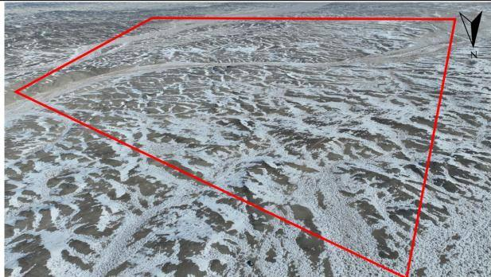  
41-路基16号取弃土场

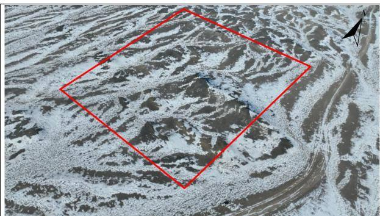  
42-路基 13 号取弃土场

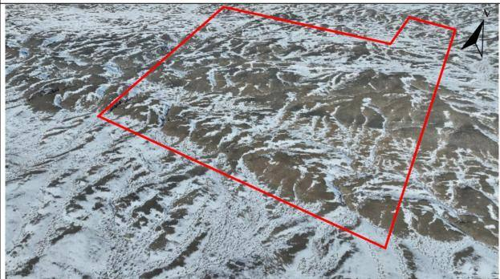  
43-路基15 号取弃土场  
图 2.2.4-1 取（弃）土场现场航拍照片

## 2.2.4.2 外购

本项目在新疆维吾尔自治区境内不设取土场，借方采用外购方式。

根据《自然资源部关于规范和完善砂石开采管理的通知》（自然资发〔2023〕57号）、《关于印发<新疆维吾尔自治区矿产资源管理若干事项暂行办法>的通知》（新自然资规〔2021〕1号）要求，新疆建设项目全面实行矿业权竞争性出让，一律执行招标、拍卖、挂牌方式公开竞争性出让，建设项目的取土场按照招拍挂“净矿”出让方式办理，由所在地的自然资源主管部门组织开展实地踏勘，合理确定采矿权出让范围，并商有关部门办理相应的用地（林、草）、环保、水保、安全等涉矿手续。建设项目取土场采矿权挂牌出让成交结果在各县自然资源局公示，明确中标人，以及项目名称、开采矿种、地理位置、面积、资源储量、开采标高、资源开发利用情况、矿山地质环境保护及土地复垦要求、拟出让年限等基本情况，中标人取得矿产资源使用权后，与项目施工单位依法签订外购协议。相对应的取土场单独立项、单独编报水土保持方案，取土场及其运输道路均不纳入本报告书。

本项目在新疆维吾尔自治区境内外购185.37万m³，源于5处石料场。根据哈密市自然资源局伊州区分局《关于临哈铁路额济纳至哈密段（梧桐水至哈密东）扩能改造工程砂石矿设置征求意见的回复函》（2025年4月24日），石料场选址无压覆既有矿产资源，伊州区林草局等十余主管部门同意选址；本项目在申请办理砂石矿采矿许可证时，

表 2.2.4-3 砂石矿概况表
<table><tr><td rowspan=2 colspan=1>序号</td><td rowspan=2 colspan=3>行政区划砂石矿名称区、县、旗</td><td rowspan=1 colspan=2>中心坐标</td><td rowspan=2 colspan=1>里程位置  侧别</td><td rowspan=1 colspan=1>直线距离</td><td rowspan=2 colspan=1>类型</td><td rowspan=1 colspan=1>储量</td><td rowspan=1 colspan=1>购土量</td><td rowspan=1 colspan=1>汇水面积</td><td rowspan=2 colspan=1>涉及水土流失重点防治区情况</td></tr><tr><td rowspan=1 colspan=1>省、自治区</td><td rowspan=1 colspan=1>市、盟</td><td rowspan=1 colspan=1>经度</td><td rowspan=1 colspan=1>纬度</td><td rowspan=1 colspan=1>m</td><td rowspan=1 colspan=1>万m³</td><td rowspan=1 colspan=1>万m³</td><td rowspan=1 colspan=1>km²</td></tr><tr><td rowspan=1 colspan=1>1</td><td rowspan=1 colspan=1>新疆维吾尔自治区</td><td rowspan=1 colspan=1>哈密市</td><td rowspan=1 colspan=1>伊州区    新疆哈密市伊州区临哈铁路一号砂石矿</td><td rowspan=1 colspan=1>95°57&#x27;50.34&quot;</td><td rowspan=1 colspan=1>42°25&#x27;59.45&quot;</td><td rowspan=1 colspan=1>K1126+000 右侧</td><td rowspan=1 colspan=1>3800</td><td rowspan=1 colspan=1>平地型</td><td rowspan=1 colspan=1>87</td><td rowspan=1 colspan=1>61.70</td><td rowspan=1 colspan=1>0.33</td><td rowspan=1 colspan=1>不涉及</td></tr><tr><td rowspan=1 colspan=1>2</td><td rowspan=1 colspan=1>新疆维吾尔自治区</td><td rowspan=1 colspan=1>哈密市</td><td rowspan=1 colspan=1>伊州区    新疆哈密市伊州区临哈铁路二号砂石矿</td><td rowspan=1 colspan=1>95°27&#x27;58.28&quot;</td><td rowspan=1 colspan=1>42°32&#x27;8.34&quot;</td><td rowspan=1 colspan=1>K1169+100  右侧</td><td rowspan=1 colspan=1>1400</td><td rowspan=1 colspan=1>平地型</td><td rowspan=1 colspan=1>52</td><td rowspan=1 colspan=1>34.71</td><td rowspan=1 colspan=1>0.2</td><td rowspan=1 colspan=1>不涉及</td></tr><tr><td rowspan=1 colspan=1>3</td><td rowspan=1 colspan=1>新疆维吾尔自治区</td><td rowspan=1 colspan=1>哈密市</td><td rowspan=1 colspan=1>伊州区     新疆哈密市伊州区临哈铁路三号砂石矿</td><td rowspan=1 colspan=1>94°45&#x27;57.70&quot;</td><td rowspan=1 colspan=1>42°30&#x27;59.54&quot;</td><td rowspan=1 colspan=1>K1227+000 左侧</td><td rowspan=1 colspan=1>330</td><td rowspan=1 colspan=1>平地型</td><td rowspan=1 colspan=1>56</td><td rowspan=1 colspan=1>34.77</td><td rowspan=1 colspan=1>0.36</td><td rowspan=1 colspan=1>不涉及</td></tr><tr><td rowspan=1 colspan=1>4</td><td rowspan=1 colspan=1>新疆维吾尔自治区</td><td rowspan=1 colspan=1>哈密市</td><td rowspan=1 colspan=1>伊州区     新疆哈密市伊州区临哈铁路四号砂石矿</td><td rowspan=1 colspan=1>94°17&#x27;32.43&quot;</td><td rowspan=1 colspan=1>42°33&#x27;11.19&quot;</td><td rowspan=1 colspan=1>K1266+000  左侧</td><td rowspan=1 colspan=1>550</td><td rowspan=1 colspan=1>平地型</td><td rowspan=1 colspan=1>45</td><td rowspan=1 colspan=1>21.33</td><td rowspan=1 colspan=1>0.30</td><td rowspan=1 colspan=1>不涉及</td></tr><tr><td rowspan=1 colspan=1>5</td><td rowspan=1 colspan=1>新疆维吾尔自治区</td><td rowspan=1 colspan=1>哈密市</td><td rowspan=1 colspan=1>伊州区    新疆哈密市伊州区临哈铁路五号砂石矿</td><td rowspan=1 colspan=1>93°36&#x27;02.59&quot;</td><td rowspan=1 colspan=1>42°39&#x27;15.90&quot;</td><td rowspan=1 colspan=1>K1306+000  右侧</td><td rowspan=1 colspan=1>1450</td><td rowspan=1 colspan=1>平地型</td><td rowspan=1 colspan=1>53</td><td rowspan=1 colspan=1>32.86</td><td rowspan=1 colspan=1>0.29</td><td rowspan=1 colspan=1>不涉及</td></tr><tr><td rowspan=1 colspan=9>合计</td><td rowspan=1 colspan=1>293</td><td rowspan=1 colspan=1>185.37</td><td rowspan=1 colspan=1>1</td><td rowspan=1 colspan=1>1</td></tr></table>

表 2.2.4-4 砂石矿开采方式、地质概况及后期恢复
<table><tr><td rowspan=2 colspan=1>序号     砂石矿名称</td><td rowspan=2 colspan=1>里程位置</td><td rowspan=2 colspan=1>侧别</td><td rowspan=1 colspan=1>直线距离</td><td rowspan=1 colspan=1>购土量</td><td rowspan=2 colspan=1>工程地质调查资料</td></tr><tr><td rowspan=1 colspan=1>m</td><td rowspan=1 colspan=1>万m³</td></tr><tr><td rowspan=1 colspan=1>新疆哈密市伊州区临1哈铁路一号砂石矿</td><td rowspan=1 colspan=1>K1126+000</td><td rowspan=1 colspan=1>右侧</td><td rowspan=1 colspan=1>3800</td><td rowspan=1 colspan=1>61.70</td><td rowspan=1 colspan=1>砂石料场位于剥蚀丘陵区，地形相对起伏，相对高差约2~5m，地层岩性为华力西期花岗岩，肉红色，地表基岩出露，风化层较薄。地层：地面以下0~2m，花岗岩强风化，岩土施工工程分级为IV类，经破碎筛选后可作为B、C组填料。2~10m，花岗岩弱风化，岩土施工工程分级为V类；经破碎筛选后可作为A、B、C组填料。勘察期间未见地表水；勘探期间未揭示地下水，埋深一般大于20m。</td></tr><tr><td rowspan=1 colspan=1>新疆哈密市伊州区临2哈铁路二号砂石矿</td><td rowspan=1 colspan=1>K1169+100</td><td rowspan=1 colspan=1>右侧</td><td rowspan=1 colspan=1>1400</td><td rowspan=1 colspan=1>34.71</td><td rowspan=1 colspan=1>砂石料场位于剥蚀丘陵区，地形相对起伏，相对高差约2~5m，地层岩性为华力西期花岗岩，肉红色，地表基岩出露，风化层较薄。地层：地面以下0~2m，花岗岩强风化，岩土施工工程分级为IV类，经破碎筛选后可作为B、C组填料。2~10m，花岗岩弱风化，岩土施工工程分级为V类；经破碎筛选后可作为A、B、C组填料。勘察期间未见地表水；勘探期间未揭示地下水，埋深一般大于20m。</td></tr><tr><td rowspan=1 colspan=1>新疆哈密市伊州区临3哈铁路三号砂石矿</td><td rowspan=1 colspan=1>K1227+000</td><td rowspan=1 colspan=1>侧</td><td rowspan=1 colspan=1>330</td><td rowspan=1 colspan=1>34.77</td><td rowspan=1 colspan=1>砂石料场位于山前洪积倾斜平原区，地层多为细、粗圆砾土，厚度大于15m，可取土层厚度较大，储量满足要求，且多为A组填料，部分为C级填料。</td></tr><tr><td rowspan=1 colspan=1>新疆哈密市伊州区临4                          K哈铁路四号砂石矿新疆哈密市伊州区临5哈铁路五号砂石矿</td><td rowspan=1 colspan=1>1266+000K1306+000</td><td rowspan=1 colspan=1>左侧右侧</td><td rowspan=1 colspan=1>5501450</td><td rowspan=1 colspan=1>21.3332.86</td><td rowspan=1 colspan=1>砂石料场位于山前洪积倾斜平原区，地层多为细、粗圆砾土，厚度大于15m，可取土层厚度较大，储量满足要求，且多为A组填料，部分为C级填料。砂石料场位于山前洪积倾斜平原区，地层多为细、粗圆砾土，厚度大于15m，可取土层厚度较大，储量满足要求，且多为A组填料，部分为C级填料。</td></tr></table>

## 2.2.5 弃方去向

## （1）弃土处置方式

本项目最终选定43处取土坑回填弃土，全部为平地填凹型，未单独设置弃土场，弃方共计166.15万 $\mathrm { m } ^ { 3 }$ （以自然方计），182.78万 $\mathrm { m } ^ { 3 }$ （以松方计）。弃土全部采用取弃合设方式解决，不再重复计列征占地面积。166.15万 $\mathrm { m } ^ { 3 }$ 弃土包括：取（弃）土场无用层58.83 万 $\mathrm { m } ^ { 3 }$ ，杂填土47.36万 $\mathrm { m } ^ { 3 }$ ，盐渍土38.31万 $\mathrm { m } ^ { 3 }$ ，桥梁钻渣21.48万 $\mathrm { m } ^ { 3 }$ ，建筑垃圾0.17万 $\mathrm { m } ^ { 3 }$

## （2）弃土协议及基础资料收集情况

建设单位已组织勘察设计单位，会同沿线各旗县级水利、自然资源、生态环境和林业等行政部门和土地权属单位（或个人），在实地调查后与取土场合并签订了取（弃）土场选址协议，详见附件3（P526）。

编制单位收集了取（弃）土场工程地质资料、比例尺1:2000的地形图、高分辨率遥感影像、无人机影像等相关基础资料。

表2.2.5-1 回填弃土的取（弃）土场概况表
<table><tr><td colspan="1" rowspan="2">序号</td><td colspan="3" rowspan="1">行政区划</td><td colspan="1" rowspan="2">取（弃）土场名称</td><td colspan="1" rowspan="2">里程位置</td><td colspan="2" rowspan="1">中心坐标</td><td colspan="1" rowspan="1">渣场类型</td><td colspan="1" rowspan="1">占地面积</td><td colspan="2" rowspan="1">总弃土量(万m³)</td><td colspan="1" rowspan="1">弃土分类无用层数量</td><td colspan="1" rowspan="1">及数量弃土量</td><td colspan="1" rowspan="1">平均弃土厚度</td><td colspan="1" rowspan="1">回填后与取土终采平台高差</td><td colspan="1" rowspan="1">汇水面积</td><td colspan="1" rowspan="2">堆置方案</td><td colspan="1" rowspan="2">渣场周边及下游重要公共、基础设施，工业企业和居民点等分布情况</td><td colspan="1" rowspan="2">涉及水土流失重点防治区情况</td></tr><tr><td colspan="1" rowspan="1">区</td><td colspan="1" rowspan="1">市、盟</td><td colspan="1" rowspan="1">旗</td><td colspan="1" rowspan="1">经度</td><td colspan="1" rowspan="1">纬度</td><td colspan="1" rowspan="1"></td><td colspan="1" rowspan="1">hm²</td><td colspan="1" rowspan="1">自然方</td><td colspan="1" rowspan="1">松方</td><td colspan="1" rowspan="1">万m³</td><td colspan="1" rowspan="1">万m³</td><td colspan="1" rowspan="1">m</td><td colspan="1" rowspan="1">m</td><td colspan="1" rowspan="1">km²</td></tr><tr><td colspan="1" rowspan="1"></td><td colspan="1" rowspan="1">内蒙古自治区</td><td colspan="1" rowspan="1">阿拉善盟</td><td colspan="1" rowspan="1">额济纳旗</td><td colspan="1" rowspan="1">取弃土（渣）场K01</td><td colspan="1" rowspan="1">689+200右侧 830m</td><td colspan="1" rowspan="1">100°59'38.46"4</td><td colspan="1" rowspan="1">1°56'9.35"</td><td colspan="1" rowspan="1">平地填凹型</td><td colspan="1" rowspan="1">2.76</td><td colspan="1" rowspan="1">0.55</td><td colspan="1" rowspan="1">0.61</td><td colspan="1" rowspan="1">0.55</td><td colspan="1" rowspan="1"></td><td colspan="1" rowspan="1">0.2</td><td colspan="1" rowspan="1">与取土终采平台持平</td><td colspan="1" rowspan="1">0.05</td><td colspan="1" rowspan="1">取弃土前，先剥离砾幕层，集中堆放，并采取临时防护措施，场区外侧布设高立式PE阻沙沙障和限界彩条旗；取土过程中，取土边坡采取削坡开级，裸露边坡苫盖密目网；漫流区取（弃）土场上游布设导流设施；取土结束后，进行土地整治、表土回覆，对场地内撒播草籽或回覆砾幕。对沙质边坡的取（弃）土场喷洒固沙剂。</td><td colspan="1" rowspan="1">不涉及</td><td colspan="1" rowspan="1">不涉及</td></tr><tr><td colspan="1" rowspan="1">2</td><td colspan="1" rowspan="1">内蒙古自治区</td><td colspan="1" rowspan="1">阿拉善盟</td><td colspan="1" rowspan="1">额济纳旗</td><td colspan="1" rowspan="1">取弃土（渣）场K03</td><td colspan="1" rowspan="1">698+300左侧 620m</td><td colspan="1" rowspan="1">100°54'16.91"|4</td><td colspan="1" rowspan="1">1°59'8.18"</td><td colspan="1" rowspan="1">平地填凹型</td><td colspan="1" rowspan="1">6.27</td><td colspan="1" rowspan="1">1.25</td><td colspan="1" rowspan="1">1.38</td><td colspan="1" rowspan="1">1.25</td><td colspan="1" rowspan="1">/</td><td colspan="1" rowspan="1">0.2</td><td colspan="1" rowspan="1">与取土终采平台持平</td><td colspan="1" rowspan="1">0.11</td><td colspan="1" rowspan="1">取弃土前，先剥离砾幕层，集中堆放，并采取临时防护措施，场区外侧布设高立式PE阻沙沙障和限界彩条旗；取土过程中，取土边坡采取削坡开级，裸露边坡苫盖密目网；漫流区取（弃）土场上游布设导流设施；取土结束后，进行土地整治、表土回覆，对场地内撒播草籽或回覆砾幕。对沙质边坡的取（弃）土场喷洒固沙剂。</td><td colspan="1" rowspan="1">不涉及</td><td colspan="1" rowspan="1">不涉及</td></tr><tr><td colspan="1" rowspan="1">3</td><td colspan="1" rowspan="1">内蒙古自治区</td><td colspan="1" rowspan="1">阿拉善盟</td><td colspan="1" rowspan="1">额济纳旗</td><td colspan="1" rowspan="1">取弃土（渣）场K04</td><td colspan="1" rowspan="1">731+600右侧 12000m</td><td colspan="1" rowspan="1">100°32'48.64"4</td><td colspan="1" rowspan="1">2°09'19.33"</td><td colspan="1" rowspan="1">平地填凹型</td><td colspan="1" rowspan="1">5.66</td><td colspan="1" rowspan="1">7.02</td><td colspan="1" rowspan="1">7.72</td><td colspan="1" rowspan="1">1.13</td><td colspan="1" rowspan="1">5.89</td><td colspan="1" rowspan="1">1.24</td><td colspan="1" rowspan="1">与取土终采平台持平</td><td colspan="1" rowspan="1">0.1</td><td colspan="1" rowspan="1">取弃土前，先剥离砾幕层，集中堆放，并采取临时防护措施，场区外侧布设高立式PE阻沙沙障和限界彩条旗；取土过程中，取土边坡采取削坡开级，裸露边坡苫盖密目网；漫流区取（弃）土场上游布设导流设施；取土结束后，进行土地整治、表土回覆，对场地内撒播草籽或回覆砾幕。对沙质边坡的取（弃）土场喷洒固沙剂。</td><td colspan="1" rowspan="1">不涉及</td><td colspan="1" rowspan="1">不涉及</td></tr><tr><td colspan="1" rowspan="1">4</td><td colspan="1" rowspan="1">内蒙古自治区</td><td colspan="1" rowspan="1">阿拉善盟</td><td colspan="1" rowspan="1">额济纳旗</td><td colspan="1" rowspan="1">取弃土（渣）场K06</td><td colspan="1" rowspan="1">749+400右侧 1770m</td><td colspan="1" rowspan="1">100°18'43.28&amp;quo</td><td colspan="1" rowspan="1">t;42°04'56.07&amp;</td><td colspan="1" rowspan="1">平地quot;填凹型</td><td colspan="1" rowspan="1">2.73</td><td colspan="1" rowspan="1">3.86</td><td colspan="1" rowspan="1">4.25</td><td colspan="1" rowspan="1">0.55</td><td colspan="1" rowspan="1">3.31</td><td colspan="1" rowspan="1">1.41</td><td colspan="1" rowspan="1">与取土终采平台持平</td><td colspan="1" rowspan="1">0.05</td><td colspan="1" rowspan="1">取弃土前，先剥离砾幕层，集中堆放，并采取临时防护措施，场区外侧布设高立式PE阻沙沙障和限界彩条旗；取土过程中，取土边坡采取削坡开级，裸露边坡苫盖密目网；漫流区取（弃）土场上游布设导流设施；取土结束后，进行土地整治、表土回覆，对场地内撒播草籽或回覆砾幕。对沙质边坡的取（弃）土场喷洒固沙剂。</td><td colspan="1" rowspan="1">不涉及</td><td colspan="1" rowspan="1">不涉及</td></tr><tr><td colspan="1" rowspan="1">5</td><td colspan="1" rowspan="1">内蒙古自治区</td><td colspan="1" rowspan="1">阿拉善盟</td><td colspan="1" rowspan="1">额济纳旗</td><td colspan="1" rowspan="1">取弃土（渣）场K38</td><td colspan="1" rowspan="1">760+500右侧 41200m</td><td colspan="1" rowspan="1">100°09'41.49&amp;quo</td><td colspan="1" rowspan="1">t;42°27'14.05&amp;</td><td colspan="1" rowspan="1">平地quot;填凹型</td><td colspan="1" rowspan="1">47.12</td><td colspan="1" rowspan="1">0.94</td><td colspan="1" rowspan="1">1.03</td><td colspan="1" rowspan="1">0.94</td><td colspan="1" rowspan="1">/</td><td colspan="1" rowspan="1">0.02</td><td colspan="1" rowspan="1">与取土终采平台持平</td><td colspan="1" rowspan="1">0.8</td><td colspan="1" rowspan="1">取弃土前，先剥离砾幕层，集中堆放，并采取临时防护措施，场区外侧布设高立式PE阻沙沙障和限界彩条旗；取土过程中，取土边坡采取削坡开级，裸露边坡苫盖密目网；漫流区取（弃）土场上游布设导流设施；取土结束后，进行土地整治、表土回覆，对场地内撒播草籽或回覆砾幕。对沙质边坡的取（弃）土场喷洒固沙剂。</td><td colspan="1" rowspan="1">不涉及</td><td colspan="1" rowspan="1">不涉及</td></tr><tr><td colspan="1" rowspan="1">6</td><td colspan="1" rowspan="1">内蒙古自治区</td><td colspan="1" rowspan="1">阿拉善盟</td><td colspan="1" rowspan="1">额济纳旗</td><td colspan="1" rowspan="1">取弃土（渣）场K10</td><td colspan="1" rowspan="1">785+100右侧 770m</td><td colspan="1" rowspan="1">99°52'56.40"</td><td colspan="1" rowspan="1">;42°06'19.02&amp;q</td><td colspan="1" rowspan="1">平地uot;填凹型</td><td colspan="1" rowspan="1">2.69</td><td colspan="1" rowspan="1">2.82</td><td colspan="1" rowspan="1">3.1</td><td colspan="1" rowspan="1">0.54</td><td colspan="1" rowspan="1">2.28</td><td colspan="1" rowspan="1">1.05</td><td colspan="1" rowspan="1">与取土终采平台持平</td><td colspan="1" rowspan="1">0.05</td><td colspan="1" rowspan="1">取弃土前，先剥离砾幕层，集中堆放，并采取临时防护措施，场区外侧布设高立式PE阻沙沙障和限界彩条旗；取土过程中，取土边坡采取削坡开级，裸露边坡苫盖密目网；漫流区取（弃）土场上游布设导流设施；取土结束后，进行土地整治、表土回覆，对场地内撒播草籽或回覆砾幕。对沙质边坡的取（弃）土场喷洒固沙剂。</td><td colspan="1" rowspan="1">不涉及</td><td colspan="1" rowspan="1">不涉及</td></tr><tr><td colspan="1" rowspan="1">7</td><td colspan="1" rowspan="1">内蒙古自治区</td><td colspan="1" rowspan="1">阿拉善盟</td><td colspan="1" rowspan="1">额济纳旗</td><td colspan="1" rowspan="1">取弃土（渣）场K11</td><td colspan="1" rowspan="1">800+800右侧740m</td><td colspan="1" rowspan="1">99°41'54.06"42</td><td colspan="1" rowspan="1">°07'50.11"</td><td colspan="1" rowspan="1">平地填凹</td><td colspan="1" rowspan="1">16.86</td><td colspan="1" rowspan="1">13.21</td><td colspan="1" rowspan="1">14.53</td><td colspan="1" rowspan="1">3.37</td><td colspan="1" rowspan="1">9.84</td><td colspan="1" rowspan="1">0.78</td><td colspan="1" rowspan="1">与取土终采平台持平</td><td colspan="1" rowspan="1">0.29</td><td colspan="1" rowspan="1">取弃土前，先剥离砾幕层，集中堆放，并采取临时防护措施。场区外侧布设高立式PE阻沙沙障和限界彩条</td><td colspan="1" rowspan="1">不涉及</td><td colspan="1" rowspan="1">不涉及</td></tr><tr><td colspan="1" rowspan="1"></td><td colspan="1" rowspan="1"></td><td colspan="1" rowspan="1"></td><td colspan="1" rowspan="1"></td><td colspan="1" rowspan="1"></td><td colspan="1" rowspan="1"></td><td colspan="1" rowspan="1"></td><td colspan="1" rowspan="1"></td><td colspan="1" rowspan="1">型</td><td colspan="1" rowspan="1"></td><td colspan="1" rowspan="1"></td><td colspan="1" rowspan="1"></td><td colspan="1" rowspan="1"></td><td colspan="1" rowspan="1"></td><td colspan="1" rowspan="1"></td><td colspan="1" rowspan="1"></td><td colspan="1" rowspan="1"></td><td colspan="1" rowspan="1">旗。山坡型及漫流区取（弃）土场外围布设排水沉沙措施；取土过程中，取土边坡采取削坡开级，裸露边坡苫盖密目网；漫流区取（弃）土场上游布设导流设施；取土结束后，进行土地整治、砾幕回覆。</td><td colspan="1" rowspan="1"></td><td colspan="1" rowspan="1"></td></tr><tr><td colspan="1" rowspan="1">8</td><td colspan="1" rowspan="1">内蒙古自治区</td><td colspan="1" rowspan="1">阿拉善盟</td><td colspan="1" rowspan="1">额济纳旗</td><td colspan="1" rowspan="1">取弃土（渣）场K12</td><td colspan="1" rowspan="1">815+000右侧 670m</td><td colspan="1" rowspan="1">99°31'54.46"</td><td colspan="1" rowspan="1">;42°06'25.11&amp;q</td><td colspan="1" rowspan="1">平地uot;填凹型</td><td colspan="1" rowspan="1">10.75</td><td colspan="1" rowspan="1">7.66</td><td colspan="1" rowspan="1">8.43</td><td colspan="1" rowspan="1">2.15</td><td colspan="1" rowspan="1">5.51</td><td colspan="1" rowspan="1">0.71</td><td colspan="1" rowspan="1">与取土终采平台持平</td><td colspan="1" rowspan="1">0.18</td><td colspan="1" rowspan="1">取弃土前，先剥离砾幕层，集中堆放，并采取临时防护措施。场区外侧布设高立式PE阻沙沙障和限界彩条旗。山坡型及漫流区取（弃）土场外围布设排水沉沙措施；取土过程中，取土边坡采取削坡开级，裸露边坡苫盖密目网；漫流区取（弃）土场上游布设导流设施；取土结束后，进行土地整治、砾幕回覆。</td><td colspan="1" rowspan="1">不涉及</td><td colspan="1" rowspan="1">不涉及</td></tr><tr><td colspan="1" rowspan="1">9</td><td colspan="1" rowspan="1">内蒙古自治区</td><td colspan="1" rowspan="1">阿拉善盟</td><td colspan="1" rowspan="1">额济纳旗</td><td colspan="1" rowspan="1">取弃土（渣）场K13</td><td colspan="1" rowspan="1">819+200右侧540m</td><td colspan="1" rowspan="1">99°29'16.22"</td><td colspan="1" rowspan="1">;42°06'10.01&amp;q</td><td colspan="1" rowspan="1">平地uot;填凹型</td><td colspan="1" rowspan="1">15.40</td><td colspan="1" rowspan="1">3.96</td><td colspan="1" rowspan="1">4.36</td><td colspan="1" rowspan="1">3.08</td><td colspan="1" rowspan="1">0.88</td><td colspan="1" rowspan="1">0.26</td><td colspan="1" rowspan="1">与取土终采平台持平</td><td colspan="1" rowspan="1">0.26</td><td colspan="1" rowspan="1">取弃土前，先剥离砾幕层，集中堆放，并采取临时防护措施。场区外侧布设高立式PE阻沙沙障和限界彩条旗。山坡型及漫流区取（弃）土场外围布设排水沉沙措施；取土过程中，取土边坡采取削坡开级，裸露边坡苫盖密目网；漫流区取（弃）土场上游布设导流设施；取土结束后，进行土地整治、砾幕回覆。</td><td colspan="1" rowspan="1">不涉及</td><td colspan="1" rowspan="1">不涉及</td></tr><tr><td colspan="1" rowspan="1">10</td><td colspan="1" rowspan="1">内蒙古自治区</td><td colspan="1" rowspan="1">阿拉善盟</td><td colspan="1" rowspan="1">额济纳旗</td><td colspan="1" rowspan="1">取弃土（渣）场K14</td><td colspan="1" rowspan="1">823+900右侧310m</td><td colspan="1" rowspan="1">99°25'45.45"</td><td colspan="1" rowspan="1">; 42°06'5.11&amp;q</td><td colspan="1" rowspan="1">平地uot; 填凹型</td><td colspan="1" rowspan="1">5.40</td><td colspan="1" rowspan="1">1.99</td><td colspan="1" rowspan="1">2.19</td><td colspan="1" rowspan="1">1.08</td><td colspan="1" rowspan="1">0.91</td><td colspan="1" rowspan="1">0.37</td><td colspan="1" rowspan="1">与取土终采平台持平</td><td colspan="1" rowspan="1">0.09</td><td colspan="1" rowspan="1">取弃土前，先剥离砾幕层，集中堆放，并采取临时防护措施。场区外侧布设高立式PE阻沙沙障和限界彩条旗。山坡型及漫流区取（弃）土场外围布设排水沉沙措施；取土过程中，取土边坡采取削坡开级，裸露边坡苫盖密目网；漫流区取（弃）土场上游布设导流设施；取土结束后，进行土地整治、砾幕回覆。</td><td colspan="1" rowspan="1">不涉及</td><td colspan="1" rowspan="1">不涉及</td></tr><tr><td colspan="1" rowspan="1">11</td><td colspan="1" rowspan="1">内蒙古自治区</td><td colspan="1" rowspan="1">阿拉善盟</td><td colspan="1" rowspan="1">额济纳旗</td><td colspan="1" rowspan="1">取弃土（渣）场K15</td><td colspan="1" rowspan="1">827+100右侧 230m</td><td colspan="1" rowspan="1">99°23'26.64"42</td><td colspan="1" rowspan="1">°05'52.07"</td><td colspan="1" rowspan="1">平地填凹型</td><td colspan="1" rowspan="1">10.17</td><td colspan="1" rowspan="1">3.59</td><td colspan="1" rowspan="1">3.95</td><td colspan="1" rowspan="1">2.03</td><td colspan="1" rowspan="1">1.56</td><td colspan="1" rowspan="1">0.35</td><td colspan="1" rowspan="1">与取土终采平台持平</td><td colspan="1" rowspan="1">0.17</td><td colspan="1" rowspan="1">取弃土前，先剥离砾幕层，集中堆放，并采取临时防护措施。场区外侧布设高立式PE阻沙沙障和限界彩条旗。山坡型及漫流区取（弃）土场外围布设排水沉沙措施；取土过程中，取土边坡采取削坡开级，裸露边坡苫盖密目网；漫流区取（弃）土场上游布设导流设施；取土结束后，进行土地整治、砾幕回覆。</td><td colspan="1" rowspan="1">不涉及</td><td colspan="1" rowspan="1">不涉及</td></tr><tr><td colspan="1" rowspan="1">12</td><td colspan="1" rowspan="1">内蒙古自治区</td><td colspan="1" rowspan="1">阿拉善盟</td><td colspan="1" rowspan="1">额济纳旗</td><td colspan="1" rowspan="1">取弃土（渣）场K16</td><td colspan="1" rowspan="1">834+500右侧530m</td><td colspan="1" rowspan="1">99°18'44.06"</td><td colspan="1" rowspan="1">;42°05'02.11&amp;q</td><td colspan="1" rowspan="1">平地uot;填凹型</td><td colspan="1" rowspan="1">3.35</td><td colspan="1" rowspan="1">2.22</td><td colspan="1" rowspan="1">2.44</td><td colspan="1" rowspan="1">0.67</td><td colspan="1" rowspan="1">1.55</td><td colspan="1" rowspan="1">0.66</td><td colspan="1" rowspan="1">与取土终采平台持平</td><td colspan="1" rowspan="1">0.06</td><td colspan="1" rowspan="1">取弃土前，先剥离砾幕层，集中堆放，并采取临时防护措施。场区外侧布设高立式PE阻沙沙障和限界彩条旗。山坡型及漫流区取（弃）土场外围布设排水沉沙措施；取土过程中，取土边坡采取削坡开级，裸露边坡苫盖密目网；漫流区取（弃）土场上游布设导流设施；取土结束后，进行土地整治、砾幕回覆。</td><td colspan="1" rowspan="1">不涉及</td><td colspan="1" rowspan="1">不涉及</td></tr><tr><td colspan="1" rowspan="1">13</td><td colspan="1" rowspan="1">内蒙古自阿治区</td><td colspan="1" rowspan="1">拉善盟</td><td colspan="1" rowspan="1">额济纳旗</td><td colspan="1" rowspan="1">取弃土（渣）场K17</td><td colspan="1" rowspan="1">847+200右侧 900m</td><td colspan="1" rowspan="1">99°10'33.12"</td><td colspan="1" rowspan="1">;42°06'27.311&amp;</td><td colspan="1" rowspan="1">平地quot;填凹型</td><td colspan="1" rowspan="1">4.77</td><td colspan="1" rowspan="1">3.46</td><td colspan="1" rowspan="1">3.81</td><td colspan="1" rowspan="1">0.95</td><td colspan="1" rowspan="1">2.51</td><td colspan="1" rowspan="1">0.73</td><td colspan="1" rowspan="1">与取土终采平台持平</td><td colspan="1" rowspan="1">0.08</td><td colspan="1" rowspan="1">取弃土前，先剥离砾幕层，集中堆放，并采取临时防护措施。场区外侧布设高立式PE阻沙沙障和限界彩条旗。山坡型及漫流区取（弃）土场外围布设排水沉沙措施；取土过程中，取土边坡采取削坡开级，裸露边坡苫盖密目网；漫流区取（弃）土场上游布设导流设施；取土结束后，进行土地整治、砾幕回覆。</td><td colspan="1" rowspan="1">不涉及</td><td colspan="1" rowspan="1">不涉及</td></tr><tr><td colspan="1" rowspan="1">14</td><td colspan="1" rowspan="1">内蒙古自治区</td><td colspan="1" rowspan="1">阿拉善盟</td><td colspan="1" rowspan="1">额济纳旗</td><td colspan="1" rowspan="1">取弃土（渣）场K18</td><td colspan="1" rowspan="1">851+400右侧 460m</td><td colspan="1" rowspan="1">99°06'53.85"</td><td colspan="1" rowspan="1">;42°06'24.25&amp;q</td><td colspan="1" rowspan="1">平地uot;填凹型</td><td colspan="1" rowspan="1">4.60</td><td colspan="1" rowspan="1">2.86</td><td colspan="1" rowspan="1">3.15</td><td colspan="1" rowspan="1">0.92</td><td colspan="1" rowspan="1">1.94</td><td colspan="1" rowspan="1">0.62</td><td colspan="1" rowspan="1">与取土终采平台持平</td><td colspan="1" rowspan="1">0.08</td><td colspan="1" rowspan="1">取弃土前，先剥离砾幕层，集中堆放，并采取临时防护措施。场区外侧布设高立式PE阻沙沙障和限界彩条旗。山坡型及漫流区取（弃）土场外围布设排水沉沙措施；取土过程中，取土边坡采取削坡开级，裸露边坡苫盖密目网；漫流区取（弃）土场上游布设导流设施；取土结束后，进行土地整治、砾幕回覆。</td><td colspan="1" rowspan="1">不涉及</td><td colspan="1" rowspan="1">不涉及</td></tr><tr><td colspan="1" rowspan="2">序号省</td><td colspan="3" rowspan="1">行政区划</td><td colspan="1" rowspan="2">取（弃）土场名称</td><td colspan="1" rowspan="2">里盟</td><td colspan="2" rowspan="1">中心坐标</td><td colspan="1" rowspan="1">渣场类型</td><td colspan="1" rowspan="1">占地面积</td><td colspan="2" rowspan="1">总弃土量(万m³)</td><td colspan="1" rowspan="1">弃土分类无用层数量</td><td colspan="1" rowspan="1">及数量弃土量</td><td colspan="1" rowspan="1">平均弃土厚度</td><td colspan="1" rowspan="1">回填后与取土终采平台高差</td><td colspan="1" rowspan="1">汇水面积</td><td colspan="1" rowspan="2">堆置方案</td><td colspan="1" rowspan="2">渣场周边及下游重要公共、基础设施，工业企业和居民点等分布情况</td><td colspan="1" rowspan="2">涉及水土流失重点防治区情况</td></tr><tr><td colspan="1" rowspan="1">、自治市区</td><td colspan="1" rowspan="1">、盟</td><td colspan="1" rowspan="1">区、县、旗</td><td colspan="1" rowspan="1">经度</td><td colspan="1" rowspan="1">纬度</td><td colspan="1" rowspan="1"></td><td colspan="1" rowspan="1">hm²</td><td colspan="1" rowspan="1">自然方</td><td colspan="1" rowspan="1">松方</td><td colspan="1" rowspan="1">万m³</td><td colspan="1" rowspan="1">万m³</td><td colspan="1" rowspan="1">m</td><td colspan="1" rowspan="1">m</td><td colspan="1" rowspan="1">km²</td></tr><tr><td colspan="1" rowspan="1">15</td><td colspan="1" rowspan="1">内蒙古自治区善</td><td colspan="1" rowspan="1">阿拉盟</td><td colspan="1" rowspan="1">额济纳取旗</td><td colspan="1" rowspan="1">弃土（渣）场K21</td><td colspan="1" rowspan="1">863+900右侧 1100m</td><td colspan="1" rowspan="1">98°58'22.93" 4</td><td colspan="1" rowspan="1">2°08'38.26"</td><td colspan="1" rowspan="1">平地填凹型</td><td colspan="1" rowspan="1">5.37</td><td colspan="1" rowspan="1">2.62</td><td colspan="1" rowspan="1">2.88</td><td colspan="1" rowspan="1">1.07</td><td colspan="1" rowspan="1">1.55</td><td colspan="1" rowspan="1">0.49</td><td colspan="1" rowspan="1">与取土终采平台持平</td><td colspan="1" rowspan="1">0.09</td><td colspan="1" rowspan="1">取弃土前，先剥离砾幕层，集中堆放，并采取临时防护措施。场区外侧布设高立式PE阻沙沙障和限界彩条旗。山坡型及漫流区取（弃）土场外围布设排水沉沙措施；取土过程中，取土边坡采取削坡开级，裸露边坡苫盖密目网；漫流区取（弃）土场上游布设导流设施；取土结束后，进行土地整治、砾幕回覆。</td><td colspan="1" rowspan="1">不涉及</td><td colspan="1" rowspan="1">不涉及</td></tr><tr><td colspan="1" rowspan="1">16</td><td colspan="1" rowspan="1">内蒙古自治区</td><td colspan="1" rowspan="1">阿拉善盟</td><td colspan="1" rowspan="1">额济纳取旗</td><td colspan="1" rowspan="1">弃土（渣）场K822</td><td colspan="1" rowspan="1">69+500右侧 350m</td><td colspan="1" rowspan="1">98°54'16.40"42</td><td colspan="1" rowspan="1">°09'01.05"</td><td colspan="1" rowspan="1">平地填凹型</td><td colspan="1" rowspan="1">8.42</td><td colspan="1" rowspan="1">4.514</td><td colspan="1" rowspan="1">.96</td><td colspan="1" rowspan="1">1.68</td><td colspan="1" rowspan="1">2.83</td><td colspan="1" rowspan="1">0.54</td><td colspan="1" rowspan="1">与取土终采平台持平</td><td colspan="1" rowspan="1">0.14</td><td colspan="1" rowspan="1">取弃土前，先剥离砾幕层，集中堆放，并采取临时防护措施。场区外侧布设高立式PE阻沙沙障和限界彩条旗。山坡型及漫流区取（弃）土场外围布设排水沉沙措施；取土过程中，取土边坡采取削坡开级，裸露边坡苫盖密目网；漫流区取（弃）土场上游布设导流设施；取土结束后，进行土地整治、砾幕回覆。</td><td colspan="1" rowspan="1">不涉及</td><td colspan="1" rowspan="1">不涉及</td></tr><tr><td colspan="1" rowspan="1">17</td><td colspan="1" rowspan="1">内蒙古自治区善</td><td colspan="1" rowspan="1">阿拉盟</td><td colspan="1" rowspan="1">额济纳取旗</td><td colspan="1" rowspan="1">弃土（渣）场K24</td><td colspan="1" rowspan="1">883+803右侧 1025m</td><td colspan="1" rowspan="1">98°45'29.06"</td><td colspan="1" rowspan="1">42°09'9.90"</td><td colspan="1" rowspan="1">平地填凹型</td><td colspan="1" rowspan="1">5.06</td><td colspan="1" rowspan="1">2.92</td><td colspan="1" rowspan="1">3.21</td><td colspan="1" rowspan="1">1.01</td><td colspan="1" rowspan="1">1.91</td><td colspan="1" rowspan="1">0.58</td><td colspan="1" rowspan="1">与取土终采平台持平</td><td colspan="1" rowspan="1">0.09</td><td colspan="1" rowspan="1">取弃土前，先剥离砾幕层，集中堆放，并采取临时防护措施。场区外侧布设高立式PE阻沙沙障和限界彩条旗。山坡型及漫流区取（弃）土场外围布设排水沉沙措施；取土过程中，取土边坡采取削坡开级，裸露边坡苫盖密目网；漫流区取（弃）土场上游布设导流设施；取土结束后，进行土地整治、砾幕回覆。</td><td colspan="1" rowspan="1">不涉及</td><td colspan="1" rowspan="1">不涉及</td></tr><tr><td colspan="1" rowspan="1">18</td><td colspan="1" rowspan="1">内蒙古自治区善</td><td colspan="1" rowspan="1">阿拉盟</td><td colspan="1" rowspan="1">额济纳取旗</td><td colspan="1" rowspan="1">弃土（渣）场K25</td><td colspan="1" rowspan="1">886+900右侧 630m</td><td colspan="1" rowspan="1">98°43'10.64"</td><td colspan="1" rowspan="1">42°10'7.61"</td><td colspan="1" rowspan="1">平地填凹型</td><td colspan="1" rowspan="1">6.62</td><td colspan="1" rowspan="1">2.07</td><td colspan="1" rowspan="1">2.28</td><td colspan="1" rowspan="1">1.32</td><td colspan="1" rowspan="1">0.75</td><td colspan="1" rowspan="1">0.31</td><td colspan="1" rowspan="1">与取土终采平台持平</td><td colspan="1" rowspan="1">0.11</td><td colspan="1" rowspan="1">取弃土前，先剥离砾幕层，集中堆放，并采取临时防护措施。场区外侧布设高立式PE阻沙沙障和限界彩条旗。山坡型及漫流区取（弃）土场外围布设排水沉沙措施；取土过程中，取土边坡采取削坡开级，裸露边坡苫盖密目网；漫流区取（弃）土场上游布设导流设施；取土结束后，进行土地整治、砾幕回覆。</td><td colspan="1" rowspan="1">不涉及</td><td colspan="1" rowspan="1">不涉及</td></tr><tr><td colspan="1" rowspan="1">19</td><td colspan="1" rowspan="1">内蒙古自治区善</td><td colspan="1" rowspan="1">阿拉盟</td><td colspan="1" rowspan="1">额济纳取旗</td><td colspan="1" rowspan="1">弃土（渣）场K826</td><td colspan="1" rowspan="1">90+200右侧 580m</td><td colspan="1" rowspan="1">98°40'54.84"42</td><td colspan="1" rowspan="1">°10'44.08"</td><td colspan="1" rowspan="1">平地填凹型</td><td colspan="1" rowspan="1">3.31</td><td colspan="1" rowspan="1">1.61</td><td colspan="1" rowspan="1">1.77</td><td colspan="1" rowspan="1">0.66</td><td colspan="1" rowspan="1">0.95</td><td colspan="1" rowspan="1">0.49</td><td colspan="1" rowspan="1">与取土终采平台持平</td><td colspan="1" rowspan="1">0.06</td><td colspan="1" rowspan="1">取弃土前，先剥离砾幕层，集中堆放，并采取临时防护措施。场区外侧布设高立式PE阻沙沙障和限界彩条旗。山坡型及漫流区取（弃）土场外围布设排水沉沙措施；取土过程中，取土边坡采取削坡开级，裸露边坡苫盖密目网；漫流区取（弃）土场上游布设导流设施；取土结束后，进行土地整治、砾幕回覆。</td><td colspan="1" rowspan="1">不涉及</td><td colspan="1" rowspan="1">不涉及</td></tr><tr><td colspan="1" rowspan="1">20</td><td colspan="1" rowspan="1">内蒙古自治区善</td><td colspan="1" rowspan="1">阿拉盟</td><td colspan="1" rowspan="1">额济纳取旗</td><td colspan="1" rowspan="1">弃土（渣）场K27</td><td colspan="1" rowspan="1">899+200右侧 4700m</td><td colspan="1" rowspan="1">98°34'9.97"42°</td><td colspan="1" rowspan="1">13'10.11"</td><td colspan="1" rowspan="1">平地填凹型</td><td colspan="1" rowspan="1">5.66</td><td colspan="1" rowspan="1">1.86</td><td colspan="1" rowspan="1">2.05</td><td colspan="1" rowspan="1">1.13</td><td colspan="1" rowspan="1">0.73</td><td colspan="1" rowspan="1">0.33</td><td colspan="1" rowspan="1">与取土终采平台持平</td><td colspan="1" rowspan="1">0.1</td><td colspan="1" rowspan="1">取弃土前，先剥离砾幕层，集中堆放，并采取临时防护措施。场区外侧布设高立式PE阻沙沙障和限界彩条旗。山坡型及漫流区取（弃）土场外围布设排水沉沙措施；取土过程中，取土边坡采取削坡开级，裸露边坡苫盖密目网；漫流区取（弃）土场上游布设导流设施；取土结束后，进行土地整治、砾幕回覆。</td><td colspan="1" rowspan="1">不涉及</td><td colspan="1" rowspan="1">不涉及</td></tr><tr><td colspan="1" rowspan="1">21</td><td colspan="1" rowspan="1">内蒙古自治区</td><td colspan="1" rowspan="1">阿拉善盟</td><td colspan="1" rowspan="1">额济纳取旗</td><td colspan="1" rowspan="1">弃土（渣）场K928</td><td colspan="1" rowspan="1">09+600右侧 830m</td><td colspan="1" rowspan="1">98°26'44.65"</td><td colspan="1" rowspan="1">42°10'6.44"</td><td colspan="1" rowspan="1">平地填凹型</td><td colspan="1" rowspan="1">5.13</td><td colspan="1" rowspan="1">1.631</td><td colspan="1" rowspan="1">.79</td><td colspan="1" rowspan="1">1.03</td><td colspan="1" rowspan="1">0.6</td><td colspan="1" rowspan="1">0.32</td><td colspan="1" rowspan="1">与取土终采平台持平</td><td colspan="1" rowspan="1">0.09</td><td colspan="1" rowspan="1">取弃土前，先剥离砾幕层，集中堆放，并采取临时防护措施。场区外侧布设高立式PE阻沙沙障和限界彩条旗。山坡型及漫流区取（弃）土场外围布设排水沉沙措施；取土过程中，取土边坡采取削坡开级，裸露边坡苫盖密目网；漫流区取（弃）土场上游布设导流设施；取土结束后，进行土地整治、砾幕回覆。</td><td colspan="1" rowspan="1">不涉及</td><td colspan="1" rowspan="1">不涉及</td></tr><tr><td colspan="1" rowspan="1">22</td><td colspan="1" rowspan="1">内蒙古自治区善</td><td colspan="1" rowspan="1">阿拉盟</td><td colspan="1" rowspan="1">额济纳取旗</td><td colspan="1" rowspan="1">弃土（渣）场K29</td><td colspan="1" rowspan="1">915+200右侧 5600m</td><td colspan="1" rowspan="1">98°22'32.63"|4</td><td colspan="1" rowspan="1">2°12'16.11"</td><td colspan="1" rowspan="1">平地填凹型</td><td colspan="1" rowspan="1">13.48</td><td colspan="1" rowspan="1">5.04</td><td colspan="1" rowspan="1">5.54</td><td colspan="1" rowspan="1">2.7</td><td colspan="1" rowspan="1">2.34</td><td colspan="1" rowspan="1">0.37</td><td colspan="1" rowspan="1">与取土终采平台持平</td><td colspan="1" rowspan="1">0.23</td><td colspan="1" rowspan="1">取弃土前，先剥离砾幕层，集中堆放，并采取临时防护措施。场区外侧布设高立式PE阻沙沙障和限界彩条旗。山坡型及漫流区取（弃）土场外围布设排水沉沙措施；取土过程中，取土边坡采取削坡开级，裸露边</td><td colspan="1" rowspan="1">不涉及</td><td colspan="1" rowspan="1">不涉及</td></tr><tr><td colspan="1" rowspan="2">序号省</td><td colspan="3" rowspan="1">行政区划</td><td colspan="1" rowspan="2">取（弃）土场名称</td><td colspan="1" rowspan="2">里程位置</td><td colspan="2" rowspan="1">中心坐标</td><td colspan="1" rowspan="1">渣场类型</td><td colspan="1" rowspan="1">占地面积</td><td colspan="2" rowspan="1">总弃土量(万m³)</td><td colspan="1" rowspan="1">弃土分类无用层数量</td><td colspan="1" rowspan="1">及数量弃土量</td><td colspan="1" rowspan="1">平均弃土厚度</td><td colspan="1" rowspan="1">回填后与取土终采平台高差</td><td colspan="1" rowspan="1">汇水面积</td><td colspan="1" rowspan="2">堆置方案</td><td colspan="1" rowspan="2">渣场周边及下游重要公共、基础设施，工业企业和居民点等分布情况</td><td colspan="1" rowspan="2">涉及水土流失重点防治区情况</td></tr><tr><td colspan="1" rowspan="1">、自治市区</td><td colspan="1" rowspan="1">、盟</td><td colspan="1" rowspan="1">区、县、旗</td><td colspan="1" rowspan="1">经度</td><td colspan="1" rowspan="1">纬度</td><td colspan="1" rowspan="1"></td><td colspan="1" rowspan="1">hm²</td><td colspan="1" rowspan="1">自然方</td><td colspan="1" rowspan="1">松方</td><td colspan="1" rowspan="1">万m³</td><td colspan="1" rowspan="1">万m³</td><td colspan="1" rowspan="1">m</td><td colspan="1" rowspan="1">m</td><td colspan="1" rowspan="1">km²</td></tr><tr><td colspan="1" rowspan="1"></td><td colspan="1" rowspan="1"></td><td colspan="1" rowspan="1"></td><td colspan="1" rowspan="1"></td><td colspan="1" rowspan="1"></td><td colspan="1" rowspan="1"></td><td colspan="1" rowspan="1"></td><td colspan="1" rowspan="1"></td><td colspan="1" rowspan="1"></td><td colspan="1" rowspan="1"></td><td colspan="1" rowspan="1"></td><td colspan="1" rowspan="1"></td><td colspan="1" rowspan="1"></td><td colspan="1" rowspan="1"></td><td colspan="1" rowspan="1"></td><td colspan="1" rowspan="1"></td><td colspan="1" rowspan="1"></td><td colspan="1" rowspan="1">坡苫盖密目网；漫流区取（弃）土场上游布设导流设施；取土结束后，进行土地整治、砾幕回覆。</td><td colspan="1" rowspan="1"></td><td colspan="1" rowspan="1"></td></tr><tr><td colspan="1" rowspan="1">23</td><td colspan="1" rowspan="1">内蒙古自治区</td><td colspan="1" rowspan="1">阿拉善盟</td><td colspan="1" rowspan="1">额济纳旗</td><td colspan="1" rowspan="1">取弃土（渣）场K930</td><td colspan="1" rowspan="1">23+000右侧 10700m</td><td colspan="1" rowspan="1">98°17'21.62" 42</td><td colspan="1" rowspan="1">°08'38.20"</td><td colspan="1" rowspan="1">平地填凹型</td><td colspan="1" rowspan="1">3.16</td><td colspan="1" rowspan="1">3.88</td><td colspan="1" rowspan="1">4.27</td><td colspan="1" rowspan="1">0.63</td><td colspan="1" rowspan="1">3.25</td><td colspan="1" rowspan="1">1.23</td><td colspan="1" rowspan="1">与取土终采平台持平</td><td colspan="1" rowspan="1">0.05</td><td colspan="1" rowspan="1">取弃土前，先剥离砾幕层，集中堆放，并采取临时防护措施。场区外侧布设高立式PE阻沙沙障和限界彩条旗。山坡型及漫流区取（弃）土场外围布设排水沉沙措施；取土过程中，取土边坡采取削坡开级，裸露边坡苫盖密目网；漫流区取（弃）土场上游布设导流设施；取土结束后，进行土地整治、砾幕回覆。</td><td colspan="1" rowspan="1">不涉及</td><td colspan="1" rowspan="1">不涉及</td></tr><tr><td colspan="1" rowspan="1"></td><td colspan="1" rowspan="1">治区</td><td colspan="1" rowspan="1">善盟</td><td colspan="1" rowspan="1">额济纳取旗</td><td colspan="1" rowspan="1">弃土（渣）场K31</td><td colspan="1" rowspan="1">929+500右侧 10700m</td><td colspan="1" rowspan="1">98°12'25.07" 42</td><td colspan="1" rowspan="1">°08'50.11"</td><td colspan="1" rowspan="1">平地填凹型</td><td colspan="1" rowspan="1">4.15</td><td colspan="1" rowspan="1">2.35</td><td colspan="1" rowspan="1">2.59</td><td colspan="1" rowspan="1">0.83</td><td colspan="1" rowspan="1">1.52</td><td colspan="1" rowspan="1">0.57</td><td colspan="1" rowspan="1">与取土终采平台持平</td><td colspan="1" rowspan="1">0.07</td><td colspan="1" rowspan="1">取弃土前，先剥离砾幕层，集中堆放，并采取临时防护措施。场区外侧布设高立式PE阻沙沙障和限界彩条旗。山坡型及漫流区取（弃）土场外围布设排水沉沙措施；取土过程中，取土边坡采取削坡开级，裸露边坡苫盖密目网；漫流区取（弃）土场上游布设导流设施；取土结束后，进行土地整治、砾幕回覆。</td><td colspan="1" rowspan="1">不涉及</td><td colspan="1" rowspan="1">不涉及</td></tr><tr><td colspan="1" rowspan="1">25</td><td colspan="1" rowspan="1">内蒙古自治区</td><td colspan="1" rowspan="1">阿拉善盟</td><td colspan="1" rowspan="1">额济纳取旗</td><td colspan="1" rowspan="1">弃土（渣）场K32</td><td colspan="1" rowspan="1">935+000右侧 1900m</td><td colspan="1" rowspan="1">98°08'45.73"</td><td colspan="1" rowspan="1">42°08'0.31"</td><td colspan="1" rowspan="1">平地填凹型</td><td colspan="1" rowspan="1">9.62</td><td colspan="1" rowspan="1">1.92</td><td colspan="1" rowspan="1">2.11</td><td colspan="1" rowspan="1">1.92</td><td colspan="1" rowspan="1"></td><td colspan="1" rowspan="1">0.2</td><td colspan="1" rowspan="1">与取土终采平台持平</td><td colspan="1" rowspan="1">0.16</td><td colspan="1" rowspan="1">取弃土前，先剥离砾幕层，集中堆放，并采取临时防护措施。场区外侧布设高立式PE阻沙沙障和限界彩条旗。山坡型及漫流区取（弃）土场外围布设排水沉沙措施；取土过程中，取土边坡采取削坡开级，裸露边坡苫盖密目网；漫流区取（弃）土场上游布设导流设施；取土结束后，进行土地整治、砾幕回覆。</td><td colspan="1" rowspan="1">不涉及</td><td colspan="1" rowspan="1">不涉及</td></tr><tr><td colspan="1" rowspan="1">26</td><td colspan="1" rowspan="1">内蒙古自治区</td><td colspan="1" rowspan="1">阿拉善盟</td><td colspan="1" rowspan="1">额济纳取旗</td><td colspan="1" rowspan="1">弃土（渣）场K933</td><td colspan="1" rowspan="1">37+200右侧 230m</td><td colspan="1" rowspan="1">98°07'23.68"42</td><td colspan="1" rowspan="1">°06'48.98"</td><td colspan="1" rowspan="1">平地填凹型</td><td colspan="1" rowspan="1">4.33</td><td colspan="1" rowspan="1">3.53</td><td colspan="1" rowspan="1">3.88</td><td colspan="1" rowspan="1">0.87</td><td colspan="1" rowspan="1">2.66</td><td colspan="1" rowspan="1">0.82</td><td colspan="1" rowspan="1">与取土终采平台持平</td><td colspan="1" rowspan="1">0.07</td><td colspan="1" rowspan="1">取弃土前，先剥离砾幕层，集中堆放，并采取临时防护措施。场区外侧布设高立式PE阻沙沙障和限界彩条旗。山坡型及漫流区取（弃）土场外围布设排水沉沙措施；取土过程中，取土边坡采取削坡开级，裸露边坡苫盖密目网；漫流区取（弃）土场上游布设导流设施；取土结束后，进行土地整治、砾幕回覆。</td><td colspan="1" rowspan="1">不涉及</td><td colspan="1" rowspan="1">不涉及</td></tr><tr><td colspan="1" rowspan="1">27</td><td colspan="1" rowspan="1">内蒙古自治区</td><td colspan="1" rowspan="1">阿拉善盟</td><td colspan="1" rowspan="1">额济纳取旗</td><td colspan="1" rowspan="1">弃土（渣）场K934</td><td colspan="1" rowspan="1">38+500右侧 240m</td><td colspan="1" rowspan="1">98°06'31.04"42</td><td colspan="1" rowspan="1">°06'47.58"</td><td colspan="1" rowspan="1">平地填凹型</td><td colspan="1" rowspan="1">3.95</td><td colspan="1" rowspan="1">7.6</td><td colspan="1" rowspan="1">8.36</td><td colspan="1" rowspan="1">0.79</td><td colspan="1" rowspan="1">6.81</td><td colspan="1" rowspan="1">1.92</td><td colspan="1" rowspan="1">与取土终采平台持平</td><td colspan="1" rowspan="1">0.07</td><td colspan="1" rowspan="1">取弃土前，先剥离砾幕层，集中堆放，并采取临时防护措施。场区外侧布设高立式PE阻沙沙障和限界彩条旗。山坡型及漫流区取（弃）土场外围布设排水沉沙措施；取土过程中，取土边坡采取削坡开级，裸露边坡苫盖密目网；漫流区取（弃）土场上游布设导流设施；取土结束后，进行土地整治、砾幕回覆。</td><td colspan="1" rowspan="1">不涉及</td><td colspan="1" rowspan="1">不涉及</td></tr><tr><td colspan="1" rowspan="1">28</td><td colspan="1" rowspan="1">内蒙古自治区</td><td colspan="1" rowspan="1">阿拉善盟</td><td colspan="1" rowspan="1">额济纳取旗</td><td colspan="1" rowspan="1">弃土（渣）场K935</td><td colspan="1" rowspan="1">84+600右侧 360m</td><td colspan="1" rowspan="1">97°34'28.43"</td><td colspan="1" rowspan="1">42°11'8.92"</td><td colspan="1" rowspan="1">平地填凹型</td><td colspan="1" rowspan="1">6.31</td><td colspan="1" rowspan="1">3.55</td><td colspan="1" rowspan="1">3.91</td><td colspan="1" rowspan="1">1.26</td><td colspan="1" rowspan="1">2.29</td><td colspan="1" rowspan="1">0.56</td><td colspan="1" rowspan="1">与取土终采平台持平</td><td colspan="1" rowspan="1">0.11</td><td colspan="1" rowspan="1">取弃土前，先剥离砾幕层，集中堆放，并采取临时防护措施。场区外侧布设高立式PE阻沙沙障和限界彩条旗。山坡型及漫流区取（弃）土场外围布设排水沉沙措施；取土过程中，取土边坡采取削坡开级，裸露边坡苫盖密目网；漫流区取（弃）土场上游布设导流设施；取土结束后，进行土地整治、砾幕回覆。</td><td colspan="1" rowspan="1">不涉及</td><td colspan="1" rowspan="1">不涉及</td></tr><tr><td colspan="1" rowspan="1">29</td><td colspan="1" rowspan="1">内蒙古自治区</td><td colspan="1" rowspan="1">阿拉善盟</td><td colspan="1" rowspan="1">额济纳取旗</td><td colspan="1" rowspan="1">弃土（渣）场K936</td><td colspan="1" rowspan="1">85+600右侧 840m</td><td colspan="1" rowspan="1">97°33'51.30"42</td><td colspan="1" rowspan="1">°11'24.46"</td><td colspan="1" rowspan="1">平地填凹型</td><td colspan="1" rowspan="1">8.12</td><td colspan="1" rowspan="1">9.87</td><td colspan="1" rowspan="1">10.86</td><td colspan="1" rowspan="1">1.62</td><td colspan="1" rowspan="1">8.25</td><td colspan="1" rowspan="1">1.22</td><td colspan="1" rowspan="1">与取土终采平台持平</td><td colspan="1" rowspan="1">0.14</td><td colspan="1" rowspan="1">取弃土前，先剥离砾幕层，集中堆放，并采取临时防护措施。场区外侧布设高立式PE阻沙沙障和限界彩条旗。山坡型及漫流区取（弃）土场外围布设排水沉沙措施；取土过程中，取土边坡采取削坡开级，裸露边坡苫盖密目网；漫流区取（弃）土场上游布设导流设施；取土结束后，进行土地整治、砾幕回覆。</td><td colspan="1" rowspan="1">不涉及</td><td colspan="1" rowspan="1">不涉及</td></tr><tr><td colspan="1" rowspan="2">序号省</td><td colspan="3" rowspan="1">行政区划</td><td colspan="1" rowspan="2">取（弃）土场名称</td><td colspan="1" rowspan="2">里盟</td><td colspan="2" rowspan="1">中心坐标</td><td colspan="1" rowspan="1">渣场类型</td><td colspan="1" rowspan="1">占地面积</td><td colspan="2" rowspan="1">总弃土量(万m³)</td><td colspan="1" rowspan="1">弃土分类无用层数量</td><td colspan="1" rowspan="1">及数量弃土量</td><td colspan="1" rowspan="1">平均弃土厚度</td><td colspan="1" rowspan="1">回填后与取土终采平台高差</td><td colspan="1" rowspan="1">汇水面积</td><td colspan="1" rowspan="2">堆置方案</td><td colspan="1" rowspan="2">渣场周边及下游重要公共、基础设施，工业企业和居民点等分布情况</td><td colspan="1" rowspan="2">涉及水土流失重点防治区情况</td></tr><tr><td colspan="1" rowspan="1">、自治市区</td><td colspan="1" rowspan="1">、盟</td><td colspan="1" rowspan="1">区、县、旗</td><td colspan="1" rowspan="1">经度</td><td colspan="1" rowspan="1">纬度</td><td colspan="1" rowspan="1"></td><td colspan="1" rowspan="1">hm²</td><td colspan="1" rowspan="1">自然方</td><td colspan="1" rowspan="1">松方</td><td colspan="1" rowspan="1">万m³</td><td colspan="1" rowspan="1">万m³</td><td colspan="1" rowspan="1">m</td><td colspan="1" rowspan="1">m</td><td colspan="1" rowspan="1">km²</td></tr><tr><td colspan="1" rowspan="1">30</td><td colspan="1" rowspan="1">甘肃省</td><td colspan="1" rowspan="1">酒泉市</td><td colspan="1" rowspan="1">肃北蒙古族自治县</td><td colspan="1" rowspan="1">路基1号取（弃）K土场</td><td colspan="1" rowspan="1">996+200右侧 600m</td><td colspan="1" rowspan="1">97°27'42.04″42°1</td><td colspan="1" rowspan="1">3'56.53"</td><td colspan="1" rowspan="1">平地填凹型</td><td colspan="1" rowspan="1">7.40</td><td colspan="1" rowspan="1">2.74</td><td colspan="1" rowspan="1">3.01</td><td colspan="1" rowspan="1">0.5</td><td colspan="1" rowspan="1">2.24</td><td colspan="1" rowspan="1">0.37</td><td colspan="1" rowspan="1">与取土终采平台持平</td><td colspan="1" rowspan="1">0.13</td><td colspan="1" rowspan="1">取弃土前，先剥离砾幕层，集中堆放，并采取临时防护措施。场区外侧布设高立式PE阻沙沙障和限界彩条旗。山坡型及漫流区取（弃）土场外围布设排水沉沙措施；取土过程中，取土边坡采取削坡开级，裸露边坡苫盖密目网；漫流区取（弃）土场上游布设导流设施；取土结束后，进行土地整治、砾幕回覆。</td><td colspan="1" rowspan="1">不涉及</td><td colspan="1" rowspan="1">不涉及</td></tr><tr><td colspan="1" rowspan="1">31</td><td colspan="1" rowspan="1">甘肃省</td><td colspan="1" rowspan="1">酒泉市</td><td colspan="1" rowspan="1">肃北蒙古族自治县</td><td colspan="1" rowspan="1">路基2号取（弃）K1土场</td><td colspan="1" rowspan="1">004+500右侧 600m</td><td colspan="1" rowspan="1">97°22'23.84″42</td><td colspan="1" rowspan="1">°16′12.54"</td><td colspan="1" rowspan="1">平地填凹型</td><td colspan="1" rowspan="1">3.95</td><td colspan="1" rowspan="1">8.028</td><td colspan="1" rowspan="1">.82</td><td colspan="1" rowspan="1">0.3</td><td colspan="1" rowspan="1">7.72</td><td colspan="1" rowspan="1">2.03</td><td colspan="1" rowspan="1">与取土终采平台持平</td><td colspan="1" rowspan="1">0.07</td><td colspan="1" rowspan="1">取弃土前，先剥离砾幕层，集中堆放，并采取临时防护措施。场区外侧布设高立式PE阻沙沙障和限界彩条旗。山坡型及漫流区取（弃）土场外围布设排水沉沙措施；取土过程中，取土边坡采取削坡开级，裸露边坡苫盖密目网；漫流区取（弃）土场上游布设导流设施；取土结束后，进行土地整治、砾幕回覆。</td><td colspan="1" rowspan="1">不涉及</td><td colspan="1" rowspan="1">不涉及</td></tr><tr><td colspan="1" rowspan="1">32</td><td colspan="1" rowspan="1">甘肃省</td><td colspan="1" rowspan="1">酒泉市</td><td colspan="1" rowspan="1">肃北蒙古族自治县</td><td colspan="1" rowspan="1">路基3号取（弃）K土场</td><td colspan="1" rowspan="1">1016+500右侧 330m</td><td colspan="1" rowspan="1">97°13'41.31″</td><td colspan="1" rowspan="1">42°17'9.65″</td><td colspan="1" rowspan="1">平地填凹型</td><td colspan="1" rowspan="1">6.29</td><td colspan="1" rowspan="1">0.7</td><td colspan="1" rowspan="1">0.77</td><td colspan="1" rowspan="1">0.3</td><td colspan="1" rowspan="1">0.4</td><td colspan="1" rowspan="1">0.11</td><td colspan="1" rowspan="1">与取土终采平台持平</td><td colspan="1" rowspan="1">0.11</td><td colspan="1" rowspan="1">取弃土前，先剥离砾幕层，集中堆放，并采取临时防护措施。场区外侧布设高立式PE阻沙沙障和限界彩条旗。山坡型及漫流区取（弃）土场外围布设排水沉沙措施；取土过程中，取土边坡采取削坡开级，裸露边坡苫盖密目网；漫流区取（弃）土场上游布设导流设施；取土结束后，进行土地整治、砾幕回覆。</td><td colspan="1" rowspan="1">不涉及</td><td colspan="1" rowspan="1">不涉及</td></tr><tr><td colspan="1" rowspan="1">33</td><td colspan="1" rowspan="1">甘肃省</td><td colspan="1" rowspan="1">酒泉市</td><td colspan="1" rowspan="1">肃北蒙古族自治县</td><td colspan="1" rowspan="1">路基4号取（弃）K土场</td><td colspan="1" rowspan="1">1022+800左侧 1200m</td><td colspan="1" rowspan="1">97°9'06.80″</td><td colspan="1" rowspan="1">42°16′21.23″</td><td colspan="1" rowspan="1">平地填凹型</td><td colspan="1" rowspan="1">6.62</td><td colspan="1" rowspan="1">2.64</td><td colspan="1" rowspan="1">2.9</td><td colspan="1" rowspan="1">1.6</td><td colspan="1" rowspan="1">1.04</td><td colspan="1" rowspan="1">0.4</td><td colspan="1" rowspan="1">与取土终采平台持平</td><td colspan="1" rowspan="1">0.11</td><td colspan="1" rowspan="1">取弃土前，先剥离砾幕层，集中堆放，并采取临时防护措施。场区外侧布设高立式PE阻沙沙障和限界彩条旗。山坡型及漫流区取（弃）土场外围布设排水沉沙措施；取土过程中，取土边坡采取削坡开级，裸露边坡苫盖密目网；漫流区取（弃）土场上游布设导流设施；取土结束后，进行土地整治、砾幕回覆。</td><td colspan="1" rowspan="1">不涉及</td><td colspan="1" rowspan="1">不涉及</td></tr><tr><td colspan="1" rowspan="1">34</td><td colspan="1" rowspan="1">甘肃省</td><td colspan="1" rowspan="1">酒泉市</td><td colspan="1" rowspan="1">肃北蒙古族自治县</td><td colspan="1" rowspan="1">路基5号取（弃）K土场</td><td colspan="1" rowspan="1">1028+300左侧 1500m</td><td colspan="1" rowspan="1">97°4'39.35″42</td><td colspan="1" rowspan="1">°16'55.35"</td><td colspan="1" rowspan="1">平地填凹型</td><td colspan="1" rowspan="1">12.18</td><td colspan="1" rowspan="1">3.97</td><td colspan="1" rowspan="1">4.37</td><td colspan="1" rowspan="1">0.6</td><td colspan="1" rowspan="1">3.37</td><td colspan="1" rowspan="1">0.33</td><td colspan="1" rowspan="1">与取土终采平台持平</td><td colspan="1" rowspan="1">0.21</td><td colspan="1" rowspan="1">取弃土前，先剥离砾幕层，集中堆放，并采取临时防护措施。场区外侧布设高立式PE阻沙沙障和限界彩条旗。山坡型及漫流区取（弃）土场外围布设排水沉沙措施；取土过程中，取土边坡采取削坡开级，裸露边坡苫盖密目网；漫流区取（弃）土场上游布设导流设施；取土结束后，进行土地整治、砾幕回覆。</td><td colspan="1" rowspan="1">不涉及</td><td colspan="1" rowspan="1">不涉及</td></tr><tr><td colspan="1" rowspan="1">35</td><td colspan="1" rowspan="1">甘肃省</td><td colspan="1" rowspan="1">酒泉市</td><td colspan="1" rowspan="1">肃北蒙古族自治县</td><td colspan="1" rowspan="1">路基6号取（弃）K土场</td><td colspan="1" rowspan="1">1033+200左侧 350m</td><td colspan="1" rowspan="1">97°1′49.19″42</td><td colspan="1" rowspan="1">°18'38.82″</td><td colspan="1" rowspan="1">平地填凹型</td><td colspan="1" rowspan="1">8.69</td><td colspan="1" rowspan="1">4.29</td><td colspan="1" rowspan="1">4.72</td><td colspan="1" rowspan="1">0.5</td><td colspan="1" rowspan="1">3.79</td><td colspan="1" rowspan="1">0.49</td><td colspan="1" rowspan="1">与取土终采平台持平</td><td colspan="1" rowspan="1">0.15</td><td colspan="1" rowspan="1">取弃土前，先剥离砾幕层，集中堆放，并采取临时防护措施。场区外侧布设高立式PE阻沙沙障和限界彩条旗。山坡型及漫流区取（弃）土场外围布设排水沉沙措施；取土过程中，取土边坡采取削坡开级，裸露边坡苫盖密目网；漫流区取（弃）土场上游布设导流设施；取土结束后，进行土地整治、砾幕回覆。</td><td colspan="1" rowspan="1">不涉及</td><td colspan="1" rowspan="1">不涉及</td></tr><tr><td colspan="1" rowspan="1">36</td><td colspan="1" rowspan="1">甘肃省</td><td colspan="1" rowspan="1">酒泉市</td><td colspan="1" rowspan="1">肃北蒙古族自治县</td><td colspan="1" rowspan="1">路基17号取(弃)K土场</td><td colspan="1" rowspan="1">1041+500右侧 2500m</td><td colspan="1" rowspan="1">96°55'54.68″</td><td colspan="1" rowspan="1">42°20'8.72"</td><td colspan="1" rowspan="1">平地填凹型</td><td colspan="1" rowspan="1">8.46</td><td colspan="1" rowspan="1">2.13</td><td colspan="1" rowspan="1">2.34</td><td colspan="1" rowspan="1">0.4</td><td colspan="1" rowspan="1">1.73</td><td colspan="1" rowspan="1">0.25</td><td colspan="1" rowspan="1">与取土终采平台持平</td><td colspan="1" rowspan="1">0.14</td><td colspan="1" rowspan="1">取弃土前，先剥离砾幕层，集中堆放，并采取临时防护措施。场区外侧布设高立式PE阻沙沙障和限界彩条旗。山坡型及漫流区取（弃）土场外围布设排水沉沙措施；取土过程中，取土边坡采取削坡开级，裸露边坡苫盖密目网；漫流区取（弃）土场上游布设导流设施；取土结束后，进行土地整治、砾幕回覆。</td><td colspan="1" rowspan="1">不涉及</td><td colspan="1" rowspan="1">不涉及</td></tr><tr><td colspan="1" rowspan="1">37</td><td colspan="1" rowspan="1">甘肃省</td><td colspan="1" rowspan="1">酒泉市</td><td colspan="1" rowspan="1">肃北蒙古族自治县</td><td colspan="1" rowspan="1">路基7号取（弃）K1土场</td><td colspan="1" rowspan="1">057+000右侧 5200m</td><td colspan="1" rowspan="1">96°47'7.12"</td><td colspan="1" rowspan="1">42°22'36.90′</td><td colspan="1" rowspan="1">平地填凹型</td><td colspan="1" rowspan="1">11.74</td><td colspan="1" rowspan="1">2.4</td><td colspan="1" rowspan="1">2.64</td><td colspan="1" rowspan="1">0.6</td><td colspan="1" rowspan="1">1.8</td><td colspan="1" rowspan="1">0.2</td><td colspan="1" rowspan="1">与取土终采平台持平</td><td colspan="1" rowspan="1">0.2</td><td colspan="1" rowspan="1">取弃土前，先剥离砾幕层，集中堆放，并采取临时防护措施。场区外侧布设高立式PE阻沙沙障和限界彩条旗。山坡型及漫流区取（弃）土场外围布设排水沉沙措施；取土过程中，取土边坡采取削坡开级，裸露边</td><td colspan="1" rowspan="1">不涉及</td><td colspan="1" rowspan="1">不涉及</td></tr><tr><td colspan="1" rowspan="2">序号省</td><td colspan="3" rowspan="1">行政区划</td><td colspan="1" rowspan="2">取（弃）土场名称</td><td colspan="1" rowspan="2">里程位置</td><td colspan="2" rowspan="1">中心坐标</td><td colspan="1" rowspan="1">渣场类型</td><td colspan="1" rowspan="1">占地面积</td><td colspan="2" rowspan="1">总弃土量(万m³)</td><td colspan="1" rowspan="1">弃土分类无用层数量</td><td colspan="1" rowspan="1">及数量弃土量</td><td colspan="1" rowspan="1">平均弃土厚度</td><td colspan="1" rowspan="1">回填后与取土终采平台高差</td><td colspan="1" rowspan="1">汇水面积</td><td colspan="1" rowspan="2">堆置方案</td><td colspan="1" rowspan="2">渣场周边及下游重要公共、基础设施，工业企业和居民点等分布情况</td><td colspan="1" rowspan="2">涉及水土流失重点防治区情况</td></tr><tr><td colspan="1" rowspan="1">、自治市区</td><td colspan="1" rowspan="1">、盟</td><td colspan="1" rowspan="1">区、县、旗</td><td colspan="1" rowspan="1">经度</td><td colspan="1" rowspan="1">纬度</td><td colspan="1" rowspan="1"></td><td colspan="1" rowspan="1">hm²</td><td colspan="1" rowspan="1">自然方</td><td colspan="1" rowspan="1">松方</td><td colspan="1" rowspan="1">万m³</td><td colspan="1" rowspan="1">万m³</td><td colspan="1" rowspan="1">m</td><td colspan="1" rowspan="1">m</td><td colspan="1" rowspan="1">km²</td></tr><tr><td colspan="1" rowspan="1"></td><td colspan="1" rowspan="1"></td><td colspan="1" rowspan="1"></td><td colspan="1" rowspan="1"></td><td colspan="1" rowspan="1"></td><td colspan="1" rowspan="1"></td><td colspan="1" rowspan="1"></td><td colspan="1" rowspan="1"></td><td colspan="1" rowspan="1"></td><td colspan="1" rowspan="1"></td><td colspan="1" rowspan="1"></td><td colspan="1" rowspan="1"></td><td colspan="1" rowspan="1"></td><td colspan="1" rowspan="1"></td><td colspan="1" rowspan="1"></td><td colspan="1" rowspan="1"></td><td colspan="1" rowspan="1"></td><td colspan="1" rowspan="1">坡苫盖密目网；漫流区取（弃）土场上游布设导流设施；取土结束后，进行土地整治、砾幕回覆。</td><td colspan="1" rowspan="1"></td><td colspan="1" rowspan="1"></td></tr><tr><td colspan="1" rowspan="1">38</td><td colspan="1" rowspan="1">甘肃省</td><td colspan="1" rowspan="1">酒泉市</td><td colspan="1" rowspan="1">肃北蒙古族自治县</td><td colspan="1" rowspan="1">路基8号取（弃）K土场</td><td colspan="1" rowspan="1">1067+300右侧1150m</td><td colspan="1" rowspan="1">96°38′54.96″42°22&amp;#</td><td colspan="1" rowspan="1">x27;′41.92"</td><td colspan="1" rowspan="1">平地填凹型</td><td colspan="1" rowspan="1">14.52</td><td colspan="1" rowspan="1">4.01</td><td colspan="1" rowspan="1">4.41</td><td colspan="1" rowspan="1">0.8</td><td colspan="1" rowspan="1">3.21</td><td colspan="1" rowspan="1">0.28</td><td colspan="1" rowspan="1">与取土终采平台持平</td><td colspan="1" rowspan="1">0.25</td><td colspan="1" rowspan="1">取弃土前，先剥离砾幕层，集中堆放，并采取临时防护措施。场区外侧布设高立式PE阻沙沙障和限界彩条旗。山坡型及漫流区取（弃）土场外围布设排水沉沙措施；取土过程中，取土边坡采取削坡开级，裸露边坡苫盖密目网；漫流区取（弃）土场上游布设导流设施；取土结束后，进行土地整治、砾幕回覆。</td><td colspan="1" rowspan="1">不涉及</td><td colspan="1" rowspan="1">不涉及</td></tr><tr><td colspan="1" rowspan="1">39</td><td colspan="1" rowspan="1">甘肃省</td><td colspan="1" rowspan="1">酒泉市</td><td colspan="1" rowspan="1">肃北蒙古族自治县</td><td colspan="1" rowspan="1">路基10号取(弃)K土场</td><td colspan="1" rowspan="1">1081+100右侧 600m</td><td colspan="1" rowspan="1">96°28'28.43″42</td><td colspan="1" rowspan="1">°23′13.80"</td><td colspan="1" rowspan="1">平地填凹型</td><td colspan="1" rowspan="1">12.95</td><td colspan="1" rowspan="1">1.76</td><td colspan="1" rowspan="1">1.94</td><td colspan="1" rowspan="1">0.7</td><td colspan="1" rowspan="1">1.06</td><td colspan="1" rowspan="1">0.14</td><td colspan="1" rowspan="1">与取土终采平台持平</td><td colspan="1" rowspan="1">0.22</td><td colspan="1" rowspan="1">取弃土前，先剥离砾幕层，集中堆放，并采取临时防护措施。场区外侧布设高立式PE阻沙沙障和限界彩条旗。山坡型及漫流区取（弃）土场外围布设排水沉沙措施；取土过程中，取土边坡采取削坡开级，裸露边坡苫盖密目网；漫流区取（弃）土场上游布设导流设施；取土结束后，进行土地整治、砾幕回覆。</td><td colspan="1" rowspan="1">不涉及</td><td colspan="1" rowspan="1">不涉及</td></tr><tr><td colspan="1" rowspan="1">40</td><td colspan="1" rowspan="1">甘肃省</td><td colspan="1" rowspan="1">酒泉市</td><td colspan="1" rowspan="1">肃北蒙古族自治县</td><td colspan="1" rowspan="1">路基12号取(弃)K土场</td><td colspan="1" rowspan="1">1093+300右侧 3100m</td><td colspan="1" rowspan="1">96°19′21.36″42°2</td><td colspan="1" rowspan="1">2'53.20″</td><td colspan="1" rowspan="1">平地填凹型</td><td colspan="1" rowspan="1">12.85</td><td colspan="1" rowspan="1">2.81</td><td colspan="1" rowspan="1">3.09</td><td colspan="1" rowspan="1">0.7</td><td colspan="1" rowspan="1">2.11</td><td colspan="1" rowspan="1">0.22</td><td colspan="1" rowspan="1">与取土终采平台持平</td><td colspan="1" rowspan="1">0.22</td><td colspan="1" rowspan="1">取弃土前，先剥离砾幕层，集中堆放，并采取临时防护措施，场区外侧布设高立式PE阻沙沙障和限界彩条旗；取土过程中，取土边坡采取削坡开级，裸露边坡苫盖密目网；漫流区取（弃）土场上游布设导流设施；取土结束后，进行土地整治、表土回覆，对场地内撒播草籽或回覆砾幕。对沙质边坡的取（弃）土场喷洒固沙剂。</td><td colspan="1" rowspan="1">不涉及</td><td colspan="1" rowspan="1">不涉及</td></tr><tr><td colspan="1" rowspan="1">41</td><td colspan="1" rowspan="1">甘肃省</td><td colspan="1" rowspan="1">酒泉市</td><td colspan="1" rowspan="1">肃北蒙古族自治县</td><td colspan="1" rowspan="1">路基16号取(弃)K土场</td><td colspan="1" rowspan="1">1100+500右侧 2500m</td><td colspan="1" rowspan="1">96°15'37.15″42</td><td colspan="1" rowspan="1">°22′23.40"</td><td colspan="1" rowspan="1">平地填凹型</td><td colspan="1" rowspan="1">8.99</td><td colspan="1" rowspan="1">10</td><td colspan="1" rowspan="1">11</td><td colspan="1" rowspan="1">9</td><td colspan="1" rowspan="1">1</td><td colspan="1" rowspan="1">1.11</td><td colspan="1" rowspan="1">与取土终采平台持平</td><td colspan="1" rowspan="1">0.15</td><td colspan="1" rowspan="1">取弃土前，先剥离砾幕层，集中堆放，并采取临时防护措施，场区外侧布设高立式PE阻沙沙障和限界彩条旗；取土过程中，取土边坡采取削坡开级，裸露边坡苫盖密目网；漫流区取（弃）土场上游布设导流设施；取土结束后，进行土地整治、表土回覆，对场地内撒播草籽或回覆砾幕。对沙质边坡的取（弃）土场喷洒固沙剂。</td><td colspan="1" rowspan="1">不涉及</td><td colspan="1" rowspan="1">不涉及</td></tr><tr><td colspan="1" rowspan="1">42</td><td colspan="1" rowspan="1">甘肃省</td><td colspan="1" rowspan="1">酒泉市</td><td colspan="1" rowspan="1">肃北蒙古族自治县</td><td colspan="1" rowspan="1">路基13号取(弃)K土场</td><td colspan="1" rowspan="1">1106+100右侧1600m</td><td colspan="1" rowspan="1">96°11'58.56″4</td><td colspan="1" rowspan="1">2°23′11.25″</td><td colspan="1" rowspan="1">平地填凹型</td><td colspan="1" rowspan="1">15.68</td><td colspan="1" rowspan="1">8.89</td><td colspan="1" rowspan="1">9.78</td><td colspan="1" rowspan="1">4.7</td><td colspan="1" rowspan="1">4.19</td><td colspan="1" rowspan="1">0.57</td><td colspan="1" rowspan="1">与取土终采平台持平</td><td colspan="1" rowspan="1">0.27</td><td colspan="1" rowspan="1">取弃土前，先剥离砾幕层，集中堆放，并采取临时防护措施，场区外侧布设高立式PE阻沙沙障和限界彩条旗；取土过程中，取土边坡采取削坡开级，裸露边坡苫盖密目网；漫流区取（弃）土场上游布设导流设施；取土结束后，进行土地整治、表土回覆，对场地内撒播草籽或回覆砾幕。对沙质边坡的取（弃）土场喷洒固沙剂。</td><td colspan="1" rowspan="1">不涉及</td><td colspan="1" rowspan="1">不涉及</td></tr><tr><td colspan="1" rowspan="1">43</td><td colspan="1" rowspan="1">甘肃省</td><td colspan="1" rowspan="1">酒泉市</td><td colspan="1" rowspan="1">肃北蒙古族自治县</td><td colspan="1" rowspan="1">路基15号取(弃)K土场</td><td colspan="1" rowspan="1">1115+000右侧 1600m</td><td colspan="1" rowspan="1">96°5'8.32″</td><td colspan="1" rowspan="1">42°23'56.02″</td><td colspan="1" rowspan="1">平地填凹型</td><td colspan="1" rowspan="1">8.12</td><td colspan="1" rowspan="1">1.44</td><td colspan="1" rowspan="1">1.58</td><td colspan="1" rowspan="1">0.4</td><td colspan="1" rowspan="1">1.04</td><td colspan="1" rowspan="1">0.18</td><td colspan="1" rowspan="1">与取土终采平台持平</td><td colspan="1" rowspan="1">0.14</td><td colspan="1" rowspan="1">取弃土前，先剥离砾幕层，集中堆放，并采取临时防护措施，场区外侧布设高立式PE阻沙沙障和限界彩条旗；取土过程中，取土边坡采取削坡开级，裸露边坡苫盖密目网；漫流区取（弃）土场上游布设导流设施；取土结束后，进行土地整治、表土回覆，对场地内撒播草籽或回覆砾幕。对沙质边坡的取（弃）土场喷洒固沙剂。</td><td colspan="1" rowspan="1">不涉及</td><td colspan="1" rowspan="1">不涉及</td></tr></table>

## 2.2.6 临时电力线路

项目施工共需架设临时电力线路271.76km（其中232.17km新增临时占地，39.59km采用永临结合）。电杆档距按100m考虑，即每公里需立杆10根，每根电杆立杆的扰动面积约5.0m²，因此折算每公里临时电力线路的地表扰动面积为0.005hm²。

按照施工组织设计和项目区实际情况，电力线路架设若与伴行便道共廊道布置，无需单独设施工道路。若电力线路架设单独布置，电力线路架设需设置施工道路，施工道路平均宽度按3m考虑。临时电力线路的施工便道占地、土石方及水土保持措施等已纳入施工便道计列。

经统计，全线临时电力线路占地面积共计1.36hm²，其中永临结合0.20hm²，新增临时占地1.16hm²，占地类型为裸岩石砾地。

表 2.2.6-1 临时电力线路设置明细表
<table><tr><td rowspan=1 colspan=3>行政区划</td><td rowspan=1 colspan=3>电力线路长度（km）</td><td rowspan=1 colspan=3>电力线路占地面积（hm²）</td></tr><tr><td rowspan=2 colspan=1>省、自治区</td><td rowspan=2 colspan=1>市、盟、直区辖县级市</td><td rowspan=2 colspan=1>、县、旗</td><td rowspan=2 colspan=1>新增长度永</td><td rowspan=2 colspan=1>临结合长度长</td><td rowspan=2 colspan=1>度合计</td><td rowspan=1 colspan=1>新增占地面积永</td><td rowspan=2 colspan=1>临结合占地面积</td><td rowspan=2 colspan=1>占地面积合计</td></tr><tr><td rowspan=1 colspan=1>裸岩石砾地</td></tr><tr><td rowspan=1 colspan=1>内蒙古自治区</td><td rowspan=1 colspan=1>阿拉善盟</td><td rowspan=1 colspan=1>额济纳旗</td><td rowspan=1 colspan=1>211.32</td><td rowspan=1 colspan=1>39.59</td><td rowspan=1 colspan=1>250.91</td><td rowspan=1 colspan=1>1.06</td><td rowspan=1 colspan=1>0.20</td><td rowspan=1 colspan=1>1.26</td></tr><tr><td rowspan=1 colspan=1>甘肃省</td><td rowspan=1 colspan=1>酒泉市</td><td rowspan=1 colspan=1>肃北蒙古族自治县</td><td rowspan=1 colspan=1>20.85</td><td rowspan=1 colspan=1></td><td rowspan=1 colspan=1>20.85</td><td rowspan=1 colspan=1>0.10</td><td rowspan=1 colspan=1></td><td rowspan=1 colspan=1>0.10</td></tr><tr><td rowspan=1 colspan=3>合计</td><td rowspan=1 colspan=1>232.17</td><td rowspan=1 colspan=1>39.59</td><td rowspan=1 colspan=1>271.76</td><td rowspan=1 colspan=1>1.16</td><td rowspan=1 colspan=1>0.20</td><td rowspan=1 colspan=1>1.36</td></tr></table>

## 2.2.7 临时堆土场

根据项目特点，通过分析工程内容、施工方法、时序、工艺等，本项目需设置表土和砾幕临时堆放场，以及土石方临时周转场。

## 2.2.7.1 表土临时堆放场

本项目共设表土临时堆放场9处，总占地面积0.69hm²，临时堆存表土1.76万m³。表土临时堆放场均堆置于路基、站场、桥梁永久占地范围不影响施工的区域，不新增临时占地，单个堆高3.0\~4.0m，堆置时间1.5年\~2年。

## （1）表土临时堆放场设置原则

1）按照“先拦后弃”原则，堆存表土前，表土临时堆放场坡脚四周布设袋装土拦挡后方可堆存表土。

2）表土临时堆放场顶面保持中间高于周边的三角状，便于排水。除站场外的临时堆放场堆放高度不宜超过3m，车站内场坪开阔地不宜超过4m。临时堆土边坡坡比不应陡于1:1.5。

3）项目区干旱少雨，风力较大，表土临时堆放场表面采取密目网苫盖，不宜采取临时绿化。表土临时堆放场周围设置袋装土临时拦挡，不考虑布设临时排水沟及沉沙池。

4）表土临时堆放场原则上按主体工程分区进行堆放，同时结合施工时序、安全、进度，尽可能放在工程占地范围内不干扰施工的空闲地，不新增临时占地。

5）堆放时间自表土剥离存放开始至表土回覆利用完毕止。

## （2）表土临时堆放场布设位置

## 1）路基工程

为不影响路基施工，路基剥离表土不应堆置在路基挖填区域。通过调查与分析，路基段剥离的表土可集中堆存于路堤侧排水沟外至征地红线处，根据路堤用地原则“排水沟、坡脚矮挡墙及护道边缘外不小于3m”，该地带征地基本不进行挖填扰动。路堤一侧堆存表土宽3m，外侧采用袋装土临时拦挡，最大堆高不超过3m，路基工程区表土带状堆存，堆存的长度根据路基工点长确定，堆存时不能影响路基排水，现场在排水衔接处给排水沟留出通道。路基工程表土临时堆放场根据现场占用林地、草地情况布设。

## 2）站场工程

占用耕地、林地、草地的每处站场布设1处表土临时堆放场。

## 3）桥梁工程

桥梁工程表土集中堆存在桥梁征地红线内，每处堆放场宽6\~8m，堆放长度15\~25m，堆高不宜超过3m，边坡比不陡于1:1.5。

## 4）改移工程

改移工程工点分散且剥离表土量小，表土临时堆存在附近路基临时堆放场。

## 5）取（弃）土场

取（弃）土场占地类型不涉及林地、草地和耕地等区域，无可剥离的表土。

## 6）施工生产生活区

施工生产生活区占地类型不涉及林地、草地和耕地等区域，无可剥离的表土。

## 7）临时电力线路

临时电力线路占地类型不涉及林地、草地和耕地等区域，无可剥离的表土。

## 8）施工便道

施工便道工点分散且扰动地表程度小，不考虑剥离表土。

沿线9处表土临时堆放场布置情况详见表2.2.7-1。

表 2.2.7-1 表土临时堆放场布置情况一览表
<table><tr><td rowspan=2 colspan=1>序号</td><td rowspan=1 colspan=3>行政区划</td><td rowspan=2 colspan=1>名称</td><td rowspan=2 colspan=1>位置及占地情况</td><td rowspan=1 colspan=1>里程位置</td><td rowspan=1 colspan=1>占地面积</td><td rowspan=1 colspan=1>临时堆量</td><td rowspan=1 colspan=1>最大堆高</td><td rowspan=2 colspan=1>堆置时间</td><td rowspan=2 colspan=1>利用方向</td></tr><tr><td rowspan=1 colspan=1>省、自治区</td><td rowspan=1 colspan=1>市、盟、直辖县级市</td><td rowspan=1 colspan=1>区、县、旗</td><td rowspan=1 colspan=1></td><td rowspan=1 colspan=1>hm²</td><td rowspan=1 colspan=1>万m³</td><td rowspan=1 colspan=1>m</td></tr><tr><td rowspan=1 colspan=1>1</td><td rowspan=5 colspan=1>内蒙古自治区</td><td rowspan=5 colspan=1>阿拉善盟</td><td rowspan=5 colspan=1>额济纳旗</td><td rowspan=1 colspan=1>1号表土临时堆放场</td><td rowspan=1 colspan=1>区间路基永久占地范围内</td><td rowspan=1 colspan=1>DK687+800</td><td rowspan=1 colspan=1>(0.12)</td><td rowspan=1 colspan=1>0.25</td><td rowspan=1 colspan=1>31</td><td rowspan=1 colspan=1>.5年~2年</td><td rowspan=1 colspan=1>平原微丘区取（弃）土场</td></tr><tr><td rowspan=1 colspan=1>2</td><td rowspan=1 colspan=1>2号表土临时堆放场</td><td rowspan=1 colspan=1>跨312省道大桥桥台永久占地范围内</td><td rowspan=1 colspan=1>DK692+300</td><td rowspan=1 colspan=1>(0.13)</td><td rowspan=1 colspan=1>0.29</td><td rowspan=1 colspan=1>3</td><td rowspan=1 colspan=1>1.5年~2年</td><td rowspan=1 colspan=1>平原微丘区取（弃）土场</td></tr><tr><td rowspan=1 colspan=1>3</td><td rowspan=1 colspan=1>3号表土临时堆放场</td><td rowspan=1 colspan=1>川地托站西南角</td><td rowspan=1 colspan=1>DK695+000</td><td rowspan=1 colspan=1>(0.08)</td><td rowspan=1 colspan=1>0.26</td><td rowspan=1 colspan=1>4</td><td rowspan=1 colspan=1>1.5年~2年</td><td rowspan=1 colspan=1>平原微丘区取（弃）土场</td></tr><tr><td rowspan=1 colspan=1>4</td><td rowspan=1 colspan=1>4号表土临时堆放场</td><td rowspan=1 colspan=1>区间路基永久占地范围内</td><td rowspan=1 colspan=1>DK713+900</td><td rowspan=1 colspan=1>(0.08)</td><td rowspan=1 colspan=1>0.18</td><td rowspan=1 colspan=1>3</td><td rowspan=1 colspan=1>1.5年~2年</td><td rowspan=1 colspan=1>平原微丘区取（弃）土场</td></tr><tr><td rowspan=1 colspan=1>5</td><td rowspan=1 colspan=1>5号表土临时堆放场</td><td rowspan=1 colspan=1>区间路基永久占地范围内</td><td rowspan=1 colspan=1>DK768+800</td><td rowspan=1 colspan=1>(0.14)</td><td rowspan=1 colspan=1>0.29</td><td rowspan=1 colspan=1>31</td><td rowspan=1 colspan=1>.5年~2年</td><td rowspan=1 colspan=1>平原微丘区取（弃）土场</td></tr><tr><td rowspan=1 colspan=1>6</td><td rowspan=1 colspan=1>甘肃省</td><td rowspan=1 colspan=1>酒泉市</td><td rowspan=1 colspan=1>肃北蒙古族自治县</td><td rowspan=1 colspan=1>6号表土临时堆放场</td><td rowspan=1 colspan=1>复线明水2号大桥桥台永久占地范围内</td><td rowspan=1 colspan=1>DK1105+154</td><td rowspan=1 colspan=1>(0.01)</td><td rowspan=1 colspan=1>0.03</td><td rowspan=1 colspan=1>3</td><td rowspan=1 colspan=1>1.5年~2年</td><td rowspan=1 colspan=1>马鬃山站</td></tr><tr><td rowspan=1 colspan=1>7</td><td rowspan=2 colspan=1>新疆维吾尔自治区</td><td rowspan=2 colspan=1>哈密市</td><td rowspan=2 colspan=1>伊州区</td><td rowspan=1 colspan=1>7号表土临时堆放场</td><td rowspan=1 colspan=1>梧桐水站西南角</td><td rowspan=1 colspan=1>DK1118+329</td><td rowspan=1 colspan=1>(0.03)</td><td rowspan=1 colspan=1>0.11</td><td rowspan=1 colspan=1>4</td><td rowspan=1 colspan=1>1.5年~2年</td><td rowspan=1 colspan=1>梧桐水站、改移道路</td></tr><tr><td rowspan=1 colspan=1>8</td><td rowspan=1 colspan=1>8号表土临时堆放场</td><td rowspan=1 colspan=1>骆驼圈子站西北角</td><td rowspan=1 colspan=1>DK1282+856</td><td rowspan=1 colspan=1>(0.09)</td><td rowspan=1 colspan=1>0.31</td><td rowspan=1 colspan=1>4</td><td rowspan=1 colspan=1>1.5年~2年</td><td rowspan=1 colspan=1>骆驼圈子站、改移道路</td></tr><tr><td rowspan=1 colspan=1>9</td><td rowspan=1 colspan=1></td><td rowspan=1 colspan=2>新疆生产建设兵团第十三师新星市</td><td rowspan=1 colspan=1>9号表土临时堆放场</td><td rowspan=1 colspan=1>红星站西北角</td><td rowspan=1 colspan=1>DK1315+350</td><td rowspan=1 colspan=1>(0.01)</td><td rowspan=1 colspan=1>0.04</td><td rowspan=1 colspan=1>4</td><td rowspan=1 colspan=1>1.5年~2年</td><td rowspan=1 colspan=1>红星站</td></tr><tr><td rowspan=1 colspan=7>合计</td><td rowspan=1 colspan=1>(0.69)</td><td rowspan=1 colspan=1>1.76</td><td rowspan=1 colspan=1>1</td><td rowspan=1 colspan=1>1</td><td rowspan=1 colspan=1></td></tr></table>

注：括号内为永临结合占地。

## 2.2.7.2 砾幕临时堆放场

本项目共设砾幕临时堆放场106处，总占地面积4.25hm²，临时堆存砾幕9.67万m³。砾幕临时堆放场均堆置于区间路基、站场、取（弃）土场、施工生产生活区占地范围内不影响施工的位置，不新增临时占地，单个堆高3.0\~4.0m，堆置时间1.5年\~2年。

## （1）砾幕临时堆放场设置原则

1）按照“先拦后弃”原则，堆存砾幕前，砾幕临时堆放场坡脚四周设置袋装土临时拦挡后方可堆存砾幕。不考虑布设临时排水沟及沉沙池。

2）砾幕临时堆放场顶面保持中间高于周边的三角状，便于排水。除站场外的临时堆放场堆放高度不宜超过3m，车站内场坪开阔地不宜超过4m。临时堆存边坡坡比不应陡于1:1.5。

3）砾幕临时堆放场原则上按主体工程分区进行堆放，同时结合施工时序、安全、进度，尽可能放在工程占地范围内不干扰施工的空闲地。砾幕临时堆放场均布设在征占地范围内，不新增临时占地。

4）堆放时间自砾幕剥离存放开始至砾幕回覆利用完毕止。

## （2）砾幕临时堆放场布设位置

## 1）路基工程

为不影响路基施工，路基剥离砾幕不应堆置在路基挖填区域。通过调查与分析，路基段剥离的砾幕可集中堆存于路堤侧排水沟外至征地红线处，根据路堤用地原则“排水沟、坡脚矮挡墙及护道边缘外不小于3m”，该地带征地基本不进行挖填扰动。路堤一侧堆存砾幕宽3m，外侧采用袋装土临时拦挡，最大堆高不超过3m，路基工程区砾幕带状堆存，堆存的长度根据路基工点长确定，堆存时不能影响路基排水，现场在排水衔接处给排水沟留出通道。路基工程砾幕临时堆放场约15km设置1处。

## 2）站场工程

占用裸岩石砾地的每处站场布设1处砾幕临时堆放场。

## 3）桥梁工程

桥梁工程剥离砾幕集中堆存在就近路基砾幕临时堆放场内，堆高不宜超过3m，边坡比不陡于1:1.5。

## 4）改移工程

改移工程工点分散且剥离砾幕量小，砾幕临时堆存在附近路基砾幕临时堆放场内。

## 5）取（弃）土场

根据现场调查，取弃土（渣）场03、取弃土（渣）场17、取弃土（渣）场18、取弃土（渣）场30共4处无可剥离砾幕，其余38处取（弃）土场各布设1处砾幕临时堆

放场。

## 6）施工生产生活区

1#拌合站、1#材料厂、1#贮水站、千条沟站制（存）梁场、2#拌合站、3#拌合站、2#材料厂、4#拌合站、2#贮水站、5#拌合站、3#材料厂、6#拌合站、黑鹰山站存梁场、3#贮水站、8#拌合站、4#材料厂、9#拌合站、4#贮水站、10#拌合站、5#贮水站、6#贮水站、6#材料厂、11#拌合站、8#贮水站、梧桐水站制（存）梁场、梧桐水站铺轨基地、9#贮水站、10#贮水站、11#贮水站、12#贮水站、7#材料厂各布设1处砾幕临时堆放场。

## 7）临时电力线路

占用裸岩石砾地的临时电力线路剥离的砾幕临时堆存在附近路基临时堆放场。

## 8）施工便道

施工便道采取泥结碎石路面，主要占地类型为裸岩石砾地，碎石路面硬化后对便道风蚀可起到有效抑制，车辆碾压对原生地表风力侵蚀影响较小，不考虑施工便道砾幕剥离。

沿线106处砾幕临时堆放场布置情况详见表2.2.7-2。

表 2.2.7-2 砾幕临时堆放场布置情况一览表
<table><tr><td rowspan=2 colspan=1>序号</td><td rowspan=1 colspan=3>行政区划</td><td rowspan=2 colspan=1>名称</td><td rowspan=2 colspan=1>位置及占地情况</td><td rowspan=2 colspan=1>里程位置</td><td rowspan=1 colspan=1>占地面积</td><td rowspan=1 colspan=1>临时堆量</td><td rowspan=1 colspan=1>最大堆高</td><td rowspan=2 colspan=1>堆置时间</td><td rowspan=2 colspan=1>利用方向</td></tr><tr><td rowspan=1 colspan=1>省、自治区</td><td rowspan=1 colspan=1>市、盟</td><td rowspan=1 colspan=1>区、县、旗</td><td rowspan=1 colspan=1>hm²</td><td rowspan=1 colspan=1>万m³</td><td rowspan=1 colspan=1>m</td></tr><tr><td rowspan=1 colspan=1>1</td><td rowspan=14 colspan=3>内蒙古阿拉额济纳自治区善盟  旗8</td><td rowspan=1 colspan=1>1号砾幕临时堆放场</td><td rowspan=1 colspan=1>取弃土（渣）场01西北角</td><td rowspan=1 colspan=1>DK689+200</td><td rowspan=1 colspan=1>(0.01)</td><td rowspan=1 colspan=1>0.02</td><td rowspan=1 colspan=1>3 1</td><td rowspan=1 colspan=1>.5年~2年</td><td rowspan=1 colspan=1>取弃土（渣）场 01</td></tr><tr><td rowspan=1 colspan=1>2</td><td rowspan=1 colspan=1>2号砾幕临时堆放场</td><td rowspan=1 colspan=1>区间路基永久占地范围内</td><td rowspan=1 colspan=1>DK697+200</td><td rowspan=1 colspan=1>(0.05)</td><td rowspan=1 colspan=1>0.11</td><td rowspan=1 colspan=1>3 1</td><td rowspan=1 colspan=1>.5年~2年</td><td rowspan=1 colspan=1>区间路基、桥梁工程、改移道路、取（弃）土场、施工生产生活区、临时电力线路</td></tr><tr><td rowspan=1 colspan=1>3</td><td rowspan=1 colspan=1>3号砾幕临时堆放场</td><td rowspan=1 colspan=1>1#拌合站东南角</td><td rowspan=1 colspan=1>DK699+000</td><td rowspan=1 colspan=1>(0.02)</td><td rowspan=1 colspan=1>0.04</td><td rowspan=1 colspan=1>3 1</td><td rowspan=1 colspan=1>.5年~2年</td><td rowspan=1 colspan=1>1#拌合站</td></tr><tr><td rowspan=1 colspan=1>4</td><td rowspan=1 colspan=1>4号砾幕临时堆放场</td><td rowspan=1 colspan=1>区间路基永久占地范围内</td><td rowspan=1 colspan=1>DK714+500</td><td rowspan=1 colspan=1>(0.05)</td><td rowspan=1 colspan=1>0.11</td><td rowspan=1 colspan=1>3 1</td><td rowspan=1 colspan=1>.5年~2年</td><td rowspan=1 colspan=1>区间路基、桥梁工程、改移道路、取（弃）土场、施工生产生活区、临时电力线路</td></tr><tr><td rowspan=1 colspan=1>5</td><td rowspan=1 colspan=1>5号砾幕临时堆放场</td><td rowspan=1 colspan=1>区间路基永久占地范围内</td><td rowspan=1 colspan=1>DK729+100</td><td rowspan=1 colspan=1>(0.05)</td><td rowspan=1 colspan=1>0.11</td><td rowspan=1 colspan=1>3 1</td><td rowspan=1 colspan=1>.5年~2年</td><td rowspan=1 colspan=1>区间路基、桥梁工程、改移道路、取（弃）土场、施工生产生活区、临时电力线路</td></tr><tr><td rowspan=1 colspan=1>6</td><td rowspan=1 colspan=1>6号砾幕临时堆放场</td><td rowspan=1 colspan=1>取弃土（渣）场04西南角</td><td rowspan=1 colspan=1>DK731+600</td><td rowspan=1 colspan=1>(0.03)</td><td rowspan=1 colspan=1>0.08</td><td rowspan=1 colspan=1>3 1</td><td rowspan=1 colspan=1>.5年~2年</td><td rowspan=1 colspan=1>取弃土（渣）场04</td></tr><tr><td rowspan=1 colspan=1>7</td><td rowspan=1 colspan=1>7号砾幕临时堆放场</td><td rowspan=1 colspan=1>天草站东南角</td><td rowspan=1 colspan=1>DK736+600</td><td rowspan=1 colspan=1>(0.02)</td><td rowspan=1 colspan=1>0.06</td><td rowspan=1 colspan=1>4 1</td><td rowspan=1 colspan=1>.5年~2年</td><td rowspan=1 colspan=1>天草站、取（弃）土场</td></tr><tr><td rowspan=1 colspan=1>8</td><td rowspan=1 colspan=1>号砾幕临时堆放场</td><td rowspan=1 colspan=1>区间路基永久占地范围内</td><td rowspan=1 colspan=1>DK745+100</td><td rowspan=1 colspan=1>(0.05)</td><td rowspan=1 colspan=1>0.11</td><td rowspan=1 colspan=1>3 1</td><td rowspan=1 colspan=1>.5年~2年</td><td rowspan=1 colspan=1>区间路基、桥梁工程、改移道路、取（弃）土场、施工生产生活区、临时电力线路</td></tr><tr><td rowspan=1 colspan=1>9</td><td rowspan=1 colspan=1>9号砾幕临时堆放场</td><td rowspan=1 colspan=1>1#材料厂东南角</td><td rowspan=1 colspan=1>DK747+000</td><td rowspan=1 colspan=1>(0.02)</td><td rowspan=1 colspan=1>0.04</td><td rowspan=1 colspan=1>3 1</td><td rowspan=1 colspan=1>.5年~2年</td><td rowspan=1 colspan=1>1#材料厂</td></tr><tr><td rowspan=1 colspan=1>10</td><td rowspan=1 colspan=1>10号砾幕临时堆放场</td><td rowspan=1 colspan=1>取弃土（渣)场06东南角</td><td rowspan=1 colspan=1>DK749+400</td><td rowspan=1 colspan=1>(0.02)</td><td rowspan=1 colspan=1>0.04</td><td rowspan=1 colspan=1>3 1</td><td rowspan=1 colspan=1>.5年~2年</td><td rowspan=1 colspan=1>取弃土（渣）场 06</td></tr><tr><td rowspan=1 colspan=1>11</td><td rowspan=1 colspan=1>11号砾幕临时堆放场</td><td rowspan=1 colspan=1>区间路基永久占地范围内</td><td rowspan=1 colspan=1>DK760+100</td><td rowspan=1 colspan=1>(0.05)</td><td rowspan=1 colspan=1>0.11</td><td rowspan=1 colspan=1>3 1</td><td rowspan=1 colspan=1>.5年~2年</td><td rowspan=1 colspan=1>区间路基、桥梁工程、改移道路、取（弃）土场、施工生产生活区、临时电力线路</td></tr><tr><td rowspan=1 colspan=1>12</td><td rowspan=1 colspan=1>12号砾幕临时堆放场</td><td rowspan=1 colspan=1>取弃土（渣）场38东侧</td><td rowspan=1 colspan=1>DK760+500</td><td rowspan=1 colspan=1>(0.3)</td><td rowspan=1 colspan=1>0.7</td><td rowspan=1 colspan=1>3 1</td><td rowspan=1 colspan=1>.5年~2年</td><td rowspan=1 colspan=1>取土场38</td></tr><tr><td rowspan=1 colspan=1>13</td><td rowspan=1 colspan=1>13号砾幕临时堆放场</td><td rowspan=1 colspan=1>2#拌合站西南角</td><td rowspan=1 colspan=1>DK769+000</td><td rowspan=1 colspan=1>(0.02)</td><td rowspan=1 colspan=1>0.04</td><td rowspan=1 colspan=1>3 1</td><td rowspan=1 colspan=1>.5年~2年</td><td rowspan=1 colspan=1>2#拌合站</td></tr><tr><td rowspan=1 colspan=1>14</td><td rowspan=1 colspan=1>14号砾幕临时堆放场</td><td rowspan=1 colspan=1>区间路基永久占地范围内</td><td rowspan=1 colspan=1>DK775+300</td><td rowspan=1 colspan=1>(0.05)</td><td rowspan=1 colspan=1>0.11</td><td rowspan=1 colspan=1>3 1</td><td rowspan=1 colspan=1>.5年~2年</td><td rowspan=1 colspan=1>区间路基、桥梁工程、改移道路、取（弃）土场、施工生产生活区、临时电力线路</td></tr></table>

2 项目概况
<table><tr><td rowspan=2 colspan=1>序号</td><td rowspan=1 colspan=3>行政区划</td><td rowspan=2 colspan=1>名称</td><td rowspan=2 colspan=1>位置及占地情况</td><td rowspan=2 colspan=1>里程位置</td><td rowspan=1 colspan=1>占地面积</td><td rowspan=1 colspan=1>临时堆量</td><td rowspan=1 colspan=1>最大堆高</td><td rowspan=2 colspan=1>堆置时间</td><td rowspan=2 colspan=1>利用方向</td></tr><tr><td rowspan=1 colspan=1>省、自治区</td><td rowspan=1 colspan=1>市、盟</td><td rowspan=1 colspan=1>旗</td><td rowspan=1 colspan=1>hm²</td><td rowspan=1 colspan=1>万m³</td><td rowspan=1 colspan=1>m</td></tr><tr><td rowspan=1 colspan=1>15</td><td rowspan=15 colspan=3></td><td rowspan=1 colspan=1>15号砾幕临时堆放场</td><td rowspan=1 colspan=1>1#贮水站东南角</td><td rowspan=1 colspan=1>DK778+900</td><td rowspan=1 colspan=1>(0.02)</td><td rowspan=1 colspan=1>0.04</td><td rowspan=1 colspan=1>3 1</td><td rowspan=1 colspan=1>.5年~2年</td><td rowspan=1 colspan=1>1#贮水站</td></tr><tr><td rowspan=1 colspan=1>16</td><td rowspan=1 colspan=1>16号砾幕临时堆放场</td><td rowspan=1 colspan=1>千条沟站制（存）梁场西北角</td><td rowspan=1 colspan=1>DK779+073</td><td rowspan=1 colspan=1>(0.03)</td><td rowspan=1 colspan=1>0.06</td><td rowspan=1 colspan=1>3 1</td><td rowspan=1 colspan=1>.5年~2年</td><td rowspan=1 colspan=1>千条沟站制（存）梁场、千条沟站存轨基地</td></tr><tr><td rowspan=1 colspan=1>17</td><td rowspan=1 colspan=1>17号砾幕临时堆放场</td><td rowspan=1 colspan=1>千条沟站西北角</td><td rowspan=1 colspan=1>DK779+300</td><td rowspan=1 colspan=1>(0.01)</td><td rowspan=1 colspan=1>0.04</td><td rowspan=1 colspan=1>4 1</td><td rowspan=1 colspan=1>.5年~2年</td><td rowspan=1 colspan=1>千条沟站、取（弃）土场</td></tr><tr><td rowspan=1 colspan=1>18</td><td rowspan=1 colspan=1>18号砾幕临时堆放场</td><td rowspan=1 colspan=1>取弃土（渣）场10东南角</td><td rowspan=1 colspan=1>DK785+100</td><td rowspan=1 colspan=1>(0.01)</td><td rowspan=1 colspan=1>0.02</td><td rowspan=1 colspan=1>31.</td><td rowspan=1 colspan=1>5年~2年</td><td rowspan=1 colspan=1>取弃土（渣）场10</td></tr><tr><td rowspan=1 colspan=1>19</td><td rowspan=1 colspan=1>19号砾幕临时堆放场</td><td rowspan=1 colspan=1>区间路基永久占地范围内</td><td rowspan=1 colspan=1>DK790+900</td><td rowspan=1 colspan=1>(0.05)</td><td rowspan=1 colspan=1>0.11</td><td rowspan=1 colspan=1>3 1</td><td rowspan=1 colspan=1>.5年~2年</td><td rowspan=1 colspan=1>区间路基、桥梁工程、改移道路、取（弃）土场、施工生产生活区、临时电力线路</td></tr><tr><td rowspan=1 colspan=1>20</td><td rowspan=1 colspan=1>20号砾幕临时堆放场</td><td rowspan=1 colspan=1>取弃土（渣)场11东南角</td><td rowspan=1 colspan=1>DK800+800</td><td rowspan=1 colspan=1>(0.09)</td><td rowspan=1 colspan=1>0.2</td><td rowspan=1 colspan=1>3 1</td><td rowspan=1 colspan=1>.5年~2年</td><td rowspan=1 colspan=1>取弃土（渣）场11</td></tr><tr><td rowspan=1 colspan=1>21</td><td rowspan=1 colspan=1>21号砾幕临时堆放场</td><td rowspan=1 colspan=1>3#拌合站东北角</td><td rowspan=1 colspan=1>DK801+300</td><td rowspan=1 colspan=1>(0.02)</td><td rowspan=1 colspan=1>0.04</td><td rowspan=1 colspan=1>31</td><td rowspan=1 colspan=1>.5年~2年</td><td rowspan=1 colspan=1>3#拌合站</td></tr><tr><td rowspan=1 colspan=1>22</td><td rowspan=1 colspan=1>22号砾幕临时堆放场</td><td rowspan=1 colspan=1>区间路基永久占地范围内</td><td rowspan=1 colspan=1>DK805+100</td><td rowspan=1 colspan=1>(0.05)</td><td rowspan=1 colspan=1>0.11</td><td rowspan=1 colspan=1>3 1</td><td rowspan=1 colspan=1>.5年~2年</td><td rowspan=1 colspan=1>区间路基、桥梁工程、改移道路、取（弃）土场、施工生产生活区、临时电力线路</td></tr><tr><td rowspan=1 colspan=1>23</td><td rowspan=1 colspan=1>23号砾幕临时堆放场</td><td rowspan=1 colspan=1>鞍子山站北侧</td><td rowspan=1 colspan=1>DK806+880</td><td rowspan=1 colspan=1>(0.01)</td><td rowspan=1 colspan=1>0.04</td><td rowspan=1 colspan=1>4 1</td><td rowspan=1 colspan=1>.5年~2年</td><td rowspan=1 colspan=1>取（弃）土场</td></tr><tr><td rowspan=1 colspan=1>24</td><td rowspan=1 colspan=1>24号砾幕临时堆放场</td><td rowspan=1 colspan=1>2#材料厂东南角</td><td rowspan=1 colspan=1>DK807+500</td><td rowspan=1 colspan=1>(0.02)</td><td rowspan=1 colspan=1>0.04</td><td rowspan=1 colspan=1>31</td><td rowspan=1 colspan=1>.5年~2年</td><td rowspan=1 colspan=1>2#材料厂</td></tr><tr><td rowspan=1 colspan=1>25</td><td rowspan=1 colspan=1>25号砾幕临时堆放场</td><td rowspan=1 colspan=1>取弃土（渣）场12南侧</td><td rowspan=1 colspan=1>DK815+000</td><td rowspan=1 colspan=1>(0.05)</td><td rowspan=1 colspan=1>0.11</td><td rowspan=1 colspan=1>3 1</td><td rowspan=1 colspan=1>.5年~2年</td><td rowspan=1 colspan=1>取弃土（渣）场12</td></tr><tr><td rowspan=1 colspan=1>26</td><td rowspan=1 colspan=1>26号砾幕临时堆放场</td><td rowspan=1 colspan=1>取弃土（渣）场13东北角</td><td rowspan=1 colspan=1>DK819+200</td><td rowspan=1 colspan=1>(0.11)</td><td rowspan=1 colspan=1>0.25</td><td rowspan=1 colspan=1>3 1</td><td rowspan=1 colspan=1>.5年~2年</td><td rowspan=1 colspan=1>取弃土（渣）场13</td></tr><tr><td rowspan=1 colspan=1>27</td><td rowspan=1 colspan=1>27号砾幕临时堆放场</td><td rowspan=1 colspan=1>区间路基永久占地范围内</td><td rowspan=1 colspan=1>DK820+100</td><td rowspan=1 colspan=1>(0.05)</td><td rowspan=1 colspan=1>0.12</td><td rowspan=1 colspan=1>31</td><td rowspan=1 colspan=1>.5年~2年</td><td rowspan=1 colspan=1>区间路基、桥梁工程、改移道路、取（弃）土场、施工生产生活区、临时电力线路</td></tr><tr><td rowspan=1 colspan=1>28</td><td rowspan=1 colspan=1>28号砾幕临时堆放场</td><td rowspan=1 colspan=1>取弃土（渣）场 14 东侧</td><td rowspan=1 colspan=1>DK823+900</td><td rowspan=1 colspan=1>(0.03)</td><td rowspan=1 colspan=1>0.08</td><td rowspan=1 colspan=1>3 1</td><td rowspan=1 colspan=1>.5年~2年</td><td rowspan=1 colspan=1>取弃土（渣）场14</td></tr><tr><td rowspan=1 colspan=1>29</td><td rowspan=1 colspan=1>29号砾幕临取</td><td rowspan=1 colspan=1>弃土（渣）场15东北角</td><td rowspan=1 colspan=1>DK827+100</td><td rowspan=1 colspan=1>(0.06)</td><td rowspan=1 colspan=1>0.14</td><td rowspan=1 colspan=1>31</td><td rowspan=1 colspan=1>.5年~2年</td><td rowspan=1 colspan=1>取弃土（渣）场15</td></tr></table>

2 项目概况
<table><tr><td rowspan=2 colspan=1>序号</td><td rowspan=1 colspan=3>行政区划</td><td rowspan=2 colspan=1>名称</td><td rowspan=2 colspan=1>位置及占地情况</td><td rowspan=2 colspan=1>里程位置</td><td rowspan=1 colspan=1>占地面积</td><td rowspan=1 colspan=1>临时堆量</td><td rowspan=1 colspan=1>最大堆高</td><td rowspan=2 colspan=1>堆置时间</td><td rowspan=2 colspan=1>利用方向</td></tr><tr><td rowspan=1 colspan=1>省、自治区</td><td rowspan=1 colspan=1>市、盟</td><td rowspan=1 colspan=1>旗</td><td rowspan=1 colspan=1>hm²</td><td rowspan=1 colspan=1>万m³</td><td rowspan=1 colspan=1>m</td></tr><tr><td rowspan=1 colspan=1></td><td rowspan=15 colspan=3></td><td rowspan=1 colspan=1>时堆放场</td><td rowspan=1 colspan=1></td><td rowspan=1 colspan=1></td><td rowspan=1 colspan=1></td><td rowspan=1 colspan=1></td><td rowspan=1 colspan=1></td><td rowspan=1 colspan=1></td><td rowspan=1 colspan=1></td></tr><tr><td rowspan=1 colspan=1>30</td><td rowspan=1 colspan=1>30号砾幕临时堆放场</td><td rowspan=1 colspan=1>取弃土（渣）场16 北侧</td><td rowspan=1 colspan=1>DK834+500</td><td rowspan=1 colspan=1>(0.02)</td><td rowspan=1 colspan=1>0.05</td><td rowspan=1 colspan=1>31</td><td rowspan=1 colspan=1>.5年~2年</td><td rowspan=1 colspan=1>取弃土（渣）场16</td></tr><tr><td rowspan=1 colspan=1>31</td><td rowspan=1 colspan=1>31号砾幕临时堆放场</td><td rowspan=1 colspan=1>区间路基永久占地范围内</td><td rowspan=1 colspan=1>DK835+100</td><td rowspan=1 colspan=1>(0.05)</td><td rowspan=1 colspan=1>0.11</td><td rowspan=1 colspan=1>31</td><td rowspan=1 colspan=1>.5年~2年</td><td rowspan=1 colspan=1>区间路基、桥梁工程、改移道路、取（弃）土场、施工生产生活区、临时电力线路</td></tr><tr><td rowspan=1 colspan=1>32</td><td rowspan=1 colspan=1>32号砾幕临时堆放场</td><td rowspan=1 colspan=1>风雷山站西北角</td><td rowspan=1 colspan=1>DK836+600</td><td rowspan=1 colspan=1>(0.02)</td><td rowspan=1 colspan=1>0.05</td><td rowspan=1 colspan=1>41.</td><td rowspan=1 colspan=1>5年~2年</td><td rowspan=1 colspan=1>取（弃）土场</td></tr><tr><td rowspan=1 colspan=1>33</td><td rowspan=1 colspan=1>33号砾幕临时堆放场</td><td rowspan=1 colspan=1>4#拌合站西北角</td><td rowspan=1 colspan=1>DK836+700</td><td rowspan=1 colspan=1>(0.02)</td><td rowspan=1 colspan=1>0.04</td><td rowspan=1 colspan=1>3 1</td><td rowspan=1 colspan=1>.5年~2年</td><td rowspan=1 colspan=1>4#拌合站</td></tr><tr><td rowspan=1 colspan=1>34</td><td rowspan=1 colspan=1>34号砾幕临时堆放场</td><td rowspan=1 colspan=1>2#贮水站西北角</td><td rowspan=1 colspan=1>DK836+900</td><td rowspan=1 colspan=1>(0.02)</td><td rowspan=1 colspan=1>0.05</td><td rowspan=1 colspan=1>3 1</td><td rowspan=1 colspan=1>.5年~2年</td><td rowspan=1 colspan=1>2#贮水站</td></tr><tr><td rowspan=1 colspan=1>35</td><td rowspan=1 colspan=1>35号砾幕临时堆放场</td><td rowspan=1 colspan=1>区间路基永久占地范围内</td><td rowspan=1 colspan=1>DK850+000</td><td rowspan=1 colspan=1>(0.05)</td><td rowspan=1 colspan=1>0.11</td><td rowspan=1 colspan=1>3 1</td><td rowspan=1 colspan=1>.5年~2年</td><td rowspan=1 colspan=1>区间路基、桥梁工程、改移道路、取（弃）土场、施工生产生活区、临时电力线路</td></tr><tr><td rowspan=1 colspan=1>36</td><td rowspan=1 colspan=1>36号砾幕临时堆放场</td><td rowspan=1 colspan=1>取弃土（渣）场21西南角</td><td rowspan=1 colspan=1>DK863+900</td><td rowspan=1 colspan=1>(0.02)</td><td rowspan=1 colspan=1>0.05</td><td rowspan=1 colspan=1>3 1.</td><td rowspan=1 colspan=1>5年~2年</td><td rowspan=1 colspan=1>取弃土（渣）场21</td></tr><tr><td rowspan=1 colspan=1>37</td><td rowspan=1 colspan=1>37号砾幕临时堆放场</td><td rowspan=1 colspan=1>区间路基永久占地范围内</td><td rowspan=1 colspan=1>DK865+400</td><td rowspan=1 colspan=1>(0.05)</td><td rowspan=1 colspan=1>0.11</td><td rowspan=1 colspan=1>31</td><td rowspan=1 colspan=1>.5年~2年</td><td rowspan=1 colspan=1>区间路基、桥梁工程、改移道路、取（弃）土场、施工生产生活区、临时电力线路</td></tr><tr><td rowspan=1 colspan=1>38</td><td rowspan=1 colspan=1>38号砾幕临时堆放场</td><td rowspan=1 colspan=1>5#拌合站西北角</td><td rowspan=1 colspan=1>DK869+120</td><td rowspan=1 colspan=1>(0.02)</td><td rowspan=1 colspan=1>0.04</td><td rowspan=1 colspan=1>3 1</td><td rowspan=1 colspan=1>.5年~2年</td><td rowspan=1 colspan=1>5#拌合站</td></tr><tr><td rowspan=1 colspan=1>39</td><td rowspan=1 colspan=1>39号砾幕临时堆放场</td><td rowspan=1 colspan=1>取弃土（渣）场22西南角</td><td rowspan=1 colspan=1>DK869+500</td><td rowspan=1 colspan=1>(0.03)</td><td rowspan=1 colspan=1>0.08</td><td rowspan=1 colspan=1>31</td><td rowspan=1 colspan=1>.5年~2年</td><td rowspan=1 colspan=1>取弃土（渣）场22</td></tr><tr><td rowspan=1 colspan=1>40</td><td rowspan=1 colspan=1>40号砾幕临时堆放场</td><td rowspan=1 colspan=1>3#材料厂东南角</td><td rowspan=1 colspan=1>DK876+800</td><td rowspan=1 colspan=1>(0.02)</td><td rowspan=1 colspan=1>0.04</td><td rowspan=1 colspan=1>31.</td><td rowspan=1 colspan=1>5年~2年</td><td rowspan=1 colspan=1>3#材料厂</td></tr><tr><td rowspan=1 colspan=1>41</td><td rowspan=1 colspan=1>41号砾幕临时堆放场</td><td rowspan=1 colspan=1>区间路基永久占地范围内</td><td rowspan=1 colspan=1>DK877+500</td><td rowspan=1 colspan=1>(0.05)</td><td rowspan=1 colspan=1>0.11</td><td rowspan=1 colspan=1>31.</td><td rowspan=1 colspan=1>5年~2年</td><td rowspan=1 colspan=1>区间路基、桥梁工程、改移道路、取（弃）土场、施工生产生活区、临时电力线路</td></tr><tr><td rowspan=1 colspan=1>42</td><td rowspan=1 colspan=1>42号砾幕临时堆放场</td><td rowspan=1 colspan=1>咸味井站西北角</td><td rowspan=1 colspan=1>DK882+900</td><td rowspan=1 colspan=1>(0.01)</td><td rowspan=1 colspan=1>0.04</td><td rowspan=1 colspan=1>41</td><td rowspan=1 colspan=1>.5年~2年</td><td rowspan=1 colspan=1>取（弃）土场</td></tr><tr><td rowspan=1 colspan=1>43</td><td rowspan=1 colspan=1>43号砾幕临时堆放场</td><td rowspan=1 colspan=1>取弃土（渣）场 24 南侧</td><td rowspan=1 colspan=1>DK883+803</td><td rowspan=1 colspan=1>(0.03)</td><td rowspan=1 colspan=1>0.07</td><td rowspan=1 colspan=1>31.</td><td rowspan=1 colspan=1>5年~2年</td><td rowspan=1 colspan=1>取弃土（渣）场24</td></tr></table>

2 项目概况
<table><tr><td rowspan=2 colspan=1>序号</td><td rowspan=1 colspan=3>行政区划</td><td rowspan=2 colspan=1>名称</td><td rowspan=2 colspan=1>位置及占地情况</td><td rowspan=2 colspan=1>里程位置</td><td rowspan=1 colspan=1>占地面积</td><td rowspan=1 colspan=1>临时堆量</td><td rowspan=1 colspan=1>最大堆高</td><td rowspan=2 colspan=1>堆置时间</td><td rowspan=2 colspan=1>利用方向</td></tr><tr><td rowspan=1 colspan=1>省、自治区</td><td rowspan=1 colspan=1>市、盟</td><td rowspan=1 colspan=1>旗</td><td rowspan=1 colspan=1>hm²</td><td rowspan=1 colspan=1>万m³</td><td rowspan=1 colspan=1>m</td></tr><tr><td rowspan=1 colspan=1>44</td><td rowspan=15 colspan=3></td><td rowspan=1 colspan=1>44号砾幕临时堆放场</td><td rowspan=1 colspan=1>取弃土（渣）场25 东侧</td><td rowspan=1 colspan=1>DK886+900</td><td rowspan=1 colspan=1>(0.04)</td><td rowspan=1 colspan=1>0.09</td><td rowspan=1 colspan=1>3 1</td><td rowspan=1 colspan=1>.5年~2年</td><td rowspan=1 colspan=1>取弃土（渣）场25</td></tr><tr><td rowspan=1 colspan=1>45</td><td rowspan=1 colspan=1>45号砾幕临时堆放场</td><td rowspan=1 colspan=1>取弃土（渣)场26东南角</td><td rowspan=1 colspan=1>DK890+200</td><td rowspan=1 colspan=1>(0.02)</td><td rowspan=1 colspan=1>0.05</td><td rowspan=1 colspan=1>3 1</td><td rowspan=1 colspan=1>.5年~2年</td><td rowspan=1 colspan=1>取弃土（渣）场26</td></tr><tr><td rowspan=1 colspan=1>46</td><td rowspan=1 colspan=1>46号砾幕临时堆放场</td><td rowspan=1 colspan=1>6#拌合站东南角</td><td rowspan=1 colspan=1>DK892+700</td><td rowspan=1 colspan=1>(0.02)</td><td rowspan=1 colspan=1>0.04</td><td rowspan=1 colspan=1>3 1</td><td rowspan=1 colspan=1>.5年~2年</td><td rowspan=1 colspan=1>6#拌合站</td></tr><tr><td rowspan=1 colspan=1>47</td><td rowspan=1 colspan=1>47号砾幕临时堆放场</td><td rowspan=1 colspan=1>区间路基永久占地范围内</td><td rowspan=1 colspan=1>DK895+100</td><td rowspan=1 colspan=1>(0.05)</td><td rowspan=1 colspan=1>0.11</td><td rowspan=1 colspan=1>31</td><td rowspan=1 colspan=1>.5年~2年</td><td rowspan=1 colspan=1>区间路基、桥梁工程、改移道路、取（弃）土场、施工生产生活区、临时电力线路</td></tr><tr><td rowspan=1 colspan=1>48</td><td rowspan=1 colspan=1>48号砾幕临时堆放场</td><td rowspan=1 colspan=1>取弃土（渣）场27西北角</td><td rowspan=1 colspan=1>DK899+200</td><td rowspan=1 colspan=1>(0.03)</td><td rowspan=1 colspan=1>0.08</td><td rowspan=1 colspan=1>3 1</td><td rowspan=1 colspan=1>.5年~2年</td><td rowspan=1 colspan=1>取弃土（渣）场27</td></tr><tr><td rowspan=1 colspan=1>49</td><td rowspan=1 colspan=1>49号砾幕临时堆放场</td><td rowspan=1 colspan=1>取弃土（渣）场28西南角</td><td rowspan=1 colspan=1>DK909+600</td><td rowspan=1 colspan=1>(0.03)</td><td rowspan=1 colspan=1>0.08</td><td rowspan=1 colspan=1>31</td><td rowspan=1 colspan=1>.5年~2年</td><td rowspan=1 colspan=1>取弃土（渣）场28</td></tr><tr><td rowspan=1 colspan=1>50</td><td rowspan=1 colspan=1>50号砾幕临时堆放场</td><td rowspan=1 colspan=1>区间路基永久占地范围内</td><td rowspan=1 colspan=1>DK910+300</td><td rowspan=1 colspan=1>(0.05)</td><td rowspan=1 colspan=1>0.11</td><td rowspan=1 colspan=1>3 1</td><td rowspan=1 colspan=1>.5年~2年</td><td rowspan=1 colspan=1>区间路基、桥梁工程、改移道路、取（弃）土场、施工生产生活区、临时电力线路</td></tr><tr><td rowspan=1 colspan=1>51</td><td rowspan=1 colspan=1>51号砾幕临时堆放场</td><td rowspan=1 colspan=1>黑鹰山站南侧</td><td rowspan=1 colspan=1>DK911+900</td><td rowspan=1 colspan=1>(0.01)</td><td rowspan=1 colspan=1>0.04</td><td rowspan=1 colspan=1>41</td><td rowspan=1 colspan=1>.5年~2年</td><td rowspan=1 colspan=1>取（弃）土场</td></tr><tr><td rowspan=1 colspan=1>52</td><td rowspan=1 colspan=1>52号砾幕临时堆放场</td><td rowspan=1 colspan=1>黑鹰山站存梁场西北角</td><td rowspan=1 colspan=1>DK912+011</td><td rowspan=1 colspan=1>(0.04)</td><td rowspan=1 colspan=1>0.08</td><td rowspan=1 colspan=1>31</td><td rowspan=1 colspan=1>.5年~2年</td><td rowspan=1 colspan=1>黑鹰山站存梁场</td></tr><tr><td rowspan=1 colspan=1>53</td><td rowspan=1 colspan=1>53号砾幕临时堆放场</td><td rowspan=1 colspan=1>3#贮水站西北角</td><td rowspan=1 colspan=1>DK912+100</td><td rowspan=1 colspan=1>(0.02)</td><td rowspan=1 colspan=1>0.04</td><td rowspan=1 colspan=1>3 1</td><td rowspan=1 colspan=1>.5年~2年</td><td rowspan=1 colspan=1>3#贮水站、7#拌合站</td></tr><tr><td rowspan=1 colspan=1>54</td><td rowspan=1 colspan=1>54号砾幕临时堆放场</td><td rowspan=1 colspan=1>取弃土（渣）场29东北角</td><td rowspan=1 colspan=1>DK915+200</td><td rowspan=1 colspan=1>(0.07)</td><td rowspan=1 colspan=1>0.16</td><td rowspan=1 colspan=1>31</td><td rowspan=1 colspan=1>.5年~2年</td><td rowspan=1 colspan=1>取弃土（渣）场29</td></tr><tr><td rowspan=1 colspan=1>55</td><td rowspan=1 colspan=1>55号砾幕临时堆放场</td><td rowspan=1 colspan=1>区间路基永久占地范围内</td><td rowspan=1 colspan=1>DK925+200</td><td rowspan=1 colspan=1>(0.05)</td><td rowspan=1 colspan=1>0.11</td><td rowspan=1 colspan=1>3 1</td><td rowspan=1 colspan=1>.5年~2年</td><td rowspan=1 colspan=1>区间路基、桥梁工程、改移道路、取（弃）土场、施工生产生活区、临时电力线路</td></tr><tr><td rowspan=1 colspan=1>56</td><td rowspan=1 colspan=1>56号砾幕临时堆放场</td><td rowspan=1 colspan=1>取弃土（渣）场31东北角</td><td rowspan=1 colspan=1>DK929+500</td><td rowspan=1 colspan=1>(0.02)</td><td rowspan=1 colspan=1>0.05</td><td rowspan=1 colspan=1>3 1</td><td rowspan=1 colspan=1>.5年~2年</td><td rowspan=1 colspan=1>取弃土（渣）场31</td></tr><tr><td rowspan=1 colspan=1>57</td><td rowspan=1 colspan=1>57号砾幕临时堆放场</td><td rowspan=1 colspan=1>8#拌合站西南角</td><td rowspan=1 colspan=1>DK933+600</td><td rowspan=1 colspan=1>(0.03)</td><td rowspan=1 colspan=1>0.06</td><td rowspan=1 colspan=1>31</td><td rowspan=1 colspan=1>.5年~2年</td><td rowspan=1 colspan=1>8#拌合站</td></tr><tr><td rowspan=1 colspan=1>58</td><td rowspan=1 colspan=1>58号砾幕临</td><td rowspan=1 colspan=1>取弃土（渣）场32北侧</td><td rowspan=1 colspan=1>DK935+000</td><td rowspan=1 colspan=1>(0.05)</td><td rowspan=1 colspan=1>0.12</td><td rowspan=1 colspan=1>31</td><td rowspan=1 colspan=1>.5年~2年</td><td rowspan=1 colspan=1>取弃土（渣）场32</td></tr></table>

2 项目概况
<table><tr><td rowspan=2 colspan=1>序号</td><td rowspan=1 colspan=3>行政区划</td><td rowspan=2 colspan=1>名称</td><td rowspan=2 colspan=1>位置及占地情况</td><td rowspan=2 colspan=1>里程位置</td><td rowspan=1 colspan=1>占地面积</td><td rowspan=1 colspan=1>临时堆量</td><td rowspan=1 colspan=1>最大堆高</td><td rowspan=2 colspan=1>堆置时间</td><td rowspan=2 colspan=1>利用方向</td></tr><tr><td rowspan=1 colspan=1>省、自治区</td><td rowspan=1 colspan=1>市、盟</td><td rowspan=1 colspan=1>区、县、旗</td><td rowspan=1 colspan=1>hm²</td><td rowspan=1 colspan=1>万m³</td><td rowspan=1 colspan=1>m</td></tr><tr><td rowspan=1 colspan=1></td><td rowspan=9 colspan=1></td><td rowspan=9 colspan=1></td><td rowspan=9 colspan=1></td><td rowspan=1 colspan=1>时堆放场</td><td rowspan=1 colspan=1></td><td rowspan=1 colspan=1></td><td rowspan=1 colspan=1></td><td rowspan=1 colspan=1></td><td rowspan=1 colspan=1></td><td rowspan=1 colspan=1></td><td rowspan=1 colspan=1></td></tr><tr><td rowspan=1 colspan=1>59</td><td rowspan=1 colspan=1>59号砾幕临时堆放场</td><td rowspan=1 colspan=1>取弃土（渣）场33东北角</td><td rowspan=1 colspan=1>DK937+200</td><td rowspan=1 colspan=1>(0.01)</td><td rowspan=1 colspan=1>0.02</td><td rowspan=1 colspan=1>3 1</td><td rowspan=1 colspan=1>.5年~2年</td><td rowspan=1 colspan=1>取弃土（渣）场33</td></tr><tr><td rowspan=1 colspan=1>60</td><td rowspan=1 colspan=1>60号砾幕临时堆放场</td><td rowspan=1 colspan=1>4#材料厂东南角</td><td rowspan=1 colspan=1>DK937+700</td><td rowspan=1 colspan=1>(0.01)</td><td rowspan=1 colspan=1>0.03</td><td rowspan=1 colspan=1>3 1</td><td rowspan=1 colspan=1>.5年~2年</td><td rowspan=1 colspan=1>4#材料厂</td></tr><tr><td rowspan=1 colspan=1>61</td><td rowspan=1 colspan=1>61号砾幕临时堆放场</td><td rowspan=1 colspan=1>区间路基永久占地范围内</td><td rowspan=1 colspan=1>DK938+000</td><td rowspan=1 colspan=1>(0.2)</td><td rowspan=1 colspan=1>0.43</td><td rowspan=1 colspan=1>3</td><td rowspan=1 colspan=1>1.5年~2年</td><td rowspan=1 colspan=1>区间路基、桥梁工程、小红井站、红泉站、改移道路、取（弃）土场、施工生产生活区、临时电力线路</td></tr><tr><td rowspan=1 colspan=1>62</td><td rowspan=1 colspan=1>62号砾幕临时堆放场</td><td rowspan=1 colspan=1>取弃土（渣）场34西北角</td><td rowspan=1 colspan=1>DK938+500</td><td rowspan=1 colspan=1>(0.03)</td><td rowspan=1 colspan=1>0.06</td><td rowspan=1 colspan=1>3 1</td><td rowspan=1 colspan=1>.5年~2年</td><td rowspan=1 colspan=1>取弃土（渣）场34</td></tr><tr><td rowspan=1 colspan=1>63</td><td rowspan=1 colspan=1>63号砾幕临时堆放场</td><td rowspan=1 colspan=1>取弃土（渣）场35东南角</td><td rowspan=1 colspan=1>DK984+600</td><td rowspan=1 colspan=1>(0.04)</td><td rowspan=1 colspan=1>0.09</td><td rowspan=1 colspan=1>3 1</td><td rowspan=1 colspan=1>.5年~2年</td><td rowspan=1 colspan=1>取弃土（渣）场35</td></tr><tr><td rowspan=1 colspan=1>64</td><td rowspan=1 colspan=1>64号砾幕临时堆放场</td><td rowspan=1 colspan=1>取弃土（渣）场36西侧</td><td rowspan=1 colspan=1>DK985+600</td><td rowspan=1 colspan=1>(0.04)</td><td rowspan=1 colspan=1>0.1</td><td rowspan=1 colspan=1>3 1</td><td rowspan=1 colspan=1>.5年~2年</td><td rowspan=1 colspan=1>取弃土（渣）场36</td></tr><tr><td rowspan=1 colspan=1>65</td><td rowspan=1 colspan=1>65号砾幕临时堆放场</td><td rowspan=1 colspan=1>9#拌合站西北角</td><td rowspan=1 colspan=1>DK988+100</td><td rowspan=1 colspan=1>(0.02)</td><td rowspan=1 colspan=1>0.04</td><td rowspan=1 colspan=1>3 1</td><td rowspan=1 colspan=1>.5年~2年</td><td rowspan=1 colspan=1>9#拌合站</td></tr><tr><td rowspan=1 colspan=1>66</td><td rowspan=1 colspan=1>66号砾幕临时堆放场</td><td rowspan=1 colspan=1>4#贮水站西南角</td><td rowspan=1 colspan=1>DK988+200</td><td rowspan=1 colspan=1>(0.02)</td><td rowspan=1 colspan=1>0.04</td><td rowspan=1 colspan=1>3 1</td><td rowspan=1 colspan=1>.5年~2年</td><td rowspan=1 colspan=1>4#贮水站</td></tr><tr><td rowspan=1 colspan=1>67</td><td rowspan=6 colspan=1>甘肃省</td><td rowspan=6 colspan=1>酒泉市</td><td rowspan=3 colspan=1>肃北蒙古族自</td><td rowspan=1 colspan=1>67号砾幕临时堆放场</td><td rowspan=1 colspan=1>区间路基永久占地范围内</td><td rowspan=1 colspan=1>DK989+100</td><td rowspan=1 colspan=1>(0.06)</td><td rowspan=1 colspan=1>0.13</td><td rowspan=1 colspan=1>3 1</td><td rowspan=1 colspan=1>.5年~2年</td><td rowspan=1 colspan=1>区间路基、桥梁工程、改移道路、取（弃）土场、施工生产生活区</td></tr><tr><td rowspan=1 colspan=1>68</td><td rowspan=1 colspan=1>68号砾幕临时堆放场</td><td rowspan=1 colspan=1>路基1号取（弃）土场东北角</td><td rowspan=1 colspan=1>DK996+200</td><td rowspan=1 colspan=1>(0.02)</td><td rowspan=1 colspan=1>0.04</td><td rowspan=1 colspan=1>3 1</td><td rowspan=1 colspan=1>.5年~2年</td><td rowspan=1 colspan=1>路基1号取土场</td></tr><tr><td rowspan=1 colspan=1>69</td><td rowspan=1 colspan=1>69号砾幕临时堆放场</td><td rowspan=1 colspan=1>路基2号取（弃）土场西北角</td><td rowspan=1 colspan=1>DK1004+500</td><td rowspan=1 colspan=1>(0.02)</td><td rowspan=1 colspan=1>0.04</td><td rowspan=1 colspan=1>3 1</td><td rowspan=1 colspan=1>.5年~2年</td><td rowspan=1 colspan=1>路基2号取土场</td></tr><tr><td rowspan=1 colspan=1>70</td><td rowspan=3 colspan=1>治县</td><td rowspan=1 colspan=1>70号砾幕临时堆放场</td><td rowspan=1 colspan=1>区间路基永久占地范围内</td><td rowspan=1 colspan=1>DK1004+900</td><td rowspan=1 colspan=1>(0.06)</td><td rowspan=1 colspan=1>0.13</td><td rowspan=1 colspan=1>3 1</td><td rowspan=1 colspan=1>.5年~2年</td><td rowspan=1 colspan=1>区间路基、桥梁工程、改移道路、取（弃）土场、施工生产生活区</td></tr><tr><td rowspan=1 colspan=1>71</td><td rowspan=1 colspan=1>71号砾幕临时堆放场</td><td rowspan=1 colspan=1>路基3号取（弃）土场东南角</td><td rowspan=1 colspan=1>DK1006+200</td><td rowspan=1 colspan=1>(0.04)</td><td rowspan=1 colspan=1>0.09</td><td rowspan=1 colspan=1>3 1</td><td rowspan=1 colspan=1>.5年~2年</td><td rowspan=1 colspan=1>路基3号取土场</td></tr><tr><td rowspan=1 colspan=1>72</td><td rowspan=1 colspan=1>72号砾幕临区</td><td rowspan=1 colspan=1>间路基永久占地范围内</td><td rowspan=1 colspan=1>DK1020+100</td><td rowspan=1 colspan=1>(0.06)</td><td rowspan=1 colspan=1>0.13</td><td rowspan=1 colspan=1>3</td><td rowspan=1 colspan=1>1.5年~2年区</td><td rowspan=1 colspan=1>间路基、桥梁工程、改移道路、取（弃）土</td></tr></table>

2 项目概况
<table><tr><td rowspan=2 colspan=1>序号</td><td rowspan=1 colspan=3>行政区划</td><td rowspan=2 colspan=1>名称</td><td rowspan=2 colspan=1>位置及占地情况</td><td rowspan=2 colspan=1>里程位置</td><td rowspan=1 colspan=1>占地面积</td><td rowspan=1 colspan=1>临时堆量</td><td rowspan=1 colspan=1>最大堆高</td><td rowspan=2 colspan=1>堆置时间</td><td rowspan=2 colspan=1>利用方向</td></tr><tr><td rowspan=1 colspan=1>省、自治区</td><td rowspan=1 colspan=1>市、盟</td><td rowspan=1 colspan=1>区、县、旗</td><td rowspan=1 colspan=1>hm²</td><td rowspan=1 colspan=1>万m³</td><td rowspan=1 colspan=1>m</td></tr><tr><td rowspan=1 colspan=1></td><td rowspan=15 colspan=3></td><td rowspan=1 colspan=1>时堆放场</td><td rowspan=1 colspan=1></td><td rowspan=1 colspan=1></td><td rowspan=1 colspan=1></td><td rowspan=1 colspan=1></td><td rowspan=1 colspan=1></td><td rowspan=1 colspan=1></td><td rowspan=1 colspan=1>场、施工生产生活区</td></tr><tr><td rowspan=1 colspan=1>73</td><td rowspan=1 colspan=1>73号砾幕临时堆放场</td><td rowspan=1 colspan=1>路基4号取（弃）土场西北角</td><td rowspan=1 colspan=1>DK1022+800</td><td rowspan=1 colspan=1>(0.04)</td><td rowspan=1 colspan=1>0.1</td><td rowspan=1 colspan=1>3 1</td><td rowspan=1 colspan=1>.5年~2年</td><td rowspan=1 colspan=1>路基4号取土场</td></tr><tr><td rowspan=1 colspan=1>74</td><td rowspan=1 colspan=1>74号砾幕临时堆放场</td><td rowspan=1 colspan=1>区间路基永久占地范围内</td><td rowspan=1 colspan=1>DK1025+200</td><td rowspan=1 colspan=1>(0.06)</td><td rowspan=1 colspan=1>0.13</td><td rowspan=1 colspan=1>3 1</td><td rowspan=1 colspan=1>.5年~2年</td><td rowspan=1 colspan=1>区间路基、桥梁工程、改移道路、取（弃）土场、施工生产生活区</td></tr><tr><td rowspan=1 colspan=1>75</td><td rowspan=1 colspan=1>75号砾幕临时堆放场</td><td rowspan=1 colspan=1>10#拌合站东南角</td><td rowspan=1 colspan=1>DK1026+596</td><td rowspan=1 colspan=1>(0.01)</td><td rowspan=1 colspan=1>0.03</td><td rowspan=1 colspan=1>3 1</td><td rowspan=1 colspan=1>.5年~2年</td><td rowspan=1 colspan=1>10#拌合站、5#材料厂</td></tr><tr><td rowspan=1 colspan=1>76</td><td rowspan=1 colspan=1>76号砾幕临时堆放场</td><td rowspan=1 colspan=1>马鬃山站西侧</td><td rowspan=1 colspan=1>DK1026+800</td><td rowspan=1 colspan=1>(0.02)</td><td rowspan=1 colspan=1>0.07</td><td rowspan=1 colspan=1>4 1</td><td rowspan=1 colspan=1>.5年~2年</td><td rowspan=1 colspan=1>马鬃山站、取（弃）土场</td></tr><tr><td rowspan=1 colspan=1>77</td><td rowspan=1 colspan=1>77号砾幕临时堆放场</td><td rowspan=1 colspan=1>5#贮水站东南角</td><td rowspan=1 colspan=1>DK1026+880</td><td rowspan=1 colspan=1>(0.01)</td><td rowspan=1 colspan=1>0.02</td><td rowspan=1 colspan=1>3 1</td><td rowspan=1 colspan=1>.5年~2年</td><td rowspan=1 colspan=1>5#贮水站</td></tr><tr><td rowspan=1 colspan=1>78</td><td rowspan=1 colspan=1>78号砾幕临时堆放场</td><td rowspan=1 colspan=1>路基5号取（弃）土场东北角</td><td rowspan=1 colspan=1>DK1028+300</td><td rowspan=1 colspan=1>(0.08)</td><td rowspan=1 colspan=1>0.18</td><td rowspan=1 colspan=1>3 1</td><td rowspan=1 colspan=1>.5年~2年</td><td rowspan=1 colspan=1>路基5号取土场</td></tr><tr><td rowspan=1 colspan=1>79</td><td rowspan=1 colspan=1>79号砾幕临时堆放场</td><td rowspan=1 colspan=1>路基6号取（弃）土场西北角</td><td rowspan=1 colspan=1>DK1033+200</td><td rowspan=1 colspan=1>(0.05)</td><td rowspan=1 colspan=1>0.12</td><td rowspan=1 colspan=1>3 1</td><td rowspan=1 colspan=1>.5年~2年</td><td rowspan=1 colspan=1>路基6号取土场</td></tr><tr><td rowspan=1 colspan=1>80</td><td rowspan=1 colspan=1>80号砾幕临时堆放场</td><td rowspan=1 colspan=1>区间路基永久占地范围内</td><td rowspan=1 colspan=1>DK1035+300</td><td rowspan=1 colspan=1>(0.06)</td><td rowspan=1 colspan=1>0.13</td><td rowspan=1 colspan=1>3 1</td><td rowspan=1 colspan=1>.5年~2年</td><td rowspan=1 colspan=1>区间路基、桥梁工程、改移道路、取（弃）土场、施工生产生活区</td></tr><tr><td rowspan=1 colspan=1>81</td><td rowspan=1 colspan=1>81号砾幕临路时堆放场</td><td rowspan=1 colspan=1>基17号取（弃）土场西北角</td><td rowspan=1 colspan=1>DK1041+500</td><td rowspan=1 colspan=1>(0.06)</td><td rowspan=1 colspan=1>0.14</td><td rowspan=1 colspan=1>3 1</td><td rowspan=1 colspan=1>.5年~2年</td><td rowspan=1 colspan=1>路基17号取土场</td></tr><tr><td rowspan=1 colspan=1>82</td><td rowspan=1 colspan=1>82号砾幕临时堆放场</td><td rowspan=1 colspan=1>区间路基永久占地范围内</td><td rowspan=1 colspan=1>DK1050+400</td><td rowspan=1 colspan=1>(0.06)</td><td rowspan=1 colspan=1>0.13</td><td rowspan=1 colspan=1>3 1</td><td rowspan=1 colspan=1>.5年~2年</td><td rowspan=1 colspan=1>区间路基、桥梁工程、改移道路、取（弃）土场、施工生产生活区</td></tr><tr><td rowspan=1 colspan=1>83</td><td rowspan=1 colspan=1>83号砾幕临时堆放场</td><td rowspan=1 colspan=1>路基7号取（弃）土场北侧</td><td rowspan=1 colspan=1>DK1057+000</td><td rowspan=1 colspan=1>(0.08)</td><td rowspan=1 colspan=1>0.19</td><td rowspan=1 colspan=1>3 1</td><td rowspan=1 colspan=1>.5年~2年</td><td rowspan=1 colspan=1>路基7号取土场</td></tr><tr><td rowspan=1 colspan=1>84</td><td rowspan=1 colspan=1>84号砾幕临时堆放场</td><td rowspan=1 colspan=1>区间路基永久占地范围内</td><td rowspan=1 colspan=1>DK1065+150</td><td rowspan=1 colspan=1>(0.06)</td><td rowspan=1 colspan=1>0.13</td><td rowspan=1 colspan=1>3 1</td><td rowspan=1 colspan=1>.5年~2年</td><td rowspan=1 colspan=1>区间路基、桥梁工程、改移道路、取（弃）土场、施工生产生活区</td></tr><tr><td rowspan=1 colspan=1>85</td><td rowspan=1 colspan=1>85号砾幕临时堆放场</td><td rowspan=1 colspan=1>路基8号取（弃）土场西南角</td><td rowspan=1 colspan=1>DK1067+300</td><td rowspan=1 colspan=1>(0.04)</td><td rowspan=1 colspan=1>0.09</td><td rowspan=1 colspan=1>3 1</td><td rowspan=1 colspan=1>.5年~2年</td><td rowspan=1 colspan=1>路基8号取土场</td></tr><tr><td rowspan=1 colspan=1>86</td><td rowspan=1 colspan=1>86号砾幕临时堆放场</td><td rowspan=1 colspan=1>6#贮水站东南角</td><td rowspan=1 colspan=1>DK1068+810</td><td rowspan=1 colspan=1>(0.01)</td><td rowspan=1 colspan=1>0.02</td><td rowspan=1 colspan=1>3 1</td><td rowspan=1 colspan=1>.5年~2年</td><td rowspan=1 colspan=1>6#贮水站</td></tr></table>

2 项目概况
<table><tr><td rowspan=2 colspan=1>序号</td><td rowspan=1 colspan=3>行政区划</td><td rowspan=2 colspan=1>名称</td><td rowspan=2 colspan=1>位置及占地情况</td><td rowspan=2 colspan=1>里程位置</td><td rowspan=1 colspan=1>占地面积</td><td rowspan=1 colspan=1>临时堆量</td><td rowspan=1 colspan=1>最大堆高</td><td rowspan=2 colspan=1>堆置时间</td><td rowspan=2 colspan=1>利用方向</td></tr><tr><td rowspan=1 colspan=1>省、自治区</td><td rowspan=1 colspan=1>市、盟</td><td rowspan=1 colspan=1>区、县、旗</td><td rowspan=1 colspan=1>hm²</td><td rowspan=1 colspan=1>万m³</td><td rowspan=1 colspan=1>m</td></tr><tr><td rowspan=1 colspan=1>87</td><td rowspan=12 colspan=1></td><td rowspan=12 colspan=1></td><td rowspan=12 colspan=1></td><td rowspan=1 colspan=1>87号砾幕临时堆放场</td><td rowspan=1 colspan=1>黑山梁站南侧</td><td rowspan=1 colspan=1>DK1069+000</td><td rowspan=1 colspan=1>(0.02)</td><td rowspan=1 colspan=1>0.07</td><td rowspan=1 colspan=1>4 1</td><td rowspan=1 colspan=1>.5年~2年</td><td rowspan=1 colspan=1>取（弃）土场</td></tr><tr><td rowspan=1 colspan=1>88</td><td rowspan=1 colspan=1>88号砾幕临时堆放场</td><td rowspan=1 colspan=1>区间路基永久占地范围内</td><td rowspan=1 colspan=1>DK1080+000</td><td rowspan=1 colspan=1>(0.06)</td><td rowspan=1 colspan=1>0.13</td><td rowspan=1 colspan=1>3 1</td><td rowspan=1 colspan=1>.5年~2年</td><td rowspan=1 colspan=1>区间路基、桥梁工程、改移道路、取（弃）土场、施工生产生活区</td></tr><tr><td rowspan=1 colspan=1>89</td><td rowspan=1 colspan=1>89号砾幕临时堆放场</td><td rowspan=1 colspan=1>路基10号取（弃）土场西北角</td><td rowspan=1 colspan=1>DK1081+100</td><td rowspan=1 colspan=1>(0.03)</td><td rowspan=1 colspan=1>0.08</td><td rowspan=1 colspan=1>3 1</td><td rowspan=1 colspan=1>.5年~2年</td><td rowspan=1 colspan=1>路基10号取土场</td></tr><tr><td rowspan=1 colspan=1>90</td><td rowspan=1 colspan=1>90号砾幕临路时堆放场</td><td rowspan=1 colspan=1>基12号取（弃）土场东南角</td><td rowspan=1 colspan=1>DK1093+300</td><td rowspan=1 colspan=1>(0.02)</td><td rowspan=1 colspan=1>0.05</td><td rowspan=1 colspan=1>3 1</td><td rowspan=1 colspan=1>.5年~2年</td><td rowspan=1 colspan=1>路基12号取土场</td></tr><tr><td rowspan=1 colspan=1>91</td><td rowspan=1 colspan=1>91号砾幕临时堆放场</td><td rowspan=1 colspan=1>6#材料厂东北角</td><td rowspan=1 colspan=1>DK1094+480</td><td rowspan=1 colspan=1>(0.01)</td><td rowspan=1 colspan=1>0.01</td><td rowspan=1 colspan=1>3 1</td><td rowspan=1 colspan=1>.5年~2年</td><td rowspan=1 colspan=1>6#材料厂</td></tr><tr><td rowspan=1 colspan=1>92</td><td rowspan=1 colspan=1>92号砾幕临时堆放场</td><td rowspan=1 colspan=1>11#拌合站东北角</td><td rowspan=1 colspan=1>DK1094+560</td><td rowspan=1 colspan=1>(0.01)</td><td rowspan=1 colspan=1>0.02</td><td rowspan=1 colspan=1>3 1</td><td rowspan=1 colspan=1>.5年~2年</td><td rowspan=1 colspan=1>11#拌合站</td></tr><tr><td rowspan=1 colspan=1>93</td><td rowspan=1 colspan=1>93号砾幕临时堆放场</td><td rowspan=1 colspan=1>明水站南侧</td><td rowspan=1 colspan=1>DK1094+800</td><td rowspan=1 colspan=1>(0.02)</td><td rowspan=1 colspan=1>0.07</td><td rowspan=1 colspan=1>4 1</td><td rowspan=1 colspan=1>.5年~2年</td><td rowspan=1 colspan=1>取（弃）土场</td></tr><tr><td rowspan=1 colspan=1>94</td><td rowspan=1 colspan=1>94号砾幕临时堆放场</td><td rowspan=1 colspan=1>区间路基永久占地范围内</td><td rowspan=1 colspan=1>DK1095+600</td><td rowspan=1 colspan=1>(0.06)</td><td rowspan=1 colspan=1>0.13</td><td rowspan=1 colspan=1>3 1</td><td rowspan=1 colspan=1>.5年~2年</td><td rowspan=1 colspan=1>区间路基、桥梁工程、改移道路、取（弃）土场、施工生产生活区</td></tr><tr><td rowspan=1 colspan=1>95</td><td rowspan=1 colspan=1>95号砾幕临路时堆放场</td><td rowspan=1 colspan=1>基16号取（弃）土场西南角</td><td rowspan=1 colspan=1>DK1100+500</td><td rowspan=1 colspan=1>(0.06)</td><td rowspan=1 colspan=1>0.13</td><td rowspan=1 colspan=1>3 1</td><td rowspan=1 colspan=1>.5年~2年</td><td rowspan=1 colspan=1>路基16号取土场</td></tr><tr><td rowspan=1 colspan=1>96</td><td rowspan=1 colspan=1>96号砾幕临时堆放场</td><td rowspan=1 colspan=1>路基13号取（弃）土场东南角</td><td rowspan=1 colspan=1>DK1106+100</td><td rowspan=1 colspan=1>(0.12)</td><td rowspan=1 colspan=1>0.28</td><td rowspan=1 colspan=1>3 1</td><td rowspan=1 colspan=1>.5年~2年</td><td rowspan=1 colspan=1>路基13 号取土场</td></tr><tr><td rowspan=1 colspan=1>97</td><td rowspan=1 colspan=1>97号砾幕临时堆放场</td><td rowspan=1 colspan=1>区间路基永久占地范围内</td><td rowspan=1 colspan=1>DK1110+100</td><td rowspan=1 colspan=1>(0.06)</td><td rowspan=1 colspan=1>0.13</td><td rowspan=1 colspan=1>3 1</td><td rowspan=1 colspan=1>.5年~2年</td><td rowspan=1 colspan=1>区间路基、桥梁工程、改移道路、取（弃）土场、施工生产生活区</td></tr><tr><td rowspan=1 colspan=1>98</td><td rowspan=1 colspan=1>98号砾幕临路时堆放场</td><td rowspan=1 colspan=1>基15号取（弃）土场东北角</td><td rowspan=1 colspan=1>DK1115+000</td><td rowspan=1 colspan=1>(0.07)</td><td rowspan=1 colspan=1>0.15</td><td rowspan=1 colspan=1>3 1</td><td rowspan=1 colspan=1>.5年~2年</td><td rowspan=1 colspan=1>路基15号取土场</td></tr><tr><td rowspan=1 colspan=1>99</td><td rowspan=3 colspan=1>新疆维吾尔自治区</td><td rowspan=3 colspan=1>哈密市</td><td rowspan=3 colspan=1>伊州区1</td><td rowspan=1 colspan=1>99号砾幕临时堆放场</td><td rowspan=1 colspan=1>8#贮水站西北角</td><td rowspan=1 colspan=1>DK1118+340</td><td rowspan=1 colspan=1>(0.01)</td><td rowspan=1 colspan=1>0.02</td><td rowspan=1 colspan=1>3 1</td><td rowspan=1 colspan=1>.5年~2年</td><td rowspan=1 colspan=1>8#贮水站</td></tr><tr><td rowspan=1 colspan=1>100</td><td rowspan=1 colspan=1>00号砾幕临时堆放场</td><td rowspan=1 colspan=1>梧桐水站制（存）梁场东南角</td><td rowspan=1 colspan=1>DK1118+600</td><td rowspan=1 colspan=1>(0.03)</td><td rowspan=1 colspan=1>0.07</td><td rowspan=1 colspan=1>3 1</td><td rowspan=1 colspan=1>.5年~2年</td><td rowspan=1 colspan=1>梧桐水站制（存）梁场</td></tr><tr><td rowspan=1 colspan=1>101</td><td rowspan=1 colspan=1>101</td><td rowspan=1 colspan=1>号砾幕临梧桐水站铺轨基地东南角</td><td rowspan=1 colspan=1>DK1119+000</td><td rowspan=1 colspan=1>(0.06)</td><td rowspan=1 colspan=1>0.13</td><td rowspan=1 colspan=1>3 1</td><td rowspan=1 colspan=1>.5年~2年</td><td rowspan=1 colspan=1>梧桐水站铺轨基地</td></tr></table>

2 项目概况
<table><tr><td rowspan=2 colspan=1>序号</td><td rowspan=1 colspan=3>行政区划</td><td rowspan=2 colspan=1>名称</td><td rowspan=2 colspan=1>位置及占地情况</td><td rowspan=2 colspan=1>里程位置</td><td rowspan=1 colspan=1>占地面积</td><td rowspan=1 colspan=1>临时堆量</td><td rowspan=1 colspan=1>最大堆高</td><td rowspan=2 colspan=1>堆置时间</td><td rowspan=2 colspan=1>利用方向</td></tr><tr><td rowspan=1 colspan=1>省、自治区</td><td rowspan=1 colspan=1>市、盟</td><td rowspan=1 colspan=1>区、县、旗</td><td rowspan=1 colspan=1>hm²</td><td rowspan=1 colspan=1>万m³</td><td rowspan=1 colspan=1>m</td></tr><tr><td rowspan=1 colspan=1></td><td rowspan=6 colspan=1></td><td rowspan=6 colspan=1></td><td rowspan=6 colspan=1></td><td rowspan=1 colspan=1>时堆放场</td><td rowspan=1 colspan=1></td><td rowspan=1 colspan=1></td><td rowspan=1 colspan=1></td><td rowspan=1 colspan=1></td><td rowspan=1 colspan=1></td><td rowspan=1 colspan=1></td><td rowspan=1 colspan=1></td></tr><tr><td rowspan=1 colspan=1>102</td><td rowspan=1 colspan=1>102号砾幕临时堆放场</td><td rowspan=1 colspan=1>9#贮水站东北角</td><td rowspan=1 colspan=1>DK1145+850</td><td rowspan=1 colspan=1>(0.01)</td><td rowspan=1 colspan=1>0.02</td><td rowspan=1 colspan=1>3 1</td><td rowspan=1 colspan=1>.5年~2年</td><td rowspan=1 colspan=1>9#贮水站</td></tr><tr><td rowspan=1 colspan=1>103</td><td rowspan=1 colspan=1>103号砾幕临时堆放场</td><td rowspan=1 colspan=1>10#贮水站东北角</td><td rowspan=1 colspan=1>DK1169+620</td><td rowspan=1 colspan=1>(0.01)</td><td rowspan=1 colspan=1>0.02</td><td rowspan=1 colspan=1>3 1</td><td rowspan=1 colspan=1>.5年~2年</td><td rowspan=1 colspan=1>10#贮水站</td></tr><tr><td rowspan=1 colspan=1>104</td><td rowspan=1 colspan=1>104号砾幕临时堆放场</td><td rowspan=1 colspan=1>11#贮水站东北角</td><td rowspan=1 colspan=1>DK1185+100</td><td rowspan=1 colspan=1>(0.01)</td><td rowspan=1 colspan=1>0.02</td><td rowspan=1 colspan=1>3 1</td><td rowspan=1 colspan=1>.5年~2年</td><td rowspan=1 colspan=1>11#贮水站</td></tr><tr><td rowspan=1 colspan=1>105</td><td rowspan=1 colspan=1>105号砾幕临时堆放场</td><td rowspan=1 colspan=1>12#贮水站东北角</td><td rowspan=1 colspan=1>DK1202+300</td><td rowspan=1 colspan=1>(0.01)</td><td rowspan=1 colspan=1>0.02</td><td rowspan=1 colspan=1>3 1</td><td rowspan=1 colspan=1>.5年~2年</td><td rowspan=1 colspan=1>12#贮水站</td></tr><tr><td rowspan=1 colspan=1>106</td><td rowspan=1 colspan=1>106号砾幕临时堆放场</td><td rowspan=1 colspan=1>7#材料厂西北角</td><td rowspan=1 colspan=1>DK1327+350</td><td rowspan=1 colspan=1>(0.01)</td><td rowspan=1 colspan=1>0.02</td><td rowspan=1 colspan=1>3 1</td><td rowspan=1 colspan=1>.5年~2年</td><td rowspan=1 colspan=1>7#材料厂</td></tr><tr><td rowspan=1 colspan=7>合计</td><td rowspan=1 colspan=1>(4.25)</td><td rowspan=1 colspan=1>9.67</td><td rowspan=1 colspan=1>1</td><td rowspan=1 colspan=1></td><td rowspan=1 colspan=1></td></tr></table>

注：括号内为永临结合占地。

## 2.2.7.3 土石方临时周转场

本项目主体设计在统筹考虑了主体工程的挖填利用、取（弃）土场无用层的分布、各工点施工时序以及弃土（渣）综合利用运输需求后，制定了相应的土石方临时堆置方案。结合取（弃）土场位置，项目共设置43处土石方临时周转场，均堆置在取（弃）土场临时占地范围内与取（弃）土场集约布设，未新增临时占地。临时堆置土石方总容量29.31万m³，单个最大堆高3.0m，堆置时间1.5年\~2年。周转周期按照3个月计列。

## （1）土石方临时周转场设置原则

1）按照“先拦后弃”原则，堆存土石方前，平原微丘区周转场坡脚四周设置袋装土临时拦挡、山岭重丘区周转场坡脚四周设置干砌石挡坎后方可堆存土石方。

2）土石方临时周转场顶面保持中间高于周边的三角状，便于排水。堆放高度不宜超过3m。临时堆存边坡坡比不应陡于1:1.5。

3）项目区干旱少雨，风力较大，周转场表面采取密目网苫盖，不宜采取临时绿化。山岭重丘区周转场周边布设临时排水沉沙措施。

4）堆放时间自取（弃）土场开挖无用层存放开始至弃土回填完毕止。

沿线43处土石方临时周转场布置情况详见表2.2.7-3。

表 2.2.7-3 土石方临时周转场布置情况一览表
<table><tr><td rowspan=2 colspan=1>序号</td><td rowspan=1 colspan=3>行政区划</td><td rowspan=2 colspan=1>名称</td><td rowspan=2 colspan=1>位置及占地情况</td><td rowspan=2 colspan=1>里程位置</td><td rowspan=1 colspan=1>占地面积</td><td rowspan=1 colspan=1>临时最堆量堆</td><td rowspan=1 colspan=1>大高</td><td rowspan=2 colspan=1>堆置时间</td><td rowspan=2 colspan=1>土石方去向</td></tr><tr><td rowspan=1 colspan=1>省、自市治区</td><td rowspan=1 colspan=1>、盟</td><td rowspan=1 colspan=1>县、旗</td><td rowspan=1 colspan=1>hm²</td><td rowspan=1 colspan=1>万m³</td><td rowspan=1 colspan=1>m</td></tr><tr><td rowspan=1 colspan=1>1</td><td rowspan=15 colspan=3>内蒙古阿拉额济自治区善盟纳旗</td><td rowspan=1 colspan=1>1号土石方临时周转场</td><td rowspan=1 colspan=1>取弃土（渣）场 01西北角</td><td rowspan=1 colspan=1>DK689+200</td><td rowspan=1 colspan=1>(0.10)</td><td rowspan=1 colspan=1>0.21</td><td rowspan=1 colspan=1>31</td><td rowspan=1 colspan=1>.5年~2年</td><td rowspan=1 colspan=1>取弃土（渣）场01弃土回填区域额济纳旗达镇八道桥东山采石场</td></tr><tr><td rowspan=1 colspan=1>2</td><td rowspan=1 colspan=1>2号土石方临时周转场</td><td rowspan=1 colspan=1>取弃土（渣）场 03西北角</td><td rowspan=1 colspan=1>DK698+300</td><td rowspan=1 colspan=1>(0.65)</td><td rowspan=1 colspan=1>1.62</td><td rowspan=1 colspan=1>31</td><td rowspan=1 colspan=1>.5年~2年</td><td rowspan=1 colspan=1>取弃土（渣）场03弃土回填区域、额济纳旗达镇八道桥东山采石场</td></tr><tr><td rowspan=1 colspan=1>3</td><td rowspan=1 colspan=1>3号土石方临时周转场</td><td rowspan=1 colspan=1>取弃土（渣）场 04西南角</td><td rowspan=1 colspan=1>DK731+600</td><td rowspan=1 colspan=1>(0.57)</td><td rowspan=1 colspan=1>1.43</td><td rowspan=1 colspan=1>31</td><td rowspan=1 colspan=1>.5年~2年</td><td rowspan=1 colspan=1>取弃土（渣）场04弃土回填区域额济纳旗达镇八道桥东山采石场</td></tr><tr><td rowspan=1 colspan=1>4</td><td rowspan=1 colspan=1>4号土石方临时周转场</td><td rowspan=1 colspan=1>取弃土（渣）场 06西南角</td><td rowspan=1 colspan=1>DK749+400</td><td rowspan=1 colspan=1>(0.79)</td><td rowspan=1 colspan=1>2.05</td><td rowspan=1 colspan=1>31</td><td rowspan=1 colspan=1>.5年~2年</td><td rowspan=1 colspan=1>取弃土（渣）场06弃土回填区域、额济纳旗达镇八道桥东山采石场</td></tr><tr><td rowspan=1 colspan=1>5</td><td rowspan=1 colspan=1>5号土石方临时周转场</td><td rowspan=1 colspan=1>取弃土（渣）场38北侧</td><td rowspan=1 colspan=1>DK760+500</td><td rowspan=1 colspan=1>(0.13)</td><td rowspan=1 colspan=1>0.29</td><td rowspan=1 colspan=1>31</td><td rowspan=1 colspan=1>.5年~2年</td><td rowspan=1 colspan=1>取弃土（渣）场38弃土回填区域额济纳旗达镇八道桥东山采石场</td></tr><tr><td rowspan=1 colspan=1>6</td><td rowspan=1 colspan=1>6号土石方临时周转场</td><td rowspan=1 colspan=1>取弃土（渣）场10东南角</td><td rowspan=1 colspan=1>DK785+100</td><td rowspan=1 colspan=1>(0.36)</td><td rowspan=1 colspan=1>0.82</td><td rowspan=1 colspan=1>31</td><td rowspan=1 colspan=1>.5年~2年</td><td rowspan=1 colspan=1>取弃土（渣）场10弃土回填区域额济纳旗达镇八道桥东山采石场</td></tr><tr><td rowspan=1 colspan=1>7</td><td rowspan=1 colspan=1>7号土石方临时周转场</td><td rowspan=1 colspan=1>取弃土（渣）场11西侧</td><td rowspan=1 colspan=1>DK800+800</td><td rowspan=1 colspan=1>(0.34)</td><td rowspan=1 colspan=1>0.75</td><td rowspan=1 colspan=1>31</td><td rowspan=1 colspan=1>.5年~2年</td><td rowspan=1 colspan=1>取弃土（渣）场11弃土回填区域、额济纳旗达镇八道桥东山采石场</td></tr><tr><td rowspan=1 colspan=1>8</td><td rowspan=1 colspan=1>8号土石方临时周转场</td><td rowspan=1 colspan=1>取弃土（渣）场12东南角</td><td rowspan=1 colspan=1>DK815+000</td><td rowspan=1 colspan=1>(0.31)</td><td rowspan=1 colspan=1>0.68</td><td rowspan=1 colspan=1>31</td><td rowspan=1 colspan=1>.5年~2年</td><td rowspan=1 colspan=1>取弃土（渣）场12弃土回填区域、额济纳旗达镇八道桥东山采石场</td></tr><tr><td rowspan=1 colspan=1>9</td><td rowspan=1 colspan=1>9号土石方临时周转场</td><td rowspan=1 colspan=1>取弃土（渣）场13北侧</td><td rowspan=1 colspan=1>DK819+200</td><td rowspan=1 colspan=1>(0.39)</td><td rowspan=1 colspan=1>0.85</td><td rowspan=1 colspan=1>31</td><td rowspan=1 colspan=1>.5年~2年</td><td rowspan=1 colspan=1>取弃土（渣）场13弃土回填区域、额济纳旗达镇八道桥东山采石场</td></tr><tr><td rowspan=1 colspan=1>10</td><td rowspan=1 colspan=1>10号土石方临时周转场</td><td rowspan=1 colspan=1>取弃土（渣）场14东侧</td><td rowspan=1 colspan=1>DK823+900</td><td rowspan=1 colspan=1>(0.73)</td><td rowspan=1 colspan=1>1.75</td><td rowspan=1 colspan=1>31</td><td rowspan=1 colspan=1>.5年~2年</td><td rowspan=1 colspan=1>取弃土（渣）场14弃土回填区域、额济纳旗达镇八道桥东山采石场</td></tr><tr><td rowspan=1 colspan=1>11</td><td rowspan=1 colspan=1>11号土石方临时周转场</td><td rowspan=1 colspan=1>取弃土（渣）场15东南角</td><td rowspan=1 colspan=1>DK827+100</td><td rowspan=1 colspan=1>(0.19)</td><td rowspan=1 colspan=1>0.41</td><td rowspan=1 colspan=1>3</td><td rowspan=1 colspan=1>1.5年~2年取</td><td rowspan=1 colspan=1>弃土（渣）场15弃土回填区域</td></tr><tr><td rowspan=1 colspan=1>12</td><td rowspan=1 colspan=1>12号土石方临时周转场</td><td rowspan=1 colspan=1>取弃土（渣）场16南侧</td><td rowspan=1 colspan=1>DK834+500</td><td rowspan=1 colspan=1>(0.06)</td><td rowspan=1 colspan=1>0.13</td><td rowspan=1 colspan=1>3</td><td rowspan=1 colspan=1>1.5年~2年取</td><td rowspan=1 colspan=1>弃土（渣）场16弃土回填区域</td></tr><tr><td rowspan=1 colspan=1>13</td><td rowspan=1 colspan=1>13号土石方临时周转场</td><td rowspan=1 colspan=1>取弃土（渣）场17东南角</td><td rowspan=1 colspan=1>DK847+200</td><td rowspan=1 colspan=1>(0.09)</td><td rowspan=1 colspan=1>0.19</td><td rowspan=1 colspan=1>3</td><td rowspan=1 colspan=1>1.5年~2年取</td><td rowspan=1 colspan=1>弃土（渣）场17弃土回填区域</td></tr><tr><td rowspan=1 colspan=1>14</td><td rowspan=1 colspan=1>14号土石方临时周转场</td><td rowspan=1 colspan=1>取弃土（渣）场18西南角</td><td rowspan=1 colspan=1>DK851+400</td><td rowspan=1 colspan=1>(0.08)</td><td rowspan=1 colspan=1>0.18</td><td rowspan=1 colspan=1>3</td><td rowspan=1 colspan=1>1.5年~2年取</td><td rowspan=1 colspan=1>弃土（渣）场18弃土回填区域</td></tr><tr><td rowspan=1 colspan=1>15</td><td rowspan=1 colspan=1>15号土石方临时周转场</td><td rowspan=1 colspan=1>取弃土（渣）场21西南角</td><td rowspan=1 colspan=1>DK863+900</td><td rowspan=1 colspan=1>(0.10)</td><td rowspan=1 colspan=1>0.21</td><td rowspan=1 colspan=1>3</td><td rowspan=1 colspan=1>1.5年~2年取</td><td rowspan=1 colspan=1>弃土（渣）场21弃土回填区域</td></tr></table>

2 项目概况
<table><tr><td rowspan=2 colspan=1>序号</td><td rowspan=1 colspan=3>行政区划</td><td rowspan=2 colspan=1>名称</td><td rowspan=2 colspan=1>位置及占地情况</td><td rowspan=2 colspan=1>里程位置</td><td rowspan=1 colspan=1>占地面积</td><td rowspan=1 colspan=1>临时最堆量堆</td><td rowspan=1 colspan=1>大高</td><td rowspan=2 colspan=1>堆置时间</td><td rowspan=2 colspan=1>土石方去向</td></tr><tr><td rowspan=1 colspan=1>省、自市治区</td><td rowspan=1 colspan=1>、盟</td><td rowspan=1 colspan=1>县、旗</td><td rowspan=1 colspan=1>hm²</td><td rowspan=1 colspan=1>万</td><td rowspan=1 colspan=1>m</td></tr><tr><td rowspan=1 colspan=1>16</td><td rowspan=14 colspan=3></td><td rowspan=1 colspan=1>16号土石方临时周转场</td><td rowspan=1 colspan=1>取弃土（渣）场22西南角</td><td rowspan=1 colspan=1>DK869+500</td><td rowspan=1 colspan=1>(0.15)</td><td rowspan=1 colspan=1>0.34</td><td rowspan=1 colspan=1>3</td><td rowspan=1 colspan=1>1.5年~2年取</td><td rowspan=1 colspan=1>弃土（渣）场22弃土回填区域</td></tr><tr><td rowspan=1 colspan=1>17</td><td rowspan=1 colspan=1>17号土石方临时周转场</td><td rowspan=1 colspan=1>取弃土（渣）场 24 南侧</td><td rowspan=1 colspan=1>DK883+803</td><td rowspan=1 colspan=1>(0.09)</td><td rowspan=1 colspan=1>0.2</td><td rowspan=1 colspan=1>3</td><td rowspan=1 colspan=1>1.5年~2年取</td><td rowspan=1 colspan=1>弃土（渣）场24弃土回填区域</td></tr><tr><td rowspan=1 colspan=1>18</td><td rowspan=1 colspan=1>18号土石方临时周转场</td><td rowspan=1 colspan=1>取弃土（渣）场 25 东南角</td><td rowspan=1 colspan=1>DK886+900</td><td rowspan=1 colspan=1>(0.12)</td><td rowspan=1 colspan=1>0.26</td><td rowspan=1 colspan=1>3</td><td rowspan=1 colspan=1>1.5年~2年取</td><td rowspan=1 colspan=1>弃土（渣）场25弃土回填区域</td></tr><tr><td rowspan=1 colspan=1>19</td><td rowspan=1 colspan=1>19号土石方临时周转场</td><td rowspan=1 colspan=1>取弃土（渣）场26 东北侧</td><td rowspan=1 colspan=1>DK890+200</td><td rowspan=1 colspan=1>(0.06)</td><td rowspan=1 colspan=1>0.13</td><td rowspan=1 colspan=1>3</td><td rowspan=1 colspan=1>1.5年~2年取</td><td rowspan=1 colspan=1>弃土（渣）场26弃土回填区域</td></tr><tr><td rowspan=1 colspan=1>20</td><td rowspan=1 colspan=1>20号土石方临时周转场</td><td rowspan=1 colspan=1>取弃土（渣）场27 西南角</td><td rowspan=1 colspan=1>DK899+200</td><td rowspan=1 colspan=1>(0.10)</td><td rowspan=1 colspan=1>0.23</td><td rowspan=1 colspan=1>3</td><td rowspan=1 colspan=1>1.5年~2年取</td><td rowspan=1 colspan=1>弃土（渣）场27弃土回填区域</td></tr><tr><td rowspan=1 colspan=1>21</td><td rowspan=1 colspan=1>21号土石方临时周转场</td><td rowspan=1 colspan=1>取弃土（渣）场28西北角</td><td rowspan=1 colspan=1>DK909+600</td><td rowspan=1 colspan=1>(0.10)</td><td rowspan=1 colspan=1>0.21</td><td rowspan=1 colspan=1>3</td><td rowspan=1 colspan=1>1.5年~2年取</td><td rowspan=1 colspan=1>弃土（渣）场28弃土回填区域</td></tr><tr><td rowspan=1 colspan=1>22</td><td rowspan=1 colspan=1>22号土石方临时周转场</td><td rowspan=1 colspan=1>取弃土（渣）场29 东北角</td><td rowspan=1 colspan=1>DK915+200</td><td rowspan=1 colspan=1>(0.25)</td><td rowspan=1 colspan=1>0.54</td><td rowspan=1 colspan=1>3</td><td rowspan=1 colspan=1>1.5年~2年取</td><td rowspan=1 colspan=1>弃土（渣）场29弃土回填区域</td></tr><tr><td rowspan=1 colspan=1>23</td><td rowspan=1 colspan=1>23号土石方临时周转场</td><td rowspan=1 colspan=1>取弃土（渣）场30东北角</td><td rowspan=1 colspan=1>DK923+000</td><td rowspan=1 colspan=1>(0.06)</td><td rowspan=1 colspan=1>0.13</td><td rowspan=1 colspan=1>3</td><td rowspan=1 colspan=1>1.5年~2年取</td><td rowspan=1 colspan=1>弃土（渣）场30弃土回填区域</td></tr><tr><td rowspan=1 colspan=1>24</td><td rowspan=1 colspan=1>24号土石方临时周转场</td><td rowspan=1 colspan=1>取弃土（渣）场31 东南角</td><td rowspan=1 colspan=1>DK929+500</td><td rowspan=1 colspan=1>(0.08)</td><td rowspan=1 colspan=1>0.17</td><td rowspan=1 colspan=1>3</td><td rowspan=1 colspan=1>1.5年~2年取</td><td rowspan=1 colspan=1>弃土（渣）场31弃土回填区域</td></tr><tr><td rowspan=1 colspan=1>25</td><td rowspan=1 colspan=1>25号土石方临时周转场</td><td rowspan=1 colspan=1>取弃土（渣）场32北侧</td><td rowspan=1 colspan=1>DK935+000</td><td rowspan=1 colspan=1>(0.17)</td><td rowspan=1 colspan=1>0.38</td><td rowspan=1 colspan=1>3</td><td rowspan=1 colspan=1>1.5年~2年取</td><td rowspan=1 colspan=1>弃土（渣）场32弃土回填区域</td></tr><tr><td rowspan=1 colspan=1>26</td><td rowspan=1 colspan=1>26号土石方临时周转场</td><td rowspan=1 colspan=1>取弃土（渣）场33西北角</td><td rowspan=1 colspan=1>DK937+200</td><td rowspan=1 colspan=1>(0.08)</td><td rowspan=1 colspan=1>0.17</td><td rowspan=1 colspan=1>3</td><td rowspan=1 colspan=1>1.5年~2年取</td><td rowspan=1 colspan=1>弃土（渣）场33弃土回填区域</td></tr><tr><td rowspan=1 colspan=1>27</td><td rowspan=1 colspan=1>27号土石方临时周转场</td><td rowspan=1 colspan=1>取弃土（渣）场 34 东南角</td><td rowspan=1 colspan=1>DK938+500</td><td rowspan=1 colspan=1>(0.07)</td><td rowspan=1 colspan=1>0.16</td><td rowspan=1 colspan=1>3</td><td rowspan=1 colspan=1>1.5年~2年取</td><td rowspan=1 colspan=1>弃土（渣）场34弃土回填区域</td></tr><tr><td rowspan=1 colspan=1>28</td><td rowspan=1 colspan=1>28号土石方临时周转场</td><td rowspan=1 colspan=1>取弃土（渣）场35 东南角</td><td rowspan=1 colspan=1>DK984+600</td><td rowspan=1 colspan=1>(0.11)</td><td rowspan=1 colspan=1>0.25</td><td rowspan=1 colspan=1>3</td><td rowspan=1 colspan=1>1.5年~2年取</td><td rowspan=1 colspan=1>弃土（渣）场35弃土回填区域</td></tr><tr><td rowspan=1 colspan=1>29</td><td rowspan=1 colspan=1>29号土石方临时周转场</td><td rowspan=1 colspan=1>取弃土（渣）场36西南角</td><td rowspan=1 colspan=1>DK985+600</td><td rowspan=1 colspan=1>(0.15)</td><td rowspan=1 colspan=1>0.32</td><td rowspan=1 colspan=1>3</td><td rowspan=1 colspan=1>1.5年~2年取</td><td rowspan=1 colspan=1>弃土（渣）场36弃土回填区域</td></tr><tr><td rowspan=1 colspan=1>30</td><td rowspan=4 colspan=1>甘肃省</td><td rowspan=4 colspan=1>酒泉蒙市</td><td rowspan=4 colspan=1>肃北古族自治县</td><td rowspan=1 colspan=1>30号土石方临时周转场</td><td rowspan=1 colspan=1>路基1号取（弃）土场北侧</td><td rowspan=1 colspan=1>DK996+200</td><td rowspan=1 colspan=1>(0.44)</td><td rowspan=1 colspan=1>1.05</td><td rowspan=1 colspan=1>31.</td><td rowspan=1 colspan=1>5年~2年</td><td rowspan=1 colspan=1>路基1号取（弃）土场弃土回填区域、铁达物流明水站铁路专用线</td></tr><tr><td rowspan=1 colspan=1>31</td><td rowspan=1 colspan=1>31号土石方临时周转场</td><td rowspan=1 colspan=1>路基2号取（弃）土场西北角</td><td rowspan=1 colspan=1>DK1004+500</td><td rowspan=1 colspan=1>(0.42）</td><td rowspan=1 colspan=1>1.01</td><td rowspan=1 colspan=1>31</td><td rowspan=1 colspan=1>.5年~2年</td><td rowspan=1 colspan=1>路基2号取（弃）土场弃土回填区域、铁达物流明水站铁路专用线</td></tr><tr><td rowspan=1 colspan=1>32</td><td rowspan=1 colspan=1>32号土石方临时周转场</td><td rowspan=1 colspan=1>路基3号取（弃）土场东南角</td><td rowspan=1 colspan=1>DK1006+200</td><td rowspan=1 colspan=1>(0.42）</td><td rowspan=1 colspan=1>1.01</td><td rowspan=1 colspan=1>31.</td><td rowspan=1 colspan=1>5年~2年</td><td rowspan=1 colspan=1>路基3号取（弃）土场弃土回填区域、铁达物流明水站铁路专用线</td></tr><tr><td rowspan=1 colspan=1>33</td><td rowspan=1 colspan=1>33号土石方临时周转场</td><td rowspan=1 colspan=1>路基4号取（弃）土场西北角D</td><td rowspan=1 colspan=1>K1022+800</td><td rowspan=1 colspan=1>(0.55)</td><td rowspan=1 colspan=1>1.32</td><td rowspan=1 colspan=1>31</td><td rowspan=1 colspan=1>.5年~2年</td><td rowspan=1 colspan=1>路基4号取（弃）土场弃土回填区域、铁达物流明水站铁路专用线</td></tr></table>

2 项目概况
<table><tr><td rowspan=2 colspan=1>序号</td><td rowspan=1 colspan=3>行政区划</td><td rowspan=2 colspan=1>名称</td><td rowspan=2 colspan=1>位置及占地情况</td><td rowspan=2 colspan=1>里程位置</td><td rowspan=1 colspan=1>占地面积</td><td rowspan=1 colspan=2>临时最大堆量堆高</td><td rowspan=2 colspan=1>堆置时间</td><td rowspan=2 colspan=1>土石方去向</td></tr><tr><td rowspan=1 colspan=1>省、自市治区</td><td rowspan=1 colspan=1>、盟</td><td rowspan=1 colspan=1>县、旗</td><td rowspan=1 colspan=1>hm²</td><td rowspan=1 colspan=1>万</td><td rowspan=1 colspan=1>m</td></tr><tr><td rowspan=1 colspan=1>34</td><td rowspan=10 colspan=1></td><td rowspan=10 colspan=2></td><td rowspan=1 colspan=1>34号土石方临时周转场</td><td rowspan=1 colspan=1>路基5号取（弃）土场东北角</td><td rowspan=1 colspan=1>DK1028+300</td><td rowspan=1 colspan=1>(0.43)</td><td rowspan=1 colspan=1>0.95</td><td rowspan=1 colspan=1>31</td><td rowspan=1 colspan=1>.5年~2年</td><td rowspan=1 colspan=1>路基5号取（弃）土场弃土回填区域、铁达物流明水站铁路专用线</td></tr><tr><td rowspan=1 colspan=1>35</td><td rowspan=1 colspan=1>35号土石方临时周转场</td><td rowspan=1 colspan=1>路基6号取（弃）土场西北角</td><td rowspan=1 colspan=1>DK1033+200</td><td rowspan=1 colspan=1>(0.42)</td><td rowspan=1 colspan=1>0.93</td><td rowspan=1 colspan=1>3</td><td rowspan=1 colspan=1>1.5年~2年</td><td rowspan=1 colspan=1>路基6号取（弃）土场弃土回填区域、铁达物流明水站铁路专用线</td></tr><tr><td rowspan=1 colspan=1>36</td><td rowspan=1 colspan=1>36号土石方临时周转场</td><td rowspan=1 colspan=1>路基17号取（弃）土场西北角</td><td rowspan=1 colspan=1>DK1041+500</td><td rowspan=1 colspan=1>(0.41)</td><td rowspan=1 colspan=1>0.91</td><td rowspan=1 colspan=1>3</td><td rowspan=1 colspan=1>1.5年~2年</td><td rowspan=1 colspan=1>路基17号取（弃）土场弃土回填区域、铁达物流明水站铁路专用线</td></tr><tr><td rowspan=1 colspan=1>37</td><td rowspan=1 colspan=1>37号土石方临时周转场</td><td rowspan=1 colspan=1>路基7号取（弃）土场北侧</td><td rowspan=1 colspan=1>DK1057+000</td><td rowspan=1 colspan=1>(0.43)</td><td rowspan=1 colspan=1>0.94</td><td rowspan=1 colspan=1>31</td><td rowspan=1 colspan=1>.5年~2年</td><td rowspan=1 colspan=1>路基7号取（弃）土场弃土回填区域、铁达物流明水站铁路专用线</td></tr><tr><td rowspan=1 colspan=1>38</td><td rowspan=1 colspan=1>38号土石方临时周转场</td><td rowspan=1 colspan=1>路基8号取（弃）土场西南角</td><td rowspan=1 colspan=1>DK1067+300</td><td rowspan=1 colspan=1>(0.51)</td><td rowspan=1 colspan=1>1.22</td><td rowspan=1 colspan=1>31</td><td rowspan=1 colspan=1>.5年~2年</td><td rowspan=1 colspan=1>路基8号取（弃）土场弃土回填区域、铁达物流明水站铁路专用线</td></tr><tr><td rowspan=1 colspan=1>39</td><td rowspan=1 colspan=1>39号土石方临时周转场</td><td rowspan=1 colspan=1>路基10号取（弃）土场东北角</td><td rowspan=1 colspan=1>DK1081+100</td><td rowspan=1 colspan=1>(0.10)</td><td rowspan=1 colspan=1>0.21</td><td rowspan=1 colspan=1>31</td><td rowspan=1 colspan=1>.5年~2年</td><td rowspan=1 colspan=1>路基10号取（弃）土场弃土回填区域、铁达物流明水站铁路专用线</td></tr><tr><td rowspan=1 colspan=1>40</td><td rowspan=1 colspan=1>40号土石方临时周转场</td><td rowspan=1 colspan=1>路基12号取（弃）土场东南角</td><td rowspan=1 colspan=1>DK1093+300</td><td rowspan=1 colspan=1>(0.10)</td><td rowspan=1 colspan=1>0.21</td><td rowspan=1 colspan=1>31</td><td rowspan=1 colspan=1>.5年~2年</td><td rowspan=1 colspan=1>路基12号取（弃）土场弃土回填区域、铁达物流明水站铁路专用线</td></tr><tr><td rowspan=1 colspan=1>41</td><td rowspan=1 colspan=1>41号土石方临时周转场</td><td rowspan=1 colspan=1>路基16号取（弃)土场西南角</td><td rowspan=1 colspan=1>DK1100+500</td><td rowspan=1 colspan=1>(0.74)</td><td rowspan=1 colspan=1>1.86</td><td rowspan=1 colspan=1>31</td><td rowspan=1 colspan=1>.5年~2年</td><td rowspan=1 colspan=1>路基16号取（弃）土场弃土回填区域、铁达物流明水站铁路专用线</td></tr><tr><td rowspan=1 colspan=1>42</td><td rowspan=1 colspan=1>42号土石方临时周转场</td><td rowspan=1 colspan=1>路基13号取（弃）土场东北角</td><td rowspan=1 colspan=1>DK1106+100</td><td rowspan=1 colspan=1>(0.75)</td><td rowspan=1 colspan=1>1.95</td><td rowspan=1 colspan=1>31</td><td rowspan=1 colspan=1>.5年~2年</td><td rowspan=1 colspan=1>路基13号取（弃）土场弃土回填区域、铁达物流明水站铁路专用线</td></tr><tr><td rowspan=1 colspan=1>43</td><td rowspan=1 colspan=1>43号土石方临时周转场</td><td rowspan=1 colspan=1>路基15号取（弃）土场东北角</td><td rowspan=1 colspan=1>DK1115+000</td><td rowspan=1 colspan=1>(0.31)</td><td rowspan=1 colspan=1>0.68</td><td rowspan=1 colspan=1>31</td><td rowspan=1 colspan=1>.5年~2年</td><td rowspan=1 colspan=1>路基15号取（弃）土场弃土回填区域、铁达物流明水站铁路专用线</td></tr><tr><td rowspan=1 colspan=7>合计</td><td rowspan=1 colspan=1>(12.51 )</td><td rowspan=1 colspan=1>29.3</td><td rowspan=1 colspan=1>1/</td><td rowspan=1 colspan=1></td><td rowspan=1 colspan=1></td></tr></table>

注：括号内为永临结合占地。

## 2.2.8 施工工序和工艺

## 2.2.8.1 施工工序

（1）施工准备：项目顺利开工和按时完工的关键保证。开工前，完成征地拆迁和用地补偿，临时房屋等临时工程应根据施工需要陆续开建；

(2）基础土石方工程、土石方运输等；

（3）主体工程（路基、站场、桥梁）、设备、材料及土石方运输、铺轨等；

（4）站后工程：房屋建筑、给排水、暖通、机务、通信等；

（5）水土保持工程：边坡防护、防风固沙、临时堆土防护、土地整治，表土砾幕剥离和利用等，本项目施工工序图详见下图。

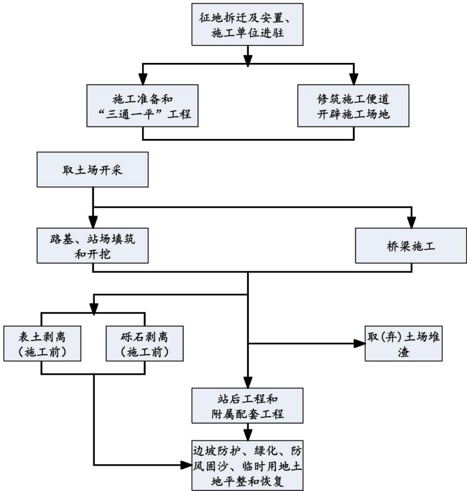  
图 2.2.8-1 施工工序示意图  
工程施工将不同程度地产生地表扰动、植被破坏，造成土壤侵蚀，在风雨季由于工

程开挖面和土石方填筑面无植被覆盖，外营力直接影响地表附着物，造成水土流失。铁路工程造成土壤流失影响主要集中在站前工程，特别是路基工程、站场工程、桥涵工程和改移工程，临时工程主要为取（弃）土场、施工生产生活区、临时电力线路和施工便道。

## 2.2.8.2 施工工艺

## (一)施工准备

修建便道、搭建临时电力线路等项工作必须在开工前完成；同时陆续修建部分临时房屋、临时辅助设施；本线砂石料用量大，也要及时协调好材料储备和供应，为正式工程施工创造条件。临时供电线路和临时便道等，亦尽早修建。由于临电线路和便道工程涉及面广，应及早与当地政府有关部门签订临时用地和其他各项协议，确保工程建设能尽快开工。其它临时工程的建设应在保证正式工程合理工期的前提下，按工程要求逐一按期完成。

## （二)路基工程

路基基床以下须采用重型压路机等施工措施以保证路基密实度的要求，根据现场的施工机械确定最佳摊铺厚度及碾压次数。

## （1）路堤填筑

路堤在填方前需清除地表腐殖土，集中堆放，并采取临时挡护，工程结束时作为绿化用土及复耕土源，清表后将工作面基本平整压实。

施工工序为：挖除树根、排除地表水→清除表层淤泥、杂草→平地机、推土机整平→压路机压实→填筑。填筑土时适当加大宽度和高度，分层填土、压实，多余部分利用挖掘机修坡及平地机或其他方法铲除修整。

## （2）路堑开挖

土质、软质岩及强风化硬质岩路堑开挖前，首先进行排水设施施工。按照“永临结合”的原则对临时排水设施进行周密规划，避免积水冲刷边坡、浸泡边坡坡脚，并于路堑开挖施工前完成所有临时截、排水设施的施工，保持边坡的稳定。路堑采用挖掘机自上而下、分层开挖，在每一开挖层路基两侧设临时排水沟，以便及时将路堑开挖中的渗水和雨水排出开挖面。

## （3）路基排水工程

按照“永临结合”的原则规划路基排水设施，具备条件的地段按设计做好排水工程以及施工生产生活区附近的临时排水设施，然后再做主体工程。不具备布设排水工程的地段，先做好临时排水设施，条件许可时及时完成永久排水工程。

## （4）路基边坡防护工程

路基边坡主要采用混凝土拱形骨架护坡、孔窗式护坡等综合防护措施，基础开挖采用人工风镐凿除方式进行。

## (三)风沙防护工程

## （1）高立式芦苇沙障

芦苇沙障采用2镀锌铁丝将芦苇捆编成芦苇排，每隔25cm设置铁丝一道，芦苇捆为捆扎成型的3\~5cm左右的芦苇捆。芦苇捆应按透风度20%\~40%要求捆扎，芦苇排宜尽量在同一高度上布设。芦苇排施工前应先完成其它工作，最后再安装施工。立柱基坑开挖放入立柱后，周围填土必须回填密实。施工完毕后应检查现场阻沙沙障有无破损，及时修补。

## (2） 石方格沙障

石方格沙障内部碎石粒径≤50mm；碎石埋置深度不得小于0.1m，施工时应将碎石码砌紧密。

## (3) PE 网格沙障

PE网格沙障孔隙度为30%\~40%时防沙挡沙效果最好，规格一般为（长×宽×高）：1m×1m×0.3m、1.5m×1.5m×0.3m、2m×2m×0.3m、3m×3m×0.5m。

## (四)站场工程

## （1）房建工程

基础采用钢筋混凝土独立基础；办公楼、宿舍和检修楼等房屋采用钢筋混凝土框架结构，基础采用钢筋混凝土独立基础；其他房屋采用砖混结构，基础采用钢筋混凝土条形基础。

（2）站场道路、堆场、停车场及其它硬化地表区域在场平的基础上，依据各区块工程和承载力要求进行面层的铺装，施工均采用常规施工工艺。

（3）管线工程：电力、通信、供水、排水等管线采用开挖直埋施工，土石方开挖主要采用反铲挖掘机开挖，堆于沟槽一侧，供回填土方之用。管线工程位于站场内，土石方计入站场工程内。管道通过道路时采取敷设钢管后外包砼，最后铺路面。管道采用分段施工，随开随填，铺设管线结束后随即回填，回填至地面高程，并压实。

（4）绿化工程：位于平原微丘区具备绿化条件的车站站内路基边坡栽植灌草绿化，站区可绿化区栽植耐寒耐旱乔灌草，采用常规绿化施工工艺。

## （五）桥梁工程

## （1）桥梁主体施工方法

正线桥梁一般为24m、32m预应力简支箱梁，对于地质条件较差或开挖防护高度>3.0m的基坑采用钢板桩防护，地下水位较高时且为透水层时考虑配置轻型井点降水措施。

简支梁采用现场集中预制，架桥机架设，梁体采用支架现浇施工。墩台采用现场浇筑，钻孔桩采用1.0、1.25、1.5m孔径；明挖满灌基础位于基顶以上地层基坑可放坡开挖，位于基顶以下基坑必须垂直开挖、满灌基础；挖井基础必须垂直开挖、满灌基础。对于本线土层及地下水有严重侵蚀性的地段，桩基钢护筒按不拔出考虑。

## 主要施工步骤：

1)施工墩台基础，桩基础为钻孔灌注桩，采用泥浆护壁成孔，现场灌注水下混凝土；明挖基础、承台采用现场支模浇注混凝土方法施工。

2）墩台身采用现场支模浇注混凝土方法施工。

3）简支T梁采用梁场预制，通过轨道架桥机运输至桥位处，采用架桥机架设，待架设完成后施工横向联结，施工桥面系。

## （2）桥梁基础水土流失防治工艺

桥梁水土流失部位为下部基础部分，主要采取的水保措施有：

1）跨越水体的桥梁尽量选择在枯水期施工；

2）桥台锥体边坡采用混凝土全面护坡，锥体坡脚设锤裙。

## （3）钻孔泥浆处置措施

钻孔桩施工时须布设泥浆池，布设位置的首要原则是保证营业线安全，必须设于桥梁投影范围和路基坡脚之外，并做好防渗、防护和合规废弃处理。

## ①泥浆池布置原则

经济性原则：充分利用工程所在区域现有地形加以改造，以节约土地，尽量减少临时工程的投入。

实用性原则：尽量靠近施工工点，实用方便，不重复建设，确保各项设施高效使用。

方便管理原则：便于施工管理，便于劳动力、机具设备和材料等调配，有利于减少施工干扰，有利于文明工地建设。

安全性原则：场地布置将符合有关安全生产、劳动保护、防火、防洪等法律、法规和要求，将方便安全措施的有效实行，有利于安全救助。

环保性原则：根据现场调查获得的当地有关施工环境资料，结合当地环保部门要求，有利于环保和水土保持，尽可能减少对环境产生的不利影响。

## ②泥浆池设置

根据施工现场的实际情况设计现场泥浆池平面布置。一般泥浆池和沉淀池并列布置。部分泥浆回用，其他废弃部分在充分沉淀之后，达到泥水分离和泥浆自然于化的效果。泥浆池尺寸2m（长）×2m（宽）×1.5m（深）；沉淀池尺寸2m（长）×1m（宽）×1m（深）。

## ③泥浆外运

沉淀池沉渣及灌注混凝土溢出的废弃钻渣随时清除，泥浆自然干化后，用汽车弃运至取（弃）土场。运输采用封闭性较好的罐车，杜绝运输过程中的污染。

## （六)改移工程

改移道路施工前，需对施工现场进行细致的勘察和测量，结合原道路的材质、宽度与坡度参数，确定合理的施工方案。做好现场清理、拆除旧设施等工作，有条件应进行试验段填筑，确定施工工艺。填筑、摊铺、碾压等施工工序结束后，及时组织开展验收工作。

施工工序：施工准备→填筑试验段→确定工艺→验收下承层→测量放样→运输→填土→摊铺平整→碾压→检验验收。

## （七）取（弃）土场

取土前首先剥离取（弃）土场无用层，同时与路基清表的杂填土等共同堆放在土石方临时周转场，并进行临时防护。取土采取分块进行取土，单块取土完毕后及时进行回填临时周转场的土方。后续将取（弃）土场新地块无用层堆放在临时中转场地进行中转，以此往复循环利用土石方临时周转场临时堆放无用层和清表杂填土，最后将最终弃土推至至取土场下挖凹坑内。取土结束后，平原微丘区进行土地整治、表土回覆，对场地内撒播草籽或回覆砾幕。对沙质边坡的取（弃）土场喷洒固沙剂。山岭重丘区进行土地整治、表土回覆。

削坡开挖前，做好施工测量严格控制清方工作量。削坡应由后向前逐层开挖，应及时将土方清理出现场，严禁在施工范围内进行土方堆置；土质边坡开挖高度大于8m、岩质边坡开挖高度大于15m时应分段开挖。

取土场施工工序：剥离砾幕层→坡地削坡（分级）取土→边坡修整→取弃结合的坑底回铺弃土（渣）→平整场地（坑底渣体）→回铺表土、砾幕。削坡施工工序：测量放线→削坡开挖→开挖土料的堆存、处理和利用→人工削坡→边坡检查、处理。

## (八)施工生产生活区

（1）施工前，先剥离砾幕层，集中堆置于不影响施工的空地内，并采取临时防护；施工场地应尽量选择在地势相对平坦，地质条件较好和易于排水的区域。一般采用装载机进行清平填补和平整，场地内部分区域采用混凝土硬化或砂砾石铺面，用压路机压实，人工配合修整。

（2）施工期间，施工场地周边布设临时排水沉沙措施，裸露面进行临时苫盖。及时清理施工垃圾，做好文明施工。

（3）施工结束后，对施工扰动区域进行土地整治，回覆砾幕。

（4）施工方及时与相关土地权属单位和自然资源主管部门签订临时用地移交协议，作为竣工资料移交建设单位存档。

## （九)施工便道

（1）便道开辟前，严格按照征地界线测量放线，不得随意扩挖。

（2）开辟便道采用挖掘机、推土机挖土，装载机、挖掘机装土，自卸汽车运土、压路机碾压。施工前，在施工便道两侧设置彩条旗，严控施工扰动范围，防止人员和施工机械对防治责任范围外的区域进行随意践踏和破坏。山岭重丘区施工便道上游坡顶布设挡水埂，下游坡脚布设装土草袋拦挡。施工过程中，便道裸露边坡临时苫盖。

（3）施工便道根据不同地形、地质条件采取不同的修筑方法。新建施工便道路面宽度一般不小于4.5m，曲线或地形复杂路段适当加宽，改建道路局部施工困难路段保持不小于3m。施工便道挖方段两侧边坡坡度按设计要求进行，挖至标高后，用振动压路机进行碾压后，上面铺筑碎石。填方段道路采用挖方段弃土进行填筑，填筑标准参照路基填筑标准。

（4）施工结束后，施工便道进行土地整治，砾幕回覆。

（5）施工方及时与相关土地权属单位、自然资源主管部门签订临时用地移交协议，作为竣工资料移交建设单位存档。

## (十)生态环境敏感区内施工

施工生产生活区：施工时应在工期安排上合理有序，先设置防护措施后进行工程建设，施工中要严格控制临时占地，尽量减少对地表和植被的破坏，除施工必须铲除或碾压地表沙结皮、沙壳、砾幕层和沙生植物外，不得以其他任何理由扩大地表扰动范围，以减少对原生生态环境的破坏。

土石方工程施工作业期间尽量避开大风天气，并做好临时堆土挡护及苫盖，及时整平场地。严格控制施工范围，穿越生态环境敏感区段，应尽量控制作业面，以保持生态系统的完整性。本项目路基工程无法避让阿拉善西北部防风固沙生态保护红线。为严格遵循生态保护红线管控要求，最大限度降低施工扰动影响，拟在征地界处设置彩条旗，严格控制施工活动及扰动范围。

施工道路：材料运输过程中对施工道路进行合理的选择和规划，施工便道采用单行道，尽量避免随意侵界，扰动原始地表，严禁出线下道行驶和开辟多条施工道路。

从水土保持角度分析，本项目施工工序和工艺合理，能保证水土流失得到有效控制。

## 2.3 工程占地

## 2.3.1 铁路工程占地设计原则

铁路建设用地设计贯彻“十分珍惜、合理利用土地和切实保护耕地”的基本国策，坚持依法用地、科学用地、合理用地和节约用地的原则。铁路用地包含永久征占用地和临时用地。与既有线并行地段，新建铁路占用既有铁路用地的部分按既有铁路用地计列。

## 2.3.1.1 路基工程

(1)路堤两侧排水沟、护道或坡脚矮挡墙边缘外3m为征收用地界。路基两侧取(弃)土场兼作排水时，其边缘外2m为征收用地界。

（2）路堑天沟外侧边缘外2m为征收用地界；无天沟时，距堑顶边缘外5m为征收用地界。

## 2.3.1.2 站场工程

（1）站场范围内的用地包括各场、段、所的用地以及铁路房屋、站内道路、排水、绿化等所需用地。车站设计用地宽度：排水沟、护道或坡脚矮挡墙边缘外不小于3m。

（2）站内路基征收用地宽度同区间路基。

（3）以桥梁形式通过路段用地界应根据站场宽度计算确定。

（4）铁路生产设备房屋用地范围为房屋围墙外坡脚排水沟外1\~2m，堑顶截水沟外1\~2m，无截水沟时为堑顶外5m。

## 2.3.1.3 桥梁工程

（1）单孔梁桥、框架桥、涵洞按一般路基要求办理。

（2）一般结构桥梁用地宽度为桥下设检查通道侧距线路中心线为7.2m，另一侧距线路中心线为5.8m。

（3）特殊结构的大跨度桥梁用地宽度应根据基础类型计算确定。

（4）设置桥梁紧急疏散设施时，可适当增加用地面积。

（5）桥头锥体范围内的永久用地宽度

1）在桥梁缺口里程，按路桥连接处路基填高和横断面，确定路基边坡坡脚。

2)在桥台胸墙里程处或在台尾里程处按该处的路基填土高和横断面，确定路基边坡坡脚。

3）当有导流堤、河床铺砌加固、埋式桥台以及对桥梁基础须预留安全量，按实际需要加宽用地宽度。

## 2.3.1.4 改移工程

铁路主体工程引起的改移工程用地为铁路代征永久用地，用地范围执行现行公路规范的有关规定。

征地原则为：等级公路及地方道路需设水沟时，用地界在沟外侧1.0m；不需设水沟的道路，在坡顶或坡脚外0.5m\~1.0m为用地范围。

## 2.3.1.5 施工临时工程

临时工程用地属于临时占地，用地数量单独计列，不纳入铁路用地指标。施工结束后，临时占地采取水土保持措施，恢复原有用地类型。

## 2.3.2 工程占地

本项目总占地面积 1888.71hm²，其中永久占地1292.73hm²，临时占地 595.98hm²;另有风沙防护工程用地97.17hm²。

按行政区划和工程分区划分的占地面积详见表2.3.2-1和表2.3.2-2。

表 2.3.2-1 按行政区划分占地面积汇总表 单位：hm²
<table><tr><td rowspan=1 colspan=1>省、自治区</td><td rowspan=1 colspan=1>市、盟、直辖县级市</td><td rowspan=1 colspan=1>区、县、旗</td><td rowspan=1 colspan=1>永久占地</td><td rowspan=1 colspan=1>临时占地</td><td rowspan=1 colspan=1>合计</td></tr><tr><td rowspan=1 colspan=1>内蒙古自治区</td><td rowspan=1 colspan=1>阿拉善盟</td><td rowspan=1 colspan=1>额济纳旗</td><td rowspan=1 colspan=1>774.06</td><td rowspan=1 colspan=1>389.42</td><td rowspan=1 colspan=1>1163.48</td></tr><tr><td rowspan=1 colspan=1>甘肃省</td><td rowspan=1 colspan=1>酒泉市</td><td rowspan=1 colspan=1>肃北蒙古族自治县</td><td rowspan=1 colspan=1>407.88</td><td rowspan=1 colspan=1>182.51</td><td rowspan=1 colspan=1>590.39</td></tr><tr><td rowspan=3 colspan=1>新疆维吾尔自治区</td><td rowspan=1 colspan=1>哈密市</td><td rowspan=1 colspan=1>伊州区</td><td rowspan=1 colspan=1>96.48</td><td rowspan=1 colspan=1>22.85</td><td rowspan=1 colspan=1>119.33</td></tr><tr><td rowspan=1 colspan=2>新疆生产建设兵团第十三师新星市</td><td rowspan=1 colspan=1>14.31</td><td rowspan=1 colspan=1>1.20</td><td rowspan=1 colspan=1>15.51</td></tr><tr><td rowspan=1 colspan=2>小计</td><td rowspan=1 colspan=1>110.79</td><td rowspan=1 colspan=1>24.05</td><td rowspan=1 colspan=1>134.84</td></tr><tr><td rowspan=1 colspan=3>合计</td><td rowspan=1 colspan=1>1292.73</td><td rowspan=1 colspan=1>595.98</td><td rowspan=1 colspan=1>1888.71</td></tr></table>

表 2.3.2-2 按工程分区划分占地面积汇总表 单位：hm²
<table><tr><td rowspan=1 colspan=1>序号</td><td rowspan=1 colspan=1>工程分区</td><td rowspan=1 colspan=1>永久占地</td><td rowspan=1 colspan=1>临时占地</td><td rowspan=1 colspan=1>合计</td></tr><tr><td rowspan=1 colspan=1>1</td><td rowspan=1 colspan=1>路基工程</td><td rowspan=1 colspan=1>838.25</td><td rowspan=1 colspan=1></td><td rowspan=1 colspan=1>838.25</td></tr><tr><td rowspan=1 colspan=1>2</td><td rowspan=1 colspan=1>站场工程</td><td rowspan=1 colspan=1>255.20</td><td rowspan=1 colspan=1></td><td rowspan=1 colspan=1>255.20</td></tr><tr><td rowspan=1 colspan=1>3</td><td rowspan=1 colspan=1>桥梁工程</td><td rowspan=1 colspan=1>121.08</td><td rowspan=1 colspan=1></td><td rowspan=1 colspan=1>121.08</td></tr><tr><td rowspan=1 colspan=1>4</td><td rowspan=1 colspan=1>改移工程</td><td rowspan=1 colspan=1>78.20</td><td rowspan=1 colspan=1></td><td rowspan=1 colspan=1>78.20</td></tr><tr><td rowspan=1 colspan=1>5</td><td rowspan=1 colspan=1>取（弃）土场</td><td rowspan=1 colspan=1></td><td rowspan=1 colspan=1>369.66</td><td rowspan=1 colspan=1>369.66</td></tr><tr><td rowspan=1 colspan=1>6</td><td rowspan=1 colspan=1>施工生产生活区</td><td rowspan=1 colspan=1></td><td rowspan=1 colspan=1>80.90</td><td rowspan=1 colspan=1>80.90</td></tr><tr><td rowspan=1 colspan=1>7</td><td rowspan=1 colspan=1>临时电力线路</td><td rowspan=1 colspan=1></td><td rowspan=1 colspan=1>1.16</td><td rowspan=1 colspan=1>1.16</td></tr><tr><td rowspan=1 colspan=1>8</td><td rowspan=1 colspan=1>施工便道</td><td rowspan=1 colspan=1></td><td rowspan=1 colspan=1>144.26</td><td rowspan=1 colspan=1>144.26</td></tr><tr><td rowspan=1 colspan=2>合计</td><td rowspan=1 colspan=1>1292.73</td><td rowspan=1 colspan=1>595.98</td><td rowspan=1 colspan=1>1888.71</td></tr></table>

## 2.3.2.1 永久占地

本项目永久占地1292.73hm²，其中路基工程 838.25hm²，站场工程255.20hm²，桥梁工程121.08hm²，改移工程 78.20hm²。

## 2.3.2.2 临时占地

本项目临时占地 595.98hm²，包括取(弃)土场 369.66hm²，施工生产生活区 80.90hm²，临时电力线路1.16hm²，施工便道 $1 4 4 . 2 6 \mathrm { h m } ^ { 2 }$ 。工程占地面积明细详见下表。

表2.3.2-3 工程占地面积明细表 单位：hm²
<table><tr><td rowspan=2 colspan=3>行政区划</td><td rowspan=2 colspan=1>占地性质</td><td rowspan=2 colspan=1>工程分区</td><td rowspan=1 colspan=17>新增用地</td><td rowspan=1 colspan=1>既有铁路用地</td><td rowspan=3 colspan=1>合计</td></tr><tr><td rowspan=1 colspan=1>耕地</td><td rowspan=1 colspan=3>林地</td><td rowspan=1 colspan=3>草地</td><td rowspan=1 colspan=2>住宅用地</td><td rowspan=1 colspan=2>交通运输用地</td><td rowspan=1 colspan=2>水域及水利设施用地</td><td rowspan=1 colspan=4>其他土地</td><td rowspan=1 colspan=1>交通运输用地</td></tr><tr><td rowspan=1 colspan=1>省、自治区</td><td rowspan=1 colspan=2>市、盟、直区、县、旗辖县级市</td><td rowspan=1 colspan=1></td><td rowspan=1 colspan=1></td><td rowspan=1 colspan=1>水浇地</td><td rowspan=1 colspan=1>乔木灌林地林</td><td rowspan=1 colspan=1>木地</td><td rowspan=1 colspan=1>其他林地</td><td rowspan=1 colspan=1>天然牧人草地</td><td rowspan=1 colspan=1>工牧草地</td><td rowspan=1 colspan=1>其他草地</td><td rowspan=1 colspan=1>城镇住宅用地</td><td rowspan=1 colspan=1>农村宅基地</td><td rowspan=1 colspan=1>公路用地</td><td rowspan=1 colspan=1>农村道路</td><td rowspan=1 colspan=1>河流水面</td><td rowspan=1 colspan=1>水工建筑用地</td><td rowspan=1 colspan=1>盐碱地</td><td rowspan=1 colspan=1>设施农用地</td><td rowspan=1 colspan=1>裸土地</td><td rowspan=1 colspan=1>裸岩石砾地</td><td rowspan=1 colspan=1>铁路用地</td></tr><tr><td rowspan=11 colspan=1>内蒙古自治区</td><td rowspan=11 colspan=1>阿拉善盟</td><td rowspan=11 colspan=1>额济纳旗</td><td rowspan=5 colspan=1>永久占地</td><td rowspan=1 colspan=1>路基工程</td><td rowspan=1 colspan=1></td><td rowspan=1 colspan=1>0.03</td><td rowspan=1 colspan=1>16.55</td><td rowspan=1 colspan=1>0.39</td><td rowspan=1 colspan=1></td><td rowspan=1 colspan=1></td><td rowspan=1 colspan=1>42.81</td><td rowspan=1 colspan=1></td><td rowspan=1 colspan=1></td><td rowspan=1 colspan=1>0.30</td><td rowspan=1 colspan=1>3.30</td><td rowspan=1 colspan=1>0.15</td><td rowspan=1 colspan=1>0.38</td><td rowspan=1 colspan=1>0.21</td><td rowspan=1 colspan=1></td><td rowspan=1 colspan=1>2.10</td><td rowspan=1 colspan=1>146.97</td><td rowspan=1 colspan=1>355.21</td><td rowspan=1 colspan=1>568.40</td></tr><tr><td rowspan=1 colspan=1>站场工程</td><td rowspan=1 colspan=1></td><td rowspan=1 colspan=1></td><td rowspan=1 colspan=1>3.51</td><td rowspan=1 colspan=1></td><td rowspan=1 colspan=1></td><td rowspan=1 colspan=1></td><td rowspan=1 colspan=1>19.03</td><td rowspan=1 colspan=1></td><td rowspan=1 colspan=1></td><td rowspan=1 colspan=1></td><td rowspan=1 colspan=1>1.87</td><td rowspan=1 colspan=1></td><td rowspan=1 colspan=1></td><td rowspan=1 colspan=1></td><td rowspan=1 colspan=1></td><td rowspan=1 colspan=1></td><td rowspan=1 colspan=1>36.10</td><td rowspan=1 colspan=1>25.88</td><td rowspan=1 colspan=1>86.39</td></tr><tr><td rowspan=1 colspan=1>桥梁工程</td><td rowspan=1 colspan=1></td><td rowspan=1 colspan=1></td><td rowspan=1 colspan=1>0.51</td><td rowspan=1 colspan=1></td><td rowspan=1 colspan=1></td><td rowspan=1 colspan=1></td><td rowspan=1 colspan=1>23.02</td><td rowspan=1 colspan=1></td><td rowspan=1 colspan=1></td><td rowspan=1 colspan=1></td><td rowspan=1 colspan=1>0.46</td><td rowspan=1 colspan=1>0.28</td><td rowspan=1 colspan=1></td><td rowspan=1 colspan=1></td><td rowspan=1 colspan=1></td><td rowspan=1 colspan=1>0.62</td><td rowspan=1 colspan=1>22.98</td><td rowspan=1 colspan=1>32.86</td><td rowspan=1 colspan=1>80.73</td></tr><tr><td rowspan=1 colspan=1>改移工程</td><td rowspan=1 colspan=1></td><td rowspan=1 colspan=1></td><td rowspan=1 colspan=1>1.76</td><td rowspan=1 colspan=1></td><td rowspan=1 colspan=1></td><td rowspan=1 colspan=1></td><td rowspan=1 colspan=1>9.52</td><td rowspan=1 colspan=1></td><td rowspan=1 colspan=1></td><td rowspan=1 colspan=1>1.81</td><td rowspan=1 colspan=1>2.27</td><td rowspan=1 colspan=1></td><td rowspan=1 colspan=1>0.05</td><td rowspan=1 colspan=1></td><td rowspan=1 colspan=1></td><td rowspan=1 colspan=1></td><td rowspan=1 colspan=1>22.50</td><td rowspan=1 colspan=1>0.63</td><td rowspan=1 colspan=1>38.54</td></tr><tr><td rowspan=1 colspan=1>小计</td><td rowspan=1 colspan=1></td><td rowspan=1 colspan=1>0.03</td><td rowspan=1 colspan=1>22.33</td><td rowspan=1 colspan=1>0.39</td><td rowspan=1 colspan=1></td><td rowspan=1 colspan=1></td><td rowspan=1 colspan=1>94.38</td><td rowspan=1 colspan=1></td><td rowspan=1 colspan=1></td><td rowspan=1 colspan=1>2.11</td><td rowspan=1 colspan=1>7.90</td><td rowspan=1 colspan=1>0.43</td><td rowspan=1 colspan=1>0.43</td><td rowspan=1 colspan=1>0.21</td><td rowspan=1 colspan=1></td><td rowspan=1 colspan=1>2.72</td><td rowspan=1 colspan=1>228.55</td><td rowspan=1 colspan=1>414.58</td><td rowspan=1 colspan=1>774.06</td></tr><tr><td rowspan=5 colspan=1>临时占地</td><td rowspan=1 colspan=1>取（弃）土场</td><td rowspan=1 colspan=1></td><td rowspan=1 colspan=1></td><td rowspan=1 colspan=1></td><td rowspan=1 colspan=1></td><td rowspan=1 colspan=1></td><td rowspan=1 colspan=1></td><td rowspan=1 colspan=1></td><td rowspan=1 colspan=1></td><td rowspan=1 colspan=1></td><td rowspan=1 colspan=1></td><td rowspan=1 colspan=1></td><td rowspan=1 colspan=1></td><td rowspan=1 colspan=1></td><td rowspan=1 colspan=1></td><td rowspan=1 colspan=1></td><td rowspan=1 colspan=1></td><td rowspan=1 colspan=1>231.22</td><td rowspan=1 colspan=1></td><td rowspan=1 colspan=1>231.22</td></tr><tr><td rowspan=1 colspan=1>施工生产生活区</td><td rowspan=1 colspan=1></td><td rowspan=1 colspan=1></td><td rowspan=1 colspan=1></td><td rowspan=1 colspan=1></td><td rowspan=1 colspan=1></td><td rowspan=1 colspan=1></td><td rowspan=1 colspan=1></td><td rowspan=1 colspan=1></td><td rowspan=1 colspan=1></td><td rowspan=1 colspan=1></td><td rowspan=1 colspan=1></td><td rowspan=1 colspan=1></td><td rowspan=1 colspan=1></td><td rowspan=1 colspan=1></td><td rowspan=1 colspan=1></td><td rowspan=1 colspan=1></td><td rowspan=1 colspan=1>57.33</td><td rowspan=1 colspan=1></td><td rowspan=1 colspan=1>57.33</td></tr><tr><td rowspan=1 colspan=1>临时电力线路</td><td rowspan=1 colspan=1></td><td rowspan=1 colspan=1></td><td rowspan=1 colspan=1></td><td rowspan=1 colspan=1></td><td rowspan=1 colspan=1></td><td rowspan=1 colspan=1></td><td rowspan=1 colspan=1></td><td rowspan=1 colspan=1></td><td rowspan=1 colspan=1></td><td rowspan=1 colspan=1></td><td rowspan=1 colspan=1></td><td rowspan=1 colspan=1></td><td rowspan=1 colspan=1></td><td rowspan=1 colspan=1></td><td rowspan=1 colspan=1></td><td rowspan=1 colspan=1></td><td rowspan=1 colspan=1>1.06</td><td rowspan=1 colspan=1></td><td rowspan=1 colspan=1>1.06</td></tr><tr><td rowspan=1 colspan=1>施工便道</td><td rowspan=1 colspan=1></td><td rowspan=1 colspan=1></td><td rowspan=1 colspan=1></td><td rowspan=1 colspan=1></td><td rowspan=1 colspan=1></td><td rowspan=1 colspan=1></td><td rowspan=1 colspan=1>18.67</td><td rowspan=1 colspan=1></td><td rowspan=1 colspan=1></td><td rowspan=1 colspan=1></td><td rowspan=1 colspan=1></td><td rowspan=1 colspan=1></td><td rowspan=1 colspan=1></td><td rowspan=1 colspan=1></td><td rowspan=1 colspan=1></td><td rowspan=1 colspan=1></td><td rowspan=1 colspan=1>81.14</td><td rowspan=1 colspan=1></td><td rowspan=1 colspan=1>99.81</td></tr><tr><td rowspan=1 colspan=1>小计</td><td rowspan=1 colspan=1></td><td rowspan=1 colspan=1></td><td rowspan=1 colspan=1></td><td rowspan=1 colspan=1></td><td rowspan=1 colspan=1></td><td rowspan=1 colspan=1></td><td rowspan=1 colspan=1>18.67</td><td rowspan=1 colspan=1></td><td rowspan=1 colspan=1></td><td rowspan=1 colspan=1></td><td rowspan=1 colspan=1></td><td rowspan=1 colspan=1></td><td rowspan=1 colspan=1></td><td rowspan=1 colspan=1></td><td rowspan=1 colspan=1></td><td rowspan=1 colspan=1></td><td rowspan=1 colspan=1>370.75</td><td rowspan=1 colspan=1></td><td rowspan=1 colspan=1>389.42</td></tr><tr><td rowspan=1 colspan=1></td><td rowspan=1 colspan=1>合计</td><td rowspan=1 colspan=1></td><td rowspan=1 colspan=1>0.03</td><td rowspan=1 colspan=1>22.33</td><td rowspan=1 colspan=1>0.39</td><td rowspan=1 colspan=1></td><td rowspan=1 colspan=1></td><td rowspan=1 colspan=1>113.05</td><td rowspan=1 colspan=1></td><td rowspan=1 colspan=1></td><td rowspan=1 colspan=1>2.11</td><td rowspan=1 colspan=1>7.90</td><td rowspan=1 colspan=1>0.43</td><td rowspan=1 colspan=1>0.43</td><td rowspan=1 colspan=1>0.21</td><td rowspan=1 colspan=1></td><td rowspan=1 colspan=1>2.72</td><td rowspan=1 colspan=1>599.30</td><td rowspan=1 colspan=1>414.58</td><td rowspan=1 colspan=1>1163.48</td></tr><tr><td rowspan=11 colspan=1>甘肃省</td><td rowspan=11 colspan=1>酒泉市</td><td rowspan=11 colspan=1>肃北蒙古族自治县</td><td rowspan=5 colspan=1>永久占地</td><td rowspan=1 colspan=1>路基工程</td><td rowspan=1 colspan=1></td><td rowspan=1 colspan=1></td><td rowspan=1 colspan=1>1.08</td><td rowspan=1 colspan=1></td><td rowspan=1 colspan=1></td><td rowspan=1 colspan=1>1.03</td><td rowspan=1 colspan=1>12.98</td><td rowspan=1 colspan=1></td><td rowspan=1 colspan=1>0.89</td><td rowspan=1 colspan=1></td><td rowspan=1 colspan=1></td><td rowspan=1 colspan=1></td><td rowspan=1 colspan=1></td><td rowspan=1 colspan=1>5.82</td><td rowspan=1 colspan=1></td><td rowspan=1 colspan=1></td><td rowspan=1 colspan=1>110.53</td><td rowspan=1 colspan=1>135.48</td><td rowspan=1 colspan=1>267.81</td></tr><tr><td rowspan=1 colspan=1>站场工程</td><td rowspan=1 colspan=1></td><td rowspan=1 colspan=1></td><td rowspan=1 colspan=1></td><td rowspan=1 colspan=1></td><td rowspan=1 colspan=1></td><td rowspan=1 colspan=1></td><td rowspan=1 colspan=1>4.65</td><td rowspan=1 colspan=1></td><td rowspan=1 colspan=1>1.39</td><td rowspan=1 colspan=1></td><td rowspan=1 colspan=1></td><td rowspan=1 colspan=1></td><td rowspan=1 colspan=1></td><td rowspan=1 colspan=1>1.64</td><td rowspan=1 colspan=1></td><td rowspan=1 colspan=1></td><td rowspan=1 colspan=1>31.16</td><td rowspan=1 colspan=1>27.66</td><td rowspan=1 colspan=1>66.50</td></tr><tr><td rowspan=1 colspan=1>桥梁工程</td><td rowspan=1 colspan=1></td><td rowspan=1 colspan=1></td><td rowspan=1 colspan=1>1.58</td><td rowspan=1 colspan=1></td><td rowspan=1 colspan=1></td><td rowspan=1 colspan=1>3.04</td><td rowspan=1 colspan=1>17.04</td><td rowspan=1 colspan=1></td><td rowspan=1 colspan=1></td><td rowspan=1 colspan=1></td><td rowspan=1 colspan=1></td><td rowspan=1 colspan=1></td><td rowspan=1 colspan=1></td><td rowspan=1 colspan=1>0.76</td><td rowspan=1 colspan=1></td><td rowspan=1 colspan=1></td><td rowspan=1 colspan=1>14.52</td><td rowspan=1 colspan=1>0.66</td><td rowspan=1 colspan=1>37.60</td></tr><tr><td rowspan=1 colspan=1>改移工程</td><td rowspan=1 colspan=1></td><td rowspan=1 colspan=1></td><td rowspan=1 colspan=1></td><td rowspan=1 colspan=1>0.59</td><td rowspan=1 colspan=1></td><td rowspan=1 colspan=1>0.33</td><td rowspan=1 colspan=1>5.85</td><td rowspan=1 colspan=1></td><td rowspan=1 colspan=1>0.02</td><td rowspan=1 colspan=1></td><td rowspan=1 colspan=1></td><td rowspan=1 colspan=1></td><td rowspan=1 colspan=1></td><td rowspan=1 colspan=1>28.69</td><td rowspan=1 colspan=1>0.44</td><td rowspan=1 colspan=1></td><td rowspan=1 colspan=1></td><td rowspan=1 colspan=1>0.05</td><td rowspan=1 colspan=1>35.97</td></tr><tr><td rowspan=1 colspan=1>小计</td><td rowspan=1 colspan=1></td><td rowspan=1 colspan=1></td><td rowspan=1 colspan=1>2.66</td><td rowspan=1 colspan=1>0.59</td><td rowspan=1 colspan=1></td><td rowspan=1 colspan=1>4.40</td><td rowspan=1 colspan=1>40.52</td><td rowspan=1 colspan=1></td><td rowspan=1 colspan=1>2.30</td><td rowspan=1 colspan=1></td><td rowspan=1 colspan=1></td><td rowspan=1 colspan=1></td><td rowspan=1 colspan=1></td><td rowspan=1 colspan=1>36.91</td><td rowspan=1 colspan=1>0.44</td><td rowspan=1 colspan=1></td><td rowspan=1 colspan=1>156.21</td><td rowspan=1 colspan=1>163.85</td><td rowspan=1 colspan=1>407.88</td></tr><tr><td rowspan=5 colspan=1>临时占地</td><td rowspan=1 colspan=1>取（弃）土场</td><td rowspan=1 colspan=1></td><td rowspan=1 colspan=1></td><td rowspan=1 colspan=1></td><td rowspan=1 colspan=1></td><td rowspan=1 colspan=1></td><td rowspan=1 colspan=1></td><td rowspan=1 colspan=1></td><td rowspan=1 colspan=1></td><td rowspan=1 colspan=1></td><td rowspan=1 colspan=1></td><td rowspan=1 colspan=1></td><td rowspan=1 colspan=1></td><td rowspan=1 colspan=1></td><td rowspan=1 colspan=1></td><td rowspan=1 colspan=1></td><td rowspan=1 colspan=1></td><td rowspan=1 colspan=1>138.44</td><td rowspan=1 colspan=1></td><td rowspan=1 colspan=1>138.44</td></tr><tr><td rowspan=1 colspan=1>施工生产生活区</td><td rowspan=1 colspan=1></td><td rowspan=1 colspan=1></td><td rowspan=1 colspan=1></td><td rowspan=1 colspan=1></td><td rowspan=1 colspan=1></td><td rowspan=1 colspan=1></td><td rowspan=1 colspan=1></td><td rowspan=1 colspan=1></td><td rowspan=1 colspan=1></td><td rowspan=1 colspan=1></td><td rowspan=1 colspan=1></td><td rowspan=1 colspan=1></td><td rowspan=1 colspan=1></td><td rowspan=1 colspan=1></td><td rowspan=1 colspan=1></td><td rowspan=1 colspan=1></td><td rowspan=1 colspan=1>7.35</td><td rowspan=1 colspan=1></td><td rowspan=1 colspan=1>7.35</td></tr><tr><td rowspan=1 colspan=1>临时电力线路</td><td rowspan=1 colspan=1></td><td rowspan=1 colspan=1></td><td rowspan=1 colspan=1></td><td rowspan=1 colspan=1></td><td rowspan=1 colspan=1></td><td rowspan=1 colspan=1></td><td rowspan=1 colspan=1></td><td rowspan=1 colspan=1></td><td rowspan=1 colspan=1></td><td rowspan=1 colspan=1></td><td rowspan=1 colspan=1></td><td rowspan=1 colspan=1></td><td rowspan=1 colspan=1></td><td rowspan=1 colspan=1></td><td rowspan=1 colspan=1></td><td rowspan=1 colspan=1></td><td rowspan=1 colspan=1>0.10</td><td rowspan=1 colspan=1></td><td rowspan=1 colspan=1>0.10</td></tr><tr><td rowspan=1 colspan=1>施工便道</td><td rowspan=1 colspan=1></td><td rowspan=1 colspan=1></td><td rowspan=1 colspan=1></td><td rowspan=1 colspan=1></td><td rowspan=1 colspan=1></td><td rowspan=1 colspan=1></td><td rowspan=1 colspan=1></td><td rowspan=1 colspan=1></td><td rowspan=1 colspan=1></td><td rowspan=1 colspan=1></td><td rowspan=1 colspan=1></td><td rowspan=1 colspan=1></td><td rowspan=1 colspan=1></td><td rowspan=1 colspan=1></td><td rowspan=1 colspan=1></td><td rowspan=1 colspan=1></td><td rowspan=1 colspan=1>36.62</td><td rowspan=1 colspan=1></td><td rowspan=1 colspan=1>36.62</td></tr><tr><td rowspan=1 colspan=1>小计</td><td rowspan=1 colspan=1></td><td rowspan=1 colspan=1></td><td rowspan=1 colspan=1></td><td rowspan=1 colspan=1></td><td rowspan=1 colspan=1></td><td rowspan=1 colspan=1></td><td rowspan=1 colspan=1></td><td rowspan=1 colspan=1></td><td rowspan=1 colspan=1></td><td rowspan=1 colspan=1></td><td rowspan=1 colspan=1></td><td rowspan=1 colspan=1></td><td rowspan=1 colspan=1></td><td rowspan=1 colspan=1></td><td rowspan=1 colspan=1></td><td rowspan=1 colspan=1></td><td rowspan=1 colspan=1>182.51</td><td rowspan=1 colspan=1></td><td rowspan=1 colspan=1>182.51</td></tr><tr><td rowspan=1 colspan=1></td><td rowspan=1 colspan=1>合计</td><td rowspan=1 colspan=1></td><td rowspan=1 colspan=1></td><td rowspan=1 colspan=1>2.66</td><td rowspan=1 colspan=1>0.59</td><td rowspan=1 colspan=1></td><td rowspan=1 colspan=1>4.40</td><td rowspan=1 colspan=1>40.52</td><td rowspan=1 colspan=1></td><td rowspan=1 colspan=1>2.30</td><td rowspan=1 colspan=1></td><td rowspan=1 colspan=1></td><td rowspan=1 colspan=1></td><td rowspan=1 colspan=1></td><td rowspan=1 colspan=1>36.91</td><td rowspan=1 colspan=1>0.44</td><td rowspan=1 colspan=1></td><td rowspan=1 colspan=1>338.72</td><td rowspan=1 colspan=1>163.85</td><td rowspan=1 colspan=1>590.39</td></tr><tr><td rowspan=9 colspan=1>新疆维吾尔自治区</td><td rowspan=9 colspan=1>哈密市</td><td rowspan=9 colspan=1>伊州区</td><td rowspan=5 colspan=1>永久占地</td><td rowspan=1 colspan=1>路基工程</td><td rowspan=1 colspan=1></td><td rowspan=1 colspan=1></td><td rowspan=1 colspan=1></td><td rowspan=1 colspan=1></td><td rowspan=1 colspan=1></td><td rowspan=1 colspan=1></td><td rowspan=1 colspan=1></td><td rowspan=1 colspan=1></td><td rowspan=1 colspan=1></td><td rowspan=1 colspan=1></td><td rowspan=1 colspan=1></td><td rowspan=1 colspan=1></td><td rowspan=1 colspan=1></td><td rowspan=1 colspan=1></td><td rowspan=1 colspan=1></td><td rowspan=1 colspan=1></td><td rowspan=1 colspan=1></td><td rowspan=1 colspan=1>1.87</td><td rowspan=1 colspan=1>1.87</td></tr><tr><td rowspan=1 colspan=1>站场工程</td><td rowspan=1 colspan=1>2.57</td><td rowspan=1 colspan=1></td><td rowspan=1 colspan=1>0.50</td><td rowspan=1 colspan=1></td><td rowspan=1 colspan=1>19.21</td><td rowspan=1 colspan=1>0.27</td><td rowspan=1 colspan=1>17.01</td><td rowspan=1 colspan=1>0.44</td><td rowspan=1 colspan=1>0.09</td><td rowspan=1 colspan=1></td><td rowspan=1 colspan=1></td><td rowspan=1 colspan=1></td><td rowspan=1 colspan=1>0.14</td><td rowspan=1 colspan=1>4.14</td><td rowspan=1 colspan=1></td><td rowspan=1 colspan=1></td><td rowspan=1 colspan=1></td><td rowspan=1 colspan=1>43.86</td><td rowspan=1 colspan=1>88.23</td></tr><tr><td rowspan=1 colspan=1>桥梁工程</td><td rowspan=1 colspan=1></td><td rowspan=1 colspan=1></td><td rowspan=1 colspan=1></td><td rowspan=1 colspan=1></td><td rowspan=1 colspan=1>0.71</td><td rowspan=1 colspan=1></td><td rowspan=1 colspan=1></td><td rowspan=1 colspan=1></td><td rowspan=1 colspan=1></td><td rowspan=1 colspan=1></td><td rowspan=1 colspan=1></td><td rowspan=1 colspan=1></td><td rowspan=1 colspan=1></td><td rowspan=1 colspan=1>1.73</td><td rowspan=1 colspan=1></td><td rowspan=1 colspan=1></td><td rowspan=1 colspan=1></td><td rowspan=1 colspan=1>0.25</td><td rowspan=1 colspan=1>2.69</td></tr><tr><td rowspan=1 colspan=1>改移工程</td><td rowspan=1 colspan=1>0.36</td><td rowspan=1 colspan=1></td><td rowspan=1 colspan=1>0.09</td><td rowspan=1 colspan=1></td><td rowspan=1 colspan=1>2.55</td><td rowspan=1 colspan=1>0.03</td><td rowspan=1 colspan=1></td><td rowspan=1 colspan=1></td><td rowspan=1 colspan=1>0.10</td><td rowspan=1 colspan=1></td><td rowspan=1 colspan=1></td><td rowspan=1 colspan=1></td><td rowspan=1 colspan=1></td><td rowspan=1 colspan=1>0.25</td><td rowspan=1 colspan=1></td><td rowspan=1 colspan=1></td><td rowspan=1 colspan=1></td><td rowspan=1 colspan=1>0.31</td><td rowspan=1 colspan=1>3.69</td></tr><tr><td rowspan=1 colspan=1>小计</td><td rowspan=1 colspan=1>2.93</td><td rowspan=1 colspan=1></td><td rowspan=1 colspan=1>0.59</td><td rowspan=1 colspan=1></td><td rowspan=1 colspan=1>22.47</td><td rowspan=1 colspan=1>0.30</td><td rowspan=1 colspan=1>17.01</td><td rowspan=1 colspan=1>0.44</td><td rowspan=1 colspan=1>0.19</td><td rowspan=1 colspan=1></td><td rowspan=1 colspan=1></td><td rowspan=1 colspan=1></td><td rowspan=1 colspan=1>0.14</td><td rowspan=1 colspan=1>6.12</td><td rowspan=1 colspan=1></td><td rowspan=1 colspan=1></td><td rowspan=1 colspan=1></td><td rowspan=1 colspan=1>46.29</td><td rowspan=1 colspan=1>96.48</td></tr><tr><td rowspan=3 colspan=1>临时占地</td><td rowspan=1 colspan=1>施工生产生活区</td><td rowspan=1 colspan=1></td><td rowspan=1 colspan=1></td><td rowspan=1 colspan=1></td><td rowspan=1 colspan=1></td><td rowspan=1 colspan=1></td><td rowspan=1 colspan=1></td><td rowspan=1 colspan=1></td><td rowspan=1 colspan=1></td><td rowspan=1 colspan=1></td><td rowspan=1 colspan=1></td><td rowspan=1 colspan=1></td><td rowspan=1 colspan=1></td><td rowspan=1 colspan=1></td><td rowspan=1 colspan=1></td><td rowspan=1 colspan=1></td><td rowspan=1 colspan=1></td><td rowspan=1 colspan=1>16.22</td><td rowspan=1 colspan=1></td><td rowspan=1 colspan=1>16.22</td></tr><tr><td rowspan=1 colspan=1>施工便道</td><td rowspan=1 colspan=1></td><td rowspan=1 colspan=1></td><td rowspan=1 colspan=1></td><td rowspan=1 colspan=1></td><td rowspan=1 colspan=1>2.84</td><td rowspan=1 colspan=1></td><td rowspan=1 colspan=1>3.00</td><td rowspan=1 colspan=1></td><td rowspan=1 colspan=1></td><td rowspan=1 colspan=1></td><td rowspan=1 colspan=1></td><td rowspan=1 colspan=1></td><td rowspan=1 colspan=1></td><td rowspan=1 colspan=1></td><td rowspan=1 colspan=1></td><td rowspan=1 colspan=1></td><td rowspan=1 colspan=1>0.79</td><td rowspan=1 colspan=1></td><td rowspan=1 colspan=1>6.63</td></tr><tr><td rowspan=1 colspan=1>小计</td><td rowspan=1 colspan=1></td><td rowspan=1 colspan=1></td><td rowspan=1 colspan=1></td><td rowspan=1 colspan=1></td><td rowspan=1 colspan=1>2.84</td><td rowspan=1 colspan=1></td><td rowspan=1 colspan=1>3.00</td><td rowspan=1 colspan=1></td><td rowspan=1 colspan=1></td><td rowspan=1 colspan=1></td><td rowspan=1 colspan=1></td><td rowspan=1 colspan=1></td><td rowspan=1 colspan=1></td><td rowspan=1 colspan=1></td><td rowspan=1 colspan=1></td><td rowspan=1 colspan=1></td><td rowspan=1 colspan=1>17.01</td><td rowspan=1 colspan=1></td><td rowspan=1 colspan=1>22.85</td></tr><tr><td rowspan=1 colspan=1></td><td rowspan=1 colspan=1>合计</td><td rowspan=1 colspan=1>2.93</td><td rowspan=1 colspan=1></td><td rowspan=1 colspan=1>0.59</td><td rowspan=1 colspan=1></td><td rowspan=1 colspan=1>25.31</td><td rowspan=1 colspan=1>0.30</td><td rowspan=1 colspan=1>20.01</td><td rowspan=1 colspan=1>0.44</td><td rowspan=1 colspan=1>0.19</td><td rowspan=1 colspan=1></td><td rowspan=1 colspan=1></td><td rowspan=1 colspan=1></td><td rowspan=1 colspan=1>0.14</td><td rowspan=1 colspan=1>6.12</td><td rowspan=1 colspan=1></td><td rowspan=1 colspan=1></td><td rowspan=1 colspan=1>17.01</td><td rowspan=1 colspan=1>46.29</td><td rowspan=1 colspan=1>119.33</td></tr></table>

2 项目概况
<table><tr><td rowspan=1 colspan=3></td><td rowspan=1 colspan=19></td><td rowspan=1 colspan=1></td></tr><tr><td rowspan=2 colspan=2>行政区划</td><td rowspan=2 colspan=1>占地性质</td><td rowspan=2 colspan=1>工程分区</td><td rowspan=1 colspan=17>新增用地</td><td rowspan=1 colspan=1>既有铁路用地</td><td rowspan=3 colspan=1>合计</td></tr><tr><td rowspan=1 colspan=1>耕地</td><td rowspan=1 colspan=3>林地</td><td rowspan=1 colspan=3>草地</td><td rowspan=1 colspan=2>住宅用地</td><td rowspan=1 colspan=2>交通运输用地</td><td rowspan=1 colspan=2>水域及水利设施用地</td><td rowspan=1 colspan=4>其他土地</td><td rowspan=1 colspan=1>交通运输用地</td></tr><tr><td rowspan=1 colspan=1>省、自治区</td><td rowspan=1 colspan=1>市、盟、直区、县、旗辖县级市</td><td rowspan=1 colspan=1></td><td rowspan=1 colspan=1></td><td rowspan=1 colspan=1>水浇地</td><td rowspan=1 colspan=1>乔木灌林地林</td><td rowspan=1 colspan=1>木地</td><td rowspan=1 colspan=1>其他林地</td><td rowspan=1 colspan=1>天然牧人草地草</td><td rowspan=1 colspan=1>工牧地</td><td rowspan=1 colspan=1>其他草地</td><td rowspan=1 colspan=1>城镇住宅用地</td><td rowspan=1 colspan=1>农村宅基地</td><td rowspan=1 colspan=1>公路用地</td><td rowspan=1 colspan=1>农村道路</td><td rowspan=1 colspan=1>河流水面</td><td rowspan=1 colspan=1>水工建筑用地</td><td rowspan=1 colspan=1>盐碱地</td><td rowspan=1 colspan=1>设施农用地</td><td rowspan=1 colspan=1>裸土地</td><td rowspan=1 colspan=1>裸岩石砾地</td><td rowspan=1 colspan=1>铁路用地</td></tr><tr><td rowspan=16 colspan=1></td><td rowspan=7 colspan=1>新疆生产建设兵团第十三师新星市</td><td rowspan=4 colspan=1>永久占地</td><td rowspan=1 colspan=1>路基工程</td><td rowspan=1 colspan=1></td><td rowspan=1 colspan=1></td><td rowspan=1 colspan=1></td><td rowspan=1 colspan=1></td><td rowspan=1 colspan=1></td><td rowspan=1 colspan=1></td><td rowspan=1 colspan=1></td><td rowspan=1 colspan=1></td><td rowspan=1 colspan=1></td><td rowspan=1 colspan=1></td><td rowspan=1 colspan=1></td><td rowspan=1 colspan=1></td><td rowspan=1 colspan=1></td><td rowspan=1 colspan=1></td><td rowspan=1 colspan=1></td><td rowspan=1 colspan=1></td><td rowspan=1 colspan=1></td><td rowspan=1 colspan=1>0.17</td><td rowspan=1 colspan=1>0.17</td></tr><tr><td rowspan=1 colspan=1>站场工程</td><td rowspan=1 colspan=1></td><td rowspan=1 colspan=1></td><td rowspan=1 colspan=1>0.99</td><td rowspan=1 colspan=1></td><td rowspan=1 colspan=1></td><td rowspan=1 colspan=1></td><td rowspan=1 colspan=1>1.03</td><td rowspan=1 colspan=1></td><td rowspan=1 colspan=1></td><td rowspan=1 colspan=1></td><td rowspan=1 colspan=1></td><td rowspan=1 colspan=1></td><td rowspan=1 colspan=1>0.05</td><td rowspan=1 colspan=1>2.84</td><td rowspan=1 colspan=1></td><td rowspan=1 colspan=1></td><td rowspan=1 colspan=1></td><td rowspan=1 colspan=1>9.17</td><td rowspan=1 colspan=1>14.08</td></tr><tr><td rowspan=1 colspan=1>桥梁工程</td><td rowspan=1 colspan=1></td><td rowspan=1 colspan=1></td><td rowspan=1 colspan=1></td><td rowspan=1 colspan=1></td><td rowspan=1 colspan=1></td><td rowspan=1 colspan=1></td><td rowspan=1 colspan=1></td><td rowspan=1 colspan=1></td><td rowspan=1 colspan=1></td><td rowspan=1 colspan=1></td><td rowspan=1 colspan=1></td><td rowspan=1 colspan=1></td><td rowspan=1 colspan=1></td><td rowspan=1 colspan=1>0.06</td><td rowspan=1 colspan=1></td><td rowspan=1 colspan=1></td><td rowspan=1 colspan=1></td><td rowspan=1 colspan=1></td><td rowspan=1 colspan=1>0.06</td></tr><tr><td rowspan=1 colspan=1>小计</td><td rowspan=1 colspan=1></td><td rowspan=1 colspan=1></td><td rowspan=1 colspan=1>0.99</td><td rowspan=1 colspan=1></td><td rowspan=1 colspan=1></td><td rowspan=1 colspan=1></td><td rowspan=1 colspan=1>1.03</td><td rowspan=1 colspan=1></td><td rowspan=1 colspan=1></td><td rowspan=1 colspan=1></td><td rowspan=1 colspan=1></td><td rowspan=1 colspan=1></td><td rowspan=1 colspan=1>0.05</td><td rowspan=1 colspan=1>2.90</td><td rowspan=1 colspan=1></td><td rowspan=1 colspan=1></td><td rowspan=1 colspan=1></td><td rowspan=1 colspan=1>9.34</td><td rowspan=1 colspan=1>14.31</td></tr><tr><td rowspan=2 colspan=1>临时占地</td><td rowspan=1 colspan=1>施工便道</td><td rowspan=1 colspan=1></td><td rowspan=1 colspan=1></td><td rowspan=1 colspan=1></td><td rowspan=1 colspan=1></td><td rowspan=1 colspan=1>1.20</td><td rowspan=1 colspan=1></td><td rowspan=1 colspan=1></td><td rowspan=1 colspan=1></td><td rowspan=1 colspan=1></td><td rowspan=1 colspan=1></td><td rowspan=1 colspan=1></td><td rowspan=1 colspan=1></td><td rowspan=1 colspan=1></td><td rowspan=1 colspan=1></td><td rowspan=1 colspan=1></td><td rowspan=1 colspan=1></td><td rowspan=1 colspan=1></td><td rowspan=1 colspan=1></td><td rowspan=1 colspan=1>1.20</td></tr><tr><td rowspan=1 colspan=1>小计</td><td rowspan=1 colspan=1></td><td rowspan=1 colspan=1></td><td rowspan=1 colspan=1></td><td rowspan=1 colspan=1></td><td rowspan=1 colspan=1>1.20</td><td rowspan=1 colspan=1></td><td rowspan=1 colspan=1></td><td rowspan=1 colspan=1></td><td rowspan=1 colspan=1></td><td rowspan=1 colspan=1></td><td rowspan=1 colspan=1></td><td rowspan=1 colspan=1></td><td rowspan=1 colspan=1></td><td rowspan=1 colspan=1></td><td rowspan=1 colspan=1></td><td rowspan=1 colspan=1></td><td rowspan=1 colspan=1></td><td rowspan=1 colspan=1></td><td rowspan=1 colspan=1>1.20</td></tr><tr><td rowspan=1 colspan=1></td><td rowspan=1 colspan=1>合计</td><td rowspan=1 colspan=1></td><td rowspan=1 colspan=1></td><td rowspan=1 colspan=1>0.99</td><td rowspan=1 colspan=1></td><td rowspan=1 colspan=1>1.20</td><td rowspan=1 colspan=1></td><td rowspan=1 colspan=1>1.03</td><td rowspan=1 colspan=1></td><td rowspan=1 colspan=1></td><td rowspan=1 colspan=1></td><td rowspan=1 colspan=1></td><td rowspan=1 colspan=1></td><td rowspan=1 colspan=1>0.05</td><td rowspan=1 colspan=1>2.90</td><td rowspan=1 colspan=1></td><td rowspan=1 colspan=1></td><td rowspan=1 colspan=1></td><td rowspan=1 colspan=1>9.34</td><td rowspan=1 colspan=1>15.51</td></tr><tr><td rowspan=5 colspan=2>永久占地</td><td rowspan=1 colspan=1>路基工程</td><td rowspan=1 colspan=1></td><td rowspan=1 colspan=1></td><td rowspan=1 colspan=1></td><td rowspan=1 colspan=1></td><td rowspan=1 colspan=1></td><td rowspan=1 colspan=1></td><td rowspan=1 colspan=1></td><td rowspan=1 colspan=1></td><td rowspan=1 colspan=1></td><td rowspan=1 colspan=1></td><td rowspan=1 colspan=1></td><td rowspan=1 colspan=1></td><td rowspan=1 colspan=1></td><td rowspan=1 colspan=1></td><td rowspan=1 colspan=1></td><td rowspan=1 colspan=1></td><td rowspan=1 colspan=1></td><td rowspan=1 colspan=1>2.04</td><td rowspan=1 colspan=1>2.04</td></tr><tr><td rowspan=1 colspan=1>站场工程</td><td rowspan=1 colspan=1>2.57</td><td rowspan=1 colspan=1></td><td rowspan=1 colspan=1>1.49</td><td rowspan=1 colspan=1></td><td rowspan=1 colspan=1>19.21</td><td rowspan=1 colspan=1>0.27</td><td rowspan=1 colspan=1>18.04</td><td rowspan=1 colspan=1>0.44</td><td rowspan=1 colspan=1>0.09</td><td rowspan=1 colspan=1></td><td rowspan=1 colspan=1></td><td rowspan=1 colspan=1></td><td rowspan=1 colspan=1>0.19</td><td rowspan=1 colspan=1>6.98</td><td rowspan=1 colspan=1></td><td rowspan=1 colspan=1></td><td rowspan=1 colspan=1></td><td rowspan=1 colspan=1>53.03</td><td rowspan=1 colspan=1>102.31</td></tr><tr><td rowspan=1 colspan=1>桥梁工程</td><td rowspan=1 colspan=1></td><td rowspan=1 colspan=1></td><td rowspan=1 colspan=1></td><td rowspan=1 colspan=1></td><td rowspan=1 colspan=1>0.71</td><td rowspan=1 colspan=1></td><td rowspan=1 colspan=1></td><td rowspan=1 colspan=1></td><td rowspan=1 colspan=1></td><td rowspan=1 colspan=1></td><td rowspan=1 colspan=1></td><td rowspan=1 colspan=1></td><td rowspan=1 colspan=1></td><td rowspan=1 colspan=1>1.79</td><td rowspan=1 colspan=1></td><td rowspan=1 colspan=1></td><td rowspan=1 colspan=1></td><td rowspan=1 colspan=1>0.25</td><td rowspan=1 colspan=1>2.75</td></tr><tr><td rowspan=1 colspan=1>改移工程</td><td rowspan=1 colspan=1>0.36</td><td rowspan=1 colspan=1></td><td rowspan=1 colspan=1>0.09</td><td rowspan=1 colspan=1></td><td rowspan=1 colspan=1>2.55</td><td rowspan=1 colspan=1>0.03</td><td rowspan=1 colspan=1></td><td rowspan=1 colspan=1></td><td rowspan=1 colspan=1>0.10</td><td rowspan=1 colspan=1></td><td rowspan=1 colspan=1></td><td rowspan=1 colspan=1></td><td rowspan=1 colspan=1></td><td rowspan=1 colspan=1>0.25</td><td rowspan=1 colspan=1></td><td rowspan=1 colspan=1></td><td rowspan=1 colspan=1></td><td rowspan=1 colspan=1>0.31</td><td rowspan=1 colspan=1>3.69</td></tr><tr><td rowspan=1 colspan=1>小计</td><td rowspan=1 colspan=1>2.93</td><td rowspan=1 colspan=1></td><td rowspan=1 colspan=1>1.58</td><td rowspan=1 colspan=1></td><td rowspan=1 colspan=1>22.47</td><td rowspan=1 colspan=1>0.30</td><td rowspan=1 colspan=1>18.04</td><td rowspan=1 colspan=1>0.44</td><td rowspan=1 colspan=1>0.19</td><td rowspan=1 colspan=1></td><td rowspan=1 colspan=1></td><td rowspan=1 colspan=1></td><td rowspan=1 colspan=1>0.19</td><td rowspan=1 colspan=1>9.02</td><td rowspan=1 colspan=1></td><td rowspan=1 colspan=1></td><td rowspan=1 colspan=1></td><td rowspan=1 colspan=1>55.63</td><td rowspan=1 colspan=1>110.79</td></tr><tr><td rowspan=3 colspan=2>临时占地</td><td rowspan=1 colspan=1>施工生产生活区</td><td rowspan=1 colspan=1></td><td rowspan=1 colspan=1></td><td rowspan=1 colspan=1></td><td rowspan=1 colspan=1></td><td rowspan=1 colspan=1></td><td rowspan=1 colspan=1></td><td rowspan=1 colspan=1></td><td rowspan=1 colspan=1></td><td rowspan=1 colspan=1></td><td rowspan=1 colspan=1></td><td rowspan=1 colspan=1></td><td rowspan=1 colspan=1></td><td rowspan=1 colspan=1></td><td rowspan=1 colspan=1></td><td rowspan=1 colspan=1></td><td rowspan=1 colspan=1></td><td rowspan=1 colspan=1>16.22</td><td rowspan=1 colspan=1></td><td rowspan=1 colspan=1>16.22</td></tr><tr><td rowspan=1 colspan=1>施工便道</td><td rowspan=1 colspan=1></td><td rowspan=1 colspan=1></td><td rowspan=1 colspan=1></td><td rowspan=1 colspan=1></td><td rowspan=1 colspan=1>4.04</td><td rowspan=1 colspan=1></td><td rowspan=1 colspan=1>3.00</td><td rowspan=1 colspan=1></td><td rowspan=1 colspan=1></td><td rowspan=1 colspan=1></td><td rowspan=1 colspan=1></td><td rowspan=1 colspan=1></td><td rowspan=1 colspan=1></td><td rowspan=1 colspan=1></td><td rowspan=1 colspan=1></td><td rowspan=1 colspan=1></td><td rowspan=1 colspan=1>0.79</td><td rowspan=1 colspan=1></td><td rowspan=1 colspan=1>7.83</td></tr><tr><td rowspan=1 colspan=1>小计</td><td rowspan=1 colspan=1></td><td rowspan=1 colspan=1></td><td rowspan=1 colspan=1></td><td rowspan=1 colspan=1></td><td rowspan=1 colspan=1>4.04</td><td rowspan=1 colspan=1></td><td rowspan=1 colspan=1>3.00</td><td rowspan=1 colspan=1></td><td rowspan=1 colspan=1></td><td rowspan=1 colspan=1></td><td rowspan=1 colspan=1></td><td rowspan=1 colspan=1></td><td rowspan=1 colspan=1></td><td rowspan=1 colspan=1></td><td rowspan=1 colspan=1></td><td rowspan=1 colspan=1></td><td rowspan=1 colspan=1>17.01</td><td rowspan=1 colspan=1></td><td rowspan=1 colspan=1>24.05</td></tr><tr><td rowspan=1 colspan=3>新疆维吾尔自治区占地面积合计</td><td rowspan=1 colspan=1>2.93</td><td rowspan=1 colspan=1></td><td rowspan=1 colspan=1>1.58</td><td rowspan=1 colspan=1></td><td rowspan=1 colspan=1>26.51</td><td rowspan=1 colspan=1>0.30</td><td rowspan=1 colspan=1>21.04</td><td rowspan=1 colspan=1>0.44</td><td rowspan=1 colspan=1>0.19</td><td rowspan=1 colspan=1></td><td rowspan=1 colspan=1></td><td rowspan=1 colspan=1></td><td rowspan=1 colspan=1>0.19</td><td rowspan=1 colspan=1>9.02</td><td rowspan=1 colspan=1></td><td rowspan=1 colspan=1></td><td rowspan=1 colspan=1>17.01</td><td rowspan=1 colspan=1>55.63</td><td rowspan=1 colspan=1>134.84</td></tr><tr><td rowspan=10 colspan=1>全线</td><td rowspan=5 colspan=2>永久占地</td><td rowspan=1 colspan=1>路基工程</td><td rowspan=1 colspan=1></td><td rowspan=1 colspan=1>0.031</td><td rowspan=1 colspan=1>7.63</td><td rowspan=1 colspan=1>0.39</td><td rowspan=1 colspan=1></td><td rowspan=1 colspan=1>1.03</td><td rowspan=1 colspan=1>55.79</td><td rowspan=1 colspan=1></td><td rowspan=1 colspan=1>0.89</td><td rowspan=1 colspan=1>0.30</td><td rowspan=1 colspan=1>3.30</td><td rowspan=1 colspan=1>0.15</td><td rowspan=1 colspan=1>0.38</td><td rowspan=1 colspan=1>6.03</td><td rowspan=1 colspan=1></td><td rowspan=1 colspan=1>2.10</td><td rowspan=1 colspan=1>257.50</td><td rowspan=1 colspan=1>492.73</td><td rowspan=1 colspan=1>838.25</td></tr><tr><td rowspan=1 colspan=1>站场工程</td><td rowspan=1 colspan=1>2.57</td><td rowspan=1 colspan=1></td><td rowspan=1 colspan=1>5.00</td><td rowspan=1 colspan=1></td><td rowspan=1 colspan=1>19.21</td><td rowspan=1 colspan=1>0.27</td><td rowspan=1 colspan=1>41.72</td><td rowspan=1 colspan=1>0.44</td><td rowspan=1 colspan=1>1.48</td><td rowspan=1 colspan=1></td><td rowspan=1 colspan=1>1.87</td><td rowspan=1 colspan=1></td><td rowspan=1 colspan=1>0.19</td><td rowspan=1 colspan=1>8.62</td><td rowspan=1 colspan=1></td><td rowspan=1 colspan=1></td><td rowspan=1 colspan=1>67.26</td><td rowspan=1 colspan=1>106.57</td><td rowspan=1 colspan=1>255.20</td></tr><tr><td rowspan=1 colspan=1>桥梁工程</td><td rowspan=1 colspan=1></td><td rowspan=1 colspan=1></td><td rowspan=1 colspan=1>2.09</td><td rowspan=1 colspan=1></td><td rowspan=1 colspan=1>0.71</td><td rowspan=1 colspan=1>3.04</td><td rowspan=1 colspan=1>40.06</td><td rowspan=1 colspan=1></td><td rowspan=1 colspan=1></td><td rowspan=1 colspan=1></td><td rowspan=1 colspan=1>0.46</td><td rowspan=1 colspan=1>0.28</td><td rowspan=1 colspan=1></td><td rowspan=1 colspan=1>2.55</td><td rowspan=1 colspan=1></td><td rowspan=1 colspan=1>0.62</td><td rowspan=1 colspan=1>37.50</td><td rowspan=1 colspan=1>33.77</td><td rowspan=1 colspan=1>121.08</td></tr><tr><td rowspan=1 colspan=1>改移工程</td><td rowspan=1 colspan=1>0.36</td><td rowspan=1 colspan=1></td><td rowspan=1 colspan=1>1.85</td><td rowspan=1 colspan=1>0.59</td><td rowspan=1 colspan=1>2.55</td><td rowspan=1 colspan=1>0.36</td><td rowspan=1 colspan=1>15.37</td><td rowspan=1 colspan=1></td><td rowspan=1 colspan=1>0.12</td><td rowspan=1 colspan=1>1.81</td><td rowspan=1 colspan=1>2.27</td><td rowspan=1 colspan=1></td><td rowspan=1 colspan=1>0.05</td><td rowspan=1 colspan=1>28.94</td><td rowspan=1 colspan=1>0.44</td><td rowspan=1 colspan=1></td><td rowspan=1 colspan=1>22.50</td><td rowspan=1 colspan=1>0.99</td><td rowspan=1 colspan=1>78.20</td></tr><tr><td rowspan=1 colspan=1>合计</td><td rowspan=1 colspan=1>2.93</td><td rowspan=1 colspan=1>0.032</td><td rowspan=1 colspan=1>6.57</td><td rowspan=1 colspan=1>0.98</td><td rowspan=1 colspan=1>22.47</td><td rowspan=1 colspan=1>4.70</td><td rowspan=1 colspan=1>152.94</td><td rowspan=1 colspan=1>0.44</td><td rowspan=1 colspan=1>2.49</td><td rowspan=1 colspan=1>2.11</td><td rowspan=1 colspan=1>7.90</td><td rowspan=1 colspan=1>0.43</td><td rowspan=1 colspan=1>0.62</td><td rowspan=1 colspan=1>46.14</td><td rowspan=1 colspan=1>0.44</td><td rowspan=1 colspan=1>2.72</td><td rowspan=1 colspan=1>384.76</td><td rowspan=1 colspan=1>634.06</td><td rowspan=1 colspan=1>1292.73</td></tr><tr><td rowspan=5 colspan=2>临时占地</td><td rowspan=1 colspan=1>取（弃）土场</td><td rowspan=1 colspan=1></td><td rowspan=1 colspan=1></td><td rowspan=1 colspan=1></td><td rowspan=1 colspan=1></td><td rowspan=1 colspan=1></td><td rowspan=1 colspan=1></td><td rowspan=1 colspan=1></td><td rowspan=1 colspan=1></td><td rowspan=1 colspan=1></td><td rowspan=1 colspan=1></td><td rowspan=1 colspan=1></td><td rowspan=1 colspan=1></td><td rowspan=1 colspan=1></td><td rowspan=1 colspan=1></td><td rowspan=1 colspan=1></td><td rowspan=1 colspan=1></td><td rowspan=1 colspan=1>369.66</td><td rowspan=1 colspan=1></td><td rowspan=1 colspan=1>369.66</td></tr><tr><td rowspan=1 colspan=1>施工生产生活区</td><td rowspan=1 colspan=1></td><td rowspan=1 colspan=1></td><td rowspan=1 colspan=1></td><td rowspan=1 colspan=1></td><td rowspan=1 colspan=1></td><td rowspan=1 colspan=1></td><td rowspan=1 colspan=1></td><td rowspan=1 colspan=1></td><td rowspan=1 colspan=1></td><td rowspan=1 colspan=1></td><td rowspan=1 colspan=1></td><td rowspan=1 colspan=1></td><td rowspan=1 colspan=1></td><td rowspan=1 colspan=1></td><td rowspan=1 colspan=1></td><td rowspan=1 colspan=1></td><td rowspan=1 colspan=1>80.90</td><td rowspan=1 colspan=1></td><td rowspan=1 colspan=1>80.90</td></tr><tr><td rowspan=1 colspan=1>临时电力线路</td><td rowspan=1 colspan=1></td><td rowspan=1 colspan=1></td><td rowspan=1 colspan=1></td><td rowspan=1 colspan=1></td><td rowspan=1 colspan=1></td><td rowspan=1 colspan=1></td><td rowspan=1 colspan=1></td><td rowspan=1 colspan=1></td><td rowspan=1 colspan=1></td><td rowspan=1 colspan=1></td><td rowspan=1 colspan=1></td><td rowspan=1 colspan=1></td><td rowspan=1 colspan=1></td><td rowspan=1 colspan=1></td><td rowspan=1 colspan=1></td><td rowspan=1 colspan=1></td><td rowspan=1 colspan=1>1.16</td><td rowspan=1 colspan=1></td><td rowspan=1 colspan=1>1.16</td></tr><tr><td rowspan=1 colspan=1>施工便道</td><td rowspan=1 colspan=1></td><td rowspan=1 colspan=1></td><td rowspan=1 colspan=1></td><td rowspan=1 colspan=1></td><td rowspan=1 colspan=1>4.04</td><td rowspan=1 colspan=1></td><td rowspan=1 colspan=1>21.67</td><td rowspan=1 colspan=1></td><td rowspan=1 colspan=1></td><td rowspan=1 colspan=1></td><td rowspan=1 colspan=1></td><td rowspan=1 colspan=1></td><td rowspan=1 colspan=1></td><td rowspan=1 colspan=1></td><td rowspan=1 colspan=1></td><td rowspan=1 colspan=1></td><td rowspan=1 colspan=1>118.55</td><td rowspan=1 colspan=1></td><td rowspan=1 colspan=1>144.26</td></tr><tr><td rowspan=1 colspan=1>合计</td><td rowspan=1 colspan=1></td><td rowspan=1 colspan=1></td><td rowspan=1 colspan=1></td><td rowspan=1 colspan=1></td><td rowspan=1 colspan=1>4.04</td><td rowspan=1 colspan=1></td><td rowspan=1 colspan=1>21.67</td><td rowspan=1 colspan=1></td><td rowspan=1 colspan=1></td><td rowspan=1 colspan=1></td><td rowspan=1 colspan=1></td><td rowspan=1 colspan=1></td><td rowspan=1 colspan=1></td><td rowspan=1 colspan=1></td><td rowspan=1 colspan=1></td><td rowspan=1 colspan=1></td><td rowspan=1 colspan=1>570.27</td><td rowspan=1 colspan=1></td><td rowspan=1 colspan=1>595.98</td></tr><tr><td rowspan=1 colspan=4>总计</td><td rowspan=1 colspan=1>2.93</td><td rowspan=1 colspan=1>0.03</td><td rowspan=1 colspan=1>26.57</td><td rowspan=1 colspan=1>0.98</td><td rowspan=1 colspan=1>26.51</td><td rowspan=1 colspan=1>4.70</td><td rowspan=1 colspan=1>174.61</td><td rowspan=1 colspan=1>0.44</td><td rowspan=1 colspan=1>2.49</td><td rowspan=1 colspan=1>2.11</td><td rowspan=1 colspan=1>7.90</td><td rowspan=1 colspan=1>0.43</td><td rowspan=1 colspan=1>0.62</td><td rowspan=1 colspan=1>46.14</td><td rowspan=1 colspan=1>0.44</td><td rowspan=1 colspan=1>2.72</td><td rowspan=1 colspan=1>955.03</td><td rowspan=1 colspan=1>634.06   1</td><td rowspan=1 colspan=1>888.71</td></tr></table>

## 2.3.2.3 风沙防护工程用地

根据风沙危害程度，采取工程、植物相结合的防沙措施，在线路两侧设置风沙防护体系。防沙体系包括防火带、防护带、围栏。各类沙害地段防沙体系宽度分别为：

中等风沙地段：迎主导风向侧由坡脚（或堑顶）向外依次设置20m宽防火带、150m宽防护带，防护带外10m设刺铁丝围栏；背风侧从坡脚（或堑顶）向外依次设置20m宽防火带、50m宽防护带，防护带外10m设置刺铁丝围栏。

轻微～中等风沙地段：根据不同区域的风沙段落，对于新增设的芦苇沙障相应增加风沙用地，每道芦苇沙障占地宽度8.0m。

经统计，本项目风沙路基防护用地共计97.17hm²。

风沙路基采取了防风固沙措施，能够有效阻止风沙灾害，改善生态环境。因此，为维护临哈铁路运营安全进行的防风治沙措施用地，在主体工程设计中不列入项目永久占地和临时占地，本方案作为特殊用地计入水土流失防治责任范围。

风沙防护工程占地面积明细详见表2.3.2-4。

表 2.3.2-4 风沙防护工程用地明细表 单位：hm²
<table><tr><td rowspan=2 colspan=3>行政区划</td><td rowspan=1 colspan=7>新增用地</td><td rowspan=3 colspan=1>合计</td></tr><tr><td rowspan=1 colspan=1>林地</td><td rowspan=1 colspan=1>草地</td><td rowspan=1 colspan=1>交通运输用地</td><td rowspan=1 colspan=2>水域及水利设施用地</td><td rowspan=1 colspan=2>其他土地</td></tr><tr><td rowspan=1 colspan=1>省、自治区</td><td rowspan=1 colspan=1>市、盟、直辖县级市</td><td rowspan=1 colspan=1>区、县、旗</td><td rowspan=1 colspan=1>灌木林地</td><td rowspan=1 colspan=1>其他草地</td><td rowspan=1 colspan=1>农村道路</td><td rowspan=1 colspan=1>沟渠</td><td rowspan=1 colspan=1>水工建筑用地</td><td rowspan=1 colspan=1>盐碱地裸</td><td rowspan=1 colspan=1>岩石砾地</td></tr><tr><td rowspan=1 colspan=1>内蒙古自治区</td><td rowspan=1 colspan=1>阿拉善盟</td><td rowspan=1 colspan=1>额济纳旗</td><td rowspan=1 colspan=1>80.97</td><td rowspan=1 colspan=1>1.61</td><td rowspan=1 colspan=1>0.01</td><td rowspan=1 colspan=1>0.01</td><td rowspan=1 colspan=1>0.04</td><td rowspan=1 colspan=1></td><td rowspan=1 colspan=1>13.59</td><td rowspan=1 colspan=1>96.23</td></tr><tr><td rowspan=3 colspan=1>新疆维吾尔自治区</td><td rowspan=1 colspan=1>哈密市</td><td rowspan=1 colspan=1>伊州区</td><td rowspan=1 colspan=1></td><td rowspan=1 colspan=1>0.27</td><td rowspan=1 colspan=1></td><td rowspan=1 colspan=1></td><td rowspan=1 colspan=1></td><td rowspan=1 colspan=1></td><td rowspan=1 colspan=1></td><td rowspan=1 colspan=1>0.27</td></tr><tr><td rowspan=1 colspan=2>新疆生产建设兵团第十三师新星市</td><td rowspan=1 colspan=1></td><td rowspan=1 colspan=1></td><td rowspan=1 colspan=1></td><td rowspan=1 colspan=1></td><td rowspan=1 colspan=1></td><td rowspan=1 colspan=1>0.67</td><td rowspan=1 colspan=1></td><td rowspan=1 colspan=1>0.67</td></tr><tr><td rowspan=1 colspan=2>小计</td><td rowspan=1 colspan=1></td><td rowspan=1 colspan=1>0.27</td><td rowspan=1 colspan=1></td><td rowspan=1 colspan=1></td><td rowspan=1 colspan=1></td><td rowspan=1 colspan=1>0.67</td><td rowspan=1 colspan=1></td><td rowspan=1 colspan=1>0.94</td></tr><tr><td rowspan=1 colspan=3>合计</td><td rowspan=1 colspan=1>80.97</td><td rowspan=1 colspan=1>1.88</td><td rowspan=1 colspan=1>0.01</td><td rowspan=1 colspan=1>0.01</td><td rowspan=1 colspan=1>0.04</td><td rowspan=1 colspan=1>0.67</td><td rowspan=1 colspan=1>13.59</td><td rowspan=1 colspan=1>97.17</td></tr></table>

## 2.4 土石方平衡

## 2.4.1 土石方调配原则

（1）采取“分段施工、分段防护”原则，随挖、随填、随运、随夯实，不留松土；结合工程标段分布和土石方工程量，按照利于土石方调配和水土流失防治的原则，开展土石方调配。

（2）按照“移挖作填”进行土石方合理调配。充分利用项目自身挖方作为填方，尽量减少地表扰动、植被和地表附着物的损毁范围，减少土壤流失量。

（3）工程纵断面设计尽量控制高填深挖地段，减少占地面积和外弃方量。

## 2.4.2 土石方平衡

主体设计土石方挖填总量2567.89万 $\mathrm { m } ^ { 3 }$ ，其中挖方588.80万 $\mathrm { m } ^ { 3 }$ ，填方1979.09万$\mathrm { m } ^ { 3 }$ ，借方1591.44万 $\mathrm { m } ^ { 3 }$ （1406.07万 $\mathrm { m } ^ { 3 }$ 来自取土场，185.37万 $\mathrm { m } ^ { 3 }$ 采用外购方式），余方 201.15 万 $\mathrm { m } ^ { 3 }$ （综合利用 35.0万 $\mathrm { m } ^ { 3 }$ ，剩余166.15万 $\mathrm { m } ^ { 3 }$ 清运至取（弃）土场），挖方利用量422.65万 $\mathrm { m } ^ { 3 }$ （移挖作填377.74万 $\mathrm { m } ^ { 3 }$ ，区间调配9.91万 $\mathrm { m } ^ { 3 }$ ，地方综合利用35.0万 $\mathrm { m } ^ { 3 } \mathrm { ~ . ~ }$ ），挖方利用率71.8%。

主体设计将路基、站场、桥梁、改移道路等挖方移挖作填，作为项目自身填方利用。借方主要为路基和站场填料，取自沿线43处取（弃）土场或采用外购方式；弃方为主体工程无法利用的挖方后期全部回填至取土坑。

主体设计土石方平衡汇总表详见下表。

表 2.4.2-1 主体设计土石方平衡汇总表 单位：万m³
<table><tr><td rowspan=2 colspan=1>项目组成</td><td rowspan=2 colspan=1>填方</td><td rowspan=2 colspan=1>挖方</td><td rowspan=2 colspan=1>移挖作填调</td><td rowspan=2 colspan=1>入调</td><td rowspan=2 colspan=1>出</td><td rowspan=1 colspan=3>借方</td><td rowspan=1 colspan=3>余方</td></tr><tr><td rowspan=1 colspan=1>小计</td><td rowspan=1 colspan=1>外购</td><td rowspan=1 colspan=1>取土场</td><td rowspan=1 colspan=1>小计</td><td rowspan=1 colspan=1>综合利用</td><td rowspan=1 colspan=1>取（弃）土场</td></tr><tr><td rowspan=1 colspan=1>路基工程</td><td rowspan=1 colspan=1>1414.79</td><td rowspan=1 colspan=1>290.01</td><td rowspan=1 colspan=1>191.71</td><td rowspan=1 colspan=1>9.91</td><td rowspan=1 colspan=1></td><td rowspan=1 colspan=1>1213.17</td><td rowspan=1 colspan=1>23.37</td><td rowspan=1 colspan=1>1189.80</td><td rowspan=1 colspan=1>98.30</td><td rowspan=1 colspan=1>24.17</td><td rowspan=1 colspan=1>74.13</td></tr><tr><td rowspan=1 colspan=1>站场工程</td><td rowspan=1 colspan=1>496.56</td><td rowspan=1 colspan=1>156.24</td><td rowspan=1 colspan=1>133.70</td><td rowspan=1 colspan=1></td><td rowspan=1 colspan=1></td><td rowspan=1 colspan=1>362.86</td><td rowspan=1 colspan=1>146.59</td><td rowspan=1 colspan=1>216.27</td><td rowspan=1 colspan=1>22.54</td><td rowspan=1 colspan=1>10.83</td><td rowspan=1 colspan=1>11.71</td></tr><tr><td rowspan=1 colspan=1>桥梁工程</td><td rowspan=1 colspan=1>24.53</td><td rowspan=1 colspan=1>55.92</td><td rowspan=1 colspan=1>24.53</td><td rowspan=1 colspan=1></td><td rowspan=1 colspan=1>9.91</td><td rowspan=1 colspan=1></td><td rowspan=1 colspan=1></td><td rowspan=1 colspan=1></td><td rowspan=1 colspan=1>21.48</td><td rowspan=1 colspan=1></td><td rowspan=1 colspan=1>21.48</td></tr><tr><td rowspan=1 colspan=1>改移工程</td><td rowspan=1 colspan=1>18.83</td><td rowspan=1 colspan=1>3.42</td><td rowspan=1 colspan=1>3.42</td><td rowspan=1 colspan=1></td><td rowspan=1 colspan=1></td><td rowspan=1 colspan=1>15.41</td><td rowspan=1 colspan=1>15.41</td><td rowspan=1 colspan=1></td><td rowspan=1 colspan=1></td><td rowspan=1 colspan=1></td><td rowspan=1 colspan=1></td></tr><tr><td rowspan=1 colspan=1>取（弃）土场</td><td rowspan=1 colspan=1></td><td rowspan=1 colspan=1>58.83</td><td rowspan=1 colspan=1></td><td rowspan=1 colspan=1></td><td rowspan=1 colspan=1></td><td rowspan=1 colspan=1></td><td rowspan=1 colspan=1></td><td rowspan=1 colspan=1></td><td rowspan=1 colspan=1>58.83</td><td rowspan=1 colspan=1></td><td rowspan=1 colspan=1>58.83</td></tr><tr><td rowspan=1 colspan=1>施工生产生活区</td><td rowspan=1 colspan=1>6.47</td><td rowspan=1 colspan=1>6.47</td><td rowspan=1 colspan=1>6.47</td><td rowspan=1 colspan=1></td><td rowspan=1 colspan=1></td><td rowspan=1 colspan=1></td><td rowspan=1 colspan=1></td><td rowspan=1 colspan=1></td><td rowspan=1 colspan=1></td><td rowspan=1 colspan=1></td><td rowspan=1 colspan=1></td></tr><tr><td rowspan=1 colspan=1>临时电力线路</td><td rowspan=1 colspan=1>3.17</td><td rowspan=1 colspan=1>3.17</td><td rowspan=1 colspan=1>3.17</td><td rowspan=1 colspan=1></td><td rowspan=1 colspan=1></td><td rowspan=1 colspan=1></td><td rowspan=1 colspan=1></td><td rowspan=1 colspan=1></td><td rowspan=1 colspan=1></td><td rowspan=1 colspan=1></td><td rowspan=1 colspan=1></td></tr><tr><td rowspan=1 colspan=1>施工便道</td><td rowspan=1 colspan=1>14.74</td><td rowspan=1 colspan=1>14.74</td><td rowspan=1 colspan=1>14.74</td><td rowspan=1 colspan=1></td><td rowspan=1 colspan=1></td><td rowspan=1 colspan=1></td><td rowspan=1 colspan=1></td><td rowspan=1 colspan=1></td><td rowspan=1 colspan=1></td><td rowspan=1 colspan=1></td><td rowspan=1 colspan=1></td></tr><tr><td rowspan=1 colspan=1>合计</td><td rowspan=1 colspan=1>1979.09</td><td rowspan=1 colspan=1>588.80</td><td rowspan=1 colspan=1>377.74</td><td rowspan=1 colspan=1>9.91</td><td rowspan=1 colspan=1>9.91</td><td rowspan=1 colspan=1>1591.441</td><td rowspan=1 colspan=1>85.371</td><td rowspan=1 colspan=1>406.072</td><td rowspan=1 colspan=1>01.153</td><td rowspan=1 colspan=1>35.00</td><td rowspan=1 colspan=1>166.15</td></tr></table>

表2.4.2-2 主体设计土石方平衡表（不含表土和砾幕剥离） 单位：万m³
<table><tr><td rowspan=3 colspan=1>序号</td><td rowspan=1 colspan=2>行政区</td><td rowspan=3 colspan=1>里程范围</td><td rowspan=3 colspan=2>工程分段</td><td rowspan=1 colspan=1></td><td rowspan=1 colspan=1></td><td rowspan=1 colspan=1></td><td rowspan=1 colspan=2>挖方</td><td rowspan=1 colspan=1></td><td rowspan=1 colspan=1></td><td rowspan=1 colspan=1>调入</td><td rowspan=1 colspan=1></td><td rowspan=1 colspan=2>调出</td><td rowspan=1 colspan=1></td><td rowspan=1 colspan=1>借方</td><td rowspan=1 colspan=9>余方</td></tr><tr><td rowspan=2 colspan=1>市、省、自盟、直区、治区辖县县级市</td><td rowspan=2 colspan=1>、旗</td><td rowspan=2 colspan=1>填方</td><td rowspan=2 colspan=1>小计</td><td rowspan=2 colspan=1>土石方</td><td rowspan=2 colspan=1>盐渍土</td><td rowspan=2 colspan=1>钻渣</td><td rowspan=2 colspan=1>建筑垃圾</td><td rowspan=2 colspan=1>本段利用方</td><td rowspan=2 colspan=1>数量来</td><td rowspan=2 colspan=1>源数</td><td rowspan=2 colspan=1>量</td><td rowspan=2 colspan=1>去向</td><td rowspan=2 colspan=1>数量</td><td rowspan=2 colspan=1>来源</td><td rowspan=2 colspan=1>合计</td><td rowspan=1 colspan=1></td><td rowspan=1 colspan=1></td><td rowspan=1 colspan=1></td><td rowspan=1 colspan=1>取（弃）</td><td rowspan=1 colspan=3>土场</td><td rowspan=2 colspan=1>去向</td></tr><tr><td rowspan=1 colspan=1>综合利用</td><td rowspan=1 colspan=1>小计</td><td rowspan=1 colspan=1>杂填盐土</td><td rowspan=1 colspan=1>渍土 钻</td><td rowspan=1 colspan=1>渣无</td><td rowspan=1 colspan=1>用层</td><td rowspan=1 colspan=1>建筑垃圾</td></tr><tr><td rowspan=1 colspan=1>1</td><td rowspan=22 colspan=2>内蒙阿拉额济古自善盟纳旗治区</td><td rowspan=1 colspan=1>DK685+200DK694+100</td><td rowspan=1 colspan=2>路基</td><td rowspan=1 colspan=1>45.76</td><td rowspan=1 colspan=1>3.90</td><td rowspan=1 colspan=1>3.90</td><td rowspan=1 colspan=1></td><td rowspan=1 colspan=1></td><td rowspan=1 colspan=1></td><td rowspan=1 colspan=1>3.61</td><td rowspan=1 colspan=1>0.18</td><td rowspan=1 colspan=1>桥梁</td><td rowspan=1 colspan=1></td><td rowspan=1 colspan=1></td><td rowspan=1 colspan=1>41.97</td><td rowspan=1 colspan=1>取弃土（渣）场01号（10.0）取弃土（渣）场03号（21.98）取弃土（渣）场04号（9.99）</td><td rowspan=1 colspan=1>0.29</td><td rowspan=1 colspan=1>0.20</td><td rowspan=1 colspan=1>0.09</td><td rowspan=1 colspan=1>0.09</td><td rowspan=1 colspan=1></td><td rowspan=1 colspan=1></td><td rowspan=1 colspan=1></td><td rowspan=1 colspan=1></td><td rowspan=1 colspan=1>取弃土（渣）场04号</td></tr><tr><td rowspan=1 colspan=1>2</td><td rowspan=1 colspan=1></td><td rowspan=1 colspan=2>桥梁</td><td rowspan=1 colspan=1>0.58</td><td rowspan=1 colspan=1>1.15</td><td rowspan=1 colspan=1>0.76</td><td rowspan=1 colspan=1></td><td rowspan=1 colspan=1>0.39</td><td rowspan=1 colspan=1></td><td rowspan=1 colspan=1>0.58</td><td rowspan=1 colspan=1></td><td rowspan=1 colspan=1></td><td rowspan=1 colspan=1>0.18</td><td rowspan=1 colspan=1>路基</td><td rowspan=1 colspan=1></td><td rowspan=1 colspan=1></td><td rowspan=1 colspan=1>0.39</td><td rowspan=1 colspan=1></td><td rowspan=1 colspan=1>0.39</td><td rowspan=1 colspan=1></td><td rowspan=1 colspan=1></td><td rowspan=1 colspan=1>0.39</td><td rowspan=1 colspan=1></td><td rowspan=1 colspan=1></td><td rowspan=1 colspan=1>取弃土（渣）场04号</td></tr><tr><td rowspan=2 colspan=1>3</td><td rowspan=2 colspan=1>DK694+100~DK695+900</td><td rowspan=1 colspan=1>川地</td><td rowspan=1 colspan=1>车站主体</td><td rowspan=1 colspan=1>5.40</td><td rowspan=1 colspan=1>2.78</td><td rowspan=1 colspan=1>0.56</td><td rowspan=1 colspan=1>2.20</td><td rowspan=1 colspan=1></td><td rowspan=1 colspan=1>0.02</td><td rowspan=1 colspan=1>0.56</td><td rowspan=1 colspan=1></td><td rowspan=1 colspan=1></td><td rowspan=1 colspan=1></td><td rowspan=1 colspan=1></td><td rowspan=1 colspan=1>4.84</td><td rowspan=1 colspan=1>取弃土（渣）场03号</td><td rowspan=1 colspan=1>2.22</td><td rowspan=1 colspan=1></td><td rowspan=1 colspan=1>2.22</td><td rowspan=1 colspan=1></td><td rowspan=1 colspan=1>2.20</td><td rowspan=1 colspan=1></td><td rowspan=1 colspan=1></td><td rowspan=1 colspan=1>0.02</td><td rowspan=1 colspan=1>取弃土（渣）场 04号</td></tr><tr><td rowspan=1 colspan=1>托站</td><td rowspan=1 colspan=1>管线工程</td><td rowspan=1 colspan=1>1.54</td><td rowspan=1 colspan=1>1.54</td><td rowspan=1 colspan=1>1.54</td><td rowspan=1 colspan=1></td><td rowspan=1 colspan=1></td><td rowspan=1 colspan=1></td><td rowspan=1 colspan=1>1.54</td><td rowspan=1 colspan=1></td><td rowspan=1 colspan=1></td><td rowspan=1 colspan=1></td><td rowspan=1 colspan=1></td><td rowspan=1 colspan=1></td><td rowspan=1 colspan=1></td><td rowspan=1 colspan=1></td><td rowspan=1 colspan=1></td><td rowspan=1 colspan=1></td><td rowspan=1 colspan=1></td><td rowspan=1 colspan=1></td><td rowspan=1 colspan=1></td><td rowspan=1 colspan=1></td><td rowspan=1 colspan=1></td><td rowspan=1 colspan=1></td></tr><tr><td rowspan=1 colspan=1>4</td><td rowspan=2 colspan=1>DK695+900~DK736+600</td><td rowspan=1 colspan=2>路基</td><td rowspan=1 colspan=1>136.56</td><td rowspan=1 colspan=1>15.04</td><td rowspan=1 colspan=1>15.04</td><td rowspan=1 colspan=1></td><td rowspan=1 colspan=1></td><td rowspan=1 colspan=1></td><td rowspan=1 colspan=1>10.80</td><td rowspan=1 colspan=1>0.53</td><td rowspan=1 colspan=1>桥梁</td><td rowspan=1 colspan=1></td><td rowspan=1 colspan=1></td><td rowspan=1 colspan=1>125.23</td><td rowspan=1 colspan=1>取弃土（渣）场04号（11.72）取弃土（渣）场06号（6.80）取弃土（渣）场38号（106.71）</td><td rowspan=1 colspan=1>4.24</td><td rowspan=1 colspan=1>2.73</td><td rowspan=1 colspan=1>1.51</td><td rowspan=1 colspan=1>1.51</td><td rowspan=1 colspan=1></td><td rowspan=1 colspan=1></td><td rowspan=1 colspan=1></td><td rowspan=1 colspan=1></td><td rowspan=1 colspan=1>取弃土（渣）场04号</td></tr><tr><td rowspan=1 colspan=1>5</td><td rowspan=1 colspan=2>桥梁</td><td rowspan=1 colspan=1>1.56</td><td rowspan=1 colspan=1>3.97</td><td rowspan=1 colspan=1>2.09</td><td rowspan=1 colspan=1></td><td rowspan=1 colspan=1>1.88</td><td rowspan=1 colspan=1></td><td rowspan=1 colspan=1>1.56</td><td rowspan=1 colspan=1></td><td rowspan=1 colspan=1></td><td rowspan=1 colspan=1>0.53</td><td rowspan=1 colspan=1>0.53 路基</td><td rowspan=1 colspan=1></td><td rowspan=1 colspan=1></td><td rowspan=1 colspan=1>1.88</td><td rowspan=1 colspan=1></td><td rowspan=1 colspan=1>1.88</td><td rowspan=1 colspan=1></td><td rowspan=1 colspan=1></td><td rowspan=1 colspan=1>1.88</td><td rowspan=1 colspan=1></td><td rowspan=1 colspan=1></td><td rowspan=1 colspan=1>取弃土（渣）场04号（1.68）取弃土（渣）场06号（0.20）</td></tr><tr><td rowspan=2 colspan=1>6</td><td rowspan=2 colspan=1>DK736+600~DK739+000</td><td rowspan=2 colspan=1>天草站</td><td rowspan=1 colspan=1>车站主体</td><td rowspan=1 colspan=1>19.20</td><td rowspan=1 colspan=1>4.31</td><td rowspan=1 colspan=1>4.30</td><td rowspan=1 colspan=1></td><td rowspan=1 colspan=1></td><td rowspan=1 colspan=1>0.01</td><td rowspan=1 colspan=1>0.43</td><td rowspan=1 colspan=1></td><td rowspan=1 colspan=1></td><td rowspan=1 colspan=1></td><td rowspan=1 colspan=1></td><td rowspan=1 colspan=1>18.77</td><td rowspan=1 colspan=1>取弃土（渣）场06号（5.20）、取弃土（渣）场11号（13.57）</td><td rowspan=1 colspan=1>3.88</td><td rowspan=1 colspan=1>3.87</td><td rowspan=1 colspan=1>0.01</td><td rowspan=1 colspan=1></td><td rowspan=1 colspan=1></td><td rowspan=1 colspan=1></td><td rowspan=1 colspan=1></td><td rowspan=1 colspan=1>0.01</td><td rowspan=1 colspan=1>取弃土（渣）场06号</td></tr><tr><td rowspan=1 colspan=1>管线工程</td><td rowspan=1 colspan=1>4.44</td><td rowspan=1 colspan=1>4.44</td><td rowspan=1 colspan=1>4.44</td><td rowspan=1 colspan=1></td><td rowspan=1 colspan=1></td><td rowspan=1 colspan=1></td><td rowspan=1 colspan=1>4.44</td><td rowspan=1 colspan=1></td><td rowspan=1 colspan=1></td><td rowspan=1 colspan=1></td><td rowspan=1 colspan=1></td><td rowspan=1 colspan=1></td><td rowspan=1 colspan=1></td><td rowspan=1 colspan=1></td><td rowspan=1 colspan=1></td><td rowspan=1 colspan=1></td><td rowspan=1 colspan=1></td><td rowspan=1 colspan=1></td><td rowspan=1 colspan=1></td><td rowspan=1 colspan=1></td><td rowspan=1 colspan=1></td><td rowspan=1 colspan=1></td></tr><tr><td rowspan=1 colspan=1>7</td><td rowspan=1 colspan=1>DK739+000~DK777+900</td><td rowspan=1 colspan=2>路基</td><td rowspan=1 colspan=1>93.55</td><td rowspan=1 colspan=1>13.40</td><td rowspan=1 colspan=1>13.40</td><td rowspan=1 colspan=1></td><td rowspan=1 colspan=1></td><td rowspan=1 colspan=1></td><td rowspan=1 colspan=1>10.20</td><td rowspan=1 colspan=1></td><td rowspan=1 colspan=1></td><td rowspan=1 colspan=1></td><td rowspan=1 colspan=1></td><td rowspan=1 colspan=1>83.35</td><td rowspan=1 colspan=1>取弃土（渣）场38号（34.59）取弃土（渣）场10号（11.75）取弃土（渣）场11号（37.01）</td><td rowspan=1 colspan=1>3.20</td><td rowspan=1 colspan=1>2.40</td><td rowspan=1 colspan=1>0.80</td><td rowspan=1 colspan=1>0.80</td><td rowspan=1 colspan=1></td><td rowspan=1 colspan=1></td><td rowspan=1 colspan=1></td><td rowspan=1 colspan=1></td><td rowspan=1 colspan=1>取弃土（渣）场06号</td></tr><tr><td rowspan=3 colspan=1>89</td><td rowspan=2 colspan=1>DK777+900~DK780+300</td><td rowspan=2 colspan=1>千条沟站</td><td rowspan=1 colspan=1>车站主体</td><td rowspan=1 colspan=1>7.40</td><td rowspan=1 colspan=1>2.90</td><td rowspan=1 colspan=1>2.90</td><td rowspan=1 colspan=1></td><td rowspan=1 colspan=1></td><td rowspan=1 colspan=1></td><td rowspan=1 colspan=1>1.47</td><td rowspan=1 colspan=1></td><td rowspan=1 colspan=1></td><td rowspan=1 colspan=1></td><td rowspan=1 colspan=1></td><td rowspan=1 colspan=1>5.93</td><td rowspan=1 colspan=1>取弃土（渣）场10号（0.37）取弃土（渣）场11号（5.56）</td><td rowspan=1 colspan=1>1.43</td><td rowspan=1 colspan=1>1.43</td><td rowspan=1 colspan=1></td><td rowspan=1 colspan=1></td><td rowspan=1 colspan=1></td><td rowspan=1 colspan=1></td><td rowspan=1 colspan=1></td><td rowspan=1 colspan=1></td><td rowspan=1 colspan=1>取弃土（渣）场10号</td></tr><tr><td rowspan=1 colspan=1>管线工程</td><td rowspan=1 colspan=1>1.60</td><td rowspan=1 colspan=1>1.60</td><td rowspan=1 colspan=1>1.60</td><td rowspan=1 colspan=1></td><td rowspan=1 colspan=1></td><td rowspan=1 colspan=1></td><td rowspan=1 colspan=1>1.60</td><td rowspan=1 colspan=1></td><td rowspan=1 colspan=1></td><td rowspan=1 colspan=1></td><td rowspan=1 colspan=1></td><td rowspan=1 colspan=1></td><td rowspan=1 colspan=1></td><td rowspan=1 colspan=1></td><td rowspan=1 colspan=1></td><td rowspan=1 colspan=1></td><td rowspan=1 colspan=1></td><td rowspan=1 colspan=1></td><td rowspan=1 colspan=1></td><td rowspan=1 colspan=1></td><td rowspan=1 colspan=1></td><td rowspan=1 colspan=1></td></tr><tr><td rowspan=2 colspan=1>DK780+300~DK796+000</td><td rowspan=1 colspan=2>路基</td><td rowspan=1 colspan=1>42.26</td><td rowspan=1 colspan=1>14.86</td><td rowspan=1 colspan=1>14.86</td><td rowspan=1 colspan=1></td><td rowspan=1 colspan=1></td><td rowspan=1 colspan=1></td><td rowspan=1 colspan=1>4.47</td><td rowspan=1 colspan=1>0.13</td><td rowspan=1 colspan=1>桥梁</td><td rowspan=1 colspan=1></td><td rowspan=1 colspan=1></td><td rowspan=1 colspan=1>37.66</td><td rowspan=1 colspan=1>取弃土（渣）场11号（22.32）取弃土（渣）场12号（15.34）</td><td rowspan=1 colspan=1>10.39</td><td rowspan=1 colspan=1>| 0.20</td><td rowspan=1 colspan=1>10.19</td><td rowspan=1 colspan=1>10.19</td><td rowspan=1 colspan=1></td><td rowspan=1 colspan=1></td><td rowspan=1 colspan=1></td><td rowspan=1 colspan=1></td><td rowspan=1 colspan=1>取弃土（渣）场06号（2.30）、取弃土（渣）场10号（1.40）、取弃土（渣）场11号（6.49）</td></tr><tr><td rowspan=5 colspan=1>10111213</td><td rowspan=1 colspan=1></td><td rowspan=1 colspan=1>桥梁</td><td rowspan=1 colspan=1>0.46</td><td rowspan=1 colspan=1>4.82</td><td rowspan=1 colspan=1>0.59</td><td rowspan=1 colspan=1></td><td rowspan=1 colspan=1>4.23</td><td rowspan=1 colspan=1></td><td rowspan=1 colspan=1>0.46</td><td rowspan=1 colspan=1></td><td rowspan=1 colspan=1></td><td rowspan=1 colspan=1>0.13</td><td rowspan=1 colspan=1>路基</td><td rowspan=1 colspan=1></td><td rowspan=1 colspan=1></td><td rowspan=1 colspan=1>4.23</td><td rowspan=1 colspan=1></td><td rowspan=1 colspan=1>4.23</td><td rowspan=1 colspan=1></td><td rowspan=1 colspan=1></td><td rowspan=1 colspan=1>4.23</td><td rowspan=1 colspan=1></td><td rowspan=1 colspan=1></td><td rowspan=1 colspan=1>取弃土（渣）场10号(0.88)、取弃土（渣）场11号(3.35)、</td></tr><tr><td rowspan=2 colspan=1>DK796+000~DK805+800</td><td rowspan=1 colspan=1></td><td rowspan=1 colspan=1>路基</td><td rowspan=1 colspan=1>30.72</td><td rowspan=1 colspan=1>7.95</td><td rowspan=1 colspan=1>7.95</td><td rowspan=1 colspan=1></td><td rowspan=1 colspan=1></td><td rowspan=1 colspan=1></td><td rowspan=1 colspan=1>4.90</td><td rowspan=1 colspan=1>0.34</td><td rowspan=1 colspan=1>桥梁</td><td rowspan=1 colspan=1></td><td rowspan=1 colspan=1></td><td rowspan=1 colspan=1>25.48</td><td rowspan=1 colspan=1>取弃土（渣）场12号</td><td rowspan=1 colspan=1>3.05</td><td rowspan=1 colspan=1>0.15</td><td rowspan=1 colspan=1>2.90</td><td rowspan=1 colspan=1>2.90</td><td rowspan=1 colspan=1></td><td rowspan=1 colspan=1></td><td rowspan=1 colspan=1></td><td rowspan=1 colspan=1></td><td rowspan=1 colspan=1>取弃土（渣）场12号</td></tr><tr><td rowspan=1 colspan=1></td><td rowspan=1 colspan=1>桥梁</td><td rowspan=1 colspan=1>1.17</td><td rowspan=1 colspan=1>2.80</td><td rowspan=1 colspan=1>1.51</td><td rowspan=1 colspan=1></td><td rowspan=1 colspan=1>1.29</td><td rowspan=1 colspan=1></td><td rowspan=1 colspan=1>1.17</td><td rowspan=1 colspan=1></td><td rowspan=1 colspan=1></td><td rowspan=1 colspan=1>0.34</td><td rowspan=1 colspan=1>0.34 路基</td><td rowspan=1 colspan=1></td><td rowspan=1 colspan=1></td><td rowspan=1 colspan=1>1.29</td><td rowspan=1 colspan=1></td><td rowspan=1 colspan=1>1.29</td><td rowspan=1 colspan=1></td><td rowspan=1 colspan=1></td><td rowspan=1 colspan=1>1.29</td><td rowspan=1 colspan=1></td><td rowspan=1 colspan=1></td><td rowspan=1 colspan=1>取弃土（渣）场12 号</td></tr><tr><td rowspan=2 colspan=1>DK805+800DK807+500</td><td rowspan=2 colspan=1>鞍子山站</td><td rowspan=1 colspan=1>车站主体</td><td rowspan=1 colspan=1>12.10</td><td rowspan=1 colspan=1>3.22</td><td rowspan=1 colspan=1>1.90</td><td rowspan=1 colspan=1>1.30</td><td rowspan=1 colspan=1></td><td rowspan=1 colspan=1>0.02</td><td rowspan=1 colspan=1>1.41</td><td rowspan=1 colspan=1></td><td rowspan=1 colspan=1></td><td rowspan=1 colspan=1></td><td rowspan=1 colspan=1></td><td rowspan=1 colspan=1>10.69</td><td rowspan=1 colspan=1>取弃土（渣）场12号（4.25）取弃土（渣）场13号（6.44）</td><td rowspan=1 colspan=1>1.81</td><td rowspan=1 colspan=1>0.49</td><td rowspan=1 colspan=1>1.32</td><td rowspan=1 colspan=1></td><td rowspan=1 colspan=1>1.30</td><td rowspan=1 colspan=1></td><td rowspan=1 colspan=1></td><td rowspan=1 colspan=1>0.02</td><td rowspan=1 colspan=1>取弃土（渣）场12号</td></tr><tr><td rowspan=1 colspan=1>管线工程</td><td rowspan=1 colspan=1>4.02</td><td rowspan=1 colspan=1>4.02</td><td rowspan=1 colspan=1>4.02</td><td rowspan=1 colspan=1></td><td rowspan=1 colspan=1></td><td rowspan=1 colspan=1></td><td rowspan=1 colspan=1>4.02</td><td rowspan=1 colspan=1></td><td rowspan=1 colspan=1></td><td rowspan=1 colspan=1></td><td rowspan=1 colspan=1></td><td rowspan=1 colspan=1></td><td rowspan=1 colspan=1></td><td rowspan=1 colspan=1></td><td rowspan=1 colspan=1></td><td rowspan=1 colspan=1></td><td rowspan=1 colspan=1></td><td rowspan=1 colspan=1></td><td rowspan=1 colspan=1></td><td rowspan=1 colspan=1></td><td rowspan=1 colspan=1></td><td rowspan=1 colspan=1></td></tr><tr><td rowspan=5 colspan=1>14151617</td><td rowspan=1 colspan=1>DK807+500~</td><td rowspan=1 colspan=2>路基</td><td rowspan=1 colspan=1>83.27</td><td rowspan=1 colspan=1>25.29</td><td rowspan=1 colspan=1>25.29</td><td rowspan=1 colspan=1></td><td rowspan=1 colspan=1></td><td rowspan=1 colspan=1></td><td rowspan=1 colspan=1>23.69</td><td rowspan=1 colspan=1>0.59</td><td rowspan=1 colspan=1>桥梁</td><td rowspan=1 colspan=1></td><td rowspan=1 colspan=1></td><td rowspan=1 colspan=1>58.99</td><td rowspan=1 colspan=1>取弃土（渣）场13号（49.56）取弃土（渣）场14号（9.43）</td><td rowspan=1 colspan=1>1.60</td><td rowspan=1 colspan=1>0.46</td><td rowspan=1 colspan=1>1.14</td><td rowspan=1 colspan=1>1.14</td><td rowspan=1 colspan=1></td><td rowspan=1 colspan=1></td><td rowspan=1 colspan=1></td><td rowspan=1 colspan=1></td><td rowspan=1 colspan=1>取弃土（渣）场13号（0.34）、取弃土（渣）场14号（0.80）</td></tr><tr><td rowspan=1 colspan=1>DK835+300</td><td rowspan=1 colspan=1></td><td rowspan=1 colspan=1>桥梁</td><td rowspan=1 colspan=1>1.93</td><td rowspan=1 colspan=1>3.17</td><td rowspan=1 colspan=1>2.52</td><td rowspan=1 colspan=1></td><td rowspan=1 colspan=1>0.65</td><td rowspan=1 colspan=1></td><td rowspan=1 colspan=1>1.93</td><td rowspan=1 colspan=1></td><td rowspan=1 colspan=1></td><td rowspan=1 colspan=1>0.59</td><td rowspan=1 colspan=1>路基</td><td rowspan=1 colspan=1></td><td rowspan=1 colspan=1></td><td rowspan=1 colspan=1>0.65</td><td rowspan=1 colspan=1></td><td rowspan=1 colspan=1>0.65</td><td rowspan=1 colspan=1></td><td rowspan=1 colspan=1></td><td rowspan=1 colspan=1>0.65</td><td rowspan=1 colspan=1></td><td rowspan=1 colspan=1></td><td rowspan=1 colspan=1>取弃土（渣）场13号（0.54）、取弃土（渣）场14号（0.11）</td></tr><tr><td rowspan=2 colspan=1>DK835+300~DK837+700</td><td rowspan=2 colspan=1>风雷山站</td><td rowspan=1 colspan=1>车站主体</td><td rowspan=1 colspan=1>13.80</td><td rowspan=1 colspan=1>4.12</td><td rowspan=1 colspan=1>4.10</td><td rowspan=1 colspan=1></td><td rowspan=1 colspan=1></td><td rowspan=1 colspan=1>0.02</td><td rowspan=1 colspan=1>1.03</td><td rowspan=1 colspan=1></td><td rowspan=1 colspan=1></td><td rowspan=1 colspan=1></td><td rowspan=1 colspan=1></td><td rowspan=1 colspan=1>12.77</td><td rowspan=1 colspan=1>取弃土（渣）场16号（8.54）取弃土（渣）场17号（4.23）</td><td rowspan=1 colspan=1>3.09</td><td rowspan=1 colspan=1>3.07</td><td rowspan=1 colspan=1>0.02</td><td rowspan=1 colspan=1></td><td rowspan=1 colspan=1></td><td rowspan=1 colspan=1></td><td rowspan=1 colspan=1></td><td rowspan=1 colspan=1>0.02</td><td rowspan=1 colspan=1>取弃土（渣）场17号</td></tr><tr><td rowspan=1 colspan=1>管线工程</td><td rowspan=1 colspan=1>2.14</td><td rowspan=1 colspan=1>2.14</td><td rowspan=1 colspan=1>2.14</td><td rowspan=1 colspan=1></td><td rowspan=1 colspan=1></td><td rowspan=1 colspan=1></td><td rowspan=1 colspan=1>2.14</td><td rowspan=1 colspan=1></td><td rowspan=1 colspan=1></td><td rowspan=1 colspan=1></td><td rowspan=1 colspan=1></td><td rowspan=1 colspan=1></td><td rowspan=1 colspan=1></td><td rowspan=1 colspan=1></td><td rowspan=1 colspan=1></td><td rowspan=1 colspan=1></td><td rowspan=1 colspan=1></td><td rowspan=1 colspan=1></td><td rowspan=1 colspan=1></td><td rowspan=1 colspan=1></td><td rowspan=1 colspan=1></td><td rowspan=1 colspan=1></td></tr><tr><td rowspan=1 colspan=1>DK837+700~DK880+300</td><td rowspan=1 colspan=2>路基</td><td rowspan=1 colspan=1>132.28</td><td rowspan=1 colspan=1>30.59</td><td rowspan=1 colspan=1>30.59</td><td rowspan=1 colspan=1></td><td rowspan=1 colspan=1></td><td rowspan=1 colspan=1></td><td rowspan=1 colspan=1>18.72</td><td rowspan=1 colspan=1>0.85</td><td rowspan=1 colspan=1>桥梁</td><td rowspan=1 colspan=1></td><td rowspan=1 colspan=1></td><td rowspan=1 colspan=1>112.71</td><td rowspan=1 colspan=1>取弃土（渣）场14号（5.70）取弃土（渣）场15号（31.60）取弃土（渣）场16号（8.01）取弃土（渣）场17号（12.39）、</td><td rowspan=1 colspan=1>11.87</td><td rowspan=1 colspan=1></td><td rowspan=1 colspan=1>11.871</td><td rowspan=1 colspan=1>1.87</td><td rowspan=1 colspan=1></td><td rowspan=1 colspan=1></td><td rowspan=1 colspan=1></td><td rowspan=1 colspan=1></td><td rowspan=1 colspan=1>取弃土（渣）场15号（0.80）、取弃土（渣）场16号（1.35）、取弃土（渣）场17号（2.34）、取弃土（渣）场18号（1.65）、</td></tr></table>

<table><tr><td colspan="1" rowspan="3"></td><td colspan="3" rowspan="1">行政区</td><td colspan="1" rowspan="3">里程范围</td><td colspan="2" rowspan="3">工程分段</td><td colspan="1" rowspan="1"></td><td colspan="1" rowspan="1"></td><td colspan="1" rowspan="1"></td><td colspan="3" rowspan="1">挖方</td><td colspan="1" rowspan="1"></td><td colspan="1" rowspan="1">调入</td><td colspan="1" rowspan="1">入</td><td colspan="1" rowspan="1">调</td><td colspan="1" rowspan="1">出</td><td colspan="1" rowspan="1"></td><td colspan="1" rowspan="1">借方</td><td colspan="9" rowspan="1">余方</td></tr><tr><td colspan="1" rowspan="2">治区</td><td colspan="1" rowspan="2">市、辖县级市</td><td colspan="1" rowspan="2">县、旗</td><td colspan="1" rowspan="2">填方</td><td colspan="1" rowspan="2">小计</td><td colspan="1" rowspan="2">土石方</td><td colspan="1" rowspan="2">盐渍土</td><td colspan="1" rowspan="2">钻渣</td><td colspan="1" rowspan="2">建筑垃圾</td><td colspan="1" rowspan="2">本段利用方</td><td colspan="1" rowspan="2">数量</td><td colspan="1" rowspan="2">来源数</td><td colspan="1" rowspan="2">量去</td><td colspan="1" rowspan="2">向</td><td colspan="1" rowspan="2">数量</td><td colspan="1" rowspan="2">来源</td><td colspan="1" rowspan="2">合计</td><td colspan="1" rowspan="2">综合利用小</td><td colspan="1" rowspan="1"></td><td colspan="2" rowspan="1">取（弃）</td><td colspan="3" rowspan="1">土场</td><td colspan="1" rowspan="2">去向</td></tr><tr><td colspan="1" rowspan="1">计</td><td colspan="1" rowspan="1">杂填土</td><td colspan="1" rowspan="1">盐渍土</td><td colspan="1" rowspan="1">钻渣无</td><td colspan="1" rowspan="1">用层</td><td colspan="1" rowspan="1">建筑垃圾</td></tr><tr><td colspan="1" rowspan="1"></td><td colspan="3" rowspan="15"></td><td colspan="1" rowspan="2"></td><td colspan="2" rowspan="1"></td><td colspan="1" rowspan="1"></td><td colspan="1" rowspan="1"></td><td colspan="1" rowspan="1"></td><td colspan="1" rowspan="1"></td><td colspan="1" rowspan="1"></td><td colspan="1" rowspan="1"></td><td colspan="1" rowspan="1"></td><td colspan="1" rowspan="1"></td><td colspan="1" rowspan="1"></td><td colspan="1" rowspan="1"></td><td colspan="1" rowspan="1"></td><td colspan="1" rowspan="1"></td><td colspan="1" rowspan="1">取弃土（渣）场18号（19.07）取弃土（渣）场21号（16.00）取弃土（渣）场22号（19.94）</td><td colspan="1" rowspan="1"></td><td colspan="1" rowspan="1"></td><td colspan="1" rowspan="1"></td><td colspan="1" rowspan="1"></td><td colspan="1" rowspan="1"></td><td colspan="1" rowspan="1"></td><td colspan="1" rowspan="1"></td><td colspan="1" rowspan="1"></td><td colspan="1" rowspan="1">取弃土（渣）场21号（1.55）、取弃土（渣）场22号（2.83）、取弃土（渣）场24号（1.35）</td></tr><tr><td colspan="1" rowspan="1">18</td><td colspan="2" rowspan="1">桥梁</td><td colspan="1" rowspan="1">2.58</td><td colspan="1" rowspan="1">4.83</td><td colspan="1" rowspan="1">3.43</td><td colspan="1" rowspan="1"></td><td colspan="1" rowspan="1">1.40</td><td colspan="1" rowspan="1"></td><td colspan="1" rowspan="1">2.58</td><td colspan="1" rowspan="1"></td><td colspan="1" rowspan="1"></td><td colspan="1" rowspan="1">0.85</td><td colspan="1" rowspan="1">路基</td><td colspan="1" rowspan="1"></td><td colspan="1" rowspan="1"></td><td colspan="1" rowspan="1">1.40</td><td colspan="1" rowspan="1"></td><td colspan="1" rowspan="1">1.40</td><td colspan="1" rowspan="1"></td><td colspan="1" rowspan="1"></td><td colspan="1" rowspan="1">1.40</td><td colspan="1" rowspan="1"></td><td colspan="1" rowspan="1"></td><td colspan="1" rowspan="1">取弃土（渣）场15号（0.76）、取弃土（渣）场16号（0.20）、取弃土（渣）场17号（0.15）、取弃土（渣）场18号（0.29）</td></tr><tr><td colspan="1" rowspan="2">19</td><td colspan="1" rowspan="2">DK880+300~DK882+000</td><td colspan="1" rowspan="2">咸味井站</td><td colspan="1" rowspan="1">车站主体</td><td colspan="1" rowspan="1">13.70</td><td colspan="1" rowspan="1">2.20</td><td colspan="1" rowspan="1">2.20</td><td colspan="1" rowspan="1"></td><td colspan="1" rowspan="1"></td><td colspan="1" rowspan="1"></td><td colspan="1" rowspan="1">2.20</td><td colspan="1" rowspan="1"></td><td colspan="1" rowspan="1"></td><td colspan="1" rowspan="1"></td><td colspan="1" rowspan="1"></td><td colspan="1" rowspan="1">11.50</td><td colspan="1" rowspan="1">取弃土（渣）场24号</td><td colspan="1" rowspan="1"></td><td colspan="1" rowspan="1"></td><td colspan="1" rowspan="1"></td><td colspan="1" rowspan="1"></td><td colspan="1" rowspan="1"></td><td colspan="1" rowspan="1"></td><td colspan="1" rowspan="1"></td><td colspan="1" rowspan="1"></td><td colspan="1" rowspan="1"></td></tr><tr><td colspan="1" rowspan="1">管线工程</td><td colspan="1" rowspan="1">1.22</td><td colspan="1" rowspan="1">1.22</td><td colspan="1" rowspan="1">1.22</td><td colspan="1" rowspan="1"></td><td colspan="1" rowspan="1"></td><td colspan="1" rowspan="1"></td><td colspan="1" rowspan="1">1.22</td><td colspan="1" rowspan="1"></td><td colspan="1" rowspan="1"></td><td colspan="1" rowspan="1"></td><td colspan="1" rowspan="1"></td><td colspan="1" rowspan="1"></td><td colspan="1" rowspan="1"></td><td colspan="1" rowspan="1"></td><td colspan="1" rowspan="1"></td><td colspan="1" rowspan="1"></td><td colspan="1" rowspan="1"></td><td colspan="1" rowspan="1"></td><td colspan="1" rowspan="1"></td><td colspan="1" rowspan="1"></td><td colspan="1" rowspan="1"></td><td colspan="1" rowspan="1"></td></tr><tr><td colspan="1" rowspan="1">20</td><td colspan="1" rowspan="2">DK882+000~DK911+000</td><td colspan="2" rowspan="1">路基</td><td colspan="1" rowspan="1">107.04</td><td colspan="1" rowspan="1">17.57</td><td colspan="1" rowspan="1">17.57</td><td colspan="1" rowspan="1"></td><td colspan="1" rowspan="1"></td><td colspan="1" rowspan="1"></td><td colspan="1" rowspan="1">14.71</td><td colspan="1" rowspan="1">0.98</td><td colspan="1" rowspan="1">桥梁</td><td colspan="1" rowspan="1"></td><td colspan="1" rowspan="1"></td><td colspan="1" rowspan="1">91.35</td><td colspan="1" rowspan="1">取弃土（渣）场22号（13.00）取弃土（渣）场24号（3.80）取弃土（渣）场25号（30.81）取弃土（渣）场26号（13.74）取弃土（渣）场27号（12.20）取弃土（渣）场28号（17.80）</td><td colspan="1" rowspan="1">2.86</td><td colspan="1" rowspan="1"></td><td colspan="1" rowspan="1">2.86</td><td colspan="1" rowspan="1">2.86</td><td colspan="1" rowspan="1"></td><td colspan="1" rowspan="1"></td><td colspan="1" rowspan="1"></td><td colspan="1" rowspan="1"></td><td colspan="1" rowspan="1">取弃土（渣）场25号（0.35）、取弃土（渣）场26号（0.35）、取弃土（渣）场27号（0.33）、取弃土（渣）场28号（0.14）、取弃土（渣）场29号（1.69）</td></tr><tr><td colspan="1" rowspan="1">21</td><td colspan="2" rowspan="1">桥梁</td><td colspan="1" rowspan="1">2.87</td><td colspan="1" rowspan="1">6.27</td><td colspan="1" rowspan="1">3.85</td><td colspan="1" rowspan="1"></td><td colspan="1" rowspan="1">2.42</td><td colspan="1" rowspan="1"></td><td colspan="1" rowspan="1">2.87</td><td colspan="1" rowspan="1"></td><td colspan="1" rowspan="1"></td><td colspan="1" rowspan="1">0.98</td><td colspan="1" rowspan="1">路基</td><td colspan="1" rowspan="1"></td><td colspan="1" rowspan="1"></td><td colspan="1" rowspan="1">2.42</td><td colspan="1" rowspan="1"></td><td colspan="1" rowspan="1">2.42</td><td colspan="1" rowspan="1"></td><td colspan="1" rowspan="1"></td><td colspan="1" rowspan="1">2.42</td><td colspan="1" rowspan="1"></td><td colspan="1" rowspan="1"></td><td colspan="1" rowspan="1">取弃土（渣）场24号（0.56）、取弃土（渣）场25号（0.40）、取弃土（渣）场26号（0.60）、取弃土（渣）场27号（0.40）、取弃土（渣）场28号（0.46）</td></tr><tr><td colspan="1" rowspan="2">22</td><td colspan="1" rowspan="2">DK911+000~DK913+400</td><td colspan="1" rowspan="2">黑鹰山站</td><td colspan="1" rowspan="1">车站主体</td><td colspan="1" rowspan="1">34.90</td><td colspan="1" rowspan="1">4.04</td><td colspan="1" rowspan="1">2.13</td><td colspan="1" rowspan="1">1.90</td><td colspan="1" rowspan="1"></td><td colspan="1" rowspan="1">0.01</td><td colspan="1" rowspan="1">2.13</td><td colspan="1" rowspan="1"></td><td colspan="1" rowspan="1"></td><td colspan="1" rowspan="1"></td><td colspan="1" rowspan="1"></td><td colspan="1" rowspan="1">32.77</td><td colspan="1" rowspan="1">取弃土（渣）场28号（8.92）取弃土（渣）场29号（23.85）</td><td colspan="1" rowspan="1">1.91</td><td colspan="1" rowspan="1"></td><td colspan="1" rowspan="1">1.91</td><td colspan="1" rowspan="1"></td><td colspan="1" rowspan="1">1.90</td><td colspan="1" rowspan="1"></td><td colspan="1" rowspan="1"></td><td colspan="1" rowspan="1">0.01</td><td colspan="1" rowspan="1">取弃土（渣）场30号</td></tr><tr><td colspan="1" rowspan="1">管线工程</td><td colspan="1" rowspan="1">4.82</td><td colspan="1" rowspan="1">4.82</td><td colspan="1" rowspan="1">4.82</td><td colspan="1" rowspan="1"></td><td colspan="1" rowspan="1"></td><td colspan="1" rowspan="1"></td><td colspan="1" rowspan="1">4.82</td><td colspan="1" rowspan="1"></td><td colspan="1" rowspan="1"></td><td colspan="1" rowspan="1"></td><td colspan="1" rowspan="1"></td><td colspan="1" rowspan="1"></td><td colspan="1" rowspan="1"></td><td colspan="1" rowspan="1"></td><td colspan="1" rowspan="1"></td><td colspan="1" rowspan="1"></td><td colspan="1" rowspan="1"></td><td colspan="1" rowspan="1"></td><td colspan="1" rowspan="1"></td><td colspan="1" rowspan="1"></td><td colspan="1" rowspan="1"></td><td colspan="1" rowspan="1"></td></tr><tr><td colspan="1" rowspan="1">23</td><td colspan="1" rowspan="1">DK913+400~</td><td colspan="2" rowspan="1">路基</td><td colspan="1" rowspan="1">101.65</td><td colspan="1" rowspan="1">23.59</td><td colspan="1" rowspan="1">23.59</td><td colspan="1" rowspan="1"></td><td colspan="1" rowspan="1"></td><td colspan="1" rowspan="1"></td><td colspan="1" rowspan="1">13.71</td><td colspan="1" rowspan="1">0.45</td><td colspan="1" rowspan="1">桥梁</td><td colspan="1" rowspan="1"></td><td colspan="1" rowspan="1"></td><td colspan="1" rowspan="1">87.49</td><td colspan="1" rowspan="1">取弃土（渣）场28号（8.38)取弃土（渣）场29号（42.65）取弃土（渣）场30号（8.54）取弃土（渣）场31号（11.90）取弃土（渣）场32号（16.02）</td><td colspan="1" rowspan="1">9.88</td><td colspan="1" rowspan="1"></td><td colspan="1" rowspan="1">9.88</td><td colspan="1" rowspan="1">9.88</td><td colspan="1" rowspan="1"></td><td colspan="1" rowspan="1"></td><td colspan="1" rowspan="1"></td><td colspan="1" rowspan="1"></td><td colspan="1" rowspan="1">取弃土（渣）场30号（1.01）、取弃土（渣）场31号（1.06）、取弃土（渣）场33号（2.54）、取弃土（渣）场34号（5.27）</td></tr><tr><td colspan="1" rowspan="1">24</td><td colspan="1" rowspan="1">DK940+100</td><td colspan="2" rowspan="1">桥梁</td><td colspan="1" rowspan="1">1.57</td><td colspan="1" rowspan="1">3.72</td><td colspan="1" rowspan="1">2.02</td><td colspan="1" rowspan="1"></td><td colspan="1" rowspan="1">1.70</td><td colspan="1" rowspan="1"></td><td colspan="1" rowspan="1">1.57</td><td colspan="1" rowspan="1"></td><td colspan="1" rowspan="1"></td><td colspan="1" rowspan="1">0.45</td><td colspan="1" rowspan="1">路基</td><td colspan="1" rowspan="1"></td><td colspan="1" rowspan="1"></td><td colspan="1" rowspan="1">1.70</td><td colspan="1" rowspan="1"></td><td colspan="1" rowspan="1">1.70</td><td colspan="1" rowspan="1"></td><td colspan="1" rowspan="1"></td><td colspan="1" rowspan="1">1.70</td><td colspan="1" rowspan="1"></td><td colspan="1" rowspan="1"></td><td colspan="1" rowspan="1">取弃土（渣）场29号（0.65）、取弃土（渣）场30号（0.33）取弃土（渣）场31号（0.46）、取弃土（渣）场33号（0.12）、取弃土（渣）场34号（0.14）</td></tr><tr><td colspan="1" rowspan="2">25</td><td colspan="1" rowspan="2">DK940+100~DK942+600</td><td colspan="1" rowspan="2">小红井站</td><td colspan="1" rowspan="1">车站主体</td><td colspan="1" rowspan="1">14.10</td><td colspan="1" rowspan="1">1.40</td><td colspan="1" rowspan="1"></td><td colspan="1" rowspan="1">1.40</td><td colspan="1" rowspan="1"></td><td colspan="1" rowspan="1"></td><td colspan="1" rowspan="1"></td><td colspan="1" rowspan="1"></td><td colspan="1" rowspan="1"></td><td colspan="1" rowspan="1"></td><td colspan="1" rowspan="1"></td><td colspan="1" rowspan="1">14.10</td><td colspan="1" rowspan="1">取弃土（渣）场35号</td><td colspan="1" rowspan="1">1.40</td><td colspan="1" rowspan="1"></td><td colspan="1" rowspan="1">1.40</td><td colspan="1" rowspan="1"></td><td colspan="1" rowspan="1">1.40</td><td colspan="1" rowspan="1"></td><td colspan="1" rowspan="1"></td><td colspan="1" rowspan="1"></td><td colspan="1" rowspan="1">取弃土（渣）场34号</td></tr><tr><td colspan="1" rowspan="1">管线工程</td><td colspan="1" rowspan="1">0.79</td><td colspan="1" rowspan="1">0.79</td><td colspan="1" rowspan="1">0.79</td><td colspan="1" rowspan="1"></td><td colspan="1" rowspan="1"></td><td colspan="1" rowspan="1"></td><td colspan="1" rowspan="1">0.79</td><td colspan="1" rowspan="1"></td><td colspan="1" rowspan="1"></td><td colspan="1" rowspan="1"></td><td colspan="1" rowspan="1"></td><td colspan="1" rowspan="1"></td><td colspan="1" rowspan="1"></td><td colspan="1" rowspan="1"></td><td colspan="1" rowspan="1"></td><td colspan="1" rowspan="1"></td><td colspan="1" rowspan="1"></td><td colspan="1" rowspan="1"></td><td colspan="1" rowspan="1"></td><td colspan="1" rowspan="1"></td><td colspan="1" rowspan="1"></td><td colspan="1" rowspan="1"></td></tr><tr><td colspan="1" rowspan="1">26</td><td colspan="1" rowspan="2">DK942+600~DK981+200</td><td colspan="2" rowspan="1">路基</td><td colspan="1" rowspan="1">114.58</td><td colspan="1" rowspan="1">22.48</td><td colspan="1" rowspan="1">22.48</td><td colspan="1" rowspan="1"></td><td colspan="1" rowspan="1"></td><td colspan="1" rowspan="1"></td><td colspan="1" rowspan="1">17.23</td><td colspan="1" rowspan="1">0.73</td><td colspan="1" rowspan="1">桥梁</td><td colspan="1" rowspan="1"></td><td colspan="1" rowspan="1"></td><td colspan="1" rowspan="1">96.62</td><td colspan="1" rowspan="1">取弃土（渣）场32号（14.94）取弃土（渣）场33号（14.42）取弃土（渣）场34号（24.12）取弃土（渣）场35号（19.86）取弃土（渣）场36号（23.28）</td><td colspan="1" rowspan="1">5.25</td><td colspan="1" rowspan="1"></td><td colspan="1" rowspan="1">5.25</td><td colspan="1" rowspan="1">5.25</td><td colspan="1" rowspan="1"></td><td colspan="1" rowspan="1"></td><td colspan="1" rowspan="1"></td><td colspan="1" rowspan="1"></td><td colspan="1" rowspan="1">取弃土（渣）场34号（2.16）、取弃土（渣）场36号（3.09）</td></tr><tr><td colspan="1" rowspan="1">27</td><td colspan="2" rowspan="1">桥梁</td><td colspan="1" rowspan="1">2.20</td><td colspan="1" rowspan="1">4.25</td><td colspan="1" rowspan="1">2.93</td><td colspan="1" rowspan="1"></td><td colspan="1" rowspan="1">1.32</td><td colspan="1" rowspan="1"></td><td colspan="1" rowspan="1">2.20</td><td colspan="1" rowspan="1"></td><td colspan="1" rowspan="1"></td><td colspan="1" rowspan="1">0.73</td><td colspan="1" rowspan="1">路基</td><td colspan="1" rowspan="1"></td><td colspan="1" rowspan="1"></td><td colspan="1" rowspan="1">1.32</td><td colspan="1" rowspan="1"></td><td colspan="1" rowspan="1">1.32</td><td colspan="1" rowspan="1"></td><td colspan="1" rowspan="1"></td><td colspan="1" rowspan="1">1.32</td><td colspan="1" rowspan="1"></td><td colspan="1" rowspan="1"></td><td colspan="1" rowspan="1">取弃土（渣）场35号（0.13）、取弃土（渣）场36号（1.19）</td></tr><tr><td colspan="1" rowspan="1">28</td><td colspan="1" rowspan="1">DK981+200~红</td><td colspan="1" rowspan="1">泉车</td><td colspan="1" rowspan="1">站主体</td><td colspan="1" rowspan="1">15.80</td><td colspan="1" rowspan="1">5.70</td><td colspan="1" rowspan="1">2.60</td><td colspan="1" rowspan="1">3.10</td><td colspan="1" rowspan="1"></td><td colspan="1" rowspan="1"></td><td colspan="1" rowspan="1">2.60</td><td colspan="1" rowspan="1"></td><td colspan="1" rowspan="1"></td><td colspan="1" rowspan="1"></td><td colspan="1" rowspan="1"></td><td colspan="1" rowspan="1">13.20</td><td colspan="1" rowspan="1">取弃土（渣）场36号</td><td colspan="1" rowspan="1">3.10</td><td colspan="1" rowspan="1"></td><td colspan="1" rowspan="1">3.10</td><td colspan="1" rowspan="1"></td><td colspan="1" rowspan="1">3.10</td><td colspan="1" rowspan="1"></td><td colspan="1" rowspan="1"></td><td colspan="1" rowspan="1"></td><td colspan="1" rowspan="1">取弃土（渣）场36号</td></tr><tr><td colspan="1" rowspan="1"></td><td colspan="1" rowspan="1"></td><td colspan="2" rowspan="1">行政区</td><td colspan="1" rowspan="3">里程范围</td><td colspan="2" rowspan="3">工程分段</td><td colspan="1" rowspan="1"></td><td colspan="1" rowspan="1"></td><td colspan="1" rowspan="1"></td><td colspan="3" rowspan="1">挖方</td><td colspan="1" rowspan="1"></td><td colspan="1" rowspan="1">调</td><td colspan="1" rowspan="1">入</td><td colspan="1" rowspan="1">调</td><td colspan="1" rowspan="1">出</td><td colspan="1" rowspan="1"></td><td colspan="1" rowspan="1">借方</td><td colspan="9" rowspan="1">余方</td></tr><tr><td colspan="1" rowspan="2">序序号</td><td colspan="1" rowspan="2">省、自治区</td><td colspan="1" rowspan="2">市、盟、直辖县县级市</td><td colspan="1" rowspan="2">区、、旗</td><td colspan="1" rowspan="2">填方</td><td colspan="1" rowspan="2">小计</td><td colspan="1" rowspan="2">土石方</td><td colspan="1" rowspan="2">盐渍土</td><td colspan="1" rowspan="2">钻渣</td><td colspan="1" rowspan="2">建筑垃圾</td><td colspan="1" rowspan="2">本段利用方</td><td colspan="1" rowspan="2">数量</td><td colspan="1" rowspan="2">来源数</td><td colspan="1" rowspan="2">量去</td><td colspan="1" rowspan="2">向</td><td colspan="1" rowspan="2">数量</td><td colspan="1" rowspan="2">来源</td><td colspan="1" rowspan="2">合计</td><td colspan="1" rowspan="2">综合利用小</td><td colspan="1" rowspan="1"></td><td colspan="1" rowspan="1"></td><td colspan="1" rowspan="1">取（弃）</td><td colspan="3" rowspan="1">土场</td><td colspan="1" rowspan="2">去向</td></tr><tr><td colspan="1" rowspan="1">计</td><td colspan="1" rowspan="1">杂填土</td><td colspan="1" rowspan="1">盐渍土</td><td colspan="1" rowspan="1">上钻渣无</td><td colspan="1" rowspan="1">用层</td><td colspan="1" rowspan="1">建筑垃圾</td></tr><tr><td colspan="1" rowspan="1"></td><td colspan="1" rowspan="3"></td><td colspan="1" rowspan="3"></td><td colspan="1" rowspan="3"></td><td colspan="1" rowspan="1">DK983+600</td><td colspan="1" rowspan="1">站</td><td colspan="1" rowspan="1">管线工程</td><td colspan="1" rowspan="1">2.94</td><td colspan="1" rowspan="1">2.94</td><td colspan="1" rowspan="1">2.94</td><td colspan="1" rowspan="1"></td><td colspan="1" rowspan="1"></td><td colspan="1" rowspan="1"></td><td colspan="1" rowspan="1">2.94</td><td colspan="1" rowspan="1"></td><td colspan="1" rowspan="1"></td><td colspan="1" rowspan="1"></td><td colspan="1" rowspan="1"></td><td colspan="1" rowspan="1"></td><td colspan="1" rowspan="1"></td><td colspan="1" rowspan="1"></td><td colspan="1" rowspan="1"></td><td colspan="1" rowspan="1"></td><td colspan="1" rowspan="1"></td><td colspan="1" rowspan="1"></td><td colspan="1" rowspan="1"></td><td colspan="1" rowspan="1"></td><td colspan="1" rowspan="1"></td><td colspan="1" rowspan="1"></td></tr><tr><td colspan="1" rowspan="1">29</td><td colspan="1" rowspan="1">DK983+600~DK987+940</td><td colspan="2" rowspan="1">路基</td><td colspan="1" rowspan="1">8.29</td><td colspan="1" rowspan="1">4.69</td><td colspan="1" rowspan="1">4.69</td><td colspan="1" rowspan="1"></td><td colspan="1" rowspan="1"></td><td colspan="1" rowspan="1"></td><td colspan="1" rowspan="1">4.53</td><td colspan="1" rowspan="1"></td><td colspan="1" rowspan="1"></td><td colspan="1" rowspan="1"></td><td colspan="1" rowspan="1"></td><td colspan="1" rowspan="1">3.76</td><td colspan="1" rowspan="1">取弃土（渣）场36号</td><td colspan="1" rowspan="1">0.16</td><td colspan="1" rowspan="1"></td><td colspan="1" rowspan="1">0.16</td><td colspan="1" rowspan="1">0.16</td><td colspan="1" rowspan="1"></td><td colspan="1" rowspan="1"></td><td colspan="1" rowspan="1"></td><td colspan="1" rowspan="1"></td><td colspan="1" rowspan="1">取弃土（渣）场36号</td></tr><tr><td colspan="1" rowspan="1">30</td><td colspan="1" rowspan="1">改建嘉策铁路联络线DJK0+000~DJK0+533a</td><td colspan="2" rowspan="1">路基</td><td colspan="1" rowspan="1">4.08</td><td colspan="1" rowspan="1">1.20</td><td colspan="1" rowspan="1">1.20</td><td colspan="1" rowspan="1"></td><td colspan="1" rowspan="1"></td><td colspan="1" rowspan="1"></td><td colspan="1" rowspan="1">0.49</td><td colspan="1" rowspan="1"></td><td colspan="1" rowspan="1"></td><td colspan="1" rowspan="1"></td><td colspan="1" rowspan="1"></td><td colspan="1" rowspan="1">3.59</td><td colspan="1" rowspan="1">取弃土（渣）场36号</td><td colspan="1" rowspan="1">0.71</td><td colspan="1" rowspan="1"></td><td colspan="1" rowspan="1">0.71</td><td colspan="1" rowspan="1">0.71</td><td colspan="1" rowspan="1"></td><td colspan="1" rowspan="1"></td><td colspan="1" rowspan="1"></td><td colspan="1" rowspan="1"></td><td colspan="1" rowspan="1">取弃土（渣）场36号</td></tr><tr><td colspan="1" rowspan="1">31</td><td colspan="3" rowspan="15">肃北甘肃酒泉蒙古省   市 族自治县</td><td colspan="1" rowspan="1">DK987+940~DK1025+600</td><td colspan="2" rowspan="1">路基</td><td colspan="1" rowspan="1">170.65</td><td colspan="1" rowspan="1">31.52</td><td colspan="1" rowspan="1">22.49</td><td colspan="1" rowspan="1">9.03</td><td colspan="1" rowspan="1"></td><td colspan="1" rowspan="1"></td><td colspan="1" rowspan="1">14.80</td><td colspan="1" rowspan="1">1.91</td><td colspan="1" rowspan="1">桥梁</td><td colspan="1" rowspan="1"></td><td colspan="1" rowspan="1"></td><td colspan="1" rowspan="1">153.94</td><td colspan="1" rowspan="1">路基1号取（弃）土场（26.40）路基2号取（弃）土场（46.90）路基3号取（弃）土场（61.60）路基4号取（弃）土场（19.04）</td><td colspan="1" rowspan="1">16.72</td><td colspan="1" rowspan="1">7.69</td><td colspan="1" rowspan="1">9.03</td><td colspan="1" rowspan="1"></td><td colspan="1" rowspan="1">9.03</td><td colspan="1" rowspan="1"></td><td colspan="1" rowspan="1"></td><td colspan="1" rowspan="1"></td><td colspan="1" rowspan="1">路基1号取（弃）土场（2.24）路基2号取（弃）土场（5.35）路基3号取（弃）土场（0.40）、路基4号取（弃）土场（1.04）</td></tr><tr><td colspan="1" rowspan="1">32</td><td colspan="1" rowspan="1"></td><td colspan="2" rowspan="1">桥梁</td><td colspan="1" rowspan="1">3.09</td><td colspan="1" rowspan="1">7.37</td><td colspan="1" rowspan="1">5.00</td><td colspan="1" rowspan="1"></td><td colspan="1" rowspan="1">2.37</td><td colspan="1" rowspan="1"></td><td colspan="1" rowspan="1">3.09</td><td colspan="1" rowspan="1"></td><td colspan="1" rowspan="1"></td><td colspan="1" rowspan="1">1.91</td><td colspan="1" rowspan="1">路基</td><td colspan="1" rowspan="1"></td><td colspan="1" rowspan="1"></td><td colspan="1" rowspan="1">2.37</td><td colspan="1" rowspan="1"></td><td colspan="1" rowspan="1">2.37</td><td colspan="1" rowspan="1"></td><td colspan="1" rowspan="1"></td><td colspan="1" rowspan="1">2.37</td><td colspan="1" rowspan="1"></td><td colspan="1" rowspan="1"></td><td colspan="1" rowspan="1">路基2号取（弃）土场</td></tr><tr><td colspan="1" rowspan="2">33</td><td colspan="1" rowspan="2">DK1025+600~DK1028+550</td><td colspan="1" rowspan="2">马鬃山站</td><td colspan="1" rowspan="1">车站主体</td><td colspan="1" rowspan="1">59.65</td><td colspan="1" rowspan="1">5.10</td><td colspan="1" rowspan="1">1.52</td><td colspan="1" rowspan="1">3.58</td><td colspan="1" rowspan="1"></td><td colspan="1" rowspan="1"></td><td colspan="1" rowspan="1">4.30</td><td colspan="1" rowspan="1"></td><td colspan="1" rowspan="1"></td><td colspan="1" rowspan="1"></td><td colspan="1" rowspan="1"></td><td colspan="1" rowspan="1">55.35</td><td colspan="1" rowspan="1">路基5号取（弃）土场（29.31）路基6号取（弃）土场（26.04）</td><td colspan="1" rowspan="1">0.80</td><td colspan="1" rowspan="1"></td><td colspan="1" rowspan="1">0.80</td><td colspan="1" rowspan="1"></td><td colspan="1" rowspan="1">0.80</td><td colspan="1" rowspan="1"></td><td colspan="1" rowspan="1"></td><td colspan="1" rowspan="1"></td><td colspan="1" rowspan="1">路基5号取（弃）土场</td></tr><tr><td colspan="1" rowspan="1">管线工程</td><td colspan="1" rowspan="1">12.61</td><td colspan="1" rowspan="1">12.61</td><td colspan="1" rowspan="1">12.61</td><td colspan="1" rowspan="1"></td><td colspan="1" rowspan="1"></td><td colspan="1" rowspan="1"></td><td colspan="1" rowspan="1">12.61</td><td colspan="1" rowspan="1"></td><td colspan="1" rowspan="1"></td><td colspan="1" rowspan="1"></td><td colspan="1" rowspan="1"></td><td colspan="1" rowspan="1"></td><td colspan="1" rowspan="1"></td><td colspan="1" rowspan="1"></td><td colspan="1" rowspan="1"></td><td colspan="1" rowspan="1"></td><td colspan="1" rowspan="1"></td><td colspan="1" rowspan="1"></td><td colspan="1" rowspan="1"></td><td colspan="1" rowspan="1"></td><td colspan="1" rowspan="1"></td><td colspan="1" rowspan="1"></td></tr><tr><td colspan="1" rowspan="1">34</td><td colspan="1" rowspan="1">DK1028+550~DK1067+900</td><td colspan="2" rowspan="1">路基</td><td colspan="1" rowspan="1">187.05</td><td colspan="1" rowspan="1">50.41</td><td colspan="1" rowspan="1">42.14</td><td colspan="1" rowspan="1">8.27</td><td colspan="1" rowspan="1"></td><td colspan="1" rowspan="1"></td><td colspan="1" rowspan="1">35.55</td><td colspan="1" rowspan="1">1.86</td><td colspan="1" rowspan="1">桥梁</td><td colspan="1" rowspan="1"></td><td colspan="1" rowspan="1"></td><td colspan="1" rowspan="1">149.64</td><td colspan="1" rowspan="1">路基4号取（弃）土场（3.46）路基5号取（弃）土场（23.69）路基6号取（弃）土场（45.46）路基17号取（弃）土场（25.60）路基7号取（弃）土场（25.20）路基8号取（弃）土场（26.23）</td><td colspan="1" rowspan="1">14.86</td><td colspan="1" rowspan="1">6.59</td><td colspan="1" rowspan="1">8.27</td><td colspan="1" rowspan="1"></td><td colspan="1" rowspan="1">8.27</td><td colspan="1" rowspan="1"></td><td colspan="1" rowspan="1"></td><td colspan="1" rowspan="1"></td><td colspan="1" rowspan="1">路基5号取（弃）土场（2.57）、路基6号取（弃）土场（2.17）、路基17号取（弃）土场（1.73）路基7号取（弃）土场（1.80）</td></tr><tr><td colspan="1" rowspan="1">35</td><td colspan="1" rowspan="1"></td><td colspan="2" rowspan="1">桥梁</td><td colspan="1" rowspan="1">2.78</td><td colspan="1" rowspan="1">7.15</td><td colspan="1" rowspan="1">4.64</td><td colspan="1" rowspan="1"></td><td colspan="1" rowspan="1">2.51</td><td colspan="1" rowspan="1"></td><td colspan="1" rowspan="1">2.78</td><td colspan="1" rowspan="1"></td><td colspan="1" rowspan="1"></td><td colspan="1" rowspan="1">1.86</td><td colspan="1" rowspan="1">路基</td><td colspan="1" rowspan="1"></td><td colspan="1" rowspan="1"></td><td colspan="1" rowspan="1">2.51</td><td colspan="1" rowspan="1"></td><td colspan="1" rowspan="1">2.51</td><td colspan="1" rowspan="1"></td><td colspan="1" rowspan="1"></td><td colspan="1" rowspan="1">2.51</td><td colspan="1" rowspan="1"></td><td colspan="1" rowspan="1"></td><td colspan="1" rowspan="1">路基6号取（弃）土场（1.62）路基8号取（弃）土场（0.89）</td></tr><tr><td colspan="1" rowspan="2">36</td><td colspan="1" rowspan="2">DK1067+900~DK1070+300</td><td colspan="1" rowspan="1">黑山</td><td colspan="1" rowspan="1">车站主体</td><td colspan="1" rowspan="1">9.40</td><td colspan="1" rowspan="1">3.80</td><td colspan="1" rowspan="1">3.23</td><td colspan="1" rowspan="1">0.57</td><td colspan="1" rowspan="1"></td><td colspan="1" rowspan="1"></td><td colspan="1" rowspan="1">1.66</td><td colspan="1" rowspan="1"></td><td colspan="1" rowspan="1"></td><td colspan="1" rowspan="1"></td><td colspan="1" rowspan="1"></td><td colspan="1" rowspan="1">7.74</td><td colspan="1" rowspan="1">路基8号取（弃）土场</td><td colspan="1" rowspan="1">1.97</td><td colspan="1" rowspan="1">1.97</td><td colspan="1" rowspan="1">0.17</td><td colspan="1" rowspan="1"></td><td colspan="1" rowspan="1">0.17</td><td colspan="1" rowspan="1"></td><td colspan="1" rowspan="1"></td><td colspan="1" rowspan="1"></td><td colspan="1" rowspan="1">路基8号取（弃）土场</td></tr><tr><td colspan="1" rowspan="1">梁站</td><td colspan="1" rowspan="1">管线工程</td><td colspan="1" rowspan="1">1.91</td><td colspan="1" rowspan="1">1.91</td><td colspan="1" rowspan="1">1.91</td><td colspan="1" rowspan="1"></td><td colspan="1" rowspan="1"></td><td colspan="1" rowspan="1"></td><td colspan="1" rowspan="1">1.91</td><td colspan="1" rowspan="1"></td><td colspan="1" rowspan="1"></td><td colspan="1" rowspan="1"></td><td colspan="1" rowspan="1"></td><td colspan="1" rowspan="1"></td><td colspan="1" rowspan="1"></td><td colspan="1" rowspan="1"></td><td colspan="1" rowspan="1"></td><td colspan="1" rowspan="1"></td><td colspan="1" rowspan="1"></td><td colspan="1" rowspan="1"></td><td colspan="1" rowspan="1"></td><td colspan="1" rowspan="1"></td><td colspan="1" rowspan="1"></td><td colspan="1" rowspan="1"></td></tr><tr><td colspan="1" rowspan="1">37</td><td colspan="1" rowspan="2">DK1070+300~DK1093+367</td><td colspan="2" rowspan="1">路基</td><td colspan="1" rowspan="1">60.18</td><td colspan="1" rowspan="1">8.93</td><td colspan="1" rowspan="1">4.21</td><td colspan="1" rowspan="1">4.72</td><td colspan="1" rowspan="1"></td><td colspan="1" rowspan="1"></td><td colspan="1" rowspan="1">3.67</td><td colspan="1" rowspan="1">0.49</td><td colspan="1" rowspan="1">桥梁</td><td colspan="1" rowspan="1"></td><td colspan="1" rowspan="1"></td><td colspan="1" rowspan="1">56.02</td><td colspan="1" rowspan="1">路基8号取（弃）土场（9.23）路基10号取（弃）土场（23.80）路基12号取（弃）土场（22.99）</td><td colspan="1" rowspan="1">5.26</td><td colspan="1" rowspan="1">0.544</td><td colspan="1" rowspan="1">.72</td><td colspan="1" rowspan="1"></td><td colspan="1" rowspan="1">4.72</td><td colspan="1" rowspan="1"></td><td colspan="1" rowspan="1"></td><td colspan="1" rowspan="1"></td><td colspan="1" rowspan="1">路基8号取（弃）土场（2.15）、路基10号取（弃）土场（1.06）路基12号取（弃）土场（1.51）、路基16号取（弃）土场（0.69）</td></tr><tr><td colspan="1" rowspan="1">38</td><td colspan="1" rowspan="1"></td><td colspan="1" rowspan="1">桥梁</td><td colspan="1" rowspan="1">0.71</td><td colspan="1" rowspan="1">1.80</td><td colspan="1" rowspan="1">1.20</td><td colspan="1" rowspan="1"></td><td colspan="1" rowspan="1">0.60</td><td colspan="1" rowspan="1"></td><td colspan="1" rowspan="1">0.71</td><td colspan="1" rowspan="1"></td><td colspan="1" rowspan="1"></td><td colspan="1" rowspan="1">0.49</td><td colspan="1" rowspan="1">路基</td><td colspan="1" rowspan="1"></td><td colspan="1" rowspan="1"></td><td colspan="1" rowspan="1">0.60</td><td colspan="1" rowspan="1"></td><td colspan="1" rowspan="1">0.60</td><td colspan="1" rowspan="1"></td><td colspan="1" rowspan="1"></td><td colspan="1" rowspan="1">0.60</td><td colspan="1" rowspan="1"></td><td colspan="1" rowspan="1"></td><td colspan="1" rowspan="1">路基12号取（弃）土场</td></tr><tr><td colspan="1" rowspan="2">39</td><td colspan="1" rowspan="2">DK1093+367~DK1095+600</td><td colspan="1" rowspan="2">明水站</td><td colspan="1" rowspan="1">车站主体</td><td colspan="1" rowspan="1">14.52</td><td colspan="1" rowspan="1">1.54</td><td colspan="1" rowspan="1">0.45</td><td colspan="1" rowspan="1">1.09</td><td colspan="1" rowspan="1"></td><td colspan="1" rowspan="1"></td><td colspan="1" rowspan="1">1.23</td><td colspan="1" rowspan="1"></td><td colspan="1" rowspan="1"></td><td colspan="1" rowspan="1"></td><td colspan="1" rowspan="1"></td><td colspan="1" rowspan="1">13.29</td><td colspan="1" rowspan="1">路基12号取（弃）土场（3.61）路基16号取（弃）土场（9.68）</td><td colspan="1" rowspan="1">0.31</td><td colspan="1" rowspan="1"></td><td colspan="1" rowspan="1">0.31</td><td colspan="1" rowspan="1"></td><td colspan="1" rowspan="1">0.31</td><td colspan="1" rowspan="1"></td><td colspan="1" rowspan="1"></td><td colspan="1" rowspan="1"></td><td colspan="1" rowspan="1">路基16号取（弃）土场</td></tr><tr><td colspan="1" rowspan="1">管线工程</td><td colspan="1" rowspan="1">5.07</td><td colspan="1" rowspan="1">5.07</td><td colspan="1" rowspan="1">5.07</td><td colspan="1" rowspan="1"></td><td colspan="1" rowspan="1"></td><td colspan="1" rowspan="1"></td><td colspan="1" rowspan="1">5.07</td><td colspan="1" rowspan="1"></td><td colspan="1" rowspan="1"></td><td colspan="1" rowspan="1"></td><td colspan="1" rowspan="1"></td><td colspan="1" rowspan="1"></td><td colspan="1" rowspan="1"></td><td colspan="1" rowspan="1"></td><td colspan="1" rowspan="1"></td><td colspan="1" rowspan="1"></td><td colspan="1" rowspan="1"></td><td colspan="1" rowspan="1"></td><td colspan="1" rowspan="1"></td><td colspan="1" rowspan="1"></td><td colspan="1" rowspan="1"></td><td colspan="1" rowspan="1"></td></tr><tr><td colspan="1" rowspan="1">40</td><td colspan="1" rowspan="1">DK1095+600~DK1117+200</td><td colspan="2" rowspan="1">路基</td><td colspan="1" rowspan="1">73.10</td><td colspan="1" rowspan="1">18.19</td><td colspan="1" rowspan="1">13.44</td><td colspan="1" rowspan="1">4.75</td><td colspan="1" rowspan="1"></td><td colspan="1" rowspan="1"></td><td colspan="1" rowspan="1">10.23</td><td colspan="1" rowspan="1">0.87</td><td colspan="1" rowspan="1">站场、桥梁</td><td colspan="1" rowspan="1"></td><td colspan="1" rowspan="1"></td><td colspan="1" rowspan="1">62.00</td><td colspan="1" rowspan="1">路基16号取（弃）土场（22.32）路基13号取（弃）土场（24.60）路基15号取（弃）土场（15.08）</td><td colspan="1" rowspan="1">7.96</td><td colspan="1" rowspan="1">3.21</td><td colspan="1" rowspan="1">4.75</td><td colspan="1" rowspan="1"></td><td colspan="1" rowspan="1">4.75</td><td colspan="1" rowspan="1"></td><td colspan="1" rowspan="1"></td><td colspan="1" rowspan="1"></td><td colspan="1" rowspan="1">路基13号取（弃）土场（3.02）、路基15号取（弃）土场（1.04）</td></tr><tr><td colspan="1" rowspan="5">414243</td><td colspan="1" rowspan="1"></td><td colspan="1" rowspan="1"></td><td colspan="1" rowspan="1">桥梁</td><td colspan="1" rowspan="1">1.25</td><td colspan="1" rowspan="1">2.84</td><td colspan="1" rowspan="1">2.12</td><td colspan="1" rowspan="1"></td><td colspan="1" rowspan="1">0.72</td><td colspan="1" rowspan="1"></td><td colspan="1" rowspan="1">1.25</td><td colspan="1" rowspan="1"></td><td colspan="1" rowspan="1"></td><td colspan="1" rowspan="1">0.87</td><td colspan="1" rowspan="1">路基</td><td colspan="1" rowspan="1"></td><td colspan="1" rowspan="1"></td><td colspan="1" rowspan="1">0.72</td><td colspan="1" rowspan="1"></td><td colspan="1" rowspan="1">0.72</td><td colspan="1" rowspan="1"></td><td colspan="1" rowspan="1"></td><td colspan="1" rowspan="1">0.72</td><td colspan="1" rowspan="1"></td><td colspan="1" rowspan="1"></td><td colspan="1" rowspan="1">路基13号取（弃）土场</td></tr><tr><td colspan="1" rowspan="3">DK1117+200~DK1120+800</td><td colspan="1" rowspan="3">梧桐水站</td><td colspan="1" rowspan="2">车站主体</td><td colspan="1" rowspan="2">64.61</td><td colspan="1" rowspan="2">3.80</td><td colspan="1" rowspan="2">2.12</td><td colspan="1" rowspan="2">1.59</td><td colspan="1" rowspan="2"></td><td colspan="1" rowspan="2">0.09</td><td colspan="1" rowspan="2">3.35</td><td colspan="1" rowspan="2"></td><td colspan="1" rowspan="2"></td><td colspan="1" rowspan="2"></td><td colspan="1" rowspan="2"></td><td colspan="1" rowspan="2">61.26</td><td colspan="1" rowspan="2">路基13号取（弃）土场（10.10）路基15号取（弃）土场（5.22）外购（45.94）</td><td colspan="1" rowspan="2">0.45</td><td colspan="1" rowspan="2"></td><td colspan="1" rowspan="2">0.45</td><td colspan="1" rowspan="2"></td><td colspan="1" rowspan="2">0.36</td><td colspan="1" rowspan="2"></td><td colspan="1" rowspan="2"></td><td colspan="1" rowspan="2">0.09</td><td colspan="1" rowspan="2">路基13号取（弃）土场</td></tr><tr><td colspan="2" rowspan="3">新疆维吾哈密尔自  市治区</td><td colspan="1" rowspan="3">伊州区</td></tr><tr><td colspan="1" rowspan="1">管线工程</td><td colspan="1" rowspan="1">11.88</td><td colspan="1" rowspan="1">11.88</td><td colspan="1" rowspan="1">11.88</td><td colspan="1" rowspan="1"></td><td colspan="1" rowspan="1"></td><td colspan="1" rowspan="1"></td><td colspan="1" rowspan="1">11.88</td><td colspan="1" rowspan="1"></td><td colspan="1" rowspan="1"></td><td colspan="1" rowspan="1"></td><td colspan="1" rowspan="1"></td><td colspan="1" rowspan="1"></td><td colspan="1" rowspan="1"></td><td colspan="1" rowspan="1"></td><td colspan="1" rowspan="1"></td><td colspan="1" rowspan="1"></td><td colspan="1" rowspan="1"></td><td colspan="1" rowspan="1"></td><td colspan="1" rowspan="1"></td><td colspan="1" rowspan="1"></td><td colspan="1" rowspan="1"></td><td colspan="1" rowspan="1"></td></tr><tr><td colspan="1" rowspan="1">改建既有临哈铁路</td><td colspan="2" rowspan="1">路基</td><td colspan="1" rowspan="1">19.33</td><td colspan="1" rowspan="1">0.27</td><td colspan="1" rowspan="1">0.27</td><td colspan="1" rowspan="1"></td><td colspan="1" rowspan="1"></td><td colspan="1" rowspan="1"></td><td colspan="1" rowspan="1">0.27</td><td colspan="1" rowspan="1"></td><td colspan="1" rowspan="1"></td><td colspan="1" rowspan="1"></td><td colspan="1" rowspan="1"></td><td colspan="1" rowspan="1">19.06</td><td colspan="1" rowspan="1">外购</td><td colspan="1" rowspan="1"></td><td colspan="1" rowspan="1"></td><td colspan="1" rowspan="1"></td><td colspan="1" rowspan="1"></td><td colspan="1" rowspan="1"></td><td colspan="1" rowspan="1"></td><td colspan="1" rowspan="1"></td><td colspan="1" rowspan="1"></td><td colspan="1" rowspan="1"></td></tr></table>

<table><tr><td colspan="1" rowspan="1"></td><td colspan="2" rowspan="1">行政区</td><td colspan="1" rowspan="3">里程范围</td><td colspan="2" rowspan="3">工程分段</td><td colspan="1" rowspan="1"></td><td colspan="1" rowspan="1"></td><td colspan="1" rowspan="1"></td><td colspan="2" rowspan="1">挖方</td><td colspan="1" rowspan="1"></td><td colspan="1" rowspan="1"></td><td colspan="1" rowspan="1">调入</td><td colspan="1" rowspan="1"></td><td colspan="1" rowspan="1">调</td><td colspan="1" rowspan="1">出</td><td colspan="1" rowspan="1"></td><td colspan="1" rowspan="1">借方</td><td colspan="15" rowspan="1">余方</td></tr><tr><td colspan="1" rowspan="2">序号</td><td colspan="2" rowspan="2">市、治区辖县县、旗级市</td><td colspan="1" rowspan="2">填方</td><td colspan="1" rowspan="2">小计土</td><td colspan="1" rowspan="2">石方</td><td colspan="1" rowspan="2">盐渍土</td><td colspan="1" rowspan="2">钻渣</td><td colspan="1" rowspan="2">建筑垃圾</td><td colspan="1" rowspan="2">本段利用方</td><td colspan="1" rowspan="2">数量来</td><td colspan="1" rowspan="2">源数</td><td colspan="1" rowspan="2">量去</td><td colspan="1" rowspan="2">向</td><td colspan="1" rowspan="2">数量</td><td colspan="1" rowspan="2">来源</td><td colspan="1" rowspan="2">合计</td><td colspan="1" rowspan="2">综合利用</td><td colspan="1" rowspan="1"></td><td colspan="1" rowspan="1"></td><td colspan="4" rowspan="1">取（弃）土场</td><td colspan="7" rowspan="2">去向</td></tr><tr><td colspan="1" rowspan="1">小计</td><td colspan="1" rowspan="1">杂填土</td><td colspan="1" rowspan="1">盐渍土钻</td><td colspan="1" rowspan="1">渣无</td><td colspan="1" rowspan="1">用层</td><td colspan="7" rowspan="1">建筑垃圾</td></tr><tr><td colspan="1" rowspan="1"></td><td colspan="2" rowspan="30">DDD</td><td colspan="1" rowspan="1">GDK1120+800~GDK1121+833</td><td colspan="2" rowspan="1"></td><td colspan="1" rowspan="1"></td><td colspan="1" rowspan="1"></td><td colspan="1" rowspan="1"></td><td colspan="1" rowspan="1"></td><td colspan="1" rowspan="1"></td><td colspan="1" rowspan="1"></td><td colspan="1" rowspan="1"></td><td colspan="1" rowspan="1"></td><td colspan="1" rowspan="1"></td><td colspan="1" rowspan="1"></td><td colspan="1" rowspan="1"></td><td colspan="1" rowspan="1"></td><td colspan="1" rowspan="1"></td><td colspan="1" rowspan="1"></td><td colspan="1" rowspan="1"></td><td colspan="1" rowspan="1"></td><td colspan="1" rowspan="1"></td><td colspan="1" rowspan="1"></td><td colspan="1" rowspan="1"></td><td colspan="1" rowspan="1"></td><td colspan="1" rowspan="1"></td><td colspan="7" rowspan="1"></td></tr><tr><td colspan="1" rowspan="1">44</td><td colspan="1" rowspan="1">DK1120+800DK1145+100</td><td colspan="2" rowspan="1">路基</td><td colspan="1" rowspan="1">4.44</td><td colspan="1" rowspan="1">0.13</td><td colspan="1" rowspan="1">0.13</td><td colspan="1" rowspan="1"></td><td colspan="1" rowspan="1"></td><td colspan="1" rowspan="1"></td><td colspan="1" rowspan="1">0.13</td><td colspan="1" rowspan="1"></td><td colspan="1" rowspan="1"></td><td colspan="1" rowspan="1"></td><td colspan="1" rowspan="1"></td><td colspan="1" rowspan="1">4.31</td><td colspan="1" rowspan="1">外购</td><td colspan="1" rowspan="1"></td><td colspan="1" rowspan="1"></td><td colspan="1" rowspan="1"></td><td colspan="1" rowspan="1"></td><td colspan="1" rowspan="1"></td><td colspan="1" rowspan="1"></td><td colspan="1" rowspan="1"></td><td colspan="1" rowspan="1"></td><td colspan="7" rowspan="1"></td></tr><tr><td colspan="1" rowspan="2">45</td><td colspan="1" rowspan="1">DK1145+100</td><td colspan="1" rowspan="1">塞山</td><td colspan="1" rowspan="1">车站主体</td><td colspan="1" rowspan="1">9.22</td><td colspan="1" rowspan="1">1.71</td><td colspan="1" rowspan="1">0.86</td><td colspan="1" rowspan="1">0.85</td><td colspan="1" rowspan="1"></td><td colspan="1" rowspan="1"></td><td colspan="1" rowspan="1">1.71</td><td colspan="1" rowspan="1"></td><td colspan="1" rowspan="1"></td><td colspan="1" rowspan="1"></td><td colspan="1" rowspan="1"></td><td colspan="1" rowspan="1">7.51</td><td colspan="1" rowspan="1">外购</td><td colspan="1" rowspan="1"></td><td colspan="1" rowspan="1"></td><td colspan="1" rowspan="1"></td><td colspan="1" rowspan="1"></td><td colspan="1" rowspan="1"></td><td colspan="1" rowspan="1"></td><td colspan="1" rowspan="1"></td><td colspan="1" rowspan="1"></td><td colspan="7" rowspan="1"></td></tr><tr><td colspan="1" rowspan="1">DK1147+400</td><td colspan="1" rowspan="1">北站</td><td colspan="1" rowspan="1">管线工程</td><td colspan="1" rowspan="1">0.99</td><td colspan="1" rowspan="1">0.99</td><td colspan="1" rowspan="1">0.99</td><td colspan="1" rowspan="1"></td><td colspan="1" rowspan="1"></td><td colspan="1" rowspan="1"></td><td colspan="1" rowspan="1">0.99</td><td colspan="1" rowspan="1"></td><td colspan="1" rowspan="1"></td><td colspan="1" rowspan="1"></td><td colspan="1" rowspan="1"></td><td colspan="1" rowspan="1"></td><td colspan="1" rowspan="1"></td><td colspan="1" rowspan="1"></td><td colspan="1" rowspan="1"></td><td colspan="1" rowspan="1"></td><td colspan="1" rowspan="1"></td><td colspan="1" rowspan="1"></td><td colspan="1" rowspan="1"></td><td colspan="1" rowspan="1"></td><td colspan="1" rowspan="1"></td><td colspan="7" rowspan="1"></td></tr><tr><td colspan="1" rowspan="2">46</td><td colspan="1" rowspan="1">DK1168+700</td><td colspan="1" rowspan="1">柔远</td><td colspan="1" rowspan="1">车站主体</td><td colspan="1" rowspan="1">4.34</td><td colspan="1" rowspan="1">1.20</td><td colspan="1" rowspan="1">0.78</td><td colspan="1" rowspan="1">0.42</td><td colspan="1" rowspan="1"></td><td colspan="1" rowspan="1"></td><td colspan="1" rowspan="1">1.20</td><td colspan="1" rowspan="1"></td><td colspan="1" rowspan="1"></td><td colspan="1" rowspan="1"></td><td colspan="1" rowspan="1"></td><td colspan="1" rowspan="1">3.14</td><td colspan="1" rowspan="1">外购</td><td colspan="1" rowspan="1"></td><td colspan="1" rowspan="1"></td><td colspan="1" rowspan="1"></td><td colspan="1" rowspan="1"></td><td colspan="1" rowspan="1"></td><td colspan="1" rowspan="1"></td><td colspan="1" rowspan="1"></td><td colspan="1" rowspan="1"></td><td colspan="7" rowspan="1"></td></tr><tr><td colspan="1" rowspan="1">DK1171+200</td><td colspan="1" rowspan="1">站</td><td colspan="1" rowspan="1">管线工程</td><td colspan="1" rowspan="1">0.63</td><td colspan="1" rowspan="1">0.63</td><td colspan="1" rowspan="1">0.63</td><td colspan="1" rowspan="1"></td><td colspan="1" rowspan="1"></td><td colspan="1" rowspan="1"></td><td colspan="1" rowspan="1">0.63</td><td colspan="1" rowspan="1"></td><td colspan="1" rowspan="1"></td><td colspan="1" rowspan="1"></td><td colspan="1" rowspan="1"></td><td colspan="1" rowspan="1"></td><td colspan="1" rowspan="1"></td><td colspan="1" rowspan="1"></td><td colspan="1" rowspan="1"></td><td colspan="1" rowspan="1"></td><td colspan="1" rowspan="1"></td><td colspan="1" rowspan="1"></td><td colspan="1" rowspan="1"></td><td colspan="1" rowspan="1"></td><td colspan="1" rowspan="1"></td><td colspan="7" rowspan="1"></td></tr><tr><td colspan="1" rowspan="2">47</td><td colspan="1" rowspan="2">K1184+350~DK1185+850</td><td colspan="1" rowspan="2">野马泉站</td><td colspan="1" rowspan="1">车站主体</td><td colspan="1" rowspan="1">6.67</td><td colspan="1" rowspan="1">1.46</td><td colspan="1" rowspan="1">0.51</td><td colspan="1" rowspan="1">0.95</td><td colspan="1" rowspan="1"></td><td colspan="1" rowspan="1"></td><td colspan="1" rowspan="1">1.46</td><td colspan="1" rowspan="1"></td><td colspan="1" rowspan="1"></td><td colspan="1" rowspan="1"></td><td colspan="1" rowspan="1"></td><td colspan="1" rowspan="1">5.21</td><td colspan="1" rowspan="1">外购</td><td colspan="1" rowspan="1"></td><td colspan="1" rowspan="1"></td><td colspan="1" rowspan="1"></td><td colspan="1" rowspan="1"></td><td colspan="1" rowspan="1"></td><td colspan="1" rowspan="1"></td><td colspan="1" rowspan="1"></td><td colspan="1" rowspan="1"></td><td colspan="7" rowspan="1"></td></tr><tr><td colspan="1" rowspan="1">管线工程</td><td colspan="1" rowspan="1">0.85</td><td colspan="1" rowspan="1">0.85</td><td colspan="1" rowspan="1">0.85</td><td colspan="1" rowspan="1"></td><td colspan="1" rowspan="1"></td><td colspan="1" rowspan="1"></td><td colspan="1" rowspan="1">0.85</td><td colspan="1" rowspan="1"></td><td colspan="1" rowspan="1"></td><td colspan="1" rowspan="1"></td><td colspan="1" rowspan="1"></td><td colspan="1" rowspan="1"></td><td colspan="1" rowspan="1"></td><td colspan="1" rowspan="1"></td><td colspan="1" rowspan="1"></td><td colspan="1" rowspan="1"></td><td colspan="1" rowspan="1"></td><td colspan="1" rowspan="1"></td><td colspan="1" rowspan="1"></td><td colspan="1" rowspan="1"></td><td colspan="1" rowspan="1"></td><td colspan="7" rowspan="1"></td></tr><tr><td colspan="1" rowspan="2">48</td><td colspan="1" rowspan="1">DK1201+400~</td><td colspan="1" rowspan="1">坎儿</td><td colspan="1" rowspan="1">车站主体</td><td colspan="1" rowspan="1">21.43</td><td colspan="1" rowspan="1">6.59</td><td colspan="1" rowspan="1">6.59</td><td colspan="1" rowspan="1"></td><td colspan="1" rowspan="1"></td><td colspan="1" rowspan="1"></td><td colspan="1" rowspan="1">6.59</td><td colspan="1" rowspan="1"></td><td colspan="1" rowspan="1"></td><td colspan="1" rowspan="1"></td><td colspan="1" rowspan="1"></td><td colspan="1" rowspan="1">14.84</td><td colspan="1" rowspan="1">外购</td><td colspan="1" rowspan="1"></td><td colspan="1" rowspan="1"></td><td colspan="1" rowspan="1"></td><td colspan="1" rowspan="1"></td><td colspan="1" rowspan="1"></td><td colspan="1" rowspan="1"></td><td colspan="1" rowspan="1"></td><td colspan="1" rowspan="1"></td><td colspan="7" rowspan="1"></td></tr><tr><td colspan="1" rowspan="1">DK1203+550</td><td colspan="1" rowspan="1">井站</td><td colspan="1" rowspan="1">管线工程</td><td colspan="1" rowspan="1">3.34</td><td colspan="1" rowspan="1">3.34</td><td colspan="1" rowspan="1">3.34</td><td colspan="1" rowspan="1"></td><td colspan="1" rowspan="1"></td><td colspan="1" rowspan="1"></td><td colspan="1" rowspan="1">3.34</td><td colspan="1" rowspan="1"></td><td colspan="1" rowspan="1"></td><td colspan="1" rowspan="1"></td><td colspan="1" rowspan="1"></td><td colspan="1" rowspan="1"></td><td colspan="1" rowspan="1"></td><td colspan="1" rowspan="1"></td><td colspan="1" rowspan="1"></td><td colspan="1" rowspan="1"></td><td colspan="1" rowspan="1"></td><td colspan="1" rowspan="1"></td><td colspan="1" rowspan="1"></td><td colspan="1" rowspan="1"></td><td colspan="1" rowspan="1"></td><td colspan="7" rowspan="1"></td></tr><tr><td colspan="1" rowspan="1">49</td><td colspan="1" rowspan="1">DK1203+550~DK1216+500</td><td colspan="1" rowspan="1"></td><td colspan="1" rowspan="1">桥梁</td><td colspan="1" rowspan="1">0.22</td><td colspan="1" rowspan="1">0.22</td><td colspan="1" rowspan="1">0.22</td><td colspan="1" rowspan="1"></td><td colspan="1" rowspan="1"></td><td colspan="1" rowspan="1"></td><td colspan="1" rowspan="1">0.22</td><td colspan="1" rowspan="1"></td><td colspan="1" rowspan="1"></td><td colspan="1" rowspan="1"></td><td colspan="1" rowspan="1"></td><td colspan="1" rowspan="1"></td><td colspan="1" rowspan="1"></td><td colspan="1" rowspan="1"></td><td colspan="1" rowspan="1"></td><td colspan="1" rowspan="1"></td><td colspan="1" rowspan="1"></td><td colspan="1" rowspan="1"></td><td colspan="1" rowspan="1"></td><td colspan="1" rowspan="1"></td><td colspan="1" rowspan="1"></td><td colspan="7" rowspan="1"></td></tr><tr><td colspan="1" rowspan="2">50</td><td colspan="1" rowspan="1">K1216+500~</td><td colspan="1" rowspan="1">鹰胶</td><td colspan="1" rowspan="1">车站主体</td><td colspan="1" rowspan="1">11.95</td><td colspan="1" rowspan="1">3.06</td><td colspan="1" rowspan="1">3.06</td><td colspan="1" rowspan="1"></td><td colspan="1" rowspan="1"></td><td colspan="1" rowspan="1"></td><td colspan="1" rowspan="1">3.06</td><td colspan="1" rowspan="1"></td><td colspan="1" rowspan="1"></td><td colspan="1" rowspan="1"></td><td colspan="1" rowspan="1"></td><td colspan="1" rowspan="1">8.89</td><td colspan="1" rowspan="1">外购</td><td colspan="1" rowspan="1"></td><td colspan="1" rowspan="1"></td><td colspan="1" rowspan="1"></td><td colspan="1" rowspan="1"></td><td colspan="1" rowspan="1"></td><td colspan="1" rowspan="1"></td><td colspan="1" rowspan="1"></td><td colspan="1" rowspan="1"></td><td colspan="7" rowspan="1"></td></tr><tr><td colspan="1" rowspan="1">DK1217+850</td><td colspan="1" rowspan="1">山站</td><td colspan="1" rowspan="1">管线工程</td><td colspan="1" rowspan="1">1.52</td><td colspan="1" rowspan="1">1.52</td><td colspan="1" rowspan="1">1.52</td><td colspan="1" rowspan="1"></td><td colspan="1" rowspan="1"></td><td colspan="1" rowspan="1"></td><td colspan="1" rowspan="1">1.52</td><td colspan="1" rowspan="1"></td><td colspan="1" rowspan="1"></td><td colspan="1" rowspan="1"></td><td colspan="1" rowspan="1"></td><td colspan="1" rowspan="1"></td><td colspan="1" rowspan="1"></td><td colspan="1" rowspan="1"></td><td colspan="1" rowspan="1"></td><td colspan="1" rowspan="1"></td><td colspan="1" rowspan="1"></td><td colspan="1" rowspan="1"></td><td colspan="1" rowspan="1"></td><td colspan="1" rowspan="1"></td><td colspan="1" rowspan="1"></td><td colspan="7" rowspan="1"></td></tr><tr><td colspan="1" rowspan="1">51</td><td colspan="1" rowspan="1">DK1217+850DK1242+050</td><td colspan="1" rowspan="1"></td><td colspan="1" rowspan="1">桥梁</td><td colspan="1" rowspan="1">0.48</td><td colspan="1" rowspan="1">0.48</td><td colspan="1" rowspan="1">0.48</td><td colspan="1" rowspan="1"></td><td colspan="1" rowspan="1"></td><td colspan="1" rowspan="1"></td><td colspan="1" rowspan="1">0.48</td><td colspan="1" rowspan="1"></td><td colspan="1" rowspan="1"></td><td colspan="1" rowspan="1"></td><td colspan="1" rowspan="1"></td><td colspan="1" rowspan="1"></td><td colspan="1" rowspan="1"></td><td colspan="1" rowspan="1"></td><td colspan="1" rowspan="1"></td><td colspan="1" rowspan="1"></td><td colspan="1" rowspan="1"></td><td colspan="1" rowspan="1"></td><td colspan="1" rowspan="1"></td><td colspan="1" rowspan="1"></td><td colspan="1" rowspan="1"></td><td colspan="7" rowspan="1"></td></tr><tr><td colspan="1" rowspan="2">52</td><td colspan="1" rowspan="1">DK1242+050</td><td colspan="1" rowspan="1">东庙</td><td colspan="1" rowspan="1">车站主体</td><td colspan="1" rowspan="1">11.69</td><td colspan="1" rowspan="1">3.84</td><td colspan="1" rowspan="1">3.84</td><td colspan="1" rowspan="1"></td><td colspan="1" rowspan="1"></td><td colspan="1" rowspan="1"></td><td colspan="1" rowspan="1">3.84</td><td colspan="1" rowspan="1"></td><td colspan="1" rowspan="1"></td><td colspan="1" rowspan="1"></td><td colspan="1" rowspan="1"></td><td colspan="1" rowspan="1">7.85</td><td colspan="1" rowspan="1">外购</td><td colspan="1" rowspan="1"></td><td colspan="1" rowspan="1"></td><td colspan="1" rowspan="1"></td><td colspan="1" rowspan="1"></td><td colspan="1" rowspan="1"></td><td colspan="1" rowspan="1"></td><td colspan="1" rowspan="1"></td><td colspan="1" rowspan="1"></td><td colspan="7" rowspan="1"></td></tr><tr><td colspan="1" rowspan="1">DK1244+220</td><td colspan="1" rowspan="1">沟站</td><td colspan="1" rowspan="1">管线工程</td><td colspan="1" rowspan="1">1.96</td><td colspan="1" rowspan="1">1.96</td><td colspan="1" rowspan="1">1.96</td><td colspan="1" rowspan="1"></td><td colspan="1" rowspan="1"></td><td colspan="1" rowspan="1"></td><td colspan="1" rowspan="1">1.96</td><td colspan="1" rowspan="1"></td><td colspan="1" rowspan="1"></td><td colspan="1" rowspan="1"></td><td colspan="1" rowspan="1"></td><td colspan="1" rowspan="1"></td><td colspan="1" rowspan="1"></td><td colspan="1" rowspan="1"></td><td colspan="1" rowspan="1"></td><td colspan="1" rowspan="1"></td><td colspan="1" rowspan="1"></td><td colspan="1" rowspan="1"></td><td colspan="1" rowspan="1"></td><td colspan="1" rowspan="1"></td><td colspan="1" rowspan="1"></td><td colspan="7" rowspan="1"></td></tr><tr><td colspan="1" rowspan="1">53</td><td colspan="1" rowspan="1">DK1244+220~DK1255+506</td><td colspan="1" rowspan="1"></td><td colspan="1" rowspan="1">桥梁</td><td colspan="1" rowspan="1">0.27</td><td colspan="1" rowspan="1">0.27</td><td colspan="1" rowspan="1">0.27</td><td colspan="1" rowspan="1"></td><td colspan="1" rowspan="1"></td><td colspan="1" rowspan="1"></td><td colspan="1" rowspan="1">0.27</td><td colspan="1" rowspan="1"></td><td colspan="1" rowspan="1"></td><td colspan="1" rowspan="1"></td><td colspan="1" rowspan="1"></td><td colspan="1" rowspan="1"></td><td colspan="1" rowspan="1"></td><td colspan="1" rowspan="1"></td><td colspan="1" rowspan="1"></td><td colspan="1" rowspan="1"></td><td colspan="1" rowspan="1"></td><td colspan="1" rowspan="1"></td><td colspan="1" rowspan="1"></td><td colspan="1" rowspan="1"></td><td colspan="1" rowspan="1"></td><td colspan="7" rowspan="1"></td></tr><tr><td colspan="1" rowspan="2">54</td><td colspan="1" rowspan="1">DK1255+506</td><td colspan="1" rowspan="1">咯尔</td><td colspan="1" rowspan="1">车站主体</td><td colspan="1" rowspan="1">11.08</td><td colspan="1" rowspan="1">2.09</td><td colspan="1" rowspan="1">2.09</td><td colspan="1" rowspan="1"></td><td colspan="1" rowspan="1"></td><td colspan="1" rowspan="1"></td><td colspan="1" rowspan="1">2.09</td><td colspan="1" rowspan="1"></td><td colspan="1" rowspan="1"></td><td colspan="1" rowspan="1"></td><td colspan="1" rowspan="1"></td><td colspan="1" rowspan="1">8.99</td><td colspan="1" rowspan="1">外购</td><td colspan="1" rowspan="1"></td><td colspan="1" rowspan="1"></td><td colspan="1" rowspan="1"></td><td colspan="1" rowspan="1"></td><td colspan="1" rowspan="1"></td><td colspan="1" rowspan="1"></td><td colspan="1" rowspan="1"></td><td colspan="1" rowspan="1"></td><td colspan="7" rowspan="1"></td></tr><tr><td colspan="1" rowspan="1">DK1256+956</td><td colspan="1" rowspan="1">站</td><td colspan="1" rowspan="1">管线工程</td><td colspan="1" rowspan="1">1.05</td><td colspan="1" rowspan="1">1.05</td><td colspan="1" rowspan="1">1.05</td><td colspan="1" rowspan="1"></td><td colspan="1" rowspan="1"></td><td colspan="1" rowspan="1"></td><td colspan="1" rowspan="1">1.05</td><td colspan="1" rowspan="1"></td><td colspan="1" rowspan="1"></td><td colspan="1" rowspan="1"></td><td colspan="1" rowspan="1"></td><td colspan="1" rowspan="1"></td><td colspan="1" rowspan="1"></td><td colspan="1" rowspan="1"></td><td colspan="1" rowspan="1"></td><td colspan="1" rowspan="1"></td><td colspan="1" rowspan="1"></td><td colspan="1" rowspan="1"></td><td colspan="1" rowspan="1"></td><td colspan="1" rowspan="1"></td><td colspan="1" rowspan="1"></td><td colspan="7" rowspan="1"></td></tr><tr><td colspan="1" rowspan="1">55</td><td colspan="1" rowspan="1">K1256+956DK1281+380</td><td colspan="1" rowspan="1"></td><td colspan="1" rowspan="1">桥梁</td><td colspan="1" rowspan="1">0.09</td><td colspan="1" rowspan="1">0.09</td><td colspan="1" rowspan="1">0.09</td><td colspan="1" rowspan="1"></td><td colspan="1" rowspan="1"></td><td colspan="1" rowspan="1"></td><td colspan="1" rowspan="1">0.09</td><td colspan="1" rowspan="1"></td><td colspan="1" rowspan="1"></td><td colspan="1" rowspan="1"></td><td colspan="1" rowspan="1"></td><td colspan="1" rowspan="1"></td><td colspan="1" rowspan="1"></td><td colspan="1" rowspan="1"></td><td colspan="1" rowspan="1"></td><td colspan="1" rowspan="1"></td><td colspan="1" rowspan="1"></td><td colspan="1" rowspan="1"></td><td colspan="1" rowspan="1"></td><td colspan="1" rowspan="1"></td><td colspan="1" rowspan="1"></td><td colspan="7" rowspan="1"></td></tr><tr><td colspan="1" rowspan="2">56</td><td colspan="1" rowspan="1">DK1281+380~</td><td colspan="1" rowspan="1">骆驼</td><td colspan="1" rowspan="1">车站主体16.58</td><td colspan="1" rowspan="1">16.58</td><td colspan="1" rowspan="1">4.73</td><td colspan="1" rowspan="1">4.73</td><td colspan="1" rowspan="1"></td><td colspan="1" rowspan="1"></td><td colspan="1" rowspan="1"></td><td colspan="1" rowspan="1">4.73</td><td colspan="1" rowspan="1"></td><td colspan="1" rowspan="1"></td><td colspan="1" rowspan="1"></td><td colspan="1" rowspan="1"></td><td colspan="1" rowspan="1">11.85</td><td colspan="1" rowspan="1">外购</td><td colspan="1" rowspan="1"></td><td colspan="1" rowspan="1"></td><td colspan="1" rowspan="1"></td><td colspan="1" rowspan="1"></td><td colspan="1" rowspan="1"></td><td colspan="1" rowspan="1"></td><td colspan="1" rowspan="1"></td><td colspan="1" rowspan="1"></td><td colspan="7" rowspan="1"></td></tr><tr><td colspan="1" rowspan="1">DK1284+270</td><td colspan="1" rowspan="1">站</td><td colspan="1" rowspan="1">管线工程</td><td colspan="1" rowspan="1">4.67</td><td colspan="1" rowspan="1">4.67</td><td colspan="1" rowspan="1">4.67</td><td colspan="1" rowspan="1"></td><td colspan="1" rowspan="1"></td><td colspan="1" rowspan="1"></td><td colspan="1" rowspan="1">4.67</td><td colspan="1" rowspan="1"></td><td colspan="1" rowspan="1"></td><td colspan="1" rowspan="1"></td><td colspan="1" rowspan="1"></td><td colspan="1" rowspan="1"></td><td colspan="1" rowspan="1"></td><td colspan="1" rowspan="1"></td><td colspan="1" rowspan="1"></td><td colspan="1" rowspan="1"></td><td colspan="1" rowspan="1"></td><td colspan="1" rowspan="1"></td><td colspan="1" rowspan="1"></td><td colspan="1" rowspan="1"></td><td colspan="1" rowspan="1"></td><td colspan="7" rowspan="1"></td></tr><tr><td colspan="1" rowspan="2">5758</td><td colspan="1" rowspan="1">DK1284+270~DK1295+500</td><td colspan="1" rowspan="1"></td><td colspan="1" rowspan="1">桥梁</td><td colspan="1" rowspan="1">0.38</td><td colspan="1" rowspan="1">0.38</td><td colspan="1" rowspan="1">0.38</td><td colspan="1" rowspan="1"></td><td colspan="1" rowspan="1"></td><td colspan="1" rowspan="1"></td><td colspan="1" rowspan="1">0.38</td><td colspan="1" rowspan="1"></td><td colspan="1" rowspan="1"></td><td colspan="1" rowspan="1"></td><td colspan="1" rowspan="1"></td><td colspan="1" rowspan="1"></td><td colspan="1" rowspan="1"></td><td colspan="1" rowspan="1"></td><td colspan="1" rowspan="1"></td><td colspan="1" rowspan="1"></td><td colspan="1" rowspan="1"></td><td colspan="1" rowspan="1"></td><td colspan="1" rowspan="1"></td><td colspan="1" rowspan="1"></td><td colspan="1" rowspan="1"></td><td colspan="7" rowspan="1"></td></tr><tr><td colspan="1" rowspan="7"></td><td colspan="1" rowspan="1">DK1295+500DK1297+000</td><td colspan="1" rowspan="1"></td><td colspan="1" rowspan="1">桥梁</td><td colspan="1" rowspan="1">0.06</td><td colspan="1" rowspan="1">0.06</td><td colspan="1" rowspan="1">0.06</td><td colspan="1" rowspan="1"></td><td colspan="1" rowspan="1"></td><td colspan="1" rowspan="1"></td><td colspan="1" rowspan="1">0.06</td><td colspan="1" rowspan="1"></td><td colspan="1" rowspan="1"></td><td colspan="1" rowspan="1"></td><td colspan="1" rowspan="1"></td><td colspan="1" rowspan="1"></td><td colspan="1" rowspan="1"></td><td colspan="1" rowspan="1"></td><td colspan="1" rowspan="1"></td><td colspan="1" rowspan="1"></td><td colspan="1" rowspan="1"></td><td colspan="1" rowspan="1"></td><td colspan="1" rowspan="1"></td><td colspan="1" rowspan="1"></td><td colspan="1" rowspan="1"></td><td colspan="6" rowspan="1"></td></tr><tr><td colspan="1" rowspan="2">59</td><td colspan="1" rowspan="1">DK1297+000~</td><td colspan="1" rowspan="1">疙瘩</td><td colspan="1" rowspan="1">车站主体</td><td colspan="1" rowspan="1">8.53</td><td colspan="1" rowspan="1">2.79</td><td colspan="1" rowspan="1">2.29</td><td colspan="1" rowspan="1">0.50</td><td colspan="1" rowspan="1"></td><td colspan="1" rowspan="1"></td><td colspan="1" rowspan="1">2.79</td><td colspan="1" rowspan="1"></td><td colspan="1" rowspan="1"></td><td colspan="1" rowspan="1"></td><td colspan="1" rowspan="1"></td><td colspan="1" rowspan="1">5.74</td><td colspan="1" rowspan="1">外购</td><td colspan="1" rowspan="1"></td><td colspan="1" rowspan="1"></td><td colspan="1" rowspan="1"></td><td colspan="1" rowspan="1"></td><td colspan="1" rowspan="1"></td><td colspan="1" rowspan="1"></td><td colspan="1" rowspan="1"></td><td colspan="1" rowspan="1"></td><td colspan="6" rowspan="1"></td></tr><tr><td colspan="1" rowspan="1">DK1298+350</td><td colspan="1" rowspan="1">井站</td><td colspan="1" rowspan="1">管线工程</td><td colspan="1" rowspan="1">1.39</td><td colspan="1" rowspan="1">1.39</td><td colspan="1" rowspan="1">1.39</td><td colspan="1" rowspan="1"></td><td colspan="1" rowspan="1"></td><td colspan="1" rowspan="1"></td><td colspan="1" rowspan="1">1.39</td><td colspan="1" rowspan="1"></td><td colspan="1" rowspan="1"></td><td colspan="1" rowspan="1"></td><td colspan="1" rowspan="1"></td><td colspan="1" rowspan="1"></td><td colspan="1" rowspan="1"></td><td colspan="1" rowspan="1"></td><td colspan="1" rowspan="1"></td><td colspan="1" rowspan="1"></td><td colspan="1" rowspan="1"></td><td colspan="1" rowspan="1"></td><td colspan="1" rowspan="1"></td><td colspan="1" rowspan="1"></td><td colspan="1" rowspan="1"></td><td colspan="6" rowspan="1"></td></tr><tr><td colspan="1" rowspan="3">6061</td><td colspan="1" rowspan="1">DK1298+400~DK1313+900</td><td colspan="1" rowspan="1"></td><td colspan="1" rowspan="1">桥梁</td><td colspan="1" rowspan="1">0.18</td><td colspan="1" rowspan="1">0.18</td><td colspan="1" rowspan="1">0.18</td><td colspan="1" rowspan="1"></td><td colspan="1" rowspan="1"></td><td colspan="1" rowspan="1"></td><td colspan="1" rowspan="1">0.18</td><td colspan="1" rowspan="1"></td><td colspan="1" rowspan="1"></td><td colspan="1" rowspan="1"></td><td colspan="1" rowspan="1"></td><td colspan="1" rowspan="1"></td><td colspan="1" rowspan="1"></td><td colspan="1" rowspan="1"></td><td colspan="1" rowspan="1"></td><td colspan="1" rowspan="1"></td><td colspan="1" rowspan="1"></td><td colspan="1" rowspan="1"></td><td colspan="1" rowspan="1"></td><td colspan="1" rowspan="1"></td><td colspan="1" rowspan="1"></td><td colspan="6" rowspan="1"></td></tr><tr><td colspan="1" rowspan="1">DK1314+000~</td><td colspan="1" rowspan="1">红星</td><td colspan="1" rowspan="1">车站主体</td><td colspan="1" rowspan="1">12.80</td><td colspan="1" rowspan="1">2.85</td><td colspan="1" rowspan="1">2.77</td><td colspan="1" rowspan="1">0.08</td><td colspan="1" rowspan="1"></td><td colspan="1" rowspan="1"></td><td colspan="1" rowspan="1">2.85</td><td colspan="1" rowspan="1"></td><td colspan="1" rowspan="1"></td><td colspan="1" rowspan="1"></td><td colspan="1" rowspan="1"></td><td colspan="1" rowspan="1">9.95</td><td colspan="1" rowspan="1">外购</td><td colspan="1" rowspan="1"></td><td colspan="1" rowspan="1"></td><td colspan="1" rowspan="1"></td><td colspan="1" rowspan="1"></td><td colspan="1" rowspan="1"></td><td colspan="1" rowspan="1"></td><td colspan="1" rowspan="1"></td><td colspan="1" rowspan="1"></td><td colspan="6" rowspan="1"></td></tr><tr><td colspan="1" rowspan="1">DK1316+150</td><td colspan="1" rowspan="1">站</td><td colspan="1" rowspan="1">管线工程</td><td colspan="1" rowspan="1">1.42</td><td colspan="1" rowspan="1">1.42</td><td colspan="1" rowspan="1">1.42</td><td colspan="1" rowspan="1"></td><td colspan="1" rowspan="1"></td><td colspan="1" rowspan="1"></td><td colspan="1" rowspan="1">1.42</td><td colspan="1" rowspan="1"></td><td colspan="1" rowspan="1"></td><td colspan="1" rowspan="1"></td><td colspan="1" rowspan="1"></td><td colspan="1" rowspan="1"></td><td colspan="1" rowspan="1"></td><td colspan="1" rowspan="1"></td><td colspan="1" rowspan="1"></td><td colspan="1" rowspan="1"></td><td colspan="1" rowspan="1"></td><td colspan="1" rowspan="1"></td><td colspan="1" rowspan="1"></td><td colspan="1" rowspan="1"></td><td colspan="1" rowspan="1"></td><td colspan="6" rowspan="1"></td></tr><tr><td colspan="1" rowspan="1">62</td><td colspan="1" rowspan="1">DK1316+200~DK1321+000</td><td colspan="2" rowspan="1">桥梁</td><td colspan="1" rowspan="1">0.06</td><td colspan="1" rowspan="1">0.06</td><td colspan="1" rowspan="1">0.06</td><td colspan="1" rowspan="1"></td><td colspan="1" rowspan="1"></td><td colspan="1" rowspan="1"></td><td colspan="1" rowspan="1">0.06</td><td colspan="1" rowspan="1"></td><td colspan="1" rowspan="1"></td><td colspan="1" rowspan="1"></td><td colspan="1" rowspan="1"></td><td colspan="1" rowspan="1"></td><td colspan="1" rowspan="1"></td><td colspan="1" rowspan="1"></td><td colspan="1" rowspan="1"></td><td colspan="1" rowspan="1"></td><td colspan="1" rowspan="1"></td><td colspan="1" rowspan="1"></td><td colspan="1" rowspan="1"></td><td colspan="1" rowspan="1"></td><td colspan="1" rowspan="1"></td><td colspan="6" rowspan="1"></td></tr><tr><td colspan="26" rowspan="1"></td></tr><tr><td colspan="1" rowspan="3">序号</td><td colspan="1" rowspan="3">治区</td><td colspan="1" rowspan="3">行政区市、省、自盟、直区、辖县县、旗级市</td><td colspan="2" rowspan="3">里程范围      工程分段</td><td colspan="1" rowspan="3">填方</td><td colspan="1" rowspan="3">小计土</td><td colspan="1" rowspan="3">石方</td><td colspan="3" rowspan="3">挖方盐渍       建筑钻渣土        垃圾</td><td colspan="1" rowspan="3">本段利用方</td><td colspan="1" rowspan="3">调数量来</td><td colspan="1" rowspan="3">入源数</td><td colspan="2" rowspan="3">调出量去向</td><td colspan="1" rowspan="1">借方</td><td colspan="9" rowspan="2">余方</td></tr><tr><td colspan="1" rowspan="2">数量                 来源</td><td colspan="1" rowspan="1"></td><td colspan="1" rowspan="1"></td><td colspan="1" rowspan="1"></td><td colspan="4" rowspan="1">取（弃）土场</td><td colspan="1" rowspan="1"></td></tr><tr><td colspan="1" rowspan="1">合计</td><td colspan="1" rowspan="1">第案合</td><td colspan="1" rowspan="1">小计</td><td colspan="1" rowspan="1">杂填土</td><td colspan="1" rowspan="1">盐渍土</td><td colspan="1" rowspan="1">钻渣</td><td colspan="1" rowspan="1">无用层</td><td colspan="1" rowspan="1">垃圾</td><td colspan="1" rowspan="1">去向</td></tr><tr><td colspan="1" rowspan="3">6364</td><td colspan="1" rowspan="3"></td><td colspan="1" rowspan="1">哈密伊州市  区</td><td colspan="2" rowspan="1">DK1321+000      桥梁DK1324+400</td><td colspan="1" rowspan="1">0.04</td><td colspan="1" rowspan="1">0.04</td><td colspan="1" rowspan="1">0.04</td><td colspan="1" rowspan="1"></td><td colspan="1" rowspan="1"></td><td colspan="1" rowspan="1"></td><td colspan="1" rowspan="1">0.04</td><td colspan="1" rowspan="1"></td><td colspan="1" rowspan="1"></td><td colspan="1" rowspan="1"></td><td colspan="1" rowspan="1"></td><td colspan="1" rowspan="1"></td><td colspan="1" rowspan="1"></td><td colspan="1" rowspan="1"></td><td colspan="1" rowspan="1"></td><td colspan="1" rowspan="1"></td><td colspan="1" rowspan="1"></td><td colspan="1" rowspan="1"></td><td colspan="1" rowspan="1"></td><td colspan="1" rowspan="1"></td><td colspan="1" rowspan="1"></td></tr><tr><td colspan="1" rowspan="2">新疆生产建设兵团第十三师新星市</td><td colspan="1" rowspan="1">DK1324+400~哈密</td><td colspan="1" rowspan="1">车站主体</td><td colspan="1" rowspan="1">18.63</td><td colspan="1" rowspan="1">1.95</td><td colspan="1" rowspan="1">1.82</td><td colspan="1" rowspan="1"></td><td colspan="1" rowspan="1"></td><td colspan="1" rowspan="1">0.13</td><td colspan="1" rowspan="1">1.95</td><td colspan="1" rowspan="1"></td><td colspan="1" rowspan="1"></td><td colspan="1" rowspan="1"></td><td colspan="1" rowspan="1"></td><td colspan="1" rowspan="1">16.68                 外购</td><td colspan="1" rowspan="1"></td><td colspan="1" rowspan="1"></td><td colspan="1" rowspan="1"></td><td colspan="1" rowspan="1"></td><td colspan="1" rowspan="1"></td><td colspan="1" rowspan="1"></td><td colspan="1" rowspan="1"></td><td colspan="1" rowspan="1"></td><td colspan="1" rowspan="1"></td></tr><tr><td colspan="1" rowspan="1">DK1328+584 东站管</td><td colspan="1" rowspan="1">线工程</td><td colspan="1" rowspan="1">6.26</td><td colspan="1" rowspan="1">6.26</td><td colspan="1" rowspan="1">6.26</td><td colspan="1" rowspan="1"></td><td colspan="1" rowspan="1"></td><td colspan="1" rowspan="1"></td><td colspan="1" rowspan="1">6.26</td><td colspan="1" rowspan="1"></td><td colspan="1" rowspan="1"></td><td colspan="1" rowspan="1"></td><td colspan="1" rowspan="1"></td><td colspan="1" rowspan="1"></td><td colspan="1" rowspan="1"></td><td colspan="1" rowspan="1"></td><td colspan="1" rowspan="1"></td><td colspan="1" rowspan="1"></td><td colspan="1" rowspan="1"></td><td colspan="1" rowspan="1"></td><td colspan="1" rowspan="1"></td><td colspan="1" rowspan="1"></td><td colspan="1" rowspan="1"></td></tr><tr><td colspan="3" rowspan="8">全线</td><td colspan="2" rowspan="1">路基工程</td><td colspan="1" rowspan="1">1414.79</td><td colspan="1" rowspan="1">290.012</td><td colspan="1" rowspan="1">63.242</td><td colspan="1" rowspan="1">6.77</td><td colspan="1" rowspan="1"></td><td colspan="1" rowspan="1"></td><td colspan="1" rowspan="1">191.71|</td><td colspan="1" rowspan="1">9.91</td><td colspan="1" rowspan="1">桥梁</td><td colspan="1" rowspan="1"></td><td colspan="1" rowspan="1"></td><td colspan="1" rowspan="1">取（弃）土场（1189.80）、1213.17外购（23.37）</td><td colspan="1" rowspan="1">98.302</td><td colspan="1" rowspan="1">4.17</td><td colspan="1" rowspan="1">74.13</td><td colspan="1" rowspan="1">47.36</td><td colspan="1" rowspan="1">26.77</td><td colspan="1" rowspan="1"></td><td colspan="1" rowspan="1"></td><td colspan="1" rowspan="1"></td><td colspan="1" rowspan="1">取（弃）土场</td></tr><tr><td colspan="2" rowspan="1">站场工程</td><td colspan="1" rowspan="1">496.56|1</td><td colspan="1" rowspan="1">56.241</td><td colspan="1" rowspan="1">36.41|1</td><td colspan="1" rowspan="1">9.53</td><td colspan="1" rowspan="1"></td><td colspan="1" rowspan="1">0.30</td><td colspan="1" rowspan="1">133.70</td><td colspan="1" rowspan="1"></td><td colspan="1" rowspan="1"></td><td colspan="2" rowspan="1"></td><td colspan="1" rowspan="1">取（弃）土场（216.27）、362.86外购（146.59）</td><td colspan="1" rowspan="1">22.541</td><td colspan="1" rowspan="1">0.83</td><td colspan="1" rowspan="1">11.71</td><td colspan="1" rowspan="1"></td><td colspan="1" rowspan="1">11.54</td><td colspan="1" rowspan="1"></td><td colspan="1" rowspan="1"></td><td colspan="2" rowspan="1">0.17            取（弃）土场</td></tr><tr><td colspan="2" rowspan="1">桥梁工程</td><td colspan="1" rowspan="1">24.53</td><td colspan="1" rowspan="1">55.92</td><td colspan="1" rowspan="1">34.44</td><td colspan="1" rowspan="1"></td><td colspan="1" rowspan="1">21.48</td><td colspan="1" rowspan="1"></td><td colspan="1" rowspan="1">24.53</td><td colspan="1" rowspan="1"></td><td colspan="1" rowspan="1"></td><td colspan="1" rowspan="1">9.91</td><td colspan="1" rowspan="1">路基</td><td colspan="1" rowspan="1"></td><td colspan="1" rowspan="1">21.48</td><td colspan="1" rowspan="1"></td><td colspan="1" rowspan="1">21.48</td><td colspan="1" rowspan="1"></td><td colspan="1" rowspan="1"></td><td colspan="1" rowspan="1">21.48</td><td colspan="1" rowspan="1"></td><td colspan="2" rowspan="1">取（弃）土场</td></tr><tr><td colspan="2" rowspan="1">改移工程</td><td colspan="1" rowspan="1">18.83</td><td colspan="1" rowspan="1">3.42</td><td colspan="1" rowspan="1"></td><td colspan="1" rowspan="1"></td><td colspan="1" rowspan="1"></td><td colspan="1" rowspan="1"></td><td colspan="1" rowspan="1">3.42</td><td colspan="1" rowspan="1"></td><td colspan="1" rowspan="1"></td><td colspan="1" rowspan="1"></td><td colspan="1" rowspan="1"></td><td colspan="1" rowspan="1">15.41                外购</td><td colspan="1" rowspan="1"></td><td colspan="1" rowspan="1"></td><td colspan="1" rowspan="1"></td><td colspan="1" rowspan="1"></td><td colspan="1" rowspan="1"></td><td colspan="1" rowspan="1"></td><td colspan="1" rowspan="1"></td><td colspan="1" rowspan="1"></td><td colspan="1" rowspan="1"></td></tr><tr><td colspan="2" rowspan="1">取（弃）土场</td><td colspan="1" rowspan="1"></td><td colspan="1" rowspan="1">58.83</td><td colspan="1" rowspan="1">58.83</td><td colspan="1" rowspan="1"></td><td colspan="1" rowspan="1"></td><td colspan="1" rowspan="1"></td><td colspan="1" rowspan="1"></td><td colspan="1" rowspan="1"></td><td colspan="1" rowspan="1"></td><td colspan="1" rowspan="1"></td><td colspan="1" rowspan="1"></td><td colspan="1" rowspan="1"></td><td colspan="1" rowspan="1">58.83</td><td colspan="1" rowspan="1"></td><td colspan="1" rowspan="1">58.83</td><td colspan="1" rowspan="1"></td><td colspan="1" rowspan="1"></td><td colspan="1" rowspan="1"></td><td colspan="1" rowspan="1">58.83</td><td colspan="1" rowspan="1"></td><td colspan="1" rowspan="1">无用层剥离、原位弃渣</td></tr><tr><td colspan="2" rowspan="1">施工生产生活区</td><td colspan="1" rowspan="1">6.47</td><td colspan="1" rowspan="1">6.47</td><td colspan="1" rowspan="1">6.47</td><td colspan="1" rowspan="1"></td><td colspan="1" rowspan="1"></td><td colspan="1" rowspan="1"></td><td colspan="1" rowspan="1">6.47</td><td colspan="1" rowspan="1"></td><td colspan="1" rowspan="1"></td><td colspan="1" rowspan="1"></td><td colspan="1" rowspan="1"></td><td colspan="1" rowspan="1"></td><td colspan="1" rowspan="1"></td><td colspan="1" rowspan="1"></td><td colspan="1" rowspan="1"></td><td colspan="1" rowspan="1"></td><td colspan="1" rowspan="1"></td><td colspan="1" rowspan="1"></td><td colspan="1" rowspan="1"></td><td colspan="1" rowspan="1"></td><td colspan="1" rowspan="1"></td></tr><tr><td colspan="2" rowspan="1">临时电力线路</td><td colspan="1" rowspan="1">3.17</td><td colspan="1" rowspan="1">3.17</td><td colspan="1" rowspan="1">3.17</td><td colspan="1" rowspan="1"></td><td colspan="1" rowspan="1"></td><td colspan="1" rowspan="1"></td><td colspan="1" rowspan="1">3.17</td><td colspan="1" rowspan="1"></td><td colspan="1" rowspan="1"></td><td colspan="1" rowspan="1"></td><td colspan="1" rowspan="1"></td><td colspan="1" rowspan="1"></td><td colspan="1" rowspan="1"></td><td colspan="1" rowspan="1"></td><td colspan="1" rowspan="1"></td><td colspan="1" rowspan="1"></td><td colspan="1" rowspan="1"></td><td colspan="1" rowspan="1"></td><td colspan="1" rowspan="1"></td><td colspan="2" rowspan="1"></td></tr><tr><td colspan="2" rowspan="1">施工便道</td><td colspan="1" rowspan="1">14.74</td><td colspan="1" rowspan="1">14.74</td><td colspan="1" rowspan="1">14.74</td><td colspan="1" rowspan="1"></td><td colspan="1" rowspan="1"></td><td colspan="1" rowspan="1"></td><td colspan="1" rowspan="1">14.74</td><td colspan="1" rowspan="1"></td><td colspan="1" rowspan="1"></td><td colspan="1" rowspan="1"></td><td colspan="1" rowspan="1"></td><td colspan="1" rowspan="1"></td><td colspan="1" rowspan="1"></td><td colspan="1" rowspan="1"></td><td colspan="1" rowspan="1"></td><td colspan="1" rowspan="1"></td><td colspan="1" rowspan="1"></td><td colspan="1" rowspan="1"></td><td colspan="1" rowspan="1"></td><td colspan="2" rowspan="1"></td></tr><tr><td colspan="3" rowspan="1"></td><td colspan="2" rowspan="1">合计</td><td colspan="1" rowspan="1">1979.09|</td><td colspan="1" rowspan="1">588.80</td><td colspan="1" rowspan="1">|517.30</td><td colspan="1" rowspan="1">|46.3</td><td colspan="1" rowspan="1">0|21.4</td><td colspan="1" rowspan="1">80.303</td><td colspan="1" rowspan="1">77.74</td><td colspan="1" rowspan="1">9.91</td><td colspan="1" rowspan="1"></td><td colspan="2" rowspan="1">9.91</td><td colspan="1" rowspan="1">1591.44</td><td colspan="1" rowspan="1">201.153</td><td colspan="1" rowspan="1">5.00</td><td colspan="1" rowspan="1">166.15</td><td colspan="1" rowspan="1">47.3</td><td colspan="1" rowspan="1">638.31</td><td colspan="1" rowspan="1">21.48</td><td colspan="1" rowspan="1">58.83</td><td colspan="2" rowspan="1">0.17</td></tr><tr><td colspan="26" rowspan="1"></td></tr></table>

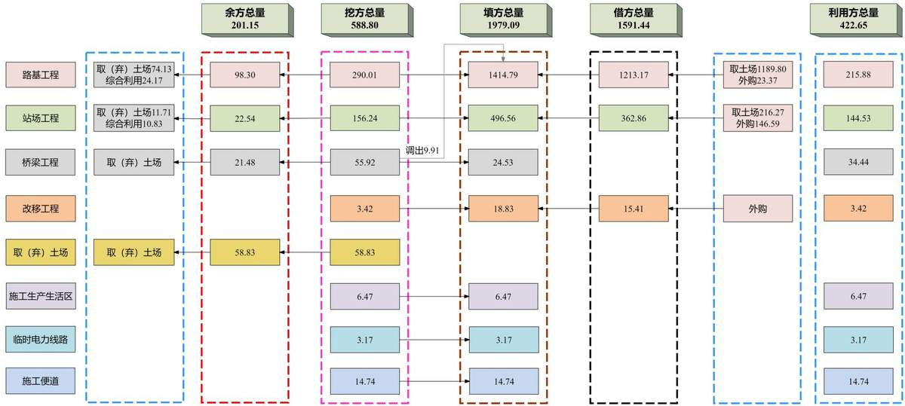  
图 2.4.2-1 主体设计土石方平衡流向图

## 2.4.3 表土、砾幕剥离及平衡

## 2.4.3.1 表土及砾幕分布调查与可剥离量分析

## （1）表土资源

## 1）平原微丘区

经实地调查，全线表土资源主要分布在平原微丘区，盐土、风沙土相间分布。表土可剥离厚度为耕地15cm，林地5cm，草地5cm，地形较为平坦的区域采用推土机进行剥离，机械不易实施的区域可采用人工和小型机具清除表土。

## 2）山岭重丘区

本项目大部分位于荒漠戈壁区，土壤主要侵蚀类型为强烈及以上风力侵蚀、兼有轻度水力侵蚀，自然条件自东向西逐渐恶化，降水量稀少，蒸发量大，属于典型的温带大陆性极干旱气候区。地表植被具有明显区域性特征，为典型的荒漠戈壁地带。主要植物类型为旱生、超旱生灌木和半灌木，呈点状和丛状分布，现状林草覆盖率约5%。

经实地调查，该区主要为沙丘、石质土低山、石质土缓丘陵剥蚀地貌，主要土壤类型为荒漠土类，多为沙土、灰漠土为主，并有少量棕钙土和盐渍土。占地类型零星分布林草地的区域，表土类型也基本为灰棕漠土。表层土稀薄，无明显成土层，腐殖质稀缺，养分贫瘠，不具备表土剥离条件。

## (2）砾幕层

由于特殊的区位因素形成了恶劣的水、热及土壤条件，植被稀疏，沿线大部分地面表层布满了砾石或碎石，形成砾幕层。在植被稀疏的荒漠地区，砾幕层对保护土地资源方面具有重要作用，可以保护下部沙土不被吹蚀，从而减少风沙物质来源和保护土壤资源，该区大部分地表均发育有砾幕覆盖。项目区砾石资源丰富，防风固沙措施可利用砾石资源。

经实地调查情况，沿线地层表面主要为圆砾、角砾及碎石，剥离区域为部分裸岩石砾地。综上，施工前对占用裸岩石砾地部分区域剥离砾幕，考虑后期施工可操作性，平均剥离厚度2cm，砾石粒径范围5\~60mm。

施工生产生活区涉及土石方开挖及基础施工，需进行场地清理，应考虑砾幕剥离。

施工便道采取泥结碎石路面，主要占用裸岩石砾地类。碎石路面硬化后对便道风蚀可起到有效抑制，车辆碾压对原生地表风力侵蚀影响较小，不考虑施工便道砾幕剥离。

表土回覆利用量1.76万 $\mathrm { m } ^ { 3 }$ ，用于后期土地整治，无剩余。表土利用时优先考虑本区回覆，不足部分调配至相邻区域。表土剥离范围与剥离量，以及表土平衡详见下表。

表 2.4.3-3 表土剥离范围与剥离量汇总表
<table><tr><td rowspan=1 colspan=3>行政区</td><td rowspan=2 colspan=1>占地性质工</td><td rowspan=2 colspan=1>程类型</td><td rowspan=1 colspan=4>剥离面积 $\left( \mathbf { \hat { h } m } ^ { 2 } \right)$ </td><td rowspan=1 colspan=1>表土剥离</td></tr><tr><td rowspan=1 colspan=1>省、自治区</td><td rowspan=1 colspan=1>市、盟、直辖县级市</td><td rowspan=1 colspan=1>区、县、旗</td><td rowspan=1 colspan=1>耕地</td><td rowspan=1 colspan=1>林地</td><td rowspan=1 colspan=1>草地</td><td rowspan=1 colspan=1>合计</td><td rowspan=1 colspan=1> $( \mathcal { F } \mathbf { m } ^ { 3 } )$ </td></tr><tr><td rowspan=5 colspan=1>内蒙古自治区</td><td rowspan=5 colspan=1>阿拉善盟</td><td rowspan=5 colspan=1>额济纳旗</td><td rowspan=5 colspan=1>永久占地</td><td rowspan=1 colspan=1>路基工程</td><td rowspan=1 colspan=1></td><td rowspan=1 colspan=1>3.7</td><td rowspan=1 colspan=1>9.66</td><td rowspan=1 colspan=1>13.36</td><td rowspan=1 colspan=1>0.67</td></tr><tr><td rowspan=1 colspan=1>站场工程</td><td rowspan=1 colspan=1></td><td rowspan=1 colspan=1>0.59</td><td rowspan=1 colspan=1>4.58</td><td rowspan=1 colspan=1>5.17</td><td rowspan=1 colspan=1>0.26</td></tr><tr><td rowspan=1 colspan=1>桥梁工程</td><td rowspan=1 colspan=1></td><td rowspan=1 colspan=1>0.13</td><td rowspan=1 colspan=1>5.62</td><td rowspan=1 colspan=1>5.75</td><td rowspan=1 colspan=1>0.29</td></tr><tr><td rowspan=1 colspan=1>改移工程</td><td rowspan=1 colspan=1></td><td rowspan=1 colspan=1>0.14</td><td rowspan=1 colspan=1>0.77</td><td rowspan=1 colspan=1>0.91</td><td rowspan=1 colspan=1>0.05</td></tr><tr><td rowspan=1 colspan=1>小计</td><td rowspan=1 colspan=1></td><td rowspan=1 colspan=1>4.56</td><td rowspan=1 colspan=1>20.63</td><td rowspan=1 colspan=1>25.19</td><td rowspan=1 colspan=1>1.27</td></tr><tr><td rowspan=3 colspan=1>甘肃省</td><td rowspan=3 colspan=1>酒泉市</td><td rowspan=3 colspan=1>肃北蒙古族自治县</td><td rowspan=3 colspan=1>永久占地</td><td rowspan=1 colspan=1>桥梁工程</td><td rowspan=1 colspan=1></td><td rowspan=1 colspan=1>0.03</td><td rowspan=1 colspan=1>0.28</td><td rowspan=1 colspan=1>0.31</td><td rowspan=1 colspan=1>0.02</td></tr><tr><td rowspan=1 colspan=1>改移工程</td><td rowspan=1 colspan=1></td><td rowspan=1 colspan=1>0.01</td><td rowspan=1 colspan=1>0.11</td><td rowspan=1 colspan=1>0.12</td><td rowspan=1 colspan=1>0.01</td></tr><tr><td rowspan=1 colspan=1>小计</td><td rowspan=1 colspan=1></td><td rowspan=1 colspan=1>0.04</td><td rowspan=1 colspan=1>0.39</td><td rowspan=1 colspan=1>0.43</td><td rowspan=1 colspan=1>0.03</td></tr><tr><td rowspan=8 colspan=1>新疆维吾尔自治区</td><td rowspan=3 colspan=1>哈密市</td><td rowspan=3 colspan=1>伊州区</td><td rowspan=3 colspan=1>永久占地</td><td rowspan=1 colspan=1>站场工程</td><td rowspan=1 colspan=1>1.72</td><td rowspan=1 colspan=1>0.11</td><td rowspan=1 colspan=1>2.33</td><td rowspan=1 colspan=1>4.16</td><td rowspan=1 colspan=1>0.38</td></tr><tr><td rowspan=1 colspan=1>改移工程</td><td rowspan=1 colspan=1>0.22</td><td rowspan=1 colspan=1>0.01</td><td rowspan=1 colspan=1>0.28</td><td rowspan=1 colspan=1>0.51</td><td rowspan=1 colspan=1>0.04</td></tr><tr><td rowspan=1 colspan=1>小计</td><td rowspan=1 colspan=1>1.94</td><td rowspan=1 colspan=1>0.12</td><td rowspan=1 colspan=1>2.61</td><td rowspan=1 colspan=1>4.67</td><td rowspan=1 colspan=1>0.42</td></tr><tr><td rowspan=2 colspan=2>新疆生产建设兵团第十三师新星市</td><td rowspan=2 colspan=1>永久占地</td><td rowspan=1 colspan=1>站场工程</td><td rowspan=1 colspan=1></td><td rowspan=1 colspan=1>0.59</td><td rowspan=1 colspan=1>0.22</td><td rowspan=1 colspan=1>0.81</td><td rowspan=1 colspan=1>0.04</td></tr><tr><td rowspan=1 colspan=1>小计</td><td rowspan=1 colspan=1></td><td rowspan=1 colspan=1>0.59</td><td rowspan=1 colspan=1>0.22</td><td rowspan=1 colspan=1>0.81</td><td rowspan=1 colspan=1>0.04</td></tr><tr><td rowspan=2 colspan=3>永久占地</td><td rowspan=1 colspan=1>站场工程</td><td rowspan=1 colspan=1>1.72</td><td rowspan=1 colspan=1>0.7</td><td rowspan=1 colspan=1>2.55</td><td rowspan=1 colspan=1>4.97</td><td rowspan=1 colspan=1>0.42</td></tr><tr><td rowspan=1 colspan=1>改移工程</td><td rowspan=1 colspan=1>0.22</td><td rowspan=1 colspan=1>0.01</td><td rowspan=1 colspan=1>0.28</td><td rowspan=1 colspan=1>0.51</td><td rowspan=1 colspan=1>0.04</td></tr><tr><td rowspan=1 colspan=4>合计</td><td rowspan=1 colspan=1>1.94</td><td rowspan=1 colspan=1>0.71</td><td rowspan=1 colspan=1>2.83</td><td rowspan=1 colspan=1>5.48</td><td rowspan=1 colspan=1>0.46</td></tr><tr><td rowspan=5 colspan=3>全线合计</td><td rowspan=4 colspan=1>永久占地</td><td rowspan=1 colspan=1>路基工程</td><td rowspan=1 colspan=1></td><td rowspan=1 colspan=1>3.7</td><td rowspan=1 colspan=1>9.66</td><td rowspan=1 colspan=1>13.36</td><td rowspan=1 colspan=1>0.67</td></tr><tr><td rowspan=1 colspan=1>站场工程</td><td rowspan=1 colspan=1>1.72</td><td rowspan=1 colspan=1>1.29</td><td rowspan=1 colspan=1>7.13</td><td rowspan=1 colspan=1>10.14</td><td rowspan=1 colspan=1>0.68</td></tr><tr><td rowspan=1 colspan=1>桥梁工程</td><td rowspan=1 colspan=1></td><td rowspan=1 colspan=1>0.16</td><td rowspan=1 colspan=1>5.9</td><td rowspan=1 colspan=1>6.06</td><td rowspan=1 colspan=1>0.31</td></tr><tr><td rowspan=1 colspan=1>改移工程</td><td rowspan=1 colspan=1>0.22</td><td rowspan=1 colspan=1>0.16</td><td rowspan=1 colspan=1>1.16</td><td rowspan=1 colspan=1>1.54</td><td rowspan=1 colspan=1>0.10</td></tr><tr><td rowspan=1 colspan=2>合计</td><td rowspan=1 colspan=1>1.94</td><td rowspan=1 colspan=1>5.31</td><td rowspan=1 colspan=1>23.85</td><td rowspan=1 colspan=1>31.10</td><td rowspan=1 colspan=1>1.76</td></tr></table>

表2.4.3-4 表土平衡表 单位：万m³
<table><tr><td colspan="2" rowspan="2">行政区</td><td colspan="1" rowspan="2">占地性质</td><td colspan="1" rowspan="2">工程类型</td><td colspan="1" rowspan="2">表土剥离</td><td colspan="1" rowspan="2">表土回覆</td><td colspan="1" rowspan="2">本体利用</td><td colspan="2" rowspan="1">调入</td><td colspan="2" rowspan="1">调出</td></tr><tr><td colspan="1" rowspan="1">数量</td><td colspan="1" rowspan="1">来源</td><td colspan="1" rowspan="1">数量</td><td colspan="1" rowspan="1">去向</td></tr><tr><td colspan="2" rowspan="8">内蒙古自治区</td><td colspan="1" rowspan="5">永久占地</td><td colspan="1" rowspan="1">路基工程</td><td colspan="1" rowspan="1">0.67</td><td colspan="1" rowspan="1"></td><td colspan="1" rowspan="1"></td><td colspan="1" rowspan="1"></td><td colspan="1" rowspan="1"></td><td colspan="1" rowspan="1">0.67</td><td colspan="1" rowspan="4">内蒙段取(弃)土场1.06万方</td></tr><tr><td colspan="1" rowspan="1">站场工程</td><td colspan="1" rowspan="1">0.26</td><td colspan="1" rowspan="1">0.21</td><td colspan="1" rowspan="1">0.21</td><td colspan="1" rowspan="1"></td><td colspan="1" rowspan="1"></td><td colspan="1" rowspan="1">0.05</td></tr><tr><td colspan="1" rowspan="1">桥梁工程</td><td colspan="1" rowspan="1">0.29</td><td colspan="1" rowspan="1"></td><td colspan="1" rowspan="1"></td><td colspan="1" rowspan="1"></td><td colspan="1" rowspan="1"></td><td colspan="1" rowspan="1">0.29</td></tr><tr><td colspan="1" rowspan="1">改移工程</td><td colspan="1" rowspan="1">0.05</td><td colspan="1" rowspan="1"></td><td colspan="1" rowspan="1"></td><td colspan="1" rowspan="1"></td><td colspan="1" rowspan="1"></td><td colspan="1" rowspan="1">0.05</td></tr><tr><td colspan="1" rowspan="1">小计</td><td colspan="1" rowspan="1">1.27</td><td colspan="1" rowspan="1">0.21</td><td colspan="1" rowspan="1">0.21</td><td colspan="1" rowspan="1"></td><td colspan="1" rowspan="1"></td><td colspan="1" rowspan="1">1.06</td><td colspan="1" rowspan="1"></td></tr><tr><td colspan="1" rowspan="2">临时占地</td><td colspan="1" rowspan="1">取(弃)土场</td><td colspan="1" rowspan="1"></td><td colspan="1" rowspan="1">1.06</td><td colspan="1" rowspan="1"></td><td colspan="1" rowspan="1">1.06</td><td colspan="1" rowspan="1">内蒙段1.06万方(路基0.67、站场0.05、桥梁0.29、改移工程 0.05)</td><td colspan="1" rowspan="1"></td><td colspan="1" rowspan="1"></td></tr><tr><td colspan="1" rowspan="1">小计</td><td colspan="1" rowspan="1"></td><td colspan="1" rowspan="1">1.06</td><td colspan="1" rowspan="1"></td><td colspan="1" rowspan="1">1.06</td><td colspan="1" rowspan="1"></td><td colspan="1" rowspan="1"></td><td colspan="1" rowspan="1"></td></tr><tr><td colspan="2" rowspan="1">合计</td><td colspan="1" rowspan="1">1.27</td><td colspan="1" rowspan="1">1.27</td><td colspan="1" rowspan="1">0.21</td><td colspan="1" rowspan="1">1.06</td><td colspan="1" rowspan="1"></td><td colspan="1" rowspan="1">1.06</td><td colspan="1" rowspan="1"></td></tr><tr><td colspan="2" rowspan="4">甘肃省</td><td colspan="1" rowspan="3">永久占地</td><td colspan="1" rowspan="1">站场工程</td><td colspan="1" rowspan="1"></td><td colspan="1" rowspan="1">0.03</td><td colspan="1" rowspan="1"></td><td colspan="1" rowspan="1">0.03</td><td colspan="1" rowspan="1">甘肃段0.03万方（桥梁0.02、改移0.01）</td><td colspan="1" rowspan="1"></td><td colspan="1" rowspan="1"></td></tr><tr><td colspan="1" rowspan="1">桥梁工程</td><td colspan="1" rowspan="1">0.02</td><td colspan="1" rowspan="1"></td><td colspan="1" rowspan="1"></td><td colspan="1" rowspan="1"></td><td colspan="1" rowspan="1"></td><td colspan="1" rowspan="1">0.02</td><td colspan="1" rowspan="1">甘肃段站场</td></tr><tr><td colspan="1" rowspan="1">改移工程</td><td colspan="1" rowspan="1">0.01</td><td colspan="1" rowspan="1"></td><td colspan="1" rowspan="1"></td><td colspan="1" rowspan="1"></td><td colspan="1" rowspan="1"></td><td colspan="1" rowspan="1">0.01</td><td colspan="1" rowspan="1">甘肃段站场</td></tr><tr><td colspan="2" rowspan="1">合计</td><td colspan="1" rowspan="1">0.03</td><td colspan="1" rowspan="1">0.03</td><td colspan="1" rowspan="1"></td><td colspan="1" rowspan="1">0.03</td><td colspan="1" rowspan="1"></td><td colspan="1" rowspan="1">0.03</td><td colspan="1" rowspan="1"></td></tr><tr><td colspan="1" rowspan="8">新疆维吾尔自治区</td><td colspan="1" rowspan="3">哈密市伊州区</td><td colspan="1" rowspan="2">永久占地</td><td colspan="1" rowspan="1">站场工程</td><td colspan="1" rowspan="1">0.38</td><td colspan="1" rowspan="1">0.38</td><td colspan="1" rowspan="1">0.38</td><td colspan="1" rowspan="1"></td><td colspan="1" rowspan="1"></td><td colspan="1" rowspan="1"></td><td colspan="1" rowspan="1"></td></tr><tr><td colspan="1" rowspan="1">改移工程</td><td colspan="1" rowspan="1">0.04</td><td colspan="1" rowspan="1">0.04</td><td colspan="1" rowspan="1">0.04</td><td colspan="1" rowspan="1"></td><td colspan="1" rowspan="1"></td><td colspan="1" rowspan="1"></td><td colspan="1" rowspan="1"></td></tr><tr><td colspan="2" rowspan="1">合计</td><td colspan="1" rowspan="1">0.42</td><td colspan="1" rowspan="1">0.42</td><td colspan="1" rowspan="1">0.42</td><td colspan="1" rowspan="1"></td><td colspan="1" rowspan="1"></td><td colspan="1" rowspan="1"></td><td colspan="1" rowspan="1"></td></tr><tr><td colspan="1" rowspan="2">新疆生产建永设兵团第十三师新星市</td><td colspan="1" rowspan="1">久占地</td><td colspan="1" rowspan="1">路基工程</td><td colspan="1" rowspan="1">0.04</td><td colspan="1" rowspan="1">0.04</td><td colspan="1" rowspan="1">0.04</td><td colspan="1" rowspan="1"></td><td colspan="1" rowspan="1"></td><td colspan="1" rowspan="1"></td><td colspan="1" rowspan="1"></td></tr><tr><td colspan="2" rowspan="1">合计</td><td colspan="1" rowspan="1">0.04</td><td colspan="1" rowspan="1">0.04</td><td colspan="1" rowspan="1">0.04</td><td colspan="1" rowspan="1"></td><td colspan="1" rowspan="1"></td><td colspan="1" rowspan="1"></td><td colspan="1" rowspan="1"></td></tr><tr><td colspan="2" rowspan="2">永久占地</td><td colspan="1" rowspan="1">站场工程</td><td colspan="1" rowspan="1">0.42</td><td colspan="1" rowspan="1">0.42</td><td colspan="1" rowspan="1">0.42</td><td colspan="1" rowspan="1"></td><td colspan="1" rowspan="1"></td><td colspan="1" rowspan="1"></td><td colspan="1" rowspan="1"></td></tr><tr><td colspan="1" rowspan="1">改移工程</td><td colspan="1" rowspan="1">0.04</td><td colspan="1" rowspan="1">0.04</td><td colspan="1" rowspan="1">0.04</td><td colspan="1" rowspan="1"></td><td colspan="1" rowspan="1"></td><td colspan="1" rowspan="1"></td><td colspan="1" rowspan="1"></td></tr><tr><td colspan="3" rowspan="1">合计</td><td colspan="1" rowspan="1">0.46</td><td colspan="1" rowspan="1">0.46</td><td colspan="1" rowspan="1">0.46</td><td colspan="1" rowspan="1"></td><td colspan="1" rowspan="1"></td><td colspan="1" rowspan="1"></td><td colspan="1" rowspan="1"></td></tr><tr><td colspan="1" rowspan="7">全线</td><td colspan="1" rowspan="5">永久占地</td><td colspan="1" rowspan="1">路基工程</td><td colspan="1" rowspan="1">0.67</td><td colspan="1" rowspan="1"></td><td colspan="1" rowspan="1"></td><td colspan="1" rowspan="1"></td><td colspan="1" rowspan="1"></td><td colspan="1" rowspan="1">0.67</td><td colspan="2" rowspan="1">取(弃)土场</td></tr><tr><td colspan="1" rowspan="1">站场工程</td><td colspan="1" rowspan="1">0.68</td><td colspan="1" rowspan="1">0.66</td><td colspan="1" rowspan="1">0.63</td><td colspan="1" rowspan="1">0.03</td><td colspan="1" rowspan="1">桥梁 0.02、改移 0.01</td><td colspan="1" rowspan="1">0.05</td><td colspan="2" rowspan="1">取(弃)土场</td></tr><tr><td colspan="1" rowspan="1">桥梁工程</td><td colspan="1" rowspan="1">0.31</td><td colspan="1" rowspan="1"></td><td colspan="1" rowspan="1"></td><td colspan="1" rowspan="1"></td><td colspan="1" rowspan="1"></td><td colspan="1" rowspan="1">0.31</td><td colspan="2" rowspan="1">取(弃)土场 0.29，站场 0.02</td></tr><tr><td colspan="1" rowspan="1">改移工程</td><td colspan="1" rowspan="1">0.10</td><td colspan="1" rowspan="1">0.04</td><td colspan="1" rowspan="1">0.04</td><td colspan="1" rowspan="1"></td><td colspan="1" rowspan="1"></td><td colspan="1" rowspan="1">0.06</td><td colspan="2" rowspan="1">取(弃)土场 0.05，站场 0.01</td></tr><tr><td colspan="1" rowspan="1">小计</td><td colspan="1" rowspan="1">1.76</td><td colspan="1" rowspan="1">0.70</td><td colspan="1" rowspan="1">0.67</td><td colspan="1" rowspan="1">0.03</td><td colspan="1" rowspan="1"></td><td colspan="1" rowspan="1">1.09</td><td colspan="2" rowspan="1"></td></tr><tr><td colspan="1" rowspan="2">临时占地</td><td colspan="1" rowspan="1">取(弃)土场</td><td colspan="1" rowspan="1"></td><td colspan="1" rowspan="1">1.06</td><td colspan="1" rowspan="1"></td><td colspan="1" rowspan="1">1.06</td><td colspan="1" rowspan="1">路基0.67、站场0.05、桥梁0.29、改移工程0.05</td><td colspan="1" rowspan="1"></td><td colspan="2" rowspan="1"></td></tr><tr><td colspan="1" rowspan="1">小计</td><td colspan="1" rowspan="1"></td><td colspan="1" rowspan="1">1.06</td><td colspan="1" rowspan="1"></td><td colspan="1" rowspan="1">1.06</td><td colspan="1" rowspan="1"></td><td colspan="1" rowspan="1"></td><td colspan="2" rowspan="1"></td></tr><tr><td colspan="3" rowspan="1">合计</td><td colspan="1" rowspan="1">1.76</td><td colspan="1" rowspan="1">1.76</td><td colspan="1" rowspan="1">0.67</td><td colspan="1" rowspan="1">1.09</td><td colspan="1" rowspan="1"></td><td colspan="1" rowspan="1">1.09</td><td colspan="2" rowspan="1"></td></tr></table>

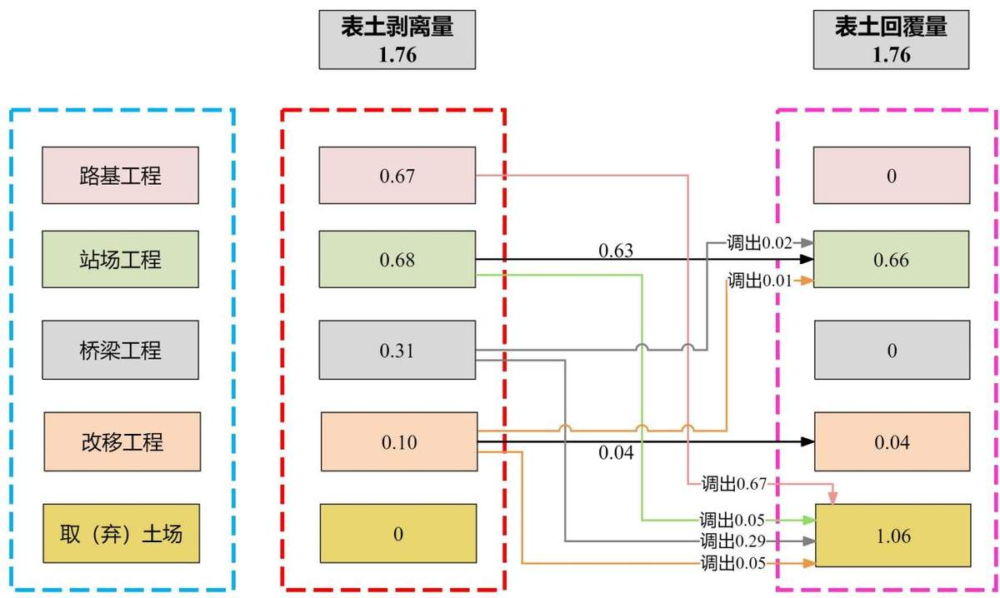  
图 2.4.3-1 表土平衡流向图

## 2.4.3.4 砾幕剥离平衡

根据现场调查情况，项目区可剥离砾幕区域为占地类型为裸岩石砾地的部分范围，现场砾幕层厚度较薄，考虑机械操作可实施性，施工期砾幕层平均剥离厚度按2cm考虑。经统计，本工程砾幕剥离总面积482.38hm²，砾幕可剥离总量9.67万m³，后期回铺总量9.67万m³，用于本工程场地后期砾石覆盖。

路基和站场剥离的砾幕就近堆放在工程征地红线范围不影响施工的区域;桥梁工程、改移工程和临时电力线路剥离的砾幕就近堆放在沿线路基征地红线范围不影响施工的区域；施工生产生活区剥离的砾幕堆放于征占地范围内，取（弃）土场剥离的砾幕紧邻取（弃）土场布置，新增临时占地；施工便道可不剥离砾幕层。砾幕剥离平衡详见下表。

表 2.4.3-5  
砾幕剥离范围与剥离量汇总表  
单位：万m³
<table><tr><td rowspan=1 colspan=3>行政区</td><td rowspan=3 colspan=1>占地性质</td><td rowspan=3 colspan=1>工程类型</td><td rowspan=1 colspan=1>剥离面积</td><td rowspan=1 colspan=1>砾幕剥离量</td></tr><tr><td rowspan=2 colspan=1>省、自治区</td><td rowspan=2 colspan=1>市、盟</td><td rowspan=2 colspan=1>区、县、旗</td><td rowspan=1 colspan=1>裸岩石砾地</td><td rowspan=2 colspan=1>(万m³)</td></tr><tr><td rowspan=1 colspan=1>(hm²)</td></tr><tr><td rowspan=10 colspan=1>内蒙古自治区</td><td rowspan=10 colspan=1>阿拉善盟</td><td rowspan=10 colspan=1>额济纳旗</td><td rowspan=5 colspan=1>永久占地</td><td rowspan=1 colspan=1>路基工程</td><td rowspan=1 colspan=1>94.94</td><td rowspan=1 colspan=1>1.90</td></tr><tr><td rowspan=1 colspan=1>站场工程</td><td rowspan=1 colspan=1>15.16</td><td rowspan=1 colspan=1>0.30</td></tr><tr><td rowspan=1 colspan=1>桥梁工程</td><td rowspan=1 colspan=1>6.50</td><td rowspan=1 colspan=1>0.13</td></tr><tr><td rowspan=1 colspan=1>改移工程</td><td rowspan=1 colspan=1>6.36</td><td rowspan=1 colspan=1>0.13</td></tr><tr><td rowspan=1 colspan=1>小计</td><td rowspan=1 colspan=1>122.96</td><td rowspan=1 colspan=1>2.46</td></tr><tr><td rowspan=4 colspan=1>临时占地</td><td rowspan=1 colspan=1>取(弃)土场</td><td rowspan=1 colspan=1>138.57</td><td rowspan=1 colspan=1>2.79</td></tr><tr><td rowspan=1 colspan=1>施工生产生活区</td><td rowspan=1 colspan=1>40.32</td><td rowspan=1 colspan=1>0.80</td></tr><tr><td rowspan=1 colspan=1>临时电力线路</td><td rowspan=1 colspan=1>0.40</td><td rowspan=1 colspan=1>0.01</td></tr><tr><td rowspan=1 colspan=1>小计</td><td rowspan=1 colspan=1>179.29</td><td rowspan=1 colspan=1>3.60</td></tr><tr><td rowspan=1 colspan=1></td><td rowspan=1 colspan=1>合计</td><td rowspan=1 colspan=1>302.25</td><td rowspan=1 colspan=1>6.06</td></tr><tr><td rowspan=8 colspan=1>甘肃省</td><td rowspan=8 colspan=1>酒泉市</td><td rowspan=8 colspan=1>肃北蒙古族自治县</td><td rowspan=4 colspan=1>永久占地</td><td rowspan=1 colspan=1>路基工程</td><td rowspan=1 colspan=1>55.26</td><td rowspan=1 colspan=1>1.11</td></tr><tr><td rowspan=1 colspan=1>站场工程</td><td rowspan=1 colspan=1>14.33</td><td rowspan=1 colspan=1>0.29</td></tr><tr><td rowspan=1 colspan=1>桥梁工程</td><td rowspan=1 colspan=1>5.52</td><td rowspan=1 colspan=1>0.11</td></tr><tr><td rowspan=1 colspan=1>小计</td><td rowspan=1 colspan=1>75.11</td><td rowspan=1 colspan=1>1.51</td></tr><tr><td rowspan=3 colspan=1>临时占地</td><td rowspan=1 colspan=1>取(弃)土场</td><td rowspan=1 colspan=1>83.80</td><td rowspan=1 colspan=1>1.68</td></tr><tr><td rowspan=1 colspan=1>施工生产生活区</td><td rowspan=1 colspan=1>5.00</td><td rowspan=1 colspan=1>0.10</td></tr><tr><td rowspan=1 colspan=1>小计</td><td rowspan=1 colspan=1>88.80</td><td rowspan=1 colspan=1>1.78</td></tr><tr><td rowspan=1 colspan=2>合计</td><td rowspan=1 colspan=1>163.91</td><td rowspan=1 colspan=1>3.29</td></tr><tr><td rowspan=2 colspan=1>新疆维吾尔自治区</td><td rowspan=2 colspan=1>哈密市</td><td rowspan=2 colspan=1>伊州区</td><td rowspan=1 colspan=1>临时占地</td><td rowspan=1 colspan=1>施工生产生活区</td><td rowspan=1 colspan=1>16.22</td><td rowspan=1 colspan=1>0.32</td></tr><tr><td rowspan=1 colspan=1></td><td rowspan=1 colspan=1>合计</td><td rowspan=1 colspan=1>16.22</td><td rowspan=1 colspan=1>0.32</td></tr><tr><td rowspan=10 colspan=3>合计</td><td rowspan=5 colspan=1>永久占地</td><td rowspan=1 colspan=1>路基工程</td><td rowspan=1 colspan=1>150.20</td><td rowspan=1 colspan=1>3.01</td></tr><tr><td rowspan=1 colspan=1>站场工程</td><td rowspan=1 colspan=1>29.49</td><td rowspan=1 colspan=1>0.59</td></tr><tr><td rowspan=1 colspan=1>桥梁工程</td><td rowspan=1 colspan=1>12.02</td><td rowspan=1 colspan=1>0.24</td></tr><tr><td rowspan=1 colspan=1>改移工程</td><td rowspan=1 colspan=1>6.36</td><td rowspan=1 colspan=1>0.13</td></tr><tr><td rowspan=1 colspan=1>小计</td><td rowspan=1 colspan=1>198.07</td><td rowspan=1 colspan=1>3.97</td></tr><tr><td rowspan=4 colspan=1>临时占地</td><td rowspan=1 colspan=1>取(弃)土场</td><td rowspan=1 colspan=1>222.37</td><td rowspan=1 colspan=1>4.47</td></tr><tr><td rowspan=1 colspan=1>施工生产生活区</td><td rowspan=1 colspan=1>45.32</td><td rowspan=1 colspan=1>1.22</td></tr><tr><td rowspan=1 colspan=1>临时电力线路</td><td rowspan=1 colspan=1>16.62</td><td rowspan=1 colspan=1>0.01</td></tr><tr><td rowspan=1 colspan=1>小计</td><td rowspan=1 colspan=1>284.31</td><td rowspan=1 colspan=1>5.70</td></tr><tr><td rowspan=1 colspan=2>合计</td><td rowspan=1 colspan=1>482.38</td><td rowspan=1 colspan=1>9.67</td></tr></table>

表2.4.3-6 砾幕平衡表 单位：万 $\mathrm { m } ^ { 3 }$
<table><tr><td rowspan=2 colspan=1>行政区</td><td rowspan=2 colspan=1>占地性质</td><td rowspan=2 colspan=1>工程类型</td><td rowspan=1 colspan=1>砾幕剥离量砾</td><td rowspan=1 colspan=1>幕回铺量本</td><td rowspan=1 colspan=1>体利用</td><td rowspan=1 colspan=2>调入</td><td rowspan=1 colspan=2>调出</td></tr><tr><td rowspan=1 colspan=1>(万m³)</td><td rowspan=1 colspan=1>(万m³)</td><td rowspan=1 colspan=1>（万m³)数</td><td rowspan=1 colspan=1>量(万m³)</td><td rowspan=1 colspan=1>来源</td><td rowspan=1 colspan=1>数量（万m³）</td><td rowspan=1 colspan=1>去向</td></tr><tr><td rowspan=10 colspan=1>内蒙古自治区阿拉善盟额济纳旗</td><td rowspan=5 colspan=1>永久占地</td><td rowspan=1 colspan=1>路基工程</td><td rowspan=1 colspan=1>1.90</td><td rowspan=1 colspan=1>0.44</td><td rowspan=1 colspan=1>0.44</td><td rowspan=1 colspan=1></td><td rowspan=1 colspan=1></td><td rowspan=1 colspan=1>1.46</td><td rowspan=1 colspan=1>内蒙段取（弃）土场</td></tr><tr><td rowspan=1 colspan=1>站场工程</td><td rowspan=1 colspan=1>0.30</td><td rowspan=1 colspan=1></td><td rowspan=1 colspan=1></td><td rowspan=1 colspan=1></td><td rowspan=1 colspan=1></td><td rowspan=1 colspan=1>0.30</td><td rowspan=1 colspan=1>内蒙段（取（弃）土场0.03，施工生产生活区0.27）</td></tr><tr><td rowspan=1 colspan=1>桥梁工程</td><td rowspan=1 colspan=1>0.13</td><td rowspan=1 colspan=1>0.11</td><td rowspan=1 colspan=1>0.11</td><td rowspan=1 colspan=1></td><td rowspan=1 colspan=1></td><td rowspan=1 colspan=1>0.02</td><td rowspan=1 colspan=1>内蒙段（施工生产生活区0.01，临时电力线0.01）</td></tr><tr><td rowspan=1 colspan=1>改移工程</td><td rowspan=1 colspan=1>0.13</td><td rowspan=1 colspan=1>0.06</td><td rowspan=1 colspan=1>0.06</td><td rowspan=1 colspan=1></td><td rowspan=1 colspan=1></td><td rowspan=1 colspan=1>0.07</td><td rowspan=1 colspan=1>内蒙段施工生产生活区</td></tr><tr><td rowspan=1 colspan=1>小计</td><td rowspan=1 colspan=1>2.46</td><td rowspan=1 colspan=1>0.61</td><td rowspan=1 colspan=1>0.61</td><td rowspan=1 colspan=1></td><td rowspan=1 colspan=1></td><td rowspan=1 colspan=1>1.85</td><td rowspan=1 colspan=1></td></tr><tr><td rowspan=4 colspan=1>占时地</td><td rowspan=1 colspan=1>取(弃)土场</td><td rowspan=1 colspan=1>2.79</td><td rowspan=1 colspan=1>4.28</td><td rowspan=1 colspan=1>2.79</td><td rowspan=1 colspan=1>1.49</td><td rowspan=1 colspan=1>内蒙段（路基工程1.46，站场工程 0.03）</td><td rowspan=1 colspan=1></td><td rowspan=1 colspan=1></td></tr><tr><td rowspan=1 colspan=1>施工生产生活区</td><td rowspan=1 colspan=1>0.80</td><td rowspan=1 colspan=1>1.15</td><td rowspan=1 colspan=1>0.80</td><td rowspan=1 colspan=1>0.35</td><td rowspan=1 colspan=1>内蒙段（站场工程0.27，改移工程0.07，桥梁工程0.01）</td><td rowspan=1 colspan=1></td><td rowspan=1 colspan=1></td></tr><tr><td rowspan=1 colspan=1>临时电力线路</td><td rowspan=1 colspan=1>0.01</td><td rowspan=1 colspan=1>0.02</td><td rowspan=1 colspan=1>0.01</td><td rowspan=1 colspan=1>0.01</td><td rowspan=1 colspan=1>内蒙段路基工程</td><td rowspan=1 colspan=1></td><td rowspan=1 colspan=1></td></tr><tr><td rowspan=1 colspan=1>小计</td><td rowspan=1 colspan=1>3.60</td><td rowspan=1 colspan=1>5.45</td><td rowspan=1 colspan=1>3.60</td><td rowspan=1 colspan=1>1.85</td><td rowspan=1 colspan=1></td><td rowspan=1 colspan=1></td><td rowspan=1 colspan=1></td></tr><tr><td rowspan=1 colspan=1></td><td rowspan=1 colspan=1>合计</td><td rowspan=1 colspan=1>6.06</td><td rowspan=1 colspan=1>6.06</td><td rowspan=1 colspan=1>4.21</td><td rowspan=1 colspan=1>1.85</td><td rowspan=1 colspan=1></td><td rowspan=1 colspan=1>1.85</td><td rowspan=1 colspan=1></td></tr><tr><td rowspan=8 colspan=1>甘肃省酒泉市肃北蒙古族自治县</td><td rowspan=5 colspan=1>永久占地</td><td rowspan=1 colspan=1>路基工程</td><td rowspan=1 colspan=1>1.11</td><td rowspan=1 colspan=1>0.17</td><td rowspan=1 colspan=1>0.17</td><td rowspan=1 colspan=1></td><td rowspan=1 colspan=1></td><td rowspan=1 colspan=1>0.94</td><td rowspan=1 colspan=1>甘肃段取（弃）土场</td></tr><tr><td rowspan=1 colspan=1>站场工程</td><td rowspan=1 colspan=1>0.29</td><td rowspan=1 colspan=1></td><td rowspan=1 colspan=1></td><td rowspan=1 colspan=1></td><td rowspan=1 colspan=1></td><td rowspan=1 colspan=1>0.29</td><td rowspan=1 colspan=1>甘肃段（桥梁工程0.01，改移工程 0.10，取（弃）土场0.14，施工生产生活区 0.04）</td></tr><tr><td rowspan=1 colspan=1>桥梁工程</td><td rowspan=1 colspan=1>0.11</td><td rowspan=1 colspan=1>0.12</td><td rowspan=1 colspan=1>0.11</td><td rowspan=1 colspan=1>0.01</td><td rowspan=1 colspan=1>甘肃段站场工程</td><td rowspan=1 colspan=1></td><td rowspan=1 colspan=1></td></tr><tr><td rowspan=1 colspan=1>改移工程</td><td rowspan=1 colspan=1></td><td rowspan=1 colspan=1>0.10</td><td rowspan=1 colspan=1></td><td rowspan=1 colspan=1>0.10</td><td rowspan=1 colspan=1>甘肃段站场工程</td><td rowspan=1 colspan=1></td><td rowspan=1 colspan=1></td></tr><tr><td rowspan=1 colspan=1>小计</td><td rowspan=1 colspan=1>1.51</td><td rowspan=1 colspan=1>0.39</td><td rowspan=1 colspan=1>0.28</td><td rowspan=1 colspan=1>0.11</td><td rowspan=1 colspan=1></td><td rowspan=1 colspan=1>1.23</td><td rowspan=1 colspan=1></td></tr><tr><td rowspan=3 colspan=1>临时占地</td><td rowspan=1 colspan=1>取(弃)土场</td><td rowspan=1 colspan=1>1.68</td><td rowspan=1 colspan=1>2.76</td><td rowspan=1 colspan=1>1.68</td><td rowspan=1 colspan=1>1.08</td><td rowspan=1 colspan=1>甘肃段（路基工程0.94，站场工程 0.14）</td><td rowspan=1 colspan=1></td><td rowspan=1 colspan=1></td></tr><tr><td rowspan=1 colspan=1>施工生产生活区</td><td rowspan=1 colspan=1>0.10</td><td rowspan=1 colspan=1>0.14</td><td rowspan=1 colspan=1>0.10</td><td rowspan=1 colspan=1>0.04</td><td rowspan=1 colspan=1>甘肃段站场工程</td><td rowspan=1 colspan=1></td><td rowspan=1 colspan=1></td></tr><tr><td rowspan=1 colspan=1>小计</td><td rowspan=1 colspan=1>1.78</td><td rowspan=1 colspan=1>2.90</td><td rowspan=1 colspan=1>1.78</td><td rowspan=1 colspan=1>1.12</td><td rowspan=1 colspan=1></td><td rowspan=1 colspan=1></td><td rowspan=1 colspan=1></td></tr></table>

2 项目概况
<table><tr><td rowspan=2 colspan=1>行政区</td><td rowspan=2 colspan=1>占地性质</td><td rowspan=2 colspan=1>工程类型</td><td rowspan=1 colspan=1>砾幕剥离量砾</td><td rowspan=1 colspan=1>幕回铺量本</td><td rowspan=1 colspan=1>体利用</td><td rowspan=1 colspan=2>调入</td><td rowspan=1 colspan=2>调出</td></tr><tr><td rowspan=1 colspan=1>(万m³)</td><td rowspan=1 colspan=1>(万m³)</td><td rowspan=1 colspan=1>（万m³)数</td><td rowspan=1 colspan=1>量(万m³)</td><td rowspan=1 colspan=1>来源</td><td rowspan=1 colspan=1>数量（万m³）</td><td rowspan=1 colspan=1>去向</td></tr><tr><td rowspan=1 colspan=1></td><td rowspan=1 colspan=1></td><td rowspan=1 colspan=1>合计</td><td rowspan=1 colspan=1>3.29</td><td rowspan=1 colspan=1>3.29</td><td rowspan=1 colspan=1>2.06</td><td rowspan=1 colspan=1>1.23</td><td rowspan=1 colspan=1></td><td rowspan=1 colspan=1>1.23</td><td rowspan=1 colspan=1></td></tr><tr><td rowspan=6 colspan=1>新疆维吾尔自治区哈密市伊州区</td><td rowspan=3 colspan=1>永地</td><td rowspan=1 colspan=1>路基工程</td><td rowspan=1 colspan=1></td><td rowspan=1 colspan=1>0.01</td><td rowspan=1 colspan=1></td><td rowspan=1 colspan=1>0.01</td><td rowspan=1 colspan=1>新疆段施工生产生活区</td><td rowspan=1 colspan=1></td><td rowspan=1 colspan=1></td></tr><tr><td rowspan=1 colspan=1>改移工程</td><td rowspan=1 colspan=1></td><td rowspan=1 colspan=1>0.01</td><td rowspan=1 colspan=1></td><td rowspan=1 colspan=1>0.01</td><td rowspan=1 colspan=1>新疆段施工生产生活区</td><td rowspan=1 colspan=1></td><td rowspan=1 colspan=1></td></tr><tr><td rowspan=1 colspan=1>小计</td><td rowspan=1 colspan=1></td><td rowspan=1 colspan=1>0.02</td><td rowspan=1 colspan=1></td><td rowspan=1 colspan=1>0.02</td><td rowspan=1 colspan=1></td><td rowspan=1 colspan=1></td><td rowspan=1 colspan=1></td></tr><tr><td rowspan=2 colspan=1>临时占地</td><td rowspan=1 colspan=1>施工生产生活区</td><td rowspan=1 colspan=1>0.32</td><td rowspan=1 colspan=1>0.30</td><td rowspan=1 colspan=1>0.30</td><td rowspan=1 colspan=1></td><td rowspan=1 colspan=1></td><td rowspan=1 colspan=1>0.02</td><td rowspan=1 colspan=1>新疆段（路基工程0.01，改移工程0.01）</td></tr><tr><td rowspan=1 colspan=1>小计</td><td rowspan=1 colspan=1>0.32</td><td rowspan=1 colspan=1>0.30</td><td rowspan=1 colspan=1>0.30</td><td rowspan=1 colspan=1></td><td rowspan=1 colspan=1></td><td rowspan=1 colspan=1>0.02</td><td rowspan=1 colspan=1></td></tr><tr><td rowspan=1 colspan=1></td><td rowspan=1 colspan=1>合计</td><td rowspan=1 colspan=1>0.32</td><td rowspan=1 colspan=1>0.32</td><td rowspan=1 colspan=1>0.30</td><td rowspan=1 colspan=1>0.02</td><td rowspan=1 colspan=1></td><td rowspan=1 colspan=1>0.02</td><td rowspan=1 colspan=1></td></tr><tr><td rowspan=10 colspan=1>全线合计</td><td rowspan=5 colspan=1>永久占地</td><td rowspan=1 colspan=1>路基工程</td><td rowspan=1 colspan=1>3.01</td><td rowspan=1 colspan=1>0.62</td><td rowspan=1 colspan=1>0.61</td><td rowspan=1 colspan=1>0.01</td><td rowspan=1 colspan=1>施工生产生活区</td><td rowspan=1 colspan=1>2.40</td><td rowspan=1 colspan=1>取（弃）土场</td></tr><tr><td rowspan=1 colspan=1>站场工程</td><td rowspan=1 colspan=1>0.59</td><td rowspan=1 colspan=1></td><td rowspan=1 colspan=1></td><td rowspan=1 colspan=1></td><td rowspan=1 colspan=1></td><td rowspan=1 colspan=1>0.59</td><td rowspan=1 colspan=1>桥梁工程0.01，改移工程0.10，取弃土场0.17，施工生产生活区 0.31</td></tr><tr><td rowspan=1 colspan=1>桥梁工程</td><td rowspan=1 colspan=1>0.24</td><td rowspan=1 colspan=1>0.23</td><td rowspan=1 colspan=1>0.22</td><td rowspan=1 colspan=1>0.01</td><td rowspan=1 colspan=1>站场工程</td><td rowspan=1 colspan=1>0.02</td><td rowspan=1 colspan=1>施工生产生活区0.01，临时电力线0.01</td></tr><tr><td rowspan=1 colspan=1>改移工程</td><td rowspan=1 colspan=1>0.13</td><td rowspan=1 colspan=1>0.17</td><td rowspan=1 colspan=1>0.06</td><td rowspan=1 colspan=1>0.11</td><td rowspan=1 colspan=1>站场工程0.10，新疆段施工生产生活区 0.01</td><td rowspan=1 colspan=1>0.07</td><td rowspan=1 colspan=1>内蒙段施工生产生活区</td></tr><tr><td rowspan=1 colspan=1>小计</td><td rowspan=1 colspan=1>3.97</td><td rowspan=1 colspan=1>1.02</td><td rowspan=1 colspan=1>0.89</td><td rowspan=1 colspan=1>0.13</td><td rowspan=1 colspan=1></td><td rowspan=1 colspan=1>3.08</td><td rowspan=1 colspan=1></td></tr><tr><td rowspan=4 colspan=1>临时占地</td><td rowspan=1 colspan=1>取(弃)土场</td><td rowspan=1 colspan=1>4.47</td><td rowspan=1 colspan=1>7.04</td><td rowspan=1 colspan=1>4.47</td><td rowspan=1 colspan=1>2.57</td><td rowspan=1 colspan=1>路基工程2.4，站场工程0.17</td><td rowspan=1 colspan=1></td><td rowspan=1 colspan=1></td></tr><tr><td rowspan=1 colspan=1>施工生产生活区</td><td rowspan=1 colspan=1>1.22</td><td rowspan=1 colspan=1>1.59</td><td rowspan=1 colspan=1>1.20</td><td rowspan=1 colspan=1>0.39</td><td rowspan=1 colspan=1>站场工程0.31，桥梁工程0.01，内蒙段改移工程 0.07</td><td rowspan=1 colspan=1>0.02</td><td rowspan=1 colspan=1>路基工程0.01，新疆段改移工程0.01</td></tr><tr><td rowspan=1 colspan=1>临时电力线路</td><td rowspan=1 colspan=1>0.01</td><td rowspan=1 colspan=1>0.02</td><td rowspan=1 colspan=1>0.01</td><td rowspan=1 colspan=1>0.01</td><td rowspan=1 colspan=1>路基工程</td><td rowspan=1 colspan=1></td><td rowspan=1 colspan=1></td></tr><tr><td rowspan=1 colspan=1>小计</td><td rowspan=1 colspan=1>5.70</td><td rowspan=1 colspan=1>8.65</td><td rowspan=1 colspan=1>5.68</td><td rowspan=1 colspan=1>2.97</td><td rowspan=1 colspan=1></td><td rowspan=1 colspan=1>0.02</td><td rowspan=1 colspan=1></td></tr><tr><td rowspan=1 colspan=2>合计</td><td rowspan=1 colspan=1>9.67</td><td rowspan=1 colspan=1>9.67</td><td rowspan=1 colspan=1>6.57</td><td rowspan=1 colspan=1>3.10</td><td rowspan=1 colspan=1></td><td rowspan=1 colspan=1>3.10</td><td rowspan=1 colspan=1></td></tr></table>

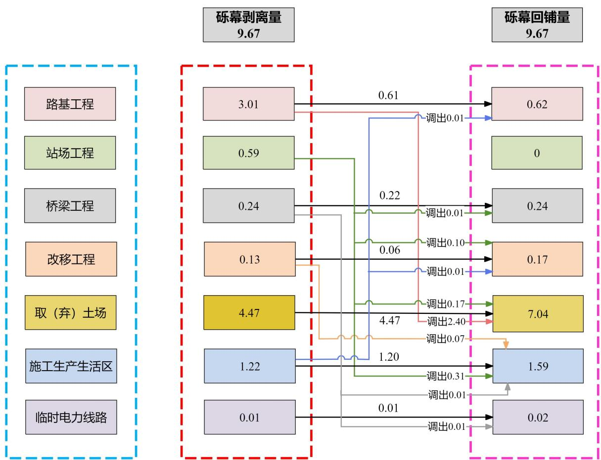  
图 2.4.3-2 砾幕平衡流向图

## 2.4.4 土石方汇总

考虑表土和砾幕剥离利用后，本项目土石方挖填总量为 $2 5 9 0 . 7 5 \ \overline { { \mathcal { H } } } \ \mathrm { m } ^ { 3 }$ ，其中挖方$6 0 0 . 2 3 \mathrm { ~ \mathscr { H } ~ m ^ { 3 } }$ (含表土剥离 $1 . 7 6 \mathrm { ~ \mathscr { ~ / ~ } ~ m ~ } ^ { 3 }$ ，砾幕剥离 $9 . 6 7 ~ \overline { { \mathcal { H } } } \mathrm { ~ m } ^ { 3 }  )$ ，填方 $1 9 9 0 . 5 2 \ \overline { { \mathcal { H } } } \ \mathrm { m } ^ { 3 }$ (含表土回覆 $1 . 7 6 \mathrm { ~ \mathscr { ~ / ~ } ~ m ~ } ^ { 3 }$ ，砾幕回覆 $9 . 6 7 ~ \overline { { \mathcal { H } } } ~ \mathrm { m } ^ { 3 } \ : )$ ，借方1591.44万 $ { \mathbf { m } } ^ { 3 } \ ( \ 1 4 0 6 . 0 7 \ \mathcal { J } \  { \mathrm { m } } ^ { 3 }$ 来自取土场， $1 8 5 . 3 7 \mathrm { ~ \mathscr ~ { ~ H ~ } ~ m ~ } ^ { 3 }$ 采用外购方式），余方201.15万 $\mathrm { m } ^ { 3 }$ (综合利用 $3 5 . 0 \mathrm { ~ } \mathcal { F } \mathrm { ~ m ~ } ^ { 3 }$ ，剩余166.15$\mathcal { F } \mathrm { ~ m } ^ { 3 }$ 清运至取（弃）土场）；利用方 $4 3 4 . 0 8 \ \mathcal { F } \ \mathrm { m } ^ { 3 }$ （移挖作填 $3 8 4 . 9 8 \mathrm { ~ \mathscr { H } ~ m } ^ { 3 }$ ，区间调配$1 4 . 1 0 \mathrm { ~ } \mathcal { F } \mathrm { ~ m } ^ { 3 }$ ，地方综合利用 $3 5 . 0 \ \mathcal { F } \ \mathrm { m } ^ { 3 } \ \mathrm { ) }$ ，工程土石方利用率72.3%。

2 项目概况

单位：万m³

<table><tr><td rowspan=2 colspan=2>项目组成</td><td rowspan=2 colspan=1>填方</td><td rowspan=2 colspan=1>挖方</td><td rowspan=2 colspan=1>移挖作填</td><td rowspan=2 colspan=1>调入</td><td rowspan=2 colspan=1>调出</td><td rowspan=1 colspan=3>借方</td><td rowspan=1 colspan=3>余方</td></tr><tr><td rowspan=1 colspan=1>小计</td><td rowspan=1 colspan=1>外购</td><td rowspan=1 colspan=1>取土场</td><td rowspan=1 colspan=1>小计</td><td rowspan=1 colspan=1>综合利用</td><td rowspan=1 colspan=1>取（弃）土场</td></tr><tr><td rowspan=3 colspan=1>路基工程</td><td rowspan=1 colspan=1>表土+砾幕剥离</td><td rowspan=1 colspan=1>0.62</td><td rowspan=1 colspan=1>3.68</td><td rowspan=1 colspan=1>0.61</td><td rowspan=1 colspan=1>0.01</td><td rowspan=1 colspan=1>3.07</td><td rowspan=1 colspan=1></td><td rowspan=1 colspan=1></td><td rowspan=1 colspan=1></td><td rowspan=1 colspan=1></td><td rowspan=1 colspan=1></td><td rowspan=1 colspan=1></td></tr><tr><td rowspan=1 colspan=1>土石方</td><td rowspan=1 colspan=1>1414.79</td><td rowspan=1 colspan=1>290.01</td><td rowspan=1 colspan=1>191.71</td><td rowspan=1 colspan=1>9.91</td><td rowspan=1 colspan=1></td><td rowspan=1 colspan=1>1213.17</td><td rowspan=1 colspan=1>23.37</td><td rowspan=1 colspan=1>1189.80</td><td rowspan=1 colspan=1>98.30</td><td rowspan=1 colspan=1>24.17</td><td rowspan=1 colspan=1>74.13</td></tr><tr><td rowspan=1 colspan=1>小计</td><td rowspan=1 colspan=1>1415.41</td><td rowspan=1 colspan=1>293.69</td><td rowspan=1 colspan=1>192.32</td><td rowspan=1 colspan=1>9.92</td><td rowspan=1 colspan=1>3.07</td><td rowspan=1 colspan=1>1213.17</td><td rowspan=1 colspan=1>23.37</td><td rowspan=1 colspan=1>1189.80</td><td rowspan=1 colspan=1>98.30</td><td rowspan=1 colspan=1>24.17</td><td rowspan=1 colspan=1>74.13</td></tr><tr><td rowspan=3 colspan=1>站场工程</td><td rowspan=1 colspan=1>表土+砾幕剥离</td><td rowspan=1 colspan=1>0.66</td><td rowspan=1 colspan=1>1.27</td><td rowspan=1 colspan=1>0.63</td><td rowspan=1 colspan=1>0.03</td><td rowspan=1 colspan=1>0.64</td><td rowspan=1 colspan=1></td><td rowspan=1 colspan=1></td><td rowspan=1 colspan=1></td><td rowspan=1 colspan=1></td><td rowspan=1 colspan=1></td><td rowspan=1 colspan=1></td></tr><tr><td rowspan=1 colspan=1>土石方</td><td rowspan=1 colspan=1>496.56</td><td rowspan=1 colspan=1>156.24</td><td rowspan=1 colspan=1>133.70</td><td rowspan=1 colspan=1></td><td rowspan=1 colspan=1></td><td rowspan=1 colspan=1>362.86</td><td rowspan=1 colspan=1>146.59</td><td rowspan=1 colspan=1>216.27</td><td rowspan=1 colspan=1>22.54</td><td rowspan=1 colspan=1>10.83</td><td rowspan=1 colspan=1>11.71</td></tr><tr><td rowspan=1 colspan=1>小计</td><td rowspan=1 colspan=1>497.22</td><td rowspan=1 colspan=1>157.51</td><td rowspan=1 colspan=1>134.33</td><td rowspan=1 colspan=1>0.03</td><td rowspan=1 colspan=1>0.64</td><td rowspan=1 colspan=1>362.86</td><td rowspan=1 colspan=1>146.59</td><td rowspan=1 colspan=1>216.27</td><td rowspan=1 colspan=1>22.54</td><td rowspan=1 colspan=1>10.83</td><td rowspan=1 colspan=1>11.71</td></tr><tr><td rowspan=3 colspan=1>桥梁工程</td><td rowspan=1 colspan=1>表土+砾幕剥离</td><td rowspan=1 colspan=1>0.23</td><td rowspan=1 colspan=1>0.55</td><td rowspan=1 colspan=1>0.22</td><td rowspan=1 colspan=1>0.01</td><td rowspan=1 colspan=1>0.33</td><td rowspan=1 colspan=1></td><td rowspan=1 colspan=1></td><td rowspan=1 colspan=1></td><td rowspan=1 colspan=1></td><td rowspan=1 colspan=1></td><td rowspan=1 colspan=1></td></tr><tr><td rowspan=1 colspan=1>土石方</td><td rowspan=1 colspan=1>24.53</td><td rowspan=1 colspan=1>55.92</td><td rowspan=1 colspan=1>24.53</td><td rowspan=1 colspan=1></td><td rowspan=1 colspan=1>9.91</td><td rowspan=1 colspan=1></td><td rowspan=1 colspan=1></td><td rowspan=1 colspan=1></td><td rowspan=1 colspan=1>21.48</td><td rowspan=1 colspan=1></td><td rowspan=1 colspan=1>21.48</td></tr><tr><td rowspan=1 colspan=1>小计</td><td rowspan=1 colspan=1>24.76</td><td rowspan=1 colspan=1>56.47</td><td rowspan=1 colspan=1>24.75</td><td rowspan=1 colspan=1>0.01</td><td rowspan=1 colspan=1>10.24</td><td rowspan=1 colspan=1></td><td rowspan=1 colspan=1></td><td rowspan=1 colspan=1></td><td rowspan=1 colspan=1>21.48</td><td rowspan=1 colspan=1></td><td rowspan=1 colspan=1>21.48</td></tr><tr><td rowspan=3 colspan=1>改移工程</td><td rowspan=1 colspan=1>表土+砾幕剥离</td><td rowspan=1 colspan=1>0.21</td><td rowspan=1 colspan=1>0.23</td><td rowspan=1 colspan=1>0.10</td><td rowspan=1 colspan=1>0.11</td><td rowspan=1 colspan=1>0.13</td><td rowspan=1 colspan=1></td><td rowspan=1 colspan=1></td><td rowspan=1 colspan=1></td><td rowspan=1 colspan=1></td><td rowspan=1 colspan=1></td><td rowspan=1 colspan=1></td></tr><tr><td rowspan=1 colspan=1>土石方</td><td rowspan=1 colspan=1>18.83</td><td rowspan=1 colspan=1>3.42</td><td rowspan=1 colspan=1>3.42</td><td rowspan=1 colspan=1></td><td rowspan=1 colspan=1></td><td rowspan=1 colspan=1>15.41</td><td rowspan=1 colspan=1>15.41</td><td rowspan=1 colspan=1></td><td rowspan=1 colspan=1></td><td rowspan=1 colspan=1></td><td rowspan=1 colspan=1></td></tr><tr><td rowspan=1 colspan=1>小计</td><td rowspan=1 colspan=1>19.04</td><td rowspan=1 colspan=1>3.65</td><td rowspan=1 colspan=1>3.52</td><td rowspan=1 colspan=1>0.11</td><td rowspan=1 colspan=1>0.13</td><td rowspan=1 colspan=1>15.41</td><td rowspan=1 colspan=1>15.41</td><td rowspan=1 colspan=1></td><td rowspan=1 colspan=1></td><td rowspan=1 colspan=1></td><td rowspan=1 colspan=1></td></tr><tr><td rowspan=3 colspan=1>取（弃）土场</td><td rowspan=1 colspan=1>表土+砾幕剥离</td><td rowspan=1 colspan=1>8.10</td><td rowspan=1 colspan=1>4.47</td><td rowspan=1 colspan=1>4.47</td><td rowspan=1 colspan=1>3.63</td><td rowspan=1 colspan=1></td><td rowspan=1 colspan=1></td><td rowspan=1 colspan=1></td><td rowspan=1 colspan=1></td><td rowspan=1 colspan=1></td><td rowspan=1 colspan=1></td><td rowspan=1 colspan=1></td></tr><tr><td rowspan=1 colspan=1>土石方</td><td rowspan=1 colspan=1></td><td rowspan=1 colspan=1>58.83</td><td rowspan=1 colspan=1></td><td rowspan=1 colspan=1></td><td rowspan=1 colspan=1></td><td rowspan=1 colspan=1></td><td rowspan=1 colspan=1></td><td rowspan=1 colspan=1></td><td rowspan=1 colspan=1>58.83</td><td rowspan=1 colspan=1></td><td rowspan=1 colspan=1>58.83</td></tr><tr><td rowspan=1 colspan=1>小计</td><td rowspan=1 colspan=1>8.10</td><td rowspan=1 colspan=1>63.30</td><td rowspan=1 colspan=1>4.47</td><td rowspan=1 colspan=1>3.63</td><td rowspan=1 colspan=1></td><td rowspan=1 colspan=1></td><td rowspan=1 colspan=1></td><td rowspan=1 colspan=1></td><td rowspan=1 colspan=1>58.83</td><td rowspan=1 colspan=1></td><td rowspan=1 colspan=1>58.83</td></tr><tr><td rowspan=3 colspan=1>施工生产生活区</td><td rowspan=1 colspan=1>表土+砾幕剥离</td><td rowspan=1 colspan=1>1.59</td><td rowspan=1 colspan=1>1.22</td><td rowspan=1 colspan=1>1.20</td><td rowspan=1 colspan=1>0.39</td><td rowspan=1 colspan=1>0.02</td><td rowspan=1 colspan=1></td><td rowspan=1 colspan=1></td><td rowspan=1 colspan=1></td><td rowspan=1 colspan=1></td><td rowspan=1 colspan=1></td><td rowspan=1 colspan=1></td></tr><tr><td rowspan=1 colspan=1>土石方</td><td rowspan=1 colspan=1>6.47</td><td rowspan=1 colspan=1>6.47</td><td rowspan=1 colspan=1>6.47</td><td rowspan=1 colspan=1></td><td rowspan=1 colspan=1></td><td rowspan=1 colspan=1></td><td rowspan=1 colspan=1></td><td rowspan=1 colspan=1></td><td rowspan=1 colspan=1></td><td rowspan=1 colspan=1></td><td rowspan=1 colspan=1></td></tr><tr><td rowspan=1 colspan=1>小计</td><td rowspan=1 colspan=1>8.06</td><td rowspan=1 colspan=1>7.69</td><td rowspan=1 colspan=1>7.67</td><td rowspan=1 colspan=1>0.39</td><td rowspan=1 colspan=1>0.02</td><td rowspan=1 colspan=1></td><td rowspan=1 colspan=1></td><td rowspan=1 colspan=1></td><td rowspan=1 colspan=1></td><td rowspan=1 colspan=1></td><td rowspan=1 colspan=1></td></tr><tr><td rowspan=3 colspan=1>临时电力线路</td><td rowspan=1 colspan=1>表土+砾幕剥离</td><td rowspan=1 colspan=1>0.02</td><td rowspan=1 colspan=1>0.01</td><td rowspan=1 colspan=1>0.01</td><td rowspan=1 colspan=1>0.01</td><td rowspan=1 colspan=1></td><td rowspan=1 colspan=1></td><td rowspan=1 colspan=1></td><td rowspan=1 colspan=1></td><td rowspan=1 colspan=1></td><td rowspan=1 colspan=1></td><td rowspan=1 colspan=1></td></tr><tr><td rowspan=1 colspan=1>土石方</td><td rowspan=1 colspan=1>3.17</td><td rowspan=1 colspan=1>3.17</td><td rowspan=1 colspan=1>3.17</td><td rowspan=1 colspan=1></td><td rowspan=1 colspan=1></td><td rowspan=1 colspan=1></td><td rowspan=1 colspan=1></td><td rowspan=1 colspan=1></td><td rowspan=1 colspan=1></td><td rowspan=1 colspan=1></td><td rowspan=1 colspan=1></td></tr><tr><td rowspan=1 colspan=1>小计</td><td rowspan=1 colspan=1>3.19</td><td rowspan=1 colspan=1>3.18</td><td rowspan=1 colspan=1>3.18</td><td rowspan=1 colspan=1>0.01</td><td rowspan=1 colspan=1></td><td rowspan=1 colspan=1></td><td rowspan=1 colspan=1></td><td rowspan=1 colspan=1></td><td rowspan=1 colspan=1></td><td rowspan=1 colspan=1></td><td rowspan=1 colspan=1></td></tr><tr><td rowspan=2 colspan=1>施工便道</td><td rowspan=1 colspan=1>土石方</td><td rowspan=1 colspan=1>14.74</td><td rowspan=1 colspan=1>14.74</td><td rowspan=1 colspan=1>14.74</td><td rowspan=1 colspan=1></td><td rowspan=1 colspan=1></td><td rowspan=1 colspan=1></td><td rowspan=1 colspan=1></td><td rowspan=1 colspan=1></td><td rowspan=1 colspan=1></td><td rowspan=1 colspan=1></td><td rowspan=1 colspan=1></td></tr><tr><td rowspan=1 colspan=1>小计</td><td rowspan=1 colspan=1>14.74</td><td rowspan=1 colspan=1>14.74</td><td rowspan=1 colspan=1>14.74</td><td rowspan=1 colspan=1></td><td rowspan=1 colspan=1></td><td rowspan=1 colspan=1></td><td rowspan=1 colspan=1></td><td rowspan=1 colspan=1></td><td rowspan=1 colspan=1></td><td rowspan=1 colspan=1></td><td rowspan=1 colspan=1></td></tr><tr><td rowspan=3 colspan=1>合计</td><td rowspan=1 colspan=1>表土+砾幕剥离</td><td rowspan=1 colspan=1>11.43</td><td rowspan=1 colspan=1>11.43</td><td rowspan=1 colspan=1>7.24</td><td rowspan=1 colspan=1>4.19</td><td rowspan=1 colspan=1>4.19</td><td rowspan=1 colspan=1></td><td rowspan=1 colspan=1></td><td rowspan=1 colspan=1></td><td rowspan=1 colspan=1></td><td rowspan=1 colspan=1></td><td rowspan=1 colspan=1></td></tr><tr><td rowspan=1 colspan=1>土石方</td><td rowspan=1 colspan=1>1979.09</td><td rowspan=1 colspan=1>588.80</td><td rowspan=1 colspan=1>377.74</td><td rowspan=1 colspan=1>9.91</td><td rowspan=1 colspan=1>9.91</td><td rowspan=1 colspan=1>1591.44</td><td rowspan=1 colspan=1>185.37</td><td rowspan=1 colspan=1>1406.07</td><td rowspan=1 colspan=1>201.15</td><td rowspan=1 colspan=1>35.00</td><td rowspan=1 colspan=1>166.15</td></tr><tr><td rowspan=1 colspan=1>合计</td><td rowspan=1 colspan=1>1990.52</td><td rowspan=1 colspan=1>600.23</td><td rowspan=1 colspan=1>384.98</td><td rowspan=1 colspan=1>14.10</td><td rowspan=1 colspan=1>14.10</td><td rowspan=1 colspan=1>1591.44</td><td rowspan=1 colspan=1>185.37</td><td rowspan=1 colspan=1>1406.07</td><td rowspan=1 colspan=1>201.15</td><td rowspan=1 colspan=1>35.00</td><td rowspan=1 colspan=1>166.15</td></tr></table>

## 2.5拆迁（移民）安置与专项设施改（迁）建

## 2.5.1拆迁（移民）安置

全线共涉及建筑物拆迁面积8314m²，拆迁安置采取货币补偿机制，由当地政府统一安排，安置区域水土流失防治责任不纳入本方案防治责任范围。

## 2.5.2专项设施改（迁）建

全线涉及改移道路156处，其中改移公路1处，改移长度1.03km，路面材料为沥青混凝土；改移乡村道路155处，改移长度127.34km，路面材料为碎石路。主要技术标准不低于原道路标准；改移道路全长128.37km，占地面积78.20hm²。改移道路产生的弃土、建筑垃圾纳入本方案取（弃）土场统一处置。具体情况详见2.1.7改移工程章节。

## 2.6 施工进度

本项目计划于2026年1月开工，2028年6月完工，总工期30个月；项目区地处我国寒冷地区，冬歇期为每年10月中旬至次年3月中旬。施工进度横道图详见图2.6-1。

（1）施工准备期3个月；

（2）路基、桥涵、桥梁下部及特殊梁在满足架梁的前提下采用流水作业，施工工期11个月；

（3）按照“三同时”原则，风沙防护与路基工程施工进度一致，施工工期11个月；

（4）随工程建设进度，铺轨工程动态工期11个月；

（5）站后配套工程（通信、信号、电力、电气化及设备安装调试）随铺架进度适时展开，工期3个月；

（6）动态检测及试运行2个月。

<table><tr><td rowspan=2 colspan=1>序号</td><td rowspan=2 colspan=1>项目名称</td><td rowspan=1 colspan=4>2026年</td><td rowspan=1 colspan=4>2027年</td><td rowspan=1 colspan=2>2028年</td></tr><tr><td rowspan=1 colspan=1>Q1</td><td rowspan=1 colspan=1>Q2</td><td rowspan=1 colspan=1>Q3</td><td rowspan=1 colspan=1>Q4</td><td rowspan=1 colspan=1>Q1</td><td rowspan=1 colspan=1>Q2</td><td rowspan=1 colspan=1>Q3</td><td rowspan=1 colspan=1>Q4</td><td rowspan=1 colspan=1>Q1</td><td rowspan=1 colspan=1>Q2</td></tr><tr><td rowspan=1 colspan=1>1</td><td rowspan=1 colspan=1>第一年冬歇期</td><td rowspan=1 colspan=10></td></tr><tr><td rowspan=1 colspan=1>2</td><td rowspan=1 colspan=1>第二年冬歇期</td><td rowspan=1 colspan=10></td></tr><tr><td rowspan=1 colspan=1>3</td><td rowspan=1 colspan=1>第三年冬歇期</td><td rowspan=1 colspan=10></td></tr><tr><td rowspan=1 colspan=1>4</td><td rowspan=1 colspan=1>施工准备期</td><td rowspan=1 colspan=10></td></tr><tr><td rowspan=1 colspan=1>5</td><td rowspan=1 colspan=1>路基工程</td><td rowspan=1 colspan=10></td></tr><tr><td rowspan=1 colspan=1>6</td><td rowspan=1 colspan=1>风沙防护工程</td><td rowspan=5 colspan=10></td></tr><tr><td rowspan=1 colspan=1>7</td><td rowspan=1 colspan=1>桥梁工程</td></tr><tr><td rowspan=1 colspan=1>8</td><td rowspan=1 colspan=1>铺轨工程</td></tr><tr><td rowspan=1 colspan=1>9</td><td rowspan=1 colspan=1>站后配套工程</td></tr><tr><td rowspan=1 colspan=1>10</td><td rowspan=1 colspan=1>联调联试</td></tr></table>

图 2.6-1 施工进度横道图

## 2.7 自然概况

## 2.7.1 地形地貌

项目区地貌类型划分为平原微丘区和山岭重丘区。

（1）平原微丘区线路长度 344.28km（DK685+200\~DK796+000、DK1091+800\~DK1325+100），包括额济纳河冲洪积平原区（DK685+200\~DK796+000）、北山剥蚀准平原区（DK1091+800\~DK1207+500）、山前洪积倾斜砾质平原区（DK1207+500\~DK1286+400）、哈密盆地中部冲、洪积土质平原区(DK1286+400\~DK1325+100)。

## 1）额济纳河冲洪积平原区（DK685+200\~DK796+000）

地形平坦、开阔，总体地势由南向北倾斜，地面高程940\~1100m，在其表面上分布有近南北向的古河道，河道宽500\~1000m，切割深度不大。沿古河道生长着胡杨、沙枣树和芦苇，以及较矮的红柳及梭梭，常有固定、半固定的沙丘地分布，呈荒漠景观。

## 2）北山剥蚀准平原区（DK1091+800\~DK1207+500）

海拔一般在1150\~1550m之间，相对高差5\~50m以内，沿线路走向总体呈东高西低，地表风化剥蚀严重，地势平缓，冲沟切割不深，基岩裸露或浅藏于地表细圆砾土之下。基岩裸露处基岩表面风化强烈，多为碎石状。植被主要生长在沟谷洼地主要为梭梭、骆驼刺，地表植被覆盖率一般在15%\~30%之间。

3）山前洪积倾斜砾质平原区（DK1207+500\~DK1286+400）

## （2）地层岩性

沿线地层分布受地质构造的控制，新生界、中生界、古生界、都有出露，并有华力西期岩浆岩侵入体。沉积岩，变质岩，岩浆岩三大岩类均有分布。

沉积岩主要有二叠纪、侏罗纪、第三纪的地层，沿线分布在山前丘陵区，岩性主要为砂岩、泥岩、炭质泥岩、炭质页岩等；变质岩主要为石炭系片岩、板岩等，多见于内蒙古高原剥蚀丘陵区和北山剥蚀准平原区。华力西期岩浆岩，主要受断裂构造的控制，一般沿断裂呈东西走向分布，岩性主要为花岗岩。

新生代地层主要分布于额济纳河冲、洪积平原、山前洪积倾斜砾质平原、哈密盆地中部冲、洪积土质平原区及剥蚀丘陵区及剥蚀准平原的洼地、沟谷地带。岩性主要为黏性土、砂类土、粗、细圆砾土及中新统泥岩、砾岩和砂岩。

## （3）不良地质和特殊岩土

## 1）不良地质

沿线不良地质现象主要有风沙、风蚀及人为坑洞等。

## ①风沙

风沙是本线的主要不良地质现象，线路中央戈壁荒漠区展布，大部分地段属于半荒漠、荒漠地区，植被稀少，受气候条件的影响，遇风即就地起沙。沿线风沙主要表现为风沙流和风蚀，局部分布半固定沙地、半固定沙丘及沙垄等地貌，风沙对既有线危害程度轻微\~中等。

## ②风蚀

在风力作用下，部分地表细颗粒土被风蚀搬运，使表层残留2\~5cm厚中粗砂薄层，在局部地表或沙丘迎风侧可见有吹蚀槽痕，建议路堤工程采取防风蚀措施。

## ③人为坑洞

本段人为坑洞主要为坎儿井。线路在DK1285+245以简支梁跨越坎儿井，顶板主要为中密砾砂或硬塑状态的粉质黏土，洞壁稳定直立，建造数百年后仍然可使用，但在铁路路基荷载和机车动荷载的作用下很难保持稳定。

## 2）特殊岩土

沿线特殊岩土有膨胀土（岩）、软土、盐渍土、人工填土等。

## ①膨胀土（岩）

沿线分布的新近系泥岩、侏罗系泥岩为膨胀岩，膨胀土（岩）的主要特性是遇水软化易崩解，失水后收缩开裂，其特性对路堑边坡及建筑物的基底有一定影响。对于路堑边坡的膨胀岩土应放缓边坡及加强坡面防护措施，还应加强排水以防止地表水下渗导致岩土体膨胀，同时严格封闭建筑物基底地层，避免蒸发失水引起膨胀岩土干裂收缩。路

基基底位于膨胀岩中时，须进行换填处理。

## ②软土

线路通过软土地段共200m（DK1298+600\~DK1298+800），主要以透镜体状分布在哈密盆地冲、洪积土质平原区。根据钻探、静力触探及土工试验结果，本段软土为软塑粉质黏土，层厚2.0\~5.0m。

## ③盐渍土

沿线盐渍土平面广泛分布，垂向分布深度不一，主要分布于额济纳河冲洪积平原区、哈密盆地土质平原区。沿线盐渍土分布段落长176.540km。主要类型为：弱-中氯盐渍土、弱-中硫酸盐渍土、中亚氯盐渍土、中亚硫酸盐渍土。粗颗粒盐渍土呈广泛而不连续状分布于第四系冲洪积碎石类土、砂类土0\~2m范围内。一般厚度0.1\~0.5m，局部厚达1m。含盐成分主要为芒硝和石膏；对混凝土结构具有侵蚀性，建议清除换填。

表 2.7.2-1 沿线盐渍土分布段落一览表
<table><tr><td colspan="1" rowspan="1">序号</td><td colspan="1" rowspan="1">起始里程</td><td colspan="1" rowspan="1">终止里程</td><td colspan="1" rowspan="1">长度(m)</td><td colspan="1" rowspan="1">特殊岩土类型</td><td colspan="1" rowspan="1">工程地质特征</td></tr><tr><td colspan="1" rowspan="1">1</td><td colspan="1" rowspan="1">DK685+200</td><td colspan="1" rowspan="1">DK702+650</td><td colspan="1" rowspan="1">17450</td><td colspan="1" rowspan="1">亚硫酸盐渍土、硫酸盐渍土、氯盐渍土</td><td colspan="1" rowspan="1">易溶盐平均含量约0.55%，盐渍化程度弱～中。</td></tr><tr><td colspan="1" rowspan="1">2</td><td colspan="1" rowspan="1">DK703+123</td><td colspan="1" rowspan="1">DK704+323</td><td colspan="1" rowspan="1">1200</td><td colspan="1" rowspan="1">亚硫酸盐渍土、硫酸盐渍土</td><td colspan="1" rowspan="1">易溶盐平均含量约 0.62%，盐渍化程度中。</td></tr><tr><td colspan="1" rowspan="1">3</td><td colspan="1" rowspan="1">DK704+323</td><td colspan="1" rowspan="1">DK705+073</td><td colspan="1" rowspan="1">750</td><td colspan="1" rowspan="1">亚硫酸盐渍土</td><td colspan="1" rowspan="1">易溶盐平均含量约 0.53%，盐渍化程度中。</td></tr><tr><td colspan="1" rowspan="1">4</td><td colspan="1" rowspan="1">DK710+273</td><td colspan="1" rowspan="1">DK711+923</td><td colspan="1" rowspan="1">1650</td><td colspan="1" rowspan="1">亚硫酸盐渍土、硫酸盐渍土、亚氯盐渍土</td><td colspan="1" rowspan="1">易溶盐平均含量约1.24%，盐渍化程度中。</td></tr><tr><td colspan="1" rowspan="1">5</td><td colspan="1" rowspan="1">DK714+351</td><td colspan="1" rowspan="1">DK714+823</td><td colspan="1" rowspan="1">472</td><td colspan="1" rowspan="1">亚硫酸盐渍土、氯盐渍土</td><td colspan="1" rowspan="1">易溶盐平均含量约 0.61%，盐渍化程度弱～中。</td></tr><tr><td colspan="1" rowspan="1">6</td><td colspan="1" rowspan="1">DK715+323</td><td colspan="1" rowspan="1">DK715+388</td><td colspan="1" rowspan="1">65</td><td colspan="1" rowspan="1">亚硫酸盐渍土、亚氯盐渍土</td><td colspan="1" rowspan="1">易溶盐平均含量约 0.8%，盐渍化程度弱~中。</td></tr><tr><td colspan="1" rowspan="1">7</td><td colspan="1" rowspan="1">DK715+496</td><td colspan="1" rowspan="1">DK715+704</td><td colspan="1" rowspan="1">208</td><td colspan="1" rowspan="1">亚硫酸盐渍土、亚氯盐渍土</td><td colspan="1" rowspan="1">易溶盐平均含量约 0.8%，盐渍化程度弱～中。</td></tr><tr><td colspan="1" rowspan="1">8</td><td colspan="1" rowspan="1">DK715+731</td><td colspan="1" rowspan="1">DK715+823</td><td colspan="1" rowspan="1">92</td><td colspan="1" rowspan="1">亚硫酸盐渍土、亚氯盐渍土</td><td colspan="1" rowspan="1">易溶盐平均含量约 0.8%，盐渍化程度弱～中。</td></tr><tr><td colspan="1" rowspan="1">9</td><td colspan="1" rowspan="1">DK716+923</td><td colspan="1" rowspan="1">DK717+623</td><td colspan="1" rowspan="1">700</td><td colspan="1" rowspan="1">亚硫酸盐渍土、硫酸盐渍土、亚氯盐渍土</td><td colspan="1" rowspan="1">易溶盐平均含量约0.45%，盐渍化程度弱～中。</td></tr><tr><td colspan="1" rowspan="1">10</td><td colspan="1" rowspan="1">DK720+023</td><td colspan="1" rowspan="1">DK720+423</td><td colspan="1" rowspan="1">400</td><td colspan="1" rowspan="1">硫酸盐渍土</td><td colspan="1" rowspan="1">易溶盐平均含量约 0.72%，盐渍化程度中。</td></tr><tr><td colspan="1" rowspan="1">11</td><td colspan="1" rowspan="1">DK728+423</td><td colspan="1" rowspan="1">DK729+323</td><td colspan="1" rowspan="1">900</td><td colspan="1" rowspan="1">亚硫酸盐渍土、硫酸盐渍土</td><td colspan="1" rowspan="1">易溶盐平均含量约 0.59%，盐渍化程度中。</td></tr><tr><td colspan="1" rowspan="1">12</td><td colspan="1" rowspan="1">DK729+323</td><td colspan="1" rowspan="1">DK730+223</td><td colspan="1" rowspan="1">900</td><td colspan="1" rowspan="1">亚硫酸盐渍土、硫酸盐渍土、氯盐渍土、亚氯盐渍土</td><td colspan="1" rowspan="1">易溶盐平均含量约1.18%，盐渍化程度中。</td></tr><tr><td colspan="1" rowspan="1">13</td><td colspan="1" rowspan="1">DK733+523</td><td colspan="1" rowspan="1">DK734+323</td><td colspan="1" rowspan="1">800</td><td colspan="1" rowspan="1">亚硫酸盐渍土、氯盐渍土、亚氯盐渍土</td><td colspan="1" rowspan="1">易溶盐平均含量约1.18%，盐渍化程度中。</td></tr><tr><td colspan="1" rowspan="1">14</td><td colspan="1" rowspan="1">DK736+023</td><td colspan="1" rowspan="1">DK736+423</td><td colspan="1" rowspan="1">400</td><td colspan="1" rowspan="1">亚硫酸盐渍土、氯盐渍土、亚氯盐渍土</td><td colspan="1" rowspan="1">易溶盐平均含量约 1.22%，盐渍化程度中。</td></tr><tr><td colspan="1" rowspan="1">15</td><td colspan="1" rowspan="1">DK740+373</td><td colspan="1" rowspan="1">DK741+173</td><td colspan="1" rowspan="1">800</td><td colspan="1" rowspan="1">亚硫酸盐渍土、硫酸盐渍土、氯盐渍土</td><td colspan="1" rowspan="1">易溶盐平均含量约0.66%，盐渍化程度弱～中。</td></tr><tr><td colspan="1" rowspan="1">16</td><td colspan="1" rowspan="1">DK745+123</td><td colspan="1" rowspan="1">DK745+153</td><td colspan="1" rowspan="1">30</td><td colspan="1" rowspan="1">亚硫酸盐渍土、硫酸盐渍土</td><td colspan="1" rowspan="1">易溶盐平均含量约 0.54%，盐渍化程度中。</td></tr><tr><td colspan="1" rowspan="1">17</td><td colspan="1" rowspan="1">DK745+153</td><td colspan="1" rowspan="1">DK745+323</td><td colspan="1" rowspan="1">170</td><td colspan="1" rowspan="1">亚硫酸盐渍土、硫酸盐渍土</td><td colspan="1" rowspan="1">易溶盐平均含量约 0.54%，盐渍化程度中。</td></tr><tr><td colspan="1" rowspan="1">18</td><td colspan="1" rowspan="1">DK746+953</td><td colspan="1" rowspan="1">DK747+423</td><td colspan="1" rowspan="1">470</td><td colspan="1" rowspan="1">亚硫酸盐渍土、亚氯盐渍土氯盐渍土</td><td colspan="1" rowspan="1">、易溶盐平均含量约1.22%，盐渍化程度中。</td></tr><tr><td colspan="1" rowspan="1">19</td><td colspan="1" rowspan="1">DK752+823</td><td colspan="1" rowspan="1">DK753+073</td><td colspan="1" rowspan="1">250</td><td colspan="1" rowspan="1">亚硫酸盐渍土、硫酸盐渍土</td><td colspan="1" rowspan="1">易溶盐平均含量约 0.66%，盐渍化程度中。</td></tr><tr><td colspan="1" rowspan="1">20</td><td colspan="1" rowspan="1">DK753+073</td><td colspan="1" rowspan="1">DK753+783</td><td colspan="1" rowspan="1">710</td><td colspan="1" rowspan="1">亚硫酸盐渍土、氯盐渍土、亚氯盐渍土</td><td colspan="1" rowspan="1">易溶盐平均含量约 1.575%，盐渍化程度中。</td></tr><tr><td colspan="1" rowspan="1">21</td><td colspan="1" rowspan="1">DK760+050</td><td colspan="1" rowspan="1">DK760+950</td><td colspan="1" rowspan="1">900</td><td colspan="1" rowspan="1">亚硫酸盐渍土</td><td colspan="1" rowspan="1">易溶盐平均含量约 0.39%，盐渍化程度中。</td></tr><tr><td colspan="1" rowspan="1">22</td><td colspan="1" rowspan="1">DK763+223</td><td colspan="1" rowspan="1">DK764+023</td><td colspan="1" rowspan="1">800</td><td colspan="1" rowspan="1">亚硫酸盐渍土</td><td colspan="1" rowspan="1">易溶盐平均含量约 0.80%，盐渍化程度中。</td></tr><tr><td colspan="1" rowspan="1">23</td><td colspan="1" rowspan="1">DK766+493</td><td colspan="1" rowspan="1">DK766+703</td><td colspan="1" rowspan="1">210</td><td colspan="1" rowspan="1">亚硫酸盐渍土、氯盐渍土、亚氯盐渍土</td><td colspan="1" rowspan="1">易溶盐平均含量约 1.26%，盐渍化程度中。</td></tr><tr><td colspan="1" rowspan="1">24</td><td colspan="1" rowspan="1">DK766+703</td><td colspan="1" rowspan="1">DK766+903</td><td colspan="1" rowspan="1">200</td><td colspan="1" rowspan="1">亚硫酸盐渍土、氯盐渍土、亚氯盐渍土</td><td colspan="1" rowspan="1">易溶盐平均含量约 0.96%，盐渍化程度弱~中。</td></tr><tr><td colspan="1" rowspan="1">25</td><td colspan="1" rowspan="1">DK768+900</td><td colspan="1" rowspan="1">DK769+200</td><td colspan="1" rowspan="1">300</td><td colspan="1" rowspan="1">硫酸盐渍土、亚氯盐渍土</td><td colspan="1" rowspan="1">易溶盐平均含量约 0.38%，盐渍化程度弱~中。</td></tr><tr><td colspan="1" rowspan="1">26</td><td colspan="1" rowspan="1">DK771+723</td><td colspan="1" rowspan="1">DK772+523</td><td colspan="1" rowspan="1">800</td><td colspan="1" rowspan="1">亚硫酸盐渍土、亚氯盐渍土</td><td colspan="1" rowspan="1">易溶盐平均含量约 0.95%，盐渍化程度弱~中。</td></tr><tr><td colspan="1" rowspan="1">27</td><td colspan="1" rowspan="1">DK775+823</td><td colspan="1" rowspan="1">DK775+993</td><td colspan="1" rowspan="1">170</td><td colspan="1" rowspan="1">氯盐渍土</td><td colspan="1" rowspan="1">易溶盐平均含量约 1.53%，盐渍化程度中。</td></tr><tr><td colspan="1" rowspan="1">28</td><td colspan="1" rowspan="1">DK789+323</td><td colspan="1" rowspan="1">DK789+423</td><td colspan="1" rowspan="1">100</td><td colspan="1" rowspan="1">亚硫酸盐渍土</td><td colspan="1" rowspan="1">易溶盐平均含量约 0.8%，盐渍化程度中。</td></tr><tr><td colspan="1" rowspan="1">29</td><td colspan="1" rowspan="1">DK791+800</td><td colspan="1" rowspan="1">DK792+500</td><td colspan="1" rowspan="1">700</td><td colspan="1" rowspan="1">亚硫酸盐渍土</td><td colspan="1" rowspan="1">易溶盐平均含量约 0.3%，盐渍化程度中。</td></tr><tr><td colspan="1" rowspan="1">30</td><td colspan="1" rowspan="1">DK795+913</td><td colspan="1" rowspan="1">DK796+103</td><td colspan="1" rowspan="1">190</td><td colspan="1" rowspan="1">亚硫酸盐渍土</td><td colspan="1" rowspan="1">易溶盐平均含量约1.0%，盐渍化程度中。</td></tr><tr><td colspan="1" rowspan="1">31</td><td colspan="1" rowspan="1">DK797+193</td><td colspan="1" rowspan="1">DK797+823</td><td colspan="1" rowspan="1">630</td><td colspan="1" rowspan="1">亚硫酸盐渍土、硫酸盐渍土</td><td colspan="1" rowspan="1">易溶盐平均含量约0.5%，盐渍化程度中。</td></tr><tr><td colspan="1" rowspan="1">32</td><td colspan="1" rowspan="1">DK798+483</td><td colspan="1" rowspan="1">DK798+703</td><td colspan="1" rowspan="1">220</td><td colspan="1" rowspan="1">硫酸盐渍土</td><td colspan="1" rowspan="1">易溶盐平均含量约 0.57%，盐渍化程度中。</td></tr><tr><td colspan="1" rowspan="1">33</td><td colspan="1" rowspan="1">DK799+553</td><td colspan="1" rowspan="1">DK799+623</td><td colspan="1" rowspan="1">70</td><td colspan="1" rowspan="1">硫酸盐渍土</td><td colspan="1" rowspan="1">易溶盐平均含量约 0.41%，盐渍化程度中。</td></tr><tr><td colspan="1" rowspan="1">34</td><td colspan="1" rowspan="1">DK800+033</td><td colspan="1" rowspan="1">DK800+253</td><td colspan="1" rowspan="1">220</td><td colspan="1" rowspan="1">硫酸盐渍土</td><td colspan="1" rowspan="1">易溶盐平均含量约 0.53%，盐渍化程度中。</td></tr><tr><td colspan="1" rowspan="1">35</td><td colspan="1" rowspan="1">DK800+673</td><td colspan="1" rowspan="1">DK800+833</td><td colspan="1" rowspan="1">160</td><td colspan="1" rowspan="1">氯盐渍土</td><td colspan="1" rowspan="1">易溶盐平均含量约2.41%，盐渍化程度中。</td></tr><tr><td colspan="1" rowspan="1">36</td><td colspan="1" rowspan="1">DK801+229</td><td colspan="1" rowspan="1">DK801+323</td><td colspan="1" rowspan="1">94</td><td colspan="1" rowspan="1">亚硫酸盐渍土</td><td colspan="1" rowspan="1">易溶盐平均含量约 0.75%，盐渍化程度中。</td></tr><tr><td colspan="1" rowspan="1">37</td><td colspan="1" rowspan="1">DK801+473</td><td colspan="1" rowspan="1">DK801+533</td><td colspan="1" rowspan="1">60</td><td colspan="1" rowspan="1">亚硫酸盐渍土</td><td colspan="1" rowspan="1">易溶盐平均含量约 0.76%，盐渍化程度中。</td></tr><tr><td colspan="1" rowspan="1">38</td><td colspan="1" rowspan="1">DK802+000</td><td colspan="1" rowspan="1">DK802+600</td><td colspan="1" rowspan="1">600</td><td colspan="1" rowspan="1">亚硫酸盐渍土、硫酸盐渍土亚氯盐渍土</td><td colspan="1" rowspan="1">、易溶盐平均含量约0.53%，盐渍化程度弱～中。</td></tr><tr><td colspan="1" rowspan="1">39</td><td colspan="1" rowspan="1">DK804+323</td><td colspan="1" rowspan="1">DK804+368</td><td colspan="1" rowspan="1">45</td><td colspan="1" rowspan="1">氯盐渍土、亚硫酸盐渍土</td><td colspan="1" rowspan="1">易溶盐平均含量约 1.77%，盐渍化程度中。</td></tr><tr><td colspan="1" rowspan="1">40</td><td colspan="1" rowspan="1">DK804+923</td><td colspan="1" rowspan="1">DK805+153</td><td colspan="1" rowspan="1">230</td><td colspan="1" rowspan="1">亚硫酸盐渍土</td><td colspan="1" rowspan="1">易溶盐平均含量约1.275%，盐渍化</td></tr></table>

<table><tr><td colspan="1" rowspan="1">序号</td><td colspan="1" rowspan="1">起始里程</td><td colspan="1" rowspan="1">终止里程</td><td colspan="1" rowspan="1">长度(m)</td><td colspan="1" rowspan="1">特殊岩土类型</td><td colspan="1" rowspan="1">工程地质特征</td></tr><tr><td colspan="1" rowspan="1"></td><td colspan="1" rowspan="1"></td><td colspan="1" rowspan="1"></td><td colspan="1" rowspan="1"></td><td colspan="1" rowspan="1"></td><td colspan="1" rowspan="1">程度中。</td></tr><tr><td colspan="1" rowspan="1">41</td><td colspan="1" rowspan="1">DK805+293</td><td colspan="1" rowspan="1">DK805+383</td><td colspan="1" rowspan="1">90</td><td colspan="1" rowspan="1">亚硫酸盐渍土</td><td colspan="1" rowspan="1">易溶盐平均含量约1.21%，盐渍化程度中。</td></tr><tr><td colspan="1" rowspan="1">42</td><td colspan="1" rowspan="1">DK806+000</td><td colspan="1" rowspan="1">DK807+000</td><td colspan="1" rowspan="1">1000</td><td colspan="1" rowspan="1">亚硫酸盐渍土、硫酸盐渍土</td><td colspan="1" rowspan="1">易溶盐平均含量约0.878%，盐渍化程度中。</td></tr><tr><td colspan="1" rowspan="1">43</td><td colspan="1" rowspan="1">DK807+200</td><td colspan="1" rowspan="1">DK807+800</td><td colspan="1" rowspan="1">600</td><td colspan="1" rowspan="1">亚硫酸盐渍土、硫酸盐渍土亚氯盐渍土</td><td colspan="1" rowspan="1">、易溶盐平均含量约0.56%，盐渍化程度弱~中。</td></tr><tr><td colspan="1" rowspan="1">44</td><td colspan="1" rowspan="1">DK811+203</td><td colspan="1" rowspan="1">DK811+863</td><td colspan="1" rowspan="1">660</td><td colspan="1" rowspan="1">亚硫酸盐渍土、硫酸盐渍土亚氯盐渍土</td><td colspan="1" rowspan="1">、易溶盐平均含量约0.63%，盐渍化程度弱~中。</td></tr><tr><td colspan="1" rowspan="1">45</td><td colspan="1" rowspan="1">DK812+253</td><td colspan="1" rowspan="1">DK812+573</td><td colspan="1" rowspan="1">320</td><td colspan="1" rowspan="1">硫酸盐渍土、氯盐渍土</td><td colspan="1" rowspan="1">易溶盐平均含量约2.91%，盐渍化程度中~强。</td></tr><tr><td colspan="1" rowspan="1">46</td><td colspan="1" rowspan="1">DK812+606</td><td colspan="1" rowspan="1">DK813+693</td><td colspan="1" rowspan="1">1087</td><td colspan="1" rowspan="1">亚氯盐渍土</td><td colspan="1" rowspan="1">易溶盐平均含量约0.4%，盐渍化程度弱。</td></tr><tr><td colspan="1" rowspan="1">47</td><td colspan="1" rowspan="1">DK814+293</td><td colspan="1" rowspan="1">DK814+393</td><td colspan="1" rowspan="1">100</td><td colspan="1" rowspan="1">亚氯盐渍土、氯盐渍土</td><td colspan="1" rowspan="1">易溶盐平均含量约 0.61%，盐渍化程度弱。</td></tr><tr><td colspan="1" rowspan="1">48</td><td colspan="1" rowspan="1">DK815+123</td><td colspan="1" rowspan="1">DK815+453</td><td colspan="1" rowspan="1">330</td><td colspan="1" rowspan="1">亚硫酸盐渍土、硫酸盐渍土</td><td colspan="1" rowspan="1">易溶盐平均含量约 0.53%，盐渍化程度中。</td></tr><tr><td colspan="1" rowspan="1">49</td><td colspan="1" rowspan="1">DK815+523</td><td colspan="1" rowspan="1">DK816+153</td><td colspan="1" rowspan="1">630</td><td colspan="1" rowspan="1">亚硫酸盐渍土、硫酸盐渍土亚氯盐渍土</td><td colspan="1" rowspan="1">、易溶盐平均含量约0.60%，盐渍化程度弱~中。</td></tr><tr><td colspan="1" rowspan="1">50</td><td colspan="1" rowspan="1">DK818+665</td><td colspan="1" rowspan="1">DK818+679</td><td colspan="1" rowspan="1">14</td><td colspan="1" rowspan="1">硫酸盐渍土</td><td colspan="1" rowspan="1">易溶盐平均含量约 0.65%，盐渍化程度弱～中。</td></tr><tr><td colspan="1" rowspan="1">51</td><td colspan="1" rowspan="1">DK823+858</td><td colspan="1" rowspan="1">DK823+913</td><td colspan="1" rowspan="1">55</td><td colspan="1" rowspan="1">亚硫酸盐渍土</td><td colspan="1" rowspan="1">易溶盐平均含量约 0.63%，盐渍化程度中。</td></tr><tr><td colspan="1" rowspan="1">52</td><td colspan="1" rowspan="1">DK827+023</td><td colspan="1" rowspan="1">DK827+093</td><td colspan="1" rowspan="1">70</td><td colspan="1" rowspan="1">亚硫酸盐渍土</td><td colspan="1" rowspan="1">易溶盐平均含量约 0.37%，盐渍化程度中。</td></tr><tr><td colspan="1" rowspan="1">53</td><td colspan="1" rowspan="1">DK827+363</td><td colspan="1" rowspan="1">DK827+523</td><td colspan="1" rowspan="1">160</td><td colspan="1" rowspan="1">亚硫酸盐渍土、亚氯盐渍土</td><td colspan="1" rowspan="1">易溶盐平均含量约1.07%，盐渍化程度中。</td></tr><tr><td colspan="1" rowspan="1">54</td><td colspan="1" rowspan="1">DK828+263</td><td colspan="1" rowspan="1">DK828+373</td><td colspan="1" rowspan="1">110</td><td colspan="1" rowspan="1">亚硫酸盐渍土、亚氯盐渍土</td><td colspan="1" rowspan="1">易溶盐平均含量约 0.39%，盐渍化程度弱~中。</td></tr><tr><td colspan="1" rowspan="1">55</td><td colspan="1" rowspan="1">DK830+073</td><td colspan="1" rowspan="1">DK830+165</td><td colspan="1" rowspan="1">92</td><td colspan="1" rowspan="1">亚硫酸盐渍土</td><td colspan="1" rowspan="1">易溶盐平均含量约 0.38%，盐渍化程度中。</td></tr><tr><td colspan="1" rowspan="1">56</td><td colspan="1" rowspan="1">DK831+223</td><td colspan="1" rowspan="1">DK831+723</td><td colspan="1" rowspan="1">500</td><td colspan="1" rowspan="1">氯盐渍土</td><td colspan="1" rowspan="1">易溶盐平均含量约 0.34%，盐渍化程度弱。</td></tr><tr><td colspan="1" rowspan="1">57</td><td colspan="1" rowspan="1">DK883+243</td><td colspan="1" rowspan="1">DK883+258</td><td colspan="1" rowspan="1">15</td><td colspan="1" rowspan="1">硫酸盐渍土</td><td colspan="1" rowspan="1">易溶盐平均含量约 0.76%，盐渍化程度中。</td></tr><tr><td colspan="1" rowspan="1">58</td><td colspan="1" rowspan="1">DK884+898</td><td colspan="1" rowspan="1">DK884+928</td><td colspan="1" rowspan="1">30</td><td colspan="1" rowspan="1">亚氯盐渍土</td><td colspan="1" rowspan="1">易溶盐平均含量约 0.52%，盐渍化程度弱。</td></tr><tr><td colspan="1" rowspan="1">59</td><td colspan="1" rowspan="1">DK888+178</td><td colspan="1" rowspan="1">DK888+238</td><td colspan="1" rowspan="1">60</td><td colspan="1" rowspan="1">氯盐渍土</td><td colspan="1" rowspan="1">易溶盐平均含量约4.79%，盐渍化程度强。</td></tr><tr><td colspan="1" rowspan="1">60</td><td colspan="1" rowspan="1">DK890+038</td><td colspan="1" rowspan="1">DK890+058</td><td colspan="1" rowspan="1">20</td><td colspan="1" rowspan="1">亚硫酸盐渍土、亚氯盐渍土</td><td colspan="1" rowspan="1">易溶盐平均含量约 0.78%，盐渍化程度弱～中。</td></tr><tr><td colspan="1" rowspan="1">61</td><td colspan="1" rowspan="1">DK891+068</td><td colspan="1" rowspan="1">DK891+088</td><td colspan="1" rowspan="1">20</td><td colspan="1" rowspan="1">亚硫酸盐渍土、亚氯盐渍土</td><td colspan="1" rowspan="1">易溶盐平均含量约 0.74%，盐渍化程度弱~中。</td></tr><tr><td colspan="1" rowspan="1">62</td><td colspan="1" rowspan="1">DK893+978</td><td colspan="1" rowspan="1">DK894+018</td><td colspan="1" rowspan="1">40</td><td colspan="1" rowspan="1">亚硫酸盐渍土、亚氯盐渍土</td><td colspan="1" rowspan="1">易溶盐平均含量约0.795%，盐渍化程度弱~中。</td></tr><tr><td colspan="1" rowspan="1">63</td><td colspan="1" rowspan="1">DK894+468</td><td colspan="1" rowspan="1">DK894+478</td><td colspan="1" rowspan="1">10</td><td colspan="1" rowspan="1">亚硫酸盐渍土、亚氯盐渍土</td><td colspan="1" rowspan="1">易溶盐平均含量约1.29%，盐渍化程度中。</td></tr><tr><td colspan="1" rowspan="1">64</td><td colspan="1" rowspan="1">DK894+828</td><td colspan="1" rowspan="1">DK894+838</td><td colspan="1" rowspan="1">10</td><td colspan="1" rowspan="1">亚硫酸盐渍土、氯盐渍土</td><td colspan="1" rowspan="1">易溶盐平均含量约0.8%，盐渍化程度弱~中。</td></tr><tr><td colspan="1" rowspan="1">65</td><td colspan="1" rowspan="1">DK897+088</td><td colspan="1" rowspan="1">DK897+228</td><td colspan="1" rowspan="1">140</td><td colspan="1" rowspan="1">亚硫酸盐渍土</td><td colspan="1" rowspan="1">易溶盐平均含量约0.9%，盐渍化程度中。</td></tr><tr><td colspan="1" rowspan="1">66</td><td colspan="1" rowspan="1">DK897+778</td><td colspan="1" rowspan="1">DK897+788</td><td colspan="1" rowspan="1">10</td><td colspan="1" rowspan="1">亚硫酸盐渍土、亚氯盐渍土</td><td colspan="1" rowspan="1">易溶盐平均含量约1.25%，盐渍化程度弱~中。</td></tr><tr><td colspan="1" rowspan="1">67</td><td colspan="1" rowspan="1">DK898+318</td><td colspan="1" rowspan="1">DK898+478</td><td colspan="1" rowspan="1">160</td><td colspan="1" rowspan="1">亚硫酸盐渍土、亚氯盐渍土</td><td colspan="1" rowspan="1">易溶盐平均含量约 0.89%，盐渍化程度弱～中。</td></tr><tr><td colspan="1" rowspan="1">68</td><td colspan="1" rowspan="1">DK898+758</td><td colspan="1" rowspan="1">DK898+958</td><td colspan="1" rowspan="1">200</td><td colspan="1" rowspan="1">氯盐渍土、亚氯盐渍土</td><td colspan="1" rowspan="1">易溶盐平均含量约 0.78%，盐渍化程度弱。</td></tr><tr><td colspan="1" rowspan="1">69</td><td colspan="1" rowspan="1">DK899+058</td><td colspan="1" rowspan="1">DK899+078</td><td colspan="1" rowspan="1">20</td><td colspan="1" rowspan="1">亚硫酸盐渍土、亚氯盐渍土</td><td colspan="1" rowspan="1">易溶盐平均含量约 0.72%，盐渍化程度弱～中。</td></tr><tr><td colspan="1" rowspan="1">70</td><td colspan="1" rowspan="1">DK899+168</td><td colspan="1" rowspan="1">DK899+268</td><td colspan="1" rowspan="1">100</td><td colspan="1" rowspan="1">亚硫酸盐渍土、氯盐渍土、亚氯盐渍土</td><td colspan="1" rowspan="1">易溶盐平均含量约1.74%，盐渍化程度中。</td></tr><tr><td colspan="1" rowspan="1">71</td><td colspan="1" rowspan="1">DK901+208</td><td colspan="1" rowspan="1">DK901+363</td><td colspan="1" rowspan="1">155</td><td colspan="1" rowspan="1">亚硫酸盐渍土、亚氯盐渍土</td><td colspan="1" rowspan="1">易溶盐平均含量约1.2%，盐渍化程度中。</td></tr><tr><td colspan="1" rowspan="1">72</td><td colspan="1" rowspan="1">DK901+400</td><td colspan="1" rowspan="1">DK901+800</td><td colspan="1" rowspan="1">400</td><td colspan="1" rowspan="1">亚硫酸盐渍土、氯盐渍土、亚氯盐渍土</td><td colspan="1" rowspan="1">易溶盐平均含量约1.745%，盐渍化程度中。</td></tr><tr><td colspan="1" rowspan="1">73</td><td colspan="1" rowspan="1">DK902+038</td><td colspan="1" rowspan="1">DK902+168</td><td colspan="1" rowspan="1">130</td><td colspan="1" rowspan="1">氯盐渍土、亚氯盐渍土</td><td colspan="1" rowspan="1">易溶盐平均含量约2.11%，盐渍化程度中。</td></tr><tr><td colspan="1" rowspan="1">74</td><td colspan="1" rowspan="1">DK902+228</td><td colspan="1" rowspan="1">DK902+248</td><td colspan="1" rowspan="1">20</td><td colspan="1" rowspan="1">氯盐渍土</td><td colspan="1" rowspan="1">易溶盐平均含量约1.94%，盐渍化程度中。</td></tr><tr><td colspan="1" rowspan="1">75</td><td colspan="1" rowspan="1">DK902+558</td><td colspan="1" rowspan="1">DK902+698</td><td colspan="1" rowspan="1">140</td><td colspan="1" rowspan="1">亚硫酸盐渍土、氯盐渍土</td><td colspan="1" rowspan="1">易溶盐平均含量约 0.55%，盐渍化程度弱～中。</td></tr><tr><td colspan="1" rowspan="1">76</td><td colspan="1" rowspan="1">DK902+858</td><td colspan="1" rowspan="1">DK902+898</td><td colspan="1" rowspan="1">40</td><td colspan="1" rowspan="1">亚硫酸盐渍土、氯盐渍土</td><td colspan="1" rowspan="1">易溶盐平均含量约0.7%，盐渍化程度弱~中。</td></tr><tr><td colspan="1" rowspan="1">77</td><td colspan="1" rowspan="1">DK902+948</td><td colspan="1" rowspan="1">DK902+998</td><td colspan="1" rowspan="1">50</td><td colspan="1" rowspan="1">亚硫酸盐渍土</td><td colspan="1" rowspan="1">易溶盐平均含量约 0.47%，盐渍化程度中。</td></tr><tr><td colspan="1" rowspan="1">78</td><td colspan="1" rowspan="1">DK903+328</td><td colspan="1" rowspan="1">DK903+478</td><td colspan="1" rowspan="1">150</td><td colspan="1" rowspan="1">亚硫酸盐渍土、硫酸盐渍土亚氯盐渍土</td><td colspan="1" rowspan="1">、易溶盐平均含量约0.71%，盐渍化程度弱~中。</td></tr><tr><td colspan="1" rowspan="1">79</td><td colspan="1" rowspan="1">DK903+658</td><td colspan="1" rowspan="1">DK904+178</td><td colspan="1" rowspan="1">520</td><td colspan="1" rowspan="1">亚硫酸盐渍土、硫酸盐渍土亚氯盐渍土、氯盐渍土</td><td colspan="1" rowspan="1">易溶盐平均含量约 0.88%，盐渍化程度弱~中。</td></tr><tr><td colspan="1" rowspan="1">80</td><td colspan="1" rowspan="1">DK903+328</td><td colspan="1" rowspan="1">DK904+178</td><td colspan="1" rowspan="1">850</td><td colspan="1" rowspan="1">亚硫酸盐渍土、氯盐渍土、亚氯盐渍土</td><td colspan="1" rowspan="1">易溶盐平均含量约0.81%，盐渍化程度弱~中。</td></tr><tr><td colspan="1" rowspan="1">81</td><td colspan="1" rowspan="1">DK956+548</td><td colspan="1" rowspan="1">DK956+903</td><td colspan="1" rowspan="1">355</td><td colspan="1" rowspan="1">盐渍土</td><td colspan="1" rowspan="1">地表土质疏松，地表可见白色盐壳，表层0~1.0m。</td></tr><tr><td colspan="1" rowspan="1">82</td><td colspan="1" rowspan="1">DK959+528</td><td colspan="1" rowspan="1">DK967+029</td><td colspan="1" rowspan="1">7501</td><td colspan="1" rowspan="1">硫酸盐渍土</td><td colspan="1" rowspan="1">易溶盐平均含量约0.416%，盐渍化程度中。</td></tr><tr><td colspan="1" rowspan="1">83</td><td colspan="1" rowspan="1">DK970+541</td><td colspan="1" rowspan="1">DK974+951</td><td colspan="1" rowspan="1">4410</td><td colspan="1" rowspan="1">亚硫酸盐渍土、硫酸盐渍土氯盐渍土</td><td colspan="1" rowspan="1">、易溶盐平均含量约1.05%，盐渍化程度中。</td></tr><tr><td colspan="1" rowspan="1">84</td><td colspan="1" rowspan="1">DK976+000</td><td colspan="1" rowspan="1">DK984+900</td><td colspan="1" rowspan="1">8900</td><td colspan="1" rowspan="1">亚硫酸盐渍土、硫酸盐渍土亚氯盐渍土</td><td colspan="1" rowspan="1">、易溶盐平均含量约0.671%，盐渍化程度弱～中。</td></tr><tr><td colspan="1" rowspan="1">85</td><td colspan="1" rowspan="1">DK994+900</td><td colspan="1" rowspan="1">DK995+100</td><td colspan="1" rowspan="1">200</td><td colspan="1" rowspan="1">硫酸盐渍土</td><td colspan="1" rowspan="1">易溶盐平均含量约 0.72.3%，盐渍化程度中。</td></tr><tr><td colspan="1" rowspan="1">86</td><td colspan="1" rowspan="1">DK995+300</td><td colspan="1" rowspan="1">DK996+600</td><td colspan="1" rowspan="1">1300</td><td colspan="1" rowspan="1">硫酸盐渍土</td><td colspan="1" rowspan="1">易溶盐平均含量约 0.49-0.69%，盐渍化程度中。</td></tr><tr><td colspan="1" rowspan="1">87</td><td colspan="1" rowspan="1">DK996+700</td><td colspan="1" rowspan="1">DK997+500</td><td colspan="1" rowspan="1">800</td><td colspan="1" rowspan="1">硫酸盐渍土</td><td colspan="1" rowspan="1">易溶盐平均含量约 0.68-0.69%，盐渍化程度中。</td></tr><tr><td colspan="1" rowspan="1">88</td><td colspan="1" rowspan="1">DK997+700</td><td colspan="1" rowspan="1">DK1001+100</td><td colspan="1" rowspan="1">3400</td><td colspan="1" rowspan="1">硫酸盐渍土</td><td colspan="1" rowspan="1">易溶盐平均含量约0.49-1.29%，盐渍化程度中。</td></tr><tr><td colspan="1" rowspan="1">89</td><td colspan="1" rowspan="1">DK1001+340 D</td><td colspan="1" rowspan="1">K1004+300</td><td colspan="1" rowspan="1">2960</td><td colspan="1" rowspan="1">硫酸盐渍土、亚硫酸盐渍土</td><td colspan="1" rowspan="1">易溶盐平均含量约 0.57-0.82%，盐渍化程度中。</td></tr><tr><td colspan="1" rowspan="1">90</td><td colspan="1" rowspan="1">DK1004+650D</td><td colspan="1" rowspan="1">K1005+100</td><td colspan="1" rowspan="1">450</td><td colspan="1" rowspan="1">亚硫酸盐渍土</td><td colspan="1" rowspan="1">易溶盐平均含量约 0.94%，盐渍化程度中。</td></tr><tr><td colspan="1" rowspan="1">91</td><td colspan="1" rowspan="1">DK1005+360 D</td><td colspan="1" rowspan="1">K1006+300</td><td colspan="1" rowspan="1">940</td><td colspan="1" rowspan="1">亚硫酸盐渍土</td><td colspan="1" rowspan="1">易溶盐平均含量约 0.98%，盐渍化程度中。</td></tr><tr><td colspan="1" rowspan="1">92</td><td colspan="1" rowspan="1">DK1006+300D</td><td colspan="1" rowspan="1">K1006+780</td><td colspan="1" rowspan="1">480</td><td colspan="1" rowspan="1">亚氯盐渍土</td><td colspan="1" rowspan="1">易溶盐平均含量约 0.40%，盐渍化程度弱。</td></tr><tr><td colspan="1" rowspan="1">93</td><td colspan="1" rowspan="1">DK1006+800D</td><td colspan="1" rowspan="1">K1008+000</td><td colspan="1" rowspan="1">1200</td><td colspan="1" rowspan="1">亚硫酸盐渍土</td><td colspan="1" rowspan="1">易溶盐平均含量约 0.74%，盐渍化程度中。</td></tr><tr><td colspan="1" rowspan="1">94</td><td colspan="1" rowspan="1">DK1008+000 D</td><td colspan="1" rowspan="1">K1009+000</td><td colspan="1" rowspan="1">1000</td><td colspan="1" rowspan="1">亚氯盐渍土</td><td colspan="1" rowspan="1">易溶盐平均含量约 0.42%，盐渍化程度弱。</td></tr><tr><td colspan="1" rowspan="1">95</td><td colspan="1" rowspan="1">DK1009+000</td><td colspan="1" rowspan="1">DK1010+450</td><td colspan="1" rowspan="1">1450</td><td colspan="1" rowspan="1">亚硫酸盐渍土</td><td colspan="1" rowspan="1">易溶盐平均含量约 0.48-1.20%，盐渍化程度中。</td></tr><tr><td colspan="1" rowspan="1">96</td><td colspan="1" rowspan="1">DK1010+450 D</td><td colspan="1" rowspan="1">K1011+500</td><td colspan="1" rowspan="1">1050</td><td colspan="1" rowspan="1">氯盐渍土</td><td colspan="1" rowspan="1">易溶盐平均含量约 0.53-0.74%，盐渍化程度弱。</td></tr><tr><td colspan="1" rowspan="1">97</td><td colspan="1" rowspan="1">DK1011+600 D</td><td colspan="1" rowspan="1">K1014+200</td><td colspan="1" rowspan="1">2600</td><td colspan="1" rowspan="1">氯盐渍土</td><td colspan="1" rowspan="1">易溶盐平均含量约 0.32%，盐渍化程度弱。</td></tr><tr><td colspan="1" rowspan="1">98</td><td colspan="1" rowspan="1">DK1015+350 D</td><td colspan="1" rowspan="1">K1017+000</td><td colspan="1" rowspan="1">1650</td><td colspan="1" rowspan="1">硫酸盐渍土</td><td colspan="1" rowspan="1">易溶盐平均含量约 0.60-0.77%，盐渍化程度中。</td></tr><tr><td colspan="1" rowspan="1">99</td><td colspan="1" rowspan="1">DK1017+000</td><td colspan="1" rowspan="1">DK1018+250</td><td colspan="1" rowspan="1">1250</td><td colspan="1" rowspan="1">氯盐渍土</td><td colspan="1" rowspan="1">易溶盐平均含量约 0.39%，盐渍化程度弱。</td></tr><tr><td colspan="1" rowspan="1">100</td><td colspan="1" rowspan="1">DK1019+100D</td><td colspan="1" rowspan="1">K1020+500</td><td colspan="1" rowspan="1">1400</td><td colspan="1" rowspan="1">亚氯盐渍土</td><td colspan="1" rowspan="1">易溶盐平均含量约 0.80%，盐渍化程度弱。</td></tr><tr><td colspan="1" rowspan="1">101</td><td colspan="1" rowspan="1">DK1020+500D</td><td colspan="1" rowspan="1">K1020+850</td><td colspan="1" rowspan="1">350</td><td colspan="1" rowspan="1">亚硫酸盐渍土</td><td colspan="1" rowspan="1">易溶盐平均含量约 0.66%，盐渍化程度中。</td></tr><tr><td colspan="1" rowspan="1">102</td><td colspan="1" rowspan="1">DK1020+850 D</td><td colspan="1" rowspan="1">K1021+000</td><td colspan="1" rowspan="1">150</td><td colspan="1" rowspan="1">亚氯盐渍土</td><td colspan="1" rowspan="1">易溶盐平均含量约 0.32%，盐渍化程度弱。</td></tr><tr><td colspan="1" rowspan="1">103</td><td colspan="1" rowspan="1">DK1021+100D</td><td colspan="1" rowspan="1">K1022+170</td><td colspan="1" rowspan="1">1070</td><td colspan="1" rowspan="1">硫酸盐渍土</td><td colspan="1" rowspan="1">易溶盐平均含量约 0.69%，盐渍化程度中。</td></tr><tr><td colspan="1" rowspan="1">104</td><td colspan="1" rowspan="1">DK1023+550D</td><td colspan="1" rowspan="1">K1023+750</td><td colspan="1" rowspan="1">200</td><td colspan="1" rowspan="1">亚氯盐渍土</td><td colspan="1" rowspan="1">易溶盐平均含量约 0.42%，盐渍化程度弱。</td></tr><tr><td colspan="1" rowspan="1">105</td><td colspan="1" rowspan="1">DK1023+950 D</td><td colspan="1" rowspan="1">K1024+700</td><td colspan="1" rowspan="1">750</td><td colspan="1" rowspan="1">硫酸盐渍土</td><td colspan="1" rowspan="1">易溶盐平均含量约 0.32%，盐渍化程度中。</td></tr><tr><td colspan="1" rowspan="1">106</td><td colspan="1" rowspan="1">DK1025+000D</td><td colspan="1" rowspan="1">K1025+500</td><td colspan="1" rowspan="1">500</td><td colspan="1" rowspan="1">亚硫酸盐渍土</td><td colspan="1" rowspan="1">易溶盐平均含量约 0.61%，盐渍化程度中。</td></tr><tr><td colspan="1" rowspan="1">107</td><td colspan="1" rowspan="1">DK1026+100D</td><td colspan="1" rowspan="1">K1026+700</td><td colspan="1" rowspan="1">600</td><td colspan="1" rowspan="1">硫酸盐渍土、亚硫酸盐渍土</td><td colspan="1" rowspan="1">易溶盐平均含量约 0.39-0.60%，盐渍化程度中。</td></tr><tr><td colspan="1" rowspan="1">108</td><td colspan="1" rowspan="1">DK1026+700 D</td><td colspan="1" rowspan="1">K1027+300</td><td colspan="1" rowspan="1">600</td><td colspan="1" rowspan="1">氯盐渍土</td><td colspan="1" rowspan="1">易溶盐平均含量约 0.52%，盐渍化程度弱。</td></tr><tr><td colspan="1" rowspan="1">109</td><td colspan="1" rowspan="1">DK1027+300D</td><td colspan="1" rowspan="1">K1028+600</td><td colspan="1" rowspan="1">1300</td><td colspan="1" rowspan="1">亚硫酸盐渍土</td><td colspan="1" rowspan="1">易溶盐平均含量约 0.40%，盐渍化程度中。</td></tr><tr><td colspan="1" rowspan="1">110</td><td colspan="1" rowspan="1">DK1029+150 D</td><td colspan="1" rowspan="1">K1030+550</td><td colspan="1" rowspan="1">1400</td><td colspan="1" rowspan="1">硫酸盐渍土、亚硫酸盐渍土</td><td colspan="1" rowspan="1">易溶盐平均含量约 0.34-0.40%，盐渍化程度中。</td></tr><tr><td colspan="1" rowspan="1">111</td><td colspan="1" rowspan="1">DK1030+625 D</td><td colspan="1" rowspan="1">K1031+600</td><td colspan="1" rowspan="1">975</td><td colspan="1" rowspan="1">硫酸盐渍土</td><td colspan="1" rowspan="1">易溶盐平均含量约 0.49-0.50%，盐渍化程度中。</td></tr><tr><td colspan="1" rowspan="1">112</td><td colspan="1" rowspan="1">DK1033+150D</td><td colspan="1" rowspan="1">K1034+550</td><td colspan="1" rowspan="1">1400</td><td colspan="1" rowspan="1">硫酸盐渍土</td><td colspan="1" rowspan="1">易溶盐平均含量约 0.64-0.90%，盐渍化程度中。</td></tr><tr><td colspan="1" rowspan="1">113</td><td colspan="1" rowspan="1">DK1035+500D</td><td colspan="1" rowspan="1">K1035+900</td><td colspan="1" rowspan="1">400</td><td colspan="1" rowspan="1">硫酸盐渍土</td><td colspan="1" rowspan="1">易溶盐平均含量约 1.00%，盐渍化</td></tr><tr><td colspan="1" rowspan="1"></td><td colspan="1" rowspan="1"></td><td colspan="1" rowspan="1"></td><td colspan="1" rowspan="1"></td><td colspan="1" rowspan="1"></td><td colspan="1" rowspan="1">程度中。</td></tr><tr><td colspan="1" rowspan="1">114</td><td colspan="1" rowspan="1">DK1036+200D</td><td colspan="1" rowspan="1">K1037+150</td><td colspan="1" rowspan="1">950</td><td colspan="1" rowspan="1">硫酸盐渍土</td><td colspan="1" rowspan="1">易溶盐平均含量约 0.43%，盐渍化程度中。</td></tr><tr><td colspan="1" rowspan="1">115</td><td colspan="1" rowspan="1">DK1037+550 D</td><td colspan="1" rowspan="1">K1037+900</td><td colspan="1" rowspan="1">350</td><td colspan="1" rowspan="1">硫酸盐渍土</td><td colspan="1" rowspan="1">易溶盐平均含量约 0.47%，盐渍化程度中。</td></tr><tr><td colspan="1" rowspan="1">116</td><td colspan="1" rowspan="1">DK1038+500 D</td><td colspan="1" rowspan="1">K1039+250</td><td colspan="1" rowspan="1">750</td><td colspan="1" rowspan="1">硫酸盐渍土</td><td colspan="1" rowspan="1">易溶盐平均含量约0.66%，盐渍化程度中。</td></tr><tr><td colspan="1" rowspan="1">117</td><td colspan="1" rowspan="1">DK1039+550 D</td><td colspan="1" rowspan="1">K1040+100</td><td colspan="1" rowspan="1">550</td><td colspan="1" rowspan="1">硫酸盐渍土</td><td colspan="1" rowspan="1">易溶盐平均含量约 0.45-0.58%，盐渍化程度中。</td></tr><tr><td colspan="1" rowspan="1">118</td><td colspan="1" rowspan="1">DK1042+150D</td><td colspan="1" rowspan="1">K1042+300</td><td colspan="1" rowspan="1">150</td><td colspan="1" rowspan="1">硫酸盐渍土</td><td colspan="1" rowspan="1">易溶盐平均含量约 0.93%，盐渍化程度中。</td></tr><tr><td colspan="1" rowspan="1">119</td><td colspan="1" rowspan="1">DK1043+700D</td><td colspan="1" rowspan="1">K1044+480</td><td colspan="1" rowspan="1">780</td><td colspan="1" rowspan="1">硫酸盐渍土</td><td colspan="1" rowspan="1">易溶盐平均含量约 0.63-0.76%，盐渍化程度中。</td></tr><tr><td colspan="1" rowspan="1">120</td><td colspan="1" rowspan="1">DK1045+000D</td><td colspan="1" rowspan="1">K1045+800</td><td colspan="1" rowspan="1">800</td><td colspan="1" rowspan="1">硫酸盐渍土</td><td colspan="1" rowspan="1">易溶盐平均含量约 0.35-0.64%，盐渍化程度中。</td></tr><tr><td colspan="1" rowspan="1">121</td><td colspan="1" rowspan="1">DK1046+250D</td><td colspan="1" rowspan="1">K1046+350</td><td colspan="1" rowspan="1">100</td><td colspan="1" rowspan="1">硫酸盐渍土</td><td colspan="1" rowspan="1">易溶盐平均含量约 0.78%，盐渍化程度中。</td></tr><tr><td colspan="1" rowspan="1">122</td><td colspan="1" rowspan="1">DK1046+500</td><td colspan="1" rowspan="1">DK1047+900</td><td colspan="1" rowspan="1">1400</td><td colspan="1" rowspan="1">硫酸盐渍土、亚硫酸盐渍土</td><td colspan="1" rowspan="1">易溶盐平均含量约 0.36-0.43%，盐渍化程度中。</td></tr><tr><td colspan="1" rowspan="1">123</td><td colspan="1" rowspan="1">DK1051+300D</td><td colspan="1" rowspan="1">K1053+150</td><td colspan="1" rowspan="1">1850</td><td colspan="1" rowspan="1">硫酸盐渍土、亚氯盐渍土</td><td colspan="1" rowspan="1">易溶盐平均含量约 0.69-1.36%，盐渍化程度中。</td></tr><tr><td colspan="1" rowspan="1">124</td><td colspan="1" rowspan="1">DK1053+300D</td><td colspan="1" rowspan="1">K1054+000</td><td colspan="1" rowspan="1">700</td><td colspan="1" rowspan="1">亚氯盐渍土</td><td colspan="1" rowspan="1">易溶盐平均含量约 0.80%，盐渍化程度弱。</td></tr><tr><td colspan="1" rowspan="1">125</td><td colspan="1" rowspan="1">DK1054+000D</td><td colspan="1" rowspan="1">K1054+600</td><td colspan="1" rowspan="1">600</td><td colspan="1" rowspan="1">亚硫酸盐渍土</td><td colspan="1" rowspan="1">易溶盐平均含量约 0.50-1.10%，盐渍化程度中。</td></tr><tr><td colspan="1" rowspan="1">126</td><td colspan="1" rowspan="1">DK1055+400D</td><td colspan="1" rowspan="1">K1056+850</td><td colspan="1" rowspan="1">1450</td><td colspan="1" rowspan="1">硫酸盐渍土、氯盐渍土</td><td colspan="1" rowspan="1">易溶盐平均含量约 0.42-3.39%，盐渍化程度中。</td></tr><tr><td colspan="1" rowspan="1">127</td><td colspan="1" rowspan="1">DK1059+300D</td><td colspan="1" rowspan="1">K1059+400</td><td colspan="1" rowspan="1">100</td><td colspan="1" rowspan="1">硫酸盐渍土</td><td colspan="1" rowspan="1">易溶盐平均含量约 0.64%，盐渍化程度中。</td></tr><tr><td colspan="1" rowspan="1">128</td><td colspan="1" rowspan="1">DK1060+700D</td><td colspan="1" rowspan="1">K1060+900</td><td colspan="1" rowspan="1">200</td><td colspan="1" rowspan="1">氯盐渍土</td><td colspan="1" rowspan="1">易溶盐平均含量约 0.30%，盐渍化程度弱。</td></tr><tr><td colspan="1" rowspan="1">129</td><td colspan="1" rowspan="1">DK1060+900 D</td><td colspan="1" rowspan="1">K1061+300</td><td colspan="1" rowspan="1">400</td><td colspan="1" rowspan="1">硫酸盐渍土</td><td colspan="1" rowspan="1">易溶盐平均含量约 0.59%，盐渍化程度中。</td></tr><tr><td colspan="1" rowspan="1">130</td><td colspan="1" rowspan="1">DK1061+900D</td><td colspan="1" rowspan="1">K1062+100</td><td colspan="1" rowspan="1">200</td><td colspan="1" rowspan="1">硫酸盐渍土</td><td colspan="1" rowspan="1">易溶盐平均含量约 0.65%，盐渍化程度中。</td></tr><tr><td colspan="1" rowspan="1">131</td><td colspan="1" rowspan="1">DK1062+500 D</td><td colspan="1" rowspan="1">K1063+200</td><td colspan="1" rowspan="1">700</td><td colspan="1" rowspan="1">硫酸盐渍土、亚硫酸盐渍土</td><td colspan="1" rowspan="1">易溶盐平均含量约 0.33-0.44%，盐渍化程度中。</td></tr><tr><td colspan="1" rowspan="1">132</td><td colspan="1" rowspan="1">DK1064+000D</td><td colspan="1" rowspan="1">K1064+150</td><td colspan="1" rowspan="1">150</td><td colspan="1" rowspan="1">亚硫酸盐渍土</td><td colspan="1" rowspan="1">易溶盐平均含量约1.92%，盐渍化程度中。</td></tr><tr><td colspan="1" rowspan="1">133</td><td colspan="1" rowspan="1">DK1064+800D</td><td colspan="1" rowspan="1">K1064+900</td><td colspan="1" rowspan="1">100</td><td colspan="1" rowspan="1">硫酸盐渍土</td><td colspan="1" rowspan="1">易溶盐平均含量约 0.92%，盐渍化程度中。</td></tr><tr><td colspan="1" rowspan="1">134</td><td colspan="1" rowspan="1">DK1065+360D</td><td colspan="1" rowspan="1">K1065+810</td><td colspan="1" rowspan="1">450</td><td colspan="1" rowspan="1">硫酸盐渍土</td><td colspan="1" rowspan="1">易溶盐平均含量约 0.92%，盐渍化程度中。</td></tr><tr><td colspan="1" rowspan="1">135</td><td colspan="1" rowspan="1">DK1065+820D</td><td colspan="1" rowspan="1">K1066+450</td><td colspan="1" rowspan="1">630</td><td colspan="1" rowspan="1">硫酸盐渍土</td><td colspan="1" rowspan="1">易溶盐平均含量约 0.78%，盐渍化程度中。</td></tr><tr><td colspan="1" rowspan="1">136</td><td colspan="1" rowspan="1">DK1066+700D</td><td colspan="1" rowspan="1">K1067+000</td><td colspan="1" rowspan="1">300</td><td colspan="1" rowspan="1">硫酸盐渍土</td><td colspan="1" rowspan="1">易溶盐平均含量约 0.74-0.86%，盐渍化程度中。</td></tr><tr><td colspan="1" rowspan="1">137</td><td colspan="1" rowspan="1">DK1067+500D</td><td colspan="1" rowspan="1">K1067+800</td><td colspan="1" rowspan="1">300</td><td colspan="1" rowspan="1">硫酸盐渍土</td><td colspan="1" rowspan="1">易溶盐平均含量约 0.38%，盐渍化程度中。</td></tr><tr><td colspan="1" rowspan="1">138</td><td colspan="1" rowspan="1">DK1068+650 D</td><td colspan="1" rowspan="1">K1068+950</td><td colspan="1" rowspan="1">300</td><td colspan="1" rowspan="1">硫酸盐渍土</td><td colspan="1" rowspan="1">易溶盐平均含量约1.05%，盐渍化程度中。</td></tr><tr><td colspan="1" rowspan="1">139</td><td colspan="1" rowspan="1">DK1069+550 D</td><td colspan="1" rowspan="1">K1070+100</td><td colspan="1" rowspan="1">550</td><td colspan="1" rowspan="1">硫酸盐渍土</td><td colspan="1" rowspan="1">易溶盐平均含量约0.61%，盐渍化程度中。</td></tr><tr><td colspan="1" rowspan="1">140</td><td colspan="1" rowspan="1">DK1070+500 D</td><td colspan="1" rowspan="1">K1071+650</td><td colspan="1" rowspan="1">1150</td><td colspan="1" rowspan="1">硫酸盐渍土</td><td colspan="1" rowspan="1">易溶盐平均含量约 0.31-0.95%，盐渍化程度中。</td></tr><tr><td colspan="1" rowspan="1">141</td><td colspan="1" rowspan="1">DK1072+000D</td><td colspan="1" rowspan="1">K1072+350</td><td colspan="1" rowspan="1">350</td><td colspan="1" rowspan="1">硫酸盐渍土</td><td colspan="1" rowspan="1">易溶盐平均含量约 0.81%，盐渍化程度中。</td></tr><tr><td colspan="1" rowspan="1">142</td><td colspan="1" rowspan="1">DK1072+850D</td><td colspan="1" rowspan="1">K1079+730</td><td colspan="1" rowspan="1">6880</td><td colspan="1" rowspan="1">硫酸盐渍土</td><td colspan="1" rowspan="1">易溶盐平均含量约 0.39-1.17%，盐渍化程度中。</td></tr><tr><td colspan="1" rowspan="1">143</td><td colspan="1" rowspan="1">DK1081+000 D</td><td colspan="1" rowspan="1">K1081+050</td><td colspan="1" rowspan="1">50</td><td colspan="1" rowspan="1">硫酸盐渍土</td><td colspan="1" rowspan="1">易溶盐平均含量约 0.80%，盐渍化程度中。</td></tr><tr><td colspan="1" rowspan="1">144</td><td colspan="1" rowspan="1">DK1081+600D</td><td colspan="1" rowspan="1">K1081+800</td><td colspan="1" rowspan="1">200</td><td colspan="1" rowspan="1">硫酸盐渍土</td><td colspan="1" rowspan="1">易溶盐平均含量约 0.80%，盐渍化程度中。</td></tr><tr><td colspan="1" rowspan="1">145</td><td colspan="1" rowspan="1">DK1083+180D</td><td colspan="1" rowspan="1">K1084+100</td><td colspan="1" rowspan="1">920</td><td colspan="1" rowspan="1">硫酸盐渍土</td><td colspan="1" rowspan="1">易溶盐平均含量约 0.82-0.86%，盐渍化程度中。</td></tr><tr><td colspan="1" rowspan="1">146</td><td colspan="1" rowspan="1">DK1085+050D</td><td colspan="1" rowspan="1">K1085+300</td><td colspan="1" rowspan="1">250</td><td colspan="1" rowspan="1">亚硫酸盐渍土</td><td colspan="1" rowspan="1">易溶盐平均含量约 0.97%，盐渍化程度中。</td></tr><tr><td colspan="1" rowspan="1">147</td><td colspan="1" rowspan="1">DK1085+800D</td><td colspan="1" rowspan="1">K1086+100</td><td colspan="1" rowspan="1">300</td><td colspan="1" rowspan="1">亚硫酸盐渍土</td><td colspan="1" rowspan="1">易溶盐平均含量约 0.53%，盐渍化程度中。</td></tr><tr><td colspan="1" rowspan="1">148</td><td colspan="1" rowspan="1">DK1087+000D</td><td colspan="1" rowspan="1">K1088+000</td><td colspan="1" rowspan="1">1000</td><td colspan="1" rowspan="1">硫酸盐渍土</td><td colspan="1" rowspan="1">易溶盐平均含量约 0.49-0.96%，盐渍化程度中。</td></tr><tr><td colspan="1" rowspan="1">149</td><td colspan="1" rowspan="1">DK1088+700D</td><td colspan="1" rowspan="1">K1089+300</td><td colspan="1" rowspan="1">600</td><td colspan="1" rowspan="1">硫酸盐渍土、亚硫酸盐渍土</td><td colspan="1" rowspan="1">易溶盐平均含量约 0.91-1.18%，盐渍化程度中。</td></tr><tr><td colspan="1" rowspan="1">150</td><td colspan="1" rowspan="1">DK1090+000 D</td><td colspan="1" rowspan="1">K1090+700</td><td colspan="1" rowspan="1">700</td><td colspan="1" rowspan="1">亚硫酸盐渍土</td><td colspan="1" rowspan="1">易溶盐平均含量约 0.60-0.91%，盐渍化程度中。</td></tr><tr><td colspan="1" rowspan="1">151</td><td colspan="1" rowspan="1">DK1090+900 D</td><td colspan="1" rowspan="1">K1091+800</td><td colspan="1" rowspan="1">900</td><td colspan="1" rowspan="1">亚硫酸盐渍土</td><td colspan="1" rowspan="1">易溶盐平均含量约1.11%，盐渍化程度中。</td></tr><tr><td colspan="1" rowspan="1">152</td><td colspan="1" rowspan="1">DK1091+800D</td><td colspan="1" rowspan="1">K1092+350</td><td colspan="1" rowspan="1">550</td><td colspan="1" rowspan="1">氯盐渍土</td><td colspan="1" rowspan="1">易溶盐平均含量约 0.41%，盐渍化程度弱。</td></tr><tr><td colspan="1" rowspan="1">153</td><td colspan="1" rowspan="1">DK1092+550</td><td colspan="1" rowspan="1">DK1094+900</td><td colspan="1" rowspan="1">2350</td><td colspan="1" rowspan="1">硫酸盐渍土</td><td colspan="1" rowspan="1">易溶盐平均含量约 0.45-0.69%，盐渍化程度中。</td></tr><tr><td colspan="1" rowspan="1">154</td><td colspan="1" rowspan="1">DK1095+000 D</td><td colspan="1" rowspan="1">K1097+000</td><td colspan="1" rowspan="1">2000</td><td colspan="1" rowspan="1">亚硫酸盐渍土、亚氯盐渍土</td><td colspan="1" rowspan="1">易溶盐平均含量约 0.65-1.19%，盐渍化程度中。</td></tr><tr><td colspan="1" rowspan="1">155</td><td colspan="1" rowspan="1">DK1097+000D</td><td colspan="1" rowspan="1">K1097+700</td><td colspan="1" rowspan="1">700</td><td colspan="1" rowspan="1">氯盐渍土、亚氯盐渍土</td><td colspan="1" rowspan="1">易溶盐平均含量约 0.46-0.69%，盐渍化程度弱。</td></tr><tr><td colspan="1" rowspan="1">156</td><td colspan="1" rowspan="1">DK1097+700D</td><td colspan="1" rowspan="1">K1098+150</td><td colspan="1" rowspan="1">450</td><td colspan="1" rowspan="1">硫酸盐渍土</td><td colspan="1" rowspan="1">易溶盐平均含量约 0.89%，盐渍化程度中。</td></tr><tr><td colspan="1" rowspan="1">157</td><td colspan="1" rowspan="1">DK1098+625 D</td><td colspan="1" rowspan="1">K1100+000</td><td colspan="1" rowspan="1">1375</td><td colspan="1" rowspan="1">亚硫酸盐渍土、亚氯盐渍土</td><td colspan="1" rowspan="1">易溶盐平均含量约 0.70-1.13%，盐渍化程度中。</td></tr><tr><td colspan="1" rowspan="1">158</td><td colspan="1" rowspan="1">DK1100+000 D</td><td colspan="1" rowspan="1">K1100+400</td><td colspan="1" rowspan="1">400</td><td colspan="1" rowspan="1">亚氯盐渍土</td><td colspan="1" rowspan="1">易溶盐平均含量约 0.93%，盐渍化程度弱。</td></tr><tr><td colspan="1" rowspan="1">159</td><td colspan="1" rowspan="1">DK1100+400D</td><td colspan="1" rowspan="1">K1103+200</td><td colspan="1" rowspan="1">2800</td><td colspan="1" rowspan="1">硫酸盐渍土、亚硫酸盐渍土、氯盐渍土</td><td colspan="1" rowspan="1">易溶盐平均含量约0.64-1.28%，盐渍化程度中。</td></tr><tr><td colspan="1" rowspan="1">160</td><td colspan="1" rowspan="1">DK1103+200D</td><td colspan="1" rowspan="1">K1103+800</td><td colspan="1" rowspan="1">600</td><td colspan="1" rowspan="1">氯盐渍土</td><td colspan="1" rowspan="1">易溶盐平均含量约 0.60%，盐渍化程度弱。</td></tr><tr><td colspan="1" rowspan="1">161</td><td colspan="1" rowspan="1">DK1103+800 D</td><td colspan="1" rowspan="1">K1105+190</td><td colspan="1" rowspan="1">1390</td><td colspan="1" rowspan="1">硫酸盐渍土、亚氯盐渍土</td><td colspan="1" rowspan="1">易溶盐平均含量约 0.30-1.46%，盐渍化程度中。</td></tr><tr><td colspan="1" rowspan="1">162</td><td colspan="1" rowspan="1">DK1105+200</td><td colspan="1" rowspan="1">DK1107+150</td><td colspan="1" rowspan="1">1950</td><td colspan="1" rowspan="1">硫酸盐渍土、亚氯盐渍土</td><td colspan="1" rowspan="1">易溶盐平均含量约 0.69-1.53%，盐</td></tr><tr><td colspan="1" rowspan="1"></td><td colspan="1" rowspan="1"></td><td colspan="1" rowspan="1"></td><td colspan="1" rowspan="1"></td><td colspan="1" rowspan="1"></td><td colspan="1" rowspan="1">渍化程度中。</td></tr><tr><td colspan="1" rowspan="1">163</td><td colspan="1" rowspan="1">DK1108+300D</td><td colspan="1" rowspan="1">K1109+800</td><td colspan="1" rowspan="1">1500</td><td colspan="1" rowspan="1">硫酸盐渍土、亚硫酸盐渍土</td><td colspan="1" rowspan="1">易溶盐平均含量约 0.33-0.58%，盐渍化程度中。</td></tr><tr><td colspan="1" rowspan="1">164</td><td colspan="1" rowspan="1">DK1110+100 D</td><td colspan="1" rowspan="1">K1111+000</td><td colspan="1" rowspan="1">900</td><td colspan="1" rowspan="1">亚氯盐渍土</td><td colspan="1" rowspan="1">易溶盐平均含量约1.10%，盐渍化程度中。</td></tr><tr><td colspan="1" rowspan="1">165</td><td colspan="1" rowspan="1">DK1111+200D</td><td colspan="1" rowspan="1">K1111+600</td><td colspan="1" rowspan="1">400</td><td colspan="1" rowspan="1">亚氯盐渍土</td><td colspan="1" rowspan="1">易溶盐平均含量约1.93%，盐渍化程度中。</td></tr><tr><td colspan="1" rowspan="1">166</td><td colspan="1" rowspan="1">DK1112+000 D</td><td colspan="1" rowspan="1">K1113+150</td><td colspan="1" rowspan="1">1150</td><td colspan="1" rowspan="1">亚硫酸盐渍土</td><td colspan="1" rowspan="1">易溶盐平均含量约1.02%，盐渍化程度中。</td></tr><tr><td colspan="1" rowspan="1">167</td><td colspan="1" rowspan="1">DK1113+250 D</td><td colspan="1" rowspan="1">K1114+100</td><td colspan="1" rowspan="1">850</td><td colspan="1" rowspan="1">亚氯盐渍土</td><td colspan="1" rowspan="1">易溶盐平均含量约 0.44%，盐渍化程度弱。</td></tr><tr><td colspan="1" rowspan="1">168</td><td colspan="1" rowspan="1">DK1115+000 D</td><td colspan="1" rowspan="1">K1117+000</td><td colspan="1" rowspan="1">2000</td><td colspan="1" rowspan="1">硫酸盐渍土</td><td colspan="1" rowspan="1">易溶盐平均含量约 0.46%，盐渍化程度中。</td></tr><tr><td colspan="1" rowspan="1">169</td><td colspan="1" rowspan="1">DK1119+500D</td><td colspan="1" rowspan="1">K1120+200</td><td colspan="1" rowspan="1">700</td><td colspan="1" rowspan="1">亚硫酸盐渍土</td><td colspan="1" rowspan="1">易溶盐平均含量约 0.51%，盐渍化程度中。</td></tr><tr><td colspan="1" rowspan="1">170</td><td colspan="1" rowspan="1">DK1120+650 D</td><td colspan="1" rowspan="1">K1120+900</td><td colspan="1" rowspan="1">250</td><td colspan="1" rowspan="1">硫酸盐渍土</td><td colspan="1" rowspan="1">易溶盐平均含量约 0.59%，盐渍化程度中。</td></tr><tr><td colspan="1" rowspan="1">171</td><td colspan="1" rowspan="1">DK1145+100D</td><td colspan="1" rowspan="1">K1147+400</td><td colspan="1" rowspan="1">2300</td><td colspan="1" rowspan="1">硫酸盐渍土</td><td colspan="1" rowspan="1">易溶盐平均含量约 0.44-0.60%，盐渍化程度中。</td></tr><tr><td colspan="1" rowspan="1">172</td><td colspan="1" rowspan="1">DK1168+600 D</td><td colspan="1" rowspan="1">K1171+200</td><td colspan="1" rowspan="1">2600</td><td colspan="1" rowspan="1">亚硫酸盐渍土</td><td colspan="1" rowspan="1">易溶盐平均含量约 0.63-1.40%，盐渍化程度中。</td></tr><tr><td colspan="1" rowspan="1">173</td><td colspan="1" rowspan="1">DK1184+350D</td><td colspan="1" rowspan="1">K1185+850</td><td colspan="1" rowspan="1">1500</td><td colspan="1" rowspan="1">亚硫酸盐渍土</td><td colspan="1" rowspan="1">易溶盐平均含量约 0.31-1.00%，盐渍化程度中。</td></tr><tr><td colspan="1" rowspan="1">174</td><td colspan="1" rowspan="1">DK1292+400D</td><td colspan="1" rowspan="1">K1293+400</td><td colspan="1" rowspan="1">1000</td><td colspan="1" rowspan="1">强氯盐渍土</td><td colspan="1" rowspan="1">易溶盐平均含量为 5.402%，地下水埋深16~25m。局部地表0.20m超限，腐蚀性等级H1、L3。</td></tr><tr><td colspan="1" rowspan="1">175</td><td colspan="1" rowspan="1">DK1293+400</td><td colspan="1" rowspan="1">DK1294+800</td><td colspan="1" rowspan="1">1400</td><td colspan="1" rowspan="1">中亚氯盐渍土</td><td colspan="1" rowspan="1">易溶盐平均含量为 1.608%，地下水埋深13m。局部地表0.20m 超限，腐蚀性等级H1、L2。</td></tr><tr><td colspan="1" rowspan="1">176</td><td colspan="1" rowspan="1">DK1296+200D</td><td colspan="1" rowspan="1">K1297+500</td><td colspan="1" rowspan="1">1300</td><td colspan="1" rowspan="1">强亚硫酸盐渍土</td><td colspan="1" rowspan="1">易溶盐平均含量为 2.931%~3.673%，地下水埋深12.6~16m。局部地表 0.20m 超限，腐蚀性等级H2、L3。</td></tr><tr><td colspan="1" rowspan="1">177</td><td colspan="1" rowspan="1">DK1297+500</td><td colspan="1" rowspan="1">DK1299+000</td><td colspan="1" rowspan="1">1500</td><td colspan="1" rowspan="1">中氯盐渍土</td><td colspan="1" rowspan="1">易溶盐平均含量为 1.721%~2.749%，地下水埋深4.1~31.5m。局部地表 0.20m 超限，腐蚀性等级H1、L3。</td></tr><tr><td colspan="1" rowspan="1">178</td><td colspan="1" rowspan="1">DK1299+000~D</td><td colspan="1" rowspan="1">K1300+100</td><td colspan="1" rowspan="1">1100</td><td colspan="1" rowspan="1">强亚硫酸盐渍土</td><td colspan="1" rowspan="1">易溶盐平均含量为 2.345%，地下水埋深4.2m。局部地表0.20m 超限，腐蚀性等级 H2、L3。</td></tr><tr><td colspan="1" rowspan="1">179D</td><td colspan="1" rowspan="1">K1300+100</td><td colspan="1" rowspan="1">DK1301+000</td><td colspan="1" rowspan="1">1000</td><td colspan="1" rowspan="1">中亚氯盐渍土</td><td colspan="1" rowspan="1">易溶盐平均含量为 1.84%，地下水埋深4.2~7.6m。局部地表0.20m超限，腐蚀性等级H1、L3。</td></tr><tr><td colspan="1" rowspan="1">180</td><td colspan="1" rowspan="1">DK1301+000</td><td colspan="1" rowspan="1">DK1302+000</td><td colspan="1" rowspan="1">1000</td><td colspan="1" rowspan="1">强氯盐渍土</td><td colspan="1" rowspan="1">易溶盐平均含量为 5.869%~6.435%，地下水埋深4.8~9.4m。局部地表 0.20m 超限，腐蚀性等级H2、L3。</td></tr><tr><td colspan="1" rowspan="1">181</td><td colspan="1" rowspan="1">DK1302+000</td><td colspan="1" rowspan="1">DK1302+900</td><td colspan="1" rowspan="1">900</td><td colspan="1" rowspan="1">弱氯盐渍土</td><td colspan="1" rowspan="1">易溶盐平均含量为 0.746%,为 2 弱盐渍土，地下水埋深11.2m。局部</td></tr><tr><td colspan="1" rowspan="1"></td><td colspan="1" rowspan="1"></td><td colspan="1" rowspan="1"></td><td colspan="1" rowspan="1"></td><td colspan="1" rowspan="1"></td><td colspan="1" rowspan="1">地表0.20m超限，腐蚀性等级H1、L2。</td></tr><tr><td colspan="1" rowspan="1">182</td><td colspan="1" rowspan="1">DK1302+900</td><td colspan="1" rowspan="1">DK1306+600</td><td colspan="1" rowspan="1">4600</td><td colspan="1" rowspan="1">中氯盐渍土</td><td colspan="1" rowspan="1">易溶盐平均含量为 1.025%~3.784%，地下水埋深7.0~10.4m。局部地表0.20m 超限，腐蚀性等级H1、L3。</td></tr><tr><td colspan="1" rowspan="1">183</td><td colspan="1" rowspan="1">DK1306+600D</td><td colspan="1" rowspan="1">K1307+000</td><td colspan="1" rowspan="1">400</td><td colspan="1" rowspan="1">弱亚氯盐渍土</td><td colspan="1" rowspan="1">易溶盐平均含量为 0.987%，地下水埋深6.8m。局部地表0.20m超限，腐蚀性等级 H1、L2。</td></tr><tr><td colspan="1" rowspan="1">184</td><td colspan="1" rowspan="1">DK1307+000D</td><td colspan="1" rowspan="1">K1307+500</td><td colspan="1" rowspan="1">500</td><td colspan="1" rowspan="1">中亚氯盐渍土</td><td colspan="1" rowspan="1">易溶盐平均含量为 1.074%，地下水埋深7.3m。局部地表0.20m超限，腐蚀性等级H1、L2。</td></tr><tr><td colspan="1" rowspan="1">185</td><td colspan="1" rowspan="1">DK1307+500D</td><td colspan="1" rowspan="1">K1308+000</td><td colspan="1" rowspan="1">500</td><td colspan="1" rowspan="1">弱氯盐渍土</td><td colspan="1" rowspan="1">易溶盐平均含量为 0.858%，地下水埋深6.4m。局部地表 0.20m超限，腐蚀性等级H1、L2。</td></tr><tr><td colspan="1" rowspan="1">186</td><td colspan="1" rowspan="1">DK1308+000</td><td colspan="1" rowspan="1">DK1308+500</td><td colspan="1" rowspan="1">500</td><td colspan="1" rowspan="1">中氯盐渍土</td><td colspan="1" rowspan="1">易溶盐平均含量为2.758%，地下水埋深6.3~6.4m。局部地表0.20m超限，腐蚀性等级H1、L3。</td></tr><tr><td colspan="1" rowspan="1">187</td><td colspan="1" rowspan="1">DK1308+500</td><td colspan="1" rowspan="1">DK1309+000</td><td colspan="1" rowspan="1">500</td><td colspan="1" rowspan="1">中亚硫酸盐渍土</td><td colspan="1" rowspan="1">易溶盐平均含量为 0.662%，地下水埋深6.3~6.5m。局部地表0.20m超限，腐蚀性等级H1、L2。</td></tr><tr><td colspan="1" rowspan="1">188</td><td colspan="1" rowspan="1">DK1309+000</td><td colspan="1" rowspan="1">DK1309+500</td><td colspan="1" rowspan="1">500</td><td colspan="1" rowspan="1">弱氯盐渍土</td><td colspan="1" rowspan="1">易溶盐平均含量为1.347%～3.005%,地下水埋深5.3~7.2m。局部地表0.20m超限，腐蚀性等级H1、L2~L3。</td></tr><tr><td colspan="1" rowspan="1">189</td><td colspan="1" rowspan="1">DK1311+500D</td><td colspan="1" rowspan="1">K1311+900</td><td colspan="1" rowspan="1">400</td><td colspan="1" rowspan="1">亚硫酸盐渍土</td><td colspan="1" rowspan="1">易溶盐平均含量为 1.371.8%，地下水埋深5.8~7.1m。局部地表0.20m超限，腐蚀性等级H1、L2。</td></tr><tr><td colspan="1" rowspan="1">190</td><td colspan="1" rowspan="1">DK1311+900D</td><td colspan="1" rowspan="1">K1312+400</td><td colspan="1" rowspan="1">500</td><td colspan="1" rowspan="1">中氯盐渍土</td><td colspan="1" rowspan="1">易溶盐平均含量为1.041%，地下水埋深5.7m。局部地表 0.20m超限，腐蚀性等级H1、L3。</td></tr><tr><td colspan="1" rowspan="1">191</td><td colspan="1" rowspan="1">DK1312+400D</td><td colspan="1" rowspan="1">K1313+200</td><td colspan="1" rowspan="1">800</td><td colspan="1" rowspan="1">弱氯盐渍土</td><td colspan="1" rowspan="1">易溶盐平均含量为 0.522%，地下水埋深3.4~4.1m。局部地表0.20m超限，腐蚀性等级H1、L2。</td></tr><tr><td colspan="1" rowspan="1">192</td><td colspan="1" rowspan="1">DK1313+200D</td><td colspan="1" rowspan="1">K1314+500</td><td colspan="1" rowspan="1">1300</td><td colspan="1" rowspan="1">中亚硫酸盐渍土</td><td colspan="1" rowspan="1">易溶盐平均含量为 0.318%～0.357%，地下水埋深2.0~3.2m。局部地表0.20m 超限，腐蚀性等级H1、L2。</td></tr><tr><td colspan="1" rowspan="1">193</td><td colspan="1" rowspan="1">DK1314+500D</td><td colspan="1" rowspan="1">K1314+900</td><td colspan="1" rowspan="1">400</td><td colspan="1" rowspan="1">弱亚氯盐渍土</td><td colspan="1" rowspan="1">易溶盐平均含量为0.676%，地下水埋深1.8~2.0m。局部地表0.20m超限，腐蚀性等级H1、L2。</td></tr><tr><td colspan="1" rowspan="1">194</td><td colspan="1" rowspan="1">DK1314+900</td><td colspan="1" rowspan="1">DK1315+200</td><td colspan="1" rowspan="1">300</td><td colspan="1" rowspan="1">中氯盐渍土</td><td colspan="1" rowspan="1">易溶盐平均含量为 2.129%，地下水埋深1.8m。局部地表 0.20m超限，腐蚀性等级 H1、L3。</td></tr><tr><td colspan="1" rowspan="1">195</td><td colspan="1" rowspan="1">DK1322+500D</td><td colspan="1" rowspan="1">K1323+300</td><td colspan="1" rowspan="1">800</td><td colspan="1" rowspan="1">弱亚氯盐渍土</td><td colspan="1" rowspan="1">易溶盐平均含量为 0.825%，地下水埋深3.8~5.0m。局部地表0.20m超限，腐蚀性等级H2、L2。</td></tr><tr><td colspan="1" rowspan="1">196</td><td colspan="1" rowspan="1">DK1323+300D</td><td colspan="1" rowspan="1">K1323+600</td><td colspan="1" rowspan="1">300</td><td colspan="1" rowspan="1">中亚硫酸盐渍土</td><td colspan="1" rowspan="1">易溶盐平均含量为 0.892%，地下水埋深5.0~7.2m。局部地表0.20m</td></tr><tr><td colspan="1" rowspan="1"></td><td colspan="1" rowspan="1"></td><td colspan="1" rowspan="1"></td><td colspan="1" rowspan="1"></td><td colspan="1" rowspan="1"></td><td colspan="1" rowspan="1">超限，腐蚀性等级 H2、L2。</td></tr><tr><td colspan="1" rowspan="1">197</td><td colspan="1" rowspan="1">DK1323+600 D</td><td colspan="1" rowspan="1">K1323+900</td><td colspan="1" rowspan="1">300</td><td colspan="1" rowspan="1">中氯盐渍土</td><td colspan="1" rowspan="1">易溶盐平均含量为2.192%，地下水埋深5.0m左右。局部地表0.20m超限，腐蚀性等级H1、L3。</td></tr><tr><td colspan="1" rowspan="1">198</td><td colspan="1" rowspan="1">DK1323+900D</td><td colspan="1" rowspan="1">K1324+300</td><td colspan="1" rowspan="1">400</td><td colspan="1" rowspan="1">弱亚氯盐渍土</td><td colspan="1" rowspan="1">易溶盐平均含量为0.634%，地下水埋深5.0m 左右。局部地表 0.20m超限，腐蚀性等级H1、L2。</td></tr><tr><td colspan="1" rowspan="1">199</td><td colspan="1" rowspan="1">DK1324+300 D</td><td colspan="1" rowspan="1">K1324+600</td><td colspan="1" rowspan="1">300</td><td colspan="1" rowspan="1">弱硫酸盐渍土</td><td colspan="1" rowspan="1">易溶盐平均含量为0.371%，地下水埋深5.0m 左右。局部地表 0.20m超限，腐蚀性等级H1。</td></tr><tr><td colspan="1" rowspan="1"></td><td colspan="2" rowspan="1">合计</td><td colspan="1" rowspan="1">176540</td><td colspan="1" rowspan="1"></td><td colspan="1" rowspan="1"></td></tr></table>

## ④人工填土

人工填土类型包括填筑土、素填土、杂填土等，主要分布于村镇、铁路、道路，厚度变化较大，一般 1\~8m。填筑土主要分布于既有铁路、公路路基处。城镇公路的路堤及基底，在填筑时经过分层碾压，核心部分较密实，工程地质条件良好；但路堤边坡表层一般难以压实，且由于绿植防护而含有植物根系，如果帮宽填筑需清除该层。素填土，主要为砂砾石土，松散为主，基底下有素填土时，应进行夯实或碾压处理。杂填土，成分以砂砾石土、垃圾为主，组成复杂，压实困难，应予以清除。

## （4）地下水及埋深

沿线地下水按含水层的岩性结构特征，其类型分为第四系松散岩类孔隙潜水、基岩裂隙水及构造裂隙水。

## 1）第四系松散岩类孔隙潜水

第四系孔隙潜水主要分布于额济纳河冲洪积平原区、山前洪积倾斜砾质平原、哈密盆地中部冲、洪积土质平原区和剥蚀丘陵区的丘间洼地。

额济纳河冲洪积平原区潜水，含水层岩性以砂类土及圆砾土为主。地下水较丰富，水质一般较好。其补给主要为季节性地表水的渗漏和上游地下水侧向径流补给。地下水的排泄途径主要靠地面蒸发和植物蒸腾作用。北山剥蚀准平原区勘测期间未见地下水。山前洪积倾斜砾质平原区地下水埋深大于30m，水质较好。哈密盆地中部冲、洪积土质平原区地下水埋深大于3\~30m，水质较好，地下水主要接受农田灌溉水、水库、降水、融雪水的补给，其中地下水的大量开采使水位变化幅度较大，水位变化幅度可达10m。其余地段第四系孔隙潜水主要分布于山间小型谷地和沟谷中，水含水层主要为冲积、洪积的砂砾石层，分布于现代沟谷中，以大气降水和沟谷两侧基岩裂隙水补给。

## 2）基岩裂隙水

基岩裂隙水主要分布于岩石的风化裂隙、节理裂隙中。本线基岩裂隙水补给来源较

贫乏，水量小。

## 3）构造裂隙水

主要分布于断层破碎带与褶皱核部，富水性一般比较好，呈断续分布。主要接受大气降水的补给，与第四系孔隙水互为补排，或以泉水形式排泄。

## （5）地震烈度

项目区基本地震动峰值加速度介于0.05g\~0.10g之间，地震烈度介于VI度\~Ⅶ度，具体分布如下表所示。

表2.7.2-2 沿线基本地震动峰值加速度和地震烈度表
<table><tr><td rowspan=1 colspan=1>序号</td><td rowspan=1 colspan=1>起迄里程</td><td rowspan=1 colspan=1>地震基本烈度</td></tr><tr><td rowspan=1 colspan=1>1</td><td rowspan=1 colspan=1>起点~DK1035+000</td><td rowspan=1 colspan=1>VI</td></tr><tr><td rowspan=1 colspan=1>2</td><td rowspan=1 colspan=1>DK1035+000~DK1155+000</td><td rowspan=1 colspan=1>VII</td></tr><tr><td rowspan=1 colspan=1>3</td><td rowspan=1 colspan=1>DK1155+000~DK1185+000</td><td rowspan=1 colspan=1>VI</td></tr><tr><td rowspan=1 colspan=1>4</td><td rowspan=1 colspan=1>DK1185+000~DK1263+000</td><td rowspan=1 colspan=1>VII</td></tr><tr><td rowspan=1 colspan=1>5</td><td rowspan=1 colspan=1>DK1263+000~终点</td><td rowspan=1 colspan=1>VII</td></tr></table>

## 2.7.3 气象

项目区气候类型为温带大陆性极干旱气候区，降雨稀少，蒸发量大，年平均气温5.1\~9.9°C ， ≥ 10 ℃ 有 效 年 积 温 3003\~4073 ℃ ； 年 降 水 量 35.2\~65.6mm ， 年 蒸 发 量2974.7\~3399.6mm，雨季集中在每年的 6\~9 月；风季集中在每年的 3\~6 月，年平均风速2.6\~4.4m/s，主导风向为 W、WSW、NE、ENE，年大风日数 20\~49d，无霜期为 163\~185d，最大冻土深度120\~188cm；沿线各地主要气象指标见下表。

表 2.7.3-1 沿线各地主要气象指标表
<table><tr><td colspan="1" rowspan="3">序号</td><td colspan="1" rowspan="3">项目</td><td colspan="3" rowspan="1">行政区划</td></tr><tr><td colspan="1" rowspan="1">阿拉善盟</td><td colspan="1" rowspan="1">酒泉市</td><td colspan="1" rowspan="2">新疆生产建设兵团第十三师新星市</td></tr><tr><td colspan="1" rowspan="1">额济纳旗</td><td colspan="1" rowspan="1">肃北蒙古族自治县</td><td colspan="1" rowspan="1">伊州区</td></tr><tr><td colspan="1" rowspan="1">1</td><td colspan="1" rowspan="1">历年年平均气温(℃)</td><td colspan="1" rowspan="1">8.9</td><td colspan="1" rowspan="1">5.1</td><td colspan="1" rowspan="1">9.9</td></tr><tr><td colspan="1" rowspan="1">2</td><td colspan="1" rowspan="1">历年极端最高气温(℃)</td><td colspan="1" rowspan="1">42.5</td><td colspan="1" rowspan="1">36.2</td><td colspan="1" rowspan="1">43.9</td></tr><tr><td colspan="1" rowspan="1">3</td><td colspan="1" rowspan="1">历年极端最低气温(℃)</td><td colspan="1" rowspan="1">-31.3</td><td colspan="1" rowspan="1">-37.1</td><td colspan="1" rowspan="1">-32</td></tr><tr><td colspan="1" rowspan="1">4</td><td colspan="1" rowspan="1">大于10℃年积温(℃)</td><td colspan="1" rowspan="1">4073</td><td colspan="1" rowspan="1">3003</td><td colspan="1" rowspan="1">4010</td></tr><tr><td colspan="1" rowspan="1">5</td><td colspan="1" rowspan="1">多年平均降雨量(mm)</td><td colspan="1" rowspan="1">35.2</td><td colspan="1" rowspan="1">65.6</td><td colspan="1" rowspan="1">35.7</td></tr><tr><td colspan="1" rowspan="1">6</td><td colspan="1" rowspan="1">多年平均蒸发量(mm)</td><td colspan="1" rowspan="1">3399.6</td><td colspan="1" rowspan="1">3252.8</td><td colspan="1" rowspan="1">2974.7</td></tr><tr><td colspan="1" rowspan="1">7</td><td colspan="1" rowspan="1">最大可能蒸发量(mm)</td><td colspan="1" rowspan="1">4030.7</td><td colspan="1" rowspan="1">3514.6</td><td colspan="1" rowspan="1">4169.1</td></tr><tr><td colspan="1" rowspan="1">8</td><td colspan="1" rowspan="1">年最大降水量(mm)</td><td colspan="1" rowspan="1">65.6</td><td colspan="1" rowspan="1">114.9</td><td colspan="1" rowspan="1">68.3</td></tr><tr><td colspan="1" rowspan="1">9</td><td colspan="1" rowspan="1">年最小降水量(mm)</td><td colspan="1" rowspan="1">7.0</td><td colspan="1" rowspan="1">1.9</td><td colspan="1" rowspan="1">11.5</td></tr><tr><td colspan="1" rowspan="1">10</td><td colspan="1" rowspan="1">月最大降水量(mm)</td><td colspan="1" rowspan="1">28.5</td><td colspan="1" rowspan="1">56.7</td><td colspan="1" rowspan="1">28.5</td></tr><tr><td colspan="1" rowspan="1">11</td><td colspan="1" rowspan="1">日最大降水量(mm)</td><td colspan="1" rowspan="1">21.9</td><td colspan="1" rowspan="1">38.3</td><td colspan="1" rowspan="1">25.5</td></tr><tr><td colspan="1" rowspan="1">12</td><td colspan="1" rowspan="1">历年平均风速(m/s)</td><td colspan="1" rowspan="1">3.2</td><td colspan="1" rowspan="1">4.4</td><td colspan="1" rowspan="1">2.6</td></tr><tr><td colspan="1" rowspan="1">13</td><td colspan="1" rowspan="1">历年最大风速(m/s)</td><td colspan="1" rowspan="1">25（瞬时）</td><td colspan="1" rowspan="1">32（瞬时）</td><td colspan="1" rowspan="1">26（定时）</td></tr><tr><td colspan="1" rowspan="1">14</td><td colspan="1" rowspan="1">主导风向</td><td colspan="1" rowspan="1">W</td><td colspan="1" rowspan="1">WSW</td><td colspan="1" rowspan="1">NE/ENE</td></tr><tr><td colspan="1" rowspan="1">15</td><td colspan="1" rowspan="1">大风日数（d）</td><td colspan="1" rowspan="1">44</td><td colspan="1" rowspan="1">49</td><td colspan="1" rowspan="1">20</td></tr><tr><td colspan="5" rowspan="1"></td></tr><tr><td colspan="1" rowspan="3">序号</td><td colspan="1" rowspan="3">项目</td><td colspan="3" rowspan="1">行政区划</td></tr><tr><td colspan="1" rowspan="1">阿拉善盟</td><td colspan="1" rowspan="1">酒泉市</td><td colspan="1" rowspan="2">新疆生产建设兵团第十三师新星市</td></tr><tr><td colspan="1" rowspan="1">额济纳旗</td><td colspan="1" rowspan="1">肃北蒙古族自治县</td><td colspan="1" rowspan="1">伊州区</td></tr><tr><td colspan="1" rowspan="1">16</td><td colspan="1" rowspan="1">无霜期（d）</td><td colspan="1" rowspan="1">179</td><td colspan="1" rowspan="1">163</td><td colspan="1" rowspan="1">185</td></tr><tr><td colspan="1" rowspan="1">17</td><td colspan="1" rowspan="1">最大冻土深度（cm）</td><td colspan="1" rowspan="1">120</td><td colspan="1" rowspan="1">188</td><td colspan="1" rowspan="1">127</td></tr></table>

## 2.7.4 水文

本项目位于内陆河流域，沿线主要跨越黑河流域下游和内陆湖水系。其中额济纳站至天草站范围属黑河水系，涉及的主要河流为黑河流域西河即木伦郭勒河、红柳峡；其余段位为内陆湖水系，沿线主要有两处较大的水系：红柳沟水系及东庙儿沟水系。

## （1）黑河（额济纳河）

黑河水系流域面积 14.29 万km2，干流全长 821km，发源于祁连山，分东西两支，东支以黑河为干流，西支以木伦郭勒河为干流，分别注入东居延海和西居延海。黑河，又名额济纳河，发源于祁连山北麓，水量来源于祁连山的冰雪融水和雨季洪水，属季节性内陆河，全年有两个汛期，即春汛和夏汛。额济纳河在上游来水逐年减少、区间水量损失严重的情况下，河道最终每年断流 200d以上。黑河洪水是由暴雨形成，主要来源于莺落峡以上祁连山区，年最大洪水一般发生在 6\~9 月，尤以 7、8 月发生最多，历次洪水过程历时约1\~7d。

黑河河川径流主要由降水和冰川融水混合补给，径流主要来源于黑河干流莺落峡以上祁连山区。黑河流域源头分布大小冰川100km2，冰储量 27.5亿m3，年平均冰川融水1.0亿m3，仅占出山口天然径流量的7%左右，其余93％的径流量由降雨补给。

## （2）红柳沟水系

红柳沟水系发源于天山山脉亚尔马尧勒能黑山南麓，流域面积 $2 2 8 3 . 1 \mathrm { k m } ^ { 2 }$ 。流域内最高高程2039m，最低高程 1195m，以平坦区为主，平坦区面积1723.38km2，低山、丘陵区面积559.7km2。线路经过的丘陵区，山体饱经剥蚀，山势平缓，部分段落基岩裸露。流域内植被较多，主要为梭梭，地表植被覆盖率为 15％\~60％之间。地表覆盖层多为粉土、细砂、圆砾土，下覆基岩。流域范围内沟槽分布较多，沟槽明显，多为洪水冲刷形成。线路在红柳峡特大桥单线（中心里程DK967+458）在跨越一级支流清河沟。

## （3）东庙儿沟水系

东庙儿沟水系发源于天山山脉喀尔力克山南麓，流域内地形平坦、开阔。流域长度56km，东西宽约12km，平坦区面积 $1 7 8 . 1 4 \mathrm { k m } ^ { 2 } .$ ，低山面积 $2 6 7 . 2 1 \mathrm { k m } ^ { 2 }$ ，高山面积 244.48km2，主河床平均坡度8‰，修正后流量 $\mathrm { Q _ { 1 } } \% { = } 2 3 4 . 7 1 \mathrm { m } ^ { 3 } / \mathrm { s }$ 。该流域由间干沟、太阳沟、小天生圈沟、大天生圈沟等多条支流汇合而成，洪水来源主要为暴雨、积雪融化，洪水多发生于每年七\~九月份。线路经过地段地形较平坦、开阔，高程为810\~1100m之间，洪水出山口后进入平坦戈壁滩地区，为典型的戈壁滩漫流形态，沿线植被主要为梭梭，地表植被覆盖率5%\~35%左右，地表覆盖层多为粗砂、细圆砾土。

## 2.7.5 土壤

项目区主要土壤类型有灰漠土、风沙土等。项目区沿线多见沙丘、石质土低山和石质土缓丘陵剥蚀地貌，主要为荒漠土类。灰漠土、灰棕漠土为地带性土壤；风沙土、石质土、粗骨土、盐土、漠境盐土均为非地带性土壤。项目区表土可剥离厚度为平原微丘区耕地15cm，林地5cm，草地 5cm，山岭重丘区无可剥离表土；项目区可剥离的砾幕层主要分布在裸岩石砾地，平均剥离厚度约5cm。表土调查情况详见第二章2.4.3节。

## 2.7.6 植被

项目区植被类型属温带荒漠植被，沿线平原微丘区地表林草覆盖率约 5%\~20%，山岭重丘区现状林草覆盖率约5%。

额济纳至蒙甘界（DK685+200\~DK987+940）分布有胡杨、梭梭、裸果木、蒙古扁桃、瓣鳞花、沙冬青、肉苁蓉等。

蒙甘界至坎儿井段（DK987+940\~DK1201+300）所在地代表植物有发菜、甘草、锁阳、黑果枸杞、苁蓉、胀果甘草、沙冬青、蒙古扁桃、矮沙冬青、盐桦、星叶草、裸果木、半日花、胡桃、新疆野苹果、胀果甘草、西蒙诺夫槭、节节麦、小叶白蜡、野扁桃、银沙槐、阿富汗杨、昆仑方枝柏、野杏、樱桃李等。

坎儿井（含）至哈密东段（DK1201+300\~DK1325+100）地处温带荒漠区，由于长期的自然历史演变及复杂的自然条件，区域植物区系具有植物种类贫乏、起源古老、单型属、少型科属、孑遗植物、特有植物成分多，地理成分复杂等特征。种类组成以藜科的属、种最多；此外，蒺藜科、柽柳科、菊科、豆科、麻黄科、蓼科、禾本科等也占相当比重。受区域气候、土壤等条件的影响，该段铁路沿线地区盐生、旱生植物种类分布甚多，以灌木、半灌木以及草甸、草原植物居多，乔木类植物缺乏，植物种类组成较为简单。

线路经过地区涉及的水土流失重点防治区复核成果详见下表。

表 2.7.7-1 线路经过地区水土流失重点防治区划成果复核表
<table><tr><td rowspan=1 colspan=3>行政区划</td><td rowspan=1 colspan=4>水土流失重点防治区划</td></tr><tr><td rowspan=1 colspan=1>省、自治区</td><td rowspan=1 colspan=1>市、盟、直辖县级市</td><td rowspan=1 colspan=1>区、县、旗</td><td rowspan=1 colspan=1>国家级</td><td rowspan=1 colspan=1>省级市</td><td rowspan=1 colspan=1>级</td><td rowspan=1 colspan=1>县级</td></tr><tr><td rowspan=1 colspan=1>内蒙古自治区</td><td rowspan=1 colspan=1>阿拉善盟</td><td rowspan=1 colspan=1>额济纳旗</td><td rowspan=1 colspan=1>/</td><td rowspan=1 colspan=1>1</td><td rowspan=1 colspan=1>1</td><td rowspan=1 colspan=1>1</td></tr><tr><td rowspan=1 colspan=1>甘肃省</td><td rowspan=1 colspan=1>酒泉市</td><td rowspan=1 colspan=1>肃北蒙古族自治县</td><td rowspan=1 colspan=1>1</td><td rowspan=1 colspan=1>1</td><td rowspan=1 colspan=1>1</td><td rowspan=1 colspan=1>马鬃山经济开发区县级水土流失重点治理区</td></tr><tr><td rowspan=2 colspan=1>新疆维吾尔自治区</td><td rowspan=1 colspan=1>哈密市</td><td rowspan=1 colspan=1>伊州区</td><td rowspan=2 colspan=1>1</td><td rowspan=2 colspan=1>1</td><td rowspan=2 colspan=1>1</td><td rowspan=2 colspan=1>/</td></tr><tr><td rowspan=1 colspan=2>新疆生产建设兵团第十三师新星市</td></tr></table>

## 2.7.7.2 环境敏感区

本项目选线、选址已绕避饮用水水源保护区、水功能一级区的保护区和保留区、自然保护区、世界文化和自然遗产地、风景名胜区、地质公园、森林公园、重要湿地、沙化土地封禁保护区等重要环境敏感区，工程距离内蒙古额济纳胡杨林国家级自然保护区最近距离 0.35km，距离额济纳旗达来呼布镇二号山集中式饮用水水源一级保护区0.088km。受既有临哈铁路线路走向、车站站址、地质条件等因素限制，线路不可避免地穿越1处内蒙古自治区生态保护红线，并途经 2处全国重点文物保护单位（T7烽燧、川吉图库勒烽火台）和2 处未定级文物保护单位（甲渠塞天田、蒲家坎儿井）的建设控制地带。项目建设应符合相关规定的要求。

本项目沿线环境敏感区情况详见表2.7.7-2。

表2.7.7-2 沿线环境敏感区一览表
<table><tr><td rowspan=2 colspan=1>序号</td><td rowspan=2 colspan=1>环境敏感区名称</td><td rowspan=2 colspan=1>保护目标级别</td><td rowspan=2 colspan=1>行政区划</td><td rowspan=2 colspan=1>概况</td><td rowspan=2 colspan=1>穿越方式</td><td rowspan=1 colspan=2>线路与保护目标位置关系</td><td rowspan=2 colspan=1>水土保持要求</td><td rowspan=2 colspan=1>主管部门意见</td></tr><tr><td rowspan=1 colspan=1>既有铁路</td><td rowspan=1 colspan=1>本次扩能改造铁路</td></tr><tr><td rowspan=1 colspan=8>一、内蒙古自治区生态保护红线</td><td rowspan=1 colspan=1></td><td rowspan=1 colspan=1></td></tr><tr><td rowspan=1 colspan=1></td><td rowspan=1 colspan=1>阿拉善西北部防风固沙生态保护红线</td><td rowspan=1 colspan=1>自治区级</td><td rowspan=1 colspan=1>阿拉持善盟本额济纳旗</td><td rowspan=1 colspan=1>目前，内蒙古自治区及各盟市国土空间“三区三线”划定成果已通过国家批复并正式启用，阿拉善盟全盟生态保护区152024.39m²，占全域总面积的 56.30%，主要分布在乌兰布和、腾格里以及巴丹吉林三大沙漠以及贺兰山和黄河流域，其主要生态功能为水土保和防风固沙。次扩能改造工程经内桥蒙古境内仅涉及阿拉善盟额济纳旗，额济纳旗划定的生态保护红线分布范围较大，既有铁路部分路段已划入生态保护红线，本项目并行既有铁路增建二线不可避免穿越生态保护红线。根据自然资源局核查结果，项目涉及占用阿拉善西北部防风固沙生态保护红线，生态保护红线类型为“防风固沙”。</td><td rowspan=1 colspan=1>梁、路基</td><td rowspan=1 colspan=1>既有线在增K699+232~K728+307、DK744+744~K744+873、DK939+075~K987+940D段以桥梁、路基形式穿越生态保护红线路基77.25km，其中路基长线度74.13km，桥梁长3.12km。</td><td rowspan=1 colspan=1>二     线      在K699+232~DK728+307、K744+744~DK744+873、K939+075~DK987+940段并行既有线，以桥梁、形式穿越生态保护红77.25km，其中路基长度度74.13km，桥梁长度3.12km。</td><td rowspan=1 colspan=1>1）为严格遵循生态保政护红线管控要求，最大在限度降低施工扰动影自响，拟在征地界处设置彩条旗，严格控制施工型活动及扰动范围，避免对地表植被、砾幕层的损毁。施工结束后及时级开展植被恢复和封禁保护措施，并保证与周地边环境和景观协调。线2）施工前，收集表土和砾幕层资源，并做好临时防护措施。施工过内程中，严格管理施工工哈艺和方法，加强机械养改护，落实桥梁基础施工临时措施。</td><td rowspan=1 colspan=1>根据《内蒙古自治区人民政府办公厅关于加强生态保护红线管理的实施意见》（内办发〔2023〕74号）规定：项目用地预审阶段自治区然资源主管部门重点审查是否属于有限人为活动类，即重点审查是否属于允许有限人为活动的第六种“必须且无法避让、符合县以上国土空间规划的线性基础设施”；在项目土地征阶段开展不可避让生态红论证并取得自治区政府的认定意见。详见附件8-3（P592）。2025年3月4日，蒙古自然资源厅批复了临铁路额济纳至哈密段扩能造工程内蒙段用地预审与选址意见书。用地预审批复意见为本项目用地规模及布局已纳入经批准的《额济纳旗国土空间总体规划(2021-2035年)》，同意本项目开展前期工作。</td></tr></table>

2 项目概况
<table><tr><td rowspan=2 colspan=1>序号</td><td rowspan=2 colspan=1>序环这教区名称</td><td rowspan=2 colspan=1>保护目标级别</td><td rowspan=2 colspan=1>行政区划</td><td rowspan=2 colspan=1>概况</td><td rowspan=2 colspan=1>穿越方式</td><td rowspan=1 colspan=2>线路与保护目标位置关系</td><td rowspan=2 colspan=1>水土保持要求</td><td rowspan=2 colspan=1>主管部门意见</td></tr><tr><td rowspan=1 colspan=1>既有铁路</td><td rowspan=1 colspan=1>本次扩能改造铁路</td></tr><tr><td rowspan=1 colspan=8>二、文物保护单位</td><td rowspan=1 colspan=1></td><td rowspan=1 colspan=1></td></tr><tr><td rowspan=1 colspan=1>1</td><td rowspan=1 colspan=1>T7 烽燧</td><td rowspan=1 colspan=1>国家级</td><td rowspan=1 colspan=1>阿拉善盟额济纳旗1</td><td rowspan=1 colspan=1>居延遗址的组成部分，为汉代烽燧。根据《内蒙古自治区人民政府关于公布自治区境内长城保护范围和建设控制地带的路通知》（内政发〔2017〕139号），遗址本体四角坐标点外扩100m为保护范围，保护范围再外扩500m为建设控制地带。</td><td rowspan=1 colspan=1>基、桥梁</td><td rowspan=1 colspan=1>既有线于K685+215~K686+447段以路基、桥梁穿越T7烽燧建设既控制地带以及 T7 烽燧增保护范围1.232km，其6中：于 685+715 ~T7 烽K685+946段以路基、路桥梁穿越 T7 烽燧遗址设保护范围0.231km，桥路梁长0.044km，路基长00.187km；分别于燧本K685+215 ~ K685+7151段、K685+946~保护K686+447段以路基穿线越 T7 烽燧建设控制地带1.001km。</td><td rowspan=1 colspan=1>有线电气化万吨改造，二线在 DK685+215~DK86+428 段新建双线绕避燧文物保护范围，以基、桥梁通过 T7烽燧建控制地带 1.213km，其中基长1.101km，桥梁长.112km。线路距离 T7烽体界桩的最近距离为10m，线路距离 T7 烽燧范围为10m（用地红未涉及保护范围）。</td><td rowspan=1 colspan=1>为严格遵循文物保护要求，最大限度降低施工扰动对文物的影响，拟在征地界处设置彩条旗，严格控制施工活动及扰动范围；施工前对开挖或填筑的边坡及时采取防护措施，减少水土流失。合理布设临时排水沟及沉沙池，避免含泥沙径流直接冲刷文物本体或周边</td><td rowspan=2 colspan=1>2024年11月，额济纳旗文旅局出具了《关于临哈铁路额济纳至哈密段扩能改造工程内蒙古段涉及居延遗址T7烽燧、川吉图库勒烽火台线路方案的复函》（额文旅广函〔2024〕173号），同意 T7 烽燧线路双线绕行方案；同时同意川吉图库勒烽火台线路并行方案，后续遵照《中华人民共和国文物保护法》等相关法律法规办理文物审批手续。因项目拟选场区域涉及范围较大及地下埋藏文物的不可预知性，根据上级文物主管部门要求，需要建设方聘请有专业资质的单位对该范围进行考古调查和勘探，编制《文物调查工作报告》《考古勘探报告》《文物保护方案》《文物影响评估报告》后，根据拟实施项目行政审批级别报上级文物主管部门审批。待正式批复下达前，不得施工建设。详见附件 8-1（P585）。2025年7月29日，内蒙古自治区文物局以《内蒙古自</td></tr><tr><td rowspan=1 colspan=1>2</td><td rowspan=1 colspan=1>川吉图库勒烽火台</td><td rowspan=1 colspan=1>国家级</td><td rowspan=1 colspan=1>阿拉善盟额济纳旗1</td><td rowspan=1 colspan=1>居延遗址的组成部分，为汉代烽燧。根据《内蒙古自治区人民政府关于公布自治区境内长城保护范围和建设控制地带的路通知》（内政发〔2017〕139号），遗址本体四角坐标点外扩100m为保护范围，保护范围再外扩500m为建设控制地带。</td><td rowspan=1 colspan=1>基、桥梁</td><td rowspan=1 colspan=1>既        有        线增K692+357~K693+41069段以路基、桥梁形式穿路越了居延遗址川吉图图库勒烽火台建设控制带地带1.053km，其中路0.基长0.664km，桥梁长m0.389km。未穿越保护火范围。</td><td rowspan=1 colspan=1>既有线电气化万吨改造，区二线在DK692+347~DK产3+413段并行既有线，以运基、桥梁形式穿越川吉防库勒烽火台建设控制地持1.066km，其中路基长度679km，桥梁长度0.387k措。线路距离川吉图库勒烽工台本体界桩的最近距离288m，距离川吉图库勒烽火台保护范围188m。</td><td rowspan=1 colspan=1>环境。严禁在文物保护范围内设置弃渣场。生的弃渣应及时清至指定场地，并做好护。严格落实水土保“三同时”原则，铁路主体施工与水土保持施同时设计、同时施，同时竣工验收。</td></tr></table>

2 项目概况
<table><tr><td rowspan=2 colspan=1>序子</td><td rowspan=2 colspan=1>序环速教饰区名称</td><td rowspan=2 colspan=1>保护目标级别</td><td rowspan=2 colspan=1>行政区划</td><td rowspan=2 colspan=1>概况</td><td rowspan=2 colspan=1>穿第械式</td><td rowspan=1 colspan=2>线路与保护目标位置关系</td><td rowspan=2 colspan=1>水土保持要求</td><td rowspan=2 colspan=1>主管部门意见</td></tr><tr><td rowspan=1 colspan=1>既有铁路</td><td rowspan=1 colspan=1>本次扩能改造铁路</td></tr><tr><td rowspan=1 colspan=1></td><td rowspan=1 colspan=1></td><td rowspan=1 colspan=1></td><td rowspan=1 colspan=1></td><td rowspan=1 colspan=1></td><td rowspan=1 colspan=1></td><td rowspan=1 colspan=1></td><td rowspan=1 colspan=1></td><td rowspan=1 colspan=1></td><td rowspan=1 colspan=1>治区文物局关于在居延遗址T7烽燧、川吉图库勒烽火台建设控制地带内实施临哈铁路额济纳至哈密段扩能改造工程（内蒙古段）审核的请示》（内文物字〔2025〕91号）将本项目相关材料随函上报国家文物局，目前国家文物局已组织专家完成了材料的审核工作，待批复。详见附件8-2（P588）。</td></tr><tr><td rowspan=1 colspan=1>3</td><td rowspan=1 colspan=1>甲渠塞天田</td><td rowspan=1 colspan=1>未定级</td><td rowspan=1 colspan=1>阿拉善盟额济纳旗匈</td><td rowspan=1 colspan=1>“天田”是古代长城防御体系的重要组成部分。在险关要塞的通行地面，利用人工铺设一层细沙，以利于边防吏卒白天察看奴于前一天夜间入侵塞下时所踩足迹，以判断敌情。</td><td rowspan=1 colspan=1>路基</td><td rowspan=1 colspan=1>既有铁路于K685+830D处以1-32m简支梁桥一跨而过T7烽燧本体附文近上跨甲渠塞天田，T7烽燧北侧为甲渠塞天田 1 段、南侧为甲渠塞D天田2段，都属于消失支段，无地表遗存。</td><td rowspan=1 colspan=1>既有线电气化万吨改造，增     二     线      在K685+215~DK686+428段新建双线绕避 T7烽燧物保护范围，以路基、桥梁穿越T7烽燧建设控制地带 1.213km，于K685+821 处以1-32m 简梁桥一跨而过甲渠塞天田2段（消失段，无地面遗存）交叉。</td><td rowspan=1 colspan=1>为严格遵循文物保护要求，最大限度降低施工扰动对文物的影响，拟在征地界处设置彩条旗，严格控制施工活动及扰动范围。严禁在文物保护区范围内设置弃渣场。产生的弃渣应及时清运至指定场地，并做好防护。严格落实水土保持“三同时”原则，铁路主体施工与水土保持措施同时设计、同时施工，同时竣工验收。</td><td rowspan=1 colspan=1>本项目在穿越甲渠塞天田未定级文物保护单位时，须严格遵循文物保护的相关法律法规要求。由于甲渠塞天田未定级文保单位与T7烽燧烽火台文保单位交叉分布，线路在跨越甲渠塞天田文保单位线路走向受控于线路穿越T7烽燧烽火台文保单位。目前线路穿越 T7 烽燧烽火台审批程序正在办理中，待国家文物局批复后再由旗县级文物主管部门审批甲渠塞天田未定级文物保护单位，后续按照相应审批手续依法依规办理。</td></tr></table>

2 项目概况
<table><tr><td>序环名感 区名称</td><td rowspan="8">保护 目 行政 标级 区划 别</td><td rowspan="8"></td><td rowspan="8">概况</td><td colspan="2">穿械式 线路与保护目标位置关系 既有铁路</td><td>水土保持要求</td><td></td><td>主管部门意见</td></tr><tr><td>蒲家坎儿井源头井位于</td><td></td><td>本次扩能改造铁路</td><td>为严格遵循文物保护 要求，最大限度降低施 条旗，严格控制施工活临哈铁路额济纳至哈密段扩</td><td>工扰动对文物的影响，2025年1月，哈密市文旅局 拟在征地界处设置彩以《关于对〈关于申请核查</td></tr><tr><td></td><td>哈密市大泉湾乡圪塔井 村八队北边，距312国道 线约3km处戈壁滩，周围 生长有稀疏的黑柴等植</td><td></td><td>既有铁路在坎儿井路段采 用 1-32m 简支梁桥一跨而 既有铁路与蒲家坎儿过，本次扩能改造工程范</td><td></td><td>动及扰动范围。同时，能改造工程哈密市伊州区境 对扩能改造工程范围内线路方案是否压覆文物的 附近的坎儿井竖井设函〉的复函》同意线路方案</td></tr><tr><td></td><td></td><td></td><td></td><td></td><td></td></tr><tr><td>年干涸。</td><td></td><td></td><td></td><td></td><td></td></tr><tr><td>哈密 蒲家坎儿 未定</td><td>被。该坎儿井由北向南向</td><td></td><td>井正交相交，并在围仅限于铁路既有用地内</td><td></td><td>置标识（或警示）牌，跨越蒲家坎儿井文物保护单</td></tr><tr><td></td><td>市伊 州区</td><td></td><td></td><td></td><td></td></tr><tr><td></td><td></td><td></td><td></td><td></td><td></td></tr><tr><td>4 井</td><td>级</td><td>七队居民点延伸，竖井沿 戈壁滩分布，属于典型的</td><td>桥梁 K1285+240 处以1-32m的桥涵上实施电气化改造 简支梁桥一跨而过哈及换轨工程。新增的接触</td><td>网工程也仅局限于既有铁</td><td>施工中严禁大型机械位；2025年3月，在同意评 直接从文物本体压行。估报告所提出文物保护措施</td></tr><tr><td></td><td></td><td>戈壁坎。该坎儿井总长度</td><td>密市蒲家坎儿井。</td><td></td><td>严禁在文物保护区范的同时，明确提出了两项工</td></tr><tr><td></td><td></td><td>为 3108m，现仅存竖井98 眼，其余部分已无存。据 了解，该坎儿井于1980</td><td></td><td></td><td>围内设置弃渣场。产生作要求：一是对扩能改造工</td></tr><tr><td></td><td></td><td></td><td></td><td></td><td></td></tr><tr><td></td><td></td><td></td><td></td><td></td><td></td></tr><tr><td></td><td></td><td></td><td></td><td>路用地范围内，未新增 占</td><td></td></tr><tr><td></td><td></td><td></td><td>地。</td><td></td><td>的弃渣应及时清运至程范围附近的坎儿井竖井实</td></tr><tr><td></td><td></td><td></td><td></td><td></td><td></td></tr><tr><td></td><td></td><td></td><td></td><td></td><td></td></tr><tr><td></td><td></td><td></td><td></td><td></td><td>指定场地，并做好防施保护并设置标识(或警示)</td></tr><tr><td></td><td></td><td></td><td></td><td></td><td></td></tr><tr><td></td><td></td><td></td><td></td><td></td><td></td></tr><tr><td></td><td></td><td></td><td></td><td></td><td>护。严格落实水土保持牌，二是施工中严禁大型机</td></tr><tr><td></td><td></td><td></td><td></td><td></td><td></td></tr><tr><td></td><td></td><td></td><td></td><td></td><td></td></tr><tr><td></td><td></td><td></td><td></td><td></td><td>“三同时”原则，铁路主械直接从文物本体压行。详</td></tr><tr><td></td><td></td><td></td><td></td><td></td><td></td></tr><tr><td></td><td></td><td></td><td></td><td></td><td>体施工与水土保持措见附件7-2（P583）。</td></tr><tr><td></td><td></td><td></td><td></td><td></td><td></td></tr><tr><td></td><td></td><td></td><td></td><td>施同时设计、同时施</td><td></td></tr><tr><td></td><td></td><td></td><td></td><td></td><td></td></tr><tr><td></td><td></td><td></td><td></td><td>工，同时竣工验收。</td><td></td></tr><tr><td></td><td></td><td></td><td></td><td></td><td></td></tr><tr><td></td><td></td><td></td><td></td><td></td><td></td></tr><tr><td></td><td></td><td></td><td></td><td></td><td></td></tr><tr><td></td><td></td><td></td><td></td><td></td><td></td></tr><tr><td></td><td></td><td></td><td></td><td></td><td></td></tr><tr><td></td><td></td><td></td><td></td><td></td><td></td></tr><tr><td></td><td></td><td></td><td></td><td></td><td></td></tr><tr><td></td><td></td><td></td><td></td><td></td><td></td></tr><tr><td></td><td></td><td></td><td></td><td></td><td></td></tr><tr><td></td><td></td><td></td><td></td><td></td><td></td></tr><tr><td></td><td></td><td></td><td></td><td></td><td></td></tr><tr><td></td><td></td><td></td><td></td><td></td><td></td></tr><tr><td></td><td></td><td></td><td></td><td></td><td></td></tr><tr><td></td><td></td><td></td><td></td><td></td><td></td></tr><tr><td></td><td></td><td></td><td></td><td></td><td></td></tr><tr><td></td><td></td><td></td><td></td><td></td><td></td></tr><tr><td></td><td></td><td></td><td></td><td></td><td></td></tr><tr><td></td><td></td><td></td><td></td><td></td><td></td></tr><tr><td></td><td></td><td></td><td></td><td></td><td></td></tr><tr><td></td><td></td><td></td><td></td><td></td><td></td></tr><tr><td></td><td></td><td></td><td></td><td></td><td></td></tr><tr><td></td><td></td><td></td><td></td><td></td><td></td></tr><tr><td></td><td></td><td></td><td></td><td></td><td></td></tr><tr><td></td><td></td><td></td><td></td><td></td><td></td></tr><tr><td></td><td></td><td></td><td></td><td></td><td></td></tr><tr><td></td><td></td><td></td><td></td><td></td><td></td></tr><tr><td></td><td></td><td></td><td></td><td></td><td></td></tr></table>

措施针对性强，对工程建设和文物保护具有重要的指导意义，原则上同意评估报告提出的文物保护措施。同时，哈密市文旅局还明确提出关于文物保护的两项工作要求：一是对扩能改造工程范围附近的坎儿井竖井实施保护并设置标识（或警示）牌，二是施工中严禁大型机械直接从文物本体压行。

## 3 项目水土保持评价

## 3.1 主体工程选址（线）水土保持评价

## 3.1.1 《中华人民共和国水土保持法》限制性因素分析

根据《中华人民共和国水土保持法》以下3条法律条款，主体工程选址（线）水土保持评价进行逐条对照分析如下：

表 3.1-1 《中华人民共和国水土保持法》对照分析结果
<table><tr><td>条款</td><td>制约性因素条款</td><td>项目选址（线）情况</td><td>分析评价及意见</td></tr><tr><td>第十七 条</td><td>禁止在崩塌、滑坡危险区和泥石 流易发区从事取土、挖砂、采石 等可能造成水土流失的活动</td><td>不涉及</td><td>无制约因素</td></tr><tr><td>条</td><td>水土流失严重、生态脆弱的地 第十八区，应当限制或者禁止可能造成 水土流失的生产建设活动，严格 保护植物、沙壳、结皮、地衣等。</td><td>及沙地风沙区，是我国北方域进行随意践踏和破坏； 度水力侵蚀。</td><td>项目区土壤侵蚀以强烈及以上风力 侵蚀为主，兼有轻度水力侵蚀，经过 我国北方“防沙带”生态敏感脆弱区。 方案要求： ①在本项目征地界周边设置限界彩 条旗，严禁超占侵限施工，防止人员 本项目涉及“三北”戈壁沙漠和施工机械对防治责任范围外的区 “防沙带”生态敏感脆弱区，②主体工程路基段采用与既有线并 项目区土壤侵蚀类型以强烈肩敷设方式，增二线占用既有路基边 及以上风力侵蚀为主，兼有轻坡等铁路用地，减少建设工程新增征 占地面积20-30%，土石方减少 30-40%; ③施工前，严格剥离表土和砾幕层资 源； ④施工后期，表土和砾幕及时回覆至 施工扰动、绿化区域；采取水土保持</td></tr><tr><td>四条</td><td>生产建设项目选址、选线应当避 让水土流失重点预防区和重点 第二十治理区；无法避让的，应当提高 防治标准，优化施工工艺，减少 地表扰动和植被损坏范围，有效 控制可能造成的水土流失。</td><td>区。</td><td>沙结皮等地表覆盖物。 本项目执行北方风沙区水土流失防 治一级标准，路基工程及站场工程的 截排水设施防洪标准采用50年一遇 线路无法避让马鬃山经济开标准，已远高于水土保持规范要求的 发区县级水土流失重点治理设计标准，满足规范要求。同时加强 工程管理手段，避免大风天气土石方 作业，设置严格的施工限界措施，严 控地表扰动和植被损毁范围，从而将 水土流失程度控制在最低水平。</td></tr></table>

## 3.1.2 《生产建设项目水土保持技术标准》（GB50433-2018）限制性因素分析

根据《生产建设项目水土保持技术标准》（GB50433-2018）以下 3条限制性因素，主体工程选址（线）水土保持评价进行逐条对照分析如下：

表 3.1-2 《生产建设项目水土保持技术标准》限制性因素分析结果
<table><tr><td rowspan=1 colspan=1>序号</td><td rowspan=1 colspan=1>制约性因素条款</td><td rowspan=1 colspan=1>项目选址（线）情况</td><td rowspan=1 colspan=1>分析评价及意见</td></tr><tr><td rowspan=1 colspan=1>1</td><td rowspan=1 colspan=1>3.2.1 节第 1 条选址（线）应避让水土流失重点预防区和重点治理区。</td><td rowspan=1 colspan=1>线路无法避让马鬃山经济开发区县级水土流失重点治理区。</td><td rowspan=1 colspan=1>本项目执行北方风沙区水土流失防治一级标准，路基工程及站场工程的截排水设施防洪标准采用50年一遇标准，已远高于水土保持规范要求的设计标准，满足规范要求。同时加强工程管理手段，避免大风天气土石方作业，设置严格的施工限界措施，严控地表扰动和植被损毁范围，从而将水土流失程度控制在最低水平。</td></tr><tr><td rowspan=1 colspan=1>2</td><td rowspan=1 colspan=1>3.2.1 节第 2 条选址（线）应避让河流两岸、湖河泊和水库周边的植物保护带。但</td><td rowspan=1 colspan=1>工程沿线跨越黑河水系中的木伦郭勒；内陆湖水系的红柳沟及东庙儿沟。工不涉及政府划定的植被保护带。</td><td rowspan=1 colspan=1>本项目不涉及河流两岸、湖泊、水库周边的植物保护带。程建设过程扰动地表，可采取回铺砾幕，控制水土流失程度，不会降低防风固沙功能。</td></tr><tr><td rowspan=1 colspan=1>3</td><td rowspan=1 colspan=1>3.2.1 节第 3 条选址（线）应避让全国水土保持监测网络中的水土保持监测站点、重点试验区及国家确定的水土保持长期定位观测站。</td><td rowspan=1 colspan=1>本项目避开了全国水土保持监测网络中的水土保持监测站点、重点试验区及国家确定的水土保持长期定位观测站。</td><td rowspan=1 colspan=1>无制约因素</td></tr></table>

## 3.1.3 《内蒙古自治区水土保持条例》限制性因素分析

根据《内蒙古自治区水土保持条例》以下2条限制性因素，主体工程选址（线）制约性因素对照分析如下：

表 3.1-3 《内蒙古自治区水土保持条例》限制性因素分析结果
<table><tr><td rowspan=1 colspan=1>条款</td><td rowspan=1 colspan=1>制约性因素条款</td><td rowspan=1 colspan=1>项目选址（线）情况</td><td rowspan=1 colspan=1>分析评价及意见</td></tr><tr><td rowspan=1 colspan=1>第十五条</td><td rowspan=1 colspan=1>禁止在崩塌、滑坡危险区和泥石流易发区从事取土、挖砂、采石等可能造成水土流失的活动。</td><td rowspan=1 colspan=1>本项目未在上述区域内从事取土、挖砂、采石。</td><td rowspan=1 colspan=1>无制约因素</td></tr><tr><td rowspan=1 colspan=1>第二十二条</td><td rowspan=1 colspan=1>在山区、丘陵区、风沙区以及水土保持规划确定的容易发生水土流失的其他区域，开办下列可能造成水土流失本的生产建设项目，生产建设单位应当编制水土保持方案，报水行政主管部设门或者政府确定的具有审批职能的部门审批。</td><td rowspan=1 colspan=1>项目涉及“三北”戈壁沙漠及沙地风沙区，是我国北方“防沙带”生态敏感脆弱区，建单位已委托编制了水土保持方案。</td><td rowspan=1 colspan=1>无制约因素</td></tr></table>

## 3.1.4 《甘肃省水土保持条例》限制性因素分析

根据《甘肃省水土保持条例》以下3条限制性因素，主体工程选址（线）制约性因素对照分析如下：

表 3.1-4 《甘肃省水土保持条例》限制性因素分析结果
<table><tr><td rowspan=1 colspan=1>条款</td><td rowspan=1 colspan=1>制约性因素条款</td><td rowspan=1 colspan=1>项目选址（线）情况</td><td rowspan=1 colspan=1>分析评价及意见</td></tr><tr><td rowspan=1 colspan=1>第二十条</td><td rowspan=1 colspan=1>任何单位和个人不得在下列区域开荒、挖砂、采石、取土：（一）山区河道有山体滑坡、崩岸、泥石流等自然灾害的河段；（二）水库校核水位线以外五百米以内和塘坝校核水位线以外二百米以内的地带；（三）干渠两侧五度以上的坡地；（四）铁路、公路两侧的山坡、排洪沟、碎落台、路基坡面；（五）侵蚀沟的沟头、沟边和沟坡地带；（六）有崩塌、滑坡历史或者有崩塌、滑坡危险的坡地;（七）风沙危害区和泥石流易发区。</td><td rowspan=1 colspan=1>本项目未在上述区域内从事取土、挖砂、采石。</td><td rowspan=1 colspan=1>符合法律条款规定</td></tr><tr><td rowspan=1 colspan=1>第二十三条</td><td rowspan=1 colspan=1>生产建设项目选址、选线应当避让水土流失重点预防区和重点治理区；确实无法避让的，应当进行分析论证，提高水土流失防治标准，并根据项目特点，采取优化施工工艺、加强工程管理等措施，减少地表扰动和植被损坏范围。禁止在水土流失严重、生态脆弱区域开展可能造成水土流失的生产建设活动。确因国家发展战略和国计民生需要建设的，应当进行科学论证，并依法办理审批手续。</td><td rowspan=1 colspan=1>线路无法避让马鬃山经济开发区县级水土流失重点治理同区。本项目涉及“三北”戈壁大沙漠及沙地风沙区，是我国北方“防沙带”生态敏感脆弱区，扰项目区土壤侵蚀类型以强烈及以上风力侵蚀为主，兼有轻度水力侵蚀。</td><td rowspan=1 colspan=1>本项目执行北方风沙区水土流失防治一级标准，路基工程及站场工程的截排水设施防洪标准采用50年一遇标准，已远高于水土保持规范要求的设计标准，满足规范要求。时加强工程管理手段，避免风天气土石方作业，设置严格的施工限界措施，严控地表动和植被损毁范围，从而将水土流失程度控制在最低水平。临哈铁路额哈段属于《国家中长期铁路网规划》的重要组成部分，属于满足国家发展战略、保障能源供应安全和国计民生需要的重要工程。建设单位已依法开展了项目水土保持方案编制工作。</td></tr><tr><td rowspan=1 colspan=1>第二十建四条</td><td rowspan=1 colspan=1>在山区、丘陵区、风沙区以及水土保持规划确定的容易发生水土流失的其他区域，开办挖填土石方、扰动地表损坏植被等可能造成水土流失的生产设项目，生产建设单位应当自行编制或者委托具备相应技术条件和能力的单位编制水土保持方案，报县级以上人民政府水行政主管部门审批，并按照批准的水土保持方案，采取水土流失预防和治理措施。</td><td rowspan=1 colspan=1>本项目无法避让马鬃山经济开发区县级水土流失重点治理区，建设单位已委托中铁工程设计咨询集团有限公司编制了本项目水土保持方案。</td><td rowspan=1 colspan=1>符合法律条款规定</td></tr></table>

## 3.1.5 《新疆维吾尔自治区实施<中华人民共和国水土保持法>办法》限制性因素分析

根据《新疆维吾尔自治区实施<中华人民共和国水土保持法>办法》以下1条限制性因素，主体工程选址（线）制约性因素对照分析如下：

表 3.1-5 新疆维吾尔自治区实施《中华人民共和国水土保持法》办法限制性因素分析结果
<table><tr><td rowspan=1 colspan=1>条款</td><td rowspan=1 colspan=1>制约性因素条款</td><td rowspan=1 colspan=1>项目选址（线）情况</td><td rowspan=1 colspan=1>分析评价及意见</td></tr><tr><td rowspan=1 colspan=1>第十六条</td><td rowspan=1 colspan=1>禁止在崩塌、滑坡危险区和泥石流易发区从事取土、挖砂、采石等可能造成水土流失的活动。</td><td rowspan=1 colspan=1>本项目未在上述区域内从事取土、挖砂、采石。</td><td rowspan=1 colspan=1>符合法律条款规定</td></tr></table>

综上，鉴于本项目为既有铁路扩能改造项目，受既有临哈铁路走向、地质条件等综合影响，线路无法避让马鬃山经济开发区县级水土流失重点治理区；但未涉及河流两岸、湖泊和水库周边的植物保护带；不涉及全国水土保持监测网络中的水土保持监测站点、重点试验区及国家确定的水土保持长期定位观测站。

针对本项目涉及北方风沙区的特殊规定，方案设计施工前严格采取表土和砾幕剥离措施，并做好表土和砾幕临时防护和后期利用；地方政府结合工程占用耕地数量，做好耕地占补平衡。本项目已设计了完善的坡面径流排导设施，以及末端与自然沟道顺接的消能沉沙措施；在充分考虑沙害对铁路影响的基础上，合理安排工期时序，已考虑铁路沿线防风固沙措施，降低了沙害对铁路的影响程度。

根据《生产建设项目水土流失防治标准》（GB/T50434-2018）4.0.1 条的规定，本项目将执行北方风沙区一级标准，并严格落实水土保持“三同时”制度。通过严格控制地表扰动与植被损毁范围、减少工程占地、优化施工工艺及加强工程管理，工程有效减少了水土流失。通过工程采取的各项水土保持防护措施及恢复措施，能较好的防治水土流失的产生。综上，主体工程选址（线）符合水土保持相关规定。

## 3.2 建设方案与布局水土保持评价

## 3.2.1 建设方案评价

（1）根据《生产建设项目水土保持技术标准》（GB50433-2018）3.2.2条款，建设方案与布局水土保持评价内容见表3.2-1。

表 3.2-1 建设方案与布局水土保持评价一览表
<table><tr><td>序号</td><td>制约性因素条款</td><td>项目建设方案与布局</td><td>分析评价意见</td></tr><tr><td>1</td><td>第 3.2.2 条第 1 款</td><td>行桥隧替代方案论证；路堤、为增建二线路基在既有线右侧加宽形门的技术评审，符合《铁路路基</td><td>受既有临哈铁路建设条件影响，本项目主体工程在保证路基边坡稳定 公路、铁路工程在高填深挖路增建二线无隧道工程，桥线比约6%。全安全的基础上，路基边坡采用不 段，应采用加大桥隧比例的方线不涉及填高大于20m的高路堤，涉及带截水槽拱形骨架防护、孔窗式 案，减少大填大挖；填高大于挖深大于30m的深路堑1处，最大挖深防护的综合护坡措施。相关路基 20m，挖深大于30m的，应进34.5m，位于DK846+577~DK847+452，设计方案均已通过行业主管部</td></tr></table>

3 项目水土保持评价
<table><tr><td rowspan=1 colspan=1>序号</td><td rowspan=1 colspan=2>制约性因素条款</td><td rowspan=1 colspan=1>项目建设方案与布局</td><td rowspan=1 colspan=1>分析评价意见</td></tr><tr><td rowspan=1 colspan=1></td><td rowspan=1 colspan=2>路堑在保证边坡稳定的基础上，应采用植物防护或工程与植物防护相结合的设计方案。设</td><td rowspan=1 colspan=1>成，属于半挖半填路基，不具备隧道实施条件，主体工程综合考虑采用深路堑现计方案。</td><td rowspan=1 colspan=1>设计规范》（TB10001-2016）等行路基设计规范要求。</td></tr><tr><td rowspan=1 colspan=1>2</td><td rowspan=1 colspan=2>第 3.2.2 条第 2 款城镇区的建设项目应提高植被建设标准，注重景观效果，配套建设灌溉、排水和雨水利用设施。</td><td rowspan=1 colspan=1>本项目位于荒漠戈壁区，沿线经济据点不稀疏，涉及城镇区段落占比较小。</td><td rowspan=1 colspan=1>本项目正线铁路等级为国铁I级，其中降雨量不足200mm且具备绿化条件的区域，以封禁保护为主，不宜采取植被措施。各车站均已布设了完善的截排水和出口顺接设施。</td></tr><tr><td rowspan=4 colspan=2>第 3.2.23条第4款</td><td rowspan=1 colspan=1>对无法避让水土流失重点预防区和重点治理区的生产建本设项目，建设方案应符合下列规定：在临1）应优化方案，减将少工程占地和土石施方量；公路、铁路等置项目填高大于8m宜采用桥梁方案；</td><td rowspan=1 colspan=1>项目严格遵循“移挖作填、永临结合”通的原则，已最大限度提高了挖方利用率时工程布置上，体现了集约化设计，填临时堆土场及施工便道等，在不影响车工的前提下，尽量与永久占地合并布有，从而减少工程新增占地。</td><td rowspan=1 colspan=1>主体工程路基工程通过既有线并肩敷设方式，工程占地占用既有路基边坡等铁路用地，减少建设工程征占地面积20-30%，土石方减少 30-40%。过优化平纵断面及车站场坪。方案，平均填高不足8m，局部高大于8m的路段主要集中在站范围及山岭重丘地带，受既线并肩敷设方式限制，不具备设置桥梁条件。通过控制借方和弃方，可较大程度减少取（弃）土场临时占地面积，以及配套施工便道的长度和规模，从而达到减少工程征占地的目的。</td></tr><tr><td rowspan=1 colspan=1>2）截排水工程、拦挡工程的工程等级主和防洪标准应提高统一级。</td><td rowspan=1 colspan=1>体工程已布设了较为完善的截排水系，防洪标准采用50年设计重现期。</td><td rowspan=1 colspan=1>符合水土保持要求。</td></tr><tr><td rowspan=1 colspan=1>3）宜布设雨洪集蓄沉沙设施。</td><td rowspan=1 colspan=1>主体设计在路基两侧、站场内部均布设了截排水和沉沙设施；方案补充了临时排水和顺接沉沙等临时措施。</td><td rowspan=1 colspan=1>符合水土保持要求。</td></tr><tr><td rowspan=1 colspan=1>4）提高植物措施标准，林草覆盖率应提高1个~2个百分点。</td><td rowspan=1 colspan=1>本项目全部位于北方风沙区，且属于极干旱区，林草植被恢复率、林草覆盖率可不作定量要求。根据主体设计文件，将站场场坪绿化、取（弃）土场平台边坡绿化纳入林草植被恢复率、林草植被覆盖率计算，本项目林草植被恢复率按不低于本底值取82.7%，林草覆盖率不低于1.1%。</td><td rowspan=1 colspan=1>符合水土保持要求。</td></tr></table>

（2）根据《生产建设项目水土保持技术标准》（GB50433-2018）3.3节，本项目水土流失类型区为北方风沙区，建设方案与布局水土保持评价内容见表3.2-2；

表 3.2-2 建设方案与布局水土保持评价一览表
<table><tr><td>序号</td><td>制约性因素条款</td><td>项目建设方案与布局</td><td>分析评价意见</td></tr><tr><td>1</td><td>第 3.3.2 条 北方风沙区应符合下列规定： 1、应控制施工扰动范围，保护地表表结皮层、沙壳、砾幕层等附着物，控制沙害。 结皮层、沙壳、砾幕；</td><td>1、项目施工阶段，应严格控制施工扰动范围，征 占地周围设置彩条旗围护，通过限界措施，保护地 2、线路途经戈壁荒漠区域，施工前应收集砾幕碎</td><td>符合特殊规定</td></tr><tr><td colspan="1" rowspan="1"></td><td colspan="1" rowspan="1">2、可采取砾（片、碎）石覆盖、沙石，障、植物固沙、化学固沙等措施防路治风蚀；3、植物措施宜配套灌溉设施。</td><td colspan="1" rowspan="1">施工后期回铺至各工点扰动区域；沙害地区的基和站场两侧采取石方格沙障等防风固沙措施，控制风力侵蚀恶化。3、项目区在可绿化车站区域选用耐寒耐旱乔灌草树种，并配套灌溉设施。</td><td colspan="1" rowspan="1"></td></tr><tr><td colspan="1" rowspan="1">2</td><td colspan="1" rowspan="1">第3.3.9条平原地区应符合下列规定：1、应保存和利用耕作层土壤；2、应采取沉沙措施，防止河渠淤积：3、取土（石、砂）场宜以宽浅式为主，注重取土后的恢复利用措施；4、应优化场地、路面设计标高，或采取其他措施，减少外借土石方量</td><td colspan="1" rowspan="1">1、方案已补充表土剥离和回覆利用措施；2、本项目截排水设施末端均顺接沉沙措施；3、本项目所设的取土场开采方式以宽浅式取土为主；施工后期平原微丘区取（弃）土场进行土地整治、表土回覆，对场地内撒播草籽或回覆砾幕。对沙质边坡的取（弃）土场喷洒固沙剂，终采平台布设田字格土埂；山岭重丘区取（弃）土场进行土地符整治、砾幕回覆；4、受既有临哈铁路建设条件影响，本项目增建二线无隧道工程，桥梁比约6%;主体工程以填方为主，不可避免的产生外借土方量。通过移挖作填和弃方资源化和减量化专项论证，主体工程已最大限度利用自身挖方，减少外借土石方量。</td><td colspan="1" rowspan="1">合特殊规定</td></tr></table>

## （3）水土保持敏感区的评价

线路无法避让马鬃山经济开发区县级水土流失重点治理区，不可避免地穿越1 处内蒙古自治区生态保护红线，穿越长度77.25km，并涉及2 处全国重点文物保护单位（T7烽燧、川吉图库勒烽火台）和2处未定级文物保护单位（甲渠塞天田、蒲家坎儿井）的建设控制地带。

增二线在DK685+215\~DK686+428段新建双线绕避 T7烽燧文物保护范围，以路基、桥梁通过 T7烽燧建设控制地带 1.213km，其中路基长 1.101km，桥梁长 0.112km。线路距离 T7 烽燧本体界桩的最近距离为 110m，线路距离 T7烽燧保护范围为 10m（用地红线未涉及保护范围）；增二线在 DK692+347\~DK693+413段并行既有线，以路基、桥梁形式穿越川吉图库勒烽火台建设控制地带 1.066km，其中路基长度 0.679km，桥梁长度0.387km。线路距离川吉图库勒烽火台本体界桩的最近距离 288m，距离川吉图库勒烽火台保护范围188m；新建双线在DK685+821 处以1-32m简支梁桥一跨而过甲渠塞天田2段（消失段，无地面遗存）交叉；既有铁路与蒲家坎儿井正交相交，并在 K1285+240处以1-32m简支梁桥一跨而过哈密市蒲家坎儿井，本次扩能改造工程范围仅限于铁路既有用地内的桥涵上实施电气化改造及换轨工程。新增的接触网工程也仅局限于既有铁路用地范围内，未新增占地；增二线在 DK699+232\~DK728+307、DK744+744\~DK744+873、DK939+075\~DK987+940 段并行既有线，以桥梁、路基形式穿越内蒙古自治区生态保护红线 77.25km，其中路基长度 74.13km，桥梁长度 3.12km；

本项目制定了一系列水土保持和环境保护措施，以减缓对生态环境的影响程度，采取的主要措施有：

1）本项目部分路基、桥梁工程无法避让生态保护红线，为严格遵循生态保护红线管控要求，最大限度降低施工扰动影响，拟在征地界处设置限界彩条旗，严格控制施工活动及扰动范围，避免对地表植被、砾幕层的损毁。施工结束后及时开展土地整治和砾幕回覆措施，并保证与周边环境和景观协调。

2）工程在生态保护红线以及文物保护单位建设控制地带范围内未设置取（弃）土场、铺轨基地、制（存）梁场、混凝土集中拌合站等大临工程。生态保护红线内的施工便道布置上优先实施非生态红线段落路基工点，利用永久用地红线范围运输土石方、混凝土、钢材等材料，待土建等大型装运工序施工基本结束后实施生态红线段落路基工点，最后利用坡脚至用地界范围3\~5m 配合运输剩余建筑材料；另利用临哈铁路的既有贯通维修通道作为辅助通道远距离下穿既有线桥梁的方式保证运输。施工便道通过采用优先利用永临结合和优化施组方案，未新增临时占地。

3）永久占地范围内的土石方作业以及施工便道铺设等建设活动将对局部地表植被等产生一定影响。施工前，收集表土和砾幕层资源，并做好临时防护措施。主体设计对沿线沙害段落，规划并实施防风治沙等措施，做到“边施工边治理”。严格落实水土保持“三同时”原则，铁路主体施工与风沙防护工程同时设计、同时施工，同时竣工验收。通过实施风沙防护网、高立式沙障、石方格沙障等防风固沙综合措施，可减轻土地沙化。施工过程中，严格管理施工工艺和方法，加强机械养护，落实桥梁基础施工临时措施。严格落实水土保持“三同时”制度，可控制项目建设对水土流失影响，同时，本项目属于允许占用生态保护红线的国家重大项目，并且已取得建设项目用地预审文件。为减小对生态保护红线范围内环境及生态的影响，工程严格限制施工范围，尽量减少征占地及扰动面积，最大限度降低占用生态保护红线范围；同时主体已优化对跨河段落设计，跨河段落不涉及水中墩，桥梁施工中做好施工废渣和废水的处置，加强施工期环境监管，施工结束后做好迹地恢复，工程建设对生态保护红线影响可控，符合要求。

综上所述，在落实以上各项水土保持要求的前提下，本项目建设方案和布局合理，符合《生产建设项目水土保持技术标准》（GB50433-2018）的有关要求。

## 3.2.2 工程占地分析评价

本项目总占地面积 1888.71hm2，其中永久占地 1292.73hm2，临时占地 595.98hm2；主要占地类型有交通运输用地、其他土地和草地等；工程占地类型比重图详见图 3.2-1。

根据项目占地面积可知，本项目利用既有铁路用地面积 $6 3 4 . 0 6 \mathrm { h m } ^ { 2 }$ ，该部分永久占地类型属于交通运输用地，符合既有铁路改扩建项目的用地特点。主体工程新增占地面积 $1 2 9 9 . 5 3 \mathrm { h m } ^ { 2 }$ ，其中新增永久占地 $6 5 8 . 6 7 \mathrm { h m } ^ { 2 }$ ，新增临时占地 $5 9 5 . 9 8 \mathrm { h m } ^ { 2 }$ 。施工后期，通过采取工程、植物措施和防风固沙措施，有助于临时用地恢复原有用地类型。

本项目占用内蒙古自治区国家二级生态公益林 5.68hm2、自治区级生态公益林23.02hm2。工程占用内蒙古国家生态公益林主要分布在 DK681\~DK683、DK706\~DK711、DK713\~DK720 段；占用内蒙古自治区级生态公益林主要集中在 DK684\~DK706、DK721\~DK726、DK732\~DK742段；主要保护对象为防风固沙、水源涵养的植被。工程实施占用导致生态公益林面积减少，但占整个额济纳旗生态公益林面积比重低，线路在该区域工程主要以桥梁的形式穿越，永久征地面积较小，工程建设通过缴纳占用生态公益林补偿费保障及时修复生态公益林，同时生态公益林段进行插旗限界，严禁施工人员越界施工扩大对生态公益林的占用及不利影响。

本项目占地类型以其他土地、交通运输用地和草地为主，对当地防治沙化和地表植被有一定影响。施工后期，建设单位及时开展临时占地的植被恢复，开展荒漠地区砾幕层的保护工作。结合土地整治、林草恢复和防沙治沙要求，后期开展表土回覆和砾幕回铺等工作。随着水土保持措施和临时用地绿化、场地硬化、封禁保护等措施的逐步落实，项目区水土流失可得到进一步控制。

本项目已纳入我国《中长期铁路网规划》，根据《自然资源部关于进一步做好用地用海要素保障的通知》（自然资发〔2023〕89号），主体工程不涉及永久基本农田的占用，农用地面积也未超出用地预审批复面积；临时工程均未占用耕地。本项目按照“不占或少占耕地”开展主体设计。确需占用耕地的，严格开展耕地占补平衡措施。本项目耕地占补平衡资金已在项目投资估算予以计列，自然资源部门结合项目占用耕地面积，后期择地开垦补充质量相当、数量相等的耕地，以实现占补平衡。

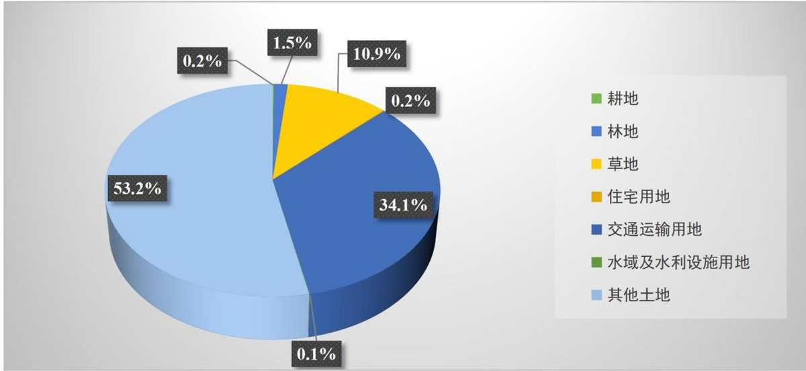  
图 3.2-1 按占地类型统计的占地面积比重图

## 3.2.2.1 永久占地分析评价

## （1）工程永久用地

根据主体设计，本项目永久占地共计1292.73hm2，平均每公里1.8324hm2，低于《新建铁路工程项目建设用地指标》（建标〔2008〕232号）中表 3.2.4中I 级单线、电力牵引铁路平原地形用地指标 4.6900hm2/km。

## （2）路基工程

路基工程永久占地面积为838.25hm2，平均每公里用地指标为 2.0411hm2。根据《新建铁路工程项目建设用地指标》中表 3.3.4 平原地形Ⅰ级单线铁路路基用地指标为4.1265hm2/km，路基工程用地指标符合现行铁路用地标准。

## （3）站场工程

站场工程用地包括区间站后设施用地，永久占地 255.20hm2，平均每站用地为10.6333hm2。根据《新建铁路工程项目建设用地指标》表3.4.3平原地形双线电力牵引铁路中间站用地指标，站场工程用地指标符合现行铁路用地标准。

## （4）桥梁工程

桥梁工程永久用地为 80.42hm2（不含导流堤用地），除去新建桥与既有铁路桥梁夹心地，以及桥台锥体用地后，单线用地指标为1.2954hm2/km。根据《新建铁路工程项目建设用地指标》中表3.3.5关于 160km/h 及以下的I级单线铁路一般结构桥梁的用地指标为1.3000hm2/km。桥梁工程用地指标符合现行铁路用地标准。

## （5）改移工程

根据《新建铁路工程项目建设用地指标》，改移工程属于铁路工程代征地，主要包括铁路用地界外的改移道路、改河改沟等用地，不属于铁路的永久用地，不纳入铁路工程项目建设用地指标，改移工程的代征用地指标结合项目实际，并根据设计确定。

## （6）与用地预审批复面积对照分析

根据内蒙古自治区、甘肃省和新疆维吾尔自治区自然资源厅用地预审与选址意见书，本项目全线项目永久占地应控制在 561.4534hm2以内（不含改移道路、交通运输用地、导流堤），其中，内蒙古自治区301.2994hm2，甘肃省208.7262hm2，新疆维吾尔自治区51.4278hm2。本工程现阶段永久占地共计 1292.73hm2，扣除改移道路用地 78.20hm2、交通运输用地639hm（2 扣除改移道路交通运输用地）、导流堤用地40.66hm2后，为534.87hm2，满足用地预审要求。

## 3.2.2.2 临时占地分析评价

## （1）取（弃）土场占地

本项目共设取土场 43 处，临时占地 369.66hm2，占地类型为裸岩石砾地。取土完毕后，平原微丘区取土场进行土地整治、表土回覆，对场地内撒播草籽或回覆砾幕。对沙质边坡的取（弃）土场喷洒固沙剂；山岭重丘区取土场直接进行土地整治、砾幕回覆，恢复原有占地类型。依据取土场现状、地形图及土石方调配情况，取土（料）量满足施工要求，临时占地面积合理。

后期回填弃土的取（弃）土场共计 43处，临时占地已纳入取土场占地面积一并统计，未新增临时用地。取（弃）土场使用完毕后及时回铺表土和砾幕。依据各取（弃）土场地形和开采深度测算，取（弃）土场容渣量能满足项目弃土要求，占地面积未遗漏或缺失，临时占地面积合理。

## （2）施工生产生活区占地

本项目共设施工生产生活区193处，包括主体设计的制（存）梁场、铺轨基地等35处大型临时工程，临时占地80.90hm2；其余 158处为本方案中根据需求新设置的临时堆土场，均设置在永久用地或临时占地范围内，不再新增占地。

## 1）大型临时工程布设情况

全线共设大型临时工程 35处，包括 2处铺轨基地，3处制（存）梁场，11处混凝土集中拌合站，7处材料厂，12处贮水站，临时占地面积80.90hm2，占地类型为裸岩石砾地。施工后期，及时凿除遗留的施工场地硬化面，并用推土机平整场地。施工场地可采取回铺前期收集的砾幕；以上措施可基本维持扰动区域的水土保持功能。

针对本项目线路较长和分标段施工的特征，施工场地布置相对分散，但布局紧凑，扰动区域可得到有效的控制。施工场地选择裸岩石砾地等区域，少占压和破坏现有植被。根据施工总布置条件及原则，同时结合本项目场内外交通布置，施工营地尽量在临近施工场地同址布设或租用民房。主体设计开展了临时用地优化论证，结合施工生产生活区的优化情况，靠近城镇人口聚集区的施工营地可直接租用当地民房，不靠近人口聚集区的营地与大临工程合设，或就近零星分布在永久占地内。通过施工生产生活区优化情况，较大程度减少了临时占地面积。施工场地的设置基本符合项目建设需要，临时占地数量设置基本合理，无遗漏，方案未新增临时占地。

施工生产生活区满足“节约集约使用临时用地”的设计要求，也符合《自然资源部关于规范临时用地管理的通知》（自然资规〔2021〕2号）“临时用地尽量不占或者少占耕地，……，制梁场、拌合站等难以恢复原种植条件的不得以临时用地方式占用耕地和永久基本农田”的要求。

## 2）临时堆土场

本方案设置的临时堆土场包括：表土临时堆放场9处，砾幕临时堆放场106处，土石方临时周转场43处。

上述158处临时堆土场占地共计17.45hm2（永临结合），堆放表土共计 1.76万m3，单个堆高3.0\~4.0m，堆存期 1.5年\~2 年；堆放砾幕共计9.67万 $\mathrm { m } ^ { 3 }$ ，单个堆高 3.0\~4.0m，堆存期1.5年\~2 年；堆放周转土石方共计29.31 万 $\mathrm { m } ^ { 3 }$ ，单个堆高 3.0m，堆存期1.5年\~2年。周转周期按照3个月计列。

本工程临时堆土场数量在能够满足工程施工要求的前提下，通过集约布设和永临结合，最大限度控制了占地规模，符合水土保持的要求。

## （3）临时电力线路占地

施工架设临时电力线路271.76km（232.17km 新增临时占地，39.59km永临结合），临时占地1.36hm2（新增1.16hm2，永临结合 0.20hm2）。占地类型为裸岩石砾地。临时电力线路主要架设在大临工程、主体工程等工点与当地供电电源之间，主要为电杆基础的临时占地。施工后期，及时拆除临时电力线路电杆后，恢复原有用地类型。

## （4）施工便道占地

全线共设施工便道 498.52km，临时占地 172.26hm（2 新增 144.26hm2，永临结合 28hm2），其中新建便道248.14km（227.64km新增临时占地，20.50km永临结合），改（扩）建便道250.38km（182.72km新增临时占地，67.66km永临结合）。占地类型为裸岩石砾地和草地。施工便道的设置充分考虑了沿线现有交通条件，按照永临结合，集约用地的设计原则，尽可能减少对原地貌的破坏。主体设计开展了临时用地优化论证，结合取（弃）土场数量优化情况及伴行便道布设方案，施工便道共核减相应道路长度69.12km，临时占地面积减少 78.65hm2。

施工后期，严格按照当地自然资源部门恢复要求和方案批复的水土保持措施，采取绿化和回铺砾幕层等措施，恢复原有用地类型。根据现场调查和施工组织设计分析，施工便道设置基本合理，长度和宽度满足施工要求。

## （5）临时占地分析评价结论

施工结束后，涉及草地的临时用地采取撒播草籽绿化，迹地恢复时可优先栽植耐旱耐寒等抗逆性强易成活的草种；涉及沙地、裸岩石砾地等区域的临时用地，施工后期采取回铺砾幕层，可降低风力侵蚀强度。

综上分析，本项目占地面积和占地类型基本合理，无遗漏，基本满足工程建设的需要，符合“节约集约用地和永临结合”的水土保持要求。后续设计阶段，地方政府结合工程占用耕地数量，后期做好耕地占补平衡；主体设计进一步优化施工组织和施工时序，尽量整合取（弃）土场开采规模和面积，优化施工生产生活区、施工便道和临时电力线路等临时占地面积，控制植被损毁面积和地表扰动范围，确保生态环境不恶化。

## 3.2.2.3 风沙防护用地分析评价

本项目风沙防护总长度 15.031km，风沙路基防护用地共计 $9 7 . 1 7 \mathrm { h m } ^ { 2 } .$ 。根据风沙危害程度，本项目风沙防护采取工程、植物相结合的防沙措施，在线路两侧设置风沙防护体系。防沙体系包括防火带、防护带、围栏。各类沙害地段防沙体系宽度分别为：

中等风沙地段：迎主导风向侧由坡脚（或堑顶）向外依次设置20m宽防火带、150m宽防护带，防护带外 10m 设刺铁丝围栏；背风侧从坡脚（或堑顶）向外依次设置 20m宽防火带、50m宽防护带，防护带外10m设置刺铁丝围栏。

轻微～中等风沙地段：根据不同区域的风沙段落，对于新增设的芦苇沙障相应增加风沙用地，每道芦苇沙障占地宽度8.0m。

风沙路基采取了防风固沙措施，能够有效阻止风沙灾害，改善生态环境。因此，为维护额哈铁路运营安全进行的防风治沙措施用地，在主体工程设计中不列入项目永久占地和临时占地，本方案作为特殊用地计入水土流失防治责任范围。根据风沙防护施工组织设计分析，风沙防护体系设置基本合理，风沙路基长度和宽度满足施工要求。

## 3.2.3 土石方平衡分析评价

## 3.2.3.1 弃渣减量化专项研究

根据《生产建设项目水土保持方案管理办法》（水利部令第53 号）及《水利部办公厅国铁集团办公厅关于加强铁路建设项目水土保持工作的通知》（办水保〔2023〕3号）相关要求，主体设计深入开展了弃渣减量化专题研究工作。本工程在可行性研究后，对部分路段纵断面进行了调整，并加大了路基、站场等工点的土石方移挖作填和工点间调配利用，最大限度的降低借方和弃方。主体设计根据水土保持规范开展土石方源头减量研究，通过优化线路纵断面设计、降低沿线车站综合维修车间扩建场坪标高、优化路基边坡坡率和换填等措施，初步设计阶段本项目土石方量较可研阶段共减少 230.50万m3，减少设置取（弃）土场18处，弃土量减少141.97 万m3，从源头减缓工程建设带来的生态环境影响，符合水土保持要求。

根据主设单位编制完成的《临哈铁路额济纳至哈密段扩能改造工程弃渣综合利用及处置专项设计方案》，在保证工期的前提下，按照“移挖作填，能用尽用”的设计原则，已最大限度利用自身挖方，主体工程挖方利用量达到422.65万m3，挖方利用率达到71.8%，最终产生余方 201.15 万 m3（其中综合利用 35.0 万 m3，剩余 166.15 万 $\mathrm { m } ^ { 3 }$ 清运至取（弃）土场）。根据地勘成果揭示，路基工程挖方中的盐渍土等不具备作铁路填料级配要求的，回填至43处取（弃）土坑。

（1）额济纳（不含）至蒙甘界（DK685+200\~DK987+940）

1）路基工程：针对 DK846+577\~DK847+452 深路堑、高路堤段，可研阶段，线路方案采用绕行路基方案，在DK846+577\~DK847+159 段二线绕行既有线深路堑，二线与既有线线间距约 $4 2 \mathrm { m }$ ，段落内挖方约 $7 4 \ \overline { { \mathcal { H } } } \ \mathrm { m } ^ { 3 }$ 。初步设计阶段对方案进行了优化，采用并行路基方案，段落内二线与既有线按4.2m线间距并行，段落内挖方约16万 $\mathrm { m } ^ { 3 }$ ，大量降低了挖方及弃渣量。经统计，路基的总土方由可研阶段的1170.53万 $\mathrm { m } ^ { 3 }$ ，优化为初步设计阶段的 1080.60 万 $\mathrm { m } ^ { 3 }$ ，共优化土方89.93 万 $\mathrm { m } ^ { 3 }$ ，优化比例 7.68%。可研阶段挖方总量 134.80 万 $\mathrm { m } ^ { 3 }$ ，初步设计阶段调整部分挖方段坡率及平台宽度，挖方量为 180.56万 $\mathrm { m } ^ { 3 }$ 增加可利用土方45.76万 $\mathrm { m } ^ { 3 }$

2）站场工程：通过优化纵断面设计，降低天草站综合维修车间和黑鹰山站综合维修车间扩建场坪标高，本段降低维修车间标高引起弃方减少 $7 4 8 \mathrm { m } ^ { 3 }$ 。其中，黑鹰山站综合维修车间扩建场坪标高由1399.6m调整为 1397.63m，弃土减少约 $5 4 5 \mathrm { m } ^ { 3 }$ 。天草站综合维修车间扩建场坪标高由953.4m 调整为951m，弃土减少约 $2 0 3 \mathrm { m } ^ { 3 }$ 。弃方总量由可研阶段的 23.54 万 $\mathrm { m } ^ { 3 }$ ，调整为初步设计阶段的18.84 万 $\mathrm { m } ^ { 3 }$ ，共减少弃方4.70万 $\mathrm { m } ^ { 3 }$

3）桥梁工程：通过降低邻近既有线桥台施工的复线桥台高度，基底上抬，在减小线间距需求的同时减小挖基量。同时，本线导流堤堤身内填筑土利用梁桥、小桥涵及导流堤自身的挖基土，充分实现弃土利用。初步设计阶段全线桥梁弃土15.28万 $\mathrm { m } ^ { 3 }$ ，较可研阶段的 40.80 万 $\mathrm { m } ^ { 3 }$ 减少 25.52 万 $\mathrm { m } ^ { 3 }$

4）改移道路：沿线改移道路主要位于沙漠戈壁地区，地形平坦开阔，道路紧贴地面铺设砂石路面，不开挖路槽，减少挖方工程。全线采用10%最大纵坡，充分适应地形，避免高填深挖，最大程度减少弃渣量。黑山梁至明水段越岭段局部挖方相对较大处，平纵设计调整前后填方路基高度，就近消纳。经减量化设计，可研阶段改移道路填方5.72万 $\mathrm { m } ^ { 3 }$ ，挖方 3.64 万 $\mathrm { m } ^ { 3 } ;$ ；初步设计阶段优化了改移道路挖填方量，初步设计阶段改移道路填方 4.63 万 $\mathrm { m } ^ { 3 }$ ，挖方 2.66 万 $\mathrm { m } ^ { 3 }$ ，共减少土石方 2.07万 $\mathrm { m } ^ { 3 }$ ，无弃渣。

综上，经过与临近工程平衡设计，调配余缺，初步设计阶段本段土石方量较可研阶段共减少 122.22 万 $\mathrm { m } ^ { 3 }$

（2）蒙甘界至坎儿井段（DK987+940\~DK1201+300）

1）路基工程：初步设计阶段对路基边坡坡率和换填等措施进行了优化，挖方量由可研阶段的 124.90 万 $\mathrm { m } ^ { 3 }$ ，调整为初步设计阶段的 109.45万 $\mathrm { m } ^ { 3 }$ ，共减少 15.45 万 $\mathrm { m } ^ { 3 }$

2）站场工程：初步设计方案中不再清表，站场本段挖方总量 52.55 万 $\mathrm { m } ^ { 3 }$ ，较上一阶段挖方量减少17.84万 $\mathrm { m } ^ { 3 }$

3）桥梁工程：桥梁在考虑基坑回填对于弃土部分利用的前提下，本阶段全线桥梁弃土 6.20 万 $\mathrm { m } ^ { 3 }$ ，较上阶段的 17.85万 $\mathrm { m } ^ { 3 }$ 减少 11.65 万 $\mathrm { m } ^ { 3 }$

综上，经过与临近工程平衡设计，调配余缺，初步设计阶段本段土石方量较可研阶

段共减少 44.94 万 $\mathrm { m } ^ { 3 }$ 。

## （3）坎儿井（含）至哈密东段（DK1201+300\~DK1325+100）

1）站场工程：可研阶段弃土量共计 12.20 万 $\mathrm { m } ^ { 3 }$ ，主要为站场清表土和哈密枢纽内哈密东机务折返段改造和哈密货车检修车间改造换填挖除弃土。共取土 119.84 万 $\mathrm { m } ^ { 3 }$ 均来自外购土。初步设计阶段通过优化站场平面布置，减少路基填方段落，共减少取土$3 5 . 0 5 ~ \mathrm { \mathscr { H } ~ m } ^ { 3 }$ ，取土量为84.79 万m3；填方地段地表为圆粒土段落不再采用清除表土措施，改为场地整平，减少清表弃土10.18 万 $\mathrm { m } ^ { 3 }$

2）桥梁工程：导流堤堤身内填筑土利用小桥涵及导流堤自身的挖基土，充分实现弃土利用。桥梁弃渣减少2895m3。

综上，经过与临近工程平衡设计，调配余缺，初步设计阶段本段土石方较可研阶段共减少 10.47 万 m3。

经统计，初步设计阶段本项目土石方量较可研阶段共减少 177.63 万 $\mathrm { m } ^ { 3 }$ ，减少设置取（弃）土场18处，弃土量减少141.97万 $\mathrm { m } ^ { 3 }$

## 3.2.3.2 余方资源化专项研究

为全面推进弃渣“资源化”利用，建设单位会同主体设计单位、方案编制单位对本项目弃渣综合利用开展了专项调查与研究，并与沿线各旗县人民政府及发改、交通、水利、自然资源等主管部门多次对接，全面梳理旗县内项目余方数量及处置方案，尽最大可能寻找可供本工程综合利用的渠道，对旗县内在建、拟建项目，深入研判其利用本工程土石余方的可行性。编制单位通过调查铁路压覆矿企业对接矿坑回填及治理需求、与沿线砂石料场对接料场回填及治理需求、与车站配套铁路物流园对接填方需求、地方发改局等部门对接综合利用需求等方式梳理。但由于本项目主要穿行于戈壁荒漠无人地区，沿线规划和在建的生产建设项目数量稀少，最终确定将本项目35万 $\mathrm { m } ^ { 3 }$ 弃方采取综合利用形式处置，分别为：“额济纳旗达镇八道桥东山采石场建筑石料用凝灰岩、安山岩矿新建 $1 0 \times 1 0 ^ { 4 } \mathrm { m } ^ { 3 } / \mathrm { a }$ 建设项目”回填及治理综合利用弃土约 15.0万 $\mathbf { m } ^ { 3 } ;$ ；“肃北县境内甘肃铁达物流运输有限公司明水站铁路专用线工程”配套物流园场平填筑综合利用弃土约20.0 万 m3。

## （1）额济纳旗综合利用方案

额济纳旗达镇八道桥东山采石场建筑石料用凝灰岩、安山岩矿新建 $1 0 \times 1 0 ^ { 4 } \mathrm { m } ^ { 3 } / \mathrm { a }$ 建设项目位于额济纳旗达来库布镇东偏北约 28km 处，矿区分两个采区，相距 6.5km。东山石料矿矿区面积为 $0 . 2 5 9 0 \mathrm { k m } ^ { 2 }$ ，每年产能约10.0万 $\mathrm { m } ^ { 3 }$ ，根据《内蒙古自治区额济纳旗达镇八道桥东山石料矿2026-2028 年矿山地质环境治理与土地复垦计划》，取石料后环境治理与土地复垦需回填土方约17.92 万 $\mathrm { m } ^ { 3 }$ 。建设单位为额济纳旗天成矿业有限责任公司。额济纳旗天成矿业有限责任公司成立于 2004年8 月，现正常营业，营业执照、采矿许可证、安全生产许可证均在有效期内，达镇八道桥东山石料矿矿区为该公司下属矿区之一。阿拉善盟水务局于2015年12月以“阿水保发〔2015〕63号”《关于<额济纳旗天成矿业有限责任公司额济纳旗达镇八道桥东山采石场建筑石料用凝灰岩、安山岩矿新建 $1 0 \times 1 0 ^ { 4 } \mathrm { m } ^ { 3 } / \mathrm { a }$ 建设项目水土保持方案报告书>的批复》予以批复。阿拉善盟水务局于2020年4月以“阿验收回执〔2020〕10号”《额济纳旗天成矿业有限责任公司额济纳旗达镇八道桥东山采石场建筑石料用凝灰岩、安山岩矿新建 $1 0 \times 1 0 ^ { 4 } \mathrm { m } ^ { 3 } / \mathrm { a }$ 建设项目水土保持设施自主验收报备回执》接受报备。2025年10 月，临哈铁路有限责任公司与额济纳旗天成矿业有限责任公司达成弃土综合利用框架性意见，于当月签订了弃土综合利用框架性协议，详见附件 11-1（P614）。

该综合利用消纳临哈铁路额哈段额济纳旗境内挖方段利用后剩余清表弃土约15.0万m3具有可行性，从时序、运距、容量、材质等方面分析如下：

在时序上，达镇八道桥东山石料矿采矿证有效时段为2025年6 月至2028年6月，根据东山石料矿2026-2028 年矿山地质环境治理与土地复垦计划，取石料后环境治理与土地复垦亦同步实施。本项目计划于2026年1月开工，工程工期30个月。因此，东山石料矿山地质环境治理与土地复垦施工时序上满足本项目余方消纳要求；

在运距上，东山石料矿距离本工程额济纳段线位约 35.0km，S312 公路从两个采区中间穿过，采区距公路各约4km左右，由矿区土路连接，运输可行；

在容量上，达镇八道桥东山石料矿矿区面积 0.2590km2，且每年产能需石方约 10.0万m3，因此本工程每年产生的弃土可堆置在矿区范围内且可处置完毕。因此，容量上满足要求；

在材质上，矿山地质环境治理与土地复垦对回填土无材质要求。

因此，本项目清表弃土约 15.0万 m3可用于东山石料矿露天开采后地质环境治理与土地复垦。项目土石方对外清运和综合利用须符合《中华人民共和国土地管理法》《自然资源部关于规范和完善砂石开采管理的通知》（自然资发〔2023〕57号）的规定，禁止对外销售。临哈铁路有限责任公司招标的施工单位负责将土石方运送至额济纳旗天成矿业有限责任公司额济纳旗达镇八道桥东山石料矿，土石方交付后的水土流失防治责任由额济纳旗天成矿业有限责任公司负责，并为土石方运输提供便利。铁路余方具体利用量以项目实施为准。待项目开工建设后由施工单位进一步衔接并按照规定办理相关手续。

根据《内蒙古自治区矿山地质环境治理恢复基金管理办法（试行）》第十九条，矿山地质环境保护与土地复垦实施信息公示制度，采矿权人应当在每年3月底前将年度治理计划书，包括上年度矿山地质环境保护与土地复垦方案的编制执行情况、基金提取使

## 3.2.3.3 借方综合利用专项研究

项目需外借土石方1591.44万m3，借方主要为路基和站场工程填料。在勘察设计阶段，肃北蒙古族自治县人民政府、额济纳旗人民政府先后组织铁路建设单位、设计单位、当地自然资源、水务、住房和城乡建设等部门及相关企业开展专题研究，全面梳理旗县内项目余方数量及处置方案，尽最大可能寻找可供本工程综合利用的渠道，并对旗县内在建、拟建项目，深入研判其土石余方用作本工程填料的可行性。

借方综合利用重点与沿线的矿产企业进行了对接，矿产企业名录见下表。但是由于沿线金属矿矿渣成分复杂（部分矿渣含有放射性或者含硫成分物质）、已封闭的尾矿库开采取土程序复杂及已封闭的尾矿库安全环保等综合因素，经对接无法落地矿产矿渣综合利用。

表 3.2-3 铁路沿线矿产企业名录清单
<table><tr><td rowspan=1 colspan=1>序号</td><td rowspan=1 colspan=1>项目名称</td><td rowspan=1 colspan=1>矿权单位</td></tr><tr><td rowspan=1 colspan=1>1</td><td rowspan=1 colspan=1>内蒙古银额盆地建国营油气勘查</td><td rowspan=1 colspan=1>中国石油天然气股份有限公司吐哈油田分公司</td></tr><tr><td rowspan=1 colspan=1>2</td><td rowspan=1 colspan=1>内蒙古自治区额济纳旗嘎顺乌素二区油页岩岩矿详查</td><td rowspan=1 colspan=1>内蒙古西能能源有限责任公司</td></tr><tr><td rowspan=1 colspan=1>3</td><td rowspan=1 colspan=1>内蒙古自治区额济纳旗鹿山地区金矿勘探</td><td rowspan=1 colspan=1>长安控股额济纳旗矿业有限公司</td></tr><tr><td rowspan=1 colspan=1>4</td><td rowspan=1 colspan=1>内蒙古自治区额济纳旗蓬勃山北沟金多金属矿普查</td><td rowspan=1 colspan=1>额济纳旗宝富矿业有限责任公司</td></tr><tr><td rowspan=1 colspan=1>5</td><td rowspan=1 colspan=1>内蒙古自治区额济纳旗博红山金矿勘探</td><td rowspan=1 colspan=1>额济纳旗宝富矿业有限责任公司</td></tr><tr><td rowspan=1 colspan=1>6</td><td rowspan=1 colspan=1>额济纳旗宝富矿业有限责任公司博红山矿区岩金矿</td><td rowspan=1 colspan=1>额济纳旗宝富矿业有限责任公司</td></tr><tr><td rowspan=1 colspan=1>7</td><td rowspan=1 colspan=1>内蒙古自治区额济纳旗嘎顺乌素一区油页岩岩矿普查</td><td rowspan=1 colspan=1>内蒙古西能能源有限责任公司</td></tr><tr><td rowspan=1 colspan=1>8</td><td rowspan=1 colspan=1>内蒙古自治区额济纳旗哈珠南山北铁多金属矿普查</td><td rowspan=1 colspan=1>甘肃合利达矿业有限责任公司</td></tr><tr><td rowspan=1 colspan=1>9</td><td rowspan=1 colspan=1>额济纳旗信达城市建设有限责任公司千条沟建筑用石料</td><td rowspan=1 colspan=1>额济纳旗信达城市建设有限责任公司</td></tr><tr><td rowspan=1 colspan=1>10</td><td rowspan=1 colspan=1>内蒙古阿盟哈珠北山多金属勘探</td><td rowspan=1 colspan=1>内蒙古自治区煤田地质局勘测队</td></tr></table>

由于本项目主要穿行于戈壁荒漠无人地区，沿线规划和在建的生产建设项目数量稀少，经调查，结合线路走向及周边道路交通条件，额济纳旗及肃北蒙古族自治县借方综合利用工作小组重点排查了运距50公里范围内的乡镇，广泛调研了周边项目的余方资源，发现区域内已审批备案的项目以“自身挖填平衡”或“需外借土方”类型为主，无法为本项目提供填料。同时，也未能找到施工时序与本工程相匹配的填料来源。综上，受区域内项目余方资源匮乏、施工时序不匹配等因素制约，目前额济纳旗及肃北蒙古族自治县境内无合适项目可支撑本项目实现借方综合利用。因此项目借方 1406.07万 $\mathrm { m } ^ { 3 }$ 取自沿线设置的43 处取土场，185.37万 $\mathrm { m } ^ { 3 }$ 采用外购方式。

## 3.2.3.4 土石方平衡评价

本项目土石方挖填总量为 2590.75 万 $\mathrm { m } ^ { 3 }$ ，其中挖方 600.23 万 $\mathrm { m } ^ { 3 }$ （含表土剥离 1.76万 $\mathrm { m } ^ { 3 }$ ，砾幕剥离 9.67 万 m3），填方 1990.52 万 $\mathrm { m } ^ { 3 }$ （含表土回覆 1.76 万 $\mathrm { m } ^ { 3 }$ ，砾幕回覆

$9 . 6 7 ~ \overline { { \mathcal { H } } } \mathrm { ~ m } ^ { 3 } \mathrm { ~ ) ~ }$ ，借方 1591.44 万 $\mathrm { m } ^ { 3 }$ （1406.07 万 m3 来自取土场，185.37 万 $\mathrm { m } ^ { 3 }$ 采用外购方式），余方 201.15 万 $\mathrm { m } ^ { 3 }$ （综合利用 35.0万 $\mathrm { m } ^ { 3 }$ ，剩余 166.15 万 $\mathrm { m } ^ { 3 }$ 清运至取（弃）土场）；利用方 434.08 万 $\mathrm { m } ^ { 3 }$ （移挖作填 384.98 万 $\mathrm { m } ^ { 3 }$ ，区间调配14.10 万 $\mathrm { m } ^ { 3 }$ ，地方综合利用 35.0万 $\mathrm { m } ^ { 3 }$ ），工程土石方利用率72.3%。

经土石方调配后，项目将产生166.15万 $\mathrm { m } ^ { 3 }$ 弃土，包括：取（弃）土场无用层58.83万 $\mathrm { m } ^ { 3 }$ ，路基杂填土 47.36 万 $\mathrm { m } ^ { 3 }$ ，盐渍 $\pm \ 3 8 . 3 1 \ \overline { { \mathcal { H } } } \ \mathrm { m } ^ { 3 }$ ，桥梁钻渣 21.48 万 $\mathrm { m } ^ { 3 }$ ，建筑垃圾0.17 万 $\mathrm { m } ^ { 3 }$ 。上述弃渣成分无法利用的原因主要为：

取（弃）土场无用层、盐渍土无法利用的原因为：根据《铁路特殊路基设计规范》6.2.1 条规定“重载铁路、时速 160km 及以上客货共线铁路基床不应采用盐渍土、盐岩做填料”。在平原微丘区，取（弃）土场无用层主要为表层盐渍土及含草根表土；山岭重丘区则为表层含盐土。取（弃）土场的表层土因其盐渍土的属性，在遇水或温度变化时会发生溶陷和盐胀，并具有腐蚀性， $j ^ { \overline { { \mathbb { N } } } }$ 重威胁铁路路基的长期稳定和安全。在工程建设中必须严格按照规范将其作为“无用层”剥离并弃用，尤其是对质量要求极高的基床部分。

路基杂填土无法利用的原因为：区间和站场路基挖方弃方主要包括Ⅰ、Ⅱ类清表土及增建二线时挖台阶产生的土方。其中清表土主要为盐渍土及含草根表土，无法利用；挖Ⅰ、Ⅱ类及挖台阶土方多为盐渍土，无法利用。此外，由于既有线路基设有土工格栅及骨架、护肩、水沟等圬工结构，导致挖基土无法全部直接利用，需对土体进行清筛后少量废弃。

桥梁钻渣无法利用的原因为：桥梁钻孔为废弃泥浆，其成分复杂多变、性能不稳定，且常含有害污染物，导致其无法再次利用。

建筑垃圾无法利用的原因为：铁路施工产生的垃圾成分复杂，常混杂有废弃混凝土、金属、塑料以及可能被污染的土体，对其进行高效分离和净化处理难度大、成本高。其次，铁路工程本身对路基填料、建材等材料的强度、稳定性和耐久性要求较高，而经过处理的再生材料性能波动较大，存在潜在的安全风险。

综上，本项目土石方调配在考虑“移挖作填”和“土石方数量最优化”的基础上，已最大限度提高挖方利用量。利用方主要用于路基、站场、桥梁的填筑，从源头上减少了水土流失的产生。根据施工进度、填料要求和土石方调配节点，土石方调配基本合理。

经方案分析评价，核增表土和砾幕剥离、回覆利用量。本工程土石方数量计算合理，无遗漏，充分考虑了工点移挖作填和就近调配，土石方调运节点适宜、时序可行、运距合理，余方开展了弃渣综合利用调查，工程土石方平衡可行，符合《生产建设项目水土保持技术标准》（GB 50433—2018）要求。

## 3.2.3.5 表土剥离与保护

## （1）表土保护量

为合理调配土石方，减少挖方和弃方工程量，方案设计将前期剥离的表土作为后期绿化等用土来源。表土堆存位置布设在永久和临时占地范围，就近堆放，减少土方二次倒运。根据工点位置和沿线地形情况，合理确定表土临时堆放位置，优先按照“永临结合和节约集约设置”原则，考虑表土存放位置，尽可能减少新增地表扰动范围。根据方案核算，全线表土可剥离面积 $3 1 . 1 0 \mathrm { h m } ^ { 2 }$ ，可剥离总量1.76万 $\mathrm { m } ^ { 3 }$ ，回覆利用量1.76万 $\mathrm { m } ^ { 3 }$ ，用于后期土地整治，无剩余。

## （2）表土临时堆放位置

永久工程剥离的表土尽可能堆放在项目征占地范围内空闲区域。区间路基剥离的表土堆置在用地红线内不影响施工的铁路下风向空闲区域；站场剥离的表土堆置在车站用地红线内路基不影响施工的铁路下风向空闲区域；桥梁工程按照桥梁扰动范围内存在表土资源的区域进行剥离，堆置在用地红线内不影响施工的铁路下风向空闲区域，可根据施工范围进行动态调整并与桥梁桩基施工时序统筹考虑；改移工程较分散，且表土剥离数量较少，剥离表土考虑临时堆存在临近区间路基表土临时堆存场合并堆存。取（弃）土场、施工生产生活区、临时电力线路占地类型不涉及林地、草地和耕地等区域，无可剥离的表土；施工便道工点分散且扰动地表程度小，不考虑剥离表土。表土临时堆放场全部设置在工程征占地范围内，未新增临时占地。

表土临时堆放期间，为防止水土流失，采用临时拦挡、临时苫盖等措施进行防护；表土最终全部利用为本项目后期表土回覆利用。随着各项水土保持措施的逐步实施，工程建设阶段可最大限度地保护和利用表土资源，满足水土保持相关要求。

## （3）表土保护利用和调配

本项目采取“就近堆放、减少倒运”作为表土堆存和调配设计原则，开展表土剥离和利用分析，加大表土保护利用率，做到表土资源不浪费、不废弃。方案提出的表土调配和防护措施符合水土保持要求。

## （4）表土剥离与保护利用评价结论

从水土保持角度分析，方案补充完善了表土临时防护措施，既保护和利用了表土资源，也有效减少土壤流失来源，符合《中华人民共和国水土保持法》和《生产建设项目水土保持技术标准》的相关要求。

## 3.2.4 取土场设置分析评价

经土石方调配，本项目总借方为 1591.44 万 $\mathrm { m } ^ { 3 }$ 。其中，1406.07 万 $\mathrm { m } ^ { 3 }$ 来自沿线 43处取土场（用于内蒙古自治区和甘肃省），185.37 万 $\mathrm { m } ^ { 3 }$ 采用外购方式（用于新疆维吾

尔自治区）。

## 3.2.4.1 取土场设置

本项目共设取土场43处（内蒙古自治区29处，甘肃省14处），设计取土量1406.07万m3。取土场类型包括平地型、山坡型和山丘型，其中平地型25 处，山坡型13处，山丘型 5处，占地类型为裸岩石砾地。勘察设计阶段，建设单位已针对各取土场选址，征求了沿线行政主管部门意见。沿线行政主管部门及产权人同意取土场选址，并签订了取（弃）土场选址协议。

主体设计明确了取土场位置、取土范围和深度等开采方案，并开展了工程地质调查，方案补充完善了取土场水土保持措施和后期恢复方式。

## （2）取土场开采方式分析评价

1）山坡型、山丘型取土场：自上而下，削坡开采，分层开挖；取土场底部形成装料平台。

2）平地型取土场：宽浅形取土，自上而下，削坡开采，分层开挖；取土坑底形成装料平台。

根据地勘资料，本项目取土场剥采比按 0.5%\~9%考虑。所产生的无用料与项目剥离的2cm厚砾幕层，已统筹考虑并纳入设计。取土场开采方式不会诱发崩塌、滑坡和泥石流等地质灾害，料场储量均大于规划开采量，设计取土量能满足工程建设要求。结合取土场运距分析，在料源质量及储量满足施工要求的前提下，运距较短，可减少运输便道占地面积及水土流失。

## （3）取土场选址合理性分析

取土场选址均不涉及崩塌、滑坡危险区和泥石流易发区，也远离城镇和景区规划范围，也不涉及自然保护区、森林公园、饮用水水源保护区、生态保护红线、水功能一级区的保护区和保留区、世界文化和自然遗产地、风景名胜区、地质公园、重要湿地、沙化土地封禁保护区、文物保护单位等环境敏感区，也未占用永久基本农田。

综上，取土场选址合理，满足水土保持要求。各取土场选址合理性分析见下表。

表 3.2-4 取土场选址合理性分析表
<table><tr><td colspan="1" rowspan="1"></td><td colspan="3" rowspan="1">行政区划</td><td colspan="1" rowspan="2">取土场名称</td><td colspan="1" rowspan="2">里程位置</td><td colspan="1" rowspan="2">侧别</td><td colspan="1" rowspan="1">直线距离</td><td colspan="1" rowspan="1">取土场</td><td colspan="1" rowspan="1">设计取土量</td><td colspan="1" rowspan="1">占地面积</td><td colspan="1" rowspan="1">平均取土深度</td><td colspan="1" rowspan="1">汇本积</td><td colspan="4" rowspan="1">《生产建设项目水土保持技术标准》取土场选址原则</td><td colspan="1" rowspan="2">是否涉及水土保持敏感区</td><td colspan="1" rowspan="2">选址分析结论</td></tr><tr><td colspan="1" rowspan="1"></td><td colspan="1" rowspan="1">省、自治区</td><td colspan="1" rowspan="1">市、盟</td><td colspan="1" rowspan="1">区、县、旗</td><td colspan="1" rowspan="1">m</td><td colspan="1" rowspan="1">类型</td><td colspan="1" rowspan="1">万m³</td><td colspan="1" rowspan="1">hm²</td><td colspan="1" rowspan="1">m</td><td colspan="1" rowspan="1">km²</td><td colspan="1" rowspan="1">严禁在县级以上人民政府划定的崩塌和滑坡危险区、泥石流易发区内设置取土（石、料)场</td><td colspan="1" rowspan="1">在山区、丘陵区选址，应分析诱发崩塌、滑坡和泥石流的可能性</td><td colspan="1" rowspan="1">应符合城镇、景区等规划要求，并与周边景观相互协调，宜避开正常的可视范围</td><td colspan="1" rowspan="1">在河道取砂（砾）料的应遵循河道管理的有关规定</td></tr><tr><td colspan="1" rowspan="1"></td><td colspan="1" rowspan="1">内蒙古自治区</td><td colspan="1" rowspan="1">阿拉善盟额</td><td colspan="1" rowspan="1">济纳旗</td><td colspan="1" rowspan="1">取弃土（渣）场01</td><td colspan="1" rowspan="1">K689+200</td><td colspan="1" rowspan="1">右侧</td><td colspan="1" rowspan="1">830</td><td colspan="1" rowspan="1">平地型</td><td colspan="1" rowspan="1">10</td><td colspan="1" rowspan="1">2.76</td><td colspan="1" rowspan="1">3.6</td><td colspan="1" rowspan="1">0.05</td><td colspan="1" rowspan="1">不涉及以上不良地质易发区灾</td><td colspan="1" rowspan="1">汇水面积较小，且不涉及地质害易发区，不会诱发崩塌、滑坡和泥石流</td><td colspan="1" rowspan="1">不在城镇、景区周边，已避开正常的可视范围</td><td colspan="1" rowspan="1">不涉及河道管理范围</td><td colspan="1" rowspan="1">不涉及</td><td colspan="1" rowspan="1">选址合理</td></tr><tr><td colspan="1" rowspan="1"></td><td colspan="1" rowspan="1">内蒙古自治区</td><td colspan="1" rowspan="1">阿拉善盟额</td><td colspan="1" rowspan="1">济纳旗</td><td colspan="1" rowspan="1">取弃土（渣）场03</td><td colspan="1" rowspan="1">K698+300</td><td colspan="1" rowspan="1">左侧</td><td colspan="1" rowspan="1">620</td><td colspan="1" rowspan="1">平地型</td><td colspan="1" rowspan="1">26.82</td><td colspan="1" rowspan="1">6.27</td><td colspan="1" rowspan="1">4.3</td><td colspan="1" rowspan="1">0.12</td><td colspan="1" rowspan="1">不涉及以上不良地质易发区灾</td><td colspan="1" rowspan="1">汇水面积较小，且不涉及地质害易发区，不会诱发崩塌、滑坡和泥石流</td><td colspan="1" rowspan="1">不在城镇、景区周边，已避开正常的可视范围</td><td colspan="1" rowspan="1">不涉及河道管理范围</td><td colspan="1" rowspan="1">不涉及</td><td colspan="1" rowspan="1">选址合理</td></tr><tr><td colspan="1" rowspan="1">3</td><td colspan="1" rowspan="1">内蒙古自治区</td><td colspan="1" rowspan="1">阿拉善盟</td><td colspan="1" rowspan="1">额济纳旗</td><td colspan="1" rowspan="1">取弃土（渣）场04</td><td colspan="1" rowspan="1">K731+600</td><td colspan="1" rowspan="1">右侧</td><td colspan="1" rowspan="1">12000</td><td colspan="1" rowspan="1">平地型</td><td colspan="1" rowspan="1">21.71</td><td colspan="1" rowspan="1">5.66</td><td colspan="1" rowspan="1">3.8</td><td colspan="1" rowspan="1">0.1</td><td colspan="1" rowspan="1">不涉及以上不良地质易发区</td><td colspan="1" rowspan="1">汇水面积较小，且不涉及地质灾害易发区，不会诱发崩塌、滑坡和泥石流</td><td colspan="1" rowspan="1">不在城镇、景区周边，已避开正常的可视范围</td><td colspan="1" rowspan="1">不涉及河道管理范围</td><td colspan="1" rowspan="1">不涉及</td><td colspan="1" rowspan="1">选址合理</td></tr><tr><td colspan="1" rowspan="1"></td><td colspan="1" rowspan="1">内蒙古自治区</td><td colspan="1" rowspan="1">阿拉善盟</td><td colspan="1" rowspan="1">额济纳旗</td><td colspan="1" rowspan="1">取弃土（渣）场06</td><td colspan="1" rowspan="1">K749+400</td><td colspan="1" rowspan="1">右侧</td><td colspan="1" rowspan="1">1770</td><td colspan="1" rowspan="1">平地型</td><td colspan="1" rowspan="1">12</td><td colspan="1" rowspan="1">2.73</td><td colspan="1" rowspan="1">4.4</td><td colspan="1" rowspan="1">0.05</td><td colspan="1" rowspan="1">不涉及以上不良地质易发区</td><td colspan="1" rowspan="1">汇水面积较小，且不涉及地质灾害易发区，不会诱发崩塌、滑坡和泥石流</td><td colspan="1" rowspan="1">不在城镇、景区周边，已避开正常的可视范围</td><td colspan="1" rowspan="1">不涉及河道管理范围</td><td colspan="1" rowspan="1">不涉及</td><td colspan="1" rowspan="1">选址合理</td></tr><tr><td colspan="1" rowspan="1">5</td><td colspan="1" rowspan="1">内蒙古自治区</td><td colspan="1" rowspan="1">阿拉善盟额</td><td colspan="1" rowspan="1">济纳旗</td><td colspan="1" rowspan="1">取弃土（渣）场38</td><td colspan="1" rowspan="1">K760+500</td><td colspan="1" rowspan="1">右侧</td><td colspan="1" rowspan="1">41200</td><td colspan="1" rowspan="1">山坡型</td><td colspan="1" rowspan="1">141.3</td><td colspan="1" rowspan="1">47.12</td><td colspan="1" rowspan="1">3</td><td colspan="1" rowspan="1">0.82</td><td colspan="1" rowspan="1">不涉及以上不良地质易发区</td><td colspan="1" rowspan="1">汇水面积较小，且不涉及地质灾害易发区，不会诱发崩塌、滑坡和泥石流</td><td colspan="1" rowspan="1">不在城镇、景区周边，已避开正常的可视范围</td><td colspan="1" rowspan="1">不涉及河道管理范围</td><td colspan="1" rowspan="1">不涉及</td><td colspan="1" rowspan="1">选址合理</td></tr><tr><td colspan="1" rowspan="1">6</td><td colspan="1" rowspan="1">内蒙古自治区</td><td colspan="1" rowspan="1">阿拉善盟</td><td colspan="1" rowspan="1">额济纳旗</td><td colspan="1" rowspan="1">取弃土（渣）场10</td><td colspan="1" rowspan="1">K785+100</td><td colspan="1" rowspan="1">右侧</td><td colspan="1" rowspan="1">770</td><td colspan="1" rowspan="1">平地型</td><td colspan="1" rowspan="1">12.12</td><td colspan="1" rowspan="1">2.69</td><td colspan="1" rowspan="1">4.5</td><td colspan="1" rowspan="1">0.05</td><td colspan="1" rowspan="1">不涉及以上不良地质易发区</td><td colspan="1" rowspan="1">汇水面积较小，且不涉及地质灾害易发区，不会诱发崩塌、滑坡和泥石流</td><td colspan="1" rowspan="1">不在城镇、景区周边，已避开正常的可视范围</td><td colspan="1" rowspan="1">不涉及河道管理范围</td><td colspan="1" rowspan="1">不涉及</td><td colspan="1" rowspan="1">选址合理</td></tr><tr><td colspan="1" rowspan="1"></td><td colspan="1" rowspan="1">内蒙古自治区</td><td colspan="1" rowspan="1">阿拉善盟</td><td colspan="1" rowspan="1">额济纳旗</td><td colspan="1" rowspan="1">取弃土（渣）场11</td><td colspan="1" rowspan="1">K800+800</td><td colspan="1" rowspan="1">右侧</td><td colspan="1" rowspan="1">740</td><td colspan="1" rowspan="1">山坡型</td><td colspan="1" rowspan="1">78.46</td><td colspan="1" rowspan="1">16.86</td><td colspan="1" rowspan="1">4.7</td><td colspan="1" rowspan="1">0.31</td><td colspan="1" rowspan="1">不涉及以上不良地质易发区</td><td colspan="1" rowspan="1">汇水面积较小，且不涉及地质灾害易发区，不会诱发崩塌、滑坡和泥石流</td><td colspan="1" rowspan="1">不在城镇、景区周边，已避开正常的可视范围</td><td colspan="1" rowspan="1">不涉及河道管理范围</td><td colspan="1" rowspan="1">不涉及</td><td colspan="1" rowspan="1">选址合理</td></tr><tr><td colspan="1" rowspan="1">8</td><td colspan="1" rowspan="1">内蒙古自治区</td><td colspan="1" rowspan="1">阿拉善盟额</td><td colspan="1" rowspan="1">济纳旗</td><td colspan="1" rowspan="1">取弃土（渣）场12</td><td colspan="1" rowspan="1">K815+000</td><td colspan="1" rowspan="1">右侧</td><td colspan="1" rowspan="1">670</td><td colspan="1" rowspan="1">平地型</td><td colspan="1" rowspan="1">45.07</td><td colspan="1" rowspan="1">10.75</td><td colspan="1" rowspan="1">4.2</td><td colspan="1" rowspan="1">0.23</td><td colspan="1" rowspan="1">不涉及以上不良地质易发区</td><td colspan="1" rowspan="1">汇水面积较小，且不涉及地质灾害易发区，不会诱发崩塌、滑坡和泥石流</td><td colspan="1" rowspan="1">不在城镇、景区周边，已避开正常的可视范围</td><td colspan="1" rowspan="1">不涉及河道管理范围</td><td colspan="1" rowspan="1">不涉及</td><td colspan="1" rowspan="1">选址合理</td></tr><tr><td colspan="1" rowspan="1">9</td><td colspan="1" rowspan="1">内蒙古自治区</td><td colspan="1" rowspan="1">阿拉善盟额</td><td colspan="1" rowspan="1">济纳旗</td><td colspan="1" rowspan="1">取弃土（渣）场13</td><td colspan="1" rowspan="1">K819+200</td><td colspan="1" rowspan="1">右侧</td><td colspan="1" rowspan="1">540</td><td colspan="1" rowspan="1">山坡型</td><td colspan="1" rowspan="1">56</td><td colspan="1" rowspan="1">15.4</td><td colspan="1" rowspan="1">03.6</td><td colspan="1" rowspan="1">0.29</td><td colspan="1" rowspan="1">不涉及以上不良地质易发区灾</td><td colspan="1" rowspan="1">汇水面积较小，且不涉及地质害易发区，不会诱发崩塌、滑坡和泥石流</td><td colspan="1" rowspan="1">不在城镇、景区周边，已避开正常的可视范围</td><td colspan="1" rowspan="1">不涉及河道管理范围</td><td colspan="1" rowspan="1">不涉及</td><td colspan="1" rowspan="1">选址合理</td></tr><tr><td colspan="1" rowspan="1"></td><td colspan="3" rowspan="1">行政区划</td><td colspan="1" rowspan="2">取土场名称</td><td colspan="1" rowspan="2">里程位置</td><td colspan="1" rowspan="2">侧别</td><td colspan="1" rowspan="1">直线距离</td><td colspan="1" rowspan="1">取土场</td><td colspan="1" rowspan="1">设计取土量</td><td colspan="1" rowspan="1">占地面积</td><td colspan="1" rowspan="1">平均取土深度</td><td colspan="1" rowspan="1">汇水面积</td><td colspan="4" rowspan="1">《生产建设项目水土保持技术标准》取土场选址原则</td><td colspan="1" rowspan="2">是否涉及水土保持敏感区</td><td colspan="1" rowspan="2">选址分析结论</td></tr><tr><td colspan="1" rowspan="1"></td><td colspan="1" rowspan="1">省、自治区</td><td colspan="1" rowspan="1">市、盟</td><td colspan="1" rowspan="1">区、县、旗</td><td colspan="1" rowspan="1">m</td><td colspan="1" rowspan="1">类型</td><td colspan="1" rowspan="1">万m³</td><td colspan="1" rowspan="1">hm²</td><td colspan="1" rowspan="1">m</td><td colspan="1" rowspan="1">km²</td><td colspan="1" rowspan="1">严禁在县级以上人民政府划定的崩塌和滑坡危险区、泥石流易发区内设置取土(石、料)场</td><td colspan="1" rowspan="1">在山区、丘陵区选址，应分析诱发崩塌、滑坡和泥石流的可能性</td><td colspan="1" rowspan="1">应符合城镇、景区等规划要求，并与周边景观相互协调，宜避开正常的可视范围</td><td colspan="1" rowspan="1">在河道取砂（砾）料的应遵循河道管理的有关规定</td></tr><tr><td colspan="1" rowspan="1">10</td><td colspan="1" rowspan="1">内蒙古自治区</td><td colspan="1" rowspan="1">阿拉善盟额</td><td colspan="1" rowspan="1">济纳旗</td><td colspan="1" rowspan="1">取弃土（渣）场14</td><td colspan="1" rowspan="1">K823+900</td><td colspan="1" rowspan="1">右侧</td><td colspan="1" rowspan="1">310</td><td colspan="1" rowspan="1">平地型</td><td colspan="1" rowspan="1">15.13</td><td colspan="1" rowspan="1">5.40</td><td colspan="1" rowspan="1">2.8</td><td colspan="1" rowspan="1">0.11</td><td colspan="1" rowspan="1">不涉及以上不良地质易发区灾</td><td colspan="1" rowspan="1">汇水面积较小，且不涉及地质害易发区，不会诱发崩塌、滑坡和泥石流</td><td colspan="1" rowspan="1">不在城镇、景区周边，已避开正常的可视范围</td><td colspan="1" rowspan="1">不涉及河道管理范围</td><td colspan="1" rowspan="1">不涉及</td><td colspan="1" rowspan="1">选址合理</td></tr><tr><td colspan="1" rowspan="1">11</td><td colspan="1" rowspan="1">内蒙古自治区</td><td colspan="1" rowspan="1">阿拉善盟额</td><td colspan="1" rowspan="1">济纳旗</td><td colspan="1" rowspan="1">取弃土（渣）场15</td><td colspan="1" rowspan="1">K827+100</td><td colspan="1" rowspan="1">右侧</td><td colspan="1" rowspan="1">230</td><td colspan="1" rowspan="1">山丘型</td><td colspan="1" rowspan="1">31.6</td><td colspan="1" rowspan="1">10.17</td><td colspan="1" rowspan="1">3.1</td><td colspan="1" rowspan="1">0.2</td><td colspan="1" rowspan="1">不涉及以上不良地质易发区灾</td><td colspan="1" rowspan="1">汇水面积较小，且不涉及地质害易发区，不会诱发崩塌、滑坡和泥石流</td><td colspan="1" rowspan="1">不在城镇、景区周边，已避开正常的可视范围</td><td colspan="1" rowspan="1">不涉及河道管理范围</td><td colspan="1" rowspan="1">不涉及</td><td colspan="1" rowspan="1">选址合理</td></tr><tr><td colspan="1" rowspan="1">12</td><td colspan="1" rowspan="1">内蒙古自治区</td><td colspan="1" rowspan="1">阿拉善盟额</td><td colspan="1" rowspan="1">济纳旗</td><td colspan="1" rowspan="1">取弃土（渣）场16K</td><td colspan="1" rowspan="1">834+500</td><td colspan="1" rowspan="1">右侧</td><td colspan="1" rowspan="1">530</td><td colspan="1" rowspan="1">平地型</td><td colspan="1" rowspan="1">16.55</td><td colspan="1" rowspan="1">3.35</td><td colspan="1" rowspan="1">4.9</td><td colspan="1" rowspan="1">0.07不</td><td colspan="1" rowspan="1">涉及以上不良地质易发区灾</td><td colspan="1" rowspan="1">汇水面积较小，且不涉及地质害易发区，不会诱发崩塌、滑坡和泥石流</td><td colspan="1" rowspan="1">不在城镇、景区周边，已避开正常的可视范围</td><td colspan="1" rowspan="1">不涉及河道管理范围</td><td colspan="1" rowspan="1">不涉及</td><td colspan="1" rowspan="1">选址合理</td></tr><tr><td colspan="1" rowspan="1">13</td><td colspan="1" rowspan="1">内蒙古自治区</td><td colspan="1" rowspan="1">阿拉善盟额</td><td colspan="1" rowspan="1">济纳旗</td><td colspan="1" rowspan="1">取弃土（渣）场17</td><td colspan="1" rowspan="1">K847+200</td><td colspan="1" rowspan="1">右侧</td><td colspan="1" rowspan="1">690</td><td colspan="1" rowspan="1">平地型</td><td colspan="1" rowspan="1">16.62</td><td colspan="1" rowspan="1">4.77</td><td colspan="1" rowspan="1">3.5</td><td colspan="1" rowspan="1">0.09</td><td colspan="1" rowspan="1">不涉及以上不良地质易发区灾</td><td colspan="1" rowspan="1">汇水面积较小，且不涉及地质害易发区，不会诱发崩塌、滑坡和泥石流</td><td colspan="1" rowspan="1">不在城镇、景区周边，已避开正常的可视范围</td><td colspan="1" rowspan="1">不涉及河道管理范围</td><td colspan="1" rowspan="1">不涉及</td><td colspan="1" rowspan="1">选址合理</td></tr><tr><td colspan="1" rowspan="1">14</td><td colspan="1" rowspan="1">内蒙古自治区</td><td colspan="1" rowspan="1">阿拉善盟额</td><td colspan="1" rowspan="1">济纳旗</td><td colspan="1" rowspan="1">取弃土（渣）场18</td><td colspan="1" rowspan="1">K851+400</td><td colspan="1" rowspan="1">右侧</td><td colspan="1" rowspan="1">460</td><td colspan="1" rowspan="1">平地型</td><td colspan="1" rowspan="1">19.07</td><td colspan="1" rowspan="1">4.60</td><td colspan="1" rowspan="1">4.1</td><td colspan="1" rowspan="1">0.09不</td><td colspan="1" rowspan="1">涉及以上不良地质易发区灾</td><td colspan="1" rowspan="1">汇水面积较小，且不涉及地质害易发区，不会诱发崩塌、滑坡和泥石流</td><td colspan="1" rowspan="1">不在城镇、景区周边，已避开正常的可视范围</td><td colspan="1" rowspan="1">不涉及河道管理范围</td><td colspan="1" rowspan="1">不涉及</td><td colspan="1" rowspan="1">选址合理</td></tr><tr><td colspan="1" rowspan="1">15</td><td colspan="1" rowspan="1">内蒙古自治区</td><td colspan="1" rowspan="1">阿拉善盟额</td><td colspan="1" rowspan="1">济纳旗</td><td colspan="1" rowspan="1">取弃土（渣）场21</td><td colspan="1" rowspan="1">K863+900</td><td colspan="1" rowspan="1">右侧</td><td colspan="1" rowspan="1">1100</td><td colspan="1" rowspan="1">山坡型</td><td colspan="1" rowspan="1">16</td><td colspan="1" rowspan="1">5.37</td><td colspan="1" rowspan="1">3</td><td colspan="1" rowspan="1">0.1</td><td colspan="1" rowspan="1">不涉及以上不良地质易发区灾</td><td colspan="1" rowspan="1">汇水面积较小，且不涉及地质害易发区，不会诱发崩塌、滑坡和泥石流</td><td colspan="1" rowspan="1">不在城镇、景区周边，已避开正常的可视范围</td><td colspan="1" rowspan="1">不涉及河道管理范围</td><td colspan="1" rowspan="1">不涉及</td><td colspan="1" rowspan="1">选址合理</td></tr><tr><td colspan="1" rowspan="1">16</td><td colspan="1" rowspan="1">内蒙古自治区</td><td colspan="1" rowspan="1">阿拉善盟额</td><td colspan="1" rowspan="1">济纳旗</td><td colspan="1" rowspan="1">取弃土（渣）场22</td><td colspan="1" rowspan="1">K869+500</td><td colspan="1" rowspan="1">右侧</td><td colspan="1" rowspan="1">350</td><td colspan="1" rowspan="1">平地型</td><td colspan="1" rowspan="1">32.94</td><td colspan="1" rowspan="1">8.42</td><td colspan="1" rowspan="1">3.9</td><td colspan="1" rowspan="1">0.16不</td><td colspan="1" rowspan="1">涉及以上不良地质易发区灾</td><td colspan="1" rowspan="1">汇水面积较小，且不涉及地质害易发区，不会诱发崩塌、滑坡和泥石流</td><td colspan="1" rowspan="1">不在城镇、景区周边，已避开正常的可视范围</td><td colspan="1" rowspan="1">不涉及河道管理范围</td><td colspan="1" rowspan="1">不涉及</td><td colspan="1" rowspan="1">选址合理</td></tr><tr><td colspan="1" rowspan="1">17</td><td colspan="1" rowspan="1">内蒙古自治区</td><td colspan="1" rowspan="1">阿拉善盟额</td><td colspan="1" rowspan="1">济纳旗</td><td colspan="1" rowspan="1">取弃土（渣）场24</td><td colspan="1" rowspan="1">K883+803</td><td colspan="1" rowspan="1">右侧</td><td colspan="1" rowspan="1">1025</td><td colspan="1" rowspan="1">山坡型</td><td colspan="1" rowspan="1">15.3</td><td colspan="1" rowspan="1">5.06</td><td colspan="1" rowspan="1">3</td><td colspan="1" rowspan="1">0.1</td><td colspan="1" rowspan="1">不涉及以上不良地质易发区灾</td><td colspan="1" rowspan="1">汇水面积较小，且不涉及地质害易发区，不会诱发崩塌、滑坡和泥石流</td><td colspan="1" rowspan="1">不在城镇、景区周边，已避开正常的可视范围</td><td colspan="1" rowspan="1">不涉及河道管理范围</td><td colspan="1" rowspan="1">不涉及</td><td colspan="1" rowspan="1">选址合理</td></tr><tr><td colspan="1" rowspan="1">18</td><td colspan="1" rowspan="1">内蒙古自治区</td><td colspan="1" rowspan="1">阿拉善盟额</td><td colspan="1" rowspan="1">济纳旗</td><td colspan="1" rowspan="1">取弃土（渣）场25</td><td colspan="1" rowspan="1">K886+900</td><td colspan="1" rowspan="1">右侧</td><td colspan="1" rowspan="1">630</td><td colspan="1" rowspan="1">山丘型</td><td colspan="1" rowspan="1">30.81</td><td colspan="1" rowspan="1">6.62</td><td colspan="1" rowspan="1">4.7</td><td colspan="1" rowspan="1">0.12不</td><td colspan="1" rowspan="1">涉及以上不良地质易发区灾</td><td colspan="1" rowspan="1">汇水面积较小，且不涉及地质害易发区，不会诱发崩塌、滑坡和泥石流</td><td colspan="1" rowspan="1">不在城镇、景区周边，已避开正常的可视范围</td><td colspan="1" rowspan="1">不涉及河道管理范围</td><td colspan="1" rowspan="1">不涉及</td><td colspan="1" rowspan="1">选址合理</td></tr><tr><td colspan="1" rowspan="1"></td><td colspan="3" rowspan="1">行政区划</td><td colspan="1" rowspan="2">取土场名称</td><td colspan="1" rowspan="2">里程位置</td><td colspan="1" rowspan="2">侧别</td><td colspan="1" rowspan="1">直线距离</td><td colspan="1" rowspan="1">取土场</td><td colspan="1" rowspan="1">设计取土量</td><td colspan="1" rowspan="1">占地面积</td><td colspan="1" rowspan="1">平均取土深度</td><td colspan="1" rowspan="1">汇本积</td><td colspan="4" rowspan="1">《生产建设项目水土保持技术标准》取土场选址原则</td><td colspan="1" rowspan="2">是否涉及水土保持敏感区</td><td colspan="1" rowspan="2">选址分析结论</td></tr><tr><td colspan="1" rowspan="1"></td><td colspan="1" rowspan="1">省、自治区</td><td colspan="1" rowspan="1">市、盟</td><td colspan="1" rowspan="1">区、县、旗</td><td colspan="1" rowspan="1">m</td><td colspan="1" rowspan="1">类型</td><td colspan="1" rowspan="1">万m³</td><td colspan="1" rowspan="1">hm²</td><td colspan="1" rowspan="1">m</td><td colspan="1" rowspan="1">km²</td><td colspan="1" rowspan="1">严禁在县级以上人民政府划定的崩塌和滑坡危险区、泥石流易发区内设置取土(石、料)场</td><td colspan="1" rowspan="1">在山区、丘陵区选址，应分析诱发崩塌、滑坡和泥石流的可能性</td><td colspan="1" rowspan="1">应符合城镇、景区等规划要求，并与周边景观相互协调，宜避开正常的可视范围</td><td colspan="1" rowspan="1">在河道取砂（砾）料的应遵循河道管理的有关规定</td></tr><tr><td colspan="1" rowspan="1">19</td><td colspan="1" rowspan="1">内蒙古自治区</td><td colspan="1" rowspan="1">阿拉善盟额</td><td colspan="1" rowspan="1">济纳旗</td><td colspan="1" rowspan="1">取弃土（渣）场26</td><td colspan="1" rowspan="1">K890+200</td><td colspan="1" rowspan="1">右侧</td><td colspan="1" rowspan="1">580</td><td colspan="1" rowspan="1">平地型</td><td colspan="1" rowspan="1">13.74</td><td colspan="1" rowspan="1">3.31</td><td colspan="1" rowspan="1">4.2</td><td colspan="1" rowspan="1">0.07</td><td colspan="1" rowspan="1">不涉及以上不良地质易发区</td><td colspan="1" rowspan="1">汇水面积较小，且不涉及地质灾害易发区，不会诱发崩塌、滑坡和泥石流</td><td colspan="1" rowspan="1">不在城镇、景区周边，已避开正常的可视范围</td><td colspan="1" rowspan="1">不涉及河道管理范围</td><td colspan="1" rowspan="1">不涉及</td><td colspan="1" rowspan="1">选址合理</td></tr><tr><td colspan="1" rowspan="1">20</td><td colspan="1" rowspan="1">内蒙古自治区</td><td colspan="1" rowspan="1">阿拉善盟</td><td colspan="1" rowspan="1">额济纳旗</td><td colspan="1" rowspan="1">取弃土（渣）场27</td><td colspan="1" rowspan="1">K899+200</td><td colspan="1" rowspan="1">右侧</td><td colspan="1" rowspan="1">4700</td><td colspan="1" rowspan="1">山坡型</td><td colspan="1" rowspan="1">12.2</td><td colspan="1" rowspan="1">5.66</td><td colspan="1" rowspan="1">2.2</td><td colspan="1" rowspan="1">0.11</td><td colspan="1" rowspan="1">不涉及以上不良地质易发区</td><td colspan="1" rowspan="1">汇水面积较小，且不涉及地质灾害易发区，不会诱发崩塌、滑坡和泥石流</td><td colspan="1" rowspan="1">不在城镇、景区周边，已避开正常的可视范围</td><td colspan="1" rowspan="1">不涉及河道管理范围</td><td colspan="1" rowspan="1">不涉及</td><td colspan="1" rowspan="1">选址合理</td></tr><tr><td colspan="1" rowspan="1">21</td><td colspan="1" rowspan="1">内蒙古自治区</td><td colspan="1" rowspan="1">阿拉善盟额</td><td colspan="1" rowspan="1">济纳旗</td><td colspan="1" rowspan="1">取弃土（渣）场28</td><td colspan="1" rowspan="1">K909+600</td><td colspan="1" rowspan="1">右侧</td><td colspan="1" rowspan="1">830</td><td colspan="1" rowspan="1">山丘型</td><td colspan="1" rowspan="1">35.1</td><td colspan="1" rowspan="1">5.13</td><td colspan="1" rowspan="1">6.8</td><td colspan="1" rowspan="1">0.14</td><td colspan="1" rowspan="1">不涉及以上不良地质易发区灾</td><td colspan="1" rowspan="1">汇水面积较小，且不涉及地质害易发区，不会诱发崩塌、滑坡和泥石流</td><td colspan="1" rowspan="1">不在城镇、景区周边，已避开正常的可视范围</td><td colspan="1" rowspan="1">不涉及河道管理范围</td><td colspan="1" rowspan="1">不涉及</td><td colspan="1" rowspan="1">选址合理</td></tr><tr><td colspan="1" rowspan="1">22</td><td colspan="1" rowspan="1">内蒙古自治区</td><td colspan="1" rowspan="1">阿拉善盟额</td><td colspan="1" rowspan="1">济纳旗</td><td colspan="1" rowspan="1">取弃土（渣）场29</td><td colspan="1" rowspan="1">K915+200</td><td colspan="1" rowspan="1">右侧</td><td colspan="1" rowspan="1">5600</td><td colspan="1" rowspan="1">山坡型</td><td colspan="1" rowspan="1">66.5</td><td colspan="1" rowspan="1">13.48</td><td colspan="1" rowspan="1">4.9</td><td colspan="1" rowspan="1">0.27</td><td colspan="1" rowspan="1">不涉及以上不良地质易发区灾</td><td colspan="1" rowspan="1">汇水面积较小，且不涉及地质害易发区，不会诱发崩塌、滑坡和泥石流</td><td colspan="1" rowspan="1">不在城镇、景区周边，已避开正常的可视范围</td><td colspan="1" rowspan="1">不涉及河道管理范围</td><td colspan="1" rowspan="1">不涉及</td><td colspan="1" rowspan="1">选址合理</td></tr><tr><td colspan="1" rowspan="1">23</td><td colspan="1" rowspan="1">内蒙古自治区</td><td colspan="1" rowspan="1">阿拉善盟额</td><td colspan="1" rowspan="1">济纳旗</td><td colspan="1" rowspan="1">取弃土（渣）场30</td><td colspan="1" rowspan="1">K923+000</td><td colspan="1" rowspan="1">右侧</td><td colspan="1" rowspan="1">580</td><td colspan="1" rowspan="1">平地型</td><td colspan="1" rowspan="1">8.54</td><td colspan="1" rowspan="1">3.16</td><td colspan="1" rowspan="1">2.7</td><td colspan="1" rowspan="1">0.06不</td><td colspan="1" rowspan="1">涉及以上不良地质易发区灾</td><td colspan="1" rowspan="1">汇水面积较小，且不涉及地质害易发区，不会诱发崩塌、滑坡和泥石流</td><td colspan="1" rowspan="1">不在城镇、景区周边，已避开正常的可视范围</td><td colspan="1" rowspan="1">不涉及河道管理范围</td><td colspan="1" rowspan="1">不涉及</td><td colspan="1" rowspan="1">选址合理</td></tr><tr><td colspan="1" rowspan="1">24</td><td colspan="1" rowspan="1">内蒙古自治区</td><td colspan="1" rowspan="1">阿拉善盟</td><td colspan="1" rowspan="1">额济纳旗</td><td colspan="1" rowspan="1">取弃土（渣）场31</td><td colspan="1" rowspan="1">K929+500</td><td colspan="1" rowspan="1">右侧</td><td colspan="1" rowspan="1">2170</td><td colspan="1" rowspan="1">山丘型</td><td colspan="1" rowspan="1">11.9</td><td colspan="1" rowspan="1">4.15</td><td colspan="1" rowspan="1">2.9</td><td colspan="1" rowspan="1">0.08</td><td colspan="1" rowspan="1">不涉及以上不良地质易发区灾</td><td colspan="1" rowspan="1">汇水面积较小，且不涉及地质害易发区，不会诱发崩塌、滑坡和泥石流</td><td colspan="1" rowspan="1">不在城镇、景区周边，已避开正常的可视范围</td><td colspan="1" rowspan="1">不涉及河道管理范围</td><td colspan="1" rowspan="1">不涉及</td><td colspan="1" rowspan="1">选址合理</td></tr><tr><td colspan="1" rowspan="1">25</td><td colspan="1" rowspan="1">内蒙古自治区</td><td colspan="1" rowspan="1">阿拉善盟</td><td colspan="1" rowspan="1">额济纳旗</td><td colspan="1" rowspan="1">取弃土（渣）场32</td><td colspan="1" rowspan="1">K935+000</td><td colspan="1" rowspan="1">右侧</td><td colspan="1" rowspan="1">1900</td><td colspan="1" rowspan="1">山坡型</td><td colspan="1" rowspan="1">30.96</td><td colspan="1" rowspan="1">9.62</td><td colspan="1" rowspan="1">3.2</td><td colspan="1" rowspan="1">0.18</td><td colspan="1" rowspan="1">不涉及以上不良地质易发区灾</td><td colspan="1" rowspan="1">汇水面积较小，且不涉及地质害易发区，不会诱发崩塌、滑坡和泥石流</td><td colspan="1" rowspan="1">不在城镇、景区周边，已避开正常的可视范围</td><td colspan="1" rowspan="1">不涉及河道管理范围</td><td colspan="1" rowspan="1">不涉及</td><td colspan="1" rowspan="1">选址合理</td></tr><tr><td colspan="1" rowspan="1">26</td><td colspan="1" rowspan="1">内蒙古自治区</td><td colspan="1" rowspan="1">阿拉善盟额</td><td colspan="1" rowspan="1">济纳旗</td><td colspan="1" rowspan="1">取弃土（渣）场33</td><td colspan="1" rowspan="1">K937+200</td><td colspan="1" rowspan="1">右侧</td><td colspan="1" rowspan="1">230</td><td colspan="1" rowspan="1">山坡型</td><td colspan="1" rowspan="1">14.42</td><td colspan="1" rowspan="1">4.33</td><td colspan="1" rowspan="1">3.3</td><td colspan="1" rowspan="1">0.08</td><td colspan="1" rowspan="1">不涉及以上不良地质易发区灾</td><td colspan="1" rowspan="1">汇水面积较小，且不涉及地质害易发区，不会诱发崩塌、滑坡和泥石流</td><td colspan="1" rowspan="1">不在城镇、景区周边，已避开正常的可视范围</td><td colspan="1" rowspan="1">不涉及河道管理范围</td><td colspan="1" rowspan="1">不涉及</td><td colspan="1" rowspan="1">选址合理</td></tr><tr><td colspan="1" rowspan="1">27</td><td colspan="1" rowspan="1">内蒙古自治区</td><td colspan="1" rowspan="1">阿拉善盟额</td><td colspan="1" rowspan="1">济纳旗</td><td colspan="1" rowspan="1">取弃土（渣）场34</td><td colspan="1" rowspan="1">K938+500</td><td colspan="1" rowspan="1">右侧</td><td colspan="1" rowspan="1">240</td><td colspan="1" rowspan="1">平地型</td><td colspan="1" rowspan="1">24.12</td><td colspan="1" rowspan="1">3.95</td><td colspan="1" rowspan="1">6.1</td><td colspan="1" rowspan="1">0.08</td><td colspan="1" rowspan="1">不涉及以上不良地质易发区灾</td><td colspan="1" rowspan="1">汇水面积较小，且不涉及地质害易发区，不会诱发崩塌、滑坡和泥石流</td><td colspan="1" rowspan="1">不在城镇、景区周边，已避开正常的可视范围</td><td colspan="1" rowspan="1">不涉及河道管理范围</td><td colspan="1" rowspan="1">不涉及</td><td colspan="1" rowspan="1">选址合理</td></tr><tr><td colspan="1" rowspan="1">28</td><td colspan="1" rowspan="1">内蒙古自治区</td><td colspan="1" rowspan="1">阿拉善盟额</td><td colspan="1" rowspan="1">济纳旗</td><td colspan="1" rowspan="1">取弃土（渣）场35</td><td colspan="1" rowspan="1">K984+600</td><td colspan="1" rowspan="1">右侧</td><td colspan="1" rowspan="1">360</td><td colspan="1" rowspan="1">山坡型</td><td colspan="1" rowspan="1">33.96</td><td colspan="1" rowspan="1">6.31</td><td colspan="1" rowspan="1">5.4</td><td colspan="1" rowspan="1">0.12</td><td colspan="1" rowspan="1">不涉及以上不良地质易发区灾</td><td colspan="1" rowspan="1">汇水面积较小，且不涉及地质害易发区，不会诱发崩塌、滑坡和泥石流</td><td colspan="1" rowspan="1">不在城镇、景区周边，已避开正常的可视范围</td><td colspan="1" rowspan="1">不涉及河道管理范围</td><td colspan="1" rowspan="1">不涉及</td><td colspan="1" rowspan="1">选址合理</td></tr><tr><td colspan="1" rowspan="1">29</td><td colspan="1" rowspan="1">内蒙古自治区</td><td colspan="1" rowspan="1">阿拉善盟</td><td colspan="1" rowspan="1">额济纳旗</td><td colspan="1" rowspan="1">取弃土（渣）场36</td><td colspan="1" rowspan="1">K985+600</td><td colspan="1" rowspan="1">右侧</td><td colspan="1" rowspan="1">840</td><td colspan="1" rowspan="1">平地型</td><td colspan="1" rowspan="1">43.83</td><td colspan="1" rowspan="1">8.12</td><td colspan="1" rowspan="1">5.4</td><td colspan="1" rowspan="1">0.19</td><td colspan="1" rowspan="1">不涉及以上不良地质易发区灾</td><td colspan="1" rowspan="1">汇水面积较小，且不涉及地质害易发区，不会诱发崩塌、滑坡和泥石流</td><td colspan="1" rowspan="1">不在城镇、景区周边，已避开正常的可视范围</td><td colspan="1" rowspan="1">不涉及河道管理范围</td><td colspan="1" rowspan="1">不涉及</td><td colspan="1" rowspan="1">选址合理</td></tr><tr><td colspan="1" rowspan="1">30</td><td colspan="1" rowspan="1">甘肃省</td><td colspan="1" rowspan="1">酒泉市</td><td colspan="1" rowspan="1">肃北蒙古族自治县</td><td colspan="1" rowspan="1">路基1号取（弃）土场K</td><td colspan="1" rowspan="1">996+200</td><td colspan="1" rowspan="1">右侧</td><td colspan="1" rowspan="1">600</td><td colspan="1" rowspan="1">平地型</td><td colspan="1" rowspan="1">26.4</td><td colspan="1" rowspan="1">7.40</td><td colspan="1" rowspan="1">3.6</td><td colspan="1" rowspan="1">0.16不</td><td colspan="1" rowspan="1">涉及以上不良地质易发区灾</td><td colspan="1" rowspan="1">汇水面积较小，且不涉及地质害易发区，不会诱发崩塌、滑坡和泥石流</td><td colspan="1" rowspan="1">不在城镇、景区周边，已避开正常的可视范围</td><td colspan="1" rowspan="1">不涉及河道管理范围</td><td colspan="1" rowspan="1">不涉及</td><td colspan="1" rowspan="1">选址合理</td></tr><tr><td colspan="1" rowspan="1">31</td><td colspan="1" rowspan="1">甘肃省</td><td colspan="1" rowspan="1">酒泉市</td><td colspan="1" rowspan="1">肃北蒙古族自治县</td><td colspan="1" rowspan="1">路基2号取（弃）土场K</td><td colspan="1" rowspan="1">1004+500</td><td colspan="1" rowspan="1">右侧</td><td colspan="1" rowspan="1">600</td><td colspan="1" rowspan="1">平地型</td><td colspan="1" rowspan="1">46.9</td><td colspan="1" rowspan="1">3.95</td><td colspan="1" rowspan="1">11.9</td><td colspan="1" rowspan="1">0.1</td><td colspan="1" rowspan="1">不涉及以上不良地质易发区灾</td><td colspan="1" rowspan="1">汇水面积较小，且不涉及地质害易发区，不会诱发崩塌、滑坡和泥石流</td><td colspan="1" rowspan="1">不在城镇、景区周边，已避开正常的可视范围</td><td colspan="1" rowspan="1">不涉及河道管理范围</td><td colspan="1" rowspan="1">不涉及</td><td colspan="1" rowspan="1">选址合理</td></tr><tr><td colspan="1" rowspan="1">32</td><td colspan="1" rowspan="1">甘肃省</td><td colspan="1" rowspan="1">酒泉市</td><td colspan="1" rowspan="1">肃北蒙古族自治县</td><td colspan="1" rowspan="1">路基3号取（弃）土场K</td><td colspan="1" rowspan="1">1016+500</td><td colspan="1" rowspan="1">右侧</td><td colspan="1" rowspan="1">330</td><td colspan="1" rowspan="1">平地型</td><td colspan="1" rowspan="1">61.6</td><td colspan="1" rowspan="1">6.29</td><td colspan="1" rowspan="1">9.8</td><td colspan="1" rowspan="1">0.11</td><td colspan="1" rowspan="1">不涉及以上不良地质易发区灾</td><td colspan="1" rowspan="1">汇水面积较小，且不涉及地质害易发区，不会诱发崩塌、滑坡和泥石流</td><td colspan="1" rowspan="1">不在城镇、景区周边，已避开正常的可视范围</td><td colspan="1" rowspan="1">不涉及河道管理范围</td><td colspan="1" rowspan="1">不涉及</td><td colspan="1" rowspan="1">选址合理</td></tr><tr><td colspan="1" rowspan="1">33</td><td colspan="1" rowspan="1">甘肃省</td><td colspan="1" rowspan="1">酒泉市</td><td colspan="1" rowspan="1">肃北蒙古族自治县</td><td colspan="1" rowspan="1">路基4号取（弃）土场K</td><td colspan="1" rowspan="1">1022+800</td><td colspan="1" rowspan="1">左侧</td><td colspan="1" rowspan="1">1200</td><td colspan="1" rowspan="1">山丘型</td><td colspan="1" rowspan="1">22.5</td><td colspan="1" rowspan="1">6.62</td><td colspan="1" rowspan="1">3.4</td><td colspan="1" rowspan="1">0.15</td><td colspan="1" rowspan="1">不涉及以上不良地质易发区灾</td><td colspan="1" rowspan="1">汇水面积较小，且不涉及地质害易发区，不会诱发崩塌、滑坡和泥石流</td><td colspan="1" rowspan="1">不在城镇、景区周边，已避开正常的可视范围</td><td colspan="1" rowspan="1">不涉及河道管理范围</td><td colspan="1" rowspan="1">不涉及</td><td colspan="1" rowspan="1">选址合理</td></tr><tr><td colspan="1" rowspan="1">34</td><td colspan="1" rowspan="1">甘肃省</td><td colspan="1" rowspan="1">酒泉市</td><td colspan="1" rowspan="1">肃北蒙古族自治县</td><td colspan="1" rowspan="1">路基5号取（弃）土场K</td><td colspan="1" rowspan="1">1028+300</td><td colspan="1" rowspan="1">左侧</td><td colspan="1" rowspan="1">1500</td><td colspan="1" rowspan="1">平地型</td><td colspan="1" rowspan="1">53</td><td colspan="1" rowspan="1">12.18</td><td colspan="1" rowspan="1">4.4</td><td colspan="1" rowspan="1">0.24</td><td colspan="1" rowspan="1">不涉及以上不良地质易发区灾</td><td colspan="1" rowspan="1">汇水面积较小，且不涉及地质害易发区，不会诱发崩塌、滑坡和泥石流</td><td colspan="1" rowspan="1">不在城镇、景区周边，已避开正常的可视范围</td><td colspan="1" rowspan="1">不涉及河道管理范围</td><td colspan="1" rowspan="1">不涉及</td><td colspan="1" rowspan="1">选址合理</td></tr><tr><td colspan="1" rowspan="1">35</td><td colspan="1" rowspan="1">甘肃省</td><td colspan="1" rowspan="1">酒泉市</td><td colspan="1" rowspan="1">肃北蒙古族自治县</td><td colspan="1" rowspan="1">路基6号取（弃）土场K</td><td colspan="1" rowspan="1">1033+200</td><td colspan="1" rowspan="1">左侧</td><td colspan="1" rowspan="1">350</td><td colspan="1" rowspan="1">平地型</td><td colspan="1" rowspan="1">71.5</td><td colspan="1" rowspan="1">8.69</td><td colspan="1" rowspan="1">8.2</td><td colspan="1" rowspan="1">0.19</td><td colspan="1" rowspan="1">不涉及以上不良地质易发区灾</td><td colspan="1" rowspan="1">汇水面积较小，且不涉及地质害易发区，不会诱发崩塌、滑坡和泥石流</td><td colspan="1" rowspan="1">不在城镇、景区周边，已避开正常的可视范围</td><td colspan="1" rowspan="1">不涉及河道管理范围</td><td colspan="1" rowspan="1">不涉及</td><td colspan="1" rowspan="1">选址合理</td></tr><tr><td colspan="1" rowspan="1">36</td><td colspan="1" rowspan="1">甘肃省</td><td colspan="1" rowspan="1">酒泉市</td><td colspan="1" rowspan="1">肃北蒙古族自治县</td><td colspan="1" rowspan="1">路基17号取（弃）土场K</td><td colspan="1" rowspan="1">1041+500</td><td colspan="1" rowspan="1">右侧</td><td colspan="1" rowspan="1">2500</td><td colspan="1" rowspan="1">山坡型</td><td colspan="1" rowspan="1">25.6</td><td colspan="1" rowspan="1">8.46</td><td colspan="1" rowspan="1">3</td><td colspan="1" rowspan="1">0.15</td><td colspan="1" rowspan="1">不涉及以上不良地质易发区灾</td><td colspan="1" rowspan="1">汇水面积较小，且不涉及地质害易发区，不会诱发崩塌、滑坡和泥石流</td><td colspan="1" rowspan="1">不在城镇、景区周边，已避开正常的可视范围</td><td colspan="1" rowspan="1">不涉及河道管理范围</td><td colspan="1" rowspan="1">不涉及</td><td colspan="1" rowspan="1">选址合理</td></tr><tr><td colspan="1" rowspan="1"></td><td colspan="3" rowspan="1">行政区划</td><td colspan="1" rowspan="2">取土场名称</td><td colspan="1" rowspan="2">里程位置</td><td colspan="1" rowspan="2">侧别</td><td colspan="1" rowspan="1">直线距离</td><td colspan="1" rowspan="1">取土场</td><td colspan="1" rowspan="1">设计占取土量</td><td colspan="1" rowspan="1">地面积</td><td colspan="1" rowspan="1">平均取土深度</td><td colspan="1" rowspan="1">汇水面积</td><td colspan="4" rowspan="1">《生产建设项目水土保持技术标准》取土场选址原则</td><td colspan="1" rowspan="2">是否涉及水土保持敏感区</td><td colspan="1" rowspan="2">选址分析结论</td></tr><tr><td colspan="1" rowspan="1"></td><td colspan="1" rowspan="1">省、自治区</td><td colspan="1" rowspan="1">市、盟</td><td colspan="1" rowspan="1">区、县、旗</td><td colspan="1" rowspan="1">m</td><td colspan="1" rowspan="1">类型</td><td colspan="1" rowspan="1">万m³</td><td colspan="1" rowspan="1">hm²</td><td colspan="1" rowspan="1">m</td><td colspan="1" rowspan="1">km²</td><td colspan="1" rowspan="1">严禁在县级以上人民政府划定的崩塌和滑坡危险区、泥石流易发区内设置取土(石、料)场</td><td colspan="1" rowspan="1">在山区、丘陵区选址，应分析诱发崩塌、滑坡和泥石流的可能性</td><td colspan="1" rowspan="1">应符合城镇、景区等规划要求，并与周边景观相互协调，宜避开正常的可视范围</td><td colspan="1" rowspan="1">在河道取砂（砾）料的应遵循河道管理的有关规定</td></tr><tr><td colspan="1" rowspan="1">37</td><td colspan="1" rowspan="1">甘肃省</td><td colspan="1" rowspan="1">酒泉市</td><td colspan="1" rowspan="1">肃北蒙古族自治县</td><td colspan="1" rowspan="1">路基7号取（弃）土场K</td><td colspan="1" rowspan="1">1057+000</td><td colspan="1" rowspan="1">右侧</td><td colspan="1" rowspan="1">5200</td><td colspan="1" rowspan="1">山坡型</td><td colspan="1" rowspan="1">25.2</td><td colspan="1" rowspan="1">11.74</td><td colspan="1" rowspan="1">2.1</td><td colspan="1" rowspan="1">0.21不</td><td colspan="1" rowspan="1">涉及以上不良地质易发区灾</td><td colspan="1" rowspan="1">汇水面积较小，且不涉及地质害易发区，不会诱发崩塌、滑坡和泥石流</td><td colspan="1" rowspan="1">不在城镇、景区周边，已避开正常的可视范围</td><td colspan="1" rowspan="1">不涉及河道管理范围</td><td colspan="1" rowspan="1">不涉及</td><td colspan="1" rowspan="1">选址合理</td></tr><tr><td colspan="1" rowspan="1">38</td><td colspan="1" rowspan="1">甘肃省</td><td colspan="1" rowspan="1">酒泉市</td><td colspan="1" rowspan="1">肃北蒙古族自治县</td><td colspan="1" rowspan="1">路基8号取（弃）土场K</td><td colspan="1" rowspan="1">1067+300</td><td colspan="1" rowspan="1">右侧</td><td colspan="1" rowspan="1">1150</td><td colspan="1" rowspan="1">平地型</td><td colspan="1" rowspan="1">43.2</td><td colspan="1" rowspan="1">14.52</td><td colspan="1" rowspan="1">3</td><td colspan="1" rowspan="1">0.26</td><td colspan="1" rowspan="1">不涉及以上不良地质易发区</td><td colspan="1" rowspan="1">汇水面积较小，且不涉及地质灾害易发区，不会诱发崩塌、滑坡和泥石流</td><td colspan="1" rowspan="1">不在城镇、景区周边，已避开正常的可视范围</td><td colspan="1" rowspan="1">不涉及河道管理范围</td><td colspan="1" rowspan="1">不涉及</td><td colspan="1" rowspan="1">选址合理</td></tr><tr><td colspan="1" rowspan="1">39</td><td colspan="1" rowspan="1">甘肃省</td><td colspan="1" rowspan="1">酒泉市</td><td colspan="1" rowspan="1">肃北蒙古族自治县</td><td colspan="1" rowspan="1">路基10号取（弃）土场</td><td colspan="1" rowspan="1">K1081+10</td><td colspan="1" rowspan="1">0右侧</td><td colspan="1" rowspan="1">600</td><td colspan="1" rowspan="1">平地型</td><td colspan="1" rowspan="1">23.8</td><td colspan="1" rowspan="1">12.95</td><td colspan="1" rowspan="1">1.8</td><td colspan="1" rowspan="1">0.24不</td><td colspan="1" rowspan="1">涉及以上不良地质易发区灾</td><td colspan="1" rowspan="1">汇水面积较小，且不涉及地质害易发区，不会诱发崩塌、滑坡和泥石流</td><td colspan="1" rowspan="1">不在城镇、景区周边，已避开正常的可视范围</td><td colspan="1" rowspan="1">不涉及河道管理范围</td><td colspan="1" rowspan="1">不涉及</td><td colspan="1" rowspan="1">选址合理</td></tr><tr><td colspan="1" rowspan="1">40</td><td colspan="1" rowspan="1">甘肃省</td><td colspan="1" rowspan="1">酒泉市</td><td colspan="1" rowspan="1">肃北蒙古族自治县</td><td colspan="1" rowspan="1">路基12号取（弃）土场K</td><td colspan="1" rowspan="1">1093+300</td><td colspan="1" rowspan="1">右侧</td><td colspan="1" rowspan="1">3100</td><td colspan="1" rowspan="1">平地型</td><td colspan="1" rowspan="1">26.6</td><td colspan="1" rowspan="1">12.85</td><td colspan="1" rowspan="1">2.1</td><td colspan="1" rowspan="1">0.23不</td><td colspan="1" rowspan="1">涉及以上不良地质易发区灾</td><td colspan="1" rowspan="1">汇水面积较小，且不涉及地质害易发区，不会诱发崩塌、滑坡和泥石流</td><td colspan="1" rowspan="1">不在城镇、景区周边，已避开正常的可视范围</td><td colspan="1" rowspan="1">不涉及河道管理范围</td><td colspan="1" rowspan="1">不涉及</td><td colspan="1" rowspan="1">选址合理</td></tr><tr><td colspan="1" rowspan="1">41</td><td colspan="1" rowspan="1">甘肃省</td><td colspan="1" rowspan="1">酒泉市</td><td colspan="1" rowspan="1">肃北蒙古族自治县</td><td colspan="1" rowspan="1">路基16号取（弃）土场</td><td colspan="1" rowspan="1">K1100+500</td><td colspan="1" rowspan="1">右侧</td><td colspan="1" rowspan="1">2500</td><td colspan="1" rowspan="1">平地型</td><td colspan="1" rowspan="1">32</td><td colspan="1" rowspan="1">8.99</td><td colspan="1" rowspan="1">3.6</td><td colspan="1" rowspan="1">0.15</td><td colspan="1" rowspan="1">不涉及以上不良地质易发区</td><td colspan="1" rowspan="1">汇水面积较小，且不涉及地质灾害易发区，不会诱发崩塌、滑坡和泥石流</td><td colspan="1" rowspan="1">不在城镇、景区周边，已避开正常的可视范围</td><td colspan="1" rowspan="1">不涉及河道管理范围</td><td colspan="1" rowspan="1">不涉及</td><td colspan="1" rowspan="1">选址合理</td></tr><tr><td colspan="1" rowspan="1">42</td><td colspan="1" rowspan="1">甘肃省</td><td colspan="1" rowspan="1">酒泉市</td><td colspan="1" rowspan="1">肃北蒙古族自治县</td><td colspan="1" rowspan="1">路基13号取（弃）土场</td><td colspan="1" rowspan="1">K1106+100</td><td colspan="1" rowspan="1">右侧</td><td colspan="1" rowspan="1">1600</td><td colspan="1" rowspan="1">平地型</td><td colspan="1" rowspan="1">34.7</td><td colspan="1" rowspan="1">15.68</td><td colspan="1" rowspan="1">2.2</td><td colspan="1" rowspan="1">0.27</td><td colspan="1" rowspan="1">不涉及以上不良地质易发区</td><td colspan="1" rowspan="1">汇水面积较小，且不涉及地质灾害易发区，不会诱发崩塌、滑坡和泥石流</td><td colspan="1" rowspan="1">不在城镇、景区周边，已避开正常的可视范围</td><td colspan="1" rowspan="1">不涉及河道管理范围</td><td colspan="1" rowspan="1">不涉及</td><td colspan="1" rowspan="1">选址合理</td></tr><tr><td colspan="1" rowspan="1">43</td><td colspan="1" rowspan="1">甘肃省</td><td colspan="1" rowspan="1">酒泉市</td><td colspan="1" rowspan="1">肃北蒙古族自治县</td><td colspan="1" rowspan="1">路基15号取（弃）土场K</td><td colspan="1" rowspan="1">1115+000</td><td colspan="1" rowspan="1">右侧</td><td colspan="1" rowspan="1">1600 山</td><td colspan="1" rowspan="1">坡型</td><td colspan="1" rowspan="1">20.3</td><td colspan="1" rowspan="1">8.12</td><td colspan="1" rowspan="1">2.5</td><td colspan="1" rowspan="1">0.23不</td><td colspan="1" rowspan="1">涉及以上不良地质易发区灾</td><td colspan="1" rowspan="1">汇水面积较小，且不涉及地质害易发区，不会诱发崩塌、滑坡和泥石流</td><td colspan="1" rowspan="1">不在城镇、景区周边，已避开正常的可视范围</td><td colspan="1" rowspan="1">不涉及河道管理范围</td><td colspan="1" rowspan="1">不涉及</td><td colspan="1" rowspan="1">选址合理</td></tr></table>

## （3）利用既有线取土场可行性分析

根据既有线水土保持设施验收调查报告，既有线取土场受自然地势南高北低的影响，取土场大多数分布在既有线的南侧（即线路的左侧），同时沿线的取土场距离线路坡脚相对较近，主要分布在 100\~300m范围内。线路左侧的原取土场受既有线以路基为主、剩余的桥梁净空线敷设方式限制，左侧原取土场均难以运输线路的右侧，进行增二线路基填筑。线路右侧的原取土场增二线路基本身路基帮宽后会进一步靠近原取土场，根据铁路安全保护条例等规定，距离过近不满足相应安全规定。另根据后期新划定的生态保护红线及林地、基本草原的相关规定，部分取土场也已不具备继续取土的条件。因此，根据沿线旗县自然资源局、生态环境局、水务局、林草局等多部门意见，项目已选定符合满足水土保持要求的取土场，不再利用既有线取土场。

## 3.2.4.2 外购

本项目在新疆维吾尔自治区境内不设取土场，借方采用外购方式。

根据《自然资源部关于规范和完善砂石开采管理的通知》（自然资发〔2023〕57号）、《关于印发＜新疆维吾尔自治区矿产资源管理若干事项暂行办法＞的通知》（新自然资规〔2021〕1 号），新疆建设项目全面实行矿业权竞争性出让，一律执行招标、拍卖、挂牌方式公开竞争性出让。本项目沿线取土场按照招拍挂“净矿”出让方式办理，由所在地的自然资源主管部门组织开展实地踏勘，合理确定采矿权出让范围，并商有关部门办理相应的用地（林、草）、环保、水保、安全等涉矿手续，招拍挂中标单位取得矿产资源使用权后，与项目施工单位依法签订外购协议。

根据取土场招拍挂出让制度要求，取土场需单独立项并在县级水行政主管部门办理水土保持方案审批手续，因此本方案不纳入取土场及其取土便道的水土流失防治责任范围，由招拍挂中标单位履行取土场及其取土便道的水土流失防治责任。

本项目在新疆维吾尔自治区境内外购185.37 万 m3，源于5 处石料场。根据哈密市自然资源局伊州区分局《关于临哈铁路额济纳至哈密段（梧桐水至哈密东）扩能改造工程砂石矿设置征求意见的回复函》（2025年4 月24 日），石料场选址无压覆既有矿产资源，伊州区林草局等十余主管部门同意选址；本项目在申请办理砂石矿采矿许可证时，应依据《关于印发＜新疆维吾尔自治区矿产资源管理若干事项暂行办法＞的通知》（新自然资规〔2021〕1号）、《哈密市伊州区矿产资源总体规划（2021-2025年）》等相关要求，由项目施工单位企业法人提交申请资料，哈密市自然资源局伊州区分局按要求报伊州区政府审议通过后，按程序采取竞争性出让的方式办理砂石矿采矿许可证；结合地勘资料，石料场储量均大于规划开采量，因此取土量能满足工程建设要求。5 处石料场选址均不涉及崩塌、滑坡危险区和泥石流易发区，也远离城镇和景区规划范围，也不涉及自然保护区、森林公园、饮用水水源保护区、生态保护红线、水功能一级区的保护区和保留区、世界文化和自然遗产地、风景名胜区、地质公园、重要湿地、沙化土地封禁保护区、文物保护单位等环境敏感区，也未占用永久基本农田。

综上，5处石料场外购土方案可行，后续按照规定做好水土保持工作。

## 3.2.5 弃渣场设置分析评价

根据《生产建设项目水土保持技术标准》（GB50433-2018）、《水土保持工程设计规范》（GB51018-2014）、《水利部办公厅关于进一步加强河湖管理范围内建设项目管理的通知》（办河湖〔2020〕177号）等相关规范和要求，取（弃）土场选址合理性分析详见表 3.2-5。

（1）本项目采取弃土回填取土坑方式处置弃渣，弃土全部选择取土场开采形成的取土坑，回填完毕后与取土终采平台持平，未超出周边地形。

（2）沿线环境敏感区较广泛，经各县级水利、生态环境、自然资源、林草等主管部门，以及土地权属单位的共同确认，各取（弃）土场均已签订意向性协议，明确了取（弃）土场位置。

（3）本项目所设取（弃）土场均未涉及自然保护区、森林公园、饮用水水源保护区、生态保护红线、水功能一级区的保护区和保留区、世界文化和自然遗产地、风景名胜区、地质公园、重要湿地、沙化土地封禁保护区、文物保护单位等环境敏感区，也未占用永久基本农田，满足水土保持要求。

（4）弃土回填43处取土坑，全部为平地填凹型，前期取土量远大于后期弃方量，取土场容量满足后期弃土需要，弃土后未超出取土坑原地面线。取（弃）土区域周边安全影响范围不涉及对公共设施、基础设施、工业企业、居民点等有重大影响的区域。

（5）取（弃）土场不在汇水面积和流量大的沟道，汇水面积较小，均未超过 1平方公里。

（6）经与沿线水行政主管部门核对并征求意见，各取（弃）土场选址均不涉及河湖管理范围和已建成水库，满足“办河湖〔2020〕177号”文的要求。

（7）弃渣结束后，各取（弃）土场均已考虑后期土地整治措施，并采取平原微丘区取（弃）土场进行表土回覆，对场地内撒播草籽或回覆砾幕；山岭重丘区取（弃）土场回铺砾幕等方式减缓水土流失程度，施工后期可较大程度降低水土流失强度。

综上所述，全线所设43处取（弃）土场选址合理。

表3.2-5 取（弃）土场选址合理性分析表
<table><tr><td colspan="1" rowspan="2">序号</td><td colspan="3" rowspan="1">行政区划</td><td colspan="1" rowspan="2">取（弃）土场名称</td><td colspan="1" rowspan="2">里程位置</td><td colspan="1" rowspan="1"></td><td colspan="2" rowspan="1">弃渣量(万m³)</td><td colspan="1" rowspan="1">汇水面积</td><td colspan="1" rowspan="1">平均回弃土土厚度</td><td colspan="1" rowspan="1">填后与与取终采平台高差</td><td colspan="1" rowspan="1">渣场周边及下游公</td><td colspan="6" rowspan="1">生产建设项目水土保持技术标准选址原则</td><td colspan="1" rowspan="1">禁止在</td><td colspan="1" rowspan="2">是否涉及环境敏感区</td><td colspan="1" rowspan="2">选址分析评价结论</td></tr><tr><td colspan="1" rowspan="1">省、自治市区</td><td colspan="1" rowspan="1">、区盟</td><td colspan="1" rowspan="1">、县、旗</td><td colspan="1" rowspan="1">渣场类型</td><td colspan="1" rowspan="1">自然方</td><td colspan="1" rowspan="1">松方</td><td colspan="1" rowspan="1">km²</td><td colspan="1" rowspan="1">m</td><td colspan="1" rowspan="1">m</td><td colspan="1" rowspan="1">共设施、基严础设施、工业企业和施居民点分布情况</td><td colspan="1" rowspan="1">禁在对公共设施、基础设、工业企业、居民点等有重大影响的区域设置弃土（石渣、灰、矸石、尾矿）场</td><td colspan="1" rowspan="1">涉及河道的，应符合河流防洪规划和治导线的规定，不得设置在河道、湖泊和建成水库管理范围内</td><td colspan="1" rowspan="1">在山区宜选择荒沟、凹地、支毛沟，平原区宜易选择凹地、荒地，风沙渣区宜避开风口</td><td colspan="1" rowspan="1">弃渣场不宜设置在汇水面积和流量大、沟谷纵坡陡、出口不拦截的沟道；对弃场选址进行论证后，确需在此类沟道弃渣的，应采取安全有效的防护措施</td><td colspan="1" rowspan="1">弃渣场应避开滑坡体等不良地质条件地段，不宜在应泥石流易发区设置弃渣场；确需设置的，应确保弃渣场稳定安全</td><td colspan="1" rowspan="1">综合考虑弃土（石、渣、灰、矸石、尾矿）结束后的土地利用</td><td colspan="1" rowspan="1">河湖管理范围内倾倒、弃置渣土</td></tr><tr><td colspan="1" rowspan="1"></td><td colspan="1" rowspan="1">内蒙古自阿治区善</td><td colspan="1" rowspan="1">拉盟</td><td colspan="1" rowspan="1">额济纳旗</td><td colspan="1" rowspan="1">取弃土（渣）K场01</td><td colspan="1" rowspan="1">689+200 右侧830m</td><td colspan="1" rowspan="1">平地填凹型</td><td colspan="1" rowspan="1">0.55</td><td colspan="1" rowspan="1">0.61</td><td colspan="1" rowspan="1">0.05</td><td colspan="1" rowspan="1">0.2</td><td colspan="1" rowspan="1">与取土终采平台持平</td><td colspan="1" rowspan="1">不涉及</td><td colspan="1" rowspan="1">不涉及</td><td colspan="1" rowspan="1">不涉及</td><td colspan="1" rowspan="1">平地填凹型，弃渣回填取土坑，不在风口位置</td><td colspan="1" rowspan="1">汇水面积小于1km²</td><td colspan="1" rowspan="1">不涉及政府划定的地质灾害易发区，地质条件较好，场地稳定</td><td colspan="1" rowspan="1">取弃土结束后，进行土地整治、表土回覆，对场地内撒播草籽或回覆砾幕。对沙质边坡的取（弃）土场喷洒固沙剂。</td><td colspan="1" rowspan="1">不涉及河湖管理范围</td><td colspan="1" rowspan="1">否</td><td colspan="1" rowspan="1">选址合理</td></tr><tr><td colspan="1" rowspan="1">2</td><td colspan="1" rowspan="1">内蒙古自阿治区善</td><td colspan="1" rowspan="1">拉盟</td><td colspan="1" rowspan="1">额济纳旗</td><td colspan="1" rowspan="1">取弃土（渣）K场03</td><td colspan="1" rowspan="1">698+300 左侧620m</td><td colspan="1" rowspan="1">平地填凹型</td><td colspan="1" rowspan="1">1.25</td><td colspan="1" rowspan="1">1.38</td><td colspan="1" rowspan="1">0.11</td><td colspan="1" rowspan="1">0.2</td><td colspan="1" rowspan="1">与取土终采平台持平</td><td colspan="1" rowspan="1">不涉及</td><td colspan="1" rowspan="1">不涉及</td><td colspan="1" rowspan="1">不涉及</td><td colspan="1" rowspan="1">平地填凹型，弃渣回填取土坑，不在风口位置</td><td colspan="1" rowspan="1">汇水面积小于1km²</td><td colspan="1" rowspan="1">不涉及政府划定的地质灾害易发区，地质条件较好，场地稳定</td><td colspan="1" rowspan="1">取弃土结束后，进行土地整治、表土回覆，对场地内撒播草籽或回覆砾幕。对沙质边坡的取（弃）土场喷洒固沙剂</td><td colspan="1" rowspan="1">不涉及河湖管理范围</td><td colspan="1" rowspan="1">否</td><td colspan="1" rowspan="1">选址合理</td></tr><tr><td colspan="1" rowspan="1">3</td><td colspan="1" rowspan="1">内蒙古自阿治区善</td><td colspan="1" rowspan="1">拉盟</td><td colspan="1" rowspan="1">额济纳旗</td><td colspan="1" rowspan="1">取弃土（渣）K场04</td><td colspan="1" rowspan="1">731+600右侧12000m</td><td colspan="1" rowspan="1">平地填凹型</td><td colspan="1" rowspan="1">7.02</td><td colspan="1" rowspan="1">7.72</td><td colspan="1" rowspan="1">0.1</td><td colspan="1" rowspan="1">1.24</td><td colspan="1" rowspan="1">与取土终采平台持平</td><td colspan="1" rowspan="1">不涉及</td><td colspan="1" rowspan="1">不涉及</td><td colspan="1" rowspan="1">不涉及</td><td colspan="1" rowspan="1">平地填凹型，弃渣回填取土坑，不在风口位置</td><td colspan="1" rowspan="1">汇水面积小于1km²</td><td colspan="1" rowspan="1">不涉及政府划定的地质灾害易发区，地质条件较好，场地稳定</td><td colspan="1" rowspan="1">取弃土结束后，进行土地整治、表土回覆，对场地内撒播草籽或回覆砾幕。对沙质边坡的取（弃）土场喷洒固沙剂。</td><td colspan="1" rowspan="1">不涉及河湖管理范围</td><td colspan="1" rowspan="1">否</td><td colspan="1" rowspan="1">选址合理</td></tr><tr><td colspan="1" rowspan="1"></td><td colspan="1" rowspan="1">内蒙古自阿治区善</td><td colspan="1" rowspan="1">拉盟</td><td colspan="1" rowspan="1">额济纳旗</td><td colspan="1" rowspan="1">取弃土（渣）K场06</td><td colspan="1" rowspan="1">749+400 右侧1770m</td><td colspan="1" rowspan="1">平地填凹型</td><td colspan="1" rowspan="1">3.86</td><td colspan="1" rowspan="1">4.25</td><td colspan="1" rowspan="1">0.05</td><td colspan="1" rowspan="1">1.41</td><td colspan="1" rowspan="1">与取土终采平台持平</td><td colspan="1" rowspan="1">不涉及</td><td colspan="1" rowspan="1">不涉及</td><td colspan="1" rowspan="1">不涉及</td><td colspan="1" rowspan="1">平地填凹型，弃渣回填取土坑，不在风口位置</td><td colspan="1" rowspan="1">汇水面积小于1km²</td><td colspan="1" rowspan="1">不涉及政府划定的地质灾害易发区，地质条件较好，场地稳定</td><td colspan="1" rowspan="1">取弃土结束后，进行土地整治、表土回覆，对场地内撒播草籽或回覆砾幕。对沙质边坡的取（弃）土场喷洒固沙剂。</td><td colspan="1" rowspan="1">不涉及河湖管理范围</td><td colspan="1" rowspan="1">否</td><td colspan="1" rowspan="1">选址合理</td></tr><tr><td colspan="1" rowspan="1">5</td><td colspan="1" rowspan="1">内蒙古自阿治区</td><td colspan="1" rowspan="1">拉善盟</td><td colspan="1" rowspan="1">额济纳旗</td><td colspan="1" rowspan="1">取弃土（渣）场38</td><td colspan="1" rowspan="1">K760+500右侧平41200m</td><td colspan="1" rowspan="1">地填凹型</td><td colspan="1" rowspan="1">0.94</td><td colspan="1" rowspan="1">1.03</td><td colspan="1" rowspan="1">0.8</td><td colspan="1" rowspan="1">0.02</td><td colspan="1" rowspan="1">与取土终采平台持平</td><td colspan="1" rowspan="1">不涉及</td><td colspan="1" rowspan="1">不涉及</td><td colspan="1" rowspan="1">不涉及</td><td colspan="1" rowspan="1">平地填凹型，弃渣回填取土坑，不在风口位置</td><td colspan="1" rowspan="1">汇水面积小于1km²</td><td colspan="1" rowspan="1">不涉及政府划定的地质灾害易发区，地质条件较好，场地稳定</td><td colspan="1" rowspan="1">取弃土结束后，进行土地整治、表土回覆，对场地内撒播草籽或回覆砾幕。对沙质边坡的取（弃）土场喷洒固沙剂。</td><td colspan="1" rowspan="1">不涉及河湖管理范围</td><td colspan="1" rowspan="1">否</td><td colspan="1" rowspan="1">选址合理</td></tr><tr><td colspan="1" rowspan="1">6</td><td colspan="1" rowspan="1">内蒙古自阿治区善</td><td colspan="1" rowspan="1">拉盟</td><td colspan="1" rowspan="1">额济纳旗</td><td colspan="1" rowspan="1">取弃土（渣）K场10</td><td colspan="1" rowspan="1">785+100右侧平770m</td><td colspan="1" rowspan="1">地填凹型</td><td colspan="1" rowspan="1">2.82</td><td colspan="1" rowspan="1">3.1</td><td colspan="1" rowspan="1">0.05</td><td colspan="1" rowspan="1">1.05</td><td colspan="1" rowspan="1">与取土终采平台持平</td><td colspan="1" rowspan="1">不涉及</td><td colspan="1" rowspan="1">不涉及</td><td colspan="1" rowspan="1">不涉及</td><td colspan="1" rowspan="1">平地填凹型，弃渣回填取土坑，不在风口位置</td><td colspan="1" rowspan="1">汇水面积小于1km²</td><td colspan="1" rowspan="1">不涉及政府划定的地质灾害易发区，地质条件较好，场地稳定</td><td colspan="1" rowspan="1">取弃土结束后，进行土地整治、表土回覆，对场地内撒播草籽或回覆砾幕。对沙质边坡的取（弃）土场喷洒固沙剂。</td><td colspan="1" rowspan="1">不涉及河湖管理范围</td><td colspan="1" rowspan="1">否</td><td colspan="1" rowspan="1">选址合理</td></tr><tr><td colspan="1" rowspan="1">7</td><td colspan="1" rowspan="1">内蒙古自阿治区善</td><td colspan="1" rowspan="1">拉盟</td><td colspan="1" rowspan="1">额济纳旗</td><td colspan="1" rowspan="1">取弃土（渣）K8场11</td><td colspan="1" rowspan="1">00+800右侧平740m</td><td colspan="1" rowspan="1">地填凹型</td><td colspan="1" rowspan="1">13.21</td><td colspan="1" rowspan="1">14.53</td><td colspan="1" rowspan="1">0.290</td><td colspan="1" rowspan="1">.78</td><td colspan="1" rowspan="1">与取土终采平台持平</td><td colspan="1" rowspan="1">不涉及</td><td colspan="1" rowspan="1">不涉及</td><td colspan="1" rowspan="1">不涉及</td><td colspan="1" rowspan="1">平地填凹型，弃渣回填取土坑，不在风口位置</td><td colspan="1" rowspan="1">汇水面积小于1km²</td><td colspan="1" rowspan="1">不涉及政府划定的地质灾害易发区，地质条件较好，场地稳定</td><td colspan="1" rowspan="1">取土结束后，进行土地整治、砾幕回覆。</td><td colspan="1" rowspan="1">不涉及河湖管理范围</td><td colspan="1" rowspan="1">否</td><td colspan="1" rowspan="1">选址合理</td></tr><tr><td colspan="1" rowspan="2">序号</td><td colspan="3" rowspan="1">行政区划</td><td colspan="1" rowspan="2">取（弃）土场名称</td><td colspan="1" rowspan="2">里程位置</td><td colspan="1" rowspan="2">型</td><td colspan="2" rowspan="1">弃渣量(万m³)</td><td colspan="1" rowspan="1">汇水面积</td><td colspan="1" rowspan="1">平均回弃土土厚度</td><td colspan="1" rowspan="1">填后与与取终采平台高差</td><td colspan="1" rowspan="1">渣场周边及下游公</td><td colspan="6" rowspan="1">生产建设项目水土保持技术标准选址原则</td><td colspan="1" rowspan="2">禁止在河湖管理范围内倾倒、弃置渣土</td><td colspan="1" rowspan="2">是否涉及环境敏感区</td><td colspan="1" rowspan="2">选址分析评价结论</td></tr><tr><td colspan="1" rowspan="1">省、自治区</td><td colspan="1" rowspan="1">市、区盟</td><td colspan="1" rowspan="1">、县、旗</td><td colspan="1" rowspan="1">自然方</td><td colspan="1" rowspan="1">松方</td><td colspan="1" rowspan="1">km²</td><td colspan="1" rowspan="1">m</td><td colspan="1" rowspan="1">m</td><td colspan="1" rowspan="1">共设施、基业企业和施居民点分布情况</td><td colspan="1" rowspan="1">严禁在对公共础设施、工设施、基础设、工业企业、居民点等有重大影响的区域设置弃土（石、渣、灰、矸石、尾矿）场</td><td colspan="1" rowspan="1">涉及河道的，应符合河流防洪规划和治导线的规定，不得设置在河道、湖泊和建成水库管理范围内</td><td colspan="1" rowspan="1">在山区宜选择荒沟、凹沟地、支毛沟，平原区宜易选择凹地、荒地，风沙渣区宜避开风口</td><td colspan="1" rowspan="1">弃渣场不宜设置在汇水面积和流量大、谷纵坡陡、出口不拦截的沟道；对弃场选址进行论证后，确需在此类沟道弃渣的，应采取安全有效的防护措施</td><td colspan="1" rowspan="1">弃渣场应避开滑坡体等不良地质条件地段，不宜在泥石流易发区设置弃渣场；确需设置的，应确保弃渣场稳定安全</td><td colspan="1" rowspan="1">应综合考虑弃土（石、渣、灰、矸石、尾矿）结束后的土地利用</td></tr><tr><td colspan="1" rowspan="1">8</td><td colspan="1" rowspan="1">内蒙古自阿治区</td><td colspan="1" rowspan="1">拉善盟</td><td colspan="1" rowspan="1">额济纳旗</td><td colspan="1" rowspan="1">取弃土（渣）场12</td><td colspan="1" rowspan="1">K815+000右侧670m</td><td colspan="1" rowspan="1">平地填凹型</td><td colspan="1" rowspan="1">7.66</td><td colspan="1" rowspan="1">8.43</td><td colspan="1" rowspan="1">0.18</td><td colspan="1" rowspan="1">0.71</td><td colspan="1" rowspan="1">与取土终采平台持平</td><td colspan="1" rowspan="1">不涉及</td><td colspan="1" rowspan="1">不涉及</td><td colspan="1" rowspan="1">不涉及</td><td colspan="1" rowspan="1">平地填凹型，弃渣回填取土坑，不在风口位置</td><td colspan="1" rowspan="1">汇水面积小于1km²</td><td colspan="1" rowspan="1">不涉及政府划定的地质灾害易发区，地质条件较好，场地稳定</td><td colspan="1" rowspan="1">取土结束后，进行土地整治、砾幕回覆。</td><td colspan="1" rowspan="1">不涉及河湖管理范围</td><td colspan="1" rowspan="1">否</td><td colspan="1" rowspan="1">选址合理</td></tr><tr><td colspan="1" rowspan="1">9</td><td colspan="1" rowspan="1">内蒙古自阿治区</td><td colspan="1" rowspan="1">拉善盟</td><td colspan="1" rowspan="1">额济纳旗</td><td colspan="1" rowspan="1">取弃土（渣）场13</td><td colspan="1" rowspan="1">K819+200右侧540m</td><td colspan="1" rowspan="1">平地填凹型</td><td colspan="1" rowspan="1">3.96</td><td colspan="1" rowspan="1">4.36</td><td colspan="1" rowspan="1">0.26</td><td colspan="1" rowspan="1">0.26</td><td colspan="1" rowspan="1">与取土终采平台持平</td><td colspan="1" rowspan="1">不涉及</td><td colspan="1" rowspan="1">不涉及</td><td colspan="1" rowspan="1">不涉及</td><td colspan="1" rowspan="1">平地填凹型，弃渣回填取土坑，不在风口位置</td><td colspan="1" rowspan="1">汇水面积小于1km²</td><td colspan="1" rowspan="1">不涉及政府划定的地质灾害易发区，地质条件较好，场地稳定</td><td colspan="1" rowspan="1">取土结束后，进行土地整治、砾幕回覆。</td><td colspan="1" rowspan="1">不涉及河湖管理范围</td><td colspan="1" rowspan="1">否</td><td colspan="1" rowspan="1">选址合理</td></tr><tr><td colspan="1" rowspan="1">10</td><td colspan="1" rowspan="1">内蒙古自阿治区</td><td colspan="1" rowspan="1">拉善盟</td><td colspan="1" rowspan="1">额济纳旗</td><td colspan="1" rowspan="1">取弃土（渣）场14</td><td colspan="1" rowspan="1">K823+900右侧310m</td><td colspan="1" rowspan="1">平地填凹型</td><td colspan="1" rowspan="1">1.99</td><td colspan="1" rowspan="1">2.19</td><td colspan="1" rowspan="1">0.09</td><td colspan="1" rowspan="1">0.37</td><td colspan="1" rowspan="1">与取土终采平台持平</td><td colspan="1" rowspan="1">不涉及</td><td colspan="1" rowspan="1">不涉及</td><td colspan="1" rowspan="1">不涉及</td><td colspan="1" rowspan="1">平地填凹型，弃渣回填取土坑，不在风口位置</td><td colspan="1" rowspan="1">汇水面积小于1km²</td><td colspan="1" rowspan="1">不涉及政府划定的地质灾害易发区，地质条件较好，场地稳定</td><td colspan="1" rowspan="1">取土结束后，进行土地整治、砾幕回覆。</td><td colspan="1" rowspan="1">不涉及河湖管理范围</td><td colspan="1" rowspan="1">否</td><td colspan="1" rowspan="1">选址合理</td></tr><tr><td colspan="1" rowspan="1"></td><td colspan="1" rowspan="1">内蒙古自阿治区</td><td colspan="1" rowspan="1">拉善盟</td><td colspan="1" rowspan="1">额济纳旗</td><td colspan="1" rowspan="1">取弃土（渣）场15</td><td colspan="1" rowspan="1">K827+100右侧230m</td><td colspan="1" rowspan="1">平地填凹型</td><td colspan="1" rowspan="1">3.59</td><td colspan="1" rowspan="1">3.95</td><td colspan="1" rowspan="1">0.17</td><td colspan="1" rowspan="1">0.35</td><td colspan="1" rowspan="1">与取土终采平台持平</td><td colspan="1" rowspan="1">不涉及</td><td colspan="1" rowspan="1">不涉及</td><td colspan="1" rowspan="1">不涉及</td><td colspan="1" rowspan="1">平地填凹型，弃渣回填取土坑，不在风口位置</td><td colspan="1" rowspan="1">汇水面积小于1km²</td><td colspan="1" rowspan="1">不涉及政府划定的地质灾害易发区，地质条件较好，场地稳定</td><td colspan="1" rowspan="1">取土结束后，进行土地整治、砾幕回覆。</td><td colspan="1" rowspan="1">不涉及河湖管理范围</td><td colspan="1" rowspan="1">否</td><td colspan="1" rowspan="1">选址合理</td></tr><tr><td colspan="1" rowspan="1">12</td><td colspan="1" rowspan="1">内蒙古自阿治区</td><td colspan="1" rowspan="1">拉善盟</td><td colspan="1" rowspan="1">额济纳旗</td><td colspan="1" rowspan="1">取弃土（渣）场16</td><td colspan="1" rowspan="1">K834+500 右侧530m</td><td colspan="1" rowspan="1">平地填凹型</td><td colspan="1" rowspan="1">2.22</td><td colspan="1" rowspan="1">2.44</td><td colspan="1" rowspan="1">0.06</td><td colspan="1" rowspan="1">0.66</td><td colspan="1" rowspan="1">与取土终采平台持平</td><td colspan="1" rowspan="1">不涉及</td><td colspan="1" rowspan="1">不涉及</td><td colspan="1" rowspan="1">不涉及</td><td colspan="1" rowspan="1">平地填凹型，弃渣回填取土坑，不在风口位置</td><td colspan="1" rowspan="1">汇水面积小于1km²</td><td colspan="1" rowspan="1">不涉及政府划定的地质灾害易发区，地质条件较好，场地稳定</td><td colspan="1" rowspan="1">取土结束后，进行土地整治、砾幕回覆。</td><td colspan="1" rowspan="1">不涉及河湖管理范围</td><td colspan="1" rowspan="1">否</td><td colspan="1" rowspan="1">选址合理</td></tr><tr><td colspan="1" rowspan="1">13</td><td colspan="1" rowspan="1">内蒙古自阿治区</td><td colspan="1" rowspan="1">拉善盟</td><td colspan="1" rowspan="1">额济纳旗</td><td colspan="1" rowspan="1">取弃土（渣）场17</td><td colspan="1" rowspan="1">K847+200 右侧900m</td><td colspan="1" rowspan="1">平地填凹型</td><td colspan="1" rowspan="1">3.46</td><td colspan="1" rowspan="1">3.81</td><td colspan="1" rowspan="1">0.08</td><td colspan="1" rowspan="1">0.73</td><td colspan="1" rowspan="1">与取土终采平台持平</td><td colspan="1" rowspan="1">不涉及</td><td colspan="1" rowspan="1">不涉及</td><td colspan="1" rowspan="1">不涉及</td><td colspan="1" rowspan="1">平地填凹型，弃渣回填取土坑，不在风口位置</td><td colspan="1" rowspan="1">汇水面积小于1km²</td><td colspan="1" rowspan="1">不涉及政府划定的地质灾害易发区，地质条件较好，场地稳定</td><td colspan="1" rowspan="1">取土结束后，进行土地整治、砾幕回覆。</td><td colspan="1" rowspan="1">不涉及河湖管理范围</td><td colspan="1" rowspan="1">否</td><td colspan="1" rowspan="1">选址合理</td></tr><tr><td colspan="1" rowspan="1"></td><td colspan="1" rowspan="1">内蒙古自阿治区</td><td colspan="1" rowspan="1">拉善盟</td><td colspan="1" rowspan="1">额济纳旗</td><td colspan="1" rowspan="1">取弃土（渣）场18</td><td colspan="1" rowspan="1">K851+400 右侧460m</td><td colspan="1" rowspan="1">平地填凹型</td><td colspan="1" rowspan="1">2.86</td><td colspan="1" rowspan="1">3.15</td><td colspan="1" rowspan="1">0.08</td><td colspan="1" rowspan="1">0.62</td><td colspan="1" rowspan="1">与取土终采平台持平</td><td colspan="1" rowspan="1">不涉及</td><td colspan="1" rowspan="1">不涉及</td><td colspan="1" rowspan="1">不涉及</td><td colspan="1" rowspan="1">平地填凹型，弃渣回填取土坑，不在风口位置</td><td colspan="1" rowspan="1">汇水面积小于1km²</td><td colspan="1" rowspan="1">不涉及政府划定的地质灾害易发区，地质条件较好，场地稳定</td><td colspan="1" rowspan="1">取土结束后，进行土地整治、砾幕回覆。</td><td colspan="1" rowspan="1">不涉及河湖管理范围</td><td colspan="1" rowspan="1">否</td><td colspan="1" rowspan="1">选址合理</td></tr><tr><td colspan="1" rowspan="1">15</td><td colspan="1" rowspan="1">内蒙古自阿治区</td><td colspan="1" rowspan="1">拉善盟</td><td colspan="1" rowspan="1">额济纳旗</td><td colspan="1" rowspan="1">取弃土（渣）场21</td><td colspan="1" rowspan="1">K863+900 右侧1100m</td><td colspan="1" rowspan="1">平地填凹型</td><td colspan="1" rowspan="1">2.62</td><td colspan="1" rowspan="1">2.88</td><td colspan="1" rowspan="1">0.09</td><td colspan="1" rowspan="1">0.49</td><td colspan="1" rowspan="1">与取土终采平台持平</td><td colspan="1" rowspan="1">不涉及</td><td colspan="1" rowspan="1">不涉及</td><td colspan="1" rowspan="1">不涉及</td><td colspan="1" rowspan="1">平地填凹型，弃渣回填取土坑，不在风口位置</td><td colspan="1" rowspan="1">汇水面积小于1km²</td><td colspan="1" rowspan="1">不涉及政府划定的地质灾害易发区，地质条件较好，场地稳定</td><td colspan="1" rowspan="1">取土结束后，进行土地整治、砾幕回覆。</td><td colspan="1" rowspan="1">不涉及河湖管理范围</td><td colspan="1" rowspan="1">否</td><td colspan="1" rowspan="1">选址合理</td></tr><tr><td colspan="1" rowspan="2">序号</td><td colspan="3" rowspan="1">行政区划</td><td colspan="1" rowspan="2">取（弃）土场名称</td><td colspan="1" rowspan="2">里程位置</td><td colspan="1" rowspan="1"></td><td colspan="2" rowspan="1">弃渣量(万m³)</td><td colspan="1" rowspan="1">汇水面积</td><td colspan="1" rowspan="1">平均回弃土土厚度</td><td colspan="1" rowspan="1">填后与与取终采平台高差</td><td colspan="1" rowspan="1">渣场周边及下游公</td><td colspan="6" rowspan="1">生产建设项目水土保持技术标准选址原则</td><td colspan="1" rowspan="2">禁止在河湖管理范围内倾倒、弃置渣土</td><td colspan="1" rowspan="2">是否涉及环境敏感区</td><td colspan="1" rowspan="2">选址分析评价结论</td></tr><tr><td colspan="1" rowspan="1">省、自治市区</td><td colspan="1" rowspan="1">、区盟</td><td colspan="1" rowspan="1">、县、旗</td><td colspan="1" rowspan="1">渣场类型</td><td colspan="1" rowspan="1">自然方</td><td colspan="1" rowspan="1">松方</td><td colspan="1" rowspan="1">km²</td><td colspan="1" rowspan="1">m</td><td colspan="1" rowspan="1">m</td><td colspan="1" rowspan="1">共设施、基础设施、工设业企业和施居民点分布情况</td><td colspan="1" rowspan="1">严禁在对公共施、基础设、工业企业、居民点等有重大影响的区域设置弃土（石、渣、灰、矸石、尾矿）场</td><td colspan="1" rowspan="1">涉及河道的，应符合河流防洪规划和治导线的规定，不得设置在河道、湖泊和建成水库管理范围内</td><td colspan="1" rowspan="1">在山区宜选择荒沟、凹沟地、支毛沟，平原区宜易选择凹地、荒地，风沙渣区宜避开风口 后</td><td colspan="1" rowspan="1">弃渣场不宜设置在汇水面积和流量大、谷纵坡陡、出口不拦截的沟道；对弃场选址进行论证，确需在此类沟道弃渣的，应采取安全有效的防护措施</td><td colspan="1" rowspan="1">弃渣场应避开滑坡体等不良地质条件地段，不宜在应泥石流易发区设置弃渣场；确需设置的，应确保弃渣场稳定安全</td><td colspan="1" rowspan="1">综合考虑弃土（石、渣、灰、矸石、尾矿）结束后的土地利用</td></tr><tr><td colspan="1" rowspan="1"></td><td colspan="1" rowspan="1">内蒙古自阿治区善</td><td colspan="1" rowspan="1">拉盟</td><td colspan="1" rowspan="1">额济纳旗</td><td colspan="1" rowspan="1">取弃土（渣）场22</td><td colspan="1" rowspan="1">K869+500 右侧 平350m</td><td colspan="1" rowspan="1">地填凹型</td><td colspan="1" rowspan="1">4.51</td><td colspan="1" rowspan="1">4.96</td><td colspan="1" rowspan="1">0.14</td><td colspan="1" rowspan="1">0.54</td><td colspan="1" rowspan="1">与取土终采平台持平</td><td colspan="1" rowspan="1">不涉及</td><td colspan="1" rowspan="1">不涉及</td><td colspan="1" rowspan="1">不涉及</td><td colspan="1" rowspan="1">平地填凹型，弃渣回填取土坑，不在风口位置</td><td colspan="1" rowspan="1">汇水面积小于1km²</td><td colspan="1" rowspan="1">不涉及政府划定的地质灾害易发区，地质条件较好，场地稳定</td><td colspan="1" rowspan="1">取土结束后，进行土地整治、砾幕回覆。</td><td colspan="1" rowspan="1">不涉及河湖管理范围</td><td colspan="1" rowspan="1">否</td><td colspan="1" rowspan="1">选址合理</td></tr><tr><td colspan="1" rowspan="1"></td><td colspan="1" rowspan="1">内蒙古自阿治区善</td><td colspan="1" rowspan="1">拉盟</td><td colspan="1" rowspan="1">额济纳旗</td><td colspan="1" rowspan="1">取弃土（渣）场24</td><td colspan="1" rowspan="1">K883+803 右侧1025m</td><td colspan="1" rowspan="1">平地填凹型</td><td colspan="1" rowspan="1">2.92</td><td colspan="1" rowspan="1">3.21</td><td colspan="1" rowspan="1">0.09</td><td colspan="1" rowspan="1">0.58</td><td colspan="1" rowspan="1">与取土终采平台持平</td><td colspan="1" rowspan="1">不涉及</td><td colspan="1" rowspan="1">不涉及</td><td colspan="1" rowspan="1">不涉及</td><td colspan="1" rowspan="1">平地填凹型，弃渣回填取土坑，不在风口位置</td><td colspan="1" rowspan="1">汇水面积小于1km²</td><td colspan="1" rowspan="1">不涉及政府划定的地质灾害易发区，地质条件较好，场地稳定</td><td colspan="1" rowspan="1">取土结束后，进行土地整治、砾幕回覆。</td><td colspan="1" rowspan="1">不涉及河湖管理范围</td><td colspan="1" rowspan="1">否</td><td colspan="1" rowspan="1">选址合理</td></tr><tr><td colspan="1" rowspan="1">18</td><td colspan="1" rowspan="1">内蒙古自阿治区善</td><td colspan="1" rowspan="1">拉盟</td><td colspan="1" rowspan="1">额济纳旗</td><td colspan="1" rowspan="1">取弃土（渣）场25</td><td colspan="1" rowspan="1">K886+900右侧 平630m</td><td colspan="1" rowspan="1">地填凹型</td><td colspan="1" rowspan="1">2.072</td><td colspan="1" rowspan="1">.28</td><td colspan="1" rowspan="1">0.11</td><td colspan="1" rowspan="1">0.31</td><td colspan="1" rowspan="1">与取土终采平台持平</td><td colspan="1" rowspan="1">不涉及</td><td colspan="1" rowspan="1">不涉及</td><td colspan="1" rowspan="1">不涉及</td><td colspan="1" rowspan="1">平地填凹型，弃渣回填取土坑，不在风口位置</td><td colspan="1" rowspan="1">汇水面积小于1km²</td><td colspan="1" rowspan="1">不涉及政府划定的地质灾害易发区，地质条件较好，场地稳定</td><td colspan="1" rowspan="1">取土结束后，进行土地整治、砾幕回覆。</td><td colspan="1" rowspan="1">不涉及河湖管理范围</td><td colspan="1" rowspan="1">否</td><td colspan="1" rowspan="1">选址合理</td></tr><tr><td colspan="1" rowspan="1">10</td><td colspan="1" rowspan="1">内蒙古自阿治区善</td><td colspan="1" rowspan="1">拉盟</td><td colspan="1" rowspan="1">额济纳旗</td><td colspan="1" rowspan="1">取弃土（渣）场26</td><td colspan="1" rowspan="1">K890+200 右侧580m</td><td colspan="1" rowspan="1">平地填凹型</td><td colspan="1" rowspan="1">1.61</td><td colspan="1" rowspan="1">1.77</td><td colspan="1" rowspan="1">0.06</td><td colspan="1" rowspan="1">0.49</td><td colspan="1" rowspan="1">与取土终采平台持平</td><td colspan="1" rowspan="1">不涉及</td><td colspan="1" rowspan="1">不涉及</td><td colspan="1" rowspan="1">不涉及</td><td colspan="1" rowspan="1">平地填凹型，弃渣回填取土坑，不在风口位置</td><td colspan="1" rowspan="1">汇水面积小于1km²</td><td colspan="1" rowspan="1">不涉及政府划定的地质灾害易发区，地质条件较好，场地稳定</td><td colspan="1" rowspan="1">取土结束后，进行土地整治、砾幕回覆。</td><td colspan="1" rowspan="1">不涉及河湖管理范围</td><td colspan="1" rowspan="1">否</td><td colspan="1" rowspan="1">选址合理</td></tr><tr><td colspan="1" rowspan="1">20</td><td colspan="1" rowspan="1">内蒙古自阿治区</td><td colspan="1" rowspan="1">拉善盟</td><td colspan="1" rowspan="1">额济纳旗</td><td colspan="1" rowspan="1">取弃土（渣）场27</td><td colspan="1" rowspan="1">K899+200 右侧4700m</td><td colspan="1" rowspan="1">平地填凹型</td><td colspan="1" rowspan="1">1.86</td><td colspan="1" rowspan="1">2.05</td><td colspan="1" rowspan="1">0.1</td><td colspan="1" rowspan="1">0.33</td><td colspan="1" rowspan="1">与取土终采平台持平</td><td colspan="1" rowspan="1">不涉及</td><td colspan="1" rowspan="1">不涉及</td><td colspan="1" rowspan="1">不涉及</td><td colspan="1" rowspan="1">平地填凹型，弃渣回填取土坑，不在风口位置</td><td colspan="1" rowspan="1">汇水面积小于1km²</td><td colspan="1" rowspan="1">不涉及政府划定的地质灾害易发区，地质条件较好，场地稳定</td><td colspan="1" rowspan="1">取土结束后，进行土地整治、砾幕回覆。</td><td colspan="1" rowspan="1">不涉及河湖管理范围</td><td colspan="1" rowspan="1">否</td><td colspan="1" rowspan="1">选址合理</td></tr><tr><td colspan="1" rowspan="1"></td><td colspan="1" rowspan="1">内蒙古自阿治区</td><td colspan="1" rowspan="1">拉善盟</td><td colspan="1" rowspan="1">额济纳旗</td><td colspan="1" rowspan="1">取弃土（渣）场28</td><td colspan="1" rowspan="1">K909+600 右侧830m</td><td colspan="1" rowspan="1">平地填凹型</td><td colspan="1" rowspan="1">1.63</td><td colspan="1" rowspan="1">1.79</td><td colspan="1" rowspan="1">0.09</td><td colspan="1" rowspan="1">0.32</td><td colspan="1" rowspan="1">与取土终采平台持平</td><td colspan="1" rowspan="1">不涉及</td><td colspan="1" rowspan="1">不涉及</td><td colspan="1" rowspan="1">不涉及</td><td colspan="1" rowspan="1">平地填凹型，弃渣回填取土坑，不在风口位置</td><td colspan="1" rowspan="1">汇水面积小于1km²</td><td colspan="1" rowspan="1">不涉及政府划定的地质灾害易发区，地质条件较好，场地稳定</td><td colspan="1" rowspan="1">取土结束后，进行土地整治、砾幕回覆。</td><td colspan="1" rowspan="1">不涉及河湖管理范围</td><td colspan="1" rowspan="1">否</td><td colspan="1" rowspan="1">一选址合理</td></tr><tr><td colspan="1" rowspan="1">22</td><td colspan="1" rowspan="1">内蒙古自阿治区善</td><td colspan="1" rowspan="1">拉盟</td><td colspan="1" rowspan="1">额济纳旗</td><td colspan="1" rowspan="1">取弃土（渣）场29</td><td colspan="1" rowspan="1">K915+200 右侧5600m</td><td colspan="1" rowspan="1">平地填凹型</td><td colspan="1" rowspan="1">5.04</td><td colspan="1" rowspan="1">5.54</td><td colspan="1" rowspan="1">0.23</td><td colspan="1" rowspan="1">0.37</td><td colspan="1" rowspan="1">与取土终采平台持平</td><td colspan="1" rowspan="1">不涉及</td><td colspan="1" rowspan="1">不涉及</td><td colspan="1" rowspan="1">不涉及</td><td colspan="1" rowspan="1">平地填凹型，弃渣回填取土坑，不在风口位置</td><td colspan="1" rowspan="1">汇水面积小于1km²</td><td colspan="1" rowspan="1">不涉及政府划定的地质灾害易发区，地质条件较好，场地稳定</td><td colspan="1" rowspan="1">取土结束后，进行土地整治、砾幕回覆。</td><td colspan="1" rowspan="1">不涉及河湖管理范围</td><td colspan="1" rowspan="1">否</td><td colspan="1" rowspan="1">选址合理</td></tr><tr><td colspan="1" rowspan="1">23</td><td colspan="1" rowspan="1">内蒙古自阿治区善</td><td colspan="1" rowspan="1">拉盟</td><td colspan="1" rowspan="1">额济纳旗</td><td colspan="1" rowspan="1">取弃土（渣）场30</td><td colspan="1" rowspan="1">K923+000右侧平10700m</td><td colspan="1" rowspan="1">地填凹型</td><td colspan="1" rowspan="1">3.88</td><td colspan="1" rowspan="1">4.27</td><td colspan="1" rowspan="1">0.05</td><td colspan="1" rowspan="1">1.23</td><td colspan="1" rowspan="1">与取土终采平台持平</td><td colspan="1" rowspan="1">不涉及</td><td colspan="1" rowspan="1">不涉及</td><td colspan="1" rowspan="1">不涉及</td><td colspan="1" rowspan="1">平地填凹型，弃渣回填取土坑，不在风口位置</td><td colspan="1" rowspan="1">真汇水面积小于1km²</td><td colspan="1" rowspan="1">不涉及政府划定的地质灾害易发区，地质条件较好，场地稳定</td><td colspan="1" rowspan="1">取土结束后，进行土地整治、砾幕回覆。</td><td colspan="1" rowspan="1">不涉及河湖管理范围</td><td colspan="1" rowspan="1">否</td><td colspan="1" rowspan="1">选址合理</td></tr><tr><td colspan="1" rowspan="1">24</td><td colspan="1" rowspan="1">内蒙古自治区</td><td colspan="1" rowspan="1">阿拉善盟</td><td colspan="1" rowspan="1">额济纳旗</td><td colspan="1" rowspan="1">取弃土（渣）K场31</td><td colspan="1" rowspan="1">929+500右侧10700m</td><td colspan="1" rowspan="1">平地填凹型</td><td colspan="1" rowspan="1">2.35</td><td colspan="1" rowspan="1">2.59</td><td colspan="1" rowspan="1">0.07</td><td colspan="1" rowspan="1">0.57</td><td colspan="1" rowspan="1">与取土终采平台持平</td><td colspan="1" rowspan="1">不涉及</td><td colspan="1" rowspan="1">不涉及</td><td colspan="1" rowspan="1">不涉及</td><td colspan="1" rowspan="1">平地填凹型，弃渣回填取土坑，不在风口位置</td><td colspan="1" rowspan="1">汇水面积小于1km²</td><td colspan="1" rowspan="1">不涉及政府划定的地质灾害易发区，地质条件较好，场地稳定</td><td colspan="1" rowspan="1">取土结束后，进行土地整治、砾幕回覆。</td><td colspan="1" rowspan="1">不涉及河湖管理范围</td><td colspan="1" rowspan="1">否</td><td colspan="1" rowspan="1">选址合理</td></tr><tr><td colspan="1" rowspan="1">25</td><td colspan="1" rowspan="1">内蒙古自治区</td><td colspan="1" rowspan="1">阿拉善盟</td><td colspan="1" rowspan="1">额济纳旗</td><td colspan="1" rowspan="1">取弃土（渣） K场32</td><td colspan="1" rowspan="1">935+000右侧1900m</td><td colspan="1" rowspan="1">平地填凹型</td><td colspan="1" rowspan="1">1.92</td><td colspan="1" rowspan="1">2.11</td><td colspan="1" rowspan="1">0.16</td><td colspan="1" rowspan="1">0.2</td><td colspan="1" rowspan="1">与取土终采平台持平</td><td colspan="1" rowspan="1">不涉及</td><td colspan="1" rowspan="1">不涉及</td><td colspan="1" rowspan="1">不涉及</td><td colspan="1" rowspan="1">平地填凹型，弃渣回填取土坑，不在风口位置</td><td colspan="1" rowspan="1">汇水面积小于1km²</td><td colspan="1" rowspan="1">不涉及政府划定的地质灾害易发区，地质条件较好，场地稳定</td><td colspan="1" rowspan="1">取土结束后，进行土地整治、砾幕回覆。</td><td colspan="1" rowspan="1">不涉及河湖管理范围</td><td colspan="1" rowspan="1">否</td><td colspan="1" rowspan="1">选址合理</td></tr><tr><td colspan="1" rowspan="1">26</td><td colspan="1" rowspan="1">内蒙古自阿治区</td><td colspan="1" rowspan="1">拉善盟</td><td colspan="1" rowspan="1">额济纳旗</td><td colspan="1" rowspan="1">取弃土（渣）K9场33</td><td colspan="1" rowspan="1">37+200右侧平230m</td><td colspan="1" rowspan="1">地填凹型</td><td colspan="1" rowspan="1">3.53</td><td colspan="1" rowspan="1">3.88</td><td colspan="1" rowspan="1">0.07</td><td colspan="1" rowspan="1">0.82</td><td colspan="1" rowspan="1">与取土终采平台持平</td><td colspan="1" rowspan="1">不涉及</td><td colspan="1" rowspan="1">不涉及</td><td colspan="1" rowspan="1">不涉及</td><td colspan="1" rowspan="1">平地填凹型，弃渣回填取土坑，不在风口位置</td><td colspan="1" rowspan="1">汇水面积小于1km²</td><td colspan="1" rowspan="1">不涉及政府划定的地质灾害易发区，地质条件较好，场地稳定</td><td colspan="1" rowspan="1">取土结束后，进行土地整治、砾幕回覆。</td><td colspan="1" rowspan="1">不涉及河湖管理范围</td><td colspan="1" rowspan="1">否</td><td colspan="1" rowspan="1">选址合理</td></tr><tr><td colspan="1" rowspan="1">27</td><td colspan="1" rowspan="1">内蒙古自治区</td><td colspan="1" rowspan="1">阿拉善盟</td><td colspan="1" rowspan="1">额济纳旗</td><td colspan="1" rowspan="1">取弃土（渣）K场34</td><td colspan="1" rowspan="1">938+500右侧240m</td><td colspan="1" rowspan="1">平地填凹型</td><td colspan="1" rowspan="1">7.6</td><td colspan="1" rowspan="1">8.36</td><td colspan="1" rowspan="1">0.07</td><td colspan="1" rowspan="1">1.92</td><td colspan="1" rowspan="1">与取土终采平台持平</td><td colspan="1" rowspan="1">不涉及</td><td colspan="1" rowspan="1">不涉及</td><td colspan="1" rowspan="1">不涉及</td><td colspan="1" rowspan="1">平地填凹型，弃渣回填取土坑，不在风口位置</td><td colspan="1" rowspan="1">汇水面积小于1km²</td><td colspan="1" rowspan="1">不涉及政府划定的地质灾害易发区，地质条件较好，场地稳定</td><td colspan="1" rowspan="1">取土结束后，进行土地整治、砾幕回覆。</td><td colspan="1" rowspan="1">不涉及河湖管理范围</td><td colspan="1" rowspan="1">否</td><td colspan="1" rowspan="1">选址合理</td></tr><tr><td colspan="1" rowspan="1">28</td><td colspan="1" rowspan="1">内蒙古自治区</td><td colspan="1" rowspan="1">阿拉善盟</td><td colspan="1" rowspan="1">额济纳旗</td><td colspan="1" rowspan="1">取弃土（渣） K场35</td><td colspan="1" rowspan="1">984+600右侧360m</td><td colspan="1" rowspan="1">平地填凹型</td><td colspan="1" rowspan="1">3.55</td><td colspan="1" rowspan="1">3.91</td><td colspan="1" rowspan="1">0.11</td><td colspan="1" rowspan="1">0.56</td><td colspan="1" rowspan="1">与取土终采平台持平</td><td colspan="1" rowspan="1">不涉及</td><td colspan="1" rowspan="1">不涉及</td><td colspan="1" rowspan="1">不涉及</td><td colspan="1" rowspan="1">平地填凹型，弃渣回填取土坑，不在风口位置</td><td colspan="1" rowspan="1">汇水面积小于1km²</td><td colspan="1" rowspan="1">不涉及政府划定的地质灾害易发区，地质条件较好，场地稳定</td><td colspan="1" rowspan="1">取土结束后，进行土地整治、砾幕回覆。</td><td colspan="1" rowspan="1">不涉及河湖管理范围</td><td colspan="1" rowspan="1">否</td><td colspan="1" rowspan="1">选址合理</td></tr><tr><td colspan="1" rowspan="1">29</td><td colspan="1" rowspan="1">内蒙古自阿治区</td><td colspan="1" rowspan="1">拉善盟</td><td colspan="1" rowspan="1">额济纳旗</td><td colspan="1" rowspan="1">取弃土（渣）K场36</td><td colspan="1" rowspan="1">985+600右侧840m</td><td colspan="1" rowspan="1">平地填凹型</td><td colspan="1" rowspan="1">9.871</td><td colspan="1" rowspan="1">0.86</td><td colspan="1" rowspan="1">0.14</td><td colspan="1" rowspan="1">1.22</td><td colspan="1" rowspan="1">与取土终采平台持平</td><td colspan="1" rowspan="1">不涉及</td><td colspan="1" rowspan="1">不涉及</td><td colspan="1" rowspan="1">不涉及</td><td colspan="1" rowspan="1">平地填凹型，弃渣回填取土坑，不在风口位置</td><td colspan="1" rowspan="1">汇水面积小于1km²</td><td colspan="1" rowspan="1">不涉及政府划定的地质灾害易发区，地质条件较好，场地稳定</td><td colspan="1" rowspan="1">取土结束后，进行土地整治、砾幕回覆。</td><td colspan="1" rowspan="1">不涉及河湖管理范围</td><td colspan="1" rowspan="1">否</td><td colspan="1" rowspan="1">选址合理</td></tr><tr><td colspan="1" rowspan="1">30</td><td colspan="1" rowspan="1">甘肃省</td><td colspan="1" rowspan="1">酒泉肃北蒙古路基市族</td><td colspan="1" rowspan="1">1自治县</td><td colspan="1" rowspan="1">号取（弃）土场</td><td colspan="1" rowspan="1">K996+200 右侧600m</td><td colspan="1" rowspan="1">平地填凹型</td><td colspan="1" rowspan="1">2.74</td><td colspan="1" rowspan="1">3.01</td><td colspan="1" rowspan="1">0.13</td><td colspan="1" rowspan="1">0.37</td><td colspan="1" rowspan="1">与取土终采平台持平</td><td colspan="1" rowspan="1">不涉及</td><td colspan="1" rowspan="1">不涉及</td><td colspan="1" rowspan="1">不涉及</td><td colspan="1" rowspan="1">平地填凹型，弃渣回填取土坑，不在风口位置</td><td colspan="1" rowspan="1">汇水面积小于1km²</td><td colspan="1" rowspan="1">不涉及政府划定的地质灾害易发区，地质条件较好，场地稳定</td><td colspan="1" rowspan="1">取土结束后，进行土地整治、砾幕回覆。</td><td colspan="1" rowspan="1">不涉及河湖管理范围</td><td colspan="1" rowspan="1">否</td><td colspan="1" rowspan="1">选址合理</td></tr><tr><td colspan="1" rowspan="1">31</td><td colspan="1" rowspan="1">甘肃省</td><td colspan="1" rowspan="1">酒泉肃市族</td><td colspan="1" rowspan="1">北蒙古自治县</td><td colspan="1" rowspan="1">路基2号取K1（弃）土场</td><td colspan="1" rowspan="1">004+500右侧平600m</td><td colspan="1" rowspan="1">地填凹型</td><td colspan="1" rowspan="1">8.02</td><td colspan="1" rowspan="1">8.82</td><td colspan="1" rowspan="1">0.07</td><td colspan="1" rowspan="1">2.03</td><td colspan="1" rowspan="1">与取土终采平台持平</td><td colspan="1" rowspan="1">不涉及</td><td colspan="1" rowspan="1">不涉及</td><td colspan="1" rowspan="1">不涉及</td><td colspan="1" rowspan="1">平地填凹型，弃渣回填取土坑，不在风口位置</td><td colspan="1" rowspan="1">真汇水面积小于1km²</td><td colspan="1" rowspan="1">不涉及政府划定的地质灾害易发区，地质条件较好，场地稳定</td><td colspan="1" rowspan="1">取土结束后，进行土地整治、砾幕回覆。</td><td colspan="1" rowspan="1">不涉及河湖管理范围</td><td colspan="1" rowspan="1">否</td><td colspan="1" rowspan="1">选址合理</td></tr><tr><td colspan="1" rowspan="1">32</td><td colspan="1" rowspan="1">甘肃省</td><td colspan="1" rowspan="1">酒泉肃市</td><td colspan="1" rowspan="1">北蒙古族自治县</td><td colspan="1" rowspan="1">路基3号取（弃）土场</td><td colspan="1" rowspan="1">K1016+500右侧平地填330m</td><td colspan="1" rowspan="1">凹型</td><td colspan="1" rowspan="1">0.7</td><td colspan="1" rowspan="1">0.77</td><td colspan="1" rowspan="1">0.11</td><td colspan="1" rowspan="1">0.11</td><td colspan="1" rowspan="1">与取土终采平台持平</td><td colspan="1" rowspan="1">不涉及</td><td colspan="1" rowspan="1">不涉及</td><td colspan="1" rowspan="1">不涉及</td><td colspan="1" rowspan="1">平地填凹型，弃渣回填取土坑，不在风口位置</td><td colspan="1" rowspan="1">汇水面积小于1km²</td><td colspan="1" rowspan="1">不涉及政府划定的地质灾害易发区，地质条件较好，场地稳定</td><td colspan="1" rowspan="1">取土结束后，进行土地整治、砾幕回覆。</td><td colspan="1" rowspan="1">不涉及河湖管理范围</td><td colspan="1" rowspan="1">否</td><td colspan="1" rowspan="1">选址合理</td></tr><tr><td colspan="1" rowspan="1">33</td><td colspan="1" rowspan="1">甘肃省</td><td colspan="1" rowspan="1">酒泉肃市族</td><td colspan="1" rowspan="1">北蒙古自治县</td><td colspan="1" rowspan="1">路基4号取K1（弃）土场</td><td colspan="1" rowspan="1">022+800 左侧平1200m</td><td colspan="1" rowspan="1">地填凹型</td><td colspan="1" rowspan="1">2.64</td><td colspan="1" rowspan="1">2.9</td><td colspan="1" rowspan="1">0.11</td><td colspan="1" rowspan="1">0.4</td><td colspan="1" rowspan="1">与取土终采平台持平</td><td colspan="1" rowspan="1">不涉及</td><td colspan="1" rowspan="1">不涉及</td><td colspan="1" rowspan="1">不涉及</td><td colspan="1" rowspan="1">平地填凹型，弃渣回填取土坑，不在风口位置</td><td colspan="1" rowspan="1">汇水面积小于1km²</td><td colspan="1" rowspan="1">不涉及政府划定的地质灾害易发区，地质条件较好，场地稳定</td><td colspan="1" rowspan="1">取土结束后，进行土地整治、砾幕回覆。</td><td colspan="1" rowspan="1">不涉及河湖管理范围</td><td colspan="1" rowspan="1">否</td><td colspan="1" rowspan="1">选址合理</td></tr><tr><td colspan="1" rowspan="1">34</td><td colspan="1" rowspan="1">甘肃省</td><td colspan="1" rowspan="1">酒泉肃市族</td><td colspan="1" rowspan="1">北蒙古自治县</td><td colspan="1" rowspan="1">路基 5 号取 K（弃）土场</td><td colspan="1" rowspan="1">1028+300 左侧平1500m</td><td colspan="1" rowspan="1">地填凹型</td><td colspan="1" rowspan="1">3.97</td><td colspan="1" rowspan="1">4.37</td><td colspan="1" rowspan="1">0.21</td><td colspan="1" rowspan="1">0.33</td><td colspan="1" rowspan="1">与取土终采平台持平</td><td colspan="1" rowspan="1">不涉及</td><td colspan="1" rowspan="1">不涉及</td><td colspan="1" rowspan="1">不涉及</td><td colspan="1" rowspan="1">平地填凹型，弃渣回填取土坑，不在风口位置</td><td colspan="1" rowspan="1">汇水面积小于1km²</td><td colspan="1" rowspan="1">不涉及政府划定的地质灾害易发区，地质条件较好，场地稳定</td><td colspan="1" rowspan="1">取土结束后，进行土地整治、砾幕回覆。</td><td colspan="1" rowspan="1">不涉及河湖管理范围</td><td colspan="1" rowspan="1">否</td><td colspan="1" rowspan="1">选址合理</td></tr><tr><td colspan="1" rowspan="1">35</td><td colspan="1" rowspan="1">甘肃省</td><td colspan="1" rowspan="1">酒泉肃市族</td><td colspan="1" rowspan="1">北蒙古自治县</td><td colspan="1" rowspan="1">路基6号取（弃）土场</td><td colspan="1" rowspan="1">K1033+200左侧平地填350m</td><td colspan="1" rowspan="1">凹型</td><td colspan="1" rowspan="1">4.294</td><td colspan="1" rowspan="1">.72</td><td colspan="1" rowspan="1">0.15</td><td colspan="1" rowspan="1">0.49</td><td colspan="1" rowspan="1">与取土终采平台持平</td><td colspan="1" rowspan="1">不涉及</td><td colspan="1" rowspan="1">不涉及</td><td colspan="1" rowspan="1">不涉及</td><td colspan="1" rowspan="1">平地填凹型，弃渣回填取土坑，不在风口位置</td><td colspan="1" rowspan="1">汇水面积小于1km²</td><td colspan="1" rowspan="1">不涉及政府划定的地质灾害易发区，地质条件较好，场地稳定</td><td colspan="1" rowspan="1">取土结束后，进行土地整治、砾幕回覆。</td><td colspan="1" rowspan="1">不涉及河湖管理范围</td><td colspan="1" rowspan="1">否</td><td colspan="1" rowspan="1">选址合理</td></tr><tr><td colspan="1" rowspan="1">36</td><td colspan="1" rowspan="1">甘肃省</td><td colspan="1" rowspan="1">酒泉肃市</td><td colspan="1" rowspan="1">北蒙古族自治县</td><td colspan="1" rowspan="1">路基17号取K1（弃）土场</td><td colspan="1" rowspan="1">041+500右侧平2500m</td><td colspan="1" rowspan="1">地填凹型</td><td colspan="1" rowspan="1">2.13</td><td colspan="1" rowspan="1">2.34</td><td colspan="1" rowspan="1">0.14</td><td colspan="1" rowspan="1">0.25</td><td colspan="1" rowspan="1">与取土终采平台持平</td><td colspan="1" rowspan="1">不涉及</td><td colspan="1" rowspan="1">不涉及</td><td colspan="1" rowspan="1">不涉及</td><td colspan="1" rowspan="1">平地填凹型，弃渣回填取土坑，不在风口位置</td><td colspan="1" rowspan="1">汇水面积小于1km²</td><td colspan="1" rowspan="1">不涉及政府划定的地质灾害易发区，地质条件较好，场地稳定</td><td colspan="1" rowspan="1">取土结束后，进行土地整治、砾幕回覆。</td><td colspan="1" rowspan="1">不涉及河湖管理范围</td><td colspan="1" rowspan="1">否</td><td colspan="1" rowspan="1"></td></tr><tr><td colspan="1" rowspan="1">37</td><td colspan="1" rowspan="1">甘肃省</td><td colspan="1" rowspan="1">酒泉肃市族</td><td colspan="1" rowspan="1">北蒙古自治县</td><td colspan="1" rowspan="1">路基7号取K1（弃）土场</td><td colspan="1" rowspan="1">057+000右侧平5200m</td><td colspan="1" rowspan="1">地填凹型</td><td colspan="1" rowspan="1">2.4</td><td colspan="1" rowspan="1">2.64</td><td colspan="1" rowspan="1">0.2</td><td colspan="1" rowspan="1">0.2</td><td colspan="1" rowspan="1">与取土终采平台持平</td><td colspan="1" rowspan="1">不涉及</td><td colspan="1" rowspan="1">不涉及</td><td colspan="1" rowspan="1">不涉及</td><td colspan="1" rowspan="1">平地填凹型，弃渣回填取土坑，不在风口位置</td><td colspan="1" rowspan="1">汇水面积小于1km²</td><td colspan="1" rowspan="1">不涉及政府划定的地质灾害易发区，地质条件较好，场地稳定</td><td colspan="1" rowspan="1">取土结束后，进行土地整治、砾幕回覆。</td><td colspan="1" rowspan="1">不涉及河湖管理范围</td><td colspan="1" rowspan="1">否</td><td colspan="1" rowspan="1"></td></tr><tr><td colspan="1" rowspan="1">38</td><td colspan="1" rowspan="1">甘肃省</td><td colspan="1" rowspan="1">酒泉肃市族</td><td colspan="1" rowspan="1">北蒙古自治县</td><td colspan="1" rowspan="1">路基8号取K1（弃）土场</td><td colspan="1" rowspan="1">067+300右侧平1150m</td><td colspan="1" rowspan="1">地填凹型</td><td colspan="1" rowspan="1">4.01</td><td colspan="1" rowspan="1">4.41</td><td colspan="1" rowspan="1">0.25</td><td colspan="1" rowspan="1">0.28</td><td colspan="1" rowspan="1">与取土终采平台持平</td><td colspan="1" rowspan="1">不涉及</td><td colspan="1" rowspan="1">不涉及</td><td colspan="1" rowspan="1">不涉及</td><td colspan="1" rowspan="1">平地填凹型，弃渣回填取土坑，不在风口位置</td><td colspan="1" rowspan="1">汇水面积小于1km²</td><td colspan="1" rowspan="1">不涉及政府划定的地质灾害易发区，地质条件较好，场地稳定</td><td colspan="1" rowspan="1">取土结束后，进行土地整治、砾幕回覆。</td><td colspan="1" rowspan="1">不涉及河湖管理范围</td><td colspan="1" rowspan="1">否</td><td colspan="1" rowspan="1">选址合理</td></tr><tr><td colspan="1" rowspan="1">39</td><td colspan="1" rowspan="1">甘肃省</td><td colspan="1" rowspan="1">酒泉肃市族</td><td colspan="1" rowspan="1">北蒙古自治县</td><td colspan="1" rowspan="1">路基10号取K1（弃）土场</td><td colspan="1" rowspan="1">081+100右侧平600m</td><td colspan="1" rowspan="1">地填凹型</td><td colspan="1" rowspan="1">1.76</td><td colspan="1" rowspan="1">1.94</td><td colspan="1" rowspan="1">0.22</td><td colspan="1" rowspan="1">0.14</td><td colspan="1" rowspan="1">与取土终采平台持平</td><td colspan="1" rowspan="1">不涉及</td><td colspan="1" rowspan="1">不涉及</td><td colspan="1" rowspan="1">不涉及</td><td colspan="1" rowspan="1">取土坑，不在风口位置</td><td colspan="1" rowspan="1"></td><td colspan="1" rowspan="1">不涉及政府划定的地质灾害易发区，地质条件较好，场地稳定</td><td colspan="1" rowspan="1">取土结束后，进行土地整治、砾幕回覆。</td><td colspan="1" rowspan="1">不涉及河湖管理范围</td><td colspan="1" rowspan="1">否</td><td colspan="1" rowspan="1">选址合理</td></tr><tr><td colspan="1" rowspan="2">序号</td><td colspan="3" rowspan="1">行政区划</td><td colspan="1" rowspan="2">取（弃）土场名称</td><td colspan="1" rowspan="2">里程位置</td><td colspan="1" rowspan="2">渣场类型</td><td colspan="2" rowspan="1">弃渣量(万m³)</td><td colspan="1" rowspan="1">汇水面积</td><td colspan="1" rowspan="1">平均回弃土土厚度</td><td colspan="1" rowspan="1">填后与与取终采平台高差</td><td colspan="1" rowspan="1">渣场周边及下游公</td><td colspan="6" rowspan="1">生产建设项目水土保持技术标准选址原则</td><td colspan="1" rowspan="2">禁止在河湖管理范围内倾倒、弃置渣土</td><td colspan="1" rowspan="2">是否涉及环境敏感区</td><td colspan="1" rowspan="2">选址分析评价结论</td></tr><tr><td colspan="1" rowspan="1">省、自治市区</td><td colspan="1" rowspan="1">、区盟</td><td colspan="1" rowspan="1">、县、旗</td><td colspan="1" rowspan="1">自然方</td><td colspan="1" rowspan="1">松方</td><td colspan="1" rowspan="1">km²</td><td colspan="1" rowspan="1">m</td><td colspan="1" rowspan="1">m</td><td colspan="1" rowspan="1">共设施、基础设施、工业企业和施居民点分布情况</td><td colspan="1" rowspan="1">严禁在对公共设施、基础设、工业企业、居民点等有重大影响的区域设置弃土（石、渣、灰、矸石、尾矿）场</td><td colspan="1" rowspan="1">涉及河道的，应符合河流防洪规划和治导线的规定，不得设置在河道、湖泊和建成水库管理范围内</td><td colspan="1" rowspan="1">在山区宜选择荒沟、凹沟地、支毛沟，平原区宜易选择凹地、荒地，风沙渣区宜避开风口</td><td colspan="1" rowspan="1">弃渣场不宜设置在汇水面积和流量大、谷纵坡陡、出口不拦截的沟道；对弃场选址进行论证后，确需在此类沟道弃渣的，应采取安全有效的防护措施</td><td colspan="1" rowspan="1">弃渣场应避开滑坡体等不良地质条件地段，不宜在应泥石流易发区设置弃渣场；确需设置的，应确保弃渣场稳定安全</td><td colspan="1" rowspan="1">综合考虑弃土（石、渣、灰、矸石、尾矿）结束后的土地利用</td></tr><tr><td colspan="1" rowspan="1">40</td><td colspan="1" rowspan="1">甘肃省</td><td colspan="1" rowspan="1">酒泉肃北蒙古路基市族</td><td colspan="1" rowspan="1">12自治县</td><td colspan="1" rowspan="1">号取K（弃）土场</td><td colspan="1" rowspan="1">1093+300右侧平3100m</td><td colspan="1" rowspan="1">地填凹型</td><td colspan="1" rowspan="1">2.81</td><td colspan="1" rowspan="1">3.09</td><td colspan="1" rowspan="1">0.22</td><td colspan="1" rowspan="1">0.22</td><td colspan="1" rowspan="1">与取土终采平台持平</td><td colspan="1" rowspan="1">不涉及</td><td colspan="1" rowspan="1">不涉及</td><td colspan="1" rowspan="1">不涉及</td><td colspan="1" rowspan="1">平地填凹型，弃渣回填取土坑，不在风口位置</td><td colspan="1" rowspan="1">汇水面积小于1km²</td><td colspan="1" rowspan="1">不涉及政府划定的地质灾害易发区，地质条件较好，场地稳定</td><td colspan="1" rowspan="1">取弃土结束后，进行土地整治、表土回覆，对场地内撒播草籽或回覆砾幕。对沙质边坡的取（弃）土场喷洒固沙剂。</td><td colspan="1" rowspan="1">不涉及河湖管理范围</td><td colspan="1" rowspan="1">否</td><td colspan="1" rowspan="1">选址合理</td></tr><tr><td colspan="1" rowspan="1">41</td><td colspan="1" rowspan="1">甘肃省</td><td colspan="1" rowspan="1">酒泉肃市族</td><td colspan="1" rowspan="1">北蒙古自治县</td><td colspan="1" rowspan="1">路基16号取K（弃）土场</td><td colspan="1" rowspan="1">1100+500右侧2500m</td><td colspan="1" rowspan="1">平地填凹型</td><td colspan="1" rowspan="1">10</td><td colspan="1" rowspan="1">11</td><td colspan="1" rowspan="1">0.15</td><td colspan="1" rowspan="1">1.11</td><td colspan="1" rowspan="1">与取土终采平台持平</td><td colspan="1" rowspan="1">不涉及</td><td colspan="1" rowspan="1">不涉及</td><td colspan="1" rowspan="1">不涉及</td><td colspan="1" rowspan="1">平地填凹型，弃渣回填取土坑，不在风口位置</td><td colspan="1" rowspan="1">汇水面积小于1km²</td><td colspan="1" rowspan="1">不涉及政府划定的地质灾害易发区，地质条件较好，场地稳定</td><td colspan="1" rowspan="1">取弃土结束后，进行土地整治、表土回覆，对场地内撒播草籽或回覆砾幕。对沙质边坡的取（弃）土场喷洒固沙剂。</td><td colspan="1" rowspan="1">不涉及河湖管理范围</td><td colspan="1" rowspan="1">否</td><td colspan="1" rowspan="1">选址合理</td></tr><tr><td colspan="1" rowspan="1">42</td><td colspan="1" rowspan="1">甘肃省</td><td colspan="1" rowspan="1">酒泉肃北蒙古路基市族</td><td colspan="1" rowspan="1">13自治县</td><td colspan="1" rowspan="1">号取K（弃）土场</td><td colspan="1" rowspan="1">1106+100 右侧1600m</td><td colspan="1" rowspan="1">平地填凹型</td><td colspan="1" rowspan="1">8.89</td><td colspan="1" rowspan="1">9.78</td><td colspan="1" rowspan="1">0.27</td><td colspan="1" rowspan="1">0.57</td><td colspan="1" rowspan="1">与取土终采平台持平</td><td colspan="1" rowspan="1">不涉及</td><td colspan="1" rowspan="1">不涉及</td><td colspan="1" rowspan="1">不涉及</td><td colspan="1" rowspan="1">平地填凹型，弃渣回填取土坑，不在风口位置</td><td colspan="1" rowspan="1">汇水面积小于1km²</td><td colspan="1" rowspan="1">不涉及政府划定的地质灾害易发区，地质条件较好，场地稳定</td><td colspan="1" rowspan="1">取弃土结束后，进行土地整治、表土回覆，对场地内撒播草籽或回覆砾幕。对沙质边坡的取（弃）土场喷洒固沙剂。</td><td colspan="1" rowspan="1">不涉及河湖管理范围</td><td colspan="1" rowspan="1">否</td><td colspan="1" rowspan="1">选址合理</td></tr><tr><td colspan="1" rowspan="1">43</td><td colspan="1" rowspan="1">甘肃省</td><td colspan="1" rowspan="1">酒泉肃北蒙古路基市族</td><td colspan="1" rowspan="1">15自治县</td><td colspan="1" rowspan="1">号取（弃）土场</td><td colspan="1" rowspan="1">K1115+000右侧平地填1600m</td><td colspan="1" rowspan="1">凹型</td><td colspan="1" rowspan="1">1.44</td><td colspan="1" rowspan="1">1.58</td><td colspan="1" rowspan="1">0.14</td><td colspan="1" rowspan="1">0.18</td><td colspan="1" rowspan="1">与取土终采平台持平</td><td colspan="1" rowspan="1">不涉及</td><td colspan="1" rowspan="1">不涉及</td><td colspan="1" rowspan="1">不涉及</td><td colspan="1" rowspan="1">平地填凹型，弃渣回填取土坑，不在风口位置</td><td colspan="1" rowspan="1">汇水面积小于1km²</td><td colspan="1" rowspan="1">不涉及政府划定的地质灾害易发区，地质条件较好，场地稳定</td><td colspan="1" rowspan="1">取弃土结束后，进行土地整治、表土回覆，对场地内撒播草籽或回覆砾幕。对沙质边坡的取（弃）土场喷洒固沙剂。</td><td colspan="1" rowspan="1">不涉及河湖管理范围</td><td colspan="1" rowspan="1">否</td><td colspan="1" rowspan="1">选址合理</td></tr></table>

## 3.2.6 施工方法（工艺）分析评价

## 3.2.6.1 施工组织分析评价

## （1）施工便道布置

施工道路布设尽量利用现有道路满足运输，仅对不满足运输要求的道路进行改扩建，对没有道路通往的施工生产生活区和取（弃）土场的工点新建施工便道。尽量利用和改扩建现有交通道路，减少施工扰动，从而缩短施工道路的建设里程，也控制了水土流失和地表扰动，并根据道路使用性质对道路后期进行恢复治理，符合水土保持要求。鉴于铁路沿线村镇据点较少，人口稀疏，交通条件一般，充分考虑车辆运输、错车条件和严控扰动范围的基础上，施工便道宽度应尽量不外扩。山岭重丘区施工便道应尽量沿等高线布置，避免高填深挖，有利于控制道路建设过程中可能造成的水土流失。施工道路采用碎石路面，可防止大风卷积和降水冲刷。

施工期间，道路两侧风沙严重的地段，还应采用必要的临时苫盖措施，减缓风蚀对道路的影响。施工过程中，便道裸露边坡临时苫盖。在施工便道两侧设置彩条旗，严控施工扰动范围，防止人员和施工机械对防治责任范围外的区域进行随意践踏和破坏。

施工后期，按照当地区县级自然资源部门要求，开展施工便道土地移交。除了自规部门要求利用作后期村道的部分外，施工便道如已完成碎石硬化，可不破除硬化面。

从水土保持角度分析，本项目施工便道充分考虑了施工标段划分、取（弃）土场、施工生产生活区等区域的衔接，道路布设较为紧凑，布置长度较短，并尽量利用现有道路。施工道路的开辟应加强边坡防护，做好安全文明施工管控。

## （2）施工场地布置

根据本项目特点及工程条件，工程布置较为分散。根据工程施工组织设计，施工生产生活区布置在避让环境敏感区、永久基本农田等制约区域的前提下，以“永临结合，就近布置”为原则，选择施工场地。

从水土保持角度分析，施工生产生活区大型临时工程的选择均布置在地势平坦，交通便利，临近车站的工区就近选址在站场坪空地内，相邻的工区集约化合并布置，较大程度减少占地及地表扰动，满足永临结合原则。

本项目主体设计在统筹考虑了主体工程的挖填利用、取（弃）土场无用层的分布、各工点施工时序以及弃土（渣）综合利用运输需求后，制定了相应的土石方临时堆置方案。结合取（弃）土场位置，项目共设置43处土石方临时周转场，均堆置在取（弃）土场临时占地范围内与取（弃）土场集约布设，未新增临时占地。临时堆置土石方总容量29.31万m3，单个最大堆高3.0m，堆置时间1.5年\~2 年。周转周期按照3个月计列。

取土前首先剥离取（弃）土场无用层，同时与路基清表的杂填土等共同堆放在土石方临时周转场，并进行装土草袋围护，表面苫盖密目网。取土采取分块进行取土，单块取土完毕后及时进行回填临时周转场的土方。后续将取（弃）土场新地块无用层堆放在临时中转场地进行中转，以此往复循环利用土石方临时周转场临时堆放无用层和清表杂填土，最后将最终弃土推至取土场下挖凹坑内。

土石方临时中转场结合取（弃）土场合并布置，从源头优化了空间布局，不仅减少了新增临时用地，更通过内部流转大幅降低了土石方倒运和对地表的重复扰动。施工完成后恢复为原占地类型，满足水土保持要求。

根据以上原则，按主体工程建设分区和施工组织安排，本次扩能改造工程站线长，施工场地相对分散；综合考虑现有交通条件，本项目施工场地布置基本合理。

根据GB50433-2018《生产建设项目水土保持技术标准》，本项目施工组织分析评价见表 3.2-6。

表 3.2-6 本项目施工组织设计分析评价
<table><tr><td colspan="1" rowspan="1">序号</td><td colspan="1" rowspan="1">技术标准中要求的强制性条款</td><td colspan="1" rowspan="1">本项目实施情况</td><td colspan="1" rowspan="1">分析说明</td></tr><tr><td colspan="1" rowspan="1">1</td><td colspan="1" rowspan="1">控制施工场地占地，避开植被相对良好区域和基本农田区</td><td colspan="1" rowspan="1">工程施工场地合理利用了站场场坪空地，同时合并集约化布设，在充分避让环境敏感区和永久基本农田后，充分避开植被相对良好区域，恢复原占地类型，结合现状进行后期迹地恢复。</td><td colspan="1" rowspan="1">符合要求</td></tr><tr><td colspan="1" rowspan="1">2</td><td colspan="1" rowspan="1">应合理安排施工，防止重复开挖和多次倒运，减少裸露时间和范围经济</td><td colspan="1" rowspan="1">工程已合理安排施工工期，本工程无隧道工程，桥梁比重低，施工作业面分散。便道结合分段施工和既有道路布置，一次成型，避免充分开辟。施工场地结合合理和交通便利性，集约化布置，场地选址地形平缓，避免大规模土石方作业，场地选址稳定，控制施工扰动，做好施工文明作业工作。</td><td colspan="1" rowspan="1">符合要求</td></tr><tr><td colspan="1" rowspan="1">3</td><td colspan="1" rowspan="1">在河岸陡坡开挖土石方，以及开挖边坡下方有河渠、公路、铁路、居民点和其他重要基础设施时，宜设计渣石渡槽、溜渣洞等专门设施，将开挖的土石导出。</td><td colspan="1" rowspan="1">按照铁路设计规范，主体工程的边坡防护、截排水和防风固沙等措施，在保证铁路施工及运营安全的前提下，也能起到很好的水土保持功能。临时工程开挖边坡主要集中在取土场，取土场选址基本位于坡地、平地区域，按照“自上而下，削坡分级”方式取土，逐层堆置在底部开采平台。涉及取弃合用的取（弃）土场，合理组织施工工序，填方工程安排在前，弃方工程安排在后。待取土场开采达到设计深度后，回填弃渣至取土坑底。取（弃）土场基本位于荒漠戈壁滩，周边和开挖边坡下方不涉及河渠、公路、铁路、居民点和其他重要基础设施，取土方式不会影响重要基础设施安全。</td><td colspan="1" rowspan="1">符合要求</td></tr><tr><td colspan="1" rowspan="1">4弃</td><td colspan="1" rowspan="1">土、弃石、弃渣应分类堆放</td><td colspan="1" rowspan="1">本项目弃土、弃石、弃渣已分类堆放</td><td colspan="1" rowspan="1">符合要求</td></tr><tr><td colspan="1" rowspan="1">5</td><td colspan="1" rowspan="1">外借土石方应优先考虑利用其他渣工程废弃的土（石、渣），外购土荒漠（石、料）应选择合规的料场</td><td colspan="1" rowspan="1">主体工程已开展其他在建和规划工程废弃的土（石、）调查工作。经前期调查，本项目大范围穿越我国戈壁区，沿线不存在在建和待建生产建设项目可利用的废弃土（石、渣），尚不具备弃方综合利用条件。</td><td colspan="1" rowspan="1">符合要求</td></tr><tr><td colspan="1" rowspan="1"></td><td colspan="1" rowspan="1"></td><td colspan="1" rowspan="1">本项目在内蒙古自治区和甘肃省境内土石方填料来自合规取土场，已与县级行政主管部门及土地权属人签订了选址协议；新疆维吾尔自治区境内借方采用外购方式，外购土石方全部来自合法合规的料场开采。</td><td colspan="1" rowspan="1"></td></tr><tr><td colspan="1" rowspan="1">6</td><td colspan="1" rowspan="1">大型料场宜分台阶开采，控制开挖深度。爆破开挖应控制装药量和爆破范围</td><td colspan="1" rowspan="1">取土场采取分台阶取土，设开采平台，开采量满足施工需求。土料采取机械配合人工开采，石料采取爆破作业，采取小范围深采掘；后期做好表土回覆和植被恢复，做好植物管养。</td><td colspan="1" rowspan="1">符合要求</td></tr><tr><td colspan="1" rowspan="1">7</td><td colspan="1" rowspan="1">工程标段划分应考虑合理调配土量大石方，减少取土（石)方、弃土（石、组填渣）方和临时占地数量</td><td colspan="1" rowspan="1">本项目采取分标段施工，主体设计编制了《临哈铁路额济纳至哈密段扩能改造工程弃渣综合利用及处置专项设计方案》。经专项研究，本项目以填方为主，土石方填料需求；充分利用了挖方硬质岩和部分细砾石类土作为A、B料，软质岩和部分细砾石类土作为C组填料。充分考虑移挖作填后，仍需大规模填方，挖方无法利用的主要为盐渍土、风沙土等不满足铁路填料要求的土层。取（弃）土场个数较可研阶段核减18处，弃方减少141.97万m³。</td><td colspan="1" rowspan="1">符合要求</td></tr></table>

## 3.2.6.2 施工方法与工艺分析评价

## （1）路基工程

路基工程以机械施工为主，人力施工为辅，分段流水作业。路基填方按照路基工程施工及验收规范要求组织，填方地段基床表层以下部分采用压路机压实，基床表层采用平原机配合压路机施工，严格控制分层碾压厚度以及填料质量。待路基边坡成形后，根据边坡高度和地理环境条件采取横向排水槽防护、不带截水槽拱形骨架护坡、孔窗式护坡等边坡防护工程措施。

经分析评价，路基工程施工工艺、施工方法对保持路基稳定和行车安全，防止因工程建设引起的新增水土流失等方面均具有积极的意义和作用，满足水土保持的要求。

## （2）站场工程

站场工程主要包括新建站内路基和站场房建施工。施工前，先清除表土、砾幕，随后拆除既有道岔，平整场地，营建站房，站内路基采取边坡防护措施。

经分析评价，站场工程施工工艺、施工方法及防护措施对水土流失防治均具有积极的意义和作用，满足水土保持的要求。

## （3）桥梁工程

本段线路特大桥简支梁采用制梁厂预制，架桥机架设施工；连续梁采用悬臂浇注施工，墩台采用模筑现浇，基础采用机械钻孔施工。桥墩施工时，在钻孔桩旁设泥浆沉淀池，沉淀钻孔出来的泥渣经循环利用后干化处理，泥渣干化后装车运至取（弃）土场。

桥梁施工时序及工艺较为先进，同时主体工程施工工艺桥梁的下部工程和涵洞的施

工应与路基的施工紧密配合，特别是小桥和涵洞宜与路基同时开工，及早完成，减少路基土石方纵向运输的障碍。

## （4）改移工程

对施工现场地面，定期进行压实，减少灰尘对周围环境污染。出入现场的机械、车辆做到运料清洁，及时清洗轮胎和物料苫盖，防止土石方散溢和路面扬尘。

经分析评价，改移工程施工工艺、施工方法及防护措施对水土流失防治均具有积极的意义和作用，满足水土保持的要求。

## （5）取（弃）土场

## 1）平地型

取土前，布设限界彩条旗，严禁超范围施工。施工过程中，优先剥离取（弃）土场无用层，同时与路基清表的杂填土等共同堆放在土石方临时周转场，并进行临时防护。取土过程中严格遵循“分块剥离、分块取土”原则，单块取土完毕后及时进行回填临时周转场的土方。后续将取（弃）土场新地块无用层堆放在临时中转场地进行中转，以此往复循环利用土石方临时周转场临时堆放无用层和清表杂填土，最后将最终弃土推至取土场下挖凹坑内。弃土回填时，需确保土方量满足平铺要求，并采用机械分层碾压，每层虚铺厚度不大于 30cm，压实度不低于 85%；若回铺厚度不足，须改用人工或小型机具夯实，确保回填体稳定。

取（弃）土场开采作业完毕后，对场地进行土地整治，表土或砾幕回覆。平原微丘区可绿化区域撒播草籽，沙质边坡的取（弃）土场喷洒固沙剂，终采平台布设田字格土埂。

## 2）山坡型、山丘型

山坡型、山丘型取（弃）土场施工除遵循上述基本原则外，需特别关注高边坡稳定性和特殊防护要求。开挖必须采用自上而下、分层开挖的施工顺序，严禁“掏底开采”。每级开挖后，须及时形成完整的开采平台和分级边坡。边坡坡比、平台宽度及各级高程必须严格符合设计要求。

## （6）施工生产生活区

根据自然资源部发布的《关于规范临时用地管理的通知》（自然资规〔2021〕2 号），文件指出“制梁场、拌合站等难以恢复原种植条件的不得以临时用地方式占用耕地和永久基本农田，可以建设用地方式或者临时占用未利用地方式使用土地”；本项目施工生产生活区选址未临时占用耕地和永久基本农田划定区域。

主体设计采取分段平行流水的施工组织方案，按照“统一规划、源头控制、防复结合”的原则，在自然节点内，挖方与填方工程在施工工序及时间上可项目协调。为了避免人为水土流失，各标段施工单位应与建设单位、水保监理等单位保持沟通，采取有效的防治措施，最大程度减少原地貌扰动范围。施工组织设计中，临时工程优先考虑永临结合，尽量利用既有场地或站区范围内的永久征地，减少新增占地。

## （7）临时电力线路区

供电线路施工以机械施工为主，人工施工为辅。在施工期主要是杆基开挖对地表的扰动。主体工程尚未设计临时电力线路区的水土保持防护措施，施工结束后先进行土地整治，再回铺砾幕层，符合水土保持要求。

## （8）施工便道区

施工便道要做到永临结合，与进站道路、乡村道路、铁路检修道路统筹设计。施工便道尽量结合地方农用机耕道设置，尽可能利用原有的机耕路或既有道路，减少临时道路对农业作业环境的影响。

经评价，铁路主体工程施工工艺从水土保持角度考虑基本合理。但还需补充完善以下情况：路基、站场考虑平整场地，未细化路基、站场和桥梁的表土、砾幕层剥离及防护，主体设计未考虑土方临时堆放场地、堆放工艺和防护措施，本方案在防护措施章节中进行了详细的防护措施设计。本项目施工工艺基本合理，满足水土保持要求。

## 3.2.6.3 施工进度安排

根据施工组织设计，工程施工进度分为施工准备期和施工期。本项目准备期主要进行对外交通、场内道路建设，施工场地、生产生活设施建设等，按照分标段施工。主体工程施工期进行桥梁架设、路基和站场土石方作业，并开展改移代建工程的实施。施工准备期主要开展土地平整、场内交通、混凝土拌和填料加工系统、临时房建和施工营地等建设内容，施工准备期扰动原地表地貌，易造成水土流失。

本项目施工准备期安排3个月，总工期30个月，工期分标段控制。本项目建设工期安排应尽量避开风季和雨季，以利于减少风力侵蚀和水力侵蚀。

工程建设过程中，清基、回填、取土和弃渣等土石方挖填量大、扰动地表剧烈的施工项目，易造成严重的水土流失。按照主体工程施工进度安排，桥梁基础开挖、路基站场土方填筑等要经过风季和雨季，无疑会加剧施工期的水土流失。建议下阶段设计中，细化工程施工进度，在不影响总工期的前提下，尽量将基础开挖、回填等施工项目尽量选择旱季，避开集中降雨对施工的影响；土方堆置体和土方裸露面等容易受大风吹蚀的区域，应选择少风期，避开大风对施工的影响，从而确保工程质量与施工安全，加快工程施工进度。土石方挖填完成后，及时进行护坡措施，可减少挖填边坡的裸露时间，防止边坡受降雨和大风天气的影响。

根据项目区气候特点，从水土保持角度分析，本项目施工进度基本合理，施工时序符合水土保持要求。但按照原计划开工时间，部分土石方挖填量大的施工项目要经过雨季和风季，易造成严重水土流失。建议开工时间确定后对施工进度进行调整，水土流失重点部位尽量避开风雨季施工。

## 3.2.7 主体工程设计中具有水土保持功能工程的评价

## 3.2.7.1 路基工程

## （1）路基支挡（不界定为水保措施）

主体设计路基支挡主要有挡渣墙、锚固桩、桩板墙和土钉墙等。这些措施在改善地质条件的同时，具有一定的水土保持功能，有利于水土保持，但是，此类措施以保证主体工程安全为主，不界定为水保措施。

## （2）边坡防护

路堑、路堤根据边坡高度、岩性选择相应的边坡防护措施。路基工程边坡主要采用横向排水槽防护、不带截水槽拱形骨架护坡、孔窗式护坡等综合护坡进行防护。

## （3）截排水及消能顺接

在地面横坡明显地段，在路堑上方汇水一侧设置天沟；地面横坡不明显地段，排水沟在路基两侧设置；路堑段设置侧沟；路堑的边坡平台设平台排水沟；路堑边坡低凹处，设置水沟或加大平台排水沟等措施，仍不能满足时，设置急流槽，急流槽下游侧沟按需扩大。

## （4）顺接设计

地面排水设备的纵坡一般不小于2‰。单面排水坡段长度不宜大于400m，必要时应增设横向排水设施引入自然沟渠或涵洞。路基排水与附近桥、涵、车站等排水沟渠衔接组成合理的排水系统。部分地段无法连接沟渠、涵洞的排水，需要顺接至周边的自然沟渠或天然水系，确保路基工程排水畅通，不对周边土地产生新的扰动或损毁。主体设计估算了顺接工程的工程量，一并计入排水沟工程量中。

## （5）水土保持工程评价结论

主体设计路基两侧采取了路基边坡防护、路基排水。在确保边坡稳定的基础上，也有效减少了降水和风力造成的水土流失，具有水土保持功能。但是主体设计未考虑表土剥离、砾幕层剥离及回覆、土地整治、表土及砾幕临时防护、施工过程中临时排水沉沙、路基边坡临时苫盖、限界彩条旗等措施，方案将予以补充完善。

## 3.2.7.2 风沙防护工程

## （1）风沙平面防护

主体设计在中等和严重沙害路基段外侧设置防风固沙措施，中等沙害地段设置芦苇

方格结合高立式沙障固沙；沙害严重地段，采用石方格结合高立式沙障固沙；既有线补强防沙采用HDPE网格防沙措施。

## （2）水土保持工程评价结论

主体设计风沙路基机械防风固沙措施，有效减少了风力造成的水土流失，具有水土保持功能。但是主体设计未考虑土地整治、限界彩条旗措施，方案将予以补充完善。

## 3.2.7.3 站场工程

## （1）边坡防护

站场路基边坡防护原则与区间路基一致。站场路基工程边坡主要采用横向排水槽防护、不带截水槽拱形骨架护坡进行防护。

## （2）截排水及消能顺接

站场路基截排水措施布设原则与区间路基一致。

站场范围内车站正线和到发线间以及到发线和到发线间设纵向排水沟；在纵向排水槽凹型纵坡变坡点处，设置横向排水沟；在排水设备穿越道路或位于道路侧以及场地通行汽车的地段，采用公路排水沟。

## （3）站内景观绿化

主体设计对部分具有灌溉条件的站区场坪内可绿化区域采取撒播草籽、栽植灌木、栽植乔木等立体景观绿化。为保障车站植物成活率，主体工程配套设计了灌溉设施。

## （4）水土保持工程评价结论

主体工程设计的站场排水系统、站内路基边坡防护、站场绿化及灌溉设施在首先确保边坡稳定的基础上，也有效减少了坡面径流冲刷造成的水土流失，具有水土保持功能。但是主体设计未考虑表土、砾幕层剥离及回覆、表土及砾幕防护、土地整治、施工过程中临时排水沉沙、裸露场地临时苫盖、限界彩条旗等措施，方案将予以补充完善。

## 3.2.7.4 桥梁工程

## （1）设计标准

一般桥梁采用洪水频率为1/100，重要大桥和特大桥检算洪水频率：1/300，涵洞检算洪水频率为1/100。

（2）新建桥梁的锥体采用片石铺砌防护。根据界定原则，桥梁的锥体边坡防护不界定为水土保持工程。

## （3）导流堤

为稳定河段、约束水流，避免铁路路堤直接受水流冲刷的危害，主体工程在漫流区线路上游设置相应的导流设施。

## （4）水土保持工程评价结论

主体设计对漫流区线路上游设置导流设施，桥台采取锥体护坡（不界定为水保措施），不但保证了主体工程本身的安全，同时也起到了水土保持的作用。从水土保持防护措施体系完整性来讲，主体设计没有考虑施工前的表土、砾幕的剥离，限界彩条旗，施工过程中表土、砾幕防护，桥墩钻孔桩接入临时排水沟后顺接泥浆沉淀池，施工结束后，土地整治、砾幕回覆等措施，方案将予以补充完善。

## 3.2.7.5 改移工程

水土保持评价：主体设计中只确定改移工程的位置和功能作用，未对水土保持措施进行具体设计。

方案补充设计：施工前剥离表土及砾幕，并临时防护，场地周边布设限界彩条旗；施工过程中，改移道路边坡临时苫盖；施工结束后，进行土地整治，表土、砾幕回覆。

## 3.2.7.6 取（弃）土场

（1）削坡开级

主体设计对取土场边坡按照1:5放坡，开采高度每隔5m设取土平台。

（2）导流堤

主体设计对漫流区的取（弃）土场上游布设导流堤。

（3）水土保持工程评价结论

综上，主体设计对取（弃）土场削坡开级，漫流区布设导流堤具有一定的水土保持功能。方案还需补充完善砾幕层剥离及回覆、砾幕防护、土地整治，裸露边坡临时苫盖，弃土区域迎风侧布设高立式 PE阻沙沙障，场地周边布设限界彩条旗；平原微丘区取（弃）土场回覆表土，边坡及终采面撒播草籽，沙质边坡喷洒固沙剂，终采平台布设田字格土埂；山岭重丘区山坡型取土场外围布设排水沉沙措施。

## 3.2.7.7 施工生产生活区

水土保持评价：主体设计中只确定施工生产生活区的位置和功能作用，未对水土保持措施进行具体设计。

方案补充设计：施工前，砾幕剥离，并采取临时防护措施，场地周边布设限界彩条旗，山岭重丘区施工场地周边布设临时排水沟和沉沙池；施工期间，场地裸露区域采取临时苫盖，周转场采取临时防护措施；施工结束后，采取土地整治，并回覆砾幕。

## 3.2.7.8 临时电力线路

水土保持评价：主体设计只计列临时电力线路的占地面积、位置和功能作用，未对水土保持措施进行具体设计。

方案补充设计：施工前，砾幕剥离，并采取临时防护措施，场地周边布设限界彩条旗，山岭重丘区立杆基坑上游坡顶布设挡水埂，下游坡脚布设装土草袋拦挡；施工期间，

施工作业裸露区域采取临时苫盖；施工结束后，进行土地整治，并回覆砾幕。

## 3.2.7.9 施工便道

水土保持评价：主体设计只计列施工便道占地面积、位置和功能作用，未对水土保持措施进行具体设计。

方案补充设计：施工前，场地周边布设限界彩条旗，山岭重丘区施工便道上游坡顶布设挡水埂，下游坡脚布设装土草袋拦挡；施工期间，道路两侧裸露面采取临时苫盖；施工便道两侧插设限界彩条旗，防止越界施工；施工结束后，采取土地整治。

## 3.3 主体工程设计中水土保持措施界定

## 3.3.1 水土保持工程界定

## 3.3.1.1 水土保持工程界定原则

（1）植物措施

各类植物措施均界定为水土保持措施。

（2）拦挡工程

主体工程以稳定边坡为主的挡渣墙不界定为水土保持措施。

（3）排水工程

各类截排水及顺接工程均界定为水土保持措施。

（4）护坡工程

主体工程设计在稳定边坡采取的综合护坡，均界定为水土保持措施。

（5）风沙防护工程

主体工程在路基段外侧设置防风固沙措施，均界定为水土保持措施。

（6）导流措施

主体工程在漫流区线路、取（弃）土场上游设置导流堤，界定为水土保持措施。

（7）取土边坡削坡（分级）

主体工程对取土场边坡采取削坡（分级）处理，界定为水土保持措施。

（8）灌溉设施

主体工程为保障植物成活率，对车站布设灌溉设施，界定为水土保持措施。

## 3.3.1.2 水土保持措施界定

各防治分区水土保持措施的分析与评价，主体工程水土保持措施界定及方案补充完善的水土保持措施情况详见下表。

表 3.3-1 主体工程水土保持措施界定表
<table><tr><td rowspan=1 colspan=1>项目组成</td><td rowspan=1 colspan=1>界定为水土保持措施</td><td rowspan=1 colspan=1>不界定为水土保持措施</td><td rowspan=1 colspan=1>方案补充完善的水土保持措施</td></tr><tr><td rowspan=1 colspan=1>路基工程</td><td rowspan=1 colspan=1>路基边坡工程，路基两侧截排水及挡顺接工程</td><td rowspan=1 colspan=1>墙和浆砌石全面护坡工程</td><td rowspan=1 colspan=1>表土剥离及临时防护；砾幕剥离及临时防护；路基临时排水及顺接措施；路基裸露边坡临时苫盖；土地整治；场区周边限界措施</td></tr><tr><td rowspan=1 colspan=1>风沙防护工程</td><td rowspan=1 colspan=1>路基外侧防风固沙综合防护措施。</td><td rowspan=1 colspan=1>/</td><td rowspan=1 colspan=1>土地整治；场区周边限界措施</td></tr><tr><td rowspan=1 colspan=1>站场工程站</td><td rowspan=1 colspan=1>站内路基边坡工程，站内景观绿化，内路基排水设施及顺接措施，灌溉设施。</td><td rowspan=1 colspan=1>挡墙和浆砌石全护面护坡工程</td><td rowspan=1 colspan=1>表土剥离及临时防护；砾幕剥离及临时防；站内临时排水及顺接工程；站内路基、站区裸露面临时苫盖；站场绿化区域土地整治；场区周边限界措施</td></tr><tr><td rowspan=1 colspan=1>桥梁工程</td><td rowspan=1 colspan=1>导流堤</td><td rowspan=1 colspan=1>浆砌片石锥坡防护</td><td rowspan=1 colspan=1>表土剥离及临时防护；砾幕剥离及临时防护；桥下扰动区域土地整治；场区周边限界措施；泥浆沉淀池</td></tr><tr><td rowspan=1 colspan=1>改移工程</td><td rowspan=1 colspan=1>/</td><td rowspan=1 colspan=1>1</td><td rowspan=1 colspan=1>表土剥离及临时防护；砾幕剥离及临时防护；边坡临时苫盖；场区周边限界措施</td></tr><tr><td rowspan=1 colspan=1>取（弃）土场</td><td rowspan=1 colspan=1>取土边坡削坡（分级），漫流区取（弃）土场上游导流堤</td><td rowspan=1 colspan=1>1</td><td rowspan=1 colspan=1>砾幕层剥离及回覆、砾幕防护、土地整治，裸露边坡临时苫盖、弃土区域迎风侧布设高立式PE阻沙沙障，场地周边布设限界彩条旗；平原微丘区取（弃）土场回覆表土，边坡及终采面撒播草籽，沙质边坡喷洒固沙剂，终采平台布设田字格土埂；山岭重丘区山坡型取土场外围布设排水沉沙措施。</td></tr><tr><td rowspan=1 colspan=1>施工生产生活区</td><td rowspan=1 colspan=1></td><td rowspan=1 colspan=1></td><td rowspan=1 colspan=1>砾幕剥离及临时防护；施工场地临时苫盖，山岭重丘区施工场地周边临时排水沉沙措施；临时周转场采取拦挡、苫盖措施；土地整治；场区周边限界措施</td></tr><tr><td rowspan=1 colspan=1>临时电力线路</td><td rowspan=1 colspan=1></td><td rowspan=1 colspan=1></td><td rowspan=1 colspan=1>砾幕剥离及临时防护；施工作业裸露面临时苫盖；场区周边限界措施；山岭重丘区立杆基坑上游坡顶布设挡水埂，下游坡脚布设装土草袋拦挡；土地整治</td></tr><tr><td rowspan=1 colspan=1>施工便道</td><td rowspan=1 colspan=1>/</td><td rowspan=1 colspan=1>/</td><td rowspan=1 colspan=1>施工便道两侧布设限界措施；边坡临时苫盖；山岭重丘区施工便道上游坡顶布设挡水埂，下游坡脚布设装土草袋拦挡；土地整治</td></tr></table>

## 3.3.2 补充完善意见

（1）主体工程已计列的边坡防护、截排水和顺接、导流堤、绿化、防风固沙，以及取（弃）土场削坡分级等水土流失防治措施，针对性较强，布设较为合理，设计标准满足水土保持工程设计规范要求。确保主体工程安全平稳运行的同时，也能有效控制水土流失。

（2）主体工程设计中未提出表土和砾幕剥离收集和利用方向，临时防护措施，以及场区周边限界措施，本方案予以补充完善表土、砾幕临时围挡、苫盖，场区周边限界等措施。

（3）取（弃）土场、施工生产生活区、临时电力线路、施工便道也是易产生水土流失的部位，方案补充完善了裸露面苫盖，表土、砾幕剥离及回覆、土地整治、限界彩条旗，山岭重丘区临时电力线路、施工便道上游坡顶布设挡水埂，下游坡脚布设装土草袋拦挡；取（弃）土场平原微丘区边坡及平台撒播草籽绿化，沙质边坡喷洒固沙剂，终采平台田字格土埂；弃土区域迎风侧布设高立式 PE 阻沙沙障；山岭重丘区山坡型取土场外围布设排水沉沙措施；临时周转场采取拦挡、苫盖措施，山岭重丘区临时周转场增加排水沉砂措施。

## 3.3.3 主体工程已有水土保持措施汇总

主体工程已有水土保持措施工程数量及投资详见下表。

表 3.3-2 主体工程已有水土保持措施量及投资一览表
<table><tr><td rowspan=2 colspan=1>序号</td><td rowspan=2 colspan=1>防护措施</td><td rowspan=2 colspan=1>单位</td><td rowspan=1 colspan=1>内蒙古</td><td rowspan=1 colspan=1>甘肃</td><td rowspan=1 colspan=1>新疆</td><td rowspan=1 colspan=1>合计</td><td rowspan=1 colspan=2>内蒙古投资</td><td rowspan=1 colspan=2>甘肃投资</td><td rowspan=1 colspan=2>新疆投资</td><td rowspan=2 colspan=1>全线合计(万元)</td></tr><tr><td rowspan=1 colspan=1>数量</td><td rowspan=1 colspan=1>数量</td><td rowspan=1 colspan=1>数量</td><td rowspan=1 colspan=1>数量</td><td rowspan=1 colspan=1>单价（元）</td><td rowspan=1 colspan=1>合价(万元)</td><td rowspan=1 colspan=1>单价(元)</td><td rowspan=1 colspan=1>合价(万元)</td><td rowspan=1 colspan=1>单价（元）</td><td rowspan=1 colspan=1>合价(万元)</td></tr><tr><td rowspan=1 colspan=1></td><td rowspan=1 colspan=6>第一部分：工程措施</td><td rowspan=1 colspan=1></td><td rowspan=1 colspan=1>32029.88</td><td rowspan=1 colspan=1></td><td rowspan=1 colspan=1>10569.42</td><td rowspan=1 colspan=1></td><td rowspan=1 colspan=1>3339.55</td><td rowspan=1 colspan=1>45938.85</td></tr><tr><td rowspan=1 colspan=1>一</td><td rowspan=1 colspan=5>路基防治区</td><td rowspan=1 colspan=1></td><td rowspan=1 colspan=1></td><td rowspan=1 colspan=1>21778.40</td><td rowspan=1 colspan=1></td><td rowspan=1 colspan=1>8102.59</td><td rowspan=1 colspan=1></td><td rowspan=1 colspan=1>59.25</td><td rowspan=1 colspan=1>29940.24</td></tr><tr><td rowspan=1 colspan=1>1</td><td rowspan=1 colspan=1>拱形骨架护坡</td><td rowspan=1 colspan=1></td><td rowspan=1 colspan=1></td><td rowspan=1 colspan=1></td><td rowspan=1 colspan=1></td><td rowspan=1 colspan=1></td><td rowspan=1 colspan=1></td><td rowspan=1 colspan=1>8273.16</td><td rowspan=1 colspan=1></td><td rowspan=1 colspan=1>4989.39</td><td rowspan=1 colspan=1></td><td rowspan=1 colspan=1>21.78</td><td rowspan=1 colspan=1>13284</td></tr><tr><td rowspan=1 colspan=1></td><td rowspan=1 colspan=1>挖土</td><td rowspan=1 colspan=1>m³</td><td rowspan=1 colspan=1>111083</td><td rowspan=1 colspan=1>81716</td><td rowspan=1 colspan=1>395</td><td rowspan=1 colspan=1>193194</td><td rowspan=1 colspan=1>17.87</td><td rowspan=1 colspan=1>198.51</td><td rowspan=1 colspan=1>17.61</td><td rowspan=1 colspan=1>143.90</td><td rowspan=1 colspan=1>13.74</td><td rowspan=1 colspan=1>0.54</td><td rowspan=1 colspan=1>342.95</td></tr><tr><td rowspan=1 colspan=1></td><td rowspan=1 colspan=1>C35 混凝土</td><td rowspan=1 colspan=1>m³</td><td rowspan=1 colspan=1>64312</td><td rowspan=1 colspan=1>44117</td><td rowspan=1 colspan=1>211</td><td rowspan=1 colspan=1>108640</td><td rowspan=1 colspan=1>1155.87</td><td rowspan=1 colspan=1>7433.63</td><td rowspan=1 colspan=1>1064.67</td><td rowspan=1 colspan=1>4697.00</td><td rowspan=1 colspan=1>968.02</td><td rowspan=1 colspan=1>20.43</td><td rowspan=1 colspan=1>12151</td></tr><tr><td rowspan=1 colspan=1></td><td rowspan=1 colspan=1>沥青麻筋</td><td rowspan=1 colspan=1>m²</td><td rowspan=1 colspan=1>25367</td><td rowspan=1 colspan=1>5876</td><td rowspan=1 colspan=1>32</td><td rowspan=1 colspan=1>31275</td><td rowspan=1 colspan=1>252.70</td><td rowspan=1 colspan=1>641.02</td><td rowspan=1 colspan=1>252.70</td><td rowspan=1 colspan=1>148.49</td><td rowspan=1 colspan=1>252.70</td><td rowspan=1 colspan=1>0.81</td><td rowspan=1 colspan=1>790.32</td></tr><tr><td rowspan=1 colspan=1>2</td><td rowspan=1 colspan=1>孔窗式护坡</td><td rowspan=1 colspan=1></td><td rowspan=1 colspan=1></td><td rowspan=1 colspan=1></td><td rowspan=1 colspan=1></td><td rowspan=1 colspan=1></td><td rowspan=1 colspan=1></td><td rowspan=1 colspan=1>680.60</td><td rowspan=1 colspan=1></td><td rowspan=1 colspan=1></td><td rowspan=1 colspan=1></td><td rowspan=1 colspan=1></td><td rowspan=1 colspan=1>680.60</td></tr><tr><td rowspan=1 colspan=1></td><td rowspan=1 colspan=1>C35 现浇混凝土</td><td rowspan=1 colspan=1>m³</td><td rowspan=1 colspan=1>5491</td><td rowspan=1 colspan=1></td><td rowspan=1 colspan=1></td><td rowspan=1 colspan=1>5491</td><td rowspan=1 colspan=1>1155.87</td><td rowspan=1 colspan=1>634.69</td><td rowspan=1 colspan=1></td><td rowspan=1 colspan=1></td><td rowspan=1 colspan=1></td><td rowspan=1 colspan=1></td><td rowspan=1 colspan=1>634.69</td></tr><tr><td rowspan=1 colspan=1></td><td rowspan=1 colspan=1>φ100mmpvc 管</td><td rowspan=1 colspan=1>m</td><td rowspan=1 colspan=1>457</td><td rowspan=1 colspan=1></td><td rowspan=1 colspan=1></td><td rowspan=1 colspan=1>457</td><td rowspan=1 colspan=1>17.34</td><td rowspan=1 colspan=1>0.79</td><td rowspan=1 colspan=1></td><td rowspan=1 colspan=1></td><td rowspan=1 colspan=1></td><td rowspan=1 colspan=1></td><td rowspan=1 colspan=1>0.79</td></tr><tr><td rowspan=1 colspan=1></td><td rowspan=1 colspan=1>透水土工布</td><td rowspan=1 colspan=1>m²</td><td rowspan=1 colspan=1>588</td><td rowspan=1 colspan=1></td><td rowspan=1 colspan=1></td><td rowspan=1 colspan=1>588</td><td rowspan=1 colspan=1>4.50</td><td rowspan=1 colspan=1>0.26</td><td rowspan=1 colspan=1></td><td rowspan=1 colspan=1></td><td rowspan=1 colspan=1></td><td rowspan=1 colspan=1></td><td rowspan=1 colspan=1>0.26</td></tr><tr><td rowspan=1 colspan=1></td><td rowspan=1 colspan=1>袋装砂砾石反滤层</td><td rowspan=1 colspan=1>m³</td><td rowspan=1 colspan=1>98</td><td rowspan=1 colspan=1></td><td rowspan=1 colspan=1></td><td rowspan=1 colspan=1>98</td><td rowspan=1 colspan=1>45.00</td><td rowspan=1 colspan=1>0.44</td><td rowspan=1 colspan=1></td><td rowspan=1 colspan=1></td><td rowspan=1 colspan=1></td><td rowspan=1 colspan=1></td><td rowspan=1 colspan=1>0.44</td></tr><tr><td rowspan=1 colspan=1></td><td rowspan=1 colspan=1>沥青麻筋</td><td rowspan=1 colspan=1>m2</td><td rowspan=1 colspan=1>1758</td><td rowspan=1 colspan=1></td><td rowspan=1 colspan=1></td><td rowspan=1 colspan=1>1758</td><td rowspan=1 colspan=1>252.70</td><td rowspan=1 colspan=1>44.42</td><td rowspan=1 colspan=1></td><td rowspan=1 colspan=1></td><td rowspan=1 colspan=1></td><td rowspan=1 colspan=1></td><td rowspan=1 colspan=1>44.42</td></tr><tr><td rowspan=1 colspan=1>3</td><td rowspan=1 colspan=1>横向排水槽</td><td rowspan=1 colspan=1>m</td><td rowspan=1 colspan=1></td><td rowspan=1 colspan=1></td><td rowspan=1 colspan=1></td><td rowspan=1 colspan=1></td><td rowspan=1 colspan=1></td><td rowspan=1 colspan=1>3556.13</td><td rowspan=1 colspan=1></td><td rowspan=1 colspan=1>383.96</td><td rowspan=1 colspan=1></td><td rowspan=1 colspan=1>10.10</td><td rowspan=1 colspan=1>3950.19</td></tr><tr><td rowspan=1 colspan=1></td><td rowspan=1 colspan=1>挖土</td><td rowspan=1 colspan=1>m³</td><td rowspan=1 colspan=1>8260</td><td rowspan=1 colspan=1>3887</td><td rowspan=1 colspan=1>169</td><td rowspan=1 colspan=1>12316</td><td rowspan=1 colspan=1>17.87</td><td rowspan=1 colspan=1>14.76</td><td rowspan=1 colspan=1>17.61</td><td rowspan=1 colspan=1>6.85</td><td rowspan=1 colspan=1>13.74</td><td rowspan=1 colspan=1>0.23</td><td rowspan=1 colspan=1>21.84</td></tr><tr><td rowspan=1 colspan=1></td><td rowspan=1 colspan=1>C30 混凝土</td><td rowspan=1 colspan=1>m³</td><td rowspan=1 colspan=1>19722</td><td rowspan=1 colspan=1></td><td rowspan=1 colspan=1></td><td rowspan=1 colspan=1>19722</td><td rowspan=1 colspan=1>976.13</td><td rowspan=1 colspan=1>1925.12</td><td rowspan=1 colspan=1></td><td rowspan=1 colspan=1></td><td rowspan=1 colspan=1></td><td rowspan=1 colspan=1></td><td rowspan=1 colspan=1>1925.12</td></tr><tr><td rowspan=1 colspan=1></td><td rowspan=1 colspan=1>C35 混凝土</td><td rowspan=1 colspan=1>m³</td><td rowspan=1 colspan=1>13983</td><td rowspan=1 colspan=1>3542</td><td rowspan=1 colspan=1>102</td><td rowspan=1 colspan=1>17627</td><td rowspan=1 colspan=1>1155.87</td><td rowspan=1 colspan=1>1616.25</td><td rowspan=1 colspan=1>1064.67</td><td rowspan=1 colspan=1>377.11</td><td rowspan=1 colspan=1>968.02</td><td rowspan=1 colspan=1>9.87</td><td rowspan=1 colspan=1>2003.23</td></tr><tr><td rowspan=1 colspan=1>4</td><td rowspan=1 colspan=1>侧沟</td><td rowspan=1 colspan=1>m</td><td rowspan=1 colspan=1></td><td rowspan=1 colspan=1></td><td rowspan=1 colspan=1></td><td rowspan=1 colspan=1></td><td rowspan=1 colspan=1></td><td rowspan=1 colspan=1>7440.04</td><td rowspan=1 colspan=1></td><td rowspan=1 colspan=1>1980.79</td><td rowspan=1 colspan=1></td><td rowspan=1 colspan=1>4.25</td><td rowspan=1 colspan=1>9425.08</td></tr><tr><td rowspan=1 colspan=1></td><td rowspan=1 colspan=1>HPB300 钢筋</td><td rowspan=1 colspan=1>kg</td><td rowspan=1 colspan=1>2270274</td><td rowspan=1 colspan=1>959077</td><td rowspan=1 colspan=1>2400</td><td rowspan=1 colspan=1>3231751</td><td rowspan=1 colspan=1>3.58</td><td rowspan=1 colspan=1>813.67</td><td rowspan=1 colspan=1>3.58</td><td rowspan=1 colspan=1>343.73</td><td rowspan=1 colspan=1>3.58</td><td rowspan=1 colspan=1>0.86</td><td rowspan=1 colspan=1>1158.26</td></tr><tr><td rowspan=1 colspan=1></td><td rowspan=1 colspan=1>沟身 C30 混凝土</td><td rowspan=1 colspan=1>m³</td><td rowspan=1 colspan=1></td><td rowspan=1 colspan=1>6986</td><td rowspan=1 colspan=1></td><td rowspan=1 colspan=1>6986</td><td rowspan=1 colspan=1></td><td rowspan=1 colspan=1></td><td rowspan=1 colspan=1>945.07</td><td rowspan=1 colspan=1>660.23</td><td rowspan=1 colspan=1></td><td rowspan=1 colspan=1></td><td rowspan=1 colspan=1>660.23</td></tr><tr><td rowspan=1 colspan=1></td><td rowspan=1 colspan=1>沟身 C35 混凝土</td><td rowspan=1 colspan=1>m³</td><td rowspan=1 colspan=1>57328</td><td rowspan=1 colspan=1>9175</td><td rowspan=1 colspan=1>35</td><td rowspan=1 colspan=1>66538</td><td rowspan=1 colspan=1>1155.87</td><td rowspan=1 colspan=1>6626.37</td><td rowspan=1 colspan=1>1064.67</td><td rowspan=1 colspan=1>976.83</td><td rowspan=1 colspan=1>968.02</td><td rowspan=1 colspan=1>3.39</td><td rowspan=1 colspan=1>7606.59</td></tr><tr><td rowspan=1 colspan=1>5</td><td rowspan=1 colspan=1>天沟</td><td rowspan=1 colspan=1>m</td><td rowspan=1 colspan=1>3853</td><td rowspan=1 colspan=1></td><td rowspan=1 colspan=1></td><td rowspan=1 colspan=1></td><td rowspan=1 colspan=1></td><td rowspan=1 colspan=1>114.11</td><td rowspan=1 colspan=1></td><td rowspan=1 colspan=1>93.37</td><td rowspan=1 colspan=1></td><td rowspan=1 colspan=1></td><td rowspan=1 colspan=1>207.48</td></tr><tr><td rowspan=1 colspan=1></td><td rowspan=1 colspan=1>沟身 C30 混凝土</td><td rowspan=1 colspan=1>m³</td><td rowspan=1 colspan=1>1169</td><td rowspan=1 colspan=1>988</td><td rowspan=1 colspan=1></td><td rowspan=1 colspan=1>2157</td><td rowspan=1 colspan=1>976.13</td><td rowspan=1 colspan=1>114.11</td><td rowspan=1 colspan=1>945.07</td><td rowspan=1 colspan=1>93.37</td><td rowspan=1 colspan=1></td><td rowspan=1 colspan=1></td><td rowspan=1 colspan=1>207.48</td></tr><tr><td rowspan=1 colspan=1>6</td><td rowspan=1 colspan=1>排水沟</td><td rowspan=1 colspan=1>m</td><td rowspan=1 colspan=1></td><td rowspan=1 colspan=1></td><td rowspan=1 colspan=1></td><td rowspan=1 colspan=1></td><td rowspan=1 colspan=1></td><td rowspan=1 colspan=1>1714.36</td><td rowspan=1 colspan=1></td><td rowspan=1 colspan=1>655.08</td><td rowspan=1 colspan=1></td><td rowspan=1 colspan=1>23.12</td><td rowspan=1 colspan=1>2392.56</td></tr></table>

3 项目水土保持评价
<table><tr><td rowspan=2 colspan=1>序号</td><td rowspan=2 colspan=1>防护措施</td><td rowspan=2 colspan=1>单位</td><td rowspan=1 colspan=1>内蒙古</td><td rowspan=1 colspan=1>甘肃</td><td rowspan=1 colspan=1>新疆</td><td rowspan=1 colspan=1>合计</td><td rowspan=1 colspan=2>内蒙古投资</td><td rowspan=1 colspan=2>甘肃投资</td><td rowspan=1 colspan=2>新疆投资</td><td rowspan=2 colspan=1>全线合计(万元)</td></tr><tr><td rowspan=1 colspan=1>数量</td><td rowspan=1 colspan=1>数量</td><td rowspan=1 colspan=1>数量</td><td rowspan=1 colspan=1>数量</td><td rowspan=1 colspan=1>单价（元）</td><td rowspan=1 colspan=1>合价(万元)</td><td rowspan=1 colspan=1>单价(元)</td><td rowspan=1 colspan=1>合价(万元)</td><td rowspan=1 colspan=1>单价（元）</td><td rowspan=1 colspan=1>合价(万元)</td></tr><tr><td rowspan=1 colspan=1></td><td rowspan=1 colspan=1>HPB300 钢筋</td><td rowspan=1 colspan=1>kg</td><td rowspan=1 colspan=1></td><td rowspan=1 colspan=1>403083</td><td rowspan=1 colspan=1>15341</td><td rowspan=1 colspan=1>418424</td><td rowspan=1 colspan=1></td><td rowspan=1 colspan=1></td><td rowspan=1 colspan=1>3.58</td><td rowspan=1 colspan=1>144.46</td><td rowspan=1 colspan=1>3.58</td><td rowspan=1 colspan=1>5.50</td><td rowspan=1 colspan=1>149.96</td></tr><tr><td rowspan=1 colspan=1></td><td rowspan=1 colspan=1>沟身 C30 混凝土</td><td rowspan=1 colspan=1>m³</td><td rowspan=1 colspan=1>1802</td><td rowspan=1 colspan=1></td><td rowspan=1 colspan=1></td><td rowspan=1 colspan=1>1802</td><td rowspan=1 colspan=1>976.13</td><td rowspan=1 colspan=1>175.90</td><td rowspan=1 colspan=1></td><td rowspan=1 colspan=1></td><td rowspan=1 colspan=1></td><td rowspan=1 colspan=1></td><td rowspan=1 colspan=1>175.90</td></tr><tr><td rowspan=1 colspan=1></td><td rowspan=1 colspan=1>沟身 C35 混凝土</td><td rowspan=1 colspan=1>m³</td><td rowspan=1 colspan=1>13310</td><td rowspan=1 colspan=1>4796</td><td rowspan=1 colspan=1>182</td><td rowspan=1 colspan=1>18288</td><td rowspan=1 colspan=1>1155.87</td><td rowspan=1 colspan=1>1538.46</td><td rowspan=1 colspan=1>1064.67</td><td rowspan=1 colspan=1>510.62</td><td rowspan=1 colspan=1>968.02</td><td rowspan=1 colspan=1>17.62</td><td rowspan=1 colspan=1>2066.70</td></tr><tr><td rowspan=1 colspan=1>二</td><td rowspan=1 colspan=4>风沙防护工程防治区</td><td rowspan=1 colspan=1></td><td rowspan=1 colspan=1></td><td rowspan=1 colspan=1></td><td rowspan=1 colspan=1>3702.27</td><td rowspan=1 colspan=1></td><td rowspan=1 colspan=1></td><td rowspan=1 colspan=1></td><td rowspan=1 colspan=1>161.98</td><td rowspan=1 colspan=1>3864.25</td></tr><tr><td rowspan=1 colspan=1>1</td><td rowspan=1 colspan=1>风沙防护</td><td rowspan=1 colspan=1></td><td rowspan=1 colspan=1></td><td rowspan=1 colspan=1></td><td rowspan=1 colspan=1></td><td rowspan=1 colspan=1></td><td rowspan=1 colspan=1></td><td rowspan=1 colspan=1>3702.27</td><td rowspan=1 colspan=1></td><td rowspan=1 colspan=1></td><td rowspan=1 colspan=1></td><td rowspan=1 colspan=1>161.98</td><td rowspan=1 colspan=1>3864.25</td></tr><tr><td rowspan=1 colspan=1></td><td rowspan=1 colspan=1>芦苇方格(0.4m 高)</td><td rowspan=1 colspan=1>m2</td><td rowspan=1 colspan=1>291655</td><td rowspan=1 colspan=1></td><td rowspan=1 colspan=1>72867</td><td rowspan=1 colspan=1>364522</td><td rowspan=1 colspan=1>22.23</td><td rowspan=1 colspan=1>648.35</td><td rowspan=1 colspan=1></td><td rowspan=1 colspan=1></td><td rowspan=1 colspan=1>22.23</td><td rowspan=1 colspan=1>161.98</td><td rowspan=1 colspan=1>810.33</td></tr><tr><td rowspan=1 colspan=1></td><td rowspan=1 colspan=1>碎石方格(0.2m 高)</td><td rowspan=1 colspan=1>m2</td><td rowspan=1 colspan=1>157001</td><td rowspan=1 colspan=1></td><td rowspan=1 colspan=1></td><td rowspan=1 colspan=1>157001</td><td rowspan=1 colspan=1>22.49</td><td rowspan=1 colspan=1>353.10</td><td rowspan=1 colspan=1></td><td rowspan=1 colspan=1></td><td rowspan=1 colspan=1></td><td rowspan=1 colspan=1></td><td rowspan=1 colspan=1>353.10</td></tr><tr><td rowspan=1 colspan=1></td><td rowspan=1 colspan=1>HDPE 网格</td><td rowspan=1 colspan=1>m²</td><td rowspan=1 colspan=1>284762</td><td rowspan=1 colspan=1></td><td rowspan=1 colspan=1></td><td rowspan=1 colspan=1>284762</td><td rowspan=1 colspan=1>89.33</td><td rowspan=1 colspan=1>2543.78</td><td rowspan=1 colspan=1></td><td rowspan=1 colspan=1></td><td rowspan=1 colspan=1></td><td rowspan=1 colspan=1></td><td rowspan=1 colspan=1>2543.78</td></tr><tr><td rowspan=1 colspan=1></td><td rowspan=1 colspan=1>芦苇沙障(1.5m 高)</td><td rowspan=1 colspan=1>m</td><td rowspan=1 colspan=1>36590</td><td rowspan=1 colspan=1></td><td rowspan=1 colspan=1></td><td rowspan=1 colspan=1>36590</td><td rowspan=1 colspan=1>42.92</td><td rowspan=1 colspan=1>157.04</td><td rowspan=1 colspan=1></td><td rowspan=1 colspan=1></td><td rowspan=1 colspan=1></td><td rowspan=1 colspan=1></td><td rowspan=1 colspan=1>157.04</td></tr><tr><td rowspan=1 colspan=1>三</td><td rowspan=1 colspan=3>站场防治区</td><td rowspan=1 colspan=1></td><td rowspan=1 colspan=1></td><td rowspan=1 colspan=1></td><td rowspan=1 colspan=1></td><td rowspan=1 colspan=1>3028.31</td><td rowspan=1 colspan=1></td><td rowspan=1 colspan=1>1717.26</td><td rowspan=1 colspan=1></td><td rowspan=1 colspan=1>2526.12</td><td rowspan=1 colspan=1>7271.69</td></tr><tr><td rowspan=1 colspan=1>1</td><td rowspan=1 colspan=1>站内路基拱形骨架护坡</td><td rowspan=1 colspan=1></td><td rowspan=1 colspan=1></td><td rowspan=1 colspan=1></td><td rowspan=1 colspan=1></td><td rowspan=1 colspan=1></td><td rowspan=1 colspan=1></td><td rowspan=1 colspan=1>478.58</td><td rowspan=1 colspan=1></td><td rowspan=1 colspan=1>907.00</td><td rowspan=1 colspan=1></td><td rowspan=1 colspan=1>1586.34</td><td rowspan=1 colspan=1>2971.92</td></tr><tr><td rowspan=1 colspan=1></td><td rowspan=1 colspan=1>挖土</td><td rowspan=1 colspan=1>m³</td><td rowspan=1 colspan=1>6952</td><td rowspan=1 colspan=1>12641</td><td rowspan=1 colspan=1>19830</td><td rowspan=1 colspan=1>39423</td><td rowspan=1 colspan=1>17.87</td><td rowspan=1 colspan=1>12.42</td><td rowspan=1 colspan=1>17.61</td><td rowspan=1 colspan=1>22.26</td><td rowspan=1 colspan=1>13.74</td><td rowspan=1 colspan=1>27.25</td><td rowspan=1 colspan=1>61.93</td></tr><tr><td rowspan=1 colspan=1></td><td rowspan=1 colspan=1>C35 混凝土</td><td rowspan=1 colspan=1>m³</td><td rowspan=1 colspan=1>3709</td><td rowspan=1 colspan=1>8114</td><td rowspan=1 colspan=1>15830</td><td rowspan=1 colspan=1>27653</td><td rowspan=1 colspan=1>1155.87</td><td rowspan=1 colspan=1>428.71</td><td rowspan=1 colspan=1>1064.67</td><td rowspan=1 colspan=1>863.87</td><td rowspan=1 colspan=1>968.02</td><td rowspan=1 colspan=1>1532.38</td><td rowspan=1 colspan=1>2824.96</td></tr><tr><td rowspan=1 colspan=1></td><td rowspan=1 colspan=1>沥青麻筋</td><td rowspan=1 colspan=1>m2</td><td rowspan=1 colspan=1>1482</td><td rowspan=1 colspan=1>826</td><td rowspan=1 colspan=1>1057</td><td rowspan=1 colspan=1>3365</td><td rowspan=1 colspan=1>252.70</td><td rowspan=1 colspan=1>37.45</td><td rowspan=1 colspan=1>252.70</td><td rowspan=1 colspan=1>20.87</td><td rowspan=1 colspan=1>252.70</td><td rowspan=1 colspan=1>26.71</td><td rowspan=1 colspan=1>85.03</td></tr><tr><td rowspan=1 colspan=1>2</td><td rowspan=1 colspan=1>站内路基横向排水槽护坡</td><td rowspan=1 colspan=1></td><td rowspan=1 colspan=1></td><td rowspan=1 colspan=1></td><td rowspan=1 colspan=1></td><td rowspan=1 colspan=1></td><td rowspan=1 colspan=1></td><td rowspan=1 colspan=1>255.99</td><td rowspan=1 colspan=1></td><td rowspan=1 colspan=1>109.92</td><td rowspan=1 colspan=1></td><td rowspan=1 colspan=1>218.99</td><td rowspan=1 colspan=1>584.90</td></tr><tr><td rowspan=1 colspan=1></td><td rowspan=1 colspan=1>挖土</td><td rowspan=1 colspan=1>m³</td><td rowspan=1 colspan=1>629</td><td rowspan=1 colspan=1>6737</td><td rowspan=1 colspan=1>12068</td><td rowspan=1 colspan=1>19434</td><td rowspan=1 colspan=1>17.87</td><td rowspan=1 colspan=1>1.12</td><td rowspan=1 colspan=1>17.61</td><td rowspan=1 colspan=1>11.86</td><td rowspan=1 colspan=1>13.74</td><td rowspan=1 colspan=1>16.58</td><td rowspan=1 colspan=1>29.56</td></tr><tr><td rowspan=1 colspan=1></td><td rowspan=1 colspan=1>C30 混凝土</td><td rowspan=1 colspan=1>m³</td><td rowspan=1 colspan=1>1344</td><td rowspan=1 colspan=1></td><td rowspan=1 colspan=1></td><td rowspan=1 colspan=1>1344</td><td rowspan=1 colspan=1>976.13</td><td rowspan=1 colspan=1>131.19</td><td rowspan=1 colspan=1></td><td rowspan=1 colspan=1></td><td rowspan=1 colspan=1></td><td rowspan=1 colspan=1></td><td rowspan=1 colspan=1>131.19</td></tr><tr><td rowspan=1 colspan=1></td><td rowspan=1 colspan=1>C35 混凝土</td><td rowspan=1 colspan=1>m³</td><td rowspan=1 colspan=1>1070</td><td rowspan=1 colspan=1>921</td><td rowspan=1 colspan=1>2091</td><td rowspan=1 colspan=1>4082</td><td rowspan=1 colspan=1>1155.87</td><td rowspan=1 colspan=1>123.68</td><td rowspan=1 colspan=1>1064.67</td><td rowspan=1 colspan=1>98.06</td><td rowspan=1 colspan=1>968.02</td><td rowspan=1 colspan=1>202.41</td><td rowspan=1 colspan=1>424.15</td></tr><tr><td rowspan=1 colspan=1>3</td><td rowspan=1 colspan=1>侧沟</td><td rowspan=1 colspan=1>m</td><td rowspan=1 colspan=1></td><td rowspan=1 colspan=1></td><td rowspan=1 colspan=1></td><td rowspan=1 colspan=1></td><td rowspan=1 colspan=1></td><td rowspan=1 colspan=1>106.47</td><td rowspan=1 colspan=1></td><td rowspan=1 colspan=1>365.28</td><td rowspan=1 colspan=1></td><td rowspan=1 colspan=1>386.33</td><td rowspan=1 colspan=1>858.08</td></tr><tr><td rowspan=1 colspan=1></td><td rowspan=1 colspan=1>挖基土</td><td rowspan=1 colspan=1>m³</td><td rowspan=1 colspan=1>4731</td><td rowspan=1 colspan=1>6259</td><td rowspan=1 colspan=1>7231</td><td rowspan=1 colspan=1>18221</td><td rowspan=1 colspan=1>39.62</td><td rowspan=1 colspan=1>18.74</td><td rowspan=1 colspan=1>39.62</td><td rowspan=1 colspan=1>24.80</td><td rowspan=1 colspan=1>39.62</td><td rowspan=1 colspan=1>28.65</td><td rowspan=1 colspan=1>72.19</td></tr><tr><td rowspan=1 colspan=1></td><td rowspan=1 colspan=1>沟身 C35 混凝土</td><td rowspan=1 colspan=1>m³</td><td rowspan=1 colspan=1>759</td><td rowspan=1 colspan=1>3198</td><td rowspan=1 colspan=1>3695</td><td rowspan=1 colspan=1>7652</td><td rowspan=1 colspan=1>1155.87</td><td rowspan=1 colspan=1>87.73</td><td rowspan=1 colspan=1>1064.67</td><td rowspan=1 colspan=1>340.48</td><td rowspan=1 colspan=1>968.02</td><td rowspan=1 colspan=1>357.68</td><td rowspan=1 colspan=1>785.89</td></tr><tr><td rowspan=1 colspan=1>4</td><td rowspan=1 colspan=1>排水沟</td><td rowspan=1 colspan=1>m</td><td rowspan=1 colspan=1></td><td rowspan=1 colspan=1></td><td rowspan=1 colspan=1></td><td rowspan=1 colspan=1></td><td rowspan=1 colspan=1></td><td rowspan=1 colspan=1>2187.27</td><td rowspan=1 colspan=1></td><td rowspan=1 colspan=1>335.06</td><td rowspan=1 colspan=1></td><td rowspan=1 colspan=1>334.46</td><td rowspan=1 colspan=1>2856.79</td></tr><tr><td rowspan=1 colspan=1></td><td rowspan=1 colspan=1>挖基土</td><td rowspan=1 colspan=1>m³</td><td rowspan=1 colspan=1>46392</td><td rowspan=1 colspan=1>7876</td><td rowspan=1 colspan=1>8335</td><td rowspan=1 colspan=1>62602</td><td rowspan=1 colspan=1>39.62</td><td rowspan=1 colspan=1>183.80</td><td rowspan=1 colspan=1>39.62</td><td rowspan=1 colspan=1>31.20</td><td rowspan=1 colspan=1>39.62</td><td rowspan=1 colspan=1>33.02</td><td rowspan=1 colspan=1>248.02</td></tr><tr><td rowspan=1 colspan=1></td><td rowspan=1 colspan=1>沟身 C35 混凝土</td><td rowspan=1 colspan=1>m³</td><td rowspan=1 colspan=1>17333</td><td rowspan=1 colspan=1>2854</td><td rowspan=1 colspan=1>3114</td><td rowspan=1 colspan=1>23301</td><td rowspan=1 colspan=1>1155.87</td><td rowspan=1 colspan=1>2003.47</td><td rowspan=1 colspan=1>1064.67</td><td rowspan=1 colspan=1>303.86</td><td rowspan=1 colspan=1>968.02</td><td rowspan=1 colspan=1>301.44</td><td rowspan=1 colspan=1>2608.77</td></tr><tr><td rowspan=1 colspan=1>四</td><td rowspan=1 colspan=6>桥梁防治区</td><td rowspan=1 colspan=1></td><td rowspan=1 colspan=1>3505.75</td><td rowspan=1 colspan=1></td><td rowspan=1 colspan=1>691.52</td><td rowspan=1 colspan=1></td><td rowspan=1 colspan=1>592.20</td><td rowspan=1 colspan=1>4789.47</td></tr></table>

3 项目水土保持评价
<table><tr><td rowspan=2 colspan=1>序号</td><td rowspan=2 colspan=1>防护措施</td><td rowspan=2 colspan=1>单位</td><td rowspan=1 colspan=1>内蒙古</td><td rowspan=1 colspan=1>甘肃</td><td rowspan=1 colspan=1>新疆</td><td rowspan=1 colspan=1>合计</td><td rowspan=1 colspan=2>内蒙古投资</td><td rowspan=1 colspan=2>甘肃投资</td><td rowspan=1 colspan=2>新疆投资</td><td rowspan=2 colspan=1>全线合计(万元)</td></tr><tr><td rowspan=1 colspan=1>数量</td><td rowspan=1 colspan=1>数量</td><td rowspan=1 colspan=1>数量</td><td rowspan=1 colspan=1>数量</td><td rowspan=1 colspan=1>单价（元）</td><td rowspan=1 colspan=1>合价(万元)</td><td rowspan=1 colspan=1>单价(元)</td><td rowspan=1 colspan=1>合价(万元)</td><td rowspan=1 colspan=1>单价（元）</td><td rowspan=1 colspan=1>合价(万元)</td></tr><tr><td rowspan=1 colspan=1>1</td><td rowspan=1 colspan=1>导流堤</td><td rowspan=1 colspan=1></td><td rowspan=1 colspan=1></td><td rowspan=1 colspan=1></td><td rowspan=1 colspan=1></td><td rowspan=1 colspan=1></td><td rowspan=1 colspan=1></td><td rowspan=1 colspan=1>3505.75</td><td rowspan=1 colspan=1></td><td rowspan=1 colspan=1>691.52</td><td rowspan=1 colspan=1></td><td rowspan=1 colspan=1>592.20</td><td rowspan=1 colspan=1>4789.47</td></tr><tr><td rowspan=1 colspan=1></td><td rowspan=1 colspan=1>填土</td><td rowspan=1 colspan=1>m³</td><td rowspan=1 colspan=1>40854</td><td rowspan=1 colspan=1>23306</td><td rowspan=1 colspan=1>21017</td><td rowspan=1 colspan=1>85177</td><td rowspan=1 colspan=1>12.99</td><td rowspan=1 colspan=1>53.07</td><td rowspan=1 colspan=1>12.31</td><td rowspan=1 colspan=1>28.69</td><td rowspan=1 colspan=1>10.31</td><td rowspan=1 colspan=1>21.67</td><td rowspan=1 colspan=1>103.43</td></tr><tr><td rowspan=1 colspan=1></td><td rowspan=1 colspan=1>C25 混凝土</td><td rowspan=1 colspan=1>m³</td><td rowspan=1 colspan=1>5061</td><td rowspan=1 colspan=1>7486</td><td rowspan=1 colspan=1>6751</td><td rowspan=1 colspan=1>19298</td><td rowspan=1 colspan=1>845.07</td><td rowspan=1 colspan=1>427.69</td><td rowspan=1 colspan=1>885.43</td><td rowspan=1 colspan=1>662.83</td><td rowspan=1 colspan=1>845.07</td><td rowspan=1 colspan=1>570.53</td><td rowspan=1 colspan=1>1661.05</td></tr><tr><td rowspan=1 colspan=1></td><td rowspan=1 colspan=1>C30 混凝土</td><td rowspan=1 colspan=1>m³</td><td rowspan=1 colspan=1>9378</td><td rowspan=1 colspan=1></td><td rowspan=1 colspan=1></td><td rowspan=1 colspan=1>9378</td><td rowspan=1 colspan=1>976.13</td><td rowspan=1 colspan=1>915.41</td><td rowspan=1 colspan=1></td><td rowspan=1 colspan=1></td><td rowspan=1 colspan=1></td><td rowspan=1 colspan=1></td><td rowspan=1 colspan=1>915.41</td></tr><tr><td rowspan=1 colspan=1></td><td rowspan=1 colspan=1>C35 混凝土</td><td rowspan=1 colspan=1>m³</td><td rowspan=1 colspan=1>18251</td><td rowspan=1 colspan=1></td><td rowspan=1 colspan=1></td><td rowspan=1 colspan=1>18251</td><td rowspan=1 colspan=1>1155.87</td><td rowspan=1 colspan=1>2109.58</td><td rowspan=1 colspan=1></td><td rowspan=1 colspan=1></td><td rowspan=1 colspan=1></td><td rowspan=1 colspan=1></td><td rowspan=1 colspan=1>2109.58</td></tr><tr><td rowspan=1 colspan=1>五</td><td rowspan=1 colspan=3>取（弃）土场防治区</td><td rowspan=1 colspan=1></td><td rowspan=1 colspan=1></td><td rowspan=1 colspan=1></td><td rowspan=1 colspan=1></td><td rowspan=1 colspan=1>15.15</td><td rowspan=1 colspan=1></td><td rowspan=1 colspan=1>58.05</td><td rowspan=1 colspan=1></td><td rowspan=1 colspan=1></td><td rowspan=1 colspan=1>73.20</td></tr><tr><td rowspan=1 colspan=1>1</td><td rowspan=1 colspan=1>削坡分级</td><td rowspan=1 colspan=1>hm2</td><td rowspan=1 colspan=1>5.31</td><td rowspan=1 colspan=1>3.18</td><td rowspan=1 colspan=1></td><td rowspan=1 colspan=1>8.49</td><td rowspan=1 colspan=1>20214.00</td><td rowspan=1 colspan=1>10.73</td><td rowspan=1 colspan=1>20214.00</td><td rowspan=1 colspan=1>6.43</td><td rowspan=1 colspan=1></td><td rowspan=1 colspan=1></td><td rowspan=1 colspan=1>17.16</td></tr><tr><td rowspan=1 colspan=1>2</td><td rowspan=1 colspan=1>导流堤</td><td rowspan=1 colspan=1></td><td rowspan=1 colspan=1></td><td rowspan=1 colspan=1></td><td rowspan=1 colspan=1></td><td rowspan=1 colspan=1></td><td rowspan=1 colspan=1></td><td rowspan=1 colspan=1></td><td rowspan=1 colspan=1></td><td rowspan=1 colspan=1>51.62</td><td rowspan=1 colspan=1></td><td rowspan=1 colspan=1></td><td rowspan=1 colspan=1>51.62</td></tr><tr><td rowspan=1 colspan=1></td><td rowspan=1 colspan=1>填土</td><td rowspan=1 colspan=1>m³</td><td rowspan=1 colspan=1></td><td rowspan=1 colspan=1>3156</td><td rowspan=1 colspan=1></td><td rowspan=1 colspan=1>3156</td><td rowspan=1 colspan=1></td><td rowspan=1 colspan=1></td><td rowspan=1 colspan=1>12.31</td><td rowspan=1 colspan=1>3.89</td><td rowspan=1 colspan=1></td><td rowspan=1 colspan=1></td><td rowspan=1 colspan=1>3.89</td></tr><tr><td rowspan=1 colspan=1></td><td rowspan=1 colspan=1>C30 混凝土</td><td rowspan=1 colspan=1>m³</td><td rowspan=1 colspan=1></td><td rowspan=1 colspan=1>505</td><td rowspan=1 colspan=1></td><td rowspan=1 colspan=1>505</td><td rowspan=1 colspan=1></td><td rowspan=1 colspan=1></td><td rowspan=1 colspan=1>945.07</td><td rowspan=1 colspan=1>47.73</td><td rowspan=1 colspan=1></td><td rowspan=1 colspan=1></td><td rowspan=1 colspan=1>47.73</td></tr><tr><td rowspan=1 colspan=1></td><td rowspan=1 colspan=6>第二部分：植物措施</td><td rowspan=1 colspan=1></td><td rowspan=1 colspan=1>5.37</td><td rowspan=1 colspan=1></td><td rowspan=1 colspan=1>0.61</td><td rowspan=1 colspan=1></td><td rowspan=1 colspan=1>4.49</td><td rowspan=1 colspan=1>10.47</td></tr><tr><td rowspan=1 colspan=1>一</td><td rowspan=1 colspan=6>站场防治区</td><td rowspan=1 colspan=1></td><td rowspan=1 colspan=1>5.37</td><td rowspan=1 colspan=1></td><td rowspan=1 colspan=1>0.61</td><td rowspan=1 colspan=1></td><td rowspan=1 colspan=1>4.49</td><td rowspan=1 colspan=1>10.47</td></tr><tr><td rowspan=1 colspan=1>1</td><td rowspan=1 colspan=1>站区绿化</td><td rowspan=1 colspan=1></td><td rowspan=1 colspan=1></td><td rowspan=1 colspan=1></td><td rowspan=1 colspan=1></td><td rowspan=1 colspan=1></td><td rowspan=1 colspan=1></td><td rowspan=1 colspan=1>5.37</td><td rowspan=1 colspan=1></td><td rowspan=1 colspan=1>0.61</td><td rowspan=1 colspan=1></td><td rowspan=1 colspan=1>4.49</td><td rowspan=1 colspan=1>10.47</td></tr><tr><td rowspan=1 colspan=1></td><td rowspan=1 colspan=1>撒播草籽</td><td rowspan=1 colspan=1>m²</td><td rowspan=1 colspan=1>10744</td><td rowspan=1 colspan=1>1050</td><td rowspan=1 colspan=1>6225</td><td rowspan=1 colspan=1>18019</td><td rowspan=1 colspan=1>4.52</td><td rowspan=1 colspan=1>4.86</td><td rowspan=1 colspan=1>5.53</td><td rowspan=1 colspan=1>0.58</td><td rowspan=1 colspan=1>6.47</td><td rowspan=1 colspan=1>4.03</td><td rowspan=1 colspan=1>9.47</td></tr><tr><td rowspan=1 colspan=1></td><td rowspan=1 colspan=1>栽植灌木</td><td rowspan=1 colspan=1>株</td><td rowspan=1 colspan=1>366</td><td rowspan=1 colspan=1>48</td><td rowspan=1 colspan=1>132</td><td rowspan=1 colspan=1>546</td><td rowspan=1 colspan=1>6.38</td><td rowspan=1 colspan=1>0.23</td><td rowspan=1 colspan=1>5.57</td><td rowspan=1 colspan=1>0.03</td><td rowspan=1 colspan=1>4.88</td><td rowspan=1 colspan=1>0.06</td><td rowspan=1 colspan=1>0.32</td></tr><tr><td rowspan=1 colspan=1></td><td rowspan=1 colspan=1>栽植乔木</td><td rowspan=1 colspan=1>株</td><td rowspan=1 colspan=1>213</td><td rowspan=1 colspan=1></td><td rowspan=1 colspan=1>301</td><td rowspan=1 colspan=1>514</td><td rowspan=1 colspan=1>13.29</td><td rowspan=1 colspan=1>0.28</td><td rowspan=1 colspan=1></td><td rowspan=1 colspan=1></td><td rowspan=1 colspan=1>13.29</td><td rowspan=1 colspan=1>0.40</td><td rowspan=1 colspan=1>0.68</td></tr></table>

## 4 水土流失分析与预测

## 4.1 水土流失现状

## （1）项目区水土流失现状

## 1）内蒙古自治区阿拉善盟额济纳旗水土流失现状

根据《内蒙古自治区水土保持公报（2024年度）》和《内蒙古自治区 2024年度省级监测区域水土流失动态监测成果报告》，2024年阿拉善盟额济纳旗轻度及以上风力侵蚀总面积 71016.11km2，不涉及水力侵蚀，全部为风力侵蚀；土壤侵蚀强度以强烈及以上风力侵蚀为主。

## 2）甘肃省酒泉市肃北蒙古族自治县水土流失现状

根据《甘肃省水土保持公报（2024年）》和《2024年度甘肃省省级监测区域水土流失动态监测成果》，2024年酒泉市肃北蒙古族自治县轻度及以上水土流失总面积21759.02km2，不涉及水力侵蚀，全部为风力侵蚀。根据《甘肃省肃北蒙古族自治县2024年土壤侵蚀图》，本项目所在的肃北蒙古族自治县马鬃山镇沿线土壤侵蚀强度以轻度风力侵蚀为主。

## 3）新疆维吾尔自治区

## ①哈密市水土流失现状

根据《新疆维吾尔自治区水土保持公报（2024年）》和 2024 年度水土流失动态监测成果，2024 年哈密市轻度及以上水土流失总面积 50602.38km2，其中水力侵蚀面积4865.77km2，占土壤侵蚀总面积的5%；风力侵蚀面积 85696.88km2，占土壤侵蚀总面积的95%；土壤侵蚀强度以剧烈风力侵蚀为主。

## ②新疆生产建设兵团第十三师水土流失现状

根据《新疆生产建设兵团水土保持公报（2024年）》和 2024 年度水土流失动态监测成果，新疆生产建设兵团第十三师轻度及以上水土流失总面积5144.42km2；其中水力侵蚀面积 561.12km2，占土壤侵蚀总面积的 11%；风力侵蚀面积 4583.30km2，占土壤侵蚀总面积的89%；土壤侵蚀强度以轻度风力侵蚀为主。

综上，沿线各地区水土流失总面积188482.20km2；其中水力侵蚀面积5426.89km2，占比 3%；风力侵蚀面积 183055.31km2，占比 97%。项目区属于轻度及以上风力侵蚀，兼有轻度水力侵蚀的北方风沙区，土壤侵蚀强度明细详见下表。

表 4.1-1 项目区沿线土壤侵蚀强度统计表 面积： $\mathrm { k m } ^ { 2 }$
<table><tr><td rowspan=1 colspan=3>行政区划</td><td rowspan=2 colspan=1>侵蚀类型</td><td rowspan=2 colspan=1>水土流失面积</td><td rowspan=1 colspan=2>轻度</td><td rowspan=1 colspan=2>中度</td><td rowspan=1 colspan=2>强烈</td><td rowspan=1 colspan=2>极强烈</td><td rowspan=1 colspan=2>剧烈</td></tr><tr><td rowspan=1 colspan=1>省、自治区</td><td rowspan=1 colspan=1>市、盟、直辖县级市</td><td rowspan=1 colspan=1>区、县、旗</td><td rowspan=1 colspan=1>面积</td><td rowspan=1 colspan=1>比例</td><td rowspan=1 colspan=1>面积</td><td rowspan=1 colspan=1>比例</td><td rowspan=1 colspan=1>面积</td><td rowspan=1 colspan=1>比例</td><td rowspan=1 colspan=1>面积</td><td rowspan=1 colspan=1>比例</td><td rowspan=1 colspan=1>面积</td><td rowspan=1 colspan=1>比例</td></tr><tr><td rowspan=3 colspan=1>内蒙古自治区</td><td rowspan=3 colspan=1>阿拉善盟</td><td rowspan=3 colspan=1>额济纳旗</td><td rowspan=1 colspan=1>水力侵蚀</td><td rowspan=1 colspan=1>1</td><td rowspan=1 colspan=1>1</td><td rowspan=1 colspan=1>1</td><td rowspan=1 colspan=1>1</td><td rowspan=1 colspan=1>1</td><td rowspan=1 colspan=1>1</td><td rowspan=1 colspan=1>1</td><td rowspan=1 colspan=1>1</td><td rowspan=1 colspan=1>1</td><td rowspan=1 colspan=1>1</td><td rowspan=1 colspan=1>1</td></tr><tr><td rowspan=1 colspan=1>风力侵蚀</td><td rowspan=1 colspan=1>71016.11</td><td rowspan=1 colspan=1>3198.51</td><td rowspan=1 colspan=1>5%</td><td rowspan=1 colspan=1>3486.39</td><td rowspan=1 colspan=1>5%21</td><td rowspan=1 colspan=1>532.173</td><td rowspan=1 colspan=1>0%31</td><td rowspan=1 colspan=1>261.67</td><td rowspan=1 colspan=1>44%1</td><td rowspan=1 colspan=1>1537.37</td><td rowspan=1 colspan=1>16%</td></tr><tr><td rowspan=1 colspan=1>小计</td><td rowspan=1 colspan=1>71016.11</td><td rowspan=1 colspan=1>3198.51</td><td rowspan=1 colspan=1>5%</td><td rowspan=1 colspan=1>3486.39</td><td rowspan=1 colspan=1>5%21</td><td rowspan=1 colspan=1>532.173</td><td rowspan=1 colspan=1>0%31</td><td rowspan=1 colspan=1>261.67</td><td rowspan=1 colspan=1>44%1</td><td rowspan=1 colspan=1>1537.37</td><td rowspan=1 colspan=1>16%</td></tr><tr><td rowspan=3 colspan=1>甘肃省</td><td rowspan=3 colspan=1>酒泉市</td><td rowspan=3 colspan=1>肃北蒙古族自治县</td><td rowspan=1 colspan=1>水力侵蚀</td><td rowspan=1 colspan=1>1</td><td rowspan=1 colspan=1>1</td><td rowspan=1 colspan=1>1</td><td rowspan=1 colspan=1>1</td><td rowspan=1 colspan=1>1</td><td rowspan=1 colspan=1>/</td><td rowspan=1 colspan=1>/</td><td rowspan=1 colspan=1>1</td><td rowspan=1 colspan=1>1</td><td rowspan=1 colspan=1>1</td><td rowspan=1 colspan=1>1</td></tr><tr><td rowspan=1 colspan=1>风力侵蚀2</td><td rowspan=1 colspan=1>1759.022</td><td rowspan=1 colspan=1>0972.98</td><td rowspan=1 colspan=1>96%</td><td rowspan=1 colspan=1>234.20</td><td rowspan=1 colspan=1>1%</td><td rowspan=1 colspan=1>13.85</td><td rowspan=1 colspan=1>0%</td><td rowspan=1 colspan=1>13.50</td><td rowspan=1 colspan=1>0.1%</td><td rowspan=1 colspan=1>524.49</td><td rowspan=1 colspan=1>2%</td></tr><tr><td rowspan=1 colspan=1>小计</td><td rowspan=1 colspan=1>21759.022</td><td rowspan=1 colspan=1>0972.98</td><td rowspan=1 colspan=1>96%</td><td rowspan=1 colspan=1>234.2</td><td rowspan=1 colspan=1>1%</td><td rowspan=1 colspan=1>13.85</td><td rowspan=1 colspan=1>0%</td><td rowspan=1 colspan=1>13.5</td><td rowspan=1 colspan=1>0%</td><td rowspan=1 colspan=1>524.49</td><td rowspan=1 colspan=1>2%</td></tr><tr><td rowspan=6 colspan=1>新疆维吾尔自治区</td><td rowspan=3 colspan=2>哈密市</td><td rowspan=1 colspan=1>水力侵蚀4</td><td rowspan=1 colspan=1>865.77</td><td rowspan=1 colspan=1>3854.59</td><td rowspan=1 colspan=1>79%</td><td rowspan=1 colspan=1>917.95</td><td rowspan=1 colspan=1>19%</td><td rowspan=1 colspan=1>93.23</td><td rowspan=1 colspan=1>2%</td><td rowspan=1 colspan=1>1</td><td rowspan=1 colspan=1>1</td><td rowspan=1 colspan=1>1</td><td rowspan=1 colspan=1>1</td></tr><tr><td rowspan=1 colspan=1>风力侵蚀8</td><td rowspan=1 colspan=1>5696.883</td><td rowspan=1 colspan=1>1141.77</td><td rowspan=1 colspan=1>36%6</td><td rowspan=1 colspan=1>309.20</td><td rowspan=1 colspan=1>7%48</td><td rowspan=1 colspan=1>245.91</td><td rowspan=1 colspan=1>56%</td><td rowspan=1 colspan=1>1</td><td rowspan=1 colspan=1>1</td><td rowspan=1 colspan=1>1</td><td rowspan=1 colspan=1>1</td></tr><tr><td rowspan=1 colspan=1>小计</td><td rowspan=1 colspan=1>90562.653</td><td rowspan=1 colspan=1>4996.36</td><td rowspan=1 colspan=1>39%7</td><td rowspan=1 colspan=1>227.15</td><td rowspan=1 colspan=1>8%48</td><td rowspan=1 colspan=1>339.14</td><td rowspan=1 colspan=1>53%</td><td rowspan=1 colspan=1>/</td><td rowspan=1 colspan=1>1</td><td rowspan=1 colspan=1>1</td><td rowspan=1 colspan=1>1</td></tr><tr><td rowspan=3 colspan=2>新疆生产建设兵团第十三师</td><td rowspan=1 colspan=1>水力侵蚀</td><td rowspan=1 colspan=1>561.12</td><td rowspan=1 colspan=1>418.02</td><td rowspan=1 colspan=1>74%</td><td rowspan=1 colspan=1>128.20</td><td rowspan=1 colspan=1>23%</td><td rowspan=1 colspan=1>13.44</td><td rowspan=1 colspan=1>2%</td><td rowspan=1 colspan=1>1.46</td><td rowspan=1 colspan=1>0.3%</td><td rowspan=1 colspan=1>1</td><td rowspan=1 colspan=1>1</td></tr><tr><td rowspan=1 colspan=1>风力侵蚀</td><td rowspan=1 colspan=1>4583.30</td><td rowspan=1 colspan=1>1969.22</td><td rowspan=1 colspan=1>43%</td><td rowspan=1 colspan=1>694.82</td><td rowspan=1 colspan=1>15%</td><td rowspan=1 colspan=1>175.77</td><td rowspan=1 colspan=1>4%</td><td rowspan=1 colspan=1>346.52</td><td rowspan=1 colspan=1>8%</td><td rowspan=1 colspan=1>1396.97</td><td rowspan=1 colspan=1>30%</td></tr><tr><td rowspan=1 colspan=1>小计</td><td rowspan=1 colspan=1>5144.42</td><td rowspan=1 colspan=1>2387.24</td><td rowspan=1 colspan=1>46%</td><td rowspan=1 colspan=1>823.02</td><td rowspan=1 colspan=1>16%</td><td rowspan=1 colspan=1>189.21</td><td rowspan=1 colspan=1>4%</td><td rowspan=1 colspan=1>347.98</td><td rowspan=1 colspan=1>7%</td><td rowspan=1 colspan=1>1396.97</td><td rowspan=1 colspan=1>27%</td></tr><tr><td rowspan=3 colspan=3>本项目</td><td rowspan=1 colspan=1>水力侵蚀</td><td rowspan=1 colspan=1>5426.89</td><td rowspan=1 colspan=1>4272.61</td><td rowspan=1 colspan=1>79%1</td><td rowspan=1 colspan=1>046.15</td><td rowspan=1 colspan=1>19%</td><td rowspan=1 colspan=1>106.67</td><td rowspan=1 colspan=1>2%</td><td rowspan=1 colspan=1>1.46 0</td><td rowspan=1 colspan=1>.03%</td><td rowspan=1 colspan=1>1</td><td rowspan=1 colspan=1>1</td></tr><tr><td rowspan=1 colspan=1>风力侵蚀1</td><td rowspan=1 colspan=1>83055.3</td><td rowspan=1 colspan=1>157282</td><td rowspan=1 colspan=1>.483</td><td rowspan=1 colspan=1>1%10724</td><td rowspan=1 colspan=1>.616</td><td rowspan=1 colspan=1>%69967</td><td rowspan=1 colspan=1>.738</td><td rowspan=1 colspan=1>%31621.</td><td rowspan=1 colspan=1>6917%1</td><td rowspan=1 colspan=1>3458.8</td><td rowspan=1 colspan=1>37%</td></tr><tr><td rowspan=1 colspan=1>合计</td><td rowspan=1 colspan=1>188482.2</td><td rowspan=1 colspan=1>061555.</td><td rowspan=1 colspan=1>0933</td><td rowspan=1 colspan=1>%11770</td><td rowspan=1 colspan=1>.766</td><td rowspan=1 colspan=1>%70074.3</td><td rowspan=1 colspan=1>737</td><td rowspan=1 colspan=1>%31623.</td><td rowspan=1 colspan=1>1517%1</td><td rowspan=1 colspan=1>3458.8</td><td rowspan=1 colspan=1>37%</td></tr></table>

## （2）水土流失类型及强度

根据《全国水土保持规划（2015\~2030 年）》（国函〔2015〕160 号）、《内蒙古自治区水土保持规划（2016-2030年）》（内政办发〔2017〕8 号）、《甘肃省水土保持规划（2016-2030年）》（甘政函〔2016〕189号）、《新疆维吾尔自治区水土保持规划（2018-2030年）》（新政函〔2018〕146号），各省、自治区水土保持公报和水土流失动态监测成果，项目区属于北方风沙区。

1）线路所经内蒙古自治区阿拉善盟额济纳旗属于北方风沙区（Ⅱ）-河西走廊及阿拉 善高原区（Ⅱ-2）-阿拉善高原山地防沙生态维护区（Ⅱ-2-1fw），容许土壤流失量为1500t/ $\left( \mathrm { { k m } ^ { 2 } { \cdot } { a } } \right)$ o

2）线路所经甘肃省酒泉市肃北蒙古族自治县属于北方风沙区（Ⅱ）-河西走廊及阿拉善高原区（Ⅱ-2）-河西走廊农田防护防沙区（Ⅱ-2-2nf），容许土壤流失量为 $1 5 0 0 \mathrm { t / ( k m } ^ { 2 } { \cdot } \mathbf { a } \ )$ ）。

3）线路所经新疆维吾尔自治区哈密市伊州区、新疆生产建设兵团第十三师新星市属于北方风沙区（Ⅱ）-北疆山地盆地区（Ⅱ-3）-吐哈盆地生态维护防沙区（Ⅱ-3-4wf），容许土壤流失量为 $1 5 0 0 \mathrm { t / \Omega ( \mathrm { k m } ^ { 2 } { \cdot } a \Omega ) }$ 0

表 4.1-2 水土保持区划表
<table><tr><td rowspan=1 colspan=1>一级区名称及代码</td><td rowspan=1 colspan=1>二级区名称及代码</td><td rowspan=1 colspan=1>三级区名称及代码</td><td rowspan=1 colspan=1>行政区</td><td rowspan=1 colspan=1>容许土壤流失量 $\mathrm { t } / ( \mathrm { k } \mathrm { m } ^ { 2 } { \cdot } \mathbf { a } )$ </td></tr><tr><td rowspan=3 colspan=1>ⅡI-北方风沙区</td><td rowspan=2 colspan=1>II-2-河西走廊及阿拉善高原区</td><td rowspan=1 colspan=1>I-2-1fw-阿拉善高原山地防沙生态维护区</td><td rowspan=1 colspan=1>内蒙古自治区阿拉善盟额济纳旗</td><td rowspan=1 colspan=1>1500</td></tr><tr><td rowspan=1 colspan=1>II-2-2nf-河西走廊农田防护防沙区</td><td rowspan=1 colspan=1>甘肃省酒泉市肃北蒙古族自治县</td><td rowspan=1 colspan=1>1500</td></tr><tr><td rowspan=1 colspan=1>II-3-北疆山地盆地区</td><td rowspan=1 colspan=1>II-3-4wf吐哈盆地生态维护防沙区</td><td rowspan=1 colspan=1>新疆维吾尔自治区哈密市伊州区、新疆生产建设兵团第十三师新星市</td><td rowspan=1 colspan=1>1500</td></tr></table>

## （3）项目区土壤侵蚀模数背景值

根据最新的全国土壤侵蚀遥感普查报告、各省（自治区）水土保持公报等成果，参照《土壤侵蚀分类分级标准》（SL190-2007），并结合当地地形地貌、降水、风速、土壤、植被、地表附着物等情况，最终确定项目区土壤侵蚀模数背景值如下：

1）水力侵蚀模数背景值：平原微丘区 $5 0 \mathrm { t } / \ \left( \mathrm { k m } ^ { 2 } { \cdot } \mathrm { a } \right)$ ，山岭重丘区 $6 5 \mathrm { t } / \ \left( \mathrm { k m } ^ { 2 } { \cdot } \mathrm { a } \right)$

2）风力侵蚀模数背景值：阿拉善盟额济纳旗 $1 5 0 0 \mathrm { t / \Omega ( \mathrm { k m } ^ { 2 } { \cdot } a \Omega ) }$ ，酒泉市肃北蒙古族自治县和哈密市 $\mathcal { P }$ 州区、新疆生产建设兵团第十三师新星市 $1 4 0 0 \mathrm { t / \Omega ( k m ^ { 2 } { \cdot } a ) }$

表 4.1-3 项目区土壤侵蚀模数背景值表 单位： $\mathbf { t } / \mathbf { \Gamma } ( \mathrm { k m } ^ { 2 } { \cdot } \mathbf { a } )$
<table><tr><td rowspan=1 colspan=1>序号</td><td rowspan=1 colspan=1>土壤侵蚀类型</td><td rowspan=1 colspan=1>地貌类型/行政区</td><td rowspan=1 colspan=1>土壤侵蚀模数背景值</td></tr><tr><td rowspan=2 colspan=1>1</td><td rowspan=2 colspan=1>水力侵蚀</td><td rowspan=1 colspan=1>平原微丘区</td><td rowspan=1 colspan=1>50</td></tr><tr><td rowspan=1 colspan=1>山岭重丘区</td><td rowspan=1 colspan=1>65</td></tr><tr><td rowspan=3 colspan=1>2</td><td rowspan=3 colspan=1>风力侵蚀</td><td rowspan=1 colspan=1>阿拉善盟额济纳旗</td><td rowspan=1 colspan=1>1500</td></tr><tr><td rowspan=1 colspan=1>酒泉市肃北蒙古族自治县</td><td rowspan=1 colspan=1>1400</td></tr><tr><td rowspan=1 colspan=1>哈密市伊州区、新疆生产建设兵团第十三师新星市</td><td rowspan=1 colspan=1>1400</td></tr></table>

## 4.2 水土流失影响因素分析

## 4.2.1 工程建设对水土流失的影响

本项目在建设过程中引发水土流失的因素包括自然因素和铁路建设施工活动，自然因素和人为因素以侵蚀营力和抗侵蚀力形式体现在水土流失过程中。

自然因素是指降雨和大风、地形地貌、土壤、植被等因子，是产生新增水土流失的潜在因素。人为因素主要是指工程建设期的建设活动，如路基开挖、填筑，站场建筑基础开挖、回填和场坪工程，取（弃）土场土石方开采及堆弃等人为活动，降低或丧失原地表水土保持功能，是新增水土流失的主导因素。

本项目施工活动造成的地表改变包括以下几方面：

## （1）原地表植被和附着物遭到扰动和破坏

路基、站场等建（构）筑物基础开挖、回填，场地平整，土石方开挖、填筑，取（弃）土场施工活动，使地表植物和附着物遭受扰动和破坏，土壤抗蚀力下降。

（2）土壤结构发生变化

项目建设过程中，土壤结构遭到破坏，松散土体完全裸露，加剧水土流失。

## （3）局部地形变化

开挖、填筑等活动增大了局部地面坡度，再塑地貌的物质组成与原地面物质相比，结构松散，坡度大，形成了发生风蚀和水蚀的地形条件。

工程建设土壤侵蚀影响因素分析表详见表4.2-1。

表 4.2-1 工程建设水土流失影响因素分析表
<table><tr><td rowspan=3 colspan=1>工程分区</td><td rowspan=1 colspan=4>影响因素</td><td rowspan=3 colspan=1>水土流失类型</td></tr><tr><td rowspan=2 colspan=1>工程建设特征</td><td rowspan=1 colspan=3>自然因素</td></tr><tr><td rowspan=1 colspan=1>主要占地类型</td><td rowspan=1 colspan=1>结构形式</td><td rowspan=1 colspan=1>外营力</td></tr><tr><td rowspan=1 colspan=1>路基工程</td><td rowspan=1 colspan=1>土方开挖形成裸露路床形成土质边坡和作业面平既台。</td><td rowspan=1 colspan=1>有铁路用地、裸岩石砾地</td><td rowspan=1 colspan=1>较松散</td><td rowspan=8 colspan=1>降雨、大风</td><td rowspan=8 colspan=1>水蚀风蚀</td></tr><tr><td rowspan=1 colspan=1>站场工程</td><td rowspan=1 colspan=1>施工开挖填筑后形成裸露场坪作业面，形成土质石质边坡和施工场地。</td><td rowspan=1 colspan=1>既有铁路用地、裸岩石砾地、草地</td><td rowspan=1 colspan=1>较松散</td></tr><tr><td rowspan=1 colspan=1>桥梁工程</td><td rowspan=1 colspan=1>桥梁桩基开挖，土方泥浆若不及时得到防护和清运，易引起土壤侵蚀。</td><td rowspan=1 colspan=1>既有铁路用地、裸岩石砾地、草地</td><td rowspan=1 colspan=1>较松散</td></tr><tr><td rowspan=1 colspan=1>改移工程</td><td rowspan=1 colspan=1>改路形成的边坡及裸露场地。</td><td rowspan=1 colspan=1>裸岩石砾地、草地</td><td rowspan=1 colspan=1>较松散</td></tr><tr><td rowspan=1 colspan=1>取（弃）土施场</td><td rowspan=1 colspan=1>工作业形成边坡，造成地表附着物、植被损毁；渣土结构松散，遇到降水和大风，易发生土壤流失。</td><td rowspan=1 colspan=1>裸岩石砾地、草地</td><td rowspan=1 colspan=1>松散</td></tr><tr><td rowspan=1 colspan=1>施工生产生活区</td><td rowspan=1 colspan=1>施工形成的场地作业面，造成地表附着物、植被损毁，易发生土壤流失。</td><td rowspan=1 colspan=1>裸岩石砾地</td><td rowspan=1 colspan=1>较松散</td></tr><tr><td rowspan=1 colspan=1>临时电力线路</td><td rowspan=1 colspan=1>临时电力线路开辟形成的土石边坡和裸露面，可能造成地表附着物损毁，破坏水保功能。</td><td rowspan=1 colspan=1>裸岩石砾地</td><td rowspan=1 colspan=1>较松散</td></tr><tr><td rowspan=1 colspan=1>施工便道</td><td rowspan=1 colspan=1>道路开辟形成的土石边坡和裸露面，可能造成地表附着物损毁，破坏水保功能。</td><td rowspan=1 colspan=1>裸岩石砾地、草地</td><td rowspan=1 colspan=1>较松散</td></tr></table>

## 4.2.2 扰动地表、损毁植被面积预测

## （1）扰动地表面积预测

根据项目占地面积和类型统计情况，本项目扰动地表总面积 $1 8 8 8 . 7 1 \mathrm { h m } ^ { 2 } .$ ，详见下表。

表 4.2-2 本项目扰动地表面积统计表 单位：hm2
<table><tr><td rowspan=1 colspan=1>序号</td><td rowspan=1 colspan=1>工程分区</td><td rowspan=1 colspan=1>永久占地</td><td rowspan=1 colspan=1>临时占地</td><td rowspan=1 colspan=1>合计</td></tr><tr><td rowspan=1 colspan=1>1</td><td rowspan=1 colspan=1>路基工程</td><td rowspan=1 colspan=1>838.25</td><td rowspan=1 colspan=1>1</td><td rowspan=1 colspan=1>838.25</td></tr><tr><td rowspan=1 colspan=1>2</td><td rowspan=1 colspan=1>站场工程</td><td rowspan=1 colspan=1>255.20</td><td rowspan=1 colspan=1>1</td><td rowspan=1 colspan=1>255.20</td></tr><tr><td rowspan=1 colspan=1>3</td><td rowspan=1 colspan=1>桥梁工程</td><td rowspan=1 colspan=1>121.08</td><td rowspan=1 colspan=1>1</td><td rowspan=1 colspan=1>121.08</td></tr><tr><td rowspan=1 colspan=1>4</td><td rowspan=1 colspan=1>改移工程</td><td rowspan=1 colspan=1>78.20</td><td rowspan=1 colspan=1>/</td><td rowspan=1 colspan=1>78.20</td></tr><tr><td rowspan=1 colspan=1>5</td><td rowspan=1 colspan=1>取(弃)土场</td><td rowspan=1 colspan=1>/</td><td rowspan=1 colspan=1>369.66</td><td rowspan=1 colspan=1>369.66</td></tr><tr><td rowspan=1 colspan=1>6</td><td rowspan=1 colspan=1>施工生产生活区</td><td rowspan=1 colspan=1>1</td><td rowspan=1 colspan=1>80.90</td><td rowspan=1 colspan=1>80.90</td></tr><tr><td rowspan=1 colspan=1>7</td><td rowspan=1 colspan=1>临时电力线路</td><td rowspan=1 colspan=1>1</td><td rowspan=1 colspan=1>1.16</td><td rowspan=1 colspan=1>1.16</td></tr><tr><td rowspan=1 colspan=1>8</td><td rowspan=1 colspan=1>施工便道</td><td rowspan=1 colspan=1>1</td><td rowspan=1 colspan=1>144.26</td><td rowspan=1 colspan=1>144.26</td></tr><tr><td rowspan=1 colspan=2>合计</td><td rowspan=1 colspan=1>1292.73</td><td rowspan=1 colspan=1>595.98</td><td rowspan=1 colspan=1>1888.71</td></tr></table>

## （2）损毁植被面积预测

根据项目占地面积和类型统计情况，本项目损毁植被类型主要为林地、草地，损毁植被面积 $2 3 3 . 4 0 \mathrm { h m } ^ { 2 }$ ，详见下表。

表 4.2-3 本项目损毁植被面积统计表 单位： $\mathrm { h m } ^ { 2 }$
<table><tr><td rowspan=2 colspan=1>序号占</td><td rowspan=2 colspan=1>地性质</td><td rowspan=2 colspan=1>工程分区</td><td rowspan=1 colspan=3>林地</td><td rowspan=1 colspan=3>草地</td><td rowspan=2 colspan=1>合计</td></tr><tr><td rowspan=1 colspan=1>乔木林地</td><td rowspan=1 colspan=1>灌木林地</td><td rowspan=1 colspan=1>其他林地天</td><td rowspan=1 colspan=1>然牧草地</td><td rowspan=1 colspan=1>人工牧草地其</td><td rowspan=1 colspan=1>他草地</td></tr><tr><td rowspan=1 colspan=1>1</td><td rowspan=4 colspan=1>永久占地</td><td rowspan=1 colspan=1>路基工程</td><td rowspan=1 colspan=1>0.03</td><td rowspan=1 colspan=1>17.63</td><td rowspan=1 colspan=1>0.39</td><td rowspan=1 colspan=1>1</td><td rowspan=1 colspan=1>1.03</td><td rowspan=1 colspan=1>55.79</td><td rowspan=1 colspan=1>74.87</td></tr><tr><td rowspan=1 colspan=1>2</td><td rowspan=1 colspan=1>站场工程</td><td rowspan=1 colspan=1>1</td><td rowspan=1 colspan=1>5.00</td><td rowspan=1 colspan=1>/</td><td rowspan=1 colspan=1>19.21</td><td rowspan=1 colspan=1>0.27</td><td rowspan=1 colspan=1>41.72</td><td rowspan=1 colspan=1>66.20</td></tr><tr><td rowspan=1 colspan=1>3</td><td rowspan=1 colspan=1>桥梁工程</td><td rowspan=1 colspan=1>1</td><td rowspan=1 colspan=1>2.09</td><td rowspan=1 colspan=1></td><td rowspan=1 colspan=1>0.71</td><td rowspan=1 colspan=1>3.04</td><td rowspan=1 colspan=1>40.06</td><td rowspan=1 colspan=1>45.90</td></tr><tr><td rowspan=1 colspan=1>4</td><td rowspan=1 colspan=1>改移工程</td><td rowspan=1 colspan=1>/</td><td rowspan=1 colspan=1>1.85</td><td rowspan=1 colspan=1>0.59</td><td rowspan=1 colspan=1>2.55</td><td rowspan=1 colspan=1>0.36</td><td rowspan=1 colspan=1>15.37</td><td rowspan=1 colspan=1>20.72</td></tr><tr><td rowspan=1 colspan=1>5</td><td rowspan=1 colspan=1>临时占地</td><td rowspan=1 colspan=1>施工便道</td><td rowspan=1 colspan=1>1</td><td rowspan=1 colspan=1>/</td><td rowspan=1 colspan=1>1</td><td rowspan=1 colspan=1>4.04</td><td rowspan=1 colspan=1>1</td><td rowspan=1 colspan=1>21.67</td><td rowspan=1 colspan=1>25.71</td></tr><tr><td rowspan=1 colspan=3>合计</td><td rowspan=1 colspan=1>0.03</td><td rowspan=1 colspan=1>26.57</td><td rowspan=1 colspan=1>0.98</td><td rowspan=1 colspan=1>26.51</td><td rowspan=1 colspan=1>4.7</td><td rowspan=1 colspan=1>174.61</td><td rowspan=1 colspan=1>233.40</td></tr></table>

## 4.2.3 废弃土（渣）量预测

本项目土石方挖填总量为 2590.75 万 $\mathrm { m } ^ { 3 }$ ，其中挖方 600.23 万 $\mathrm { m } ^ { 3 }$ （含表土剥离 1.76万 $\mathrm { m } ^ { 3 }$ ，砾幕剥离 9.67 万 $\mathrm { m } ^ { 3 }$ ），填方 1990.52 万 $\mathrm { m } ^ { 3 }$ （含表土回覆 1.76 万 $\mathrm { m } ^ { 3 }$ ，砾幕回覆9.67 万 $\mathrm { m } ^ { 3 }$ ），借方 1591.44 万 $\mathrm { m } ^ { 3 }$ （1406.07 万 $\mathrm { m } ^ { 3 }$ 来自取土场，185.37万 $\mathrm { m } ^ { 3 }$ 采用外购方式），余方 201.15 万 $\mathrm { m } ^ { 3 }$ （综合利用 35.00万 $\mathrm { m } ^ { 3 }$ ，剩余 166.15 万 $\mathrm { m } ^ { 3 }$ 清运至取（弃）土场）。

## 4.3 土壤流失量预测

## 4.3.1 预测单元

根据《生产建设项目土壤流失量测算导则》（SL773-2018）规定，本项目水土流失预测范围与工程征占地范围一致。

在收集项目区地形、气候、植被等资料基础上，按扰动方式相同、扰动强度相仿、土壤类型和质地相近、气象条件相似、空间连续的原则，本项目土壤流失预测单元划分为：路基工程、站场工程、桥梁工程、改移工程、取（弃）土场、施工生产生活区、临时电力线路和施工便道，共8个预测单元。

按照施工过程地表扰动情况，各预测单元划分为：一般扰动地表、工程开挖面、工程堆积体，共3种扰动单元。

结合不同防治分区的水土流失因素及特点，本项目水土流失预测单元划分及预测范围详见表 4.3.1-1 和表 4.3.1-2。

表 4.3.1-1 本项目水力侵蚀预测单元划分及预测范围表 单位： $\mathrm { h m } ^ { 2 }$
<table><tr><td rowspan=2 colspan=1>地貌类型</td><td rowspan=2 colspan=1>一级分类</td><td rowspan=2 colspan=1>预测单元</td><td rowspan=2 colspan=1>二级分类</td><td rowspan=2 colspan=1>三级分类</td><td rowspan=1 colspan=2>投影面积</td></tr><tr><td rowspan=1 colspan=1>施工期</td><td rowspan=1 colspan=1>自然恢复期</td></tr><tr><td rowspan=21 colspan=1>平原微丘区</td><td rowspan=21 colspan=1>水力作用下的土壤流失</td><td rowspan=3 colspan=1>路基工程（路堤）</td><td rowspan=2 colspan=1>一般扰动地表</td><td rowspan=1 colspan=1>地表翻扰型</td><td rowspan=1 colspan=1>210.62</td><td rowspan=1 colspan=1></td></tr><tr><td rowspan=1 colspan=1>植被破坏型</td><td rowspan=1 colspan=1></td><td rowspan=1 colspan=1>78.98</td></tr><tr><td rowspan=1 colspan=1>工程堆积体</td><td rowspan=1 colspan=1>上方无来水</td><td rowspan=1 colspan=1>52.65</td><td rowspan=1 colspan=1></td></tr><tr><td rowspan=3 colspan=1>路基工程（路堑）</td><td rowspan=2 colspan=1>一般扰动地表</td><td rowspan=1 colspan=1>地表翻扰型</td><td rowspan=1 colspan=1>1.99</td><td rowspan=1 colspan=1></td></tr><tr><td rowspan=1 colspan=1>植被破坏型</td><td rowspan=1 colspan=1></td><td rowspan=1 colspan=1>0.66</td></tr><tr><td rowspan=1 colspan=1>工程开挖面</td><td rowspan=1 colspan=1>上方无来水</td><td rowspan=1 colspan=1>0.66</td><td rowspan=1 colspan=1></td></tr><tr><td rowspan=2 colspan=1>站场工程</td><td rowspan=2 colspan=1>一般扰动地表</td><td rowspan=1 colspan=1>地表翻扰型</td><td rowspan=1 colspan=1>147.58</td><td rowspan=1 colspan=1></td></tr><tr><td rowspan=1 colspan=1>植被破坏型</td><td rowspan=1 colspan=1></td><td rowspan=1 colspan=1>36.90</td></tr><tr><td rowspan=2 colspan=1>桥梁工程</td><td rowspan=2 colspan=1>一般扰动地表</td><td rowspan=1 colspan=1>地表翻扰型</td><td rowspan=1 colspan=1>40.14</td><td rowspan=1 colspan=1></td></tr><tr><td rowspan=1 colspan=1>植被破坏型</td><td rowspan=1 colspan=1></td><td rowspan=1 colspan=1>24.08</td></tr><tr><td rowspan=2 colspan=1>改移工程</td><td rowspan=2 colspan=1>一般扰动地表</td><td rowspan=1 colspan=1>地表翻扰型</td><td rowspan=1 colspan=1>25.15</td><td rowspan=1 colspan=1></td></tr><tr><td rowspan=1 colspan=1>植被破坏型</td><td rowspan=1 colspan=1></td><td rowspan=1 colspan=1>5.03</td></tr><tr><td rowspan=3 colspan=1>取（弃）土场</td><td rowspan=2 colspan=1>一般扰动地表</td><td rowspan=1 colspan=1>地表翻扰型</td><td rowspan=1 colspan=1>95.94</td><td rowspan=1 colspan=1></td></tr><tr><td rowspan=1 colspan=1>植被破坏型</td><td rowspan=1 colspan=1></td><td rowspan=1 colspan=1>112.87</td></tr><tr><td rowspan=1 colspan=1>工程开挖面</td><td rowspan=1 colspan=1>上方无来水</td><td rowspan=1 colspan=1>16.93</td><td rowspan=1 colspan=1></td></tr><tr><td rowspan=2 colspan=1>施工生产生活区</td><td rowspan=2 colspan=1>一般扰动地表</td><td rowspan=1 colspan=1>地表翻扰型</td><td rowspan=1 colspan=1>48.96</td><td rowspan=1 colspan=1></td></tr><tr><td rowspan=1 colspan=1>植被破坏型</td><td rowspan=1 colspan=1></td><td rowspan=1 colspan=1>48.96</td></tr><tr><td rowspan=2 colspan=1>临时电力线路</td><td rowspan=2 colspan=1>一般扰动地表</td><td rowspan=1 colspan=1>地表翻扰型</td><td rowspan=1 colspan=1>0.41</td><td rowspan=1 colspan=1></td></tr><tr><td rowspan=1 colspan=1>植被破坏型</td><td rowspan=1 colspan=1></td><td rowspan=1 colspan=1>0.41</td></tr><tr><td rowspan=2 colspan=1>施工便道</td><td rowspan=2 colspan=1>一般扰动地表</td><td rowspan=1 colspan=1>地表翻扰型</td><td rowspan=1 colspan=1>57.14</td><td rowspan=1 colspan=1></td></tr><tr><td rowspan=1 colspan=1>植被破坏型</td><td rowspan=1 colspan=1></td><td rowspan=1 colspan=1>57.14</td></tr><tr><td rowspan=21 colspan=2>水力作用下山岭重丘区的土壤流失</td><td rowspan=3 colspan=1>路基工程（路堤）</td><td rowspan=2 colspan=1>一般扰动地表</td><td rowspan=1 colspan=1>地表翻扰型</td><td rowspan=1 colspan=1>430.38</td><td rowspan=1 colspan=1></td></tr><tr><td rowspan=1 colspan=1>植被破坏型</td><td rowspan=1 colspan=1></td><td rowspan=1 colspan=1>161.39</td></tr><tr><td rowspan=1 colspan=1>工程堆积体</td><td rowspan=1 colspan=1>上方无来水</td><td rowspan=1 colspan=1>107.60</td><td rowspan=1 colspan=1></td></tr><tr><td rowspan=3 colspan=1>路基工程（路堑）</td><td rowspan=2 colspan=1>一般扰动地表</td><td rowspan=1 colspan=1>地表翻扰型</td><td rowspan=1 colspan=1>25.76</td><td rowspan=1 colspan=1></td></tr><tr><td rowspan=1 colspan=1>植被破坏型</td><td rowspan=1 colspan=1></td><td rowspan=1 colspan=1>209.56</td></tr><tr><td rowspan=1 colspan=1>工程开挖面</td><td rowspan=1 colspan=1>上方无来水</td><td rowspan=1 colspan=1>8.59</td><td rowspan=1 colspan=1></td></tr><tr><td rowspan=2 colspan=1>站场工程</td><td rowspan=2 colspan=1>一般扰动地表</td><td rowspan=1 colspan=1>地表翻扰型</td><td rowspan=1 colspan=1>107.62</td><td rowspan=1 colspan=1></td></tr><tr><td rowspan=1 colspan=1>植被破坏型</td><td rowspan=1 colspan=1></td><td rowspan=1 colspan=1>26.91</td></tr><tr><td rowspan=2 colspan=1>桥梁工程</td><td rowspan=2 colspan=1>一般扰动地表</td><td rowspan=1 colspan=1>地表翻扰型</td><td rowspan=1 colspan=1>80.94</td><td rowspan=1 colspan=1></td></tr><tr><td rowspan=1 colspan=1>植被破坏型</td><td rowspan=1 colspan=1></td><td rowspan=1 colspan=1>48.56</td></tr><tr><td rowspan=2 colspan=1>改移工程</td><td rowspan=2 colspan=1>一般扰动地表</td><td rowspan=1 colspan=1>地表翻扰型</td><td rowspan=1 colspan=1>53.05</td><td rowspan=1 colspan=1></td></tr><tr><td rowspan=1 colspan=1>植被破坏型</td><td rowspan=1 colspan=1></td><td rowspan=1 colspan=1>10.61</td></tr><tr><td rowspan=3 colspan=1>取（弃）土场</td><td rowspan=2 colspan=1>一般扰动地表</td><td rowspan=1 colspan=1>地表翻扰型</td><td rowspan=1 colspan=1>218.27</td><td rowspan=1 colspan=1></td></tr><tr><td rowspan=1 colspan=1>植被破坏型</td><td rowspan=1 colspan=1></td><td rowspan=1 colspan=1>256.79</td></tr><tr><td rowspan=1 colspan=1>工程开挖面</td><td rowspan=1 colspan=1>上方无来水</td><td rowspan=1 colspan=1>38.52</td><td rowspan=1 colspan=1></td></tr><tr><td rowspan=2 colspan=1>施工生产生活区</td><td rowspan=2 colspan=1>一般扰动地表</td><td rowspan=1 colspan=1>地表翻扰型</td><td rowspan=1 colspan=1>41.34</td><td rowspan=1 colspan=1></td></tr><tr><td rowspan=1 colspan=1>植被破坏型</td><td rowspan=1 colspan=1></td><td rowspan=1 colspan=1>41.34</td></tr><tr><td rowspan=2 colspan=1>临时电力线路</td><td rowspan=2 colspan=1>一般扰动地表</td><td rowspan=1 colspan=1>地表翻扰型</td><td rowspan=1 colspan=1>0.75</td><td rowspan=1 colspan=1></td></tr><tr><td rowspan=1 colspan=1>植被破坏型</td><td rowspan=1 colspan=1></td><td rowspan=1 colspan=1>0.75</td></tr><tr><td rowspan=2 colspan=1>施工便道</td><td rowspan=2 colspan=1>一般扰动地表</td><td rowspan=1 colspan=1>地表翻扰型</td><td rowspan=1 colspan=1>87.12</td><td rowspan=1 colspan=1></td></tr><tr><td rowspan=1 colspan=1>植被破坏型</td><td rowspan=1 colspan=1></td><td rowspan=1 colspan=1>87.12</td></tr></table>

表 4.3.1-2 本项目风力侵蚀预测单元划分及预测范围表 单位：hm2
<table><tr><td rowspan=2 colspan=1>行政区划</td><td rowspan=2 colspan=1>一级分类</td><td rowspan=2 colspan=1>预测单元</td><td rowspan=2 colspan=1>二级分类</td><td rowspan=1 colspan=2>投影面积</td></tr><tr><td rowspan=1 colspan=1>施工期</td><td rowspan=1 colspan=1>自然恢复期</td></tr><tr><td rowspan=10 colspan=1>内蒙古自治区阿拉善盟额济纳旗</td><td rowspan=10 colspan=1>风力作用下的土壤流失</td><td rowspan=2 colspan=1>路基工程</td><td rowspan=1 colspan=1>一般扰动地表</td><td rowspan=1 colspan=1>51.16</td><td rowspan=1 colspan=1>169.66</td></tr><tr><td rowspan=1 colspan=1>工程堆积体</td><td rowspan=1 colspan=1>517.24</td><td rowspan=1 colspan=1>1</td></tr><tr><td rowspan=1 colspan=1>站场工程</td><td rowspan=1 colspan=1>一般扰动地表</td><td rowspan=1 colspan=1>86.39</td><td rowspan=1 colspan=1>21.61</td></tr><tr><td rowspan=1 colspan=1>桥梁工程</td><td rowspan=1 colspan=1>一般扰动地表</td><td rowspan=1 colspan=1>80.73</td><td rowspan=1 colspan=1>48.43</td></tr><tr><td rowspan=1 colspan=1>改移工程</td><td rowspan=1 colspan=1>一般扰动地表</td><td rowspan=1 colspan=1>38.54</td><td rowspan=1 colspan=1>7.71</td></tr><tr><td rowspan=2 colspan=1>取（弃）土场</td><td rowspan=1 colspan=1>一般扰动地表</td><td rowspan=1 colspan=1>196.54</td><td rowspan=1 colspan=1>231.22</td></tr><tr><td rowspan=1 colspan=1>工程堆积体</td><td rowspan=1 colspan=1>34.67</td><td rowspan=1 colspan=1>/</td></tr><tr><td rowspan=1 colspan=1>施工生产生活区</td><td rowspan=1 colspan=1>一般扰动地表</td><td rowspan=1 colspan=1>57.33</td><td rowspan=1 colspan=1>57.33</td></tr><tr><td rowspan=1 colspan=1>临时电力线路</td><td rowspan=1 colspan=1>一般扰动地表</td><td rowspan=1 colspan=1>1.06</td><td rowspan=1 colspan=1>1.06</td></tr><tr><td rowspan=1 colspan=1>施工便道</td><td rowspan=1 colspan=1>一般扰动地表</td><td rowspan=1 colspan=1>99.81</td><td rowspan=1 colspan=1>99.81</td></tr><tr><td rowspan=10 colspan=1>甘肃省酒泉市肃北蒙古族自治县</td><td rowspan=10 colspan=1>风力作用下的土壤流失</td><td rowspan=2 colspan=1>路基工程</td><td rowspan=1 colspan=1>一般扰动地表</td><td rowspan=1 colspan=1>32.14</td><td rowspan=1 colspan=1>79.46</td></tr><tr><td rowspan=1 colspan=1>工程堆积体</td><td rowspan=1 colspan=1>235.67</td><td rowspan=1 colspan=1>/</td></tr><tr><td rowspan=1 colspan=1>站场工程</td><td rowspan=1 colspan=1>一般扰动地表</td><td rowspan=1 colspan=1>66.50</td><td rowspan=1 colspan=1>16.63</td></tr><tr><td rowspan=1 colspan=1>桥梁工程</td><td rowspan=1 colspan=1>一般扰动地表</td><td rowspan=1 colspan=1>37.60</td><td rowspan=1 colspan=1>22.56</td></tr><tr><td rowspan=1 colspan=1>改移工程</td><td rowspan=1 colspan=1>一般扰动地表</td><td rowspan=1 colspan=1>35.97</td><td rowspan=1 colspan=1>7.19</td></tr><tr><td rowspan=2 colspan=1>取（弃）土场</td><td rowspan=1 colspan=1>一般扰动地表</td><td rowspan=1 colspan=1>117.68</td><td rowspan=1 colspan=1>138.44</td></tr><tr><td rowspan=1 colspan=1>工程堆积体</td><td rowspan=1 colspan=1>20.77</td><td rowspan=1 colspan=1>/</td></tr><tr><td rowspan=1 colspan=1>施工生产生活区</td><td rowspan=1 colspan=1>一般扰动地表</td><td rowspan=1 colspan=1>7.35</td><td rowspan=1 colspan=1>7.35</td></tr><tr><td rowspan=1 colspan=1>临时电力线路</td><td rowspan=1 colspan=1>一般扰动地表</td><td rowspan=1 colspan=1>0.10</td><td rowspan=1 colspan=1>0.10</td></tr><tr><td rowspan=1 colspan=1>施工便道</td><td rowspan=1 colspan=1>一般扰动地表</td><td rowspan=1 colspan=1>36.62</td><td rowspan=1 colspan=1>36.62</td></tr><tr><td rowspan=7 colspan=1>新疆维吾尔自治区哈密市伊州区、新疆生产建设兵团第十三师新星市</td><td rowspan=7 colspan=1>风力作用下的土壤流失</td><td rowspan=2 colspan=1>路基工程</td><td rowspan=1 colspan=1>一般扰动地表</td><td rowspan=1 colspan=1>/</td><td rowspan=1 colspan=1>0.51</td></tr><tr><td rowspan=1 colspan=1>工程堆积体</td><td rowspan=1 colspan=1>2.04</td><td rowspan=1 colspan=1>/</td></tr><tr><td rowspan=1 colspan=1>站场工程</td><td rowspan=1 colspan=1>一般扰动地表</td><td rowspan=1 colspan=1>102.31</td><td rowspan=1 colspan=1>25.58</td></tr><tr><td rowspan=1 colspan=1>桥梁工程</td><td rowspan=1 colspan=1>一般扰动地表</td><td rowspan=1 colspan=1>2.75</td><td rowspan=1 colspan=1>1.65</td></tr><tr><td rowspan=1 colspan=1>改移工程</td><td rowspan=1 colspan=1>一般扰动地表</td><td rowspan=1 colspan=1>3.69</td><td rowspan=1 colspan=1>0.74</td></tr><tr><td rowspan=1 colspan=1>施工生产生活区</td><td rowspan=1 colspan=1>一般扰动地表</td><td rowspan=1 colspan=1>16.22</td><td rowspan=1 colspan=1>16.22</td></tr><tr><td rowspan=1 colspan=1>施工便道</td><td rowspan=1 colspan=1>一般扰动地表</td><td rowspan=1 colspan=1>7.83</td><td rowspan=1 colspan=1>7.83</td></tr></table>

## 4.3.2 预测时段

根据《生产建设项目水土保持技术标准》（GB50433-2018）规定，预测时段分为施工期（含施工准备期）和自然恢复期。

## （1）施工期

施工期为实际扰动地表时间，预测时段按最不利情况确定。连续12个月为一年计；不足 12个月，但达到一个雨（风）季长度的，按一年计；不足一个雨（风）季长度的，按占雨（风）季长度的比例计算。

项目区雨季为每年6 月\~9 月，风季为每年 3 月\~6 月；路基工程、站场工程、桥梁工程、改移工程施工期为11个月（不含冬歇期），水力侵蚀按2年进行预测，风力侵蚀按2年进行预测；取（弃）土场、施工生产生活区、临时电力线路、施工便道施工期为

30个月，水力侵蚀按2年进行预测，风力侵蚀按2年进行预测。

## （2）自然恢复期

自然恢复期为施工扰动结束后，不采取水土保持措施的情况下，土壤侵蚀强度自然恢复到扰动前土壤侵蚀强度所需要的时间。一般情况下湿润区取2年，半湿润区取3年，干旱半干旱区取5年；项目区属于我国极干旱区，自然恢复期确定为5年。

表 4.3.2-1 本项目水土流失预测时段一览表 单位：年
<table><tr><td rowspan=3 colspan=1>预测单元</td><td rowspan=1 colspan=3>施工期（含施工准备期）</td><td rowspan=1 colspan=2>自然恢复期</td></tr><tr><td rowspan=2 colspan=1>施工时长（月）</td><td rowspan=1 colspan=2>预测时段（年）</td><td rowspan=1 colspan=2>预测时段（年）</td></tr><tr><td rowspan=1 colspan=1>水力侵蚀</td><td rowspan=1 colspan=1>风力侵蚀</td><td rowspan=1 colspan=1>水力侵蚀</td><td rowspan=1 colspan=1>风力侵蚀</td></tr><tr><td rowspan=1 colspan=1>路基工程（路堤）</td><td rowspan=1 colspan=1>11</td><td rowspan=1 colspan=1>2</td><td rowspan=1 colspan=1>2</td><td rowspan=1 colspan=1>5</td><td rowspan=1 colspan=1>5</td></tr><tr><td rowspan=1 colspan=1>路基工程（路堑）</td><td rowspan=1 colspan=1>11</td><td rowspan=1 colspan=1>2</td><td rowspan=1 colspan=1>2</td><td rowspan=1 colspan=1>5</td><td rowspan=1 colspan=1>5</td></tr><tr><td rowspan=1 colspan=1>站场工程</td><td rowspan=1 colspan=1>11</td><td rowspan=1 colspan=1>2</td><td rowspan=1 colspan=1>2</td><td rowspan=1 colspan=1>5</td><td rowspan=1 colspan=1>5</td></tr><tr><td rowspan=1 colspan=1>桥梁工程</td><td rowspan=1 colspan=1>11</td><td rowspan=1 colspan=1>2</td><td rowspan=1 colspan=1>2</td><td rowspan=1 colspan=1>5</td><td rowspan=1 colspan=1>5</td></tr><tr><td rowspan=1 colspan=1>改移工程</td><td rowspan=1 colspan=1>11</td><td rowspan=1 colspan=1>2</td><td rowspan=1 colspan=1>2</td><td rowspan=1 colspan=1>5</td><td rowspan=1 colspan=1>5</td></tr><tr><td rowspan=1 colspan=1>取（弃）土场</td><td rowspan=1 colspan=1>30</td><td rowspan=1 colspan=1>2</td><td rowspan=1 colspan=1>2</td><td rowspan=1 colspan=1>5</td><td rowspan=1 colspan=1>5</td></tr><tr><td rowspan=1 colspan=1>施工生产生活区</td><td rowspan=1 colspan=1>30</td><td rowspan=1 colspan=1>2</td><td rowspan=1 colspan=1>2</td><td rowspan=1 colspan=1>5</td><td rowspan=1 colspan=1>5</td></tr><tr><td rowspan=1 colspan=1>临时电力线路</td><td rowspan=1 colspan=1>30</td><td rowspan=1 colspan=1>2</td><td rowspan=1 colspan=1>2</td><td rowspan=1 colspan=1>5</td><td rowspan=1 colspan=1>5</td></tr><tr><td rowspan=1 colspan=1>施工便道</td><td rowspan=1 colspan=1>30</td><td rowspan=1 colspan=1>2</td><td rowspan=1 colspan=1>2</td><td rowspan=1 colspan=1>5</td><td rowspan=1 colspan=1>5</td></tr></table>

## 4.3.3 土壤侵蚀模数

## 4.3.3.1 土壤侵蚀模数背景值

项目区原地貌水土流失类型以风力侵蚀为主，兼有水力侵蚀，水土流失主要由大风吹蚀和降雨径流冲刷形成，本项目土壤侵蚀模数背景值详见表4.1-3取值。

## 4.3.3.2 扰动后土壤侵蚀模数

根据《生产建设项目土壤流失量测算导则》（SL773-2018），本项目扰动后的土壤侵蚀模数采用数学模型法确定。

## （1）预测单元与数学模型适用原则

## 1）水力作用下的土壤流失

①施工期，工程开挖、占压导致地表土壤翻动，原有植被明显减少或裸露的区域，可按照地表翻扰型一般扰动地表土壤流失量计算公式来计算地表翻扰型一般扰动地表土壤侵蚀模数，适用的工程分区有：桥梁工程、站场工程、改移工程、取（弃）土场、施工生产生活区、临时电力线路、施工便道。

②施工期，工程开挖面顶部或周边设置截排水沟等坡面径流拦截措施，不受上方来水冲刷侵蚀的开挖面，可按照上方无来水工程开挖面土壤流失量计算公式来计算上方无来水工程开挖面土壤侵蚀模数，适用工程分区有：路基工程（路堑）、取（弃）土场。

③施工期，开挖土石方在平地或坡面堆积，上游和周边设置截排水沟，不受上方来水冲刷侵蚀的堆积体，可按照上方无来水工程堆积体土壤流失量计算公式来计算上方无来水工程堆积体土壤侵蚀模数，适用工程分区主要有：路基工程（路堤）。

④自然恢复期原有植被明显减少或裸露的区域，随着工程已实施植物措施和工程措施，但尚未发挥水土保持的全部功能，可按照地表翻扰型一般扰动地表土壤流失量计算公式来计算地表翻扰型一般扰动地表土壤侵蚀模数，适用工程分区主要有路基工程（路堤、路堑）、桥梁工程、站场工程、改移工程、取（弃）土场、施工生产生活区、临时电力线路、施工便道。

## 2）风力作用下的土壤流失

①施工期，工程开挖、占压导致地表土壤翻动，原有地表附着物（砾幕、沙结皮等）、植被明显减少或裸露的区域，可按照一般扰动地表土壤流失量计算公式来计算一般扰动地表土壤侵蚀模数，适用的工程分区有：路基工程、站场工程、桥梁工程、改移工程、取（弃）土场、施工生产生活区、临时电力线路、施工便道。

②施工期，开挖土石方在平地或坡面堆积，形成受风力侵蚀的堆积体，可按照工程堆积体土壤流失量计算公式来计算上方无来水工程堆积体土壤侵蚀模数，适用工程分区主要有：路基工程（路堤）、取（弃）土场。

③自然恢复期原有植被明显减少或裸露的区域，随着工程已实施植物措施和工程措施，但尚未发挥水土保持的全部功能，可按照一般扰动地表土壤流失量计算公式来计算地表翻扰型一般扰动地表土壤侵蚀模数，适用的预测单元主要有：路基工程、站场工程、桥梁工程、改移工程、取（弃）土场、施工生产生活区、临时电力线路、施工便道。

表 4.3.3-1 预测单元与土壤流失预测模型适用统计表
<table><tr><td rowspan=1 colspan=1>一级分类</td><td rowspan=1 colspan=1>二级分类</td><td rowspan=1 colspan=1>预测时段</td><td rowspan=1 colspan=1>预测单元</td><td rowspan=1 colspan=1>二级分类</td><td rowspan=1 colspan=1>三级分类</td><td rowspan=1 colspan=1>适用数学模型</td></tr><tr><td rowspan=12 colspan=1>平原微丘区</td><td rowspan=12 colspan=1>水力作用下的土壤流失</td><td rowspan=11 colspan=1>施工期</td><td rowspan=1 colspan=1>路基工程（路堑）</td><td rowspan=1 colspan=1>工程开挖面</td><td rowspan=1 colspan=1>上方无来水</td><td rowspan=1 colspan=1>上方无来水工程开挖面</td></tr><tr><td rowspan=1 colspan=1>路基工程（路堤）</td><td rowspan=1 colspan=1>工程堆积体</td><td rowspan=1 colspan=1>上方无来水</td><td rowspan=1 colspan=1>上方无来水工程堆积体</td></tr><tr><td rowspan=1 colspan=1>桥梁工程</td><td rowspan=1 colspan=1>一般扰动地表</td><td rowspan=1 colspan=1>地表翻扰型</td><td rowspan=1 colspan=1>地表翻扰型一般扰动地表</td></tr><tr><td rowspan=1 colspan=1>站场工程</td><td rowspan=1 colspan=1>一般扰动地表</td><td rowspan=1 colspan=1>地表翻扰型</td><td rowspan=1 colspan=1>地表翻扰型一般扰动地表</td></tr><tr><td rowspan=1 colspan=1>改移工程</td><td rowspan=1 colspan=1>一般扰动地表</td><td rowspan=1 colspan=1>地表翻扰型</td><td rowspan=1 colspan=1>地表翻扰型一般扰动地表</td></tr><tr><td rowspan=2 colspan=1>取（弃）土场</td><td rowspan=1 colspan=1>工程开挖面</td><td rowspan=1 colspan=1>上方无来水</td><td rowspan=1 colspan=1>上方无来水工程开挖面</td></tr><tr><td rowspan=1 colspan=1>一般扰动地表</td><td rowspan=1 colspan=1>地表翻扰型</td><td rowspan=1 colspan=1>地表翻扰型一般扰动地表</td></tr><tr><td rowspan=1 colspan=1>施工生产生活区</td><td rowspan=1 colspan=1>一般扰动地表</td><td rowspan=1 colspan=1>地表翻扰型</td><td rowspan=1 colspan=1>地表翻扰型一般扰动地表</td></tr><tr><td rowspan=1 colspan=1>临时堆土区</td><td rowspan=1 colspan=1>工程堆积体</td><td rowspan=1 colspan=1>上方无来水</td><td rowspan=1 colspan=1>上方无来水工程堆积体</td></tr><tr><td rowspan=1 colspan=1>临时电力线路</td><td rowspan=1 colspan=1>一般扰动地表</td><td rowspan=1 colspan=1>地表翻扰型</td><td rowspan=1 colspan=1>地表翻扰型一般扰动地表</td></tr><tr><td rowspan=1 colspan=1>施工便道</td><td rowspan=1 colspan=1>一般扰动地表</td><td rowspan=1 colspan=1>地表翻扰型</td><td rowspan=1 colspan=1>地表翻扰型一般扰动地表</td></tr><tr><td rowspan=1 colspan=1>自然恢复期</td><td rowspan=1 colspan=1>全线</td><td rowspan=1 colspan=1>一般扰动地表</td><td rowspan=1 colspan=1>植被破坏型</td><td rowspan=1 colspan=1>植被破坏型一般扰动地表</td></tr><tr><td rowspan=12 colspan=1>山岭重丘区</td><td rowspan=12 colspan=1>水力作用下的土壤流失</td><td rowspan=11 colspan=1>施工期</td><td rowspan=1 colspan=1>路基工程（路堑）</td><td rowspan=1 colspan=1>工程开挖面</td><td rowspan=1 colspan=1>上方无来水</td><td rowspan=1 colspan=1>上方无来水工程开挖面</td></tr><tr><td rowspan=1 colspan=1>路基工程（路堤）</td><td rowspan=1 colspan=1>工程堆积体</td><td rowspan=1 colspan=1>上方无来水</td><td rowspan=1 colspan=1>上方无来水工程堆积体</td></tr><tr><td rowspan=1 colspan=1>桥梁工程</td><td rowspan=1 colspan=1>一般扰动地表</td><td rowspan=1 colspan=1>地表翻扰型</td><td rowspan=1 colspan=1>地表翻扰型一般扰动地表</td></tr><tr><td rowspan=1 colspan=1>站场工程</td><td rowspan=1 colspan=1>一般扰动地表</td><td rowspan=1 colspan=1>地表翻扰型</td><td rowspan=1 colspan=1>地表翻扰型一般扰动地表</td></tr><tr><td rowspan=1 colspan=1>改移工程</td><td rowspan=1 colspan=1>一般扰动地表</td><td rowspan=1 colspan=1>地表翻扰型</td><td rowspan=1 colspan=1>地表翻扰型一般扰动地表</td></tr><tr><td rowspan=2 colspan=1>取（弃）土场</td><td rowspan=1 colspan=1>工程开挖面</td><td rowspan=1 colspan=1>上方无来水</td><td rowspan=1 colspan=1>上方无来水工程开挖面</td></tr><tr><td rowspan=1 colspan=1>一般扰动地表</td><td rowspan=1 colspan=1>地表翻扰型</td><td rowspan=1 colspan=1>地表翻扰型一般扰动地表</td></tr><tr><td rowspan=1 colspan=1>施工生产生活区</td><td rowspan=1 colspan=1>一般扰动地表</td><td rowspan=1 colspan=1>地表翻扰型</td><td rowspan=1 colspan=1>地表翻扰型一般扰动地表</td></tr><tr><td rowspan=1 colspan=1>临时堆土区</td><td rowspan=1 colspan=1>工程堆积体</td><td rowspan=1 colspan=1>上方无来水</td><td rowspan=1 colspan=1>上方无来水工程堆积体</td></tr><tr><td rowspan=1 colspan=1>临时电力线路</td><td rowspan=1 colspan=1>一般扰动地表</td><td rowspan=1 colspan=1>地表翻扰型</td><td rowspan=1 colspan=1>地表翻扰型一般扰动地表</td></tr><tr><td rowspan=1 colspan=1>施工便道</td><td rowspan=1 colspan=1>一般扰动地表</td><td rowspan=1 colspan=1>地表翻扰型</td><td rowspan=1 colspan=1>地表翻扰型一般扰动地表</td></tr><tr><td rowspan=1 colspan=1>自然恢复期</td><td rowspan=1 colspan=1>全线</td><td rowspan=1 colspan=1>一般扰动地表</td><td rowspan=1 colspan=1>植被破坏型</td><td rowspan=1 colspan=1>植被破坏型一般扰动地表</td></tr><tr><td rowspan=12 colspan=2>风力作用下的土壤流失</td><td rowspan=11 colspan=1>施工期</td><td rowspan=2 colspan=1>路基工程</td><td rowspan=1 colspan=1>一般扰动地表</td><td rowspan=1 colspan=1>二</td><td rowspan=1 colspan=1>一般扰动地表</td></tr><tr><td rowspan=1 colspan=1>工程堆积体</td><td rowspan=1 colspan=1>一</td><td rowspan=1 colspan=1>工程堆积体</td></tr><tr><td rowspan=1 colspan=1>桥梁工程</td><td rowspan=1 colspan=1>一般扰动地表</td><td rowspan=1 colspan=1>一</td><td rowspan=1 colspan=1>一般扰动地表</td></tr><tr><td rowspan=1 colspan=1>站场工程</td><td rowspan=1 colspan=1>一般扰动地表</td><td rowspan=1 colspan=1>一</td><td rowspan=1 colspan=1>一般扰动地表</td></tr><tr><td rowspan=1 colspan=1>改移工程</td><td rowspan=1 colspan=1>一般扰动地表</td><td rowspan=1 colspan=1>一</td><td rowspan=1 colspan=1>一般扰动地表</td></tr><tr><td rowspan=2 colspan=1>取（弃）土场</td><td rowspan=1 colspan=1>一般扰动地表</td><td rowspan=1 colspan=1>一</td><td rowspan=1 colspan=1>一般扰动地表</td></tr><tr><td rowspan=1 colspan=1>工程堆积体</td><td rowspan=1 colspan=1>一</td><td rowspan=1 colspan=1>工程堆积体</td></tr><tr><td rowspan=1 colspan=1>施工生产生活区</td><td rowspan=1 colspan=1>一般扰动地表</td><td rowspan=1 colspan=1>一</td><td rowspan=1 colspan=1>一般扰动地表</td></tr><tr><td rowspan=1 colspan=1>临时堆土区</td><td rowspan=1 colspan=1>工程堆积体</td><td rowspan=1 colspan=1>一</td><td rowspan=1 colspan=1>工程堆积体</td></tr><tr><td rowspan=1 colspan=1>临时电力线路</td><td rowspan=1 colspan=1>一般扰动地表</td><td rowspan=1 colspan=1>一</td><td rowspan=1 colspan=1>一般扰动地表</td></tr><tr><td rowspan=1 colspan=1>施工便道</td><td rowspan=1 colspan=1>一般扰动地表</td><td rowspan=1 colspan=1>一</td><td rowspan=1 colspan=1>一般扰动地表</td></tr><tr><td rowspan=1 colspan=1>自然恢复期</td><td rowspan=1 colspan=1>全线</td><td rowspan=1 colspan=1>一般扰动地表</td><td rowspan=1 colspan=1></td><td rowspan=1 colspan=1>一般扰动地表</td></tr></table>

（2）土壤流失预测模型计算公式

根据《生产建设项目土壤流失量测算导则》（SL773-2018）预测模型计算公式，并计取项目区地形地貌、气候（降雨、风速等）、土地利用、植被情况等实际情况，结合铁路工程特点，参照测算导则确定土壤流失因子数值。

表 4.3.3-2 土壤流失量预测计算公式表
<table><tr><td rowspan=1 colspan=2>土壤流失类型</td><td rowspan=1 colspan=1>计算公式</td><td rowspan=1 colspan=1>各预测参数释义</td></tr><tr><td rowspan=4 colspan=1>水力作用下的土壤流失</td><td rowspan=1 colspan=1> $植被破坏型      <eq>L _一般扰动地表<eq><eq>h</td><td rowspan=1 colspan=1><eq>\overline { { M _ { y z } { = } I 0 0 R K L _ { y } S _ { y } B E T A } }$ R { \dot { = } } 0 . 0 6 7 p _ { d } { } ^ { I . 6 { \dot { 2 } } 7 }</eq>{ y } = \mathbf { \Omega } ( \lambda / 2 0 \mathbf { \Omega } ) \mathbf { \Omega } ^ { m }</eq> $\left| \mathrm { S } _ { \mathrm { y } } { = } { - } 1 . 5 { + } 1 7 / [ 1 { + } _ { \mathrm { ~ e ~ } ^ { ( \mathrm { ~ 2 ~ . ~ 3 ~ - ~ 6 ~ . ~ 1 ~ s ~ i ~ n ~ } \theta ~ ) } } ~ ] \right.$ L { = } I O ^ { - 4 } \omega \lambda { _ { \mathrm { x } } } { \cos \theta }</eq>{ = } h _ { \mathrm { x } } { \cos } \theta</eq></td><td rowspan=1 colspan=1>式中， $\mathbf { M } _ { \mathrm { y z } }$ 为植被破坏型一般扰动地表计算单元土壤流失量，  $\mathbf { t } / \ \left( \mathbf { k m } ^ { 2 } { \cdot } \mathbf { a } \ \right)$ ；R为降雨侵蚀力因子，MJ·mm/（km²·h）；K为土壤可蚀性因子，t·hm²·h/ $\left( \mathrm { { h m ^ { 2 } { \cdot } M J { \cdot } m m } } \right)$ ; $\mathrm { L _ { y } }$ 为坡长因子，无量纲； $\mathrm { S _ { y } }$ 为坡度因子，无量纲；B为植被覆盖因子，无量纲；E为工程措施因子，无量纲；T为耕作措施因子，无量纲；A为计算单元的水平投影面积， $\tan ^ { 2 } ;$ λ为单位水平投影坡长度，m; $\lambda _ { \mathrm { x } }$ 为单位斜坡长度，m；m为坡长指数，无量纲。</td></tr><tr><td rowspan=1 colspan=1>地表翻扰型一般扰动地表     <eq</td><td rowspan=1 colspan=1> $M _ { y d } = I O O R K _ { y d } L _ { y } S _ { y } B E T A$ >\big | K _ { y d } { = } N K</eq></td><td rowspan=1 colspan=1>式中， $\mathrm { M _ { y d } }$ 为地表翻扰型一般扰动地表计算单元土壤流失量，  $\mathbf { t } / \mathbf { \Gamma } ( \mathrm { k m } ^ { 2 } { \cdot } _ { \mathbf { a } } )$ ; $\mathrm { K _ { y d } }$ 为地表翻扰后土壤可蚀性因子， $\mathbf { t \cdot h m ^ { 2 } \cdot h } / \left( \mathbf { \lambda } \mathbf { h m ^ { 2 } \cdot M J \cdot m m } \right)$ ；N为地表翻扰后土壤可蚀性，无量纲；m为坡长指数，无量纲；其他字母同上。</td></tr><tr><td rowspan=1 colspan=1>上方无来水       $G _工程堆积体      <eq><eq>\</td><td rowspan=1 colspan=1><eq>M _ { d w } { = } I O O X R G _ { d w } L _ { d w } S _ { d w } A$ { d w } = \mathbf { a } _ { 1 } \mathbf { e } ^ { \mathsf { b } 1 \delta }</eq>L _ { d w } \mathrm { = } \ ( \lambda / 5 \ ) \ : f { 1 }</eq>mathrm { S } _ { \mathrm { d w } } \mathrm { = } \ ( \ 6 / 2 5 \ ) \ ^ { \mathrm { d l } }</eq></td><td rowspan=1 colspan=1>式中， $\boldsymbol { \mathrm { M } } _ { \mathrm { d w } }$ 为上方无来水工程堆积体计算单元土壤流失量， $\mathrm { t / \Gamma } ( \mathrm { k m } ^ { 2 } { \cdot } \mathbf { a } )$ ；X为工程堆积体形态因子，无量纲； $\mathrm { G } _ { \mathrm { d w } }$ 为上方无来水工程堆积体土石质因子，无量纲；δ为单位侵蚀面土体砾石含量，重量百分数； $\mathbf { a } _ { 1 } ,$ b1为上方无来水工程堆积体土石质因子系数，无量纲；d1为上方无来水工程堆积体坡度因子系数，无量纲，按表10取0.780; $\mathrm { L } _ { \mathrm { d w } }$ 1为上方无来水工程堆积体坡长因子，无量纲； $\mathrm { S _ { d w } }$ 为上方无来水工程堆积体坡度因子，无量纲；其他字母同上。</td></tr><tr><td rowspan=1 colspan=1>上方无来水工程开挖面      <eq $</td><td rowspan=1 colspan=1><eq>M _ { k w } { = } I O O R G _ { k w } L _ { k w } S _ { k w } A$  $G _ { k w } { = } 0 . 0 0 4 e ^ { 4 . 2 8 S I L \ ^ { ( } I { - } C L A ^ { \prime } / \rho }$ >L _ { k w } = \textit { ( \lambda / 5 ) } \cdot 0 . 5 7</eq>                        $\ma\scriptstyle \sum _ { \mathrm { k w } } = 0 . 8 \sin \Theta + 0 . 3 8$ </td><td rowspan=1 colspan=1>式中， $\mathbf { M } _ { \mathrm { k w } }$ 为上方无来水工程开挖面计算单元土壤流失量，t/ $\left( \mathrm { { k m ^ { 2 } { \cdot } a } } \right)$ ；R为降雨侵蚀力因子， $\mathbf { M J \cdot m m } / \ ( \mathbf { \ h m ^ { 2 } \cdot h } )$ ; $\mathrm { G } _ { \mathrm { k w } }$ 为上方无来水工程开挖面土质因子， $\mathbf { t \cdot h m ^ { 2 } \cdot h } / \textrm { ( h m ^ { 2 } { \cdot } M J { \cdot } m m ) }$  thbb { L } _ { \mathrm { k w } }</eq>为上方无来水工程开挖面坡长因子，无量纲；fi为上方无来水工程堆积体坡长因子系数，无量纲，按表11取0.685； $\mathbf { S } _ { \mathrm { k w } }$ 为上方无来水工程开挖面坡度因子，无量纲；其他字母同上。</td></tr><tr><td rowspan=2 colspan=1>风力作用下的土壤流失</td><td rowspan=1 colspan=1>一般扰动地表     $\b</td><td rowspan=1 colspan=1>egin{array} { l } { { M _ { f y } = I O O Q I J A G _ { f } } } \\ { { I = e ^ { - \theta . O 4 5 \nu } } } \end{array}$ </td><td rowspan=1 colspan=1>式中， $\mathbf { \nabla } \cdot \mathbf { M } _ { \mathrm { f y 4 } } \ y$ 县域气象站累年值月值气象资料测算一般扰动地表计算单元风蚀量， $\mathsf { t } / ( \mathsf { k } \mathsf { m } ^ { 2 } { \cdot } \mathsf { a } ) ;$ Q为单位面积风蚀率， $\mathrm { t } / \mathrm { k m } ^ { 2 } ;$ Ⅰ为粗糙干扰因子，无量纲；e为自然对数的底；ν为地表植被覆盖度和砾石盖度，%；J为地表物质紧实程度系数，无量纲； $\mathrm { G } _ { \mathrm { f } } .$ 为风蚀可蚀性因子，无量纲。</td></tr><tr><td rowspan=1 colspan=1>工程堆积体</td><td rowspan=1 colspan=1> $\begin{array} { l } { M _ { f d 4 } { = } I O O Q I H P A G f } \\ { I { = } e ^ { { - } 0 . 0 4 5 \nu } } \end{array}$  $H { = } 0 . 3 8 l n h { + } 2 . 7 5$ </td><td rowspan=1 colspan=1>式中， $\mathbf { M } _ { \mathrm { f d } 4 }$ 为县域气象站累年值月值气象资料测算一般扰动地表计算单元风蚀量， $\mathbf { t } / ( \mathbf { k } \mathbf { m } ^ { 2 } { \cdot } \mathbf { a } ) ;$ H为风力作用下工程堆积体高度因子，无量纲；h为堆积体高度，m；P为风力作用下工程堆积体堆放方式因子，无量纲；其他字母同上。</td></tr></table>

表4.3.3-3 本项目水力作用下土壤流失预测因子取值表（平原微丘区）
<table><tr><td colspan="1" rowspan="2">序号</td><td colspan="1" rowspan="2">土壤流失因子</td><td colspan="1" rowspan="2">符号</td><td colspan="1" rowspan="2">单位</td><td colspan="1" rowspan="2">计算公式或方法</td><td colspan="4" rowspan="1">平原微丘区</td></tr><tr><td colspan="1" rowspan="1">额济纳旗</td><td colspan="1" rowspan="1">肃北蒙古族自治县</td><td colspan="1" rowspan="1">伊州区</td><td colspan="1" rowspan="1">新星市</td></tr><tr><td colspan="1" rowspan="1">1.1</td><td colspan="1" rowspan="1">降雨侵蚀力因子</td><td colspan="1" rowspan="1"> $\mathrm { ~ \mat$ </td><td colspan="1" rowspan="1">hsf ~ { ~ R ~ } ~ } \big | \mathrm { ~ \mathsf ~ { ~ M } J \cdot m m / \hbar ( h m ^ { 2 } \cdot h ) ~ }</td><td colspan="1" rowspan="1">查表，测算导则附录C</td><td colspan="1" rowspan="1">62.6</td><td colspan="1" rowspan="1">72.3</td><td colspan="1" rowspan="1">63.2</td><td colspan="1" rowspan="1">63.2</td></tr><tr><td colspan="1" rowspan="1">1.2</td><td colspan="1" rowspan="1">地表翻扰后土壤可蚀性因子</td><td colspan="1" rowspan="1"> $\mathrm { K _ { y$ </td><td colspan="1" rowspan="1">d } \ k i t { \cdot } h m ^ { 2 } { \cdot } h / \hbar ( h m ^ { 2 } { \cdot } M J { \cdot } m m ) }</td><td colspan="1" rowspan="1"> $\mathrm { K _ { y d } = N K }$ </td><td colspan="1" rowspan="1">0.031</td><td colspan="1" rowspan="1">0.031</td><td colspan="1" rowspan="1">0.039</td><td colspan="1" rowspan="1">0.039</td></tr><tr><td colspan="1" rowspan="1">(1)</td><td colspan="1" rowspan="1">土壤可蚀性因子</td><td colspan="1" rowspan="1"> $\mathrm { ~ K ~ } \left| \mathr$ </td><td colspan="1" rowspan="1">m { t } { \cdot } \mathrm { h m } ^ { 2 } { \cdot } \mathrm { h } / \mathrm { \hbar } \left( \mathrm { h m } ^ { 2 } { \cdot } \mathrm { M J } { \cdot } \mathrm { m m } \right) \right.</td><td colspan="1" rowspan="1">查表，测算导则附录C</td><td colspan="1" rowspan="1">0.0147</td><td colspan="1" rowspan="1">0.0146</td><td colspan="1" rowspan="1">0.0182</td><td colspan="1" rowspan="1">0.0182</td></tr><tr><td colspan="1" rowspan="1">(2)</td><td colspan="1" rowspan="1">土壤可蚀性因子增大系数</td><td colspan="1" rowspan="1">N</td><td colspan="1" rowspan="1">无量纲</td><td colspan="1" rowspan="1">根据测算导则 6.3.2 节规定</td><td colspan="1" rowspan="1">2.13</td><td colspan="1" rowspan="1">2.13</td><td colspan="1" rowspan="1">2.13</td><td colspan="1" rowspan="1">2.13</td></tr><tr><td colspan="1" rowspan="1">1.3</td><td colspan="1" rowspan="1">坡长因子</td><td colspan="1" rowspan="1">1</td><td colspan="1" rowspan="1">无量纲</td><td colspan="1" rowspan="1">1</td><td colspan="4" rowspan="1">1</td></tr><tr><td colspan="1" rowspan="1">(1)</td><td colspan="1" rowspan="1">水平投影坡长度</td><td colspan="1" rowspan="1"> $\gimel$ </td><td colspan="1" rowspan="1">m</td><td colspan="1" rowspan="1"> $\lambda { = } \lambda _ { \mathrm { x } } { \cos \theta }$ </td><td colspan="4" rowspan="1">水平投影坡长度λ：路基、车站、桥梁、改移工程、临时电力线路、施工便道取12m，施工生产生活区取15m，取（弃）土场取15m；</td></tr><tr><td colspan="1" rowspan="1">(2)</td><td colspan="1" rowspan="1">斜坡长度</td><td colspan="1" rowspan="1"> $\lambda _ { \mathrm { x } }$ </td><td colspan="1" rowspan="1">m</td><td colspan="1" rowspan="1">1</td><td colspan="4" rowspan="1">1</td></tr><tr><td colspan="1" rowspan="1">(3)</td><td colspan="1" rowspan="1">坡度</td><td colspan="1" rowspan="1">θ</td><td colspan="1" rowspan="1">0</td><td colspan="1" rowspan="1">0°~90°，按弧度计算</td><td colspan="4" rowspan="1">坡度θ：路基、车站、桥梁、改移工程、取（弃）土场取6°，施工生产生活区、临时电力线路、施工便道取5°；</td></tr><tr><td colspan="1" rowspan="1">(4)</td><td colspan="1" rowspan="1">坡长指数</td><td colspan="1" rowspan="1">m</td><td colspan="1" rowspan="1">无量纲</td><td colspan="1" rowspan="1">1</td><td colspan="4" rowspan="1">当θ&lt;1°时，m取 0.2；1°&lt;0&lt;3°时，m取0.3；3°&lt;0&lt;5°时，m取0.4;θ&gt;5°时，m取0.5;</td></tr><tr><td colspan="1" rowspan="1">1.4</td><td colspan="1" rowspan="1">坡度因子</td><td colspan="1" rowspan="1"> $\mathrm { S _ { y } }$ </td><td colspan="1" rowspan="1">无量纲</td><td colspan="1" rowspan="1"> $\operatorname S _ { \mathrm { y } } = - 1 . 5 + 1 7 / [ 1 + { \mathrm { e } } ^ { \ ( 2 . 3 - 6 . 1 \sin \theta ) } \ ]$ </td><td colspan="4" rowspan="1">1</td></tr><tr><td colspan="1" rowspan="1">(1)</td><td colspan="1" rowspan="1">自然对数的底</td><td colspan="1" rowspan="1">e</td><td colspan="1" rowspan="1">无量纲</td><td colspan="1" rowspan="1">1</td><td colspan="4" rowspan="1">e 取 2.72</td></tr><tr><td colspan="1" rowspan="1">1.5</td><td colspan="1" rowspan="1">植被覆盖因子</td><td colspan="1" rowspan="1">B</td><td colspan="1" rowspan="1">无量纲</td><td colspan="1" rowspan="1">1</td><td colspan="4" rowspan="1">施工期：均取0.516;</td></tr><tr><td colspan="1" rowspan="1"></td><td colspan="1" rowspan="1"></td><td colspan="1" rowspan="1"></td><td colspan="1" rowspan="1"></td><td colspan="1" rowspan="1"></td><td colspan="4" rowspan="1">自然恢复期第1年取0.496；自然恢复期第2年取0.477；自然恢复期第3年取0.457；自然恢复期第4年取0.408；自然恢复期第5年取 0.391;</td></tr><tr><td colspan="1" rowspan="1">1.6</td><td colspan="1" rowspan="1">工程措施因子</td><td colspan="1" rowspan="1">E</td><td colspan="1" rowspan="1">无量纲</td><td colspan="1" rowspan="1">根据测算导则 6.2.7 节规定</td><td colspan="4" rowspan="1">工程措施因子统一取值1</td></tr><tr><td colspan="1" rowspan="1">1.7</td><td colspan="1" rowspan="1">耕作措施因子</td><td colspan="1" rowspan="1">T</td><td colspan="1" rowspan="1">无量纲</td><td colspan="1" rowspan="1">T=TT2</td><td colspan="4" rowspan="1">扰动地表原地表为农地时，考虑整地及种植方式因子T1，轮作制度因子T2；扰动地表原地表为非农地时，耕作措施因子值取1；</td></tr><tr><td colspan="1" rowspan="1">1.8</td><td colspan="1" rowspan="1">工程堆积体形态因子</td><td colspan="1" rowspan="1">X</td><td colspan="1" rowspan="1">无量纲</td><td colspan="1" rowspan="1">根据测算导则 8.2.2 节规定</td><td colspan="4" rowspan="1">X均取 1</td></tr><tr><td colspan="1" rowspan="1">1.9</td><td colspan="1" rowspan="1">堆积体土质因子</td><td colspan="1" rowspan="1"> $\mathrm { G } _ { \mathrm { d w } }$ </td><td colspan="1" rowspan="1">无量纲</td><td colspan="1" rowspan="1"> $\mathrm { G _ { d w } = a _ { l } e ^ { b 1 \delta } }$ </td><td colspan="4" rowspan="1">1</td></tr><tr><td colspan="1" rowspan="1">(1)</td><td colspan="1" rowspan="1">土石质因子</td><td colspan="1" rowspan="1">a1</td><td colspan="1" rowspan="1">无量纲</td><td colspan="1" rowspan="1">查表，测算导则表9</td><td colspan="4" rowspan="1">土石质因子按砂壤土 a1取 0.075;</td></tr><tr><td colspan="1" rowspan="1">(2)</td><td colspan="1" rowspan="1">土石质因子</td><td colspan="1" rowspan="1">b1</td><td colspan="1" rowspan="1">无量纲</td><td colspan="1" rowspan="1">查表，测算导则表9</td><td colspan="4" rowspan="1">土石质因子按砂壤土b1取-3.570;</td></tr><tr><td colspan="1" rowspan="1">(3)</td><td colspan="1" rowspan="1">侵蚀面土体砾石含量</td><td colspan="1" rowspan="1">δ</td><td colspan="1" rowspan="1">无量纲</td><td colspan="1" rowspan="1">按实际情况计取</td><td colspan="4" rowspan="1">侵蚀面土体砾石含量δ取 0.20;</td></tr><tr><td colspan="1" rowspan="1">1.1</td><td colspan="1" rowspan="1">堆积体坡度因子</td><td colspan="1" rowspan="1"> $\mathrm { S _ { d w } }$ </td><td colspan="1" rowspan="1">无量纲</td><td colspan="1" rowspan="1"> $\mathrm { S } _ { \mathrm { d w } } = \mathrm { ~ } \left( \Theta / 2 5 \right) ^ { \mathrm { ~ \tiny ~ d 1 ~ } }$ </td><td colspan="4" rowspan="1">1</td></tr><tr><td colspan="1" rowspan="1">(1)</td><td colspan="1" rowspan="1">坡度因子系数</td><td colspan="1" rowspan="1">d1</td><td colspan="1" rowspan="1">无量纲</td><td colspan="1" rowspan="1">查表，测算导则表10</td><td colspan="4" rowspan="1">坡度因子系数d1按砂壤土取1.212;</td></tr><tr><td colspan="1" rowspan="1">1.11</td><td colspan="1" rowspan="1">堆积体坡长因子</td><td colspan="1" rowspan="1"> $\mathrm { L } _ { \mathrm { d w } }$ </td><td colspan="1" rowspan="1">无量纲</td><td colspan="1" rowspan="1">Ldw= (λ/5) fl</td><td colspan="4" rowspan="1">1</td></tr><tr><td colspan="1" rowspan="1">(1)</td><td colspan="1" rowspan="1">坡长因子系数</td><td colspan="1" rowspan="1">f1</td><td colspan="1" rowspan="1">无量纲</td><td colspan="1" rowspan="1">查表，测算导则表11</td><td colspan="4" rowspan="1">坡长因子系数f1按砂壤土取0.751;</td></tr></table>

表 4.3.3-4 施工期水力作用下地表翻扰型一般扰动地表土壤侵蚀模数计算表（平原微丘区） 单位： $\operatorname { [ t / \lambda ( k m ^ { 2 } \cdot a ) }$ ]
<table><tr><td rowspan=2 colspan=1>序号</td><td rowspan=2 colspan=1>项目</td><td rowspan=2 colspan=1>因子</td><td rowspan=2 colspan=1>公式</td><td rowspan=1 colspan=8>平原微丘区</td></tr><tr><td rowspan=1 colspan=1>路基工程站</td><td rowspan=1 colspan=1>场工程</td><td rowspan=1 colspan=1>桥梁工程</td><td rowspan=1 colspan=1>改移工程</td><td rowspan=1 colspan=1>取（弃）土场施</td><td rowspan=1 colspan=1>工生产生活区临</td><td rowspan=1 colspan=1>时电力线路施</td><td rowspan=1 colspan=1>工便道</td></tr><tr><td rowspan=1 colspan=1>1</td><td rowspan=1 colspan=1>一般扰动地表植被破坏型土壤侵蚀模数</td><td rowspan=1 colspan=1>M</td><td rowspan=1 colspan=1> $\mathrm { M = 1 0 0 ^ { \ast } R K L _ { y } S _ { y } B E T A }$ </td><td rowspan=1 colspan=1>93</td><td rowspan=1 colspan=1>93</td><td rowspan=1 colspan=1>93</td><td rowspan=1 colspan=1>93</td><td rowspan=1 colspan=1>83</td><td rowspan=1 colspan=1>92</td><td rowspan=1 colspan=1>75</td><td rowspan=1 colspan=1>75</td></tr><tr><td rowspan=1 colspan=1>1.1</td><td rowspan=1 colspan=1>降雨侵蚀力因子</td><td rowspan=1 colspan=1>R</td><td rowspan=1 colspan=1>参考附录C，加权平均取值</td><td rowspan=1 colspan=1>66</td><td rowspan=1 colspan=1>66</td><td rowspan=1 colspan=1>66</td><td rowspan=1 colspan=1>66</td><td rowspan=1 colspan=1>66</td><td rowspan=1 colspan=1>66</td><td rowspan=1 colspan=1>66</td><td rowspan=1 colspan=1>66</td></tr><tr><td rowspan=1 colspan=1>1.2</td><td rowspan=1 colspan=1>地表翻扰后土壤可蚀性因子</td><td rowspan=1 colspan=1> $\mathrm { K _ { y d } }$ </td><td rowspan=1 colspan=1> $\mathrm { K _ { y d } = N K }$ </td><td rowspan=1 colspan=1>0.0320</td><td rowspan=1 colspan=1>0.0320</td><td rowspan=1 colspan=1>0.0320</td><td rowspan=1 colspan=1>0.0320</td><td rowspan=1 colspan=1>0.0320</td><td rowspan=1 colspan=1>0.0320</td><td rowspan=1 colspan=1>0.0320</td><td rowspan=1 colspan=1>0.0320</td></tr><tr><td rowspan=1 colspan=1>(1)</td><td rowspan=1 colspan=1>可蚀性因子增大系数</td><td rowspan=1 colspan=1>N</td><td rowspan=1 colspan=1></td><td rowspan=1 colspan=1>2.13</td><td rowspan=1 colspan=1>2.13</td><td rowspan=1 colspan=1>2.13</td><td rowspan=1 colspan=1>2.13</td><td rowspan=1 colspan=1>2.13</td><td rowspan=1 colspan=1>2.13</td><td rowspan=1 colspan=1>2.13</td><td rowspan=1 colspan=1>2.13</td></tr><tr><td rowspan=1 colspan=1>(2)</td><td rowspan=1 colspan=1>土壤可蚀性因子</td><td rowspan=1 colspan=1>K</td><td rowspan=1 colspan=1>参考附录C，加权平均取值</td><td rowspan=1 colspan=1>0.015</td><td rowspan=1 colspan=1>0.015</td><td rowspan=1 colspan=1>0.015</td><td rowspan=1 colspan=1>0.015</td><td rowspan=1 colspan=1>0.015</td><td rowspan=1 colspan=1>0.015</td><td rowspan=1 colspan=1>0.015</td><td rowspan=1 colspan=1>0.015</td></tr><tr><td rowspan=1 colspan=1>1.3</td><td rowspan=1 colspan=1>坡长因子</td><td rowspan=1 colspan=1> $\operatorname { L } _ { \mathrm { y } }$ </td><td rowspan=1 colspan=1>Ly= (λ/20) m</td><td rowspan=1 colspan=1>0.71</td><td rowspan=1 colspan=1>0.71</td><td rowspan=1 colspan=1>0.71</td><td rowspan=1 colspan=1>0.71</td><td rowspan=1 colspan=1>0.63</td><td rowspan=1 colspan=1>0.87</td><td rowspan=1 colspan=1>0.71</td><td rowspan=1 colspan=1>0.71</td></tr><tr><td rowspan=1 colspan=1>(1)</td><td rowspan=1 colspan=1>水平投影坡长度（m）</td><td rowspan=1 colspan=1> $\gimel$ </td><td rowspan=1 colspan=1> $\lambda { = } \lambda _ { \mathrm { x } } { \cos \theta }$ </td><td rowspan=1 colspan=1>10</td><td rowspan=1 colspan=1>10</td><td rowspan=1 colspan=1>10</td><td rowspan=1 colspan=1>10</td><td rowspan=1 colspan=1>8</td><td rowspan=1 colspan=1>15</td><td rowspan=1 colspan=1>10</td><td rowspan=1 colspan=1>10</td></tr><tr><td rowspan=1 colspan=1>(2)</td><td rowspan=1 colspan=1>斜坡长度</td><td rowspan=1 colspan=1> $\lambda _ { \mathrm { x } }$ </td><td rowspan=1 colspan=1></td><td rowspan=1 colspan=1>10.06</td><td rowspan=1 colspan=1>10.06</td><td rowspan=1 colspan=1>10.06</td><td rowspan=1 colspan=1>10.06</td><td rowspan=1 colspan=1>8.04</td><td rowspan=1 colspan=1>15.06</td><td rowspan=1 colspan=1>10.04</td><td rowspan=1 colspan=1>10.04</td></tr><tr><td rowspan=1 colspan=1>(3)</td><td rowspan=1 colspan=1>坡度（°）</td><td rowspan=1 colspan=1>θ(°)</td><td rowspan=1 colspan=1></td><td rowspan=1 colspan=1>6</td><td rowspan=1 colspan=1>6</td><td rowspan=1 colspan=1>6</td><td rowspan=1 colspan=1>6</td><td rowspan=1 colspan=1>6</td><td rowspan=1 colspan=1>5</td><td rowspan=1 colspan=1>5</td><td rowspan=1 colspan=1>5</td></tr><tr><td rowspan=1 colspan=1>(4)</td><td rowspan=1 colspan=1>坡长指数</td><td rowspan=1 colspan=1>m</td><td rowspan=1 colspan=1></td><td rowspan=1 colspan=1>0.5</td><td rowspan=1 colspan=1>0.5</td><td rowspan=1 colspan=1>0.5</td><td rowspan=1 colspan=1>0.5</td><td rowspan=1 colspan=1>0.5</td><td rowspan=1 colspan=1>0.5</td><td rowspan=1 colspan=1>0.5</td><td rowspan=1 colspan=1>0.5</td></tr><tr><td rowspan=1 colspan=1>1.4</td><td rowspan=1 colspan=1>坡度因子</td><td rowspan=1 colspan=1>Sy</td><td rowspan=1 colspan=1> $\operatorname S _ { \mathrm { y } } = - 1 . 5 + 1 7 / [ 1 + { \mathrm { e } } ^ { ( 2 . 3 - 6 . 1 \sin \theta ) } ]$ </td><td rowspan=1 colspan=1>1.21</td><td rowspan=1 colspan=1>1.21</td><td rowspan=1 colspan=1>1.21</td><td rowspan=1 colspan=1>1.21</td><td rowspan=1 colspan=1>1.21</td><td rowspan=1 colspan=1>0.98</td><td rowspan=1 colspan=1>0.98</td><td rowspan=1 colspan=1>0.98</td></tr><tr><td rowspan=1 colspan=1>1.5</td><td rowspan=1 colspan=1>植被覆盖因子</td><td rowspan=1 colspan=1>B</td><td rowspan=1 colspan=1></td><td rowspan=1 colspan=1>0.516</td><td rowspan=1 colspan=1>0.516</td><td rowspan=1 colspan=1>0.516</td><td rowspan=1 colspan=1>0.516</td><td rowspan=1 colspan=1>0.516</td><td rowspan=1 colspan=1>0.516</td><td rowspan=1 colspan=1>0.516</td><td rowspan=1 colspan=1>0.516</td></tr><tr><td rowspan=1 colspan=1>1.6</td><td rowspan=1 colspan=1>工程措施因子</td><td rowspan=1 colspan=1>E</td><td rowspan=1 colspan=1></td><td rowspan=1 colspan=1>1</td><td rowspan=1 colspan=1>1</td><td rowspan=1 colspan=1>1</td><td rowspan=1 colspan=1>1</td><td rowspan=1 colspan=1>1</td><td rowspan=1 colspan=1>1</td><td rowspan=1 colspan=1>1</td><td rowspan=1 colspan=1>1</td></tr><tr><td rowspan=1 colspan=1>1.7</td><td rowspan=1 colspan=1>耕作措施因子</td><td rowspan=1 colspan=1>T</td><td rowspan=1 colspan=1></td><td rowspan=1 colspan=1>1</td><td rowspan=1 colspan=1>1</td><td rowspan=1 colspan=1>1</td><td rowspan=1 colspan=1>1</td><td rowspan=1 colspan=1>1</td><td rowspan=1 colspan=1>1</td><td rowspan=1 colspan=1>1</td><td rowspan=1 colspan=1>1</td></tr><tr><td rowspan=1 colspan=1>1.8</td><td rowspan=1 colspan=1>计算单元的水平投影面积</td><td rowspan=1 colspan=1>A</td><td rowspan=1 colspan=1></td><td rowspan=1 colspan=1>1</td><td rowspan=1 colspan=1>1</td><td rowspan=1 colspan=1>1</td><td rowspan=1 colspan=1>1</td><td rowspan=1 colspan=1>1</td><td rowspan=1 colspan=1>1</td><td rowspan=1 colspan=1>1</td><td rowspan=1 colspan=1>1</td></tr></table>

表4.3.3-5 施工期水力作用下上方无来水工程堆积体土壤侵蚀模数计算表（平原微丘区）  
单位：[t/ $( \mathrm { k m } ^ { 2 } \cdot \mathrm { a } )$ ]
<table><tr><td rowspan=2 colspan=1>序号</td><td rowspan=2 colspan=1>项目</td><td rowspan=2 colspan=1>因子</td><td rowspan=2 colspan=1>公式</td><td rowspan=1 colspan=1>平原微丘区</td></tr><tr><td rowspan=1 colspan=1>路基工程（路堤）</td></tr><tr><td rowspan=1 colspan=1>1</td><td rowspan=1 colspan=1>工程堆积体</td><td rowspan=1 colspan=1> $\mathrm { M } _ { \mathrm { d w } }$ </td><td rowspan=1 colspan=1> $\mathrm { M _ { d w } { = } 1 0 0 ^ { \ast } X R G _ { d w } L _ { d w } S _ { d w } }$ </td><td rowspan=1 colspan=1>98</td></tr><tr><td rowspan=1 colspan=1>1.1</td><td rowspan=1 colspan=1>工程堆积体形态因子</td><td rowspan=1 colspan=1>X</td><td rowspan=1 colspan=1></td><td rowspan=1 colspan=1>1</td></tr><tr><td rowspan=1 colspan=1>1.2</td><td rowspan=1 colspan=1>降雨侵蚀力因子</td><td rowspan=1 colspan=1>R</td><td rowspan=1 colspan=1>参考附录C，加权平均取值</td><td rowspan=1 colspan=1>66</td></tr><tr><td rowspan=1 colspan=1>1.3</td><td rowspan=1 colspan=1>工程堆积体土石质因子</td><td rowspan=1 colspan=1> $\mathrm { G } _ { \mathrm { d w } }$ </td><td rowspan=1 colspan=1> $\mathbf { G } _ { \mathrm { d w } } = \mathbf { a } _ { 1 } \mathbf { e } ^ { \mathrm { { b } 1 \delta } }$ </td><td rowspan=1 colspan=1>0.04</td></tr><tr><td rowspan=1 colspan=1>(1)</td><td rowspan=1 colspan=1>侵蚀面土体砾石含量</td><td rowspan=1 colspan=1>δ</td><td rowspan=1 colspan=1></td><td rowspan=1 colspan=1>0.2</td></tr><tr><td rowspan=1 colspan=1>(2)</td><td rowspan=1 colspan=1>土石质因子系数1</td><td rowspan=1 colspan=1>a1</td><td rowspan=1 colspan=1></td><td rowspan=1 colspan=1>0.075</td></tr><tr><td rowspan=1 colspan=1>(3)</td><td rowspan=1 colspan=1>土石质因子系数2</td><td rowspan=1 colspan=1>b1</td><td rowspan=1 colspan=1></td><td rowspan=1 colspan=1>-3.57</td></tr><tr><td rowspan=1 colspan=1>1.4</td><td rowspan=1 colspan=1>堆积体坡长因子</td><td rowspan=1 colspan=1> $\mathrm { L } _ { \mathrm { d w } }$ </td><td rowspan=1 colspan=1> $\mathrm { L } _ { \mathrm { d w } } \mathrm { = } \ \left( \lambda / 5 \right) ^ { \mathrm { ~ \ f l ~ } }$ </td><td rowspan=1 colspan=1>2.28</td></tr><tr><td rowspan=1 colspan=1>(1)</td><td rowspan=1 colspan=1>水平投影坡长度（m）</td><td rowspan=1 colspan=1>λ</td><td rowspan=1 colspan=1>λ=λxcosθ</td><td rowspan=1 colspan=1>15</td></tr><tr><td rowspan=1 colspan=1>(2)</td><td rowspan=1 colspan=1>斜坡长度</td><td rowspan=1 colspan=1>λx</td><td rowspan=1 colspan=1></td><td rowspan=1 colspan=1>15.08</td></tr><tr><td rowspan=1 colspan=1>(3)</td><td rowspan=1 colspan=1>坡度（°）</td><td rowspan=1 colspan=1>θ</td><td rowspan=1 colspan=1></td><td rowspan=1 colspan=1>6</td></tr><tr><td rowspan=1 colspan=1>(4)</td><td rowspan=1 colspan=1>坡长因子系数</td><td rowspan=1 colspan=1>fl</td><td rowspan=1 colspan=1></td><td rowspan=1 colspan=1>0.751</td></tr><tr><td rowspan=1 colspan=1>1.5</td><td rowspan=1 colspan=1>堆积体坡度因子</td><td rowspan=1 colspan=1> $\mathrm { S _ { d w } }$ </td><td rowspan=1 colspan=1> $\mathrm { S } _ { \mathrm { d w } } = \mathrm { ~ } \left( \Theta / 2 5 \right) ^ { \mathrm { ~ \tiny ~ d 1 ~ } }$ </td><td rowspan=1 colspan=1>0.18</td></tr><tr><td rowspan=1 colspan=1>(1)</td><td rowspan=1 colspan=1>坡度（°）</td><td rowspan=1 colspan=1>θ</td><td rowspan=1 colspan=1></td><td rowspan=1 colspan=1>6</td></tr><tr><td rowspan=1 colspan=1>(2)</td><td rowspan=1 colspan=1>坡度因子系数</td><td rowspan=1 colspan=1>d1</td><td rowspan=1 colspan=1></td><td rowspan=1 colspan=1>1.212</td></tr></table>

表4.3.3-6 施工期水力作用下上方无来水开挖面土壤侵蚀模数计算表（平原微丘区） 单位：[t/ $( \mathrm { k m } ^ { 2 } \cdot \mathrm { a } )$ ]
<table><tr><td rowspan=2 colspan=1>序号</td><td rowspan=2 colspan=1>项目</td><td rowspan=2 colspan=1>因子</td><td rowspan=2 colspan=1>公式</td><td rowspan=1 colspan=2>平原微丘区</td></tr><tr><td rowspan=1 colspan=1>路基工程（路堑）</td><td rowspan=1 colspan=1>取（弃）土场</td></tr><tr><td rowspan=1 colspan=1>1</td><td rowspan=1 colspan=1>工程开挖面</td><td rowspan=1 colspan=1> $\mathbf { M } _ { \mathrm { k w } }$ </td><td rowspan=1 colspan=1> $\mathrm { M _ { k w } { = } 1 0 0 R G _ { k w } L _ { k w } S _ { k w A } }$ </td><td rowspan=1 colspan=1>115</td><td rowspan=1 colspan=1>92</td></tr><tr><td rowspan=1 colspan=1>1.1</td><td rowspan=1 colspan=1>降雨侵蚀力因子</td><td rowspan=1 colspan=1>R</td><td rowspan=1 colspan=1>参考附录C，加权平均取值</td><td rowspan=1 colspan=1>66</td><td rowspan=1 colspan=1>66</td></tr><tr><td rowspan=1 colspan=1>1.2</td><td rowspan=1 colspan=1>工程开挖面土质因子</td><td rowspan=1 colspan=1> $\mathrm { G } _ { \mathrm { k w } }$ </td><td rowspan=1 colspan=1> $\mathrm { G _ { k w } = 0 . 0 0 4 e ^ { 4 . 2 8 S I L \ ^ { ( } 1 - C L A ^ { ) } \ / p } }$ </td><td rowspan=1 colspan=1>0.01</td><td rowspan=1 colspan=1>0.01</td></tr><tr><td rowspan=1 colspan=1></td><td rowspan=1 colspan=1>土体密度</td><td rowspan=1 colspan=1>P</td><td rowspan=1 colspan=1></td><td rowspan=1 colspan=1>1</td><td rowspan=1 colspan=1>1</td></tr><tr><td rowspan=1 colspan=1></td><td rowspan=1 colspan=1>粉粒（0.002~0.05mm）含量</td><td rowspan=1 colspan=1>SIL</td><td rowspan=1 colspan=1></td><td rowspan=1 colspan=1>0.25</td><td rowspan=1 colspan=1>0.25</td></tr><tr><td rowspan=1 colspan=1></td><td rowspan=1 colspan=1>粘粒（&lt;0.002mm）含量</td><td rowspan=1 colspan=1>CLA</td><td rowspan=1 colspan=1></td><td rowspan=1 colspan=1>0.1</td><td rowspan=1 colspan=1>0.1</td></tr><tr><td rowspan=1 colspan=1>1.3</td><td rowspan=1 colspan=1>开挖面坡长因子</td><td rowspan=1 colspan=1> $\mathrm { L } _ { \mathrm { k w } }$ </td><td rowspan=1 colspan=1> $\mathrm { L } _ { \mathrm { d w } } = \textit { } ( \lambda / 5 ) \quad \cdot 0 . 5 7$ </td><td rowspan=1 colspan=1>1.14</td><td rowspan=1 colspan=1>0.90</td></tr><tr><td rowspan=1 colspan=1></td><td rowspan=1 colspan=1>水平投影坡长度（m）</td><td rowspan=1 colspan=1>2</td><td rowspan=1 colspan=1>λ=λxcosθ</td><td rowspan=1 colspan=1>4</td><td rowspan=1 colspan=1>6</td></tr><tr><td rowspan=1 colspan=1></td><td rowspan=1 colspan=1>斜坡长度</td><td rowspan=1 colspan=1>λx</td><td rowspan=1 colspan=1></td><td rowspan=1 colspan=1>45.89</td><td rowspan=1 colspan=1>68.84</td></tr><tr><td rowspan=1 colspan=1></td><td rowspan=1 colspan=1>坡度（°）</td><td rowspan=1 colspan=1>θ</td><td rowspan=1 colspan=1></td><td rowspan=1 colspan=1>85</td><td rowspan=1 colspan=1>85</td></tr><tr><td rowspan=1 colspan=1>1.4</td><td rowspan=1 colspan=1>开挖面坡度因子</td><td rowspan=1 colspan=1> $\mathrm { S } _ { \mathrm { k w } }$ </td><td rowspan=1 colspan=1>Skw =0.8sinθ+0.38</td><td rowspan=1 colspan=1>0.74</td><td rowspan=1 colspan=1>0.74</td></tr><tr><td rowspan=1 colspan=1></td><td rowspan=1 colspan=1>坡度（°）</td><td rowspan=1 colspan=1>θ</td><td rowspan=1 colspan=1></td><td rowspan=1 colspan=1>45</td><td rowspan=1 colspan=1>45</td></tr><tr><td rowspan=1 colspan=1>1.5</td><td rowspan=1 colspan=1>计算单元的水平投影面积</td><td rowspan=1 colspan=1>A</td><td rowspan=1 colspan=1></td><td rowspan=1 colspan=1>2</td><td rowspan=1 colspan=1>2</td></tr></table>

表4.3.3-7 自然恢复期水力作用下植被破坏型一般扰动地表土壤侵蚀模数计算表（平原微丘区）（第1年） 单位：[t/ $( \mathrm { k m } ^ { 2 } \cdot \mathrm { a } )$
<table><tr><td rowspan=2 colspan=1>序号</td><td rowspan=2 colspan=1>项目</td><td rowspan=2 colspan=1>因子</td><td rowspan=2 colspan=1>公式</td><td rowspan=1 colspan=9>平原微丘区</td></tr><tr><td rowspan=1 colspan=1>路基工程路(路堤)</td><td rowspan=1 colspan=1>基工程（路堑）</td><td rowspan=1 colspan=1>站场工程桥</td><td rowspan=1 colspan=1>梁工程</td><td rowspan=1 colspan=1>改移工程</td><td rowspan=1 colspan=1>取（弃）土场施</td><td rowspan=1 colspan=1>工生产生活区临</td><td rowspan=1 colspan=1>时电力线路施</td><td rowspan=1 colspan=1>工便道</td></tr><tr><td rowspan=1 colspan=1>1</td><td rowspan=1 colspan=1>植被破坏型</td><td rowspan=1 colspan=1>M</td><td rowspan=1 colspan=1>M=100*RKLySyBETA</td><td rowspan=1 colspan=1>90</td><td rowspan=1 colspan=1>90</td><td rowspan=1 colspan=1>90</td><td rowspan=1 colspan=1>90</td><td rowspan=1 colspan=1>90</td><td rowspan=1 colspan=1>80</td><td rowspan=1 colspan=1>89</td><td rowspan=1 colspan=1>72</td><td rowspan=1 colspan=1>72</td></tr><tr><td rowspan=1 colspan=1>1.1</td><td rowspan=1 colspan=1>降雨侵蚀力因子</td><td rowspan=1 colspan=1>R</td><td rowspan=1 colspan=1></td><td rowspan=1 colspan=1>66</td><td rowspan=1 colspan=1>66</td><td rowspan=1 colspan=1>66</td><td rowspan=1 colspan=1>66</td><td rowspan=1 colspan=1>66</td><td rowspan=1 colspan=1>66</td><td rowspan=1 colspan=1>66</td><td rowspan=1 colspan=1>66</td><td rowspan=1 colspan=1>66</td></tr><tr><td rowspan=1 colspan=1>1.2</td><td rowspan=1 colspan=1>土壤可蚀性因子</td><td rowspan=1 colspan=1> $\mathrm { K _ { y d } }$ </td><td rowspan=1 colspan=1> $\mathrm { K _ { y d } = N K }$ </td><td rowspan=1 colspan=1>0.0320</td><td rowspan=1 colspan=1>0.0320</td><td rowspan=1 colspan=1>0.0320</td><td rowspan=1 colspan=1>0.0320</td><td rowspan=1 colspan=1>0.0320</td><td rowspan=1 colspan=1>0.0320</td><td rowspan=1 colspan=1>0.0320</td><td rowspan=1 colspan=1>0.0320</td><td rowspan=1 colspan=1>0.0320</td></tr><tr><td rowspan=1 colspan=1>1.3</td><td rowspan=1 colspan=1>坡长因子</td><td rowspan=1 colspan=1> $\mathrm { L _ { y } }$ </td><td rowspan=1 colspan=1> $\mathrm { L _ { y } } { = } ( \lambda / 2 0 ) ^ { \mathrm { m } }$ </td><td rowspan=1 colspan=1>0.71</td><td rowspan=1 colspan=1>0.71</td><td rowspan=1 colspan=1>0.71</td><td rowspan=1 colspan=1>0.71</td><td rowspan=1 colspan=1>0.71</td><td rowspan=1 colspan=1>0.63</td><td rowspan=1 colspan=1>0.87</td><td rowspan=1 colspan=1>0.71</td><td rowspan=1 colspan=1>0.71</td></tr><tr><td rowspan=1 colspan=1>(1)</td><td rowspan=1 colspan=1>坡长（m）</td><td rowspan=1 colspan=1>λ</td><td rowspan=1 colspan=1> $\lambda { = } \lambda _ { \mathrm { x } } { \cos \theta }$ </td><td rowspan=1 colspan=1>10</td><td rowspan=1 colspan=1>10</td><td rowspan=1 colspan=1>10</td><td rowspan=1 colspan=1>10</td><td rowspan=1 colspan=1>10</td><td rowspan=1 colspan=1>8</td><td rowspan=1 colspan=1>15</td><td rowspan=1 colspan=1>10</td><td rowspan=1 colspan=1>10</td></tr><tr><td rowspan=1 colspan=1>(2)</td><td rowspan=1 colspan=1>水平投影长度</td><td rowspan=1 colspan=1> $\lambda \mathbf { x }$ </td><td rowspan=1 colspan=1></td><td rowspan=1 colspan=1>10.1</td><td rowspan=1 colspan=1>10.1</td><td rowspan=1 colspan=1>10.1</td><td rowspan=1 colspan=1>10.1</td><td rowspan=1 colspan=1>10.1</td><td rowspan=1 colspan=1>8</td><td rowspan=1 colspan=1>15.1</td><td rowspan=1 colspan=1>10</td><td rowspan=1 colspan=1>10</td></tr><tr><td rowspan=1 colspan=1>(3)</td><td rowspan=1 colspan=1>坡度</td><td rowspan=1 colspan=1>θ(°)</td><td rowspan=1 colspan=1></td><td rowspan=1 colspan=1>6</td><td rowspan=1 colspan=1>6</td><td rowspan=1 colspan=1>6</td><td rowspan=1 colspan=1>6</td><td rowspan=1 colspan=1>6</td><td rowspan=1 colspan=1>6</td><td rowspan=1 colspan=1>5</td><td rowspan=1 colspan=1>5</td><td rowspan=1 colspan=1>5</td></tr><tr><td rowspan=1 colspan=1>(4)</td><td rowspan=1 colspan=1>坡长指数</td><td rowspan=1 colspan=1>m</td><td rowspan=1 colspan=1></td><td rowspan=1 colspan=1>0.5</td><td rowspan=1 colspan=1>0.5</td><td rowspan=1 colspan=1>0.5</td><td rowspan=1 colspan=1>0.5</td><td rowspan=1 colspan=1>0.5</td><td rowspan=1 colspan=1>0.5</td><td rowspan=1 colspan=1>0.5</td><td rowspan=1 colspan=1>0.5</td><td rowspan=1 colspan=1>0.5</td></tr><tr><td rowspan=1 colspan=1>1.4</td><td rowspan=1 colspan=1>坡度因子</td><td rowspan=1 colspan=1>Sy</td><td rowspan=1 colspan=1>Sy=-1.5+17/[1+e (2.3-6.1sinθ)]</td><td rowspan=1 colspan=1>1.21</td><td rowspan=1 colspan=1>1.21</td><td rowspan=1 colspan=1>1.21</td><td rowspan=1 colspan=1>1.21</td><td rowspan=1 colspan=1>1.21</td><td rowspan=1 colspan=1>1.21</td><td rowspan=1 colspan=1>0.98</td><td rowspan=1 colspan=1>0.98</td><td rowspan=1 colspan=1>0.98</td></tr><tr><td rowspan=1 colspan=1>(1)</td><td rowspan=1 colspan=1>坡度（°）</td><td rowspan=1 colspan=1>θ(°)</td><td rowspan=1 colspan=1></td><td rowspan=1 colspan=1>6</td><td rowspan=1 colspan=1>6</td><td rowspan=1 colspan=1>6</td><td rowspan=1 colspan=1>6</td><td rowspan=1 colspan=1>6</td><td rowspan=1 colspan=1>6</td><td rowspan=1 colspan=1>5</td><td rowspan=1 colspan=1>5</td><td rowspan=1 colspan=1>5</td></tr><tr><td rowspan=1 colspan=1>1.5</td><td rowspan=1 colspan=1>植被覆盖因子</td><td rowspan=1 colspan=1>B</td><td rowspan=1 colspan=1></td><td rowspan=1 colspan=1>0.496</td><td rowspan=1 colspan=1>0.496</td><td rowspan=1 colspan=1>0.496</td><td rowspan=1 colspan=1>0.496</td><td rowspan=1 colspan=1>0.496</td><td rowspan=1 colspan=1>0.496</td><td rowspan=1 colspan=1>0.496</td><td rowspan=1 colspan=1>0.496</td><td rowspan=1 colspan=1>0.496</td></tr><tr><td rowspan=1 colspan=1>1.6</td><td rowspan=1 colspan=1>工程措施因子</td><td rowspan=1 colspan=1>E</td><td rowspan=1 colspan=1></td><td rowspan=1 colspan=1>1</td><td rowspan=1 colspan=1>1</td><td rowspan=1 colspan=1>1</td><td rowspan=1 colspan=1>1</td><td rowspan=1 colspan=1>1</td><td rowspan=1 colspan=1>1</td><td rowspan=1 colspan=1>1</td><td rowspan=1 colspan=1>1</td><td rowspan=1 colspan=1>1</td></tr><tr><td rowspan=1 colspan=1>1.7</td><td rowspan=1 colspan=1>耕作措施因子</td><td rowspan=1 colspan=1>T</td><td rowspan=1 colspan=1></td><td rowspan=1 colspan=1>1</td><td rowspan=1 colspan=1>1</td><td rowspan=1 colspan=1>1</td><td rowspan=1 colspan=1>1</td><td rowspan=1 colspan=1>1</td><td rowspan=1 colspan=1>1</td><td rowspan=1 colspan=1>1</td><td rowspan=1 colspan=1>1</td><td rowspan=1 colspan=1>1</td></tr></table>

表4.3.3-8 自然恢复期水力作用下植被破坏型一般扰动地表土壤侵蚀模数计算表（平原微丘区）（第2年） 单位：[t/ $( \mathrm { k m } ^ { 2 } \cdot \mathrm { a } )$
<table><tr><td rowspan=2 colspan=1>序号</td><td rowspan=2 colspan=1>项目</td><td rowspan=2 colspan=1>因子</td><td rowspan=2 colspan=1>公式</td><td rowspan=1 colspan=9>平原微丘区</td></tr><tr><td rowspan=1 colspan=1>路基工程路(路堤)</td><td rowspan=1 colspan=1>基工程（路堑）</td><td rowspan=1 colspan=1>站场工程桥</td><td rowspan=1 colspan=1>梁工程</td><td rowspan=1 colspan=1>改移工程</td><td rowspan=1 colspan=1>取（弃）土场施</td><td rowspan=1 colspan=1>工生产生活区临</td><td rowspan=1 colspan=1>时电力线路施</td><td rowspan=1 colspan=1>工便道</td></tr><tr><td rowspan=1 colspan=1>1</td><td rowspan=1 colspan=1>植被破坏型</td><td rowspan=1 colspan=1>M</td><td rowspan=1 colspan=1>M=100*RKLySyBETA</td><td rowspan=1 colspan=1>86</td><td rowspan=1 colspan=1>86</td><td rowspan=1 colspan=1>86</td><td rowspan=1 colspan=1>86</td><td rowspan=1 colspan=1>86</td><td rowspan=1 colspan=1>77</td><td rowspan=1 colspan=1>85</td><td rowspan=1 colspan=1>70</td><td rowspan=1 colspan=1>70</td></tr><tr><td rowspan=1 colspan=1>1.1</td><td rowspan=1 colspan=1>降雨侵蚀力因子</td><td rowspan=1 colspan=1>R</td><td rowspan=1 colspan=1></td><td rowspan=1 colspan=1>66</td><td rowspan=1 colspan=1>66</td><td rowspan=1 colspan=1>66</td><td rowspan=1 colspan=1>66</td><td rowspan=1 colspan=1>66</td><td rowspan=1 colspan=1>66</td><td rowspan=1 colspan=1>66</td><td rowspan=1 colspan=1>66</td><td rowspan=1 colspan=1>66</td></tr><tr><td rowspan=1 colspan=1>1.2</td><td rowspan=1 colspan=1>土壤可蚀性因子</td><td rowspan=1 colspan=1> $\mathrm { K _ { y d } }$ </td><td rowspan=1 colspan=1> $\mathrm { K _ { y d } = N K }$ </td><td rowspan=1 colspan=1>0.0320</td><td rowspan=1 colspan=1>0.0320</td><td rowspan=1 colspan=1>0.0320</td><td rowspan=1 colspan=1>0.0320</td><td rowspan=1 colspan=1>0.0320</td><td rowspan=1 colspan=1>0.0320</td><td rowspan=1 colspan=1>0.0320</td><td rowspan=1 colspan=1>0.0320</td><td rowspan=1 colspan=1>0.0320</td></tr><tr><td rowspan=1 colspan=1>1.3</td><td rowspan=1 colspan=1>坡长因子</td><td rowspan=1 colspan=1> $\mathrm { L _ { y } }$ </td><td rowspan=1 colspan=1> $\mathrm { L } _ { \mathrm { y } } = { \bigl ( } \lambda / 2 0 { \bigr ) }$ m</td><td rowspan=1 colspan=1>0.71</td><td rowspan=1 colspan=1>0.71</td><td rowspan=1 colspan=1>0.71</td><td rowspan=1 colspan=1>0.71</td><td rowspan=1 colspan=1>0.71</td><td rowspan=1 colspan=1>0.63</td><td rowspan=1 colspan=1>0.87</td><td rowspan=1 colspan=1>0.71</td><td rowspan=1 colspan=1>0.71</td></tr><tr><td rowspan=1 colspan=1>(1)</td><td rowspan=1 colspan=1>坡长（m）</td><td rowspan=1 colspan=1>λ</td><td rowspan=1 colspan=1> $\lambda { = } \lambda _ { \mathrm { x } } { \cos \theta }$ </td><td rowspan=1 colspan=1>10</td><td rowspan=1 colspan=1>10</td><td rowspan=1 colspan=1>10</td><td rowspan=1 colspan=1>10</td><td rowspan=1 colspan=1>10</td><td rowspan=1 colspan=1>8</td><td rowspan=1 colspan=1>15</td><td rowspan=1 colspan=1>10</td><td rowspan=1 colspan=1>10</td></tr><tr><td rowspan=1 colspan=1>(2)</td><td rowspan=1 colspan=1>水平投影长度</td><td rowspan=1 colspan=1> $\lambda \mathbf { x }$ </td><td rowspan=1 colspan=1></td><td rowspan=1 colspan=1>10.1</td><td rowspan=1 colspan=1>10.1</td><td rowspan=1 colspan=1>10.1</td><td rowspan=1 colspan=1>10.1</td><td rowspan=1 colspan=1>10.1</td><td rowspan=1 colspan=1>8</td><td rowspan=1 colspan=1>15.1</td><td rowspan=1 colspan=1>10</td><td rowspan=1 colspan=1>10</td></tr><tr><td rowspan=1 colspan=1>(3)</td><td rowspan=1 colspan=1>坡度</td><td rowspan=1 colspan=1>θ(°)</td><td rowspan=1 colspan=1></td><td rowspan=1 colspan=1>6</td><td rowspan=1 colspan=1>6</td><td rowspan=1 colspan=1>6</td><td rowspan=1 colspan=1>6</td><td rowspan=1 colspan=1>6</td><td rowspan=1 colspan=1>6</td><td rowspan=1 colspan=1>5</td><td rowspan=1 colspan=1>5</td><td rowspan=1 colspan=1>5</td></tr><tr><td rowspan=1 colspan=1>(4)</td><td rowspan=1 colspan=1>坡长指数</td><td rowspan=1 colspan=1>m</td><td rowspan=1 colspan=1></td><td rowspan=1 colspan=1>0.5</td><td rowspan=1 colspan=1>0.5</td><td rowspan=1 colspan=1>0.5</td><td rowspan=1 colspan=1>0.5</td><td rowspan=1 colspan=1>0.5</td><td rowspan=1 colspan=1>0.5</td><td rowspan=1 colspan=1>0.5</td><td rowspan=1 colspan=1>0.5</td><td rowspan=1 colspan=1>0.5</td></tr><tr><td rowspan=1 colspan=1>1.4</td><td rowspan=1 colspan=1>坡度因子</td><td rowspan=1 colspan=1>Sy</td><td rowspan=1 colspan=1>Sy=-1.5+17/[1+e (2.3-6.1sinθ)1</td><td rowspan=1 colspan=1>1.21</td><td rowspan=1 colspan=1>1.21</td><td rowspan=1 colspan=1>1.21</td><td rowspan=1 colspan=1>1.21</td><td rowspan=1 colspan=1>1.21</td><td rowspan=1 colspan=1>1.21</td><td rowspan=1 colspan=1>0.98</td><td rowspan=1 colspan=1>0.98</td><td rowspan=1 colspan=1>0.98</td></tr><tr><td rowspan=1 colspan=1>(1)</td><td rowspan=1 colspan=1>坡度（°）</td><td rowspan=1 colspan=1>θ(°)</td><td rowspan=1 colspan=1></td><td rowspan=1 colspan=1>6</td><td rowspan=1 colspan=1>6</td><td rowspan=1 colspan=1>6</td><td rowspan=1 colspan=1>6</td><td rowspan=1 colspan=1>6</td><td rowspan=1 colspan=1>6</td><td rowspan=1 colspan=1>5</td><td rowspan=1 colspan=1>5</td><td rowspan=1 colspan=1>5</td></tr><tr><td rowspan=1 colspan=1>1.5</td><td rowspan=1 colspan=1>植被覆盖因子</td><td rowspan=1 colspan=1>B</td><td rowspan=1 colspan=1></td><td rowspan=1 colspan=1>0.477</td><td rowspan=1 colspan=1>0.477</td><td rowspan=1 colspan=1>0.477</td><td rowspan=1 colspan=1>0.477</td><td rowspan=1 colspan=1>0.477</td><td rowspan=1 colspan=1>0.477</td><td rowspan=1 colspan=1>0.477</td><td rowspan=1 colspan=1>0.477</td><td rowspan=1 colspan=1>0.477</td></tr><tr><td rowspan=1 colspan=1>1.6</td><td rowspan=1 colspan=1>工程措施因子</td><td rowspan=1 colspan=1>E</td><td rowspan=1 colspan=1></td><td rowspan=1 colspan=1>1</td><td rowspan=1 colspan=1>1</td><td rowspan=1 colspan=1>1</td><td rowspan=1 colspan=1>1</td><td rowspan=1 colspan=1>1</td><td rowspan=1 colspan=1>1</td><td rowspan=1 colspan=1>1</td><td rowspan=1 colspan=1>1</td><td rowspan=1 colspan=1>1</td></tr><tr><td rowspan=1 colspan=1>1.7</td><td rowspan=1 colspan=1>耕作措施因子</td><td rowspan=1 colspan=1>T</td><td rowspan=1 colspan=1></td><td rowspan=1 colspan=1>1</td><td rowspan=1 colspan=1>1</td><td rowspan=1 colspan=1>1</td><td rowspan=1 colspan=1>1</td><td rowspan=1 colspan=1>1</td><td rowspan=1 colspan=1>1</td><td rowspan=1 colspan=1>1</td><td rowspan=1 colspan=1>1</td><td rowspan=1 colspan=1>1</td></tr></table>

表4.3.3-9 自然恢复期水力作用下植被破坏型一般扰动地表土壤侵蚀模数计算表（平原微丘区）（第3年） 单位：[t/ $( \mathrm { k m } ^ { 2 } \cdot \mathrm { a } )$
<table><tr><td rowspan=2 colspan=1>序号</td><td rowspan=2 colspan=1>项目</td><td rowspan=2 colspan=1>因子</td><td rowspan=2 colspan=1>公式</td><td rowspan=1 colspan=9>平原微丘区</td></tr><tr><td rowspan=1 colspan=1>路基工程路(路堤)</td><td rowspan=1 colspan=1>基工程（路堑）</td><td rowspan=1 colspan=1>站场工程桥</td><td rowspan=1 colspan=1>梁工程</td><td rowspan=1 colspan=1>改移工程</td><td rowspan=1 colspan=1>取（弃）土场施</td><td rowspan=1 colspan=1>工生产生活区临</td><td rowspan=1 colspan=1>时电力线路施</td><td rowspan=1 colspan=1>工便道</td></tr><tr><td rowspan=1 colspan=1>1</td><td rowspan=1 colspan=1>植被破坏型</td><td rowspan=1 colspan=1>M</td><td rowspan=1 colspan=1>M=100*RKLySyBETA</td><td rowspan=1 colspan=1>83</td><td rowspan=1 colspan=1>83</td><td rowspan=1 colspan=1>83</td><td rowspan=1 colspan=1>83</td><td rowspan=1 colspan=1>83</td><td rowspan=1 colspan=1>74</td><td rowspan=1 colspan=1>82</td><td rowspan=1 colspan=1>67</td><td rowspan=1 colspan=1>67</td></tr><tr><td rowspan=1 colspan=1>1.1</td><td rowspan=1 colspan=1>降雨侵蚀力因子</td><td rowspan=1 colspan=1>R</td><td rowspan=1 colspan=1></td><td rowspan=1 colspan=1>66.00</td><td rowspan=1 colspan=1>66.00</td><td rowspan=1 colspan=1>66.00</td><td rowspan=1 colspan=1>66.00</td><td rowspan=1 colspan=1>66.00</td><td rowspan=1 colspan=1>66.00</td><td rowspan=1 colspan=1>66.00</td><td rowspan=1 colspan=1>66.00</td><td rowspan=1 colspan=1>66.00</td></tr><tr><td rowspan=1 colspan=1>1.2</td><td rowspan=1 colspan=1>土壤可蚀性因子</td><td rowspan=1 colspan=1> $\mathrm { K _ { y d } }$ </td><td rowspan=1 colspan=1> $\mathrm { K _ { y d } = N K }$ </td><td rowspan=1 colspan=1>0.0320</td><td rowspan=1 colspan=1>0.0320</td><td rowspan=1 colspan=1>0.0320</td><td rowspan=1 colspan=1>0.0320</td><td rowspan=1 colspan=1>0.0320</td><td rowspan=1 colspan=1>0.0320</td><td rowspan=1 colspan=1>0.0320</td><td rowspan=1 colspan=1>0.0320</td><td rowspan=1 colspan=1>0.0320</td></tr><tr><td rowspan=1 colspan=1>1.3</td><td rowspan=1 colspan=1>坡长因子</td><td rowspan=1 colspan=1> $\mathrm { L _ { y } }$ </td><td rowspan=1 colspan=1> $\mathrm { L } _ { \mathrm { y } } = { \bigl ( } \lambda / 2 0 { \bigr ) }$ m</td><td rowspan=1 colspan=1>0.71</td><td rowspan=1 colspan=1>0.71</td><td rowspan=1 colspan=1>0.71</td><td rowspan=1 colspan=1>0.71</td><td rowspan=1 colspan=1>0.71</td><td rowspan=1 colspan=1>0.63</td><td rowspan=1 colspan=1>0.87</td><td rowspan=1 colspan=1>0.71</td><td rowspan=1 colspan=1>0.71</td></tr><tr><td rowspan=1 colspan=1>(1)</td><td rowspan=1 colspan=1>坡长（m）</td><td rowspan=1 colspan=1>λ</td><td rowspan=1 colspan=1> $\lambda { = } \lambda _ { \mathrm { x } } { \cos \theta }$ </td><td rowspan=1 colspan=1>10</td><td rowspan=1 colspan=1>10</td><td rowspan=1 colspan=1>10</td><td rowspan=1 colspan=1>10</td><td rowspan=1 colspan=1>10</td><td rowspan=1 colspan=1>8</td><td rowspan=1 colspan=1>15</td><td rowspan=1 colspan=1>10</td><td rowspan=1 colspan=1>10</td></tr><tr><td rowspan=1 colspan=1>(2)</td><td rowspan=1 colspan=1>水平投影长度</td><td rowspan=1 colspan=1> $\lambda \mathbf { x }$ </td><td rowspan=1 colspan=1></td><td rowspan=1 colspan=1>10.1</td><td rowspan=1 colspan=1>10.1</td><td rowspan=1 colspan=1>10.1</td><td rowspan=1 colspan=1>10.1</td><td rowspan=1 colspan=1>10.1</td><td rowspan=1 colspan=1>8</td><td rowspan=1 colspan=1>15.1</td><td rowspan=1 colspan=1>10</td><td rowspan=1 colspan=1>10</td></tr><tr><td rowspan=1 colspan=1>(3)</td><td rowspan=1 colspan=1>坡度</td><td rowspan=1 colspan=1>θ(°)</td><td rowspan=1 colspan=1></td><td rowspan=1 colspan=1>6</td><td rowspan=1 colspan=1>6</td><td rowspan=1 colspan=1>6</td><td rowspan=1 colspan=1>6</td><td rowspan=1 colspan=1>6</td><td rowspan=1 colspan=1>6</td><td rowspan=1 colspan=1>5</td><td rowspan=1 colspan=1>5</td><td rowspan=1 colspan=1>5</td></tr><tr><td rowspan=1 colspan=1>(4)</td><td rowspan=1 colspan=1>坡长指数</td><td rowspan=1 colspan=1>m</td><td rowspan=1 colspan=1></td><td rowspan=1 colspan=1>0.5</td><td rowspan=1 colspan=1>0.5</td><td rowspan=1 colspan=1>0.5</td><td rowspan=1 colspan=1>0.5</td><td rowspan=1 colspan=1>0.5</td><td rowspan=1 colspan=1>0.5</td><td rowspan=1 colspan=1>0.5</td><td rowspan=1 colspan=1>0.5</td><td rowspan=1 colspan=1>0.5</td></tr><tr><td rowspan=1 colspan=1>1.4</td><td rowspan=1 colspan=1>坡度因子</td><td rowspan=1 colspan=1>Sy</td><td rowspan=1 colspan=1>Sy=-1.5+17/[1+e (2.3-6.1sinθ)]</td><td rowspan=1 colspan=1>1.21</td><td rowspan=1 colspan=1>1.21</td><td rowspan=1 colspan=1>1.21</td><td rowspan=1 colspan=1>1.21</td><td rowspan=1 colspan=1>1.21</td><td rowspan=1 colspan=1>1.21</td><td rowspan=1 colspan=1>0.98</td><td rowspan=1 colspan=1>0.98</td><td rowspan=1 colspan=1>0.98</td></tr><tr><td rowspan=1 colspan=1>(1)</td><td rowspan=1 colspan=1>坡度（°）</td><td rowspan=1 colspan=1>θ(°)</td><td rowspan=1 colspan=1></td><td rowspan=1 colspan=1>6</td><td rowspan=1 colspan=1>6</td><td rowspan=1 colspan=1>6</td><td rowspan=1 colspan=1>6</td><td rowspan=1 colspan=1>6</td><td rowspan=1 colspan=1>6</td><td rowspan=1 colspan=1>5</td><td rowspan=1 colspan=1>5</td><td rowspan=1 colspan=1>5</td></tr><tr><td rowspan=1 colspan=1>1.5</td><td rowspan=1 colspan=1>植被覆盖因子</td><td rowspan=1 colspan=1>B</td><td rowspan=1 colspan=1></td><td rowspan=1 colspan=1>0.457</td><td rowspan=1 colspan=1>0.457</td><td rowspan=1 colspan=1>0.457</td><td rowspan=1 colspan=1>0.457</td><td rowspan=1 colspan=1>0.457</td><td rowspan=1 colspan=1>0.457</td><td rowspan=1 colspan=1>0.457</td><td rowspan=1 colspan=1>0.457</td><td rowspan=1 colspan=1>0.457</td></tr><tr><td rowspan=1 colspan=1>1.6</td><td rowspan=1 colspan=1>工程措施因子</td><td rowspan=1 colspan=1>E</td><td rowspan=1 colspan=1></td><td rowspan=1 colspan=1>1</td><td rowspan=1 colspan=1>1</td><td rowspan=1 colspan=1>1</td><td rowspan=1 colspan=1>1</td><td rowspan=1 colspan=1>1</td><td rowspan=1 colspan=1>1</td><td rowspan=1 colspan=1>1</td><td rowspan=1 colspan=1>1</td><td rowspan=1 colspan=1>1</td></tr><tr><td rowspan=1 colspan=1>1.7</td><td rowspan=1 colspan=1>耕作措施因子</td><td rowspan=1 colspan=1>T</td><td rowspan=1 colspan=1></td><td rowspan=1 colspan=1>1</td><td rowspan=1 colspan=1>1</td><td rowspan=1 colspan=1>1</td><td rowspan=1 colspan=1>1</td><td rowspan=1 colspan=1>1</td><td rowspan=1 colspan=1>1</td><td rowspan=1 colspan=1>1</td><td rowspan=1 colspan=1>1</td><td rowspan=1 colspan=1>1</td></tr></table>

表4.3.3-10 自然恢复期水力作用下植被破坏型一般扰动地表土壤侵蚀模数计算表（平原微丘区）（第 4年） 单位：[t/ $( \mathrm { k m } ^ { 2 } \cdot \mathrm { a } )$
<table><tr><td rowspan=2 colspan=1>序号</td><td rowspan=2 colspan=1>项目</td><td rowspan=2 colspan=1>因子</td><td rowspan=2 colspan=1>公式</td><td rowspan=1 colspan=9>平原微丘区</td></tr><tr><td rowspan=1 colspan=1>路基工程路(路堤)</td><td rowspan=1 colspan=1>基工程（路堑）</td><td rowspan=1 colspan=1>站场工程桥</td><td rowspan=1 colspan=1>梁工程</td><td rowspan=1 colspan=1>改移工程</td><td rowspan=1 colspan=1>取（弃）土场施</td><td rowspan=1 colspan=1>工生产生活区临</td><td rowspan=1 colspan=1>时电力线路施</td><td rowspan=1 colspan=1>工便道</td></tr><tr><td rowspan=1 colspan=1>1</td><td rowspan=1 colspan=1>植被破坏型</td><td rowspan=1 colspan=1>M</td><td rowspan=1 colspan=1>M=100*RKLySyBETA</td><td rowspan=1 colspan=1>74</td><td rowspan=1 colspan=1>74</td><td rowspan=1 colspan=1>74</td><td rowspan=1 colspan=1>74</td><td rowspan=1 colspan=1>74</td><td rowspan=1 colspan=1>66</td><td rowspan=1 colspan=1>73</td><td rowspan=1 colspan=1>60</td><td rowspan=1 colspan=1>60</td></tr><tr><td rowspan=1 colspan=1>1.1</td><td rowspan=1 colspan=1>降雨侵蚀力因子</td><td rowspan=1 colspan=1>R</td><td rowspan=1 colspan=1></td><td rowspan=1 colspan=1>66</td><td rowspan=1 colspan=1>66</td><td rowspan=1 colspan=1>66</td><td rowspan=1 colspan=1>66</td><td rowspan=1 colspan=1>66</td><td rowspan=1 colspan=1>66</td><td rowspan=1 colspan=1>66</td><td rowspan=1 colspan=1>66</td><td rowspan=1 colspan=1>66</td></tr><tr><td rowspan=1 colspan=1>1.2</td><td rowspan=1 colspan=1>土壤可蚀性因子</td><td rowspan=1 colspan=1> $\mathrm { K _ { y d } }$ </td><td rowspan=1 colspan=1> $\mathrm { K _ { y d } = N K }$ </td><td rowspan=1 colspan=1>0.0320</td><td rowspan=1 colspan=1>0.0320</td><td rowspan=1 colspan=1>0.0320</td><td rowspan=1 colspan=1>0.0320</td><td rowspan=1 colspan=1>0.0320</td><td rowspan=1 colspan=1>0.0320</td><td rowspan=1 colspan=1>0.0320</td><td rowspan=1 colspan=1>0.0320</td><td rowspan=1 colspan=1>0.0320</td></tr><tr><td rowspan=1 colspan=1>1.3</td><td rowspan=1 colspan=1>坡长因子</td><td rowspan=1 colspan=1> $\mathrm { L _ { y } }$ </td><td rowspan=1 colspan=1> $\mathrm { L } _ { \mathrm { y } } = { \bigl ( } \lambda / 2 0 { \bigr ) }$ m</td><td rowspan=1 colspan=1>0.71</td><td rowspan=1 colspan=1>0.71</td><td rowspan=1 colspan=1>0.71</td><td rowspan=1 colspan=1>0.71</td><td rowspan=1 colspan=1>0.71</td><td rowspan=1 colspan=1>0.63</td><td rowspan=1 colspan=1>0.87</td><td rowspan=1 colspan=1>0.71</td><td rowspan=1 colspan=1>0.71</td></tr><tr><td rowspan=1 colspan=1>(1)</td><td rowspan=1 colspan=1>坡长（m）</td><td rowspan=1 colspan=1>λ</td><td rowspan=1 colspan=1> $\lambda { = } \lambda _ { \mathrm { x } } { \cos \theta }$ </td><td rowspan=1 colspan=1>10</td><td rowspan=1 colspan=1>10</td><td rowspan=1 colspan=1>10</td><td rowspan=1 colspan=1>10</td><td rowspan=1 colspan=1>10</td><td rowspan=1 colspan=1>8</td><td rowspan=1 colspan=1>15</td><td rowspan=1 colspan=1>10</td><td rowspan=1 colspan=1>10</td></tr><tr><td rowspan=1 colspan=1>(2)</td><td rowspan=1 colspan=1>水平投影长度</td><td rowspan=1 colspan=1> $\lambda \mathbf { x }$ </td><td rowspan=1 colspan=1></td><td rowspan=1 colspan=1>10.1</td><td rowspan=1 colspan=1>10.1</td><td rowspan=1 colspan=1>10.1</td><td rowspan=1 colspan=1>10.1</td><td rowspan=1 colspan=1>10.1</td><td rowspan=1 colspan=1>8</td><td rowspan=1 colspan=1>15.1</td><td rowspan=1 colspan=1>10</td><td rowspan=1 colspan=1>10</td></tr><tr><td rowspan=1 colspan=1>(3)</td><td rowspan=1 colspan=1>坡度</td><td rowspan=1 colspan=1>θ(°)</td><td rowspan=1 colspan=1></td><td rowspan=1 colspan=1>6</td><td rowspan=1 colspan=1>6</td><td rowspan=1 colspan=1>6</td><td rowspan=1 colspan=1>6</td><td rowspan=1 colspan=1>6</td><td rowspan=1 colspan=1>6</td><td rowspan=1 colspan=1>5</td><td rowspan=1 colspan=1>5</td><td rowspan=1 colspan=1>5</td></tr><tr><td rowspan=1 colspan=1>(4)</td><td rowspan=1 colspan=1>坡长指数</td><td rowspan=1 colspan=1>m</td><td rowspan=1 colspan=1></td><td rowspan=1 colspan=1>0.5</td><td rowspan=1 colspan=1>0.5</td><td rowspan=1 colspan=1>0.5</td><td rowspan=1 colspan=1>0.5</td><td rowspan=1 colspan=1>0.5</td><td rowspan=1 colspan=1>0.5</td><td rowspan=1 colspan=1>0.5</td><td rowspan=1 colspan=1>0.5</td><td rowspan=1 colspan=1>0.5</td></tr><tr><td rowspan=1 colspan=1>1.4</td><td rowspan=1 colspan=1>坡度因子</td><td rowspan=1 colspan=1>Sy</td><td rowspan=1 colspan=1>Sy=-1.5+17/[1+e (2.3-6.1sinθ)]</td><td rowspan=1 colspan=1>1.21</td><td rowspan=1 colspan=1>1.21</td><td rowspan=1 colspan=1>1.21</td><td rowspan=1 colspan=1>1.21</td><td rowspan=1 colspan=1>1.21</td><td rowspan=1 colspan=1>1.21</td><td rowspan=1 colspan=1>0.98</td><td rowspan=1 colspan=1>0.98</td><td rowspan=1 colspan=1>0.98</td></tr><tr><td rowspan=1 colspan=1>(1)</td><td rowspan=1 colspan=1>坡度（°）</td><td rowspan=1 colspan=1>θ(°)</td><td rowspan=1 colspan=1></td><td rowspan=1 colspan=1>6</td><td rowspan=1 colspan=1>6</td><td rowspan=1 colspan=1>6</td><td rowspan=1 colspan=1>6</td><td rowspan=1 colspan=1>6</td><td rowspan=1 colspan=1>6</td><td rowspan=1 colspan=1>5</td><td rowspan=1 colspan=1>5</td><td rowspan=1 colspan=1>5</td></tr><tr><td rowspan=1 colspan=1>1.5</td><td rowspan=1 colspan=1>植被覆盖因子</td><td rowspan=1 colspan=1>B</td><td rowspan=1 colspan=1></td><td rowspan=1 colspan=1>0.408</td><td rowspan=1 colspan=1>0.408</td><td rowspan=1 colspan=1>0.408</td><td rowspan=1 colspan=1>0.408</td><td rowspan=1 colspan=1>0.408</td><td rowspan=1 colspan=1>0.408</td><td rowspan=1 colspan=1>0.408</td><td rowspan=1 colspan=1>0.408</td><td rowspan=1 colspan=1>0.408</td></tr><tr><td rowspan=1 colspan=1>1.6</td><td rowspan=1 colspan=1>工程措施因子</td><td rowspan=1 colspan=1>E</td><td rowspan=1 colspan=1></td><td rowspan=1 colspan=1>1</td><td rowspan=1 colspan=1>1</td><td rowspan=1 colspan=1>1</td><td rowspan=1 colspan=1>1</td><td rowspan=1 colspan=1>1</td><td rowspan=1 colspan=1>1</td><td rowspan=1 colspan=1>1</td><td rowspan=1 colspan=1>1</td><td rowspan=1 colspan=1>1</td></tr><tr><td rowspan=1 colspan=1>1.7</td><td rowspan=1 colspan=1>耕作措施因子</td><td rowspan=1 colspan=1>T</td><td rowspan=1 colspan=1></td><td rowspan=1 colspan=1>1</td><td rowspan=1 colspan=1>1</td><td rowspan=1 colspan=1>1</td><td rowspan=1 colspan=1>1</td><td rowspan=1 colspan=1>1</td><td rowspan=1 colspan=1>1</td><td rowspan=1 colspan=1>1</td><td rowspan=1 colspan=1>1</td><td rowspan=1 colspan=1>1</td></tr></table>

表4.3.3-11 自然恢复期水力作用下植被破坏型一般扰动地表土壤侵蚀模数计算表（平原微丘区）（第5年） 单位：[t/ $( \mathrm { k m } ^ { 2 } \cdot \mathrm { a } )$
<table><tr><td rowspan=2 colspan=1>序号</td><td rowspan=2 colspan=1>项目</td><td rowspan=2 colspan=1>因子</td><td rowspan=2 colspan=1>公式</td><td rowspan=1 colspan=9>平原微丘区</td></tr><tr><td rowspan=1 colspan=1>路基工程路(路堤)</td><td rowspan=1 colspan=1>基工程（路堑）</td><td rowspan=1 colspan=1>站场工程</td><td rowspan=1 colspan=1>桥梁工程</td><td rowspan=1 colspan=1>改移工程</td><td rowspan=1 colspan=1>取（弃）土场</td><td rowspan=1 colspan=1>施工生产生活区临</td><td rowspan=1 colspan=1>时电力线路施</td><td rowspan=1 colspan=1>工便道</td></tr><tr><td rowspan=1 colspan=1>1</td><td rowspan=1 colspan=1>植被破坏型</td><td rowspan=1 colspan=1>M</td><td rowspan=1 colspan=1>M=100*RKLySyBETA</td><td rowspan=1 colspan=1>71</td><td rowspan=1 colspan=1>76</td><td rowspan=1 colspan=1>71</td><td rowspan=1 colspan=1>71</td><td rowspan=1 colspan=1>76</td><td rowspan=1 colspan=1>69</td><td rowspan=1 colspan=1>74</td><td rowspan=1 colspan=1>66</td><td rowspan=1 colspan=1>66</td></tr><tr><td rowspan=1 colspan=1>1.1</td><td rowspan=1 colspan=1>降雨侵蚀力因子</td><td rowspan=1 colspan=1>R</td><td rowspan=1 colspan=1></td><td rowspan=1 colspan=1>66</td><td rowspan=1 colspan=1>66</td><td rowspan=1 colspan=1>66</td><td rowspan=1 colspan=1>66</td><td rowspan=1 colspan=1>66</td><td rowspan=1 colspan=1>66</td><td rowspan=1 colspan=1>66</td><td rowspan=1 colspan=1>66</td><td rowspan=1 colspan=1>66</td></tr><tr><td rowspan=1 colspan=1>1.2</td><td rowspan=1 colspan=1>土壤可蚀性因子</td><td rowspan=1 colspan=1> $\mathrm { K _ { y d } }$ </td><td rowspan=1 colspan=1> $\mathrm { K _ { y d } = N K }$ </td><td rowspan=1 colspan=1>0.0320</td><td rowspan=1 colspan=1>0.0320</td><td rowspan=1 colspan=1>0.0320</td><td rowspan=1 colspan=1>0.0320</td><td rowspan=1 colspan=1>0.0320</td><td rowspan=1 colspan=1>0.0320</td><td rowspan=1 colspan=1>0.0320</td><td rowspan=1 colspan=1>0.0320</td><td rowspan=1 colspan=1>0.0320</td></tr><tr><td rowspan=1 colspan=1>1.3</td><td rowspan=1 colspan=1>坡长因子</td><td rowspan=1 colspan=1> $\mathrm { L _ { y } }$ </td><td rowspan=1 colspan=1> $\mathrm { L } _ { \mathrm { y } } = { \bigl ( } \lambda / 2 0 { \bigr ) }$ m</td><td rowspan=1 colspan=1>0.71</td><td rowspan=1 colspan=1>0.76</td><td rowspan=1 colspan=1>0.71</td><td rowspan=1 colspan=1>0.71</td><td rowspan=1 colspan=1>0.76</td><td rowspan=1 colspan=1>0.69</td><td rowspan=1 colspan=1>0.92</td><td rowspan=1 colspan=1>0.81</td><td rowspan=1 colspan=1>0.81</td></tr><tr><td rowspan=1 colspan=1>(1)</td><td rowspan=1 colspan=1>坡长（m）</td><td rowspan=1 colspan=1>λ</td><td rowspan=1 colspan=1> $\lambda { = } \lambda _ { \mathrm { x } } { \cos \theta }$ </td><td rowspan=1 colspan=1>10</td><td rowspan=1 colspan=1>10</td><td rowspan=1 colspan=1>10</td><td rowspan=1 colspan=1>10</td><td rowspan=1 colspan=1>10</td><td rowspan=1 colspan=1>8</td><td rowspan=1 colspan=1>15</td><td rowspan=1 colspan=1>10</td><td rowspan=1 colspan=1>10</td></tr><tr><td rowspan=1 colspan=1>(2)</td><td rowspan=1 colspan=1>水平投影长度</td><td rowspan=1 colspan=1> $\lambda \mathbf { x }$ </td><td rowspan=1 colspan=1></td><td rowspan=1 colspan=1>10.1</td><td rowspan=1 colspan=1>10.1</td><td rowspan=1 colspan=1>10.1</td><td rowspan=1 colspan=1>10.1</td><td rowspan=1 colspan=1>10.1</td><td rowspan=1 colspan=1>8</td><td rowspan=1 colspan=1>15.1</td><td rowspan=1 colspan=1>10</td><td rowspan=1 colspan=1>10</td></tr><tr><td rowspan=1 colspan=1>(3)</td><td rowspan=1 colspan=1>坡度</td><td rowspan=1 colspan=1>θ(°)</td><td rowspan=1 colspan=1></td><td rowspan=1 colspan=1>6</td><td rowspan=1 colspan=1>6</td><td rowspan=1 colspan=1>6</td><td rowspan=1 colspan=1>6</td><td rowspan=1 colspan=1>6</td><td rowspan=1 colspan=1>6</td><td rowspan=1 colspan=1>5</td><td rowspan=1 colspan=1>5</td><td rowspan=1 colspan=1>5</td></tr><tr><td rowspan=1 colspan=1>(4)</td><td rowspan=1 colspan=1>坡长指数</td><td rowspan=1 colspan=1>m</td><td rowspan=1 colspan=1></td><td rowspan=1 colspan=1>0.5</td><td rowspan=1 colspan=1>0.4</td><td rowspan=1 colspan=1>0.5</td><td rowspan=1 colspan=1>0.5</td><td rowspan=1 colspan=1>0.4</td><td rowspan=1 colspan=1>0.4</td><td rowspan=1 colspan=1>0.3</td><td rowspan=1 colspan=1>0.3</td><td rowspan=1 colspan=1>0.3</td></tr><tr><td rowspan=1 colspan=1>1.4</td><td rowspan=1 colspan=1>坡度因子</td><td rowspan=1 colspan=1>Sy</td><td rowspan=1 colspan=1>Sy=-1.5+17/[1+e (2.3-6.1sinθ)]</td><td rowspan=1 colspan=1>1.21</td><td rowspan=1 colspan=1>1.21</td><td rowspan=1 colspan=1>1.21</td><td rowspan=1 colspan=1>1.21</td><td rowspan=1 colspan=1>1.21</td><td rowspan=1 colspan=1>1.21</td><td rowspan=1 colspan=1>0.98</td><td rowspan=1 colspan=1>0.98</td><td rowspan=1 colspan=1>0.98</td></tr><tr><td rowspan=1 colspan=1>(1)</td><td rowspan=1 colspan=1>坡度（°）</td><td rowspan=1 colspan=1>θ(°)</td><td rowspan=1 colspan=1></td><td rowspan=1 colspan=1>6</td><td rowspan=1 colspan=1>6</td><td rowspan=1 colspan=1>6</td><td rowspan=1 colspan=1>6</td><td rowspan=1 colspan=1>6</td><td rowspan=1 colspan=1>6</td><td rowspan=1 colspan=1>5</td><td rowspan=1 colspan=1>5</td><td rowspan=1 colspan=1>5</td></tr><tr><td rowspan=1 colspan=1>1.5</td><td rowspan=1 colspan=1>植被覆盖因子</td><td rowspan=1 colspan=1>B</td><td rowspan=1 colspan=1></td><td rowspan=1 colspan=1>0.391</td><td rowspan=1 colspan=1>0.391</td><td rowspan=1 colspan=1>0.391</td><td rowspan=1 colspan=1>0.391</td><td rowspan=1 colspan=1>0.391</td><td rowspan=1 colspan=1>0.391</td><td rowspan=1 colspan=1>0.391</td><td rowspan=1 colspan=1>0.391</td><td rowspan=1 colspan=1>0.391</td></tr><tr><td rowspan=1 colspan=1>1.6</td><td rowspan=1 colspan=1>工程措施因子</td><td rowspan=1 colspan=1>E</td><td rowspan=1 colspan=1></td><td rowspan=1 colspan=1>1</td><td rowspan=1 colspan=1>1</td><td rowspan=1 colspan=1>1</td><td rowspan=1 colspan=1>1</td><td rowspan=1 colspan=1>1</td><td rowspan=1 colspan=1>1</td><td rowspan=1 colspan=1>1</td><td rowspan=1 colspan=1>1</td><td rowspan=1 colspan=1>1</td></tr><tr><td rowspan=1 colspan=1>1.7</td><td rowspan=1 colspan=1>耕作措施因子</td><td rowspan=1 colspan=1>T</td><td rowspan=1 colspan=1></td><td rowspan=1 colspan=1>1</td><td rowspan=1 colspan=1>1</td><td rowspan=1 colspan=1>1</td><td rowspan=1 colspan=1>1</td><td rowspan=1 colspan=1>1</td><td rowspan=1 colspan=1>1</td><td rowspan=1 colspan=1>1</td><td rowspan=1 colspan=1>1</td><td rowspan=1 colspan=1>1</td></tr></table>

表4.3.3-12 本项目水力作用下土壤流失预测因子取值表（山岭重丘区）
<table><tr><td colspan="1" rowspan="2">序号</td><td colspan="1" rowspan="2">土壤流失因子</td><td colspan="1" rowspan="2">符号</td><td colspan="1" rowspan="2">单位</td><td colspan="1" rowspan="2">计算公式或方法</td><td colspan="2" rowspan="1">山岭重丘区</td></tr><tr><td colspan="1" rowspan="1">额济纳旗</td><td colspan="1" rowspan="1">肃北蒙古族自治县</td></tr><tr><td colspan="1" rowspan="1">1.1</td><td colspan="1" rowspan="1">降雨侵蚀力因子</td><td colspan="1" rowspan="1">R</td><td colspan="1" rowspan="1"> $\mathrm { M J \cdot m m / \hbar ( h m ^ { 2 } \cdot h ) }$ </td><td colspan="1" rowspan="1">查表，测算导则附录C</td><td colspan="1" rowspan="1">62.6</td><td colspan="1" rowspan="1">72.3</td></tr><tr><td colspan="1" rowspan="1">(1)</td><td colspan="1" rowspan="1">多年平均降雨量</td><td colspan="1" rowspan="1">Pd</td><td colspan="1" rowspan="1">mm</td><td colspan="1" rowspan="1">依据气象资料</td><td colspan="1" rowspan="1">141.2</td><td colspan="1" rowspan="1">137.1</td></tr><tr><td colspan="1" rowspan="1">1.2</td><td colspan="1" rowspan="1">地表翻扰后土壤可蚀性因子</td><td colspan="1" rowspan="1"> $\mathrm { K _ { y d } }$ </td><td colspan="1" rowspan="1"> $\mathrm { t \cdot h m ^ { 2 } \cdot h / \left( h m ^ { 2 } { \cdot } M J { \cdot } m m \right) }$ </td><td colspan="1" rowspan="1"> $\mathrm { K _ { y d } = N K }$ </td><td colspan="1" rowspan="1">0.031</td><td colspan="1" rowspan="1">0.031</td></tr><tr><td colspan="1" rowspan="1">(1)</td><td colspan="1" rowspan="1">土壤可蚀性因子</td><td colspan="1" rowspan="1">K</td><td colspan="1" rowspan="1"> $\mathrm { t \cdot h m ^ { 2 } \cdot h / \left( h m ^ { 2 } { \cdot } M J { \cdot } m m \right) }$ </td><td colspan="1" rowspan="1">查表，测算导则附录C</td><td colspan="1" rowspan="1">0.0147</td><td colspan="1" rowspan="1">0.0146</td></tr><tr><td colspan="1" rowspan="1">(2)</td><td colspan="1" rowspan="1">土壤可蚀性因子增大系数</td><td colspan="1" rowspan="1">N</td><td colspan="1" rowspan="1">无量纲</td><td colspan="1" rowspan="1">根据测算导则 6.3.2 节规定</td><td colspan="1" rowspan="1">2.13</td><td colspan="1" rowspan="1">2.13</td></tr><tr><td colspan="1" rowspan="1">1.3</td><td colspan="1" rowspan="1">坡长因子</td><td colspan="1" rowspan="1">1</td><td colspan="1" rowspan="1">无量纲</td><td colspan="1" rowspan="1">1</td><td colspan="2" rowspan="1">1</td></tr><tr><td colspan="1" rowspan="1">(1)</td><td colspan="1" rowspan="1">水平投影坡长度</td><td colspan="1" rowspan="1">λ</td><td colspan="1" rowspan="1">m</td><td colspan="1" rowspan="1"> $\lambda { = } \lambda _ { \mathrm { x } } { \cos \theta }$ </td><td colspan="2" rowspan="1">水平投影坡长度λ：路基、车站、桥梁、改移工程、临时电力线路、施工便道取10m，施工生产生活区取15m，取（弃）土场取15m;</td></tr><tr><td colspan="1" rowspan="1">(2)</td><td colspan="1" rowspan="1">斜坡长度</td><td colspan="1" rowspan="1"> $\lambda _ { \mathrm { x } }$ </td><td colspan="1" rowspan="1">m</td><td colspan="1" rowspan="1">1</td><td colspan="2" rowspan="1">/</td></tr><tr><td colspan="1" rowspan="1">(3)</td><td colspan="1" rowspan="1">坡度</td><td colspan="1" rowspan="1">θ</td><td colspan="1" rowspan="1">0</td><td colspan="1" rowspan="1">0°~90°，按弧度计算</td><td colspan="2" rowspan="1">坡度θ：路基、车站、桥梁、改移工程、取（弃）土场取6°，施工生产生活区、临时电力线路、施工便道取5°；</td></tr><tr><td colspan="1" rowspan="1">(4)</td><td colspan="1" rowspan="1">坡长指数</td><td colspan="1" rowspan="1">m</td><td colspan="1" rowspan="1">无量纲</td><td colspan="1" rowspan="1">1</td><td colspan="2" rowspan="1">当θ&lt;1°时，m取 0.2；1°&lt;0&lt;3°时，m取 0.3；3°&lt;0&lt;5°时，m取 0.4;θ&gt;5°时，m取0.5;</td></tr><tr><td colspan="1" rowspan="1">1.4</td><td colspan="1" rowspan="1">坡度因子</td><td colspan="1" rowspan="1"> $\mathrm { S _ { y } }$ </td><td colspan="1" rowspan="1">无量纲</td><td colspan="1" rowspan="1"> $\operatorname S _ { \mathrm { y } } = - 1 . 5 + 1 7 / [ 1 + { \mathrm { e } } ^ { ( 2 . 3 - 6 . 1 \sin \theta ) } ]$ </td><td colspan="2" rowspan="1">1</td></tr><tr><td colspan="1" rowspan="1">(1)</td><td colspan="1" rowspan="1">自然对数的底</td><td colspan="1" rowspan="1">e</td><td colspan="1" rowspan="1">无量纲</td><td colspan="1" rowspan="1">1</td><td colspan="2" rowspan="1">e 取 2.72</td></tr><tr><td colspan="1" rowspan="1">1.5</td><td colspan="1" rowspan="1">植被覆盖因子</td><td colspan="1" rowspan="1">B</td><td colspan="1" rowspan="1">无量纲</td><td colspan="1" rowspan="1">/</td><td colspan="2" rowspan="1">施工期：均取0.516;</td></tr><tr><td colspan="1" rowspan="1"></td><td colspan="1" rowspan="1"></td><td colspan="1" rowspan="1"></td><td colspan="1" rowspan="1"></td><td colspan="1" rowspan="1"></td><td colspan="2" rowspan="1">自然恢复期第1年取0.496;自然恢复期第2年取0.477;自然恢复期第3年取0.457;自然恢复期第4年取0.408;自然恢复期第5年取 0.391;</td></tr><tr><td colspan="1" rowspan="1">1.6</td><td colspan="1" rowspan="1">工程措施因子</td><td colspan="1" rowspan="1">E</td><td colspan="1" rowspan="1">无量纲</td><td colspan="1" rowspan="1">根据测算导则 6.2.7 节规定</td><td colspan="2" rowspan="1">工程措施因子统一取值1</td></tr><tr><td colspan="1" rowspan="1">1.7</td><td colspan="1" rowspan="1">耕作措施因子</td><td colspan="1" rowspan="1">T</td><td colspan="1" rowspan="1">无量纲</td><td colspan="1" rowspan="1">T=TT2</td><td colspan="2" rowspan="1">扰动地表原地表为农地时，考虑整地及种植方式因子T1，轮作制度因子T2；扰动地表原地表为非农地时，耕作措施因子值取1；</td></tr><tr><td colspan="1" rowspan="1">1.8</td><td colspan="1" rowspan="1">工程堆积体形态因子</td><td colspan="1" rowspan="1">X</td><td colspan="1" rowspan="1">无量纲</td><td colspan="1" rowspan="1">根据测算导则 8.2.2 节规定</td><td colspan="2" rowspan="1">X均取 1</td></tr><tr><td colspan="1" rowspan="1">1.9</td><td colspan="1" rowspan="1">堆积体土质因子</td><td colspan="1" rowspan="1"> $\mathrm { G } _ { \mathrm { d w } }$ </td><td colspan="1" rowspan="1">无量纲</td><td colspan="1" rowspan="1"> $\mathrm { G _ { d w } = a _ { l } e ^ { b 1 \delta } }$ </td><td colspan="2" rowspan="1">1</td></tr><tr><td colspan="1" rowspan="1">(1)</td><td colspan="1" rowspan="1">土石质因子</td><td colspan="1" rowspan="1">al</td><td colspan="1" rowspan="1">无量纲</td><td colspan="1" rowspan="1">查表，测算导则表9</td><td colspan="2" rowspan="1">土石质因子按砂壤土 a1取0.075;</td></tr><tr><td colspan="1" rowspan="1">(2)</td><td colspan="1" rowspan="1">土石质因子</td><td colspan="1" rowspan="1"> $\mathbf { b } _ { 1 }$ </td><td colspan="1" rowspan="1">无量纲</td><td colspan="1" rowspan="1">查表，测算导则表9</td><td colspan="2" rowspan="1">土石质因子按砂壤土b1取-3.570;</td></tr><tr><td colspan="1" rowspan="1">(3)</td><td colspan="1" rowspan="1">侵蚀面土体砾石含量</td><td colspan="1" rowspan="1">δ</td><td colspan="1" rowspan="1">无量纲</td><td colspan="1" rowspan="1">按实际情况计取</td><td colspan="2" rowspan="1">侵蚀面土体砾石含量δ取0.20</td></tr><tr><td colspan="1" rowspan="1">1.1</td><td colspan="1" rowspan="1">堆积体坡度因子</td><td colspan="1" rowspan="1"> $\mathrm { S _ { d w } }$ </td><td colspan="1" rowspan="1">无量纲</td><td colspan="1" rowspan="1"> $\mathrm { S } _ { \mathrm { d w } } = \mathrm { ~ } \left( \Theta / 2 5 \right) ^ { \mathrm { ~ \tiny ~ d 1 ~ } }$ </td><td colspan="2" rowspan="1">1</td></tr><tr><td colspan="1" rowspan="1">(1)</td><td colspan="1" rowspan="1">坡度因子系数</td><td colspan="1" rowspan="1"> ${ \bf d } _ { 1 }$ </td><td colspan="1" rowspan="1">无量纲</td><td colspan="1" rowspan="1">查表，测算导则表10</td><td colspan="2" rowspan="1">坡度因子系数 d1按砂壤土取1.212</td></tr><tr><td colspan="1" rowspan="1">1.11</td><td colspan="1" rowspan="1">堆积体坡长因子</td><td colspan="1" rowspan="1"> $\mathrm { L } _ { \mathrm { d w } }$ </td><td colspan="1" rowspan="1">无量纲</td><td colspan="1" rowspan="1"> $\mathrm { L } _ { \mathrm { d w } } \mathrm { = } \ \left( \lambda / 5 \right) ^ { \mathrm { ~ \ f l } }$ </td><td colspan="2" rowspan="1">1</td></tr><tr><td colspan="1" rowspan="1">(1)</td><td colspan="1" rowspan="1">坡长因子系数</td><td colspan="1" rowspan="1">f1</td><td colspan="1" rowspan="1">无量纲</td><td colspan="1" rowspan="1">查表，测算导则表11</td><td colspan="2" rowspan="1">坡长因子系数f按砂壤土取0.751</td></tr></table>

表 4.3.3-13 施工期水力作用下地表翻扰型一般扰动地表土壤侵蚀模数计算表（山岭重丘区） 单位： $\operatorname { \mathbb { L } } / \ \operatorname { \mathbb { k } m } ^ { 2 } \cdot \mathrm { \mathbf { a } } )$ ]
<table><tr><td rowspan=2 colspan=1>序号</td><td rowspan=2 colspan=1>项目</td><td rowspan=2 colspan=1>因子</td><td rowspan=2 colspan=1>公式</td><td rowspan=1 colspan=8>山岭重丘区</td></tr><tr><td rowspan=1 colspan=1>路基工程站</td><td rowspan=1 colspan=1>场工程</td><td rowspan=1 colspan=1>桥梁工程</td><td rowspan=1 colspan=1>改移工程</td><td rowspan=1 colspan=1>取（弃）土场施</td><td rowspan=1 colspan=1>工生产生活区临</td><td rowspan=1 colspan=1>时电力线路施</td><td rowspan=1 colspan=1>工便道</td></tr><tr><td rowspan=1 colspan=1>1</td><td rowspan=1 colspan=1>一般扰动地表植被破坏型土壤侵蚀模数</td><td rowspan=1 colspan=1>M</td><td rowspan=1 colspan=1>M=100*RKLySyBETA</td><td rowspan=1 colspan=1>102</td><td rowspan=1 colspan=1>102</td><td rowspan=1 colspan=1>102</td><td rowspan=1 colspan=1>102</td><td rowspan=1 colspan=1>114</td><td rowspan=1 colspan=1>92</td><td rowspan=1 colspan=1>83</td><td rowspan=1 colspan=1>83</td></tr><tr><td rowspan=1 colspan=1>1.1</td><td rowspan=1 colspan=1>降雨侵蚀力因子</td><td rowspan=1 colspan=1>R</td><td rowspan=1 colspan=1>参考附录C，加权平均取值</td><td rowspan=1 colspan=1>66</td><td rowspan=1 colspan=1>66</td><td rowspan=1 colspan=1>66</td><td rowspan=1 colspan=1>66</td><td rowspan=1 colspan=1>66</td><td rowspan=1 colspan=1>66</td><td rowspan=1 colspan=1>66</td><td rowspan=1 colspan=1>66</td></tr><tr><td rowspan=1 colspan=1>1.2</td><td rowspan=1 colspan=1>地表翻扰后土壤可蚀性因子</td><td rowspan=1 colspan=1> $\mathrm { K _ { y d } }$ </td><td rowspan=1 colspan=1> $\mathrm { K _ { y d } = N K }$ </td><td rowspan=1 colspan=1>0.0320</td><td rowspan=1 colspan=1>0.0320</td><td rowspan=1 colspan=1>0.0320</td><td rowspan=1 colspan=1>0.0320</td><td rowspan=1 colspan=1>0.0320</td><td rowspan=1 colspan=1>0.0320</td><td rowspan=1 colspan=1>0.0320</td><td rowspan=1 colspan=1>0.0320</td></tr><tr><td rowspan=1 colspan=1>(1)</td><td rowspan=1 colspan=1>可蚀性因子增大系数</td><td rowspan=1 colspan=1>N</td><td rowspan=1 colspan=1></td><td rowspan=1 colspan=1>2.13</td><td rowspan=1 colspan=1>2.13</td><td rowspan=1 colspan=1>2.13</td><td rowspan=1 colspan=1>2.13</td><td rowspan=1 colspan=1>2.13</td><td rowspan=1 colspan=1>2.13</td><td rowspan=1 colspan=1>2.13</td><td rowspan=1 colspan=1>2.13</td></tr><tr><td rowspan=1 colspan=1>(2)</td><td rowspan=1 colspan=1>土壤可蚀性因子</td><td rowspan=1 colspan=1>K</td><td rowspan=1 colspan=1>参考附录C，加权平均取值</td><td rowspan=1 colspan=1>0.015</td><td rowspan=1 colspan=1>0.015</td><td rowspan=1 colspan=1>0.015</td><td rowspan=1 colspan=1>0.015</td><td rowspan=1 colspan=1>0.015</td><td rowspan=1 colspan=1>0.015</td><td rowspan=1 colspan=1>0.015</td><td rowspan=1 colspan=1>0.015</td></tr><tr><td rowspan=1 colspan=1>1.3</td><td rowspan=1 colspan=1>坡长因子</td><td rowspan=1 colspan=1> $\operatorname { L } _ { \mathrm { y } }$ </td><td rowspan=1 colspan=1> $\mathrm { L } _ { \mathrm { y } } { = } ~ \left( { \lambda / 2 0 } \right) \mathrm { ~ m ~ }$ </td><td rowspan=1 colspan=1>0.77</td><td rowspan=1 colspan=1>0.77</td><td rowspan=1 colspan=1>0.77</td><td rowspan=1 colspan=1>0.77</td><td rowspan=1 colspan=1>0.87</td><td rowspan=1 colspan=1>0.87</td><td rowspan=1 colspan=1>0.77</td><td rowspan=1 colspan=1>0.77</td></tr><tr><td rowspan=1 colspan=1>(1)</td><td rowspan=1 colspan=1>水平投影坡长度（m）</td><td rowspan=1 colspan=1> $\gimel$ </td><td rowspan=1 colspan=1> $\lambda { = } \lambda _ { \mathrm { x } } { \cos \theta }$ </td><td rowspan=1 colspan=1>12</td><td rowspan=1 colspan=1>12</td><td rowspan=1 colspan=1>12</td><td rowspan=1 colspan=1>12</td><td rowspan=1 colspan=1>15</td><td rowspan=1 colspan=1>15</td><td rowspan=1 colspan=1>12</td><td rowspan=1 colspan=1>12</td></tr><tr><td rowspan=1 colspan=1>(2)</td><td rowspan=1 colspan=1>斜坡长度</td><td rowspan=1 colspan=1> $\lambda _ { \mathrm { x } }$ </td><td rowspan=1 colspan=1></td><td rowspan=1 colspan=1>12.07</td><td rowspan=1 colspan=1>12.07</td><td rowspan=1 colspan=1>12.07</td><td rowspan=1 colspan=1>12.07</td><td rowspan=1 colspan=1>15.08</td><td rowspan=1 colspan=1>15.06</td><td rowspan=1 colspan=1>12.05</td><td rowspan=1 colspan=1>12.05</td></tr><tr><td rowspan=1 colspan=1>(3)</td><td rowspan=1 colspan=1>坡度（°）</td><td rowspan=1 colspan=1>θ(°)</td><td rowspan=1 colspan=1></td><td rowspan=1 colspan=1>6</td><td rowspan=1 colspan=1>6</td><td rowspan=1 colspan=1>6</td><td rowspan=1 colspan=1>6</td><td rowspan=1 colspan=1>6</td><td rowspan=1 colspan=1>5</td><td rowspan=1 colspan=1>5</td><td rowspan=1 colspan=1>5</td></tr><tr><td rowspan=1 colspan=1>(4)</td><td rowspan=1 colspan=1>坡长指数</td><td rowspan=1 colspan=1>m</td><td rowspan=1 colspan=1></td><td rowspan=1 colspan=1>0.5</td><td rowspan=1 colspan=1>0.5</td><td rowspan=1 colspan=1>0.5</td><td rowspan=1 colspan=1>0.5</td><td rowspan=1 colspan=1>0.5</td><td rowspan=1 colspan=1>0.5</td><td rowspan=1 colspan=1>0.5</td><td rowspan=1 colspan=1>0.5</td></tr><tr><td rowspan=1 colspan=1>1.4</td><td rowspan=1 colspan=1>坡度因子</td><td rowspan=1 colspan=1> $\mathrm { S _ { y } }$ </td><td rowspan=1 colspan=1> $\operatorname S _ { \mathrm { y } } = - 1 . 5 + 1 7 / [ 1 + { \mathrm { e } } ^ { ( 2 . 3 - 6 . 1 \sin \theta ) } ]$ </td><td rowspan=1 colspan=1>1.21</td><td rowspan=1 colspan=1>1.21</td><td rowspan=1 colspan=1>1.21</td><td rowspan=1 colspan=1>1.21</td><td rowspan=1 colspan=1>1.21</td><td rowspan=1 colspan=1>0.98</td><td rowspan=1 colspan=1>0.98</td><td rowspan=1 colspan=1>0.98</td></tr><tr><td rowspan=1 colspan=1>1.5</td><td rowspan=1 colspan=1>植被覆盖因子</td><td rowspan=1 colspan=1>B</td><td rowspan=1 colspan=1></td><td rowspan=1 colspan=1>0.516</td><td rowspan=1 colspan=1>0.516</td><td rowspan=1 colspan=1>0.516</td><td rowspan=1 colspan=1>0.516</td><td rowspan=1 colspan=1>0.516</td><td rowspan=1 colspan=1>0.516</td><td rowspan=1 colspan=1>0.516</td><td rowspan=1 colspan=1>0.516</td></tr><tr><td rowspan=1 colspan=1>1.6</td><td rowspan=1 colspan=1>工程措施因子</td><td rowspan=1 colspan=1>E</td><td rowspan=1 colspan=1></td><td rowspan=1 colspan=1>1</td><td rowspan=1 colspan=1>1</td><td rowspan=1 colspan=1>1</td><td rowspan=1 colspan=1>1</td><td rowspan=1 colspan=1>1</td><td rowspan=1 colspan=1>1</td><td rowspan=1 colspan=1>1</td><td rowspan=1 colspan=1>1</td></tr><tr><td rowspan=1 colspan=1>1.7</td><td rowspan=1 colspan=1>耕作措施因子</td><td rowspan=1 colspan=1>T</td><td rowspan=1 colspan=1></td><td rowspan=1 colspan=1>1</td><td rowspan=1 colspan=1>1</td><td rowspan=1 colspan=1>1</td><td rowspan=1 colspan=1>1</td><td rowspan=1 colspan=1>1</td><td rowspan=1 colspan=1>1</td><td rowspan=1 colspan=1>1</td><td rowspan=1 colspan=1>1</td></tr><tr><td rowspan=1 colspan=1>1.8</td><td rowspan=1 colspan=1>计算单元的水平投影面积</td><td rowspan=1 colspan=1>A</td><td rowspan=1 colspan=1></td><td rowspan=1 colspan=1>1</td><td rowspan=1 colspan=1>1</td><td rowspan=1 colspan=1>1</td><td rowspan=1 colspan=1>1</td><td rowspan=1 colspan=1>1</td><td rowspan=1 colspan=1>1</td><td rowspan=1 colspan=1>1</td><td rowspan=1 colspan=1>1</td></tr></table>

表 4.3.3-14 施工期水力作用下上方无来水工程堆积体土壤侵蚀模数计算表（山岭重丘区） 单位： $\operatorname { [ t / \lambda ( k m ^ { 2 } \cdot a ) }$ ]
<table><tr><td rowspan=2 colspan=1>序号</td><td rowspan=2 colspan=1>项目</td><td rowspan=2 colspan=1>因子</td><td rowspan=2 colspan=1>公式</td><td rowspan=1 colspan=1>山岭重丘区</td></tr><tr><td rowspan=1 colspan=1>路基工程（路堤）</td></tr><tr><td rowspan=1 colspan=1>1</td><td rowspan=1 colspan=1>工程堆积体</td><td rowspan=1 colspan=1> $\mathrm { M } _ { \mathrm { d w } }$ </td><td rowspan=1 colspan=1> $\mathrm { M _ { d w } { = } 1 0 0 ^ { \ast } X R G _ { d w } L _ { d w } S _ { d w } }$ </td><td rowspan=1 colspan=1>98</td></tr><tr><td rowspan=1 colspan=1>1.1</td><td rowspan=1 colspan=1>工程堆积体形态因子</td><td rowspan=1 colspan=1>X</td><td rowspan=1 colspan=1></td><td rowspan=1 colspan=1>1</td></tr><tr><td rowspan=1 colspan=1>1.2</td><td rowspan=1 colspan=1>降雨侵蚀力因子</td><td rowspan=1 colspan=1>R</td><td rowspan=1 colspan=1>参考附录C，加权平均取值</td><td rowspan=1 colspan=1>66</td></tr><tr><td rowspan=1 colspan=1>1.3</td><td rowspan=1 colspan=1>工程堆积体土石质因子</td><td rowspan=1 colspan=1> $\mathrm { G } _ { \mathrm { d w } }$ </td><td rowspan=1 colspan=1> $\mathbf { G } _ { \mathrm { d w } } = \mathbf { a } _ { 1 } \mathbf { e } ^ { \mathrm { { b } 1 \delta } }$ </td><td rowspan=1 colspan=1>0.04</td></tr><tr><td rowspan=1 colspan=1>(1)</td><td rowspan=1 colspan=1>侵蚀面土体砾石含量</td><td rowspan=1 colspan=1>8</td><td rowspan=1 colspan=1></td><td rowspan=1 colspan=1>0.2</td></tr><tr><td rowspan=1 colspan=1>(2)</td><td rowspan=1 colspan=1>土石质因子系数1</td><td rowspan=1 colspan=1>a1</td><td rowspan=1 colspan=1></td><td rowspan=1 colspan=1>0.075</td></tr><tr><td rowspan=1 colspan=1>(3)</td><td rowspan=1 colspan=1>土石质因子系数2</td><td rowspan=1 colspan=1>b1</td><td rowspan=1 colspan=1></td><td rowspan=1 colspan=1>-3.57</td></tr><tr><td rowspan=1 colspan=1>1.4</td><td rowspan=1 colspan=1>堆积体坡长因子</td><td rowspan=1 colspan=1> $\mathrm { L } _ { \mathrm { d w } }$ </td><td rowspan=1 colspan=1> $\mathrm { L } _ { \mathrm { d w } } \mathrm { = } \ \left( \lambda / 5 \right) ^ { \mathrm { ~ \ f l ~ } }$ </td><td rowspan=1 colspan=1>2.28</td></tr><tr><td rowspan=1 colspan=1>(1)</td><td rowspan=1 colspan=1>水平投影坡长度（m）</td><td rowspan=1 colspan=1>2</td><td rowspan=1 colspan=1>λ=λxcosθ</td><td rowspan=1 colspan=1>15</td></tr><tr><td rowspan=1 colspan=1>(2)</td><td rowspan=1 colspan=1>斜坡长度</td><td rowspan=1 colspan=1>λx</td><td rowspan=1 colspan=1></td><td rowspan=1 colspan=1>15.08</td></tr><tr><td rowspan=1 colspan=1>(3)</td><td rowspan=1 colspan=1>坡度（°）</td><td rowspan=1 colspan=1>θ</td><td rowspan=1 colspan=1></td><td rowspan=1 colspan=1>6</td></tr><tr><td rowspan=1 colspan=1>(4)</td><td rowspan=1 colspan=1>坡长因子系数</td><td rowspan=1 colspan=1>f1</td><td rowspan=1 colspan=1></td><td rowspan=1 colspan=1>0.751</td></tr><tr><td rowspan=1 colspan=1>1.5</td><td rowspan=1 colspan=1>堆积体坡度因子</td><td rowspan=1 colspan=1> $\mathrm { S _ { d w } }$ </td><td rowspan=1 colspan=1> $\mathrm { S } _ { \mathrm { d w } } = \mathrm { ~ } \left( \Theta / 2 5 \right) ^ { \mathrm { ~ \tiny ~ d 1 ~ } }$ </td><td rowspan=1 colspan=1>0.18</td></tr><tr><td rowspan=1 colspan=1>(1)</td><td rowspan=1 colspan=1>坡度（°）</td><td rowspan=1 colspan=1>θ</td><td rowspan=1 colspan=1></td><td rowspan=1 colspan=1>6</td></tr><tr><td rowspan=1 colspan=1>(2)</td><td rowspan=1 colspan=1>坡度因子系数</td><td rowspan=1 colspan=1>d1</td><td rowspan=1 colspan=1></td><td rowspan=1 colspan=1>1.212</td></tr></table>

表 4.3.3-15 施工期水力作用下上方无来水开挖面土壤侵蚀模数计算表（山岭重丘区） 单位： $\operatorname { [ t / \lambda ( k m ^ { 2 } \cdot a ) }$ ]
<table><tr><td rowspan=2 colspan=1>序号</td><td rowspan=2 colspan=1>项目</td><td rowspan=2 colspan=1>因子</td><td rowspan=2 colspan=1>公式</td><td rowspan=1 colspan=2>山岭重丘区</td></tr><tr><td rowspan=1 colspan=1>路基工程（路堑）</td><td rowspan=1 colspan=1>取（弃）土场</td></tr><tr><td rowspan=1 colspan=1>1</td><td rowspan=1 colspan=1>工程开挖面</td><td rowspan=1 colspan=1> $\mathrm { M } _ { \mathrm { k w } }$ </td><td rowspan=1 colspan=1> $\mathrm { M _ { k w } { = } 1 0 0 R G _ { k w } L _ { k w } S _ { k w A } }$ </td><td rowspan=1 colspan=1>78</td><td rowspan=1 colspan=1>68</td></tr><tr><td rowspan=1 colspan=1>1.1</td><td rowspan=1 colspan=1>降雨侵蚀力因子</td><td rowspan=1 colspan=1>R</td><td rowspan=1 colspan=1>参考附录C，加权平均取值</td><td rowspan=1 colspan=1>66</td><td rowspan=1 colspan=1>66</td></tr><tr><td rowspan=1 colspan=1>1.2</td><td rowspan=1 colspan=1>工程开挖面土质因子</td><td rowspan=1 colspan=1> $\mathrm { G } _ { \mathrm { k w } }$ </td><td rowspan=1 colspan=1> $\mathrm { G _ { k w } = 0 . 0 0 4 e ^ { 4 . 2 8 S I L \ ^ { ( } 1 - C L A ^ { ) } \ / p } }$ </td><td rowspan=1 colspan=1>0.01</td><td rowspan=1 colspan=1>0.01</td></tr><tr><td rowspan=1 colspan=1></td><td rowspan=1 colspan=1>土体密度</td><td rowspan=1 colspan=1>ρ</td><td rowspan=1 colspan=1></td><td rowspan=1 colspan=1>1</td><td rowspan=1 colspan=1>1</td></tr><tr><td rowspan=1 colspan=1></td><td rowspan=1 colspan=1>粉粒（0.002~0.05mm）含量</td><td rowspan=1 colspan=1>SIL</td><td rowspan=1 colspan=1></td><td rowspan=1 colspan=1>0.25</td><td rowspan=1 colspan=1>0.25</td></tr><tr><td rowspan=1 colspan=1></td><td rowspan=1 colspan=1>粘粒（&lt;0.002mm）含量</td><td rowspan=1 colspan=1>CLA</td><td rowspan=1 colspan=1></td><td rowspan=1 colspan=1>0.1</td><td rowspan=1 colspan=1>0.1</td></tr><tr><td rowspan=1 colspan=1>1.3</td><td rowspan=1 colspan=1>开挖面坡长因子</td><td rowspan=1 colspan=1> $\mathrm { L } _ { \mathrm { k w } }$ </td><td rowspan=1 colspan=1> $\mathrm { L } _ { \mathrm { d w } } = \textit { } \left( \lambda / 5 \right) \textsuperscript { } ^ { - 0 . 5 7 }$ </td><td rowspan=1 colspan=1>0.76</td><td rowspan=1 colspan=1>0.67</td></tr><tr><td rowspan=1 colspan=1></td><td rowspan=1 colspan=1>水平投影坡长度（m）</td><td rowspan=1 colspan=1>λ</td><td rowspan=1 colspan=1>λ=λxcosθ</td><td rowspan=1 colspan=1>8</td><td rowspan=1 colspan=1>10</td></tr><tr><td rowspan=1 colspan=1></td><td rowspan=1 colspan=1>斜坡长度</td><td rowspan=1 colspan=1>λx</td><td rowspan=1 colspan=1></td><td rowspan=1 colspan=1>91.79</td><td rowspan=1 colspan=1>114.74</td></tr><tr><td rowspan=1 colspan=1></td><td rowspan=1 colspan=1>坡度（°）</td><td rowspan=1 colspan=1>θ</td><td rowspan=1 colspan=1></td><td rowspan=1 colspan=1>85</td><td rowspan=1 colspan=1>85</td></tr><tr><td rowspan=1 colspan=1>1.4</td><td rowspan=1 colspan=1>开挖面坡度因子</td><td rowspan=1 colspan=1> $\mathbf { S } _ { \mathrm { k w } }$ </td><td rowspan=1 colspan=1>Skw =0.8sinθ+0.38</td><td rowspan=1 colspan=1>0.74</td><td rowspan=1 colspan=1>0.74</td></tr><tr><td rowspan=1 colspan=1></td><td rowspan=1 colspan=1>坡度（°）</td><td rowspan=1 colspan=1>θ</td><td rowspan=1 colspan=1></td><td rowspan=1 colspan=1>45</td><td rowspan=1 colspan=1>45</td></tr><tr><td rowspan=1 colspan=1>1.5</td><td rowspan=1 colspan=1>计算单元的水平投影面积</td><td rowspan=1 colspan=1>A</td><td rowspan=1 colspan=1></td><td rowspan=1 colspan=1>2</td><td rowspan=1 colspan=1>2</td></tr></table>

表4.3.3-16 自然恢复期水力作用下植被破坏型一般扰动地表土壤侵蚀模数计算表（山岭重丘区）（第1年） 单位： $\operatorname { [ t / \lambda ( k m ^ { 2 } \cdot a ) }$
<table><tr><td rowspan=2 colspan=1>序号</td><td rowspan=2 colspan=1>项目</td><td rowspan=2 colspan=1>因子</td><td rowspan=2 colspan=1>公式</td><td rowspan=1 colspan=9>山岭重丘区</td></tr><tr><td rowspan=1 colspan=1>路基工程路(路堤)</td><td rowspan=1 colspan=1>基工程（路堑）</td><td rowspan=1 colspan=1>站场工程桥</td><td rowspan=1 colspan=1>梁工程</td><td rowspan=1 colspan=1>改移工程</td><td rowspan=1 colspan=1>取（弃）土场</td><td rowspan=1 colspan=1>施工生产生活区临</td><td rowspan=1 colspan=1>时电力线路施</td><td rowspan=1 colspan=1>工便道</td></tr><tr><td rowspan=1 colspan=1>1</td><td rowspan=1 colspan=1>植被破坏型</td><td rowspan=1 colspan=1>M</td><td rowspan=1 colspan=1>M=100*RKLySyBETA</td><td rowspan=1 colspan=1>98</td><td rowspan=1 colspan=1>98</td><td rowspan=1 colspan=1>98</td><td rowspan=1 colspan=1>98</td><td rowspan=1 colspan=1>98</td><td rowspan=1 colspan=1>110</td><td rowspan=1 colspan=1>89</td><td rowspan=1 colspan=1>72</td><td rowspan=1 colspan=1>72</td></tr><tr><td rowspan=1 colspan=1>1.1</td><td rowspan=1 colspan=1>降雨侵蚀力因子</td><td rowspan=1 colspan=1>R</td><td rowspan=1 colspan=1></td><td rowspan=1 colspan=1>66</td><td rowspan=1 colspan=1>66</td><td rowspan=1 colspan=1>66</td><td rowspan=1 colspan=1>66</td><td rowspan=1 colspan=1>66</td><td rowspan=1 colspan=1>66</td><td rowspan=1 colspan=1>66</td><td rowspan=1 colspan=1>66</td><td rowspan=1 colspan=1>66</td></tr><tr><td rowspan=1 colspan=1>1.2</td><td rowspan=1 colspan=1>土壤可蚀性因子</td><td rowspan=1 colspan=1> $\mathrm { K _ { y d } }$ </td><td rowspan=1 colspan=1> $\mathrm { K _ { y d } = N K }$ </td><td rowspan=1 colspan=1>0.0320</td><td rowspan=1 colspan=1>0.0320</td><td rowspan=1 colspan=1>0.0320</td><td rowspan=1 colspan=1>0.0320</td><td rowspan=1 colspan=1>0.0320</td><td rowspan=1 colspan=1>0.0320</td><td rowspan=1 colspan=1>0.0320</td><td rowspan=1 colspan=1>0.0320</td><td rowspan=1 colspan=1>0.0320</td></tr><tr><td rowspan=1 colspan=1>1.3</td><td rowspan=1 colspan=1>坡长因子</td><td rowspan=1 colspan=1> $\mathrm { L _ { y } }$ </td><td rowspan=1 colspan=1>Ly= (λ/20) m</td><td rowspan=1 colspan=1>0.77</td><td rowspan=1 colspan=1>0.77</td><td rowspan=1 colspan=1>0.77</td><td rowspan=1 colspan=1>0.77</td><td rowspan=1 colspan=1>0.77</td><td rowspan=1 colspan=1>0.87</td><td rowspan=1 colspan=1>0.87</td><td rowspan=1 colspan=1>0.71</td><td rowspan=1 colspan=1>0.71</td></tr><tr><td rowspan=1 colspan=1>(1)</td><td rowspan=1 colspan=1>坡长（m）</td><td rowspan=1 colspan=1>λ</td><td rowspan=1 colspan=1> $\lambda { = } \lambda _ { \mathrm { x } } { \cos \theta }$ </td><td rowspan=1 colspan=1>12</td><td rowspan=1 colspan=1>12</td><td rowspan=1 colspan=1>12</td><td rowspan=1 colspan=1>12</td><td rowspan=1 colspan=1>12</td><td rowspan=1 colspan=1>15</td><td rowspan=1 colspan=1>15</td><td rowspan=1 colspan=1>10</td><td rowspan=1 colspan=1>10</td></tr><tr><td rowspan=1 colspan=1>(2)</td><td rowspan=1 colspan=1>水平投影长度</td><td rowspan=1 colspan=1>λx</td><td rowspan=1 colspan=1></td><td rowspan=1 colspan=1>12.1</td><td rowspan=1 colspan=1>12.1</td><td rowspan=1 colspan=1>12.1</td><td rowspan=1 colspan=1>12.1</td><td rowspan=1 colspan=1>12.1</td><td rowspan=1 colspan=1>15.1</td><td rowspan=1 colspan=1>15.1</td><td rowspan=1 colspan=1>10</td><td rowspan=1 colspan=1>10</td></tr><tr><td rowspan=1 colspan=1>(3)</td><td rowspan=1 colspan=1>坡度</td><td rowspan=1 colspan=1>θ(°)</td><td rowspan=1 colspan=1></td><td rowspan=1 colspan=1>6</td><td rowspan=1 colspan=1>6</td><td rowspan=1 colspan=1>6</td><td rowspan=1 colspan=1>6</td><td rowspan=1 colspan=1>6</td><td rowspan=1 colspan=1>6</td><td rowspan=1 colspan=1>5</td><td rowspan=1 colspan=1>5</td><td rowspan=1 colspan=1>5</td></tr><tr><td rowspan=1 colspan=1>(4)</td><td rowspan=1 colspan=1>坡长指数</td><td rowspan=1 colspan=1>m</td><td rowspan=1 colspan=1></td><td rowspan=1 colspan=1>0.5</td><td rowspan=1 colspan=1>0.5</td><td rowspan=1 colspan=1>0.5</td><td rowspan=1 colspan=1>0.5</td><td rowspan=1 colspan=1>0.5</td><td rowspan=1 colspan=1>0.5</td><td rowspan=1 colspan=1>0.5</td><td rowspan=1 colspan=1>0.5</td><td rowspan=1 colspan=1>0.5</td></tr><tr><td rowspan=1 colspan=1>1.4</td><td rowspan=1 colspan=1>坡度因子</td><td rowspan=1 colspan=1>Sy</td><td rowspan=1 colspan=1>Sy=-1.5+17/[1+e (2.3-6.1sinθ)]</td><td rowspan=1 colspan=1>1.21</td><td rowspan=1 colspan=1>1.21</td><td rowspan=1 colspan=1>1.21</td><td rowspan=1 colspan=1>1.21</td><td rowspan=1 colspan=1>1.21</td><td rowspan=1 colspan=1>1.21</td><td rowspan=1 colspan=1>0.98</td><td rowspan=1 colspan=1>0.98</td><td rowspan=1 colspan=1>0.98</td></tr><tr><td rowspan=1 colspan=1>(1)</td><td rowspan=1 colspan=1>坡度（°）</td><td rowspan=1 colspan=1>θ(°)</td><td rowspan=1 colspan=1></td><td rowspan=1 colspan=1>6</td><td rowspan=1 colspan=1>6</td><td rowspan=1 colspan=1>6</td><td rowspan=1 colspan=1>6</td><td rowspan=1 colspan=1>6</td><td rowspan=1 colspan=1>6</td><td rowspan=1 colspan=1>5</td><td rowspan=1 colspan=1>5</td><td rowspan=1 colspan=1>5</td></tr><tr><td rowspan=1 colspan=1>1.5</td><td rowspan=1 colspan=1>植被覆盖因子</td><td rowspan=1 colspan=1>B</td><td rowspan=1 colspan=1></td><td rowspan=1 colspan=1>0.496</td><td rowspan=1 colspan=1>0.496</td><td rowspan=1 colspan=1>0.496</td><td rowspan=1 colspan=1>0.496</td><td rowspan=1 colspan=1>0.496</td><td rowspan=1 colspan=1>0.496</td><td rowspan=1 colspan=1>0.496</td><td rowspan=1 colspan=1>0.496</td><td rowspan=1 colspan=1>0.496</td></tr><tr><td rowspan=1 colspan=1>1.6</td><td rowspan=1 colspan=1>工程措施因子</td><td rowspan=1 colspan=1>E</td><td rowspan=1 colspan=1></td><td rowspan=1 colspan=1>1</td><td rowspan=1 colspan=1>1</td><td rowspan=1 colspan=1>1</td><td rowspan=1 colspan=1>1</td><td rowspan=1 colspan=1>1</td><td rowspan=1 colspan=1>1</td><td rowspan=1 colspan=1>1</td><td rowspan=1 colspan=1>1</td><td rowspan=1 colspan=1>1</td></tr><tr><td rowspan=1 colspan=1>1.7</td><td rowspan=1 colspan=1>耕作措施因子</td><td rowspan=1 colspan=1>T</td><td rowspan=1 colspan=1></td><td rowspan=1 colspan=1>1</td><td rowspan=1 colspan=1>1</td><td rowspan=1 colspan=1>1</td><td rowspan=1 colspan=1>1</td><td rowspan=1 colspan=1>1</td><td rowspan=1 colspan=1>1</td><td rowspan=1 colspan=1>1</td><td rowspan=1 colspan=1>1</td><td rowspan=1 colspan=1>1</td></tr></table>

表4.3.3-17 自然恢复期水力作用下植被破坏型一般扰动地表土壤侵蚀模数计算表（山岭重丘区）（第2年） 单位： $\operatorname { [ t / \lambda ( k m ^ { 2 } \cdot a ) }$
<table><tr><td rowspan=2 colspan=1>序号</td><td rowspan=2 colspan=1>项目</td><td rowspan=2 colspan=1>因子</td><td rowspan=2 colspan=1>公式</td><td rowspan=1 colspan=9>山岭重丘区</td></tr><tr><td rowspan=1 colspan=1>路基工程路(路堤)</td><td rowspan=1 colspan=1>基工程(路堑)</td><td rowspan=1 colspan=1>站场工程</td><td rowspan=1 colspan=1>桥梁工程</td><td rowspan=1 colspan=1>改移工程</td><td rowspan=1 colspan=1>取（弃）土场</td><td rowspan=1 colspan=1>施工生产生活区临</td><td rowspan=1 colspan=1>时电力线路施</td><td rowspan=1 colspan=1>工便道</td></tr><tr><td rowspan=1 colspan=1>1</td><td rowspan=1 colspan=1>植被破坏型</td><td rowspan=1 colspan=1>M</td><td rowspan=1 colspan=1>M=100*RKLySyBETA</td><td rowspan=1 colspan=1>94</td><td rowspan=1 colspan=1>94</td><td rowspan=1 colspan=1>94</td><td rowspan=1 colspan=1>94</td><td rowspan=1 colspan=1>94</td><td rowspan=1 colspan=1>106</td><td rowspan=1 colspan=1>85</td><td rowspan=1 colspan=1>70</td><td rowspan=1 colspan=1>70</td></tr><tr><td rowspan=1 colspan=1>1.1</td><td rowspan=1 colspan=1>降雨侵蚀力因子</td><td rowspan=1 colspan=1>R</td><td rowspan=1 colspan=1></td><td rowspan=1 colspan=1>66</td><td rowspan=1 colspan=1>66</td><td rowspan=1 colspan=1>66</td><td rowspan=1 colspan=1>66</td><td rowspan=1 colspan=1>66</td><td rowspan=1 colspan=1>66</td><td rowspan=1 colspan=1>66</td><td rowspan=1 colspan=1>66</td><td rowspan=1 colspan=1>66</td></tr><tr><td rowspan=1 colspan=1>1.2</td><td rowspan=1 colspan=1>土壤可蚀性因子</td><td rowspan=1 colspan=1> $\mathrm { K _ { y d } }$ </td><td rowspan=1 colspan=1> $\mathrm { K _ { y d } = N K }$ </td><td rowspan=1 colspan=1>0.0320</td><td rowspan=1 colspan=1>0.0320</td><td rowspan=1 colspan=1>0.0320</td><td rowspan=1 colspan=1>0.0320</td><td rowspan=1 colspan=1>0.0320</td><td rowspan=1 colspan=1>0.0320</td><td rowspan=1 colspan=1>0.0320</td><td rowspan=1 colspan=1>0.0320</td><td rowspan=1 colspan=1>0.0320</td></tr><tr><td rowspan=1 colspan=1>1.3</td><td rowspan=1 colspan=1>坡长因子</td><td rowspan=1 colspan=1> $\mathrm { L _ { y } }$ </td><td rowspan=1 colspan=1>Ly= (λ/20) m</td><td rowspan=1 colspan=1>0.77</td><td rowspan=1 colspan=1>0.77</td><td rowspan=1 colspan=1>0.77</td><td rowspan=1 colspan=1>0.77</td><td rowspan=1 colspan=1>0.77</td><td rowspan=1 colspan=1>0.87</td><td rowspan=1 colspan=1>0.87</td><td rowspan=1 colspan=1>0.71</td><td rowspan=1 colspan=1>0.71</td></tr><tr><td rowspan=1 colspan=1>(1)</td><td rowspan=1 colspan=1>坡长（m）</td><td rowspan=1 colspan=1>λ</td><td rowspan=1 colspan=1> $\lambda { = } \lambda _ { \mathrm { x } } { \cos \theta }$ </td><td rowspan=1 colspan=1>12</td><td rowspan=1 colspan=1>12</td><td rowspan=1 colspan=1>12</td><td rowspan=1 colspan=1>12</td><td rowspan=1 colspan=1>12</td><td rowspan=1 colspan=1>15</td><td rowspan=1 colspan=1>15</td><td rowspan=1 colspan=1>10</td><td rowspan=1 colspan=1>10</td></tr><tr><td rowspan=1 colspan=1>(2)</td><td rowspan=1 colspan=1>水平投影长度</td><td rowspan=1 colspan=1>λx</td><td rowspan=1 colspan=1></td><td rowspan=1 colspan=1>12.1</td><td rowspan=1 colspan=1>12.1</td><td rowspan=1 colspan=1>12.1</td><td rowspan=1 colspan=1>12.1</td><td rowspan=1 colspan=1>12.1</td><td rowspan=1 colspan=1>15.1</td><td rowspan=1 colspan=1>15.1</td><td rowspan=1 colspan=1>10</td><td rowspan=1 colspan=1>10</td></tr><tr><td rowspan=1 colspan=1>(3)</td><td rowspan=1 colspan=1>坡度</td><td rowspan=1 colspan=1>θ(°)</td><td rowspan=1 colspan=1></td><td rowspan=1 colspan=1>6</td><td rowspan=1 colspan=1>6</td><td rowspan=1 colspan=1>6</td><td rowspan=1 colspan=1>6</td><td rowspan=1 colspan=1>6</td><td rowspan=1 colspan=1>6</td><td rowspan=1 colspan=1>5</td><td rowspan=1 colspan=1>5</td><td rowspan=1 colspan=1>5</td></tr><tr><td rowspan=1 colspan=1>(4)</td><td rowspan=1 colspan=1>坡长指数</td><td rowspan=1 colspan=1>m</td><td rowspan=1 colspan=1></td><td rowspan=1 colspan=1>0.5</td><td rowspan=1 colspan=1>0.5</td><td rowspan=1 colspan=1>0.5</td><td rowspan=1 colspan=1>0.5</td><td rowspan=1 colspan=1>0.5</td><td rowspan=1 colspan=1>0.5</td><td rowspan=1 colspan=1>0.5</td><td rowspan=1 colspan=1>0.5</td><td rowspan=1 colspan=1>0.5</td></tr><tr><td rowspan=1 colspan=1>1.4</td><td rowspan=1 colspan=1>坡度因子</td><td rowspan=1 colspan=1>Sy</td><td rowspan=1 colspan=1>Sy=-1.5+17/[1+e (2.3-6.1sinθ)</td><td rowspan=1 colspan=1>1.21</td><td rowspan=1 colspan=1>1.21</td><td rowspan=1 colspan=1>1.21</td><td rowspan=1 colspan=1>1.21</td><td rowspan=1 colspan=1>1.21</td><td rowspan=1 colspan=1>1.21</td><td rowspan=1 colspan=1>0.98</td><td rowspan=1 colspan=1>0.98</td><td rowspan=1 colspan=1>0.98</td></tr><tr><td rowspan=1 colspan=1>(1)</td><td rowspan=1 colspan=1>坡度（°）</td><td rowspan=1 colspan=1>θ(°)</td><td rowspan=1 colspan=1></td><td rowspan=1 colspan=1>6</td><td rowspan=1 colspan=1>6</td><td rowspan=1 colspan=1>6</td><td rowspan=1 colspan=1>6</td><td rowspan=1 colspan=1>6</td><td rowspan=1 colspan=1>6</td><td rowspan=1 colspan=1>5</td><td rowspan=1 colspan=1>5</td><td rowspan=1 colspan=1>5</td></tr><tr><td rowspan=1 colspan=1>1.5</td><td rowspan=1 colspan=1>植被覆盖因子</td><td rowspan=1 colspan=1>B</td><td rowspan=1 colspan=1></td><td rowspan=1 colspan=1>0.477</td><td rowspan=1 colspan=1>0.477</td><td rowspan=1 colspan=1>0.477</td><td rowspan=1 colspan=1>0.477</td><td rowspan=1 colspan=1>0.477</td><td rowspan=1 colspan=1>0.477</td><td rowspan=1 colspan=1>0.477</td><td rowspan=1 colspan=1>0.477</td><td rowspan=1 colspan=1>0.477</td></tr><tr><td rowspan=1 colspan=1>1.6</td><td rowspan=1 colspan=1>工程措施因子</td><td rowspan=1 colspan=1>E</td><td rowspan=1 colspan=1></td><td rowspan=1 colspan=1>1</td><td rowspan=1 colspan=1>1</td><td rowspan=1 colspan=1>1</td><td rowspan=1 colspan=1>1</td><td rowspan=1 colspan=1>1</td><td rowspan=1 colspan=1>1</td><td rowspan=1 colspan=1>1</td><td rowspan=1 colspan=1>1</td><td rowspan=1 colspan=1>1</td></tr><tr><td rowspan=1 colspan=1>1.7</td><td rowspan=1 colspan=1>耕作措施因子</td><td rowspan=1 colspan=1>T</td><td rowspan=1 colspan=1></td><td rowspan=1 colspan=1>1</td><td rowspan=1 colspan=1>1</td><td rowspan=1 colspan=1>1</td><td rowspan=1 colspan=1>1</td><td rowspan=1 colspan=1>1</td><td rowspan=1 colspan=1>1</td><td rowspan=1 colspan=1>1</td><td rowspan=1 colspan=1>1</td><td rowspan=1 colspan=1>1</td></tr></table>

表4.3.3-18 自然恢复期水力作用下植被破坏型一般扰动地表土壤侵蚀模数计算表（山岭重丘区）（第3年） 单位： $\operatorname { [ t / \lambda ( k m ^ { 2 } \cdot a ) }$
<table><tr><td rowspan=2 colspan=1>序号</td><td rowspan=2 colspan=1>项目</td><td rowspan=2 colspan=1>因子</td><td rowspan=2 colspan=1>公式</td><td rowspan=1 colspan=9>山岭重丘区</td></tr><tr><td rowspan=1 colspan=1>路基工程路(路堤)</td><td rowspan=1 colspan=1>基工程(路堑)</td><td rowspan=1 colspan=1>站场工程</td><td rowspan=1 colspan=1>桥梁工程</td><td rowspan=1 colspan=1>改移工程</td><td rowspan=1 colspan=1>取（弃）土场</td><td rowspan=1 colspan=1>施工生产生活区临</td><td rowspan=1 colspan=1>时电力线路施</td><td rowspan=1 colspan=1>工便道</td></tr><tr><td rowspan=1 colspan=1>1</td><td rowspan=1 colspan=1>植被破坏型</td><td rowspan=1 colspan=1>M</td><td rowspan=1 colspan=1>M=100*RKLySyBETA</td><td rowspan=1 colspan=1>91</td><td rowspan=1 colspan=1>91</td><td rowspan=1 colspan=1>91</td><td rowspan=1 colspan=1>91</td><td rowspan=1 colspan=1>91</td><td rowspan=1 colspan=1>101</td><td rowspan=1 colspan=1>82</td><td rowspan=1 colspan=1>67</td><td rowspan=1 colspan=1>67</td></tr><tr><td rowspan=1 colspan=1>1.1</td><td rowspan=1 colspan=1>降雨侵蚀力因子</td><td rowspan=1 colspan=1>R</td><td rowspan=1 colspan=1></td><td rowspan=1 colspan=1>66.00</td><td rowspan=1 colspan=1>66.00</td><td rowspan=1 colspan=1>66.00</td><td rowspan=1 colspan=1>66.00</td><td rowspan=1 colspan=1>66.00</td><td rowspan=1 colspan=1>66.00</td><td rowspan=1 colspan=1>66.00</td><td rowspan=1 colspan=1>66.00</td><td rowspan=1 colspan=1>66.00</td></tr><tr><td rowspan=1 colspan=1>1.2</td><td rowspan=1 colspan=1>土壤可蚀性因子</td><td rowspan=1 colspan=1> $\mathrm { K _ { y d } }$ </td><td rowspan=1 colspan=1> $\mathrm { K _ { y d } = N K }$ </td><td rowspan=1 colspan=1>0.0320</td><td rowspan=1 colspan=1>0.0320</td><td rowspan=1 colspan=1>0.0320</td><td rowspan=1 colspan=1>0.0320</td><td rowspan=1 colspan=1>0.0320</td><td rowspan=1 colspan=1>0.0320</td><td rowspan=1 colspan=1>0.0320</td><td rowspan=1 colspan=1>0.0320</td><td rowspan=1 colspan=1>0.0320</td></tr><tr><td rowspan=1 colspan=1>1.3</td><td rowspan=1 colspan=1>坡长因子</td><td rowspan=1 colspan=1> $\mathrm { L _ { y } }$ </td><td rowspan=1 colspan=1>Ly= (λ/20) m</td><td rowspan=1 colspan=1>0.77</td><td rowspan=1 colspan=1>0.77</td><td rowspan=1 colspan=1>0.77</td><td rowspan=1 colspan=1>0.77</td><td rowspan=1 colspan=1>0.77</td><td rowspan=1 colspan=1>0.87</td><td rowspan=1 colspan=1>0.87</td><td rowspan=1 colspan=1>0.71</td><td rowspan=1 colspan=1>0.71</td></tr><tr><td rowspan=1 colspan=1>(1)</td><td rowspan=1 colspan=1>坡长（m）</td><td rowspan=1 colspan=1>λ</td><td rowspan=1 colspan=1> $\lambda { = } \lambda _ { \mathrm { x } } { \cos \theta }$ </td><td rowspan=1 colspan=1>12</td><td rowspan=1 colspan=1>12</td><td rowspan=1 colspan=1>12</td><td rowspan=1 colspan=1>12</td><td rowspan=1 colspan=1>12</td><td rowspan=1 colspan=1>15</td><td rowspan=1 colspan=1>15</td><td rowspan=1 colspan=1>10</td><td rowspan=1 colspan=1>10</td></tr><tr><td rowspan=1 colspan=1>(2)</td><td rowspan=1 colspan=1>水平投影长度</td><td rowspan=1 colspan=1>λx</td><td rowspan=1 colspan=1></td><td rowspan=1 colspan=1>12.1</td><td rowspan=1 colspan=1>12.1</td><td rowspan=1 colspan=1>12.1</td><td rowspan=1 colspan=1>12.1</td><td rowspan=1 colspan=1>12.1</td><td rowspan=1 colspan=1>15.1</td><td rowspan=1 colspan=1>15.1</td><td rowspan=1 colspan=1>10</td><td rowspan=1 colspan=1>10</td></tr><tr><td rowspan=1 colspan=1>(3)</td><td rowspan=1 colspan=1>坡度</td><td rowspan=1 colspan=1>θ(°)</td><td rowspan=1 colspan=1></td><td rowspan=1 colspan=1>6</td><td rowspan=1 colspan=1>6</td><td rowspan=1 colspan=1>6</td><td rowspan=1 colspan=1>6</td><td rowspan=1 colspan=1>6</td><td rowspan=1 colspan=1>6</td><td rowspan=1 colspan=1>5</td><td rowspan=1 colspan=1>5</td><td rowspan=1 colspan=1>5</td></tr><tr><td rowspan=1 colspan=1>(4)</td><td rowspan=1 colspan=1>坡长指数</td><td rowspan=1 colspan=1>m</td><td rowspan=1 colspan=1></td><td rowspan=1 colspan=1>0.5</td><td rowspan=1 colspan=1>0.5</td><td rowspan=1 colspan=1>0.5</td><td rowspan=1 colspan=1>0.5</td><td rowspan=1 colspan=1>0.5</td><td rowspan=1 colspan=1>0.5</td><td rowspan=1 colspan=1>0.5</td><td rowspan=1 colspan=1>0.5</td><td rowspan=1 colspan=1>0.5</td></tr><tr><td rowspan=1 colspan=1>1.4</td><td rowspan=1 colspan=1>坡度因子</td><td rowspan=1 colspan=1>Sy</td><td rowspan=1 colspan=1>Sy=-1.5+17/[1+e (2.3-6.1sinθ)]</td><td rowspan=1 colspan=1>1.21</td><td rowspan=1 colspan=1>1.21</td><td rowspan=1 colspan=1>1.21</td><td rowspan=1 colspan=1>1.21</td><td rowspan=1 colspan=1>1.21</td><td rowspan=1 colspan=1>1.21</td><td rowspan=1 colspan=1>0.98</td><td rowspan=1 colspan=1>0.98</td><td rowspan=1 colspan=1>0.98</td></tr><tr><td rowspan=1 colspan=1>(1)</td><td rowspan=1 colspan=1>坡度（°）</td><td rowspan=1 colspan=1>θ(°)</td><td rowspan=1 colspan=1></td><td rowspan=1 colspan=1>6</td><td rowspan=1 colspan=1>6</td><td rowspan=1 colspan=1>6</td><td rowspan=1 colspan=1>6</td><td rowspan=1 colspan=1>6</td><td rowspan=1 colspan=1>6</td><td rowspan=1 colspan=1>5</td><td rowspan=1 colspan=1>5</td><td rowspan=1 colspan=1>5</td></tr><tr><td rowspan=1 colspan=1>1.5</td><td rowspan=1 colspan=1>植被覆盖因子</td><td rowspan=1 colspan=1>B</td><td rowspan=1 colspan=1></td><td rowspan=1 colspan=1>0.457</td><td rowspan=1 colspan=1>0.457</td><td rowspan=1 colspan=1>0.457</td><td rowspan=1 colspan=1>0.457</td><td rowspan=1 colspan=1>0.457</td><td rowspan=1 colspan=1>0.457</td><td rowspan=1 colspan=1>0.457</td><td rowspan=1 colspan=1>0.457</td><td rowspan=1 colspan=1>0.457</td></tr><tr><td rowspan=1 colspan=1>1.6</td><td rowspan=1 colspan=1>工程措施因子</td><td rowspan=1 colspan=1>E</td><td rowspan=1 colspan=1></td><td rowspan=1 colspan=1>1</td><td rowspan=1 colspan=1>1</td><td rowspan=1 colspan=1>1</td><td rowspan=1 colspan=1>1</td><td rowspan=1 colspan=1>1</td><td rowspan=1 colspan=1>1</td><td rowspan=1 colspan=1>1</td><td rowspan=1 colspan=1>1</td><td rowspan=1 colspan=1>1</td></tr><tr><td rowspan=1 colspan=1>1.7</td><td rowspan=1 colspan=1>耕作措施因子</td><td rowspan=1 colspan=1>T</td><td rowspan=1 colspan=1></td><td rowspan=1 colspan=1>1</td><td rowspan=1 colspan=1>1</td><td rowspan=1 colspan=1>1</td><td rowspan=1 colspan=1>1</td><td rowspan=1 colspan=1>1</td><td rowspan=1 colspan=1>1</td><td rowspan=1 colspan=1>1</td><td rowspan=1 colspan=1>1</td><td rowspan=1 colspan=1>1</td></tr></table>

表4.3.3-19 自然恢复期水力作用下植被破坏型一般扰动地表土壤侵蚀模数计算表（山岭重丘区）（第4年） 单位： $\operatorname { [ t / \lambda ( k m ^ { 2 } \cdot a ) }$
<table><tr><td rowspan=2 colspan=1>序号</td><td rowspan=2 colspan=1>项目</td><td rowspan=2 colspan=1>因子</td><td rowspan=2 colspan=1>公式</td><td rowspan=1 colspan=9>山岭重丘区</td></tr><tr><td rowspan=1 colspan=1>路基工程路(路堤)</td><td rowspan=1 colspan=1>基工程(路堑)</td><td rowspan=1 colspan=1>站场工程</td><td rowspan=1 colspan=1>桥梁工程</td><td rowspan=1 colspan=1>改移工程</td><td rowspan=1 colspan=1>取（弃）土场</td><td rowspan=1 colspan=1>施工生产生活区临</td><td rowspan=1 colspan=1>时电力线路施</td><td rowspan=1 colspan=1>工便道</td></tr><tr><td rowspan=1 colspan=1>1</td><td rowspan=1 colspan=1>植被破坏型</td><td rowspan=1 colspan=1>M</td><td rowspan=1 colspan=1>M=100*RKLySyBETA</td><td rowspan=1 colspan=1>81</td><td rowspan=1 colspan=1>85</td><td rowspan=1 colspan=1>81</td><td rowspan=1 colspan=1>81</td><td rowspan=1 colspan=1>85</td><td rowspan=1 colspan=1>93</td><td rowspan=1 colspan=1>77</td><td rowspan=1 colspan=1>68</td><td rowspan=1 colspan=1>68</td></tr><tr><td rowspan=1 colspan=1>1.1</td><td rowspan=1 colspan=1>降雨侵蚀力因子</td><td rowspan=1 colspan=1>R</td><td rowspan=1 colspan=1></td><td rowspan=1 colspan=1>66</td><td rowspan=1 colspan=1>66</td><td rowspan=1 colspan=1>66</td><td rowspan=1 colspan=1>66</td><td rowspan=1 colspan=1>66</td><td rowspan=1 colspan=1>66</td><td rowspan=1 colspan=1>66</td><td rowspan=1 colspan=1>66</td><td rowspan=1 colspan=1>66</td></tr><tr><td rowspan=1 colspan=1>1.2</td><td rowspan=1 colspan=1>土壤可蚀性因子</td><td rowspan=1 colspan=1> $\mathrm { K _ { y d } }$ </td><td rowspan=1 colspan=1> $\mathrm { K _ { y d } = N K }$ </td><td rowspan=1 colspan=1>0.0320</td><td rowspan=1 colspan=1>0.0320</td><td rowspan=1 colspan=1>0.0320</td><td rowspan=1 colspan=1>0.0320</td><td rowspan=1 colspan=1>0.0320</td><td rowspan=1 colspan=1>0.0320</td><td rowspan=1 colspan=1>0.0320</td><td rowspan=1 colspan=1>0.0320</td><td rowspan=1 colspan=1>0.0320</td></tr><tr><td rowspan=1 colspan=1>1.3</td><td rowspan=1 colspan=1>坡长因子</td><td rowspan=1 colspan=1> $\mathrm { L _ { y } }$ </td><td rowspan=1 colspan=1>Ly= (λ/20) m</td><td rowspan=1 colspan=1>0.77</td><td rowspan=1 colspan=1>0.82</td><td rowspan=1 colspan=1>0.77</td><td rowspan=1 colspan=1>0.77</td><td rowspan=1 colspan=1>0.82</td><td rowspan=1 colspan=1>0.89</td><td rowspan=1 colspan=1>0.92</td><td rowspan=1 colspan=1>0.81</td><td rowspan=1 colspan=1>0.81</td></tr><tr><td rowspan=1 colspan=1>(1)</td><td rowspan=1 colspan=1>坡长（m）</td><td rowspan=1 colspan=1>λ</td><td rowspan=1 colspan=1> $\lambda { = } \lambda _ { \mathrm { x } } { \cos \theta }$ </td><td rowspan=1 colspan=1>12</td><td rowspan=1 colspan=1>12</td><td rowspan=1 colspan=1>12</td><td rowspan=1 colspan=1>12</td><td rowspan=1 colspan=1>12</td><td rowspan=1 colspan=1>15</td><td rowspan=1 colspan=1>15</td><td rowspan=1 colspan=1>10</td><td rowspan=1 colspan=1>10</td></tr><tr><td rowspan=1 colspan=1>(2)</td><td rowspan=1 colspan=1>水平投影长度</td><td rowspan=1 colspan=1>λx</td><td rowspan=1 colspan=1></td><td rowspan=1 colspan=1>12.1</td><td rowspan=1 colspan=1>12.1</td><td rowspan=1 colspan=1>12.1</td><td rowspan=1 colspan=1>12.1</td><td rowspan=1 colspan=1>12.1</td><td rowspan=1 colspan=1>15.1</td><td rowspan=1 colspan=1>15.1</td><td rowspan=1 colspan=1>10</td><td rowspan=1 colspan=1>10</td></tr><tr><td rowspan=1 colspan=1>(3)</td><td rowspan=1 colspan=1>坡度</td><td rowspan=1 colspan=1>θ(°)</td><td rowspan=1 colspan=1></td><td rowspan=1 colspan=1>6</td><td rowspan=1 colspan=1>6</td><td rowspan=1 colspan=1>6</td><td rowspan=1 colspan=1>6</td><td rowspan=1 colspan=1>6</td><td rowspan=1 colspan=1>6</td><td rowspan=1 colspan=1>5</td><td rowspan=1 colspan=1>5</td><td rowspan=1 colspan=1>5</td></tr><tr><td rowspan=1 colspan=1>(4)</td><td rowspan=1 colspan=1>坡长指数</td><td rowspan=1 colspan=1>m</td><td rowspan=1 colspan=1></td><td rowspan=1 colspan=1>0.5</td><td rowspan=1 colspan=1>0.4</td><td rowspan=1 colspan=1>0.5</td><td rowspan=1 colspan=1>0.5</td><td rowspan=1 colspan=1>0.4</td><td rowspan=1 colspan=1>0.4</td><td rowspan=1 colspan=1>0.3</td><td rowspan=1 colspan=1>0.3</td><td rowspan=1 colspan=1>0.3</td></tr><tr><td rowspan=1 colspan=1>1.4</td><td rowspan=1 colspan=1>坡度因子</td><td rowspan=1 colspan=1>Sy</td><td rowspan=1 colspan=1>Sy=-1.5+17/[1+e (2.3-6.1sinθ)</td><td rowspan=1 colspan=1>1.21</td><td rowspan=1 colspan=1>1.21</td><td rowspan=1 colspan=1>1.21</td><td rowspan=1 colspan=1>1.21</td><td rowspan=1 colspan=1>1.21</td><td rowspan=1 colspan=1>1.21</td><td rowspan=1 colspan=1>0.98</td><td rowspan=1 colspan=1>0.98</td><td rowspan=1 colspan=1>0.98</td></tr><tr><td rowspan=1 colspan=1>(1)</td><td rowspan=1 colspan=1>坡度（°）</td><td rowspan=1 colspan=1>θ(°)</td><td rowspan=1 colspan=1></td><td rowspan=1 colspan=1>6</td><td rowspan=1 colspan=1>6</td><td rowspan=1 colspan=1>6</td><td rowspan=1 colspan=1>6</td><td rowspan=1 colspan=1>6</td><td rowspan=1 colspan=1>6</td><td rowspan=1 colspan=1>5</td><td rowspan=1 colspan=1>5</td><td rowspan=1 colspan=1>5</td></tr><tr><td rowspan=1 colspan=1>1.5</td><td rowspan=1 colspan=1>植被覆盖因子</td><td rowspan=1 colspan=1>B</td><td rowspan=1 colspan=1></td><td rowspan=1 colspan=1>0.408</td><td rowspan=1 colspan=1>0.408</td><td rowspan=1 colspan=1>0.408</td><td rowspan=1 colspan=1>0.408</td><td rowspan=1 colspan=1>0.408</td><td rowspan=1 colspan=1>0.408</td><td rowspan=1 colspan=1>0.408</td><td rowspan=1 colspan=1>0.408</td><td rowspan=1 colspan=1>0.408</td></tr><tr><td rowspan=1 colspan=1>1.6</td><td rowspan=1 colspan=1>工程措施因子</td><td rowspan=1 colspan=1>E</td><td rowspan=1 colspan=1></td><td rowspan=1 colspan=1>1</td><td rowspan=1 colspan=1>1</td><td rowspan=1 colspan=1>1</td><td rowspan=1 colspan=1>1</td><td rowspan=1 colspan=1>1</td><td rowspan=1 colspan=1>1</td><td rowspan=1 colspan=1>1</td><td rowspan=1 colspan=1>1</td><td rowspan=1 colspan=1>1</td></tr><tr><td rowspan=1 colspan=1>1.7</td><td rowspan=1 colspan=1>耕作措施因子</td><td rowspan=1 colspan=1>T</td><td rowspan=1 colspan=1></td><td rowspan=1 colspan=1>1</td><td rowspan=1 colspan=1>1</td><td rowspan=1 colspan=1>1</td><td rowspan=1 colspan=1>1</td><td rowspan=1 colspan=1>1</td><td rowspan=1 colspan=1>1</td><td rowspan=1 colspan=1>1</td><td rowspan=1 colspan=1>1</td><td rowspan=1 colspan=1>1</td></tr></table>

表4.3.3-20 自然恢复期水力作用下植被破坏型一般扰动地表土壤侵蚀模数计算表（山岭重丘区）（第5年） 单位： $\operatorname { [ t / \lambda ( k m ^ { 2 } \cdot a ) }$
<table><tr><td rowspan=2 colspan=1>序号</td><td rowspan=2 colspan=1>项目</td><td rowspan=2 colspan=1>因子</td><td rowspan=2 colspan=1>公式</td><td rowspan=1 colspan=9>山岭重丘区</td></tr><tr><td rowspan=1 colspan=1>路基工程路(路堤)</td><td rowspan=1 colspan=1>基工程（路堑）</td><td rowspan=1 colspan=1>站场工程桥</td><td rowspan=1 colspan=1>梁工程</td><td rowspan=1 colspan=1>改移工程</td><td rowspan=1 colspan=1>取（弃）土场</td><td rowspan=1 colspan=1>施工生产生活区临</td><td rowspan=1 colspan=1>时电力线路施</td><td rowspan=1 colspan=1>工便道</td></tr><tr><td rowspan=1 colspan=1>1</td><td rowspan=1 colspan=1>植被破坏型</td><td rowspan=1 colspan=1>M</td><td rowspan=1 colspan=1>M=100*RKLySyBETA</td><td rowspan=1 colspan=1>77</td><td rowspan=1 colspan=1>81</td><td rowspan=1 colspan=1>77</td><td rowspan=1 colspan=1>77</td><td rowspan=1 colspan=1>81</td><td rowspan=1 colspan=1>89</td><td rowspan=1 colspan=1>74</td><td rowspan=1 colspan=1>66</td><td rowspan=1 colspan=1>66</td></tr><tr><td rowspan=1 colspan=1>1.1</td><td rowspan=1 colspan=1>降雨侵蚀力因子</td><td rowspan=1 colspan=1>R</td><td rowspan=1 colspan=1></td><td rowspan=1 colspan=1>66</td><td rowspan=1 colspan=1>66</td><td rowspan=1 colspan=1>66</td><td rowspan=1 colspan=1>66</td><td rowspan=1 colspan=1>66</td><td rowspan=1 colspan=1>66</td><td rowspan=1 colspan=1>66</td><td rowspan=1 colspan=1>66</td><td rowspan=1 colspan=1>66</td></tr><tr><td rowspan=1 colspan=1>1.2</td><td rowspan=1 colspan=1>土壤可蚀性因子</td><td rowspan=1 colspan=1> $\mathrm { K _ { y d } }$ </td><td rowspan=1 colspan=1> $\mathrm { K _ { y d } = N K }$ </td><td rowspan=1 colspan=1>0.0320</td><td rowspan=1 colspan=1>0.0320</td><td rowspan=1 colspan=1>0.0320</td><td rowspan=1 colspan=1>0.0320</td><td rowspan=1 colspan=1>0.0320</td><td rowspan=1 colspan=1>0.0320</td><td rowspan=1 colspan=1>0.0320</td><td rowspan=1 colspan=1>0.0320</td><td rowspan=1 colspan=1>0.0320</td></tr><tr><td rowspan=1 colspan=1>1.3</td><td rowspan=1 colspan=1>坡长因子</td><td rowspan=1 colspan=1> $\mathrm { L _ { y } }$ </td><td rowspan=1 colspan=1>Ly= (λ/20) m</td><td rowspan=1 colspan=1>0.77</td><td rowspan=1 colspan=1>0.82</td><td rowspan=1 colspan=1>0.77</td><td rowspan=1 colspan=1>0.77</td><td rowspan=1 colspan=1>0.82</td><td rowspan=1 colspan=1>0.89</td><td rowspan=1 colspan=1>0.92</td><td rowspan=1 colspan=1>0.81</td><td rowspan=1 colspan=1>0.81</td></tr><tr><td rowspan=1 colspan=1>(1)</td><td rowspan=1 colspan=1>坡长（m）</td><td rowspan=1 colspan=1>λ</td><td rowspan=1 colspan=1> $\lambda { = } \lambda _ { \mathrm { x } } { \cos \theta }$ </td><td rowspan=1 colspan=1>12</td><td rowspan=1 colspan=1>12</td><td rowspan=1 colspan=1>12</td><td rowspan=1 colspan=1>12</td><td rowspan=1 colspan=1>12</td><td rowspan=1 colspan=1>15</td><td rowspan=1 colspan=1>15</td><td rowspan=1 colspan=1>10</td><td rowspan=1 colspan=1>10</td></tr><tr><td rowspan=1 colspan=1>(2)</td><td rowspan=1 colspan=1>水平投影长度</td><td rowspan=1 colspan=1>λx</td><td rowspan=1 colspan=1></td><td rowspan=1 colspan=1>12.1</td><td rowspan=1 colspan=1>12.1</td><td rowspan=1 colspan=1>12.1</td><td rowspan=1 colspan=1>12.1</td><td rowspan=1 colspan=1>12.1</td><td rowspan=1 colspan=1>15.1</td><td rowspan=1 colspan=1>15.1</td><td rowspan=1 colspan=1>10</td><td rowspan=1 colspan=1>10</td></tr><tr><td rowspan=1 colspan=1>(3)</td><td rowspan=1 colspan=1>坡度</td><td rowspan=1 colspan=1>θ(°)</td><td rowspan=1 colspan=1></td><td rowspan=1 colspan=1>6</td><td rowspan=1 colspan=1>6</td><td rowspan=1 colspan=1>6</td><td rowspan=1 colspan=1>6</td><td rowspan=1 colspan=1>6</td><td rowspan=1 colspan=1>6</td><td rowspan=1 colspan=1>5</td><td rowspan=1 colspan=1>5</td><td rowspan=1 colspan=1>5</td></tr><tr><td rowspan=1 colspan=1>(4)</td><td rowspan=1 colspan=1>坡长指数</td><td rowspan=1 colspan=1>m</td><td rowspan=1 colspan=1></td><td rowspan=1 colspan=1>0.5</td><td rowspan=1 colspan=1>0.4</td><td rowspan=1 colspan=1>0.5</td><td rowspan=1 colspan=1>0.5</td><td rowspan=1 colspan=1>0.4</td><td rowspan=1 colspan=1>0.4</td><td rowspan=1 colspan=1>0.3</td><td rowspan=1 colspan=1>0.3</td><td rowspan=1 colspan=1>0.3</td></tr><tr><td rowspan=1 colspan=1>1.4</td><td rowspan=1 colspan=1>坡度因子</td><td rowspan=1 colspan=1>Sy</td><td rowspan=1 colspan=1>Sy=-1.5+17/[1+e (2.3-6.1sinθ)]</td><td rowspan=1 colspan=1>1.21</td><td rowspan=1 colspan=1>1.21</td><td rowspan=1 colspan=1>1.21</td><td rowspan=1 colspan=1>1.21</td><td rowspan=1 colspan=1>1.21</td><td rowspan=1 colspan=1>1.21</td><td rowspan=1 colspan=1>0.98</td><td rowspan=1 colspan=1>0.98</td><td rowspan=1 colspan=1>0.98</td></tr><tr><td rowspan=1 colspan=1>(1)</td><td rowspan=1 colspan=1>坡度（°）</td><td rowspan=1 colspan=1>θ(°)</td><td rowspan=1 colspan=1></td><td rowspan=1 colspan=1>6</td><td rowspan=1 colspan=1>6</td><td rowspan=1 colspan=1>6</td><td rowspan=1 colspan=1>6</td><td rowspan=1 colspan=1>6</td><td rowspan=1 colspan=1>6</td><td rowspan=1 colspan=1>5</td><td rowspan=1 colspan=1>5</td><td rowspan=1 colspan=1>5</td></tr><tr><td rowspan=1 colspan=1>1.5</td><td rowspan=1 colspan=1>植被覆盖因子</td><td rowspan=1 colspan=1>B</td><td rowspan=1 colspan=1></td><td rowspan=1 colspan=1>0.391</td><td rowspan=1 colspan=1>0.391</td><td rowspan=1 colspan=1>0.391</td><td rowspan=1 colspan=1>0.391</td><td rowspan=1 colspan=1>0.391</td><td rowspan=1 colspan=1>0.391</td><td rowspan=1 colspan=1>0.391</td><td rowspan=1 colspan=1>0.391</td><td rowspan=1 colspan=1>0.391</td></tr><tr><td rowspan=1 colspan=1>1.6</td><td rowspan=1 colspan=1>工程措施因子</td><td rowspan=1 colspan=1>E</td><td rowspan=1 colspan=1></td><td rowspan=1 colspan=1>1</td><td rowspan=1 colspan=1>1</td><td rowspan=1 colspan=1>1</td><td rowspan=1 colspan=1>1</td><td rowspan=1 colspan=1>1</td><td rowspan=1 colspan=1>1</td><td rowspan=1 colspan=1>1</td><td rowspan=1 colspan=1>1</td><td rowspan=1 colspan=1>1</td></tr><tr><td rowspan=1 colspan=1>1.7</td><td rowspan=1 colspan=1>耕作措施因子</td><td rowspan=1 colspan=1>T</td><td rowspan=1 colspan=1></td><td rowspan=1 colspan=1>1</td><td rowspan=1 colspan=1>1</td><td rowspan=1 colspan=1>1</td><td rowspan=1 colspan=1>1</td><td rowspan=1 colspan=1>1</td><td rowspan=1 colspan=1>1</td><td rowspan=1 colspan=1>1</td><td rowspan=1 colspan=1>1</td><td rowspan=1 colspan=1>1</td></tr></table>

表 4.3.3-21 本项目不同预测时段水力侵蚀模数汇总表 单位： $\left[ \mathbf { t } / \mathbf { \Gamma } \left( \mathrm { k m } ^ { 2 } { \cdot } \mathbf { a } \right) \right.$
<table><tr><td rowspan=2 colspan=1>地貌类型</td><td rowspan=2 colspan=1>一级分类</td><td rowspan=2 colspan=1>预测单元</td><td rowspan=2 colspan=1>二级分类</td><td rowspan=2 colspan=1>三级分类</td><td rowspan=2 colspan=1>施工期侵蚀模数</td><td rowspan=1 colspan=5>自然恢复期侵蚀模数</td></tr><tr><td rowspan=1 colspan=1>第1年</td><td rowspan=1 colspan=1>第2年</td><td rowspan=1 colspan=1>第3年</td><td rowspan=1 colspan=1>第4年</td><td rowspan=1 colspan=1>第5年</td></tr><tr><td rowspan=21 colspan=1>平原微丘区</td><td rowspan=21 colspan=1>水力作用下的土壤流失</td><td rowspan=3 colspan=1>路基工程（路堤）</td><td rowspan=2 colspan=1>一般扰动地表</td><td rowspan=1 colspan=1>地表翻扰型</td><td rowspan=1 colspan=1>93</td><td rowspan=1 colspan=1></td><td rowspan=1 colspan=1></td><td rowspan=1 colspan=1></td><td rowspan=1 colspan=1></td><td rowspan=1 colspan=1></td></tr><tr><td rowspan=1 colspan=1>植被破坏型</td><td rowspan=1 colspan=1></td><td rowspan=1 colspan=1>90</td><td rowspan=1 colspan=1>86</td><td rowspan=1 colspan=1>83</td><td rowspan=1 colspan=1>74</td><td rowspan=1 colspan=1>71</td></tr><tr><td rowspan=1 colspan=1>工程堆积体</td><td rowspan=1 colspan=1>上方无来水</td><td rowspan=1 colspan=1>98</td><td rowspan=1 colspan=1></td><td rowspan=1 colspan=1></td><td rowspan=1 colspan=1></td><td rowspan=1 colspan=1></td><td rowspan=1 colspan=1></td></tr><tr><td rowspan=3 colspan=1>路基工程(路堑）</td><td rowspan=2 colspan=1>一般扰动地表</td><td rowspan=1 colspan=1>地表翻扰型</td><td rowspan=1 colspan=1>93</td><td rowspan=1 colspan=1></td><td rowspan=1 colspan=1></td><td rowspan=1 colspan=1></td><td rowspan=1 colspan=1></td><td rowspan=1 colspan=1></td></tr><tr><td rowspan=1 colspan=1>植被破坏型</td><td rowspan=1 colspan=1></td><td rowspan=1 colspan=1>90</td><td rowspan=1 colspan=1>86</td><td rowspan=1 colspan=1>83</td><td rowspan=1 colspan=1>74</td><td rowspan=1 colspan=1>71</td></tr><tr><td rowspan=1 colspan=1>工程开挖面</td><td rowspan=1 colspan=1>上方无来水</td><td rowspan=1 colspan=1>115</td><td rowspan=1 colspan=1></td><td rowspan=1 colspan=1></td><td rowspan=1 colspan=1></td><td rowspan=1 colspan=1></td><td rowspan=1 colspan=1></td></tr><tr><td rowspan=2 colspan=1>站场工程</td><td rowspan=2 colspan=1>一般扰动地表</td><td rowspan=1 colspan=1>地表翻扰型</td><td rowspan=1 colspan=1>93</td><td rowspan=1 colspan=1></td><td rowspan=1 colspan=1></td><td rowspan=1 colspan=1></td><td rowspan=1 colspan=1></td><td rowspan=1 colspan=1></td></tr><tr><td rowspan=1 colspan=1>植被破坏型</td><td rowspan=1 colspan=1></td><td rowspan=1 colspan=1>90</td><td rowspan=1 colspan=1>86</td><td rowspan=1 colspan=1>83</td><td rowspan=1 colspan=1>74</td><td rowspan=1 colspan=1>71</td></tr><tr><td rowspan=2 colspan=1>桥梁工程</td><td rowspan=2 colspan=1>一般扰动地表</td><td rowspan=1 colspan=1>地表翻扰型</td><td rowspan=1 colspan=1>93</td><td rowspan=1 colspan=1></td><td rowspan=1 colspan=1></td><td rowspan=1 colspan=1></td><td rowspan=1 colspan=1></td><td rowspan=1 colspan=1></td></tr><tr><td rowspan=1 colspan=1>植被破坏型</td><td rowspan=1 colspan=1></td><td rowspan=1 colspan=1>90</td><td rowspan=1 colspan=1>86</td><td rowspan=1 colspan=1>83</td><td rowspan=1 colspan=1>74</td><td rowspan=1 colspan=1>71</td></tr><tr><td rowspan=2 colspan=1>改移工程</td><td rowspan=2 colspan=1>一般扰动地表</td><td rowspan=1 colspan=1>地表翻扰型</td><td rowspan=1 colspan=1>93</td><td rowspan=1 colspan=1></td><td rowspan=1 colspan=1></td><td rowspan=1 colspan=1></td><td rowspan=1 colspan=1></td><td rowspan=1 colspan=1></td></tr><tr><td rowspan=1 colspan=1>植被破坏型</td><td rowspan=1 colspan=1></td><td rowspan=1 colspan=1>90</td><td rowspan=1 colspan=1>86</td><td rowspan=1 colspan=1>83</td><td rowspan=1 colspan=1>74</td><td rowspan=1 colspan=1>71</td></tr><tr><td rowspan=3 colspan=1>取（弃）土场</td><td rowspan=2 colspan=1>一般扰动地表区</td><td rowspan=1 colspan=1>地表翻扰型</td><td rowspan=1 colspan=1>83</td><td rowspan=1 colspan=1></td><td rowspan=1 colspan=1></td><td rowspan=1 colspan=1></td><td rowspan=1 colspan=1></td><td rowspan=1 colspan=1></td></tr><tr><td rowspan=1 colspan=1>植被破坏型</td><td rowspan=1 colspan=1></td><td rowspan=1 colspan=1>80</td><td rowspan=1 colspan=1>77</td><td rowspan=1 colspan=1>74</td><td rowspan=1 colspan=1>66</td><td rowspan=1 colspan=1>63</td></tr><tr><td rowspan=1 colspan=1>工程开挖面</td><td rowspan=1 colspan=1>上方无来水</td><td rowspan=1 colspan=1>92</td><td rowspan=1 colspan=1></td><td rowspan=1 colspan=1></td><td rowspan=1 colspan=1></td><td rowspan=1 colspan=1></td><td rowspan=1 colspan=1></td></tr><tr><td rowspan=2 colspan=1>施工生产生活区</td><td rowspan=2 colspan=1>一般扰动地表区</td><td rowspan=1 colspan=1>地表翻扰型</td><td rowspan=1 colspan=1>92</td><td rowspan=1 colspan=1></td><td rowspan=1 colspan=1></td><td rowspan=1 colspan=1></td><td rowspan=1 colspan=1></td><td rowspan=1 colspan=1></td></tr><tr><td rowspan=1 colspan=1>植被破坏型</td><td rowspan=1 colspan=1></td><td rowspan=1 colspan=1>89</td><td rowspan=1 colspan=1>85</td><td rowspan=1 colspan=1>82</td><td rowspan=1 colspan=1>73</td><td rowspan=1 colspan=1>70</td></tr><tr><td rowspan=2 colspan=1>临时电力线路</td><td rowspan=2 colspan=1>一般扰动地表区</td><td rowspan=1 colspan=1>地表翻扰型</td><td rowspan=1 colspan=1>75</td><td rowspan=1 colspan=1></td><td rowspan=1 colspan=1></td><td rowspan=1 colspan=1></td><td rowspan=1 colspan=1></td><td rowspan=1 colspan=1></td></tr><tr><td rowspan=1 colspan=1>植被破坏型</td><td rowspan=1 colspan=1></td><td rowspan=1 colspan=1>72</td><td rowspan=1 colspan=1>70</td><td rowspan=1 colspan=1>67</td><td rowspan=1 colspan=1>60</td><td rowspan=1 colspan=1>57</td></tr><tr><td rowspan=2 colspan=1>施工便道</td><td rowspan=2 colspan=1>一般扰动地表区</td><td rowspan=1 colspan=1>地表翻扰型</td><td rowspan=1 colspan=1>75</td><td rowspan=1 colspan=1></td><td rowspan=1 colspan=1></td><td rowspan=1 colspan=1></td><td rowspan=1 colspan=1></td><td rowspan=1 colspan=1></td></tr><tr><td rowspan=1 colspan=1>植被破坏型</td><td rowspan=1 colspan=1></td><td rowspan=1 colspan=1>72</td><td rowspan=1 colspan=1>70</td><td rowspan=1 colspan=1>67</td><td rowspan=1 colspan=1>60</td><td rowspan=1 colspan=1>57</td></tr><tr><td rowspan=21 colspan=1>山岭重丘区</td><td rowspan=21 colspan=1>水力作用下的土壤流失</td><td rowspan=3 colspan=1>路基工程(路堤)</td><td rowspan=2 colspan=1>一般扰动地表</td><td rowspan=1 colspan=1>地表翻扰型</td><td rowspan=1 colspan=1>102</td><td rowspan=1 colspan=1></td><td rowspan=1 colspan=1></td><td rowspan=1 colspan=1></td><td rowspan=1 colspan=1></td><td rowspan=1 colspan=1></td></tr><tr><td rowspan=1 colspan=1>植被破坏型</td><td rowspan=1 colspan=1></td><td rowspan=1 colspan=1>98</td><td rowspan=1 colspan=1>94</td><td rowspan=1 colspan=1>91</td><td rowspan=1 colspan=1>81</td><td rowspan=1 colspan=1>77</td></tr><tr><td rowspan=1 colspan=1>工程堆积体</td><td rowspan=1 colspan=1>上方无来水</td><td rowspan=1 colspan=1>98</td><td rowspan=1 colspan=1></td><td rowspan=1 colspan=1></td><td rowspan=1 colspan=1></td><td rowspan=1 colspan=1></td><td rowspan=1 colspan=1></td></tr><tr><td rowspan=3 colspan=1>路基工程(路堑)</td><td rowspan=2 colspan=1>一般扰动地表</td><td rowspan=1 colspan=1>地表翻扰型</td><td rowspan=1 colspan=1>102</td><td rowspan=1 colspan=1></td><td rowspan=1 colspan=1></td><td rowspan=1 colspan=1></td><td rowspan=1 colspan=1></td><td rowspan=1 colspan=1></td></tr><tr><td rowspan=1 colspan=1>植被破坏型</td><td rowspan=1 colspan=1></td><td rowspan=1 colspan=1>98</td><td rowspan=1 colspan=1>94</td><td rowspan=1 colspan=1>91</td><td rowspan=1 colspan=1>81</td><td rowspan=1 colspan=1>77</td></tr><tr><td rowspan=1 colspan=1>工程开挖面</td><td rowspan=1 colspan=1>上方无来水</td><td rowspan=1 colspan=1>78</td><td rowspan=1 colspan=1></td><td rowspan=1 colspan=1></td><td rowspan=1 colspan=1></td><td rowspan=1 colspan=1></td><td rowspan=1 colspan=1></td></tr><tr><td rowspan=2 colspan=1>站场工程</td><td rowspan=2 colspan=1>一般扰动地表</td><td rowspan=1 colspan=1>地表翻扰型</td><td rowspan=1 colspan=1>102</td><td rowspan=1 colspan=1></td><td rowspan=1 colspan=1></td><td rowspan=1 colspan=1></td><td rowspan=1 colspan=1></td><td rowspan=1 colspan=1></td></tr><tr><td rowspan=1 colspan=1>植被破坏型</td><td rowspan=1 colspan=1></td><td rowspan=1 colspan=1>98</td><td rowspan=1 colspan=1>94</td><td rowspan=1 colspan=1>91</td><td rowspan=1 colspan=1>81</td><td rowspan=1 colspan=1>77</td></tr><tr><td rowspan=2 colspan=1>桥梁工程</td><td rowspan=2 colspan=1>一般扰动地表</td><td rowspan=1 colspan=1>地表翻扰型</td><td rowspan=1 colspan=1>102</td><td rowspan=1 colspan=1></td><td rowspan=1 colspan=1></td><td rowspan=1 colspan=1></td><td rowspan=1 colspan=1></td><td rowspan=1 colspan=1></td></tr><tr><td rowspan=1 colspan=1>植被破坏型</td><td rowspan=1 colspan=1></td><td rowspan=1 colspan=1>98</td><td rowspan=1 colspan=1>94</td><td rowspan=1 colspan=1>91</td><td rowspan=1 colspan=1>81</td><td rowspan=1 colspan=1>77</td></tr><tr><td rowspan=2 colspan=1>改移工程</td><td rowspan=2 colspan=1>一般扰动地表</td><td rowspan=1 colspan=1>地表翻扰型</td><td rowspan=1 colspan=1>102</td><td rowspan=1 colspan=1></td><td rowspan=1 colspan=1></td><td rowspan=1 colspan=1></td><td rowspan=1 colspan=1></td><td rowspan=1 colspan=1></td></tr><tr><td rowspan=1 colspan=1>植被破坏型</td><td rowspan=1 colspan=1></td><td rowspan=1 colspan=1>98</td><td rowspan=1 colspan=1>94</td><td rowspan=1 colspan=1>91</td><td rowspan=1 colspan=1>81</td><td rowspan=1 colspan=1>77</td></tr><tr><td rowspan=3 colspan=1>取（弃）土场</td><td rowspan=2 colspan=1>一般扰动地表区</td><td rowspan=1 colspan=1>地表翻扰型</td><td rowspan=1 colspan=1>114</td><td rowspan=1 colspan=1></td><td rowspan=1 colspan=1></td><td rowspan=1 colspan=1></td><td rowspan=1 colspan=1></td><td rowspan=1 colspan=1></td></tr><tr><td rowspan=1 colspan=1>植被破坏型</td><td rowspan=1 colspan=1></td><td rowspan=1 colspan=1>110</td><td rowspan=1 colspan=1>106</td><td rowspan=1 colspan=1>101</td><td rowspan=1 colspan=1>90</td><td rowspan=1 colspan=1>87</td></tr><tr><td rowspan=1 colspan=1>工程开挖面</td><td rowspan=1 colspan=1>上方无来水</td><td rowspan=1 colspan=1>68</td><td rowspan=1 colspan=1></td><td rowspan=1 colspan=1></td><td rowspan=1 colspan=1></td><td rowspan=1 colspan=1></td><td rowspan=1 colspan=1></td></tr><tr><td rowspan=2 colspan=1>施工生产生活区</td><td rowspan=2 colspan=1>一般扰动地表区</td><td rowspan=1 colspan=1>地表翻扰型</td><td rowspan=1 colspan=1>92</td><td rowspan=1 colspan=1></td><td rowspan=1 colspan=1></td><td rowspan=1 colspan=1></td><td rowspan=1 colspan=1></td><td rowspan=1 colspan=1></td></tr><tr><td rowspan=1 colspan=1>植被破坏型</td><td rowspan=1 colspan=1></td><td rowspan=1 colspan=1>89</td><td rowspan=1 colspan=1>85</td><td rowspan=1 colspan=1>82</td><td rowspan=1 colspan=1>73</td><td rowspan=1 colspan=1>70</td></tr><tr><td rowspan=2 colspan=1>临时电力线路</td><td rowspan=2 colspan=1>一般扰动地表区</td><td rowspan=1 colspan=1>地表翻扰型</td><td rowspan=1 colspan=1>83</td><td rowspan=1 colspan=1></td><td rowspan=1 colspan=1></td><td rowspan=1 colspan=1></td><td rowspan=1 colspan=1></td><td rowspan=1 colspan=1></td></tr><tr><td rowspan=1 colspan=1>植被破坏型</td><td rowspan=1 colspan=1></td><td rowspan=1 colspan=1>72</td><td rowspan=1 colspan=1>70</td><td rowspan=1 colspan=1>67</td><td rowspan=1 colspan=1>60</td><td rowspan=1 colspan=1>57</td></tr><tr><td rowspan=2 colspan=1>施工便道</td><td rowspan=2 colspan=1>一般扰动地表区</td><td rowspan=1 colspan=1>地表翻扰型</td><td rowspan=1 colspan=1>83</td><td rowspan=1 colspan=1></td><td rowspan=1 colspan=1></td><td rowspan=1 colspan=1></td><td rowspan=1 colspan=1></td><td rowspan=1 colspan=1></td></tr><tr><td rowspan=1 colspan=1>植被破坏型</td><td rowspan=1 colspan=1></td><td rowspan=1 colspan=1>72</td><td rowspan=1 colspan=1>70</td><td rowspan=1 colspan=1>67</td><td rowspan=1 colspan=1>60</td><td rowspan=1 colspan=1>57</td></tr></table>

表4.3.3-22 本项目风力作用下土壤流失预测因子取值表（全线）
<table><tr><td rowspan=2 colspan=1>序号</td><td rowspan=2 colspan=1>土壤流失因子</td><td rowspan=2 colspan=1>符号</td><td rowspan=2 colspan=1>单位</td><td rowspan=2 colspan=1>计算公式或方法</td><td rowspan=1 colspan=4>平原微丘区</td></tr><tr><td rowspan=1 colspan=1>额济纳旗</td><td rowspan=1 colspan=1>肃北蒙古族自治县</td><td rowspan=1 colspan=1>伊州区</td><td rowspan=1 colspan=1>新星市</td></tr><tr><td rowspan=1 colspan=1>1.1</td><td rowspan=1 colspan=1>单位面积风蚀率</td><td rowspan=1 colspan=1>Q</td><td rowspan=1 colspan=1> $\mathrm { t } / \mathrm { k m } ^ { 2 }$ </td><td rowspan=1 colspan=1>查表，测算导则附录D</td><td rowspan=1 colspan=1>76828</td><td rowspan=1 colspan=1>84166</td><td rowspan=1 colspan=1>64004</td><td rowspan=1 colspan=1>64004</td></tr><tr><td rowspan=1 colspan=1>1.2</td><td rowspan=1 colspan=1>粗糙干扰因子</td><td rowspan=1 colspan=1>Ⅰ</td><td rowspan=1 colspan=1>无量纲</td><td rowspan=1 colspan=1> $\mathrm { I } { = } \mathrm { e } { \mathrm { - } } 0 . 0 4 5 \mathrm { v }$ </td><td rowspan=1 colspan=4>结合地表植被覆盖度和砾石盖度v计算</td></tr><tr><td rowspan=2 colspan=1>(1)</td><td rowspan=2 colspan=1>地表植被覆盖度和砾石覆盖度</td><td rowspan=2 colspan=1>V</td><td rowspan=2 colspan=1>无量纲</td><td rowspan=2 colspan=1></td><td rowspan=1 colspan=4>施工期按照实际情况计列；</td></tr><tr><td rowspan=1 colspan=4>自然恢复期第1~5年按实际情况计列；</td></tr><tr><td rowspan=1 colspan=1>1.3</td><td rowspan=1 colspan=1>地表物质紧实程度系数</td><td rowspan=1 colspan=1>J</td><td rowspan=1 colspan=1>无量纲</td><td rowspan=1 colspan=1>根据测算导则 9.2.1 节规定</td><td rowspan=1 colspan=4>J为地表物质紧实程度系数，无量纲；无测试数据时取松方系数1.33</td></tr><tr><td rowspan=1 colspan=1>1.4</td><td rowspan=1 colspan=1>计算单元水平投影面积</td><td rowspan=1 colspan=1>A</td><td rowspan=1 colspan=1> $\mathrm { h m } ^ { 2 }$ </td><td rowspan=1 colspan=1> $\mathtt { A } { = } 1 0 ^ { - 4 } \mathtt { \omega } \mathtt { a } \mathtt { x } { \le } 0 { \le } 0$ </td><td rowspan=1 colspan=4></td></tr><tr><td rowspan=1 colspan=1>1.5</td><td rowspan=1 colspan=1>风蚀可蚀性因子</td><td rowspan=1 colspan=1> $\mathrm { G } _ { \mathrm { f } }$ </td><td rowspan=1 colspan=1>无量纲</td><td rowspan=1 colspan=1>查表，测算导则表16</td><td rowspan=1 colspan=4>风蚀可蚀性因子取0.61</td></tr><tr><td rowspan=1 colspan=1>1.6</td><td rowspan=1 colspan=1>工程堆积体堆放方式因子</td><td rowspan=1 colspan=1>P</td><td rowspan=1 colspan=1>无量纲</td><td rowspan=1 colspan=1>查表，测算导则表17</td><td rowspan=1 colspan=4>路基、站场、桥梁、改移工程、施工便道取0.57，施工生产生活区、取（弃）土场取 0.49;</td></tr><tr><td rowspan=1 colspan=1>1.7</td><td rowspan=1 colspan=1>工程堆积体高度因子</td><td rowspan=1 colspan=1>H</td><td rowspan=1 colspan=1>无量纲</td><td rowspan=1 colspan=1>H=0.38lnh+2.75</td><td rowspan=1 colspan=4>结合堆积体高度h 计算</td></tr><tr><td rowspan=1 colspan=1>(1)</td><td rowspan=1 colspan=1>堆积体高度h</td><td rowspan=1 colspan=1>h</td><td rowspan=1 colspan=1>m</td><td rowspan=1 colspan=1>1</td><td rowspan=1 colspan=4>计算堆积体高度h：路基工程取5m，站场工程取5m，桥梁工程取10m，改移工程区取3m，取（弃）土场区取20m，施工生产生活区取3m，施工便道取3m;</td></tr></table>

表 4.3.3-23 施工期风力作用下一般扰动地表土壤侵蚀模数计算表（阿拉善盟额济纳旗） 单位：[t/ $( \mathrm { k m } ^ { 2 } \cdot \mathrm { a } )$ ]
<table><tr><td rowspan=2 colspan=1>序号</td><td rowspan=2 colspan=1>项目</td><td rowspan=2 colspan=1>因子</td><td rowspan=2 colspan=1>公式</td><td rowspan=1 colspan=8>内蒙古自治区阿拉善盟额济纳旗</td></tr><tr><td rowspan=1 colspan=1>路基工程</td><td rowspan=1 colspan=1>站场工程</td><td rowspan=1 colspan=1>桥梁工程</td><td rowspan=1 colspan=1>改移工程</td><td rowspan=1 colspan=1>取（弃）土场施</td><td rowspan=1 colspan=1>工生产生活区临</td><td rowspan=1 colspan=1>时电力线路施</td><td rowspan=1 colspan=1>工便道</td></tr><tr><td rowspan=1 colspan=1>1</td><td rowspan=1 colspan=1>施工期一般扰动地表</td><td rowspan=1 colspan=1> $\mathbf { M } _ { \mathrm { f 4 } }$ </td><td rowspan=1 colspan=1>Mf4=QIJAGf</td><td rowspan=1 colspan=1>32347</td><td rowspan=1 colspan=1>30923</td><td rowspan=1 colspan=1>33835</td><td rowspan=1 colspan=1>35393</td><td rowspan=1 colspan=1>32347</td><td rowspan=1 colspan=1>30923</td><td rowspan=1 colspan=1>32347</td><td rowspan=1 colspan=1>30923</td></tr><tr><td rowspan=1 colspan=1>1.1</td><td rowspan=1 colspan=1>风蚀率</td><td rowspan=1 colspan=1>Q</td><td rowspan=1 colspan=1>参考附录D，加权平均取值</td><td rowspan=1 colspan=1>78306</td><td rowspan=1 colspan=1>78306</td><td rowspan=1 colspan=1>78306</td><td rowspan=1 colspan=1>78306</td><td rowspan=1 colspan=1>78306</td><td rowspan=1 colspan=1>78306</td><td rowspan=1 colspan=1>78306</td><td rowspan=1 colspan=1>78306</td></tr><tr><td rowspan=1 colspan=1>1.2</td><td rowspan=1 colspan=1>粗糙干扰因子</td><td rowspan=1 colspan=1>I</td><td rowspan=1 colspan=1> $\mathrm { I } { = } \mathrm { e } ^ { - 0 . 0 4 5 \mathrm { v } }$ </td><td rowspan=1 colspan=1>0.51</td><td rowspan=1 colspan=1>0.49</td><td rowspan=1 colspan=1>0.53</td><td rowspan=1 colspan=1>0.56</td><td rowspan=1 colspan=1>0.51</td><td rowspan=1 colspan=1>0.49</td><td rowspan=1 colspan=1>0.51</td><td rowspan=1 colspan=1>0.49</td></tr><tr><td rowspan=1 colspan=1>(1)</td><td rowspan=1 colspan=1>地表植被覆盖度和砾石盖度</td><td rowspan=1 colspan=1>V</td><td rowspan=1 colspan=1></td><td rowspan=1 colspan=1>15</td><td rowspan=1 colspan=1>16</td><td rowspan=1 colspan=1>14</td><td rowspan=1 colspan=1>13</td><td rowspan=1 colspan=1>15</td><td rowspan=1 colspan=1>16</td><td rowspan=1 colspan=1>15</td><td rowspan=1 colspan=1>16</td></tr><tr><td rowspan=1 colspan=1>1.3</td><td rowspan=1 colspan=1>地表物质紧实程度系数</td><td rowspan=1 colspan=1>J</td><td rowspan=1 colspan=1></td><td rowspan=1 colspan=1>1.33</td><td rowspan=1 colspan=1>1.33</td><td rowspan=1 colspan=1>1.33</td><td rowspan=1 colspan=1>1.33</td><td rowspan=1 colspan=1>1.33</td><td rowspan=1 colspan=1>1.33</td><td rowspan=1 colspan=1>1.33</td><td rowspan=1 colspan=1>1.33</td></tr><tr><td rowspan=1 colspan=1>1.4</td><td rowspan=1 colspan=1>计算单元的水平投影面积</td><td rowspan=1 colspan=1>A</td><td rowspan=1 colspan=1></td><td rowspan=1 colspan=1>1</td><td rowspan=1 colspan=1>1</td><td rowspan=1 colspan=1>1</td><td rowspan=1 colspan=1>1</td><td rowspan=1 colspan=1>1</td><td rowspan=1 colspan=1>1</td><td rowspan=1 colspan=1>1</td><td rowspan=1 colspan=1>1</td></tr><tr><td rowspan=1 colspan=1>1.5</td><td rowspan=1 colspan=1>风蚀可蚀性因子</td><td rowspan=1 colspan=1> $\mathrm { G } _ { \mathrm { f } }$ </td><td rowspan=1 colspan=1>参考表 16取值</td><td rowspan=1 colspan=1>0.61</td><td rowspan=1 colspan=1>0.61</td><td rowspan=1 colspan=1>0.61</td><td rowspan=1 colspan=1>0.61</td><td rowspan=1 colspan=1>0.61</td><td rowspan=1 colspan=1>0.61</td><td rowspan=1 colspan=1>0.61</td><td rowspan=1 colspan=1>0.61</td></tr></table>

表 4.3.3-24 施工期风力作用下工程堆积体土壤侵蚀模数计算表（阿拉善盟额济纳旗） 单位： $\operatorname { [ t / \lambda ( k m ^ { 2 } \cdot a ) }$ ]
<table><tr><td rowspan=2 colspan=1>序号</td><td rowspan=2 colspan=1>项目</td><td rowspan=2 colspan=1>因子</td><td rowspan=2 colspan=1>公式</td><td rowspan=1 colspan=2>内蒙古自治区阿拉善盟额济纳旗</td></tr><tr><td rowspan=1 colspan=1>路基工程（路堤）</td><td rowspan=1 colspan=1>取（弃）土场</td></tr><tr><td rowspan=1 colspan=1>1</td><td rowspan=1 colspan=1>工程堆积体</td><td rowspan=1 colspan=1> $\mathbf { M } _ { \mathrm { f d } 4 }$ </td><td rowspan=1 colspan=1>Mfd4=QIHPAGf</td><td rowspan=1 colspan=1>46601</td><td rowspan=1 colspan=1>46338</td></tr><tr><td rowspan=1 colspan=1>1.1</td><td rowspan=1 colspan=1>风蚀率</td><td rowspan=1 colspan=1>Q</td><td rowspan=1 colspan=1>参考附录D，加权平均取值</td><td rowspan=1 colspan=1>78306</td><td rowspan=1 colspan=1>78306</td></tr><tr><td rowspan=1 colspan=1>1.2</td><td rowspan=1 colspan=1>粗糙干扰因子</td><td rowspan=1 colspan=1>I</td><td rowspan=1 colspan=1> $\mathrm { I } { = } \mathrm { e } ^ { - 0 . 0 4 5 \mathrm { v } }$ </td><td rowspan=1 colspan=1>0.51</td><td rowspan=1 colspan=1>0.51</td></tr><tr><td rowspan=1 colspan=1>(1)</td><td rowspan=1 colspan=1>地表植被覆盖度和砾石盖度</td><td rowspan=1 colspan=1>ν</td><td rowspan=1 colspan=1></td><td rowspan=1 colspan=1>15</td><td rowspan=1 colspan=1>15</td></tr><tr><td rowspan=1 colspan=1>1.3</td><td rowspan=1 colspan=1>工程堆积体高度因子</td><td rowspan=1 colspan=1>H</td><td rowspan=1 colspan=1>H=0.38Ln (h) +2.75</td><td rowspan=1 colspan=1>3.36</td><td rowspan=1 colspan=1>3.89</td></tr><tr><td rowspan=1 colspan=1>(1)</td><td rowspan=1 colspan=1>堆积体高度</td><td rowspan=1 colspan=1>h</td><td rowspan=1 colspan=1></td><td rowspan=1 colspan=1>5</td><td rowspan=1 colspan=1>20</td></tr><tr><td rowspan=1 colspan=1>1.4</td><td rowspan=1 colspan=1>工程堆积体堆放方式因子</td><td rowspan=1 colspan=1>P</td><td rowspan=1 colspan=1></td><td rowspan=1 colspan=1>0.57</td><td rowspan=1 colspan=1>0.49</td></tr><tr><td rowspan=1 colspan=1>1.5</td><td rowspan=1 colspan=1>计算单元的水平投影面积</td><td rowspan=1 colspan=1>A</td><td rowspan=1 colspan=1></td><td rowspan=1 colspan=1>1</td><td rowspan=1 colspan=1>1</td></tr><tr><td rowspan=1 colspan=1>1.6</td><td rowspan=1 colspan=1>风蚀可蚀性因子</td><td rowspan=1 colspan=1>Gf</td><td rowspan=1 colspan=1>参考表 16 取值</td><td rowspan=1 colspan=1>0.61</td><td rowspan=1 colspan=1>0.61</td></tr></table>

表 4.3.3-25 自然恢复期风力作用下一般扰动地表土壤侵蚀模数计算表（阿拉善盟额济纳旗） 单位：[t/ $( \mathrm { k m } ^ { 2 } \cdot \mathrm { a } )$ ]
<table><tr><td rowspan=2 colspan=1>序号</td><td rowspan=2 colspan=1>预测单元</td><td rowspan=1 colspan=5>自然恢复期</td></tr><tr><td rowspan=1 colspan=1>第1年</td><td rowspan=1 colspan=1>第2年</td><td rowspan=1 colspan=1>第3年</td><td rowspan=1 colspan=1>第4年</td><td rowspan=1 colspan=1>第5年</td></tr><tr><td rowspan=1 colspan=1>1</td><td rowspan=1 colspan=1>路基工程</td><td rowspan=1 colspan=1>5347</td><td rowspan=1 colspan=1>4270</td><td rowspan=1 colspan=1>3409</td><td rowspan=1 colspan=1>2722</td><td rowspan=1 colspan=1>2174</td></tr><tr><td rowspan=1 colspan=1>2</td><td rowspan=1 colspan=1>站场工程</td><td rowspan=1 colspan=1>5112</td><td rowspan=1 colspan=1>4082</td><td rowspan=1 colspan=1>3259</td><td rowspan=1 colspan=1>2603</td><td rowspan=1 colspan=1>2078</td></tr><tr><td rowspan=1 colspan=1>3</td><td rowspan=1 colspan=1>桥梁工程</td><td rowspan=1 colspan=1>6120</td><td rowspan=1 colspan=1>4672</td><td rowspan=1 colspan=1>3730</td><td rowspan=1 colspan=1>2979</td><td rowspan=1 colspan=1>2379</td></tr><tr><td rowspan=1 colspan=1>4</td><td rowspan=1 colspan=1>改移工程</td><td rowspan=1 colspan=1>5850</td><td rowspan=1 colspan=1>4466</td><td rowspan=1 colspan=1>3566</td><td rowspan=1 colspan=1>2848</td><td rowspan=1 colspan=1>2274</td></tr><tr><td rowspan=1 colspan=1>5</td><td rowspan=1 colspan=1>取（弃）土场</td><td rowspan=1 colspan=1>5112</td><td rowspan=1 colspan=1>4082</td><td rowspan=1 colspan=1>3259</td><td rowspan=1 colspan=1>2603</td><td rowspan=1 colspan=1>2078</td></tr><tr><td rowspan=1 colspan=1>6</td><td rowspan=1 colspan=1>施工生产生活区</td><td rowspan=1 colspan=1>5112</td><td rowspan=1 colspan=1>4082</td><td rowspan=1 colspan=1>3259</td><td rowspan=1 colspan=1>2603</td><td rowspan=1 colspan=1>2078</td></tr><tr><td rowspan=1 colspan=1>7</td><td rowspan=1 colspan=1>临时电力线路</td><td rowspan=1 colspan=1>5112</td><td rowspan=1 colspan=1>4082</td><td rowspan=1 colspan=1>3259</td><td rowspan=1 colspan=1>2603</td><td rowspan=1 colspan=1>2078</td></tr><tr><td rowspan=1 colspan=1>8</td><td rowspan=1 colspan=1>施工便道</td><td rowspan=1 colspan=1>5112</td><td rowspan=1 colspan=1>4082</td><td rowspan=1 colspan=1>3259</td><td rowspan=1 colspan=1>2603</td><td rowspan=1 colspan=1>2078</td></tr></table>

表4.3.3-26 施工期风力作用下一般扰动地表土壤侵蚀模数计算表（酒泉市肃北蒙古族自治县） 单位：[t/ $( \mathrm { k m } ^ { 2 } \cdot \mathrm { a } )$ ]
<table><tr><td rowspan=2 colspan=1>序号</td><td rowspan=2 colspan=1>项目</td><td rowspan=2 colspan=1>因子</td><td rowspan=2 colspan=1>公式</td><td rowspan=1 colspan=8>甘肃省酒泉市肃北蒙古族自治县</td></tr><tr><td rowspan=1 colspan=1>路基工程站</td><td rowspan=1 colspan=1>场工程</td><td rowspan=1 colspan=1>桥梁工程</td><td rowspan=1 colspan=1>改移工程</td><td rowspan=1 colspan=1>取（弃）土场施</td><td rowspan=1 colspan=1>工生产生活区临</td><td rowspan=1 colspan=1>时电力线路施</td><td rowspan=1 colspan=1>工便道</td></tr><tr><td rowspan=1 colspan=1>1</td><td rowspan=1 colspan=1>施工期一般扰动地表</td><td rowspan=1 colspan=1> $\mathbf { M } _ { \mathrm { f 4 } }$ </td><td rowspan=1 colspan=1>Mf4=QIJAGf</td><td rowspan=1 colspan=1>34767</td><td rowspan=1 colspan=1>33237</td><td rowspan=1 colspan=1>36367</td><td rowspan=1 colspan=1>38041</td><td rowspan=1 colspan=1>34767</td><td rowspan=1 colspan=1>33237</td><td rowspan=1 colspan=1>33237</td><td rowspan=1 colspan=1>33237</td></tr><tr><td rowspan=1 colspan=1>1.1</td><td rowspan=1 colspan=1>风蚀率</td><td rowspan=1 colspan=1>Q</td><td rowspan=1 colspan=1>参考附录D，加权平均取值</td><td rowspan=1 colspan=1>84166</td><td rowspan=1 colspan=1>84166</td><td rowspan=1 colspan=1>84166</td><td rowspan=1 colspan=1>84166</td><td rowspan=1 colspan=1>84166</td><td rowspan=1 colspan=1>84166</td><td rowspan=1 colspan=1>84166</td><td rowspan=1 colspan=1>84166</td></tr><tr><td rowspan=1 colspan=1>1.2</td><td rowspan=1 colspan=1>粗糙干扰因子</td><td rowspan=1 colspan=1>I</td><td rowspan=1 colspan=1> $\mathrm { I } { = } \mathrm { e } ^ { - 0 . 0 4 5 \mathrm { v } }$ </td><td rowspan=1 colspan=1>0.51</td><td rowspan=1 colspan=1>0.49</td><td rowspan=1 colspan=1>0.53</td><td rowspan=1 colspan=1>0.56</td><td rowspan=1 colspan=1>0.51</td><td rowspan=1 colspan=1>0.49</td><td rowspan=1 colspan=1>0.49</td><td rowspan=1 colspan=1>0.49</td></tr><tr><td rowspan=1 colspan=1>(1)</td><td rowspan=1 colspan=1>地表植被覆盖度和砾石盖度</td><td rowspan=1 colspan=1>V</td><td rowspan=1 colspan=1></td><td rowspan=1 colspan=1>15</td><td rowspan=1 colspan=1>16</td><td rowspan=1 colspan=1>14</td><td rowspan=1 colspan=1>13</td><td rowspan=1 colspan=1>15</td><td rowspan=1 colspan=1>16</td><td rowspan=1 colspan=1>16</td><td rowspan=1 colspan=1>16</td></tr><tr><td rowspan=1 colspan=1>1.3</td><td rowspan=1 colspan=1>地表物质紧实程度系数</td><td rowspan=1 colspan=1>J</td><td rowspan=1 colspan=1></td><td rowspan=1 colspan=1>1.33</td><td rowspan=1 colspan=1>1.33</td><td rowspan=1 colspan=1>1.33</td><td rowspan=1 colspan=1>1.33</td><td rowspan=1 colspan=1>1.33</td><td rowspan=1 colspan=1>1.33</td><td rowspan=1 colspan=1>1.33</td><td rowspan=1 colspan=1>1.33</td></tr><tr><td rowspan=1 colspan=1>1.4</td><td rowspan=1 colspan=1>计算单元的水平投影面积</td><td rowspan=1 colspan=1>A</td><td rowspan=1 colspan=1></td><td rowspan=1 colspan=1>1</td><td rowspan=1 colspan=1>1</td><td rowspan=1 colspan=1>1</td><td rowspan=1 colspan=1>1</td><td rowspan=1 colspan=1>1</td><td rowspan=1 colspan=1>1</td><td rowspan=1 colspan=1>1</td><td rowspan=1 colspan=1>1</td></tr><tr><td rowspan=1 colspan=1>1.5</td><td rowspan=1 colspan=1>风蚀可蚀性因子</td><td rowspan=1 colspan=1> $\mathrm { G } _ { \mathrm { f } }$ </td><td rowspan=1 colspan=1>参考表16 取值</td><td rowspan=1 colspan=1>0.61</td><td rowspan=1 colspan=1>0.61</td><td rowspan=1 colspan=1>0.61</td><td rowspan=1 colspan=1>0.61</td><td rowspan=1 colspan=1>0.61</td><td rowspan=1 colspan=1>0.61</td><td rowspan=1 colspan=1>0.61</td><td rowspan=1 colspan=1>0.61</td></tr></table>

表 4.3.3-27 施工期风力作用下工程堆积体土壤侵蚀模数计算表（酒泉市肃北蒙古族自治县） 单位：[t/ $( \mathrm { k m } ^ { 2 } \cdot \mathrm { a } )$ ]
<table><tr><td rowspan=2 colspan=1>序号</td><td rowspan=2 colspan=1>项目</td><td rowspan=2 colspan=1>因子</td><td rowspan=2 colspan=1>公式</td><td rowspan=1 colspan=2>甘肃省酒泉市肃北蒙古族自治县</td></tr><tr><td rowspan=1 colspan=1>路基工程(路堤)</td><td rowspan=1 colspan=1>取（弃）土场</td></tr><tr><td rowspan=1 colspan=1>1</td><td rowspan=1 colspan=1>工程堆积体</td><td rowspan=1 colspan=1>M</td><td rowspan=1 colspan=1>Mfd4=QIHPAGf</td><td rowspan=1 colspan=1>50088</td><td rowspan=1 colspan=1>49806</td></tr><tr><td rowspan=1 colspan=1>1.1</td><td rowspan=1 colspan=1>风蚀率</td><td rowspan=1 colspan=1>Q</td><td rowspan=1 colspan=1>参考附录D，加权平均取值</td><td rowspan=1 colspan=1>84166</td><td rowspan=1 colspan=1>84166</td></tr><tr><td rowspan=1 colspan=1>1.2</td><td rowspan=1 colspan=1>粗糙干扰因子</td><td rowspan=1 colspan=1>I</td><td rowspan=1 colspan=1>I=e-0.045v</td><td rowspan=1 colspan=1>0.51</td><td rowspan=1 colspan=1>0.51</td></tr><tr><td rowspan=1 colspan=1>(1)</td><td rowspan=1 colspan=1>地表植被覆盖度和砾石盖度</td><td rowspan=1 colspan=1>ν</td><td rowspan=1 colspan=1></td><td rowspan=1 colspan=1>15</td><td rowspan=1 colspan=1>15</td></tr><tr><td rowspan=1 colspan=1>1.3</td><td rowspan=1 colspan=1>工程堆积体高度因子</td><td rowspan=1 colspan=1>H</td><td rowspan=1 colspan=1>H=0.38Ln(h)+2.75</td><td rowspan=1 colspan=1>3.36</td><td rowspan=1 colspan=1>3.89</td></tr><tr><td rowspan=1 colspan=1>(1)</td><td rowspan=1 colspan=1>堆积体高度</td><td rowspan=1 colspan=1>h</td><td rowspan=1 colspan=1></td><td rowspan=1 colspan=1>5</td><td rowspan=1 colspan=1>20</td></tr><tr><td rowspan=1 colspan=1>1.4</td><td rowspan=1 colspan=1>工程堆积体堆放方式因子</td><td rowspan=1 colspan=1>P</td><td rowspan=1 colspan=1></td><td rowspan=1 colspan=1>0.57</td><td rowspan=1 colspan=1>0.49</td></tr><tr><td rowspan=1 colspan=1>1.5</td><td rowspan=1 colspan=1>计算单元的水平投影面积</td><td rowspan=1 colspan=1>A</td><td rowspan=1 colspan=1></td><td rowspan=1 colspan=1>1</td><td rowspan=1 colspan=1>1</td></tr><tr><td rowspan=1 colspan=1>1.6</td><td rowspan=1 colspan=1>风蚀可蚀性因子</td><td rowspan=1 colspan=1>Gf</td><td rowspan=1 colspan=1>参考表 16 取值</td><td rowspan=1 colspan=1>0.61</td><td rowspan=1 colspan=1>0.61</td></tr></table>

表 4.3.3-28 自然恢复期风力作用下一般扰动地表土壤侵蚀模数计算表（酒泉市肃北蒙古族自治县） 单位：[t/ $( \mathrm { k m } ^ { 2 } \cdot \mathrm { a } )$ ]
<table><tr><td rowspan=2 colspan=1>序号</td><td rowspan=2 colspan=1>预测单元</td><td rowspan=1 colspan=5>自然恢复期</td></tr><tr><td rowspan=1 colspan=1>第1年</td><td rowspan=1 colspan=1>第2年</td><td rowspan=1 colspan=1>第3年</td><td rowspan=1 colspan=1>第4年</td><td rowspan=1 colspan=1>第5年</td></tr><tr><td rowspan=1 colspan=1>1</td><td rowspan=1 colspan=1>路基工程</td><td rowspan=1 colspan=1>5747</td><td rowspan=1 colspan=1>4589</td><td rowspan=1 colspan=1>3664</td><td rowspan=1 colspan=1>2926</td><td rowspan=1 colspan=1>2337</td></tr><tr><td rowspan=1 colspan=1>2</td><td rowspan=1 colspan=1>站场工程</td><td rowspan=1 colspan=1>5494</td><td rowspan=1 colspan=1>4387</td><td rowspan=1 colspan=1>3503</td><td rowspan=1 colspan=1>2797</td><td rowspan=1 colspan=1>2234</td></tr><tr><td rowspan=1 colspan=1>3</td><td rowspan=1 colspan=1>桥梁工程</td><td rowspan=1 colspan=1>6578</td><td rowspan=1 colspan=1>5021</td><td rowspan=1 colspan=1>4010</td><td rowspan=1 colspan=1>3202</td><td rowspan=1 colspan=1>2557</td></tr><tr><td rowspan=1 colspan=1>4</td><td rowspan=1 colspan=1>改移工程</td><td rowspan=1 colspan=1>6288</td><td rowspan=1 colspan=1>4800</td><td rowspan=1 colspan=1>3833</td><td rowspan=1 colspan=1>3061</td><td rowspan=1 colspan=1>2444</td></tr><tr><td rowspan=1 colspan=1>5</td><td rowspan=1 colspan=1>取（弃）土场</td><td rowspan=1 colspan=1>5494</td><td rowspan=1 colspan=1>4387</td><td rowspan=1 colspan=1>3503</td><td rowspan=1 colspan=1>2797</td><td rowspan=1 colspan=1>2234</td></tr><tr><td rowspan=1 colspan=1>6</td><td rowspan=1 colspan=1>施工生产生活区</td><td rowspan=1 colspan=1>5494</td><td rowspan=1 colspan=1>4387</td><td rowspan=1 colspan=1>3503</td><td rowspan=1 colspan=1>2797</td><td rowspan=1 colspan=1>2234</td></tr><tr><td rowspan=1 colspan=1>7</td><td rowspan=1 colspan=1>临时电力线路</td><td rowspan=1 colspan=1>5494</td><td rowspan=1 colspan=1>4387</td><td rowspan=1 colspan=1>3503</td><td rowspan=1 colspan=1>2797</td><td rowspan=1 colspan=1>2234</td></tr><tr><td rowspan=1 colspan=1>8</td><td rowspan=1 colspan=1>施工便道</td><td rowspan=1 colspan=1>5494</td><td rowspan=1 colspan=1>4387</td><td rowspan=1 colspan=1>3503</td><td rowspan=1 colspan=1>2797</td><td rowspan=1 colspan=1>2234</td></tr></table>

表 4.3.3-29 施工期风力作用下一般扰动地表土壤侵蚀模数计算表（哈密市伊州区、新疆生产建设兵团第十三师新星市） 单位： $\operatorname { [ t / \lambda ( k m ^ { 2 } \cdot { \mathfrak { a } } ) }$ ]
<table><tr><td rowspan=2 colspan=1>序号</td><td rowspan=2 colspan=1>项目</td><td rowspan=2 colspan=1>因子</td><td rowspan=2 colspan=1>公式</td><td rowspan=1 colspan=8>新疆维吾尔自治区哈密市伊州区、新疆生产建设兵团第十三师新星市</td></tr><tr><td rowspan=1 colspan=1>路基工程站</td><td rowspan=1 colspan=1>场工程</td><td rowspan=1 colspan=1>桥梁工程</td><td rowspan=1 colspan=1>改移工程</td><td rowspan=1 colspan=1>取（弃）土场施</td><td rowspan=1 colspan=1>工生产生活区临</td><td rowspan=1 colspan=1>时电力线路施</td><td rowspan=1 colspan=1>工便道</td></tr><tr><td rowspan=1 colspan=1>1</td><td rowspan=1 colspan=1>施工期一般扰动地表</td><td rowspan=1 colspan=1> $\mathbf { M } _ { \mathrm { f 4 } }$ </td><td rowspan=1 colspan=1>Mf4=QIJAGf</td><td rowspan=1 colspan=1>26439</td><td rowspan=1 colspan=1>25275</td><td rowspan=1 colspan=1>27656</td><td rowspan=1 colspan=1>28929</td><td rowspan=1 colspan=1>26439</td><td rowspan=1 colspan=1>25275</td><td rowspan=1 colspan=1>25275</td><td rowspan=1 colspan=1>25275</td></tr><tr><td rowspan=1 colspan=1>1.1</td><td rowspan=1 colspan=1>风蚀率</td><td rowspan=1 colspan=1>Q</td><td rowspan=1 colspan=1>参考附录D，加权平均取值</td><td rowspan=1 colspan=1>64004</td><td rowspan=1 colspan=1>64004</td><td rowspan=1 colspan=1>64004</td><td rowspan=1 colspan=1>64004</td><td rowspan=1 colspan=1>64004</td><td rowspan=1 colspan=1>64004</td><td rowspan=1 colspan=1>64004</td><td rowspan=1 colspan=1>64004</td></tr><tr><td rowspan=1 colspan=1>1.2</td><td rowspan=1 colspan=1>粗糙干扰因子</td><td rowspan=1 colspan=1>I</td><td rowspan=1 colspan=1> $\mathrm { I } { = } \mathrm { e } ^ { - 0 . 0 4 5 \mathrm { v } }$ </td><td rowspan=1 colspan=1>0.51</td><td rowspan=1 colspan=1>0.49</td><td rowspan=1 colspan=1>0.53</td><td rowspan=1 colspan=1>0.56</td><td rowspan=1 colspan=1>0.51</td><td rowspan=1 colspan=1>0.49</td><td rowspan=1 colspan=1>0.49</td><td rowspan=1 colspan=1>0.49</td></tr><tr><td rowspan=1 colspan=1>(1)</td><td rowspan=1 colspan=1>地表植被覆盖度和砾石盖度</td><td rowspan=1 colspan=1>V</td><td rowspan=1 colspan=1></td><td rowspan=1 colspan=1>15</td><td rowspan=1 colspan=1>16</td><td rowspan=1 colspan=1>14</td><td rowspan=1 colspan=1>13</td><td rowspan=1 colspan=1>15</td><td rowspan=1 colspan=1>16</td><td rowspan=1 colspan=1>16</td><td rowspan=1 colspan=1>16</td></tr><tr><td rowspan=1 colspan=1>1.3</td><td rowspan=1 colspan=1>地表物质紧实程度系数</td><td rowspan=1 colspan=1>J</td><td rowspan=1 colspan=1></td><td rowspan=1 colspan=1>1.33</td><td rowspan=1 colspan=1>1.33</td><td rowspan=1 colspan=1>1.33</td><td rowspan=1 colspan=1>1.33</td><td rowspan=1 colspan=1>1.33</td><td rowspan=1 colspan=1>1.33</td><td rowspan=1 colspan=1>1.33</td><td rowspan=1 colspan=1>1.33</td></tr><tr><td rowspan=1 colspan=1>1.4</td><td rowspan=1 colspan=1>计算单元的水平投影面积</td><td rowspan=1 colspan=1>A</td><td rowspan=1 colspan=1></td><td rowspan=1 colspan=1>1</td><td rowspan=1 colspan=1>1</td><td rowspan=1 colspan=1>1</td><td rowspan=1 colspan=1>1</td><td rowspan=1 colspan=1>1</td><td rowspan=1 colspan=1>1</td><td rowspan=1 colspan=1>1</td><td rowspan=1 colspan=1>1</td></tr><tr><td rowspan=1 colspan=1>1.5</td><td rowspan=1 colspan=1>风蚀可蚀性因子</td><td rowspan=1 colspan=1> $\mathrm { G } _ { \mathrm { f } }$ </td><td rowspan=1 colspan=1>参考表16 取值</td><td rowspan=1 colspan=1>0.61</td><td rowspan=1 colspan=1>0.61</td><td rowspan=1 colspan=1>0.61</td><td rowspan=1 colspan=1>0.61</td><td rowspan=1 colspan=1>0.61</td><td rowspan=1 colspan=1>0.61</td><td rowspan=1 colspan=1>0.61</td><td rowspan=1 colspan=1>0.61</td></tr></table>

表 4.3.3-30 施工期风力作用下工程堆积体土壤侵蚀模数计算表（哈密市伊州区、新疆生产建设兵团第十三师新星市） 单位：[t/ $( \mathrm { k m } ^ { 2 } \cdot \mathrm { a } ) \cdot$ ]
<table><tr><td rowspan=2 colspan=1>序号</td><td rowspan=2 colspan=1>项目</td><td rowspan=2 colspan=1>因子</td><td rowspan=2 colspan=1>公式</td><td rowspan=1 colspan=2>新疆维吾尔自治区哈密市伊州区、新疆生产建设兵团第十三师新星市</td></tr><tr><td rowspan=1 colspan=1>路基工程(路堤)</td><td rowspan=1 colspan=1>取（弃）土场</td></tr><tr><td rowspan=1 colspan=1>1</td><td rowspan=1 colspan=1>工程堆积体</td><td rowspan=1 colspan=1>M</td><td rowspan=1 colspan=1>Mfd4=QIHPAGf</td><td rowspan=1 colspan=1>38090</td><td rowspan=1 colspan=1>37875</td></tr><tr><td rowspan=1 colspan=1>1.1</td><td rowspan=1 colspan=1>风蚀率</td><td rowspan=1 colspan=1>Q</td><td rowspan=1 colspan=1>参考附录D，加权平均取值</td><td rowspan=1 colspan=1>64004</td><td rowspan=1 colspan=1>64004</td></tr><tr><td rowspan=1 colspan=1>1.2</td><td rowspan=1 colspan=1>粗糙干扰因子</td><td rowspan=1 colspan=1>I</td><td rowspan=1 colspan=1>I=e-0.045v</td><td rowspan=1 colspan=1>0.51</td><td rowspan=1 colspan=1>0.51</td></tr><tr><td rowspan=1 colspan=1>(1)</td><td rowspan=1 colspan=1>地表植被覆盖度和砾石盖度</td><td rowspan=1 colspan=1>ν</td><td rowspan=1 colspan=1></td><td rowspan=1 colspan=1>15</td><td rowspan=1 colspan=1>15</td></tr><tr><td rowspan=1 colspan=1>1.3</td><td rowspan=1 colspan=1>工程堆积体高度因子</td><td rowspan=1 colspan=1>H</td><td rowspan=1 colspan=1>H=0.38Ln(h)+2.75</td><td rowspan=1 colspan=1>3.36</td><td rowspan=1 colspan=1>3.89</td></tr><tr><td rowspan=1 colspan=1>(1)</td><td rowspan=1 colspan=1>堆积体高度</td><td rowspan=1 colspan=1>h</td><td rowspan=1 colspan=1></td><td rowspan=1 colspan=1>5</td><td rowspan=1 colspan=1>20</td></tr><tr><td rowspan=1 colspan=1>1.4</td><td rowspan=1 colspan=1>工程堆积体堆放方式因子</td><td rowspan=1 colspan=1>P</td><td rowspan=1 colspan=1></td><td rowspan=1 colspan=1>0.57</td><td rowspan=1 colspan=1>0.49</td></tr><tr><td rowspan=1 colspan=1>1.5</td><td rowspan=1 colspan=1>计算单元的水平投影面积</td><td rowspan=1 colspan=1>A</td><td rowspan=1 colspan=1></td><td rowspan=1 colspan=1>1</td><td rowspan=1 colspan=1>1</td></tr><tr><td rowspan=1 colspan=1>1.6</td><td rowspan=1 colspan=1>风蚀可蚀性因子</td><td rowspan=1 colspan=1>Gf</td><td rowspan=1 colspan=1>参考表16 取值</td><td rowspan=1 colspan=1>0.61</td><td rowspan=1 colspan=1>0.61</td></tr></table>

表 4.3.3-31 自然恢复期风力作用下一般扰动地表土壤侵蚀模数计算表（哈密市伊州区、新疆生产建设兵团第十三师新星市） 单位：[t/ $( \mathrm { k m } ^ { 2 } \cdot \mathrm { a } )$ ]
<table><tr><td rowspan=2 colspan=1>序号</td><td rowspan=2 colspan=1>预测单元</td><td rowspan=1 colspan=5>自然恢复期</td></tr><tr><td rowspan=1 colspan=1>第1年</td><td rowspan=1 colspan=1>第2年</td><td rowspan=1 colspan=1>第3年</td><td rowspan=1 colspan=1>第4年</td><td rowspan=1 colspan=1>第5年</td></tr><tr><td rowspan=1 colspan=1>1</td><td rowspan=1 colspan=1>路基工程</td><td rowspan=1 colspan=1>4370</td><td rowspan=1 colspan=1>3490</td><td rowspan=1 colspan=1>2787</td><td rowspan=1 colspan=1>2225</td><td rowspan=1 colspan=1>1777</td></tr><tr><td rowspan=1 colspan=1>2</td><td rowspan=1 colspan=1>站场工程</td><td rowspan=1 colspan=1>4178</td><td rowspan=1 colspan=1>3336</td><td rowspan=1 colspan=1>2664</td><td rowspan=1 colspan=1>2127</td><td rowspan=1 colspan=1>1699</td></tr><tr><td rowspan=1 colspan=1>3</td><td rowspan=1 colspan=1>桥梁工程</td><td rowspan=1 colspan=1>5002</td><td rowspan=1 colspan=1>3818</td><td rowspan=1 colspan=1>3049</td><td rowspan=1 colspan=1>2435</td><td rowspan=1 colspan=1>1944</td></tr><tr><td rowspan=1 colspan=1>4</td><td rowspan=1 colspan=1>改移工程</td><td rowspan=1 colspan=1>4782</td><td rowspan=1 colspan=1>3650</td><td rowspan=1 colspan=1>2915</td><td rowspan=1 colspan=1>2328</td><td rowspan=1 colspan=1>1859</td></tr><tr><td rowspan=1 colspan=1>5</td><td rowspan=1 colspan=1>取（弃）土场</td><td rowspan=1 colspan=1>4178</td><td rowspan=1 colspan=1>3336</td><td rowspan=1 colspan=1>2664</td><td rowspan=1 colspan=1>2127</td><td rowspan=1 colspan=1>1699</td></tr><tr><td rowspan=1 colspan=1>6</td><td rowspan=1 colspan=1>施工生产生活区</td><td rowspan=1 colspan=1>4178</td><td rowspan=1 colspan=1>3336</td><td rowspan=1 colspan=1>2664</td><td rowspan=1 colspan=1>2127</td><td rowspan=1 colspan=1>1699</td></tr><tr><td rowspan=1 colspan=1>7</td><td rowspan=1 colspan=1>临时电力线路</td><td rowspan=1 colspan=1>4178</td><td rowspan=1 colspan=1>3336</td><td rowspan=1 colspan=1>2664</td><td rowspan=1 colspan=1>2127</td><td rowspan=1 colspan=1>1699</td></tr><tr><td rowspan=1 colspan=1>8</td><td rowspan=1 colspan=1>施工便道</td><td rowspan=1 colspan=1>4178</td><td rowspan=1 colspan=1>3336</td><td rowspan=1 colspan=1>2664</td><td rowspan=1 colspan=1>2127</td><td rowspan=1 colspan=1>1699</td></tr></table>

表 4.3.3-32 本项目不同预测时段风力侵蚀模数汇总表 单位： $\left[ \mathbf { t } / \mathbf { \Gamma } \left( \mathrm { k m } ^ { 2 } { \cdot } \mathbf { a } \right) \right.$
<table><tr><td rowspan=2 colspan=1>行政区划</td><td rowspan=2 colspan=1>一级分类</td><td rowspan=2 colspan=1>预测单元</td><td rowspan=2 colspan=1>二级分类</td><td rowspan=2 colspan=1>施工期侵蚀模数</td><td rowspan=1 colspan=5>自然恢复期侵蚀模数</td></tr><tr><td rowspan=1 colspan=1>第1年第</td><td rowspan=1 colspan=1>2年第</td><td rowspan=1 colspan=1>3年</td><td rowspan=1 colspan=1>第4年</td><td rowspan=1 colspan=1>第5年</td></tr><tr><td rowspan=10 colspan=1>内蒙古自治区阿拉善盟额济纳旗的</td><td rowspan=10 colspan=1>风力作用下土壤流失</td><td rowspan=2 colspan=1>路基工程</td><td rowspan=1 colspan=1>一般扰动地表</td><td rowspan=1 colspan=1>32347</td><td rowspan=1 colspan=1>5347</td><td rowspan=1 colspan=1>4270</td><td rowspan=1 colspan=1>3409</td><td rowspan=1 colspan=1>2722</td><td rowspan=1 colspan=1>2174</td></tr><tr><td rowspan=1 colspan=1>工程堆积体</td><td rowspan=1 colspan=1>46601</td><td rowspan=1 colspan=1></td><td rowspan=1 colspan=1></td><td rowspan=1 colspan=1></td><td rowspan=1 colspan=1></td><td rowspan=1 colspan=1></td></tr><tr><td rowspan=1 colspan=1>站场工程</td><td rowspan=1 colspan=1>一般扰动地表</td><td rowspan=1 colspan=1>30923</td><td rowspan=1 colspan=1>5112</td><td rowspan=1 colspan=1>4082</td><td rowspan=1 colspan=1>3259</td><td rowspan=1 colspan=1>2603</td><td rowspan=1 colspan=1>2078</td></tr><tr><td rowspan=1 colspan=1>桥梁工程</td><td rowspan=1 colspan=1>一般扰动地表</td><td rowspan=1 colspan=1>33835</td><td rowspan=1 colspan=1>6120</td><td rowspan=1 colspan=1>4672</td><td rowspan=1 colspan=1>3730</td><td rowspan=1 colspan=1>2979</td><td rowspan=1 colspan=1>2379</td></tr><tr><td rowspan=1 colspan=1>改移工程</td><td rowspan=1 colspan=1>一般扰动地表</td><td rowspan=1 colspan=1>35393</td><td rowspan=1 colspan=1>5850</td><td rowspan=1 colspan=1>4466</td><td rowspan=1 colspan=1>3566</td><td rowspan=1 colspan=1>2848</td><td rowspan=1 colspan=1>2274</td></tr><tr><td rowspan=2 colspan=1>取（弃）土场</td><td rowspan=1 colspan=1>一般扰动地表</td><td rowspan=1 colspan=1>32347</td><td rowspan=1 colspan=1>5112</td><td rowspan=1 colspan=1>4082</td><td rowspan=1 colspan=1>3259</td><td rowspan=1 colspan=1>2603</td><td rowspan=1 colspan=1>2078</td></tr><tr><td rowspan=1 colspan=1>工程堆积体</td><td rowspan=1 colspan=1>46338</td><td rowspan=1 colspan=1></td><td rowspan=1 colspan=1></td><td rowspan=1 colspan=1></td><td rowspan=1 colspan=1></td><td rowspan=1 colspan=1></td></tr><tr><td rowspan=1 colspan=1>施工生产生活区</td><td rowspan=1 colspan=1>一般扰动地表</td><td rowspan=1 colspan=1>30923</td><td rowspan=1 colspan=1>5112</td><td rowspan=1 colspan=1>4082</td><td rowspan=1 colspan=1>3259</td><td rowspan=1 colspan=1>2603</td><td rowspan=1 colspan=1>2078</td></tr><tr><td rowspan=1 colspan=1>临时电力线路</td><td rowspan=1 colspan=1>一般扰动地表</td><td rowspan=1 colspan=1>30923</td><td rowspan=1 colspan=1>5112</td><td rowspan=1 colspan=1>4082</td><td rowspan=1 colspan=1>3259</td><td rowspan=1 colspan=1>2603</td><td rowspan=1 colspan=1>2078</td></tr><tr><td rowspan=1 colspan=1>施工便道</td><td rowspan=1 colspan=1>一般扰动地表</td><td rowspan=1 colspan=1>30923</td><td rowspan=1 colspan=1>5112</td><td rowspan=1 colspan=1>4082</td><td rowspan=1 colspan=1>3259</td><td rowspan=1 colspan=1>2603</td><td rowspan=1 colspan=1>2078</td></tr><tr><td rowspan=10 colspan=1>甘肃省酒泉市肃北蒙古族自治县的</td><td rowspan=10 colspan=1>风力作用下土壤流失</td><td rowspan=2 colspan=1>路基工程</td><td rowspan=1 colspan=1>般扰动地表</td><td rowspan=1 colspan=1>34767</td><td rowspan=1 colspan=1>5747</td><td rowspan=1 colspan=1>4589</td><td rowspan=1 colspan=1>3664</td><td rowspan=1 colspan=1>2926</td><td rowspan=1 colspan=1>2337</td></tr><tr><td rowspan=1 colspan=1>工程堆积体</td><td rowspan=1 colspan=1>50088</td><td rowspan=1 colspan=1></td><td rowspan=1 colspan=1></td><td rowspan=1 colspan=1></td><td rowspan=1 colspan=1></td><td rowspan=1 colspan=1></td></tr><tr><td rowspan=1 colspan=1>站场工程</td><td rowspan=1 colspan=1>一般扰动地表</td><td rowspan=1 colspan=1>33237</td><td rowspan=1 colspan=1>5494</td><td rowspan=1 colspan=1>4387</td><td rowspan=1 colspan=1>3503</td><td rowspan=1 colspan=1>2797</td><td rowspan=1 colspan=1>2234</td></tr><tr><td rowspan=1 colspan=1>桥梁工程</td><td rowspan=1 colspan=1>一般扰动地表</td><td rowspan=1 colspan=1>36367</td><td rowspan=1 colspan=1>6578</td><td rowspan=1 colspan=1>5021</td><td rowspan=1 colspan=1>4010</td><td rowspan=1 colspan=1>3202</td><td rowspan=1 colspan=1>2557</td></tr><tr><td rowspan=1 colspan=1>改移工程</td><td rowspan=1 colspan=1>一般扰动地表</td><td rowspan=1 colspan=1>38041</td><td rowspan=1 colspan=1>6288</td><td rowspan=1 colspan=1>4800</td><td rowspan=1 colspan=1>3833</td><td rowspan=1 colspan=1>3061</td><td rowspan=1 colspan=1>2444</td></tr><tr><td rowspan=2 colspan=1>取（弃）土场</td><td rowspan=1 colspan=1>一般扰动地表</td><td rowspan=1 colspan=1>34767</td><td rowspan=1 colspan=1>5494</td><td rowspan=1 colspan=1>4387</td><td rowspan=1 colspan=1>3503</td><td rowspan=1 colspan=1>2797</td><td rowspan=1 colspan=1>2234</td></tr><tr><td rowspan=1 colspan=1>工程堆积体</td><td rowspan=1 colspan=1>49806</td><td rowspan=1 colspan=1></td><td rowspan=1 colspan=1></td><td rowspan=1 colspan=1></td><td rowspan=1 colspan=1></td><td rowspan=1 colspan=1></td></tr><tr><td rowspan=1 colspan=1>施工生产生活区</td><td rowspan=1 colspan=1>一般扰动地表</td><td rowspan=1 colspan=1>33237</td><td rowspan=1 colspan=1>5494</td><td rowspan=1 colspan=1>4387</td><td rowspan=1 colspan=1>3503</td><td rowspan=1 colspan=1>2797</td><td rowspan=1 colspan=1>2234</td></tr><tr><td rowspan=1 colspan=1>临时电力线路</td><td rowspan=1 colspan=1>一般扰动地表</td><td rowspan=1 colspan=1>33237</td><td rowspan=1 colspan=1>5494</td><td rowspan=1 colspan=1>4387</td><td rowspan=1 colspan=1>3503</td><td rowspan=1 colspan=1>2797</td><td rowspan=1 colspan=1>2234</td></tr><tr><td rowspan=1 colspan=1>施工便道</td><td rowspan=1 colspan=1>一般扰动地表</td><td rowspan=1 colspan=1>33237</td><td rowspan=1 colspan=1>5494</td><td rowspan=1 colspan=1>4387</td><td rowspan=1 colspan=1>3503</td><td rowspan=1 colspan=1>2797</td><td rowspan=1 colspan=1>2234</td></tr><tr><td rowspan=10 colspan=1>新疆维吾尔自治区哈密市伊州区、新疆生产建设兵团第十三师新星市</td><td rowspan=10 colspan=1>风力作用下的土壤流失</td><td rowspan=2 colspan=1>路基工程</td><td rowspan=1 colspan=1>般扰动地表</td><td rowspan=1 colspan=1>26439</td><td rowspan=1 colspan=1>4370</td><td rowspan=1 colspan=1>3490</td><td rowspan=1 colspan=1>2787</td><td rowspan=1 colspan=1>2225</td><td rowspan=1 colspan=1>1777</td></tr><tr><td rowspan=1 colspan=1>工程堆积体</td><td rowspan=1 colspan=1>38090</td><td rowspan=1 colspan=1></td><td rowspan=1 colspan=1></td><td rowspan=1 colspan=1></td><td rowspan=1 colspan=1></td><td rowspan=1 colspan=1></td></tr><tr><td rowspan=1 colspan=1>站场工程</td><td rowspan=1 colspan=1>一般扰动地表</td><td rowspan=1 colspan=1>25275</td><td rowspan=1 colspan=1>4178</td><td rowspan=1 colspan=1>3336</td><td rowspan=1 colspan=1>2664</td><td rowspan=1 colspan=1>2127</td><td rowspan=1 colspan=1>1699</td></tr><tr><td rowspan=1 colspan=1>桥梁工程</td><td rowspan=1 colspan=1>一般扰动地表</td><td rowspan=1 colspan=1>27656</td><td rowspan=1 colspan=1>5002</td><td rowspan=1 colspan=1>3818</td><td rowspan=1 colspan=1>3049</td><td rowspan=1 colspan=1>2435</td><td rowspan=1 colspan=1>1944</td></tr><tr><td rowspan=1 colspan=1>改移工程</td><td rowspan=1 colspan=1>一般扰动地表</td><td rowspan=1 colspan=1>28929</td><td rowspan=1 colspan=1>4782</td><td rowspan=1 colspan=1>3650</td><td rowspan=1 colspan=1>2915</td><td rowspan=1 colspan=1>2328</td><td rowspan=1 colspan=1>1859</td></tr><tr><td rowspan=2 colspan=1>取（弃）土场</td><td rowspan=1 colspan=1>一般扰动地表</td><td rowspan=1 colspan=1>26439</td><td rowspan=1 colspan=1>4178</td><td rowspan=1 colspan=1>3336</td><td rowspan=1 colspan=1>2664</td><td rowspan=1 colspan=1>2127</td><td rowspan=1 colspan=1>1699</td></tr><tr><td rowspan=1 colspan=1>工程堆积体</td><td rowspan=1 colspan=1>37875</td><td rowspan=1 colspan=1></td><td rowspan=1 colspan=1></td><td rowspan=1 colspan=1></td><td rowspan=1 colspan=1></td><td rowspan=1 colspan=1></td></tr><tr><td rowspan=1 colspan=1>施工生产生活区</td><td rowspan=1 colspan=1>一般扰动地表</td><td rowspan=1 colspan=1>25275</td><td rowspan=1 colspan=1>4178</td><td rowspan=1 colspan=1>3336</td><td rowspan=1 colspan=1>2664</td><td rowspan=1 colspan=1>2127</td><td rowspan=1 colspan=1>1699</td></tr><tr><td rowspan=1 colspan=1>临时电力线路</td><td rowspan=1 colspan=1>一般扰动地表</td><td rowspan=1 colspan=1>25275</td><td rowspan=1 colspan=1>4178</td><td rowspan=1 colspan=1>3336</td><td rowspan=1 colspan=1>2664</td><td rowspan=1 colspan=1>2127</td><td rowspan=1 colspan=1>1699</td></tr><tr><td rowspan=1 colspan=1>施工便道</td><td rowspan=1 colspan=1>一般扰动地表</td><td rowspan=1 colspan=1>25275</td><td rowspan=1 colspan=1>4178</td><td rowspan=1 colspan=1>3336</td><td rowspan=1 colspan=1>2664</td><td rowspan=1 colspan=1>2127</td><td rowspan=1 colspan=1>1699</td></tr></table>

## 4.3.4 预测结果

可能造成土壤流失量预测主要根据不同区域水土流失特点，采取实地调查法、图面量算法和预测模型分析法，依据各区土壤侵蚀模数、扰动面积和预测时段，土壤流失量预测计算公式：

$$
\quad { \boldsymbol { W } } \quad = \quad \sum _ { j \ = I } ^ { 2 } \quad \sum _ { i \ = I } ^ { n } \ { \boldsymbol { F } } _ { j i } \ \times \ { \boldsymbol { M } } _ { \ j i } \ \times \ { \boldsymbol { T } } _ { j i }
$$

$$
\Delta \ W \ = \ \sum _ { j = I } ^ { 2 } \ \sum _ { i = I } ^ { n } \ F _ { j i } \ \times \ M _ { _ { j i } } \ \times \ T _ { _ { j i } }
$$

式中：

W—土壤流失量，t；

ΔW—新增土壤流失量，t；

i—预测单元，1，2，3，……，n；

j—预测时段，1，2，即指施工期（含施工准备期）和自然恢复期两个时段；

$F _ { j i }$ —第j 预测时段、第i 预测单元的面积， $\mathrm { k m } ^ { 2 } ;$

$M _ { j i }$ —第j时段、第 i单元的土壤侵蚀模数， $\mathbf { t } / \mathbf { \Gamma } \left( \mathbf { k m } ^ { 2 } { \cdot } \mathbf { a } \right)$

$\varDelta M _ { j i }$ —某时段某单元新增土壤侵蚀模数， $\mathbf { t } / \mathbf { \Gamma } \left( \mathbf { k m } ^ { 2 } { \cdot } \mathbf { a } \right)$ ，只记正值，负值按0计列；

$T _ { j \dot { \iota } }$ —第j时段第 i单元的预测时段，a。

## 4.3.4.1 原地貌土壤流失量预测值

根据各预测单元水土流失面积以及施工期和自然恢复期预测时间，依据原生地貌土壤侵蚀模数预测在工程建设和自然恢复期中的原地貌土壤流失量，原地貌土壤流失预测总量 8.96 万 t。

## 4.3.4.2 扰动地貌可能产生的土壤流失总量预测值

根据各预测单元水土流失面积以及施工期和自然恢复期预测时段，依据扰动地貌土壤侵蚀模数预测可能产生的土壤流失量，可能产生土壤流失总量165.13万t。

## 4.3.4.3 新增土壤流失量预测值

经计算，各工程分区新增土壤流失量 156.17万t，其中路基工程79.00 万t，站场工程 15.08 万 t，桥梁工程 9.27 万 t，改移工程 5.72 万 t，取（弃）土场 30.61 万 t，施工生产生活区5.74万t，临时电力线路 0.09万t，施工便道10.66万t。

土壤流失重点部位为路基区、取（弃）土场区和站场区，主要原因是路基区、取（弃）土场区和站场区地表扰动面积较大，施工时段相对较长，因此可能造成土壤流失量比重较大。

表 4.3.4-1 水力作用下的土壤流失量预测汇总表
<table><tr><td rowspan=3 colspan=1>地貌类型</td><td rowspan=3 colspan=1>一级分类</td><td rowspan=3 colspan=1>预测单元</td><td rowspan=3 colspan=1>二级分类</td><td rowspan=3 colspan=1>三级分类</td><td rowspan=1 colspan=1>预测面</td><td rowspan=1 colspan=1>积(hm²)</td><td rowspan=1 colspan=1>施工期</td><td rowspan=1 colspan=2>自然恢复期侵</td><td rowspan=1 colspan=2>蚀模数（t/km²</td><td rowspan=1 colspan=1>·a）</td><td rowspan=1 colspan=1>预测</td><td rowspan=1 colspan=1>背景值</td><td rowspan=1 colspan=3>施工期</td><td rowspan=1 colspan=3>自然恢复期</td><td rowspan=1 colspan=3>合计</td></tr><tr><td rowspan=2 colspan=1>施工期</td><td rowspan=2 colspan=1>自然恢复期</td><td rowspan=2 colspan=1>侵蚀模数(t/km²·a)</td><td rowspan=2 colspan=1>第1年</td><td rowspan=2 colspan=1>第2年</td><td rowspan=2 colspan=1>第3年第</td><td rowspan=2 colspan=1>4年</td><td rowspan=2 colspan=1>第5年</td><td rowspan=2 colspan=1>时段(a)(</td><td rowspan=2 colspan=1>t/km².a)土</td><td rowspan=2 colspan=1>壤流失总量(t)</td><td rowspan=1 colspan=1>原地貌土壤</td><td rowspan=1 colspan=1>新增土壤</td><td rowspan=1 colspan=1>土壤流失</td><td rowspan=1 colspan=1>原地貌</td><td rowspan=1 colspan=1>新增土壤</td><td rowspan=1 colspan=1>土壤流</td><td rowspan=1 colspan=1>原地貌土壤</td><td rowspan=1 colspan=1>新增土壤流</td></tr><tr><td rowspan=1 colspan=1>流失量(t) 流</td><td rowspan=1 colspan=1>失量(t)</td><td rowspan=1 colspan=1>总量(t)</td><td rowspan=1 colspan=1>土壤流失量(t) 流</td><td rowspan=1 colspan=1>失量(t)</td><td rowspan=1 colspan=1>失总量(t)</td><td rowspan=1 colspan=1>流失量(t)</td><td rowspan=1 colspan=1>失量(t)</td></tr><tr><td></td><td></td><td rowspan=3 colspan=1>路基工程（路堤）</td><td rowspan=2 colspan=1>一般扰动地表区</td><td rowspan=1 colspan=1>地表翻扰型</td><td rowspan=1 colspan=1>210.62</td><td rowspan=1 colspan=1></td><td rowspan=1 colspan=1>93</td><td rowspan=1 colspan=1></td><td rowspan=1 colspan=1></td><td rowspan=1 colspan=1></td><td rowspan=1 colspan=1></td><td rowspan=1 colspan=1></td><td rowspan=1 colspan=1>2</td><td rowspan=1 colspan=1>50</td><td rowspan=1 colspan=1>392</td><td rowspan=1 colspan=1>211</td><td rowspan=1 colspan=1>181</td><td rowspan=1 colspan=1></td><td rowspan=1 colspan=1></td><td rowspan=1 colspan=1></td><td rowspan=1 colspan=1>392</td><td rowspan=1 colspan=1>211</td><td rowspan=1 colspan=1>181</td></tr><tr><td></td><td></td><td rowspan=1 colspan=1>植被破坏型</td><td rowspan=1 colspan=1></td><td rowspan=1 colspan=1>78.98</td><td rowspan=1 colspan=1></td><td rowspan=1 colspan=1>90</td><td rowspan=1 colspan=1>86</td><td rowspan=1 colspan=1>83</td><td rowspan=1 colspan=1>74</td><td rowspan=1 colspan=1>71</td><td rowspan=1 colspan=1>5</td><td rowspan=1 colspan=1>50</td><td rowspan=1 colspan=1></td><td rowspan=1 colspan=1></td><td rowspan=1 colspan=1></td><td rowspan=1 colspan=1>319</td><td rowspan=1 colspan=1>197</td><td rowspan=1 colspan=1>122</td><td rowspan=1 colspan=1>319</td><td rowspan=1 colspan=1>197</td><td rowspan=1 colspan=1>122</td></tr><tr><td></td><td></td><td rowspan=1 colspan=1>工程堆积体</td><td rowspan=1 colspan=1>上方无来水</td><td rowspan=1 colspan=1>52.65</td><td rowspan=1 colspan=1></td><td rowspan=1 colspan=1>98</td><td rowspan=1 colspan=1></td><td rowspan=1 colspan=1></td><td rowspan=1 colspan=1></td><td rowspan=1 colspan=1></td><td rowspan=1 colspan=1></td><td rowspan=1 colspan=1>2</td><td rowspan=1 colspan=1>50</td><td rowspan=1 colspan=1>103</td><td rowspan=1 colspan=1>53</td><td rowspan=1 colspan=1>50</td><td rowspan=1 colspan=1></td><td rowspan=1 colspan=1></td><td rowspan=1 colspan=1></td><td rowspan=1 colspan=1>103</td><td rowspan=1 colspan=1>53</td><td rowspan=1 colspan=1>50</td></tr><tr><td></td><td></td><td rowspan=3 colspan=1>路基工程（路堑）</td><td rowspan=2 colspan=1>一般扰动地表区</td><td rowspan=1 colspan=1>地表翻扰型</td><td rowspan=1 colspan=1>1.99</td><td rowspan=1 colspan=1></td><td rowspan=1 colspan=1>93</td><td rowspan=1 colspan=1></td><td rowspan=1 colspan=1></td><td rowspan=1 colspan=1></td><td rowspan=1 colspan=1></td><td rowspan=1 colspan=1></td><td rowspan=1 colspan=1>2</td><td rowspan=1 colspan=1>50</td><td rowspan=1 colspan=1>4</td><td rowspan=1 colspan=1>2</td><td rowspan=1 colspan=1>2</td><td rowspan=1 colspan=1></td><td rowspan=1 colspan=1></td><td rowspan=1 colspan=1></td><td rowspan=1 colspan=1>4</td><td rowspan=1 colspan=1>2</td><td rowspan=1 colspan=1>2</td></tr><tr><td></td><td></td><td rowspan=1 colspan=1>植被破坏型</td><td rowspan=1 colspan=1></td><td rowspan=1 colspan=1>0.66</td><td rowspan=1 colspan=1></td><td rowspan=1 colspan=1>90</td><td rowspan=1 colspan=1>86</td><td rowspan=1 colspan=1>83</td><td rowspan=1 colspan=1>74</td><td rowspan=1 colspan=1>71</td><td rowspan=1 colspan=1>5</td><td rowspan=1 colspan=1>50</td><td rowspan=1 colspan=1></td><td rowspan=1 colspan=1></td><td rowspan=1 colspan=1></td><td rowspan=1 colspan=1>3</td><td rowspan=1 colspan=1>2</td><td rowspan=1 colspan=1></td><td rowspan=1 colspan=1>3</td><td rowspan=1 colspan=1>2</td><td rowspan=1 colspan=1>1</td></tr><tr><td></td><td></td><td rowspan=1 colspan=1>工程开挖面</td><td rowspan=1 colspan=1>上方无来水</td><td rowspan=1 colspan=1>0.66</td><td rowspan=1 colspan=1></td><td rowspan=1 colspan=1>115</td><td rowspan=1 colspan=1></td><td rowspan=1 colspan=1></td><td rowspan=1 colspan=1></td><td rowspan=1 colspan=1></td><td rowspan=1 colspan=1></td><td rowspan=1 colspan=1>2</td><td rowspan=1 colspan=1>50</td><td rowspan=1 colspan=1>2</td><td rowspan=1 colspan=1></td><td rowspan=1 colspan=1>1</td><td rowspan=1 colspan=1></td><td rowspan=1 colspan=1></td><td rowspan=1 colspan=1></td><td rowspan=1 colspan=1>2</td><td rowspan=1 colspan=1>1</td><td rowspan=1 colspan=1>1</td></tr><tr><td></td><td></td><td rowspan=2 colspan=1>站场工程</td><td rowspan=2 colspan=1>一般扰动地表区</td><td rowspan=1 colspan=1>地表翻扰型</td><td rowspan=1 colspan=1>147.58</td><td rowspan=1 colspan=1></td><td rowspan=1 colspan=1>93</td><td rowspan=1 colspan=1></td><td rowspan=1 colspan=1></td><td rowspan=1 colspan=1></td><td rowspan=1 colspan=1></td><td rowspan=1 colspan=1></td><td rowspan=1 colspan=1>2</td><td rowspan=1 colspan=1>50</td><td rowspan=1 colspan=1>274</td><td rowspan=1 colspan=1>148</td><td rowspan=1 colspan=1>126</td><td rowspan=1 colspan=1></td><td rowspan=1 colspan=1></td><td rowspan=1 colspan=1></td><td rowspan=1 colspan=1>274</td><td rowspan=1 colspan=1>148</td><td rowspan=1 colspan=1>126</td></tr><tr><td></td><td></td><td rowspan=1 colspan=1>植被破坏型</td><td rowspan=1 colspan=1></td><td rowspan=1 colspan=1>36.90</td><td rowspan=1 colspan=1></td><td rowspan=1 colspan=1>90</td><td rowspan=1 colspan=1>86</td><td rowspan=1 colspan=1>83</td><td rowspan=1 colspan=1>74</td><td rowspan=1 colspan=1>71</td><td rowspan=1 colspan=1>5</td><td rowspan=1 colspan=1>50</td><td rowspan=1 colspan=1></td><td rowspan=1 colspan=1></td><td rowspan=1 colspan=1></td><td rowspan=1 colspan=1>149</td><td rowspan=1 colspan=1>92</td><td rowspan=1 colspan=1>57</td><td rowspan=1 colspan=1>149</td><td rowspan=1 colspan=1>92</td><td rowspan=1 colspan=1>57</td></tr><tr><td></td><td></td><td rowspan=2 colspan=1>桥梁工程</td><td rowspan=2 colspan=1>一般扰动地表区</td><td rowspan=1 colspan=1>地表翻扰型</td><td rowspan=1 colspan=1>40.14</td><td rowspan=1 colspan=1></td><td rowspan=1 colspan=1>93</td><td rowspan=1 colspan=1></td><td rowspan=1 colspan=1></td><td rowspan=1 colspan=1></td><td rowspan=1 colspan=1></td><td rowspan=1 colspan=1></td><td rowspan=1 colspan=1>2</td><td rowspan=1 colspan=1>50</td><td rowspan=1 colspan=1>75</td><td rowspan=1 colspan=1>40</td><td rowspan=1 colspan=1>35</td><td rowspan=1 colspan=1></td><td rowspan=1 colspan=1></td><td rowspan=1 colspan=1></td><td rowspan=1 colspan=1>75</td><td rowspan=1 colspan=1>40</td><td rowspan=1 colspan=1>35</td></tr><tr><td></td><td></td><td rowspan=1 colspan=1>植被破坏型</td><td rowspan=1 colspan=1></td><td rowspan=1 colspan=1>24.08</td><td rowspan=1 colspan=1></td><td rowspan=1 colspan=1>90</td><td rowspan=1 colspan=1>86</td><td rowspan=1 colspan=1>83</td><td rowspan=1 colspan=1>74</td><td rowspan=1 colspan=1>71</td><td rowspan=1 colspan=1>5</td><td rowspan=1 colspan=1>50</td><td rowspan=1 colspan=1></td><td rowspan=1 colspan=1></td><td rowspan=1 colspan=1></td><td rowspan=1 colspan=1>97</td><td rowspan=1 colspan=1>60</td><td rowspan=1 colspan=1>37</td><td rowspan=1 colspan=1>97</td><td rowspan=1 colspan=1>60</td><td rowspan=1 colspan=1>37</td></tr><tr><td></td><td></td><td rowspan=2 colspan=1>改移工程</td><td rowspan=2 colspan=1>一般扰动地表区</td><td rowspan=1 colspan=1>地表翻扰型</td><td rowspan=1 colspan=1>25.15</td><td rowspan=1 colspan=1></td><td rowspan=1 colspan=1>93</td><td rowspan=1 colspan=1></td><td rowspan=1 colspan=1></td><td rowspan=1 colspan=1></td><td rowspan=1 colspan=1></td><td rowspan=1 colspan=1></td><td rowspan=1 colspan=1>2</td><td rowspan=1 colspan=1>50</td><td rowspan=1 colspan=1>47</td><td rowspan=1 colspan=1>25</td><td rowspan=1 colspan=1>22</td><td rowspan=1 colspan=1></td><td rowspan=1 colspan=1></td><td rowspan=1 colspan=1></td><td rowspan=1 colspan=1>47</td><td rowspan=1 colspan=1>25</td><td rowspan=1 colspan=1>22</td></tr><tr><td></td><td></td><td rowspan=1 colspan=1>植被破坏型</td><td rowspan=1 colspan=1></td><td rowspan=1 colspan=1>5.03</td><td rowspan=1 colspan=1></td><td rowspan=1 colspan=1>90</td><td rowspan=1 colspan=1>86</td><td rowspan=1 colspan=1>83</td><td rowspan=1 colspan=1>74</td><td rowspan=1 colspan=1>71</td><td rowspan=1 colspan=1>5</td><td rowspan=1 colspan=1>50</td><td rowspan=1 colspan=1></td><td rowspan=1 colspan=1></td><td rowspan=1 colspan=1></td><td rowspan=1 colspan=1>20</td><td rowspan=1 colspan=1>13</td><td rowspan=1 colspan=1>7</td><td rowspan=1 colspan=1>20</td><td rowspan=1 colspan=1>13</td><td rowspan=1 colspan=1>7</td></tr><tr><td></td><td></td><td rowspan=3 colspan=1>取（弃）土场</td><td rowspan=2 colspan=1>一般扰动地表区</td><td rowspan=1 colspan=1>地表翻扰型</td><td rowspan=1 colspan=1>95.94</td><td rowspan=1 colspan=1></td><td rowspan=1 colspan=1>83</td><td rowspan=1 colspan=1></td><td rowspan=1 colspan=1></td><td rowspan=1 colspan=1></td><td rowspan=1 colspan=1></td><td rowspan=1 colspan=1></td><td rowspan=1 colspan=1>2</td><td rowspan=1 colspan=1>50</td><td rowspan=1 colspan=1>159</td><td rowspan=1 colspan=1>96</td><td rowspan=1 colspan=1>63</td><td rowspan=1 colspan=1></td><td rowspan=1 colspan=1></td><td rowspan=1 colspan=1></td><td rowspan=1 colspan=1>159</td><td rowspan=1 colspan=1>96</td><td rowspan=1 colspan=1>63</td></tr><tr><td></td><td></td><td rowspan=1 colspan=1>植被破坏型</td><td rowspan=1 colspan=1></td><td rowspan=1 colspan=1>112.87</td><td rowspan=1 colspan=1></td><td rowspan=1 colspan=1>80</td><td rowspan=1 colspan=1>77</td><td rowspan=1 colspan=1>74</td><td rowspan=1 colspan=1>66</td><td rowspan=1 colspan=1>63</td><td rowspan=1 colspan=1>5</td><td rowspan=1 colspan=1>50</td><td rowspan=1 colspan=1></td><td rowspan=1 colspan=1></td><td rowspan=1 colspan=1></td><td rowspan=1 colspan=1>406</td><td rowspan=1 colspan=1>282</td><td rowspan=1 colspan=1>124</td><td rowspan=1 colspan=1>406</td><td rowspan=1 colspan=1>282</td><td rowspan=1 colspan=1>124</td></tr><tr><td></td><td></td><td rowspan=1 colspan=1>工程开挖面</td><td rowspan=1 colspan=1>上方无来水</td><td rowspan=1 colspan=1>16.93</td><td rowspan=1 colspan=1></td><td rowspan=1 colspan=1>92</td><td rowspan=1 colspan=1></td><td rowspan=1 colspan=1></td><td rowspan=1 colspan=1></td><td rowspan=1 colspan=1></td><td rowspan=1 colspan=1></td><td rowspan=1 colspan=1>2</td><td rowspan=1 colspan=1>50</td><td rowspan=1 colspan=1>31</td><td rowspan=1 colspan=1>17</td><td rowspan=1 colspan=1>14</td><td rowspan=1 colspan=1></td><td rowspan=1 colspan=1></td><td rowspan=1 colspan=1></td><td rowspan=1 colspan=1>31</td><td rowspan=1 colspan=1>17</td><td rowspan=1 colspan=1>14</td></tr><tr><td></td><td></td><td rowspan=2 colspan=1>施工生产生活区</td><td rowspan=2 colspan=1>一般扰动地表区</td><td rowspan=1 colspan=1>地表翻扰型</td><td rowspan=1 colspan=1>39.56</td><td rowspan=1 colspan=1></td><td rowspan=1 colspan=1>92</td><td rowspan=1 colspan=1></td><td rowspan=1 colspan=1></td><td rowspan=1 colspan=1></td><td rowspan=1 colspan=1></td><td rowspan=1 colspan=1></td><td rowspan=1 colspan=1>2</td><td rowspan=1 colspan=1>50</td><td rowspan=1 colspan=1>73</td><td rowspan=1 colspan=1>40</td><td rowspan=1 colspan=1>33</td><td rowspan=1 colspan=1></td><td rowspan=1 colspan=1></td><td rowspan=1 colspan=1></td><td rowspan=1 colspan=1>73</td><td rowspan=1 colspan=1>40</td><td rowspan=1 colspan=1>33</td></tr><tr><td></td><td></td><td rowspan=1 colspan=1>植被破坏型</td><td rowspan=1 colspan=1></td><td rowspan=1 colspan=1>39.56</td><td rowspan=1 colspan=1></td><td rowspan=1 colspan=1>89</td><td rowspan=1 colspan=1>85</td><td rowspan=1 colspan=1>82</td><td rowspan=1 colspan=1>73</td><td rowspan=1 colspan=1>70</td><td rowspan=1 colspan=1>5</td><td rowspan=1 colspan=1>50</td><td rowspan=1 colspan=1></td><td rowspan=1 colspan=1></td><td rowspan=1 colspan=1></td><td rowspan=1 colspan=1>158</td><td rowspan=1 colspan=1>99</td><td rowspan=1 colspan=1>59</td><td rowspan=1 colspan=1>158</td><td rowspan=1 colspan=1>99</td><td rowspan=1 colspan=1>59</td></tr><tr><td></td><td></td><td rowspan=2 colspan=1>临时电力线路</td><td rowspan=2 colspan=1>一般扰动地表区</td><td rowspan=1 colspan=1>地表翻扰型</td><td rowspan=1 colspan=1>0.41</td><td rowspan=1 colspan=1></td><td rowspan=1 colspan=1>75</td><td rowspan=1 colspan=1></td><td rowspan=1 colspan=1></td><td rowspan=1 colspan=1></td><td rowspan=1 colspan=1></td><td rowspan=1 colspan=1></td><td rowspan=1 colspan=1>2</td><td rowspan=1 colspan=1>50</td><td rowspan=1 colspan=1>1</td><td rowspan=1 colspan=1></td><td rowspan=1 colspan=1>1</td><td rowspan=1 colspan=1></td><td rowspan=1 colspan=1></td><td rowspan=1 colspan=1></td><td rowspan=1 colspan=1>1</td><td rowspan=1 colspan=1></td><td rowspan=1 colspan=1>1</td></tr><tr><td></td><td></td><td rowspan=1 colspan=1>植被破坏型</td><td rowspan=1 colspan=1></td><td rowspan=1 colspan=1>0.41</td><td rowspan=1 colspan=1></td><td rowspan=1 colspan=1>72</td><td rowspan=1 colspan=1>70</td><td rowspan=1 colspan=1>67</td><td rowspan=1 colspan=1>60</td><td rowspan=1 colspan=1>57</td><td rowspan=1 colspan=1>5</td><td rowspan=1 colspan=1>50</td><td rowspan=1 colspan=1></td><td rowspan=1 colspan=1></td><td rowspan=1 colspan=1></td><td rowspan=1 colspan=1></td><td rowspan=1 colspan=1></td><td rowspan=1 colspan=1></td><td rowspan=1 colspan=1>1</td><td rowspan=1 colspan=1>1</td><td rowspan=1 colspan=1></td></tr><tr><td></td><td></td><td rowspan=2 colspan=1>施工便道</td><td rowspan=2 colspan=1>一般扰动地表区</td><td rowspan=1 colspan=1>地表翻扰型</td><td rowspan=1 colspan=1>57.14</td><td rowspan=1 colspan=1></td><td rowspan=1 colspan=1>75</td><td rowspan=1 colspan=1></td><td rowspan=1 colspan=1></td><td rowspan=1 colspan=1></td><td rowspan=1 colspan=1></td><td rowspan=1 colspan=1></td><td rowspan=1 colspan=1>2</td><td rowspan=1 colspan=1>50</td><td rowspan=1 colspan=1>86</td><td rowspan=1 colspan=1>57</td><td rowspan=1 colspan=1>29</td><td rowspan=1 colspan=1></td><td rowspan=1 colspan=1></td><td rowspan=1 colspan=1></td><td rowspan=1 colspan=1>86</td><td rowspan=1 colspan=1>57</td><td rowspan=1 colspan=1>29</td></tr><tr><td></td><td></td><td rowspan=1 colspan=1>植被破坏型</td><td rowspan=1 colspan=1></td><td rowspan=1 colspan=1>57.14</td><td rowspan=1 colspan=1></td><td rowspan=1 colspan=1>72</td><td rowspan=1 colspan=1>70</td><td rowspan=1 colspan=1>67</td><td rowspan=1 colspan=1>60</td><td rowspan=1 colspan=1>57</td><td rowspan=1 colspan=1>5</td><td rowspan=1 colspan=1>50</td><td rowspan=1 colspan=1></td><td rowspan=1 colspan=1></td><td rowspan=1 colspan=1></td><td rowspan=1 colspan=1>186</td><td rowspan=1 colspan=1>143</td><td rowspan=1 colspan=1>43</td><td rowspan=1 colspan=1>186</td><td rowspan=1 colspan=1>143</td><td rowspan=1 colspan=1>43</td></tr><tr><td></td><td></td><td rowspan=1 colspan=1></td><td rowspan=1 colspan=1>小计</td><td rowspan=1 colspan=1></td><td rowspan=1 colspan=1>688.77</td><td rowspan=1 colspan=1>355.63</td><td rowspan=1 colspan=1></td><td rowspan=1 colspan=1></td><td rowspan=1 colspan=1></td><td rowspan=1 colspan=1></td><td rowspan=1 colspan=1></td><td rowspan=1 colspan=1></td><td rowspan=1 colspan=1></td><td rowspan=1 colspan=1></td><td rowspan=1 colspan=1>1247</td><td rowspan=1 colspan=1>690</td><td rowspan=1 colspan=1>557</td><td rowspan=1 colspan=1>1339</td><td rowspan=1 colspan=1>889</td><td rowspan=1 colspan=1>450</td><td rowspan=1 colspan=1>2586</td><td rowspan=1 colspan=1>1579</td><td rowspan=1 colspan=1>1007</td></tr><tr><td></td><td></td><td rowspan=3 colspan=1>路基工程（路堤）</td><td rowspan=2 colspan=1>一般扰动地表区</td><td rowspan=1 colspan=1>地表翻扰型</td><td rowspan=1 colspan=1>430.38</td><td rowspan=1 colspan=1></td><td rowspan=1 colspan=1>102</td><td rowspan=1 colspan=1></td><td rowspan=1 colspan=1></td><td rowspan=1 colspan=1></td><td rowspan=1 colspan=1></td><td rowspan=1 colspan=1></td><td rowspan=1 colspan=1>2</td><td rowspan=1 colspan=1>65</td><td rowspan=1 colspan=1>878</td><td rowspan=1 colspan=1>559</td><td rowspan=1 colspan=1>319</td><td rowspan=1 colspan=1></td><td rowspan=1 colspan=1></td><td rowspan=1 colspan=1></td><td rowspan=1 colspan=1>878</td><td rowspan=1 colspan=1>559</td><td rowspan=1 colspan=1>319</td></tr><tr><td></td><td></td><td rowspan=1 colspan=1>植被破坏型</td><td rowspan=1 colspan=1></td><td rowspan=1 colspan=1>161.39</td><td rowspan=1 colspan=1></td><td rowspan=1 colspan=1>98</td><td rowspan=1 colspan=1>94</td><td rowspan=1 colspan=1>91</td><td rowspan=1 colspan=1>81</td><td rowspan=1 colspan=1>77</td><td rowspan=1 colspan=1>5</td><td rowspan=1 colspan=1>65</td><td rowspan=1 colspan=1></td><td rowspan=1 colspan=1></td><td rowspan=1 colspan=1></td><td rowspan=1 colspan=1>712</td><td rowspan=1 colspan=1>525</td><td rowspan=1 colspan=1>187</td><td rowspan=1 colspan=1>712</td><td rowspan=1 colspan=1>525</td><td rowspan=1 colspan=1>187</td></tr><tr><td></td><td></td><td rowspan=1 colspan=1>工程堆积体</td><td rowspan=1 colspan=1>上方无来水</td><td rowspan=1 colspan=1>107.60</td><td rowspan=1 colspan=1></td><td rowspan=1 colspan=1>98</td><td rowspan=1 colspan=1></td><td rowspan=1 colspan=1></td><td rowspan=1 colspan=1></td><td rowspan=1 colspan=1></td><td rowspan=1 colspan=1></td><td rowspan=1 colspan=1>2</td><td rowspan=1 colspan=1>65</td><td rowspan=1 colspan=1>211</td><td rowspan=1 colspan=1>140</td><td rowspan=1 colspan=1>71</td><td rowspan=1 colspan=1></td><td rowspan=1 colspan=1></td><td rowspan=1 colspan=1></td><td rowspan=1 colspan=1>211</td><td rowspan=1 colspan=1>140</td><td rowspan=1 colspan=1>71</td></tr><tr><td></td><td></td><td rowspan=3 colspan=1>路基工程（路堑）</td><td rowspan=2 colspan=1>一般扰动地表区</td><td rowspan=1 colspan=1>地表翻扰型</td><td rowspan=1 colspan=1>25.76</td><td rowspan=1 colspan=1></td><td rowspan=1 colspan=1>102</td><td rowspan=1 colspan=1></td><td rowspan=1 colspan=1></td><td rowspan=1 colspan=1></td><td rowspan=1 colspan=1></td><td rowspan=1 colspan=1></td><td rowspan=1 colspan=1>2</td><td rowspan=1 colspan=1>65</td><td rowspan=1 colspan=1>53</td><td rowspan=1 colspan=1>33</td><td rowspan=1 colspan=1>20</td><td rowspan=1 colspan=1></td><td rowspan=1 colspan=1></td><td rowspan=1 colspan=1></td><td rowspan=1 colspan=1>53</td><td rowspan=1 colspan=1>33</td><td rowspan=1 colspan=1>20</td></tr><tr><td></td><td></td><td rowspan=1 colspan=1>植被破坏型</td><td rowspan=1 colspan=1></td><td rowspan=1 colspan=1>8.59</td><td rowspan=1 colspan=1></td><td rowspan=1 colspan=1>98</td><td rowspan=1 colspan=1>94</td><td rowspan=1 colspan=1>91</td><td rowspan=1 colspan=1>81</td><td rowspan=1 colspan=1>77</td><td rowspan=1 colspan=1>5</td><td rowspan=1 colspan=1>65</td><td rowspan=1 colspan=1></td><td rowspan=1 colspan=1></td><td rowspan=1 colspan=1></td><td rowspan=1 colspan=1>38</td><td rowspan=1 colspan=1>28</td><td rowspan=1 colspan=1>10</td><td rowspan=1 colspan=1>38</td><td rowspan=1 colspan=1>28</td><td rowspan=1 colspan=1>10</td></tr><tr><td></td><td></td><td rowspan=1 colspan=1>工程开挖面</td><td rowspan=1 colspan=1>上方无来水</td><td rowspan=1 colspan=1>8.59</td><td rowspan=1 colspan=1></td><td rowspan=1 colspan=1>78</td><td rowspan=1 colspan=1></td><td rowspan=1 colspan=1></td><td rowspan=1 colspan=1></td><td rowspan=1 colspan=1></td><td rowspan=1 colspan=1></td><td rowspan=1 colspan=1>2</td><td rowspan=1 colspan=1>65</td><td rowspan=1 colspan=1>13</td><td rowspan=1 colspan=1>11</td><td rowspan=1 colspan=1>2</td><td rowspan=1 colspan=1></td><td rowspan=1 colspan=1></td><td rowspan=1 colspan=1></td><td rowspan=1 colspan=1>13</td><td rowspan=1 colspan=1>11</td><td rowspan=1 colspan=1>2</td></tr><tr><td></td><td></td><td rowspan=2 colspan=1>站场工程</td><td rowspan=2 colspan=1>一般扰动地表区</td><td rowspan=1 colspan=1>地表翻扰型</td><td rowspan=1 colspan=1>107.62</td><td rowspan=1 colspan=1></td><td rowspan=1 colspan=1>102</td><td rowspan=1 colspan=1></td><td rowspan=1 colspan=1></td><td rowspan=1 colspan=1></td><td rowspan=1 colspan=1></td><td rowspan=1 colspan=1></td><td rowspan=1 colspan=1>2</td><td rowspan=1 colspan=1>65</td><td rowspan=1 colspan=1>220</td><td rowspan=1 colspan=1>140</td><td rowspan=1 colspan=1>80</td><td rowspan=1 colspan=1></td><td rowspan=1 colspan=1></td><td rowspan=1 colspan=1></td><td rowspan=1 colspan=1>220</td><td rowspan=1 colspan=1>140</td><td rowspan=1 colspan=1>80</td></tr><tr><td></td><td></td><td rowspan=1 colspan=1>植被破坏型</td><td rowspan=1 colspan=1></td><td rowspan=1 colspan=1>26.91</td><td rowspan=1 colspan=1></td><td rowspan=1 colspan=1>98</td><td rowspan=1 colspan=1>94</td><td rowspan=1 colspan=1>91</td><td rowspan=1 colspan=1>81</td><td rowspan=1 colspan=1>77</td><td rowspan=1 colspan=1>5</td><td rowspan=1 colspan=1>65</td><td rowspan=1 colspan=1></td><td rowspan=1 colspan=1></td><td rowspan=1 colspan=1></td><td rowspan=1 colspan=1>119</td><td rowspan=1 colspan=1>87</td><td rowspan=1 colspan=1>32</td><td rowspan=1 colspan=1>119</td><td rowspan=1 colspan=1>87</td><td rowspan=1 colspan=1>32</td></tr><tr><td></td><td></td><td rowspan=2 colspan=1>桥梁工程</td><td rowspan=2 colspan=1>一般扰动地表区</td><td rowspan=1 colspan=1>地表翻扰型</td><td rowspan=1 colspan=1>80.94</td><td rowspan=1 colspan=1></td><td rowspan=1 colspan=1>102</td><td rowspan=1 colspan=1></td><td rowspan=1 colspan=1></td><td rowspan=1 colspan=1></td><td rowspan=1 colspan=1></td><td rowspan=1 colspan=1></td><td rowspan=1 colspan=1>2</td><td rowspan=1 colspan=1>65</td><td rowspan=1 colspan=1>165</td><td rowspan=1 colspan=1>105</td><td rowspan=1 colspan=1>60</td><td rowspan=1 colspan=1></td><td rowspan=1 colspan=1></td><td rowspan=1 colspan=1></td><td rowspan=1 colspan=1>165</td><td rowspan=1 colspan=1>105</td><td rowspan=1 colspan=1>60</td></tr><tr><td></td><td></td><td rowspan=1 colspan=1>植被破坏型</td><td rowspan=1 colspan=1></td><td rowspan=1 colspan=1>48.56</td><td rowspan=1 colspan=1></td><td rowspan=1 colspan=1>98</td><td rowspan=1 colspan=1>94</td><td rowspan=1 colspan=1>91</td><td rowspan=1 colspan=1>81</td><td rowspan=1 colspan=1>77</td><td rowspan=1 colspan=1>5</td><td rowspan=1 colspan=1>65</td><td rowspan=1 colspan=1></td><td rowspan=1 colspan=1></td><td rowspan=1 colspan=1></td><td rowspan=1 colspan=1>214</td><td rowspan=1 colspan=1>158</td><td rowspan=1 colspan=1>56</td><td rowspan=1 colspan=1>214</td><td rowspan=1 colspan=1>158</td><td rowspan=1 colspan=1>56</td></tr><tr><td></td><td></td><td rowspan=2 colspan=1>改移工程</td><td rowspan=2 colspan=1>一般扰动地表区</td><td rowspan=1 colspan=1>地表翻扰型</td><td rowspan=1 colspan=1>53.05</td><td rowspan=1 colspan=1></td><td rowspan=1 colspan=1>102</td><td rowspan=1 colspan=1></td><td rowspan=1 colspan=1></td><td rowspan=1 colspan=1></td><td rowspan=1 colspan=1></td><td rowspan=1 colspan=1></td><td rowspan=1 colspan=1>2</td><td rowspan=1 colspan=1>65</td><td rowspan=1 colspan=1>108</td><td rowspan=1 colspan=1>69</td><td rowspan=1 colspan=1>39</td><td rowspan=1 colspan=1></td><td rowspan=1 colspan=1></td><td rowspan=1 colspan=1></td><td rowspan=1 colspan=1>108</td><td rowspan=1 colspan=1>69</td><td rowspan=1 colspan=1>39</td></tr><tr><td></td><td></td><td rowspan=1 colspan=1>植被破坏型</td><td rowspan=1 colspan=1></td><td rowspan=1 colspan=1>10.61</td><td rowspan=1 colspan=1></td><td rowspan=1 colspan=1>98</td><td rowspan=1 colspan=1>94</td><td rowspan=1 colspan=1>91</td><td rowspan=1 colspan=1>81</td><td rowspan=1 colspan=1>77</td><td rowspan=1 colspan=1>5</td><td rowspan=1 colspan=1>65</td><td rowspan=1 colspan=1></td><td rowspan=1 colspan=1></td><td rowspan=1 colspan=1></td><td rowspan=1 colspan=1>47</td><td rowspan=1 colspan=1>34</td><td rowspan=1 colspan=1>13</td><td rowspan=1 colspan=1>47</td><td rowspan=1 colspan=1>34</td><td rowspan=1 colspan=1>13</td></tr><tr><td></td><td></td><td rowspan=3 colspan=1>取（弃）土场</td><td rowspan=2 colspan=1>一般扰动地表区</td><td rowspan=1 colspan=1>地表翻扰型</td><td rowspan=1 colspan=1>218.27</td><td rowspan=1 colspan=1></td><td rowspan=1 colspan=1>114</td><td rowspan=1 colspan=1></td><td rowspan=1 colspan=1></td><td rowspan=1 colspan=1></td><td rowspan=1 colspan=1></td><td rowspan=1 colspan=1></td><td rowspan=1 colspan=1>2</td><td rowspan=1 colspan=1>65</td><td rowspan=1 colspan=1>498</td><td rowspan=1 colspan=1>284</td><td rowspan=1 colspan=1>214</td><td rowspan=1 colspan=1></td><td rowspan=1 colspan=1></td><td rowspan=1 colspan=1></td><td rowspan=1 colspan=1>498</td><td rowspan=1 colspan=1>284</td><td rowspan=1 colspan=1>214</td></tr><tr><td></td><td></td><td rowspan=1 colspan=1>植被破坏型</td><td rowspan=1 colspan=1></td><td rowspan=1 colspan=1>256.79</td><td rowspan=1 colspan=1></td><td rowspan=1 colspan=1>110</td><td rowspan=1 colspan=1>106</td><td rowspan=1 colspan=1>101</td><td rowspan=1 colspan=1>90</td><td rowspan=1 colspan=1>87</td><td rowspan=1 colspan=1>5</td><td rowspan=1 colspan=1>65</td><td rowspan=1 colspan=1></td><td rowspan=1 colspan=1></td><td rowspan=1 colspan=1></td><td rowspan=1 colspan=1>1269</td><td rowspan=1 colspan=1>835</td><td rowspan=1 colspan=1>434</td><td rowspan=1 colspan=1>1269</td><td rowspan=1 colspan=1>835</td><td rowspan=1 colspan=1>434</td></tr><tr><td></td><td></td><td rowspan=1 colspan=1>工程开挖面</td><td rowspan=1 colspan=1>上方无来水</td><td rowspan=1 colspan=1>38.52</td><td rowspan=1 colspan=1></td><td rowspan=1 colspan=1>68</td><td rowspan=1 colspan=1></td><td rowspan=1 colspan=1></td><td rowspan=1 colspan=1></td><td rowspan=1 colspan=1></td><td rowspan=1 colspan=1></td><td rowspan=1 colspan=1>2</td><td rowspan=1 colspan=1>65</td><td rowspan=1 colspan=1>52</td><td rowspan=1 colspan=1>50</td><td rowspan=1 colspan=1>2</td><td rowspan=1 colspan=1></td><td rowspan=1 colspan=1></td><td rowspan=1 colspan=1></td><td rowspan=1 colspan=1>52</td><td rowspan=1 colspan=1>50</td><td rowspan=1 colspan=1>2</td></tr><tr><td></td><td></td><td rowspan=2 colspan=1>施工生产生活区</td><td rowspan=2 colspan=1>一般扰动地表区</td><td rowspan=1 colspan=1>地表翻扰型</td><td rowspan=1 colspan=1>41.34</td><td rowspan=1 colspan=1></td><td rowspan=1 colspan=1>92</td><td rowspan=1 colspan=1></td><td rowspan=1 colspan=1></td><td rowspan=1 colspan=1></td><td rowspan=1 colspan=1></td><td rowspan=1 colspan=1></td><td rowspan=1 colspan=1>2</td><td rowspan=1 colspan=1>65</td><td rowspan=1 colspan=1>76</td><td rowspan=1 colspan=1>54</td><td rowspan=1 colspan=1>22</td><td rowspan=1 colspan=1></td><td rowspan=1 colspan=1></td><td rowspan=1 colspan=1></td><td rowspan=1 colspan=1>76</td><td rowspan=1 colspan=1>54</td><td rowspan=1 colspan=1>22</td></tr><tr><td></td><td></td><td rowspan=1 colspan=1>植被破坏型</td><td rowspan=1 colspan=1></td><td rowspan=1 colspan=1>41.34</td><td rowspan=1 colspan=1></td><td rowspan=1 colspan=1>89</td><td rowspan=1 colspan=1>85</td><td rowspan=1 colspan=1>82</td><td rowspan=1 colspan=1>73</td><td rowspan=1 colspan=1>70</td><td rowspan=1 colspan=1>5</td><td rowspan=1 colspan=1>65</td><td rowspan=1 colspan=1></td><td rowspan=1 colspan=1></td><td rowspan=1 colspan=1></td><td rowspan=1 colspan=1>165</td><td rowspan=1 colspan=1>134</td><td rowspan=1 colspan=1>31</td><td rowspan=1 colspan=1>165</td><td rowspan=1 colspan=1>134</td><td rowspan=1 colspan=1>31</td></tr><tr><td></td><td></td><td rowspan=2 colspan=1>临时电力线路</td><td rowspan=2 colspan=1>一般扰动地表区</td><td rowspan=1 colspan=1>地表翻扰型</td><td rowspan=1 colspan=1>0.75</td><td rowspan=1 colspan=1></td><td rowspan=1 colspan=1>83</td><td rowspan=1 colspan=1></td><td rowspan=1 colspan=1></td><td rowspan=1 colspan=1></td><td rowspan=1 colspan=1></td><td rowspan=1 colspan=1></td><td rowspan=1 colspan=1>2</td><td rowspan=1 colspan=1>65</td><td rowspan=1 colspan=1>1</td><td rowspan=1 colspan=1>1</td><td rowspan=1 colspan=1></td><td rowspan=1 colspan=1></td><td rowspan=1 colspan=1></td><td rowspan=1 colspan=1></td><td rowspan=1 colspan=1>1</td><td rowspan=1 colspan=1>1</td><td rowspan=1 colspan=1></td></tr><tr><td></td><td></td><td rowspan=1 colspan=1>植被破坏型</td><td rowspan=1 colspan=1></td><td rowspan=1 colspan=1>0.75</td><td rowspan=1 colspan=1></td><td rowspan=1 colspan=1>72</td><td rowspan=1 colspan=1>70</td><td rowspan=1 colspan=1>67</td><td rowspan=1 colspan=1>60</td><td rowspan=1 colspan=1>57</td><td rowspan=1 colspan=1>5</td><td rowspan=1 colspan=1>65</td><td rowspan=1 colspan=1></td><td rowspan=1 colspan=1></td><td rowspan=1 colspan=1></td><td rowspan=1 colspan=1>2</td><td rowspan=1 colspan=1>2</td><td rowspan=1 colspan=1></td><td rowspan=1 colspan=1>2</td><td rowspan=1 colspan=1>2</td><td rowspan=1 colspan=1></td></tr><tr><td></td><td></td><td rowspan=2 colspan=1>施工便道</td><td rowspan=2 colspan=1>一般扰动地表区</td><td rowspan=1 colspan=1>地表翻扰型</td><td rowspan=1 colspan=1>87.12</td><td rowspan=1 colspan=1></td><td rowspan=1 colspan=1>83</td><td rowspan=1 colspan=1></td><td rowspan=1 colspan=1></td><td rowspan=1 colspan=1></td><td rowspan=1 colspan=1></td><td rowspan=1 colspan=1></td><td rowspan=1 colspan=1>2</td><td rowspan=1 colspan=1>65</td><td rowspan=1 colspan=1>145</td><td rowspan=1 colspan=1>113</td><td rowspan=1 colspan=1>32</td><td rowspan=1 colspan=1></td><td rowspan=1 colspan=1></td><td rowspan=1 colspan=1></td><td rowspan=1 colspan=1>145</td><td rowspan=1 colspan=1>113</td><td rowspan=1 colspan=1>32</td></tr><tr><td></td><td></td><td rowspan=1 colspan=1>植被破坏型</td><td rowspan=1 colspan=1></td><td rowspan=1 colspan=1>87.12</td><td rowspan=1 colspan=1></td><td rowspan=1 colspan=1>72</td><td rowspan=1 colspan=1>70</td><td rowspan=1 colspan=1>67</td><td rowspan=1 colspan=1>60</td><td rowspan=1 colspan=1>57</td><td rowspan=1 colspan=1>5</td><td rowspan=1 colspan=1>65</td><td rowspan=1 colspan=1></td><td rowspan=1 colspan=1></td><td rowspan=1 colspan=1></td><td rowspan=1 colspan=1>284</td><td rowspan=1 colspan=1>283</td><td rowspan=1 colspan=1>1</td><td rowspan=1 colspan=1>284</td><td rowspan=1 colspan=1>283</td><td rowspan=1 colspan=1></td></tr><tr><td></td><td></td><td rowspan=1 colspan=3>小计</td><td rowspan=1 colspan=1>1199.94</td><td rowspan=1 colspan=1>642.06</td><td rowspan=1 colspan=1></td><td rowspan=1 colspan=1></td><td rowspan=1 colspan=1></td><td rowspan=1 colspan=1></td><td rowspan=1 colspan=1></td><td rowspan=1 colspan=1></td><td rowspan=1 colspan=1></td><td rowspan=1 colspan=1></td><td rowspan=1 colspan=1>2420</td><td rowspan=1 colspan=1>1559</td><td rowspan=1 colspan=1>861</td><td rowspan=1 colspan=1>2850</td><td rowspan=1 colspan=1>2086</td><td rowspan=1 colspan=1>764</td><td rowspan=1 colspan=1>5270</td><td rowspan=1 colspan=1>3645</td><td rowspan=1 colspan=1>1625</td></tr><tr><td></td><td></td><td></td><td></td><td></td><td></td><td></td><td></td><td></td><td></td><td></td><td></td><td></td><td></td><td></td><td rowspan=1 colspan=1>3667</td><td rowspan=1 colspan=1>2249</td><td rowspan=1 colspan=1>1418</td><td rowspan=1 colspan=1>4189</td><td rowspan=1 colspan=1>2975</td><td rowspan=1 colspan=1>1214</td><td rowspan=1 colspan=1>7856</td><td rowspan=1 colspan=1>5224</td><td rowspan=1 colspan=1>2632</td></tr></table>

表 4.3.4-2 风力作用下的土壤流失量预测汇总表
<table><tr><td rowspan=3 colspan=1>行政区划</td><td rowspan=3 colspan=1>一级分类</td><td rowspan=3 colspan=1>预测单元</td><td rowspan=3 colspan=1>二级分类</td><td rowspan=1 colspan=2>预测面积(hm²)</td><td rowspan=1 colspan=1>施工期</td><td rowspan=1 colspan=1>自然恢</td><td rowspan=1 colspan=1>复期侵</td><td rowspan=1 colspan=1>蚀模数</td><td rowspan=1 colspan=1>（t/km²</td><td rowspan=1 colspan=1>·a）</td><td rowspan=1 colspan=1>预测</td><td rowspan=1 colspan=1>背景值</td><td rowspan=1 colspan=3>施工期</td><td rowspan=1 colspan=3>自然恢复期</td><td rowspan=1 colspan=3>合计</td></tr><tr><td rowspan=2 colspan=1>施工期</td><td rowspan=2 colspan=1>自然恢复期</td><td rowspan=2 colspan=1>侵蚀模数(t/km2·a)</td><td rowspan=2 colspan=1>第1年第</td><td rowspan=2 colspan=1>2年第</td><td rowspan=2 colspan=1>3年第</td><td rowspan=2 colspan=1>4年第5</td><td rowspan=2 colspan=1>年时段</td><td rowspan=2 colspan=1>(a)(t</td><td rowspan=2 colspan=1>/km²a)</td><td rowspan=2 colspan=1>土壤流失总量(t)</td><td rowspan=2 colspan=1>原地貌土壤新流失量(t)</td><td rowspan=2 colspan=1>增土壤土流失量(t)</td><td rowspan=2 colspan=1>壤流失总量(t)</td><td rowspan=2 colspan=1>原地貌土壤流失量(t)</td><td rowspan=1 colspan=1>新增土壤</td><td rowspan=2 colspan=1>土壤流失总量(t)</td><td rowspan=2 colspan=1>流失量(t)</td><td rowspan=1 colspan=1>新增土壤流</td></tr><tr><td rowspan=1 colspan=1>流失量(t)</td><td rowspan=1 colspan=1>失量(t)</td></tr><tr><td rowspan=33 colspan=2>内蒙古自治区阿拉善盟额济纳旗甘肃省酒泉市  风力作用下肃北蒙古族自治县的土壤流失新疆维吾尔自治区哈密市伊州区、新疆生产建设兵团第十三师新星市</td><td rowspan=2 colspan=1>路基工程</td><td rowspan=1 colspan=1>一般扰动地表区</td><td rowspan=1 colspan=1>51.16</td><td rowspan=1 colspan=1>169.66</td><td rowspan=1 colspan=1>32347</td><td rowspan=1 colspan=1>5347</td><td rowspan=1 colspan=1>4270</td><td rowspan=1 colspan=1>3409</td><td rowspan=1 colspan=1>2722</td><td rowspan=1 colspan=1>2174</td><td rowspan=1 colspan=1>2</td><td rowspan=1 colspan=1>1500</td><td rowspan=1 colspan=1>33097</td><td rowspan=1 colspan=1>1535</td><td rowspan=1 colspan=1>31562</td><td rowspan=1 colspan=1>30406</td><td rowspan=1 colspan=1>5090</td><td rowspan=1 colspan=1>25316</td><td rowspan=1 colspan=1>63503</td><td rowspan=1 colspan=1>6625</td><td rowspan=1 colspan=1>56878</td></tr><tr><td rowspan=1 colspan=1>工程堆积体</td><td rowspan=1 colspan=1>517.24</td><td rowspan=1 colspan=1></td><td rowspan=1 colspan=1>46601</td><td rowspan=1 colspan=1></td><td rowspan=1 colspan=1></td><td rowspan=1 colspan=1></td><td rowspan=1 colspan=1></td><td rowspan=1 colspan=1></td><td rowspan=1 colspan=1>2</td><td rowspan=1 colspan=1>1500</td><td rowspan=1 colspan=1>482078</td><td rowspan=1 colspan=1>15517</td><td rowspan=1 colspan=1>466561</td><td rowspan=1 colspan=1></td><td rowspan=1 colspan=1></td><td rowspan=1 colspan=1></td><td rowspan=1 colspan=1>482078</td><td rowspan=1 colspan=1>15517</td><td rowspan=1 colspan=1>466561</td></tr><tr><td rowspan=1 colspan=1>站场工程</td><td rowspan=1 colspan=1>一般扰动地表区</td><td rowspan=1 colspan=1>86.39</td><td rowspan=1 colspan=1>21.61</td><td rowspan=1 colspan=1>30923</td><td rowspan=1 colspan=1>5112</td><td rowspan=1 colspan=1>4082</td><td rowspan=1 colspan=1>3259</td><td rowspan=1 colspan=1>2603</td><td rowspan=1 colspan=1>2078</td><td rowspan=1 colspan=1>2</td><td rowspan=1 colspan=1>1500</td><td rowspan=1 colspan=1>53429</td><td rowspan=1 colspan=1>2592</td><td rowspan=1 colspan=1>50837</td><td rowspan=1 colspan=1>3702</td><td rowspan=1 colspan=1>648</td><td rowspan=1 colspan=1>3054</td><td rowspan=1 colspan=1>57131</td><td rowspan=1 colspan=1>3240</td><td rowspan=1 colspan=1>53891</td></tr><tr><td rowspan=1 colspan=1>桥梁工程</td><td rowspan=1 colspan=1>一般扰动地表区</td><td rowspan=1 colspan=1>80.73</td><td rowspan=1 colspan=1>48.43</td><td rowspan=1 colspan=1>33835</td><td rowspan=1 colspan=1>6120</td><td rowspan=1 colspan=1>4672</td><td rowspan=1 colspan=1>3730</td><td rowspan=1 colspan=1>2979</td><td rowspan=1 colspan=1>2379</td><td rowspan=1 colspan=1>2</td><td rowspan=1 colspan=1>1500</td><td rowspan=1 colspan=1>54630</td><td rowspan=1 colspan=1>2422</td><td rowspan=1 colspan=1>52208</td><td rowspan=1 colspan=1>9627</td><td rowspan=1 colspan=1>1453</td><td rowspan=1 colspan=1>8174</td><td rowspan=1 colspan=1>64257</td><td rowspan=1 colspan=1>3875</td><td rowspan=1 colspan=1>60382</td></tr><tr><td rowspan=1 colspan=1>改移工程</td><td rowspan=1 colspan=1>一般扰动地表区</td><td rowspan=1 colspan=1>38.54</td><td rowspan=1 colspan=1>7.71</td><td rowspan=1 colspan=1>35393</td><td rowspan=1 colspan=1>5850</td><td rowspan=1 colspan=1>4466</td><td rowspan=1 colspan=1>3566</td><td rowspan=1 colspan=1>2848</td><td rowspan=1 colspan=1>2274</td><td rowspan=1 colspan=1>2</td><td rowspan=1 colspan=1>1500</td><td rowspan=1 colspan=1>27281</td><td rowspan=1 colspan=1>1156</td><td rowspan=1 colspan=1>26125</td><td rowspan=1 colspan=1>1465</td><td rowspan=1 colspan=1>231</td><td rowspan=1 colspan=1>1234</td><td rowspan=1 colspan=1>28746</td><td rowspan=1 colspan=1>1387</td><td rowspan=1 colspan=1>27359</td></tr><tr><td rowspan=2 colspan=1>取（弃）土场</td><td rowspan=1 colspan=1>一般扰动地表区</td><td rowspan=1 colspan=1>196.54</td><td rowspan=1 colspan=1>231.22</td><td rowspan=1 colspan=1>32347</td><td rowspan=1 colspan=1>5112</td><td rowspan=1 colspan=1>4082</td><td rowspan=1 colspan=1>3259</td><td rowspan=1 colspan=1>2603</td><td rowspan=1 colspan=1>2078</td><td rowspan=1 colspan=1>2</td><td rowspan=1 colspan=1>1500</td><td rowspan=1 colspan=1>127148</td><td rowspan=1 colspan=1>5896</td><td rowspan=1 colspan=1>121252</td><td rowspan=1 colspan=1>39617</td><td rowspan=1 colspan=1>6937</td><td rowspan=1 colspan=1>32680</td><td rowspan=1 colspan=1>166765</td><td rowspan=1 colspan=1>12833</td><td rowspan=1 colspan=1>153932</td></tr><tr><td rowspan=1 colspan=1>工程堆积体</td><td rowspan=1 colspan=1>34.67</td><td rowspan=1 colspan=1></td><td rowspan=1 colspan=1>46338</td><td rowspan=1 colspan=1></td><td rowspan=1 colspan=1></td><td rowspan=1 colspan=1></td><td rowspan=1 colspan=1></td><td rowspan=1 colspan=1></td><td rowspan=1 colspan=1>2</td><td rowspan=1 colspan=1>1500</td><td rowspan=1 colspan=1>32134</td><td rowspan=1 colspan=1>1040</td><td rowspan=1 colspan=1>31094</td><td rowspan=1 colspan=1></td><td rowspan=1 colspan=1></td><td rowspan=1 colspan=1></td><td rowspan=1 colspan=1>32134</td><td rowspan=1 colspan=1>1040</td><td rowspan=1 colspan=1>31094</td></tr><tr><td rowspan=1 colspan=1>施工生产生活区</td><td rowspan=1 colspan=1>一般扰动地表区</td><td rowspan=1 colspan=1>57.33</td><td rowspan=1 colspan=1>57.33</td><td rowspan=1 colspan=1>30923</td><td rowspan=1 colspan=1>5112</td><td rowspan=1 colspan=1>4082</td><td rowspan=1 colspan=1>3259</td><td rowspan=1 colspan=1>2603</td><td rowspan=1 colspan=1>2078</td><td rowspan=1 colspan=1>2</td><td rowspan=1 colspan=1>1500</td><td rowspan=1 colspan=1>35456</td><td rowspan=1 colspan=1>1720</td><td rowspan=1 colspan=1>33736</td><td rowspan=1 colspan=1>9823</td><td rowspan=1 colspan=1>1720</td><td rowspan=1 colspan=1>8103</td><td rowspan=1 colspan=1>45279</td><td rowspan=1 colspan=1>3440</td><td rowspan=1 colspan=1>41839</td></tr><tr><td rowspan=1 colspan=1>临时电力线路</td><td rowspan=1 colspan=1>一般扰动地表区</td><td rowspan=1 colspan=1>1.06</td><td rowspan=1 colspan=1>1.06</td><td rowspan=1 colspan=1>30923</td><td rowspan=1 colspan=1>5112</td><td rowspan=1 colspan=1>4082</td><td rowspan=1 colspan=1>3259</td><td rowspan=1 colspan=1>2603</td><td rowspan=1 colspan=1>2078</td><td rowspan=1 colspan=1>2</td><td rowspan=1 colspan=1>1500</td><td rowspan=1 colspan=1>656</td><td rowspan=1 colspan=1>32</td><td rowspan=1 colspan=1>624</td><td rowspan=1 colspan=1>182</td><td rowspan=1 colspan=1>32</td><td rowspan=1 colspan=1>150</td><td rowspan=1 colspan=1>838</td><td rowspan=1 colspan=1>64</td><td rowspan=1 colspan=1>774</td></tr><tr><td rowspan=1 colspan=1>施工便道</td><td rowspan=1 colspan=1>一般扰动地表区</td><td rowspan=1 colspan=1>99.81</td><td rowspan=1 colspan=1>99.81</td><td rowspan=1 colspan=1>30923</td><td rowspan=1 colspan=1>5112</td><td rowspan=1 colspan=1>4082</td><td rowspan=1 colspan=1>3259</td><td rowspan=1 colspan=1>2603</td><td rowspan=1 colspan=1>2078</td><td rowspan=1 colspan=1>2</td><td rowspan=1 colspan=1>1500</td><td rowspan=1 colspan=1>61728</td><td rowspan=1 colspan=1>2994</td><td rowspan=1 colspan=1>58734</td><td rowspan=1 colspan=1>17101</td><td rowspan=1 colspan=1>2994</td><td rowspan=1 colspan=1>14107</td><td rowspan=1 colspan=1>78829</td><td rowspan=1 colspan=1>5988</td><td rowspan=1 colspan=1>72841</td></tr><tr><td rowspan=1 colspan=1>小</td><td rowspan=1 colspan=1>计</td><td rowspan=1 colspan=1>1163.47</td><td rowspan=1 colspan=1>636.82</td><td rowspan=1 colspan=1></td><td rowspan=1 colspan=1></td><td rowspan=1 colspan=1></td><td rowspan=1 colspan=1></td><td rowspan=1 colspan=1></td><td rowspan=1 colspan=1></td><td rowspan=1 colspan=1></td><td rowspan=1 colspan=1></td><td rowspan=1 colspan=1>907637</td><td rowspan=1 colspan=1>34904</td><td rowspan=1 colspan=1>872733</td><td rowspan=1 colspan=1>111923</td><td rowspan=1 colspan=1>19105</td><td rowspan=1 colspan=1>92818</td><td rowspan=1 colspan=1>1019560</td><td rowspan=1 colspan=1>54009</td><td rowspan=1 colspan=1>965551</td></tr><tr><td rowspan=2 colspan=1>路基工程</td><td rowspan=1 colspan=1>一般扰动地表区</td><td rowspan=1 colspan=1>32.14</td><td rowspan=1 colspan=1>79.46</td><td rowspan=1 colspan=1>34767</td><td rowspan=1 colspan=1>5747</td><td rowspan=1 colspan=1>4589</td><td rowspan=1 colspan=1>3664</td><td rowspan=1 colspan=1>2926</td><td rowspan=1 colspan=1>2337</td><td rowspan=1 colspan=1>2</td><td rowspan=1 colspan=1>1400</td><td rowspan=1 colspan=1>22348</td><td rowspan=1 colspan=1>900</td><td rowspan=1 colspan=1>21448</td><td rowspan=1 colspan=1>15306</td><td rowspan=1 colspan=1>2225</td><td rowspan=1 colspan=1>13081</td><td rowspan=1 colspan=1>37654</td><td rowspan=1 colspan=1>3125</td><td rowspan=1 colspan=1>34529</td></tr><tr><td rowspan=1 colspan=1>工程堆积体</td><td rowspan=1 colspan=1>235.67</td><td rowspan=1 colspan=1></td><td rowspan=1 colspan=1>50088</td><td rowspan=1 colspan=1></td><td rowspan=1 colspan=1></td><td rowspan=1 colspan=1></td><td rowspan=1 colspan=1></td><td rowspan=1 colspan=1></td><td rowspan=1 colspan=1>2</td><td rowspan=1 colspan=1>1400</td><td rowspan=1 colspan=1>236085</td><td rowspan=1 colspan=1>6599</td><td rowspan=1 colspan=1>229486</td><td rowspan=1 colspan=1></td><td rowspan=1 colspan=1></td><td rowspan=1 colspan=1></td><td rowspan=1 colspan=1>236085</td><td rowspan=1 colspan=1>6599</td><td rowspan=1 colspan=1>229486</td></tr><tr><td rowspan=1 colspan=1>站场工程</td><td rowspan=1 colspan=1>一般扰动地表区</td><td rowspan=1 colspan=1>66.50</td><td rowspan=1 colspan=1>16.63</td><td rowspan=1 colspan=1>33237</td><td rowspan=1 colspan=1>5494</td><td rowspan=1 colspan=1>4387</td><td rowspan=1 colspan=1>3503</td><td rowspan=1 colspan=1>2797</td><td rowspan=1 colspan=1>2234</td><td rowspan=1 colspan=1>2</td><td rowspan=1 colspan=1>1400</td><td rowspan=1 colspan=1>44205</td><td rowspan=1 colspan=1>1862</td><td rowspan=1 colspan=1>42343</td><td rowspan=1 colspan=1>3061</td><td rowspan=1 colspan=1>466</td><td rowspan=1 colspan=1>2595</td><td rowspan=1 colspan=1>47266</td><td rowspan=1 colspan=1>2328</td><td rowspan=1 colspan=1>44938</td></tr><tr><td rowspan=1 colspan=1>桥梁工程</td><td rowspan=1 colspan=1>一般扰动地表区</td><td rowspan=1 colspan=1>37.60</td><td rowspan=1 colspan=1>22.56</td><td rowspan=1 colspan=1>36367</td><td rowspan=1 colspan=1>6578</td><td rowspan=1 colspan=1>5021</td><td rowspan=1 colspan=1>4010</td><td rowspan=1 colspan=1>3202</td><td rowspan=1 colspan=1>2557</td><td rowspan=1 colspan=1>2</td><td rowspan=1 colspan=1>1400</td><td rowspan=1 colspan=1>27348</td><td rowspan=1 colspan=1>1053</td><td rowspan=1 colspan=1>26295</td><td rowspan=1 colspan=1>4821</td><td rowspan=1 colspan=1>632</td><td rowspan=1 colspan=1>4189</td><td rowspan=1 colspan=1>32169</td><td rowspan=1 colspan=1>1685</td><td rowspan=1 colspan=1>30484</td></tr><tr><td rowspan=1 colspan=1>改移工程</td><td rowspan=1 colspan=1>一般扰动地表区</td><td rowspan=1 colspan=1>35.97</td><td rowspan=1 colspan=1>7.19</td><td rowspan=1 colspan=1>38041</td><td rowspan=1 colspan=1>6288</td><td rowspan=1 colspan=1>4800</td><td rowspan=1 colspan=1>3833</td><td rowspan=1 colspan=1>3061</td><td rowspan=1 colspan=1>2444</td><td rowspan=1 colspan=1>2</td><td rowspan=1 colspan=1>1400</td><td rowspan=1 colspan=1>27367</td><td rowspan=1 colspan=1>1007</td><td rowspan=1 colspan=1>26360</td><td rowspan=1 colspan=1>1469</td><td rowspan=1 colspan=1>201</td><td rowspan=1 colspan=1>1268</td><td rowspan=1 colspan=1>28836</td><td rowspan=1 colspan=1>1208</td><td rowspan=1 colspan=1>27628</td></tr><tr><td rowspan=2 colspan=1>取（弃）土场</td><td rowspan=1 colspan=1>一般扰动地表区</td><td rowspan=1 colspan=1>117.68</td><td rowspan=1 colspan=1>138.44</td><td rowspan=1 colspan=1>34767</td><td rowspan=1 colspan=1>5494</td><td rowspan=1 colspan=1>4387</td><td rowspan=1 colspan=1>3503</td><td rowspan=1 colspan=1>2797</td><td rowspan=1 colspan=1>2234</td><td rowspan=1 colspan=1>2</td><td rowspan=1 colspan=1>1400</td><td rowspan=1 colspan=1>81830</td><td rowspan=1 colspan=1>3295</td><td rowspan=1 colspan=1>78535</td><td rowspan=1 colspan=1>25494</td><td rowspan=1 colspan=1>3876</td><td rowspan=1 colspan=1>21618</td><td rowspan=1 colspan=1>107324</td><td rowspan=1 colspan=1>7171</td><td rowspan=1 colspan=1>100153</td></tr><tr><td rowspan=1 colspan=1>工程堆积体</td><td rowspan=1 colspan=1>20.77</td><td rowspan=1 colspan=1></td><td rowspan=1 colspan=1>49806</td><td rowspan=1 colspan=1></td><td rowspan=1 colspan=1></td><td rowspan=1 colspan=1></td><td rowspan=1 colspan=1></td><td rowspan=1 colspan=1></td><td rowspan=1 colspan=1>2</td><td rowspan=1 colspan=1>1400</td><td rowspan=1 colspan=1>20685</td><td rowspan=1 colspan=1>581</td><td rowspan=1 colspan=1>20104</td><td rowspan=1 colspan=1></td><td rowspan=1 colspan=1></td><td rowspan=1 colspan=1></td><td rowspan=1 colspan=1>20685</td><td rowspan=1 colspan=1>581</td><td rowspan=1 colspan=1>20104</td></tr><tr><td rowspan=1 colspan=1>施工生产生活区</td><td rowspan=1 colspan=1>一般扰动地表区</td><td rowspan=1 colspan=1>7.35</td><td rowspan=1 colspan=1>7.35</td><td rowspan=1 colspan=1>33237</td><td rowspan=1 colspan=1>5494</td><td rowspan=1 colspan=1>4387</td><td rowspan=1 colspan=1>3503</td><td rowspan=1 colspan=1>2797</td><td rowspan=1 colspan=1>2234</td><td rowspan=1 colspan=1>2</td><td rowspan=1 colspan=1>1400</td><td rowspan=1 colspan=1>4886</td><td rowspan=1 colspan=1>206</td><td rowspan=1 colspan=1>4680</td><td rowspan=1 colspan=1>1354</td><td rowspan=1 colspan=1>206</td><td rowspan=1 colspan=1>1148</td><td rowspan=1 colspan=1>6240</td><td rowspan=1 colspan=1>412</td><td rowspan=1 colspan=1>5828</td></tr><tr><td rowspan=1 colspan=1>临时电力线路</td><td rowspan=1 colspan=1>一般扰动地表区</td><td rowspan=1 colspan=1>0.10</td><td rowspan=1 colspan=1>0.10</td><td rowspan=1 colspan=1>33237</td><td rowspan=1 colspan=1>5494</td><td rowspan=1 colspan=1>4387</td><td rowspan=1 colspan=1>3503</td><td rowspan=1 colspan=1>2797</td><td rowspan=1 colspan=1>2234</td><td rowspan=1 colspan=1>2</td><td rowspan=1 colspan=1>1400</td><td rowspan=1 colspan=1>66</td><td rowspan=1 colspan=1>3</td><td rowspan=1 colspan=1>63</td><td rowspan=1 colspan=1>18</td><td rowspan=1 colspan=1>3</td><td rowspan=1 colspan=1>15</td><td rowspan=1 colspan=1>84</td><td rowspan=1 colspan=1>6</td><td rowspan=1 colspan=1>78</td></tr><tr><td rowspan=1 colspan=1>施工便道</td><td rowspan=1 colspan=1>一般扰动地表区</td><td rowspan=1 colspan=1>36.62</td><td rowspan=1 colspan=1>36.62</td><td rowspan=1 colspan=1>33237</td><td rowspan=1 colspan=1>5494</td><td rowspan=1 colspan=1>4387</td><td rowspan=1 colspan=1>3503</td><td rowspan=1 colspan=1>2797</td><td rowspan=1 colspan=1>2234</td><td rowspan=1 colspan=1>2</td><td rowspan=1 colspan=1>1400</td><td rowspan=1 colspan=1>24343</td><td rowspan=1 colspan=1>1025</td><td rowspan=1 colspan=1>23318</td><td rowspan=1 colspan=1>6744</td><td rowspan=1 colspan=1>1025</td><td rowspan=1 colspan=1>5719</td><td rowspan=1 colspan=1>31087</td><td rowspan=1 colspan=1>2050</td><td rowspan=1 colspan=1>29037</td></tr><tr><td rowspan=1 colspan=1>小</td><td rowspan=1 colspan=1>计</td><td rowspan=1 colspan=1>590.40</td><td rowspan=1 colspan=1>308.35</td><td rowspan=1 colspan=1></td><td rowspan=1 colspan=1></td><td rowspan=1 colspan=1></td><td rowspan=1 colspan=1></td><td rowspan=1 colspan=1></td><td rowspan=1 colspan=1></td><td rowspan=1 colspan=1></td><td rowspan=1 colspan=1></td><td rowspan=1 colspan=1>489163</td><td rowspan=1 colspan=1>16531</td><td rowspan=1 colspan=1>472632</td><td rowspan=1 colspan=1>58267</td><td rowspan=1 colspan=1>8634</td><td rowspan=1 colspan=1>49633</td><td rowspan=1 colspan=1>547430</td><td rowspan=1 colspan=1>25165</td><td rowspan=1 colspan=1>522265</td></tr><tr><td rowspan=2 colspan=1>路基工程</td><td rowspan=1 colspan=1>一般扰动地表区</td><td rowspan=1 colspan=1></td><td rowspan=1 colspan=1>0.51</td><td rowspan=1 colspan=1>26439</td><td rowspan=1 colspan=1>4370</td><td rowspan=1 colspan=1>3490</td><td rowspan=1 colspan=1>2787</td><td rowspan=1 colspan=1>2225</td><td rowspan=1 colspan=1>1777</td><td rowspan=1 colspan=1>2</td><td rowspan=1 colspan=1>1400</td><td rowspan=1 colspan=1></td><td rowspan=1 colspan=1></td><td rowspan=1 colspan=1></td><td rowspan=1 colspan=1>75</td><td rowspan=1 colspan=1>14</td><td rowspan=1 colspan=1>61</td><td rowspan=1 colspan=1>75</td><td rowspan=1 colspan=1>14</td><td rowspan=1 colspan=1>61</td></tr><tr><td rowspan=1 colspan=1>工程堆积体</td><td rowspan=1 colspan=1>2.04</td><td rowspan=1 colspan=1></td><td rowspan=1 colspan=1>38090</td><td rowspan=1 colspan=1></td><td rowspan=1 colspan=1></td><td rowspan=1 colspan=1></td><td rowspan=1 colspan=1></td><td rowspan=1 colspan=1></td><td rowspan=1 colspan=1>2</td><td rowspan=1 colspan=1>1400</td><td rowspan=1 colspan=1>1554</td><td rowspan=1 colspan=1>57</td><td rowspan=1 colspan=1>1497</td><td rowspan=1 colspan=1></td><td rowspan=1 colspan=1></td><td rowspan=1 colspan=1></td><td rowspan=1 colspan=1>1554</td><td rowspan=1 colspan=1>57</td><td rowspan=1 colspan=1>1497</td></tr><tr><td rowspan=1 colspan=1>站场工程</td><td rowspan=1 colspan=1>一般扰动地表区</td><td rowspan=1 colspan=1>102.31</td><td rowspan=1 colspan=1>25.58</td><td rowspan=1 colspan=1>25275</td><td rowspan=1 colspan=1>4178</td><td rowspan=1 colspan=1>3336</td><td rowspan=1 colspan=1>2664</td><td rowspan=1 colspan=1>2127</td><td rowspan=1 colspan=1>1699</td><td rowspan=1 colspan=1>2</td><td rowspan=1 colspan=1>1400</td><td rowspan=1 colspan=1>51718</td><td rowspan=1 colspan=1>2865</td><td rowspan=1 colspan=1>48853</td><td rowspan=1 colspan=1>3582</td><td rowspan=1 colspan=1>716</td><td rowspan=1 colspan=1>2866</td><td rowspan=1 colspan=1>55300</td><td rowspan=1 colspan=1>3581</td><td rowspan=1 colspan=1>51719</td></tr><tr><td rowspan=1 colspan=1>桥梁工程</td><td rowspan=1 colspan=1>一般扰动地表区</td><td rowspan=1 colspan=1>2.75</td><td rowspan=1 colspan=1>1.65</td><td rowspan=1 colspan=1>27656</td><td rowspan=1 colspan=1>5002</td><td rowspan=1 colspan=1>3818</td><td rowspan=1 colspan=1>3049</td><td rowspan=1 colspan=1>2435</td><td rowspan=1 colspan=1>1944</td><td rowspan=1 colspan=1>2</td><td rowspan=1 colspan=1>1400</td><td rowspan=1 colspan=1>1521</td><td rowspan=1 colspan=1>77</td><td rowspan=1 colspan=1>1444</td><td rowspan=1 colspan=1>268</td><td rowspan=1 colspan=1>46</td><td rowspan=1 colspan=1>222</td><td rowspan=1 colspan=1>1789</td><td rowspan=1 colspan=1>123</td><td rowspan=1 colspan=1>1666</td></tr><tr><td rowspan=1 colspan=1>改移工程</td><td rowspan=1 colspan=1>一般扰动地表区</td><td rowspan=1 colspan=1>3.69</td><td rowspan=1 colspan=1>0.74</td><td rowspan=1 colspan=1>28929</td><td rowspan=1 colspan=1>4782</td><td rowspan=1 colspan=1>3650</td><td rowspan=1 colspan=1>2915</td><td rowspan=1 colspan=1>2328</td><td rowspan=1 colspan=1>1859</td><td rowspan=1 colspan=1>2</td><td rowspan=1 colspan=1>1400</td><td rowspan=1 colspan=1>2135</td><td rowspan=1 colspan=1>103</td><td rowspan=1 colspan=1>2032</td><td rowspan=1 colspan=1>115</td><td rowspan=1 colspan=1>21</td><td rowspan=1 colspan=1>94</td><td rowspan=1 colspan=1>2250</td><td rowspan=1 colspan=1>124</td><td rowspan=1 colspan=1>2126</td></tr><tr><td rowspan=2 colspan=1>取（弃）土场</td><td rowspan=1 colspan=1>一般扰动地表区</td><td rowspan=1 colspan=1></td><td rowspan=1 colspan=1></td><td rowspan=1 colspan=1>26439</td><td rowspan=1 colspan=1>4178</td><td rowspan=1 colspan=1>3336</td><td rowspan=1 colspan=1>2664</td><td rowspan=1 colspan=1>2127</td><td rowspan=1 colspan=1>1699</td><td rowspan=1 colspan=1>2</td><td rowspan=1 colspan=1>1400</td><td rowspan=1 colspan=1></td><td rowspan=1 colspan=1></td><td rowspan=1 colspan=1></td><td rowspan=1 colspan=1></td><td rowspan=1 colspan=1></td><td rowspan=1 colspan=1></td><td rowspan=1 colspan=1></td><td rowspan=1 colspan=1></td><td rowspan=1 colspan=1></td></tr><tr><td rowspan=1 colspan=1>工程堆积体</td><td rowspan=1 colspan=1></td><td rowspan=1 colspan=1></td><td rowspan=1 colspan=1>37875</td><td rowspan=1 colspan=1></td><td rowspan=1 colspan=1></td><td rowspan=1 colspan=1></td><td rowspan=1 colspan=1></td><td rowspan=1 colspan=1></td><td rowspan=1 colspan=1>2</td><td rowspan=1 colspan=1>1400</td><td rowspan=1 colspan=1></td><td rowspan=1 colspan=1></td><td rowspan=1 colspan=1></td><td rowspan=1 colspan=1></td><td rowspan=1 colspan=1></td><td rowspan=1 colspan=1></td><td rowspan=1 colspan=1></td><td rowspan=1 colspan=1></td><td rowspan=1 colspan=1></td></tr><tr><td rowspan=1 colspan=1>施工生产生活区</td><td rowspan=1 colspan=1>一般扰动地表区</td><td rowspan=1 colspan=1>16.22</td><td rowspan=1 colspan=1>16.22</td><td rowspan=1 colspan=1>25275</td><td rowspan=1 colspan=1>4178</td><td rowspan=1 colspan=1>3336</td><td rowspan=1 colspan=1>2664</td><td rowspan=1 colspan=1>2127</td><td rowspan=1 colspan=1>1699</td><td rowspan=1 colspan=1>2</td><td rowspan=1 colspan=1>1400</td><td rowspan=1 colspan=1>8199</td><td rowspan=1 colspan=1>454</td><td rowspan=1 colspan=1>7745</td><td rowspan=1 colspan=1>2271</td><td rowspan=1 colspan=1>454</td><td rowspan=1 colspan=1>1817</td><td rowspan=1 colspan=1>10470</td><td rowspan=1 colspan=1>908</td><td rowspan=1 colspan=1>9562</td></tr><tr><td rowspan=1 colspan=1>临时电力线路</td><td rowspan=1 colspan=1>一般扰动地表区</td><td rowspan=1 colspan=1></td><td rowspan=1 colspan=1></td><td rowspan=1 colspan=1>25275</td><td rowspan=1 colspan=1>4178</td><td rowspan=1 colspan=1>3336</td><td rowspan=1 colspan=1>2664</td><td rowspan=1 colspan=1>2127</td><td rowspan=1 colspan=1>1699</td><td rowspan=1 colspan=1>2</td><td rowspan=1 colspan=1>1400</td><td rowspan=1 colspan=1></td><td rowspan=1 colspan=1></td><td rowspan=1 colspan=1></td><td rowspan=1 colspan=1></td><td rowspan=1 colspan=1></td><td rowspan=1 colspan=1></td><td rowspan=1 colspan=1></td><td rowspan=1 colspan=1></td><td rowspan=1 colspan=1></td></tr><tr><td rowspan=1 colspan=1>施工便道</td><td rowspan=1 colspan=1>一般扰动地表区</td><td rowspan=1 colspan=1>7.83</td><td rowspan=1 colspan=1>7.83</td><td rowspan=1 colspan=1>25275</td><td rowspan=1 colspan=1>4178</td><td rowspan=1 colspan=1>3336</td><td rowspan=1 colspan=1>2664</td><td rowspan=1 colspan=1>2127</td><td rowspan=1 colspan=1>1699</td><td rowspan=1 colspan=1>2</td><td rowspan=1 colspan=1>1400</td><td rowspan=1 colspan=1>3958</td><td rowspan=1 colspan=1>219</td><td rowspan=1 colspan=1>3739</td><td rowspan=1 colspan=1>1097</td><td rowspan=1 colspan=1>219</td><td rowspan=1 colspan=1>878</td><td rowspan=1 colspan=1>5055</td><td rowspan=1 colspan=1>438</td><td rowspan=1 colspan=1>4617</td></tr><tr><td rowspan=1 colspan=1>小</td><td rowspan=1 colspan=1>计</td><td rowspan=1 colspan=1>134.84</td><td rowspan=1 colspan=1>52.53</td><td rowspan=1 colspan=1></td><td rowspan=1 colspan=1></td><td rowspan=1 colspan=1></td><td rowspan=1 colspan=1></td><td rowspan=1 colspan=1></td><td rowspan=1 colspan=1></td><td rowspan=1 colspan=1></td><td rowspan=1 colspan=1></td><td rowspan=1 colspan=1>69085</td><td rowspan=1 colspan=1>3775</td><td rowspan=1 colspan=1>65310</td><td rowspan=1 colspan=1>7408</td><td rowspan=1 colspan=1>1470</td><td rowspan=1 colspan=1>5938</td><td rowspan=1 colspan=1>76493</td><td rowspan=1 colspan=1>5245</td><td rowspan=1 colspan=1>71248</td></tr><tr><td rowspan=1 colspan=14>合计</td><td rowspan=1 colspan=1>1465885</td><td rowspan=1 colspan=1>55210</td><td rowspan=1 colspan=1>1410675</td><td rowspan=1 colspan=1>177598</td><td rowspan=1 colspan=1>29209</td><td rowspan=1 colspan=1>148389</td><td rowspan=1 colspan=1>1643483</td><td rowspan=1 colspan=1>84419</td><td rowspan=1 colspan=1>1559064</td></tr></table>

表 4.3.4-3 全线土壤流失量预测汇总表
<table><tr><td rowspan=2 colspan=1>一级分类</td><td rowspan=2 colspan=1>预测单元</td><td rowspan=1 colspan=3>施工期</td><td rowspan=1 colspan=1></td><td rowspan=1 colspan=2>自然恢复期</td><td rowspan=1 colspan=3>合计</td></tr><tr><td rowspan=1 colspan=1>土壤流失总量(t)</td><td rowspan=1 colspan=1>原地貌土壤流失量(t)</td><td rowspan=1 colspan=1>新增土壤流失量(t)</td><td rowspan=1 colspan=1>土壤流失总量(t)</td><td rowspan=1 colspan=1>原地貌土壤流失量(t)</td><td rowspan=1 colspan=1>新增土壤流失量(t)</td><td rowspan=1 colspan=1>土壤流失总量(t)</td><td rowspan=1 colspan=1>原地貌土壤流失量(t)</td><td rowspan=1 colspan=1>新增土壤流失量(t)</td></tr><tr><td rowspan=9 colspan=1>水力作用下的土壤流失</td><td rowspan=1 colspan=1>路基工程</td><td rowspan=1 colspan=1>1656</td><td rowspan=1 colspan=1>1010</td><td rowspan=1 colspan=1>646</td><td rowspan=1 colspan=1>1072</td><td rowspan=1 colspan=1>752</td><td rowspan=1 colspan=1>320</td><td rowspan=1 colspan=1>2728</td><td rowspan=1 colspan=1>1762</td><td rowspan=1 colspan=1>966</td></tr><tr><td rowspan=1 colspan=1>站场工程</td><td rowspan=1 colspan=1>494</td><td rowspan=1 colspan=1>288</td><td rowspan=1 colspan=1>206</td><td rowspan=1 colspan=1>268</td><td rowspan=1 colspan=1>179</td><td rowspan=1 colspan=1>89</td><td rowspan=1 colspan=1>762</td><td rowspan=1 colspan=1>467</td><td rowspan=1 colspan=1>295</td></tr><tr><td rowspan=1 colspan=1>桥梁工程</td><td rowspan=1 colspan=1>240</td><td rowspan=1 colspan=1>145</td><td rowspan=1 colspan=1>95</td><td rowspan=1 colspan=1>311</td><td rowspan=1 colspan=1>218</td><td rowspan=1 colspan=1>93</td><td rowspan=1 colspan=1>551</td><td rowspan=1 colspan=1>363</td><td rowspan=1 colspan=1>188</td></tr><tr><td rowspan=1 colspan=1>改移工程</td><td rowspan=1 colspan=1>155</td><td rowspan=1 colspan=1>94</td><td rowspan=1 colspan=1>61</td><td rowspan=1 colspan=1>67</td><td rowspan=1 colspan=1>47</td><td rowspan=1 colspan=1>20</td><td rowspan=1 colspan=1>222</td><td rowspan=1 colspan=1>141</td><td rowspan=1 colspan=1>81</td></tr><tr><td rowspan=1 colspan=1>取（弃）土场</td><td rowspan=1 colspan=1>740</td><td rowspan=1 colspan=1>447</td><td rowspan=1 colspan=1>293</td><td rowspan=1 colspan=1>1675</td><td rowspan=1 colspan=1>1117</td><td rowspan=1 colspan=1>558</td><td rowspan=1 colspan=1>2415</td><td rowspan=1 colspan=1>1564</td><td rowspan=1 colspan=1>851</td></tr><tr><td rowspan=1 colspan=1>施工生产生活区</td><td rowspan=1 colspan=1>149</td><td rowspan=1 colspan=1>94</td><td rowspan=1 colspan=1>55</td><td rowspan=1 colspan=1>323</td><td rowspan=1 colspan=1>233</td><td rowspan=1 colspan=1>90</td><td rowspan=1 colspan=1>472</td><td rowspan=1 colspan=1>327</td><td rowspan=1 colspan=1>145</td></tr><tr><td rowspan=1 colspan=1>临时电力线路</td><td rowspan=1 colspan=1>2</td><td rowspan=1 colspan=1>1</td><td rowspan=1 colspan=1>1</td><td rowspan=1 colspan=1>3</td><td rowspan=1 colspan=1>3</td><td rowspan=1 colspan=1>0</td><td rowspan=1 colspan=1>5</td><td rowspan=1 colspan=1>4</td><td rowspan=1 colspan=1>1</td></tr><tr><td rowspan=1 colspan=1>施工便道</td><td rowspan=1 colspan=1>231</td><td rowspan=1 colspan=1>170</td><td rowspan=1 colspan=1>61</td><td rowspan=1 colspan=1>470</td><td rowspan=1 colspan=1>426</td><td rowspan=1 colspan=1>44</td><td rowspan=1 colspan=1>701</td><td rowspan=1 colspan=1>596</td><td rowspan=1 colspan=1>105</td></tr><tr><td rowspan=1 colspan=1>小计</td><td rowspan=1 colspan=1>3667</td><td rowspan=1 colspan=1>2249</td><td rowspan=1 colspan=1>1418</td><td rowspan=1 colspan=1>4189</td><td rowspan=1 colspan=1>2975</td><td rowspan=1 colspan=1>1214</td><td rowspan=1 colspan=1>7856</td><td rowspan=1 colspan=1>5224</td><td rowspan=1 colspan=1>2632</td></tr><tr><td rowspan=9 colspan=1>风力作用下的土壤流失</td><td rowspan=1 colspan=1>路基工程</td><td rowspan=1 colspan=1>775162</td><td rowspan=1 colspan=1>24608</td><td rowspan=1 colspan=1>750554</td><td rowspan=1 colspan=1>45787</td><td rowspan=1 colspan=1>7329</td><td rowspan=1 colspan=1>38458</td><td rowspan=1 colspan=1>820949</td><td rowspan=1 colspan=1>31937</td><td rowspan=1 colspan=1>789012</td></tr><tr><td rowspan=1 colspan=1>站场工程</td><td rowspan=1 colspan=1>149352</td><td rowspan=1 colspan=1>7319</td><td rowspan=1 colspan=1>142033</td><td rowspan=1 colspan=1>10345</td><td rowspan=1 colspan=1>1830</td><td rowspan=1 colspan=1>8515</td><td rowspan=1 colspan=1>159697</td><td rowspan=1 colspan=1>9149</td><td rowspan=1 colspan=1>150548</td></tr><tr><td rowspan=1 colspan=1>桥梁工程</td><td rowspan=1 colspan=1>83499</td><td rowspan=1 colspan=1>3552</td><td rowspan=1 colspan=1>79947</td><td rowspan=1 colspan=1>14716</td><td rowspan=1 colspan=1>2131</td><td rowspan=1 colspan=1>12585</td><td rowspan=1 colspan=1>98215</td><td rowspan=1 colspan=1>5683</td><td rowspan=1 colspan=1>92532</td></tr><tr><td rowspan=1 colspan=1>改移工程</td><td rowspan=1 colspan=1>56783</td><td rowspan=1 colspan=1>2266</td><td rowspan=1 colspan=1>54517</td><td rowspan=1 colspan=1>3049</td><td rowspan=1 colspan=1>453</td><td rowspan=1 colspan=1>2596</td><td rowspan=1 colspan=1>59832</td><td rowspan=1 colspan=1>2719</td><td rowspan=1 colspan=1>57113</td></tr><tr><td rowspan=1 colspan=1>取（弃）土场</td><td rowspan=1 colspan=1>261797</td><td rowspan=1 colspan=1>10812</td><td rowspan=1 colspan=1>250985</td><td rowspan=1 colspan=1>65111</td><td rowspan=1 colspan=1>10813</td><td rowspan=1 colspan=1>54298</td><td rowspan=1 colspan=1>326908</td><td rowspan=1 colspan=1>21625</td><td rowspan=1 colspan=1>305283</td></tr><tr><td rowspan=1 colspan=1>施工生产生活区</td><td rowspan=1 colspan=1>48541</td><td rowspan=1 colspan=1>2380</td><td rowspan=1 colspan=1>46161</td><td rowspan=1 colspan=1>13448</td><td rowspan=1 colspan=1>2380</td><td rowspan=1 colspan=1>11068</td><td rowspan=1 colspan=1>61989</td><td rowspan=1 colspan=1>4760</td><td rowspan=1 colspan=1>57229</td></tr><tr><td rowspan=1 colspan=1>临时电力线路</td><td rowspan=1 colspan=1>722</td><td rowspan=1 colspan=1>35</td><td rowspan=1 colspan=1>687</td><td rowspan=1 colspan=1>200</td><td rowspan=1 colspan=1>35</td><td rowspan=1 colspan=1>165</td><td rowspan=1 colspan=1>922</td><td rowspan=1 colspan=1>70</td><td rowspan=1 colspan=1>852</td></tr><tr><td rowspan=1 colspan=1>施工便道</td><td rowspan=1 colspan=1>90029</td><td rowspan=1 colspan=1>4238</td><td rowspan=1 colspan=1>85791</td><td rowspan=1 colspan=1>24942</td><td rowspan=1 colspan=1>4238</td><td rowspan=1 colspan=1>20704</td><td rowspan=1 colspan=1>114971</td><td rowspan=1 colspan=1>8476</td><td rowspan=1 colspan=1>106495</td></tr><tr><td rowspan=1 colspan=1>小计</td><td rowspan=1 colspan=1>1465885</td><td rowspan=1 colspan=1>55210</td><td rowspan=1 colspan=1>1410675</td><td rowspan=1 colspan=1>177598</td><td rowspan=1 colspan=1>29209</td><td rowspan=1 colspan=1>148389</td><td rowspan=1 colspan=1>1643483</td><td rowspan=1 colspan=1>84419</td><td rowspan=1 colspan=1>1559064</td></tr><tr><td rowspan=8 colspan=1>全线</td><td rowspan=1 colspan=1>路基工程</td><td rowspan=1 colspan=1>776818</td><td rowspan=1 colspan=1>25618</td><td rowspan=1 colspan=1>751200</td><td rowspan=1 colspan=1>46859</td><td rowspan=1 colspan=1>8081</td><td rowspan=1 colspan=1>38778</td><td rowspan=1 colspan=1>823677</td><td rowspan=1 colspan=1>33699</td><td rowspan=1 colspan=1>789978</td></tr><tr><td rowspan=1 colspan=1>站场工程</td><td rowspan=1 colspan=1>149846</td><td rowspan=1 colspan=1>7607</td><td rowspan=1 colspan=1>142239</td><td rowspan=1 colspan=1>10613</td><td rowspan=1 colspan=1>2009</td><td rowspan=1 colspan=1>8604</td><td rowspan=1 colspan=1>160459</td><td rowspan=1 colspan=1>9616</td><td rowspan=1 colspan=1>150843</td></tr><tr><td rowspan=1 colspan=1>桥梁工程</td><td rowspan=1 colspan=1>83739</td><td rowspan=1 colspan=1>3697</td><td rowspan=1 colspan=1>80042</td><td rowspan=1 colspan=1>15027</td><td rowspan=1 colspan=1>2349</td><td rowspan=1 colspan=1>12678</td><td rowspan=1 colspan=1>98766</td><td rowspan=1 colspan=1>6046</td><td rowspan=1 colspan=1>92720</td></tr><tr><td rowspan=1 colspan=1>改移工程</td><td rowspan=1 colspan=1>56938</td><td rowspan=1 colspan=1>2360</td><td rowspan=1 colspan=1>54578</td><td rowspan=1 colspan=1>3116</td><td rowspan=1 colspan=1>500</td><td rowspan=1 colspan=1>2616</td><td rowspan=1 colspan=1>60054</td><td rowspan=1 colspan=1>2860</td><td rowspan=1 colspan=1>57194</td></tr><tr><td rowspan=1 colspan=1>取（弃）土场</td><td rowspan=1 colspan=1>262537</td><td rowspan=1 colspan=1>11259</td><td rowspan=1 colspan=1>251278</td><td rowspan=1 colspan=1>66786</td><td rowspan=1 colspan=1>11930</td><td rowspan=1 colspan=1>54856</td><td rowspan=1 colspan=1>329323</td><td rowspan=1 colspan=1>23189</td><td rowspan=1 colspan=1>306134</td></tr><tr><td rowspan=1 colspan=1>施工生产生活区</td><td rowspan=1 colspan=1>48690</td><td rowspan=1 colspan=1>2474</td><td rowspan=1 colspan=1>46216</td><td rowspan=1 colspan=1>13771</td><td rowspan=1 colspan=1>2613</td><td rowspan=1 colspan=1>11158</td><td rowspan=1 colspan=1>62461</td><td rowspan=1 colspan=1>5087</td><td rowspan=1 colspan=1>57374</td></tr><tr><td rowspan=1 colspan=1>临时电力线路</td><td rowspan=1 colspan=1>724</td><td rowspan=1 colspan=1>36</td><td rowspan=1 colspan=1>688</td><td rowspan=1 colspan=1>203</td><td rowspan=1 colspan=1>38</td><td rowspan=1 colspan=1>165</td><td rowspan=1 colspan=1>927</td><td rowspan=1 colspan=1>74</td><td rowspan=1 colspan=1>853</td></tr><tr><td rowspan=1 colspan=1>施工便道</td><td rowspan=1 colspan=1>90260</td><td rowspan=1 colspan=1>4408</td><td rowspan=1 colspan=1>85852</td><td rowspan=1 colspan=1>25412</td><td rowspan=1 colspan=1>4664</td><td rowspan=1 colspan=1>20748</td><td rowspan=1 colspan=1>115672</td><td rowspan=1 colspan=1>9072</td><td rowspan=1 colspan=1>106600</td></tr><tr><td rowspan=1 colspan=1></td><td rowspan=1 colspan=1>合计</td><td rowspan=1 colspan=1>1469552</td><td rowspan=1 colspan=1>57459</td><td rowspan=1 colspan=1>1412093</td><td rowspan=1 colspan=1>181787</td><td rowspan=1 colspan=1>32184</td><td rowspan=1 colspan=1>149603</td><td rowspan=1 colspan=1>1651339</td><td rowspan=1 colspan=1>89643</td><td rowspan=1 colspan=1>1561696</td></tr></table>

## 4.4 水土流失危害分析

工程建设过程中，由于扰动和破坏了原地貌，加剧了水土流失，尤其在施工期间可能造成的危害较为严重，如不采取有效的水土保持措施，将对工程和当地的水土资源及生态环境等带来不利的影响，主要表现在：

## （1）影响项目施工进度

工程建设开挖形成裸露地面，在没有进行防护的情况下，如遇到极端天气，尤其是暴雨和大风，易造成水蚀、风蚀，风沙掩埋铁路道床或者施工场地，或者地表漫流冲掏铁路基础或土体边坡，造成项目建设工期延误。

## （2）影响铁路安全，增加维护运营费用

本项目属于既有铁路扩能改造类项目。施工过程中，会破坏既有铁路路基边坡，对周边环境产生不利影响。施工产生的松散土料，堆置在铁路沿线，如不采取临时苫盖、拦挡、排水等防护措施，在水力侵蚀和风力侵蚀的双重作用下，易造成大风扬尘、地表雨水冲刷等，威胁施工安全，影响施工进度；严重的还会引起沙害掩埋铁路，影响既有线安全运行，增加维护运营费用。

## （3）破坏土壤资源，引起土地退化，影响农业生产

本项目施工中会扰动地表、破坏地表植被，导致表土和砾幕层松动，地表附着物的蓄水和固沙能力降低，在外营力的作用下，土壤中的营养元素流失，使土壤有机质含量减少，粘聚力降低，造成土壤肥力减退。地表沙结皮、沙壳和砾幕层，如不加以保护，将造成土地生产力迅速衰减或丧失，其诱发的加速侵蚀又使周边土地的可利用性下降。

## （4）影响沿线居民生活和企业生产

铁路沿线零星分布居民点和村镇，施工期若不加强水土流失的防治，势必会破坏周围居民生活环境和正常生产生活。施工过程中应做好文明施工的宣传，减少项目建设对村庄的影响，尤其是周边少数民族和牧民生产生活。

此外，如果临时拦挡、苫盖、排水等防护措施不到位，土壤流失很可能溢散至沿线企业范围内，影响其正常生产。

## （5）影响沿线河流水质

本项目以桥梁架设方式跨越河流，建设过程中如不采取有效的水土保持措施，产生的土壤流失易随地表径流进入下游河流，直接影响下游河流水质，给生态环境带来一定负面影响。

综上，由于本项目线路长，跨度大，涉及内陆季节性河流、沙漠、戈壁和少量农田，以及铁路、公路和村道等基础设施。施工期间应结合水土流失敏感点，建设单位应重点

做好临时防护措施，降低大风和瞬时暴雨等外营力对当地生态环境、林草资源、防风固沙设施和居民生产生活的不利影响。施工期，严禁随意扩大地表扰动范围，尽可能将工程建设对周边水土流失影响降到最小。

## 4.5 指导性意见

## 4.5.1 预测结论

本项目水土流失重点时段为施工期，水土流失重点部位是路基区、取（弃）土场区和站场区。经预测，本项目可能产生土壤流失总量165.13 万t，原地貌土壤流失量8.96万t，新增土壤流失量156.17万t，其中施工期新增土壤流失量 141.21万t，自然恢复期新增土壤流失量14.96万t。

## 4.5.2 综合分析

## （1）重点防护时段分析

项目施工期（含施工准备期）土壤流失量远大于自然恢复期，是水土流失重点防护时段，须制定切实可行的工程、植物措施以及临时防护措施。

## （2）重点防护区域和重点监测部位分析

路基区、取（弃）土场区产生的土壤流失量比重较大，属于本项目水土流失重点防治区域和重点监测部位。

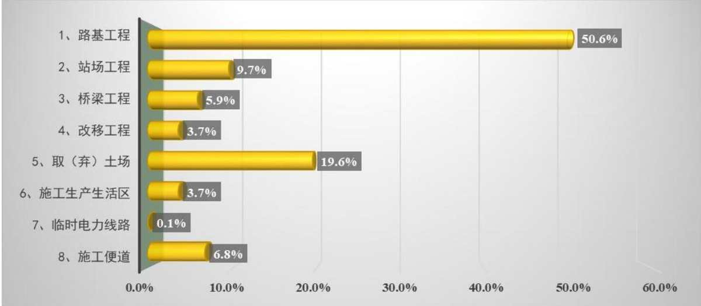  
图4.5-1 各预测单元新增土壤流失量比重图

## （3）防治措施类型分析

根据各预测单元在预测时段内可能产生侵蚀强度和侵蚀量的情况，主体工程挖填方边坡宜采取工程防护为主的防护类型；临时施工场地和施工便道等防护措施宜采取加强管理和场地平整相结合的防护类型。

## （4）防治措施的实施进度分析

根据水土流失预测结果，施工期是新增水土流失较严重的时期，在工程建设过程中施工进度应紧凑安排，尽量缩短跨越风季、雨季的实施时段。施工准备期场地平整宜提早进行，不宜滞后，应加强风雨季临时苫盖措施。植物措施结合施工进度安排，宜安排在雨季前播种和管养，尽量做到随平整随绿化。

施工后期，不仅需进行迹地恢复，还应加强植被措施管养，尽快发挥植物措施效益；还可考虑主体工程与防治措施同时开展，如土方回填具备条件后，可随即土地整治。

## （5）采取防治工程后的水土流失影响分析

始终贯彻“预防为主、防治结合”的工作方针，严格执行“水土保持三同时”工作制度，加强主体工程、取（弃）土场区临时管理和防护措施，可有效地预防和减少项目区水土流失的发生。随着工程措施、植物措施逐步到位，封禁保育区植被的逐步恢复，土壤流失将趋于稳定，各项水土保持措施将逐步发挥效益。

## （6）对水土保持监测的指导性意见

由于工程施工区域的不同，水土流失程度和特点各不相同，水土保持监测也必须针对不同水土流失区域进行，各区域监测内容应全面，监测点位布置适当，要具有代表性，能充分反映各施工区的水土流失特征。

## 5 水土保持措施

## 5.1 防治区划分

根据本项目环境特征和工程特点，按照地貌类型相似、立地条件大致相同、有利于分类实施各项防治措施的原则，确定防治分区。

项目区气候类型为温带大陆性极干旱气候区，地形地貌划分为平原微丘区和山岭重丘区。根据地貌类型和水土流失特点，本工程一级防治分区划分为：平原微丘区、山岭重丘区。

平原微丘区：正线（DK685+200\~DK796+000、DK1091+800\~DK1325+100），长度344.28km；改建嘉策铁路联络线长2.377km；淖梧铁路接轨梧桐水站引起既有临哈铁路站后及四电工程以及梧桐水站改建；哈密东站新建万吨分解场增设到发线，哈密东站改建机务折返段，哈密站扩建货车检修车间。

山岭重丘区：正线（DK796+000\~DK1091+800），长度 295.80km。

根据工程建设特点，结合工程施工区布局，将平原微丘区、山岭重丘区两个一级防治分区分别划分路基防治区、风沙防护工程防治区、站场防治区、桥梁防治区、改移工程防治区、取（弃）土场防治区、施工生产生活防治区、临时电力线路防治区、施工便道防治区9 个二级防治分区。防治分区特征和具体情况详见下表。

表 5.1-1 水土流失防治分区表
<table><tr><td rowspan=1 colspan=1>一级分区</td><td rowspan=1 colspan=1>行政区划</td><td rowspan=1 colspan=1>二级分区</td><td rowspan=1 colspan=1>工程内容</td><td rowspan=1 colspan=1>水土流失特征</td><td rowspan=1 colspan=1>分区特征</td></tr><tr><td rowspan=9 colspan=1>平原微丘区</td><td rowspan=3 colspan=1>阿拉善盟额济纳旗、酒泉</td><td rowspan=1 colspan=1>路基防治区</td><td rowspan=1 colspan=1>路堤、路堑</td><td rowspan=1 colspan=1>施工期开挖填筑形成裸露地表；以及基础开挖临时堆土的水土流失。</td><td rowspan=1 colspan=1>带状分布，施工扰动和土石方工程量大，地表破坏严重，影响范围大，易发生水土流失</td></tr><tr><td rowspan=1 colspan=1>风沙防护工程防治区</td><td rowspan=1 colspan=1>风沙路基防护</td><td rowspan=1 colspan=1>施工期开挖及施工作业破坏地表植被和附着物。</td><td rowspan=1 colspan=1>带状分布，施工扰动大，易发生水土流失。</td></tr><tr><td rowspan=1 colspan=1>站场防治区</td><td rowspan=1 colspan=1>新建改建站区、到发线延长</td><td rowspan=1 colspan=1>施工期开挖及场平形成裸露地表。</td><td rowspan=1 colspan=1>点状分布，施工扰动和土石方工程量大。</td></tr><tr><td rowspan=6 colspan=1>市肃北蒙古族自治县、哈密市伊州区、新疆生产建设兵团第十三师新星市</td><td rowspan=1 colspan=1>桥梁防治区</td><td rowspan=1 colspan=1>桥梁</td><td rowspan=1 colspan=1>桥梁基础施工和临时堆土的水土流失。</td><td rowspan=1 colspan=1>带状分布，施工扰动大，易发生水土流失。</td></tr><tr><td rowspan=1 colspan=1>改移工程防治区</td><td rowspan=1 colspan=1>改移道路</td><td rowspan=1 colspan=1>改移道路施工活动破坏地表植被。</td><td rowspan=1 colspan=1>零星带状分布，施工期短暂。</td></tr><tr><td rowspan=1 colspan=1>取(弃)土场防治区</td><td rowspan=1 colspan=1>取（弃）土场</td><td rowspan=1 colspan=1>土料开挖、场地平整、土石方装卸、弃土回填取土坑等施点工作业破坏地表植被和附着物。</td><td rowspan=1 colspan=1>状分布，重点关注取弃土作业方式和后期场地恢复。</td></tr><tr><td rowspan=1 colspan=1>施工生产生活防治区</td><td rowspan=1 colspan=1>铺轨基地、梁场、拌和站、土石施方临时周转场等临时设施</td><td rowspan=1 colspan=1>工场地为点片状分布，地表蓄渗能力低，对地表附着物破坏大。</td><td rowspan=1 colspan=1>点状分布，重点关注后期场地恢复。</td></tr><tr><td rowspan=1 colspan=1>临时电力线路防治区</td><td rowspan=1 colspan=1>架空电线杆基施工</td><td rowspan=1 colspan=1>电杆基础和配套道路施工对地表附着物短暂破坏。</td><td rowspan=1 colspan=1>零星带状分布，施工期短暂。</td></tr><tr><td rowspan=1 colspan=1>施工便道防治区</td><td rowspan=1 colspan=1>配套施工便道</td><td rowspan=1 colspan=1>施工便道施工作业带长，对地表植被破坏大。</td><td rowspan=1 colspan=1>带状分布，施工扰动大，易发生水土流失。</td></tr><tr><td rowspan=9 colspan=1>山岭重丘区</td><td rowspan=9 colspan=1>阿拉善盟额济纳旗、酒泉市肃北蒙古族自治县</td><td rowspan=1 colspan=1>路基防治区</td><td rowspan=1 colspan=1>路堤、路堑</td><td rowspan=1 colspan=1>施工期开挖填筑形成裸露地表；以及基础开挖临时堆土的水土流失。</td><td rowspan=1 colspan=1>带状分布，施工扰动和土石方工程量大，地表破坏严重，影响范围大，易发生水土流失</td></tr><tr><td rowspan=1 colspan=1>风沙防护工程防治区</td><td rowspan=1 colspan=1>风沙路基防护</td><td rowspan=1 colspan=1>施工期开挖及施工作业破坏地表植被和附着物。</td><td rowspan=1 colspan=1>带状分布，施工扰动大，易发生水土流失。</td></tr><tr><td rowspan=1 colspan=1>站场防治区</td><td rowspan=1 colspan=1>改建站区及到发线延长</td><td rowspan=1 colspan=1>施工期开挖及场平形成裸露地表，破坏植被和附着物。</td><td rowspan=1 colspan=1>点状分布，施工扰动和土石方工程量大。</td></tr><tr><td rowspan=1 colspan=1>桥梁防治区</td><td rowspan=1 colspan=1>桥梁</td><td rowspan=1 colspan=1>桥梁基础施工和临时堆土的水土流失。</td><td rowspan=1 colspan=1>带状分布，施工扰动大，易发生水土流失。</td></tr><tr><td rowspan=1 colspan=1>改移工程防治区</td><td rowspan=1 colspan=1>改移道路</td><td rowspan=1 colspan=1>改移道路施工活动破坏地表植被和附着物。</td><td rowspan=1 colspan=1>零星带状分布，施工期短暂。</td></tr><tr><td rowspan=1 colspan=1>取(弃)土场防治区</td><td rowspan=1 colspan=1>取（弃）土场</td><td rowspan=1 colspan=1>土料开挖、场地平整、土石方装卸、弃土回填取土坑等施点工作业破坏地表植被和附着物。</td><td rowspan=1 colspan=1>状分布，重点关注取弃土作业方式和后期场地恢复。</td></tr><tr><td rowspan=1 colspan=1>施工生产生活防治区</td><td rowspan=1 colspan=1>铺轨基地、梁场、拌和站、土石施方临时周转场等临时设施</td><td rowspan=1 colspan=1>工场地为点片状分布，地表蓄渗能力低，对地表附着物破坏大。</td><td rowspan=1 colspan=1>点状分布，重点关注后期场地恢复。</td></tr><tr><td rowspan=1 colspan=1>临时电力线路防治区</td><td rowspan=1 colspan=1>架空电线杆基施工</td><td rowspan=1 colspan=1>电杆基础和配套道路施工对地表附着物产生短暂破坏。</td><td rowspan=1 colspan=1>零星带状分布，施工期短暂。</td></tr><tr><td rowspan=1 colspan=1>施工便道防治区</td><td rowspan=1 colspan=1>配套施工便道</td><td rowspan=1 colspan=1>施工便道施工作业带长，对地表植被破坏大。</td><td rowspan=1 colspan=1>带状分布，施工扰动大，易发生水土流失。</td></tr></table>

治原则应突出生态区位特点，因地制宜，因害设防，分类分区施策，秉持“以水定绿”，科学配置保护、恢复和合理利用措施，立足于既有生态环境不恶化，巩固已见成效的水土保持措施，统筹保护和治理，选择适宜的、针对性防治措施。

## （2）全面布设，合理配置的原则

水土保持措施布设应坚持全局性、系统性和适应性，围绕山水林田湖草沙，做到各项措施配置合理，采用“点、线、面”相结合，建立起完整的水土保持综合防治体系，保障主体工程安全运行与周边生态安全。

## （3）与主体工程协调一致的原则

各项措施的布设应与主体工程协调一致，与主体工程良好衔接。

## （4）与周边景观相协调的原则

树立人与自然和谐相处的理念，注重与周边景观相协调；工程措施和植物措施的配置除满足水土保持要求外，还应考虑植被后期维护管养和保证林草成活率。

## （5）坚持保护优先、自然恢复为主，人工修复为辅的原则

采取严格的预防保护措施，尽量保持原地貌景观格局；控制施工扰动范围，强化弃土弃渣的综合利用，尽最大可能减少对原地貌和植被的破坏，做到不破坏、不占压或最大限度地减少破坏与占压，注重北方风沙区的地表结皮层、沙壳、砾幕的保护。施工结束后荒漠戈壁区不具备绿化的区域，应注重自然封禁保护为主，人工修复抚育为辅的生态治理措施。

## （6）强化临时防护措施的原则

注重剥离表土和砾幕层分类集中临时堆放场、取（弃）土场、施工场地、临时电力线路和施工便道等区域的临时防护措施，及时布设临时拦挡、苫盖措施，必要时采取碎石压盖，彩条旗等限制扰动措施。

## 5.2.3 防治措施总体布局

根据铁路项目建设特点，通过工程措施、植物措施和临时措施的有机结合，永久与临时措施的强化补充，统筹布置水土流失的防治体系。水土保持措施配置应以工程措施为先导，充分发挥工程措施控制作用，同时注重施工期主体工程水土保持措施布设，注重发挥植物措施和工程措施的后续性、长久性及生态性，改善铁路沿线生态环境。

平原微丘区以提高植被盖度为实施重点，筑牢绿色铁路沿线生态根基；山岭重丘区以提升防风固沙能力，拦截上游汇水、防止施工过程中溜渣为实施重点，最终达到改善沙区铁路沿线生态环境和遏制土地沙化趋势的目的。各区的防治措施布局如下：

## （1）平原微丘区

## 1）路基防治区

施工前，先剥离表土、砾幕层，表土及砾幕分类集中堆放，并采取临时防护措施，场地周边布设限界彩条旗（方案新增）。

施工过程中，路基边坡采取横向排水槽防护、不带截水槽拱形骨架护坡措施，路基两侧布设排水沟、侧沟及天沟等截排水工程，顺接至周边排水系统或自然沟渠（主体已列）；永久排水设施未具备排水功能前，结合排水沟位置开挖临时土质排水沟并设临时沉沙池，土质边坡裸露面临时苫盖密目网（方案新增）。

施工结束后，对路堤坡脚至用地界、路堑堑顶至用地界进行土地整治，并回覆砾幕（方案新增）。

## 2）风沙防护工程防治区

施工前，场地周边布设限界彩条旗（方案新增）。

施工结束后，路基外围营造芦苇、石方格等综合防风固沙体系，修复既有线HDPE网格防沙措施（主体已列），并对施工扰动范围进行土地整治（方案新增）。

## 3）站场防治区

施工前，先剥离表土、砾幕层，表土及砾幕分类集中堆放，并采取临时防护措施，场地周边布设限界彩条旗（方案新增）。

施工过程中，站内路基边坡采取横向排水槽防护、不带截水槽拱形骨架护坡措施，站内路基两侧布设排水沟、天沟及侧沟等截排水工程，顺接至周边排水系统或自然沟渠（主体已列）；永久排水设施未具备排水功能前，结合排水沟位置开挖临时土质排水沟并设临时沉沙池，土质边坡裸露面临时苫盖密目网；站场场坪裸露区临时苫盖密目网（方案新增）。

施工结束后，将表土回铺至站场绿化区域，并进行土地整治（方案新增）；站场场坪绿化区域栽植乔灌草绿化，并配套布设灌溉措施（主体已列）。

## 4）桥梁防治区

施工前，先剥离表土、砾幕层，表土及砾幕分类集中堆放，并采取临时防护措施，场地周边布设限界彩条旗（方案新增）。

施工过程中，桥墩钻孔桩接入泥浆沉淀池，钻渣固化处理（方案新增）；漫流区线路上游布设导流设施（主体已列）。

施工结束后，桥下施工扰动区域土地整治，砾幕层回铺至裸露面（方案新增）。

## 5）改移工程防治区

施工前，先剥离表土、砾幕层，表土及砾幕分类集中堆放，并采取临时防护措施，场地周边布设限界彩条旗（方案新增）。

施工过程中，改移道路边坡苫盖密目网（方案新增）。

施工结束后，将表土、砾幕层分别回铺至扰动裸露面，并进行土地整治（方案新增）。

## 6）取（弃）土场防治区

取弃土前，先剥离砾幕层，集中堆放，并采取临时防护措施，场区外侧布设高立式PE阻沙沙障和限界彩条旗（方案新增）。

取土过程中，取土边坡采取削坡开级（主体已列），裸露边坡苫盖密目网（方案新增）；漫流区取（弃）土场上游布设导流设施（主体已列）。

取弃土结束后，进行土地整治、表土回覆，对场地内撒播草籽或回覆砾幕。对沙质边坡的取（弃）土场喷洒固沙剂，终采平台布设田字格土埂（方案新增）。

## 7）施工生产生活防治区

施工前，先剥离砾幕层，集中堆放，并采取临时防护措施，场地周边布设限界彩条旗（方案新增）。

施工过程中，裸露面进行临时苫盖；对临时周转场采取临时防护措施（方案新增）。

施工结束后，对施工扰动区域进行土地整治，回覆砾幕（方案新增）。

8）临时电力线路防治区

施工前，先剥离砾幕层，集中堆放，并采取临时防护措施，场地周边布设限界彩条旗（方案新增）。

施工过程中，裸露面进行临时苫盖（方案新增）。

施工结束后，对施工扰动区域进行土地整治，回覆砾幕（方案新增）。

## 9）施工便道防治区

施工前，施工便道两侧布设限界彩条旗（方案新增）。

施工过程中，便道裸露边坡临时苫盖（方案新增）。

施工结束后，进行土地整治（方案新增）。

## （2）山岭重丘区

## 1）路基防治区

施工前，先剥离砾幕层，集中堆放，并采取临时防护措施，场地周边布设限界彩条旗（方案新增）。

施工过程中，路基边坡采取横向排水槽防护、不带截水槽拱形骨架护坡、孔窗式护坡措施，路基两侧布设排水沟、侧沟及天沟，顺接至周边排水系统或自然沟渠（主体已列）；永久排水设施未具备排水功能前，结合排水沟位置开挖临时土质排水沟并设临时沉沙池，土质边坡裸露面临时苫盖密目网（方案新增）。

施工结束后，对路堤坡脚至用地界、路堑堑顶至用地界进行土地整治，并回覆砾幕

（方案新增）。

## 2）风沙防护工程防治区

施工前，场地周边布设限界彩条旗（方案新增）。

施工结束后，路基外围营造芦苇、石方格等综合防风固沙体系，修复既有线HDPE网格防沙措施（主体已列），并对施工扰动范围进行土地整治（方案新增）。

## 3）站场防治区

施工前，先剥离砾幕层，集中堆放，并采取临时防护措施，场地周边布设限界彩条旗（方案新增）。

施工过程中，站内路基边坡采取横向排水槽防护、不带截水槽拱形骨架护坡措施，站内路基两侧布设排水沟、天沟及侧沟等截排水工程，顺接至周边排水系统或自然沟渠（主体已列）；永久排水设施未具备排水功能前，结合排水沟位置开挖临时土质排水沟并设临时沉沙池，土质边坡裸露面临时苫盖密目网；站场场坪裸露区临时苫盖密目网（方案新增）。

施工结束后，将表土回铺至站场绿化区域，并进行土地整治（方案新增）；站场场坪绿化区域栽植灌草绿化，并配套布设灌溉措施（主体已列）。

## 4）桥梁防治区

施工前，先剥离砾幕层，集中堆放，并采取临时防护措施，场地周边布设限界彩条旗（方案新增）。

施工过程中，桥墩钻孔桩顺接泥浆沉淀池，钻渣固化处理（方案新增）；漫流区线路上游布设导流设施（主体已列）。

施工结束后，桥下施工扰动区域土地整治，砾幕层回铺至裸露面（方案新增）。

## 5）改移工程防治区

施工前，先剥离砾幕层，集中堆放，并采取临时防护措施，场地周边布设限界彩条旗（方案新增）。

施工过程中，改移道路边坡苫盖密目网（方案新增）。

施工结束后，将砾幕层分别回铺至扰动裸露面并土地整治（方案新增）。

## 6）取（弃）土场防治区

取土前，先剥离砾幕层，集中堆放，并采取临时防护措施。场区外侧布设高立式 PE阻沙沙障和限界彩条旗。山坡型及漫流区取（弃）土场外围布设排水沉沙措施（方案新增）。

取土过程中，取土边坡采取削坡开级（主体已列），裸露边坡苫盖密目网（方案新增）；漫流区取（弃）土场上游布设导流设施（主体已列）。

取土结束后，进行土地整治、砾幕回覆（方案新增）。

## 7）施工生产生活防治区

施工前，先剥离砾幕层，集中堆放，并采取临时防护措施，场地周边布设限界彩条旗（方案新增）。

施工过程中，施工场地周边布设临时排水沉砂措施，裸露面进行临时苫盖；对临时周转场采取临时防护措施（方案新增）。

施工结束后，进行土地整治；回覆砾幕（方案新增）。

## 8）临时电力线路防治区

施工前，先剥离砾幕层，集中堆放，并采取临时防护措施。立杆基坑上游坡顶布设挡水埂，下游坡脚布设装土草袋拦挡，场地周边布设限界彩条旗（方案新增）。

施工过程中，裸露面进行临时苫盖（方案新增）。

施工结束后，对施工扰动区域进行土地整治，回覆砾幕（方案新增）。

## 9）施工便道防治区

施工前，施工便道上游坡顶布设挡水埂，下游坡脚布设装土草袋拦挡，两侧布设限界彩条旗（方案新增）。

施工过程中，便道裸露边坡临时苫盖（方案新增）。

施工结束后，进行土地整治（方案新增）。

水土流失防治措施体系详见图5.2-2、图5.2-3。

表 5.2.3-1 水土流失防治措施体系表
<table><tr><td rowspan=2 colspan=2>防治分区</td><td rowspan=2 colspan=1>措施类型</td><td rowspan=1 colspan=2>防治措施</td></tr><tr><td rowspan=1 colspan=1>主体已列</td><td rowspan=1 colspan=1>方案新增</td></tr><tr><td rowspan=20 colspan=1>平原微丘区</td><td rowspan=2 colspan=1>路基区</td><td rowspan=1 colspan=1>工程措施</td><td rowspan=1 colspan=1>路基边坡防护（骨架护坡、排水槽护坡），路基排水及顺接工程</td><td rowspan=1 colspan=1>表土剥离，砾幕剥离和回覆，土地整治</td></tr><tr><td rowspan=1 colspan=1>临时措施</td><td rowspan=1 colspan=1></td><td rowspan=1 colspan=1>路基两侧临时排水沉沙措施，土体边坡临时苫盖密目网，临时堆土场防护措施，砾幕临时拦挡措施，场区周边限界措施</td></tr><tr><td rowspan=2 colspan=1>风沙防护工程区</td><td rowspan=1 colspan=1>工程措施路</td><td rowspan=1 colspan=1>基外围营造防风固沙措施</td><td rowspan=1 colspan=1>土地整治</td></tr><tr><td rowspan=1 colspan=1>临时措施</td><td rowspan=1 colspan=1></td><td rowspan=1 colspan=1>场区周边限界措施</td></tr><tr><td rowspan=3 colspan=1>站场区</td><td rowspan=1 colspan=1>工程措施</td><td rowspan=1 colspan=1>站内路基边坡防护工程（骨架护坡、排水槽护坡），站内路基、表土站区排水工程，灌溉设施</td><td rowspan=1 colspan=1>剥离和回覆，砾幕剥离，土地整治</td></tr><tr><td rowspan=1 colspan=1>植物措施站</td><td rowspan=1 colspan=1>区景观绿化</td><td rowspan=1 colspan=1></td></tr><tr><td rowspan=1 colspan=1>临时措施</td><td rowspan=1 colspan=1></td><td rowspan=1 colspan=1>站内路基临时排水沉沙措施，站内路基、站区裸露面临时苫盖，临时堆土场防护措施，砾幕临时拦挡措施，场区周边限界措施</td></tr><tr><td rowspan=2 colspan=1>桥梁区</td><td rowspan=1 colspan=1>工程措施线</td><td rowspan=1 colspan=1>路上游导流堤</td><td rowspan=1 colspan=1>表土剥离，砾幕剥离和回覆，土地整治</td></tr><tr><td rowspan=1 colspan=1>临时措施</td><td rowspan=1 colspan=1></td><td rowspan=1 colspan=1>泥浆沉淀池，临时堆土场防护措施，砾幕临时拦挡措施，场区周边限界措施</td></tr><tr><td rowspan=2 colspan=1>改移工程区</td><td rowspan=1 colspan=1>工程措施</td><td rowspan=1 colspan=1></td><td rowspan=1 colspan=1>表土剥离和回覆，砾幕剥离和回覆，土地整治</td></tr><tr><td rowspan=1 colspan=1>临时措施</td><td rowspan=1 colspan=1></td><td rowspan=1 colspan=1>改移道路边坡临时苫盖密目网，临时堆土场临时防护措施，砾幕临时拦挡措施，场区周边限界措施</td></tr><tr><td rowspan=3 colspan=1>取(弃)土场区</td><td rowspan=1 colspan=1>工程措施</td><td rowspan=1 colspan=1>取土边坡削坡（分级），上游导流堤</td><td rowspan=1 colspan=1>表土回覆，砾幕剥离和回覆，土地整治，田字格土埂</td></tr><tr><td rowspan=1 colspan=1>植物措施</td><td rowspan=1 colspan=1></td><td rowspan=1 colspan=1>边坡及取土终采面撒播草籽</td></tr><tr><td rowspan=1 colspan=1>临时措施</td><td rowspan=1 colspan=1></td><td rowspan=1 colspan=1>取（弃）土作业裸露面临时苫盖，高立式PE阻沙沙障，砾幕临时拦挡措施，场区周边限界措施，坡面固沙剂</td></tr><tr><td rowspan=2 colspan=1>施工生产生活区</td><td rowspan=1 colspan=1>工程措施</td><td rowspan=1 colspan=1></td><td rowspan=1 colspan=1>砾幕剥离和回覆，土地整治</td></tr><tr><td rowspan=1 colspan=1>临时措施</td><td rowspan=1 colspan=1></td><td rowspan=1 colspan=1>裸露面临时苫盖，砾幕临时拦挡措施，临时周转场防护措施，场区周边限界措施</td></tr><tr><td rowspan=2 colspan=1>临时电力线路区</td><td rowspan=1 colspan=1>工程措施</td><td rowspan=1 colspan=1></td><td rowspan=1 colspan=1>砾幕剥离和回覆，土地整治</td></tr><tr><td rowspan=1 colspan=1>临时措施</td><td rowspan=1 colspan=1></td><td rowspan=1 colspan=1>作业裸露面临时苫盖，砾幕临时拦挡措施，场区周边限界措施</td></tr><tr><td rowspan=1 colspan=1>施工便道工</td><td rowspan=1 colspan=1>程措施</td><td rowspan=1 colspan=1></td><td rowspan=1 colspan=1>土地整治</td></tr><tr><td rowspan=1 colspan=1>区</td><td rowspan=1 colspan=1>临时措施</td><td rowspan=1 colspan=1></td><td rowspan=1 colspan=1>施工便道裸露边坡临时苫盖，场区周边限界措施</td></tr></table>

5 水土保持措施
<table><tr><td rowspan=2 colspan=2>防治分区</td><td rowspan=2 colspan=1>措施类型</td><td rowspan=1 colspan=2>防治措施</td></tr><tr><td rowspan=1 colspan=1>主体已列</td><td rowspan=1 colspan=1>方案新增</td></tr><tr><td rowspan=19 colspan=1>山岭重丘区</td><td rowspan=2 colspan=1>路基区</td><td rowspan=1 colspan=1>工程措施</td><td rowspan=1 colspan=1>路基边坡防护（骨架护坡、孔窗式护坡、排水槽护坡），路基排水及顺接工程</td><td rowspan=1 colspan=1>砾幕剥离和回覆，土地整治</td></tr><tr><td rowspan=1 colspan=1>临时措施</td><td rowspan=1 colspan=1></td><td rowspan=1 colspan=1>路基两侧临时排水沉沙措施，土体边坡临时苫盖密目网，砾幕临时拦挡措施，场区周边限界措施</td></tr><tr><td rowspan=2 colspan=1>风沙防护工程区</td><td rowspan=1 colspan=1>工程措施</td><td rowspan=1 colspan=1>路基外围营造防风固沙措施</td><td rowspan=1 colspan=1>土地整治</td></tr><tr><td rowspan=1 colspan=1>临时措施</td><td rowspan=1 colspan=1></td><td rowspan=1 colspan=1>场区周边限界措施</td></tr><tr><td rowspan=3 colspan=1>站场区</td><td rowspan=1 colspan=1>工程措施</td><td rowspan=1 colspan=1>站内路基边坡防护工程（骨架护坡、排水槽护坡），站内路基、站区排水工程，灌溉设表施</td><td rowspan=1 colspan=1>土回覆，砾幕剥离，土地整治</td></tr><tr><td rowspan=1 colspan=1>植物措施</td><td rowspan=1 colspan=1>站区景观绿化</td><td rowspan=1 colspan=1></td></tr><tr><td rowspan=1 colspan=1>临时措施</td><td rowspan=1 colspan=1></td><td rowspan=1 colspan=1>站内路基临时排水沉沙措施，站内路基、站区裸露面临时苫盖，砾幕临时拦挡措施，场区周边限界措施</td></tr><tr><td rowspan=2 colspan=1>桥梁区</td><td rowspan=1 colspan=1>工程措施线</td><td rowspan=1 colspan=1>路上游导流堤</td><td rowspan=1 colspan=1>砾幕剥离和回覆，土地整治</td></tr><tr><td rowspan=1 colspan=1>临时措施</td><td rowspan=1 colspan=1></td><td rowspan=1 colspan=1>泥浆沉淀池，砾幕临时拦挡措施，场区周边限界措施</td></tr><tr><td rowspan=2 colspan=1>改移工程区</td><td rowspan=1 colspan=1>工程措施</td><td rowspan=1 colspan=1></td><td rowspan=1 colspan=1>砾幕剥离和回覆，土地整治</td></tr><tr><td rowspan=1 colspan=1>临时措施</td><td rowspan=1 colspan=1></td><td rowspan=1 colspan=1>改移道路边坡临时苫盖防尘网，砾幕临时拦挡措施，场区周边限界措施</td></tr><tr><td rowspan=2 colspan=1>取(弃)土场区</td><td rowspan=1 colspan=1>工程措施</td><td rowspan=1 colspan=1>取土边坡削坡（分级），上游导流堤</td><td rowspan=1 colspan=1>砾幕剥离和回覆，土地整治</td></tr><tr><td rowspan=1 colspan=1>临时措施</td><td rowspan=1 colspan=1></td><td rowspan=1 colspan=1>取（弃）土作业裸露面临时苫盖，高立式PE阻沙沙障，砾幕临时拦挡措施，山坡型和漫流区取（弃）土场外围排水沉沙措施，场区周边限界措施</td></tr><tr><td rowspan=2 colspan=1>施工生产生活区</td><td rowspan=1 colspan=1>工程措施</td><td rowspan=1 colspan=1></td><td rowspan=1 colspan=1>砾幕剥离和回覆，土地整治</td></tr><tr><td rowspan=1 colspan=1>临时措施</td><td rowspan=1 colspan=1></td><td rowspan=1 colspan=1>施工场地临时排水和沉沙措施，裸露面临时苫盖，砾幕临时拦挡措施，临时周转场防护措施，场区周边限界措施</td></tr><tr><td rowspan=2 colspan=1>临时电力线路区</td><td rowspan=1 colspan=1>工程措施</td><td rowspan=1 colspan=1></td><td rowspan=1 colspan=1>砾幕剥离和回覆，土地整治</td></tr><tr><td rowspan=1 colspan=1>临时措施</td><td rowspan=1 colspan=1></td><td rowspan=1 colspan=1>作业裸露面临时苫盖，砾幕临时拦挡措施，上游坡顶布设挡水埂，下游坡脚布设装土草袋拦挡，场区周边限界措施</td></tr><tr><td rowspan=2 colspan=1>施工便道区</td><td rowspan=1 colspan=1>工程措施</td><td rowspan=1 colspan=1></td><td rowspan=1 colspan=1>土地整治</td></tr><tr><td rowspan=1 colspan=1>临时措施</td><td rowspan=1 colspan=1></td><td rowspan=1 colspan=1>施工便道裸露边坡临时苫盖，上游坡顶布设挡水埂，下游坡脚布设装土草袋拦挡，场区周边限界措施</td></tr></table>

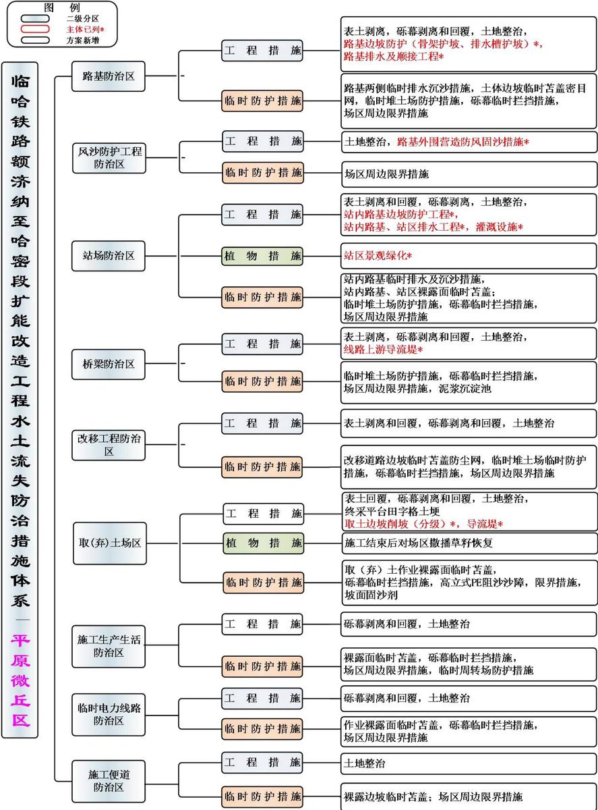  
图 5.2-2 平原微丘区水土流失防治措施体系图

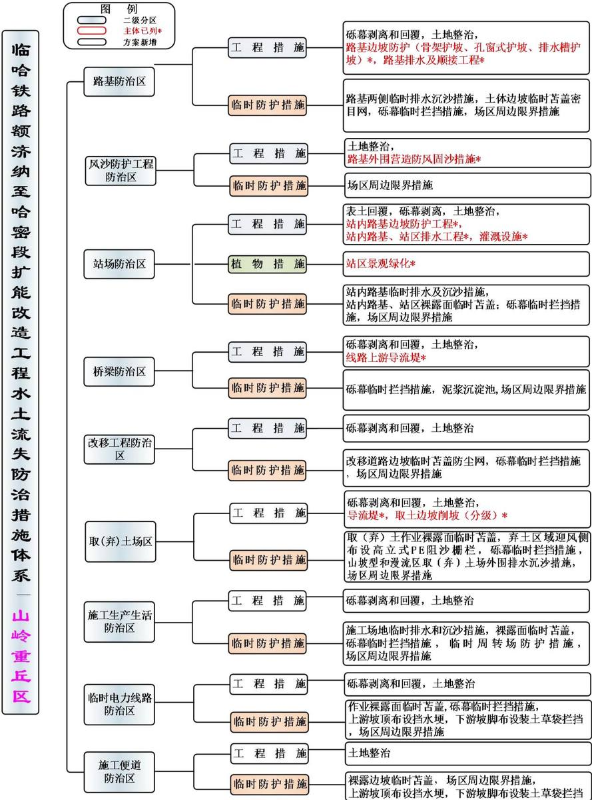  
图 5.2-3 山岭重丘区水土流失防治措施体系图

## 5.3 分区措施布设

## 5.3.1 设计标准

## 5.3.1.1 工程措施设计标准

## （1）排水设施设计标准

主体工程设计的路基、站场等截排水措施依据《重载铁路设计规范》（TB10625-2017）按1/50 洪水频率进行计算。

## （2）表土剥离和砾幕层收集

1）开挖前先对工程占用的耕地、林地和草地区域进行表土剥离，并将表土单独堆放，待施工结束后再用于绿化用土。表土剥离厚度：平原微丘区耕地15cm，林地 5cm，草地5cm；山岭重丘区无可剥离表土。

2）开挖前先进行砾幕层剥离，将表层砾石单独堆放，待施工结束后再用于砾石压盖。砾幕层剥离厚度：2cm。

## （3）土地整治工程

参照《水土保持工程设计规范》（GB51018-2014），考虑项目区表土厚度及施工条件等因素，施工结束后进行场地清理、坑凹回填、表土回覆，人工施肥，耕翻地后可满足作物生长需要。

## 5.3.1.2 植物措施设计标准

## （1）植物恢复和建设工程级别

根据《水土保持工程设计规范》（GB51018-2014），生产建设项目的植被恢复与建设工程级别，应根据生产建设项目主体工程所处的自然及人文环境、气候条件、立地条件、占地范围、绿化要求综合确定，并符合下列规定：

1）工程项目区域涉及城镇、饮用水源保护区和风景名胜区的，应提高一级；

2）弃渣取料、施工生产生活区、施工交通等临时占地区域应执行 3级标准；

项目区年均降水量为35.2\~65.6mm，年降水量低于 250mm，植被恢复与建设工程除特殊要求外，植被措施以封禁为主并辅以人工抚育。

根据《生产建设项目水土流失防治标准》（GB/T50434-2018），由于本项目处于极干旱地区，因此林草植被恢复率、林草覆盖率不作定量要求。

## （2）植被恢复原则和规格

播撒草籽、栽植灌木苗：草籽尽量采用多种混播，栽植灌木苗后进行管养。混播草籽密度取 80kg/hm2。

## （3）植被恢复位置

对具备水源灌溉条件的车站，采取站区绿化和植被恢复措施，采用乡土树草种绿化，并加强后期人工抚育和养管。

①对主体工程征占地类型和功能发生转变的铁路用地，已不能恢复原有用地类型，应采取水土保持综合措施有效控制施工引起的水土流失。

②临时征占地区域，应恢复原有用地类型。对具有绿化条件的取（弃）土场撒播草籽进行绿化。

③剩余地段基本不具备植物生长条件，大部分位于荒漠极干旱区，路基、桥梁、改移工程绿色通道、施工生产生活区、临时电力线路区、施工便道不考虑绿化。

## 5.3.1.3 临时措施设计标准

## （1）临时措施设计原则

1）施工建设中，临时堆土（石、渣）必须设置专门堆放地，集中堆放，并应采取拦挡、覆盖等措施。

2）对施工开挖、剥离的地表熟土，应安排场地集中堆放，并采取临时拦挡、苫盖等防护措施，用于施工结束后植被恢复。

3）施工中的裸露地，在遇暴雨、大风时应布设防护措施。

4）铁路大临工程和施工便道应协同规划，集约布置，并采取临时防护措施，如临时拦挡、苫盖等设施，防止施工期间的水土流失。

5）施工可能对工程下游及周边造成水土流失的工程部位，应采取相应的临时拦挡、苫盖、排水、沉沙等防护措施。

## （2）临时排水工程设计标准

按照《水土保持工程设计规范》（GB51018-2014），根据相关项目经验，临时排水沟设计标准一般按5年一遇10min的降雨强度计算。

## 5.3.1.4 北方风沙区的特殊规定

除执行《生产建设项目水土保持技术标准》（GB50433-2018）、《水土保持工程设计规范》（GB51018-2014）外，水土保持措施设计要求还应满足《生产建设项目水土保持方案审查要点》（办水保〔2023〕177号）关于北方风沙区的特殊规定。

（1）应控制施工扰动范围，保护地表结皮层、沙壳、砾幕。裸露地表和堆土区应及时防护，减少裸露时间，并采取苫盖等临时措施。

（2）可采取砾（片、碎）石覆盖、沙障、植物固沙、化学固沙等措施防治风蚀；

（3）在干旱缺水地区植物措施应配套灌溉设施。

表 5.3.1.4-1 取（弃）土场级别汇总表
<table><tr><td rowspan=1 colspan=1>序号</td><td rowspan=1 colspan=1>弃渣场名称</td><td rowspan=1 colspan=1>堆渣量(松方)万m³</td><td rowspan=1 colspan=1>最大堆高m</td><td rowspan=1 colspan=1>回填后与取土终采平台高差m</td><td rowspan=1 colspan=1>占地面积hm2</td><td rowspan=1 colspan=1>汇水面积km2</td><td rowspan=1 colspan=1>弃渣场失事后对主体工程或环境造成危害程度</td><td rowspan=1 colspan=1>弃渣场级别</td><td rowspan=1 colspan=1>是否涉及水土流失重点防治区</td><td rowspan=1 colspan=1>植被恢复与建设工程级别</td></tr><tr><td rowspan=1 colspan=1>1</td><td rowspan=1 colspan=1>取弃土（渣）场01</td><td rowspan=1 colspan=1>0.61</td><td rowspan=1 colspan=1>1</td><td rowspan=1 colspan=1>与取土终采平台持平</td><td rowspan=1 colspan=1>2.76</td><td rowspan=1 colspan=1>0.05</td><td rowspan=1 colspan=1>无危害</td><td rowspan=1 colspan=1>5</td><td rowspan=1 colspan=1>不涉及</td><td rowspan=11 colspan=1>鉴于取(弃)土场均位于戈壁荒漠极干旱区，自然</td></tr><tr><td rowspan=1 colspan=1>2</td><td rowspan=1 colspan=1>取弃土（渣）场 03</td><td rowspan=1 colspan=1>1.38</td><td rowspan=1 colspan=1>1</td><td rowspan=1 colspan=1>与取土终采平台持平</td><td rowspan=1 colspan=1>6.27</td><td rowspan=1 colspan=1>0.11</td><td rowspan=1 colspan=1>无危害</td><td rowspan=1 colspan=1>5</td><td rowspan=1 colspan=1>不涉及</td></tr><tr><td rowspan=1 colspan=1>3</td><td rowspan=1 colspan=1>取弃土（渣）场 04</td><td rowspan=1 colspan=1>7.72</td><td rowspan=1 colspan=1>1</td><td rowspan=1 colspan=1>与取土终采平台持平</td><td rowspan=1 colspan=1>5.66</td><td rowspan=1 colspan=1>0.1</td><td rowspan=1 colspan=1>无危害</td><td rowspan=1 colspan=1>5</td><td rowspan=1 colspan=1>不涉及</td></tr><tr><td rowspan=1 colspan=1>4</td><td rowspan=1 colspan=1>取弃土（渣）场 06</td><td rowspan=1 colspan=1>4.25</td><td rowspan=1 colspan=1>1</td><td rowspan=1 colspan=1>与取土终采平台持平</td><td rowspan=1 colspan=1>2.73</td><td rowspan=1 colspan=1>0.05</td><td rowspan=1 colspan=1>无危害</td><td rowspan=1 colspan=1>5</td><td rowspan=1 colspan=1>不涉及</td></tr><tr><td rowspan=1 colspan=1>5</td><td rowspan=1 colspan=1>取弃土（渣）场38</td><td rowspan=1 colspan=1>1.03</td><td rowspan=1 colspan=1>1</td><td rowspan=1 colspan=1>与取土终采平台持平</td><td rowspan=1 colspan=1>47.12</td><td rowspan=1 colspan=1>0.8</td><td rowspan=1 colspan=1>无危害</td><td rowspan=1 colspan=1>5</td><td rowspan=1 colspan=1>不涉及</td></tr><tr><td rowspan=1 colspan=1>6</td><td rowspan=1 colspan=1>取弃土（渣）场10</td><td rowspan=1 colspan=1>3.1</td><td rowspan=1 colspan=1>1</td><td rowspan=1 colspan=1>与取土终采平台持平</td><td rowspan=1 colspan=1>2.69</td><td rowspan=1 colspan=1>0.05</td><td rowspan=1 colspan=1>无危害</td><td rowspan=1 colspan=1>5</td><td rowspan=1 colspan=1>不涉及</td></tr><tr><td rowspan=1 colspan=1>7</td><td rowspan=1 colspan=1>取弃土（渣）场11</td><td rowspan=1 colspan=1>14.53</td><td rowspan=1 colspan=1>1</td><td rowspan=1 colspan=1>与取土终采平台持平</td><td rowspan=1 colspan=1>16.86</td><td rowspan=1 colspan=1>0.29</td><td rowspan=1 colspan=1>无危害</td><td rowspan=1 colspan=1>5</td><td rowspan=1 colspan=1>不涉及</td></tr><tr><td rowspan=1 colspan=1>8</td><td rowspan=1 colspan=1>取弃土（渣）场12</td><td rowspan=1 colspan=1>8.43</td><td rowspan=1 colspan=1>1</td><td rowspan=1 colspan=1>与取土终采平台持平</td><td rowspan=1 colspan=1>10.75</td><td rowspan=1 colspan=1>0.18</td><td rowspan=1 colspan=1>无危害</td><td rowspan=1 colspan=1>5</td><td rowspan=1 colspan=1>不涉及</td></tr><tr><td rowspan=1 colspan=1>9</td><td rowspan=1 colspan=1>取弃土（渣）场13</td><td rowspan=1 colspan=1>4.36</td><td rowspan=1 colspan=1>1</td><td rowspan=1 colspan=1>与取土终采平台持平</td><td rowspan=1 colspan=1>15.4</td><td rowspan=1 colspan=1>0.26</td><td rowspan=1 colspan=1>无危害</td><td rowspan=1 colspan=1>5</td><td rowspan=1 colspan=1>不涉及</td></tr><tr><td rowspan=1 colspan=1>10</td><td rowspan=1 colspan=1>取弃土（渣）场 14</td><td rowspan=1 colspan=1>2.19</td><td rowspan=1 colspan=1>1</td><td rowspan=1 colspan=1>与取土终采平台持平</td><td rowspan=1 colspan=1>5.4</td><td rowspan=1 colspan=1>0.09</td><td rowspan=1 colspan=1>无危害</td><td rowspan=1 colspan=1>5</td><td rowspan=1 colspan=1>不涉及</td></tr><tr><td rowspan=1 colspan=1>11</td><td rowspan=1 colspan=1>取弃土（渣）场15</td><td rowspan=1 colspan=1>3.95</td><td rowspan=1 colspan=1>/</td><td rowspan=1 colspan=1>与取土终采平台持平</td><td rowspan=1 colspan=1>10.17</td><td rowspan=1 colspan=1>0.17</td><td rowspan=1 colspan=1>无危害</td><td rowspan=1 colspan=1>5</td><td rowspan=1 colspan=1>不涉及</td></tr><tr><td rowspan=1 colspan=1>12</td><td rowspan=1 colspan=1>取弃土（渣）场16</td><td rowspan=1 colspan=1>2.44</td><td rowspan=1 colspan=1>1</td><td rowspan=1 colspan=1>与取土终采平台持平</td><td rowspan=1 colspan=1>3.35</td><td rowspan=1 colspan=1>0.06</td><td rowspan=1 colspan=1>无危害</td><td rowspan=1 colspan=1>5</td><td rowspan=1 colspan=1>不涉及</td><td rowspan=1 colspan=1>条件恶</td></tr><tr><td rowspan=1 colspan=1>13</td><td rowspan=1 colspan=1>取弃土（渣）场17</td><td rowspan=1 colspan=1>3.81</td><td rowspan=1 colspan=1>1</td><td rowspan=1 colspan=1>与取土终采平台持平</td><td rowspan=1 colspan=1>4.77</td><td rowspan=1 colspan=1>0.08</td><td rowspan=1 colspan=1>无危害</td><td rowspan=1 colspan=1>5</td><td rowspan=1 colspan=1>不涉及</td><td rowspan=2 colspan=1>劣，植被生长困</td></tr><tr><td rowspan=1 colspan=1>14</td><td rowspan=1 colspan=1>取弃土（渣）场18</td><td rowspan=1 colspan=1>3.15</td><td rowspan=1 colspan=1>/</td><td rowspan=1 colspan=1>与取土终采平台持平</td><td rowspan=1 colspan=1>4.6</td><td rowspan=1 colspan=1>0.08</td><td rowspan=1 colspan=1>无危害</td><td rowspan=1 colspan=1>5</td><td rowspan=1 colspan=1>不涉及</td></tr><tr><td rowspan=1 colspan=1>15</td><td rowspan=1 colspan=1>取弃土（渣）场21</td><td rowspan=1 colspan=1>2.88</td><td rowspan=1 colspan=1>/</td><td rowspan=1 colspan=1>与取土终采平台持平</td><td rowspan=1 colspan=1>5.37</td><td rowspan=1 colspan=1>0.09</td><td rowspan=1 colspan=1>无危害</td><td rowspan=1 colspan=1>5</td><td rowspan=1 colspan=1>不涉及</td><td rowspan=10 colspan=1>难，因此对植被恢复和建设级别不作要求。</td></tr><tr><td rowspan=1 colspan=1>16</td><td rowspan=1 colspan=1>取弃土（渣）场22</td><td rowspan=1 colspan=1>4.96</td><td rowspan=1 colspan=1>/</td><td rowspan=1 colspan=1>与取土终采平台持平</td><td rowspan=1 colspan=1>8.42</td><td rowspan=1 colspan=1>0.14</td><td rowspan=1 colspan=1>无危害</td><td rowspan=1 colspan=1>5</td><td rowspan=1 colspan=1>不涉及</td></tr><tr><td rowspan=1 colspan=1>17</td><td rowspan=1 colspan=1>取弃土（渣）场24</td><td rowspan=1 colspan=1>3.21</td><td rowspan=1 colspan=1>/</td><td rowspan=1 colspan=1>与取土终采平台持平</td><td rowspan=1 colspan=1>5.06</td><td rowspan=1 colspan=1>0.09</td><td rowspan=1 colspan=1>无危害</td><td rowspan=1 colspan=1>5</td><td rowspan=1 colspan=1>不涉及</td></tr><tr><td rowspan=1 colspan=1>18</td><td rowspan=1 colspan=1>取弃土（渣）场25</td><td rowspan=1 colspan=1>2.28</td><td rowspan=1 colspan=1>1</td><td rowspan=1 colspan=1>与取土终采平台持平</td><td rowspan=1 colspan=1>6.62</td><td rowspan=1 colspan=1>0.11</td><td rowspan=1 colspan=1>无危害</td><td rowspan=1 colspan=1>5</td><td rowspan=1 colspan=1>不涉及</td></tr><tr><td rowspan=1 colspan=1>19</td><td rowspan=1 colspan=1>取弃土（渣）场26</td><td rowspan=1 colspan=1>1.77</td><td rowspan=1 colspan=1>1</td><td rowspan=1 colspan=1>与取土终采平台持平</td><td rowspan=1 colspan=1>3.31</td><td rowspan=1 colspan=1>0.06</td><td rowspan=1 colspan=1>无危害</td><td rowspan=1 colspan=1>5</td><td rowspan=1 colspan=1>不涉及</td></tr><tr><td rowspan=1 colspan=1>20</td><td rowspan=1 colspan=1>取弃土（渣）场27</td><td rowspan=1 colspan=1>2.05</td><td rowspan=1 colspan=1>1</td><td rowspan=1 colspan=1>与取土终采平台持平</td><td rowspan=1 colspan=1>5.66</td><td rowspan=1 colspan=1>0.1</td><td rowspan=1 colspan=1>无危害</td><td rowspan=1 colspan=1>5</td><td rowspan=1 colspan=1>不涉及</td></tr><tr><td rowspan=1 colspan=1>21</td><td rowspan=1 colspan=1>取弃土（渣）场28</td><td rowspan=1 colspan=1>1.79</td><td rowspan=1 colspan=1>/</td><td rowspan=1 colspan=1>与取土终采平台持平</td><td rowspan=1 colspan=1>5.13</td><td rowspan=1 colspan=1>0.09</td><td rowspan=1 colspan=1>无危害</td><td rowspan=1 colspan=1>5</td><td rowspan=1 colspan=1>不涉及</td></tr><tr><td rowspan=1 colspan=1>22</td><td rowspan=1 colspan=1>取弃土（渣）场29</td><td rowspan=1 colspan=1>5.54</td><td rowspan=1 colspan=1>1</td><td rowspan=1 colspan=1>与取土终采平台持平</td><td rowspan=1 colspan=1>13.48</td><td rowspan=1 colspan=1>0.23</td><td rowspan=1 colspan=1>无危害</td><td rowspan=1 colspan=1>5</td><td rowspan=1 colspan=1>不涉及</td></tr><tr><td rowspan=1 colspan=1>23</td><td rowspan=1 colspan=1>取弃土（渣）场30</td><td rowspan=1 colspan=1>4.27</td><td rowspan=1 colspan=1>1</td><td rowspan=1 colspan=1>与取土终采平台持平</td><td rowspan=1 colspan=1>3.16</td><td rowspan=1 colspan=1>0.05</td><td rowspan=1 colspan=1>无危害</td><td rowspan=1 colspan=1>5</td><td rowspan=1 colspan=1>不涉及</td></tr><tr><td rowspan=1 colspan=1>24</td><td rowspan=1 colspan=1>取弃土（渣）场31</td><td rowspan=1 colspan=1>2.59</td><td rowspan=1 colspan=1>/</td><td rowspan=1 colspan=1>与取土终采平台持平</td><td rowspan=1 colspan=1>4.15</td><td rowspan=1 colspan=1>0.07</td><td rowspan=1 colspan=1>无危害</td><td rowspan=1 colspan=1>5</td><td rowspan=1 colspan=1>不涉及</td></tr></table>

5 水土保持措施
<table><tr><td rowspan=1 colspan=1>序号</td><td rowspan=1 colspan=1>弃渣场名称</td><td rowspan=1 colspan=1>堆渣量</td><td rowspan=1 colspan=1>最大</td><td rowspan=1 colspan=1>回填后与</td><td rowspan=1 colspan=1>占地</td><td rowspan=1 colspan=1>汇水</td><td rowspan=1 colspan=1>弃渣场失事</td><td rowspan=1 colspan=1>弃渣场</td><td rowspan=1 colspan=1>是否涉及水土流</td><td rowspan=20 colspan=1>植被恢复与建设工程级别</td></tr><tr><td rowspan=1 colspan=1>25</td><td rowspan=1 colspan=1>取弃土（渣）场32</td><td rowspan=1 colspan=1>2.11</td><td rowspan=1 colspan=1>1</td><td rowspan=1 colspan=1>与取土终采平台持平</td><td rowspan=1 colspan=1>9.62</td><td rowspan=1 colspan=1>0.16</td><td rowspan=1 colspan=1>无危害</td><td rowspan=1 colspan=1>5</td><td rowspan=1 colspan=1>不涉及</td></tr><tr><td rowspan=1 colspan=1>26</td><td rowspan=1 colspan=1>取弃土（渣）场33</td><td rowspan=1 colspan=1>3.88</td><td rowspan=1 colspan=1>1</td><td rowspan=1 colspan=1>与取土终采平台持平</td><td rowspan=1 colspan=1>4.33</td><td rowspan=1 colspan=1>0.07</td><td rowspan=1 colspan=1>无危害</td><td rowspan=1 colspan=1>5</td><td rowspan=1 colspan=1>不涉及</td></tr><tr><td rowspan=1 colspan=1>27</td><td rowspan=1 colspan=1>取弃土（渣）场34</td><td rowspan=1 colspan=1>8.36</td><td rowspan=1 colspan=1>/</td><td rowspan=1 colspan=1>与取土终采平台持平</td><td rowspan=1 colspan=1>3.95</td><td rowspan=1 colspan=1>0.07</td><td rowspan=1 colspan=1>无危害</td><td rowspan=1 colspan=1>5</td><td rowspan=1 colspan=1>不涉及</td></tr><tr><td rowspan=1 colspan=1>28</td><td rowspan=1 colspan=1>取弃土（渣）场35</td><td rowspan=1 colspan=1>3.91</td><td rowspan=1 colspan=1>1</td><td rowspan=1 colspan=1>与取土终采平台持平</td><td rowspan=1 colspan=1>6.31</td><td rowspan=1 colspan=1>0.11</td><td rowspan=1 colspan=1>无危害</td><td rowspan=1 colspan=1>5</td><td rowspan=1 colspan=1>不涉及</td></tr><tr><td rowspan=1 colspan=1>29</td><td rowspan=1 colspan=1>取弃土（渣）场36</td><td rowspan=1 colspan=1>10.86</td><td rowspan=1 colspan=1>/</td><td rowspan=1 colspan=1>与取土终采平台持平</td><td rowspan=1 colspan=1>8.12</td><td rowspan=1 colspan=1>0.14</td><td rowspan=1 colspan=1>无危害</td><td rowspan=1 colspan=1>5</td><td rowspan=1 colspan=1>不涉及</td></tr><tr><td rowspan=1 colspan=1>30</td><td rowspan=1 colspan=1>路基1号取（弃）土场</td><td rowspan=1 colspan=1>3.01</td><td rowspan=1 colspan=1>1</td><td rowspan=1 colspan=1>与取土终采平台持平</td><td rowspan=1 colspan=1>7.4</td><td rowspan=1 colspan=1>0.13</td><td rowspan=1 colspan=1>无危害</td><td rowspan=1 colspan=1>5</td><td rowspan=1 colspan=1>不涉及</td></tr><tr><td rowspan=1 colspan=1>31</td><td rowspan=1 colspan=1>路基2号取（弃）土场</td><td rowspan=1 colspan=1>8.82</td><td rowspan=1 colspan=1>1</td><td rowspan=1 colspan=1>与取土终采平台持平</td><td rowspan=1 colspan=1>3.95</td><td rowspan=1 colspan=1>0.07</td><td rowspan=1 colspan=1>无危害</td><td rowspan=1 colspan=1>5</td><td rowspan=1 colspan=1>不涉及</td></tr><tr><td rowspan=1 colspan=1>32</td><td rowspan=1 colspan=1>路基3号取（弃）土场</td><td rowspan=1 colspan=1>0.77</td><td rowspan=1 colspan=1>/</td><td rowspan=1 colspan=1>与取土终采平台持平</td><td rowspan=1 colspan=1>6.29</td><td rowspan=1 colspan=1>0.11</td><td rowspan=1 colspan=1>无危害</td><td rowspan=1 colspan=1>5</td><td rowspan=1 colspan=1>不涉及</td></tr><tr><td rowspan=1 colspan=1>33</td><td rowspan=1 colspan=1>路基4号取（弃）土场</td><td rowspan=1 colspan=1>2.9</td><td rowspan=1 colspan=1>/</td><td rowspan=1 colspan=1>与取土终采平台持平</td><td rowspan=1 colspan=1>6.62</td><td rowspan=1 colspan=1>0.11</td><td rowspan=1 colspan=1>无危害</td><td rowspan=1 colspan=1>5</td><td rowspan=1 colspan=1>不涉及</td></tr><tr><td rowspan=1 colspan=1>34</td><td rowspan=1 colspan=1>路基5号取（弃）土场</td><td rowspan=1 colspan=1>4.37</td><td rowspan=1 colspan=1>1</td><td rowspan=1 colspan=1>与取土终采平台持平</td><td rowspan=1 colspan=1>12.18</td><td rowspan=1 colspan=1>0.21</td><td rowspan=1 colspan=1>无危害</td><td rowspan=1 colspan=1>5</td><td rowspan=1 colspan=1>不涉及</td></tr><tr><td rowspan=1 colspan=1>35</td><td rowspan=1 colspan=1>路基6号取（弃）土场</td><td rowspan=1 colspan=1>4.72</td><td rowspan=1 colspan=1>1</td><td rowspan=1 colspan=1>与取土终采平台持平</td><td rowspan=1 colspan=1>8.69</td><td rowspan=1 colspan=1>0.15</td><td rowspan=1 colspan=1>无危害</td><td rowspan=1 colspan=1>5</td><td rowspan=1 colspan=1>不涉及</td></tr><tr><td rowspan=1 colspan=1>36</td><td rowspan=1 colspan=1>路基17号取（弃）土场</td><td rowspan=1 colspan=1>2.34</td><td rowspan=1 colspan=1>/</td><td rowspan=1 colspan=1>与取土终采平台持平</td><td rowspan=1 colspan=1>8.46</td><td rowspan=1 colspan=1>0.14</td><td rowspan=1 colspan=1>无危害</td><td rowspan=1 colspan=1>5</td><td rowspan=1 colspan=1>不涉及</td></tr><tr><td rowspan=1 colspan=1>37</td><td rowspan=1 colspan=1>路基7号取（弃）土场</td><td rowspan=1 colspan=1>2.64</td><td rowspan=1 colspan=1>1</td><td rowspan=1 colspan=1>与取土终采平台持平</td><td rowspan=1 colspan=1>11.74</td><td rowspan=1 colspan=1>0.2</td><td rowspan=1 colspan=1>无危害</td><td rowspan=1 colspan=1>5</td><td rowspan=1 colspan=1>不涉及</td></tr><tr><td rowspan=1 colspan=1>38</td><td rowspan=1 colspan=1>路基8号取（弃）土场</td><td rowspan=1 colspan=1>4.41</td><td rowspan=1 colspan=1>/</td><td rowspan=1 colspan=1>与取土终采平台持平</td><td rowspan=1 colspan=1>14.52</td><td rowspan=1 colspan=1>0.25</td><td rowspan=1 colspan=1>无危害</td><td rowspan=1 colspan=1>5</td><td rowspan=1 colspan=1>不涉及</td></tr><tr><td rowspan=1 colspan=1>39</td><td rowspan=1 colspan=1>路基10号取（弃）土场</td><td rowspan=1 colspan=1>1.94</td><td rowspan=1 colspan=1>1</td><td rowspan=1 colspan=1>与取土终采平台持平</td><td rowspan=1 colspan=1>12.95</td><td rowspan=1 colspan=1>0.22</td><td rowspan=1 colspan=1>无危害</td><td rowspan=1 colspan=1>5</td><td rowspan=1 colspan=1>不涉及</td></tr><tr><td rowspan=1 colspan=1>40</td><td rowspan=1 colspan=1>路基12号取（弃）土场</td><td rowspan=1 colspan=1>3.09</td><td rowspan=1 colspan=1>/</td><td rowspan=1 colspan=1>与取土终采平台持平</td><td rowspan=1 colspan=1>12.85</td><td rowspan=1 colspan=1>0.22</td><td rowspan=1 colspan=1>无危害</td><td rowspan=1 colspan=1>5</td><td rowspan=1 colspan=1>不涉及</td></tr><tr><td rowspan=1 colspan=1>41</td><td rowspan=1 colspan=1>路基16号取（弃）土场</td><td rowspan=1 colspan=1>11</td><td rowspan=1 colspan=1>1</td><td rowspan=1 colspan=1>与取土终采平台持平</td><td rowspan=1 colspan=1>8.99</td><td rowspan=1 colspan=1>0.15</td><td rowspan=1 colspan=1>无危害</td><td rowspan=1 colspan=1>5</td><td rowspan=1 colspan=1>不涉及</td></tr><tr><td rowspan=1 colspan=1>42</td><td rowspan=1 colspan=1>路基13号取（弃）土场</td><td rowspan=1 colspan=1>9.78</td><td rowspan=1 colspan=1>1</td><td rowspan=1 colspan=1>与取土终采平台持平</td><td rowspan=1 colspan=1>15.68</td><td rowspan=1 colspan=1>0.27</td><td rowspan=1 colspan=1>无危害</td><td rowspan=1 colspan=1>5</td><td rowspan=1 colspan=1>不涉及</td></tr><tr><td rowspan=1 colspan=1>43</td><td rowspan=1 colspan=1>路基15号取（弃）土场</td><td rowspan=1 colspan=1>1.58</td><td rowspan=1 colspan=1>/</td><td rowspan=1 colspan=1>与取土终采平台持平</td><td rowspan=1 colspan=1>8.12</td><td rowspan=1 colspan=1>0.14</td><td rowspan=1 colspan=1>无危害</td><td rowspan=1 colspan=1>5</td><td rowspan=1 colspan=1>不涉及</td></tr></table>

## 5.3.2 分区措施布设

## 5.3.2.1 平原微丘区

平原微丘区主要包括阿拉善盟额济纳旗、酒泉市肃北蒙古族自治县、哈密市伊州区、新疆生产建设兵团第十三师新星市，地面高程500\~1500m，地表植被覆盖率 5%\~20%左右。

## 5.3.2.1.1 路基防治区

## （一）工程措施

## （1）表土剥离

施工前，对扰动范围内占用的林地、草地区域进行表土剥离，剥离厚度为5cm。

## （2）砾幕剥离

施工前，对扰动范围内占用的裸岩石砾地进行砾幕层剥离，剥离厚度2cm，将表层砾石单独堆放，待施工结束后就近用于本区域坡脚至用地界范围砾幕覆盖。

## （3）土地整治及砾幕回覆利用

坡脚至用地界处回覆砾幕层，回覆厚度约2cm，并对场地进行平整。

## （4）路基边坡防治工程

## 1）路堤边坡防护

路堤边坡高度＜6m 时，边坡每隔 20m 设一道横向排水槽，槽深 0.1，槽宽 0.3m，路肩下设预制C35混凝土拦水坎与横向排水槽衔接，拦水坎厚0.1m。

路堤边坡高度≥6m 时，采用不带截水槽拱形骨架护坡。

## 2）路堑边坡防护

路堑边坡高度＜6m 时，边坡每隔 20m 设一道横向排水槽，槽深 0.1，槽宽 0.3m，路肩下设预制C35混凝土拦水坎与横向排水槽衔接，拦水坎厚0.1m。

路堑边坡高度≥6m 时，采用不带截水槽拱形骨架护坡。

## （5）路基排水工程

区间路基通过设置侧沟、排水沟、天沟等，将降水拦截引排至路基范围以外顺接自然沟渠，防止水流冲刷浸泡路基。截排水设施均按 1/50 频率设计，沟顶高出设计水位0.2m，纵坡不小于 2‰。

侧沟：路堑地段在两侧设置混凝土梯形侧沟，底宽0.4m，深0.6m，边坡坡率1:1；沟身采用C30、C35 混凝土浇筑，壁厚0.3m。侧沟平台宽3m，采用混凝土硬化。

天沟：路堑地面横坡明显地段，上方一侧设置天沟，若地面横坡不明显，不设天沟。当路堑顶部无弃土堆时，天沟内边缘至堑顶距离不宜小于 5m。天沟一般采用梯形沟，

底宽 0.4m，沟深0.6m，边坡坡率1:1，采用C30混凝土材质浇筑，壁厚 0.2m。

排水沟：路基两侧设混凝土梯形排水沟，底宽0.6m，深0.6m，边坡坡率1:1；沟身采用 C30、C35混凝土浇筑，壁厚0.2m。

## （二）植物措施

由于路基占用多为荒滩、戈壁和荒沟，自然条件恶劣，降雨量极少，植物生长所需的水土资源极为匮乏，均不具备人工恢复植被条件，不布设植物措施。

## （三）临时措施

## （1）路基两侧临时排水沟及沉沙池

施工期路基两侧布设临时排水沟，排水沟采用梯形断面，底宽40cm，深40cm，边坡1:0.5，只开挖不衬砌，排水沟边坡需拍实。

临时排水沟末端布设土质沉沙池，梯形断面，尺寸为2m（长）×1m（宽）×1m（深），开挖边坡 1:1，以利于边坡稳定。施工过程中，定期清除沉沙池内淤积泥沙。场地利用结束时，回填沉沙池。

## （2）路基边坡临时苫盖

在施工过程中，对于裸露的路基开挖面临时苫盖密目网，防止降雨形成的地表径流对松散土质边坡的冲刷。

## （3）临时堆土防护措施

为不影响路基施工，路基段剥离的表土可集中堆存于路堤侧排水沟外至征地红线处。路堤一侧堆存表土宽5m，堆高3m，路基工程区表土带状堆存，堆存的长度根据路基工点用地范围长度确定，坡脚四周采用装土草袋围护，装土草袋采用梯形断面，顶宽0.5m，高1.0m，边坡1:0.5。堆土场表面临时苫盖密目网，防治水土流失。

## （4）砾幕临时防护措施

为不影响路基施工，路基段剥离的砾幕可集中堆存于路堤侧排水沟外至征地红线处。堆存宽度、高度与表土一致，坡脚四周采用装土草袋围护，装土草袋采用梯形断面，顶宽 0.5m，高 1.0m，边坡 1:0.5。

## （5）限界彩条旗

为避免出现超区域施工，违规扰动其他地面的现象，施工区域安插限界彩条旗以控制施工范围。每5m 栽1根木杆，木杆选长 120cm左右、直径3cm左右，人工挖坑、将木杆埋入、四周踏实，埋深30cm，然后将彩条布联系在各木杆的顶端。

表 5.3.2.1.1-1 路基防治区水土保持措施工程量
<table><tr><td rowspan=1 colspan=3>防护措施</td><td rowspan=1 colspan=1>单位</td><td rowspan=1 colspan=1>内蒙古</td><td rowspan=1 colspan=1>甘肃</td><td rowspan=1 colspan=1>新疆</td><td rowspan=1 colspan=1>合计</td></tr><tr><td rowspan=25 colspan=1>工程措施</td><td rowspan=2 colspan=1>表土剥离</td><td rowspan=1 colspan=1>剥离面积</td><td rowspan=1 colspan=1>hm²</td><td rowspan=1 colspan=1>13.36</td><td rowspan=1 colspan=1></td><td rowspan=1 colspan=1></td><td rowspan=1 colspan=1>13.36</td></tr><tr><td rowspan=1 colspan=1>剥离表土量</td><td rowspan=1 colspan=1>万m³</td><td rowspan=1 colspan=1>0.67</td><td rowspan=1 colspan=1></td><td rowspan=1 colspan=1></td><td rowspan=1 colspan=1>0.67</td></tr><tr><td rowspan=2 colspan=1>砾幕剥离</td><td rowspan=1 colspan=1>剥离面积</td><td rowspan=1 colspan=1>hm²</td><td rowspan=1 colspan=1>28.28</td><td rowspan=1 colspan=1>4.86</td><td rowspan=1 colspan=1></td><td rowspan=1 colspan=1>33.14</td></tr><tr><td rowspan=1 colspan=1>剥离量</td><td rowspan=1 colspan=1>万m³</td><td rowspan=1 colspan=1>0.57</td><td rowspan=1 colspan=1>0.10</td><td rowspan=1 colspan=1></td><td rowspan=1 colspan=1>0.67</td></tr><tr><td rowspan=2 colspan=1>砾幕回覆</td><td rowspan=1 colspan=1>回覆面积</td><td rowspan=1 colspan=1>hm²</td><td rowspan=1 colspan=1>8.37</td><td rowspan=1 colspan=1>1.62</td><td rowspan=1 colspan=1>0.74</td><td rowspan=1 colspan=1>10.73</td></tr><tr><td rowspan=1 colspan=1>回覆量</td><td rowspan=1 colspan=1>万m³</td><td rowspan=1 colspan=1>0.17</td><td rowspan=1 colspan=1>0.03</td><td rowspan=1 colspan=1>0.01</td><td rowspan=1 colspan=1>0.21</td></tr><tr><td rowspan=1 colspan=1>土地整治</td><td rowspan=1 colspan=1>整地面积</td><td rowspan=1 colspan=1>hm²</td><td rowspan=1 colspan=1>8.37</td><td rowspan=1 colspan=1>1.62</td><td rowspan=1 colspan=1>0.74</td><td rowspan=1 colspan=1>10.73</td></tr><tr><td rowspan=4 colspan=1>拱形骨架护坡</td><td rowspan=1 colspan=1>面积</td><td rowspan=1 colspan=1>m²</td><td rowspan=1 colspan=1>154190</td><td rowspan=1 colspan=1>88230</td><td rowspan=1 colspan=1>2110</td><td rowspan=1 colspan=1>244530</td></tr><tr><td rowspan=1 colspan=1>挖土</td><td rowspan=1 colspan=1>m³</td><td rowspan=1 colspan=1>23443</td><td rowspan=1 colspan=1>16343</td><td rowspan=1 colspan=1>395</td><td rowspan=1 colspan=1>40181</td></tr><tr><td rowspan=1 colspan=1>C35 混凝土</td><td rowspan=1 colspan=1>m³</td><td rowspan=1 colspan=1>15419</td><td rowspan=1 colspan=1>8823</td><td rowspan=1 colspan=1>211</td><td rowspan=1 colspan=1>24453</td></tr><tr><td rowspan=1 colspan=1>沥青麻筋</td><td rowspan=1 colspan=1>m²</td><td rowspan=1 colspan=1>5996</td><td rowspan=1 colspan=1>1175</td><td rowspan=1 colspan=1>32</td><td rowspan=1 colspan=1>7203</td></tr><tr><td rowspan=4 colspan=1>横向排水槽</td><td rowspan=1 colspan=1>长度</td><td rowspan=1 colspan=1>m</td><td rowspan=1 colspan=1>1081</td><td rowspan=1 colspan=1>120</td><td rowspan=1 colspan=1>17</td><td rowspan=1 colspan=1>1218</td></tr><tr><td rowspan=1 colspan=1>挖土</td><td rowspan=1 colspan=1>m³</td><td rowspan=1 colspan=1>3739</td><td rowspan=1 colspan=1>777</td><td rowspan=1 colspan=1>169</td><td rowspan=1 colspan=1>4685</td></tr><tr><td rowspan=1 colspan=1>C30 混凝土</td><td rowspan=1 colspan=1>m³</td><td rowspan=1 colspan=1>8877</td><td rowspan=1 colspan=1></td><td rowspan=1 colspan=1></td><td rowspan=1 colspan=1>8877</td></tr><tr><td rowspan=1 colspan=1>C35 混凝土</td><td rowspan=1 colspan=1>m³</td><td rowspan=1 colspan=1>6357</td><td rowspan=1 colspan=1>708</td><td rowspan=1 colspan=1>102</td><td rowspan=1 colspan=1>7167</td></tr><tr><td rowspan=4 colspan=1>侧沟</td><td rowspan=1 colspan=1>长度</td><td rowspan=1 colspan=1>m</td><td rowspan=1 colspan=1>18513</td><td rowspan=1 colspan=1>5298</td><td rowspan=1 colspan=1>57</td><td rowspan=1 colspan=1>23868</td></tr><tr><td rowspan=1 colspan=1>HPB300 钢筋</td><td rowspan=1 colspan=1>kg</td><td rowspan=1 colspan=1>450358</td><td rowspan=1 colspan=1>191815</td><td rowspan=1 colspan=1>2400</td><td rowspan=1 colspan=1>644573</td></tr><tr><td rowspan=1 colspan=1>沟身 C30 混凝土</td><td rowspan=1 colspan=1>m³</td><td rowspan=1 colspan=1></td><td rowspan=1 colspan=1>1397</td><td rowspan=1 colspan=1></td><td rowspan=1 colspan=1>1397</td></tr><tr><td rowspan=1 colspan=1>沟身 C35 混凝土</td><td rowspan=1 colspan=1>m³</td><td rowspan=1 colspan=1>11293</td><td rowspan=1 colspan=1>1835</td><td rowspan=1 colspan=1>35</td><td rowspan=1 colspan=1>13163</td></tr><tr><td rowspan=2 colspan=1>天沟</td><td rowspan=1 colspan=1>长度</td><td rowspan=1 colspan=1>m</td><td rowspan=1 colspan=1></td><td rowspan=1 colspan=1>354</td><td rowspan=1 colspan=1></td><td rowspan=1 colspan=1>354</td></tr><tr><td rowspan=1 colspan=1>沟身 C30 混凝土</td><td rowspan=1 colspan=1>m³</td><td rowspan=1 colspan=1></td><td rowspan=1 colspan=1>198</td><td rowspan=1 colspan=1></td><td rowspan=1 colspan=1>198</td></tr><tr><td rowspan=4 colspan=1>排水沟</td><td rowspan=1 colspan=1>长度</td><td rowspan=1 colspan=1>m</td><td rowspan=1 colspan=1>260</td><td rowspan=1 colspan=1>1431</td><td rowspan=1 colspan=1>272</td><td rowspan=1 colspan=1>1963</td></tr><tr><td rowspan=1 colspan=1>HPB300 钢筋</td><td rowspan=1 colspan=1>kg</td><td rowspan=1 colspan=1></td><td rowspan=1 colspan=1>80617</td><td rowspan=1 colspan=1>15341</td><td rowspan=1 colspan=1>95958</td></tr><tr><td rowspan=1 colspan=1>沟身 C30 混凝土</td><td rowspan=1 colspan=1>m³</td><td rowspan=1 colspan=1>105</td><td rowspan=1 colspan=1></td><td rowspan=1 colspan=1></td><td rowspan=1 colspan=1>105</td></tr><tr><td rowspan=1 colspan=1>沟身 C35 混凝土</td><td rowspan=1 colspan=1>m³</td><td rowspan=1 colspan=1>69</td><td rowspan=1 colspan=1>959</td><td rowspan=1 colspan=1>182</td><td rowspan=1 colspan=1>1210</td></tr><tr><td rowspan=9 colspan=1>临时措施</td><td rowspan=4 colspan=1>临时排水沉沙</td><td rowspan=1 colspan=1>排水沟长度</td><td rowspan=1 colspan=1>m</td><td rowspan=1 colspan=1>260</td><td rowspan=1 colspan=1>1785</td><td rowspan=1 colspan=1>272</td><td rowspan=1 colspan=1>2317</td></tr><tr><td rowspan=1 colspan=1>挖基土</td><td rowspan=1 colspan=1>m3</td><td rowspan=1 colspan=1>62</td><td rowspan=1 colspan=1>428</td><td rowspan=1 colspan=1>65</td><td rowspan=1 colspan=1>555</td></tr><tr><td rowspan=1 colspan=1>临时沉沙池</td><td rowspan=1 colspan=1>座</td><td rowspan=1 colspan=1>30</td><td rowspan=1 colspan=1>18</td><td rowspan=1 colspan=1>6</td><td rowspan=1 colspan=1>54</td></tr><tr><td rowspan=1 colspan=1>挖基土</td><td rowspan=1 colspan=1>m³</td><td rowspan=1 colspan=1>60</td><td rowspan=1 colspan=1>36</td><td rowspan=1 colspan=1>12</td><td rowspan=1 colspan=1>108</td></tr><tr><td rowspan=1 colspan=1>裸露边坡临时苫盖</td><td rowspan=1 colspan=1>密目网苫盖</td><td rowspan=1 colspan=1>m²</td><td rowspan=1 colspan=1>154190</td><td rowspan=1 colspan=1>88230</td><td rowspan=1 colspan=1>2110</td><td rowspan=1 colspan=1>244530</td></tr><tr><td rowspan=2 colspan=1>表土临时防护</td><td rowspan=1 colspan=1>装土编织袋拦挡</td><td rowspan=1 colspan=1>m³</td><td rowspan=1 colspan=1>1590</td><td rowspan=1 colspan=1></td><td rowspan=1 colspan=1></td><td rowspan=1 colspan=1>1590</td></tr><tr><td rowspan=1 colspan=1>密目网苦盖</td><td rowspan=1 colspan=1>m²</td><td rowspan=1 colspan=1>2700</td><td rowspan=1 colspan=1></td><td rowspan=1 colspan=1></td><td rowspan=1 colspan=1>2700</td></tr><tr><td rowspan=1 colspan=1>砾幕临时防护</td><td rowspan=1 colspan=1>装土编织袋拦挡</td><td rowspan=1 colspan=1>m³</td><td rowspan=1 colspan=1>177</td><td rowspan=1 colspan=1>69</td><td rowspan=1 colspan=1></td><td rowspan=1 colspan=1>246</td></tr><tr><td rowspan=1 colspan=1>限界彩条旗</td><td rowspan=1 colspan=1>彩条旗长度</td><td rowspan=1 colspan=1>m</td><td rowspan=1 colspan=1>71624</td><td rowspan=1 colspan=1>14205</td><td rowspan=1 colspan=1>1300</td><td rowspan=1 colspan=1>87129</td></tr></table>

## 5.3.2.1.2 风沙防护工程防治区

## （一）工程措施

（1）中等和严重沙害路基防风固沙措施

## 1）轻微沙害地段不防护。

2）中等沙害地段设置芦苇方格结合高立式沙障固沙。迎主导风向侧设置 150\~200m， 背主导风向侧设置100m。

迎主导风向侧：坡脚外设防火带+芦苇方格沙障+空留带+高立式芦苇阻沙沙障+空留

带+高立式芦苇阻沙沙障+空留带+刺铁丝网；背主导风向侧：坡脚外设防火带+宽芦苇方格沙障+空留带+高立式芦苇阻沙沙障+空留带+刺铁丝网。

3）沙害严重地段，应当采用石方格结合高立式沙障固沙。迎主导风向侧设置 250\~300m，背主导风向侧设置 100\~200m。

迎主导风向侧和背主导风向侧：坡脚外设防火带+石方格带+空留带+高立式芦苇沙障+刺铁丝围栏。

4）既有线 HDPE 网格修复：本工程对既有防沙工程破损段进行更换、维修、补强HDPE网格沙障，建立风沙路基的平面防护体系。风沙路基平面防护，可保证铁路正常运行，并定期对积沙进行清理，降低修建路基工程对生态环境的影响。

## （2）土地整治

施工结束后对场地进行平整。

## （二）植物措施

由于风沙防护工程占用多为荒滩、戈壁和荒沟，自然条件恶劣，降雨量极少，植物生长所需的水土资源极为匮乏，均不具备人工恢复植被条件，不布设植物措施。

## （三）临时措施

## （1）限界彩条旗

为避免出现超区域施工，违规扰动其他地面的现象，施工区域安插限界彩条旗以控制施工范围。防护措施与路基防治区一致，此处不再赘述。

表 5.3.2.1.2-1 风沙防护工程防治区水土保持措施工程量
<table><tr><td rowspan=1 colspan=3>防护措施</td><td rowspan=1 colspan=1>单位</td><td rowspan=1 colspan=1>内蒙古</td><td rowspan=1 colspan=1>新疆</td><td rowspan=1 colspan=1>合计</td></tr><tr><td rowspan=8 colspan=1>工程措施</td><td rowspan=1 colspan=1>土地整治</td><td rowspan=1 colspan=1>整地面积</td><td rowspan=1 colspan=1> $\mathrm { h m } ^ { 2 }$ </td><td rowspan=1 colspan=1>67.37</td><td rowspan=1 colspan=1>0.94</td><td rowspan=1 colspan=1>68.31</td></tr><tr><td rowspan=7 colspan=1>风沙防护</td><td rowspan=1 colspan=1>芦苇方格(0.4m 高)</td><td rowspan=1 colspan=1> $\mathrm { m } ^ { 2 }$ </td><td rowspan=1 colspan=1>107912</td><td rowspan=1 colspan=1>72867</td><td rowspan=1 colspan=1>180779</td></tr><tr><td rowspan=1 colspan=1>芦苇方格(0.4m 高)</td><td rowspan=1 colspan=1> $\underline { { \mathrm { k g } } }$ </td><td rowspan=1 colspan=1>280572</td><td rowspan=1 colspan=1>191756</td><td rowspan=1 colspan=1>472328</td></tr><tr><td rowspan=1 colspan=1>碎石方格(0.2m 高)</td><td rowspan=1 colspan=1> $\mathrm { m } ^ { 2 }$ </td><td rowspan=1 colspan=1>58090</td><td rowspan=1 colspan=1></td><td rowspan=1 colspan=1>58090</td></tr><tr><td rowspan=1 colspan=1>碎石方格(0.2m 高)</td><td rowspan=1 colspan=1> $\mathrm { m } ^ { 3 }$ </td><td rowspan=1 colspan=1>5489</td><td rowspan=1 colspan=1></td><td rowspan=1 colspan=1>5489</td></tr><tr><td rowspan=1 colspan=1>HDPE 网格</td><td rowspan=1 colspan=1> $\mathrm { m } ^ { 2 }$ </td><td rowspan=1 colspan=1>105362</td><td rowspan=1 colspan=1></td><td rowspan=1 colspan=1>105362</td></tr><tr><td rowspan=1 colspan=1>芦苇沙障(1.5m 高)</td><td rowspan=1 colspan=1>m</td><td rowspan=1 colspan=1>13538</td><td rowspan=1 colspan=1></td><td rowspan=1 colspan=1>13538</td></tr><tr><td rowspan=1 colspan=1>芦苇沙障(1.5m 高)</td><td rowspan=1 colspan=1>kg</td><td rowspan=1 colspan=1>117806</td><td rowspan=1 colspan=1></td><td rowspan=1 colspan=1>117806</td></tr><tr><td rowspan=1 colspan=1>临时措施</td><td rowspan=1 colspan=1>限界彩条旗</td><td rowspan=1 colspan=1>彩条旗长度</td><td rowspan=1 colspan=1>m</td><td rowspan=1 colspan=1>11640</td><td rowspan=1 colspan=1>9800</td><td rowspan=1 colspan=1>21440.00</td></tr></table>

## 5.3.2.1.3 站场防治区

## （一）工程措施

## （1）表土剥离

施工前，对扰动范围内占用的耕地、林地、草地区域进行表土剥离，剥离厚度为耕地 15cm，林地 5cm，草地 5cm。

## （2）土地整治及表土利用

站内绿化前，表土回覆至站场绿化区域，施工结束后进行土地整治。

## （3）砾幕剥离

施工前，对扰动范围内占用的裸岩石砾地进行砾幕层剥离，剥离厚度2cm，将表层砾石单独堆放，待施工结束后就近用于临时工程砾幕覆盖。

## （4）站场排水及顺接工程

站场截排水设施按1/50洪水频率进行设计，沟顶高出设计水位0.2m，纵坡不小于2‰。

站内路基排水：路基基床表层顶面、基床底层顶面、底面均设置向两侧 4%的排水横坡，其他站线路基排水横坡采用2%\~4%。站内路堤地段在地面横坡不明显时，在站内路基两侧护道外设侧沟，侧沟采用梯形，底宽0.4m，深 0.6m，边坡坡率1:1。

站场内部排水：站场内部设置横纵向排水槽，排水槽股道间需洼垄填碴时，排水槽设为砟底式混凝土矩形排水沟，分为不含盖板的矩形沟与含盖板的盖板沟，排水槽深度为1.0m，底宽0.6m。排水槽起点或分水点深度采用0.2m。纵向排水沟（槽）的坡度不小于 2‰，困难条件下不应小于1‰。

## （5）站场边坡防护工程

站场路基边坡防护原则与区间路基一致。站场路基工程边坡主要采用横向排水槽防护、不带截水槽拱形骨架护坡措施进行防护。

## （6）灌溉

为保障植物成活率，主体工程配套设计了车站灌溉设施。在“就近取水”设计原则下，尽量秉承“减少接驳”“缩减管道长度”的方案，从附近既有给水管上引出支管。给水尽量减少与股道的交叉，不进行过轨。为人身安全及行车安全考虑，股道间、咽喉区外侧不设人工灌溉措施。既有给水管水压、水质可以满足灌溉用水要求，因此不单设加压、过滤设备。灌溉给水管网按支状布置，采用PE管，公称压力 1.0Mpa，电热熔连接，管道铺设严格按照《铁路给水排水设计规范》执行。灌水器采用洒水栓井的形式，人工衔接橡胶管进行操作，洒水栓井内设置控制阀门和管道，洒水栓工作距离按 60m计，相邻两个洒水栓之间的距离不大于110m。

表 5.3.2.1.3-1 各站排水灌溉工程数量表
<table><tr><td rowspan=2 colspan=1>序号</td><td rowspan=2 colspan=1>工点</td><td rowspan=1 colspan=1>洒水栓及井</td><td rowspan=1 colspan=1>DN50聚乙烯管道</td><td rowspan=1 colspan=1>DN25聚乙烯管道</td><td rowspan=1 colspan=1>土方开挖</td><td rowspan=1 colspan=1>D25 橡胶管</td></tr><tr><td rowspan=1 colspan=1>座</td><td rowspan=1 colspan=1>m</td><td rowspan=1 colspan=1>m</td><td rowspan=1 colspan=1> $\mathbf { m } ^ { 3 }$ </td><td rowspan=1 colspan=1>m</td></tr><tr><td rowspan=1 colspan=1>1</td><td rowspan=1 colspan=1>天草站</td><td rowspan=1 colspan=1>3</td><td rowspan=1 colspan=1>92</td><td rowspan=1 colspan=1>72</td><td rowspan=1 colspan=1>195</td><td rowspan=1 colspan=1>180</td></tr><tr><td rowspan=1 colspan=1>2</td><td rowspan=1 colspan=1>川地托站</td><td rowspan=1 colspan=1>3</td><td rowspan=1 colspan=1>63</td><td rowspan=1 colspan=1>50</td><td rowspan=1 colspan=1>134</td><td rowspan=1 colspan=1>124</td></tr><tr><td rowspan=1 colspan=1>3</td><td rowspan=1 colspan=1>明水站</td><td rowspan=1 colspan=1>2</td><td rowspan=1 colspan=1>17</td><td rowspan=1 colspan=1>14</td><td rowspan=1 colspan=1>37</td><td rowspan=1 colspan=1>34</td></tr><tr><td rowspan=1 colspan=1>4</td><td rowspan=1 colspan=1>梧桐水站</td><td rowspan=1 colspan=1>3</td><td rowspan=1 colspan=1>41</td><td rowspan=1 colspan=1>32</td><td rowspan=1 colspan=1>87</td><td rowspan=1 colspan=1>81</td></tr><tr><td rowspan=1 colspan=1>5</td><td rowspan=1 colspan=1>骆驼圈子站</td><td rowspan=1 colspan=1>3</td><td rowspan=1 colspan=1>92</td><td rowspan=1 colspan=1>72</td><td rowspan=1 colspan=1>196</td><td rowspan=1 colspan=1>181</td></tr><tr><td rowspan=1 colspan=2>合计</td><td rowspan=1 colspan=1>14</td><td rowspan=1 colspan=1>305</td><td rowspan=1 colspan=1>240</td><td rowspan=1 colspan=1>649</td><td rowspan=1 colspan=1>600</td></tr></table>

## （二）植物措施

## （1）站区场坪绿化

主体设计对站区四周采取撒播草籽，对办公生活区重点绿化，栽植乔灌草，共撒播草籽 17569m2，选取沙打旺和披碱草按 1：1 比例混合播种；栽植灌木 518株，树种为多枝柽柳、柠条、小叶锦鸡儿；栽植乔木514株，树种为旱柳、沙枣。

表 5.3.2.1.3-2 站场防治区绿化措施技术指标表
<table><tr><td rowspan=1 colspan=1>位置</td><td rowspan=1 colspan=1>措施</td><td rowspan=1 colspan=1>推荐树种</td><td rowspan=1 colspan=1>推荐规格</td><td rowspan=1 colspan=1>苗木类型</td><td rowspan=1 colspan=1>种植密度</td><td rowspan=1 colspan=1>种植方法</td></tr><tr><td rowspan=6 colspan=1>站区绿化</td><td rowspan=1 colspan=1>撒播草籽</td><td rowspan=1 colspan=1>披碱草、沙打旺</td><td rowspan=1 colspan=1></td><td rowspan=1 colspan=1></td><td rowspan=1 colspan=1>播种量 80kg/hm²</td><td rowspan=1 colspan=1>撒播</td></tr><tr><td rowspan=3 colspan=1>栽植灌木</td><td rowspan=1 colspan=1>多枝柽柳</td><td rowspan=1 colspan=1>高度40-60cm，2-3 年生</td><td rowspan=1 colspan=1>容器苗</td><td rowspan=1 colspan=1>株行距 2m×2m</td><td rowspan=1 colspan=1>穴植</td></tr><tr><td rowspan=1 colspan=1>柠条</td><td rowspan=1 colspan=1>高度 30-50cm，1-2年生</td><td rowspan=1 colspan=1>容器苗</td><td rowspan=1 colspan=1>株行距 1m×3m</td><td rowspan=1 colspan=1>穴植</td></tr><tr><td rowspan=1 colspan=1>小叶锦鸡儿</td><td rowspan=1 colspan=1>高度 30-50cm，2年生</td><td rowspan=1 colspan=1>容器苗</td><td rowspan=1 colspan=1>株行距1.5m×2m</td><td rowspan=1 colspan=1>穴植</td></tr><tr><td rowspan=2 colspan=1>栽植乔木</td><td rowspan=1 colspan=1>旱柳</td><td rowspan=1 colspan=1>胸径 3-4cm，高度 2-2.5m</td><td rowspan=1 colspan=1>裸根苗</td><td rowspan=1 colspan=1>株行距 4m×4m</td><td rowspan=1 colspan=1>穴植</td></tr><tr><td rowspan=1 colspan=1>沙枣</td><td rowspan=1 colspan=1>胸径 3-5cm，高度1.5-2m</td><td rowspan=1 colspan=1>裸根苗</td><td rowspan=1 colspan=1>株行距3m×4m</td><td rowspan=1 colspan=1>穴植</td></tr></table>

## （三）临时措施

## （1）站内路基临时排水沉沙措施，

施工期站内路基两侧布设临时排水沟，排水沟采用梯形断面，底宽 40cm，深40cm，边坡 1:0.5，只开挖不衬砌，排水沟边坡需拍实。

临时排水沟末端布设土质沉沙池，梯形断面，尺寸为2m（长）×1m（宽）×1m（深），开挖边坡 1:1，以利于边坡稳定。施工过程中，定期清除沉沙池内淤积泥沙。场地利用结束时，回填沉沙池。

## （2）临时堆土、砾幕防护措施

考虑工程施工时序，剥离的表土、砾幕层分开集中堆放至站场场坪空地范围内，并采取临时防护措施，堆高控制在4m。防护措施与路基防治区一致，此处不再赘述。

## （3）站内边坡裸露面临时苫盖

站内边坡开挖及填筑形成的边坡，在未实施边坡永久防护措施前，边坡尚处于裸露状态。为防止降水引起的冲刷，站内边坡采用密目网临时苫盖。

## （4）限界彩条旗

为避免出现超区域施工，违规扰动其他地面的现象，对施工区域安插限界彩条旗以控制施工范围。防护措施与路基防治区一致，此处不再赘述。

表 5.3.2.1.3-1 站场防治区水土保持措施工程量
<table><tr><td rowspan=1 colspan=3>防护措施</td><td rowspan=1 colspan=1>单位</td><td rowspan=1 colspan=1>内蒙古</td><td rowspan=1 colspan=1>甘肃</td><td rowspan=1 colspan=1>新疆</td><td rowspan=1 colspan=1>合计</td></tr><tr><td rowspan=26 colspan=1>工程措施</td><td rowspan=2 colspan=1>表土剥离</td><td rowspan=1 colspan=1>剥离面积</td><td rowspan=1 colspan=1> $\mathrm { h m } ^ { 2 }$ </td><td rowspan=1 colspan=1>5.17</td><td rowspan=1 colspan=1></td><td rowspan=1 colspan=1>4.97</td><td rowspan=1 colspan=1>10.22</td></tr><tr><td rowspan=1 colspan=1>剥离表土量</td><td rowspan=1 colspan=1> $\mathcal { F } \mathrm { ~ m } ^ { 3 }$ </td><td rowspan=1 colspan=1>0.26</td><td rowspan=1 colspan=1></td><td rowspan=1 colspan=1>0.42</td><td rowspan=1 colspan=1>0.68</td></tr><tr><td rowspan=2 colspan=1>表土回覆</td><td rowspan=1 colspan=1>回覆面积</td><td rowspan=1 colspan=1> $\mathrm { h m } ^ { 2 }$ </td><td rowspan=1 colspan=1>1.07</td><td rowspan=1 colspan=1>0.06</td><td rowspan=1 colspan=1>0.62</td><td rowspan=1 colspan=1>1.75</td></tr><tr><td rowspan=1 colspan=1>回覆表土量</td><td rowspan=1 colspan=1> $\overline { { \mathcal { H } } } \mathrm { ~ m } ^ { 3 }$ </td><td rowspan=1 colspan=1>0.21</td><td rowspan=1 colspan=1>0.02</td><td rowspan=1 colspan=1>0.42</td><td rowspan=1 colspan=1>0.65</td></tr><tr><td rowspan=2 colspan=1>砾幕剥离</td><td rowspan=1 colspan=1>剥离面积</td><td rowspan=1 colspan=1> $\mathrm { h m } ^ { 2 }$ </td><td rowspan=1 colspan=1>5.61</td><td rowspan=1 colspan=1>1.37</td><td rowspan=1 colspan=1></td><td rowspan=1 colspan=1>6.98</td></tr><tr><td rowspan=1 colspan=1>剥离量</td><td rowspan=1 colspan=1> $\mathcal { F } \mathrm { ~ m } ^ { 3 }$ </td><td rowspan=1 colspan=1>0.11</td><td rowspan=1 colspan=1>0.03</td><td rowspan=1 colspan=1></td><td rowspan=1 colspan=1>0.14</td></tr><tr><td rowspan=1 colspan=1>土地整治</td><td rowspan=1 colspan=1>整地面积</td><td rowspan=1 colspan=1> $\mathrm { h m } ^ { 2 }$ </td><td rowspan=1 colspan=1>1.07</td><td rowspan=1 colspan=1>0.06</td><td rowspan=1 colspan=1>0.62</td><td rowspan=1 colspan=1>1.75</td></tr><tr><td rowspan=4 colspan=1>站内路基拱形骨架护坡</td><td rowspan=1 colspan=1>面积</td><td rowspan=1 colspan=1> $\mathrm { m } ^ { 2 }$ </td><td rowspan=1 colspan=1></td><td rowspan=1 colspan=1>17390</td><td rowspan=1 colspan=1>158300</td><td rowspan=1 colspan=1>175690</td></tr><tr><td rowspan=1 colspan=1>挖土</td><td rowspan=1 colspan=1> $\mathrm { m } ^ { 3 }$ </td><td rowspan=1 colspan=1></td><td rowspan=1 colspan=1>2644</td><td rowspan=1 colspan=1>19830</td><td rowspan=1 colspan=1>22474</td></tr><tr><td rowspan=1 colspan=1>C35 混凝土</td><td rowspan=1 colspan=1> $\mathrm { m } ^ { 3 }$ </td><td rowspan=1 colspan=1></td><td rowspan=1 colspan=1>1739</td><td rowspan=1 colspan=1>15830</td><td rowspan=1 colspan=1>17569</td></tr><tr><td rowspan=1 colspan=1>沥青麻筋(厚 0.02m)</td><td rowspan=1 colspan=1> $\mathrm { m } ^ { 2 }$ </td><td rowspan=1 colspan=1></td><td rowspan=1 colspan=1>219</td><td rowspan=1 colspan=1>1057</td><td rowspan=1 colspan=1>1276</td></tr><tr><td rowspan=4 colspan=1>站内路基横向排水槽</td><td rowspan=1 colspan=1>长度</td><td rowspan=1 colspan=1> $\mathbf { m }$ </td><td rowspan=1 colspan=1>101</td><td rowspan=1 colspan=1>47</td><td rowspan=1 colspan=1>356</td><td rowspan=1 colspan=1>504</td></tr><tr><td rowspan=1 colspan=1>挖土</td><td rowspan=1 colspan=1> $\mathrm { m } ^ { 3 }$ </td><td rowspan=1 colspan=1>348</td><td rowspan=1 colspan=1>1980</td><td rowspan=1 colspan=1>12068</td><td rowspan=1 colspan=1>14396</td></tr><tr><td rowspan=1 colspan=1>C30 混凝土</td><td rowspan=1 colspan=1> $\mathrm { m } ^ { 3 }$ </td><td rowspan=1 colspan=1>916</td><td rowspan=1 colspan=1></td><td rowspan=1 colspan=1></td><td rowspan=1 colspan=1>916</td></tr><tr><td rowspan=1 colspan=1>C35 混凝土</td><td rowspan=1 colspan=1> $\mathrm { m } ^ { 3 }$ </td><td rowspan=1 colspan=1>592</td><td rowspan=1 colspan=1>275</td><td rowspan=1 colspan=1>2091</td><td rowspan=1 colspan=1>2958</td></tr><tr><td rowspan=3 colspan=1>侧沟</td><td rowspan=1 colspan=1>长度</td><td rowspan=1 colspan=1>m</td><td rowspan=1 colspan=1>461</td><td rowspan=1 colspan=1></td><td rowspan=1 colspan=1>1903</td><td rowspan=1 colspan=1>2364</td></tr><tr><td rowspan=1 colspan=1>挖基土</td><td rowspan=1 colspan=1> $\mathrm { m } ^ { 3 }$ </td><td rowspan=1 colspan=1>1752</td><td rowspan=1 colspan=1></td><td rowspan=1 colspan=1>7231</td><td rowspan=1 colspan=1>8983</td></tr><tr><td rowspan=1 colspan=1>沟身 C35 混凝土</td><td rowspan=1 colspan=1> $\mathrm { m } ^ { 3 }$ </td><td rowspan=1 colspan=1>281</td><td rowspan=1 colspan=1></td><td rowspan=1 colspan=1>3695</td><td rowspan=1 colspan=1>3976</td></tr><tr><td rowspan=3 colspan=1>排水沟</td><td rowspan=1 colspan=1>长度</td><td rowspan=1 colspan=1>m</td><td rowspan=1 colspan=1>9572</td><td rowspan=1 colspan=1>1717</td><td rowspan=1 colspan=1>4649</td><td rowspan=1 colspan=1>15938</td></tr><tr><td rowspan=1 colspan=1>挖基土</td><td rowspan=1 colspan=1> $\mathrm { m } ^ { 3 }$ </td><td rowspan=1 colspan=1>17165</td><td rowspan=1 colspan=1>3079</td><td rowspan=1 colspan=1>8335</td><td rowspan=1 colspan=1>28579</td></tr><tr><td rowspan=1 colspan=1>沟身 C35 混凝土</td><td rowspan=1 colspan=1> $\mathrm { m } ^ { 3 }$ </td><td rowspan=1 colspan=1>6413</td><td rowspan=1 colspan=1>1144</td><td rowspan=1 colspan=1>3114</td><td rowspan=1 colspan=1>10671</td></tr><tr><td rowspan=5 colspan=1>绿化灌溉设施</td><td rowspan=1 colspan=1>洒水栓及井</td><td rowspan=1 colspan=1>套</td><td rowspan=1 colspan=1>6</td><td rowspan=1 colspan=1>2</td><td rowspan=1 colspan=1>6</td><td rowspan=1 colspan=1>14</td></tr><tr><td rowspan=1 colspan=1>DN50聚乙烯管道</td><td rowspan=1 colspan=1>m</td><td rowspan=1 colspan=1>155</td><td rowspan=1 colspan=1>17</td><td rowspan=1 colspan=1>133</td><td rowspan=1 colspan=1>305</td></tr><tr><td rowspan=1 colspan=1>DN25聚乙烯管道</td><td rowspan=1 colspan=1>m</td><td rowspan=1 colspan=1>122</td><td rowspan=1 colspan=1>14</td><td rowspan=1 colspan=1>104</td><td rowspan=1 colspan=1>240</td></tr><tr><td rowspan=1 colspan=1>土方开挖</td><td rowspan=1 colspan=1> $\mathrm { m } ^ { 3 }$ </td><td rowspan=1 colspan=1>329</td><td rowspan=1 colspan=1>37</td><td rowspan=1 colspan=1>283</td><td rowspan=1 colspan=1>649</td></tr><tr><td rowspan=1 colspan=1>D25 橡胶管</td><td rowspan=1 colspan=1>m</td><td rowspan=1 colspan=1>304</td><td rowspan=1 colspan=1>34</td><td rowspan=1 colspan=1>262</td><td rowspan=1 colspan=1>600</td></tr><tr><td rowspan=3 colspan=1>植物措施</td><td rowspan=3 colspan=1>站区绿化</td><td rowspan=1 colspan=1>撒播草籽</td><td rowspan=1 colspan=1> $\mathrm { m } ^ { 2 }$ </td><td rowspan=1 colspan=1>10744</td><td rowspan=1 colspan=1>600</td><td rowspan=1 colspan=1>6225</td><td rowspan=1 colspan=1>17569</td></tr><tr><td rowspan=1 colspan=1>栽植灌木</td><td rowspan=1 colspan=1>株</td><td rowspan=1 colspan=1>366</td><td rowspan=1 colspan=1>20</td><td rowspan=1 colspan=1>132</td><td rowspan=1 colspan=1>518</td></tr><tr><td rowspan=1 colspan=1>栽植乔木</td><td rowspan=1 colspan=1>株</td><td rowspan=1 colspan=1>213</td><td rowspan=1 colspan=1></td><td rowspan=1 colspan=1>301</td><td rowspan=1 colspan=1>514</td></tr><tr><td rowspan=9 colspan=1>临时措施</td><td rowspan=4 colspan=1>临时排水沉沙</td><td rowspan=1 colspan=1>排水沟长度</td><td rowspan=1 colspan=1>m</td><td rowspan=1 colspan=1>10033</td><td rowspan=1 colspan=1>1717</td><td rowspan=1 colspan=1>6552</td><td rowspan=1 colspan=1>18302</td></tr><tr><td rowspan=1 colspan=1>挖基土</td><td rowspan=1 colspan=1> $\mathrm { m } ^ { 3 }$ </td><td rowspan=1 colspan=1>2408</td><td rowspan=1 colspan=1>412</td><td rowspan=1 colspan=1>1572</td><td rowspan=1 colspan=1>4392</td></tr><tr><td rowspan=1 colspan=1>临时沉沙池</td><td rowspan=1 colspan=1>座</td><td rowspan=1 colspan=1>3</td><td rowspan=1 colspan=1>1</td><td rowspan=1 colspan=1>12</td><td rowspan=1 colspan=1>16</td></tr><tr><td rowspan=1 colspan=1>挖基土</td><td rowspan=1 colspan=1> $\mathrm { m } ^ { 3 }$ </td><td rowspan=1 colspan=1>6</td><td rowspan=1 colspan=1>2</td><td rowspan=1 colspan=1>24</td><td rowspan=1 colspan=1>32</td></tr><tr><td rowspan=1 colspan=1>裸露边坡临时苫盖</td><td rowspan=1 colspan=1>密目网苫盖</td><td rowspan=1 colspan=1> $\mathrm { m } ^ { 2 }$ </td><td rowspan=1 colspan=1></td><td rowspan=1 colspan=1>17390</td><td rowspan=1 colspan=1>158300</td><td rowspan=1 colspan=1>175690</td></tr><tr><td rowspan=2 colspan=1>表土临时防护</td><td rowspan=1 colspan=1>装土编织袋拦挡</td><td rowspan=1 colspan=1> $\mathrm { m } ^ { 3 }$ </td><td rowspan=1 colspan=1>102</td><td rowspan=1 colspan=1></td><td rowspan=1 colspan=1>167</td><td rowspan=1 colspan=1>269</td></tr><tr><td rowspan=1 colspan=1>密目网苫盖</td><td rowspan=1 colspan=1> $\mathrm { m } ^ { 2 }$ </td><td rowspan=1 colspan=1>780</td><td rowspan=1 colspan=1></td><td rowspan=1 colspan=1>1260</td><td rowspan=1 colspan=1>2040</td></tr><tr><td rowspan=1 colspan=1>砾幕临时防护</td><td rowspan=1 colspan=1>装土编织袋拦挡</td><td rowspan=1 colspan=1> $\mathrm { m } ^ { 3 }$ </td><td rowspan=1 colspan=1>77</td><td rowspan=1 colspan=1>35</td><td rowspan=1 colspan=1></td><td rowspan=1 colspan=1>112</td></tr><tr><td rowspan=1 colspan=1>限界彩条旗</td><td rowspan=1 colspan=1>彩条旗长度</td><td rowspan=1 colspan=1>m</td><td rowspan=1 colspan=1>5157</td><td rowspan=1 colspan=1>1493</td><td rowspan=1 colspan=1>12614</td><td rowspan=1 colspan=1>19264</td></tr></table>

## 5.3.2.1.4 桥梁防治区

## （一）工程措施

## （1）表土剥离

施工前，对桥梁扰动范围林地、草地进行表土剥离，剥离厚度与路基防治区一致。

## （2）砾幕剥离及回覆利用

施工前，对扰动范围内占用的裸岩石砾地进行砾幕层剥离，剥离厚度2cm，将表层砾石单独堆放，待施工结束后就近用于本区域桥下砾幕覆盖。

## （3）土地整治

桥梁桩基础开挖引起的地表扰动区域采取土地整治。

## （4）导流堤

为稳定河段、约束水流，避免铁路路堤、桥梁基础直接受水流冲刷的危害，主体工程在漫流区线路上游设置相应的导流设施。

1）漫流区相邻的桥涵之间应设置封闭式导流堤，导流堤迎水面应进行铺砌。

2）封闭式导流堤应设置在上游侧，本项目为增二线工程，若二线位于既有线下游侧，则导流堤应设置在既有线上游侧；若增二线位于既有线上游侧，导流堤应设置在增二线上游。

## （二）植物措施

由于桥梁占用多为荒滩、戈壁和荒沟，自然条件恶劣，降雨量极少，植物生长所需的水土资源极为匮乏，均不具备人工恢复植被条件，不布设植物措施。

## （三）临时措施

## （1）钻渣临时防护

钻孔灌注桩成孔可选用泥浆护壁成孔法、干作业成孔法、沉管成孔法。干作业成孔法适用于桩孔无水状态，且孔壁自稳能力强，通常适用于短桩；沉管成孔法适用于桩长较短、且土层为黏性土、粉土或砂土的工况。本工程为重载铁路，设计桩长约为20m，桩长较长，无法采用干作业成孔法、沉管成孔法。根据本项目地质勘察资料，场地地下水位埋深在8m\~20m，部分桩段处于地下水位以下，存在孔壁渗水、坍塌的风险。因此本项目决定采用泥浆护壁旋挖成孔法，并配套布设泥浆沉淀池，以实现钻渣分离与护壁泥浆的循环利用。”

泥浆池主要用于盛放钻孔所需的泥浆，钻孔排出的钻渣泥浆先汇入沉淀池，经初步沉淀后，表面部分泥浆一般再导入泥浆池循环利用。本方案考虑桥梁每3\~4个墩位设置一个泥浆池。泥浆池尺寸为2m（长）×2m（宽）×1.5m（深）。

在泥浆沉淀池旁边设临时沉沙池，由临时排水沟予以连接，临时沉沙池对泥浆进一步处理，处理后的清水将排入周边既有沟渠，沉淀的泥渣定期清理外运。沉沙池设计尺寸为 2m（长）×1m（宽）×1m（深），场地利用结束时，回填沉沙池。

## （2）临时堆土、砾幕防护措施

桥梁一般征地宽度为 10\~18m，考虑到桥梁征地范围内施工便道的宽度，桥梁工程区表土、砾幕层分开集中堆存在桥梁征地红线内，每处堆存场宽6\~8m，堆放长度15\~25m，堆高控制在3m内。防护措施与路基防治区一致，此处不再赘述。

## （3）限界彩条旗

为避免出现超区域施工，违规扰动其他地面的现象，对施工区域安插限界彩条旗以控制施工范围。防护措施与路基防治区一致，此处不再赘述。

表 5.3.2.1.4-1 桥梁防治区水土保持措施工程量
<table><tr><td rowspan=1 colspan=3>防护措施</td><td rowspan=1 colspan=1>单位</td><td rowspan=1 colspan=1>内蒙古</td><td rowspan=1 colspan=1>甘肃</td><td rowspan=1 colspan=1>新疆</td><td rowspan=1 colspan=1>合计</td></tr><tr><td rowspan=12 colspan=1>工程措施</td><td rowspan=2 colspan=1>表土剥离</td><td rowspan=1 colspan=1>剥离面积</td><td rowspan=1 colspan=1> $\mathrm { h m } ^ { 2 }$ </td><td rowspan=1 colspan=1>5.75</td><td rowspan=1 colspan=1>0.31</td><td rowspan=1 colspan=1></td><td rowspan=1 colspan=1>6.06</td></tr><tr><td rowspan=1 colspan=1>剥离表土量</td><td rowspan=1 colspan=1> $\mathcal { F } \mathrm { ~ m } ^ { 3 }$ </td><td rowspan=1 colspan=1>0.29</td><td rowspan=1 colspan=1>0.02</td><td rowspan=1 colspan=1></td><td rowspan=1 colspan=1>0.31</td></tr><tr><td rowspan=2 colspan=1>砾幕剥离</td><td rowspan=1 colspan=1>剥离面积</td><td rowspan=1 colspan=1> $\mathrm { h m } ^ { 2 }$ </td><td rowspan=1 colspan=1>1.87</td><td rowspan=1 colspan=1>0.64</td><td rowspan=1 colspan=1></td><td rowspan=1 colspan=1>2.51</td></tr><tr><td rowspan=1 colspan=1>剥离量</td><td rowspan=1 colspan=1> $\overline { { \mathcal { H } } } \mathrm { ~ m } ^ { 3 }$ </td><td rowspan=1 colspan=1>0.04</td><td rowspan=1 colspan=1>0.01</td><td rowspan=1 colspan=1></td><td rowspan=1 colspan=1>0.05</td></tr><tr><td rowspan=2 colspan=1>砾幕回覆</td><td rowspan=1 colspan=1>回覆面积</td><td rowspan=1 colspan=1> $\mathrm { h m } ^ { 2 }$ </td><td rowspan=1 colspan=1>0.73</td><td rowspan=1 colspan=1>0.84</td><td rowspan=1 colspan=1></td><td rowspan=1 colspan=1>1.57</td></tr><tr><td rowspan=1 colspan=1>回覆量</td><td rowspan=1 colspan=1> $\mathcal { F } \mathrm { ~ m } ^ { 3 }$ </td><td rowspan=1 colspan=1>0.01</td><td rowspan=1 colspan=1>0.02</td><td rowspan=1 colspan=1></td><td rowspan=1 colspan=1>0.03</td></tr><tr><td rowspan=1 colspan=1>土地整治</td><td rowspan=1 colspan=1>整地面积</td><td rowspan=1 colspan=1> $\mathrm { h m } ^ { 2 }$ </td><td rowspan=1 colspan=1>0.73</td><td rowspan=1 colspan=1>0.84</td><td rowspan=1 colspan=1></td><td rowspan=1 colspan=1>1.57</td></tr><tr><td rowspan=5 colspan=1>导流堤</td><td rowspan=1 colspan=1>长度</td><td rowspan=1 colspan=1> $\mathbf { m }$ </td><td rowspan=1 colspan=1>10702</td><td rowspan=1 colspan=1>2865</td><td rowspan=1 colspan=1>4450</td><td rowspan=1 colspan=1>18017</td></tr><tr><td rowspan=1 colspan=1>填土</td><td rowspan=1 colspan=1> $\mathrm { m } ^ { 3 }$ </td><td rowspan=1 colspan=1>15116</td><td rowspan=1 colspan=1>13530</td><td rowspan=1 colspan=1>21017</td><td rowspan=1 colspan=1>49663</td></tr><tr><td rowspan=1 colspan=1>C25 混凝土</td><td rowspan=1 colspan=1> $\mathrm { m } ^ { 3 }$ </td><td rowspan=1 colspan=1>1873</td><td rowspan=1 colspan=1>4346</td><td rowspan=1 colspan=1>6751</td><td rowspan=1 colspan=1>12970</td></tr><tr><td rowspan=1 colspan=1>C30 混凝土</td><td rowspan=1 colspan=1> $\mathrm { m } ^ { 3 }$ </td><td rowspan=1 colspan=1>3470</td><td rowspan=1 colspan=1></td><td rowspan=1 colspan=1></td><td rowspan=1 colspan=1>3470</td></tr><tr><td rowspan=1 colspan=1>C35 混凝土</td><td rowspan=1 colspan=1> $\mathrm { m } ^ { 3 }$ </td><td rowspan=1 colspan=1>6753</td><td rowspan=1 colspan=1></td><td rowspan=1 colspan=1></td><td rowspan=1 colspan=1>6753</td></tr><tr><td rowspan=8 colspan=1>临时措施</td><td rowspan=4 colspan=1>泥浆沉淀池防护工程</td><td rowspan=1 colspan=1>泥浆池</td><td rowspan=1 colspan=1> $\nVDash$ </td><td rowspan=1 colspan=1>14</td><td rowspan=1 colspan=1>3</td><td rowspan=1 colspan=1></td><td rowspan=1 colspan=1>17</td></tr><tr><td rowspan=1 colspan=1>挖基土</td><td rowspan=1 colspan=1> $\mathrm { m } ^ { 3 }$ </td><td rowspan=1 colspan=1>92</td><td rowspan=1 colspan=1>48</td><td rowspan=1 colspan=1></td><td rowspan=1 colspan=1>140</td></tr><tr><td rowspan=1 colspan=1>沉淀池</td><td rowspan=1 colspan=1> $\nVDash$ </td><td rowspan=1 colspan=1>28</td><td rowspan=1 colspan=1>6</td><td rowspan=1 colspan=1></td><td rowspan=1 colspan=1>34</td></tr><tr><td rowspan=1 colspan=1>挖基土</td><td rowspan=1 colspan=1> $\mathrm { m } ^ { 3 }$ </td><td rowspan=1 colspan=1>56</td><td rowspan=1 colspan=1>12</td><td rowspan=1 colspan=1></td><td rowspan=1 colspan=1>68</td></tr><tr><td rowspan=2 colspan=1>表土临时防护</td><td rowspan=1 colspan=1>装土编织袋拦挡</td><td rowspan=1 colspan=1> $\mathrm { m } ^ { 3 }$ </td><td rowspan=1 colspan=1>166</td><td rowspan=1 colspan=1>33</td><td rowspan=1 colspan=1></td><td rowspan=1 colspan=1>199</td></tr><tr><td rowspan=1 colspan=1>密目网苦盖</td><td rowspan=1 colspan=1> $\mathrm { m } ^ { 2 }$ </td><td rowspan=1 colspan=1>1160</td><td rowspan=1 colspan=1>40</td><td rowspan=1 colspan=1></td><td rowspan=1 colspan=1>1200</td></tr><tr><td rowspan=1 colspan=1>砾幕临时防护</td><td rowspan=1 colspan=1>装土编织袋拦挡</td><td rowspan=1 colspan=1> $\mathrm { m } ^ { 3 }$ </td><td rowspan=1 colspan=1>47</td><td rowspan=1 colspan=1>33</td><td rowspan=1 colspan=1></td><td rowspan=1 colspan=1>80</td></tr><tr><td rowspan=1 colspan=1>限界彩条旗</td><td rowspan=1 colspan=1>彩条旗长度</td><td rowspan=1 colspan=1>m</td><td rowspan=1 colspan=1>1130</td><td rowspan=1 colspan=1>1314</td><td rowspan=1 colspan=1></td><td rowspan=1 colspan=1>2444</td></tr></table>

## 5.3.2.1.5 改移工程防治区

## （一）工程措施

## （1）表土剥离及回覆利用

施工前，对改移工程施工扰动范围的林地、草地进行表土剥离，剥离厚度与路基防治区一致，对新疆段剥离的表土就近回覆。

## （2）砾幕剥离及回覆利用

施工前，对扰动范围内占用的裸岩石砾地进行砾幕层剥离，剥离厚度2cm，将表层砾石单独堆放，待施工结束后用于改移道路边坡砾幕回覆。

## （3）土地整治

施工结束后，并对改移道路边坡进行平整。

## （二）植物措施

由于改移工程占用多为荒滩、戈壁和荒沟，自然条件恶劣，降雨量极少，植物生长所需的水土资源极为匮乏，均不具备人工恢复植被条件，不布设植物措施。

## （三）临时措施

## （1）临时苫盖

改移道路边坡裸露面采取密目网临时苫盖，防止大风、降雨对裸露面造成土壤流失。

## （2）临时堆土、砾幕防护措施

改移工程工点分散且剥离表土、砾幕量小，临时堆存在附近路基区域。并采取临时防护措施，堆高控制在3m内。临时堆土防护与路基防治区一致，此处不再赘述。

## （3）限界彩条旗

为避免出现超区域施工，违规扰动其他地面的现象，对施工区域安插限界彩条旗以控制施工范围。防护措施与路基防治区一致，此处不再赘述。

表5.3.2.1.5-1 改移工程防治区水土保持措施工程量
<table><tr><td rowspan=1 colspan=3>防护措施</td><td rowspan=1 colspan=1>单位</td><td rowspan=1 colspan=1>内蒙古</td><td rowspan=1 colspan=1>甘肃</td><td rowspan=1 colspan=1>新疆</td><td rowspan=1 colspan=1>合计</td></tr><tr><td rowspan=9 colspan=1>工程措施</td><td rowspan=2 colspan=1>表土剥离</td><td rowspan=1 colspan=1>剥离面积</td><td rowspan=1 colspan=1>hm2</td><td rowspan=1 colspan=1>0.91</td><td rowspan=1 colspan=1>0.12</td><td rowspan=1 colspan=1>0.51</td><td rowspan=1 colspan=1>1.54</td></tr><tr><td rowspan=1 colspan=1>剥离表土量</td><td rowspan=1 colspan=1> $\mathcal { F } \mathrm { ~ m } ^ { 3 }$ </td><td rowspan=1 colspan=1>0.05</td><td rowspan=1 colspan=1>0.01</td><td rowspan=1 colspan=1>0.04</td><td rowspan=1 colspan=1>0.10</td></tr><tr><td rowspan=2 colspan=1>表土回覆</td><td rowspan=1 colspan=1>回覆面积</td><td rowspan=1 colspan=1> $\mathrm { h m } ^ { 2 }$ </td><td rowspan=1 colspan=1></td><td rowspan=1 colspan=1></td><td rowspan=1 colspan=1>0.51</td><td rowspan=1 colspan=1>0.51</td></tr><tr><td rowspan=1 colspan=1>回覆表土量</td><td rowspan=1 colspan=1>万m³</td><td rowspan=1 colspan=1></td><td rowspan=1 colspan=1></td><td rowspan=1 colspan=1>0.04</td><td rowspan=1 colspan=1>0.04</td></tr><tr><td rowspan=2 colspan=1>砾幕剥离</td><td rowspan=1 colspan=1>剥离面积</td><td rowspan=1 colspan=1> $\mathrm { h m } ^ { 2 }$ </td><td rowspan=1 colspan=1>1.83</td><td rowspan=1 colspan=1></td><td rowspan=1 colspan=1></td><td rowspan=1 colspan=1>1.83</td></tr><tr><td rowspan=1 colspan=1>剥离量</td><td rowspan=1 colspan=1> $\mathcal { F } \mathrm { ~ m } ^ { 3 }$ </td><td rowspan=1 colspan=1>0.04</td><td rowspan=1 colspan=1></td><td rowspan=1 colspan=1></td><td rowspan=1 colspan=1>0.04</td></tr><tr><td rowspan=2 colspan=1>砾幕回覆</td><td rowspan=1 colspan=1>回覆面积</td><td rowspan=1 colspan=1>hm²</td><td rowspan=1 colspan=1>0.96</td><td rowspan=1 colspan=1>0.95</td><td rowspan=1 colspan=1>0.66</td><td rowspan=1 colspan=1>2.57</td></tr><tr><td rowspan=1 colspan=1>回覆量</td><td rowspan=1 colspan=1>万m³</td><td rowspan=1 colspan=1>0.02</td><td rowspan=1 colspan=1>0.02</td><td rowspan=1 colspan=1>0.01</td><td rowspan=1 colspan=1>0.05</td></tr><tr><td rowspan=1 colspan=1>土地整治</td><td rowspan=1 colspan=1>整地面积</td><td rowspan=1 colspan=1> $\mathrm { h m } ^ { 2 }$ </td><td rowspan=1 colspan=1>0.96</td><td rowspan=1 colspan=1>0.95</td><td rowspan=1 colspan=1>1.17</td><td rowspan=1 colspan=1>3.08</td></tr><tr><td rowspan=5 colspan=1>临时措施</td><td rowspan=1 colspan=1>裸露边坡临时苫盖</td><td rowspan=1 colspan=1>密目网苫盖</td><td rowspan=1 colspan=1> $\mathrm { m } ^ { 2 }$ </td><td rowspan=1 colspan=1>9627</td><td rowspan=1 colspan=1>9496</td><td rowspan=1 colspan=1>6589</td><td rowspan=1 colspan=1>25712</td></tr><tr><td rowspan=2 colspan=1>表土临时防护</td><td rowspan=1 colspan=1>装土编织袋拦挡</td><td rowspan=1 colspan=1> $\mathrm { m } ^ { 3 }$ </td><td rowspan=1 colspan=1>130</td><td rowspan=1 colspan=1>26</td><td rowspan=1 colspan=1>26</td><td rowspan=1 colspan=1>182</td></tr><tr><td rowspan=1 colspan=1>密目网苫盖</td><td rowspan=1 colspan=1> $\mathrm { m } ^ { 2 }$ </td><td rowspan=1 colspan=1>180</td><td rowspan=1 colspan=1>36</td><td rowspan=1 colspan=1>36</td><td rowspan=1 colspan=1>252</td></tr><tr><td rowspan=1 colspan=1>砾幕临时防护</td><td rowspan=1 colspan=1>装土编织袋拦挡</td><td rowspan=1 colspan=1> $\mathrm { m } ^ { 3 }$ </td><td rowspan=1 colspan=1>104</td><td rowspan=1 colspan=1></td><td rowspan=1 colspan=1></td><td rowspan=1 colspan=1>104</td></tr><tr><td rowspan=1 colspan=1>限界彩条旗</td><td rowspan=1 colspan=1>彩条旗长度</td><td rowspan=1 colspan=1>m</td><td rowspan=1 colspan=1>12253</td><td rowspan=1 colspan=1>12085</td><td rowspan=1 colspan=1>9225</td><td rowspan=1 colspan=1>33563</td></tr></table>

## 5.3.2.1.6 取（弃）土场防治区

平原微丘区设取土场10处，弃渣全部回填10 处取土坑，属于平地填凹型，前期取土量远大于后期弃方量，取土量满足后期弃土需要，弃土回填后堆高与取土终采平台持平，为凹地弃土，因此本项目弃渣方案不存在重大安全影响。项目区属于荒漠戈壁地带，降雨量极少，也基本不存在洪涝风险。

## （一）防治措施体系

（1）取土边坡采取削坡（分级）取土。

（2）挖完一片，恢复一片，防止开挖造成大面积裸露；对开采迹地进行区域回填，并进行平整、清理。

（3）砾幕回覆应预留一定的沉降高度；施工结束后对施工迹地进行恢复。

## （二）防治措施布设

## （1）工程措施

## 1）表土回覆

施工结束后，对可绿化区域及时回填表土，表土回覆厚度为5\~6cm。

## 2）砾幕剥离及回覆利用

施工前，对扰动范围的裸岩石砾地进行砾幕层剥离，剥离厚度 2cm。将表层砾石单独堆放，待施工结束后就近用于本区域后期场地砾幕覆盖。

## 3）取（弃）土场削坡分级

山坡型、山丘型取土场采取自上而下，逐层开采，边坡采取削坡（分级）处理；平地型取土场采取宽浅形，自上而下，逐层开采，边坡采取削坡（分级）处理。

## 4）导流堤

本工程对位于漫流区的取（弃）土场上游布设导流堤，将径流引出场区外，导流堤为梯形断面土体填筑，顶宽 0.5\~2m，高度可根据地形进行设计，坡率 1:1.5，迎水面采用0.2m 厚现浇 C35 混凝土铺砌。后续设计可根据实际工况对导流排水设施的形式进行优化，但其核心功能须确保汇水有效引排。

## 5）土地整治、田字格土埂

施工结束后，进行土地整治，并对裸露面为沙质终采平台布设田字格土埂。实施过程中，可结合场内施工道路进行布设，将其改造为土埂体系的骨架。田字形土埂间距宜为20m\~40m，埂体采用梯形断面，顶宽与高度均为0.3m，边坡坡比1:1.5，并进行夯实处理。

## （2）植物措施

平整覆土后恢复植被。采取撒播种草的方式恢复，草种可选择沙打旺和披碱草按1:1混播，草籽撒播密度80kg/hm2。

表 5.3.2.1.6-1 取（弃）土场防治区植物措施数量表
<table><tr><td rowspan=3 colspan=1>防治分区</td><td rowspan=1 colspan=6>撒播草籽</td></tr><tr><td rowspan=1 colspan=1>数量</td><td rowspan=2 colspan=1>推荐草种</td><td rowspan=2 colspan=1>种子等级</td><td rowspan=2 colspan=1>播种方法</td><td rowspan=1 colspan=1>播种量</td><td rowspan=1 colspan=1>需种量</td></tr><tr><td rowspan=1 colspan=1>m2</td><td rowspan=1 colspan=1>kg/hm²</td><td rowspan=1 colspan=1>kg</td></tr><tr><td rowspan=1 colspan=1>取（弃）土场防治区</td><td rowspan=1 colspan=1>201100</td><td rowspan=1 colspan=1>沙打旺、披碱草</td><td rowspan=1 colspan=1>一级</td><td rowspan=1 colspan=1>撒播</td><td rowspan=1 colspan=1>80</td><td rowspan=1 colspan=1>1609</td></tr></table>

## （3）临时措施

## 1）临时苫盖

在取土过程中，对完成取土区域，但尚未进行恢复前的裸露坡面采取临时苫盖措施，采用密目网苫盖的方式。

## 2）高立式 PE阻沙沙障

考虑项目区植被稀少，风沙较大，对弃土区域迎风侧布设PE阻沙沙障，高 1.8m，每隔3m 设45#角钢立柱，立柱基础为 C40 混凝土，埋深0.5m，为增强整体稳定性，每根立柱中部设置双层镀锌铁丝双向拉结，用于固定和支撑PE阻沙网。

## 3）砾幕临时防护措施

考虑工程施工时序，剥离的砾幕层集中堆放至场区范围内，并采取临时防护措施，堆高控制在3m。防护措施与路基防治区一致，此处不再赘述。

## 4）限界彩条旗

高立式PE阻沙沙障既能防风固沙，又能避免出现超区域施工，但沙障只布设于取弃土场迎风侧，因此，在取（弃）土场背风侧布设限界彩条旗。每5m 栽1根木杆，木杆选长 120cm 左右、直径3cm 左右，人工挖坑、将木杆埋入、四周踏实，埋深 30cm，然后将彩条布联系在各木杆的顶端。

## 5）坡面固沙

工程沿线取土后形成的边坡以石质为主，其抗风蚀能力强，故本方案不予考虑固沙措施。固沙措施仅针对沙质边坡喷洒固沙剂，沙质边坡取弃土场分别为取弃土（渣）场01、取弃土（渣）场03、取弃土（渣）场04、取弃土（渣）场06、取弃土（渣）场10。

表5.3.2.1.6-2各取（弃）土场水土保持措施工程量详表
<table><tr><td rowspan=4 colspan=1>序号</td><td rowspan=4 colspan=1>取(弃)土场名称</td><td rowspan=1 colspan=2>砾幕剥离</td><td rowspan=1 colspan=1>场地</td><td rowspan=1 colspan=2>田字格土埂</td><td rowspan=1 colspan=1>削坡分级</td><td rowspan=1 colspan=3>表土回覆</td><td rowspan=1 colspan=3>砾幕回覆</td><td rowspan=1 colspan=3>坡面固沙       导流堤</td><td rowspan=1 colspan=2>场地绿化</td><td rowspan=1 colspan=1>临时</td><td rowspan=1 colspan=6>高立式 PE 阻沙沙障       砾幕临时防护限界彩条旗</td></tr><tr><td rowspan=3 colspan=1>剥离面积hm²</td><td rowspan=3 colspan=1>剥离量m³</td><td rowspan=3 colspan=1>平整hm2</td><td rowspan=3 colspan=1>长度填m</td><td rowspan=3 colspan=1>土m³</td><td rowspan=3 colspan=1>hm2</td><td rowspan=3 colspan=1>回覆面积回hm2</td><td rowspan=3 colspan=1>覆厚度回cm</td><td rowspan=3 colspan=1>覆量回万m³</td><td rowspan=3 colspan=1>覆面积回hm2</td><td rowspan=3 colspan=1>覆厚度回cm</td><td rowspan=2 colspan=1>覆量</td><td rowspan=2 colspan=1>固沙剂长度填</td><td rowspan=2 colspan=1>土C</td><td rowspan=2 colspan=1>35混凝土撒</td><td rowspan=2 colspan=1>播面积撒</td><td rowspan=2 colspan=1>播量</td><td rowspan=1 colspan=1>苫盖</td><td rowspan=1 colspan=1></td><td rowspan=2 colspan=1>C40 混凝土</td><td rowspan=2 colspan=1>镀锌铁丝网</td><td rowspan=2 colspan=1>PE 4格</td><td rowspan=2 colspan=2>5#角钢装土编织袋拦挡彩条旗长度立柱</td></tr><tr><td rowspan=1 colspan=1></td><td rowspan=1 colspan=1>长度</td></tr><tr><td rowspan=1 colspan=1>万m³</td><td rowspan=1 colspan=1>m²   m</td><td rowspan=1 colspan=1>m³</td><td rowspan=1 colspan=1>m³</td><td rowspan=1 colspan=1>m²</td><td rowspan=1 colspan=1>kg</td><td rowspan=1 colspan=1>hm²</td><td rowspan=1 colspan=1>m</td><td rowspan=1 colspan=1>m³</td><td rowspan=1 colspan=1>m</td><td rowspan=1 colspan=1>m²</td><td rowspan=1 colspan=1>kg</td><td rowspan=1 colspan=1>m³           m</td></tr><tr><td rowspan=1 colspan=1>1</td><td rowspan=1 colspan=1>取弃土（渣）场01</td><td rowspan=1 colspan=1>0.83</td><td rowspan=1 colspan=1>0.02</td><td rowspan=1 colspan=1>2.76</td><td rowspan=1 colspan=1>718</td><td rowspan=1 colspan=1>251</td><td rowspan=1 colspan=1>0.06</td><td rowspan=1 colspan=1>2.76</td><td rowspan=1 colspan=1>6</td><td rowspan=1 colspan=1>0.17</td><td rowspan=1 colspan=1></td><td rowspan=1 colspan=1></td><td rowspan=1 colspan=1></td><td rowspan=1 colspan=1>19500</td><td rowspan=1 colspan=1></td><td rowspan=1 colspan=1></td><td rowspan=1 colspan=1>27600</td><td rowspan=1 colspan=1>221</td><td rowspan=1 colspan=1>0.83</td><td rowspan=1 colspan=1>452</td><td rowspan=1 colspan=1>7</td><td rowspan=1 colspan=1>1055|</td><td rowspan=1 colspan=1>859</td><td rowspan=1 colspan=1>895</td><td rowspan=1 colspan=1>33           389</td></tr><tr><td rowspan=1 colspan=1>2</td><td rowspan=1 colspan=1>取弃土（渣）场 03</td><td rowspan=1 colspan=1></td><td rowspan=1 colspan=1></td><td rowspan=1 colspan=1>6.27</td><td rowspan=1 colspan=1>34081</td><td rowspan=1 colspan=1>193</td><td rowspan=1 colspan=1>0.14</td><td rowspan=1 colspan=1>6.27</td><td rowspan=1 colspan=1>5</td><td rowspan=1 colspan=1>0.31</td><td rowspan=1 colspan=1></td><td rowspan=1 colspan=1></td><td rowspan=1 colspan=1></td><td rowspan=1 colspan=1>18400</td><td rowspan=1 colspan=1></td><td rowspan=1 colspan=1></td><td rowspan=1 colspan=1>62700</td><td rowspan=1 colspan=1>502</td><td rowspan=1 colspan=1>1.88</td><td rowspan=1 colspan=1>723</td><td rowspan=1 colspan=1>11</td><td rowspan=1 colspan=1>16871</td><td rowspan=1 colspan=1>374</td><td rowspan=1 colspan=1>1432</td><td rowspan=1 colspan=1>498</td></tr><tr><td rowspan=1 colspan=1>3</td><td rowspan=1 colspan=1>取弃土（渣）场 04</td><td rowspan=1 colspan=1>3.96</td><td rowspan=1 colspan=1>0.08</td><td rowspan=1 colspan=1>5.66</td><td rowspan=1 colspan=1>2735</td><td rowspan=1 colspan=1>957</td><td rowspan=1 colspan=1>0.13</td><td rowspan=1 colspan=1>5.66</td><td rowspan=1 colspan=1>5</td><td rowspan=1 colspan=1>0.28</td><td rowspan=1 colspan=1></td><td rowspan=1 colspan=1></td><td rowspan=1 colspan=1></td><td rowspan=1 colspan=1>24000</td><td rowspan=1 colspan=1></td><td rowspan=1 colspan=1></td><td rowspan=1 colspan=1>56600</td><td rowspan=1 colspan=1>453</td><td rowspan=1 colspan=1>1.707</td><td rowspan=1 colspan=1>58</td><td rowspan=1 colspan=1>11</td><td rowspan=1 colspan=1>17691</td><td rowspan=1 colspan=1>440</td><td rowspan=1 colspan=1>1501</td><td rowspan=1 colspan=1>65           226</td></tr><tr><td rowspan=1 colspan=1>4</td><td rowspan=1 colspan=1>取弃土（渣）场 06</td><td rowspan=1 colspan=1>1.91</td><td rowspan=1 colspan=1>0.04</td><td rowspan=1 colspan=1>2.73</td><td rowspan=1 colspan=1>1048</td><td rowspan=1 colspan=1>367</td><td rowspan=1 colspan=1>0.06</td><td rowspan=1 colspan=1>2.73</td><td rowspan=1 colspan=1>5</td><td rowspan=1 colspan=1>0.14</td><td rowspan=1 colspan=1></td><td rowspan=1 colspan=1></td><td rowspan=1 colspan=1></td><td rowspan=1 colspan=1>15400</td><td rowspan=1 colspan=1></td><td rowspan=1 colspan=1></td><td rowspan=1 colspan=1>27300</td><td rowspan=1 colspan=1>218</td><td rowspan=1 colspan=1>0.82</td><td rowspan=1 colspan=1>521</td><td rowspan=1 colspan=1>8</td><td rowspan=1 colspan=1>1216|</td><td rowspan=1 colspan=1>990</td><td rowspan=1 colspan=1>1032</td><td rowspan=1 colspan=1>46           198</td></tr><tr><td rowspan=1 colspan=1>5</td><td rowspan=1 colspan=1>取（弃）土场38</td><td rowspan=1 colspan=1>34.87</td><td rowspan=1 colspan=1>0.70</td><td rowspan=1 colspan=1>47.12</td><td rowspan=1 colspan=1></td><td rowspan=1 colspan=1></td><td rowspan=1 colspan=1>1.08</td><td rowspan=1 colspan=1></td><td rowspan=1 colspan=1></td><td rowspan=1 colspan=1></td><td rowspan=1 colspan=1>47.12</td><td rowspan=1 colspan=1>2</td><td rowspan=1 colspan=1>0.94</td><td rowspan=1 colspan=1></td><td rowspan=1 colspan=1></td><td rowspan=1 colspan=1></td><td rowspan=1 colspan=1></td><td rowspan=1 colspan=1></td><td rowspan=1 colspan=1>14.14</td><td rowspan=1 colspan=1></td><td rowspan=1 colspan=1></td><td rowspan=1 colspan=1></td><td rowspan=1 colspan=1></td><td rowspan=1 colspan=1></td><td rowspan=1 colspan=1>193          3632</td></tr><tr><td rowspan=1 colspan=1>6</td><td rowspan=1 colspan=1>取弃土（渣）场10</td><td rowspan=1 colspan=1>0.81</td><td rowspan=1 colspan=1>0.02</td><td rowspan=1 colspan=1>2.69</td><td rowspan=1 colspan=1>793</td><td rowspan=1 colspan=1>278</td><td rowspan=1 colspan=1>0.06</td><td rowspan=1 colspan=1>2.69</td><td rowspan=1 colspan=1>6</td><td rowspan=1 colspan=1>0.16</td><td rowspan=1 colspan=1></td><td rowspan=1 colspan=1></td><td rowspan=1 colspan=1></td><td rowspan=1 colspan=1>17700</td><td rowspan=1 colspan=1></td><td rowspan=1 colspan=1></td><td rowspan=1 colspan=1>26900</td><td rowspan=1 colspan=1>215</td><td rowspan=1 colspan=1>0.81 503</td><td rowspan=1 colspan=1>503</td><td rowspan=1 colspan=1>8</td><td rowspan=1 colspan=1>1174</td><td rowspan=1 colspan=1>956</td><td rowspan=1 colspan=1>996</td><td rowspan=1 colspan=1>33           198</td></tr><tr><td rowspan=1 colspan=1>7路</td><td rowspan=1 colspan=1>基12号取（弃）土场</td><td rowspan=1 colspan=1>2.57</td><td rowspan=1 colspan=1>0.05</td><td rowspan=1 colspan=1>12.85</td><td rowspan=1 colspan=1></td><td rowspan=1 colspan=1></td><td rowspan=1 colspan=1>0.30</td><td rowspan=1 colspan=1></td><td rowspan=1 colspan=1></td><td rowspan=1 colspan=1></td><td rowspan=1 colspan=1>12.85</td><td rowspan=1 colspan=1>2</td><td rowspan=1 colspan=1>0.26</td><td rowspan=1 colspan=1>7631</td><td rowspan=1 colspan=1>908</td><td rowspan=1 colspan=1>305</td><td rowspan=1 colspan=1></td><td rowspan=1 colspan=1></td><td rowspan=1 colspan=1>3.86</td><td rowspan=1 colspan=1></td><td rowspan=1 colspan=1></td><td rowspan=1 colspan=1></td><td rowspan=1 colspan=1></td><td rowspan=1 colspan=1></td><td rowspan=1 colspan=1>52          1463</td></tr><tr><td rowspan=3 colspan=2>10路基15号取（弃）土场</td><td rowspan=1 colspan=3>路基16号取（弃）土场</td><td rowspan=1 colspan=2>6.29</td><td rowspan=1 colspan=1>0.13</td><td rowspan=1 colspan=1>8.99</td><td rowspan=1 colspan=1></td><td rowspan=1 colspan=1></td><td rowspan=1 colspan=1>0.21</td><td rowspan=1 colspan=1></td><td rowspan=1 colspan=1></td><td rowspan=1 colspan=1></td><td rowspan=1 colspan=1>8.99</td><td rowspan=1 colspan=1>2</td><td rowspan=1 colspan=1>0.18</td><td rowspan=1 colspan=2></td><td rowspan=1 colspan=1></td><td rowspan=1 colspan=2></td><td rowspan=1 colspan=2></td><td rowspan=1 colspan=1></td></tr><tr><td rowspan=1 colspan=1>路基13号取（弃）土场</td><td rowspan=1 colspan=1>14.11</td><td rowspan=1 colspan=1>0.28</td><td rowspan=1 colspan=1>15.68</td><td rowspan=1 colspan=1></td><td rowspan=1 colspan=1></td><td rowspan=1 colspan=1>0.36</td><td rowspan=1 colspan=1></td><td rowspan=1 colspan=1></td><td rowspan=1 colspan=1></td><td rowspan=1 colspan=1>15.68</td><td rowspan=1 colspan=1>2</td><td rowspan=1 colspan=1>0.31</td><td rowspan=1 colspan=1></td><td rowspan=1 colspan=1></td><td rowspan=1 colspan=1></td><td rowspan=1 colspan=1></td><td rowspan=1 colspan=1></td><td rowspan=1 colspan=1>4.70</td><td rowspan=1 colspan=1></td><td rowspan=1 colspan=1></td><td rowspan=1 colspan=1></td><td rowspan=1 colspan=1></td><td rowspan=1 colspan=1></td><td rowspan=1 colspan=1>122         1601</td></tr><tr><td rowspan=1 colspan=1>7.31</td><td rowspan=1 colspan=1>0.15</td><td rowspan=1 colspan=1>8.12</td><td rowspan=1 colspan=1></td><td rowspan=1 colspan=1></td><td rowspan=1 colspan=1>0.19</td><td rowspan=1 colspan=1></td><td rowspan=1 colspan=1></td><td rowspan=1 colspan=1></td><td rowspan=1 colspan=1>8.12</td><td rowspan=1 colspan=1>2</td><td rowspan=1 colspan=1>0.16</td><td rowspan=1 colspan=1></td><td rowspan=1 colspan=1></td><td rowspan=1 colspan=1></td><td rowspan=1 colspan=1></td><td rowspan=1 colspan=1></td><td rowspan=1 colspan=1>2.44</td><td rowspan=1 colspan=1></td><td rowspan=1 colspan=1></td><td rowspan=1 colspan=1></td><td rowspan=1 colspan=1></td><td rowspan=1 colspan=1></td><td rowspan=1 colspan=1>89          1681</td></tr><tr><td rowspan=1 colspan=2>合计</td><td rowspan=1 colspan=1>72.66</td><td rowspan=1 colspan=1>1.47</td><td rowspan=1 colspan=1>112.878</td><td rowspan=1 colspan=1>702</td><td rowspan=1 colspan=2>3046 2.59</td><td rowspan=1 colspan=1>20.11</td><td rowspan=1 colspan=1></td><td rowspan=1 colspan=1>1.06</td><td rowspan=1 colspan=1>92.76</td><td rowspan=1 colspan=1></td><td rowspan=1 colspan=1>1.85</td><td rowspan=1 colspan=1>95000 7631</td><td rowspan=1 colspan=1>908</td><td rowspan=1 colspan=1>305</td><td rowspan=1 colspan=1>201100</td><td rowspan=1 colspan=1>16093</td><td rowspan=1 colspan=2>3.882957</td><td rowspan=1 colspan=1>45</td><td rowspan=1 colspan=2>69015619</td><td rowspan=1 colspan=2>5855        716         11086</td></tr></table>

表5.3.2.1.6-3 取（弃）土场防治区水土保持措施数量表
<table><tr><td rowspan=1 colspan=3>防护措施</td><td rowspan=1 colspan=1>单位</td><td rowspan=1 colspan=1>内蒙古</td><td rowspan=1 colspan=1>甘肃</td><td rowspan=1 colspan=1>合计</td></tr><tr><td rowspan=13 colspan=1>工程措施</td><td rowspan=2 colspan=1>砾幕剥离</td><td rowspan=1 colspan=1>剥离面积</td><td rowspan=1 colspan=1> $\mathrm { h m } ^ { 2 }$ </td><td rowspan=1 colspan=1>42.38</td><td rowspan=1 colspan=1>30.28</td><td rowspan=1 colspan=1>72.66</td></tr><tr><td rowspan=1 colspan=1>剥离量</td><td rowspan=1 colspan=1> $\mathcal { F } \mathrm { ~ m } ^ { 3 }$ </td><td rowspan=1 colspan=1>0.86</td><td rowspan=1 colspan=1>0.61</td><td rowspan=1 colspan=1>1.47</td></tr><tr><td rowspan=1 colspan=1>土地整治</td><td rowspan=1 colspan=1>整地面积</td><td rowspan=1 colspan=1> $\mathrm { h m } ^ { 2 }$ </td><td rowspan=1 colspan=1>67.23</td><td rowspan=1 colspan=1>45.64</td><td rowspan=1 colspan=1>112.87</td></tr><tr><td rowspan=2 colspan=1>田字格土埂</td><td rowspan=1 colspan=1>长度</td><td rowspan=1 colspan=1> $\mathbf { m }$ </td><td rowspan=1 colspan=1>8702</td><td rowspan=1 colspan=1></td><td rowspan=1 colspan=1>8702</td></tr><tr><td rowspan=1 colspan=1>填土</td><td rowspan=1 colspan=1> $\mathrm { m } ^ { 3 }$ </td><td rowspan=1 colspan=1>3046</td><td rowspan=1 colspan=1></td><td rowspan=1 colspan=1>3046</td></tr><tr><td rowspan=1 colspan=1>削坡分级</td><td rowspan=1 colspan=1>削坡面积</td><td rowspan=1 colspan=1> $\mathrm { h m } ^ { 2 }$ </td><td rowspan=1 colspan=1>1.53</td><td rowspan=1 colspan=1>1.06</td><td rowspan=1 colspan=1>2.59</td></tr><tr><td rowspan=2 colspan=1>表土回覆</td><td rowspan=1 colspan=1>回覆面积</td><td rowspan=1 colspan=1> $\mathrm { h m } ^ { 2 }$ </td><td rowspan=1 colspan=1>20.11</td><td rowspan=1 colspan=1></td><td rowspan=1 colspan=1>20.11</td></tr><tr><td rowspan=1 colspan=1>回覆量</td><td rowspan=1 colspan=1> $\mathcal { F } \mathrm { ~ m } ^ { 3 }$ </td><td rowspan=1 colspan=1>1.06</td><td rowspan=1 colspan=1></td><td rowspan=1 colspan=1>1.06</td></tr><tr><td rowspan=2 colspan=1>砾幕回覆</td><td rowspan=1 colspan=1>回覆面积</td><td rowspan=1 colspan=1> $\mathrm { h m } ^ { 2 }$ </td><td rowspan=1 colspan=1>47.12</td><td rowspan=1 colspan=1>45.64</td><td rowspan=1 colspan=1>92.76</td></tr><tr><td rowspan=1 colspan=1>回覆量</td><td rowspan=1 colspan=1> $\mathcal { F } \mathrm { ~ m } ^ { 3 }$ </td><td rowspan=1 colspan=1>0.94</td><td rowspan=1 colspan=1>0.91</td><td rowspan=1 colspan=1>1.85</td></tr><tr><td rowspan=3 colspan=1>导流堤</td><td rowspan=1 colspan=1>长度</td><td rowspan=1 colspan=1> $\mathbf { m }$ </td><td rowspan=1 colspan=1></td><td rowspan=1 colspan=1>763</td><td rowspan=1 colspan=1>763</td></tr><tr><td rowspan=1 colspan=1>填土</td><td rowspan=1 colspan=1> $\mathrm { m } ^ { 3 }$ </td><td rowspan=1 colspan=1></td><td rowspan=1 colspan=1>1908</td><td rowspan=1 colspan=1>1908</td></tr><tr><td rowspan=1 colspan=1>C35 混凝土</td><td rowspan=1 colspan=1> $\mathrm { m } ^ { 3 }$ </td><td rowspan=1 colspan=1></td><td rowspan=1 colspan=1>305</td><td rowspan=1 colspan=1>305</td></tr><tr><td rowspan=1 colspan=1>植物措施</td><td rowspan=1 colspan=1>边坡及平台绿化</td><td rowspan=1 colspan=1>撒播草籽</td><td rowspan=1 colspan=1> $\mathrm { m } ^ { 2 }$ </td><td rowspan=1 colspan=1>201100</td><td rowspan=1 colspan=1></td><td rowspan=1 colspan=1>201100</td></tr><tr><td rowspan=9 colspan=1>临时措施</td><td rowspan=1 colspan=1>裸露边坡临时苫盖</td><td rowspan=1 colspan=1>密目网苫盖</td><td rowspan=1 colspan=1> $\mathrm { m } ^ { 2 }$ </td><td rowspan=1 colspan=1>201800</td><td rowspan=1 colspan=1>137000</td><td rowspan=1 colspan=1>338800</td></tr><tr><td rowspan=5 colspan=1>高立式 PE 阻沙沙障</td><td rowspan=1 colspan=1>长度</td><td rowspan=1 colspan=1>m</td><td rowspan=1 colspan=1>2957</td><td rowspan=1 colspan=1></td><td rowspan=1 colspan=1>2957</td></tr><tr><td rowspan=1 colspan=1>C40 混凝土</td><td rowspan=1 colspan=1> $\mathrm { m } ^ { 3 }$ </td><td rowspan=1 colspan=1>45</td><td rowspan=1 colspan=1></td><td rowspan=1 colspan=1>45</td></tr><tr><td rowspan=1 colspan=1>镀锌铁丝</td><td rowspan=1 colspan=1> $\mathbf { m }$ </td><td rowspan=1 colspan=1>6901</td><td rowspan=1 colspan=1></td><td rowspan=1 colspan=1>6901</td></tr><tr><td rowspan=1 colspan=1>PE 网格</td><td rowspan=1 colspan=1> $\mathrm { m } ^ { 2 }$ </td><td rowspan=1 colspan=1>5619</td><td rowspan=1 colspan=1></td><td rowspan=1 colspan=1>5619</td></tr><tr><td rowspan=1 colspan=1>45#角钢立柱</td><td rowspan=1 colspan=1> $\underline { { \mathrm { k g } } }$ </td><td rowspan=1 colspan=1>5855</td><td rowspan=1 colspan=1></td><td rowspan=1 colspan=1>5855</td></tr><tr><td rowspan=1 colspan=1>砾幕临时防护</td><td rowspan=1 colspan=1>装土编织袋拦挡</td><td rowspan=1 colspan=1> $\mathrm { m } ^ { 3 }$ </td><td rowspan=1 colspan=1>370</td><td rowspan=1 colspan=1>346</td><td rowspan=1 colspan=1>716</td></tr><tr><td rowspan=1 colspan=1>限界彩条旗</td><td rowspan=1 colspan=1>彩条旗长度</td><td rowspan=1 colspan=1>m</td><td rowspan=1 colspan=1>5141</td><td rowspan=1 colspan=1>5945</td><td rowspan=1 colspan=1>11086</td></tr><tr><td rowspan=1 colspan=1>坡面固沙</td><td rowspan=1 colspan=1>固沙剂</td><td rowspan=1 colspan=1> $\mathrm { m } ^ { 2 }$ </td><td rowspan=1 colspan=1>95000</td><td rowspan=1 colspan=1></td><td rowspan=1 colspan=1>95000</td></tr></table>

## 5.3.2.1.7 施工生产生活防治区

## （一）工程措施

## （1）砾幕剥离及回覆利用

施工前，对扰动范围内占用的裸岩石砾地进行砾幕层剥离，剥离厚度2cm，将表层砾石单独堆放，待施工结束后就近用于本区域场地砾幕覆盖，回覆厚度约2cm。

## （2）土地整治

## 施工结束后，对场地进行平整。

## （二）植物措施

由于施工生产生活区占用多为裸岩石砾地，自然条件恶劣，降雨量极少，植物生长所需的水土资源极为匮乏，均不具备人工恢复植被条件，不布设植物措施。

## （三）临时措施

## （1）砾幕防护措施

砾幕集中堆放至场坪空地范围内，并采取临时防护措施，堆高控制在3m 内。砾幕防护措施与路基防治区一致，此处不再赘述。

## （2）场地裸露面临时苫盖

施工期，对裸露面使用密目网进行临时苫盖。

## （3）土石方临时周转场防护

周转场坡脚四周采用装土草袋围护，装土草袋采用梯形断面，顶宽 0.5m，高1.0m，边坡 1:0.5。周转场表面临时苫盖密目网，防治水土流失。

## （4）限界彩条旗

为避免出现超区域施工，违规扰动其他地面的现象，对施工区域安插限界彩条旗以控制施工范围。防护措施与路基防治区一致，此处不再赘述。

表5.3.2.1.7-1 施工生产生活区防治措施工程量表
<table><tr><td rowspan=1 colspan=3>防护措施</td><td rowspan=1 colspan=1>单位</td><td rowspan=1 colspan=1>内蒙古</td><td rowspan=1 colspan=1>甘肃</td><td rowspan=1 colspan=1>新疆</td><td rowspan=1 colspan=1>合计</td></tr><tr><td rowspan=5 colspan=1>工程措施</td><td rowspan=2 colspan=1>砾幕剥离</td><td rowspan=1 colspan=1>剥离面积</td><td rowspan=1 colspan=1> $\mathrm { h m } ^ { 2 }$ </td><td rowspan=1 colspan=1>11.20</td><td rowspan=1 colspan=1>1.87</td><td rowspan=1 colspan=1>16.22</td><td rowspan=1 colspan=1>29.29</td></tr><tr><td rowspan=1 colspan=1>剥离量</td><td rowspan=1 colspan=1> $\mathcal { F } \mathrm { ~ m } ^ { 3 }$ </td><td rowspan=1 colspan=1>0.22</td><td rowspan=1 colspan=1>0.04</td><td rowspan=1 colspan=1>0.32</td><td rowspan=1 colspan=1>0.58</td></tr><tr><td rowspan=2 colspan=1>砾幕回覆</td><td rowspan=1 colspan=1>回覆面积</td><td rowspan=1 colspan=1> $\mathrm { h m } ^ { 2 }$ </td><td rowspan=1 colspan=1>20.00</td><td rowspan=1 colspan=1>3.01</td><td rowspan=1 colspan=1>15.35</td><td rowspan=1 colspan=1>38.36</td></tr><tr><td rowspan=1 colspan=1>回覆量</td><td rowspan=1 colspan=1> $\mathcal { F } \mathrm { ~ m } ^ { 3 }$ </td><td rowspan=1 colspan=1>0.40</td><td rowspan=1 colspan=1>0.06</td><td rowspan=1 colspan=1>0.30</td><td rowspan=1 colspan=1>0.76</td></tr><tr><td rowspan=1 colspan=1>土地整治</td><td rowspan=1 colspan=1>整地面积</td><td rowspan=1 colspan=1> $\mathrm { h m } ^ { 2 }$ </td><td rowspan=1 colspan=1>20.00</td><td rowspan=1 colspan=1>3.01</td><td rowspan=1 colspan=1>15.35</td><td rowspan=1 colspan=1>38.36</td></tr><tr><td rowspan=5 colspan=1>临时措施</td><td rowspan=1 colspan=1>裸露面临时苫盖</td><td rowspan=1 colspan=1>密目网苫盖</td><td rowspan=1 colspan=1> $\mathrm { m } ^ { 2 }$ </td><td rowspan=1 colspan=1>80000</td><td rowspan=1 colspan=1>12040</td><td rowspan=1 colspan=1>6694</td><td rowspan=1 colspan=1>98734</td></tr><tr><td rowspan=1 colspan=1>砾幕临时防护</td><td rowspan=1 colspan=1>装土编织袋拦挡</td><td rowspan=1 colspan=1> $\mathrm { m } ^ { 3 }$ </td><td rowspan=1 colspan=1>108</td><td rowspan=1 colspan=1>46</td><td rowspan=1 colspan=1>40</td><td rowspan=1 colspan=1>194</td></tr><tr><td rowspan=2 colspan=1>土石方临时周转场防护</td><td rowspan=1 colspan=1>装土编织袋拦挡</td><td rowspan=1 colspan=1> $\mathrm { m } ^ { 3 }$ </td><td rowspan=1 colspan=1>1254</td><td rowspan=1 colspan=1>1614</td><td rowspan=1 colspan=1></td><td rowspan=1 colspan=1>2868</td></tr><tr><td rowspan=1 colspan=1>密目网苫盖</td><td rowspan=1 colspan=1> $\mathrm { m } ^ { 2 }$ </td><td rowspan=1 colspan=1>27648</td><td rowspan=1 colspan=1>82944</td><td rowspan=1 colspan=1></td><td rowspan=1 colspan=1>110592</td></tr><tr><td rowspan=1 colspan=1>限界彩条旗</td><td rowspan=1 colspan=1>彩条旗长度</td><td rowspan=1 colspan=1>m</td><td rowspan=1 colspan=1>1272</td><td rowspan=1 colspan=1>1621</td><td rowspan=1 colspan=1>20</td><td rowspan=1 colspan=1>2913</td></tr></table>

## 5.3.2.1.8 临时电力线路防治区

## （一）工程措施

## （1）砾幕剥离

施工前，对扰动范围内占用的裸岩石砾地进行砾幕层剥离，剥离厚度2cm，将表层砾石单独堆放，待施工结束后就近用于本区域场地砾幕覆盖。

## （2）土地整治、砾幕回覆利用

施工结束后，对施工场地回覆砾幕层，回覆厚度约2cm；并对场地进行平整。

## （二）植物措施

由于临时电力线路占用多为裸岩石砾地，自然条件恶劣，降雨量极少，植物生长所需的水土资源极为匮乏，均不具备人工恢复植被条件，不布设植物措施。

## （三）临时措施

（1）作业面临时苫盖

施工期，对裸露面使用密目网进行临时苫盖。

## （2）砾幕临时防护

考虑工程施工时序，剥离的砾幕层集中堆放至路基临时堆放场，并采取临时防护措

施，堆高控制在3m。防护措施与路基防治区一致，此处不再赘述。

## （3）限界彩条旗

为避免出现超区域施工，违规扰动其他地面的现象，对施工区域安插限界彩条旗以控制施工范围。防护措施与路基防治区一致，此处不再赘述。

临时电力线路防治区防治措施工程量详见下表。

表 5.3.2.1.8-1 临时电力线路防治区防治措施工程量
<table><tr><td rowspan=1 colspan=3>防护措施</td><td rowspan=1 colspan=1>单位</td><td rowspan=1 colspan=1>内蒙古</td><td rowspan=1 colspan=1>甘肃</td><td rowspan=1 colspan=1>合计</td></tr><tr><td rowspan=5 colspan=1>工程措施</td><td rowspan=2 colspan=1>砾幕剥离</td><td rowspan=1 colspan=1>剥离面积</td><td rowspan=1 colspan=1> $\mathrm { h m } ^ { 2 }$ </td><td rowspan=1 colspan=1>0.12</td><td rowspan=1 colspan=1>0.01</td><td rowspan=1 colspan=1>0.13</td></tr><tr><td rowspan=1 colspan=1>剥离量</td><td rowspan=1 colspan=1> $\mathcal { F } \mathrm { ~ m } ^ { 3 }$ </td><td rowspan=1 colspan=1>0.002</td><td rowspan=1 colspan=1></td><td rowspan=1 colspan=1>0.002</td></tr><tr><td rowspan=2 colspan=1>砾幕回覆</td><td rowspan=1 colspan=1>回覆面积</td><td rowspan=1 colspan=1> $\mathrm { h m } ^ { 2 }$ </td><td rowspan=1 colspan=1>0.41</td><td rowspan=1 colspan=1></td><td rowspan=1 colspan=1>0.41</td></tr><tr><td rowspan=1 colspan=1>回覆量</td><td rowspan=1 colspan=1> $\mathcal { F } \mathrm { ~ m } ^ { 3 }$ </td><td rowspan=1 colspan=1>0.01</td><td rowspan=1 colspan=1></td><td rowspan=1 colspan=1>0.01</td></tr><tr><td rowspan=1 colspan=1>土地整治</td><td rowspan=1 colspan=1>整地面积</td><td rowspan=1 colspan=1> $\mathrm { h m } ^ { 2 }$ </td><td rowspan=1 colspan=1>0.39</td><td rowspan=1 colspan=1>0.02</td><td rowspan=1 colspan=1>0.41</td></tr><tr><td rowspan=3 colspan=1>临时措施</td><td rowspan=1 colspan=1>作业面临时苫盖</td><td rowspan=1 colspan=1>密目网苫盖</td><td rowspan=1 colspan=1> $\mathrm { m } ^ { 2 }$ </td><td rowspan=1 colspan=1>3900</td><td rowspan=1 colspan=1>200</td><td rowspan=1 colspan=1>4100</td></tr><tr><td rowspan=1 colspan=1>砾幕临时防护</td><td rowspan=1 colspan=1>装土编织袋拦挡</td><td rowspan=1 colspan=1> $\mathrm { m } ^ { 3 }$ </td><td rowspan=1 colspan=1>12</td><td rowspan=1 colspan=1></td><td rowspan=1 colspan=1>12</td></tr><tr><td rowspan=1 colspan=1>限界彩条旗</td><td rowspan=1 colspan=1>彩条旗长度</td><td rowspan=1 colspan=1>m</td><td rowspan=1 colspan=1>95223</td><td rowspan=1 colspan=1></td><td rowspan=1 colspan=1>95223</td></tr></table>

## 5.3.2.1.9 施工便道防治区

## （一）工程措施

（1）土地整治措施

施工结束后，对施工便道并进行土地整治。

## （二）植物措施

由于施工便道占用多为裸岩石砾地，自然条件恶劣，降雨量极少，植物生长所需的水土资源极为匮乏，均不具备人工恢复植被条件，不布设植物措施。

## （三）临时措施

（1）裸露边坡防护

施工期，对便道裸露边坡使用密目网进行临时苫盖。

## （2）施工便道征地界设限界彩条旗

新建施工便道周边存在不同程度的沙化，且表土层多为沙结皮等脆弱结构，一旦破坏极易引起沙化，且较难恢复。新建施工便道两侧布设彩条旗，防止施工机械和人员随意碾压周边沙质土壤，破坏脆弱的沙结皮和植被，严格控制便道扰动范围和植被损坏面积。

施工便道防治区防治措施工程量详见下表。

表5.3.2.1.9-1 施工便道防治区防治措施工程量
<table><tr><td rowspan=1 colspan=3>防护措施</td><td rowspan=1 colspan=1>单位</td><td rowspan=1 colspan=1>内蒙古</td><td rowspan=1 colspan=1>甘肃</td><td rowspan=1 colspan=1>新疆</td><td rowspan=1 colspan=1>合计</td></tr><tr><td rowspan=1 colspan=1>工程措施</td><td rowspan=1 colspan=1>土地整治</td><td rowspan=1 colspan=1>整地面积</td><td rowspan=1 colspan=1> $\mathrm { h m } ^ { 2 }$ </td><td rowspan=1 colspan=1>39.995</td><td rowspan=1 colspan=1>9.321</td><td rowspan=1 colspan=1>7.83</td><td rowspan=1 colspan=1>57.15</td></tr><tr><td rowspan=2 colspan=1>临时措施</td><td rowspan=1 colspan=1>裸露边坡临时苫盖</td><td rowspan=1 colspan=1>密目网苦盖</td><td rowspan=1 colspan=1> $\mathrm { m } ^ { 2 }$ </td><td rowspan=1 colspan=1>54180</td><td rowspan=1 colspan=1>11060</td><td rowspan=1 colspan=1>16138</td><td rowspan=1 colspan=1>81378</td></tr><tr><td rowspan=1 colspan=1>限界彩条旗</td><td rowspan=1 colspan=1>彩条旗</td><td rowspan=1 colspan=1>m</td><td rowspan=1 colspan=1>197720</td><td rowspan=1 colspan=1>43040</td><td rowspan=1 colspan=1>63210</td><td rowspan=1 colspan=1>303970</td></tr></table>

## 5.3.2.2 山岭重丘区

山岭重丘区主要包括阿拉善盟额济纳旗、酒泉市肃北蒙古族自治县共 2个县（旗）。

该地区风化剥蚀强烈，地面高程一般为 1500\~2000m，植被稀少，碎石遍布，呈荒漠石漠景观。

## 5.3.2.2.1 路基防治区

## （一）工程措施

## （1）砾幕剥离

施工前，对扰动范围内占用的裸岩石砾地进行砾幕层剥离，剥离厚度2cm，将表层砾石单独堆放，待施工结束后就近用于本区域坡脚至用地界范围砾幕覆盖。

## （2）土地整治及砾幕回覆利用

坡脚至用地界处回覆砾幕层，回覆厚度 2cm；并对场地进行平整。

## （3）路基边坡防治工程

## 1）路堤边坡防护

路堤边坡高度＜6m 时，边坡每隔 20m设一道横向排水槽，槽深0.1m，槽宽0.3m，路肩下设预制C35混凝土拦水坎与横向排水槽衔接，拦水坎厚0.1m。

路堤边坡高度≥6m 时，采用不带截水槽拱形骨架护坡。

## 2）路堑边坡防护

路堑边坡高度＜6m 时，边坡每隔 20m设一道横向排水槽，槽深0.1m，槽宽0.3m，路肩下设预制C35混凝土拦水坎与横向排水槽衔接，拦水坎厚0.1m。

路堑边坡高度≥6m 时，采用不带截水槽拱形骨架护坡。

硬质岩石路堑边坡高度≥10m时，采用C35现浇混凝土孔窗式护坡，孔窗半径为1.0m，高度 1.5m。

## （4）路基排水工程

区间路基通过设置侧沟、排水沟、天沟等，将降水拦截引排至路基范围以外顺接自然沟渠，防止水流冲刷浸泡路基。截排水设施均按 1/50 频率设计，沟顶高出设计水位0.2m，纵坡不小于 2‰。

侧沟：路堑地段在两侧设置混凝土梯形侧沟，底宽0.4m，深0.6m，边坡坡率1:1；沟身采用C30、C35 混凝土浇筑，壁厚0.3m。侧沟平台宽3m，采用混凝土硬化。

天沟：路堑地面横坡明显地段，上方一侧设置天沟，若地面横坡不明显，不设天沟。当路堑顶部无弃土堆时，天沟内边缘至堑顶距离不宜小于 5m。天沟一般采用梯形沟，底宽 0.4m，沟深0.6m，边坡坡率1:1，采用C30混凝土材质浇筑，壁厚 0.2m。

排水沟：路基两侧设混凝土梯形排水沟，底宽0.6m，深0.6m，边坡坡率1:1；沟身

采用 C30、C35混凝土浇筑，壁厚0.2m。

## （二）植物措施

由于路基占用多为荒滩、戈壁和荒沟，自然条件恶劣，降雨量极少，植物生长所需的水土资源极为匮乏，均不具备人工恢复植被条件，不布设植物措施。

## （三）临时措施

## （1）路基两侧临时排水沟及沉沙池

施工期路基两侧布设临时排水沟，排水沟采用梯形断面，底宽40cm，深40cm，边坡1:0.5，只开挖不衬砌，排水沟边坡需拍实。

临时排水沟末端布设土质沉沙池，梯形断面，尺寸为2m（长）×1m（宽）×1m（深），开挖边坡 1:1，以利于边坡稳定。施工过程中，定期清除沉沙池内淤积泥沙。场地利用结束时，回填沉沙池。

## （2）路基边坡临时苫盖

在施工过程中，对于裸露的路基开挖面临时苫盖密目网，防止降雨形成的地表径流对松散土质边坡的冲刷。

## （3）砾幕临时防护措施

为不影响路基施工，路基段剥离的砾幕可集中堆存于路堤侧排水沟外至征地红线处。堆存宽度、高度与表土一致，坡脚四周采用装土草袋围护，装土草袋采用梯形断面，顶宽 0.5m，高 1.0m，边坡 1:0.5。

## （4）限界彩条旗

为避免出现超区域施工，违规扰动其他地面的现象，对施工区域安插限界彩条旗以控制施工范围。每5m栽1 根木杆，木杆选长 120cm左右、直径3cm左右，人工挖坑、将木杆埋入、四周踏实，埋深30cm，然后将彩条布联系在各木杆的顶端。

表 5.3.2.2.1-1 路基防治区水土保持措施工程量
<table><tr><td colspan="3" rowspan="1">防护措施</td><td colspan="1" rowspan="1">单位</td><td colspan="1" rowspan="1">内蒙古</td><td colspan="1" rowspan="1">甘肃</td><td colspan="1" rowspan="1">合计</td></tr><tr><td colspan="1" rowspan="12">工程措施</td><td colspan="1" rowspan="2">砾幕剥离</td><td colspan="1" rowspan="1">剥离面积</td><td colspan="1" rowspan="1"> $\mathrm { h m } ^ { 2 }$ </td><td colspan="1" rowspan="1">66.66</td><td colspan="1" rowspan="1">50.40</td><td colspan="1" rowspan="1">117.06</td></tr><tr><td colspan="1" rowspan="1">剥离量</td><td colspan="1" rowspan="1"> $\overline { { \mathcal { H } } } \mathrm { ~ m } ^ { 3 }$ </td><td colspan="1" rowspan="1">1.33</td><td colspan="1" rowspan="1">1.01</td><td colspan="1" rowspan="1">2.34</td></tr><tr><td colspan="1" rowspan="2">砾幕回覆</td><td colspan="1" rowspan="1">回覆面积</td><td colspan="1" rowspan="1"> $\mathrm { h m } ^ { 2 }$ </td><td colspan="1" rowspan="1">13.41</td><td colspan="1" rowspan="1">6.91</td><td colspan="1" rowspan="1">20.32</td></tr><tr><td colspan="1" rowspan="1">回覆量</td><td colspan="1" rowspan="1"> $\mathcal { F } \mathrm { ~ m } ^ { 3 }$ </td><td colspan="1" rowspan="1">0.27</td><td colspan="1" rowspan="1">0.14</td><td colspan="1" rowspan="1">0.41</td></tr><tr><td colspan="1" rowspan="1">土地整治</td><td colspan="1" rowspan="1">整地面积</td><td colspan="1" rowspan="1"> $\mathrm { h m } ^ { 2 }$ </td><td colspan="1" rowspan="1">13.41</td><td colspan="1" rowspan="1">6.91</td><td colspan="1" rowspan="1">20.32</td></tr><tr><td colspan="1" rowspan="4">拱形骨架护坡</td><td colspan="1" rowspan="1">面积</td><td colspan="1" rowspan="1"> $\mathrm { m } ^ { 2 }$ </td><td colspan="1" rowspan="1">488930</td><td colspan="1" rowspan="1">352940</td><td colspan="1" rowspan="1">841870</td></tr><tr><td colspan="1" rowspan="1">挖土</td><td colspan="1" rowspan="1"> $\mathrm { m } ^ { 3 }$ </td><td colspan="1" rowspan="1">87640</td><td colspan="1" rowspan="1">65373</td><td colspan="1" rowspan="1">153013</td></tr><tr><td colspan="1" rowspan="1">C35 混凝土</td><td colspan="1" rowspan="1"> $\mathrm { m } ^ { 3 }$ </td><td colspan="1" rowspan="1">48893</td><td colspan="1" rowspan="1">35294</td><td colspan="1" rowspan="1">84187</td></tr><tr><td colspan="1" rowspan="1">沥青麻筋</td><td colspan="1" rowspan="1"> $\mathrm { m } ^ { 2 }$ </td><td colspan="1" rowspan="1">19371</td><td colspan="1" rowspan="1">4701</td><td colspan="1" rowspan="1">24072</td></tr><tr><td colspan="1" rowspan="3">孔窗式护坡</td><td colspan="1" rowspan="1">面积</td><td colspan="1" rowspan="1"> $\mathrm { m } ^ { 2 }$ </td><td colspan="1" rowspan="1">901</td><td colspan="1" rowspan="1"></td><td colspan="1" rowspan="1">901</td></tr><tr><td colspan="1" rowspan="1">C35 现浇混凝土</td><td colspan="1" rowspan="1"> $\mathrm { m } ^ { 3 }$ </td><td colspan="1" rowspan="1">5491</td><td colspan="1" rowspan="1"></td><td colspan="1" rowspan="1">5491</td></tr><tr><td colspan="1" rowspan="1">φ100mmpvc 管</td><td colspan="1" rowspan="1">m</td><td colspan="1" rowspan="1">457</td><td colspan="1" rowspan="1"></td><td colspan="1" rowspan="1">457</td></tr><tr><td colspan="1" rowspan="17"></td><td colspan="1" rowspan="3"></td><td colspan="1" rowspan="1">透水土工布</td><td colspan="1" rowspan="1"> $\mathrm { m } ^ { 2 }$ </td><td colspan="1" rowspan="1">588</td><td colspan="1" rowspan="1"></td><td colspan="1" rowspan="1">588</td></tr><tr><td colspan="1" rowspan="1">袋装砂砾石反滤层</td><td colspan="1" rowspan="1"> $\mathrm { m } ^ { 3 }$ </td><td colspan="1" rowspan="1">98</td><td colspan="1" rowspan="1"></td><td colspan="1" rowspan="1">98</td></tr><tr><td colspan="1" rowspan="1">沥青麻筋</td><td colspan="1" rowspan="1"> $\mathrm { m } ^ { 2 }$ </td><td colspan="1" rowspan="1">1758</td><td colspan="1" rowspan="1"></td><td colspan="1" rowspan="1">1758</td></tr><tr><td colspan="1" rowspan="4">横向排水槽</td><td colspan="1" rowspan="1">长度</td><td colspan="1" rowspan="1">m</td><td colspan="1" rowspan="1">1296</td><td colspan="1" rowspan="1">482</td><td colspan="1" rowspan="1">1778</td></tr><tr><td colspan="1" rowspan="1">挖土</td><td colspan="1" rowspan="1"> $\mathrm { m } ^ { 3 }$ </td><td colspan="1" rowspan="1">4521</td><td colspan="1" rowspan="1">3110</td><td colspan="1" rowspan="1">7631</td></tr><tr><td colspan="1" rowspan="1">C30 混凝土</td><td colspan="1" rowspan="1"> $\mathrm { m } ^ { 3 }$ </td><td colspan="1" rowspan="1">10845</td><td colspan="1" rowspan="1"></td><td colspan="1" rowspan="1">10845</td></tr><tr><td colspan="1" rowspan="1">C35 混凝土</td><td colspan="1" rowspan="1"> $\mathrm { m } ^ { 3 }$ </td><td colspan="1" rowspan="1">7626</td><td colspan="1" rowspan="1">2834</td><td colspan="1" rowspan="1">10460</td></tr><tr><td colspan="1" rowspan="4">侧沟</td><td colspan="1" rowspan="1">长度</td><td colspan="1" rowspan="1">m</td><td colspan="1" rowspan="1">75467</td><td colspan="1" rowspan="1">21195</td><td colspan="1" rowspan="1">96662</td></tr><tr><td colspan="1" rowspan="1">HPB300 钢筋</td><td colspan="1" rowspan="1"> $\underline { { \mathrm { k g } } }$ </td><td colspan="1" rowspan="1">1819916</td><td colspan="1" rowspan="1">767262</td><td colspan="1" rowspan="1">2587178</td></tr><tr><td colspan="1" rowspan="1">沟身 C30 混凝土</td><td colspan="1" rowspan="1"> $\mathrm { m } ^ { 3 }$ </td><td colspan="1" rowspan="1"></td><td colspan="1" rowspan="1">5589</td><td colspan="1" rowspan="1">5589</td></tr><tr><td colspan="1" rowspan="1">沟身 C35 混凝土</td><td colspan="1" rowspan="1"> $\mathrm { m } ^ { 3 }$ </td><td colspan="1" rowspan="1">46035</td><td colspan="1" rowspan="1">7340</td><td colspan="1" rowspan="1">53375</td></tr><tr><td colspan="1" rowspan="2">天沟</td><td colspan="1" rowspan="1">长度</td><td colspan="1" rowspan="1">m</td><td colspan="1" rowspan="1">2088</td><td colspan="1" rowspan="1">1411</td><td colspan="1" rowspan="1">3499</td></tr><tr><td colspan="1" rowspan="1">沟身 C30 混凝土</td><td colspan="1" rowspan="1"> $\mathrm { m } ^ { 3 }$ </td><td colspan="1" rowspan="1">1169</td><td colspan="1" rowspan="1">790</td><td colspan="1" rowspan="1">1959</td></tr><tr><td colspan="1" rowspan="4">排水沟</td><td colspan="1" rowspan="1">长度</td><td colspan="1" rowspan="1">m</td><td colspan="1" rowspan="1">22296</td><td colspan="1" rowspan="1">5727</td><td colspan="1" rowspan="1">28023</td></tr><tr><td colspan="1" rowspan="1">HPB300 钢筋</td><td colspan="1" rowspan="1">kg</td><td colspan="1" rowspan="1"></td><td colspan="1" rowspan="1">322466</td><td colspan="1" rowspan="1">322466</td></tr><tr><td colspan="1" rowspan="1">沟身 C30 混凝土</td><td colspan="1" rowspan="1"> $\mathrm { m } ^ { 3 }$ </td><td colspan="1" rowspan="1">1697</td><td colspan="1" rowspan="1"></td><td colspan="1" rowspan="1">1697</td></tr><tr><td colspan="1" rowspan="1">沟身 C35 混凝土</td><td colspan="1" rowspan="1"> $\mathrm { m } ^ { 3 }$ </td><td colspan="1" rowspan="1">13241</td><td colspan="1" rowspan="1">3837</td><td colspan="1" rowspan="1">17078</td></tr><tr><td colspan="1" rowspan="7">临时措施</td><td colspan="1" rowspan="4">临时排水沉沙</td><td colspan="1" rowspan="1">排水沟长度</td><td colspan="1" rowspan="1">m</td><td colspan="1" rowspan="1">24384</td><td colspan="1" rowspan="1">7138</td><td colspan="1" rowspan="1">31522</td></tr><tr><td colspan="1" rowspan="1">挖基土</td><td colspan="1" rowspan="1"> $\mathrm { m } ^ { 3 }$ </td><td colspan="1" rowspan="1">5852</td><td colspan="1" rowspan="1">1713</td><td colspan="1" rowspan="1">7565</td></tr><tr><td colspan="1" rowspan="1">临时沉沙池</td><td colspan="1" rowspan="1">座</td><td colspan="1" rowspan="1">100</td><td colspan="1" rowspan="1">140</td><td colspan="1" rowspan="1">240</td></tr><tr><td colspan="1" rowspan="1">挖基土</td><td colspan="1" rowspan="1"> $\mathrm { m } ^ { 3 }$ </td><td colspan="1" rowspan="1">200</td><td colspan="1" rowspan="1">280</td><td colspan="1" rowspan="1">480</td></tr><tr><td colspan="1" rowspan="1">裸露边坡临时苫盖</td><td colspan="1" rowspan="1">密目网苫盖</td><td colspan="1" rowspan="1"> $\mathrm { m } ^ { 2 }$ </td><td colspan="1" rowspan="1">489831</td><td colspan="1" rowspan="1">352940</td><td colspan="1" rowspan="1">842771</td></tr><tr><td colspan="1" rowspan="1">砾幕临时防护</td><td colspan="1" rowspan="1">装土编织袋拦挡</td><td colspan="1" rowspan="1"> $\mathrm { m } ^ { 3 }$ </td><td colspan="1" rowspan="1">268</td><td colspan="1" rowspan="1">230</td><td colspan="1" rowspan="1">498</td></tr><tr><td colspan="1" rowspan="1">限界彩条旗</td><td colspan="1" rowspan="1">彩条旗长度</td><td colspan="1" rowspan="1">m</td><td colspan="1" rowspan="1">114110</td><td colspan="1" rowspan="1">60421</td><td colspan="1" rowspan="1">174531</td></tr></table>

## 5.3.2.2.2 风沙防护工程防治区

## （一）工程措施

## （1）中等和严重沙害路基防风固沙措施

1）轻微沙害地段不防护。

2）中等沙害地段设置芦苇方格结合高立式沙障固沙。迎主导风向侧设置 150\~200m， 背主导风向侧设置100m。

迎主导风向侧：坡脚外设防火带+芦苇方格沙障+空留带+高立式芦苇阻沙沙障+空留带+高立式芦苇阻沙沙障+空留带+刺铁丝网；背主导风向侧：坡脚外设防火带+宽芦苇方格沙障+空留带+高立式芦苇阻沙沙障+空留带+刺铁丝网。

3）沙害严重地段，应当采用石方格结合高立式沙障固沙。迎主导风向侧设置 250\~300m，背主导风向侧设置 100\~200m。

迎主导风向侧和背主导风向侧：坡脚外设防火带+石方格带+空留带+高立式芦苇沙障+刺铁丝围栏。

4）既有线 HDPE 网格修复：本工程对既有防沙工程破损段进行更换、维修、补强

HDPE网格沙障，建立风沙路基的平面防护体系。风沙路基平面防护，可保证铁路正常运行，并定期对积沙进行清理，降低修建路基工程对生态环境的影响。

## （2）土地整治

施工结束后对场地进行平整。

## （二）植物措施

由于风沙防护工程占用多为荒滩、戈壁和荒沟，自然条件恶劣，降雨量极少，植物生长所需的水土资源极为匮乏，均不具备人工恢复植被条件，不布设植物措施。

## （三）临时措施

## （1）限界彩条旗

为避免出现超区域施工，违规扰动其他地面的现象，对施工区域安插限界彩条旗以控制施工范围。防护措施与路基防治区一致，此处不再赘述。

表 5.3.2.2.2-1 风沙防护工程防治区水土保持措施工程量
<table><tr><td rowspan=1 colspan=3>防护措施</td><td rowspan=1 colspan=1>单位</td><td rowspan=1 colspan=1>内蒙古</td><td rowspan=1 colspan=1>合计</td></tr><tr><td rowspan=8 colspan=1>工程措施</td><td rowspan=1 colspan=1>土地整治</td><td rowspan=1 colspan=1>整地面积</td><td rowspan=1 colspan=1>hm²</td><td rowspan=1 colspan=1>28.86</td><td rowspan=1 colspan=1>28.86</td></tr><tr><td rowspan=7 colspan=1>风沙防护</td><td rowspan=1 colspan=1>芦苇方格(0.4m 高)</td><td rowspan=1 colspan=1>m2</td><td rowspan=1 colspan=1>183743</td><td rowspan=1 colspan=1>183743</td></tr><tr><td rowspan=1 colspan=1>芦苇方格(0.4m 高)</td><td rowspan=1 colspan=1>kg</td><td rowspan=1 colspan=1>477732</td><td rowspan=1 colspan=1>477732</td></tr><tr><td rowspan=1 colspan=1>碎石方格(0.2m 高)</td><td rowspan=1 colspan=1>m2</td><td rowspan=1 colspan=1>98911</td><td rowspan=1 colspan=1>98911</td></tr><tr><td rowspan=1 colspan=1>碎石方格(0.2m 高)</td><td rowspan=1 colspan=1>m³</td><td rowspan=1 colspan=1>9347</td><td rowspan=1 colspan=1>9347</td></tr><tr><td rowspan=1 colspan=1>HDPE 网格</td><td rowspan=1 colspan=1>m2</td><td rowspan=1 colspan=1>179400</td><td rowspan=1 colspan=1>179400</td></tr><tr><td rowspan=1 colspan=1>芦苇沙障(1.5m 高)</td><td rowspan=1 colspan=1>m</td><td rowspan=1 colspan=1>23052</td><td rowspan=1 colspan=1>23052</td></tr><tr><td rowspan=1 colspan=1>芦苇沙障(1.5m 高)</td><td rowspan=1 colspan=1>kg</td><td rowspan=1 colspan=1>200589</td><td rowspan=1 colspan=1>200589</td></tr><tr><td rowspan=1 colspan=1>临时措施</td><td rowspan=1 colspan=1>限界彩条旗</td><td rowspan=1 colspan=1>彩条旗长度</td><td rowspan=1 colspan=1>m</td><td rowspan=1 colspan=1>8821</td><td rowspan=1 colspan=1>8821</td></tr></table>

## 5.3.2.2.3 站场防治区

## （一）工程措施

## （1）砾幕剥离

施工前，对扰动范围内占用的裸岩石砾地进行砾幕层剥离，剥离厚度2cm，将表层砾石单独堆放，待施工结束后就近用于临时工程砾幕覆盖。

## （2）土地整治及表土利用

站内绿化前，表土回覆至站场绿化区域，施工结束后进行土地整治。

## （3）站场排水及顺接工程

站场截排水设施按1/50 洪水频率进行设计，沟顶高出设计水位0.2m。

站内路基排水：路基基床表层顶面、基床底层顶面、底面均设置向两侧 4%的排水横坡，其他站线路基排水横坡采用2%\~4%。站内路堤地段在地面横坡不明显时，在站内路基两侧护道外设侧沟，侧沟采用梯形，底宽0.4m，深 0.6m，边坡坡率1:1。

站场内部排水：站场内部设置横纵向排水槽，排水槽股道间需洼垄填碴时，排水槽

设为砟底式混凝土矩形排水沟，分为不含盖板的矩形沟与含盖板的盖板沟，排水槽深度为1.0m，底宽0.6m。排水槽起点或分水点深度采用0.2m。纵向排水沟（槽）的坡度不小于 2‰，困难条件下不应小于1‰。

## （4）站场边坡防护工程

站场路基边坡防护原则与区间路基一致。站场路基工程边坡主要采用横向排水槽防护、不带截水槽拱形骨架护坡措施进行防护。

## （5）灌溉

为保障植物成活率，主体工程配套设计了车站灌溉设施。在“就近取水”设计原则下，尽量秉承“减少接驳”“缩减管道长度”的方案，从附近既有给水管上引出支管。给水尽量减少与股道的交叉，不进行过轨。为人身安全及行车安全考虑，股道间、咽喉区外侧不设人工灌溉措施。既有给水管水压、水质可以满足灌溉用水要求，因此不单设加压、过滤设备。灌溉给水管网按支状布置，采用PE管，公称压力 1.0Mpa，电热熔连接，管道铺设严格按照《铁路给水排水设计规范》执行。灌水器采用洒水栓井的形式，人工衔接橡胶管进行操作，洒水栓井内设置控制阀门和管道，洒水栓工作距离按 60m计，相邻两个洒水栓之间的距离不大于110m。

表 5.3.2.2.3-1 各站排水灌溉工程数量表
<table><tr><td rowspan=2 colspan=1>序号</td><td rowspan=2 colspan=1>工点</td><td rowspan=1 colspan=1>洒水栓及井</td><td rowspan=1 colspan=1>DN50聚乙烯管道</td><td rowspan=1 colspan=1>DN25聚乙烯管道</td><td rowspan=1 colspan=1>土方开挖</td><td rowspan=1 colspan=1>D25 橡胶管</td></tr><tr><td rowspan=1 colspan=1>座</td><td rowspan=1 colspan=1>m</td><td rowspan=1 colspan=1>m</td><td rowspan=1 colspan=1>m³</td><td rowspan=1 colspan=1>m</td></tr><tr><td rowspan=1 colspan=1>1</td><td rowspan=1 colspan=1>马鬃山站</td><td rowspan=1 colspan=1>2</td><td rowspan=1 colspan=1>17</td><td rowspan=1 colspan=1>14</td><td rowspan=1 colspan=1>37</td><td rowspan=1 colspan=1>34</td></tr></table>

## （二）植物措施

## （1）站区场坪绿化

主体设计对站区四周采取撒播草籽，对办公生活区重点绿化，栽植灌草，共撒播草籽450m2，选取沙打旺和披碱草按1:1比例混合播种；栽植灌木28株，树种为柽柳、柠条、小叶锦鸡儿。

表 5.3.2.2.3-2 站场防治区绿化措施技术指标表
<table><tr><td rowspan=1 colspan=1>位置</td><td rowspan=1 colspan=1>措施</td><td rowspan=1 colspan=1>推荐树种</td><td rowspan=1 colspan=1>推荐规格</td><td rowspan=1 colspan=1>苗木类型</td><td rowspan=1 colspan=1>种植密度</td><td rowspan=1 colspan=1>种植方法</td></tr><tr><td rowspan=4 colspan=1>站区绿化</td><td rowspan=1 colspan=1>撒播草籽</td><td rowspan=1 colspan=1>披碱草、沙打旺</td><td rowspan=1 colspan=1></td><td rowspan=1 colspan=1></td><td rowspan=1 colspan=1>播种量 80kg/hm²</td><td rowspan=1 colspan=1>撒播</td></tr><tr><td rowspan=3 colspan=1>栽植灌木</td><td rowspan=1 colspan=1>多枝柽柳</td><td rowspan=1 colspan=1>高度 40-60cm，2-3年生</td><td rowspan=1 colspan=1>容器苗</td><td rowspan=1 colspan=1>株行距 2m×2m</td><td rowspan=1 colspan=1>穴植</td></tr><tr><td rowspan=1 colspan=1>柠条</td><td rowspan=1 colspan=1>高度30-50cm，1-2年生</td><td rowspan=1 colspan=1>容器苗</td><td rowspan=1 colspan=1>株行距 1m×3m</td><td rowspan=1 colspan=1>穴植</td></tr><tr><td rowspan=1 colspan=1>小叶锦鸡儿</td><td rowspan=1 colspan=1>高度30-50cm，2年生</td><td rowspan=1 colspan=1>容器苗</td><td rowspan=1 colspan=1>株行距1.5m×2m</td><td rowspan=1 colspan=1>穴植</td></tr></table>

## （三）临时措施

## （1）站内路基临时排水沉沙措施，

施工期站内路基两侧布设临时排水沟，排水沟采用梯形断面，底宽 40cm，深40cm，

边坡 1:0.5，只开挖不衬砌，排水沟边坡需拍实。

临时排水沟末端布设土质沉沙池，梯形断面，尺寸为2m（长）×1m（宽）×1m（深），开挖边坡 1:1，以利于边坡稳定。施工过程中，定期清除沉沙池内淤积泥沙。场地利用结束时，回填沉沙池。

## （2）砾幕防护措施

考虑工程施工时序，剥离的砾幕层分开集中堆放至站场场坪空地范围内，并采取临时防护措施，堆高控制在 4m。防护措施与路基防治区一致，此处不再赘述。

## （3）站内边坡裸露面临时苫盖

站内边坡开挖及填筑形成的边坡，在未实施边坡永久防护措施前，边坡尚处于裸露状态。为防止降水引起的冲刷，站内边坡采用密目网临时苫盖。

## （4）限界彩条旗

为避免出现超区域施工，违规扰动其他地面的现象，对施工区域安插限界彩条旗以控制施工范围。防护措施与路基防治区一致，此处不再赘述。

表 5.3.2.2.3-3 站场防治区水土保持措施工程量
<table><tr><td colspan="3" rowspan="1">防护措施</td><td colspan="1" rowspan="1">单位</td><td colspan="1" rowspan="1">内蒙古</td><td colspan="1" rowspan="1">甘肃</td><td colspan="1" rowspan="1">合计</td></tr><tr><td colspan="1" rowspan="24">工程措施</td><td colspan="1" rowspan="2">表土回覆</td><td colspan="1" rowspan="1">回覆面积</td><td colspan="1" rowspan="1"> $\mathrm { h m } ^ { 2 }$ </td><td colspan="1" rowspan="1"></td><td colspan="1" rowspan="1">0.05</td><td colspan="1" rowspan="1">0.05</td></tr><tr><td colspan="1" rowspan="1">回覆表土量</td><td colspan="1" rowspan="1"> $\mathcal { F } \mathrm { ~ m } ^ { 3 }$ </td><td colspan="1" rowspan="1"></td><td colspan="1" rowspan="1">0.01</td><td colspan="1" rowspan="1">0.01</td></tr><tr><td colspan="1" rowspan="2">砾幕剥离</td><td colspan="1" rowspan="1">剥离面积</td><td colspan="1" rowspan="1"> $\mathrm { h m } ^ { 2 }$ </td><td colspan="1" rowspan="1">9.55</td><td colspan="1" rowspan="1">12.96</td><td colspan="1" rowspan="1">22.51</td></tr><tr><td colspan="1" rowspan="1">剥离量</td><td colspan="1" rowspan="1"> $\mathcal { F } \mathrm { ~ m } ^ { 3 }$ </td><td colspan="1" rowspan="1">0.19</td><td colspan="1" rowspan="1">0.26</td><td colspan="1" rowspan="1">0.45</td></tr><tr><td colspan="1" rowspan="1">土地整治</td><td colspan="1" rowspan="1">整地面积</td><td colspan="1" rowspan="1"> $\mathrm { h m } ^ { 2 }$ </td><td colspan="1" rowspan="1"></td><td colspan="1" rowspan="1">0.05</td><td colspan="1" rowspan="1">0.05</td></tr><tr><td colspan="1" rowspan="4">站内路基拱形骨架护坡</td><td colspan="1" rowspan="1">面积</td><td colspan="1" rowspan="1"> $\mathrm { m } ^ { 2 }$ </td><td colspan="1" rowspan="1">37090</td><td colspan="1" rowspan="1">63750</td><td colspan="1" rowspan="1">100840</td></tr><tr><td colspan="1" rowspan="1">挖土</td><td colspan="1" rowspan="1"> $\mathrm { m } ^ { 3 }$ </td><td colspan="1" rowspan="1">6952</td><td colspan="1" rowspan="1">9997</td><td colspan="1" rowspan="1">16949</td></tr><tr><td colspan="1" rowspan="1">C35 混凝土</td><td colspan="1" rowspan="1"> $\mathrm { m } ^ { 3 }$ </td><td colspan="1" rowspan="1">3709</td><td colspan="1" rowspan="1">6375</td><td colspan="1" rowspan="1">10084</td></tr><tr><td colspan="1" rowspan="1">沥青麻筋(厚 0.02m)</td><td colspan="1" rowspan="1"> $\mathrm { m } ^ { 2 }$ </td><td colspan="1" rowspan="1">1482</td><td colspan="1" rowspan="1">607</td><td colspan="1" rowspan="1">2089</td></tr><tr><td colspan="1" rowspan="4">站内路基横向排水槽</td><td colspan="1" rowspan="1">长度</td><td colspan="1" rowspan="1">m</td><td colspan="1" rowspan="1">81</td><td colspan="1" rowspan="1">110</td><td colspan="1" rowspan="1">191</td></tr><tr><td colspan="1" rowspan="1">挖土</td><td colspan="1" rowspan="1"> $\mathrm { m } ^ { 3 }$ </td><td colspan="1" rowspan="1">281</td><td colspan="1" rowspan="1">4757</td><td colspan="1" rowspan="1">5038</td></tr><tr><td colspan="1" rowspan="1">C30 混凝土</td><td colspan="1" rowspan="1"> $\mathrm { m } ^ { 3 }$ </td><td colspan="1" rowspan="1">428</td><td colspan="1" rowspan="1"></td><td colspan="1" rowspan="1">428</td></tr><tr><td colspan="1" rowspan="1">C35 混凝土</td><td colspan="1" rowspan="1"> $\mathrm { m } ^ { 3 }$ </td><td colspan="1" rowspan="1">478</td><td colspan="1" rowspan="1">646</td><td colspan="1" rowspan="1">1124</td></tr><tr><td colspan="1" rowspan="3">侧沟</td><td colspan="1" rowspan="1">长度</td><td colspan="1" rowspan="1"> $\mathbf { m }$ </td><td colspan="1" rowspan="1">784</td><td colspan="1" rowspan="1">1647</td><td colspan="1" rowspan="1">2431</td></tr><tr><td colspan="1" rowspan="1">挖基土</td><td colspan="1" rowspan="1"> $\mathrm { m } ^ { 3 }$ </td><td colspan="1" rowspan="1">2979</td><td colspan="1" rowspan="1">6259</td><td colspan="1" rowspan="1">9238</td></tr><tr><td colspan="1" rowspan="1">沟身 C35 混凝土</td><td colspan="1" rowspan="1"> $\mathrm { m } ^ { 3 }$ </td><td colspan="1" rowspan="1">478</td><td colspan="1" rowspan="1">3198</td><td colspan="1" rowspan="1">3676</td></tr><tr><td colspan="1" rowspan="3">排水沟</td><td colspan="1" rowspan="1">长度</td><td colspan="1" rowspan="1">m</td><td colspan="1" rowspan="1">16298</td><td colspan="1" rowspan="1">2675</td><td colspan="1" rowspan="1">18973</td></tr><tr><td colspan="1" rowspan="1">挖基土</td><td colspan="1" rowspan="1"> $\mathrm { m } ^ { 3 }$ </td><td colspan="1" rowspan="1">29227</td><td colspan="1" rowspan="1">4797</td><td colspan="1" rowspan="1">34024</td></tr><tr><td colspan="1" rowspan="1">沟身 C35 混凝土</td><td colspan="1" rowspan="1"> $\mathrm { m } ^ { 3 }$ </td><td colspan="1" rowspan="1">10920</td><td colspan="1" rowspan="1">1710</td><td colspan="1" rowspan="1">12630</td></tr><tr><td colspan="1" rowspan="5">绿化灌溉设施</td><td colspan="1" rowspan="1">洒水栓及井</td><td colspan="1" rowspan="1">座</td><td colspan="1" rowspan="1"></td><td colspan="1" rowspan="1">2</td><td colspan="1" rowspan="1">2</td></tr><tr><td colspan="1" rowspan="1">DN50聚乙烯管道</td><td colspan="1" rowspan="1">m</td><td colspan="1" rowspan="1"></td><td colspan="1" rowspan="1">17</td><td colspan="1" rowspan="1">17</td></tr><tr><td colspan="1" rowspan="1">DN25聚乙烯管道</td><td colspan="1" rowspan="1">m</td><td colspan="1" rowspan="1"></td><td colspan="1" rowspan="1">14</td><td colspan="1" rowspan="1">14</td></tr><tr><td colspan="1" rowspan="1">土方开挖</td><td colspan="1" rowspan="1"> $\mathrm { m } ^ { 3 }$ </td><td colspan="1" rowspan="1"></td><td colspan="1" rowspan="1">37</td><td colspan="1" rowspan="1">37</td></tr><tr><td colspan="1" rowspan="1">D25 橡胶管</td><td colspan="1" rowspan="1">m</td><td colspan="1" rowspan="1"></td><td colspan="1" rowspan="1">34</td><td colspan="1" rowspan="1">34</td></tr><tr><td colspan="1" rowspan="1">植物措施</td><td colspan="1" rowspan="1">站区绿化</td><td colspan="1" rowspan="1">撒播草籽</td><td colspan="1" rowspan="1"> $\mathrm { m } ^ { 2 }$ </td><td colspan="1" rowspan="1"></td><td colspan="1" rowspan="1">450</td><td colspan="1" rowspan="1">450</td></tr><tr><td colspan="1" rowspan="1"></td><td colspan="1" rowspan="1"></td><td colspan="1" rowspan="1">栽植灌木</td><td colspan="1" rowspan="1">株</td><td colspan="1" rowspan="1"></td><td colspan="1" rowspan="1">28</td><td colspan="1" rowspan="1">28</td></tr><tr><td colspan="1" rowspan="7">临时措施</td><td colspan="1" rowspan="4">临时排水沉沙</td><td colspan="1" rowspan="1">排水沟长度</td><td colspan="1" rowspan="1">m</td><td colspan="1" rowspan="1">17082</td><td colspan="1" rowspan="1">4322</td><td colspan="1" rowspan="1">21404</td></tr><tr><td colspan="1" rowspan="1">挖基土</td><td colspan="1" rowspan="1"> $\mathrm { m } ^ { 3 }$ </td><td colspan="1" rowspan="1">4100</td><td colspan="1" rowspan="1">1037</td><td colspan="1" rowspan="1">5137</td></tr><tr><td colspan="1" rowspan="1">临时沉沙池</td><td colspan="1" rowspan="1">座</td><td colspan="1" rowspan="1">6</td><td colspan="1" rowspan="1">2</td><td colspan="1" rowspan="1">8</td></tr><tr><td colspan="1" rowspan="1">挖基土</td><td colspan="1" rowspan="1"> $\mathrm { m } ^ { 3 }$ </td><td colspan="1" rowspan="1">12</td><td colspan="1" rowspan="1">4</td><td colspan="1" rowspan="1">16</td></tr><tr><td colspan="1" rowspan="1">裸露边坡临时苫盖</td><td colspan="1" rowspan="1">密目网苫盖</td><td colspan="1" rowspan="1"> $\mathrm { m } ^ { 2 }$ </td><td colspan="1" rowspan="1">37090</td><td colspan="1" rowspan="1">63750</td><td colspan="1" rowspan="1">100840</td></tr><tr><td colspan="1" rowspan="1">砾幕临时防护</td><td colspan="1" rowspan="1">装土编织袋拦挡</td><td colspan="1" rowspan="1"> $\mathrm { m } ^ { 3 }$ </td><td colspan="1" rowspan="1">87</td><td colspan="1" rowspan="1">102</td><td colspan="1" rowspan="1">189</td></tr><tr><td colspan="1" rowspan="1">限界彩条旗</td><td colspan="1" rowspan="1">彩条旗长度</td><td colspan="1" rowspan="1">m</td><td colspan="1" rowspan="1">13563</td><td colspan="1" rowspan="1">3990</td><td colspan="1" rowspan="1">17553</td></tr></table>

## 5.3.2.2.4 桥梁防治区

## （一）工程措施

## （1）砾幕剥离

施工前，对扰动范围内占用的裸岩石砾地进行砾幕层剥离，剥离厚度2cm，将表层砾石单独堆放，待施工结束后就近用于本区域桥下砾幕覆盖。

## （2）土地整治及砾幕回覆利用

桥梁桩基础开挖引起的地表扰动区域采取土地整治，对桥下裸露面回覆砾幕，回覆厚度为2cm。

## （3）导流堤

为稳定河段、约束水流，避免铁路路堤、桥梁基础直接受水流冲刷的危害，主体工程在漫流区线路上游设置相应的导流设施。

1）漫流区相邻的桥涵之间应设置封闭式导流堤，导流堤迎水面应进行铺砌。

2）封闭式导流堤应设置在上游侧，本项目为增二线工程，若二线位于既有线下游侧，则导流堤应设置在既有线上游侧；若增二线位于既有线上游侧，导流堤应设置在增二线上游。

## （二）植物措施

由于桥梁占用多为荒滩、戈壁和荒沟，自然条件恶劣，降雨量极少，植物生长所需的水土资源极为匮乏，均不具备人工恢复植被条件，不布设植物措施。

## （三）临时措施

## （1）钻渣临时防护

泥浆池主要用于盛放钻孔所需的泥浆，钻孔排出的钻渣泥浆先汇入沉淀池，经初步沉淀后，表面部分泥浆一般再导入泥浆池循环利用。本方案考虑桥梁每两个墩位设置一个泥浆池。泥浆池尺寸为4m（长）×2m（宽）×2m（深）

在泥浆沉淀池旁边设临时沉沙池，由临时排水沟予以连接，临时沉沙池对泥浆进一步处理，处理后的清水将排入周边既有沟渠，沉淀的泥渣定期清理外运。沉沙池设计尺寸为 2m（长）×1m（宽）×1m（深），场地利用结束时，回填沉沙池。

## （2）砾幕防护措施

桥梁一般征地宽度为 10\~18m，考虑到桥梁征地范围内施工便道的宽度，桥梁工程区表土、砾幕层分开集中堆存在桥梁征地红线内，每处堆存场宽6\~8m，堆放长度15\~25m，堆高控制在3m内。防护措施与路基防治区一致，此处不再赘述。

## （3）限界彩条旗

为避免出现超区域施工，违规扰动其他地面的现象，对施工区域安插限界彩条旗以控制施工范围。防护措施与路基防治区一致，此处不再赘述。

5.3.2.2.4-1 桥梁防治区水土保持措施工程量
<table><tr><td rowspan=1 colspan=3>防护措施</td><td rowspan=1 colspan=1>单位</td><td rowspan=1 colspan=1>内蒙古</td><td rowspan=1 colspan=1>甘肃</td><td rowspan=1 colspan=1>合计</td></tr><tr><td rowspan=10 colspan=1>工程措施</td><td rowspan=2 colspan=1>砾幕剥离</td><td rowspan=1 colspan=1>剥离面积</td><td rowspan=1 colspan=1> $\mathrm { h m } ^ { 2 }$ </td><td rowspan=1 colspan=1>4.63</td><td rowspan=1 colspan=1>4.88</td><td rowspan=1 colspan=1>9.51</td></tr><tr><td rowspan=1 colspan=1>剥离量</td><td rowspan=1 colspan=1> $\overline { { \mathcal { H } } } \mathrm { ~ m } ^ { 3 }$ </td><td rowspan=1 colspan=1>0.09</td><td rowspan=1 colspan=1>0.10</td><td rowspan=1 colspan=1>0.19</td></tr><tr><td rowspan=2 colspan=1>砾幕回覆</td><td rowspan=1 colspan=1>回覆面积</td><td rowspan=1 colspan=1> $\mathrm { h m } ^ { 2 }$ </td><td rowspan=1 colspan=1>4.87</td><td rowspan=1 colspan=1>4.86</td><td rowspan=1 colspan=1>9.73</td></tr><tr><td rowspan=1 colspan=1>回覆量</td><td rowspan=1 colspan=1> $\mathcal { F } \mathrm { ~ m } ^ { 3 }$ </td><td rowspan=1 colspan=1>0.10</td><td rowspan=1 colspan=1>0.10</td><td rowspan=1 colspan=1>0.20</td></tr><tr><td rowspan=1 colspan=1>土地整治</td><td rowspan=1 colspan=1>整地面积</td><td rowspan=1 colspan=1> $\mathrm { h m } ^ { 2 }$ </td><td rowspan=1 colspan=1>4.87</td><td rowspan=1 colspan=1>4.86</td><td rowspan=1 colspan=1>9.73</td></tr><tr><td rowspan=5 colspan=1>导流堤</td><td rowspan=1 colspan=1>长度</td><td rowspan=1 colspan=1> $\mathbf { m }$ </td><td rowspan=1 colspan=1>18223</td><td rowspan=1 colspan=1>2070</td><td rowspan=1 colspan=1>20293</td></tr><tr><td rowspan=1 colspan=1>填土</td><td rowspan=1 colspan=1> $\mathrm { m } ^ { 3 }$ </td><td rowspan=1 colspan=1>25738</td><td rowspan=1 colspan=1>9776</td><td rowspan=1 colspan=1>35514</td></tr><tr><td rowspan=1 colspan=1>C25 混凝土</td><td rowspan=1 colspan=1> $\mathrm { m } ^ { 3 }$ </td><td rowspan=1 colspan=1>3188</td><td rowspan=1 colspan=1>3140</td><td rowspan=1 colspan=1>6328</td></tr><tr><td rowspan=1 colspan=1>C30 混凝土</td><td rowspan=1 colspan=1> $\mathrm { m } ^ { 3 }$ </td><td rowspan=1 colspan=1>5908</td><td rowspan=1 colspan=1></td><td rowspan=1 colspan=1>5908</td></tr><tr><td rowspan=1 colspan=1>C35 混凝土</td><td rowspan=1 colspan=1> $\mathrm { m } ^ { 3 }$ </td><td rowspan=1 colspan=1>11498</td><td rowspan=1 colspan=1></td><td rowspan=1 colspan=1>11498</td></tr><tr><td rowspan=6 colspan=1>临时措施</td><td rowspan=4 colspan=1>泥浆沉淀池防护工程</td><td rowspan=1 colspan=1>泥浆池</td><td rowspan=1 colspan=1> $\boxed { \frac { \sqrt { \underline { { A } } } } { \underline { { A } } } }$ </td><td rowspan=1 colspan=1>9</td><td rowspan=1 colspan=1>10</td><td rowspan=1 colspan=1>19</td></tr><tr><td rowspan=1 colspan=1>挖基土</td><td rowspan=1 colspan=1> $\mathrm { m } ^ { 3 }$ </td><td rowspan=1 colspan=1>59</td><td rowspan=1 colspan=1>66</td><td rowspan=1 colspan=1>125</td></tr><tr><td rowspan=1 colspan=1>沉淀池</td><td rowspan=1 colspan=1> $\boxed { \frac { \sqrt { \underline { { A } } } } { \underline { { A } } } }$ </td><td rowspan=1 colspan=1>18</td><td rowspan=1 colspan=1>20</td><td rowspan=1 colspan=1>38</td></tr><tr><td rowspan=1 colspan=1>挖基土</td><td rowspan=1 colspan=1> $\mathrm { m } ^ { 3 }$ </td><td rowspan=1 colspan=1>36</td><td rowspan=1 colspan=1>40</td><td rowspan=1 colspan=1>76</td></tr><tr><td rowspan=1 colspan=1>砾幕临时防护</td><td rowspan=1 colspan=1>装土编织袋拦挡</td><td rowspan=1 colspan=1> $\mathrm { m } ^ { 3 }$ </td><td rowspan=1 colspan=1>71</td><td rowspan=1 colspan=1>76</td><td rowspan=1 colspan=1>147</td></tr><tr><td rowspan=1 colspan=1>限界彩条旗</td><td rowspan=1 colspan=1>彩条旗长度</td><td rowspan=1 colspan=1>m</td><td rowspan=1 colspan=1>7580</td><td rowspan=1 colspan=1>7554</td><td rowspan=1 colspan=1>15134</td></tr></table>

## 5.3.2.2.5 改移工程防治区

## （一）工程措施

## （1）砾幕剥离

施工前，对扰动范围内占用的裸岩石砾地进行砾幕层剥离，剥离厚度2cm，将表层砾石单独堆放，待施工结束后就近用于本区域后期场地砾幕覆盖。

## （2）土地整治及砾幕回覆利用

施工结束后，对改移工程边坡回覆砾幕层，回覆厚度2cm；并对场地进行平整。

## （二）植物措施

由于改移工程占用多为荒滩、戈壁和荒沟，自然条件恶劣，降雨量极少，植物生长所需的水土资源极为匮乏，均不具备人工恢复植被条件，不布设植物措施。

## （三）临时措施

## （1）临时苫盖

改移道路边坡裸露面采取密目网临时苫盖，防止大风、降雨对裸露面造成土壤流失。

## （2）砾幕防护措施

改移工程工点分散且剥离砾幕量小，临时堆存在附近路基区域。并采取临时防护措施，堆高控制在3m 内。临时堆土防护与路基防治区一致，此处不再赘述。

## （3）限界彩条旗

为避免出现超区域施工，违规扰动其他地面的现象，对施工区域安插限界彩条旗以控制施工范围。防护措施与路基防治区一致，此处不再赘述。

表5.3.2.2.5-1 改移工程防治区水土保持措施工程量
<table><tr><td rowspan=1 colspan=3>防护措施</td><td rowspan=1 colspan=1>单位</td><td rowspan=1 colspan=1>内蒙古</td><td rowspan=1 colspan=1>甘肃</td><td rowspan=1 colspan=1>合计</td></tr><tr><td rowspan=5 colspan=1>工程措施</td><td rowspan=2 colspan=1>砾幕剥离</td><td rowspan=1 colspan=1>剥离面积</td><td rowspan=1 colspan=1> $\mathrm { h m } ^ { 2 }$ </td><td rowspan=1 colspan=1>4.53</td><td rowspan=1 colspan=1></td><td rowspan=1 colspan=1>4.53</td></tr><tr><td rowspan=1 colspan=1>剥离量</td><td rowspan=1 colspan=1> $\overline { { \mathcal { H } } } \mathrm { ~ m } ^ { 3 }$ </td><td rowspan=1 colspan=1>0.09</td><td rowspan=1 colspan=1></td><td rowspan=1 colspan=1>0.09</td></tr><tr><td rowspan=2 colspan=1>砾幕回覆</td><td rowspan=1 colspan=1>回覆面积</td><td rowspan=1 colspan=1> $\mathrm { h m } ^ { 2 }$ </td><td rowspan=1 colspan=1>1.79</td><td rowspan=1 colspan=1>4.14</td><td rowspan=1 colspan=1>5.93</td></tr><tr><td rowspan=1 colspan=1>回覆量</td><td rowspan=1 colspan=1> $\mathcal { F } \mathrm { ~ m } ^ { 3 }$ </td><td rowspan=1 colspan=1>0.04</td><td rowspan=1 colspan=1>0.08</td><td rowspan=1 colspan=1>0.12</td></tr><tr><td rowspan=1 colspan=1>土地整治</td><td rowspan=1 colspan=1>整地面积</td><td rowspan=1 colspan=1> $\mathrm { h m } ^ { 2 }$ </td><td rowspan=1 colspan=1>1.79</td><td rowspan=1 colspan=1>4.14</td><td rowspan=1 colspan=1>5.93</td></tr><tr><td rowspan=3 colspan=1>临时措施</td><td rowspan=1 colspan=1>裸露边坡临时苫盖</td><td rowspan=1 colspan=1>密目网苫盖</td><td rowspan=1 colspan=1> $\mathrm { m } ^ { 2 }$ </td><td rowspan=1 colspan=1>17881</td><td rowspan=1 colspan=1>41443</td><td rowspan=1 colspan=1>59324</td></tr><tr><td rowspan=1 colspan=1>砾幕临时防护</td><td rowspan=1 colspan=1>装土编织袋拦挡</td><td rowspan=1 colspan=1> $\mathrm { m } ^ { 3 }$ </td><td rowspan=1 colspan=1>260</td><td rowspan=1 colspan=1></td><td rowspan=1 colspan=1>260</td></tr><tr><td rowspan=1 colspan=1>限界彩条旗</td><td rowspan=1 colspan=1>彩条旗长度</td><td rowspan=1 colspan=1>m</td><td rowspan=1 colspan=1>20861</td><td rowspan=1 colspan=1>48350</td><td rowspan=1 colspan=1>69211</td></tr></table>

## 5.3.2.2.6 取（弃）土场防治区

山岭重丘区设取土场33处，弃渣全部回填至33 处取土场，均为平地填凹型弃渣，本工程前期取土量远大于后期弃方量，取土量满足后期弃土需要，弃土回填后堆高与取土终采平台持平，因此本项目弃渣方案不存在重大安全影响。项目区属于荒漠戈壁地带，降雨量极少，也基本不存在洪涝风险。

## （一）防治措施体系

（1）取土边坡采取削坡（分级）取土。

（2）挖完一片，恢复一片，防止开挖造成大面积裸露；对开采迹地进行区域回填，并进行平整、清理。

（3）砾幕回覆应预留一定的沉降高度；施工结束后对施工迹地进行恢复。

## （二）防治措施布设

## （1）工程措施

## 1）砾幕剥离及回覆利用

施工前，对扰动范围内占用的裸岩石砾地进行砾幕层剥离，剥离厚度2cm，将表层砾石单独堆放，待施工结束后就近用于本区域后期场地砾幕覆盖。

## 2）取（弃）土场削坡分级

山坡型、山丘型取土场采取自上而下，逐层开采，边坡采取削坡（分级）处理；平

地型取土场采取宽浅形，自上而下，逐层开采，边坡采取削坡（分级）处理。

## 3）导流堤

本工程对位于漫流区的取（弃）土场上游布设导流堤，将径流引出场区外，导流堤为梯形断面土体填筑，顶宽 0.5\~2m，高度可根据地形进行设计，坡率 1：1.5，迎水面采用 0.2m 厚现浇 C35 混凝土铺砌。后续设计可根据实际工况对导流排水设施的形式进行优化，但其核心功能须确保汇水有效引排。

## 4）土地整治

施工结束后，进行土地整治。

## （2）临时措施

## 1）临时苫盖

在取土过程中，对完成取土区域，但尚未进行恢复前的裸露坡面采取临时苫盖措施，采用密目网苫盖的方式。

## 2）高立式 PE阻沙沙障

考虑项目区植被稀少，风沙较大，对弃土区域迎风侧布设PE阻沙沙障，高 1.8m，每隔3m 设45#角钢立柱，立柱基础为 C40 混凝土，埋深0.5m，为增强整体稳定性，每根立柱中部设置双层镀锌铁丝双向拉结，用于固定和支撑PE阻沙网。

## 3）砾幕临时防护措施

考虑工程施工时序，剥离的砾幕层集中堆放至场区范围内，并采取临时防护措施，堆高控制在3m。防护措施与路基防治区一致，此处不再赘述。

## 4）周边临时排水沉沙措施

考虑山坡型及漫流区取（弃）土场易产生地表径流，方案在场地周边布设临时排水沉沙措施，排水沟采用就地挖修，断面为梯形，底宽 0.4m，深0.4m，坡比1:0.5，沟底夯实。临时排水沟末端顺接沉沙池，沉沙池为土质，根据《水土保持综合治理技术规范》，沉沙池尺寸：长2m×宽1m×高1m，开挖边坡 1:1，以利于边坡稳定。施工过程中，定期清除沉沙池内淤积泥沙。

## 5）限界彩条旗

高立式PE阻沙沙障既能防风固沙，又能避免出现超区域施工，但沙障只布设于取弃土场迎风侧，因此，方案在取（弃）土场背风侧布设限界彩条旗。每5m栽1根木杆，木杆选长120cm左右、直径3cm左右，人工挖坑、将木杆埋入、四周踏实，埋深 30cm，然后将彩条布联系在各木杆的顶端。

表5.3.2.2.6-1各取（弃）土场水土保持措施工程量详表
<table><tr><td rowspan=3 colspan=1>序号</td><td rowspan=3 colspan=1>取(弃)土场名称</td><td rowspan=1 colspan=2>砾幕剥离</td><td rowspan=1 colspan=1>场地平整削</td><td rowspan=1 colspan=1>坡分级</td><td rowspan=1 colspan=3>砾幕回覆</td><td rowspan=1 colspan=3>导流堤</td><td rowspan=1 colspan=4>排水沉沙措施</td><td rowspan=1 colspan=1>临时苫</td><td rowspan=1 colspan=5>高立式 PE 阻沙沙障</td><td rowspan=1 colspan=1>砾幕临时防护</td><td rowspan=1 colspan=1>限界彩条旗</td></tr><tr><td rowspan=1 colspan=1>剥离面积</td><td rowspan=1 colspan=1>剥离量</td><td rowspan=1 colspan=1>勿地十正</td><td rowspan=1 colspan=1></td><td rowspan=1 colspan=1>回覆面积回</td><td rowspan=1 colspan=1>覆厚度回</td><td rowspan=1 colspan=1>覆量长</td><td rowspan=1 colspan=1>度填</td><td rowspan=1 colspan=1>土C</td><td rowspan=1 colspan=1>35混凝土排</td><td rowspan=1 colspan=1>水沟长度挖</td><td rowspan=1 colspan=1>基土临</td><td rowspan=1 colspan=1>时沉沙池</td><td rowspan=1 colspan=1>挖基土</td><td rowspan=1 colspan=1>盖</td><td rowspan=1 colspan=1>长度C</td><td rowspan=1 colspan=2>40混凝土镀锌铁丝P</td><td rowspan=1 colspan=1>E网格4</td><td rowspan=1 colspan=1>5#角钢立柱装</td><td rowspan=1 colspan=1>土编织袋拦挡彩</td><td rowspan=1 colspan=1>条旗长度</td></tr><tr><td rowspan=1 colspan=1>hm2</td><td rowspan=1 colspan=1>万m³</td><td rowspan=1 colspan=1>hm2</td><td rowspan=1 colspan=1>hm2</td><td rowspan=1 colspan=1>hm2</td><td rowspan=1 colspan=1>cm</td><td rowspan=1 colspan=1>万m³</td><td rowspan=1 colspan=1>m</td><td rowspan=1 colspan=1>m³</td><td rowspan=1 colspan=1>m³</td><td rowspan=1 colspan=1>m</td><td rowspan=1 colspan=1>m³</td><td rowspan=1 colspan=1>座</td><td rowspan=1 colspan=1>m³</td><td rowspan=1 colspan=1>hm²</td><td rowspan=1 colspan=1>m</td><td rowspan=1 colspan=1>m³</td><td rowspan=1 colspan=1>m</td><td rowspan=1 colspan=1>m²</td><td rowspan=1 colspan=1>kg</td><td rowspan=1 colspan=1>m³</td><td rowspan=1 colspan=1>m</td></tr><tr><td rowspan=1 colspan=1>1</td><td rowspan=1 colspan=1>取弃土（渣）场11</td><td rowspan=1 colspan=1>10.12</td><td rowspan=1 colspan=1>0.20</td><td rowspan=1 colspan=1>16.86</td><td rowspan=1 colspan=1>0.39</td><td rowspan=1 colspan=1>16.86</td><td rowspan=1 colspan=1>2</td><td rowspan=1 colspan=1>0.34</td><td rowspan=1 colspan=1></td><td rowspan=1 colspan=1></td><td rowspan=1 colspan=1></td><td rowspan=1 colspan=1>1394</td><td rowspan=1 colspan=1>335</td><td rowspan=1 colspan=1>2</td><td rowspan=1 colspan=1>4</td><td rowspan=1 colspan=1>5.06</td><td rowspan=1 colspan=1></td><td rowspan=1 colspan=1></td><td rowspan=1 colspan=1></td><td rowspan=1 colspan=1></td><td rowspan=1 colspan=1></td><td rowspan=1 colspan=1>103</td><td rowspan=1 colspan=1>1743</td></tr><tr><td rowspan=1 colspan=1>2</td><td rowspan=1 colspan=1>取弃土（渣）场12</td><td rowspan=1 colspan=1>5.38</td><td rowspan=1 colspan=1>0.11</td><td rowspan=1 colspan=1>10.75</td><td rowspan=1 colspan=1>0.25</td><td rowspan=1 colspan=1>10.75</td><td rowspan=1 colspan=1>2</td><td rowspan=1 colspan=1>0.22</td><td rowspan=1 colspan=1></td><td rowspan=1 colspan=1></td><td rowspan=1 colspan=1></td><td rowspan=1 colspan=1></td><td rowspan=1 colspan=1></td><td rowspan=1 colspan=1></td><td rowspan=1 colspan=1></td><td rowspan=1 colspan=1>3.23</td><td rowspan=1 colspan=1>1053</td><td rowspan=1 colspan=1>16</td><td rowspan=1 colspan=1>2457</td><td rowspan=1 colspan=1>2001</td><td rowspan=1 colspan=1>2085</td><td rowspan=1 colspan=1>77</td><td rowspan=1 colspan=1>182</td></tr><tr><td rowspan=1 colspan=1>3</td><td rowspan=1 colspan=1>取弃土（渣）场13</td><td rowspan=1 colspan=1>12.32</td><td rowspan=1 colspan=1>0.25</td><td rowspan=1 colspan=1>15.40</td><td rowspan=1 colspan=1>0.35</td><td rowspan=1 colspan=1>15.40</td><td rowspan=1 colspan=1>2</td><td rowspan=1 colspan=1>0.31</td><td rowspan=1 colspan=1></td><td rowspan=1 colspan=1></td><td rowspan=1 colspan=1></td><td rowspan=1 colspan=1>1691</td><td rowspan=1 colspan=1>406</td><td rowspan=1 colspan=1>2</td><td rowspan=1 colspan=1>4</td><td rowspan=1 colspan=1>4.62</td><td rowspan=1 colspan=1></td><td rowspan=1 colspan=1></td><td rowspan=1 colspan=1></td><td rowspan=1 colspan=1></td><td rowspan=1 colspan=1></td><td rowspan=1 colspan=1>115</td><td rowspan=1 colspan=1>2114</td></tr><tr><td rowspan=1 colspan=1>4</td><td rowspan=1 colspan=1>取弃土（渣）场14</td><td rowspan=1 colspan=1>3.78</td><td rowspan=1 colspan=1>0.08</td><td rowspan=1 colspan=1>5.40</td><td rowspan=1 colspan=1>0.12</td><td rowspan=1 colspan=1>5.40</td><td rowspan=1 colspan=1>2</td><td rowspan=1 colspan=1>0.11</td><td rowspan=1 colspan=1></td><td rowspan=1 colspan=1></td><td rowspan=1 colspan=1></td><td rowspan=1 colspan=1></td><td rowspan=1 colspan=1></td><td rowspan=1 colspan=1></td><td rowspan=1 colspan=1></td><td rowspan=1 colspan=1>1.62</td><td rowspan=1 colspan=1></td><td rowspan=1 colspan=1></td><td rowspan=1 colspan=1></td><td rowspan=1 colspan=1></td><td rowspan=1 colspan=1></td><td rowspan=1 colspan=1>65</td><td rowspan=1 colspan=1>1358</td></tr><tr><td rowspan=1 colspan=1>5</td><td rowspan=1 colspan=1>取弃土（渣）场15</td><td rowspan=1 colspan=1>7.12</td><td rowspan=1 colspan=1>0.14</td><td rowspan=1 colspan=1>10.17</td><td rowspan=1 colspan=1>0.23</td><td rowspan=1 colspan=1>10.17</td><td rowspan=1 colspan=1>2</td><td rowspan=1 colspan=1>0.20</td><td rowspan=1 colspan=1></td><td rowspan=1 colspan=1></td><td rowspan=1 colspan=1></td><td rowspan=1 colspan=1></td><td rowspan=1 colspan=1></td><td rowspan=1 colspan=1></td><td rowspan=1 colspan=1></td><td rowspan=1 colspan=1>3.05</td><td rowspan=1 colspan=1></td><td rowspan=1 colspan=1></td><td rowspan=1 colspan=1></td><td rowspan=1 colspan=1></td><td rowspan=1 colspan=1></td><td rowspan=1 colspan=1>86</td><td rowspan=1 colspan=1>1256</td></tr><tr><td rowspan=1 colspan=1>6</td><td rowspan=1 colspan=1>取弃土（渣）场16</td><td rowspan=1 colspan=1>2.35</td><td rowspan=1 colspan=1>0.05</td><td rowspan=1 colspan=1>3.35</td><td rowspan=1 colspan=1>0.08</td><td rowspan=1 colspan=1>3.35</td><td rowspan=1 colspan=1>2</td><td rowspan=1 colspan=1>0.07</td><td rowspan=1 colspan=1></td><td rowspan=1 colspan=1></td><td rowspan=1 colspan=1></td><td rowspan=1 colspan=1></td><td rowspan=1 colspan=1></td><td rowspan=1 colspan=1></td><td rowspan=1 colspan=1></td><td rowspan=1 colspan=1>1.01</td><td rowspan=1 colspan=1></td><td rowspan=1 colspan=1></td><td rowspan=1 colspan=1></td><td rowspan=1 colspan=1></td><td rowspan=1 colspan=1></td><td rowspan=1 colspan=1>52</td><td rowspan=1 colspan=1>878</td></tr><tr><td rowspan=1 colspan=1>7</td><td rowspan=1 colspan=1>取弃土（渣）场17</td><td rowspan=1 colspan=1></td><td rowspan=1 colspan=1></td><td rowspan=1 colspan=1>4.77</td><td rowspan=1 colspan=1>0.11</td><td rowspan=1 colspan=1>4.77</td><td rowspan=1 colspan=1>2</td><td rowspan=1 colspan=1>0.10</td><td rowspan=1 colspan=1></td><td rowspan=1 colspan=1></td><td rowspan=1 colspan=1></td><td rowspan=1 colspan=1></td><td rowspan=1 colspan=1></td><td rowspan=1 colspan=1></td><td rowspan=1 colspan=1></td><td rowspan=1 colspan=1>1.43</td><td rowspan=1 colspan=1>609</td><td rowspan=1 colspan=1>9</td><td rowspan=1 colspan=1>1421</td><td rowspan=1 colspan=1>1157</td><td rowspan=1 colspan=1>1206</td><td rowspan=1 colspan=1></td><td rowspan=1 colspan=1>390</td></tr><tr><td rowspan=1 colspan=1>8</td><td rowspan=1 colspan=1>取弃土（渣）场18</td><td rowspan=1 colspan=1></td><td rowspan=1 colspan=1></td><td rowspan=1 colspan=1>4.60</td><td rowspan=1 colspan=1>0.11</td><td rowspan=1 colspan=1>4.60</td><td rowspan=1 colspan=1>2</td><td rowspan=1 colspan=1>0.09</td><td rowspan=1 colspan=1></td><td rowspan=1 colspan=1></td><td rowspan=1 colspan=1></td><td rowspan=1 colspan=1></td><td rowspan=1 colspan=1></td><td rowspan=1 colspan=1></td><td rowspan=1 colspan=1></td><td rowspan=1 colspan=1>1.38</td><td rowspan=1 colspan=1>499</td><td rowspan=1 colspan=1>7</td><td rowspan=1 colspan=1>1164</td><td rowspan=1 colspan=1>948</td><td rowspan=1 colspan=1>988</td><td rowspan=1 colspan=1></td><td rowspan=1 colspan=1>534</td></tr><tr><td rowspan=1 colspan=1>9</td><td rowspan=1 colspan=1>取弃土（渣）场21</td><td rowspan=1 colspan=1>2.69</td><td rowspan=1 colspan=1>0.05</td><td rowspan=1 colspan=1>5.37</td><td rowspan=1 colspan=1>0.12</td><td rowspan=1 colspan=1>5.37</td><td rowspan=1 colspan=1>3</td><td rowspan=1 colspan=1>0.16</td><td rowspan=1 colspan=1></td><td rowspan=1 colspan=1></td><td rowspan=1 colspan=1></td><td rowspan=1 colspan=1>858</td><td rowspan=1 colspan=1>206</td><td rowspan=1 colspan=1>2</td><td rowspan=1 colspan=1>4</td><td rowspan=1 colspan=1>1.61</td><td rowspan=1 colspan=1></td><td rowspan=1 colspan=1></td><td rowspan=1 colspan=1></td><td rowspan=1 colspan=1></td><td rowspan=1 colspan=1></td><td rowspan=1 colspan=1>52</td><td rowspan=1 colspan=1>1072</td></tr><tr><td rowspan=1 colspan=1>10</td><td rowspan=1 colspan=1>取弃土（渣）场22</td><td rowspan=1 colspan=1>4.21</td><td rowspan=1 colspan=1>0.08</td><td rowspan=1 colspan=1>8.42</td><td rowspan=1 colspan=1>0.19</td><td rowspan=1 colspan=1>8.42</td><td rowspan=1 colspan=1>2</td><td rowspan=1 colspan=1>0.17</td><td rowspan=1 colspan=1></td><td rowspan=1 colspan=1></td><td rowspan=1 colspan=1></td><td rowspan=1 colspan=1></td><td rowspan=1 colspan=1></td><td rowspan=1 colspan=1></td><td rowspan=1 colspan=1></td><td rowspan=1 colspan=1>2.53</td><td rowspan=1 colspan=1>582</td><td rowspan=1 colspan=1>9</td><td rowspan=1 colspan=1>1358</td><td rowspan=1 colspan=1>1106</td><td rowspan=1 colspan=1>1152</td><td rowspan=1 colspan=1>65</td><td rowspan=1 colspan=1>720</td></tr><tr><td rowspan=1 colspan=1>11</td><td rowspan=1 colspan=1>取弃土（渣）场24</td><td rowspan=1 colspan=1>3.54</td><td rowspan=1 colspan=1>0.07</td><td rowspan=1 colspan=1>5.06</td><td rowspan=1 colspan=1>0.12</td><td rowspan=1 colspan=1>5.06</td><td rowspan=1 colspan=1>2</td><td rowspan=1 colspan=1>0.10</td><td rowspan=1 colspan=1></td><td rowspan=1 colspan=1></td><td rowspan=1 colspan=1></td><td rowspan=1 colspan=1>822</td><td rowspan=1 colspan=1>197</td><td rowspan=1 colspan=1>2</td><td rowspan=1 colspan=1>4</td><td rowspan=1 colspan=1>1.52</td><td rowspan=1 colspan=1></td><td rowspan=1 colspan=1></td><td rowspan=1 colspan=1></td><td rowspan=1 colspan=1></td><td rowspan=1 colspan=1></td><td rowspan=1 colspan=1>61</td><td rowspan=1 colspan=1>1027</td></tr><tr><td rowspan=1 colspan=1>12</td><td rowspan=1 colspan=1>取弃土（渣）场25</td><td rowspan=1 colspan=1>4.63</td><td rowspan=1 colspan=1>0.09</td><td rowspan=1 colspan=1>6.62</td><td rowspan=1 colspan=1>0.15</td><td rowspan=1 colspan=1>6.62</td><td rowspan=1 colspan=1>2</td><td rowspan=1 colspan=1>0.13</td><td rowspan=1 colspan=1></td><td rowspan=1 colspan=1></td><td rowspan=1 colspan=1></td><td rowspan=1 colspan=1></td><td rowspan=1 colspan=1></td><td rowspan=1 colspan=1></td><td rowspan=1 colspan=1></td><td rowspan=1 colspan=1>1.99</td><td rowspan=1 colspan=1></td><td rowspan=1 colspan=1></td><td rowspan=1 colspan=1></td><td rowspan=1 colspan=1></td><td rowspan=1 colspan=1></td><td rowspan=1 colspan=1>69</td><td rowspan=1 colspan=1>1319</td></tr><tr><td rowspan=1 colspan=1>13</td><td rowspan=1 colspan=1>取弃土（渣）场26</td><td rowspan=1 colspan=1>2.32</td><td rowspan=1 colspan=1>0.05</td><td rowspan=1 colspan=1>3.31</td><td rowspan=1 colspan=1>0.08</td><td rowspan=1 colspan=1>3.31</td><td rowspan=1 colspan=1>2</td><td rowspan=1 colspan=1>0.07</td><td rowspan=1 colspan=1></td><td rowspan=1 colspan=1></td><td rowspan=1 colspan=1></td><td rowspan=1 colspan=1></td><td rowspan=1 colspan=1></td><td rowspan=1 colspan=1></td><td rowspan=1 colspan=1></td><td rowspan=1 colspan=1>0.99</td><td rowspan=1 colspan=1></td><td rowspan=1 colspan=1></td><td rowspan=1 colspan=1></td><td rowspan=1 colspan=1></td><td rowspan=1 colspan=1></td><td rowspan=1 colspan=1>52</td><td rowspan=1 colspan=1>863</td></tr><tr><td rowspan=1 colspan=1>14</td><td rowspan=1 colspan=1>取弃土（渣）场27</td><td rowspan=1 colspan=1>3.96</td><td rowspan=1 colspan=1>0.08</td><td rowspan=1 colspan=1>5.66</td><td rowspan=1 colspan=1>0.13</td><td rowspan=1 colspan=1>5.66</td><td rowspan=1 colspan=1>2</td><td rowspan=1 colspan=1>0.11</td><td rowspan=1 colspan=1></td><td rowspan=1 colspan=1></td><td rowspan=1 colspan=1></td><td rowspan=1 colspan=1>943</td><td rowspan=1 colspan=1>226</td><td rowspan=1 colspan=1>2</td><td rowspan=1 colspan=1>4</td><td rowspan=1 colspan=1>1.70</td><td rowspan=1 colspan=1></td><td rowspan=1 colspan=1></td><td rowspan=1 colspan=1></td><td rowspan=1 colspan=1></td><td rowspan=1 colspan=1></td><td rowspan=1 colspan=1>65</td><td rowspan=1 colspan=1>1179</td></tr><tr><td rowspan=1 colspan=1>15</td><td rowspan=1 colspan=1>取弃土（渣）场28</td><td rowspan=1 colspan=1>4.10</td><td rowspan=1 colspan=1>0.08</td><td rowspan=1 colspan=1>5.13</td><td rowspan=1 colspan=1>0.12</td><td rowspan=1 colspan=1>5.13</td><td rowspan=1 colspan=1>2</td><td rowspan=1 colspan=1>0.10</td><td rowspan=1 colspan=1></td><td rowspan=1 colspan=1></td><td rowspan=1 colspan=1></td><td rowspan=1 colspan=1></td><td rowspan=1 colspan=1></td><td rowspan=1 colspan=1></td><td rowspan=1 colspan=1></td><td rowspan=1 colspan=1>1.54</td><td rowspan=1 colspan=1></td><td rowspan=1 colspan=1></td><td rowspan=1 colspan=1></td><td rowspan=1 colspan=1></td><td rowspan=1 colspan=1></td><td rowspan=1 colspan=1>65</td><td rowspan=1 colspan=1>1264</td></tr><tr><td rowspan=1 colspan=1>16</td><td rowspan=1 colspan=1>取弃土（渣）场29</td><td rowspan=1 colspan=1>8.09</td><td rowspan=1 colspan=1>0.16</td><td rowspan=1 colspan=1>13.48</td><td rowspan=1 colspan=1>0.31</td><td rowspan=1 colspan=1>13.48</td><td rowspan=1 colspan=1>2</td><td rowspan=1 colspan=1>0.27</td><td rowspan=1 colspan=1></td><td rowspan=1 colspan=1></td><td rowspan=1 colspan=1></td><td rowspan=1 colspan=1>1366</td><td rowspan=1 colspan=1>328</td><td rowspan=1 colspan=1>2</td><td rowspan=1 colspan=1>4</td><td rowspan=1 colspan=1>4.04</td><td rowspan=1 colspan=1></td><td rowspan=1 colspan=1></td><td rowspan=1 colspan=1></td><td rowspan=1 colspan=1></td><td rowspan=1 colspan=1></td><td rowspan=1 colspan=1>92</td><td rowspan=1 colspan=1>1708</td></tr><tr><td rowspan=1 colspan=1>17</td><td rowspan=1 colspan=1>取弃土（渣）场30</td><td rowspan=1 colspan=1></td><td rowspan=1 colspan=1></td><td rowspan=1 colspan=1>3.16</td><td rowspan=1 colspan=1>0.07</td><td rowspan=1 colspan=1>3.16</td><td rowspan=1 colspan=1>2</td><td rowspan=1 colspan=1>0.06</td><td rowspan=1 colspan=1></td><td rowspan=1 colspan=1></td><td rowspan=1 colspan=1></td><td rowspan=1 colspan=1></td><td rowspan=1 colspan=1></td><td rowspan=1 colspan=1></td><td rowspan=1 colspan=1></td><td rowspan=1 colspan=1>0.95</td><td rowspan=1 colspan=1></td><td rowspan=1 colspan=1></td><td rowspan=1 colspan=1></td><td rowspan=1 colspan=1></td><td rowspan=1 colspan=1></td><td rowspan=1 colspan=1></td><td rowspan=1 colspan=1>1013</td></tr><tr><td rowspan=1 colspan=1>18</td><td rowspan=1 colspan=1>取弃土（渣）场31</td><td rowspan=1 colspan=1>2.49</td><td rowspan=1 colspan=1>0.05</td><td rowspan=1 colspan=1>4.15</td><td rowspan=1 colspan=1>0.10</td><td rowspan=1 colspan=1>4.15</td><td rowspan=1 colspan=1>2</td><td rowspan=1 colspan=1>0.08</td><td rowspan=1 colspan=1></td><td rowspan=1 colspan=1></td><td rowspan=1 colspan=1></td><td rowspan=1 colspan=1></td><td rowspan=1 colspan=1></td><td rowspan=1 colspan=1></td><td rowspan=1 colspan=1></td><td rowspan=1 colspan=1>1.25</td><td rowspan=1 colspan=1></td><td rowspan=1 colspan=1></td><td rowspan=1 colspan=1></td><td rowspan=1 colspan=1></td><td rowspan=1 colspan=1></td><td rowspan=1 colspan=1>52</td><td rowspan=1 colspan=1>893</td></tr><tr><td rowspan=1 colspan=1>19</td><td rowspan=1 colspan=1>取弃土（渣）场32</td><td rowspan=1 colspan=1>5.77</td><td rowspan=1 colspan=1>0.12</td><td rowspan=1 colspan=1>9.62</td><td rowspan=1 colspan=1>0.22</td><td rowspan=1 colspan=1>9.62</td><td rowspan=1 colspan=1>2</td><td rowspan=1 colspan=1>0.19</td><td rowspan=1 colspan=1></td><td rowspan=1 colspan=1></td><td rowspan=1 colspan=1></td><td rowspan=1 colspan=1>1204</td><td rowspan=1 colspan=1>289</td><td rowspan=1 colspan=1>2</td><td rowspan=1 colspan=1>4</td><td rowspan=1 colspan=1>2.89</td><td rowspan=1 colspan=1></td><td rowspan=1 colspan=1></td><td rowspan=1 colspan=1></td><td rowspan=1 colspan=1></td><td rowspan=1 colspan=1></td><td rowspan=1 colspan=1>80</td><td rowspan=1 colspan=1>1505</td></tr><tr><td rowspan=1 colspan=1>20</td><td rowspan=1 colspan=1>取弃土（渣）场33</td><td rowspan=1 colspan=1>0.87</td><td rowspan=1 colspan=1>0.02</td><td rowspan=1 colspan=1>4.33</td><td rowspan=1 colspan=1>0.10</td><td rowspan=1 colspan=1>4.33</td><td rowspan=1 colspan=1>2</td><td rowspan=1 colspan=1>0.09</td><td rowspan=1 colspan=1></td><td rowspan=1 colspan=1></td><td rowspan=1 colspan=1></td><td rowspan=1 colspan=1>730</td><td rowspan=1 colspan=1>175</td><td rowspan=1 colspan=1>2</td><td rowspan=1 colspan=1>4</td><td rowspan=1 colspan=1>1.30</td><td rowspan=1 colspan=1></td><td rowspan=1 colspan=1></td><td rowspan=1 colspan=1></td><td rowspan=1 colspan=1></td><td rowspan=1 colspan=1></td><td rowspan=1 colspan=1>33</td><td rowspan=1 colspan=1>913</td></tr><tr><td rowspan=1 colspan=1>21</td><td rowspan=1 colspan=1>取弃土（渣）场34</td><td rowspan=1 colspan=1>3.16</td><td rowspan=1 colspan=1>0.06</td><td rowspan=1 colspan=1>3.95</td><td rowspan=1 colspan=1>0.09</td><td rowspan=1 colspan=1>3.95</td><td rowspan=1 colspan=1>2</td><td rowspan=1 colspan=1>0.08</td><td rowspan=1 colspan=1></td><td rowspan=1 colspan=1></td><td rowspan=1 colspan=1></td><td rowspan=1 colspan=1></td><td rowspan=1 colspan=1></td><td rowspan=1 colspan=1></td><td rowspan=1 colspan=1></td><td rowspan=1 colspan=1>1.19</td><td rowspan=1 colspan=1></td><td rowspan=1 colspan=1></td><td rowspan=1 colspan=1></td><td rowspan=1 colspan=1></td><td rowspan=1 colspan=1></td><td rowspan=1 colspan=1>57</td><td rowspan=1 colspan=1>932</td></tr><tr><td rowspan=1 colspan=1>22</td><td rowspan=1 colspan=1>取弃土（渣）场35</td><td rowspan=1 colspan=1>4.42</td><td rowspan=1 colspan=1>0.09</td><td rowspan=1 colspan=1>6.31</td><td rowspan=1 colspan=1>0.15</td><td rowspan=1 colspan=1>6.31</td><td rowspan=1 colspan=1>2</td><td rowspan=1 colspan=1>0.13</td><td rowspan=1 colspan=1>4501</td><td rowspan=1 colspan=1>125</td><td rowspan=1 colspan=1>180</td><td rowspan=1 colspan=1>998</td><td rowspan=1 colspan=1>240</td><td rowspan=1 colspan=1>2</td><td rowspan=1 colspan=1>4</td><td rowspan=1 colspan=1>1.89</td><td rowspan=1 colspan=1></td><td rowspan=1 colspan=1></td><td rowspan=1 colspan=1></td><td rowspan=1 colspan=1></td><td rowspan=1 colspan=1></td><td rowspan=1 colspan=1>69</td><td rowspan=1 colspan=1>1247</td></tr><tr><td rowspan=1 colspan=1>23</td><td rowspan=1 colspan=1>取弃土（渣）场36</td><td rowspan=1 colspan=1>4.87</td><td rowspan=1 colspan=1>0.10</td><td rowspan=1 colspan=1>8.12</td><td rowspan=1 colspan=1>0.19</td><td rowspan=1 colspan=1>8.12</td><td rowspan=1 colspan=1>2</td><td rowspan=1 colspan=1>0.16</td><td rowspan=1 colspan=1></td><td rowspan=1 colspan=1></td><td rowspan=1 colspan=1></td><td rowspan=1 colspan=1></td><td rowspan=1 colspan=1></td><td rowspan=1 colspan=1></td><td rowspan=1 colspan=1></td><td rowspan=1 colspan=1>2.44</td><td rowspan=1 colspan=1></td><td rowspan=1 colspan=1></td><td rowspan=1 colspan=1></td><td rowspan=1 colspan=1></td><td rowspan=1 colspan=1></td><td rowspan=1 colspan=1>73</td><td rowspan=1 colspan=1>1390</td></tr><tr><td rowspan=1 colspan=1>24</td><td rowspan=1 colspan=1>路基1号取（弃）土场</td><td rowspan=1 colspan=1>2.22</td><td rowspan=1 colspan=1>0.04</td><td rowspan=1 colspan=1>7.40</td><td rowspan=1 colspan=1>0.17</td><td rowspan=1 colspan=1>7.40</td><td rowspan=1 colspan=1>2</td><td rowspan=1 colspan=1>0.15</td><td rowspan=1 colspan=1></td><td rowspan=1 colspan=1></td><td rowspan=1 colspan=1></td><td rowspan=1 colspan=1></td><td rowspan=1 colspan=1></td><td rowspan=1 colspan=1></td><td rowspan=1 colspan=1></td><td rowspan=1 colspan=1>2.22</td><td rowspan=1 colspan=1></td><td rowspan=1 colspan=1></td><td rowspan=1 colspan=1></td><td rowspan=1 colspan=1></td><td rowspan=1 colspan=1></td><td rowspan=1 colspan=1>46</td><td rowspan=1 colspan=1>882</td></tr><tr><td rowspan=1 colspan=1>25</td><td rowspan=1 colspan=1>路基2号取（弃）土场</td><td rowspan=1 colspan=1>1.98</td><td rowspan=1 colspan=1>0.04</td><td rowspan=1 colspan=1>3.95</td><td rowspan=1 colspan=1>0.09</td><td rowspan=1 colspan=1>3.95</td><td rowspan=1 colspan=1>2</td><td rowspan=1 colspan=1>0.08</td><td rowspan=1 colspan=1>580</td><td rowspan=1 colspan=1>1450</td><td rowspan=1 colspan=1>232</td><td rowspan=1 colspan=1></td><td rowspan=1 colspan=1></td><td rowspan=1 colspan=1></td><td rowspan=1 colspan=1></td><td rowspan=1 colspan=1>1.19</td><td rowspan=1 colspan=1></td><td rowspan=1 colspan=1></td><td rowspan=1 colspan=1></td><td rowspan=1 colspan=1></td><td rowspan=1 colspan=1></td><td rowspan=1 colspan=1>46</td><td rowspan=1 colspan=1>756</td></tr><tr><td rowspan=1 colspan=1>26</td><td rowspan=1 colspan=1>路基3号取（弃）土场</td><td rowspan=1 colspan=1>4.72</td><td rowspan=1 colspan=1>0.09</td><td rowspan=1 colspan=1>6.29</td><td rowspan=1 colspan=1>0.14</td><td rowspan=1 colspan=1>6.29</td><td rowspan=1 colspan=1>2</td><td rowspan=1 colspan=1>0.13</td><td rowspan=1 colspan=1>499</td><td rowspan=1 colspan=1>1248</td><td rowspan=1 colspan=1>200</td><td rowspan=1 colspan=1>499</td><td rowspan=1 colspan=1>120</td><td rowspan=1 colspan=1>2</td><td rowspan=1 colspan=1>4</td><td rowspan=1 colspan=1>1.89</td><td rowspan=1 colspan=1></td><td rowspan=1 colspan=1></td><td rowspan=1 colspan=1></td><td rowspan=1 colspan=1></td><td rowspan=1 colspan=1></td><td rowspan=1 colspan=1>69</td><td rowspan=1 colspan=1>753</td></tr><tr><td rowspan=1 colspan=1>27</td><td rowspan=1 colspan=1>路基4号取（弃）土场</td><td rowspan=1 colspan=1>4.97</td><td rowspan=1 colspan=1>0.10</td><td rowspan=1 colspan=1>6.62</td><td rowspan=1 colspan=1>0.15</td><td rowspan=1 colspan=1>6.62</td><td rowspan=1 colspan=1>2</td><td rowspan=1 colspan=1>0.13</td><td rowspan=1 colspan=1></td><td rowspan=1 colspan=1></td><td rowspan=1 colspan=1></td><td rowspan=1 colspan=1></td><td rowspan=1 colspan=1></td><td rowspan=1 colspan=1></td><td rowspan=1 colspan=1></td><td rowspan=1 colspan=1>1.99</td><td rowspan=1 colspan=1></td><td rowspan=1 colspan=1></td><td rowspan=1 colspan=1></td><td rowspan=1 colspan=1></td><td rowspan=1 colspan=1></td><td rowspan=1 colspan=1>73</td><td rowspan=1 colspan=1>841</td></tr><tr><td rowspan=1 colspan=1>28</td><td rowspan=1 colspan=1>路基5号取（弃）土场</td><td rowspan=1 colspan=1>9.14</td><td rowspan=1 colspan=1>0.18</td><td rowspan=1 colspan=1>12.18</td><td rowspan=1 colspan=1>0.28</td><td rowspan=1 colspan=1>12.18</td><td rowspan=1 colspan=1>2</td><td rowspan=1 colspan=1>0.24</td><td rowspan=1 colspan=1></td><td rowspan=1 colspan=1></td><td rowspan=1 colspan=1></td><td rowspan=1 colspan=1></td><td rowspan=1 colspan=1></td><td rowspan=1 colspan=1></td><td rowspan=1 colspan=1></td><td rowspan=1 colspan=1>3.65</td><td rowspan=1 colspan=1></td><td rowspan=1 colspan=1></td><td rowspan=1 colspan=1></td><td rowspan=1 colspan=1></td><td rowspan=1 colspan=1></td><td rowspan=1 colspan=1>98</td><td rowspan=1 colspan=1>1206</td></tr><tr><td rowspan=1 colspan=1>29</td><td rowspan=1 colspan=1>路基6号取（弃）土场</td><td rowspan=1 colspan=1>6.08</td><td rowspan=1 colspan=1>0.12</td><td rowspan=1 colspan=1>8.69</td><td rowspan=1 colspan=1>0.20</td><td rowspan=1 colspan=1>8.69</td><td rowspan=1 colspan=1>2</td><td rowspan=1 colspan=1>0.17</td><td rowspan=1 colspan=1></td><td rowspan=1 colspan=1></td><td rowspan=1 colspan=1></td><td rowspan=1 colspan=1></td><td rowspan=1 colspan=1></td><td rowspan=1 colspan=1></td><td rowspan=1 colspan=1></td><td rowspan=1 colspan=1>2.61</td><td rowspan=1 colspan=1></td><td rowspan=1 colspan=1></td><td rowspan=1 colspan=1></td><td rowspan=1 colspan=1></td><td rowspan=1 colspan=1></td><td rowspan=1 colspan=1>80</td><td rowspan=1 colspan=1>1039</td></tr><tr><td rowspan=1 colspan=1>30路</td><td rowspan=1 colspan=1>基17号取（弃）土场</td><td rowspan=1 colspan=1>6.77</td><td rowspan=1 colspan=1>0.14</td><td rowspan=1 colspan=1>8.46</td><td rowspan=1 colspan=1>0.19</td><td rowspan=1 colspan=1>8.46</td><td rowspan=1 colspan=1>2</td><td rowspan=1 colspan=1>0.17</td><td rowspan=1 colspan=1></td><td rowspan=1 colspan=1></td><td rowspan=1 colspan=1></td><td rowspan=1 colspan=1>958</td><td rowspan=1 colspan=1>230</td><td rowspan=1 colspan=1>2</td><td rowspan=1 colspan=1>4</td><td rowspan=1 colspan=1>2.54</td><td rowspan=1 colspan=1></td><td rowspan=1 colspan=1></td><td rowspan=1 colspan=1></td><td rowspan=1 colspan=1></td><td rowspan=1 colspan=1></td><td rowspan=1 colspan=1>86</td><td rowspan=1 colspan=1>1198</td></tr><tr><td rowspan=1 colspan=1>31</td><td rowspan=1 colspan=1>路基7号取（弃）土场</td><td rowspan=1 colspan=1>9.39</td><td rowspan=1 colspan=1>0.19</td><td rowspan=1 colspan=1>11.74</td><td rowspan=1 colspan=1>0.27</td><td rowspan=1 colspan=1>11.74</td><td rowspan=1 colspan=1>2</td><td rowspan=1 colspan=1>0.23</td><td rowspan=1 colspan=1></td><td rowspan=1 colspan=1></td><td rowspan=1 colspan=1></td><td rowspan=1 colspan=1>1361</td><td rowspan=1 colspan=1>327</td><td rowspan=1 colspan=1>2</td><td rowspan=1 colspan=1>4</td><td rowspan=1 colspan=1>3.52</td><td rowspan=1 colspan=1></td><td rowspan=1 colspan=1></td><td rowspan=1 colspan=1></td><td rowspan=1 colspan=1></td><td rowspan=1 colspan=1></td><td rowspan=1 colspan=1>101</td><td rowspan=1 colspan=1>1701</td></tr><tr><td rowspan=1 colspan=1>32</td><td rowspan=1 colspan=1>路基8号取（弃）土场</td><td rowspan=1 colspan=1>4.36</td><td rowspan=1 colspan=1>0.09</td><td rowspan=1 colspan=1>14.52</td><td rowspan=1 colspan=1>0.33</td><td rowspan=1 colspan=1>14.52</td><td rowspan=1 colspan=1>2</td><td rowspan=1 colspan=1>0.29</td><td rowspan=1 colspan=1></td><td rowspan=1 colspan=1></td><td rowspan=1 colspan=1></td><td rowspan=1 colspan=1></td><td rowspan=1 colspan=1></td><td rowspan=1 colspan=1></td><td rowspan=1 colspan=1></td><td rowspan=1 colspan=1>4.36</td><td rowspan=1 colspan=1></td><td rowspan=1 colspan=1></td><td rowspan=1 colspan=1></td><td rowspan=1 colspan=1></td><td rowspan=1 colspan=1></td><td rowspan=1 colspan=1>69</td><td rowspan=1 colspan=1>1399</td></tr><tr><td rowspan=1 colspan=1>33 路</td><td rowspan=1 colspan=1>基10号取（弃）土场</td><td rowspan=1 colspan=1>3.89</td><td rowspan=1 colspan=1>0.08</td><td rowspan=1 colspan=1>12.95</td><td rowspan=1 colspan=1>0.30</td><td rowspan=1 colspan=1>12.95</td><td rowspan=1 colspan=1>2</td><td rowspan=1 colspan=1>0.26</td><td rowspan=1 colspan=1></td><td rowspan=1 colspan=1></td><td rowspan=1 colspan=1></td><td rowspan=1 colspan=1></td><td rowspan=1 colspan=1></td><td rowspan=1 colspan=1></td><td rowspan=1 colspan=1></td><td rowspan=1 colspan=1>3.89</td><td rowspan=1 colspan=1></td><td rowspan=1 colspan=1></td><td rowspan=1 colspan=1></td><td rowspan=1 colspan=1></td><td rowspan=1 colspan=1></td><td rowspan=1 colspan=1>65</td><td rowspan=1 colspan=1>1288</td></tr><tr><td rowspan=1 colspan=2>合计</td><td rowspan=1 colspan=1>149.71</td><td rowspan=1 colspan=1>3.00</td><td rowspan=1 colspan=1>256.79</td><td rowspan=1 colspan=1>5.90</td><td rowspan=1 colspan=1>256.79</td><td rowspan=1 colspan=1></td><td rowspan=1 colspan=1>5.19</td><td rowspan=1 colspan=1>1529</td><td rowspan=1 colspan=1>3823</td><td rowspan=1 colspan=1>612</td><td rowspan=1 colspan=1>12824</td><td rowspan=1 colspan=1>3079</td><td rowspan=1 colspan=1>24</td><td rowspan=1 colspan=1>48</td><td rowspan=1 colspan=1>77.09</td><td rowspan=1 colspan=1>2743</td><td rowspan=1 colspan=1>41</td><td rowspan=1 colspan=1>6400</td><td rowspan=1 colspan=1>5212</td><td rowspan=1 colspan=1>5431</td><td rowspan=1 colspan=1>2116</td><td rowspan=1 colspan=1>36563</td></tr></table>

表5.3.2.2.6-2 取（弃）土场防治区水土保持措施数量表
<table><tr><td rowspan=1 colspan=3>防护措施</td><td rowspan=1 colspan=1>单位</td><td rowspan=1 colspan=1>内蒙古</td><td rowspan=1 colspan=1>甘肃</td><td rowspan=1 colspan=1>合计</td></tr><tr><td rowspan=9 colspan=1>工程措施</td><td rowspan=2 colspan=1>砾幕剥离</td><td rowspan=1 colspan=1>剥离面积</td><td rowspan=1 colspan=1> $\mathrm { h m } ^ { 2 }$ </td><td rowspan=1 colspan=1>96.19</td><td rowspan=1 colspan=1>53.52</td><td rowspan=1 colspan=1>149.71</td></tr><tr><td rowspan=1 colspan=1>剥离量</td><td rowspan=1 colspan=1> $\mathcal { F } \mathrm { ~ m } ^ { 3 }$ </td><td rowspan=1 colspan=1>1.93</td><td rowspan=1 colspan=1>1.07</td><td rowspan=1 colspan=1>3.00</td></tr><tr><td rowspan=1 colspan=1>土地整治</td><td rowspan=1 colspan=1>整地面积</td><td rowspan=1 colspan=1> $\mathrm { h m } ^ { 2 }$ </td><td rowspan=1 colspan=1>163.99</td><td rowspan=1 colspan=1>92.80</td><td rowspan=1 colspan=1>256.79</td></tr><tr><td rowspan=1 colspan=1>削坡分级</td><td rowspan=1 colspan=1>削坡面积</td><td rowspan=1 colspan=1> $\mathrm { h m } ^ { 2 }$ </td><td rowspan=1 colspan=1>3.78</td><td rowspan=1 colspan=1>2.12</td><td rowspan=1 colspan=1>5.90</td></tr><tr><td rowspan=2 colspan=1>砾幕回覆</td><td rowspan=1 colspan=1>回覆面积</td><td rowspan=1 colspan=1> $\mathrm { h m } ^ { 2 }$ </td><td rowspan=1 colspan=1>163.99</td><td rowspan=1 colspan=1>92.80</td><td rowspan=1 colspan=1>256.79</td></tr><tr><td rowspan=1 colspan=1>回覆量</td><td rowspan=1 colspan=1> $\mathcal { F } \mathrm { ~ m } ^ { 3 }$ </td><td rowspan=1 colspan=1>3.34</td><td rowspan=1 colspan=1>1.85</td><td rowspan=1 colspan=1>5.19</td></tr><tr><td rowspan=3 colspan=1>导流堤</td><td rowspan=1 colspan=1>长度</td><td rowspan=1 colspan=1>m</td><td rowspan=1 colspan=1>450</td><td rowspan=1 colspan=1>1079</td><td rowspan=1 colspan=1>1529</td></tr><tr><td rowspan=1 colspan=1>填土</td><td rowspan=1 colspan=1> $\mathrm { m } ^ { 3 }$ </td><td rowspan=1 colspan=1>1125</td><td rowspan=1 colspan=1>2698</td><td rowspan=1 colspan=1>3823</td></tr><tr><td rowspan=1 colspan=1>C35 混凝土</td><td rowspan=1 colspan=1> $\mathrm { m } ^ { 3 }$ </td><td rowspan=1 colspan=1>180</td><td rowspan=1 colspan=1>432</td><td rowspan=1 colspan=1>612</td></tr><tr><td rowspan=12 colspan=1>临时措施</td><td rowspan=4 colspan=1>排水沉沙措施</td><td rowspan=1 colspan=1>排水沟长度</td><td rowspan=1 colspan=1> $\mathbf { m }$ </td><td rowspan=1 colspan=1>10006</td><td rowspan=1 colspan=1>2818</td><td rowspan=1 colspan=1>12824</td></tr><tr><td rowspan=1 colspan=1>挖基土</td><td rowspan=1 colspan=1> $\mathrm { m } ^ { 3 }$ </td><td rowspan=1 colspan=1>2402</td><td rowspan=1 colspan=1>677</td><td rowspan=1 colspan=1>3079</td></tr><tr><td rowspan=1 colspan=1>临时沉沙池</td><td rowspan=1 colspan=1> $\nvDash 2$ </td><td rowspan=1 colspan=1>18</td><td rowspan=1 colspan=1>6</td><td rowspan=1 colspan=1>24</td></tr><tr><td rowspan=1 colspan=1>挖基土</td><td rowspan=1 colspan=1> $\mathrm { m } ^ { 3 }$ </td><td rowspan=1 colspan=1>36</td><td rowspan=1 colspan=1>12</td><td rowspan=1 colspan=1>48</td></tr><tr><td rowspan=1 colspan=1>裸露边坡临时苫盖</td><td rowspan=1 colspan=1>密目网苫盖</td><td rowspan=1 colspan=1> $\mathrm { m } ^ { 2 }$ </td><td rowspan=1 colspan=1>492300</td><td rowspan=1 colspan=1>278600</td><td rowspan=1 colspan=1>770900</td></tr><tr><td rowspan=5 colspan=1>高立式 PE 阻沙沙障</td><td rowspan=1 colspan=1>长度</td><td rowspan=1 colspan=1> $\mathbf { m }$ </td><td rowspan=1 colspan=1>2743</td><td rowspan=1 colspan=1></td><td rowspan=1 colspan=1>2743</td></tr><tr><td rowspan=1 colspan=1>C40 混凝土</td><td rowspan=1 colspan=1> $\mathrm { m } ^ { 3 }$ </td><td rowspan=1 colspan=1>41</td><td rowspan=1 colspan=1></td><td rowspan=1 colspan=1>41</td></tr><tr><td rowspan=1 colspan=1>镀锌铁丝</td><td rowspan=1 colspan=1> $\mathbf { m }$ </td><td rowspan=1 colspan=1>6400</td><td rowspan=1 colspan=1></td><td rowspan=1 colspan=1>6400</td></tr><tr><td rowspan=1 colspan=1>PE 网格</td><td rowspan=1 colspan=1> $\mathrm { m } ^ { 2 }$ </td><td rowspan=1 colspan=1>5212</td><td rowspan=1 colspan=1></td><td rowspan=1 colspan=1>5212</td></tr><tr><td rowspan=1 colspan=1>45#角钢立柱</td><td rowspan=1 colspan=1> $\mathrm { k g }$ </td><td rowspan=1 colspan=1>5431</td><td rowspan=1 colspan=1></td><td rowspan=1 colspan=1>5431</td></tr><tr><td rowspan=1 colspan=1>砾幕临时防护</td><td rowspan=1 colspan=1>装土编织袋拦挡</td><td rowspan=1 colspan=1> $\mathrm { m } ^ { 3 }$ </td><td rowspan=1 colspan=1>1383</td><td rowspan=1 colspan=1>733</td><td rowspan=1 colspan=1>2116</td></tr><tr><td rowspan=1 colspan=1>限界彩条旗</td><td rowspan=1 colspan=1>彩条旗长度</td><td rowspan=1 colspan=1>m</td><td rowspan=1 colspan=1>25500</td><td rowspan=1 colspan=1>11063</td><td rowspan=1 colspan=1>36563</td></tr></table>

## 5.3.2.2.7 施工生产生活防治区

## （一）工程措施

## （1）砾幕剥离

施工前，对扰动范围内占用的裸岩石砾地进行砾幕层剥离，剥离厚度2cm，将表层砾石单独堆放，待施工结束后就近用于本区域场地砾幕覆盖。

## （2）土地整治砾幕回覆利用

施工结束后进行土地整治，裸露面回覆砾幕，砾幕回覆厚度为2cm。

## （二）临时措施

## （1）场地周边临时排水沉沙措施

首先进行施工土地整治，布设临时排水设施。将扰动原地貌、改变原排水途径，为安全排走雨水，不影响生产和造成水土流失，应对各类场地周边修建临时排水，将雨水引入附近沟渠，排水沟采用就地挖修，断面为梯形，底宽 0.4m，深0.4m，坡比1:0.5，沟底夯实即可。临时排水沟末端顺接沉沙池，沉沙池为土质，根据《水土保持综合治理技术规范》，沉沙池尺寸：长2m×宽1m×高1m，开挖边坡1:1，以利于边坡稳定。施

工过程中，定期清除沉沙池内淤积泥沙。

## （2）砾幕防护措施

考虑工程施工时序，剥离的砾幕集中堆放至场坪空地范围内，并采取临时防护措施，堆高控制在3m内。防护措施与路基防治区一致，此处不再赘述。

## （3）场地裸露面临时苫盖

施工期，对裸露面使用密目网进行临时苫盖。

（4）土石方临时周转场防护

## 1）干砌石挡坎

鉴于山岭重丘区周转场附近块石料源丰富，本方案拟优先就地取材，采用干砌石挡坎对周转场坡脚进行防护。干砌石挡坎断面为直角梯形，顶宽 0.5m，高 1.5m，背坡竖直，面坡坡比1:0.5。

## 2）周边临时排水沉沙措施

临时周转场周边布设临时排水沉沙措施，排水沟采用就地挖修，断面为梯形，底宽0.4m，深 0.4m，坡比 1:0.5，沟底夯实，并进行水泥砂浆抹面。临时排水沟末端顺接沉沙池，沉沙池为土质，根据《水土保持综合治理技术规范》，沉沙池尺寸：长 2m×宽1m×高1m，开挖边坡1:1，以利于边坡稳定。施工过程中，定期清除沉沙池内淤积泥沙。

## 3）裸露面苫盖

周转场表面临时苫盖密目网，防治水土流失。

## 4）限界彩条旗

为避免出现超区域施工，违规扰动其他地面的现象，对施工区域安插限界彩条旗以控制施工范围。防护措施与路基防治区一致，此处不再赘述。

表5.3.2.2.7-1 施工生产生活防治区水土保持措施工程量
<table><tr><td colspan="3" rowspan="1">防护措施</td><td colspan="1" rowspan="1">单位</td><td colspan="1" rowspan="1">内蒙古</td><td colspan="1" rowspan="1">甘肃</td><td colspan="1" rowspan="1">合计</td></tr><tr><td colspan="1" rowspan="5">工程措施</td><td colspan="1" rowspan="2">砾幕剥离</td><td colspan="1" rowspan="1">剥离面积</td><td colspan="1" rowspan="1"> $\mathrm { h m } ^ { 2 }$ </td><td colspan="1" rowspan="1">29.12</td><td colspan="1" rowspan="1">3.13</td><td colspan="1" rowspan="1">32.25</td></tr><tr><td colspan="1" rowspan="1">剥离量</td><td colspan="1" rowspan="1"> $\mathcal { F } \mathrm { ~ m } ^ { 3 }$ </td><td colspan="1" rowspan="1">0.58</td><td colspan="1" rowspan="1">0.06</td><td colspan="1" rowspan="1">0.64</td></tr><tr><td colspan="1" rowspan="2">砾幕回覆</td><td colspan="1" rowspan="1">回覆面积</td><td colspan="1" rowspan="1"> $\mathrm { h m } ^ { 2 }$ </td><td colspan="1" rowspan="1">37.33</td><td colspan="1" rowspan="1">4.01</td><td colspan="1" rowspan="1">41.34</td></tr><tr><td colspan="1" rowspan="1">回覆量</td><td colspan="1" rowspan="1"> $\mathcal { F } \mathrm { ~ m } ^ { 3 }$ </td><td colspan="1" rowspan="1">0.75</td><td colspan="1" rowspan="1">0.08</td><td colspan="1" rowspan="1">0.83</td></tr><tr><td colspan="1" rowspan="1">土地整治</td><td colspan="1" rowspan="1">整地面积</td><td colspan="1" rowspan="1"> $\mathrm { h m } ^ { 2 }$ </td><td colspan="1" rowspan="1">37.33</td><td colspan="1" rowspan="1">4.01</td><td colspan="1" rowspan="1">41.34</td></tr><tr><td colspan="1" rowspan="7">临时措施</td><td colspan="1" rowspan="4">临时排水沉沙</td><td colspan="1" rowspan="1">排水沟长度</td><td colspan="1" rowspan="1"> $\mathbf { m }$ </td><td colspan="1" rowspan="1">9037</td><td colspan="1" rowspan="1">1571</td><td colspan="1" rowspan="1">10608</td></tr><tr><td colspan="1" rowspan="1">挖基土</td><td colspan="1" rowspan="1"> $\mathrm { m } ^ { 3 }$ </td><td colspan="1" rowspan="1">2169</td><td colspan="1" rowspan="1">377</td><td colspan="1" rowspan="1">2546</td></tr><tr><td colspan="1" rowspan="1">临时沉沙池</td><td colspan="1" rowspan="1"> $\nVDash$ </td><td colspan="1" rowspan="1">14</td><td colspan="1" rowspan="1">4</td><td colspan="1" rowspan="1">18</td></tr><tr><td colspan="1" rowspan="1">挖基土</td><td colspan="1" rowspan="1"> $\mathrm { m } ^ { 3 }$ </td><td colspan="1" rowspan="1">28</td><td colspan="1" rowspan="1">8</td><td colspan="1" rowspan="1">36</td></tr><tr><td colspan="1" rowspan="1">裸露面临时苫盖</td><td colspan="1" rowspan="1">密目网苫盖</td><td colspan="1" rowspan="1"> $\mathrm { m } ^ { 2 }$ </td><td colspan="1" rowspan="1">149320</td><td colspan="1" rowspan="1">16040</td><td colspan="1" rowspan="1">165360</td></tr><tr><td colspan="1" rowspan="1">砾幕临时防护</td><td colspan="1" rowspan="1">装土编织袋拦挡</td><td colspan="1" rowspan="1"> $\mathrm { m } ^ { 3 }$ </td><td colspan="1" rowspan="1">176</td><td colspan="1" rowspan="1">57</td><td colspan="1" rowspan="1">233</td></tr><tr><td colspan="1" rowspan="1">土石方临时周转</td><td colspan="1" rowspan="1">干砌石拦挡</td><td colspan="1" rowspan="1"> $\mathrm { m } ^ { 3 }$ </td><td colspan="1" rowspan="1">10661</td><td colspan="1" rowspan="1">4104</td><td colspan="1" rowspan="1">14765</td></tr><tr><td colspan="1" rowspan="7"></td><td colspan="1" rowspan="6">场防护</td><td colspan="1" rowspan="1">密目网苫盖</td><td colspan="1" rowspan="1"> $\mathrm { m } ^ { 2 }$ </td><td colspan="1" rowspan="1">321664</td><td colspan="1" rowspan="1">110976</td><td colspan="1" rowspan="1">432640</td></tr><tr><td colspan="1" rowspan="1">排水沟长度</td><td colspan="1" rowspan="1">m</td><td colspan="1" rowspan="1">8123</td><td colspan="1" rowspan="1">3127</td><td colspan="1" rowspan="1">11250</td></tr><tr><td colspan="1" rowspan="1">挖基土</td><td colspan="1" rowspan="1"> $\mathrm { m } ^ { 3 }$ </td><td colspan="1" rowspan="1">1950</td><td colspan="1" rowspan="1">750</td><td colspan="1" rowspan="1">2700</td></tr><tr><td colspan="1" rowspan="1">水泥砂浆</td><td colspan="1" rowspan="1"> $\mathrm { m } ^ { 2 }$ </td><td colspan="1" rowspan="1">10487</td><td colspan="1" rowspan="1">4058</td><td colspan="1" rowspan="1">14545</td></tr><tr><td colspan="1" rowspan="1">临时沉沙池</td><td colspan="1" rowspan="1"> $\nVDash$ </td><td colspan="1" rowspan="1">23</td><td colspan="1" rowspan="1">10</td><td colspan="1" rowspan="1">33</td></tr><tr><td colspan="1" rowspan="1">挖基土</td><td colspan="1" rowspan="1"> $\mathrm { m } ^ { 3 }$ </td><td colspan="1" rowspan="1">46</td><td colspan="1" rowspan="1">20</td><td colspan="1" rowspan="1">66</td></tr><tr><td colspan="1" rowspan="1">限界彩条旗</td><td colspan="1" rowspan="1">彩条旗长度</td><td colspan="1" rowspan="1">m</td><td colspan="1" rowspan="1">8147</td><td colspan="1" rowspan="1">3135</td><td colspan="1" rowspan="1">11282</td></tr></table>

## 5.3.2.2.8 临时电力线路防治区

## （一）工程措施

## （1）砾幕剥离

施工前，对扰动范围内占用的裸岩石砾地进行砾幕层剥离，剥离厚度2cm，将表层砾石单独堆放，待施工结束后就近用于本区域场地砾幕覆盖。

## （2）土地整治砾幕回覆利用

施工结束后进行土地整治，裸露面回覆砾幕，砾幕回覆厚度为2cm。

## （二）临时措施

（1）作业面临时苫盖

施工期，对裸露面使用密目网进行临时苫盖。

## （2）砾幕临时防护

考虑工程施工时序，剥离的砾幕层集中堆放至路基临时堆放场，并采取临时防护措施，堆高控制在3m。防护措施与路基防治区一致，此处不再赘述。

## （3）挡水埂

考虑山岭重丘区地形起伏大，降雨后易产生地表径流，对立杆基坑造成冲刷，开挖前，基坑上游布设挡水埂，挡水埂断面为顶宽 0.5m，高1.0m，坡比1:0.75 的梯形断面。土体需拍实，将雨水阻隔至土坑外侧。

## （4）坡脚拦挡

施工过程中，立杆基坑开挖、填筑易造成溜渣，基坑下游坡脚采用装土草袋围护，装土草袋采用梯形断面，顶宽0.5m，高1.0m，边坡1:0.5。

## （5）限界彩条旗

为避免出现超区域施工，违规扰动其他地面的现象，对施工区域安插限界彩条旗以控制施工范围。防护措施与路基防治区一致，此处不再赘述。

表 5.3.2.2.8-1 临时电力线路防治区防治措施工程量
<table><tr><td rowspan=1 colspan=3>防护措施</td><td rowspan=1 colspan=1>单位</td><td rowspan=1 colspan=1>内蒙古</td><td rowspan=1 colspan=1>甘肃</td><td rowspan=1 colspan=1>合计</td></tr><tr><td rowspan=5 colspan=1>工程措施</td><td rowspan=2 colspan=1>砾幕剥离</td><td rowspan=1 colspan=1>剥离面积</td><td rowspan=1 colspan=1> $\mathrm { h m } ^ { 2 }$ </td><td rowspan=1 colspan=1>0.28</td><td rowspan=1 colspan=1>0.04</td><td rowspan=1 colspan=1>0.32</td></tr><tr><td rowspan=1 colspan=1>剥离量</td><td rowspan=1 colspan=1> $\mathcal { F } \mathrm { ~ m } ^ { 3 }$ </td><td rowspan=1 colspan=1>0.01</td><td rowspan=1 colspan=1>0.001</td><td rowspan=1 colspan=1>0.01</td></tr><tr><td rowspan=2 colspan=1>砾幕回覆</td><td rowspan=1 colspan=1>回覆面积</td><td rowspan=1 colspan=1> $\mathrm { h m } ^ { 2 }$ </td><td rowspan=1 colspan=1>0.40</td><td rowspan=1 colspan=1></td><td rowspan=1 colspan=1>0.4</td></tr><tr><td rowspan=1 colspan=1>回覆量</td><td rowspan=1 colspan=1> $\mathcal { F } \mathrm { ~ m } ^ { 3 }$ </td><td rowspan=1 colspan=1>0.01</td><td rowspan=1 colspan=1></td><td rowspan=1 colspan=1>0.01</td></tr><tr><td rowspan=1 colspan=1>土地整治</td><td rowspan=1 colspan=1>整地面积</td><td rowspan=1 colspan=1> $\mathrm { h m } ^ { 2 }$ </td><td rowspan=1 colspan=1>0.40</td><td rowspan=1 colspan=1>0.08</td><td rowspan=1 colspan=1>0.48</td></tr><tr><td rowspan=6 colspan=1>临时措施</td><td rowspan=1 colspan=1>作业面临时苫盖</td><td rowspan=1 colspan=1>密目网苫盖</td><td rowspan=1 colspan=1> $\mathrm { m } ^ { 2 }$ </td><td rowspan=1 colspan=1>6700</td><td rowspan=1 colspan=1>800</td><td rowspan=1 colspan=1>7500</td></tr><tr><td rowspan=1 colspan=1>砾幕临时防护</td><td rowspan=1 colspan=1>装土编织袋拦挡</td><td rowspan=1 colspan=1> $\mathrm { m } ^ { 3 }$ </td><td rowspan=1 colspan=1>25</td><td rowspan=1 colspan=1>10</td><td rowspan=1 colspan=1>35</td></tr><tr><td rowspan=2 colspan=1>挡水埂</td><td rowspan=1 colspan=1>长度</td><td rowspan=1 colspan=1>m</td><td rowspan=1 colspan=1>12338</td><td rowspan=1 colspan=1>1652</td><td rowspan=1 colspan=1>13990</td></tr><tr><td rowspan=1 colspan=1>填土</td><td rowspan=1 colspan=1> $\mathrm { m } ^ { 3 }$ </td><td rowspan=1 colspan=1>12338</td><td rowspan=1 colspan=1>1652</td><td rowspan=1 colspan=1>13990</td></tr><tr><td rowspan=1 colspan=1>坡脚拦挡</td><td rowspan=1 colspan=1>装土编织袋</td><td rowspan=1 colspan=1> $\mathrm { m } ^ { 3 }$ </td><td rowspan=1 colspan=1>3929</td><td rowspan=1 colspan=1>526</td><td rowspan=1 colspan=1>4455</td></tr><tr><td rowspan=1 colspan=1>限界彩条旗</td><td rowspan=1 colspan=1>彩条旗长度</td><td rowspan=1 colspan=1>m</td><td rowspan=1 colspan=1>155687</td><td rowspan=1 colspan=1>20850</td><td rowspan=1 colspan=1>176537</td></tr></table>

## 5.3.2.2.9 施工便道防治区

## （一）工程措施

（1）土地整治措施

施工结束后，对施工便道并进行土地整治。

## （二）临时措施

（1）裸露边坡防护

施工期，对便道裸露边坡使用密目网进行临时苫盖。

## （2）施工便道征地界设限界彩条旗

施工便道周边存在不同程度的沙化，且表土层多为沙结皮等脆弱结构，一旦破坏极易引起沙化，且较难恢复。新建施工便道两侧布设彩条旗，防止施工机械和人员随意碾压周边沙质土壤，破坏脆弱的沙结皮和植被，严格控制便道扰动范围和植被损坏面积。

## （3）挡水埂

考虑山岭重丘区地形起伏大，降雨后易产生地表径流，对施工便道造成冲刷，开挖前，施工便道上游布设挡水埂，挡水埂断面为顶宽 0.5m，高 1.0m，坡比 1:0.75 的梯形断面。土体需拍实，将雨水阻隔至施工便道外侧。

## （4）坡脚拦挡

施工过程中，土方开挖、填筑易造成溜渣，施工便道下游坡脚采用装土草袋围护，装土草袋采用梯形断面，顶宽0.5m，高1.0m，边坡1:0.5。

表5.3.2.2.9-1 施工便道防治区防治措施工程量
<table><tr><td rowspan=1 colspan=3>防护措施</td><td rowspan=1 colspan=1>单位</td><td rowspan=1 colspan=1>内蒙古</td><td rowspan=1 colspan=1>甘肃</td><td rowspan=1 colspan=1>合计</td></tr><tr><td rowspan=1 colspan=1>工程措施</td><td rowspan=1 colspan=1>土地整治</td><td rowspan=1 colspan=1>整地面积</td><td rowspan=1 colspan=1> $\mathrm { h m } ^ { 2 }$ </td><td rowspan=1 colspan=1>59.82</td><td rowspan=1 colspan=1>27.30</td><td rowspan=1 colspan=1>87.12</td></tr><tr><td rowspan=5 colspan=1>临时措施</td><td rowspan=1 colspan=1>裸露边坡临时苫盖</td><td rowspan=1 colspan=1>密目网苫盖</td><td rowspan=1 colspan=1> $\mathrm { m } ^ { 2 }$ </td><td rowspan=1 colspan=1>115990</td><td rowspan=1 colspan=1>32965</td><td rowspan=1 colspan=1>148955</td></tr><tr><td rowspan=1 colspan=1>限界彩条旗</td><td rowspan=1 colspan=1>彩条旗</td><td rowspan=1 colspan=1>m</td><td rowspan=1 colspan=1>448120</td><td rowspan=1 colspan=1>121460</td><td rowspan=1 colspan=1>569580</td></tr><tr><td rowspan=2 colspan=1>挡水埂</td><td rowspan=1 colspan=1>长度</td><td rowspan=1 colspan=1>m</td><td rowspan=1 colspan=1>43440</td><td rowspan=1 colspan=1>33930</td><td rowspan=1 colspan=1>77370</td></tr><tr><td rowspan=1 colspan=1>填土</td><td rowspan=1 colspan=1> $\mathrm { m } ^ { 3 }$ </td><td rowspan=1 colspan=1>43440</td><td rowspan=1 colspan=1>33930</td><td rowspan=1 colspan=1>77370</td></tr><tr><td rowspan=1 colspan=1>坡脚拦挡</td><td rowspan=1 colspan=1>装土编织袋</td><td rowspan=1 colspan=1> $\mathrm { m } ^ { 3 }$ </td><td rowspan=1 colspan=1>43440</td><td rowspan=1 colspan=1>33930</td><td rowspan=1 colspan=1>77370</td></tr></table>

## 5.3.2.3 措施工程量汇总

工程水土保持措施工程量汇总详见下表。

表 5.3.2.3-1 水土保持措施工程量汇总表
<table><tr><td rowspan=3 colspan=1>防治分区</td><td rowspan=3 colspan=3>防护措施</td><td rowspan=3 colspan=1>单位</td><td rowspan=1 colspan=8>工程量</td></tr><tr><td rowspan=1 colspan=4>平原微丘区</td><td rowspan=1 colspan=3>山岭重丘区</td><td rowspan=2 colspan=1>合计</td></tr><tr><td rowspan=1 colspan=1>内蒙古</td><td rowspan=1 colspan=1>甘肃</td><td rowspan=1 colspan=1>新疆</td><td rowspan=1 colspan=1>小计</td><td rowspan=1 colspan=1>内蒙古</td><td rowspan=1 colspan=1>甘肃</td><td rowspan=1 colspan=1>小计</td></tr><tr><td rowspan=24 colspan=2>路基防治区        工程措施</td><td rowspan=2 colspan=1>表土剥离</td><td rowspan=1 colspan=1>剥离面积</td><td rowspan=1 colspan=1>hm²</td><td rowspan=1 colspan=1>13.36</td><td rowspan=1 colspan=1></td><td rowspan=1 colspan=1></td><td rowspan=1 colspan=1>13.36</td><td rowspan=1 colspan=1></td><td rowspan=1 colspan=1></td><td rowspan=1 colspan=1></td><td rowspan=1 colspan=1>13.36</td></tr><tr><td rowspan=1 colspan=1>剥离表土量</td><td rowspan=1 colspan=1>万m³</td><td rowspan=1 colspan=1>0.67</td><td rowspan=1 colspan=1></td><td rowspan=1 colspan=1></td><td rowspan=1 colspan=1>0.67</td><td rowspan=1 colspan=1></td><td rowspan=1 colspan=1></td><td rowspan=1 colspan=1></td><td rowspan=1 colspan=1>0.67</td></tr><tr><td rowspan=2 colspan=1>砾幕剥离</td><td rowspan=1 colspan=1>剥离面积</td><td rowspan=1 colspan=1>hm²</td><td rowspan=1 colspan=1>28.28</td><td rowspan=1 colspan=1>4.86</td><td rowspan=1 colspan=1></td><td rowspan=1 colspan=1>33.14</td><td rowspan=1 colspan=1>66.66</td><td rowspan=1 colspan=1>50.40</td><td rowspan=1 colspan=1>117.06</td><td rowspan=1 colspan=1>150.20</td></tr><tr><td rowspan=1 colspan=1>剥离量</td><td rowspan=1 colspan=1>万m³</td><td rowspan=1 colspan=1>0.57</td><td rowspan=1 colspan=1>0.10</td><td rowspan=1 colspan=1></td><td rowspan=1 colspan=1>0.67</td><td rowspan=1 colspan=1>1.33</td><td rowspan=1 colspan=1>1.01</td><td rowspan=1 colspan=1>2.34</td><td rowspan=1 colspan=1>3.01</td></tr><tr><td rowspan=2 colspan=1>砾幕回覆</td><td rowspan=1 colspan=1>回覆面积</td><td rowspan=1 colspan=1>hm²</td><td rowspan=1 colspan=1>8.37</td><td rowspan=1 colspan=1>1.62</td><td rowspan=1 colspan=1>0.74</td><td rowspan=1 colspan=1>10.73</td><td rowspan=1 colspan=1>13.41</td><td rowspan=1 colspan=1>6.91</td><td rowspan=1 colspan=1>20.32</td><td rowspan=1 colspan=1>31.05</td></tr><tr><td rowspan=1 colspan=1>回覆量</td><td rowspan=1 colspan=1>万m³</td><td rowspan=1 colspan=1>0.17</td><td rowspan=1 colspan=1>0.03</td><td rowspan=1 colspan=1>0.01</td><td rowspan=1 colspan=1>0.21</td><td rowspan=1 colspan=1>0.27</td><td rowspan=1 colspan=1>0.14</td><td rowspan=1 colspan=1>0.41</td><td rowspan=1 colspan=1>0.62</td></tr><tr><td rowspan=1 colspan=1>土地整治</td><td rowspan=1 colspan=1>整地面积</td><td rowspan=1 colspan=1>hm²</td><td rowspan=1 colspan=1>8.37</td><td rowspan=1 colspan=1>1.62</td><td rowspan=1 colspan=1>0.74</td><td rowspan=1 colspan=1>10.73</td><td rowspan=1 colspan=1>13.41</td><td rowspan=1 colspan=1>6.91</td><td rowspan=1 colspan=1>20.32</td><td rowspan=1 colspan=1>31.05</td></tr><tr><td rowspan=4 colspan=1>拱形骨架护坡</td><td rowspan=1 colspan=1>面积</td><td rowspan=1 colspan=1>m2</td><td rowspan=1 colspan=1>154190</td><td rowspan=1 colspan=1>88230</td><td rowspan=1 colspan=1>2110</td><td rowspan=1 colspan=1>244530</td><td rowspan=1 colspan=1>488930</td><td rowspan=1 colspan=1>352940</td><td rowspan=1 colspan=1>841870</td><td rowspan=1 colspan=1>1086400</td></tr><tr><td rowspan=1 colspan=1>挖土</td><td rowspan=1 colspan=1>m3</td><td rowspan=1 colspan=1>23443</td><td rowspan=1 colspan=1>16343</td><td rowspan=1 colspan=1>395</td><td rowspan=1 colspan=1>40181</td><td rowspan=1 colspan=1>87640</td><td rowspan=1 colspan=1>65373</td><td rowspan=1 colspan=1>153013</td><td rowspan=1 colspan=1>193194</td></tr><tr><td rowspan=1 colspan=1>C35 混凝土</td><td rowspan=1 colspan=1>m3</td><td rowspan=1 colspan=1>15419</td><td rowspan=1 colspan=1>8823</td><td rowspan=1 colspan=1>211</td><td rowspan=1 colspan=1>24453</td><td rowspan=1 colspan=1>48893</td><td rowspan=1 colspan=1>35294</td><td rowspan=1 colspan=1>84187</td><td rowspan=1 colspan=1>108640</td></tr><tr><td rowspan=1 colspan=1>沥青麻筋</td><td rowspan=1 colspan=1>m2</td><td rowspan=1 colspan=1>5996</td><td rowspan=1 colspan=1>1175</td><td rowspan=1 colspan=1>32</td><td rowspan=1 colspan=1>7203</td><td rowspan=1 colspan=1>19371</td><td rowspan=1 colspan=1>4701</td><td rowspan=1 colspan=1>24072</td><td rowspan=1 colspan=1>31275</td></tr><tr><td rowspan=6 colspan=1>孔窗式护坡</td><td rowspan=1 colspan=1>面积</td><td rowspan=1 colspan=1>m2</td><td rowspan=1 colspan=1></td><td rowspan=1 colspan=1></td><td rowspan=1 colspan=1></td><td rowspan=1 colspan=1></td><td rowspan=1 colspan=1>901</td><td rowspan=1 colspan=1></td><td rowspan=1 colspan=1>901</td><td rowspan=1 colspan=1>901</td></tr><tr><td rowspan=1 colspan=1>C35 现浇混凝土</td><td rowspan=1 colspan=1>m3</td><td rowspan=1 colspan=1></td><td rowspan=1 colspan=1></td><td rowspan=1 colspan=1></td><td rowspan=1 colspan=1></td><td rowspan=1 colspan=1>5491</td><td rowspan=1 colspan=1></td><td rowspan=1 colspan=1>5491</td><td rowspan=1 colspan=1>5491</td></tr><tr><td rowspan=1 colspan=1>φ100mmpvc管</td><td rowspan=1 colspan=1>m</td><td rowspan=1 colspan=1></td><td rowspan=1 colspan=1></td><td rowspan=1 colspan=1></td><td rowspan=1 colspan=1></td><td rowspan=1 colspan=1>457</td><td rowspan=1 colspan=1></td><td rowspan=1 colspan=1>457</td><td rowspan=1 colspan=1>457</td></tr><tr><td rowspan=1 colspan=1>透水土工布</td><td rowspan=1 colspan=1>m2</td><td rowspan=1 colspan=1></td><td rowspan=1 colspan=1></td><td rowspan=1 colspan=1></td><td rowspan=1 colspan=1></td><td rowspan=1 colspan=1>588</td><td rowspan=1 colspan=1></td><td rowspan=1 colspan=1>588</td><td rowspan=1 colspan=1>588</td></tr><tr><td rowspan=1 colspan=1>袋装砂砾石反滤层</td><td rowspan=1 colspan=1>m3</td><td rowspan=1 colspan=1></td><td rowspan=1 colspan=1></td><td rowspan=1 colspan=1></td><td rowspan=1 colspan=1></td><td rowspan=1 colspan=1>98</td><td rowspan=1 colspan=1></td><td rowspan=1 colspan=1>98</td><td rowspan=1 colspan=1>98</td></tr><tr><td rowspan=1 colspan=1>沥青麻筋</td><td rowspan=1 colspan=1>m2</td><td rowspan=1 colspan=1></td><td rowspan=1 colspan=1></td><td rowspan=1 colspan=1></td><td rowspan=1 colspan=1></td><td rowspan=1 colspan=1>1758</td><td rowspan=1 colspan=1></td><td rowspan=1 colspan=1>1758</td><td rowspan=1 colspan=1>1758</td></tr><tr><td rowspan=4 colspan=1>横向排水槽</td><td rowspan=1 colspan=1>长度</td><td rowspan=1 colspan=1>m</td><td rowspan=1 colspan=1>1081</td><td rowspan=1 colspan=1>120</td><td rowspan=1 colspan=1>17</td><td rowspan=1 colspan=1>1218</td><td rowspan=1 colspan=1>1296</td><td rowspan=1 colspan=1>482</td><td rowspan=1 colspan=1>1778</td><td rowspan=1 colspan=1>2996</td></tr><tr><td rowspan=1 colspan=1>挖土</td><td rowspan=1 colspan=1>m3</td><td rowspan=1 colspan=1>3739</td><td rowspan=1 colspan=1>777</td><td rowspan=1 colspan=1>169</td><td rowspan=1 colspan=1>4685</td><td rowspan=1 colspan=1>4521</td><td rowspan=1 colspan=1>3110</td><td rowspan=1 colspan=1>7631</td><td rowspan=1 colspan=1>12316</td></tr><tr><td rowspan=1 colspan=1>C30 混凝土</td><td rowspan=1 colspan=1>m3</td><td rowspan=1 colspan=1>8877</td><td rowspan=1 colspan=1></td><td rowspan=1 colspan=1></td><td rowspan=1 colspan=1>8877</td><td rowspan=1 colspan=1>10845</td><td rowspan=1 colspan=1></td><td rowspan=1 colspan=1>10845</td><td rowspan=1 colspan=1>19722</td></tr><tr><td rowspan=1 colspan=1>C35 混凝土</td><td rowspan=1 colspan=1>m³</td><td rowspan=1 colspan=1>6357</td><td rowspan=1 colspan=1>708</td><td rowspan=1 colspan=1>102</td><td rowspan=1 colspan=1>7167</td><td rowspan=1 colspan=1>7626</td><td rowspan=1 colspan=1>2834</td><td rowspan=1 colspan=1>10460</td><td rowspan=1 colspan=1>17627</td></tr><tr><td rowspan=3 colspan=1>侧沟</td><td rowspan=1 colspan=1>长度</td><td rowspan=1 colspan=1>m</td><td rowspan=1 colspan=1>18513</td><td rowspan=1 colspan=1>5298</td><td rowspan=1 colspan=1>57</td><td rowspan=1 colspan=1>23868</td><td rowspan=1 colspan=1>75467</td><td rowspan=1 colspan=1>21195</td><td rowspan=1 colspan=1>96662</td><td rowspan=1 colspan=1>120530</td></tr><tr><td rowspan=1 colspan=1>HPB300钢筋</td><td rowspan=1 colspan=1>kg</td><td rowspan=1 colspan=1>450358</td><td rowspan=1 colspan=1>191815</td><td rowspan=1 colspan=1>2400</td><td rowspan=1 colspan=1>644573</td><td rowspan=1 colspan=1>1819916</td><td rowspan=1 colspan=1>767262</td><td rowspan=1 colspan=1>2587178</td><td rowspan=1 colspan=1>3231751</td></tr><tr><td rowspan=1 colspan=1>沟身 C30 混凝土</td><td rowspan=1 colspan=1>m3</td><td rowspan=1 colspan=1></td><td rowspan=1 colspan=1>1397</td><td rowspan=1 colspan=1></td><td rowspan=1 colspan=1>1397</td><td rowspan=1 colspan=1></td><td rowspan=1 colspan=1>5589</td><td rowspan=1 colspan=1>5589</td><td rowspan=1 colspan=1>6986</td></tr></table>

<table><tr><td colspan="1" rowspan="3">防治分区</td><td colspan="3" rowspan="3">防护措施</td><td colspan="1" rowspan="3">单位</td><td colspan="9" rowspan="1">工程量</td></tr><tr><td colspan="4" rowspan="1">平原微丘区</td><td colspan="3" rowspan="1">山岭重丘区</td><td colspan="2" rowspan="2">合计</td></tr><tr><td colspan="1" rowspan="1">内蒙古</td><td colspan="1" rowspan="1">甘肃</td><td colspan="1" rowspan="1">新疆</td><td colspan="1" rowspan="1">小计</td><td colspan="1" rowspan="1">内蒙古</td><td colspan="1" rowspan="1">甘肃</td><td colspan="2" rowspan="1">小计</td></tr><tr><td colspan="1" rowspan="16"></td><td colspan="1" rowspan="7"></td><td colspan="1" rowspan="1"></td><td colspan="1" rowspan="1">沟身 C35 混凝土</td><td colspan="1" rowspan="1">m3</td><td colspan="1" rowspan="1">11293</td><td colspan="1" rowspan="1">1835</td><td colspan="1" rowspan="1">35</td><td colspan="1" rowspan="1">13163</td><td colspan="1" rowspan="1">46035</td><td colspan="1" rowspan="1">7340</td><td colspan="1" rowspan="1">53375</td><td colspan="2" rowspan="1">66538</td></tr><tr><td colspan="1" rowspan="2">天沟</td><td colspan="1" rowspan="1">长度</td><td colspan="1" rowspan="1">m</td><td colspan="1" rowspan="1"></td><td colspan="1" rowspan="1">354</td><td colspan="1" rowspan="1"></td><td colspan="1" rowspan="1">354</td><td colspan="1" rowspan="1">2088</td><td colspan="1" rowspan="1">1411</td><td colspan="1" rowspan="1">3499</td><td colspan="2" rowspan="1">3853</td></tr><tr><td colspan="1" rowspan="1">沟身 C30 混凝土</td><td colspan="1" rowspan="1">m3</td><td colspan="1" rowspan="1"></td><td colspan="1" rowspan="1">198</td><td colspan="1" rowspan="1"></td><td colspan="1" rowspan="1">198</td><td colspan="1" rowspan="1">1169</td><td colspan="1" rowspan="1">790</td><td colspan="1" rowspan="1">1959</td><td colspan="2" rowspan="1">2157</td></tr><tr><td colspan="1" rowspan="4">排水沟</td><td colspan="1" rowspan="1">长度</td><td colspan="1" rowspan="1">m</td><td colspan="1" rowspan="1">260</td><td colspan="1" rowspan="1">1431</td><td colspan="1" rowspan="1">272</td><td colspan="1" rowspan="1">1963</td><td colspan="1" rowspan="1">22296</td><td colspan="1" rowspan="1">5727</td><td colspan="1" rowspan="1">28023</td><td colspan="2" rowspan="1">29986</td></tr><tr><td colspan="1" rowspan="1">HPB300 钢筋</td><td colspan="1" rowspan="1">kg</td><td colspan="1" rowspan="1"></td><td colspan="1" rowspan="1">80617</td><td colspan="1" rowspan="1">15341</td><td colspan="1" rowspan="1">95958</td><td colspan="1" rowspan="1"></td><td colspan="1" rowspan="1">322466</td><td colspan="1" rowspan="1">322466</td><td colspan="2" rowspan="1">418424</td></tr><tr><td colspan="1" rowspan="1">沟身 C30 混凝土</td><td colspan="1" rowspan="1">m³</td><td colspan="1" rowspan="1">105</td><td colspan="1" rowspan="1"></td><td colspan="1" rowspan="1"></td><td colspan="1" rowspan="1">105</td><td colspan="1" rowspan="1">1697</td><td colspan="1" rowspan="1"></td><td colspan="1" rowspan="1">1697</td><td colspan="2" rowspan="1">1802</td></tr><tr><td colspan="1" rowspan="1">沟身 C35 混凝土</td><td colspan="1" rowspan="1">m³</td><td colspan="1" rowspan="1">69</td><td colspan="1" rowspan="1">959</td><td colspan="1" rowspan="1">182</td><td colspan="1" rowspan="1">1210</td><td colspan="1" rowspan="1">13241</td><td colspan="1" rowspan="1">3837</td><td colspan="1" rowspan="1">17078</td><td colspan="2" rowspan="1">18288</td></tr><tr><td colspan="1" rowspan="9">临时措施</td><td colspan="1" rowspan="4">临时排水沉沙</td><td colspan="1" rowspan="1">排水沟长度</td><td colspan="1" rowspan="1">m</td><td colspan="1" rowspan="1">260</td><td colspan="1" rowspan="1">1785</td><td colspan="1" rowspan="1">272</td><td colspan="1" rowspan="1">2317</td><td colspan="1" rowspan="1">24384</td><td colspan="1" rowspan="1">7138</td><td colspan="1" rowspan="1">31522</td><td colspan="2" rowspan="1">33839</td></tr><tr><td colspan="1" rowspan="1">挖基土</td><td colspan="1" rowspan="1">m3</td><td colspan="1" rowspan="1">62</td><td colspan="1" rowspan="1">428</td><td colspan="1" rowspan="1">65</td><td colspan="1" rowspan="1">555</td><td colspan="1" rowspan="1">5852</td><td colspan="1" rowspan="1">1713</td><td colspan="1" rowspan="1">7565</td><td colspan="2" rowspan="1">8120</td></tr><tr><td colspan="1" rowspan="1">临时沉沙池</td><td colspan="1" rowspan="1">座</td><td colspan="1" rowspan="1">30</td><td colspan="1" rowspan="1">18</td><td colspan="1" rowspan="1">6</td><td colspan="1" rowspan="1">54</td><td colspan="1" rowspan="1">100</td><td colspan="1" rowspan="1">140</td><td colspan="1" rowspan="1">240</td><td colspan="2" rowspan="1">294</td></tr><tr><td colspan="1" rowspan="1">挖基土</td><td colspan="1" rowspan="1">m3</td><td colspan="1" rowspan="1">60</td><td colspan="1" rowspan="1">36</td><td colspan="1" rowspan="1">12</td><td colspan="1" rowspan="1">108</td><td colspan="1" rowspan="1">200</td><td colspan="1" rowspan="1">280</td><td colspan="1" rowspan="1">480</td><td colspan="2" rowspan="1">588</td></tr><tr><td colspan="1" rowspan="1">裸露边坡临时苫盖</td><td colspan="1" rowspan="1">密目网苫盖</td><td colspan="1" rowspan="1">m2</td><td colspan="1" rowspan="1">154190</td><td colspan="1" rowspan="1">88230</td><td colspan="1" rowspan="1">2110</td><td colspan="1" rowspan="1">244530</td><td colspan="1" rowspan="1">489831</td><td colspan="1" rowspan="1">352940</td><td colspan="1" rowspan="1">842771</td><td colspan="2" rowspan="1">1087301</td></tr><tr><td colspan="1" rowspan="2">表土临时防护</td><td colspan="1" rowspan="1">装土编织袋拦挡</td><td colspan="1" rowspan="1">m3</td><td colspan="1" rowspan="1">1590</td><td colspan="1" rowspan="1"></td><td colspan="1" rowspan="1"></td><td colspan="1" rowspan="1">1590</td><td colspan="1" rowspan="1"></td><td colspan="1" rowspan="1"></td><td colspan="1" rowspan="1"></td><td colspan="2" rowspan="1">1590</td></tr><tr><td colspan="1" rowspan="1">密目网苫盖</td><td colspan="1" rowspan="1">m2</td><td colspan="1" rowspan="1">2700</td><td colspan="1" rowspan="1"></td><td colspan="1" rowspan="1"></td><td colspan="1" rowspan="1">2700</td><td colspan="1" rowspan="1"></td><td colspan="1" rowspan="1"></td><td colspan="1" rowspan="1"></td><td colspan="2" rowspan="1">2700</td></tr><tr><td colspan="1" rowspan="1">砾幕临时防护</td><td colspan="1" rowspan="1">装土编织袋拦挡</td><td colspan="1" rowspan="1">m³</td><td colspan="1" rowspan="1">177</td><td colspan="1" rowspan="1">69</td><td colspan="1" rowspan="1"></td><td colspan="1" rowspan="1">246</td><td colspan="1" rowspan="1">268</td><td colspan="1" rowspan="1">230</td><td colspan="1" rowspan="1">498</td><td colspan="2" rowspan="1">744</td></tr><tr><td colspan="1" rowspan="1">限界彩条旗</td><td colspan="1" rowspan="1">彩条旗长度</td><td colspan="1" rowspan="1">m</td><td colspan="1" rowspan="1">71624</td><td colspan="1" rowspan="1">14205</td><td colspan="1" rowspan="1">1300</td><td colspan="1" rowspan="1">87129</td><td colspan="1" rowspan="1">114110</td><td colspan="1" rowspan="1">60421</td><td colspan="1" rowspan="1">174531</td><td colspan="2" rowspan="1">261660</td></tr><tr><td colspan="1" rowspan="9">风沙防护工程</td><td colspan="1" rowspan="8">工程措施</td><td colspan="1" rowspan="1">土地整治</td><td colspan="1" rowspan="1">整地面积</td><td colspan="1" rowspan="1">hm²</td><td colspan="1" rowspan="1">67.37</td><td colspan="1" rowspan="1"></td><td colspan="1" rowspan="1">0.94</td><td colspan="1" rowspan="1">68.31</td><td colspan="1" rowspan="1">28.86</td><td colspan="1" rowspan="1"></td><td colspan="1" rowspan="1">28.86</td><td colspan="2" rowspan="1">97.17</td></tr><tr><td colspan="1" rowspan="7">风沙防护</td><td colspan="1" rowspan="1">芦苇方格(0.4m 高)</td><td colspan="1" rowspan="1">m2</td><td colspan="1" rowspan="1">107912</td><td colspan="1" rowspan="1"></td><td colspan="1" rowspan="1">72867</td><td colspan="1" rowspan="1">180779</td><td colspan="1" rowspan="1">183743</td><td colspan="1" rowspan="1"></td><td colspan="1" rowspan="1">183743</td><td colspan="2" rowspan="1">364522</td></tr><tr><td colspan="1" rowspan="1">芦苇方格(0.4m 高)</td><td colspan="1" rowspan="1">kg</td><td colspan="1" rowspan="1">280572</td><td colspan="1" rowspan="1"></td><td colspan="1" rowspan="1">191756</td><td colspan="1" rowspan="1">472328</td><td colspan="1" rowspan="1">477732</td><td colspan="1" rowspan="1"></td><td colspan="1" rowspan="1">477732</td><td colspan="2" rowspan="1">950060</td></tr><tr><td colspan="1" rowspan="1">碎石方格(0.2m 高)</td><td colspan="1" rowspan="1">m2</td><td colspan="1" rowspan="1">58090</td><td colspan="1" rowspan="1"></td><td colspan="1" rowspan="1"></td><td colspan="1" rowspan="1">58090</td><td colspan="1" rowspan="1">98911</td><td colspan="1" rowspan="1"></td><td colspan="1" rowspan="1">98911</td><td colspan="2" rowspan="1">157001</td></tr><tr><td colspan="1" rowspan="1">碎石方格(0.2m 高)</td><td colspan="1" rowspan="1">m3</td><td colspan="1" rowspan="1">5489</td><td colspan="1" rowspan="1"></td><td colspan="1" rowspan="1"></td><td colspan="1" rowspan="1">5489</td><td colspan="1" rowspan="1">9347</td><td colspan="1" rowspan="1"></td><td colspan="1" rowspan="1">9347</td><td colspan="2" rowspan="1">14836</td></tr><tr><td colspan="1" rowspan="1">HDPE 网格</td><td colspan="1" rowspan="1">m2</td><td colspan="1" rowspan="1">105362</td><td colspan="1" rowspan="1"></td><td colspan="1" rowspan="1"></td><td colspan="1" rowspan="1">105362</td><td colspan="1" rowspan="1">179400</td><td colspan="1" rowspan="1"></td><td colspan="1" rowspan="1">179400</td><td colspan="2" rowspan="1">284762</td></tr><tr><td colspan="1" rowspan="1">芦苇沙障(1.5m 高)</td><td colspan="1" rowspan="1">m</td><td colspan="1" rowspan="1">13538</td><td colspan="1" rowspan="1"></td><td colspan="1" rowspan="1"></td><td colspan="1" rowspan="1">13538</td><td colspan="1" rowspan="1">23052</td><td colspan="1" rowspan="1"></td><td colspan="1" rowspan="1">23052</td><td colspan="2" rowspan="1">36590</td></tr><tr><td colspan="1" rowspan="1">芦苇沙障(1.5m 高)</td><td colspan="1" rowspan="1">kg</td><td colspan="1" rowspan="1">117806</td><td colspan="1" rowspan="1"></td><td colspan="1" rowspan="1"></td><td colspan="1" rowspan="1">117806</td><td colspan="1" rowspan="1">200589</td><td colspan="1" rowspan="1"></td><td colspan="1" rowspan="1">200589</td><td colspan="2" rowspan="1">318395</td></tr><tr><td colspan="1" rowspan="1">临时措施</td><td colspan="1" rowspan="1">限界彩条旗</td><td colspan="1" rowspan="1">彩条旗长度</td><td colspan="1" rowspan="1">m</td><td colspan="1" rowspan="1">11640</td><td colspan="1" rowspan="1"></td><td colspan="1" rowspan="1">9800</td><td colspan="1" rowspan="1">21440</td><td colspan="1" rowspan="1">8821</td><td colspan="1" rowspan="1"></td><td colspan="1" rowspan="1">8821</td><td colspan="2" rowspan="1">30261</td></tr><tr><td colspan="1" rowspan="1">站场防治区</td><td colspan="1" rowspan="1">工程措施</td><td colspan="1" rowspan="1">表土剥离</td><td colspan="1" rowspan="1">剥离面积</td><td colspan="1" rowspan="1">hm2</td><td colspan="1" rowspan="1">5.17</td><td colspan="1" rowspan="1"></td><td colspan="1" rowspan="1">4.97</td><td colspan="1" rowspan="1">10.22</td><td colspan="1" rowspan="1"></td><td colspan="1" rowspan="1"></td><td colspan="1" rowspan="1"></td><td colspan="2" rowspan="1">10.22</td></tr><tr><td colspan="2" rowspan="26"></td><td colspan="1" rowspan="1"></td><td colspan="1" rowspan="1">剥离表土量</td><td colspan="1" rowspan="1">万m³</td><td colspan="1" rowspan="1">0.26</td><td colspan="1" rowspan="1"></td><td colspan="1" rowspan="1">0.42</td><td colspan="1" rowspan="1">0.68</td><td colspan="1" rowspan="1"></td><td colspan="1" rowspan="1"></td><td colspan="1" rowspan="1"></td><td colspan="1" rowspan="1">0.68</td></tr><tr><td colspan="1" rowspan="2">表土回覆</td><td colspan="1" rowspan="1">回覆面积</td><td colspan="1" rowspan="1">hm²</td><td colspan="1" rowspan="1">1.07</td><td colspan="1" rowspan="1">0.06</td><td colspan="1" rowspan="1">0.62</td><td colspan="1" rowspan="1">1.75</td><td colspan="1" rowspan="1"></td><td colspan="1" rowspan="1">0.05</td><td colspan="1" rowspan="1">0.05</td><td colspan="1" rowspan="1">1.80</td></tr><tr><td colspan="1" rowspan="1">回覆表土量</td><td colspan="1" rowspan="1">万m³</td><td colspan="1" rowspan="1">0.21</td><td colspan="1" rowspan="1">0.02</td><td colspan="1" rowspan="1">0.42</td><td colspan="1" rowspan="1">0.65</td><td colspan="1" rowspan="1"></td><td colspan="1" rowspan="1">0.01</td><td colspan="1" rowspan="1">0.01</td><td colspan="1" rowspan="1">0.66</td></tr><tr><td colspan="1" rowspan="2">砾幕剥离</td><td colspan="1" rowspan="1">剥离面积</td><td colspan="1" rowspan="1">hm²</td><td colspan="1" rowspan="1">5.61</td><td colspan="1" rowspan="1">1.37</td><td colspan="1" rowspan="1"></td><td colspan="1" rowspan="1">6.98</td><td colspan="1" rowspan="1">9.55</td><td colspan="1" rowspan="1">12.96</td><td colspan="1" rowspan="1">22.51</td><td colspan="1" rowspan="1">29.49</td></tr><tr><td colspan="1" rowspan="1">剥离量</td><td colspan="1" rowspan="1">万m³</td><td colspan="1" rowspan="1">0.11</td><td colspan="1" rowspan="1">0.03</td><td colspan="1" rowspan="1"></td><td colspan="1" rowspan="1">0.14</td><td colspan="1" rowspan="1">0.19</td><td colspan="1" rowspan="1">0.26</td><td colspan="1" rowspan="1">0.45</td><td colspan="1" rowspan="1">0.59</td></tr><tr><td colspan="1" rowspan="1">土地整治</td><td colspan="1" rowspan="1">整地面积</td><td colspan="1" rowspan="1">hm2</td><td colspan="1" rowspan="1">1.07</td><td colspan="1" rowspan="1">0.06</td><td colspan="1" rowspan="1">0.62</td><td colspan="1" rowspan="1">1.75</td><td colspan="1" rowspan="1"></td><td colspan="1" rowspan="1">0.05</td><td colspan="1" rowspan="1">0.05</td><td colspan="1" rowspan="1">1.80</td></tr><tr><td colspan="1" rowspan="4">站内路基拱形骨架护坡</td><td colspan="1" rowspan="1">面积</td><td colspan="1" rowspan="1">m2</td><td colspan="1" rowspan="1"></td><td colspan="1" rowspan="1">17390</td><td colspan="1" rowspan="1">158300</td><td colspan="1" rowspan="1">175690</td><td colspan="1" rowspan="1">37090</td><td colspan="1" rowspan="1">63750</td><td colspan="1" rowspan="1">100840</td><td colspan="1" rowspan="1">276530</td></tr><tr><td colspan="1" rowspan="1">挖土</td><td colspan="1" rowspan="1">m3</td><td colspan="1" rowspan="1"></td><td colspan="1" rowspan="1">2644</td><td colspan="1" rowspan="1">19830</td><td colspan="1" rowspan="1">22474</td><td colspan="1" rowspan="1">6952</td><td colspan="1" rowspan="1">9997</td><td colspan="1" rowspan="1">16949</td><td colspan="1" rowspan="1">39423</td></tr><tr><td colspan="1" rowspan="1">C35 混凝土</td><td colspan="1" rowspan="1">m3</td><td colspan="1" rowspan="1"></td><td colspan="1" rowspan="1">1739</td><td colspan="1" rowspan="1">15830</td><td colspan="1" rowspan="1">17569</td><td colspan="1" rowspan="1">3709</td><td colspan="1" rowspan="1">6375</td><td colspan="1" rowspan="1">10084</td><td colspan="1" rowspan="1">27653</td></tr><tr><td colspan="1" rowspan="1">沥青麻筋(厚 0.02m)</td><td colspan="1" rowspan="1">m2</td><td colspan="1" rowspan="1"></td><td colspan="1" rowspan="1">219</td><td colspan="1" rowspan="1">1057</td><td colspan="1" rowspan="1">1276</td><td colspan="1" rowspan="1">1482</td><td colspan="1" rowspan="1">607</td><td colspan="1" rowspan="1">2089</td><td colspan="1" rowspan="1">3365</td></tr><tr><td colspan="1" rowspan="4">站内路基横向排水槽护坡</td><td colspan="1" rowspan="1">长度</td><td colspan="1" rowspan="1">m</td><td colspan="1" rowspan="1">101</td><td colspan="1" rowspan="1">47</td><td colspan="1" rowspan="1">356</td><td colspan="1" rowspan="1">504</td><td colspan="1" rowspan="1">81</td><td colspan="1" rowspan="1">110</td><td colspan="1" rowspan="1">191</td><td colspan="1" rowspan="1">695</td></tr><tr><td colspan="1" rowspan="1">挖土</td><td colspan="1" rowspan="1">m³</td><td colspan="1" rowspan="1">348</td><td colspan="1" rowspan="1">1980</td><td colspan="1" rowspan="1">12068</td><td colspan="1" rowspan="1">14396</td><td colspan="1" rowspan="1">281</td><td colspan="1" rowspan="1">4757</td><td colspan="1" rowspan="1">5038</td><td colspan="1" rowspan="1">19434</td></tr><tr><td colspan="1" rowspan="1">C30 混凝土</td><td colspan="1" rowspan="1">m3</td><td colspan="1" rowspan="1">916</td><td colspan="1" rowspan="1"></td><td colspan="1" rowspan="1"></td><td colspan="1" rowspan="1">916</td><td colspan="1" rowspan="1">428</td><td colspan="1" rowspan="1"></td><td colspan="1" rowspan="1">428</td><td colspan="1" rowspan="1">1344</td></tr><tr><td colspan="1" rowspan="1">C35 混凝土</td><td colspan="1" rowspan="1">m3</td><td colspan="1" rowspan="1">592</td><td colspan="1" rowspan="1">275</td><td colspan="1" rowspan="1">2091</td><td colspan="1" rowspan="1">2958</td><td colspan="1" rowspan="1">478</td><td colspan="1" rowspan="1">646</td><td colspan="1" rowspan="1">1124</td><td colspan="1" rowspan="1">4082</td></tr><tr><td colspan="1" rowspan="3">侧沟</td><td colspan="1" rowspan="1">长度</td><td colspan="1" rowspan="1">m</td><td colspan="1" rowspan="1">461</td><td colspan="1" rowspan="1"></td><td colspan="1" rowspan="1">1903</td><td colspan="1" rowspan="1">2364</td><td colspan="1" rowspan="1">784</td><td colspan="1" rowspan="1">1647</td><td colspan="1" rowspan="1">2431</td><td colspan="1" rowspan="1">4795</td></tr><tr><td colspan="1" rowspan="1">挖基土</td><td colspan="1" rowspan="1">m3</td><td colspan="1" rowspan="1">1752</td><td colspan="1" rowspan="1"></td><td colspan="1" rowspan="1">7231</td><td colspan="1" rowspan="1">8983</td><td colspan="1" rowspan="1">2979</td><td colspan="1" rowspan="1">6259</td><td colspan="1" rowspan="1">9238</td><td colspan="1" rowspan="1">18221</td></tr><tr><td colspan="1" rowspan="1">沟身 C35 混凝土</td><td colspan="1" rowspan="1">m3</td><td colspan="1" rowspan="1">281</td><td colspan="1" rowspan="1"></td><td colspan="1" rowspan="1">3695</td><td colspan="1" rowspan="1">3976</td><td colspan="1" rowspan="1">478</td><td colspan="1" rowspan="1">3198</td><td colspan="1" rowspan="1">3676</td><td colspan="1" rowspan="1">7652</td></tr><tr><td colspan="1" rowspan="3">排水沟</td><td colspan="1" rowspan="1">长度</td><td colspan="1" rowspan="1">m</td><td colspan="1" rowspan="1">9572</td><td colspan="1" rowspan="1">1717</td><td colspan="1" rowspan="1">4649</td><td colspan="1" rowspan="1">15938</td><td colspan="1" rowspan="1">16298</td><td colspan="1" rowspan="1">2675</td><td colspan="1" rowspan="1">18973</td><td colspan="1" rowspan="1">34911</td></tr><tr><td colspan="1" rowspan="1">挖基土</td><td colspan="1" rowspan="1">m3</td><td colspan="1" rowspan="1">17165</td><td colspan="1" rowspan="1">3079</td><td colspan="1" rowspan="1">8335</td><td colspan="1" rowspan="1">28579</td><td colspan="1" rowspan="1">29227</td><td colspan="1" rowspan="1">4797</td><td colspan="1" rowspan="1">34024</td><td colspan="1" rowspan="1">62602</td></tr><tr><td colspan="1" rowspan="1">沟身 C35 混凝土</td><td colspan="1" rowspan="1">m³</td><td colspan="1" rowspan="1">6413</td><td colspan="1" rowspan="1">1144</td><td colspan="1" rowspan="1">3114</td><td colspan="1" rowspan="1">10671</td><td colspan="1" rowspan="1">10920</td><td colspan="1" rowspan="1">1710</td><td colspan="1" rowspan="1">12630</td><td colspan="1" rowspan="1">23301</td></tr><tr><td colspan="1" rowspan="5">绿化灌溉</td><td colspan="1" rowspan="1">洒水栓及井</td><td colspan="1" rowspan="1">套</td><td colspan="1" rowspan="1">6</td><td colspan="1" rowspan="1">2</td><td colspan="1" rowspan="1">6</td><td colspan="1" rowspan="1">14</td><td colspan="1" rowspan="1"></td><td colspan="1" rowspan="1">2</td><td colspan="1" rowspan="1">2</td><td colspan="1" rowspan="1">16</td></tr><tr><td colspan="1" rowspan="1">DN50聚乙烯管道</td><td colspan="1" rowspan="1">m</td><td colspan="1" rowspan="1">155</td><td colspan="1" rowspan="1">17</td><td colspan="1" rowspan="1">133</td><td colspan="1" rowspan="1">305</td><td colspan="1" rowspan="1"></td><td colspan="1" rowspan="1">17</td><td colspan="1" rowspan="1">17</td><td colspan="1" rowspan="1">322</td></tr><tr><td colspan="1" rowspan="1">DN25聚乙烯管道</td><td colspan="1" rowspan="1">m</td><td colspan="1" rowspan="1">122</td><td colspan="1" rowspan="1">14</td><td colspan="1" rowspan="1">104</td><td colspan="1" rowspan="1">240</td><td colspan="1" rowspan="1"></td><td colspan="1" rowspan="1">14</td><td colspan="1" rowspan="1">14</td><td colspan="1" rowspan="1">254</td></tr><tr><td colspan="1" rowspan="1">土方开挖</td><td colspan="1" rowspan="1">m3</td><td colspan="1" rowspan="1">329</td><td colspan="1" rowspan="1">37</td><td colspan="1" rowspan="1">283</td><td colspan="1" rowspan="1">649</td><td colspan="1" rowspan="1"></td><td colspan="1" rowspan="1">37</td><td colspan="1" rowspan="1">37</td><td colspan="1" rowspan="1">686</td></tr><tr><td colspan="1" rowspan="1">D25 橡胶管</td><td colspan="1" rowspan="1">m</td><td colspan="1" rowspan="1">304</td><td colspan="1" rowspan="1">34</td><td colspan="1" rowspan="1">262</td><td colspan="1" rowspan="1">600</td><td colspan="1" rowspan="1"></td><td colspan="1" rowspan="1">34</td><td colspan="1" rowspan="1">34</td><td colspan="1" rowspan="1">634</td></tr><tr><td colspan="1" rowspan="1">植物措施</td><td colspan="1" rowspan="1">站区绿化</td><td colspan="1" rowspan="1">撒播草籽</td><td colspan="1" rowspan="1">m2</td><td colspan="1" rowspan="1">10744</td><td colspan="1" rowspan="1">600</td><td colspan="1" rowspan="1">6225</td><td colspan="1" rowspan="1">17569</td><td colspan="1" rowspan="1"></td><td colspan="1" rowspan="1">450</td><td colspan="1" rowspan="1">450</td><td colspan="1" rowspan="1">18019</td></tr><tr><td colspan="1" rowspan="11"></td><td colspan="1" rowspan="2"></td><td colspan="1" rowspan="2"></td><td colspan="1" rowspan="1">栽植灌木</td><td colspan="1" rowspan="1">株</td><td colspan="1" rowspan="1">366</td><td colspan="1" rowspan="1">20</td><td colspan="1" rowspan="1">132</td><td colspan="1" rowspan="1">518</td><td colspan="1" rowspan="1"></td><td colspan="1" rowspan="1">28</td><td colspan="1" rowspan="1">28</td><td colspan="2" rowspan="1">546</td></tr><tr><td colspan="1" rowspan="1">栽植乔木</td><td colspan="1" rowspan="1">株</td><td colspan="1" rowspan="1">213</td><td colspan="1" rowspan="1"></td><td colspan="1" rowspan="1">301</td><td colspan="1" rowspan="1">514</td><td colspan="1" rowspan="1"></td><td colspan="1" rowspan="1"></td><td colspan="1" rowspan="1"></td><td colspan="2" rowspan="1">514</td></tr><tr><td colspan="1" rowspan="9">临时措施</td><td colspan="1" rowspan="4">临时排水沉沙</td><td colspan="1" rowspan="1">排水沟长度</td><td colspan="1" rowspan="1">m</td><td colspan="1" rowspan="1">10033</td><td colspan="1" rowspan="1">1717</td><td colspan="1" rowspan="1">6552</td><td colspan="1" rowspan="1">18302</td><td colspan="1" rowspan="1">17082</td><td colspan="1" rowspan="1">4322</td><td colspan="1" rowspan="1">21404</td><td colspan="2" rowspan="1">39706</td></tr><tr><td colspan="1" rowspan="1">挖基土</td><td colspan="1" rowspan="1">m3</td><td colspan="1" rowspan="1">2408</td><td colspan="1" rowspan="1">412</td><td colspan="1" rowspan="1">1572</td><td colspan="1" rowspan="1">4392</td><td colspan="1" rowspan="1">4100</td><td colspan="1" rowspan="1">1037</td><td colspan="1" rowspan="1">5137</td><td colspan="2" rowspan="1">9529</td></tr><tr><td colspan="1" rowspan="1">临时沉沙池</td><td colspan="1" rowspan="1">座</td><td colspan="1" rowspan="1">3</td><td colspan="1" rowspan="1">1</td><td colspan="1" rowspan="1">12</td><td colspan="1" rowspan="1">16</td><td colspan="1" rowspan="1">6</td><td colspan="1" rowspan="1">2</td><td colspan="1" rowspan="1">8</td><td colspan="2" rowspan="1">24</td></tr><tr><td colspan="1" rowspan="1">挖基土</td><td colspan="1" rowspan="1">m³</td><td colspan="1" rowspan="1">6</td><td colspan="1" rowspan="1">2</td><td colspan="1" rowspan="1">24</td><td colspan="1" rowspan="1">32</td><td colspan="1" rowspan="1">12</td><td colspan="1" rowspan="1">4</td><td colspan="1" rowspan="1">16</td><td colspan="2" rowspan="1">48</td></tr><tr><td colspan="1" rowspan="1">裸露边坡临时苫盖</td><td colspan="1" rowspan="1">密目网苫盖</td><td colspan="1" rowspan="1">m2</td><td colspan="1" rowspan="1"></td><td colspan="1" rowspan="1">17390</td><td colspan="1" rowspan="1">158300</td><td colspan="1" rowspan="1">175690</td><td colspan="1" rowspan="1">37090</td><td colspan="1" rowspan="1">63750</td><td colspan="1" rowspan="1">100840</td><td colspan="2" rowspan="1">276530</td></tr><tr><td colspan="1" rowspan="2">表土临时防护</td><td colspan="1" rowspan="1">装土编织袋拦挡</td><td colspan="1" rowspan="1">m3</td><td colspan="1" rowspan="1">102</td><td colspan="1" rowspan="1"></td><td colspan="1" rowspan="1">167</td><td colspan="1" rowspan="1">269</td><td colspan="1" rowspan="1"></td><td colspan="1" rowspan="1"></td><td colspan="1" rowspan="1"></td><td colspan="2" rowspan="1">269</td></tr><tr><td colspan="1" rowspan="1">密目网苫盖</td><td colspan="1" rowspan="1">m2</td><td colspan="1" rowspan="1">780</td><td colspan="1" rowspan="1"></td><td colspan="1" rowspan="1">1260</td><td colspan="1" rowspan="1">2040</td><td colspan="1" rowspan="1"></td><td colspan="1" rowspan="1"></td><td colspan="1" rowspan="1"></td><td colspan="2" rowspan="1">2040</td></tr><tr><td colspan="1" rowspan="1">砾幕临时防护</td><td colspan="1" rowspan="1">装土编织袋拦挡</td><td colspan="1" rowspan="1">m³</td><td colspan="1" rowspan="1">77</td><td colspan="1" rowspan="1">35</td><td colspan="1" rowspan="1"></td><td colspan="1" rowspan="1">112</td><td colspan="1" rowspan="1">87</td><td colspan="1" rowspan="1">102</td><td colspan="1" rowspan="1">189</td><td colspan="2" rowspan="1">301</td></tr><tr><td colspan="1" rowspan="1">限界彩条旗</td><td colspan="1" rowspan="1">彩条旗长度</td><td colspan="1" rowspan="1">m</td><td colspan="1" rowspan="1">5157</td><td colspan="1" rowspan="1">1493</td><td colspan="1" rowspan="1">12614</td><td colspan="1" rowspan="1">19264</td><td colspan="1" rowspan="1">13563</td><td colspan="1" rowspan="1">3990</td><td colspan="1" rowspan="1">17553</td><td colspan="2" rowspan="1">36817</td></tr><tr><td colspan="1" rowspan="15">桥梁防治区</td><td colspan="1" rowspan="12">工程措施</td><td colspan="1" rowspan="2">表土剥离</td><td colspan="1" rowspan="1">剥离面积</td><td colspan="1" rowspan="1">hm²</td><td colspan="1" rowspan="1">5.75</td><td colspan="1" rowspan="1">0.31</td><td colspan="1" rowspan="1"></td><td colspan="1" rowspan="1">6.06</td><td colspan="1" rowspan="1"></td><td colspan="1" rowspan="1"></td><td colspan="1" rowspan="1"></td><td colspan="2" rowspan="1">6.06</td></tr><tr><td colspan="1" rowspan="1">剥离表土量</td><td colspan="1" rowspan="1">万m³</td><td colspan="1" rowspan="1">0.29</td><td colspan="1" rowspan="1">0.02</td><td colspan="1" rowspan="1"></td><td colspan="1" rowspan="1">0.31</td><td colspan="1" rowspan="1"></td><td colspan="1" rowspan="1"></td><td colspan="1" rowspan="1"></td><td colspan="2" rowspan="1">0.31</td></tr><tr><td colspan="1" rowspan="2">砾幕剥离</td><td colspan="1" rowspan="1">剥离面积</td><td colspan="1" rowspan="1">hm²</td><td colspan="1" rowspan="1">1.87</td><td colspan="1" rowspan="1">0.64</td><td colspan="1" rowspan="1"></td><td colspan="1" rowspan="1">2.51</td><td colspan="1" rowspan="1">4.63</td><td colspan="1" rowspan="1">4.88</td><td colspan="1" rowspan="1">9.51</td><td colspan="2" rowspan="1">12.02</td></tr><tr><td colspan="1" rowspan="1">剥离量</td><td colspan="1" rowspan="1">万m3</td><td colspan="1" rowspan="1">0.04</td><td colspan="1" rowspan="1">0.01</td><td colspan="1" rowspan="1"></td><td colspan="1" rowspan="1">0.05</td><td colspan="1" rowspan="1">0.09</td><td colspan="1" rowspan="1">0.10</td><td colspan="1" rowspan="1">0.19</td><td colspan="2" rowspan="1">0.24</td></tr><tr><td colspan="1" rowspan="2">砾幕回覆</td><td colspan="1" rowspan="1">回覆面积</td><td colspan="1" rowspan="1">hm2</td><td colspan="1" rowspan="1">0.73</td><td colspan="1" rowspan="1">0.84</td><td colspan="1" rowspan="1"></td><td colspan="1" rowspan="1">1.57</td><td colspan="1" rowspan="1">4.87</td><td colspan="1" rowspan="1">4.86</td><td colspan="1" rowspan="1">9.73</td><td colspan="2" rowspan="1">11.30</td></tr><tr><td colspan="1" rowspan="1">回覆量</td><td colspan="1" rowspan="1">万m³</td><td colspan="1" rowspan="1">0.01</td><td colspan="1" rowspan="1">0.02</td><td colspan="1" rowspan="1"></td><td colspan="1" rowspan="1">0.03</td><td colspan="1" rowspan="1">0.10</td><td colspan="1" rowspan="1">0.10</td><td colspan="1" rowspan="1">0.20</td><td colspan="2" rowspan="1">0.23</td></tr><tr><td colspan="1" rowspan="1">土地整治</td><td colspan="1" rowspan="1">整地面积</td><td colspan="1" rowspan="1">hm²</td><td colspan="1" rowspan="1">0.73</td><td colspan="1" rowspan="1">0.84</td><td colspan="1" rowspan="1"></td><td colspan="1" rowspan="1">1.57</td><td colspan="1" rowspan="1">4.87</td><td colspan="1" rowspan="1">4.86</td><td colspan="1" rowspan="1">9.73</td><td colspan="2" rowspan="1">11.30</td></tr><tr><td colspan="1" rowspan="5">导流堤</td><td colspan="1" rowspan="1">长度</td><td colspan="1" rowspan="1">m</td><td colspan="1" rowspan="1">10702</td><td colspan="1" rowspan="1">2865</td><td colspan="1" rowspan="1">4450</td><td colspan="1" rowspan="1">18017</td><td colspan="1" rowspan="1">18223</td><td colspan="1" rowspan="1">2070</td><td colspan="1" rowspan="1">20293</td><td colspan="2" rowspan="1">38310</td></tr><tr><td colspan="1" rowspan="1">填土</td><td colspan="1" rowspan="1">m³</td><td colspan="1" rowspan="1">15116</td><td colspan="1" rowspan="1">13530</td><td colspan="1" rowspan="1">21017</td><td colspan="1" rowspan="1">49663</td><td colspan="1" rowspan="1">25738</td><td colspan="1" rowspan="1">9776</td><td colspan="1" rowspan="1">35514</td><td colspan="2" rowspan="1">85177</td></tr><tr><td colspan="1" rowspan="1">C25 混凝土</td><td colspan="1" rowspan="1">m3</td><td colspan="1" rowspan="1">1873</td><td colspan="1" rowspan="1">4346</td><td colspan="1" rowspan="1">6751</td><td colspan="1" rowspan="1">12970</td><td colspan="1" rowspan="1">3188</td><td colspan="1" rowspan="1">3140</td><td colspan="1" rowspan="1">6328</td><td colspan="2" rowspan="1">19298</td></tr><tr><td colspan="1" rowspan="1">C30 混凝土</td><td colspan="1" rowspan="1">m3</td><td colspan="1" rowspan="1">3470</td><td colspan="1" rowspan="1"></td><td colspan="1" rowspan="1"></td><td colspan="1" rowspan="1">3470</td><td colspan="1" rowspan="1">5908</td><td colspan="1" rowspan="1"></td><td colspan="1" rowspan="1">5908</td><td colspan="2" rowspan="1">9378</td></tr><tr><td colspan="1" rowspan="1">C35 混凝土</td><td colspan="1" rowspan="1">m3</td><td colspan="1" rowspan="1">6753</td><td colspan="1" rowspan="1"></td><td colspan="1" rowspan="1"></td><td colspan="1" rowspan="1">6753</td><td colspan="1" rowspan="1">11498</td><td colspan="1" rowspan="1"></td><td colspan="1" rowspan="1">11498</td><td colspan="2" rowspan="1">18251</td></tr><tr><td colspan="1" rowspan="3">临时措施</td><td colspan="1" rowspan="3">泥浆沉淀池防护工程</td><td colspan="1" rowspan="1">泥浆池</td><td colspan="1" rowspan="1">座</td><td colspan="1" rowspan="1">14</td><td colspan="1" rowspan="1">3</td><td colspan="1" rowspan="1"></td><td colspan="1" rowspan="1">17</td><td colspan="1" rowspan="1">9</td><td colspan="1" rowspan="1">10</td><td colspan="1" rowspan="1">19</td><td colspan="2" rowspan="1">36</td></tr><tr><td colspan="1" rowspan="1">挖基土</td><td colspan="1" rowspan="1">m3</td><td colspan="1" rowspan="1">92</td><td colspan="1" rowspan="1">48</td><td colspan="1" rowspan="1"></td><td colspan="1" rowspan="1">140</td><td colspan="1" rowspan="1">59</td><td colspan="1" rowspan="1">66</td><td colspan="1" rowspan="1">125</td><td colspan="2" rowspan="1">265</td></tr><tr><td colspan="1" rowspan="1">沉淀池</td><td colspan="1" rowspan="1">座</td><td colspan="1" rowspan="1">28</td><td colspan="1" rowspan="1">6</td><td colspan="1" rowspan="1"></td><td colspan="1" rowspan="1">34</td><td colspan="1" rowspan="1">18</td><td colspan="1" rowspan="1">20</td><td colspan="1" rowspan="1">38</td><td colspan="2" rowspan="1">72</td></tr><tr><td colspan="1" rowspan="5"></td><td colspan="1" rowspan="5"></td><td colspan="1" rowspan="1"></td><td colspan="1" rowspan="1">挖基土</td><td colspan="1" rowspan="1">m3</td><td colspan="1" rowspan="1">56</td><td colspan="1" rowspan="1">12</td><td colspan="1" rowspan="1"></td><td colspan="1" rowspan="1">68</td><td colspan="1" rowspan="1">36</td><td colspan="1" rowspan="1">40</td><td colspan="1" rowspan="1">76</td><td colspan="2" rowspan="1">144</td></tr><tr><td colspan="1" rowspan="2">表土临时防护</td><td colspan="1" rowspan="1">装土编织袋拦挡</td><td colspan="1" rowspan="1">m³</td><td colspan="1" rowspan="1">166</td><td colspan="1" rowspan="1">33</td><td colspan="1" rowspan="1"></td><td colspan="1" rowspan="1">199</td><td colspan="1" rowspan="1"></td><td colspan="1" rowspan="1"></td><td colspan="1" rowspan="1"></td><td colspan="2" rowspan="1">199</td></tr><tr><td colspan="1" rowspan="1">密目网苫盖</td><td colspan="1" rowspan="1">m2</td><td colspan="1" rowspan="1">1160</td><td colspan="1" rowspan="1">40</td><td colspan="1" rowspan="1"></td><td colspan="1" rowspan="1">1200</td><td colspan="1" rowspan="1"></td><td colspan="1" rowspan="1"></td><td colspan="1" rowspan="1"></td><td colspan="2" rowspan="1">1200</td></tr><tr><td colspan="1" rowspan="1">砾幕临时防护</td><td colspan="1" rowspan="1">装土编织袋拦挡</td><td colspan="1" rowspan="1">m3</td><td colspan="1" rowspan="1">47</td><td colspan="1" rowspan="1">33</td><td colspan="1" rowspan="1"></td><td colspan="1" rowspan="1">80</td><td colspan="1" rowspan="1">71</td><td colspan="1" rowspan="1">76</td><td colspan="1" rowspan="1">147</td><td colspan="2" rowspan="1">227</td></tr><tr><td colspan="1" rowspan="1">限界彩条旗</td><td colspan="1" rowspan="1">彩条旗长度</td><td colspan="1" rowspan="1">m</td><td colspan="1" rowspan="1">1130</td><td colspan="1" rowspan="1">1314</td><td colspan="1" rowspan="1"></td><td colspan="1" rowspan="1">2444</td><td colspan="1" rowspan="1">7580</td><td colspan="1" rowspan="1">7554</td><td colspan="1" rowspan="1">15134</td><td colspan="2" rowspan="1">17578</td></tr><tr><td colspan="1" rowspan="14">改移工程防治区</td><td colspan="1" rowspan="9">工程措施</td><td colspan="1" rowspan="2">表土剥离</td><td colspan="1" rowspan="1">剥离面积</td><td colspan="1" rowspan="1">hm²</td><td colspan="1" rowspan="1">0.91</td><td colspan="1" rowspan="1">0.12</td><td colspan="1" rowspan="1">0.51</td><td colspan="1" rowspan="1">1.54</td><td colspan="1" rowspan="1"></td><td colspan="1" rowspan="1"></td><td colspan="1" rowspan="1"></td><td colspan="2" rowspan="1">1.54</td></tr><tr><td colspan="1" rowspan="1">剥离表土量</td><td colspan="1" rowspan="1">万m³</td><td colspan="1" rowspan="1">0.05</td><td colspan="1" rowspan="1">0.01</td><td colspan="1" rowspan="1">0.04</td><td colspan="1" rowspan="1">0.10</td><td colspan="1" rowspan="1"></td><td colspan="1" rowspan="1"></td><td colspan="1" rowspan="1"></td><td colspan="2" rowspan="1">0.10</td></tr><tr><td colspan="1" rowspan="2">表土回覆</td><td colspan="1" rowspan="1">回覆面积</td><td colspan="1" rowspan="1">hm²</td><td colspan="1" rowspan="1"></td><td colspan="1" rowspan="1"></td><td colspan="1" rowspan="1">0.51</td><td colspan="1" rowspan="1">0.51</td><td colspan="1" rowspan="1"></td><td colspan="1" rowspan="1"></td><td colspan="1" rowspan="1"></td><td colspan="2" rowspan="1">0.51</td></tr><tr><td colspan="1" rowspan="1">回覆表土量</td><td colspan="1" rowspan="1">万m³</td><td colspan="1" rowspan="1"></td><td colspan="1" rowspan="1"></td><td colspan="1" rowspan="1">0.04</td><td colspan="1" rowspan="1">0.04</td><td colspan="1" rowspan="1"></td><td colspan="1" rowspan="1"></td><td colspan="1" rowspan="1"></td><td colspan="2" rowspan="1">0.04</td></tr><tr><td colspan="1" rowspan="2">砾幕剥离</td><td colspan="1" rowspan="1">剥离面积</td><td colspan="1" rowspan="1">hm²</td><td colspan="1" rowspan="1">1.83</td><td colspan="1" rowspan="1"></td><td colspan="1" rowspan="1"></td><td colspan="1" rowspan="1">1.83</td><td colspan="1" rowspan="1">4.53</td><td colspan="1" rowspan="1"></td><td colspan="1" rowspan="1">4.53</td><td colspan="2" rowspan="1">6.36</td></tr><tr><td colspan="1" rowspan="1">剥离量</td><td colspan="1" rowspan="1">万m³</td><td colspan="1" rowspan="1">0.04</td><td colspan="1" rowspan="1"></td><td colspan="1" rowspan="1"></td><td colspan="1" rowspan="1">0.04</td><td colspan="1" rowspan="1">0.09</td><td colspan="1" rowspan="1"></td><td colspan="1" rowspan="1">0.09</td><td colspan="2" rowspan="1">0.13</td></tr><tr><td colspan="1" rowspan="2">砾幕回覆</td><td colspan="1" rowspan="1">回覆面积</td><td colspan="1" rowspan="1">hm²</td><td colspan="1" rowspan="1">0.96</td><td colspan="1" rowspan="1">0.95</td><td colspan="1" rowspan="1">0.66</td><td colspan="1" rowspan="1">2.57</td><td colspan="1" rowspan="1">1.79</td><td colspan="1" rowspan="1">4.14</td><td colspan="1" rowspan="1">5.93</td><td colspan="2" rowspan="1">8.50</td></tr><tr><td colspan="1" rowspan="1">回覆量</td><td colspan="1" rowspan="1">万m³</td><td colspan="1" rowspan="1">0.02</td><td colspan="1" rowspan="1">0.02</td><td colspan="1" rowspan="1">0.01</td><td colspan="1" rowspan="1">0.05</td><td colspan="1" rowspan="1">0.04</td><td colspan="1" rowspan="1">0.08</td><td colspan="1" rowspan="1">0.12</td><td colspan="2" rowspan="1">0.17</td></tr><tr><td colspan="1" rowspan="1">土地整治</td><td colspan="1" rowspan="1">整地面积</td><td colspan="1" rowspan="1">hm²</td><td colspan="1" rowspan="1">0.96</td><td colspan="1" rowspan="1">0.95</td><td colspan="1" rowspan="1">1.17</td><td colspan="1" rowspan="1">3.08</td><td colspan="1" rowspan="1">1.79</td><td colspan="1" rowspan="1">4.14</td><td colspan="1" rowspan="1">5.93</td><td colspan="2" rowspan="1">9.01</td></tr><tr><td colspan="1" rowspan="5">临时措施</td><td colspan="1" rowspan="1">裸露边坡临时苫盖</td><td colspan="1" rowspan="1">密目网苫盖</td><td colspan="1" rowspan="1">m2</td><td colspan="1" rowspan="1">9627</td><td colspan="1" rowspan="1">9496</td><td colspan="1" rowspan="1">6589</td><td colspan="1" rowspan="1">25712</td><td colspan="1" rowspan="1">17881</td><td colspan="1" rowspan="1">41443</td><td colspan="1" rowspan="1">59324</td><td colspan="2" rowspan="1">85036</td></tr><tr><td colspan="1" rowspan="2">表土临时防护</td><td colspan="1" rowspan="1">装土编织袋拦挡</td><td colspan="1" rowspan="1">m³</td><td colspan="1" rowspan="1">130</td><td colspan="1" rowspan="1">26</td><td colspan="1" rowspan="1">26</td><td colspan="1" rowspan="1">182</td><td colspan="1" rowspan="1"></td><td colspan="1" rowspan="1"></td><td colspan="1" rowspan="1"></td><td colspan="2" rowspan="1">182</td></tr><tr><td colspan="1" rowspan="1">密目网苫盖</td><td colspan="1" rowspan="1">m2</td><td colspan="1" rowspan="1">180</td><td colspan="1" rowspan="1">36</td><td colspan="1" rowspan="1">36</td><td colspan="1" rowspan="1">252</td><td colspan="1" rowspan="1"></td><td colspan="1" rowspan="1"></td><td colspan="1" rowspan="1"></td><td colspan="2" rowspan="1">252</td></tr><tr><td colspan="1" rowspan="1">砾幕临时防护</td><td colspan="1" rowspan="1">装土编织袋拦挡</td><td colspan="1" rowspan="1">m3</td><td colspan="1" rowspan="1">104</td><td colspan="1" rowspan="1"></td><td colspan="1" rowspan="1"></td><td colspan="1" rowspan="1">104</td><td colspan="1" rowspan="1">260</td><td colspan="1" rowspan="1"></td><td colspan="1" rowspan="1">260</td><td colspan="2" rowspan="1">364</td></tr><tr><td colspan="1" rowspan="1">限界彩条旗</td><td colspan="1" rowspan="1">彩条旗长度</td><td colspan="1" rowspan="1">m</td><td colspan="1" rowspan="1">12253</td><td colspan="1" rowspan="1">12085</td><td colspan="1" rowspan="1">9225</td><td colspan="1" rowspan="1">33563</td><td colspan="1" rowspan="1">20861</td><td colspan="1" rowspan="1">48350</td><td colspan="1" rowspan="1">69211</td><td colspan="2" rowspan="1">102774</td></tr><tr><td colspan="1" rowspan="7">取（弃）土场防治区</td><td colspan="1" rowspan="7">工程措施</td><td colspan="1" rowspan="2">砾幕剥离</td><td colspan="1" rowspan="1">剥离面积</td><td colspan="1" rowspan="1">hm²</td><td colspan="1" rowspan="1">42.38</td><td colspan="1" rowspan="1">30.28</td><td colspan="1" rowspan="1"></td><td colspan="1" rowspan="1">72.66</td><td colspan="1" rowspan="1">96.19</td><td colspan="1" rowspan="1">53.52</td><td colspan="1" rowspan="1">149.71</td><td colspan="2" rowspan="1">222.37</td></tr><tr><td colspan="1" rowspan="1">剥离量</td><td colspan="1" rowspan="1">万m³</td><td colspan="1" rowspan="1">0.86</td><td colspan="1" rowspan="1">0.61</td><td colspan="1" rowspan="1"></td><td colspan="1" rowspan="1">1.47</td><td colspan="1" rowspan="1">1.93</td><td colspan="1" rowspan="1">1.07</td><td colspan="1" rowspan="1">3.00</td><td colspan="2" rowspan="1">4.47</td></tr><tr><td colspan="1" rowspan="2">田字格土埂</td><td colspan="1" rowspan="1">长度</td><td colspan="1" rowspan="1">m</td><td colspan="1" rowspan="1">8702</td><td colspan="1" rowspan="1"></td><td colspan="1" rowspan="1"></td><td colspan="1" rowspan="1">8702</td><td colspan="1" rowspan="1"></td><td colspan="1" rowspan="1"></td><td colspan="1" rowspan="1"></td><td colspan="2" rowspan="1">8702</td></tr><tr><td colspan="1" rowspan="1">填土</td><td colspan="1" rowspan="1">m³</td><td colspan="1" rowspan="1">3046</td><td colspan="1" rowspan="1"></td><td colspan="1" rowspan="1"></td><td colspan="1" rowspan="1">3046</td><td colspan="1" rowspan="1"></td><td colspan="1" rowspan="1"></td><td colspan="1" rowspan="1"></td><td colspan="2" rowspan="1">3046</td></tr><tr><td colspan="1" rowspan="1">土地整治</td><td colspan="1" rowspan="1">整地面积</td><td colspan="1" rowspan="1">hm²</td><td colspan="1" rowspan="1">67.23</td><td colspan="1" rowspan="1">45.64</td><td colspan="1" rowspan="1"></td><td colspan="1" rowspan="1">112.87</td><td colspan="1" rowspan="1">163.99</td><td colspan="1" rowspan="1">92.80</td><td colspan="1" rowspan="1">256.79</td><td colspan="2" rowspan="1">369.66</td></tr><tr><td colspan="1" rowspan="1">削坡分级</td><td colspan="1" rowspan="1">削坡面积</td><td colspan="1" rowspan="1">hm²</td><td colspan="1" rowspan="1">1.53</td><td colspan="1" rowspan="1">1.06</td><td colspan="1" rowspan="1"></td><td colspan="1" rowspan="1">2.59</td><td colspan="1" rowspan="1">3.78</td><td colspan="1" rowspan="1">2.12</td><td colspan="1" rowspan="1">5.90</td><td colspan="2" rowspan="1">8.49</td></tr><tr><td colspan="1" rowspan="1">表土回覆</td><td colspan="1" rowspan="1">回覆面积</td><td colspan="1" rowspan="1">hm2</td><td colspan="1" rowspan="1">20.11</td><td colspan="1" rowspan="1"></td><td colspan="1" rowspan="1"></td><td colspan="1" rowspan="1">20.11</td><td colspan="1" rowspan="1"></td><td colspan="1" rowspan="1"></td><td colspan="1" rowspan="1"></td><td colspan="2" rowspan="1">20.11</td></tr><tr><td colspan="1" rowspan="20"></td><td colspan="1" rowspan="6"></td><td colspan="1" rowspan="1"></td><td colspan="1" rowspan="1">回覆量</td><td colspan="1" rowspan="1">万m³</td><td colspan="1" rowspan="1">1.06</td><td colspan="1" rowspan="1"></td><td colspan="1" rowspan="1"></td><td colspan="1" rowspan="1">1.06</td><td colspan="1" rowspan="1"></td><td colspan="1" rowspan="1"></td><td colspan="1" rowspan="1"></td><td colspan="2" rowspan="1">1.06</td></tr><tr><td colspan="1" rowspan="2">砾幕回覆</td><td colspan="1" rowspan="1">回覆面积</td><td colspan="1" rowspan="1">hm²</td><td colspan="1" rowspan="1">47.12</td><td colspan="1" rowspan="1">45.64</td><td colspan="1" rowspan="1"></td><td colspan="1" rowspan="1">92.76</td><td colspan="1" rowspan="1">163.99</td><td colspan="1" rowspan="1">92.80</td><td colspan="1" rowspan="1">256.79</td><td colspan="2" rowspan="1">349.55</td></tr><tr><td colspan="1" rowspan="1">回覆量</td><td colspan="1" rowspan="1">万m³</td><td colspan="1" rowspan="1">0.94</td><td colspan="1" rowspan="1">0.91</td><td colspan="1" rowspan="1"></td><td colspan="1" rowspan="1">1.85</td><td colspan="1" rowspan="1">3.34</td><td colspan="1" rowspan="1">1.85</td><td colspan="1" rowspan="1">5.19</td><td colspan="2" rowspan="1">7.04</td></tr><tr><td colspan="1" rowspan="3">导流堤</td><td colspan="1" rowspan="1">长度</td><td colspan="1" rowspan="1">m</td><td colspan="1" rowspan="1"></td><td colspan="1" rowspan="1">763</td><td colspan="1" rowspan="1"></td><td colspan="1" rowspan="1">763</td><td colspan="1" rowspan="1">450</td><td colspan="1" rowspan="1">1079</td><td colspan="1" rowspan="1">1529</td><td colspan="2" rowspan="1">2292</td></tr><tr><td colspan="1" rowspan="1">填土</td><td colspan="1" rowspan="1">m3</td><td colspan="1" rowspan="1"></td><td colspan="1" rowspan="1">1908</td><td colspan="1" rowspan="1"></td><td colspan="1" rowspan="1">1908</td><td colspan="1" rowspan="1">1125</td><td colspan="1" rowspan="1">2698</td><td colspan="1" rowspan="1">3823</td><td colspan="2" rowspan="1">5731</td></tr><tr><td colspan="1" rowspan="1">C35 混凝土</td><td colspan="1" rowspan="1">m³</td><td colspan="1" rowspan="1"></td><td colspan="1" rowspan="1">305</td><td colspan="1" rowspan="1"></td><td colspan="1" rowspan="1">305</td><td colspan="1" rowspan="1">180</td><td colspan="1" rowspan="1">432</td><td colspan="1" rowspan="1">612</td><td colspan="2" rowspan="1">917</td></tr><tr><td colspan="1" rowspan="1">植物措施</td><td colspan="1" rowspan="1">边坡及平台绿化</td><td colspan="1" rowspan="1">撒播草籽</td><td colspan="1" rowspan="1">m2</td><td colspan="1" rowspan="1">201100</td><td colspan="1" rowspan="1"></td><td colspan="1" rowspan="1"></td><td colspan="1" rowspan="1">201100</td><td colspan="1" rowspan="1"></td><td colspan="1" rowspan="1"></td><td colspan="1" rowspan="1"></td><td colspan="2" rowspan="1">201100</td></tr><tr><td colspan="1" rowspan="13">临时措施</td><td colspan="1" rowspan="4">排水沉沙措施</td><td colspan="1" rowspan="1">排水沟长度</td><td colspan="1" rowspan="1">m</td><td colspan="1" rowspan="1"></td><td colspan="1" rowspan="1"></td><td colspan="1" rowspan="1"></td><td colspan="1" rowspan="1"></td><td colspan="1" rowspan="1">10006</td><td colspan="1" rowspan="1">2818</td><td colspan="1" rowspan="1">12824</td><td colspan="2" rowspan="1">12824</td></tr><tr><td colspan="1" rowspan="1">挖基土</td><td colspan="1" rowspan="1">m3</td><td colspan="1" rowspan="1"></td><td colspan="1" rowspan="1"></td><td colspan="1" rowspan="1"></td><td colspan="1" rowspan="1"></td><td colspan="1" rowspan="1">2402</td><td colspan="1" rowspan="1">677</td><td colspan="1" rowspan="1">3079</td><td colspan="2" rowspan="1">3079</td></tr><tr><td colspan="1" rowspan="1">沉沙池</td><td colspan="1" rowspan="1">座</td><td colspan="1" rowspan="1"></td><td colspan="1" rowspan="1"></td><td colspan="1" rowspan="1"></td><td colspan="1" rowspan="1"></td><td colspan="1" rowspan="1">18</td><td colspan="1" rowspan="1">6</td><td colspan="1" rowspan="1">24</td><td colspan="2" rowspan="1">24</td></tr><tr><td colspan="1" rowspan="1">挖基土</td><td colspan="1" rowspan="1">m3</td><td colspan="1" rowspan="1"></td><td colspan="1" rowspan="1"></td><td colspan="1" rowspan="1"></td><td colspan="1" rowspan="1"></td><td colspan="1" rowspan="1">36</td><td colspan="1" rowspan="1">12</td><td colspan="1" rowspan="1">48</td><td colspan="2" rowspan="1">48</td></tr><tr><td colspan="1" rowspan="1">裸露边坡临时苫盖</td><td colspan="1" rowspan="1">密目网苫盖</td><td colspan="1" rowspan="1">m2</td><td colspan="1" rowspan="1">201800</td><td colspan="1" rowspan="1">137000</td><td colspan="1" rowspan="1"></td><td colspan="1" rowspan="1">338800</td><td colspan="1" rowspan="1">492300</td><td colspan="1" rowspan="1">278600</td><td colspan="1" rowspan="1">770900</td><td colspan="2" rowspan="1">1109700</td></tr><tr><td colspan="1" rowspan="5">高立式 PE 阻沙沙障</td><td colspan="1" rowspan="1">长度</td><td colspan="1" rowspan="1">m</td><td colspan="1" rowspan="1">2957</td><td colspan="1" rowspan="1"></td><td colspan="1" rowspan="1"></td><td colspan="1" rowspan="1">2957</td><td colspan="1" rowspan="1">2743</td><td colspan="1" rowspan="1"></td><td colspan="1" rowspan="1">2743</td><td colspan="2" rowspan="1">5700</td></tr><tr><td colspan="1" rowspan="1">C40 混凝土</td><td colspan="1" rowspan="1">m3</td><td colspan="1" rowspan="1">45</td><td colspan="1" rowspan="1"></td><td colspan="1" rowspan="1"></td><td colspan="1" rowspan="1">45</td><td colspan="1" rowspan="1">41</td><td colspan="1" rowspan="1"></td><td colspan="1" rowspan="1">41</td><td colspan="2" rowspan="1">86</td></tr><tr><td colspan="1" rowspan="1">镀锌铁丝</td><td colspan="1" rowspan="1">m</td><td colspan="1" rowspan="1">6901</td><td colspan="1" rowspan="1"></td><td colspan="1" rowspan="1"></td><td colspan="1" rowspan="1">6901</td><td colspan="1" rowspan="1">6400</td><td colspan="1" rowspan="1"></td><td colspan="1" rowspan="1">6400</td><td colspan="2" rowspan="1">13301</td></tr><tr><td colspan="1" rowspan="1">PE 网格</td><td colspan="1" rowspan="1">m2</td><td colspan="1" rowspan="1">5619</td><td colspan="1" rowspan="1"></td><td colspan="1" rowspan="1"></td><td colspan="1" rowspan="1">5619</td><td colspan="1" rowspan="1">5212</td><td colspan="1" rowspan="1"></td><td colspan="1" rowspan="1">5212</td><td colspan="2" rowspan="1">10831</td></tr><tr><td colspan="1" rowspan="1">45#角钢立柱</td><td colspan="1" rowspan="1">kg</td><td colspan="1" rowspan="1">5855</td><td colspan="1" rowspan="1"></td><td colspan="1" rowspan="1"></td><td colspan="1" rowspan="1">5855</td><td colspan="1" rowspan="1">5431</td><td colspan="1" rowspan="1"></td><td colspan="1" rowspan="1">5431</td><td colspan="2" rowspan="1">11286</td></tr><tr><td colspan="1" rowspan="1">砾幕临时防护</td><td colspan="1" rowspan="1">装土编织袋拦挡</td><td colspan="1" rowspan="1">m3</td><td colspan="1" rowspan="1">370</td><td colspan="1" rowspan="1">346</td><td colspan="1" rowspan="1"></td><td colspan="1" rowspan="1">716</td><td colspan="1" rowspan="1">1383</td><td colspan="1" rowspan="1">733</td><td colspan="1" rowspan="1">2116</td><td colspan="2" rowspan="1">2832</td></tr><tr><td colspan="1" rowspan="1">限界彩条旗</td><td colspan="1" rowspan="1">彩条旗长度</td><td colspan="1" rowspan="1">m</td><td colspan="1" rowspan="1">5141</td><td colspan="1" rowspan="1">5945</td><td colspan="1" rowspan="1"></td><td colspan="1" rowspan="1">11086</td><td colspan="1" rowspan="1">25500</td><td colspan="1" rowspan="1">11063</td><td colspan="1" rowspan="1">36563</td><td colspan="2" rowspan="1">47649</td></tr><tr><td colspan="1" rowspan="1">坡面固沙</td><td colspan="1" rowspan="1">固沙剂</td><td colspan="1" rowspan="1">m2</td><td colspan="1" rowspan="1">95000</td><td colspan="1" rowspan="1"></td><td colspan="1" rowspan="1"></td><td colspan="1" rowspan="1">95000</td><td colspan="1" rowspan="1"></td><td colspan="1" rowspan="1"></td><td colspan="1" rowspan="1"></td><td colspan="2" rowspan="1">95000</td></tr><tr><td colspan="1" rowspan="6">施工生产生活防治区</td><td colspan="1" rowspan="5">工程措施</td><td colspan="1" rowspan="2">砾幕剥离</td><td colspan="1" rowspan="1">剥离面积</td><td colspan="1" rowspan="1">hm2</td><td colspan="1" rowspan="1">11.20</td><td colspan="1" rowspan="1">1.87</td><td colspan="1" rowspan="1">16.22</td><td colspan="1" rowspan="1">29.29</td><td colspan="1" rowspan="1">29.12</td><td colspan="1" rowspan="1">3.13</td><td colspan="1" rowspan="1">32.25</td><td colspan="2" rowspan="1">61.54</td></tr><tr><td colspan="1" rowspan="1">剥离量</td><td colspan="1" rowspan="1">万m³</td><td colspan="1" rowspan="1">0.22</td><td colspan="1" rowspan="1">0.04</td><td colspan="1" rowspan="1">0.32</td><td colspan="1" rowspan="1">0.58</td><td colspan="1" rowspan="1">0.58</td><td colspan="1" rowspan="1">0.06</td><td colspan="1" rowspan="1">0.64</td><td colspan="2" rowspan="1">1.22</td></tr><tr><td colspan="1" rowspan="2">砾幕回覆</td><td colspan="1" rowspan="1">回覆面积</td><td colspan="1" rowspan="1">hm²</td><td colspan="1" rowspan="1">20.00</td><td colspan="1" rowspan="1">3.01</td><td colspan="1" rowspan="1">15.35</td><td colspan="1" rowspan="1">38.36</td><td colspan="1" rowspan="1">37.33</td><td colspan="1" rowspan="1">4.01</td><td colspan="1" rowspan="1">41.34</td><td colspan="2" rowspan="1">79.70</td></tr><tr><td colspan="1" rowspan="1">回覆量</td><td colspan="1" rowspan="1">万m³</td><td colspan="1" rowspan="1">0.40</td><td colspan="1" rowspan="1">0.06</td><td colspan="1" rowspan="1">0.30</td><td colspan="1" rowspan="1">0.76</td><td colspan="1" rowspan="1">0.75</td><td colspan="1" rowspan="1">0.08</td><td colspan="1" rowspan="1">0.83</td><td colspan="2" rowspan="1">1.59</td></tr><tr><td colspan="1" rowspan="1">土地整治</td><td colspan="1" rowspan="1">整地面积</td><td colspan="1" rowspan="1">hm²</td><td colspan="1" rowspan="1">20.00</td><td colspan="1" rowspan="1">3.01</td><td colspan="1" rowspan="1">15.35</td><td colspan="1" rowspan="1">38.36</td><td colspan="1" rowspan="1">37.33</td><td colspan="1" rowspan="1">4.01</td><td colspan="1" rowspan="1">41.34</td><td colspan="2" rowspan="1">79.70</td></tr><tr><td colspan="1" rowspan="1">临时措施</td><td colspan="1" rowspan="1">临时排水沉沙</td><td colspan="1" rowspan="1">排水沟长度</td><td colspan="1" rowspan="1">m</td><td colspan="1" rowspan="1"></td><td colspan="1" rowspan="1"></td><td colspan="1" rowspan="1"></td><td colspan="1" rowspan="1"></td><td colspan="1" rowspan="1">9037</td><td colspan="1" rowspan="1">1571</td><td colspan="1" rowspan="1">10608</td><td colspan="2" rowspan="1">10608</td></tr><tr><td colspan="1" rowspan="14"></td><td colspan="1" rowspan="14"></td><td colspan="1" rowspan="3"></td><td colspan="1" rowspan="1">挖基土</td><td colspan="1" rowspan="1">m3</td><td colspan="1" rowspan="1"></td><td colspan="1" rowspan="1"></td><td colspan="1" rowspan="1"></td><td colspan="1" rowspan="1"></td><td colspan="1" rowspan="1">2169</td><td colspan="1" rowspan="1">377</td><td colspan="1" rowspan="1">2546</td><td colspan="2" rowspan="1">2546</td></tr><tr><td colspan="1" rowspan="1">临时沉沙池</td><td colspan="1" rowspan="1">座</td><td colspan="1" rowspan="1"></td><td colspan="1" rowspan="1"></td><td colspan="1" rowspan="1"></td><td colspan="1" rowspan="1"></td><td colspan="1" rowspan="1">14</td><td colspan="1" rowspan="1">4</td><td colspan="1" rowspan="1">18</td><td colspan="2" rowspan="1">18</td></tr><tr><td colspan="1" rowspan="1">挖基土</td><td colspan="1" rowspan="1">m3</td><td colspan="1" rowspan="1"></td><td colspan="1" rowspan="1"></td><td colspan="1" rowspan="1"></td><td colspan="1" rowspan="1"></td><td colspan="1" rowspan="1">28</td><td colspan="1" rowspan="1">8</td><td colspan="1" rowspan="1">36</td><td colspan="2" rowspan="1">36</td></tr><tr><td colspan="1" rowspan="1">裸露面临时苫盖</td><td colspan="1" rowspan="1">密目网苫盖</td><td colspan="1" rowspan="1">m2</td><td colspan="1" rowspan="1">80000</td><td colspan="1" rowspan="1">12040</td><td colspan="1" rowspan="1">6694</td><td colspan="1" rowspan="1">98734</td><td colspan="1" rowspan="1">149320</td><td colspan="1" rowspan="1">16040</td><td colspan="1" rowspan="1">165360</td><td colspan="2" rowspan="1">264094</td></tr><tr><td colspan="1" rowspan="1">砾幕临时防护</td><td colspan="1" rowspan="1">装土编织袋拦挡</td><td colspan="1" rowspan="1">m³</td><td colspan="1" rowspan="1">108</td><td colspan="1" rowspan="1">46</td><td colspan="1" rowspan="1">40</td><td colspan="1" rowspan="1">194</td><td colspan="1" rowspan="1">176</td><td colspan="1" rowspan="1">57</td><td colspan="1" rowspan="1">233</td><td colspan="2" rowspan="1">427</td></tr><tr><td colspan="1" rowspan="8">土石方临时周转场防护</td><td colspan="1" rowspan="1">装土编织袋拦挡</td><td colspan="1" rowspan="1">m3</td><td colspan="1" rowspan="1">1254</td><td colspan="1" rowspan="1">1614</td><td colspan="1" rowspan="1"></td><td colspan="1" rowspan="1">2868</td><td colspan="1" rowspan="1"></td><td colspan="1" rowspan="1"></td><td colspan="1" rowspan="1"></td><td colspan="2" rowspan="1">2868</td></tr><tr><td colspan="1" rowspan="1">干砌石拦挡</td><td colspan="1" rowspan="1">m3</td><td colspan="1" rowspan="1"></td><td colspan="1" rowspan="1"></td><td colspan="1" rowspan="1"></td><td colspan="1" rowspan="1"></td><td colspan="1" rowspan="1">10661</td><td colspan="1" rowspan="1">4104</td><td colspan="1" rowspan="1">14765</td><td colspan="2" rowspan="1">14765</td></tr><tr><td colspan="1" rowspan="1">密目网苫盖</td><td colspan="1" rowspan="1">m2</td><td colspan="1" rowspan="1">27648</td><td colspan="1" rowspan="1">82944</td><td colspan="1" rowspan="1"></td><td colspan="1" rowspan="1">110592</td><td colspan="1" rowspan="1">321664</td><td colspan="1" rowspan="1">110976</td><td colspan="1" rowspan="1">432640</td><td colspan="2" rowspan="1">543232</td></tr><tr><td colspan="1" rowspan="1">排水沟长度</td><td colspan="1" rowspan="1">m</td><td colspan="1" rowspan="1"></td><td colspan="1" rowspan="1"></td><td colspan="1" rowspan="1"></td><td colspan="1" rowspan="1"></td><td colspan="1" rowspan="1">8123</td><td colspan="1" rowspan="1">3127</td><td colspan="1" rowspan="1">11250</td><td colspan="2" rowspan="1">11250</td></tr><tr><td colspan="1" rowspan="1">挖基土</td><td colspan="1" rowspan="1">m³</td><td colspan="1" rowspan="1"></td><td colspan="1" rowspan="1"></td><td colspan="1" rowspan="1"></td><td colspan="1" rowspan="1"></td><td colspan="1" rowspan="1">1950</td><td colspan="1" rowspan="1">750</td><td colspan="1" rowspan="1">2700</td><td colspan="2" rowspan="1">2700</td></tr><tr><td colspan="1" rowspan="1">水泥砂浆</td><td colspan="1" rowspan="1">m2</td><td colspan="1" rowspan="1"></td><td colspan="1" rowspan="1"></td><td colspan="1" rowspan="1"></td><td colspan="1" rowspan="1"></td><td colspan="1" rowspan="1">10487</td><td colspan="1" rowspan="1">4058</td><td colspan="1" rowspan="1">14545</td><td colspan="2" rowspan="1">14545</td></tr><tr><td colspan="1" rowspan="1">临时沉沙池</td><td colspan="1" rowspan="1">座</td><td colspan="1" rowspan="1"></td><td colspan="1" rowspan="1"></td><td colspan="1" rowspan="1"></td><td colspan="1" rowspan="1"></td><td colspan="1" rowspan="1">23</td><td colspan="1" rowspan="1">10</td><td colspan="1" rowspan="1">33</td><td colspan="2" rowspan="1">33</td></tr><tr><td colspan="1" rowspan="1">挖基土</td><td colspan="1" rowspan="1">m3</td><td colspan="1" rowspan="1"></td><td colspan="1" rowspan="1"></td><td colspan="1" rowspan="1"></td><td colspan="1" rowspan="1"></td><td colspan="1" rowspan="1">46</td><td colspan="1" rowspan="1">20</td><td colspan="1" rowspan="1">66</td><td colspan="2" rowspan="1">66</td></tr><tr><td colspan="1" rowspan="1">限界彩条旗</td><td colspan="1" rowspan="1">彩条旗长度</td><td colspan="1" rowspan="1">m</td><td colspan="1" rowspan="1">1272</td><td colspan="1" rowspan="1">1621</td><td colspan="1" rowspan="1">20</td><td colspan="1" rowspan="1">2913</td><td colspan="1" rowspan="1">8147</td><td colspan="1" rowspan="1">3135</td><td colspan="1" rowspan="1">11282</td><td colspan="2" rowspan="1">14195</td></tr><tr><td colspan="1" rowspan="11">临时电力线路防治区</td><td colspan="1" rowspan="5">工程措施</td><td colspan="1" rowspan="2">砾幕剥离</td><td colspan="1" rowspan="1">剥离面积</td><td colspan="1" rowspan="1">hm²</td><td colspan="1" rowspan="1">0.13</td><td colspan="1" rowspan="1"></td><td colspan="1" rowspan="1"></td><td colspan="1" rowspan="1">0.13</td><td colspan="1" rowspan="1">0.28</td><td colspan="1" rowspan="1">0.04</td><td colspan="1" rowspan="1">0.32</td><td colspan="2" rowspan="1">0.45</td></tr><tr><td colspan="1" rowspan="1">剥离量</td><td colspan="1" rowspan="1">万m³</td><td colspan="1" rowspan="1">0.002</td><td colspan="1" rowspan="1"></td><td colspan="1" rowspan="1"></td><td colspan="1" rowspan="1">0.002</td><td colspan="1" rowspan="1">0.01</td><td colspan="1" rowspan="1">0.00</td><td colspan="1" rowspan="1">0.01</td><td colspan="2" rowspan="1">0.01</td></tr><tr><td colspan="1" rowspan="2">砾幕回覆</td><td colspan="1" rowspan="1">回覆面积</td><td colspan="1" rowspan="1">hm²</td><td colspan="1" rowspan="1">0.41</td><td colspan="1" rowspan="1"></td><td colspan="1" rowspan="1"></td><td colspan="1" rowspan="1">0.41</td><td colspan="1" rowspan="1">0.40</td><td colspan="1" rowspan="1"></td><td colspan="1" rowspan="1">0.4</td><td colspan="2" rowspan="1">0.81</td></tr><tr><td colspan="1" rowspan="1">回覆量</td><td colspan="1" rowspan="1">万m³</td><td colspan="1" rowspan="1">0.01</td><td colspan="1" rowspan="1"></td><td colspan="1" rowspan="1"></td><td colspan="1" rowspan="1">0.01</td><td colspan="1" rowspan="1">0.01</td><td colspan="1" rowspan="1"></td><td colspan="1" rowspan="1">0.01</td><td colspan="2" rowspan="1">0.02</td></tr><tr><td colspan="1" rowspan="1">土地整治</td><td colspan="1" rowspan="1">整地面积</td><td colspan="1" rowspan="1">hm2</td><td colspan="1" rowspan="1">0.39</td><td colspan="1" rowspan="1">0.02</td><td colspan="1" rowspan="1"></td><td colspan="1" rowspan="1">0.41</td><td colspan="1" rowspan="1">0.40</td><td colspan="1" rowspan="1">0.08</td><td colspan="1" rowspan="1">0.48</td><td colspan="2" rowspan="1">0.89</td></tr><tr><td colspan="1" rowspan="6">临时措施</td><td colspan="1" rowspan="1">作业面临时苫盖</td><td colspan="1" rowspan="1">密目网苫盖</td><td colspan="1" rowspan="1">m2</td><td colspan="1" rowspan="1">3900</td><td colspan="1" rowspan="1">200</td><td colspan="1" rowspan="1"></td><td colspan="1" rowspan="1">4100</td><td colspan="1" rowspan="1">6700</td><td colspan="1" rowspan="1">800</td><td colspan="1" rowspan="1">7500</td><td colspan="2" rowspan="1">11600</td></tr><tr><td colspan="1" rowspan="1">砾幕临时防护</td><td colspan="1" rowspan="1">装土编织袋拦挡</td><td colspan="1" rowspan="1">m3</td><td colspan="1" rowspan="1">12</td><td colspan="1" rowspan="1"></td><td colspan="1" rowspan="1"></td><td colspan="1" rowspan="1">12</td><td colspan="1" rowspan="1">25</td><td colspan="1" rowspan="1">10</td><td colspan="1" rowspan="1">35</td><td colspan="2" rowspan="1">47</td></tr><tr><td colspan="1" rowspan="2">挡水埂</td><td colspan="1" rowspan="1">长度</td><td colspan="1" rowspan="1">m</td><td colspan="1" rowspan="1"></td><td colspan="1" rowspan="1"></td><td colspan="1" rowspan="1"></td><td colspan="1" rowspan="1"></td><td colspan="1" rowspan="1">12338</td><td colspan="1" rowspan="1">1652</td><td colspan="1" rowspan="1">13990</td><td colspan="2" rowspan="1">13990</td></tr><tr><td colspan="1" rowspan="1">填土</td><td colspan="1" rowspan="1">m³</td><td colspan="1" rowspan="1"></td><td colspan="1" rowspan="1"></td><td colspan="1" rowspan="1"></td><td colspan="1" rowspan="1"></td><td colspan="1" rowspan="1">12338</td><td colspan="1" rowspan="1">1652</td><td colspan="1" rowspan="1">13990</td><td colspan="2" rowspan="1">13990</td></tr><tr><td colspan="1" rowspan="1">坡脚拦挡</td><td colspan="1" rowspan="1">装土编织袋</td><td colspan="1" rowspan="1">m3</td><td colspan="1" rowspan="1"></td><td colspan="1" rowspan="1"></td><td colspan="1" rowspan="1"></td><td colspan="1" rowspan="1"></td><td colspan="1" rowspan="1">3929</td><td colspan="1" rowspan="1">526</td><td colspan="1" rowspan="1">4455</td><td colspan="2" rowspan="1">4455</td></tr><tr><td colspan="1" rowspan="1">限界彩条旗</td><td colspan="1" rowspan="1">彩条旗长度</td><td colspan="1" rowspan="1">m</td><td colspan="1" rowspan="1">95223</td><td colspan="1" rowspan="1"></td><td colspan="1" rowspan="1"></td><td colspan="1" rowspan="1">95223</td><td colspan="1" rowspan="1">155687</td><td colspan="1" rowspan="1">20850</td><td colspan="1" rowspan="1">176537</td><td colspan="2" rowspan="1">271760</td></tr><tr><td colspan="1" rowspan="1">施工便道防治区</td><td colspan="1" rowspan="1">工程措施</td><td colspan="1" rowspan="1">土地整治</td><td colspan="1" rowspan="1">整地面积</td><td colspan="1" rowspan="1">hm²</td><td colspan="1" rowspan="1">40.00</td><td colspan="1" rowspan="1">9.32</td><td colspan="1" rowspan="1">7.83</td><td colspan="1" rowspan="1">57.15</td><td colspan="1" rowspan="1">59.82</td><td colspan="1" rowspan="1">27.30</td><td colspan="1" rowspan="1">87.12</td><td colspan="2" rowspan="1">144.26</td></tr><tr><td colspan="1" rowspan="5"></td><td colspan="1" rowspan="5">临时措施</td><td colspan="1" rowspan="1">裸露边坡临时苫盖</td><td colspan="1" rowspan="1">密目网苫盖</td><td colspan="1" rowspan="1">m2</td><td colspan="1" rowspan="1">54180</td><td colspan="1" rowspan="1">11060</td><td colspan="1" rowspan="1">16138</td><td colspan="1" rowspan="1">81378</td><td colspan="1" rowspan="1">115990</td><td colspan="1" rowspan="1">32965</td><td colspan="1" rowspan="1">148955</td><td colspan="2" rowspan="1">230333</td></tr><tr><td colspan="1" rowspan="1">限界彩条旗</td><td colspan="1" rowspan="1">彩条旗</td><td colspan="1" rowspan="1">m</td><td colspan="1" rowspan="1">197720</td><td colspan="1" rowspan="1">43040</td><td colspan="1" rowspan="1">63210</td><td colspan="1" rowspan="1">303970</td><td colspan="1" rowspan="1">448120</td><td colspan="1" rowspan="1">121460</td><td colspan="1" rowspan="1">569580</td><td colspan="2" rowspan="1">873550</td></tr><tr><td colspan="1" rowspan="2">挡水埂</td><td colspan="1" rowspan="1">长度</td><td colspan="1" rowspan="1">m</td><td colspan="1" rowspan="1"></td><td colspan="1" rowspan="1"></td><td colspan="1" rowspan="1"></td><td colspan="1" rowspan="1"></td><td colspan="1" rowspan="1">43440</td><td colspan="1" rowspan="1">33930</td><td colspan="1" rowspan="1">77370</td><td colspan="2" rowspan="1">77370</td></tr><tr><td colspan="1" rowspan="1">填土</td><td colspan="1" rowspan="1">m³</td><td colspan="1" rowspan="1"></td><td colspan="1" rowspan="1"></td><td colspan="1" rowspan="1"></td><td colspan="1" rowspan="1"></td><td colspan="1" rowspan="1">43440</td><td colspan="1" rowspan="1">33930</td><td colspan="1" rowspan="1">77370</td><td colspan="2" rowspan="1">77370</td></tr><tr><td colspan="1" rowspan="1">坡脚拦挡</td><td colspan="1" rowspan="1">装土编织袋</td><td colspan="1" rowspan="1">m³</td><td colspan="1" rowspan="1"></td><td colspan="1" rowspan="1"></td><td colspan="1" rowspan="1"></td><td colspan="1" rowspan="1"></td><td colspan="1" rowspan="1">43440</td><td colspan="1" rowspan="1">33930</td><td colspan="1" rowspan="1">77370</td><td colspan="2" rowspan="1">77370</td></tr></table>

## 5.4 施工要求

## 5.4.1 施工项目概况

本项目水土保持措施主要包括工程措施、植物措施和临时措施。工程措施主要包括土石方开挖、表土剥离、砾幕剥离、土地整治、防风固沙措施；植物措施包括栽植乔灌草绿化；临时措施包括临时排水、沉沙、拦挡、苫盖、限界彩条旗等措施。

## 5.4.2 施工方法

## 5.4.2.1 工程措施

## （1）土方开挖

土方开挖主要是排水沟基础开挖。根据放样桩线，采用小型反铲挖掘机或人工开挖、装。弃土回填场地，然后人工修整坡度，使之达到设计要求。

## （2）表土剥离

施工前，主体工程对耕地、林地、草地进行表土剥离，作为后期恢复植被使用。

## （3）砾幕层剥离

采用“由上至下、分段推进”方式，按设计厚度分层剥离，避免超挖或扰动下伏土层。对于剥离厚度为2cm 的区域，采用推土机沿剥离边界有序作业；对于剥离厚度不足2cm的区域，先明确各分区剥离层数及精准范围，执行“点对点精准剥离”。通过人工配合小型设备如小型挖掘机作业，仅针对指定局部区域施工，严禁触碰周边完整砾幕层，全程避免扰动下层土壤。遇到大块砾石或硬阻物，及时清理或破碎，避免影响剥离效率和设备安全。剥离完成后配合自卸车，将剥离的砾石及时转运至指定堆放场地，避免长时间堆放于作业面。

## （4）土方回填

临时排水沟土方回填、夯实和平整，采用人工夯实。将堆置在排水沟两侧的土方采用人工回填至沟（池）体内，平土、刨毛并分层夯实，同时清理杂物并平整。

## （5）土地整治

土地整治工程主要包括场地平整、覆土、挖穴等。施工迹地施工结束之后，造林之前采用74kW推土机进行场地平整。然后采用5t\~10t自卸汽车运输土料至施工现场，采用74kW推土机推土，首先推松、运送，然后卸除，最后拖平、空回，覆土土源来自前期剥离的表土层和工程弃土。挖穴主要用于栽植苗木之前的整地，采用方形整地的方法，采用人工挖土并翻松、碎土，挖穴规格根据苗木栽植要求确定。

## （6）排水工程

排水沟、侧沟、天沟等排水工程施工前先放线，再沿线平整边坡及沟底，机械开挖沟槽，人工修整。混凝土排水工程，砌体采用铺浆法砌筑，砂浆必须饱满、无缝隙，灰缝厚度20～30mm，石块间不得有相互接触现象。石块间较大的空隙应先填塞砂浆后用碎石块嵌实，不得采用先摆碎石块后塞砂浆或干填碎石块的方法；混凝土排水工程采用人工现浇砌筑预制混凝土块，要求上下前后错缝砌筑，每隔10m设置一道伸缩缝。

## （7）取（弃）土施工与场地平整

取土作业采用自上而下，分层削坡取土。取土结束后对取土临空面进行分级削坡，并整平压实。弃土回填取土坑的，坑底回铺弃土（渣）后，及时采取场地（坑底渣体）平整，后期回覆砾幕层和压盖碎石。取土坑回填弃渣的，弃渣用10t自卸汽车（或农用机动翻斗车）运输至取土坑，弃渣平铺至取土坑，并分层压实，用74kW推土机推运、平整。

弃渣运输过程中密闭运输车辆，防止弃渣的撒落。再将含砂砾石较少的弃土和熟土用 10t 自卸汽车（或农用机动翻斗车）运输至弃渣场，回填至渣场中上层，经过 74kW推土机推运、平整，达到适宜恢复植被为宜。

## （8）护坡工程

护坡工程主要采用拱形骨架护坡、孔窗式护坡。边坡修整严格按照从上到下，逐层破碎土石方进行修整，基础开挖采用人工风镐凿除方式，应自上而下进行。采用原槽浇注的方法，岩层面以下不安装模板，岩层面以上模板采用小块钢模板和木模板相结合。护坡周边与未防护坡面钎接处严格封闭，其措施为两侧凿槽嵌入坡面内，嵌入深度不小于 10cm。

## （9）防风固沙工程

沙障设计规格沿沙丘等高线进行放线(带状沙障)，网格状沙障还需沿沙丘垂直等高线方向进行放线，组成完整闭合的方格。并从沙丘顶部往下并按材料堆放远近顺序施工，以便于材料运送，并避免施工人员不慎踩踏铺设完好的沙障。

## 1）石方格沙障

将砾石平铺在样线上，并进行修整或固定成埂，堆置高度20cm。

## 2）芦苇方格沙障

将芦苇成捆或交错平铺在样线上，依此类推，完成整个沙障施工铺设任务，芦苇露出地面不小于25cm，埋入地下不小于 15cm。

## 3）高立式沙障

高立式阻沙沙障采用芦苇栅栏，芦苇栅栏每隔 4.0m 采用钢筋混凝土立柱固定，立柱高 2.0m，露出地面 1.2m，埋入地面以下 0.8m。相邻立柱之间自上而下按 25cm 间距

水平设置 7道镀锌铁丝用来绑扎芦苇排。沙障先用 20#镀锌铁丝将芦苇捆扎成直径 5cm的芦苇把，再用18#镀锌铁丝将芦苇把按2cm 净间距编成芦苇排，最后将芦苇排绑扎在立柱的挂钩上。

## 5.4.2.2 植物措施

## （1）整地

整地前进行杂物清理，捡除石块、石砾和建筑垃圾，并进行粗平，填平坑洼，然后将剥离的表土进行覆土回填以改善立地条件、增强土地肥力，对植被建设区域进行土壤翻松、碎土，再进行细平，形成种植面。整平后，按设计要求人工用石灰标出单棵树的位置和片状分布的不同树草的区域分界线，对乔木和带土球的灌木，采用挖穴方式种植，根据树种的类型、根系的大小，确定挖穴的尺寸及间距，穴状采用圆形，乔木穴径一般0.4\~0.5m，穴深 50cm 以上，灌木穴径一般在 0.3\~0.4m，穴深 25cm 以上。

## （2）种苗选择

乔木采用达到2级以上标准2年生壮苗；灌木采用2年生壮苗；草籽要求种子的纯净度达90%以上，发芽率达70%以上。

## （3）栽植方法

## 1）乔木、灌木

栽植方法：栽植裸根苗时，应将苗木扶正，深浅适宜。栽植穴的大小应根据苗木根系合理确定，应不小于根幅的1.5倍，确保根系舒展。栽植时按“三埋两踩一提苗”方法施工，大穴适当增加埋踩次数。针叶树应埋深至苗木根颈原土印以上 5cm\~10cm，阔叶树应埋深至苗木根颈原土印以上10cm\~15cm，大苗、干旱地区和沙质土壤适当深裁。

种植工序为：放线定位-挖坑-树坑消毒-回填种植土-栽植-回填-浇水-踩实；苗木定植时苗干要竖直，根系要舒展，深浅要适当；填土一半后需提苗踩实，最后覆上表土。

## 2）种草

撒播草籽后覆土厚度宜为种子横径的2\~5 倍，土壤粘重的可适当薄些，沙性土壤可适当厚些，春季的可适当薄些，秋季可适当厚些。

## （4）种植时间

造林季节尽量选在春季或秋季以提高成活率，春季造林应在土壤开始解冻、叶芽萌动前进行，秋季造林应在树木落叶后10d\~15d内进行，雨季造林应在第一场透雨后进行。

（5）抚育管理：地表应铺设地膜、地布、草纤维膜、秸秆、石块(砾石)、粗砂等。春季播种造林较正常播期可提前1d\~2d使用，宜选在晴天上午。沙区造林，可在植树穴底层撒施防止水分渗漏的材料，如拒水粉、拒水土等，或在底层撒施土壤改良剂，与土壤混合形成阻水层。干旱季节，需采用洒水车加强管养，保证管理范围植被恢复生长所需水分；条件较差地区，采取人工提水浇灌。为保持土壤的肥性和改良土壤，在灌溉同时施加一定量的农家肥。

## 5.4.2.3 临时措施

本项目临时措施包括临时排水沟、泥浆沉淀池、编织袋拦挡、密目网苫盖、撒播草籽等。临时排水沟和泥浆沉淀池施工与上述的永久排水设施施工方法基本相同。

临时排水设施应尽可能结合永久排水进行布置，能通过加工改造成永久排水设施的不予拆除，减少二次扰动影响；不能利用的进行拆除或填埋。装土编织袋拦挡主要对施工区内临时堆土坡脚进行拦挡，采用人工方法进行堆置。

临时撒播草籽绿化主要是在表土堆放场堆土完成后，采用人工撒播，并覆薄层表土。密目网覆盖应避开大风，平铺后，周边用砖头或块石压实，避免吹飞。

彩条旗临时围挡首先将彩条旗依次固定在绳子上，通常将彩条旗的两端夹在绳子上，并确保彩条旗整齐地悬挂，避免出现松垂或交叉，以防止彩条旗因风力而脱落。

## 5.4.3 施工总布置及组织机构

## 5.4.3.1 施工总布置

本项目施工作业面沿路线分布，工程将分区、分段实施。施工临时设施尽量与主体工程临时施工设施相结合。

施工便道与主体工程施工便道相结合。

## 5.4.3.2 施工组织机构

水土保持工程应交由主体施工单位，与主体工程统一施工，统一规范化管理，部分绿化和造林项目可通过招标，有绿化造林施工资质的单位实施，根据项目管理规范化运作的需要，各工地设立项目经理部，代表公司进驻工地组织施工。公司总部将作为项目经理部的坚强后盾，在人员、设备、资金上给予充分的保证，全力支持项目经理的工作，确保工程如期、优质完成。

## 5.4.4 施工质量要求

水土保持工程实施后，各项治理措施必须符合有关规范规定的质量要求，并经质量验收合格。质量验收应符合《水土保持综合治理验收规范》及《生产建设项目水土保持设施自主验收规程（试行）》等相关规定，水土保持各项治理措施的基本要求为总体布局合理，各项措施位置符合水土保持要求，规格尺寸质量、使用材料、施工方法符合施工和设计标准，经设计暴雨考验后基本完好。

工程措施所使用的材料的规格、质量应符合设计要求，胶合材料（水泥、灰浆等）性能良好，砌石、砌砖牢固、整齐。排水沟要求能有效地控制上部地表径流，排水去处有妥善处理，经设计暴雨考验后基本完好，排水沟的完好率在90%以上。

防风固沙沙障材料应采用当地的沙土和石块，固沙带的高度、宽度等参数应满足设计要求，并确保其连续性和完整性，以提高对风沙的阻挡效果。

水土保持种草所选种植地块的立地条件应符合相应草种的要求，种草密度要达到设计要求。

## 5.4.5 水土保持措施实施进度安排

## （1）进度安排原则

水土保持措施严格贯彻“三同时”制度，做到主体工程与水土保持设施“同时设计、同时施工、同时投入使用”，施工中应对水土保持工程的实施进行合理安排。

## （2）水土保持措施实施进度安排

本项目计划2026年1 月开工，2026年1月\~3 月为施工准备期，2028年6 月完工，总工期30个月；冬歇期为每年10月中旬至次年 3月中旬。

结合水土保持综合措施，按照“三同时”的原则，以尽量减少工程期间的新增水土流失为目的，安排本项目的水土流失防治分区的水土保持防治措施实施进度。

水土保持措施进度安排横道图详见图5.4-1、图 5.4-2。

图 5.4-1 水土保持措施进度安排横道图（平原微丘区）
<table><tr><td rowspan=3 colspan=1>防治分区</td><td rowspan=3 colspan=1>措施类型</td><td rowspan=1 colspan=4>2026年</td><td rowspan=1 colspan=4>2027年</td><td rowspan=1 colspan=2>2028年</td></tr><tr><td rowspan=1 colspan=1>1 季度</td><td rowspan=1 colspan=1>2季度</td><td rowspan=1 colspan=1>3季度</td><td rowspan=1 colspan=1>4季度</td><td rowspan=1 colspan=1>1季度</td><td rowspan=1 colspan=1>2季度</td><td rowspan=1 colspan=1>3季度</td><td rowspan=1 colspan=1>4季度</td><td rowspan=1 colspan=1>1季度</td><td rowspan=1 colspan=1>2季度</td></tr><tr><td rowspan=1 colspan=1>冬歇期</td><td rowspan=1 colspan=1></td><td rowspan=1 colspan=1></td><td rowspan=1 colspan=1>冬歇</td><td rowspan=1 colspan=1>期</td><td rowspan=1 colspan=1></td><td rowspan=1 colspan=1></td><td rowspan=1 colspan=1>冬歇</td><td rowspan=1 colspan=1>期</td><td rowspan=1 colspan=1></td></tr><tr><td rowspan=3 colspan=1>路基防治区</td><td rowspan=1 colspan=1>主体工程</td><td rowspan=1 colspan=4></td><td rowspan=1 colspan=4></td><td rowspan=1 colspan=2></td></tr><tr><td rowspan=1 colspan=1>工程措施</td><td rowspan=1 colspan=4></td><td rowspan=1 colspan=3></td><td rowspan=1 colspan=1></td><td rowspan=1 colspan=2></td></tr><tr><td rowspan=1 colspan=1>临时措施</td><td rowspan=1 colspan=4></td><td rowspan=1 colspan=3></td><td rowspan=1 colspan=1></td><td rowspan=1 colspan=2></td></tr><tr><td rowspan=3 colspan=1>风沙防护工程防治区</td><td rowspan=1 colspan=1>主体工程</td><td rowspan=1 colspan=4></td><td rowspan=1 colspan=3></td><td rowspan=1 colspan=1></td><td rowspan=1 colspan=2></td></tr><tr><td rowspan=1 colspan=1>工程措施</td><td rowspan=1 colspan=4></td><td rowspan=1 colspan=3></td><td rowspan=1 colspan=1></td><td rowspan=1 colspan=2></td></tr><tr><td rowspan=1 colspan=1>临时措施</td><td rowspan=1 colspan=4></td><td rowspan=1 colspan=3></td><td rowspan=1 colspan=1></td><td rowspan=1 colspan=2></td></tr><tr><td rowspan=4 colspan=1>站场防治区</td><td rowspan=1 colspan=1>主体工程</td><td rowspan=1 colspan=4></td><td rowspan=1 colspan=3></td><td rowspan=1 colspan=1></td><td rowspan=1 colspan=2></td></tr><tr><td rowspan=1 colspan=1>工程措施</td><td rowspan=1 colspan=4></td><td rowspan=1 colspan=3></td><td rowspan=1 colspan=1></td><td rowspan=1 colspan=2></td></tr><tr><td rowspan=1 colspan=1>植物措施</td><td rowspan=1 colspan=4></td><td rowspan=1 colspan=4></td><td rowspan=1 colspan=2></td></tr><tr><td rowspan=1 colspan=1>临时措施</td><td rowspan=1 colspan=4></td><td rowspan=1 colspan=3></td><td rowspan=1 colspan=1></td><td rowspan=1 colspan=2></td></tr><tr><td rowspan=3 colspan=1>桥梁防治区</td><td rowspan=1 colspan=1>主体工程</td><td rowspan=1 colspan=4></td><td rowspan=1 colspan=3></td><td rowspan=1 colspan=1></td><td rowspan=1 colspan=2></td></tr><tr><td rowspan=1 colspan=1>工程措施</td><td rowspan=1 colspan=4></td><td rowspan=1 colspan=3></td><td rowspan=1 colspan=1></td><td rowspan=1 colspan=2></td></tr><tr><td rowspan=1 colspan=1>临时措施</td><td rowspan=1 colspan=4></td><td rowspan=1 colspan=3></td><td rowspan=1 colspan=1></td><td rowspan=1 colspan=2></td></tr><tr><td rowspan=3 colspan=1>改移工程防治区</td><td rowspan=1 colspan=1>主体工程</td><td rowspan=1 colspan=4></td><td rowspan=1 colspan=3></td><td rowspan=1 colspan=1></td><td rowspan=1 colspan=2></td></tr><tr><td rowspan=1 colspan=1>工程措施</td><td rowspan=1 colspan=4></td><td rowspan=1 colspan=4></td><td rowspan=1 colspan=2></td></tr><tr><td rowspan=1 colspan=1>临时措施</td><td rowspan=1 colspan=4></td><td rowspan=1 colspan=4></td><td rowspan=1 colspan=2></td></tr><tr><td rowspan=4 colspan=1>取（弃）土场防治区</td><td rowspan=1 colspan=1>主体工程</td><td rowspan=1 colspan=4></td><td rowspan=1 colspan=4></td><td rowspan=1 colspan=2></td></tr><tr><td rowspan=1 colspan=1>工程措施</td><td rowspan=1 colspan=4></td><td rowspan=1 colspan=4></td><td rowspan=1 colspan=2></td></tr><tr><td rowspan=1 colspan=1>植物措施</td><td rowspan=1 colspan=4></td><td rowspan=1 colspan=4></td><td rowspan=1 colspan=2></td></tr><tr><td rowspan=1 colspan=1>临时措施</td><td rowspan=1 colspan=4></td><td rowspan=1 colspan=4></td><td rowspan=1 colspan=2></td></tr><tr><td rowspan=3 colspan=1>施工生产生活防治区</td><td rowspan=1 colspan=1>主体工程</td><td rowspan=1 colspan=4></td><td rowspan=1 colspan=4></td><td rowspan=1 colspan=2></td></tr><tr><td rowspan=1 colspan=1>工程措施</td><td rowspan=1 colspan=4></td><td rowspan=1 colspan=4></td><td rowspan=1 colspan=2></td></tr><tr><td rowspan=1 colspan=1>临时措施</td><td rowspan=1 colspan=4></td><td rowspan=1 colspan=4></td><td rowspan=1 colspan=2></td></tr><tr><td rowspan=3 colspan=1>临时电力线路防治区</td><td rowspan=1 colspan=1>主体工程</td><td rowspan=1 colspan=4></td><td rowspan=1 colspan=4></td><td rowspan=1 colspan=2></td></tr><tr><td rowspan=1 colspan=1>工程措施</td><td rowspan=1 colspan=4></td><td rowspan=1 colspan=4></td><td rowspan=1 colspan=2></td></tr><tr><td rowspan=1 colspan=1>临时措施</td><td rowspan=1 colspan=4></td><td rowspan=1 colspan=4></td><td rowspan=1 colspan=2></td></tr><tr><td rowspan=3 colspan=1>施工便道防治区</td><td rowspan=1 colspan=1>主体工程</td><td rowspan=1 colspan=4></td><td rowspan=1 colspan=4></td><td rowspan=1 colspan=2></td></tr><tr><td rowspan=1 colspan=1>工程措施</td><td rowspan=1 colspan=4></td><td rowspan=1 colspan=4></td><td rowspan=1 colspan=2></td></tr><tr><td rowspan=1 colspan=1>临时措施</td><td rowspan=1 colspan=4></td><td rowspan=1 colspan=4></td><td rowspan=1 colspan=2></td></tr></table>

图 5.4-2 水土保持措施进度安排横道图（山岭重丘区）
<table><tr><td rowspan=3 colspan=1>防治分区</td><td rowspan=3 colspan=1>措施类型</td><td rowspan=1 colspan=4>2026年</td><td rowspan=1 colspan=4>2027年</td><td rowspan=1 colspan=2>2028年</td></tr><tr><td rowspan=1 colspan=1>1季度</td><td rowspan=1 colspan=1>2季度</td><td rowspan=1 colspan=1>3季度</td><td rowspan=1 colspan=1>4季度</td><td rowspan=1 colspan=1>1 季度</td><td rowspan=1 colspan=1>2 季度</td><td rowspan=1 colspan=1>3季度</td><td rowspan=1 colspan=1>4季度</td><td rowspan=1 colspan=1>1季度2</td><td rowspan=1 colspan=1>季度</td></tr><tr><td rowspan=1 colspan=2>冬歇期</td><td rowspan=1 colspan=1></td><td rowspan=1 colspan=1></td><td rowspan=1 colspan=2>冬歇期</td><td rowspan=1 colspan=1></td><td rowspan=1 colspan=1></td><td rowspan=1 colspan=2>冬歇期</td></tr><tr><td rowspan=3 colspan=1>路基防治区</td><td rowspan=1 colspan=1>主体工程</td><td rowspan=1 colspan=4></td><td rowspan=1 colspan=3></td><td rowspan=1 colspan=1></td><td rowspan=1 colspan=2></td></tr><tr><td rowspan=1 colspan=1>工程措施</td><td rowspan=1 colspan=4></td><td rowspan=1 colspan=3></td><td rowspan=1 colspan=1></td><td rowspan=1 colspan=1></td><td rowspan=1 colspan=1></td></tr><tr><td rowspan=1 colspan=1>临时措施</td><td rowspan=1 colspan=4></td><td rowspan=1 colspan=3></td><td rowspan=1 colspan=1></td><td rowspan=1 colspan=1></td><td rowspan=1 colspan=1></td></tr><tr><td rowspan=3 colspan=1>风沙防护工程防治区</td><td rowspan=1 colspan=1>主体工程</td><td rowspan=1 colspan=4></td><td rowspan=1 colspan=3></td><td rowspan=1 colspan=1></td><td rowspan=1 colspan=2></td></tr><tr><td rowspan=1 colspan=1>工程措施</td><td rowspan=1 colspan=4></td><td rowspan=1 colspan=3></td><td rowspan=1 colspan=1></td><td rowspan=1 colspan=1></td><td rowspan=1 colspan=1></td></tr><tr><td rowspan=1 colspan=1>临时措施</td><td rowspan=1 colspan=4></td><td rowspan=1 colspan=4></td><td rowspan=1 colspan=1></td><td rowspan=1 colspan=1></td></tr><tr><td rowspan=4 colspan=1>站场防治区</td><td rowspan=1 colspan=1>主体工程</td><td rowspan=1 colspan=4></td><td rowspan=1 colspan=3></td><td rowspan=1 colspan=1></td><td rowspan=1 colspan=1></td><td rowspan=1 colspan=1></td></tr><tr><td rowspan=1 colspan=1>工程措施</td><td rowspan=1 colspan=4></td><td rowspan=1 colspan=4></td><td rowspan=1 colspan=1></td><td rowspan=1 colspan=1></td></tr><tr><td rowspan=1 colspan=1>植物措施</td><td rowspan=1 colspan=4></td><td rowspan=1 colspan=4></td><td rowspan=1 colspan=1></td><td rowspan=1 colspan=1></td></tr><tr><td rowspan=1 colspan=1>临时措施</td><td rowspan=1 colspan=4></td><td rowspan=1 colspan=3></td><td rowspan=1 colspan=1></td><td rowspan=1 colspan=1></td><td rowspan=1 colspan=1></td></tr><tr><td rowspan=3 colspan=1>桥梁防治区</td><td rowspan=1 colspan=1>主体工程</td><td rowspan=1 colspan=4></td><td rowspan=1 colspan=3></td><td rowspan=1 colspan=1></td><td rowspan=1 colspan=1></td><td rowspan=1 colspan=1></td></tr><tr><td rowspan=1 colspan=1>工程措施</td><td rowspan=1 colspan=4></td><td rowspan=1 colspan=4></td><td rowspan=1 colspan=1></td><td rowspan=1 colspan=1></td></tr><tr><td rowspan=1 colspan=1>临时措施</td><td rowspan=1 colspan=4></td><td rowspan=1 colspan=4></td><td rowspan=1 colspan=1></td><td rowspan=1 colspan=1></td></tr><tr><td rowspan=3 colspan=1>改移工程防治区</td><td rowspan=1 colspan=1>主体工程</td><td rowspan=1 colspan=4></td><td rowspan=1 colspan=4></td><td rowspan=1 colspan=1></td><td rowspan=1 colspan=1></td></tr><tr><td rowspan=1 colspan=1>工程措施</td><td rowspan=1 colspan=4></td><td rowspan=1 colspan=4></td><td rowspan=1 colspan=1></td><td rowspan=1 colspan=1></td></tr><tr><td rowspan=1 colspan=1>临时措施</td><td rowspan=1 colspan=4></td><td rowspan=1 colspan=4></td><td rowspan=1 colspan=1></td><td rowspan=1 colspan=1></td></tr><tr><td rowspan=3 colspan=1>取（弃）土场防治区</td><td rowspan=1 colspan=1>主体工程</td><td rowspan=1 colspan=4></td><td rowspan=1 colspan=4></td><td rowspan=1 colspan=2></td></tr><tr><td rowspan=1 colspan=1>工程措施</td><td rowspan=1 colspan=4></td><td rowspan=1 colspan=4></td><td rowspan=1 colspan=2></td></tr><tr><td rowspan=1 colspan=1>临时措施</td><td rowspan=1 colspan=4></td><td rowspan=1 colspan=4></td><td rowspan=1 colspan=2></td></tr><tr><td rowspan=3 colspan=1>施工生产生活防治区</td><td rowspan=1 colspan=1>主体工程</td><td rowspan=1 colspan=4></td><td rowspan=1 colspan=4></td><td rowspan=1 colspan=2></td></tr><tr><td rowspan=1 colspan=1>工程措施</td><td rowspan=1 colspan=4></td><td rowspan=1 colspan=4></td><td rowspan=1 colspan=2></td></tr><tr><td rowspan=1 colspan=1>临时措施</td><td rowspan=1 colspan=4></td><td rowspan=1 colspan=4></td><td rowspan=1 colspan=2></td></tr><tr><td rowspan=3 colspan=1>临时电力线路防治区</td><td rowspan=1 colspan=1>主体工程</td><td rowspan=1 colspan=4></td><td rowspan=1 colspan=4></td><td rowspan=1 colspan=2></td></tr><tr><td rowspan=1 colspan=1>工程措施</td><td rowspan=1 colspan=4></td><td rowspan=1 colspan=4></td><td rowspan=1 colspan=2></td></tr><tr><td rowspan=1 colspan=1>临时措施</td><td rowspan=1 colspan=4></td><td rowspan=1 colspan=4></td><td rowspan=1 colspan=2></td></tr><tr><td rowspan=3 colspan=1>施工便道防治区</td><td rowspan=1 colspan=1>主体工程</td><td rowspan=1 colspan=4></td><td rowspan=1 colspan=4></td><td rowspan=1 colspan=2></td></tr><tr><td rowspan=1 colspan=1>工程措施</td><td rowspan=1 colspan=4></td><td rowspan=1 colspan=4></td><td rowspan=1 colspan=2></td></tr><tr><td rowspan=1 colspan=1>临时措施</td><td rowspan=1 colspan=4></td><td rowspan=1 colspan=4></td><td rowspan=1 colspan=2></td></tr></table>

## 6 水土保持监测

## 6.1 范围和时段

## 6.1.1 监测范围

根据《生产建设项目水土保持监测与评价标准》（GB/T51240-2018）、《关于进一步加强生产建设项目水土保持监测工作的通知》（办水保〔2020〕161号）和《水土保持监测技术规范》（SL/T 227-2024），水土保持监测范围应为水土流失防治责任范围，从项目建设分区中选择针对性和代表性的地段开展水土保持监测工作。

## 6.1.2 监测时段

根据主体工程建设进度和水土保持措施实施进度安排，为保证监测的实时性和准确性，水土保持监测应与主体工程建设同步进行。本项目监测时段应从施工准备期开始（2026 年1月）至设计水平年（2028 年）结束，以施工期风季和雨季为重点监测时段。若主体工程因故延误，水土保持监测时段顺延。

## 6.2 内容和方法

## 6.2.1 监测内容

水土保持监测内容包括：水土流失本底值、水土流失影响因素、水土流失状况、水土流失危害和水土保持措施等。

## （1）土壤流失模数本底值

调查施工准备前一年项目区的水土流失本底值，主要包括地形地貌、水文气象、植被、地面物质组成、土地利用等水土流失影响因素，水土流失的类型、分布、面积、强度和危害，土壤侵蚀背景值等。

（2）水土流失影响：主要包括气象水文、地形地貌、地表组成物、植被等自然影响因素及人为活动因子。自然因子监测主要包括：施工扰动前进行本底监测，收集项目区地形地貌、地面组成物质、气象水文、土壤植被、土地利用现状等基本信息。人为活动因子监测主要包括：项目建设过程中，对原地表、水土保持设施及植被的占压和损毁情况、弃土（石、渣）变化情况及堆放方式等。

## （3）水土流失状况监测

项目区水土流失的类型、形式、面积、分布及强度；各监测分区及其重点对象的土

壤流失量。

## （4）水土流失危害监测

1）水土流失对主体工程造成危害的方式、数量和程度；

2）水土流失掩埋冲毁农田、道路、居民点等的数量、程度；

3）对铁路造成的危害；

4）生产建设项目造成的沙化、崩塌、滑坡、泥石流等灾害；

5）对水源地、生态红线保护区、江河湖泊、水库的危害，有可能直接进入江河湖泊或产生行洪安全影响的弃土（石、渣）情况。

6）水土流失危害的面积可采用实测法、填图法或遥感监测法进行监测。水土流失危害的其他指标和危害程度可采用实地调查、量测和询问等方法进行监测。

## （5）水土保持措施监测

## 1）工程措施监测

工程措施数量、分布和运行状况在查阅工程设计、监理、施工等资料的基础上，结合实地勘测与全面巡查确定。

## 2）植物措施监测

植物类型及面积监测在综合分析相关技术资料基础上采用实地调查法进行；成活率、保存率及生长情况采用抽样调查的方法确定；郁闭度与盖度监测方法测定林地郁闭度和灌草地覆盖度；林草覆盖率在统计林草地面积的基础上分析计算获得。

## 3）临时措施监测

在查阅工程施工、监理等资料的基础上，实地调查，并拍摄照片或录像等影像资料。

## 4）措施实施情况监测

在查阅工程施工、监理等资料的基础上，结合调查询问与实地调查确定。

## 5）对主体工程安全建设和运行发挥监测

水土保持措施对主体工程安全建设和运行发挥的作用以巡查为主，每年汛期前后及大风、暴雨后进行调查。

## 6）水土保持生态环境发挥作用监测

水土保持措施对周边水土保持生态环境发挥的作用以巡查为主，每年汛期前后及大风、暴雨后进行调查。

本项目水土保持监测内容详见下表。

表 6.2-1 水土保持监测内容
<table><tr><td rowspan=1 colspan=1>监测时段</td><td rowspan=1 colspan=1>监测内容</td><td rowspan=1 colspan=1>监测要素</td><td rowspan=1 colspan=2>监测指标</td><td rowspan=1 colspan=1>监测方法</td></tr><tr><td rowspan=24 colspan=1>2026年1月至 2028年</td><td rowspan=9 colspan=1>水土流失影响因素监测</td><td rowspan=1 colspan=1>地理位置</td><td rowspan=1 colspan=2>行政区划、位置、地理坐标、交通条件</td><td rowspan=9 colspan=1>调查监测</td></tr><tr><td rowspan=1 colspan=1>地形地貌</td><td rowspan=1 colspan=2>大地貌类型、微地貌组成、地面坡度、地面高程</td></tr><tr><td rowspan=1 colspan=1>气候因子</td><td rowspan=1 colspan=2>气候类型、降水量及变化极值、气温、风速、日照、沙尘、主导风向等</td></tr><tr><td rowspan=1 colspan=1>水文</td><td rowspan=1 colspan=2>主要河流、沟道及其水量</td></tr><tr><td rowspan=1 colspan=1>植被</td><td rowspan=1 colspan=2>植被类型、植物种类组成、林草覆盖率</td></tr><tr><td rowspan=1 colspan=1>土壤</td><td rowspan=1 colspan=2>土壤类型及分布、土层厚度、土壤含水率、土壤有机质含量、土壤抗蚀性</td></tr><tr><td rowspan=1 colspan=1>土地利用</td><td rowspan=1 colspan=2>草地面积等</td></tr><tr><td rowspan=1 colspan=1>水土流失状况</td><td rowspan=1 colspan=2>水土流失类型与分布、水土流失类型区、水土流失强度分级及面积、平均土壤侵蚀模数、容许土壤流失量、水土流失重点防治区划分、水土流失灾害隐患</td></tr><tr><td rowspan=1 colspan=1>人为扰动</td><td rowspan=1 colspan=2>人为活动扰动地表方式及强度</td></tr><tr><td rowspan=4 colspan=1>水土流失状况监测</td><td rowspan=1 colspan=1>主体工程建设进度与方案落实</td><td rowspan=1 colspan=2>主体工程建设进度、建设区面积变化情况、施工造成水土流失可能发生的灾害隐患及造成的危害、水土保持设施（含临时防护措施）调实施、水土保持设计与管理等</td><td rowspan=1 colspan=1>查监测</td></tr><tr><td rowspan=1 colspan=1>扰动地表情况</td><td rowspan=1 colspan=2>扰动地表总面积</td><td rowspan=2 colspan=1>实地量测</td></tr><tr><td rowspan=1 colspan=1>土石方量</td><td rowspan=1 colspan=2>土石方开挖量、回填量、弃土（渣）量</td></tr><tr><td rowspan=1 colspan=1>水土流失量</td><td rowspan=1 colspan=2>水土流失地段、面积、强度、水土流失量</td><td rowspan=1 colspan=1>定位监测</td></tr><tr><td rowspan=3 colspan=1>水土流失危害监测</td><td rowspan=1 colspan=1>对主体工程的影响</td><td rowspan=1 colspan=2>对主体工程安全、稳定、运营产生的影响</td><td rowspan=4 colspan=1>调查监测</td></tr><tr><td rowspan=1 colspan=1>对工程下游及周边</td><td rowspan=1 colspan=2>对项目区下游和周边的环境、居民生活和生产、草地带来的影响</td></tr><tr><td rowspan=1 colspan=1>对周边生态环境的影响</td><td rowspan=1 colspan=2>对项目区周边生态环境的影响</td></tr><tr><td rowspan=8 colspan=1>水土保持措施实施及其效益监测</td><td rowspan=1 colspan=1>工程措施</td><td rowspan=1 colspan=2>表土剥离、土地整治等工程措施实施数量</td><td rowspan=1 colspan=1>调查</td></tr><tr><td rowspan=1 colspan=1>植物措施</td><td rowspan=1 colspan=2>实施的苗木面积、株数、株高、成活率，人工种草面积、出苗率、盖度</td><td rowspan=6 colspan=1>遥感监测</td></tr><tr><td rowspan=1 colspan=1>扰动地表治理情况</td><td rowspan=1 colspan=2>实际扰动土地总面积、扰动土地整治面积</td></tr><tr><td rowspan=2 colspan=1>水土流失治理情况</td><td rowspan=2 colspan=2>造成水土流失总面积、治理水土流失总面积</td></tr><tr><td rowspan=1 colspan=2></td></tr><tr><td rowspan=1 colspan=1>水土流失控制情况</td><td rowspan=1 colspan=2>造成水土流失总量、减少水土流失量</td></tr><tr><td rowspan=1 colspan=1>拦渣效果</td><td rowspan=1 colspan=2>弃土（渣）总量、实际拦挡的弃土（渣）量</td></tr><tr><td rowspan=1 colspan=1>水土流失量</td><td rowspan=1 colspan=2>水土流失强度</td><td rowspan=1 colspan=1>定位监测</td></tr></table>

## 6.2.2 监测方法

监测方法主要采用调查法和定位观测相结合，辅以卫星遥感监测和无人机监测。

（1）调查监测法：影响水土流失的主要因子如地形、地貌、水系、水利工程的变化、水土流失的危害、生态环境的变化以及水土保持方案实施等情况。

根据主体工程设计资料，本项目宜采用实地调查方法进行水土保持监测的内容包括项目区水土流失面积、水土保持设施数量、土方挖填量、弃土量、各防治措施保存情况及生态环境变化等。

对效益效果如植物覆盖度及林草生长情况采用标准地样方法；对水土保持设施的保存情况采用巡测、观察、记录的方法，确定其稳定性、完好程度和运行情况。

（2）地面定位观测法：重点监测区域和典型监测断面（点）降雨量、水土流失量、水土保持防护工程的防护效果等主要采用地面观测法，本项目地面观测法主要采取集沙池法、测钎法和集沙仪法。利用GPS、全站仪和无人机对建设区域地表扰动面积上的水

土流失情况进行定位观测和面积量算。根据需要，工程建设相关部位可采取巡查的办法开展水土流失的监测工作；原地貌对照观测区在项目建设区相应监测点附近选取。

## 1）风蚀监测

测钎法：沿主风方向布设监测点，测钎间距为1m，数量为10根，测钎沿垂直方向打入坡面，每月量取测钎顶部离地面的高度变化（遇大风加测），并计算风蚀模数。风蚀观测场设置风速风向自记仪，记录每天的地面风速、大风出现的时间、频次，整理统计监测年内各级起沙风的历时，同时收集气象站的平均起沙风速、大风日数、频次等。

集沙仪法：高0.5m、宽0.3\~0.5m、厚2.0\~3.0cm的扁平金属盒式设备。一般由进风口、出风口、集沙室等部分组成。有旋转式集沙仪、单向固定式集沙仪、多通道集沙仪。可根据监测目的选择不同的集沙仪：①观测单一风向风沙流的输沙蚀强度，宜采用单向固定式集沙仪；②观测多风向风沙流的输沙蚀强度，宜采用旋转式集沙仪；③若需要观测不同高度处风沙流的输沙蚀强度，应采用多通道集沙仪，分格间隔1\~2cm，进沙口隔板厚应小于0.2mm。

## 2）水蚀监测

## ①雨量监测

收集所在地域气象站的气象观测资料数据，以对比参照处理数据。

## ②集沙池法

适用于径流冲刷物颗粒较大、汇水面积不大、有集中出口汇水区的土壤流失量监测。按照设计频次观测集沙池中的泥沙厚度。在集沙池的四个角及中心点分别量测泥沙厚度，并测算泥沙密度。土壤流失量可采用下式计算。

$$
\mathrm { S } _ { \mathrm { { T } } } = \frac { \mathrm { h } _ { 1 } + \mathrm { h } _ { 2 } + \mathrm { h } _ { 3 } + \mathrm { h } _ { 4 } + \mathrm { h } _ { 5 } } { 5 } \mathrm { S } \rho _ { \mathrm { s } } \times 1 0 ^ { 4 }
$$

式中： $\mathbf { S } _ { \mathrm { { T } } } { } .$ —小区土壤流失量 ${ \bf \Xi } ( \bf { \Lambda } _ { g } )$ ；

$h _ { i }$ —集沙池四角和中心点的泥沙厚度（cm）；

$S _ { - }$ —集沙池底面面积 $\left( \mathbf { m } ^ { 2 } \right)$ ；

$\rho _ { S }$ —泥沙密度 $\mathrm { ( ~ g / c m ^ { 3 } ~ ) }$ ；

## ③测钎法

适用于开挖、填筑和堆弃形成的、以土质为主的稳定坡面土壤流失量简易监测。按照设计频次观测钉帽距地面的高度变化，土壤流失量可采用下式计算。

$$
\mathbf { S } _ { \mathrm { { T } } } = \gamma _ { \mathrm { { s } } } \mathbf { S } \mathrm { { L } } \cos \theta \times 1 0 ^ { 3 }
$$

式中： $\mathbf { S } _ { \mathrm { T } }$ —小区土壤流失量 ${ \bf \Xi } ( \bf { \Lambda } _ { g } )$

$\gamma _ { s ^ { - } }$ —土壤容重 $\mathrm { ( ~ g / c m ^ { 3 } ~ ) }$ ；

S—观测区坡面面积（m2）；

L—平均土壤流失厚度（mm）；

θ—观测区坡面坡度（°）；

## 3）无人机监测

与实地量测、地面观测、资料分析等传统监测方法相比，无人机监测遥感技术具有以下优势：①监测效率高，数据处理速度快，数据精度高。通过飞行器搭载的传感器可实时获取精准的地面信息，经过计算机处理和相关软件分析可得到水土保持监测所需的各类数据，可直观展现工程建设情况，且相较于卫星遥感影像，其数据精度更高。②操作简单便捷。可根据不同需求规划航线，并在飞行中自动校对调整，且无人机机身较小，方便携带运输。③安全系数高。无人机可到达实地监测中技术人员难以到达的危险区域，也可有效避免突发事件的影响，大幅降低监测的风险性。无人机航测影像应清晰直观、反差适中、色彩鲜明，能辨认出与地面分辨率相适应的细小地物影像。影像上不应有云、烟、大面积反光、污点等缺陷。拼接影像应无明显模糊、重影、错位、拼接痕迹。

## 4）遥感监测

本项目可采用遥感与调查相结合的方法，在实地调查与遥感影像图斑对比的基础上，对土壤侵蚀进行动态监测。通过不同时相的遥感数据进行组合，结合GPS定位和野外调查，采用计算机辅助人机交互解译，统计比较的检查方法，对水土保持分区，植被覆盖等信息进行提取，分析原地貌、扰动土地面积、土壤侵蚀总量以及年度变化趋势，为水土保持监测工作提供可靠的资料。遥感监测的最大优点在于其数据能够以较高频率进行间隔性重复获取，意味着可以利用遥感技术实现动态监测。

## （3）利用相关机构公布数据

降雨强度、降水量、大风天数和风速等气象指标以收集资料为主，为水土流失分析提供基础数据；原地貌对照观测区在项目建设区相应监测点附近选取。

## 6.2.3 监测频次

## （1）水土流失影响因素监测

日降水量超过 25mm 或 1小时降水量超过 8mm 的降水统计降水量和历时，风速大于5m/s时统计风速、风向、出现的次数或频率。地形地貌状况调查在整个监测期监测1次；地表组成物质监测1 次。植被状况调查在施工期前测定 1次。扰动土地情况、水土流失防治责任范围每月监测1次。

## （2）水土流失状况监测

水土流失类型及形式调查每年不少于1次；水土流失面积每季度不少于1次，土壤

侵蚀强度每年监测4次。

水蚀监测可安排在每年雨季6 月\~9月进行，雨季前后各监测1次，每次降雨结束后及时观测，当连续日降雨量大于25mm时加测一次。

风蚀监测可安排在每年风季3 月\~6月进行，插钎法和集沙仪法每月观测记录一次，遇到大风天气（风力>17m/s）后加测1次，至少每3 个月监测 1次。

## （3）水土保持措施监测

植物类型及面积调查每季度调查1次，成活率、保存率及生长状况在栽植 6个月后调查成活率，且每年调查1次保存率及生长状况；郁闭度与盖度应每年在植被生长最茂盛的季节监测1次；林草覆盖率在统计林草地面积的基础上分析计算获得。工程措施数量、分布和运行状况每月定期观测1次，整体状况每季度1次；临时措施类型、数量和分布等通过实地调查，并拍摄照片或录像等影像资料。措施实施情况每季度调查统计1次，水土保持措施对主体工程安全建设和运行，以及对周边水土保持生态环境发挥的作用，在每年汛期前后及大风、暴雨后进行调查。

## （4）水土流失危害监测

在大风扬沙季节和雨季，对剥蚀土层厚度、植被变化情况、土壤肥力、土地占用及退化情况和水土流失的发展等方面监测。

## 6.3 监测点位布设

结合本项目水土流失重点部位，水土保持监测重点区域为路基工程、取（弃）土场和站场工程，监测单位选择具有代表性的地段或场地，布设水土保持监测点位。

## （1）土壤流失量监测点

全线共设土壤流失量监测点69处，其中水蚀监测点26处，风蚀监测点43处，具体如下：

1）原地貌土壤流失背景值监测点 6 处：路基（DK790+137、DK1007+879、DK1120+250）周边设原地貌土壤侵蚀模数本底值监测点6处，其中水蚀监测点3处，风蚀监测点3处；

2）路基防治区18 处：路堤-涉及东阿拉善防风固沙生态保护红线（DK717+110）、风沙路堤（DK813+837、DK845+685、DK1062+947）、深路堑（DK846+577）共设定位监测点 10 处，其中水蚀监测点 5 处，风蚀监测点 5 处；风沙路堤（DK1098+861、DK1201+400、DK1314+000）设风蚀监测点 3 处；风沙路堤（DK1120+843）设水蚀定位监测点 1 处；路基风沙防护用地（DK693+000、DK722+600、DK830+178、DK865+800）设风蚀定位监测点4处；

3）站场防治区9处：天草站（中心里程 K737+823）、风雷山站（中心里程 K836+523）、黑山梁站（中心里程 K1068+796）站内路基边坡共设定位监测点 6处，其中水蚀监测点3处，风蚀监测点3处；马鬃山站（中心里程K1026+596）、梧桐水站（中心里程K1118+329）和红星站（中心里程K1315+350）站内路基边坡共设风蚀监测点3处；

4）桥梁防治区 5 处：木伦郭勒河大桥-涉及东阿拉善防风固沙生态保护红线（DK714+120）、红柳峡大桥-涉及东阿拉善防风固沙生态保护红线（DK956+854）桥梁扰动区域共设定位监测点 4 处，其中水蚀监测点 2处，风蚀监测点2处。复线明水 4号大桥（DK1116+569）桥梁扰动区域设风蚀监测点1处；

5）改移工程防治区 3处：改移道路（DK874+500）施工扰动区域共设定位监测点 2处，其中水蚀监测点 1 处，风蚀监测点 1 处；改移道路（DK1020+886）施工扰动区域设风蚀监测点1处；

6）取（弃）土场防治区10处：取弃土（渣）场04（K731+600右侧 12000m）、取土场 38（K760+500 右侧 41200m）、路基 6 号取土场（K1033+200 左侧 350m）开采边坡和平台设定位监测点 6 处，其中水蚀监测点 3处，风蚀监测点3处；取弃土（渣）场11（K800+800 右侧 740m）、取弃土（渣）场 30（K923+000 右侧 10700m）、路基 2 号取土场（K1004+500 右侧 600m）、路基 16 号取土场（K1100+500 右侧 2500m）开采边坡和平台设风蚀监测点4 处；

7）施工生产生活防治区8处：千条沟站铺轨基地、黑鹰山站存梁场、4号贮水站、梧桐水站铺轨基地的施工扰动区域共设定位监测点 8处，其中水蚀监测点4处，风蚀监测点 4处；

8）临时电力线路防治区 4 处：临时电力线（DK720+700、DK906+300、DK1026+300）共设风蚀定位监测点3 处，临时电力线（DK858+450）设水蚀定位监测点1处；

9）施工便道防治区 6处：通往取弃土（渣）场25号的施工便道（K886+900）、通往路基1号取土场的施工便道（K996+200）施工扰动区域共设定位监测点4处，其中水蚀监测点2 处，风蚀监测点2处；通往取弃土（渣）场10 的施工便道（K785+100）设风蚀定位监测点1处；通往梧桐水站铺轨基地的施工便道（DK1119+000）设水蚀定位监测点 1处；

10）由于施工过程中，临时堆土场分散位于各个监测分区，随时回填利用；实际监测过程中，不设定位监测点，临时堆土场采用调查监测和无人机监测法。

## （2）水土保持措施监测点

全线共设水土保持措施监测点48处，其中工程措施监测点43处，植物措施监测点5处，具体如下：

1）路基防治区 15处：路堤边坡-涉及阿拉善盟生态保护红线（东阿拉善防风固沙生态保护红线）（DK717+110）、风沙路堤（DK813+837、DK845+685、DK1062+947、DK1120+843、DK1201+400、DK1314+000）和深路堑（DK846+577）共设工程措施监测点 8 处；路堤边坡-涉及阿拉善盟生态保护红线-东阿拉善防风固沙生态保护红线（DK717+110）、风沙路堤（DK813+837、DK845+685）共设植物措施监测点 3 处；路基风沙防护用地（DK693+000、DK722+600、DK830+178、DK865+800）共设工程措施监测点4处；

2）站场防治区 7处：天草站（中心里程 K737+823）、 风 雷 山 站 （ 中 心 里 程K836+523）、马鬃山站（中心里程 K1026+596）、黑山梁站（中心里程 K1068+796）、梧桐水站（中心里程K1118+329）、红星站（中心里程K1315+350）站内路基边坡设工程措施监测点6处；天草站（K737+823）站内路基边坡设植物措施监测点1处；

3）桥梁防治区 3 处：木伦郭勒河大桥-涉及东阿拉善防风固沙生态保护红线（DK714+120）、红柳峡大桥-涉及东阿拉善防风固沙生态保护红线（DK956+854）、复线明水 4号大桥（DK1116+569）桥梁扰动区域设工程措施监测点3 处；

4）改移工程防治区 4 处：改移道路（DK874+500、DK1020+886、DK1121+050、DK1170+740）施工扰动区设工程措施监测点4处；

5）取（弃）土场防治区8 处：取弃土（渣）场04（K731+600右侧12000m）、取土场 38（K760+500 右侧 41200m）、取弃土（渣）场 11（K800+800 右侧 740m）、取弃土（渣）场 30（K923+000 右侧 10700m）、路基 2 号取土场（K1004+500 右侧 600m）、路基 6 号取土场（K1033+200 左侧 350m）、路基 16 号取土场（ K1100+500 右 侧2500m）共设工程措施监测点7处；取弃土（渣）场04（K731+600右侧 12000m）设植物措施监测点1处；

6）施工生产生活防治区4处：千条沟站铺轨基地（K779+073）、黑鹰山站存梁场（K912+011）、4 号贮水站（K988+200）、梧桐水站铺轨基地（DK1119+000）共设工程措施监测点各1处；

7）临时电力线路防治区 4 处：临时电力线（DK720+700、DK858+450、DK906+300、DK1026+300）共设工程措施监测点4处；

8）施工便道防治区1处：通往取弃土（渣）场10的施工便道（K785+100）、通往路基 1号取（弃）土场的施工便道（K996+200）、通往梧桐水站铺轨基地的施工便道（DK1119+000）扰动区域设工程措施监测点3处。

综上，全线共设水土保持监测点117处。其中，土壤流失量监测点69处，含水蚀监测点 26处、风蚀监测点43处；水土保持措施监测点48处，含工程措施监测点43处、植物措施监测点5处。水土保持监测点位布设情况详见表 6.3-1。

表6.3-1 水土保持监测点位布设表
<table><tr><td colspan="1" rowspan="3">序号</td><td colspan="2" rowspan="3">监测分区</td><td colspan="1" rowspan="3">监测点位</td><td colspan="1" rowspan="3">里程位置</td><td colspan="1" rowspan="2">监测部位</td><td colspan="2" rowspan="2">行政区划</td><td colspan="6" rowspan="1">监测类型</td><td colspan="1" rowspan="2">合计</td><td colspan="1" rowspan="3">监测内容</td><td colspan="4" rowspan="3">监测方法</td></tr><tr><td colspan="3" rowspan="1">土壤流失监测</td><td colspan="6" rowspan="1">防治措施监测</td></tr><tr><td colspan="1" rowspan="1"></td><td colspan="1" rowspan="1">市、盟</td><td colspan="1" rowspan="1">区、县、旗</td><td colspan="1" rowspan="1">水蚀</td><td colspan="1" rowspan="1">风蚀</td><td colspan="1" rowspan="1">小计</td><td colspan="1" rowspan="1">工程措施</td><td colspan="1" rowspan="1">植物措施</td><td colspan="1" rowspan="1">小计</td><td colspan="4" rowspan="1"></td></tr><tr><td colspan="1" rowspan="1">1</td><td colspan="2" rowspan="3">原地貌土壤侵蚀模数基底值</td><td colspan="1" rowspan="1">路基周边</td><td colspan="1" rowspan="1">DK790+137</td><td colspan="1" rowspan="1">原地貌</td><td colspan="1" rowspan="1">阿拉善盟</td><td colspan="1" rowspan="1">额济纳旗</td><td colspan="1" rowspan="1">1</td><td colspan="1" rowspan="1">1</td><td colspan="1" rowspan="1">2</td><td colspan="1" rowspan="1"></td><td colspan="1" rowspan="1"></td><td colspan="1" rowspan="1"></td><td colspan="1" rowspan="1">2</td><td colspan="1" rowspan="3">土壤侵蚀模数背景值(水蚀、风蚀)</td><td colspan="1" rowspan="3">沉沙池法、测钎法、集沙仪</td></tr><tr><td colspan="1" rowspan="1">2</td><td colspan="1" rowspan="1">路基周边</td><td colspan="1" rowspan="1">DK1007+879</td><td colspan="1" rowspan="1">原地貌</td><td colspan="1" rowspan="1">酒泉市</td><td colspan="1" rowspan="1">肃北蒙古族自治县</td><td colspan="1" rowspan="1">1</td><td colspan="1" rowspan="1">1</td><td colspan="1" rowspan="1">2</td><td colspan="1" rowspan="1"></td><td colspan="1" rowspan="1"></td><td colspan="1" rowspan="1"></td><td colspan="4" rowspan="1">2</td></tr><tr><td colspan="1" rowspan="1">3</td><td colspan="1" rowspan="1">路基周边</td><td colspan="1" rowspan="1">DK1120+250</td><td colspan="1" rowspan="1">原地貌</td><td colspan="1" rowspan="1">哈密市</td><td colspan="1" rowspan="1">伊州区</td><td colspan="1" rowspan="1">1</td><td colspan="1" rowspan="1">1</td><td colspan="1" rowspan="1">2</td><td colspan="1" rowspan="1"></td><td colspan="1" rowspan="1"></td><td colspan="1" rowspan="1"></td><td colspan="4" rowspan="1">2</td></tr><tr><td colspan="1" rowspan="1"></td><td colspan="2" rowspan="1"></td><td colspan="1" rowspan="1"></td><td colspan="1" rowspan="1">小计</td><td colspan="1" rowspan="1"></td><td colspan="1" rowspan="1"></td><td colspan="1" rowspan="1"></td><td colspan="1" rowspan="1">3</td><td colspan="1" rowspan="1">3</td><td colspan="1" rowspan="1">6</td><td colspan="1" rowspan="1"></td><td colspan="1" rowspan="1"></td><td colspan="1" rowspan="1"></td><td colspan="1" rowspan="1">6</td><td colspan="1" rowspan="1"></td><td colspan="1" rowspan="1"></td></tr><tr><td colspan="1" rowspan="1">4</td><td colspan="2" rowspan="7">路基防治区</td><td colspan="1" rowspan="1">路堤边坡-涉及阿拉善盟生态保护红线(东阿拉善防风固沙生态保护红线)</td><td colspan="1" rowspan="1">DK717+110</td><td colspan="1" rowspan="1">路堤边坡</td><td colspan="1" rowspan="1">阿拉善盟</td><td colspan="1" rowspan="1">额济纳旗</td><td colspan="1" rowspan="1">1</td><td colspan="1" rowspan="1">1</td><td colspan="1" rowspan="1">2</td><td colspan="1" rowspan="1">1</td><td colspan="1" rowspan="1">1</td><td colspan="1" rowspan="1">2</td><td colspan="1" rowspan="1">又</td><td colspan="1" rowspan="13">占地类型和面积、挖填方量2.土壤侵蚀量水土保持防治措施</td><td colspan="1" rowspan="13">1、调查法2、测钎法、集沙仪3、现场调查、标准样地法、无人机监测法、巡查</td></tr><tr><td colspan="1" rowspan="1">5</td><td colspan="1" rowspan="1">风沙路堤</td><td colspan="1" rowspan="1">DK813+837</td><td colspan="1" rowspan="1">路堤边坡</td><td colspan="1" rowspan="1">阿拉善盟</td><td colspan="1" rowspan="1">额济纳旗</td><td colspan="1" rowspan="1">1</td><td colspan="1" rowspan="1">1</td><td colspan="1" rowspan="1">2</td><td colspan="1" rowspan="1">1</td><td colspan="1" rowspan="1">1</td><td colspan="1" rowspan="1">2</td><td colspan="4" rowspan="1">4</td></tr><tr><td colspan="1" rowspan="1">6</td><td colspan="1" rowspan="1">风沙路堤</td><td colspan="1" rowspan="1">DK845+685</td><td colspan="1" rowspan="1">路堤边坡</td><td colspan="1" rowspan="1">阿拉善盟</td><td colspan="1" rowspan="1">额济纳旗</td><td colspan="1" rowspan="1">1</td><td colspan="1" rowspan="1">1</td><td colspan="1" rowspan="1">2</td><td colspan="1" rowspan="1">1</td><td colspan="1" rowspan="1">1</td><td colspan="1" rowspan="1">2</td><td colspan="4" rowspan="1">4</td></tr><tr><td colspan="1" rowspan="1">7</td><td colspan="1" rowspan="1">深路堑</td><td colspan="1" rowspan="1">DK846+577</td><td colspan="1" rowspan="1">路堑边坡</td><td colspan="1" rowspan="1">阿拉善盟</td><td colspan="1" rowspan="1">额济纳旗</td><td colspan="1" rowspan="1">1</td><td colspan="1" rowspan="1">1</td><td colspan="1" rowspan="1">2</td><td colspan="1" rowspan="1">1</td><td colspan="1" rowspan="1"></td><td colspan="1" rowspan="1">1</td><td colspan="4" rowspan="1">3</td></tr><tr><td colspan="1" rowspan="1">8</td><td colspan="1" rowspan="1">风沙路堤</td><td colspan="1" rowspan="1">DK1062+947</td><td colspan="1" rowspan="1">路堤边坡</td><td colspan="1" rowspan="1">酒泉市</td><td colspan="1" rowspan="1">肃北蒙古族自治县</td><td colspan="1" rowspan="1"></td><td colspan="1" rowspan="1">1</td><td colspan="1" rowspan="1">2</td><td colspan="1" rowspan="1">1</td><td colspan="1" rowspan="1"></td><td colspan="1" rowspan="1">1</td><td colspan="4" rowspan="1">3</td></tr><tr><td colspan="1" rowspan="1">9</td><td colspan="1" rowspan="1">风沙路堤</td><td colspan="1" rowspan="1">DK1098+861</td><td colspan="1" rowspan="1">路堤边坡</td><td colspan="1" rowspan="1">酒泉市</td><td colspan="1" rowspan="1">肃北蒙古族自治县</td><td colspan="1" rowspan="1"></td><td colspan="1" rowspan="1">1</td><td colspan="1" rowspan="1">1</td><td colspan="1" rowspan="1"></td><td colspan="1" rowspan="1"></td><td colspan="1" rowspan="1"></td><td colspan="4" rowspan="1">1</td></tr><tr><td colspan="1" rowspan="1">10</td><td colspan="1" rowspan="1">路基防</td><td colspan="1" rowspan="1">风沙路堤</td><td colspan="1" rowspan="1">DK1120+843</td><td colspan="1" rowspan="1">路堤边坡</td><td colspan="1" rowspan="1">哈密市</td><td colspan="1" rowspan="1">伊州区</td><td colspan="1" rowspan="1">1</td><td colspan="1" rowspan="1"></td><td colspan="1" rowspan="1">1</td><td colspan="1" rowspan="1">1</td><td colspan="1" rowspan="1"></td><td colspan="1" rowspan="1"></td><td colspan="3" rowspan="1">2</td></tr><tr><td colspan="1" rowspan="1">11</td><td colspan="2" rowspan="6"></td><td colspan="1" rowspan="1">风沙路堤</td><td colspan="1" rowspan="1">DK1201+400</td><td colspan="1" rowspan="1">路堤边坡</td><td colspan="1" rowspan="1">哈密市</td><td colspan="1" rowspan="1">伊州区</td><td colspan="1" rowspan="1"></td><td colspan="1" rowspan="1">1</td><td colspan="1" rowspan="1">1</td><td colspan="1" rowspan="1">1</td><td colspan="1" rowspan="1"></td><td colspan="1" rowspan="1">1</td><td colspan="4" rowspan="1">2</td></tr><tr><td colspan="1" rowspan="1">12</td><td colspan="1" rowspan="1">风沙路堤</td><td colspan="1" rowspan="1">DK1314+000</td><td colspan="1" rowspan="1">路堤边坡</td><td colspan="1" rowspan="1">新疆生产建设兵团第十三师</td><td colspan="1" rowspan="1">新星市</td><td colspan="1" rowspan="1"></td><td colspan="1" rowspan="1">1</td><td colspan="1" rowspan="1">1</td><td colspan="1" rowspan="1">1</td><td colspan="1" rowspan="1"></td><td colspan="1" rowspan="1">1</td><td colspan="4" rowspan="1">2</td></tr><tr><td colspan="1" rowspan="1">13</td><td colspan="1" rowspan="1">路基风沙防护用地</td><td colspan="1" rowspan="1">DK693+000</td><td colspan="1" rowspan="1">风沙防护区</td><td colspan="1" rowspan="1">阿拉善盟</td><td colspan="1" rowspan="1">额济纳旗</td><td colspan="1" rowspan="1"></td><td colspan="1" rowspan="1">1</td><td colspan="1" rowspan="1">1</td><td colspan="1" rowspan="1">1</td><td colspan="1" rowspan="1"></td><td colspan="1" rowspan="1"></td><td colspan="4" rowspan="1">2</td></tr><tr><td colspan="1" rowspan="1">14</td><td colspan="1" rowspan="1">路基风沙防护用地</td><td colspan="1" rowspan="1">DK722+600</td><td colspan="1" rowspan="1">风沙防护区</td><td colspan="1" rowspan="1">阿拉善盟</td><td colspan="1" rowspan="1">额济纳旗</td><td colspan="1" rowspan="1"></td><td colspan="1" rowspan="1">1</td><td colspan="1" rowspan="1">1</td><td colspan="1" rowspan="1">1</td><td colspan="1" rowspan="1"></td><td colspan="1" rowspan="1">1</td><td colspan="4" rowspan="1">2</td></tr><tr><td colspan="1" rowspan="1">15</td><td colspan="1" rowspan="1">路基风沙防护用地</td><td colspan="1" rowspan="1">DK830+178</td><td colspan="1" rowspan="1">风沙防护区</td><td colspan="1" rowspan="1">阿拉善盟</td><td colspan="1" rowspan="1">额济纳旗</td><td colspan="1" rowspan="1"></td><td colspan="1" rowspan="1">1</td><td colspan="1" rowspan="1">1</td><td colspan="1" rowspan="1">1</td><td colspan="1" rowspan="1"></td><td colspan="1" rowspan="1">1</td><td colspan="4" rowspan="1">2</td></tr><tr><td colspan="1" rowspan="1">16</td><td colspan="1" rowspan="1">路基风沙防护用地</td><td colspan="1" rowspan="1">DK865+800</td><td colspan="1" rowspan="1">风沙防护区</td><td colspan="1" rowspan="1">阿拉善盟</td><td colspan="1" rowspan="1">额济纳旗</td><td colspan="1" rowspan="1"></td><td colspan="1" rowspan="1">1</td><td colspan="1" rowspan="1">1</td><td colspan="1" rowspan="1">1</td><td colspan="1" rowspan="1"></td><td colspan="1" rowspan="1">1</td><td colspan="4" rowspan="1">2</td></tr><tr><td colspan="1" rowspan="1"></td><td colspan="2" rowspan="1"></td><td colspan="1" rowspan="1"></td><td colspan="1" rowspan="1">小计</td><td colspan="1" rowspan="1"></td><td colspan="1" rowspan="1"></td><td colspan="1" rowspan="1"></td><td colspan="1" rowspan="1">6</td><td colspan="1" rowspan="1">12</td><td colspan="1" rowspan="1">18</td><td colspan="1" rowspan="1">12</td><td colspan="1" rowspan="1">3</td><td colspan="1" rowspan="1">15</td><td colspan="1" rowspan="1">33</td><td colspan="1" rowspan="1"></td><td colspan="1" rowspan="1"></td></tr><tr><td colspan="1" rowspan="1">17</td><td colspan="2" rowspan="6">站场防治区</td><td colspan="1" rowspan="1">天草站</td><td colspan="1" rowspan="1">K737+823</td><td colspan="1" rowspan="1">站内路堤边坡</td><td colspan="1" rowspan="1">阿拉善盟</td><td colspan="1" rowspan="1">额济纳旗</td><td colspan="1" rowspan="1">1</td><td colspan="1" rowspan="1">1</td><td colspan="1" rowspan="1">2</td><td colspan="1" rowspan="1">1</td><td colspan="1" rowspan="1">1</td><td colspan="1" rowspan="1">2</td><td colspan="1" rowspan="1">4</td><td colspan="1" rowspan="6">占地类型和面积、挖填方量土壤侵蚀量3 水土保持防治措施</td><td colspan="1" rowspan="6">1、调查法2、集沙池法、集沙仪3、现场调查、标准样地法、无人机监测法、巡查</td></tr><tr><td colspan="1" rowspan="1">18</td><td colspan="1" rowspan="1">风雷山站</td><td colspan="1" rowspan="1">K836+523</td><td colspan="1" rowspan="1">站内路堤边坡</td><td colspan="1" rowspan="1">阿拉善盟</td><td colspan="1" rowspan="1">额济纳旗</td><td colspan="1" rowspan="1"></td><td colspan="1" rowspan="1">1</td><td colspan="1" rowspan="1">2</td><td colspan="1" rowspan="1">1</td><td colspan="1" rowspan="1"></td><td colspan="1" rowspan="1">1</td><td colspan="4" rowspan="1">3</td></tr><tr><td colspan="1" rowspan="1">19</td><td colspan="1" rowspan="1">马鬃山站</td><td colspan="1" rowspan="1">K1026+596</td><td colspan="1" rowspan="1">站内路堤边坡</td><td colspan="1" rowspan="1">酒泉市</td><td colspan="1" rowspan="1">肃北蒙古族自治县</td><td colspan="1" rowspan="1"></td><td colspan="1" rowspan="1">1</td><td colspan="1" rowspan="1">1</td><td colspan="1" rowspan="1">1</td><td colspan="1" rowspan="1"></td><td colspan="1" rowspan="1">1</td><td colspan="4" rowspan="1">2</td></tr><tr><td colspan="1" rowspan="1">20</td><td colspan="1" rowspan="1">黑山梁站</td><td colspan="1" rowspan="1">K1068+796</td><td colspan="1" rowspan="1">站内路堤边坡</td><td colspan="1" rowspan="1">酒泉市</td><td colspan="1" rowspan="1">肃北蒙古族自治县</td><td colspan="1" rowspan="1">1</td><td colspan="1" rowspan="1">1</td><td colspan="1" rowspan="1">2</td><td colspan="1" rowspan="1">1</td><td colspan="1" rowspan="1"></td><td colspan="1" rowspan="1">1</td><td colspan="4" rowspan="1">3</td></tr><tr><td colspan="1" rowspan="1">21</td><td colspan="1" rowspan="1">梧桐水站</td><td colspan="1" rowspan="1">K1118+329</td><td colspan="1" rowspan="1">站内路堤边坡</td><td colspan="1" rowspan="1">哈密市</td><td colspan="1" rowspan="1">伊州区</td><td colspan="1" rowspan="1"></td><td colspan="1" rowspan="1">1</td><td colspan="1" rowspan="1">1</td><td colspan="1" rowspan="1">1</td><td colspan="1" rowspan="1"></td><td colspan="1" rowspan="1">1</td><td colspan="4" rowspan="1">2</td></tr><tr><td colspan="1" rowspan="1">22</td><td colspan="1" rowspan="1">红星站</td><td colspan="1" rowspan="1">K1315+350</td><td colspan="1" rowspan="1">站内路堤边坡</td><td colspan="1" rowspan="1">新疆生产建设兵团第十三师</td><td colspan="1" rowspan="1">新星市</td><td colspan="1" rowspan="1"></td><td colspan="1" rowspan="1">1</td><td colspan="1" rowspan="1">1</td><td colspan="1" rowspan="1">1</td><td colspan="1" rowspan="1"></td><td colspan="1" rowspan="1"></td><td colspan="4" rowspan="1">2</td></tr><tr><td colspan="1" rowspan="1"></td><td colspan="2" rowspan="1"></td><td colspan="1" rowspan="1"></td><td colspan="1" rowspan="1">小计</td><td colspan="1" rowspan="1"></td><td colspan="1" rowspan="1"></td><td colspan="1" rowspan="1"></td><td colspan="1" rowspan="1">3</td><td colspan="1" rowspan="1">6</td><td colspan="1" rowspan="1">9</td><td colspan="1" rowspan="1">6</td><td colspan="1" rowspan="1">1</td><td colspan="1" rowspan="1">7</td><td colspan="1" rowspan="1">16</td><td colspan="1" rowspan="1"></td><td colspan="1" rowspan="1"></td></tr><tr><td colspan="1" rowspan="1">23</td><td colspan="2" rowspan="2">桥梁防治区</td><td colspan="1" rowspan="1">木伦郭勒河大桥-涉及阿拉善盟生态保护红线(东阿拉善防风固沙生态保护红线)</td><td colspan="1" rowspan="1">DK714+069.28</td><td colspan="1" rowspan="1">扰动区域</td><td colspan="1" rowspan="1">阿拉善盟</td><td colspan="1" rowspan="1">额济纳旗</td><td colspan="1" rowspan="1">1</td><td colspan="1" rowspan="1">1</td><td colspan="1" rowspan="1">2</td><td colspan="1" rowspan="1">1</td><td colspan="1" rowspan="1"></td><td colspan="1" rowspan="1"></td><td colspan="1" rowspan="1">3</td><td colspan="1" rowspan="3">占地类型和面积、挖填方量；       12、土壤侵蚀量；3、水土保持防治措施</td><td colspan="1" rowspan="3">、调查法；2、测钎法、集沙仪；3、现场调查、无人机监测法、巡查</td></tr><tr><td colspan="1" rowspan="1">24</td><td colspan="1" rowspan="1">桥梁防</td><td colspan="1" rowspan="1">红柳峡大桥-涉及阿拉善盟生态保护红线(东阿拉善防风固沙生态保护红线）</td><td colspan="1" rowspan="1">DK1019+725.00</td><td colspan="1" rowspan="1">扰动区域</td><td colspan="1" rowspan="1">阿拉善盟</td><td colspan="1" rowspan="1">额济纳旗</td><td colspan="1" rowspan="1">1</td><td colspan="1" rowspan="1">1</td><td colspan="1" rowspan="1">2</td><td colspan="1" rowspan="1">1</td><td colspan="1" rowspan="1"></td><td colspan="1" rowspan="1">1</td><td colspan="3" rowspan="1">3</td></tr><tr><td colspan="1" rowspan="1">25</td><td colspan="2" rowspan="1"></td><td colspan="1" rowspan="1">复线明水4号大桥</td><td colspan="1" rowspan="1">DK1116+569</td><td colspan="1" rowspan="1">扰动区域</td><td colspan="1" rowspan="1">哈密市</td><td colspan="1" rowspan="1">伊州区</td><td colspan="1" rowspan="1"></td><td colspan="1" rowspan="1">1</td><td colspan="1" rowspan="1">1</td><td colspan="1" rowspan="1">1</td><td colspan="1" rowspan="1"></td><td colspan="1" rowspan="1">1</td><td colspan="4" rowspan="1">2</td></tr><tr><td colspan="3" rowspan="1"></td><td colspan="1" rowspan="1"></td><td colspan="1" rowspan="1">小计</td><td colspan="1" rowspan="1"></td><td colspan="1" rowspan="1"></td><td colspan="1" rowspan="1"></td><td colspan="1" rowspan="1">2</td><td colspan="1" rowspan="1">3</td><td colspan="1" rowspan="1">5</td><td colspan="1" rowspan="1">3</td><td colspan="1" rowspan="1"></td><td colspan="1" rowspan="1">3</td><td colspan="1" rowspan="1">8</td><td colspan="1" rowspan="1"></td><td colspan="4" rowspan="1"></td></tr><tr><td colspan="1" rowspan="1">26</td><td colspan="2" rowspan="1">改移工程防治区</td><td colspan="1" rowspan="1">改移道路</td><td colspan="1" rowspan="1">DK825+700</td><td colspan="1" rowspan="1">扰动区域</td><td colspan="1" rowspan="1">阿拉善盟</td><td colspan="1" rowspan="1">额济纳旗</td><td colspan="1" rowspan="1">1</td><td colspan="1" rowspan="1">1</td><td colspan="1" rowspan="1">2</td><td colspan="1" rowspan="1">1</td><td colspan="1" rowspan="1"></td><td colspan="1" rowspan="1"></td><td colspan="1" rowspan="1">3</td><td colspan="1" rowspan="1">占地类型和面积、挖填方量；       1</td><td colspan="1" rowspan="1">、调查法</td></tr><tr><td colspan="1" rowspan="1">27</td><td colspan="2" rowspan="3"></td><td colspan="1" rowspan="1">改移道路</td><td colspan="1" rowspan="1">DK1023+720</td><td colspan="1" rowspan="1">扰动区域</td><td colspan="1" rowspan="1">酒泉市</td><td colspan="1" rowspan="1">肃北蒙古族自治县</td><td colspan="1" rowspan="1"></td><td colspan="1" rowspan="1">1</td><td colspan="1" rowspan="1">1</td><td colspan="1" rowspan="1">1</td><td colspan="1" rowspan="1"></td><td colspan="1" rowspan="1">1</td><td colspan="1" rowspan="1">22</td><td colspan="1" rowspan="3">、 土壤侵蚀量3、水土保持防治措施</td><td colspan="1" rowspan="3">2、测钎法、集沙仪3、现场调查、无人机监测法、巡查</td></tr><tr><td colspan="1" rowspan="1">28</td><td colspan="1" rowspan="1">改移道路</td><td colspan="1" rowspan="1">DK1121+050</td><td colspan="1" rowspan="1">扰动区域</td><td colspan="1" rowspan="1">哈密市</td><td colspan="1" rowspan="1">伊州区</td><td colspan="1" rowspan="1"></td><td colspan="1" rowspan="1"></td><td colspan="1" rowspan="1"></td><td colspan="1" rowspan="1">1</td><td colspan="1" rowspan="1"></td><td colspan="1" rowspan="1">1</td><td colspan="1" rowspan="1"></td></tr><tr><td colspan="1" rowspan="1">29</td><td colspan="1" rowspan="1">改移道路</td><td colspan="1" rowspan="1">DK1170+740</td><td colspan="1" rowspan="1">扰动区域</td><td colspan="1" rowspan="1">哈密市</td><td colspan="1" rowspan="1">伊州区</td><td colspan="1" rowspan="1"></td><td colspan="1" rowspan="1"></td><td colspan="1" rowspan="1"></td><td colspan="1" rowspan="1">1</td><td colspan="1" rowspan="1"></td><td colspan="1" rowspan="1">1</td><td colspan="1" rowspan="1"></td></tr><tr><td colspan="1" rowspan="1"></td><td colspan="2" rowspan="1"></td><td colspan="1" rowspan="1"></td><td colspan="1" rowspan="1">小计</td><td colspan="1" rowspan="1"></td><td colspan="1" rowspan="1"></td><td colspan="1" rowspan="1"></td><td colspan="1" rowspan="1"></td><td colspan="1" rowspan="1">2</td><td colspan="1" rowspan="1">3</td><td colspan="1" rowspan="1">4</td><td colspan="1" rowspan="1"></td><td colspan="1" rowspan="1">4</td><td colspan="1" rowspan="1">7</td><td colspan="1" rowspan="1"></td><td colspan="1" rowspan="1"></td></tr><tr><td colspan="1" rowspan="1">30</td><td colspan="2" rowspan="7">取(弃)土场防治区</td><td colspan="1" rowspan="1">取弃土（渣）场 04</td><td colspan="1" rowspan="1">K731+600右侧12000m</td><td colspan="1" rowspan="1">边坡、平台</td><td colspan="1" rowspan="1">阿拉善盟</td><td colspan="1" rowspan="1">额济纳旗</td><td colspan="1" rowspan="1">1</td><td colspan="1" rowspan="1">1</td><td colspan="1" rowspan="1">2</td><td colspan="1" rowspan="1">1</td><td colspan="1" rowspan="1"></td><td colspan="1" rowspan="1">2</td><td colspan="1" rowspan="1">4</td><td colspan="1" rowspan="7">占地类型和面积、取（弃）土量2、土壤侵蚀强度3、水土保持防治措施</td><td colspan="1" rowspan="7">1、调查法2、测钎法、集沙仪3、现场调查、标准样地法、无人机监测法、巡查</td></tr><tr><td colspan="1" rowspan="1">31</td><td colspan="1" rowspan="1">取土场38</td><td colspan="1" rowspan="1">K760+500右侧41200m</td><td colspan="1" rowspan="1">边坡、平台</td><td colspan="1" rowspan="1">阿拉善盟</td><td colspan="1" rowspan="1">额济纳旗</td><td colspan="1" rowspan="1"></td><td colspan="1" rowspan="1">1</td><td colspan="1" rowspan="1">2</td><td colspan="1" rowspan="1"></td><td colspan="1" rowspan="1"></td><td colspan="1" rowspan="1">1</td><td colspan="1" rowspan="1">3</td></tr><tr><td colspan="1" rowspan="1">32</td><td colspan="1" rowspan="1">取弃土（渣）场11</td><td colspan="1" rowspan="1">K800+800 右侧 740m</td><td colspan="1" rowspan="1">边坡、平台</td><td colspan="1" rowspan="1">阿拉善盟</td><td colspan="1" rowspan="1">额济纳旗</td><td colspan="1" rowspan="1"></td><td colspan="1" rowspan="1"></td><td colspan="1" rowspan="1"></td><td colspan="1" rowspan="1"></td><td colspan="1" rowspan="1"></td><td colspan="1" rowspan="1">1</td><td colspan="1" rowspan="1">2</td></tr><tr><td colspan="1" rowspan="1">33</td><td colspan="1" rowspan="1">取弃土（渣）场30</td><td colspan="1" rowspan="1">K923+000 右侧 10700m</td><td colspan="1" rowspan="1">边坡、平台</td><td colspan="1" rowspan="1">阿拉善盟</td><td colspan="1" rowspan="1">额济纳旗</td><td colspan="1" rowspan="1"></td><td colspan="1" rowspan="1"></td><td colspan="1" rowspan="1"></td><td colspan="1" rowspan="1"></td><td colspan="1" rowspan="1"></td><td colspan="1" rowspan="1">1</td><td colspan="1" rowspan="1">2</td></tr><tr><td colspan="1" rowspan="1">34</td><td colspan="1" rowspan="1">路基2号取土场</td><td colspan="1" rowspan="1">K1004+500 右侧 600m</td><td colspan="1" rowspan="1">边坡、平台</td><td colspan="1" rowspan="1">酒泉市</td><td colspan="1" rowspan="1">肃北蒙古族自治县</td><td colspan="1" rowspan="1"></td><td colspan="1" rowspan="1"></td><td colspan="1" rowspan="1"></td><td colspan="1" rowspan="1"></td><td colspan="1" rowspan="1"></td><td colspan="1" rowspan="1">1</td><td colspan="1" rowspan="1">2</td></tr><tr><td colspan="1" rowspan="1">35</td><td colspan="1" rowspan="1">路基6号取土场</td><td colspan="1" rowspan="1">K1033+200 左侧 350m</td><td colspan="1" rowspan="1">边坡、平台</td><td colspan="1" rowspan="1">酒泉市</td><td colspan="1" rowspan="1">肃北蒙古族自治县</td><td colspan="1" rowspan="1">1</td><td colspan="1" rowspan="1"></td><td colspan="1" rowspan="1">2</td><td colspan="1" rowspan="1"></td><td colspan="1" rowspan="1"></td><td colspan="1" rowspan="1">1</td><td colspan="1" rowspan="1">3</td></tr><tr><td colspan="1" rowspan="1">36</td><td colspan="1" rowspan="1">路基16号取土场</td><td colspan="1" rowspan="1">K1100+500 右侧2500m</td><td colspan="1" rowspan="1">边坡、平台</td><td colspan="1" rowspan="1">酒泉市</td><td colspan="1" rowspan="1">肃北蒙古族自治县</td><td colspan="1" rowspan="1"></td><td colspan="1" rowspan="1">1</td><td colspan="1" rowspan="1">1</td><td colspan="1" rowspan="1">1</td><td colspan="1" rowspan="1"></td><td colspan="1" rowspan="1">1</td><td colspan="1" rowspan="1">2</td></tr><tr><td colspan="1" rowspan="1"></td><td colspan="2" rowspan="1"></td><td colspan="1" rowspan="1"></td><td colspan="1" rowspan="1">小计</td><td colspan="1" rowspan="1"></td><td colspan="1" rowspan="1"></td><td colspan="1" rowspan="1"></td><td colspan="1" rowspan="1">3</td><td colspan="1" rowspan="1">7</td><td colspan="1" rowspan="1">10</td><td colspan="1" rowspan="1">7</td><td colspan="1" rowspan="1"></td><td colspan="1" rowspan="1">8</td><td colspan="1" rowspan="1">18</td><td colspan="1" rowspan="1"></td><td colspan="1" rowspan="1"></td></tr><tr><td colspan="1" rowspan="1">37</td><td colspan="2" rowspan="1"></td><td colspan="1" rowspan="1">千条沟站铺轨基地</td><td colspan="1" rowspan="1">K779+073</td><td colspan="1" rowspan="1">扰动区域</td><td colspan="1" rowspan="1">阿拉善盟</td><td colspan="1" rowspan="1">额济纳旗</td><td colspan="1" rowspan="1">1</td><td colspan="1" rowspan="1">1</td><td colspan="1" rowspan="1">2</td><td colspan="1" rowspan="1">1</td><td colspan="1" rowspan="1"></td><td colspan="1" rowspan="1">1</td><td colspan="1" rowspan="1">3</td><td colspan="1" rowspan="4">1、防治责任范围变化、扰动地表情况1施工结束后地貌恢复情况</td><td colspan="1" rowspan="4">、调查法2、现场调查、无人机监测法、巡查</td></tr><tr><td colspan="1" rowspan="1">38</td><td colspan="2" rowspan="1">施工生产</td><td colspan="1" rowspan="1">黑鹰山站制（存）梁场</td><td colspan="1" rowspan="1">K912+011</td><td colspan="1" rowspan="1">扰动区域</td><td colspan="1" rowspan="1">阿拉善盟</td><td colspan="1" rowspan="1">额济纳旗</td><td colspan="1" rowspan="1">1</td><td colspan="1" rowspan="1">1</td><td colspan="1" rowspan="1">2</td><td colspan="1" rowspan="1">1</td><td colspan="1" rowspan="1"></td><td colspan="1" rowspan="1">1</td><td colspan="1" rowspan="1">3</td></tr><tr><td colspan="1" rowspan="1">39</td><td colspan="2" rowspan="1">生活防治区</td><td colspan="1" rowspan="1">4号贮水站</td><td colspan="1" rowspan="1">K988+200</td><td colspan="1" rowspan="1">扰动区域</td><td colspan="1" rowspan="1">阿拉善盟</td><td colspan="1" rowspan="1">额济纳旗</td><td colspan="1" rowspan="1">1</td><td colspan="1" rowspan="1">1</td><td colspan="1" rowspan="1">2</td><td colspan="1" rowspan="1">1</td><td colspan="1" rowspan="1"></td><td colspan="1" rowspan="1">1</td><td colspan="1" rowspan="1">32、</td></tr><tr><td colspan="1" rowspan="1">40</td><td colspan="2" rowspan="1"></td><td colspan="1" rowspan="1">梧桐水站铺轨基地</td><td colspan="1" rowspan="1">DK1119+000</td><td colspan="1" rowspan="1">扰动区域</td><td colspan="1" rowspan="1">哈密市</td><td colspan="1" rowspan="1">伊州区</td><td colspan="1" rowspan="1">1</td><td colspan="1" rowspan="1">1</td><td colspan="1" rowspan="1">2</td><td colspan="1" rowspan="1">1</td><td colspan="1" rowspan="1"></td><td colspan="1" rowspan="1">1</td><td colspan="1" rowspan="1">3</td></tr><tr><td colspan="1" rowspan="1"></td><td colspan="2" rowspan="1"></td><td colspan="1" rowspan="1"></td><td colspan="1" rowspan="1">小计</td><td colspan="1" rowspan="1"></td><td colspan="1" rowspan="1"></td><td colspan="1" rowspan="1"></td><td colspan="1" rowspan="1">4</td><td colspan="1" rowspan="1">4</td><td colspan="1" rowspan="1">8</td><td colspan="1" rowspan="1">4</td><td colspan="1" rowspan="1"></td><td colspan="1" rowspan="1">4</td><td colspan="1" rowspan="1">12</td><td colspan="1" rowspan="1"></td><td colspan="1" rowspan="1"></td></tr><tr><td colspan="1" rowspan="1">41</td><td colspan="2" rowspan="2">临时电力</td><td colspan="1" rowspan="1">临时电力线</td><td colspan="1" rowspan="1">DK720+700</td><td colspan="1" rowspan="1">扰动区域</td><td colspan="1" rowspan="1">阿拉善盟</td><td colspan="1" rowspan="1">额济纳旗</td><td colspan="1" rowspan="1"></td><td colspan="1" rowspan="1">1</td><td colspan="1" rowspan="1">1</td><td colspan="1" rowspan="1">1</td><td colspan="1" rowspan="1"></td><td colspan="1" rowspan="1">1</td><td colspan="1" rowspan="1">2</td><td colspan="1" rowspan="4">1、、防治责任范围变化、扰动地表情况12、、施工结束后地貌恢复情况</td><td colspan="1" rowspan="4">、调查法2、现场调查、无人机监测法、巡查</td></tr><tr><td colspan="1" rowspan="1">42</td><td colspan="1" rowspan="1"></td><td colspan="1" rowspan="1">临时电力线</td><td colspan="1" rowspan="1">DK858+450</td><td colspan="1" rowspan="1">扰动区域</td><td colspan="1" rowspan="1">阿拉善盟</td><td colspan="1" rowspan="1">额济纳旗</td><td colspan="1" rowspan="1">1</td><td colspan="1" rowspan="1"></td><td colspan="1" rowspan="1">1</td><td colspan="1" rowspan="1">1</td><td colspan="1" rowspan="1"></td><td colspan="1" rowspan="1">1</td><td colspan="1" rowspan="1">2</td></tr><tr><td colspan="1" rowspan="1">43</td><td colspan="2" rowspan="1">线路防治区</td><td colspan="1" rowspan="1">临时电力线</td><td colspan="1" rowspan="1">DK906+300</td><td colspan="1" rowspan="1">扰动区域</td><td colspan="1" rowspan="1">阿拉善盟</td><td colspan="1" rowspan="1">额济纳旗</td><td colspan="1" rowspan="1"></td><td colspan="1" rowspan="1">1</td><td colspan="1" rowspan="1">1</td><td colspan="1" rowspan="1">1</td><td colspan="1" rowspan="1"></td><td colspan="1" rowspan="1">1</td><td colspan="1" rowspan="1">2</td></tr><tr><td colspan="1" rowspan="1">44</td><td colspan="2" rowspan="1"></td><td colspan="1" rowspan="1">临时电力线</td><td colspan="1" rowspan="1">DK1026+300</td><td colspan="1" rowspan="1">扰动区域</td><td colspan="1" rowspan="1">酒泉市</td><td colspan="1" rowspan="1">肃北蒙古族自治县</td><td colspan="1" rowspan="1"></td><td colspan="1" rowspan="1">1</td><td colspan="1" rowspan="1">1</td><td colspan="1" rowspan="1">1</td><td colspan="1" rowspan="1"></td><td colspan="1" rowspan="1">1</td><td colspan="1" rowspan="1">2</td></tr><tr><td colspan="1" rowspan="1"></td><td colspan="2" rowspan="1"></td><td colspan="1" rowspan="1"></td><td colspan="1" rowspan="1">小计</td><td colspan="1" rowspan="1"></td><td colspan="1" rowspan="1"></td><td colspan="1" rowspan="1"></td><td colspan="1" rowspan="1">1</td><td colspan="1" rowspan="1">3</td><td colspan="1" rowspan="1">4</td><td colspan="1" rowspan="1">4</td><td colspan="1" rowspan="1"></td><td colspan="1" rowspan="1">4</td><td colspan="1" rowspan="1">8</td><td colspan="1" rowspan="1"></td><td colspan="1" rowspan="1"></td></tr><tr><td colspan="1" rowspan="1">45</td><td colspan="2" rowspan="1"></td><td colspan="1" rowspan="1">通往取弃土（渣）场10的施工便道</td><td colspan="1" rowspan="1">K785+100</td><td colspan="1" rowspan="1">扰动区域</td><td colspan="1" rowspan="1">阿拉善盟</td><td colspan="1" rowspan="1">额济纳旗</td><td colspan="1" rowspan="1"></td><td colspan="1" rowspan="1">1</td><td colspan="1" rowspan="1">1</td><td colspan="1" rowspan="1">1</td><td colspan="1" rowspan="1"></td><td colspan="1" rowspan="1">1</td><td colspan="1" rowspan="1">2</td><td colspan="1" rowspan="4">1、、防治责任范围变化、扰动地表情况1、、施工结束后地貌恢复情况</td><td colspan="1" rowspan="4">、调查法2、现场调查、无人机监测法、巡查</td></tr><tr><td colspan="1" rowspan="1">46</td><td colspan="2" rowspan="1">施工便道</td><td colspan="1" rowspan="1">通往取弃土（渣）场25的施工便道</td><td colspan="1" rowspan="1">K886+900</td><td colspan="1" rowspan="1">扰动区域</td><td colspan="1" rowspan="1">阿拉善盟</td><td colspan="1" rowspan="1">额济纳旗</td><td colspan="1" rowspan="1">1</td><td colspan="1" rowspan="1">1</td><td colspan="1" rowspan="1">2</td><td colspan="1" rowspan="1"></td><td colspan="1" rowspan="1"></td><td colspan="1" rowspan="1"></td><td colspan="1" rowspan="1">2</td></tr><tr><td colspan="1" rowspan="1">47</td><td colspan="2" rowspan="1">防治区</td><td colspan="1" rowspan="1">通往路基1号取（弃）土场的施工便道</td><td colspan="1" rowspan="1">K996+200</td><td colspan="1" rowspan="1">扰动区域</td><td colspan="1" rowspan="1">酒泉市</td><td colspan="1" rowspan="1">肃北蒙古族自治县</td><td colspan="1" rowspan="1"></td><td colspan="1" rowspan="1">1</td><td colspan="1" rowspan="1">2</td><td colspan="1" rowspan="1">1</td><td colspan="1" rowspan="1"></td><td colspan="1" rowspan="1">1</td><td colspan="1" rowspan="1">32</td></tr><tr><td colspan="1" rowspan="1">48</td><td colspan="2" rowspan="1"></td><td colspan="1" rowspan="1">通往梧桐水站铺轨基地的施工便道</td><td colspan="1" rowspan="1">DK1119+000</td><td colspan="1" rowspan="1">扰动区域</td><td colspan="1" rowspan="1">哈密市</td><td colspan="1" rowspan="1">伊州区</td><td colspan="1" rowspan="1">1</td><td colspan="1" rowspan="1"></td><td colspan="1" rowspan="1">1</td><td colspan="1" rowspan="1">1</td><td colspan="1" rowspan="1"></td><td colspan="1" rowspan="1">1</td><td colspan="1" rowspan="1">2</td></tr><tr><td colspan="11" rowspan="2">小计                                                                               3   6合计                                                                          26 4369</td><td colspan="1" rowspan="1">3</td><td colspan="1" rowspan="1">3</td><td colspan="1" rowspan="1">6</td><td colspan="1" rowspan="1">3</td><td colspan="1" rowspan="1"></td><td colspan="1" rowspan="1">3</td></tr><tr><td colspan="1" rowspan="1">26</td><td colspan="1" rowspan="1">43</td><td colspan="1" rowspan="1">69</td><td colspan="1" rowspan="1">43</td><td colspan="1" rowspan="1">5</td><td colspan="1" rowspan="1">48</td><td colspan="1" rowspan="1">117</td><td colspan="1" rowspan="1"></td><td colspan="1" rowspan="1"></td></tr></table>

## 6.4 实施条件和成果

## 6.4.1 监测人员配备

## 6.4.1.1 监测机构

根据《水利部关于进一步深化“放管服”改革全面加强水土保持监管的意见》（水保〔2019〕160号）、《水利部办公厅关于进一步加强生产建设项目水土保持监测工作的通知》（办水保〔2020〕161号）和《水土保持监测技术规范》（SL/T227-2024），开展生产建设项目水土保持监测，是生产建设单位应当履行的一项法定义务。生产建设单位应当自行或者委托具备相应技术条件的机构开展水土保持监测工作。

## 6.4.1.2 监测人员配备

本项目计划配备水土保持监测人员9名，其中总监测工程师1人，监测工程师2人，监测员6人。为确保监测工作顺利展开，监测单位应在现场设立监测项目部，并设总监测工程师、监测工程师、监测员等岗位。

总监测工程师为项目部负责人，全面负责项目监测工作的组织、协调、实施和监测成果质量。监测工程师负责监测数据的采集、整理、汇总、校核，编制监测实施方案、监测季度报告、监测年度报告、监测总结报告等。监测员协助工程师完成监测数据的采集和整理，并负责监测原始记录、文档、图件、成果的管理。

## 6.4.1.3 监测项目部组建

监测单位应在现场设立监测项目部，监测单位应于监测合同签订后 20个工作日内将项目部组成报送项目建设单位。

（1）监测项目部主要职责

1）负责监测项目的组织、协调和实施；

2）负责监测进度、质量、设备配置和项目管理；

3）负责与施工单位日常联络，收集主体工程进度、施工报表等资料；

4）负责日常监测数据采集，做好原始记录；

5）负责监测资料汇总、复核、成果编制与报送；

6）开展施工现场突发性水土流失事件应急监测。

（2）监测项目部组成及岗位职责

1）总监测工程师：监测项目部负责人，全面负责监测工作的组织、协调、实施和监测成果质量；

2）监测工程师：负责监测数据的采集、整理、汇总、校核、编制监测实施方案、监测季度报告、监测年度报告、监测总结报告等；

3）监测员：协助监测工程师完成监测数据采集和整理，并负责监测原始记录、文档、图件、成果的管理。

表 6.4.1-1 监测人员配备表
<table><tr><td rowspan=1 colspan=1>序号</td><td rowspan=1 colspan=1>人员</td><td rowspan=1 colspan=1>数量</td><td rowspan=1 colspan=1>岗位职责</td></tr><tr><td rowspan=1 colspan=1>1</td><td rowspan=1 colspan=1>总监测工程师</td><td rowspan=1 colspan=1>1</td><td rowspan=1 colspan=1>全面负责监测工作的组织、协调、实施和监测成果质量</td></tr><tr><td rowspan=1 colspan=1>2</td><td rowspan=1 colspan=1>监测工程师</td><td rowspan=1 colspan=1>2</td><td rowspan=1 colspan=1>负责监测数据的采集、整理、汇总、校核，编制监测实施方案、监测季度报告、监测年度报告、监测总结报告等</td></tr><tr><td rowspan=1 colspan=1>3</td><td rowspan=1 colspan=1>监测员</td><td rowspan=1 colspan=1>6</td><td rowspan=1 colspan=1>协助监测工程师完成监测数据的采集和整理，并负责监测原始记录、文档、图件、成果的管理</td></tr></table>

## 6.4.1.4 监测人员进场

## （1）技术交底

建设单位应在监测人员进场后20个工作日内组织召开监测技术交底会议，水土保持监测单位、监理单位、工程设计单位、主体工程监理单位、施工单位的有关负责人参加会议。会议包括以下内容：

1）介绍水土保持法等法律法规及生产建设项目水土保持管理的相关规定

2）介绍监测实施方案，包括水土保持监测技术路线、布局、内容和方法、监测工作组织与质量保证体系等。

3）建立项目水土保持组织管理机构，明确监测单位在机构中的职责。

## （2）监测设施建设

根据水土保持监测实施方案和主体工程施工进度，落实监测点位和监测设施设备，监测设施建设应满足《水土保持监测技术规范》（SL/T227-2024）相关要求。

## 6.4.2 监测设施和设备

按照监测内容和监测方法的要求，水土保持监测须采用现代技术与传统手段相结合的方法，借助一定的先进仪器设备，使监测方法更科学，监测结论更合理。监测仪器设备由监测单位提供，监测设施和设备配备一览表详见表6.4.2-1。

表 6.4.2-1 监测设施和设备配备一览表
<table><tr><td rowspan=1 colspan=1>序号</td><td rowspan=1 colspan=1>项目</td><td rowspan=1 colspan=1>监测设备及设施</td><td rowspan=1 colspan=1>单位</td><td rowspan=1 colspan=1>内蒙古自治区</td><td rowspan=1 colspan=1>甘肃省</td><td rowspan=1 colspan=1>新疆维吾尔自治区</td></tr><tr><td rowspan=2 colspan=1>1</td><td rowspan=2 colspan=1>监测设施土建费</td><td rowspan=1 colspan=1>风蚀监测小区</td><td rowspan=1 colspan=1>座</td><td rowspan=1 colspan=1>6</td><td rowspan=1 colspan=1>2</td><td rowspan=1 colspan=1>3</td></tr><tr><td rowspan=1 colspan=1>简易径流小区</td><td rowspan=1 colspan=1>座</td><td rowspan=1 colspan=1>3</td><td rowspan=1 colspan=1>1</td><td rowspan=1 colspan=1>2</td></tr><tr><td rowspan=1 colspan=1>2</td><td rowspan=1 colspan=1>监测设施材料</td><td rowspan=1 colspan=1>遥感卫片</td><td rowspan=1 colspan=1>景</td><td rowspan=1 colspan=1>17</td><td rowspan=1 colspan=1>7</td><td rowspan=1 colspan=1>12</td></tr><tr><td rowspan=1 colspan=1>3</td><td rowspan=1 colspan=1>交通费</td><td rowspan=1 colspan=1>交通费</td><td rowspan=1 colspan=1>年</td><td rowspan=1 colspan=1>3.5</td><td rowspan=1 colspan=1>3.5</td><td rowspan=1 colspan=1>3.5</td></tr></table>

## 6.4.3 监测成果

根据《生产建设项目水土保持监测与评价标准》（GB/T51240-2018）、《水利部关于进一步深化“放管服”改革全面加强水土保持监管的意见》（水保〔2019〕160 号）

及《水利部办公厅关于进一步生产建设项目水土保持监测工作的通知》（办水保〔2020161号），编制水土保持方案报告书的项目，应依法开展水土保持监测工作。本方案对监测成果及报告作如下要求：

## 1、监测成果及报告

监测成果应包括水土保持监测实施方案、监测意见、监测报告、图件、数据表（册）、影像资料等。

（1）在施工准备期之前应进行现场勘查和调查，并应根据相关技术标准和水土保持方案编制《生产建设项目水土保持监测实施方案》。

（2）在监测期间要做好监测记录和数据整编，按季度编制监测季报，监测单位应当在每季度第一个月向审批水土保持方案的水行政主管部门（或者其他审批机关的同级水行政主管部门）报送上一季度的监测季报；在水土保持设施验收前应编制监测总结报告。监测实施方案、日常监测记录和数据、监测意见、监测季报和总结报告应及时提交生产建设单位。且应在监测季报及总结报告中明确“三色评价”的结论。监测单位发现可能发生水土流失危害情况的，应随时向生产建设单位报告，发生重大水土流失灾害事件时，应于事件发生后一周内完成专项报告。

（3）该项目监测总结报告图件应包括项目区地理位置图、水土保持监测点分布图、防治责任范围图、大型弃土（石、渣）场、水土保持措施分布图等。

（4）数据表（册）应包括原始记录表和汇总分析表。

（5）影像资料应包括监测过程中拍摄的反映水土流失动态变化及其治理措施实施情况的照片、录像等。监测点的照片施工前、施工期和施工后三个时期同一位置、角度的对比，且不少于三张。

（6）监测成果应采用纸质和电子版形式保存，做好数据备份。

## 2、实行生产建设项目水土保持监测三色评价

生产建设项目水土保持监测三色评价是指监测单位依据扰动土地情况、水流失状况、防治成效及水土流失危害等监测结果，对生产建设项目水土流失防治情况进行评价，在监测季报和总结报告中明确“绿黄红”三色评价结论。三色评价结论是生产建设单位落实参建责任、控制施工过程水土流失的重要依据，也是流域管理机构和地方各级水行政主管部门实施监管的重要依据。

三色评价以水土保持方案确定的防治目标为基础，以监测获取的实际数据为依据，针对不同的监测内容，采取定量评价和定性分析相结合的方式进行量化打分。三色评价采用分法，满为 100分；得80分及以上的为“绿”色，60 分及以上不足80分的为“黄”色，不足60分的为“红”色。监测季报三色评价得分为本季度实际得分，监测总结报告三色评价得分为全部监测季报得分的平均值。

生产建设单位要根据水土保持监测成果和三色评价结论，不断优化和三色评价结论，不断优化水土保持设计，加强施工组织管理，对监测发现的问题建立台账，及时组织有关参建单位采取整改措施，有效控制新增水土流失。对监测总结报告三色评价结论为“红”色的，务必整改措施到位并发挥效益后，方可通过水土保持设施自主验收。生产建设单位应当在项目建设期间将水土保持监测季报在其官方网站或其他便于公众知悉的网站公开，同时在业主项目部和施工项目部公开。监测总结报告在水土保持设施验收合格后在其官方网站或其他便于公众知悉的网站公示，公示时间不得少于20 个工作日。

## 7 水土保持投资估算及效益分析

## 7.1 投资估算

## 7.1.1 编制原则及依据

## 7.1.1.1 编制原则

（1）水土保持投资估算的编制依据、价格水平年、人工单价、主要材料价格、施工机械台班（时）费、估算定额、取费项目、费率计取等与主体工程一致；主体工程中未明确的部分采用水土保持或相关行业标准。

（2）水土保持投资估算作为主体工程投资估算的组成部分，计入主体工程总投资。

（3）苗木、种子预算价格依据当地市场价格水平确定。

（4）主体设计的水土保持工程按主体投资估算计列，主要依据主要为《临哈铁路额济纳至哈密段扩能改造工程投资概算》（中铁第五勘察设计院集团有限公司、中铁工程设计咨询集团有限公司、中铁第一勘察设计院集团有限公司，2025年2月）

（5）方案价格水平年与主体工程投资估算价格水平年一致，即2025年第 2季度。

## 7.1.1.2 编制依据

（1）《铁路基本建设工程设计概（预）算编制办法》（TB10801—2024）；

（2）《铁路基本建设工程设计概（预）算费用定额》（TB10811—2024）；

（3）《铁路工程材料基期价格》（TB/T10813—2024）；

（4）《铁路工程施工机具台班费用定额》（TB/T10814—2024）；

（5）《铁路工程基本定额》（TB/T10821—2024 等14项铁路工程造价标准）；

（6）《水土保持工程概（估）算编制规定》、《水土保持工程概算定额》、《水利工程施工机械台时费定额》（水利部水总〔2024〕323号）；

（7）《国家发展改革委进一步放开建设项目专业服务价格的通知》（发改价格〔2015〕299 号）；

（8）《水利工程营业税改征增值税计价依据调整办法》（办水总〔2016〕132号）；

（9）《水利部办公厅关于调整水利工程计价依据增值税计算标准的通知》（办财务函〔2019〕448号）；

（10）《内蒙古自治区发展和改革委员会 财政厅 水利厅 关于降低水土保持补偿费收费标准的通知》（内发改费字〔2019〕397号）；

（11）《关于水土保持补偿收费标准的通知》（甘发改收费〔2017〕590号）；

（12）《关于我区水土保持补偿费政策有关事宜的通知》（新疆维吾尔自治区发展和改革委员会、新疆维吾尔自治区财政厅、新疆维吾尔自治区水利厅新发改规〔2021112 号）；

（13）《临哈铁路额济纳至哈密段扩能改造工程投资概算》（中铁第五勘察设计院集团有限公司、中铁工程设计咨询集团有限公司、中铁第一勘察设计院集团有限公司，2025年2月）。

## 7.1.2 编制说明与估算成果

## （一）基础单价编制

（1）人工预算单价

与主体工程一致，人工预算单价为140.11元/工日，折合17.50元/工时。

## （2）主要材料预算价格

主要材料预算价格与主体工程一致，主体未列的按材料原价、运杂费和采购及保管费等分别按不含增值税进项税额的价格计算。运杂费按《关于执行交通运输部2018年第 86号公告的通知》（内交发〔2019〕338号）的规定计算，营改增后材料采购及保管费费率调整为2.3%。

## （3）苗木种子预算价格

苗木、种子的预算价格按当地市场价格、运杂费、采购及保管费计算，采购及保管费率按运到工地价的0.55\~1.1%计算。

## （4）施工用水、用电价格

与主体工程一致。

施工用水：内蒙古自治区 60.57 元/m3、甘肃省31.15 元/m3、新疆维吾尔自治区14.24元/m3。

施工用电：内蒙古自治区0.651元/kW·h、甘肃省1.905 元/kW·h、新疆维吾尔自治区 2.446 元/kW·h。

## （5）施工机械台班（时）费

与主体工程一致，采用国铁科法〔2024〕《铁路工程施工机具台班费用定额》计算，不足部分采用水利部水总〔2024〕323 号文发布的《水土保持工程概算定额》附录一《施工机械台时费用定额》计算。

## （二）工程单价编制

## 1、其他直接费

计算基础为直接费，工程措施费率为4.8%，土地整治及植物措施费率为3.5%。

## 2、间接费

计算基础为直接工程费，土石方工程费率为5%，混凝土工程费率为 7%，植物措施为 6%。

## 3、企业利润

计算基础为直接工程费+间接费，工程措施企业利润率按7%计算；植物措施企业利润率按7%计算。

## 4、税金

税金＝（直接工程费+间接费+企业利润）×税率

根据《水利部办公厅关于调整水利工程计价依据增值税计算标准的通知》（办财务函〔2019〕448号）的规定，税金取9%。

各项费率见表 7.1.2-1。

表 7.1.2-1 各项费率表
<table><tr><td rowspan=1 colspan=2>费用名称</td><td rowspan=1 colspan=1>计算基础</td><td rowspan=1 colspan=1>费率标准（%）</td></tr><tr><td rowspan=2 colspan=1>其它直接费</td><td rowspan=1 colspan=1>工程措施</td><td rowspan=1 colspan=1>直接费</td><td rowspan=1 colspan=1>4.8</td></tr><tr><td rowspan=1 colspan=1>土地整治及植物措施</td><td rowspan=1 colspan=1>直接费</td><td rowspan=1 colspan=1>3.5</td></tr><tr><td rowspan=3 colspan=1>间接费</td><td rowspan=1 colspan=1>土石方工程</td><td rowspan=1 colspan=1>直接工程费</td><td rowspan=1 colspan=1>5</td></tr><tr><td rowspan=1 colspan=1>混凝土工程</td><td rowspan=1 colspan=1>直接工程费</td><td rowspan=1 colspan=1>7</td></tr><tr><td rowspan=1 colspan=1>植物措施</td><td rowspan=1 colspan=1>直接工程费</td><td rowspan=1 colspan=1>6</td></tr><tr><td rowspan=2 colspan=1>企业利润</td><td rowspan=1 colspan=1>工程措施</td><td rowspan=1 colspan=1>直接工程费+间接费</td><td rowspan=1 colspan=1>7</td></tr><tr><td rowspan=1 colspan=1>植物措施</td><td rowspan=1 colspan=1>直接工程费+间接费</td><td rowspan=1 colspan=1>7</td></tr><tr><td rowspan=1 colspan=2>税金</td><td rowspan=1 colspan=1>直接工程费+间接费+企业利润</td><td rowspan=1 colspan=1>9</td></tr></table>

## （三）分部工程估算编制

水土保持投资由第一部分工程措施，第二部分植物措施，第三部分监测措施，第四部分施工临时工程，第五部分独立费用，以及基本预备费和水土保持补偿费构成。

## （1）工程措施

工程措施费＝工程措施量×工程措施单价。

## （2）植物措施

植物措施费＝植物措施量×植物措施单价。

## （3）监测措施

监测措施费=水土保持监测费+弃渣场稳定性监测+建设期观测费；本项目弃渣均回填取土坑，且未超出取土坑原地面线，渣体稳定，无弃渣场稳定性监测费用。

## （4）施工临时工程

临时措施费＝临时措施量×临时措施单价；其他临时工程按一至三部分投资合计的 2.0%计列。

## （5）施工安全生产专项

依据现行规定，施工安全生产专项按一至四部分建安工作量（不含设备购置费）之和的2.5%计算。

## （四）独立费用

## （1）建设管理费

①项目经常费按一至四部分投资合计2%计算，内蒙古自治区739.01 万元（包含水土保持设施验收费 295.92 万元），甘肃省 262.71 万元（包含水土保持设施验收费105.50万元），新疆维吾尔自治区76.16 万元（包含水土保持设施验收费29.16 万元），合计 1077.88万元（水土保持设施验收费430.58万元）。

②技术咨询费根据工作内容，按一至四部分投资合计的 1%计算，内蒙古自治区  
369.51万元，甘肃省131.35 万元，新疆维吾尔自治区38.08万元，合计538.94 万元。

## （2）水土保持监理费

参照国家发展改革委、建设部以发改价格〔2007〕670 号印发的《建设工程监理与相关服务收费管理规定》计算，内蒙古自治区 384.38万元，甘肃省158.03万元，新疆维吾尔自治区55.11万元，合计597.52万元。

## （3）科研勘测设计费

## 1.工程科学研究试验费。

遇大型、特殊工程，经论证确需开展有关科学研究试验的可列此项费用，一般按一至四部分投资合计的 0.2%\~0.5%计列，也可根据工程实际需求经方案论证后计列。内蒙古自治区 203.23 万元，甘肃省72.24 万元，新疆维吾尔自治区 20.94 万元，合计296.41 万元。

## 2.工程勘测设计费。

参照《国家计委、建设部关于发布<工程勘察设计收费管理规定>的通知》（计价格〔2002〕10号）计算。内蒙古自治区 1078.32万元，甘肃省525.71 万元，新疆维吾尔自治区 226.56 万元，合计 1830.59 万元。

## （五）基本预备费

按一至四部分投资合计的5%计算，不计价差预备费。

## （六）水土保持补偿费

依据《内蒙古自治区发展和改革委员会·财政厅·水利厅关于降低水土保持补偿费收费标准的通知》（内蒙古自治区发展和改革委员会 财政厅 水利厅，内发改费字〔2019〕397号，2019年 4月28日），水土保持补偿费按征占地面积计征，征收标准为1.7元/m2（不足 1平方米的按1 平方米计）。

根据《甘肃省水土保持补偿费征收使用管理办法》（甘财税〔2023〕19号，2024

年1月1日起施行），水土保持补偿费按征占地面积计征，征收标准为1.4元/m2征收方式为一次性计征，不足1平方米的按1平方米计算。

根据依据《关于我区水土保持补偿费政策有关事宜的通知》(新疆维吾尔自治区发展和改革委员会、新疆维吾尔自治区财政厅、新疆维吾尔自治区水利厅新发改规〔2021112号，2021年9月26日发布），水土保持补偿费按征占地面积计征。对于铁路建设项目，征收标准为每平方米1元，一次性计征，不足1 平方米的按1平方米计算。

本项目征占地面积1888.71hm2，水土保持补偿费共计2939.31万元，其中内蒙古自治区阿拉善盟额济纳旗1977.92万元；甘肃省酒泉市肃北蒙古族自治县826.55 万元；新疆维吾尔自治区新疆生产建设兵团第十三师新星市15.51万元、哈密市伊州区119.33万元，水土保持补偿费详见表7.1.2-2。

表 7.1.2-2 水土保持补偿费计算表
<table><tr><td rowspan=1 colspan=3>行政区划</td><td rowspan=2 colspan=1>征占地面积(hm²)</td><td rowspan=2 colspan=1>征收标准(元/m²)</td><td rowspan=2 colspan=1>水土保持补偿费(万元)</td></tr><tr><td rowspan=1 colspan=1>省、自治区</td><td rowspan=1 colspan=1>市、盟、县级市</td><td rowspan=1 colspan=1>区、县、旗</td></tr><tr><td rowspan=2 colspan=1>内蒙古自治区</td><td rowspan=1 colspan=1>阿拉善盟</td><td rowspan=1 colspan=1>额济纳旗</td><td rowspan=1 colspan=1>1163.48</td><td rowspan=2 colspan=1>1.7</td><td rowspan=1 colspan=1>1977.92</td></tr><tr><td rowspan=1 colspan=2>小计</td><td rowspan=1 colspan=1>1163.48</td><td rowspan=1 colspan=1>1977.92</td></tr><tr><td rowspan=2 colspan=1>甘肃省</td><td rowspan=1 colspan=1>酒泉市</td><td rowspan=1 colspan=1>肃北蒙古族自治县</td><td rowspan=1 colspan=1>590.39</td><td rowspan=2 colspan=1>1.4</td><td rowspan=1 colspan=1>826.55</td></tr><tr><td rowspan=1 colspan=2>小计</td><td rowspan=1 colspan=1>590.39</td><td rowspan=1 colspan=1>826.55</td></tr><tr><td rowspan=3 colspan=1>新疆维吾尔自治区</td><td rowspan=1 colspan=2>新疆生产建设兵团第十三师新星市</td><td rowspan=1 colspan=1>15.51</td><td rowspan=3 colspan=1>1</td><td rowspan=1 colspan=1>15.51</td></tr><tr><td rowspan=1 colspan=1>哈密市</td><td rowspan=1 colspan=1>伊州区</td><td rowspan=1 colspan=1>119.33</td><td rowspan=1 colspan=1>119.33</td></tr><tr><td rowspan=1 colspan=2>小计</td><td rowspan=1 colspan=1>134.84</td><td rowspan=1 colspan=1>134.84</td></tr><tr><td rowspan=1 colspan=3>合计</td><td rowspan=1 colspan=1>1888.71</td><td rowspan=1 colspan=1>1</td><td rowspan=1 colspan=1>2939.31</td></tr></table>

## 7.1.3 估算成果

## 7.1.3.1 总投资估算

本工程水土保持总投资61788.63 万元，其中工程措施投资 47025.19 万元，植物措施投资 24.55万元，监测措施 862.55 万元，施工临时工程投资 5981.40 万元，独立费用4341.34万元（其中水土保持监理费597.52万元），基本预备费 614.29万元，水土保持补偿费2939.31万元。

内蒙古自治区水土保持总投资42087.44万元，其中工程措施投资32775.37万元，植物措施投资 19.45 万元，监测措施 409.81 万元，施工临时工程投资 3745.95万元，独立费用2774.45万元（其中水土保持监理费384.38万元），基本预备费384.49 万元，水土保持补偿费1977.92万元。

甘肃省水土保持总投资15297.69 万元，其中工程措施投资 10865.41 万元，植物措施投资0.61万元，监测措施169.76万元，施工临时工程投资2099.55万元，独立费用

1150.04万元（其中水土保持监理费158.03 万元），基本预备费185.77万元，水土保持补偿费826.55 万元。

新疆维吾尔自治区水土保持总投资4403.50万元，其中工程措施投资3384.41万元，植物措施投资 4.49 万元，监测措施 282.98 万元，施工临时工程投资 135.90 万元，独立费用 416.85万元（其中水土保持监理费 55.11万元），基本预备费 44.03 万元，水土保持补偿费134.84万元。

表 7.1.3-1 总估算表（全线） 单位：万元
<table><tr><td colspan="1" rowspan="2">编号</td><td colspan="1" rowspan="2">工程或费用名称</td><td colspan="1" rowspan="2">建安工程费</td><td colspan="1" rowspan="2">设备购置费</td><td colspan="1" rowspan="2">植物措施费</td><td colspan="1" rowspan="2">独立费用</td><td colspan="1" rowspan="2">合计</td><td colspan="2" rowspan="1">其中</td></tr><tr><td colspan="1" rowspan="1">新增水保措施投资</td><td colspan="1" rowspan="1">主体工程已列水保措施</td></tr><tr><td colspan="2" rowspan="1">第一部分 工程措施</td><td colspan="1" rowspan="1">47025.19</td><td colspan="1" rowspan="1"></td><td colspan="1" rowspan="1"></td><td colspan="1" rowspan="1"></td><td colspan="1" rowspan="1">47025.19</td><td colspan="1" rowspan="1">1086.34</td><td colspan="1" rowspan="1">45938.85</td></tr><tr><td colspan="1" rowspan="1">一</td><td colspan="1" rowspan="1">路基防治区</td><td colspan="1" rowspan="1">30075.58</td><td colspan="1" rowspan="1"></td><td colspan="1" rowspan="1"></td><td colspan="1" rowspan="1"></td><td colspan="1" rowspan="1">30075.58</td><td colspan="1" rowspan="1">135.34</td><td colspan="1" rowspan="1">29940.24</td></tr><tr><td colspan="1" rowspan="1">二</td><td colspan="1" rowspan="1">风沙防护工程防治区</td><td colspan="1" rowspan="1">3948.33</td><td colspan="1" rowspan="1"></td><td colspan="1" rowspan="1"></td><td colspan="1" rowspan="1"></td><td colspan="1" rowspan="1">3948.33</td><td colspan="1" rowspan="1">84.08</td><td colspan="1" rowspan="1">3864.25</td></tr><tr><td colspan="1" rowspan="1">三</td><td colspan="1" rowspan="1">站场防治区</td><td colspan="1" rowspan="1">7303.62</td><td colspan="1" rowspan="1"></td><td colspan="1" rowspan="1"></td><td colspan="1" rowspan="1"></td><td colspan="1" rowspan="1">7303.62</td><td colspan="1" rowspan="1">31.93</td><td colspan="1" rowspan="1">7271.69</td></tr><tr><td colspan="1" rowspan="1">四</td><td colspan="1" rowspan="1">桥梁防治区</td><td colspan="1" rowspan="1">4815.12</td><td colspan="1" rowspan="1"></td><td colspan="1" rowspan="1"></td><td colspan="1" rowspan="1"></td><td colspan="1" rowspan="1">4815.12</td><td colspan="1" rowspan="1">25.65</td><td colspan="1" rowspan="1">4789.47</td></tr><tr><td colspan="1" rowspan="1">五</td><td colspan="1" rowspan="1">改移工程防治区</td><td colspan="1" rowspan="1">15.79</td><td colspan="1" rowspan="1"></td><td colspan="1" rowspan="1"></td><td colspan="1" rowspan="1"></td><td colspan="1" rowspan="1">15.79</td><td colspan="1" rowspan="1">15.79</td><td colspan="1" rowspan="1"></td></tr><tr><td colspan="1" rowspan="1">六</td><td colspan="1" rowspan="1">取（弃）土场防治区</td><td colspan="1" rowspan="1">612.06</td><td colspan="1" rowspan="1"></td><td colspan="1" rowspan="1"></td><td colspan="1" rowspan="1"></td><td colspan="1" rowspan="1">612.06</td><td colspan="1" rowspan="1">538.86</td><td colspan="1" rowspan="1">73.20</td></tr><tr><td colspan="1" rowspan="1">七</td><td colspan="1" rowspan="1">施工生产生活防治区</td><td colspan="1" rowspan="1">128.47</td><td colspan="1" rowspan="1"></td><td colspan="1" rowspan="1"></td><td colspan="1" rowspan="1"></td><td colspan="1" rowspan="1">128.47</td><td colspan="1" rowspan="1">128.47</td><td colspan="1" rowspan="1"></td></tr><tr><td colspan="1" rowspan="1">八</td><td colspan="1" rowspan="1">临时电力线路防治区</td><td colspan="1" rowspan="1">1.37</td><td colspan="1" rowspan="1"></td><td colspan="1" rowspan="1"></td><td colspan="1" rowspan="1"></td><td colspan="1" rowspan="1">1.37</td><td colspan="1" rowspan="1">1.37</td><td colspan="1" rowspan="1"></td></tr><tr><td colspan="1" rowspan="1">九</td><td colspan="1" rowspan="1">施工便道防治区</td><td colspan="1" rowspan="1">124.85</td><td colspan="1" rowspan="1"></td><td colspan="1" rowspan="1"></td><td colspan="1" rowspan="1"></td><td colspan="1" rowspan="1">124.85</td><td colspan="1" rowspan="1">124.85</td><td colspan="1" rowspan="1"></td></tr><tr><td colspan="2" rowspan="1">第二部分 植物措施</td><td colspan="1" rowspan="1"></td><td colspan="1" rowspan="1"></td><td colspan="1" rowspan="1">24.55</td><td colspan="1" rowspan="1"></td><td colspan="1" rowspan="1">24.55</td><td colspan="1" rowspan="1">14.08</td><td colspan="1" rowspan="1">10.47</td></tr><tr><td colspan="1" rowspan="1">一</td><td colspan="1" rowspan="1">站场防治区</td><td colspan="1" rowspan="1"></td><td colspan="1" rowspan="1"></td><td colspan="1" rowspan="1">10.47</td><td colspan="1" rowspan="1"></td><td colspan="1" rowspan="1">10.47</td><td colspan="1" rowspan="1"></td><td colspan="1" rowspan="1">10.47</td></tr><tr><td colspan="1" rowspan="1">二</td><td colspan="1" rowspan="1">取（弃）土场防治区</td><td colspan="1" rowspan="1"></td><td colspan="1" rowspan="1"></td><td colspan="1" rowspan="1">14.08</td><td colspan="1" rowspan="1"></td><td colspan="1" rowspan="1">14.08</td><td colspan="1" rowspan="1">14.08</td><td colspan="1" rowspan="1"></td></tr><tr><td colspan="2" rowspan="1">第三部分 监测措施</td><td colspan="1" rowspan="1">668.57</td><td colspan="1" rowspan="1">193.98</td><td colspan="1" rowspan="1"></td><td colspan="1" rowspan="1"></td><td colspan="1" rowspan="1">862.55</td><td colspan="1" rowspan="1">862.55</td><td colspan="1" rowspan="1"></td></tr><tr><td colspan="1" rowspan="1">一</td><td colspan="1" rowspan="1">水土保持监测</td><td colspan="1" rowspan="1">6.30</td><td colspan="1" rowspan="1">193.98</td><td colspan="1" rowspan="1"></td><td colspan="1" rowspan="1"></td><td colspan="1" rowspan="1">200.28</td><td colspan="1" rowspan="1">200.28</td><td colspan="1" rowspan="1"></td></tr><tr><td colspan="1" rowspan="1">二</td><td colspan="1" rowspan="1">弃渣场稳定性监测</td><td colspan="1" rowspan="1"></td><td colspan="1" rowspan="1"></td><td colspan="1" rowspan="1"></td><td colspan="1" rowspan="1"></td><td colspan="1" rowspan="1"></td><td colspan="1" rowspan="1"></td><td colspan="1" rowspan="1"></td></tr><tr><td colspan="1" rowspan="1">三</td><td colspan="1" rowspan="1">建设期观测费</td><td colspan="1" rowspan="1">662.27</td><td colspan="1" rowspan="1"></td><td colspan="1" rowspan="1"></td><td colspan="1" rowspan="1"></td><td colspan="1" rowspan="1">662.27</td><td colspan="1" rowspan="1">662.27</td><td colspan="1" rowspan="1"></td></tr><tr><td colspan="1" rowspan="1">第四部分</td><td colspan="1" rowspan="1">施工临时工程</td><td colspan="1" rowspan="1">5753.10</td><td colspan="1" rowspan="1"></td><td colspan="1" rowspan="1"></td><td colspan="1" rowspan="1">228.30</td><td colspan="1" rowspan="1">5981.40</td><td colspan="1" rowspan="1">5981.40</td><td colspan="1" rowspan="1"></td></tr><tr><td colspan="1" rowspan="1"></td><td colspan="1" rowspan="1">临时防护工程</td><td colspan="1" rowspan="1">5753.10</td><td colspan="1" rowspan="1"></td><td colspan="1" rowspan="1"></td><td colspan="1" rowspan="1"></td><td colspan="1" rowspan="1">5753.10</td><td colspan="1" rowspan="1">5753.10</td><td colspan="1" rowspan="1"></td></tr><tr><td colspan="1" rowspan="1">(一)</td><td colspan="1" rowspan="1">路基防治区</td><td colspan="1" rowspan="1">644.42</td><td colspan="1" rowspan="1"></td><td colspan="1" rowspan="1"></td><td colspan="1" rowspan="1"></td><td colspan="1" rowspan="1">644.42</td><td colspan="1" rowspan="1">644.42</td><td colspan="1" rowspan="1"></td></tr><tr><td colspan="1" rowspan="1">(二)</td><td colspan="1" rowspan="1">风沙防护工程防治区</td><td colspan="1" rowspan="1">3.84</td><td colspan="1" rowspan="1"></td><td colspan="1" rowspan="1"></td><td colspan="1" rowspan="1"></td><td colspan="1" rowspan="1">3.84</td><td colspan="1" rowspan="1">3.84</td><td colspan="1" rowspan="1"></td></tr><tr><td colspan="1" rowspan="1">(三）</td><td colspan="1" rowspan="1">站场防治区</td><td colspan="1" rowspan="1">191.78</td><td colspan="1" rowspan="1"></td><td colspan="1" rowspan="1"></td><td colspan="1" rowspan="1"></td><td colspan="1" rowspan="1">191.78</td><td colspan="1" rowspan="1">191.78</td><td colspan="1" rowspan="1"></td></tr><tr><td colspan="1" rowspan="1">（四）</td><td colspan="1" rowspan="1">桥梁防治区</td><td colspan="1" rowspan="1">17.75</td><td colspan="1" rowspan="1"></td><td colspan="1" rowspan="1"></td><td colspan="1" rowspan="1"></td><td colspan="1" rowspan="1">17.75</td><td colspan="1" rowspan="1">17.75</td><td colspan="1" rowspan="1"></td></tr><tr><td colspan="1" rowspan="1">(五)</td><td colspan="1" rowspan="1">改移工程防治区</td><td colspan="1" rowspan="1">97.74</td><td colspan="1" rowspan="1"></td><td colspan="1" rowspan="1"></td><td colspan="1" rowspan="1"></td><td colspan="1" rowspan="1">97.74</td><td colspan="1" rowspan="1">97.74</td><td colspan="1" rowspan="1"></td></tr><tr><td colspan="1" rowspan="1">(六)</td><td colspan="1" rowspan="1">取（弃）土场防治区</td><td colspan="1" rowspan="1">889.22</td><td colspan="1" rowspan="1"></td><td colspan="1" rowspan="1"></td><td colspan="1" rowspan="1"></td><td colspan="1" rowspan="1">889.22</td><td colspan="1" rowspan="1">889.22</td><td colspan="1" rowspan="1"></td></tr><tr><td colspan="1" rowspan="1">(七）</td><td colspan="1" rowspan="1">施工生产生活防治区</td><td colspan="1" rowspan="1">972.32</td><td colspan="1" rowspan="1"></td><td colspan="1" rowspan="1"></td><td colspan="1" rowspan="1"></td><td colspan="1" rowspan="1">972.32</td><td colspan="1" rowspan="1">972.32</td><td colspan="1" rowspan="1"></td></tr><tr><td colspan="1" rowspan="1">（八)</td><td colspan="1" rowspan="1">临时电力线路防治区</td><td colspan="1" rowspan="1">198.83</td><td colspan="1" rowspan="1"></td><td colspan="1" rowspan="1"></td><td colspan="1" rowspan="1"></td><td colspan="1" rowspan="1">198.83</td><td colspan="1" rowspan="1">198.83</td><td colspan="1" rowspan="1"></td></tr><tr><td colspan="1" rowspan="1">（九）</td><td colspan="1" rowspan="1">施工便道防治区</td><td colspan="1" rowspan="1">2737.20</td><td colspan="1" rowspan="1"></td><td colspan="1" rowspan="1"></td><td colspan="1" rowspan="1"></td><td colspan="1" rowspan="1">2737.20</td><td colspan="1" rowspan="1">2737.20</td><td colspan="1" rowspan="1"></td></tr><tr><td colspan="1" rowspan="1">二</td><td colspan="1" rowspan="1">其他临时工程</td><td colspan="1" rowspan="1"></td><td colspan="1" rowspan="1"></td><td colspan="1" rowspan="1"></td><td colspan="1" rowspan="1">39.27</td><td colspan="1" rowspan="1">39.27</td><td colspan="1" rowspan="1">39.27</td><td colspan="1" rowspan="1"></td></tr><tr><td colspan="1" rowspan="1">三</td><td colspan="1" rowspan="1">施工安全生产专项</td><td colspan="1" rowspan="1"></td><td colspan="1" rowspan="1"></td><td colspan="1" rowspan="1"></td><td colspan="1" rowspan="1">189.03</td><td colspan="1" rowspan="1">189.03</td><td colspan="1" rowspan="1">189.03</td><td colspan="1" rowspan="1"></td></tr><tr><td colspan="1" rowspan="1"></td><td colspan="1" rowspan="1">一至四部分合计</td><td colspan="1" rowspan="1">53446.86</td><td colspan="1" rowspan="1">193.98</td><td colspan="1" rowspan="1">24.55</td><td colspan="1" rowspan="1">228.30</td><td colspan="1" rowspan="1">53893.69</td><td colspan="1" rowspan="1">7944.37</td><td colspan="1" rowspan="1">45949.32</td></tr><tr><td colspan="2" rowspan="1">第五部分 独立费用</td><td colspan="1" rowspan="1"></td><td colspan="1" rowspan="1"></td><td colspan="1" rowspan="1"></td><td colspan="1" rowspan="1">4341.34</td><td colspan="1" rowspan="1">4341.34</td><td colspan="1" rowspan="1">4341.34</td><td colspan="1" rowspan="1"></td></tr><tr><td colspan="1" rowspan="1">一</td><td colspan="1" rowspan="1">建设管理费</td><td colspan="1" rowspan="1"></td><td colspan="1" rowspan="1"></td><td colspan="1" rowspan="1"></td><td colspan="1" rowspan="1">1616.82</td><td colspan="1" rowspan="1">1616.82</td><td colspan="1" rowspan="1">1616.82</td><td colspan="1" rowspan="1"></td></tr><tr><td colspan="1" rowspan="1">二</td><td colspan="1" rowspan="1">科研勘测设计费</td><td colspan="1" rowspan="1"></td><td colspan="1" rowspan="1"></td><td colspan="1" rowspan="1"></td><td colspan="1" rowspan="1">2127.00</td><td colspan="1" rowspan="1">2127.00</td><td colspan="1" rowspan="1">2127.00</td><td colspan="1" rowspan="1"></td></tr><tr><td colspan="1" rowspan="1">三</td><td colspan="1" rowspan="1">水土保持监理费</td><td colspan="1" rowspan="1"></td><td colspan="1" rowspan="1"></td><td colspan="1" rowspan="1"></td><td colspan="1" rowspan="1">597.52</td><td colspan="1" rowspan="1">597.52</td><td colspan="1" rowspan="1">597.52</td><td colspan="1" rowspan="1"></td></tr><tr><td colspan="1" rowspan="1"></td><td colspan="1" rowspan="1">一至五部分合计</td><td colspan="1" rowspan="1">53446.86</td><td colspan="1" rowspan="1">193.98</td><td colspan="1" rowspan="1">24.55</td><td colspan="1" rowspan="1">4569.64</td><td colspan="1" rowspan="1">58235.03</td><td colspan="1" rowspan="1">12285.71</td><td colspan="1" rowspan="1">45949.32</td></tr><tr><td colspan="1" rowspan="1">一</td><td colspan="1" rowspan="1">基本预备费</td><td colspan="1" rowspan="1"></td><td colspan="1" rowspan="1"></td><td colspan="1" rowspan="1"></td><td colspan="1" rowspan="1"></td><td colspan="1" rowspan="1">614.29</td><td colspan="1" rowspan="1">614.29</td><td colspan="1" rowspan="1"></td></tr><tr><td colspan="1" rowspan="1">二</td><td colspan="1" rowspan="1">工程静态总投资</td><td colspan="1" rowspan="1"></td><td colspan="1" rowspan="1"></td><td colspan="1" rowspan="1"></td><td colspan="1" rowspan="1"></td><td colspan="1" rowspan="1">58849.32</td><td colspan="1" rowspan="1">12900.00</td><td colspan="1" rowspan="1">45949.32</td></tr><tr><td colspan="1" rowspan="1">三</td><td colspan="1" rowspan="1">水土保持补偿费</td><td colspan="1" rowspan="1"></td><td colspan="1" rowspan="1"></td><td colspan="1" rowspan="1"></td><td colspan="1" rowspan="1"></td><td colspan="1" rowspan="1">2939.31</td><td colspan="1" rowspan="1">2939.31</td><td colspan="1" rowspan="1"></td></tr><tr><td colspan="1" rowspan="1"></td><td colspan="1" rowspan="1">水土保持总投资</td><td colspan="1" rowspan="1"></td><td colspan="1" rowspan="1"></td><td colspan="1" rowspan="1"></td><td colspan="1" rowspan="1"></td><td colspan="1" rowspan="1">61788.63</td><td colspan="1" rowspan="1">15839.31</td><td colspan="1" rowspan="1">45949.32</td></tr></table>

表 7.1.3-2 总估算表（内蒙古自治区） 单位：万元
<table><tr><td colspan="1" rowspan="2">编号</td><td colspan="1" rowspan="2">工程或费用名称</td><td colspan="1" rowspan="2">建安工程费</td><td colspan="1" rowspan="2">设备购置费</td><td colspan="1" rowspan="2">植物措施费</td><td colspan="1" rowspan="2">独立费用</td><td colspan="1" rowspan="2">合计</td><td colspan="2" rowspan="1">其中</td></tr><tr><td colspan="1" rowspan="1">新增水保措施投资</td><td colspan="1" rowspan="1">主体工程已列水保措施</td></tr><tr><td colspan="2" rowspan="1">第一部分 工程措施</td><td colspan="1" rowspan="1">32775.37</td><td colspan="1" rowspan="1"></td><td colspan="1" rowspan="1"></td><td colspan="1" rowspan="1"></td><td colspan="1" rowspan="1">32775.37</td><td colspan="1" rowspan="1">745.49</td><td colspan="1" rowspan="1">32029.88</td></tr><tr><td colspan="1" rowspan="1">一</td><td colspan="1" rowspan="1">路基防治区</td><td colspan="1" rowspan="1">21870.81</td><td colspan="1" rowspan="1"></td><td colspan="1" rowspan="1"></td><td colspan="1" rowspan="1"></td><td colspan="1" rowspan="1">21870.81</td><td colspan="1" rowspan="1">92.41</td><td colspan="1" rowspan="1">21778.40</td></tr><tr><td colspan="1" rowspan="1">二</td><td colspan="1" rowspan="1">风沙防护工程防治区</td><td colspan="1" rowspan="1">3785.54</td><td colspan="1" rowspan="1"></td><td colspan="1" rowspan="1"></td><td colspan="1" rowspan="1"></td><td colspan="1" rowspan="1">3785.54</td><td colspan="1" rowspan="1">83.27</td><td colspan="1" rowspan="1">3702.27</td></tr><tr><td colspan="1" rowspan="1">三</td><td colspan="1" rowspan="1">站场防治区</td><td colspan="1" rowspan="1">3043.87</td><td colspan="1" rowspan="1"></td><td colspan="1" rowspan="1"></td><td colspan="1" rowspan="1"></td><td colspan="1" rowspan="1">3043.87</td><td colspan="1" rowspan="1">15.56</td><td colspan="1" rowspan="1">3028.31</td></tr><tr><td colspan="1" rowspan="1">四</td><td colspan="1" rowspan="1">桥梁防治区</td><td colspan="1" rowspan="1">3521.15</td><td colspan="1" rowspan="1"></td><td colspan="1" rowspan="1"></td><td colspan="1" rowspan="1"></td><td colspan="1" rowspan="1">3521.15</td><td colspan="1" rowspan="1">15.40</td><td colspan="1" rowspan="1">3505.75</td></tr><tr><td colspan="1" rowspan="1">五</td><td colspan="1" rowspan="1">改移工程防治区</td><td colspan="1" rowspan="1">7.87</td><td colspan="1" rowspan="1"></td><td colspan="1" rowspan="1"></td><td colspan="1" rowspan="1"></td><td colspan="1" rowspan="1">7.87</td><td colspan="1" rowspan="1">7.87</td><td colspan="1" rowspan="1"></td></tr><tr><td colspan="1" rowspan="1">六</td><td colspan="1" rowspan="1">取（弃）土场防治区</td><td colspan="1" rowspan="1">368.15</td><td colspan="1" rowspan="1"></td><td colspan="1" rowspan="1"></td><td colspan="1" rowspan="1"></td><td colspan="1" rowspan="1">368.15</td><td colspan="1" rowspan="1">353.00</td><td colspan="1" rowspan="1">15.15</td></tr><tr><td colspan="1" rowspan="1">七</td><td colspan="1" rowspan="1">施工生产生活防治区</td><td colspan="1" rowspan="1">90.33</td><td colspan="1" rowspan="1"></td><td colspan="1" rowspan="1"></td><td colspan="1" rowspan="1"></td><td colspan="1" rowspan="1">90.33</td><td colspan="1" rowspan="1">90.33</td><td colspan="1" rowspan="1"></td></tr><tr><td colspan="1" rowspan="1">八</td><td colspan="1" rowspan="1">临时电力线路防治区</td><td colspan="1" rowspan="1">1.28</td><td colspan="1" rowspan="1"></td><td colspan="1" rowspan="1"></td><td colspan="1" rowspan="1"></td><td colspan="1" rowspan="1">1.28</td><td colspan="1" rowspan="1">1.28</td><td colspan="1" rowspan="1"></td></tr><tr><td colspan="1" rowspan="1">九</td><td colspan="1" rowspan="1">施工便道防治区</td><td colspan="1" rowspan="1">86.37</td><td colspan="1" rowspan="1"></td><td colspan="1" rowspan="1"></td><td colspan="1" rowspan="1"></td><td colspan="1" rowspan="1">86.37</td><td colspan="1" rowspan="1">86.37</td><td colspan="1" rowspan="1"></td></tr><tr><td colspan="2" rowspan="1">第二部分 植物措施</td><td colspan="1" rowspan="1"></td><td colspan="1" rowspan="1"></td><td colspan="1" rowspan="1">19.45</td><td colspan="1" rowspan="1"></td><td colspan="1" rowspan="1">19.45</td><td colspan="1" rowspan="1">14.08</td><td colspan="1" rowspan="1">5.37</td></tr><tr><td colspan="1" rowspan="1"></td><td colspan="1" rowspan="1">站场防治区</td><td colspan="1" rowspan="1"></td><td colspan="1" rowspan="1"></td><td colspan="1" rowspan="1">5.37</td><td colspan="1" rowspan="1"></td><td colspan="1" rowspan="1">5.37</td><td colspan="1" rowspan="1"></td><td colspan="1" rowspan="1">5.37</td></tr><tr><td colspan="1" rowspan="1">二</td><td colspan="1" rowspan="1">取（弃）土场防治区</td><td colspan="1" rowspan="1"></td><td colspan="1" rowspan="1"></td><td colspan="1" rowspan="1">14.08</td><td colspan="1" rowspan="1"></td><td colspan="1" rowspan="1">14.08</td><td colspan="1" rowspan="1">14.08</td><td colspan="1" rowspan="1"></td></tr><tr><td colspan="2" rowspan="1">第三部分 监测措施</td><td colspan="1" rowspan="1">316.96</td><td colspan="1" rowspan="1">92.85</td><td colspan="1" rowspan="1"></td><td colspan="1" rowspan="1"></td><td colspan="1" rowspan="1">409.81</td><td colspan="1" rowspan="1">409.81</td><td colspan="1" rowspan="1"></td></tr><tr><td colspan="1" rowspan="1">一</td><td colspan="1" rowspan="1">水土保持监测</td><td colspan="1" rowspan="1">2.84</td><td colspan="1" rowspan="1">92.85</td><td colspan="1" rowspan="1"></td><td colspan="1" rowspan="1"></td><td colspan="1" rowspan="1">95.69</td><td colspan="1" rowspan="1">95.69</td><td colspan="1" rowspan="1"></td></tr><tr><td colspan="1" rowspan="1">二</td><td colspan="1" rowspan="1">弃渣场稳定性监测</td><td colspan="1" rowspan="1"></td><td colspan="1" rowspan="1"></td><td colspan="1" rowspan="1"></td><td colspan="1" rowspan="1"></td><td colspan="1" rowspan="1"></td><td colspan="1" rowspan="1"></td><td colspan="1" rowspan="1"></td></tr><tr><td colspan="1" rowspan="1">三</td><td colspan="1" rowspan="1">建设期观测费</td><td colspan="1" rowspan="1">314.12</td><td colspan="1" rowspan="1"></td><td colspan="1" rowspan="1"></td><td colspan="1" rowspan="1"></td><td colspan="1" rowspan="1">314.12</td><td colspan="1" rowspan="1">314.12</td><td colspan="1" rowspan="1"></td></tr><tr><td colspan="2" rowspan="1">第四部分 施工临时工程</td><td colspan="1" rowspan="1">3604.94</td><td colspan="1" rowspan="1"></td><td colspan="1" rowspan="1"></td><td colspan="1" rowspan="1">141.01</td><td colspan="1" rowspan="1">3745.95</td><td colspan="1" rowspan="1">3745.95</td><td colspan="1" rowspan="1"></td></tr><tr><td colspan="1" rowspan="1">一</td><td colspan="1" rowspan="1">临时防护工程</td><td colspan="1" rowspan="1">3604.94</td><td colspan="1" rowspan="1"></td><td colspan="1" rowspan="1"></td><td colspan="1" rowspan="1"></td><td colspan="1" rowspan="1">3604.94</td><td colspan="1" rowspan="1">3604.94</td><td colspan="1" rowspan="1"></td></tr><tr><td colspan="1" rowspan="1">(一)</td><td colspan="1" rowspan="1">路基防治区</td><td colspan="1" rowspan="1">416.09</td><td colspan="1" rowspan="1"></td><td colspan="1" rowspan="1"></td><td colspan="1" rowspan="1"></td><td colspan="1" rowspan="1">416.09</td><td colspan="1" rowspan="1">416.09</td><td colspan="1" rowspan="1"></td></tr><tr><td colspan="1" rowspan="1">(二)</td><td colspan="1" rowspan="1">风沙防护工程防治区</td><td colspan="1" rowspan="1">2.60</td><td colspan="1" rowspan="1"></td><td colspan="1" rowspan="1"></td><td colspan="1" rowspan="1"></td><td colspan="1" rowspan="1">2.60</td><td colspan="1" rowspan="1">2.60</td><td colspan="1" rowspan="1"></td></tr><tr><td colspan="1" rowspan="1">(三)</td><td colspan="1" rowspan="1">站场防治区</td><td colspan="1" rowspan="1">54.38</td><td colspan="1" rowspan="1"></td><td colspan="1" rowspan="1"></td><td colspan="1" rowspan="1"></td><td colspan="1" rowspan="1">54.38</td><td colspan="1" rowspan="1">54.38</td><td colspan="1" rowspan="1"></td></tr><tr><td colspan="1" rowspan="1">（四）</td><td colspan="1" rowspan="1">桥梁防治区</td><td colspan="1" rowspan="1">11.50</td><td colspan="1" rowspan="1"></td><td colspan="1" rowspan="1"></td><td colspan="1" rowspan="1"></td><td colspan="1" rowspan="1">11.50</td><td colspan="1" rowspan="1">11.50</td><td colspan="1" rowspan="1"></td></tr><tr><td colspan="1" rowspan="1">(五)</td><td colspan="1" rowspan="1">改移工程防治区</td><td colspan="1" rowspan="1">40.35</td><td colspan="1" rowspan="1"></td><td colspan="1" rowspan="1"></td><td colspan="1" rowspan="1"></td><td colspan="1" rowspan="1">40.35</td><td colspan="1" rowspan="1">40.35</td><td colspan="1" rowspan="1"></td></tr><tr><td colspan="1" rowspan="1">(六)</td><td colspan="1" rowspan="1">取（弃）土场防治区</td><td colspan="1" rowspan="1">654.98</td><td colspan="1" rowspan="1"></td><td colspan="1" rowspan="1"></td><td colspan="1" rowspan="1"></td><td colspan="1" rowspan="1">654.98</td><td colspan="1" rowspan="1">654.98</td><td colspan="1" rowspan="1"></td></tr><tr><td colspan="1" rowspan="1">(七）</td><td colspan="1" rowspan="1">施工生产生活防治区</td><td colspan="1" rowspan="1">671.05</td><td colspan="1" rowspan="1"></td><td colspan="1" rowspan="1"></td><td colspan="1" rowspan="1"></td><td colspan="1" rowspan="1">671.05</td><td colspan="1" rowspan="1">671.05</td><td colspan="1" rowspan="1"></td></tr><tr><td colspan="1" rowspan="1">（八)</td><td colspan="1" rowspan="1">临时电力线路防治区</td><td colspan="1" rowspan="1">176.92</td><td colspan="1" rowspan="1"></td><td colspan="1" rowspan="1"></td><td colspan="1" rowspan="1"></td><td colspan="1" rowspan="1">176.92</td><td colspan="1" rowspan="1">176.92</td><td colspan="1" rowspan="1"></td></tr><tr><td colspan="1" rowspan="1">(九）</td><td colspan="1" rowspan="1">施工便道防治区</td><td colspan="1" rowspan="1">1577.07</td><td colspan="1" rowspan="1"></td><td colspan="1" rowspan="1"></td><td colspan="1" rowspan="1"></td><td colspan="1" rowspan="1">1577.07</td><td colspan="1" rowspan="1">1577.07</td><td colspan="1" rowspan="1"></td></tr><tr><td colspan="1" rowspan="1">二</td><td colspan="1" rowspan="1">其他临时工程</td><td colspan="1" rowspan="1"></td><td colspan="1" rowspan="1"></td><td colspan="1" rowspan="1"></td><td colspan="1" rowspan="1">23.39</td><td colspan="1" rowspan="1">23.39</td><td colspan="1" rowspan="1">23.39</td><td colspan="1" rowspan="1"></td></tr><tr><td colspan="1" rowspan="1">三</td><td colspan="1" rowspan="1">施工安全生产专项</td><td colspan="1" rowspan="1"></td><td colspan="1" rowspan="1"></td><td colspan="1" rowspan="1"></td><td colspan="1" rowspan="1">117.62</td><td colspan="1" rowspan="1">117.62</td><td colspan="1" rowspan="1">117.62</td><td colspan="1" rowspan="1"></td></tr><tr><td colspan="1" rowspan="1"></td><td colspan="1" rowspan="1">一至四部分合计</td><td colspan="1" rowspan="1">36697.27</td><td colspan="1" rowspan="1">92.85</td><td colspan="1" rowspan="1">19.45</td><td colspan="1" rowspan="1">141.01</td><td colspan="1" rowspan="1">36950.58</td><td colspan="1" rowspan="1">4915.33</td><td colspan="1" rowspan="1">32035.25</td></tr><tr><td colspan="1" rowspan="1">第五部分</td><td colspan="1" rowspan="1">独立费用</td><td colspan="1" rowspan="1"></td><td colspan="1" rowspan="1"></td><td colspan="1" rowspan="1"></td><td colspan="1" rowspan="1">2774.45</td><td colspan="1" rowspan="1">2774.45</td><td colspan="1" rowspan="1">2774.45</td><td colspan="1" rowspan="1"></td></tr><tr><td colspan="1" rowspan="1">一</td><td colspan="1" rowspan="1">建设管理费</td><td colspan="1" rowspan="1"></td><td colspan="1" rowspan="1"></td><td colspan="1" rowspan="1"></td><td colspan="1" rowspan="1">1108.52</td><td colspan="1" rowspan="1">1108.52</td><td colspan="1" rowspan="1">1108.52</td><td colspan="1" rowspan="1"></td></tr><tr><td colspan="1" rowspan="1">二</td><td colspan="1" rowspan="1">科研勘测设计费</td><td colspan="1" rowspan="1"></td><td colspan="1" rowspan="1"></td><td colspan="1" rowspan="1"></td><td colspan="1" rowspan="1">1281.55</td><td colspan="1" rowspan="1">1281.55</td><td colspan="1" rowspan="1">1281.55</td><td colspan="1" rowspan="1"></td></tr><tr><td colspan="1" rowspan="1">三</td><td colspan="1" rowspan="1">水土保持监理费</td><td colspan="1" rowspan="1"></td><td colspan="1" rowspan="1"></td><td colspan="1" rowspan="1"></td><td colspan="1" rowspan="1">384.38</td><td colspan="1" rowspan="1">384.38</td><td colspan="1" rowspan="1">384.38</td><td colspan="1" rowspan="1"></td></tr><tr><td colspan="1" rowspan="1"></td><td colspan="1" rowspan="1">一至五部分合计</td><td colspan="1" rowspan="1">36697.27</td><td colspan="1" rowspan="1">92.85</td><td colspan="1" rowspan="1">19.45</td><td colspan="1" rowspan="1">2915.46</td><td colspan="1" rowspan="1">39725.03</td><td colspan="1" rowspan="1">7689.78</td><td colspan="1" rowspan="1">32035.25</td></tr><tr><td colspan="1" rowspan="1">一</td><td colspan="1" rowspan="1">基本预备费</td><td colspan="1" rowspan="1"></td><td colspan="1" rowspan="1"></td><td colspan="1" rowspan="1"></td><td colspan="1" rowspan="1"></td><td colspan="1" rowspan="1">384.49</td><td colspan="1" rowspan="1">384.49</td><td colspan="1" rowspan="1"></td></tr><tr><td colspan="1" rowspan="1">二</td><td colspan="1" rowspan="1">工程静态总投资</td><td colspan="1" rowspan="1"></td><td colspan="1" rowspan="1"></td><td colspan="1" rowspan="1"></td><td colspan="1" rowspan="1"></td><td colspan="1" rowspan="1">40109.52</td><td colspan="1" rowspan="1">8074.27</td><td colspan="1" rowspan="1">32035.25</td></tr><tr><td colspan="1" rowspan="1">三</td><td colspan="1" rowspan="1">水土保持补偿费</td><td colspan="1" rowspan="1"></td><td colspan="1" rowspan="1"></td><td colspan="1" rowspan="1"></td><td colspan="1" rowspan="1"></td><td colspan="1" rowspan="1">1977.92</td><td colspan="1" rowspan="1">1977.92</td><td colspan="1" rowspan="1"></td></tr><tr><td colspan="2" rowspan="1">水土保持总投资</td><td colspan="1" rowspan="1"></td><td colspan="1" rowspan="1"></td><td colspan="1" rowspan="1"></td><td colspan="1" rowspan="1"></td><td colspan="1" rowspan="1">42087.44</td><td colspan="1" rowspan="1">10052.19</td><td colspan="1" rowspan="1">32035.25</td></tr></table>

表 7.1.3-3 总估算表（甘肃省） 单位：万元
<table><tr><td colspan="1" rowspan="2">编号</td><td colspan="1" rowspan="2">工程或费用名称</td><td colspan="1" rowspan="2">建安工程费</td><td colspan="1" rowspan="2">设备购置费</td><td colspan="1" rowspan="2">植物措施费</td><td colspan="1" rowspan="2">独立费用</td><td colspan="1" rowspan="2">合计</td><td colspan="2" rowspan="1">其中</td></tr><tr><td colspan="1" rowspan="1">新增水保措施投资</td><td colspan="1" rowspan="1">主体工程已列水保措施</td></tr><tr><td colspan="2" rowspan="1">第一部分 工程措施</td><td colspan="1" rowspan="1">10865.41</td><td colspan="1" rowspan="1"></td><td colspan="1" rowspan="1"></td><td colspan="1" rowspan="1"></td><td colspan="1" rowspan="1">10865.41</td><td colspan="1" rowspan="1">295.99</td><td colspan="1" rowspan="1">10569.42</td></tr><tr><td colspan="1" rowspan="1">一</td><td colspan="1" rowspan="1">路基防治区</td><td colspan="1" rowspan="1">8144.73</td><td colspan="1" rowspan="1"></td><td colspan="1" rowspan="1"></td><td colspan="1" rowspan="1"></td><td colspan="1" rowspan="1">8144.73</td><td colspan="1" rowspan="1">42.14</td><td colspan="1" rowspan="1">8102.59</td></tr><tr><td colspan="1" rowspan="1">二</td><td colspan="1" rowspan="1">风沙防护工程防治区</td><td colspan="1" rowspan="1"></td><td colspan="1" rowspan="1"></td><td colspan="1" rowspan="1"></td><td colspan="1" rowspan="1"></td><td colspan="1" rowspan="1"></td><td colspan="1" rowspan="1"></td><td colspan="1" rowspan="1"></td></tr><tr><td colspan="1" rowspan="1">三</td><td colspan="1" rowspan="1">站场防治区</td><td colspan="1" rowspan="1">1726.02</td><td colspan="1" rowspan="1"></td><td colspan="1" rowspan="1"></td><td colspan="1" rowspan="1"></td><td colspan="1" rowspan="1">1726.02</td><td colspan="1" rowspan="1">8.76</td><td colspan="1" rowspan="1">1717.26</td></tr><tr><td colspan="1" rowspan="1">四</td><td colspan="1" rowspan="1">桥梁防治区</td><td colspan="1" rowspan="1">701.77</td><td colspan="1" rowspan="1"></td><td colspan="1" rowspan="1"></td><td colspan="1" rowspan="1"></td><td colspan="1" rowspan="1">701.77</td><td colspan="1" rowspan="1">10.25</td><td colspan="1" rowspan="1">691.52</td></tr><tr><td colspan="1" rowspan="1">五</td><td colspan="1" rowspan="1">改移工程防治区</td><td colspan="1" rowspan="1">6.05</td><td colspan="1" rowspan="1"></td><td colspan="1" rowspan="1"></td><td colspan="1" rowspan="1"></td><td colspan="1" rowspan="1">6.05</td><td colspan="1" rowspan="1">6.05</td><td colspan="1" rowspan="1"></td></tr><tr><td colspan="1" rowspan="1">六</td><td colspan="1" rowspan="1">取（弃）土场防治区</td><td colspan="1" rowspan="1">243.91</td><td colspan="1" rowspan="1"></td><td colspan="1" rowspan="1"></td><td colspan="1" rowspan="1"></td><td colspan="1" rowspan="1">243.91</td><td colspan="1" rowspan="1">185.86</td><td colspan="1" rowspan="1">58.05</td></tr><tr><td colspan="1" rowspan="1">七</td><td colspan="1" rowspan="1">施工生产生活防治区</td><td colspan="1" rowspan="1">11.12</td><td colspan="1" rowspan="1"></td><td colspan="1" rowspan="1"></td><td colspan="1" rowspan="1"></td><td colspan="1" rowspan="1">11.12</td><td colspan="1" rowspan="1">11.12</td><td colspan="1" rowspan="1"></td></tr><tr><td colspan="1" rowspan="1">八</td><td colspan="1" rowspan="1">临时电力线路防治区</td><td colspan="1" rowspan="1">0.09</td><td colspan="1" rowspan="1"></td><td colspan="1" rowspan="1"></td><td colspan="1" rowspan="1"></td><td colspan="1" rowspan="1">0.09</td><td colspan="1" rowspan="1">0.09</td><td colspan="1" rowspan="1"></td></tr><tr><td colspan="1" rowspan="1">九</td><td colspan="1" rowspan="1">施工便道防治区</td><td colspan="1" rowspan="1">31.72</td><td colspan="1" rowspan="1"></td><td colspan="1" rowspan="1"></td><td colspan="1" rowspan="1"></td><td colspan="1" rowspan="1">31.72</td><td colspan="1" rowspan="1">31.72</td><td colspan="1" rowspan="1"></td></tr><tr><td colspan="2" rowspan="1">第二部分 植物措施</td><td colspan="1" rowspan="1"></td><td colspan="1" rowspan="1"></td><td colspan="1" rowspan="1">0.61</td><td colspan="1" rowspan="1"></td><td colspan="1" rowspan="1">0.61</td><td colspan="1" rowspan="1"></td><td colspan="1" rowspan="1">0.61</td></tr><tr><td colspan="1" rowspan="1">一</td><td colspan="1" rowspan="1">站场防治区</td><td colspan="1" rowspan="1"></td><td colspan="1" rowspan="1"></td><td colspan="1" rowspan="1">0.61</td><td colspan="1" rowspan="1"></td><td colspan="1" rowspan="1">0.61</td><td colspan="1" rowspan="1"></td><td colspan="1" rowspan="1">0.61</td></tr><tr><td colspan="1" rowspan="1">二</td><td colspan="1" rowspan="1">取（弃）土场防治区</td><td colspan="1" rowspan="1"></td><td colspan="1" rowspan="1"></td><td colspan="1" rowspan="1"></td><td colspan="1" rowspan="1"></td><td colspan="1" rowspan="1"></td><td colspan="1" rowspan="1"></td><td colspan="1" rowspan="1"></td></tr><tr><td colspan="2" rowspan="1">第三部分 监测措施</td><td colspan="1" rowspan="1">129.03</td><td colspan="1" rowspan="1">40.73</td><td colspan="1" rowspan="1"></td><td colspan="1" rowspan="1"></td><td colspan="1" rowspan="1">169.76</td><td colspan="1" rowspan="1">169.76</td><td colspan="1" rowspan="1"></td></tr><tr><td colspan="1" rowspan="1">一</td><td colspan="1" rowspan="1">水土保持监测</td><td colspan="1" rowspan="1">1.44</td><td colspan="1" rowspan="1">40.73</td><td colspan="1" rowspan="1"></td><td colspan="1" rowspan="1"></td><td colspan="1" rowspan="1">42.17</td><td colspan="1" rowspan="1">42.17</td><td colspan="1" rowspan="1"></td></tr><tr><td colspan="1" rowspan="1">二</td><td colspan="1" rowspan="1">弃渣场稳定性监测</td><td colspan="1" rowspan="1"></td><td colspan="1" rowspan="1"></td><td colspan="1" rowspan="1"></td><td colspan="1" rowspan="1"></td><td colspan="1" rowspan="1"></td><td colspan="1" rowspan="1"></td><td colspan="1" rowspan="1"></td></tr><tr><td colspan="1" rowspan="1">三</td><td colspan="1" rowspan="1">建设期观测费</td><td colspan="1" rowspan="1">127.59</td><td colspan="1" rowspan="1"></td><td colspan="1" rowspan="1"></td><td colspan="1" rowspan="1"></td><td colspan="1" rowspan="1">127.59</td><td colspan="1" rowspan="1">127.59</td><td colspan="1" rowspan="1"></td></tr><tr><td colspan="1" rowspan="1">第四部分</td><td colspan="1" rowspan="1">施工临时工程</td><td colspan="1" rowspan="1">2028.66</td><td colspan="1" rowspan="1"></td><td colspan="1" rowspan="1"></td><td colspan="1" rowspan="1">70.89</td><td colspan="1" rowspan="1">2099.55</td><td colspan="1" rowspan="1">2099.55</td><td colspan="1" rowspan="1"></td></tr><tr><td colspan="1" rowspan="1">一</td><td colspan="1" rowspan="1">临时防护工程</td><td colspan="1" rowspan="1">2028.66</td><td colspan="1" rowspan="1"></td><td colspan="1" rowspan="1"></td><td colspan="1" rowspan="1"></td><td colspan="1" rowspan="1">2028.66</td><td colspan="1" rowspan="1">2028.66</td><td colspan="1" rowspan="1"></td></tr><tr><td colspan="1" rowspan="1">(一)</td><td colspan="1" rowspan="1">路基防治区</td><td colspan="1" rowspan="1">226.86</td><td colspan="1" rowspan="1"></td><td colspan="1" rowspan="1"></td><td colspan="1" rowspan="1"></td><td colspan="1" rowspan="1">226.86</td><td colspan="1" rowspan="1">226.86</td><td colspan="1" rowspan="1"></td></tr><tr><td colspan="1" rowspan="1">(二)</td><td colspan="1" rowspan="1">风沙防护工程防治区</td><td colspan="1" rowspan="1"></td><td colspan="1" rowspan="1"></td><td colspan="1" rowspan="1"></td><td colspan="1" rowspan="1"></td><td colspan="1" rowspan="1"></td><td colspan="1" rowspan="1"></td><td colspan="1" rowspan="1"></td></tr><tr><td colspan="1" rowspan="1">(三)</td><td colspan="1" rowspan="1">站场防治区</td><td colspan="1" rowspan="1">48.93</td><td colspan="1" rowspan="1"></td><td colspan="1" rowspan="1"></td><td colspan="1" rowspan="1"></td><td colspan="1" rowspan="1">48.93</td><td colspan="1" rowspan="1">48.93</td><td colspan="1" rowspan="1"></td></tr><tr><td colspan="1" rowspan="1">（四）</td><td colspan="1" rowspan="1">桥梁防治区</td><td colspan="1" rowspan="1">6.25</td><td colspan="1" rowspan="1"></td><td colspan="1" rowspan="1"></td><td colspan="1" rowspan="1"></td><td colspan="1" rowspan="1">6.25</td><td colspan="1" rowspan="1">6.25</td><td colspan="1" rowspan="1"></td></tr><tr><td colspan="1" rowspan="1">(五)</td><td colspan="1" rowspan="1">改移工程防治区</td><td colspan="1" rowspan="1">49.15</td><td colspan="1" rowspan="1"></td><td colspan="1" rowspan="1"></td><td colspan="1" rowspan="1"></td><td colspan="1" rowspan="1">49.15</td><td colspan="1" rowspan="1">49.15</td><td colspan="1" rowspan="1"></td></tr><tr><td colspan="1" rowspan="1">(六)</td><td colspan="1" rowspan="1">取（弃）土场防治区</td><td colspan="1" rowspan="1">234.24</td><td colspan="1" rowspan="1"></td><td colspan="1" rowspan="1"></td><td colspan="1" rowspan="1"></td><td colspan="1" rowspan="1">234.24</td><td colspan="1" rowspan="1">234.24</td><td colspan="1" rowspan="1"></td></tr><tr><td colspan="1" rowspan="1">(七）</td><td colspan="1" rowspan="1">施工生产生活防治区</td><td colspan="1" rowspan="1">296.82</td><td colspan="1" rowspan="1"></td><td colspan="1" rowspan="1"></td><td colspan="1" rowspan="1"></td><td colspan="1" rowspan="1">296.82</td><td colspan="1" rowspan="1">296.82</td><td colspan="1" rowspan="1"></td></tr><tr><td colspan="1" rowspan="1">（八）</td><td colspan="1" rowspan="1">临时电力线路防治区</td><td colspan="1" rowspan="1">21.91</td><td colspan="1" rowspan="1"></td><td colspan="1" rowspan="1"></td><td colspan="1" rowspan="1"></td><td colspan="1" rowspan="1">21.91</td><td colspan="1" rowspan="1">21.91</td><td colspan="1" rowspan="1"></td></tr><tr><td colspan="1" rowspan="1">(九）</td><td colspan="1" rowspan="1">施工便道防治区</td><td colspan="1" rowspan="1">1144.50</td><td colspan="1" rowspan="1"></td><td colspan="1" rowspan="1"></td><td colspan="1" rowspan="1"></td><td colspan="1" rowspan="1">1144.50</td><td colspan="1" rowspan="1">1144.50</td><td colspan="1" rowspan="1"></td></tr><tr><td colspan="1" rowspan="1">二</td><td colspan="1" rowspan="1">其他临时工程</td><td colspan="1" rowspan="1"></td><td colspan="1" rowspan="1"></td><td colspan="1" rowspan="1"></td><td colspan="1" rowspan="1">9.32</td><td colspan="1" rowspan="1">9.32</td><td colspan="1" rowspan="1">9.32</td><td colspan="1" rowspan="1"></td></tr><tr><td colspan="1" rowspan="1">三</td><td colspan="1" rowspan="1">施工安全生产专项</td><td colspan="1" rowspan="1"></td><td colspan="1" rowspan="1"></td><td colspan="1" rowspan="1"></td><td colspan="1" rowspan="1">61.57</td><td colspan="1" rowspan="1">61.57</td><td colspan="1" rowspan="1">61.57</td><td colspan="1" rowspan="1"></td></tr><tr><td colspan="1" rowspan="1"></td><td colspan="1" rowspan="1">一至四部分合计</td><td colspan="1" rowspan="1">13023.10</td><td colspan="1" rowspan="1">40.73</td><td colspan="1" rowspan="1">0.61</td><td colspan="1" rowspan="1">70.89</td><td colspan="1" rowspan="1">13135.33</td><td colspan="1" rowspan="1">2565.30</td><td colspan="1" rowspan="1">10570.03</td></tr><tr><td colspan="1" rowspan="1">第五部分</td><td colspan="1" rowspan="1">独立费用</td><td colspan="1" rowspan="1"></td><td colspan="1" rowspan="1"></td><td colspan="1" rowspan="1"></td><td colspan="1" rowspan="1">1150.04</td><td colspan="1" rowspan="1">1150.04</td><td colspan="1" rowspan="1">1150.04</td><td colspan="1" rowspan="1"></td></tr><tr><td colspan="1" rowspan="1">一</td><td colspan="1" rowspan="1">建设管理费</td><td colspan="1" rowspan="1"></td><td colspan="1" rowspan="1"></td><td colspan="1" rowspan="1"></td><td colspan="1" rowspan="1">394.06</td><td colspan="1" rowspan="1">394.06</td><td colspan="1" rowspan="1">394.06</td><td colspan="1" rowspan="1"></td></tr><tr><td colspan="1" rowspan="1">二</td><td colspan="1" rowspan="1">科研勘测设计费</td><td colspan="1" rowspan="1"></td><td colspan="1" rowspan="1"></td><td colspan="1" rowspan="1"></td><td colspan="1" rowspan="1">597.95</td><td colspan="1" rowspan="1">597.95</td><td colspan="1" rowspan="1">597.95</td><td colspan="1" rowspan="1"></td></tr><tr><td colspan="1" rowspan="1">三</td><td colspan="1" rowspan="1">水土保持监理费</td><td colspan="1" rowspan="1"></td><td colspan="1" rowspan="1"></td><td colspan="1" rowspan="1"></td><td colspan="1" rowspan="1">158.03</td><td colspan="1" rowspan="1">158.03</td><td colspan="1" rowspan="1">158.03</td><td colspan="1" rowspan="1"></td></tr><tr><td colspan="1" rowspan="1"></td><td colspan="1" rowspan="1">一至五部分合计</td><td colspan="1" rowspan="1">13023.10</td><td colspan="1" rowspan="1">40.73</td><td colspan="1" rowspan="1">0.61</td><td colspan="1" rowspan="1">1220.93</td><td colspan="1" rowspan="1">14285.37</td><td colspan="1" rowspan="1">3715.34</td><td colspan="1" rowspan="1">10570.03</td></tr><tr><td colspan="1" rowspan="1">一</td><td colspan="1" rowspan="1">基本预备费</td><td colspan="1" rowspan="1"></td><td colspan="1" rowspan="1"></td><td colspan="1" rowspan="1"></td><td colspan="1" rowspan="1"></td><td colspan="1" rowspan="1">185.77</td><td colspan="1" rowspan="1">185.77</td><td colspan="1" rowspan="1"></td></tr><tr><td colspan="1" rowspan="1">二</td><td colspan="1" rowspan="1">工程静态总投资</td><td colspan="1" rowspan="1"></td><td colspan="1" rowspan="1"></td><td colspan="1" rowspan="1"></td><td colspan="1" rowspan="1"></td><td colspan="1" rowspan="1">14471.14</td><td colspan="1" rowspan="1">3901.11</td><td colspan="1" rowspan="1">10570.03</td></tr><tr><td colspan="1" rowspan="1">三</td><td colspan="1" rowspan="1">水土保持补偿费</td><td colspan="1" rowspan="1"></td><td colspan="1" rowspan="1"></td><td colspan="1" rowspan="1"></td><td colspan="1" rowspan="1"></td><td colspan="1" rowspan="1">826.55</td><td colspan="1" rowspan="1">826.55</td><td colspan="1" rowspan="1"></td></tr><tr><td colspan="2" rowspan="1">水土保持总投资</td><td colspan="1" rowspan="1"></td><td colspan="1" rowspan="1"></td><td colspan="1" rowspan="1"></td><td colspan="1" rowspan="1"></td><td colspan="1" rowspan="1">15297.69</td><td colspan="1" rowspan="1">4727.66</td><td colspan="1" rowspan="1">10570.03</td></tr></table>

表 7.1.3-4 总估算表（新疆维吾尔自治区） 单位：万元
<table><tr><td colspan="1" rowspan="2">编号</td><td colspan="1" rowspan="2">工程或费用名称</td><td colspan="1" rowspan="2">建安工程费</td><td colspan="1" rowspan="2">设备购置费</td><td colspan="1" rowspan="2">植物措施费</td><td colspan="1" rowspan="2">独立费用</td><td colspan="1" rowspan="2">合计</td><td colspan="2" rowspan="1">其中</td></tr><tr><td colspan="1" rowspan="1">新增水保措施投资</td><td colspan="1" rowspan="1">主体工程已列水保措施</td></tr><tr><td colspan="2" rowspan="1">第一部分 工程措施</td><td colspan="1" rowspan="1">3384.41</td><td colspan="1" rowspan="1"></td><td colspan="1" rowspan="1"></td><td colspan="1" rowspan="1"></td><td colspan="1" rowspan="1">3384.41</td><td colspan="1" rowspan="1">44.86</td><td colspan="1" rowspan="1">3339.55</td></tr><tr><td colspan="1" rowspan="1">一</td><td colspan="1" rowspan="1">路基防治区</td><td colspan="1" rowspan="1">60.04</td><td colspan="1" rowspan="1"></td><td colspan="1" rowspan="1"></td><td colspan="1" rowspan="1"></td><td colspan="1" rowspan="1">60.04</td><td colspan="1" rowspan="1">0.79</td><td colspan="1" rowspan="1">59.25</td></tr><tr><td colspan="1" rowspan="1">二</td><td colspan="1" rowspan="1">风沙防护工程防治区</td><td colspan="1" rowspan="1">162.79</td><td colspan="1" rowspan="1"></td><td colspan="1" rowspan="1"></td><td colspan="1" rowspan="1"></td><td colspan="1" rowspan="1">162.79</td><td colspan="1" rowspan="1">0.81</td><td colspan="1" rowspan="1">161.98</td></tr><tr><td colspan="1" rowspan="1">三</td><td colspan="1" rowspan="1">站场防治区</td><td colspan="1" rowspan="1">2533.73</td><td colspan="1" rowspan="1"></td><td colspan="1" rowspan="1"></td><td colspan="1" rowspan="1"></td><td colspan="1" rowspan="1">2533.73</td><td colspan="1" rowspan="1">7.61</td><td colspan="1" rowspan="1">2526.12</td></tr><tr><td colspan="1" rowspan="1">四</td><td colspan="1" rowspan="1">桥梁防治区</td><td colspan="1" rowspan="1">592.20</td><td colspan="1" rowspan="1"></td><td colspan="1" rowspan="1"></td><td colspan="1" rowspan="1"></td><td colspan="1" rowspan="1">592.20</td><td colspan="1" rowspan="1"></td><td colspan="1" rowspan="1">592.20</td></tr><tr><td colspan="1" rowspan="1">五</td><td colspan="1" rowspan="1">改移工程防治区</td><td colspan="1" rowspan="1">1.87</td><td colspan="1" rowspan="1"></td><td colspan="1" rowspan="1"></td><td colspan="1" rowspan="1"></td><td colspan="1" rowspan="1">1.87</td><td colspan="1" rowspan="1">1.87</td><td colspan="1" rowspan="1"></td></tr><tr><td colspan="1" rowspan="1">六</td><td colspan="1" rowspan="1">取（弃）土场防治区</td><td colspan="1" rowspan="1"></td><td colspan="1" rowspan="1"></td><td colspan="1" rowspan="1"></td><td colspan="1" rowspan="1"></td><td colspan="1" rowspan="1"></td><td colspan="1" rowspan="1"></td><td colspan="1" rowspan="1"></td></tr><tr><td colspan="1" rowspan="1">七</td><td colspan="1" rowspan="1">施工生产生活防治区</td><td colspan="1" rowspan="1">27.02</td><td colspan="1" rowspan="1"></td><td colspan="1" rowspan="1"></td><td colspan="1" rowspan="1"></td><td colspan="1" rowspan="1">27.02</td><td colspan="1" rowspan="1">27.02</td><td colspan="1" rowspan="1"></td></tr><tr><td colspan="1" rowspan="1">八</td><td colspan="1" rowspan="1">临时电力线路防治区</td><td colspan="1" rowspan="1"></td><td colspan="1" rowspan="1"></td><td colspan="1" rowspan="1"></td><td colspan="1" rowspan="1"></td><td colspan="1" rowspan="1"></td><td colspan="1" rowspan="1"></td><td colspan="1" rowspan="1"></td></tr><tr><td colspan="1" rowspan="1">九</td><td colspan="1" rowspan="1">施工便道防治区</td><td colspan="1" rowspan="1">6.76</td><td colspan="1" rowspan="1"></td><td colspan="1" rowspan="1"></td><td colspan="1" rowspan="1"></td><td colspan="1" rowspan="1">6.76</td><td colspan="1" rowspan="1">6.76</td><td colspan="1" rowspan="1"></td></tr><tr><td colspan="1" rowspan="1">第二部分</td><td colspan="1" rowspan="1">植物措施</td><td colspan="1" rowspan="1"></td><td colspan="1" rowspan="1"></td><td colspan="1" rowspan="1">4.49</td><td colspan="1" rowspan="1"></td><td colspan="1" rowspan="1">4.49</td><td colspan="1" rowspan="1"></td><td colspan="1" rowspan="1">4.49</td></tr><tr><td colspan="1" rowspan="1">一</td><td colspan="1" rowspan="1">站场防治区</td><td colspan="1" rowspan="1"></td><td colspan="1" rowspan="1"></td><td colspan="1" rowspan="1">4.49</td><td colspan="1" rowspan="1"></td><td colspan="1" rowspan="1">4.49</td><td colspan="1" rowspan="1"></td><td colspan="1" rowspan="1">4.49</td></tr><tr><td colspan="1" rowspan="1">第三部分</td><td colspan="1" rowspan="1">监测措施</td><td colspan="1" rowspan="1">222.58</td><td colspan="1" rowspan="1">60.40</td><td colspan="1" rowspan="1"></td><td colspan="1" rowspan="1"></td><td colspan="1" rowspan="1">282.98</td><td colspan="1" rowspan="1">282.98</td><td colspan="1" rowspan="1"></td></tr><tr><td colspan="1" rowspan="1">一</td><td colspan="1" rowspan="1">水土保持监测</td><td colspan="1" rowspan="1">2.02</td><td colspan="1" rowspan="1">60.40</td><td colspan="1" rowspan="1"></td><td colspan="1" rowspan="1"></td><td colspan="1" rowspan="1">62.42</td><td colspan="1" rowspan="1">62.42</td><td colspan="1" rowspan="1"></td></tr><tr><td colspan="1" rowspan="1">二</td><td colspan="1" rowspan="1">弃渣场稳定性监测</td><td colspan="1" rowspan="1"></td><td colspan="1" rowspan="1"></td><td colspan="1" rowspan="1"></td><td colspan="1" rowspan="1"></td><td colspan="1" rowspan="1"></td><td colspan="1" rowspan="1"></td><td colspan="1" rowspan="1"></td></tr><tr><td colspan="1" rowspan="1">三</td><td colspan="1" rowspan="1">建设期观测费</td><td colspan="1" rowspan="1">220.56</td><td colspan="1" rowspan="1"></td><td colspan="1" rowspan="1"></td><td colspan="1" rowspan="1"></td><td colspan="1" rowspan="1">220.56</td><td colspan="1" rowspan="1">220.56</td><td colspan="1" rowspan="1"></td></tr><tr><td colspan="1" rowspan="1">第四部分</td><td colspan="1" rowspan="1">施工临时工程</td><td colspan="1" rowspan="1">119.50</td><td colspan="1" rowspan="1"></td><td colspan="1" rowspan="1"></td><td colspan="1" rowspan="1">16.40</td><td colspan="1" rowspan="1">135.90</td><td colspan="1" rowspan="1">135.90</td><td colspan="1" rowspan="1"></td></tr><tr><td colspan="1" rowspan="1">一</td><td colspan="1" rowspan="1">临时防护工程</td><td colspan="1" rowspan="1">119.50</td><td colspan="1" rowspan="1"></td><td colspan="1" rowspan="1"></td><td colspan="1" rowspan="1"></td><td colspan="1" rowspan="1">119.50</td><td colspan="1" rowspan="1">119.50</td><td colspan="1" rowspan="1"></td></tr><tr><td colspan="1" rowspan="1">(一)</td><td colspan="1" rowspan="1">路基防治区</td><td colspan="1" rowspan="1">1.47</td><td colspan="1" rowspan="1"></td><td colspan="1" rowspan="1"></td><td colspan="1" rowspan="1"></td><td colspan="1" rowspan="1">1.47</td><td colspan="1" rowspan="1">1.47</td><td colspan="1" rowspan="1"></td></tr><tr><td colspan="1" rowspan="1">(二)</td><td colspan="1" rowspan="1">风沙防护工程防治区</td><td colspan="1" rowspan="1">1.24</td><td colspan="1" rowspan="1"></td><td colspan="1" rowspan="1"></td><td colspan="1" rowspan="1"></td><td colspan="1" rowspan="1">1.24</td><td colspan="1" rowspan="1">1.24</td><td colspan="1" rowspan="1"></td></tr><tr><td colspan="1" rowspan="1">(三)</td><td colspan="1" rowspan="1">站场防治区</td><td colspan="1" rowspan="1">88.47</td><td colspan="1" rowspan="1"></td><td colspan="1" rowspan="1"></td><td colspan="1" rowspan="1"></td><td colspan="1" rowspan="1">88.47</td><td colspan="1" rowspan="1">88.47</td><td colspan="1" rowspan="1"></td></tr><tr><td colspan="1" rowspan="1">（四）</td><td colspan="1" rowspan="1">桥梁防治区</td><td colspan="1" rowspan="1"></td><td colspan="1" rowspan="1"></td><td colspan="1" rowspan="1"></td><td colspan="1" rowspan="1"></td><td colspan="1" rowspan="1"></td><td colspan="1" rowspan="1"></td><td colspan="1" rowspan="1"></td></tr><tr><td colspan="1" rowspan="1">(五)</td><td colspan="1" rowspan="1">改移工程防治区</td><td colspan="1" rowspan="1">8.24</td><td colspan="1" rowspan="1"></td><td colspan="1" rowspan="1"></td><td colspan="1" rowspan="1"></td><td colspan="1" rowspan="1">8.24</td><td colspan="1" rowspan="1">8.24</td><td colspan="1" rowspan="1"></td></tr><tr><td colspan="1" rowspan="1">(六)</td><td colspan="1" rowspan="1">取（弃）土场防治区</td><td colspan="1" rowspan="1"></td><td colspan="1" rowspan="1"></td><td colspan="1" rowspan="1"></td><td colspan="1" rowspan="1"></td><td colspan="1" rowspan="1"></td><td colspan="1" rowspan="1"></td><td colspan="1" rowspan="1"></td></tr><tr><td colspan="1" rowspan="1">(七）</td><td colspan="1" rowspan="1">施工生产生活防治区</td><td colspan="1" rowspan="1">4.45</td><td colspan="1" rowspan="1"></td><td colspan="1" rowspan="1"></td><td colspan="1" rowspan="1"></td><td colspan="1" rowspan="1">4.45</td><td colspan="1" rowspan="1">4.45</td><td colspan="1" rowspan="1"></td></tr><tr><td colspan="1" rowspan="1">（八）</td><td colspan="1" rowspan="1">临时电力线路防治区</td><td colspan="1" rowspan="1"></td><td colspan="1" rowspan="1"></td><td colspan="1" rowspan="1"></td><td colspan="1" rowspan="1"></td><td colspan="1" rowspan="1"></td><td colspan="1" rowspan="1"></td><td colspan="1" rowspan="1"></td></tr><tr><td colspan="1" rowspan="1">（九）</td><td colspan="1" rowspan="1">施工便道防治区</td><td colspan="1" rowspan="1">15.63</td><td colspan="1" rowspan="1"></td><td colspan="1" rowspan="1"></td><td colspan="1" rowspan="1"></td><td colspan="1" rowspan="1">15.63</td><td colspan="1" rowspan="1">15.63</td><td colspan="1" rowspan="1"></td></tr><tr><td colspan="1" rowspan="1">二</td><td colspan="1" rowspan="1">其他临时工程</td><td colspan="1" rowspan="1"></td><td colspan="1" rowspan="1"></td><td colspan="1" rowspan="1"></td><td colspan="1" rowspan="1">6.56</td><td colspan="1" rowspan="1">6.56</td><td colspan="1" rowspan="1">6.56</td><td colspan="1" rowspan="1"></td></tr><tr><td colspan="1" rowspan="1">三</td><td colspan="1" rowspan="1">施工安全生产专项</td><td colspan="1" rowspan="1"></td><td colspan="1" rowspan="1"></td><td colspan="1" rowspan="1"></td><td colspan="1" rowspan="1">9.84</td><td colspan="1" rowspan="1">9.84</td><td colspan="1" rowspan="1">9.84</td><td colspan="1" rowspan="1"></td></tr><tr><td colspan="2" rowspan="1">一至四部分合计</td><td colspan="1" rowspan="1">3726.49</td><td colspan="1" rowspan="1">60.40</td><td colspan="1" rowspan="1">4.49</td><td colspan="1" rowspan="1">16.40</td><td colspan="1" rowspan="1">3807.78</td><td colspan="1" rowspan="1">463.74</td><td colspan="1" rowspan="1">3344.04</td></tr><tr><td colspan="2" rowspan="1">第五部分 独立费用</td><td colspan="1" rowspan="1"></td><td colspan="1" rowspan="1"></td><td colspan="1" rowspan="1"></td><td colspan="1" rowspan="1">416.85</td><td colspan="1" rowspan="1">416.85</td><td colspan="1" rowspan="1">416.85</td><td colspan="1" rowspan="1"></td></tr><tr><td colspan="1" rowspan="1">一</td><td colspan="1" rowspan="1">建设管理费</td><td colspan="1" rowspan="1"></td><td colspan="1" rowspan="1"></td><td colspan="1" rowspan="1"></td><td colspan="1" rowspan="1">114.24</td><td colspan="1" rowspan="1">114.24</td><td colspan="1" rowspan="1">114.24</td><td colspan="1" rowspan="1"></td></tr><tr><td colspan="1" rowspan="1">二</td><td colspan="1" rowspan="1">科研勘测设计费</td><td colspan="1" rowspan="1"></td><td colspan="1" rowspan="1"></td><td colspan="1" rowspan="1"></td><td colspan="1" rowspan="1">247.50</td><td colspan="1" rowspan="1">247.50</td><td colspan="1" rowspan="1">247.50</td><td colspan="1" rowspan="1"></td></tr><tr><td colspan="1" rowspan="1">三</td><td colspan="1" rowspan="1">水土保持监理费</td><td colspan="1" rowspan="1"></td><td colspan="1" rowspan="1"></td><td colspan="1" rowspan="1"></td><td colspan="1" rowspan="1">55.11</td><td colspan="1" rowspan="1">55.11</td><td colspan="1" rowspan="1">55.11</td><td colspan="1" rowspan="1"></td></tr><tr><td colspan="1" rowspan="1"></td><td colspan="1" rowspan="1">一至五部分合计</td><td colspan="1" rowspan="1">3726.49</td><td colspan="1" rowspan="1">60.40</td><td colspan="1" rowspan="1">4.49</td><td colspan="1" rowspan="1">433.25</td><td colspan="1" rowspan="1">4224.63</td><td colspan="1" rowspan="1">880.59</td><td colspan="1" rowspan="1">3344.04</td></tr><tr><td colspan="1" rowspan="1">一</td><td colspan="1" rowspan="1">基本预备费</td><td colspan="1" rowspan="1"></td><td colspan="1" rowspan="1"></td><td colspan="1" rowspan="1"></td><td colspan="1" rowspan="1"></td><td colspan="1" rowspan="1">44.03</td><td colspan="1" rowspan="1">44.03</td><td colspan="1" rowspan="1"></td></tr><tr><td colspan="1" rowspan="1">二</td><td colspan="1" rowspan="1">工程静态总投资</td><td colspan="1" rowspan="1"></td><td colspan="1" rowspan="1"></td><td colspan="1" rowspan="1"></td><td colspan="1" rowspan="1"></td><td colspan="1" rowspan="1">4268.66</td><td colspan="1" rowspan="1">924.62</td><td colspan="1" rowspan="1">3344.04</td></tr><tr><td colspan="1" rowspan="1">三</td><td colspan="1" rowspan="1">水土保持补偿费</td><td colspan="1" rowspan="1"></td><td colspan="1" rowspan="1"></td><td colspan="1" rowspan="1"></td><td colspan="1" rowspan="1"></td><td colspan="1" rowspan="1">134.84</td><td colspan="1" rowspan="1">134.84</td><td colspan="1" rowspan="1"></td></tr><tr><td colspan="2" rowspan="1">水土保持总投资</td><td colspan="1" rowspan="1"></td><td colspan="1" rowspan="1"></td><td colspan="1" rowspan="1"></td><td colspan="1" rowspan="1"></td><td colspan="1" rowspan="1">4403.50</td><td colspan="1" rowspan="1">1059.46</td><td colspan="1" rowspan="1">3344.04</td></tr></table>

表 7.1.3-5 水土保持措施分部工程估算表
<table><tr><td rowspan=2 colspan=1>序号</td><td rowspan=2 colspan=1>防护措施</td><td rowspan=2 colspan=1>单位</td><td rowspan=1 colspan=1>内蒙古</td><td rowspan=1 colspan=1>甘肃</td><td rowspan=1 colspan=1>新疆</td><td rowspan=1 colspan=1>合计</td><td rowspan=1 colspan=2>内蒙古投资</td><td rowspan=1 colspan=1>甘肃</td><td rowspan=1 colspan=1>投资</td><td rowspan=1 colspan=2>新疆投资</td><td rowspan=2 colspan=1>全线合计(万元)</td></tr><tr><td rowspan=1 colspan=1>数量</td><td rowspan=1 colspan=1>数量</td><td rowspan=1 colspan=1>数量</td><td rowspan=1 colspan=1>数量</td><td rowspan=1 colspan=1>单价（元）</td><td rowspan=1 colspan=1>合价(万元)</td><td rowspan=1 colspan=1>单价(元)</td><td rowspan=1 colspan=1>合价(万元)</td><td rowspan=1 colspan=1>单价（元）</td><td rowspan=1 colspan=1>合价(万元)</td></tr><tr><td rowspan=1 colspan=1></td><td rowspan=1 colspan=4>第一部分：工程措施</td><td rowspan=1 colspan=2></td><td rowspan=1 colspan=1></td><td rowspan=1 colspan=1>32775.37</td><td rowspan=1 colspan=1></td><td rowspan=1 colspan=1>10865.41</td><td rowspan=1 colspan=1></td><td rowspan=1 colspan=1>3384.41</td><td rowspan=1 colspan=1>47025.19</td></tr><tr><td rowspan=1 colspan=1>一</td><td rowspan=1 colspan=4>路基防治区</td><td rowspan=1 colspan=2></td><td rowspan=1 colspan=1></td><td rowspan=1 colspan=1>21870.81</td><td rowspan=1 colspan=1></td><td rowspan=1 colspan=1>8144.73</td><td rowspan=1 colspan=1></td><td rowspan=1 colspan=1>60.04</td><td rowspan=1 colspan=1>30075.58</td></tr><tr><td rowspan=1 colspan=1>1</td><td rowspan=1 colspan=1>表土、砾幕剥离及土地整治</td><td rowspan=1 colspan=1></td><td rowspan=1 colspan=1></td><td rowspan=1 colspan=1></td><td rowspan=1 colspan=1></td><td rowspan=1 colspan=1></td><td rowspan=1 colspan=1></td><td rowspan=1 colspan=1>92.41</td><td rowspan=1 colspan=1></td><td rowspan=1 colspan=1>42.14</td><td rowspan=1 colspan=1></td><td rowspan=1 colspan=1>0.79</td><td rowspan=1 colspan=1>135.34</td></tr><tr><td rowspan=1 colspan=1></td><td rowspan=1 colspan=1>表土剥离</td><td rowspan=1 colspan=1>hm²</td><td rowspan=1 colspan=1>13.36</td><td rowspan=1 colspan=1></td><td rowspan=1 colspan=1></td><td rowspan=1 colspan=1>13.36</td><td rowspan=1 colspan=1>8892.52</td><td rowspan=1 colspan=1>11.88</td><td rowspan=1 colspan=1></td><td rowspan=1 colspan=1></td><td rowspan=1 colspan=1></td><td rowspan=1 colspan=1></td><td rowspan=1 colspan=1>11.88</td></tr><tr><td rowspan=1 colspan=1></td><td rowspan=1 colspan=1>砾幕剥离</td><td rowspan=1 colspan=1>m³</td><td rowspan=1 colspan=1>19000</td><td rowspan=1 colspan=1>11100</td><td rowspan=1 colspan=1></td><td rowspan=1 colspan=1>30100</td><td rowspan=1 colspan=1>28.92</td><td rowspan=1 colspan=1>54.95</td><td rowspan=1 colspan=1>28.96</td><td rowspan=1 colspan=1>32.15</td><td rowspan=1 colspan=1></td><td rowspan=1 colspan=1></td><td rowspan=1 colspan=1>87.10</td></tr><tr><td rowspan=1 colspan=1></td><td rowspan=1 colspan=1>砾幕回覆</td><td rowspan=1 colspan=1>m³</td><td rowspan=1 colspan=1>4400</td><td rowspan=1 colspan=1>1700</td><td rowspan=1 colspan=1>100</td><td rowspan=1 colspan=1>6200</td><td rowspan=1 colspan=1>15.29</td><td rowspan=1 colspan=1>6.73</td><td rowspan=1 colspan=1>15.31</td><td rowspan=1 colspan=1>2.60</td><td rowspan=1 colspan=1>15.22</td><td rowspan=1 colspan=1>0.15</td><td rowspan=1 colspan=1>9.48</td></tr><tr><td rowspan=1 colspan=1></td><td rowspan=1 colspan=1>土地整治</td><td rowspan=1 colspan=1>hm²</td><td rowspan=1 colspan=1>21.78</td><td rowspan=1 colspan=1>8.53</td><td rowspan=1 colspan=1>0.74</td><td rowspan=1 colspan=1>31.05</td><td rowspan=1 colspan=1>8653.39</td><td rowspan=1 colspan=1>18.85</td><td rowspan=1 colspan=1>8660.87</td><td rowspan=1 colspan=1>7.39</td><td rowspan=1 colspan=1>8628.45</td><td rowspan=1 colspan=1>0.64</td><td rowspan=1 colspan=1>26.88</td></tr><tr><td rowspan=1 colspan=1>2</td><td rowspan=1 colspan=1>拱形骨架护坡</td><td rowspan=1 colspan=1></td><td rowspan=1 colspan=1></td><td rowspan=1 colspan=1></td><td rowspan=1 colspan=1></td><td rowspan=1 colspan=1></td><td rowspan=1 colspan=1></td><td rowspan=1 colspan=1>8273.16</td><td rowspan=1 colspan=1></td><td rowspan=1 colspan=1>4989.39</td><td rowspan=1 colspan=1></td><td rowspan=1 colspan=1>21.78</td><td rowspan=1 colspan=1>13284</td></tr><tr><td rowspan=1 colspan=1></td><td rowspan=1 colspan=1>挖土</td><td rowspan=1 colspan=1>m3</td><td rowspan=1 colspan=1>111083</td><td rowspan=1 colspan=1>81716</td><td rowspan=1 colspan=1>395</td><td rowspan=1 colspan=1>193194</td><td rowspan=1 colspan=1>17.87</td><td rowspan=1 colspan=1>198.51</td><td rowspan=1 colspan=1>17.61</td><td rowspan=1 colspan=1>143.90</td><td rowspan=1 colspan=1>13.74</td><td rowspan=1 colspan=1>0.54</td><td rowspan=1 colspan=1>342.95</td></tr><tr><td rowspan=1 colspan=1></td><td rowspan=1 colspan=1>C35 混凝土</td><td rowspan=1 colspan=1>m³</td><td rowspan=1 colspan=1>64312</td><td rowspan=1 colspan=1>44117</td><td rowspan=1 colspan=1>211</td><td rowspan=1 colspan=1>108640</td><td rowspan=1 colspan=1>1155.87</td><td rowspan=1 colspan=1>7433.63</td><td rowspan=1 colspan=1>1064.67</td><td rowspan=1 colspan=1>4697.00</td><td rowspan=1 colspan=1>968.02</td><td rowspan=1 colspan=1>20.43</td><td rowspan=1 colspan=1>12151</td></tr><tr><td rowspan=1 colspan=1></td><td rowspan=1 colspan=1>沥青麻筋</td><td rowspan=1 colspan=1>m2</td><td rowspan=1 colspan=1>25367</td><td rowspan=1 colspan=1>5876</td><td rowspan=1 colspan=1>32</td><td rowspan=1 colspan=1>31275</td><td rowspan=1 colspan=1>252.70</td><td rowspan=1 colspan=1>641.02</td><td rowspan=1 colspan=1>252.70</td><td rowspan=1 colspan=1>148.49</td><td rowspan=1 colspan=1>252.70</td><td rowspan=1 colspan=1>0.81</td><td rowspan=1 colspan=1>790.32</td></tr><tr><td rowspan=1 colspan=1>3</td><td rowspan=1 colspan=1>孔窗式护坡</td><td rowspan=1 colspan=1></td><td rowspan=1 colspan=1></td><td rowspan=1 colspan=1></td><td rowspan=1 colspan=1></td><td rowspan=1 colspan=1></td><td rowspan=1 colspan=1></td><td rowspan=1 colspan=1>680.60</td><td rowspan=1 colspan=1></td><td rowspan=1 colspan=1></td><td rowspan=1 colspan=1></td><td rowspan=1 colspan=1></td><td rowspan=1 colspan=1>680.60</td></tr><tr><td rowspan=1 colspan=1></td><td rowspan=1 colspan=1>C35 现浇混凝土</td><td rowspan=1 colspan=1>m³</td><td rowspan=1 colspan=1>5491</td><td rowspan=1 colspan=1></td><td rowspan=1 colspan=1></td><td rowspan=1 colspan=1>5491</td><td rowspan=1 colspan=1>1155.87</td><td rowspan=1 colspan=1>634.69</td><td rowspan=1 colspan=1></td><td rowspan=1 colspan=1></td><td rowspan=1 colspan=1></td><td rowspan=1 colspan=1></td><td rowspan=1 colspan=1>634.69</td></tr><tr><td rowspan=1 colspan=1></td><td rowspan=1 colspan=1>φ100mmpvc 管</td><td rowspan=1 colspan=1>m</td><td rowspan=1 colspan=1>457</td><td rowspan=1 colspan=1></td><td rowspan=1 colspan=1></td><td rowspan=1 colspan=1>457</td><td rowspan=1 colspan=1>17.34</td><td rowspan=1 colspan=1>0.79</td><td rowspan=1 colspan=1></td><td rowspan=1 colspan=1></td><td rowspan=1 colspan=1></td><td rowspan=1 colspan=1></td><td rowspan=1 colspan=1>0.79</td></tr><tr><td rowspan=1 colspan=1></td><td rowspan=1 colspan=1>透水土工布</td><td rowspan=1 colspan=1>m2</td><td rowspan=1 colspan=1>588</td><td rowspan=1 colspan=1></td><td rowspan=1 colspan=1></td><td rowspan=1 colspan=1>588</td><td rowspan=1 colspan=1>4.50</td><td rowspan=1 colspan=1>0.26</td><td rowspan=1 colspan=1></td><td rowspan=1 colspan=1></td><td rowspan=1 colspan=1></td><td rowspan=1 colspan=1></td><td rowspan=1 colspan=1>0.26</td></tr><tr><td rowspan=1 colspan=1></td><td rowspan=1 colspan=1>袋装砂砾石反滤层</td><td rowspan=1 colspan=1>m3</td><td rowspan=1 colspan=1>98</td><td rowspan=1 colspan=1></td><td rowspan=1 colspan=1></td><td rowspan=1 colspan=1>98</td><td rowspan=1 colspan=1>45.00</td><td rowspan=1 colspan=1>0.44</td><td rowspan=1 colspan=1></td><td rowspan=1 colspan=1></td><td rowspan=1 colspan=1></td><td rowspan=1 colspan=1></td><td rowspan=1 colspan=1>0.44</td></tr><tr><td rowspan=1 colspan=1></td><td rowspan=1 colspan=1>沥青麻筋</td><td rowspan=1 colspan=1>m2</td><td rowspan=1 colspan=1>1758</td><td rowspan=1 colspan=1></td><td rowspan=1 colspan=1></td><td rowspan=1 colspan=1>1758</td><td rowspan=1 colspan=1>252.70</td><td rowspan=1 colspan=1>44.42</td><td rowspan=1 colspan=1></td><td rowspan=1 colspan=1></td><td rowspan=1 colspan=1></td><td rowspan=1 colspan=1></td><td rowspan=1 colspan=1>44.42</td></tr><tr><td rowspan=1 colspan=1>4</td><td rowspan=1 colspan=1>横向排水槽</td><td rowspan=1 colspan=1>m</td><td rowspan=1 colspan=1></td><td rowspan=1 colspan=1></td><td rowspan=1 colspan=1></td><td rowspan=1 colspan=1></td><td rowspan=1 colspan=1></td><td rowspan=1 colspan=1>3556.13</td><td rowspan=1 colspan=1></td><td rowspan=1 colspan=1>383.96</td><td rowspan=1 colspan=1></td><td rowspan=1 colspan=1>10.10</td><td rowspan=1 colspan=1>3950.19</td></tr><tr><td rowspan=1 colspan=1></td><td rowspan=1 colspan=1>挖土</td><td rowspan=1 colspan=1>m³</td><td rowspan=1 colspan=1>8260</td><td rowspan=1 colspan=1>3887</td><td rowspan=1 colspan=1>169</td><td rowspan=1 colspan=1>12316</td><td rowspan=1 colspan=1>17.87</td><td rowspan=1 colspan=1>14.76</td><td rowspan=1 colspan=1>17.61</td><td rowspan=1 colspan=1>6.85</td><td rowspan=1 colspan=1>13.74</td><td rowspan=1 colspan=1>0.23</td><td rowspan=1 colspan=1>21.84</td></tr><tr><td rowspan=1 colspan=1></td><td rowspan=1 colspan=1>C30 混凝土</td><td rowspan=1 colspan=1>m³</td><td rowspan=1 colspan=1>19722</td><td rowspan=1 colspan=1></td><td rowspan=1 colspan=1></td><td rowspan=1 colspan=1>19722</td><td rowspan=1 colspan=1>976.13</td><td rowspan=1 colspan=1>1925.12</td><td rowspan=1 colspan=1></td><td rowspan=1 colspan=1></td><td rowspan=1 colspan=1></td><td rowspan=1 colspan=1></td><td rowspan=1 colspan=1>1925.12</td></tr><tr><td rowspan=1 colspan=1></td><td rowspan=1 colspan=1>C35 混凝土</td><td rowspan=1 colspan=1>m³</td><td rowspan=1 colspan=1>13983</td><td rowspan=1 colspan=1>3542</td><td rowspan=1 colspan=1>102</td><td rowspan=1 colspan=1>17627</td><td rowspan=1 colspan=1>1155.87</td><td rowspan=1 colspan=1>1616.25</td><td rowspan=1 colspan=1>1064.67</td><td rowspan=1 colspan=1>377.11</td><td rowspan=1 colspan=1>968.02</td><td rowspan=1 colspan=1>9.87</td><td rowspan=1 colspan=1>2003.23</td></tr><tr><td rowspan=1 colspan=1>5</td><td rowspan=1 colspan=1>侧沟</td><td rowspan=1 colspan=1>m</td><td rowspan=1 colspan=1></td><td rowspan=1 colspan=1></td><td rowspan=1 colspan=1></td><td rowspan=1 colspan=1></td><td rowspan=1 colspan=1></td><td rowspan=1 colspan=1>7440.04</td><td rowspan=1 colspan=1></td><td rowspan=1 colspan=1>1980.79</td><td rowspan=1 colspan=1></td><td rowspan=1 colspan=1>4.25</td><td rowspan=1 colspan=1>9425.08</td></tr><tr><td rowspan=1 colspan=1></td><td rowspan=1 colspan=1>HPB300 钢筋</td><td rowspan=1 colspan=1>kg</td><td rowspan=1 colspan=1>2270274</td><td rowspan=1 colspan=1>959077</td><td rowspan=1 colspan=1>2400</td><td rowspan=1 colspan=1>3231751</td><td rowspan=1 colspan=1>3.58</td><td rowspan=1 colspan=1>813.67</td><td rowspan=1 colspan=1>3.58</td><td rowspan=1 colspan=1>343.73</td><td rowspan=1 colspan=1>3.58</td><td rowspan=1 colspan=1>0.86</td><td rowspan=1 colspan=1>1158.26</td></tr><tr><td rowspan=1 colspan=1></td><td rowspan=1 colspan=1>沟身 C30 混凝土</td><td rowspan=1 colspan=1>m3</td><td rowspan=1 colspan=1></td><td rowspan=1 colspan=1>6986</td><td rowspan=1 colspan=1></td><td rowspan=1 colspan=1>6986</td><td rowspan=1 colspan=1></td><td rowspan=1 colspan=1></td><td rowspan=1 colspan=1>945.07</td><td rowspan=1 colspan=1>660.23</td><td rowspan=1 colspan=1></td><td rowspan=1 colspan=1></td><td rowspan=1 colspan=1>660.23</td></tr></table>

7 水土保持投资估算及效益分析
<table><tr><td rowspan=2 colspan=1>序号</td><td rowspan=2 colspan=1>防护措施</td><td rowspan=2 colspan=1>单位</td><td rowspan=1 colspan=1>内蒙古</td><td rowspan=1 colspan=1>甘肃</td><td rowspan=1 colspan=1>新疆</td><td rowspan=1 colspan=1>合计</td><td rowspan=1 colspan=2>内蒙古投资</td><td rowspan=1 colspan=2>甘肃投资</td><td rowspan=1 colspan=2>新疆投资</td><td rowspan=2 colspan=1>全线合计(万元)</td></tr><tr><td rowspan=1 colspan=1>数量</td><td rowspan=1 colspan=1>数量</td><td rowspan=1 colspan=1>数量</td><td rowspan=1 colspan=1>数量</td><td rowspan=1 colspan=1>单价（元）</td><td rowspan=1 colspan=1>合价(万元)</td><td rowspan=1 colspan=1>单价(元)</td><td rowspan=1 colspan=1>合价(万元)</td><td rowspan=1 colspan=1>单价（元）</td><td rowspan=1 colspan=1>合价(万元)</td></tr><tr><td rowspan=1 colspan=1></td><td rowspan=1 colspan=1>沟身 C35 混凝土</td><td rowspan=1 colspan=1>m³</td><td rowspan=1 colspan=1>57328</td><td rowspan=1 colspan=1>9175</td><td rowspan=1 colspan=1>35</td><td rowspan=1 colspan=1>66538</td><td rowspan=1 colspan=1>1155.87</td><td rowspan=1 colspan=1>6626.37</td><td rowspan=1 colspan=1>1064.67</td><td rowspan=1 colspan=1>976.83</td><td rowspan=1 colspan=1>968.02</td><td rowspan=1 colspan=1>3.39</td><td rowspan=1 colspan=1>7606.59</td></tr><tr><td rowspan=1 colspan=1>6</td><td rowspan=1 colspan=1>天沟</td><td rowspan=1 colspan=1>m</td><td rowspan=1 colspan=1>3853</td><td rowspan=1 colspan=1></td><td rowspan=1 colspan=1></td><td rowspan=1 colspan=1></td><td rowspan=1 colspan=1></td><td rowspan=1 colspan=1>114.11</td><td rowspan=1 colspan=1></td><td rowspan=1 colspan=1>93.37</td><td rowspan=1 colspan=1></td><td rowspan=1 colspan=1></td><td rowspan=1 colspan=1>207.48</td></tr><tr><td rowspan=1 colspan=1></td><td rowspan=1 colspan=1>沟身 C30 混凝土</td><td rowspan=1 colspan=1>m3</td><td rowspan=1 colspan=1>1169</td><td rowspan=1 colspan=1>988</td><td rowspan=1 colspan=1></td><td rowspan=1 colspan=1></td><td rowspan=1 colspan=1>976.13</td><td rowspan=1 colspan=1>114.11</td><td rowspan=1 colspan=1>945.07</td><td rowspan=1 colspan=1>93.37</td><td rowspan=1 colspan=1></td><td rowspan=1 colspan=1></td><td rowspan=1 colspan=1>207.48</td></tr><tr><td rowspan=1 colspan=1>7</td><td rowspan=1 colspan=1>排水沟</td><td rowspan=1 colspan=1>m</td><td rowspan=1 colspan=1></td><td rowspan=1 colspan=1></td><td rowspan=1 colspan=1></td><td rowspan=1 colspan=1></td><td rowspan=1 colspan=1></td><td rowspan=1 colspan=1>1714.36</td><td rowspan=1 colspan=1></td><td rowspan=1 colspan=1>655.08</td><td rowspan=1 colspan=1></td><td rowspan=1 colspan=1>23.12</td><td rowspan=1 colspan=1>2392.56</td></tr><tr><td rowspan=1 colspan=1></td><td rowspan=1 colspan=1>HPB300 钢筋</td><td rowspan=1 colspan=1>kg</td><td rowspan=1 colspan=1></td><td rowspan=1 colspan=1>403083</td><td rowspan=1 colspan=1>15341</td><td rowspan=1 colspan=1>418424</td><td rowspan=1 colspan=1></td><td rowspan=1 colspan=1></td><td rowspan=1 colspan=1>3.58</td><td rowspan=1 colspan=1>144.46</td><td rowspan=1 colspan=1>3.58</td><td rowspan=1 colspan=1>5.50</td><td rowspan=1 colspan=1>149.96</td></tr><tr><td rowspan=1 colspan=1></td><td rowspan=1 colspan=1>沟身 C30 混凝土</td><td rowspan=1 colspan=1>m3</td><td rowspan=1 colspan=1>1802</td><td rowspan=1 colspan=1></td><td rowspan=1 colspan=1></td><td rowspan=1 colspan=1>1802</td><td rowspan=1 colspan=1>976.13</td><td rowspan=1 colspan=1>175.90</td><td rowspan=1 colspan=1></td><td rowspan=1 colspan=1></td><td rowspan=1 colspan=1></td><td rowspan=1 colspan=1></td><td rowspan=1 colspan=1>175.90</td></tr><tr><td rowspan=1 colspan=1></td><td rowspan=1 colspan=1>沟身 C35 混凝土</td><td rowspan=1 colspan=1>m3</td><td rowspan=1 colspan=1>13310</td><td rowspan=1 colspan=1>4796</td><td rowspan=1 colspan=1>182</td><td rowspan=1 colspan=1>18288</td><td rowspan=1 colspan=1>1155.87</td><td rowspan=1 colspan=1>1538.46</td><td rowspan=1 colspan=1>1064.67</td><td rowspan=1 colspan=1>510.62</td><td rowspan=1 colspan=1>968.02</td><td rowspan=1 colspan=1>17.62</td><td rowspan=1 colspan=1>2066.70</td></tr><tr><td rowspan=1 colspan=1>二</td><td rowspan=1 colspan=2>风沙防护工</td><td rowspan=1 colspan=1>程防治区</td><td rowspan=1 colspan=1></td><td rowspan=1 colspan=1></td><td rowspan=1 colspan=1></td><td rowspan=1 colspan=1></td><td rowspan=1 colspan=1>3785.54</td><td rowspan=1 colspan=1></td><td rowspan=1 colspan=1></td><td rowspan=1 colspan=1></td><td rowspan=1 colspan=1>162.79</td><td rowspan=1 colspan=1>3948.33</td></tr><tr><td rowspan=1 colspan=1>1</td><td rowspan=1 colspan=1>土地整治</td><td rowspan=1 colspan=1>hm²</td><td rowspan=1 colspan=1>96.23</td><td rowspan=1 colspan=1></td><td rowspan=1 colspan=1>0.94</td><td rowspan=1 colspan=1>97.17</td><td rowspan=1 colspan=1>8653.39</td><td rowspan=1 colspan=1>83.27</td><td rowspan=1 colspan=1></td><td rowspan=1 colspan=1></td><td rowspan=1 colspan=1>8628.45</td><td rowspan=1 colspan=1>0.81</td><td rowspan=1 colspan=1>84.08</td></tr><tr><td rowspan=1 colspan=1>2</td><td rowspan=1 colspan=1>风沙防护</td><td rowspan=1 colspan=1></td><td rowspan=1 colspan=1></td><td rowspan=1 colspan=1></td><td rowspan=1 colspan=1></td><td rowspan=1 colspan=1></td><td rowspan=1 colspan=1></td><td rowspan=1 colspan=1>3702.27</td><td rowspan=1 colspan=1></td><td rowspan=1 colspan=1></td><td rowspan=1 colspan=1></td><td rowspan=1 colspan=1>161.98</td><td rowspan=1 colspan=1>3864.25</td></tr><tr><td rowspan=1 colspan=1></td><td rowspan=1 colspan=1>芦苇方格(0.4m 高)</td><td rowspan=1 colspan=1>m²</td><td rowspan=1 colspan=1>291655</td><td rowspan=1 colspan=1></td><td rowspan=1 colspan=1>72867</td><td rowspan=1 colspan=1>364522</td><td rowspan=1 colspan=1>22.23</td><td rowspan=1 colspan=1>648.35</td><td rowspan=1 colspan=1></td><td rowspan=1 colspan=1></td><td rowspan=1 colspan=1>22.23</td><td rowspan=1 colspan=1>161.98</td><td rowspan=1 colspan=1>810.33</td></tr><tr><td rowspan=1 colspan=1></td><td rowspan=1 colspan=1>碎石方格(0.2m 高)</td><td rowspan=1 colspan=1>m2</td><td rowspan=1 colspan=1>157001</td><td rowspan=1 colspan=1></td><td rowspan=1 colspan=1></td><td rowspan=1 colspan=1>157001</td><td rowspan=1 colspan=1>22.49</td><td rowspan=1 colspan=1>353.10</td><td rowspan=1 colspan=1></td><td rowspan=1 colspan=1></td><td rowspan=1 colspan=1></td><td rowspan=1 colspan=1></td><td rowspan=1 colspan=1>353.10</td></tr><tr><td rowspan=1 colspan=1></td><td rowspan=1 colspan=1>HDPE 网格</td><td rowspan=1 colspan=1>m2</td><td rowspan=1 colspan=1>284762</td><td rowspan=1 colspan=1></td><td rowspan=1 colspan=1></td><td rowspan=1 colspan=1>284762</td><td rowspan=1 colspan=1>89.33</td><td rowspan=1 colspan=1>2543.78</td><td rowspan=1 colspan=1></td><td rowspan=1 colspan=1></td><td rowspan=1 colspan=1></td><td rowspan=1 colspan=1></td><td rowspan=1 colspan=1>2543.78</td></tr><tr><td rowspan=1 colspan=1></td><td rowspan=1 colspan=1>芦苇沙障(1.5m 高)</td><td rowspan=1 colspan=1>m</td><td rowspan=1 colspan=1>36590</td><td rowspan=1 colspan=1></td><td rowspan=1 colspan=1></td><td rowspan=1 colspan=1>36590</td><td rowspan=1 colspan=1>42.92</td><td rowspan=1 colspan=1>157.04</td><td rowspan=1 colspan=1></td><td rowspan=1 colspan=1></td><td rowspan=1 colspan=1></td><td rowspan=1 colspan=1></td><td rowspan=1 colspan=1>157.04</td></tr><tr><td rowspan=1 colspan=1>三</td><td rowspan=1 colspan=1></td><td rowspan=1 colspan=1>站场防</td><td rowspan=1 colspan=1>治区</td><td rowspan=1 colspan=1></td><td rowspan=1 colspan=1></td><td rowspan=1 colspan=1></td><td rowspan=1 colspan=1></td><td rowspan=1 colspan=1>3043.87</td><td rowspan=1 colspan=1></td><td rowspan=1 colspan=1>1726.02</td><td rowspan=1 colspan=1></td><td rowspan=1 colspan=1>2533.73</td><td rowspan=1 colspan=1>7303.62</td></tr><tr><td rowspan=1 colspan=1>1</td><td rowspan=1 colspan=2>表土、砾幕剥离及土地整治</td><td rowspan=1 colspan=1></td><td rowspan=1 colspan=1></td><td rowspan=1 colspan=1></td><td rowspan=1 colspan=1></td><td rowspan=1 colspan=1></td><td rowspan=1 colspan=1>15.56</td><td rowspan=1 colspan=1></td><td rowspan=1 colspan=1>8.76</td><td rowspan=1 colspan=1></td><td rowspan=1 colspan=1>7.61</td><td rowspan=1 colspan=1>31.93</td></tr><tr><td rowspan=1 colspan=1></td><td rowspan=1 colspan=1>表土剥离</td><td rowspan=1 colspan=1>hm²</td><td rowspan=1 colspan=1>5.17</td><td rowspan=1 colspan=1>0.08</td><td rowspan=1 colspan=1>5.05</td><td rowspan=1 colspan=1>10.3</td><td rowspan=1 colspan=1>8892.52</td><td rowspan=1 colspan=1>4.60</td><td rowspan=1 colspan=1>8902.58</td><td rowspan=1 colspan=1>0.07</td><td rowspan=1 colspan=1>8858.98</td><td rowspan=1 colspan=1>4.40</td><td rowspan=1 colspan=1>9.07</td></tr><tr><td rowspan=1 colspan=1></td><td rowspan=1 colspan=1>表土回覆</td><td rowspan=1 colspan=1>m3</td><td rowspan=1 colspan=1>2100</td><td rowspan=1 colspan=1>200</td><td rowspan=1 colspan=1>3400</td><td rowspan=1 colspan=1>5700</td><td rowspan=1 colspan=1>6.41</td><td rowspan=1 colspan=1>1.35</td><td rowspan=1 colspan=1>6.42</td><td rowspan=1 colspan=1>0.19</td><td rowspan=1 colspan=1>6.39</td><td rowspan=1 colspan=1>2.68</td><td rowspan=1 colspan=1>4.22</td></tr><tr><td rowspan=1 colspan=1></td><td rowspan=1 colspan=1>砾幕剥离</td><td rowspan=1 colspan=1>m³</td><td rowspan=1 colspan=1>3000</td><td rowspan=1 colspan=1>2900</td><td rowspan=1 colspan=1></td><td rowspan=1 colspan=1>5900</td><td rowspan=1 colspan=1>28.92</td><td rowspan=1 colspan=1>8.68</td><td rowspan=1 colspan=1>28.96</td><td rowspan=1 colspan=1>8.40</td><td rowspan=1 colspan=1></td><td rowspan=1 colspan=1></td><td rowspan=1 colspan=1>17.08</td></tr><tr><td rowspan=1 colspan=1></td><td rowspan=1 colspan=1>砾幕回覆</td><td rowspan=1 colspan=1>m3</td><td rowspan=1 colspan=1></td><td rowspan=1 colspan=1></td><td rowspan=1 colspan=1></td><td rowspan=1 colspan=1></td><td rowspan=1 colspan=1></td><td rowspan=1 colspan=1></td><td rowspan=1 colspan=1></td><td rowspan=1 colspan=1></td><td rowspan=1 colspan=1></td><td rowspan=1 colspan=1></td><td rowspan=1 colspan=1></td></tr><tr><td rowspan=1 colspan=1></td><td rowspan=1 colspan=1>土地整治</td><td rowspan=1 colspan=1>hm2</td><td rowspan=1 colspan=1>1.07</td><td rowspan=1 colspan=1>0.11</td><td rowspan=1 colspan=1>0.62</td><td rowspan=1 colspan=1>1.8</td><td rowspan=1 colspan=1>8653.39</td><td rowspan=1 colspan=1>0.93</td><td rowspan=1 colspan=1>8660.87</td><td rowspan=1 colspan=1>0.10</td><td rowspan=1 colspan=1>8628.45</td><td rowspan=1 colspan=1>0.53</td><td rowspan=1 colspan=1>1.56</td></tr><tr><td rowspan=1 colspan=1>2</td><td rowspan=1 colspan=1>站内路基拱形骨架护坡</td><td rowspan=1 colspan=1></td><td rowspan=1 colspan=1></td><td rowspan=1 colspan=1></td><td rowspan=1 colspan=1></td><td rowspan=1 colspan=1></td><td rowspan=1 colspan=1></td><td rowspan=1 colspan=1>478.58</td><td rowspan=1 colspan=1></td><td rowspan=1 colspan=1>907.00</td><td rowspan=1 colspan=1></td><td rowspan=1 colspan=1>1586.34</td><td rowspan=1 colspan=1>2971.92</td></tr><tr><td rowspan=1 colspan=1></td><td rowspan=1 colspan=1>挖土</td><td rowspan=1 colspan=1>m3</td><td rowspan=1 colspan=1>6952</td><td rowspan=1 colspan=1>12641</td><td rowspan=1 colspan=1>19830</td><td rowspan=1 colspan=1>39423</td><td rowspan=1 colspan=1>17.87</td><td rowspan=1 colspan=1>12.42</td><td rowspan=1 colspan=1>17.61</td><td rowspan=1 colspan=1>22.26</td><td rowspan=1 colspan=1>13.74</td><td rowspan=1 colspan=1>27.25</td><td rowspan=1 colspan=1>61.93</td></tr><tr><td rowspan=1 colspan=1></td><td rowspan=1 colspan=1>C35 混凝土</td><td rowspan=1 colspan=1>m3</td><td rowspan=1 colspan=1>3709</td><td rowspan=1 colspan=1>8114</td><td rowspan=1 colspan=1>15830</td><td rowspan=1 colspan=1>27653</td><td rowspan=1 colspan=1>1155.87</td><td rowspan=1 colspan=1>428.71</td><td rowspan=1 colspan=1>1064.67</td><td rowspan=1 colspan=1>863.87</td><td rowspan=1 colspan=1>968.02</td><td rowspan=1 colspan=1>1532.38</td><td rowspan=1 colspan=1>2824.96</td></tr><tr><td rowspan=1 colspan=1></td><td rowspan=1 colspan=1>沥青麻筋</td><td rowspan=1 colspan=1>m²</td><td rowspan=1 colspan=1>1482</td><td rowspan=1 colspan=1>826</td><td rowspan=1 colspan=1>1057</td><td rowspan=1 colspan=1>3365</td><td rowspan=1 colspan=1>252.70</td><td rowspan=1 colspan=1>37.45</td><td rowspan=1 colspan=1>252.70</td><td rowspan=1 colspan=1>20.87</td><td rowspan=1 colspan=1>252.70</td><td rowspan=1 colspan=1>26.71</td><td rowspan=1 colspan=1>85.03</td></tr></table>

7 水土保持投资估算及效益分析
<table><tr><td rowspan=2 colspan=1>序号</td><td rowspan=2 colspan=1>防护措施</td><td rowspan=2 colspan=1>单位</td><td rowspan=1 colspan=1>内蒙古</td><td rowspan=1 colspan=1>甘肃</td><td rowspan=1 colspan=1>新疆</td><td rowspan=1 colspan=1>合计</td><td rowspan=1 colspan=2>内蒙古投资</td><td rowspan=1 colspan=2>甘肃投资</td><td rowspan=1 colspan=2>新疆投资</td><td rowspan=2 colspan=1>全线合计(万元)</td></tr><tr><td rowspan=1 colspan=1>数量</td><td rowspan=1 colspan=1>数量</td><td rowspan=1 colspan=1>数量</td><td rowspan=1 colspan=1>数量</td><td rowspan=1 colspan=1>单价（元）</td><td rowspan=1 colspan=1>合价(万元)</td><td rowspan=1 colspan=1>单价(元)</td><td rowspan=1 colspan=1>合价(万元)</td><td rowspan=1 colspan=1>单价（元）</td><td rowspan=1 colspan=1>合价(万元)</td></tr><tr><td rowspan=1 colspan=1>3</td><td rowspan=1 colspan=1>站内路基横向排水槽护坡</td><td rowspan=1 colspan=1></td><td rowspan=1 colspan=1></td><td rowspan=1 colspan=1></td><td rowspan=1 colspan=1></td><td rowspan=1 colspan=1></td><td rowspan=1 colspan=1></td><td rowspan=1 colspan=1>255.99</td><td rowspan=1 colspan=1></td><td rowspan=1 colspan=1>109.92</td><td rowspan=1 colspan=1></td><td rowspan=1 colspan=1>218.99</td><td rowspan=1 colspan=1>584.90</td></tr><tr><td rowspan=1 colspan=1></td><td rowspan=1 colspan=1>挖土</td><td rowspan=1 colspan=1>m3</td><td rowspan=1 colspan=1>629</td><td rowspan=1 colspan=1>6737</td><td rowspan=1 colspan=1>12068</td><td rowspan=1 colspan=1>19434</td><td rowspan=1 colspan=1>17.87</td><td rowspan=1 colspan=1>1.12</td><td rowspan=1 colspan=1>17.61</td><td rowspan=1 colspan=1>11.86</td><td rowspan=1 colspan=1>13.74</td><td rowspan=1 colspan=1>16.58</td><td rowspan=1 colspan=1>29.56</td></tr><tr><td rowspan=1 colspan=1></td><td rowspan=1 colspan=1>C30 混凝土</td><td rowspan=1 colspan=1>m3</td><td rowspan=1 colspan=1>1344</td><td rowspan=1 colspan=1></td><td rowspan=1 colspan=1></td><td rowspan=1 colspan=1>1344</td><td rowspan=1 colspan=1>976.13</td><td rowspan=1 colspan=1>131.19</td><td rowspan=1 colspan=1></td><td rowspan=1 colspan=1></td><td rowspan=1 colspan=1></td><td rowspan=1 colspan=1></td><td rowspan=1 colspan=1>131.19</td></tr><tr><td rowspan=1 colspan=1></td><td rowspan=1 colspan=1>C35 混凝土</td><td rowspan=1 colspan=1>m3</td><td rowspan=1 colspan=1>1070</td><td rowspan=1 colspan=1>921</td><td rowspan=1 colspan=1>2091</td><td rowspan=1 colspan=1>4082</td><td rowspan=1 colspan=1>1155.87</td><td rowspan=1 colspan=1>123.68</td><td rowspan=1 colspan=1>1064.67</td><td rowspan=1 colspan=1>98.06</td><td rowspan=1 colspan=1>968.02</td><td rowspan=1 colspan=1>202.41</td><td rowspan=1 colspan=1>424.15</td></tr><tr><td rowspan=1 colspan=1>4</td><td rowspan=1 colspan=1>侧沟</td><td rowspan=1 colspan=1>m</td><td rowspan=1 colspan=1></td><td rowspan=1 colspan=1></td><td rowspan=1 colspan=1></td><td rowspan=1 colspan=1></td><td rowspan=1 colspan=1></td><td rowspan=1 colspan=1>106.47</td><td rowspan=1 colspan=1></td><td rowspan=1 colspan=1>365.28</td><td rowspan=1 colspan=1></td><td rowspan=1 colspan=1>386.33</td><td rowspan=1 colspan=1>858.08</td></tr><tr><td rowspan=1 colspan=1></td><td rowspan=1 colspan=1>挖基土</td><td rowspan=1 colspan=1>m3</td><td rowspan=1 colspan=1>4731</td><td rowspan=1 colspan=1>6259</td><td rowspan=1 colspan=1>7231</td><td rowspan=1 colspan=1>18221</td><td rowspan=1 colspan=1>39.62</td><td rowspan=1 colspan=1>18.74</td><td rowspan=1 colspan=1>39.62</td><td rowspan=1 colspan=1>24.80</td><td rowspan=1 colspan=1>39.62</td><td rowspan=1 colspan=1>28.65</td><td rowspan=1 colspan=1>72.19</td></tr><tr><td rowspan=1 colspan=1></td><td rowspan=1 colspan=1>沟身 C35 混凝土</td><td rowspan=1 colspan=1>m3</td><td rowspan=1 colspan=1>759</td><td rowspan=1 colspan=1>3198</td><td rowspan=1 colspan=1>3695</td><td rowspan=1 colspan=1>7652</td><td rowspan=1 colspan=1>1155.87</td><td rowspan=1 colspan=1>87.73</td><td rowspan=1 colspan=1>1064.67</td><td rowspan=1 colspan=1>340.48</td><td rowspan=1 colspan=1>968.02</td><td rowspan=1 colspan=1>357.68</td><td rowspan=1 colspan=1>785.89</td></tr><tr><td rowspan=1 colspan=1>5</td><td rowspan=1 colspan=1>排水沟</td><td rowspan=1 colspan=1>m</td><td rowspan=1 colspan=1></td><td rowspan=1 colspan=1></td><td rowspan=1 colspan=1></td><td rowspan=1 colspan=1></td><td rowspan=1 colspan=1></td><td rowspan=1 colspan=1>2187.27</td><td rowspan=1 colspan=1></td><td rowspan=1 colspan=1>335.06</td><td rowspan=1 colspan=1></td><td rowspan=1 colspan=1>334.46</td><td rowspan=1 colspan=1>2856.79</td></tr><tr><td rowspan=1 colspan=1></td><td rowspan=1 colspan=1>挖基土</td><td rowspan=1 colspan=1>m3</td><td rowspan=1 colspan=1>46392</td><td rowspan=1 colspan=1>7876</td><td rowspan=1 colspan=1>8335</td><td rowspan=1 colspan=1>62602</td><td rowspan=1 colspan=1>39.62</td><td rowspan=1 colspan=1>183.80</td><td rowspan=1 colspan=1>39.62</td><td rowspan=1 colspan=1>31.20</td><td rowspan=1 colspan=1>39.62</td><td rowspan=1 colspan=1>33.02</td><td rowspan=1 colspan=1>248.02</td></tr><tr><td rowspan=1 colspan=1></td><td rowspan=1 colspan=1>沟身 C35 混凝土</td><td rowspan=1 colspan=1>m³</td><td rowspan=1 colspan=1>17333</td><td rowspan=1 colspan=1>2854</td><td rowspan=1 colspan=1>3114</td><td rowspan=1 colspan=1>23301</td><td rowspan=1 colspan=1>1155.87</td><td rowspan=1 colspan=1>2003.47</td><td rowspan=1 colspan=1>1064.67</td><td rowspan=1 colspan=1>303.86</td><td rowspan=1 colspan=1>968.02</td><td rowspan=1 colspan=1>301.44</td><td rowspan=1 colspan=1>2608.77</td></tr><tr><td rowspan=1 colspan=1>四</td><td rowspan=1 colspan=3>桥梁防治区</td><td rowspan=1 colspan=1></td><td rowspan=1 colspan=1></td><td rowspan=1 colspan=1></td><td rowspan=1 colspan=1></td><td rowspan=1 colspan=1>3521.15</td><td rowspan=1 colspan=1></td><td rowspan=1 colspan=1>701.77</td><td rowspan=1 colspan=1></td><td rowspan=1 colspan=1>592.20</td><td rowspan=1 colspan=1>4815.12</td></tr><tr><td rowspan=1 colspan=1>1</td><td rowspan=1 colspan=2>表土、砾幕剥离及土地整治</td><td rowspan=1 colspan=1></td><td rowspan=1 colspan=1></td><td rowspan=1 colspan=1></td><td rowspan=1 colspan=1></td><td rowspan=1 colspan=1></td><td rowspan=1 colspan=1>15.40</td><td rowspan=1 colspan=1></td><td rowspan=1 colspan=1>10.25</td><td rowspan=1 colspan=1></td><td rowspan=1 colspan=1></td><td rowspan=1 colspan=1>25.65</td></tr><tr><td rowspan=1 colspan=1></td><td rowspan=1 colspan=1>表土剥离</td><td rowspan=1 colspan=1>hm2</td><td rowspan=1 colspan=1>5.75</td><td rowspan=1 colspan=1>0.31</td><td rowspan=1 colspan=1></td><td rowspan=1 colspan=1>6.06</td><td rowspan=1 colspan=1>8892.52</td><td rowspan=1 colspan=1>5.11</td><td rowspan=1 colspan=1>8902.58</td><td rowspan=1 colspan=1>0.28</td><td rowspan=1 colspan=1></td><td rowspan=1 colspan=1></td><td rowspan=1 colspan=1>5.39</td></tr><tr><td rowspan=1 colspan=1></td><td rowspan=1 colspan=1>砾幕剥离</td><td rowspan=1 colspan=1>m3</td><td rowspan=1 colspan=1>1300</td><td rowspan=1 colspan=1>1100</td><td rowspan=1 colspan=1></td><td rowspan=1 colspan=1>2400</td><td rowspan=1 colspan=1>28.92</td><td rowspan=1 colspan=1>3.76</td><td rowspan=1 colspan=1>28.96</td><td rowspan=1 colspan=1>3.19</td><td rowspan=1 colspan=1></td><td rowspan=1 colspan=1></td><td rowspan=1 colspan=1>6.95</td></tr><tr><td rowspan=1 colspan=1></td><td rowspan=1 colspan=1>砾幕回覆</td><td rowspan=1 colspan=1>m³</td><td rowspan=1 colspan=1>1100</td><td rowspan=1 colspan=1>1200</td><td rowspan=1 colspan=1></td><td rowspan=1 colspan=1>2300</td><td rowspan=1 colspan=1>15.29</td><td rowspan=1 colspan=1>1.68</td><td rowspan=1 colspan=1>15.31</td><td rowspan=1 colspan=1>1.84</td><td rowspan=1 colspan=1></td><td rowspan=1 colspan=1></td><td rowspan=1 colspan=1>3.52</td></tr><tr><td rowspan=1 colspan=1></td><td rowspan=1 colspan=1>土地整治</td><td rowspan=1 colspan=1>hm2</td><td rowspan=1 colspan=1>5.6</td><td rowspan=1 colspan=1>5.7</td><td rowspan=1 colspan=1></td><td rowspan=1 colspan=1>11.3</td><td rowspan=1 colspan=1>8653.39</td><td rowspan=1 colspan=1>4.85</td><td rowspan=1 colspan=1>8660.87</td><td rowspan=1 colspan=1>4.94</td><td rowspan=1 colspan=1></td><td rowspan=1 colspan=1></td><td rowspan=1 colspan=1>9.79</td></tr><tr><td rowspan=1 colspan=1>2</td><td rowspan=1 colspan=1>导流堤</td><td rowspan=1 colspan=1></td><td rowspan=1 colspan=1></td><td rowspan=1 colspan=1></td><td rowspan=1 colspan=1></td><td rowspan=1 colspan=1></td><td rowspan=1 colspan=1></td><td rowspan=1 colspan=1>3505.75</td><td rowspan=1 colspan=1></td><td rowspan=1 colspan=1>691.52</td><td rowspan=1 colspan=1></td><td rowspan=1 colspan=1>592.20</td><td rowspan=1 colspan=1>4789.47</td></tr><tr><td rowspan=1 colspan=1></td><td rowspan=1 colspan=1>填土</td><td rowspan=1 colspan=1>m3</td><td rowspan=1 colspan=1>40854</td><td rowspan=1 colspan=1>23306</td><td rowspan=1 colspan=1>21017</td><td rowspan=1 colspan=1>85177</td><td rowspan=1 colspan=1>12.99</td><td rowspan=1 colspan=1>53.07</td><td rowspan=1 colspan=1>12.31</td><td rowspan=1 colspan=1>28.69</td><td rowspan=1 colspan=1>10.31</td><td rowspan=1 colspan=1>21.67</td><td rowspan=1 colspan=1>103.43</td></tr><tr><td rowspan=1 colspan=1></td><td rowspan=1 colspan=1>C25 混凝土</td><td rowspan=1 colspan=1>m3</td><td rowspan=1 colspan=1>5061</td><td rowspan=1 colspan=1>7486</td><td rowspan=1 colspan=1>6751</td><td rowspan=1 colspan=1>19298</td><td rowspan=1 colspan=1>845.07</td><td rowspan=1 colspan=1>427.69</td><td rowspan=1 colspan=1>885.43</td><td rowspan=1 colspan=1>662.83</td><td rowspan=1 colspan=1>845.07</td><td rowspan=1 colspan=1>570.53</td><td rowspan=1 colspan=1>1661.05</td></tr><tr><td rowspan=1 colspan=1></td><td rowspan=1 colspan=1>C30 混凝土</td><td rowspan=1 colspan=1>m3</td><td rowspan=1 colspan=1>9378</td><td rowspan=1 colspan=1></td><td rowspan=1 colspan=1></td><td rowspan=1 colspan=1>9378</td><td rowspan=1 colspan=1>976.13</td><td rowspan=1 colspan=1>915.41</td><td rowspan=1 colspan=1></td><td rowspan=1 colspan=1></td><td rowspan=1 colspan=1></td><td rowspan=1 colspan=1></td><td rowspan=1 colspan=1>915.41</td></tr><tr><td rowspan=1 colspan=1></td><td rowspan=1 colspan=1>C35 混凝土</td><td rowspan=1 colspan=1>m³</td><td rowspan=1 colspan=1>18251</td><td rowspan=1 colspan=1></td><td rowspan=1 colspan=1></td><td rowspan=1 colspan=1>18251</td><td rowspan=1 colspan=1>1155.87</td><td rowspan=1 colspan=1>2109.58</td><td rowspan=1 colspan=1></td><td rowspan=1 colspan=1></td><td rowspan=1 colspan=1></td><td rowspan=1 colspan=1></td><td rowspan=1 colspan=1>2109.58</td></tr><tr><td rowspan=1 colspan=1>五</td><td rowspan=1 colspan=2>改移防</td><td rowspan=1 colspan=1>治区</td><td rowspan=1 colspan=1></td><td rowspan=1 colspan=1></td><td rowspan=1 colspan=1></td><td rowspan=1 colspan=1></td><td rowspan=1 colspan=1>7.87</td><td rowspan=1 colspan=1></td><td rowspan=1 colspan=1>6.05</td><td rowspan=1 colspan=1></td><td rowspan=1 colspan=1>1.87</td><td rowspan=1 colspan=1>15.79</td></tr><tr><td rowspan=1 colspan=1>1</td><td rowspan=1 colspan=2>表土、砾幕剥离及土地整治</td><td rowspan=1 colspan=1></td><td rowspan=1 colspan=1></td><td rowspan=1 colspan=1></td><td rowspan=1 colspan=1></td><td rowspan=1 colspan=1></td><td rowspan=1 colspan=1>7.87</td><td rowspan=1 colspan=1></td><td rowspan=1 colspan=1>6.05</td><td rowspan=1 colspan=1></td><td rowspan=1 colspan=1>1.87</td><td rowspan=1 colspan=1>15.79</td></tr><tr><td rowspan=1 colspan=1></td><td rowspan=1 colspan=1>表土剥离</td><td rowspan=1 colspan=1>hm²</td><td rowspan=1 colspan=1>0.91</td><td rowspan=1 colspan=1>0.12</td><td rowspan=1 colspan=1>0.54</td><td rowspan=1 colspan=1>1.57</td><td rowspan=1 colspan=1>8892.52</td><td rowspan=1 colspan=1>0.81</td><td rowspan=1 colspan=1>8902.58</td><td rowspan=1 colspan=1>0.11</td><td rowspan=1 colspan=1>8858.98</td><td rowspan=1 colspan=1>0.45</td><td rowspan=1 colspan=1>1.37</td></tr><tr><td rowspan=1 colspan=1></td><td rowspan=1 colspan=1>表土回覆</td><td rowspan=1 colspan=1>m3</td><td rowspan=1 colspan=1></td><td rowspan=1 colspan=1></td><td rowspan=1 colspan=1>400</td><td rowspan=1 colspan=1>400</td><td rowspan=1 colspan=1></td><td rowspan=1 colspan=1></td><td rowspan=1 colspan=1></td><td rowspan=1 colspan=1></td><td rowspan=1 colspan=1>6.39</td><td rowspan=1 colspan=1>0.26</td><td rowspan=1 colspan=1>0.26</td></tr></table>

7 水土保持投资估算及效益分析
<table><tr><td rowspan=2 colspan=1>序号</td><td rowspan=2 colspan=1>防护措施</td><td rowspan=2 colspan=1>单位</td><td rowspan=1 colspan=1>内蒙古</td><td rowspan=1 colspan=1>甘肃</td><td rowspan=1 colspan=1>新疆</td><td rowspan=1 colspan=1>合计</td><td rowspan=1 colspan=2>内蒙古投资</td><td rowspan=1 colspan=2>甘肃投资</td><td rowspan=1 colspan=2>新疆投资</td><td rowspan=2 colspan=1>全线合计(万元)</td></tr><tr><td rowspan=1 colspan=1>数量</td><td rowspan=1 colspan=1>数量</td><td rowspan=1 colspan=1>数量</td><td rowspan=1 colspan=1>数量</td><td rowspan=1 colspan=1>单价（元）</td><td rowspan=1 colspan=1>合价(万元)</td><td rowspan=1 colspan=1>单价(元)</td><td rowspan=1 colspan=1>合价(万元)</td><td rowspan=1 colspan=1>单价（元）</td><td rowspan=1 colspan=1>合价(万元)</td></tr><tr><td rowspan=1 colspan=1></td><td rowspan=1 colspan=1>砾幕剥离</td><td rowspan=1 colspan=1>m³</td><td rowspan=1 colspan=1>1300</td><td rowspan=1 colspan=1></td><td rowspan=1 colspan=1></td><td rowspan=1 colspan=1>1300</td><td rowspan=1 colspan=1>28.92</td><td rowspan=1 colspan=1>3.76</td><td rowspan=1 colspan=1></td><td rowspan=1 colspan=1></td><td rowspan=1 colspan=1></td><td rowspan=1 colspan=1></td><td rowspan=1 colspan=1>3.76</td></tr><tr><td rowspan=1 colspan=1></td><td rowspan=1 colspan=1>砾幕回覆</td><td rowspan=1 colspan=1>m³</td><td rowspan=1 colspan=1>600</td><td rowspan=1 colspan=1>1000</td><td rowspan=1 colspan=1>100</td><td rowspan=1 colspan=1>1700</td><td rowspan=1 colspan=1>15.29</td><td rowspan=1 colspan=1>0.92</td><td rowspan=1 colspan=1>15.31</td><td rowspan=1 colspan=1>1.53</td><td rowspan=1 colspan=1>15.22</td><td rowspan=1 colspan=1>0.15</td><td rowspan=1 colspan=1>2.60</td></tr><tr><td rowspan=1 colspan=1></td><td rowspan=1 colspan=1>土地整治</td><td rowspan=1 colspan=1>hm2</td><td rowspan=1 colspan=1>2.75</td><td rowspan=1 colspan=1>5.09</td><td rowspan=1 colspan=1>1.17</td><td rowspan=1 colspan=1>9.01</td><td rowspan=1 colspan=1>8653.39</td><td rowspan=1 colspan=1>2.38</td><td rowspan=1 colspan=1>8660.87</td><td rowspan=1 colspan=1>4.41</td><td rowspan=1 colspan=1>8628.45</td><td rowspan=1 colspan=1>1.01</td><td rowspan=1 colspan=1>7.80</td></tr><tr><td rowspan=1 colspan=1>六</td><td rowspan=1 colspan=3>取（弃）土场防治区</td><td rowspan=1 colspan=1></td><td rowspan=1 colspan=1></td><td rowspan=1 colspan=1></td><td rowspan=1 colspan=1></td><td rowspan=1 colspan=1>368.15</td><td rowspan=1 colspan=1></td><td rowspan=1 colspan=1>243.91</td><td rowspan=1 colspan=1></td><td rowspan=1 colspan=1></td><td rowspan=1 colspan=1>612.06</td></tr><tr><td rowspan=1 colspan=1>1</td><td rowspan=1 colspan=2>表土、砾幕剥离及土地整治</td><td rowspan=1 colspan=1></td><td rowspan=1 colspan=1></td><td rowspan=1 colspan=1></td><td rowspan=1 colspan=1></td><td rowspan=1 colspan=1></td><td rowspan=1 colspan=1>353.00</td><td rowspan=1 colspan=1></td><td rowspan=1 colspan=1>162.16</td><td rowspan=1 colspan=1></td><td rowspan=1 colspan=1></td><td rowspan=1 colspan=1>515.16</td></tr><tr><td rowspan=1 colspan=1></td><td rowspan=1 colspan=1>表土回覆</td><td rowspan=1 colspan=1>m3</td><td rowspan=1 colspan=1>10600</td><td rowspan=1 colspan=1></td><td rowspan=1 colspan=1></td><td rowspan=1 colspan=1>10600</td><td rowspan=1 colspan=1>6.41</td><td rowspan=1 colspan=1>6.79</td><td rowspan=1 colspan=1></td><td rowspan=1 colspan=1></td><td rowspan=1 colspan=1></td><td rowspan=1 colspan=1></td><td rowspan=1 colspan=1>6.79</td></tr><tr><td rowspan=1 colspan=1></td><td rowspan=1 colspan=1>砾幕剥离</td><td rowspan=1 colspan=1>m3</td><td rowspan=1 colspan=1>27900</td><td rowspan=1 colspan=1>16800</td><td rowspan=1 colspan=1></td><td rowspan=1 colspan=1>44700</td><td rowspan=1 colspan=1>28.92</td><td rowspan=1 colspan=1>80.69</td><td rowspan=1 colspan=1>28.96</td><td rowspan=1 colspan=1></td><td rowspan=1 colspan=1></td><td rowspan=1 colspan=1></td><td rowspan=1 colspan=1>80.69</td></tr><tr><td rowspan=1 colspan=1></td><td rowspan=1 colspan=1>砾幕回覆</td><td rowspan=1 colspan=1>m3</td><td rowspan=1 colspan=1>42800</td><td rowspan=1 colspan=1>27600</td><td rowspan=1 colspan=1></td><td rowspan=1 colspan=1>70400</td><td rowspan=1 colspan=1>15.29</td><td rowspan=1 colspan=1>65.44</td><td rowspan=1 colspan=1>15.31</td><td rowspan=1 colspan=1>42.26</td><td rowspan=1 colspan=1></td><td rowspan=1 colspan=1></td><td rowspan=1 colspan=1>107.70</td></tr><tr><td rowspan=1 colspan=1></td><td rowspan=1 colspan=1>土地整治</td><td rowspan=1 colspan=1>hm2</td><td rowspan=1 colspan=1>231.22</td><td rowspan=1 colspan=1>138.44</td><td rowspan=1 colspan=1></td><td rowspan=1 colspan=1>369.66</td><td rowspan=1 colspan=1>8653.39</td><td rowspan=1 colspan=1>200.08</td><td rowspan=1 colspan=1>8660.87</td><td rowspan=1 colspan=1>119.90</td><td rowspan=1 colspan=1></td><td rowspan=1 colspan=1></td><td rowspan=1 colspan=1>319.98</td></tr><tr><td rowspan=1 colspan=1>2</td><td rowspan=1 colspan=1>田字格土埂</td><td rowspan=1 colspan=1></td><td rowspan=1 colspan=1></td><td rowspan=1 colspan=1></td><td rowspan=1 colspan=1></td><td rowspan=1 colspan=1></td><td rowspan=1 colspan=1></td><td rowspan=1 colspan=1>4.42</td><td rowspan=1 colspan=1></td><td rowspan=1 colspan=1></td><td rowspan=1 colspan=1></td><td rowspan=1 colspan=1></td><td rowspan=1 colspan=1>4.42</td></tr><tr><td rowspan=1 colspan=1></td><td rowspan=1 colspan=1>填土</td><td rowspan=1 colspan=1>m3</td><td rowspan=1 colspan=1>3406</td><td rowspan=1 colspan=1></td><td rowspan=1 colspan=1></td><td rowspan=1 colspan=1>3406</td><td rowspan=1 colspan=1>12.99</td><td rowspan=1 colspan=1>4.42</td><td rowspan=1 colspan=1></td><td rowspan=1 colspan=1></td><td rowspan=1 colspan=1></td><td rowspan=1 colspan=1></td><td rowspan=1 colspan=1>4.42</td></tr><tr><td rowspan=1 colspan=1>3</td><td rowspan=1 colspan=1>削坡分级</td><td rowspan=1 colspan=1>hm²</td><td rowspan=1 colspan=1>5.31</td><td rowspan=1 colspan=1>3.18</td><td rowspan=1 colspan=1></td><td rowspan=1 colspan=1>8.49</td><td rowspan=1 colspan=1>20214.00</td><td rowspan=1 colspan=1>10.73</td><td rowspan=1 colspan=1>20214.00</td><td rowspan=1 colspan=1>6.43</td><td rowspan=1 colspan=1></td><td rowspan=1 colspan=1></td><td rowspan=1 colspan=1>17.16</td></tr><tr><td rowspan=1 colspan=1>4</td><td rowspan=1 colspan=1>导流堤</td><td rowspan=1 colspan=1></td><td rowspan=1 colspan=1></td><td rowspan=1 colspan=1></td><td rowspan=1 colspan=1></td><td rowspan=1 colspan=1></td><td rowspan=1 colspan=1></td><td rowspan=1 colspan=1></td><td rowspan=1 colspan=1></td><td rowspan=1 colspan=1>75.32</td><td rowspan=1 colspan=1></td><td rowspan=1 colspan=1></td><td rowspan=1 colspan=1>75.32</td></tr><tr><td rowspan=1 colspan=1></td><td rowspan=1 colspan=1>填土</td><td rowspan=1 colspan=1>m3</td><td rowspan=1 colspan=1>1125</td><td rowspan=1 colspan=1>4606</td><td rowspan=1 colspan=1></td><td rowspan=1 colspan=1>5731</td><td rowspan=1 colspan=1></td><td rowspan=1 colspan=1></td><td rowspan=1 colspan=1>12.31</td><td rowspan=1 colspan=1>5.67</td><td rowspan=1 colspan=1></td><td rowspan=1 colspan=1></td><td rowspan=1 colspan=1>5.67</td></tr><tr><td rowspan=1 colspan=1></td><td rowspan=1 colspan=1>C30 混凝土</td><td rowspan=1 colspan=1>m³</td><td rowspan=1 colspan=1>180</td><td rowspan=1 colspan=1>737</td><td rowspan=1 colspan=1></td><td rowspan=1 colspan=1>917</td><td rowspan=1 colspan=1></td><td rowspan=1 colspan=1></td><td rowspan=1 colspan=1>945.07</td><td rowspan=1 colspan=1>69.65</td><td rowspan=1 colspan=1></td><td rowspan=1 colspan=1></td><td rowspan=1 colspan=1>69.65</td></tr><tr><td rowspan=1 colspan=1>七</td><td rowspan=1 colspan=4>施工生产生活防治区</td><td rowspan=1 colspan=1></td><td rowspan=1 colspan=1></td><td rowspan=1 colspan=1></td><td rowspan=1 colspan=1>90.33</td><td rowspan=1 colspan=1></td><td rowspan=1 colspan=1>11.12</td><td rowspan=1 colspan=1></td><td rowspan=1 colspan=1>27.02</td><td rowspan=1 colspan=1>128.47</td></tr><tr><td rowspan=1 colspan=1>1</td><td rowspan=1 colspan=2>表土、砾幕剥离及土地整治</td><td rowspan=1 colspan=1></td><td rowspan=1 colspan=1></td><td rowspan=1 colspan=1></td><td rowspan=1 colspan=1></td><td rowspan=1 colspan=1></td><td rowspan=1 colspan=1>90.33</td><td rowspan=1 colspan=1></td><td rowspan=1 colspan=1>11.12</td><td rowspan=1 colspan=1></td><td rowspan=1 colspan=1>27.02</td><td rowspan=1 colspan=1>128.47</td></tr><tr><td rowspan=1 colspan=1></td><td rowspan=1 colspan=1>砾幕剥离</td><td rowspan=1 colspan=1>m3</td><td rowspan=1 colspan=1>8000</td><td rowspan=1 colspan=1>1000</td><td rowspan=1 colspan=1>3200</td><td rowspan=1 colspan=1>12200</td><td rowspan=1 colspan=1>28.92</td><td rowspan=1 colspan=1>23.14</td><td rowspan=1 colspan=1>28.96</td><td rowspan=1 colspan=1>2.90</td><td rowspan=1 colspan=1>28.78</td><td rowspan=1 colspan=1>9.21</td><td rowspan=1 colspan=1>35.25</td></tr><tr><td rowspan=1 colspan=1></td><td rowspan=1 colspan=1>砾幕回覆</td><td rowspan=1 colspan=1>m³</td><td rowspan=1 colspan=1>11500</td><td rowspan=1 colspan=1>1400</td><td rowspan=1 colspan=1>3000</td><td rowspan=1 colspan=1>15900</td><td rowspan=1 colspan=1>15.29</td><td rowspan=1 colspan=1>17.58</td><td rowspan=1 colspan=1>15.31</td><td rowspan=1 colspan=1>2.14</td><td rowspan=1 colspan=1>15.22</td><td rowspan=1 colspan=1>4.57</td><td rowspan=1 colspan=1>24.29</td></tr><tr><td rowspan=1 colspan=1></td><td rowspan=1 colspan=1>土地整治</td><td rowspan=1 colspan=1>hm2</td><td rowspan=1 colspan=1>57.33</td><td rowspan=1 colspan=1>7.02</td><td rowspan=1 colspan=1>15.35</td><td rowspan=1 colspan=1>79.70</td><td rowspan=1 colspan=1>8653.39</td><td rowspan=1 colspan=1>49.61</td><td rowspan=1 colspan=1>8660.87</td><td rowspan=1 colspan=1>6.08</td><td rowspan=1 colspan=1>8628.45</td><td rowspan=1 colspan=1>13.24</td><td rowspan=1 colspan=1>68.93</td></tr><tr><td rowspan=1 colspan=1>八</td><td rowspan=1 colspan=4>临时电力线路防治区</td><td rowspan=1 colspan=1></td><td rowspan=1 colspan=1></td><td rowspan=1 colspan=1></td><td rowspan=1 colspan=1>1.28</td><td rowspan=1 colspan=1></td><td rowspan=1 colspan=1>0.09</td><td rowspan=1 colspan=1></td><td rowspan=1 colspan=1></td><td rowspan=1 colspan=1>1.37</td></tr><tr><td rowspan=1 colspan=1>1</td><td rowspan=1 colspan=2>表土、砾幕剥离及土地整治</td><td rowspan=1 colspan=1></td><td rowspan=1 colspan=1></td><td rowspan=1 colspan=1></td><td rowspan=1 colspan=1></td><td rowspan=1 colspan=1></td><td rowspan=1 colspan=1>1.28</td><td rowspan=1 colspan=1></td><td rowspan=1 colspan=1>0.09</td><td rowspan=1 colspan=1></td><td rowspan=1 colspan=1></td><td rowspan=1 colspan=1>1.37</td></tr><tr><td rowspan=1 colspan=1></td><td rowspan=1 colspan=1>砾幕剥离</td><td rowspan=1 colspan=1>m³</td><td rowspan=1 colspan=1>120</td><td rowspan=1 colspan=1>10</td><td rowspan=1 colspan=1></td><td rowspan=1 colspan=1>130</td><td rowspan=1 colspan=1>28.92</td><td rowspan=1 colspan=1>0.29</td><td rowspan=1 colspan=1></td><td rowspan=1 colspan=1></td><td rowspan=1 colspan=1></td><td rowspan=1 colspan=1></td><td rowspan=1 colspan=1>0.29</td></tr><tr><td rowspan=1 colspan=1></td><td rowspan=1 colspan=1>砾幕回覆</td><td rowspan=1 colspan=1>m³</td><td rowspan=1 colspan=1>200</td><td rowspan=1 colspan=1></td><td rowspan=1 colspan=1></td><td rowspan=1 colspan=1>200</td><td rowspan=1 colspan=1>15.29</td><td rowspan=1 colspan=1>0.31</td><td rowspan=1 colspan=1></td><td rowspan=1 colspan=1></td><td rowspan=1 colspan=1></td><td rowspan=1 colspan=1></td><td rowspan=1 colspan=1>0.31</td></tr><tr><td rowspan=1 colspan=1></td><td rowspan=1 colspan=1>土地整治</td><td rowspan=1 colspan=1>hm²</td><td rowspan=1 colspan=1>0.79</td><td rowspan=1 colspan=1>0.1</td><td rowspan=1 colspan=1></td><td rowspan=1 colspan=1>0.89</td><td rowspan=1 colspan=1>8653.39</td><td rowspan=1 colspan=1>0.68</td><td rowspan=1 colspan=1>8660.87</td><td rowspan=1 colspan=1>0.09</td><td rowspan=1 colspan=1></td><td rowspan=1 colspan=1></td><td rowspan=1 colspan=1>0.77</td></tr></table>

7 水土保持投资估算及效益分析
<table><tr><td colspan="1" rowspan="2">序号</td><td colspan="1" rowspan="2">防护措施</td><td colspan="1" rowspan="2">单位</td><td colspan="1" rowspan="1">内蒙古</td><td colspan="1" rowspan="1">甘肃</td><td colspan="1" rowspan="1">新疆</td><td colspan="1" rowspan="1">合计</td><td colspan="2" rowspan="1">内蒙古投资</td><td colspan="2" rowspan="1">甘肃投资</td><td colspan="2" rowspan="1">新疆投资</td><td colspan="1" rowspan="2">全线合计(万元)</td></tr><tr><td colspan="1" rowspan="1">数量</td><td colspan="1" rowspan="1">数量</td><td colspan="1" rowspan="1">数量</td><td colspan="1" rowspan="1">数量</td><td colspan="1" rowspan="1">单价（元）</td><td colspan="1" rowspan="1">合价(万元)</td><td colspan="1" rowspan="1">单价(元)</td><td colspan="1" rowspan="1">合价(万元)</td><td colspan="1" rowspan="1">单价（元）</td><td colspan="1" rowspan="1">合价(万元)</td></tr><tr><td colspan="1" rowspan="1">九</td><td colspan="6" rowspan="1">施工便道防治区</td><td colspan="1" rowspan="1"></td><td colspan="1" rowspan="1">86.37</td><td colspan="1" rowspan="1"></td><td colspan="1" rowspan="1">31.72</td><td colspan="1" rowspan="1"></td><td colspan="1" rowspan="1">6.76</td><td colspan="1" rowspan="1">124.85</td></tr><tr><td colspan="1" rowspan="1">1</td><td colspan="1" rowspan="1">土地整治</td><td colspan="1" rowspan="1">hm²</td><td colspan="1" rowspan="1">99.81</td><td colspan="1" rowspan="1">36.62</td><td colspan="1" rowspan="1">7.83</td><td colspan="1" rowspan="1">144.26</td><td colspan="1" rowspan="1"></td><td colspan="1" rowspan="1">86.37</td><td colspan="1" rowspan="1"></td><td colspan="1" rowspan="1">31.72</td><td colspan="1" rowspan="1"></td><td colspan="1" rowspan="1">6.76</td><td colspan="1" rowspan="1">124.85</td></tr><tr><td colspan="1" rowspan="1"></td><td colspan="6" rowspan="1">第二部分：植物措施</td><td colspan="1" rowspan="1"></td><td colspan="1" rowspan="1">19.45</td><td colspan="1" rowspan="1"></td><td colspan="1" rowspan="1">0.61</td><td colspan="1" rowspan="1"></td><td colspan="1" rowspan="1">4.49</td><td colspan="1" rowspan="1">24.55</td></tr><tr><td colspan="1" rowspan="1">一</td><td colspan="6" rowspan="1">站场防治区</td><td colspan="1" rowspan="1"></td><td colspan="1" rowspan="1">5.37</td><td colspan="1" rowspan="1"></td><td colspan="1" rowspan="1">0.61</td><td colspan="1" rowspan="1"></td><td colspan="1" rowspan="1">4.49</td><td colspan="1" rowspan="1">10.47</td></tr><tr><td colspan="1" rowspan="1">1</td><td colspan="1" rowspan="1">站区绿化</td><td colspan="1" rowspan="1"></td><td colspan="1" rowspan="1"></td><td colspan="1" rowspan="1"></td><td colspan="1" rowspan="1"></td><td colspan="1" rowspan="1"></td><td colspan="1" rowspan="1"></td><td colspan="1" rowspan="1">5.37</td><td colspan="1" rowspan="1"></td><td colspan="1" rowspan="1">0.61</td><td colspan="1" rowspan="1"></td><td colspan="1" rowspan="1">4.49</td><td colspan="1" rowspan="1">10.47</td></tr><tr><td colspan="1" rowspan="1"></td><td colspan="1" rowspan="1">撒播草籽</td><td colspan="1" rowspan="1">m2</td><td colspan="1" rowspan="1">10744</td><td colspan="1" rowspan="1">1050</td><td colspan="1" rowspan="1">6225</td><td colspan="1" rowspan="1">18019</td><td colspan="1" rowspan="1">4.52</td><td colspan="1" rowspan="1">4.86</td><td colspan="1" rowspan="1">5.53</td><td colspan="1" rowspan="1">0.58</td><td colspan="1" rowspan="1">6.47</td><td colspan="1" rowspan="1">4.03</td><td colspan="1" rowspan="1">9.47</td></tr><tr><td colspan="1" rowspan="1"></td><td colspan="1" rowspan="1">栽植灌木</td><td colspan="1" rowspan="1">株</td><td colspan="1" rowspan="1">366</td><td colspan="1" rowspan="1">48</td><td colspan="1" rowspan="1">132</td><td colspan="1" rowspan="1">546</td><td colspan="1" rowspan="1">6.38</td><td colspan="1" rowspan="1">0.23</td><td colspan="1" rowspan="1">5.57</td><td colspan="1" rowspan="1">0.03</td><td colspan="1" rowspan="1">4.88</td><td colspan="1" rowspan="1">0.06</td><td colspan="1" rowspan="1">0.32</td></tr><tr><td colspan="1" rowspan="1"></td><td colspan="1" rowspan="1">栽植乔木</td><td colspan="1" rowspan="1">株</td><td colspan="1" rowspan="1">213</td><td colspan="1" rowspan="1"></td><td colspan="1" rowspan="1">301</td><td colspan="1" rowspan="1">514</td><td colspan="1" rowspan="1">13.29</td><td colspan="1" rowspan="1">0.28</td><td colspan="1" rowspan="1"></td><td colspan="1" rowspan="1"></td><td colspan="1" rowspan="1">13.29</td><td colspan="1" rowspan="1">0.40</td><td colspan="1" rowspan="1">0.68</td></tr><tr><td colspan="1" rowspan="1">二</td><td colspan="3" rowspan="1">取（弃）土场防治区</td><td colspan="1" rowspan="1"></td><td colspan="1" rowspan="1"></td><td colspan="1" rowspan="1"></td><td colspan="1" rowspan="1"></td><td colspan="1" rowspan="1">14.08</td><td colspan="1" rowspan="1"></td><td colspan="1" rowspan="1"></td><td colspan="1" rowspan="1"></td><td colspan="1" rowspan="1"></td><td colspan="1" rowspan="1">14.08</td></tr><tr><td colspan="1" rowspan="1">1</td><td colspan="1" rowspan="1">边坡及平台绿化</td><td colspan="1" rowspan="1"></td><td colspan="1" rowspan="1"></td><td colspan="1" rowspan="1"></td><td colspan="1" rowspan="1"></td><td colspan="1" rowspan="1"></td><td colspan="1" rowspan="1"></td><td colspan="1" rowspan="1"></td><td colspan="1" rowspan="1"></td><td colspan="1" rowspan="1"></td><td colspan="1" rowspan="1"></td><td colspan="1" rowspan="1"></td><td colspan="1" rowspan="1">14.08</td></tr><tr><td colspan="1" rowspan="1"></td><td colspan="1" rowspan="1">撒播草籽</td><td colspan="1" rowspan="1">m²</td><td colspan="1" rowspan="1">201100</td><td colspan="1" rowspan="1"></td><td colspan="1" rowspan="1"></td><td colspan="1" rowspan="1">201100</td><td colspan="1" rowspan="1">0.70</td><td colspan="1" rowspan="1">14.08</td><td colspan="1" rowspan="1"></td><td colspan="1" rowspan="1"></td><td colspan="1" rowspan="1"></td><td colspan="1" rowspan="1"></td><td colspan="1" rowspan="1">14.08</td></tr><tr><td colspan="1" rowspan="1"></td><td colspan="1" rowspan="1">第三部分</td><td colspan="2" rowspan="1">监测措施</td><td colspan="1" rowspan="1"></td><td colspan="1" rowspan="1"></td><td colspan="1" rowspan="1"></td><td colspan="1" rowspan="1"></td><td colspan="1" rowspan="1">409.81</td><td colspan="1" rowspan="1"></td><td colspan="1" rowspan="1">169.76</td><td colspan="1" rowspan="1"></td><td colspan="1" rowspan="1">282.98</td><td colspan="1" rowspan="1">862.55</td></tr><tr><td colspan="1" rowspan="1">一</td><td colspan="1" rowspan="1">水土保持监测</td><td colspan="1" rowspan="1"></td><td colspan="1" rowspan="1"></td><td colspan="1" rowspan="1"></td><td colspan="1" rowspan="1"></td><td colspan="1" rowspan="1"></td><td colspan="1" rowspan="1"></td><td colspan="1" rowspan="1">95.69</td><td colspan="1" rowspan="1"></td><td colspan="1" rowspan="1">42.17</td><td colspan="1" rowspan="1"></td><td colspan="1" rowspan="1">62.42</td><td colspan="1" rowspan="1">200.28</td></tr><tr><td colspan="1" rowspan="1">(一)</td><td colspan="1" rowspan="1">土建设施</td><td colspan="1" rowspan="1"></td><td colspan="1" rowspan="1"></td><td colspan="1" rowspan="1"></td><td colspan="1" rowspan="1"></td><td colspan="1" rowspan="1"></td><td colspan="1" rowspan="1"></td><td colspan="1" rowspan="1">36.00</td><td colspan="1" rowspan="1"></td><td colspan="1" rowspan="1">12.00</td><td colspan="1" rowspan="1"></td><td colspan="1" rowspan="1">20.00</td><td colspan="1" rowspan="1">68.00</td></tr><tr><td colspan="1" rowspan="1">1</td><td colspan="1" rowspan="1">观测场地</td><td colspan="1" rowspan="1">项</td><td colspan="1" rowspan="1"></td><td colspan="1" rowspan="1"></td><td colspan="1" rowspan="1"></td><td colspan="1" rowspan="1"></td><td colspan="1" rowspan="1"></td><td colspan="1" rowspan="1">36</td><td colspan="1" rowspan="1"></td><td colspan="1" rowspan="1">12</td><td colspan="1" rowspan="1"></td><td colspan="1" rowspan="1">5.93</td><td colspan="1" rowspan="1">53.93</td></tr><tr><td colspan="1" rowspan="1">2</td><td colspan="1" rowspan="1">观测设施</td><td colspan="1" rowspan="1">项</td><td colspan="1" rowspan="1"></td><td colspan="1" rowspan="1"></td><td colspan="1" rowspan="1"></td><td colspan="1" rowspan="1"></td><td colspan="1" rowspan="1"></td><td colspan="1" rowspan="1"></td><td colspan="1" rowspan="1"></td><td colspan="1" rowspan="1"></td><td colspan="1" rowspan="1"></td><td colspan="1" rowspan="1"></td><td colspan="1" rowspan="1"></td></tr><tr><td colspan="1" rowspan="1">(二）</td><td colspan="1" rowspan="1">设备及安装</td><td colspan="1" rowspan="1"></td><td colspan="1" rowspan="1"></td><td colspan="1" rowspan="1"></td><td colspan="1" rowspan="1"></td><td colspan="1" rowspan="1"></td><td colspan="1" rowspan="1"></td><td colspan="1" rowspan="1">59.69</td><td colspan="1" rowspan="1"></td><td colspan="1" rowspan="1">30.17</td><td colspan="1" rowspan="1"></td><td colspan="1" rowspan="1">42.42</td><td colspan="1" rowspan="1">132.28</td></tr><tr><td colspan="1" rowspan="1">1</td><td colspan="1" rowspan="1">监测设备、仪表</td><td colspan="1" rowspan="1">项</td><td colspan="1" rowspan="1"></td><td colspan="1" rowspan="1"></td><td colspan="1" rowspan="1"></td><td colspan="1" rowspan="1"></td><td colspan="1" rowspan="1"></td><td colspan="1" rowspan="1">56.85</td><td colspan="1" rowspan="1"></td><td colspan="1" rowspan="1">28.73</td><td colspan="1" rowspan="1"></td><td colspan="1" rowspan="1">40.40</td><td colspan="1" rowspan="1">125.98</td></tr><tr><td colspan="1" rowspan="1">2</td><td colspan="1" rowspan="1">安装费</td><td colspan="1" rowspan="1">项</td><td colspan="1" rowspan="1"></td><td colspan="1" rowspan="1"></td><td colspan="1" rowspan="1"></td><td colspan="1" rowspan="1"></td><td colspan="1" rowspan="1"></td><td colspan="1" rowspan="1">2.84</td><td colspan="1" rowspan="1"></td><td colspan="1" rowspan="1">1.44</td><td colspan="1" rowspan="1"></td><td colspan="1" rowspan="1">2.02</td><td colspan="1" rowspan="1">6.30</td></tr><tr><td colspan="1" rowspan="1">二</td><td colspan="1" rowspan="1">弃渣场稳定性监测</td><td colspan="1" rowspan="1"></td><td colspan="1" rowspan="1"></td><td colspan="1" rowspan="1"></td><td colspan="1" rowspan="1"></td><td colspan="1" rowspan="1"></td><td colspan="1" rowspan="1"></td><td colspan="1" rowspan="1"></td><td colspan="1" rowspan="1"></td><td colspan="1" rowspan="1"></td><td colspan="1" rowspan="1"></td><td colspan="1" rowspan="1"></td><td colspan="1" rowspan="1"></td></tr><tr><td colspan="1" rowspan="1">三</td><td colspan="1" rowspan="1">建设期观测费</td><td colspan="1" rowspan="1">项</td><td colspan="1" rowspan="1"></td><td colspan="1" rowspan="1"></td><td colspan="1" rowspan="1"></td><td colspan="1" rowspan="1"></td><td colspan="1" rowspan="1"></td><td colspan="1" rowspan="1">314.12</td><td colspan="1" rowspan="1"></td><td colspan="1" rowspan="1">127.59</td><td colspan="1" rowspan="1"></td><td colspan="1" rowspan="1">220.56</td><td colspan="1" rowspan="1">662.27</td></tr><tr><td colspan="1" rowspan="1"></td><td colspan="1" rowspan="1">第四部分：</td><td colspan="3" rowspan="1">临时措施</td><td colspan="2" rowspan="1"></td><td colspan="1" rowspan="1"></td><td colspan="1" rowspan="1">3745.95</td><td colspan="1" rowspan="1"></td><td colspan="1" rowspan="1">2099.55</td><td colspan="1" rowspan="1"></td><td colspan="1" rowspan="1">135.90</td><td colspan="1" rowspan="1">5981.40</td></tr><tr><td colspan="1" rowspan="1">一</td><td colspan="6" rowspan="1">临时防护工程</td><td colspan="1" rowspan="1"></td><td colspan="1" rowspan="1">3604.94</td><td colspan="1" rowspan="1"></td><td colspan="1" rowspan="1">2028.66</td><td colspan="1" rowspan="1"></td><td colspan="1" rowspan="1">119.50</td><td colspan="1" rowspan="1">5753.10</td></tr><tr><td colspan="1" rowspan="1">(一)</td><td colspan="6" rowspan="1">路基防治区</td><td colspan="1" rowspan="1"></td><td colspan="1" rowspan="1">416.09</td><td colspan="1" rowspan="1"></td><td colspan="1" rowspan="1">226.86</td><td colspan="1" rowspan="1"></td><td colspan="1" rowspan="1">1.47</td><td colspan="1" rowspan="1">644.42</td></tr><tr><td colspan="1" rowspan="1">1</td><td colspan="1" rowspan="1">临时排水沟</td><td colspan="1" rowspan="1"></td><td colspan="1" rowspan="1"></td><td colspan="1" rowspan="1"></td><td colspan="1" rowspan="1"></td><td colspan="1" rowspan="1"></td><td colspan="1" rowspan="1"></td><td colspan="1" rowspan="1">23.43</td><td colspan="1" rowspan="1"></td><td colspan="1" rowspan="1">8.48</td><td colspan="1" rowspan="1"></td><td colspan="1" rowspan="1">0.26</td><td colspan="1" rowspan="1">32.17</td></tr><tr><td colspan="1" rowspan="1"></td><td colspan="1" rowspan="1">排水沟</td><td colspan="1" rowspan="1">m</td><td colspan="1" rowspan="1">24644</td><td colspan="1" rowspan="1">8923</td><td colspan="1" rowspan="1">272</td><td colspan="1" rowspan="1">33839</td><td colspan="1" rowspan="1"></td><td colspan="1" rowspan="1">23.43</td><td colspan="1" rowspan="1"></td><td colspan="1" rowspan="1">8.48</td><td colspan="1" rowspan="1"></td><td colspan="1" rowspan="1">0.26</td><td colspan="1" rowspan="1">32.17</td></tr><tr><td colspan="1" rowspan="1"></td><td colspan="1" rowspan="1">挖基土</td><td colspan="1" rowspan="1">m³</td><td colspan="1" rowspan="1">5914</td><td colspan="1" rowspan="1">2141</td><td colspan="1" rowspan="1">65</td><td colspan="1" rowspan="1">8120</td><td colspan="1" rowspan="1">39.62</td><td colspan="1" rowspan="1">23.43</td><td colspan="1" rowspan="1">39.62</td><td colspan="1" rowspan="1">8.48</td><td colspan="1" rowspan="1">39.62</td><td colspan="1" rowspan="1">0.26</td><td colspan="1" rowspan="1">32.17</td></tr><tr><td colspan="1" rowspan="1">2</td><td colspan="1" rowspan="1">临时沉沙池</td><td colspan="1" rowspan="1">座</td><td colspan="1" rowspan="1">130</td><td colspan="1" rowspan="1">158</td><td colspan="1" rowspan="1">6</td><td colspan="1" rowspan="1">294</td><td colspan="1" rowspan="1"></td><td colspan="1" rowspan="1">1.03</td><td colspan="1" rowspan="1"></td><td colspan="1" rowspan="1">1.25</td><td colspan="1" rowspan="1"></td><td colspan="1" rowspan="1">0.05</td><td colspan="1" rowspan="1">2.33</td></tr><tr><td colspan="1" rowspan="1"></td><td colspan="1" rowspan="1">挖基土</td><td colspan="1" rowspan="1">m3</td><td colspan="1" rowspan="1">260</td><td colspan="1" rowspan="1">316</td><td colspan="1" rowspan="1">12</td><td colspan="1" rowspan="1">588</td><td colspan="1" rowspan="1">39.62</td><td colspan="1" rowspan="1">1.03</td><td colspan="1" rowspan="1">39.62</td><td colspan="1" rowspan="1">1.25</td><td colspan="1" rowspan="1">39.62</td><td colspan="1" rowspan="1">0.05</td><td colspan="1" rowspan="1">2.33</td></tr><tr><td colspan="1" rowspan="1">3</td><td colspan="1" rowspan="1">裸露边坡临时苫盖</td><td colspan="1" rowspan="1"></td><td colspan="1" rowspan="1"></td><td colspan="1" rowspan="1"></td><td colspan="1" rowspan="1"></td><td colspan="1" rowspan="1"></td><td colspan="1" rowspan="1"></td><td colspan="1" rowspan="1">303.12</td><td colspan="1" rowspan="1"></td><td colspan="1" rowspan="1">207.65</td><td colspan="1" rowspan="1"></td><td colspan="1" rowspan="1">0.99</td><td colspan="1" rowspan="1">511.76</td></tr><tr><td colspan="1" rowspan="1"></td><td colspan="1" rowspan="1">密目网苫盖</td><td colspan="1" rowspan="1">m2</td><td colspan="1" rowspan="1">644021</td><td colspan="1" rowspan="1">441170</td><td colspan="1" rowspan="1">2110</td><td colspan="1" rowspan="1">1087301</td><td colspan="1" rowspan="1">4.71</td><td colspan="1" rowspan="1">303.12</td><td colspan="1" rowspan="1">4.71</td><td colspan="1" rowspan="1">207.65</td><td colspan="1" rowspan="1">4.71</td><td colspan="1" rowspan="1">0.99</td><td colspan="1" rowspan="1">511.76</td></tr><tr><td colspan="1" rowspan="1">4</td><td colspan="1" rowspan="1">表土临时防护</td><td colspan="1" rowspan="1"></td><td colspan="1" rowspan="1"></td><td colspan="1" rowspan="1"></td><td colspan="1" rowspan="1"></td><td colspan="1" rowspan="1"></td><td colspan="1" rowspan="1"></td><td colspan="1" rowspan="1">51.00</td><td colspan="1" rowspan="1"></td><td colspan="1" rowspan="1"></td><td colspan="1" rowspan="1"></td><td colspan="1" rowspan="1"></td><td colspan="1" rowspan="1">51.00</td></tr><tr><td colspan="1" rowspan="1"></td><td colspan="1" rowspan="1">装土编织袋拦挡</td><td colspan="1" rowspan="1">m³</td><td colspan="1" rowspan="1">1590</td><td colspan="1" rowspan="1"></td><td colspan="1" rowspan="1"></td><td colspan="1" rowspan="1">1590</td><td colspan="1" rowspan="1">312.74</td><td colspan="1" rowspan="1">49.73</td><td colspan="1" rowspan="1"></td><td colspan="1" rowspan="1"></td><td colspan="1" rowspan="1"></td><td colspan="1" rowspan="1"></td><td colspan="1" rowspan="1">49.73</td></tr><tr><td colspan="1" rowspan="1"></td><td colspan="1" rowspan="1">密目网苫盖</td><td colspan="1" rowspan="1">m²</td><td colspan="1" rowspan="1">2700</td><td colspan="1" rowspan="1"></td><td colspan="1" rowspan="1"></td><td colspan="1" rowspan="1">2700</td><td colspan="1" rowspan="1">4.71</td><td colspan="1" rowspan="1">1.27</td><td colspan="1" rowspan="1"></td><td colspan="1" rowspan="1"></td><td colspan="1" rowspan="1"></td><td colspan="1" rowspan="1"></td><td colspan="1" rowspan="1">1.27</td></tr><tr><td colspan="1" rowspan="1">5</td><td colspan="1" rowspan="1">砾幕临时防护</td><td colspan="1" rowspan="1"></td><td colspan="1" rowspan="1"></td><td colspan="1" rowspan="1"></td><td colspan="1" rowspan="1"></td><td colspan="1" rowspan="1"></td><td colspan="1" rowspan="1"></td><td colspan="1" rowspan="1">13.92</td><td colspan="1" rowspan="1"></td><td colspan="1" rowspan="1"></td><td colspan="1" rowspan="1"></td><td colspan="1" rowspan="1"></td><td colspan="1" rowspan="1">13.92</td></tr><tr><td colspan="1" rowspan="1"></td><td colspan="1" rowspan="1">装土编织袋拦挡</td><td colspan="1" rowspan="1">m3</td><td colspan="1" rowspan="1">445</td><td colspan="1" rowspan="1">299</td><td colspan="1" rowspan="1"></td><td colspan="1" rowspan="1">744</td><td colspan="1" rowspan="1">312.74</td><td colspan="1" rowspan="1">13.92</td><td colspan="1" rowspan="1"></td><td colspan="1" rowspan="1"></td><td colspan="1" rowspan="1"></td><td colspan="1" rowspan="1"></td><td colspan="1" rowspan="1">13.92</td></tr><tr><td colspan="1" rowspan="1">6</td><td colspan="1" rowspan="1">限界彩条旗</td><td colspan="1" rowspan="1"></td><td colspan="1" rowspan="1"></td><td colspan="1" rowspan="1"></td><td colspan="1" rowspan="1"></td><td colspan="1" rowspan="1"></td><td colspan="1" rowspan="1"></td><td colspan="1" rowspan="1">23.59</td><td colspan="1" rowspan="1"></td><td colspan="1" rowspan="1">9.48</td><td colspan="1" rowspan="1"></td><td colspan="1" rowspan="1">0.17</td><td colspan="1" rowspan="1">33.24</td></tr><tr><td colspan="1" rowspan="1"></td><td colspan="1" rowspan="1">彩条旗</td><td colspan="1" rowspan="1">m</td><td colspan="1" rowspan="1">185734</td><td colspan="1" rowspan="1">74626</td><td colspan="1" rowspan="1">1300</td><td colspan="1" rowspan="1">261660</td><td colspan="1" rowspan="1">1.27</td><td colspan="1" rowspan="1">23.59</td><td colspan="1" rowspan="1">1.27</td><td colspan="1" rowspan="1">9.48</td><td colspan="1" rowspan="1">1.27</td><td colspan="1" rowspan="1">0.17</td><td colspan="1" rowspan="1">33.24</td></tr><tr><td colspan="1" rowspan="1">(二)</td><td colspan="2" rowspan="1">风沙防护工</td><td colspan="1" rowspan="1">程防治区</td><td colspan="1" rowspan="1"></td><td colspan="1" rowspan="1"></td><td colspan="1" rowspan="1"></td><td colspan="1" rowspan="1"></td><td colspan="1" rowspan="1">2.60</td><td colspan="1" rowspan="1"></td><td colspan="1" rowspan="1"></td><td colspan="1" rowspan="1"></td><td colspan="1" rowspan="1">1.24</td><td colspan="1" rowspan="1">3.84</td></tr><tr><td colspan="1" rowspan="1">1</td><td colspan="1" rowspan="1">限界彩条旗</td><td colspan="1" rowspan="1"></td><td colspan="1" rowspan="1"></td><td colspan="1" rowspan="1"></td><td colspan="1" rowspan="1"></td><td colspan="1" rowspan="1"></td><td colspan="1" rowspan="1"></td><td colspan="1" rowspan="1">2.60</td><td colspan="1" rowspan="1"></td><td colspan="1" rowspan="1"></td><td colspan="1" rowspan="1"></td><td colspan="1" rowspan="1">1.24</td><td colspan="1" rowspan="1">3.84</td></tr><tr><td colspan="1" rowspan="1"></td><td colspan="1" rowspan="1">彩条旗</td><td colspan="1" rowspan="1">m</td><td colspan="1" rowspan="1">20461</td><td colspan="1" rowspan="1"></td><td colspan="1" rowspan="1">9800</td><td colspan="1" rowspan="1">30261</td><td colspan="1" rowspan="1">1.27</td><td colspan="1" rowspan="1">2.60</td><td colspan="1" rowspan="1"></td><td colspan="1" rowspan="1"></td><td colspan="1" rowspan="1">1.27</td><td colspan="1" rowspan="1">1.24</td><td colspan="1" rowspan="1">3.84</td></tr><tr><td colspan="1" rowspan="1">(三)</td><td colspan="1" rowspan="1">站</td><td colspan="2" rowspan="1">场防治区</td><td colspan="1" rowspan="1"></td><td colspan="1" rowspan="1"></td><td colspan="1" rowspan="1"></td><td colspan="1" rowspan="1"></td><td colspan="1" rowspan="1">54.38</td><td colspan="1" rowspan="1"></td><td colspan="1" rowspan="1">48.93</td><td colspan="1" rowspan="1"></td><td colspan="1" rowspan="1">88.47</td><td colspan="1" rowspan="1">191.78</td></tr><tr><td colspan="1" rowspan="1">1</td><td colspan="1" rowspan="1">临时排水沟</td><td colspan="1" rowspan="1"></td><td colspan="1" rowspan="1"></td><td colspan="1" rowspan="1"></td><td colspan="1" rowspan="1"></td><td colspan="1" rowspan="1"></td><td colspan="1" rowspan="1"></td><td colspan="1" rowspan="1">25.78</td><td colspan="1" rowspan="1"></td><td colspan="1" rowspan="1">5.74</td><td colspan="1" rowspan="1"></td><td colspan="1" rowspan="1">6.23</td><td colspan="1" rowspan="1">37.75</td></tr><tr><td colspan="1" rowspan="1"></td><td colspan="1" rowspan="1">排水沟长</td><td colspan="1" rowspan="1">m</td><td colspan="1" rowspan="1">27115</td><td colspan="1" rowspan="1">6039</td><td colspan="1" rowspan="1">6552</td><td colspan="1" rowspan="1">39706</td><td colspan="1" rowspan="1"></td><td colspan="1" rowspan="1">25.78</td><td colspan="1" rowspan="1"></td><td colspan="1" rowspan="1">5.74</td><td colspan="1" rowspan="1"></td><td colspan="1" rowspan="1">6.23</td><td colspan="1" rowspan="1">37.75</td></tr><tr><td colspan="1" rowspan="1"></td><td colspan="1" rowspan="1">挖基土</td><td colspan="1" rowspan="1">m³</td><td colspan="1" rowspan="1">6508</td><td colspan="1" rowspan="1">1449</td><td colspan="1" rowspan="1">1572</td><td colspan="1" rowspan="1">9529</td><td colspan="1" rowspan="1">39.62</td><td colspan="1" rowspan="1">25.78</td><td colspan="1" rowspan="1">39.62</td><td colspan="1" rowspan="1">5.74</td><td colspan="1" rowspan="1">39.62</td><td colspan="1" rowspan="1">6.23</td><td colspan="1" rowspan="1">37.75</td></tr><tr><td colspan="1" rowspan="1">2</td><td colspan="1" rowspan="1">临时沉沙池</td><td colspan="1" rowspan="1">座</td><td colspan="1" rowspan="1">9</td><td colspan="1" rowspan="1">3</td><td colspan="1" rowspan="1">12</td><td colspan="1" rowspan="1">24</td><td colspan="1" rowspan="1"></td><td colspan="1" rowspan="1">0.07</td><td colspan="1" rowspan="1"></td><td colspan="1" rowspan="1">0.02</td><td colspan="1" rowspan="1"></td><td colspan="1" rowspan="1">0.10</td><td colspan="1" rowspan="1">0.19</td></tr><tr><td colspan="1" rowspan="1"></td><td colspan="1" rowspan="1">挖基土</td><td colspan="1" rowspan="1">m3</td><td colspan="1" rowspan="1">18</td><td colspan="1" rowspan="1">6</td><td colspan="1" rowspan="1">24</td><td colspan="1" rowspan="1">48</td><td colspan="1" rowspan="1">39.62</td><td colspan="1" rowspan="1">0.07</td><td colspan="1" rowspan="1">39.62</td><td colspan="1" rowspan="1">0.02</td><td colspan="1" rowspan="1">39.62</td><td colspan="1" rowspan="1">0.10</td><td colspan="1" rowspan="1">0.19</td></tr><tr><td colspan="1" rowspan="1">3</td><td colspan="1" rowspan="1">裸露边坡临时苫盖</td><td colspan="1" rowspan="1"></td><td colspan="1" rowspan="1"></td><td colspan="1" rowspan="1"></td><td colspan="1" rowspan="1"></td><td colspan="1" rowspan="1"></td><td colspan="1" rowspan="1"></td><td colspan="1" rowspan="1">17.46</td><td colspan="1" rowspan="1"></td><td colspan="1" rowspan="1">38.19</td><td colspan="1" rowspan="1"></td><td colspan="1" rowspan="1">74.51</td><td colspan="1" rowspan="1">130.16</td></tr><tr><td colspan="1" rowspan="1"></td><td colspan="1" rowspan="1">密目网苫盖</td><td colspan="1" rowspan="1">m2</td><td colspan="1" rowspan="1">37090</td><td colspan="1" rowspan="1">81140</td><td colspan="1" rowspan="1">158300</td><td colspan="1" rowspan="1">276530</td><td colspan="1" rowspan="1">4.71</td><td colspan="1" rowspan="1">17.46</td><td colspan="1" rowspan="1">4.71</td><td colspan="1" rowspan="1">38.19</td><td colspan="1" rowspan="1">4.71</td><td colspan="1" rowspan="1">74.51</td><td colspan="1" rowspan="1">130.16</td></tr><tr><td colspan="1" rowspan="1">4</td><td colspan="1" rowspan="1">表土临时防护</td><td colspan="1" rowspan="1"></td><td colspan="1" rowspan="1"></td><td colspan="1" rowspan="1"></td><td colspan="1" rowspan="1"></td><td colspan="1" rowspan="1"></td><td colspan="1" rowspan="1"></td><td colspan="1" rowspan="1">3.56</td><td colspan="1" rowspan="1"></td><td colspan="1" rowspan="1"></td><td colspan="1" rowspan="1"></td><td colspan="1" rowspan="1">6.03</td><td colspan="1" rowspan="1">9.59</td></tr></table>

7 水土保持投资估算及效益分析
<table><tr><td rowspan=2 colspan=1>序号</td><td rowspan=2 colspan=1>防护措施</td><td rowspan=2 colspan=1>单位</td><td rowspan=1 colspan=1>内蒙古</td><td rowspan=1 colspan=1>甘肃</td><td rowspan=1 colspan=1>新疆</td><td rowspan=1 colspan=1>合计</td><td rowspan=1 colspan=2>内蒙古投资</td><td rowspan=1 colspan=2>甘肃投资</td><td rowspan=1 colspan=2>新疆投资</td><td rowspan=2 colspan=1>全线合计(万元)</td></tr><tr><td rowspan=1 colspan=1>数量</td><td rowspan=1 colspan=1>数量</td><td rowspan=1 colspan=1>数量</td><td rowspan=1 colspan=1>数量</td><td rowspan=1 colspan=1>单价（元）</td><td rowspan=1 colspan=1>合价(万元)</td><td rowspan=1 colspan=1>单价(元)</td><td rowspan=1 colspan=1>合价(万元)</td><td rowspan=1 colspan=1>单价（元）</td><td rowspan=1 colspan=1>合价(万元)</td></tr><tr><td rowspan=1 colspan=1></td><td rowspan=1 colspan=1>装土编织袋拦挡</td><td rowspan=1 colspan=1>m³</td><td rowspan=1 colspan=1>102</td><td rowspan=1 colspan=1></td><td rowspan=1 colspan=1>153</td><td rowspan=1 colspan=1>255</td><td rowspan=1 colspan=1>312.74</td><td rowspan=1 colspan=1>3.19</td><td rowspan=1 colspan=1></td><td rowspan=1 colspan=1></td><td rowspan=1 colspan=1>325.57</td><td rowspan=1 colspan=1>5.44</td><td rowspan=1 colspan=1>8.63</td></tr><tr><td rowspan=1 colspan=1></td><td rowspan=1 colspan=1>密目网苫盖</td><td rowspan=1 colspan=1>m2</td><td rowspan=1 colspan=1>780</td><td rowspan=1 colspan=1></td><td rowspan=1 colspan=1>1020</td><td rowspan=1 colspan=1>1800</td><td rowspan=1 colspan=1>4.71</td><td rowspan=1 colspan=1>0.37</td><td rowspan=1 colspan=1></td><td rowspan=1 colspan=1></td><td rowspan=1 colspan=1>4.71</td><td rowspan=1 colspan=1>0.59</td><td rowspan=1 colspan=1>0.96</td></tr><tr><td rowspan=1 colspan=1>5</td><td rowspan=1 colspan=1>砾幕临时防护</td><td rowspan=1 colspan=1></td><td rowspan=1 colspan=1></td><td rowspan=1 colspan=1></td><td rowspan=1 colspan=1></td><td rowspan=1 colspan=1></td><td rowspan=1 colspan=1></td><td rowspan=1 colspan=1>5.13</td><td rowspan=1 colspan=1></td><td rowspan=1 colspan=1>4.28</td><td rowspan=1 colspan=1></td><td rowspan=1 colspan=1></td><td rowspan=1 colspan=1>9.41</td></tr><tr><td rowspan=1 colspan=1></td><td rowspan=1 colspan=1>装土编织袋拦挡</td><td rowspan=1 colspan=1>m3</td><td rowspan=1 colspan=1>164</td><td rowspan=1 colspan=1>137</td><td rowspan=1 colspan=1></td><td rowspan=1 colspan=1>301</td><td rowspan=1 colspan=1>312.74</td><td rowspan=1 colspan=1>5.13</td><td rowspan=1 colspan=1>312.74</td><td rowspan=1 colspan=1>4.28</td><td rowspan=1 colspan=1></td><td rowspan=1 colspan=1></td><td rowspan=1 colspan=1>9.41</td></tr><tr><td rowspan=1 colspan=1>6</td><td rowspan=1 colspan=1>限界彩条旗</td><td rowspan=1 colspan=1>m</td><td rowspan=1 colspan=1></td><td rowspan=1 colspan=1></td><td rowspan=1 colspan=1></td><td rowspan=1 colspan=1></td><td rowspan=1 colspan=1></td><td rowspan=1 colspan=1>2.38</td><td rowspan=1 colspan=1></td><td rowspan=1 colspan=1>0.70</td><td rowspan=1 colspan=1></td><td rowspan=1 colspan=1>1.60</td><td rowspan=1 colspan=1>4.68</td></tr><tr><td rowspan=1 colspan=1></td><td rowspan=1 colspan=1>彩条旗</td><td rowspan=1 colspan=1>m</td><td rowspan=1 colspan=1>18720</td><td rowspan=1 colspan=1>5483</td><td rowspan=1 colspan=1>12614</td><td rowspan=1 colspan=1>36817</td><td rowspan=1 colspan=1>1.27</td><td rowspan=1 colspan=1>2.38</td><td rowspan=1 colspan=1>1.27</td><td rowspan=1 colspan=1>0.70</td><td rowspan=1 colspan=1>1.27</td><td rowspan=1 colspan=1>1.60</td><td rowspan=1 colspan=1>4.68</td></tr><tr><td rowspan=1 colspan=1>(四)</td><td rowspan=1 colspan=3>桥梁防治区</td><td rowspan=1 colspan=2></td><td rowspan=1 colspan=1></td><td rowspan=1 colspan=1></td><td rowspan=1 colspan=1>11.50</td><td rowspan=1 colspan=1></td><td rowspan=1 colspan=1>6.25</td><td rowspan=1 colspan=1></td><td rowspan=1 colspan=1></td><td rowspan=1 colspan=1>17.75</td></tr><tr><td rowspan=1 colspan=1>1</td><td rowspan=1 colspan=1>泥浆沉淀防护工程</td><td rowspan=1 colspan=1></td><td rowspan=1 colspan=1></td><td rowspan=1 colspan=1></td><td rowspan=1 colspan=1></td><td rowspan=1 colspan=1></td><td rowspan=1 colspan=1></td><td rowspan=1 colspan=1>0.96</td><td rowspan=1 colspan=1></td><td rowspan=1 colspan=1>0.66</td><td rowspan=1 colspan=1></td><td rowspan=1 colspan=1></td><td rowspan=1 colspan=1>1.62</td></tr><tr><td rowspan=1 colspan=1>1)</td><td rowspan=1 colspan=1>泥浆池</td><td rowspan=1 colspan=1>座</td><td rowspan=1 colspan=1>23</td><td rowspan=1 colspan=1>10</td><td rowspan=1 colspan=1></td><td rowspan=1 colspan=1>33</td><td rowspan=1 colspan=1></td><td rowspan=1 colspan=1>0.60</td><td rowspan=1 colspan=1></td><td rowspan=1 colspan=1>0.45</td><td rowspan=1 colspan=1></td><td rowspan=1 colspan=1></td><td rowspan=1 colspan=1>1.05</td></tr><tr><td rowspan=1 colspan=1></td><td rowspan=1 colspan=1>挖基土</td><td rowspan=1 colspan=1>m3</td><td rowspan=1 colspan=1>368</td><td rowspan=1 colspan=1>160</td><td rowspan=1 colspan=1></td><td rowspan=1 colspan=1>528</td><td rowspan=1 colspan=1>39.62</td><td rowspan=1 colspan=1>0.60</td><td rowspan=1 colspan=1>39.62</td><td rowspan=1 colspan=1>0.45</td><td rowspan=1 colspan=1></td><td rowspan=1 colspan=1></td><td rowspan=1 colspan=1>1.05</td></tr><tr><td rowspan=1 colspan=1>2)</td><td rowspan=1 colspan=1>沉淀池</td><td rowspan=1 colspan=1>座</td><td rowspan=1 colspan=1>46</td><td rowspan=1 colspan=1>20</td><td rowspan=1 colspan=1></td><td rowspan=1 colspan=1>66</td><td rowspan=1 colspan=1></td><td rowspan=1 colspan=1>0.36</td><td rowspan=1 colspan=1></td><td rowspan=1 colspan=1>0.21</td><td rowspan=1 colspan=1></td><td rowspan=1 colspan=1></td><td rowspan=1 colspan=1>0.57</td></tr><tr><td rowspan=1 colspan=1></td><td rowspan=1 colspan=1>挖基土</td><td rowspan=1 colspan=1>m3</td><td rowspan=1 colspan=1>92</td><td rowspan=1 colspan=1>40</td><td rowspan=1 colspan=1></td><td rowspan=1 colspan=1>132</td><td rowspan=1 colspan=1>39.62</td><td rowspan=1 colspan=1>0.36</td><td rowspan=1 colspan=1>39.62</td><td rowspan=1 colspan=1>0.21</td><td rowspan=1 colspan=1></td><td rowspan=1 colspan=1></td><td rowspan=1 colspan=1>0.57</td></tr><tr><td rowspan=1 colspan=1>2</td><td rowspan=1 colspan=1>表土临时防护</td><td rowspan=1 colspan=1></td><td rowspan=1 colspan=1></td><td rowspan=1 colspan=1></td><td rowspan=1 colspan=1></td><td rowspan=1 colspan=1></td><td rowspan=1 colspan=1></td><td rowspan=1 colspan=1>5.74</td><td rowspan=1 colspan=1></td><td rowspan=1 colspan=1>1.05</td><td rowspan=1 colspan=1></td><td rowspan=1 colspan=1></td><td rowspan=1 colspan=1>6.79</td></tr><tr><td rowspan=1 colspan=1></td><td rowspan=1 colspan=1>装土编织袋拦挡</td><td rowspan=1 colspan=1>m3</td><td rowspan=1 colspan=1>166</td><td rowspan=1 colspan=1>33</td><td rowspan=1 colspan=1></td><td rowspan=1 colspan=1>199</td><td rowspan=1 colspan=1>312.74</td><td rowspan=1 colspan=1>5.19</td><td rowspan=1 colspan=1>312.74</td><td rowspan=1 colspan=1>1.03</td><td rowspan=1 colspan=1></td><td rowspan=1 colspan=1></td><td rowspan=1 colspan=1>6.22</td></tr><tr><td rowspan=1 colspan=1></td><td rowspan=1 colspan=1>密目网苫盖</td><td rowspan=1 colspan=1>m2</td><td rowspan=1 colspan=1>1160</td><td rowspan=1 colspan=1>40</td><td rowspan=1 colspan=1></td><td rowspan=1 colspan=1>1200</td><td rowspan=1 colspan=1>4.71</td><td rowspan=1 colspan=1>0.55</td><td rowspan=1 colspan=1>4.71</td><td rowspan=1 colspan=1>0.02</td><td rowspan=1 colspan=1></td><td rowspan=1 colspan=1></td><td rowspan=1 colspan=1>0.57</td></tr><tr><td rowspan=1 colspan=1>3</td><td rowspan=1 colspan=1>砾幕临时防护</td><td rowspan=1 colspan=1></td><td rowspan=1 colspan=1></td><td rowspan=1 colspan=1></td><td rowspan=1 colspan=1></td><td rowspan=1 colspan=1></td><td rowspan=1 colspan=1></td><td rowspan=1 colspan=1>3.69</td><td rowspan=1 colspan=1></td><td rowspan=1 colspan=1>3.41</td><td rowspan=1 colspan=1></td><td rowspan=1 colspan=1></td><td rowspan=1 colspan=1>7.10</td></tr><tr><td rowspan=1 colspan=1></td><td rowspan=1 colspan=1>装土编织袋拦挡</td><td rowspan=1 colspan=1>m3</td><td rowspan=1 colspan=1>118</td><td rowspan=1 colspan=1>109</td><td rowspan=1 colspan=1></td><td rowspan=1 colspan=1>227</td><td rowspan=1 colspan=1>312.74</td><td rowspan=1 colspan=1>3.69</td><td rowspan=1 colspan=1>312.74</td><td rowspan=1 colspan=1>3.41</td><td rowspan=1 colspan=1></td><td rowspan=1 colspan=1></td><td rowspan=1 colspan=1>7.10</td></tr><tr><td rowspan=1 colspan=1>4</td><td rowspan=1 colspan=1>限界彩条旗</td><td rowspan=1 colspan=1>m</td><td rowspan=1 colspan=1></td><td rowspan=1 colspan=1></td><td rowspan=1 colspan=1></td><td rowspan=1 colspan=1></td><td rowspan=1 colspan=1></td><td rowspan=1 colspan=1>1.11</td><td rowspan=1 colspan=1></td><td rowspan=1 colspan=1>1.13</td><td rowspan=1 colspan=1></td><td rowspan=1 colspan=1></td><td rowspan=1 colspan=1>2.24</td></tr><tr><td rowspan=1 colspan=1></td><td rowspan=1 colspan=1>彩条旗</td><td rowspan=1 colspan=1>m</td><td rowspan=1 colspan=1>8710</td><td rowspan=1 colspan=1>8868</td><td rowspan=1 colspan=1></td><td rowspan=1 colspan=1>17578</td><td rowspan=1 colspan=1>1.27</td><td rowspan=1 colspan=1>1.11</td><td rowspan=1 colspan=1>1.27</td><td rowspan=1 colspan=1>1.13</td><td rowspan=1 colspan=1></td><td rowspan=1 colspan=1></td><td rowspan=1 colspan=1>2.24</td></tr><tr><td rowspan=1 colspan=1>(五)</td><td rowspan=1 colspan=2>改移工程</td><td rowspan=1 colspan=1>防治区</td><td rowspan=1 colspan=1></td><td rowspan=1 colspan=1></td><td rowspan=1 colspan=1></td><td rowspan=1 colspan=1></td><td rowspan=1 colspan=1>40.35</td><td rowspan=1 colspan=1></td><td rowspan=1 colspan=1>49.15</td><td rowspan=1 colspan=1></td><td rowspan=1 colspan=1>8.24</td><td rowspan=1 colspan=1>97.74</td></tr><tr><td rowspan=1 colspan=1>1</td><td rowspan=1 colspan=1>裸露边坡临时苫盖</td><td rowspan=1 colspan=1></td><td rowspan=1 colspan=1></td><td rowspan=1 colspan=1></td><td rowspan=1 colspan=1></td><td rowspan=1 colspan=1></td><td rowspan=1 colspan=1></td><td rowspan=1 colspan=1>22.27</td><td rowspan=1 colspan=1></td><td rowspan=1 colspan=1>40.64</td><td rowspan=1 colspan=1></td><td rowspan=1 colspan=1>6.20</td><td rowspan=1 colspan=1>69.11</td></tr><tr><td rowspan=1 colspan=1></td><td rowspan=1 colspan=1>密目网苫盖</td><td rowspan=1 colspan=1>m²</td><td rowspan=1 colspan=1>47306</td><td rowspan=1 colspan=1>86337</td><td rowspan=1 colspan=1>13178</td><td rowspan=1 colspan=1>146821</td><td rowspan=1 colspan=1>4.71</td><td rowspan=1 colspan=1>22.27</td><td rowspan=1 colspan=1>4.71</td><td rowspan=1 colspan=1>40.64</td><td rowspan=1 colspan=1>4.71</td><td rowspan=1 colspan=1>6.20</td><td rowspan=1 colspan=1>69.11</td></tr><tr><td rowspan=1 colspan=1>2</td><td rowspan=1 colspan=1>表土临时防护</td><td rowspan=1 colspan=1></td><td rowspan=1 colspan=1></td><td rowspan=1 colspan=1></td><td rowspan=1 colspan=1></td><td rowspan=1 colspan=1></td><td rowspan=1 colspan=1></td><td rowspan=1 colspan=1>2.49</td><td rowspan=1 colspan=1></td><td rowspan=1 colspan=1>0.83</td><td rowspan=1 colspan=1></td><td rowspan=1 colspan=1>0.87</td><td rowspan=1 colspan=1>4.19</td></tr><tr><td rowspan=1 colspan=1></td><td rowspan=1 colspan=1>装土编织袋拦挡</td><td rowspan=1 colspan=1>m3</td><td rowspan=1 colspan=1>78</td><td rowspan=1 colspan=1>26</td><td rowspan=1 colspan=1>26</td><td rowspan=1 colspan=1>130</td><td rowspan=1 colspan=1>312.74</td><td rowspan=1 colspan=1>2.44</td><td rowspan=1 colspan=1>312.74</td><td rowspan=1 colspan=1>0.81</td><td rowspan=1 colspan=1>325.57</td><td rowspan=1 colspan=1>0.85</td><td rowspan=1 colspan=1>4.10</td></tr><tr><td rowspan=1 colspan=1></td><td rowspan=1 colspan=1>密目网苫盖</td><td rowspan=1 colspan=1>m2</td><td rowspan=1 colspan=1>108</td><td rowspan=1 colspan=1>36</td><td rowspan=1 colspan=1>36</td><td rowspan=1 colspan=1>180</td><td rowspan=1 colspan=1>4.71</td><td rowspan=1 colspan=1>0.05</td><td rowspan=1 colspan=1>4.71</td><td rowspan=1 colspan=1>0.02</td><td rowspan=1 colspan=1>4.71</td><td rowspan=1 colspan=1>0.02</td><td rowspan=1 colspan=1>0.09</td></tr></table>

7 水土保持投资估算及效益分析
<table><tr><td rowspan=2 colspan=1>序号</td><td rowspan=2 colspan=1>防护措施</td><td rowspan=2 colspan=1>单位</td><td rowspan=1 colspan=1>内蒙古</td><td rowspan=1 colspan=1>甘肃</td><td rowspan=1 colspan=1>新疆</td><td rowspan=1 colspan=1>合计</td><td rowspan=1 colspan=2>内蒙古投资</td><td rowspan=1 colspan=2>甘肃投资</td><td rowspan=1 colspan=2>新疆投资</td><td rowspan=2 colspan=1>全线合计(万元)</td></tr><tr><td rowspan=1 colspan=1>数量</td><td rowspan=1 colspan=1>数量</td><td rowspan=1 colspan=1>数量</td><td rowspan=1 colspan=1>数量</td><td rowspan=1 colspan=1>单价（元）</td><td rowspan=1 colspan=1>合价(万元)</td><td rowspan=1 colspan=1>单价(元)</td><td rowspan=1 colspan=1>合价(万元)</td><td rowspan=1 colspan=1>单价（元）</td><td rowspan=1 colspan=1>合价(万元)</td></tr><tr><td rowspan=1 colspan=1>3</td><td rowspan=1 colspan=1>砾幕临时防护</td><td rowspan=1 colspan=1></td><td rowspan=1 colspan=1></td><td rowspan=1 colspan=1></td><td rowspan=1 colspan=1></td><td rowspan=1 colspan=1></td><td rowspan=1 colspan=1></td><td rowspan=1 colspan=1>11.38</td><td rowspan=1 colspan=1></td><td rowspan=1 colspan=1></td><td rowspan=1 colspan=1></td><td rowspan=1 colspan=1></td><td rowspan=1 colspan=1>11.38</td></tr><tr><td rowspan=1 colspan=1></td><td rowspan=1 colspan=1>装土编织袋拦挡</td><td rowspan=1 colspan=1>m³</td><td rowspan=1 colspan=1>364</td><td rowspan=1 colspan=1>52</td><td rowspan=1 colspan=1></td><td rowspan=1 colspan=1>416</td><td rowspan=1 colspan=1>312.74</td><td rowspan=1 colspan=1>11.38</td><td rowspan=1 colspan=1></td><td rowspan=1 colspan=1></td><td rowspan=1 colspan=1></td><td rowspan=1 colspan=1></td><td rowspan=1 colspan=1>11.38</td></tr><tr><td rowspan=1 colspan=1>4</td><td rowspan=1 colspan=1>限界彩条旗</td><td rowspan=1 colspan=1>m</td><td rowspan=1 colspan=1></td><td rowspan=1 colspan=1></td><td rowspan=1 colspan=1></td><td rowspan=1 colspan=1></td><td rowspan=1 colspan=1></td><td rowspan=1 colspan=1>4.21</td><td rowspan=1 colspan=1></td><td rowspan=1 colspan=1>7.68</td><td rowspan=1 colspan=1></td><td rowspan=1 colspan=1>1.17</td><td rowspan=1 colspan=1>13.06</td></tr><tr><td rowspan=1 colspan=1></td><td rowspan=1 colspan=1>彩条旗</td><td rowspan=1 colspan=1>m</td><td rowspan=1 colspan=1>33114</td><td rowspan=1 colspan=1>60435</td><td rowspan=1 colspan=1>9225</td><td rowspan=1 colspan=1>102774</td><td rowspan=1 colspan=1>1.27</td><td rowspan=1 colspan=1>4.21</td><td rowspan=1 colspan=1>1.27</td><td rowspan=1 colspan=1>7.68</td><td rowspan=1 colspan=1>1.27</td><td rowspan=1 colspan=1>1.17</td><td rowspan=1 colspan=1>13.06</td></tr><tr><td rowspan=1 colspan=1>(六)</td><td rowspan=1 colspan=2>取（弃）土场</td><td rowspan=1 colspan=1>防治区</td><td rowspan=1 colspan=1></td><td rowspan=1 colspan=1></td><td rowspan=1 colspan=1></td><td rowspan=1 colspan=1></td><td rowspan=1 colspan=1>654.98</td><td rowspan=1 colspan=1></td><td rowspan=1 colspan=1>234.24</td><td rowspan=1 colspan=1></td><td rowspan=1 colspan=1></td><td rowspan=1 colspan=1>889.22</td></tr><tr><td rowspan=1 colspan=1>1</td><td rowspan=1 colspan=1>排水沉沙措施</td><td rowspan=1 colspan=1></td><td rowspan=1 colspan=1></td><td rowspan=1 colspan=1></td><td rowspan=1 colspan=1></td><td rowspan=1 colspan=1></td><td rowspan=1 colspan=1></td><td rowspan=1 colspan=1>9.66</td><td rowspan=1 colspan=1></td><td rowspan=1 colspan=1>2.73</td><td rowspan=1 colspan=1></td><td rowspan=1 colspan=1></td><td rowspan=1 colspan=1>12.39</td></tr><tr><td rowspan=1 colspan=1></td><td rowspan=1 colspan=1>挖基土</td><td rowspan=1 colspan=1>m3</td><td rowspan=1 colspan=1>2402</td><td rowspan=1 colspan=1>677</td><td rowspan=1 colspan=1></td><td rowspan=1 colspan=1>3079</td><td rowspan=1 colspan=1>39.62</td><td rowspan=1 colspan=1>9.52</td><td rowspan=1 colspan=1>39.62</td><td rowspan=1 colspan=1>2.68</td><td rowspan=1 colspan=1></td><td rowspan=1 colspan=1></td><td rowspan=1 colspan=1>12.20</td></tr><tr><td rowspan=1 colspan=1></td><td rowspan=1 colspan=1>沉沙池</td><td rowspan=1 colspan=1>座</td><td rowspan=1 colspan=1>18</td><td rowspan=1 colspan=1>6</td><td rowspan=1 colspan=1></td><td rowspan=1 colspan=1>24</td><td rowspan=1 colspan=1></td><td rowspan=1 colspan=1>0.14</td><td rowspan=1 colspan=1></td><td rowspan=1 colspan=1>0.05</td><td rowspan=1 colspan=1></td><td rowspan=1 colspan=1></td><td rowspan=1 colspan=1>0.19</td></tr><tr><td rowspan=1 colspan=1></td><td rowspan=1 colspan=1>挖基土</td><td rowspan=1 colspan=1>m3</td><td rowspan=1 colspan=1>36</td><td rowspan=1 colspan=1>12</td><td rowspan=1 colspan=1></td><td rowspan=1 colspan=1>48</td><td rowspan=1 colspan=1>39.62</td><td rowspan=1 colspan=1>0.14</td><td rowspan=1 colspan=1>39.62</td><td rowspan=1 colspan=1>0.05</td><td rowspan=1 colspan=1></td><td rowspan=1 colspan=1></td><td rowspan=1 colspan=1>0.19</td></tr><tr><td rowspan=1 colspan=1>2</td><td rowspan=1 colspan=1>裸露边坡临时苫盖</td><td rowspan=1 colspan=1></td><td rowspan=1 colspan=1></td><td rowspan=1 colspan=1></td><td rowspan=1 colspan=1></td><td rowspan=1 colspan=1></td><td rowspan=1 colspan=1></td><td rowspan=1 colspan=1>326.69</td><td rowspan=1 colspan=1></td><td rowspan=1 colspan=1>195.61</td><td rowspan=1 colspan=1></td><td rowspan=1 colspan=1></td><td rowspan=1 colspan=1>522.30</td></tr><tr><td rowspan=1 colspan=1></td><td rowspan=1 colspan=1>密目网苫盖</td><td rowspan=1 colspan=1>m2</td><td rowspan=1 colspan=1>694100</td><td rowspan=1 colspan=1>415600</td><td rowspan=1 colspan=1></td><td rowspan=1 colspan=1>1109700</td><td rowspan=1 colspan=1>4.71</td><td rowspan=1 colspan=1>326.69</td><td rowspan=1 colspan=1>4.71</td><td rowspan=1 colspan=1>195.61</td><td rowspan=1 colspan=1></td><td rowspan=1 colspan=1></td><td rowspan=1 colspan=1>522.30</td></tr><tr><td rowspan=1 colspan=1>3</td><td rowspan=1 colspan=1>高立式 PE 阻沙沙障</td><td rowspan=1 colspan=1></td><td rowspan=1 colspan=1></td><td rowspan=1 colspan=1></td><td rowspan=1 colspan=1></td><td rowspan=1 colspan=1></td><td rowspan=1 colspan=1></td><td rowspan=1 colspan=1>136.42</td><td rowspan=1 colspan=1></td><td rowspan=1 colspan=1></td><td rowspan=1 colspan=1></td><td rowspan=1 colspan=1></td><td rowspan=1 colspan=1>136.42</td></tr><tr><td rowspan=1 colspan=1></td><td rowspan=1 colspan=1>C40 混凝土</td><td rowspan=1 colspan=1>m3</td><td rowspan=1 colspan=1>86</td><td rowspan=1 colspan=1></td><td rowspan=1 colspan=1></td><td rowspan=1 colspan=1>86</td><td rowspan=1 colspan=1>1347.32</td><td rowspan=1 colspan=1>11.59</td><td rowspan=1 colspan=1>1355.71</td><td rowspan=1 colspan=1></td><td rowspan=1 colspan=1></td><td rowspan=1 colspan=1></td><td rowspan=1 colspan=1>11.59</td></tr><tr><td rowspan=1 colspan=1></td><td rowspan=1 colspan=1>镀锌铁丝</td><td rowspan=1 colspan=1>m</td><td rowspan=1 colspan=1>13301</td><td rowspan=1 colspan=1></td><td rowspan=1 colspan=1></td><td rowspan=1 colspan=1>13301</td><td rowspan=1 colspan=1>17.72</td><td rowspan=1 colspan=1>23.57</td><td rowspan=1 colspan=1>16.32</td><td rowspan=1 colspan=1></td><td rowspan=1 colspan=1></td><td rowspan=1 colspan=1></td><td rowspan=1 colspan=1>23.57</td></tr><tr><td rowspan=1 colspan=1></td><td rowspan=1 colspan=1>PE网格</td><td rowspan=1 colspan=1>m2</td><td rowspan=1 colspan=1>10831</td><td rowspan=1 colspan=1></td><td rowspan=1 colspan=1></td><td rowspan=1 colspan=1>10831</td><td rowspan=1 colspan=1>89.33</td><td rowspan=1 colspan=1>96.75</td><td rowspan=1 colspan=1>72.81</td><td rowspan=1 colspan=1></td><td rowspan=1 colspan=1></td><td rowspan=1 colspan=1></td><td rowspan=1 colspan=1>96.75</td></tr><tr><td rowspan=1 colspan=1></td><td rowspan=1 colspan=1>45#角钢立柱</td><td rowspan=1 colspan=1>kg</td><td rowspan=1 colspan=1>11286</td><td rowspan=1 colspan=1></td><td rowspan=1 colspan=1></td><td rowspan=1 colspan=1>11286</td><td rowspan=1 colspan=1>4.00</td><td rowspan=1 colspan=1>4.51</td><td rowspan=1 colspan=1>5.27</td><td rowspan=1 colspan=1></td><td rowspan=1 colspan=1></td><td rowspan=1 colspan=1></td><td rowspan=1 colspan=1>4.51</td></tr><tr><td rowspan=1 colspan=1>4</td><td rowspan=1 colspan=1>砾幕临时防护</td><td rowspan=1 colspan=1></td><td rowspan=1 colspan=1></td><td rowspan=1 colspan=1></td><td rowspan=1 colspan=1></td><td rowspan=1 colspan=1></td><td rowspan=1 colspan=1></td><td rowspan=1 colspan=1>54.82</td><td rowspan=1 colspan=1></td><td rowspan=1 colspan=1>33.74</td><td rowspan=1 colspan=1></td><td rowspan=1 colspan=1></td><td rowspan=1 colspan=1>88.56</td></tr><tr><td rowspan=1 colspan=1></td><td rowspan=1 colspan=1>装土编织袋拦挡</td><td rowspan=1 colspan=1>m3</td><td rowspan=1 colspan=1>1753</td><td rowspan=1 colspan=1>1079</td><td rowspan=1 colspan=1></td><td rowspan=1 colspan=1>2832</td><td rowspan=1 colspan=1>312.74</td><td rowspan=1 colspan=1>54.82</td><td rowspan=1 colspan=1>312.74</td><td rowspan=1 colspan=1>33.74</td><td rowspan=1 colspan=1></td><td rowspan=1 colspan=1></td><td rowspan=1 colspan=1>88.56</td></tr><tr><td rowspan=1 colspan=1>5</td><td rowspan=1 colspan=1>坡面固沙</td><td rowspan=1 colspan=1></td><td rowspan=1 colspan=1></td><td rowspan=1 colspan=1></td><td rowspan=1 colspan=1></td><td rowspan=1 colspan=1></td><td rowspan=1 colspan=1></td><td rowspan=1 colspan=1>123.50</td><td rowspan=1 colspan=1></td><td rowspan=1 colspan=1></td><td rowspan=1 colspan=1></td><td rowspan=1 colspan=1></td><td rowspan=1 colspan=1>123.50</td></tr><tr><td rowspan=1 colspan=1></td><td rowspan=1 colspan=1>固沙剂</td><td rowspan=1 colspan=1>kg</td><td rowspan=1 colspan=1>95000</td><td rowspan=1 colspan=1></td><td rowspan=1 colspan=1></td><td rowspan=1 colspan=1>95000</td><td rowspan=1 colspan=1>13.00</td><td rowspan=1 colspan=1>123.50</td><td rowspan=1 colspan=1></td><td rowspan=1 colspan=1></td><td rowspan=1 colspan=1></td><td rowspan=1 colspan=1></td><td rowspan=1 colspan=1>123.50</td></tr><tr><td rowspan=1 colspan=1>6</td><td rowspan=1 colspan=1>限界彩条旗</td><td rowspan=1 colspan=1>m</td><td rowspan=1 colspan=1></td><td rowspan=1 colspan=1></td><td rowspan=1 colspan=1></td><td rowspan=1 colspan=1></td><td rowspan=1 colspan=1></td><td rowspan=1 colspan=1>3.89</td><td rowspan=1 colspan=1></td><td rowspan=1 colspan=1>2.16</td><td rowspan=1 colspan=1></td><td rowspan=1 colspan=1></td><td rowspan=1 colspan=1>6.05</td></tr><tr><td rowspan=1 colspan=1></td><td rowspan=1 colspan=1>彩条旗</td><td rowspan=1 colspan=1>m</td><td rowspan=1 colspan=1>30641</td><td rowspan=1 colspan=1>17008</td><td rowspan=1 colspan=1></td><td rowspan=1 colspan=1>47649</td><td rowspan=1 colspan=1>1.27</td><td rowspan=1 colspan=1>3.89</td><td rowspan=1 colspan=1>1.27</td><td rowspan=1 colspan=1>2.16</td><td rowspan=1 colspan=1></td><td rowspan=1 colspan=1></td><td rowspan=1 colspan=1>6.05</td></tr><tr><td rowspan=1 colspan=1>(七)</td><td rowspan=1 colspan=3>施工生产生活防治区</td><td rowspan=1 colspan=1></td><td rowspan=1 colspan=2></td><td rowspan=1 colspan=1></td><td rowspan=1 colspan=1>671.05</td><td rowspan=1 colspan=1></td><td rowspan=1 colspan=1>296.82</td><td rowspan=1 colspan=1></td><td rowspan=1 colspan=1>4.45</td><td rowspan=1 colspan=1>972.32</td></tr><tr><td rowspan=1 colspan=1>1</td><td rowspan=1 colspan=1>临时排水沟</td><td rowspan=1 colspan=1></td><td rowspan=1 colspan=1></td><td rowspan=1 colspan=1></td><td rowspan=1 colspan=1></td><td rowspan=1 colspan=1></td><td rowspan=1 colspan=1></td><td rowspan=1 colspan=1>8.59</td><td rowspan=1 colspan=1></td><td rowspan=1 colspan=1>1.49</td><td rowspan=1 colspan=1></td><td rowspan=1 colspan=1></td><td rowspan=1 colspan=1>10.08</td></tr><tr><td rowspan=1 colspan=1></td><td rowspan=1 colspan=1>排水沟长</td><td rowspan=1 colspan=1>m</td><td rowspan=1 colspan=1></td><td rowspan=1 colspan=1></td><td rowspan=1 colspan=1></td><td rowspan=1 colspan=1></td><td rowspan=1 colspan=1></td><td rowspan=1 colspan=1>8.59</td><td rowspan=1 colspan=1></td><td rowspan=1 colspan=1>1.49</td><td rowspan=1 colspan=1></td><td rowspan=1 colspan=1></td><td rowspan=1 colspan=1>10.08</td></tr></table>

7 水土保持投资估算及效益分析
<table><tr><td colspan="1" rowspan="2">序号</td><td colspan="1" rowspan="2">防护措施</td><td colspan="1" rowspan="2">单位</td><td colspan="1" rowspan="1">内蒙古</td><td colspan="1" rowspan="1">甘肃</td><td colspan="1" rowspan="1">新疆</td><td colspan="1" rowspan="1">合计</td><td colspan="2" rowspan="1">内蒙古投资</td><td colspan="2" rowspan="1">甘肃投资</td><td colspan="2" rowspan="1">新疆投资</td><td colspan="1" rowspan="2">全线合计(万元)</td></tr><tr><td colspan="1" rowspan="1">数量</td><td colspan="1" rowspan="1">数量</td><td colspan="1" rowspan="1">数量</td><td colspan="1" rowspan="1">数量</td><td colspan="1" rowspan="1">单价（元）</td><td colspan="1" rowspan="1">合价(万元)</td><td colspan="1" rowspan="1">单价(元)</td><td colspan="1" rowspan="1">合价(万元)</td><td colspan="1" rowspan="1">单价（元）</td><td colspan="1" rowspan="1">合价(万元)</td></tr><tr><td colspan="1" rowspan="1"></td><td colspan="1" rowspan="1">挖基土</td><td colspan="1" rowspan="1">m3</td><td colspan="1" rowspan="1">2169</td><td colspan="1" rowspan="1">377</td><td colspan="1" rowspan="1"></td><td colspan="1" rowspan="1">2546</td><td colspan="1" rowspan="1">39.62</td><td colspan="1" rowspan="1">8.59</td><td colspan="1" rowspan="1">39.62</td><td colspan="1" rowspan="1">1.49</td><td colspan="1" rowspan="1"></td><td colspan="1" rowspan="1"></td><td colspan="1" rowspan="1">10.08</td></tr><tr><td colspan="1" rowspan="1">2</td><td colspan="1" rowspan="1">临时沉沙池</td><td colspan="1" rowspan="1">座</td><td colspan="1" rowspan="1">14</td><td colspan="1" rowspan="1">4</td><td colspan="1" rowspan="1"></td><td colspan="1" rowspan="1">18</td><td colspan="1" rowspan="1"></td><td colspan="1" rowspan="1">0.11</td><td colspan="1" rowspan="1"></td><td colspan="1" rowspan="1">0.03</td><td colspan="1" rowspan="1"></td><td colspan="1" rowspan="1"></td><td colspan="1" rowspan="1">0.14</td></tr><tr><td colspan="1" rowspan="1"></td><td colspan="1" rowspan="1">挖基土</td><td colspan="1" rowspan="1">m3</td><td colspan="1" rowspan="1">28</td><td colspan="1" rowspan="1">8</td><td colspan="1" rowspan="1"></td><td colspan="1" rowspan="1">36</td><td colspan="1" rowspan="1">39.62</td><td colspan="1" rowspan="1">0.11</td><td colspan="1" rowspan="1">39.62</td><td colspan="1" rowspan="1">0.03</td><td colspan="1" rowspan="1"></td><td colspan="1" rowspan="1"></td><td colspan="1" rowspan="1">0.14</td></tr><tr><td colspan="1" rowspan="1">3</td><td colspan="1" rowspan="1">裸露面临时苫盖</td><td colspan="1" rowspan="1"></td><td colspan="1" rowspan="1"></td><td colspan="1" rowspan="1"></td><td colspan="1" rowspan="1"></td><td colspan="1" rowspan="1"></td><td colspan="1" rowspan="1"></td><td colspan="1" rowspan="1">107.93</td><td colspan="1" rowspan="1"></td><td colspan="1" rowspan="1">13.22</td><td colspan="1" rowspan="1"></td><td colspan="1" rowspan="1">3.15</td><td colspan="1" rowspan="1">124.30</td></tr><tr><td colspan="1" rowspan="1"></td><td colspan="1" rowspan="1">密目网苫盖</td><td colspan="1" rowspan="1">m2</td><td colspan="1" rowspan="1">229320</td><td colspan="1" rowspan="1">28080</td><td colspan="1" rowspan="1">6694</td><td colspan="1" rowspan="1">264094</td><td colspan="1" rowspan="1">4.71</td><td colspan="1" rowspan="1">107.93</td><td colspan="1" rowspan="1">4.71</td><td colspan="1" rowspan="1">13.22</td><td colspan="1" rowspan="1">4.71</td><td colspan="1" rowspan="1">3.15</td><td colspan="1" rowspan="1">124.30</td></tr><tr><td colspan="1" rowspan="1">4</td><td colspan="1" rowspan="1">砾幕临时防护</td><td colspan="1" rowspan="1"></td><td colspan="1" rowspan="1"></td><td colspan="1" rowspan="1"></td><td colspan="1" rowspan="1"></td><td colspan="1" rowspan="1"></td><td colspan="1" rowspan="1"></td><td colspan="1" rowspan="1">8.88</td><td colspan="1" rowspan="1"></td><td colspan="1" rowspan="1">3.22</td><td colspan="1" rowspan="1"></td><td colspan="1" rowspan="1">1.30</td><td colspan="1" rowspan="1">13.40</td></tr><tr><td colspan="1" rowspan="1"></td><td colspan="1" rowspan="1">装土编织袋拦挡</td><td colspan="1" rowspan="1">m3</td><td colspan="1" rowspan="1">284</td><td colspan="1" rowspan="1">103</td><td colspan="1" rowspan="1">40</td><td colspan="1" rowspan="1">427</td><td colspan="1" rowspan="1">312.74</td><td colspan="1" rowspan="1">8.88</td><td colspan="1" rowspan="1">312.74</td><td colspan="1" rowspan="1">3.22</td><td colspan="1" rowspan="1">325.57</td><td colspan="1" rowspan="1">1.30</td><td colspan="1" rowspan="1">13.40</td></tr><tr><td colspan="1" rowspan="1">5</td><td colspan="1" rowspan="1">土石方临时周转场防护</td><td colspan="1" rowspan="1"></td><td colspan="1" rowspan="1"></td><td colspan="1" rowspan="1"></td><td colspan="1" rowspan="1"></td><td colspan="1" rowspan="1"></td><td colspan="1" rowspan="1"></td><td colspan="1" rowspan="1">544.34</td><td colspan="1" rowspan="1"></td><td colspan="1" rowspan="1">278.25</td><td colspan="1" rowspan="1"></td><td colspan="1" rowspan="1"></td><td colspan="1" rowspan="1">822.59</td></tr><tr><td colspan="1" rowspan="1">1)</td><td colspan="1" rowspan="1">装土编织袋拦挡</td><td colspan="1" rowspan="1">m³</td><td colspan="1" rowspan="1">1254</td><td colspan="1" rowspan="1">1614</td><td colspan="1" rowspan="1"></td><td colspan="1" rowspan="1">2868</td><td colspan="1" rowspan="1">312.74</td><td colspan="1" rowspan="1">39.22</td><td colspan="1" rowspan="1">312.74</td><td colspan="1" rowspan="1">50.48</td><td colspan="1" rowspan="1"></td><td colspan="1" rowspan="1"></td><td colspan="1" rowspan="1">89.70</td></tr><tr><td colspan="1" rowspan="1">2)</td><td colspan="1" rowspan="1">干砌石拦挡</td><td colspan="1" rowspan="1">m3</td><td colspan="1" rowspan="1">10661</td><td colspan="1" rowspan="1">4104</td><td colspan="1" rowspan="1"></td><td colspan="1" rowspan="1">14765</td><td colspan="1" rowspan="1">284.54</td><td colspan="1" rowspan="1">303.35</td><td colspan="1" rowspan="1">296.85</td><td colspan="1" rowspan="1">121.83</td><td colspan="1" rowspan="1"></td><td colspan="1" rowspan="1"></td><td colspan="1" rowspan="1">425.18</td></tr><tr><td colspan="1" rowspan="1">3)</td><td colspan="1" rowspan="1">密目网苫盖</td><td colspan="1" rowspan="1">m2</td><td colspan="1" rowspan="1">349348</td><td colspan="1" rowspan="1">193920</td><td colspan="1" rowspan="1"></td><td colspan="1" rowspan="1">543268</td><td colspan="1" rowspan="1">4.71</td><td colspan="1" rowspan="1">164.43</td><td colspan="1" rowspan="1">4.71</td><td colspan="1" rowspan="1">91.27</td><td colspan="1" rowspan="1"></td><td colspan="1" rowspan="1"></td><td colspan="1" rowspan="1">255.70</td></tr><tr><td colspan="1" rowspan="1">4)</td><td colspan="1" rowspan="1">排水沟长度</td><td colspan="1" rowspan="1">m</td><td colspan="1" rowspan="1">8123</td><td colspan="1" rowspan="1">3127</td><td colspan="1" rowspan="1"></td><td colspan="1" rowspan="1">11250</td><td colspan="1" rowspan="1"></td><td colspan="1" rowspan="1">37.16</td><td colspan="1" rowspan="1"></td><td colspan="1" rowspan="1">14.59</td><td colspan="1" rowspan="1"></td><td colspan="1" rowspan="1"></td><td colspan="1" rowspan="1">51.75</td></tr><tr><td colspan="1" rowspan="1"></td><td colspan="1" rowspan="1">挖基土</td><td colspan="1" rowspan="1">m3</td><td colspan="1" rowspan="1">1950</td><td colspan="1" rowspan="1">750</td><td colspan="1" rowspan="1"></td><td colspan="1" rowspan="1">2700</td><td colspan="1" rowspan="1">39.62</td><td colspan="1" rowspan="1">7.73</td><td colspan="1" rowspan="1">39.62</td><td colspan="1" rowspan="1">2.97</td><td colspan="1" rowspan="1"></td><td colspan="1" rowspan="1"></td><td colspan="1" rowspan="1">10.70</td></tr><tr><td colspan="1" rowspan="1"></td><td colspan="1" rowspan="1">水泥砂浆</td><td colspan="1" rowspan="1">m2</td><td colspan="1" rowspan="1">10487</td><td colspan="1" rowspan="1">4058</td><td colspan="1" rowspan="1"></td><td colspan="1" rowspan="1">14545</td><td colspan="1" rowspan="1">28.06</td><td colspan="1" rowspan="1">29.43</td><td colspan="1" rowspan="1">28.63</td><td colspan="1" rowspan="1">11.62</td><td colspan="1" rowspan="1"></td><td colspan="1" rowspan="1"></td><td colspan="1" rowspan="1">41.05</td></tr><tr><td colspan="1" rowspan="1">5)</td><td colspan="1" rowspan="1">临时沉沙池</td><td colspan="1" rowspan="1">座</td><td colspan="1" rowspan="1">23</td><td colspan="1" rowspan="1">10</td><td colspan="1" rowspan="1"></td><td colspan="1" rowspan="1">33</td><td colspan="1" rowspan="1"></td><td colspan="1" rowspan="1">0.18</td><td colspan="1" rowspan="1"></td><td colspan="1" rowspan="1">0.08</td><td colspan="1" rowspan="1"></td><td colspan="1" rowspan="1"></td><td colspan="1" rowspan="1">0.26</td></tr><tr><td colspan="1" rowspan="1"></td><td colspan="1" rowspan="1">挖基土</td><td colspan="1" rowspan="1">m3</td><td colspan="1" rowspan="1">46</td><td colspan="1" rowspan="1">20</td><td colspan="1" rowspan="1"></td><td colspan="1" rowspan="1">66</td><td colspan="1" rowspan="1">39.62</td><td colspan="1" rowspan="1">0.18</td><td colspan="1" rowspan="1">39.62</td><td colspan="1" rowspan="1">0.08</td><td colspan="1" rowspan="1"></td><td colspan="1" rowspan="1"></td><td colspan="1" rowspan="1">0.26</td></tr><tr><td colspan="1" rowspan="1">6</td><td colspan="1" rowspan="1">限界彩条旗</td><td colspan="1" rowspan="1">m</td><td colspan="1" rowspan="1"></td><td colspan="1" rowspan="1"></td><td colspan="1" rowspan="1"></td><td colspan="1" rowspan="1"></td><td colspan="1" rowspan="1"></td><td colspan="1" rowspan="1">1.20</td><td colspan="1" rowspan="1"></td><td colspan="1" rowspan="1">0.61</td><td colspan="1" rowspan="1"></td><td colspan="1" rowspan="1"></td><td colspan="1" rowspan="1">1.81</td></tr><tr><td colspan="1" rowspan="1"></td><td colspan="1" rowspan="1">彩条旗</td><td colspan="1" rowspan="1">m</td><td colspan="1" rowspan="1">9428</td><td colspan="1" rowspan="1">4769</td><td colspan="1" rowspan="1">19</td><td colspan="1" rowspan="1">14216</td><td colspan="1" rowspan="1">1.27</td><td colspan="1" rowspan="1">1.20</td><td colspan="1" rowspan="1">1.27</td><td colspan="1" rowspan="1">0.606</td><td colspan="1" rowspan="1">1.27</td><td colspan="1" rowspan="1">0.002</td><td colspan="1" rowspan="1">1.81</td></tr><tr><td colspan="1" rowspan="1">(八)</td><td colspan="2" rowspan="1">临时电力线路</td><td colspan="1" rowspan="1">防治区</td><td colspan="1" rowspan="1"></td><td colspan="1" rowspan="1"></td><td colspan="1" rowspan="1"></td><td colspan="1" rowspan="1"></td><td colspan="1" rowspan="1">176.92</td><td colspan="1" rowspan="1"></td><td colspan="1" rowspan="1">21.91</td><td colspan="1" rowspan="1"></td><td colspan="1" rowspan="1"></td><td colspan="1" rowspan="1">198.83</td></tr><tr><td colspan="1" rowspan="1">1</td><td colspan="1" rowspan="1">作业面临时苫盖</td><td colspan="1" rowspan="1"></td><td colspan="1" rowspan="1"></td><td colspan="1" rowspan="1"></td><td colspan="1" rowspan="1"></td><td colspan="1" rowspan="1"></td><td colspan="1" rowspan="1"></td><td colspan="1" rowspan="1">4.99</td><td colspan="1" rowspan="1"></td><td colspan="1" rowspan="1">0.47</td><td colspan="1" rowspan="1"></td><td colspan="1" rowspan="1"></td><td colspan="1" rowspan="1">5.46</td></tr><tr><td colspan="1" rowspan="1"></td><td colspan="1" rowspan="1">密目网苫盖</td><td colspan="1" rowspan="1">m2</td><td colspan="1" rowspan="1">10600</td><td colspan="1" rowspan="1">1000</td><td colspan="1" rowspan="1"></td><td colspan="1" rowspan="1">11600</td><td colspan="1" rowspan="1">4.71</td><td colspan="1" rowspan="1">4.99</td><td colspan="1" rowspan="1">4.71</td><td colspan="1" rowspan="1">0.47</td><td colspan="1" rowspan="1"></td><td colspan="1" rowspan="1"></td><td colspan="1" rowspan="1">5.46</td></tr><tr><td colspan="1" rowspan="1">2</td><td colspan="1" rowspan="1">砾幕临时防护</td><td colspan="1" rowspan="1"></td><td colspan="1" rowspan="1"></td><td colspan="1" rowspan="1"></td><td colspan="1" rowspan="1"></td><td colspan="1" rowspan="1"></td><td colspan="1" rowspan="1"></td><td colspan="1" rowspan="1">1.16</td><td colspan="1" rowspan="1"></td><td colspan="1" rowspan="1">0.31</td><td colspan="1" rowspan="1"></td><td colspan="1" rowspan="1"></td><td colspan="1" rowspan="1">1.47</td></tr><tr><td colspan="1" rowspan="1"></td><td colspan="1" rowspan="1">装土编织袋拦挡</td><td colspan="1" rowspan="1">m3</td><td colspan="1" rowspan="1">37</td><td colspan="1" rowspan="1">18</td><td colspan="1" rowspan="1"></td><td colspan="1" rowspan="1">55</td><td colspan="1" rowspan="1">312.74</td><td colspan="1" rowspan="1">1.16</td><td colspan="1" rowspan="1">312.74</td><td colspan="1" rowspan="1">0.31</td><td colspan="1" rowspan="1"></td><td colspan="1" rowspan="1"></td><td colspan="1" rowspan="1">1.47</td></tr><tr><td colspan="1" rowspan="1">3</td><td colspan="1" rowspan="1">挡水埂</td><td colspan="1" rowspan="1"></td><td colspan="1" rowspan="1"></td><td colspan="1" rowspan="1"></td><td colspan="1" rowspan="1"></td><td colspan="1" rowspan="1"></td><td colspan="1" rowspan="1"></td><td colspan="1" rowspan="1">16.03</td><td colspan="1" rowspan="1"></td><td colspan="1" rowspan="1">2.03</td><td colspan="1" rowspan="1"></td><td colspan="1" rowspan="1"></td><td colspan="1" rowspan="1">18.06</td></tr><tr><td colspan="1" rowspan="1"></td><td colspan="1" rowspan="1">填土</td><td colspan="1" rowspan="1">m3</td><td colspan="1" rowspan="1">12338</td><td colspan="1" rowspan="1">1652</td><td colspan="1" rowspan="1"></td><td colspan="1" rowspan="1">13990</td><td colspan="1" rowspan="1">12.99</td><td colspan="1" rowspan="1">16.03</td><td colspan="1" rowspan="1">12.31</td><td colspan="1" rowspan="1">2.03</td><td colspan="1" rowspan="1"></td><td colspan="1" rowspan="1"></td><td colspan="1" rowspan="1">18.06</td></tr><tr><td colspan="1" rowspan="1">4</td><td colspan="1" rowspan="1">坡脚拦挡</td><td colspan="1" rowspan="1"></td><td colspan="1" rowspan="1"></td><td colspan="1" rowspan="1"></td><td colspan="1" rowspan="1"></td><td colspan="1" rowspan="1"></td><td colspan="1" rowspan="1"></td><td colspan="1" rowspan="1">122.87</td><td colspan="1" rowspan="1"></td><td colspan="1" rowspan="1">16.45</td><td colspan="1" rowspan="1"></td><td colspan="1" rowspan="1"></td><td colspan="1" rowspan="1">139.32</td></tr><tr><td colspan="1" rowspan="1"></td><td colspan="1" rowspan="1">装土编织袋拦挡</td><td colspan="1" rowspan="1">m3</td><td colspan="1" rowspan="1">3929</td><td colspan="1" rowspan="1">526</td><td colspan="1" rowspan="1"></td><td colspan="1" rowspan="1">4455</td><td colspan="1" rowspan="1">312.74</td><td colspan="1" rowspan="1">122.87</td><td colspan="1" rowspan="1">312.74</td><td colspan="1" rowspan="1">16.45</td><td colspan="1" rowspan="1"></td><td colspan="1" rowspan="1"></td><td colspan="1" rowspan="1">139.32</td></tr><tr><td colspan="1" rowspan="1">5</td><td colspan="1" rowspan="1">限界彩条旗</td><td colspan="1" rowspan="1">m</td><td colspan="1" rowspan="1"></td><td colspan="1" rowspan="1"></td><td colspan="1" rowspan="1"></td><td colspan="1" rowspan="1"></td><td colspan="1" rowspan="1"></td><td colspan="1" rowspan="1">31.87</td><td colspan="1" rowspan="1"></td><td colspan="1" rowspan="1">2.65</td><td colspan="1" rowspan="1"></td><td colspan="1" rowspan="1"></td><td colspan="1" rowspan="1">34.52</td></tr><tr><td colspan="1" rowspan="1"></td><td colspan="1" rowspan="1">彩条旗</td><td colspan="1" rowspan="1">m</td><td colspan="1" rowspan="1">250910</td><td colspan="1" rowspan="1">20850</td><td colspan="1" rowspan="1"></td><td colspan="1" rowspan="1">271760</td><td colspan="1" rowspan="1">1.27</td><td colspan="1" rowspan="1">31.87</td><td colspan="1" rowspan="1">1.27</td><td colspan="1" rowspan="1">2.65</td><td colspan="1" rowspan="1"></td><td colspan="1" rowspan="1"></td><td colspan="1" rowspan="1">34.52</td></tr><tr><td colspan="1" rowspan="1">(九)</td><td colspan="2" rowspan="1">施工便道防</td><td colspan="1" rowspan="1">治区</td><td colspan="1" rowspan="1"></td><td colspan="1" rowspan="1"></td><td colspan="1" rowspan="1"></td><td colspan="1" rowspan="1"></td><td colspan="1" rowspan="1">1577.07</td><td colspan="1" rowspan="1"></td><td colspan="1" rowspan="1">1144.50</td><td colspan="1" rowspan="1"></td><td colspan="1" rowspan="1">15.63</td><td colspan="1" rowspan="1">2737.20</td></tr><tr><td colspan="1" rowspan="1">1</td><td colspan="1" rowspan="1">裸露边坡临时苫盖</td><td colspan="1" rowspan="1"></td><td colspan="1" rowspan="1"></td><td colspan="1" rowspan="1"></td><td colspan="1" rowspan="1"></td><td colspan="1" rowspan="1"></td><td colspan="1" rowspan="1"></td><td colspan="1" rowspan="1">80.09</td><td colspan="1" rowspan="1"></td><td colspan="1" rowspan="1">20.72</td><td colspan="1" rowspan="1"></td><td colspan="1" rowspan="1">7.60</td><td colspan="1" rowspan="1">108.41</td></tr><tr><td colspan="1" rowspan="1"></td><td colspan="1" rowspan="1">密目网苫盖</td><td colspan="1" rowspan="1">m²</td><td colspan="1" rowspan="1">170170</td><td colspan="1" rowspan="1">44025</td><td colspan="1" rowspan="1">16138</td><td colspan="1" rowspan="1">230333</td><td colspan="1" rowspan="1">4.71</td><td colspan="1" rowspan="1">80.09</td><td colspan="1" rowspan="1">4.71</td><td colspan="1" rowspan="1">20.72</td><td colspan="1" rowspan="1">4.71</td><td colspan="1" rowspan="1">7.60</td><td colspan="1" rowspan="1">108.41</td></tr><tr><td colspan="1" rowspan="1">2</td><td colspan="1" rowspan="1">限界彩条旗</td><td colspan="1" rowspan="1"></td><td colspan="1" rowspan="1"></td><td colspan="1" rowspan="1"></td><td colspan="1" rowspan="1"></td><td colspan="1" rowspan="1"></td><td colspan="1" rowspan="1"></td><td colspan="1" rowspan="1">82.02</td><td colspan="1" rowspan="1"></td><td colspan="1" rowspan="1">20.89</td><td colspan="1" rowspan="1"></td><td colspan="1" rowspan="1">8.03</td><td colspan="1" rowspan="1">110.94</td></tr><tr><td colspan="1" rowspan="1"></td><td colspan="1" rowspan="1">彩条旗</td><td colspan="1" rowspan="1">m</td><td colspan="1" rowspan="1">645840</td><td colspan="1" rowspan="1">164500</td><td colspan="1" rowspan="1">63210</td><td colspan="1" rowspan="1">873550</td><td colspan="1" rowspan="1">1.27</td><td colspan="1" rowspan="1">82.02</td><td colspan="1" rowspan="1">1.27</td><td colspan="1" rowspan="1">20.89</td><td colspan="1" rowspan="1">1.27</td><td colspan="1" rowspan="1">8.03</td><td colspan="1" rowspan="1">110.94</td></tr><tr><td colspan="1" rowspan="1">3</td><td colspan="1" rowspan="1">挡水埂</td><td colspan="1" rowspan="1"></td><td colspan="1" rowspan="1"></td><td colspan="1" rowspan="1"></td><td colspan="1" rowspan="1"></td><td colspan="1" rowspan="1"></td><td colspan="1" rowspan="1"></td><td colspan="1" rowspan="1">56.43</td><td colspan="1" rowspan="1"></td><td colspan="1" rowspan="1">41.77</td><td colspan="1" rowspan="1"></td><td colspan="1" rowspan="1"></td><td colspan="1" rowspan="1">98.20</td></tr><tr><td colspan="1" rowspan="1"></td><td colspan="1" rowspan="1">填土</td><td colspan="1" rowspan="1">m3</td><td colspan="1" rowspan="1">43440</td><td colspan="1" rowspan="1">33930</td><td colspan="1" rowspan="1"></td><td colspan="1" rowspan="1">77370</td><td colspan="1" rowspan="1">12.99</td><td colspan="1" rowspan="1">56.43</td><td colspan="1" rowspan="1">12.31</td><td colspan="1" rowspan="1">41.77</td><td colspan="1" rowspan="1"></td><td colspan="1" rowspan="1"></td><td colspan="1" rowspan="1">98.20</td></tr><tr><td colspan="1" rowspan="1">4</td><td colspan="1" rowspan="1">坡脚拦挡</td><td colspan="1" rowspan="1"></td><td colspan="1" rowspan="1"></td><td colspan="1" rowspan="1"></td><td colspan="1" rowspan="1"></td><td colspan="1" rowspan="1"></td><td colspan="1" rowspan="1"></td><td colspan="1" rowspan="1">1358.53</td><td colspan="1" rowspan="1"></td><td colspan="1" rowspan="1">1061.12</td><td colspan="1" rowspan="1"></td><td colspan="1" rowspan="1"></td><td colspan="1" rowspan="1">2419.65</td></tr><tr><td colspan="1" rowspan="1"></td><td colspan="1" rowspan="1">装土编织袋拦挡</td><td colspan="1" rowspan="1">m³</td><td colspan="1" rowspan="1">43440</td><td colspan="1" rowspan="1">33930</td><td colspan="1" rowspan="1"></td><td colspan="1" rowspan="1">77370</td><td colspan="1" rowspan="1">312.74</td><td colspan="1" rowspan="1">1358.53</td><td colspan="1" rowspan="1">312.74</td><td colspan="1" rowspan="1">1061.12</td><td colspan="1" rowspan="1"></td><td colspan="1" rowspan="1"></td><td colspan="1" rowspan="1">2419.65</td></tr><tr><td colspan="1" rowspan="1">二</td><td colspan="2" rowspan="1">其他临时</td><td colspan="4" rowspan="1">工程</td><td colspan="1" rowspan="1"></td><td colspan="1" rowspan="1">23.39</td><td colspan="1" rowspan="1"></td><td colspan="1" rowspan="1">9.32</td><td colspan="1" rowspan="1"></td><td colspan="1" rowspan="1">6.56</td><td colspan="1" rowspan="1">39.27</td></tr><tr><td colspan="1" rowspan="1">三</td><td colspan="6" rowspan="1">施工安全生产专项</td><td colspan="1" rowspan="1"></td><td colspan="1" rowspan="1">117.62</td><td colspan="1" rowspan="1"></td><td colspan="1" rowspan="1">61.57</td><td colspan="1" rowspan="1"></td><td colspan="1" rowspan="1">9.84</td><td colspan="1" rowspan="1">189.03</td></tr></table>

表 7.1.3-6 分年度投资表（全线） 单位：万元
<table><tr><td rowspan=2 colspan=1>编号</td><td rowspan=2 colspan=1>工程或费用名称</td><td rowspan=1 colspan=3>分年度投资</td><td rowspan=2 colspan=1>估算总投资</td></tr><tr><td rowspan=1 colspan=1>2026年</td><td rowspan=1 colspan=1>2027年</td><td rowspan=1 colspan=1>2028年</td></tr><tr><td rowspan=1 colspan=1></td><td rowspan=1 colspan=1>第一部分 工程措施</td><td rowspan=1 colspan=1>28215.11</td><td rowspan=1 colspan=1>18810.08</td><td rowspan=1 colspan=1></td><td rowspan=1 colspan=1>47025.19</td></tr><tr><td rowspan=1 colspan=1>一</td><td rowspan=1 colspan=1>路基防治区</td><td rowspan=1 colspan=1>18045.35</td><td rowspan=1 colspan=1>12030.23</td><td rowspan=1 colspan=1></td><td rowspan=1 colspan=1>30075.58</td></tr><tr><td rowspan=1 colspan=1>二</td><td rowspan=1 colspan=1>风沙防护区</td><td rowspan=1 colspan=1>2369.00</td><td rowspan=1 colspan=1>1579.33</td><td rowspan=1 colspan=1></td><td rowspan=1 colspan=1>3948.33</td></tr><tr><td rowspan=1 colspan=1>三</td><td rowspan=1 colspan=1>站场防治区</td><td rowspan=1 colspan=1>4382.17</td><td rowspan=1 colspan=1>2921.45</td><td rowspan=1 colspan=1></td><td rowspan=1 colspan=1>7303.62</td></tr><tr><td rowspan=1 colspan=1>四</td><td rowspan=1 colspan=1>桥梁防治区</td><td rowspan=1 colspan=1>2889.07</td><td rowspan=1 colspan=1>1926.05</td><td rowspan=1 colspan=1></td><td rowspan=1 colspan=1>4815.12</td></tr><tr><td rowspan=1 colspan=1>五</td><td rowspan=1 colspan=1>改移工程防治区</td><td rowspan=1 colspan=1>9.47</td><td rowspan=1 colspan=1>6.32</td><td rowspan=1 colspan=1></td><td rowspan=1 colspan=1>15.79</td></tr><tr><td rowspan=1 colspan=1>五</td><td rowspan=1 colspan=1>取（弃）土场防治区</td><td rowspan=1 colspan=1>367.24</td><td rowspan=1 colspan=1>244.82</td><td rowspan=1 colspan=1></td><td rowspan=1 colspan=1>612.06</td></tr><tr><td rowspan=1 colspan=1>七</td><td rowspan=1 colspan=1>施工生产生活防治区</td><td rowspan=1 colspan=1>77.08</td><td rowspan=1 colspan=1>51.39</td><td rowspan=1 colspan=1></td><td rowspan=1 colspan=1>128.47</td></tr><tr><td rowspan=1 colspan=1>八</td><td rowspan=1 colspan=1>临时电力线路防治区</td><td rowspan=1 colspan=1>0.82</td><td rowspan=1 colspan=1>0.55</td><td rowspan=1 colspan=1></td><td rowspan=1 colspan=1>1.37</td></tr><tr><td rowspan=1 colspan=1>九</td><td rowspan=1 colspan=1>施工便道防治区</td><td rowspan=1 colspan=1>74.91</td><td rowspan=1 colspan=1>49.94</td><td rowspan=1 colspan=1></td><td rowspan=1 colspan=1>124.85</td></tr><tr><td rowspan=1 colspan=1></td><td rowspan=1 colspan=1>第二部分 植物措施</td><td rowspan=1 colspan=1>14.73</td><td rowspan=1 colspan=1>9.82</td><td rowspan=1 colspan=1></td><td rowspan=1 colspan=1>24.55</td></tr><tr><td rowspan=1 colspan=1>一</td><td rowspan=1 colspan=1>站场防治区</td><td rowspan=1 colspan=1>6.28</td><td rowspan=1 colspan=1>4.19</td><td rowspan=1 colspan=1></td><td rowspan=1 colspan=1>10.47</td></tr><tr><td rowspan=1 colspan=1>二</td><td rowspan=1 colspan=1>取（弃）土场防治区</td><td rowspan=1 colspan=1>8.45</td><td rowspan=1 colspan=1>5.63</td><td rowspan=1 colspan=1></td><td rowspan=1 colspan=1>14.08</td></tr><tr><td rowspan=1 colspan=1></td><td rowspan=1 colspan=1>第三部分 监测措施</td><td rowspan=1 colspan=1>517.53</td><td rowspan=1 colspan=1>345.02</td><td rowspan=1 colspan=1></td><td rowspan=1 colspan=1>862.55</td></tr><tr><td rowspan=1 colspan=1>一</td><td rowspan=1 colspan=1>水土保持监测</td><td rowspan=1 colspan=1>120.17</td><td rowspan=1 colspan=1>80.11</td><td rowspan=1 colspan=1></td><td rowspan=1 colspan=1>200.28</td></tr><tr><td rowspan=1 colspan=1>二</td><td rowspan=1 colspan=1>弃渣场稳定性监测</td><td rowspan=1 colspan=1></td><td rowspan=1 colspan=1></td><td rowspan=1 colspan=1></td><td rowspan=1 colspan=1></td></tr><tr><td rowspan=1 colspan=1>三</td><td rowspan=1 colspan=1>建设期观测费</td><td rowspan=1 colspan=1>397.36</td><td rowspan=1 colspan=1>264.91</td><td rowspan=1 colspan=1></td><td rowspan=1 colspan=1>662.27</td></tr><tr><td rowspan=1 colspan=2>第四部分施工临时工程</td><td rowspan=1 colspan=1>3588.84</td><td rowspan=1 colspan=1>2392.56</td><td rowspan=1 colspan=1></td><td rowspan=1 colspan=1>5981.40</td></tr><tr><td rowspan=1 colspan=1></td><td rowspan=1 colspan=1>临时防护工程</td><td rowspan=1 colspan=1>3451.86</td><td rowspan=1 colspan=1>2301.24</td><td rowspan=1 colspan=1></td><td rowspan=1 colspan=1>5753.10</td></tr><tr><td rowspan=1 colspan=1>(一)</td><td rowspan=1 colspan=1>路基防治区</td><td rowspan=1 colspan=1>386.65</td><td rowspan=1 colspan=1>257.77</td><td rowspan=1 colspan=1></td><td rowspan=1 colspan=1>644.42</td></tr><tr><td rowspan=1 colspan=1>(二)</td><td rowspan=1 colspan=1>风沙防护区</td><td rowspan=1 colspan=1>2.30</td><td rowspan=1 colspan=1>1.54</td><td rowspan=1 colspan=1></td><td rowspan=1 colspan=1>3.84</td></tr><tr><td rowspan=1 colspan=1>(二)</td><td rowspan=1 colspan=1>站场防治区</td><td rowspan=1 colspan=1>115.07</td><td rowspan=1 colspan=1>76.71</td><td rowspan=1 colspan=1></td><td rowspan=1 colspan=1>191.78</td></tr><tr><td rowspan=1 colspan=1>(三)</td><td rowspan=1 colspan=1>桥梁防治区</td><td rowspan=1 colspan=1>10.65</td><td rowspan=1 colspan=1>7.10</td><td rowspan=1 colspan=1></td><td rowspan=1 colspan=1>17.75</td></tr><tr><td rowspan=1 colspan=1>(四）</td><td rowspan=1 colspan=1>改移工程防治区</td><td rowspan=1 colspan=1>58.64</td><td rowspan=1 colspan=1>39.10</td><td rowspan=1 colspan=1></td><td rowspan=1 colspan=1>97.74</td></tr><tr><td rowspan=1 colspan=1>(五)</td><td rowspan=1 colspan=1>取（弃）土场防治区</td><td rowspan=1 colspan=1>533.53</td><td rowspan=1 colspan=1>355.69</td><td rowspan=1 colspan=1></td><td rowspan=1 colspan=1>889.22</td></tr><tr><td rowspan=1 colspan=1>(六)</td><td rowspan=1 colspan=1>施工生产生活防治区</td><td rowspan=1 colspan=1>583.39</td><td rowspan=1 colspan=1>388.93</td><td rowspan=1 colspan=1></td><td rowspan=1 colspan=1>972.32</td></tr><tr><td rowspan=1 colspan=1>(七)</td><td rowspan=1 colspan=1>临时电力线路防治区</td><td rowspan=1 colspan=1>119.30</td><td rowspan=1 colspan=1>79.53</td><td rowspan=1 colspan=1></td><td rowspan=1 colspan=1>198.83</td></tr><tr><td rowspan=1 colspan=1>(八)</td><td rowspan=1 colspan=1>施工便道防治区</td><td rowspan=1 colspan=1>1642.32</td><td rowspan=1 colspan=1>1094.88</td><td rowspan=1 colspan=1></td><td rowspan=1 colspan=1>2737.20</td></tr><tr><td rowspan=1 colspan=1>二</td><td rowspan=1 colspan=1>其他临时工程</td><td rowspan=1 colspan=1>23.56</td><td rowspan=1 colspan=1>15.71</td><td rowspan=1 colspan=1></td><td rowspan=1 colspan=1>39.27</td></tr><tr><td rowspan=1 colspan=1>三</td><td rowspan=1 colspan=1>施工安全生产专项</td><td rowspan=1 colspan=1>113.42</td><td rowspan=1 colspan=1>75.61</td><td rowspan=1 colspan=1></td><td rowspan=1 colspan=1>189.03</td></tr><tr><td rowspan=1 colspan=2>一至四部分合计</td><td rowspan=1 colspan=1>32336.21</td><td rowspan=1 colspan=1>21557.48</td><td rowspan=1 colspan=1></td><td rowspan=1 colspan=1>53893.69</td></tr><tr><td rowspan=1 colspan=2>第五部分 独立费用</td><td rowspan=1 colspan=1>3296.26</td><td rowspan=1 colspan=1>845.90</td><td rowspan=1 colspan=1>199.17</td><td rowspan=1 colspan=1>4341.34</td></tr><tr><td rowspan=1 colspan=1>一</td><td rowspan=1 colspan=1>建设管理费</td><td rowspan=1 colspan=1>970.09</td><td rowspan=1 colspan=1>646.73</td><td rowspan=1 colspan=1></td><td rowspan=1 colspan=1>1616.82</td></tr><tr><td rowspan=1 colspan=1>二</td><td rowspan=1 colspan=1>科研勘测设计费</td><td rowspan=1 colspan=1>2127.00</td><td rowspan=1 colspan=1></td><td rowspan=1 colspan=1></td><td rowspan=1 colspan=1>2127.00</td></tr><tr><td rowspan=1 colspan=1>三</td><td rowspan=1 colspan=1>水土保持监理费</td><td rowspan=1 colspan=1>199.17</td><td rowspan=1 colspan=1>199.17</td><td rowspan=1 colspan=1>199.17</td><td rowspan=1 colspan=1>597.52</td></tr><tr><td rowspan=1 colspan=1></td><td rowspan=1 colspan=1>一至五部分合计</td><td rowspan=1 colspan=1>35632.47</td><td rowspan=1 colspan=1>22403.37</td><td rowspan=1 colspan=1>199.17</td><td rowspan=1 colspan=1>58235.03</td></tr><tr><td rowspan=1 colspan=1></td><td rowspan=1 colspan=1>基本预备费</td><td rowspan=1 colspan=1>614.29</td><td rowspan=1 colspan=1></td><td rowspan=1 colspan=1></td><td rowspan=1 colspan=1>614.29</td></tr><tr><td rowspan=1 colspan=1>二</td><td rowspan=1 colspan=1>工程静态总投资</td><td rowspan=1 colspan=1>36246.76</td><td rowspan=1 colspan=1>22403.37</td><td rowspan=1 colspan=1>199.17</td><td rowspan=1 colspan=1>58849.32</td></tr><tr><td rowspan=1 colspan=1>三</td><td rowspan=1 colspan=1>水土保持补偿费</td><td rowspan=1 colspan=1>2939.31</td><td rowspan=1 colspan=1></td><td rowspan=1 colspan=1></td><td rowspan=1 colspan=1>2939.31</td></tr><tr><td rowspan=1 colspan=2>水土保持总投资</td><td rowspan=1 colspan=1>39186.07</td><td rowspan=1 colspan=1>22403.37</td><td rowspan=1 colspan=1>199.17</td><td rowspan=1 colspan=1>61788.63</td></tr></table>

表7.1.3-7 独立费用汇总表（全线） 单位：万元
<table><tr><td rowspan=1 colspan=1>编号</td><td rowspan=1 colspan=1>工程或费用名称</td><td rowspan=1 colspan=1>合价/万元</td><td rowspan=1 colspan=1>计算依据</td></tr><tr><td rowspan=1 colspan=1>一</td><td rowspan=1 colspan=1>建设管理费</td><td rowspan=1 colspan=1>1616.82</td><td rowspan=1 colspan=1></td></tr><tr><td rowspan=1 colspan=1>1</td><td rowspan=1 colspan=1>项目经常费</td><td rowspan=1 colspan=1>1077.88</td><td rowspan=1 colspan=1>按一至四部分投资合计的0.6%~2.5%计算(水土保持竣工验收费可按市场调节价计列或根据实际计算</td></tr><tr><td rowspan=1 colspan=1>2</td><td rowspan=1 colspan=1>技术咨询费</td><td rowspan=1 colspan=1>538.94</td><td rowspan=1 colspan=1>按一至四部分投资合计的0.4%-1.5%计算(弃场稳定安全评估费可按市场调节价计列或根据实际计算，不涉及此项费用的不计列)</td></tr><tr><td rowspan=1 colspan=1>二</td><td rowspan=1 colspan=1>工程建设监理费</td><td rowspan=1 colspan=1>597.52</td><td rowspan=1 colspan=1>参照国家发改委、建设部以发改价格(2007)670号印发的《建设工程监理与相关服务收费标准》计算。</td></tr><tr><td rowspan=1 colspan=1>三</td><td rowspan=1 colspan=1>科研勘测设计费</td><td rowspan=1 colspan=1>2127.00</td><td rowspan=1 colspan=1></td></tr><tr><td rowspan=1 colspan=1>1</td><td rowspan=1 colspan=1>工程科学研究试验费</td><td rowspan=1 colspan=1>296.41</td><td rowspan=1 colspan=1>大型、特殊工程，经论证可列。一般按一至四部分投资合计的0.2%~0.5%计列，也可根据工程实际需求经方案论证后计列。</td></tr><tr><td rowspan=1 colspan=1>2</td><td rowspan=1 colspan=1>工程勘测设计费</td><td rowspan=1 colspan=1>1830.59</td><td rowspan=1 colspan=1>前期工作阶段按照批复费用计列，初步设计、招标设计及施工图设计阶段勘测费、设计费参照计价格(2002)10号计算;水土保持方案编制费可按市场调节价计列或根据实际计算。</td></tr><tr><td rowspan=1 colspan=1></td><td rowspan=1 colspan=1>合计</td><td rowspan=1 colspan=1>4341.34</td><td rowspan=1 colspan=1></td></tr></table>

表7.1.3-8 独立费用汇总表（内蒙古自治区） 单位：万元
<table><tr><td rowspan=1 colspan=1>编号</td><td rowspan=1 colspan=1>工程或费用名称</td><td rowspan=1 colspan=1>合价/万元</td><td rowspan=1 colspan=1>计算依据</td></tr><tr><td rowspan=1 colspan=1>一</td><td rowspan=1 colspan=1>建设管理费</td><td rowspan=1 colspan=1>1108.52</td><td rowspan=1 colspan=1></td></tr><tr><td rowspan=1 colspan=1>1</td><td rowspan=1 colspan=1>项目经常费</td><td rowspan=1 colspan=1>739.01</td><td rowspan=1 colspan=1>按一至四部分投资合计的0.6%~2.5%计算(水土保持竣工验收费可按市场调节价计列或根据实际计算</td></tr><tr><td rowspan=1 colspan=1>2</td><td rowspan=1 colspan=1>技术咨询费</td><td rowspan=1 colspan=1>369.51</td><td rowspan=1 colspan=1>按一至四部分投资合计的0.4%-1.5%计算(弃场稳定安全评估费可按市场调节价计列或根据实际计算，不涉及此项费用的不计列)</td></tr><tr><td rowspan=1 colspan=1>二</td><td rowspan=1 colspan=1>工程建设监理费</td><td rowspan=1 colspan=1>384.38</td><td rowspan=1 colspan=1>参照国家发改委、建设部以发改价格(2007)670号印发的《建设工程监理与相关服务收费标准》计算。</td></tr><tr><td rowspan=1 colspan=1>三</td><td rowspan=1 colspan=1>科研勘测设计费</td><td rowspan=1 colspan=1>1281.55</td><td rowspan=1 colspan=1></td></tr><tr><td rowspan=1 colspan=1>1</td><td rowspan=1 colspan=1>工程科学研究试验费</td><td rowspan=1 colspan=1>203.23</td><td rowspan=1 colspan=1>大型、特殊工程，经论证可列。一般按一至四部分投资合计的0.2%~0.5%计列，也可根据工程实际需求经方案论证后计列。</td></tr><tr><td rowspan=1 colspan=1>2</td><td rowspan=1 colspan=1>工程勘测设计费</td><td rowspan=1 colspan=1>1078.32</td><td rowspan=1 colspan=1>前期工作阶段按照批复费用计列，初步设计、招标设计及施工图设计阶段勘测费、设计费参照计价格(2002)10号计算;水土保持方案编制费可按市场调节价计列或根据实际计算。</td></tr><tr><td rowspan=1 colspan=1></td><td rowspan=1 colspan=1>合计</td><td rowspan=1 colspan=1>2774.45</td><td rowspan=1 colspan=1></td></tr></table>

表7.1.3-9 独立费用汇总表（甘肃省） 单位：万元
<table><tr><td rowspan=1 colspan=1>编号</td><td rowspan=1 colspan=1>工程或费用名称</td><td rowspan=1 colspan=1>合价/万元</td><td rowspan=1 colspan=1>计算依据</td></tr><tr><td rowspan=1 colspan=1>一</td><td rowspan=1 colspan=1>建设管理费</td><td rowspan=1 colspan=1>394.06</td><td rowspan=1 colspan=1></td></tr><tr><td rowspan=1 colspan=1>1</td><td rowspan=1 colspan=1>项目经常费</td><td rowspan=1 colspan=1>262.71</td><td rowspan=1 colspan=1>按一至四部分投资合计的0.6%~2.5%计算(水土保持竣工验收费可按市场调节价计列或根据实际计算</td></tr><tr><td rowspan=1 colspan=1>2</td><td rowspan=1 colspan=1>技术咨询费</td><td rowspan=1 colspan=1>131.35</td><td rowspan=1 colspan=1>按一至四部分投资合计的0.4%-1.5%计算(弃场稳定安全评估费可按市场调节价计列或根据实际计算，不涉及此项费用的不计列)</td></tr><tr><td rowspan=1 colspan=1>二</td><td rowspan=1 colspan=1>工程建设监理费</td><td rowspan=1 colspan=1>158.03</td><td rowspan=1 colspan=1>参照国家发改委、建设部以发改价格(2007)670号印发的《建设工程监理与相关服务收费标准》计算。</td></tr><tr><td rowspan=1 colspan=1>三</td><td rowspan=1 colspan=1>科研勘测设计费</td><td rowspan=1 colspan=1>597.95</td><td rowspan=1 colspan=1></td></tr><tr><td rowspan=1 colspan=1>1</td><td rowspan=1 colspan=1>工程科学研究试验费</td><td rowspan=1 colspan=1>72.24</td><td rowspan=1 colspan=1>大型、特殊工程，经论证可列。一般按一至四部分投资合计的0.2%~0.5%计列，也可根据工程实际需求经方案论证后计列。</td></tr><tr><td rowspan=1 colspan=1>2</td><td rowspan=1 colspan=1>工程勘测设计费</td><td rowspan=1 colspan=1>525.71</td><td rowspan=1 colspan=1>前期工作阶段按照批复费用计列，初步设计、招标设计及施工图设计阶段勘测费、设计费参照计价格(2002)10号计算;水土保持方案编制费可按市场调节价计列或根据实际计算。</td></tr><tr><td rowspan=1 colspan=1></td><td rowspan=1 colspan=1>合计</td><td rowspan=1 colspan=1>1150.04</td><td rowspan=1 colspan=1></td></tr></table>

表7.1.3-10 独立费用汇总表（新疆维吾尔自治区） 单位：万元
<table><tr><td rowspan=1 colspan=1>编号</td><td rowspan=1 colspan=1>工程或费用名称</td><td rowspan=1 colspan=1>合价/万元</td><td rowspan=1 colspan=1>计算依据</td></tr><tr><td rowspan=1 colspan=1>一</td><td rowspan=1 colspan=1>建设管理费</td><td rowspan=1 colspan=1>114.24</td><td rowspan=1 colspan=1></td></tr><tr><td rowspan=1 colspan=1>1</td><td rowspan=1 colspan=1>项目经常费</td><td rowspan=1 colspan=1>76.16</td><td rowspan=1 colspan=1>按一至四部分投资合计的0.6%~2.5%计算(水土保持竣工验收费可按市场调节价计列或根据实际计算</td></tr><tr><td rowspan=1 colspan=1>2</td><td rowspan=1 colspan=1>技术咨询费</td><td rowspan=1 colspan=1>38.08</td><td rowspan=1 colspan=1>按一至四部分投资合计的0.4%-1.5%计算(弃场稳定安全评估费可按市场调节价计列或根据实际计算，不涉及此项费用的不计列)</td></tr><tr><td rowspan=1 colspan=1>二</td><td rowspan=1 colspan=1>工程建设监理费</td><td rowspan=1 colspan=1>55.11</td><td rowspan=1 colspan=1>参照国家发改委、建设部以发改价格(2007)670号印发的《建设工程监理与相关服务收费标准》计算。</td></tr><tr><td rowspan=1 colspan=1>三</td><td rowspan=1 colspan=1>科研勘测设计费</td><td rowspan=1 colspan=1>247.50</td><td rowspan=1 colspan=1></td></tr><tr><td rowspan=1 colspan=1>1</td><td rowspan=1 colspan=1>工程科学研究试验费</td><td rowspan=1 colspan=1>20.94</td><td rowspan=1 colspan=1>大型、特殊工程，经论证可列。一般按一至四部分投资合计的0.2%~0.5%计列，也可根据工程实际需求经方案论证后计列。</td></tr><tr><td rowspan=1 colspan=1>2</td><td rowspan=1 colspan=1>工程勘测设计费</td><td rowspan=1 colspan=1>226.56</td><td rowspan=1 colspan=1>前期工作阶段按照批复费用计列，初步设计、招标设计及施工图设计阶段勘测费、设计费参照计价格(2002)10号计算;水土保持方案编制费可按市场调节价计列或根据实际计算。</td></tr><tr><td rowspan=1 colspan=1></td><td rowspan=1 colspan=1>合计</td><td rowspan=1 colspan=1>416.85</td><td rowspan=1 colspan=1></td></tr></table>

## 7.2 效益分析

## （1）水土流失治理度

随着本方案中水土保持措施的实施，造成的水土流失面积得到相应治理，因项目建设带来的水土流失将会得到有效控制；随着水土保持综合效益的逐渐发挥，到设计水平年，水土流失治理度可达到80.4%的防治目标。

## （2）土壤流失控制比

采取水土保持措施后，裸露面得到治理，增加土壤入渗，减少地表径流，减轻土壤侵蚀，可减少土壤流失量112.44 万t，使项目区土壤侵蚀模数下降到容许值以下，达到0.72的防治目标。

## （3）渣土防护率

本工程弃渣选用取土坑回填弃土，均未高出原地面，不需要设置拦挡措施，方案新增裸露面苫盖措施，余方得到有效防护。施工期将表土、砾幕临时堆放于临时堆土场，设计了临时拦挡、苫盖、排水等措施，后期用于本项目绿化覆土及裸露面砾幕回覆。措施实施后渣土防护率可达到89.3%的防治目标。

## （4）表土保护率

表土保护率=项目水土流失防治责任范围内保护的表土数量/可剥离表总量。本项目全线处于北方风沙区，虽占用部分耕地、林地及草地，但现场调查表明，项目区表土资源匮乏，可剥离表土总量为2.02万 m3。本方案遵循尽量减少扰动及剥离操作可行的原则，对项目区共计剥离表土1.76万m3。

本项目施工过程中对表土集中堆放，且设计了临时防护措施。故在此基础上，至设

计水平年表土保护率能达到防治目标87.1%的要求。

## （5）林草植被恢复率

根据《生产建设项目水土流失防治标准》（GB/T50434-2018），林草植被恢复率=项目水土流失防治责任范围内林草类植被面积/可恢复林草植被面积。根据主体设计文件，将站场绿化、取（弃）土场绿化纳入林草植被恢复率计算，本工程位于极干旱区，根据现场踏勘并结合主体设计资料，可绿化面积为 26.51hm2，项目水土流失防治责任范围内林草类植被面积21.91hm2。因此，至设计水平年林草植被恢复率能达到防治目标 82.7%的要求。

## （5）林草覆盖率

根据《生产建设项目水土流失防治标准》（GB/T50434-2018），林草覆盖率=项目水土流失防治责任范围内林草类植被面积/项目水土流失防治责任范围。根据主体设计文件，将站场绿化、取（弃）土场绿化纳入林草覆盖率计算，本工程位于极干旱区，根据现场踏勘并结合主体设计资料，项目水土流失防治责任范围内林草类植被面积21.91hm2，项目水土流失防治责任范围1985.88hm2。因此，至设计水平年林草植被恢复率能达到防治目标1.1%的要求。

本方案实施后，控制和减轻工程建设所造成的水土流失效果显著，并减小水土流失对工程建设和运行的危害。在严格执行和落实本方案设计的水土保持措施后，拟建工程在水土流失治理度、土壤流失控制比、渣土防护率、表土保护率、林草植被恢复率和林草覆盖率等6项防治目标均能达到方案编制目标。

## 8 水土保持管理

为贯彻落实《中华人民共和国水土保持法》（2011年3 月1 日修订）、《生产建设项目水土保持方案管理办法》（水利部令第53号），确保水土保持方案落到实处。为保证本工程各水土保持措施顺利实施与效益的充分发挥，应加强建设单位组织管理、水土保持措施施工管理及水土保持监理、水土保持监测、水土保持设施竣工验收等方面工作。

## 8.1 组织管理

## 8.1.1 组织领导

## （1）组织机构

为了保证本工程水土保持方案提出的各项水土保持防治措施的实施和落实，保证水土保持设施与主体工程同时设计、同时施工、同时投入使用，同时积极配合各级水行政主管部门对水土保持工作的监督检查和管理，建设单位应成立专门的水土保持管理机构，配备专职工作人员，负责协调组织开展本项目水土保持相关工作。

（2）管理职责

1）认真执行水土保持法规和标准；

2）制定并组织实施水土保持方案计划；

3）建立水土保持工程档案；

4）项目正式实施及每年年初，应向审批机关或流域水行政主管部门报告建设信息及水土保持工作情况；

5）领导和组织本项目的水土保持监测；

6）负责本方案水土保持工程的招投标工作；

7）检查本项目水土保持措施落实情况，注重积累并整理水土保持资料，特别是质量评定的原始资料和临时防护措施的影像资料；

8）负责推广应用水土保持先进技术和经验；

9）组织开展本项目的水土保持专业培训、提高人员素质水平；

10）负责建立健全方案实施、检查、验收的具体办法和制度，切实保证年度的水土保持工作按本方案的要求落到实处；

11）负责组织本项目水土保持设施自主验收工作，向方案批复水行政主管部门报备；

12）负责合理安排使用水土保持资金。

## 8.1.2 管理措施

将水土保持工程纳入项目的招标投标管理体系，在设计、施工、监理、验收各个环节逐一落实，合同文件中应有明确的水土保持条款。水土保持工程和主体工程一起参与招投标工作。对参与招投标的施工单位，进行严格的资质审查，确保施工质量。

水土保持工程可单独进行招投标，也可分别落实到主体工程各主体标内。招标文件明确承包商的水土流失防治责任范围、水土保持要求、工程质量、设计参数和费用计量支付办法等内容。

## 8.2 后续设计

水土保持方案经水行政主管部门审查批复后，应将批准的防治措施内容和投资纳入主体工程的初步设计和施工图设计中，并单独成章；在主体工程招标设计、施工图设计阶段应包括水土保持内容；主体工程初步设计审查应有水土保持方案审查、审批部门参加。水土保持方案批复后，应严格控制水土保持方案变更。水土保持方案一经批准，必须严格执行，设计单位要及时开展施工阶段的水土保持工程后续设计，并纳入施工图设计。

根据《生产建设项目水土保持方案管理办法》（水利部令第53 号发布）规定：水土保持方案经批准后存在下列情形之一的，生产建设单位应当补充或者修改水土保持方案，报原审批部门审批：

（1）工程扰动新涉及水土流失重点预防区或者重点治理区的；

（2）水土流失防治责任范围或者开挖填筑土石方总量增加30%以上的；

（3）线型工程山区、丘陵区部分线路横向位移超过300米的长度累计达到该部分线路长度30%以上的；

（4）表土剥离量或者植物措施总面积减少30%以上的；

（5）水土保持重要单位工程措施发生变化，可能导致水土保持功能显著降低或者丧失的。

因工程扰动范围减少，相应表土剥离和植物措施数量减少的，不需要补充或者修改水土保持方案。

在水土保持方案确定的弃土（渣）场以外新设弃土（渣）场的，或者因弃渣量增加导致弃土（渣）场等级提高的，生产建设单位应当开展弃渣减量化、资源化论证，并在弃渣前编制水土保持方案补充报告，报原审批部门审批。

水土保持方案自批准之日起满3年，生产建设项目方开工建设的，其水土保持方案应当报原审批部门重新审核。原审批部门应当自收到生产建设项目水土保持方案之日起

10个工作日内，将审核意见书面通知生产建设单位。

## 8.3 水土保持监测

根据《水利部关于进一步深化“放管服”改革全面加强水土保持监管的意见》（水保〔2019〕160号）、《水利部办公厅关于进一步加强生产建设项目水土保持监测工作的通知》（办水保〔2020〕161号），建设单位可自行进行项目监测或委托具有能力的水土保持技术服务单位进行水土保持监测。

本工程项目开工前应向有关水行政主管部门报送《生产建设项目水土保持监测实施方案》；工程建设期间，于每季度的第一个月内报送上季度的《生产建设项目水土保持监测季度报告表》，同时提供相应影像资料；每年1月底前报送上一年度《项目水土保持监测年度报告》，因降雨、大风或人为原因发生严重水土流失及危害事件的，于事件发生后1周内报告有关情况；水土保持监测任务完成后，于 3个月内报送《生产建设项目水土保持监测总结报告》。上述报告均由监测单位向当地水行政主管部门按要求报送，报送的报告和报告表要有水土保持监测项目的负责人签字，并加盖生产建设单位公章和监测单位公章。

水土保持监测应实行“绿黄红”三色评价，水土保持监测单位根据监测情况，在监测季报和总结报告等监测成果中提出“绿黄红”三色评价结论。对监测季报和总结报告三色评价结论为“绿”色的，可不进行现场检查和验收核查。对监测季报和总结报告三色评价结论为“黄”色的，应随机抽取不少于20%的项目开展现场检查和验收核查，对监测季报和总结报告三色评价结论为“红”色的，应进行现场检查和验收核查。水行政主管部门要将监测评价结论为“红”色的项目，纳入重点监管对象，而且在水土保持设施竣工验收时提交监测专项报告。对存在未按时报送监测季报、监测季报不符合规定、作出不实三色评价结论以及监测工作未按有关规定开展等情形的，要根据生产建设项目水土保持问题分类和责任追究标准、水土保持信用监管“两单”制度等规定，依法依规追究生产建设单位、监测单位及相关人员的责任，列入水土保持“重点关注名单”及“黑名单”，纳入全国及省级水利建设市场监管服务平台及信用平台。

## 8.4 水土保持监理

## （1）监理单位及要求

根据《水利部关于进一步深化“放管服”改革全面加强水土保持监管的意见》（水保〔2019〕160号），征占地面积在 200hm2以上或者挖填土石方总量在 200万m3以上的生产建设项目，应由具有水土保持工程施工监理专业资质的单位承担监理任务。因此，

本项目应委托具有水土保持工程施工监理专业资质的单位承担监理任务。监理单位必须配备水土保持专业监理人员，监理人员具有水土保持专业监理工程师资格证书。

## （2）监理工作

本项目水土保持方案经批准后，为确保方案如期实施和方案实施质量，将实行工程监理制。施工前水土保持监理单位应编制项目水土保持工程监理规划及实施细则，在施工建设各阶段对所有水土保持工程的估算投资、项目设计、施工工序、质量和数量等进行监理，对水土保持工程实施进行监督指导，对水土保持设施的单元工程、分部工程、单位工程提出质量评定意见，切实落实水土保持“三同时”，并接受各级水行政主管部门的监督和检查，监理单位定期向建设单位提交水土保持工程监理报告，应收集施工过程的影像资料。各项水保措施完工后，监理单位应对水土保持方案的落实情况进行验收，确保水土保持各项措施的数量和质量，监理单位应编制水土保持监理总结报告，作为水土保持设施竣工验收的技术依据。

根据《水利部办公厅关于印发生产建设项目水土保持问题分类和责任追究标准的通知》（办水保函〔2020〕564 号），建设单位和水土保持监理单位方面主要注意以下方面，否则水行政主管部门有权采取以下追责方式：

（1）未开展水土保持监理，责令生产建设单位整改；

（2）未按规定开展施工监理和设计变更管理，责令监理单位整改；

（3）对工程施工中出现的严重问题未及时制止和督促处理，约谈监理单位；

（4）未按要求完成水行政主管部门提出的整改要求，通报批评监理单位。

## 8.5 水土保持施工

在工程建设中应严格按照批准的水土保持方案施工，严格执行《生产建设项目水土保持技术标准》（GB50433-2018）及《水利部关于进一步深化“放管服”改革全面加强水土保持监管的意见》（水保〔2019〕160号）中的要求。

项目水土保持工程应与主体工程同时施工，并严格按照本方案提出的各项水土保持措施和建议，根据主体工程施工进度，合理安排各项水土保持措施的施工，确保各项水土保持工程能长期、高效地发挥作用。在工程施工招标文件和施工合同中应明确水土保持后续设计，应进一步确定工程内容、质量和进度要求，加强对施工单位的管理，控制和减少人为水土流失。当工程必须外购土石料时，在与供料商签订的合同中，必须明确连带的水土流失防治责任。

根据水利部办公厅《关于实施生产建设项目水土保持信用监管“两单”制度的通知》（办水保〔2020〕157 号）规定，施工单位存在“水土保持工程、植物、临时措施落实到位不足50%的及未按照监督检查、监测、监理意见要求对未批先弃、乱弃乱倒、顺坡溜渣、随意开挖等问题进行整改的”等情形之一的，应当列入水土保持“重点关注名单”。根据《水利部办公厅关于印发生产建设项目水土保持问题分类和责任追究标准的通知》（办水保函〔2020〕564号），施工单位主要注意以下方面，否则水行政主管部门有权采取以下追责方式：

（1）未严格控制施工扰动范围扩大施工扰动区域面积达到 1000m2及以上，责令施工单位整改；

（2）水土保持临时防护措施（拦挡、排水、苦盖、限定扰动范围等）落实不及时、不到位，责令施工单位整改。

## 8.6 水土保持设施验收

根据《水利部办公厅关于贯彻落实<国务院关于取消一批行政许可事项的决定>的通知》（办政法函〔2017〕1277号）、《水利部关于加强事中事后监管规范生产建设项目水土保持设施自主验收的通知》（水保〔2017〕365号）等，实行生产建设单位自主验收水土保持设施，落实生产建设单位的主体责任。生产建设单位根据水土保持方案及其审批决定等，委托第三方机构编制水土保持设施验收报告，报告中应按照水土流失防治分区，结合项目特点说明水土保持单位工程、分部工程、单元工程划分过程及划分结果，按照分部工程列表说明质量评定结果，并附所有分部工程和单位工程验收签证资料。

水土保持设施验收报告编制完成后，建设单位应当按照相关法律规范、水土保持方案及其审批决定、水土保持后续设计等，组织水土保持设施验收工作，验收组中应当有至少一名省级水行政主管部门水土保持方案专家库专家参加并签署意见，形成水土保持设施验收鉴定书，明确水土保持设施验收合格的结论。生产建设单位应当在水土保持设施验收合格后，及时在其官方网站或者其他公众知悉的网站公示水土保持设施验收材料，公示时间不得少于20个工作日。对于公众反映的主要问题和意见，生产建设单位应当及时给予处理或者回应。生产建设单位应当在水土保持设施验收通过3个月内，向审批水土保持方案的水行政主管部门或者水土保持方案审批机关的同级水行政主管部门报备水土保持设施验收材料。对报备材料完整、符合格式要求的，水行政主管部门或者其水土保持机构应当在5个工作日内出具水土保持设施验收报备回执，并定期在门户网站公告。对报备材料不完整或者不符合格式要求的，应当在5个工作日内一次性告知生产建设单位需要补正的全部内容。材料接收无误后，取得报备证明文件，水土保持设施验收工作即完成，项目投入使用。

根据《生产建设项目水土保持方案管理办法》（水利部令第53 号发布），生产建设单位组织第三方机构编制水土保持设施验收报告。承担生产建设项目水土保持方案技术评审、水土保持监测、水土保持监理工作的单位不得作为该生产建设项目水土保持设施验收报告编制的第三方机构，除此以外，对存在下列情形之一的，不得通过水土保持设施验收：

（1）未依法依规履行水土保持方案编报审批程序或者开展水土保持监测、监理的；

（2）弃渣未堆放在经批准的水土保持方案确定的专门存放地的；

（3）水土保持措施体系、等级和标准或者水土流失防治指标未按照水土保持方案批复要求落实的；

（4）存在水土流失风险隐患的；

（5）水土保持设施验收材料明显不实、内容存在重大缺项、遗漏的；

（6）存在法律法规和技术标准规定不得通过水土保持设施验收的其他情形的。

根据《水利部办公厅关于印发生产建设项目水土保持监督管理办法的通知》（办水保〔2019〕172号）文中规定，对生产建设项目开展的水土保持监督检查，包括对水土保持方案实施情况的跟踪检查和对水土保持设施自主验收情况的核查。跟踪检查的内容主要包括水土保持工作组织管理情况、水土保持方案审批（含重大变更）情况、水土保持后续设计情况、水土保持监理监测的开展情况、监测单位向当地水行政主管部门报送监测成果情况、水土保持措施落实情况、水土保持补偿费缴纳情况等，跟踪检查单位应当在官网公开跟踪检查和整改落实情况，并将相关信息及时录入全国水土保持监督管理系统；水行政主管部门应当从已报备的生产建设项目中选取水土保持监测评价结论为“红”色的，以及根据跟踪检查和验收报备材料核查的情况发现可能存在较严重水土保持问题的，开展水土保持设施验收情况核查。

建设单位为本项目工程的责任主体，负责工程运行期的运营管理，水土保持验收后防治责任范围内的水土保持设施管护工作也统一纳入其管理范围。建设单位在验收后设立专门管护小组，由专人对水保措施进行长期管护，并拨付专项维养资金。管护人员要适时巡查监测，排水沟等工程措施出现毁坏及时维修，消除隐患；林草植物措施适时浇水、施肥，并对缺苗区域进行补植补种。同时，接受各级水行政主管部门的监督检查，确保各项措施安全有效运行。