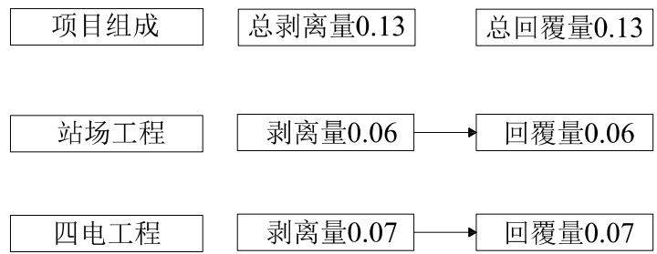
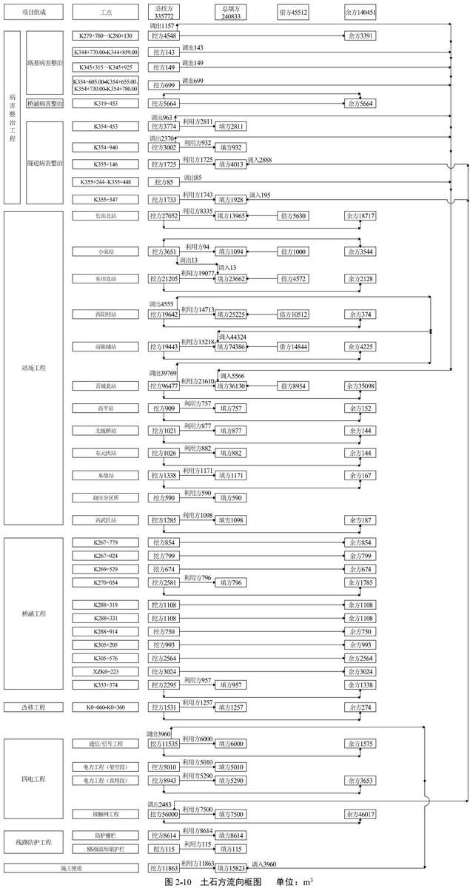
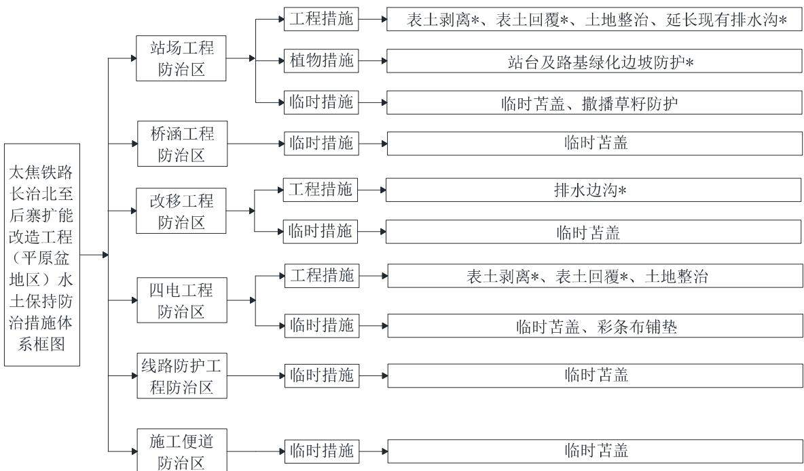
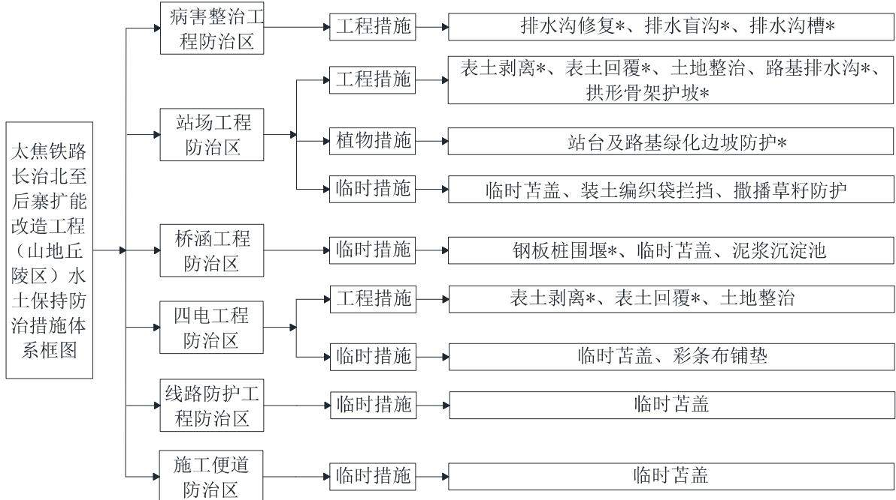

> **Zone C（应用范例层）使用边界**——仅可用于**写作风格、章节展开方式、表达逻辑、表格设计**的参考。
> **不得**用于合规判断；**不得**引入其项目数据（名称／地点／数字／单位名）；
> **不得**因其"曾经通过审批"而推定其做法在当前标准下仍然合规。
> 与 Zone A 冲突时**一律以 Zone A 为准**；Zone A 未明确规定时输出
> 「**Zone A 未明确规定，以下为参考写法，需人工判断**」。
>
> **坐标系警告**：本范例为**老八章结构**（GB 50433—2018 附录B），与 2026 版 10 章模板**同号不同义**
> （老 `1.5`＝防治目标，新 `1.5`＝水土流失预测结果；老 4→新 6 …偏移 +2；新版第 4/5 章老结构无独立章）。
> 因此 **`chapter_mapping: pending`——不得按章节号挂载**，检索一律走 `topic_tags`。
>
> **待加工**：`topic_tags`（主题标签）、`approval_basis_list`（编制依据逐字清单）、
> `structure_summary`（只提取结构：章节展开顺序／段落功能／表格栏目结构／句式模板／论证链步骤）。

<!-- 本文件由原方案 PDF 分段转换后拼接：共 2 段，原 218 页（MinerU 云单文件上限 200 页） -->

1 综合说明..  
1.1 项目简况..  
1.2 编制依据... .8  
1.3 设计水平年... ....10  
1.4 水土流失防治责任范围.. ....10  
1.5 水土流失防治目标... ...11  
1.6 项目水土保持评价结论. ...13  
1.7 水土流失预测结果.... .... 16  
1.8 水土保持措施布设成果.. ...17  
1.9 水土保持监测方案... ....21  
1.10 水土保持投资及效益分析成果.... ..22  
1.11 结论.... ....22  
2 项目概况... ....26  
2.1 项目组成及工程布置. ....6  
2.2 施工组织... ....74  
2.3 工程占地... ....992  
2.4 土石方平衡.... ....96  
2.5拆迁安置与专项设施改（迁）建.... ....102  
2.6 施工进度.... ....102  
2.7 自然概况... .... 1004  
3 项目水土保持评价... ... 119  
3.1 主体工程选址水土保持分析评价.. ...119  
3.2 建设方案与布局水土保持评价... ...121  
3.3 主体工程设计中水土保持措施界定. ....138  
4 水土流失分析与预测. ... 142  
4.1 水土流失现状... ...142  
4.2 水土流失影响因素分析. ...143  
4.3 土壤流失量预测.. ...144  
4.4 水土流失危害分析... ...153  
4.5 指导性意见.. ... 154  
5 水土保持措施... ..156  
5.1 防治分区... ..156  
5.2 措施总体布局.. ...157  
5.3 分区措施布设.. ...161  
5.4 施工要求.... ...193  
6 水土保持监测. .. 197  
6.1 范围与时段... ... 197  
6.2 内容和方法... ...197  
6.3 点位布设... ...201  
6.4 实施条件... .. 203  
6.5 监测成果.... ..203  
7 水土保持投资估算及效益分析..... ..206  
7.1 投资估算.. ...206  
7.2 效益分析.... ...217  
8 水土保持管理.. .. 223  
8.1 组织管理... ... 223  
8.2 后续设计... ..23  
8.3 水土保持监测. ...224  
8.4 水土保持监理... ... 224  
8.5 水土保持施工... ...225  
8.6 水土保持设施验收... ...226  
附表： ..229  
附表1 防治责任范围表.. ..229  
附表2 水土保持投资估算单价分析表.. ..230  
附件：.. ....235  
附件1 水土保持方案编制委托书... ...235  
附件2 全国投资项目在线审批监管平台登记单... .236  
附件3 国铁集团关于太焦铁路长治北至后寨段扩能改造工程可行性  
研究报告的批复.... .... 238  
附件4 用地预审及选址意见书... .....242  
附件5 太焦铁路长治北至后寨段扩能改造工程涉河部分防洪评价报  
告的批复.... ...243  
附件6 晋城市人民政府关于同意太焦铁路长治北至后寨段扩能改造  
工程穿越高平市城北水源地的意见.... ...247  
附件7 关于太焦铁路长治北至后寨段扩能改造工程进入山西泽州猕  
猴省级自然保护区实验区施工建设的行政许可决定.... ………249  
附件8 太焦铁路长治北至后寨段扩能改造工程对辛安泉域和三姑泉  
域水资源影响评价报告审批准予行政许可决定书.... .... 251  
附件9 晋城市规划和自然资源局关于对太焦铁路长治北至后寨段扩  
能改造工程在高平丹河省级湿地公园内建设的复函.... .254  
附件10外购土（石）方框架协议及支撑性材料.. ...256  
附件11 余土（石）消纳框架协议及支撑性材料.. ... 262  
附件12 弃渣综合利用及处置专项设计（单独成册）  
附件13 无法避让国家级水土保持流失重点治理区论证报告（单独成  
册）

## 附现场照片

附图（单独成册）

## 1 综合说明

## 1.1 项目简况

## 1.1.1 项目基本情况

## 1、项目建设必要性

太焦铁路修建年代久远，自20世纪50年代开始修建，1970年建成长治五阳、晋城至焦作月山间188km线路，1974年建成晋中修文至长治五阳间的北段209km线路，1985年完成太焦铁路长治北至月山段扩能改造。

太焦铁路是晋煤东南外运主要铁路干线，途径山西太原、榆次、长治、晋城及河南焦作。太焦线是构成与京广线平行的我国南北交通干线之一，是山西省煤炭外运南通路，也是中欧班列路网的重要组成部分，对加强晋东南与豫、鄂、湘西、桂的联系和沿线与中亚、欧洲的物流运输举足轻重。目前太焦铁路以货运为主，兼顾客运的铁路于线，太焦线长治北至后寨段作为双线电气化铁路，现状货流密度7500万吨，运输能力十分紧张。为尽快提升太焦铁路运输能力和晋东南地区煤炭、货物外运能力，增加铁路货运量，保障国家能源供应和运输安全，服务一带一路战略，中国国家铁路集团有限公司于2025年3月7日下发了《国铁集团关于太焦铁路长治北至后寨段扩能改造工程可行性研究报告的批复》（铁发改函〔2025）61号），同意实施太焦铁路长治北至后寨段扩能改造工程项目。

本项目实施后可以提高线路运输能力、满足运输需求、保障运输安全，也能够提升运输组织灵活性，提升通道内铁路运输能力和运输质量，进一步凸显骨于优势，推进区域交通运输结构调整，促进大宗货物“公转铁”，推动山西尤其是晋东南地区深度融入一带一路战略，加强与中亚、东欧及西欧的联系，促进地区经济发展，同时对于提升通道内绿色运输占比，充分发挥铁路能耗少、污染低的优势，减少交通运输产生的碳排放，降低对生态环境的影响，对践行”生态优先绿色发展”理念，积极稳妥推进实现“双碳"战略目标具有重要的意义。

## 2、项目背景

太焦铁路长治北至后寨段作为双线半自动闭塞电气化铁路，现状货流密度7500万吨，现状牵引质量SS4（G）单机为2400t、双机为4500t，HXD2单机为4500t、双机为

4800t，到发线有效长仅为850米，运输能力十分紧张。为尽快提升太焦铁路运输能力和晋东南地区煤炭、货物外运能力，增加铁路货运量，保障国家能源供应和运输安全，服务一带一路战略，中国铁路郑州局集团有限公司于2023年在全国投资项目在线审批监管平台登记太焦铁路长治北至后寨段扩能改造工程，建设规模及内容为：太焦铁路长治北至后寨段实施自动闭塞改造；长治北、东田良、西阳村、南陈铺、晋城北5座车站到发线有效长延长至1050米，关闭赵庄站；实施路基、桥涵、隧道病害整治；车流量较大的平交道口改造为立交，重点城区地段增设防护栅栏；配套改造电气化设备，补强机辆设施。既有线路长133.3公里，本次改造拟新征占地45.8亩。

中国国家铁路集团有限公司于2025年3月7日下发了《国铁集团关于太焦铁路长治北至后寨段扩能改造工程可行性研究报告的批复》（铁发改函（2025）61号），同意实施太焦铁路长治北至后寨段扩能改造工程项目，建设方案及工程内容与备案一致，拟新征占地5.5030hm²，项目土石方总量为61.76万m³，其中挖方量36.12万m³，填方量25.64万m³，借方10.45万 m³，余方20.93万 m³。

2025年2月，中铁工程设计咨询集团有限公司和北京全路通信信号研究设计院集团有限公司编制完成了《改建铁路太焦铁路长治北至后寨段扩能改造工程初步设计（鉴修稿）》，设计内容与前期手续基本一致，因征地原因取消“车流量较大的平交道口改造为立交”的内容，对长治北站、东田良站、西阳村站、南陈铺站、晋城北站改造方案进行优化调整（避让基本农田缩短站场咽喉），拟新征占地25.8亩，同时对土石方进行优化，将病害整治工程产生的弃渣加以处理后运往站场实现综合利用，对满足路基填筑要求的挖方尽量用作填方，最大可能减小弃渣量，对不能利用的外运进行综合利用，项目挖填方总量为57.66万m³，其中挖方量33.58万m³，填方量24.08万m³，借方4.55万m³来源于晋城山水合聚水泥有限公司司家掌石灰岩矿石灰岩开采加工项目，余方14.05万m³运往山西宏远填埋有限公司煤矸石土地整治项目利用。

本方案以初设的设计内容为基础进行编制。

## 3、项目位置

太焦铁路长治北至后寨段扩能改造工程位于山西省，本次扩能改造范围为长治北至后寨段双线半自动闭塞电气化线路，线路长133.3km。线路由北向南依次途经山西省长治市潞州区、上党区、长子县，晋城市高平市、晋城城区、泽州县，共涉及2市、6县（区）。

## 4、建设性质

项目为改扩建项目，属于建设类项目。

## 5、建设规模

太焦铁路长治北至后寨段，全长133.3km，车站17座，设计标准为国铁Ⅰ级；双线，电力牵引；设计行车速度70\~100km/h。

太焦铁路于20世纪50年代进行建设，本次扩能改造建设内容包括既有太焦铁路长治北至后寨段线路自动闭塞改造133.3公里，及局部路基、桥涵、隧道病害整治；长治北、东田良等6座车站到发线延长与线路设施补强，建设大辛庄、长治等10座车站站房和四电工程，新建分区所1座，及配套改造电气化设备、补强机辆设施等。

## 6、建设等级

本项目牵引质量：下行双机5000吨，上行晋城北至长治北段双机5000吨、后寨至晋城北段双机4000吨；到发线有效长度：1050米、部分850米；闭塞类型：自动闭塞。

## 7、项目组成

## （1）改造前工程概况

太焦铁路长治北至后寨段路基正线长度为133.33km，铁路等级：国铁Ⅰ级，正线数目为双线，半自动闭塞，设计行车速度100km/h，最小曲线半径300m，牵引种类为电力牵引，牵引质量SS4（G）单机为2400t、双机为4500t，HXD2单机为4500t、双机为4800t，到发线有效长850米。沿线既有车站17座；既有桥梁119座，桥梁长度4.48公里，其中大桥14座，共计2319.2延米长，中桥29座，共计1579.77延米长；现有隧道共34座，总长12421.2m。既有车站供水水源为市政自来水和铁路自备水源，通过管网引接至站场各个用水点。沿线车站电源为既有10kV电力贯通线路，共存在配电所3座。工程沿线道路密布，站场内部基本硬化，现有水土保持措施主要为透水砖、排水沟、排水槽、绿化等；路基区现有水土保持措施主要为路基两侧排水边沟、盖板边沟、路基上游截水沟、平台排水沟、急流槽、浆砌石挡墙、植草护坡、拱形骨架护坡等；桥梁区现有水土保持措施主要为桥下植草；隧道现有水土保持措施为洞口绿化，现有水保措施基本正常运行，部分工点受损。

## （2）本次扩能改造项目组成

根据初步设计，本次改造内容主要为：四显示自动闭塞改造（新建闭塞分区，车站新设联锁/修改既有联锁，信号楼改造：新建/接建/装修改造），电气化改造（全线接触网支柱及线材更换，增容牵引变电所、电力调度所，新设分区所、新设并联开关站），车站改造（5座车站到发线延长改造，1座车站适应性改造，赵庄站关闭），病害整治（路基、桥梁、隧道病害整治）及补强工程（防护栅栏封闭改造、400M列车数字无线调度、机务、车辆设施补强），因此将项目组成划分为病害整治工程、站场工程、桥涵工程、改移工程、四电工程、线路防护工程6部分。

1）病害整治工程：共45处，其中7处为路基病害整治，7处为桥涵病害整治，31处为隧道病害整治。其中，K279+780～K280+130路基病害整治、K319+453桥涵病害整治、K354+453、K354+940、K355+146、K355+244、K355+448、K355+347等隧道口病害整治涉及铁路既有用地范围内新增扰动。

2）站场工程：对长治北站、小宋站、东田良站、西阳村站、南陈铺站、晋城北站6座车站进行到发线延长、拆除、新建、还建相关线、房屋拆建等改造；对高平站、北板桥站、东元庆站、东坡站和西武匠等车站实施房屋拆除、利用、改建或扩建；关闭赵庄站，在赵庄站原址范围内新建一座赵庄分区所；在西阳村站、东田良站、南陈铺站、晋城北站修建支挡工程4处。

3）桥涵工程：包括11座桥涵，其中新建连续刚构中桥94.11m/1座；新建涵洞16m/1座；接长涵洞86m/9座。

4）改移工程：东田良站扩能改造延长到发线占压既有道路八慈线，需对八慈线进行道路改移，改移范围K0+060-K0+360，长300m。

5）四电工程：四电工程主要包括通信/信号工程，电力工程和接触网工程。其中，通信/信号工程即全线敷设1条48芯干线光缆，1条48芯区段光缆，总长133.3km（壁挂或光缆槽盒敷设长度为38.135km，平原区直埋段长度为38.45km，山丘区直铺段长度为56.175km）。电力工程包含架空线路和高压电力电缆线路改造，其中架空线路改造是对长治北-晋城北既有35mm²电力架空贯通线路进行改造，改造架空长度120km，架空线路采用钢芯铝绞交联聚乙烯绝缘架空线JKLGY-70mm²，设电杆2170个；高压电力电缆线路改造总长133.3km（壁挂或电缆槽盒敷设长度为38.135km，平原区直埋段长度为38.45km，山丘区直铺段长度为56.175km）。接触网工程即更换及新增接触网支柱共计7036根，接触网采用全补偿简单链型悬挂，接触网基础选用混凝土支柱、H型钢柱、软横跨钢柱和拉线基础等。

6）线路防护工程：对受行人影响地段，设1.8m混凝土立柱金属网片加刺丝滚笼防护栅栏102.53km；对公路铁路临近路段设置安全防护设施63处，全长5200m，采用防撞等级为 SS级波形梁护栏。

## 8、施工组织

（1）施工生产区：共布设19处施工生产区，主要利用既有车站长治北站、长治站、小宋、东田良站、西阳村站、高平站、南陈铺站、北板桥站、晋城北站、西武匠站的既有货场及场内空地作为材料场、道砟存储场、混凝土构配件预制场和填料集中加工站。

上述19处施工生产区无新增扰动，不计入防治责任范围。

（2）施工生活区：本项目直接利用既有车站长治北站、长治站、小宋、东田良站、西阳村站、高平站、南陈铺站、北板桥站、晋城北站、西武匠站的既有生活用房作为施工营地，施工生活区无新增扰动，不计入防治责任范围。

施工便道：修建施工便道11268m，其中新建段长103m，泥结碎石路面，路面宽3.5m，路基宽4.5m，占地面积为0.05hm²；改建段长11165m，泥结碎石路面，路面宽2.5m，路基宽3.5m，占地面积为3.90hm²。施工便道总占地面积为3.95hm²，占地性质为临时占地。

施工用水：站场改造工程可引接站内水源，区间工程用水采用就近车站运水。

施工供电：沿线车站大多已有10kV地方电源或者铁路配电所站馈电源，施工用电可从地方10kV电源或配电所站馈电源引接；新建中桥配套用电就近从既有铁路电力设施架空接入。

施工通讯：施工期通讯多采用移动通讯工具，或设在村镇周围地区的施工驻地可利用原有通讯工具，一般不会新架设通讯系统，因此施工通讯不会对水土流失产生影响。

9、拆迁（移民）数量及安置方式

本项目拆迁安置费用统一纳入地方政府投资，并计入铁路建设总投资中。具体工作由地方政府统一安排，采用货币补偿形式。涉及到铁路既有资产拆除的，应及时组织办理相关手续，规范拆除资产处置。本项目共拆迁各类建筑物面积9493m²（含路内拆迁5783m²），拆除围墙2260m、拆除栅栏1088.6m、混凝土硬化地面5700m³，总计产生约0.63万m³建筑垃圾（该部分方量不计入土石方平衡）运往山西宏远填埋有限公司煤矸石土地整治项目，不得随意丢弃，产生新的水土流失。拆迁站外房屋造成的水土流失责任由地方政府负责，不纳入本方案防治责任范围。

## 10、专项设施改（迁）建

本项目专项设施改（迁）建主要为八慈线改移，改移范围K0+060-K0+360，长300m，原道路路面宽7.0m，路基宽8.5m。八慈线为三级公路，设计时速30km/h，改移道路标准与原道路相同，用地范围为路堤两侧边沟外边缘1\~2.0m。改移范围内，最小半径为R=450m，不设缓和曲线，两侧连接既有道路，道路边缘距铁路路堤边线≥10m。道路改移范围内，最大纵坡0.9%，最大坡长200m，最小坡长100m，凸形竖曲线R=4800m，凹形竖曲线R=6500m。

## 11、开工、完工时间与总工期

本项目计划于2026年6月开工建设，2029年5月完工，总工期36个月。

## 12、总投资与土建投资

总投资估算26.83亿元，其中土建投资26.04亿元。项目资本金比例为50%，申请中央预算内投资、超长期特别国债安排，不足部分使用国铁集团自筹资金等安排。资本金以外资金使用银行贷款等债务性资金。

## 13、工程占地

本项目总占地面积59.42hm²，按照占地性质分，永久占地41.73hm²（其中既有铁路用地范围内扰动面积为40.30hm²，新增占地面积1.43hm²），临时占地 $1 7 . 6 9 \mathrm { h m } ^ { 2 }$ (其中既有铁路用地范围内扰动面积为17.20hm²，新增占地面积0.49hm²）；占地类型为耕地、商服用地、住宅用地、交通运输用地、水域及水利设施用地、其他土地。

## 14、工程土石方量

本项目挖填方总量57.66万m³，其中挖方量33.58万m³（其中表土剥离0.13万m³，土方30.67万m³，石方2.78万m³），填方量24.08万 $\mathfrak { m } ^ { 3 }$ （其中表土回覆0.13万m³，土方17.88万m³，石方6.07万m³），借方4.55万 $\mathfrak { m } ^ { 3 }$ （均为石方），借方来源于晋城山水合聚水泥有限公司司家掌石灰岩矿石灰岩开采加工项目，余方14.05万m³（其中土方12.39万m³，石方1.66万m³），余方运往山西宏远填埋有限公司煤矸石土地整治项目。

## 1.1.2 项目前期工作进展情况

## 1、项目工程设计情况

2023年8月，中铁工程设计咨询集团有限公司（以下简称“我单位”）完成本项目可行性研究编制工作。2023年8月14日至15日，国铁集团经规院对可行性研究（补充材料）进行了评审。8月底，根据可研鉴修评审意见精神，完成了可研鉴修评审（补充材料）。

2023年10月，我单位和北京全路通信信号研究设计院集团有限公司完成了本项目初步设计（送审稿）。

2024年5月21日，山西省自然资源厅颁发了本项目用地预审与选址意见书。

2025年2月，我单位和北京全路通信信号研究设计院集团有限公司编制完成了《改建铁路太焦铁路长治北至后寨段扩能改造工程初步设计（鉴修稿）》。

2025年3月7日，中国国家铁路集团有限公司以“铁发改函〔2025〕61号”出具了《国铁集团关于太焦铁路长治北至后寨段扩能改造工程可行性研究报告的批复》。

目前，太焦铁路长治北至后寨段扩能改造工程前期勘察设计工作处于初步设计阶段。

## 2、水土保持方案编制情况

受建设单位委托，我单位承担了《太焦铁路长治北至后寨段扩能改造工程水土保持方案报告书》的编制工作。方案项目组成员对现场进行了调查，重点调查了各个病害点、站场、跨河桥梁、改移工程、沿线的土壤、植被以及水土保持敏感区域内工程，调查过程中收集了项目区水土流失现状、水土保持规划、水土保持敏感区等资料，根据可行性研究报告及初步设计（鉴修稿）于2026年3月编制完成《太焦铁路长治北至后寨段扩能改造工程水土保持方案报告书》。

## 1.1.3 自然简况

## 1、地质

本区域位于中朝准地台中部，横跨山西台隆、太行山隆起的东缘和长治盆地、晋城盆地等二级构造单元。

## 2、地形地貌

项目区沿线经过的地貌类型主要为平原盆地和山地丘陵。

## 3、气象

项目区属暖温半湿润大陆性季风气候，多年平均气温9.1℃\~11.1℃，全年≥10℃积温2430℃\~3157℃，多年平均降水量541.7mm\~688.0mm，多集中在7\~9月份，年均蒸发量1558.0mm\~1645.0mm，年无霜期170d\~197d，最大冻土深度43cm\~75cm。主导风向包括东北风、东南风、西北风，平均风速2.0m/s\~2.1m/s。

## 4、水文

项目区属黄河流域和海河流域，线路主要穿越浊漳河、石子河、陶清河、丹河、白水河、许河、巴公河、北石店河等。

## 5、土壤、植被

土壤类型主要为棕壤、潮土、褐土等，植被类型属暖温带落叶阔叶林，项目区林草覆盖率达到22.4\~34.83%。

## 6、水土保持敏感区

项目沿线穿越的长治市潞州区、上党区、长子县属北方土石山区，容许土壤流失量为 $2 0 0 \mathrm { t } / \ \left( \mathrm { k m } ^ { 2 } { \cdot } \mathrm { a } \right)$ ，土壤侵蚀类型主要为水力侵蚀，侵蚀强度主要以微度为主；晋城市高平市、晋城城区、泽州县属西北黄土高原区，容许土壤流失量为 $1 0 0 0 \mathrm { t / \Omega \left( k m ^ { 2 } { \cdot } a \right) }$ ，土壤侵蚀类型主要以水力侵蚀，侵蚀强度主要以微度为主。

根据《水利部办公厅关于做好国家级水土流失重点预防区和重点治理区落地上图成果应用的通知》（办水保（2025）170号），登录国家级水土保持流失重点预防区和重点治理区查询系统，经查询太焦铁路长治北至后寨段扩能改造工程高平市境内K274+900\~K286+700段位于太行山国家级水土流失重点治理区内。根据《山西省水土保持规划（2016-2030年）》，工程沿线涉及的长治市潞州区和上党区、长子县、高平市属于山西省水土流失重点治理区。本项目不可避让穿（跨）越山西泽州猕猴省级自然保护区、高平丹河省级湿地公园、辛安泉域、三姑泉域、高平市城北水源地饮用水水源保护区及晋城市生态红线等水土保持敏感区。

## 1.2 编制依据

## 1.2.1 法律法规

1、《中华人民共和国水土保持法》（1991年6月29日会议通过；2010年12月25日修订通过，自2011年3月1日起施行）；

2、《中华人民共和国黄河保护法》（中华人民共和国第十三届全国人民代表大会常务委员会第三十七次会议通过，自2023年4月1日起施行）；

3、《山西省实施<中华人民共和国水土保持法>办法》（1994年7月21日山西省第八届人民代表大会常务委员会第十次会议通过；1997年12月4日山西省第八届人民代表大会常务委员会第三十一次会议修正；2015年7月30日山西省第十二届人民代表大会常务委员会第二十一次会议修订通过；2021年5月28日修订；2024年7月26日山西省第十四届人民代表大会常务委员会第十三次会议修订）。

## 1.2.2 部委规章

《生产建设项目水土保持方案管理办法》（中华人民共和国水利部令第53号，自2023年3月1日起施行）。

## 1.2.3 规范性文件

1、《水利部关于印发贯彻落实<关于加强新时代水土保持工作的意见>实施方案的通知》（水保〔2023）25号）；

2、《水利部办公厅关于印发生产建设项目水土保持方案审查要点的通知》（办水保(2023)177号）；

3、《水利部办公厅关于印发生产建设项目水土保持技术文件编写和印制格式规定(试

行）的通知》（办水保（2018）135号）；

4、《水利部关于进一步深化“放管服”改革全面加强水土保持监管的意见》（水保（2019〕160号）；

5、《水利部办公厅关于印发生产建设项目水土保持监督管理办法的通知》（办水保(2019)172号）；

6、《水利部办公厅关于印发生产建设项目水土保持设施自主验收规程（试行）的通知》（办水保（2018）133号）；

7、《水利部关于加强事中事后监管规范生产建设项目水土保持设计自主验收的通知》（水保（2017）365号）；

8、《水利部办公厅国铁集团办公厅关于加强铁路建设项目水土保持工作的通知》（办水保〔2023）3号）；

9、《关于印发全国水土保持规划国家级水土流失重点预防区和重点治理区复核划分成果的通知》（办水保（2013）188号）；

10、《水利部办公厅关于做好国家级水土流失重点预防区和重点治理区落地上图成果应用的通知》（办水保〔2025）170号）；

11、《国务院关于全国水土保持规划（2015-2030年）的批复》（国函（2015）160号）；

12、《山西省人民政府关于山西省水土保持规划（2016-2030年）的批复》（晋政函（2017）170号）。

## 1.2.4 技术规范与标准

1、《生产建设项目水土保持技术标准》（GB50433-2018）；

2、《生产建设项目水土流失防治标准》（GB/T50434-2018）；

3、《生产建设项目水土保持监测与评价标准》（GB/T51240-2018）；

4、《水土保持工程设计规范》（GB51018-2014）；

5、《水土保持监理规范》（SL/T523-2024）；

6、《土壤侵蚀分类分级标准》（SL190-2007）；

7、《土地利用现状分类》（GB/T21010-2017）；

8、《水利水电工程制图标准水土保持图》（SL73.6-2015）；

9、《水土保持监测设施通用技术条件》（SL342-2006）；

10、《水土保持工程调查与勘测标准》（GB/T51297-2018）；

11、《水土保持监测技术规范》（SL/T277-2024）；

12、《生产建设项目土壤流失量测算导则》（SL773-2018）；

13、《表土剥离及其再利用技术要求》（GB/T45107-2024）；

14、《水土保持工程质量验收与评价规范》（SL/T336-2025）；

15、《生产建设项目水土保持设施验收技术规程》（GB/T22490-2025）。

## 1.2.5 技术文件及资料

1、《改建铁路太焦铁路长治北至后寨段扩能改造工程可行性研究报告》（中铁工程设计咨询集团有限公司，2023年6月）；

2、《改建铁路太焦铁路长治北至后寨段扩能改造工程可行性研究报告（补充材料)》(中铁工程设计咨询集团有限公司和北京全路通信信号研究设计院集团有限公司，2023年8月）；

3、《改建铁路太焦铁路长治北至后寨段扩能改造工程初步设计（鉴修稿）》（中铁工程设计咨询集团有限公司和北京全路通信信号研究设计院集团有限公司，2025年2月）；

4、沿线自然保护区、饮用水水源保护区、重要湿地、生态保护红线等水土保持敏感区，以及水土保持规划、土壤、林业和植被等资料。

## 1.3 设计水平年

根据《生产建设项目水土保持技术标准》（GB50433-2018），设计水平年指水土保持方案确定的水土保持措施实施完毕并初步发挥效益的年份，应为主体工程完工后的当年或后一年，根据主体工程完工时间和水土保持措施实施进度安排等综合确定。

根据本项目施工工期安排，本项目计划于2026年6月开工建设，2029年5月完工，总工期36个月。因此本方案设计水平年确定为主体工程完工当年，即2029年。

## 1.4 水土流失防治责任范围

本项目水土流失防治责任范围为59.42hm²（其中长治市潞州区7.48hm²，上党区2.93hm²，长子县12.50hm²，晋城市高平市 17.03hm²，晋城城区9.81hm²，泽州县9.64hm²)，包括项目永久征地、临时占地以及其他使用与管辖区域。

## 1.5 水土流失防治目标

## 1.5.1 执行标准等级

本项目沿线涉及长治市潞州区、上党区、长子县和晋城市高平市、晋城城区、泽州县，其中长治市潞州区、上党区、长子县属北方土石山区，晋城市的高平市、晋城城区、泽州县属西北黄土高原区。

根据《水利部办公厅关于做好国家级水土流失重点预防区和重点治理区落地上图成果应用的通知》（办水保〔2025）170号），登录国家级水土保持流失重点预防区和重点治理区查询系统，经查询本项目高平市境内K274+900\~K286+700段位于太行山国家级水土流失重点治理区内。

根据《山西省水土保持规划（2016-2030年）》，本项目沿线涉及的长治市和上党区、长子县、高平市属于山西省水土流失重点治理区。

此外，本项目不可避让穿（跨）越山西泽州猕猴省级自然保护区、高平丹河省级湿地公园、辛安泉域、三姑泉域、高平市城北水源地饮用水水源保护区及晋城市生态红线等水土保持敏感区及城市区。

根据《生产建设项目水土流失防治标准》（GB/T50434-2018），本项目水土流失防治标准执行西北黄土高原区一级标准和北方土石山区一级标准。

## 1.5.2 防治目标

根据《生产建设项目水土流失防治标准》（GB/T50434-2018）第4.0.6条规定，项目区位于暖温半湿润大陆性季风气候区，不属于极干旱与干旱地区，水土流失治理度、林草植被恢复率、林草覆盖率均不作调整；根据第4.0.7条规定，项目区主要以微度侵蚀为主，土壤流失控制比不小于1.0；根据第4.0.9条规定，位于城市区的项目，渣土防护率和林草覆盖率可提高1%\~2%，项目区穿越长治市、晋城市城区，本项目渣土防护率提高1%；根据《生产建设项目水土保持技术标准》（GB50433-2018）第3.2.2条规定，项目区涉及水土流失重点治理区，林草覆盖率应提高1%\~2%。本项目主要是对既有太焦铁路进行扩能改造，改造内容主要为：①对病害整治区域进行清除、治理，②对站场到发线、房建和桥涵区域进行必要的新增或改造，③沿既有铁路两侧路肩铺设通信、电力等配套设施，本次改造扰动面积的97.1%为既有铁路用地，既有区域内植物措施面积为0.80hm²，改造前既有区域内林草覆盖率仅为1.4%；其余扰动区域占地类型为耕地、公路用地、水域及水利设施用地和其他土地，对临时占用耕地区域复耕，永久占地硬化。

根据主体设计，本次扩能改造仅站场工程路基边坡可实施植物措施，植物措施面积为$3 . 3 4 \mathrm { h m } ^ { 2 }$ ，占本项目总面积的5.7%，因此将项目区林草覆盖率调整为5.7%。

综上，采用面积加权平均法，本项目水土流失防治综合指标值如下：水土流失治理度94%、土壤流失控制比1.0、渣土防护率96%，表土保护率93%，林草植被恢复率96%、林草覆盖率 5.7%。

表1-1 西北黄土高原区水土流失防治目标计算表
<table><tr><td rowspan=3 colspan=1>指标分类</td><td rowspan=1 colspan=2>一级标准规定干</td><td rowspan=2 colspan=1>旱修土正系数</td><td rowspan=2 colspan=1>壤侵蚀强度无修正系数</td><td rowspan=3 colspan=1>法避让国家级水土流失重点治理于区</td><td rowspan=3 colspan=1>充项目区位城市区目</td><td rowspan=3 colspan=1>结合项实际施</td><td rowspan=1 colspan=2>采用指标</td></tr><tr><td rowspan=2 colspan=1>施工期</td><td rowspan=2 colspan=1>设计水平年半</td><td rowspan=2 colspan=1>工期</td><td rowspan=2 colspan=1>设计水平年</td></tr><tr><td rowspan=1 colspan=1>湿润</td><td rowspan=1 colspan=1>微度</td></tr><tr><td rowspan=1 colspan=1>水土流失治理度(%)</td><td rowspan=1 colspan=1>-</td><td rowspan=1 colspan=1>93</td><td rowspan=1 colspan=1>-</td><td rowspan=1 colspan=1>-</td><td rowspan=1 colspan=1>-</td><td rowspan=1 colspan=1>-</td><td rowspan=1 colspan=1>-</td><td rowspan=1 colspan=1>-</td><td rowspan=1 colspan=1>93</td></tr><tr><td rowspan=1 colspan=1>土壤流失控制比</td><td rowspan=1 colspan=1>-</td><td rowspan=1 colspan=1>0.8</td><td rowspan=1 colspan=1>-</td><td rowspan=1 colspan=1>+0.2</td><td rowspan=1 colspan=1>-</td><td rowspan=1 colspan=1>-</td><td rowspan=1 colspan=1>-</td><td rowspan=1 colspan=1>-</td><td rowspan=1 colspan=1>1.0</td></tr><tr><td rowspan=1 colspan=1>渣土防护率(%)</td><td rowspan=1 colspan=1>90</td><td rowspan=1 colspan=1>92</td><td rowspan=1 colspan=1>-</td><td rowspan=1 colspan=1>-</td><td rowspan=1 colspan=1>-</td><td rowspan=1 colspan=1>+1</td><td rowspan=1 colspan=1>-</td><td rowspan=1 colspan=1>91</td><td rowspan=1 colspan=1>93</td></tr><tr><td rowspan=1 colspan=1>表土保护率(%)</td><td rowspan=1 colspan=1>90</td><td rowspan=1 colspan=1>90</td><td rowspan=1 colspan=1>-</td><td rowspan=1 colspan=1>-</td><td rowspan=1 colspan=1>-</td><td rowspan=1 colspan=1>-</td><td rowspan=1 colspan=1>-</td><td rowspan=1 colspan=1>90</td><td rowspan=1 colspan=1>90</td></tr><tr><td rowspan=1 colspan=1>林草植被恢复率(%)</td><td rowspan=1 colspan=1>-</td><td rowspan=1 colspan=1>95</td><td rowspan=1 colspan=1>-</td><td rowspan=1 colspan=1>-</td><td rowspan=1 colspan=1>-</td><td rowspan=1 colspan=1>-</td><td rowspan=1 colspan=1>-</td><td rowspan=1 colspan=1>-</td><td rowspan=1 colspan=1>95</td></tr><tr><td rowspan=1 colspan=1>林草覆盖率(%)</td><td rowspan=1 colspan=1>一</td><td rowspan=1 colspan=1>22</td><td rowspan=1 colspan=1>-</td><td rowspan=1 colspan=1>-</td><td rowspan=1 colspan=1>+2</td><td rowspan=1 colspan=1>+1</td><td rowspan=1 colspan=1>-16.9</td><td rowspan=1 colspan=1>-</td><td rowspan=1 colspan=1>8.1</td></tr></table>

表1-2 北方土石山区水土流失防治目标计算表
<table><tr><td rowspan=3 colspan=1>指标分类</td><td rowspan=1 colspan=2>一级标准规定干</td><td rowspan=2 colspan=1>旱修正系数强</td><td rowspan=2 colspan=1>土壤侵蚀度修正系数家</td><td rowspan=3 colspan=1>无法避让国级水土流项失重点治理于区</td><td rowspan=3 colspan=1>目区位结城市区目</td><td rowspan=3 colspan=1>合项实际施</td><td rowspan=1 colspan=2>采用指标</td></tr><tr><td rowspan=2 colspan=1>施工期</td><td rowspan=2 colspan=1>设计水平年半</td><td rowspan=2 colspan=1>工期</td><td rowspan=2 colspan=1>设计水平年</td></tr><tr><td rowspan=1 colspan=1>湿润</td><td rowspan=1 colspan=1>微度</td></tr><tr><td rowspan=1 colspan=1>水土流失治理度(%)</td><td rowspan=1 colspan=1>-</td><td rowspan=1 colspan=1>95</td><td rowspan=1 colspan=1></td><td rowspan=1 colspan=1>-</td><td rowspan=1 colspan=1>–</td><td rowspan=1 colspan=1>-</td><td rowspan=1 colspan=1>-</td><td rowspan=1 colspan=1>-</td><td rowspan=1 colspan=1>95</td></tr><tr><td rowspan=1 colspan=1>土壤流失控制比</td><td rowspan=1 colspan=1>-</td><td rowspan=1 colspan=1>0.9</td><td rowspan=1 colspan=1></td><td rowspan=1 colspan=1>+0.1</td><td rowspan=1 colspan=1>-</td><td rowspan=1 colspan=1>-</td><td rowspan=1 colspan=1>-</td><td rowspan=1 colspan=1>-</td><td rowspan=1 colspan=1>1.0</td></tr><tr><td rowspan=1 colspan=1>渣土防护率(%)</td><td rowspan=1 colspan=1>95</td><td rowspan=1 colspan=1>97</td><td rowspan=1 colspan=1></td><td rowspan=1 colspan=1>-</td><td rowspan=1 colspan=1>-</td><td rowspan=1 colspan=1>+1</td><td rowspan=1 colspan=1>-</td><td rowspan=1 colspan=1>96</td><td rowspan=1 colspan=1>98</td></tr><tr><td rowspan=1 colspan=1>表土保护率(%)</td><td rowspan=1 colspan=1>95</td><td rowspan=1 colspan=1>95</td><td rowspan=1 colspan=1></td><td rowspan=1 colspan=1>-</td><td rowspan=1 colspan=1>-</td><td rowspan=1 colspan=1>-</td><td rowspan=1 colspan=1>-</td><td rowspan=1 colspan=1>95</td><td rowspan=1 colspan=1>95</td></tr><tr><td rowspan=1 colspan=1>林草植被恢复率(%)</td><td rowspan=1 colspan=1>-</td><td rowspan=1 colspan=1>97</td><td rowspan=1 colspan=1></td><td rowspan=1 colspan=1>二</td><td rowspan=1 colspan=1>-</td><td rowspan=1 colspan=1>-</td><td rowspan=1 colspan=1>-</td><td rowspan=1 colspan=1>二</td><td rowspan=1 colspan=1>97</td></tr><tr><td rowspan=1 colspan=1>林草覆盖率(%)</td><td rowspan=1 colspan=1>1</td><td rowspan=1 colspan=1>25</td><td rowspan=1 colspan=1></td><td rowspan=1 colspan=1>■</td><td rowspan=1 colspan=1>+2</td><td rowspan=1 colspan=1>+1</td><td rowspan=1 colspan=1>-26.2</td><td rowspan=1 colspan=1>-</td><td rowspan=1 colspan=1>1.8</td></tr></table>

表1-3 本项目水土流失防治目标计算表
<table><tr><td rowspan=3 colspan=1>指标分类</td><td rowspan=1 colspan=6>采用标准</td></tr><tr><td rowspan=1 colspan=2>西北黄土高原区</td><td rowspan=1 colspan=2>北方土石山区</td><td rowspan=1 colspan=2>综合指标</td></tr><tr><td rowspan=1 colspan=1>施工期</td><td rowspan=1 colspan=1>设计水平年</td><td rowspan=1 colspan=1>施工期</td><td rowspan=1 colspan=1>设计水平年</td><td rowspan=1 colspan=1>施工期</td><td rowspan=1 colspan=1>设计水平年</td></tr><tr><td rowspan=1 colspan=1>水土流失治理度(%)</td><td rowspan=1 colspan=1>二</td><td rowspan=1 colspan=1>93</td><td rowspan=1 colspan=1>二</td><td rowspan=1 colspan=1>95</td><td rowspan=1 colspan=1>二</td><td rowspan=1 colspan=1>94</td></tr><tr><td rowspan=1 colspan=1>土壤流失控制比</td><td rowspan=1 colspan=1>-</td><td rowspan=1 colspan=1>1.0</td><td rowspan=1 colspan=1>-</td><td rowspan=1 colspan=1>1.0</td><td rowspan=1 colspan=1>-</td><td rowspan=1 colspan=1>1.0</td></tr><tr><td rowspan=1 colspan=1>渣土防护率(%)</td><td rowspan=1 colspan=1>91</td><td rowspan=1 colspan=1>93</td><td rowspan=1 colspan=1>96</td><td rowspan=1 colspan=1>98</td><td rowspan=1 colspan=1>93</td><td rowspan=1 colspan=1>96</td></tr><tr><td rowspan=1 colspan=1>表土保护率(%)</td><td rowspan=1 colspan=1>90</td><td rowspan=1 colspan=1>90</td><td rowspan=1 colspan=1>95</td><td rowspan=1 colspan=1>95</td><td rowspan=1 colspan=1>92</td><td rowspan=1 colspan=1>93</td></tr><tr><td rowspan=1 colspan=1>林草植被恢复率(%)</td><td rowspan=1 colspan=1>二</td><td rowspan=1 colspan=1>95</td><td rowspan=1 colspan=1>-</td><td rowspan=1 colspan=1>97</td><td rowspan=1 colspan=1>二</td><td rowspan=1 colspan=1>96</td></tr><tr><td rowspan=1 colspan=1>林草覆盖率(%)</td><td rowspan=1 colspan=1>-</td><td rowspan=1 colspan=1>8.0</td><td rowspan=1 colspan=1>-</td><td rowspan=1 colspan=1>1.8</td><td rowspan=1 colspan=1>-</td><td rowspan=1 colspan=1>5.7</td></tr></table>

## 1.6 项目水土保持评价结论

## 1.6.1 主体工程选址（线）评价

本项目为既有铁路线改扩建项目，主体工程选址（线）避开了全国水土保持监测网络中的水土保持监测站点，重点试验区，未占用国家确定的水土保持长期定位观测站；不涉及河流两岸、湖泊和水库周边的植物保护带，本项目为既有铁路工程，由于太焦铁路修建年代久远，无法避让太行山国家级水土流失重点治理区及省级水土流失重点治理区，本次在太行山国家级水土流失重点治理区实施的主要工程为病害整治工程、四电工程、线路防护工程，这些工程均为既有铁路范围内的建设，其中病害整治工程主要是对既有铁路的路基和隧道病害点进行治理；四电工程主要是在既有铁路沿线实施通信/信号线缆槽挖填工程，对既有铁路沿线进行电气化改造，实施接触网基础开挖及换杆工程；线路防护工程主要是在既有铁路路基路肩上安装防护栅栏。涉太行山国家级水土流失重点治理区段无新增临时占地：无法避让饮用水水源保护区、自然保护区、生态保护红线、泉域等水土保持敏感区，本项目水土流失防治执行西北黄土高原区和北方土石山区一级标准，同时采取如下措施：提高排水工程设计标准；渣土防护率在一级标准的基础上再提高1%。主体设计根据水土保持规范开展土石方源头减量及综合利用专题优化方案，初步设计阶段已协调路基、站场等专业之间土石方的充分调配，尽可能移挖作填，减少临时占地，优化后挖方量33.58万m³，填方量 $2 4 . 0 8 \mathrm { ~ \textbar { ~ } { ~ } ~ } \mathrm { m } ^ { 3 }$ ，借方4.55万 $\mathfrak { m } ^ { 3 }$ ，余方14.05万m³；主体设计对可能产生水土流失的部位、时段采取了工程、植物与临时相结合的防护措施体系，尽可能恢复原地貌和生态环境，实现工程安全、水土保持、生态防护有机整合，可有效控制工程建设可能带来的水土流失。

主体设计按照水土保持要求对大临工程进行优化调整，结合工程形式优化及出渣利用优化调整，余方全部利用；严格划定施工作业范围，最大限度减少对沿线生态脆弱区的原地貌扰动和破坏，采取严格的奖惩管理制度保护沿线原地貌和植被。

综上，本项目选址（线）存在制约性新因素，因属于国家重点项目和民生工程，无法避让国家级及省级水土流失重点治理区和水土保持敏感区，通过优化施工工艺，减少新增占地，执行水土流失防治一级标准，提高植物措施建设等级等，本项目在采取上述措施后，基本符合《中华人民共和国水土保持法》和《生产建设项目水土保持技术标准》（GB50433-2018）中水土保持约束性规定的要求，从水土保持角度分析，项目建设是可行的。主体工程选址（线）基本满足要求。

## 1.6.2 建设方案与布局评价

## 1、工程建设方案评价

（1）因受山区地形限制，无法避让国家级和省级水土流失重点治理区、水土保持敏感区，本次扩能改不涉及原有线路改建或新建，项目路线和选址唯一，无其他比选方案。

（2）通过查阅设计资料及现场踏勘，西阳村站、东田良站、南陈铺站、晋城北站因扩能改造，到发线局部延长或新增到发线，该部分区域主要为新近系上新统黏土层，具有弱膨胀性，且为避免占用既有铁路范围外基本农田，采用重力式挡土墙进行支挡收坡，并对>5m边坡设置拱形骨架护坡，并在骨架内进行植灌草。

（3）主体工程综合考虑提高了植被建设标准，站台及路基边坡植物措施由3级标准提高至2级标准，满足水土保持相关规范要求。

（4）本项目涉及国家级及省级水土流失重点治理区，无法绕避，本方案执行北方土石山区和西北黄土高原区一级标准。设计过程中不断优化设计方案，从控制施工扰动面积、减少新增占地、加强主体工程调运移挖作填，开展了源头土石方减量化分析研究。同时，对优化施工工艺减少临时占地，满足水土保持相关规范要求。

（5）本项目无法避让山西泽州猕猴省级自然保护区、高平丹河省级湿地公园、辛安泉域、三姑泉域、高平市城北水源地饮用水水源保护区等水土保持敏感区，上述无法避让水土保持敏感区情形均已取得行政许可；本项目无法避让晋城市生态红线，在晋城市生态红线占用范围内无新增占地，符合国家及山西省关于生态红线的相关规定要求。

综上，主体设计和本方案充分考虑了区域水土保持要求，工程建设方案符合《生产建设项目水土保持技术标准》（GB50433-2018）要求。

## 2、工程占地评价

工程总占地面积59.42hm²，其中永久占地41.73hm²，临时占地17.69hm²。病害整治工程、站场工程、桥涵工程、改移工程、四电工程、线路防护工程永久占地为41.73hm²，通过计算用地指标为5.237hm²/km。工程永久占地数量合理，满足《新建铁路工程项目建设用地指标》（建标（2008）232号）中规定设计时速120km/h及以下客货共线电力铁路综合建设用地标准5.475hm²/km，永久占地满足工程布置及施工需求。

临时占地优先考虑优化减少大临工程和永临结合。本项目工程建设尽可能利用已有交通条件，减少施工便道修建；站场工程剥离的表土堆放在站场内既有空闲区域，四电工程剥离的表土就近堆存在基础附近的堆土区，表土堆均堆存在各区域占地范围内，并做好防护，不再新增占地；平原盆地区的四电工程中通信/信号光缆、高压电力电缆铺设不在单独设置临时堆土场，山地丘陵区的四电工程中通信/信号光缆、高压电力电缆铺设采用直埋形式，不开挖沟槽，四电工程通过优化施工工艺，减少了临时占地。综上，临时占地数量和面积等均满足施工要求，符合工程特点和项目区域现状。

综上，本项目占地符合国家有关政策的要求，工程占地性质、类型合理，工程占地数量计列全面、不漏项，符合水土保持要求。

## 3、土石方平衡分析

（1）本项目属于改扩建工程，原则仅对病害整治区域进行清除、治理，对站场和桥涵区域进行必要的新增或改造，沿线铺设通信、电力等配套设施，避免了大开挖、大回填，减少了工程建设产生的土石方量，使水土流失从源头上得到一定的控制。

（2）本项目优先考虑开挖料自身利用原则，对满足填筑要求的挖方尽量用作填方，各区自身利用土石方量19.53万 $\mathfrak { m } ^ { 3 }$ ，土石方自身利用率达58%，最大可能减小弃渣量。项目剩余方运往山西宏远填埋有限公司煤矸石土地整治项目，土石方利用率达到100%。根据土石方平衡结果，本项目挖填方总量57.66万 $\mathfrak { m } ^ { 3 }$ ，其中挖方量33.58万 $\mathfrak { m } ^ { 3 }$ (其中表土剥离 0.13 万 $\mathfrak { m } ^ { 3 }$ ，土方30.67万 $\mathrm { m } ^ { 3 }$ ，石方2.78万m³），填方量24.08万 $\mathfrak { m } ^ { 3 }$ （其中表土回覆0.13万 $\mathfrak { m } ^ { 3 }$ ，土方17.88万 $\mathfrak { m } ^ { 3 }$ ，石方6.07万 $\mathbf { m } ^ { 3 } )$ ，借方4.55万 $\mathfrak { m } ^ { 3 }$ (均为石方)，借方来源于晋城山水合聚水泥有限公司司家掌石灰岩 $\bar { \mu } \dot { J } ^ { \dot { - } }$ 石灰岩开采加工项目，余方14.05万 $\mathrm { m } ^ { 3 }$ （其中土方12.39万m³，石方1.66万m³），余方运往山西宏远填埋有限公司煤矸石土地整治项目。

（3）初步设计阶段，充分考虑土石方资源平衡利用，挖填方总量比可研阶段挖填方总量减少了4.10万 $\mathrm { m } ^ { 3 }$ ，借方量减少了5.90万m³，弃方量减少6.88万 $\mathfrak { m } ^ { 3 }$ ，有效避免了新增占地，节约了土地资源，实现了资源的合理调配和利用。

综合分析，本项目借方（石方）全部外购，余方全部运往山西宏远填埋有限公司煤矸石土地整治项目，避免了新增取土场和弃渣场，有效减少了新增占地，从水土保持角度评价，本项目土石方调运、土石方平衡是合理的，符合水土保持要求。

## 4、弃土场设置评价

本项目余方14.05万 $\mathfrak { m } ^ { 3 }$ （其中土方12.39万 $\mathfrak { m } ^ { 3 }$ ，石方1.66万m³），余方中的土方运往山西宏远填埋有限公司煤矸石土地整治项目覆土用，石方经破碎分解后，用于煤矸石土地整治项目的挡墙及边坡砌护。本项目未设置弃土场，不再进行弃土场设置评价。

## 5、取土场评价

本项目借方4.55万 $\mathrm { m } ^ { 3 }$ （均为石方），借方来源于晋城山水合聚水泥有限公司司家

掌石灰岩矿石灰岩开采加工项目。本项目未设置取土场，不再进行取土场设置评价。

## 6、施工方法与工艺评价

本项目主体工程施工设计中提出的施工交通、建筑材料、用水用电方案是可行的，满足施工要求；设计的施工组织合理，施工方法及工艺可以有效减少开挖土石方的堆放时间，减少水土流失量。综合分析，本项目施工方法与工艺基本可行，不足之处本方案予以补充。

## 7、主体工程设计中具有水土保持功能工程的评价

主体工程设计了，平原盆地区：站场工程的表土剥离、表土回覆、排水工程、绿化工程；改移工程的排水边沟；四电工程的表土剥离、表土回覆。山地丘陵区：病害整治工程的排水沟修复、排水环向盲沟、纵向盲沟以及排水沟槽、既有水沟修复；站场工程的表土剥离、表土回覆、排水工程、拱形骨架护坡、绿化工程；桥涵工程的钢板桩围堰；四电工程的表土剥离、表土回覆。以上措施有效防止降雨及其径流对地表的冲刷，有效地防止水土流失，既保证建设项目的正常运行，又改善环境景观。以上措施均具有明显的水土保持功能，计入水土保持措施，其工程量及投资纳入本方案，但仍有不足。

方案新增水土流失防治措施有，平原盆地区：站场工程的土地整治、临时苫盖、表 土防护：撒播草籽和临时覆盖；桥涵工程的临时苫盖；改移工程的临时苫盖；四电工程 的土地整治、临时苫盖、表土防护：临时覆盖和彩条布铺垫；线路防护工程的临时苫盖； 施工便道的临时苫盖。山地丘陵区：站场工程的土地整治、临时苫盖、表土防护：临时 拦挡、撒播草籽和临时覆盖；桥涵工程的临时苫盖、泥浆沉淀池；四电工程的土地整治、 临时苫盖、表土防护：临时覆盖和彩条布铺垫；线路防护工程的临时苫盖；施工便道的 临时苫盖。

综上所述，主体设计措施及方案新增措施完善了本项目的水土保持防治体系，主体工程建设对水土流失的影响符合规范要求，本项目建设是可行的。

## 1.7 水土流失预测结果

1、本项目建设将扰动地表面积59.42hm²，损毁植被面积0.90hm²。

2、项目水土流失预测时段分为施工期（含施工准备期）和自然恢复期。在预测时段内，预测时段内项目扰动后预测流失量为5138.49t，新增水土流失总量为4691.79t。通过预测与分析，施工期为本项目水土流失防治和监测的重点时段：病害整治工程、站场工程和四电工程是本项目水土流失防治和监测的重点区域。

3、本项目建设过程中，破坏了水土保持设施和地表植被，使自然状况下的土体稳定平衡和土壤结构遭到破坏，土体疏松，土壤可蚀性增加，导致水土流失加剧；如果不采取水土保持措施，不仅影响着工程自身的安全和周边公共设施，而且会影响水土资源和生态环境。

## 1.8 水土保持措施布设成果

据项目区自然环境状况、工程布局与施工特点、工程建设的水土流失防治责任范围及防治特点要求，本项目共划分为平原盆地区和山地丘陵区2个一级防治分区，其中平原盆地区细分为站场工程防治区、桥涵工程防治区、改移工程防治区、四电工程防治区、线路防护工程防治区、施工便道防治区等6个二级防治分区；山地丘陵区细分为病害整治工程防治区、站场工程防治区、桥涵工程防治区、四电工程防治区、线路防护工程防治区、施工便道防治区等6个二级防治分区。水土保持各个防治区及措施如下：

## 1、平原盆地区

## （1）站场工程防治区

施工前，对站场工程新增占地范围可剥离表土区域进行表土剥离，并将剥离的表士就近堆放于区内规划的表土堆放点。施工过程中，对施工裸露区域和堆土区域进行临时苫盖，表土表层撒播草籽防护；在站场路基延长股道间、站台路基两侧延长现有排水沟；对站场路基及站台边坡实施表土回覆、土地整治、边坡绿化防护。

## 1）主体设计措施：

工程措施：表土剥离面积为0.02hm²，剥离厚度0.30m，剥离量0.006万 $\mathfrak { m } ^ { 3 }$ ，实施时间为2026年8月\~2026年12月；表土回覆面积为 $0 . 3 8 \mathrm { h m } ^ { 2 }$ ，回覆表土量0.006万m³，实施时间为2026年8月\~2026年9月、2029年1月\~2029年4月；延长现有排水沟1957m，共需混凝土2306m³，为梯形断面，混凝土结构，底宽0.4m，深0.6m，槽身宽20cm，边坡比为1:1，实施时间为2026年8月\~2026年12月、2029年1月\~2029年4月。

植物措施：绿化边坡防护植草0.4063hm²，紫穗槐2.4383万株，实施时间为2026年8月\~2029年4月。

## 2）方案新增措施：

工程措施：土地整治面积0.4469hm²，实施时间为2026年8月\~2026年9月、2029年1月\~2029年4月。

临时措施：土工布临时苫盖4.04万m²，土工布规格 $2 0 0 \mathrm { g } / \mathrm { m } ^ { 2 }$ ，实施时间为2026年8月\~2026年12月；表土防护：土工布苫盖 $1 3 2 \mathrm { m } ^ { 2 }$ ，撒播草籽（狗牙根） $1 1 0 \mathrm { m } ^ { 2 }$ ，土工布规格 $2 0 0 \mathrm { g } / \mathrm { m } ^ { 2 }$ ，实施时间为2026年8月\~2026年12月。

## （2）桥涵工程防治区

施工过程中，施工裸露区域采用土工布进行临时苫盖。

方案新增措施：

临时措施：土工布临时苫盖0.01万m²，土工布规格 $2 0 0 \mathrm { g } / \mathrm { m } ^ { 2 }$ ，实施时间为2027年6月\~2027年9月。

## （3） 改移工程防治区

施工过程中，施工裸露区域采用土工布进行临时苫盖；顺接原有道路两侧排水边沟。

## 1）主体设计措施：

工程措施：矩形C25混凝土盖板排水边沟600m，实施时间2027年7月。

## 2）方案新增措施：

临时措施：土工布临时苫盖0.29万m²，土工布规格200g/m²，实施时间为2027年5月。

## (4) 四电工程防治区

施工前，对四电工程架空段占地范围可剥离表土区域进行表土剥离，并将剥离的表土就近堆放于区内规划的表土堆放点，其他区域进行彩条布铺垫。施工过程中，对施工裸露区域和堆土区域进行临时苫盖，为方案新增措施。施工结束后，对四电工程临时占用耕地的区域进行表土回覆、土地整治。

## 1）主体设计措施：

工程措施：表土剥离面积为0.0747hm²，剥离厚度0.30m，剥离量0.0619万m³，实施时间为2027年1月\~2029年3月；表土回覆面积为0.1664hm²，回覆厚度0.3m，回覆表土量0.0619万m3，实施时间为2027年1月\~2029年3月。

## 2）方案新增措施：

工程措施：土地整治面积0.183hm²，实施时间为2027年1月\~2029年3月。

临时措施：土工布临时苫盖3.17万m²，土工布规格200g/m²，实施时间为2026年10月\~2027年3月；表土防护土工布苫盖0.04万m²，彩条布铺垫0.18万m²，土工布规格 $2 0 0 \mathrm { g } / \mathrm { m } ^ { 2 }$ ，实施时间为2026年10月\~2027年3月。

## （5）线路防护工程防治区

施工过程中，对基础施工裸露和堆土区域进行临时苫盖，为方案新增措施。

方案新增措施：

临时措施：土工布临时苫盖1.27万m²，土工布规格200g/m²，实施时间为2027年1

月、2028年4月、2029年1月。

## （6）施工便道防治区

施工过程中，对施工裸露区域进行临时苫盖。施工便道使用结束后，对施工便道清除碎石路面、恢复原貌。铺设碎石路面以主体设计功能为主、同时兼有水土保持功能，不纳入水土流失防治措施。

## 方案新增措施：

临时措施：土工布临时苫盖1.85万m²，土工布规格200g/m²，实施时间为2026年7月\~2026年8月、2027年5月\~2027年6月、2028年6月\~2028年7月、2029年2月。

## 2、山地丘陵区

## （1）病害整治工程防治区

施工过程中，对 K279+780.00-K280+130.00段受损的排水沟进行修复；在K354+453、K354+940、K355+146、K355+244、K355+448、K355+347等6座隧道口设置明洞防护和棚洞工程，明洞防护配套建设排水环向盲沟、纵向盲沟以及排水沟槽，棚洞工程配套对既有水沟修复。

## 主体设计措施：

工程措施：修复现有排水沟47m，需混凝土40m³，为梯形结构，现浇混凝土形式，厚30cm，底宽0.6m，深0.6m，边坡比1:1，实施时间为2026年8月\~2027年11月；修筑环向盲沟1234.2m，纵向盲沟517m，环形盲沟为直径50mm的单壁打孔波纹管，纵向盲沟为直径100mm的双壁打孔波纹管，排水沟槽采用C25混凝土，配有钢筋盖板，实施时间为2026年8月\~2027年11月；既有水沟修复需修筑10cm厚C25混凝土抹面82.5m3，HPB300钢筋8250.0kg，实施时间为2026年8月\~2027年11月。

## (2) 站场工程防治区

施工前，对站场工程新增占地范围可剥离表土区域进行表土剥离，并将剥离的表土就近堆放于区内规划的表土堆放点。施工过程中，对施工裸露区域和堆土区域进行临时苫盖，并在堆土四周设置装土编织袋拦挡，表土表层撒播草籽防护；在站场路基延长股道间、站台路基两侧延长现有排水沟；对站场路基及站台边坡进行表土回覆、土地整治，边坡绿化防护。

## 1）主体设计措施：

工程措施：表土剥离面积为0.17hm²，剥离厚度0.30m，剥离量0.0513万m³，实施时间为2026年8月\~2026年12月；表土回覆2.5245hm2，回覆表土量0.0513万m³，实施时间为2026年8月\~2026年9月、2029年1月\~2029年4月；延长现有排水沟5510m，共需混凝土7213m³，钢筋混凝土14506m³，为矩形和梯形两种型式，结构有混凝土结构和钢筋混凝土结构，矩形排水沟盖板及槽身为C30钢筋混凝土，规格有宽0.4m、深0.6m、边墙厚20cm和宽0.6m、深0.7m、边墙25cm两种，梯形水沟底宽0.4m，深0.6m，槽身宽20cm，边坡比为1:1，实施时间为2026年8月\~2026年12月、2029年1月\~2029年4月；拱形骨架护坡混凝土量为3947m³，为C30混凝土，实施时间为2026年8月\~2026年12月、2029年1月\~2029年4月。

植物措施：绿化边坡防护植草2.9308hm²，紫穗槐15.1487万株，实施时间为2026年8月\~2029年4月。

## 2）方案新增措施：

工程措施：土地整治面积2.7770hm²，实施时间为2026年8月\~2026年9月、2029年1月\~2029年4月。

临时措施：土工布临时苫盖5.36万m²，土工布规格200g/m²，实施时间为2026年8月\~2026年12月；表土防护：土工布苫盖0.12万m²，撒播草籽（狗牙根）946m²，装土编织袋拦挡179m，土工布规格200g/m²，实施时间为2026年8月\~2026年12月。

## （3）桥涵工程防治区

施工过程中，施工裸露区域采用土工布进行临时苫盖；在新建XZK0+223连续钢构中桥桩基础施工区域设置泥浆沉淀池；许庄中桥施工时在许河内设置钢板桩围堰。

## 1）主体设计措施：

临时措施：钢板桩围堰长89m，实施时间为2027年4月。

## 2）方案新增措施：

临时措施：土工布临时苫盖0.13万m²，土工布规格200g/m²，实施时间为2027年4月\~2027年6月；设置4个泥浆沉淀池，泥浆沉淀池长、宽、深均为2.0m，开挖土方35m³，土方回填35m³，实施时间为2027年4月\~2027年5月。

## (4) 四电工程防治区

施工前，对四电工程架空段占地范围可剥离表土区域进行表土剥离，并将剥离的表土就近堆放于区内规划的表土堆放点，其他区域进行彩条布铺垫。施工过程中，对施工裸露区域和堆土区域进行临时苫盖，为方案新增措施。施工结束后，对四电工程临时占用耕地的区域进行表土回覆、土地整治。

## 1）主体设计措施：

工程措施：表土剥离面积为0.1453hm²，剥离厚度0.30m，剥离量0.0436万m³，实施时间为2026年11月\~2028年6月；表土回覆面积为0.3236hm²，回覆厚度0.30m，回

覆表土量0.0436万 $\mathrm { m } ^ { 3 }$ ，实施时间为2028年6月\~2029年3月。

## 2）方案新增措施：

工程措施：土地整治面积0.3560hm2，实施时间为2028年6月\~2029年3月。

临时措施：土工布临时苫盖0.15万 $\mathrm { m } ^ { 2 }$ ，土工布规格 $2 0 0 \mathrm { g } / \mathrm { m } ^ { 2 }$ ，实施时间为2026年11月\~2027年1月；表土防护土工布苫盖0.07万 $\mathbf { m } ^ { 2 }$ ，彩条布铺垫0.37万 $\mathbf { m } ^ { 2 } .$ ，土工布规格 $2 0 0 \mathrm { g } / \mathrm { m } ^ { 2 }$ ，实施时间为2026年11月\~2027年1月。

## （5）线路防护工程防治区

施工过程中，对基础施工裸露和堆土区域进行临时苫盖，为方案新增措施。

方案新增措施：

临时措施：土工布临时苫盖2.64万 $\mathrm { m } ^ { 2 }$ ，土工布规格 $2 0 0 \mathrm { g } / \mathrm { m } ^ { 2 }$ ，实施时间为2027年6月、2028年7月、2029年3月\~2029年4月。

## (6) 施工便道防治区

施工过程中，对施工裸露区域和堆土区域进行临时苫盖。施工便道铺设碎石路面以主体设计功能为主、同时兼有水土保持功能，不纳入水土流失防治措施。

方案新增措施：

临时措施：土工布临时苫盖2.49万 $\mathrm { m } ^ { 2 }$ ，土工布规格200g/m²，实施时间为2026年7月、2027年5月、2028年6月、2029年2月。

## 1.9 水土保持监测方案

水土保持监测范围为水土流失防治责任范围，监测分区与水土流失防治分区一致，即为平原盆地区和山地丘陵区2个水土保持监测分区，其中平原盆地区细分为站场工程区、桥涵工程区、改移工程区、四电工程区、线路防护工程区、施工便道区；山地丘陵区细分为病害整治工程区、站场工程区、桥涵工程区、四电工程区、线路防护工程区、施工便道区。

本项目水土保持监测时段为2026年6月至水土保持设施自主验收前。

监测分区均布设监测点位，共计布设监测点位23个，其中施工准备期原地貌土壤流失背景值监测点2处，施工期平原盆地区9处，施工期山地丘陵区12处（含太行山国家级水土流失重点治理区4处），工程措施监测方法以实地调查法为主，植物措施监测方法以样地法为主，土壤流失量监测方法以测钎法、集沙池法为主。水土流失防治和监测的重点区域为病害整治工程、站场工程和四电工程，对于重点水土流失重点区域增加遥感监测和无人机监测。

监测内容主要包括水土流失影响因素监测、水土流失状况监测、水土流失危害监测、水土保持措施监测。

## 1.10 水土保持投资及效益分析成果

本项目水土保持总投资3841.21万元，其中主设投资2859.69万元，方案新增投资981.52万元。水土保持措施防治费3317.37万元（其中工程措施费2774.03万元，植物措施费83.12万元，监测措施费209.22万元，施工临时工程费251.00万元)，独立费用454.32万元（其中建设管理费132.69万元，工程建设监理费135.63万元，科研勘测设计费186.00万元），预备费45.77万元，水土保持补偿费23.75万元。

根据效益分析，本方案实施后，项目区水土流失治理度为99.8%、可减少水土流失量5128.21t，土壤流失控制比为1.05，渣土防护率为99.4%，表土保护率为100%，林草植被恢复率为98.5%，林草覆盖率为5.7%，均达到或超过本方案确定的防治目标。

## 1.11 结论

## 1.11.1 结论

本项目符合“十四五”规划、中长期铁路网规划和国家产业政策。本项目为改扩建项目，受既有车站站位布置和线路走向等影响，工程选址无法避让国家级及省级水土流失重点治理区，项目执行西北黄土高原区一级标准和北方土石山区一级标准，设计通过优化方案，减少工程占地和土石方数量，同时在一级标准的基础上提高土壤流失控制比0.1，提高渣土防护率1%，符合水土保持相关规定。

工程建设方案不可避让穿（跨）越饮用水水源保护区、自然保护区、生态保护红线、泉域等水土保持敏感区以及城市区。各工点已尽量避开敏感区，最大限度的减少了工程对敏感区的影响，设计中已考虑了严格的环境保护和水土保持措施，目前敏感区内相关行政许可已办理。本项目不涉及基本农田，世界文化和自然遗产地、风景名胜区、地质公园、森林公园等。

在落实本方案提出的各项水土保持措施后，项目实施产生的水土流失可以得到有效控制，能够达到保护和恢复生态环境的目的。因此，从水土保持角度分析，项目建设可行。

## 1.11.2 从水土保持角度对工程设计、施工和建设管理的要求

1、建设单位在开工前应按照批复的水土保持方案缴纳水土保持补偿费。

2、主体工程后续设计中，将水土保持方案制定的防治措施内容及投资纳入主体工程设计文件。

3、本项目土石方工程量大，存在大量余方，主体设计在下一阶段进一步优化站场设计和线缆槽局部路线，尽可能减少站场工程和四电工程等余方量较大的工程，减少项目土石方量。

4、工程施工过程中应加强施工组织设计与管理，优化施工工艺，减少土石方开挖填筑、地表扰动及植被破坏，严禁乱挖乱堆乱放，余方运至煤矸石土地整治项目利用，严格控制工程建设中水土流失。

5、施工单位应合理安排工期，雨季施工时要加强施工管理，采取相应的临时防护措施，尽量减少项目建设所造成的水土流失。

6、水土保持方案批复后，建设单位应自主或委托水土保持监测单位从施工准备期开始开展水土保持监测工作；水土保持监理单位应当配备具有水土保持专业监理资格的工程师。

7、建设单位在实施阶段不得随意设置弃渣场，若新增弃渣场或项目建设过程中出现其他重大变化，达到《生产建设项目水土保持方案管理办法》（中华人民共和国水利部令第53号)界定的变更条件时，应及时编报水土保持方案变更报告书报原审批机关审批。

8、建设单位是本项目水土保持设施验收的责任主体，在本项目投产使用或者竣工验收前，应当按照水土保持法律法规、标准规范、水土保持方案及其审批决定、水土保持后续设计等，开展水土保持设施自主验收，验收结果向社会公开并报审批水土保持方案的水行政主管部门备案。水土保持设施未经验收或者验收不合格的，项目不得投产使用。

表1-4 水土保持方案特性表
<table><tr><td colspan="3" rowspan="1">项目名称</td><td colspan="5" rowspan="1">太焦铁路长治北至后寨段扩能改造工程</td><td colspan="3" rowspan="1">流域管理机构</td><td colspan="3" rowspan="1">黄河水利委员会和海河水利委员会</td></tr><tr><td colspan="3" rowspan="1">涉及省(市、区)</td><td colspan="2" rowspan="1">山西省</td><td colspan="3" rowspan="1">涉及地市或个数</td><td colspan="2" rowspan="1">长治市、晋城市</td><td colspan="3" rowspan="1">涉及县或个数</td><td colspan="1" rowspan="1">潞州区、上党区、长子县、晋城城区、高平市、泽州县</td></tr><tr><td colspan="3" rowspan="1">项目规模</td><td colspan="2" rowspan="1">线路长133.3km</td><td colspan="3" rowspan="1">总投资（亿元）</td><td colspan="2" rowspan="1">26.83</td><td colspan="3" rowspan="1">土建投资(亿元)</td><td colspan="1" rowspan="1">26.04</td></tr><tr><td colspan="3" rowspan="1">动工时间</td><td colspan="2" rowspan="1">2026年6月</td><td colspan="3" rowspan="1">完工时间</td><td colspan="2" rowspan="1">2029年5月</td><td colspan="3" rowspan="1">设计水平年</td><td colspan="1" rowspan="1">2029年</td></tr><tr><td colspan="3" rowspan="1">工程占地(hm²)</td><td colspan="2" rowspan="1">59.42</td><td colspan="3" rowspan="1">永久占地(hm²)</td><td colspan="2" rowspan="1">41.73</td><td colspan="3" rowspan="1">临时占地(hm²)</td><td colspan="1" rowspan="1">17.69</td></tr><tr><td colspan="4" rowspan="2">土石方量（万m³）</td><td colspan="3" rowspan="1">挖方</td><td colspan="3" rowspan="1">填方</td><td colspan="3" rowspan="1">借方</td><td colspan="1" rowspan="1">余方</td></tr><tr><td colspan="3" rowspan="1">33.58</td><td colspan="3" rowspan="1">24.08</td><td colspan="3" rowspan="1">4.55</td><td colspan="1" rowspan="1">14.05</td></tr><tr><td colspan="4" rowspan="1">重点防治区名称</td><td colspan="10" rowspan="1">太行山国家级水土流失重点治理区、山西省水土流失重点治理区</td></tr><tr><td colspan="4" rowspan="1">地貌类型</td><td colspan="2" rowspan="1">平原盆地、山地丘陵</td><td colspan="3" rowspan="1">水土保持区划</td><td colspan="5" rowspan="1">西北黄土高原区、北方土石山区</td></tr><tr><td colspan="4" rowspan="1">土壤侵蚀类型</td><td colspan="2" rowspan="1">水力侵蚀</td><td colspan="3" rowspan="1">土壤侵蚀强度</td><td colspan="5" rowspan="1">以微度侵蚀为主</td></tr><tr><td colspan="4" rowspan="1">防治责任范围面积(hm²)</td><td colspan="2" rowspan="1">59.42</td><td colspan="3" rowspan="1">容许土壤流失量[t/k(m²·a)]</td><td colspan="5" rowspan="1">1000（西北黄土高原区）、200（北方土石山区）</td></tr><tr><td colspan="4" rowspan="1">土壤流失预测总量(t)</td><td colspan="2" rowspan="1">5138.49</td><td colspan="3" rowspan="1">新增土壤流失量(t)</td><td colspan="5" rowspan="1">4691.79</td></tr><tr><td colspan="4" rowspan="1">水土流失防治标准执行等级</td><td colspan="10" rowspan="1">西北黄土高原区一级标准、北方土石山区一级标准</td></tr><tr><td colspan="1" rowspan="3">防治目标</td><td colspan="3" rowspan="1">水土流失治理度(%)</td><td colspan="2" rowspan="1">94</td><td colspan="3" rowspan="1">土壤流失控制比</td><td colspan="5" rowspan="1">1.0</td></tr><tr><td colspan="3" rowspan="1">渣土防护率(%)</td><td colspan="2" rowspan="1">96</td><td colspan="3" rowspan="1">表土保护率(%)</td><td colspan="5" rowspan="1">93</td></tr><tr><td colspan="3" rowspan="1">林草植被恢复率(%)</td><td colspan="2" rowspan="1">96</td><td colspan="3" rowspan="1">林草覆盖率(%)</td><td colspan="5" rowspan="1">5.7</td></tr><tr><td colspan="1" rowspan="10">防治措施及工程量</td><td colspan="3" rowspan="1">防治分区</td><td colspan="5" rowspan="1">工程措施</td><td colspan="3" rowspan="1">植物措施</td><td colspan="2" rowspan="1">临时措施</td></tr><tr><td colspan="1" rowspan="6">平原盆地区</td><td colspan="2" rowspan="1">站场工程防治区</td><td colspan="5" rowspan="1">表土剥离面积为0.02hm²、剥离量 0.006万m³，表土回覆面积为0.38hm²，回覆表土量0.006万m³，延长现有排水沟1957m，土地整治面积 0.4469hm²。</td><td colspan="3" rowspan="1">绿化边坡防护植草 0.4063hm²，紫穗槐2.4383万株。</td><td colspan="2" rowspan="1">临时苫盖4.04万m²，表土防护：土工布苫盖132m²、撒播草籽(狗牙根）110m²。</td></tr><tr><td colspan="2" rowspan="1">桥涵工程防治区</td><td colspan="5" rowspan="1"></td><td colspan="3" rowspan="1"></td><td colspan="2" rowspan="1">临时苫盖 0.01万 m²。</td></tr><tr><td colspan="2" rowspan="1">改移工程防治区</td><td colspan="5" rowspan="1">混凝土盖板排水边沟 600m。</td><td colspan="3" rowspan="1"></td><td colspan="2" rowspan="1">临时苫盖 0.29万 m2。</td></tr><tr><td colspan="2" rowspan="1">四电工程防治区</td><td colspan="5" rowspan="1">表土剥离面积为0.0747hm²、剥离量0.0619万m³，表土回覆面积为0.1664hm²、回覆表土量0.0619万m³，土地整治面积 0.183hm²。</td><td colspan="3" rowspan="1"></td><td colspan="2" rowspan="1">临时苫盖3.17万m²，表土防护：土工布苫盖0.04万m²、彩条布0.18万m2。</td></tr><tr><td colspan="2" rowspan="1">线路防护工程防治区</td><td colspan="5" rowspan="1"></td><td colspan="3" rowspan="1"></td><td colspan="2" rowspan="1">临时苫盖 1.27万 m²。</td></tr><tr><td colspan="2" rowspan="1">施工便道防治区</td><td colspan="5" rowspan="1">-</td><td colspan="3" rowspan="1"></td><td colspan="2" rowspan="1">临时苫盖 1.85万 m2。</td></tr><tr><td colspan="1" rowspan="3">山地丘陵区</td><td colspan="2" rowspan="1">病害整治工程防治区</td><td colspan="5" rowspan="1">修复现有排水沟47m；修筑环向盲沟1234.2m，纵向盲沟517m；既有水沟修复需修筑 10cm厚C25 混凝土抹面82.5m³，HPB300 钢筋 8250.0kg。</td><td colspan="3" rowspan="1"></td><td colspan="2" rowspan="1"></td></tr><tr><td colspan="2" rowspan="1">站场工程防治区</td><td colspan="5" rowspan="1">表土剥离面积为0.17hm²、剥离量0.0513万m³，表土回覆2.5245hm²、回覆表土量0.0513万m³，延长现有排水沟5510m，拱形骨架护坡混凝土量为3947m³，土地整治面积 2.7770hm²。</td><td colspan="3" rowspan="1">绿化边坡防护植草2.9308hm²，紫穗槐 15.1487 万株。</td><td colspan="2" rowspan="1">临时苫盖5.36万m²，表土防护：土工布苫盖0.12万m²、撒播草籽（狗牙根）946m²、装土编织袋拦挡179m。</td></tr><tr><td colspan="2" rowspan="1">桥涵工程防治区</td><td colspan="5" rowspan="1"></td><td colspan="3" rowspan="1"></td><td colspan="2" rowspan="1">钢板桩围堰89m，临时苫盖0.13万m²，设置4个泥浆沉淀池，开挖土方35m³，土方回填35m³。</td></tr><tr><td colspan="1" rowspan="4"></td><td colspan="1" rowspan="3"></td><td colspan="1" rowspan="1">四电工程防治区</td><td colspan="2" rowspan="1">表土剥离面积为0.1453hm2、剥离量0.0436万m³，表土回覆面积为0.3236hm2，回覆表土量0.0436万m³，土地整治面积0.3560hm²。</td><td colspan="1" rowspan="1"></td><td colspan="8" rowspan="1">临时苫盖0.15万m²，表土防护：土工布苫盖0.07万m2、彩条布0.37万 m2。</td></tr><tr><td colspan="1" rowspan="1">线路防护工程防治区</td><td colspan="2" rowspan="1"></td><td colspan="1" rowspan="1"></td><td colspan="8" rowspan="1">临时苫盖2.64万m²。</td></tr><tr><td colspan="1" rowspan="1">施工便道防治区</td><td colspan="2" rowspan="1">-</td><td colspan="1" rowspan="1">-</td><td colspan="8" rowspan="1">临时苫盖 2.49 万 m²。</td></tr><tr><td colspan="2" rowspan="1">投资(万元)</td><td colspan="2" rowspan="1">2774.03</td><td colspan="1" rowspan="1">83.12</td><td colspan="8" rowspan="1">251</td></tr><tr><td colspan="3" rowspan="1">水土保持总投资(万元)</td><td colspan="2" rowspan="1">3841.21</td><td colspan="1" rowspan="1">独立费用(万元)</td><td colspan="8" rowspan="1">454.32</td></tr><tr><td colspan="3" rowspan="1">工程建设监理费（万元）</td><td colspan="1" rowspan="1">135.63</td><td colspan="1" rowspan="1">监测措施费（万元）</td><td colspan="1" rowspan="1">209.22</td><td colspan="8" rowspan="1">补偿费（万元）</td></tr><tr><td colspan="3" rowspan="1">方案编制单位</td><td colspan="2" rowspan="1">中铁工程设计咨询集团有限公司</td><td colspan="1" rowspan="1">建设单位</td><td colspan="8" rowspan="1">中国铁路郑州局集团有限公司</td></tr><tr><td colspan="3" rowspan="1">法定代表人</td><td colspan="2" rowspan="1">辛兵</td><td colspan="1" rowspan="1">法定代表人</td><td colspan="8" rowspan="1">贺湘平</td></tr><tr><td colspan="3" rowspan="1">地址</td><td colspan="2" rowspan="1">北京市丰台区四合庄路6号院3号楼1至10层101内02层01室</td><td colspan="1" rowspan="1">地址</td><td colspan="8" rowspan="1">郑州市二七区幸福路12号</td></tr><tr><td colspan="3" rowspan="1">邮编</td><td colspan="2" rowspan="1">100071</td><td colspan="1" rowspan="1">邮编</td><td colspan="8" rowspan="1">450000</td></tr><tr><td colspan="3" rowspan="1">联系人及电话</td><td colspan="2" rowspan="1">联系人/【已脱敏】</td><td colspan="1" rowspan="1">联系人及电话</td><td colspan="8" rowspan="1">联系人/【已脱敏】</td></tr><tr><td colspan="3" rowspan="1">传真</td><td colspan="2" rowspan="1"></td><td colspan="1" rowspan="1">传真</td><td colspan="8" rowspan="1"></td></tr><tr><td colspan="3" rowspan="1">电子信箱</td><td colspan="2" rowspan="1">【已脱敏邮箱】</td><td colspan="1" rowspan="1">电子信箱</td><td colspan="8" rowspan="1">【已脱敏邮箱】</td></tr></table>

## 2 项目概况

## 2.1 项目组成及工程布置

## 2.1.1 项目基本情况

1、项目名称

太焦铁路长治北至后寨段扩能改造工程

2、建设单位

中国铁路郑州局集团有限公司

3、建设性质

改扩建工程

4、项目地理位置

太焦铁路长治北至后寨段扩能改造工程位于山西省，线路长133.3km，主要涉及山西省长治市和晋城市，起点位于长治北，地理坐标：东经113°07'33.67"，北纬36°18'34.40″；终点位于晋豫省界K362+995，地理坐标：东经112°59'08.91"，北纬35°18'42.22"。

本项目由病害整治工程、站场工程、桥涵工程、改移工程、四电工程和线路防护工程等6部分组成。

7、工程投资

总投资估算26.83亿元，其中土建投资26.04亿元。

资金筹措：项目资本金比例为50%，申请中央预算内投资、超长期特别国债安排，不足部分使用国铁集团自筹资金等安排。资本金以外资金使用银行贷款等债务性资金。

## 8、工程工期

工程计划于2026年6月开工，2029年5月建成，总工期为36个月。

## 2.1.2 改造前工程概况

本项目是对既有太焦铁路长治北至后寨段进行扩能改造，线路长133.3km，起点位于长治北，终点位于晋豫省界K362+995。原有太焦铁路修建年代久远，自20世纪50年代开始修建，1970年建成长治五阳、晋城至焦作月山间188km线路，1974年建成晋中修文至长治五阳间的北段209km线路，1985年完成太焦铁路长治北至月山段扩能改造。

## 2.1.2.1 既有线路主要技术标准

本次改造仅对既有线路的到发线有效长度、机车类型及牵引质量、闭塞类型进行扩能改造，其他技术标准维持原有不变，工程前后主要技术标准对比情况见表2-2。

## 2.1.2.2 线路平面

本次扩能改造线路平面技术特征维持原有不变，线路平面技术特征见表2-3。

## 2.1.2.3 线路纵断面

本次扩能改造线路纵断面维持原有不变，线路纵断面技术特征见表2-4。

## 2.1.2.4 路基

既有太焦铁路长治北至后寨段路基正线长度为133.33km，本次扩能改造不改建新建线路，仅对路基实施7处病害整治工程。

## 2.1.2.5 站场

既有太焦铁路长治北至后寨段，共涉及站场17座。

本次扩能改造涉及17座车站，其中，对长治北站、小宋站、东田良站、西阳村站、南陈铺站、晋城北站6座车站进行到发线延长、拆除、新建、还建相关线、房屋拆建等改造：对高平站、北板桥站、东元庆站、东坡站和西武匠等车站实施房屋拆除、利用、改建或扩建；关闭赵庄站，在赵庄站原址范围内新建一座赵庄分区所；在西阳村站、东田良站、南陈铺站、晋城北站修建支挡工程4处，长子站、大辛庄站、孔庄站、晋城站、长治站主要实施四电工程，工程前后站场对比情况见表2-5。

## 2.1.2.6 桥梁

太焦线长治北至后寨段内既有桥梁119座，桥梁长度4.48公里，其中大桥14座，共计2319.2延米长，中桥29座，共计1579.77延米长。

本次扩能改造所有桥梁维持现有规模不变，仅为桥梁的病害整治，涉及7座桥梁，其中K228+214小桥更换主体盖板1座，城群大桥架空线路更换主梁1座，白水河2号大桥和白水河4号中桥分别更换横向错位支座，白水河6号中桥和白水河10号大桥进行桥台基岩冲刷喷混防护，巴公南中桥疏挖清淤。

本次扩能改造拆除原有新庄煤矿专用线跨许河桥铁轨，保留桥体，在原有专线跨许河桥和太焦线主线跨许河桥之间新建1座中桥。

## 2.1.2.7 隧道

太焦铁路长治北至后寨段现有隧道共34座，总长12421.2m。

本次扩能改造仅对隧道进行病害整治，涉及31座隧道，其中K354+453、K354+940、K355+146、K355+244、K355+448、K355+347隧道洞口进行危岩落石病害整治，K352+267、K353+766、K354+531、K355+448、K356+347、K357+114、K357+985、K358+586、K361+706、K361+993隧道进行无衬砌支护病害整治，K274+920、K274+959、K344+589、K347+587、K352+260、K353+065、K353+895、K355+000、K357+114、K354+940隧道进行衬砌渗漏水病害整治，K274+959、K340+897、K356+347、K347+573、K354+940隧道砌块衬砌腐蚀病害整治。

<table><tr><td colspan="1" rowspan="1">序号站</td><td colspan="1" rowspan="1">场名称</td><td colspan="1" rowspan="1">内容</td><td colspan="1" rowspan="1">改造前</td><td colspan="1" rowspan="1">改造后</td></tr><tr><td colspan="1" rowspan="2"></td><td colspan="1" rowspan="2">长治北站</td><td colspan="1" rowspan="1">房建工程</td><td colspan="1" rowspan="1">①既有驼峰信号楼、驼峰生产楼、减速顶工区、热泵机房、THDS设备用房、AEI设备房。②一站台雨棚。</td><td colspan="1" rowspan="1">①拆除既有驼峰区域的驼峰信号楼、驼峰运转楼、减速顶工区，并在线路的外侧还建驼峰信号综合楼、减速顶工区；同时迁建THDS设备机房；对既有10kV配电所进行适应性改造；新建遮阳雨棚1座；新建救援列车生产楼1栋，室外设体能训练跑道50m，设户外健身设施1套。②因接触网立柱新设，需要对既有雨棚屋面板进行适应性改造，新开洞口，封堵既有洞口。</td></tr><tr><td colspan="1" rowspan="1">路基工程</td><td colspan="1" rowspan="1">①站内到发线12条，编发线2条，调车线9条；设①连续式驼峰一座；牵出线2条；②站内地势较为平坦，既有路基边坡主要为一般路基防护，植草防护；调车线外侧部分地段边坡采用满砌六棱块防护。</td><td colspan="1" rowspan="1">站内到发线14条，调车线9条；设点连式驼峰一座；牵出线2条；②新铺线路地段边坡采用植草防护，调车线改造范围维持既有六棱块防护形式。③在7道与8道、10道与11道、14道与15道、18道与19道线间设砟顶式纵向排水槽，23道、禁溜线外侧设矩形盖板混凝土侧沟，K229+685处设穿越股道横向排水槽，排水出口经K229+591绿化场坪逐步向东排引，排水沟出口做铺砌。</td></tr><tr><td colspan="1" rowspan="1">2</td><td colspan="1" rowspan="1">小宋站</td><td colspan="1" rowspan="1">路基工程</td><td colspan="1" rowspan="1">①站内到发线9条，尽头式货物线1条，牵出线1条；②地势较为平坦，既有路基边坡主要为一般路基防护，植草防护；③11道外侧设有侧沟。</td><td colspan="1" rowspan="1">①站内到发线9条，在南咽喉增加机待线1条；②新设机待线范围边坡采用植草防护；③本次局部拆除太焦下行线东侧梯形侧沟，在新建机待线（K252+020-K252+190）外侧新设混凝土盖板矩形沟，向大里程端延伸，在K252+300处向东侧低洼处排出。</td></tr><tr><td colspan="1" rowspan="2">3</td><td colspan="1" rowspan="2">东田良站</td><td colspan="1" rowspan="1">房建工程</td><td colspan="1" rowspan="1">THDS设备机房、信号楼、仓库</td><td colspan="1" rowspan="1">迁建THDS设备机房，新建轨道衡控制室1栋、轨道衡基础1座。对既有信号楼进行适应性改造，由三层倒休到二层。</td></tr><tr><td colspan="1" rowspan="1">路基工程</td><td colspan="1" rowspan="1">①站内到发线11条，北牵线1条，轨道车库线1条，贯通式货物线1条（16道）；②地势较为平坦，既有路基边坡主要为一般路基防护，植草防护；③车站北咽喉既有北牵线、三元中能煤业专用线与正线间各设有一处梯形沟；站内4道及6道、12道及14道设有砟顶式纵向排水槽。</td><td colspan="1" rowspan="1">①站内到发线12条，拆除轨道车库线，延长牵出线；②延长改造地段边坡采用植草防护；③北牵出线改建范围路堑段K267+461.3-K267+639.8、改建三元专用线安全线处K267+920.8-K268+075、改建到发线7道外侧K268+275.0-K268+621.7、南咽喉拨移正线段K269+923.8-K270+324.9设置侧沟，以及赵庄专用线防冻抑尘整体道床拆除后，两侧水沟恢复；④修建支挡工程1处。</td></tr><tr><td colspan="1" rowspan="2">4</td><td colspan="1" rowspan="2">西阳村站</td><td colspan="1" rowspan="1">房建工程信</td><td colspan="1" rowspan="1">号楼</td><td colspan="1" rowspan="1">既有信号楼装修改造，迁建轨道衡基础1座</td></tr><tr><td colspan="1" rowspan="1">路基工程</td><td colspan="1" rowspan="1">①站内有到发线10条，贯通式货物线1条，有1条牵出线，1条边修线；②车站南咽喉邻近既有西阳村地段，两侧设有浆砌片石挡墙；其余地段主要为一般路基防护形式；③既有车站5、7道间（K287+250-K288+100）纵</td><td colspan="1" rowspan="1">①站内到发线10条，拆除边修线，其余维持不变；②北咽喉改造地段采用植草防护，南咽喉下行侧采用植草防护；③9道北端外侧设置矩形盖板排水沟，水流汇入外部水渠；9道南端外侧设置矩形盖板排水沟；5道与7道之间南咽喉处设线间排水沟；新建安全线（安4）外侧设梯形排水沟；14 道外侧设置梯形排水沟；改建上行正线 K288+750-K288+814 外侧</td></tr><tr><td colspan="1" rowspan="1"></td><td colspan="1" rowspan="1"></td><td colspan="1" rowspan="1"></td><td colspan="1" rowspan="1">向盖板沟；2、4道间（K287+300-K288+100）纵向盖板沟；3、5道间（K288+180-K288+100）纵向盖板沟。</td><td colspan="1" rowspan="1">设梯形排水沟；④修建支挡工程1处。</td></tr><tr><td colspan="1" rowspan="2">5</td><td colspan="1" rowspan="2">南陈铺站</td><td colspan="1" rowspan="1">房建工程</td><td colspan="1" rowspan="1">材料库房、信号楼</td><td colspan="1" rowspan="1">拆除工务养路工区内的材料库房，同时对信号楼通向站台的连廊进行局部拆除处理</td></tr><tr><td colspan="1" rowspan="1">路基工程</td><td colspan="1" rowspan="1">①站内有到发线6条，贯通式货物线1条；②站中心范围为高填方，在货运楼楼前场坪范围内，设有浆砌片石挡墙；车站南咽喉高填方地段两侧局部设有浆砌片石挡墙，其余地段主要为一般路基防护形式；③既有车站I道与3道间设有砟底式纵向排水槽1条（K305+160～K305+760），7道外侧局部有排水沟1条。</td><td colspan="1" rowspan="1">①站内到发线8条，拆除货物线；②新设到发线范围，北咽喉以植草防护为主，南端及站中，采用混凝土骨架护坡、植草防护形式；③北咽喉改建石碴场专用线两侧设梯形排水沟或矩形排水沟；9道外侧设排水沟或侧沟；新建站台范围6道外侧新设站台边分离式排水槽1条，向南经排水槽排至路基面外；④修建支挡工程1处。</td></tr><tr><td colspan="1" rowspan="2">6</td><td colspan="1" rowspan="2">晋城北站</td><td colspan="1" rowspan="1">房建工程</td><td colspan="1" rowspan="1">THDS设备用房、废弃房屋、线路工区、护路大队、调车组用房，晋城北机务折返点扳道房（北）和厕所、锅炉房、信号楼。</td><td colspan="1" rowspan="1">①拆除THDS设备用房、废弃房屋、线路工区、护路大队、调车组用房，晋城北机务折返点扳道房（北）和厕所、锅炉房；②信号楼局部拆除并接建处理，既有信号楼外立面翻新；③新建电力远动房、AEI设备机房、热泵机房（含厕所）、扳道房（北）、调车组用房、还建工区生产楼、还建工务材料房各1栋、车辆待检室2栋。</td></tr><tr><td colspan="1" rowspan="1">路基工程</td><td colspan="1" rowspan="1">①到发线12条，编发线1条，调车线5条；②既有边坡主要以骨架护坡和浆砌片石挡墙为主；③既有车站仅1道、18道、南牵线外侧以及区间正线两侧设有侧沟。</td><td colspan="1" rowspan="1">①到发线13条，调车线5条，增加牵出线1条。②改造 K331+988～K332+016段右侧、K332+915～K333+026段右侧、K333+062～K333+162段左侧、K333+462～K333+712段左侧、K333+787～K333+887段左侧采用拱形截水骨架护坡，其余地段均采用草灌护坡防护形式。③改建处考虑增加排水设施，其中1道外侧设置矩形盖板排水沟；18道外侧设置矩形盖板排水沟；5道与6道、8道与9道间设置砟底式排水沟，13道与14道间设砟顶式排水沟；新建南牵2道西侧设矩形排水沟；新建南牵1道东侧设矩形盖板排水沟；改建上行正线西侧新建矩形排水沟1条；改建下行正线与南牵1间设置砟底式排水沟；④修建支挡工程1处。</td></tr><tr><td colspan="1" rowspan="1">7</td><td colspan="1" rowspan="1">高平站</td><td colspan="1" rowspan="1">房建工程</td><td colspan="1" rowspan="1">锅炉房、饭店等</td><td colspan="1" rowspan="1">拆除锅炉房、饭店等、新建信号楼1座，对既有高平10kV配电所进行改造。</td></tr><tr><td colspan="1" rowspan="1">8</td><td colspan="1" rowspan="1">北板桥站</td><td colspan="1" rowspan="1">房建工程</td><td colspan="1" rowspan="1">门卫、废弃房屋、配电房等</td><td colspan="1" rowspan="1">1.拆除门卫、一些废弃房屋、配电房等；2.接建信号楼1栋，新建分区所1栋。</td></tr><tr><td colspan="1" rowspan="1">9</td><td colspan="1" rowspan="1">东元庆站</td><td colspan="1" rowspan="1">房建工程外</td><td colspan="1" rowspan="1">勤值班员室、信号楼</td><td colspan="1" rowspan="1">拆除既有外勤值班员室、接建信号楼、对既有信号楼外立面翻新，原信号楼内的交接班室改为通信机械室，原通信机械室改为信息机房。</td></tr><tr><td colspan="1" rowspan="1">_</td><td colspan="1" rowspan="1"></td><td colspan="2" rowspan="1"></td><td colspan="1" rowspan="1"></td></tr></table>

中

<table><tr><td rowspan=1 colspan=1>序号站</td><td rowspan=1 colspan=1>场名称</td><td rowspan=1 colspan=1>内容</td><td rowspan=1 colspan=1>改造前</td><td rowspan=1 colspan=1>改造后</td></tr><tr><td rowspan=1 colspan=1>10</td><td rowspan=1 colspan=1>东坡站</td><td rowspan=1 colspan=1>房建工程</td><td rowspan=1 colspan=1>既有车务食堂、锅炉房、厕所等</td><td rowspan=1 colspan=1>1.拆除既有车务食堂、热泵机房等。2.新建信号楼1栋。3.对既有信号楼装修改造为车务用房。</td></tr><tr><td rowspan=1 colspan=1>11</td><td rowspan=1 colspan=1>西武匠站</td><td rowspan=1 colspan=1>房建工程</td><td rowspan=1 colspan=1>锅炉房及办公房</td><td rowspan=1 colspan=1>新建信号楼1栋。</td></tr><tr><td rowspan=1 colspan=1>12</td><td rowspan=1 colspan=1>大辛庄站</td><td rowspan=1 colspan=1>房建工程</td><td rowspan=1 colspan=1>既有信号楼1栋</td><td rowspan=1 colspan=1>对既有信号楼内部局部房间进行改造，外立面翻新。</td></tr><tr><td rowspan=1 colspan=1>13</td><td rowspan=1 colspan=1>长治站</td><td rowspan=1 colspan=1>房建工程</td><td rowspan=1 colspan=1>牵引变电所</td><td rowspan=1 colspan=1>改造原有四电，更换变压器。</td></tr><tr><td rowspan=1 colspan=1>14</td><td rowspan=1 colspan=1>长子站</td><td rowspan=1 colspan=1>房建工程</td><td rowspan=1 colspan=1>牵引变电所</td><td rowspan=1 colspan=1>改造原有四电，更换变压器。</td></tr><tr><td rowspan=1 colspan=1>15</td><td rowspan=1 colspan=1>晋城站</td><td rowspan=1 colspan=1>房建工程</td><td rowspan=1 colspan=1>牵引变电所</td><td rowspan=1 colspan=1>改造原有四电，更换变压器。</td></tr><tr><td rowspan=1 colspan=1>16</td><td rowspan=1 colspan=1>孔庄站</td><td rowspan=1 colspan=1>房建工程</td><td rowspan=1 colspan=1>信号房</td><td rowspan=1 colspan=1>将紧邻信号机械室隔壁房间（原为活动室）装修改造为信号机械室使用。</td></tr><tr><td rowspan=1 colspan=1>17</td><td rowspan=1 colspan=1>赵庄站</td><td rowspan=1 colspan=1>房建工程</td><td rowspan=1 colspan=1>关闭既有赵庄站</td><td rowspan=1 colspan=1>在既有赵庄站南侧新建一座赵庄分区所。</td></tr></table>

## 2.1.2.8 依托工程情况

## 1、站场工程

既有太焦铁路长治北至后寨段，共涉及站场17座。

本次扩能改造涉及17座车站，主要对既有车站实施到发线工程、房建工程、支挡工程和四电工程等内容。其中，对长治北站、小宋站、东田良站、西阳村站、南陈铺站、晋城北站6座车站进行到发线延长、拆除、新建、还建相关线、房屋拆建等改造；对高平站、北板桥站、东元庆站、东坡站和西武匠等车站实施房屋拆除、利用、改建或扩建；关闭赵庄站，在赵庄站原址范围内新建一座赵庄分区所；在西阳村站、东田良站、南陈铺站、晋城北站修建支挡工程4处，长子站、大辛庄站、孔庄站、晋城站、长治站主要实施四电工程。

## （1）供水设施

既有车站供水水源为市政自来水和铁路自备水源，通过管网引接至站场各个用水点。其中长治站、长治北站、晋城北站、高平站、晋城站、南陈铺站、大辛庄站等车站水源均接引市政自来水；小宋站、长子站、东田良站、西阳村站、北板桥站、东元庆站、西武匠站、东坡站及孔庄站共9座车站水源均为铁路自备水源。

本次站场扩能改造工程站场供水均来源于车站既有水源。

## (2) 供电设施

## 1）电力贯通线路

太焦铁路长治北-后寨段既有10kV电力贯通线路一回；晋城-西武匠区间由晋北配电所馈出南信10kV站馈电力线路一回；长治北-小宋区间由长治北配电所馈出10kV小贯通电力线路一回。既有铁路10kV贯通线路为沿线车站行车一、二级负荷用电设备提供电源，同时为部分接引地方电源困难的车站提供动力、照明电源。

## 2）配电所

太焦线长治北至后寨段共涉及铁路配电所3座，分别为长治北、高平、晋城北配电所。

## 3）既有车站供电设备概况

太焦铁路长治北-后寨段车站信号、通信负荷均由两路电源供电。车站信号主、备用变压器电源分别取自贯通、市电或站馈，多采用杆架变、箱式变电站供电，且多数杆架变设施陈旧，全线无10kV自闭电力线路。

本次站场扩能改造工程供电主要利用站场既有供电设施，对既有长治北和高平2座

车站的10kV配电所进行适应性改造。

## 2、施工道路

工程沿线道路密布，现状工点便道和检修通道基本可满足施工要求，本次扩能改造工程可直接利用。为了满足施工运输要求，需对1#混凝土构配件预制场（长治北）、小宋车站至长子区间、南陈铺至北板桥区间现有道路进行改建，施工结束后，改建施工便道不予拆除，保留作为检修道路进行使用。

## 3、施工场地

根据主体设计，本项目共布设19处施工生产区，主要利用既有车站长治北站、长治站、小宋、东田良站、西阳村站、高平站、南陈铺站、北板桥站、晋城北站、西武匠站的既有货场及场内空地作为材料交货地点、道砟存储场、混凝土构配件预制场和填料集中加工站。

## 2.1.2.9既有铁路水土保持设施运行情况及水土保持治理经验

根据现场调查，现有水土保持措施路基区主要为路基两侧排水边沟、盖板边沟、路基上游截水沟、平台排水沟、急流槽、浆砌石挡墙、植草护坡、拱形骨架护坡等；桥梁区主要为桥下植草；隧道洞口绿化；站场区主要为透水砖、排水沟、排水槽、绿化等；现有水土保持设施及运行情况见照片2-1。

既有铁路在建设过程中积累了丰富的水土保持治理经验，主要为：

## 1、工程措施与生物措施结合

工程措施：在边坡、沟道等易侵蚀区域，采用挡土墙、护坡网、拱形骨架、浆砌石六棱块护坡等工程设施，增强坡面稳定性，拦截泥沙，减少水土流失。

生物措施：在边坡采用植草护坡、拱形骨架内植草或植草灌等植物措施，利用植物根系固土，提高地表覆盖度，减少雨水冲刷。

## 2、截排水系统建设

在路基、站场和隧道等区域合理设置截水沟、浆砌石排水沟、盖板排水沟、平台排水沟、急流槽等设施，及时排除区域内雨水，减少雨水冲刷造成的水土流失。

## 3、植被恢复与绿化

在路基边坡、桥下、隧道明洞口、站场等区域及时开展了植被恢复工作，选择适应当地气候和土壤条件的植物品种，通过种植耐旱、耐贫瘠的本地植物（如刺槐、沙棘、苜蓿等），提高植被覆盖率和水土保持能力。

地性质为永久占地。

## 1、路基病害整治

全线设计路基病害整治7处，主要包括2处不稳定斜坡，5处危岩落石整治工程，其中K279+780～K280+130病害整治工程涉及新增扰动，故路基病害整治工程占地面积0.02hm²，占地性质为永久占地。

## （1）太焦线下行侧K279+780～K280+130不稳定斜坡

## 1）病害概述

拟建工程位于山西省长治市赵庄村南侧，掘山村北侧，太焦线东侧既有太焦铁路路堑边坡，太焦线下行K279左侧，左侧路堑下部为浆砌片石挡墙护坡，中上部为自然放坡，浆砌片石挡墙上发现数道竖向裂缝和横向裂缝，侧沟右壁向山体倾斜，路肩上电缆标志桩向山体一侧倾斜，侧沟受挤压变形严重，侧沟宽度严重变窄，边坡后缘出现裂缝和下沉错台，错台最大高度约1m，裂缝宽度10-50cm不等，部分部位植被具有马刀树形状，坡体两侧低洼处有泉水出露，路堑右侧侧沟发现地下水渗出，路堑边坡多处出现小范围溜坍痕迹，已采用土袋作应急支护处理。

## 2）整治措施

①K279+780.00-K280+130.00段下行左侧边坡设置C35钢筋混凝土抗滑桩，桩径1.75m\*2.00m，桩间距均为6.0m，本工点共计三种桩长，K279+780.00-K279+825.00段桩长13.0m，共计8根，K279+780.00-K279+825.00段桩长14.0m，共计10根，K279+885.00-K280+130.00段桩长 11.0m，共计41 根，合计 59根。

②对损坏的侧沟及挡墙拆除后恢复，后缘裂缝采用普通土回填。

## （2）太焦线下行侧K283+025～K283+260不稳定斜坡

## 1）病害概述

拟建工程位于山西省长治市赵庄村南侧，太焦线东侧既有太焦铁路路堑边坡，太焦线下行K283+025-K283+260左侧，该段共设置 2级边坡，坡高 20-33m，K283+025-K283+095 及 K283+150-K283+200 段坡脚设置混凝土挡墙，墙高1.2-2.0m，挡墙上未发现裂缝，未发现明显变形，K283+095-K283+150及K283+200-K283+260段坡脚为片石护坡，挡墙及护坡墙以上为喷混护坡，喷混坡面发现数道竖向裂缝，裂缝宽0.2-1cm不等，一级边坡顶设有3-5m宽边坡平台，并设置有排水沟，一级边坡坡顶发现数条横向裂缝，裂缝延伸至坡坡面与竖向裂缝贯通，侧沟发现数条微小裂缝，二级边坡坡面裂缝较少，二级边坡坡顶未发现裂缝。

## 2）整治措施

①对整体稳定问题采用锚索框架梁补强，对局部风化掉块采用锚杆框架梁加固，二者结合使用，即K283+025.00-K283+260.00段下行左侧一级边坡及二级边坡下部6m范围内，采用C30砼锚索+锚杆框架梁防护，框架梁为方格形，尺寸为3.0m\*3.0m。锚索间距6.0m，长9.5m-35.5m，锚索单束直径为15.2mm，每孔3束，锚杆长3.0m，间距6.0m，直径为32mm螺纹钢筋。

②对裂缝较多的平台抹面进行凿除，工程实施完毕后进行平台抹面封闭雨水进入，抹面采用M10水泥砂浆，厚2cm。

## （3）太焦线K344+770.00-K344+859.00下行右侧

## 1）病害概述

K344+770.00-K344+859.00下行右侧为路堑，边坡是岩质（山体）边坡，山体边坡存在危岩，需要进行清理并防护，堑坡及隧道洞口中下部已采用主动防护网防护，且中部及隧道洞口中部有一道被动防护网，中上部岩土无防护；山体上部无拦截措施。

## 2）整治措施

①K344+770.00-K344+859.00下行右侧堑坡及隧道洞口中上部增设主动防护网，主动网型号为APS-100/P型，在顶外10m设置一道被动防护网，被动防护网型号为PPS-100/DB-A 型。

②清理山体上危岩、孤石及将掉落活石。

## （4）太焦线 K345+315～K345+925 段上行右侧危岩落石

## 1）病害概述

拟建工程位于山西省晋城市泽州县大箕镇马韦村北侧、干司村西侧、东贤子村南侧，太焦线K345+315-K345+925右侧路堑陡峭岩质边坡，岩石边坡高约10-95m，基岩裸露，发育多组节理裂隙面，局部岩体临空，基岩差异风化明显，降雨沿节理裂隙面下渗，加上山体上植被的长期根劈作用，在地震等因素影响下容易发生塌落，威胁下方铁路运营。

## 2）整治措施

①K345+315.00-K345+642.00段及 K345+830.00-K345+925.00段上行右侧山体采用主被动网防护，主动网型号为 APS-100/P型，被动防护网型号为 PPS-075/DB-A型。

②清理山体上危岩、孤石及将掉落活石。

（5）K354+605.00-K354+655.00上行左侧、K354+730.00-K354+780.00上行左侧危岩落石

## 1）病害概述

拟建工程位于山西省晋城市泽州县大箕镇高落坪村北侧，太焦线K354+586-K354+800左侧路堑陡峭岩质边坡，岩石边坡高约50-70m，基岩裸露，发育多组节理裂隙面，局部岩体临空，基岩差异风化明显，降雨沿节理裂隙面下渗，加上山体上植被的长期根劈作用，在地震、强降雨等因素影响下容易发生塌落，威胁下方铁路运营。

## 2）整治措施

①K354+605.00-K354+655.00上行左侧、K354+730.00-K354+780.00

上行左侧岩体采用锚索加固，锚索间距6.0m，长9.0m-32.0m，岩体表面采用APS-100/P型主动防护网防护。

②清理山体上危岩、孤石及将掉落活石。

（6）K355+245.00-K355+305.00上行左侧高陡危岩

## 1）病害概述

拟建工程位于山西省晋城市泽州县大箕镇高落坪村北侧，太焦线K355+170～K355+330左侧路堑陡峭岩质边坡，岩石边坡高约50-70m，基岩裸露，发育多组节理裂隙面，局部岩体临空，其中K355+240-K355+270左侧山体存在1危岩孤立体，属铁路一级防洪点，基岩差异风化明显，降雨沿节理裂隙面下渗，加上山体上植被的长期根劈作用，在地震等因素影响下容易发生塌落，威胁下方铁路运营。

## 2）整治措施

①K355+245.00-K355+305.00上行左侧危岩从下往上采用锚索加固，下部共计两排锚索，上部一排锚索，锚索间距6.0m，长12.5m-27.5m，锚孔处采用承压板、OVM15-x锚具加固，C30砼封闭。

②清理山体上危岩、孤石及将掉落活石。

## 2、桥涵病害整治

本次扩能改造共涉及7座桥梁的病害整治，其中更换主体盖板1座，架空线路更换主梁1座，更换横向错位支座2座，桥台基岩冲刷严重喷混防护2座，行洪能力不足疏挖清淤桥梁1座，其中K319+453病害整治工程涉及铁路既有用地范围内新增扰动，故桥涵病害整治工程占地面积0.10hm²，占地性质为永久占地。

## （1）K228+214病害整治

## 1）既有病害概况

K228+214位于山西省长治市，铁路中心里程为K228+214，现状桥梁孔跨式样为2×4.5m普通钢筋混凝土T形。梁底露筋掉块面积过大，主筋断裂。

## 2）整治措施

本次病害整治考虑对既有桥梁更换盖板，采用2-4m盖板涵。

## （2）K319+453 病害整治

## 1）既有病害概况

巴公南中桥位于山西省晋城市，铁路中心里程为K319+453，现状桥梁孔跨样式为2×12m普通钢筋混凝土T形（上）/2×12m普通钢筋混凝土π形（下），桥长40.9m。现状桥梁桥下净空不足，汛期过洪能力不足。

## 2）整治措施

本次病害整治考虑对既有桥梁上下游清淤、铁路范围内河床铺砌。

## （3）K343+431 病害整治

## 1）既有病害概况

白水河2号桥梁位于山西省晋城市，铁路中心里程为K343+431，现状桥梁孔跨式样为6×16m普通钢筋混凝土π形，桥长110.4m。现状桥梁支座横向外移超限。

## 2）整治措施

本次病害整治考虑对既有桥梁更换支座。

## （4）K343+920病害整治

## 1）既有病害概况

太焦线下行线K343+920白水河4号桥位于山西省晋城市境内，铁路上、下行分离，为跨越白水河而设。太焦线下行线中心里程为K343+920，孔跨样式为4-16m-普通钢筋混凝土π形，全长93.5m。桥墩墩身为浆砌片石，墩帽为钢筋混凝土结构，基础均为扩大基础。太焦线下行线K343+920白水河4号桥大里程侧桥台两个支座于2017年首次发现支座位移，横向位移50mm、55mm，最左侧梁支座上钢板无螺栓。

## 2）整治措施

本次病害整治考虑对既有桥梁更换支座。

## （5）K347+174病害整治

## 1）既有病害概况

白水河6号桥梁位于山西省晋城市，铁路中心里程为K347+174，现状桥梁孔跨式样为3-16m普通钢筋混凝土π形，桥长72.2m。现状桥梁大里程桥台岩石表面冲刷严重。

## 2）整治措施

本次病害整治考虑对既有桥梁钳钉锚固，喷混防护桥台。

## （6）K354+078病害整治

## 1）既有病害概况

白水河10号大桥位于山西省晋城市，铁路中心里程为K354+078，现状桥梁孔跨式样为1×23m+4×31.7m预应力钢筋混凝土T形，桥长162.9m。现状桥梁大里程桥台岩石表面冲刷严重。

## 2）整治措施

本次病害整治考虑对既有桥梁钳钉锚固，喷混防护桥台。

## （7）K357+740 病害整治

## 1）既有病害概况

太焦线K357+740城群大桥位于山西省晋城市，铁路中心里程为K357+740，孔跨样式为1-16m普通钢筋混凝土π形+2-27.7m预应力钢筋混凝土T形，全长100.9m。桥墩墩身为浆砌片石，墩帽为钢筋混凝土结构，基础均为扩大基础。现状3号梁底纵向裂缝长2m，宽2mm，梁底掉块面积0.5\*0.4m，露筋，侧面裂缝宽度2mm。

## 2）整治措施

本次病害整治考虑对既有桥梁架空线路更换主梁。

<table><tr><td rowspan=1 colspan=8></td></tr><tr><td rowspan=1 colspan=1>序号</td><td rowspan=1 colspan=1>桩号/中心里程</td><td rowspan=1 colspan=1>位置</td><td rowspan=1 colspan=1>病害概况</td><td rowspan=1 colspan=1>整治措施</td><td rowspan=1 colspan=1>占地面积（hm²）</td><td rowspan=1 colspan=1>挖方（m³）</td><td rowspan=1 colspan=1>余方（m³）</td></tr><tr><td rowspan=1 colspan=1>1</td><td rowspan=1 colspan=1>K228+214</td><td rowspan=1 colspan=1></td><td rowspan=1 colspan=1>梁底露筋掉块面积过大，主筋断裂</td><td rowspan=1 colspan=1>更换盖板</td><td rowspan=1 colspan=1>1</td><td rowspan=1 colspan=1>1</td><td rowspan=1 colspan=1>1</td></tr><tr><td rowspan=1 colspan=1>2</td><td rowspan=1 colspan=1>K319+453</td><td rowspan=1 colspan=1>巴公南中桥</td><td rowspan=1 colspan=1>桥下净空不足，汛期过洪能力不足</td><td rowspan=1 colspan=1>上下游清淤、铁路范围内河床铺砌</td><td rowspan=1 colspan=1>0.10</td><td rowspan=1 colspan=1>5664</td><td rowspan=1 colspan=1>5664</td></tr><tr><td rowspan=1 colspan=1>3</td><td rowspan=1 colspan=1>K343+431</td><td rowspan=1 colspan=1>白水河2号桥</td><td rowspan=1 colspan=1>支座横向外移超限</td><td rowspan=1 colspan=1>更换支座</td><td rowspan=1 colspan=1>1</td><td rowspan=1 colspan=1>1</td><td rowspan=1 colspan=1>一</td></tr><tr><td rowspan=1 colspan=1>4</td><td rowspan=1 colspan=1>K343+920</td><td rowspan=1 colspan=1>白水河4号桥</td><td rowspan=1 colspan=1>4号桥台支座横向外移超限</td><td rowspan=1 colspan=1>更换支座</td><td rowspan=1 colspan=1>1</td><td rowspan=1 colspan=1>1</td><td rowspan=1 colspan=1>1</td></tr><tr><td rowspan=1 colspan=1>5</td><td rowspan=1 colspan=1>K347+174</td><td rowspan=1 colspan=1>白水河6号桥</td><td rowspan=1 colspan=1>大里程桥台岩石表面冲刷严重</td><td rowspan=1 colspan=1>钳钉锚固，喷混防护桥台</td><td rowspan=1 colspan=1>1</td><td rowspan=1 colspan=1>1</td><td rowspan=1 colspan=1>1</td></tr><tr><td rowspan=1 colspan=1>6</td><td rowspan=1 colspan=1>K354+078</td><td rowspan=1 colspan=1>白水河10号桥</td><td rowspan=1 colspan=1>大里程桥台岩石表面冲刷严重</td><td rowspan=1 colspan=1>钳钉锚固，喷混防护桥台</td><td rowspan=1 colspan=1>1</td><td rowspan=1 colspan=1>1</td><td rowspan=1 colspan=1>1</td></tr><tr><td rowspan=1 colspan=1>7</td><td rowspan=1 colspan=1>K357+740</td><td rowspan=1 colspan=1>城群大桥</td><td rowspan=1 colspan=1>梁底裂缝长2m，宽2mm，梁底掉块面积0.5*0.4m，露筋，侧面裂缝宽度2mm</td><td rowspan=1 colspan=1>架空线路更换主梁</td><td rowspan=1 colspan=1>1</td><td rowspan=1 colspan=1>1</td><td rowspan=1 colspan=1>1</td></tr><tr><td rowspan=1 colspan=1>合计</td><td rowspan=1 colspan=1></td><td rowspan=1 colspan=1></td><td rowspan=1 colspan=1></td><td rowspan=1 colspan=1></td><td rowspan=1 colspan=1>0.10</td><td rowspan=1 colspan=1>5664</td><td rowspan=1 colspan=1>5664</td></tr></table>

## 3、隧道病害整治

本次扩能改造共涉及31座隧道病害整治，其中隧道洞口危岩落石病害整治6座，无衬砌支护病害整治10座，衬砌渗漏水病害整治10座，砌块衬砌腐蚀病害整治5座，其中K354+453、K354+940、K355+146、K355+244、K355+448、K355+347等6座隧道口病害整治设置明洞/棚洞防护，防护长度333m，该部分工程涉及铁路既有用地范围内新增扰动，故隧道病害整治工程占地面积0.27hm²，占地性质为永久占地。

## （1）隧道洞口危岩落石病害整治

## 1）既有病害概况

既有线里程K354+584\~K355+326间有6座隧道存在危岩落石不良地质，线路左侧山体边坡高约70\~100m，坡面近乎直立，坡面坡顶危岩落石较多，随时有掉落风险。特别在降雨季节，在水流冲刷下易发生落石或滑塌等灾害，且落石上道几率大，一旦出现落石上道情况，必然会对运行铁路运输产生不良影响，严重危及行车安全。

## 2）整治措施

对既有隧道危岩落石病害，设计在隧道洞口采用增设明（棚）洞的防护方案。

## ①新建明洞

明洞结构采用单压式明洞结构，线路左侧基础为条形扩展基础，基础尺寸为1.4m×1.0m（宽×高），线路右侧采用挖孔桩基础，挖孔桩采用1.5m×3.0m方桩，桩间距5.0m，桩长6\~26m不等。左侧侧墙厚度1.0m，距离线路中心线3.0m。右侧为素混凝土耳墙结构，侧墙距离线路中心线3.0m。拱圈厚0.65m，拱顶内轮廓线距离轨顶7.0m，拱圈右侧接纵梁（1.0mx1.0m）与耳墙连接。基础、侧墙、拱圈、纵梁、耳墙均采用现浇混凝土结构。

明洞回填材料从下到上依次为0.5m厚黏土隔水层、夯填土石、0.5m厚砂夹卵石反滤层，M5浆砌片石。

## ②新建棚洞

棚洞采用门式框架结构，基础采用人工挖孔桩基础，采用现浇施工。棚洞顶板为1.0米厚的现浇混凝土结构，纵梁尺寸为1.2m×1.0m（高×宽），横梁尺寸为1.0m×1.0m。棚洞立柱采用1.2m×1.2m方柱，靠山侧方柱之间采用混凝土墙填充，以防侧向落石。立柱横向间距为7.6m，纵向间距为6m，其中在纵向上，立柱之间设置纵向联系梁加强结构整体刚度。

棚洞采用人工挖孔桩基础，桩径1.5m（不含护壁）。桩间距6m。线路两侧承台梁宽度均为 2.0m。

棚洞顶部回填从上到下依次为20cm厚粘土隔水层、50\~150cm厚一般土、80cm厚EPS缓冲层、TQF-1型防水层。顶部回填后，横向形成1：10的坡度。

## （2）无衬砌支护病害整治

## 1）既有病害概况

改建铁路太焦铁路长治北至后寨段共有10座隧道存在无衬砌支护段落，隧道裸露围岩风化，节理发育，部分隧道历史上发生过掉块风险，严重影响行车安全。

## 2）整治措施

对既有线隧道无衬砌地段，设计进行锚喷衬砌。

## （3）衬砌渗漏水病害整治

## 1）既有病害概况

太焦线既有隧道渗漏水季节性特征明显，存在10座隧道渗漏水病害，隧道渗漏水在雨季呈拱圈漏水、滴水成线、边墙淌水等现象，冬季隧道洞内易结冰、发生隧道冻害，工务段及供电段常年冬季需进行除冰工作，影响接触网供电及运营安全。

## 2）整治措施

隧道衬砌渗漏水采取“拱部以堵为主，边墙以排为主，堵排结合因地制宜，多道设防，综合治理”的原则。设计拱部封堵、边墙引排的治理措施。

## （4）砌块衬砌腐蚀病害整治

## 1）既有病害概况

改建铁路太焦铁路长治北至后寨段共有5座隧道存在较大面积砌块衬砌腐蚀病害，砌石间灰缝砂浆脱落，砌石砌缝开裂。

## 2）整治措施

对砌块衬砌腐蚀治理整体原则是填实砌石间灰缝，清理砌石间衬砌表面及砌块灰缝内部破损砂浆、杂物，采用水泥砂浆注射或填充到砌块衬砌的灰缝中，填充的力度要均匀，确保填充材料充实到各个灰缝中。

<table><tr><td rowspan=1 colspan=10>表 2-8 随道病害整治工程 见衣</td></tr><tr><td rowspan=1 colspan=1>序号</td><td rowspan=1 colspan=1>桩号/中心里程</td><td rowspan=1 colspan=1>行别</td><td rowspan=1 colspan=1>病害类型</td><td rowspan=1 colspan=1>整治措施</td><td rowspan=1 colspan=1>占地面积（hm²）</td><td rowspan=1 colspan=1>挖方（m³）</td><td rowspan=1 colspan=1>填方（m³）</td><td rowspan=1 colspan=1>调入（m³）</td><td rowspan=1 colspan=1>调出（m³）</td></tr><tr><td rowspan=1 colspan=1>1</td><td rowspan=1 colspan=1>K274+920</td><td rowspan=1 colspan=1>上</td><td rowspan=1 colspan=1>衬砌渗漏水</td><td rowspan=1 colspan=1>拱部封堵、边墙引排</td><td rowspan=1 colspan=1>1</td><td rowspan=1 colspan=1></td><td rowspan=1 colspan=1></td><td rowspan=1 colspan=1></td><td rowspan=1 colspan=1></td></tr><tr><td rowspan=1 colspan=1>2</td><td rowspan=1 colspan=1>K274+959</td><td rowspan=1 colspan=1>下</td><td rowspan=1 colspan=1>衬砌渗漏水</td><td rowspan=1 colspan=1>拱部封堵、边墙引排</td><td rowspan=1 colspan=1>1</td><td rowspan=1 colspan=1></td><td rowspan=1 colspan=1></td><td rowspan=1 colspan=1></td><td rowspan=1 colspan=1></td></tr><tr><td rowspan=1 colspan=1>3</td><td rowspan=1 colspan=1>K354+453</td><td rowspan=1 colspan=1>上</td><td rowspan=1 colspan=1>危岩落石</td><td rowspan=1 colspan=1>设置明洞防护，长度90m</td><td rowspan=1 colspan=1>0.07</td><td rowspan=1 colspan=1>3347</td><td rowspan=1 colspan=1>2811</td><td rowspan=1 colspan=1></td><td rowspan=1 colspan=1>963</td></tr><tr><td rowspan=1 colspan=1>4</td><td rowspan=1 colspan=1>K354+940</td><td rowspan=1 colspan=1>上</td><td rowspan=1 colspan=1>危岩落石</td><td rowspan=1 colspan=1>设置棚洞防护，长度70m</td><td rowspan=1 colspan=1>0.06</td><td rowspan=1 colspan=1>3002</td><td rowspan=1 colspan=1>932</td><td rowspan=1 colspan=1></td><td rowspan=1 colspan=1>2370</td></tr><tr><td rowspan=1 colspan=1>5</td><td rowspan=1 colspan=1>K355+146</td><td rowspan=1 colspan=1>上</td><td rowspan=1 colspan=1>危岩落石</td><td rowspan=1 colspan=1>设置明洞防护，长度73m</td><td rowspan=1 colspan=1>0.06</td><td rowspan=1 colspan=1>1725</td><td rowspan=1 colspan=1>4013</td><td rowspan=1 colspan=1>2288</td><td rowspan=1 colspan=1></td></tr><tr><td rowspan=1 colspan=1>6</td><td rowspan=1 colspan=1>K355+244</td><td rowspan=1 colspan=1>下</td><td rowspan=1 colspan=1>危岩落石</td><td rowspan=2 colspan=1>设置明洞防护，长度15m</td><td rowspan=2 colspan=1>0.01</td><td rowspan=2 colspan=1>85</td><td rowspan=2 colspan=1></td><td rowspan=2 colspan=1></td><td rowspan=2 colspan=1>85</td></tr><tr><td rowspan=1 colspan=1>7</td><td rowspan=1 colspan=1>K355+448</td><td rowspan=1 colspan=1>下</td><td rowspan=1 colspan=1>危岩落石</td></tr><tr><td rowspan=1 colspan=1>8</td><td rowspan=1 colspan=1>K355+347</td><td rowspan=1 colspan=1>上</td><td rowspan=1 colspan=1>危岩落石</td><td rowspan=1 colspan=1>设置明洞防护，长度85m</td><td rowspan=1 colspan=1>0.07</td><td rowspan=1 colspan=1>1733</td><td rowspan=1 colspan=1>1928</td><td rowspan=1 colspan=1>195</td><td rowspan=1 colspan=1></td></tr><tr><td rowspan=1 colspan=1>9</td><td rowspan=1 colspan=1>K352+267</td><td rowspan=1 colspan=1>上</td><td rowspan=1 colspan=1>无衬砌支护</td><td rowspan=1 colspan=1>锚喷衬砌</td><td rowspan=1 colspan=1>1</td><td rowspan=1 colspan=1></td><td rowspan=1 colspan=1></td><td rowspan=1 colspan=1></td><td rowspan=1 colspan=1></td></tr><tr><td rowspan=1 colspan=1>10</td><td rowspan=1 colspan=1>K353+766</td><td rowspan=1 colspan=1>上</td><td rowspan=1 colspan=1>无衬砌支护</td><td rowspan=1 colspan=1>锚喷衬砌</td><td rowspan=1 colspan=1>1</td><td rowspan=1 colspan=1></td><td rowspan=1 colspan=1></td><td rowspan=1 colspan=1></td><td rowspan=1 colspan=1></td></tr><tr><td rowspan=1 colspan=1>11</td><td rowspan=1 colspan=1>K354+531</td><td rowspan=1 colspan=1>下</td><td rowspan=1 colspan=1>无衬砌支护</td><td rowspan=1 colspan=1>锚喷衬砌</td><td rowspan=1 colspan=1>1</td><td rowspan=1 colspan=1></td><td rowspan=1 colspan=1></td><td rowspan=1 colspan=1></td><td rowspan=1 colspan=1></td></tr><tr><td rowspan=1 colspan=1>12</td><td rowspan=1 colspan=1>K355+448</td><td rowspan=1 colspan=1>下</td><td rowspan=1 colspan=1>无衬砌支护</td><td rowspan=1 colspan=1>锚喷衬砌</td><td rowspan=1 colspan=1>1</td><td rowspan=1 colspan=1></td><td rowspan=1 colspan=1></td><td rowspan=1 colspan=1></td><td rowspan=1 colspan=1></td></tr><tr><td rowspan=1 colspan=1>13</td><td rowspan=1 colspan=1>K356+347</td><td rowspan=1 colspan=1>双</td><td rowspan=1 colspan=1>无衬砌支护</td><td rowspan=1 colspan=1>锚喷衬砌</td><td rowspan=1 colspan=1>1</td><td rowspan=1 colspan=1></td><td rowspan=1 colspan=1></td><td rowspan=1 colspan=1></td><td rowspan=1 colspan=1></td></tr><tr><td rowspan=1 colspan=1>14</td><td rowspan=1 colspan=1>K357+114</td><td rowspan=1 colspan=1>双</td><td rowspan=1 colspan=1>无衬砌支护</td><td rowspan=1 colspan=1>锚喷衬砌</td><td rowspan=1 colspan=1>1</td><td rowspan=1 colspan=1></td><td rowspan=1 colspan=1></td><td rowspan=1 colspan=1></td><td rowspan=1 colspan=1></td></tr><tr><td rowspan=1 colspan=1>15</td><td rowspan=1 colspan=1>K357+985</td><td rowspan=1 colspan=1>双</td><td rowspan=1 colspan=1>无衬砌支护</td><td rowspan=1 colspan=1>锚喷衬砌</td><td rowspan=1 colspan=1>1</td><td rowspan=1 colspan=1></td><td rowspan=1 colspan=1></td><td rowspan=1 colspan=1></td><td rowspan=1 colspan=1></td></tr><tr><td rowspan=1 colspan=1>16</td><td rowspan=1 colspan=1>K358+586</td><td rowspan=1 colspan=1>双</td><td rowspan=1 colspan=1>无衬砌支护</td><td rowspan=1 colspan=1>锚喷衬砌</td><td rowspan=1 colspan=1>1</td><td rowspan=1 colspan=1></td><td rowspan=1 colspan=1></td><td rowspan=1 colspan=1></td><td rowspan=1 colspan=1></td></tr><tr><td rowspan=1 colspan=1>17</td><td rowspan=1 colspan=1>K361+706</td><td rowspan=1 colspan=1>双</td><td rowspan=1 colspan=1>无衬砌支护</td><td rowspan=1 colspan=1>锚喷衬砌</td><td rowspan=1 colspan=1>1</td><td rowspan=1 colspan=1></td><td rowspan=1 colspan=1></td><td rowspan=1 colspan=1></td><td rowspan=1 colspan=1></td></tr><tr><td rowspan=1 colspan=1>18</td><td rowspan=1 colspan=1>K361+993</td><td rowspan=1 colspan=1>双</td><td rowspan=1 colspan=1>无衬砌支护</td><td rowspan=1 colspan=1>锚喷衬砌</td><td rowspan=1 colspan=1></td><td rowspan=1 colspan=1></td><td rowspan=1 colspan=1></td><td rowspan=1 colspan=1></td><td rowspan=1 colspan=1></td></tr><tr><td rowspan=1 colspan=1>19</td><td rowspan=1 colspan=1>K344+589</td><td rowspan=1 colspan=1>下</td><td rowspan=1 colspan=1>衬砌渗漏水</td><td rowspan=1 colspan=1>拱部封堵、边墙引排</td><td rowspan=1 colspan=1>1</td><td rowspan=1 colspan=1></td><td rowspan=1 colspan=1></td><td rowspan=1 colspan=1></td><td rowspan=1 colspan=1></td></tr><tr><td rowspan=1 colspan=1>20</td><td rowspan=1 colspan=1>K347+587</td><td rowspan=1 colspan=1>下</td><td rowspan=1 colspan=1>衬砌渗漏水</td><td rowspan=1 colspan=1>拱部封堵、边墙引排</td><td rowspan=1 colspan=1>1</td><td rowspan=1 colspan=1></td><td rowspan=1 colspan=1></td><td rowspan=1 colspan=1></td><td rowspan=1 colspan=1></td></tr><tr><td rowspan=1 colspan=1>21</td><td rowspan=1 colspan=1>K352+260</td><td rowspan=1 colspan=1>下</td><td rowspan=1 colspan=1>衬砌渗漏水</td><td rowspan=1 colspan=1>拱部封堵、边墙引排</td><td rowspan=1 colspan=1>1</td><td rowspan=1 colspan=1></td><td rowspan=1 colspan=1></td><td rowspan=1 colspan=1></td><td rowspan=1 colspan=1></td></tr><tr><td rowspan=1 colspan=1>22</td><td rowspan=1 colspan=1>K353+065</td><td rowspan=1 colspan=1>下</td><td rowspan=1 colspan=1>衬砌渗漏水</td><td rowspan=1 colspan=1>拱部封堵、边墙引排</td><td rowspan=1 colspan=1>1</td><td rowspan=1 colspan=1></td><td rowspan=1 colspan=1></td><td rowspan=1 colspan=1></td><td rowspan=1 colspan=1></td></tr><tr><td rowspan=1 colspan=1>23</td><td rowspan=1 colspan=1>K353+895</td><td rowspan=1 colspan=1>下</td><td rowspan=1 colspan=1>衬砌渗漏水</td><td rowspan=1 colspan=1>拱部封堵、边墙引排</td><td rowspan=1 colspan=1>1</td><td rowspan=1 colspan=1></td><td rowspan=1 colspan=1></td><td rowspan=1 colspan=1></td><td rowspan=1 colspan=1></td></tr><tr><td rowspan=1 colspan=1>_</td><td rowspan=1 colspan=1></td><td rowspan=1 colspan=1>_</td><td rowspan=1 colspan=1></td><td rowspan=1 colspan=1></td><td rowspan=1 colspan=1></td><td rowspan=1 colspan=1>_</td><td rowspan=1 colspan=1></td><td rowspan=1 colspan=1></td><td rowspan=1 colspan=1></td></tr></table>

2
<table><tr><td rowspan=1 colspan=1>序号</td><td rowspan=1 colspan=1>桩号/中心里程</td><td rowspan=1 colspan=1>行别</td><td rowspan=1 colspan=1>病害类型</td><td rowspan=1 colspan=1>整治措施</td><td rowspan=1 colspan=1>占地面积（hm²）</td><td rowspan=1 colspan=1>挖方（m³）</td><td rowspan=1 colspan=1>填方（m³）</td><td rowspan=1 colspan=1>调入（m³）</td><td rowspan=1 colspan=1>调出（m³）</td></tr><tr><td rowspan=1 colspan=1>24</td><td rowspan=1 colspan=1>K355+000</td><td rowspan=1 colspan=1>下</td><td rowspan=1 colspan=1>衬砌渗漏水</td><td rowspan=1 colspan=1>拱部封堵、边墙引排</td><td rowspan=1 colspan=1>1</td><td rowspan=1 colspan=1></td><td rowspan=1 colspan=1></td><td rowspan=1 colspan=1></td><td rowspan=1 colspan=1></td></tr><tr><td rowspan=1 colspan=1>25</td><td rowspan=1 colspan=1>K357+114</td><td rowspan=1 colspan=1>双</td><td rowspan=1 colspan=1>衬砌渗漏水</td><td rowspan=1 colspan=1>拱部封堵、边墙引排</td><td rowspan=1 colspan=1>1</td><td rowspan=1 colspan=1></td><td rowspan=1 colspan=1></td><td rowspan=1 colspan=1></td><td rowspan=1 colspan=1></td></tr><tr><td rowspan=1 colspan=1>26</td><td rowspan=1 colspan=1>K354+940</td><td rowspan=1 colspan=1>双</td><td rowspan=1 colspan=1>衬砌渗漏水</td><td rowspan=1 colspan=1>拱部封堵、边墙引排</td><td rowspan=1 colspan=1>1</td><td rowspan=1 colspan=1></td><td rowspan=1 colspan=1></td><td rowspan=1 colspan=1></td><td rowspan=1 colspan=1></td></tr><tr><td rowspan=1 colspan=1>27</td><td rowspan=1 colspan=1>K274+959</td><td rowspan=1 colspan=1>下</td><td rowspan=1 colspan=1>砌块衬砌腐蚀</td><td rowspan=1 colspan=1>砂浆填缝</td><td rowspan=1 colspan=1>1</td><td rowspan=1 colspan=1></td><td rowspan=1 colspan=1></td><td rowspan=1 colspan=1></td><td rowspan=1 colspan=1></td></tr><tr><td rowspan=1 colspan=1>28</td><td rowspan=1 colspan=1>K340+897</td><td rowspan=1 colspan=1>双</td><td rowspan=1 colspan=1>砌块衬砌腐蚀</td><td rowspan=1 colspan=1>砂浆填缝</td><td rowspan=1 colspan=1>1</td><td rowspan=1 colspan=1></td><td rowspan=1 colspan=1></td><td rowspan=1 colspan=1></td><td rowspan=1 colspan=1></td></tr><tr><td rowspan=1 colspan=1>29</td><td rowspan=1 colspan=1>K356+347</td><td rowspan=1 colspan=1>双</td><td rowspan=1 colspan=1>砌块衬砌腐蚀</td><td rowspan=1 colspan=1>砂浆填缝</td><td rowspan=1 colspan=1>1</td><td rowspan=1 colspan=1></td><td rowspan=1 colspan=1></td><td rowspan=1 colspan=1></td><td rowspan=1 colspan=1></td></tr><tr><td rowspan=1 colspan=1>30</td><td rowspan=1 colspan=1>K347+573</td><td rowspan=1 colspan=1>上</td><td rowspan=1 colspan=1>砌块衬砌腐蚀</td><td rowspan=1 colspan=1>砂浆填缝</td><td rowspan=1 colspan=1>1</td><td rowspan=1 colspan=1></td><td rowspan=1 colspan=1></td><td rowspan=1 colspan=1></td><td rowspan=1 colspan=1></td></tr><tr><td rowspan=1 colspan=1>31</td><td rowspan=1 colspan=1>K354 +940</td><td rowspan=1 colspan=1>上</td><td rowspan=1 colspan=1>砌块衬砌腐蚀</td><td rowspan=1 colspan=1>砂浆填缝</td><td rowspan=1 colspan=1>1</td><td rowspan=1 colspan=1></td><td rowspan=1 colspan=1></td><td rowspan=1 colspan=1></td><td rowspan=1 colspan=1></td></tr><tr><td rowspan=1 colspan=1>合计</td><td rowspan=1 colspan=1></td><td rowspan=1 colspan=1></td><td rowspan=1 colspan=1></td><td rowspan=1 colspan=1></td><td rowspan=1 colspan=1>0.27</td><td rowspan=1 colspan=1>10619</td><td rowspan=1 colspan=1>9684</td><td rowspan=1 colspan=1>2483</td><td rowspan=1 colspan=1>3418</td></tr></table>

## 2.1.2.2 站场工程

本次扩能改造涉及17座车站，其中长治北、东田良、西阳村、南陈铺、晋城北及小宋站等6座车站实施线路设施补强，关闭赵庄站1座；大辛庄、长治、长子、高平、北板桥、东元庆、晋城、西武匠、东坡、孔庄等10座车站主要实施房建工程和四电工程，维持现有规模不变；在K278+800处新建一座赵庄分区所；在站场（西阳村站、东田良站、南陈铺站、晋城北站）实施支挡工程4处。站场工程占地面积29.08hm²（其中既有铁路用地范围内面积为28.36hm²，新增占地面积0.72hm²），全部为永久占地，其中边坡占地面积 2.92hm²。

## 1、长治北站

本次长治北站实施的扩能改造内容主要为房建工程、到发线延长改造等，本次改造将长治北站既有2条编发线改为到发线，改造后到发线数量为14条，调车线数量为9条。长治北站为区段站，改建范围自北向南轨面高程+918.23m\~+920.64m，改建范围地面高程+918.0m，占地面积4.03hm²（均为既有铁路用地范围内扰动），全部为永久占地，其中边坡占地面积 0.01hm²。

## （1）房建工程

## 1）生产房屋

长治北站到发线南延改造，拆除既有驼峰区域的驼峰信号楼、驼峰运转楼、减速顶工区，并在线路的外侧还建驼峰信号综合楼、减速顶工区。同时迁建THDS设备机房。对既有10kV配电所进行适应性改造。

## 2）其他配套工程

长治北机务折返段、列检作业场改造。

依据机务专业要求，在长治北机务折返段内，对既有机4、机5道进行改造，改造后机4道作为救援列车停放线使用，机5道作为练功线使用、救援列车停留线上新建遮阳雨棚（单层钢结构）1座（长30m×宽6m×横悬梁高7m），遮阳棚下方线路上设轨道起重机检查坑1座（长20m×宽1.1m×深1.1m）。

在救援列车停留线外侧新建救援列车生产楼1栋，建筑面积680m²。室外设体能训练跑道50m，设户外健身设施1套。对整备场进行适应性改造如下：拆除既有机10、机11、机12、机13、机2、机3道既有机车检查坑，拆除后在机10道上新建长81m×宽1.1m×深 1.4m机车检查坑 1 座，在机 11道上新建 81m×宽 1.1m×深1.4m 机车检查坑 2座，在机12、机13道上各新建长27m×宽1.1m×深1.4m机车检查坑2座，在机2、机3道上各新建长42m×宽1.1m×深1.4m机车检查坑2座。机车检查坑两侧3m范围内考虑地面硬化。

## (2) 站场路基

本次改造车站北咽喉维持既有，将车站到发线8-12道向南延长，并将编发线13、14道改为到发线，1-7道有效长维持既有；因到发线延长，驼峰需要向南平移改建，驼峰峰高维持既有，考虑到减速顶使用寿命及调速效果，本次将车站南端驼峰改为点连式驼峰，调车线南端岔区根据驼峰改造进行适应性调整，迂回线维持既有连接方式，与调车场内9条调车线连通，并在驼峰溜放部分东侧还建禁溜线1条，长度100m；将既有货牵线改为机待线，有效长120m，既有客车停留线K3改为货牵线，有效长343m，满足货场取送车作业需要；因南端咽喉进路的调整，驼峰南移，且既有南牵线外侧均为基本农田，不具备延长条件，因此改造后南牵线有效长由850m调整为820m。机务折返段内，将机4、机5改为尽头式救援列车停留线。车站北端结合邯长二线方向别引入长治北站方案，并预留太焦二线引入条件。

车站改造完后，到发线有效长满足1080m有4条（含正线2条），满足1050m有4条，1、Ⅱ道有效长维持既有1000m，8、9道有效长分别延长至1020m和1027m，13、14道有效长延长至978m；9条调车线有效长在696-886m之间。

驼峰既有峰高1.92m，峰顶推送线1条，禁溜线1条。溜放方式采用单推单溜，连续式调速系统。场内设有9条调车线，2条编发线。本次设计将编发线改为到发线，难行线设计峰高为2m，峰顶平台范围按20m设计，加速坡度为35%o，打靶区后的纵断面维持既有；根据调整后的纵断面，对减速顶布置数量给出参考值：15-23道、17道布顶共计714台，减速顶原则利旧考虑；同时本次9条调车线各增设3组电液减速器，共计27台。

## (3) 排水设计

既有车站南咽喉现状排水为散排，未设置排水沟，结合现场调查情况，本次改建结合施工过渡条件补强改扩建范围内车站排水设施。

在7道与8道、10道与11道、14道与15道、18道与19道线间设砟顶式纵向排水槽，23道、禁溜线外侧设矩形盖板混凝土侧沟，K229+685处设穿越股道横向排水槽，排水出口经K229+591绿化场坪逐步向东排引，排水沟出口做铺砌，减缓对周边的冲刷。排水设施与接触网支柱、四电缆线槽、信号机等合理避让，互不影响。

## (4) 土石方

长治北站为低填方车站，到发线延长非既有铁路路基面范围，需要换填基床表层和

底层，除去移挖作填C组填料。长治北站总挖方27052m³，总填方13965m³，借方5630m³，

## 2、小宋站

本次小宋站实施的扩能改造内容主要为到发线延长改造，小宋站既有到发线数量维持既有，仅在南咽喉增加机待线1条。小宋站为中间站，改建范围平均地面高程+940.37m，占地面积0.75hm²（均为既有铁路用地范围内扰动），全部为永久占地，其中边坡占地面积 0.01hm²。

## （1）站场路基

小宋站为太焦铁路上的中间站，站内设有到发线9条（含2条正线），车站南端设有尽头式货物线1条，牵出线1条。站内设基本站台1座，间站台1座，货物站台1座。接轨专用线共有8条，其中有1条已停用。

本次设计车站到发线有效长维持既有，由于南端下行侧到发线均直接与下行正线连通，无隔开设备，为解决通过列车对站内企业自备机车取送车作业的影响，在7-11道南端增设机待线1条，作为隔开设备，本次改造均在既有铁路地界内完成。

## (2) 排水设计

既有车站在11道外侧设有侧沟，散排至站外低洼处。

本次局部拆除太焦下行线东侧梯形侧沟，在新建机待线（K252+020-K252+190）外侧新设混凝土盖板矩形沟，向大里程端延伸，在K252+300处向东侧低洼处排出，新建侧沟沟身采用C35混凝土，底宽0.4m，壁厚0.20m，沟深大于0.7m，采用钢筋混凝土。未改建地段水沟维持既有。

## (3) 土石方

小宋站土石方工程较小，主要为清表挖方及部分地段换填基床表层和底层。小宋站总挖方3651m³，总填方1094m³，借方1000m³，余方3544m³，调出至东田良站13m³。

## 3、东田良站

本次东田良站实施的扩能改造内容主要为房建工程、到发线延长改造等，东田良站既有贯通式货物线16道改为尽头式货物线，到发线数量维持既有。东田良站为中间站，改造范围自北向南，轨面高度+963.87m\~+972.35m，改造范围地面高程+961.5m\~+970.2m，占地面积7.48hm²（其中既有铁路用地范围内面积7.01hm²，新增占地面积0.47hm²），全部为永久占地，其中边坡占地面积0.38hm²。

## （1）房建工程

东田良站迁建THDS设备机房，新建轨道衡控制室1栋、轨道衡基础1座。对既有信号楼进行适应性改造，由三层倒休到二层。

## (2） 站场路基

东田良站为太焦线的中间站，站内有到发线11条（含正线2条），北牵线1条，轨道车库线1条，贯通式货物线1条（16道），并在北端接轨军专线1条；北咽喉东侧有三元中能煤业专用线接轨，西侧为中央储备粮襄垣直属库有限公司厂区；南咽喉接轨有4条专用线，且西侧既有地界以外为基本农田。

车站南咽喉外正线既有线间距为4m，为满足插铺1组单渡线的需求，将新铺渡线位置的线间距改为5m，因此需局部改建正线0.529km；为避免中央储备粮襄垣直属库有限公司厂区内粮库的征拆，不征占南端基本农田，本次设计将上行侧到发线向两侧延长，16道货物线南端断开，改为尽头式货物线，有效长为834m，并在北端与到发线接轨处增设1条安全线，南端因到发线南延，局部改建既有粮库专用线接轨点，并在专用线走行线增设1条安全线，因北咽喉岔区向外调整，需延长既有北牵线有效长至450m。因避免征占南端基本农田，本次对东田良站作重力式挡墙进行收坡处理，设置重力式挡土墙175m。下行侧到发线向北延长，北端延长引起站房东侧8.5m宽三级公路八慈路的改移，改移长度共计300m，改移道路的路基面结构按既有沥青路面设计，同时还建北咽喉三元中能煤业专用线接轨安全线；为提高车站接轨专用线及货场在站内过衡的灵活性，本次设计考虑在北端牵出线走行线增设1处轨道衡。

改造后车站到发线有效长满足1080m有5条（含正线1条），满足1050m的有1条，Ⅱ道有效长为1012m，4、6、8道有效长在932-952m之间，14道有效长延长至909m。

## （3） 排水设计

车站北咽喉既有北牵线、三元中能煤业专用线与正线间各设有一处梯形沟，汇入K267+423处道路两侧既有排水设施；站内4道及6道、12道及14道设有砟顶式纵向排水槽。北咽喉部分汇入K267+423处道路两侧既有排水设施，其余部分散排。

本次考虑于北牵出线改建范围路堑段K267+461.3-K267+639.8、改建三元专用线安全线处K267+920.8-K268+075、改建到发线7道外侧K268+275.0-K268+621.7、南咽喉拨移正线段K269+923.8-K270+324.9设置侧沟，以及赵庄专用线防冻抑尘整体道床拆除后，两侧水沟恢复。结合车站纵断，排水方向原则上自南向北。北牵出线改建范围侧沟经急流槽，汇入省道S227道路侧既有排水槽；改建三元专用线安全线处侧沟汇入K267+924既有排洪涵；改建到发线7道外侧沟汇入K268+625既有排洪涵；南咽喉拨移正线段侧沟汇入K270+054既有排洪涵。

## (4) 土石方

东田良站为填方车站，到发线延长范围存在湿陷性黄土，部分地段需要换填改良土处理，本次因需换填基床表层的Ⅱ类土移挖作填用作C组土和改良土。东田良站总挖方21205m³，总填方23662m³，借方4572m³，余方2128m³。

## 4、西阳村站

本次西阳村站实施的扩能改造内容主要为房建工程、到发线延长改造等，西阳村站既有贯通式货物线14道改为尽头式货物线，到发线数量维持既有。西阳村站为中间站，改造范围北咽喉地面平均高程+873.6m，南咽喉+872m\~+865.7m，占地面积4.17hm²（其

中既有铁路用地范围内面积4.04hm²，新增占地面积0.13hm²），全部为永久占地，其中边坡占地面积0.32hm2。

## （1）房建工程

本次设计对西阳村站既有信号楼装修改造，迁建轨道衡基础1座。

## （2）站场路基

西阳村站为太焦铁路的中间站，站内设有到发线10条（含正线2条），有贯通式货物线1条，南端设有1条牵出线和机待线，北端设有1条边修线；北咽喉有望云矿和长平煤业专用线接轨，南咽喉有申家庄煤业专用线接轨。且北咽喉东侧路外为基本农田，南咽喉为站外为西阳村的房屋。

本次设计将车站向两侧延长，下行侧北端避免征占基本农田，在既有地界内，尽可能向北延长，减少南端延长引起的路外房屋拆迁工程量，并在既有9道两侧各增设安全线1条；上行侧到发线局部南延，利用重力式挡土墙进行支挡收坡，设置重力式挡土墙75m。避免路外道路改移及房屋拆迁，同时还建安全线1条，作为延续进路，北端局部调整到发线岔区位置；14道货物线北端与断开，改为尽头式，有效长为450m，并在14道南端增设安全线1条。因南端咽喉的改移，需还建轨道衡1处；改造后车站到发线有效长满足1080m有8条（含正线2条），满足1050m有2条。

## (3) 排水设计

既有车站 5、7 道间 K287+250-K288+100 纵向盖板沟；2、4 道间 K287+300-K288+100纵向盖板沟；3、5道间K288+180-K288+100纵向盖板沟，上述三条水沟通过K288+100（4、5、7、9道）横向排水槽排至站场外部。1道专用线间K287+080-K286+970纵向盖板沟，排入K286+874箱涵中。

本次设计未改造处维持既有排水现状，改建处考虑增加排水设施。其中9道北端外侧设置矩形盖板排水沟，水流汇入外部水渠：9道南端外侧设置矩形盖板排水沟：5道与7道之间南咽喉处设线间排水沟；水流均汇入K288+100横向排水槽中；新建安全线（安4）外侧设梯形排水沟，水流汇入K288+319涵洞中；14道外侧设置梯形排水沟，流汇入K286+874涵洞中；改建上行正线K288+750-K288+814外侧设梯形排水沟，水流接入既有排水沟中。

## (4) 土石方

西阳村站为南端为高填方，北端为低填方，到发线两端延长换填基床，挖除Ⅱ类土，部分移挖作填用作C组土外，部分运至南陈铺站，多余土方外运。西阳村站总挖方19642m³，总填方25225m³，借方10512m³，余方374m³，往南陈铺站调出4555m³。

## 5、南陈铺站

本次南陈铺站实施的扩能改造内容主要为房建工程、到发线延长改造等，南陈铺站考虑西部铁路、西北部铁路和科兴洗配煤站的引入，拆除既有货物线9道，在上下行两侧各增设到发线一条，改造后车站到发线共有8条，同时按原规模还建基本站台1座。南陈铺站为中间站，改造范围自北向南，地面高程+824.7m\~+811.6m，轨面高程+820.48m\~+829.93m，占地面积5.45hm²（其中既有铁路用地范围内面积5.43hm²，新增占地面积0.02hm²），全部为永久占地，其中边坡占地面积1.45hm²。

## （1）房建工程

由于到发线延长改造，拆除工务养路工区内的材料库房，并在工务院内远离线路侧予以赔建“工区材料房”。同时对信号楼通向站台的连廊进行局部拆除处理。

## （2） 站场路基

南陈铺站为太焦铁路的中间站，站内有到发线6条，贯通式货物线1条，北咽喉有6条专用线接轨，南咽喉有新庄煤矿专用线接轨，站外基本农田分布密集，车站南段咽喉外上跨许河。

本次设计结合北咽喉拟接轨的科兴洗配煤站专用线，高平市西部铁路、晋城市西北部铁路，考虑车站上、下行各增设1条到发线，下行预留2条到发线；车站到发线向两端延长改造，既有9道货物线拆除，北咽喉岔区外移，局部改建集煤站和石渣专用线接轨位置，并在专用线接轨处增设安全线1条，同时通过优化岔区布置，使得集煤站和石渣专用线能够与所有到发线连通；南咽喉新设跨许河桥，局部改建新庄煤矿专用线走行线0.516km，并还建安全线1条；新增到发线6道、9道，通过加设重力式挡土墙支挡，避免征占既有地界外基本农田，设置重力式挡土墙775m，并在南咽喉上行侧增加机待线1条，同时预留11、13道接轨条件。改造后车站8条到发线有效长均满足1080m。

由于车站既有站坪坡度大于1%o，且本次增设两条到发线，本次考虑对本站防溜设

备进行补强。

南陈铺站站中心范围为高填方，在货运楼楼前场坪范围内，设有片石支挡防护进行收坡；车站南咽喉高填方地段两侧设有片石支挡结构收坡。

## (3) 排水设计

既有车站I道与3道间设有砟底式纵向排水槽1条（太焦线里程K305+160～K305+760），7道外侧局部有排水沟1条，其余散排。

本次改造考虑增加排水设施，其中北咽喉改建石碴场专用线两侧设梯形排水沟或矩形排水沟，向南汇入K305+025处西侧，经排水沟汇入侧既有排水渠内：9道外侧设排水沟或侧沟，向南引至交通涵K305+205处，汇入涵洞排水系统内；【道与牛庄煤矿专用线间新设砟底式纵向排水沟槽将水向南经横向排水槽顺入线路外侧的排水沟内；新建站台范围6道外侧新设站台边分离式排水槽1条（底宽0.4m），向南经排水槽排至路基面外。

## (4) 土石方

南陈铺站南端为高填方，北端与既有地面相平，车站以填方为主，部分地段存在湿陷性黄土，本次设计在湿陷性黄土范围，基床底层采用0.5m厚的改良土进行换填。南陈铺站总挖方19443m³，总填方 $7 4 3 8 6 \mathrm { m } ^ { 3 }$ ，借方14844m³，余方 $4 2 2 5 \mathrm { m } ^ { 3 }$ ，调入方44324m³，其中4555m³来源于西阳村站，39769m³来源于晋城北站。

## 6、晋城北站

本次晋城北站实施的扩能改造内容主要为房建工程、到发线延长改造等，晋城北站既有1条编发线改为到发线，同时在车站东侧增设1条牵出线，北咽喉增设1条安全线，拆除货场内1条货物线，改造后车站到发线共有13条，调车线5条，南牵出线2条。晋城北站为区段站，自北向南轨面高程为+772.48m\~+774.69m，南咽喉地面高程+774.5m\~+780.0m，北咽喉改建地段为既有边坡，周边地面高程+780.8m，占地面积6.59hm²（其中既有铁路用地范围内面积6.49hm²，新增占地面积0.10hm²），全部为永

久占地，其中边坡占地面积0.75hm²。

## （1）房建工程

晋城北站的到发线南延改造，拆除THDS设备用房、废弃房屋、线路工区、护路大队、调车组用房，晋城北机务折返点扳道房（北）和厕所、锅炉房。对信号楼局部拆除并接建处理，既有信号楼外立面翻新。新建电力远动房、AEI设备机房、热泵机房（含厕所）、扳道房（北）、调车组用房、还建工区生产楼、还建工务材料房各1栋、车辆待检室2栋。

## (2) 站场路基

晋城北站为太焦铁路的区段站，站内设有到发线12条，调车场内设有调车线6条，其中编发线1条；专用线主要接轨于车站北咽喉，南端有货场和沥青线接轨，在南牵线南侧设有机务折返段1处。

本次设计机务折返段基本维持现状，车站南咽喉外将既有半径350m曲线的正线改为半径500m，改建正线0.510km；拆除货1线，货2、货3及沥青线场区维持现状，将车站到发线向南延长，编发线13道改造为到发线，调车线南端随到发线延长进行调整；因12、13道为到发线，则需在12、13道北端岔区与专用线接轨处增设1条安全线；为了减少列检作业对正线切割，本次在南端正线东侧增加牵出线1条，长度350m，满足列检的调车作业需要；因车站咽喉向南平移，需局部改造货2、货3线，沥青线及既有机务折返段接轨点位置，拆除机务折返段J7线，在沥青线场区和机务折返段中间，还建既有南牵线1条，其有效长475m；改造后到发线有效长满足1080m有8条（含正线1条），满足1050m的有2条，V、8、9道有效长分别为1016m、975m、985m。调车线有效长为833-956m之间。

晋城北主要分布有膨胀土，根据地质条件，对该站采用重力式挡土墙进行支挡防护处理，设置重力式挡土墙675m。

## (3) 排水设计

既有车站仅1道、18道、南牵线外侧以及区间正线两侧设有侧沟，汇入K333+374框架涵排水沟，其余散排。

未改造地段维持既有排水现状，改建处考虑增加排水设施。其中1道外侧设置矩形盖板排水沟，底宽0.6m，壁厚0.2m；18道外侧设置矩形盖板排水沟，底宽0.4m，壁厚0.2m；5道与6道、8道与9道间设置砟底式排水沟，13道与14道间设砟顶式排水沟，底宽0.4m，壁厚0.3m；新建南牵2道西侧设矩形排水沟，底宽0.4m，壁厚0.2m；水流均汇入K333+374框架涵排水沟。新建南牵1道东侧设矩形盖板排水沟，底宽0.4m，壁厚0.2m；改建上行正线西侧新建矩形排水沟1条，底宽0.4m，壁厚0.2m；改建下行正线与南牵1间设置砟底式排水沟，底宽0.4m，壁厚0.3m；水流均向南排入区间侧沟。新建安全线西侧设置砟底式排水沟，底宽0.4m，壁厚0.3m，水流向北排入既有侧沟。

## (4) 土石方

晋城北站为路堑段，场区以膨胀土为主，本次设计换填部分，基床底层采用0.5m厚的改良土进行换填。晋城北站总挖方96477m³，总填方36130m³，借方8954m³，余方35098m³，调入方5566m³，来源于路基病害点和隧道工程病害点治理，调出方39769m³，全部运往南陈铺站。

## 7、其他车站

本次扩能改造关闭赵庄站1座，维持大辛庄、长治、长子、高平、北板桥、东元庆、晋城、西武匠、东坡、孔庄等10座车站既有规模不变。其他车站总占地面积0.57hm²，均为既有铁路用地范围内扰动面积，全部为永久占地。

其中对高平站、北板桥站、东元庆站、东坡站和西武匠等5座车站主要实施房建工程，在大辛庄站、长治站、长子站、晋城站、孔庄站等5座车站路基实施四电工程，该部分工程占地直接纳入四电工程，不再重复计列。因此，

## （1）高平站

本次高平站实施的扩能改造内容主要为房建工程，维持既有规模不变，拆除站内锅炉房、三层饭店等729m²，原址新建信号楼1座，对既有高平10kV配电所进行改造，室外硬化600m²，绿化200m²。高平站占地面积0.12hm²，全部为永久占地。高平站总挖方909m³，总填方757m³，余方152m³，拆除房屋729m²。

## (2) 北板桥站

本次北板桥站实施的扩能改造内容主要为房建工程，维持既有规模不变，拆除既有门卫房、废弃房屋和配电房，信号楼接建450m²，并在信号楼接建的一层还建1间门卫，新建分区所180m²，室外地面及道路硬化650m²，绿化140m²。北板桥站占地面积0.12hm²，全部为永久占地。北板桥站总挖方1021m³，总填方877m³，余方144m³，拆除房屋321m²。

## （3） 东元庆站

本次东元庆站实施的扩能改造内容主要为房建工程，维持既有规模不变，由于既有信号楼信号机械室位置无接建条件。需拆除既有车站外勤值班室卫生间、淋浴间等房屋170m²，对信号楼接建，对既有信号楼外立面翻新。在信号楼接建的一层还建1间外勤值班室。原信号楼内的交接班室改为通信机械室，原通信机械室改为信息机房。东元庆站占地面积0.05hm²，全部为永久占地。东元庆站总挖方1026m³，总填方882m³，余方144m³，拆除房屋170m²。

## (4) 东坡站

本次东坡站实施的扩能改造内容主要为房建工程，维持既有规模不变，由于受场地条件限制，既有信号楼不具备接建条件。需拆除车站内车务食堂、热泵机房等809m²，原位置新建信号楼1栋。既有信号楼为二层框架结构，建筑面积512m²。将既有信号楼装修改造，作为车务食堂及活动室使用。东坡站占地面积0.12hm²，全部为永久占地。东坡站总挖方1338m³，总填方1171m³，余方167m³，拆除房屋809m²。

## （5） 赵庄站

本次改造拟关闭赵庄站（站中里程K278+352），在赵庄站南侧新建一座赵庄分区所，主要包括一栋1层分区所、室外硬化和进所道路，总占地面积0.08hm²，全部为永久占地。赵庄分区所为无人值守，不涉及生活用水；配套用电就近从既有铁路电力设施架空接入；其中进所道路长89m，宽4.0m，占地面积0.04hm²。赵庄分区所总挖方590m³，总填方590m³。

## (6) 西武匠站

本次西武匠站实施的扩能改造内容主要为房建工程，维持既有规模不变，由于站内既有信号楼年代久远，结构破损较严重，本次设计新建信号楼。西武匠站占地面积0.12hm²，全部为永久占地。西武匠站总挖方1285m³，总填方1098m³，余方187m³。

## （7) 大辛庄站

本次大辛庄站实施的扩能改造内容主要为房建工程，维持既有规模不变，将既有信号楼二层的活动室（原信号机械室），使用面积100m²进行装修改造。包括室内楼面、内墙面、踢脚、顶棚全部翻新改造，增设法拉第笼核磁屏蔽网，更换门窗为防火门、双

层密闭窗；翻新屋面防水层及立面外墙面。由于大辛庄站实施的房建工程主要为房屋装修改造及屋面翻修等，不涉及新增扰动地表面积，因此大辛庄站不再计列占地面积。

## （8）长治站

本次长治站实施的扩能改造内容主要为电气化改造工程，主要对牵引变电所更换变压器，工程内容主要是电气化改造接触网立柱钻施工，该部分工程占地直接纳入四电工程占地范围内，不再重复计列占地面积。

## （9）长子站

本次长子站实施的扩能改造内容主要为电气化改造工程，主要对牵引变电所更换变压器，工程内容主要是电气化改造接触网立柱钻施工，该部分工程占地直接纳入四电工程占地范围内，不再重复计列占地面积。

## （10）晋城站

本次晋城站实施的扩能改造内容主要为电气化改造工程，主要对牵引变电所更换变压器，工程内容主要是电气化改造接触网立柱钻施工，该部分工程占地直接纳入四电工程占地范围内，不再重复计列占地面积。

## （11）孔庄站

本次孔庄站实施的扩能改造内容主要为房建工程，维持既有规模不变，由于受场地条件限制，既有单层信号房不具备接建条件。将紧邻信号机械室隔壁房间（原为活动室）装修改造为信号机械室使用，建筑面积120m²。由于孔庄站实施的房建工程主要为房屋装修改造，不涉及新增扰动地表面积，因此孔庄站不再计列占地面积。

目 2
<table><tr><td rowspan=2 colspan=1>序号</td><td rowspan=2 colspan=1>名称</td><td rowspan=2 colspan=1>桩号</td><td rowspan=1 colspan=3>总占地面积（hm²）</td><td rowspan=1 colspan=1>其中边坡占地</td><td rowspan=1 colspan=1>挖方</td><td rowspan=1 colspan=1>填方</td><td rowspan=1 colspan=1>借方</td><td rowspan=1 colspan=1>余方</td><td rowspan=1 colspan=1>调出</td><td rowspan=2 colspan=1>调入(m³)</td></tr><tr><td rowspan=1 colspan=1>既有铁路用地范围内面积</td><td rowspan=1 colspan=1>新增占地</td><td rowspan=1 colspan=1>合计</td><td rowspan=1 colspan=1>(hm²)</td><td rowspan=1 colspan=1>(m³)</td><td rowspan=1 colspan=1>(m³)</td><td rowspan=1 colspan=1>(m³)</td><td rowspan=1 colspan=1>(m³)</td><td rowspan=1 colspan=1>(m³)</td></tr><tr><td></td><td rowspan=2 colspan=1>长治北站</td><td rowspan=2 colspan=1>K229+441</td><td rowspan=2 colspan=1>4.03</td><td rowspan=2 colspan=1></td><td rowspan=2 colspan=1>4.03</td><td rowspan=2 colspan=1>0.01</td><td rowspan=2 colspan=1>27052</td><td rowspan=2 colspan=1>13965</td><td rowspan=2 colspan=1>5630</td><td rowspan=2 colspan=1>18717</td><td rowspan=2 colspan=1></td><td rowspan=2 colspan=1></td></tr><tr><td rowspan=1 colspan=1>1</td></tr><tr><td rowspan=1 colspan=1>2</td><td rowspan=1 colspan=1>小宋站</td><td rowspan=1 colspan=1>K251+228</td><td rowspan=1 colspan=1>0.75</td><td rowspan=1 colspan=1></td><td rowspan=1 colspan=1>0.75</td><td rowspan=1 colspan=1>0.01</td><td rowspan=1 colspan=1>3651</td><td rowspan=1 colspan=1>1094</td><td rowspan=1 colspan=1>1000</td><td rowspan=1 colspan=1>3544</td><td rowspan=1 colspan=1>13</td><td rowspan=1 colspan=1></td></tr><tr><td></td><td rowspan=2 colspan=1>东田良站</td><td rowspan=2 colspan=1>K268+953</td><td rowspan=2 colspan=1>7.01</td><td rowspan=2 colspan=1>0.47</td><td rowspan=2 colspan=1>7.48</td><td rowspan=2 colspan=1>0.38</td><td rowspan=2 colspan=1>21232</td><td rowspan=2 colspan=1>23689</td><td rowspan=2 colspan=1>4572</td><td rowspan=2 colspan=1>2128</td><td rowspan=2 colspan=1></td><td rowspan=2 colspan=1>13</td></tr><tr><td rowspan=1 colspan=1>3</td></tr><tr><td rowspan=1 colspan=1>4</td><td rowspan=1 colspan=1>西阳村站</td><td rowspan=1 colspan=1>K287+652</td><td rowspan=1 colspan=1>4.04</td><td rowspan=1 colspan=1>0.13</td><td rowspan=1 colspan=1>4.17</td><td rowspan=1 colspan=1>0.32</td><td rowspan=1 colspan=1>19898</td><td rowspan=1 colspan=1>25481</td><td rowspan=1 colspan=1>10512</td><td rowspan=1 colspan=1>374</td><td rowspan=1 colspan=1>4555</td><td rowspan=1 colspan=1></td></tr><tr><td rowspan=1 colspan=1>5</td><td rowspan=1 colspan=1>南陈铺站</td><td rowspan=1 colspan=1>K305+508</td><td rowspan=1 colspan=1>5.43</td><td rowspan=1 colspan=1>0.02</td><td rowspan=1 colspan=1>5.45</td><td rowspan=1 colspan=1>1.45</td><td rowspan=1 colspan=1>19123</td><td rowspan=1 colspan=1>74066</td><td rowspan=1 colspan=1>14844</td><td rowspan=1 colspan=1>4225</td><td rowspan=1 colspan=1></td><td rowspan=1 colspan=1>44324</td></tr><tr><td></td><td rowspan=2 colspan=1>晋城北站</td><td rowspan=2 colspan=1>K332+730</td><td rowspan=2 colspan=1>6.49</td><td rowspan=2 colspan=1>0.10</td><td rowspan=2 colspan=1>6.59</td><td rowspan=2 colspan=1>0.75</td><td rowspan=2 colspan=1>96464</td><td rowspan=2 colspan=1>36117</td><td rowspan=2 colspan=1>8954</td><td rowspan=2 colspan=1>35098</td><td rowspan=2 colspan=1>39769</td><td rowspan=2 colspan=1>5566</td></tr><tr><td rowspan=1 colspan=1>6</td></tr><tr><td rowspan=1 colspan=1>7</td><td rowspan=1 colspan=1>高平站</td><td rowspan=1 colspan=1>K297+267</td><td rowspan=1 colspan=1>0.12</td><td rowspan=1 colspan=1></td><td rowspan=1 colspan=1>0.12</td><td rowspan=1 colspan=1></td><td rowspan=1 colspan=1>909</td><td rowspan=1 colspan=1>757</td><td rowspan=1 colspan=1></td><td rowspan=1 colspan=1>152</td><td rowspan=1 colspan=1></td><td rowspan=1 colspan=1></td></tr><tr><td rowspan=1 colspan=1>8</td><td rowspan=1 colspan=1>北板桥站</td><td rowspan=1 colspan=1>K315+000</td><td rowspan=1 colspan=1>0.12</td><td rowspan=1 colspan=1></td><td rowspan=1 colspan=1>0.12</td><td rowspan=1 colspan=1></td><td rowspan=1 colspan=1>1021</td><td rowspan=1 colspan=1>877</td><td rowspan=1 colspan=1></td><td rowspan=1 colspan=1>144</td><td rowspan=1 colspan=1></td><td rowspan=1 colspan=1></td></tr><tr><td></td><td rowspan=2 colspan=1>东元庆站</td><td rowspan=2 colspan=1>K324+929</td><td rowspan=2 colspan=1>0.05</td><td rowspan=2 colspan=1></td><td rowspan=2 colspan=1>0.05</td><td rowspan=2 colspan=1></td><td rowspan=2 colspan=1>1026</td><td rowspan=2 colspan=1>882</td><td rowspan=2 colspan=1></td><td rowspan=2 colspan=1>144</td><td rowspan=2 colspan=1></td><td rowspan=2 colspan=1></td></tr><tr><td rowspan=1 colspan=1>9</td></tr><tr><td></td><td rowspan=2 colspan=1>东坡站</td><td rowspan=2 colspan=1>K350+579</td><td rowspan=2 colspan=1>0.12</td><td rowspan=2 colspan=1></td><td rowspan=2 colspan=1>0.12</td><td rowspan=2 colspan=1></td><td rowspan=2 colspan=1>1338</td><td rowspan=2 colspan=1>1171</td><td rowspan=2 colspan=1></td><td rowspan=2 colspan=1>167</td><td rowspan=2 colspan=1></td><td rowspan=2 colspan=1></td></tr><tr><td rowspan=1 colspan=1>10</td></tr><tr><td rowspan=1 colspan=1>11</td><td rowspan=1 colspan=1>赵庄分区所</td><td rowspan=1 colspan=1>K278+352</td><td rowspan=1 colspan=1>0.08</td><td rowspan=1 colspan=1></td><td rowspan=1 colspan=1>0.08</td><td rowspan=1 colspan=1></td><td rowspan=1 colspan=1>590</td><td rowspan=1 colspan=1>590</td><td rowspan=1 colspan=1></td><td rowspan=1 colspan=1></td><td rowspan=1 colspan=1></td><td rowspan=1 colspan=1></td></tr><tr><td rowspan=1 colspan=1>12</td><td rowspan=1 colspan=1>西武匠站</td><td rowspan=1 colspan=1>K341+790</td><td rowspan=1 colspan=1>0.12</td><td rowspan=1 colspan=1></td><td rowspan=1 colspan=1>0.12</td><td rowspan=1 colspan=1></td><td rowspan=1 colspan=1>1285</td><td rowspan=1 colspan=1>1098</td><td rowspan=1 colspan=1></td><td rowspan=1 colspan=1>187</td><td rowspan=1 colspan=1></td><td rowspan=1 colspan=1></td></tr><tr><td rowspan=1 colspan=13>合计                                 28.36                 0.72     29.08        2.92        193589   179787   45512    64880    44337    49903</td></tr></table>

## 2.1.2.3 桥涵工程

本项目桥涵工程包括11座桥涵，其中新建连续刚构中桥94.11m/1座；新建涵洞16m/1座；接长涵洞86m/9座。桥涵工程占地面积0.10hm²，全部为永久占地，其中既有铁路用地范围内扰动面积为 0.04hm²，新增占地面积 0.06hm²。

## 1、桥梁工程

本项目桥梁设计荷载为ZKH荷载，设计洪水频率为1/100，共设置中桥94.1m/1座。桥梁工程占地面积0.06hm²，全部为永久占地，均为新增占地。

新建桥梁位于原有新庄煤矿专用线跨许河桥和太焦线主线跨许河桥之间，中心桩号为XZK0+223，连续刚构透水结构采用墩梁固结方案，桥墩不设置支座，为释放温度应力仅在桥台位置设置支座。结合河道宽度和既有桥跨度，本桥采用15.6+26+26+15.6m连续刚构形式。跨中梁高为1.4m，刚构墩根部梁高为1.9m，梁顶宽7.0m；刚构墩外缘与梁底同宽，顺桥向壁厚为1.2m，横桥向宽4.9m。桥梁墩台基础均采用6-1.0m钻孔桩，嵌岩桩基础。

## 2、涵洞工程

根据主体设计，沿线涵洞满足设计荷载为公路-I级，设计洪水频率为1/100。全线设置涵洞10道，其中新建涵洞16m/1座；接长涵洞86m/9座。涵洞工程总占地面积为0.04hm²，全部为永久占地，均为既有铁路用地范围内扰动。桥涵工程情况见表2-10。

<table><tr><td rowspan=1 colspan=18>价涵  见衣</td></tr><tr><td rowspan=1 colspan=1>序号</td><td rowspan=1 colspan=1>中心里程</td><td rowspan=1 colspan=1>既有孔跨结构</td><td rowspan=1 colspan=1>车站</td><td rowspan=1 colspan=5>接长孔跨结构</td><td rowspan=1 colspan=1>涵长(m)</td><td rowspan=1 colspan=1>占地面积（m²）</td><td rowspan=1 colspan=1>用途</td><td rowspan=1 colspan=1>类型</td><td rowspan=1 colspan=1>备注</td><td rowspan=1 colspan=1>挖方(m³)</td><td rowspan=1 colspan=1>填方(m³)</td><td rowspan=1 colspan=1>借方(m³)</td><td rowspan=1 colspan=1>余方(m³)</td></tr><tr><td rowspan=1 colspan=1>1</td><td rowspan=1 colspan=1>K267+779</td><td rowspan=1 colspan=1>1-1.5m 圆管涵</td><td rowspan=1 colspan=1>东田良</td><td rowspan=1 colspan=1>1</td><td rowspan=1 colspan=1>-</td><td rowspan=1 colspan=1>1.5</td><td rowspan=1 colspan=1>m</td><td rowspan=1 colspan=1>框架涵</td><td rowspan=1 colspan=1>10</td><td rowspan=1 colspan=1>20</td><td rowspan=1 colspan=1>排洪</td><td rowspan=1 colspan=1>右侧接长</td><td rowspan=1 colspan=1></td><td rowspan=1 colspan=1>854</td><td rowspan=1 colspan=1></td><td rowspan=1 colspan=1></td><td rowspan=1 colspan=1>854</td></tr><tr><td rowspan=1 colspan=1>2</td><td rowspan=1 colspan=1>K267+924</td><td rowspan=1 colspan=1>1-3.5m 框架涵</td><td rowspan=1 colspan=1>东田良</td><td rowspan=1 colspan=1>1</td><td rowspan=1 colspan=1>-</td><td rowspan=1 colspan=1>3.5</td><td rowspan=1 colspan=1>m</td><td rowspan=1 colspan=1>框架涵</td><td rowspan=1 colspan=1>2</td><td rowspan=1 colspan=1>8.4</td><td rowspan=1 colspan=1>交通</td><td rowspan=1 colspan=1>左侧接长</td><td rowspan=1 colspan=1></td><td rowspan=1 colspan=1>799</td><td rowspan=1 colspan=1></td><td rowspan=1 colspan=1></td><td rowspan=1 colspan=1>799</td></tr><tr><td rowspan=1 colspan=1>3</td><td rowspan=1 colspan=1>K269+529</td><td rowspan=1 colspan=1>1-1.5m 圆管涵</td><td rowspan=1 colspan=1>东田良</td><td rowspan=1 colspan=1>1</td><td rowspan=1 colspan=1>-</td><td rowspan=1 colspan=1>1.5</td><td rowspan=1 colspan=1>m</td><td rowspan=1 colspan=1>框架涵</td><td rowspan=1 colspan=1>10</td><td rowspan=1 colspan=1>20</td><td rowspan=1 colspan=1>排洪</td><td rowspan=1 colspan=1>右侧接长</td><td rowspan=1 colspan=1></td><td rowspan=1 colspan=1>674</td><td rowspan=1 colspan=1></td><td rowspan=1 colspan=1></td><td rowspan=1 colspan=1>674</td></tr><tr><td rowspan=1 colspan=1>4</td><td rowspan=1 colspan=1>K270+054</td><td rowspan=1 colspan=1>1-3.4m 钢筋混凝土板</td><td rowspan=1 colspan=1>东田良</td><td rowspan=1 colspan=1>1</td><td rowspan=1 colspan=1>-</td><td rowspan=1 colspan=1>4</td><td rowspan=1 colspan=1>m</td><td rowspan=1 colspan=1>框架涵</td><td rowspan=1 colspan=1>16</td><td rowspan=1 colspan=1>76.8</td><td rowspan=1 colspan=1>交通</td><td rowspan=1 colspan=1>拆除新建</td><td rowspan=1 colspan=1>架空后拆除既有桥，顶进框架</td><td rowspan=1 colspan=1>2581</td><td rowspan=1 colspan=1>796</td><td rowspan=1 colspan=1></td><td rowspan=1 colspan=1>1785</td></tr><tr><td rowspan=1 colspan=1>5</td><td rowspan=1 colspan=1>K288+319</td><td rowspan=1 colspan=1>1-3.0m 框架涵</td><td rowspan=1 colspan=1>西阳村</td><td rowspan=1 colspan=1>1</td><td rowspan=1 colspan=1></td><td rowspan=1 colspan=1>3</td><td rowspan=1 colspan=1>m</td><td rowspan=1 colspan=1>框架涵</td><td rowspan=1 colspan=1>8</td><td rowspan=1 colspan=1>28.8</td><td rowspan=1 colspan=1>交通</td><td rowspan=1 colspan=1>左侧接长</td><td rowspan=1 colspan=1></td><td rowspan=1 colspan=1>1108</td><td rowspan=1 colspan=1></td><td rowspan=1 colspan=1></td><td rowspan=1 colspan=1>1108</td></tr><tr><td rowspan=1 colspan=1>6</td><td rowspan=1 colspan=1>K288+331</td><td rowspan=1 colspan=1>1-4.0m 框架涵</td><td rowspan=1 colspan=1>西阳村</td><td rowspan=1 colspan=1>1</td><td rowspan=1 colspan=1></td><td rowspan=1 colspan=1>4</td><td rowspan=1 colspan=1>m</td><td rowspan=1 colspan=1>框架涵</td><td rowspan=1 colspan=1>8</td><td rowspan=1 colspan=1>38.4</td><td rowspan=1 colspan=1>交通</td><td rowspan=1 colspan=1>左侧接长</td><td rowspan=1 colspan=1></td><td rowspan=1 colspan=1>1108</td><td rowspan=1 colspan=1></td><td rowspan=1 colspan=1></td><td rowspan=1 colspan=1>1108</td></tr><tr><td rowspan=1 colspan=1>7</td><td rowspan=1 colspan=1>K288+914</td><td rowspan=1 colspan=1>1-3.0m 框架涵</td><td rowspan=1 colspan=1>西阳村</td><td rowspan=1 colspan=1>1</td><td rowspan=1 colspan=1>-</td><td rowspan=1 colspan=1>3</td><td rowspan=1 colspan=1>m</td><td rowspan=1 colspan=1>框架涵</td><td rowspan=1 colspan=1>2</td><td rowspan=1 colspan=1>7.2</td><td rowspan=1 colspan=1>交通</td><td rowspan=1 colspan=1>左侧接长</td><td rowspan=1 colspan=1></td><td rowspan=1 colspan=1>750</td><td rowspan=1 colspan=1></td><td rowspan=1 colspan=1></td><td rowspan=1 colspan=1>750</td></tr><tr><td rowspan=1 colspan=1>8</td><td rowspan=1 colspan=1>K305+205</td><td rowspan=1 colspan=1>1-1.5m 拱涵</td><td rowspan=1 colspan=1>南陈铺</td><td rowspan=1 colspan=1>1</td><td rowspan=1 colspan=1>-</td><td rowspan=1 colspan=1>2</td><td rowspan=1 colspan=1>m</td><td rowspan=1 colspan=1>框架涵</td><td rowspan=1 colspan=1>18</td><td rowspan=1 colspan=1>43.2</td><td rowspan=1 colspan=1>交通</td><td rowspan=1 colspan=1>两侧接长</td><td rowspan=1 colspan=1></td><td rowspan=1 colspan=1>993</td><td rowspan=1 colspan=1></td><td rowspan=1 colspan=1></td><td rowspan=1 colspan=1>993</td></tr><tr><td rowspan=1 colspan=1>9</td><td rowspan=1 colspan=1>K305+532</td><td rowspan=1 colspan=1>1-4m 框架涵</td><td rowspan=1 colspan=1>南陈铺</td><td rowspan=1 colspan=1>1</td><td rowspan=1 colspan=1></td><td rowspan=1 colspan=1>4</td><td rowspan=1 colspan=1>m</td><td rowspan=1 colspan=1>框架涵</td><td rowspan=1 colspan=1>20</td><td rowspan=1 colspan=1>96</td><td rowspan=1 colspan=1>交通</td><td rowspan=1 colspan=1>两侧接长</td><td rowspan=1 colspan=1></td><td rowspan=1 colspan=1>2564</td><td rowspan=1 colspan=1></td><td rowspan=1 colspan=1></td><td rowspan=1 colspan=1>2564</td></tr><tr><td rowspan=1 colspan=1>10</td><td rowspan=1 colspan=1>XZK0+223</td><td rowspan=1 colspan=1>33-16m预应力混凝土梁桥</td><td rowspan=1 colspan=1>南陈铺1</td><td rowspan=1 colspan=5>5+26+26+15m连续刚构桥</td><td rowspan=1 colspan=1>94.1</td><td rowspan=1 colspan=1>658.8</td><td rowspan=1 colspan=1>排洪</td><td rowspan=1 colspan=1>新建</td><td rowspan=1 colspan=1>新庄煤矿专用线，异位新建</td><td rowspan=1 colspan=1>3024</td><td rowspan=1 colspan=1></td><td rowspan=1 colspan=1></td><td rowspan=1 colspan=1>3024</td></tr><tr><td rowspan=1 colspan=1>11</td><td rowspan=1 colspan=1>K333+374</td><td rowspan=1 colspan=1>2-4m 框架涵</td><td rowspan=1 colspan=1>晋城北</td><td rowspan=1 colspan=1>2</td><td rowspan=1 colspan=1>-</td><td rowspan=1 colspan=1>4</td><td rowspan=1 colspan=1>m</td><td rowspan=1 colspan=1>框架涵</td><td rowspan=1 colspan=1>8</td><td rowspan=1 colspan=1>38.4</td><td rowspan=1 colspan=1>交通</td><td rowspan=1 colspan=1>左侧接长</td><td rowspan=1 colspan=1></td><td rowspan=1 colspan=1>2295</td><td rowspan=1 colspan=1>957</td><td rowspan=1 colspan=1></td><td rowspan=1 colspan=1>1338</td></tr><tr><td rowspan=1 colspan=1>合计</td><td rowspan=1 colspan=1></td><td rowspan=1 colspan=1></td><td rowspan=1 colspan=1></td><td rowspan=1 colspan=1></td><td rowspan=1 colspan=1></td><td rowspan=1 colspan=1></td><td rowspan=1 colspan=1></td><td rowspan=1 colspan=1></td><td rowspan=1 colspan=1>196.1</td><td rowspan=1 colspan=1>1036</td><td rowspan=1 colspan=1></td><td rowspan=1 colspan=1></td><td rowspan=1 colspan=1></td><td rowspan=1 colspan=1>16750</td><td rowspan=1 colspan=1>1753</td><td rowspan=1 colspan=1>0</td><td rowspan=1 colspan=1>14997</td></tr></table>

## 2.1.3.4 改移工程

全线涉及改移道路1处，总长300m，占地面积0.43hm²，占地性质为永久占地，均为新增占地。

东田良站站房东侧有八义-慈林山线（X685）等级道路（长子县崇庆寺至法兴寺景区旅游公路），由东田良站扩能改造延长到发线导致原道路位置占压，需进行道路改移，改移范围GDK0+060-GDK0+360，长度300m，原道路宽度8.5m。三级公路，设计时速30km/h，改移道路标准与原道路相同。

## （1）技术标准

1）公路等级：三级公路。

2）设计速度：30km/h。

## 3）道路平、纵线形设计标准

道路平纵线形指标见下表：

表 2-11 道路平、纵线形指标
<table><tr><td rowspan=1 colspan=1>序号</td><td rowspan=1 colspan=2>指标名称</td><td rowspan=1 colspan=1>标准</td></tr><tr><td rowspan=1 colspan=1>1</td><td rowspan=1 colspan=2>计算行车速度（km/h）</td><td rowspan=1 colspan=1>30</td></tr><tr><td rowspan=1 colspan=1>2</td><td rowspan=1 colspan=2>圆曲线最小半径（一般值）（m）</td><td rowspan=1 colspan=1>65</td></tr><tr><td rowspan=2 colspan=1>3</td><td rowspan=2 colspan=1>不设超高圆曲线最小半径（m）</td><td rowspan=1 colspan=1>路拱≤2%</td><td rowspan=1 colspan=1>350</td></tr><tr><td rowspan=1 colspan=1>路拱&gt;2%</td><td rowspan=1 colspan=1>450</td></tr><tr><td rowspan=1 colspan=1>4</td><td rowspan=1 colspan=2>本次设计不设超高最小半径（m）</td><td rowspan=1 colspan=1>1</td></tr><tr><td rowspan=1 colspan=1>5</td><td rowspan=1 colspan=2>回旋线最小长度（极限值）（m）</td><td rowspan=1 colspan=1>30</td></tr><tr><td rowspan=1 colspan=1>6</td><td rowspan=1 colspan=2>最大纵坡（%）</td><td rowspan=1 colspan=1>8</td></tr><tr><td rowspan=1 colspan=1>7</td><td rowspan=1 colspan=2>最小坡长（m）</td><td rowspan=1 colspan=1>100</td></tr><tr><td rowspan=2 colspan=1>8</td><td rowspan=2 colspan=1>凸形竖曲线半径（m）</td><td rowspan=1 colspan=1>一般值</td><td rowspan=1 colspan=1>400</td></tr><tr><td rowspan=1 colspan=1>极限值</td><td rowspan=1 colspan=1>250</td></tr><tr><td rowspan=2 colspan=1>9</td><td rowspan=2 colspan=1>凹形竖曲线半径（m）</td><td rowspan=1 colspan=1>一般值</td><td rowspan=1 colspan=1>400</td></tr><tr><td rowspan=1 colspan=1>极限值</td><td rowspan=1 colspan=1>250</td></tr><tr><td rowspan=2 colspan=1>10</td><td rowspan=2 colspan=1>竖曲线最小长度（m）</td><td rowspan=1 colspan=1>一般值</td><td rowspan=1 colspan=1>60</td></tr><tr><td rowspan=1 colspan=1>极限值</td><td rowspan=1 colspan=1>25</td></tr></table>

4）通行净空：≥5.0m。  
5）地震基本烈度为7度，地震动加速度峰值0.1g。

## (2) 平面设计

设计范围内平面线形采用R=450m、R=1000m、R=450m圆曲线，无缓和曲线。平面各项指标均符合该段时速30km/h三级公路要求。

## （3）纵断面设计

道路纵断面设计应符合竖向规划，与相交道路路口的竖向相协调。设计范围内主线机动车道共设置2处变坡点，最大纵坡0.85%，最小纵坡0.12%，净空≥5.0m。（4）横断面设计

## 1）路基标准横断面

本项目采用双车道三级公路技术标准，设计时速为30km/h，路基宽8.5m，路面宽7.5m。具体布置为：8.5=0.5（土路肩）+0.5（硬路肩）+2×3.25（行车道）+0.5（硬路肩）+0.5（土路肩）。

## 2）路拱横坡

行车道和硬路肩横坡采用2.0%，土路肩横坡采用4.0%。

## 3）用地范围

公路用地范围为路堤两侧边沟外边缘1\~2.0m。

## （4）路基路面排水设计

路面排水采用分散排水，雨水漫流至路基两侧设置的边沟，顺接至现有排水边沟，最终汇入终点附近沟渠。挖方路段设置60×60cm矩形盖板边沟，采用C25现浇砼。

## (5) 路面工程设计

## 1）路面设计技术标准

道路等级： 三级公路

路拱横坡： 行车道：1.5%；人行道：2%。

标准轴载： BZZ—100

路面类型： 沥青混凝土路面

设计使用年限： 10年

路面结构总厚度：69cm；路面结构为：上面层：4cm细粒式沥青混凝土（AC-13C）；下面层：5cm中粒式沥青混凝土（AC-16C）；封层：1.0cm橡胶沥青纤维碎石封层；上基层：18cm4.5%水泥稳定碎石；下基层：18cm4.5%水泥稳定碎石；底基层：20cm水泥石灰稳定土（2:10:88）。

表 2-12 改移工程一览表
<table><tr><td rowspan=1 colspan=1>序号</td><td rowspan=1 colspan=1>改移范围</td><td rowspan=1 colspan=1>长度（m）</td><td rowspan=1 colspan=1>征地宽（m）占</td><td rowspan=1 colspan=1>地面积（hm²）</td><td rowspan=1 colspan=1>挖方（万m³）填</td><td rowspan=1 colspan=1>方（万m³)余</td><td rowspan=1 colspan=1>方（万m³）</td></tr><tr><td rowspan=1 colspan=1>1</td><td rowspan=1 colspan=1>K0+060-K0+360</td><td rowspan=1 colspan=1>300</td><td rowspan=1 colspan=1>14.0</td><td rowspan=1 colspan=1>0.43</td><td rowspan=1 colspan=1>0.15</td><td rowspan=1 colspan=1>0.13</td><td rowspan=1 colspan=1>0.02</td></tr></table>

## 2.1.3.5 四电工程

四电工程主要包括通信/信号工程，电力工程和接触网工程。

## 1、通信/信号工程

根据初步设计，全线敷设1条48芯干线光缆，1条48芯区段光缆（用于直放站等区间节点），全长133.3km，其中隧道内和桥梁区分别采用壁挂敷设和光缆槽盒敷设，长38.135km；平原区沿铁路既有用地范围内开挖，长38.45km；山地丘陵区由于受地形条件限制采用混凝土浇筑敷设，不再开挖沟槽，长56.715km。平原区通信与信号电缆沟同沟敷设2条48 芯通信光缆，电缆沟槽开挖尺寸500mm×600mm，长度约38.45km，开挖面宽0.5m，光缆槽占地面积1.92hm²，占地性质为永久占地，光缆槽分段施工，光缆槽开挖前将表层道渣回铺至临近路基内，开挖的土方随挖随装袋放入沟槽内，后期用于沟槽垫层和缝隙填筑，故沟槽一侧不再设置临时堆土区；山地丘陵区混凝土浇筑敷设宽度0.5m，总长度约56.715km，直敷段占地面积2.84hm²，占地性质为永久占地。

综上所述，通信/信号工程占地面积为4.76hm²，占地性质为永久占地，均为既有铁路用地范围内扰动。

## 2、电力工程

## （1）架空线路改造

对长治北-晋城北既有35mm²电力架空贯通线路进行改造，架空线路采用钢芯铝绞交联聚乙烯绝缘架空线JKLGY-70mm²。架空长度120km，设电杆2170个，单个杆塔开挖尺寸（长×宽×深）为1m×1m×2m，杆塔基础占地面积为0.22hm²。基础开挖的土方就近堆存在杆塔基础周边，与开挖的基坑保持1m安全距离，堆土区长1.5m，宽1.5m，堆高1m，边坡比为1：1.5，堆土区面积为0.49hm²。架空段占地面积为0.71hm²，均为新增占地，其中永久占地面积0.22hm²，临时占地面积0.49hm²。

## （2）高压电力电缆线路改造

高压电力电缆改造全长133.3km，采用 YJLV22-8.7/15kV-3×70mm²电缆，其中隧道内和桥梁区分别采用壁挂敷设和电缆槽盒敷设，长38.135km；平原区沿铁路既有用地范围内开挖，长38.45km；山地丘陵区由于受地形条件限制采用混凝土浇筑敷设，不再开挖沟槽，长56.715km。平原区直埋段电力电缆沟槽开挖尺寸（宽×深）500mm×500mm，总长度约38.65km，开挖面宽0.5m，占地面积1.92hm²，占地性质为永久占地，电缆槽分段施工，电缆槽开挖前将表层道渣回铺至临近路基内，开挖的土方随挖随装袋放入沟槽内，后期用于沟槽垫层和缝隙填筑，故沟槽一侧不再设置临时堆土区；山地丘陵区混凝土浇筑敷设宽度0.5m，总长度约56.715km，占地面积2.84hm²，占地性质为永久占地。

综上所述，电力工程占地面积为5.47hm²，其中永久占地面积4.98hm²，临时占地面积 0.49hm²。

## 3、接触网

根据初步设计，接触网采用全补偿简单链型悬挂。正线接触线采用150mm²铜合金电车线，承力索采用120mm²铜合金绞线。接触网基础选用混凝土支柱、H型钢柱、软横跨钢柱和拉线基础等，全线共布设7036个，占地面积为1.25hm²，均为永久占地。基

础开挖的土石方分开就近堆存在立柱基础周边，堆高1m，坡比1：1.5，堆土区面积为$9 . 3 3 \mathrm { h m } ^ { 2 }$ 。接触网总占地面积为 $1 0 . 5 8 \mathrm { h m } ^ { 2 }$ ，其中永久占地面积 $1 . 2 5 \mathrm { h m } ^ { 2 }$ ，临时占地面积$9 . 3 3 \mathrm { h m } ^ { 2 }$ o

表 2-13 接触网布设一览表
<table><tr><td rowspan=1 colspan=1>序号</td><td rowspan=1 colspan=1>基础型式类别</td><td rowspan=1 colspan=1>数量（根）</td><td rowspan=1 colspan=1>基础规格（长×宽×深）</td><td rowspan=1 colspan=1>基础占地面积  $( \mathrm { m } ^ { 2 } )$ </td></tr><tr><td rowspan=1 colspan=5>山西省长治市</td></tr><tr><td rowspan=1 colspan=1>1</td><td rowspan=1 colspan=1>混凝土支柱</td><td rowspan=1 colspan=1>900</td><td rowspan=1 colspan=1>1.5×0.7×3.2m</td><td rowspan=1 colspan=1>945.00</td></tr><tr><td rowspan=1 colspan=1>2</td><td rowspan=1 colspan=1>混凝土支柱</td><td rowspan=1 colspan=1>570</td><td rowspan=1 colspan=1>2.2×1.4×1.85m</td><td rowspan=1 colspan=1>1755.60</td></tr><tr><td rowspan=1 colspan=1>3</td><td rowspan=1 colspan=1>软横跨钢柱</td><td rowspan=1 colspan=1>1002</td><td rowspan=1 colspan=1>1.2×1.4×4m</td><td rowspan=1 colspan=1>1683.36</td></tr><tr><td rowspan=1 colspan=1>4</td><td rowspan=1 colspan=1>拉线基础</td><td rowspan=1 colspan=1>395</td><td rowspan=1 colspan=1>1.2×1.2×2.5m</td><td rowspan=1 colspan=1>568.80</td></tr><tr><td rowspan=1 colspan=1>合计</td><td rowspan=1 colspan=1></td><td rowspan=1 colspan=1></td><td rowspan=1 colspan=1></td><td rowspan=1 colspan=1>4952.76</td></tr><tr><td rowspan=1 colspan=4>山西省晋城市</td><td rowspan=1 colspan=1></td></tr><tr><td rowspan=1 colspan=1>6</td><td rowspan=1 colspan=1>混凝土支柱</td><td rowspan=1 colspan=1>1600</td><td rowspan=1 colspan=1>1.5×0.7×3.2m</td><td rowspan=1 colspan=1>1680.00</td></tr><tr><td rowspan=1 colspan=1>7</td><td rowspan=1 colspan=1>混凝土支柱</td><td rowspan=1 colspan=1>1163</td><td rowspan=1 colspan=1>2.2×1.4×1.85m</td><td rowspan=1 colspan=1>3582.04</td></tr><tr><td rowspan=1 colspan=1>8</td><td rowspan=1 colspan=1>H型钢柱</td><td rowspan=1 colspan=1>154</td><td rowspan=1 colspan=1>1.5×1.2×3.0m</td><td rowspan=1 colspan=1>277.20</td></tr><tr><td rowspan=1 colspan=1>9</td><td rowspan=1 colspan=1>软横跨钢柱</td><td rowspan=1 colspan=1>674</td><td rowspan=1 colspan=1>1.2×1.4×4m</td><td rowspan=1 colspan=1>1132.32</td></tr><tr><td rowspan=1 colspan=1>10</td><td rowspan=1 colspan=1>拉线基础</td><td rowspan=1 colspan=1>578</td><td rowspan=1 colspan=1>1.2×1.2×2.5m</td><td rowspan=1 colspan=1>832.32</td></tr><tr><td rowspan=1 colspan=1>合计</td><td rowspan=1 colspan=1></td><td rowspan=1 colspan=1></td><td rowspan=1 colspan=1></td><td rowspan=1 colspan=1>7503.88</td></tr><tr><td rowspan=1 colspan=1>总计</td><td rowspan=1 colspan=1></td><td rowspan=1 colspan=1></td><td rowspan=1 colspan=1></td><td rowspan=1 colspan=1>12456.64</td></tr></table>

综上所述，四电工程占地面积20.81hm²，其中永久占地面积10.49hm²（新增永久占地0.22hm²），临时占地面积10.32hm²（新增永久占地 $0 . 4 9 \mathrm { h m } ^ { 2 } )$ 0

表 2-14 四电工程一览表
<table><tr><td rowspan=1 colspan=1>序号</td><td rowspan=1 colspan=1>类型</td><td rowspan=1 colspan=1>施工方式</td><td rowspan=1 colspan=1>长度/数量</td><td rowspan=1 colspan=1>占地面积（hm²）</td><td rowspan=1 colspan=1>挖方（m³）填</td><td rowspan=1 colspan=1>方（m³）余</td><td rowspan=1 colspan=1>方 $( \mathbf { m } ^ { 3 } )$ </td><td rowspan=1 colspan=1>调出（m³）</td></tr><tr><td rowspan=2 colspan=1>1</td><td rowspan=2 colspan=1>通信/信号工程</td><td rowspan=1 colspan=1>地埋段</td><td rowspan=1 colspan=1>38.45km</td><td rowspan=1 colspan=1>1.92</td><td rowspan=1 colspan=1>11535</td><td rowspan=1 colspan=1>6000</td><td rowspan=1 colspan=1>1575</td><td rowspan=1 colspan=1>3960</td></tr><tr><td rowspan=1 colspan=1>直敷段</td><td rowspan=1 colspan=1>56.715km</td><td rowspan=1 colspan=1>2.84</td><td rowspan=1 colspan=1></td><td rowspan=1 colspan=1></td><td rowspan=1 colspan=1></td><td rowspan=1 colspan=1></td></tr><tr><td rowspan=3 colspan=1>2</td><td rowspan=3 colspan=1>电力工程</td><td rowspan=1 colspan=1>架空段</td><td rowspan=1 colspan=1>120km</td><td rowspan=1 colspan=1>0.71</td><td rowspan=1 colspan=1>4340</td><td rowspan=1 colspan=1>4340</td><td rowspan=1 colspan=1></td><td rowspan=1 colspan=1></td></tr><tr><td rowspan=1 colspan=1>地埋段</td><td rowspan=1 colspan=1>38.45km</td><td rowspan=1 colspan=1>1.92</td><td rowspan=1 colspan=1>9613</td><td rowspan=1 colspan=1>5960</td><td rowspan=1 colspan=1>3653</td><td rowspan=1 colspan=1></td></tr><tr><td rowspan=1 colspan=1>直敷段</td><td rowspan=1 colspan=1>56.715km</td><td rowspan=1 colspan=1>2.84</td><td rowspan=1 colspan=1></td><td rowspan=1 colspan=1></td><td rowspan=1 colspan=1></td><td rowspan=1 colspan=1></td></tr><tr><td rowspan=1 colspan=1>3</td><td rowspan=1 colspan=1>接触网工程</td><td rowspan=1 colspan=1>地埋</td><td rowspan=1 colspan=1>7036个</td><td rowspan=1 colspan=1>10.58</td><td rowspan=1 colspan=1>56000</td><td rowspan=1 colspan=1>7500</td><td rowspan=1 colspan=1>46017</td><td rowspan=1 colspan=1>2483</td></tr><tr><td rowspan=1 colspan=4>合计</td><td rowspan=1 colspan=1>20.81</td><td rowspan=1 colspan=1>81488</td><td rowspan=1 colspan=1>23800</td><td rowspan=1 colspan=1>51245</td><td rowspan=1 colspan=1>6443</td></tr></table>

## 2.1.3.6 线路防护工程

根据初步设计，太焦线长治北至后寨段易受行人影响地段，采用金属网片加刺丝滚轮防护栅栏进行防护，立柱采用1.8m混凝土立柱，长102.53km；全线对公路铁路临近路段设置安全防护设施63处，全长5200m，采用防撞等级为SS级波形梁护栏。

防护栅栏多数位于既有铁路路基路肩上，钢筋混凝土立柱金属网片防护栅栏由立柱、网片及连接部件组成，防护高度1.8m。立柱采用C30钢筋混凝土预制，截面尺寸为120mm×120mm，高度2.2m。预制立柱时，于顶部中间位置预留42mm×42mm方孔，深度150mm，现场安装时插入带连接板并封口的Q235方管，并用封水材料填充缝隙，方管规格40mm×40mm，厚度2.5mm。矩管插入端长度150mm，外露部分向外折角30”，垂直高度300mm。在立柱相应位置预留三个12mm圆孔，安装时通过杆固定两侧连接板。防护栅栏基础尺寸为0.6m×0.6m×0.7m，共布设34177个立柱基础，占地面积为1.23hm²，为临时占地。立柱基础开挖的土石方就近堆存在立柱基础周边，堆土区长1.0m，宽1.0m，堆高0.5m，坡比1：1.5，堆土区面积为3.42hm²。防护栅栏占地面积为4.65hm²，其中永久占地1.23hm²，临时占地3.42hm²。

SS级波形梁护栏长5200m，立柱尺寸为Φ130×130×6mm，立柱埋深为1650mm，设 置立柱5200个，占地面积为0.01hm²，占地性质为永久占地。

综上所述，线路防护工程占地面积为4.66hm²，其中永久占地1.24hm²，临时占地3.42hm²，均为既有铁路用地范围内扰动。

表 2-15 线路防护工程一栏表
<table><tr><td colspan="1" rowspan="2">序号</td><td colspan="1" rowspan="2">桩号</td><td colspan="1" rowspan="2">上/下行</td><td colspan="1" rowspan="1">长度</td><td colspan="1" rowspan="1">立柱数量</td><td colspan="1" rowspan="1">占地面积</td><td colspan="1" rowspan="2">占地类型</td><td colspan="1" rowspan="1">挖方</td><td colspan="1" rowspan="1">填方</td></tr><tr><td colspan="1" rowspan="1">(km)</td><td colspan="1" rowspan="1">(个)</td><td colspan="1" rowspan="1"> $( \mathbf { m } ^ { 2 } )$ </td><td colspan="1" rowspan="1">(m³)</td><td colspan="1" rowspan="1"> $\overline { { ( \mathbf { m } ^ { 3 } ) } }$ </td></tr><tr><td colspan="9" rowspan="1">防护栅栏</td></tr><tr><td colspan="1" rowspan="1">1</td><td colspan="1" rowspan="1">K257+580~K259+080</td><td colspan="1" rowspan="1">上行</td><td colspan="1" rowspan="1">1.5</td><td colspan="1" rowspan="1">500</td><td colspan="1" rowspan="1">680.0</td><td colspan="1" rowspan="1">铁路用地</td><td colspan="1" rowspan="1">126</td><td colspan="1" rowspan="1">126</td></tr><tr><td colspan="1" rowspan="1">2</td><td colspan="1" rowspan="1">K257+630~K259+000</td><td colspan="1" rowspan="1">下行</td><td colspan="1" rowspan="1">1.37</td><td colspan="1" rowspan="1">457</td><td colspan="1" rowspan="1">621.5</td><td colspan="1" rowspan="1">铁路用地</td><td colspan="1" rowspan="1">115</td><td colspan="1" rowspan="1">115</td></tr><tr><td colspan="1" rowspan="1">3</td><td colspan="1" rowspan="1">K261+961~K262+800</td><td colspan="1" rowspan="1">下行</td><td colspan="1" rowspan="1">0.839</td><td colspan="1" rowspan="1">280</td><td colspan="1" rowspan="1">380.8</td><td colspan="1" rowspan="1">铁路用地</td><td colspan="1" rowspan="1">70</td><td colspan="1" rowspan="1">70</td></tr><tr><td colspan="1" rowspan="1">4</td><td colspan="1" rowspan="1">K261+961~K265+315</td><td colspan="1" rowspan="1">上行</td><td colspan="1" rowspan="1">3.354</td><td colspan="1" rowspan="1">1118</td><td colspan="1" rowspan="1">1520.5</td><td colspan="1" rowspan="1">铁路用地</td><td colspan="1" rowspan="1">282</td><td colspan="1" rowspan="1">282</td></tr><tr><td colspan="1" rowspan="1">5</td><td colspan="1" rowspan="1">K263+330~K267+470</td><td colspan="1" rowspan="1">下行</td><td colspan="1" rowspan="1">4.14</td><td colspan="1" rowspan="1">1380</td><td colspan="1" rowspan="1">1876.8</td><td colspan="1" rowspan="1">铁路用地</td><td colspan="1" rowspan="1">348</td><td colspan="1" rowspan="1">348</td></tr><tr><td colspan="1" rowspan="1">6</td><td colspan="1" rowspan="1">K265+650~K273+580</td><td colspan="1" rowspan="1">上行</td><td colspan="1" rowspan="1">7.93</td><td colspan="1" rowspan="1">2643</td><td colspan="1" rowspan="1">3594.5</td><td colspan="1" rowspan="1">铁路用地</td><td colspan="1" rowspan="1">666</td><td colspan="1" rowspan="1">666</td></tr><tr><td colspan="1" rowspan="1">7</td><td colspan="1" rowspan="1">K267+930~K274+710</td><td colspan="1" rowspan="1">下行</td><td colspan="1" rowspan="1">6.78</td><td colspan="1" rowspan="1">2260</td><td colspan="1" rowspan="1">3073.6</td><td colspan="1" rowspan="1">铁路用地</td><td colspan="1" rowspan="1">570</td><td colspan="1" rowspan="1">570</td></tr><tr><td colspan="1" rowspan="1">8</td><td colspan="1" rowspan="1">K273+960~K274+710</td><td colspan="1" rowspan="1">上行</td><td colspan="1" rowspan="1">0.75</td><td colspan="1" rowspan="1">250</td><td colspan="1" rowspan="1">340.0</td><td colspan="1" rowspan="1">铁路用地</td><td colspan="1" rowspan="1">63</td><td colspan="1" rowspan="1">63</td></tr><tr><td colspan="1" rowspan="1">9</td><td colspan="1" rowspan="1">K275+230~K277+668</td><td colspan="1" rowspan="1">上行</td><td colspan="1" rowspan="1">2.438</td><td colspan="1" rowspan="1">813</td><td colspan="1" rowspan="1">1105.7</td><td colspan="1" rowspan="1">铁路用地</td><td colspan="1" rowspan="1">205</td><td colspan="1" rowspan="1">205</td></tr><tr><td colspan="1" rowspan="1">10</td><td colspan="1" rowspan="1">K275+230~K277+668</td><td colspan="1" rowspan="1">下行</td><td colspan="1" rowspan="1">2.438</td><td colspan="1" rowspan="1">813</td><td colspan="1" rowspan="1">1105.7</td><td colspan="1" rowspan="1">铁路用地</td><td colspan="1" rowspan="1">205</td><td colspan="1" rowspan="1">205</td></tr><tr><td colspan="1" rowspan="1">11</td><td colspan="1" rowspan="1">K279+096~K283+460</td><td colspan="1" rowspan="1">下行</td><td colspan="1" rowspan="1">4.364</td><td colspan="1" rowspan="1">1455</td><td colspan="1" rowspan="1">1978.8</td><td colspan="1" rowspan="1">铁路用地</td><td colspan="1" rowspan="1">367</td><td colspan="1" rowspan="1">367</td></tr><tr><td colspan="1" rowspan="1">12</td><td colspan="1" rowspan="1">K279+096~K283+630</td><td colspan="1" rowspan="1">上行</td><td colspan="1" rowspan="1">4.534</td><td colspan="1" rowspan="1">1511</td><td colspan="1" rowspan="1">2055.0</td><td colspan="1" rowspan="1">铁路用地</td><td colspan="1" rowspan="1">381</td><td colspan="1" rowspan="1">381</td></tr><tr><td colspan="1" rowspan="1">13</td><td colspan="1" rowspan="1">K283+910~K285+930</td><td colspan="1" rowspan="1">上行</td><td colspan="1" rowspan="1">2.02</td><td colspan="1" rowspan="1">673</td><td colspan="1" rowspan="1">915.3</td><td colspan="1" rowspan="1">铁路用地</td><td colspan="1" rowspan="1">170</td><td colspan="1" rowspan="1">170</td></tr><tr><td colspan="1" rowspan="1">14</td><td colspan="1" rowspan="1">K283+950~K286+488</td><td colspan="1" rowspan="1">下行</td><td colspan="1" rowspan="1">2.538</td><td colspan="1" rowspan="1">846</td><td colspan="1" rowspan="1">1150.6</td><td colspan="1" rowspan="1">铁路用地</td><td colspan="1" rowspan="1">213</td><td colspan="1" rowspan="1">213</td></tr><tr><td colspan="1" rowspan="1">15</td><td colspan="1" rowspan="1">K288+670~K294+490</td><td colspan="1" rowspan="1">下行</td><td colspan="1" rowspan="1">5.82</td><td colspan="1" rowspan="1">1940</td><td colspan="1" rowspan="1">2638.4</td><td colspan="1" rowspan="1">铁路用地</td><td colspan="1" rowspan="1">489</td><td colspan="1" rowspan="1">489</td></tr><tr><td colspan="1" rowspan="1">16</td><td colspan="1" rowspan="1">K289+680~K292+940</td><td colspan="1" rowspan="1">上行</td><td colspan="1" rowspan="1">3.26</td><td colspan="1" rowspan="1">1087</td><td colspan="1" rowspan="1">1478.3</td><td colspan="1" rowspan="1">铁路用地</td><td colspan="1" rowspan="1">274</td><td colspan="1" rowspan="1">274</td></tr><tr><td colspan="1" rowspan="1">17</td><td colspan="1" rowspan="1">K293+360~K295+360</td><td colspan="1" rowspan="1">上行</td><td colspan="1" rowspan="1">2</td><td colspan="1" rowspan="1">667</td><td colspan="1" rowspan="1">907.1</td><td colspan="1" rowspan="1">铁路用地</td><td colspan="1" rowspan="1">168</td><td colspan="1" rowspan="1">168</td></tr><tr><td colspan="1" rowspan="1">18</td><td colspan="1" rowspan="1">K298+830~K299+740</td><td colspan="1" rowspan="1">下行</td><td colspan="1" rowspan="1">0.91</td><td colspan="1" rowspan="1">303</td><td colspan="1" rowspan="1">412.1</td><td colspan="1" rowspan="1">铁路用地</td><td colspan="1" rowspan="1">76</td><td colspan="1" rowspan="1">76</td></tr><tr><td colspan="1" rowspan="1">19</td><td colspan="1" rowspan="1">K298+850~K301+080</td><td colspan="1" rowspan="1">上行</td><td colspan="1" rowspan="1">2.23</td><td colspan="1" rowspan="1">743</td><td colspan="1" rowspan="1">1010.5</td><td colspan="1" rowspan="1">铁路用地</td><td colspan="1" rowspan="1">187</td><td colspan="1" rowspan="1">187</td></tr><tr><td colspan="1" rowspan="1">20</td><td colspan="1" rowspan="1">K300+030~K304+547</td><td colspan="1" rowspan="1">下行</td><td colspan="1" rowspan="1">4.517</td><td colspan="1" rowspan="1">1506</td><td colspan="1" rowspan="1">2048.2</td><td colspan="1" rowspan="1">铁路用地</td><td colspan="1" rowspan="1">379</td><td colspan="1" rowspan="1">379</td></tr><tr><td colspan="1" rowspan="1">21</td><td colspan="1" rowspan="1">K301+470~K304+547</td><td colspan="1" rowspan="1">上行</td><td colspan="1" rowspan="1">3.077</td><td colspan="1" rowspan="1">1026</td><td colspan="1" rowspan="1">1395.4</td><td colspan="1" rowspan="1">铁路用地</td><td colspan="1" rowspan="1">258</td><td colspan="1" rowspan="1">258</td></tr><tr><td colspan="1" rowspan="1">22</td><td colspan="1" rowspan="1">K306+475~K307+780</td><td colspan="1" rowspan="1">下行</td><td colspan="1" rowspan="1">1.305</td><td colspan="1" rowspan="1">435</td><td colspan="1" rowspan="1">591.6</td><td colspan="1" rowspan="1">铁路用地</td><td colspan="1" rowspan="1">110</td><td colspan="1" rowspan="1">110</td></tr><tr><td colspan="1" rowspan="1">23</td><td colspan="1" rowspan="1">K306+475~K308+100</td><td colspan="1" rowspan="1">上行</td><td colspan="1" rowspan="1">1.625</td><td colspan="1" rowspan="1">542</td><td colspan="1" rowspan="1">737.1</td><td colspan="1" rowspan="1">铁路用地</td><td colspan="1" rowspan="1">137</td><td colspan="1" rowspan="1">137</td></tr><tr><td colspan="1" rowspan="1">24</td><td colspan="1" rowspan="1">K308+050~K311+650</td><td colspan="1" rowspan="1">下行</td><td colspan="1" rowspan="1">3.6</td><td colspan="1" rowspan="1">1200</td><td colspan="1" rowspan="1">1632.0</td><td colspan="1" rowspan="1">铁路用地</td><td colspan="1" rowspan="1">302</td><td colspan="1" rowspan="1">302</td></tr><tr><td colspan="1" rowspan="1">25</td><td colspan="1" rowspan="1">K308+450~K312+650</td><td colspan="1" rowspan="1">上行</td><td colspan="1" rowspan="1">4.2</td><td colspan="1" rowspan="1">1400</td><td colspan="1" rowspan="1">1904.0</td><td colspan="1" rowspan="1">铁路用地</td><td colspan="1" rowspan="1">353</td><td colspan="1" rowspan="1">353</td></tr><tr><td colspan="1" rowspan="1">26</td><td colspan="1" rowspan="1">K312+000~K312+700</td><td colspan="1" rowspan="1">下行</td><td colspan="1" rowspan="1">0.7</td><td colspan="1" rowspan="1">233</td><td colspan="1" rowspan="1">316.9</td><td colspan="1" rowspan="1">铁路用地</td><td colspan="1" rowspan="1">59</td><td colspan="1" rowspan="1">59</td></tr><tr><td colspan="1" rowspan="1">27</td><td colspan="1" rowspan="1">K313+470~K314+059</td><td colspan="1" rowspan="1">上行</td><td colspan="1" rowspan="1">0.589</td><td colspan="1" rowspan="1">196</td><td colspan="1" rowspan="1">266.6</td><td colspan="1" rowspan="1">铁路用地</td><td colspan="1" rowspan="1">49</td><td colspan="1" rowspan="1">49</td></tr><tr><td colspan="1" rowspan="1">28</td><td colspan="1" rowspan="1">K316+167~K320+170</td><td colspan="1" rowspan="1">下行</td><td colspan="1" rowspan="1">4.003</td><td colspan="1" rowspan="1">1334</td><td colspan="1" rowspan="1">1814.2</td><td colspan="1" rowspan="1">铁路用地</td><td colspan="1" rowspan="1">336</td><td colspan="1" rowspan="1">336</td></tr><tr><td colspan="1" rowspan="1">29</td><td colspan="1" rowspan="1">K316+167~K320+230</td><td colspan="1" rowspan="1">上行</td><td colspan="1" rowspan="1">4.063</td><td colspan="1" rowspan="1">1354</td><td colspan="1" rowspan="1">1841.4</td><td colspan="1" rowspan="1">铁路用地</td><td colspan="1" rowspan="1">341</td><td colspan="1" rowspan="1">341</td></tr><tr><td colspan="1" rowspan="1">30</td><td colspan="1" rowspan="1">K321+100~K322+420</td><td colspan="1" rowspan="1">上行</td><td colspan="1" rowspan="1">1.32</td><td colspan="1" rowspan="1">440</td><td colspan="1" rowspan="1">598.4</td><td colspan="1" rowspan="1">铁路用地</td><td colspan="1" rowspan="1">111</td><td colspan="1" rowspan="1">111</td></tr><tr><td colspan="1" rowspan="1">31</td><td colspan="1" rowspan="1">K321+170~K322+274</td><td colspan="1" rowspan="1">下行</td><td colspan="1" rowspan="1">1.104</td><td colspan="1" rowspan="1">368</td><td colspan="1" rowspan="1">500.5</td><td colspan="1" rowspan="1">铁路用地</td><td colspan="1" rowspan="1">93</td><td colspan="1" rowspan="1">93</td></tr><tr><td colspan="1" rowspan="1">32</td><td colspan="1" rowspan="1">K322+810~K324+282</td><td colspan="1" rowspan="1">上行</td><td colspan="1" rowspan="1">1.472</td><td colspan="1" rowspan="1">491</td><td colspan="1" rowspan="1">667.8</td><td colspan="1" rowspan="1">铁路用地</td><td colspan="1" rowspan="1">124</td><td colspan="1" rowspan="1">124</td></tr><tr><td colspan="1" rowspan="1">33</td><td colspan="1" rowspan="1">K322+900~K323+865</td><td colspan="1" rowspan="1">下行</td><td colspan="1" rowspan="1">0.965</td><td colspan="1" rowspan="1">322</td><td colspan="1" rowspan="1">437.9</td><td colspan="1" rowspan="1">铁路用地</td><td colspan="1" rowspan="1">81</td><td colspan="1" rowspan="1">81</td></tr><tr><td colspan="1" rowspan="1">34</td><td colspan="1" rowspan="1">K325+770~K329+020</td><td colspan="1" rowspan="1">下行</td><td colspan="1" rowspan="1">3.25</td><td colspan="1" rowspan="1">1083</td><td colspan="1" rowspan="1">1472.9</td><td colspan="1" rowspan="1">铁路用地</td><td colspan="1" rowspan="1">273</td><td colspan="1" rowspan="1">273</td></tr><tr><td colspan="1" rowspan="1">35</td><td colspan="1" rowspan="1">K325+890~K329+020</td><td colspan="1" rowspan="1">上行</td><td colspan="1" rowspan="1">3.13</td><td colspan="1" rowspan="1">1043</td><td colspan="1" rowspan="1">1418.5</td><td colspan="1" rowspan="1">铁路用地</td><td colspan="1" rowspan="1">263</td><td colspan="1" rowspan="1">263</td></tr><tr><td colspan="1" rowspan="1">36</td><td colspan="1" rowspan="1">K329+340~K331+455</td><td colspan="1" rowspan="1">下行</td><td colspan="1" rowspan="1">2.115</td><td colspan="1" rowspan="1">705</td><td colspan="1" rowspan="1">958.8</td><td colspan="1" rowspan="1">铁路用地</td><td colspan="1" rowspan="1">178</td><td colspan="1" rowspan="1">178</td></tr><tr><td colspan="1" rowspan="1">37</td><td colspan="1" rowspan="1">K329+380~K331+660</td><td colspan="1" rowspan="1">上行</td><td colspan="1" rowspan="1">2.28</td><td colspan="1" rowspan="1">760</td><td colspan="1" rowspan="1">1033.6</td><td colspan="1" rowspan="1">铁路用地</td><td colspan="1" rowspan="1">192</td><td colspan="1" rowspan="1">192</td></tr><tr><td colspan="1" rowspan="1">合计</td><td colspan="1" rowspan="1"></td><td colspan="1" rowspan="1"></td><td colspan="1" rowspan="1">102.53</td><td colspan="1" rowspan="1">34177</td><td colspan="1" rowspan="1">46480.7</td><td colspan="1" rowspan="1"></td><td colspan="1" rowspan="1">8614</td><td colspan="1" rowspan="1">8614</td></tr><tr><td colspan="1" rowspan="1"></td><td colspan="2" rowspan="1"></td><td colspan="1" rowspan="1">SS</td><td colspan="4" rowspan="1">级波形梁护栏</td><td colspan="1" rowspan="1"></td></tr><tr><td colspan="1" rowspan="1">1</td><td colspan="1" rowspan="1">K234+050-K234+150</td><td colspan="1" rowspan="1">上、下行</td><td colspan="1" rowspan="1">0.20</td><td colspan="1" rowspan="1">200</td><td colspan="1" rowspan="1">2.65</td><td colspan="1" rowspan="1">铁路用地</td><td colspan="1" rowspan="1">4</td><td colspan="1" rowspan="1">4</td></tr><tr><td colspan="1" rowspan="1">2</td><td colspan="1" rowspan="1">K237+150-K237+400</td><td colspan="1" rowspan="1">上行</td><td colspan="1" rowspan="1">0.25</td><td colspan="1" rowspan="1">250</td><td colspan="1" rowspan="1">3.32</td><td colspan="1" rowspan="1">铁路用地</td><td colspan="1" rowspan="1">5</td><td colspan="1" rowspan="1">5</td></tr><tr><td colspan="1" rowspan="1">3</td><td colspan="1" rowspan="1">K238+600-K238+700</td><td colspan="1" rowspan="1">下行</td><td colspan="1" rowspan="1">0.10</td><td colspan="1" rowspan="1">100</td><td colspan="1" rowspan="1">1.33</td><td colspan="1" rowspan="1">铁路用地</td><td colspan="1" rowspan="1">2</td><td colspan="1" rowspan="1">2</td></tr><tr><td colspan="1" rowspan="1">4</td><td colspan="1" rowspan="1">K239+280-K239+310</td><td colspan="1" rowspan="1">上行</td><td colspan="1" rowspan="1">0.03</td><td colspan="1" rowspan="1">30</td><td colspan="1" rowspan="1">0.4</td><td colspan="1" rowspan="1">铁路用地</td><td colspan="1" rowspan="1">1</td><td colspan="1" rowspan="1">1</td></tr><tr><td colspan="1" rowspan="1">5</td><td colspan="1" rowspan="1">K240+400-K240+430</td><td colspan="1" rowspan="1">下行</td><td colspan="1" rowspan="1">0.03</td><td colspan="1" rowspan="1">30</td><td colspan="1" rowspan="1">0.4</td><td colspan="1" rowspan="1">铁路用地</td><td colspan="1" rowspan="1">1</td><td colspan="1" rowspan="1"></td></tr><tr><td colspan="1" rowspan="1">6</td><td colspan="1" rowspan="1">K240+750-K240+780</td><td colspan="1" rowspan="1">上行</td><td colspan="1" rowspan="1">0.03</td><td colspan="1" rowspan="1">30</td><td colspan="1" rowspan="1">0.4</td><td colspan="1" rowspan="1">铁路用地</td><td colspan="1" rowspan="1">1</td><td colspan="1" rowspan="1">1</td></tr><tr><td colspan="1" rowspan="1">7</td><td colspan="1" rowspan="1">K245+350-K245+500</td><td colspan="1" rowspan="1">下行</td><td colspan="1" rowspan="1">0.15</td><td colspan="1" rowspan="1">150</td><td colspan="1" rowspan="1">1.99</td><td colspan="1" rowspan="1">铁路用地</td><td colspan="1" rowspan="1">3</td><td colspan="1" rowspan="1">3</td></tr><tr><td colspan="1" rowspan="1">8</td><td colspan="1" rowspan="1">K248+200-K248+300</td><td colspan="1" rowspan="1">上行</td><td colspan="1" rowspan="1">0.10</td><td colspan="1" rowspan="1">100</td><td colspan="1" rowspan="1">1.33</td><td colspan="1" rowspan="1">铁路用地</td><td colspan="1" rowspan="1">2</td><td colspan="1" rowspan="1">2</td></tr><tr><td colspan="1" rowspan="1">9</td><td colspan="1" rowspan="1">K252+000-K252+100</td><td colspan="1" rowspan="1">上、下行</td><td colspan="1" rowspan="1">0.20</td><td colspan="1" rowspan="1">200</td><td colspan="1" rowspan="1">2.65</td><td colspan="1" rowspan="1">铁路用地</td><td colspan="1" rowspan="1">4</td><td colspan="1" rowspan="1">4</td></tr><tr><td colspan="1" rowspan="1">10</td><td colspan="1" rowspan="1">K256+100-K256+130</td><td colspan="1" rowspan="1">下行</td><td colspan="1" rowspan="1">0.03</td><td colspan="1" rowspan="1">30</td><td colspan="1" rowspan="1">0.4</td><td colspan="1" rowspan="1">铁路用地</td><td colspan="1" rowspan="1">1</td><td colspan="1" rowspan="1">1</td></tr><tr><td colspan="1" rowspan="1">11</td><td colspan="1" rowspan="1">K260+000-K260+100</td><td colspan="1" rowspan="1">下行</td><td colspan="1" rowspan="1">0.10</td><td colspan="1" rowspan="1">100</td><td colspan="1" rowspan="1">1.33</td><td colspan="1" rowspan="1">铁路用地</td><td colspan="1" rowspan="1">2</td><td colspan="1" rowspan="1">2</td></tr><tr><td colspan="1" rowspan="1">12</td><td colspan="1" rowspan="1">K261+400-K261+450</td><td colspan="1" rowspan="1">下行</td><td colspan="1" rowspan="1">0.05</td><td colspan="1" rowspan="1">50</td><td colspan="1" rowspan="1">0.66</td><td colspan="1" rowspan="1">铁路用地</td><td colspan="1" rowspan="1">1</td><td colspan="1" rowspan="1">1</td></tr><tr><td colspan="1" rowspan="1">13</td><td colspan="1" rowspan="1">K269+900-K269+930</td><td colspan="1" rowspan="1">下行</td><td colspan="1" rowspan="1">0.03</td><td colspan="1" rowspan="1">30</td><td colspan="1" rowspan="1">0.4</td><td colspan="1" rowspan="1">铁路用地</td><td colspan="1" rowspan="1">1</td><td colspan="1" rowspan="1">1</td></tr><tr><td colspan="1" rowspan="1">14</td><td colspan="1" rowspan="1">K271+700-K271+730</td><td colspan="1" rowspan="1">上行</td><td colspan="1" rowspan="1">0.03</td><td colspan="1" rowspan="1">30</td><td colspan="1" rowspan="1">0.4</td><td colspan="1" rowspan="1">铁路用地</td><td colspan="1" rowspan="1">1</td><td colspan="1" rowspan="1"></td></tr><tr><td colspan="1" rowspan="1">15</td><td colspan="1" rowspan="1">K272+600-K272+650</td><td colspan="1" rowspan="1">下行</td><td colspan="1" rowspan="1">0.05</td><td colspan="1" rowspan="1">50</td><td colspan="1" rowspan="1">0.66</td><td colspan="1" rowspan="1">铁路用地</td><td colspan="1" rowspan="1">1</td><td colspan="1" rowspan="1"></td></tr><tr><td colspan="1" rowspan="1">16</td><td colspan="1" rowspan="1">K274+100-K274+130</td><td colspan="1" rowspan="1">下行</td><td colspan="1" rowspan="1">0.03</td><td colspan="1" rowspan="1">30</td><td colspan="1" rowspan="1">0.4</td><td colspan="1" rowspan="1">铁路用地</td><td colspan="1" rowspan="1">1</td><td colspan="1" rowspan="1">1</td></tr><tr><td colspan="1" rowspan="1">17</td><td colspan="1" rowspan="1">K276+300-K276+600</td><td colspan="1" rowspan="1">下行</td><td colspan="1" rowspan="1">0.30</td><td colspan="1" rowspan="1">300</td><td colspan="1" rowspan="1">3.98</td><td colspan="1" rowspan="1">铁路用地</td><td colspan="1" rowspan="1">7</td><td colspan="1" rowspan="1">7</td></tr><tr><td colspan="1" rowspan="1">18</td><td colspan="1" rowspan="1">K277+500-K277+530</td><td colspan="1" rowspan="1">下行</td><td colspan="1" rowspan="1">0.03</td><td colspan="1" rowspan="1">30</td><td colspan="1" rowspan="1">0.4</td><td colspan="1" rowspan="1">铁路用地</td><td colspan="1" rowspan="1">1</td><td colspan="1" rowspan="1"></td></tr><tr><td colspan="1" rowspan="1">19</td><td colspan="1" rowspan="1">K277+740-K277+770</td><td colspan="1" rowspan="1">下行</td><td colspan="1" rowspan="1">0.03</td><td colspan="1" rowspan="1">30</td><td colspan="1" rowspan="1">0.4</td><td colspan="1" rowspan="1">铁路用地</td><td colspan="1" rowspan="1">1</td><td colspan="1" rowspan="1"></td></tr><tr><td colspan="1" rowspan="1">20</td><td colspan="1" rowspan="1">K279+450-K279+480</td><td colspan="1" rowspan="1">上行</td><td colspan="1" rowspan="1">0.03</td><td colspan="1" rowspan="1">30</td><td colspan="1" rowspan="1">0.4</td><td colspan="1" rowspan="1">铁路用地</td><td colspan="1" rowspan="1">1</td><td colspan="1" rowspan="1"></td></tr><tr><td colspan="1" rowspan="1">21</td><td colspan="1" rowspan="1">K281+300-K281+330</td><td colspan="1" rowspan="1">上行</td><td colspan="1" rowspan="1">0.03</td><td colspan="1" rowspan="1">30</td><td colspan="1" rowspan="1">0.4</td><td colspan="1" rowspan="1">铁路用地</td><td colspan="1" rowspan="1">1</td><td colspan="1" rowspan="1">1</td></tr><tr><td colspan="1" rowspan="1">22</td><td colspan="1" rowspan="1">K283+250-K283+300</td><td colspan="1" rowspan="1">下行</td><td colspan="1" rowspan="1">0.05</td><td colspan="1" rowspan="1">50</td><td colspan="1" rowspan="1">0.66</td><td colspan="1" rowspan="1">铁路用地</td><td colspan="1" rowspan="1">1</td><td colspan="1" rowspan="1"></td></tr><tr><td colspan="1" rowspan="1">23</td><td colspan="1" rowspan="1">K283+400-K283+450</td><td colspan="1" rowspan="1">下行</td><td colspan="1" rowspan="1">0.05</td><td colspan="1" rowspan="1">50</td><td colspan="1" rowspan="1">0.66</td><td colspan="1" rowspan="1">铁路用地</td><td colspan="1" rowspan="1">1</td><td colspan="1" rowspan="1">1</td></tr><tr><td colspan="1" rowspan="1">24</td><td colspan="1" rowspan="1">K284+820-K284+850</td><td colspan="1" rowspan="1">上行</td><td colspan="1" rowspan="1">0.03</td><td colspan="1" rowspan="1">30</td><td colspan="1" rowspan="1">0.4</td><td colspan="1" rowspan="1">铁路用地</td><td colspan="1" rowspan="1">1</td><td colspan="1" rowspan="1">1</td></tr><tr><td colspan="1" rowspan="1">25</td><td colspan="1" rowspan="1">K285+050-K285+400</td><td colspan="1" rowspan="1">上行</td><td colspan="1" rowspan="1">0.35</td><td colspan="1" rowspan="1">350</td><td colspan="1" rowspan="1">4.64</td><td colspan="1" rowspan="1">铁路用地</td><td colspan="1" rowspan="1">8</td><td colspan="1" rowspan="1">8</td></tr><tr><td colspan="1" rowspan="1">26</td><td colspan="1" rowspan="1">K285+810-K285+860</td><td colspan="1" rowspan="1">下行</td><td colspan="1" rowspan="1">0.05</td><td colspan="1" rowspan="1">50</td><td colspan="1" rowspan="1">0.66</td><td colspan="1" rowspan="1">铁路用地</td><td colspan="1" rowspan="1">1</td><td colspan="1" rowspan="1">1</td></tr><tr><td colspan="1" rowspan="1">27</td><td colspan="1" rowspan="1">K286+800-K286+830</td><td colspan="1" rowspan="1">下行</td><td colspan="1" rowspan="1">0.03</td><td colspan="1" rowspan="1">30</td><td colspan="1" rowspan="1">0.40</td><td colspan="1" rowspan="1">铁路用地</td><td colspan="1" rowspan="1">1</td><td colspan="1" rowspan="1">1</td></tr><tr><td colspan="1" rowspan="1">28</td><td colspan="1" rowspan="1">K288+900-K289+100</td><td colspan="1" rowspan="1">下行</td><td colspan="1" rowspan="1">0.20</td><td colspan="1" rowspan="1">200</td><td colspan="1" rowspan="1">2.65</td><td colspan="1" rowspan="1">铁路用地</td><td colspan="1" rowspan="1">4</td><td colspan="1" rowspan="1">4</td></tr><tr><td colspan="1" rowspan="1">29</td><td colspan="1" rowspan="1">K290+000-K290+030</td><td colspan="1" rowspan="1">下行</td><td colspan="1" rowspan="1">0.03</td><td colspan="1" rowspan="1">30</td><td colspan="1" rowspan="1">0.40</td><td colspan="1" rowspan="1">铁路用地</td><td colspan="1" rowspan="1">1</td><td colspan="1" rowspan="1">1</td></tr><tr><td colspan="1" rowspan="1">30</td><td colspan="1" rowspan="1">K290+900-K290+950</td><td colspan="1" rowspan="1">下行</td><td colspan="1" rowspan="1">0.05</td><td colspan="1" rowspan="1">50</td><td colspan="1" rowspan="1">0.66</td><td colspan="1" rowspan="1">铁路用地</td><td colspan="1" rowspan="1">1</td><td colspan="1" rowspan="1">1</td></tr><tr><td colspan="1" rowspan="1">31</td><td colspan="1" rowspan="1">K291+200</td><td colspan="1" rowspan="1">上行</td><td colspan="1" rowspan="1">0.05</td><td colspan="1" rowspan="1">50</td><td colspan="1" rowspan="1">0.66</td><td colspan="1" rowspan="1">铁路用地</td><td colspan="1" rowspan="1">1</td><td colspan="1" rowspan="1">1</td></tr><tr><td colspan="1" rowspan="1">32</td><td colspan="1" rowspan="1">K291+570</td><td colspan="1" rowspan="1">上行</td><td colspan="1" rowspan="1">0.03</td><td colspan="1" rowspan="1">30</td><td colspan="1" rowspan="1">0.40</td><td colspan="1" rowspan="1">铁路用地</td><td colspan="1" rowspan="1">1</td><td colspan="1" rowspan="1">1</td></tr><tr><td colspan="1" rowspan="1">33</td><td colspan="1" rowspan="1">K292+800-K292+900</td><td colspan="1" rowspan="1">下行</td><td colspan="1" rowspan="1">0.10</td><td colspan="1" rowspan="1">100</td><td colspan="1" rowspan="1">1.33</td><td colspan="1" rowspan="1">铁路用地</td><td colspan="1" rowspan="1">2</td><td colspan="1" rowspan="1">2</td></tr><tr><td colspan="1" rowspan="1">34</td><td colspan="1" rowspan="1">K295+100</td><td colspan="1" rowspan="1">下行</td><td colspan="1" rowspan="1">0.05</td><td colspan="1" rowspan="1">50</td><td colspan="1" rowspan="1">0.66</td><td colspan="1" rowspan="1">铁路用地</td><td colspan="1" rowspan="1">1</td><td colspan="1" rowspan="1">1</td></tr><tr><td colspan="1" rowspan="1">35</td><td colspan="1" rowspan="1">K301+900-K301+950</td><td colspan="1" rowspan="1">上行</td><td colspan="1" rowspan="1">0.05</td><td colspan="1" rowspan="1">50</td><td colspan="1" rowspan="1">0.66</td><td colspan="1" rowspan="1">铁路用地</td><td colspan="1" rowspan="1">1</td><td colspan="1" rowspan="1"></td></tr><tr><td colspan="1" rowspan="1">36</td><td colspan="1" rowspan="1">K302+300-K302+330</td><td colspan="1" rowspan="1">上行</td><td colspan="1" rowspan="1">0.03</td><td colspan="1" rowspan="1">30</td><td colspan="1" rowspan="1">0.40</td><td colspan="1" rowspan="1">铁路用地</td><td colspan="1" rowspan="1">1</td><td colspan="1" rowspan="1">1</td></tr><tr><td colspan="1" rowspan="1">37</td><td colspan="1" rowspan="1">K303+900-K304+150</td><td colspan="1" rowspan="1">上行</td><td colspan="1" rowspan="1">0.25</td><td colspan="1" rowspan="1">250</td><td colspan="1" rowspan="1">3.32</td><td colspan="1" rowspan="1">铁路用地</td><td colspan="1" rowspan="1">5</td><td colspan="1" rowspan="1">5</td></tr><tr><td colspan="1" rowspan="1">38</td><td colspan="1" rowspan="1">K304+500-K304+600</td><td colspan="1" rowspan="1">下行</td><td colspan="1" rowspan="1">0.10</td><td colspan="1" rowspan="1">100</td><td colspan="1" rowspan="1">1.33</td><td colspan="1" rowspan="1">铁路用地</td><td colspan="1" rowspan="1">2</td><td colspan="1" rowspan="1">2</td></tr><tr><td colspan="1" rowspan="1">39</td><td colspan="1" rowspan="1">K305+000-K305+100</td><td colspan="1" rowspan="1">下行</td><td colspan="1" rowspan="1">0.10</td><td colspan="1" rowspan="1">100</td><td colspan="1" rowspan="1">1.33</td><td colspan="1" rowspan="1">铁路用地</td><td colspan="1" rowspan="1">2</td><td colspan="1" rowspan="1">2</td></tr><tr><td colspan="1" rowspan="1">40</td><td colspan="1" rowspan="1">K306+000-K306+100</td><td colspan="1" rowspan="1">下行</td><td colspan="1" rowspan="1">0.10</td><td colspan="1" rowspan="1">100</td><td colspan="1" rowspan="1">1.33</td><td colspan="1" rowspan="1">铁路用地</td><td colspan="1" rowspan="1">2</td><td colspan="1" rowspan="1">2</td></tr><tr><td colspan="1" rowspan="1">41</td><td colspan="1" rowspan="1">K306+500</td><td colspan="1" rowspan="1">下行</td><td colspan="1" rowspan="1">0.03</td><td colspan="1" rowspan="1">30</td><td colspan="1" rowspan="1">0.40</td><td colspan="1" rowspan="1">铁路用地</td><td colspan="1" rowspan="1">1</td><td colspan="1" rowspan="1">1</td></tr><tr><td colspan="1" rowspan="1">42</td><td colspan="1" rowspan="1">K307+000-K307+100</td><td colspan="1" rowspan="1">下行</td><td colspan="1" rowspan="1">0.10</td><td colspan="1" rowspan="1">100</td><td colspan="1" rowspan="1">1.33</td><td colspan="1" rowspan="1">铁路用地</td><td colspan="1" rowspan="1">2</td><td colspan="1" rowspan="1">2</td></tr><tr><td colspan="1" rowspan="1">43</td><td colspan="1" rowspan="1">K308+000-K308+030</td><td colspan="1" rowspan="1">下行</td><td colspan="1" rowspan="1">0.03</td><td colspan="1" rowspan="1">30</td><td colspan="1" rowspan="1">0.40</td><td colspan="1" rowspan="1">铁路用地</td><td colspan="1" rowspan="1">1</td><td colspan="1" rowspan="1">1</td></tr><tr><td colspan="1" rowspan="1">44</td><td colspan="1" rowspan="1">K308+700-K308+850</td><td colspan="1" rowspan="1">下行</td><td colspan="1" rowspan="1">0.15</td><td colspan="1" rowspan="1">150</td><td colspan="1" rowspan="1">1.99</td><td colspan="1" rowspan="1">铁路用地</td><td colspan="1" rowspan="1">3</td><td colspan="1" rowspan="1">3</td></tr><tr><td colspan="1" rowspan="1">45</td><td colspan="1" rowspan="1">K309+600-K309+630</td><td colspan="1" rowspan="1">上行</td><td colspan="1" rowspan="1">0.03</td><td colspan="1" rowspan="1">30</td><td colspan="1" rowspan="1">0.40</td><td colspan="1" rowspan="1">铁路用地</td><td colspan="1" rowspan="1">1</td><td colspan="1" rowspan="1">1</td></tr><tr><td colspan="1" rowspan="1">46</td><td colspan="1" rowspan="1">K310+250-K310+300</td><td colspan="1" rowspan="1">下行</td><td colspan="1" rowspan="1">0.05</td><td colspan="1" rowspan="1">50</td><td colspan="1" rowspan="1">0.66</td><td colspan="1" rowspan="1">铁路用地</td><td colspan="1" rowspan="1">1</td><td colspan="1" rowspan="1">1</td></tr><tr><td colspan="1" rowspan="1">47</td><td colspan="1" rowspan="1">K311+000-K311+100</td><td colspan="1" rowspan="1">下行</td><td colspan="1" rowspan="1">0.10</td><td colspan="1" rowspan="1">100</td><td colspan="1" rowspan="1">1.33</td><td colspan="1" rowspan="1">铁路用地</td><td colspan="1" rowspan="1">2</td><td colspan="1" rowspan="1">2</td></tr><tr><td colspan="1" rowspan="1">48</td><td colspan="1" rowspan="1">K317+800 立交桥头</td><td colspan="1" rowspan="1">下行</td><td colspan="1" rowspan="1">0.03</td><td colspan="1" rowspan="1">30</td><td colspan="1" rowspan="1">0.40</td><td colspan="1" rowspan="1">铁路用地</td><td colspan="1" rowspan="1">1</td><td colspan="1" rowspan="1">1</td></tr><tr><td colspan="1" rowspan="1">49</td><td colspan="1" rowspan="1">K320+050-K320+100</td><td colspan="1" rowspan="1">上行</td><td colspan="1" rowspan="1">0.05</td><td colspan="1" rowspan="1">50</td><td colspan="1" rowspan="1">0.66</td><td colspan="1" rowspan="1">铁路用地</td><td colspan="1" rowspan="1">1</td><td colspan="1" rowspan="1">1</td></tr><tr><td colspan="1" rowspan="1">50</td><td colspan="1" rowspan="1">K320+700-K320+800</td><td colspan="1" rowspan="1">下行</td><td colspan="1" rowspan="1">0.10</td><td colspan="1" rowspan="1">100</td><td colspan="1" rowspan="1">1.33</td><td colspan="1" rowspan="1">铁路用地</td><td colspan="1" rowspan="1">2</td><td colspan="1" rowspan="1">2</td></tr><tr><td colspan="1" rowspan="1">51</td><td colspan="1" rowspan="1">K321+350-K321+500</td><td colspan="1" rowspan="1">下行</td><td colspan="1" rowspan="1">0.15</td><td colspan="1" rowspan="1">150</td><td colspan="1" rowspan="1">1.99</td><td colspan="1" rowspan="1">铁路用地</td><td colspan="1" rowspan="1">3</td><td colspan="1" rowspan="1">3</td></tr><tr><td colspan="1" rowspan="1">52</td><td colspan="1" rowspan="1">K322+650-K322+750</td><td colspan="1" rowspan="1">下行</td><td colspan="1" rowspan="1">0.10</td><td colspan="1" rowspan="1">100</td><td colspan="1" rowspan="1">1.33</td><td colspan="1" rowspan="1">铁路用地</td><td colspan="1" rowspan="1">2</td><td colspan="1" rowspan="1">2</td></tr><tr><td colspan="1" rowspan="1">53</td><td colspan="1" rowspan="1">K324+050-K324+100</td><td colspan="1" rowspan="1">上行</td><td colspan="1" rowspan="1">0.05</td><td colspan="1" rowspan="1">50</td><td colspan="1" rowspan="1">0.66</td><td colspan="1" rowspan="1">铁路用地</td><td colspan="1" rowspan="1">1</td><td colspan="1" rowspan="1">1</td></tr><tr><td colspan="1" rowspan="1">54</td><td colspan="1" rowspan="1">K325+900-K326+100</td><td colspan="1" rowspan="1">上行</td><td colspan="1" rowspan="1">0.20</td><td colspan="1" rowspan="1">200</td><td colspan="1" rowspan="1">2.65</td><td colspan="1" rowspan="1">铁路用地</td><td colspan="1" rowspan="1">4</td><td colspan="1" rowspan="1">4</td></tr><tr><td colspan="1" rowspan="1">55</td><td colspan="1" rowspan="1">K327+300-K327+400</td><td colspan="1" rowspan="1">上行</td><td colspan="1" rowspan="1">0.10</td><td colspan="1" rowspan="1">100</td><td colspan="1" rowspan="1">1.33</td><td colspan="1" rowspan="1">铁路用地</td><td colspan="1" rowspan="1">2</td><td colspan="1" rowspan="1">2</td></tr><tr><td colspan="1" rowspan="1">56</td><td colspan="1" rowspan="1">K328+350-K328+380</td><td colspan="1" rowspan="1">上行</td><td colspan="1" rowspan="1">0.03</td><td colspan="1" rowspan="1">30</td><td colspan="1" rowspan="1">0.40</td><td colspan="1" rowspan="1">铁路用地</td><td colspan="1" rowspan="1">1</td><td colspan="1" rowspan="1">1</td></tr><tr><td colspan="1" rowspan="1">57</td><td colspan="1" rowspan="1">K328+700-K328+750</td><td colspan="1" rowspan="1">下行</td><td colspan="1" rowspan="1">0.05</td><td colspan="1" rowspan="1">50</td><td colspan="1" rowspan="1">0.66</td><td colspan="1" rowspan="1">铁路用地</td><td colspan="1" rowspan="1">1</td><td colspan="1" rowspan="1">1</td></tr><tr><td colspan="1" rowspan="1">58</td><td colspan="1" rowspan="1">K335+100-K335+200</td><td colspan="1" rowspan="1">下行</td><td colspan="1" rowspan="1">0.10</td><td colspan="1" rowspan="1">100</td><td colspan="1" rowspan="1">1.33</td><td colspan="1" rowspan="1">铁路用地</td><td colspan="1" rowspan="1">2</td><td colspan="1" rowspan="1">2</td></tr><tr><td colspan="1" rowspan="1">59</td><td colspan="1" rowspan="1">K336+550-K336+600</td><td colspan="1" rowspan="1">下行</td><td colspan="1" rowspan="1">0.05</td><td colspan="1" rowspan="1">50</td><td colspan="1" rowspan="1">0.66</td><td colspan="1" rowspan="1">铁路用地</td><td colspan="1" rowspan="1">1</td><td colspan="1" rowspan="1">1</td></tr><tr><td colspan="1" rowspan="1">60</td><td colspan="1" rowspan="1">K341+820-K341+850</td><td colspan="1" rowspan="1">下行</td><td colspan="1" rowspan="1">0.03</td><td colspan="1" rowspan="1">30</td><td colspan="1" rowspan="1">0.40</td><td colspan="1" rowspan="1">铁路用地</td><td colspan="1" rowspan="1">1</td><td colspan="1" rowspan="1">1</td></tr><tr><td colspan="1" rowspan="1">61</td><td colspan="1" rowspan="1">K342+950-K343+050</td><td colspan="1" rowspan="1">下行</td><td colspan="1" rowspan="1">0.05</td><td colspan="1" rowspan="1">50</td><td colspan="1" rowspan="1">0.66</td><td colspan="1" rowspan="1">铁路用地</td><td colspan="1" rowspan="1">1</td><td colspan="1" rowspan="1">1</td></tr><tr><td colspan="1" rowspan="1">62</td><td colspan="1" rowspan="1">K357+260-K357+300</td><td colspan="1" rowspan="1">上行</td><td colspan="1" rowspan="1">0.04</td><td colspan="1" rowspan="1">40</td><td colspan="1" rowspan="1">0.53</td><td colspan="1" rowspan="1">铁路用地</td><td colspan="1" rowspan="1">1</td><td colspan="1" rowspan="1">1</td></tr><tr><td colspan="1" rowspan="1">63</td><td colspan="1" rowspan="1">K361+800-K361+850</td><td colspan="1" rowspan="1">下行</td><td colspan="1" rowspan="1">0.05</td><td colspan="1" rowspan="1">50</td><td colspan="1" rowspan="1">0.66</td><td colspan="1" rowspan="1">铁路用地</td><td colspan="1" rowspan="1">1</td><td colspan="1" rowspan="1">1</td></tr><tr><td colspan="1" rowspan="1">合计</td><td colspan="1" rowspan="1"></td><td colspan="1" rowspan="1"></td><td colspan="1" rowspan="1">5.20</td><td colspan="1" rowspan="1">5200</td><td colspan="1" rowspan="1">69.01</td><td colspan="1" rowspan="1">-</td><td colspan="1" rowspan="1">115</td><td colspan="1" rowspan="1">115</td></tr><tr><td colspan="2" rowspan="1">合计</td><td colspan="1" rowspan="1"></td><td colspan="1" rowspan="1">107.73</td><td colspan="1" rowspan="1">39377</td><td colspan="1" rowspan="1">46549.73</td><td colspan="1" rowspan="1"></td><td colspan="1" rowspan="1">8729</td><td colspan="1" rowspan="1">8729</td></tr></table>

## 2.2 施工组织

## 2.2.1 施工条件

## 1、施工交通

本项目沿线并行的有国道G208、省道S227、二淅线、县道X034、县道X747、省道S332、国道G207、龙司线（旧S227）、省道S220、省道S102、国道G519。沿线既有的公路路况较好，可作为汽车运输的主要道路。个别区间仅靠现有道路很难满足施工需要，因此必须在适当的路段修筑一些新的进场便道。

## 2、建筑材料

## (1） 石料

壶关县、泽州县沿线石料丰富，施工时可购买或自采加工，数量能够满足工程所需。

## (2) 砂砾

壶关县、泽州县、高平市等沿线石料矿产资源较为丰富，机制砂供应充足，可满足工程所需。

## (3) 石灰

长治市潞城久远活性石灰有限公司、晋城市鑫邦钙业有限公司所产石灰能满足工程需要。

## (4) 水泥

长治市、晋城市市郊设有砖厂，其规模及运输条件均可满足要求。

## 3、施工用水、电、通讯

## （1）施工用水

站场改造工程可引接站内水源，区间工程用水采用就近车站运水。

## (2) 施工供电

太焦铁路沿线地方电网属于山西省电网管辖范围，电力资源较为丰富，沿线车站大多已有10kV地方电源或者铁路配电所站馈电源。施工用电可从地方10kV电源或配电所站馈电源引接。

## (3) 施工通讯

施工期通讯多采用移动通讯工具，或设在村镇周围地区的施工驻地可利用原有通讯工具，一般不会新架设通讯系统，因此施工通讯不会对水土流失产生影响。

## 2.2.2 施工布置

## 1、施工生产生活区

## （1）施工生产区

根据主体设计，本项目共布设19处施工生产区，主要利用既有车站长治北站、长治站、小宋、东田良站、西阳村站、高平站、南陈铺站、北板桥站、晋城北站、西武匠站的既有货场及场内空地作为材料交货地点、道砟存储场、混凝土构配件预制场和填料集中加工站。上述19处施工生产区无新增扰动，不计入防治责任范围。

## (2) 施工生活区

本项目直接利用既有车站长治北站、长治站、小宋、东田良站、西阳村站、高平站、南陈铺站、北板桥站、晋城北站、西武匠站的既有生活用房作为施工营地，施工生活区

无新增扰动，不计入防治责任范围。

## 2、施工便道

工程沿线道路密布，现状工点便道和检修通道基本可满足施工要求。根据主体设计，为了满足运输要求，需修建施工便道11268m，其中新建段长103m，泥结碎石路面，路面宽3.5m，路基宽4.5m，占地面积为 $0 . 0 5 \mathrm { h m } ^ { 2 }$ ；改建段长11165m，泥结碎石路面，路面宽2.5m，路基宽3.5m，占地面积为3.90hm²。施工便道总占地面积为3.95hm²，占地性质为临时占地，占地类型为铁路用地，均为既有铁路用地范围内扰动。施工结束后，施工便道均不予拆除，保留作为检修道路进行使用。

施工便道设置情况详见表2-16。

表2-16 施工便道设置情况表
<table><tr><td rowspan=1 colspan=1>序号</td><td rowspan=1 colspan=1>中心位置桩号</td><td rowspan=1 colspan=1>长度(m)</td><td rowspan=1 colspan=1>征地宽度(m)</td><td rowspan=1 colspan=1>占地面积(m²)</td><td rowspan=1 colspan=1>所属地貌类型</td><td rowspan=1 colspan=1>占地类型</td><td rowspan=1 colspan=1>路面结构</td><td rowspan=1 colspan=1>道路边坡</td><td rowspan=1 colspan=1>服务主体</td><td rowspan=1 colspan=1>备注</td></tr><tr><td rowspan=1 colspan=1>1</td><td rowspan=1 colspan=1>K229+115</td><td rowspan=1 colspan=1>1011</td><td rowspan=1 colspan=1>3.5</td><td rowspan=1 colspan=1>3539</td><td rowspan=1 colspan=1>平属地</td><td rowspan=1 colspan=1>铁路用地</td><td rowspan=1 colspan=1>泥结碎石</td><td rowspan=1 colspan=1>施工</td><td rowspan=1 colspan=1>1#混凝土构配件预制场(长治北)</td><td rowspan=1 colspan=1>改建</td></tr><tr><td rowspan=1 colspan=1>2</td><td rowspan=1 colspan=1>小宋车站至长子区间K251+228-261+228</td><td rowspan=1 colspan=1>3800</td><td rowspan=1 colspan=1>3.5</td><td rowspan=1 colspan=1>13300</td><td rowspan=1 colspan=1></td><td rowspan=1 colspan=1>铁路用地</td><td rowspan=1 colspan=1>泥结碎石</td><td rowspan=1 colspan=1>于较</td><td rowspan=1 colspan=1>小宋车站至长子区间</td><td rowspan=1 colspan=1>改建</td></tr><tr><td rowspan=1 colspan=1>3</td><td rowspan=1 colspan=1>南陈铺至北板桥区间K305+508-314+508</td><td rowspan=1 colspan=1>6354</td><td rowspan=1 colspan=1>3.5</td><td rowspan=1 colspan=1>22239</td><td rowspan=1 colspan=1>出地</td><td rowspan=1 colspan=1>铁路用地</td><td rowspan=1 colspan=1>泥结碎石</td><td rowspan=1 colspan=1>区域，</td><td rowspan=1 colspan=1>南陈铺至北板桥区间</td><td rowspan=1 colspan=1>改建</td></tr><tr><td rowspan=1 colspan=1>4</td><td rowspan=1 colspan=1>K319+435</td><td rowspan=1 colspan=1>103</td><td rowspan=1 colspan=1>4.5</td><td rowspan=1 colspan=1>464</td><td rowspan=1 colspan=1></td><td rowspan=1 colspan=1>铁路用地</td><td rowspan=1 colspan=1>泥结碎石</td><td rowspan=1 colspan=1>坡</td><td rowspan=1 colspan=1>K319+453 巴公南中桥</td><td rowspan=1 colspan=1>新建</td></tr><tr><td rowspan=1 colspan=1>合计</td><td rowspan=1 colspan=1></td><td rowspan=1 colspan=1>11268</td><td rowspan=1 colspan=1></td><td rowspan=1 colspan=1>39541</td><td rowspan=1 colspan=1></td><td rowspan=1 colspan=1>-</td><td rowspan=1 colspan=1>–</td><td rowspan=1 colspan=1></td><td rowspan=1 colspan=1>-</td><td rowspan=1 colspan=1>-</td></tr></table>

## 3、表土堆放场

表土堆放场主要用于临时堆存施工剥离的表土。结合项目实际情况，本方案要求施工前对施工扰动区范围内的耕地进行表土剥离，并对剥离的表土进行临时防护，施工结束后作为绿化、复耕或植被恢复覆土，以充分利用表土资源。经估算，本项目共剥离表土0.13万m³。其中站场工程剥离的0.06万m³表土堆放在站场内空闲区域，电力工程（架空段）杆塔基础开挖前剥离的0.07万m³表土堆放在基础周边1m处空闲区域，表土均堆放在各区域占地范围内，并做好防护，不再新增占地。

## 表土堆放场设置情况详见表2-17。

## 4、临时堆土区

站场工程：晋城北站以挖方为准，开挖的土方直接部分直接用作到发线基层的改良土，多余土方全部运往南陈铺站；剩余车站多为填方车站，到发线通过分道施工调配开挖的土方直接用于用作C组填料和改良土，不再临时堆存。

改移工程开挖的土方直接用于路基回填，剩余土方直接外运，不再临时堆存。

通信/信号工程光缆同沟敷设2条48芯通信光缆，全长133.3km，其中隧道内和桥梁区分别采用壁挂敷设和光缆槽盒敷设，长38.135km；平原区沿铁路既有用地范围内开挖，长38.45km；山地丘陵区由于受地形条件限制采用混凝土浇筑敷设，不再开挖沟槽，采用混凝土浇筑敷设，长56.715km。光缆槽分段施工，光缆槽开挖前将表层道渣回铺至临近路基内，开挖的土方随挖随装袋放入沟槽内，后期用于沟槽垫层和缝隙填筑，故沟槽一侧不再设置临时堆土区。

电力工程（架空段）杆塔基础开挖的土方就近堆存在杆塔基础周边，与开挖的基坑保持1m安全距离，每个堆土区长1.5m，宽1.5m，最大堆高1m，边坡比为1：1.5，堆土区总面积为0.38hm²；电力工程（地埋段）全长133.3km，其中隧道内和桥梁区分别采用壁挂敷设和电缆槽盒敷设，长38.135km；平原区沿铁路既有用地范围内开挖，长38.45km；山地丘陵区由于受地形条件限制采用混凝土浇筑敷设，不再开挖沟槽，采用混凝土浇筑敷设，长56.715km。电缆槽分段施工，电缆槽开挖前将表层道渣回铺至临近路基内，开挖的土方随挖随装袋放入沟槽内，后期用于沟槽垫层和缝隙填筑，故沟槽一侧不再设置临时堆土区。

接触网基础开挖的土石方分开就近堆存在立柱基础周边1m处空闲区域，最大堆高1m，坡比1：1.5，堆土区面积为9.33hm²。堆土时间2026年11月、2027年1月、2027年3月、2027年5月、2027年10月、2027年12月、2028年1月、2028年3月、2028年5月、2028年10月、2028年12月、2029年1月，单个堆土区堆存时间不超过1个月。

线路防护工程防护栅栏立柱基础开挖的土石方就近堆存在立柱基础周边1m处空闲区域，堆土区长1.0m，宽1.0m，最大堆高0.5m，坡比1：1.5，堆土区面积为3.42hm²。堆土时间2026年12月、2027年1月、2027年3月、2027年5月、2027年10月、2027年12月、2028年1月、2028年3月、2028年5月、2028年10月、2028年12月、2029年1月、2029年3月，单个堆土区堆存时间不超过1个月。

施工便道开挖的土方直接用作填方，不再临时堆存。

临时堆土区设置情况详见表2-18。

中
<table><tr><td rowspan=1 colspan=1>序号</td><td rowspan=1 colspan=2>项目组成</td><td rowspan=1 colspan=1>表土剥离量(万m³)</td><td rowspan=1 colspan=1>表土堆存点面积（m²）</td><td rowspan=1 colspan=1>最大堆高(m)</td><td rowspan=1 colspan=1>边坡比</td><td rowspan=1 colspan=1>堆存时间</td><td rowspan=1 colspan=1>堆放位置</td><td rowspan=1 colspan=1>表土回覆位置</td></tr><tr><td rowspan=1 colspan=1>1</td><td rowspan=3 colspan=1>站场工程</td><td rowspan=1 colspan=1>东田良站</td><td rowspan=1 colspan=1>0.006</td><td rowspan=1 colspan=1>100</td><td rowspan=1 colspan=1>1.0</td><td rowspan=1 colspan=1>1: 1.5</td><td rowspan=1 colspan=1>2026年10月~2027年2月</td><td rowspan=1 colspan=1>站内空闲区域</td><td rowspan=1 colspan=1>东田良站绿化区域</td></tr><tr><td rowspan=1 colspan=1>2</td><td rowspan=1 colspan=1>西阳村站</td><td rowspan=1 colspan=1>0.035</td><td rowspan=1 colspan=1>580</td><td rowspan=1 colspan=1>1.0</td><td rowspan=1 colspan=1>1：1.5</td><td rowspan=1 colspan=1>2027年1月~2027年5月</td><td rowspan=1 colspan=1>站内空闲区域</td><td rowspan=1 colspan=1>西阳村站绿化区域</td></tr><tr><td rowspan=1 colspan=1>3</td><td rowspan=1 colspan=1>晋城北站</td><td rowspan=1 colspan=1>0.017</td><td rowspan=1 colspan=1>280</td><td rowspan=1 colspan=1>1.0</td><td rowspan=1 colspan=1>1: 1.5</td><td rowspan=1 colspan=1>2028年10月~2029年3月</td><td rowspan=1 colspan=1>站内空闲区域</td><td rowspan=1 colspan=1>晋城北站绿化区域</td></tr><tr><td rowspan=1 colspan=1>4</td><td rowspan=1 colspan=1>四电工程</td><td rowspan=1 colspan=1>电力工程(架空段)</td><td rowspan=1 colspan=1>0.07</td><td rowspan=1 colspan=1>1100</td><td rowspan=1 colspan=1>1.0</td><td rowspan=1 colspan=1>1: 1.5</td><td rowspan=1 colspan=1>2026年10月~2026年11月、2027年4月~2027年5月、2027年10月~2027年12月2028年1月~2028年3月、2028年10月~2028年12月、2029年1月~2029年2月</td><td rowspan=1 colspan=1>杆塔基础周边1m处空闲区域</td><td rowspan=1 colspan=1>回覆到杆塔复耕区域</td></tr><tr><td rowspan=1 colspan=3>合计</td><td rowspan=1 colspan=1>0.13</td><td rowspan=1 colspan=1>2060</td><td rowspan=1 colspan=1>-</td><td rowspan=1 colspan=1></td><td rowspan=1 colspan=1>1</td><td rowspan=1 colspan=1>_</td><td rowspan=1 colspan=1></td></tr><tr><td rowspan=1 colspan=10></td></tr></table>

<table><tr><td rowspan=1 colspan=1>序号</td><td rowspan=1 colspan=2>项目组成</td><td rowspan=1 colspan=1>临时堆土区面积（hm²）</td><td rowspan=1 colspan=1>最大堆高(m)</td><td rowspan=1 colspan=1>边坡比</td><td rowspan=1 colspan=1>堆存量(万m³)</td><td rowspan=1 colspan=1>堆存时间</td><td rowspan=1 colspan=1>堆放位置</td></tr><tr><td rowspan=1 colspan=1>1</td><td rowspan=2 colspan=1>四电工程</td><td rowspan=1 colspan=1>电力工程(架空段)</td><td rowspan=1 colspan=1>0.38</td><td rowspan=1 colspan=1>1</td><td rowspan=1 colspan=1>1: 1.5</td><td rowspan=1 colspan=1>0.43</td><td rowspan=1 colspan=1>2026年10月~2026年11月、2027年4月~2027年5月2027年10月~2027年12月、2028年1月~2028年3月2028年10月~2028年12月、2029年1月~2029年2月</td><td rowspan=1 colspan=1>杆塔基础周边1m 处空闲区域</td></tr><tr><td rowspan=1 colspan=1>2</td><td rowspan=1 colspan=1>接触网</td><td rowspan=1 colspan=1>9.33</td><td rowspan=1 colspan=1>1</td><td rowspan=1 colspan=1>1: 1.5</td><td rowspan=1 colspan=1>5.60</td><td rowspan=1 colspan=1>2026年11月、2027年1月、2027年3月、2027年5月、2027年10月、2027年12月、2028年1月、2028年3月、2028年5月、2028年10月、2028年12月</td><td rowspan=1 colspan=1>基础周边1m处空闲区域</td></tr><tr><td rowspan=1 colspan=1>3</td><td rowspan=1 colspan=2>线路防护工程</td><td rowspan=1 colspan=1>3.42</td><td rowspan=1 colspan=1>0.5</td><td rowspan=1 colspan=1>1: 1.5</td><td rowspan=1 colspan=1>0.86</td><td rowspan=1 colspan=1>2026年12月、2027年1月、2027年3月、2027年5月、2027年10月、2027年12月、2028年1月、2028年3月、2028年5月、2028年10月、2028年12月、2029年1月、2029年3月</td><td rowspan=1 colspan=1>基础周边 1m 处空闲区域</td></tr><tr><td rowspan=1 colspan=3>合计</td><td rowspan=1 colspan=1>13.13</td><td rowspan=1 colspan=1></td><td rowspan=1 colspan=1>-</td><td rowspan=1 colspan=1>6.89</td><td rowspan=1 colspan=1></td><td rowspan=1 colspan=1></td></tr></table>

## 2.2.3 施工工艺及方法

## 1、病害整治工程

## （1）不稳定斜坡

## 1）太焦线下行侧K279+780～K280+130不稳定斜坡

①K279+780.00-K280+130.00段下行左侧边坡设置C35钢筋混凝土抗滑桩，桩径1.75m\*2.00m，桩间距均为6.0m，本工点共计三种桩长，K279+780.00-K279+825.00段桩长13.0m，共计8根，K279+780.00-K279+825.00段桩长14.0m，共计10根，K279+885.00-K280+130.00 段桩长11.0m，共计41根，合计 59根。

②对损坏的侧沟及挡墙拆除后恢复，后缘裂缝采用普通土回填。

## 2）太焦线下行侧K283+025～K283+260不稳定斜坡

①对整体稳定问题采用锚索框架梁补强，对局部风化掉块采用锚杆框架梁加固，二者结合使用，即K283+025.00-K283+260.00段下行左侧一级边坡及二级边坡下部6m范围内，采用C30砼锚索+锚杆框架梁防护，框架梁为方格形，尺寸为3.0m\*3.0m。锚索间距6.0m，长9.5m-35.5m，锚索单束直径为15.2mm，每孔3束，锚杆长3.0m，间距6.0m，直径为32mm螺纹钢筋。

②对裂缝较多的平台抹面进行凿除，工程实施完毕后进行平台抹面封闭雨水进入，抹面采用M10水泥砂浆，厚2cm。

## （2）危岩落石整治

对路基现有的危石、活石进行清理，清理危岩落石约913m³用于晋城北站站场回填，然后采用被动防护网或主动防护网进行防护。

## 1）被动防护网

被动拦石网选用PPS-100/DB-A型，由钢立柱、高强度棱形镀锌钢绳网、锚绳及锚固基础组成，钢立柱间距10m，拦石网的高度不小于5m，所采购边坡柔性防护网系统中的钢丝、钢丝绳及其制品防腐性能、受力性能等指标应符合《边坡柔性防护网系统》（JT/T1328-2020）的要求。施工方法及要求如下：

①被动防护网一般设置于坡度相对较缓的坡体中下部及路堑堑顶，钢柱安装与坡面之间夹角宜为75\~85°，位置和标高应根据地形变化适当调整。

②锚杆施工前应根据设计要求和允许调整原则定出孔位。

③钢柱的倾角应满足设计和施工要求，误差为±5°。

④对于仰角大于45°的陡坡施工时宜搭设施工用脚手架或作业平台。

⑤钢柱基础由上部C30钢筋混凝土基础和下部锚杆组成，钢筋保护层厚度不小于50mm，下部地脚螺栓锚杆由φ25螺纹钢筋加工制作，总长5.1m，顶端丝口M24×100mm并配相应垫片和螺母。

⑥当拉锚基础所处地层为基岩面为硬质岩且完整性较好时采用A类锚固，直接钻凿锚杆孔孔径不小于80mm，孔内灌注M35水泥砂浆，锚固点的抗拔力不小于50kN。

⑦拉锚基础风化层较厚时采用B类锚固，基础采用人工开挖，基坑内浇筑C30混凝土基础，错固点的抗拔力不小于50kN。

⑧当基础所处地层为厚度小于混凝土基础深度的覆盖层时，覆盖层部分用混凝土置换，下部直接钻凿锚杆孔形成复合基础。

## 2）主动防护网

主动防护网选用APS-100/P型锚固缝合式主动防护网，由缝合绳、纵横向支撑绳、锚杆、柔性金属网组成，所采购边坡柔性防护网系统中的钢丝、钢丝绳及其制品防腐性能、抗顶破力等指标应符合《边坡柔性防护网系统》（JT/T1328-2020）的要求。单个挂网单元采用4.5m×4.5m或3m×3m。施工方法及要求如下：

①施工前应先清除坡面浮土及浮石；

②锚杆孔位应放线测定，并在每一孔位凿出深度不小于锚杆外露环套长度的凹坑，口径0.2m，深0.2m；

③按设计锚固长钻φ80mm锚杆孔并清孔，孔深比锚杆长0.2m；当受凿岩设备限制时，构成每根锚杆的两股钢绳可分别锚入两个孔径不小于φ60mm的锚孔内，形成人字形锚杆，夹角15°～30°，以达到相同的锚固效果；

④锚孔注浆采用M35水泥砂浆（环套段不能注浆），插入锚杆，锚杆的外露环套不能露出地表，以确保张拉后网绳紧贴地表。优先选用粒径不大于3mm的中细砂。

⑤安装纵横向支撑绳，张拉紧后两端各用2～4个绳卡与锚杆外露环套固定连接；

⑥从上向下铺设钢绳网并缝合，缝合绳为φ8钢绳，每张钢绳网均用缝合绳与四周支撑绳缝合并预张拉，缝合绳两端各用两个绳卡与网绳固定连接。

## (2) 桥涵病害整治

## 1）顶升梁体更换支座

综合考虑结构安全、规范要求、施工工艺、施工工期以及对运营线影响等因素，施工采用顶升梁体、更换支座的方法，其主要施工流程如下：

## ①平台搭设

根据现场条件和实际作业需求搭建工作平台，搭设好的工作平台要能够保证工作面

平整并具备一定宽度，便于施工操作人员及监控人员使用和站立。

## ②布置顶升设备

根据梁体荷载与受力特点，在桥梁墩台安装液压式千斤顶，为保护梁体、增大顶升受力面积，要在液压顶与梁底间安放专用顶升垫板，使顶升过程中受力均匀，避免直接顶升对梁体产生不利影响。

## ③梁体顶升

梁体顶升采用大吨位液压千斤顶及其同步控制系统。顶升梁体前，松解或拆除影响起梁的附属设施，断开连接，防止起梁过程损坏附属设施。然后进行预顶，顶升一定高度，观察各位移、应力观测点和各设备工作状态，完成预顶。再次检查各设备预顶后的工作状态，调零液压表、限位器、千分表的数据，做好各项准备，开始桥梁整体同步顶升。

## ④取出病害支座

当顶升到预定高度后，观察临时支护结构和液压顶状态，确定状态良好后再拆除病害支座，对现场垃圾杂物进行清理，保持原支座位置的洁净，根据预先测量的控制标高线，采用干硬砂浆进行垫砂找平。

## ⑤新设支座上钢板

当取出原病害支座后，拆除梁底支座上钢板，对偏位螺栓进行剪断。在梁底位置新设支座上钢板，采用现场焊接形式，在梁肋两侧钻螺栓孔，钻孔位置应避开主要受力钢筋。支座上钢板形式采用倒π型结构，两竖板增设加劲肋板。

## ⑥更换安装支座

首先检查所更换支座的规格型号与原支座是否相符，在支承垫石上按设计图标出中心，安装时支座的中心与支承垫石中心线要吻合，将新支座安装就位。

## ⑦落梁就位

支座安装完成后要观察液压顶压力读数，待压力稳定后再逐层拆除支护结构，并伴随着支护结构的拆除缓慢落梁。重复以上过程直至梁体就位，现场观察支座情况及线路状态。

## ⑧观察测量，清理施工现场

观察测量线路状态，恢复线路附属设施，确认满足通车条件后，撤除机具设备，平整施工现场，将杂物进行清理。

## 2）架空线路更换主梁

本次第三孔梁体更换采用D20便梁对线路进行架空，架空支点设置在既有桥墩台上。

主要施工顺序及施工方案：

①在第三孔桥两侧设置钢管柱支架，搭设平台。采用轨道车将D型便梁运至现场，拆除第三孔人行道栏杆，凿除挡渣墙，安装D型便梁，架空第三孔线路。

②采用千斤顶顶升梁体，拆除支座，落梁后横移轨道上后将病害梁体横向平移至平台上进行切割拆除。

③在架空线路，拆除梁体的同时，在搭设的工作平台上现场浇筑1-16m预应力混凝土箱梁，梁高1.8m，与既有桥梁高一致。

④待混凝土梁强度满足要求后，拆除模板，将梁体放置在横移轨道上，横移至设计位置，现场浇筑支座垫石，安装支座，待测量精准对位后，落梁，恢复线路，拆除架空设备，安装人行道栏杆等附属设备。

## （3）隧道病害整治

## 1）增设明（棚）洞

位于太焦铁路上行K354+584\~K354+795 处，既有 074#和076#隧道之间。线路左侧为峭壁，山体高约100余米，右侧临近沟谷。该处现状线路为18.4%o的下坡，并处于缓和曲线上。根据不良地质危岩崩塌影响范围，并结合现在地形条件、区间路基结构、排水沟布置，分别在074#隧道出口设置90m明洞、076#隧道进口设置70m棚洞对线路进行防护。施工方案如下：

## ①基础施工

受铁路沿线场地条件限制及运营铁路防护要求，明（棚）洞基础采用人工挖孔桩，桩顶设置承台基础梁，靠山侧岩层埋深较浅段采用扩大条形基础。

桩基采用人工挖孔桩，挖孔桩采用跳桩施工，隔一挖一，挖孔桩每开挖1m进行护壁支护一次；承台基础梁施工采用分段施工，分段长度为5m，并采用纵向分段、横向不对称施工。

## ②主体结构施工

施工边墙及拱部时，采用防静电拱架车屏蔽接触网线，利用拱架车进行支模现浇施工。

## 2）无衬砌支护

隧道无衬砌支护段落采用锚杆+挂网喷射混凝土加固处理，喷射混凝土等级采用C25，厚度12cm，隧道拱部采用φ25mm中空锚杆，边墙采用φ22mm砂浆锚杆，锚杆长度2.5m，锚杆间距1.2m×1.5m（环×纵），钢筋网采用φ8@20cm×20cm。

围岩基面清理完成后及时初喷混凝土，厚度不小于4cm，喷射混凝土时应填平围岩较大凹洼处，喷射混凝土采用湿喷工艺。为加强喷射混凝土与围岩之间粘接力，喷射混凝土使用化学粘结剂，如环氧树脂、聚氨酯等。

完成初喷混凝土后，在混凝土上标注锚杆孔位，钻孔安装锚杆，锚杆应安装垫板，在砂浆体的强度达到10mpa后，垫板应用螺帽上紧并与喷层面紧贴；钢筋网应在初喷混凝土后铺挂，使其与喷射混凝土形成一体，并与锚杆端口焊接牢固，复喷混凝土应在钢筋网及锚杆安装完成后及时进行。

喷射混凝土与围岩之间粘结强度不小于0.8MPa。

## 3）衬砌渗漏水

隧道衬砌渗漏水采取“拱部以堵为主，边墙以排为主，堵排结合因地制宜，多道设防，综合治理”的原则。

## ①点漏

A拱部单点漏水（点漏）为射流、股流、线流时，采用凿槽嵌埋管（槽）直接引排。  
B拱部单点漏水（点漏）为滴水时，采用衬砌内部注浆封堵。

## ②面漏

采用衬砌内部注浆，在注浆后集中出水点凿槽引排的措施处理。必要时可在隧道衬砌内表面设置环氧砂浆防水层或喷涂水泥基渗透结晶型涂层。

## ③缝漏

A对于有股水，射流出现且缝宽较大（>3mm）的漏水缝采用凿槽埋管引排。

B对于有股水、射流、多处滴水，缝宽较小（<3mm）的漏水缝采用沿缝进行衬砌内部注浆，在注浆后的集中出水点凿槽引排。

C对于仅为渗水，水量较小的滴水缝，采用凿槽嵌缝进行封堵。

## 4）砌块衬砌腐蚀

太焦线既有隧道砌块衬砌因长期运营、风化及地下水侵蚀，导致砌石间灰缝砂浆腐蚀脱落，砌石间不密实，进一步降低侧墙衬砌整体受力，局部导致砌块间开裂。治理整体原则是填实砌石间灰缝，清理砌石间衬砌表面及砌块灰缝内部破损砂浆、杂物，采用微膨胀水泥砂浆注射或填充到砌块衬砌的灰缝中，填充的力度要均匀，确保填充材料充实到各个灰缝中。填缝完成后，根据填缝材料的要求，进行适当的养护措施。

## 2、站场工程

## （1）长治北站

第一步：完成驼峰楼、减速顶工区新建，电务室内施工，实施不受影响的路基、线路、接触网立柱、光电缆迁改：

第二步：拆除（70）#道岔、（72-78）#复式交分，钉固既有（82）#道岔直股方向，停用南端驼峰，拆除相关进路及设备，腾出场地，实施不受影响的路基、线路及道岔；

第三步：拆除（14）#、（16）#道岔，在南侧插入44#-46#渡线，新44#、46#室内利用既有14#、16#道岔组合；插铺2#、4#、6#、8#、54#、24#、26-32#、34#、50#-48#、96#、80#，钉固直股方向；拆除既有（58）#道岔，直股连通7道，（60）#道岔钉固侧股方向；拆除机务折返段中（J15）#、（J14）#、（J13）#道岔，连通（机4）和（机5）。

第四步：联锁换装前，点起停用（11）、（12）、（13）、（14）道，拨移既有（11）、（12）、（13）、（14）道连通新铺线路；

第五步：联锁换装，开通11、12、13、14道及驼峰调车场，点闭停用（8）、（9）、（10）道；

第六步：拆除既有（80）#、（60）#道岔，按设计位置铺设78#、88#道岔，（8）、（9）、（10）道拨移连通新铺线路，8、9、10道开通。

(2) 小宋站

第一步：电务室内施工，实施不受影响的机待线路基、线路；

第二步：插铺新30#、36#道岔，钉固侧股方向，既有（11）道拨道，与新36#岔后连通；

第三步：拆除既有（30）#道岔（道岔型号SC390C）；停用9道，插铺新40#道岔（CZ577），新40#道岔室内利用既有（30）#道岔组合，（9）道拨移连通40#道岔，9道开通；

第四步：插铺新38#道岔，钉固直股方向；

第五步：联锁换装。

(3) 东田良站

第一步：完成信号楼整修，电务室内施工，实施不受影响的路基、线路、道岔、光电缆迁改、丹慈路改移；

第二步：进站信号机外移，修改LKJ数据；

第三步：南咽喉拨移正线，插铺2#、4#道岔，钉固直股方向；北咽喉插铺1#道岔，7#-9#渡线，拆除既有（57）#道岔，插铺3#-5#渡线，拆除既有（1）#-（3）#渡线，既有（7）#（-9）#渡线，插入新7#-9#渡线和13#-19#交叉渡线，新1#、3#、5#、7#、9#、13#、15#道岔室内分别利用既有（57）#、（1）#、（3）#、（7）#、（9）#、（11）#、

（13）#道岔组合；其中17#、19#钉固直股方向；

第四步：插铺29#、21#、23#、55#、66#、64#、62#，钉固直股方向；拆除既有（19）

#-（25）#交叉渡线；插铺31#、35#道岔，31#钉固直股方向，拆除既有（29）#-（35）#交叉渡线、（40）#-（46）#交叉渡线，（16）道临时停用，插入37#、39#、61#道岔，连通16道，新37#、39#道岔室内利用既有（29）#、（31）#道岔组合，61#道岔钉固直股方向；

第五步：拆除（28）#道岔，插铺新46#、58#、54#、56#道岔，新54#、56#、58#钉固侧股方向；停用（10）、（12）、（14）道，拆除（35）#、（50）#、（56）#道岔，58#钉固侧股方向；（10）、（12）、（14）道两端拨道并连通新线路，16道改为尽头式货物线，粮库专用线暂停使用；

第六步：拆除（55）#道岔，停用（3）道；联锁换装，（5）、（7）道北端拨移连通新线路；拆除既有（58）#道岔，开通（10）、（12）、（14）道；停用（4）、（6）、(8）道；

第七步：拆除（51）#、（41）#、（53）#，（3）、（4）道拨移连通新线路，开通新3、4道；拆除（37）#、（47）#道岔，插铺45#-51#复式交分、53#、35#，45#-51#室内利用既有（43）#、（45）#道岔组合；南端拆除（40）#、（52）#，（6）、（8）道拨移连通新线路，并开通。

（4）西阳村站

第一步：完成信号楼整修，电务室内施工，实施不受影响的路基、线路、道岔、光电缆迁改；

第二步：进站信号机外移，修改LKJ数据；

第三步：拆除既有（57）#、（55）#、(51)#、（49）#、（43）#、（41）#道岔，插铺37#道岔，并钉固直股方向；

第四步：南端上行正线拨移，插铺2#、4#道岔，钉固2#、4#道岔直股方向；

第五步：拆除交叉渡线（8）#-（14）#，插铺12#、14#-20#、22#、34#、52#道岔，新52#道岔室内利用既有（26）#道岔组合，既有（26）#道岔钉固，（6）道拨移连通52#道岔岔后，（8）、（12）道南端断开（暂时停用），（14）道货物线暂利用北端专用线走行线转线作业；

第六步：拆除（26）#道岔，插铺34#-40#复式交分，点外拆除（38）#、（40）#、（42）#道岔及相关线路，实施不受影响的路基、线路及道岔，（8）、（12）道南端拨移至新铺线路；插入49#道岔，钉固侧股方向；

第七步：插入29#道岔，拨移（4）、（6）、（8）道，拆除既有（35）#、（31）#、（45）#、（47）#道岔，点起停用（7）、（9）道，点外货物线拨移至设计位置，既有（7）、（9）道南北两侧拨移连通新铺线路；

第八步：联锁换装，同时钉固既有（18）#-（20）#、（22）#-（24）#道岔，开通7、9、8、12道，停用（3）、（5）道；拆除（18）#-（20）#、（22）#，插铺新24#，点外铺32#道岔、拆除（32）#、（24）#、（30）#、（36）#、（34）#，实施新3、5道的路基和线路；既有（3）、（5）道拨移连通新铺线路，开通3、5道。

## (5) 南陈铺站

第一步：完成信号楼整修，电务室内施工，实施不受影响的路基、K305+531.61、K305+205.01涵洞接长、跨许河桥、线路及道岔；

第二步：进站信号机外移，修改LKJ数据。

第三步：插铺新13#、15#、21#、33#、7#道岔，拆除既有（15）#道岔，插铺25-31#复式交分，25-31#复式交分室内利用既有（15）#道岔组合；

第四步：停用新庄矿专用线，插铺6#、8#，新6#-8#室内利用既有（2）#-（4）#道岔组合，拆除既有（2）#-（4）#，插铺新2#、4#；拆除既有（12）#、插铺12#-18#复式交分、10#道岔，新10#-18#室内利用既有8#-10#道岔组合，拆除既有（8）#、（10）#；插入20#、26#；

第五步：联锁换装前，（7）道通用，拆除（24）#道岔，既有交叉渡线（26#-32#）钉固，停用（4）、（5）、（7）道，联锁换装，点闭开通7、9道、新庄矿专用线；

第六步：联锁换装前，（9）#、（11）#道岔，停用（4）、（5），点起停用石渣线和煤站线，拆除既有（26）#-（32）#交叉渡线，将（5）道、石渣线和煤站线拨移连通新线路，联锁换装，点闭开通石渣线、煤站线；

第七步：拆既有（25）#、（27）#道岔，插铺35#、17#、19#道岔，连通4、5、6道，并开通。

## (6) 晋城北站

第一步：完成信号楼接建，电务室内施工，实施不受影响的路基、线路、K333+374处孟金路涵洞接长、路基支挡，接触网立柱、光电缆迁改；

第二步：进站信号机外移，修改LKJ数据；

第三步：按设计位置拨移南端正线；

第四步：拆除（42-48）#复式交分、（28-40#）特种道岔；调车信号机D20、D24、D26移设，在既有（62）#道岔岔前插入临时渡线D1#-D2#（9号道岔），室内利用既有（18）#-（20）#道岔组合；插入临时道岔D3#，室内利用既有（50#-56#）道岔组合；拆除既有（18）#、（20）#，插入临时道岔D4#、D5#（9号），室内利用既有（6）#-（8）#道岔组合；拆除既有（6）#-（8）#；点外实施南牵线剩余路基、线路：

第五步：停用调车场南端进路及南牵出线，暂时利用北端岔区进路办理调车作业，货物线、沥青线暂停使用；拆除停用部分的相关线路及道岔，实施路基及附属工程；按设计位置铺设不受影响的线路及道岔（非正线道岔），28#、16#-22#，钉固直股方向；拆除既有（2）#、（4）#，插铺2#-8#交叉渡线、14#道岔，钉固直股方向；拆除既有（J1）#道岔，按设计位置插入新J1#（维持既有手扳），连通新16#-22#所在线路；

第六步：点前停用（12）、（13）道，拆除临时道岔D1#、D2#、D4#、D5#，联锁换装，点闭开通（12）、（13）道、调车场、货场、沥青线、南牵线，停用（9）、（10）、（11）道；点外实施新9、10、11道线路，次日拨接，开通（9）、（10）、（11）道；拆除既有（9）、（10）、（11）道南端线路及道岔，铺设新6、7、8道线路及道岔；插铺12#、32#、44#、52#、68#道岔，钉固直股方向；

第七步：46#、54#道岔钉固侧股方向，70#钉固直股方向，停用2道，拨移1道与新铺线路连通，拆除临时道岔D3#；停用（7）、（8）道，拆除（7）、（8）道南侧道岔及线路，拨接连通新铺线路，52#道岔室内利用既有（86）#道岔组合，56#、62#钉固直股方向；7道开通；铺设新6道线路，拨道连通新6道，68#道岔室内利用既有（92）#道岔组合；

第八步：联锁换装，点前停用（3）道，拨道连通新3道，并拆除（90）#道岔，点闭2、3、8道开通，全部开通。

## （7) 赵庄分区所

## 1）施工内容

本次改造拟关闭赵庄站（站中里程K278+352），在赵庄站南侧新建一座赵庄分区所，主要包括一栋1层分区所、室外硬化和进所道路。

## 2）施工工艺

赵庄分区所建筑面积189.20m²，采用独立基础、单层框剪结构，采用先基础、后主体、同步预埋的施工方式。

## ①场地平整施工工艺

土方开挖前采用挖掘机对地表附着物及遗留垃圾进行清理。场地平整过程中采用测量仪器进行找准，确定控制点，根据控制点确定各个施工区施工范围，并用白灰粉进行划定，严格在施工范围内施工。

## ②建筑物土石方开挖及基础施工工艺

本项目土方开挖时，根据建筑物范围采用2m³挖掘机进行开挖地基，周边设置钢结

构加工场地及材料堆放场地。

基坑开挖结束后进行基础施工，建筑物采用独立基础、单层框剪结构。

独立基础施工工艺为：测量放线与土方开挖→垫层施工→钢筋工程→模板工程→混凝土浇筑与养护。

单层框剪结构主体施工工艺为：测量放线→柱/墙钢筋绑扎→柱/墙模板安装→梁/板模板支设→梁/板钢筋绑扎→预埋管线→柱墙梁板一次性浇筑→养护→拆模→砌体/二次结构。

## ③建筑物回填土方施工工艺

回填工程采用机械和人工相结合的施工方法，土方由挖掘机装土，自卸汽车运土，推土机、摊平。土方采用分层法回填。每层填土厚度不超过0.3m，用振动碾压机碾压，边缘压实不到之处，辅以人工和电动冲击夯夯实。

## ④室外硬化及道路施工工艺

室外硬化场地和道路在施工过程中采用挖掘机加自卸汽车进行路基开挖、回填，回填后采用机械碾压平整，进行素土夯实到设计标高，修整路基，找平碾压密实，压实系数在95%以上。压实后进行垫层铺设、混凝土浇筑及养护。

## 3）配套设施

①施工用水

赵庄分区所为无人值守，不涉及生活用水；施工过程中用水采用就近车站运水。

## ②施工用电

施工过程中，配套用电就近从既有铁路电力设施架空接入。

## ③施工道路

施工过程中，外部直接采用现有道路进入，场内施工道路利用所内新建进所道路，满足场内施工需求。

## 3、桥涵工程

## （1）桥梁工程

本次在既有专线跨许河中桥和太焦线跨许河大桥之间新建一座中桥，位于山西省晋城市高平市河西镇南陈铺村，太焦铁路南陈铺车站南咽喉，为新庄煤矿专用线跨许河而设，桥梁中心里程：XDK0+218.621，桥梁结构形式采用（15+2×26+15）m连续刚构形式。

梁体为等高度实体板梁，单线桥。墩与梁体固结形成刚构连续梁，墩身为混凝土实心墩；桥台采用单线T型桥台。本桥均采用钻孔桩基础，桩径为1.0m和1.25m。其中2、

3号桥墩位于许河主河槽两侧。

## 1）施工工艺

该桥梁位于三姑泉域范围内，采用“钢管柱+贝雷梁”支架现浇法施工，全桥桩基础采用钻孔灌注桩，承台采用明挖现场浇注混凝土施工；最大基础开挖3.0m，桥桩钻孔深48m，铁路沿线孔隙地下水水位埋3.7\~12.7m，桥桩施工时可能触及孔隙地下水，但不会触及岩溶含水层，会对浅层孔隙水造成扰动影响。桥梁施工时不会对三姑泉域岩溶地下水产生影响，对浅层孔隙水的影响将在施工结束后随之消失。

桥梁下部结构桩基承台采用钢板桩围堰的形式进行施工。钢板桩围堰主要用于主桥2号、3号桥墩基础的施工，每个墩台基础采用矩形围堰，具体尺寸根据墩台承台大小及施工操作空间确定，围堰顶标高高于施工期间最高水位1.0m。钢板桩围堰应具有良好的防水性能和足够的强度、稳定性，以保证在施工过程中不发生坍塌和漏水等事故。

桩基成孔工艺采用旋挖钻工艺，泥浆护壁，施工期间应在河道外侧设置钢结构泥浆池，确保泥浆池不污染河道。钻孔泥浆、钻碴沉淀后应集中妥善处理，将沉淀后泥浆、钻碴统一进行处理，不得随意排放，污染环境。施工过程中，在钻孔桩旁设沉渣桶，同时在岸边设泥浆坑和沉淀池。钻孔出来的泥渣先经过沉渣桶沉淀，沉渣桶满后运至岸边沉淀池，沉淀出的泥浆废水循环使用，泥浆干化后，送市政部门指定位置统一处置。严禁将泥渣、泥浆弃于河道中。施工结束后用土填平泥浆坑及沉淀池，恢复地表原貌。

## 2）导流方式

许河河道内桥墩施工采用“半幅施工、半幅导流”的施工方案，具体施工先在2号桥墩南侧设置围堰，将围堰南侧作为河道泄洪通道，再在2号桥墩周边打入钢板桩围堰，开挖基坑，施工2号桥墩桩基和承台；完成2号桥墩后，将围堰改移至3号墩北侧，同样方式施工3号桥墩。

## 3）施工条件

①施工用水

施工过程中用水直接从许河河道内取水。

②施工用电

施工过程中，配套用电就近从既有铁路电力设施架空接入。

③施工道路

施工过程中，直接利用现有农村道路到达施工现场，满足施工需求。

## (2) 涵洞工程

涵洞在基坑开挖过程是造成涵洞流失主要时期。一般涵洞的施工时序如下：地基处

理（试夯、试桩）→基坑开挖→换填（回填）→基坑护壁→基坑围堰→基坑排水→基底 处理→涵身浇筑→盖板箱涵→整理验收。

## 4、改移工程

八慈线（长子县崇庆寺至法兴寺景区旅游公路）位于东田良站东侧，因东田良站扩能改造延长到发线占压既有道路，需进行道路改移，长300m。

用推土机将路基范围内的垃圾、有机物残渣予以清除，路基工程土石方通过人工配合挖掘机开挖，用装载机、挖掘机装土，自卸汽车运到填方路段。

路基填筑采用分层填筑，分层压实的施工方法，每层压实厚度控制在25cm。土方填筑时，采用铲车运输，路基填筑优先利用挖方填筑路基，土方的挖、装、运均采用机械化施工。

路基压实标准依照现行《公路路基设计规范》，按照高速公路重型击实标准。施工时要配备足够数量的重型压实机械，分层摊铺，及时洒水和晾晒，保持在最佳含水量状态下进行碾压。

## 5、四电工程

## （1）直埋及直铺施工

本项目通信/信号线路和电力线路采用直埋敷设方式时，直铺分为两种形式，其中，平原区采用开挖沟槽直埋形式，山丘区采用混凝土包封直铺形式。

平原区开挖沟槽时首先清理表层5cm的砾石，把清理的砾石平摊至铁路路基内，开挖土方随挖随装袋，并堆至在开挖的沟槽内，沟槽内的袋装土后期用于放置预制槽前的垫层和缝隙填实用，通信/信号线路光缆沟槽开挖宽度为500mm，深度为600mm，长度38.45km；电力电缆沟槽开挖宽度为500mm，深度为500mm，长度38.45km，光缆和电缆沟槽均分段施工，沟槽开挖结束后，放入浇筑好的混凝土预制槽，在将光缆或电缆放入预制槽内，上部铺设盖板，放置预制槽前沟槽内需铺设一层袋装土并压实，铺设盖板前需用沟槽内原有余下的袋装土填实沟槽缝隙。

山丘区直铺光缆和电缆时，先将基底整平压实，并控制标高和平整度。沿预制沟槽外侧支设包封侧模，加固牢固、顺直、不漏浆，严格控制包封宽度和高度。采用混凝土进行包封施工，分层浇筑、连续作业，确保沟槽不位移、不上浮。混凝土强度达到后拆模，外观检查合格后，分层回填夯实。

## （2）接触网改造工程

根据初步设计，接触网采用全补偿简单链型悬挂。正线接触线采用150mm²铜合金电车线，承力索采用120mm²铜合金绞线。接触网基础选用混凝土支柱、H型钢柱、软

横跨钢柱和拉线基础等。

主要施工方案和方法：接触网改造依次进行下部工程的基础开挖、钢柱基础浇制、拉线基础浇制、预埋件预埋以及支柱组立等工序的施工；在下部工程基本完成后，根据实际情况，合理组织依次进行上部工程的支柱装配、拉线安装、补偿装置安装、软横跨更换、倒锚、附加导线、设备安装、接触网检测等工序的施工。

## 6、线路防护工程

根据初步设计，太焦线长治北至后寨段易受行人影响地段，采用金属网片加刺丝滚轮防护栅栏进行防护，立柱采用1.8m混凝土立柱，长102.53km；全线设置安全防护设施62处，长5200m，采用防撞等级为SS级波形梁护栏。

钢筋混凝土立柱金属网片防护栅栏由立柱、网片及连接部件组成，防护高度1.8m，基础尺寸为0.6m×0.6m×0.7m。

## （1） 立柱

立柱采用C30钢筋混凝土预制，截面尺寸为120mm×120mm，高度2.2m。预制立柱时，于顶部中间位置预留42mm×42mm方孔，深度150mm，现场安装时插入带连接板并封口的Q235方管，并用封水材料填充缝隙，方管规格40mm×40mm，厚度2.5mm。矩管插入端长度150mm，外露部分向外折角30°，垂直高度300mm。在立柱相应位置预留三个12mm圆孔，安装时通过杆固定两侧连接板。

## (2) 金属网片

金属网片采用Q235矩管边框，规格30mm×50mm，矩管厚度2.0mm；内部网丝采用HPB30006.5mm高线钢丝冷拔加工，规格75mm×150mm（Φ4.0mm），上部向外折角30°，垂直高度300mm。

## （3）连接板与螺栓

立柱连接板、网片连接板采用90°折角Q235钢板，厚度4.0mm；连接板与螺检均采用 Q235钢，并镀锌处理，镀锌量 270g/m²。

## (4) 栏片

每单元含1\~2片栏片，通过上、下槛的卡槽固定。1.8m高防护栏栏片高度1495mm，栏片间隙宽度120mm。

## （5）柱帽

柱帽截面尺寸为180mm×180mm，高度150mm，中心预留螺栓孔，用于立柱顶部及台阶过渡处前后上槛间的连接，拼装后螺栓孔采用C30混凝土封填，

## (6) 刺丝滚笼

1）刺丝滚笼采用刀片刺绳绕圈后相临两圈每隔120°用刺丝连接卡固定，张开后形成蛇腹网状；闭合后刀片刺绳圈径为50cm，张开后每交叉圈安装间距20cm，直径不小于45cm。

2）刀片刺绳由冲切钢板采用机械压轧在钢丝上成型，刀刺宽度22mm，两刃垂直间距15mm，刀刺纵向间距34mm，芯丝直径为2.5mm，刀片采用厚度0.5mm的Q195钢板冲切制作，芯丝由HPB300Φ96.5mm高线钢丝冷拔加工。

3）刺丝滚笼由刺丝连接卡扣与固定在支架上的纵向拉筋相连接，纵向拉筋与支架的连接采用Φ2.5mm的冷拔镀锌钢丝绕2圈后拧紧固定。支架设置在跨度3m防护栅栏的立柱和跨中位置，其它跨度仅设置于立柱上部，支架与防护栅栏采用支架抱箍连接，对于已安装金属网片的防护栅栏，刺丝滚笼直接采用Φ2.5mm的冷拔镀锌钢丝或刺丝连接卡扣固定于金属网横片和金属丝上。

4）刺丝滚笼的下缘距离钢筋混凝土防护栅栏上缘的垂直距离为0.05m。

（7）陡坡地段防护栅栏下槛下部与地面间的间隙采用C25混凝土封闭，宽180mm，与立柱两侧平齐埋入地面以下不小于0.3m，每单元于地面处留Φ100mm泄水孔。

## 7、施工便道

施工便道主要是路基开挖、填筑及路基边坡防护及排水工程等施工内容。填方路基采用逐层填筑、分层压实的方法施工。在路堑开挖前，做好现场伐树除根等清理工作。施工结束后，施工便道均不予拆除，保留作为检修道路进行使用。

## 2.3 工程占地

根据主体设计资料，本项目总占地面积59.42hm²，按照占地性质分，永久占地$4 1 . 7 3 \mathrm { h m } ^ { 2 }$ (其中既有铁路用地范围内扰动面积为 $4 0 . 5 0 \mathrm { h m } ^ { 2 }$ ，新增占地面积1.23hm²），临时占地 $1 7 . 6 9 \mathrm { h m } ^ { 2 }$ (其中既有铁路用地范围内扰动面积为 $1 7 . 2 0 \mathrm { h m } ^ { 2 }$ ，新增占地面积0.49hm²）；按占地类型分，耕地 $0 . 9 0 \mathrm { h m } ^ { 2 }$ ，商服用地 $0 . 1 1 \mathrm { h m } ^ { 2 }$ ，住宅用地 $0 . 1 2 \mathrm { h m } ^ { 2 }$ ，交通运输用地 $5 8 . 1 9 \mathrm { h m } ^ { 2 }$ ，水域及水利设施用地 $0 . 0 7 \mathrm { h m } ^ { 2 }$ ，其他土地 $0 . 0 3 \mathrm { h m } ^ { 2 }$ ；按项目组成分，病害整治工程0.39hm²，站场工程 $2 9 . 0 8 \mathrm { h m } ^ { 2 }$ ，桥涵工程 $0 . 1 0 \mathrm { h m } ^ { 2 }$ ，改移工程 $0 . 4 3 \mathrm { h m } ^ { 2 }$ ，四电工程 $2 0 . 8 1 \mathrm { h m } ^ { 2 }$ ，线路防护工程 $4 . 6 6 \mathrm { h m } ^ { 2 }$ ，施工便道 $3 . 9 5 \mathrm { h m } ^ { 2 }$ ；按行政区划分，长治市潞州区 $7 . 4 8 \mathrm { h m } ^ { 2 }$ ，上党区 $2 . 9 3 \mathrm { h m } ^ { 2 }$ ，长子县 $1 2 . 5 0 \mathrm { h m } ^ { 2 }$ ，晋城市高平市 $1 7 . 0 3 \mathrm { h m } ^ { 2 }$ ，晋城城区$9 . 8 1 \mathrm { h m } ^ { 2 }$ ，泽州县9.64hm²。项目总占地面积及占地类型情况详见表2-19。

<table><tr><td rowspan=1 colspan=11>表 2-19 项目总占地面积及占地类型情况单位：hm²</td></tr><tr><td rowspan=2 colspan=2>行政区划</td><td rowspan=2 colspan=1>项目组成</td><td rowspan=2 colspan=1>占地性质</td><td rowspan=1 colspan=7>占地类型</td></tr><tr><td rowspan=1 colspan=1>耕地</td><td rowspan=1 colspan=1>商服用地</td><td rowspan=1 colspan=1>住宅用地</td><td rowspan=1 colspan=1>交通运输用地</td><td rowspan=1 colspan=1>水域及水利设施用地</td><td rowspan=1 colspan=1>其他土地</td><td rowspan=1 colspan=1>合计</td></tr><tr><td rowspan=27 colspan=1>山西省长治市</td><td rowspan=9 colspan=1>潞州区</td><td rowspan=1 colspan=1>站场工程</td><td rowspan=1 colspan=1>永久占地</td><td rowspan=1 colspan=1></td><td rowspan=1 colspan=1></td><td rowspan=1 colspan=1></td><td rowspan=1 colspan=1>3.91</td><td rowspan=1 colspan=1></td><td rowspan=1 colspan=1></td><td rowspan=1 colspan=1>3.91</td></tr><tr><td rowspan=2 colspan=1>四电工程</td><td rowspan=1 colspan=1>永久占地</td><td rowspan=1 colspan=1>0.03</td><td rowspan=1 colspan=1></td><td rowspan=1 colspan=1></td><td rowspan=1 colspan=1>1.29</td><td rowspan=1 colspan=1></td><td rowspan=1 colspan=1></td><td rowspan=1 colspan=1>1.32</td></tr><tr><td rowspan=1 colspan=1>临时占地</td><td rowspan=1 colspan=1>0.06</td><td rowspan=1 colspan=1></td><td rowspan=1 colspan=1></td><td rowspan=1 colspan=1>1.25</td><td rowspan=1 colspan=1></td><td rowspan=1 colspan=1></td><td rowspan=1 colspan=1>1.31</td></tr><tr><td rowspan=2 colspan=1>线路防护工程</td><td rowspan=1 colspan=1>永久占地</td><td rowspan=1 colspan=1></td><td rowspan=1 colspan=1></td><td rowspan=1 colspan=1></td><td rowspan=1 colspan=1>0.16</td><td rowspan=1 colspan=1></td><td rowspan=1 colspan=1></td><td rowspan=1 colspan=1>0.16</td></tr><tr><td rowspan=1 colspan=1>临时占地</td><td rowspan=1 colspan=1></td><td rowspan=1 colspan=1></td><td rowspan=1 colspan=1></td><td rowspan=1 colspan=1>0.43</td><td rowspan=1 colspan=1></td><td rowspan=1 colspan=1></td><td rowspan=1 colspan=1>0.43</td></tr><tr><td rowspan=1 colspan=1>施工便道</td><td rowspan=1 colspan=1>临时占地</td><td rowspan=1 colspan=1></td><td rowspan=1 colspan=1></td><td rowspan=1 colspan=1></td><td rowspan=1 colspan=1>0.35</td><td rowspan=1 colspan=1></td><td rowspan=1 colspan=1></td><td rowspan=1 colspan=1>0.35</td></tr><tr><td rowspan=3 colspan=1>合计</td><td rowspan=1 colspan=1>永久占地</td><td rowspan=1 colspan=1>0.03</td><td rowspan=1 colspan=1></td><td rowspan=1 colspan=1></td><td rowspan=1 colspan=1>5.36</td><td rowspan=1 colspan=1></td><td rowspan=1 colspan=1></td><td rowspan=1 colspan=1>5.39</td></tr><tr><td rowspan=1 colspan=1>临时占地</td><td rowspan=1 colspan=1>0.06</td><td rowspan=1 colspan=1></td><td rowspan=1 colspan=1></td><td rowspan=1 colspan=1>2.03</td><td rowspan=1 colspan=1></td><td rowspan=1 colspan=1></td><td rowspan=1 colspan=1>2.09</td></tr><tr><td rowspan=1 colspan=1>合计</td><td rowspan=1 colspan=1>0.09</td><td rowspan=1 colspan=1></td><td rowspan=1 colspan=1></td><td rowspan=1 colspan=1>7.39</td><td rowspan=1 colspan=1></td><td rowspan=1 colspan=1></td><td rowspan=1 colspan=1>7.48</td></tr><tr><td rowspan=9 colspan=1>上党区</td><td rowspan=1 colspan=1>站场工程</td><td rowspan=1 colspan=1>永久占地</td><td rowspan=1 colspan=1></td><td rowspan=1 colspan=1></td><td rowspan=1 colspan=1></td><td rowspan=1 colspan=1>0.75</td><td rowspan=1 colspan=1></td><td rowspan=1 colspan=1></td><td rowspan=1 colspan=1>0.75</td></tr><tr><td rowspan=2 colspan=1>四电工程</td><td rowspan=1 colspan=1>永久占地</td><td rowspan=1 colspan=1>0.02</td><td rowspan=1 colspan=1></td><td rowspan=1 colspan=1></td><td rowspan=1 colspan=1>0.88</td><td rowspan=1 colspan=1></td><td rowspan=1 colspan=1></td><td rowspan=1 colspan=1>0.90</td></tr><tr><td rowspan=1 colspan=1>临时占地</td><td rowspan=1 colspan=1>0.04</td><td rowspan=1 colspan=1></td><td rowspan=1 colspan=1></td><td rowspan=1 colspan=1>0.84</td><td rowspan=1 colspan=1></td><td rowspan=1 colspan=1></td><td rowspan=1 colspan=1>0.88</td></tr><tr><td rowspan=2 colspan=1>线路防护工程</td><td rowspan=1 colspan=1>永久占地</td><td rowspan=1 colspan=1></td><td rowspan=1 colspan=1></td><td rowspan=1 colspan=1></td><td rowspan=1 colspan=1>0.11</td><td rowspan=1 colspan=1></td><td rowspan=1 colspan=1></td><td rowspan=1 colspan=1>0.11</td></tr><tr><td rowspan=1 colspan=1>临时占地</td><td rowspan=1 colspan=1></td><td rowspan=1 colspan=1></td><td rowspan=1 colspan=1></td><td rowspan=1 colspan=1>0.29</td><td rowspan=1 colspan=1></td><td rowspan=1 colspan=1></td><td rowspan=1 colspan=1>0.29</td></tr><tr><td rowspan=1 colspan=1>施工便道</td><td rowspan=1 colspan=1>临时占地</td><td rowspan=1 colspan=1></td><td rowspan=1 colspan=1></td><td rowspan=1 colspan=1></td><td rowspan=1 colspan=1>0.00</td><td rowspan=1 colspan=1></td><td rowspan=1 colspan=1></td><td rowspan=1 colspan=1>0.00</td></tr><tr><td rowspan=3 colspan=1>合计</td><td rowspan=1 colspan=1>永久占地</td><td rowspan=1 colspan=1>0.02</td><td rowspan=1 colspan=1></td><td rowspan=1 colspan=1></td><td rowspan=1 colspan=1>1.74</td><td rowspan=1 colspan=1></td><td rowspan=1 colspan=1></td><td rowspan=1 colspan=1>1.76</td></tr><tr><td rowspan=1 colspan=1>临时占地</td><td rowspan=1 colspan=1>0.04</td><td rowspan=1 colspan=1></td><td rowspan=1 colspan=1></td><td rowspan=1 colspan=1>1.13</td><td rowspan=1 colspan=1></td><td rowspan=1 colspan=1></td><td rowspan=1 colspan=1>1.17</td></tr><tr><td rowspan=1 colspan=1>合计</td><td rowspan=1 colspan=1>0.06</td><td rowspan=1 colspan=1></td><td rowspan=1 colspan=1></td><td rowspan=1 colspan=1>2.87</td><td rowspan=1 colspan=1></td><td rowspan=1 colspan=1></td><td rowspan=1 colspan=1>2.93</td></tr><tr><td rowspan=9 colspan=1>长子县</td><td rowspan=1 colspan=1>站场工程</td><td rowspan=1 colspan=1>永久占地</td><td rowspan=1 colspan=1>0.01</td><td rowspan=1 colspan=1></td><td rowspan=1 colspan=1></td><td rowspan=1 colspan=1>7.46</td><td rowspan=1 colspan=1></td><td rowspan=1 colspan=1></td><td rowspan=1 colspan=1>7.47</td></tr><tr><td rowspan=1 colspan=1>桥涵工程</td><td rowspan=1 colspan=1>永久占地</td><td rowspan=1 colspan=1></td><td rowspan=1 colspan=1></td><td rowspan=1 colspan=1></td><td rowspan=1 colspan=1>0.01</td><td rowspan=1 colspan=1></td><td rowspan=1 colspan=1></td><td rowspan=1 colspan=1>0.01</td></tr><tr><td rowspan=1 colspan=1>改移工程</td><td rowspan=1 colspan=1>永久占地</td><td rowspan=1 colspan=1></td><td rowspan=1 colspan=1>0.11</td><td rowspan=1 colspan=1>0.12</td><td rowspan=1 colspan=1>0.20</td><td rowspan=1 colspan=1></td><td rowspan=1 colspan=1></td><td rowspan=1 colspan=1>0.43</td></tr><tr><td rowspan=2 colspan=1>四电工程</td><td rowspan=1 colspan=1>永久占地</td><td rowspan=1 colspan=1>0.03</td><td rowspan=1 colspan=1></td><td rowspan=1 colspan=1></td><td rowspan=1 colspan=1>1.31</td><td rowspan=1 colspan=1></td><td rowspan=1 colspan=1></td><td rowspan=1 colspan=1>1.34</td></tr><tr><td rowspan=1 colspan=1>临时占地</td><td rowspan=1 colspan=1>0.06</td><td rowspan=1 colspan=1></td><td rowspan=1 colspan=1></td><td rowspan=1 colspan=1>1.26</td><td rowspan=1 colspan=1></td><td rowspan=1 colspan=1></td><td rowspan=1 colspan=1>1.32</td></tr><tr><td rowspan=2 colspan=1>线路防护工程</td><td rowspan=1 colspan=1>永久占地</td><td rowspan=1 colspan=1></td><td rowspan=1 colspan=1></td><td rowspan=1 colspan=1></td><td rowspan=1 colspan=1>0.16</td><td rowspan=1 colspan=1></td><td rowspan=1 colspan=1></td><td rowspan=1 colspan=1>0.16</td></tr><tr><td rowspan=1 colspan=1>临时占地</td><td rowspan=1 colspan=1></td><td rowspan=1 colspan=1></td><td rowspan=1 colspan=1></td><td rowspan=1 colspan=1>0.44</td><td rowspan=1 colspan=1></td><td rowspan=1 colspan=1></td><td rowspan=1 colspan=1>0.44</td></tr><tr><td rowspan=1 colspan=1>施工便道</td><td rowspan=1 colspan=1>临时占地</td><td rowspan=1 colspan=1></td><td rowspan=1 colspan=1></td><td rowspan=1 colspan=1></td><td rowspan=1 colspan=1>1.33</td><td rowspan=1 colspan=1></td><td rowspan=1 colspan=1></td><td rowspan=1 colspan=1>1.33</td></tr><tr><td rowspan=1 colspan=1>合计</td><td rowspan=1 colspan=1>永久占地</td><td rowspan=1 colspan=1>0.04</td><td rowspan=1 colspan=1>0.11</td><td rowspan=1 colspan=1>0.12</td><td rowspan=1 colspan=1>9.14</td><td rowspan=1 colspan=1></td><td rowspan=1 colspan=1></td><td rowspan=1 colspan=1>9.41</td></tr><tr><td rowspan=1 colspan=11></td></tr></table>

<table><tr><td rowspan=2 colspan=2>行政区划</td><td rowspan=2 colspan=1>项目组成</td><td rowspan=2 colspan=1>占地性质</td><td rowspan=1 colspan=7>占地类型</td></tr><tr><td rowspan=1 colspan=1>耕地</td><td rowspan=1 colspan=1>商服用地</td><td rowspan=1 colspan=1>住宅用地</td><td rowspan=1 colspan=1>交通运输用地</td><td rowspan=1 colspan=1>水域及水利设施用地</td><td rowspan=1 colspan=1>其他土地</td><td rowspan=1 colspan=1>合计</td></tr><tr><td rowspan=2 colspan=1></td><td rowspan=2 colspan=1></td><td rowspan=2 colspan=1></td><td rowspan=1 colspan=1>临时占地</td><td rowspan=1 colspan=1>0.06</td><td rowspan=1 colspan=1></td><td rowspan=1 colspan=1></td><td rowspan=1 colspan=1>3.03</td><td rowspan=1 colspan=1></td><td rowspan=1 colspan=1></td><td rowspan=1 colspan=1>3.09</td></tr><tr><td rowspan=1 colspan=1>合计</td><td rowspan=1 colspan=1>0.10</td><td rowspan=1 colspan=1>0.11</td><td rowspan=1 colspan=1>0.12</td><td rowspan=1 colspan=1>12.17</td><td rowspan=1 colspan=1></td><td rowspan=1 colspan=1></td><td rowspan=1 colspan=1>12.50</td></tr><tr><td rowspan=26 colspan=1>山西省晋城市</td><td rowspan=10 colspan=1>高平市</td><td rowspan=1 colspan=1>站场工程</td><td rowspan=1 colspan=1>永久占地</td><td rowspan=1 colspan=1>0.12</td><td rowspan=1 colspan=1></td><td rowspan=1 colspan=1></td><td rowspan=1 colspan=1>9.67</td><td rowspan=1 colspan=1>0.01</td><td rowspan=1 colspan=1>0.03</td><td rowspan=1 colspan=1>9.83</td></tr><tr><td rowspan=1 colspan=1>桥涵工程</td><td rowspan=1 colspan=1>永久占地</td><td rowspan=1 colspan=1></td><td rowspan=1 colspan=1></td><td rowspan=1 colspan=1></td><td rowspan=1 colspan=1>0.02</td><td rowspan=1 colspan=1>0.06</td><td rowspan=1 colspan=1></td><td rowspan=1 colspan=1>0.08</td></tr><tr><td rowspan=2 colspan=1>四电工程</td><td rowspan=1 colspan=1>永久占地</td><td rowspan=1 colspan=1>0.06</td><td rowspan=1 colspan=1></td><td rowspan=1 colspan=1></td><td rowspan=1 colspan=1>2.70</td><td rowspan=1 colspan=1></td><td rowspan=1 colspan=1></td><td rowspan=1 colspan=1>2.76</td></tr><tr><td rowspan=1 colspan=1>临时占地</td><td rowspan=1 colspan=1>0.13</td><td rowspan=1 colspan=1></td><td rowspan=1 colspan=1></td><td rowspan=1 colspan=1>2.58</td><td rowspan=1 colspan=1></td><td rowspan=1 colspan=1></td><td rowspan=1 colspan=1>2.71</td></tr><tr><td rowspan=2 colspan=1>线路防护工程</td><td rowspan=1 colspan=1>永久占地</td><td rowspan=1 colspan=1></td><td rowspan=1 colspan=1></td><td rowspan=1 colspan=1></td><td rowspan=1 colspan=1>0.33</td><td rowspan=1 colspan=1></td><td rowspan=1 colspan=1></td><td rowspan=1 colspan=1>0.33</td></tr><tr><td rowspan=1 colspan=1>临时占地</td><td rowspan=1 colspan=1></td><td rowspan=1 colspan=1></td><td rowspan=1 colspan=1></td><td rowspan=1 colspan=1>0.90</td><td rowspan=1 colspan=1></td><td rowspan=1 colspan=1></td><td rowspan=1 colspan=1>0.90</td></tr><tr><td rowspan=1 colspan=1>施工便道</td><td rowspan=1 colspan=1>临时占地</td><td rowspan=1 colspan=1></td><td rowspan=1 colspan=1></td><td rowspan=1 colspan=1></td><td rowspan=1 colspan=1>0.42</td><td rowspan=1 colspan=1></td><td rowspan=1 colspan=1></td><td rowspan=1 colspan=1>0.42</td></tr><tr><td rowspan=3 colspan=1>合计</td><td rowspan=1 colspan=1>永久占地</td><td rowspan=1 colspan=1>0.18</td><td rowspan=1 colspan=1></td><td rowspan=1 colspan=1></td><td rowspan=1 colspan=1>12.72</td><td rowspan=1 colspan=1>0.07</td><td rowspan=1 colspan=1>0.03</td><td rowspan=1 colspan=1>13.00</td></tr><tr><td rowspan=1 colspan=1>临时占地</td><td rowspan=1 colspan=1>0.13</td><td rowspan=1 colspan=1></td><td rowspan=1 colspan=1></td><td rowspan=1 colspan=1>3.90</td><td rowspan=1 colspan=1></td><td rowspan=1 colspan=1></td><td rowspan=1 colspan=1>4.03</td></tr><tr><td rowspan=1 colspan=1>合计</td><td rowspan=1 colspan=1>0.31</td><td rowspan=1 colspan=1></td><td rowspan=1 colspan=1></td><td rowspan=1 colspan=1>16.62</td><td rowspan=1 colspan=1>0.07</td><td rowspan=1 colspan=1>0.03</td><td rowspan=1 colspan=1>17.03</td></tr><tr><td rowspan=8 colspan=1>晋城城区</td><td rowspan=1 colspan=1>站场工程</td><td rowspan=1 colspan=1>永久占地</td><td rowspan=1 colspan=1></td><td rowspan=1 colspan=1></td><td rowspan=1 colspan=1></td><td rowspan=1 colspan=1>6.69</td><td rowspan=1 colspan=1></td><td rowspan=1 colspan=1></td><td rowspan=1 colspan=1>6.69</td></tr><tr><td rowspan=2 colspan=1>四电工程</td><td rowspan=1 colspan=1>永久占地</td><td rowspan=1 colspan=1>0.03</td><td rowspan=1 colspan=1></td><td rowspan=1 colspan=1></td><td rowspan=1 colspan=1>1.27</td><td rowspan=1 colspan=1></td><td rowspan=1 colspan=1></td><td rowspan=1 colspan=1>1.30</td></tr><tr><td rowspan=1 colspan=1>临时占地</td><td rowspan=1 colspan=1>0.06</td><td rowspan=1 colspan=1></td><td rowspan=1 colspan=1></td><td rowspan=1 colspan=1>1.22</td><td rowspan=1 colspan=1></td><td rowspan=1 colspan=1></td><td rowspan=1 colspan=1>1.28</td></tr><tr><td rowspan=2 colspan=1>线路防护工程</td><td rowspan=1 colspan=1>永久占地</td><td rowspan=1 colspan=1></td><td rowspan=1 colspan=1></td><td rowspan=1 colspan=1></td><td rowspan=1 colspan=1>0.15</td><td rowspan=1 colspan=1></td><td rowspan=1 colspan=1></td><td rowspan=1 colspan=1>0.15</td></tr><tr><td rowspan=1 colspan=1>临时占地</td><td rowspan=1 colspan=1></td><td rowspan=1 colspan=1></td><td rowspan=1 colspan=1></td><td rowspan=1 colspan=1>0.42</td><td rowspan=1 colspan=1></td><td rowspan=1 colspan=1></td><td rowspan=1 colspan=1>0.42</td></tr><tr><td rowspan=3 colspan=1>合计</td><td rowspan=1 colspan=1>永久占地</td><td rowspan=1 colspan=1></td><td rowspan=1 colspan=1></td><td rowspan=1 colspan=1></td><td rowspan=1 colspan=1>8.11</td><td rowspan=1 colspan=1></td><td rowspan=1 colspan=1></td><td rowspan=1 colspan=1>8.11</td></tr><tr><td rowspan=1 colspan=1>临时占地</td><td rowspan=1 colspan=1>0.06</td><td rowspan=1 colspan=1></td><td rowspan=1 colspan=1></td><td rowspan=1 colspan=1>1.64</td><td rowspan=1 colspan=1></td><td rowspan=1 colspan=1></td><td rowspan=1 colspan=1>1.70</td></tr><tr><td rowspan=1 colspan=1>合计</td><td rowspan=1 colspan=1>0.06</td><td rowspan=1 colspan=1></td><td rowspan=1 colspan=1></td><td rowspan=1 colspan=1>9.75</td><td rowspan=1 colspan=1></td><td rowspan=1 colspan=1></td><td rowspan=1 colspan=1>9.81</td></tr><tr><td rowspan=8 colspan=1>泽州县</td><td rowspan=1 colspan=1>病害整治工程</td><td rowspan=1 colspan=1>永久占地</td><td rowspan=1 colspan=1></td><td rowspan=1 colspan=1></td><td rowspan=1 colspan=1></td><td rowspan=1 colspan=1>0.39</td><td rowspan=1 colspan=1></td><td rowspan=1 colspan=1></td><td rowspan=1 colspan=1>0.39</td></tr><tr><td rowspan=1 colspan=1>站场工程</td><td rowspan=1 colspan=1>永久占地</td><td rowspan=1 colspan=1>0.06</td><td rowspan=1 colspan=1></td><td rowspan=1 colspan=1></td><td rowspan=1 colspan=1>0.37</td><td rowspan=1 colspan=1></td><td rowspan=1 colspan=1></td><td rowspan=1 colspan=1>0.43</td></tr><tr><td rowspan=1 colspan=1>桥涵工程</td><td rowspan=1 colspan=1>永久占地</td><td rowspan=1 colspan=1></td><td rowspan=1 colspan=1></td><td rowspan=1 colspan=1></td><td rowspan=1 colspan=1>0.01</td><td rowspan=1 colspan=1></td><td rowspan=1 colspan=1></td><td rowspan=1 colspan=1>0.01</td></tr><tr><td rowspan=2 colspan=1>四电工程</td><td rowspan=1 colspan=1>永久占地</td><td rowspan=1 colspan=1>0.05</td><td rowspan=1 colspan=1></td><td rowspan=1 colspan=1></td><td rowspan=1 colspan=1>2.82</td><td rowspan=1 colspan=1></td><td rowspan=1 colspan=1></td><td rowspan=1 colspan=1>2.87</td></tr><tr><td rowspan=1 colspan=1>临时占地</td><td rowspan=1 colspan=1>0.14</td><td rowspan=1 colspan=1></td><td rowspan=1 colspan=1></td><td rowspan=1 colspan=1>2.68</td><td rowspan=1 colspan=1></td><td rowspan=1 colspan=1></td><td rowspan=1 colspan=1>2.82</td></tr><tr><td rowspan=2 colspan=1>线路防护工程</td><td rowspan=1 colspan=1>永久占地</td><td rowspan=1 colspan=1></td><td rowspan=1 colspan=1></td><td rowspan=1 colspan=1></td><td rowspan=1 colspan=1>0.33</td><td rowspan=1 colspan=1></td><td rowspan=1 colspan=1></td><td rowspan=1 colspan=1>0.33</td></tr><tr><td rowspan=1 colspan=1>临时占地</td><td rowspan=1 colspan=1></td><td rowspan=1 colspan=1></td><td rowspan=1 colspan=1></td><td rowspan=1 colspan=1>0.94</td><td rowspan=1 colspan=1></td><td rowspan=1 colspan=1></td><td rowspan=1 colspan=1>0.94</td></tr><tr><td rowspan=1 colspan=1>施工便道</td><td rowspan=1 colspan=1>临时占地</td><td rowspan=1 colspan=1></td><td rowspan=1 colspan=1></td><td rowspan=1 colspan=1></td><td rowspan=1 colspan=1>1.85</td><td rowspan=1 colspan=1></td><td rowspan=1 colspan=1></td><td rowspan=1 colspan=1>1.85</td></tr></table>

中

2

<table><tr><td rowspan=2 colspan=2>行政区划</td><td rowspan=2 colspan=1>项目组成</td><td rowspan=2 colspan=1>占地性质</td><td rowspan=1 colspan=7>占地类型</td></tr><tr><td rowspan=1 colspan=1>耕地</td><td rowspan=1 colspan=1>商服用地</td><td rowspan=1 colspan=1>住宅用地</td><td rowspan=1 colspan=1>交通运输用地</td><td rowspan=1 colspan=1>水域及水利设施用地</td><td rowspan=1 colspan=1>其他土地</td><td rowspan=1 colspan=1>合计</td></tr><tr><td rowspan=3 colspan=1></td><td rowspan=3 colspan=1></td><td rowspan=3 colspan=1>合计</td><td rowspan=1 colspan=1>永久占地</td><td rowspan=1 colspan=1>0.11</td><td rowspan=1 colspan=1></td><td rowspan=1 colspan=1></td><td rowspan=1 colspan=1>3.92</td><td rowspan=1 colspan=1></td><td rowspan=1 colspan=1></td><td rowspan=1 colspan=1>4.03</td></tr><tr><td rowspan=1 colspan=1>临时占地</td><td rowspan=1 colspan=1>0.14</td><td rowspan=1 colspan=1></td><td rowspan=1 colspan=1></td><td rowspan=1 colspan=1>5.47</td><td rowspan=1 colspan=1></td><td rowspan=1 colspan=1></td><td rowspan=1 colspan=1>5.61</td></tr><tr><td rowspan=1 colspan=1>合计</td><td rowspan=1 colspan=1>0.25</td><td rowspan=1 colspan=1></td><td rowspan=1 colspan=1></td><td rowspan=1 colspan=1>9.39</td><td rowspan=1 colspan=1></td><td rowspan=1 colspan=1></td><td rowspan=1 colspan=1>9.64</td></tr><tr><td rowspan=12 colspan=2>合计</td><td rowspan=1 colspan=1>病害整治工程</td><td rowspan=1 colspan=1>永久占地</td><td rowspan=1 colspan=1></td><td rowspan=1 colspan=1></td><td rowspan=1 colspan=1></td><td rowspan=1 colspan=1>0.39</td><td rowspan=1 colspan=1></td><td rowspan=1 colspan=1></td><td rowspan=1 colspan=1>0.39</td></tr><tr><td rowspan=1 colspan=1>站场工程</td><td rowspan=1 colspan=1>永久占地</td><td rowspan=1 colspan=1>0.19</td><td rowspan=1 colspan=1></td><td rowspan=1 colspan=1></td><td rowspan=1 colspan=1>28.85</td><td rowspan=1 colspan=1>0.01</td><td rowspan=1 colspan=1>0.03</td><td rowspan=1 colspan=1>29.08</td></tr><tr><td rowspan=1 colspan=1>桥涵工程</td><td rowspan=1 colspan=1>永久占地</td><td rowspan=1 colspan=1></td><td rowspan=1 colspan=1></td><td rowspan=1 colspan=1></td><td rowspan=1 colspan=1>0.04</td><td rowspan=1 colspan=1>0.06</td><td rowspan=1 colspan=1></td><td rowspan=1 colspan=1>0.10</td></tr><tr><td rowspan=1 colspan=1>改移工程</td><td rowspan=1 colspan=1>永久占地</td><td rowspan=1 colspan=1></td><td rowspan=1 colspan=1>0.11</td><td rowspan=1 colspan=1>0.12</td><td rowspan=1 colspan=1>0.20</td><td rowspan=1 colspan=1></td><td rowspan=1 colspan=1></td><td rowspan=1 colspan=1>0.43</td></tr><tr><td rowspan=2 colspan=1>四电工程</td><td rowspan=1 colspan=1>永久占地</td><td rowspan=1 colspan=1>0.22</td><td rowspan=1 colspan=1></td><td rowspan=1 colspan=1></td><td rowspan=1 colspan=1>10.27</td><td rowspan=1 colspan=1></td><td rowspan=1 colspan=1></td><td rowspan=1 colspan=1>10.49</td></tr><tr><td rowspan=1 colspan=1>临时占地</td><td rowspan=1 colspan=1>0.49</td><td rowspan=1 colspan=1></td><td rowspan=1 colspan=1></td><td rowspan=1 colspan=1>9.83</td><td rowspan=1 colspan=1></td><td rowspan=1 colspan=1></td><td rowspan=1 colspan=1>10.32</td></tr><tr><td rowspan=2 colspan=1>线路防护工程</td><td rowspan=1 colspan=1>永久占地</td><td rowspan=1 colspan=1></td><td rowspan=1 colspan=1></td><td rowspan=1 colspan=1></td><td rowspan=1 colspan=1>1.24</td><td rowspan=1 colspan=1></td><td rowspan=1 colspan=1></td><td rowspan=1 colspan=1>1.24</td></tr><tr><td rowspan=1 colspan=1>临时占地</td><td rowspan=1 colspan=1></td><td rowspan=1 colspan=1></td><td rowspan=1 colspan=1></td><td rowspan=1 colspan=1>3.42</td><td rowspan=1 colspan=1></td><td rowspan=1 colspan=1></td><td rowspan=1 colspan=1>3.42</td></tr><tr><td rowspan=1 colspan=1>施工便道</td><td rowspan=1 colspan=1>临时占地</td><td rowspan=1 colspan=1></td><td rowspan=1 colspan=1></td><td rowspan=1 colspan=1></td><td rowspan=1 colspan=1>3.95</td><td rowspan=1 colspan=1></td><td rowspan=1 colspan=1></td><td rowspan=1 colspan=1>3.95</td></tr><tr><td rowspan=3 colspan=1>合计</td><td rowspan=1 colspan=1>永久占地</td><td rowspan=1 colspan=1>0.41</td><td rowspan=1 colspan=1>0.11</td><td rowspan=1 colspan=1>0.12</td><td rowspan=1 colspan=1>40.99</td><td rowspan=1 colspan=1>0.07</td><td rowspan=1 colspan=1>0.03</td><td rowspan=1 colspan=1>41.73</td></tr><tr><td rowspan=1 colspan=1>临时占地</td><td rowspan=1 colspan=1>0.49</td><td rowspan=1 colspan=1></td><td rowspan=1 colspan=1></td><td rowspan=1 colspan=1>17.20</td><td rowspan=1 colspan=1></td><td rowspan=1 colspan=1></td><td rowspan=1 colspan=1>17.69</td></tr><tr><td rowspan=1 colspan=1>合计</td><td rowspan=1 colspan=1>0.90</td><td rowspan=1 colspan=1>0.11</td><td rowspan=1 colspan=1>0.12</td><td rowspan=1 colspan=1>58.19</td><td rowspan=1 colspan=1>0.07</td><td rowspan=1 colspan=1>0.03</td><td rowspan=1 colspan=1>59.42</td></tr></table>

## (2) 四电工程

施工前，对电力工程架空段新增占地范围内进行表土剥离，剥离面积 $0 . 2 2 \mathrm { h m } ^ { 2 }$ ，剥离厚度0.30m，剥离量0.07万m³，剥离的表土就近堆存在基础附近的堆土区，并做好临时防护措施，主要在表层进行临时覆盖，后期作为复耕覆土使用。

各项目组成表土平衡及流向详见表2-20及图2-9。

表 2-20 表土平衡及流向一览表
<table><tr><td rowspan=2 colspan=1>项目组成</td><td rowspan=2 colspan=1>扰动面积(hm²)</td><td rowspan=2 colspan=1>可剥离面积 $( \mathrm { h m } ^ { 2 } )$ </td><td rowspan=1 colspan=3>铺盖保护的表土量</td><td rowspan=1 colspan=3>剥离表土量</td><td rowspan=2 colspan=1>表土回覆量 $( \mathcal { F } \mathrm { ~ m } ^ { 3 } )$ </td></tr><tr><td rowspan=1 colspan=1>面积 $( \mathrm { h m } ^ { 2 } )$ </td><td rowspan=1 colspan=1>厚度 $\left( { \mathfrak { m } } \right)$ </td><td rowspan=1 colspan=1>表土量(万m³)</td><td rowspan=1 colspan=1>面积 $( \mathrm { h m } ^ { 2 } )$ </td><td rowspan=1 colspan=1>厚度 $\left( \mathrm { m } \right)$ </td><td rowspan=1 colspan=1>表土量(万m³)</td></tr><tr><td rowspan=1 colspan=1>站场工程</td><td rowspan=1 colspan=1>29.08</td><td rowspan=1 colspan=1>0.19</td><td rowspan=1 colspan=1>-</td><td rowspan=1 colspan=1>-</td><td rowspan=1 colspan=1>-</td><td rowspan=1 colspan=1>0.19</td><td rowspan=1 colspan=1>0.3</td><td rowspan=1 colspan=1>0.06</td><td rowspan=1 colspan=1>0.06</td></tr><tr><td rowspan=1 colspan=1>四电工程</td><td rowspan=1 colspan=1>20.81</td><td rowspan=1 colspan=1>0.71</td><td rowspan=1 colspan=1>0.49</td><td rowspan=1 colspan=1>0.3</td><td rowspan=1 colspan=1>0.14</td><td rowspan=1 colspan=1>0.22</td><td rowspan=1 colspan=1>0.3</td><td rowspan=1 colspan=1>0.07</td><td rowspan=1 colspan=1>0.07</td></tr><tr><td rowspan=1 colspan=1>合计</td><td rowspan=1 colspan=1>49.89</td><td rowspan=1 colspan=1>0.90</td><td rowspan=1 colspan=1>0.49</td><td rowspan=1 colspan=1>-</td><td rowspan=1 colspan=1>0.14</td><td rowspan=1 colspan=1>0.41</td><td rowspan=1 colspan=1></td><td rowspan=1 colspan=1>0.13</td><td rowspan=1 colspan=1>0.13</td></tr></table>

  
图 2-9 表土流向框图 单位：万 m³

## 2.4.2 土石方平衡

本着综合利用的原则，主体设计对土石方调配方案进行优化，将病害整治工程产生的弃渣加以处理后运往站场实现综合利用，对满足路基填筑要求的挖方尽量用作填方，最大可能减小弃渣量，对不能利用的外运进行综合利用。根据土石方平衡结果，本项目挖填方总量57.66万m³，其中挖方量33.58万m³（其中表土剥离0.13万m³，土方30.67万m³，石方2.78万m³），填方量24.08万 $\mathfrak { m } ^ { 3 }$ （其中表土回覆0.13万m³，土方17.88万m³，石方6.07万m³），借方4.55万m³（均为石方），借方来源于晋城山水合聚水泥有限公司司家掌石灰岩矿石灰岩开采加工项目，余方14.05万m³（其中土方 $1 2 . 3 9 \mathrm { ~ \textbar { ~ } { ~ } ~ m ~ } ^ { 3 }$ ，石方1.66万m3），余方中的土方运往山西宏远填埋有限公司煤矸石土地整治项目覆土用，石方经破碎分解后，综合利用于煤矸石土地整治项目的拦挡防护、边坡防护工程中使用。

山西宏远填埋有限公司煤矸石土地整治项目位于山西省晋城市高平市建宁乡曹家村以北约710m处，建设单位为山西宏远填埋有限公司，该公司成立于2020年12月8日，经营范围包括矸石存放及填埋，填埋造地，道路亮化工程，园林绿化工程，土石方工程等（详见附件11余土（石）消纳框架协议营业执照）。于2022年12月

5日取得排污许可证（详见附件11余土（石）消纳框架协议排污许可证），有效期自2022年12月5日至2027年12月4日。项目占地面积8.07hm²，于2021年5月8日取得山西省企业投资项目备案证（详见附件11余土（石）消纳框架协议投资项目备案证）。该项目已于2023年投入使用，设计库容140万m³，目前剩余可利用库容125万m³。2025年6月11日，高平市行政审批服务管理局关于山西宏远填埋有限公司煤矸石土地整治项目水土保持方案审批准予行政许可决定书，文号：高行审字（2025）191号（详见附件11余土（石）方框架协议水土保持方案审批准予行政许可决定书）。本项目设计运往该处余方14.05万m³（其中土方12.39万m³，石方1.66万m3），计划于2026年6月开工建设，2029年5月完工，总工期36个月，山西宏远填埋有限公司煤矸石土地整治项目剩余库容可满足本项目余方消纳需求，施工时序满足本项目余方消纳时间要求。详见附件11余土（石）消纳框架协议。

晋城山水合聚水泥有限公司司家掌石灰岩矿石灰岩开采加工项目位于晋城市泽州县金村镇司家掌村东北，主要开采石灰岩，生产规模为200万t/a，已于2023年12月12日取得采矿证（详见附件10外购土（石）方框架协议采矿证），采矿证有效期自2023年12月22日至2030年12月22日。2019年12月30日，泽州县行政审批服务管理局关于晋城山水合聚水泥有限公司司家掌石灰岩矿石灰岩开采加工项目水土保持方案报告书的批复，文号：泽行审发（2019）67号（详见附件10外购土（石）方框架协议水土保持方案报告书的批复）。2025年7月31日，取得了晋城山水合聚水泥有限公司司家掌石灰岩矿石灰岩开采加工项目水土保持设施自主验收报备回执，编号：泽水保验收回执（2025）33号（详见附件10外购土（石）方框架协议水土保持设施自主验收报备回执）。本项目借方4.55万m³（均为石方），矿山开采规模满足本项目借方需求。详见附件10外购土（石）方框架协议。

项目各工程分区土石方平衡见表2-21，土石方流向框图见图2-10。

<table><tr><td rowspan=2 colspan=2>项目组成</td><td rowspan=2 colspan=1>序号</td><td rowspan=2 colspan=1>工点</td><td rowspan=1 colspan=2>挖</td><td rowspan=1 colspan=2>方</td><td rowspan=1 colspan=4>填方</td><td rowspan=1 colspan=4>借方</td><td rowspan=1 colspan=4>余方</td><td rowspan=1 colspan=4>调出</td><td rowspan=1 colspan=4>调入</td></tr><tr><td rowspan=1 colspan=1>表土</td><td rowspan=1 colspan=1>土方</td><td rowspan=1 colspan=1>石方</td><td rowspan=1 colspan=1>合计</td><td rowspan=1 colspan=1>表</td><td rowspan=1 colspan=1>土方</td><td rowspan=1 colspan=1>石方</td><td rowspan=1 colspan=1>合计</td><td rowspan=1 colspan=1>表土土</td><td rowspan=1 colspan=1>方</td><td rowspan=1 colspan=1>石方</td><td rowspan=1 colspan=1>合计</td><td rowspan=1 colspan=1>表</td><td rowspan=1 colspan=1>土方</td><td rowspan=1 colspan=1>石方</td><td rowspan=1 colspan=1>合计</td><td rowspan=1 colspan=1>表</td><td rowspan=1 colspan=1>土方</td><td rowspan=1 colspan=1>石方</td><td rowspan=1 colspan=1>合计</td><td rowspan=1 colspan=1>表土</td><td rowspan=1 colspan=1>土方</td><td rowspan=1 colspan=1>石方</td><td rowspan=1 colspan=1>合计</td></tr><tr><td rowspan=14 colspan=1>病害整治工程</td><td rowspan=5 colspan=1>路基病害整治</td><td rowspan=1 colspan=1>1</td><td rowspan=1 colspan=1>K279+780~K280+130</td><td rowspan=1 colspan=1></td><td rowspan=1 colspan=1>4473</td><td rowspan=1 colspan=1>75</td><td rowspan=1 colspan=1>4548</td><td rowspan=1 colspan=1></td><td rowspan=1 colspan=1></td><td rowspan=1 colspan=1></td><td rowspan=1 colspan=1></td><td rowspan=1 colspan=1></td><td rowspan=1 colspan=1></td><td rowspan=1 colspan=1></td><td rowspan=1 colspan=1></td><td rowspan=1 colspan=1></td><td rowspan=1 colspan=1>3391</td><td rowspan=1 colspan=1></td><td rowspan=1 colspan=1>3391</td><td rowspan=1 colspan=1></td><td rowspan=1 colspan=1>1082</td><td rowspan=1 colspan=1>75</td><td rowspan=1 colspan=1>1157</td><td rowspan=1 colspan=1></td><td rowspan=1 colspan=1></td><td rowspan=1 colspan=1></td><td rowspan=1 colspan=1></td></tr><tr><td rowspan=1 colspan=1>2</td><td rowspan=1 colspan=1>K344+770.00-K344+859.00</td><td rowspan=1 colspan=1></td><td rowspan=1 colspan=1></td><td rowspan=1 colspan=1>143</td><td rowspan=1 colspan=1>143</td><td rowspan=1 colspan=1></td><td rowspan=1 colspan=1></td><td rowspan=1 colspan=1></td><td rowspan=1 colspan=1></td><td rowspan=1 colspan=1></td><td rowspan=1 colspan=1></td><td rowspan=1 colspan=1></td><td rowspan=1 colspan=1></td><td rowspan=1 colspan=1></td><td rowspan=1 colspan=1></td><td rowspan=1 colspan=1></td><td rowspan=1 colspan=1></td><td rowspan=1 colspan=1></td><td rowspan=1 colspan=1></td><td rowspan=1 colspan=1>143</td><td rowspan=1 colspan=1>143</td><td rowspan=1 colspan=1></td><td rowspan=1 colspan=1></td><td rowspan=1 colspan=1></td><td rowspan=1 colspan=1></td></tr><tr><td rowspan=1 colspan=1>3</td><td rowspan=1 colspan=1>K345+315~K345+925</td><td rowspan=1 colspan=1></td><td rowspan=1 colspan=1></td><td rowspan=1 colspan=1>149</td><td rowspan=1 colspan=1>149</td><td rowspan=1 colspan=1></td><td rowspan=1 colspan=1></td><td rowspan=1 colspan=1></td><td rowspan=1 colspan=1></td><td rowspan=1 colspan=1></td><td rowspan=1 colspan=1></td><td rowspan=1 colspan=1></td><td rowspan=1 colspan=1></td><td rowspan=1 colspan=1></td><td rowspan=1 colspan=1></td><td rowspan=1 colspan=1></td><td rowspan=1 colspan=1></td><td rowspan=1 colspan=1></td><td rowspan=1 colspan=1></td><td rowspan=1 colspan=1>149</td><td rowspan=1 colspan=1>149</td><td rowspan=1 colspan=1></td><td rowspan=1 colspan=1></td><td rowspan=1 colspan=1></td><td rowspan=1 colspan=1></td></tr><tr><td rowspan=1 colspan=1>4</td><td rowspan=1 colspan=1>K354+605.00-K354+655.00K354+730.00-K354+780.00</td><td rowspan=1 colspan=1></td><td rowspan=1 colspan=1></td><td rowspan=1 colspan=1>699</td><td rowspan=1 colspan=1>699</td><td rowspan=1 colspan=1></td><td rowspan=1 colspan=1></td><td rowspan=1 colspan=1></td><td rowspan=1 colspan=1></td><td rowspan=1 colspan=1></td><td rowspan=1 colspan=1></td><td rowspan=1 colspan=1></td><td rowspan=1 colspan=1></td><td rowspan=1 colspan=1></td><td rowspan=1 colspan=1></td><td rowspan=1 colspan=1></td><td rowspan=1 colspan=1></td><td rowspan=1 colspan=1></td><td rowspan=1 colspan=1></td><td rowspan=1 colspan=1>699</td><td rowspan=1 colspan=1>699</td><td rowspan=1 colspan=1></td><td rowspan=1 colspan=1></td><td rowspan=1 colspan=1></td><td rowspan=1 colspan=1></td></tr><tr><td rowspan=1 colspan=1>合计</td><td rowspan=1 colspan=1></td><td rowspan=1 colspan=1></td><td rowspan=1 colspan=1>4473</td><td rowspan=1 colspan=1>1066</td><td rowspan=1 colspan=1>5539</td><td rowspan=1 colspan=1></td><td rowspan=1 colspan=1></td><td rowspan=1 colspan=1></td><td rowspan=1 colspan=1></td><td rowspan=1 colspan=1></td><td rowspan=1 colspan=1></td><td rowspan=1 colspan=1></td><td rowspan=1 colspan=1></td><td rowspan=1 colspan=1></td><td rowspan=1 colspan=1>3391</td><td rowspan=1 colspan=1></td><td rowspan=1 colspan=1>3391</td><td rowspan=1 colspan=1></td><td rowspan=1 colspan=1>1082</td><td rowspan=1 colspan=1>1066</td><td rowspan=1 colspan=1>2148</td><td rowspan=1 colspan=1></td><td rowspan=1 colspan=1></td><td rowspan=1 colspan=1></td><td rowspan=1 colspan=1></td></tr><tr><td rowspan=2 colspan=1>桥涵病害整治</td><td rowspan=1 colspan=1>1</td><td rowspan=1 colspan=1>K319+453</td><td rowspan=1 colspan=1></td><td rowspan=1 colspan=1>5664</td><td rowspan=1 colspan=1></td><td rowspan=1 colspan=1>5664</td><td rowspan=1 colspan=1></td><td rowspan=1 colspan=1></td><td rowspan=1 colspan=1></td><td rowspan=1 colspan=1></td><td rowspan=1 colspan=1></td><td rowspan=1 colspan=1></td><td rowspan=1 colspan=1></td><td rowspan=1 colspan=1></td><td rowspan=1 colspan=1></td><td rowspan=1 colspan=1>5664</td><td rowspan=1 colspan=1></td><td rowspan=1 colspan=1>5664</td><td rowspan=1 colspan=1></td><td rowspan=1 colspan=1></td><td rowspan=1 colspan=1></td><td rowspan=1 colspan=1></td><td rowspan=1 colspan=1></td><td rowspan=1 colspan=1></td><td rowspan=1 colspan=1></td><td rowspan=1 colspan=1></td></tr><tr><td rowspan=1 colspan=1>合计</td><td rowspan=1 colspan=1></td><td rowspan=1 colspan=1></td><td rowspan=1 colspan=1>5664</td><td rowspan=1 colspan=1></td><td rowspan=1 colspan=1>5664</td><td rowspan=1 colspan=1></td><td rowspan=1 colspan=1></td><td rowspan=1 colspan=1></td><td rowspan=1 colspan=1></td><td rowspan=1 colspan=1></td><td rowspan=1 colspan=1></td><td rowspan=1 colspan=1></td><td rowspan=1 colspan=1></td><td rowspan=1 colspan=1></td><td rowspan=1 colspan=1>5664</td><td rowspan=1 colspan=1></td><td rowspan=1 colspan=1>5664</td><td rowspan=1 colspan=1></td><td rowspan=1 colspan=1></td><td rowspan=1 colspan=1></td><td rowspan=1 colspan=1></td><td rowspan=1 colspan=1></td><td rowspan=1 colspan=1></td><td rowspan=1 colspan=1></td><td rowspan=1 colspan=1></td></tr><tr><td rowspan=6 colspan=1>隧道病害整治</td><td rowspan=1 colspan=1>1</td><td rowspan=1 colspan=1>K354+453</td><td rowspan=1 colspan=1></td><td rowspan=1 colspan=1>1120</td><td rowspan=1 colspan=1>2654</td><td rowspan=1 colspan=1>3774</td><td rowspan=1 colspan=1></td><td rowspan=1 colspan=1>1120</td><td rowspan=1 colspan=1>1691</td><td rowspan=1 colspan=1>2811</td><td rowspan=1 colspan=1></td><td rowspan=1 colspan=1></td><td rowspan=1 colspan=1></td><td rowspan=1 colspan=1></td><td rowspan=1 colspan=1></td><td rowspan=1 colspan=1></td><td rowspan=1 colspan=1></td><td rowspan=1 colspan=1></td><td rowspan=1 colspan=1></td><td rowspan=1 colspan=1></td><td rowspan=1 colspan=1>963</td><td rowspan=1 colspan=1>963</td><td rowspan=1 colspan=1></td><td rowspan=1 colspan=1></td><td rowspan=1 colspan=1></td><td rowspan=1 colspan=1></td></tr><tr><td rowspan=1 colspan=1>2</td><td rowspan=1 colspan=1>K354+940</td><td rowspan=1 colspan=1></td><td rowspan=1 colspan=1>810</td><td rowspan=1 colspan=1>2492</td><td rowspan=1 colspan=1>3302</td><td rowspan=1 colspan=1></td><td rowspan=1 colspan=1>810</td><td rowspan=1 colspan=1>122</td><td rowspan=1 colspan=1>932</td><td rowspan=1 colspan=1></td><td rowspan=1 colspan=1></td><td rowspan=1 colspan=1></td><td rowspan=1 colspan=1></td><td rowspan=1 colspan=1></td><td rowspan=1 colspan=1></td><td rowspan=1 colspan=1></td><td rowspan=1 colspan=1></td><td rowspan=1 colspan=1></td><td rowspan=1 colspan=1></td><td rowspan=1 colspan=1>2370</td><td rowspan=1 colspan=1>2370</td><td rowspan=1 colspan=1></td><td rowspan=1 colspan=1></td><td rowspan=1 colspan=1></td><td rowspan=1 colspan=1></td></tr><tr><td rowspan=1 colspan=1>3</td><td rowspan=1 colspan=1>K355+146</td><td rowspan=1 colspan=1></td><td rowspan=1 colspan=1>475</td><td rowspan=1 colspan=1>1250</td><td rowspan=1 colspan=1>1725</td><td rowspan=1 colspan=1></td><td rowspan=1 colspan=1>475</td><td rowspan=1 colspan=1>3538</td><td rowspan=1 colspan=1>4013</td><td rowspan=1 colspan=1></td><td rowspan=1 colspan=1></td><td rowspan=1 colspan=1></td><td rowspan=1 colspan=1></td><td rowspan=1 colspan=1></td><td rowspan=1 colspan=1></td><td rowspan=1 colspan=1></td><td rowspan=1 colspan=1></td><td rowspan=1 colspan=1></td><td rowspan=1 colspan=1></td><td rowspan=1 colspan=1></td><td rowspan=1 colspan=1></td><td rowspan=1 colspan=1></td><td rowspan=1 colspan=1></td><td rowspan=1 colspan=1>2288</td><td rowspan=1 colspan=1>2288</td></tr><tr><td rowspan=1 colspan=1>4</td><td rowspan=1 colspan=1>K355+244~K355+448</td><td rowspan=1 colspan=1></td><td rowspan=1 colspan=1></td><td rowspan=1 colspan=1>85</td><td rowspan=1 colspan=1>85</td><td rowspan=1 colspan=1></td><td rowspan=1 colspan=1></td><td rowspan=1 colspan=1></td><td rowspan=1 colspan=1></td><td rowspan=1 colspan=1></td><td rowspan=1 colspan=1></td><td rowspan=1 colspan=1></td><td rowspan=1 colspan=1></td><td rowspan=1 colspan=1></td><td rowspan=1 colspan=1></td><td rowspan=1 colspan=1></td><td rowspan=1 colspan=1></td><td rowspan=1 colspan=1></td><td rowspan=1 colspan=1></td><td rowspan=1 colspan=1>85</td><td rowspan=1 colspan=1>85</td><td rowspan=1 colspan=1></td><td rowspan=1 colspan=1></td><td rowspan=1 colspan=1></td><td rowspan=1 colspan=1></td></tr><tr><td rowspan=1 colspan=1>5</td><td rowspan=1 colspan=1>K355+347</td><td rowspan=1 colspan=1></td><td rowspan=1 colspan=1>494</td><td rowspan=1 colspan=1>1239</td><td rowspan=1 colspan=1>1733</td><td rowspan=1 colspan=1></td><td rowspan=1 colspan=1>494</td><td rowspan=1 colspan=1>1434</td><td rowspan=1 colspan=1>1928</td><td rowspan=1 colspan=1></td><td rowspan=1 colspan=1></td><td rowspan=1 colspan=1></td><td rowspan=1 colspan=1></td><td rowspan=1 colspan=1></td><td rowspan=1 colspan=1></td><td rowspan=1 colspan=1></td><td rowspan=1 colspan=1></td><td rowspan=1 colspan=1></td><td rowspan=1 colspan=1></td><td rowspan=1 colspan=1></td><td rowspan=1 colspan=1></td><td rowspan=1 colspan=1></td><td rowspan=1 colspan=1></td><td rowspan=1 colspan=1>195</td><td rowspan=1 colspan=1>195</td></tr><tr><td rowspan=1 colspan=1>合计</td><td rowspan=1 colspan=1></td><td rowspan=1 colspan=1></td><td rowspan=1 colspan=1>2899</td><td rowspan=1 colspan=1>7720</td><td rowspan=1 colspan=1>10619</td><td rowspan=1 colspan=1></td><td rowspan=1 colspan=1>2899</td><td rowspan=1 colspan=1>6785</td><td rowspan=1 colspan=1>9684</td><td rowspan=1 colspan=1></td><td rowspan=1 colspan=1></td><td rowspan=1 colspan=1></td><td rowspan=1 colspan=1></td><td rowspan=1 colspan=1></td><td rowspan=1 colspan=1></td><td rowspan=1 colspan=1></td><td rowspan=1 colspan=1></td><td rowspan=1 colspan=1></td><td rowspan=1 colspan=1></td><td rowspan=1 colspan=1>3418</td><td rowspan=1 colspan=1>3418</td><td rowspan=1 colspan=1></td><td rowspan=1 colspan=1></td><td rowspan=1 colspan=1>2483</td><td rowspan=1 colspan=1>2483</td></tr><tr><td rowspan=1 colspan=1>合计</td><td rowspan=1 colspan=1></td><td rowspan=1 colspan=1></td><td rowspan=1 colspan=1></td><td rowspan=1 colspan=1>13036</td><td rowspan=1 colspan=1>8786</td><td rowspan=1 colspan=1>21822</td><td rowspan=1 colspan=1></td><td rowspan=1 colspan=1>2899</td><td rowspan=1 colspan=1>6785</td><td rowspan=1 colspan=1>9684</td><td rowspan=1 colspan=1></td><td rowspan=1 colspan=1></td><td rowspan=1 colspan=1></td><td rowspan=1 colspan=1></td><td rowspan=1 colspan=1></td><td rowspan=1 colspan=1>9055</td><td rowspan=1 colspan=1></td><td rowspan=1 colspan=1>9055</td><td rowspan=1 colspan=1></td><td rowspan=1 colspan=1>1082</td><td rowspan=1 colspan=1>4484</td><td rowspan=1 colspan=1>5566</td><td rowspan=1 colspan=1></td><td rowspan=1 colspan=1></td><td rowspan=1 colspan=1>2483</td><td rowspan=1 colspan=1>2483</td></tr><tr><td rowspan=13 colspan=2>站场工程</td><td rowspan=1 colspan=1>1</td><td rowspan=1 colspan=1>长治北站</td><td rowspan=1 colspan=1></td><td rowspan=1 colspan=1>27052</td><td rowspan=1 colspan=1></td><td rowspan=1 colspan=1>27052</td><td rowspan=1 colspan=1></td><td rowspan=1 colspan=1>8335</td><td rowspan=1 colspan=1>5630</td><td rowspan=1 colspan=1>13965</td><td rowspan=1 colspan=1></td><td rowspan=1 colspan=1></td><td rowspan=1 colspan=1>5630</td><td rowspan=1 colspan=1>5630</td><td rowspan=1 colspan=1></td><td rowspan=1 colspan=1>18717</td><td rowspan=1 colspan=1></td><td rowspan=1 colspan=1>18717</td><td rowspan=1 colspan=1></td><td rowspan=1 colspan=1>0</td><td rowspan=1 colspan=1></td><td rowspan=1 colspan=1></td><td rowspan=1 colspan=1></td><td rowspan=1 colspan=1></td><td rowspan=1 colspan=1></td><td rowspan=1 colspan=1></td></tr><tr><td rowspan=1 colspan=1>2</td><td rowspan=1 colspan=1>小宋站</td><td rowspan=1 colspan=1></td><td rowspan=1 colspan=1>3651</td><td rowspan=1 colspan=1></td><td rowspan=1 colspan=1>3651</td><td rowspan=1 colspan=1></td><td rowspan=1 colspan=1>94</td><td rowspan=1 colspan=1>1000</td><td rowspan=1 colspan=1>1094</td><td rowspan=1 colspan=1></td><td rowspan=1 colspan=1></td><td rowspan=1 colspan=1>1000</td><td rowspan=1 colspan=1>1000</td><td rowspan=1 colspan=1></td><td rowspan=1 colspan=1>3544</td><td rowspan=1 colspan=1></td><td rowspan=1 colspan=1>3544</td><td rowspan=1 colspan=1></td><td rowspan=1 colspan=1>13</td><td rowspan=1 colspan=1></td><td rowspan=1 colspan=1>13</td><td rowspan=1 colspan=1></td><td rowspan=1 colspan=1></td><td rowspan=1 colspan=1></td><td rowspan=1 colspan=1></td></tr><tr><td rowspan=1 colspan=1>3</td><td rowspan=1 colspan=1>东田良站</td><td rowspan=1 colspan=1>57</td><td rowspan=1 colspan=1>21175</td><td rowspan=1 colspan=1></td><td rowspan=1 colspan=1>21232</td><td rowspan=1 colspan=1>57</td><td rowspan=1 colspan=1>19060</td><td rowspan=1 colspan=1>4572</td><td rowspan=1 colspan=1>23689</td><td rowspan=1 colspan=1></td><td rowspan=1 colspan=1></td><td rowspan=1 colspan=1>4572</td><td rowspan=1 colspan=1>4572</td><td rowspan=1 colspan=1></td><td rowspan=1 colspan=1>2128</td><td rowspan=1 colspan=1></td><td rowspan=1 colspan=1>2128</td><td rowspan=1 colspan=1></td><td rowspan=1 colspan=1></td><td rowspan=1 colspan=1></td><td rowspan=1 colspan=1></td><td rowspan=1 colspan=1></td><td rowspan=1 colspan=1>13</td><td rowspan=1 colspan=1></td><td rowspan=1 colspan=1>13</td></tr><tr><td rowspan=1 colspan=1>4</td><td rowspan=1 colspan=1>西阳村站</td><td rowspan=1 colspan=1>346</td><td rowspan=1 colspan=1>19552</td><td rowspan=1 colspan=1></td><td rowspan=1 colspan=1>19898</td><td rowspan=1 colspan=1>346</td><td rowspan=1 colspan=1>14623</td><td rowspan=1 colspan=1>10512</td><td rowspan=1 colspan=1>25481</td><td rowspan=1 colspan=1></td><td rowspan=1 colspan=1></td><td rowspan=1 colspan=1>10512</td><td rowspan=1 colspan=1>10512</td><td rowspan=1 colspan=1></td><td rowspan=1 colspan=1>374</td><td rowspan=1 colspan=1></td><td rowspan=1 colspan=1>374</td><td rowspan=1 colspan=1></td><td rowspan=1 colspan=1>4555</td><td rowspan=1 colspan=1></td><td rowspan=1 colspan=1>4555</td><td rowspan=1 colspan=1></td><td rowspan=1 colspan=1></td><td rowspan=1 colspan=1></td><td rowspan=1 colspan=1>0</td></tr><tr><td rowspan=1 colspan=1>5</td><td rowspan=1 colspan=1>南陈铺站</td><td rowspan=1 colspan=1></td><td rowspan=1 colspan=1>19112</td><td rowspan=1 colspan=1>11</td><td rowspan=1 colspan=1>19123</td><td rowspan=1 colspan=1></td><td rowspan=1 colspan=1>59222</td><td rowspan=1 colspan=1>14844</td><td rowspan=1 colspan=1>74066</td><td rowspan=1 colspan=1></td><td rowspan=1 colspan=1></td><td rowspan=1 colspan=1>14844</td><td rowspan=1 colspan=1>14844</td><td rowspan=1 colspan=1></td><td rowspan=1 colspan=1>4214</td><td rowspan=1 colspan=1>11</td><td rowspan=1 colspan=1>4225</td><td rowspan=1 colspan=1></td><td rowspan=1 colspan=1></td><td rowspan=1 colspan=1></td><td rowspan=1 colspan=1></td><td rowspan=1 colspan=1></td><td rowspan=1 colspan=1>44324</td><td rowspan=1 colspan=1></td><td rowspan=1 colspan=1>44324</td></tr><tr><td rowspan=1 colspan=1>6</td><td rowspan=1 colspan=1>晋城北站</td><td rowspan=1 colspan=1>167</td><td rowspan=1 colspan=1>96285</td><td rowspan=1 colspan=1>12</td><td rowspan=1 colspan=1>96464</td><td rowspan=1 colspan=1>167</td><td rowspan=1 colspan=1>22512</td><td rowspan=1 colspan=1>13438</td><td rowspan=1 colspan=1>36117</td><td rowspan=1 colspan=1></td><td rowspan=1 colspan=1></td><td rowspan=1 colspan=1>8954</td><td rowspan=1 colspan=1>8954</td><td rowspan=1 colspan=1></td><td rowspan=1 colspan=1>35086</td><td rowspan=1 colspan=1>12</td><td rowspan=1 colspan=1>35098</td><td rowspan=1 colspan=1></td><td rowspan=1 colspan=1>39769</td><td rowspan=1 colspan=1></td><td rowspan=1 colspan=1>39769</td><td rowspan=1 colspan=1></td><td rowspan=1 colspan=1>1082</td><td rowspan=1 colspan=1>4484</td><td rowspan=1 colspan=1>5566</td></tr><tr><td rowspan=1 colspan=1>7</td><td rowspan=1 colspan=1>高平站</td><td rowspan=1 colspan=1></td><td rowspan=1 colspan=1>902</td><td rowspan=1 colspan=1>7</td><td rowspan=1 colspan=1>909</td><td rowspan=1 colspan=1></td><td rowspan=1 colspan=1>757</td><td rowspan=1 colspan=1></td><td rowspan=1 colspan=1>757</td><td rowspan=1 colspan=1></td><td rowspan=1 colspan=1></td><td rowspan=1 colspan=1></td><td rowspan=1 colspan=1></td><td rowspan=1 colspan=1></td><td rowspan=1 colspan=1>145</td><td rowspan=1 colspan=1>7</td><td rowspan=1 colspan=1>152</td><td rowspan=1 colspan=1></td><td rowspan=1 colspan=1></td><td rowspan=1 colspan=1></td><td rowspan=1 colspan=1></td><td rowspan=1 colspan=1></td><td rowspan=1 colspan=1></td><td rowspan=1 colspan=1></td><td rowspan=1 colspan=1></td></tr><tr><td rowspan=1 colspan=1>8</td><td rowspan=1 colspan=1>北板桥站</td><td rowspan=1 colspan=1></td><td rowspan=1 colspan=1>1019</td><td rowspan=1 colspan=1>2</td><td rowspan=1 colspan=1>1021</td><td rowspan=1 colspan=1></td><td rowspan=1 colspan=1>877</td><td rowspan=1 colspan=1></td><td rowspan=1 colspan=1>877</td><td rowspan=1 colspan=1></td><td rowspan=1 colspan=1></td><td rowspan=1 colspan=1></td><td rowspan=1 colspan=1></td><td rowspan=1 colspan=1></td><td rowspan=1 colspan=1>142</td><td rowspan=1 colspan=1>2</td><td rowspan=1 colspan=1>144</td><td rowspan=1 colspan=1></td><td rowspan=1 colspan=1></td><td rowspan=1 colspan=1></td><td rowspan=1 colspan=1></td><td rowspan=1 colspan=1></td><td rowspan=1 colspan=1></td><td rowspan=1 colspan=1></td><td rowspan=1 colspan=1></td></tr><tr><td rowspan=1 colspan=1>9</td><td rowspan=1 colspan=1>东元庆站</td><td rowspan=1 colspan=1></td><td rowspan=1 colspan=1>1024</td><td rowspan=1 colspan=1>2</td><td rowspan=1 colspan=1>1026</td><td rowspan=1 colspan=1></td><td rowspan=1 colspan=1>882</td><td rowspan=1 colspan=1></td><td rowspan=1 colspan=1>882</td><td rowspan=1 colspan=1></td><td rowspan=1 colspan=1></td><td rowspan=1 colspan=1></td><td rowspan=1 colspan=1></td><td rowspan=1 colspan=1></td><td rowspan=1 colspan=1>142</td><td rowspan=1 colspan=1>2</td><td rowspan=1 colspan=1>144</td><td rowspan=1 colspan=1></td><td rowspan=1 colspan=1></td><td rowspan=1 colspan=1></td><td rowspan=1 colspan=1></td><td rowspan=1 colspan=1></td><td rowspan=1 colspan=1></td><td rowspan=1 colspan=1></td><td rowspan=1 colspan=1></td></tr><tr><td rowspan=1 colspan=1>10</td><td rowspan=1 colspan=1>东坡站</td><td rowspan=1 colspan=1></td><td rowspan=1 colspan=1>1327</td><td rowspan=1 colspan=1>11</td><td rowspan=1 colspan=1>1338</td><td rowspan=1 colspan=1></td><td rowspan=1 colspan=1>1171</td><td rowspan=1 colspan=1></td><td rowspan=1 colspan=1>1171</td><td rowspan=1 colspan=1></td><td rowspan=1 colspan=1></td><td rowspan=1 colspan=1></td><td rowspan=1 colspan=1></td><td rowspan=1 colspan=1></td><td rowspan=1 colspan=1>156</td><td rowspan=1 colspan=1>11</td><td rowspan=1 colspan=1>167</td><td rowspan=1 colspan=1></td><td rowspan=1 colspan=1></td><td rowspan=1 colspan=1></td><td rowspan=1 colspan=1></td><td rowspan=1 colspan=1></td><td rowspan=1 colspan=1></td><td rowspan=1 colspan=1></td><td rowspan=1 colspan=1></td></tr><tr><td rowspan=1 colspan=1>11</td><td rowspan=1 colspan=1>赵庄分区所</td><td rowspan=1 colspan=1></td><td rowspan=1 colspan=1>590</td><td rowspan=1 colspan=1></td><td rowspan=1 colspan=1>590</td><td rowspan=1 colspan=1></td><td rowspan=1 colspan=1>590</td><td rowspan=1 colspan=1></td><td rowspan=1 colspan=1>590</td><td rowspan=1 colspan=1></td><td rowspan=1 colspan=1></td><td rowspan=1 colspan=1></td><td rowspan=1 colspan=1></td><td rowspan=1 colspan=1></td><td rowspan=1 colspan=1></td><td rowspan=1 colspan=1></td><td rowspan=1 colspan=1></td><td rowspan=1 colspan=1></td><td rowspan=1 colspan=1></td><td rowspan=1 colspan=1></td><td rowspan=1 colspan=1></td><td rowspan=1 colspan=1></td><td rowspan=1 colspan=1></td><td rowspan=1 colspan=1></td><td rowspan=1 colspan=1></td></tr><tr><td rowspan=1 colspan=1>12</td><td rowspan=1 colspan=1>西武匠站</td><td rowspan=1 colspan=1></td><td rowspan=1 colspan=1>1277</td><td rowspan=1 colspan=1>8</td><td rowspan=1 colspan=1>1285</td><td rowspan=1 colspan=1></td><td rowspan=1 colspan=1>1098</td><td rowspan=1 colspan=1></td><td rowspan=1 colspan=1>1098</td><td rowspan=1 colspan=1></td><td rowspan=1 colspan=1></td><td rowspan=1 colspan=1></td><td rowspan=1 colspan=1></td><td rowspan=1 colspan=1></td><td rowspan=1 colspan=1>179</td><td rowspan=1 colspan=1>8</td><td rowspan=1 colspan=1>187</td><td rowspan=1 colspan=1></td><td rowspan=1 colspan=1></td><td rowspan=1 colspan=1></td><td rowspan=1 colspan=1></td><td rowspan=1 colspan=1></td><td rowspan=1 colspan=1></td><td rowspan=1 colspan=1></td><td rowspan=1 colspan=1></td></tr><tr><td rowspan=1 colspan=1>合计</td><td rowspan=1 colspan=1></td><td rowspan=1 colspan=1>570</td><td rowspan=1 colspan=1>192966</td><td rowspan=1 colspan=1>53</td><td rowspan=1 colspan=1>193589</td><td rowspan=1 colspan=1>570</td><td rowspan=1 colspan=1>129221</td><td rowspan=1 colspan=1>49996</td><td rowspan=1 colspan=1>179787</td><td rowspan=1 colspan=1></td><td rowspan=1 colspan=1></td><td rowspan=1 colspan=1>455124</td><td rowspan=1 colspan=1>5512</td><td rowspan=1 colspan=1></td><td rowspan=1 colspan=1>64827</td><td rowspan=1 colspan=1>53</td><td rowspan=1 colspan=1>64880</td><td rowspan=1 colspan=1></td><td rowspan=1 colspan=1>44337</td><td rowspan=1 colspan=1></td><td rowspan=1 colspan=1>44337</td><td rowspan=1 colspan=1></td><td rowspan=1 colspan=1>45419</td><td rowspan=1 colspan=1>4484</td><td rowspan=1 colspan=1>49903</td></tr><tr><td rowspan=9 colspan=2>桥涵工程</td><td rowspan=1 colspan=1>1</td><td rowspan=1 colspan=1>K267+779</td><td rowspan=1 colspan=1></td><td rowspan=1 colspan=1>854</td><td rowspan=1 colspan=1></td><td rowspan=1 colspan=1>854</td><td rowspan=1 colspan=1></td><td rowspan=1 colspan=1></td><td rowspan=1 colspan=1></td><td rowspan=1 colspan=1></td><td rowspan=1 colspan=1></td><td rowspan=1 colspan=1></td><td rowspan=1 colspan=1></td><td rowspan=1 colspan=1></td><td rowspan=1 colspan=1></td><td rowspan=1 colspan=1>854</td><td rowspan=1 colspan=1></td><td rowspan=1 colspan=1>854</td><td rowspan=1 colspan=1></td><td rowspan=1 colspan=1></td><td rowspan=1 colspan=1></td><td rowspan=1 colspan=1></td><td rowspan=1 colspan=1></td><td rowspan=1 colspan=1></td><td rowspan=1 colspan=1></td><td rowspan=1 colspan=1></td></tr><tr><td rowspan=1 colspan=1>2</td><td rowspan=1 colspan=1>K267+924</td><td rowspan=1 colspan=1></td><td rowspan=1 colspan=1>799</td><td rowspan=1 colspan=1></td><td rowspan=1 colspan=1>799</td><td rowspan=1 colspan=1></td><td rowspan=1 colspan=1></td><td rowspan=1 colspan=1></td><td rowspan=1 colspan=1></td><td rowspan=1 colspan=1></td><td rowspan=1 colspan=1></td><td rowspan=1 colspan=1></td><td rowspan=1 colspan=1></td><td rowspan=1 colspan=1></td><td rowspan=1 colspan=1>799</td><td rowspan=1 colspan=1></td><td rowspan=1 colspan=1>799</td><td rowspan=1 colspan=1></td><td rowspan=1 colspan=1></td><td rowspan=1 colspan=1></td><td rowspan=1 colspan=1></td><td rowspan=1 colspan=1></td><td rowspan=1 colspan=1></td><td rowspan=1 colspan=1></td><td rowspan=1 colspan=1></td></tr><tr><td rowspan=1 colspan=1>3</td><td rowspan=1 colspan=1>K269+529</td><td rowspan=1 colspan=1></td><td rowspan=1 colspan=1>674</td><td rowspan=1 colspan=1></td><td rowspan=1 colspan=1>674</td><td rowspan=1 colspan=1></td><td rowspan=1 colspan=1></td><td rowspan=1 colspan=1></td><td rowspan=1 colspan=1></td><td rowspan=1 colspan=1></td><td rowspan=1 colspan=1></td><td rowspan=1 colspan=1></td><td rowspan=1 colspan=1></td><td rowspan=1 colspan=1></td><td rowspan=1 colspan=1>674</td><td rowspan=1 colspan=1></td><td rowspan=1 colspan=1>674</td><td rowspan=1 colspan=1></td><td rowspan=1 colspan=1></td><td rowspan=1 colspan=1></td><td rowspan=1 colspan=1></td><td rowspan=1 colspan=1></td><td rowspan=1 colspan=1></td><td rowspan=1 colspan=1></td><td rowspan=1 colspan=1></td></tr><tr><td rowspan=1 colspan=1>4</td><td rowspan=1 colspan=1>K270+054</td><td rowspan=1 colspan=1></td><td rowspan=1 colspan=1>2581</td><td rowspan=1 colspan=1></td><td rowspan=1 colspan=1>2581</td><td rowspan=1 colspan=1></td><td rowspan=1 colspan=1>796</td><td rowspan=1 colspan=1></td><td rowspan=1 colspan=1>796</td><td rowspan=1 colspan=1></td><td rowspan=1 colspan=1></td><td rowspan=1 colspan=1></td><td rowspan=1 colspan=1></td><td rowspan=1 colspan=1></td><td rowspan=1 colspan=1>1785</td><td rowspan=1 colspan=1></td><td rowspan=1 colspan=1>1785</td><td rowspan=1 colspan=1></td><td rowspan=1 colspan=1></td><td rowspan=1 colspan=1></td><td rowspan=1 colspan=1></td><td rowspan=1 colspan=1></td><td rowspan=1 colspan=1></td><td rowspan=1 colspan=1></td><td rowspan=1 colspan=1></td></tr><tr><td rowspan=1 colspan=1>5</td><td rowspan=1 colspan=1>K288+319</td><td rowspan=1 colspan=1></td><td rowspan=1 colspan=1>1108</td><td rowspan=1 colspan=1></td><td rowspan=1 colspan=1>1108</td><td rowspan=1 colspan=1></td><td rowspan=1 colspan=1></td><td rowspan=1 colspan=1></td><td rowspan=1 colspan=1></td><td rowspan=1 colspan=1></td><td rowspan=1 colspan=1></td><td rowspan=1 colspan=1></td><td rowspan=1 colspan=1></td><td rowspan=1 colspan=1></td><td rowspan=1 colspan=1>1108</td><td rowspan=1 colspan=1></td><td rowspan=1 colspan=1>1108</td><td rowspan=1 colspan=1></td><td rowspan=1 colspan=1></td><td rowspan=1 colspan=1></td><td rowspan=1 colspan=1></td><td rowspan=1 colspan=1></td><td rowspan=1 colspan=1></td><td rowspan=1 colspan=1></td><td rowspan=1 colspan=1></td></tr><tr><td rowspan=1 colspan=1>6</td><td rowspan=1 colspan=1>K288+331</td><td rowspan=1 colspan=1></td><td rowspan=1 colspan=1>1108</td><td rowspan=1 colspan=1></td><td rowspan=1 colspan=1>1108</td><td rowspan=1 colspan=1></td><td rowspan=1 colspan=1></td><td rowspan=1 colspan=1></td><td rowspan=1 colspan=1></td><td rowspan=1 colspan=1></td><td rowspan=1 colspan=1></td><td rowspan=1 colspan=1></td><td rowspan=1 colspan=1></td><td rowspan=1 colspan=1></td><td rowspan=1 colspan=1>1108</td><td rowspan=1 colspan=1></td><td rowspan=1 colspan=1>1108</td><td rowspan=1 colspan=1></td><td rowspan=1 colspan=1></td><td rowspan=1 colspan=1></td><td rowspan=1 colspan=1></td><td rowspan=1 colspan=1></td><td rowspan=1 colspan=1></td><td rowspan=1 colspan=1></td><td rowspan=1 colspan=1></td></tr><tr><td rowspan=1 colspan=1>7</td><td rowspan=1 colspan=1>K288+914</td><td rowspan=1 colspan=1></td><td rowspan=1 colspan=1>750</td><td rowspan=1 colspan=1></td><td rowspan=1 colspan=1>750</td><td rowspan=1 colspan=1></td><td rowspan=1 colspan=1></td><td rowspan=1 colspan=1></td><td rowspan=1 colspan=1></td><td rowspan=1 colspan=1></td><td rowspan=1 colspan=1></td><td rowspan=1 colspan=1></td><td rowspan=1 colspan=1></td><td rowspan=1 colspan=1></td><td rowspan=1 colspan=1>750</td><td rowspan=1 colspan=1></td><td rowspan=1 colspan=1>750</td><td rowspan=1 colspan=1></td><td rowspan=1 colspan=1></td><td rowspan=1 colspan=1></td><td rowspan=1 colspan=1></td><td rowspan=1 colspan=1></td><td rowspan=1 colspan=1></td><td rowspan=1 colspan=1></td><td rowspan=1 colspan=1></td></tr><tr><td rowspan=1 colspan=1>8</td><td rowspan=1 colspan=1>K305+205</td><td rowspan=1 colspan=1></td><td rowspan=1 colspan=1>993</td><td rowspan=1 colspan=1></td><td rowspan=1 colspan=1>993</td><td rowspan=1 colspan=1></td><td rowspan=1 colspan=1></td><td rowspan=1 colspan=1></td><td rowspan=1 colspan=1></td><td rowspan=1 colspan=1></td><td rowspan=1 colspan=1></td><td rowspan=1 colspan=1></td><td rowspan=1 colspan=1></td><td rowspan=1 colspan=1></td><td rowspan=1 colspan=1>993</td><td rowspan=1 colspan=1></td><td rowspan=1 colspan=1>993</td><td rowspan=1 colspan=1></td><td rowspan=1 colspan=1></td><td rowspan=1 colspan=1></td><td rowspan=1 colspan=1></td><td rowspan=1 colspan=1></td><td rowspan=1 colspan=1></td><td rowspan=1 colspan=1></td><td rowspan=1 colspan=1></td></tr><tr><td rowspan=1 colspan=1>9</td><td rowspan=1 colspan=1>K305+576</td><td rowspan=1 colspan=1></td><td rowspan=1 colspan=1>2564</td><td rowspan=1 colspan=1></td><td rowspan=1 colspan=1>2564</td><td rowspan=1 colspan=1></td><td rowspan=1 colspan=1></td><td rowspan=1 colspan=1></td><td rowspan=1 colspan=1></td><td rowspan=1 colspan=1></td><td rowspan=1 colspan=1></td><td rowspan=1 colspan=1></td><td rowspan=1 colspan=1></td><td rowspan=1 colspan=1></td><td rowspan=1 colspan=1>2564</td><td rowspan=1 colspan=1></td><td rowspan=1 colspan=1>2564</td><td rowspan=1 colspan=1></td><td rowspan=1 colspan=1></td><td rowspan=1 colspan=1></td><td rowspan=1 colspan=1></td><td rowspan=1 colspan=1></td><td rowspan=1 colspan=1></td><td rowspan=1 colspan=1></td><td rowspan=1 colspan=1></td></tr><tr><td rowspan=1 colspan=28></td></tr></table>

<table><tr><td rowspan=2 colspan=1>项目组成</td><td rowspan=2 colspan=1>序号</td><td rowspan=2 colspan=1>工点</td><td rowspan=1 colspan=4>挖方</td><td rowspan=1 colspan=4>填方</td><td rowspan=1 colspan=4>借方</td><td rowspan=1 colspan=4>余方</td><td rowspan=1 colspan=4>调出</td><td rowspan=1 colspan=4>调入</td></tr><tr><td rowspan=1 colspan=1>表土</td><td rowspan=1 colspan=1>土方</td><td rowspan=1 colspan=1>石方</td><td rowspan=1 colspan=1>合计</td><td rowspan=1 colspan=1>表土</td><td rowspan=1 colspan=1>土方</td><td rowspan=1 colspan=1>石方</td><td rowspan=1 colspan=1>合计</td><td rowspan=1 colspan=1>表土土</td><td rowspan=1 colspan=1>方石</td><td rowspan=1 colspan=1>方</td><td rowspan=1 colspan=1>合计</td><td rowspan=1 colspan=1>表土</td><td rowspan=1 colspan=1>土方</td><td rowspan=1 colspan=1>石方</td><td rowspan=1 colspan=1>合计</td><td rowspan=1 colspan=1>表</td><td rowspan=1 colspan=1>土方</td><td rowspan=1 colspan=1>石方</td><td rowspan=1 colspan=1>合计</td><td rowspan=1 colspan=1>表土</td><td rowspan=1 colspan=1>土方</td><td rowspan=1 colspan=1>石方</td><td rowspan=1 colspan=1>合计</td></tr><tr><td rowspan=3 colspan=1></td><td rowspan=1 colspan=1>10</td><td rowspan=1 colspan=1>XZK0+223</td><td rowspan=1 colspan=1></td><td rowspan=1 colspan=1>3024</td><td rowspan=1 colspan=1></td><td rowspan=1 colspan=1>3024</td><td rowspan=1 colspan=1></td><td rowspan=1 colspan=1></td><td rowspan=1 colspan=1></td><td rowspan=1 colspan=1></td><td rowspan=1 colspan=1></td><td rowspan=1 colspan=1></td><td rowspan=1 colspan=1></td><td rowspan=1 colspan=1></td><td rowspan=1 colspan=1></td><td rowspan=1 colspan=1>3024</td><td rowspan=1 colspan=1></td><td rowspan=1 colspan=1>3024</td><td rowspan=1 colspan=1></td><td rowspan=1 colspan=1></td><td rowspan=1 colspan=1></td><td rowspan=1 colspan=1></td><td rowspan=1 colspan=1></td><td rowspan=1 colspan=1></td><td rowspan=1 colspan=1></td><td rowspan=1 colspan=1></td></tr><tr><td rowspan=1 colspan=1>11</td><td rowspan=1 colspan=1>K333+374</td><td rowspan=1 colspan=1></td><td rowspan=1 colspan=1>2295</td><td rowspan=1 colspan=1></td><td rowspan=1 colspan=1>2295</td><td rowspan=1 colspan=1></td><td rowspan=1 colspan=1>957</td><td rowspan=1 colspan=1></td><td rowspan=1 colspan=1>957</td><td rowspan=1 colspan=1></td><td rowspan=1 colspan=1></td><td rowspan=1 colspan=1></td><td rowspan=1 colspan=1></td><td rowspan=1 colspan=1></td><td rowspan=1 colspan=1>1338</td><td rowspan=1 colspan=1></td><td rowspan=1 colspan=1>1338</td><td rowspan=1 colspan=1></td><td rowspan=1 colspan=1></td><td rowspan=1 colspan=1></td><td rowspan=1 colspan=1></td><td rowspan=1 colspan=1></td><td rowspan=1 colspan=1></td><td rowspan=1 colspan=1></td><td rowspan=1 colspan=1></td></tr><tr><td rowspan=1 colspan=1>合计</td><td rowspan=1 colspan=1></td><td rowspan=1 colspan=1></td><td rowspan=1 colspan=1>16750</td><td rowspan=1 colspan=1></td><td rowspan=1 colspan=1>16750</td><td rowspan=1 colspan=1></td><td rowspan=1 colspan=1>1753</td><td rowspan=1 colspan=1></td><td rowspan=1 colspan=1>1753</td><td rowspan=1 colspan=1></td><td rowspan=1 colspan=1></td><td rowspan=1 colspan=1></td><td rowspan=1 colspan=1></td><td rowspan=1 colspan=1></td><td rowspan=1 colspan=1>14997</td><td rowspan=1 colspan=1></td><td rowspan=1 colspan=1>14997</td><td rowspan=1 colspan=1></td><td rowspan=1 colspan=1></td><td rowspan=1 colspan=1></td><td rowspan=1 colspan=1></td><td rowspan=1 colspan=1></td><td rowspan=1 colspan=1></td><td rowspan=1 colspan=1></td><td rowspan=1 colspan=1></td></tr><tr><td rowspan=2 colspan=1>改移工程</td><td rowspan=1 colspan=1>1</td><td rowspan=1 colspan=1>K0+060-K0+360</td><td rowspan=1 colspan=1></td><td rowspan=1 colspan=1>1531</td><td rowspan=1 colspan=1></td><td rowspan=1 colspan=1>1531</td><td rowspan=1 colspan=1></td><td rowspan=1 colspan=1>1257</td><td rowspan=1 colspan=1></td><td rowspan=1 colspan=1>1257</td><td rowspan=1 colspan=1></td><td rowspan=1 colspan=1></td><td rowspan=1 colspan=1></td><td rowspan=1 colspan=1></td><td rowspan=1 colspan=1></td><td rowspan=1 colspan=1>274</td><td rowspan=1 colspan=1></td><td rowspan=1 colspan=1>274</td><td rowspan=1 colspan=1></td><td rowspan=1 colspan=1></td><td rowspan=1 colspan=1></td><td rowspan=1 colspan=1></td><td rowspan=1 colspan=1></td><td rowspan=1 colspan=1></td><td rowspan=1 colspan=1></td><td rowspan=1 colspan=1></td></tr><tr><td rowspan=1 colspan=1>合计</td><td rowspan=1 colspan=1></td><td rowspan=1 colspan=1></td><td rowspan=1 colspan=1>1531</td><td rowspan=1 colspan=1></td><td rowspan=1 colspan=1>1531</td><td rowspan=1 colspan=1></td><td rowspan=1 colspan=1>1257</td><td rowspan=1 colspan=1></td><td rowspan=1 colspan=1>1257</td><td rowspan=1 colspan=1></td><td rowspan=1 colspan=1></td><td rowspan=1 colspan=1></td><td rowspan=1 colspan=1></td><td rowspan=1 colspan=1></td><td rowspan=1 colspan=1>274</td><td rowspan=1 colspan=1></td><td rowspan=1 colspan=1>274</td><td rowspan=1 colspan=1></td><td rowspan=1 colspan=1></td><td rowspan=1 colspan=1></td><td rowspan=1 colspan=1></td><td rowspan=1 colspan=1></td><td rowspan=1 colspan=1></td><td rowspan=1 colspan=1></td><td rowspan=1 colspan=1></td></tr><tr><td rowspan=5 colspan=1>四电工程</td><td rowspan=1 colspan=1>1</td><td rowspan=1 colspan=1>通信/信号工程</td><td rowspan=1 colspan=1></td><td rowspan=1 colspan=1>11535</td><td rowspan=1 colspan=1></td><td rowspan=1 colspan=1>11535</td><td rowspan=1 colspan=1></td><td rowspan=1 colspan=1>6000</td><td rowspan=1 colspan=1></td><td rowspan=1 colspan=1>6000</td><td rowspan=1 colspan=1></td><td rowspan=1 colspan=1></td><td rowspan=1 colspan=1></td><td rowspan=1 colspan=1></td><td rowspan=1 colspan=1></td><td rowspan=1 colspan=1>1575</td><td rowspan=1 colspan=1></td><td rowspan=1 colspan=1>1575</td><td rowspan=1 colspan=1></td><td rowspan=1 colspan=1></td><td rowspan=1 colspan=1>3960</td><td rowspan=1 colspan=1>3960</td><td rowspan=1 colspan=1></td><td rowspan=1 colspan=1></td><td rowspan=1 colspan=1></td><td rowspan=1 colspan=1></td></tr><tr><td rowspan=1 colspan=1>2</td><td rowspan=1 colspan=1>电力工程（架空段）</td><td rowspan=1 colspan=1></td><td rowspan=1 colspan=1>4340</td><td rowspan=1 colspan=1></td><td rowspan=1 colspan=1>4340</td><td rowspan=1 colspan=1></td><td rowspan=1 colspan=1>4340</td><td rowspan=1 colspan=1></td><td rowspan=1 colspan=1>4340</td><td rowspan=1 colspan=1></td><td rowspan=1 colspan=1></td><td rowspan=1 colspan=1></td><td rowspan=1 colspan=1></td><td rowspan=1 colspan=1></td><td rowspan=1 colspan=1></td><td rowspan=1 colspan=1></td><td rowspan=1 colspan=1></td><td rowspan=1 colspan=1></td><td rowspan=1 colspan=1></td><td rowspan=1 colspan=1></td><td rowspan=1 colspan=1></td><td rowspan=1 colspan=1></td><td rowspan=1 colspan=1></td><td rowspan=1 colspan=1></td><td rowspan=1 colspan=1></td></tr><tr><td rowspan=1 colspan=1>3</td><td rowspan=1 colspan=1>电力工程（直埋段）</td><td rowspan=1 colspan=1>670</td><td rowspan=1 colspan=1>8943</td><td rowspan=1 colspan=1></td><td rowspan=1 colspan=1>9613</td><td rowspan=1 colspan=1>670</td><td rowspan=1 colspan=1>5290</td><td rowspan=1 colspan=1></td><td rowspan=1 colspan=1>5960</td><td rowspan=1 colspan=1></td><td rowspan=1 colspan=1></td><td rowspan=1 colspan=1></td><td rowspan=1 colspan=1></td><td rowspan=1 colspan=1></td><td rowspan=1 colspan=1>3653</td><td rowspan=1 colspan=1></td><td rowspan=1 colspan=1>3653</td><td rowspan=1 colspan=1></td><td rowspan=1 colspan=1></td><td rowspan=1 colspan=1></td><td rowspan=1 colspan=1></td><td rowspan=1 colspan=1></td><td rowspan=1 colspan=1></td><td rowspan=1 colspan=1></td><td rowspan=1 colspan=1></td></tr><tr><td rowspan=1 colspan=1>4</td><td rowspan=1 colspan=1>接触网工程</td><td rowspan=1 colspan=1></td><td rowspan=1 colspan=1>37000</td><td rowspan=1 colspan=1>19000</td><td rowspan=1 colspan=1>56000</td><td rowspan=1 colspan=1></td><td rowspan=1 colspan=1>7500</td><td rowspan=1 colspan=1></td><td rowspan=1 colspan=1>7500</td><td rowspan=1 colspan=1></td><td rowspan=1 colspan=1></td><td rowspan=1 colspan=1></td><td rowspan=1 colspan=1></td><td rowspan=1 colspan=1></td><td rowspan=1 colspan=1>29500</td><td rowspan=1 colspan=1>16517</td><td rowspan=1 colspan=1>46017</td><td rowspan=1 colspan=1></td><td rowspan=1 colspan=1></td><td rowspan=1 colspan=1>2483</td><td rowspan=1 colspan=1>2483</td><td rowspan=1 colspan=1></td><td rowspan=1 colspan=1></td><td rowspan=1 colspan=1></td><td rowspan=1 colspan=1></td></tr><tr><td rowspan=1 colspan=1>合计</td><td rowspan=1 colspan=1></td><td rowspan=1 colspan=1>670</td><td rowspan=1 colspan=1>61818</td><td rowspan=1 colspan=1>19000</td><td rowspan=1 colspan=1>81488</td><td rowspan=1 colspan=1>670</td><td rowspan=1 colspan=1>23130</td><td rowspan=1 colspan=1></td><td rowspan=1 colspan=1>23800</td><td rowspan=1 colspan=1></td><td rowspan=1 colspan=1></td><td rowspan=1 colspan=1></td><td rowspan=1 colspan=1></td><td rowspan=1 colspan=1></td><td rowspan=1 colspan=1>34728</td><td rowspan=1 colspan=1>16517</td><td rowspan=1 colspan=1>51245</td><td rowspan=1 colspan=1></td><td rowspan=1 colspan=1></td><td rowspan=1 colspan=1>6443</td><td rowspan=1 colspan=1>6443</td><td rowspan=1 colspan=1></td><td rowspan=1 colspan=1></td><td rowspan=1 colspan=1></td><td rowspan=1 colspan=1></td></tr><tr><td rowspan=3 colspan=1>线路防护工程</td><td rowspan=1 colspan=1>1</td><td rowspan=1 colspan=1>防护栅栏</td><td rowspan=1 colspan=1></td><td rowspan=1 colspan=1>8614</td><td rowspan=1 colspan=1></td><td rowspan=1 colspan=1>8614</td><td rowspan=1 colspan=1></td><td rowspan=1 colspan=1>8614</td><td rowspan=1 colspan=1></td><td rowspan=1 colspan=1>8614</td><td rowspan=1 colspan=1></td><td rowspan=1 colspan=1></td><td rowspan=1 colspan=1></td><td rowspan=1 colspan=1></td><td rowspan=1 colspan=1></td><td rowspan=1 colspan=1></td><td rowspan=1 colspan=1></td><td rowspan=1 colspan=1></td><td rowspan=1 colspan=1></td><td rowspan=1 colspan=1></td><td rowspan=1 colspan=1></td><td rowspan=1 colspan=1></td><td rowspan=1 colspan=1></td><td rowspan=1 colspan=1></td><td rowspan=1 colspan=1></td><td rowspan=1 colspan=1></td></tr><tr><td rowspan=1 colspan=1>2</td><td rowspan=1 colspan=1>SS 级波形梁护栏</td><td rowspan=1 colspan=1></td><td rowspan=1 colspan=1>115</td><td rowspan=1 colspan=1></td><td rowspan=1 colspan=1>115</td><td rowspan=1 colspan=1></td><td rowspan=1 colspan=1>115</td><td rowspan=1 colspan=1></td><td rowspan=1 colspan=1>115</td><td rowspan=1 colspan=1></td><td rowspan=1 colspan=1></td><td rowspan=1 colspan=1></td><td rowspan=1 colspan=1></td><td rowspan=1 colspan=1></td><td rowspan=1 colspan=1></td><td rowspan=1 colspan=1></td><td rowspan=1 colspan=1></td><td rowspan=1 colspan=1></td><td rowspan=1 colspan=1></td><td rowspan=1 colspan=1></td><td rowspan=1 colspan=1></td><td rowspan=1 colspan=1></td><td rowspan=1 colspan=1></td><td rowspan=1 colspan=1></td><td rowspan=1 colspan=1></td></tr><tr><td rowspan=1 colspan=1>合计</td><td rowspan=1 colspan=1></td><td rowspan=1 colspan=1></td><td rowspan=1 colspan=1>8729</td><td rowspan=1 colspan=1></td><td rowspan=1 colspan=1>8729</td><td rowspan=1 colspan=1></td><td rowspan=1 colspan=1>8729</td><td rowspan=1 colspan=1></td><td rowspan=1 colspan=1>8729</td><td rowspan=1 colspan=1></td><td rowspan=1 colspan=1></td><td rowspan=1 colspan=1></td><td rowspan=1 colspan=1></td><td rowspan=1 colspan=1></td><td rowspan=1 colspan=1></td><td rowspan=1 colspan=1></td><td rowspan=1 colspan=1></td><td rowspan=1 colspan=1></td><td rowspan=1 colspan=1></td><td rowspan=1 colspan=1></td><td rowspan=1 colspan=1></td><td rowspan=1 colspan=1></td><td rowspan=1 colspan=1></td><td rowspan=1 colspan=1></td><td rowspan=1 colspan=1></td></tr><tr><td rowspan=2 colspan=1>施工便道</td><td rowspan=1 colspan=1>1</td><td rowspan=1 colspan=1>施工便道</td><td rowspan=1 colspan=1></td><td rowspan=1 colspan=1>11863</td><td rowspan=1 colspan=1></td><td rowspan=1 colspan=1>11863</td><td rowspan=1 colspan=1></td><td rowspan=1 colspan=1>11863</td><td rowspan=1 colspan=1>3960</td><td rowspan=1 colspan=1>15823</td><td rowspan=1 colspan=1></td><td rowspan=1 colspan=1></td><td rowspan=1 colspan=1></td><td rowspan=1 colspan=1></td><td rowspan=1 colspan=1></td><td rowspan=1 colspan=1></td><td rowspan=1 colspan=1></td><td rowspan=1 colspan=1></td><td rowspan=1 colspan=1></td><td rowspan=1 colspan=1></td><td rowspan=1 colspan=1></td><td rowspan=1 colspan=1></td><td rowspan=1 colspan=1></td><td rowspan=1 colspan=1>3960</td><td rowspan=1 colspan=1></td><td rowspan=1 colspan=1>3960</td></tr><tr><td rowspan=1 colspan=1>合计</td><td rowspan=1 colspan=1></td><td rowspan=1 colspan=1></td><td rowspan=1 colspan=1>11863</td><td rowspan=1 colspan=1></td><td rowspan=1 colspan=1>11863</td><td rowspan=1 colspan=1></td><td rowspan=1 colspan=1>11863</td><td rowspan=1 colspan=1>3960</td><td rowspan=1 colspan=1>15823</td><td rowspan=1 colspan=1></td><td rowspan=1 colspan=1></td><td rowspan=1 colspan=1></td><td rowspan=1 colspan=1></td><td rowspan=1 colspan=1></td><td rowspan=1 colspan=1></td><td rowspan=1 colspan=1></td><td rowspan=1 colspan=1></td><td rowspan=1 colspan=1></td><td rowspan=1 colspan=1></td><td rowspan=1 colspan=1></td><td rowspan=1 colspan=1></td><td rowspan=1 colspan=1></td><td rowspan=1 colspan=1>3960</td><td rowspan=1 colspan=1></td><td rowspan=1 colspan=1>3960</td></tr><tr><td rowspan=1 colspan=3>合计</td><td rowspan=1 colspan=1>1240</td><td rowspan=1 colspan=1>306693</td><td rowspan=1 colspan=1>27839</td><td rowspan=1 colspan=1>335772</td><td rowspan=1 colspan=1>1240</td><td rowspan=1 colspan=1>178852</td><td rowspan=1 colspan=1>60741</td><td rowspan=1 colspan=1>240833</td><td rowspan=1 colspan=1></td><td rowspan=1 colspan=1></td><td rowspan=1 colspan=1>455124</td><td rowspan=1 colspan=1>5512</td><td rowspan=1 colspan=1></td><td rowspan=1 colspan=1>123881</td><td rowspan=1 colspan=1>16570</td><td rowspan=1 colspan=1>140451</td><td rowspan=1 colspan=1></td><td rowspan=1 colspan=1>45419</td><td rowspan=1 colspan=1>10927</td><td rowspan=1 colspan=1>56346</td><td rowspan=1 colspan=1></td><td rowspan=1 colspan=1>49379</td><td rowspan=1 colspan=1>6967</td><td rowspan=1 colspan=1>56346</td></tr></table>

## 2.5 拆迁安置与专项设施改（迁）建

## 2.5.1 拆迁（移民）安置

根据主体设计资料，本次工程设计对长治北站、小宋站、东田良站、西阳村站、南陈铺站、晋城北站等6座车站进行改造，高平站、北板桥站、东元庆站、东坡站和西武匠等车站主要是对房屋的拆除、利用、改建或扩建；关闭赵庄。涉及到铁路既有资产拆除的，应及时组织办理相关手续，规范拆除资产处置。本项目共拆迁各类建筑物面积9493m²（含路内拆迁5783m²），拆除围墙2260m、拆除栅栏1088.6m、混凝土硬化地面5700m³。

按照铁路建设投资模式，拆迁安置费用统一纳入地方政府投资，并计入铁路建设总投资中。具体工作由地方政府统一安排，采用货币补偿形式。产生约0.63万m³建筑垃圾（该部分方量不计入土石方平衡）运往山西宏远填埋有限公司煤矸石土地整治项目，水土流失防治责任由山西宏远填埋有限公司负责。拆迁站外房屋造成的水土流失责任由地方政府负责，不纳入本方案防治责任范围。

## 2.5.2专项设施改（迁）建

本项目专项设施改（迁）建主要为八慈线改移，已单独分区，详见本报告2.1.3.4节。

## 2.6 施工进度

根据主体设计资料，本项目计划于2026年6月开工建设，2029年5月完工，总工期36个月。主体工程施工进度安排见表2-22。

<table><tr><td rowspan=39 colspan=1></td><td rowspan=6 colspan=1>2029年</td><td rowspan=2 colspan=1>5</td><td rowspan=2 colspan=2></td><td rowspan=2 colspan=2></td><td rowspan=2 colspan=2></td><td rowspan=2 colspan=2></td><td rowspan=2 colspan=2></td><td rowspan=2 colspan=1></td><td rowspan=2 colspan=1></td><td rowspan=2 colspan=1></td><td rowspan=2 colspan=1></td><td rowspan=2 colspan=2></td><td rowspan=2 colspan=1></td></tr><tr></tr><tr><td rowspan=1 colspan=1>4</td><td rowspan=1 colspan=2></td><td rowspan=1 colspan=2></td><td rowspan=1 colspan=1></td><td rowspan=1 colspan=1></td><td rowspan=1 colspan=2></td><td rowspan=1 colspan=2></td><td rowspan=1 colspan=1></td><td rowspan=1 colspan=1></td><td rowspan=1 colspan=1></td><td rowspan=1 colspan=1></td><td rowspan=1 colspan=2></td><td rowspan=1 colspan=1></td></tr><tr><td rowspan=1 colspan=1>3</td><td rowspan=1 colspan=2></td><td rowspan=1 colspan=2></td><td rowspan=1 colspan=1></td><td rowspan=1 colspan=1></td><td rowspan=1 colspan=2></td><td rowspan=1 colspan=2></td><td rowspan=1 colspan=1></td><td rowspan=1 colspan=1></td><td rowspan=1 colspan=1></td><td rowspan=1 colspan=1></td><td rowspan=1 colspan=1></td><td rowspan=1 colspan=1></td><td rowspan=1 colspan=1></td></tr><tr><td rowspan=1 colspan=1>2</td><td rowspan=1 colspan=2></td><td rowspan=1 colspan=2></td><td rowspan=1 colspan=1></td><td rowspan=1 colspan=1></td><td rowspan=1 colspan=2></td><td rowspan=1 colspan=2></td><td rowspan=1 colspan=1></td><td rowspan=1 colspan=1></td><td rowspan=1 colspan=1></td><td rowspan=1 colspan=1></td><td rowspan=1 colspan=1></td><td rowspan=1 colspan=1></td><td rowspan=1 colspan=1></td></tr><tr><td rowspan=1 colspan=1>1</td><td rowspan=1 colspan=2></td><td rowspan=1 colspan=2></td><td rowspan=1 colspan=1></td><td rowspan=1 colspan=1></td><td rowspan=1 colspan=2></td><td rowspan=1 colspan=2></td><td rowspan=1 colspan=1></td><td rowspan=1 colspan=1></td><td rowspan=1 colspan=1></td><td rowspan=1 colspan=1></td><td rowspan=1 colspan=2></td><td rowspan=1 colspan=1></td></tr><tr><td rowspan=12 colspan=1>2028年</td><td rowspan=1 colspan=1>12</td><td rowspan=1 colspan=2></td><td rowspan=1 colspan=2></td><td rowspan=1 colspan=1></td><td rowspan=1 colspan=1></td><td rowspan=1 colspan=2></td><td rowspan=1 colspan=2></td><td rowspan=1 colspan=1></td><td rowspan=1 colspan=1></td><td rowspan=1 colspan=1></td><td rowspan=1 colspan=1></td><td rowspan=1 colspan=2></td><td rowspan=1 colspan=1></td></tr><tr><td rowspan=1 colspan=1>二</td><td rowspan=1 colspan=2></td><td rowspan=1 colspan=2></td><td rowspan=1 colspan=1></td><td rowspan=1 colspan=1></td><td rowspan=1 colspan=2></td><td rowspan=1 colspan=2></td><td rowspan=1 colspan=1></td><td rowspan=1 colspan=1></td><td rowspan=1 colspan=1></td><td rowspan=1 colspan=1></td><td rowspan=1 colspan=1></td><td rowspan=1 colspan=1></td><td rowspan=1 colspan=1></td></tr><tr><td rowspan=1 colspan=1>10</td><td rowspan=1 colspan=2></td><td rowspan=1 colspan=2></td><td rowspan=1 colspan=1></td><td rowspan=1 colspan=1></td><td rowspan=1 colspan=2></td><td rowspan=1 colspan=2></td><td rowspan=1 colspan=1></td><td rowspan=1 colspan=1></td><td rowspan=1 colspan=1></td><td rowspan=1 colspan=1></td><td rowspan=1 colspan=2></td><td rowspan=1 colspan=1></td></tr><tr><td rowspan=1 colspan=1>9</td><td rowspan=1 colspan=2></td><td rowspan=1 colspan=2></td><td rowspan=1 colspan=1></td><td rowspan=1 colspan=1></td><td rowspan=1 colspan=2></td><td rowspan=1 colspan=2></td><td rowspan=1 colspan=1></td><td rowspan=1 colspan=1></td><td rowspan=1 colspan=1></td><td rowspan=1 colspan=1></td><td rowspan=1 colspan=2></td><td rowspan=1 colspan=1></td></tr><tr><td rowspan=1 colspan=1>8</td><td rowspan=1 colspan=2></td><td rowspan=1 colspan=2></td><td rowspan=1 colspan=1></td><td rowspan=1 colspan=1></td><td rowspan=1 colspan=2></td><td rowspan=1 colspan=2></td><td rowspan=1 colspan=1></td><td rowspan=1 colspan=1></td><td rowspan=1 colspan=1></td><td rowspan=1 colspan=1></td><td rowspan=1 colspan=1></td><td rowspan=1 colspan=1></td><td rowspan=1 colspan=1></td></tr><tr><td rowspan=1 colspan=1>7</td><td rowspan=1 colspan=2></td><td rowspan=1 colspan=2></td><td rowspan=1 colspan=1></td><td rowspan=1 colspan=1></td><td rowspan=1 colspan=2></td><td rowspan=1 colspan=2></td><td rowspan=1 colspan=1></td><td rowspan=1 colspan=1></td><td rowspan=1 colspan=1></td><td rowspan=1 colspan=1></td><td rowspan=1 colspan=1></td><td rowspan=1 colspan=1></td><td rowspan=1 colspan=1></td></tr><tr><td rowspan=1 colspan=1>6</td><td rowspan=1 colspan=2></td><td rowspan=1 colspan=2></td><td rowspan=1 colspan=1></td><td rowspan=1 colspan=1></td><td rowspan=1 colspan=2></td><td rowspan=1 colspan=2></td><td rowspan=1 colspan=1></td><td rowspan=1 colspan=1></td><td rowspan=1 colspan=1></td><td rowspan=1 colspan=1></td><td rowspan=1 colspan=1></td><td rowspan=1 colspan=1></td><td rowspan=1 colspan=1></td></tr><tr><td rowspan=1 colspan=1>5</td><td rowspan=1 colspan=2></td><td rowspan=1 colspan=2></td><td rowspan=1 colspan=1></td><td rowspan=1 colspan=1></td><td rowspan=1 colspan=2></td><td rowspan=1 colspan=2></td><td rowspan=1 colspan=1></td><td rowspan=1 colspan=1></td><td rowspan=1 colspan=1></td><td rowspan=1 colspan=1></td><td rowspan=1 colspan=2></td><td rowspan=1 colspan=1></td></tr><tr><td rowspan=1 colspan=1>4</td><td rowspan=1 colspan=2></td><td rowspan=1 colspan=2></td><td rowspan=1 colspan=1></td><td rowspan=1 colspan=1></td><td rowspan=1 colspan=2></td><td rowspan=1 colspan=2></td><td rowspan=1 colspan=1></td><td rowspan=1 colspan=1></td><td rowspan=1 colspan=1></td><td rowspan=1 colspan=1></td><td rowspan=1 colspan=2></td><td rowspan=1 colspan=1></td></tr><tr><td rowspan=1 colspan=1>3</td><td rowspan=1 colspan=2></td><td rowspan=1 colspan=2></td><td rowspan=1 colspan=1></td><td rowspan=1 colspan=1></td><td rowspan=1 colspan=2></td><td rowspan=1 colspan=2></td><td rowspan=1 colspan=1></td><td rowspan=1 colspan=1></td><td rowspan=1 colspan=1></td><td rowspan=1 colspan=1></td><td rowspan=1 colspan=2></td><td rowspan=1 colspan=1></td></tr><tr><td rowspan=1 colspan=1>2</td><td rowspan=1 colspan=2></td><td rowspan=1 colspan=2></td><td rowspan=1 colspan=1></td><td rowspan=1 colspan=1></td><td rowspan=1 colspan=2></td><td rowspan=1 colspan=2></td><td rowspan=1 colspan=1></td><td rowspan=1 colspan=1></td><td rowspan=1 colspan=1></td><td rowspan=1 colspan=1></td><td rowspan=1 colspan=2></td><td rowspan=1 colspan=1></td></tr><tr><td rowspan=1 colspan=1>1</td><td rowspan=1 colspan=2></td><td rowspan=1 colspan=2></td><td rowspan=1 colspan=1></td><td rowspan=1 colspan=1></td><td rowspan=1 colspan=2></td><td rowspan=1 colspan=2></td><td rowspan=1 colspan=1></td><td rowspan=1 colspan=1></td><td rowspan=1 colspan=1></td><td rowspan=1 colspan=1></td><td rowspan=1 colspan=2></td><td rowspan=1 colspan=1></td></tr><tr><td rowspan=12 colspan=1>2027年</td><td rowspan=1 colspan=1>12</td><td rowspan=1 colspan=2></td><td rowspan=1 colspan=2></td><td rowspan=1 colspan=1></td><td rowspan=1 colspan=1></td><td rowspan=1 colspan=1></td><td rowspan=1 colspan=1></td><td rowspan=1 colspan=2></td><td rowspan=1 colspan=1></td><td rowspan=1 colspan=1></td><td rowspan=1 colspan=1></td><td rowspan=1 colspan=1></td><td rowspan=1 colspan=2></td><td rowspan=1 colspan=1></td></tr><tr><td rowspan=1 colspan=1>1</td><td rowspan=1 colspan=2></td><td rowspan=1 colspan=1></td><td rowspan=1 colspan=1></td><td rowspan=1 colspan=1></td><td rowspan=1 colspan=1></td><td rowspan=1 colspan=1></td><td rowspan=1 colspan=1></td><td rowspan=1 colspan=2></td><td rowspan=1 colspan=1></td><td rowspan=1 colspan=1></td><td rowspan=1 colspan=1></td><td rowspan=1 colspan=1></td><td rowspan=1 colspan=2></td><td rowspan=1 colspan=1></td></tr><tr><td rowspan=1 colspan=1>10</td><td rowspan=1 colspan=2></td><td rowspan=1 colspan=1></td><td rowspan=1 colspan=1></td><td rowspan=1 colspan=1></td><td rowspan=1 colspan=1></td><td rowspan=1 colspan=1></td><td rowspan=1 colspan=1></td><td rowspan=1 colspan=2></td><td rowspan=1 colspan=1></td><td rowspan=1 colspan=1></td><td rowspan=1 colspan=1></td><td rowspan=1 colspan=1></td><td rowspan=1 colspan=2></td><td rowspan=1 colspan=1></td></tr><tr><td rowspan=1 colspan=1>9</td><td rowspan=1 colspan=2></td><td rowspan=1 colspan=1></td><td rowspan=1 colspan=1></td><td rowspan=1 colspan=1></td><td rowspan=1 colspan=1></td><td rowspan=1 colspan=1></td><td rowspan=1 colspan=1></td><td rowspan=1 colspan=2></td><td rowspan=1 colspan=1></td><td rowspan=1 colspan=1></td><td rowspan=1 colspan=1></td><td rowspan=1 colspan=1></td><td rowspan=1 colspan=2></td><td rowspan=1 colspan=1></td></tr><tr><td rowspan=1 colspan=1>8</td><td rowspan=1 colspan=2></td><td rowspan=1 colspan=1></td><td rowspan=1 colspan=1></td><td rowspan=1 colspan=1></td><td rowspan=1 colspan=1></td><td rowspan=1 colspan=1></td><td rowspan=1 colspan=1></td><td rowspan=1 colspan=2></td><td rowspan=1 colspan=1></td><td rowspan=1 colspan=1></td><td rowspan=1 colspan=1></td><td rowspan=1 colspan=1></td><td rowspan=1 colspan=2></td><td rowspan=1 colspan=1></td></tr><tr><td rowspan=1 colspan=1>7</td><td rowspan=1 colspan=2></td><td rowspan=1 colspan=1></td><td rowspan=1 colspan=1></td><td rowspan=1 colspan=1></td><td rowspan=1 colspan=1></td><td rowspan=1 colspan=1></td><td rowspan=1 colspan=1></td><td rowspan=1 colspan=1></td><td rowspan=1 colspan=1></td><td rowspan=1 colspan=1></td><td rowspan=1 colspan=1></td><td rowspan=1 colspan=1></td><td rowspan=1 colspan=1></td><td rowspan=1 colspan=1></td><td rowspan=1 colspan=1></td><td rowspan=1 colspan=1></td></tr><tr><td rowspan=1 colspan=1>6</td><td rowspan=1 colspan=2></td><td rowspan=1 colspan=1></td><td rowspan=1 colspan=1></td><td rowspan=1 colspan=1></td><td rowspan=1 colspan=1></td><td rowspan=1 colspan=1></td><td rowspan=1 colspan=1></td><td rowspan=1 colspan=1></td><td rowspan=1 colspan=1></td><td rowspan=1 colspan=1></td><td rowspan=1 colspan=1></td><td rowspan=1 colspan=1></td><td rowspan=1 colspan=1></td><td rowspan=1 colspan=1></td><td rowspan=1 colspan=1></td><td rowspan=1 colspan=1></td></tr><tr><td rowspan=1 colspan=1>5</td><td rowspan=1 colspan=2></td><td rowspan=1 colspan=1></td><td rowspan=1 colspan=1></td><td rowspan=1 colspan=1></td><td rowspan=1 colspan=1></td><td rowspan=1 colspan=1></td><td rowspan=1 colspan=1></td><td rowspan=1 colspan=1></td><td rowspan=1 colspan=1></td><td rowspan=1 colspan=1></td><td rowspan=1 colspan=1></td><td rowspan=1 colspan=1></td><td rowspan=1 colspan=1></td><td rowspan=1 colspan=1></td><td rowspan=1 colspan=1></td><td rowspan=1 colspan=1></td></tr><tr><td rowspan=1 colspan=1>4</td><td rowspan=1 colspan=2></td><td rowspan=1 colspan=1></td><td rowspan=1 colspan=1></td><td rowspan=1 colspan=1></td><td rowspan=1 colspan=1></td><td rowspan=1 colspan=2></td><td rowspan=1 colspan=2></td><td rowspan=1 colspan=1></td><td rowspan=1 colspan=1></td><td rowspan=1 colspan=1></td><td rowspan=1 colspan=1></td><td rowspan=1 colspan=2></td><td rowspan=1 colspan=1></td></tr><tr><td rowspan=1 colspan=1>3</td><td rowspan=1 colspan=2></td><td rowspan=1 colspan=1></td><td rowspan=1 colspan=1></td><td rowspan=1 colspan=1></td><td rowspan=1 colspan=1></td><td rowspan=1 colspan=2></td><td rowspan=1 colspan=2></td><td rowspan=1 colspan=1></td><td rowspan=1 colspan=1></td><td rowspan=1 colspan=1></td><td rowspan=1 colspan=1></td><td rowspan=1 colspan=2></td><td rowspan=1 colspan=1></td></tr><tr><td rowspan=1 colspan=1>2</td><td rowspan=1 colspan=2></td><td rowspan=1 colspan=1></td><td rowspan=1 colspan=1></td><td rowspan=1 colspan=1></td><td rowspan=1 colspan=1></td><td rowspan=1 colspan=2></td><td rowspan=1 colspan=2></td><td rowspan=1 colspan=1></td><td rowspan=1 colspan=1></td><td rowspan=1 colspan=1></td><td rowspan=1 colspan=1></td><td rowspan=1 colspan=2></td><td rowspan=1 colspan=1></td></tr><tr><td rowspan=1 colspan=1>1</td><td rowspan=1 colspan=2></td><td rowspan=1 colspan=1></td><td rowspan=1 colspan=1></td><td rowspan=1 colspan=1></td><td rowspan=1 colspan=1></td><td rowspan=1 colspan=2></td><td rowspan=1 colspan=2></td><td rowspan=1 colspan=1></td><td rowspan=1 colspan=1></td><td rowspan=1 colspan=1></td><td rowspan=1 colspan=1></td><td rowspan=1 colspan=1></td><td rowspan=1 colspan=1></td><td rowspan=1 colspan=1></td></tr><tr><td rowspan=7 colspan=1>206年</td><td rowspan=1 colspan=1>12</td><td rowspan=1 colspan=2></td><td rowspan=1 colspan=1></td><td rowspan=1 colspan=1></td><td rowspan=1 colspan=1></td><td rowspan=1 colspan=1></td><td rowspan=1 colspan=2></td><td rowspan=1 colspan=2></td><td rowspan=1 colspan=1></td><td rowspan=1 colspan=1></td><td rowspan=1 colspan=1></td><td rowspan=1 colspan=1></td><td rowspan=1 colspan=1></td><td rowspan=1 colspan=1></td><td rowspan=1 colspan=1></td></tr><tr><td rowspan=1 colspan=1>11</td><td rowspan=1 colspan=2></td><td rowspan=1 colspan=1></td><td rowspan=1 colspan=1></td><td rowspan=1 colspan=1></td><td rowspan=1 colspan=1></td><td rowspan=1 colspan=2></td><td rowspan=1 colspan=2></td><td rowspan=1 colspan=1></td><td rowspan=1 colspan=1></td><td rowspan=1 colspan=1></td><td rowspan=1 colspan=1></td><td rowspan=1 colspan=2></td><td rowspan=1 colspan=1></td></tr><tr><td rowspan=1 colspan=1>10</td><td rowspan=1 colspan=2></td><td rowspan=1 colspan=1></td><td rowspan=1 colspan=1></td><td rowspan=1 colspan=1></td><td rowspan=1 colspan=1></td><td rowspan=1 colspan=2></td><td rowspan=1 colspan=2></td><td rowspan=1 colspan=1></td><td rowspan=1 colspan=1></td><td rowspan=1 colspan=1></td><td rowspan=1 colspan=1></td><td rowspan=1 colspan=2></td><td rowspan=1 colspan=1></td></tr><tr><td rowspan=1 colspan=1>9</td><td rowspan=1 colspan=2></td><td rowspan=1 colspan=1></td><td rowspan=1 colspan=1></td><td rowspan=1 colspan=1></td><td rowspan=1 colspan=1></td><td rowspan=1 colspan=2></td><td rowspan=1 colspan=2></td><td rowspan=1 colspan=1></td><td rowspan=1 colspan=1></td><td rowspan=1 colspan=1></td><td rowspan=1 colspan=1></td><td rowspan=1 colspan=1></td><td rowspan=1 colspan=1></td><td rowspan=1 colspan=1></td></tr><tr><td rowspan=1 colspan=1>8</td><td rowspan=1 colspan=2></td><td rowspan=1 colspan=1></td><td rowspan=1 colspan=1></td><td rowspan=1 colspan=1></td><td rowspan=1 colspan=1></td><td rowspan=1 colspan=2></td><td rowspan=1 colspan=2></td><td rowspan=1 colspan=2></td><td rowspan=1 colspan=1></td><td rowspan=1 colspan=1></td><td rowspan=1 colspan=1></td><td rowspan=1 colspan=1></td><td rowspan=1 colspan=1></td></tr><tr><td rowspan=1 colspan=1>7</td><td rowspan=1 colspan=1></td><td rowspan=1 colspan=1></td><td rowspan=1 colspan=2></td><td rowspan=1 colspan=2></td><td rowspan=1 colspan=2></td><td rowspan=1 colspan=2></td><td rowspan=1 colspan=2></td><td rowspan=1 colspan=1></td><td rowspan=1 colspan=1></td><td rowspan=1 colspan=1></td><td rowspan=1 colspan=1></td><td rowspan=1 colspan=1></td></tr><tr><td rowspan=1 colspan=1>6</td><td rowspan=1 colspan=1></td><td rowspan=1 colspan=1></td><td rowspan=1 colspan=2></td><td rowspan=1 colspan=2></td><td rowspan=1 colspan=2></td><td rowspan=1 colspan=2></td><td rowspan=1 colspan=2></td><td rowspan=1 colspan=1></td><td rowspan=1 colspan=1></td><td rowspan=1 colspan=2></td><td rowspan=1 colspan=1></td></tr><tr><td rowspan=1 colspan=1></td><td rowspan=1 colspan=1>（）</td><td rowspan=1 colspan=2>2</td><td rowspan=1 colspan=2>16</td><td rowspan=1 colspan=2>33</td><td rowspan=1 colspan=2>7</td><td rowspan=1 colspan=2>3</td><td rowspan=1 colspan=2>30</td><td rowspan=1 colspan=2>30</td><td rowspan=1 colspan=2>11</td><td rowspan=1 colspan=1>1</td></tr><tr><td rowspan=1 colspan=2>自用</td><td rowspan=1 colspan=2></td><td rowspan=1 colspan=2>工</td><td rowspan=1 colspan=2>工</td><td rowspan=1 colspan=2>桥养</td><td rowspan=1 colspan=2>帮</td><td rowspan=1 colspan=2>四电电</td><td rowspan=1 colspan=2>联护工</td><td rowspan=1 colspan=2>商工</td><td rowspan=1 colspan=1></td></tr></table>

## 2.7 自然概况

## 2.7.1 地质

## 1、地质构造

本区域位于中朝准地台中部，横跨山西台隆、太行山隆起的东缘和长治盆地、晋城盆地等二级构造单元。沿线构造单元中以断裂为主，褶曲次之，属新华夏构造体系，其主要构造特征是北北东向及东西向压扭性断裂。但由于受先期构造体系的控制，构造方向常有偏转。自北向南的穿越的主要断裂带有：长治东断层、城群断层、王汉掌南断层、西小底断层、后寨站疙了山断层、原背断层、西张木光-前邢岭断层、焦谷堆断层、大登-天仙掌断层、谷洞欲-朱岭断层、黄塘-桑园断层、白莲坡-赵庄断层、馒头山断层、许河断层、河口-罗圈辿断层、凤凰岭-获嘉断层、常平断层束、盘谷寺-新乡断层等。

根据区域地质资料上述断层均属非全新世活动断裂，地质构造对本项目无影响，场地稳定适宜本项目建设。

## 2、地层岩性

沿线出露的地层有第四系全新统人工堆积层 ${ \bf ( Q 4 ^ { m l } ) }$ 填筑土、素填土、杂填土；崩积层 $\left( { \bf Q } _ { 4 } ^ { \mathrm { c o l } } \right)$ 粉质黏土（粉土）、碎石土、块石土；第四系溶洞充填物 $\mathrm { ( Q ^ { c a } ) }$ ；冲积层$\left( \mathrm { Q } _ { 4 } { } ^ { \mathrm { a l } } \right)$ 淤泥质土、粉质黏土；冲洪积层 $\left( \mathrm { Q } _ { 4 } ^ { \mathrm { a l + p l } } \right)$ 粉质黏土、粉土、细砂、粗砂、卵石土；坡洪积层 $\mathrm { ( Q _ { 4 } ^ { d l + p l } ) }$ 粉质黏土夹碎石、碎石土、卵石土；第四系上更新统冲洪积层 $\left( \mathrm { Q } _ { 3 } ^ { \mathrm { a l + p l } } \right)$ 黏质黄土、砂质黄土、粉质黏土、粉土、细砂、卵石土；坡洪积层 $\left( \mathsf { Q } _ { 3 } ^ { \mathrm { d l + p l } } \right)$ 黏质黄土、黏质黄土夹碎石、砂质黄土、粉质黏土、粉土、砾砂、粗圆砾土、碎石土；第四系中更新统洪积层 $( \mathsf { Q } _ { 2 } ^ { \mathsf { p l } } )$ 粉质黏土；新近系上新统 $\left( \mathbf { N } _ { 2 } \right)$ 黏土、粉质黏土；上古生界二叠系上统 $\left( \mathbf { P } _ { 2 } \right)$ 泥岩夹砂岩、泥岩、砂岩；石炭系中上统 $( \mathrm { C } _ { 2 + 3 } )$ 泥岩夹砂岩、泥岩、砂岩、煤层、灰岩；下古生界奥陶系中统 $\left( \mathbf { O } _ { 2 } \right)$ 灰岩、白云质灰岩。

## 3、地震

根据《中国地震动参数区划图》（GB18306-2015），沿线地震动参数详见表2-23：

表 2-23 沿线地震动参数区划表
<table><tr><td rowspan=1 colspan=1>地、市</td><td rowspan=1 colspan=1>线路所经县、街道、乡镇</td><td rowspan=1 colspan=1>线路里程</td><td rowspan=1 colspan=1>基本地震动峰值加速度值 ${ \bf \Pi } ( \bf { g } )$ </td><td rowspan=1 colspan=1>基本地震动峰值加速度反应谱特征周期（s）</td><td rowspan=1 colspan=1>地震基本烈度（°）</td></tr><tr><td rowspan=2 colspan=1>长治市</td><td rowspan=1 colspan=1>长治、潞城、长子</td><td rowspan=1 colspan=1>设计起点-K270+400</td><td rowspan=1 colspan=1>0.10</td><td rowspan=1 colspan=1>0.40</td><td rowspan=1 colspan=1>7</td></tr><tr><td rowspan=1 colspan=1>长子</td><td rowspan=1 colspan=1>K270+400-K275+261</td><td rowspan=1 colspan=1>0.05</td><td rowspan=1 colspan=1>0.45</td><td rowspan=1 colspan=1>6</td></tr><tr><td rowspan=1 colspan=1>晋城市</td><td rowspan=1 colspan=1>泽州、晋城、高平、</td><td rowspan=1 colspan=1>K275+261-K362+995</td><td rowspan=1 colspan=1>0.05</td><td rowspan=1 colspan=1>0.45</td><td rowspan=1 colspan=1>6</td></tr></table>

## 4、不良地质作用

沿线不良地质包括泥石流、危岩与落石、不稳定斜坡、边坡溜坍、岩溶、采空及压矿等。

## （1）泥沙流

沿线对铁路影响较大的泥石流沟主要为K352+680-K352+860泥石流沟。该处泥石流物源丰富，容易爆发型泥石流。位于山西省晋城市西泽州县公掌村与南掌村之间。

## （2） 不稳定斜坡

沿线不稳定斜坡主要有2 处，即 K279+760-K280+130 及 K283+040-K283+260 不稳定斜坡。本次针对上述2处不稳定斜坡进行病害整治。

## （3） 危岩与落石

沿线危岩与落石主要分布于西武匠与后寨之间的中低山区，多为陡峭的岩质边坡，强降雨期间雨水沿节理裂隙面下渗产生瞬时水压力，加上山体上植被的长期根劈作用及地震等因素影响，容易发生塌落，威胁铁路运营。

对铁路影响较大的危岩与落石主要为K345+300～K345+900、K354+586～K354+800及 K355+170～K355+330 段危岩与落石。

## (4) 边坡溜坍

边坡溜坍沿线分布较广，主要是挖方地段，沿线挖方路段边坡溜坍主要表现为以下几个方面：

1）沿线挖方路段坡顶大多数缺少排水沟，且大多数路段耕地边界至坡顶，缺少防护，耕地多数为裸露土体，雨季受降雨冲刷，土体容易沿坡面冲刷至铁路侧沟，造成铁路侧沟堵塞。

2）部分段落边坡缺少坡面防护，坡面土体松散，主要为新近系上新统黏土层，雨季坡面土体容易受降雨冲刷溜坍至坡脚侧沟，堵塞侧沟，影响铁路运营。建议对边坡进行防护，如采用片石护坡。

3）岩、土界面型坡面溜坍，上部为第四系黏土、粉质黏土层，下部为二叠系下统泥岩夹砂岩层，泥岩容易风化，且遇水容易软化，边坡开挖防护不当，在降雨作用下容易溜坍，。

## (5) 岩溶

岩溶主要发育于晋城至焦作段灰岩区，沿线灰岩陡坡上零星分布有溶洞，局部段落发育有岩溶，根据本次勘察，在南陈铺站南端许河桥0#台揭露有溶洞，高1.6m，半充填，填充物主要为硬塑状粉质黏土。桥梁桩基设计应穿过溶洞至下部稳定层一定深度。

## (6) 采空区与压矿

K245+900-K246+400段铁路右侧、K248+600-K249+400段铁路下方、K250+500-K252+960铁路下方及左侧、K259+790-K259+890 铁路左侧、K267+400-K268+200 铁路下方、K269+050-K270+400 铁路右侧、K272+500-K275+200铁路左侧、K280+550-K281+400铁路左侧、K322+700-K323+700铁路下方、K324+150-K324+650铁路下方存在采空下沉的可能，由于煤层埋藏深度较大，一般大于200m。

## （7) 特殊岩土

## 1）软土

主要为淤泥质土（Q4al），该层呈灰褐色、灰黑色，软塑-流塑，一般分布于沿线河、沟表层，厚度0.5\~2.0m不等，σ0=60kPa，Ⅱ级普通土，建议结合工程设置进行清除处理。

## 2）湿陷性黄土

多分布于长治北站至西武匠站段，厚度一般3\~10m，局部大于10m，一般具非自重湿陷性，湿陷等级为I-Ⅱ级，湿陷厚度3\~10m不等。

## 3）膨胀土

膨胀土主要分布于高平站至西武匠站之间，主要为新近系上新统黏土层，一般具有弱膨胀性，对工程影响较大的主要位于晋城北站挖方路段。

## 5、地下水

沿线地下水主要为第四系上层滞水、孔隙潜水、岩溶水和基岩裂隙水。

（1）上层滞水：根据本次勘探结果显示，沿线上层滞水主要分布于长治北站东侧及南陈铺站北侧咽喉区铁路三角带，水位主要受附近厂区排水影响，上层滞水水位0.5\~1.5m。

（2）第四系孔隙潜水：广泛分布于沿线河流阶地、冲洪积平原、丘间平地及沟谷处。水位变化较大，一般4\~8m，局部大于20m，主要含水层为第四系粉质黏土、粉土、细砂、砾砂、碎石、卵石层，水位年变幅1\~3.0m不等。

（3）岩溶水：沿线从西武匠至后寨段主要为灰岩区，发育有岩溶，局部存在岩溶水，受地形影响较大，主要发育于青天河附近，现状调查未发现出露。

（4）基岩裂隙水：主要分布于沿线中低山及丘陵区基岩裂隙中，水位受基岩节理裂隙及构造控制，无固定水位，水量受大气降水影响较大。

## 2.7.2 地形地貌

本项目沿线所经区域地貌单元为平原盆地和山地丘陵。

1、平原盆地主要分布于长治市长治北站（项目起点）至长治市上党区小宋村之间及高平市区附近，长治市至高平市之间局部发育。

2、丘陵山地主要发育于西武匠站与后寨站之间，地形起伏较大，悬崖陡壁广泛发育， 低山落差较大。

## 2.7.3 气象

1、长治市：属暖温带半湿润大陆性季风气候，四季分明，冬长夏短，雨热同季，温和适中，冬季寒冷，雨雪稀少，春季干燥多风，春旱频繁，夏季炎热多雨，秋季温和凉爽，阴雨稍多。根据长治市气象站1991-2022年资料统计，多年平均气温为 $9 . 1 ^ { \circ } \mathrm { C }$ ，极端最高气温为 $3 7 . 6 \mathrm { { } ^ { \circ } C }$ ；极端最低气温为 $- 2 3 . 0 ^ { \circ } \mathrm { C } , \ \geq 1 0 ^ { \circ } \mathrm { C }$ 有效积温 $3 1 5 7 \mathrm { { } ^ { \circ } C } ;$ 多年平均降水量541.7mm，雨季多集中在7\~9三个月，多年平均蒸发量1558mm；年无霜期170d，最大冻土深度75cm；主导风向为东北风及西北风，多年平均风速2.1m/s，最大风速16m/s。

2、晋城市：属暖温带半湿润大陆性季风气候区，四季分明，春季温暖多风，夏季炎热多雨，秋季凉爽，冬季寒冷干燥。根据晋城市气象站1990-2020年资料统计，多年平均气温 $1 1 . 1 ^ { \circ } \mathrm { C }$ ，极端最高气温 $3 8 . 0 \mathrm { { } ^ { \circ } C }$ ，极端最低气温为 $- 1 7 . 4 ^ { \circ } \mathrm { C } , \enspace \geq \enspace 1 0 ^ { \circ } \mathrm { C } .$ 有效积温 $2 4 3 0 \mathrm { { } ^ { \circ } C }$ •多年平均降水量688mm，历年最大降水量1010.4mm，年降水日数90\~98d，多年平均蒸发量1645mm；年无霜期197d；年平均日照数2563h；最大冻土深度43cm；主导风向东南风及西北风，多年平均风速2.0m/s，最大风速24.0m/s。

项目主要气候特征见表2-24。

表 2-24 项目区主要气候特征表
<table><tr><td rowspan=2 colspan=1>序号</td><td rowspan=2 colspan=2>项目</td><td rowspan=1 colspan=2>山西省</td></tr><tr><td rowspan=1 colspan=1>长治市</td><td rowspan=1 colspan=1>晋城市</td></tr><tr><td rowspan=1 colspan=1>1</td><td rowspan=2 colspan=1>风向、风速</td><td rowspan=1 colspan=1>多年主导风向</td><td rowspan=1 colspan=1>东北风及西北风</td><td rowspan=1 colspan=1>东南风及西北风</td></tr><tr><td rowspan=1 colspan=1>2</td><td rowspan=1 colspan=1>多年平均风速</td><td rowspan=1 colspan=1>2.1m/s</td><td rowspan=1 colspan=1>2.0m/s</td></tr><tr><td rowspan=1 colspan=1>3</td><td rowspan=3 colspan=1>气温</td><td rowspan=1 colspan=1>极端最高气温</td><td rowspan=1 colspan=1>37.6℃</td><td rowspan=1 colspan=1>38.0℃</td></tr><tr><td rowspan=1 colspan=1>4</td><td rowspan=1 colspan=1>极端最低气温</td><td rowspan=1 colspan=1>-23.0℃</td><td rowspan=1 colspan=1>-17.4℃</td></tr><tr><td rowspan=1 colspan=1>5</td><td rowspan=1 colspan=1>多年平均气温</td><td rowspan=1 colspan=1>9.1℃</td><td rowspan=1 colspan=1>11.1℃</td></tr><tr><td rowspan=1 colspan=1>6</td><td rowspan=1 colspan=2>多年平均年降水量</td><td rowspan=1 colspan=1>541.7mm</td><td rowspan=1 colspan=1>688mm</td></tr><tr><td rowspan=1 colspan=1>7</td><td rowspan=1 colspan=2>≥10℃积温</td><td rowspan=1 colspan=1>3157℃</td><td rowspan=1 colspan=1>2430℃</td></tr><tr><td rowspan=1 colspan=1>8</td><td rowspan=1 colspan=2>多年平均年蒸发量</td><td rowspan=1 colspan=1>1558mm</td><td rowspan=1 colspan=1>1645mm</td></tr><tr><td rowspan=1 colspan=1>9</td><td rowspan=1 colspan=2>无霜期</td><td rowspan=1 colspan=1>170d</td><td rowspan=1 colspan=1>197d</td></tr><tr><td rowspan=1 colspan=1>10</td><td rowspan=1 colspan=2>最大冻土深度</td><td rowspan=1 colspan=1>75cm</td><td rowspan=1 colspan=1>43cm</td></tr></table>

## 2.7.4 水文

沿线与线路相关的地表水包括浊漳河、石子河、陶清河、丹河、白水河、许河、巴公河、北石店河等，其中浊漳河、石子河及陶清河属海河流域漳卫南运河水系，丹河、白水河、许河、巴公河、北石店河属黄河流域沁河水系。

1、浊漳河：上游有南源、北源、西源三大支流，长治市流域面积10035km²。

2、石子河：属浊漳河水系，为季节性暴雨型河流，发源于石坡乡安口岭西北部，全长 26km，流域面积 193.5km²，平均纵坡 16.7%，平均径流量 436 万 m²，平均输沙量 45.02万t。在长治站北侧与太焦铁路相交。

3、陶清河：陶清河是浊漳南源的一级支流，其主流流经壶关、长治、长子三县，全长78.7km，是一条季节性洪水河道。陶清河流域面积735.18km²，其中壶关县321.88km²，长治县351.5km²，长子县61.8km²。较大支流有荫城河、师庄河（色头河）。

4、丹河：发源于山西省高平市丹朱岭，河流曲折呈东南方向，经泽州县鲁村乡河底村附近折向南流，于孔庄南与白水河交汇，向南流入河南省博爱县，至沁阳县北金村入沁河，河长120km，流域面积3152km²。主要支流包括许河、巴公河、北石店河、白水河等。

5、白水河：发源于山西省晋城市泽州县下村镇武神山南麓，由北向南流经下村、大东沟、川底、周村后注入沁河，全长54.7km，与太焦铁路线路多次相交，铁路均以桥梁形式跨越。

6、许河：位于高平市南侧，由野川河、原村河、马村河汇聚成许河，汇入丹河，河道长约10km，许河河道宽约25m，常年有水，在南陈铺南侧与太焦铁路相交，铁路以桥梁形式跨越。

7、巴公河：发源于武神山，流经大阳镇，经过巴公镇，河道宽12m，常年有水，汇入丹河，在巴公镇东侧与太焦铁路相交，铁路以桥梁形式跨越。

8、北石店河：属丹河一级支流，发源于城区北石店镇小车渠村北，向南流经北石店、金村、水东3个乡镇，于水东乡管院村南流入丹河，长18.5km，河床宽3\~10m，流域面积为57.2km²，为季节性河流。在晋城北站北侧与太焦铁路相交，铁路以桥梁形式跨越。

## 2.7.5 土壤

## 1、区域土壤情况

（1）长治市

## 2.7.6 植被

本项目沿线属于暖温带落叶阔叶林带，植被区包括晋东南、晋南油松、辽东栎林区，豫西、晋南山地丘陵、台地栽培植被、油松、栓皮栎、锐齿槲栎林区。沿线植被类型以农田、灌丛、草丛为主。

长治市有林面积30.8万hm²，森林覆盖率达到22%。植物以针阔叶混交林为主，夹杂有灌木和草本植物。森林结构以天然次生林为主，其余为人工林。主要树种为油松，另外还有华北落叶松、白皮松、杜松、杨树、桦树、辽东栎、五角枫等树种。

晋城市属暖温带半湿润地区，林木生长条件好，林业资源丰富。森林分布以天然次生林为主，主要分布于西南部中条山区和东部太行山南段。树种以栎类（栓皮栎、脱齿槲栎、子栎、辽东栎等）为主，面积占天然林的55%，其次是油松、白皮松、华山松、山杨、白桦等。西北部的太岳山区和东北部的太行山区以油松和刺槐等人工林为主，中部山间盆地主要有杨树、泡桐、国槐、刺槐等人工林。

## 2.7.7 水土保持敏感区

本项目周边水土保持敏感区广泛分布，涉及多处水土流失重点治理区，且有多处饮用水水源保护区、自然保护区、湿地公园、生态保护红线、泉域等水土保持敏感区，受铁路主线、站位布置及周边既有公路等走向限制，本项目无法完全绕避水土保持敏感区。

## 1、涉及国家及地方水土流失重点预防区和重点治理区情况

根据《山西省水土保持规划（2016\~2030年）》，工程涉及的山西省长治市潞州区、上党区、长子县和晋城市高平市属于太行山国家级水土流失重点治理区；根据《山西省水土保持规划》（2016-2030年），工程涉及的山西省长治市潞州区、上党区、长子县和晋城市高平市属于山西省省级水土流失重点治理区。

表2-27 工程涉及水土流失重点防治区划表
<table><tr><td rowspan=1 colspan=3>行政区</td><td rowspan=1 colspan=2>国家级</td><td rowspan=1 colspan=2>省级</td></tr><tr><td rowspan=1 colspan=1>省</td><td rowspan=1 colspan=1>市</td><td rowspan=1 colspan=1>县（区）</td><td rowspan=1 colspan=1>重点预防区</td><td rowspan=1 colspan=1>重点治理区</td><td rowspan=1 colspan=1>重点预防区</td><td rowspan=1 colspan=1>重点治理区</td></tr><tr><td rowspan=6 colspan=1>山西省</td><td rowspan=3 colspan=1>长治市</td><td rowspan=1 colspan=1>潞州区</td><td rowspan=1 colspan=1></td><td rowspan=1 colspan=1>太行山国家级水土流失重点治理区</td><td rowspan=1 colspan=1></td><td rowspan=1 colspan=1>山西省省级水土流失重点治理区</td></tr><tr><td rowspan=1 colspan=1>上党区</td><td rowspan=1 colspan=1></td><td rowspan=1 colspan=1>太行山国家级水土流失重点治理区</td><td rowspan=1 colspan=1></td><td rowspan=1 colspan=1>山西省省级水土流失重点治理区</td></tr><tr><td rowspan=1 colspan=1>长子县</td><td rowspan=1 colspan=1></td><td rowspan=1 colspan=1>太行山国家级水土流失重点治理区</td><td rowspan=1 colspan=1></td><td rowspan=1 colspan=1>山西省省级水土流失重点治理区</td></tr><tr><td rowspan=3 colspan=1>晋城市</td><td rowspan=1 colspan=1>高平市</td><td rowspan=1 colspan=1></td><td rowspan=1 colspan=1>太行山国家级水土流失重点治理区</td><td rowspan=1 colspan=1></td><td rowspan=1 colspan=1>山西省省级水土流失重点治理区</td></tr><tr><td rowspan=1 colspan=1>晋城城区</td><td rowspan=1 colspan=1></td><td rowspan=1 colspan=1></td><td rowspan=1 colspan=1></td><td rowspan=1 colspan=1></td></tr><tr><td rowspan=1 colspan=1>泽州县</td><td rowspan=1 colspan=1></td><td rowspan=1 colspan=1></td><td rowspan=1 colspan=1></td><td rowspan=1 colspan=1></td></tr></table>

根据《水利部办公厅关于做好国家级水土流失重点预防区和重点治理区落地上图成果应用的通知》（办水保（2025）170号），登录国家级水土保持流失重点预防区和重点治理区查询系统，经查询太焦铁路长治北至后寨段扩能改造工程高平市境内K274+900\~K286+700段位于太行山国家级水土流失重点治理区内。

## 2、水土保持区划

根据《全国水土保持区划（试行）》（2015-2030年），本项目涉及的长治市潞州区、长治县、长子县属于北方土石山区（）～太行山山地丘陵区（I-3）～太行山西南部山地丘陵保土水源涵养区（Ⅲ-3-3th）；晋城市高平市、晋城城区、泽州县属于西北黄土高原区（VI）\~汾渭及晋城丘陵阶地区（VI-3）\~晋南丘陵阶地保土蓄水区（VI-3-2tx）。

表 2-28 全国水土保持区划表
<table><tr><td rowspan=1 colspan=1>一级区</td><td rowspan=1 colspan=1>二级区</td><td rowspan=1 colspan=1>三级区</td><td rowspan=1 colspan=1>省</td><td rowspan=1 colspan=1>市</td><td rowspan=1 colspan=1>县（区）</td></tr><tr><td rowspan=3 colspan=1>北方土石山区(II)</td><td rowspan=3 colspan=1>太行山山地丘陵区（III-3）</td><td rowspan=3 colspan=1>太行山西南部山地丘陵保土水源涵养区（III-3-3th）</td><td rowspan=6 colspan=1>山西省</td><td rowspan=3 colspan=1>长治市</td><td rowspan=1 colspan=1>潞州区</td></tr><tr><td rowspan=1 colspan=1>上党区</td></tr><tr><td rowspan=1 colspan=1>长子县</td></tr><tr><td rowspan=3 colspan=1>西北黄土高原区（VI）</td><td rowspan=3 colspan=1>汾渭及晋城丘陵阶地区（VI-3）</td><td rowspan=3 colspan=1>晋南丘陵阶地保土蓄水区(VI-3-2tx)</td><td rowspan=3 colspan=1>晋城市</td><td rowspan=1 colspan=1>高平市</td></tr><tr><td rowspan=1 colspan=1>晋城城区</td></tr><tr><td rowspan=1 colspan=1>泽州县</td></tr></table>

## 3、水土保持敏感区

既有太焦线两侧水土保持敏感区众多，受既有线路走向及既有车站位置制约，改造工程不可避免的涉及部分水土保持敏感区，太焦改造工程山西省境内共涉及高平市城北水源地饮用水水源保护区、山西泽州猕猴省级自然保护区、高平丹河省级湿地公园、三姑泉域、辛安泉域、晋城市生态红线等多处水土保持敏感区。本项目涉及的水土保持敏感区情况表见表2-29，本项目与水土保持敏感区相对位置图见图2-11\~图2-16。

2-29
<table><tr><td rowspan=1 colspan=1>序号</td><td rowspan=1 colspan=1>流域</td><td rowspan=1 colspan=2>环境保护目标名称</td><td rowspan=1 colspan=1>主要保护对象</td><td rowspan=1 colspan=1>与本项目的位置关系</td><td rowspan=1 colspan=1>建设内容</td></tr><tr><td rowspan=3 colspan=1></td><td rowspan=4 colspan=1>黄河流域</td><td rowspan=3 colspan=2>山西泽州猕猴省级自然保护区</td><td rowspan=3 colspan=1>野生猕猴种群及其生境</td><td rowspan=1 colspan=1>既有太焦铁路在K344+547～K348+144、K349+648～K351+819、K352+203～K352+458、K352+848～K353+055、K356+380～K358+320、K358+756～K358+874、K359+860～K360+887、K361+005～K361+320、K361+414～K361+836、K362+000～K362+459区段涉及山西泽州猕猴省级自然保护区实验区，长度10511m;</td><td rowspan=1 colspan=1>①沿线自动化闭塞改造及电力改造线缆槽开挖；新建配套信息及信号房；②电气化改造接触网杆换杆；③桥梁病害整治；④隧道病害整治。本区域建设内容除东坡站新建信号楼新增永久占地约0.29hm²外，其余均位于既有铁路用地界内不新增占地。</td></tr><tr><td rowspan=1 colspan=1>既有太焦铁路在K348+144～K349+648、K351+819～K352+000区段涉及山西泽州猕猴省级自然保护区缓冲区，长度1685m；</td><td rowspan=1 colspan=1>①沿线自动化闭塞改造及电力改造线缆槽开挖；新建配套信息及信号房；②电气化改造接触网杆换杆。本区域建设内容均位于既有铁路用地范围内，不新增占地。</td></tr><tr><td rowspan=1 colspan=1>既有太焦铁路在K352+000～K352+203、K352+458～K352+848、K353+055～K356+380、K358+320～K358+756、K358+874～K359+860、K360+887～K361+005、K361+320～K361+414、K361+836～K362+000、K362+459～K362+9000区段涉及山西泽州猕猴省级自然保护区缓冲区，长度约6157m</td><td rowspan=1 colspan=1>①沿线自动化闭塞改造及电力改造线缆槽开挖；②电气化改造接触网杆换杆；③桥梁病害整治；④隧道病害整治。本区域建设内容均位于既有铁路用地范围内，不新增占地。</td></tr><tr><td rowspan=1 colspan=1>2</td><td rowspan=1 colspan=2>高平丹河省级湿地公园</td><td rowspan=1 colspan=1>公园范围内的水体、黑鹳、鸳鸯、白尾鹞等野生动植物及其栖息地、自然景观和文化资源</td><td rowspan=1 colspan=1>既有太焦铁路K295++579~K295+734段涉及高平丹河省级湿地公园合理利用区，长度约155m，全部为桥梁段</td><td rowspan=1 colspan=1>①桥梁上接触网杆更换；②电力、信息及信号增设线缆槽盒及线路敷设。本区域建设内容均位于既有铁路用地范围内，不新增占地。</td></tr><tr><td rowspan=1 colspan=1>3</td><td rowspan=1 colspan=1>海河流域</td><td rowspan=1 colspan=2>辛安泉域泉域保护范围</td><td rowspan=1 colspan=1>泉域水资源</td><td rowspan=1 colspan=1>既有太焦铁路在K229+441～K275+023区段，共计穿越辛安泉域保护范围45.582km</td><td rowspan=1 colspan=1>①通信及信号线槽开挖；配套信息、信号房建工程；②接触网线杆更换；③桥涵病害整治；④隧道病害整治；⑤长治北、小宋及东田良站改及配套房建工程；⑥牵引变电所设备更新，⑦改移道路。本区域建设内容铁路界外新增永久占地 0.48hm²。</td></tr><tr><td rowspan=2 colspan=1>4</td><td rowspan=2 colspan=1>黄河流域</td><td rowspan=2 colspan=1>三姑泉域</td><td rowspan=1 colspan=1>泉域保护范围</td><td rowspan=1 colspan=1>泉域水资源74.16</td><td rowspan=1 colspan=1>既有太焦铁路分别K275+023～K295+620区段涉及泉域一般保护区20.597km；在 K299+900～K338+650区段，涉及泉域一般保护区38.750km；K345+690～K360+503区段涉及泉域一般保护区14.813km；共计km</td><td rowspan=1 colspan=1>①通信及信号线槽开挖；配套信息、信号房建工程；②接触网线杆更换；③桥涵病害整治，新建1座专用线中桥；④隧道病害整治；⑤西阳村、南陈铺及晋城北站改及配套房建工程；⑥牵引变电所设备更新；⑦路基病害整治。本区域建设内容铁路界外新增永久占地约0.66hm²。</td></tr><tr><td rowspan=1 colspan=1>重点保护范围</td><td rowspan=1 colspan=1>泉域水资源</td><td rowspan=1 colspan=1>既有太焦铁路分别K295+620～K299+900区段，穿越重点保护区4.280km；K338+650～K345+690，穿越</td><td rowspan=1 colspan=1>①通信及信号电缆槽开挖，西武匠站配套建设信息信号楼、高平站拆除部分铁路房屋，并在原址新建1座信</td></tr></table>

中

2
<table><tr><td rowspan=1 colspan=1>序号</td><td rowspan=1 colspan=1>流域</td><td rowspan=1 colspan=1>环境保护</td><td rowspan=1 colspan=1>目标名称</td><td rowspan=1 colspan=1>主要保护对象</td><td rowspan=1 colspan=1>与本项目的位置关系</td><td rowspan=1 colspan=1>建设内容</td></tr><tr><td rowspan=1 colspan=1></td><td rowspan=3 colspan=1></td><td rowspan=1 colspan=1></td><td rowspan=1 colspan=1></td><td rowspan=1 colspan=1></td><td rowspan=1 colspan=1>重点保护区7.040km，共计11.32km</td><td rowspan=1 colspan=1>号楼；②接触网线杆更换；③桥涵病害整治；④隧道病害整治；⑤路基病害整治；⑥牵引变电所设备更新；⑦线路安装防护栅栏。本区域建设内容均位于既有铁路用地范围内，不新增占地。</td></tr><tr><td rowspan=1 colspan=1>5</td><td rowspan=1 colspan=2>高平市城北水源地饮用水水源保护区</td><td rowspan=1 colspan=1>饮用水源</td><td rowspan=1 colspan=1>既有太焦铁路K295+232～K295+347段，涉及高平市城北饮用水水源保护区一级保护区135m。其中，路基120m，桥梁15m。</td><td rowspan=1 colspan=1>沿线自动化闭塞改造及电力改造线缆槽开挖；电气化改造接触网杆换杆；线路安装防护栅栏。本区域建设内容均位于既有铁路用地范围内，不新增占地。</td></tr><tr><td rowspan=1 colspan=1>6</td><td rowspan=1 colspan=2>晋城市生态红线</td><td rowspan=1 colspan=1>生态红线</td><td rowspan=1 colspan=1>本次扩能改造工程太焦K295+647~K295+701(54m)、K349+748~K349+828（80m）及K351+886~K362+900（11014m）区间以路基、桥梁、隧道形式穿越生态红线共计11.148km</td><td rowspan=1 colspan=1>①沿线自动化闭塞改造及电力改造线缆槽开挖；②电气化改造接触网杆换杆；③3处危岩落石整治；④两处桥梁病害整治；⑤23处隧道病害整治。本区域建设内容均位于既有铁路用地范围内，不新增占地。</td></tr></table>

## 3 项目水土保持评价

## 3.1 主体工程选址水土保持分析评价

本项目符合《中长期铁路网规划（2016）》及《铁路主要技术政策》，属于国家发改委《产业结构调整指导目录（2024年本）》中第一类鼓励类第二十三项铁路中的第1项“铁路新线、既有铁路改扩建、铁路专用线、城际、市域（郊）铁路建设”建设项目，不属于自然资源部国家发展和改革委员会国家林业和草原局“关于印发《自然资源要素支撑产业高质量发展指导目录（2024年本）》的通知（自然资发（2024）273号）”的限制类或禁止类项目，符合国家的产业政策。

根据《中华人民共和国水土保持法》、《生产建设项目水土保持技术标准》（GB50433-2018）等相关规定对主体工程选址（线）进行水土保持制约性因素分析与评价，详见表3-1。

表 3-1 水土保持制约性因素分析表
<table><tr><td rowspan=1 colspan=1>序号</td><td rowspan=1 colspan=1>相关规定</td><td rowspan=1 colspan=1>水土保持法律法规规定</td><td rowspan=1 colspan=1>本项目情况</td><td rowspan=1 colspan=1>相符性分析</td></tr><tr><td rowspan=4 colspan=1>1</td><td rowspan=4 colspan=1>《中华人民共和国水土保持法》</td><td rowspan=1 colspan=1>（1）第十七条，禁止在崩塌、滑坡危险区和泥石流易发区从事取土、挖砂采石等可能造成水土流失的活动。</td><td rowspan=1 colspan=1>本项目的一部分重要工作是对铁路沿线的易发生崩塌、滑坡、泥石流的区域进行治理，不可避免的位于以上区域，已采取工程措施（如补强、凿除、清理、增加防护网、锚索加固等）进行治理，使其安全稳定，并起到预防水土流失的作用。</td><td rowspan=1 colspan=1>在采取主体设计治理措施后符合。</td></tr><tr><td rowspan=1 colspan=1>(2)第十八条，水土流失严重、生态脆弱的地区，应当限制或禁止可能造本成水土流失的生产建设活动，严格保弱护植物、沙壳、结皮、地衣等。</td><td rowspan=1 colspan=1>项目不在水土流失严重、生态脆的地区建设。</td><td rowspan=1 colspan=1>符合。</td></tr><tr><td rowspan=1 colspan=1>（3）第二十四条，生产建设项目选址执线应当避让水土流失重点预防区和重原点治理区；无法避让的，应当提高防重治标准，优化施工工艺，减少地表扰地动和植被损坏范围，有效控制可能造在成的水土流失。</td><td rowspan=1 colspan=1>本项目因地形原因无法避让太行山国家级水土流失重点治理区和山西省水土流失重点治理区，方案行北方土石山区和西北黄土高区一级标准，在国家级水土流失点治理区占用范围内未新增占，四电工程通过优化施工工艺，措山地丘陵区采用直敷方式施工，在平原盆地区采用线缆沟槽土同步回填等施工方法，减少了地表扰动，有效控制了可能造成的水土流失。</td><td rowspan=1 colspan=1>在采取必要施后符合。</td></tr><tr><td rowspan=1 colspan=1>（4）第二十五条，在山区、丘陵区、风沙区以及水土保持规划确定的容易发生水土流失的其他区域开办可能造成水土流失的生产建设项目，生产建失设单位应当编制水土保持方案，报县编级以上人民政府主管部门审批，并按</td><td rowspan=1 colspan=1>本项目经过山区、丘陵区以及水土保持规划确定的容易发生水土流的其他区域，生产建设单位组织制水土保持方案。</td><td rowspan=1 colspan=1>已按要求委托我单位编制水土保持方案。</td></tr></table>

3 项目水土保持评价
<table><tr><td rowspan=1 colspan=1>序号</td><td rowspan=1 colspan=1>相关规定</td><td rowspan=1 colspan=1>水土保持法律法规规定</td><td rowspan=1 colspan=1>本项目情况</td><td rowspan=1 colspan=1>相符性分析</td></tr><tr><td rowspan=1 colspan=1></td><td rowspan=1 colspan=1></td><td rowspan=1 colspan=1>照经批准的水土保持方案，采取水土流失预防和治理措施。</td><td rowspan=1 colspan=1></td><td rowspan=1 colspan=1></td></tr><tr><td rowspan=3 colspan=1>2</td><td rowspan=3 colspan=1>《生产建设项目水土保持技术标准》(GB50433-2018)</td><td rowspan=1 colspan=1>主体工程选址（线）应避让水土流失重重点预防保护区和重点治理区。</td><td rowspan=1 colspan=1>本项目因地形原因无法避让太行山国家级水土流失重点治理区和山西省水土流失重点治理区，方案执行北方土石山区和西北黄土高原区一级标准，在国家级水土流失点治理区占用范围内未新增占地，四电工程通过优化施工工艺，措在山地丘陵区采用直敷方式施工，在平原盆地区采用线缆沟槽土同步回填等施工方法，减少了地表扰动，有效控制了可能造成的水土流失。</td><td rowspan=1 colspan=1>在采取必要施后符合。</td></tr><tr><td rowspan=1 colspan=1>主体工程选址（线）应避让河流两岸湖泊和水库周边的植物保护带。</td><td rowspan=1 colspan=1>本项目不在上述区域。</td><td rowspan=1 colspan=1>符合。</td></tr><tr><td rowspan=1 colspan=1>主体工程选址（线）应避让全国水土保持监测网络中的水土保持监测站点、重点试验区及国家确定的水土保持长期定位观测站。</td><td rowspan=1 colspan=1>本项目不在上述区域。</td><td rowspan=1 colspan=1>符合。</td></tr></table>

本项目为既有太焦铁路长治北至后寨段扩能改造，属于国家重点项目，因地形原因，主体工程选址（线）无法避让山西泽州猕猴省级自然保护区、高平丹河省级湿地公园、辛安泉域、三姑泉域、高平市城北水源地饮用水水源保护区上述不可避让敏感区取得了行政许可；涉及晋城市生态红线内无新增占地，符合国家及山西省关于生态红线相关规定要求。占用敏感范围区内通过优化施工方案和施工工艺等，减少敏感区内新增占地，且施工过程中严格落实环境保护和水土保持措施，因此，选址满足环境影响的相关规定要求。

本项目为既有太焦铁路长治北至后寨段扩能改造，属于国家重点项目，因地形原因，主体工程选址（线）无法避让太行山国家级水土流失重点治理区和山西省水土流失重点治理区，由于本项选址（线）存在制约性因素，故执行北方土石山区和西北黄土高原区一级标准，渣土防护率提高1%，土壤流失控制比提高0.1，植物措施提高至2级标准；并通过优化施工工艺，实现了太行山国家级水土流失重点治理区占用范围内无新增占地，在太行山国家级水土流失重点治理区占用范围内新增临时苫盖和临时拦挡措施，通过上述措施，项目建过程中设产生的水土流失可以得到有效控制，能够达到保护和恢复生态环境的目的。

四电工程中通信/信号电缆和高压电力电缆线路铺设通过比选后，采用沿铁路两侧铺设，由于通信/信号工程属于弱电工程，高压电力工程属于强电工程，强弱电同沟敷设可能造成线路电磁于扰和安全串入，后期运行中存在维护困难和防火安全风险，且《建筑电气与智能化通用规范》（GB55024-2022）明确强制性禁止弱电工程和强电工程同沟铺设，同时经现场调查，现状铁路路肩宽3\~3.5m，若同沟敷设需要新增占地，且山地丘陵段需要削坡，同沟敷设方案会大幅度增加土石方开挖量，与两侧铺设方案相比，项目不可控因素和水土流失隐患增加。因此，本项目无法通过同沟敷设方案，减少新增占地及土石方量、实现线路优化。

综上，本项目选址（线）存在制约性新因素，因属于国家重点项目和民生工程，无法避让国家级及省级水土流失重点治理区和水土保持敏感区，通过优化施工工艺，减少新增占地，执行水土流失防治一级标准，提高植物措施建设等级等，本项目在采取上述措施后，基本符合《中华人民共和国水土保持法》和《生产建设项目水土保持技术标准》（GB50433-2018）中水土保持约束性规定的要求，从水土保持角度分析，项目建设是可行的。主体工程选址（线）基本满足要求。

## 3.2 建设方案与布局水土保持评价

## 3.2.1 建设方案评价

## 1、线路比选方案

由于既有太焦铁路修建年代久远，迫切需要维护，本项目即对原有太焦铁路长治北至后寨段进行扩能改造，属于国家重点项目和民生工程，主要建设内容为病害整治工程、站场工程、桥涵工程、改移工程、四电工程、线路防护工程，本项目的实施有利于保障太焦铁路的安全稳定运行。

因受山区地形限制，无法避让国家级和省级水土流失重点治理区、水土保持敏感区，本次扩能改不涉及原有线路改建或新建，项目路线和选址唯一，无其他比选方案。

## 2、边坡防护评价

通过查阅设计资料及现场踏勘，西阳村站、东田良站、南陈铺站、晋城北站因扩能改造，到发线局部延长或新增到发线，该部分区域主要为新近系上新统黏土层，具有弱膨胀性，且为避免占用既有铁路范围外基本农田，采用重力式挡土墙进行支挡收坡，并对>5m边坡设置拱形骨架护坡，并在骨架内进行植灌草。

## 3、穿越水土流失重点治理区评价

（1）减少工程占地和土石方量。四电工程中平原区通信/信号和高压电力电缆铺设时，将沟槽开挖上层的道砟直接回铺至就近铁路路基内，下层土方边开挖、边装袋，并回填至沟槽内用于沟槽垫层和缝隙填实，进而减少了临时堆土占地，实现土方就地平衡：山地丘陵区通信/信号和高压电力电缆铺设时，采用直铺方式，无需开挖沟槽，减少了土石方挖填量和临时占地。

（2）提高植物措施标准。主体设计中站台及路基边坡采用了灌草结合进行防护，对>5m边坡采用拱形骨架内植灌草护坡，植物措施标准提高至《水土保持工程设计规范》（GB51018-2014）中的植被恢复与建设工程2级标准。

## 4、穿越水土保持敏感区及生态红线符合性评价

本项目无法避让山西泽州猕猴省级自然保护区、高平丹河省级湿地公园、辛安泉域、三姑泉域、高平市城北水源地饮用水水源保护区等水土保持敏感区，上述无法避让水土保持敏感区情形均已取得行政许可；本项目无法避让晋城市生态红线，在晋城市生态红线范围内无新增占地，项目实施不会破坏项目所在生态红线区域的生态功能，属于自然资发（2022）142号、晋自然资发〔2023〕38号及晋环规〔2023）6号规定的对生态功能不造成破坏的有限人为活动，符合国家及山西省关于生态红线的相关规定要求。无法避让水土保持敏感区具体情况见表3-2。

综上，在落实水土保持、环境保护等相关要求的前提下，工程建设方案与布局合理，符合《生产建设项目水土保持技术标准》（GB50433-2018）要求。从水土保持角度分析，工程建设方案是可行的。

表 3-2 敏感区工程建设内容表
<table><tr><td rowspan=1 colspan=1>序号</td><td rowspan=1 colspan=1>流域</td><td rowspan=1 colspan=1>环境保护目标名称</td><td rowspan=1 colspan=1>主要保护对象</td><td rowspan=1 colspan=1>与本项目的位置关系</td><td rowspan=1 colspan=1>建设内容</td><td rowspan=1 colspan=1>相关结论</td></tr><tr><td rowspan=3 colspan=1>1</td><td rowspan=3 colspan=1>黄河流域</td><td rowspan=3 colspan=1>山西泽州猕猴省级自然保护区</td><td rowspan=3 colspan=1>野生猕猴种群及其生境。</td><td rowspan=1 colspan=1>既有太焦铁路在K344+547～K348+144、K349+648～K351+819、K352+203～K352+458、K352+848～K353+055、K356+380～K358+320、K358+756～K358+874、K359+860～K360+887、K361+005～K361+320、K361+414～K361+836、K362+000～ K362+459 区段涉及山西泽州猕猴省级自然保护区实验区，长度10511m;</td><td rowspan=1 colspan=1>①沿线自动化闭塞改造及电力改造线缆槽开挖；新建配套信息及信号房；②电气化改造接触网杆换杆；③桥梁病害整治；④隧道病害整治。本区域建设内容除东坡站新建信号楼新增永久占地约 0.29hm²外，其余均位于既有铁路用地界内不新增占地。</td><td rowspan=3 colspan=1>2025年9月16日，山西省林业和草原局以“晋林保许准(2025)35号”同意太焦铁路长治北至后寨段扩能改造工程进入山西泽州猕猴省级自然保护区实验区施工建设，落实修筑设施施工期和运营期生态保护和恢复的措施，及时对施工现场进行清理，不得将施工、生活垃圾遗留在自然保护区内，把对自然保护区生态环境和野生动植物的影响降至最低。2025年9月18日，晋城市规划和自然资源局出具对太焦铁路长治北至后寨段扩能改造工程穿越山西泽州猕猴省级自然保护区的回函（不公开），同意申请建设，需认真核对备案资料，依法加强监督管理，不得造成对自然保护区的危害和侵害。</td></tr><tr><td rowspan=1 colspan=1>既有太焦铁路在K348+144～K349+648、K351+819～ K352+000 区段涉及山西泽州猕猴省级自然保护区缓冲区，长度1685m;</td><td rowspan=1 colspan=1>①沿线自动化闭塞改造及电力改造线缆槽开挖；新建配套信息及信号房；②电气化改造接触网杆换杆。本区域建设内容均位于既有铁路用地范围内，不新增占地。</td></tr><tr><td rowspan=1 colspan=1>既有太焦铁路在K352+000～K352+203、K352+458~K352+848、K353+055～K356+380、K358+320～K358+756、K358+874～K359+860、K360+887～K361+005、K361+320～K361+414、</td><td rowspan=1 colspan=1>①沿线自动化闭塞改造及电力改造线缆槽开挖；②电气化改造接触网杆换杆；③桥梁病害整治；④隧道病害整治。本区域建设内容均位于既有铁路用地范围内，不新增占地。</td></tr></table>

<table><tr><td rowspan=2 colspan=1>序号</td><td rowspan=2 colspan=1>流域</td><td rowspan=2 colspan=2>环境保护目标名称</td><td rowspan=2 colspan=1>主要保护对象</td><td rowspan=2 colspan=1>与本项目的位置关系</td><td rowspan=2 colspan=1>建设内容</td><td rowspan=2 colspan=1>相关结论</td></tr><tr><td rowspan=8 colspan=1></td></tr><tr><td rowspan=2 colspan=1>2</td><td rowspan=2 colspan=1></td><td rowspan=1 colspan=2></td><td rowspan=1 colspan=1></td><td rowspan=1 colspan=1>K361+836～K362+000K362+459～K362+9000区段涉及山西泽州猕猴省级自然保护区缓冲区，长度约6157m</td><td rowspan=1 colspan=1></td><td rowspan=1 colspan=1></td></tr><tr><td rowspan=1 colspan=2>高平丹河省级湿地公园</td><td rowspan=1 colspan=1>公园范围内的水体、黑鹳、鸳鸯、白尾鹞等野生动植物及其栖息地、自然景观和文化资源</td><td rowspan=1 colspan=1>既有太焦铁路K295++579~K295+734 段涉及高平丹河省级湿地公园合理利用区，长度约155m，全部为桥梁段</td><td rowspan=1 colspan=1>①桥梁上接触网杆更换；②电力、信息及信号增设线缆槽盒及线路敷设。本区域建设内容均位于既有铁路用地范围内，不新增占地。</td><td rowspan=1 colspan=1>2025年8月4日，晋城市规划和自然资源局出具对太焦铁路长治北至后寨段扩能改造工程在高平丹河省级湿地公园内建设的复函（不公开)，原则同意申请建设，严格落实生态保护和恢复措施，不得将建设期所产生的废水、生活垃圾遗留在湿地公园内，切实保护好湿地公园的自然景观和生态环境。</td></tr><tr><td rowspan=1 colspan=1>3</td><td rowspan=1 colspan=1>海河流域</td><td rowspan=1 colspan=2>辛安泉域泉域保护范围</td><td rowspan=1 colspan=1>泉域水资源</td><td rowspan=1 colspan=1>既有太焦铁路在K229+441 ～ K275+023 区段，共计穿越辛安泉域保护范围45.582km</td><td rowspan=1 colspan=1>①通信及信号线槽开挖；配套信息、信号房建工程；②接触网线杆更换；③桥涵病害整治；④隧道病害整治；⑤长治北、小宋及东田良站改及配套房建工程；⑥牵引变电所设备更新，⑦改移道路。本区域建设内容铁路界外新增永久占地 0.48hm²。</td><td rowspan=3 colspan=1>2025年12月30日，山西省水利厅以“晋水审批决（2025）864号”对太焦铁路长治北至后寨段扩能改造工程穿越辛安泉域、三姑泉域准予行政许可，建设单位需制定突发事故状态下的应急处置预案，加强水资源保护工作，采取严格的水资源保护措施，同时，严格按照生态环境部门要求落实各项生态环境保护措施，确保项目不会对泉域水资源造成影响。</td></tr><tr><td rowspan=4 colspan=1>456</td><td rowspan=4 colspan=1>黄河流域</td><td rowspan=2 colspan=1>三姑泉域</td><td rowspan=1 colspan=1>泉域保护范围</td><td rowspan=1 colspan=1></td><td rowspan=1 colspan=1>既有太焦铁路分别K275+023 ～ K295+620 区段涉及泉域一般保护区20.597km；在 K299+900～K338+650区段，涉及泉域一般保护区38.750km；K345+690～K360+503 区段涉及泉域一般保护区14.813km；共计74.16km</td><td rowspan=1 colspan=1>①通信及信号线槽开挖；配套信息、信号房建工程；②接触网线杆更换；③桥涵病害整治，新建1座专用线中桥；④隧道病害整治；⑤西阳村、南陈铺及晋城北站改及配套房建工程；⑥牵引变电所设备更新；⑦路基病害整治。本区域建设内容铁路界外新增永久占地约0.66hm2。</td></tr><tr><td rowspan=1 colspan=1>重点保护范围</td><td rowspan=1 colspan=1></td><td rowspan=1 colspan=1>既有太焦铁路分别K295+620～ K299+900 区段，穿越重点保护区4.280km; K338+650~K345+690，穿越重点保护区7.040km，共计11.32km</td><td rowspan=1 colspan=1>①通信及信号电缆槽开挖，西武匠站配套建设信息信号楼、高平站拆除部分铁路房屋，并在原址新建1座信号楼；②接触网线杆更换；③桥涵病害整治；④隧道病害整治；⑤路基病害整治；⑥牵引变电所设备更新；⑦线路安装防护栅栏。本区域建设内容均位于既有铁路用地范围内，不新增占地。</td></tr><tr><td rowspan=1 colspan=2>高平市城北水源地饮用水水源保护区</td><td rowspan=1 colspan=1>饮用水源</td><td rowspan=1 colspan=1>既有太焦铁路K295+232~K295+347段，涉及高平市城北饮用水水源保护区一级保护区135m。其中，路基120m，桥梁15m。</td><td rowspan=1 colspan=1>沿线自动化闭塞改造及电力改造线缆槽开挖；电气化改造接触网杆换杆；线路安装防护栅栏。本区域建设内容均位于既有铁路用地范围内，不新增占地。</td><td rowspan=1 colspan=1>2025年11月19日，晋城市人民政府原则同意太焦铁路长治北至后寨段扩能改造工程穿越高平市城北水源地，严格落实各项保护措施，切实保障饮用水水源地环境安全。</td></tr><tr><td rowspan=1 colspan=2>晋城市生态红线</td><td rowspan=1 colspan=1>生态红线</td><td rowspan=1 colspan=1>本次扩能改造工程太焦K295+647~K295+701（54m）、K349+748~K349+828（80</td><td rowspan=1 colspan=1>①沿线自动化闭塞改造及电力改造线缆槽开挖；②电气化改造接触网杆换杆；③</td><td rowspan=1 colspan=1>生态红线范围内，本项目无新增占地，项本项目实施不会破坏项目所在生态红线</td></tr></table>

<table><tr><td rowspan=1 colspan=1>序号</td><td rowspan=1 colspan=1>流域</td><td rowspan=1 colspan=1>环境保护目标名称</td><td rowspan=1 colspan=1>主要保护对象</td><td rowspan=1 colspan=1>与本项目的位置关系</td><td rowspan=1 colspan=1>建设内容</td><td rowspan=1 colspan=1>相关结论</td></tr><tr><td rowspan=1 colspan=1></td><td rowspan=1 colspan=1></td><td rowspan=1 colspan=1></td><td rowspan=1 colspan=1></td><td rowspan=1 colspan=1>m）及K351+886~K362+9030（11014m）区间以路基、桥桥梁、隧道形式穿越生态1红线共计11.148km</td><td rowspan=1 colspan=1>处危岩落石整治；④两处梁病害整治；⑤23处隧道病害整治。本区域建设内容均位于既有铁路用地范围内，不新增占地。</td><td rowspan=1 colspan=1>区域的生态功能，属于自然资发（2022）142号、晋自然资发（2023）38号及晋环规（2023）6号规定的对生态功能不造成破坏的有限人为活动，符合国家及山西省关于生态红线的相关规定要求。</td></tr></table>

## 3.2.2 工程占地评价

## 3.2.2.1 工程占地面积分析评价

## 1、永久占地

本项目总占地面积59.42hm²，其中永久占地41.73hm²，临时占地17.69hm²。病害整治工程、站场工程、桥涵工程、改移工程、四电工程、线路防护工程永久占地为32.47hm²，通过计算用地指标为5.237hm²/km。工程永久占地数量合理，满足《新建铁路工程项目建设用地指标》（建标（2008）232号）中规定设计时速120km/h及以下客货共线电力铁路综合建设用地标准5.475hm²/km，永久占地满足工程布置及施工需求。

## 2、临时占地

四电工程：四电工程因沟槽、架空基础等施工中不可避免新增部分临时占地（占地面积24.94hm²），平原沟槽施工时采用沟槽开挖土方随挖随装袋并堆砌至沟槽内作为后期垫层和填实沟缝用，减少了临时堆土占地面积5.41hm²，山丘区沟槽施工时采用直铺形式，无开挖，不产生临时占地。

线路防护工程：线路防护工程主要是防护栅栏基础施工产生的临时占地，用于铁路安全防护，主体设计在满足工程施工的前提下，尽量减少占地面积，施工结束后恢复原地貌。

施工便道：根据主体设计，本项目铁路沿线国、省道和地方道路发达，施工时可直接利用，山丘区不修建施工便道，利用多功能铁路平车运输材料，主体设计最大程度优化了临时占地，从而减少对地表扰动。

表土堆存区：结合项目实际情况，本方案要求施工前对施工扰动区表土可剥离范围进行表土剥离，并对剥离的表土进行临时防护，施工结束后作为植被恢复或复耕覆土用。其中，站场工程剥离的表土堆放在站场内空闲区域，四电工程剥离的表土就近堆存在基础附近，表土均堆放在各区域占地范围内，不再新增占地。

综上，工程永久占地满足铁路工程项目建设用地指标，临时占地按照少新增用地原

则，经优化后满足铁路施工要求，符合水土保持要求。

## 3.2.2.2 工程占地类型分析评价

工程以货运为主，兼顾客运，所经地区多为山区，主要地类以交通运输用地为主，少量占用耕地、商业用地、住宅用地、水域及水利设施用地、其他土地。占地统计详见下表。

表3-3 工程占用土地类型占比统计表
<table><tr><td rowspan=1 colspan=1>序号</td><td rowspan=1 colspan=1>占地类型</td><td rowspan=1 colspan=1>占地面积（hm²）</td><td rowspan=1 colspan=1>百分比（%）</td></tr><tr><td rowspan=1 colspan=1>1</td><td rowspan=1 colspan=1>耕地</td><td rowspan=1 colspan=1>0.90</td><td rowspan=1 colspan=1>1.51</td></tr><tr><td rowspan=1 colspan=1>2</td><td rowspan=1 colspan=1>商服用地</td><td rowspan=1 colspan=1>0.11</td><td rowspan=1 colspan=1>0.19</td></tr><tr><td rowspan=1 colspan=1>3</td><td rowspan=1 colspan=1>住宅用地</td><td rowspan=1 colspan=1>0.12</td><td rowspan=1 colspan=1>0.20</td></tr><tr><td rowspan=1 colspan=1>4</td><td rowspan=1 colspan=1>交通运输用地</td><td rowspan=1 colspan=1>58.19</td><td rowspan=1 colspan=1>97.93</td></tr><tr><td rowspan=1 colspan=1>5</td><td rowspan=1 colspan=1>水域及水利设施</td><td rowspan=1 colspan=1>0.07</td><td rowspan=1 colspan=1>0.12</td></tr><tr><td rowspan=1 colspan=1>6</td><td rowspan=1 colspan=1>其他土地</td><td rowspan=1 colspan=1>0.03</td><td rowspan=1 colspan=1>0.05</td></tr><tr><td rowspan=1 colspan=2>合计</td><td rowspan=1 colspan=1>59.42</td><td rowspan=1 colspan=1>100</td></tr></table>

从上表可见，本次主要占地类型为铁路用地，占比97.93%，少量占用耕地、商服用地、住宅用地、水域及水利设施用地和其他土地等占地类型，占比2.07%。

根据主体设计，新增占地中，永久占地 $1 . 4 3 \mathrm { h m } ^ { 2 }$ ，新增总占地占比74.48%；临时占地 $0 . 4 9 \mathrm { h m } ^ { 2 }$ ，新增总占地占比25.52%，故新增占地主要为永久占地。新增临时占地中主要为四电工程和线路防护工程的临时堆土用地，堆土结束后，恢复原地貌；施工便道全部占用既有铁路用地，使用结束后，作为检修道路保留。主体设计已尽可能避免新增临时占地，无法避开的，通过优化四电工程线槽施工工艺，减少了临时堆土占地，因此，从节约用地和减少扰动方面新增占地是合理的。

综上，从水土保持角度评价，本项目占地合理，符合水土保持要求。

## 3.2.3 土石方平衡分析评价

## 3.2.3.1 土石方平衡评价

本项目挖填方总量57.66万 $\mathfrak { m } ^ { 3 }$ ，其中挖方量33.58万 $\mathfrak { m } ^ { 3 }$ ，填方量24.08万 $\mathfrak { m } ^ { 3 }$ 借方 4.55 万 $\mathrm { m } ^ { 3 }$ ，借方来源于晋城山水合聚水泥有限公司司家掌石灰岩矿石灰岩开采加工项目，余方 $1 4 . 0 5 \mathrm { ~ \mathscr ~ { ~ H ~ } ~ m ~ } ^ { 3 }$ (其中土方 $1 2 . 3 9 \mathrm { ~ ‰ ~ }$ ，石方 $1 . 6 6 \ \mathcal { F } \ \mathrm { m } ^ { 3 } )$ ，余方运往山西宏远填埋有限公司煤矸石土地整治项目利用，土方中约 $1 0 \mathrm { ~ } \mathcal { F } \mathrm { ~ m } ^ { 3 }$ 可用于该项目的土地整治工程的覆土，其余2.39万 $\mathrm { m } ^ { 3 }$ 土方可与煤矸石混合用于填埋造地，有效降低煤矸石自燃风险；石方经破碎分解工序后，全部综合利用于煤矸石土地整治项目的拦挡防护、边坡防护工程中使用。

## 从土石方平衡来看：

1、工程土石方开挖料优先考虑自身利用，各区自身利用土石方量19.53万m³，工程土石方自身利用率达58%，由于站场工程填料采用AB组填料，需要外借石方。项目剩余土石方运往山西宏远填埋有限公司煤矸石土地整治项目进行利用。工程在满足自身填筑要求的基础上，最大程度的利用工程自身开挖料，减少了工程余方，满足水土保持要求。

2、工程填筑除站场工程回填料特殊要求外，基本利用项目自身开挖料，避免了新增料场开采对地表的扰动破坏和大量料场无用层弃渣的产生，主体设计满足了工程开挖填筑中施工时序的需要，尽可能的避免了工程土石方的二次或多次转运现象。填筑料在周转时序、容量等时空条件上满足要求，开挖料有序利用，有利于减少工程余方，有利于水土保持。

## 3.2.3.2 土石方减量化设计

本项目属于改扩建工程，原则仅对病害整治区域进行清除、治理，对站场和桥涵区域进行必要的新增或改造，沿线铺设通信、电力等配套设施，避免了大开挖、大回填，减少了工程建设产生的土石方量，使水土流失从源头上得到一定的控制。

项目土石方调运设计综合考虑场地挖填数量，尽可能场地内平衡，确实无法平衡的，借方就近在附近的县区进行外购，余方就近运至附近县区指定的合法消纳场地进行综合利用，避免土石方长距离运输，造成不必要的损耗和生态成本。

## 1、病害整治工程

## （1）路基

病害整治工程暂无减量化空间，病害整治工程清理出的危岩和土方，调配至晋城北站、南陈铺做填料使用。

路基清理危岩产生的石方可破碎解小后共计1066m³，运至南陈铺、晋城北站作为A组填料使用；产生土方4473m³，其中1082m³可调配至附近车站作为填方使用，其余3391m³作为余方。

## (2) 隧道

1）依据沿线地层分布，选择合理的基础方案，有区别地选用条基及桩基础，结合岩土参数优化基础尺寸，减小基础开挖土方量；

2）在满足限界及作业空间需求的前提下，尽量优化明洞内轮廓尺寸，尽量拉大明洞与既有山体的距离，减少明洞施工对既有山体的削坡开挖土方量；

3）在满足明洞基础承载力及整体稳定的前提下，尽量抬高基础，减少基础开挖土方 量。

通过减量化方案，可以有效减少明洞施工的土方开挖量，其中通过优化明洞内轮廓可以减少山体削坡开挖约0.03万m³；通过优化桩基尺寸减小桩基开挖土方约0.02万m³；通过抬高基础，减少基础开挖方量约0.02万m³。共计减少挖方0.07万m³。

## 2、站场工程

（1）初步设计阶段结合可研批复及审查意见，优化东田良、西阳村、南陈铺及晋城北站的咽喉改造，缩短咽喉改造总长度约15m，共减少挖方0.12万m³；

（2）同时根据实际的地质勘探情况，优化改建地段换填范围，既有铁路路基范围维持既有，不再考虑换填，减少换填面积约9500m²，共减少挖方0.28m³，减少填方0.25m³。

（3）晋城北站挖方以膨胀土为主，本次通过对膨胀土进行改良处理后，调配至邻站南陈铺站作填方使用。

通过减少挖方换填范围、缩短咽喉改造长度等优化设计，站场总挖方量减少约0.5万m³，总填方量减少约 0.25万m³。

## 3、桥涵工程

（1）桥梁设置以满足行洪、立交净空为前提，尽量减小桥高，降低桥梁结构自重从而减小挖基和弃渣量；

（2）在满足行洪前提下，优化桥墩承台埋深，采用可靠河道防护措施，减小基坑开挖深度由5米改为3.5m\~4m，从而减少土石方量；

（3）结合涵洞接长位置地质情况，优化基坑开挖坡率，减少基坑开挖量；

（4）对地质较差地段，采用旋喷桩加固代替开挖换填措施；

（5）墩台基坑开挖后，采用钢板桩防护可减少开挖范围约3m\~5m，从而减少土石方量。

基于上述设计原则，初步设计阶段全线涵洞接长减少挖方0.05万m³，减少填方0.37万m³，主要为涵洞接长优化开挖边坡坡率、承台周边土地回填等减量优化设计手段。

## 4、改移工程

改移道路平纵断面设计遵循填挖平衡原则，在满足相关设计规范及使用功能的前提下，以低填、浅挖为主，改移道路填挖方与铁路填挖平纵进行统一设计，尽量减小改移道路产生的弃渣。

改移道路产生的挖方，可利用部分优先考虑用于东田良车站路基填筑消纳，对于

无法用于路基填筑的地表腐殖土，与站场余方一并作为余方处理。

经优化纵断面设计，改移道路减少填方0.11m³，减少挖方0.01万m³。

## 5、四电工程

## （1）通信/信号

通信/信号光缆槽设置尽量避开地形复杂、土石方开挖量大的区域，合理控制光缆槽的宽度和深度，特殊地段采用明敷的方案，减少不必要的开挖量。

1）在满足使用功能的前提下，合理选择槽体尺寸大小，沟槽尺寸由原来的500mm×800mm变为500mm×600mm，减少了材料用量和土石方开挖量，减少挖方0.64万m³。

2）对于符合要求的弃土，优先用于光缆槽周边的回填等，减少填方0.2万m³。

## (2) 电力

电力电缆槽设置尽量避开地形复杂、土石方开挖量大的区域，合理控制电缆槽的宽度和深度，特殊地段采用明敷的方案，减少不必要的开挖量。对于符合要求的弃土，优先用于电缆槽周边的回填，共减少挖方量1.27万m³，减少填方0.4万m³。

## （3）接触网

接触网土石方主要来源于支柱基础，由于工程设计要求，支柱更换弃渣无减量化空间。

综上，经合理选择槽体尺寸大小，绕避复杂地形等优化设计，四电工程共减少挖方1.91万m³，减少填方0.6万m³。

## 6、线路防护工程

初步设计通过回填压实措施，无取土无弃渣，减少弃方0.23万m³。

## 7、综合分析

项目可研阶段土石方总量为61.76万m³，其中挖方量36.12万m³，填方量25.64万 m³，借方10.45万 m³，余方 20.93万 m³。

至初步设计阶段，本项目挖填方总量57.66万m³，其中挖方量33.58万m³（含表土剥离0.13万m³），填方量24.08万m³（含表土回覆0.13万m³），借方4.55万m³，借方来源于晋城山水合聚水泥有限公司司家掌石灰岩矿石灰岩开采加工项目，余方14.05万m³，余方运往山西宏远填埋有限公司煤矸石土地整治项目利用，挖填方总量减少了4.1万 m³，借方量减少了5.9万m³，弃方量减少6.88万m³。

由于站场工程中改建车站基床表层填料采用AB组填料，方案设计时已充分考虑满足AB组填料要求的土石方作为填料充分使用，不满足AB组填料要求的土石方作为余方外运综合利用。项目在充分利用填方后，但仍存在AB组填料不足，不可避免地产生借方4.55万 $\mathfrak { m } ^ { 3 }$ ，借方来源于晋城山水合聚水泥有限公司司家掌石灰岩矿石灰岩开采加工项目，运距为10\~20km，距离适中。晋城山水合聚水泥有限公司司家掌石灰岩矿石灰岩开采加工项目位于晋城市泽州县金村镇司家掌村东北，主要开采石灰岩，生产规模为200万t/a，已取得采矿证，见附件。2019年12月30日，泽州县行政审批服务管理局关于晋城山水合聚水泥有限公司司家掌石灰岩矿石灰岩开采加工项目水土保持方案报告书的批复，文号：泽行审发（2019）67号。2025年7月31日，取得了晋城山水合聚水泥有限公司司家掌石灰岩矿石灰岩开采加工项目水土保持设施自主验收报备回执，编号：泽水保验收回执〔2025）33号。本项目借方4.55万 $\mathfrak { m } ^ { 3 }$ （均为石方），矿山开采规模能够满足本项目借方需求，借方来源可行、合理。

综上所述，初步设计阶段通过优化线路设计、合理调配土石方等措施，避免了6.64%的土石方量产生，源头减少了弃土数量和水土流失量，符合水土保持要求。

## 3.2.3.3 余方综合利用设计

工程建设产生的土石方尽可能的实现回用，但由于站场工程填筑AB组料设计无法实现土石方的全部利用，产生余方14.05万 $\mathfrak { m } ^ { 3 }$ （其中土方12.39万 $\mathfrak { m } ^ { 3 }$ ，石方 $1 . 6 6 \ \mathcal { F } \ \mathrm { m } ^ { 3 } )$ 余方运往山西宏远填埋有限公司煤矸石土地整治项目。山西宏远填埋有限公司煤矸石土地整治项目，设计库容140万 $\mathfrak { m } ^ { 3 }$ ，目前剩余可利用库容125万 $\mathfrak { m } ^ { 3 }$

根据煤矸石土地整治项目设计资料，拦挡防护工程中东侧沟口设拦挡坝1座，东侧沟尾设拦挡坝1座，西侧沟口设拦挡坝1座。拦挡坝设计均为坝身高度8.0m，顶宽为2.91m，底宽4.9m，拦挡坝采用水泥砂浆砌筑片石；煤矸石填埋区边坡防护工程采用水泥砂浆砌片石骨架护坡，各级之间设置马道平台，马道和边坡修筑鱼鳞坑；排水沟和截水沟采用水泥砂浆砌筑片石。本项目剩余石方 $1 . 6 6 \mathrm { ~ \mathscr ~ { ~ H ~ } ~ m ~ } ^ { 3 }$ ，经破碎分解工序后，全部综合利用于煤矸石土地整治项目的拦挡防护、边坡防护工程中使用。

根据设计资料，山西宏远填埋有限公司煤矸石土地整治项目设有1个取土场，位于土地整治区内部，属于场内扩容取土，采取随填随取的方式取土，取土厚度为6-10m。取土场取土后，进行矸石填充和土地整治。土地整治工程需覆土量合计 $1 1 . 3 4 \mathrm { ~ } \mathcal { F } \mathrm { ~ m } ^ { 3 }$ ，其中层间覆 $\pm 6 . 1 5 \mathcal { \mathrm { ~ \mathscr { H } ~ m ^ { 3 } ~ } }$ ，坡面和马 $\yen 123,456$ ，顶部 $\overline { { \frac { 6 4 } { 4 5 } } } \pm 2 . 7 8 ~ \mathcal { F } ~ \mathrm { m } ^ { 3 }$ ，沟底覆土1.16万 $\mathrm { m } ^ { 3 }$ 。目前剩余库容需要土方量约为10.13万 $\mathrm { m } ^ { 3 }$ ，本项目剩余土方12.39万 $\mathrm { m } ^ { 3 }$ ，其中约 10.00 万 $\mathrm { m } ^ { 3 }$ 可用于该项目的土地整治工程的覆土；煤矸石填埋过程中混合土方可有效降低煤矸石自燃风险，其余土方2.39万 $\mathrm { m } ^ { 3 }$ 可与煤矸石混合用于填埋造地，有效降低煤

矸石自燃风险。

综合分析，基于工程安全设计，部分换填料无法自身利用的，作为弃土全部运往合法消纳场地进行利用，填筑料作为借方全部外购，避免了新增取土场和弃土场，有效减少了新增占地，从水土保持角度评价，本项目土石方平衡、土石方减量化设计、弃土综合利用设计是合理的，能够实现资源节约和保护，基本符合水土保持要求。

## 3.2.4 取土场设置评价

根据土石方平衡结果，本项目挖方量33.58万 $\mathfrak { m } ^ { 3 }$ （含表土剥离0.13万m³），填方量24.08万m³（含表土回覆 0.13万m³），借方4.55万 $\mathfrak { m } ^ { 3 }$ （全部为石方），借方来源于晋城山水合聚水泥有限公司司家掌石灰岩矿石灰岩开采加工项目。因此，本项目不设置取土场，不再进行取土场设置评价。

## 3.2.5 弃土场设置评价

根据土石方平衡结果，本项目挖方量33.58万 $\mathfrak { m } ^ { 3 }$ （含表土剥离0.13万m³），填方量24.08万m³（含表土回覆0.13万m³），余方14.05万 $\mathfrak { m } ^ { 3 }$ ，余方中的土方运往山西宏远填埋有限公司煤矸石土地整治项目覆土用，石方经破碎分解后，综合利用于煤矸石土地整治项目的拦挡防护、边坡防护工程中使用。因此，本项目不设置弃土场，不再进行弃土场设置评价。

## 3.2.6 施工方法与工艺评价

本项目计划于2026年6月开工，2029年5月完工，根据主体设计初步拟定的施工进度计划，主体工程开工前首先进行施工准备工作，包括新增占地的表土剥离、修建施工便道等，这些工作会扰动地表，产生新的裸露坡面，并造成一定量的水土流失。工程施工的水土保持符合性分析见表3-4。

表3-4 施工组织设计评价一览表
<table><tr><td colspan="1" rowspan="1">序号</td><td colspan="1" rowspan="1">水土保持要求</td><td colspan="1" rowspan="1">项目情况</td><td colspan="1" rowspan="1">相符性分析</td></tr><tr><td colspan="1" rowspan="1">1</td><td colspan="1" rowspan="1">施工活动应控制在设计的施工道路、施工场地主内</td><td colspan="1" rowspan="1">体设计中明确了应严格控制施工边界，并采取临时措施防护，具体在方案中补充。</td><td colspan="1" rowspan="1">符合</td></tr><tr><td colspan="1" rowspan="1">2</td><td colspan="1" rowspan="1">施工开始时应首先对表土进行剥离或保护，剥方离的表土应集中堆放，并采取防护措施</td><td colspan="1" rowspan="1">案要求施工前将表土剥离，施工后用于覆土恢复</td><td colspan="1" rowspan="1">符合</td></tr><tr><td colspan="1" rowspan="1">3</td><td colspan="1" rowspan="1">裸露地表应及时防护、减少裸露时间；填筑土主方时应随挖、随运、随填、随压</td><td colspan="1" rowspan="1">体设计要求施工避开大风、暴雨天气，并对开挖回填土石方随挖随用，方案补充了临时防护措施。</td><td colspan="1" rowspan="1">符合</td></tr><tr><td colspan="1" rowspan="1">4</td><td colspan="1" rowspan="1">临时堆土（石、渣）应集中堆放，并采取临时主拦挡、苫盖、排水、沉沙等措施</td><td colspan="1" rowspan="1">体工程未设计临时堆土的临时拦挡、苫盖措施，方案进行补充。</td><td colspan="1" rowspan="1">符合</td></tr><tr><td colspan="1" rowspan="1">5</td><td colspan="1" rowspan="1">施工产生的泥浆应先通过泥浆沉淀池沉淀，再采取其他处置措施</td><td colspan="1" rowspan="1">方案补充了相关要求。</td><td colspan="1" rowspan="1">符合</td></tr><tr><td colspan="1" rowspan="1">6</td><td colspan="1" rowspan="1">围堰填筑、拆除应采取减少流失的有效措施本</td><td colspan="1" rowspan="1">项目不涉及。</td><td colspan="1" rowspan="1">符合</td></tr><tr><td colspan="1" rowspan="1">7</td><td colspan="1" rowspan="1">弃土（石、渣）场地应事先设置拦挡措施、弃土（石、渣）应有序堆放</td><td colspan="1" rowspan="1">本项目不涉及。</td><td colspan="1" rowspan="1">符合</td></tr><tr><td colspan="1" rowspan="1">8</td><td colspan="1" rowspan="1">取土（石、砂）开挖前应设置截（排）水、沉沙等措施</td><td colspan="1" rowspan="1">本项目不涉及。</td><td colspan="1" rowspan="1">符合</td></tr><tr><td colspan="1" rowspan="1">9</td><td colspan="1" rowspan="1">土（石、料、渣）方在运输过程中应采取保护措施，防治沿途散溢</td><td colspan="1" rowspan="1">用封闭车运输，同时加强施工管理要求。</td><td colspan="1" rowspan="1">符合</td></tr></table>

桥梁施工时可能对临近河流产生影响，本项目已编制防洪影响评价报告，并取得涉河部分防洪评价报告批复，文号：晋市审管批[2025]210号。报告提出涉河工程采用钢板桩围堰施工导流，施工方法可行。工程建设须在当地水行政主管部门监督下进行。桥梁建设应尽量避开汛期，若跨汛期施工应制订切实可行的防汛预案及度汛应急处置方案，报当地水行政主管部门备案。施工过程中要注意保护堤防等水工程设施，加强水环境保护，严禁向河道内弃渣、排污。施工结束，各种临建设施及废弃物必须清除出河道，恢复河道堤防原貌。

本项目建设穿越辛安泉域范围和三姑泉域范围，已取得工程对辛安泉域和三姑泉域水资源影响评价报告审批准予行政许可决定书，文号：晋水审批决[2025]864号。工程45.582km穿越辛安泉域范围，不穿越泉域重点保护区，距泉域重点保护区4.3km。线路长85.487km穿越三姑泉域范围，其中K295+400\~K299+900（长度4.5km）和K338+650\~K345+690（长度7.04km）穿越泉域重点保护区。该工程属于国家重点项目，是对原有太焦铁路工程扩能改造，属于因地形原因无法避让泉域重点保护区的情形。工程基础最深4.5.m，桩基础施工最深48m，工程基础施工会触及到孔隙含水层，将对辛安泉域和三姑泉域孔隙地下水资源产生影响，施工结束后影响将逐渐减弱；工程基础施工不会触及到岩溶含水层，基本不会对辛安泉域和三姑泉域岩溶地下水资源产生影响，施工方案可行。

四电工程中通信/信号电缆和高压电力电缆线路铺设通过比选后，采用沿铁路两侧铺设，同沟敷设无需新增占地，减少土石方开挖量及地表扰动。

四电工程通信/信号电缆和高压电力电缆线路铺设时，山地丘陵区内采用直铺方式，不需要开挖沟槽，无需新增占地；平原区内沟槽开挖土方边开挖边装袋，回填至沟槽用于垫层和填实沟缝，避免了增设临时堆土区，减少了地表扰动5.41hm²，综上，通过优化施工工艺，最大程度减少了新增占地和临时占地。

本项目土石方工程施工采用机械和人工配合进行，机械以铲运机、推土机、挖掘机、装载机、自卸翻斗车、平地机为主，人工则配合机械作零星场地或边角地区的平整。项目所需的砂、石料均采用外购形式；应选择合法的砂石料场来进行砂石料采购；在签定外购砂石料的合同中明确水土流失防治责任方。

本项目主体工程施工设计中提出的施工交通、建筑材料、用水用电方案是可行的，满足施工要求；设计的施工组织合理，施工方法与工艺可以有效减少土石方开挖和堆存时间，减少水土流失量。综上析，本项目施工方法与工艺基本可行。

## 3.2.7 主体设计中具有水土保持功能工程的评价

对工程建设可能引起的水土流失，主体工程设计中采取了相应的具有水土保持功能的措施，现分述如下。

## 1、平原盆地区

（1）站场工程

## 1）地面硬化

站场改造完成后，采用混凝土对部分裸露地表进行硬化，硬化能有效避免降水对地表的直接冲刷，能起到防止站场地面水毁的作用，所以硬化具有水土保持功能，但不界定水土保持措施。

## 2）表土剥离与表土回覆

主体设计，施工前对区域内新增占地范围内可剥离表土的区域进行表土剥离，后期用于绿化覆土。从水土保持角度分析，主体工程表土剥离与回覆，即解决了绿化土源的问题，又很好保护了表土资源，具有水土保持功能。根据水土保持工程界定的原则，本项目表土剥离和绿化覆土工程具有水土保持功能。

## 3）排水工程

主体设计在站场路基股道间、站台、路基两侧延长铺设现有排水沟，并连接至下游周边现状排水系统，以排除站场股道间、站台的雨水。

经统计，延长现有排水沟共需混凝土2306m³。

对于大降雨情况下，路基集水排泄起到了至关重要的作用。集中径流可以分散到各级排水系统中排泄，极大地降低了径流对坡面地表的冲刷，起到了排除地表水和阻隔地下水对站场路基土体产生不良影响的作用，保证路基排水畅通，截止坡面汇流，防止地表水和地下水对路基土体的冲刷，使路基土体不出现滑塌，防止水土流失的发生，既保护了铁路站场路基的稳定，也保证了行车的安全。站场路基排水系统通过沿线排水沟、渠等与区域排水系统连接，保证站场路基排水需要。

## 4）绿化工程

主体设计，对站台边坡及路基填方边坡采用灌草结合的方式进行边坡绿化护坡，选用的树草种为紫穗槐和狗牙根，树种均为当地适生和乡土树草种，且耐寒。经统计，需

植草0.4063hm2，紫穗槐2.4383万株。

主体工程设计中的绿化工程增加了项目区植被覆盖度，美化了环境，同时植物根系的固持作用和树冠、草的拦挡、截留作用，都可减弱雨水对挖填方边坡和地面的冲刷，起到涵养水源，防止水土流失，调节项目区生态环境的作用。

## 5）小结

综上，主体设计的表土剥离与回覆、排水工程、绿化工程等措施对防治站场工程区水土流失起到积极作用，属于水土保持工程。但主体工程缺少对站场工程区施工期的临时防护措施，方案将予以完善。

本方案新增：施工过程中，考虑出现裸露面，遇到大风、降雨天气会产生扬尘、水蚀等情形，采用土工布对施工中的堆土等裸露区域进行临时苫盖；同时，考虑剥离的表土在施工中堆存时间较长，且跨越雨季，需采取表土防护措施进行防护，方案新增土工布压盖、撒播草籽防护的措施，考虑站场工程表土剥离量较少，不再设置临时拦挡措施。

## (2) 桥涵工程

主体设计提出对桥涵工程改造建设完成后进行硬化。硬化能有效避免降水对地表的直接冲刷，能起到防止桥涵工程水毁的作用，所以硬化具有水土保持功能，但不界定水土保持措施。

主体工程缺少对桥涵工程区施工期的临时防护措施，方案将予以完善。

本方案新增：施工过程中，对施工裸露区域进行临时苫盖。

## （3） 改移工程

主体设计提出对改移工程建设完成后进行硬化，在道路两侧沿原有排水设置C25现浇混凝土盖板排水边沟。改移工程硬化能有效避免降水对地表的直接冲刷，能起到防止改移工程路基水毁的作用，所以硬化具有水土保持功能，但不界定水土保持措施；排水边沟以排泄道路雨水为主，避免雨水冲刷，防治水土流失，具有水土保持功能，界定水土保持措施。

主体工程缺少对改移工程施工期的临时防护措施，方案将予以完善。

本方案新增：施工过程中，对施工裸露区域进行临时苫盖。

## (4) 四电工程

## 1）硬化

四电工程建设完成后，表面为混凝土面板，硬化能有效避免降水对地表的直接冲刷，能起到防止四电工程水毁的作用，所以硬化具有水土保持功能，但不界定水土保持措施。

## 2）表土剥离与表土回覆

主体设计，施工前对区域内可剥离表土的区域进行表土剥离，后期用于复耕覆土。从水土保持角度分析，主体工程表土剥离与回覆，即解决了复耕土源的问题，又很好保护了表土资源，具有水土保持功能。根据水土保持工程界定的原则，本项目表土剥离和表土回覆工程具有水土保持功能。

## 3）小结

综上，主体设计的表土剥离与回覆等措施对防治四电工程区水土流失起到积极作用，属于水土保持工程。但主体工程缺少对四电工程区施工期的临时防护措施以及表土资源赋存区就地铺垫保护，方案将予以完善。

本方案新增：施工过程中，考虑出现裸露面，遇到大风、降雨天气会产生扬尘、水蚀等情形，采用土工布对施工中的堆土等裸露区域进行临时苫盖，考虑四电工程单个施工点施工时间较短，土方量少，不再设置临时拦挡，不涉及雨季，不再布设表土表层撒播草籽的临时防护措施；方案新增土工布临时苫盖；考虑四电工程区域表土资源的宝贵，对未进行表土剥离的区域进行彩条布铺垫保护，方案新增表土彩条布铺垫保护措施。

## (5) 线路防护工程

主体设计未在线路防护工程布设水土保持措施，本方案新增：施工过程中，考虑出现裸露面，遇到大风、降雨天气会产生扬尘、水蚀等情形，采用土工布对施工中的裸露区域进行临时苫盖。

## (6) 施工便道

主体设计未在施工便道布设水土保持措施，本方案新增：施工过程中，考虑出现裸露面，遇到大风、降雨天气会产生扬尘、水蚀等情形，采用土工布对施工中的裸露区域进行临时苫盖。施工便道建设后路面型式为泥结碎石路面，且施工便道多位于既有铁路占地范围，可直接利用铁路现有排水设施，方案不再设置临时排水措施。

## 2、山地丘陵区

## （1）病害整治工程

## 1）清除危岩和硬化

主体设计对铁路沿线的病害区域进行清除危岩，并对部分区域进行硬化处理，能有效避免降水对地表的直接冲刷，起到防止边坡水毁、坍塌、掉落的作用，硬化具有水土保持功能，但仍以主体防护功能为主。

## 2）排水沟修复

根据主体设计，对沿线受地层、地质挤压损毁的排水沟进行修复，并连通上下游排水沟，形成排水体系，有效排泄上游汇集的雨水，起到防止冲刷地表、保护铁路路基的

作用，排水沟具有水土保持功能。

经统计，病害整治工程共修复现有排水沟 $4 0 \mathrm m ^ { 3 }$

## 3）明洞防护

根据主体设计，在K354+453、K354+940、K355+146、K355+244、K355+448、K355+347等6座隧道口设置明洞防护，明洞防护配套建设排水环向盲沟、纵向盲沟以及排水沟槽，形成排水体系，有效排泄上游汇集的雨水，起到防止冲刷隧洞的作用，具有水土保持功能。

## 4）既有水沟修复

根据主体设计，在K354+453、K354+940、K355+146、K355+244、K355+448、K355+347等6座隧道口设置棚洞防护，同时对损毁的既有水沟进行修复，恢复排水能力，有效排泄上游汇集的雨水，具有水土保持功能。

## 3）小结

由上述可知，主体设计的清除危岩和硬化虽均有水土保持功能，但仍以主体防护功能为主，不界定为水土保持工程；排水沟修复、排水环向盲沟、纵向盲沟以及排水沟槽和既有水沟修复措施对防治铁路路基、隧洞，避免水土流失起到积极作用，属于水土保持工程。病害整治工程多位于山区，方案不再新增水土保持措施。

## （2） 站场工程

## 1）地面硬化

站场改造完成后，采用混凝土对部分裸露地表进行硬化，硬化能有效避免降水对地表的直接冲刷，能起到防止站场地面水毁的作用，所以硬化具有水土保持功能，但不界定水土保持措施。

## 2）表土剥离与表土回覆

主体设计，施工前对区域内新增占地范围内可剥离表土的区域进行表土剥离，后期用于绿化覆土。从水土保持角度分析，主体工程表土剥离与回覆，即解决了绿化土源的问题，又很好保护了表土资源，具有水土保持功能。根据水土保持工程界定的原则，本项目表土剥离和绿化覆土工程具有水土保持功能。

## 3）排水工程

主体设计在站场路基股道间、站台、路基两侧延长铺设现有排水沟，并连接至下游周边现状排水系统，以排除站场股道间、站台的雨水。

经统计，延长现有排水沟共需混凝土 $7 2 1 3 \mathrm { m } ^ { 3 }$ ，钢筋混凝土14506m³。

本项目站场排水沟对于大降雨情况下的路基集水的排泄起到了至关重要的作用。集中径流可以分散到站场的各级排水系统中排泄，极大地降低了径流对坡面地表的冲刷，起到了排除站场的地表水和阻隔地下水对站场路基土体产生不良影响的作用，保证路基排水畅通，截止坡面汇流，防止地表水和地下水对路基土体的冲刷，使路基土体不出现滑塌，防止水土流失的发生，既保护了铁路站场路基的稳定，也保证了行车的安全。站场排水系统通过沿线排水沟、渠等与区域排水系统连接，保证站场排水需要。

## 4）拱形骨架护坡

主体设计在山地丘陵区一些填方较高的站场边坡处设置拱形骨架护坡，材质为C30混凝土，骨架内撒播草籽绿化。经估算，拱形骨架护坡工程量为3947m³。

本项目站场工程拱形骨架护坡能够有效防护坡面，极大地降低了径流对坡面的冲刷，避免了形成沟蚀，保护了铁路站场路基的稳定，也保证了行车的安全。

## 5）绿化工程

主体设计，对站台边坡及路基填方边坡采用灌草结合的方式进行边坡绿化护坡，选用的树草种为紫穗槐和狗牙根，树种均为当地适生和乡土树草种，且耐寒。经统计，需植草2.9308hm²，紫穗槐15.1487万株。

主体工程设计中的绿化工程不仅增加项目区的植被覆盖度，美化项目区的景观，同时植物根系的固持作用和树冠、草的拦挡、截留作用，都可减弱雨水对挖填方边坡和地面的冲刷，起到涵养水源，防止水土流失，调节项目区生态环境的作用。

## 6）小结

由上述可知，主体设计的表土剥离与回覆、排水工程、护坡工程、绿化工程等措施对防治站场工程区水土流失起到积极作用，属于水土保持工程。但主体工程缺少对站场工程区施工期的临时防护措施，方案将予以完善。

本方案新增：施工过程中，考虑出现裸露面，遇到大风、降雨天气会产生扬尘、水蚀等情形，采用土工布对施工中的堆土等裸露区域进行临时苫盖；同时，考虑剥离的表土在施工中堆存时间较长，且跨越雨季，需采取表土防护措施进行防护，方案新增土工布临时苫盖、撒播草籽绿化和装土编织袋临时拦挡的措施。

## （3） 桥涵工程

主体设计仅提出对桥涵工程改造建设完成后进行硬化，在许河中桥修筑时设置钢板桩围堰，在桥头设置锥坡挡墙。桥涵工程硬化能有效避免降水对地表的直接冲刷，能起到防止桥涵工程水毁的作用，所以硬化具有水土保持功能，但不界定水土保持措施；桥头设置锥坡挡墙能够阻挡边坡被河道冲刷，防止水毁，所以具有水土保持功能，但不界定水土保持措施；钢板桩围堰具有拦挡泥沙、导流河水，避免冲刷作业面的作用，具有

水土保持功能，界定水土保持措施。

主体工程缺少对桥涵工程区施工期的临时防护措施，方案将予以完善。

本方案新增：施工过程中，对施工裸露区域进行临时苫盖；根据施工工艺，在新建XZK0+223连续刚构中桥桩基础施工区域设置泥浆沉淀池，确保泥浆不下渗，不污染环境。

## (4) 四电工程

## 1）硬化

四电工程建设完成后，表面为混凝土面板，硬化能有效避免降水对地表的直接冲刷，能起到防止四电工程水毁的作用，所以硬化具有水土保持功能，但不界定水土保持措施。

## 2）表土剥离与表土回覆

主体设计，施工前对区域内可剥离表土的区域进行表土剥离，后期用于绿化覆土。从水土保持角度分析，主体工程表土剥离与回覆，即解决了绿化土源的问题，又很好保护了表土资源，具有水土保持功能。根据水土保持工程界定的原则，本项目表土剥离和绿化覆土工程具有水土保持功能。

## 3）小结

由上述可知，主体设计的表土剥离与回覆等措施对防治四电工程区水土流失起到积极作用，属于水土保持工程。但主体工程缺少对四电工程区施工期的临时防护措施以及表土资源赋存区未开展表土剥离区域的就地铺垫保护，方案将予以完善。

本方案新增：施工过程中，考虑出现裸露面，遇到大风、降雨天气会产生扬尘、水蚀等情形，采用土工布对施工中的堆土等裸露区域进行临时苫盖、在堆土周边采用装土编织袋拦挡；同时，考虑四电工程单个施工点施工时间较短，土方量少，不再设置临时拦挡，不涉及雨季，不再布设表土表层撒播草籽的临时防护措施；考虑四电工程区域表土资源的宝贵，对未进行表土剥离的区域进行彩条布铺垫保护，方案新增表土彩条布铺垫保护措施。

## (5) 线路防护工程

主体设计未在线路防护工程布设水土保持措施，本方案新增：施工过程中，考虑出现裸露面，遇到大风、降雨天气会产生扬尘、水蚀等情形，采用土工布对施工中的裸露区域进行临时苫盖。

## (6) 施工便道

施工便道使用结束后，保留现有的碎石路面，作为铁路的检修施工道路，碎石路面能有效避免降水对地表的直接冲刷，能起到防止路面水毁的作用，所以碎石路面具有水

土保持功能，但不界定水土保持措施。施工便道建设后路面型式为泥结碎石路面，且施工便道多位于既有铁路占地范围，可直接利用铁路现有排水设施，方案不再设置临时排水措施。

本方案新增：施工过程中，考虑出现裸露面，遇到大风、降雨天气会产生扬尘、水蚀等情形，采用土工布对施工中的裸露区域进行临时苫盖。

## 3.3 主体工程设计中水土保持措施界定

## 1、水土保持措施界定原则

主导功能原则。以防治水土流失为主要目标的工程，其设计、工程量、投资应纳入水土保持设计中；以主体工程设计功能为主，同时具有水土保持功能的工程，其设计、工程量、投资不纳入水土保持设计中。

责任区分原则。对建设过程中的临时用地，因施工结束后归还当地群众或政府，给予水土保持工作具有技术性质的特点，需要将此范围的各项防治措施作为水土保持工程，计入水土保持设计。

试验排除原则。对主体设计功能和水土保持功能结合紧密的工程，可按破坏性试验的原则进行排除。假定没有这些工程，在没有受到土壤侵蚀外营力的同时，主体设计功能仍可以发挥作用的，此类工程即可看作以防止土壤侵蚀为主要目的，应算作水土保持工程。

2、主体设计中界定为水土保持措施的工程及投资通过对主体设计中具有水土保持功能工程的分析评价，根据《生产建设项目水土保持技术标准》（GB50433-2018）对水土保持措施的界定三原则，把主体设计中以水土保持功能为主的措施界定为水土保持措施，纳入水土保持方案防治体系中，详见表3-4。

表3-4 主体工程设计中水土保持功能措施工程量及投资汇总表
<table><tr><td colspan="1" rowspan="1">序号</td><td colspan="1" rowspan="1">防治分区及措施名称</td><td colspan="1" rowspan="1">单位</td><td colspan="1" rowspan="1">工作量</td><td colspan="1" rowspan="1">投资（万元）</td></tr><tr><td colspan="1" rowspan="1">一</td><td colspan="1" rowspan="1">平原盆地区</td><td colspan="1" rowspan="1"></td><td colspan="1" rowspan="1"></td><td colspan="1" rowspan="1">220.36</td></tr><tr><td colspan="1" rowspan="1">1</td><td colspan="1" rowspan="1">站场工程</td><td colspan="1" rowspan="1"></td><td colspan="1" rowspan="1"></td><td colspan="1" rowspan="1">182.92</td></tr><tr><td colspan="1" rowspan="1">-1</td><td colspan="1" rowspan="1">工程措施</td><td colspan="1" rowspan="1"></td><td colspan="1" rowspan="1"></td><td colspan="1" rowspan="1">172.01</td></tr><tr><td colspan="1" rowspan="1">1.1</td><td colspan="1" rowspan="1">表土保护工程</td><td colspan="1" rowspan="1"></td><td colspan="1" rowspan="1"></td><td colspan="1" rowspan="1">0.74</td></tr><tr><td colspan="1" rowspan="1">1.1.1</td><td colspan="1" rowspan="1">表土剥离</td><td colspan="1" rowspan="1">hm²</td><td colspan="1" rowspan="1">0.02</td><td colspan="1" rowspan="1">0.33</td></tr><tr><td colspan="1" rowspan="1">1.1.2</td><td colspan="1" rowspan="1">表土回覆</td><td colspan="1" rowspan="1">万m³</td><td colspan="1" rowspan="1">0.006</td><td colspan="1" rowspan="1">0.41</td></tr><tr><td colspan="1" rowspan="1">1.2</td><td colspan="1" rowspan="1">排水工程</td><td colspan="1" rowspan="1"></td><td colspan="1" rowspan="1"></td><td colspan="1" rowspan="1">171.27</td></tr><tr><td colspan="1" rowspan="1">1.2.1</td><td colspan="1" rowspan="1">排水沟</td><td colspan="1" rowspan="1"></td><td colspan="1" rowspan="1"></td><td colspan="1" rowspan="1">171.27</td></tr><tr><td colspan="1" rowspan="1">1.2.1.1</td><td colspan="1" rowspan="1">混凝土</td><td colspan="1" rowspan="1">m³</td><td colspan="1" rowspan="1">2306</td><td colspan="1" rowspan="1">171.27</td></tr><tr><td colspan="1" rowspan="1">-2</td><td colspan="1" rowspan="1">植物措施</td><td colspan="1" rowspan="1"></td><td colspan="1" rowspan="1"></td><td colspan="1" rowspan="1">10.91</td></tr><tr><td colspan="1" rowspan="1">2.1</td><td colspan="1" rowspan="1">绿化边坡防护</td><td colspan="1" rowspan="1"></td><td colspan="1" rowspan="1"></td><td colspan="1" rowspan="1">10.91</td></tr><tr><td colspan="1" rowspan="1">2.1.1</td><td colspan="1" rowspan="1">紫穗槐</td><td colspan="1" rowspan="1">万株</td><td colspan="1" rowspan="1">2.4383</td><td colspan="1" rowspan="1">6.51</td></tr><tr><td colspan="1" rowspan="1">2.1.2</td><td colspan="1" rowspan="1">植草</td><td colspan="1" rowspan="1">万m2</td><td colspan="1" rowspan="1">0.4063</td><td colspan="1" rowspan="1">4.40</td></tr><tr><td colspan="1" rowspan="1">2</td><td colspan="1" rowspan="1">改移工程</td><td colspan="1" rowspan="1"></td><td colspan="1" rowspan="1"></td><td colspan="1" rowspan="1">31.94</td></tr><tr><td colspan="1" rowspan="1">-1</td><td colspan="1" rowspan="1">工程措施</td><td colspan="1" rowspan="1"></td><td colspan="1" rowspan="1"></td><td colspan="1" rowspan="1">31.94</td></tr><tr><td colspan="1" rowspan="1">1.1</td><td colspan="1" rowspan="1">排水工程</td><td colspan="1" rowspan="1"></td><td colspan="1" rowspan="1"></td><td colspan="1" rowspan="1">31.94</td></tr><tr><td colspan="1" rowspan="1">1.1.1</td><td colspan="1" rowspan="1">排水边沟</td><td colspan="1" rowspan="1"></td><td colspan="1" rowspan="1"></td><td colspan="1" rowspan="1">31.94</td></tr><tr><td colspan="1" rowspan="1">1.1.1.1</td><td colspan="1" rowspan="1">C25 现浇混凝土</td><td colspan="1" rowspan="1">m³</td><td colspan="1" rowspan="1">280.2</td><td colspan="1" rowspan="1">19.29</td></tr><tr><td colspan="1" rowspan="1">1.1.1.2</td><td colspan="1" rowspan="1">土方开挖</td><td colspan="1" rowspan="1">m³</td><td colspan="1" rowspan="1">292.2</td><td colspan="1" rowspan="1">2.25</td></tr><tr><td colspan="1" rowspan="1">1.1.1.3</td><td colspan="1" rowspan="1">C25 预制钢筋混凝土板</td><td colspan="1" rowspan="1">m³</td><td colspan="1" rowspan="1">57.6</td><td colspan="1" rowspan="1">4.80</td></tr><tr><td colspan="1" rowspan="1">1.1.1.4</td><td colspan="1" rowspan="1">φ14 的 HRB400 钢筋</td><td colspan="1" rowspan="1">kg</td><td colspan="1" rowspan="1">10284</td><td colspan="1" rowspan="1">4.67</td></tr><tr><td colspan="1" rowspan="1">1.1.1.5</td><td colspan="1" rowspan="1">φ12 的 HRB300 钢筋</td><td colspan="1" rowspan="1">kg</td><td colspan="1" rowspan="1">2820</td><td colspan="1" rowspan="1">0.93</td></tr><tr><td colspan="1" rowspan="1">3</td><td colspan="1" rowspan="1">四电工程</td><td colspan="1" rowspan="1"></td><td colspan="1" rowspan="1"></td><td colspan="1" rowspan="1">5.50</td></tr><tr><td colspan="1" rowspan="1">-1</td><td colspan="1" rowspan="1">工程措施</td><td colspan="1" rowspan="1"></td><td colspan="1" rowspan="1"></td><td colspan="1" rowspan="1">5.50</td></tr><tr><td colspan="1" rowspan="1">1.1</td><td colspan="1" rowspan="1">表土保护工程</td><td colspan="1" rowspan="1"></td><td colspan="1" rowspan="1"></td><td colspan="1" rowspan="1">5.50</td></tr><tr><td colspan="1" rowspan="1">1.1.1</td><td colspan="1" rowspan="1">表土剥离</td><td colspan="1" rowspan="1">hm2</td><td colspan="1" rowspan="1">0.0747</td><td colspan="1" rowspan="1">1.23</td></tr><tr><td colspan="1" rowspan="1">1.1.2</td><td colspan="1" rowspan="1">表土回覆</td><td colspan="1" rowspan="1">万m³</td><td colspan="1" rowspan="1">0.0619</td><td colspan="1" rowspan="1">4.27</td></tr><tr><td colspan="1" rowspan="1">二</td><td colspan="1" rowspan="1">山地丘陵区</td><td colspan="1" rowspan="1"></td><td colspan="1" rowspan="1"></td><td colspan="1" rowspan="1">2639.33</td></tr><tr><td colspan="1" rowspan="1">1</td><td colspan="1" rowspan="1">病害整治工程</td><td colspan="1" rowspan="1"></td><td colspan="1" rowspan="1"></td><td colspan="1" rowspan="1">85.93</td></tr><tr><td colspan="1" rowspan="1">-1</td><td colspan="1" rowspan="1">工程措施</td><td colspan="1" rowspan="1"></td><td colspan="1" rowspan="1"></td><td colspan="1" rowspan="1">85.93</td></tr><tr><td colspan="1" rowspan="1">1.1</td><td colspan="1" rowspan="1">排水工程</td><td colspan="1" rowspan="1"></td><td colspan="1" rowspan="1"></td><td colspan="1" rowspan="1">85.93</td></tr><tr><td colspan="1" rowspan="1">1.1.1</td><td colspan="1" rowspan="1">排水沟修复</td><td colspan="1" rowspan="1">m³</td><td colspan="1" rowspan="1">40</td><td colspan="1" rowspan="1">2.97</td></tr><tr><td colspan="1" rowspan="1">1.1.2</td><td colspan="1" rowspan="1">环向盲沟</td><td colspan="1" rowspan="1">m</td><td colspan="1" rowspan="1">1234.2</td><td colspan="1" rowspan="1">14.59</td></tr><tr><td colspan="1" rowspan="1">1.1.3</td><td colspan="1" rowspan="1">纵向盲沟</td><td colspan="1" rowspan="1">m</td><td colspan="1" rowspan="1">517</td><td colspan="1" rowspan="1">6.11</td></tr><tr><td colspan="1" rowspan="1">1.1.4</td><td colspan="1" rowspan="1">排水沟</td><td colspan="1" rowspan="1"></td><td colspan="1" rowspan="1"></td><td colspan="1" rowspan="1">44.76</td></tr><tr><td colspan="1" rowspan="1"></td><td colspan="1" rowspan="1">C25 混凝土</td><td colspan="1" rowspan="1">m³</td><td colspan="1" rowspan="1">181</td><td colspan="1" rowspan="1">25.59</td></tr><tr><td colspan="1" rowspan="1"></td><td colspan="1" rowspan="1">HPB300 钢筋</td><td colspan="1" rowspan="1">kg</td><td colspan="1" rowspan="1">27142.5</td><td colspan="1" rowspan="1">19.17</td></tr><tr><td colspan="1" rowspan="1">1.1.5</td><td colspan="1" rowspan="1">既有水沟修复</td><td colspan="1" rowspan="1"></td><td colspan="1" rowspan="1"></td><td colspan="1" rowspan="1">17.50</td></tr><tr><td colspan="1" rowspan="1"></td><td colspan="1" rowspan="1">C25 混凝土</td><td colspan="1" rowspan="1">m³</td><td colspan="1" rowspan="1">82.5</td><td colspan="1" rowspan="1">11.67</td></tr><tr><td colspan="1" rowspan="1"></td><td colspan="1" rowspan="1">HPB300 钢筋</td><td colspan="1" rowspan="1">kg</td><td colspan="1" rowspan="1">8250</td><td colspan="1" rowspan="1">5.83</td></tr><tr><td colspan="1" rowspan="1">2</td><td colspan="1" rowspan="1">站场工程</td><td colspan="1" rowspan="1"></td><td colspan="1" rowspan="1"></td><td colspan="1" rowspan="1">2543.10</td></tr><tr><td colspan="1" rowspan="1">-1</td><td colspan="1" rowspan="1">工程措施</td><td colspan="1" rowspan="1"></td><td colspan="1" rowspan="1"></td><td colspan="1" rowspan="1">2470.89</td></tr><tr><td colspan="1" rowspan="1">1.1</td><td colspan="1" rowspan="1">表土保护工程</td><td colspan="1" rowspan="1"></td><td colspan="1" rowspan="1"></td><td colspan="1" rowspan="1">6.33</td></tr><tr><td colspan="1" rowspan="1">1.1.1</td><td colspan="1" rowspan="1">表土剥离</td><td colspan="1" rowspan="1">hm²</td><td colspan="1" rowspan="1">0.17</td><td colspan="1" rowspan="1">2.79</td></tr><tr><td colspan="1" rowspan="1">1.1.2</td><td colspan="1" rowspan="1">表土回覆</td><td colspan="1" rowspan="1">万m³</td><td colspan="1" rowspan="1">0.0513</td><td colspan="1" rowspan="1">3.54</td></tr><tr><td colspan="1" rowspan="1">1.2</td><td colspan="1" rowspan="1">排水工程</td><td colspan="1" rowspan="1"></td><td colspan="1" rowspan="1"></td><td colspan="1" rowspan="1">2171.42</td></tr><tr><td colspan="1" rowspan="1">1.2.1</td><td colspan="1" rowspan="1">排水沟</td><td colspan="1" rowspan="1"></td><td colspan="1" rowspan="1"></td><td colspan="1" rowspan="1">2171.42</td></tr><tr><td colspan="1" rowspan="1">1.2.1.1</td><td colspan="1" rowspan="1">混凝土</td><td colspan="1" rowspan="1">m³</td><td colspan="1" rowspan="1">7213</td><td colspan="1" rowspan="1">535.71</td></tr><tr><td colspan="1" rowspan="1">1.2.1.2</td><td colspan="1" rowspan="1">钢筋混凝土</td><td colspan="1" rowspan="1">m³</td><td colspan="1" rowspan="1">14506</td><td colspan="1" rowspan="1">1635.71</td></tr><tr><td colspan="1" rowspan="1">1.3</td><td colspan="1" rowspan="1">护坡工程</td><td colspan="1" rowspan="1"></td><td colspan="1" rowspan="1"></td><td colspan="1" rowspan="1">293.14</td></tr><tr><td colspan="1" rowspan="1">1.3.1</td><td colspan="1" rowspan="1">拱形骨架护坡</td><td colspan="1" rowspan="1">m³</td><td colspan="1" rowspan="1">3947</td><td colspan="1" rowspan="1">293.14</td></tr><tr><td colspan="1" rowspan="1">-2</td><td colspan="1" rowspan="1">植物措施</td><td colspan="1" rowspan="1"></td><td colspan="1" rowspan="1"></td><td colspan="1" rowspan="1">72.21</td></tr><tr><td colspan="1" rowspan="1">2.1</td><td colspan="1" rowspan="1">绿化工程</td><td colspan="1" rowspan="1"></td><td colspan="1" rowspan="1"></td><td colspan="1" rowspan="1">72.21</td></tr><tr><td colspan="1" rowspan="1">2.1.1</td><td colspan="1" rowspan="1">紫穗槐</td><td colspan="1" rowspan="1">万株</td><td colspan="1" rowspan="1">15.1487</td><td colspan="1" rowspan="1">40.47</td></tr><tr><td colspan="1" rowspan="1">2.1.2</td><td colspan="1" rowspan="1">狗牙根</td><td colspan="1" rowspan="1">hm²</td><td colspan="1" rowspan="1">2.9308</td><td colspan="1" rowspan="1">31.74</td></tr><tr><td colspan="1" rowspan="1">3</td><td colspan="1" rowspan="1">桥涵工程</td><td colspan="1" rowspan="1"></td><td colspan="1" rowspan="1"></td><td colspan="1" rowspan="1">4.90</td></tr><tr><td colspan="1" rowspan="1">-1</td><td colspan="1" rowspan="1">临时措施</td><td colspan="1" rowspan="1"></td><td colspan="1" rowspan="1"></td><td colspan="1" rowspan="1">4.90</td></tr><tr><td colspan="1" rowspan="1">3.1</td><td colspan="1" rowspan="1">临时拦挡工程</td><td colspan="1" rowspan="1"></td><td colspan="1" rowspan="1"></td><td colspan="1" rowspan="1">4.90</td></tr><tr><td colspan="1" rowspan="1">3.1.1</td><td colspan="1" rowspan="1">钢板桩围堰</td><td colspan="1" rowspan="1">m</td><td colspan="1" rowspan="1">89</td><td colspan="1" rowspan="1">4.90</td></tr><tr><td colspan="1" rowspan="1">4</td><td colspan="1" rowspan="1">四电工程</td><td colspan="1" rowspan="1"></td><td colspan="1" rowspan="1"></td><td colspan="1" rowspan="1">5.40</td></tr><tr><td colspan="1" rowspan="1">-1</td><td colspan="1" rowspan="1">工程措施</td><td colspan="1" rowspan="1"></td><td colspan="1" rowspan="1"></td><td colspan="1" rowspan="1">5.40</td></tr><tr><td colspan="1" rowspan="1">1.1</td><td colspan="1" rowspan="1">表土保护工程</td><td colspan="1" rowspan="1"></td><td colspan="1" rowspan="1"></td><td colspan="1" rowspan="1">5.40</td></tr><tr><td colspan="1" rowspan="1">1.1.1</td><td colspan="1" rowspan="1">表土剥离</td><td colspan="1" rowspan="1">hm²</td><td colspan="1" rowspan="1">0.1453</td><td colspan="1" rowspan="1">2.39</td></tr><tr><td colspan="1" rowspan="1">1.1.2</td><td colspan="1" rowspan="1">表土回覆</td><td colspan="1" rowspan="1">万m³</td><td colspan="1" rowspan="1">0.0436</td><td colspan="1" rowspan="1">3.01</td></tr><tr><td colspan="4" rowspan="1">合计</td><td colspan="1" rowspan="1">2859.69</td></tr></table>

## 3、主体设计中不纳入水土保持方案的工程

## （1）平原盆地区

## 1）站场工程

地面硬化工程：水泥路面工程减弱了因降水对地表土壤的直接破坏，减少了溅蚀的产生，具有保持水土的功能，但不属于水土保持措施。

## 2）桥涵工程

桥面硬化工程：水泥桥面减弱了因降水对地表土壤的直接破坏，减少了溅蚀的产生，具有保持水土的功能，但不属于水土保持措施。

## 3）改移工程

路基路面硬化工程：水泥沥青硬化路面工程减弱了因降水对地表土壤的直接破坏，减少了溅蚀的产生，具有保持水土的功能，但不属于水土保持措施。

## 4）四电工程

四电工程混凝土硬化工程：盖板混凝土+基础樱花均以主体功能为主，兼具水土保持功能，不属于水土保持措施。

## 5）线路防护工程

线路工程硬化主要以主体安全防护为主，兼具水土保持功能，但不属于水土保持措施。

## 6）施工便道

碎石路面减弱了因降水对地表土壤的直接破坏，减少了溅蚀的产生，具有保持水土的功能，但不属于水土保持措施。

## (2) 山地丘陵区

## 1）病害整治工程

清除危岩和硬化工程：对部分区域进行硬化处理，能有效避免降水对地表的直接冲

刷，起到防止边坡水毁、坍塌、掉落的作用，具有保持水土的功能。但如果没有此类措施，主体设计功能不能发挥作用，因此不界定为水土保持措施。

## 2）站场工程

地面硬化工程：水泥路面工程减弱了因降水对地表土壤的直接破坏，减少了溅蚀的产生，具有保持水土的功能，但不属于水土保持措施。

## 3）桥涵工程

桥面硬化工程：水泥桥面减弱了因降水对地表土壤的直接破坏，减少了溅蚀的产生，具有保持水土的功能，但不属于水土保持措施。

桥头锥坡挡墙工程：桥头锥坡挡墙防护减弱了河道对桥梁基础的直接破坏，减少了冲刷的产生，具有保持水土的功能，但不属于水土保持措施。

## 4）四电工程

硬化工程：硬化面板减弱了因降水对地表土壤的直接破坏，减少了溅蚀的产生，具有保持水土的功能，但不属于水土保持措施。

## 5）线路防护工程

线路工程硬化主要以主体安全防护为主，兼具水土保持功能，但不属于水土保持措施。

## 6）施工便道

碎石路面减弱了因降水对地表土壤的直接破坏，减少了溅蚀的产生，具有保持水土的功能，但不属于水土保持措施。

## 4 水土流失分析与预测

## 4.1 水土流失现状

本项目沿线涉及长治市潞州区、上党区、长子县和晋城市高平市、晋城城区、泽州县，按照《土壤侵蚀分类分级标准》（SL190-2007），项目沿线穿越的长治市潞州区、上党区、长子县属水力侵蚀一级类型区中的北方土石山区，容许土壤流失量为200t$( \mathrm { k m } ^ { 2 } { \cdot } \mathbf { a } )$ ；晋城市的高平市、晋城城区、泽州县属水力侵蚀一级类型区中的西北黄土高原区，容许土壤流失量为 $1 0 0 0 \mathrm { t / \Omega } \left( \mathrm { k m } ^ { 2 } { \cdot } \mathrm { a } \right)$ 。根据《水利部办公厅关于做好国家级水土流失重点预防区和重点治理区落地上图成果应用的通知》（办水保（2025）170号），登录国家级水土保持流失重点预防区和重点治理区查询系统，经查询太焦铁路长治北至后寨段扩能改造工程高平市境内K274+900\~K286+700段位于太行山国家级水土流失重点治理区内。根据土壤侵蚀强度图，本项目长治市潞州区、上党区、长子县段主要以微度侵蚀为主，晋城市高平市、晋城城区、泽州县段主要以中度侵蚀为主。本项目为既有铁路升级改造，结合实地调查，并参考《土壤侵蚀分类分级标准》、当地水土保持资料确定项目区现状水土流失情况。通过加权计算得到本项目（平原盆地区）占地范围内的平均土壤侵蚀模数值 $1 7 5 \mathrm { t } / \ \left( \mathrm { k m } ^ { 2 } { \cdot } \mathrm { a } \right)$ ，本项目（山地丘陵区）占地范围内的平均土壤侵蚀模数值 $3 6 0 \mathrm { t / \Omega \left( k m ^ { 2 } { \cdot } a \right) }$ ，项目区土壤侵蚀强度分布图见附图3。

表4-1-1 本项目（平原盆地区）水土流失背景值
<table><tr><td rowspan=2 colspan=1>分类</td><td rowspan=2 colspan=1>占地类型</td><td rowspan=1 colspan=1>林草盖度</td><td rowspan=1 colspan=1>坡度</td><td rowspan=2 colspan=1>侵蚀程度</td><td rowspan=1 colspan=1>平均土壤侵蚀模数</td><td rowspan=1 colspan=1>面积</td><td rowspan=1 colspan=1>加权平均土壤侵蚀模数</td></tr><tr><td rowspan=1 colspan=1>%</td><td rowspan=1 colspan=1>0</td><td rowspan=1 colspan=1> $\mathrm { t / \Gamma } ( \mathrm { k m } ^ { 2 } { \bullet } _ { \mathrm { a } } )$ </td><td rowspan=1 colspan=1>hm²</td><td rowspan=1 colspan=1> $\mathbf { t } / \mathbf { \Gamma } ( \mathrm { k m } ^ { 2 } \bullet \mathbf { a } )$ </td></tr><tr><td rowspan=3 colspan=1>水土流失区</td><td rowspan=1 colspan=2>耕地</td><td rowspan=1 colspan=1>5~8</td><td rowspan=1 colspan=1>微度</td><td rowspan=1 colspan=1>180</td><td rowspan=1 colspan=1>0.25</td><td rowspan=1 colspan=1>180</td></tr><tr><td rowspan=2 colspan=3>交通运输用地、水域及水利设施用地、其他土地</td><td rowspan=1 colspan=1>微度</td><td rowspan=1 colspan=1>160</td><td rowspan=1 colspan=1>14.96</td><td rowspan=1 colspan=1>160</td></tr><tr><td rowspan=1 colspan=1>轻度</td><td rowspan=1 colspan=1>210</td><td rowspan=1 colspan=1>7.47</td><td rowspan=1 colspan=1>210</td></tr><tr><td rowspan=1 colspan=1>无明显流失</td><td rowspan=1 colspan=3>住宅用地、商服用地</td><td rowspan=1 colspan=1></td><td rowspan=1 colspan=1></td><td rowspan=1 colspan=1>0.23</td><td rowspan=1 colspan=1></td></tr><tr><td rowspan=1 colspan=5>项目区平均土壤侵蚀模数[t/  $( \mathrm { k m } ^ { 2 } \bullet _ { \mathrm { a } } )$ 1</td><td rowspan=1 colspan=3>175</td></tr></table>

表4-1-2 本项目（山地丘陵区）水土流失背景值
<table><tr><td rowspan=2 colspan=1>分类</td><td rowspan=2 colspan=1>占地类型</td><td rowspan=1 colspan=1>林草盖度</td><td rowspan=1 colspan=1>坡度</td><td rowspan=2 colspan=1>侵蚀程度</td><td rowspan=1 colspan=1>平均土壤侵蚀模数</td><td rowspan=1 colspan=1>面积</td><td rowspan=1 colspan=1>加权平均土壤侵蚀模数</td></tr><tr><td rowspan=1 colspan=1> $\%$ </td><td rowspan=1 colspan=1>0</td><td rowspan=1 colspan=1> $\mathrm { t / \Gamma } \left( \mathrm { k m } ^ { 2 } { \bullet \mathbf { a } } \right)$ </td><td rowspan=1 colspan=1> $\mathrm { h m } ^ { 2 }$ </td><td rowspan=1 colspan=1> $\mathrm { t / \Omega } ( \mathrm { k m } ^ { 2 } { \bullet \mathrm { a } } )$ </td></tr><tr><td rowspan=3 colspan=1>水土流失区</td><td rowspan=1 colspan=2>耕地</td><td rowspan=1 colspan=1>8~15</td><td rowspan=1 colspan=1>轻度</td><td rowspan=1 colspan=1>180</td><td rowspan=1 colspan=1>0.65</td><td rowspan=1 colspan=1>180</td></tr><tr><td rowspan=2 colspan=3>交通运输用地</td><td rowspan=1 colspan=1>轻度</td><td rowspan=1 colspan=1>280</td><td rowspan=1 colspan=1>19.03</td><td rowspan=2 colspan=1>364</td></tr><tr><td rowspan=1 colspan=1>轻度</td><td rowspan=1 colspan=1>460</td><td rowspan=1 colspan=1>16.73</td></tr><tr><td rowspan=1 colspan=1>无明显流失</td><td rowspan=1 colspan=3>水域及水利设施用地、其他土地</td><td rowspan=1 colspan=1></td><td rowspan=1 colspan=1></td><td rowspan=1 colspan=1>0.10</td><td rowspan=1 colspan=1></td></tr><tr><td rowspan=1 colspan=5>项目区平均土壤侵蚀模数[t/  $( \mathrm { k m } ^ { 2 } \bullet _ { \mathrm { a } } )$ 1</td><td rowspan=1 colspan=3>360</td></tr></table>

## 4.2 水土流失影响因素分析

## 4.2.1 水土流失影响因素

## 1、施工期水土流失影响分析

本项目沿线穿越的长治市潞州区、长治县、长子县属北方土石山区，晋城市高平市、晋城城区、泽州县属西北黄土高原区，项目建设区占用土地类型主要为旱地、乔木林地、零售商业用地、农村宅基地、铁路用地、公路用地、河流水面、沟渠、设施农用地、田坎等，长治市潞州区、长治县、长子县段主要以微度侵蚀为主，晋城市高平市、晋城城区、泽州县段主要以中度侵蚀为主。根据项目施工特点、工程建设条件及施工工序分析，本项目在建设过程中，项目区内地基、路槽、管沟等开挖回填、表土剥离、场地平整、表土临时堆放、拦挡与苫盖等活动均会不同程度破坏原地貌，扰动或再塑地表，并使地表植被受到不同程度的破坏，地表抗蚀能力减弱，产生水土流失。

## 2、自然恢复期水土流失影响分析

本项目建成后，大部分区域被建、构筑物和铁路所占压，硬化面积较大，绿化区植被逐渐丰富，松散裸露地面逐渐趋于稳定，土壤侵蚀强度减弱。自然恢复期人为活动对地表扰动很小，工程建设区域范围内水土流失将大大减小，水土流失因素将以自然因素为主。

## 4.2.2 扰动地表、损毁植被面积预测

工程建设将扰动原地表，破坏地表植被或其他水土保持设施，进而加剧项目区的水土流失，根据项目区特点和项目总体布局，本项目建设将扰动地表面积 $5 9 . 4 2 \mathrm { h m } ^ { 2 }$ 损毁植被面积 $0 . 9 0 \mathrm { h m } ^ { 2 }$

表4-2 本项目扰动地表、损毁植被面积统计表
<table><tr><td rowspan=1 colspan=2>项目组成</td><td rowspan=1 colspan=1>占地性质</td><td rowspan=1 colspan=1>扰动地表面积  $( \mathrm { h m } ^ { 2 } )$ </td><td rowspan=1 colspan=1>损毁植被面积  $( \mathrm { h m } ^ { 2 } )$ </td></tr><tr><td rowspan=11 colspan=1>平原盆地区</td><td rowspan=1 colspan=1>站场工程</td><td rowspan=1 colspan=1>永久占地</td><td rowspan=1 colspan=1>12.13</td><td rowspan=1 colspan=1>0.01</td></tr><tr><td rowspan=1 colspan=1>桥涵工程</td><td rowspan=1 colspan=1>永久占地</td><td rowspan=1 colspan=1>0.01</td><td rowspan=1 colspan=1>1</td></tr><tr><td rowspan=1 colspan=1>改移工程</td><td rowspan=1 colspan=1>永久占地</td><td rowspan=1 colspan=1>0.43</td><td rowspan=1 colspan=1>-</td></tr><tr><td rowspan=2 colspan=1>四电工程</td><td rowspan=1 colspan=1>永久占地</td><td rowspan=1 colspan=1>3.56</td><td rowspan=1 colspan=1>0.08</td></tr><tr><td rowspan=1 colspan=1>临时占地</td><td rowspan=1 colspan=1>3.51</td><td rowspan=1 colspan=1>0.16</td></tr><tr><td rowspan=2 colspan=1>线路防护工程</td><td rowspan=1 colspan=1>永久占地</td><td rowspan=1 colspan=1>0.43</td><td rowspan=1 colspan=1>1</td></tr><tr><td rowspan=1 colspan=1>临时占地</td><td rowspan=1 colspan=1>1.16</td><td rowspan=1 colspan=1>1</td></tr><tr><td rowspan=1 colspan=1>施工便道</td><td rowspan=1 colspan=1>临时占地</td><td rowspan=1 colspan=1>1.68</td><td rowspan=1 colspan=1>-</td></tr><tr><td rowspan=3 colspan=1>合计</td><td rowspan=1 colspan=1>永久占地</td><td rowspan=1 colspan=1>16.56</td><td rowspan=1 colspan=1>0.09</td></tr><tr><td rowspan=1 colspan=1>临时占地</td><td rowspan=1 colspan=1>6.35</td><td rowspan=1 colspan=1>0.16</td></tr><tr><td rowspan=1 colspan=1>合计</td><td rowspan=1 colspan=1>22.91</td><td rowspan=1 colspan=1>0.25</td></tr><tr><td rowspan=11 colspan=1>山地丘陵区</td><td rowspan=1 colspan=1>病害整治工程</td><td rowspan=1 colspan=1>永久占地</td><td rowspan=1 colspan=1>0.39</td><td rowspan=1 colspan=1>-</td></tr><tr><td rowspan=1 colspan=1>站场工程</td><td rowspan=1 colspan=1>永久占地</td><td rowspan=1 colspan=1>16.95</td><td rowspan=1 colspan=1>0.18</td></tr><tr><td rowspan=1 colspan=1>桥涵工程</td><td rowspan=1 colspan=1>永久占地</td><td rowspan=1 colspan=1>0.09</td><td rowspan=1 colspan=1>-</td></tr><tr><td rowspan=2 colspan=1>四电工程</td><td rowspan=1 colspan=1>永久占地</td><td rowspan=1 colspan=1>6.93</td><td rowspan=1 colspan=1>0.14</td></tr><tr><td rowspan=1 colspan=1>临时占地</td><td rowspan=1 colspan=1>6.81</td><td rowspan=1 colspan=1>0.33</td></tr><tr><td rowspan=2 colspan=1>线路防护工程</td><td rowspan=1 colspan=1>永久占地</td><td rowspan=1 colspan=1>0.81</td><td rowspan=1 colspan=1>1</td></tr><tr><td rowspan=1 colspan=1>临时占地</td><td rowspan=1 colspan=1>2.26</td><td rowspan=1 colspan=1>二</td></tr><tr><td rowspan=1 colspan=1>施工便道</td><td rowspan=1 colspan=1>临时占地</td><td rowspan=1 colspan=1>2.27</td><td rowspan=1 colspan=1>-</td></tr><tr><td rowspan=3 colspan=1>合计</td><td rowspan=1 colspan=1>永久占地</td><td rowspan=1 colspan=1>25.17</td><td rowspan=1 colspan=1>0.32</td></tr><tr><td rowspan=1 colspan=1>临时占地</td><td rowspan=1 colspan=1>11.34</td><td rowspan=1 colspan=1>0.33</td></tr><tr><td rowspan=1 colspan=1>合计</td><td rowspan=1 colspan=1>36.51</td><td rowspan=1 colspan=1>0.65</td></tr><tr><td rowspan=3 colspan=1></td><td rowspan=3 colspan=1>总计</td><td rowspan=1 colspan=1>永久占地</td><td rowspan=1 colspan=1>41.73</td><td rowspan=1 colspan=1>0.41</td></tr><tr><td rowspan=1 colspan=1>临时占地</td><td rowspan=1 colspan=1>17.69</td><td rowspan=1 colspan=1>0.49</td></tr><tr><td rowspan=1 colspan=1>总计</td><td rowspan=1 colspan=1>59.42</td><td rowspan=1 colspan=1>0.90</td></tr></table>

## 4.2.3 废弃土量

本项目挖填方总量57.66万 $\mathrm { m } ^ { 3 }$ ，其中挖方量33.58万 $\mathfrak { m } ^ { 3 }$ （其中表土剥离0.13万$\mathrm { m } ^ { 3 }$ ，土方30.67万 $\mathrm { m } ^ { 3 }$ ，石方2.78万 $\mathrm { m } ^ { 3 } )$ ，填方量24.08万 $\mathrm { m } ^ { 3 }$ （其中表土回覆0.13万$\mathfrak { m } ^ { 3 }$ ，土方17.88万 $\mathrm { m } ^ { 3 }$ ，石方6.07万 $\mathbf { m } ^ { 3 } ,$ ，借方4.55万 $\mathfrak { m } ^ { 3 }$ （均为石方），借方来源于晋城山水合聚水泥有限公司司家掌石灰岩矿石灰岩开采加工项目，余方14.05万 $\mathrm { m } ^ { 3 }$ （其中土方12.39万 $\mathrm { m } ^ { 3 }$ ，石方 $1 . 6 6 \ \mathcal { F } \ \mathrm { m } ^ { 3 } )$ ，余方运往山西宏远填埋有限公司煤矸石土地整治项目。

## 4.3 土壤流失量预测

## 4.3.1 预测单元

水土流失预测范围为各防治分区的扰动面积：预测单元为工程建设扰动地表时段、扰动形式总体相同、扰动强度和特定大体一致的区域，本项目按照平原盆地区和山地丘陵区对病害整治工程、站场工程、桥涵工程、改移工程、四电工程、线路防护工程、施工便道各个单元进行预测。

施工准备期和施工期可能引起的水土流失面积为59.42hm²，自然恢复期可能引起的水土流失面积为3.88hm²。本项目水土流失预测范围与单元详见表4-3。

表 4-3 水土流失预测范围与单元
<table><tr><td rowspan=2 colspan=3>预测单元</td><td rowspan=1 colspan=2>预测范围（hm²）</td><td rowspan=2 colspan=1>水土流失类型</td></tr><tr><td rowspan=1 colspan=1>施工准备期、施工期自</td><td rowspan=1 colspan=1>然恢复期</td></tr><tr><td rowspan=10 colspan=1>平原盆地区</td><td rowspan=2 colspan=1>站场工程</td><td rowspan=1 colspan=1>开挖面</td><td rowspan=1 colspan=1>12.12</td><td rowspan=1 colspan=1>0.41</td><td rowspan=1 colspan=1>以水力侵蚀为主</td></tr><tr><td rowspan=1 colspan=1>堆积体</td><td rowspan=1 colspan=1>0.01</td><td rowspan=1 colspan=1>1</td><td rowspan=1 colspan=1></td></tr><tr><td rowspan=1 colspan=1>桥涵工程</td><td rowspan=1 colspan=1>开挖面</td><td rowspan=1 colspan=1>0.01</td><td rowspan=1 colspan=1>-</td><td rowspan=1 colspan=1>以水力侵蚀为主</td></tr><tr><td rowspan=1 colspan=1>改移工程</td><td rowspan=1 colspan=1>一般扰动</td><td rowspan=1 colspan=1>0.43</td><td rowspan=1 colspan=1>-</td><td rowspan=1 colspan=1>以水力侵蚀为主</td></tr><tr><td rowspan=2 colspan=1>四电工程</td><td rowspan=1 colspan=1>开挖面</td><td rowspan=1 colspan=1>3.56</td><td rowspan=1 colspan=1>-</td><td rowspan=1 colspan=1>以水力侵蚀为主</td></tr><tr><td rowspan=1 colspan=1>堆积体</td><td rowspan=1 colspan=1>3.51</td><td rowspan=1 colspan=1>0.17</td><td rowspan=1 colspan=1>以水力侵蚀为主</td></tr><tr><td rowspan=2 colspan=1>线路防护工程</td><td rowspan=1 colspan=1>开挖面</td><td rowspan=1 colspan=1>0.43</td><td rowspan=1 colspan=1>-</td><td rowspan=1 colspan=1>以水力侵蚀为主</td></tr><tr><td rowspan=1 colspan=1>堆积体</td><td rowspan=1 colspan=1>1.16</td><td rowspan=1 colspan=1>1</td><td rowspan=1 colspan=1>以水力侵蚀为主</td></tr><tr><td rowspan=1 colspan=1>施工便道</td><td rowspan=1 colspan=1>一般扰动</td><td rowspan=1 colspan=1>1.68</td><td rowspan=1 colspan=1>-</td><td rowspan=1 colspan=1>以水力侵蚀为主</td></tr><tr><td rowspan=1 colspan=2>合计</td><td rowspan=1 colspan=1>22.91</td><td rowspan=1 colspan=1>0.58</td><td rowspan=1 colspan=1>-</td></tr><tr><td rowspan=10 colspan=1>山地丘陵区</td><td rowspan=1 colspan=1>病害整治工程</td><td rowspan=1 colspan=1>开挖面</td><td rowspan=1 colspan=1>0.39</td><td rowspan=1 colspan=1>-</td><td rowspan=1 colspan=1>以水力侵蚀为主</td></tr><tr><td rowspan=2 colspan=1>站场工程</td><td rowspan=1 colspan=1>开挖面</td><td rowspan=1 colspan=1>16.86</td><td rowspan=1 colspan=1>2.93</td><td rowspan=1 colspan=1>以水力侵蚀为主</td></tr><tr><td rowspan=1 colspan=1>堆积体</td><td rowspan=1 colspan=1>0.09</td><td rowspan=1 colspan=1></td><td rowspan=1 colspan=1></td></tr><tr><td rowspan=1 colspan=1>桥涵工程</td><td rowspan=1 colspan=1>开挖面</td><td rowspan=1 colspan=1>0.09</td><td rowspan=1 colspan=1>-</td><td rowspan=1 colspan=1>以水力侵蚀为主</td></tr><tr><td rowspan=2 colspan=1>四电工程</td><td rowspan=1 colspan=1>开挖面</td><td rowspan=1 colspan=1>6.93</td><td rowspan=1 colspan=1>-</td><td rowspan=1 colspan=1>以水力侵蚀为主</td></tr><tr><td rowspan=1 colspan=1>堆积体</td><td rowspan=1 colspan=1>6.81</td><td rowspan=1 colspan=1>0.32</td><td rowspan=1 colspan=1>以水力侵蚀为主</td></tr><tr><td rowspan=2 colspan=1>线路防护工程</td><td rowspan=1 colspan=1>开挖面</td><td rowspan=1 colspan=1>0.81</td><td rowspan=1 colspan=1>-</td><td rowspan=1 colspan=1>以水力侵蚀为主</td></tr><tr><td rowspan=1 colspan=1>堆积体</td><td rowspan=1 colspan=1>2.26</td><td rowspan=1 colspan=1>1</td><td rowspan=1 colspan=1>以水力侵蚀为主</td></tr><tr><td rowspan=1 colspan=1>施工便道</td><td rowspan=1 colspan=1>一般扰动</td><td rowspan=1 colspan=1>2.27</td><td rowspan=1 colspan=1>-</td><td rowspan=1 colspan=1>以水力侵蚀为主</td></tr><tr><td rowspan=1 colspan=2>合计</td><td rowspan=1 colspan=1>36.51</td><td rowspan=1 colspan=1>3.25</td><td rowspan=1 colspan=1>1</td></tr><tr><td rowspan=1 colspan=3>总计</td><td rowspan=1 colspan=1>59.42</td><td rowspan=1 colspan=1>3.83</td><td rowspan=1 colspan=1>-</td></tr></table>

## 4.3.2 预测时段

根据《生产建设项目水土保持技术标准》（GB50433-2018），水土流失预测应按施工期（含施工准备期）和自然恢复期两个时段进行。结合本项目特点，将施工准备期并入施工期进行预测。

施工期（含施工准备期）为实际扰动地表时间，考虑到水土流失主要发生在汛期（该区域汛期为6\~9月）的特点，在确定预测时间时根据工程施工跨汛期作适当调整。预测

时段按最不利的情况考虑，超过雨季长度的按一年计算，不超过雨季长度的按占比例计算。

自然恢复期为施工扰动结束后，不采取水土保持措施的情况下，土壤侵蚀强度自然恢复到扰动前土壤侵蚀强度所需要的时间，应根据当地自然条件确定，本项目处于半湿润区，因此自然恢复期取3年。

本项目水土流失预测时段见表4-4。

表4-4 不同区域水土流失预测分区及时段划分表
<table><tr><td rowspan=2 colspan=3>预测分区</td><td rowspan=2 colspan=1>预测时间(月）</td><td rowspan=2 colspan=1>施工扰动时间</td><td rowspan=1 colspan=2>预测时段（a）</td></tr><tr><td rowspan=1 colspan=1>施工期（含施工准备期）</td><td rowspan=1 colspan=1>自然恢复期</td></tr><tr><td rowspan=9 colspan=1>平原盆地区</td><td rowspan=2 colspan=1>站场工程</td><td rowspan=1 colspan=1>开挖面</td><td rowspan=1 colspan=1>33</td><td rowspan=1 colspan=1>2026.8~2029.4</td><td rowspan=1 colspan=1>2.83</td><td rowspan=1 colspan=1>3.0</td></tr><tr><td rowspan=1 colspan=1>堆积体</td><td rowspan=1 colspan=1>5</td><td rowspan=1 colspan=1>2026.10~2027.2</td><td rowspan=1 colspan=1>0.42</td><td rowspan=1 colspan=1>1</td></tr><tr><td rowspan=1 colspan=1>桥涵工程</td><td rowspan=1 colspan=1>开挖面</td><td rowspan=1 colspan=1>7</td><td rowspan=1 colspan=1>2027.6~2027.12</td><td rowspan=1 colspan=1>1.00</td><td rowspan=1 colspan=1>1</td></tr><tr><td rowspan=1 colspan=1>改移工程</td><td rowspan=1 colspan=1>一般扰动</td><td rowspan=1 colspan=1>3</td><td rowspan=1 colspan=1>2027.5~2027.7</td><td rowspan=1 colspan=1>0.50</td><td rowspan=1 colspan=1>1</td></tr><tr><td rowspan=2 colspan=1>四电工程</td><td rowspan=1 colspan=1>开挖面</td><td rowspan=1 colspan=1>30</td><td rowspan=1 colspan=1>2026.10~2029.3</td><td rowspan=1 colspan=1>2.50</td><td rowspan=1 colspan=1>-</td></tr><tr><td rowspan=1 colspan=1>堆积体</td><td rowspan=1 colspan=1>30</td><td rowspan=1 colspan=1>2026.10~2029.3</td><td rowspan=1 colspan=1>2.50</td><td rowspan=1 colspan=1>3.0</td></tr><tr><td rowspan=2 colspan=1>线路防护工程</td><td rowspan=1 colspan=1>开挖面</td><td rowspan=1 colspan=1>30</td><td rowspan=1 colspan=1>2026.11~2029.4</td><td rowspan=1 colspan=1>2.50</td><td rowspan=1 colspan=1>-</td></tr><tr><td rowspan=1 colspan=1>堆积体</td><td rowspan=1 colspan=1>28</td><td rowspan=1 colspan=1>2026.12~2029.3</td><td rowspan=1 colspan=1>2.33</td><td rowspan=1 colspan=1>-</td></tr><tr><td rowspan=1 colspan=1>施工便道</td><td rowspan=1 colspan=1>一般扰动</td><td rowspan=1 colspan=1>11</td><td rowspan=1 colspan=1>2026.7~2026.9、2027.5~2027.7、2028.6~2028.8</td><td rowspan=1 colspan=1>2.00</td><td rowspan=1 colspan=1>1</td></tr><tr><td rowspan=9 colspan=1>山地丘陵区</td><td rowspan=1 colspan=1>病害整治工程</td><td rowspan=1 colspan=1>开挖面</td><td rowspan=1 colspan=1>18</td><td rowspan=1 colspan=1>2026.6~2027.11</td><td rowspan=1 colspan=1>2.00</td><td rowspan=1 colspan=1>-</td></tr><tr><td rowspan=2 colspan=1>站场工程</td><td rowspan=1 colspan=1>开挖面</td><td rowspan=1 colspan=1>33</td><td rowspan=1 colspan=1>2026.8~2029.4</td><td rowspan=1 colspan=1>2.83</td><td rowspan=1 colspan=1>3.0</td></tr><tr><td rowspan=1 colspan=1>堆积体</td><td rowspan=1 colspan=1>11</td><td rowspan=1 colspan=1>2027.1~2027.5、2028.10~2029.3</td><td rowspan=1 colspan=1>0.92</td><td rowspan=1 colspan=1>1</td></tr><tr><td rowspan=1 colspan=1>桥涵工程</td><td rowspan=1 colspan=1>开挖面</td><td rowspan=1 colspan=1>7</td><td rowspan=1 colspan=1>2027.6~2027.12</td><td rowspan=1 colspan=1>1.00</td><td rowspan=1 colspan=1>1</td></tr><tr><td rowspan=2 colspan=1>四电工程</td><td rowspan=1 colspan=1>开挖面</td><td rowspan=1 colspan=1>30</td><td rowspan=1 colspan=1>2026.10~2029.3</td><td rowspan=1 colspan=1>2.50</td><td rowspan=1 colspan=1>-</td></tr><tr><td rowspan=1 colspan=1>堆积体</td><td rowspan=1 colspan=1>30</td><td rowspan=1 colspan=1>2026.10~2029.3</td><td rowspan=1 colspan=1>2.50</td><td rowspan=1 colspan=1>3.0</td></tr><tr><td rowspan=2 colspan=1>线路防护工程</td><td rowspan=1 colspan=1>开挖面</td><td rowspan=1 colspan=1>30</td><td rowspan=1 colspan=1>2026.11~2029.4</td><td rowspan=1 colspan=1>2.50</td><td rowspan=1 colspan=1>1</td></tr><tr><td rowspan=1 colspan=1>堆积体</td><td rowspan=1 colspan=1>28</td><td rowspan=1 colspan=1>2026.12~2029.3</td><td rowspan=1 colspan=1>2.33</td><td rowspan=1 colspan=1>-</td></tr><tr><td rowspan=1 colspan=1>施工便道</td><td rowspan=1 colspan=1>一般扰动</td><td rowspan=1 colspan=1>11</td><td rowspan=1 colspan=1>2026.7~2026.9、2027.5~2027.7、2028.6~2028.8、2029.2~2029.3</td><td rowspan=1 colspan=1>2.17</td><td rowspan=1 colspan=1>-</td></tr></table>

## 4.3.3 土壤侵蚀模数

## 1、土壤侵蚀模数背景值

根据《山西省土壤侵蚀模数分区图》及《土壤侵蚀分类分级标准（SL190-2007）》，结合工程扰动面具体的地形地貌、降雨参数等因素，确定了各预测单元的土壤侵蚀模数背景值。

## 2、扰动后土壤侵蚀模数

扰动后土壤侵蚀模数的确定可采用数学模型、实验观测及类比工程等方法确定。

根据《生产建设项目土壤流失量测算导则》（SL773-2018）中土壤流失类型划分表，本项目土壤流失类型主要分为地表翻扰型一般扰动地表、上方无来水工程开挖面。生产建设项目土壤流失类型划分详见下表。

表4-5 生产建设项目土壤流失类型划分表
<table><tr><td rowspan=1 colspan=1>土壤流失类型</td><td rowspan=1 colspan=1>说明</td></tr><tr><td rowspan=1 colspan=1>地表翻扰型一般扰动地表</td><td rowspan=1 colspan=1>人为活动导致地表土壤翻动，原有植被覆盖明显减少或裸露，维持原有整体地形的扰动地表</td></tr><tr><td rowspan=1 colspan=1>植被破坏型一般扰动地表</td><td rowspan=1 colspan=1>人为活动导致原有林草植被遭受破坏，地表植被覆盖减少或裸露，未扰动地表土壤，维持原有整体地形的扰动地表</td></tr><tr><td rowspan=1 colspan=1>上方无来水工程开挖面</td><td rowspan=1 colspan=1>工程开挖面上缘已达到或越过分水岭，或在工程开挖面顶部有截排水沟等坡面径流拦截措施，不受上方来水冲刷侵蚀的开挖面</td></tr><tr><td rowspan=1 colspan=1>上方无来水工程堆积体</td><td rowspan=1 colspan=1>在平地或坡面堆积，不受上方来水冲刷侵蚀的堆积体</td></tr></table>

（1）地表翻扰型一般扰动地表土壤流失量按以下公式计算：

$$
M _ { y d } { = } R K _ { y d } L _ { y } S _ { y } B E T A
$$

$$
K _ { y d } { = } N K
$$

$$
L _ { y } = \ ( \lambda / 2 0 ) ^ { \mathrm { ~ m ~ } }
$$

$$
\lambda { = } \lambda _ { \mathrm { x } } { \cos \theta }
$$

$$
S _ { y } { = } { = } 1 . 5 { + } 1 7 / [ 1 { + } \mathrm { e } ^ { ( 2 . 3 { = } 6 . 1 { \sin } \theta ) } ]
$$

式中：

$\mathrm { M } _ { \mathrm { Y d } } .$ ——地表翻扰型一般扰动地表计算单元土壤流失量，t;

${ \mathrm { K } } _ { \mathrm { y d } } .$ ——地表翻扰后土壤可蚀性因子， $\mathbf { t } \bullet \mathrm { h m } ^ { 2 } \bullet \mathrm { h } / ( \mathrm { h m } ^ { 2 } \bullet \mathrm { M J } \bullet \mathrm { m m } )$

N——地表翻扰后土壤可蚀性因子增大系数，无量纲。N可取2.13；

R——降雨侵蚀力因子， $\mathrm { M J } \cdot \mathrm { m m } / ( \mathrm { h m } ^ { 2 } \cdot \mathrm { m } )$

K——土壤可蚀性因子， $\mathrm { t } \bullet \mathrm { h m } ^ { 2 } \bullet \mathrm { h } / ( \mathrm { h m } ^ { 2 } \bullet \mathrm { M J } \bullet \mathrm { m m } )$

$\mathrm { L _ { y } }$ ——坡长因子，无量纲；

$\mathrm { S _ { y } }$ ——坡度因子，无量纲；

B——植被覆盖因子，无量纲；

E——工程措施因子，无量纲；

T——耕作措施因子，无量纲；

A——计算单元的水平投影面积， $\tan ^ { 2 } { \ ; }$

λ——计算单元水平投影坡长度，m，水平投影坡长≤100m时按实际值计算，水平投影坡长≥100m按100m 计算；

θ——计算单元坡度，(°)，取值范围为 $0 ^ { \circ } { - } 9 0 ^ { \circ }$

m——坡长指数，其中 $\theta { \leq } 1 ^ { \circ }$ 时，m=0.2；1。 $\leq \Theta \leq 3 ^ { \circ }$ 时，m=0.3； $3 ^ { \circ } < \theta { \leq } 5 ^ { \circ }$ 时， $\mathrm { m } { = } 0 . 4$

$\theta > 5 ^ { \circ }$ 时，m=0.5;

$\lambda _ { \mathrm { v } } \mathrm { \dot { \Omega } }$ ——计算单元斜坡长度，m；

e—自然对数的底，可取2.72。

（2）上方无来水工程开挖面土壤流失量按以下公式计算：

$$
\scriptstyle M _ { k w } = R G _ { k w } L _ { k w } S _ { k w } A
$$

式中：

$M _ { k w }$ ——上方无来水工程开挖面计算单元土壤流失量，t;

$G _ { k w }$ ——上方无来水工程开挖面土质因子， $\mathbf { t } \bullet \mathrm { h m } ^ { 2 } \bullet \mathrm { h } / ( \mathrm { h m } ^ { 2 } \bullet \mathrm { M J } \bullet \mathrm { m m } )$

$\operatorname { L } _ { k w } .$ ——上方无来水工程开挖面坡长因子，无量纲；

$\mathbf { S } _ { k w } \mathbf { \dot { \Omega } }$ ——上方无来水工程开挖面坡度因子，无量纲；

1）上方无来水工程开挖面土质因子按以下公式计算：

$$
G _ { \mathrm { k w } } = 0 . 0 0 4 \mathrm { e } ^ { \frac { 4 . 2 8 \mathrm { S I L } \left( 1 - \mathrm { C L A } \right) } { \rho } }
$$

式中：

ρ——土体密度， $\mathrm { g } / \mathrm { c m } ^ { 3 }$ ，取 $1 . 8 8 \mathrm { g } / \mathrm { c m } ^ { 3 }$

SIL——粉粒（0.002-0.05mm）含量，取小数，根据土壤条件选取；

CLA——黏粒（<0.002mm）含量，取小数，根据土壤条件选取。

2）上方无来水工程开挖面坡长因子按以下公式计算：

$$
L _ { k w } = \mathit { \Omega } ( \lambda / 5 ) \mathit { \Omega } ^ { - 0 . 5 7 }
$$

3）上方无来水工程开挖面坡度因子按以下公式计算：

$$
S _ { k w } { = } 0 . 8 0 { \mathrm { } } \mathrm { s i n } \theta { + } 0 . 3 8
$$

（3）上方无来水工程堆积体土壤流失量按以下公式计算：

$$
M _ { d w } { = } 1 0 0 \mathrm { X } R G _ { d w } L _ { d w } S _ { d w }
$$

$$
L _ { d w } \mathbf { = } \mathbf { \eta } \left( \lambda / 5 \right) \mathbf { \eta } ^ { \mathrm { ~ f ~ } }
$$

$$
S _ { d w } { = } ~ ( \theta / 2 5 ) ~ \mathrm { \Omega ^ { d l } }
$$

式中：

$M _ { d w }$ ——上方无来水工程堆积体计算单元土壤流失量， $\mathrm { t / \Omega } ( \mathrm { k m } ^ { 2 } \cdot \mathrm { a } )$

X——工程堆积体形态因子，无量纲，取1.00；

R——降雨侵蚀力因子， $\mathrm { M J } \cdot \mathrm { m m } / ( \mathrm { h m } ^ { 2 } \cdot \mathrm { m } )$

$G _ { d w }$ ——上方无来水工程堆积体土质因子， $\mathbf { t } \bullet \mathrm { h m } ^ { 2 } \bullet \mathrm { h } / ( \mathrm { h m } ^ { 2 } \bullet \mathrm { M J } \bullet \mathrm { m m } )$

$\operatorname { L } _ { d w }$ ——上方无来水工程开挖面坡长因子，无量纲；

$\mathrm { S } _ { d w }$ ——上方无来水工程开挖面坡度因子，无量纲；

f1——坡长因子系数，壤土取0.632；

d1——坡度因子系数，壤土取1.245；

0——临时堆土坡度，取 $2 0 ^ { \circ } { \sim } 3 0 ^ { \circ }$

（4）植被破坏型一般扰动地表（自然恢复期）：

$$
M _ { y z } = R K L _ { y } S _ { y } B E T A
$$

式中：

$\mathrm { M } _ { \mathrm { y } z }$ ——植被破坏型一般扰动地表计算单元土壤流失量，t;

R——降雨侵蚀力因子， $\mathrm { M J } \cdot \mathrm { m m } / ( \mathrm { h m } ^ { 2 } \cdot \mathrm { m } )$

K——土壤可蚀性因子， $\mathrm { t } \bullet \mathrm { h m } ^ { 2 } \bullet \mathrm { h } / ( \mathrm { h m } ^ { 2 } \bullet \mathrm { M J } \bullet \mathrm { m m } )$

$\mathrm { L _ { y } } { \mathrm { . } }$ ——坡长因子，无量纲；

$\mathrm { S _ { y } }$ ——坡度因子，无量纲；

B——植被覆盖因子，无量纲；

E——工程措施因子，无量纲；

T——耕作措施因子，无量纲；

A——计算单元的水平投影面积， $\mathrm { h m } ^ { 2 }$

表4-6-1项目区（平原盆地区）施工期土壤侵蚀模数计算表单位： $\left[ { \bf t } / ( { \bf k } \mathbf { m } ^ { 2 } \cdot { \bf a } ) \right]$
<table><tr><td rowspan=1 colspan=2>预测单元</td><td rowspan=1 colspan=1>R</td><td rowspan=1 colspan=1> $\mathrm { K _ { y d } / G _ { k w } / G _ { d w } }$ </td><td rowspan=1 colspan=1> $\mathrm { L _ { y } / L _ { k w } / L _ { d w } }$ </td><td rowspan=1 colspan=1> $\mathrm { S _ { y } / S _ { k w } / S _ { d w } }$ </td><td rowspan=1 colspan=1>B</td><td rowspan=1 colspan=1>E</td><td rowspan=1 colspan=1>T</td><td rowspan=1 colspan=1> $\mathbf { M } _ { \mathrm { y d } } / \mathbf { M } _ { \mathrm { k w } } / \mathbf { M } _ { \mathrm { d w } }$ </td></tr><tr><td rowspan=2 colspan=1>站场工程</td><td rowspan=1 colspan=1>开挖面</td><td rowspan=1 colspan=1>2262.9</td><td rowspan=1 colspan=1>0.017</td><td rowspan=1 colspan=1>0.685</td><td rowspan=1 colspan=1>0.857</td><td rowspan=1 colspan=1>-</td><td rowspan=1 colspan=1>-</td><td rowspan=1 colspan=1>-</td><td rowspan=1 colspan=1>2260</td></tr><tr><td rowspan=1 colspan=1>堆积体</td><td rowspan=1 colspan=1>2262.9</td><td rowspan=1 colspan=1>0.328</td><td rowspan=1 colspan=1>6.64</td><td rowspan=1 colspan=1>0.005</td><td rowspan=1 colspan=1>-</td><td rowspan=1 colspan=1>-</td><td rowspan=1 colspan=1>-</td><td rowspan=1 colspan=1>2417</td></tr><tr><td rowspan=1 colspan=1>桥涵工程</td><td rowspan=1 colspan=1>开挖面</td><td rowspan=1 colspan=1>2262.9</td><td rowspan=1 colspan=1>0.017</td><td rowspan=1 colspan=1>0.685</td><td rowspan=1 colspan=1>0.857</td><td rowspan=1 colspan=1>-</td><td rowspan=1 colspan=1>-</td><td rowspan=1 colspan=1>-</td><td rowspan=1 colspan=1>2260</td></tr><tr><td rowspan=1 colspan=1>改移工程</td><td rowspan=1 colspan=1>一般扰动</td><td rowspan=1 colspan=1>2262.9</td><td rowspan=1 colspan=1>0.04</td><td rowspan=1 colspan=1>1.62</td><td rowspan=1 colspan=1>0.24</td><td rowspan=1 colspan=1>0.614</td><td rowspan=1 colspan=1>1</td><td rowspan=1 colspan=1>1</td><td rowspan=1 colspan=1>2053</td></tr><tr><td rowspan=2 colspan=1>四电工程</td><td rowspan=1 colspan=1>开挖面</td><td rowspan=1 colspan=1>2262.9</td><td rowspan=1 colspan=1>0.017</td><td rowspan=1 colspan=1>0.685</td><td rowspan=1 colspan=1>0.857</td><td rowspan=1 colspan=1>–</td><td rowspan=1 colspan=1>-</td><td rowspan=1 colspan=1>-</td><td rowspan=1 colspan=1>2260</td></tr><tr><td rowspan=1 colspan=1>堆积体</td><td rowspan=1 colspan=1>2262.9</td><td rowspan=1 colspan=1>0.328</td><td rowspan=1 colspan=1>6.64</td><td rowspan=1 colspan=1>0.005</td><td rowspan=1 colspan=1>-</td><td rowspan=1 colspan=1>-</td><td rowspan=1 colspan=1>-</td><td rowspan=1 colspan=1>2417</td></tr><tr><td rowspan=2 colspan=1>线路防护工程</td><td rowspan=1 colspan=1>开挖面</td><td rowspan=1 colspan=1>2262.9</td><td rowspan=1 colspan=1>0.017</td><td rowspan=1 colspan=1>0.685</td><td rowspan=1 colspan=1>0.857</td><td rowspan=1 colspan=1>-</td><td rowspan=1 colspan=1>-</td><td rowspan=1 colspan=1>-</td><td rowspan=1 colspan=1>2260</td></tr><tr><td rowspan=1 colspan=1>堆积体</td><td rowspan=1 colspan=1>2262.9</td><td rowspan=1 colspan=1>0.328</td><td rowspan=1 colspan=1>6.64</td><td rowspan=1 colspan=1>0.005</td><td rowspan=1 colspan=1>-</td><td rowspan=1 colspan=1>-</td><td rowspan=1 colspan=1>-</td><td rowspan=1 colspan=1>2417</td></tr><tr><td rowspan=1 colspan=1>施工便道</td><td rowspan=1 colspan=1>一般扰动</td><td rowspan=1 colspan=1>2262.9</td><td rowspan=1 colspan=1>0.04</td><td rowspan=1 colspan=1>1.62</td><td rowspan=1 colspan=1>0.24</td><td rowspan=1 colspan=1>0.614</td><td rowspan=1 colspan=1>1</td><td rowspan=1 colspan=1>1</td><td rowspan=1 colspan=1>2053</td></tr></table>

表4-6-2 项目区（山地丘陵区）施工期土壤侵蚀模数计算表 单位： $\left[ { \bf t } / ( { \bf k } \mathbf { m } ^ { 2 } \cdot { \bf a } ) \right]$

<table><tr><td rowspan=1 colspan=2>预测单元</td><td rowspan=1 colspan=1>R</td><td rowspan=1 colspan=1> $\mathrm { K _ { y d } / G _ { k w } / G _ { d w } }$ </td><td rowspan=1 colspan=1> $\mathrm { L _ { y } / L _ { k w } / L _ { d w } }$ </td><td rowspan=1 colspan=1> $\mathrm { S _ { y } / S _ { k w } / S _ { d w } }$ </td><td rowspan=1 colspan=1>B</td><td rowspan=1 colspan=1>E</td><td rowspan=1 colspan=1>T</td><td rowspan=1 colspan=1> $\mathbf { M } _ { \mathrm { y d } } / \mathbf { M } _ { \mathrm { k w } } / \mathbf { M } _ { \mathrm { d w } }$ </td></tr><tr><td rowspan=1 colspan=1>病害整治工程</td><td rowspan=1 colspan=1>开挖面</td><td rowspan=1 colspan=1>2359.8</td><td rowspan=1 colspan=1>0.027</td><td rowspan=1 colspan=1>0.685</td><td rowspan=1 colspan=1>0.857</td><td rowspan=1 colspan=1>-</td><td rowspan=1 colspan=1>-</td><td rowspan=1 colspan=1>-</td><td rowspan=1 colspan=1>3804</td></tr><tr><td rowspan=2 colspan=1>站场工程</td><td rowspan=1 colspan=1>开挖面</td><td rowspan=1 colspan=1>2359.8</td><td rowspan=1 colspan=1>0.027</td><td rowspan=1 colspan=1>0.685</td><td rowspan=1 colspan=1>0.857</td><td rowspan=1 colspan=1>-</td><td rowspan=1 colspan=1>-</td><td rowspan=1 colspan=1>-</td><td rowspan=1 colspan=1>3804</td></tr><tr><td rowspan=1 colspan=1>堆积体</td><td rowspan=1 colspan=1>2359.8</td><td rowspan=1 colspan=1>0.328</td><td rowspan=1 colspan=1>6.64</td><td rowspan=1 colspan=1>0.008</td><td rowspan=1 colspan=1>-</td><td rowspan=1 colspan=1>-</td><td rowspan=1 colspan=1>-</td><td rowspan=1 colspan=1>4175</td></tr><tr><td rowspan=1 colspan=1>桥涵工程</td><td rowspan=1 colspan=1>开挖面</td><td rowspan=1 colspan=1>2359.8</td><td rowspan=1 colspan=1>0.027</td><td rowspan=1 colspan=1>0.685</td><td rowspan=1 colspan=1>0.857</td><td rowspan=1 colspan=1>-</td><td rowspan=1 colspan=1>-</td><td rowspan=1 colspan=1>-</td><td rowspan=1 colspan=1>3804</td></tr><tr><td rowspan=2 colspan=1>四电工程</td><td rowspan=1 colspan=1>开挖面</td><td rowspan=1 colspan=1>2359.8</td><td rowspan=1 colspan=1>0.027</td><td rowspan=1 colspan=1>0.685</td><td rowspan=1 colspan=1>0.857</td><td rowspan=1 colspan=1>-</td><td rowspan=1 colspan=1>-</td><td rowspan=1 colspan=1>-</td><td rowspan=1 colspan=1>3804</td></tr><tr><td rowspan=1 colspan=1>堆积体</td><td rowspan=1 colspan=1>2359.8</td><td rowspan=1 colspan=1>0.328</td><td rowspan=1 colspan=1>6.64</td><td rowspan=1 colspan=1>0.008</td><td rowspan=1 colspan=1>-</td><td rowspan=1 colspan=1>-</td><td rowspan=1 colspan=1>-</td><td rowspan=1 colspan=1>4175</td></tr><tr><td rowspan=2 colspan=1>线路防护工程</td><td rowspan=1 colspan=1>开挖面</td><td rowspan=1 colspan=1>2359.8</td><td rowspan=1 colspan=1>0.027</td><td rowspan=1 colspan=1>0.685</td><td rowspan=1 colspan=1>0.857</td><td rowspan=1 colspan=1>-</td><td rowspan=1 colspan=1>-</td><td rowspan=1 colspan=1>-</td><td rowspan=1 colspan=1>3804</td></tr><tr><td rowspan=1 colspan=1>堆积体</td><td rowspan=1 colspan=1>2359.8</td><td rowspan=1 colspan=1>0.328</td><td rowspan=1 colspan=1>6.64</td><td rowspan=1 colspan=1>0.008</td><td rowspan=1 colspan=1>-</td><td rowspan=1 colspan=1>-</td><td rowspan=1 colspan=1>-</td><td rowspan=1 colspan=1>4175</td></tr><tr><td rowspan=1 colspan=1>施工便道</td><td rowspan=1 colspan=1>一般扰动</td><td rowspan=1 colspan=1>2359.8</td><td rowspan=1 colspan=1>0.04</td><td rowspan=1 colspan=1>1.62</td><td rowspan=1 colspan=1>0.37</td><td rowspan=1 colspan=1>0.614</td><td rowspan=1 colspan=1>1</td><td rowspan=1 colspan=1>1</td><td rowspan=1 colspan=1>3459</td></tr></table>

表4-7-1 项目区（平原盆地区）自然恢复期土壤侵蚀模数计算表 单位： $\left[ { \mathrm { t } } / ( { \mathrm { k m } } ^ { 2 } \cdot { \mathrm { a } } ) \right]$
<table><tr><td rowspan=2 colspan=1>预测单元</td><td rowspan=2 colspan=1>R</td><td rowspan=2 colspan=1>K</td><td rowspan=2 colspan=1> $\mathrm { L _ { y } }$ </td><td rowspan=1 colspan=3> $\mathrm { S _ { y } }$ </td><td rowspan=1 colspan=3>B</td><td rowspan=1 colspan=1>E</td><td rowspan=1 colspan=1>T</td><td rowspan=1 colspan=3> $\mathrm { M _ { y z } }$ </td></tr><tr><td rowspan=1 colspan=1>第一年</td><td rowspan=1 colspan=1>第二年</td><td rowspan=1 colspan=1>第三年</td><td rowspan=1 colspan=1>第一年</td><td rowspan=1 colspan=1>第二年</td><td rowspan=1 colspan=1>第三年</td><td rowspan=1 colspan=1></td><td rowspan=1 colspan=1></td><td rowspan=1 colspan=1>第一年第</td><td rowspan=1 colspan=1>二年</td><td rowspan=1 colspan=1>第三年</td></tr><tr><td rowspan=1 colspan=1>站场工程</td><td rowspan=1 colspan=1>2262.9</td><td rowspan=1 colspan=1>0.0181</td><td rowspan=1 colspan=1>1.62</td><td rowspan=1 colspan=1>0.24</td><td rowspan=1 colspan=1>0.24</td><td rowspan=1 colspan=1>0.24</td><td rowspan=1 colspan=1>0.60</td><td rowspan=1 colspan=1>0.40</td><td rowspan=1 colspan=1>0.12</td><td rowspan=1 colspan=1>1</td><td rowspan=1 colspan=1>1</td><td rowspan=1 colspan=1>935</td><td rowspan=1 colspan=1>623</td><td rowspan=1 colspan=1>188</td></tr><tr><td rowspan=1 colspan=1>四电工程</td><td rowspan=1 colspan=1>2262.9|</td><td rowspan=1 colspan=1>0.0181</td><td rowspan=1 colspan=1>1.38</td><td rowspan=1 colspan=1>0.20</td><td rowspan=1 colspan=1>0.20</td><td rowspan=1 colspan=1>0.20</td><td rowspan=1 colspan=1>1</td><td rowspan=1 colspan=1>1</td><td rowspan=1 colspan=1>1</td><td rowspan=1 colspan=1>10</td><td rowspan=1 colspan=1>.17</td><td rowspan=1 colspan=1>198</td><td rowspan=1 colspan=1>198</td><td rowspan=1 colspan=1>198</td></tr></table>

表4-7-2 项目区（山地丘陵区）自然恢复期土壤侵蚀模数计算表 单 $\langle { \dot { \overline { { \mathbf { x } } } } } _ { \mathbf { \xi } } \rangle$ $\left[ { \mathrm { t } } / ( { \mathrm { k m } } ^ { 2 } \cdot { \mathrm { a } } ) \right]$
<table><tr><td rowspan=2 colspan=1>预测单元</td><td rowspan=2 colspan=1>R</td><td rowspan=2 colspan=1>K</td><td rowspan=2 colspan=1> $\mathrm { L _ { y } }$ </td><td rowspan=1 colspan=3> $\mathrm { S _ { y } }$ </td><td rowspan=1 colspan=3>B</td><td rowspan=1 colspan=1>E</td><td rowspan=1 colspan=1>T</td><td rowspan=1 colspan=3> $\mathbf { M } _ { \mathrm { y z } }$ </td></tr><tr><td rowspan=1 colspan=1>第一年</td><td rowspan=1 colspan=1>第二年</td><td rowspan=1 colspan=1>第三年</td><td rowspan=1 colspan=1>第一年</td><td rowspan=1 colspan=1>第二年</td><td rowspan=1 colspan=1>第三年</td><td rowspan=1 colspan=1></td><td rowspan=1 colspan=1></td><td rowspan=1 colspan=1>第一年</td><td rowspan=1 colspan=1>第二年</td><td rowspan=1 colspan=1>第三年</td></tr><tr><td rowspan=1 colspan=1>站场工程</td><td rowspan=1 colspan=1>2359.80</td><td rowspan=1 colspan=1>.0185</td><td rowspan=1 colspan=1>1.62</td><td rowspan=1 colspan=1>0.37</td><td rowspan=1 colspan=1>0.37</td><td rowspan=1 colspan=1>0.37</td><td rowspan=1 colspan=1>0.60</td><td rowspan=1 colspan=1>0.40</td><td rowspan=1 colspan=1>0.12</td><td rowspan=1 colspan=1>1</td><td rowspan=1 colspan=1>1</td><td rowspan=1 colspan=1>1576</td><td rowspan=1 colspan=1>1028</td><td rowspan=1 colspan=1>311</td></tr><tr><td rowspan=1 colspan=1>四电工程</td><td rowspan=1 colspan=1>2359.80</td><td rowspan=1 colspan=1>.0185</td><td rowspan=1 colspan=1>1.62</td><td rowspan=1 colspan=1>0.37</td><td rowspan=1 colspan=1>0.37</td><td rowspan=1 colspan=1>0.37</td><td rowspan=1 colspan=1>1</td><td rowspan=1 colspan=1>1</td><td rowspan=1 colspan=1>1</td><td rowspan=1 colspan=1>1</td><td rowspan=1 colspan=1>0.12</td><td rowspan=1 colspan=1>312</td><td rowspan=1 colspan=1>312</td><td rowspan=1 colspan=1>312</td></tr></table>

## 4.3.4 预测成果

## 1、预测方法

土壤流失量预测按以下公式计算。

$$
\emptyset = \sum _ { j = 1 } ^ { 2 } \sum _ { i = 1 } ^ { n } F _ { j i } \times M _ { j i } \times T _ { j i }
$$

式中：W—土壤流失量，t;

j预测时段，j=1，2，即指施工期（含施工准备期）和自然恢复期两个时段；

i —预测单元，1、2、3、……n；

$F _ { j i }$ —第j预测时段、第i预测单元的预测面积 $( \mathrm { k m } ^ { 2 } )$

$M _ { j i }$ 第j预测时段、第i预测单元的土壤侵蚀模数 $\left[ { \sf t } / ( { \bf k } { \bf m } ^ { 2 } \cdot { \bf a } ) \right]$ i

$T _ { j i }$ 第j预测时段、第i预测单元的预测时段长（a）。

## 2、预测面积

根据主体设计及现场调查，确定本项目建设过程中各预测期土壤侵蚀面积如表4-3所示。自然恢复期面积应扣除建筑物占地、地面硬化和水面面积。

## 3、预测结果

根据预测，在不采取任何防护措施情况下，项目建设在施工期（含施工准备期）及自然恢复期可能造成的水土流失总量为5138.49t，原地貌土壤侵蚀量446.70t，新增水土流失为4691.79t。本项目造成水土流失量的预测见表4-8。

表4-8-1 施工期背景值水土流失量预测表
<table><tr><td rowspan=1 colspan=3>预测单元</td><td rowspan=1 colspan=1>面积 $( \mathrm { h m } ^ { 2 } )$ </td><td rowspan=1 colspan=1>预测时段(a)</td><td rowspan=1 colspan=1>背景侵蚀模数 $\left[ { \mathrm { t } } / ( { \mathrm { k m } } ^ { 2 } { \cdot } { \mathrm { a } } ) \right]$ </td><td rowspan=1 colspan=1>背景值水土流失量（t）</td></tr><tr><td rowspan=9 colspan=1>平原盆地区</td><td rowspan=2 colspan=1>站场工程</td><td rowspan=1 colspan=1>开挖面</td><td rowspan=1 colspan=1>12.12</td><td rowspan=1 colspan=1>2.83</td><td rowspan=1 colspan=1>175</td><td rowspan=1 colspan=1>60.02</td></tr><tr><td rowspan=1 colspan=1>堆积体</td><td rowspan=1 colspan=1>0.01</td><td rowspan=1 colspan=1>0.42</td><td rowspan=1 colspan=1>175</td><td rowspan=1 colspan=1>0.01</td></tr><tr><td rowspan=1 colspan=1>桥涵工程</td><td rowspan=1 colspan=1>开挖面</td><td rowspan=1 colspan=1>0.01</td><td rowspan=1 colspan=1>1</td><td rowspan=1 colspan=1>175</td><td rowspan=1 colspan=1>0.02</td></tr><tr><td rowspan=1 colspan=1>改移工程</td><td rowspan=1 colspan=1>一般扰动</td><td rowspan=1 colspan=1>0.43</td><td rowspan=1 colspan=1>0.5</td><td rowspan=1 colspan=1>175</td><td rowspan=1 colspan=1>0.38</td></tr><tr><td rowspan=2 colspan=1>四电工程</td><td rowspan=1 colspan=1>开挖面</td><td rowspan=1 colspan=1>3.56</td><td rowspan=1 colspan=1>2.5</td><td rowspan=1 colspan=1>175</td><td rowspan=1 colspan=1>15.58</td></tr><tr><td rowspan=1 colspan=1>堆积体</td><td rowspan=1 colspan=1>3.51</td><td rowspan=1 colspan=1>2.5</td><td rowspan=1 colspan=1>175</td><td rowspan=1 colspan=1>15.36</td></tr><tr><td rowspan=2 colspan=1>线路防护工程</td><td rowspan=1 colspan=1>开挖面</td><td rowspan=1 colspan=1>0.43</td><td rowspan=1 colspan=1>2.5</td><td rowspan=1 colspan=1>175</td><td rowspan=1 colspan=1>1.88</td></tr><tr><td rowspan=1 colspan=1>堆积体</td><td rowspan=1 colspan=1>1.16</td><td rowspan=1 colspan=1>2.33</td><td rowspan=1 colspan=1>175</td><td rowspan=1 colspan=1>4.73</td></tr><tr><td rowspan=1 colspan=1>施工便道</td><td rowspan=1 colspan=1>一般扰动</td><td rowspan=1 colspan=1>1.68</td><td rowspan=1 colspan=1>2</td><td rowspan=1 colspan=1>175</td><td rowspan=1 colspan=1>5.88</td></tr><tr><td rowspan=9 colspan=1>山地丘陵区</td><td rowspan=1 colspan=1>病害整治工程</td><td rowspan=1 colspan=1>开挖面</td><td rowspan=1 colspan=1>0.39</td><td rowspan=1 colspan=1>2</td><td rowspan=1 colspan=1>360</td><td rowspan=1 colspan=1>2.81</td></tr><tr><td rowspan=2 colspan=1>站场工程</td><td rowspan=1 colspan=1>开挖面</td><td rowspan=1 colspan=1>16.86</td><td rowspan=1 colspan=1>2.83</td><td rowspan=1 colspan=1>360</td><td rowspan=1 colspan=1>171.77</td></tr><tr><td rowspan=1 colspan=1>堆积体</td><td rowspan=1 colspan=1>0.09</td><td rowspan=1 colspan=1>0.92</td><td rowspan=1 colspan=1>360</td><td rowspan=1 colspan=1>0.30</td></tr><tr><td rowspan=1 colspan=1>桥涵工程</td><td rowspan=1 colspan=1>开挖面</td><td rowspan=1 colspan=1>0.09</td><td rowspan=1 colspan=1>1</td><td rowspan=1 colspan=1>360</td><td rowspan=1 colspan=1>0.32</td></tr><tr><td rowspan=2 colspan=1>四电工程</td><td rowspan=1 colspan=1>开挖面</td><td rowspan=1 colspan=1>6.93</td><td rowspan=1 colspan=1>2.5</td><td rowspan=1 colspan=1>360</td><td rowspan=1 colspan=1>62.37</td></tr><tr><td rowspan=1 colspan=1>堆积体</td><td rowspan=1 colspan=1>6.81</td><td rowspan=1 colspan=1>2.5</td><td rowspan=1 colspan=1>360</td><td rowspan=1 colspan=1>61.29</td></tr><tr><td rowspan=2 colspan=1>线路防护工程</td><td rowspan=1 colspan=1>开挖面</td><td rowspan=1 colspan=1>0.81</td><td rowspan=1 colspan=1>2.5</td><td rowspan=1 colspan=1>360</td><td rowspan=1 colspan=1>7.29</td></tr><tr><td rowspan=1 colspan=1>堆积体</td><td rowspan=1 colspan=1>2.26</td><td rowspan=1 colspan=1>2.33</td><td rowspan=1 colspan=1>360</td><td rowspan=1 colspan=1>18.96</td></tr><tr><td rowspan=1 colspan=1>施工便道</td><td rowspan=1 colspan=1>一般扰动</td><td rowspan=1 colspan=1>2.27</td><td rowspan=1 colspan=1>2.17</td><td rowspan=1 colspan=1>360</td><td rowspan=1 colspan=1>17.73</td></tr><tr><td rowspan=1 colspan=3>总计</td><td rowspan=1 colspan=1>59.42</td><td rowspan=1 colspan=1>一</td><td rowspan=1 colspan=1>1</td><td rowspan=1 colspan=1>446.70</td></tr></table>

表 4-8-2 施工期水土流失量预测表
<table><tr><td rowspan=1 colspan=3>预测单元</td><td rowspan=1 colspan=1>面积(hm²)</td><td rowspan=1 colspan=1>预测时段(a)</td><td rowspan=1 colspan=1>施工期土壤侵蚀模数 $\left[ { \bf t } / ( { \bf k } { \bf m } ^ { 2 } \cdot { \bf a } ) \right]$ </td><td rowspan=1 colspan=1>施工期水土流失量（t）</td></tr><tr><td rowspan=10 colspan=1>平原盆地区</td><td rowspan=2 colspan=1>站场工程</td><td rowspan=1 colspan=1>开挖面</td><td rowspan=1 colspan=1>12.12</td><td rowspan=1 colspan=1>2.83</td><td rowspan=1 colspan=1>2260</td><td rowspan=1 colspan=1>775.17</td></tr><tr><td rowspan=1 colspan=1>堆积体</td><td rowspan=1 colspan=1>0.01</td><td rowspan=1 colspan=1>0.42</td><td rowspan=1 colspan=1>2417</td><td rowspan=1 colspan=1>0.10</td></tr><tr><td rowspan=1 colspan=1>桥涵工程</td><td rowspan=1 colspan=1>开挖面</td><td rowspan=1 colspan=1>0.01</td><td rowspan=1 colspan=1>1.00</td><td rowspan=1 colspan=1>2260</td><td rowspan=1 colspan=1>0.23</td></tr><tr><td rowspan=1 colspan=1>改移工程</td><td rowspan=1 colspan=1>一般扰动</td><td rowspan=1 colspan=1>0.43</td><td rowspan=1 colspan=1>0.50</td><td rowspan=1 colspan=1>2053</td><td rowspan=1 colspan=1>4.41</td></tr><tr><td rowspan=2 colspan=1>四电工程</td><td rowspan=1 colspan=1>开挖面</td><td rowspan=1 colspan=1>3.56</td><td rowspan=1 colspan=1>2.50</td><td rowspan=1 colspan=1>2260</td><td rowspan=1 colspan=1>201.14</td></tr><tr><td rowspan=1 colspan=1>堆积体</td><td rowspan=1 colspan=1>3.51</td><td rowspan=1 colspan=1>2.50</td><td rowspan=1 colspan=1>2417</td><td rowspan=1 colspan=1>212.09</td></tr><tr><td rowspan=2 colspan=1>线路防护工程</td><td rowspan=1 colspan=1>开挖面</td><td rowspan=1 colspan=1>0.43</td><td rowspan=1 colspan=1>2.50</td><td rowspan=1 colspan=1>2260</td><td rowspan=1 colspan=1>24.30</td></tr><tr><td rowspan=1 colspan=1>堆积体</td><td rowspan=1 colspan=1>1.16</td><td rowspan=1 colspan=1>2.33</td><td rowspan=1 colspan=1>2417</td><td rowspan=1 colspan=1>65.33</td></tr><tr><td rowspan=1 colspan=1>施工便道</td><td rowspan=1 colspan=1>一般扰动</td><td rowspan=1 colspan=1>1.68</td><td rowspan=1 colspan=1>2.00</td><td rowspan=1 colspan=1>2053</td><td rowspan=1 colspan=1>68.98</td></tr><tr><td rowspan=1 colspan=2>合计</td><td rowspan=1 colspan=1>22.91</td><td rowspan=1 colspan=1>-</td><td rowspan=1 colspan=1>-</td><td rowspan=1 colspan=1>1351.75</td></tr><tr><td rowspan=10 colspan=1>山地丘陵区</td><td rowspan=1 colspan=1>病害整治工程</td><td rowspan=1 colspan=1>开挖面</td><td rowspan=1 colspan=1>0.39</td><td rowspan=1 colspan=1>2.00</td><td rowspan=1 colspan=1>3804</td><td rowspan=1 colspan=1>29.67</td></tr><tr><td rowspan=2 colspan=1>站场工程</td><td rowspan=1 colspan=1>开挖面</td><td rowspan=1 colspan=1>16.86</td><td rowspan=1 colspan=1>2.83</td><td rowspan=1 colspan=1>3804</td><td rowspan=1 colspan=1>1815.03</td></tr><tr><td rowspan=1 colspan=1>堆积体</td><td rowspan=1 colspan=1>0.09</td><td rowspan=1 colspan=1>0.92</td><td rowspan=1 colspan=1>4175</td><td rowspan=1 colspan=1>3.46</td></tr><tr><td rowspan=1 colspan=1>桥涵工程</td><td rowspan=1 colspan=1>开挖面</td><td rowspan=1 colspan=1>0.09</td><td rowspan=1 colspan=1>1.00</td><td rowspan=1 colspan=1>3804</td><td rowspan=1 colspan=1>3.42</td></tr><tr><td rowspan=2 colspan=1>四电工程</td><td rowspan=1 colspan=1>开挖面</td><td rowspan=1 colspan=1>6.93</td><td rowspan=1 colspan=1>2.50</td><td rowspan=1 colspan=1>3804</td><td rowspan=1 colspan=1>659.04</td></tr><tr><td rowspan=1 colspan=1>堆积体</td><td rowspan=1 colspan=1>6.81</td><td rowspan=1 colspan=1>2.50</td><td rowspan=1 colspan=1>4175</td><td rowspan=1 colspan=1>710.79</td></tr><tr><td rowspan=2 colspan=1>线路防护工程</td><td rowspan=1 colspan=1>开挖面</td><td rowspan=1 colspan=1>0.81</td><td rowspan=1 colspan=1>2.50</td><td rowspan=1 colspan=1>3804</td><td rowspan=1 colspan=1>77.03</td></tr><tr><td rowspan=1 colspan=1>堆积体</td><td rowspan=1 colspan=1>2.26</td><td rowspan=1 colspan=1>2.33</td><td rowspan=1 colspan=1>4175</td><td rowspan=1 colspan=1>219.85</td></tr><tr><td rowspan=1 colspan=1>施工便道</td><td rowspan=1 colspan=1>一般扰动</td><td rowspan=1 colspan=1>2.27</td><td rowspan=1 colspan=1>2.17</td><td rowspan=1 colspan=1>3459</td><td rowspan=1 colspan=1>170.39</td></tr><tr><td rowspan=1 colspan=2>合计</td><td rowspan=1 colspan=1>36.51</td><td rowspan=1 colspan=1>二</td><td rowspan=1 colspan=1>二</td><td rowspan=1 colspan=1>3688.68</td></tr><tr><td rowspan=1 colspan=3>总计</td><td rowspan=1 colspan=1>59.42</td><td rowspan=1 colspan=1>-</td><td rowspan=1 colspan=1>一</td><td rowspan=1 colspan=1>5040.43</td></tr></table>

表4-8-3 自然恢复期背景值水土流失量预测表
<table><tr><td rowspan=1 colspan=2>预测单元</td><td rowspan=1 colspan=1>面积（hm²）</td><td rowspan=1 colspan=1>预测时间（a）</td><td rowspan=1 colspan=1>背景侵蚀模数[t/  $( \mathrm { k m } ^ { 2 } { \cdot } _ { \mathrm { a } } )$ ]背</td><td rowspan=1 colspan=1>景值水土流失量（t）</td></tr><tr><td rowspan=3 colspan=1>平原盆地区</td><td rowspan=1 colspan=1>站场工程</td><td rowspan=1 colspan=1>0.41</td><td rowspan=1 colspan=1>3.0</td><td rowspan=1 colspan=1>175</td><td rowspan=1 colspan=1>2.15</td></tr><tr><td rowspan=1 colspan=1>四电工程</td><td rowspan=1 colspan=1>0.17</td><td rowspan=1 colspan=1>3.0</td><td rowspan=1 colspan=1>175</td><td rowspan=1 colspan=1>0.84</td></tr><tr><td rowspan=1 colspan=1>合计</td><td rowspan=1 colspan=1>0.58</td><td rowspan=1 colspan=1>-</td><td rowspan=1 colspan=1>-</td><td rowspan=1 colspan=1>2.99</td></tr><tr><td rowspan=3 colspan=1>山地丘陵区</td><td rowspan=1 colspan=1>站场工程</td><td rowspan=1 colspan=1>2.93</td><td rowspan=1 colspan=1>3.0</td><td rowspan=1 colspan=1>360</td><td rowspan=1 colspan=1>32.18</td></tr><tr><td rowspan=1 colspan=1>四电工程</td><td rowspan=1 colspan=1>0.32</td><td rowspan=1 colspan=1>3.0</td><td rowspan=1 colspan=1>360</td><td rowspan=1 colspan=1>3.56</td></tr><tr><td rowspan=1 colspan=1>合计</td><td rowspan=1 colspan=1>3.25</td><td rowspan=1 colspan=1>1</td><td rowspan=1 colspan=1>1</td><td rowspan=1 colspan=1>35.74</td></tr><tr><td rowspan=1 colspan=2>总计</td><td rowspan=1 colspan=1>3.83</td><td rowspan=1 colspan=1>–</td><td rowspan=1 colspan=1>■</td><td rowspan=1 colspan=1>38.73</td></tr></table>

表4-8-4 自然恢复期水土流失量预测表
<table><tr><td rowspan=2 colspan=2>预测单元</td><td rowspan=2 colspan=1>面积(hm²)</td><td rowspan=2 colspan=1>预测时间(a)</td><td rowspan=1 colspan=3>预测侵蚀模数 $\left[ { \mathrm { t } / ( \mathrm { k m } ^ { 2 } \cdot \mathbf { a } ) } \right]$ </td><td rowspan=1 colspan=4>自然恢复期水土流失量（t）</td></tr><tr><td rowspan=1 colspan=1>第一年</td><td rowspan=1 colspan=1>第二年</td><td rowspan=1 colspan=1>第三年</td><td rowspan=1 colspan=1>第一年</td><td rowspan=1 colspan=1>第二年</td><td rowspan=1 colspan=1>第三年</td><td rowspan=1 colspan=1>合计</td></tr><tr><td rowspan=3 colspan=1>平原盆地区</td><td rowspan=1 colspan=1>站场工程</td><td rowspan=1 colspan=1>0.41</td><td rowspan=1 colspan=1>3.0</td><td rowspan=1 colspan=1>935</td><td rowspan=1 colspan=1>623</td><td rowspan=1 colspan=1>188</td><td rowspan=1 colspan=1>3.83</td><td rowspan=1 colspan=1>2.55</td><td rowspan=1 colspan=1>0.77</td><td rowspan=1 colspan=1>7.15</td></tr><tr><td rowspan=1 colspan=1>四电工程</td><td rowspan=1 colspan=1>0.17</td><td rowspan=1 colspan=1>3.0</td><td rowspan=1 colspan=1>198</td><td rowspan=1 colspan=1>198</td><td rowspan=1 colspan=1>198</td><td rowspan=1 colspan=1>0.32</td><td rowspan=1 colspan=1>0.32</td><td rowspan=1 colspan=1>0.32</td><td rowspan=1 colspan=1>0.96</td></tr><tr><td rowspan=1 colspan=1>合计</td><td rowspan=1 colspan=1>0.58</td><td rowspan=1 colspan=1>-</td><td rowspan=1 colspan=1>-</td><td rowspan=1 colspan=1>-</td><td rowspan=1 colspan=1>-</td><td rowspan=1 colspan=1>4.15</td><td rowspan=1 colspan=1>2.87</td><td rowspan=1 colspan=1>1.09</td><td rowspan=1 colspan=1>8.11</td></tr><tr><td rowspan=3 colspan=1>山地丘陵区</td><td rowspan=1 colspan=1>站场工程</td><td rowspan=1 colspan=1>2.93</td><td rowspan=1 colspan=1>3.0</td><td rowspan=1 colspan=1>1576</td><td rowspan=1 colspan=1>1028</td><td rowspan=1 colspan=1>311</td><td rowspan=1 colspan=1>46.96</td><td rowspan=1 colspan=1>30.63</td><td rowspan=1 colspan=1>9.27</td><td rowspan=1 colspan=1>86.86</td></tr><tr><td rowspan=1 colspan=1>四电工程</td><td rowspan=1 colspan=1>0.32</td><td rowspan=1 colspan=1>3.0</td><td rowspan=1 colspan=1>312</td><td rowspan=1 colspan=1>312</td><td rowspan=1 colspan=1>312</td><td rowspan=1 colspan=1>1.03</td><td rowspan=1 colspan=1>1.03</td><td rowspan=1 colspan=1>1.03</td><td rowspan=1 colspan=1>3.09</td></tr><tr><td rowspan=1 colspan=1>合计</td><td rowspan=1 colspan=1>3.25</td><td rowspan=1 colspan=1>-</td><td rowspan=1 colspan=1>-</td><td rowspan=1 colspan=1>二</td><td rowspan=1 colspan=1>-</td><td rowspan=1 colspan=1>47.99</td><td rowspan=1 colspan=1>31.66</td><td rowspan=1 colspan=1>10.3</td><td rowspan=1 colspan=1>89.95</td></tr><tr><td rowspan=1 colspan=2>总计</td><td rowspan=1 colspan=1>3.83</td><td rowspan=1 colspan=1>1</td><td rowspan=1 colspan=1>一</td><td rowspan=1 colspan=1>-</td><td rowspan=1 colspan=1>■</td><td rowspan=1 colspan=1>52.14</td><td rowspan=1 colspan=1>34.53</td><td rowspan=1 colspan=1>11.39</td><td rowspan=1 colspan=1>98.06</td></tr></table>

表 4-8-5 水土流失总量预测表
<table><tr><td rowspan=2 colspan=2>预测单元</td><td rowspan=1 colspan=3>水土流失总量（t）</td><td rowspan=2 colspan=1>背景流失量(t)</td><td rowspan=2 colspan=1>新增水土流失量(t)</td></tr><tr><td rowspan=1 colspan=1>施工期</td><td rowspan=1 colspan=1>自然恢复期</td><td rowspan=1 colspan=1>合计</td></tr><tr><td rowspan=7 colspan=1>平原盆地区</td><td rowspan=1 colspan=1>站场工程</td><td rowspan=1 colspan=1>775.27</td><td rowspan=1 colspan=1>7.15</td><td rowspan=1 colspan=1>782.42</td><td rowspan=1 colspan=1>60.03</td><td rowspan=1 colspan=1>722.39</td></tr><tr><td rowspan=1 colspan=1>桥涵工程</td><td rowspan=1 colspan=1>0.23</td><td rowspan=1 colspan=1>二</td><td rowspan=1 colspan=1>0.23</td><td rowspan=1 colspan=1>0.02</td><td rowspan=1 colspan=1>0.21</td></tr><tr><td rowspan=1 colspan=1>改移工程</td><td rowspan=1 colspan=1>4.41</td><td rowspan=1 colspan=1>-</td><td rowspan=1 colspan=1>4.41</td><td rowspan=1 colspan=1>0.38</td><td rowspan=1 colspan=1>4.03</td></tr><tr><td rowspan=1 colspan=1>四电工程</td><td rowspan=1 colspan=1>413.23</td><td rowspan=1 colspan=1>0.96</td><td rowspan=1 colspan=1>414.19</td><td rowspan=1 colspan=1>30.94</td><td rowspan=1 colspan=1>383.25</td></tr><tr><td rowspan=1 colspan=1>线路防护工程</td><td rowspan=1 colspan=1>89.63</td><td rowspan=1 colspan=1>-</td><td rowspan=1 colspan=1>89.63</td><td rowspan=1 colspan=1>6.61</td><td rowspan=1 colspan=1>83.02</td></tr><tr><td rowspan=1 colspan=1>施工便道</td><td rowspan=1 colspan=1>68.98</td><td rowspan=1 colspan=1>-</td><td rowspan=1 colspan=1>68.98</td><td rowspan=1 colspan=1>5.88</td><td rowspan=1 colspan=1>63.10</td></tr><tr><td rowspan=1 colspan=1>合计</td><td rowspan=1 colspan=1>1351.75</td><td rowspan=1 colspan=1>8.11</td><td rowspan=1 colspan=1>1359.86</td><td rowspan=1 colspan=1>103.86</td><td rowspan=1 colspan=1>1256.00</td></tr><tr><td rowspan=7 colspan=1>山地丘陵区</td><td rowspan=1 colspan=1>病害整治工程</td><td rowspan=1 colspan=1>29.67</td><td rowspan=1 colspan=1>-</td><td rowspan=1 colspan=1>29.67</td><td rowspan=1 colspan=1>2.81</td><td rowspan=1 colspan=1>26.86</td></tr><tr><td rowspan=1 colspan=1>站场工程</td><td rowspan=1 colspan=1>1818.49</td><td rowspan=1 colspan=1>86.86</td><td rowspan=1 colspan=1>1905.35</td><td rowspan=1 colspan=1>172.07</td><td rowspan=1 colspan=1>1733.28</td></tr><tr><td rowspan=1 colspan=1>桥涵工程</td><td rowspan=1 colspan=1>3.42</td><td rowspan=1 colspan=1>-</td><td rowspan=1 colspan=1>3.42</td><td rowspan=1 colspan=1>0.32</td><td rowspan=1 colspan=1>3.10</td></tr><tr><td rowspan=1 colspan=1>四电工程</td><td rowspan=1 colspan=1>1369.83</td><td rowspan=1 colspan=1>3.09</td><td rowspan=1 colspan=1>1372.92</td><td rowspan=1 colspan=1>123.66</td><td rowspan=1 colspan=1>1249.26</td></tr><tr><td rowspan=1 colspan=1>线路防护工程</td><td rowspan=1 colspan=1>296.88</td><td rowspan=1 colspan=1>-</td><td rowspan=1 colspan=1>296.88</td><td rowspan=1 colspan=1>26.25</td><td rowspan=1 colspan=1>270.63</td></tr><tr><td rowspan=1 colspan=1>施工便道</td><td rowspan=1 colspan=1>170.39</td><td rowspan=1 colspan=1>-</td><td rowspan=1 colspan=1>170.39</td><td rowspan=1 colspan=1>17.73</td><td rowspan=1 colspan=1>152.66</td></tr><tr><td rowspan=1 colspan=1>合计</td><td rowspan=1 colspan=1>3688.68</td><td rowspan=1 colspan=1>89.95</td><td rowspan=1 colspan=1>3778.63</td><td rowspan=1 colspan=1>342.84</td><td rowspan=1 colspan=1>3435.79</td></tr><tr><td rowspan=7 colspan=1>项目区</td><td rowspan=1 colspan=1>病害整治工程</td><td rowspan=1 colspan=1>29.67</td><td rowspan=1 colspan=1></td><td rowspan=1 colspan=1>29.67</td><td rowspan=1 colspan=1>2.81</td><td rowspan=1 colspan=1>26.86</td></tr><tr><td rowspan=1 colspan=1>站场工程</td><td rowspan=1 colspan=1>2593.76</td><td rowspan=1 colspan=1>94.01</td><td rowspan=1 colspan=1>2687.77</td><td rowspan=1 colspan=1>232.10</td><td rowspan=1 colspan=1>2455.67</td></tr><tr><td rowspan=1 colspan=1>桥涵工程</td><td rowspan=1 colspan=1>3.65</td><td rowspan=1 colspan=1>-</td><td rowspan=1 colspan=1>3.65</td><td rowspan=1 colspan=1>0.34</td><td rowspan=1 colspan=1>3.31</td></tr><tr><td rowspan=1 colspan=1>改移工程</td><td rowspan=1 colspan=1>4.41</td><td rowspan=1 colspan=1>-</td><td rowspan=1 colspan=1>4.41</td><td rowspan=1 colspan=1>0.38</td><td rowspan=1 colspan=1>4.03</td></tr><tr><td rowspan=1 colspan=1>四电工程</td><td rowspan=1 colspan=1>1783.06</td><td rowspan=1 colspan=1>4.05</td><td rowspan=1 colspan=1>1787.11</td><td rowspan=1 colspan=1>154.60</td><td rowspan=1 colspan=1>1632.51</td></tr><tr><td rowspan=1 colspan=1>线路防护工程</td><td rowspan=1 colspan=1>386.51</td><td rowspan=1 colspan=1>-</td><td rowspan=1 colspan=1>386.51</td><td rowspan=1 colspan=1>32.86</td><td rowspan=1 colspan=1>353.65</td></tr><tr><td rowspan=1 colspan=1>施工便道</td><td rowspan=1 colspan=1>239.37</td><td rowspan=1 colspan=1>-</td><td rowspan=1 colspan=1>239.37</td><td rowspan=1 colspan=1>23.61</td><td rowspan=1 colspan=1>215.76</td></tr><tr><td rowspan=1 colspan=2>总计</td><td rowspan=1 colspan=1>5040.43</td><td rowspan=1 colspan=1>98.06</td><td rowspan=1 colspan=1>5138.49</td><td rowspan=1 colspan=1>446.70</td><td rowspan=1 colspan=1>4691.79</td></tr></table>

## 4.4 水土流失危害分析

本项目建设过程中，破坏了水土保持设施和地表植被，使自然状况下的土体稳定平衡和土壤结构遭到破坏，土体疏松，土壤可蚀性增加，导致水土流失加剧。本项目新增土壤流失量为4691.79t，如果不采取水土保持措施，不仅影响着工程自身的安全和周边公共设施，而且会影响水土资源和生态环境。其危害主要表现在：

## 1、对工程本身可能造成的危害

项目建设的开挖及填筑造成的施工扰动，降低了植被覆盖率，并对原地表植被土层结构造成破坏，改变原地形地貌、岩土结构、产流条件和汇流条件，从而导致土体抗蚀能力下降，保水固土能力减弱，加速了水土流失。若不做好支挡防护和坡面排水措施，在雨季可能产生积水，可能会发生坍塌，毁坏路基及边坡，影响铁路自身的安全运行。桥梁施工中流失的泥沙若不做好防护措施或防护标准较低，可能会淤积河道或沟道，影响行洪安全，进而对桥梁本身安全造成危害。

## 2、加剧水土流失，增加河道水体泥沙含量，河床淤塞，引发滑坡

工程区域地处暖温带半湿润大陆性季风气候。由于该工程建设过程中破坏了原地貌状态，植被受到破坏，极易诱发水土流失。其开挖、回填、碾压等建设活动，对原地貌造成不同程度的破坏，增加滑坡的概率，同时施工裸地面积增加，扰动了原土层和岩层，为溅蚀、面蚀、细沟侵蚀等土壤侵蚀的产生创造了条件。施工中临时堆土得不到及时有效的防护治理，在降雨及人为因素作用下产生大量泥沙，泥沙将随着水流进入下游河道，使沿线河流水系泥沙含量上升，影响行洪排涝，增加沿线区域发生洪涝灾害的频率与规模。

## 3、降低了土壤有机质含量，影响土地生产力

项目建设大量地扰动地表，破坏了原有土壤结构，特别是表层腐殖质层的流失，使养分流失，有机质含量下降，影响土地生产力。同时，土壤中的微生物以及它们的衍生物数量也大大降低，从而改变土壤立地条件，使得土壤的保水保墒能力减弱，诱发水土流失的发生，降低周边农田质量。

## 4、对生态环境的影响

工程施工过程中若不加强管理，裸露的地表遇大风时尘土飞扬，遇大雨则泥水横流，影响周围环境。另外，工程开挖及填筑的裸露面若不采取相应的防护措施，对周围的景观也将形成破坏，对当地的生态环境建设极为不利。

## 4.5 指导性意见

## 4.5.1 预测结论

根据以上预测可知，项目建设将扰动地表面积59.42hm²，损毁植被面积0.90hm²。预测时段内项目扰动后预测流失量为5138.49t，新增水土流失总量为4691.79t。通过对各阶段水土流失的预测，可以得出以下结论：

1、在站场工程建设期共产生水土流失量2687.77t，新增水土流失量2455.67t，四电工程在建设期共产生水土流失量1787.11t，新增水土流失量1632.51t，通过对比各防治区水土流失量可知站场工程水土流失量最大，四电工程次之，病害整治工程的单位面积单位时段的新增水土流失量最大，因此病害防治工程、站场工程和四电工程是本项目水土流失防治和监测的重点区域。

2、随着各项水土保持措施开始发挥功效，水土流失会得到有效控制。到了运营期，水土保持工程措施和植物措施都已完备，并逐渐发挥其水土保持功能，项目区的土壤侵蚀逐渐达到新的平衡状态。由于人为地进行绿化和养护，部分区域水土流失量甚至低于原有水平，生态环境得到改善。

## 4.5.2 综合分析

从预测结果可以看出，本项目建设中水土流失具有以下特点：

1、在项目建设期间，水土流失量急剧增加，且水土流失形成快，流失比较集中，且强度大，造成的危害也较大。

2、本项目土壤流失的主要区域为病害整治工程、站场工程和四电工程。施工期是水土流失最主要的时段。

3、站场工程和四电工程水土流失强度较大，病害防治工程的单位面积单位时段的新增水土流失量最大，如果不采取场地苫盖、排水等措施，将可能造成大量的水土流失。本方案对其提出设计要求，由主体工程设计单位在下阶段设计中实施，确保水土保持工作落到实处。

通过以上预测与分析，施工期为本项目水土流失防治和监测的重点时段；病害整治工程、站场工程和四电工程本项目水土流失防治和监测的重点区域。

## 4.5.3 指导性意见

1、对水土流失防治的指导性意见

根据预测结果，站场工程和四电工程是产生新增水土流失量较大的区域，在水土保持措施布设时，应以这两个区域为重点。在具体措施布设时，要针对不同工程的施工与生产区域、时段，不同的施工工艺、施工特点与施工季节，因地制宜，因害设防，制定行之有效的防治方案。对于其它水土流失相对不突出的区域，也应制定针对性的防治方案，设置相应的防治措施，减少施工过程中的水土流失量。根据项目区的气候和地形特点，项目区土壤侵蚀类型以水力侵蚀为主，水土保持措施要结合施工特点和工程性质合理布设，最终体现工程措施和植物措施的有机结合，点、线、面治理的有机结合，形成综合防治体系，根据立地条件、周围地形、植被状况进行相应工程措施和植物措施。

## 2、对施工进度安排的指导性意见

根据水土流失预测结果，施工期是新增水土流失较严重的时期，在工程建设过程中施工进度应安排紧凑，缩短强流失时段。如主体工程施工前的清表、全面整地应提早进行，剥离表土产生的表土堆放场应马上采取临时挡护措施，不得滞后；四电工程的线槽建设、基础开挖应尽量避开雨季，难以避开时加强此时段的覆盖、遮挡等临时防护措施；在主体工程施工期间，在其它非施工地段，考虑先期进行植物的种植和抚育。植物措施结合主体工程施工进度的安排，分期、分批地实施，还需对植被多加养护，以尽快发挥植物措施效益。

## 3、对水土保持监测的指导性意见

由于工程施工区域的不同，水土流失程度和特点各不相同，水土保持监测也必须针对不同水土流失区域进行，各区域监测内容应全面，监测点位布置适当，要具有代表性，能充分反映各施工区的水土流失特征。

根据以上预测结果，工程施工过程造成的水土流失量最大，自然恢复期水土流失量相对较小。因此，根据工程建设特点、工程布局和可能造成的水土流失形式，该工程水土保持监测的重点时期为施工期，监测重点区域为病害整治工程、站场工程和四电工程。

## 5 水土保持措施

## 5.1 防治分区

## 5.1.1 防治区划分目的

对项目区水土流失防治责任范围进行水土流失防治分区是为了合理布设水土保持防治措施，并且根据分区情况进行水土保持措施的典型设计，并计算各区的防治工程数量。

## 5.1.2 防治区划分方法与原则

本方案根据项目建设区的气候特点、地形地貌类型、新增水土流失的特点和项目主体工程布局及建设时序等情况，对本项目的水土流失防治分区进行划分。主要采取实地调查勘测、资料收集与分析相结合的综合方法。同时，按照以下原则进行项目水土流失防治分区：

1、各分区之间具有显著差异性；

2、相同分区内造成水土流失的主要因子相近或相似；

3、各级分区应层次分明，具有关联性和系统性。

## 5.1.3 防治区划分结果

本项目水土流失防治分区按照项目区自然环境状况、工程布局与施工特点、占地性质及引发的水土流失特点，把本项目水土流失防治区划分为平原盆地区和山地丘陵区两个一级防治分区，其中平原盆地区细分为站场工程防治区、桥涵工程防治区、改移工程防治区、四电工程防治区、线路防护工程防治区、施工便道防治区等6个二级防治分区；山地丘陵区细分为病害整治工程防治区、站场工程防治区、桥涵工程防治区、四电工程防治区、线路防护工程防治区、施工便道防治区等6个二级防治分区。

表 5-1 水土流失防治分区表
<table><tr><td rowspan=1 colspan=1>序号</td><td rowspan=1 colspan=2>水土流失防治分区</td><td rowspan=1 colspan=1>防治责任范围面积（hm²）</td><td rowspan=1 colspan=1>水土流失类型</td></tr><tr><td rowspan=1 colspan=1>1</td><td rowspan=7 colspan=1>平原盆地防治区</td><td rowspan=1 colspan=1>站场工程防治区</td><td rowspan=1 colspan=1>12.13</td><td rowspan=1 colspan=1>水力侵蚀</td></tr><tr><td rowspan=1 colspan=1>2</td><td rowspan=1 colspan=1>桥涵工程防治区</td><td rowspan=1 colspan=1>0.01</td><td rowspan=1 colspan=1>水力侵蚀</td></tr><tr><td rowspan=1 colspan=1>3</td><td rowspan=1 colspan=1>改移工程防治区</td><td rowspan=1 colspan=1>0.43</td><td rowspan=1 colspan=1>水力侵蚀</td></tr><tr><td rowspan=1 colspan=1>4</td><td rowspan=1 colspan=1>四电工程防治区</td><td rowspan=1 colspan=1>7.07</td><td rowspan=1 colspan=1>水力侵蚀</td></tr><tr><td rowspan=1 colspan=1>5</td><td rowspan=1 colspan=1>线路防护工程防治区</td><td rowspan=1 colspan=1>1.59</td><td rowspan=1 colspan=1>水力侵蚀</td></tr><tr><td rowspan=1 colspan=1>7</td><td rowspan=1 colspan=1>施工便道防治区</td><td rowspan=1 colspan=1>1.68</td><td rowspan=1 colspan=1>水力侵蚀</td></tr><tr><td rowspan=1 colspan=1>8</td><td rowspan=1 colspan=1>小计</td><td rowspan=1 colspan=1>22.91</td><td rowspan=1 colspan=1>-</td></tr><tr><td rowspan=1 colspan=1>9</td><td rowspan=7 colspan=1>山地丘陵防治区</td><td rowspan=1 colspan=1>病害整治工程防治区</td><td rowspan=1 colspan=1>0.39</td><td rowspan=1 colspan=1>水力侵蚀</td></tr><tr><td rowspan=1 colspan=1>10</td><td rowspan=1 colspan=1>站场工程防治区</td><td rowspan=1 colspan=1>16.95</td><td rowspan=1 colspan=1>水力侵蚀</td></tr><tr><td rowspan=1 colspan=1>11</td><td rowspan=1 colspan=1>桥涵工程防治区</td><td rowspan=1 colspan=1>0.09</td><td rowspan=1 colspan=1>水力侵蚀</td></tr><tr><td rowspan=1 colspan=1>12</td><td rowspan=1 colspan=1>四电工程防治区</td><td rowspan=1 colspan=1>13.74</td><td rowspan=1 colspan=1>水力侵蚀</td></tr><tr><td rowspan=1 colspan=1>13</td><td rowspan=1 colspan=1>线路防护工程防治区</td><td rowspan=1 colspan=1>3.07</td><td rowspan=1 colspan=1>水力侵蚀</td></tr><tr><td rowspan=1 colspan=1>15</td><td rowspan=1 colspan=1>施工便道防治区</td><td rowspan=1 colspan=1>2.27</td><td rowspan=1 colspan=1>水力侵蚀</td></tr><tr><td rowspan=1 colspan=1>16</td><td rowspan=1 colspan=1>小计</td><td rowspan=1 colspan=1>36.51</td><td rowspan=1 colspan=1>二</td></tr><tr><td rowspan=1 colspan=3>合计</td><td rowspan=1 colspan=1>59.42</td><td rowspan=1 colspan=1>-</td></tr></table>

## 5.2 措施总体布局

## 5.2.1 防治措施设计

## 1、工程措施设计标准

站场工程防治区路基排水沟为延长和修复现有排水沟，按《铁路路基设计规范》（TB10001—2016）5年重现期10min降雨历时设计；改移工程防治区道路两侧排水边沟为顺接原有排水边沟，按《公路排水设计规范》（JTG/TD33—2012）3年重现期10min降雨历时设计。

## 2、植物措施设计标准

本次仅对站场工程防治区设计植物措施，植物措施为站台或路基边坡绿化防护，植物措施由《水土保持工程设计规范》（GB51018-2014）中植被恢复与建设工程3级标准提高至2级标准。

## 3、临时措施设计标准

站场工程防治区临时植物措施满足《水土保持工程设计规范》（GB51018-2014）植被恢复与建设工程3级标准。

## 5.2.2 防治措施布设原则

水土保持措施设计应符合《中华人民共和国水土保持法》等国家及地方相关法律法规，遵循科学合理、三个效益显著、便于实施的原则，与主体工程相互协调。具体应遵

循如下几条原则：

1、结合工程实际和项目区水土流失现状，因地制宜、因害设防、总体设计、合理布局、科学配置的原则；

2、项目建设过程中应注重生态环境保护，减少施工过程中造成人为扰动及产生废弃物，减少对原地貌和植被的破坏面积，剥离表土层集中堆放并采取苫盖和拦挡措施；

3、分析项目区内水土流失发生、发展特点及规律，明确治理重点，针对已经发生的和可能发生的水土流失，提出切实可行的防治措施，有效控制水土流失，为安全生产提供保障；

4、坚持“经济、合理、安全”的工程设计原则。在对项目区水土保持情况进行科学评价和预测基础上，根据防治目标确定工程措施、植物措施及临时措施的具体内容，科学合理地布置水土保持措施，使水土保持方案技术可行，经济合理；

5、贯彻“以人为本、人与自然和谐共处、可持续发展”的理念，在维护和提高生产力的基础上，在考虑综合开发利用的同时，要注重环境的保护；

6、植物措施要尽量选用乡土树种及适合当地的品种，并要有考虑与周围景观相协调的美化效果；

7、防治措施布设与主体工程密切配合，相互协调，形成整体；

8、注重吸收当地水土保持成功经验，借鉴国内外先进技术。

## 5.2.3 防治措施总体布局

方案遵循“预防为主、保护优先、全面规划、综合治理、因地制宜、突出重点、科学合理、注重效益”的方针，按照预防和治理相结合的原则，坚持局部与整体防治、单项防治措施与综合防治措施相协调、兼顾生态效益和经济效益，进行了防治措施总体布局如下。

## 1、平原盆地防治区

## （1）站场工程防治区

施工前，对站场工程新增占地范围可剥离表土区域进行表土剥离，并将剥离的表土就近堆放于区内规划的表土堆放点，表土表层进行临时苫盖和撒播草籽防护。施工过程中，对施工裸露区域进行临时苫盖；在站场路基股道间、站台路基两侧铺设排水沟；对站场工程内站台或路基边坡进行边坡绿化防护。主要工程如下：

主体设计：表土剥离、表土回覆、排水沟、绿化边坡防护。

方案新增：土地整治、临时苫盖、撒播草籽防护。

## （2）桥涵工程防治区

施工过程中，施工裸露区域采用土工布进行临时苫盖。主要工程如下：

方案新增：临时苫盖。

## （3）改移工程防治区

施工过程中，施工裸露区域采用土工布进行临时苫盖；道路两侧布设矩形混凝土盖板排水边沟。主要工程如下：

方案新增：临时苫盖。

## (4) 四电工程防治区

施工前，对四电工程架空段占地范围可剥离表土区域进行表土剥离，并将剥离的表土就近堆放于区内规划的表土堆放点，其他区域进行彩条布铺垫。施工过程中，对施工裸露区域和堆土区域进行临时苫盖，为方案新增措施。施工结束后，对四电工程临时占用耕地的区域进行表土回覆、土地整治。主要工程如下：

主体设计：表土剥离、表土回覆。

方案新增：土地整治、临时苫盖、彩条布铺垫。

## （5）线路防护工程防治区

施工过程中，对基础施工裸露和堆土区域进行临时苫盖，为方案新增措施。

## (6） 施工便道防治区

施工过程中，对施工裸露区域进行临时苫盖。施工便道使用结束后，对施工便道清除碎石路面、恢复原貌。施工便道铺设碎石路面以主体设计功能为主、同时兼有水土保持功能，不纳入水土流失防治措施。主要工程如下：

方案新增：临时苫盖。

本项目平原盆地防治区水土保持防治措施体系布设见图5-1。

  
图5-1 平原盆地防治区水土保持防治措施体系图

注：带\*号的为主体工程设计措施，其余为新增水保措施。

## 2、山地丘陵防治区

## （1）病害整治工程防治区

施工过程中，对 K279+780.00-K280+130.00段受损的排水沟进行修复；在 K354+453、K354+940、K355+146、K355+244、K355+448、K355+347等6座隧道口设置明洞防护和棚洞工程，明洞防护配套建设排水环向盲沟、纵向盲沟以及排水沟槽，棚洞工程配套对既有水沟修复，均为主体设计工程。

## (2) 站场工程防治区

施工前，对站场工程新增占地范围可剥离表土区域进行表土剥离，并将剥离的表土就近堆放于区内规划的表土堆放点。施工过程中，对施工裸露区域和堆土区域进行临时苫盖，并在堆土四周设置装土编织袋拦挡，表土表层撒播草籽防护；在站场路基股道间、站台路基两侧铺设排水沟；对站场工程内站台或路基边坡进行边坡绿化防护；对边坡>5m的区域设置拱形骨架护坡，并在骨架内进行植灌草。主要工程如下：

主体设计：表土剥离、表土回覆、排水沟、拱形骨架护坡、绿化边坡防护。

方案新增：土地整治、临时苫盖、装土编织袋拦挡、撒播草籽防护。

## （3）桥涵工程防治区

施工过程中，施工裸露区域采用土工布进行临时苫盖；在新建XZK0+223连续钢构中桥桩基础施工区域设置泥浆沉淀池；许庄中桥施工时在许河内设置钢板桩围堰。主要工程如下：

主体设计：钢板桩围堰。

方案新增：临时苫盖、泥浆沉淀池。

## （4）四电工程防治区

施工前，对四电工程架空段占地范围可剥离表土区域进行表土剥离，并将剥离的表土就近堆放于区内规划的表土堆放点，其他区域进行彩条布铺垫。施工过程中，对施工裸露区域和堆土区域进行临时苫盖，为方案新增措施。施工结束后，对四电工程临时占用耕地的区域进行表土回覆、土地整治。主要工程如下：

主体设计：表土剥离、表土回覆。

方案新增：土地整治、临时苫盖、彩条布铺垫。

## （5）线路防护工程防治区

施工过程中，对基础施工裸露和堆土区域进行临时苫盖，为方案新增措施。

## （6）施工便道防治区

施工过程中，对施工裸露区域和堆土区域进行临时苫盖。施工便道铺设碎石路面以主体设计功能为主、同时兼有水土保持功能，不纳入水土流失防治措施。主要工程如下：

方案新增：临时苫盖。

本项目山地丘陵防治区水土保持防治措施体系布设见图5-2。

  
图 5-2 山地丘陵防治区水土保持防治措施体系图  
注：带\*号的为主体工程设计措施，其余为新增水保措施。

## 5.3 分区措施布设

## 5.3.1 平原盆地区

## 5.3.1.1 站场工程防治区

## 1、主体设计水土保持措施布设

根据初步设计资料，主体设计水土保持措施有：表土剥离、表土回覆、延长现有排水沟、绿化边坡防护。

## （1）工程措施

## 1）表土剥离

主体设计施工前采用机械对站场工程可剥离表土区域进行表土剥离，剥离厚度0.30m，剥离表土集中堆放在站场工程内的表土堆存点。经统计，站场工程区表土剥离面积为 $0 . 0 2 \mathrm { h m } ^ { 2 }$ ，剥离量0.006万m³。平原盆地区各站场表土剥离情况见表5-2。

表5-2 平原盆地区站场工程防治区各站场表土剥离工程量汇总表
<table><tr><td rowspan=1 colspan=1>序号</td><td rowspan=1 colspan=1>行政区划</td><td rowspan=1 colspan=1>站场名称</td><td rowspan=1 colspan=1>表土剥离面积  $\left( \mathrm { h m } ^ { 2 } \right)$ </td><td rowspan=1 colspan=1>表土剥离量（万m³）</td><td rowspan=1 colspan=1>备注</td></tr><tr><td rowspan=1 colspan=1>1</td><td rowspan=1 colspan=1>长子县</td><td rowspan=1 colspan=1>东田良站</td><td rowspan=1 colspan=1>0.02</td><td rowspan=1 colspan=1>0.006</td><td rowspan=2 colspan=1>主体设计</td></tr><tr><td rowspan=1 colspan=3>合计</td><td rowspan=1 colspan=1>0.02</td><td rowspan=1 colspan=1>0.006</td></tr></table>

## 2）表土回覆

主体设计站场工程建设结束后，对绿化区域进行表土回覆。经统计，站场工程表土回覆面积为0.38hm²，回覆表土量 $0 . 0 0 6 \mathrm { ~ \mathscr ~ { ~ H ~ } ~ m ~ } ^ { 3 } \mathrm { ~ . ~ }$ 平原盆地区各站场表土回覆情况见表5-3。

表5-3 平原盆地区站场工程防治区各站场表土回覆工程量汇总表
<table><tr><td rowspan=1 colspan=1>序号</td><td rowspan=1 colspan=1>行政区划</td><td rowspan=1 colspan=1>站场名称</td><td rowspan=1 colspan=1>表土回覆面积  $( \mathrm { h m } ^ { 2 } )$ </td><td rowspan=1 colspan=1>表土回覆量（万 $\mathrm { m } ^ { 3 } )$ </td><td rowspan=1 colspan=1>备注</td></tr><tr><td rowspan=1 colspan=1>1</td><td rowspan=1 colspan=1>长子县</td><td rowspan=1 colspan=1>东田良站</td><td rowspan=1 colspan=1>0.38</td><td rowspan=1 colspan=1>0.006</td><td rowspan=2 colspan=1>主体设计</td></tr><tr><td rowspan=1 colspan=3>合计</td><td rowspan=1 colspan=1>0.38</td><td rowspan=1 colspan=1>0.006</td></tr></table>

## 3）延长现有排水沟

主体设计在站场路基股道间、站台、路基两侧延长铺设现有排水沟，并连接至下游周边现状排水系统，以排除站场股道间、站台的雨水。排水沟为矩形盖板排水沟，盖板及槽身为C30钢筋混凝土，规格有宽0.4m，深0.6m，边墙厚20cm和宽0.6m，深0.7m，边墙25cm两种。排水沟设计暴雨强度为5年一遇10min短历时降雨。

暴雨强度计算公式按下列公式计算：

$$
q = c _ { \mathrm { p } } c _ { \mathrm { t } } I _ { 5 , 1 0 }
$$

公式1；

$I _ { 5 , 1 0 }$ 一标准降雨历时降雨强度（mm/min），取1.75；

$c _ { p } -$ 一重现期转换系数，5年重现期取1.0;

Ct降雨历时转换系数，10min短历时降雨取1.0。

设计径流量按下列公式计算：

$$
Q = 1 6 . 6 7 \varphi q F
$$

公式2；

Q---设计径流量（m³/s）；

ψ---径流系数；

q----设计重现期和降雨历时内平均降雨强度（mm/min）；

F---汇水面积（km²）。

排水沟天然流速采用：

$$
\scriptstyle { \mathfrak { v } } = C { \sqrt { R i } }
$$

公式3；

其中：R--水力半径（m）；

A---------过水面积 $( \mathbf { m } ^ { 2 } )$

i----水力坡度；

C----流速系数，按 $C = \frac { 1 } { n } R ^ { y }$ 计算，其中 $\mathtt { y } = 2 . 5 \sqrt { \mathtt { n } } - 0 . 1 3 - 0 . 7 5 \sqrt { \mathtt { R } } \big ( \sqrt { \mathtt { n } } - 0 . 1 \big )$ ，n 取 0.015;排水沟过水能力采用：

$$
\mathcal { Q } _ { c } = v A
$$

公式4；

根据上述公式计算各站场排水沟设计径流量及设计排水能力，具体见表5-4。经复核，经对比，各站场工程防治区设计排水沟均能满足过水要求，排水沟尺寸设计合理。

经估算，延长现有排水沟共需混凝土 $2 3 0 6 \mathrm { m } ^ { 3 }$ 。平原盆地区各站场排水沟设置情况见表 5-5。

表5-5 平原盆地区站场工程防治区各站排水沟设置工程量汇总表
<table><tr><td rowspan=1 colspan=1>序号</td><td rowspan=1 colspan=1>行政区划</td><td rowspan=1 colspan=1>站场名称</td><td rowspan=1 colspan=1>排水沟长度</td><td rowspan=1 colspan=1>混凝土量 $( \mathbf { m } ^ { 3 } )$ </td><td rowspan=1 colspan=1>备注</td></tr><tr><td rowspan=1 colspan=1>1</td><td rowspan=1 colspan=1>潞州区</td><td rowspan=1 colspan=1>长治北站</td><td rowspan=1 colspan=1>334</td><td rowspan=1 colspan=1>393</td><td rowspan=4 colspan=1>主体设计</td></tr><tr><td rowspan=1 colspan=1>2</td><td rowspan=1 colspan=1>上党区</td><td rowspan=1 colspan=1>小宋站</td><td rowspan=1 colspan=1>220</td><td rowspan=1 colspan=1>259</td></tr><tr><td rowspan=1 colspan=1>3</td><td rowspan=1 colspan=1>长子县</td><td rowspan=1 colspan=1>东田良站</td><td rowspan=1 colspan=1>1403</td><td rowspan=1 colspan=1>1654</td></tr><tr><td rowspan=1 colspan=3>合计</td><td rowspan=1 colspan=1>1957</td><td rowspan=1 colspan=1>2306</td></tr></table>

<table><tr><td rowspan=2 colspan=1>序号</td><td rowspan=2 colspan=1>行政区划</td><td rowspan=2 colspan=1>站场名称</td><td rowspan=1 colspan=8>排水沟设计泄水能力</td><td rowspan=1 colspan=5>设计径流量</td><td rowspan=1 colspan=1>泄水</td><td rowspan=2 colspan=1>备注</td></tr><tr><td rowspan=1 colspan=1>深(m)</td><td rowspan=1 colspan=1>宽(m)</td><td rowspan=1 colspan=1>断面</td><td rowspan=1 colspan=1>水力半径(m)</td><td rowspan=1 colspan=1>过流面积(m²)</td><td rowspan=1 colspan=1>粗糙系数</td><td rowspan=1 colspan=1>流速系数</td><td rowspan=1 colspan=1>泄水能力(m³/s)</td><td rowspan=1 colspan=1>设计暴雨重现期</td><td rowspan=1 colspan=1>暴雨强度(mm/min)</td><td rowspan=1 colspan=1>径流系数</td><td rowspan=1 colspan=1>汇水面积(km²)</td><td rowspan=1 colspan=1>径流量(m³/s)</td><td rowspan=1 colspan=1>能力复核</td></tr><tr><td rowspan=2 colspan=1>1</td><td rowspan=2 colspan=1>潞州区</td><td rowspan=2 colspan=1>长治北站</td><td rowspan=1 colspan=1>0.6</td><td rowspan=1 colspan=1>0.4</td><td rowspan=1 colspan=1>矩形</td><td rowspan=1 colspan=1>0.15</td><td rowspan=1 colspan=1>0.24</td><td rowspan=1 colspan=1>0.015</td><td rowspan=1 colspan=1>48.32</td><td rowspan=1 colspan=1>0.32</td><td rowspan=1 colspan=1>5年10min</td><td rowspan=1 colspan=1>1.75</td><td rowspan=1 colspan=1>0.85</td><td rowspan=1 colspan=1>0.011</td><td rowspan=1 colspan=1>0.27</td><td rowspan=1 colspan=1>满足</td><td rowspan=1 colspan=1>排水出口经K229+591绿化场坪逐</td></tr><tr><td rowspan=1 colspan=1>0.7</td><td rowspan=1 colspan=1>0.6</td><td rowspan=1 colspan=1>矩形</td><td rowspan=1 colspan=1>0.21</td><td rowspan=1 colspan=1>0.42</td><td rowspan=1 colspan=1>0.015</td><td rowspan=1 colspan=1>51.25</td><td rowspan=1 colspan=1>0.70</td><td rowspan=1 colspan=1>5年10min</td><td rowspan=1 colspan=1>1.75</td><td rowspan=1 colspan=1>0.85</td><td rowspan=1 colspan=1>0.025</td><td rowspan=1 colspan=1>0.62</td><td rowspan=1 colspan=1>满足</td><td rowspan=1 colspan=1>步向东排引，出口做铺砌消能</td></tr><tr><td rowspan=1 colspan=1>2</td><td rowspan=1 colspan=1>上党区</td><td rowspan=1 colspan=1>小宋站</td><td rowspan=1 colspan=1>0.6</td><td rowspan=1 colspan=1>0.4</td><td rowspan=1 colspan=1>矩形</td><td rowspan=1 colspan=1>0.15</td><td rowspan=1 colspan=1>0.24</td><td rowspan=1 colspan=1>0.015</td><td rowspan=1 colspan=1>48.32</td><td rowspan=1 colspan=1>0.32</td><td rowspan=1 colspan=1>5年10min</td><td rowspan=1 colspan=1>1.75</td><td rowspan=1 colspan=1>0.85</td><td rowspan=1 colspan=1>0.010</td><td rowspan=1 colspan=1>0.25</td><td rowspan=1 colspan=1>满足</td><td rowspan=1 colspan=1>在 K252+300处向东侧低洼处排出</td></tr><tr><td rowspan=1 colspan=1>3</td><td rowspan=1 colspan=1>长子县</td><td rowspan=1 colspan=1>东田良站</td><td rowspan=1 colspan=1>0.6</td><td rowspan=1 colspan=1>0.4</td><td rowspan=1 colspan=1>矩形</td><td rowspan=1 colspan=1>0.15</td><td rowspan=1 colspan=1>0.24</td><td rowspan=1 colspan=1>0.015</td><td rowspan=1 colspan=1>48.32</td><td rowspan=1 colspan=1>0.32</td><td rowspan=1 colspan=1>5年10min</td><td rowspan=1 colspan=1>1.75</td><td rowspan=1 colspan=1>0.85</td><td rowspan=1 colspan=1>0.011</td><td rowspan=1 colspan=1>0.27</td><td rowspan=1 colspan=1>满足</td><td rowspan=1 colspan=1>改建与原有水沟连接，修复两侧水沟</td></tr></table>

## (2）植物措施

主体设计站场工程内站台或路基边坡采用灌草结合的方式进行防护，选用的树草种为紫穗槐和狗牙根，树种均为当地适生和乡土树草种，且耐寒。经估算，需植草0.4063hm²，紫穗槐2.4383万株。平原盆地区各站场绿化布置情况见表5-6。

表5-6 平原盆地区站场工程防治区各站场绿化工程量汇总表
<table><tr><td rowspan=1 colspan=1>序号</td><td rowspan=1 colspan=1>行政区划</td><td rowspan=1 colspan=1>站场名称</td><td rowspan=1 colspan=1>绿化面积  $( \mathrm { h m } ^ { 2 } )$ </td><td rowspan=1 colspan=1>植草面积  $( \mathrm { h m } ^ { 2 } )$ </td><td rowspan=1 colspan=1>紫穗槐（万株）</td><td rowspan=1 colspan=1>备注</td></tr><tr><td rowspan=1 colspan=1>1</td><td rowspan=1 colspan=1>潞州区</td><td rowspan=1 colspan=1>长治北站</td><td rowspan=1 colspan=1>0.0108</td><td rowspan=1 colspan=1>0.0108</td><td rowspan=1 colspan=1>0.0648</td><td rowspan=4 colspan=1>主体设计</td></tr><tr><td rowspan=1 colspan=1>2</td><td rowspan=1 colspan=1>上党区</td><td rowspan=1 colspan=1>小宋站</td><td rowspan=1 colspan=1>0.0145</td><td rowspan=1 colspan=1>0.0145</td><td rowspan=1 colspan=1>0.0870</td></tr><tr><td rowspan=1 colspan=1>3</td><td rowspan=1 colspan=1>长子县</td><td rowspan=1 colspan=1>东田良站</td><td rowspan=1 colspan=1>0.3810</td><td rowspan=1 colspan=1>0.3810</td><td rowspan=1 colspan=1>2.2865</td></tr><tr><td rowspan=1 colspan=3>合计</td><td rowspan=1 colspan=1>0.4063</td><td rowspan=1 colspan=1>0.4063</td><td rowspan=1 colspan=1>2.4383</td></tr></table>

各项工程措施设计标准均按照相应工程的设计规程规范，设计成果均能满足水土保持要求，只要在施工中能完全落实，就能起到保障工程安全和防治水土流失、美化环境的需要。本部分设计内容、工程量、投资已计入主体工程中。限于主体工程所处的设计阶段，尚没有对施工期各种工程单元提出有效的临时性防护措施，本方案予以补充设计，以便减少水土流失危害。

## 2、方案新增水土保持措施布设

本方案新增水土保持措施为土地整治、临时苫盖和表土防护。

## （1）工程措施

方案设计施工结束后，对站场工程绿化区域采用机械进行土地整治，以保证后期绿化的效果。经计算，站场工程区土地整治面积0.4469hm²。平原盆地区各站场土地整治情况见表 5-7。

表5-7 平原盆地区站场工程防治区各站场土地整治工程量汇总表
<table><tr><td rowspan=1 colspan=1>序号</td><td rowspan=1 colspan=1>行政区划</td><td rowspan=1 colspan=1>站场名称</td><td rowspan=1 colspan=1>土地整治面积  $( \mathrm { h m } ^ { 2 } )$ </td><td rowspan=1 colspan=1>备注</td></tr><tr><td rowspan=1 colspan=1>1</td><td rowspan=1 colspan=1>潞州区</td><td rowspan=1 colspan=1>长治北站</td><td rowspan=1 colspan=1>0.0119</td><td rowspan=4 colspan=1>方案新增（工程量扩大 10%）</td></tr><tr><td rowspan=1 colspan=1>2</td><td rowspan=1 colspan=1>上党区</td><td rowspan=1 colspan=1>小宋站</td><td rowspan=1 colspan=1>0.0160</td></tr><tr><td rowspan=1 colspan=1>3</td><td rowspan=1 colspan=1>长子县</td><td rowspan=1 colspan=1>东田良站</td><td rowspan=1 colspan=1>0.4190</td></tr><tr><td rowspan=1 colspan=3>合计</td><td rowspan=1 colspan=1>0.4469</td></tr></table>

## (2) 临时措施

## 1）临时苫盖

方案设计，施工过程中对站场工程施工裸露区域采用土工布进行临时苫盖，土工布规格 $2 0 0 \mathrm { g } / \mathrm { m } ^ { 2 }$ ，搭接处用钢丝加固或缝合，并在覆盖边缘用压角石整齐压盖。经计算，站场工程需布设土工布临时苫盖4.04万m²。平原盆地区各站场临时苫盖情况见表5-8。

表5-8 平原盆地区站场工程防治区各站场临时苫盖工程量汇总表
<table><tr><td rowspan=1 colspan=1>序号</td><td rowspan=1 colspan=1>行政区划</td><td rowspan=1 colspan=1>站场名称</td><td rowspan=1 colspan=1>临时苫盖面积  $( \mathcal { F } _ { \mathrm { ~ m } ^ { 2 } } )$ </td><td rowspan=1 colspan=1>备注</td></tr><tr><td rowspan=1 colspan=1>1</td><td rowspan=1 colspan=1>潞州区</td><td rowspan=1 colspan=1>长治北站</td><td rowspan=1 colspan=1>1.33</td><td rowspan=4 colspan=1>方案新增（工程量扩大 10%）</td></tr><tr><td rowspan=1 colspan=1>2</td><td rowspan=1 colspan=1>上党区</td><td rowspan=1 colspan=1>小宋站</td><td rowspan=1 colspan=1>0.25</td></tr><tr><td rowspan=1 colspan=1>3</td><td rowspan=1 colspan=1>长子县</td><td rowspan=1 colspan=1>东田良站</td><td rowspan=1 colspan=1>2.46</td></tr><tr><td rowspan=1 colspan=3>合计</td><td rowspan=1 colspan=1>4.04</td></tr></table>

## 2）表土防护

平原盆地区站场工程共设表土堆存点1处，位于东田良站，表土堆存总量0.006万$\mathfrak { m } ^ { 3 }$ ，平均堆高1m，坡比1:1.5，总占地面积 $1 0 0 \mathrm m ^ { 2 }$ 。表土防护措施包括：撒播草籽和临时覆盖。经计算，站场工程表土防护需土工布 $1 3 2 \mathrm { m } ^ { 2 }$ ，撒播草籽（狗牙根） $1 1 0 \mathrm m ^ { 2 }$ 。平原盆地区各站场表土防护情况见表5-9。

表5-9 平原盆地区站场工程防治区各站场临时苫盖工程量汇总表
<table><tr><td rowspan=2 colspan=1>序号</td><td rowspan=2 colspan=1>行政区划</td><td rowspan=2 colspan=1>站场名称</td><td rowspan=2 colspan=1>表土剥离量 $( \mathcal { F } \mathrm { ~ m } ^ { 3 } )$ </td><td rowspan=2 colspan=1>表土堆存点面积 $( \mathrm { m } ^ { 2 } )$ </td><td rowspan=1 colspan=2>表土防护工程量</td><td rowspan=2 colspan=1>备注</td></tr><tr><td rowspan=1 colspan=1>临时苫盖 $( \mathrm { m } ^ { 2 } )$ </td><td rowspan=1 colspan=1>撒播草籽防护面积 $( \mathrm { m } ^ { 2 } )$ </td></tr><tr><td rowspan=1 colspan=1>1</td><td rowspan=1 colspan=1>长子县东</td><td rowspan=1 colspan=1>田良站</td><td rowspan=1 colspan=1>0.006</td><td rowspan=1 colspan=1>100</td><td rowspan=1 colspan=1>132</td><td rowspan=1 colspan=1>110</td><td rowspan=2 colspan=1>方案新增（工程量扩大 10%）</td></tr><tr><td rowspan=1 colspan=3>合计</td><td rowspan=1 colspan=1>0.006</td><td rowspan=1 colspan=1>100</td><td rowspan=1 colspan=1>132</td><td rowspan=1 colspan=1>110</td></tr></table>

## 3、主要工程量

平原盆地区站场工程防治区水土保持措施主要工程量汇总见表5-10。平原盆地区站场工程防治区水土保持防护措施设计图见方案附图。

表5-10 平原盆地区站场工程防治区水土保持措施工程量汇总表
<table><tr><td colspan="1" rowspan="1">序号</td><td colspan="2" rowspan="1">措施名称</td><td colspan="1" rowspan="1"> $\yen 12$ </td><td colspan="1" rowspan="1">数量</td><td colspan="1" rowspan="1">备注</td></tr><tr><td colspan="1" rowspan="1">二</td><td colspan="2" rowspan="1">工程措施</td><td colspan="1" rowspan="1"></td><td colspan="1" rowspan="1"></td><td colspan="1" rowspan="1"></td></tr><tr><td colspan="1" rowspan="1">1</td><td colspan="2" rowspan="1">表土剥离</td><td colspan="1" rowspan="1"> $\mathrm { h m } ^ { 2 }$ </td><td colspan="1" rowspan="1">0.02</td><td colspan="1" rowspan="2">主体设计</td></tr><tr><td colspan="1" rowspan="1">1.1</td><td colspan="1" rowspan="1">长子县</td><td colspan="1" rowspan="1">东田良站</td><td colspan="1" rowspan="1"> $\mathrm { h m } ^ { 2 }$ </td><td colspan="1" rowspan="1">0.02</td></tr><tr><td colspan="1" rowspan="1">2</td><td colspan="2" rowspan="1">土地整治</td><td colspan="1" rowspan="1"></td><td colspan="1" rowspan="1"></td><td colspan="1" rowspan="5">方案新增</td></tr><tr><td colspan="1" rowspan="1">2.1</td><td colspan="2" rowspan="1">全面整地</td><td colspan="1" rowspan="1"> $\mathrm { h m } ^ { 2 }$ </td><td colspan="1" rowspan="1">0.4469</td></tr><tr><td colspan="1" rowspan="1">2.1.1</td><td colspan="1" rowspan="1">潞州区</td><td colspan="1" rowspan="1">长治北站</td><td colspan="1" rowspan="1"> $\mathrm { h m } ^ { 2 }$ </td><td colspan="1" rowspan="1">0.0119</td></tr><tr><td colspan="1" rowspan="1">2.1.2</td><td colspan="1" rowspan="1">上党区</td><td colspan="1" rowspan="1">小宋站</td><td colspan="1" rowspan="1"> $\mathrm { h m } ^ { 2 }$ </td><td colspan="1" rowspan="1">0.0160</td></tr><tr><td colspan="1" rowspan="1">2.1.3</td><td colspan="1" rowspan="1">长子县</td><td colspan="1" rowspan="1">东田良站</td><td colspan="1" rowspan="1"> $\mathrm { h m } ^ { 2 }$ </td><td colspan="1" rowspan="1">0.4190</td></tr><tr><td colspan="1" rowspan="1">3</td><td colspan="2" rowspan="1">表土回覆</td><td colspan="1" rowspan="1"> $\mathcal { F } \mathrm { ~ m } ^ { 3 }$ </td><td colspan="1" rowspan="1">0.006</td><td colspan="1" rowspan="2">主体设计</td></tr><tr><td colspan="1" rowspan="1">3.1</td><td colspan="1" rowspan="1">长子县</td><td colspan="1" rowspan="1">东田良站</td><td colspan="1" rowspan="1"> $\mathcal { F } \mathrm { ~ m } ^ { 3 }$ </td><td colspan="1" rowspan="1">0.006</td></tr><tr><td colspan="1" rowspan="1">4</td><td colspan="2" rowspan="1">延长现有排水沟</td><td colspan="1" rowspan="1"></td><td colspan="1" rowspan="1"></td><td colspan="1" rowspan="5">主体设计</td></tr><tr><td colspan="1" rowspan="1">4.1</td><td colspan="2" rowspan="1">混凝土</td><td colspan="1" rowspan="1"> $\mathrm { m } ^ { 3 }$ </td><td colspan="1" rowspan="1">2306</td></tr><tr><td colspan="1" rowspan="1">4.1.1</td><td colspan="1" rowspan="1">潞州区</td><td colspan="1" rowspan="1">长治北站</td><td colspan="1" rowspan="1"> $\mathrm { m } ^ { 3 }$ </td><td colspan="1" rowspan="1">393</td></tr><tr><td colspan="1" rowspan="1">4.1.2</td><td colspan="1" rowspan="1">上党区</td><td colspan="1" rowspan="1">小宋站</td><td colspan="1" rowspan="1"> $\mathrm { m } ^ { 3 }$ </td><td colspan="1" rowspan="1">259</td></tr><tr><td colspan="1" rowspan="1">4.1.3</td><td colspan="1" rowspan="1">长子县</td><td colspan="1" rowspan="1">东田良站</td><td colspan="1" rowspan="1"> $\mathfrak { m } ^ { 3 }$ </td><td colspan="1" rowspan="1">1654</td></tr><tr><td colspan="1" rowspan="1">二</td><td colspan="2" rowspan="1">植物措施</td><td colspan="1" rowspan="1"></td><td colspan="1" rowspan="1"></td><td colspan="1" rowspan="1"></td></tr><tr><td colspan="1" rowspan="1">1</td><td colspan="2" rowspan="1">绿化边坡防护</td><td colspan="1" rowspan="1"></td><td colspan="1" rowspan="1"></td><td colspan="1" rowspan="5">主体设计</td></tr><tr><td colspan="1" rowspan="1">1.1</td><td colspan="2" rowspan="1">紫穗槐</td><td colspan="1" rowspan="1">万株</td><td colspan="1" rowspan="1">2.4383</td></tr><tr><td colspan="1" rowspan="1">1.1.1</td><td colspan="1" rowspan="1">潞州区</td><td colspan="1" rowspan="1">长治北站</td><td colspan="1" rowspan="1">万株</td><td colspan="1" rowspan="1">0.0648</td></tr><tr><td colspan="1" rowspan="1">1.1.2</td><td colspan="1" rowspan="1">上党区</td><td colspan="1" rowspan="1">小宋站</td><td colspan="1" rowspan="1">万株</td><td colspan="1" rowspan="1">0.087</td></tr><tr><td colspan="1" rowspan="1">1.1.3</td><td colspan="1" rowspan="1">长子县</td><td colspan="1" rowspan="1">东田良站</td><td colspan="1" rowspan="1">万株</td><td colspan="1" rowspan="1">2.2865</td></tr><tr><td colspan="1" rowspan="1">序号</td><td colspan="2" rowspan="1">措施名称</td><td colspan="1" rowspan="1">单位</td><td colspan="1" rowspan="1">数量</td><td colspan="1" rowspan="1">备注</td></tr><tr><td colspan="1" rowspan="1">1.2</td><td colspan="2" rowspan="1">植草</td><td colspan="1" rowspan="1"> $\mathrm { h m } ^ { 2 }$ </td><td colspan="1" rowspan="1">0.4063</td><td colspan="1" rowspan="4"></td></tr><tr><td colspan="1" rowspan="1">1.2.1</td><td colspan="1" rowspan="1">潞州区</td><td colspan="1" rowspan="1">长治北站</td><td colspan="1" rowspan="1"> $\mathrm { h m } ^ { 2 }$ </td><td colspan="1" rowspan="1">0.0108</td></tr><tr><td colspan="1" rowspan="1">1.2.2</td><td colspan="1" rowspan="1">上党区</td><td colspan="1" rowspan="1">小宋站</td><td colspan="1" rowspan="1"> $\mathrm { h m } ^ { 2 }$ </td><td colspan="1" rowspan="1">0.0145</td></tr><tr><td colspan="1" rowspan="1">1.2.3</td><td colspan="1" rowspan="1">长子县</td><td colspan="1" rowspan="1">东田良站</td><td colspan="1" rowspan="1"> $\mathrm { h m } ^ { 2 }$ </td><td colspan="1" rowspan="1">0.381</td></tr><tr><td colspan="1" rowspan="1">三</td><td colspan="2" rowspan="1">临时措施</td><td colspan="1" rowspan="1"></td><td colspan="1" rowspan="1"></td><td colspan="1" rowspan="1"></td></tr><tr><td colspan="1" rowspan="1">1</td><td colspan="2" rowspan="1">临时苫盖</td><td colspan="1" rowspan="1"></td><td colspan="1" rowspan="1"></td><td colspan="1" rowspan="11">方案新增</td></tr><tr><td colspan="1" rowspan="1">1.1</td><td colspan="2" rowspan="1">土工布</td><td colspan="1" rowspan="1">万 $\mathrm { m } ^ { 2 }$ </td><td colspan="1" rowspan="1">4.04</td></tr><tr><td colspan="1" rowspan="1">1.1.1</td><td colspan="1" rowspan="1">潞州区</td><td colspan="1" rowspan="1">长治北站</td><td colspan="1" rowspan="1">万 $\mathrm { m } ^ { 2 }$ </td><td colspan="1" rowspan="1">1.33</td></tr><tr><td colspan="1" rowspan="1">1.1.2</td><td colspan="1" rowspan="1">上党区</td><td colspan="1" rowspan="1">小宋站</td><td colspan="1" rowspan="1">万 $\mathrm { m } ^ { 2 }$ </td><td colspan="1" rowspan="1">0.25</td></tr><tr><td colspan="1" rowspan="1">1.1.3</td><td colspan="1" rowspan="1">长子县</td><td colspan="1" rowspan="1">东田良站</td><td colspan="1" rowspan="1">万 $\mathrm { m } ^ { 2 }$ </td><td colspan="1" rowspan="1">2.46</td></tr><tr><td colspan="1" rowspan="1">2</td><td colspan="2" rowspan="1">表土防护</td><td colspan="1" rowspan="1"></td><td colspan="1" rowspan="1"></td></tr><tr><td colspan="1" rowspan="1">2.1</td><td colspan="2" rowspan="1">临时苫盖</td><td colspan="1" rowspan="1"></td><td colspan="1" rowspan="1"></td></tr><tr><td colspan="1" rowspan="1">2.1.1</td><td colspan="2" rowspan="1">土工布</td><td colspan="1" rowspan="1"> $\mathrm { m } ^ { 2 }$ </td><td colspan="1" rowspan="1">132</td></tr><tr><td colspan="1" rowspan="1">2.1.1.1</td><td colspan="1" rowspan="1">长子县</td><td colspan="1" rowspan="1">东田良站</td><td colspan="1" rowspan="1"> $\mathrm { m } ^ { 2 }$ </td><td colspan="1" rowspan="1">132</td></tr><tr><td colspan="1" rowspan="1">2.2</td><td colspan="2" rowspan="1">撒播草籽防护</td><td colspan="1" rowspan="1"> $\mathrm { m } ^ { 2 }$ </td><td colspan="1" rowspan="1">110</td></tr><tr><td colspan="1" rowspan="1">2.2.1</td><td colspan="1" rowspan="1">长子县</td><td colspan="1" rowspan="1">东田良站</td><td colspan="1" rowspan="1"> $\mathrm { m } ^ { 2 }$ </td><td colspan="1" rowspan="1">110</td></tr></table>

注：方案新增措施工程量均扩大10%。

## 5.3.1.2 桥涵工程防治区

## 1、主体设计水土保持措施布设

平原盆地区桥涵工程主体提出的措施主要为硬化和桥面排水，不界定为水土保持措施，限于主体工程所处的设计阶段，尚没有对施工期各种工程单元提出有效的临时性防护措施，本方案予以补充设计，以便减少水土流失危害。

## 2、方案新增水土保持措施布设

结合项目初步设计，桥涵工程方案新增的措施为：临时苫盖。

方案设计，施工过程中对平原盆地区桥涵工程施工裸露区域采用土工布进行临时苫盖，土工布规格 $2 0 0 \mathrm { g } / \mathrm { m } ^ { 2 }$ ，搭接处用钢丝加固或缝合，并在覆盖边缘用压角石整齐压盖。经计算，桥涵工程需布设土工布临时苫盖0.01万 $\mathrm { m } ^ { 2 }$ 。平原盆地区各桥涵临时苫盖情况见表5-11。

表5-11 平原盆地区桥涵工程防治区各桥涵临时苫盖工程量汇总表
<table><tr><td rowspan=1 colspan=1>序号</td><td rowspan=1 colspan=1>行政区划</td><td rowspan=1 colspan=1>桥涵中心里程</td><td rowspan=1 colspan=1>临时苫盖面积  $( \mathbf { m } ^ { 2 } )$ </td><td rowspan=1 colspan=1>备注</td></tr><tr><td rowspan=1 colspan=1>1</td><td rowspan=4 colspan=1>长子县</td><td rowspan=1 colspan=1>K267+779</td><td rowspan=1 colspan=1>22</td><td rowspan=5 colspan=1>方案新增（工程量扩大 10%）</td></tr><tr><td rowspan=1 colspan=1>2</td><td rowspan=1 colspan=1>K267+924</td><td rowspan=1 colspan=1>9</td></tr><tr><td rowspan=1 colspan=1>3</td><td rowspan=1 colspan=1>K269+529</td><td rowspan=1 colspan=1>22</td></tr><tr><td rowspan=1 colspan=1>4</td><td rowspan=1 colspan=1>K270+054</td><td rowspan=1 colspan=1>84</td></tr><tr><td rowspan=1 colspan=3>合计</td><td rowspan=1 colspan=1>137</td></tr></table>

## 3、主要工程量

平原盆地区桥涵工程防治区水土保持措施主要工程量汇总见表5-12。平原盆地区桥涵工程防治区水土保持防护措施设计图见方案附图。

表5-12 平原盆地区桥涵工程防治区水土保持措施工程量汇总表
<table><tr><td rowspan=1 colspan=1>序号</td><td rowspan=1 colspan=1>措施名称</td><td rowspan=1 colspan=1>单位</td><td rowspan=1 colspan=1>数量</td><td rowspan=1 colspan=1>备注</td></tr><tr><td rowspan=1 colspan=1>一</td><td rowspan=1 colspan=1>临时措施</td><td rowspan=1 colspan=1></td><td rowspan=1 colspan=1></td><td rowspan=1 colspan=1></td></tr><tr><td rowspan=1 colspan=1>1</td><td rowspan=1 colspan=1>临时苫盖</td><td rowspan=1 colspan=1></td><td rowspan=1 colspan=1></td><td rowspan=7 colspan=1>方案新增</td></tr><tr><td rowspan=1 colspan=1>1.1</td><td rowspan=1 colspan=1>土工布</td><td rowspan=1 colspan=1> $\overline { { \mathcal { A } } } \mathrm { ~ m } ^ { 2 }$ </td><td rowspan=1 colspan=1>0.01</td></tr><tr><td rowspan=1 colspan=1>1.1.1</td><td rowspan=1 colspan=1>长子县</td><td rowspan=1 colspan=1> $\overline { { \mathcal { H } } } \mathrm { ~ m } ^ { 2 }$ </td><td rowspan=1 colspan=1>0.01</td></tr><tr><td rowspan=1 colspan=1>1.1.1.1</td><td rowspan=1 colspan=1>K267+779</td><td rowspan=1 colspan=1> $\mathrm { m } ^ { 2 }$ </td><td rowspan=1 colspan=1>22</td></tr><tr><td rowspan=1 colspan=1>1.1.1.2</td><td rowspan=1 colspan=1>K267+924</td><td rowspan=1 colspan=1> $\mathrm { m } ^ { 2 }$ </td><td rowspan=1 colspan=1>9</td></tr><tr><td rowspan=1 colspan=1>1.1.1.3</td><td rowspan=1 colspan=1>K269+529</td><td rowspan=1 colspan=1> $\mathrm { m } ^ { 2 }$ </td><td rowspan=1 colspan=1>22</td></tr><tr><td rowspan=1 colspan=1>1.1.1.4</td><td rowspan=1 colspan=1>K270+054</td><td rowspan=1 colspan=1> $\mathrm { m } ^ { 2 }$ </td><td rowspan=1 colspan=1>84</td></tr></table>

注：方案新增措施工程量均扩大10%。

## 5.3.1.3 改移工程防治区

## 1、主体设计水土保持措施布设

平原盆地区改移工程主体提出的措施主要为硬化、混凝土盖板排水边沟，硬化不界定为水土保持措施，混凝土盖板排水边沟界定水土保持措施。

主体设计施工后期在道路两侧顺接原有排水沟，排水最终汇入终点附近沟渠。排水边沟为C25现浇混凝土盖板排水边沟，以排泄道路雨水为主，避免雨水冲刷，防治水土流失。排水边沟为矩形结构，底宽50cm，深70cm，壁厚20cm；盖板厚12cm，每块长100cm，宽60cm，板内配置HRB400钢筋φ14、HRB300钢筋φ12双向钢筋网。经统计，平原盆地区改移工程设计共修建排水边沟600m，需C25现浇混凝土280.2m³，土方开挖292.2m³,C25预制钢筋混凝土板 57.6m³，φ14的HRB400钢筋 10284.0kg，Φ12的HRB300钢筋 2820.0kg。

根据1:5000地形图测得，平原盆地区改移工程汇水面积分别为 $0 . 0 0 6 \mathrm { k m } ^ { 2 }$ 。依据《公路排水设计规范》（JTG/T D33-2012），根据公式1计算得，3年一遇10min短历时设计暴雨标准下Q设计径流量分别对应1.25m³/s，其中径流系数取 0.80，汇水面积0.02km²。排水沟设计水力坡度0.005，粗糙系数取0.015，经计算，排水沟过水能力为0.53m³/s。排水沟设计尺寸满足改移工程排水过水要求。

依据《公路排水设计规范》（JTG/TD33-2012），暴雨强度计算公式按下列公式计算：

$$
q = c _ { \mathrm { p } } c _ { \mathrm { t } } I _ { 5 , 1 0 }
$$

$I _ { 5 , 1 0 }$ 一标准降雨历时降雨强度（mm/min），取2.25；

$c _ { p } ^ { - }$ 一重现期转换系数，3年重现期取0.83；

Ct降雨历时转换系数，10min短历时降雨取1.0。

经计算，得 q 为1.87mm/min。

设计径流量按下列公式计算：

$$
Q = 1 6 . 6 7 \varphi q F
$$

Q---设计径流量 $\mathrm { ( m } ^ { 3 } / \mathrm { s ) }$

ψ---径流系数，平原盆地区取0.80;

q----设计重现期和降雨历时内平均降雨强度（mm/min）；

F---汇水面积（km²），分别取0.020。

经计算，改移工程Q分别为0.50m³/s。

排水沟天然流速采用：

$$
\ v \ = { \frac { 1 } { n } } R ^ { { \frac { 2 } { 3 } } } I ^ { \frac { 1 } { 2 } }
$$

公式4；

其中：R--水力半径（m），计算得0.18；

A-----过水面积 $( \mathbf { m } ^ { 2 } )$ ，计算得0.35；

i--------力坡度，取0.005；

带入计算得：排水沟流速为：0.53m/s。

排水沟过水能力采用：

$$
\mathcal { Q } _ { c } = v A
$$

公式4；

经计算，得 $\mathrm { Q _ { c } = 0 . 5 3 m ^ { 3 } / s > 0 . 5 0 m ^ { 3 } / s }$ 。经对比，平原盆地区改移工程设计排水沟能满足过水要求，排水沟尺寸设计合理。

主体设计的工程措施设计标准均按照相应工程的设计规程规范，设计成果能满足水土保持要求，只要在施工中能完全落实，就能起到保障工程安全和防治水土流失、美化环境的需要。本部分设计内容、工程量、投资已计入主体工程中。限于主体工程所处的设计阶段，尚没有对施工期各种工程单元提出有效的临时性防护措施，本方案予以补充设计，以便减少水土流失危害。

## 2、方案新增水土保持措施布设

结合项目初步设计，改移工程方案新增的措施为：临时苫盖。

方案设计，施工过程中对平原盆地区改移工程施工裸露区域采用土工布进行临时苫盖，土工布规格 $2 0 0 \mathrm { g } / \mathrm { m } ^ { 2 }$ ，搭接处用钢丝加固或缝合，并在覆盖边缘用压角石整齐压盖。经计算，改移工程需布设土工布临时苫盖0.29万 $\mathrm { m } ^ { 2 }$ 。平原盆地区改移工程临时苫盖情况见表5-13。

表5-13 平原盆地区改移工程防治区临时苫盖工程量汇总表
<table><tr><td rowspan=1 colspan=1>序号</td><td rowspan=1 colspan=1>项目</td><td rowspan=1 colspan=1> $\yen 12$ </td><td rowspan=1 colspan=1>临时苫盖面积</td><td rowspan=1 colspan=1>备注</td></tr><tr><td rowspan=1 colspan=1>1</td><td rowspan=1 colspan=1>临时苫盖</td><td rowspan=1 colspan=1>万 $\mathrm { m } ^ { 2 }$ </td><td rowspan=1 colspan=1>0.29</td><td rowspan=3 colspan=1>方案新增（工程量扩大 10%）</td></tr><tr><td rowspan=1 colspan=1>1.1</td><td rowspan=1 colspan=1>长子县</td><td rowspan=1 colspan=1>万 $\mathrm { m } ^ { 2 }$ </td><td rowspan=1 colspan=1>0.29</td></tr><tr><td rowspan=1 colspan=1>1.1.1</td><td rowspan=1 colspan=1>K0+060-K0+360</td><td rowspan=1 colspan=1>万m²</td><td rowspan=1 colspan=1>0.29</td></tr></table>

## 3、主要工程量

平原盆地区改移工程防治区水土保持措施主要工程量汇总见表5-14。平原盆地区改移工程防治区水土保持防护措施设计图见方案附图。

表5-14 平原盆地区改移工程防治区水土保持措施工程量汇总表
<table><tr><td rowspan=1 colspan=1>序号</td><td rowspan=1 colspan=1>措施名称</td><td rowspan=1 colspan=1>单位</td><td rowspan=1 colspan=1>数量</td><td rowspan=1 colspan=1>备注</td></tr><tr><td rowspan=1 colspan=1>一</td><td rowspan=1 colspan=1>工程措施</td><td rowspan=1 colspan=1></td><td rowspan=1 colspan=1></td><td rowspan=1 colspan=1></td></tr><tr><td rowspan=1 colspan=1>1</td><td rowspan=1 colspan=1>排水边沟</td><td rowspan=1 colspan=1></td><td rowspan=1 colspan=1></td><td rowspan=7 colspan=1>主体设计</td></tr><tr><td rowspan=1 colspan=1>1.1</td><td rowspan=1 colspan=1>长子县</td><td rowspan=1 colspan=1></td><td rowspan=1 colspan=1></td></tr><tr><td rowspan=1 colspan=1>1.1.1</td><td rowspan=1 colspan=1>C25 现浇混凝土</td><td rowspan=1 colspan=1> $\mathrm { m } ^ { 3 }$ </td><td rowspan=1 colspan=1>280.2</td></tr><tr><td rowspan=1 colspan=1>1.1.2</td><td rowspan=1 colspan=1>土方开挖</td><td rowspan=1 colspan=1> $\mathrm { m } ^ { 3 }$ </td><td rowspan=1 colspan=1>292.2</td></tr><tr><td rowspan=1 colspan=1>1.1.3</td><td rowspan=1 colspan=1>C25 预制钢筋混凝土板</td><td rowspan=1 colspan=1> $\mathrm { m } ^ { 3 }$ </td><td rowspan=1 colspan=1>57.6</td></tr><tr><td rowspan=1 colspan=1>1.1.4</td><td rowspan=1 colspan=1>φ14 的 HRB400 钢筋</td><td rowspan=1 colspan=1> $\mathrm { k g }$ </td><td rowspan=1 colspan=1>10284.0</td></tr><tr><td rowspan=1 colspan=1>1.1.5</td><td rowspan=1 colspan=1>φ12 的 HRB300 钢筋</td><td rowspan=1 colspan=1> $\mathrm { k g }$ </td><td rowspan=1 colspan=1>2820.0</td></tr><tr><td rowspan=1 colspan=1>二</td><td rowspan=1 colspan=1>临时措施</td><td rowspan=1 colspan=1></td><td rowspan=1 colspan=1></td><td rowspan=1 colspan=1></td></tr><tr><td rowspan=1 colspan=1>1</td><td rowspan=1 colspan=1>临时苫盖</td><td rowspan=1 colspan=1></td><td rowspan=1 colspan=1></td><td rowspan=4 colspan=1>方案新增</td></tr><tr><td rowspan=1 colspan=1>1.1</td><td rowspan=1 colspan=1>土工布</td><td rowspan=1 colspan=1>万 $\mathrm { m } ^ { 2 }$ </td><td rowspan=1 colspan=1>0.29</td></tr><tr><td rowspan=1 colspan=1>1.1.1</td><td rowspan=1 colspan=1>长子县</td><td rowspan=1 colspan=1>万 $\mathrm { m } ^ { 2 }$ </td><td rowspan=1 colspan=1>0.29</td></tr><tr><td rowspan=1 colspan=1>1.1.1.1</td><td rowspan=1 colspan=1>K0+060-K0+360</td><td rowspan=1 colspan=1>万m²</td><td rowspan=1 colspan=1>0.29</td></tr></table>

注：方案新增措施工程量均扩大10%。

## 5.3.1.4 四电工程防治区

## 1、主体设计水土保持措施布设

根据初步设计资料，主体设计水土保持措施有：表土剥离、表土回覆。

## （1）表土剥离

主体设计施工前采用机械对平原盆地区四电工程电力工程架空段杆塔基础施工区域进行表土剥离，剥离厚度0.30m，剥离表土集中堆放在四电工程基础附近的临时堆土区。经统计，平原盆地区四电工程表土剥离面积为0.0747hm²，剥离量0.0224万m³。

## （2）表土回覆

主体设计平原盆地区四电工程施工结束后，恢复为原地貌，平原盆地区电力工程前期剥离的表土就近回覆到临近的电力工程架空基础施工区域，回覆厚度0.30m。经统计，四电工程区表土回覆面积为0.1664hm²，回覆表土量0.0224万m³。

各项工程措施设计标准均按照相应工程的设计规程规范，设计成果均能满足水土保持要求，只要在施工中能完全落实，就能起到保障工程安全和防治水土流失、美化环境

的需要。本部分设计内容、工程量、投资已计入主体工程中。限于主体工程所处的设计阶段，尚没有对施工期各种工程单元提出有效的临时性防护措施，本方案予以补充设计，以便减少水土流失危害。

## 2、方案新增水土保持措施布设

结合项目初步设计，平原盆地区四电工程方案新增的措施为：土地整治、临时苫盖和表土防护。

## （1）工程措施

方案设计施工结束后，对平原盆地区四电工程复耕区域采用机械进行土地整治，以保证复耕的效果。经计算，四电工程土地整治面积0.183hm²。

## (2) 临时措施

## 1）临时苫盖

方案设计，施工过程中对平原盆地区四电工程施工裸露区域和堆存的一般开挖土方采用土工布进行临时苫盖，土工布规格 $2 0 0 \mathrm { g } / \mathrm { m } ^ { 2 }$ ，搭接处用钢丝加固或缝合，并在覆盖边缘用压角石整齐压盖。经计算，四电工程需布设土工布临时苫盖3.17万m²。

## 2）表土防护

平原盆地区四电工程剥离的表土堆存在杆塔施工区域附近临时堆土区，非雨季堆存，表土堆存总量0.0224万m³，最大堆高1m，坡比1:1.5，总占地面积0.04hm²。由于土方堆存时间短，不足1个月，方案设计对剥离的表土仅采取临时苫盖措施。对赋存表土资源但未进行表土剥离的区域进行彩条布铺垫就地保护表土。表土防护措施包括：临时覆盖和彩条布铺垫。经计算，四电工程表土防护需土工布0.04万 $\mathrm { m } ^ { 2 }$ ，彩条布0.18万m²。

## 3、主要工程量

平原盆地区四电工程防治区水土保持措施主要工程量汇总见表5-15。平原盆地区四电工程防治区水土保持防护措施设计图见方案附图。

表5-15 平原盆地区四电工程防治区水土保持措施工程量汇总表
<table><tr><td colspan="1" rowspan="1">序号</td><td colspan="1" rowspan="1">措施名称</td><td colspan="1" rowspan="1">单位</td><td colspan="1" rowspan="1">数量</td><td colspan="1" rowspan="1">备注</td></tr><tr><td colspan="1" rowspan="1">一</td><td colspan="1" rowspan="1">工程措施</td><td colspan="1" rowspan="1"></td><td colspan="1" rowspan="1"></td><td colspan="1" rowspan="1"></td></tr><tr><td colspan="1" rowspan="1">1</td><td colspan="1" rowspan="1">表土剥离</td><td colspan="1" rowspan="1"> $\mathrm { h m } ^ { 2 }$ </td><td colspan="1" rowspan="1">0.0747</td><td colspan="1" rowspan="4">主体设计</td></tr><tr><td colspan="1" rowspan="1"></td><td colspan="1" rowspan="1">潞州区</td><td colspan="1" rowspan="1"> $\mathrm { h m } ^ { 2 }$ </td><td colspan="1" rowspan="1">0.0278</td></tr><tr><td colspan="1" rowspan="1"></td><td colspan="1" rowspan="1">上党区</td><td colspan="1" rowspan="1"> $\mathrm { h m } ^ { 2 }$ </td><td colspan="1" rowspan="1">0.0188</td></tr><tr><td colspan="1" rowspan="1"></td><td colspan="1" rowspan="1">长子县</td><td colspan="1" rowspan="1"> $\mathrm { h m } ^ { 2 }$ </td><td colspan="1" rowspan="1">0.0281</td></tr><tr><td colspan="1" rowspan="1">2</td><td colspan="1" rowspan="1">土地整治</td><td colspan="1" rowspan="1"></td><td colspan="1" rowspan="1"></td><td colspan="1" rowspan="5">方案新增（工程量扩大10%)</td></tr><tr><td colspan="1" rowspan="1">2.1</td><td colspan="1" rowspan="1">全面整地</td><td colspan="1" rowspan="1"> $\mathrm { h m } ^ { 2 }$ </td><td colspan="1" rowspan="1">0.183</td></tr><tr><td colspan="1" rowspan="1"></td><td colspan="1" rowspan="1">潞州区</td><td colspan="1" rowspan="1"> $\mathrm { h m } ^ { 2 }$ </td><td colspan="1" rowspan="1">0.068</td></tr><tr><td colspan="1" rowspan="1"></td><td colspan="1" rowspan="1">上党区</td><td colspan="1" rowspan="1"> $\mathrm { h m } ^ { 2 }$ </td><td colspan="1" rowspan="1">0.046</td></tr><tr><td colspan="1" rowspan="1"></td><td colspan="1" rowspan="1">长子县</td><td colspan="1" rowspan="1"> $\mathrm { h m } ^ { 2 }$ </td><td colspan="1" rowspan="1">0.069</td></tr><tr><td colspan="1" rowspan="1">3</td><td colspan="1" rowspan="1">表土回覆</td><td colspan="1" rowspan="1">万m³</td><td colspan="1" rowspan="1">0.0224</td><td colspan="1" rowspan="4">主体设计</td></tr><tr><td colspan="1" rowspan="1"></td><td colspan="1" rowspan="1">潞州区</td><td colspan="1" rowspan="1">万 $\mathrm { m } ^ { 3 }$ </td><td colspan="1" rowspan="1">0.0083</td></tr><tr><td colspan="1" rowspan="1"></td><td colspan="1" rowspan="1">上党区</td><td colspan="1" rowspan="1">万m³</td><td colspan="1" rowspan="1">0.0056</td></tr><tr><td colspan="1" rowspan="1"></td><td colspan="1" rowspan="1">长子县</td><td colspan="1" rowspan="1">万m³</td><td colspan="1" rowspan="1">0.0084</td></tr><tr><td colspan="1" rowspan="1">二</td><td colspan="1" rowspan="1">临时措施</td><td colspan="1" rowspan="1"></td><td colspan="1" rowspan="1"></td><td colspan="1" rowspan="1"></td></tr><tr><td colspan="1" rowspan="1">1</td><td colspan="1" rowspan="1">临时苫盖</td><td colspan="1" rowspan="1"></td><td colspan="1" rowspan="1"></td><td colspan="1" rowspan="15">方案新增(工程量扩大10%)</td></tr><tr><td colspan="1" rowspan="1">1.1</td><td colspan="1" rowspan="1">土工布</td><td colspan="1" rowspan="1">万m²</td><td colspan="1" rowspan="1">3.17</td></tr><tr><td colspan="1" rowspan="1"></td><td colspan="1" rowspan="1">潞州区</td><td colspan="1" rowspan="1">万m2</td><td colspan="1" rowspan="1">1.18</td></tr><tr><td colspan="1" rowspan="1"></td><td colspan="1" rowspan="1">上党区</td><td colspan="1" rowspan="1">万m2</td><td colspan="1" rowspan="1">0.80</td></tr><tr><td colspan="1" rowspan="1"></td><td colspan="1" rowspan="1">长子县</td><td colspan="1" rowspan="1">万m2</td><td colspan="1" rowspan="1">1.19</td></tr><tr><td colspan="1" rowspan="1">2</td><td colspan="1" rowspan="1">表土防护</td><td colspan="1" rowspan="1"></td><td colspan="1" rowspan="1"></td></tr><tr><td colspan="1" rowspan="1">2.1</td><td colspan="1" rowspan="1">临时苫盖</td><td colspan="1" rowspan="1"></td><td colspan="1" rowspan="1"></td></tr><tr><td colspan="1" rowspan="1">2.1.1</td><td colspan="1" rowspan="1">土工布</td><td colspan="1" rowspan="1">万m2</td><td colspan="1" rowspan="1">0.04</td></tr><tr><td colspan="1" rowspan="1"></td><td colspan="1" rowspan="1">潞州区</td><td colspan="1" rowspan="1">万m2</td><td colspan="1" rowspan="1">0.01</td></tr><tr><td colspan="1" rowspan="1"></td><td colspan="1" rowspan="1">上党区</td><td colspan="1" rowspan="1">万m2</td><td colspan="1" rowspan="1">0.01</td></tr><tr><td colspan="1" rowspan="1"></td><td colspan="1" rowspan="1">长子县</td><td colspan="1" rowspan="1">万m²</td><td colspan="1" rowspan="1">0.02</td></tr><tr><td colspan="1" rowspan="1">2.1.2</td><td colspan="1" rowspan="1">彩条布铺垫</td><td colspan="1" rowspan="1">万m²</td><td colspan="1" rowspan="1">0.18</td></tr><tr><td colspan="1" rowspan="1"></td><td colspan="1" rowspan="1">潞州区</td><td colspan="1" rowspan="1">万m²</td><td colspan="1" rowspan="1">0.06</td></tr><tr><td colspan="1" rowspan="1"></td><td colspan="1" rowspan="1">上党区</td><td colspan="1" rowspan="1">万m2</td><td colspan="1" rowspan="1">0.05</td></tr><tr><td colspan="1" rowspan="1"></td><td colspan="1" rowspan="1">长子县</td><td colspan="1" rowspan="1">万m2</td><td colspan="1" rowspan="1">0.07</td></tr></table>

注：方案新增措施工程量均扩大10%。

## 5.3.1.5 线路防护工程防治区

结合项目初步设计，由于土方堆存时间短，不足1个月，方案设计对开挖的土方仅采取临时苫盖措施。平原盆地区线路防护工程方案新增的措施为临时苫盖。

方案设计，平原盆地区线路防护工程施工中对施工裸露和堆土区域采用土工布进行临时苫盖，土工布规格200g/m²，搭接处用钢丝加固或缝合，并在覆盖边缘用压角石整齐压盖。经计算，线路防护工程需布设土工布临时苫盖1.27万m²。

表5-16 平原盆地区线路防护工程防治区水土保持措施工程量汇总表
<table><tr><td rowspan=1 colspan=1>序号</td><td rowspan=1 colspan=1>措施名称</td><td rowspan=1 colspan=1>单位</td><td rowspan=1 colspan=1>数量</td><td rowspan=1 colspan=1>备注</td></tr><tr><td rowspan=1 colspan=1>一</td><td rowspan=1 colspan=1>临时措施</td><td rowspan=1 colspan=1></td><td rowspan=1 colspan=1></td><td rowspan=1 colspan=1></td></tr><tr><td rowspan=1 colspan=1>1</td><td rowspan=1 colspan=1>临时苫盖</td><td rowspan=1 colspan=1></td><td rowspan=1 colspan=1></td><td rowspan=5 colspan=1>方案新增(工程量扩大10%）</td></tr><tr><td rowspan=1 colspan=1>1.1</td><td rowspan=1 colspan=1>土工布</td><td rowspan=1 colspan=1>万m2</td><td rowspan=1 colspan=1>1.27</td></tr><tr><td rowspan=1 colspan=1></td><td rowspan=1 colspan=1>潞州区</td><td rowspan=1 colspan=1>万m2</td><td rowspan=1 colspan=1>0.47</td></tr><tr><td rowspan=1 colspan=1></td><td rowspan=1 colspan=1>上党区</td><td rowspan=1 colspan=1>万m2</td><td rowspan=1 colspan=1>0.32</td></tr><tr><td rowspan=1 colspan=1></td><td rowspan=1 colspan=1>长子县</td><td rowspan=1 colspan=1>万m²</td><td rowspan=1 colspan=1>0.48</td></tr></table>

注：方案新增措施工程量均扩大10%。

## 5.3.1.6 施工便道防治区

1、方案新增水土保持措施布设

结合项目初步设计，平原盆地区施工便道区方案新增的措施为：临时苫盖。

方案设计，施工过程中对平原盆地区施工便道施工裸露区域采用土工布进行临时苫盖，土工布规格 $2 0 0 \mathrm { g } / \mathrm { m } ^ { 2 }$ ，搭接处用钢丝加固或缝合，并在覆盖边缘用压角石整齐压盖。经计算，平原盆地区施工便道需布设土工布临时苫盖1.85万 $\mathrm { m } ^ { 2 }$ o

平原盆地区施工便道防治区土地整治情况见表5-17。

表5-17 平原盆地区施工便道防治区临时苫盖工程量汇总表
<table><tr><td rowspan=1 colspan=1>序号</td><td rowspan=1 colspan=1>行政区划</td><td rowspan=1 colspan=1>位置桩号</td><td rowspan=1 colspan=1>临时苫盖面积  $( \mathrm { h m } ^ { 2 } )$ </td><td rowspan=1 colspan=1>备注</td></tr><tr><td rowspan=1 colspan=1>1</td><td rowspan=1 colspan=1>潞州区</td><td rowspan=1 colspan=1>K229+115</td><td rowspan=1 colspan=1>0.39</td><td rowspan=4 colspan=1>方案新增(工程量扩大 10%）</td></tr><tr><td rowspan=1 colspan=1>2</td><td rowspan=1 colspan=1>上党区</td><td rowspan=2 colspan=1>小宋车站至长子区间</td><td rowspan=1 colspan=1>0.62</td></tr><tr><td rowspan=1 colspan=1>3</td><td rowspan=1 colspan=1>长子县</td><td rowspan=1 colspan=1>0.84</td></tr><tr><td rowspan=1 colspan=3>合计</td><td rowspan=1 colspan=1>1.85</td></tr></table>

## 2、主要工程量

平原盆地区施工便道防治区水土保持措施主要工程量汇总见表5-18。平原盆地区施工便道防治区水土保持防护措施设计图见方案附图。

表5-18 平原盆地区施工便道防治区水土保持措施工程量汇总表
<table><tr><td rowspan=1 colspan=1>序号</td><td rowspan=1 colspan=1>措施名称</td><td rowspan=1 colspan=1>单位</td><td rowspan=1 colspan=1>数量</td><td rowspan=1 colspan=1>备注</td></tr><tr><td rowspan=1 colspan=1>一</td><td rowspan=1 colspan=1>临时措施</td><td rowspan=1 colspan=1></td><td rowspan=1 colspan=1></td><td rowspan=1 colspan=1></td></tr><tr><td rowspan=1 colspan=1>1</td><td rowspan=1 colspan=1>临时苫盖</td><td rowspan=1 colspan=1></td><td rowspan=1 colspan=1></td><td rowspan=5 colspan=1>方案新增</td></tr><tr><td rowspan=1 colspan=1>1.1</td><td rowspan=1 colspan=1>土工布</td><td rowspan=1 colspan=1> $\mathcal { F } \mathrm { ~ m } ^ { 2 }$ </td><td rowspan=1 colspan=1>1.85</td></tr><tr><td rowspan=1 colspan=1>1.1.1</td><td rowspan=1 colspan=1>潞州区</td><td rowspan=1 colspan=1>万 $\mathrm { m } ^ { 2 }$ </td><td rowspan=1 colspan=1>0.39</td></tr><tr><td rowspan=1 colspan=1>1.1.2</td><td rowspan=1 colspan=1>上党区</td><td rowspan=1 colspan=1> $\mathcal { F } \mathrm { ~ m } ^ { 2 }$ </td><td rowspan=1 colspan=1>0.62</td></tr><tr><td rowspan=1 colspan=1>1.1.3</td><td rowspan=1 colspan=1>长子县</td><td rowspan=1 colspan=1>万 $\mathrm { m } ^ { 2 }$ </td><td rowspan=1 colspan=1>0.84</td></tr></table>

注：方案新增措施工程量均扩大10%。  
综上，平原盆地防治区水土保持措施工程量见表5-19。

表5-19 平原盆地防治区水土保持措施工程量汇总表
<table><tr><td colspan="1" rowspan="1">序号</td><td colspan="2" rowspan="1">措施名称</td><td colspan="1" rowspan="1">单位</td><td colspan="1" rowspan="1">数量</td><td colspan="1" rowspan="1">备注</td></tr><tr><td colspan="6" rowspan="1">站场工程防治区</td></tr><tr><td colspan="1" rowspan="1">一</td><td colspan="2" rowspan="1">工程措施</td><td colspan="1" rowspan="1"></td><td colspan="1" rowspan="1"></td><td colspan="1" rowspan="1"></td></tr><tr><td colspan="1" rowspan="1">1</td><td colspan="2" rowspan="1">表土剥离</td><td colspan="1" rowspan="1"> $\mathrm { h m } ^ { 2 }$ </td><td colspan="1" rowspan="1">0.02</td><td colspan="1" rowspan="2">主体设计</td></tr><tr><td colspan="1" rowspan="1">1.1</td><td colspan="1" rowspan="1">长子县</td><td colspan="1" rowspan="1">东田良站</td><td colspan="1" rowspan="1"> $\mathrm { h m } ^ { 2 }$ </td><td colspan="1" rowspan="1">0.02</td></tr><tr><td colspan="1" rowspan="1">2</td><td colspan="2" rowspan="1">土地整治</td><td colspan="1" rowspan="1"></td><td colspan="1" rowspan="1"></td><td colspan="1" rowspan="5">方案新增</td></tr><tr><td colspan="1" rowspan="1">2.1</td><td colspan="2" rowspan="1">全面整地</td><td colspan="1" rowspan="1"> $\mathrm { h m } ^ { 2 }$ </td><td colspan="1" rowspan="1">0.4469</td></tr><tr><td colspan="1" rowspan="1">2.1.1</td><td colspan="1" rowspan="1">潞州区</td><td colspan="1" rowspan="1">长治北站</td><td colspan="1" rowspan="1"> $\mathrm { h m } ^ { 2 }$ </td><td colspan="1" rowspan="1">0.0119</td></tr><tr><td colspan="1" rowspan="1">2.1.2</td><td colspan="1" rowspan="1">上党区</td><td colspan="1" rowspan="1">小宋站</td><td colspan="1" rowspan="1"> $\mathrm { h m } ^ { 2 }$ </td><td colspan="1" rowspan="1">0.0160</td></tr><tr><td colspan="1" rowspan="1">2.1.3</td><td colspan="1" rowspan="1">长子县</td><td colspan="1" rowspan="1">东田良站</td><td colspan="1" rowspan="1"> $\mathrm { h m } ^ { 2 }$ </td><td colspan="1" rowspan="1">0.4190</td></tr><tr><td colspan="1" rowspan="1">3</td><td colspan="2" rowspan="1">表土回覆</td><td colspan="1" rowspan="1"> $\mathcal { F } \mathrm { ~ m } ^ { 3 }$ </td><td colspan="1" rowspan="1">0.006</td><td colspan="1" rowspan="2">主体设计</td></tr><tr><td colspan="1" rowspan="1">3.1</td><td colspan="1" rowspan="1">长子县</td><td colspan="1" rowspan="1">东田良站</td><td colspan="1" rowspan="1"> $\mathcal { F } \mathrm { ~ m } ^ { 3 }$ </td><td colspan="1" rowspan="1">0.006</td></tr><tr><td colspan="1" rowspan="1">4</td><td colspan="2" rowspan="1">延长现有排水沟</td><td colspan="1" rowspan="1"></td><td colspan="1" rowspan="1"></td><td colspan="1" rowspan="5">主体设计</td></tr><tr><td colspan="1" rowspan="1">4.1</td><td colspan="2" rowspan="1">混凝土</td><td colspan="1" rowspan="1"> $\mathrm { m } ^ { 3 }$ </td><td colspan="1" rowspan="1">2306</td></tr><tr><td colspan="1" rowspan="1">4.1.1</td><td colspan="1" rowspan="1">潞州区</td><td colspan="1" rowspan="1">长治北站</td><td colspan="1" rowspan="1"> $\mathrm { m } ^ { 3 }$ </td><td colspan="1" rowspan="1">393</td></tr><tr><td colspan="1" rowspan="1">4.1.2</td><td colspan="1" rowspan="1">上党区</td><td colspan="1" rowspan="1">小宋站</td><td colspan="1" rowspan="1"> $\mathrm { m } ^ { 3 }$ </td><td colspan="1" rowspan="1">259</td></tr><tr><td colspan="1" rowspan="1">4.1.3</td><td colspan="1" rowspan="1">长子县</td><td colspan="1" rowspan="1">东田良站</td><td colspan="1" rowspan="1"> $\mathfrak { m } ^ { 3 }$ </td><td colspan="1" rowspan="1">1654</td></tr><tr><td colspan="1" rowspan="1">二</td><td colspan="2" rowspan="1">植物措施</td><td colspan="1" rowspan="1"></td><td colspan="1" rowspan="1"></td><td colspan="1" rowspan="1"></td></tr><tr><td colspan="1" rowspan="1">1</td><td colspan="2" rowspan="1">绿化边坡防护</td><td colspan="1" rowspan="1"></td><td colspan="1" rowspan="1"></td><td colspan="1" rowspan="9">主体设计</td></tr><tr><td colspan="1" rowspan="1">1.1</td><td colspan="2" rowspan="1">紫穗槐</td><td colspan="1" rowspan="1">万株</td><td colspan="1" rowspan="1">2.4383</td></tr><tr><td colspan="1" rowspan="1">1.1.1</td><td colspan="1" rowspan="1">潞州区</td><td colspan="1" rowspan="1">长治北站</td><td colspan="1" rowspan="1">万株</td><td colspan="1" rowspan="1">0.0648</td></tr><tr><td colspan="1" rowspan="1">1.1.2</td><td colspan="1" rowspan="1">上党区</td><td colspan="1" rowspan="1">小宋站</td><td colspan="1" rowspan="1">万株</td><td colspan="1" rowspan="1">0.087</td></tr><tr><td colspan="1" rowspan="1">1.1.3</td><td colspan="1" rowspan="1">长子县</td><td colspan="1" rowspan="1">东田良站</td><td colspan="1" rowspan="1">万株</td><td colspan="1" rowspan="1">2.2865</td></tr><tr><td colspan="1" rowspan="1">1.2</td><td colspan="1" rowspan="1"></td><td colspan="1" rowspan="1">植草</td><td colspan="1" rowspan="1"> $\mathrm { h m } ^ { 2 }$ </td><td colspan="1" rowspan="1">0.4063</td></tr><tr><td colspan="1" rowspan="1">1.2.1</td><td colspan="1" rowspan="1">潞州区</td><td colspan="1" rowspan="1">长治北站</td><td colspan="1" rowspan="1"> $\mathrm { h m } ^ { 2 }$ </td><td colspan="1" rowspan="1">0.0108</td></tr><tr><td colspan="1" rowspan="1">1.2.2</td><td colspan="1" rowspan="1">上党区</td><td colspan="1" rowspan="1">小宋站</td><td colspan="1" rowspan="1"> $\mathrm { h m } ^ { 2 }$ </td><td colspan="1" rowspan="1">0.0145</td></tr><tr><td colspan="1" rowspan="1">1.2.3</td><td colspan="1" rowspan="1">长子县</td><td colspan="1" rowspan="1">东田良站</td><td colspan="1" rowspan="1"> $\mathrm { h m } ^ { 2 }$ </td><td colspan="1" rowspan="1">0.381</td></tr><tr><td colspan="1" rowspan="1">三</td><td colspan="2" rowspan="1">临时措施</td><td colspan="1" rowspan="1"></td><td colspan="1" rowspan="1"></td><td colspan="1" rowspan="1"></td></tr><tr><td colspan="1" rowspan="1">1</td><td colspan="2" rowspan="1">临时苫盖</td><td colspan="1" rowspan="1"></td><td colspan="1" rowspan="1"></td><td colspan="1" rowspan="11">方案新增</td></tr><tr><td colspan="1" rowspan="1">1.1</td><td colspan="2" rowspan="1">土工布</td><td colspan="1" rowspan="1"> $\mathcal { F } \mathrm { ~ m } ^ { 2 }$ </td><td colspan="1" rowspan="1">4.04</td></tr><tr><td colspan="1" rowspan="1">1.1.1</td><td colspan="1" rowspan="1">潞州区</td><td colspan="1" rowspan="1">长治北站</td><td colspan="1" rowspan="1">万 $\mathrm { m } ^ { 2 }$ </td><td colspan="1" rowspan="1">1.33</td></tr><tr><td colspan="1" rowspan="1">1.1.2</td><td colspan="1" rowspan="1">上党区</td><td colspan="1" rowspan="1">小宋站</td><td colspan="1" rowspan="1">万 $\mathrm { m } ^ { 2 }$ </td><td colspan="1" rowspan="1">0.25</td></tr><tr><td colspan="1" rowspan="1">1.1.3</td><td colspan="1" rowspan="1">长子县</td><td colspan="1" rowspan="1">东田良站</td><td colspan="1" rowspan="1">万 $\mathrm { m } ^ { 2 }$ </td><td colspan="1" rowspan="1">2.46</td></tr><tr><td colspan="1" rowspan="1">2</td><td colspan="2" rowspan="1">表土防护</td><td colspan="1" rowspan="1"></td><td colspan="1" rowspan="1"></td></tr><tr><td colspan="1" rowspan="1">2.1</td><td colspan="2" rowspan="1">临时苫盖</td><td colspan="1" rowspan="1"></td><td colspan="1" rowspan="1"></td></tr><tr><td colspan="1" rowspan="1">2.1.1</td><td colspan="2" rowspan="1">土工布</td><td colspan="1" rowspan="1"> $\mathrm { m } ^ { 2 }$ </td><td colspan="1" rowspan="1">132</td></tr><tr><td colspan="1" rowspan="1">2.1.1.1</td><td colspan="1" rowspan="1">长子县</td><td colspan="1" rowspan="1">东田良站</td><td colspan="1" rowspan="1"> $\mathrm { m } ^ { 2 }$ </td><td colspan="1" rowspan="1">132</td></tr><tr><td colspan="1" rowspan="1">2.2</td><td colspan="1" rowspan="1"></td><td colspan="1" rowspan="1">撒播草籽防护</td><td colspan="1" rowspan="1"> $\mathrm { m } ^ { 2 }$ </td><td colspan="1" rowspan="1">110</td></tr><tr><td colspan="1" rowspan="1">2.2.1</td><td colspan="1" rowspan="1">长子县</td><td colspan="1" rowspan="1">东田良站</td><td colspan="1" rowspan="1"> $\mathrm { m } ^ { 2 }$ </td><td colspan="1" rowspan="1">110</td></tr><tr><td colspan="1" rowspan="1"></td><td colspan="2" rowspan="1">桥涵工程防治区</td><td colspan="1" rowspan="1"></td><td colspan="1" rowspan="1"></td><td colspan="1" rowspan="1"></td></tr><tr><td colspan="1" rowspan="1">1</td><td colspan="2" rowspan="1">临时苫盖</td><td colspan="1" rowspan="1"> $\mathcal { F } \mathrm { ~ m } ^ { 2 }$ </td><td colspan="1" rowspan="1">0.01</td><td colspan="1" rowspan="1"></td></tr><tr><td colspan="1" rowspan="1">1.1</td><td colspan="2" rowspan="1">土工布</td><td colspan="1" rowspan="1">万 $\mathrm { m } ^ { 2 }$ </td><td colspan="1" rowspan="1">0.01</td><td colspan="1" rowspan="5">方案新增</td></tr><tr><td colspan="1" rowspan="1">1.1.1</td><td colspan="1" rowspan="4">长子县</td><td colspan="1" rowspan="1">K267+779</td><td colspan="1" rowspan="1"> $\mathrm { m } ^ { 2 }$ </td><td colspan="1" rowspan="1">22</td></tr><tr><td colspan="1" rowspan="1">1.1.2</td><td colspan="1" rowspan="1">K267+924</td><td colspan="1" rowspan="1"> $\overline { { { \bf m } ^ { 2 } } }$ </td><td colspan="1" rowspan="1">9</td></tr><tr><td colspan="1" rowspan="1">1.1.3</td><td colspan="1" rowspan="1">K269+529</td><td colspan="1" rowspan="1"> $\mathrm { m } ^ { 2 }$ </td><td colspan="1" rowspan="1">22</td></tr><tr><td colspan="1" rowspan="1">1.1.4</td><td colspan="1" rowspan="1">K270+054</td><td colspan="1" rowspan="1"> $\mathrm { m } ^ { 2 }$ </td><td colspan="1" rowspan="1">84</td></tr><tr><td colspan="1" rowspan="1"></td><td colspan="2" rowspan="1">改移工程防治区</td><td colspan="1" rowspan="1"></td><td colspan="1" rowspan="1"></td><td colspan="1" rowspan="1"></td></tr><tr><td colspan="1" rowspan="1">一</td><td colspan="2" rowspan="1">工程措施</td><td colspan="1" rowspan="1"></td><td colspan="1" rowspan="1"></td><td colspan="1" rowspan="1"></td></tr><tr><td colspan="1" rowspan="1">1</td><td colspan="2" rowspan="1">排水边沟</td><td colspan="1" rowspan="1"></td><td colspan="1" rowspan="1"></td><td colspan="1" rowspan="6">主体设计</td></tr><tr><td colspan="1" rowspan="1">1.1</td><td colspan="1" rowspan="5">长子县</td><td colspan="1" rowspan="1">C25 现浇混凝土</td><td colspan="1" rowspan="1"> $\mathfrak { m } ^ { 3 }$ </td><td colspan="1" rowspan="1">280.2</td></tr><tr><td colspan="1" rowspan="1">1.2</td><td colspan="1" rowspan="1">土方开挖</td><td colspan="1" rowspan="1"> $\mathfrak { m } ^ { 3 }$ </td><td colspan="1" rowspan="1">292.2</td></tr><tr><td colspan="1" rowspan="1">1.3</td><td colspan="1" rowspan="1">C25 预制钢筋混凝土板</td><td colspan="1" rowspan="1"> $\mathfrak { m } ^ { 3 }$ </td><td colspan="1" rowspan="1">57.6</td></tr><tr><td colspan="1" rowspan="1">1.4</td><td colspan="1" rowspan="1">φ14 的 HRB400 钢筋</td><td colspan="1" rowspan="1">kg</td><td colspan="1" rowspan="1">10284</td></tr><tr><td colspan="1" rowspan="1">1.5</td><td colspan="1" rowspan="1">φ12 的 HRB300 钢筋</td><td colspan="1" rowspan="1"> $\mathrm { k g }$ </td><td colspan="1" rowspan="1">2820</td></tr><tr><td colspan="1" rowspan="1">二</td><td colspan="2" rowspan="1">临时措施</td><td colspan="1" rowspan="1"></td><td colspan="1" rowspan="1"></td><td colspan="1" rowspan="1"></td></tr><tr><td colspan="1" rowspan="1">1</td><td colspan="2" rowspan="1">临时苫盖</td><td colspan="1" rowspan="1"></td><td colspan="1" rowspan="1"></td><td colspan="1" rowspan="3">方案新增</td></tr><tr><td colspan="1" rowspan="1">1.1</td><td colspan="2" rowspan="1">土工布</td><td colspan="1" rowspan="1"> $\mathcal { F } \mathrm { ~ m } ^ { 2 }$ </td><td colspan="1" rowspan="1">0.29</td></tr><tr><td colspan="1" rowspan="1">1.1.1</td><td colspan="1" rowspan="1">长子县</td><td colspan="1" rowspan="1">K0+060-K0+360</td><td colspan="1" rowspan="1"> $\mathcal { F } \mathrm { ~ m } ^ { 2 }$ </td><td colspan="1" rowspan="1">0.29</td></tr><tr><td colspan="1" rowspan="1"></td><td colspan="2" rowspan="1">四电工程防治区</td><td colspan="1" rowspan="1"></td><td colspan="1" rowspan="1"></td><td colspan="1" rowspan="1"></td></tr><tr><td colspan="1" rowspan="1">一</td><td colspan="2" rowspan="1">工程措施</td><td colspan="1" rowspan="1"></td><td colspan="1" rowspan="1"></td><td colspan="1" rowspan="1"></td></tr><tr><td colspan="1" rowspan="1">1</td><td colspan="2" rowspan="1">表土剥离</td><td colspan="1" rowspan="1"> $\mathrm { h m } ^ { 2 }$ </td><td colspan="1" rowspan="1">0.0747</td><td colspan="1" rowspan="4">主体设计</td></tr><tr><td colspan="1" rowspan="1">1.1</td><td colspan="2" rowspan="1">潞州区</td><td colspan="1" rowspan="1"> $\mathrm { h m } ^ { 2 }$ </td><td colspan="1" rowspan="1">0.0278</td></tr><tr><td colspan="1" rowspan="1">1.2</td><td colspan="2" rowspan="1">上党区</td><td colspan="1" rowspan="1"> $\mathrm { h m } ^ { 2 }$ </td><td colspan="1" rowspan="1">0.0188</td></tr><tr><td colspan="1" rowspan="1">1.3</td><td colspan="2" rowspan="1">长子县</td><td colspan="1" rowspan="1"> $\mathrm { h m } ^ { 2 }$ </td><td colspan="1" rowspan="1">0.0281</td></tr><tr><td colspan="1" rowspan="1">2</td><td colspan="2" rowspan="1">土地整治</td><td colspan="1" rowspan="1"></td><td colspan="1" rowspan="1"></td><td colspan="1" rowspan="3">方案新增</td></tr><tr><td colspan="1" rowspan="1">2.1</td><td colspan="2" rowspan="1">全面整地</td><td colspan="1" rowspan="1">hm²</td><td colspan="1" rowspan="1">0.183</td></tr><tr><td colspan="1" rowspan="1">2.1.1</td><td colspan="2" rowspan="1">潞州区</td><td colspan="1" rowspan="1"> $\mathrm { h m } ^ { 2 }$ </td><td colspan="1" rowspan="1">0.068</td></tr><tr><td colspan="1" rowspan="1">2.1.2</td><td colspan="1" rowspan="1">上党区</td><td colspan="1" rowspan="1"> $\mathrm { h m } ^ { 2 }$ </td><td colspan="1" rowspan="1">0.046</td><td colspan="2" rowspan="2"></td></tr><tr><td colspan="1" rowspan="1">2.1.3</td><td colspan="1" rowspan="1">长子县</td><td colspan="1" rowspan="1"> $\mathrm { h m } ^ { 2 }$ </td><td colspan="2" rowspan="1">0.069</td></tr><tr><td colspan="1" rowspan="1">3</td><td colspan="1" rowspan="1">表土回覆</td><td colspan="1" rowspan="1">万m³</td><td colspan="1" rowspan="1">0.0224</td><td colspan="2" rowspan="4">主体设计</td></tr><tr><td colspan="1" rowspan="1">3.1</td><td colspan="1" rowspan="1">潞州区</td><td colspan="1" rowspan="1">万m³</td><td colspan="2" rowspan="1">0.0083</td></tr><tr><td colspan="1" rowspan="1">3.2</td><td colspan="1" rowspan="1">上党区</td><td colspan="1" rowspan="1">万m³</td><td colspan="2" rowspan="1">0.0056</td></tr><tr><td colspan="1" rowspan="1">3.3</td><td colspan="1" rowspan="1">长子县</td><td colspan="1" rowspan="1">万m³</td><td colspan="2" rowspan="1">0.0084</td></tr><tr><td colspan="1" rowspan="1">二</td><td colspan="1" rowspan="1">临时措施</td><td colspan="1" rowspan="1"></td><td colspan="1" rowspan="1"></td><td colspan="2" rowspan="1"></td></tr><tr><td colspan="1" rowspan="1">1</td><td colspan="1" rowspan="1">临时苫盖</td><td colspan="1" rowspan="1"></td><td colspan="1" rowspan="1"></td><td colspan="2" rowspan="15">方案新增</td></tr><tr><td colspan="1" rowspan="1">1.1</td><td colspan="1" rowspan="1">土工布</td><td colspan="1" rowspan="1">万m²</td><td colspan="2" rowspan="1">3.17</td></tr><tr><td colspan="1" rowspan="1">1.1.1</td><td colspan="1" rowspan="1">潞州区</td><td colspan="1" rowspan="1">万m2</td><td colspan="2" rowspan="1">1.18</td></tr><tr><td colspan="1" rowspan="1">1.1.2</td><td colspan="1" rowspan="1">上党区</td><td colspan="1" rowspan="1">万m2</td><td colspan="2" rowspan="1">0.80</td></tr><tr><td colspan="1" rowspan="1">1.1.3</td><td colspan="1" rowspan="1">长子县</td><td colspan="1" rowspan="1">万 $\mathrm { m } ^ { 2 }$ </td><td colspan="2" rowspan="1">1.19</td></tr><tr><td colspan="1" rowspan="1">2</td><td colspan="1" rowspan="1">表土防护</td><td colspan="1" rowspan="1"></td><td colspan="2" rowspan="1"></td></tr><tr><td colspan="1" rowspan="1">2.1</td><td colspan="1" rowspan="1">临时苫盖</td><td colspan="1" rowspan="1"></td><td colspan="2" rowspan="1"></td></tr><tr><td colspan="1" rowspan="1">2.1.1</td><td colspan="1" rowspan="1">土工布</td><td colspan="1" rowspan="1">万m²</td><td colspan="2" rowspan="1">0.04</td></tr><tr><td colspan="1" rowspan="1">2.1.1.1</td><td colspan="1" rowspan="1">潞州区</td><td colspan="1" rowspan="1">万 $\mathrm { m } ^ { 2 }$ </td><td colspan="2" rowspan="1">0.01</td></tr><tr><td colspan="1" rowspan="1">2.1.1.2</td><td colspan="1" rowspan="1">上党区</td><td colspan="1" rowspan="1">万m²</td><td colspan="2" rowspan="1">0.01</td></tr><tr><td colspan="1" rowspan="1">2.1.1.3</td><td colspan="1" rowspan="1">长子县</td><td colspan="1" rowspan="1">万m²</td><td colspan="2" rowspan="1">0.02</td></tr><tr><td colspan="1" rowspan="1">2.1.2</td><td colspan="1" rowspan="1">彩条布铺垫</td><td colspan="1" rowspan="1">万m2</td><td colspan="2" rowspan="1">0.18</td></tr><tr><td colspan="1" rowspan="1">2.1.2.1</td><td colspan="1" rowspan="1">潞州区</td><td colspan="1" rowspan="1">万m²</td><td colspan="2" rowspan="1">0.06</td></tr><tr><td colspan="1" rowspan="1">2.1.2.2</td><td colspan="1" rowspan="1">上党区</td><td colspan="1" rowspan="1">万m2</td><td colspan="2" rowspan="1">0.05</td></tr><tr><td colspan="1" rowspan="1">2.1.2.3</td><td colspan="1" rowspan="1">长子县</td><td colspan="1" rowspan="1">万m²</td><td colspan="2" rowspan="1">0.07</td></tr><tr><td colspan="1" rowspan="1"></td><td colspan="5" rowspan="1">线路防护工程防治区</td></tr><tr><td colspan="1" rowspan="1">一</td><td colspan="1" rowspan="1">临时措施</td><td colspan="1" rowspan="1"></td><td colspan="1" rowspan="1"></td><td colspan="2" rowspan="1"></td></tr><tr><td colspan="1" rowspan="1">1</td><td colspan="1" rowspan="1">临时苫盖</td><td colspan="1" rowspan="1"></td><td colspan="1" rowspan="1"></td><td colspan="2" rowspan="5">方案新增</td></tr><tr><td colspan="1" rowspan="1">1.1</td><td colspan="1" rowspan="1">土工布</td><td colspan="1" rowspan="1">万m²</td><td colspan="2" rowspan="1">1.27</td></tr><tr><td colspan="1" rowspan="1">1.1.1</td><td colspan="1" rowspan="1">潞州区</td><td colspan="1" rowspan="1">万m²</td><td colspan="2" rowspan="1">0.47</td></tr><tr><td colspan="1" rowspan="1">1.1.2</td><td colspan="1" rowspan="1">上党区</td><td colspan="1" rowspan="1">万m2</td><td colspan="2" rowspan="1">0.32</td></tr><tr><td colspan="1" rowspan="1">1.1.3</td><td colspan="1" rowspan="1">长子县</td><td colspan="1" rowspan="1">万m2</td><td colspan="2" rowspan="1">0.48</td></tr><tr><td colspan="1" rowspan="1"></td><td colspan="5" rowspan="1">施工便道防治区</td></tr><tr><td colspan="1" rowspan="1">一</td><td colspan="1" rowspan="1">临时措施</td><td colspan="1" rowspan="1"></td><td colspan="1" rowspan="1"></td><td colspan="2" rowspan="1"></td></tr><tr><td colspan="1" rowspan="1">1</td><td colspan="1" rowspan="1">临时苫盖</td><td colspan="1" rowspan="1"></td><td colspan="1" rowspan="1"></td><td colspan="2" rowspan="5">方案新增</td></tr><tr><td colspan="1" rowspan="1">1.1</td><td colspan="1" rowspan="1">土工布</td><td colspan="1" rowspan="1">万m2</td><td colspan="2" rowspan="1">1.85</td></tr><tr><td colspan="1" rowspan="1">1.1.1</td><td colspan="1" rowspan="1">潞州区</td><td colspan="1" rowspan="1">万m2</td><td colspan="2" rowspan="1">0.39</td></tr><tr><td colspan="1" rowspan="1">1.1.2</td><td colspan="1" rowspan="1">上党区</td><td colspan="1" rowspan="1">万m2</td><td colspan="2" rowspan="1">0.62</td></tr><tr><td colspan="1" rowspan="1">1.1.3</td><td colspan="1" rowspan="1">长子县</td><td colspan="1" rowspan="1">万m2</td><td colspan="2" rowspan="1">0.84</td></tr></table>

## 5.3.2 山地丘陵区

## 5.3.2.1 病害整治工程防治区

## 1、主体设计水土保持措施布设

根据初步设计资料，山地丘陵区站场工程主体设计的水土保持措施有：路基受损排水沟修复、隧道明洞防护排水环向盲沟、纵向盲沟以及排水沟槽、既有水沟修复。

## （1）路基受损排水沟修复

施工过程中，对K279+780.00-K280+130.00段因地质等多种原因对现有受损的排水沟进行拆除恢复，顺接原有的铁路排水沟。排水沟为梯形结构，现浇混凝土形式，厚30cm，底宽0.6m，深0.6m，边坡比1:1。经估算，排水沟共修复约47m，修复工程量为混凝土40m³。

## (2) 明洞防护工程

施工过程中，对K354+453、K354+940、K355+146、K355+244、K355+448、K355+347等6座隧道口设置明洞防护，配套建设排水环向盲沟、纵向盲沟以及排水沟槽，用于排水明洞内渗水。环向盲沟为直径50mm的单壁打孔波纹管，纵向盲沟为直径100mm的双壁打孔波纹管，排水沟槽采用C25混凝土，配有钢筋盖板。经估算，共需修筑环向盲沟1234.2m，纵向盲沟517m，排水沟槽需C25混凝土 $1 8 1 \mathrm m ^ { 3 }$ ，HPB300 钢筋 27142.5kg。

## （3）既有水沟修复

施工过程中，对K354+453、K354+940、K355+146、K355+244、K355+448、K355+347等6座隧道口既有水沟进行修复。水沟为C25混凝土形式，配有钢筋盖板。经估算，共需修筑 10cm 厚 C25 混凝土抹面 82.5m³，HPB300 钢筋 8250.0kg。

病害整治工程防治区工程量见表5-20。

表5-20 病害整治工程防治区水土保持措施工程量汇总表
<table><tr><td colspan="1" rowspan="1">序号</td><td colspan="1" rowspan="1">措施名称</td><td colspan="1" rowspan="1">单位</td><td colspan="1" rowspan="1">数量</td><td colspan="1" rowspan="1">备注</td></tr><tr><td colspan="1" rowspan="1">一</td><td colspan="1" rowspan="1">工程措施</td><td colspan="1" rowspan="1"></td><td colspan="1" rowspan="1"></td><td colspan="1" rowspan="1"></td></tr><tr><td colspan="1" rowspan="1">1</td><td colspan="1" rowspan="1">排水沟恢复</td><td colspan="1" rowspan="1"></td><td colspan="1" rowspan="1"></td><td colspan="1" rowspan="9">主体设计</td></tr><tr><td colspan="1" rowspan="1">1.1</td><td colspan="1" rowspan="1">高平市</td><td colspan="1" rowspan="1"></td><td colspan="1" rowspan="1"></td></tr><tr><td colspan="1" rowspan="1">1.1.1</td><td colspan="1" rowspan="1">K279+780.00-K280+130.00 段</td><td colspan="1" rowspan="1">m</td><td colspan="1" rowspan="1">47</td></tr><tr><td colspan="1" rowspan="1">1.1.1.1</td><td colspan="1" rowspan="1">混凝土</td><td colspan="1" rowspan="1"> $\mathrm { m } ^ { 3 }$ </td><td colspan="1" rowspan="1">40</td></tr><tr><td colspan="1" rowspan="1">2</td><td colspan="1" rowspan="1">明洞防护工程</td><td colspan="1" rowspan="1"></td><td colspan="1" rowspan="1"></td></tr><tr><td colspan="1" rowspan="1">2.1</td><td colspan="1" rowspan="1">泽州县</td><td colspan="1" rowspan="1"></td><td colspan="1" rowspan="1"></td></tr><tr><td colspan="1" rowspan="1">2.2.1</td><td colspan="1" rowspan="1">环向盲沟</td><td colspan="1" rowspan="1">m</td><td colspan="1" rowspan="1">1234.2</td></tr><tr><td colspan="1" rowspan="1">2.2.2</td><td colspan="1" rowspan="1">纵向盲沟</td><td colspan="1" rowspan="1">m</td><td colspan="1" rowspan="1">517</td></tr><tr><td colspan="1" rowspan="1">2.2.3</td><td colspan="1" rowspan="1">排水沟</td><td colspan="1" rowspan="1"></td><td colspan="1" rowspan="1"></td></tr><tr><td colspan="1" rowspan="1">2.2.3.1</td><td colspan="1" rowspan="1">C25 混凝土</td><td colspan="1" rowspan="1"> $\mathfrak { m } ^ { 3 }$ </td><td colspan="1" rowspan="1">181</td><td colspan="1" rowspan="6"></td></tr><tr><td colspan="1" rowspan="1">2.2.3.2</td><td colspan="1" rowspan="1">HPB300 钢筋</td><td colspan="1" rowspan="1">kg</td><td colspan="1" rowspan="1">27142.5</td></tr><tr><td colspan="1" rowspan="1">3</td><td colspan="1" rowspan="1">既有水沟修复</td><td colspan="1" rowspan="1"></td><td colspan="1" rowspan="1"></td></tr><tr><td colspan="1" rowspan="1">3.1</td><td colspan="1" rowspan="1">泽州县</td><td colspan="1" rowspan="1"></td><td colspan="1" rowspan="1"></td></tr><tr><td colspan="1" rowspan="1">3.1.1</td><td colspan="1" rowspan="1">C25 混凝土</td><td colspan="1" rowspan="1"> $\mathrm { m } ^ { 3 }$ </td><td colspan="1" rowspan="1">82.5</td></tr><tr><td colspan="1" rowspan="1">3.1.2</td><td colspan="1" rowspan="1">HPB300 钢筋</td><td colspan="1" rowspan="1"> $\mathrm { k g }$ </td><td colspan="1" rowspan="1">8250</td></tr></table>

## 5.3.2.2 站场工程防治区

## 1、主体设计水土保持措施布设

根据初步设计资料，山地丘陵区站场工程主体设计的水土保持措施有：表土剥离、表土回覆、延长现有排水沟、拱形骨架护坡和绿化边坡防护。

## （1）工程措施

## 1）表土剥离

主体设计施工前采用机械对山地丘陵区站场工程占耕地、林地区域（扣除堆土区域）进行表土剥离，剥离厚度0.30m，剥离表土集中堆放在站场工程内的表土堆存点。经统计，站场工程区表土剥离面积为0.17hm²，剥离量0.0513万 $\mathfrak { m } ^ { 3 }$ 。山地丘陵区各站场表土剥离情况见表5-21。

表5-21 山地丘陵区站场工程防治区各站场表土剥离工程量汇总表
<table><tr><td rowspan=1 colspan=1>序号</td><td rowspan=1 colspan=1>行政区划</td><td rowspan=1 colspan=1>站场名称</td><td rowspan=1 colspan=1>表土剥离面积  $\left( \mathrm { h m } ^ { 2 } \right)$ </td><td rowspan=1 colspan=1>表土剥离量（万 $\mathrm { m } ^ { 3 } )$ </td><td rowspan=1 colspan=1>备注</td></tr><tr><td rowspan=1 colspan=1>1</td><td rowspan=1 colspan=1>高平市</td><td rowspan=1 colspan=1>西阳村站</td><td rowspan=1 colspan=1>0.115</td><td rowspan=1 colspan=1>0.0346</td><td rowspan=3 colspan=1>主体设计</td></tr><tr><td rowspan=1 colspan=1>3</td><td rowspan=1 colspan=1>晋城城区</td><td rowspan=1 colspan=1>晋城北站</td><td rowspan=1 colspan=1>0.055</td><td rowspan=1 colspan=1>0.0167</td></tr><tr><td rowspan=1 colspan=3>合计</td><td rowspan=1 colspan=1>0.17</td><td rowspan=1 colspan=1>0.0513</td></tr></table>

## 2）表土回覆

主体设计山地丘陵区站场工程建设结束后，对绿化区域进行表土回覆。经统计，山地丘陵区站场工程共表土回覆1.07hm²，回覆表土量0.0513万m³。山地丘陵区各站场表土回覆情况见表5-22。

表5-22 山地丘陵区站场工程防治区各站场表土回覆工程量汇总表
<table><tr><td rowspan=1 colspan=1>序号</td><td rowspan=1 colspan=1>行政区划</td><td rowspan=1 colspan=1>站场名称</td><td rowspan=1 colspan=1>表土回覆面积  $( \mathrm { h m } ^ { 2 } )$ </td><td rowspan=1 colspan=1>表土回覆量 $( \mathcal { F } \mathrm { ~ m } ^ { 3 } )$ </td><td rowspan=1 colspan=1>备注</td></tr><tr><td rowspan=1 colspan=1>1</td><td rowspan=1 colspan=1>高平市</td><td rowspan=1 colspan=1>西阳村站</td><td rowspan=1 colspan=1>0.32</td><td rowspan=1 colspan=1>0.0346</td><td rowspan=3 colspan=1>主体设计</td></tr><tr><td rowspan=1 colspan=1>3</td><td rowspan=1 colspan=1>晋城城区</td><td rowspan=1 colspan=1>晋城北站</td><td rowspan=1 colspan=1>0.75</td><td rowspan=1 colspan=1>0.0167</td></tr><tr><td rowspan=1 colspan=3>合计</td><td rowspan=1 colspan=1>1.07</td><td rowspan=1 colspan=1>0.0513</td></tr></table>

## 3）延长现有排水沟

主体设计在山地丘陵区站场路基股道间、站台、路基两侧延长铺设现有排水沟，并连接至下游周边现状排水系统，以排除站场股道间、站台的雨水。主体设计在穿越正线和站线的横向排水沟采用矩形盖板排水沟，盖板及槽身为C30钢筋混凝土，规格有宽0.4m，深0.6m，边墙厚20cm和宽0.6m，深0.7m，边墙25cm两种。其他区域排水沟均为C30混凝土材质，矩形水沟宽0.4m，深0.6m，边墙厚20cm；梯形水沟底宽0.4m，深0.6m，槽身宽20cm，边坡比为1:1。急流槽采用C25混凝土。

根据上述公式计算各站场排水沟设计径流量及设计排水能力，具体见表5-23。经复核，经对比，各站场工程防治区设计排水沟均能满足过水要求，排水沟尺寸设计合理。

经估算，延长现有排水沟共需混凝 $\pm ~ 7 2 1 3 \mathrm { m } ^ { 3 }$ ，钢筋混凝土 $1 4 5 0 6 \mathrm { m } ^ { 3 }$ 。山地丘陵区各站场排水沟设置情况见表5-24。

表5-24 山地丘陵区站场工程防治区各站排水沟设置工程量汇总表
<table><tr><td rowspan=1 colspan=1>序号</td><td rowspan=1 colspan=1>行政区划</td><td rowspan=1 colspan=1>站场名称</td><td rowspan=1 colspan=1>排水沟长度</td><td rowspan=1 colspan=1>混凝土工程量  $( \mathbf { m } ^ { 3 } )$ </td><td rowspan=1 colspan=1>钢筋混凝土工程量 $( \mathsf { m } ^ { 3 } )$ </td><td rowspan=1 colspan=1>备注</td></tr><tr><td rowspan=1 colspan=1>1</td><td rowspan=2 colspan=1>高平市</td><td rowspan=1 colspan=1>西阳村站</td><td rowspan=1 colspan=1>665</td><td rowspan=1 colspan=1>672</td><td rowspan=1 colspan=1>-</td><td rowspan=4 colspan=1>主体设计</td></tr><tr><td rowspan=1 colspan=1>2</td><td rowspan=1 colspan=1>南陈铺站</td><td rowspan=1 colspan=1>1785</td><td rowspan=1 colspan=1>2564</td><td rowspan=1 colspan=1>3383</td></tr><tr><td rowspan=1 colspan=1>3</td><td rowspan=1 colspan=1>晋城城区</td><td rowspan=1 colspan=1>晋城北站</td><td rowspan=1 colspan=1>3060</td><td rowspan=1 colspan=1>3977</td><td rowspan=1 colspan=1>11123</td></tr><tr><td rowspan=1 colspan=3>合计</td><td rowspan=1 colspan=1>5510</td><td rowspan=1 colspan=1>7213</td><td rowspan=1 colspan=1>14506</td></tr></table>

<table><tr><td rowspan=2 colspan=1>序号</td><td rowspan=2 colspan=1>行政区划</td><td rowspan=2 colspan=1>站场名称</td><td rowspan=1 colspan=8>排水沟设计泄水能力</td><td rowspan=1 colspan=5>设计径流量</td><td rowspan=2 colspan=1>泄水能力复核</td><td rowspan=2 colspan=1>备注</td></tr><tr><td rowspan=1 colspan=1>深(m)</td><td rowspan=1 colspan=1>宽(m)</td><td rowspan=1 colspan=1>断面</td><td rowspan=1 colspan=1>水力半径(m)</td><td rowspan=1 colspan=1>过流面积(m²)</td><td rowspan=1 colspan=1>粗糙系数</td><td rowspan=1 colspan=1>流速系数</td><td rowspan=1 colspan=1>泄水能力(m³/s)</td><td rowspan=1 colspan=1>设计暴雨重现期</td><td rowspan=1 colspan=1>暴雨强度(mm/min)</td><td rowspan=1 colspan=1>径流系数</td><td rowspan=1 colspan=1>汇水面积(km²)</td><td rowspan=1 colspan=1>径流量(m³/s)</td></tr><tr><td rowspan=4 colspan=1>12</td><td rowspan=4 colspan=1>高平市</td><td rowspan=2 colspan=1>西阳村站</td><td rowspan=1 colspan=1>0.6</td><td rowspan=1 colspan=1>0.4</td><td rowspan=1 colspan=1>矩形</td><td rowspan=1 colspan=1>0.15</td><td rowspan=1 colspan=1>0.24</td><td rowspan=1 colspan=1>0.015</td><td rowspan=1 colspan=1>48.32</td><td rowspan=1 colspan=1>0.32</td><td rowspan=1 colspan=1>5年10min</td><td rowspan=1 colspan=1>1.75</td><td rowspan=1 colspan=1>0.85</td><td rowspan=1 colspan=1>0.009</td><td rowspan=1 colspan=1>0.22</td><td rowspan=1 colspan=1>满足</td><td rowspan=2 colspan=1>新建水流汇入外部水渠，改建顺接原有排水沟</td></tr><tr><td rowspan=1 colspan=1>0.6</td><td rowspan=1 colspan=1>0.4</td><td rowspan=1 colspan=1>梯形</td><td rowspan=1 colspan=1>0.29</td><td rowspan=1 colspan=1>0.60</td><td rowspan=1 colspan=1>0.015</td><td rowspan=1 colspan=1>54.08</td><td rowspan=1 colspan=1>1.23</td><td rowspan=1 colspan=1>5年10min</td><td rowspan=1 colspan=1>1.75</td><td rowspan=1 colspan=1>0.85</td><td rowspan=1 colspan=1>0.045</td><td rowspan=1 colspan=1>1.12</td><td rowspan=1 colspan=1>满足</td></tr><tr><td rowspan=2 colspan=1>南陈铺站</td><td rowspan=1 colspan=1>0.6</td><td rowspan=1 colspan=1>0.4</td><td rowspan=1 colspan=1>矩形</td><td rowspan=1 colspan=1>0.15</td><td rowspan=1 colspan=1>0.24</td><td rowspan=1 colspan=1>0.015</td><td rowspan=1 colspan=1>48.32</td><td rowspan=1 colspan=1>0.32</td><td rowspan=1 colspan=1>5年10min</td><td rowspan=1 colspan=1>1.75</td><td rowspan=1 colspan=1>0.85</td><td rowspan=1 colspan=1>0.012</td><td rowspan=1 colspan=1>0.30</td><td rowspan=1 colspan=1>满足</td><td rowspan=2 colspan=1>新建水流向南经排水槽排至路基面外，改建顺接原有排水沟</td></tr><tr><td rowspan=1 colspan=1>0.6</td><td rowspan=1 colspan=1>0.4</td><td rowspan=1 colspan=1>梯形</td><td rowspan=1 colspan=1>0.29</td><td rowspan=1 colspan=1>0.60</td><td rowspan=1 colspan=1>0.015</td><td rowspan=1 colspan=1>54.08</td><td rowspan=1 colspan=1>1.23</td><td rowspan=1 colspan=1>5年10min</td><td rowspan=1 colspan=1>1.75</td><td rowspan=1 colspan=1>0.85</td><td rowspan=1 colspan=1>0.047</td><td rowspan=1 colspan=1>1.17</td><td rowspan=1 colspan=1>满足</td></tr><tr><td rowspan=2 colspan=1>3</td><td rowspan=2 colspan=1>晋城城区</td><td rowspan=2 colspan=1>晋城北站</td><td rowspan=1 colspan=1>0.6</td><td rowspan=1 colspan=1>0.4</td><td rowspan=1 colspan=1>矩形</td><td rowspan=1 colspan=1>0.15</td><td rowspan=1 colspan=1>0.24</td><td rowspan=1 colspan=1>0.015</td><td rowspan=1 colspan=1>48.32</td><td rowspan=1 colspan=1>0.32</td><td rowspan=1 colspan=1>5年10min</td><td rowspan=1 colspan=1>1.75</td><td rowspan=1 colspan=1>0.85</td><td rowspan=1 colspan=1>0.011</td><td rowspan=1 colspan=1>0.27</td><td rowspan=1 colspan=1>满足</td><td rowspan=2 colspan=1>新建排水沟顺接原有排水沟</td></tr><tr><td rowspan=1 colspan=1>0.7</td><td rowspan=1 colspan=1>0.6</td><td rowspan=1 colspan=1>矩形</td><td rowspan=1 colspan=1>0.21</td><td rowspan=1 colspan=1>0.42</td><td rowspan=1 colspan=1>0.015</td><td rowspan=1 colspan=1>51.25</td><td rowspan=1 colspan=1>0.70</td><td rowspan=1 colspan=1>5年10min</td><td rowspan=1 colspan=1>1.75</td><td rowspan=1 colspan=1>0.85</td><td rowspan=1 colspan=1>0.026</td><td rowspan=1 colspan=1>0.64</td><td rowspan=1 colspan=1>满足</td></tr></table>

5-23

## 4）拱形骨架护坡

主体设计在山地丘陵区一些填方较高的站场边坡处设置拱形骨架护坡，材质为C30混凝土，骨架内撒播草籽绿化。经估算，拱形骨架护坡工程量为3947m³。山地丘陵区各站场拱形骨架护坡设置情况见表5-25。

表5-25 山地丘陵区站场工程防治区各站拱形骨架护坡设置工程量表
<table><tr><td rowspan=1 colspan=1>序号</td><td rowspan=1 colspan=1>行政区划</td><td rowspan=1 colspan=1>站场名称</td><td rowspan=1 colspan=1>混凝土工程量（m³）</td><td rowspan=1 colspan=1>备注</td></tr><tr><td rowspan=1 colspan=1>1</td><td rowspan=2 colspan=1>高平市</td><td rowspan=1 colspan=1>西阳村站</td><td rowspan=1 colspan=1>101</td><td rowspan=4 colspan=1>主体设计</td></tr><tr><td rowspan=1 colspan=1>2</td><td rowspan=1 colspan=1>南陈铺站</td><td rowspan=1 colspan=1>1380</td></tr><tr><td rowspan=1 colspan=1>3</td><td rowspan=1 colspan=1>晋城城区</td><td rowspan=1 colspan=1>晋城北站</td><td rowspan=1 colspan=1>2466</td></tr><tr><td rowspan=1 colspan=3>合计</td><td rowspan=1 colspan=1>3947</td></tr></table>

## 2、植物措施

主体设计站场工程内站台或路基边坡采用灌草结合的方式进行防护，选用的树草种为紫穗槐和狗牙根，树种均为当地适生和乡土树草种，且耐寒。经估算，需植草2.9308hm²，紫穗槐15.1487万株。山地丘陵区各站场绿化布置情况见表5-26。

表5-26 山地丘陵区站场工程防治区各站场绿化工程量汇总表
<table><tr><td rowspan=1 colspan=1>序号</td><td rowspan=1 colspan=1>行政区划</td><td rowspan=1 colspan=1>站场名称</td><td rowspan=1 colspan=1>绿化面积（hm²）</td><td rowspan=1 colspan=1>植草面积（hm²）</td><td rowspan=1 colspan=1>紫穗槐（万株）</td><td rowspan=1 colspan=1>备注</td></tr><tr><td rowspan=1 colspan=1>1</td><td rowspan=2 colspan=1>高平市</td><td rowspan=1 colspan=1>西阳村站</td><td rowspan=1 colspan=1>0.3185</td><td rowspan=1 colspan=1>0.3185</td><td rowspan=1 colspan=1>1.9108</td><td rowspan=4 colspan=1>主体设计</td></tr><tr><td rowspan=1 colspan=1>2</td><td rowspan=1 colspan=1>南陈铺站</td><td rowspan=1 colspan=1>1.4532</td><td rowspan=1 colspan=1>1.4532</td><td rowspan=1 colspan=1>8.7200</td></tr><tr><td rowspan=1 colspan=1>3</td><td rowspan=1 colspan=1>晋城城区</td><td rowspan=1 colspan=1>晋城北站</td><td rowspan=1 colspan=1>0.7528</td><td rowspan=1 colspan=1>0.7528</td><td rowspan=1 colspan=1>4.5179</td></tr><tr><td rowspan=1 colspan=3>合计</td><td rowspan=1 colspan=1>2.9308</td><td rowspan=1 colspan=1>2.9308</td><td rowspan=1 colspan=1>15.1487</td></tr></table>

各项工程措施设计标准均按照相应工程的设计规程规范，设计成果均能满足水土保持要求，只要在施工中能完全落实，就能起到保障工程安全和防治水土流失、美化环境的需要。本部分设计内容、工程量、投资已计入主体工程中。限于主体工程所处的设计阶段，尚没有对施工期各种工程单元提出有效的临时性防护措施，本方案予以补充设计，以便减少水土流失危害。

## 2、方案新增水土保持措施布设

本方案新增水土保持措施为土地整治、临时苫盖和表土防护。

## （1）工程措施

方案设计施工结束后，对山地丘陵区站场工程绿化区域采用机械进行土地整治，以保证后期绿化的效果。经计算，站场工程区土地整治面积2.7770hm²。山地丘陵区各站场土地整治情况见表5-27。

表5-27 山地丘陵区站场工程防治区各站场土地整治工程量汇总表
<table><tr><td rowspan=1 colspan=1>序号</td><td rowspan=1 colspan=1>行政区划</td><td rowspan=1 colspan=1>站场名称</td><td rowspan=1 colspan=1>土地整治面积  $( \mathrm { h m } ^ { 2 } )$ </td><td rowspan=1 colspan=1>备注</td></tr><tr><td rowspan=1 colspan=1>1</td><td rowspan=2 colspan=1>高平市</td><td rowspan=1 colspan=1>西阳村站</td><td rowspan=1 colspan=1>0.3504</td><td rowspan=4 colspan=1>方案新增（工程量扩大 10%）</td></tr><tr><td rowspan=1 colspan=1>2</td><td rowspan=1 colspan=1>南陈铺站</td><td rowspan=1 colspan=1>1.5985</td></tr><tr><td rowspan=1 colspan=1>3</td><td rowspan=1 colspan=1>晋城城区</td><td rowspan=1 colspan=1>晋城北站</td><td rowspan=1 colspan=1>0.8281</td></tr><tr><td rowspan=1 colspan=3>合计</td><td rowspan=1 colspan=1>2.7770</td></tr></table>

## (2) 临时措施

## 1）临时苫盖

方案设计，施工过程中对山地丘陵区站场工程施工裸露区域采用土工布进行临时苫盖，土工布规格 $2 0 0 \mathrm { g } / \mathrm { m } ^ { 2 }$ ，搭接处用钢丝加固或缝合，并在覆盖边缘用压角石整齐压盖。经计算，站场工程需布设土工布临时苫盖5.36万m²。山地丘陵区各站场临时苫盖情况见表 5-28。

表5-28 山地丘陵区站场工程防治区各站场临时苫盖工程量汇总表
<table><tr><td rowspan=1 colspan=1>序号</td><td rowspan=1 colspan=1>行政区划</td><td rowspan=1 colspan=1>站场名称</td><td rowspan=1 colspan=1>临时苫盖面积（万m²）</td><td rowspan=1 colspan=1>备注</td></tr><tr><td rowspan=1 colspan=1>1</td><td rowspan=2 colspan=1>高平市</td><td rowspan=1 colspan=1>西阳村站</td><td rowspan=1 colspan=1>1.38</td><td rowspan=4 colspan=1>方案新增（工程量扩大10%）</td></tr><tr><td rowspan=1 colspan=1>2</td><td rowspan=1 colspan=1>南陈铺站</td><td rowspan=1 colspan=1>1.80</td></tr><tr><td rowspan=1 colspan=1>3</td><td rowspan=1 colspan=1>晋城城区</td><td rowspan=1 colspan=1>晋城北站</td><td rowspan=1 colspan=1>2.18</td></tr><tr><td rowspan=1 colspan=3>合计</td><td rowspan=1 colspan=1>5.56</td></tr></table>

## 2）表土防护

山地丘陵区站场工程共设表土堆存点3处，表土堆存总量0.059万m³，平均堆高1m，边坡比1:1.5，总占地面积 $8 6 0 \mathrm { m } ^ { 2 }$ 。表土防护措施包括：临时拦挡、撒播草籽和临时覆盖。经计算，站场工程表土防护需土工布0.12万m²，撒播草籽（狗牙根） $9 4 6 \mathrm m ^ { 2 }$ ，装土编织袋拦挡179m（1164个装土编织袋，装土 $4 1 . 7 5 \mathrm { m } ^ { 3 }$ ，后期拆除 $4 1 . 7 5 \mathrm { m } ^ { 3 } )$ 。山地丘陵区各站场表土防护情况见表5-29。

表5-29 山地丘陵区站场工程防治区各站场表土防护工程量汇总表
<table><tr><td rowspan=3 colspan=1>序号行</td><td rowspan=3 colspan=1>政区划站</td><td rowspan=3 colspan=1>场名称</td><td rowspan=3 colspan=1>表土剥离量(万m³)</td><td rowspan=3 colspan=1>表土堆存点面积(m²)</td><td rowspan=1 colspan=4>表土防护工程量</td><td rowspan=3 colspan=1>备注</td></tr><tr><td rowspan=2 colspan=1>临时苫盖(万m²)</td><td rowspan=2 colspan=1>撒播草籽防护面积 $( \mathrm { m } ^ { 2 } )$ </td><td rowspan=1 colspan=2>装土编织袋临时拦挡</td></tr><tr><td rowspan=1 colspan=1>装土（m³）</td><td rowspan=1 colspan=1>拆除（m³）</td></tr><tr><td rowspan=1 colspan=1>1</td><td rowspan=1 colspan=1>高平市</td><td rowspan=1 colspan=1>西阳村站</td><td rowspan=1 colspan=1>0.0346</td><td rowspan=1 colspan=1>580</td><td rowspan=1 colspan=1>0.08</td><td rowspan=1 colspan=1>638</td><td rowspan=1 colspan=1>24.59</td><td rowspan=1 colspan=1>24.59</td><td rowspan=3 colspan=1>方案新增(工程量扩大10%）</td></tr><tr><td rowspan=1 colspan=1>2</td><td rowspan=1 colspan=1>晋城城区晋</td><td rowspan=1 colspan=1>城北站</td><td rowspan=1 colspan=1>0.0167</td><td rowspan=1 colspan=1>280</td><td rowspan=1 colspan=1>0.04</td><td rowspan=1 colspan=1>308</td><td rowspan=1 colspan=1>17.16</td><td rowspan=1 colspan=1>17.16</td></tr><tr><td rowspan=1 colspan=3>合计</td><td rowspan=1 colspan=1>0.0513</td><td rowspan=1 colspan=1>860</td><td rowspan=1 colspan=1>0.12</td><td rowspan=1 colspan=1>946</td><td rowspan=1 colspan=1>41.75</td><td rowspan=1 colspan=1>41.75</td></tr></table>

## 3、主要工程量

山地丘陵区站场工程防治区水土保持措施主要工程量汇总见表5-30。山地丘陵区站场工程防治区水土保持防护措施设计图见方案附图。

表5-30 山地丘陵区站场工程防治区水土保持措施工程量汇总表
<table><tr><td colspan="1" rowspan="1">序号</td><td colspan="2" rowspan="1">措施名称</td><td colspan="1" rowspan="1">单位</td><td colspan="1" rowspan="1">数量</td><td colspan="2" rowspan="1">备注</td></tr><tr><td colspan="1" rowspan="1">一</td><td colspan="1" rowspan="1"></td><td colspan="1" rowspan="1">工程措施</td><td colspan="1" rowspan="1"></td><td colspan="1" rowspan="1"></td><td colspan="2" rowspan="1"></td></tr><tr><td colspan="1" rowspan="1">1</td><td colspan="1" rowspan="1"></td><td colspan="1" rowspan="1">表土剥离</td><td colspan="1" rowspan="1"> $\mathrm { h m } ^ { 2 }$ </td><td colspan="1" rowspan="1">0.17</td><td colspan="2" rowspan="3">主体设计</td></tr><tr><td colspan="1" rowspan="1">1.1</td><td colspan="1" rowspan="1">高平市</td><td colspan="1" rowspan="1">西阳村站</td><td colspan="1" rowspan="1"> $\mathrm { h m } ^ { 2 }$ </td><td colspan="2" rowspan="1">0.115</td></tr><tr><td colspan="1" rowspan="1">1.2</td><td colspan="1" rowspan="1">晋城城区</td><td colspan="1" rowspan="1">晋城北站</td><td colspan="1" rowspan="1"> $\mathrm { h m } ^ { 2 }$ </td><td colspan="2" rowspan="1">0.055</td></tr><tr><td colspan="1" rowspan="1">2</td><td colspan="1" rowspan="1"></td><td colspan="1" rowspan="1">土地整治</td><td colspan="1" rowspan="1"></td><td colspan="1" rowspan="1"></td><td colspan="2" rowspan="5">方案新增</td></tr><tr><td colspan="1" rowspan="1">2.1</td><td colspan="1" rowspan="1"></td><td colspan="1" rowspan="1">全面整地</td><td colspan="1" rowspan="1"> $\mathrm { h m } ^ { 2 }$ </td><td colspan="2" rowspan="1">2.7770</td></tr><tr><td colspan="1" rowspan="1">2.1.1</td><td colspan="1" rowspan="2">高平市</td><td colspan="1" rowspan="1">西阳村站</td><td colspan="1" rowspan="1"> $\mathrm { h m } ^ { 2 }$ </td><td colspan="2" rowspan="1">0.3504</td></tr><tr><td colspan="1" rowspan="1">2.1.2</td><td colspan="1" rowspan="1">南陈铺站</td><td colspan="1" rowspan="1"> $\mathrm { h m } ^ { 2 }$ </td><td colspan="2" rowspan="1">1.5985</td></tr><tr><td colspan="1" rowspan="1">2.1.3</td><td colspan="1" rowspan="1">晋城城区</td><td colspan="1" rowspan="1">晋城北站</td><td colspan="1" rowspan="1"> $\mathrm { h m } ^ { 2 }$ </td><td colspan="2" rowspan="1">0.8281</td></tr><tr><td colspan="1" rowspan="1">3</td><td colspan="1" rowspan="1"></td><td colspan="1" rowspan="1">表土回覆</td><td colspan="1" rowspan="1"> $\mathcal { F } \mathrm { ~ m } ^ { 3 }$ </td><td colspan="1" rowspan="1">0.0513</td><td colspan="2" rowspan="17">主体设计</td></tr><tr><td colspan="1" rowspan="1">3.1</td><td colspan="1" rowspan="1">高平市</td><td colspan="1" rowspan="1">西阳村站</td><td colspan="1" rowspan="1"> $\mathcal { F } \mathrm { ~ m } ^ { 3 }$ </td><td colspan="2" rowspan="1">0.0346</td></tr><tr><td colspan="1" rowspan="1">3.2</td><td colspan="1" rowspan="1">晋城城区</td><td colspan="1" rowspan="1">晋城北站</td><td colspan="1" rowspan="1"> $\mathcal { F } \mathrm { ~ m } ^ { 3 }$ </td><td colspan="2" rowspan="1">0.0167</td></tr><tr><td colspan="1" rowspan="1">4</td><td colspan="1" rowspan="1"></td><td colspan="1" rowspan="1">延长现有排水沟</td><td colspan="1" rowspan="1"></td><td colspan="2" rowspan="1"></td></tr><tr><td colspan="1" rowspan="1">4.1</td><td colspan="1" rowspan="1"></td><td colspan="1" rowspan="1">混凝土</td><td colspan="1" rowspan="1"> $\mathrm { m } ^ { 3 }$ </td><td colspan="2" rowspan="1">7213</td></tr><tr><td colspan="1" rowspan="1">4.1.1</td><td colspan="1" rowspan="2">高平市</td><td colspan="1" rowspan="1">西阳村站</td><td colspan="1" rowspan="1"> $\mathrm { m } ^ { 3 }$ </td><td colspan="2" rowspan="1">672</td></tr><tr><td colspan="1" rowspan="1">4.1.2</td><td colspan="1" rowspan="1">南陈铺站</td><td colspan="1" rowspan="1"> $\mathrm { m } ^ { 3 }$ </td><td colspan="2" rowspan="1">2564</td></tr><tr><td colspan="1" rowspan="1">4.1.3</td><td colspan="1" rowspan="1">晋城城区</td><td colspan="1" rowspan="1">晋城北站</td><td colspan="1" rowspan="1"> $\mathrm { m } ^ { 3 }$ </td><td colspan="2" rowspan="1">3977</td></tr><tr><td colspan="1" rowspan="1">4.2</td><td colspan="1" rowspan="1"></td><td colspan="1" rowspan="1">钢筋混凝土</td><td colspan="1" rowspan="1"> $\mathrm { m } ^ { 3 }$ </td><td colspan="2" rowspan="1">14506</td></tr><tr><td colspan="1" rowspan="1">4.2.1</td><td colspan="1" rowspan="2">高平市</td><td colspan="1" rowspan="1">西阳村站</td><td colspan="1" rowspan="1"> $\mathrm { m } ^ { 3 }$ </td><td colspan="2" rowspan="1">0</td></tr><tr><td colspan="1" rowspan="1">4.2.2</td><td colspan="1" rowspan="1">南陈铺站</td><td colspan="1" rowspan="1"> $\mathrm { m } ^ { 3 }$ </td><td colspan="2" rowspan="1">3383</td></tr><tr><td colspan="1" rowspan="1">4.2.3</td><td colspan="1" rowspan="1">晋城城区</td><td colspan="1" rowspan="1">晋城北站</td><td colspan="1" rowspan="1"> $\mathfrak { m } ^ { 3 }$ </td><td colspan="2" rowspan="1">11123</td></tr><tr><td colspan="1" rowspan="1">5</td><td colspan="1" rowspan="1"></td><td colspan="1" rowspan="1">拱形骨架边坡防护</td><td colspan="1" rowspan="1"></td><td colspan="2" rowspan="1"></td></tr><tr><td colspan="1" rowspan="1">5.1</td><td colspan="1" rowspan="1"></td><td colspan="1" rowspan="1">混凝土</td><td colspan="1" rowspan="1"> $\mathrm { m } ^ { 3 }$ </td><td colspan="2" rowspan="1">3947</td></tr><tr><td colspan="1" rowspan="1">5.1.1</td><td colspan="1" rowspan="2">高平市</td><td colspan="1" rowspan="1">西阳村站</td><td colspan="1" rowspan="1"> $\mathrm { m } ^ { 3 }$ </td><td colspan="2" rowspan="1">101</td></tr><tr><td colspan="1" rowspan="1">5.1.2</td><td colspan="1" rowspan="1">南陈铺站</td><td colspan="1" rowspan="1"></td><td colspan="2" rowspan="1">1380</td></tr><tr><td colspan="1" rowspan="1">5.1.3</td><td colspan="1" rowspan="1">晋城城区</td><td colspan="1" rowspan="1">晋城北站</td><td colspan="1" rowspan="1"> $\mathfrak { m } ^ { 3 }$ </td><td colspan="2" rowspan="1">2466</td></tr><tr><td colspan="1" rowspan="1">二</td><td colspan="1" rowspan="1"></td><td colspan="1" rowspan="1">植物措施</td><td colspan="1" rowspan="1"></td><td colspan="1" rowspan="1"></td><td colspan="2" rowspan="1"></td></tr><tr><td colspan="1" rowspan="1">1</td><td colspan="1" rowspan="1"></td><td colspan="1" rowspan="1">绿化边坡防护</td><td colspan="1" rowspan="1"></td><td colspan="1" rowspan="1"></td><td colspan="2" rowspan="9">主体设计</td></tr><tr><td colspan="1" rowspan="1">1.1</td><td colspan="1" rowspan="1"></td><td colspan="1" rowspan="1">紫穗槐</td><td colspan="1" rowspan="1">万株</td><td colspan="2" rowspan="1">15.1487</td></tr><tr><td colspan="1" rowspan="1">1.1.1</td><td colspan="1" rowspan="2">高平市</td><td colspan="1" rowspan="1">西阳村站</td><td colspan="1" rowspan="1">万株</td><td colspan="2" rowspan="1">1.9108</td></tr><tr><td colspan="1" rowspan="1">1.1.2</td><td colspan="1" rowspan="1">南陈铺站</td><td colspan="1" rowspan="1">万株</td><td colspan="2" rowspan="1">8.72</td></tr><tr><td colspan="1" rowspan="1">1.1.3</td><td colspan="1" rowspan="1">晋城城区</td><td colspan="1" rowspan="1">晋城北站</td><td colspan="1" rowspan="1">万株</td><td colspan="2" rowspan="1">4.5179</td></tr><tr><td colspan="1" rowspan="1">1.2</td><td colspan="1" rowspan="1"></td><td colspan="1" rowspan="1">植草</td><td colspan="1" rowspan="1"> $\mathrm { h m } ^ { 2 }$ </td><td colspan="2" rowspan="1">2.9308</td></tr><tr><td colspan="1" rowspan="1">1.2.1</td><td colspan="1" rowspan="2">高平市</td><td colspan="1" rowspan="1">西阳村站</td><td colspan="1" rowspan="1"> $\mathrm { h m } ^ { 2 }$ </td><td colspan="2" rowspan="1">0.3185</td></tr><tr><td colspan="1" rowspan="1">1.2.2</td><td colspan="1" rowspan="1">南陈铺站</td><td colspan="1" rowspan="1"> $\mathrm { h m } ^ { 2 }$ </td><td colspan="2" rowspan="1">1.4532</td></tr><tr><td colspan="1" rowspan="1">1.2.3</td><td colspan="1" rowspan="1">晋城城区</td><td colspan="1" rowspan="1">晋城北站</td><td colspan="1" rowspan="1"> $\mathrm { h m } ^ { 2 }$ </td><td colspan="2" rowspan="1">0.7528</td></tr><tr><td colspan="1" rowspan="1">三</td><td colspan="1" rowspan="1"></td><td colspan="1" rowspan="1">临时措施</td><td colspan="1" rowspan="1"></td><td colspan="1" rowspan="1"></td><td colspan="2" rowspan="1"></td></tr><tr><td colspan="1" rowspan="1">1</td><td colspan="1" rowspan="1"></td><td colspan="1" rowspan="1">临时苫盖</td><td colspan="1" rowspan="1"></td><td colspan="1" rowspan="1"></td><td colspan="2" rowspan="8">方案新增</td></tr><tr><td colspan="1" rowspan="1">1.1</td><td colspan="1" rowspan="1"></td><td colspan="1" rowspan="1">土工布</td><td colspan="1" rowspan="1"> $\overline { { \mathcal { H } } } \mathrm { ~ m } ^ { 2 }$ </td><td colspan="2" rowspan="1">5.36</td></tr><tr><td colspan="1" rowspan="1">1.1.1</td><td colspan="1" rowspan="2">高平市</td><td colspan="1" rowspan="1">西阳村站</td><td colspan="1" rowspan="1"> $\overline { { \mathcal { H } } } \mathrm { ~ m } ^ { 2 }$ </td><td colspan="2" rowspan="1">1.38</td></tr><tr><td colspan="1" rowspan="1">1.1.2</td><td colspan="1" rowspan="1">南陈铺站</td><td colspan="1" rowspan="1"> $\overline { { \mathcal { H } } } \mathrm { ~ m } ^ { 2 }$ </td><td colspan="2" rowspan="1">1.80</td></tr><tr><td colspan="1" rowspan="1">1.1.3</td><td colspan="1" rowspan="1">晋城城区</td><td colspan="1" rowspan="1">晋城北站</td><td colspan="1" rowspan="1"> $\overline { { \mathcal { H } } } \mathrm { ~ m } ^ { 2 }$ </td><td colspan="2" rowspan="1">2.18</td></tr><tr><td colspan="1" rowspan="1">2</td><td colspan="1" rowspan="1"></td><td colspan="1" rowspan="1">表土防护</td><td colspan="1" rowspan="1"></td><td colspan="2" rowspan="1"></td></tr><tr><td colspan="1" rowspan="1">2.1</td><td colspan="1" rowspan="1"></td><td colspan="1" rowspan="1">临时苫盖</td><td colspan="1" rowspan="1"></td><td colspan="2" rowspan="1"></td></tr><tr><td colspan="1" rowspan="1">2.1.1</td><td colspan="1" rowspan="1"></td><td colspan="1" rowspan="1">土工布</td><td colspan="1" rowspan="1"> $\overline { { \mathcal { H } } } \mathrm { ~ m } ^ { 2 }$ </td><td colspan="2" rowspan="1">0.12</td></tr><tr><td colspan="1" rowspan="1">2.1.1.1</td><td colspan="1" rowspan="1">高平市</td><td colspan="1" rowspan="1">西阳村站</td><td colspan="1" rowspan="1"> $\mathcal { F } \mathrm { ~ m } ^ { 2 }$ </td><td colspan="1" rowspan="1">0.08</td><td colspan="1" rowspan="12"></td></tr><tr><td colspan="1" rowspan="1">2.1.1.2</td><td colspan="1" rowspan="1">晋城城区</td><td colspan="1" rowspan="1">晋城北站</td><td colspan="1" rowspan="1"> $\mathcal { F } \mathrm { ~ m } ^ { 2 }$ </td><td colspan="1" rowspan="1">0.04</td></tr><tr><td colspan="1" rowspan="1">2.2</td><td colspan="1" rowspan="1"></td><td colspan="1" rowspan="1">装土编织袋拦挡</td><td colspan="1" rowspan="1"></td><td colspan="1" rowspan="1"></td></tr><tr><td colspan="1" rowspan="1">2.2.1</td><td colspan="1" rowspan="1"></td><td colspan="1" rowspan="1">装土编织袋装土</td><td colspan="1" rowspan="1"> $\mathfrak { m } ^ { 3 }$ </td><td colspan="1" rowspan="1">41.75</td></tr><tr><td colspan="1" rowspan="1">2.2.1.1</td><td colspan="1" rowspan="1">高平市</td><td colspan="1" rowspan="1">西阳村站</td><td colspan="1" rowspan="1"> $\mathfrak { m } ^ { 3 }$ </td><td colspan="1" rowspan="1">24.59</td><td colspan="1" rowspan="1"></td></tr><tr><td colspan="1" rowspan="1">2.2.1.2</td><td colspan="1" rowspan="1">晋城城区</td><td colspan="1" rowspan="1">晋城北站</td><td colspan="1" rowspan="1"> $\mathfrak { m } ^ { 3 }$ </td><td colspan="1" rowspan="1">17.16</td></tr><tr><td colspan="1" rowspan="1">2.2.2</td><td colspan="1" rowspan="1"></td><td colspan="1" rowspan="1">装土编织袋拆除</td><td colspan="1" rowspan="1"> $\mathfrak { m } ^ { 3 }$ </td><td colspan="1" rowspan="1">41.75</td></tr><tr><td colspan="1" rowspan="1">2.2.2.1</td><td colspan="1" rowspan="1">高平市</td><td colspan="1" rowspan="1">西阳村站</td><td colspan="1" rowspan="1"> $\mathfrak { m } ^ { 3 }$ </td><td colspan="1" rowspan="1">24.59</td></tr><tr><td colspan="1" rowspan="1">2.2.2.2</td><td colspan="1" rowspan="1">晋城城区</td><td colspan="1" rowspan="1">晋城北站</td><td colspan="1" rowspan="1"> $\mathrm { m } ^ { 3 }$ </td><td colspan="1" rowspan="1">17.16</td></tr><tr><td colspan="1" rowspan="1">2.2.3</td><td colspan="1" rowspan="1"></td><td colspan="1" rowspan="1">撒播草籽防护</td><td colspan="1" rowspan="1"> $\mathrm { m } ^ { 2 }$ </td><td colspan="1" rowspan="1">946</td></tr><tr><td colspan="1" rowspan="1">2.2.3.1</td><td colspan="1" rowspan="1">高平市</td><td colspan="1" rowspan="1">西阳村站</td><td colspan="1" rowspan="1"> $\mathrm { m } ^ { 2 }$ </td><td colspan="1" rowspan="1">638</td></tr><tr><td colspan="1" rowspan="1">2.2.3.2</td><td colspan="1" rowspan="1">晋城城区</td><td colspan="1" rowspan="1">晋城北站</td><td colspan="1" rowspan="1"> $\mathrm { m } ^ { 2 }$ </td><td colspan="1" rowspan="1">308</td></tr></table>

注：方案新增措施工程量均扩大10%。

## 5.3.2.3 桥涵工程防治区

## 1、主体设计水土保持措施布设

山地丘陵区桥涵工程主体提出的措施主要为硬化、钢板桩围堰和桥面排水，硬化和桥面排水不界定为水土保持措施，钢板桩围堰界定为水保措施。同时，限于主体工程所处的设计阶段，尚没有对施工期各种工程单元提出有效的临时性防护措施，本方案予以补充设计，以便减少水土流失危害。

主体设计提出，许庄中桥主河槽内2处桩基础施工时，需在许河两侧设置钢板桩围堰，高度1m。经估算，围堰长89m。

## 2、方案新增水土保持措施布设

结合项目初步设计，山地丘陵区桥涵工程方案新增的措施为：临时苫盖、泥浆沉淀池。

## （1）临时苫盖

方案设计，施工过程中对山地丘陵区桥涵工程施工裸露区域采用土工布进行临时苫盖，土工布规格200g/m²，搭接处用钢丝加固或缝合，并在覆盖边缘用压角石整齐压盖。经计算，桥涵工程需布设土工布临时苫盖0.12万m²。

山地丘陵区各桥涵临时苫盖情况见表5-31。

表5-31 山地丘陵区桥涵工程防治区各桥涵临时苫盖工程量汇总表
<table><tr><td rowspan=1 colspan=1>序号</td><td rowspan=1 colspan=1>行政区划</td><td rowspan=1 colspan=1>桥涵中心里程</td><td rowspan=1 colspan=1>临时苫盖面积  $( \mathcal { F } \mathrm { ~ m } ^ { 2 } )$ </td><td rowspan=1 colspan=1>备注</td></tr><tr><td rowspan=1 colspan=1>1</td><td rowspan=6 colspan=1>高平市</td><td rowspan=1 colspan=1>K288+319</td><td rowspan=1 colspan=1>0.01</td><td rowspan=8 colspan=1>方案新增</td></tr><tr><td rowspan=1 colspan=1>2</td><td rowspan=1 colspan=1>K288+331</td><td rowspan=1 colspan=1>0.01</td></tr><tr><td rowspan=1 colspan=1>3</td><td rowspan=1 colspan=1>K288+914</td><td rowspan=1 colspan=1>0.01</td></tr><tr><td rowspan=1 colspan=1>4</td><td rowspan=1 colspan=1>K305+205</td><td rowspan=1 colspan=1>0.01</td></tr><tr><td rowspan=1 colspan=1>5</td><td rowspan=1 colspan=1>K305+532</td><td rowspan=1 colspan=1>0.01</td></tr><tr><td rowspan=1 colspan=1>6</td><td rowspan=1 colspan=1>XZK0+223</td><td rowspan=1 colspan=1>0.06</td></tr><tr><td rowspan=1 colspan=1>7</td><td rowspan=1 colspan=1>晋城城区</td><td rowspan=1 colspan=1>K333+374</td><td rowspan=1 colspan=1>0.01</td></tr><tr><td rowspan=1 colspan=3>合计</td><td rowspan=1 colspan=1>0.12</td></tr></table>

## (2) 泥浆沉淀池

方案设计，新建桥涵基础为钻孔桩的，钻孔桩基础施工时产生的泥浆需要设置泥浆沉淀池沉淀泥浆。泥浆沉淀池开挖土方应堆放在桥墩附近并压实，施工结束后用于桥墩基础和泥浆沉淀池回填。泥浆沉淀池长、宽、深均为2.0m。经计算，需设置4个泥浆沉淀池，开挖土方 $3 5 \mathrm { m } ^ { 3 }$ ，土方回填 $3 5 \mathrm { m } ^ { 3 } \circ$ 山地丘陵区各桥涵泥浆沉淀池布设情况见表5-32。

表5-32山地丘陵区桥涵工程防治区各桥涵泥浆池、沉淀池工程量汇总表
<table><tr><td rowspan=2 colspan=1>序号</td><td rowspan=2 colspan=1>行政区划</td><td rowspan=2 colspan=1>桥涵中心里程</td><td rowspan=1 colspan=2>泥浆池工程量</td><td rowspan=2 colspan=1>备注</td></tr><tr><td rowspan=1 colspan=1>开挖土方 $( \mathbf { m } ^ { 3 } )$ </td><td rowspan=1 colspan=1>土方回填 $( \mathbf { m } ^ { 3 } )$ </td></tr><tr><td rowspan=1 colspan=1>1</td><td rowspan=1 colspan=1>高平市</td><td rowspan=1 colspan=1>XZK0+223</td><td rowspan=1 colspan=1>35</td><td rowspan=1 colspan=1>35</td><td rowspan=2 colspan=1>方案新增（工程量扩大 10%）</td></tr><tr><td rowspan=1 colspan=3>合计</td><td rowspan=1 colspan=1>35</td><td rowspan=1 colspan=1>35</td></tr></table>

## 3、主要工程量

山地丘陵区桥涵工程防治区水土保持措施主要工程量汇总见表5-33。山地丘陵区桥涵工程防治区水土保持防护措施设计图见方案附图。

表5-33 山地丘陵区桥涵工程防治区水土保持措施工程量汇总表
<table><tr><td rowspan=1 colspan=1>序号</td><td rowspan=1 colspan=2>措施名称</td><td rowspan=1 colspan=1>单位</td><td rowspan=1 colspan=1>数量</td><td rowspan=1 colspan=1>备注</td></tr><tr><td rowspan=1 colspan=1>二</td><td rowspan=1 colspan=2>临时措施</td><td rowspan=1 colspan=1></td><td rowspan=1 colspan=1></td><td rowspan=1 colspan=1></td></tr><tr><td rowspan=1 colspan=1>1</td><td rowspan=1 colspan=2>临时苫盖</td><td rowspan=1 colspan=1></td><td rowspan=1 colspan=1></td><td rowspan=13 colspan=1>方案新增</td></tr><tr><td rowspan=1 colspan=1>1.1</td><td rowspan=1 colspan=2>土工布</td><td rowspan=1 colspan=1>万 $\mathrm { m } ^ { 2 }$ </td><td rowspan=1 colspan=1>0.13</td></tr><tr><td rowspan=1 colspan=1>1.1.1</td><td rowspan=6 colspan=1>高平市</td><td rowspan=1 colspan=1>K288+319</td><td rowspan=1 colspan=1>万 $\mathrm { m } ^ { 2 }$ </td><td rowspan=1 colspan=1>0.01</td></tr><tr><td rowspan=1 colspan=1>1.1.2</td><td rowspan=1 colspan=1>K288+331</td><td rowspan=1 colspan=1>万 $\mathrm { m } ^ { 2 }$ </td><td rowspan=1 colspan=1>0.01</td></tr><tr><td rowspan=1 colspan=1>1.1.3</td><td rowspan=1 colspan=1>K288+914</td><td rowspan=1 colspan=1>万 $\mathrm { m } ^ { 2 }$ </td><td rowspan=1 colspan=1>0.01</td></tr><tr><td rowspan=1 colspan=1>1.1.4</td><td rowspan=1 colspan=1>K305+205</td><td rowspan=1 colspan=1>万 $\mathrm { m } ^ { 2 }$ </td><td rowspan=1 colspan=1>0.01</td></tr><tr><td rowspan=1 colspan=1>1.1.5</td><td rowspan=1 colspan=1>K305+532</td><td rowspan=1 colspan=1>万 $\mathrm { m } ^ { 2 }$ </td><td rowspan=1 colspan=1>0.01</td></tr><tr><td rowspan=1 colspan=1>1.1.6</td><td rowspan=1 colspan=1>XZK0+223</td><td rowspan=1 colspan=1>万 $\mathrm { m } ^ { 2 }$ </td><td rowspan=1 colspan=1>0.07</td></tr><tr><td rowspan=1 colspan=1>1.1.7</td><td rowspan=1 colspan=1>晋城城区</td><td rowspan=1 colspan=1>K333+374</td><td rowspan=1 colspan=1> $\overline { { \mathcal { J } } } \mathrm { ~ m } ^ { 2 }$ </td><td rowspan=1 colspan=1>0.01</td></tr><tr><td rowspan=1 colspan=1>1.2</td><td rowspan=1 colspan=1></td><td rowspan=1 colspan=1>泥浆沉淀池</td><td rowspan=1 colspan=1></td><td rowspan=1 colspan=1></td></tr><tr><td rowspan=1 colspan=1>1.2.1</td><td rowspan=3 colspan=1>高平市</td><td rowspan=1 colspan=1>XZK0+223</td><td rowspan=1 colspan=1></td><td rowspan=1 colspan=1></td></tr><tr><td rowspan=1 colspan=1>1.2.1.1</td><td rowspan=1 colspan=1>土方开挖</td><td rowspan=1 colspan=1> $\mathrm { m } ^ { 3 }$ </td><td rowspan=1 colspan=1>35</td></tr><tr><td rowspan=1 colspan=1>1.2.1.2</td><td rowspan=1 colspan=1>土方回填</td><td rowspan=1 colspan=1> $\mathrm { m } ^ { 3 }$ </td><td rowspan=1 colspan=1>35</td></tr><tr><td rowspan=1 colspan=1>1.3</td><td rowspan=1 colspan=1>高平市</td><td rowspan=1 colspan=1>钢板桩围堰</td><td rowspan=1 colspan=1>m</td><td rowspan=1 colspan=1>89</td><td rowspan=1 colspan=1>主体设计</td></tr></table>

注：方案新增措施工程量均扩大10%。

## 5.3.2.4 四电工程防治区

## 1、主体设计水土保持措施布设

根据初步设计资料，主体设计水土保持措施有：表土剥离、表土回覆。

## （1）表土剥离

主体设计施工前采用机械对山地丘陵区四电工程电力工程架空段杆塔基础施工区域进行表土剥离，剥离厚度0.30m，剥离表土集中堆放在四电工程基础附近的临时堆土区。经统计，山地丘陵区四电工程表土剥离面积为0.1453hm²，剥离量0.0436万m³。

## (2) 表土回覆

主体设计山地丘陵区四电工程施工结束后，恢复为原地貌，山地丘陵区电力工程前期剥离的表土就近回覆到临近的电力工程架空基础施工区域，回覆厚度0.3m。经统计，四电工程区表土回覆面积为0.3236hm²，回覆表土量0.0436万m³。

各项工程措施设计标准均按照相应工程的设计规程规范，设计成果均能满足水土保持要求，只要在施工中能完全落实，就能起到保障工程安全和防治水土流失、美化环境的需要。本部分设计内容、工程量、投资已计入主体工程中。限于主体工程所处的设计阶段，尚没有对施工期各种工程单元提出有效的临时性防护措施，本方案予以补充设计，以便减少水土流失危害。

## 2、方案新增水土保持措施布设

结合项目初步设计，山地丘陵区四电工程方案新增的措施为：土地整治、临时苫盖和表土防护。

## （1）工程措施

方案设计施工结束后，对山地丘陵区四电工程复耕区域采用机械进行土地整治，以保证复耕的效果。经计算，四电工程土地整治面积0.3560hm²。

## (2) 临时措施

## 1）临时苫盖

方案设计，施工过程中对山地丘陵区四电工程施工裸露区域和堆存的一般开挖土方采用土工布进行临时苫盖，土工布规格200g/m²，搭接处用钢丝加固或缝合，并在覆盖边缘用压角石整齐压盖。经计算，四电工程需布设土工布临时苫盖0.15万m²。

## 2）表土防护

山地丘陵区四电工程剥离的表土堆存在杆塔施工区域附近临时堆土区，表土堆存总量0.0436万m³，最大堆高1m，坡比1:1.5，总占地面积0.07hm²。由于土方堆存时间短，不足1个月，方案设计对剥离的表土仅采取临时苫盖措施。对赋存表土资源但未进行表土剥离的区域进行彩条布铺垫就地保护表土。表土防护措施包括：临时覆盖和彩条布铺垫。经计算，四电工程表土防护需土工布0.07万 $\mathrm { m } ^ { 2 }$ ，彩条布 0.37万 m²。

## 3、主要工程量

山地丘陵区四电工程防治区水土保持措施主要工程量汇总见表5-34。山地丘陵区四电工程防治区水土保持防护措施设计图见方案附图。

表5-34 山地丘陵区四电工程防治区水土保持措施工程量汇总表
<table><tr><td rowspan=1 colspan=1>序号</td><td rowspan=1 colspan=1>措施名称</td><td rowspan=1 colspan=1>单位</td><td rowspan=1 colspan=1>数量</td><td rowspan=1 colspan=1>备注</td></tr><tr><td rowspan=1 colspan=1>一</td><td rowspan=1 colspan=1>工程措施</td><td rowspan=1 colspan=1></td><td rowspan=1 colspan=1></td><td rowspan=1 colspan=1></td></tr><tr><td rowspan=1 colspan=1>1</td><td rowspan=1 colspan=1>表土剥离</td><td rowspan=1 colspan=1>hm²</td><td rowspan=1 colspan=1>0.1453</td><td rowspan=4 colspan=1>主体设计</td></tr><tr><td rowspan=1 colspan=1>1.1</td><td rowspan=1 colspan=1>高平市</td><td rowspan=1 colspan=1>hm²</td><td rowspan=1 colspan=1>0.0578</td></tr><tr><td rowspan=1 colspan=1>1.2</td><td rowspan=1 colspan=1>晋城城区</td><td rowspan=1 colspan=1>hm²</td><td rowspan=1 colspan=1>0.0273</td></tr><tr><td rowspan=1 colspan=1>1.3</td><td rowspan=1 colspan=1>泽州县</td><td rowspan=1 colspan=1>hm²</td><td rowspan=1 colspan=1>0.0602</td></tr><tr><td rowspan=1 colspan=1>2</td><td rowspan=1 colspan=1>土地整治</td><td rowspan=1 colspan=1></td><td rowspan=1 colspan=1></td><td rowspan=5 colspan=1>方案新增</td></tr><tr><td rowspan=1 colspan=1>2.1</td><td rowspan=1 colspan=1>全面整地</td><td rowspan=1 colspan=1>hm²</td><td rowspan=1 colspan=1>0.3560</td></tr><tr><td rowspan=1 colspan=1>2.1.1</td><td rowspan=1 colspan=1>高平市</td><td rowspan=1 colspan=1>hm²</td><td rowspan=1 colspan=1>0.1417</td></tr><tr><td rowspan=1 colspan=1>2.1.2</td><td rowspan=1 colspan=1>晋城城区</td><td rowspan=1 colspan=1>hm²</td><td rowspan=1 colspan=1>0.0669</td></tr><tr><td rowspan=1 colspan=1>2.1.3</td><td rowspan=1 colspan=1>泽州县</td><td rowspan=1 colspan=1>hm²</td><td rowspan=1 colspan=1>0.1474</td></tr><tr><td rowspan=1 colspan=1>3</td><td rowspan=1 colspan=1>表土回覆</td><td rowspan=1 colspan=1>万m³</td><td rowspan=1 colspan=1>0.0436</td><td rowspan=4 colspan=1>主体设计</td></tr><tr><td rowspan=1 colspan=1>3.1</td><td rowspan=1 colspan=1>高平市</td><td rowspan=1 colspan=1>万m³</td><td rowspan=1 colspan=1>0.0173</td></tr><tr><td rowspan=1 colspan=1>3.2</td><td rowspan=1 colspan=1>晋城城区</td><td rowspan=1 colspan=1>万m³</td><td rowspan=1 colspan=1>0.0082</td></tr><tr><td rowspan=1 colspan=1>3.3</td><td rowspan=1 colspan=1>泽州县</td><td rowspan=1 colspan=1>万m³</td><td rowspan=1 colspan=1>0.0181</td></tr><tr><td rowspan=1 colspan=1>二</td><td rowspan=1 colspan=1>临时措施</td><td rowspan=1 colspan=1></td><td rowspan=1 colspan=1></td><td rowspan=1 colspan=1></td></tr><tr><td rowspan=1 colspan=1>1</td><td rowspan=1 colspan=1>临时苫盖</td><td rowspan=1 colspan=1></td><td rowspan=1 colspan=1></td><td rowspan=15 colspan=1>方案新增</td></tr><tr><td rowspan=1 colspan=1>1.1</td><td rowspan=1 colspan=1>土工布</td><td rowspan=1 colspan=1>万m2</td><td rowspan=1 colspan=1>0.15</td></tr><tr><td rowspan=1 colspan=1>1.1.1</td><td rowspan=1 colspan=1>高平市</td><td rowspan=1 colspan=1>万m2</td><td rowspan=1 colspan=1>0.06</td></tr><tr><td rowspan=1 colspan=1>1.1.2</td><td rowspan=1 colspan=1>晋城城区</td><td rowspan=1 colspan=1>万m2</td><td rowspan=1 colspan=1>0.03</td></tr><tr><td rowspan=1 colspan=1>1.1.3</td><td rowspan=1 colspan=1>泽州县</td><td rowspan=1 colspan=1>万m2</td><td rowspan=1 colspan=1>0.06</td></tr><tr><td rowspan=1 colspan=1>2</td><td rowspan=1 colspan=1>表土防护</td><td rowspan=1 colspan=1></td><td rowspan=1 colspan=1></td></tr><tr><td rowspan=1 colspan=1>2.1</td><td rowspan=1 colspan=1>临时苫盖</td><td rowspan=1 colspan=1></td><td rowspan=1 colspan=1></td></tr><tr><td rowspan=1 colspan=1>2.1.1</td><td rowspan=1 colspan=1>土工布</td><td rowspan=1 colspan=1>万m2</td><td rowspan=1 colspan=1>0.07</td></tr><tr><td rowspan=1 colspan=1>2.1.1.1</td><td rowspan=1 colspan=1>高平市</td><td rowspan=1 colspan=1>万m²</td><td rowspan=1 colspan=1>0.03</td></tr><tr><td rowspan=1 colspan=1>2.1.1.2</td><td rowspan=1 colspan=1>晋城城区</td><td rowspan=1 colspan=1>万m²</td><td rowspan=1 colspan=1>0.01</td></tr><tr><td rowspan=1 colspan=1>2.1.1.3</td><td rowspan=1 colspan=1>泽州县</td><td rowspan=1 colspan=1>万m²</td><td rowspan=1 colspan=1>0.03</td></tr><tr><td rowspan=1 colspan=1>2.1.3</td><td rowspan=1 colspan=1>彩条布铺垫</td><td rowspan=1 colspan=1>万m²</td><td rowspan=1 colspan=1>0.37</td></tr><tr><td rowspan=1 colspan=1>2.1.3.1</td><td rowspan=1 colspan=1>高平市</td><td rowspan=1 colspan=1>万m2</td><td rowspan=1 colspan=1>0.15</td></tr><tr><td rowspan=1 colspan=1>2.1.3.2</td><td rowspan=1 colspan=1>晋城城区</td><td rowspan=1 colspan=1>万m2</td><td rowspan=1 colspan=1>0.07</td></tr><tr><td rowspan=1 colspan=1>2.1.3.3</td><td rowspan=1 colspan=1>泽州县</td><td rowspan=1 colspan=1>万m2</td><td rowspan=1 colspan=1>0.15</td></tr></table>

注：方案新增措施工程量均扩大10%。

## 5.3.2.5 线路防护工程防治区

结合项目初步设计，由于土方堆存时间短，不足1个月，方案设计对开挖土方仅采取临时苫盖措施。山地丘陵区线路防护工程方案新增的措施为临时苫盖。

方案设计，对山地丘陵区线路防护工程施工裸露和堆土区域采用土工布进行临时苫盖，土工布规格 $2 0 0 \mathrm { g } / \mathrm { m } ^ { 2 }$ ，搭接处用钢丝加固或缝合，并在覆盖边缘用压角石整齐压盖，

拦挡高度0.1m。经计算，线路防护工程需布设土工布临时苫盖2.64万 $\mathrm { m } ^ { 2 }$ o

表5-35 山地丘陵区线路防护工程防治区水土保持措施工程量汇总表
<table><tr><td rowspan=1 colspan=1>序号</td><td rowspan=1 colspan=1>措施名称</td><td rowspan=1 colspan=1>单位</td><td rowspan=1 colspan=1>数量</td><td rowspan=1 colspan=2>备注</td></tr><tr><td rowspan=1 colspan=1>一</td><td rowspan=1 colspan=1>临时措施</td><td rowspan=1 colspan=1></td><td rowspan=1 colspan=1></td><td></td><td rowspan=1 colspan=1></td></tr><tr><td rowspan=1 colspan=1>1</td><td rowspan=1 colspan=1>临时苫盖</td><td rowspan=1 colspan=1></td><td rowspan=1 colspan=1></td><td></td><td rowspan=2 colspan=1>方案新增</td></tr><tr><td rowspan=1 colspan=1>1.1</td><td rowspan=1 colspan=1>土工布</td><td rowspan=1 colspan=1>万 $\mathrm { m } ^ { 2 }$ </td><td rowspan=1 colspan=1>2.64</td><td rowspan=1 colspan=2>方案</td></tr><tr><td rowspan=1 colspan=1>1.1.1</td><td rowspan=1 colspan=1>高平市</td><td rowspan=1 colspan=1>万 $\mathrm { m } ^ { 2 }$ </td><td rowspan=1 colspan=1>1.05</td><td rowspan=3 colspan=2>(工程量扩大 10%）</td></tr><tr><td rowspan=1 colspan=1>1.1.2</td><td rowspan=1 colspan=1>晋城城区</td><td rowspan=1 colspan=1>万 $\mathrm { m } ^ { 2 }$ </td><td rowspan=1 colspan=1>0.50</td></tr><tr><td rowspan=1 colspan=1>1.1.3</td><td rowspan=1 colspan=1>泽州县</td><td rowspan=1 colspan=1>万 $\mathrm { m } ^ { 2 }$ </td><td rowspan=1 colspan=1>1.09</td></tr></table>

注：方案新增措施工程量均扩大10%。

## 5.3.2.6 施工便道防治区

结合项目初步设计，山地丘陵区施工便道区方案新增的措施为：临时苫盖。

方案设计，施工过程中对山地丘陵区施工便道施工裸露区域采用土工布进行临时苫盖，土工布规格 $2 0 0 \mathrm { g } / \mathrm { m } ^ { 2 }$ ，搭接处用钢丝加固或缝合，并在覆盖边缘用压角石整齐压盖。经计算，山地丘陵区施工便道需布设土工布临时苫盖2.49万 $\mathbf { m } ^ { 2 } \circ$ 山地丘陵区施工便道防治区临时苫盖情况见表5-36。

表5-36 山地丘陵区施工便道防治区临时苫盖工程量汇总表
<table><tr><td rowspan=1 colspan=1>序号</td><td rowspan=1 colspan=1>行政区划</td><td rowspan=1 colspan=1>位置桩号</td><td rowspan=1 colspan=1>临时苫盖面积  $( \mathrm { h m } ^ { 2 } )$ </td><td rowspan=1 colspan=1>备注</td></tr><tr><td rowspan=1 colspan=1>1</td><td rowspan=1 colspan=1>高平市</td><td rowspan=1 colspan=1>南陈铺至北板桥区</td><td rowspan=1 colspan=1>1.22</td><td rowspan=4 colspan=1>方案新增(工程量扩大10%）</td></tr><tr><td rowspan=1 colspan=1>2</td><td rowspan=2 colspan=1>泽州县</td><td rowspan=1 colspan=1>K305+508-314+508</td><td rowspan=1 colspan=1>1.22</td></tr><tr><td rowspan=1 colspan=1>3</td><td rowspan=1 colspan=1>K319+435</td><td rowspan=1 colspan=1>0.05</td></tr><tr><td rowspan=1 colspan=3>合计</td><td rowspan=1 colspan=1>2.49</td></tr></table>

## 3、主要工程量

山地丘陵区施工便道防治区水土保持措施主要工程量汇总见表5-37。山地丘陵区施工便道防治区水土保持防护措施设计图见方案附图。

表5-37 山地丘陵区施工便道防治区水土保持措施工程量汇总表
<table><tr><td rowspan=1 colspan=1>序号</td><td rowspan=1 colspan=2>措施名称</td><td rowspan=1 colspan=1>单位</td><td rowspan=1 colspan=1>数量</td><td rowspan=1 colspan=1>备注</td></tr><tr><td rowspan=1 colspan=1>三</td><td rowspan=1 colspan=2>临时措施</td><td rowspan=1 colspan=1></td><td rowspan=1 colspan=1></td><td rowspan=1 colspan=1></td></tr><tr><td rowspan=1 colspan=1>1</td><td rowspan=1 colspan=2>临时苫盖</td><td rowspan=1 colspan=1></td><td rowspan=1 colspan=1></td><td rowspan=5 colspan=1>方案新增</td></tr><tr><td rowspan=1 colspan=1>1.1</td><td rowspan=1 colspan=2>土工布</td><td rowspan=1 colspan=1>万 $\mathrm { m } ^ { 2 }$ </td><td rowspan=1 colspan=1>2.49</td></tr><tr><td rowspan=1 colspan=1>1.1.1</td><td rowspan=1 colspan=1>高平市</td><td rowspan=2 colspan=1>南陈铺至北板桥区K305+508-314+508</td><td rowspan=1 colspan=1>万 $\mathrm { m } ^ { 2 }$ </td><td rowspan=1 colspan=1>1.22</td></tr><tr><td rowspan=1 colspan=1>1.1.2</td><td rowspan=2 colspan=1>泽州县</td><td rowspan=1 colspan=1>万 $\mathrm { m } ^ { 2 }$ </td><td rowspan=1 colspan=1>1.22</td></tr><tr><td rowspan=1 colspan=1>1.1.3</td><td rowspan=1 colspan=1>K319+435</td><td rowspan=1 colspan=1>万 $\mathrm { m } ^ { 2 }$ </td><td rowspan=1 colspan=1>0.05</td></tr></table>

注：方案新增措施工程量均扩大10%。  
综上，山地丘陵防治区水土保持措施工程量见表5-38。

表5-38 山地丘陵防治区水土保持措施工程量汇总表
<table><tr><td rowspan=1 colspan=1>序号</td><td rowspan=1 colspan=1>措施名称</td><td rowspan=1 colspan=1>单位</td><td rowspan=1 colspan=1>数量</td><td rowspan=1 colspan=1>备注</td></tr><tr><td rowspan=1 colspan=1>一</td><td rowspan=1 colspan=1>工程措施</td><td rowspan=1 colspan=1></td><td rowspan=1 colspan=1></td><td rowspan=1 colspan=1></td></tr><tr><td rowspan=1 colspan=1>1</td><td rowspan=1 colspan=1>排水沟恢复</td><td rowspan=1 colspan=1></td><td rowspan=1 colspan=1></td><td rowspan=1 colspan=1>主体设计</td></tr></table>

5 水土保持措施
<table><tr><td colspan="1" rowspan="1">序号</td><td colspan="2" rowspan="1">措施名称</td><td colspan="1" rowspan="1">单位</td><td colspan="1" rowspan="1">数量</td><td colspan="1" rowspan="1">备注</td></tr><tr><td colspan="1" rowspan="1">1.1</td><td colspan="1" rowspan="2">高平市</td><td colspan="1" rowspan="1">K279+780.00-K280+130.00 段</td><td colspan="1" rowspan="1">m</td><td colspan="1" rowspan="1">47</td><td colspan="1" rowspan="11"></td></tr><tr><td colspan="1" rowspan="1">1.1.1</td><td colspan="1" rowspan="1">混凝土</td><td colspan="1" rowspan="1">m³</td><td colspan="1" rowspan="1">40</td></tr><tr><td colspan="1" rowspan="1">2</td><td colspan="1" rowspan="1"></td><td colspan="1" rowspan="1">明洞防护工程</td><td colspan="1" rowspan="1"></td><td colspan="1" rowspan="1"></td></tr><tr><td colspan="1" rowspan="1">2.1</td><td colspan="1" rowspan="5">泽州县</td><td colspan="1" rowspan="1">环向盲沟</td><td colspan="1" rowspan="1">m</td><td colspan="1" rowspan="1">1234.2</td></tr><tr><td colspan="1" rowspan="1">2.2</td><td colspan="1" rowspan="1">纵向盲沟</td><td colspan="1" rowspan="1">m</td><td colspan="1" rowspan="1">517</td></tr><tr><td colspan="1" rowspan="1">2.3</td><td colspan="1" rowspan="1">排水沟</td><td colspan="1" rowspan="1"></td><td colspan="1" rowspan="1"></td></tr><tr><td colspan="1" rowspan="1">2.3.1</td><td colspan="1" rowspan="1">C25 混凝土</td><td colspan="1" rowspan="1">m³</td><td colspan="1" rowspan="1">181</td></tr><tr><td colspan="1" rowspan="1">2.3.2</td><td colspan="1" rowspan="1">HPB300 钢筋</td><td colspan="1" rowspan="1">kg</td><td colspan="1" rowspan="1">27142.5</td></tr><tr><td colspan="1" rowspan="1">3</td><td colspan="2" rowspan="1">既有水沟修复</td><td colspan="1" rowspan="1"></td><td colspan="1" rowspan="1"></td></tr><tr><td colspan="1" rowspan="1">3.1</td><td colspan="1" rowspan="2">泽州县</td><td colspan="1" rowspan="1">C25 混凝土</td><td colspan="1" rowspan="1">m³</td><td colspan="1" rowspan="1">82.5</td></tr><tr><td colspan="1" rowspan="1">3.2</td><td colspan="1" rowspan="1">HPB300 钢筋</td><td colspan="1" rowspan="1">kg</td><td colspan="1" rowspan="1">8250</td></tr><tr><td colspan="1" rowspan="1"></td><td colspan="5" rowspan="1">站场工程防治区</td></tr><tr><td colspan="1" rowspan="1">一</td><td colspan="2" rowspan="1">工程措施</td><td colspan="1" rowspan="1"></td><td colspan="1" rowspan="1"></td><td colspan="1" rowspan="1"></td></tr><tr><td colspan="1" rowspan="1">1</td><td colspan="2" rowspan="1">表土剥离</td><td colspan="1" rowspan="1">hm²</td><td colspan="1" rowspan="1">0.17</td><td colspan="1" rowspan="3">主体设计</td></tr><tr><td colspan="1" rowspan="1">1.1</td><td colspan="1" rowspan="1">高平市</td><td colspan="1" rowspan="1">西阳村站</td><td colspan="1" rowspan="1">hm²</td><td colspan="1" rowspan="1">0.115</td></tr><tr><td colspan="1" rowspan="1">1.2</td><td colspan="1" rowspan="1">晋城城区</td><td colspan="1" rowspan="1">晋城北站</td><td colspan="1" rowspan="1"> $\mathrm { h m } ^ { 2 }$ </td><td colspan="1" rowspan="1">0.055</td></tr><tr><td colspan="1" rowspan="1">2</td><td colspan="2" rowspan="1">土地整治</td><td colspan="1" rowspan="1"></td><td colspan="1" rowspan="1"></td><td colspan="1" rowspan="5">方案新增</td></tr><tr><td colspan="1" rowspan="1">2.1</td><td colspan="2" rowspan="1">全面整地</td><td colspan="1" rowspan="1">hm²</td><td colspan="1" rowspan="1">2.7770</td></tr><tr><td colspan="1" rowspan="1">2.1.1</td><td colspan="1" rowspan="2">高平市</td><td colspan="1" rowspan="1">西阳村站</td><td colspan="1" rowspan="1"> $\mathrm { h m } ^ { 2 }$ </td><td colspan="1" rowspan="1">0.3504</td></tr><tr><td colspan="1" rowspan="1">2.1.2</td><td colspan="1" rowspan="1">南陈铺站</td><td colspan="1" rowspan="1">hm²</td><td colspan="1" rowspan="1">1.5985</td></tr><tr><td colspan="1" rowspan="1">2.1.3</td><td colspan="1" rowspan="1">晋城城区</td><td colspan="1" rowspan="1">晋城北站</td><td colspan="1" rowspan="1">hm²</td><td colspan="1" rowspan="1">0.8281</td></tr><tr><td colspan="1" rowspan="1">3</td><td colspan="2" rowspan="1">表土回覆</td><td colspan="1" rowspan="1">万m³</td><td colspan="1" rowspan="1">0.0513</td><td colspan="1" rowspan="17">主体设计</td></tr><tr><td colspan="1" rowspan="1">3.1</td><td colspan="1" rowspan="1">高平市</td><td colspan="1" rowspan="1">西阳村站</td><td colspan="1" rowspan="1">万m³</td><td colspan="1" rowspan="1">0.0346</td></tr><tr><td colspan="1" rowspan="1">3.2</td><td colspan="1" rowspan="1">晋城城区</td><td colspan="1" rowspan="1">晋城北站</td><td colspan="1" rowspan="1">万m³</td><td colspan="1" rowspan="1">0.0167</td></tr><tr><td colspan="1" rowspan="1">4</td><td colspan="2" rowspan="1">延长现有排水沟</td><td colspan="1" rowspan="1"></td><td colspan="1" rowspan="1"></td></tr><tr><td colspan="1" rowspan="1">4.1</td><td colspan="2" rowspan="1">混凝土</td><td colspan="1" rowspan="1"> $\mathfrak { m } ^ { 3 }$ </td><td colspan="1" rowspan="1">7213</td></tr><tr><td colspan="1" rowspan="1">4.1.1</td><td colspan="1" rowspan="2">高平市</td><td colspan="1" rowspan="1">西阳村站</td><td colspan="1" rowspan="1">m³</td><td colspan="1" rowspan="1">672</td></tr><tr><td colspan="1" rowspan="1">4.1.2</td><td colspan="1" rowspan="1">南陈铺站</td><td colspan="1" rowspan="1">m³</td><td colspan="1" rowspan="1">2564</td></tr><tr><td colspan="1" rowspan="1">4.1.3</td><td colspan="1" rowspan="1">晋城城区</td><td colspan="1" rowspan="1">晋城北站</td><td colspan="1" rowspan="1"> $\mathrm { m } ^ { 3 }$ </td><td colspan="1" rowspan="1">3977</td></tr><tr><td colspan="1" rowspan="1">4.2</td><td colspan="1" rowspan="1"></td><td colspan="1" rowspan="1">钢筋混凝土</td><td colspan="1" rowspan="1">m³</td><td colspan="1" rowspan="1">14506</td></tr><tr><td colspan="1" rowspan="1">4.2.1</td><td colspan="1" rowspan="2">高平市</td><td colspan="1" rowspan="1">西阳村站</td><td colspan="1" rowspan="1">m³</td><td colspan="1" rowspan="1">0</td></tr><tr><td colspan="1" rowspan="1">4.2.2</td><td colspan="1" rowspan="1">南陈铺站</td><td colspan="1" rowspan="1">m³</td><td colspan="1" rowspan="1">3383</td></tr><tr><td colspan="1" rowspan="1">4.2.3</td><td colspan="1" rowspan="1">晋城城区</td><td colspan="1" rowspan="1">晋城北站</td><td colspan="1" rowspan="1"> $\mathfrak { m } ^ { 3 }$ </td><td colspan="1" rowspan="1">11123</td></tr><tr><td colspan="1" rowspan="1">5</td><td colspan="2" rowspan="1">拱形骨架边坡防护</td><td colspan="1" rowspan="1"></td><td colspan="1" rowspan="1"></td></tr><tr><td colspan="1" rowspan="1">5.1</td><td colspan="2" rowspan="1">混凝土</td><td colspan="1" rowspan="1">m³</td><td colspan="1" rowspan="1">3947</td></tr><tr><td colspan="1" rowspan="1">5.1.1</td><td colspan="1" rowspan="2">高平市</td><td colspan="1" rowspan="1">西阳村站</td><td colspan="1" rowspan="1"> $\mathfrak { m } ^ { 3 }$ </td><td colspan="1" rowspan="1">101</td></tr><tr><td colspan="1" rowspan="1">5.1.2</td><td colspan="1" rowspan="1">南陈铺站</td><td colspan="1" rowspan="1"></td><td colspan="1" rowspan="1">1380</td></tr><tr><td colspan="1" rowspan="1">5.1.3</td><td colspan="1" rowspan="1">晋城城区</td><td colspan="1" rowspan="1">晋城北站</td><td colspan="1" rowspan="1">m³</td><td colspan="1" rowspan="1">2466</td></tr><tr><td colspan="1" rowspan="1">二</td><td colspan="2" rowspan="1">植物措施</td><td colspan="1" rowspan="1"></td><td colspan="1" rowspan="1"></td><td colspan="1" rowspan="1"></td></tr><tr><td colspan="1" rowspan="1">1</td><td colspan="2" rowspan="1">绿化边坡防护</td><td colspan="1" rowspan="1"></td><td colspan="1" rowspan="1"></td><td colspan="1" rowspan="9">主体设计</td></tr><tr><td colspan="1" rowspan="1">1.1</td><td colspan="2" rowspan="1">紫穗槐</td><td colspan="1" rowspan="1">万株</td><td colspan="1" rowspan="1">15.1487</td></tr><tr><td colspan="1" rowspan="1">1.1.1</td><td colspan="1" rowspan="2">高平市</td><td colspan="1" rowspan="1">西阳村站</td><td colspan="1" rowspan="1">万株</td><td colspan="1" rowspan="1">1.9108</td></tr><tr><td colspan="1" rowspan="1">1.1.2</td><td colspan="1" rowspan="1">南陈铺站</td><td colspan="1" rowspan="1">万株</td><td colspan="1" rowspan="1">8.72</td></tr><tr><td colspan="1" rowspan="1">1.1.3</td><td colspan="1" rowspan="1">晋城城区</td><td colspan="1" rowspan="1">晋城北站</td><td colspan="1" rowspan="1">万株</td><td colspan="1" rowspan="1">4.5179</td></tr><tr><td colspan="1" rowspan="1">1.2</td><td colspan="1" rowspan="1"></td><td colspan="1" rowspan="1">植草</td><td colspan="1" rowspan="1">hm²</td><td colspan="1" rowspan="1">2.9308</td></tr><tr><td colspan="1" rowspan="1">1.2.1</td><td colspan="1" rowspan="2">高平市</td><td colspan="1" rowspan="1">西阳村站</td><td colspan="1" rowspan="1">hm²</td><td colspan="1" rowspan="1">0.3185</td></tr><tr><td colspan="1" rowspan="1">1.2.2</td><td colspan="1" rowspan="1">南陈铺站</td><td colspan="1" rowspan="1">hm²</td><td colspan="1" rowspan="1">1.4532</td></tr><tr><td colspan="1" rowspan="1">1.2.3</td><td colspan="1" rowspan="1">晋城城区</td><td colspan="1" rowspan="1">晋城北站</td><td colspan="1" rowspan="1">hm²</td><td colspan="1" rowspan="1">0.7528</td></tr><tr><td colspan="1" rowspan="1">三</td><td colspan="2" rowspan="1">临时措施</td><td colspan="1" rowspan="1"></td><td colspan="1" rowspan="1"></td><td colspan="1" rowspan="1"></td></tr><tr><td colspan="1" rowspan="1">1</td><td colspan="2" rowspan="1">临时苫盖</td><td colspan="1" rowspan="1"></td><td colspan="1" rowspan="1"></td><td colspan="1" rowspan="20">方案新增</td></tr><tr><td colspan="1" rowspan="1">1.1</td><td colspan="2" rowspan="1">土工布</td><td colspan="1" rowspan="1"> $\overline { { \mathcal { A } } } \mathrm { ~ m } ^ { 2 }$ </td><td colspan="1" rowspan="1">5.36</td></tr><tr><td colspan="1" rowspan="1">1.1.1</td><td colspan="1" rowspan="2">高平市</td><td colspan="1" rowspan="1">西阳村站</td><td colspan="1" rowspan="1">万 $\mathrm { m } ^ { 2 }$ </td><td colspan="1" rowspan="1">1.38</td></tr><tr><td colspan="1" rowspan="1">1.1.2</td><td colspan="1" rowspan="1">南陈铺站</td><td colspan="1" rowspan="1">万 $\mathrm { m } ^ { 2 }$ </td><td colspan="1" rowspan="1">1.80</td></tr><tr><td colspan="1" rowspan="1">1.1.3</td><td colspan="1" rowspan="1">晋城城区</td><td colspan="1" rowspan="1">晋城北站</td><td colspan="1" rowspan="1"> $\mathcal { F } \mathrm { ~ m } ^ { 2 }$ </td><td colspan="1" rowspan="1">2.18</td></tr><tr><td colspan="1" rowspan="1">2</td><td colspan="2" rowspan="1">表土防护</td><td colspan="1" rowspan="1"></td><td colspan="1" rowspan="1"></td></tr><tr><td colspan="1" rowspan="1">2.1</td><td colspan="2" rowspan="1">临时苫盖</td><td colspan="1" rowspan="1"></td><td colspan="1" rowspan="1"></td></tr><tr><td colspan="1" rowspan="1">2.1.1</td><td colspan="2" rowspan="1">土工布</td><td colspan="1" rowspan="1"> $\overline { { \mathcal { H } } } \mathrm { ~ m } ^ { 2 }$ </td><td colspan="1" rowspan="1">0.12</td></tr><tr><td colspan="1" rowspan="1">2.1.1.1</td><td colspan="1" rowspan="1">高平市</td><td colspan="1" rowspan="1">西阳村站</td><td colspan="1" rowspan="1">万 $\mathrm { m } ^ { 2 }$ </td><td colspan="1" rowspan="1">0.08</td></tr><tr><td colspan="1" rowspan="1">2.1.1.3</td><td colspan="1" rowspan="1">晋城城区</td><td colspan="1" rowspan="1">晋城北站</td><td colspan="1" rowspan="1">万 $\mathrm { m } ^ { 2 }$ </td><td colspan="1" rowspan="1">0.04</td></tr><tr><td colspan="1" rowspan="1">2.2</td><td colspan="2" rowspan="1">装土编织袋拦挡</td><td colspan="1" rowspan="1"></td><td colspan="1" rowspan="1"></td></tr><tr><td colspan="1" rowspan="1">2.2.1</td><td colspan="2" rowspan="1">装土编织袋装土</td><td colspan="1" rowspan="1"> $\mathfrak { m } ^ { 3 }$ </td><td colspan="1" rowspan="1">41.75</td></tr><tr><td colspan="1" rowspan="1">2.2.1.1</td><td colspan="1" rowspan="1">高平市</td><td colspan="1" rowspan="1">西阳村站</td><td colspan="1" rowspan="1"> $\mathfrak { m } ^ { 3 }$ </td><td colspan="1" rowspan="1">24.59</td></tr><tr><td colspan="1" rowspan="1">2.2.1.2</td><td colspan="1" rowspan="1">晋城城区</td><td colspan="1" rowspan="1">晋城北站</td><td colspan="1" rowspan="1"> $\mathfrak { m } ^ { 3 }$ </td><td colspan="1" rowspan="1">17.16</td></tr><tr><td colspan="1" rowspan="1">2.2.2</td><td colspan="2" rowspan="1">装土编织袋拆除</td><td colspan="1" rowspan="1"> $\mathfrak { m } ^ { 3 }$ </td><td colspan="1" rowspan="1">41.75</td></tr><tr><td colspan="1" rowspan="1">2.2.2.1</td><td colspan="1" rowspan="1">高平市</td><td colspan="1" rowspan="1">西阳村站</td><td colspan="1" rowspan="1"> $\mathfrak { m } ^ { 3 }$ </td><td colspan="1" rowspan="1">24.59</td></tr><tr><td colspan="1" rowspan="1">2.2.2.2</td><td colspan="1" rowspan="1">晋城城区</td><td colspan="1" rowspan="1">晋城北站</td><td colspan="1" rowspan="1"> $\mathfrak { m } ^ { 3 }$ </td><td colspan="1" rowspan="1">17.16</td></tr><tr><td colspan="1" rowspan="1">2.2.3</td><td colspan="2" rowspan="1">撒播草籽防护</td><td colspan="1" rowspan="1"> $\mathrm { m } ^ { 2 }$ </td><td colspan="1" rowspan="1">946</td></tr><tr><td colspan="1" rowspan="1">2.2.3.1</td><td colspan="1" rowspan="1">高平市</td><td colspan="1" rowspan="1">西阳村站</td><td colspan="1" rowspan="1"> $\mathrm { m } ^ { 2 }$ </td><td colspan="1" rowspan="1">638</td></tr><tr><td colspan="1" rowspan="1">2.2.3.2</td><td colspan="1" rowspan="1">晋城城区</td><td colspan="1" rowspan="1">晋城北站</td><td colspan="1" rowspan="1"> $\mathrm { m } ^ { 2 }$ </td><td colspan="1" rowspan="1">308</td></tr><tr><td colspan="1" rowspan="1"></td><td colspan="2" rowspan="1">桥涵工程防治区</td><td colspan="2" rowspan="1"></td><td colspan="1" rowspan="1"></td></tr><tr><td colspan="1" rowspan="1">一</td><td colspan="2" rowspan="1">临时措施</td><td colspan="1" rowspan="1"></td><td colspan="1" rowspan="1"></td><td colspan="1" rowspan="1"></td></tr><tr><td colspan="1" rowspan="1">1</td><td colspan="2" rowspan="1">临时苫盖</td><td colspan="1" rowspan="1"></td><td colspan="1" rowspan="1"></td><td colspan="1" rowspan="13">方案新增</td></tr><tr><td colspan="1" rowspan="1">1.1</td><td colspan="2" rowspan="1">土工布</td><td colspan="1" rowspan="1"> $\overline { { \mathcal { H } } } \mathrm { ~ m } ^ { 2 }$ </td><td colspan="1" rowspan="1">0.13</td></tr><tr><td colspan="1" rowspan="1">1.1.1</td><td colspan="1" rowspan="6">高平市</td><td colspan="1" rowspan="1">K288+319</td><td colspan="1" rowspan="1"> $\overline { { \mathcal { H } } } \mathrm { ~ m } ^ { 2 }$ </td><td colspan="1" rowspan="1">0.01</td></tr><tr><td colspan="1" rowspan="1">1.1.2</td><td colspan="1" rowspan="1">K288+331</td><td colspan="1" rowspan="1">万 $\mathrm { m } ^ { 2 }$ </td><td colspan="1" rowspan="1">0.01</td></tr><tr><td colspan="1" rowspan="1">1.1.3</td><td colspan="1" rowspan="1">K288+914</td><td colspan="1" rowspan="1">万 $\mathrm { m } ^ { 2 }$ </td><td colspan="1" rowspan="1">0.01</td></tr><tr><td colspan="1" rowspan="1">1.1.4</td><td colspan="1" rowspan="1">K305+205</td><td colspan="1" rowspan="1"> $\mathcal { F } \mathrm { ~ m } ^ { 2 }$ </td><td colspan="1" rowspan="1">0.01</td></tr><tr><td colspan="1" rowspan="1">1.1.5</td><td colspan="1" rowspan="1">K305+532</td><td colspan="1" rowspan="1">万 $\mathrm { m } ^ { 2 }$ </td><td colspan="1" rowspan="1">0.01</td></tr><tr><td colspan="1" rowspan="1">1.1.6</td><td colspan="1" rowspan="1">XZK0+223</td><td colspan="1" rowspan="1">万 $\mathrm { m } ^ { 2 }$ </td><td colspan="1" rowspan="1">0.07</td></tr><tr><td colspan="1" rowspan="1">1.1.7</td><td colspan="1" rowspan="1">晋城城区</td><td colspan="1" rowspan="1">K333+374</td><td colspan="1" rowspan="1"> $\overline { { \mathcal { H } } } \mathrm { ~ m } ^ { 2 }$ </td><td colspan="1" rowspan="1">0.01</td></tr><tr><td colspan="1" rowspan="1">1.2</td><td colspan="1" rowspan="1"></td><td colspan="1" rowspan="1">泥浆沉淀池</td><td colspan="1" rowspan="1"></td><td colspan="1" rowspan="1"></td></tr><tr><td colspan="1" rowspan="1">1.2.1</td><td colspan="1" rowspan="3">高平市</td><td colspan="1" rowspan="1">XZK0+223</td><td colspan="1" rowspan="1"></td><td colspan="1" rowspan="1"></td></tr><tr><td colspan="1" rowspan="1">1.2.1.1</td><td colspan="1" rowspan="1">土方开挖</td><td colspan="1" rowspan="1"> $\mathfrak { m } ^ { 3 }$ </td><td colspan="1" rowspan="1">35</td></tr><tr><td colspan="1" rowspan="1">1.2.1.2</td><td colspan="1" rowspan="1">土方回填</td><td colspan="1" rowspan="1"> $\mathfrak { m } ^ { 3 }$ </td><td colspan="1" rowspan="1">35</td></tr><tr><td colspan="1" rowspan="1">1.3</td><td colspan="1" rowspan="1">高平市</td><td colspan="1" rowspan="1">钢板桩围堰</td><td colspan="1" rowspan="1">m</td><td colspan="1" rowspan="1">89</td><td colspan="1" rowspan="1">主体设计</td></tr><tr><td colspan="1" rowspan="1"></td><td colspan="3" rowspan="1">四电工程防治区</td><td colspan="2" rowspan="1"></td></tr><tr><td colspan="1" rowspan="1">一</td><td colspan="2" rowspan="1">工程措施</td><td colspan="1" rowspan="1"></td><td colspan="1" rowspan="1"></td><td colspan="1" rowspan="1"></td></tr><tr><td colspan="1" rowspan="1">1</td><td colspan="2" rowspan="1">表土剥离</td><td colspan="1" rowspan="1"> $\mathrm { h m } ^ { 2 }$ </td><td colspan="1" rowspan="1">0.1453</td><td colspan="1" rowspan="4">主体设计</td></tr><tr><td colspan="1" rowspan="1">1.1</td><td colspan="2" rowspan="1">高平市</td><td colspan="1" rowspan="1"> $\mathrm { h m } ^ { 2 }$ </td><td colspan="1" rowspan="1">0.0578</td></tr><tr><td colspan="1" rowspan="1">1.2</td><td colspan="2" rowspan="1">晋城城区</td><td colspan="1" rowspan="1"> $\mathrm { h m } ^ { 2 }$ </td><td colspan="1" rowspan="1">0.0273</td></tr><tr><td colspan="1" rowspan="1">1.3</td><td colspan="2" rowspan="1">泽州县</td><td colspan="1" rowspan="1"> $\mathrm { h m } ^ { 2 }$ </td><td colspan="1" rowspan="1">0.0602</td></tr><tr><td colspan="1" rowspan="1">2</td><td colspan="2" rowspan="1">土地整治</td><td colspan="1" rowspan="1"></td><td colspan="1" rowspan="1"></td><td colspan="1" rowspan="5">方案新增</td></tr><tr><td colspan="1" rowspan="1">2.1</td><td colspan="2" rowspan="1">全面整地</td><td colspan="1" rowspan="1"> $\mathrm { h m } ^ { 2 }$ </td><td colspan="1" rowspan="1">0.3560</td></tr><tr><td colspan="1" rowspan="1">2.1.1</td><td colspan="2" rowspan="1">高平市</td><td colspan="1" rowspan="1"> $\mathrm { h m } ^ { 2 }$ </td><td colspan="1" rowspan="1">0.1417</td></tr><tr><td colspan="1" rowspan="1">2.1.2</td><td colspan="2" rowspan="1">晋城城区</td><td colspan="1" rowspan="1"> $\mathrm { h m } ^ { 2 }$ </td><td colspan="1" rowspan="1">0.0669</td></tr><tr><td colspan="1" rowspan="1">2.1.3</td><td colspan="2" rowspan="1">泽州县</td><td colspan="1" rowspan="1"> $\mathrm { h m } ^ { 2 }$ </td><td colspan="1" rowspan="1">0.1474</td></tr><tr><td colspan="1" rowspan="1">3</td><td colspan="2" rowspan="1">表土回覆</td><td colspan="1" rowspan="1">万m³</td><td colspan="1" rowspan="1">0.0436</td><td colspan="1" rowspan="4">主体设计</td></tr><tr><td colspan="1" rowspan="1">3.1</td><td colspan="2" rowspan="1">高平市</td><td colspan="1" rowspan="1">万m³</td><td colspan="1" rowspan="1">0.0173</td></tr><tr><td colspan="1" rowspan="1">3.2</td><td colspan="2" rowspan="1">晋城城区</td><td colspan="1" rowspan="1">万m³</td><td colspan="1" rowspan="1">0.0082</td></tr><tr><td colspan="1" rowspan="1">3.3</td><td colspan="2" rowspan="1">泽州县</td><td colspan="1" rowspan="1">万m³</td><td colspan="1" rowspan="1">0.0181</td></tr><tr><td colspan="1" rowspan="1">二</td><td colspan="2" rowspan="1">临时措施</td><td colspan="1" rowspan="1"></td><td colspan="1" rowspan="1"></td><td colspan="1" rowspan="1"></td></tr><tr><td colspan="1" rowspan="1">1</td><td colspan="2" rowspan="1">临时苫盖</td><td colspan="1" rowspan="1"></td><td colspan="1" rowspan="1"></td><td colspan="1" rowspan="15">方案新增</td></tr><tr><td colspan="1" rowspan="1">1.1</td><td colspan="2" rowspan="1">土工布</td><td colspan="1" rowspan="1">万m2</td><td colspan="1" rowspan="1">0.15</td></tr><tr><td colspan="1" rowspan="1">1.1.1</td><td colspan="2" rowspan="1">高平市</td><td colspan="1" rowspan="1">万m2</td><td colspan="1" rowspan="1">0.06</td></tr><tr><td colspan="1" rowspan="1">1.1.2</td><td colspan="2" rowspan="1">晋城城区</td><td colspan="1" rowspan="1">万m2</td><td colspan="1" rowspan="1">0.03</td></tr><tr><td colspan="1" rowspan="1">1.1.3</td><td colspan="2" rowspan="1">泽州县</td><td colspan="1" rowspan="1">万m2</td><td colspan="1" rowspan="1">0.06</td></tr><tr><td colspan="1" rowspan="1">2</td><td colspan="2" rowspan="1">表土防护</td><td colspan="1" rowspan="1"></td><td colspan="1" rowspan="1"></td></tr><tr><td colspan="1" rowspan="1">2.1</td><td colspan="2" rowspan="1">临时苫盖</td><td colspan="1" rowspan="1"></td><td colspan="1" rowspan="1"></td></tr><tr><td colspan="1" rowspan="1">2.1.1</td><td colspan="2" rowspan="1">土工布</td><td colspan="1" rowspan="1">万m2</td><td colspan="1" rowspan="1">0.07</td></tr><tr><td colspan="1" rowspan="1">2.1.1.1</td><td colspan="2" rowspan="1">高平市</td><td colspan="1" rowspan="1">万m2</td><td colspan="1" rowspan="1">0.03</td></tr><tr><td colspan="1" rowspan="1">2.1.1.2</td><td colspan="2" rowspan="1">晋城城区</td><td colspan="1" rowspan="1">万m2</td><td colspan="1" rowspan="1">0.01</td></tr><tr><td colspan="1" rowspan="1">2.1.1.3</td><td colspan="2" rowspan="1">泽州县</td><td colspan="1" rowspan="1">万m²</td><td colspan="1" rowspan="1">0.03</td></tr><tr><td colspan="1" rowspan="1">2.1.3</td><td colspan="2" rowspan="1">彩条布铺垫</td><td colspan="1" rowspan="1">万m2</td><td colspan="1" rowspan="1">0.37</td></tr><tr><td colspan="1" rowspan="1">2.1.3.1</td><td colspan="2" rowspan="1">高平市</td><td colspan="1" rowspan="1">万m2</td><td colspan="1" rowspan="1">0.15</td></tr><tr><td colspan="1" rowspan="1">2.1.3.2</td><td colspan="2" rowspan="1">晋城城区</td><td colspan="1" rowspan="1">万m2</td><td colspan="1" rowspan="1">0.07</td></tr><tr><td colspan="1" rowspan="1">2.1.3.3</td><td colspan="2" rowspan="1">泽州县</td><td colspan="1" rowspan="1">万m2</td><td colspan="1" rowspan="1">0.15</td></tr><tr><td colspan="1" rowspan="1"></td><td colspan="5" rowspan="1">线路防护工程防治区</td></tr><tr><td colspan="1" rowspan="1">二</td><td colspan="2" rowspan="1">临时措施</td><td colspan="1" rowspan="1"></td><td colspan="1" rowspan="1"></td><td colspan="1" rowspan="1"></td></tr><tr><td colspan="1" rowspan="1">1</td><td colspan="2" rowspan="1">临时苫盖</td><td colspan="1" rowspan="1"></td><td colspan="1" rowspan="1"></td><td colspan="1" rowspan="5">方案新增</td></tr><tr><td colspan="1" rowspan="1">1.1</td><td colspan="2" rowspan="1">土工布</td><td colspan="1" rowspan="1">万m2</td><td colspan="1" rowspan="1">2.64</td></tr><tr><td colspan="1" rowspan="1">1.1.1</td><td colspan="2" rowspan="1">高平市</td><td colspan="1" rowspan="1">万m2</td><td colspan="1" rowspan="1">1.05</td></tr><tr><td colspan="1" rowspan="1">1.1.2</td><td colspan="2" rowspan="1">晋城城区</td><td colspan="1" rowspan="1">万m2</td><td colspan="1" rowspan="1">0.50</td></tr><tr><td colspan="1" rowspan="1">1.1.3</td><td colspan="2" rowspan="1">泽州县</td><td colspan="1" rowspan="1">万m2</td><td colspan="1" rowspan="1">1.09</td></tr><tr><td colspan="1" rowspan="1"></td><td colspan="5" rowspan="1">施工便道防治区</td></tr><tr><td colspan="1" rowspan="1">一</td><td colspan="2" rowspan="1">临时措施</td><td colspan="1" rowspan="1"></td><td colspan="1" rowspan="1"></td><td colspan="1" rowspan="1"></td></tr><tr><td colspan="1" rowspan="1">1</td><td colspan="2" rowspan="1">临时苫盖</td><td colspan="1" rowspan="1"></td><td colspan="1" rowspan="1"></td><td colspan="1" rowspan="5">方案新增</td></tr><tr><td colspan="1" rowspan="1">1.1</td><td colspan="2" rowspan="1">土工布</td><td colspan="1" rowspan="1">万m2</td><td colspan="1" rowspan="1">2.49</td></tr><tr><td colspan="1" rowspan="1">1.1.1</td><td colspan="1" rowspan="1">高平市</td><td colspan="1" rowspan="2">南陈铺至北板桥区K305+508-314+508</td><td colspan="1" rowspan="1">万m2</td><td colspan="1" rowspan="1">1.22</td></tr><tr><td colspan="1" rowspan="1">1.1.2</td><td colspan="1" rowspan="2">泽州县</td><td colspan="1" rowspan="1">万m2</td><td colspan="1" rowspan="1">1.22</td></tr><tr><td colspan="1" rowspan="1">1.1.3</td><td colspan="1" rowspan="1">K319+435</td><td colspan="1" rowspan="1">万m2</td><td colspan="1" rowspan="1">0.05</td></tr></table>

注：方案新增措施工程量均扩大10%。

## 5.3.3 防治措施工程量汇总

根据前面各防治区水土保持措施布设情况，本方案各项水保措施工程量汇总见表5-39\~5-41。

表5-39 水土保持措施工程数量汇总表（工程措施）
<table><tr><td rowspan=1 colspan=1>序号</td><td rowspan=1 colspan=1>工程名称</td><td rowspan=1 colspan=1>单位</td><td rowspan=1 colspan=1>数量</td><td rowspan=1 colspan=1>备注</td></tr><tr><td rowspan=1 colspan=5>一、平原盆地防治区</td></tr><tr><td rowspan=1 colspan=5>1、站场工程防治区</td></tr><tr><td rowspan=1 colspan=1>1.1</td><td rowspan=1 colspan=1>表土剥离</td><td rowspan=1 colspan=1>hm²</td><td rowspan=1 colspan=1>0.02</td><td rowspan=1 colspan=1>主体设计</td></tr><tr><td rowspan=1 colspan=1>1.2</td><td rowspan=1 colspan=1>土地整治</td><td rowspan=1 colspan=1></td><td rowspan=1 colspan=1></td><td rowspan=1 colspan=1>方案新增</td></tr></table>

中铁工程设计咨询集团有限公司

<table><tr><td colspan="1" rowspan="1">序号</td><td colspan="1" rowspan="1">工程名称</td><td colspan="1" rowspan="1">单位</td><td colspan="1" rowspan="1">数量</td><td colspan="1" rowspan="1">备注</td></tr><tr><td colspan="1" rowspan="1">1.2.1</td><td colspan="1" rowspan="1">全面整地</td><td colspan="1" rowspan="1"> $\mathrm { h m } ^ { 2 }$ </td><td colspan="1" rowspan="1">0.4469</td><td colspan="1" rowspan="1"></td></tr><tr><td colspan="1" rowspan="1">1.3</td><td colspan="1" rowspan="1">表土回覆</td><td colspan="1" rowspan="1"> $\mathcal { F } \mathrm { ~ m } ^ { 3 }$ </td><td colspan="1" rowspan="1">0.006</td><td colspan="1" rowspan="3">主体设计</td></tr><tr><td colspan="1" rowspan="1">1.4</td><td colspan="1" rowspan="1">排水沟</td><td colspan="1" rowspan="1"></td><td colspan="1" rowspan="1"></td></tr><tr><td colspan="1" rowspan="1">1.4.1</td><td colspan="1" rowspan="1">混凝土</td><td colspan="1" rowspan="1"> $\mathfrak { m } ^ { 3 }$ </td><td colspan="1" rowspan="1">2306</td></tr><tr><td colspan="5" rowspan="1">2、改移工程防治区</td></tr><tr><td colspan="1" rowspan="1">2</td><td colspan="1" rowspan="1">排水边沟</td><td colspan="1" rowspan="1"></td><td colspan="1" rowspan="1"></td><td colspan="1" rowspan="6">主体设计</td></tr><tr><td colspan="1" rowspan="1">2.1</td><td colspan="1" rowspan="1">C25 现浇混凝土</td><td colspan="1" rowspan="1"> $\mathfrak { m } ^ { 3 }$ </td><td colspan="1" rowspan="1">280.2</td></tr><tr><td colspan="1" rowspan="1">2.2</td><td colspan="1" rowspan="1">土方开挖</td><td colspan="1" rowspan="1"> $\mathrm { m } ^ { 3 }$ </td><td colspan="1" rowspan="1">292.2</td></tr><tr><td colspan="1" rowspan="1">2.3</td><td colspan="1" rowspan="1">C25 预制钢筋混凝土板</td><td colspan="1" rowspan="1"> $\mathrm { m } ^ { 3 }$ </td><td colspan="1" rowspan="1">57.6</td></tr><tr><td colspan="1" rowspan="1">2.4</td><td colspan="1" rowspan="1">φ 14 的 HRB400 钢筋</td><td colspan="1" rowspan="1"> $\mathrm { k g }$ </td><td colspan="1" rowspan="1">10284.0</td></tr><tr><td colspan="1" rowspan="1">2.5</td><td colspan="1" rowspan="1">φ12 的 HRB300 钢筋</td><td colspan="1" rowspan="1">kg</td><td colspan="1" rowspan="1">2820.0</td></tr><tr><td colspan="5" rowspan="1">3、四电工程防治区</td></tr><tr><td colspan="1" rowspan="1">3.1</td><td colspan="1" rowspan="1">表土剥离</td><td colspan="1" rowspan="1"> $\mathrm { h m } ^ { 2 }$ </td><td colspan="1" rowspan="1">0.0747</td><td colspan="1" rowspan="1">主体设计</td></tr><tr><td colspan="1" rowspan="1">3.2</td><td colspan="1" rowspan="1">土地整治</td><td colspan="1" rowspan="1"></td><td colspan="1" rowspan="1"></td><td colspan="1" rowspan="2">方案新增</td></tr><tr><td colspan="1" rowspan="1">3.2.1</td><td colspan="1" rowspan="1">全面整地</td><td colspan="1" rowspan="1"> $\mathrm { h m } ^ { 2 }$ </td><td colspan="1" rowspan="1">0.183</td></tr><tr><td colspan="1" rowspan="1">3.3</td><td colspan="1" rowspan="1">表土回覆</td><td colspan="1" rowspan="1"> $\mathcal { F } \mathrm { ~ m } ^ { 3 }$ </td><td colspan="1" rowspan="1">0.0619</td><td colspan="1" rowspan="1">主体设计</td></tr><tr><td colspan="5" rowspan="1"> $=$  山地丘陵防治区</td></tr><tr><td colspan="5" rowspan="1">1、病害整治工程防治区</td></tr><tr><td colspan="1" rowspan="1">1</td><td colspan="1" rowspan="1">排水沟恢复</td><td colspan="1" rowspan="1"></td><td colspan="1" rowspan="1"></td><td colspan="1" rowspan="11">主体设计</td></tr><tr><td colspan="1" rowspan="1">1.1</td><td colspan="1" rowspan="1">K279+780.00-K280+130.00段</td><td colspan="1" rowspan="1"> $\mathrm { m } ^ { 3 }$ </td><td colspan="1" rowspan="1">40</td></tr><tr><td colspan="1" rowspan="1">2</td><td colspan="1" rowspan="1">明洞防护工程</td><td colspan="1" rowspan="1"></td><td colspan="1" rowspan="1"></td></tr><tr><td colspan="1" rowspan="1">2.1</td><td colspan="1" rowspan="1">环向盲沟</td><td colspan="1" rowspan="1">m</td><td colspan="1" rowspan="1">1234.2</td></tr><tr><td colspan="1" rowspan="1">2.2</td><td colspan="1" rowspan="1">纵向盲沟</td><td colspan="1" rowspan="1">m</td><td colspan="1" rowspan="1">517</td></tr><tr><td colspan="1" rowspan="1">2.3</td><td colspan="1" rowspan="1">排水沟</td><td colspan="1" rowspan="1"></td><td colspan="1" rowspan="1"></td></tr><tr><td colspan="1" rowspan="1">2.3.1</td><td colspan="1" rowspan="1">C25 混凝土</td><td colspan="1" rowspan="1"> $\mathfrak { m } ^ { 3 }$ </td><td colspan="1" rowspan="1">181</td></tr><tr><td colspan="1" rowspan="1">2.3.2</td><td colspan="1" rowspan="1">HPB300 钢筋</td><td colspan="1" rowspan="1"> $\mathrm { k g }$ </td><td colspan="1" rowspan="1">27142.5</td></tr><tr><td colspan="1" rowspan="1">3</td><td colspan="1" rowspan="1">既有水沟修复</td><td colspan="1" rowspan="1"></td><td colspan="1" rowspan="1"></td></tr><tr><td colspan="1" rowspan="1">3.1</td><td colspan="1" rowspan="1">C25 混凝土</td><td colspan="1" rowspan="1"> $\mathrm { m } ^ { 3 }$ </td><td colspan="1" rowspan="1">82.5</td></tr><tr><td colspan="1" rowspan="1">3.2</td><td colspan="1" rowspan="1">HPB300 钢筋</td><td colspan="1" rowspan="1"> $\mathrm { k g }$ </td><td colspan="1" rowspan="1">8250</td></tr><tr><td colspan="1" rowspan="1"></td><td colspan="2" rowspan="1">2、站场工程防治区</td><td colspan="2" rowspan="1"></td></tr><tr><td colspan="1" rowspan="1">2.1</td><td colspan="1" rowspan="1">表土剥离</td><td colspan="1" rowspan="1"> $\mathrm { h m } ^ { 2 }$ </td><td colspan="1" rowspan="1">0.17</td><td colspan="1" rowspan="1">主体设计</td></tr><tr><td colspan="1" rowspan="1">2.2</td><td colspan="1" rowspan="1">土地整治</td><td colspan="1" rowspan="1"></td><td colspan="1" rowspan="1"></td><td colspan="1" rowspan="2">方案新增</td></tr><tr><td colspan="1" rowspan="1">2.2.1</td><td colspan="1" rowspan="1">全面整地</td><td colspan="1" rowspan="1"> $\mathrm { h m } ^ { 2 }$ </td><td colspan="1" rowspan="1">2.7770</td></tr><tr><td colspan="1" rowspan="1">2.3</td><td colspan="1" rowspan="1">表土回覆</td><td colspan="1" rowspan="1"> $\mathcal { F } \mathrm { ~ m } ^ { 3 }$ </td><td colspan="1" rowspan="1">0.0513</td><td colspan="1" rowspan="6">主体设计</td></tr><tr><td colspan="1" rowspan="1">2.4</td><td colspan="1" rowspan="1">延长现有排水沟</td><td colspan="1" rowspan="1"></td><td colspan="1" rowspan="1"></td></tr><tr><td colspan="1" rowspan="1">2.4.1</td><td colspan="1" rowspan="1">混凝土</td><td colspan="1" rowspan="1"> $\mathrm { m } ^ { 3 }$ </td><td colspan="1" rowspan="1">7213</td></tr><tr><td colspan="1" rowspan="1">2.4.2</td><td colspan="1" rowspan="1">钢筋混凝土</td><td colspan="1" rowspan="1"> $\mathrm { m } ^ { 3 }$ </td><td colspan="1" rowspan="1">14506</td></tr><tr><td colspan="1" rowspan="1">2.5</td><td colspan="1" rowspan="1">拱形骨架边坡防护</td><td colspan="1" rowspan="1"></td><td colspan="1" rowspan="1"></td></tr><tr><td colspan="1" rowspan="1">2.5.1</td><td colspan="1" rowspan="1">混凝土</td><td colspan="1" rowspan="1"> $\overline { { { \bf m } ^ { 3 } } }$ </td><td colspan="1" rowspan="1">3947</td></tr><tr><td colspan="5" rowspan="1">3、四电工程防治区</td></tr><tr><td colspan="1" rowspan="1">3.1</td><td colspan="1" rowspan="1">表土剥离</td><td colspan="1" rowspan="1"> $\mathrm { h m } ^ { 2 }$ </td><td colspan="1" rowspan="1">0.1453</td><td colspan="1" rowspan="1">主体设计</td></tr><tr><td colspan="1" rowspan="1">3.2</td><td colspan="1" rowspan="1">土地整治</td><td colspan="1" rowspan="1"></td><td colspan="1" rowspan="1"></td><td colspan="1" rowspan="2">方案新增</td></tr><tr><td colspan="1" rowspan="1">3.2.1</td><td colspan="1" rowspan="1">全面整地</td><td colspan="1" rowspan="1"> $\mathrm { h m } ^ { 2 }$ </td><td colspan="1" rowspan="1">0.3560</td></tr><tr><td colspan="1" rowspan="1">3.3</td><td colspan="1" rowspan="1">表土回覆</td><td colspan="1" rowspan="1"> $\mathcal { F } \mathrm { ~ m } ^ { 3 }$ </td><td colspan="1" rowspan="1">0.0436</td><td colspan="1" rowspan="1">主体设计</td></tr></table>

表5-40 水土保持措施工程数量汇总表（植物措施）
<table><tr><td rowspan=1 colspan=1>序号</td><td rowspan=1 colspan=1>工程名称</td><td rowspan=1 colspan=1>单位</td><td rowspan=1 colspan=1>数量</td><td rowspan=1 colspan=1>备注</td></tr><tr><td rowspan=1 colspan=5>一、平原盆地防治区</td></tr><tr><td rowspan=1 colspan=5>1、站场工程防治区</td></tr><tr><td rowspan=1 colspan=1>1.1</td><td rowspan=1 colspan=1>绿化边坡防护</td><td rowspan=1 colspan=1></td><td rowspan=1 colspan=1></td><td rowspan=3 colspan=1>主体设计</td></tr><tr><td rowspan=1 colspan=1>1.1.1</td><td rowspan=1 colspan=1>紫穗槐</td><td rowspan=1 colspan=1>万株</td><td rowspan=1 colspan=1>2.4383</td></tr><tr><td rowspan=1 colspan=1>1.1.2</td><td rowspan=1 colspan=1>植草</td><td rowspan=1 colspan=1>万m²</td><td rowspan=1 colspan=1>0.4063</td></tr><tr><td rowspan=1 colspan=5>二、山地丘陵防治区</td></tr><tr><td rowspan=1 colspan=1></td><td rowspan=1 colspan=4>1、站场工程防治区</td></tr><tr><td rowspan=1 colspan=1>1.1</td><td rowspan=1 colspan=1>绿化边坡防护</td><td rowspan=1 colspan=1></td><td rowspan=1 colspan=1></td><td rowspan=3 colspan=1>主体设计</td></tr><tr><td rowspan=1 colspan=1>1.1.1</td><td rowspan=1 colspan=1>紫穗槐</td><td rowspan=1 colspan=1>万株</td><td rowspan=1 colspan=1>15.1487</td></tr><tr><td rowspan=1 colspan=1>1.1.2</td><td rowspan=1 colspan=1>植草</td><td rowspan=1 colspan=1>万m²</td><td rowspan=1 colspan=1>2.9308</td></tr></table>

表5-41 水土保持措施工程数量汇总表（临时措施）
<table><tr><td rowspan=1 colspan=1>序号</td><td rowspan=1 colspan=1>工程名称</td><td rowspan=1 colspan=1>单位</td><td rowspan=1 colspan=1>数量</td><td rowspan=1 colspan=1>备注</td></tr><tr><td rowspan=1 colspan=5>一、平原盆地防治区</td></tr><tr><td rowspan=1 colspan=5>1、站场工程防治区</td></tr><tr><td rowspan=1 colspan=1>1.1</td><td rowspan=1 colspan=1>临时苫盖</td><td rowspan=1 colspan=1></td><td rowspan=1 colspan=1></td><td rowspan=6 colspan=1>方案新增</td></tr><tr><td rowspan=1 colspan=1>1.1.1</td><td rowspan=1 colspan=1>土工布</td><td rowspan=1 colspan=1>万m2</td><td rowspan=1 colspan=1>4.04</td></tr><tr><td rowspan=1 colspan=1>1.2</td><td rowspan=1 colspan=1>表土防护</td><td rowspan=1 colspan=1></td><td rowspan=1 colspan=1></td></tr><tr><td rowspan=1 colspan=1>1.2.1</td><td rowspan=1 colspan=1>临时苫盖</td><td rowspan=1 colspan=1></td><td rowspan=1 colspan=1></td></tr><tr><td rowspan=1 colspan=1>1.2.1.1</td><td rowspan=1 colspan=1>土工布</td><td rowspan=1 colspan=1> $\overline { { \mathcal { H } } } \mathrm { ~ m } ^ { 2 }$ </td><td rowspan=1 colspan=1>0.01</td></tr><tr><td rowspan=1 colspan=1>1.2.2</td><td rowspan=1 colspan=1>撒播草籽防护</td><td rowspan=1 colspan=1>m²</td><td rowspan=1 colspan=1>110</td></tr><tr><td rowspan=1 colspan=5>2、桥涵工程防治区</td></tr><tr><td rowspan=1 colspan=1>2.1</td><td rowspan=1 colspan=1>临时苫盖</td><td rowspan=1 colspan=1></td><td rowspan=1 colspan=1></td><td rowspan=2 colspan=1></td></tr><tr><td rowspan=1 colspan=1>2.1.1</td><td rowspan=1 colspan=1>土工布</td><td rowspan=1 colspan=1>万m2</td><td rowspan=1 colspan=1>0.01</td></tr><tr><td rowspan=1 colspan=5>3、改移工程防治区</td></tr><tr><td rowspan=1 colspan=1>3.1</td><td rowspan=1 colspan=1>临时苦盖</td><td rowspan=1 colspan=1></td><td rowspan=1 colspan=1></td><td rowspan=2 colspan=1>方案新增</td></tr><tr><td rowspan=1 colspan=1>3.1.1</td><td rowspan=1 colspan=1>土工布</td><td rowspan=1 colspan=1>万m2</td><td rowspan=1 colspan=1>0.29</td></tr><tr><td rowspan=1 colspan=5>4、四电工程防治区</td></tr><tr><td rowspan=1 colspan=1>4.1</td><td rowspan=1 colspan=1>临时苫盖</td><td rowspan=1 colspan=1></td><td rowspan=1 colspan=1></td><td rowspan=6 colspan=1>方案新增</td></tr><tr><td rowspan=1 colspan=1>4.1.1</td><td rowspan=1 colspan=1>土工布</td><td rowspan=1 colspan=1>万m2</td><td rowspan=1 colspan=1>3.17</td></tr><tr><td rowspan=1 colspan=1>4.2</td><td rowspan=1 colspan=1>表土防护</td><td rowspan=1 colspan=1></td><td rowspan=1 colspan=1></td></tr><tr><td rowspan=1 colspan=1>4.2.1</td><td rowspan=1 colspan=1>临时苫盖</td><td rowspan=1 colspan=1></td><td rowspan=1 colspan=1></td></tr><tr><td rowspan=1 colspan=1>4.2.1.1</td><td rowspan=1 colspan=1>土工布</td><td rowspan=1 colspan=1>万m2</td><td rowspan=1 colspan=1>0.04</td></tr><tr><td rowspan=1 colspan=1>4.2.1.2</td><td rowspan=1 colspan=1>彩条布</td><td rowspan=1 colspan=1>万m²</td><td rowspan=1 colspan=1>0.18</td></tr><tr><td rowspan=1 colspan=2>5、线路防护</td><td rowspan=1 colspan=3>工程防治区</td></tr><tr><td rowspan=1 colspan=1>5.1</td><td rowspan=1 colspan=1>临时苫盖</td><td rowspan=1 colspan=1></td><td rowspan=1 colspan=1></td><td rowspan=2 colspan=1>方案新增</td></tr><tr><td rowspan=1 colspan=1>5.1.1</td><td rowspan=1 colspan=1>土工布</td><td rowspan=1 colspan=1>万m2</td><td rowspan=1 colspan=1>1.27</td></tr><tr><td rowspan=1 colspan=5>6、施工便道防治区</td></tr><tr><td rowspan=1 colspan=1>6.1</td><td rowspan=1 colspan=1>临时苫盖</td><td rowspan=1 colspan=1></td><td rowspan=1 colspan=1></td><td rowspan=2 colspan=1>方案新增</td></tr><tr><td rowspan=1 colspan=1>6.1.1</td><td rowspan=1 colspan=1>土工布</td><td rowspan=1 colspan=1>万m2</td><td rowspan=1 colspan=1>1.85</td></tr></table>

5 水土保持措施
<table><tr><td rowspan=1 colspan=1>序号</td><td rowspan=1 colspan=1>工程名称</td><td rowspan=1 colspan=1>单位</td><td rowspan=1 colspan=1>数量</td><td rowspan=1 colspan=1>备注</td></tr><tr><td rowspan=1 colspan=5>二、山地丘陵防治区</td></tr><tr><td rowspan=1 colspan=5>1、站场工程防治区</td></tr><tr><td rowspan=1 colspan=1>1.1</td><td rowspan=1 colspan=1>临时苫盖</td><td rowspan=1 colspan=1></td><td rowspan=1 colspan=1></td><td rowspan=9 colspan=1>方案新增</td></tr><tr><td rowspan=1 colspan=1>1.1.1</td><td rowspan=1 colspan=1>土工布</td><td rowspan=1 colspan=1>万m2</td><td rowspan=1 colspan=1>5.36</td></tr><tr><td rowspan=1 colspan=1>1.2</td><td rowspan=1 colspan=1>表土防护</td><td rowspan=1 colspan=1></td><td rowspan=1 colspan=1></td></tr><tr><td rowspan=1 colspan=1>1.2.1</td><td rowspan=1 colspan=1>临时苫盖</td><td rowspan=1 colspan=1></td><td rowspan=1 colspan=1></td></tr><tr><td rowspan=1 colspan=1>1.2.1.1</td><td rowspan=1 colspan=1>土工布</td><td rowspan=1 colspan=1>万 $\mathrm { m } ^ { 2 }$ </td><td rowspan=1 colspan=1>0.12</td></tr><tr><td rowspan=1 colspan=1>1.2.2</td><td rowspan=1 colspan=1>装土编织袋拦挡</td><td rowspan=1 colspan=1></td><td rowspan=1 colspan=1></td></tr><tr><td rowspan=1 colspan=1>1.2.2.1</td><td rowspan=1 colspan=1>装土编织袋装土</td><td rowspan=1 colspan=1> $\mathfrak { m } ^ { 3 }$ </td><td rowspan=1 colspan=1>41.75</td></tr><tr><td rowspan=1 colspan=1>1.2.2.2</td><td rowspan=1 colspan=1>装土编织袋拆除</td><td rowspan=1 colspan=1> $\mathfrak { m } ^ { 3 }$ </td><td rowspan=1 colspan=1>41.75</td></tr><tr><td rowspan=1 colspan=1>1.2.3</td><td rowspan=1 colspan=1>撒播草籽防护</td><td rowspan=1 colspan=1> $\overline { { { \bf m } ^ { 2 } } }$ </td><td rowspan=1 colspan=1>946</td></tr><tr><td rowspan=1 colspan=1></td><td rowspan=1 colspan=4>2、桥涵工程防治区</td></tr><tr><td rowspan=1 colspan=1>2.1</td><td rowspan=1 colspan=1>临时苫盖</td><td rowspan=1 colspan=1></td><td rowspan=1 colspan=1></td><td rowspan=5 colspan=1>方案新增</td></tr><tr><td rowspan=1 colspan=1>2.1.1</td><td rowspan=1 colspan=1>土工布</td><td rowspan=1 colspan=1> $\overline { { \mathcal { A } } } \mathrm { ~ m } ^ { 2 }$ </td><td rowspan=1 colspan=1>0.13</td></tr><tr><td rowspan=1 colspan=1>2.2</td><td rowspan=1 colspan=1>泥浆沉淀池</td><td rowspan=1 colspan=1></td><td rowspan=1 colspan=1></td></tr><tr><td rowspan=1 colspan=1>2.2.1</td><td rowspan=1 colspan=1>土方开挖</td><td rowspan=1 colspan=1> $\mathrm { m } ^ { 3 }$ </td><td rowspan=1 colspan=1>35</td></tr><tr><td rowspan=1 colspan=1>2.2.2</td><td rowspan=1 colspan=1>土方回填</td><td rowspan=1 colspan=1> $\mathrm { m } ^ { 3 }$ </td><td rowspan=1 colspan=1>35</td></tr><tr><td rowspan=1 colspan=1>2.3</td><td rowspan=1 colspan=1>钢板桩围堰</td><td rowspan=1 colspan=1>m</td><td rowspan=1 colspan=1>89</td><td rowspan=1 colspan=1>主体设计</td></tr><tr><td rowspan=1 colspan=1></td><td rowspan=1 colspan=4>3、四电工程防治区</td></tr><tr><td rowspan=1 colspan=1>3.1</td><td rowspan=1 colspan=1>临时苫盖</td><td rowspan=1 colspan=1></td><td rowspan=1 colspan=1></td><td rowspan=6 colspan=1>方案新增</td></tr><tr><td rowspan=1 colspan=1>3.1.1</td><td rowspan=1 colspan=1>土工布</td><td rowspan=1 colspan=1>万m2</td><td rowspan=1 colspan=1>0.15</td></tr><tr><td rowspan=1 colspan=1>3.2</td><td rowspan=1 colspan=1>表土防护</td><td rowspan=1 colspan=1></td><td rowspan=1 colspan=1></td></tr><tr><td rowspan=1 colspan=1>3.2.1</td><td rowspan=1 colspan=1>临时苦盖</td><td rowspan=1 colspan=1></td><td rowspan=1 colspan=1></td></tr><tr><td rowspan=1 colspan=1>3.2.1.1</td><td rowspan=1 colspan=1>土工布</td><td rowspan=1 colspan=1>万m²</td><td rowspan=1 colspan=1>0.07</td></tr><tr><td rowspan=1 colspan=1>3.2.1.2</td><td rowspan=1 colspan=1>彩条布铺垫</td><td rowspan=1 colspan=1>万 $\mathrm { m } ^ { 2 }$ </td><td rowspan=1 colspan=1>0.37</td></tr><tr><td rowspan=1 colspan=5>4、线路防护工程防治区</td></tr><tr><td rowspan=1 colspan=1>4.1</td><td rowspan=1 colspan=1>临时苫盖</td><td rowspan=1 colspan=1></td><td rowspan=1 colspan=1></td><td rowspan=2 colspan=1>方案新增</td></tr><tr><td rowspan=1 colspan=1>4.1.1</td><td rowspan=1 colspan=1>土工布</td><td rowspan=1 colspan=1>万m2</td><td rowspan=1 colspan=1>2.64</td></tr><tr><td rowspan=1 colspan=2>5、施工便</td><td rowspan=1 colspan=3>道防治区</td></tr><tr><td rowspan=1 colspan=1>5.1</td><td rowspan=1 colspan=1>临时苫盖</td><td rowspan=1 colspan=1></td><td rowspan=1 colspan=1></td><td rowspan=2 colspan=1>方案新增</td></tr><tr><td rowspan=1 colspan=1>5.1.1</td><td rowspan=1 colspan=1>土工布</td><td rowspan=1 colspan=1>万m2</td><td rowspan=1 colspan=1>2.49</td></tr></table>

注：方案新增措施工程量均扩大10%。

## 5.4 施工要求

## 5.4.1 施工条件

水土保持防治工程是与主体工程同一区域施工，主体工程已有道路，可以满足施工材料运输需要。水土保持工程施工用水和用电量相对较小，永临结合，施工用水用电可由主体施工供水供电系统统一解决。

## 5.4.2 施工组织形式

水土保持措施是对工程建设过程中可能产生的水土流失所采取的预防和治理措施，是对主体工程设计的补充，本着“同时设计，同时施工，同时投产使用”的原则，主设单

位应将批复的水土保持工程纳入主体工程，单独编制水土保持工程设计专章，并与主体工程一起招标，签订施工合同，按照设计施工合同完成水土保持工程。

## 5.4.3 施工材料来源

本项目建设所需的材料均可从当地就近购入；所需的树草种可在当地花卉市场购买。

防治责任：外购施工材料必须从相关部门批准的正规料场购买，并要求建设单位在签订购货合同时，在合同中明确采石、采砂等相应的水土流失防治责任由供货方承担，相应的水土流失防治费用均计入材料成本单价，并报相应的水土保持监督主管部门备案。

## 5.4.4 施工方法

## 1、工程措施施工

方案新增水土保持工程措施主要为土地整治，施工方法如下：

土地整治采用全面整地的方法对复耕、绿化区域进行平整。一般整地在植树前3个月以上的时期内进行。整地前进行杂物清理，人工捡除石块、石砾和建筑垃圾，并进行粗平，填平坑洼，人工翻深0.3m，然后进行覆土回填改善立地条件，施农家土杂肥增强土地肥力，使其满足植被生长要求。

## 2、植物措施施工

方案未新增水土保持植物措施，主体设计措施按照主体设计施工方法进行。

## 3、临时措施施工

方案新增水土保持临时措施为临时苫盖、临时排水沟、泥浆沉淀池、临时拦挡等。

## （1）临时苫盖

施工过程中，场地内裸露区域、堆土和表土表面需要进行全面苫盖。本项目采用土工布进行覆盖，采用人工铺设。

## （2）临时排水沟

施工过程中，为拦截桥梁和涵洞施工周边来水，施工过程中需开挖临时排水沟，采用人工开挖，抛土并倒运至槽边0.5m以外；施工结束后，利用74kW推土机进行推松、运送、卸除、拖平等。

## （3）泥浆池、沉淀池

泥浆池、沉淀池施工前进行施工放样，在施工四周布设防护栏和警示牌，采用机械挖掘机进行开挖基坑，开挖时边坡按要求进行放坡，开挖土方不得堆置泥浆池、沉淀池四周，随后采用挖掘机辅以人工平整、夯实，防止池壁坍塌，池顶面进行密实，同时为

防治泥浆池、沉淀池中水分流失而造成池壁坍塌，采用彩条布或者砂浆对底部及池壁进行修饰。施工结束后，进行回填平整。

## (4) 临时拦挡

临时堆土和表土按设计边坡堆放形成一定形状后，在临时堆土区和表土堆存区外围采用装土编织袋进行拦挡，待土地绿化时利用，拦挡高度0.50m。编织袋交错垒叠，袋内土料不宜太满，一般装至编织袋容量70%\~80%。施工结束之后，对装土编织袋进行拆除，拆除的土方就地平摊。

## 5.4.5 水土保持措施进度安排

## （1）水土保持工程实施进度安排原则

根据水土保持措施与主体工程“三同时”的原则，组织安排施工。

1）临时防护措施在施工前或施工过程中布置安排，及时修补永久性措施未布设或尚未发挥作用的不足。

2）工程措施与主体工程同步安排，排水系统优先布设。

3）植物措施待边坡稳定后及时布设，避免裸露期过长。

4）水土保持监测施工前进场，测试水土流失背景值，施工期水土流失测随工程开工同步进行。

## （2）方案实施进度安排

水土保持工作的进度是建立在主体工程施工进度基础上的，本项目水土保持措施拟于2026年6月开工，2029年5月完工。

主体设计中的各项水土保持措施：病害整治工程防治区、站场工程防治区、桥涵工程防治区、改移工程防治区、四电工程防治区、施工便道防治区的排水措施、边坡防护措施、临时措施均与其主体工程同步实施，施工结束后进行复耕或植被恢复。各防治区的全面整地措施与植物措施可在工程基本结束时安排。本项目水土保持措施实施进度安排见表 5-42。

表 5-42 水土保持措施实施进度
<table><tr><td rowspan=2 colspan=3>工程项目</td><td rowspan=1 colspan=2>2026</td><td rowspan=1 colspan=1>年</td><td rowspan=1 colspan=4>2027年</td><td rowspan=1 colspan=4>2028年</td><td rowspan=1 colspan=2>2029年</td></tr><tr><td rowspan=1 colspan=1>2</td><td rowspan=1 colspan=1>3</td><td rowspan=1 colspan=1>4</td><td rowspan=1 colspan=1>1</td><td rowspan=1 colspan=1>2</td><td rowspan=1 colspan=1>3</td><td rowspan=1 colspan=1>4</td><td rowspan=1 colspan=1>1</td><td rowspan=1 colspan=1>2</td><td rowspan=1 colspan=1>3</td><td rowspan=1 colspan=1>4</td><td rowspan=1 colspan=1>1</td><td rowspan=1 colspan=1>2</td></tr><tr><td rowspan=20 colspan=1>平原盆地防治区</td><td rowspan=5 colspan=1>站场工程防治区</td><td rowspan=2 colspan=1>主体工程</td><td rowspan=2 colspan=1></td><td rowspan=2 colspan=1></td><td rowspan=1 colspan=1></td><td rowspan=1 colspan=1></td><td rowspan=1 colspan=1></td><td rowspan=1 colspan=1></td><td rowspan=1 colspan=1></td><td rowspan=1 colspan=1></td><td rowspan=1 colspan=1></td><td rowspan=1 colspan=1></td><td rowspan=1 colspan=1></td><td rowspan=1 colspan=1></td><td rowspan=2 colspan=1></td></tr><tr><td rowspan=1 colspan=1></td><td rowspan=1 colspan=1></td><td rowspan=1 colspan=1></td><td rowspan=1 colspan=1></td><td rowspan=1 colspan=1></td><td rowspan=1 colspan=1></td><td rowspan=1 colspan=1></td><td rowspan=1 colspan=1></td><td rowspan=1 colspan=1></td><td rowspan=1 colspan=1></td></tr><tr><td rowspan=1 colspan=1>工程措施</td><td rowspan=1 colspan=1></td><td rowspan=1 colspan=1>--</td><td rowspan=1 colspan=1>--</td><td rowspan=1 colspan=1></td><td rowspan=1 colspan=1></td><td rowspan=1 colspan=1></td><td rowspan=1 colspan=1></td><td rowspan=1 colspan=1></td><td rowspan=1 colspan=1></td><td rowspan=1 colspan=1></td><td rowspan=1 colspan=1></td><td rowspan=1 colspan=1>--</td><td rowspan=1 colspan=1></td></tr><tr><td rowspan=1 colspan=1>植物措施</td><td rowspan=1 colspan=1></td><td rowspan=1 colspan=1></td><td rowspan=1 colspan=1></td><td rowspan=1 colspan=1></td><td rowspan=1 colspan=1></td><td rowspan=1 colspan=1></td><td rowspan=1 colspan=1></td><td rowspan=1 colspan=1></td><td rowspan=1 colspan=1></td><td rowspan=1 colspan=1></td><td rowspan=1 colspan=1></td><td rowspan=1 colspan=1></td><td rowspan=1 colspan=1></td></tr><tr><td rowspan=1 colspan=1>临时措施</td><td rowspan=1 colspan=1></td><td rowspan=1 colspan=1></td><td rowspan=1 colspan=1></td><td rowspan=1 colspan=1></td><td rowspan=1 colspan=1></td><td rowspan=1 colspan=1></td><td rowspan=1 colspan=1></td><td rowspan=1 colspan=1></td><td rowspan=1 colspan=1></td><td rowspan=1 colspan=1></td><td rowspan=1 colspan=1></td><td rowspan=1 colspan=1></td><td rowspan=1 colspan=1></td></tr><tr><td rowspan=3 colspan=1>桥涵工程防治区</td><td rowspan=2 colspan=1>主体工程</td><td rowspan=2 colspan=1></td><td rowspan=2 colspan=1></td><td rowspan=2 colspan=1></td><td rowspan=2 colspan=1></td><td rowspan=2 colspan=1></td><td rowspan=2 colspan=1></td><td rowspan=1 colspan=1></td><td rowspan=2 colspan=1></td><td rowspan=2 colspan=1></td><td rowspan=2 colspan=1></td><td rowspan=2 colspan=1></td><td rowspan=2 colspan=1></td><td rowspan=2 colspan=1></td></tr><tr><td rowspan=1 colspan=1></td></tr><tr><td rowspan=1 colspan=1>临时措施</td><td rowspan=1 colspan=1></td><td rowspan=1 colspan=1></td><td rowspan=1 colspan=1></td><td rowspan=1 colspan=1></td><td rowspan=1 colspan=1></td><td rowspan=1 colspan=1></td><td rowspan=1 colspan=1></td><td rowspan=1 colspan=1></td><td rowspan=1 colspan=1></td><td rowspan=1 colspan=1></td><td rowspan=1 colspan=1></td><td rowspan=1 colspan=1></td><td rowspan=1 colspan=1></td></tr><tr><td rowspan=3 colspan=1>改移工程防治区</td><td rowspan=1 colspan=1>主体工程</td><td rowspan=1 colspan=1></td><td rowspan=1 colspan=1></td><td rowspan=1 colspan=1></td><td rowspan=1 colspan=1></td><td rowspan=1 colspan=1></td><td rowspan=1 colspan=1></td><td rowspan=1 colspan=1></td><td rowspan=1 colspan=1></td><td rowspan=1 colspan=1></td><td rowspan=1 colspan=1></td><td rowspan=1 colspan=1></td><td rowspan=1 colspan=1></td><td rowspan=1 colspan=1></td></tr><tr><td rowspan=1 colspan=1>工程措施</td><td rowspan=1 colspan=1></td><td rowspan=1 colspan=1></td><td rowspan=1 colspan=1></td><td rowspan=1 colspan=1></td><td rowspan=1 colspan=1></td><td rowspan=1 colspan=1></td><td rowspan=1 colspan=1></td><td rowspan=1 colspan=1></td><td rowspan=1 colspan=1></td><td rowspan=1 colspan=1></td><td rowspan=1 colspan=1></td><td rowspan=1 colspan=1></td><td rowspan=1 colspan=1></td></tr><tr><td rowspan=1 colspan=1>临时措施</td><td rowspan=1 colspan=1></td><td rowspan=1 colspan=1></td><td rowspan=1 colspan=1></td><td rowspan=1 colspan=1></td><td rowspan=1 colspan=1>图</td><td rowspan=1 colspan=1></td><td rowspan=1 colspan=1></td><td rowspan=1 colspan=1></td><td rowspan=1 colspan=1></td><td rowspan=1 colspan=1></td><td rowspan=1 colspan=1></td><td rowspan=1 colspan=1></td><td rowspan=1 colspan=1></td></tr><tr><td rowspan=4 colspan=1>四电工程防治区</td><td rowspan=2 colspan=1>主体工程</td><td rowspan=2 colspan=1></td><td rowspan=2 colspan=1></td><td rowspan=1 colspan=1></td><td rowspan=1 colspan=1></td><td rowspan=1 colspan=1></td><td rowspan=1 colspan=1></td><td rowspan=1 colspan=1></td><td rowspan=1 colspan=1></td><td rowspan=1 colspan=1></td><td rowspan=1 colspan=1></td><td rowspan=1 colspan=1></td><td rowspan=1 colspan=1></td><td rowspan=2 colspan=1></td></tr><tr><td rowspan=1 colspan=1></td><td rowspan=1 colspan=1></td><td rowspan=1 colspan=1></td><td rowspan=1 colspan=1></td><td rowspan=1 colspan=1></td><td rowspan=1 colspan=1></td><td rowspan=1 colspan=1></td><td rowspan=1 colspan=1></td><td rowspan=1 colspan=1></td><td rowspan=1 colspan=1></td></tr><tr><td rowspan=1 colspan=1>工程措施</td><td rowspan=1 colspan=1></td><td rowspan=1 colspan=1></td><td rowspan=1 colspan=1></td><td rowspan=1 colspan=1>--</td><td rowspan=1 colspan=1>--</td><td rowspan=1 colspan=1></td><td rowspan=1 colspan=1>--</td><td rowspan=1 colspan=1>--</td><td rowspan=1 colspan=1>--</td><td rowspan=1 colspan=1></td><td rowspan=1 colspan=1>--</td><td rowspan=1 colspan=1>--</td><td rowspan=1 colspan=1></td></tr><tr><td rowspan=1 colspan=1>临时措施</td><td rowspan=1 colspan=1></td><td rowspan=1 colspan=1></td><td rowspan=1 colspan=1></td><td rowspan=1 colspan=1></td><td rowspan=1 colspan=1></td><td rowspan=1 colspan=1></td><td rowspan=1 colspan=1></td><td rowspan=1 colspan=1></td><td rowspan=1 colspan=1></td><td rowspan=1 colspan=1></td><td rowspan=1 colspan=1></td><td rowspan=1 colspan=1></td><td rowspan=1 colspan=1></td></tr><tr><td rowspan=3 colspan=1>线路防护工程防治区</td><td rowspan=2 colspan=1>主体工程</td><td rowspan=2 colspan=1></td><td rowspan=2 colspan=1></td><td rowspan=1 colspan=1></td><td rowspan=1 colspan=1></td><td rowspan=1 colspan=1></td><td rowspan=1 colspan=1></td><td rowspan=1 colspan=1></td><td rowspan=1 colspan=1></td><td rowspan=1 colspan=1></td><td rowspan=1 colspan=1></td><td rowspan=1 colspan=1></td><td rowspan=1 colspan=1></td><td rowspan=2 colspan=1></td></tr><tr><td rowspan=1 colspan=1></td><td rowspan=1 colspan=1></td><td rowspan=1 colspan=1></td><td rowspan=1 colspan=1></td><td rowspan=1 colspan=1></td><td rowspan=1 colspan=1></td><td rowspan=1 colspan=1></td><td rowspan=1 colspan=1></td><td rowspan=1 colspan=1></td><td rowspan=1 colspan=1></td></tr><tr><td rowspan=1 colspan=1>临时措施</td><td rowspan=1 colspan=1></td><td rowspan=1 colspan=1></td><td rowspan=1 colspan=1></td><td rowspan=1 colspan=1></td><td rowspan=1 colspan=1></td><td rowspan=1 colspan=1></td><td rowspan=1 colspan=1></td><td rowspan=1 colspan=1></td><td rowspan=1 colspan=1></td><td rowspan=1 colspan=1></td><td rowspan=1 colspan=1></td><td rowspan=1 colspan=1></td><td rowspan=1 colspan=1></td></tr><tr><td rowspan=2 colspan=1>施工便道防治区</td><td rowspan=1 colspan=1>主体工程</td><td rowspan=1 colspan=1></td><td rowspan=1 colspan=1></td><td rowspan=1 colspan=1></td><td rowspan=1 colspan=1></td><td rowspan=1 colspan=1></td><td rowspan=1 colspan=1></td><td rowspan=1 colspan=1></td><td rowspan=1 colspan=1></td><td rowspan=1 colspan=1></td><td rowspan=1 colspan=1></td><td rowspan=1 colspan=1></td><td rowspan=1 colspan=1></td><td rowspan=1 colspan=1></td></tr><tr><td rowspan=1 colspan=1>临时措施</td><td rowspan=1 colspan=1></td><td rowspan=1 colspan=1></td><td rowspan=1 colspan=1></td><td rowspan=1 colspan=1></td><td rowspan=1 colspan=1></td><td rowspan=1 colspan=1></td><td rowspan=1 colspan=1></td><td rowspan=1 colspan=1></td><td rowspan=1 colspan=1></td><td rowspan=1 colspan=1></td><td rowspan=1 colspan=1></td><td rowspan=1 colspan=1></td><td rowspan=1 colspan=1></td></tr><tr><td rowspan=20 colspan=1>山地丘陵防治区</td><td rowspan=3 colspan=1>病害治理工程防治区</td><td rowspan=2 colspan=1>主体工程</td><td rowspan=2 colspan=1></td><td rowspan=2 colspan=1></td><td rowspan=1 colspan=1></td><td rowspan=1 colspan=1></td><td rowspan=1 colspan=1></td><td rowspan=1 colspan=1></td><td rowspan=2 colspan=1></td><td rowspan=2 colspan=1></td><td rowspan=2 colspan=1></td><td rowspan=2 colspan=1></td><td rowspan=2 colspan=1></td><td rowspan=2 colspan=1></td><td rowspan=2 colspan=1></td></tr><tr><td rowspan=1 colspan=1></td><td rowspan=1 colspan=1></td><td rowspan=1 colspan=1></td><td rowspan=1 colspan=1></td></tr><tr><td rowspan=1 colspan=1>工程措施</td><td rowspan=1 colspan=1></td><td rowspan=1 colspan=1></td><td rowspan=1 colspan=1>--</td><td rowspan=1 colspan=1></td><td rowspan=1 colspan=1>--</td><td rowspan=1 colspan=1></td><td rowspan=1 colspan=1></td><td rowspan=1 colspan=1></td><td rowspan=1 colspan=1></td><td rowspan=1 colspan=1></td><td rowspan=1 colspan=1></td><td rowspan=1 colspan=1></td><td rowspan=1 colspan=1></td></tr><tr><td rowspan=5 colspan=1>站场工程防治区</td><td rowspan=2 colspan=1>主体工程</td><td rowspan=2 colspan=1></td><td rowspan=2 colspan=1></td><td rowspan=1 colspan=1></td><td rowspan=1 colspan=1></td><td rowspan=1 colspan=1></td><td rowspan=1 colspan=1></td><td rowspan=1 colspan=1></td><td rowspan=1 colspan=1></td><td rowspan=1 colspan=1></td><td rowspan=1 colspan=1></td><td rowspan=1 colspan=1></td><td rowspan=1 colspan=1></td><td rowspan=2 colspan=1></td></tr><tr><td rowspan=1 colspan=1></td><td rowspan=1 colspan=1></td><td rowspan=1 colspan=1></td><td rowspan=1 colspan=1></td><td rowspan=1 colspan=1></td><td rowspan=1 colspan=1></td><td rowspan=1 colspan=1></td><td rowspan=1 colspan=1></td><td rowspan=1 colspan=1></td><td rowspan=1 colspan=1></td></tr><tr><td rowspan=1 colspan=1>工程措施</td><td rowspan=1 colspan=1></td><td rowspan=1 colspan=1>--</td><td rowspan=1 colspan=1></td><td rowspan=1 colspan=1></td><td rowspan=1 colspan=1></td><td rowspan=1 colspan=1></td><td rowspan=1 colspan=1></td><td rowspan=1 colspan=1></td><td rowspan=1 colspan=1></td><td rowspan=1 colspan=1></td><td rowspan=1 colspan=1></td><td rowspan=1 colspan=1>--</td><td rowspan=1 colspan=1></td></tr><tr><td rowspan=1 colspan=1>植物措施</td><td rowspan=1 colspan=1></td><td rowspan=1 colspan=1></td><td rowspan=1 colspan=1></td><td rowspan=1 colspan=1></td><td rowspan=1 colspan=1></td><td rowspan=1 colspan=1></td><td rowspan=1 colspan=1></td><td rowspan=1 colspan=1></td><td rowspan=1 colspan=1></td><td rowspan=1 colspan=1></td><td rowspan=1 colspan=1></td><td rowspan=1 colspan=1></td><td rowspan=1 colspan=1></td></tr><tr><td rowspan=1 colspan=1>临时措施</td><td rowspan=1 colspan=1></td><td rowspan=1 colspan=1></td><td rowspan=1 colspan=1></td><td rowspan=1 colspan=1></td><td rowspan=1 colspan=1></td><td rowspan=1 colspan=1></td><td rowspan=1 colspan=1></td><td rowspan=1 colspan=1></td><td rowspan=1 colspan=1></td><td rowspan=1 colspan=1></td><td rowspan=1 colspan=1></td><td rowspan=1 colspan=1></td><td rowspan=1 colspan=1></td></tr><tr><td rowspan=2 colspan=1>桥涵工程防治区</td><td rowspan=1 colspan=1>主体工程</td><td rowspan=1 colspan=1></td><td rowspan=1 colspan=1></td><td rowspan=1 colspan=1></td><td rowspan=1 colspan=1></td><td rowspan=1 colspan=1></td><td rowspan=1 colspan=1></td><td rowspan=1 colspan=1></td><td rowspan=1 colspan=1></td><td rowspan=1 colspan=1></td><td rowspan=1 colspan=1></td><td rowspan=1 colspan=1></td><td rowspan=1 colspan=1></td><td rowspan=1 colspan=1></td></tr><tr><td rowspan=1 colspan=1>临时措施</td><td rowspan=1 colspan=1></td><td rowspan=1 colspan=1></td><td rowspan=1 colspan=1></td><td rowspan=1 colspan=1></td><td rowspan=1 colspan=1></td><td rowspan=1 colspan=1></td><td rowspan=1 colspan=1></td><td rowspan=1 colspan=1></td><td rowspan=1 colspan=1></td><td rowspan=1 colspan=1></td><td rowspan=1 colspan=1></td><td rowspan=1 colspan=1></td><td rowspan=1 colspan=1></td></tr><tr><td rowspan=5 colspan=1>四电工程防治区</td><td rowspan=2 colspan=1>主体工程</td><td rowspan=2 colspan=1></td><td rowspan=2 colspan=1></td><td rowspan=1 colspan=1></td><td rowspan=1 colspan=1></td><td rowspan=1 colspan=1></td><td rowspan=1 colspan=1></td><td rowspan=1 colspan=1></td><td rowspan=1 colspan=1></td><td rowspan=1 colspan=1></td><td rowspan=1 colspan=1></td><td rowspan=1 colspan=1></td><td rowspan=1 colspan=1></td><td rowspan=2 colspan=1></td></tr><tr><td rowspan=1 colspan=1></td><td rowspan=1 colspan=1></td><td rowspan=1 colspan=1></td><td rowspan=1 colspan=1></td><td rowspan=1 colspan=1></td><td rowspan=1 colspan=1></td><td rowspan=1 colspan=1></td><td rowspan=1 colspan=1></td><td rowspan=1 colspan=1></td><td rowspan=1 colspan=1></td></tr><tr><td rowspan=2 colspan=1>工程措施</td><td rowspan=2 colspan=1></td><td rowspan=2 colspan=1></td><td rowspan=2 colspan=1></td><td rowspan=2 colspan=1>--</td><td rowspan=2 colspan=1>--</td><td rowspan=2 colspan=1></td><td rowspan=2 colspan=1>--</td><td rowspan=2 colspan=1>--</td><td rowspan=2 colspan=1>--</td><td rowspan=2 colspan=1></td><td rowspan=2 colspan=1>--</td><td rowspan=1 colspan=1></td><td rowspan=2 colspan=1></td></tr><tr><td rowspan=1 colspan=1></td></tr><tr><td rowspan=1 colspan=1>临时措施</td><td rowspan=1 colspan=1></td><td rowspan=1 colspan=1></td><td rowspan=1 colspan=1></td><td rowspan=1 colspan=1></td><td rowspan=1 colspan=1></td><td rowspan=1 colspan=1></td><td rowspan=1 colspan=1></td><td rowspan=1 colspan=1></td><td rowspan=1 colspan=1></td><td rowspan=1 colspan=1></td><td rowspan=1 colspan=1></td><td rowspan=1 colspan=1></td><td rowspan=1 colspan=1></td></tr><tr><td rowspan=3 colspan=1>线路防护工程防治区</td><td rowspan=2 colspan=1>主体工程</td><td rowspan=2 colspan=1></td><td rowspan=2 colspan=1></td><td rowspan=2 colspan=1></td><td rowspan=1 colspan=1></td><td rowspan=1 colspan=1></td><td rowspan=1 colspan=1></td><td rowspan=1 colspan=1></td><td rowspan=1 colspan=1></td><td rowspan=1 colspan=1></td><td rowspan=1 colspan=1></td><td rowspan=1 colspan=1></td><td rowspan=1 colspan=1></td><td rowspan=2 colspan=1></td></tr><tr><td rowspan=1 colspan=1></td><td rowspan=1 colspan=1></td><td rowspan=1 colspan=1></td><td rowspan=1 colspan=1></td><td rowspan=1 colspan=1></td><td rowspan=1 colspan=1></td><td rowspan=1 colspan=1></td><td rowspan=1 colspan=1></td><td rowspan=1 colspan=1></td></tr><tr><td rowspan=1 colspan=1>临时措施</td><td rowspan=1 colspan=1></td><td rowspan=1 colspan=1></td><td rowspan=1 colspan=1></td><td rowspan=1 colspan=1></td><td rowspan=1 colspan=1></td><td rowspan=1 colspan=1></td><td rowspan=1 colspan=1></td><td rowspan=1 colspan=1></td><td rowspan=1 colspan=1></td><td rowspan=1 colspan=1></td><td rowspan=1 colspan=1></td><td rowspan=1 colspan=1></td><td rowspan=1 colspan=1></td></tr><tr><td rowspan=2 colspan=1>施工便道防治区</td><td rowspan=1 colspan=1>主体工程</td><td rowspan=1 colspan=1></td><td rowspan=1 colspan=1></td><td rowspan=1 colspan=1></td><td rowspan=1 colspan=1></td><td rowspan=1 colspan=1></td><td rowspan=1 colspan=1></td><td rowspan=1 colspan=1></td><td rowspan=1 colspan=1></td><td rowspan=1 colspan=1></td><td rowspan=1 colspan=1></td><td rowspan=1 colspan=1></td><td rowspan=1 colspan=1></td><td rowspan=1 colspan=1></td></tr><tr><td rowspan=1 colspan=1>临时措施</td><td rowspan=1 colspan=1></td><td rowspan=1 colspan=1></td><td rowspan=1 colspan=1></td><td rowspan=1 colspan=1></td><td rowspan=1 colspan=1></td><td rowspan=1 colspan=1></td><td rowspan=1 colspan=1></td><td rowspan=1 colspan=1></td><td rowspan=1 colspan=1></td><td rowspan=1 colspan=1></td><td rowspan=1 colspan=1></td><td rowspan=1 colspan=1></td><td rowspan=1 colspan=1></td></tr></table>

主体工程 工程措施植物措施 临时措施—·一

## 6 水土保持监测

## 6.1 范围与时段

## 6.1.1 监测范围

水土保持监测范围为水土流失防治责任范围，监测分区与水土流失防治分区一致，即为平原盆地区和山地丘陵区2个水土保持监测分区，其中平原盆地区细分为站场工程区、桥涵工程区、改移工程区、四电工程区、线路防护工程区、施工便道区；山地丘陵区细分为病害整治工程区、站场工程区、桥涵工程区、四电工程区、线路防护工程区、施工便道区，监测范围面积59.42hm²。根据水土流失预测结果，本方案监测重点地段在施工期（含施工准备期）的病害整治工程区、站场工程区和四电工程区。

## 6.1.2 监测时段

本项目计划于2026年6月开工建设，2029年5月完工，总工期36个月。监测时段应从施工准备期开始，至设计水平年（2029年12月）结束，总监测时段应为3.6a。

施工前监测：在项目开工建设前需对项目区的水土流失本底值进行一次摸底监测，主要侧重于监测项目区各个建设区的水土流失本底值。

施工期监测：对平原盆地区的站场工程区、桥涵工程区、改移工程区、四电工程区、线路防护工程区、施工便道区和山地丘陵区的病害整治工程区、站场工程区、桥涵工程区、四电工程区、线路防护工程区、施工便道区进行监测，监测时间从2026年6月开始，至2029年5月建设结束止，主要侧重于对施工期各施工区的扰动土地情况、水土流失情况和相应的水土保持措施进行监测。

设计水平年（2029年）监测：对平原盆地区的站场工程区、桥涵工程区、改移工程区、四电工程区、线路防护工程区和山地丘陵区的病害整治工程区、站场工程区、桥涵工程区、四电工程区、线路防护工程区进行监测，监测时间从工程完工后开始至设计水平年结束，重点监测植被措施恢复、工程措施运行及其防治效果。

## 6.2 内容和方法

## 6.2.1 监测内容

根据《生产建设项目水土保持监测与评价标准》（GB/T51240-2018）、《水利部办公厅关于进一步加强生产建设项目水土保持监测工作的通知》（办水保〔2020）161号），结合项目区的实际情况，本项目监测内容包括水土流失自然影响因素、水土流失状况、水土流失危害和水土保持措施等方面。其中：

（1）水土流失影响因素监测

1）气象水文、地形地貌、地表组成物质、植被等自然影响因素。

2）项目建设对原地表、水土保持设施、植被的占压和损毁情况。

（2）水土流失状况监测

1）实际发生的永久和临时占地、永久和临时弃渣量及变化情况等。

2）水土流失的类型、形式、面积、分布及强度。

3）各监测分区及其重点对象的土壤流失量。

（3）水土流失危害监测

应重点监测水土流失对主体工程、周边重要设施等造成的影响及危害等。主要包括：

1）水土流失对主体工程造成危害的方式、数量和程度。

2）对公路、铁路、输变电、输油（气）管线等重大工程造成的危害。

3）生产建设项目造成的土壤沙化、崩塌、滑坡、泥石流等灾害。

4）对水源地、生态保护区、江河湖泊、水库的危害，有可能直接进入江河湖泊或产生行洪安全影响的弃土（石、渣）情况。

（4）水土保持措施监测

1）植物措施的种类、面积、分布、生长状况、成活率、保存率和林草覆盖率。

2）工程措施的类型、数量、分布和完好程度。

3）临时措施的类型、数量和分布。

4）主体工程和各项水土保持措施的实施进展情况。

5）水土保持措施对主体工程安全建设和运行发挥的作用。

6）水土保持措施对周边生态环境发挥的作用。

## 6.2.2 监测方法及监测频次

## 1、监测方法

本项目水土保持监测采用地面观测、实地调查量测、资料分析和遥感监测（无人机低空飞行）等多种方法相结合的方法。

（1）地面观测

对水土流失量变化、水土流失强度变化，植被生长状况、覆盖度等采用地面观测的监测方法。对于收集到的土样和水样，采用室内试验进行处理，测量土样的容量、含水量和水样的体积、含沙量，从而得到降雨产生的悬移质、推移质的量。

## （2）实地调查量测

在防治责任范围内，工程建设对项目区及周边可能造成的危害采取实地调查；实地测量采用全站仪结合地形图、照相机、标杆、尺子等工具，测定场地占用土地面积和扰动地表面积，挖填土石方量、水土保持措施实施情况。填表记录每个扰动类型区的基本特征值，包括开挖面坡长、深度等，水土保持措施实施情况，扰动土地面积等。

## 1）雨量监测

收集所在地域气象站的气象观测资料数据，以对比参照处理数据。

## 2）集沙池法

适用于径流冲刷物颗粒较大、汇水面积不大、有集中出口汇水区的土壤流失量监测。按照设计频次观测集沙池中的泥沙厚度。在集沙池的四个角及中心点分别量测泥沙厚度，并测算泥沙密度。土壤流失量可采用下式计算。

$$
\mathrm { S } _ { \mathrm { T } } = \frac { \mathrm { h } _ { 1 } + \mathrm { h } _ { 2 } + \mathrm { h } _ { 3 } + \mathrm { h } _ { 4 } + \mathrm { h } _ { 5 } } { 5 } \mathrm { S } \mathrm { \rho } _ { \mathrm { s } } \times 1 0 ^ { 4 }
$$

式中：

ST——小区土壤流失量（g）；

h——集沙池四角和中心点的泥沙厚度（cm）；

S——集沙池底面面积 $( \mathbf { m } ^ { 2 } )$

$\rho _ { \mathrm { s } } \mathbf { \cdot }$ ——泥沙密度（g/cm³）。

## 3）测钎法

适用于开挖、填筑和堆弃形成的、以土质为主的稳定坡面土壤流失量简易监测。按照设计频次观测钉帽距地面的高度变化，土壤流失量可采用下式计算。

$$
\mathrm { S } _ { \mathrm { T } } = \gamma _ { \mathrm { s } } \mathrm { S } \mathrm { L } \cos \theta \times 1 0 ^ { 3 }
$$

式中：

$\mathbf { S } _ { \mathrm { T } }$ ——小区土壤流失量（g）；

$\gamma _ { \mathrm { s } } -$ —土壤容重 $\mathrm { ( g / c m ^ { 3 } ) }$

S—观测区坡面面积 $( \mathbf { m } ^ { 2 } )$

L——平均土壤流失厚度（mm）；

θ—观测区坡面坡度（°）。

## （3）资料分析

对工程施工前期、施工期间的各种与水土保持有关资料进行收集、整理、分析。资料分析主要包括以下内容：

1）收集并查阅与水土保持相关的法律、法规和规范性文件。

2）收集并查阅已有的水土保持调查成果及相关部门的调查成果。

3）收集并查阅相关部门专题资料：包括土地利用、水文、气象、林业、农业、土壤、地质资料等。

4）收集并查阅有关水土保持方面的档案资料，主要包括水土保持方案及批复文件；工程初步设计、施工图设计、设计变更报告及批复文件；工程竣工报告、质量评定资料、决算清单等。

5）收集并查阅施工过程资料，包括施工组织设计、施工月报、监理月报及过程影像资料等。

## (4)遥感监测

遥感监测主要包括卫星遥感、航空遥感以及近景摄影测量等。本项目遥感监测方法主要是无人机航拍及近景摄影测量。

1）无人机航拍：通过无人机航拍，查看项目实施后是否对周边环境造成影响，是否存在水土流失隐患；

2)近景摄影测量：通过近景摄影及测量，查看项目实施后是否对周边环境造成影响，是否存在水土流失隐患。

## 2、监测频次

## （1）水土流失影响因素监测

日降水量超过25mm或1小时降水量超过8mm的降水统计降水量和历时，风速大于5m/s时统计风速、风向、出现的次数或频率。地形地貌状况调查在整个监测期监测1次；地表组成物质监测1次。植被状况调查在施工期前测定1次。扰动土地情况、水土流失防治责任范围每月监测1次。

## （2）水土流失状况监测

水土流失类型及形式调查每年不少于1次；水土流失面积每季度不少于1次，土壤侵蚀强度每年监测4次。

水蚀监测可安排在每年雨季6月\~9月进行，雨季前后各监测1次，每次降雨结束后及时观测，当连续日降雨量大于25mm时加测一次。

在大风扬沙季节和雨季，对剥蚀土层厚度、植被变化情况、土壤肥力、土地占用及退化情况和水土流失的发展等方面监测。

## （4）水土保持措施监测

植物类型及面积调查每季度调查1次，成活率、保存率及生长状况在栽植6个月后调查成活率，且每年调查1次保存率及生长状况：郁闭度与盖度应每年在植被生长最茂盛的季节监测1次；林草覆盖率在统计林草地面积的基础上分析计算获得。工程措施数量、分布和运行状况每月定期观测1次，整体状况每季度1次；临时措施类型、数量和分布等通过实地调查，并拍摄照片或录像等影像资料。措施实施情况每季度调查统计1次，水土保持措施对主体工程安全建设和运行，以及对周边水土保持生态环境发挥的作用，在每年汛期前后及大风、暴雨后进行调查。

## 6.3 点位布设

根据《生产建设项目水土保持监测与评价标准》（GB/T51240-2018），监测点布设遵循以下规定：

(1)植物措施监测点：每个有植物措施的分区和县级行政区应至少布设1个监测点；

（2）工程措施监测点：线型项目应选取不低于30%的弃土（石、渣）场、穿（跨）越大中河流两岸、隧道进出口布设工程措施监测点，施工道路应选取不低于30%的工程措施布设监测点。

（3）土壤流失量监测点：每个监测分区原则上应至少布设1个监测点；

（4）监测点应统筹考虑监测内容，尽量布设综合监测点；

（5）太行山国家级水土流失重点治理区占用范围内每个分区布设1个监测点。

针对上述布设原则，每个防治分区均布设有监测点位，本项目共布设监测点位23个，其中施工准备期原地貌土壤流失背景值监测点2处；施工期平原盆地区的站场工程区布设监测点位2处，桥涵工程区布设监测点位1处，改移工程区布设监测点位1处，四电工程区布设监测点位3处，线路防护工程布设监测点位1处，施工便道区布设监测点位1处；施工期山地丘陵区的病害整治工程区布设监测点位3处，站场工程区布设监测点位2处，桥涵工程区布设监测点位1处，四电工程区布设监测点位3处，线路防护工程布设监测点位2处，施工便道区布设监测点位1处。本项目监测点位布置情况详见表6-1。

<table><tr><td rowspan=1 colspan=7>表 6-1 本项目监测点位布设情况</td></tr><tr><td rowspan=1 colspan=1>监测时段</td><td rowspan=1 colspan=2>监测项目</td><td rowspan=1 colspan=2>监测点位及数量</td><td rowspan=1 colspan=1>监测内容</td><td rowspan=1 colspan=1>监测方法</td></tr><tr><td rowspan=2 colspan=1>施工准备期</td><td rowspan=1 colspan=2>平原盆地区</td><td rowspan=1 colspan=1>K251+228小宋站路基边坡原地貌</td><td rowspan=1 colspan=1>1个</td><td rowspan=1 colspan=1>地形地貌、地表组成物质、植被状况</td><td rowspan=1 colspan=1>调查法、无人机航拍</td></tr><tr><td rowspan=1 colspan=1>山</td><td rowspan=1 colspan=1>山地丘陵区</td><td rowspan=1 colspan=1>K305+508 南陈铺站路基边坡原地貌</td><td rowspan=1 colspan=1>1个</td><td rowspan=1 colspan=1>地形地貌、地表组成物质、植被状况</td><td rowspan=1 colspan=1>调查法、无人机航拍</td></tr><tr><td rowspan=23 colspan=2>平原盆地区施工期山地丘陵区</td><td rowspan=4 colspan=1></td><td rowspan=2 colspan=1>站场工程</td><td rowspan=1 colspan=2>长治北站</td><td rowspan=1 colspan=1>1个</td></tr><tr><td rowspan=1 colspan=1>东田良站</td><td rowspan=1 colspan=1>1个</td><td rowspan=1 colspan=1>扰动土地情况、工程措施、植物措施、土壤流失量</td><td rowspan=1 colspan=1>调查法、集沙池法、样地法、无人机航拍</td></tr><tr><td rowspan=1 colspan=1>桥涵工程</td><td rowspan=1 colspan=1>K270+054 新建涵洞</td><td rowspan=1 colspan=1>1个</td><td rowspan=1 colspan=1>扰动土地情况、土壤流失量</td><td rowspan=1 colspan=1>测钎法</td></tr><tr><td rowspan=1 colspan=1>改移工程</td><td rowspan=1 colspan=1>东田良站东侧八慈线</td><td rowspan=1 colspan=1>1个</td><td rowspan=1 colspan=1>扰动土地情况、土壤流失量</td><td rowspan=1 colspan=1>调查法</td></tr><tr><td rowspan=3 colspan=1>层总纯</td><td rowspan=3 colspan=1>四电工程</td><td rowspan=1 colspan=1>K251+000通信/信号工程</td><td rowspan=1 colspan=1>1个</td><td rowspan=1 colspan=1>扰动土地情况、工程措施、土壤流失量</td><td rowspan=1 colspan=1>测钎法</td></tr><tr><td rowspan=1 colspan=1>K247+000电力工程架空线路</td><td rowspan=1 colspan=1>1个</td><td rowspan=1 colspan=1>扰动土地情况、工程措施、土壤流失量</td><td rowspan=1 colspan=1>测钎法</td></tr><tr><td rowspan=1 colspan=1>K268+000 接触网</td><td rowspan=1 colspan=1>1个</td><td rowspan=1 colspan=1>扰动土地情况、工程措施、土壤流失量</td><td rowspan=1 colspan=1>测钎法</td></tr><tr><td rowspan=3 colspan=1></td><td rowspan=1 colspan=1>线路防护工程</td><td rowspan=1 colspan=1>K257+700 下行</td><td rowspan=1 colspan=1>1个</td><td rowspan=1 colspan=1>扰动土地情况、土壤流失量</td><td rowspan=1 colspan=1>调查法、无人机航拍</td></tr><tr><td rowspan=1 colspan=1>施工便道</td><td rowspan=1 colspan=1>K252+000</td><td rowspan=1 colspan=1>1个</td><td rowspan=1 colspan=1>扰动土地情况、土壤流失量</td><td rowspan=1 colspan=1>调查法</td></tr><tr><td rowspan=1 colspan=1></td><td rowspan=1 colspan=1>合计</td><td rowspan=1 colspan=1>9个</td><td rowspan=1 colspan=1>_</td><td rowspan=1 colspan=1></td></tr><tr><td rowspan=1 colspan=1>病害整治</td><td rowspan=1 colspan=1>K279+780～K280+130段下行侧不稳定斜坡</td><td rowspan=1 colspan=1>1个</td><td rowspan=1 colspan=1>扰动土地情况、土壤流失量</td><td rowspan=1 colspan=1>调查法、无人机航拍</td></tr><tr><td rowspan=2 colspan=1>工程</td><td rowspan=1 colspan=1>K319+453桥梁桥下净空不足病害整治</td><td rowspan=1 colspan=1>1个</td><td rowspan=1 colspan=1>扰动土地情况、土壤流失量</td><td rowspan=1 colspan=1>调查法、无人机航拍</td></tr><tr><td rowspan=1 colspan=1>K355+347隧道口危岩落石病害整治</td><td rowspan=1 colspan=1>1个</td><td rowspan=1 colspan=1>扰动土地情况、土壤流失量</td><td rowspan=1 colspan=1>调查法、无人机航拍</td></tr><tr><td rowspan=2 colspan=1>站场工程</td><td rowspan=1 colspan=1>赵庄分区所</td><td rowspan=1 colspan=1>1个</td><td rowspan=1 colspan=1>扰动土地情况、工程措施、植物措施、土壤流失量</td><td rowspan=1 colspan=1>调查、集沙池法、样地法、无人机航拍</td></tr><tr><td rowspan=1 colspan=1>晋城北站</td><td rowspan=1 colspan=1>1个</td><td rowspan=1 colspan=1>扰动土地情况、工程措施、植物措施、土壤流失量</td><td rowspan=1 colspan=1>调查、集沙池法、样地法、无人机航拍</td></tr><tr><td rowspan=1 colspan=1>桥涵工程</td><td rowspan=1 colspan=1>XZK0+223 新建桥梁</td><td rowspan=1 colspan=1>1个</td><td rowspan=1 colspan=1>扰动土地情况、土壤流失量</td><td rowspan=1 colspan=1>测钎法</td></tr><tr><td rowspan=2 colspan=1>四电工程</td><td rowspan=1 colspan=1>K286+000通信/信号工程</td><td rowspan=1 colspan=1>1个</td><td rowspan=1 colspan=1>扰动土地情况、工程措施、土壤流失量</td><td rowspan=1 colspan=1>调查法</td></tr><tr><td rowspan=1 colspan=1>K297+267电力工程架空线路</td><td rowspan=1 colspan=1>1个</td><td rowspan=1 colspan=1>扰动土地情况、工程措施、土壤流失量</td><td rowspan=1 colspan=1>测钎法</td></tr><tr><td rowspan=1 colspan=1></td><td rowspan=1 colspan=1>K350+00 接触网</td><td rowspan=1 colspan=1>1个</td><td rowspan=1 colspan=1>扰动土地情况、工程措施、土壤流失量</td><td rowspan=1 colspan=1>测钎法</td></tr><tr><td rowspan=2 colspan=1>线路防护工程</td><td rowspan=1 colspan=1>K283+683 路口</td><td rowspan=1 colspan=1>1个</td><td rowspan=1 colspan=1>扰动土地情况、土壤流失量</td><td rowspan=1 colspan=1>调查法、无人机航拍</td></tr><tr><td rowspan=1 colspan=1>K317+800 立交桥头</td><td rowspan=1 colspan=1>1个</td><td rowspan=1 colspan=1>扰动土地情况、土壤流失量</td><td rowspan=1 colspan=1>调查法、无人机航拍</td></tr><tr><td rowspan=1 colspan=1>施工便道</td><td rowspan=1 colspan=1>K319+453巴公南中桥施工便道</td><td rowspan=1 colspan=1>1个</td><td rowspan=1 colspan=1>扰动土地情况、工程措施、植物措施、土壤流失量</td><td rowspan=1 colspan=1>调查法</td></tr><tr><td rowspan=1 colspan=2>合计</td><td rowspan=1 colspan=1>12个</td><td rowspan=1 colspan=1></td><td rowspan=1 colspan=1></td></tr><tr><td rowspan=1 colspan=7>总计                                   23 个                          包含占用太行山国家级水土流失重点治理区内4处</td></tr></table>

中

## 6.4 实施条件

开展本项目水土保持监测工作需要的监测人员、设施和设备详见表6-2。

表 6-2 水土保持监测设施设备
<table><tr><td rowspan=1 colspan=1>序号</td><td rowspan=1 colspan=1>工程名称</td><td rowspan=1 colspan=1>单位</td><td rowspan=1 colspan=1>数量</td><td rowspan=1 colspan=1>备注</td></tr><tr><td rowspan=1 colspan=1>二</td><td rowspan=1 colspan=1>人工</td><td rowspan=1 colspan=1></td><td rowspan=1 colspan=1></td><td rowspan=1 colspan=1></td></tr><tr><td rowspan=1 colspan=1>1</td><td rowspan=1 colspan=1>高级职称技术人员</td><td rowspan=1 colspan=1>人/年</td><td rowspan=1 colspan=1>1</td><td rowspan=2 colspan=1>按4.3 年计</td></tr><tr><td rowspan=1 colspan=1>2</td><td rowspan=1 colspan=1>一般技术人员</td><td rowspan=1 colspan=1>人/年</td><td rowspan=1 colspan=1>4</td></tr><tr><td rowspan=1 colspan=1>二</td><td rowspan=1 colspan=1>消耗性材料</td><td rowspan=1 colspan=1></td><td rowspan=1 colspan=1></td><td rowspan=1 colspan=1></td></tr><tr><td rowspan=1 colspan=1>1</td><td rowspan=1 colspan=1>集流桶</td><td rowspan=1 colspan=1>只</td><td rowspan=1 colspan=1>500</td><td rowspan=1 colspan=1></td></tr><tr><td rowspan=1 colspan=1>2</td><td rowspan=1 colspan=1>标志绳</td><td rowspan=1 colspan=1>m</td><td rowspan=1 colspan=1>1000</td><td rowspan=1 colspan=1></td></tr><tr><td rowspan=1 colspan=1>3</td><td rowspan=1 colspan=1>小钢架</td><td rowspan=1 colspan=1>个</td><td rowspan=1 colspan=1>150</td><td rowspan=1 colspan=1></td></tr><tr><td rowspan=1 colspan=1>4</td><td rowspan=1 colspan=1>标志牌</td><td rowspan=1 colspan=1>块</td><td rowspan=1 colspan=1>100</td><td rowspan=1 colspan=1></td></tr><tr><td rowspan=1 colspan=1>5</td><td rowspan=1 colspan=1>取样瓶</td><td rowspan=1 colspan=1>只</td><td rowspan=1 colspan=1>150</td><td rowspan=1 colspan=1></td></tr><tr><td rowspan=1 colspan=1>8</td><td rowspan=1 colspan=1>室内分析用消耗材料</td><td rowspan=1 colspan=1>套</td><td rowspan=1 colspan=1>150</td><td rowspan=1 colspan=1></td></tr><tr><td rowspan=1 colspan=1>三</td><td rowspan=1 colspan=1>监测设备</td><td rowspan=1 colspan=1></td><td rowspan=1 colspan=1></td><td rowspan=1 colspan=1></td></tr><tr><td rowspan=1 colspan=1>1</td><td rowspan=1 colspan=1>雨量筒</td><td rowspan=1 colspan=1>套</td><td rowspan=1 colspan=1>23</td><td rowspan=1 colspan=1></td></tr><tr><td rowspan=1 colspan=1>2</td><td rowspan=1 colspan=1>自计雨量计</td><td rowspan=1 colspan=1>个</td><td rowspan=1 colspan=1>23</td><td rowspan=1 colspan=1></td></tr><tr><td rowspan=1 colspan=1>3</td><td rowspan=1 colspan=1>天平</td><td rowspan=1 colspan=1>台</td><td rowspan=1 colspan=1>3</td><td rowspan=1 colspan=1></td></tr><tr><td rowspan=1 colspan=1>4</td><td rowspan=1 colspan=1>烘箱</td><td rowspan=1 colspan=1>台</td><td rowspan=1 colspan=1>3</td><td rowspan=1 colspan=1></td></tr><tr><td rowspan=1 colspan=1>5</td><td rowspan=1 colspan=1>GPS 仪器</td><td rowspan=1 colspan=1>台</td><td rowspan=1 colspan=1>3</td><td rowspan=1 colspan=1></td></tr><tr><td rowspan=1 colspan=1>6</td><td rowspan=1 colspan=1>数码相机</td><td rowspan=1 colspan=1>台</td><td rowspan=1 colspan=1>2</td><td rowspan=1 colspan=1></td></tr><tr><td rowspan=1 colspan=1>7</td><td rowspan=1 colspan=1>笔记本电脑</td><td rowspan=1 colspan=1>台</td><td rowspan=1 colspan=1>2</td><td rowspan=1 colspan=1></td></tr><tr><td rowspan=1 colspan=1>8</td><td rowspan=1 colspan=1>无人机</td><td rowspan=1 colspan=1>台</td><td rowspan=1 colspan=1>2</td><td rowspan=1 colspan=1></td></tr><tr><td rowspan=1 colspan=1>9</td><td rowspan=1 colspan=1>卫星影像</td><td rowspan=1 colspan=1>幅</td><td rowspan=1 colspan=1>4</td><td rowspan=1 colspan=1>按5年计（每年购买1次）</td></tr><tr><td rowspan=1 colspan=1>四</td><td rowspan=1 colspan=1>土建设施</td><td rowspan=1 colspan=1></td><td rowspan=1 colspan=1></td><td rowspan=1 colspan=1></td></tr><tr><td rowspan=1 colspan=1>1</td><td rowspan=1 colspan=1>沉砂池</td><td rowspan=1 colspan=1>座</td><td rowspan=1 colspan=1>4</td><td rowspan=1 colspan=1></td></tr></table>

## 6.5 监测成果

监测成果应包括水土保持监测实施方案、监测报告、图件、数据表（册）、影像资料等。监测成果应采用纸质和电子版形式保存，做好数据备份。

## （1）水土保持监测实施方案

在施工准备期之前应进行现场查勘和调查，并应根据相关技术标准和水土保持方案编制《生产建设项目水土保持监测实施方案》，应包括综合说明、项目及项目区概况、监测布局、内容和方法、预期成果和工作组织等内容。

## （2）水土保持监测报告

实行水土保持监测“绿黄红”三色评价，水土保持监测报告应包括季度报告、监测年报、专项报告和总结报告，水土保持监测单位根据监测情况，在监测季报和总结报告等监测成果中提出“绿黄红”三色评价结论。

## 1）水土保持监测季度报告

在工程监测期间，每个季度应单独形成季度监测报告。季度监测报告应如实反映监测过程中该项目水土保持工作情况、水土保持措施建设情况（质量、进度等），特别是因工程建设造成的水土流失及防治等建议，应包含扰动土地面积、植被占压面积、水土保持工程进度、水土流失因子及流失量、水土流失灾害、存在问题与建议等内容。

## 2）水土保持监测年报

监测年度报告主要是对年度项目存在的问题进行汇总，并分析主要原因；针对存在问题，提出相关建议；说明下一年度工作安排和重点监测内容。

## 3）重大水土流失危害事件报告

因降雨、大风或人为因素发生重大水土流失及危害事件的，应于事件发生后7日内报送水土流失危害事件报告。

## 4）水土保持监测总结报告

水土保持监测任务完成后，整理、分析监测季度报告，分析评价土壤流失情况和水土流失防治效果，应编制水土保持监测总结报告。监测总结报告包括项目及水土流失防治工作概况、监测布局与监测方法、水土流失动态监测结果与分析、水土流失防治效果分析评价和结论等章节。

## (3) 图件

图件应包括项目区地理位置图、扰动地表分布图、监测分区与监测点分布图、以及大型弃土（石、渣）、大型取土（石、料）场、大型开挖（填筑）区的扰动地表分布图、土壤侵蚀强度图、水土保持措施分布图等。

## （4）数据表（册）

数据表（册）应包括原始记录表和汇总分析表。

## (5) 影像资料

影像资料应包括监测过程中拍摄的反映水土流失动态变化及其治理措施实施情况的照片、录像等。

## (6)监测成果的形式与上报

根据《水利部关于进一步深化“放管服”改革全面加强水土保持监管的意见》（水保（2019）160号），编制水土保持方案报告书的项目，应当依法开展水土保持监测工作。实行水土保持监测“绿黄红”三色评价，水土保持监测单位根据监测情况，在监测季报和总结报告等监测成果中提出“绿黄红”三色评价结论，监测成果应当公开，生产建设单位应当在工程建设期间将水土保持监测季报在其官方网站公开，同时在业主项目部和施工项目部公开。根据《水利部办公厅关于进一步加强生产建设项目水土保持监测工作的通知》（办水保（2020）161号），生产建设项目实行定量评价和定性分析相结合方式进行量化打分并附三色评价赋分表。三色评价采用评分法，满分为100分；得分80分及以上的为“绿”色，60分及以上不足80分的为“黄”色，不足60分的为“红”色。

监测单位在监测工作开展前制定《水土保持监测实施方案》；工程建设期间，监测单位应于每季度第一个月向黄河水利委员会、海河水利委员会、山西省水利厅等水行政主管部门报送上一季度的《水土保持监测季报》；应于每年1月底前报送上一年度监测报告，监测年度报告宜与第四季度报告结合上报；水土流失危害事件发生后7日内报送水土流失危害事件报告；水土保持监测工作完成后3个月向海河水利委员会、黄河水利委员会、山西省水利厅等水行政主管部门报送《水土保持监测总结报告》。

## 7 水土保持投资估算及效益分析

## 7.1 投资估算

## 7.1.1 编制原则及依据

## 7.1.1.1 编制原则

1、本项目水土保持方案作为工程建设的一个重要内容，其投资估算的编制原则、依据、价格水平年、主要工程单价等应与主体工程相一致，不能满足要求的部分，采用水利行业标准进行补充编制。

2、本方案价格水平年与主体工程投资估算的水平年一致，即2025年。

3、本方案水土保持总投资包括主体工程设计的纳入本方案水土保持措施体系的措施投资和本方案补充的防治措施投资两部分。

4、水土保持费用在建设期投资列支。

## 7.1.1.2 编制依据

1、《铁路基本建设工程投资估算预估算编制办法》（国铁科法〔2018）101号）。

2、《铁路基本建设工程投资估算预估算费用定额》（国铁科法〔2018）102号）。

3、《铁路基本建设工程设计概（预）算编制办法》（国铁科法〔2017）30号）。

4、《铁路基本建设工程设计概（预）算费用定额》（国铁科法（2017）31号）。

5、《铁路工程材料基期价格》《铁路工程施工机具台班费用定额》（国铁科法〔2017）32号）。

6、《铁路工程基本定额》（国铁科法（2017）33号）。

7、水利部关于发布《水利工程设计概（估）算编制规定》及水利工程系列定额的通知（水总（2024）323号）。

8、《水利工程设计概（估）算编制规定》（水土保持工程）（水总〔2024）]323号）。

9、《水土保持工程概算定额》（水总〔2024）323号）。

10、《水利工程施工机械台时费定额》（水总〔2024）323号）。

11、《国家发展改革委关于进一步放开建设项目专业服务价格的通知》（国家发改委、建设部发改价格（2015）299号）。

12、山西省发展和改革委员会山西省财政厅山西省水利厅关于水土保持补偿费收费标准的通知（晋发改收费发（2018）464号）；

13、《财政部关于水土保持补偿费等四项非税收入划转税务部门征收的通知》（财税（2020）58号）。

## 7.1.2 编制说明及估算成果

## 7.1.2.1 基础单价

本方案总投资包括主体工程已列水土保持措施投资和方案新增水土保持措施资两部分，不重复计列。其中：主体工程已列具有水土保持功能措施投资与拟建铁路的主体工程设计一致，不再计算其独立费用中的建设管理费、工程监理费、勘测设计费等；方案新增水土保持措施投资根据《水土保持工程概算定额》和《水利工程设计概（估）算编制规定》进行编制，由工程措施费、植物措施费、监测措施费、施工临时工程费、独立费用、预备费和水土保持补偿费七部分组成。

## 1、基础单价

## （1）人工预算单价

本项目主体设计提出的措施人工预算单价采用主体人工单价，为76.03元/工日（按每工日为8工时，折9.50元/工时）。

本项目方案新增措施人工预算单价采用《水利工程设计概（估）算编制规定》（水土保持工程）（水总（2024）323号）中确定的一般地区人工单价6.38元/工时。

## （2）材料预算价格

与主体工程一致，主体工程没有的根据其组成内容，按材料原价、运输保险费、运杂费、采购及保管费等分别以不含相应增值税的价格计算。

工程措施材料采购及保管费费率调整为2.3%，植物措施材料采购及保管费费率调整为 0.55%\~1.1%，本方案采用 1.1%。

## 1）工程措施材料预算价格

主要材料是水土保持工程中用量较多、影响投资较大的材料，如水、电、水泥、砂子、碎石、柴油等，材料预算价格采用主体工程的材料预算价格。外购砂、碎石、块石、料石应按不含增值税的价格计算，其最高限价按70元/m³计取。

2）其他材料预算价格采用工程所在地信息价格或市场调查价格，价格不含增值税进项税额。

## 3）苗木、草、种子预算价格

苗木、草、种子的预算价格以苗圃或工程所在地市场价格加上运杂费和采购及保管费计算，价格不含增值税进项税额。

## （3）施工机械使用费

施工机械使用费与主体工程一致，按不含增值税的基础价格计算。同时对施工机械台时费定额的折旧费和修理及替换设备费进行调整，不足部分采用水利部《水土保持工程概预算定额》“施工机械台时费”计算。

## 2、措施单价

## （1）工程措施和植物措施

按工程量乘以工程单价进行编制，措施单价由直接费（基本直接费、其他直接费组成）、间接费、利润、材料补差和税金组成。

1）直接费：包括人工费、材料费及机械使用费。

人工费、材料费、施工机械使用费直接采用主体工程所列，不足部分采用当地市场价格。

2）其他直接费：包括冬雨季施工增加费、夜间施工增加费、临时设施费及其他。其他直接费=基本直接费×其他直接费费率。费率见表7-1。

表 7-1 其他直接费费率表
<table><tr><td rowspan=2 colspan=1>工程类别</td><td rowspan=2 colspan=1>计算基础</td><td rowspan=1 colspan=5>费率（%）</td></tr><tr><td rowspan=1 colspan=1>冬雨季施工增加费</td><td rowspan=1 colspan=1>夜间施工增加费</td><td rowspan=1 colspan=1>临时设施费</td><td rowspan=1 colspan=1>其他</td><td rowspan=1 colspan=1>小计</td></tr><tr><td rowspan=1 colspan=1>工程措施</td><td rowspan=1 colspan=1>基本直接费</td><td rowspan=1 colspan=1>1.0</td><td rowspan=1 colspan=1>0.3</td><td rowspan=1 colspan=1>2.0</td><td rowspan=1 colspan=1>0.5</td><td rowspan=1 colspan=1>3.8</td></tr><tr><td rowspan=1 colspan=1>固沙及土地整治工程</td><td rowspan=1 colspan=1>基本直接费</td><td rowspan=1 colspan=1>0.8</td><td rowspan=1 colspan=1>-</td><td rowspan=1 colspan=1>1.0</td><td rowspan=1 colspan=1>0.5</td><td rowspan=1 colspan=1>2.3</td></tr><tr><td rowspan=1 colspan=1>植物工程</td><td rowspan=1 colspan=1>基本直接费</td><td rowspan=1 colspan=1>0.8</td><td rowspan=1 colspan=1>-</td><td rowspan=1 colspan=1>1.0</td><td rowspan=1 colspan=1>0.5</td><td rowspan=1 colspan=1>2.3</td></tr><tr><td rowspan=1 colspan=1>临时措施</td><td rowspan=1 colspan=1>基本直接费</td><td rowspan=1 colspan=1>1.0</td><td rowspan=1 colspan=1>0.3</td><td rowspan=1 colspan=1>2.0</td><td rowspan=1 colspan=1>0.5</td><td rowspan=1 colspan=1>3.8</td></tr></table>

3）间接费：包括规费和企业管理费，间接费=直接费×间接费率。费率见表7-2。

表 7-2 间接费费率表
<table><tr><td rowspan=1 colspan=2>工程类别</td><td rowspan=1 colspan=1>计算基础</td><td rowspan=1 colspan=1>费率（%）</td></tr><tr><td rowspan=1 colspan=1>一</td><td rowspan=1 colspan=1>工程措施、监测措施</td><td rowspan=1 colspan=1></td><td rowspan=1 colspan=1></td></tr><tr><td rowspan=1 colspan=1>1</td><td rowspan=1 colspan=1>土方工程</td><td rowspan=1 colspan=1>直接费</td><td rowspan=1 colspan=1>5</td></tr><tr><td rowspan=1 colspan=1>2</td><td rowspan=1 colspan=1>石方工程</td><td rowspan=1 colspan=1>直接费</td><td rowspan=1 colspan=1>8</td></tr><tr><td rowspan=1 colspan=1>3</td><td rowspan=1 colspan=1>混凝土工程</td><td rowspan=1 colspan=1>直接费</td><td rowspan=1 colspan=1>7</td></tr><tr><td rowspan=1 colspan=1>4</td><td rowspan=1 colspan=1>钢筋制安工程</td><td rowspan=1 colspan=1>直接费</td><td rowspan=1 colspan=1>5</td></tr><tr><td rowspan=1 colspan=1>5</td><td rowspan=1 colspan=1>基础处理工程</td><td rowspan=1 colspan=1>直接费</td><td rowspan=1 colspan=1>10</td></tr><tr><td rowspan=1 colspan=1>6</td><td rowspan=1 colspan=1>其他工程</td><td rowspan=1 colspan=1>直接费</td><td rowspan=1 colspan=1>7</td></tr><tr><td rowspan=1 colspan=1>二</td><td rowspan=1 colspan=1>植物工程</td><td rowspan=1 colspan=1>直接费</td><td rowspan=1 colspan=1>6</td></tr></table>

4）利润：利润=（直接费+间接费）×利润率（7%）。

5）税金：税金=（直接费+间接费+利润+材料补差）×税率（9%）

## (2) 施工临时工程

施工临时工程分为临时防护工程、其他临时工程和施工生产安全专项。

1）临时防护工程按照工程量乘以单价编制；

2）其他临时工程按一至三部分投资合计的2.0%计列；

3）施工安全生产专项费用按照一至四部分建安工作量（不含设备购置费）之和的2.5%计算。

## （3） 监测措施

## 1）水土保持监测

①土建设施及设备按设计工程量或设备清单乘以工程（设备）单价进行编制。

②安装费按设备费的5%计算。

## 2）弃渣场稳定监测

根据弃渣场稳定监测需要，按照弃渣场稳定监测方案有关监测内容、设施设备等进行编制。本项目不涉及弃渣场，因此，不再进行弃渣场稳定监测。

## 3）建设期观测费

建设期观测费包括系统运行材料费、维护检修费和常规观测费，可在具体监测范围、监测内容、监测方法及监测时段的基础上分项计算，或按主体工程土建投资合计为基数，按下表所列标准计列。

表 7-3 建设期观测费标准
<table><tr><td rowspan=1 colspan=1>主体工程土建投资（亿元）</td><td rowspan=1 colspan=1>0.1</td><td rowspan=1 colspan=1>0.5</td><td rowspan=1 colspan=1>1</td><td rowspan=1 colspan=1>2</td><td rowspan=1 colspan=1>3</td><td rowspan=1 colspan=1>4</td><td rowspan=1 colspan=1>5</td><td rowspan=1 colspan=1>6</td><td rowspan=1 colspan=1>7</td><td rowspan=1 colspan=1>8</td><td rowspan=1 colspan=1>9</td><td rowspan=1 colspan=1>10</td></tr><tr><td rowspan=1 colspan=1>建设期观测费（万元）</td><td rowspan=1 colspan=1>14</td><td rowspan=1 colspan=1>20</td><td rowspan=1 colspan=1>30</td><td rowspan=1 colspan=1>35</td><td rowspan=1 colspan=1>42</td><td rowspan=1 colspan=1>48</td><td rowspan=1 colspan=1>55</td><td rowspan=1 colspan=1>63</td><td rowspan=1 colspan=1>68</td><td rowspan=1 colspan=1>73</td><td rowspan=1 colspan=1>79</td><td rowspan=1 colspan=1>85</td></tr><tr><td rowspan=1 colspan=1>主体工程土建投资（亿元）</td><td rowspan=1 colspan=1>11</td><td rowspan=1 colspan=1>12</td><td rowspan=1 colspan=1>13</td><td rowspan=1 colspan=1>14</td><td rowspan=1 colspan=1>15</td><td rowspan=1 colspan=1>16</td><td rowspan=1 colspan=1>17</td><td rowspan=1 colspan=1>18</td><td rowspan=1 colspan=1>19</td><td rowspan=1 colspan=1>20</td><td rowspan=1 colspan=1>25</td><td rowspan=1 colspan=1>30</td></tr><tr><td rowspan=1 colspan=1>建设期观测费（万元）</td><td rowspan=1 colspan=1>90</td><td rowspan=1 colspan=1>98</td><td rowspan=1 colspan=1>106</td><td rowspan=1 colspan=1>113</td><td rowspan=1 colspan=1>119</td><td rowspan=1 colspan=1>126</td><td rowspan=1 colspan=1>133</td><td rowspan=1 colspan=1>140</td><td rowspan=1 colspan=1>147</td><td rowspan=1 colspan=1>153</td><td rowspan=1 colspan=1>185</td><td rowspan=1 colspan=1>210</td></tr><tr><td rowspan=1 colspan=1>主体工程土建投资（亿元）</td><td rowspan=1 colspan=1>40</td><td rowspan=1 colspan=1>50</td><td rowspan=1 colspan=1>65</td><td rowspan=1 colspan=1>80</td><td rowspan=1 colspan=1>100</td><td rowspan=1 colspan=1>-</td><td rowspan=1 colspan=1>-</td><td rowspan=1 colspan=1>-</td><td rowspan=1 colspan=1>-</td><td rowspan=1 colspan=1>-</td><td rowspan=1 colspan=1>-</td><td rowspan=1 colspan=1>-</td></tr><tr><td rowspan=1 colspan=1>建设期观测费（万元）</td><td rowspan=1 colspan=1>260</td><td rowspan=1 colspan=1>300</td><td rowspan=1 colspan=1>357</td><td rowspan=1 colspan=1>400</td><td rowspan=1 colspan=1>450</td><td rowspan=1 colspan=1>-</td><td rowspan=1 colspan=1>-</td><td rowspan=1 colspan=1>-</td><td rowspan=1 colspan=1>-</td><td rowspan=1 colspan=1>-</td><td rowspan=1 colspan=1>-</td><td rowspan=1 colspan=1>-</td></tr></table>

注：1.监测期大于4年的项目，建设期观测费在表列标准基础上乘以1.1的系数；监测期大于8年的项目，建设期观测费在表列标准基础上乘以1.2的系数。

2.主体工程建投资介于两数之间的，建设期观测费按照内插法计列。

3.主体工程土建投资超出100亿元的，建设期观测费按0.045%计列。

4.线性工程取费按线路长度L进行调整，50km<L<200km时，建设期观测费在表列标准基础上乘1.05的系数；200km<L<600km时，建设期观测费在表列标准基础上乘1.1的系数，L>600km时，建设期观测费在表列标准基础上乘1.2的系数。

本项目土建投资27.50亿元，根据内插法计算得到建设期观测费用基数为197.50万元。

## 3、独立费用

独立费用=建设管理费+工程建设监理费+科研勘测设计费。

## （1）建设管理费：

1）项目经常费按一至四部分投资合计的0.6%\~2.5%计算（水土保持竣工验收费可按

市场调节价计列或根据实际计算）。

本方案取2.5%计列。

2）技术咨询费根据工作内容，按一至四部分投资合计的0.4%\~1.5%计算（弃渣场稳定安全评估费可按市场调节价计列或根据实际计算，不涉及此项费用的不计列）。

本方案取1.5%计列。

## （2）工程建设监理费

参照国家发展改革委、建设部以发改价格〔2007）670号印发的《建设工程监理与相关服务收费管理规定》计算。

## （3）科研勘测设计费

1）工程科学研究试验费。遇大型、特殊工程，经论证确需开展有关科学研究试验的可列此项费用，一般按一至四部分投资合计的0.2%\~0.5%计列，也可根据工程实际需求经方案论证后计列。

本方案不进行计列。

2）工程勘测设计费。前期工作阶段（项目建议书、可行性研究阶段）的工程勘测设计费按照批复费用计列。初步设计、招标设计及施工图设计阶段的工程勘测费、设计费参照《国家计委、建设部关于发布<工程勘察设计收费管理规定>的通知》（计价格〔2002）10号）计算。水土保持方案编制费可按市场调节价计列或根据实际计算，本项目水土保持补偿费计列176.00万元。后续设计费按10.00万元计列。工程勘测设计费共计列186.00万元。

## 4、基本预备费

按一至四部分新增费用之和的10%进行计算。

## 5、水土保持补偿费

按照山西省发展和改革委员会、山西省财政厅、山西省水利厅《山西省发展和改革委员会山西省财政厅山西省水利厅关于水土保持补偿费收费标准的通知》（晋发改价格发（2018）464号），一般性生产建设项目按照征占用土地面积一次性计征，每平方米0.4元。本项目为改扩建项目，新增征占地面积为59.42hm²(其中长治市潞州区7.48hm²，上党区2.93hm²，长子县12.50hm²，晋城市高平市17.03hm²，晋城城区9.81hm²，泽州县9.64hm²），征收水土保持补偿费23.75万元（其中潞州区2.99万元、上党区1.17万元、长子县5.00万元、高平市6.81万元、晋城城区3.92万元、泽州县3.86万元）。

表 7-4 水土保持补偿费计算表
<table><tr><td rowspan=1 colspan=1>序号</td><td rowspan=1 colspan=2>行政区划</td><td rowspan=1 colspan=1>征占用土地面积（hm²）</td><td rowspan=1 colspan=1>征收水土保持补偿费（万元）</td></tr><tr><td rowspan=1 colspan=1>1</td><td rowspan=3 colspan=1>长治市</td><td rowspan=1 colspan=1>潞州区</td><td rowspan=1 colspan=1>7.48</td><td rowspan=1 colspan=1>2.99</td></tr><tr><td rowspan=1 colspan=1>2</td><td rowspan=1 colspan=1>上党区</td><td rowspan=1 colspan=1>2.93</td><td rowspan=1 colspan=1>1.17</td></tr><tr><td rowspan=1 colspan=1>3</td><td rowspan=1 colspan=1>长子县</td><td rowspan=1 colspan=1>12.50</td><td rowspan=1 colspan=1>5.00</td></tr><tr><td rowspan=1 colspan=1>4</td><td rowspan=3 colspan=1>晋城市</td><td rowspan=1 colspan=1>高平市</td><td rowspan=1 colspan=1>17.03</td><td rowspan=1 colspan=1>6.81</td></tr><tr><td rowspan=1 colspan=1>5</td><td rowspan=1 colspan=1>晋城城区</td><td rowspan=1 colspan=1>9.81</td><td rowspan=1 colspan=1>3.92</td></tr><tr><td rowspan=1 colspan=1>6</td><td rowspan=1 colspan=1>泽州县</td><td rowspan=1 colspan=1>9.64</td><td rowspan=1 colspan=1>3.86</td></tr><tr><td rowspan=1 colspan=3>合计</td><td rowspan=1 colspan=1>59.42</td><td rowspan=1 colspan=1>23.75</td></tr></table>

## 7.1.2.2 投资成果

本项目水土保持总投资3841.21万元，其中主设投资2859.69万元，方案新增投资981.52万元。水土保持措施防治费3317.37万元（其中工程措施费2774.03万元，植物措施费83.12万元，监测措施费209.22万元，施工临时工程费251.00万元)，独立费用454.32万元（其中建设管理费132.69万元，工程建设监理费135.63万元，科研勘测设计费186.00万元），预备费45.77万元，水土保持补偿费23.75万元。

本项目水土保持投资估算表格见表7-5\~7-11及附表。

## (6) 估算成果表

表7-5 水土保持方案投资估算总表 单位：万元
<table><tr><td colspan="1" rowspan="2">序号</td><td colspan="1" rowspan="2">工程或费用名称</td><td colspan="1" rowspan="2">建筑安装工程费</td><td colspan="1" rowspan="2">设备购置费</td><td colspan="1" rowspan="2">独立费用</td><td colspan="1" rowspan="2">合计</td><td colspan="2" rowspan="1">其中</td></tr><tr><td colspan="1" rowspan="1">主体已列</td><td colspan="1" rowspan="1">方案新增</td></tr><tr><td colspan="1" rowspan="1">一</td><td colspan="1" rowspan="1">第一部分 工程措施</td><td colspan="1" rowspan="1">2774.03</td><td colspan="1" rowspan="1"></td><td colspan="1" rowspan="1"></td><td colspan="1" rowspan="1">2774.03</td><td colspan="1" rowspan="1">2771.67</td><td colspan="1" rowspan="1">2.36</td></tr><tr><td colspan="1" rowspan="1">1</td><td colspan="1" rowspan="1">平原盆地防治区</td><td colspan="1" rowspan="1">209.85</td><td colspan="1" rowspan="1"></td><td colspan="1" rowspan="1"></td><td colspan="1" rowspan="1">209.85</td><td colspan="1" rowspan="1">209.45</td><td colspan="1" rowspan="1">0.40</td></tr><tr><td colspan="1" rowspan="1">1.1</td><td colspan="1" rowspan="1">站场工程防治区</td><td colspan="1" rowspan="1">172.29</td><td colspan="1" rowspan="1"></td><td colspan="1" rowspan="1"></td><td colspan="1" rowspan="1">172.29</td><td colspan="1" rowspan="1">172.01</td><td colspan="1" rowspan="1">0.28</td></tr><tr><td colspan="1" rowspan="1">1.2</td><td colspan="1" rowspan="1">改移工程防治区</td><td colspan="1" rowspan="1">31.94</td><td colspan="1" rowspan="1"></td><td colspan="1" rowspan="1"></td><td colspan="1" rowspan="1">31.94</td><td colspan="1" rowspan="1">31.94</td><td colspan="1" rowspan="1"></td></tr><tr><td colspan="1" rowspan="1">1.3</td><td colspan="1" rowspan="1">四电工程防治区</td><td colspan="1" rowspan="1">5.62</td><td colspan="1" rowspan="1"></td><td colspan="1" rowspan="1"></td><td colspan="1" rowspan="1">5.62</td><td colspan="1" rowspan="1">5.50</td><td colspan="1" rowspan="1">0.12</td></tr><tr><td colspan="1" rowspan="1">2</td><td colspan="1" rowspan="1">山地丘陵防治区</td><td colspan="1" rowspan="1">2564.18</td><td colspan="1" rowspan="1"></td><td colspan="1" rowspan="1"></td><td colspan="1" rowspan="1">2564.18</td><td colspan="1" rowspan="1">2562.22</td><td colspan="1" rowspan="1">1.96</td></tr><tr><td colspan="1" rowspan="1">2.1</td><td colspan="1" rowspan="1">病害整治工程防治区</td><td colspan="1" rowspan="1">85.93</td><td colspan="1" rowspan="1"></td><td colspan="1" rowspan="1"></td><td colspan="1" rowspan="1">85.93</td><td colspan="1" rowspan="1">85.93</td><td colspan="1" rowspan="1"></td></tr><tr><td colspan="1" rowspan="1">2.2</td><td colspan="1" rowspan="1">站场工程防治区</td><td colspan="1" rowspan="1">2472.63</td><td colspan="1" rowspan="1"></td><td colspan="1" rowspan="1"></td><td colspan="1" rowspan="1">2472.63</td><td colspan="1" rowspan="1">2470.89</td><td colspan="1" rowspan="1">1.74</td></tr><tr><td colspan="1" rowspan="1">2.3</td><td colspan="1" rowspan="1">四电工程防治区</td><td colspan="1" rowspan="1">5.62</td><td colspan="1" rowspan="1"></td><td colspan="1" rowspan="1"></td><td colspan="1" rowspan="1">5.62</td><td colspan="1" rowspan="1">5.40</td><td colspan="1" rowspan="1">0.22</td></tr><tr><td colspan="1" rowspan="1">2.4</td><td colspan="1" rowspan="1">施工便道防治区</td><td colspan="1" rowspan="1">0.00</td><td colspan="1" rowspan="1"></td><td colspan="1" rowspan="1"></td><td colspan="1" rowspan="1">0.00</td><td colspan="1" rowspan="1">0.00</td><td colspan="1" rowspan="1">0.00</td></tr><tr><td colspan="1" rowspan="1">二</td><td colspan="1" rowspan="1">第二部分植物措施</td><td colspan="1" rowspan="1">83.12</td><td colspan="1" rowspan="1"></td><td colspan="1" rowspan="1"></td><td colspan="1" rowspan="1">83.12</td><td colspan="1" rowspan="1">83.12</td><td colspan="1" rowspan="1"></td></tr><tr><td colspan="1" rowspan="1">1</td><td colspan="1" rowspan="1">平原盆地防治区</td><td colspan="1" rowspan="1">10.91</td><td colspan="1" rowspan="1"></td><td colspan="1" rowspan="1"></td><td colspan="1" rowspan="1">10.91</td><td colspan="1" rowspan="1">10.91</td><td colspan="1" rowspan="1"></td></tr><tr><td colspan="1" rowspan="1">1.1</td><td colspan="1" rowspan="1">站场工程防治区</td><td colspan="1" rowspan="1">10.91</td><td colspan="1" rowspan="1"></td><td colspan="1" rowspan="1"></td><td colspan="1" rowspan="1">10.91</td><td colspan="1" rowspan="1">10.91</td><td colspan="1" rowspan="1"></td></tr><tr><td colspan="1" rowspan="1">2</td><td colspan="1" rowspan="1">山地丘陵防治区</td><td colspan="1" rowspan="1">72.21</td><td colspan="1" rowspan="1"></td><td colspan="1" rowspan="1"></td><td colspan="1" rowspan="1">72.21</td><td colspan="1" rowspan="1">72.21</td><td colspan="1" rowspan="1"></td></tr><tr><td colspan="1" rowspan="1">2.1</td><td colspan="1" rowspan="1">站场工程防治区</td><td colspan="1" rowspan="1">72.21</td><td colspan="1" rowspan="1"></td><td colspan="1" rowspan="1"></td><td colspan="1" rowspan="1">72.21</td><td colspan="1" rowspan="1">72.21</td><td colspan="1" rowspan="1"></td></tr><tr><td colspan="1" rowspan="1">2.2</td><td colspan="1" rowspan="1">施工便道防治区</td><td colspan="1" rowspan="1">0.00</td><td colspan="1" rowspan="1"></td><td colspan="1" rowspan="1"></td><td colspan="1" rowspan="1">0.00</td><td colspan="1" rowspan="1">0.00</td><td colspan="1" rowspan="1"></td></tr><tr><td colspan="1" rowspan="1">三</td><td colspan="1" rowspan="1">第三部分 监测措施</td><td colspan="1" rowspan="1">209.22</td><td colspan="1" rowspan="1"></td><td colspan="1" rowspan="1"></td><td colspan="1" rowspan="1">209.22</td><td colspan="1" rowspan="1"></td><td colspan="1" rowspan="1">209.22</td></tr><tr><td colspan="1" rowspan="1">1</td><td colspan="1" rowspan="1">水土保持监测</td><td colspan="1" rowspan="1">11.72</td><td colspan="1" rowspan="1"></td><td colspan="1" rowspan="1"></td><td colspan="1" rowspan="1">11.72</td><td colspan="1" rowspan="1"></td><td colspan="1" rowspan="1">11.72</td></tr><tr><td colspan="1" rowspan="1">2</td><td colspan="1" rowspan="1">弃土场稳定监测</td><td colspan="1" rowspan="1">0.00</td><td colspan="1" rowspan="1"></td><td colspan="1" rowspan="1"></td><td colspan="1" rowspan="1">0.00</td><td colspan="1" rowspan="1"></td><td colspan="1" rowspan="1">0.00</td></tr><tr><td colspan="1" rowspan="1">3</td><td colspan="1" rowspan="1">建设期观测费</td><td colspan="1" rowspan="1">197.50</td><td colspan="1" rowspan="1"></td><td colspan="1" rowspan="1"></td><td colspan="1" rowspan="1">197.50</td><td colspan="1" rowspan="1"></td><td colspan="1" rowspan="1">197.50</td></tr><tr><td colspan="1" rowspan="1">四</td><td colspan="1" rowspan="1">第四部分 施工临时措施</td><td colspan="1" rowspan="1">251.00</td><td colspan="1" rowspan="1"></td><td colspan="1" rowspan="1"></td><td colspan="1" rowspan="1">251.00</td><td colspan="1" rowspan="1">4.90</td><td colspan="1" rowspan="1">246.10</td></tr><tr><td colspan="1" rowspan="1">(一)</td><td colspan="1" rowspan="1">临时防护工程</td><td colspan="1" rowspan="1">183.55</td><td colspan="1" rowspan="1"></td><td colspan="1" rowspan="1"></td><td colspan="1" rowspan="1">183.55</td><td colspan="1" rowspan="1">4.90</td><td colspan="1" rowspan="1">178.65</td></tr><tr><td colspan="1" rowspan="1">1</td><td colspan="1" rowspan="1">平原盆地防治区</td><td colspan="1" rowspan="1">85.82</td><td colspan="1" rowspan="1"></td><td colspan="1" rowspan="1"></td><td colspan="1" rowspan="1">85.82</td><td colspan="1" rowspan="1"></td><td colspan="1" rowspan="1">85.82</td></tr><tr><td colspan="1" rowspan="1">1.1</td><td colspan="1" rowspan="1">站场工程防治区</td><td colspan="1" rowspan="1">31.45</td><td colspan="1" rowspan="1"></td><td colspan="1" rowspan="1"></td><td colspan="1" rowspan="1">31.45</td><td colspan="1" rowspan="1"></td><td colspan="1" rowspan="1">31.45</td></tr><tr><td colspan="1" rowspan="1">1.2</td><td colspan="1" rowspan="1">桥涵工程防治区</td><td colspan="1" rowspan="1">0.08</td><td colspan="1" rowspan="1"></td><td colspan="1" rowspan="1"></td><td colspan="1" rowspan="1">0.08</td><td colspan="1" rowspan="1"></td><td colspan="1" rowspan="1">0.08</td></tr><tr><td colspan="1" rowspan="1">1.3</td><td colspan="1" rowspan="1">改移工程防治区</td><td colspan="1" rowspan="1">2.24</td><td colspan="1" rowspan="1"></td><td colspan="1" rowspan="1"></td><td colspan="1" rowspan="1">2.24</td><td colspan="1" rowspan="1"></td><td colspan="1" rowspan="1">2.24</td></tr><tr><td colspan="1" rowspan="1">1.4</td><td colspan="1" rowspan="1">四电工程防治区</td><td colspan="1" rowspan="1">27.92</td><td colspan="1" rowspan="1"></td><td colspan="1" rowspan="1"></td><td colspan="1" rowspan="1">27.92</td><td colspan="1" rowspan="1"></td><td colspan="1" rowspan="1">27.92</td></tr><tr><td colspan="1" rowspan="1">1.5</td><td colspan="1" rowspan="1">线路防护工程防治区</td><td colspan="1" rowspan="1">9.82</td><td colspan="1" rowspan="1"></td><td colspan="1" rowspan="1"></td><td colspan="1" rowspan="1">9.82</td><td colspan="1" rowspan="1"></td><td colspan="1" rowspan="1">9.82</td></tr><tr><td colspan="1" rowspan="1">1.6</td><td colspan="1" rowspan="1">施工便道防治区</td><td colspan="1" rowspan="1">14.31</td><td colspan="1" rowspan="1"></td><td colspan="1" rowspan="1"></td><td colspan="1" rowspan="1">14.31</td><td colspan="1" rowspan="1"></td><td colspan="1" rowspan="1">14.31</td></tr><tr><td colspan="1" rowspan="1">2</td><td colspan="1" rowspan="1">山地丘陵防治区</td><td colspan="1" rowspan="1">97.73</td><td colspan="1" rowspan="1"></td><td colspan="1" rowspan="1"></td><td colspan="1" rowspan="1">97.73</td><td colspan="1" rowspan="1">4.90</td><td colspan="1" rowspan="1">92.83</td></tr><tr><td colspan="1" rowspan="1">2.1</td><td colspan="1" rowspan="1">站场工程防治区</td><td colspan="1" rowspan="1">44.02</td><td colspan="1" rowspan="1"></td><td colspan="1" rowspan="1"></td><td colspan="1" rowspan="1">44.02</td><td colspan="1" rowspan="1"></td><td colspan="1" rowspan="1">44.02</td></tr><tr><td colspan="1" rowspan="1">2.2</td><td colspan="1" rowspan="1">桥涵工程防治区</td><td colspan="1" rowspan="1">5.96</td><td colspan="1" rowspan="1"></td><td colspan="1" rowspan="1"></td><td colspan="1" rowspan="1">5.96</td><td colspan="1" rowspan="1">4.90</td><td colspan="1" rowspan="1">1.06</td></tr><tr><td colspan="1" rowspan="1">2.3</td><td colspan="1" rowspan="1">四电工程防治区</td><td colspan="1" rowspan="1">8.05</td><td colspan="1" rowspan="1"></td><td colspan="1" rowspan="1"></td><td colspan="1" rowspan="1">8.05</td><td colspan="1" rowspan="1"></td><td colspan="1" rowspan="1">8.05</td></tr><tr><td colspan="1" rowspan="1">2.4</td><td colspan="1" rowspan="1">线路防护工程防治区</td><td colspan="1" rowspan="1">20.43</td><td colspan="1" rowspan="1"></td><td colspan="1" rowspan="1"></td><td colspan="1" rowspan="1">20.43</td><td colspan="1" rowspan="1"></td><td colspan="1" rowspan="1">20.43</td></tr><tr><td colspan="1" rowspan="1">2.5</td><td colspan="1" rowspan="1">施工便道防治区</td><td colspan="1" rowspan="1">19.27</td><td colspan="1" rowspan="1"></td><td colspan="1" rowspan="1"></td><td colspan="1" rowspan="1">19.27</td><td colspan="1" rowspan="1"></td><td colspan="1" rowspan="1">19.27</td></tr><tr><td colspan="1" rowspan="1">(二)</td><td colspan="1" rowspan="1">其他临时工程</td><td colspan="1" rowspan="1">61.33</td><td colspan="1" rowspan="1"></td><td colspan="1" rowspan="1"></td><td colspan="1" rowspan="1">61.33</td><td colspan="1" rowspan="1"></td><td colspan="1" rowspan="1">61.33</td></tr><tr><td colspan="1" rowspan="1">(三)</td><td colspan="1" rowspan="1">施工安全生产专项费</td><td colspan="1" rowspan="1">6.12</td><td colspan="1" rowspan="1"></td><td colspan="1" rowspan="1"></td><td colspan="1" rowspan="1">6.12</td><td colspan="1" rowspan="1"></td><td colspan="1" rowspan="1">6.12</td></tr><tr><td colspan="1" rowspan="1">五</td><td colspan="1" rowspan="1">第五部分独立费用</td><td colspan="1" rowspan="1"></td><td colspan="1" rowspan="1"></td><td colspan="1" rowspan="1">454.32</td><td colspan="1" rowspan="1">454.32</td><td colspan="1" rowspan="1"></td><td colspan="1" rowspan="1">454.32</td></tr><tr><td colspan="1" rowspan="1">1</td><td colspan="1" rowspan="1">建设管理费</td><td colspan="1" rowspan="1"></td><td colspan="1" rowspan="1"></td><td colspan="1" rowspan="1">132.69</td><td colspan="1" rowspan="1">132.69</td><td colspan="1" rowspan="1"></td><td colspan="1" rowspan="1">132.69</td></tr><tr><td colspan="1" rowspan="1">2</td><td colspan="1" rowspan="1">水土保持监理费</td><td colspan="1" rowspan="1"></td><td colspan="1" rowspan="1"></td><td colspan="1" rowspan="1">135.63</td><td colspan="1" rowspan="1">135.63</td><td colspan="1" rowspan="1"></td><td colspan="1" rowspan="1">135.63</td></tr><tr><td colspan="1" rowspan="1">3</td><td colspan="1" rowspan="1">勘察设计费</td><td colspan="1" rowspan="1"></td><td colspan="1" rowspan="1"></td><td colspan="1" rowspan="1">186.00</td><td colspan="1" rowspan="1">186.00</td><td colspan="1" rowspan="1"></td><td colspan="1" rowspan="1">186.00</td></tr><tr><td colspan="2" rowspan="1">一至五部分之和</td><td colspan="1" rowspan="1"></td><td colspan="1" rowspan="1"></td><td colspan="1" rowspan="1"></td><td colspan="1" rowspan="1">3771.69</td><td colspan="1" rowspan="1">2859.69</td><td colspan="1" rowspan="1">912.00</td></tr><tr><td colspan="1" rowspan="1">I</td><td colspan="1" rowspan="1">预备费</td><td colspan="1" rowspan="1"></td><td colspan="1" rowspan="1"></td><td colspan="1" rowspan="1"></td><td colspan="1" rowspan="1">45.77</td><td colspan="1" rowspan="1"></td><td colspan="1" rowspan="1">45.77</td></tr><tr><td colspan="1" rowspan="1">ⅡI</td><td colspan="1" rowspan="1">水土保持补偿费</td><td colspan="1" rowspan="1"></td><td colspan="1" rowspan="1"></td><td colspan="1" rowspan="1"></td><td colspan="1" rowspan="1">23.75</td><td colspan="1" rowspan="1"></td><td colspan="1" rowspan="1">23.75</td></tr><tr><td colspan="1" rowspan="1">ⅢII</td><td colspan="1" rowspan="1">总投资</td><td colspan="1" rowspan="1"></td><td colspan="1" rowspan="1"></td><td colspan="1" rowspan="1"></td><td colspan="1" rowspan="1">3841.21</td><td colspan="1" rowspan="1">2859.69</td><td colspan="1" rowspan="1">981.52</td></tr></table>

表 7-6 工程措施费用估算表
<table><tr><td colspan="1" rowspan="2">序号</td><td colspan="1" rowspan="2">分区及项目</td><td colspan="1" rowspan="2">单位</td><td colspan="1" rowspan="2">数量</td><td colspan="1" rowspan="2">单价(元)</td><td colspan="1" rowspan="2">合价(万元)</td><td colspan="2" rowspan="1">其中（万元）</td></tr><tr><td colspan="1" rowspan="1">主体已列</td><td colspan="1" rowspan="1">方案新增</td></tr><tr><td colspan="2" rowspan="1">第一部分 工程措施费</td><td colspan="1" rowspan="1"></td><td colspan="1" rowspan="1"></td><td colspan="1" rowspan="1"></td><td colspan="1" rowspan="1">2774.03</td><td colspan="1" rowspan="1">2771.67</td><td colspan="1" rowspan="1">2.36</td></tr><tr><td colspan="1" rowspan="1">一</td><td colspan="1" rowspan="1">平原盆地防治区</td><td colspan="1" rowspan="1"></td><td colspan="1" rowspan="1"></td><td colspan="1" rowspan="1"></td><td colspan="1" rowspan="1">209.85</td><td colspan="1" rowspan="1">209.45</td><td colspan="1" rowspan="1">0.4</td></tr><tr><td colspan="1" rowspan="1">1</td><td colspan="1" rowspan="1">站场工程防治区</td><td colspan="1" rowspan="1"></td><td colspan="1" rowspan="1"></td><td colspan="1" rowspan="1"></td><td colspan="1" rowspan="1">172.29</td><td colspan="1" rowspan="1">172.01</td><td colspan="1" rowspan="1">0.28</td></tr><tr><td colspan="1" rowspan="1">1.1</td><td colspan="1" rowspan="1">表土保护工程</td><td colspan="1" rowspan="1"></td><td colspan="1" rowspan="1"></td><td colspan="1" rowspan="1"></td><td colspan="1" rowspan="1">0.74</td><td colspan="1" rowspan="1">0.74</td><td colspan="1" rowspan="1"></td></tr><tr><td colspan="1" rowspan="1">1.1.1</td><td colspan="1" rowspan="1">表土剥离</td><td colspan="1" rowspan="1">hm2</td><td colspan="1" rowspan="1">0.02</td><td colspan="1" rowspan="1">164200</td><td colspan="1" rowspan="1">0.33</td><td colspan="1" rowspan="1">0.33</td><td colspan="1" rowspan="1"></td></tr><tr><td colspan="1" rowspan="1">1.1.2</td><td colspan="1" rowspan="1">表土回覆</td><td colspan="1" rowspan="1">万m³</td><td colspan="1" rowspan="1">0.006</td><td colspan="1" rowspan="1">689800</td><td colspan="1" rowspan="1">0.41</td><td colspan="1" rowspan="1">0.41</td><td colspan="1" rowspan="1"></td></tr><tr><td colspan="1" rowspan="1">1.2</td><td colspan="1" rowspan="1">土地整治工程</td><td colspan="1" rowspan="1"></td><td colspan="1" rowspan="1"></td><td colspan="1" rowspan="1"></td><td colspan="1" rowspan="1">0.28</td><td colspan="1" rowspan="1"></td><td colspan="1" rowspan="1">0.28</td></tr><tr><td colspan="1" rowspan="1">1.2.1</td><td colspan="1" rowspan="1">土地平整</td><td colspan="1" rowspan="1">hm2</td><td colspan="1" rowspan="1">0.4469</td><td colspan="1" rowspan="1">6261.48</td><td colspan="1" rowspan="1">0.28</td><td colspan="1" rowspan="1"></td><td colspan="1" rowspan="1">0.28</td></tr><tr><td colspan="1" rowspan="1">1.3</td><td colspan="1" rowspan="1">截排水工程</td><td colspan="1" rowspan="1"></td><td colspan="1" rowspan="1"></td><td colspan="1" rowspan="1"></td><td colspan="1" rowspan="1">171.27</td><td colspan="1" rowspan="1">171.27</td><td colspan="1" rowspan="1"></td></tr><tr><td colspan="1" rowspan="1">1.3.1</td><td colspan="1" rowspan="1">排水沟</td><td colspan="1" rowspan="1"></td><td colspan="1" rowspan="1"></td><td colspan="1" rowspan="1"></td><td colspan="1" rowspan="1">171.27</td><td colspan="1" rowspan="1">171.27</td><td colspan="1" rowspan="1"></td></tr><tr><td colspan="1" rowspan="1">1.3.1.1</td><td colspan="1" rowspan="1">混凝土</td><td colspan="1" rowspan="1">m³</td><td colspan="1" rowspan="1">2306</td><td colspan="1" rowspan="1">742.7</td><td colspan="1" rowspan="1">171.27</td><td colspan="1" rowspan="1">171.27</td><td colspan="1" rowspan="1"></td></tr><tr><td colspan="1" rowspan="1">2</td><td colspan="1" rowspan="1">改移工程</td><td colspan="1" rowspan="1"></td><td colspan="1" rowspan="1"></td><td colspan="1" rowspan="1"></td><td colspan="1" rowspan="1">31.94</td><td colspan="1" rowspan="1">31.94</td><td colspan="1" rowspan="1"></td></tr><tr><td colspan="1" rowspan="1">2.1</td><td colspan="1" rowspan="1">截排水工程</td><td colspan="1" rowspan="1"></td><td colspan="1" rowspan="1"></td><td colspan="1" rowspan="1"></td><td colspan="1" rowspan="1">31.94</td><td colspan="1" rowspan="1">31.94</td><td colspan="1" rowspan="1"></td></tr><tr><td colspan="1" rowspan="1">2.1.1</td><td colspan="1" rowspan="1">排水边沟</td><td colspan="1" rowspan="1"></td><td colspan="1" rowspan="1"></td><td colspan="1" rowspan="1"></td><td colspan="1" rowspan="1">31.94</td><td colspan="1" rowspan="1">31.94</td><td colspan="1" rowspan="1"></td></tr><tr><td colspan="1" rowspan="1">2.1.1.1</td><td colspan="1" rowspan="1">C25 现浇混凝土</td><td colspan="1" rowspan="1">m3</td><td colspan="1" rowspan="1">280.2</td><td colspan="1" rowspan="1">688.27</td><td colspan="1" rowspan="1">19.29</td><td colspan="1" rowspan="1">19.29</td><td colspan="1" rowspan="1"></td></tr><tr><td colspan="1" rowspan="1">2.1.1.2</td><td colspan="1" rowspan="1">土方开挖</td><td colspan="1" rowspan="1">m3</td><td colspan="1" rowspan="1">292.2</td><td colspan="1" rowspan="1">77.04</td><td colspan="1" rowspan="1">2.25</td><td colspan="1" rowspan="1">2.25</td><td colspan="1" rowspan="1"></td></tr><tr><td colspan="1" rowspan="1">2.1.1.3</td><td colspan="1" rowspan="1">C25 预制钢筋混凝土板</td><td colspan="1" rowspan="1">m³</td><td colspan="1" rowspan="1">57.6</td><td colspan="1" rowspan="1">833</td><td colspan="1" rowspan="1">4.8</td><td colspan="1" rowspan="1">4.8</td><td colspan="1" rowspan="1"></td></tr><tr><td colspan="1" rowspan="1">2.1.1.4</td><td colspan="1" rowspan="1">φ14 的 HRB400 钢筋</td><td colspan="1" rowspan="1">kg</td><td colspan="1" rowspan="1">10284</td><td colspan="1" rowspan="1">4.54</td><td colspan="1" rowspan="1">4.67</td><td colspan="1" rowspan="1">4.67</td><td colspan="1" rowspan="1"></td></tr><tr><td colspan="1" rowspan="1">2.1.1.5</td><td colspan="1" rowspan="1">φ12 的 HRB300 钢筋</td><td colspan="1" rowspan="1">kg</td><td colspan="1" rowspan="1">2820</td><td colspan="1" rowspan="1">3.30</td><td colspan="1" rowspan="1">0.93</td><td colspan="1" rowspan="1">0.93</td><td colspan="1" rowspan="1"></td></tr><tr><td colspan="1" rowspan="1">3</td><td colspan="1" rowspan="1">四电工程防治区</td><td colspan="1" rowspan="1"></td><td colspan="1" rowspan="1"></td><td colspan="1" rowspan="1"></td><td colspan="1" rowspan="1">5.62</td><td colspan="1" rowspan="1">5.5</td><td colspan="1" rowspan="1">0.12</td></tr><tr><td colspan="1" rowspan="1">3.1</td><td colspan="1" rowspan="1">表土保护工程</td><td colspan="1" rowspan="1"></td><td colspan="1" rowspan="1"></td><td colspan="1" rowspan="1"></td><td colspan="1" rowspan="1">5.5</td><td colspan="1" rowspan="1">5.5</td><td colspan="1" rowspan="1"></td></tr><tr><td colspan="1" rowspan="1">3.1.1</td><td colspan="1" rowspan="1">表土剥离</td><td colspan="1" rowspan="1">hm2</td><td colspan="1" rowspan="1">0.0747</td><td colspan="1" rowspan="1">164200</td><td colspan="1" rowspan="1">1.23</td><td colspan="1" rowspan="1">1.23</td><td colspan="1" rowspan="1"></td></tr><tr><td colspan="1" rowspan="1">3.1.2</td><td colspan="1" rowspan="1">表土回覆</td><td colspan="1" rowspan="1">万m³</td><td colspan="1" rowspan="1">0.0619</td><td colspan="1" rowspan="1">689800</td><td colspan="1" rowspan="1">4.27</td><td colspan="1" rowspan="1">4.27</td><td colspan="1" rowspan="1"></td></tr><tr><td colspan="1" rowspan="1">3.2</td><td colspan="1" rowspan="1">土地整治工程</td><td colspan="1" rowspan="1"></td><td colspan="1" rowspan="1"></td><td colspan="1" rowspan="1"></td><td colspan="1" rowspan="1">0.12</td><td colspan="1" rowspan="1"></td><td colspan="1" rowspan="1">0.12</td></tr><tr><td colspan="1" rowspan="1">3.2.1</td><td colspan="1" rowspan="1">土地平整</td><td colspan="1" rowspan="1">hm²</td><td colspan="1" rowspan="1">0.183</td><td colspan="1" rowspan="1">6261.48</td><td colspan="1" rowspan="1">0.12</td><td colspan="1" rowspan="1"></td><td colspan="1" rowspan="1">0.12</td></tr><tr><td colspan="1" rowspan="1">二</td><td colspan="1" rowspan="1">山地丘陵防治区</td><td colspan="1" rowspan="1"></td><td colspan="1" rowspan="1"></td><td colspan="1" rowspan="1"></td><td colspan="1" rowspan="1">2564.18</td><td colspan="1" rowspan="1">2562.22</td><td colspan="1" rowspan="1">1.96</td></tr><tr><td colspan="1" rowspan="1">1</td><td colspan="1" rowspan="1">病害整治工程防治区</td><td colspan="1" rowspan="1"></td><td colspan="1" rowspan="1"></td><td colspan="1" rowspan="1"></td><td colspan="1" rowspan="1">85.93</td><td colspan="1" rowspan="1">85.93</td><td colspan="1" rowspan="1"></td></tr><tr><td colspan="1" rowspan="1">1.1</td><td colspan="1" rowspan="1">截排水工程</td><td colspan="1" rowspan="1"></td><td colspan="1" rowspan="1"></td><td colspan="1" rowspan="1"></td><td colspan="1" rowspan="1">85.93</td><td colspan="1" rowspan="1">85.93</td><td colspan="1" rowspan="1"></td></tr><tr><td colspan="1" rowspan="1">1.1.1</td><td colspan="1" rowspan="1">排水沟修复</td><td colspan="1" rowspan="1">m³</td><td colspan="1" rowspan="1">40</td><td colspan="1" rowspan="1">742.7</td><td colspan="1" rowspan="1">2.97</td><td colspan="1" rowspan="1">2.97</td><td colspan="1" rowspan="1"></td></tr><tr><td colspan="1" rowspan="1">1.1.2</td><td colspan="1" rowspan="1">环向盲沟</td><td colspan="1" rowspan="1">m</td><td colspan="1" rowspan="1">1234.2</td><td colspan="1" rowspan="1">118.21</td><td colspan="1" rowspan="1">14.59</td><td colspan="1" rowspan="1">14.59</td><td colspan="1" rowspan="1"></td></tr><tr><td colspan="1" rowspan="1">1.1.3</td><td colspan="1" rowspan="1">纵向盲沟</td><td colspan="1" rowspan="1">m</td><td colspan="1" rowspan="1">517</td><td colspan="1" rowspan="1">118.21</td><td colspan="1" rowspan="1">6.11</td><td colspan="1" rowspan="1">6.11</td><td colspan="1" rowspan="1"></td></tr><tr><td colspan="1" rowspan="1">1.1.4</td><td colspan="1" rowspan="1">排水沟</td><td colspan="1" rowspan="1"></td><td colspan="1" rowspan="1"></td><td colspan="1" rowspan="1"></td><td colspan="1" rowspan="1">44.76</td><td colspan="1" rowspan="1">44.76</td><td colspan="1" rowspan="1"></td></tr><tr><td colspan="1" rowspan="1"></td><td colspan="1" rowspan="1">C25 混凝土</td><td colspan="1" rowspan="1">m³</td><td colspan="1" rowspan="1">181</td><td colspan="1" rowspan="1">1413.94</td><td colspan="1" rowspan="1">25.59</td><td colspan="1" rowspan="1">25.59</td><td colspan="1" rowspan="1"></td></tr><tr><td colspan="1" rowspan="1"></td><td colspan="1" rowspan="1">HPB300 钢筋</td><td colspan="1" rowspan="1">kg</td><td colspan="1" rowspan="1">27142.5</td><td colspan="1" rowspan="1">7.06</td><td colspan="1" rowspan="1">19.17</td><td colspan="1" rowspan="1">19.17</td><td colspan="1" rowspan="1"></td></tr><tr><td colspan="1" rowspan="1">1.1.5</td><td colspan="1" rowspan="1">既有水沟修复</td><td colspan="1" rowspan="1"></td><td colspan="1" rowspan="1"></td><td colspan="1" rowspan="1"></td><td colspan="1" rowspan="1">17.5</td><td colspan="1" rowspan="1">17.5</td><td colspan="1" rowspan="1"></td></tr><tr><td colspan="1" rowspan="1"></td><td colspan="1" rowspan="1">C25 混凝土</td><td colspan="1" rowspan="1">m³</td><td colspan="1" rowspan="1">82.5</td><td colspan="1" rowspan="1">1413.94</td><td colspan="1" rowspan="1">11.67</td><td colspan="1" rowspan="1">11.67</td><td colspan="1" rowspan="1"></td></tr><tr><td colspan="1" rowspan="1"></td><td colspan="1" rowspan="1">HPB300 钢筋</td><td colspan="1" rowspan="1">kg</td><td colspan="1" rowspan="1">8250</td><td colspan="1" rowspan="1">7.06</td><td colspan="1" rowspan="1">5.83</td><td colspan="1" rowspan="1">5.83</td><td colspan="1" rowspan="1"></td></tr><tr><td colspan="1" rowspan="1">2</td><td colspan="1" rowspan="1">站场工程防治区</td><td colspan="1" rowspan="1"></td><td colspan="1" rowspan="1"></td><td colspan="1" rowspan="1"></td><td colspan="1" rowspan="1">2472.63</td><td colspan="1" rowspan="1">2470.89</td><td colspan="1" rowspan="1">1.74</td></tr><tr><td colspan="1" rowspan="1">2.1</td><td colspan="1" rowspan="1">表土保护工程</td><td colspan="1" rowspan="1"></td><td colspan="1" rowspan="1"></td><td colspan="1" rowspan="1"></td><td colspan="1" rowspan="1">6.33</td><td colspan="1" rowspan="1">6.33</td><td colspan="1" rowspan="1"></td></tr><tr><td colspan="1" rowspan="1">2.1.1</td><td colspan="1" rowspan="1">表土剥离</td><td colspan="1" rowspan="1">hm²</td><td colspan="1" rowspan="1">0.17</td><td colspan="1" rowspan="1">164200</td><td colspan="1" rowspan="1">2.79</td><td colspan="1" rowspan="1">2.79</td><td colspan="1" rowspan="1"></td></tr><tr><td colspan="1" rowspan="1">2.1.2</td><td colspan="1" rowspan="1">表土回覆</td><td colspan="1" rowspan="1">万m³</td><td colspan="1" rowspan="1">0.0513</td><td colspan="1" rowspan="1">689800</td><td colspan="1" rowspan="1">3.54</td><td colspan="1" rowspan="1">3.54</td><td colspan="1" rowspan="1"></td></tr><tr><td colspan="1" rowspan="1">2.2</td><td colspan="1" rowspan="1">土地整治工程</td><td colspan="1" rowspan="1"></td><td colspan="1" rowspan="1"></td><td colspan="1" rowspan="1"></td><td colspan="1" rowspan="1">1.74</td><td colspan="1" rowspan="1"></td><td colspan="1" rowspan="1">1.74</td></tr><tr><td colspan="1" rowspan="1">2.2.1</td><td colspan="1" rowspan="1">土地平整</td><td colspan="1" rowspan="1">hm²</td><td colspan="1" rowspan="1">2.777</td><td colspan="1" rowspan="1">6261.48</td><td colspan="1" rowspan="1">1.74</td><td colspan="1" rowspan="1"></td><td colspan="1" rowspan="1">1.74</td></tr><tr><td colspan="1" rowspan="1">2.3</td><td colspan="1" rowspan="1">截排水工程</td><td colspan="1" rowspan="1"></td><td colspan="1" rowspan="1"></td><td colspan="1" rowspan="1"></td><td colspan="1" rowspan="1">2171.42</td><td colspan="1" rowspan="1">2171.42</td><td colspan="1" rowspan="1"></td></tr><tr><td colspan="1" rowspan="1">2.3.1</td><td colspan="1" rowspan="1">排水沟</td><td colspan="1" rowspan="1"></td><td colspan="1" rowspan="1"></td><td colspan="1" rowspan="1"></td><td colspan="1" rowspan="1">535.71</td><td colspan="1" rowspan="1">535.71</td><td colspan="1" rowspan="1"></td></tr><tr><td colspan="1" rowspan="1">2.3.1.1</td><td colspan="1" rowspan="1">混凝土</td><td colspan="1" rowspan="1">m³</td><td colspan="1" rowspan="1">7213</td><td colspan="1" rowspan="1">742.7</td><td colspan="1" rowspan="1">535.71</td><td colspan="1" rowspan="1">535.71</td><td colspan="1" rowspan="1"></td></tr><tr><td colspan="1" rowspan="1">2.3.1.2</td><td colspan="1" rowspan="1">钢筋混凝土</td><td colspan="1" rowspan="1">m³</td><td colspan="1" rowspan="1">14506</td><td colspan="1" rowspan="1">1127.61</td><td colspan="1" rowspan="1">1635.71</td><td colspan="1" rowspan="1">1635.71</td><td colspan="1" rowspan="1"></td></tr><tr><td colspan="1" rowspan="1">2.4</td><td colspan="1" rowspan="1">边坡防护工程</td><td colspan="1" rowspan="1"></td><td colspan="1" rowspan="1"></td><td colspan="1" rowspan="1"></td><td colspan="1" rowspan="1">293.14</td><td colspan="1" rowspan="1">293.14</td><td colspan="1" rowspan="1"></td></tr><tr><td colspan="1" rowspan="1">2.4.1</td><td colspan="1" rowspan="1">拱形骨架护坡</td><td colspan="1" rowspan="1"></td><td colspan="1" rowspan="1"></td><td colspan="1" rowspan="1"></td><td colspan="1" rowspan="1">293.14</td><td colspan="1" rowspan="1">293.14</td><td colspan="1" rowspan="1"></td></tr><tr><td colspan="1" rowspan="1">2.4.1.1</td><td colspan="1" rowspan="1">混凝土</td><td colspan="1" rowspan="1">m³</td><td colspan="1" rowspan="1">3947</td><td colspan="1" rowspan="1">742.7</td><td colspan="1" rowspan="1">293.14</td><td colspan="1" rowspan="1">293.14</td><td colspan="1" rowspan="1"></td></tr><tr><td colspan="1" rowspan="1">3</td><td colspan="1" rowspan="1">四电工程防治区</td><td colspan="1" rowspan="1"></td><td colspan="1" rowspan="1"></td><td colspan="1" rowspan="1"></td><td colspan="1" rowspan="1">5.62</td><td colspan="1" rowspan="1">5.40</td><td colspan="1" rowspan="1">0.22</td></tr><tr><td colspan="1" rowspan="1">3.1</td><td colspan="1" rowspan="1">表土保护工程</td><td colspan="1" rowspan="1"></td><td colspan="1" rowspan="1"></td><td colspan="1" rowspan="1"></td><td colspan="1" rowspan="1">5.40</td><td colspan="1" rowspan="1">5.40</td><td colspan="1" rowspan="1"></td></tr><tr><td colspan="1" rowspan="1">3.1.1</td><td colspan="1" rowspan="1">表土剥离</td><td colspan="1" rowspan="1">hm²</td><td colspan="1" rowspan="1">0.1453</td><td colspan="1" rowspan="1">164200</td><td colspan="1" rowspan="1">2.39</td><td colspan="1" rowspan="1">2.39</td><td colspan="1" rowspan="1"></td></tr><tr><td colspan="1" rowspan="1">3.1.2</td><td colspan="1" rowspan="1">表土回覆</td><td colspan="1" rowspan="1">万m³</td><td colspan="1" rowspan="1">0.0436</td><td colspan="1" rowspan="1">689800</td><td colspan="1" rowspan="1">3.01</td><td colspan="1" rowspan="1">3.01</td><td colspan="1" rowspan="1"></td></tr><tr><td colspan="1" rowspan="1">3.2</td><td colspan="1" rowspan="1">土地整治工程</td><td colspan="1" rowspan="1"></td><td colspan="1" rowspan="1"></td><td colspan="1" rowspan="1"></td><td colspan="1" rowspan="1">0.22</td><td colspan="1" rowspan="1"></td><td colspan="1" rowspan="1">0.22</td></tr><tr><td colspan="1" rowspan="1">3.2.1</td><td colspan="1" rowspan="1">土地平整</td><td colspan="1" rowspan="1">hm²</td><td colspan="1" rowspan="1">0.356</td><td colspan="1" rowspan="1">6261.48</td><td colspan="1" rowspan="1">0.22</td><td colspan="1" rowspan="1"></td><td colspan="1" rowspan="1">0.22</td></tr></table>

表 7-7 植物措施费用估算表
<table><tr><td colspan="1" rowspan="2">序号</td><td colspan="1" rowspan="2">分区及项目</td><td colspan="1" rowspan="2">单位</td><td colspan="1" rowspan="2">数量</td><td colspan="1" rowspan="2">单价（元）</td><td colspan="1" rowspan="2">合价（万元）</td><td colspan="2" rowspan="1">其中（万元）</td></tr><tr><td colspan="1" rowspan="1">主体已列</td><td colspan="1" rowspan="1">方案新增</td></tr><tr><td colspan="2" rowspan="1">第二部分植物措施费</td><td colspan="1" rowspan="1"></td><td colspan="1" rowspan="1"></td><td colspan="1" rowspan="1"></td><td colspan="1" rowspan="1">83.12</td><td colspan="1" rowspan="1">83.12</td><td colspan="1" rowspan="1"></td></tr><tr><td colspan="1" rowspan="1">一</td><td colspan="1" rowspan="1">平原盆地防治区</td><td colspan="1" rowspan="1"></td><td colspan="1" rowspan="1"></td><td colspan="1" rowspan="1"></td><td colspan="1" rowspan="1">10.91</td><td colspan="1" rowspan="1">10.91</td><td colspan="1" rowspan="1"></td></tr><tr><td colspan="1" rowspan="1">1</td><td colspan="1" rowspan="1">站场工程防治区</td><td colspan="1" rowspan="1"></td><td colspan="1" rowspan="1"></td><td colspan="1" rowspan="1"></td><td colspan="1" rowspan="1">10.91</td><td colspan="1" rowspan="1">10.91</td><td colspan="1" rowspan="1"></td></tr><tr><td colspan="1" rowspan="1">1.1</td><td colspan="1" rowspan="1">绿化工程</td><td colspan="1" rowspan="1"></td><td colspan="1" rowspan="1"></td><td colspan="1" rowspan="1"></td><td colspan="1" rowspan="1">10.91</td><td colspan="1" rowspan="1">10.91</td><td colspan="1" rowspan="1"></td></tr><tr><td colspan="1" rowspan="1">1.1.1</td><td colspan="1" rowspan="1">紫穗槐</td><td colspan="1" rowspan="1">万株</td><td colspan="1" rowspan="1">2.4383</td><td colspan="1" rowspan="1">26718</td><td colspan="1" rowspan="1">6.51</td><td colspan="1" rowspan="1">6.51</td><td colspan="1" rowspan="1"></td></tr><tr><td colspan="1" rowspan="1">1.1.2</td><td colspan="1" rowspan="1">狗牙根</td><td colspan="1" rowspan="1">hm²</td><td colspan="1" rowspan="1">0.4063</td><td colspan="1" rowspan="1">108300</td><td colspan="1" rowspan="1">4.4</td><td colspan="1" rowspan="1">4.4</td><td colspan="1" rowspan="1"></td></tr><tr><td colspan="1" rowspan="1">二</td><td colspan="1" rowspan="1">山地丘陵防治区</td><td colspan="1" rowspan="1"></td><td colspan="1" rowspan="1"></td><td colspan="1" rowspan="1"></td><td colspan="1" rowspan="1">72.21</td><td colspan="1" rowspan="1">72.21</td><td colspan="1" rowspan="1"></td></tr><tr><td colspan="1" rowspan="1">1</td><td colspan="1" rowspan="1">站场工程防治区</td><td colspan="1" rowspan="1"></td><td colspan="1" rowspan="1"></td><td colspan="1" rowspan="1"></td><td colspan="1" rowspan="1">72.21</td><td colspan="1" rowspan="1">72.21</td><td colspan="1" rowspan="1"></td></tr><tr><td colspan="1" rowspan="1">1.1</td><td colspan="1" rowspan="1">绿化工程</td><td colspan="1" rowspan="1"></td><td colspan="1" rowspan="1"></td><td colspan="1" rowspan="1"></td><td colspan="1" rowspan="1">72.21</td><td colspan="1" rowspan="1">72.21</td><td colspan="1" rowspan="1"></td></tr><tr><td colspan="1" rowspan="1">1.1.1</td><td colspan="1" rowspan="1">紫穗槐</td><td colspan="1" rowspan="1">万株</td><td colspan="1" rowspan="1">15.1487</td><td colspan="1" rowspan="1">26718</td><td colspan="1" rowspan="1">40.47</td><td colspan="1" rowspan="1">40.47</td><td colspan="1" rowspan="1"></td></tr><tr><td colspan="1" rowspan="1">1.1.2</td><td colspan="1" rowspan="1">狗牙根</td><td colspan="1" rowspan="1">hm²</td><td colspan="1" rowspan="1">2.9308</td><td colspan="1" rowspan="1">108300</td><td colspan="1" rowspan="1">31.74</td><td colspan="1" rowspan="1">31.74</td><td colspan="1" rowspan="1"></td></tr></table>

表 7-8 监测措施费用估算表
<table><tr><td rowspan=1 colspan=1>序号</td><td rowspan=1 colspan=1>工程名称</td><td rowspan=1 colspan=1>单位</td><td rowspan=1 colspan=1>数量</td><td rowspan=1 colspan=1>单价</td><td rowspan=1 colspan=1>金额（万元）</td><td rowspan=1 colspan=1>备注</td></tr><tr><td rowspan=1 colspan=1>一</td><td rowspan=1 colspan=1>水土保持监测</td><td rowspan=1 colspan=1></td><td rowspan=1 colspan=1></td><td rowspan=1 colspan=1></td><td rowspan=1 colspan=1>11.73</td><td rowspan=1 colspan=1></td></tr><tr><td rowspan=1 colspan=1>1</td><td rowspan=1 colspan=1>观测场地</td><td rowspan=1 colspan=1>处</td><td rowspan=1 colspan=1>7</td><td rowspan=1 colspan=1></td><td rowspan=1 colspan=1>0.51</td><td rowspan=1 colspan=1></td></tr><tr><td rowspan=1 colspan=1>1.1</td><td rowspan=1 colspan=1>平整场地</td><td rowspan=1 colspan=1> $\mathrm { m } ^ { 2 }$ </td><td rowspan=1 colspan=1>700</td><td rowspan=1 colspan=1>0.5</td><td rowspan=1 colspan=1>0.04</td><td rowspan=1 colspan=1></td></tr><tr><td rowspan=1 colspan=1>1.2</td><td rowspan=1 colspan=1>刺铁围栏</td><td rowspan=1 colspan=1>m</td><td rowspan=1 colspan=1>280</td><td rowspan=1 colspan=1>16.78</td><td rowspan=1 colspan=1>0.47</td><td rowspan=1 colspan=1></td></tr><tr><td rowspan=1 colspan=1>2</td><td rowspan=1 colspan=1>集沙池</td><td rowspan=1 colspan=1>处</td><td rowspan=1 colspan=1>4</td><td rowspan=1 colspan=1></td><td rowspan=1 colspan=1>1.83</td><td rowspan=1 colspan=1></td></tr><tr><td rowspan=1 colspan=1>2.1</td><td rowspan=1 colspan=1>土方开挖</td><td rowspan=1 colspan=1> $\mathrm { m } ^ { 3 }$ </td><td rowspan=1 colspan=1>17.16</td><td rowspan=1 colspan=1>10.53</td><td rowspan=1 colspan=1>0.02</td><td rowspan=1 colspan=1></td></tr><tr><td rowspan=1 colspan=1>2.2</td><td rowspan=1 colspan=1>土方填筑</td><td rowspan=1 colspan=1> $\mathrm { m } ^ { 3 }$ </td><td rowspan=1 colspan=1>15.6</td><td rowspan=1 colspan=1>3.37</td><td rowspan=1 colspan=1>0.01</td><td rowspan=1 colspan=1></td></tr><tr><td rowspan=1 colspan=1>2.3</td><td rowspan=1 colspan=1>砌砖</td><td rowspan=1 colspan=1> $\mathrm { m } ^ { 3 }$ </td><td rowspan=1 colspan=1>20.8</td><td rowspan=1 colspan=1>796.4</td><td rowspan=1 colspan=1>1.66</td><td rowspan=1 colspan=1></td></tr><tr><td rowspan=1 colspan=1>2.4</td><td rowspan=1 colspan=1>砂浆抹面</td><td rowspan=1 colspan=1> $\mathrm { m } ^ { 2 }$ </td><td rowspan=1 colspan=1>104</td><td rowspan=1 colspan=1>13.35</td><td rowspan=1 colspan=1>0.14</td><td rowspan=1 colspan=1></td></tr><tr><td rowspan=1 colspan=1>3</td><td rowspan=1 colspan=1>监测设备费</td><td rowspan=1 colspan=1></td><td rowspan=1 colspan=1></td><td rowspan=1 colspan=1></td><td rowspan=1 colspan=1>9.39</td><td rowspan=1 colspan=1></td></tr><tr><td rowspan=1 colspan=1>3.1</td><td rowspan=1 colspan=1>主要设备</td><td rowspan=1 colspan=1></td><td rowspan=1 colspan=1></td><td rowspan=1 colspan=1></td><td rowspan=1 colspan=1>8.54</td><td rowspan=1 colspan=1></td></tr><tr><td rowspan=1 colspan=1>3.1.1</td><td rowspan=1 colspan=1>雨量筒</td><td rowspan=1 colspan=1>套</td><td rowspan=1 colspan=1>23</td><td rowspan=1 colspan=1>150</td><td rowspan=1 colspan=1>0.35</td><td rowspan=1 colspan=1></td></tr><tr><td rowspan=1 colspan=1>3.1.2</td><td rowspan=1 colspan=1>自计雨量计</td><td rowspan=1 colspan=1>个</td><td rowspan=1 colspan=1>23</td><td rowspan=1 colspan=1>1500</td><td rowspan=1 colspan=1>3.45</td><td rowspan=1 colspan=1></td></tr><tr><td rowspan=1 colspan=1>3.1.3</td><td rowspan=1 colspan=1>天平</td><td rowspan=1 colspan=1>台</td><td rowspan=1 colspan=1>3</td><td rowspan=1 colspan=1>800</td><td rowspan=1 colspan=1>0.24</td><td rowspan=1 colspan=1></td></tr><tr><td rowspan=1 colspan=1>3.1.4</td><td rowspan=1 colspan=1>烘箱</td><td rowspan=1 colspan=1>台</td><td rowspan=1 colspan=1>3</td><td rowspan=1 colspan=1>2000</td><td rowspan=1 colspan=1>0.6</td><td rowspan=1 colspan=1></td></tr><tr><td rowspan=1 colspan=1>3.1.5</td><td rowspan=1 colspan=1>GPS 仪器</td><td rowspan=1 colspan=1>台</td><td rowspan=1 colspan=1>3</td><td rowspan=1 colspan=1>3000</td><td rowspan=1 colspan=1>0.9</td><td rowspan=1 colspan=1></td></tr><tr><td rowspan=1 colspan=1>3.1.6</td><td rowspan=1 colspan=1>数码相机</td><td rowspan=1 colspan=1>台</td><td rowspan=1 colspan=1>2</td><td rowspan=1 colspan=1>3000</td><td rowspan=1 colspan=1>0.6</td><td rowspan=1 colspan=1></td></tr><tr><td rowspan=1 colspan=1>3.1.7</td><td rowspan=1 colspan=1>笔记本电脑</td><td rowspan=1 colspan=1>台</td><td rowspan=1 colspan=1>2</td><td rowspan=1 colspan=1>4000</td><td rowspan=1 colspan=1>0.8</td><td rowspan=1 colspan=1></td></tr><tr><td rowspan=1 colspan=1>3.1.8</td><td rowspan=1 colspan=1>无人机</td><td rowspan=1 colspan=1>台</td><td rowspan=1 colspan=1>2</td><td rowspan=1 colspan=1>8000</td><td rowspan=1 colspan=1>1.6</td><td rowspan=1 colspan=1></td></tr><tr><td rowspan=1 colspan=1>3.2</td><td rowspan=1 colspan=1>其他设备</td><td rowspan=1 colspan=1>项</td><td rowspan=1 colspan=1>1</td><td rowspan=1 colspan=1>8540</td><td rowspan=1 colspan=1>0.85</td><td rowspan=1 colspan=1></td></tr><tr><td rowspan=1 colspan=1>二</td><td rowspan=1 colspan=1>弃渣场稳定监测</td><td rowspan=1 colspan=1></td><td rowspan=1 colspan=1></td><td rowspan=1 colspan=1>0</td><td rowspan=1 colspan=1>0.00</td><td rowspan=1 colspan=1></td></tr><tr><td rowspan=1 colspan=1>三</td><td rowspan=1 colspan=1>建设期观测费</td><td rowspan=1 colspan=1></td><td rowspan=1 colspan=1>1</td><td rowspan=1 colspan=1>197.5</td><td rowspan=1 colspan=1>197.50</td><td rowspan=1 colspan=1></td></tr><tr><td rowspan=1 colspan=2>合计</td><td rowspan=1 colspan=1></td><td rowspan=1 colspan=1></td><td rowspan=1 colspan=1></td><td rowspan=1 colspan=1>209.23</td><td rowspan=1 colspan=1></td></tr></table>

表 7-9 临时措施费用估算表
<table><tr><td colspan="1" rowspan="2">序号</td><td colspan="1" rowspan="2">分区及项目</td><td colspan="1" rowspan="2">单位</td><td colspan="1" rowspan="2">数量</td><td colspan="1" rowspan="2">单价(元)</td><td colspan="1" rowspan="2">合价(万元)</td><td colspan="2" rowspan="1">其中（万元）</td></tr><tr><td colspan="1" rowspan="1">主体已列</td><td colspan="1" rowspan="1">方案新增</td></tr><tr><td colspan="2" rowspan="1">第三部分临时措施费</td><td colspan="1" rowspan="1"></td><td colspan="1" rowspan="1"></td><td colspan="1" rowspan="1"></td><td colspan="1" rowspan="1">251.00</td><td colspan="1" rowspan="1">4.90</td><td colspan="1" rowspan="1">246.10</td></tr><tr><td colspan="1" rowspan="1">一</td><td colspan="1" rowspan="1">平原盆地防治区</td><td colspan="1" rowspan="1"></td><td colspan="1" rowspan="1"></td><td colspan="1" rowspan="1"></td><td colspan="1" rowspan="1">85.82</td><td colspan="1" rowspan="1"></td><td colspan="1" rowspan="1">85.82</td></tr><tr><td colspan="1" rowspan="1">1</td><td colspan="1" rowspan="1">站场工程防治区</td><td colspan="1" rowspan="1"></td><td colspan="1" rowspan="1"></td><td colspan="1" rowspan="1"></td><td colspan="1" rowspan="1">31.45</td><td colspan="1" rowspan="1"></td><td colspan="1" rowspan="1">31.45</td></tr><tr><td colspan="1" rowspan="1">1.1</td><td colspan="1" rowspan="1">苫盖防护</td><td colspan="1" rowspan="1"></td><td colspan="1" rowspan="1"></td><td colspan="1" rowspan="1"></td><td colspan="1" rowspan="1">31.45</td><td colspan="1" rowspan="1"></td><td colspan="1" rowspan="1">31.45</td></tr><tr><td colspan="1" rowspan="1">1.1.1</td><td colspan="1" rowspan="1">土工布</td><td colspan="1" rowspan="1">万m²</td><td colspan="1" rowspan="1">4.05</td><td colspan="1" rowspan="1">77361</td><td colspan="1" rowspan="1">31.33</td><td colspan="1" rowspan="1"></td><td colspan="1" rowspan="1">31.33</td></tr><tr><td colspan="1" rowspan="1">1.1.2</td><td colspan="1" rowspan="1">撒播草籽防护</td><td colspan="1" rowspan="1"> $\mathrm { m } ^ { 2 }$ </td><td colspan="1" rowspan="1">110</td><td colspan="1" rowspan="1">10.83</td><td colspan="1" rowspan="1">0.12</td><td colspan="1" rowspan="1"></td><td colspan="1" rowspan="1">0.12</td></tr><tr><td colspan="1" rowspan="1">2</td><td colspan="1" rowspan="1">桥涵工程防治区</td><td colspan="1" rowspan="1"></td><td colspan="1" rowspan="1"></td><td colspan="1" rowspan="1"></td><td colspan="1" rowspan="1">0.08</td><td colspan="1" rowspan="1"></td><td colspan="1" rowspan="1">0.08</td></tr><tr><td colspan="1" rowspan="1">2.1</td><td colspan="1" rowspan="1">苫盖防护</td><td colspan="1" rowspan="1"></td><td colspan="1" rowspan="1"></td><td colspan="1" rowspan="1"></td><td colspan="1" rowspan="1">0.08</td><td colspan="1" rowspan="1"></td><td colspan="1" rowspan="1">0.08</td></tr><tr><td colspan="1" rowspan="1">2.1.1</td><td colspan="1" rowspan="1">土工布</td><td colspan="1" rowspan="1">万m²</td><td colspan="1" rowspan="1">0.01</td><td colspan="1" rowspan="1">77361</td><td colspan="1" rowspan="1">0.08</td><td colspan="1" rowspan="1"></td><td colspan="1" rowspan="1">0.08</td></tr><tr><td colspan="1" rowspan="1">3</td><td colspan="1" rowspan="1">改移工程防治区</td><td colspan="1" rowspan="1"></td><td colspan="1" rowspan="1"></td><td colspan="1" rowspan="1"></td><td colspan="1" rowspan="1">2.24</td><td colspan="1" rowspan="1"></td><td colspan="1" rowspan="1">2.24</td></tr><tr><td colspan="1" rowspan="1">3.1</td><td colspan="1" rowspan="1">苫盖防护</td><td colspan="1" rowspan="1"></td><td colspan="1" rowspan="1"></td><td colspan="1" rowspan="1"></td><td colspan="1" rowspan="1">2.24</td><td colspan="1" rowspan="1"></td><td colspan="1" rowspan="1">2.24</td></tr><tr><td colspan="1" rowspan="1">3.1.1</td><td colspan="1" rowspan="1">土工布</td><td colspan="1" rowspan="1">万m²</td><td colspan="1" rowspan="1">0.29</td><td colspan="1" rowspan="1">77361</td><td colspan="1" rowspan="1">2.24</td><td colspan="1" rowspan="1"></td><td colspan="1" rowspan="1">2.24</td></tr><tr><td colspan="1" rowspan="1">4</td><td colspan="1" rowspan="1">四电工程防治区</td><td colspan="1" rowspan="1"></td><td colspan="1" rowspan="1"></td><td colspan="1" rowspan="1"></td><td colspan="1" rowspan="1">27.92</td><td colspan="1" rowspan="1"></td><td colspan="1" rowspan="1">27.92</td></tr><tr><td colspan="1" rowspan="1">4.1</td><td colspan="1" rowspan="1">苫盖防护</td><td colspan="1" rowspan="1"></td><td colspan="1" rowspan="1"></td><td colspan="1" rowspan="1"></td><td colspan="1" rowspan="1">27.92</td><td colspan="1" rowspan="1"></td><td colspan="1" rowspan="1">27.92</td></tr><tr><td colspan="1" rowspan="1">4.1.1</td><td colspan="1" rowspan="1">土工布</td><td colspan="1" rowspan="1">万m²</td><td colspan="1" rowspan="1">3.21</td><td colspan="1" rowspan="1">77361</td><td colspan="1" rowspan="1">24.83</td><td colspan="1" rowspan="1"></td><td colspan="1" rowspan="1">24.83</td></tr><tr><td colspan="1" rowspan="1">4.1.2</td><td colspan="1" rowspan="1">彩条布</td><td colspan="1" rowspan="1">万m2</td><td colspan="1" rowspan="1">0.18</td><td colspan="1" rowspan="1">171713</td><td colspan="1" rowspan="1">3.09</td><td colspan="1" rowspan="1"></td><td colspan="1" rowspan="1">3.09</td></tr><tr><td colspan="1" rowspan="1">5</td><td colspan="1" rowspan="1">线路防护工程防治区</td><td colspan="1" rowspan="1"></td><td colspan="1" rowspan="1"></td><td colspan="1" rowspan="1"></td><td colspan="1" rowspan="1">9.82</td><td colspan="1" rowspan="1"></td><td colspan="1" rowspan="1">9.82</td></tr><tr><td colspan="1" rowspan="1">5.1</td><td colspan="1" rowspan="1">苫盖防护</td><td colspan="1" rowspan="1"></td><td colspan="1" rowspan="1"></td><td colspan="1" rowspan="1"></td><td colspan="1" rowspan="1">9.82</td><td colspan="1" rowspan="1"></td><td colspan="1" rowspan="1">9.82</td></tr><tr><td colspan="1" rowspan="1">5.1.1</td><td colspan="1" rowspan="1">土工布</td><td colspan="1" rowspan="1">万m²</td><td colspan="1" rowspan="1">1.27</td><td colspan="1" rowspan="1">77361</td><td colspan="1" rowspan="1">9.82</td><td colspan="1" rowspan="1"></td><td colspan="1" rowspan="1">9.82</td></tr><tr><td colspan="1" rowspan="1">6</td><td colspan="1" rowspan="1">施工便道防治区</td><td colspan="1" rowspan="1"></td><td colspan="1" rowspan="1"></td><td colspan="1" rowspan="1"></td><td colspan="1" rowspan="1">14.31</td><td colspan="1" rowspan="1"></td><td colspan="1" rowspan="1">14.31</td></tr><tr><td colspan="1" rowspan="1">6.1</td><td colspan="1" rowspan="1">苫盖防护</td><td colspan="1" rowspan="1"></td><td colspan="1" rowspan="1"></td><td colspan="1" rowspan="1"></td><td colspan="1" rowspan="1">14.31</td><td colspan="1" rowspan="1"></td><td colspan="1" rowspan="1">14.31</td></tr><tr><td colspan="1" rowspan="1">6.1.1</td><td colspan="1" rowspan="1">土工布</td><td colspan="1" rowspan="1">万m²</td><td colspan="1" rowspan="1">1.85</td><td colspan="1" rowspan="1">77361</td><td colspan="1" rowspan="1">14.31</td><td colspan="1" rowspan="1"></td><td colspan="1" rowspan="1">14.31</td></tr><tr><td colspan="1" rowspan="1">二</td><td colspan="1" rowspan="1">山地丘陵防治区</td><td colspan="1" rowspan="1"></td><td colspan="1" rowspan="1"></td><td colspan="1" rowspan="1"></td><td colspan="1" rowspan="1">97.73</td><td colspan="1" rowspan="1">4.90</td><td colspan="1" rowspan="1">92.83</td></tr><tr><td colspan="1" rowspan="1">1</td><td colspan="1" rowspan="1">站场工程防治区</td><td colspan="1" rowspan="1"></td><td colspan="1" rowspan="1"></td><td colspan="1" rowspan="1"></td><td colspan="1" rowspan="1">44.02</td><td colspan="1" rowspan="1"></td><td colspan="1" rowspan="1">44.02</td></tr><tr><td colspan="1" rowspan="1">1.1</td><td colspan="1" rowspan="1">苫盖防护</td><td colspan="1" rowspan="1"></td><td colspan="1" rowspan="1"></td><td colspan="1" rowspan="1"></td><td colspan="1" rowspan="1">43.41</td><td colspan="1" rowspan="1"></td><td colspan="1" rowspan="1">43.41</td></tr><tr><td colspan="1" rowspan="1">1.1.1</td><td colspan="1" rowspan="1">土工布</td><td colspan="1" rowspan="1">万m2</td><td colspan="1" rowspan="1">5.48</td><td colspan="1" rowspan="1">77361</td><td colspan="1" rowspan="1">42.39</td><td colspan="1" rowspan="1"></td><td colspan="1" rowspan="1">42.39</td></tr><tr><td colspan="1" rowspan="1">1.1.2</td><td colspan="1" rowspan="1">撒播草籽防护</td><td colspan="1" rowspan="1">m²</td><td colspan="1" rowspan="1">946</td><td colspan="1" rowspan="1">10.83</td><td colspan="1" rowspan="1">1.02</td><td colspan="1" rowspan="1"></td><td colspan="1" rowspan="1">1.02</td></tr><tr><td colspan="1" rowspan="1">1.2</td><td colspan="1" rowspan="1">临时拦挡工程</td><td colspan="1" rowspan="1"></td><td colspan="1" rowspan="1"></td><td colspan="1" rowspan="1"></td><td colspan="1" rowspan="1">0.61</td><td colspan="1" rowspan="1"></td><td colspan="1" rowspan="1">0.61</td></tr><tr><td colspan="1" rowspan="1">1.2.1</td><td colspan="1" rowspan="1">装土编织袋拦挡</td><td colspan="1" rowspan="1"></td><td colspan="1" rowspan="1"></td><td colspan="1" rowspan="1"></td><td colspan="1" rowspan="1">0.61</td><td colspan="1" rowspan="1"></td><td colspan="1" rowspan="1">0.61</td></tr><tr><td colspan="1" rowspan="1">1.2.1.1</td><td colspan="1" rowspan="1">装土编织袋装土</td><td colspan="1" rowspan="1">m³</td><td colspan="1" rowspan="1">41.75</td><td colspan="1" rowspan="1">129.38</td><td colspan="1" rowspan="1">0.54</td><td colspan="1" rowspan="1"></td><td colspan="1" rowspan="1">0.54</td></tr><tr><td colspan="1" rowspan="1">1.2.1.2</td><td colspan="1" rowspan="1">装土编织袋拆除</td><td colspan="1" rowspan="1">m³</td><td colspan="1" rowspan="1">41.75</td><td colspan="1" rowspan="1">15.73</td><td colspan="1" rowspan="1">0.07</td><td colspan="1" rowspan="1"></td><td colspan="1" rowspan="1">0.07</td></tr><tr><td colspan="1" rowspan="1">2</td><td colspan="1" rowspan="1">桥涵工程防治区</td><td colspan="1" rowspan="1"></td><td colspan="1" rowspan="1"></td><td colspan="1" rowspan="1"></td><td colspan="1" rowspan="1">5.96</td><td colspan="1" rowspan="1">4.90</td><td colspan="1" rowspan="1">1.06</td></tr><tr><td colspan="1" rowspan="1">2.1</td><td colspan="1" rowspan="1">苫盖防护</td><td colspan="1" rowspan="1"></td><td colspan="1" rowspan="1"></td><td colspan="1" rowspan="1"></td><td colspan="1" rowspan="1">1.01</td><td colspan="1" rowspan="1"></td><td colspan="1" rowspan="1">1.01</td></tr><tr><td colspan="1" rowspan="1">2.1.1</td><td colspan="1" rowspan="1">土工布</td><td colspan="1" rowspan="1">万m²</td><td colspan="1" rowspan="1">0.13</td><td colspan="1" rowspan="1">77361</td><td colspan="1" rowspan="1">1.01</td><td colspan="1" rowspan="1"></td><td colspan="1" rowspan="1">1.01</td></tr><tr><td colspan="1" rowspan="1">2.2</td><td colspan="1" rowspan="1">临时沉沙池</td><td colspan="1" rowspan="1"></td><td colspan="1" rowspan="1"></td><td colspan="1" rowspan="1"></td><td colspan="1" rowspan="1">0.05</td><td colspan="1" rowspan="1"></td><td colspan="1" rowspan="1">0.05</td></tr><tr><td colspan="1" rowspan="1">2.2.1</td><td colspan="1" rowspan="1">泥浆沉淀池</td><td colspan="1" rowspan="1"></td><td colspan="1" rowspan="1"></td><td colspan="1" rowspan="1"></td><td colspan="1" rowspan="1">0.05</td><td colspan="1" rowspan="1"></td><td colspan="1" rowspan="1">0.05</td></tr><tr><td colspan="1" rowspan="1">2.2.1.1</td><td colspan="1" rowspan="1">土方开挖</td><td colspan="1" rowspan="1">m³</td><td colspan="1" rowspan="1">35</td><td colspan="1" rowspan="1">10.53</td><td colspan="1" rowspan="1">0.04</td><td colspan="1" rowspan="1"></td><td colspan="1" rowspan="1">0.04</td></tr><tr><td colspan="1" rowspan="1">2.2.1.2</td><td colspan="1" rowspan="1">土方回填</td><td colspan="1" rowspan="1">m³</td><td colspan="1" rowspan="1">35</td><td colspan="1" rowspan="1">3.37</td><td colspan="1" rowspan="1">0.01</td><td colspan="1" rowspan="1"></td><td colspan="1" rowspan="1">0.01</td></tr><tr><td colspan="1" rowspan="1">2.3</td><td colspan="1" rowspan="1">临时拦挡工程</td><td colspan="1" rowspan="1"></td><td colspan="1" rowspan="1"></td><td colspan="1" rowspan="1"></td><td colspan="1" rowspan="1">4.90</td><td colspan="1" rowspan="1">4.90</td><td colspan="1" rowspan="1">0.00</td></tr><tr><td colspan="1" rowspan="1">2.3.1</td><td colspan="1" rowspan="1">钢板桩围堰</td><td colspan="1" rowspan="1">m</td><td colspan="1" rowspan="1">89</td><td colspan="1" rowspan="1">550.00</td><td colspan="1" rowspan="1">4.90</td><td colspan="1" rowspan="1">4.90</td><td colspan="1" rowspan="1"></td></tr><tr><td colspan="1" rowspan="1">3</td><td colspan="1" rowspan="1">四电工程防治区</td><td colspan="1" rowspan="1"></td><td colspan="1" rowspan="1"></td><td colspan="1" rowspan="1"></td><td colspan="1" rowspan="1">8.05</td><td colspan="1" rowspan="1"></td><td colspan="1" rowspan="1">8.05</td></tr><tr><td colspan="1" rowspan="1">3.1</td><td colspan="1" rowspan="1">苫盖防护</td><td colspan="1" rowspan="1"></td><td colspan="1" rowspan="1"></td><td colspan="1" rowspan="1"></td><td colspan="1" rowspan="1">8.05</td><td colspan="1" rowspan="1"></td><td colspan="1" rowspan="1">8.05</td></tr><tr><td colspan="1" rowspan="1">3.1.1</td><td colspan="1" rowspan="1">土工布</td><td colspan="1" rowspan="1">万m²</td><td colspan="1" rowspan="1">0.22</td><td colspan="1" rowspan="1">77361</td><td colspan="1" rowspan="1">1.70</td><td colspan="1" rowspan="1"></td><td colspan="1" rowspan="1">1.70</td></tr><tr><td colspan="1" rowspan="1">3.1.2</td><td colspan="1" rowspan="1">彩条布</td><td colspan="1" rowspan="1">万m²</td><td colspan="1" rowspan="1">0.37</td><td colspan="1" rowspan="1">171713</td><td colspan="1" rowspan="1">6.35</td><td colspan="1" rowspan="1"></td><td colspan="1" rowspan="1">6.35</td></tr><tr><td colspan="1" rowspan="1">4</td><td colspan="1" rowspan="1">线路防护工程防治区</td><td colspan="1" rowspan="1"></td><td colspan="1" rowspan="1"></td><td colspan="1" rowspan="1"></td><td colspan="1" rowspan="1">20.43</td><td colspan="1" rowspan="1"></td><td colspan="1" rowspan="1">20.43</td></tr><tr><td colspan="1" rowspan="1">4.1</td><td colspan="1" rowspan="1">苫盖防护</td><td colspan="1" rowspan="1"></td><td colspan="1" rowspan="1"></td><td colspan="1" rowspan="1"></td><td colspan="1" rowspan="1">20.42</td><td colspan="1" rowspan="1"></td><td colspan="1" rowspan="1">20.42</td></tr><tr><td colspan="1" rowspan="1">4.1.1</td><td colspan="1" rowspan="1">土工布</td><td colspan="1" rowspan="1">万m²</td><td colspan="1" rowspan="1">2.64</td><td colspan="1" rowspan="1">77361</td><td colspan="1" rowspan="1">20.42</td><td colspan="1" rowspan="1"></td><td colspan="1" rowspan="1">20.42</td></tr><tr><td colspan="1" rowspan="1">5</td><td colspan="1" rowspan="1">施工便道防治区</td><td colspan="1" rowspan="1"></td><td colspan="1" rowspan="1"></td><td colspan="1" rowspan="1"></td><td colspan="1" rowspan="1">19.27</td><td colspan="1" rowspan="1"></td><td colspan="1" rowspan="1">19.27</td></tr><tr><td colspan="1" rowspan="1">5.1</td><td colspan="1" rowspan="1">苫盖防护</td><td colspan="1" rowspan="1"></td><td colspan="1" rowspan="1"></td><td colspan="1" rowspan="1"></td><td colspan="1" rowspan="1">19.26</td><td colspan="1" rowspan="1"></td><td colspan="1" rowspan="1">19.26</td></tr><tr><td colspan="1" rowspan="1">5.1.1</td><td colspan="1" rowspan="1">土工布</td><td colspan="1" rowspan="1">万m²</td><td colspan="1" rowspan="1">2.49</td><td colspan="1" rowspan="1">77361</td><td colspan="1" rowspan="1">19.26</td><td colspan="1" rowspan="1"></td><td colspan="1" rowspan="1">19.26</td></tr><tr><td colspan="1" rowspan="1">三</td><td colspan="1" rowspan="1">其他临时工程</td><td colspan="1" rowspan="1">%</td><td colspan="1" rowspan="1">2</td><td colspan="1" rowspan="1">3066.38</td><td colspan="1" rowspan="1">61.33</td><td colspan="1" rowspan="1"></td><td colspan="1" rowspan="1">61.33</td></tr><tr><td colspan="1" rowspan="1">四</td><td colspan="1" rowspan="1">施工安全生产专项费用</td><td colspan="1" rowspan="1">%</td><td colspan="1" rowspan="1">2.5</td><td colspan="1" rowspan="1">244.88</td><td colspan="1" rowspan="1">6.12</td><td colspan="1" rowspan="1"></td><td colspan="1" rowspan="1">6.12</td></tr></table>

表 7-10 独立费用估算表
<table><tr><td rowspan=1 colspan=1>序号</td><td rowspan=1 colspan=1>工程或费用名称</td><td rowspan=1 colspan=1>单位</td><td rowspan=1 colspan=1>数量</td><td rowspan=1 colspan=1>单价（万元）</td><td rowspan=1 colspan=1>合价（万元）</td></tr><tr><td rowspan=1 colspan=2>第四部分独立费用</td><td rowspan=1 colspan=1></td><td rowspan=1 colspan=1></td><td rowspan=1 colspan=1></td><td rowspan=1 colspan=1>454.32</td></tr><tr><td rowspan=1 colspan=1>一</td><td rowspan=1 colspan=1>建设管理费</td><td rowspan=1 colspan=1>%</td><td rowspan=1 colspan=1></td><td rowspan=1 colspan=1></td><td rowspan=1 colspan=1>132.69</td></tr><tr><td rowspan=1 colspan=1>1</td><td rowspan=1 colspan=1>项目经常费</td><td rowspan=1 colspan=1>%</td><td rowspan=1 colspan=1>2.5</td><td rowspan=1 colspan=1>3317.37</td><td rowspan=1 colspan=1>82.93</td></tr><tr><td rowspan=1 colspan=1>2</td><td rowspan=1 colspan=1>技术咨询费</td><td rowspan=1 colspan=1>%</td><td rowspan=1 colspan=1>1.5</td><td rowspan=1 colspan=1>3317.37</td><td rowspan=1 colspan=1>49.76</td></tr><tr><td rowspan=1 colspan=1>二</td><td rowspan=1 colspan=1>工程建设监理费</td><td rowspan=1 colspan=3>以《建设工程监理与相关服务收费管理规定》为基准，根据实际情况调整</td><td rowspan=1 colspan=1>135.63</td></tr><tr><td rowspan=1 colspan=1>三</td><td rowspan=1 colspan=1>科研勘测设计费</td><td rowspan=1 colspan=3></td><td rowspan=1 colspan=1>186.00</td></tr><tr><td rowspan=1 colspan=1>1</td><td rowspan=1 colspan=1>工程科学研究试验费</td><td rowspan=1 colspan=3>1</td><td rowspan=1 colspan=1>0</td></tr><tr><td rowspan=1 colspan=1>2</td><td rowspan=1 colspan=1>工程勘测设计费</td><td rowspan=1 colspan=3>根据项目实际情况计列</td><td rowspan=1 colspan=1>186.00</td></tr></table>

表 7-11 分年度投资表 单位：万元
<table><tr><td colspan="1" rowspan="2">序号</td><td colspan="1" rowspan="2">工程或费用名称</td><td colspan="1" rowspan="2">合计</td><td colspan="4" rowspan="1">建设工期</td></tr><tr><td colspan="1" rowspan="1">2026年</td><td colspan="1" rowspan="1">2027年</td><td colspan="1" rowspan="1">2028年</td><td colspan="1" rowspan="1">2029年</td></tr><tr><td colspan="1" rowspan="1">一</td><td colspan="1" rowspan="1">第一部分 工程措施</td><td colspan="1" rowspan="1">2774.03</td><td colspan="1" rowspan="1">24.39</td><td colspan="1" rowspan="1">99.42</td><td colspan="1" rowspan="1">2.93</td><td colspan="1" rowspan="1">2647.29</td></tr><tr><td colspan="1" rowspan="1">1</td><td colspan="1" rowspan="1">平原盆地防治区</td><td colspan="1" rowspan="1">209.85</td><td colspan="1" rowspan="1">0.16</td><td colspan="1" rowspan="1">33.33</td><td colspan="1" rowspan="1">2.14</td><td colspan="1" rowspan="1">174.22</td></tr><tr><td colspan="1" rowspan="1">1.1</td><td colspan="1" rowspan="1">站场工程防治区</td><td colspan="1" rowspan="1">172.29</td><td colspan="1" rowspan="1">0.16</td><td colspan="1" rowspan="1">0.16</td><td colspan="1" rowspan="1">0.00</td><td colspan="1" rowspan="1">171.96</td></tr><tr><td colspan="1" rowspan="1">1.2</td><td colspan="1" rowspan="1">改移工程防治区</td><td colspan="1" rowspan="1">31.94</td><td colspan="1" rowspan="1"></td><td colspan="1" rowspan="1">31.94</td><td colspan="1" rowspan="1"></td><td colspan="1" rowspan="1"></td></tr><tr><td colspan="1" rowspan="1">1.3</td><td colspan="1" rowspan="1">四电工程防治区</td><td colspan="1" rowspan="1">5.62</td><td colspan="1" rowspan="1"></td><td colspan="1" rowspan="1">1.23</td><td colspan="1" rowspan="1">2.14</td><td colspan="1" rowspan="1">2.26</td></tr><tr><td colspan="1" rowspan="1">2</td><td colspan="1" rowspan="1">山地丘陵防治区</td><td colspan="1" rowspan="1">2564.18</td><td colspan="1" rowspan="1">24.22</td><td colspan="1" rowspan="1">66.08</td><td colspan="1" rowspan="1">0.80</td><td colspan="1" rowspan="1">2473.08</td></tr><tr><td colspan="1" rowspan="1">2.1</td><td colspan="1" rowspan="1">病害整治工程防治区</td><td colspan="1" rowspan="1">85.93</td><td colspan="1" rowspan="1">21.29</td><td colspan="1" rowspan="1">64.63</td><td colspan="1" rowspan="1">0.00</td><td colspan="1" rowspan="1">0.00</td></tr><tr><td colspan="1" rowspan="1">2.2</td><td colspan="1" rowspan="1">站场工程防治区</td><td colspan="1" rowspan="1">2472.63</td><td colspan="1" rowspan="1">2.13</td><td colspan="1" rowspan="1">0.66</td><td colspan="1" rowspan="1">0.00</td><td colspan="1" rowspan="1">2469.84</td></tr><tr><td colspan="1" rowspan="1">2.3</td><td colspan="1" rowspan="1">四电工程防治区</td><td colspan="1" rowspan="1">5.62</td><td colspan="1" rowspan="1">0.79</td><td colspan="1" rowspan="1">0.79</td><td colspan="1" rowspan="1">0.80</td><td colspan="1" rowspan="1">3.24</td></tr><tr><td colspan="1" rowspan="1">二</td><td colspan="1" rowspan="1">第二部分植物措施</td><td colspan="1" rowspan="1">83.12</td><td colspan="1" rowspan="1">20.75</td><td colspan="1" rowspan="1">20.75</td><td colspan="1" rowspan="1">20.72</td><td colspan="1" rowspan="1">20.90</td></tr><tr><td colspan="1" rowspan="1">1</td><td colspan="1" rowspan="1">平原盆地防治区</td><td colspan="1" rowspan="1">10.91</td><td colspan="1" rowspan="1">2.71</td><td colspan="1" rowspan="1">2.71</td><td colspan="1" rowspan="1">2.71</td><td colspan="1" rowspan="1">2.78</td></tr><tr><td colspan="1" rowspan="1">1.1</td><td colspan="1" rowspan="1">站场工程防治区</td><td colspan="1" rowspan="1">10.91</td><td colspan="1" rowspan="1">2.71</td><td colspan="1" rowspan="1">2.71</td><td colspan="1" rowspan="1">2.71</td><td colspan="1" rowspan="1">2.78</td></tr><tr><td colspan="1" rowspan="1">2</td><td colspan="1" rowspan="1">山地丘陵防治区</td><td colspan="1" rowspan="1">72.21</td><td colspan="1" rowspan="1">18.04</td><td colspan="1" rowspan="1">18.04</td><td colspan="1" rowspan="1">18.01</td><td colspan="1" rowspan="1">18.12</td></tr><tr><td colspan="1" rowspan="1">2.1</td><td colspan="1" rowspan="1">站场工程防治区</td><td colspan="1" rowspan="1">72.21</td><td colspan="1" rowspan="1">18.04</td><td colspan="1" rowspan="1">18.04</td><td colspan="1" rowspan="1">18.01</td><td colspan="1" rowspan="1">18.12</td></tr><tr><td colspan="1" rowspan="1">三</td><td colspan="1" rowspan="1">第三部分 监测措施</td><td colspan="1" rowspan="1">209.22</td><td colspan="1" rowspan="1">27.25</td><td colspan="1" rowspan="1">62.10</td><td colspan="1" rowspan="1">62.10</td><td colspan="1" rowspan="1">57.77</td></tr><tr><td colspan="1" rowspan="1">1</td><td colspan="1" rowspan="1">水土保持监测</td><td colspan="1" rowspan="1">11.72</td><td colspan="1" rowspan="1">11.72</td><td colspan="1" rowspan="1"></td><td colspan="1" rowspan="1"></td><td colspan="1" rowspan="1"></td></tr><tr><td colspan="1" rowspan="1">2</td><td colspan="1" rowspan="1">弃土场稳定监测</td><td colspan="1" rowspan="1">0.00</td><td colspan="1" rowspan="1"></td><td colspan="1" rowspan="1"></td><td colspan="1" rowspan="1"></td><td colspan="1" rowspan="1"></td></tr><tr><td colspan="1" rowspan="1">3</td><td colspan="1" rowspan="1">建设期观测费</td><td colspan="1" rowspan="1">197.50</td><td colspan="1" rowspan="1">15.53</td><td colspan="1" rowspan="1">62.10</td><td colspan="1" rowspan="1">62.10</td><td colspan="1" rowspan="1">57.77</td></tr><tr><td colspan="1" rowspan="1">四</td><td colspan="1" rowspan="1">第四部分 施工临时措施</td><td colspan="1" rowspan="1">251.00</td><td colspan="1" rowspan="1">104.00</td><td colspan="1" rowspan="1">48.10</td><td colspan="1" rowspan="1">19.34</td><td colspan="1" rowspan="1">79.56</td></tr><tr><td colspan="1" rowspan="1">(一)</td><td colspan="1" rowspan="1">临时防护工程</td><td colspan="1" rowspan="1">183.55</td><td colspan="1" rowspan="1">102.20</td><td colspan="1" rowspan="1">42.41</td><td colspan="1" rowspan="1">17.49</td><td colspan="1" rowspan="1">21.44</td></tr><tr><td colspan="1" rowspan="1">1</td><td colspan="1" rowspan="1">平原盆地防治区</td><td colspan="1" rowspan="1">85.82</td><td colspan="1" rowspan="1">48.99</td><td colspan="1" rowspan="1">23.13</td><td colspan="1" rowspan="1">6.85</td><td colspan="1" rowspan="1">6.85</td></tr><tr><td colspan="1" rowspan="1">1.1</td><td colspan="1" rowspan="1">站场工程防治区</td><td colspan="1" rowspan="1">31.45</td><td colspan="1" rowspan="1">31.45</td><td colspan="1" rowspan="1">0.00</td><td colspan="1" rowspan="1"></td><td colspan="1" rowspan="1"></td></tr><tr><td colspan="1" rowspan="1">1.2</td><td colspan="1" rowspan="1">桥涵工程防治区</td><td colspan="1" rowspan="1">0.08</td><td colspan="1" rowspan="1"></td><td colspan="1" rowspan="1">0.08</td><td colspan="1" rowspan="1"></td><td colspan="1" rowspan="1"></td></tr><tr><td colspan="1" rowspan="1">1.3</td><td colspan="1" rowspan="1">改移工程防治区</td><td colspan="1" rowspan="1">2.24</td><td colspan="1" rowspan="1"></td><td colspan="1" rowspan="1">2.24</td><td colspan="1" rowspan="1"></td><td colspan="1" rowspan="1"></td></tr><tr><td colspan="1" rowspan="1">1.4</td><td colspan="1" rowspan="1">四电工程防治区</td><td colspan="1" rowspan="1">27.92</td><td colspan="1" rowspan="1">13.96</td><td colspan="1" rowspan="1">13.96</td><td colspan="1" rowspan="1"></td><td colspan="1" rowspan="1"></td></tr><tr><td colspan="1" rowspan="1">1.5</td><td colspan="1" rowspan="1">线路防护工程防治区</td><td colspan="1" rowspan="1">9.82</td><td colspan="1" rowspan="1"></td><td colspan="1" rowspan="1">3.27</td><td colspan="1" rowspan="1">3.27</td><td colspan="1" rowspan="1">3.27</td></tr><tr><td colspan="1" rowspan="1">1.6</td><td colspan="1" rowspan="1">施工便道防治区</td><td colspan="1" rowspan="1">14.31</td><td colspan="1" rowspan="1">3.58</td><td colspan="1" rowspan="1">3.58</td><td colspan="1" rowspan="1">3.58</td><td colspan="1" rowspan="1">3.58</td></tr><tr><td colspan="1" rowspan="1">2</td><td colspan="1" rowspan="1">山地丘陵防治区</td><td colspan="1" rowspan="1">97.73</td><td colspan="1" rowspan="1">53.22</td><td colspan="1" rowspan="1">19.28</td><td colspan="1" rowspan="1">10.64</td><td colspan="1" rowspan="1">14.59</td></tr><tr><td colspan="1" rowspan="1">2.1</td><td colspan="1" rowspan="1">站场工程防治区</td><td colspan="1" rowspan="1">44.02</td><td colspan="1" rowspan="1">44.02</td><td colspan="1" rowspan="1"></td><td colspan="1" rowspan="1"></td><td colspan="1" rowspan="1"></td></tr><tr><td colspan="1" rowspan="1">2.2</td><td colspan="1" rowspan="1">桥涵工程防治区</td><td colspan="1" rowspan="1">5.96</td><td colspan="1" rowspan="1"></td><td colspan="1" rowspan="1">5.96</td><td colspan="1" rowspan="1"></td><td colspan="1" rowspan="1"></td></tr><tr><td colspan="1" rowspan="1">2.3</td><td colspan="1" rowspan="1">四电工程防治区</td><td colspan="1" rowspan="1">8.05</td><td colspan="1" rowspan="1">5.37</td><td colspan="1" rowspan="1">2.68</td><td colspan="1" rowspan="1"></td><td colspan="1" rowspan="1"></td></tr><tr><td colspan="1" rowspan="1">2.4</td><td colspan="1" rowspan="1">线路防护工程防治区</td><td colspan="1" rowspan="1">20.43</td><td colspan="1" rowspan="1"></td><td colspan="1" rowspan="1">6.81</td><td colspan="1" rowspan="1">6.81</td><td colspan="1" rowspan="1">6.81</td></tr><tr><td colspan="1" rowspan="1">2.5</td><td colspan="1" rowspan="1">施工便道防治区</td><td colspan="1" rowspan="1">19.27</td><td colspan="1" rowspan="1">3.83</td><td colspan="1" rowspan="1">3.83</td><td colspan="1" rowspan="1">3.83</td><td colspan="1" rowspan="1">7.78</td></tr><tr><td colspan="1" rowspan="1">(二)</td><td colspan="1" rowspan="1">其他临时工程</td><td colspan="1" rowspan="1">61.33</td><td colspan="1" rowspan="1">1.45</td><td colspan="1" rowspan="1">3.65</td><td colspan="1" rowspan="1">1.72</td><td colspan="1" rowspan="1">54.52</td></tr><tr><td colspan="1" rowspan="1">(三)</td><td colspan="1" rowspan="1">施工安全生产专项费</td><td colspan="1" rowspan="1">6.12</td><td colspan="1" rowspan="1">0.35</td><td colspan="1" rowspan="1">2.04</td><td colspan="1" rowspan="1">0.13</td><td colspan="1" rowspan="1">3.60</td></tr><tr><td colspan="1" rowspan="1">五</td><td colspan="1" rowspan="1">第五部分独立费用</td><td colspan="1" rowspan="1">454.32</td><td colspan="1" rowspan="1">202.31</td><td colspan="1" rowspan="1">65.27</td><td colspan="1" rowspan="1">65.27</td><td colspan="1" rowspan="1">121.47</td></tr><tr><td colspan="1" rowspan="1">1</td><td colspan="1" rowspan="1">建设管理费</td><td colspan="1" rowspan="1">132.69</td><td colspan="1" rowspan="1">5.01</td><td colspan="1" rowspan="1">20.06</td><td colspan="1" rowspan="1">20.06</td><td colspan="1" rowspan="1">87.56</td></tr><tr><td colspan="1" rowspan="1">2</td><td colspan="1" rowspan="1">水土保持监理费</td><td colspan="1" rowspan="1">135.63</td><td colspan="1" rowspan="1">11.30</td><td colspan="1" rowspan="1">45.21</td><td colspan="1" rowspan="1">45.21</td><td colspan="1" rowspan="1">33.91</td></tr><tr><td colspan="1" rowspan="1">3</td><td colspan="1" rowspan="1">勘察设计费</td><td colspan="1" rowspan="1">186.00</td><td colspan="1" rowspan="1">186.00</td><td colspan="1" rowspan="1"></td><td colspan="1" rowspan="1"></td><td colspan="1" rowspan="1"></td></tr><tr><td colspan="1" rowspan="1">I</td><td colspan="1" rowspan="1">预备费</td><td colspan="1" rowspan="1">45.77</td><td colspan="1" rowspan="1">2.68</td><td colspan="1" rowspan="1">10.72</td><td colspan="1" rowspan="1">10.72</td><td colspan="1" rowspan="1">21.65</td></tr><tr><td colspan="1" rowspan="1">ⅡI</td><td colspan="1" rowspan="1">水土保持补偿费</td><td colspan="1" rowspan="1">23.750000</td><td colspan="1" rowspan="1">23.750000</td><td colspan="1" rowspan="1"></td><td colspan="1" rowspan="1"></td><td colspan="1" rowspan="1"></td></tr><tr><td colspan="1" rowspan="1">III</td><td colspan="1" rowspan="1">总投资</td><td colspan="1" rowspan="1">3841.21</td><td colspan="1" rowspan="1">405.13</td><td colspan="1" rowspan="1">306.36</td><td colspan="1" rowspan="1">181.08</td><td colspan="1" rowspan="1">2948.64</td></tr></table>

## 7.2 效益分析

## 7.2.1 防治效果预测

（1）防治指标计算公式

①水土流失治理度

水土流失治理度=水土流失治理达标面积/水土流失总面积×100%

②土壤流失控制比

土壤流失控制比=项目区容许土壤流失量/治理后每平方公里平均水土流失量×100%

③渣土防护率

渣土防护率=采取措施实际挡护的永久弃渣、临时堆土数量/永久弃渣、临时堆土总 量×100%

④表土保护率

表土保护率=保护的表土数量/可剥离的表土总量×100%

⑤林草植被恢复率

林草植被恢复率=林草植被面积/可恢复的林草植被面积×100%

式中：林草植被面积为采取植物措施的面积；可恢复的林草植被面积为目前经济、技术条件下适宜恢复林草植被的面积（不含耕地或复耕面积）。

⑥林草覆盖率

林草覆盖率=林草植被面积/项目建设区总面积×100%

## (2) 防治指标计算

根据以上各公式进行计算，本项目水土流失治理度为99.8%、可减少水土流失量5128.21t，土壤流失控制比为1.0，渣土防护率为99.4%，表土保护率为100%，林草植被恢复率为98.5%，林草覆盖率为5.7%，均达到了方案设定的防治目标值要求，详见表

7-11\~7-29。

表7-11 水土流失治理度计算表（平原盆地区）
<table><tr><td rowspan=2 colspan=1>工程单元</td><td rowspan=2 colspan=1>水土流失总面积 $( \mathrm { h m } ^ { 2 } )$ </td><td rowspan=1 colspan=5>水土流失治理达标面积（hm²）</td><td rowspan=2 colspan=1>水土流失治理度(%)</td></tr><tr><td rowspan=1 colspan=1>永久建筑物占地及硬化地面积</td><td rowspan=1 colspan=1>复耕面积植</td><td rowspan=1 colspan=1>物措施</td><td rowspan=1 colspan=1>工程措施</td><td rowspan=1 colspan=1>小计</td></tr><tr><td rowspan=1 colspan=1>站场工程防治区</td><td rowspan=1 colspan=1>12.13</td><td rowspan=1 colspan=1>11.41</td><td rowspan=1 colspan=1></td><td rowspan=1 colspan=1>0.41</td><td rowspan=1 colspan=1>0.31</td><td rowspan=1 colspan=1>12.13</td><td rowspan=1 colspan=1>100.0</td></tr><tr><td rowspan=1 colspan=1>桥涵工程防治区</td><td rowspan=1 colspan=1>0.01</td><td rowspan=1 colspan=1>0.01</td><td rowspan=1 colspan=1></td><td rowspan=1 colspan=1></td><td rowspan=1 colspan=1></td><td rowspan=1 colspan=1>0.01</td><td rowspan=1 colspan=1>100.0</td></tr><tr><td rowspan=1 colspan=1>改移工程防治区</td><td rowspan=1 colspan=1>0.43</td><td rowspan=1 colspan=1>0.43</td><td rowspan=1 colspan=1></td><td rowspan=1 colspan=1></td><td rowspan=1 colspan=1></td><td rowspan=1 colspan=1>0.43</td><td rowspan=1 colspan=1>100.0</td></tr><tr><td rowspan=1 colspan=1>四电工程防治区</td><td rowspan=1 colspan=1>7.07</td><td rowspan=1 colspan=1>6.93</td><td rowspan=1 colspan=1>0.13</td><td rowspan=1 colspan=1></td><td rowspan=1 colspan=1></td><td rowspan=1 colspan=1>7.06</td><td rowspan=1 colspan=1>99.9</td></tr><tr><td rowspan=1 colspan=1>线路防护工程防治区</td><td rowspan=1 colspan=1>1.59</td><td rowspan=1 colspan=1>1.59</td><td rowspan=1 colspan=1></td><td rowspan=1 colspan=1></td><td rowspan=1 colspan=1></td><td rowspan=1 colspan=1>1.59</td><td rowspan=1 colspan=1>100.0</td></tr><tr><td rowspan=1 colspan=1>施工便道防治区</td><td rowspan=1 colspan=1>1.68</td><td rowspan=1 colspan=1>1.68</td><td rowspan=1 colspan=1></td><td rowspan=1 colspan=1></td><td rowspan=1 colspan=1></td><td rowspan=1 colspan=1>1.68</td><td rowspan=1 colspan=1>100.0</td></tr><tr><td rowspan=1 colspan=1>合计</td><td rowspan=1 colspan=1>22.91</td><td rowspan=1 colspan=1>22.05</td><td rowspan=1 colspan=1>0.13</td><td rowspan=1 colspan=1>0.41</td><td rowspan=1 colspan=1>0.31</td><td rowspan=1 colspan=1>22.90</td><td rowspan=1 colspan=1>100.0</td></tr></table>

表7-12 水土流失治理度计算表（山地丘陵区）
<table><tr><td rowspan=2 colspan=1>工程单元</td><td rowspan=2 colspan=1>水土流失总面积(hm²)</td><td rowspan=1 colspan=5>水土流失治理达标面积（hm²）</td><td rowspan=2 colspan=1>水土流失治理度(%)</td></tr><tr><td rowspan=1 colspan=1>永久建筑物占地及硬化地面积</td><td rowspan=1 colspan=1>复耕面积植</td><td rowspan=1 colspan=1>物措施工</td><td rowspan=1 colspan=1>程措施</td><td rowspan=1 colspan=1>小计</td></tr><tr><td rowspan=1 colspan=1>病害整治工程防治区</td><td rowspan=1 colspan=1>0.39</td><td rowspan=1 colspan=1>0.39</td><td rowspan=1 colspan=1></td><td rowspan=1 colspan=1></td><td rowspan=1 colspan=1></td><td rowspan=1 colspan=1>0.39</td><td rowspan=1 colspan=1>100.0</td></tr><tr><td rowspan=1 colspan=1>站场工程防治区</td><td rowspan=1 colspan=1>16.95</td><td rowspan=1 colspan=1>12.30</td><td rowspan=1 colspan=1></td><td rowspan=1 colspan=1>2.93</td><td rowspan=1 colspan=1>1.67</td><td rowspan=1 colspan=1>16.90</td><td rowspan=1 colspan=1>99.7</td></tr><tr><td rowspan=1 colspan=1>桥涵工程防治区</td><td rowspan=1 colspan=1>0.09</td><td rowspan=1 colspan=1>0.09</td><td rowspan=1 colspan=1></td><td rowspan=1 colspan=1></td><td rowspan=1 colspan=1></td><td rowspan=1 colspan=1>0.09</td><td rowspan=1 colspan=1>100.0</td></tr><tr><td rowspan=1 colspan=1>四电工程防治区</td><td rowspan=1 colspan=1>13.74</td><td rowspan=1 colspan=1>13.61</td><td rowspan=1 colspan=1>0.09</td><td rowspan=1 colspan=1></td><td rowspan=1 colspan=1></td><td rowspan=1 colspan=1>13.70</td><td rowspan=1 colspan=1>99.7</td></tr><tr><td rowspan=1 colspan=1>线路防护工程防治区</td><td rowspan=1 colspan=1>3.07</td><td rowspan=1 colspan=1>3.07</td><td rowspan=1 colspan=1></td><td rowspan=1 colspan=1></td><td rowspan=1 colspan=1></td><td rowspan=1 colspan=1>3.07</td><td rowspan=1 colspan=1>100.0</td></tr><tr><td rowspan=1 colspan=1>施工便道防治区</td><td rowspan=1 colspan=1>2.27</td><td rowspan=1 colspan=1>2.27</td><td rowspan=1 colspan=1></td><td rowspan=1 colspan=1></td><td rowspan=1 colspan=1></td><td rowspan=1 colspan=1>2.27</td><td rowspan=1 colspan=1>100.0</td></tr><tr><td rowspan=1 colspan=1>合计</td><td rowspan=1 colspan=1>36.51</td><td rowspan=1 colspan=1>31.73</td><td rowspan=1 colspan=1>0.09</td><td rowspan=1 colspan=1>2.93</td><td rowspan=1 colspan=1>1.67</td><td rowspan=1 colspan=1>36.42</td><td rowspan=1 colspan=1>99.8</td></tr></table>

表 7-13 水土流失治理度计算表（综合）
<table><tr><td rowspan=2 colspan=1>工程单元</td><td rowspan=2 colspan=1>水土流失总面积(hm²)</td><td rowspan=1 colspan=5>水土流失治理达标面积（hm²）</td><td rowspan=2 colspan=1>水土流失治理度(%)</td></tr><tr><td rowspan=1 colspan=1>永久建筑物占地及硬化地面积</td><td rowspan=1 colspan=1>复耕面积</td><td rowspan=1 colspan=1>植物措施</td><td rowspan=1 colspan=1>工程措施</td><td rowspan=1 colspan=1>小计</td></tr><tr><td rowspan=1 colspan=1>病害整治工程防治区</td><td rowspan=1 colspan=1>0.39</td><td rowspan=1 colspan=1>0.39</td><td rowspan=1 colspan=1></td><td rowspan=1 colspan=1></td><td rowspan=1 colspan=1></td><td rowspan=1 colspan=1>0.39</td><td rowspan=1 colspan=1>100.0</td></tr><tr><td rowspan=1 colspan=1>站场工程防治区</td><td rowspan=1 colspan=1>29.08</td><td rowspan=1 colspan=1>23.71</td><td rowspan=1 colspan=1></td><td rowspan=1 colspan=1>3.336</td><td rowspan=1 colspan=1>1.98</td><td rowspan=1 colspan=1>29.03</td><td rowspan=1 colspan=1>99.8</td></tr><tr><td rowspan=1 colspan=1>桥涵工程防治区</td><td rowspan=1 colspan=1>0.10</td><td rowspan=1 colspan=1>0.10</td><td rowspan=1 colspan=1></td><td rowspan=1 colspan=1></td><td rowspan=1 colspan=1></td><td rowspan=1 colspan=1>0.10</td><td rowspan=1 colspan=1>100.0</td></tr><tr><td rowspan=1 colspan=1>改移工程防治区</td><td rowspan=1 colspan=1>0.43</td><td rowspan=1 colspan=1>0.43</td><td rowspan=1 colspan=1></td><td rowspan=1 colspan=1></td><td rowspan=1 colspan=1></td><td rowspan=1 colspan=1>0.43</td><td rowspan=1 colspan=1>100.0</td></tr><tr><td rowspan=1 colspan=1>四电工程防治区</td><td rowspan=1 colspan=1>20.81</td><td rowspan=1 colspan=1>20.54</td><td rowspan=1 colspan=1>0.22</td><td rowspan=1 colspan=1></td><td rowspan=1 colspan=1></td><td rowspan=1 colspan=1>20.76</td><td rowspan=1 colspan=1>99.8</td></tr><tr><td rowspan=1 colspan=1>线路防护工程防治区</td><td rowspan=1 colspan=1>4.66</td><td rowspan=1 colspan=1>4.66</td><td rowspan=1 colspan=1></td><td rowspan=1 colspan=1></td><td rowspan=1 colspan=1></td><td rowspan=1 colspan=1>4.66</td><td rowspan=1 colspan=1>100.0</td></tr><tr><td rowspan=1 colspan=1>施工便道防治区</td><td rowspan=1 colspan=1>3.95</td><td rowspan=1 colspan=1>3.95</td><td rowspan=1 colspan=1></td><td rowspan=1 colspan=1>2.838</td><td rowspan=1 colspan=1></td><td rowspan=1 colspan=1>3.95</td><td rowspan=1 colspan=1>100.0</td></tr><tr><td rowspan=1 colspan=1>合计</td><td rowspan=1 colspan=1>59.42</td><td rowspan=1 colspan=1>53.78</td><td rowspan=1 colspan=1>0.22</td><td rowspan=1 colspan=1>6.17</td><td rowspan=1 colspan=1>1.98</td><td rowspan=1 colspan=1>59.32</td><td rowspan=1 colspan=1>99.8</td></tr></table>

表7-14 土壤流失控制比计算表（平原盆地区）
<table><tr><td rowspan=2 colspan=1>工程单元</td><td rowspan=1 colspan=1>项目区容许土壤流失量</td><td rowspan=1 colspan=1>治理后每平方公里平均水土流失量</td><td rowspan=1 colspan=1>土壤流失控制比</td></tr><tr><td rowspan=1 colspan=1> $\underline { { \mathbf { t } / ( \mathrm { k m } ^ { 2 } \cdot \mathbf { a } ) } }$ </td><td rowspan=1 colspan=1> $\underline { { \mathsf { t } / ( \mathrm { k m } ^ { 2 } \cdot \mathrm { a } ) } }$ </td><td rowspan=1 colspan=1>-</td></tr><tr><td rowspan=1 colspan=1>站场工程防治区</td><td rowspan=1 colspan=1>200</td><td rowspan=1 colspan=1>190</td><td rowspan=1 colspan=1>1.05</td></tr><tr><td rowspan=1 colspan=1>桥涵工程防治区</td><td rowspan=1 colspan=1>200</td><td rowspan=1 colspan=1>190</td><td rowspan=1 colspan=1>1.05</td></tr><tr><td rowspan=1 colspan=1>改移工程防治区</td><td rowspan=1 colspan=1>200</td><td rowspan=1 colspan=1>190</td><td rowspan=1 colspan=1>1.05</td></tr><tr><td rowspan=1 colspan=1>四电工程防治区</td><td rowspan=1 colspan=1>200</td><td rowspan=1 colspan=1>190</td><td rowspan=1 colspan=1>1.05</td></tr><tr><td rowspan=1 colspan=1>线路防护工程防治区</td><td rowspan=1 colspan=1>200</td><td rowspan=1 colspan=1>190</td><td rowspan=1 colspan=1>1.05</td></tr><tr><td rowspan=1 colspan=1>施工便道防治区</td><td rowspan=1 colspan=1>200</td><td rowspan=1 colspan=1>190</td><td rowspan=1 colspan=1>1.05</td></tr></table>

表7-15 土壤流失控制比计算表（山地丘陵区）
<table><tr><td rowspan=2 colspan=1>工程单元</td><td rowspan=1 colspan=1>项目区容许土壤流失量</td><td rowspan=1 colspan=1>治理后每平方公里平均水土流失量</td><td rowspan=1 colspan=1>土壤流失控制比</td></tr><tr><td rowspan=1 colspan=1> $\mathrm { t } / ( \mathrm { k } \mathrm { m } ^ { 2 } { \cdot } \mathrm { a } )$ </td><td rowspan=1 colspan=1> $\mathrm { t } / ( \mathrm { k } \mathrm { m } ^ { 2 } { \cdot } \mathrm { a } )$ </td><td rowspan=1 colspan=1>-</td></tr><tr><td rowspan=1 colspan=1>病害整治工程防治区</td><td rowspan=1 colspan=1>1000</td><td rowspan=1 colspan=1>950</td><td rowspan=1 colspan=1>1.05</td></tr><tr><td rowspan=1 colspan=1>站场工程防治区</td><td rowspan=1 colspan=1>1000</td><td rowspan=1 colspan=1>950</td><td rowspan=1 colspan=1>1.05</td></tr><tr><td rowspan=1 colspan=1>桥涵工程防治区</td><td rowspan=1 colspan=1>1000</td><td rowspan=1 colspan=1>950</td><td rowspan=1 colspan=1>1.05</td></tr><tr><td rowspan=1 colspan=1>改移工程防治区</td><td rowspan=1 colspan=1>1000</td><td rowspan=1 colspan=1>950</td><td rowspan=1 colspan=1>1.05</td></tr><tr><td rowspan=1 colspan=1>四电工程防治区</td><td rowspan=1 colspan=1>1000</td><td rowspan=1 colspan=1>950</td><td rowspan=1 colspan=1>1.05</td></tr><tr><td rowspan=1 colspan=1>线路防护工程防治区</td><td rowspan=1 colspan=1>1000</td><td rowspan=1 colspan=1>950</td><td rowspan=1 colspan=1>1.05</td></tr><tr><td rowspan=1 colspan=1>施工便道防治区</td><td rowspan=1 colspan=1>1000</td><td rowspan=1 colspan=1>950</td><td rowspan=1 colspan=1>1.05</td></tr></table>

表 7-16 土壤流失控制比计算表（综合）
<table><tr><td rowspan=1 colspan=1>工程单元</td><td rowspan=1 colspan=1>土壤流失控制比</td></tr><tr><td rowspan=1 colspan=1>病害整治工程防治区</td><td rowspan=1 colspan=1>1.05</td></tr><tr><td rowspan=1 colspan=1>站场工程防治区</td><td rowspan=1 colspan=1>1.05</td></tr><tr><td rowspan=1 colspan=1>桥涵工程防治区</td><td rowspan=1 colspan=1>1.05</td></tr><tr><td rowspan=1 colspan=1>改移工程防治区</td><td rowspan=1 colspan=1>1.05</td></tr><tr><td rowspan=1 colspan=1>四电工程防治区</td><td rowspan=1 colspan=1>1.05</td></tr><tr><td rowspan=1 colspan=1>线路防护工程防治区</td><td rowspan=1 colspan=1>1.05</td></tr><tr><td rowspan=1 colspan=1>施工便道防治区</td><td rowspan=1 colspan=1>1.05</td></tr></table>

表7-17 渣土防护率计算表（平原盆地区）
<table><tr><td rowspan=2 colspan=1>工程单元</td><td rowspan=1 colspan=1>采取措施实际挡护的临时堆土数量</td><td rowspan=1 colspan=1>临时堆土总量</td><td rowspan=1 colspan=1>渣土防护率</td></tr><tr><td rowspan=1 colspan=1> $\mathcal { F } \mathrm { ~ m } ^ { 3 }$ </td><td rowspan=1 colspan=1> $\mathcal { F } \mathrm { ~ m } ^ { 3 }$ </td><td rowspan=1 colspan=1> $\%$ </td></tr><tr><td rowspan=1 colspan=1>站场工程防治区</td><td rowspan=1 colspan=1>51500</td><td rowspan=1 colspan=1>51935</td><td rowspan=1 colspan=1>99.2</td></tr><tr><td rowspan=1 colspan=1>桥涵工程防治区</td><td rowspan=1 colspan=1>4100</td><td rowspan=1 colspan=1>4138</td><td rowspan=1 colspan=1>99.1</td></tr><tr><td rowspan=1 colspan=1>改移工程防治区</td><td rowspan=1 colspan=1>1500</td><td rowspan=1 colspan=1>1531</td><td rowspan=1 colspan=1>98.0</td></tr><tr><td rowspan=1 colspan=1>四电工程防治区</td><td rowspan=1 colspan=1>21000</td><td rowspan=1 colspan=1>21018</td><td rowspan=1 colspan=1>99.9</td></tr><tr><td rowspan=1 colspan=1>线路防护工程防治区</td><td rowspan=1 colspan=1>2900</td><td rowspan=1 colspan=1>2968</td><td rowspan=1 colspan=1>97.7</td></tr><tr><td rowspan=1 colspan=1>施工便道防治区</td><td rowspan=1 colspan=1>5100</td><td rowspan=1 colspan=1>5158</td><td rowspan=1 colspan=1>98.9</td></tr><tr><td rowspan=1 colspan=1>合计</td><td rowspan=1 colspan=1>86100</td><td rowspan=1 colspan=1>86748</td><td rowspan=1 colspan=1>99.3</td></tr></table>

表7-18 渣土防护率计算表（山地丘陵区）
<table><tr><td rowspan=2 colspan=1>工程单元</td><td rowspan=1 colspan=1>采取措施实际挡护的临时堆土数量</td><td rowspan=1 colspan=1>临时堆土总量</td><td rowspan=1 colspan=1>渣土防护率</td></tr><tr><td rowspan=1 colspan=1> $\mathcal { F } \mathrm { ~ m } ^ { 3 }$ </td><td rowspan=1 colspan=1> $\mathcal { F } \mathrm { ~ m } ^ { 3 }$ </td><td rowspan=1 colspan=1> $\%$ </td></tr><tr><td rowspan=1 colspan=1>病害整治工程防治区</td><td rowspan=1 colspan=1>13000</td><td rowspan=1 colspan=1>13036</td><td rowspan=1 colspan=1>99.7</td></tr><tr><td rowspan=1 colspan=1>站场工程防治区</td><td rowspan=1 colspan=1>140000</td><td rowspan=1 colspan=1>141031</td><td rowspan=1 colspan=1>99.3</td></tr><tr><td rowspan=1 colspan=1>桥涵工程防治区</td><td rowspan=1 colspan=1>12600</td><td rowspan=1 colspan=1>12612</td><td rowspan=1 colspan=1>99.9</td></tr><tr><td rowspan=1 colspan=1>四电工程防治区</td><td rowspan=1 colspan=1>40700</td><td rowspan=1 colspan=1>40800</td><td rowspan=1 colspan=1>99.8</td></tr><tr><td rowspan=1 colspan=1>线路防护工程防治区</td><td rowspan=1 colspan=1>5700</td><td rowspan=1 colspan=1>5761</td><td rowspan=1 colspan=1>98.9</td></tr><tr><td rowspan=1 colspan=1>施工便道防治区</td><td rowspan=1 colspan=1>6700</td><td rowspan=1 colspan=1>6705</td><td rowspan=1 colspan=1>99.9</td></tr><tr><td rowspan=1 colspan=1>合计</td><td rowspan=1 colspan=1>218700</td><td rowspan=1 colspan=1>219945</td><td rowspan=1 colspan=1>99.4</td></tr></table>

表 7-19 渣土防护率计算表（综合）
<table><tr><td rowspan=2 colspan=1>工程单元</td><td rowspan=1 colspan=1>采取措施实际挡护的临时堆土数量</td><td rowspan=1 colspan=1>临时堆土总量</td><td rowspan=1 colspan=1>渣土防护率</td></tr><tr><td rowspan=1 colspan=1> $\overline { { \mathcal { H } } } \mathrm { ~ m } ^ { 3 }$ </td><td rowspan=1 colspan=1>万 $\mathfrak { m } ^ { 3 }$ </td><td rowspan=1 colspan=1>%</td></tr><tr><td rowspan=1 colspan=1>病害整治工程防治区</td><td rowspan=1 colspan=1>13000</td><td rowspan=1 colspan=1>13036</td><td rowspan=1 colspan=1>99.7</td></tr><tr><td rowspan=1 colspan=1>站场工程防治区</td><td rowspan=1 colspan=1>191500</td><td rowspan=1 colspan=1>192966</td><td rowspan=1 colspan=1>99.2</td></tr><tr><td rowspan=1 colspan=1>桥涵工程防治区</td><td rowspan=1 colspan=1>16700</td><td rowspan=1 colspan=1>16750</td><td rowspan=1 colspan=1>99.7</td></tr><tr><td rowspan=1 colspan=1>改移工程防治区</td><td rowspan=1 colspan=1>1500</td><td rowspan=1 colspan=1>1531</td><td rowspan=1 colspan=1>98.0</td></tr><tr><td rowspan=1 colspan=1>四电工程防治区</td><td rowspan=1 colspan=1>61700</td><td rowspan=1 colspan=1>61818</td><td rowspan=1 colspan=1>99.8</td></tr><tr><td rowspan=1 colspan=1>线路防护工程防治区</td><td rowspan=1 colspan=1>8600</td><td rowspan=1 colspan=1>8729</td><td rowspan=1 colspan=1>98.5</td></tr><tr><td rowspan=1 colspan=1>施工便道防治区</td><td rowspan=1 colspan=1>11800</td><td rowspan=1 colspan=1>11863</td><td rowspan=1 colspan=1>99.5</td></tr><tr><td rowspan=1 colspan=1>合计</td><td rowspan=1 colspan=1>304800</td><td rowspan=1 colspan=1>306693</td><td rowspan=1 colspan=1>99.4</td></tr></table>

表7-20 表土保护率计算表（平原盆地区）
<table><tr><td rowspan=2 colspan=1>工程单元</td><td rowspan=1 colspan=1>保护的表土数量</td><td rowspan=1 colspan=1>可剥离的表土总量</td><td rowspan=1 colspan=1>表土保护率</td></tr><tr><td rowspan=1 colspan=1>万 $\mathfrak { m } ^ { 3 }$ </td><td rowspan=1 colspan=1>万 $\mathrm { m } ^ { 3 }$ </td><td rowspan=1 colspan=1> $\%$ </td></tr><tr><td rowspan=1 colspan=1>站场工程防治区</td><td rowspan=1 colspan=1>0.006</td><td rowspan=1 colspan=1>0.006</td><td rowspan=1 colspan=1>100</td></tr><tr><td rowspan=1 colspan=1>四电工程防治区</td><td rowspan=1 colspan=1>0.024</td><td rowspan=1 colspan=1>0.024</td><td rowspan=1 colspan=1>100</td></tr><tr><td rowspan=1 colspan=1>合计</td><td rowspan=1 colspan=1>0.030</td><td rowspan=1 colspan=1>0.030</td><td rowspan=1 colspan=1>100</td></tr></table>

表7-21 表土保护率计算表（山地丘陵区）
<table><tr><td rowspan=2 colspan=1>工程单元</td><td rowspan=1 colspan=1>保护的表土数量</td><td rowspan=1 colspan=1>可剥离的表土总量</td><td rowspan=1 colspan=1>表土保护率</td></tr><tr><td rowspan=1 colspan=1>万 $\mathrm { m } ^ { 3 }$ </td><td rowspan=1 colspan=1>万 $\mathrm { m } ^ { 3 }$ </td><td rowspan=1 colspan=1> $\%$ </td></tr><tr><td rowspan=1 colspan=1>站场工程防治区</td><td rowspan=1 colspan=1>0.052</td><td rowspan=1 colspan=1>0.052</td><td rowspan=1 colspan=1>100</td></tr><tr><td rowspan=1 colspan=1>四电工程防治区</td><td rowspan=1 colspan=1>0.046</td><td rowspan=1 colspan=1>0.046</td><td rowspan=1 colspan=1>100</td></tr><tr><td rowspan=1 colspan=1>合计</td><td rowspan=1 colspan=1>0.098</td><td rowspan=1 colspan=1>0.098</td><td rowspan=1 colspan=1>100</td></tr></table>

表7-22 表土保护率计算表（综合）
<table><tr><td rowspan=2 colspan=1>工程单元</td><td rowspan=1 colspan=1>保护的表土数量</td><td rowspan=1 colspan=1>可剥离的表土总量</td><td rowspan=1 colspan=1>表土保护率</td></tr><tr><td rowspan=1 colspan=1>万 $\mathrm { m } ^ { 3 }$ </td><td rowspan=1 colspan=1>万 $\mathrm { m } ^ { 3 }$ </td><td rowspan=1 colspan=1> $\%$ </td></tr><tr><td rowspan=1 colspan=1>站场工程防治区</td><td rowspan=1 colspan=1>0.058</td><td rowspan=1 colspan=1>0.058</td><td rowspan=1 colspan=1>100</td></tr><tr><td rowspan=1 colspan=1>四电工程防治区</td><td rowspan=1 colspan=1>0.070</td><td rowspan=1 colspan=1>0.070</td><td rowspan=1 colspan=1>100</td></tr><tr><td rowspan=1 colspan=1>合计</td><td rowspan=1 colspan=1>0.128</td><td rowspan=1 colspan=1>0.128</td><td rowspan=1 colspan=1>100</td></tr></table>

表7-23 林草植被恢复率计算表（平原盆地区）
<table><tr><td rowspan=2 colspan=1>工程单元</td><td rowspan=1 colspan=1>建设区面积</td><td rowspan=1 colspan=1>建筑物占地及硬化面积</td><td rowspan=1 colspan=1>复耕面积</td><td rowspan=1 colspan=1>工程措施</td><td rowspan=1 colspan=1>可恢复林草植被面积</td><td rowspan=1 colspan=1>林草植被面积</td><td rowspan=1 colspan=1>林草植被恢复率</td></tr><tr><td rowspan=1 colspan=1>(hm²)</td><td rowspan=1 colspan=1> $( \mathrm { h m } ^ { 2 } )$ </td><td rowspan=1 colspan=1> $( \mathrm { h m } ^ { 2 } )$ </td><td rowspan=1 colspan=1> $( \mathrm { h m } ^ { 2 } )$ </td><td rowspan=1 colspan=1> $( \mathrm { h m } ^ { 2 } )$ </td><td rowspan=1 colspan=1> $( \mathrm { h m } ^ { 2 } )$ </td><td rowspan=1 colspan=1> $\%$ </td></tr><tr><td rowspan=1 colspan=1>站场工程防治区</td><td rowspan=1 colspan=1>12.13</td><td rowspan=1 colspan=1>11.41</td><td rowspan=1 colspan=1></td><td rowspan=1 colspan=1>0.31</td><td rowspan=1 colspan=1>0.41</td><td rowspan=1 colspan=1>0.41</td><td rowspan=1 colspan=1>100.0</td></tr><tr><td rowspan=1 colspan=1>桥涵工程防治区</td><td rowspan=1 colspan=1>0.01</td><td rowspan=1 colspan=1>0.01</td><td rowspan=1 colspan=1></td><td rowspan=1 colspan=1></td><td rowspan=1 colspan=1></td><td rowspan=1 colspan=1></td><td rowspan=1 colspan=1></td></tr><tr><td rowspan=1 colspan=1>改移工程防治区</td><td rowspan=1 colspan=1>0.43</td><td rowspan=1 colspan=1>0.43</td><td rowspan=1 colspan=1></td><td rowspan=1 colspan=1></td><td rowspan=1 colspan=1></td><td rowspan=1 colspan=1></td><td rowspan=1 colspan=1></td></tr><tr><td rowspan=1 colspan=1>四电工程防治区</td><td rowspan=1 colspan=1>7.07</td><td rowspan=1 colspan=1>6.91</td><td rowspan=1 colspan=1>0.16</td><td rowspan=1 colspan=1></td><td rowspan=1 colspan=1></td><td rowspan=1 colspan=1></td><td rowspan=1 colspan=1></td></tr><tr><td rowspan=1 colspan=1>线路防护工程防治区</td><td rowspan=1 colspan=1>1.59</td><td rowspan=1 colspan=1>1.59</td><td rowspan=1 colspan=1></td><td rowspan=1 colspan=1></td><td rowspan=1 colspan=1></td><td rowspan=1 colspan=1></td><td rowspan=1 colspan=1></td></tr><tr><td rowspan=1 colspan=1>施工便道防治区</td><td rowspan=1 colspan=1>1.68</td><td rowspan=1 colspan=1>1.68</td><td rowspan=1 colspan=1></td><td rowspan=1 colspan=1></td><td rowspan=1 colspan=1></td><td rowspan=1 colspan=1></td><td rowspan=1 colspan=1></td></tr><tr><td rowspan=1 colspan=1>合计</td><td rowspan=1 colspan=1>22.91</td><td rowspan=1 colspan=1>22.03</td><td rowspan=1 colspan=1>0.16</td><td rowspan=1 colspan=1>0.31</td><td rowspan=1 colspan=1>0.41</td><td rowspan=1 colspan=1>0.41</td><td rowspan=1 colspan=1>100.0</td></tr></table>

表7-24 林草植被恢复率计算表（山地丘陵区）
<table><tr><td rowspan=2 colspan=1>工程单元</td><td rowspan=1 colspan=1>建设区面积</td><td rowspan=1 colspan=1>建筑物占地及硬化面积</td><td rowspan=1 colspan=1>复耕面积</td><td rowspan=1 colspan=1>工程措施</td><td rowspan=1 colspan=1>可恢复林草植被面积</td><td rowspan=1 colspan=1>林草植被面积</td><td rowspan=1 colspan=1>林草植被恢复率</td></tr><tr><td rowspan=1 colspan=1> $( \mathrm { h m } ^ { 2 } )$ </td><td rowspan=1 colspan=1> $( \mathrm { h m } ^ { 2 } )$ </td><td rowspan=1 colspan=1> $( \mathrm { h m } ^ { 2 } )$ </td><td rowspan=1 colspan=1> $( \mathrm { h m } ^ { 2 } )$ </td><td rowspan=1 colspan=1> $( \mathrm { h m } ^ { 2 } )$ </td><td rowspan=1 colspan=1> $( \mathrm { h m } ^ { 2 } )$ </td><td rowspan=1 colspan=1>%</td></tr><tr><td rowspan=1 colspan=1>病害整治工程防治区</td><td rowspan=1 colspan=1>0.39</td><td rowspan=1 colspan=1>0.39</td><td rowspan=1 colspan=1></td><td rowspan=1 colspan=1></td><td rowspan=1 colspan=1></td><td rowspan=1 colspan=1></td><td rowspan=1 colspan=1></td></tr><tr><td rowspan=1 colspan=1>站场工程防治区</td><td rowspan=1 colspan=1>16.95</td><td rowspan=1 colspan=1>12.30</td><td rowspan=1 colspan=1></td><td rowspan=1 colspan=1>1.67</td><td rowspan=1 colspan=1>2.98</td><td rowspan=1 colspan=1>2.93</td><td rowspan=1 colspan=1>98.3</td></tr><tr><td rowspan=1 colspan=1>桥涵工程防治区</td><td rowspan=1 colspan=1>0.09</td><td rowspan=1 colspan=1>0.09</td><td rowspan=1 colspan=1></td><td rowspan=1 colspan=1></td><td rowspan=1 colspan=1></td><td rowspan=1 colspan=1></td><td rowspan=1 colspan=1></td></tr><tr><td rowspan=1 colspan=1>四电工程防治区</td><td rowspan=1 colspan=1>13.74</td><td rowspan=1 colspan=1>13.41</td><td rowspan=1 colspan=1>0.33</td><td rowspan=1 colspan=1></td><td rowspan=1 colspan=1></td><td rowspan=1 colspan=1></td><td rowspan=1 colspan=1></td></tr><tr><td rowspan=1 colspan=1>线路防护工程防治区</td><td rowspan=1 colspan=1>3.07</td><td rowspan=1 colspan=1>3.07</td><td rowspan=1 colspan=1></td><td rowspan=1 colspan=1></td><td rowspan=1 colspan=1></td><td rowspan=1 colspan=1></td><td rowspan=1 colspan=1></td></tr><tr><td rowspan=1 colspan=1>施工便道防治区</td><td rowspan=1 colspan=1>2.27</td><td rowspan=1 colspan=1>2.27</td><td rowspan=1 colspan=1></td><td rowspan=1 colspan=1></td><td rowspan=1 colspan=1></td><td rowspan=1 colspan=1></td><td rowspan=1 colspan=1></td></tr><tr><td rowspan=1 colspan=1>合计</td><td rowspan=1 colspan=1>36.51</td><td rowspan=1 colspan=1>31.53</td><td rowspan=1 colspan=1>0.33</td><td rowspan=1 colspan=1>1.67</td><td rowspan=1 colspan=1>2.98</td><td rowspan=1 colspan=1>2.93</td><td rowspan=1 colspan=1>98.3</td></tr></table>

表7-25 林草植被恢复率计算表（综合）
<table><tr><td rowspan=2 colspan=1>工程单元</td><td rowspan=1 colspan=1>建设区面积</td><td rowspan=1 colspan=1>建筑物占地及硬化面积</td><td rowspan=1 colspan=1>复耕面积</td><td rowspan=1 colspan=1>工程措施</td><td rowspan=1 colspan=1>可恢复林草植被面积</td><td rowspan=1 colspan=1>林草植被面积</td><td rowspan=1 colspan=1>林草植被恢复率</td></tr><tr><td rowspan=1 colspan=1> $( \mathrm { h m } ^ { 2 } )$ </td><td rowspan=1 colspan=1> $( \mathrm { h m } ^ { 2 } )$ </td><td rowspan=1 colspan=1> $( \mathrm { h m } ^ { 2 } )$ </td><td rowspan=1 colspan=1> $( \mathrm { h m } ^ { 2 } )$ </td><td rowspan=1 colspan=1> $( \mathrm { h m } ^ { 2 } )$ </td><td rowspan=1 colspan=1> $( \mathrm { h m } ^ { 2 } )$ </td><td rowspan=1 colspan=1>%</td></tr><tr><td rowspan=1 colspan=1>病害整治工程防治区</td><td rowspan=1 colspan=1>0.39</td><td rowspan=1 colspan=1>0.39</td><td rowspan=1 colspan=1></td><td rowspan=1 colspan=1></td><td rowspan=1 colspan=1></td><td rowspan=1 colspan=1></td><td rowspan=1 colspan=1></td></tr><tr><td rowspan=1 colspan=1>站场工程防治区</td><td rowspan=1 colspan=1>29.08</td><td rowspan=1 colspan=1>23.71</td><td rowspan=1 colspan=1></td><td rowspan=1 colspan=1>1.98</td><td rowspan=1 colspan=1>3.39</td><td rowspan=1 colspan=1>3.34</td><td rowspan=1 colspan=1>98.5</td></tr><tr><td rowspan=1 colspan=1>桥涵工程防治区</td><td rowspan=1 colspan=1>0.10</td><td rowspan=1 colspan=1>0.10</td><td rowspan=1 colspan=1></td><td rowspan=1 colspan=1></td><td rowspan=1 colspan=1></td><td rowspan=1 colspan=1></td><td rowspan=1 colspan=1></td></tr><tr><td rowspan=1 colspan=1>改移工程防治区</td><td rowspan=1 colspan=1>0.43</td><td rowspan=1 colspan=1>0.43</td><td rowspan=1 colspan=1></td><td rowspan=1 colspan=1></td><td rowspan=1 colspan=1></td><td rowspan=1 colspan=1></td><td rowspan=1 colspan=1></td></tr><tr><td rowspan=1 colspan=1>四电工程防治区</td><td rowspan=1 colspan=1>20.81</td><td rowspan=1 colspan=1>20.32</td><td rowspan=1 colspan=1>0.49</td><td rowspan=1 colspan=1></td><td rowspan=1 colspan=1></td><td rowspan=1 colspan=1></td><td rowspan=1 colspan=1></td></tr><tr><td rowspan=1 colspan=1>线路防护工程防治区</td><td rowspan=1 colspan=1>4.66</td><td rowspan=1 colspan=1>4.66</td><td rowspan=1 colspan=1></td><td rowspan=1 colspan=1></td><td rowspan=1 colspan=1></td><td rowspan=1 colspan=1></td><td rowspan=1 colspan=1></td></tr><tr><td rowspan=1 colspan=1>施工便道防治区</td><td rowspan=1 colspan=1>3.95</td><td rowspan=1 colspan=1>3.95</td><td rowspan=1 colspan=1></td><td rowspan=1 colspan=1></td><td rowspan=1 colspan=1></td><td rowspan=1 colspan=1></td><td rowspan=1 colspan=1></td></tr><tr><td rowspan=1 colspan=1>合计</td><td rowspan=1 colspan=1>59.42</td><td rowspan=1 colspan=1>53.56</td><td rowspan=1 colspan=1>0.49</td><td rowspan=1 colspan=1>1.98</td><td rowspan=1 colspan=1>3.39</td><td rowspan=1 colspan=1>3.34</td><td rowspan=1 colspan=1>98.5</td></tr></table>

表7-26 林草覆盖率计算表（平原盆地区）
<table><tr><td rowspan=2 colspan=1>工程单元</td><td rowspan=1 colspan=1>建设区面积</td><td rowspan=1 colspan=1>建筑物占地及硬化面积</td><td rowspan=1 colspan=1>复耕面积</td><td rowspan=1 colspan=1>工程措施</td><td rowspan=1 colspan=1>林草植被面积</td><td rowspan=1 colspan=1>林草覆盖率</td></tr><tr><td rowspan=1 colspan=1> $( \mathrm { h m } ^ { 2 } )$ </td><td rowspan=1 colspan=1> $( \mathrm { h m } ^ { 2 } )$ </td><td rowspan=1 colspan=1> $( \mathrm { h m } ^ { 2 } )$ </td><td rowspan=1 colspan=1> $( \mathrm { h m } ^ { 2 } )$ </td><td rowspan=1 colspan=1> $( \mathrm { h m } ^ { 2 } )$ </td><td rowspan=1 colspan=1>%</td></tr><tr><td rowspan=1 colspan=1>站场工程防治区</td><td rowspan=1 colspan=1>12.13</td><td rowspan=1 colspan=1>11.41</td><td rowspan=1 colspan=1></td><td rowspan=1 colspan=1>0.31</td><td rowspan=1 colspan=1>0.41</td><td rowspan=1 colspan=1>3.3</td></tr><tr><td rowspan=1 colspan=1>桥涵工程防治区</td><td rowspan=1 colspan=1>0.01</td><td rowspan=1 colspan=1>0.01</td><td rowspan=1 colspan=1></td><td rowspan=1 colspan=1></td><td rowspan=1 colspan=1></td><td rowspan=1 colspan=1></td></tr><tr><td rowspan=1 colspan=1>改移工程防治区</td><td rowspan=1 colspan=1>0.43</td><td rowspan=1 colspan=1>0.43</td><td rowspan=1 colspan=1></td><td rowspan=1 colspan=1></td><td rowspan=1 colspan=1></td><td rowspan=1 colspan=1></td></tr><tr><td rowspan=1 colspan=1>四电工程防治区</td><td rowspan=1 colspan=1>7.07</td><td rowspan=1 colspan=1>6.91</td><td rowspan=1 colspan=1>0.16</td><td rowspan=1 colspan=1></td><td rowspan=1 colspan=1></td><td rowspan=1 colspan=1></td></tr><tr><td rowspan=1 colspan=1>线路防护工程防治区</td><td rowspan=1 colspan=1>1.59</td><td rowspan=1 colspan=1>1.59</td><td rowspan=1 colspan=1></td><td rowspan=1 colspan=1></td><td rowspan=1 colspan=1></td><td rowspan=1 colspan=1></td></tr><tr><td rowspan=1 colspan=1>施工便道防治区</td><td rowspan=1 colspan=1>1.68</td><td rowspan=1 colspan=1>1.68</td><td rowspan=1 colspan=1></td><td rowspan=1 colspan=1></td><td rowspan=1 colspan=1></td><td rowspan=1 colspan=1></td></tr><tr><td rowspan=1 colspan=1>合计</td><td rowspan=1 colspan=1>22.91</td><td rowspan=1 colspan=1>22.03</td><td rowspan=1 colspan=1>0.16</td><td rowspan=1 colspan=1>0.31</td><td rowspan=1 colspan=1>0.41</td><td rowspan=1 colspan=1>1.8</td></tr></table>

表7-27 林草覆盖率计算表（山地丘陵区）
<table><tr><td rowspan=2 colspan=1>工程单元</td><td rowspan=1 colspan=1>建设区面积</td><td rowspan=1 colspan=1>建筑物占地及硬化面积</td><td rowspan=1 colspan=1>复耕面积</td><td rowspan=1 colspan=1>工程措施</td><td rowspan=1 colspan=1>林草植被面积</td><td rowspan=1 colspan=1>林草覆盖率</td></tr><tr><td rowspan=1 colspan=1> $( \mathrm { h m } ^ { 2 } )$ </td><td rowspan=1 colspan=1> $( \mathrm { h m } ^ { 2 } )$ </td><td rowspan=1 colspan=1> $( \mathrm { h m } ^ { 2 } )$ </td><td rowspan=1 colspan=1> $( \mathrm { h m } ^ { 2 } )$ </td><td rowspan=1 colspan=1> $( \mathrm { h m } ^ { 2 } )$ </td><td rowspan=1 colspan=1>%</td></tr><tr><td rowspan=1 colspan=1>病害整治工程防治区</td><td rowspan=1 colspan=1>0.39</td><td rowspan=1 colspan=1>0.39</td><td rowspan=1 colspan=1></td><td rowspan=1 colspan=1></td><td rowspan=1 colspan=1></td><td rowspan=1 colspan=1></td></tr><tr><td rowspan=1 colspan=1>站场工程防治区</td><td rowspan=1 colspan=1>16.95</td><td rowspan=1 colspan=1>12.30</td><td rowspan=1 colspan=1></td><td rowspan=1 colspan=1>1.67</td><td rowspan=1 colspan=1>2.93</td><td rowspan=1 colspan=1>17.3</td></tr><tr><td rowspan=1 colspan=1>桥涵工程防治区</td><td rowspan=1 colspan=1>0.09</td><td rowspan=1 colspan=1>0.09</td><td rowspan=1 colspan=1></td><td rowspan=1 colspan=1></td><td rowspan=1 colspan=1></td><td rowspan=1 colspan=1></td></tr><tr><td rowspan=1 colspan=1>四电工程防治区</td><td rowspan=1 colspan=1>13.74</td><td rowspan=1 colspan=1>13.41</td><td rowspan=1 colspan=1>0.33</td><td rowspan=1 colspan=1></td><td rowspan=1 colspan=1></td><td rowspan=1 colspan=1></td></tr><tr><td rowspan=1 colspan=1>线路防护工程防治区</td><td rowspan=1 colspan=1>3.07</td><td rowspan=1 colspan=1>3.07</td><td rowspan=1 colspan=1></td><td rowspan=1 colspan=1></td><td rowspan=1 colspan=1></td><td rowspan=1 colspan=1></td></tr><tr><td rowspan=1 colspan=1>施工便道防治区</td><td rowspan=1 colspan=1>2.27</td><td rowspan=1 colspan=1>2.27</td><td rowspan=1 colspan=1></td><td rowspan=1 colspan=1></td><td rowspan=1 colspan=1></td><td rowspan=1 colspan=1></td></tr><tr><td rowspan=1 colspan=1>合计</td><td rowspan=1 colspan=1>36.51</td><td rowspan=1 colspan=1>31.53</td><td rowspan=1 colspan=1>0.33</td><td rowspan=1 colspan=1>1.67</td><td rowspan=1 colspan=1>2.93</td><td rowspan=1 colspan=1>8.1</td></tr></table>

表7-28 林草植被恢复率计算表（综合）
<table><tr><td rowspan=2 colspan=1>工程单元</td><td rowspan=1 colspan=1>建设区面积</td><td rowspan=1 colspan=1>建筑物占地及硬化面积</td><td rowspan=1 colspan=1>复耕面积</td><td rowspan=1 colspan=1>工程措施</td><td rowspan=1 colspan=1>林草植被面积</td><td rowspan=1 colspan=1>林草覆盖率</td></tr><tr><td rowspan=1 colspan=1> $( \mathrm { h m } ^ { 2 } )$ </td><td rowspan=1 colspan=1> $( \mathrm { h m } ^ { 2 } )$ </td><td rowspan=1 colspan=1> $( \mathrm { h m } ^ { 2 } )$ </td><td rowspan=1 colspan=1> $( \mathrm { h m } ^ { 2 } )$ </td><td rowspan=1 colspan=1> $( \mathrm { h m } ^ { 2 } )$ </td><td rowspan=1 colspan=1>%</td></tr><tr><td rowspan=1 colspan=1>病害整治工程防治区</td><td rowspan=1 colspan=1>0.39</td><td rowspan=1 colspan=1> $0 . 3 9$ </td><td rowspan=1 colspan=1></td><td rowspan=1 colspan=1></td><td rowspan=1 colspan=1></td><td rowspan=1 colspan=1>-</td></tr><tr><td rowspan=1 colspan=1>站场工程防治区</td><td rowspan=1 colspan=1>29.08</td><td rowspan=1 colspan=1>23.71</td><td rowspan=1 colspan=1></td><td rowspan=1 colspan=1>1.98</td><td rowspan=1 colspan=1>3.34</td><td rowspan=1 colspan=1>11.5</td></tr><tr><td rowspan=1 colspan=1>桥涵工程防治区</td><td rowspan=1 colspan=1>0.10</td><td rowspan=1 colspan=1>0.10</td><td rowspan=1 colspan=1></td><td rowspan=1 colspan=1></td><td rowspan=1 colspan=1></td><td rowspan=1 colspan=1></td></tr><tr><td rowspan=1 colspan=1>改移工程防治区</td><td rowspan=1 colspan=1>0.43</td><td rowspan=1 colspan=1>0.43</td><td rowspan=1 colspan=1></td><td rowspan=1 colspan=1></td><td rowspan=1 colspan=1></td><td rowspan=1 colspan=1></td></tr><tr><td rowspan=1 colspan=1>四电工程防治区</td><td rowspan=1 colspan=1>20.81</td><td rowspan=1 colspan=1>20.32</td><td rowspan=1 colspan=1>0.49</td><td rowspan=1 colspan=1></td><td rowspan=1 colspan=1></td><td rowspan=1 colspan=1></td></tr><tr><td rowspan=1 colspan=1>线路防护工程防治区</td><td rowspan=1 colspan=1>4.66</td><td rowspan=1 colspan=1>4.66</td><td rowspan=1 colspan=1></td><td rowspan=1 colspan=1></td><td rowspan=1 colspan=1></td><td rowspan=1 colspan=1></td></tr><tr><td rowspan=1 colspan=1>施工便道防治区</td><td rowspan=1 colspan=1>3.95</td><td rowspan=1 colspan=1>3.95</td><td rowspan=1 colspan=1></td><td rowspan=1 colspan=1></td><td rowspan=1 colspan=1></td><td rowspan=1 colspan=1></td></tr><tr><td rowspan=1 colspan=1>合计</td><td rowspan=1 colspan=1>59.42</td><td rowspan=1 colspan=1>53.56</td><td rowspan=1 colspan=1>0.49</td><td rowspan=1 colspan=1>1.98</td><td rowspan=1 colspan=1>3.34</td><td rowspan=1 colspan=1>5.7</td></tr></table>

表7-29 本项目水土流失防治效果达标情况统计表
<table><tr><td rowspan=1 colspan=1>序号</td><td rowspan=1 colspan=1>项目</td><td rowspan=1 colspan=1>防治目标</td><td rowspan=1 colspan=1>计算结果</td><td rowspan=1 colspan=1>达标情况分析</td></tr><tr><td rowspan=1 colspan=1>1</td><td rowspan=1 colspan=1>水土流失治理度（%）</td><td rowspan=1 colspan=1>94</td><td rowspan=1 colspan=1>99.8</td><td rowspan=1 colspan=1>达标</td></tr><tr><td rowspan=1 colspan=1>2</td><td rowspan=1 colspan=1>土壤流失控制比</td><td rowspan=1 colspan=1>1.0</td><td rowspan=1 colspan=1>1.05</td><td rowspan=1 colspan=1>达标</td></tr><tr><td rowspan=1 colspan=1>3</td><td rowspan=1 colspan=1>渣土防护率（%）</td><td rowspan=1 colspan=1>96</td><td rowspan=1 colspan=1>99.4</td><td rowspan=1 colspan=1>达标</td></tr><tr><td rowspan=1 colspan=1>4</td><td rowspan=1 colspan=1>表土保护率（%）</td><td rowspan=1 colspan=1>93</td><td rowspan=1 colspan=1>100</td><td rowspan=1 colspan=1>达标</td></tr><tr><td rowspan=1 colspan=1>5</td><td rowspan=1 colspan=1>林草植被恢复率（%）</td><td rowspan=1 colspan=1>96</td><td rowspan=1 colspan=1>98.5</td><td rowspan=1 colspan=1>达标</td></tr><tr><td rowspan=1 colspan=1>6</td><td rowspan=1 colspan=1>林草覆盖率（%）</td><td rowspan=1 colspan=1>5.7</td><td rowspan=1 colspan=1>5.7</td><td rowspan=1 colspan=1>达标</td></tr></table>

## 7.2.2 效益分析

## （1）水土流失控制程度分析

在采取本方案制定的水土保持综合防治措施后，本项目水土流失治理度达到99.8%，土壤流失控制比达到1.05，渣土防护率99.4%，表土保护率100%，各项水保防治措施的实施使项目建设引起的土壤侵蚀达到有效的减少，使扰动地表的水土保持功能得以恢复和提高，水土流失得到了较好的控制。

## （2）生态环境恢复和改善分析

在采取本方案制定的水土保持综合防治措施后，本项目林草植被恢复率为98.5%，对恢复原生态环境起到了较好的效果；本项目施工结束后，项目区林草覆盖率将达到5.7%，达到了项目区原地貌林草覆盖率，在改善铁路沿线自然景观的同时，也可促进生态系统的良性循环。

## 8 水土保持管理

## 8.1 组织管理

根据《中华人民共和国水土保持法》和《山西省实施<中华人民共和国水土保持法>办法》等法律法规的规定和要求，在主体工程竣工验收时应同时验收水土保持设施等。为确保本项目水土保持方案的顺利实施、项目区及周边生态环境良性发展，确保按时保质保量实施批准的水土保持方案，使该方案设计的水土保持措施发挥最大效益，实现本方案确定的防治目标，建设单位将建立健全水土保持领导协调的组织、机构，落实方案实施的技术手段和资金来源，严格资金管理，实行全方位管理，确保水土保持方案的顺利实施。

项目建设管理单位将成立水土保持方案实施管理机构，成立“太焦铁路长治北至后寨段扩能改造工程建设管理项目部”，项目部成员要有水土保持专业及相关专业工程师，由其统一负责本项目水土保持方案的监督、实施，并制定相应的实施、检查、验收的管理办法和制度，做到有机构、有人员、组织健全、人员固定，保证水土保持方案落实设计、施工和投产使用。

## 8.2 后续设计

根据《水利部关于进一步深化“放管服”改革全面加强水土保持监管的意见》（水保（2019）160号）、《生产建设项目水土保持方案管理办法》（水利部令第53号）“需要编制初步设计的生产建设项目，其初步设计应当包括水土保持篇章，施工图设计应当细化水土保持措施设计”，经了解，本项目初步设计中已就明洞防护工程、雨水排水、路基边坡绿化、拱形骨架护坡等进行专项设计，后续施工图设计中将对相应水土保持措施的布设位置、工程量进行细化，方案采用主体工程初步设计资料编制。

根据《中华人民共和国水土保持法》第二十五条第三款规定：水土保持方案经批准后，生产建设项目的地点、规模发生重大变化的，应当补充或者修改水土保持方案并报原审批机关批准；实施过程中，水土保持措施需要作出重大变更，应当报请原审批机关批准。

本项目水土保持方案经批准后存在下列情形之一的，①水土流失防治责任范围或者开挖填筑土石方总量增加30%以上的；②表土剥离量或者植物措施总面积减少30%以上的；生产建设单位应当补充或者修改水土保持方案，报原审批部门审批。

根据《生产建设项目水土保持方案管理办法》（水利部令第53号）第十七条，本项目水土保持方案经批准后，在水土保持方案确定的弃渣场以外新设弃渣场的，或者因弃渣量增加导致弃渣场等级提高的，生产建设单位应当开展弃渣减量化、资源化论证，并在弃渣前编制水土保持方案补充报告，报原审批部门审批。

水土保持方案自批准之日起满3年，生产建设项目方开工建设的，其水土保持方案应当报原审批部门重新审核。

## 8.3 水土保持监测

根据《中华人民共和国水土保持法》第四十一条规定：对可能造成严重水土流失的大中型生产建设项目，生产建设单位应当自行或者委托具备水土保持监测资质的机构，对生产建设活动造成的水土流失进行监测，并将监测情况定期上报当地水行政主管部门。

根据《水利部关于进一步深化“放管服”改革全面加强水土保持监管的意见》（水保（2019）160号）和《水利部办公厅关于进一步加强生产建设项目水土保持监测工作的通知》（办水保〔2020）161号），水土保持方案批复后，建设单位水土保持监测实行“绿黄红”三色评价，监测成果应当公开，生产建设单位应当在工程建设期间将水土保持监测季报在其官方网站公开，同时在业主项目部和施工项目部公开。对监测季报和总结报告三色评价结论为“黄”色的，应随机抽取不少于20%的项目开展现场检查和验收核查。对监测季报和总结报告三色评价结论为“红”色的，应进行现场检查和验收核查。

监测单位在监测工作开展前制定《水土保持监测实施方案》，工程建设期间，监测单位应于每季度第一个月向黄河水利委员会、海河水利委员会、山西省水利厅等水行政主管部门报送上一季度的《水土保持监测季报》；应于每年1月底前报送上一年度监测报告，监测年度报告宜与第四季度报告结合上报；水土流失危害事件发生后7日内报送水土流失危害事件报告；水土保持监测工作完成后3个月向海河水利委员会、黄河水利委员会、山西省水利厅等水行政主管部门报送《水土保持监测总结报告》。

## 8.4 水土保持监理

根据《水利部关于进一步深化“放管服”改革全面加强水土保持监管的意见》（水保（2019）160号），凡主体工程开展监理工作的项目，应当按照水土保持监理标准和规范开展水土保持工程施工监理。其中，征占地面积在20公顷以上或者挖填方总量在20万立方米以上的项目，应当配备具有水土保持专业监理资格的工程师。鉴于本项目总占地面积59.42hm²，在20公顷以上；挖填方总量59.89万m³，在20万立方米以上，水土保持监理单位应当配备具有水土保持专业监理资格的工程师。

根据《生产建设项目水土保持方案管理办法》（水利部令第53号）要求，监理单位应当按照水利工程建设监理的规定和水土保持监理规范开展本项目的水土保持监理工作，在监理过程中对水土保持工程进行质量、进度和投资控制，建立施工过程中临时措施照片、影像等档案资料，对水土保持设施的单元工程、分部工程、单位工程提出质量评定意见，并保留相关影像资料，作为水土保持设施验收的基础。施工结束后，根据《水土保持监理规范》（SL/T523-2024）编制水土保持监理总结报告。

水土保持监理单位应根据相关法律法规、工程建设标准、勘察设计文件及合同，在施工阶段对建设工程质量、造价、进度进行控制，对合同、信息进行管理，对工程建设相关方的关系进行协调，并履行建设工程安全生产管理法定职责。协助建设单位编写开工报告；组织设计交底和图纸会审；审查承包商提出的施工技术措施、施工进度计划和资金、物资、设备计划等；督促承包商执行工程承包合同，按照国家和行业技术标准和批准的设计文件施工；监督工程进度和质量，检查安全防护措施；核实完成的工程量；签发工程付款凭证，整理合同文件和技术档案资料；处理违约事件；协助建设单位进行工程各阶段验收。

## 8.5 水土保持施工

根据《生产建设项目水土保持方案管理办法》（水利部令第53号）第十九条要求，生产建设单位应当将水土保持工作任务和内容纳入施工合同，落实施工单位水土保持责任，在建设过程中同步实施水土保持方案提出的水土保持措施，保证水土保持措施的质量、实施进度和资金投入。

1、严格控制施工扰动范围，禁止随意占压破坏地表植被。建设单位应当加强对施工单位的管理，在招投标文件和施工合同中明确施工单位的水土保持责任，强化奖惩制度，规范施工行为，按批复的水土保持方案的防治措施开展水土保持工作，保护好项目区生态环境。

2、施工单位应合理安排工期，尽量避开雨季施工。雨季施工时要加强施工管理，采取相应的临时防护措施，尽量减少项目建设所造成的水土流失。

3、本项目产生的水土流失主要在工程施工过程中，施工单位应合理安排施工组织计划，施工单位在编制实施性施工计划时，应把水土保持工程实施计划作为重点，纳入其编制内容中，并与主体工程同时付诸实施，保障“三同时”制度全面落实。

4、施工单位应选择已获得政府主管部门批准的合法砂石料场来进行砂石料采购。在签定外购砂、石料的合同中明确水土流失防治责任方，并报当地水行政主管部门备案。施工过程中如需设置自采料场，应另行编报料场的水土保持方案。

5、进一步落实余方综合利用及地方消纳事宜，签订具体实施协议，明确水土保持责任。施工过程中如需设置弃渣场，应另行补充编报弃渣场的水土保持方案。

6、施工单位应严格按照水土保持技术标准等要求，保质保量地完成各项水土保持措施；全力配合监督部门对水土保持方案的实施进度、质量、资金落实等情况进行的实地监督、检查，对监督检查过程中发现的问题应及时进行处理。工程措施施工时，应对施工质量实时检查，对不符合设计要求或质量要求的工程，责令其整改，直到符合要求为止。植物措施施工时，应注意加强植物措施的后期抚育工作，抓好幼林的抚育和管护，清除杂草，确保各种植物措施的成活率，发挥植物措施的水土保持效益。

## 8.6 水土保持设施验收

## 1、水土保持设施竣工验收

根据《中华人民共和国水土保持法》第十九条，建设单位应开展水土保持检查工作，加强对水土保持设施的管理与维护，落实管护责任，保障其功能正常发挥。按照《中华人民共和国水土保持法》第二十七条规定，生产建设项目竣工验收，应当验收水土保持设施；水土保持设施未经验收或者验收不合格的，生产建设项目不得投产使用。

依据《生产建设项目水土保持方案管理办法》（水利部令第53号）、《水利部关于加强事中事后监管规范生产建设项目水土保持设计自主验收的通知》（水保〔2017）365号）和《水利部办公厅关于印发生产建设项目水土保持设施自主验收规程（试行）的通知》（办水保〔2018〕133号）、《生产建设项目水土保持设施验收技术规程》（GB/T22490-2025）的有关规定，生产建设项目投产使用或者竣工验收前，自主开展水土保持设施验收，并向水行政主管部门报备并取得报备回执。本项目水土保持设施验收应当按照编制验收报告、组织竣工验收、公开验收情况、报备验收材料的程序开展。

## （1）编制验收报告

在本项目投产使用或者竣工验收前，建设单位应根据水土保持方案及其审批决定等，组织第三方机构编制水土保持设施验收报告。第三方机构是指具有独立承担民事责任能

力且具有相应水土保持技术条件的企业法人、事业单位法人或其他组织。承担生产建设项目水土保持方案技术评审、水土保持监测、水土保持监理工作的单位不得作为该生产建设项目水土保持设施验收报告编制的第三方机构。

## (2) 组织竣工验收

水土保持设施验收报告结论为具备验收条件后，建设单位组织开展水土保持设施竣工验收，形成的水土保持设施验收鉴定书应当明确水土保持设施验收合格与否的结论。

验收过程中如存在：①未依法依规履行水土保持方案编报审批程序或者开展水土保持监测、监理的；②弃土弃渣未堆放在经批准的水土保持方案确定的专门存放地的；③水土保持措施体系、等级和标准或者水土流失防治指标未按照水土保持方案批复要求落实的；④存在水土流失风险隐患的；⑤水土保持设验收材料明显不实、内容存在重大缺项、遗漏的；⑥存在法律法规和技术标准规定不得通过水土保持设施验收的其他情形的，水土保持验收结论均为不合格。水土保持设施未经验收或者验收不合格的，生产建设项目不得投产使用。

## （3）公开验收情况

建设单位应当在水土保持设施验收合格后，及时在其官方网站或者其他公众知悉的网站公示水土保持设施验收材料（包括水土保持设施验收鉴定书、水土保持设施验收报告和水土保持监测总结报告），公示时间不得少于20个工作日。对于公众反映的主要问题和意见，应当及时给予处理或者回应。

## （4）报备验收材料

建设单位应当在水土保持设施验收通过3个月内，向审批水土保持方案的水行政主管部门或者其水土保持方案审批机关的同级水行政主管部门报备水土保持设施验收材料（包括水土保持设施验收鉴定书、水土保持设施验收报告和水土保持监测总结报告）。

## 2、监督管理

根据《生产建设项目水土保持监督管理办法》，本项目水土保持监督管理包括水土保持监督检查、水土保持设施自主验收报备管理，以及对水行政主管部门履行监督管理职责的督查。水土保持监督管理遵循依法依规、客观公正、注重实效、违法必查、失职必究、惩戒从严的原则。

在水土保持方案实施过程中，建设单位首先要进行自检，并加强对施工单位的检查，同时与水行政主管部门密切合作，自觉接受地方水行政主管部门的监督管理，对水行政主管部门监督检查中发现的问题及时处理。

工程竣工验收后，建设单位要做好水土保持设施后期维修管护工作。为确保水土保持设施正常运行，应将水土保持设施运行管理纳入主体工程管理体系，由专职部门负责，同时，应建立相关运行管理工作规范、考核奖惩办法等管理制度，逐条落实、明确岗位责任，以保障水土保持设施的正常运行。