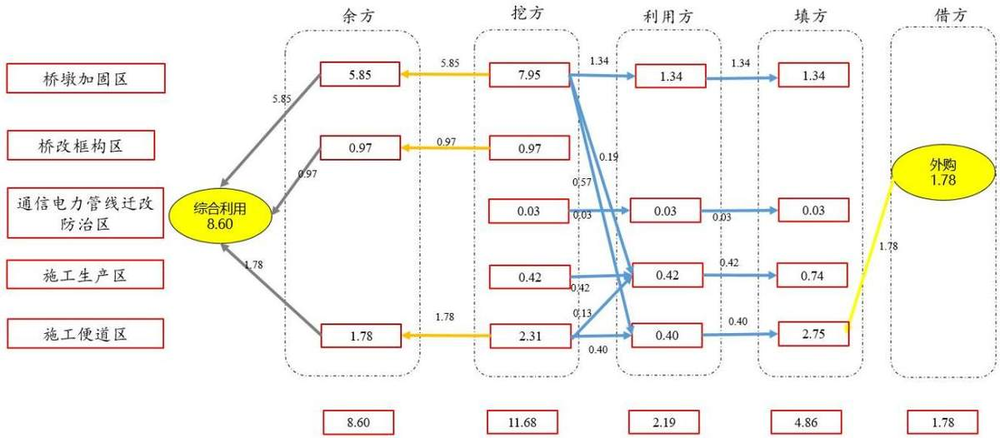
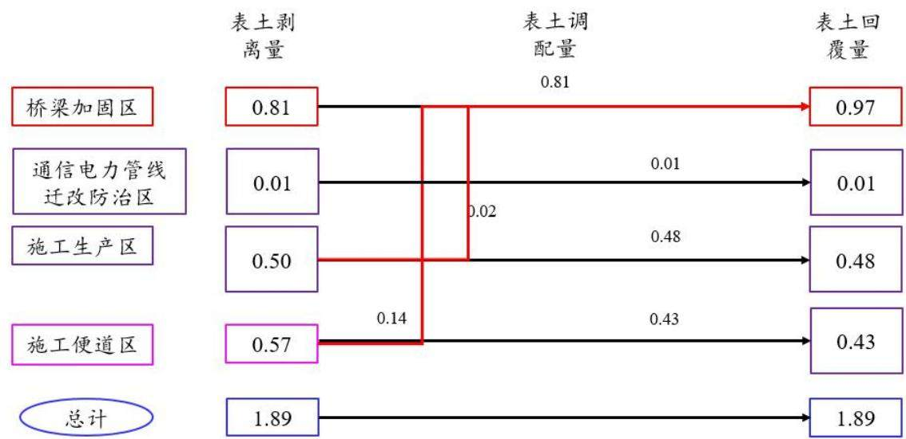
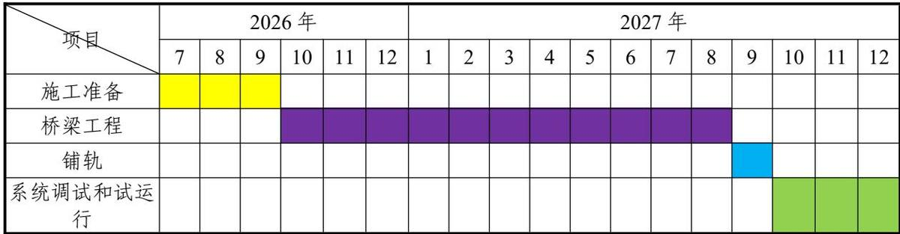
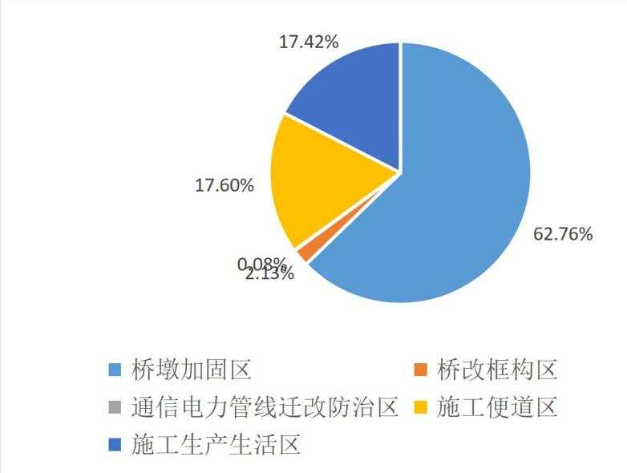
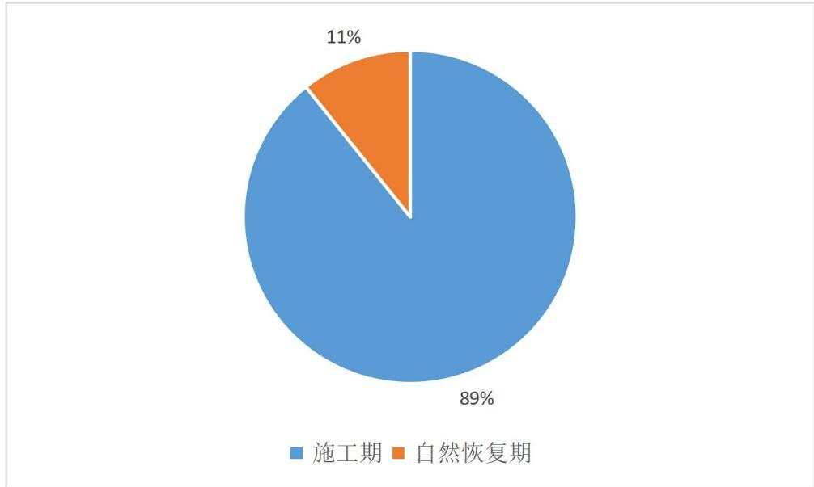
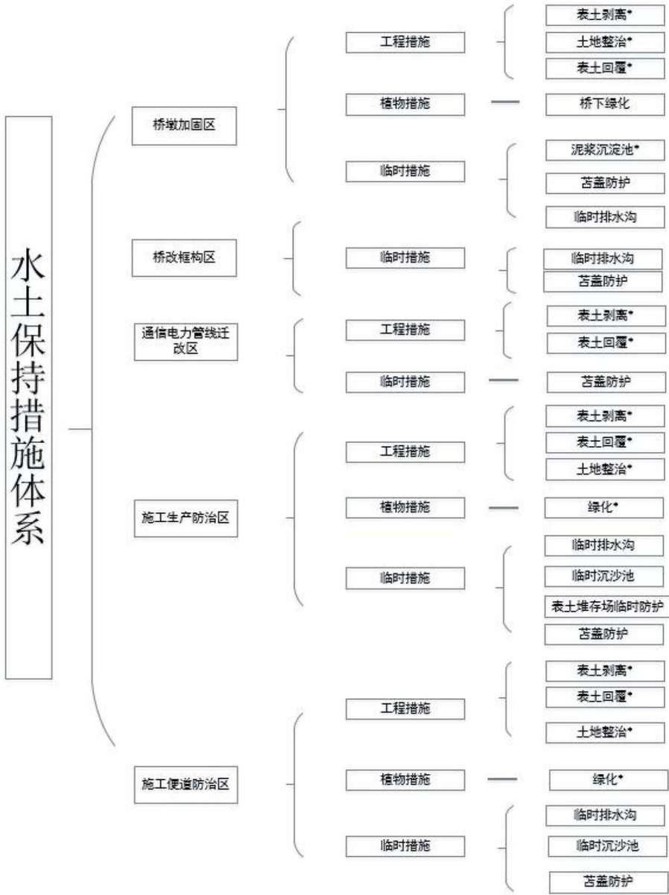
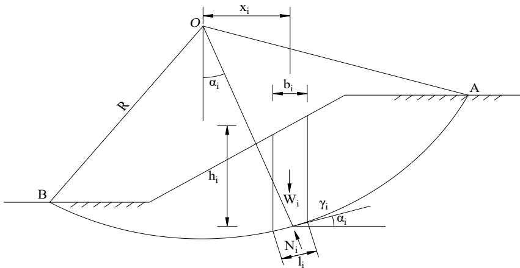
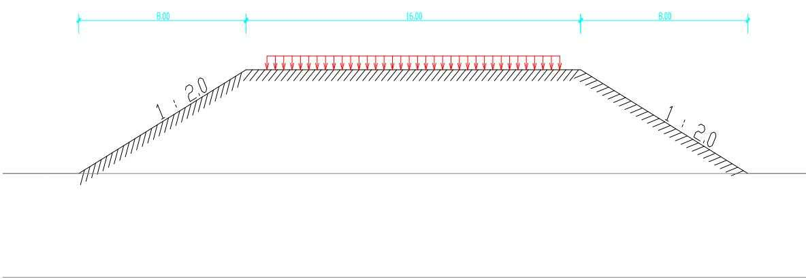
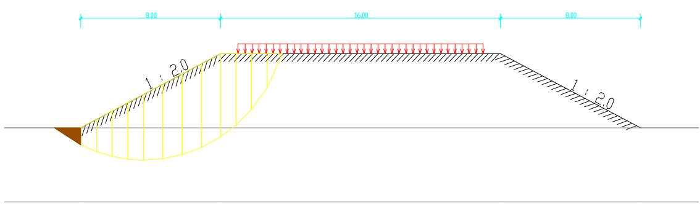
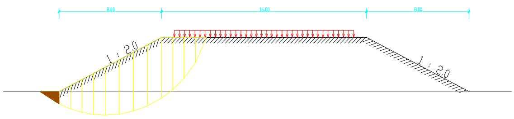

> **Zone C（应用范例层）使用边界**——仅可用于**写作风格、章节展开方式、表达逻辑、表格设计**的参考。
> **不得**用于合规判断；**不得**引入其项目数据（名称／地点／数字／单位名）；
> **不得**因其"曾经通过审批"而推定其做法在当前标准下仍然合规。
> 与 Zone A 冲突时**一律以 Zone A 为准**；Zone A 未明确规定时输出
> 「**Zone A 未明确规定，以下为参考写法，需人工判断**」。
>
> **坐标系警告**：本范例为**老八章结构**（GB 50433—2018 附录B），与 2026 版 10 章模板**同号不同义**
> （老 `1.5`＝防治目标，新 `1.5`＝水土流失预测结果；老 4→新 6 …偏移 +2；新版第 4/5 章老结构无独立章）。
> 因此 **`chapter_mapping: pending`——不得按章节号挂载**，检索一律走 `topic_tags`。
>
> **待加工**：`topic_tags`（主题标签）、`approval_basis_list`（编制依据逐字清单）、
> `structure_summary`（只提取结构：章节展开顺序／段落功能／表格栏目结构／句式模板／论证链步骤）。

1 综合说明...  
1.1 项目简况..  
1.2 编制依据.... 6  
1.3 设计水平年... ... 8  
1.4水土流失防治责任范围. .. 8  
1.5 水土流失防治目标...... .. 8  
1.6项目水土保持评价结论. . 9  
1.7水土流失预测结果... .. 11  
1.8水土保持措施布设成果. ... 12  
1.9 水土保持监测方案...... ... 14  
1.10水土保持投资估算及效益分析... .... 15  
1.11 结论... .. 15  
2 项目概况 ..... ... 21  
2.1项目组成及工程布置.. ... 21  
2.2 施工组织... .. 39  
2.3 工程占地.. .. 49  
2.4 土石方平衡... .. 54  
2.5拆迁（移民）安置与专项设施改（迁）建... ...64  
2.6 施工进度.... ... 65  
2.7 自然概况.... ... 66  
3 项目水土保持评价...... ... 73  
3.1主体工程选址（线）水土保持评价.. ....73  
3.2建设方案与布局水土保持评价.... .... 75  
3.3主体工程设计中水土保持措施界定.. ....83  
4 水土流失分析与预测.... .... 87  
4.1水土流失现状. .. 87  
4.2水土流失影响因素分析.. ... 87  
4.3水土流失量预测.. ... 89  
4.4水土流失危害分析.. .. 105  
4.5 指导性意见.. ... 106  
5 水土保持措施.... .... 109  
5.1 防治区划分.. ... 109  
5.2措施总体布局 ... 109  
5.3 分区措施布局... ....111  
5.4 施工要求 ...... .... 129  
6 水土保持监测... ... 133  
6.1 范围与时段.. .... 133  
6.2 内容和方法.. ... 133  
6.3 点位布设 ..... .... 138  
6.4实施条件和成果... .... 139  
7 水土保持投资估算及效益分析... ....145  
7.1 投资估算.... ... 145  
7.2 效益分析... ... 167  
8 水土保持管理. ... 169  
8.1 组织管理.. .... 169  
8.2 后续设计... ... 170  
8.3 水土保持监测... ... 170  
8.4水土保持监理.. ... 171  
8.5水土保持施工 ... 172  
8.6水土保持设施验收.. ... 173  
附表 .... .... 177

## 附表：

附表1 防治责任范围表

附表2 防治标准指标计算表

附表3 单价分析表

## 附件：

附件-01新兖铁路长东黄河大桥病害整治工程可研批复；

附件-02 新兖铁路长东黄河大桥病害整治工程初步设计咨询意见；

附件-03封丘县永诚再生资源有限公司土石方处置协议及相关证明；

附件-04东方鲁西南体育运动学校综合利用协议及相关证明；

附件-05 东明县自然资源和规划局关于新兖铁路长东黄河大桥病害整治工程符合生态保护红线内允许有限人为活动的认定意见；

附件-06 山东省农业农村厅关于转报新兖铁路长东黄河大桥病害整治工程等2个建设项目对国家级水产种质资源保护区的影响专题论证报告的函。

附件-07洪水影响评价承诺函、同意上报函及报告主要内容；

## 附图：

附图-01项目地理位置图；

附图-02项目区土壤侵蚀强度分布图；

附图-03项目区水系图；

附图-04平纵断面缩图；

附图-05工程分区防治措施总体布局图（含监测点位）；

附图-06桥墩加固区水土保持措施布设图；

附图-07桥改框构工程区水土保持措施布设图；

附图-08施工便道区水土保持措施典型设计布设图；

附图-09施工生产区水土保持措施典型设计布设图；

附图-10表土临时防护典型措施布设图；

附图-11泥浆沉淀池典型措施布设图；

附图-12通信电力管线迁改区水土保持典型措施布设图；

附图-13表土分布图；

附图-14表土剥离范围图；

附图-15植物措施典型设计图。

东堡城。

本工程既有线建设时期较早，2005年对既有新菏兖日铁路菏泽段进行电气化改造，该项目 2008 年下半年开工，2010年下半年竣工，2019 年完成相关验收调查报告。

铁路用地界范围较大，包含上行线、下行线间以及外侧15-40m 甚至更大部分区域，用地界内现状存在耕地、林地、草地等地类。

该段铁路沿线水土保持措施主要有路基浆砌片石边坡防护、绿化工程等，措施保存良好，现状无明显水土流失。

## （3）项目位置

既有新兖铁路西起河南省新乡市，东至山东省兖州市，全长305.3公里。本次改造工程长东黄河大桥及其东引桥位于新兖铁路新菏段，西起河南省新乡市长垣市赵堤乡，东跨省界落于山东省菏泽市东明县东堡城。本次改造工程线路长度11.775km，共涉及2省2 市2县。

## （4）建设性质、规模与等级

改建铁路；铁路等级：I级；正线数目：双线；设计时速：100km/h。

## （5）项目组成

## 1）主体工程

主体工程项目组成为桥梁病害整治工程，长度共计 11.775km，包括新兖铁路长东黄河大桥及其东引桥。

新兖铁路长东黄河大桥病害整治长度 11.547km，分为上行线、下行线单线桥各 1座，其中上行线病害整治里程为：K112+028～K117+733、K118+223～K118+360，下行线病害整治里程为 K111+822～K117+527。

东引桥病害整治长度 0.228km，分为上行线、下行线单线桥各1 座，其中上行线病害整治里程为：K118+445～K118+559，下行线病害整治里程为 K118+239～K118+353。

## 2）临时工程

临时工程组成包括施工便道及施工生产区。

全线共设置施工便道 6.31km，其中新改建便道5.11km，利用地方道路1.20km。占地 5.81hm2，其中 4.27hm2 位于既有铁路用地范围内，1.54hm2 位于既有铁路用地范围外。

根据本项目施工特点和沿线环境特征，需设置道砟存放场1处、制（存）梁场1处、混凝土拌和站1处、表土堆存场2处。总占地面积5.82hm2，均位于既有铁路用地范围内。

施工用水采用接引自来水管网方案。给水管线1.5km，为方便检修，管路采用地面敷设（明铺）接地方自来水管网，沿施工便道敷设，不开挖地表，不涉及占地、土石方。临时电力线2.2km，其中梁场范围内采用直埋布设；梁场外接地方电源采用架空型式布设，每隔 50m 设一根杆，每个杆占地面积 $0 . 3 6 \mathrm { m } ^ { 2 }$ ，新增临时用地1.44m2。并入施工生产区统筹考虑。

## （6）占地面积

本工程总占地20.82hm2，其中永久工程用地9.19hm2，临时占地11.63hm2。占地类型主要为铁路用地、水浇地。

## （7）土石方量

土石方总量为 20.32 万 m3，其中挖方总量为 13.57 万 m3（含表土剥离量 1.89 万m3）、填方总量为 6.75 万 $\mathrm { m } ^ { 3 }$ （含表土回覆量 1.89 万 m3），利用方 4.97 万 $\mathrm { m } ^ { 3 }$ （含表土利用 1.89 万 $\mathrm { m } ^ { 3 }$ ，移挖作填3.08万 $\mathbf { m } ^ { 3 } )$ ），借方总量为1.78万 $\mathrm { m } ^ { 3 }$ （均采用外购），余方总量 8.60万m3（分别运至封丘县永诚再生资源有限公司以及东方鲁西南体育运动学校进行综合利用）。土石方利用率100%，挖方利用率26.37%，弃渣综合利用率100%。

表土剥离共计1.89万 m3，施工期间临时堆放于既有铁路用地范围内，不再新增临时征地，剥离表土最终用于后期绿化。

## （8）专项设施改（迁）建

工程范围内存在地方既有电力、通信设施，因此涉及电力、通信迁改，其中通信迁改10处，迁改长度2156m；电力迁改 19处，迁改长度803m。

## （9）拆迁安置

工程共涉及拆迁民房 32m2，采用货币补偿，水土流失防治责任由地方负责。

## （10）建设工期及进展

本工程计划于 2026 年 7 月开工建设，2027 年 12 月底完工，总工期为18个月。

## （11）工程投资

工程总投资 7.06亿元，其中土建投资5.39 亿元。资金筹措方案暂按资本金占总投资的70%，其余投资采用国内银行贷款分析。

## （12）项目建设单位

中国铁路郑州局集团有限公司。

## 1.1.2项目前期工作进展情况

## 1、主体工程设计情况

2025年 6 月，中国铁路设计集团有限公司完成《新兖铁路长东黄河大桥病害整治工程可行性研究》；

2025年 9 月，中国铁路设计集团有限公司完成《新兖铁路长东黄河大桥病害整治工程初步设计》（送审稿）。

目前，项目处于初步设计阶段。

## 2、项目前期支撑性文件

本工程整治工程均在既有铁路用地，无新增永久占地，无需办理用地预审及规划选址审批；

2025年9月17日，中国国家铁路集团有限公司以铁发改函〔2025〕332号批复了本工程可行性研究；

2025年10 月9日，中国国家铁路集团有限公司工程设计鉴定中心以鉴便函〔2025〕15号对本项目初步设计进行审查并出具技术咨询意见。

2026年2月25日，《新兖线长东黄河大桥病害整治工程洪水影响评价报告》已上报至黄河水利委员会，3月28日已通过技术审查会，现已完成报告修改待履行审批程序。5月6日，受黄委河湖局委托，黄河勘察规划设计研究院有限公司在郑州组织召开报告审查会，目前正陆续闭合专家意见。

## 3、项目水土保持工作及水保方案编制情况

根据《中华人民共和国水土保持法》和《生产建设项目水土保持方案管理办法》（水利部令第53号）相关要求，建设单位委托中国铁路设计集团有限公司（以下简称中国铁设）开展《新兖铁路长东黄河大桥病害整治工程水土保持方案报告书》的编制工作。

接受委托后，编制单位立即成立项目组，组织专业技术人员认真研究工程设计资料，并进行现场实地踏勘和资料收集工作，并征询当地水行政主管部门及相关单位意见和要求。于2026年4 月编制完成《新兖铁路长东黄河大桥病害整治工程水土保持方案报告书》。报告书从水土保持角度对项目进行评价，明确本项目设计水平年、水土流失防治责任范围，确定水土流失重点防治的区域及水土保持措施，并对水土保持监测、监理、验收等工作提出相应要求，编制了投资估算，并对保障水保方案的实施提出了对应措施。

## 1.1.3 自然简况

项目区地貌类型为黄河冲积平原地貌，气候类型属温带大陆性半湿润季风气候，全年平均气温约 $1 6 \mathrm { { ^ \circ C } } .$ 。春秋季温差较大，日均温差约 $1 0 ^ { \circ } \mathrm { C } .$ 。年均降水量约650.0mm，集中于夏季（6-8 月），占全年 60%以上，年均蒸发量约 1493.0mm，冬季降雪较少，年均 5天，极端雪天伴随寒潮。最大积雪深度 20cm。最大冻结深度 41cm。工程所在地区土壤类型主要为石灰性潮土，占地范围内表层土壤厚度约为 15\~30cm。植被类型主要为温带落叶阔叶林，以农作物群落为主，主要有禾本科冬小麦、禾本科玉米、杂粮等，项目区沿线林草覆盖率约为20%。

根据《全国水土保持区划（2015-2030 年）》，项目区属北方土石山区，容许土壤侵蚀模数为 $2 0 0 \mathrm { t / \Omega } ( \mathrm { k m } ^ { 2 } { \cdot } \mathbf { a } )$ ，水土流失类型为微度水力侵蚀为主，原地貌土壤侵蚀模数为 $1 9 0 \mathrm { t } / \ \left( \mathrm { k m } ^ { 2 } { \cdot } \mathrm { a } \right)$ ）。

根据《水利部办公厅关于做好国家级水土流失重点预防区和重点治理区落地上图成果应用的通知》（办水保〔2025〕170号）、《河南省水土保持规划（2016-2030 年）》、《山东省水利厅关于加强水土保持重点区域管理的通知》（鲁水保字〔2025〕1 号）、《菏泽市水土保持规划（2016-2030 年）》、《新乡市水土保持规划（2017-2030年）》、《东明县水土保持规划（2019-2030 年）》、《长垣县水土保持规划（2017-2030年）》，工程不涉及各级水土流失重点预防区和重点治理区。

本工程主体工程位于黄河河道管理范围内，桥墩加固、桥改框构、梁场、拌和站、道砟存放场、施工便道等工程内容均已在《新兖线长东黄河大桥病害整治工程洪水影响评价报告》（送审稿）（以下简称《防洪报告》）中进行了论证，目前已通过专家审查。东明县、长垣市均已对该报告确认同意（附件07）。

本工程共涉及黄河鲁豫交界段国家级水产种质资源保护区和黄河干流水源涵养生态保护红线两处环境敏感区，本工程为黄河长东大桥梁病害整治工程，既有铁路在环境敏感区内，敏感区内仅涉及更换桥梁支座工程，无新增占地及土石方开挖。

本工程表土堆存场不涉及基本农田、饮用水水源保护区、水功能一级区的保护区和保留区、自然保护区、世界文化和自然遗产地、风景名胜区、地质公园、森林公园、重要湿地、生态保护红线、河湖管理范围等敏感区。

## 1.2编制依据

## 1.2.1法律法规及规范性文件

（1）《中华人民共和国水土保持法》（1991 年6月29日通过，2010年12月25日修订，2011年3 月1日起施行）；

（2）《中华人民共和国黄河保护法》（2022年10月 30日，第十三届全国人民代表大会常务委员会第三十七次会议通过，2023年4月1 日起施行）；

（3）《河南省实施〈中华人民共和国水土保持法〉办法》（2014年9 月26日，河南省第十二届人民代表大会常务委员会第十次会议通过；2021年 5月28日修订并施行）；

（4）《山东省水土保持条例》（2014年 5月30 日山东省第十二届人大常委会第八次会议通过，2024 年1月 20日山东省第十四届人民代表大会常务委员会第七次会议第二次修正，2014 年10 月 1日起施行）；

（5）《水利部办公厅关于做好国家级水土流失重点预防区和重点治理区落地上图成果应用的通知》（办水保〔2025〕170号）；

（6）《生产建设项目水土保持方案管理办法》（水利部令第53号）；

（7）《水利部关于进一步深化“放管服”改革全面加强水土保持监管的意见》（水保〔2019〕160 号）；

（8）《水利部办公厅关于印发生产建设项目水土保持技术文件编写和印制格式规定（试行）的通知》（办水保〔2018〕135号）；

（9）《水利部办公厅关于进一步加强生产建设项目水土保持监测工作的通知》（办水保〔2020〕161 号）；

（10）《水利部办公厅关于印发生产建设项目水土保持方案审查要点的通知》（办水保〔2023〕177 号）；

（11）《山东省水利厅关于加强水土保持重点区域管理的通知》（鲁水保字〔2025〕1 号）；

（12）《水利部办公厅关于印发生产建设项目水土保持方案编制模板的通知》（办水保函〔2026〕232号）。

## 1.2.2 技术标准

（1）《生产建设项目水土保持技术标准》（GB 50433-2018）；

（2）《生产建设项目水土流失防治标准》（GB/T50434-2018）；

（3）《生产建设项目水土保持监测与评价标准》（GB/T51240-2018）；

（4）《水土保持工程调查与勘测标准》（GB/T51297-2018）；

（5）《水土保持工程设计规范》（GB51018-2014）；

（6）《生产建设项目土壤流失量测算导则》（SL773-2018）；

（7）《土壤侵蚀分类分级标准》（SL190-2007）；

（8）《水利水电工程制图 第6部分 水土保持图》（SL/T73.6-2026）；

（9）《表土剥离及其再利用技术要求》（GB/T45107-2024）；

（10）《铁路工程建设项目临时占地复垦规范》（Q/CR9161-2023）；

（11）《铁路桥涵地基和基础设计规范》（TB 10093-2017）；

（12）《铁路路基设计规范》（TB10001-2016）。

## 1.2.3 技术资料

（1）《新兖铁路长东黄河大桥病害整治工程初步设计》（中国铁路设计集团有限公司，2025年9月）（送审稿）；

（2）《河南省水土保持规划（2016-2030 年）》；

（3）《山东省水土保持规划（2016-2030 年）》；

（4）《菏泽市水土保持规划（2016-2030 年）》；

（5）《新乡市水土保持规划（2017-2030 年）》；

（6）《东明县水土保持规划（2019-2030 年）》；

（7）《长垣县水土保持规划（2017-2030 年）》；

（8）《新兖线长东黄河大桥病害整治工程洪水影响评价报告》（送审稿）。

## 1.3设计水平年

本工程计划开工时间2026年7月，2027年12月完工，根据《生产建设项目水土保持技术标准》中关于设计水平年的规定“水土保持方案确定的水土保持措施实施完毕并初步发挥效益的年份”，确定本方案的设计水平年为主体工程完工后的当年，即2027年。

## 1.4水土流失防治责任范围

本项目水土流失防治责任范围面积 20.82hm2，其中永久工程用地9.19hm2，临时工程占地11.63hm2。除施工便道有1.54hm2位于铁路用地范围外，其余均位于既有铁路用地范围内，生产建设单位落实水土流失防治责任范围内水土保持主体责任。

## 1.5水土流失防治目标

## 1.5.1执行标准等级

根据《水利部办公厅关于做好国家级水土流失重点预防区和重点治理区落地上图成果应用的通知》（办水保〔2025〕170号）、《河南省水土保持规划（2016-2030 年）》、《山东省水利厅关于加强水土保持重点区域管理的通知》（鲁水保字〔2025〕1 号）、《菏泽市水土保持规划（2016-2030 年）》、《新乡市水土保持规划（2017-2030年）》、《东明县水土保持规划（2019-2030 年）》、《长垣县水土保持规划（2017-2030年）》，工程不涉及各级水土流失重点预防区和重点治理区，同时不涉及饮用水水源保护区、水功能一级区的保护区和保留区、自然保护区、世界文化和自然遗产地、风景名胜区、地质公园、森林公园、重要湿地，且不位于县级及以上城市区域，但由于本工程位于黄河两岸 3km 汇流范围内，同时项目周边 500m 范围内存在居民点，依据《生产建设项目水土流失防治标准》（GB/T50434-2018），既有桥梁上部改造跨越黄河鲁豫交界段国家级水产种质资源保护区和黄河干流水源涵养生态保护红线（无新增占地及土石方开挖），工程执行北方土石山区水土流失防治二级标准。

## 1.5.2 防治目标

根据铁路工程建设特点、工程区环境现状等，明确本工程水土流失防治基本目标为：

（1）项目建设范围内的新增水土流失得到有效控制，原有水土流失得到治理；

（2）水土保持措施应安全有效；

（3）水土资源、林草植被应得到最大限度的保护与恢复；

（4）六项防治指标达标。

根据《水利部办公厅关于做好国家级水土流失重点预防区和重点治理区落地上图成果应用的通知》（办水保〔2025〕170号）、《河南省水土保持规划（2016-2030 年）》、《山东省水利厅关于加强水土保持重点区域管理的通知》（鲁水保字〔2025〕1 号）、《菏泽市水土保持规划（2016-2030 年）》、《新乡市水土保持规划（2017-2030年）》、《东明县水土保持规划（2019-2030 年）》、《长垣县水土保持规划（2017-2030年）》，工程不涉及各级水土流失重点预防区和重点治理区，同时不涉及饮用水水源保护区、水功能一级区的保护区和保留区、自然保护区、世界文化和自然遗产地、风景名胜区、地质公园、森林公园、重要湿地，且不位于县级及以上城市区域，但由于本工程位于黄河两岸 3km 汇流范围内，同时项目周边 500m 范围内存在居民点，依据《生产建设项目水土流失防治标准》（GB/T50434-2018），工程执行北方土石山区水土流失防治二级标准，项目区现状地表侵蚀强度属微度，土壤流失控制比做相应调整。

调整后的防治指标值为：水土流失治理度92%，土壤流失控制比1.0，渣土防护率 95%，表土保护率92%，林草植被恢复率95%，林草覆盖率22%，详见附表2。

## 1.6 项目水土保持评价结论

## 1.6.1 主体工程选址（线）评价

根据《中华人民共和国水土保持法》（2011.3.1施行）、《山东省水土保持条例》（2013.11.29修正，2014.3.1施行）、《河南省实施〈中华人民共和国水土保持法〉办法》（2014年9月26日，河南省第十二届人民代表大会常务委员会第十次会议通过；2021年5月28 日修订并施行）、《生产建设项目水土保持技术标准》（GB50433-2018）等相关规范性文件中关于水土保持限制和约束性规定，进行主体工程选址（线）分析与评价。

（1）根据《水利部办公厅关于做好国家级水土流失重点预防区和重点治理区落地上图成果应用的通知》（办水保〔2025〕170号）、《河南省水土保持规划（2016-2030年）》、《山东省水利厅关于加强水土保持重点区域管理的通知》（鲁水保字〔2025〕

1 号）、《菏泽市水土保持规划（2016-2030 年）》、《新乡市水土保持规划（2017-2030年）》、《东明县水土保持规划（2019-2030年）》、《长垣县水土保持规划（2017-2030年）》，工程不涉及各级水土流失重点预防区和重点治理区，同时不涉及饮用水水源保护区、水功能一级区的保护区和保留区、自然保护区、世界文化和自然遗产地、风景名胜区、地质公园、森林公园、重要湿地，且不位于县级及以上城市区域，但由于本工程位于黄河两岸 3km 汇流范围内，同时项目周边 500m 范围内存在居民点，依据《生产建设项目水土流失防治标准》（GB/T50434-2018），工程执行北方土石山区水土流失防治二级标准，并严格控制临时用地，最大限度地减少弃渣量。

（2）工程已最大限度自身利用，经过详细论证自身利用量 $1 . 2 4 \mathrm { ~ \mathscr ~ { ~ H ~ } ~ m ~ } ^ { 3 }$ 。由于基坑回填土方量有限，剩余挖方8.60万 m3无法用于本工程填土，分别运至封丘县永诚再生资源有限公司以及东方鲁西南体育运动学校进行综合利用。

综上，工程采取措施后基本符合《水土保持法》、《黄河保护法》、《生产建设项目水土保持技术标准》（GB50433-2018）的规定要求，从水土保持角度分析，主体工程选线基本符合水土保持要求。

## 1.6.2建设方案与布局评价

本工程为既有桥梁病害整治，主要工程内容为换梁、桥墩加固、更换桥梁支座。根据《水利部办公厅关于做好国家级水土流失重点预防区和重点治理区落地上图成果应用的通知》（办水保〔2025〕170号）、《河南省水土保持规划（2016-2030 年）》、《山东省水利厅关于加强水土保持重点区域管理的通知》（鲁水保字〔2025〕1 号）、《菏泽市水土保持规划（2016-2030 年）》、《新乡市水土保持规划（2017-2030年）》、《东明县水土保持规划（2019-2030 年）》、《长垣县水土保持规划（2017-2030年）》，工程不涉及各级水土流失重点预防区和重点治理区，同时不涉及饮用水水源保护区、水功能一级区的保护区和保留区、自然保护区、世界文化和自然遗产地、风景名胜区、地质公园、森林公园、重要湿地，且不位于县级及以上城市区域，但由于本工程位于黄河两岸 3km 汇流范围内，同时项目周边 500m 范围内存在居民点，依据《生产建设项目水土流失防治标准》（GB/T50434-2018），工程执行北方土石山区水土流失防治二级标准。主体工程实施在既有铁路用地范围内，永久工程用地 $9 . 1 9 \mathrm { h m } ^ { 2 }$ ，均位于铁路用地范围内，其中包含泥浆沉淀池、运梁模块车等作业位置，与桥墩加固区域永临结合；临时工程用地共计11.63hm2，其中 $1 0 . 0 9 \mathrm { h m } ^ { 2 }$ 位于既有铁路用地范围内，临时电力线等与施工生产区临临结合设置，1.54hm2位于既有铁路用地范围外，为施工便道临时占地，本工程建设方案与布局充分利用土地资源。

因此，从水土保持角度分析认为，本工程主体建设方案与布局合理。为充分利用有限的表层土资源，工程施工前，对占用耕地、林地、草地扰动部分进行表层剥离，表土剥离厚 15cm\~30cm，共剥离表层土 1.89 万 $\mathrm { m } ^ { 3 }$ ，剥离的表层土堆置在临时工程共计2处表土堆存场。

本工程不设置取土场，借方量1.78万 $\mathrm { m } ^ { 3 }$ ，工程填方及施工所需砂石料均采用外购方式。工程填方供应企业为封丘县永诚再生资源有限公司，该企业经营期限及生产规模可满足本工程建设要求。

本工程不设置弃土场，余方分别运至封丘县永诚再生资源有限公司以及东方鲁西南体育运动学校进行综合利用，共计8.60万 $\mathrm { m } ^ { 3 } .$ 。河南境内5.39万 $\mathrm { m } ^ { 3 }$ 余方可作为封丘县永诚再生资源有限公司年加工 100 万吨建筑废弃物再生利用建设项目（水土保持方案已于 2021 年9月16日批复，并于2022 年12 月28日取得水土保持设施自主验收报备回执）的生产原材料，年加工能力满足本项目需求，已签订综合利用协议，综合利用方案可行；山东境内3.21万m3余方用于东方鲁西南体育运动学校土方回填（水土保持方案已于2024年11月29日批复，借方17.04万 $\mathrm { m } ^ { 3 }$ ，计划于2026年开工），本工程在山东境内的余方满足综合利用项目的需求，时序可衔接，已签订综合利用协议，综合利用方案可行。水土流失防治责任由综合利用项目的建设单位负责，符合水土保持要求。

综上所述，工程土石方无漏项，余方尽可能自身利用，最大限度减少弃方的产生，表土剥离与保护措施合理、利用方向明确，工程土石方总体上满足水土保持要求。

## 1.7水土流失预测结果

本工程原地貌土壤流失量为 70.06t，地表扰动后土壤流失量 632.49t，新增土壤流失量562.43t，桥墩加固区、施工生产区、桥改框构区为重点水土流失区域，产生的主要时段为施工期。

工程建设土石方开挖填筑量大，工程建设将不可避免改变原有地貌，破坏原生植

被，导致土地生产力降低，加速土壤侵蚀程度，影响周边生态环境。应做好工程建设过程中的施工管理，及时落实各项水土保持措施，减少工程区水土流失，防止对周边区域产生不利影响。

## 1.8水土保持措施布设成果

本项目按工程建设内容、工程布局及施工区域将本工程划分为桥墩加固区、桥改框构、通信电力管线迁改区、施工便道区、施工生产区共5个防治区。

## 1.8.1 桥墩加固区

措施布局：施工前剥离表土，堆放在施工生产区的表土堆存场，施工过程中，桥墩开挖基坑设置临时排水沟，引至施工便道的沉沙池，桥墩加固区施工期间裸露面采用临时苫盖。施工完成后进行土地整治，利用剥离的表土覆土，对桥下进行撒播草籽绿化。桥梁钻渣前在周边设置泥浆沉淀池。

该区水土保持措施有：表土保护工程（表土剥离、表土回覆）、土地整治、植被恢复与建设工程（桥下绿化）、泥浆沉淀池、临时排水沟、临时沉沙池、苫盖防护。

工程措施：表土保护工程（表土剥离 0.81 万m3，表土回覆 0.97 万 m3）；土地整治 2.03hm2。实施时段为 2026 年 10 月至 2026 年 11 月、2027 年 2 月至 2027 年 3 月。

植物措施：桥下绿化（撒播草籽 $2 0 2 6 3 \mathrm { m } ^ { 2 } )$ 。实施时段为2027年4月。

临时措施：临时排水沟（长度2.00km，土方开挖360m3）；泥浆沉淀池101座（土方开挖 $1 7 6 9 5 \mathrm { m } ^ { 3 } \mathrm { ~ , ~ }$ ）。苫盖防护工程（密目网苫盖 $1 7 3 6 0 \mathrm { m } ^ { 2 } )$ ）。实施时段为2026年7月至 2027 年 9 月。

## 1.8.2 桥改框构区

措施布局：施工前剥离表土，堆放在施工生产区内的表土堆存场。施工过程中，裸露面采用临时苫盖。

该区水土保持措施有：临时排水沟、临时沉沙池、苫盖防护。

临时措施：临时排水沟（长度0.30km，土方开挖54m3）；临时沉沙池（6座，土方开挖 $1 2 \mathrm { m } ^ { 3 } )$ ；苫盖防护工程（密目网苫盖 $4 8 0 0 \mathrm { m } ^ { 2 } \mathrm { ~ , ~ }$ ）。实施时段为 2026年7月至2026年9月。

## 1.8.3通信电力管线迁改区

措施布局：施工前剥离表土，堆放在施工生产区内的表土堆存场。施工过程中，裸露面采用临时苫盖。施工结束后，回覆表土，按原土地利用现状进行复耕。

该区水土保持措施有：表土保护工程（表土剥离、表土回覆）、苫盖防护。

工程措施：表土保护工程（表土剥离 0.01 万m3，表土回覆 0.01 万 m3）。实施时段为 2026 年 10 月至 2026 年 11 月、2027 年 2 月至 2027 年 3 月。

临时措施：苫盖防护工程（密目网苫盖300m2）。实施时段为 2026年7月至2026年9月。

## 1.8.4 施工生产区

措施布局：施工前剥离表土，堆放在施工生产区内的表土堆存场，并采取临时拦挡、苫盖+撒播草籽和排水沉沙措施。施工过程中，施工场地外围设置临时排水沟和沉沙池。施工结束后进行土地整治，回覆表土，按原土地利用现状进行复耕或恢复植被。

该区水土保持措施有：表土保护工程（表土剥离、表土回覆）、土地整治、绿化工程、苫盖防护、临时排水沟、临时沉沙池、表土临时防护（装土编织袋拦挡及拆除、密目网苫盖、撒播草籽、临时排水沟、临时沉沙池）。

工程措施：表土保护工程（表土剥离 0.50 万m3，表土回覆 0.48 万 m3）；土地整治工程（土地整治 $1 . 5 7 \mathrm { h m } ^ { 2 }$ ）。实施时段为 2026 年 10 月至 2026 年 11 月、2027 年 2月至 2027 年 3 月。

植物措施：绿化（栽植乔木 200 株、栽植灌木 200 株、撒播草籽 15741m2）。实施时段为2027年4月。

临时措施：临时排水沟（长度3.46km，土方开挖623m3）；临时沉沙池（35座，土方开挖 $7 0 ~ \mathrm { m } ^ { 3 } )$ ；表土临时防护（装土编织袋拦挡 $1 1 7 0 \mathrm { m } ^ { 3 }$ ，装土编织袋拆除 $1 1 7 0 \mathrm { m } ^ { 3 }$ 密目网苫盖 9000m2，撒播草籽 $1 1 7 0 \mathrm m ^ { 2 }$ ，临时排水沟133m，临时沉沙池 2 个），苫盖防护工程（密目网苫盖11240m2）。实施时段为2026年10月至2027年8 月。

## 1.8.5 施工便道区

措施布局：施工前剥离表土，堆放在施工生产区的表土堆存场。在施工便道一侧设置排水沟，排水沟水流直接接入周边自然沟道。施工结束后进行土地整治，回覆表

土，对后期不作为施工便道的区域栽植乔木、栽植灌木、撒播草籽。施工过程中，裸露边坡区域实施密目网苫盖，在施工便道一侧布设土质排水沟，在临时排水沟末端设沉沙池。

该区水土保持措施有：表土保护工程（表土剥离、表土回覆）、土地整治、绿化工程、临时排水沟、临时沉沙池、苫盖防护。

工程措施：表土保护工程（表土剥离 0.57 万m3，表土回覆 0.42 万 m3）；土地整治工程（土地整治 0.20hm2）。实施时段为 2026 年 10 月至 2026 年 11 月、2027 年 2月至 2027 年 3 月。

植物措施：绿化（栽植乔木509株、栽植灌木1211株、撒播草籽2021m2）。实施时段为 2027 年4月。

临时措施：临时排水沟（长度5.11km，土方开挖920m3）；临时沉沙池（51座，土方开挖102m3），苫盖防护工程（密目网苫盖 2000m2）。实施时段为2026年7月至2027 年 9 月。

## 1.9水土保持监测方案

## （1）监测内容

本项目水土保持监测范围为项目水土流失防治责任范围。水土保持监测内容主要包括水土流失影响因素、水土流失状况、水土流失危害和水土保持措施等。

## （2）监测时段

本项目水土保持监测时段从施工期（含施工准备期）开始，至设计水平年结束。水土保持监测时段为2026 年7月至2027年12月。

## （3）监测方法

监测方法采取调查法、地面观测法及遥感监测，根据本项目各施工区的不同特征以及监测内容采取不同的监测方法，施工前对原地貌的土壤流失量和植被覆盖率进行一次全面的调查。降雨和风力等气象资料通过范围内或附近气象站、水文站搜集，每月监测 1 次。地形地貌整个监测期监测 1 次。地表组成物质施工期和运行期各监测 1次。植被状况按植被类型选择 3 个\~5 个代表性样地，施工前监测 1次。扰动土地情况监测应至少每月监测 1 次，水土流失状况应至少每月监测 1次，发生强降水等情况后应及时加测。水土流失面积、分布采用无人机+实地调查的方法，每月1 次，加强汛期监测，在发生强降水后加测。土壤流失量及变化情况每月 1次，加强汛期监测，在发生强降水后加测。水土流失危害监测在灾害事件发生后 1 周内完成监测。工程措施、植物措施每季度监测 1 次，临时措施每月监测 1次。监测单位依据每季度监测结果，对生产建设项目进行水土保持监测三色评价，并在监测季报和总结报告中明确“绿黄红”三色评价结论。

## （4）监测点位

综合考虑各水土流失防治区特点采用均匀分布的方式，本项目共计布设监测点位17处，其中工程措施监测点位8处，植物措施监测点位5 处，土壤流失量监测点4处。

## 1.10水土保持投资估算及效益分析

本工程水土保持总投资为 327.19 万元，其中工程措施 6.15 万元，植物措施 22.85万元，监测措施 42.08万元，临时工程 73.30 万元，独立费用 88.08万元（其中水土保持监理费 20.00 万元），基本预备费69.74 万元，水土保持补偿费24.99万元。

河南省工程水土保持总投资为161.44万元，其中工程措施3.31万元，植物措施6.96万元，监测措施 21.04万元，临时工程 33.72 万元，独立费用 48.32万元（其中水土保持监理费 12.00 万元），基本预备费34.01 万元，水土保持补偿费14.08万元。

山东省工程水土保持总投资为 165.75 万元，其中工程措施 2.84 万元，植物措施15.89 万元，监测措施21.04万元，临时工程39.58万元，独立费用39.76 万元（水土保持监理费 8.00 万元），基本预备费35.73 万元，水土保持补偿费10.91万元。

根据主体设计及方案补充的水土保持工程措施、植物措施和临时措施的布局与数量，随着水土保持措施的实施，造成水土流失面积得到相应治理，因项目建设带来的水土流失将会得到有效控制，预测期间可减少土壤流失量为0.06万t。在严格执行和落实本方案设计的水土保持措施后，拟建工程设计水平年，水土流失治理度可达 99.6％、土壤流失控制比达1.10、渣土防护率达 98.00％、表土保护率达 99.00%、林草植被恢复率达 98.00％、林草覆盖率达22.3％，六项防治目标可达到方案设定的目标值。

## 1.11 结论

本项目建设的选址选线、建设方案、水土流失防治等方面符合国家水土保持法律

法规、技术标准的规定。

通过水土保持分析论证，在工程建设和运行过程中建设单位实施一系列水土保持措施后，能有效防止新增水土流失，实现项目区环境的恢复和改善，本工程从水土保持的角度分析是可行的。

建设单位应严格按照有关的法律、法规，做好水土保持后续工作，主体工程设计单位在下阶段设计应对照本方案对主体工程的水土保持分析评价，进一步完善施工组织、施工的设计内容，减少土石方回填量。合理安排工期，尽量避开雨季施工。严格实施水土保持监测报告制度，发现问题及时报告，从管理入手，尽可能地将水土流失控制在最低程度。

建设单位要对照水土保持方案报告书及批复，按照有关规定落实审批、审核或审查的水土保持工程的初步设计和施工图设计。在主体工程开工建设前，落实水土保持工程监理、监测单位，及时开展水土保持工程监理、监测工作，并保留相关影像资料，生产建设项目投产使用前，向水土保持方案审批机关报备水土保持设施验收材料。

表 1.11-1新兖铁路长东黄河大桥病害整治工程水土保持方案工程特性表
<table><tr><td rowspan=1 colspan=2>项目名称</td><td rowspan=1 colspan=2>新兖铁路长东黄河大桥病害整治工程</td><td rowspan=1 colspan=3>流域管理机构</td><td rowspan=1 colspan=1>水利部黄河水利委员会、水利部淮河水利委员会</td></tr><tr><td rowspan=1 colspan=2>涉及省（市、区）</td><td rowspan=1 colspan=1>河南省、山东省</td><td rowspan=1 colspan=1>涉及地市</td><td rowspan=1 colspan=2>新乡市、菏泽市</td><td rowspan=1 colspan=1>涉及县（区）</td><td rowspan=1 colspan=1>长垣市、东明县</td></tr><tr><td rowspan=1 colspan=2>项目规模</td><td rowspan=1 colspan=1>改建线路总长度11.775km，均为桥梁。</td><td rowspan=1 colspan=1>总投资（万元）</td><td rowspan=1 colspan=2>70600</td><td rowspan=1 colspan=1>土建投资（万元）</td><td rowspan=1 colspan=1>53900</td></tr><tr><td rowspan=1 colspan=2>动工时间</td><td rowspan=1 colspan=1>2026.07</td><td rowspan=1 colspan=1>完工时间</td><td rowspan=1 colspan=2>2027.12</td><td rowspan=1 colspan=1>设计水平年</td><td rowspan=1 colspan=1>2027</td></tr><tr><td rowspan=1 colspan=2>工程占地（hm²）</td><td rowspan=1 colspan=1>20.82</td><td rowspan=1 colspan=1>永久占地（hm²）</td><td rowspan=1 colspan=2>9.19</td><td rowspan=1 colspan=1>临时占地（hm²）</td><td rowspan=1 colspan=1>11.63</td></tr><tr><td rowspan=1 colspan=3>土石方量（万m³）</td><td rowspan=1 colspan=1>挖方</td><td rowspan=1 colspan=2>填方</td><td rowspan=1 colspan=1>借方</td><td rowspan=1 colspan=1>余（弃）方</td></tr><tr><td rowspan=1 colspan=3>桥墩加固区</td><td rowspan=1 colspan=1>8.76</td><td rowspan=1 colspan=2>2.31</td><td rowspan=1 colspan=1></td><td rowspan=1 colspan=1>5.85</td></tr><tr><td rowspan=1 colspan=3>桥改框构区</td><td rowspan=1 colspan=1>0.97</td><td rowspan=1 colspan=2></td><td rowspan=1 colspan=1></td><td rowspan=1 colspan=1>0.97</td></tr><tr><td rowspan=1 colspan=3>通信电力管线迁改区</td><td rowspan=1 colspan=1>0.04</td><td rowspan=1 colspan=2>0.04</td><td rowspan=1 colspan=1></td><td rowspan=1 colspan=1></td></tr><tr><td rowspan=1 colspan=3>施工便道区</td><td rowspan=1 colspan=1>2.88</td><td rowspan=1 colspan=2>3.18</td><td rowspan=1 colspan=1>1.78</td><td rowspan=1 colspan=1>1.78</td></tr><tr><td rowspan=1 colspan=3>施工生产区</td><td rowspan=1 colspan=1>0.92</td><td rowspan=1 colspan=2>1.22</td><td rowspan=1 colspan=1></td><td rowspan=1 colspan=1></td></tr><tr><td rowspan=1 colspan=3>合计</td><td rowspan=1 colspan=1>13.57</td><td rowspan=1 colspan=2>6.75</td><td rowspan=1 colspan=1>1.78</td><td rowspan=1 colspan=1>8.60</td></tr><tr><td rowspan=1 colspan=3>重点防治区名称</td><td rowspan=1 colspan=1></td><td rowspan=1 colspan=3>/</td><td rowspan=1 colspan=1></td></tr><tr><td rowspan=1 colspan=3>地貌类型</td><td rowspan=1 colspan=1>平原区</td><td rowspan=1 colspan=3>水土保持区划</td><td rowspan=1 colspan=1>北方土石山区</td></tr><tr><td rowspan=1 colspan=3>土壤侵蚀类型</td><td rowspan=1 colspan=1>水力侵蚀</td><td rowspan=1 colspan=3>土壤侵蚀强度</td><td rowspan=1 colspan=1>微度</td></tr><tr><td rowspan=1 colspan=3>防治责任范围面积（hm²）</td><td rowspan=1 colspan=1>20.82</td><td rowspan=1 colspan=3>容许土壤流失量（t/km².a）</td><td rowspan=1 colspan=1>200</td></tr><tr><td rowspan=1 colspan=3>土壤流失预测总量（t）</td><td rowspan=1 colspan=1>632.49</td><td rowspan=1 colspan=3>新增土壤流失量（t）</td><td rowspan=1 colspan=1>562.43</td></tr><tr><td rowspan=1 colspan=3>水土流失防治标准执行等级</td><td rowspan=1 colspan=1></td><td rowspan=1 colspan=3>北方土石山区二级防治标准</td><td rowspan=1 colspan=1></td></tr><tr><td rowspan=3 colspan=1>防治目标</td><td rowspan=1 colspan=2>水土流失治理度（%）</td><td rowspan=1 colspan=1>92</td><td rowspan=1 colspan=3>土壤流失控制比</td><td rowspan=1 colspan=1>1.0</td></tr><tr><td rowspan=1 colspan=2>渣土防护率（%）</td><td rowspan=1 colspan=1>95</td><td rowspan=1 colspan=3>表土保护率（%）</td><td rowspan=1 colspan=1>92</td></tr><tr><td rowspan=1 colspan=2>林草植被恢复率（%）</td><td rowspan=1 colspan=1>95</td><td rowspan=1 colspan=3>林草覆盖率（%）</td><td rowspan=1 colspan=1>22</td></tr><tr><td rowspan=2 colspan=1>防治措施及工程量</td><td rowspan=1 colspan=1>防治分区</td><td rowspan=1 colspan=2>工程措施</td><td rowspan=1 colspan=1>植物措施</td><td rowspan=1 colspan=3>临时措施</td></tr><tr><td rowspan=1 colspan=1>桥墩加固区</td><td rowspan=1 colspan=2>表土保护工程（表土剥离0.81万m³，表土桥回覆 0.97万m³）；土地整治2.03hm²。</td><td rowspan=1 colspan=1>下绿化（撒播草籽临20263m²)。</td><td rowspan=1 colspan=3>时排水沟（长度2.00km，土方开挖360m³）；泥浆沉淀池101座（土方开挖17695m³）。苫盖防护工程(密目网苫盖17360m²）。</td></tr></table>

表 1.11-1新兖铁路长东黄河大桥病害整治工程水土保持方案工程特性表
<table><tr><td rowspan=4 colspan=1>防治措施及工程量</td><td rowspan=1 colspan=1>桥改框构工程区</td><td rowspan=1 colspan=2></td><td rowspan=1 colspan=1></td><td rowspan=1 colspan=2>临时排水沟（长度0.30km，土方开挖54m³）；临时沉沙池（6座，土方开挖12m³）；苫盖防护工程（密目网苫盖4800m²）。</td></tr><tr><td rowspan=1 colspan=1>通信电力管线迁改区</td><td rowspan=1 colspan=2>表土保护工程（表土剥离0.01万m³，表土回覆 0.01万m³）。</td><td rowspan=1 colspan=1></td><td rowspan=1 colspan=2>苫盖防护工程（密目网苫盖300m²）。</td></tr><tr><td rowspan=1 colspan=1>施工生产区</td><td rowspan=1 colspan=2>表土保护工程（表土剥离0.50万m³，表土回覆0.48万m³）；土地整治工程（土地整草治1.57hm²）。</td><td rowspan=1 colspan=1>绿化（栽植乔木200株、临栽植灌木200株、撒播籽15741m²）。</td><td rowspan=1 colspan=2>时排水沟（长度3.46km，土方开挖623m³）；临时沉沙池（35座，土方开挖70m³）；表土临时防护（装土编织袋拦挡1170m³，装土编织袋拆除1170m³，密目网苫盖9000m²，撒播草籽1170m²，临时排水沟133m，临时沉沙池2个），苫盖防护工程（密目网苫盖11240m²）。</td></tr><tr><td rowspan=1 colspan=1>施工便道区</td><td rowspan=1 colspan=2>表土保护工程（表土剥离0.57万m³，表土回覆0.42万m³）；土地整治工程（土地整治0.20hm²）。</td><td rowspan=1 colspan=1>绿化（栽植乔木509株、栽植灌木1211株、撒播草籽2021m²）。</td><td rowspan=1 colspan=2>临时排水沟（长度5.11km，土方开挖920m³）；临时沉沙池（51座，土方开挖102m³），苫盖防护工程（密目网苫盖2000m²）。</td></tr><tr><td rowspan=1 colspan=2>投资（万元）</td><td rowspan=1 colspan=2>6.15</td><td rowspan=1 colspan=1>22.85</td><td rowspan=1 colspan=2>73.30</td></tr><tr><td rowspan=1 colspan=2>监测措施（万元）</td><td rowspan=1 colspan=2>42.08</td><td rowspan=1 colspan=1>水土保持总投资（万元）</td><td rowspan=1 colspan=2>327.19</td></tr><tr><td rowspan=1 colspan=2>监理费（万元）</td><td rowspan=1 colspan=1>20.00</td><td rowspan=1 colspan=1>独立费用（万元）</td><td rowspan=1 colspan=1>88.08</td><td rowspan=1 colspan=1>补偿费（万元）</td><td rowspan=1 colspan=1>24.99</td></tr><tr><td rowspan=1 colspan=2>方案编制单位</td><td rowspan=1 colspan=2>中国铁路设计集团有限公司</td><td rowspan=1 colspan=1>建设单位</td><td rowspan=1 colspan=2>中国铁路郑州局集团有限公司</td></tr><tr><td rowspan=1 colspan=2>法定代表人</td><td rowspan=1 colspan=2>方天滨</td><td rowspan=1 colspan=1>法定代表人</td><td rowspan=1 colspan=2>贺湘平</td></tr><tr><td rowspan=1 colspan=2>地址</td><td rowspan=1 colspan=2>天津自贸试验区（空港经济区）东七道109号</td><td rowspan=1 colspan=1>地址</td><td rowspan=1 colspan=2>河南省郑州市二七区幸福路12号郑州工程指挥部</td></tr><tr><td rowspan=1 colspan=2>邮编</td><td rowspan=1 colspan=2>300308</td><td rowspan=1 colspan=1>邮编</td><td rowspan=1 colspan=2>450052</td></tr><tr><td rowspan=1 colspan=2>联系人及电话</td><td rowspan=1 colspan=2>李锐锋（022-60574892）</td><td rowspan=1 colspan=1>联系人及电话</td><td rowspan=1 colspan=2>联系人/【已脱敏】</td></tr><tr><td rowspan=1 colspan=2>传真</td><td rowspan=1 colspan=2>022-60574892</td><td rowspan=1 colspan=1>传真</td><td rowspan=1 colspan=2>1</td></tr><tr><td rowspan=1 colspan=2>电子信箱</td><td rowspan=1 colspan=2>liruifeng01@crdc.com</td><td rowspan=1 colspan=1>电子信箱</td><td rowspan=1 colspan=2>/</td></tr></table>

墩\~4#墩）24m 简支T 梁更换支座。

（2）在下行123#-223#墩：100孔40m 简支T 梁更换支座，加固桥墩，增加桩基础，横向刚度加固（下行 K111+822～下行 K115+893）；

223-239#墩：下行线钢桁梁更换支座（下行线 K115+893.00～下行线 K117+527.00）；

0～3#墩：桥改现浇框构（下行线 K118+239.00～下行线 K118+353.00），第 4 孔（3#墩\~4#墩）24m 简支T 梁更换支座。

表2.1.2-1 工程改建方案段落表
<table><tr><td rowspan=1 colspan=3>行政区划</td><td rowspan=2 colspan=2>里程</td><td rowspan=2 colspan=1>长度</td><td rowspan=2 colspan=1>类别</td><td rowspan=2 colspan=1>工程内容</td></tr><tr><td rowspan=1 colspan=1>省</td><td rowspan=1 colspan=1>市县</td><td rowspan=1 colspan=1>（区）</td></tr><tr><td rowspan=2 colspan=1>河南省</td><td rowspan=2 colspan=1>新乡市</td><td rowspan=2 colspan=1>长垣市</td><td rowspan=1 colspan=1>上行线K112+028.00</td><td rowspan=1 colspan=1>上行线K114+740.00</td><td rowspan=1 colspan=1>2712.00</td><td rowspan=1 colspan=1>桥梁</td><td rowspan=1 colspan=1>100孔40m钢板梁更换混凝土T梁、更换支座，加固桥墩，增加桩基础，横向刚度加固，采用有砟桥面（121#~221#墩），有土石方工程。</td></tr><tr><td rowspan=1 colspan=1>下行线K111+822.00</td><td rowspan=1 colspan=1>下行线K114+520.00</td><td rowspan=1 colspan=1>2698.00</td><td rowspan=1 colspan=1>桥梁</td><td rowspan=1 colspan=1>100孔 40m简支T梁更换支座，加固桥墩，增加桩基础，横向刚度加固（123#~223#墩），有土石方工程。</td></tr><tr><td rowspan=7 colspan=1>山东省</td><td rowspan=7 colspan=1>菏泽市</td><td rowspan=7 colspan=1>东明县</td><td rowspan=1 colspan=1>上行线K114+740.00</td><td rowspan=1 colspan=1>上行线K116+099.00</td><td rowspan=1 colspan=1>1359.00</td><td rowspan=1 colspan=1>桥梁</td><td rowspan=1 colspan=1>100孔40m钢板梁更换混凝土T梁、更换支座，加固桥墩，增加桩基础，横向刚度加固，采用有砟桥面（121#~221#墩），有土石方工程。</td></tr><tr><td rowspan=1 colspan=1>上行线K116+099.00</td><td rowspan=1 colspan=1>上行线K117+733.00</td><td rowspan=1 colspan=1>1634.00</td><td rowspan=1 colspan=1>桥梁</td><td rowspan=1 colspan=1>上行线钢桁梁更换支座（221#~237#墩），无土石方工程。</td></tr><tr><td rowspan=1 colspan=1>上行线K118+223.00</td><td rowspan=1 colspan=1>上行线K118+360.00</td><td rowspan=1 colspan=1>137.00</td><td rowspan=1 colspan=1>桥梁</td><td rowspan=1 colspan=1>4孔32m简支T梁更换支座，抬梁(253#墩~256#台），无土石方工程。</td></tr><tr><td rowspan=1 colspan=1>上行线K118+445.00</td><td rowspan=1 colspan=1>上行线K118+559.00</td><td rowspan=1 colspan=1>114.00</td><td rowspan=1 colspan=1>桥梁</td><td rowspan=1 colspan=1>新兖长东黄河大桥东引桥段落上行线（0#台~3#墩）：桥改现浇框构，第4孔（3#墩~4#墩）24m简支T梁更换支座，有土石方工程。</td></tr><tr><td rowspan=1 colspan=1>下行线K114+520.00</td><td rowspan=1 colspan=1>下行线K115+893.00</td><td rowspan=1 colspan=1>1373.00</td><td rowspan=1 colspan=1>桥梁</td><td rowspan=1 colspan=1>100孔 40m简支T梁更换支座，加固桥墩，增加桩基础，横向刚度加固（123#~223#墩），有土石方工程。</td></tr><tr><td rowspan=1 colspan=1>下行线K115+893.00</td><td rowspan=1 colspan=1>下行线K117+527.00</td><td rowspan=1 colspan=1>1634.00</td><td rowspan=1 colspan=1>桥梁</td><td rowspan=1 colspan=1>下行线钢桁梁更换支座（223#~239#墩），无土石方工程。</td></tr><tr><td rowspan=1 colspan=1>下行线K118+239.00</td><td rowspan=1 colspan=1>下行线K118+353.00</td><td rowspan=1 colspan=1>114.00</td><td rowspan=1 colspan=1>桥梁</td><td rowspan=1 colspan=1>新兖长东黄河大桥东引桥段落下行线（0#台~3#墩）：桥改现浇框构，第4孔（3#墩~4#墩）24m简支T梁更换支座，有土石方工程。</td></tr></table>

## 2.1.3主要技术标准

铁路等级：Ⅰ级；

正线数目：双线；

设计速度：病害整治段落内允许速度100km/h；

最小曲线半径：800m；

限制坡度：4‰。

牵引种类：电力；

机车类型：HXD系列；

牵引质量：5000t；

设计防洪标准为300 年一遇。

表2.1.3-1 工程特性汇总表
<table><tr><td rowspan=1 colspan=2>建设单位</td><td rowspan=1 colspan=3>中国铁路郑州局集团有限公司</td><td rowspan=2 colspan=1>建设地点</td><td rowspan=2 colspan=2>河南省新乡市长垣市、山东省菏泽市东明县</td></tr><tr><td rowspan=1 colspan=2>设计单位</td><td rowspan=1 colspan=3>中国铁路设计集团有限公司</td></tr><tr><td rowspan=1 colspan=2>建设期</td><td rowspan=1 colspan=3>1.5年</td><td rowspan=1 colspan=1>所在流域</td><td rowspan=1 colspan=2>黄河流域、淮河流域</td></tr><tr><td rowspan=5 colspan=1>主要技术标准</td><td rowspan=1 colspan=1>线路等级</td><td rowspan=1 colspan=2>Ⅰ级</td><td rowspan=3 colspan=1>项目组成</td><td rowspan=1 colspan=1>工程分类</td><td rowspan=1 colspan=1>单位</td><td rowspan=1 colspan=1>长度（m）</td></tr><tr><td rowspan=1 colspan=1>正线数目</td><td rowspan=1 colspan=2>双线</td><td rowspan=2 colspan=1>桥梁病害整治长度</td><td rowspan=2 colspan=1>km</td><td rowspan=2 colspan=1>11.775</td></tr><tr><td rowspan=2 colspan=1>最小曲线半径</td><td rowspan=2 colspan=2>800m;</td></tr><tr><td rowspan=2 colspan=1>工程投资</td><td rowspan=1 colspan=1>总投资</td><td rowspan=1 colspan=1>亿元</td><td rowspan=1 colspan=1>7.06</td></tr><tr><td rowspan=1 colspan=1>牵引种类</td><td rowspan=1 colspan=2>电力</td><td rowspan=1 colspan=1>土建投资</td><td rowspan=1 colspan=1>亿元</td><td rowspan=1 colspan=1>5.39</td></tr><tr><td rowspan=6 colspan=1>土石方工程</td><td rowspan=1 colspan=1>挖方</td><td rowspan=1 colspan=1>万m³</td><td rowspan=1 colspan=1>11.68</td><td rowspan=3 colspan=1>占地面积</td><td rowspan=1 colspan=1>总占地</td><td rowspan=1 colspan=1>hm²</td><td rowspan=1 colspan=1>20.82</td></tr><tr><td rowspan=1 colspan=1>填方</td><td rowspan=1 colspan=1>万m³</td><td rowspan=1 colspan=1>4.85</td><td rowspan=1 colspan=1>永久工程占地</td><td rowspan=1 colspan=1>hm²</td><td rowspan=1 colspan=1>9.19</td></tr><tr><td rowspan=2 colspan=1>利用方</td><td rowspan=2 colspan=1> $\mathcal { F } \mathrm { ~ m } ^ { 3 }$ </td><td rowspan=2 colspan=1>2.19</td><td rowspan=1 colspan=1>临时工程占地</td><td rowspan=1 colspan=1>hm²</td><td rowspan=1 colspan=1>11.63</td></tr><tr><td rowspan=2 colspan=1>临时工</td><td rowspan=2 colspan=1>施工便道</td><td rowspan=2 colspan=1>km/hm²</td><td rowspan=2 colspan=1>6.31km/5.81 hm²（其中4.27 hm²位于既有铁路用地范围）</td></tr><tr><td rowspan=1 colspan=1>借方</td><td rowspan=1 colspan=1>万m³</td><td rowspan=1 colspan=1>1.78</td></tr><tr><td rowspan=1 colspan=1>余方</td><td rowspan=1 colspan=1>万m³</td><td rowspan=1 colspan=1>8.60</td><td rowspan=1 colspan=1>程</td><td rowspan=1 colspan=1>施工生产区</td><td rowspan=1 colspan=1>处/hm²</td><td rowspan=1 colspan=1>5 处/5.82 hm²(均位于既有铁路用地范围内）</td></tr></table>

## 2.1.4主体工程项目组成

## 2.1.4.1 桥梁

## 1. 既有桥梁概况

改建前新兖铁路长东黄河大桥全线长度 20.662km，桥梁共2座；改建前东引桥全

直至将梁顶升至设计高度。为了满足液压缸的分级置换以及置换时的支撑措施要求，专门设计符合高度的球型钢支座。

## 2.2施工组织

## 2.2.1临时工程项目组成

## 2.2.1.1 施工便道

全线共设置施工便道 6.31km，其中新建便道 4.20km，改建便道 0.91km，利用地方道路 1.20km。占地 5.81hm2，其中 4.27hm2位于既有铁路用地范围内，1.54hm2位于既有铁路用地范围外。

（1）为满足上行线换梁及桥墩加固等工程内容，利用上行线北侧既有公路1.20km。同时为满足该公路满足日常车辆正常行驶，于既有公路北侧新建外绕保通道路1.40km，保通道路使用时间为1个月，用地界宽度13\~21m，路面宽度12m，不进行硬化，保通道路的填筑与桥墩基础开挖同步进行，填方完全利用桥墩基础开挖的土方。

（2）为满足下行线更换支座需求，新建1条施工便道1.10km，用地界宽度4.5m，路面宽度3.5m，不进行硬化；

（3）为满足制（存）梁场正常供应，新建1条运梁通道1.70km，用地界宽度13\~18m，路面宽度 10m，不进行硬化，运梁通道的填筑与桥墩基础开挖同步进行，填方除利用桥墩基础开挖的土方外，为满足正常运梁，需外购1.77 万m3AB 组土进行回填。

（4）本工程施工期间，下行线南侧向北侧穿行的既有道路无法使用，为满足当地居民正常通行，本工程改建2条临时道路共计0.91km，用地界宽度 12m，路面宽度8m，不进行硬化，临时道路的填筑与桥墩基础开挖同步进行，填方完全利用桥墩基础开挖的土方。

表2.2.1-1 施工便道设置概况表
<table><tr><td rowspan=2 colspan=3>行政区划</td><td rowspan=2 colspan=1>便道类别</td><td rowspan=1 colspan=1>新建便道长度</td><td rowspan=1 colspan=1>改建便道长度</td><td rowspan=1 colspan=1>用地界宽度</td><td rowspan=1 colspan=1>路面宽度</td><td rowspan=1 colspan=1>原地面平均标高</td><td rowspan=1 colspan=1>设计平均标高</td></tr><tr><td rowspan=1 colspan=1>m</td><td rowspan=1 colspan=1>m</td><td rowspan=1 colspan=1>m</td><td rowspan=1 colspan=1>m</td><td rowspan=1 colspan=1>m</td><td rowspan=1 colspan=1>m</td></tr><tr><td rowspan=4 colspan=1>河南省</td><td rowspan=4 colspan=1>新乡市</td><td rowspan=4 colspan=1>长垣市</td><td rowspan=1 colspan=1>保通公路</td><td rowspan=1 colspan=1>1400</td><td rowspan=1 colspan=1></td><td rowspan=1 colspan=1>13~21</td><td rowspan=1 colspan=1>12</td><td rowspan=1 colspan=1>62.84</td><td rowspan=1 colspan=1>62.95</td></tr><tr><td rowspan=1 colspan=1>保通乡道</td><td rowspan=1 colspan=1></td><td rowspan=1 colspan=1>240</td><td rowspan=1 colspan=1>12</td><td rowspan=1 colspan=1>8</td><td rowspan=1 colspan=1>61.8~63.8</td><td rowspan=1 colspan=1>61.8~63.8</td></tr><tr><td rowspan=1 colspan=1>运梁通道</td><td rowspan=1 colspan=1>1700</td><td rowspan=1 colspan=1></td><td rowspan=1 colspan=1>13~18</td><td rowspan=1 colspan=1>10</td><td rowspan=1 colspan=1>61.2</td><td rowspan=1 colspan=1>64.1</td></tr><tr><td rowspan=1 colspan=1>施工便道</td><td rowspan=1 colspan=1>1100</td><td rowspan=1 colspan=1></td><td rowspan=1 colspan=1>4.5</td><td rowspan=1 colspan=1>3.5</td><td rowspan=1 colspan=1>62.6~63.4</td><td rowspan=1 colspan=1>63</td></tr><tr><td rowspan=1 colspan=1>山东省</td><td rowspan=1 colspan=1>菏泽市</td><td rowspan=1 colspan=1>东明县</td><td rowspan=1 colspan=1>保通乡道</td><td rowspan=1 colspan=1></td><td rowspan=1 colspan=1>670</td><td rowspan=1 colspan=1>12</td><td rowspan=1 colspan=1>8</td><td rowspan=1 colspan=1>62.75</td><td rowspan=1 colspan=1>62.66</td></tr></table>

表 2.2.1-2 施工便道占地面积统计表
<table><tr><td rowspan=3 colspan=3>行政区划</td><td rowspan=1 colspan=6>新建便道                               改建便道</td><td rowspan=2 colspan=1>施工便道总占地</td><td rowspan=2 colspan=1>利用地方道路长度</td></tr><tr><td rowspan=1 colspan=1>工点引入便道</td><td rowspan=1 colspan=1>既有铁路用地范围内占地</td><td rowspan=1 colspan=1>既有铁路用地范围外占地</td><td rowspan=1 colspan=1>长度</td><td rowspan=1 colspan=1>既有铁路用地范围内占地</td><td rowspan=1 colspan=1>既有铁路用地范围外占地</td></tr><tr><td rowspan=1 colspan=1>(km)</td><td rowspan=1 colspan=1>(hm²)</td><td rowspan=1 colspan=1>(hm²)</td><td rowspan=1 colspan=1>(km)</td><td rowspan=1 colspan=1>(hm²)</td><td rowspan=1 colspan=1>(hm²)</td><td rowspan=1 colspan=1>(hm²)</td><td rowspan=1 colspan=1>(km)</td></tr><tr><td rowspan=1 colspan=1>河南省</td><td rowspan=1 colspan=1>新乡市</td><td rowspan=1 colspan=1>长垣市</td><td rowspan=1 colspan=1>4.20</td><td rowspan=1 colspan=1>3.36</td><td rowspan=1 colspan=1>1.39</td><td rowspan=1 colspan=1>0.24</td><td rowspan=1 colspan=1>0.30</td><td rowspan=1 colspan=1>0.00</td><td rowspan=1 colspan=1>5.05</td><td rowspan=1 colspan=1>1.20</td></tr><tr><td rowspan=1 colspan=1>山东省</td><td rowspan=1 colspan=1>菏泽市</td><td rowspan=1 colspan=1>东明县</td><td rowspan=1 colspan=1></td><td rowspan=1 colspan=1>0.02</td><td rowspan=1 colspan=1></td><td rowspan=1 colspan=1>0.67</td><td rowspan=1 colspan=1>0.59</td><td rowspan=1 colspan=1>0.15</td><td rowspan=1 colspan=1>0.76</td><td rowspan=1 colspan=1></td></tr><tr><td rowspan=1 colspan=3>合计</td><td rowspan=1 colspan=1>4.20</td><td rowspan=1 colspan=1>3.38</td><td rowspan=1 colspan=1>1.39</td><td rowspan=1 colspan=1>0.91</td><td rowspan=1 colspan=1>0.89</td><td rowspan=1 colspan=1>0.15</td><td rowspan=1 colspan=1>5.81</td><td rowspan=1 colspan=1>1.20</td></tr></table>

## 2.2.1.2 施工生产区

根据本项目施工特点和沿线环境特征，需设置道砟存放场 1 处、制（存）梁场 1处、混凝土拌和站1 处，表土堆存场2 处。总占地面积5.82hm2，均位于既有铁路用地范围内，本工程不设置施工区，采用租赁形式。详见下表。

表2.2.1-3 施工生产区设置概况表
<table><tr><td rowspan=2 colspan=1>序号</td><td rowspan=2 colspan=3>行政区划</td><td rowspan=2 colspan=1>名称</td><td rowspan=2 colspan=1>位置</td><td rowspan=2 colspan=1>数量/处</td><td rowspan=2 colspan=1>占地面积(hm2)</td><td rowspan=2 colspan=1>供应范围</td><td rowspan=2 colspan=1>占地</td><td rowspan=1 colspan=1>挖方</td><td rowspan=1 colspan=1>填方</td><td rowspan=1 colspan=1>利用方</td><td rowspan=1 colspan=1>调入方</td><td rowspan=1 colspan=1>来源</td></tr><tr><td rowspan=1 colspan=1>m³</td><td rowspan=1 colspan=1>m³</td><td rowspan=1 colspan=1>m³</td><td rowspan=1 colspan=1>m³</td><td rowspan=1 colspan=1></td></tr><tr><td rowspan=1 colspan=1>1</td><td rowspan=1 colspan=1>山东省</td><td rowspan=1 colspan=1>菏泽市</td><td rowspan=1 colspan=1>东明县</td><td rowspan=1 colspan=1>道作存放场</td><td rowspan=1 colspan=1>上行115+300</td><td rowspan=1 colspan=1>1</td><td rowspan=1 colspan=1>0.18</td><td rowspan=1 colspan=1>上行线K112+028~K117+733、K118+223~K118+360、K118+445~K118+559</td><td rowspan=1 colspan=1>铁用股地</td><td rowspan=1 colspan=1></td><td rowspan=1 colspan=1>380</td><td rowspan=1 colspan=1></td><td rowspan=1 colspan=1>380</td><td rowspan=1 colspan=1>施道</td></tr><tr><td rowspan=1 colspan=1>2</td><td rowspan=1 colspan=1>山东省</td><td rowspan=1 colspan=1>菏泽市</td><td rowspan=1 colspan=1>东明县</td><td rowspan=1 colspan=1>制(存梁场</td><td rowspan=1 colspan=1>上行K114+800</td><td rowspan=1 colspan=1>1</td><td rowspan=1 colspan=1>4.47</td><td rowspan=1 colspan=1>上行线K112+028~上行线K116+099；下行K111+822~下行K115+893</td><td rowspan=1 colspan=1>铁用股地</td><td rowspan=1 colspan=1>4154</td><td rowspan=1 colspan=1>5027</td><td rowspan=1 colspan=1>4154</td><td rowspan=1 colspan=1>873</td><td rowspan=1 colspan=1>施工道</td></tr><tr><td rowspan=1 colspan=1>3</td><td rowspan=1 colspan=1>山东省</td><td rowspan=1 colspan=1>菏泽市</td><td rowspan=1 colspan=1>东明县</td><td rowspan=1 colspan=1>混凝土拌和站</td><td rowspan=1 colspan=1>上行K114+800</td><td rowspan=1 colspan=1>1</td><td rowspan=1 colspan=1>0.87</td><td rowspan=1 colspan=1>上行线K112+028~K117+733、K118+223~K118+360、K118+445~K118+559、下行线K111+822~K117+527、K118+239~K118+353</td><td rowspan=1 colspan=1>铁用地</td><td rowspan=1 colspan=1></td><td rowspan=1 colspan=1>1997</td><td rowspan=1 colspan=1></td><td rowspan=1 colspan=1>1997</td><td rowspan=1 colspan=1>施道</td></tr><tr><td rowspan=1 colspan=1>4</td><td rowspan=1 colspan=1></td><td rowspan=1 colspan=1>新市</td><td rowspan=1 colspan=1>长市</td><td rowspan=1 colspan=1>存</td><td rowspan=1 colspan=1>上K107+500北侧</td><td rowspan=1 colspan=1>1</td><td rowspan=1 colspan=1>0.2</td><td rowspan=1 colspan=1>河南省境内覆表土区域</td><td rowspan=1 colspan=1>用监地</td><td rowspan=1 colspan=1></td><td rowspan=1 colspan=1></td><td rowspan=1 colspan=1></td><td rowspan=1 colspan=1></td><td rowspan=1 colspan=1></td></tr><tr><td rowspan=1 colspan=1>5</td><td rowspan=1 colspan=1></td><td rowspan=1 colspan=1></td><td rowspan=1 colspan=1></td><td rowspan=1 colspan=1>存场2</td><td rowspan=1 colspan=1>上行K119+500北侧</td><td rowspan=1 colspan=1>1</td><td rowspan=1 colspan=1>0.1</td><td rowspan=1 colspan=1>山东省境内覆表土区域</td><td rowspan=1 colspan=1>铁用路地</td><td rowspan=1 colspan=1></td><td rowspan=1 colspan=1></td><td rowspan=1 colspan=1></td><td rowspan=1 colspan=1></td><td rowspan=1 colspan=1></td></tr><tr><td rowspan=1 colspan=1>合计</td><td rowspan=1 colspan=1></td><td rowspan=1 colspan=1></td><td rowspan=1 colspan=1></td><td rowspan=1 colspan=1></td><td rowspan=1 colspan=1></td><td rowspan=1 colspan=1>5</td><td rowspan=1 colspan=1>5.82</td><td rowspan=1 colspan=1></td><td rowspan=1 colspan=1></td><td rowspan=1 colspan=1>4154</td><td rowspan=1 colspan=1>7404</td><td rowspan=1 colspan=1>4154</td><td rowspan=1 colspan=1>3250</td><td rowspan=1 colspan=1></td></tr></table>

## （1）道砟存放场

全线设道砟存放场1 处，位于既有铁路用地范围内，占地面积0.18hm2，现状占地类型为裸土地，后期恢复为草地。原地面标高63.00\~63.41m，设计标高63.00m。使用

## （3）混凝土拌和站

全线设混凝土拌和站 1处，位于既有铁路用地范围内，占地面积 $0 . 8 7 \mathrm { h m } ^ { 2 }$ ，现状占地类型为铁路用地、其他林地等，后期恢复为耕地、林地及草地。原地面标高62.55\~63.48m，设计标高 63.00m。使用时间为：2026 年 10 月至 2027 年 6 月底。

## （4）表土堆存场

全线设置 2 处表土堆存场，充分利用既有铁路用地范围进行临时堆放表土，所选地块位于河道管理范围外，现状为硬化场地、裸土地，地势平坦，堆存条件较好，无新增用地，单处堆高4m，坡比1:2，共计占地0.30hm2，2处表土堆存场容量共计0.90万m3，主要堆存上行线桥墩加固所剥离的表土，后续下行线桥墩加固以及梁场建设时所剥离的表土，灵活调配至已完成桥墩加固的工点，堆存期2026年10月至2027 年4月，详见表2.4.3-4 表土堆存场统计表。

## 2.2.2施工方法与工艺

## 1．施工准备工作

根据本线特点，尽快完成征地、拆迁、临时便道、道砟存放场地等准备工作，避免因施工准备工作影响工程开工及进度。

## 2.桥墩加固工程

（1）桩基施工

1）施工准备：

平整场地、修筑便道便桥、准备泥浆箱、准备合格的黏土、架设配电线路及安装配电柜、配送用电和用水接口、钻机进场安装就位。

## 2）护筒埋设：

钢护筒采用 8mm 的钢板制作，护筒直径大于孔径 0.4m。护筒顶高出施工水位或地下水 2.0m，并高出施工地面0.5m，钢护筒四周用粘土夯实。护筒埋设时护筒埋设到位后竖直，且准确定位，顶面位置偏差不大于5cm，倾斜度小于 1%。

## 3）钻机安装：

钻机安装时地面先平整、加固处理，在钻架下部支点处垫设枕木， 以扩散对地面应力。钻机就位时保持底盘平稳、钻架直立、钻头中心对准桩位中心，并将钻架可靠

固定。确保在钻进过程中不发生倾斜和位移。

## 4）泥浆制备：

本工程共计产生泥浆 4.08 万方，钻孔和清孔过程中部分泥浆进行回用，无法回用的进行干化、沉淀池临时储存，干化后按环保要求运至指定地点进行处置。

## ①泥浆箱：

泥浆箱采用钢板焊制，具有不泄露功能，避免对河道造成污染。布置在红线施工范围内，单个主墩 2 排桩基共用一个泥浆箱，通过泥浆槽、泥浆泵进行泥浆的循环及沉淀，之后再统一用泥浆车清运指定位置。

## ②造浆

本工程地质复杂，为确保水中成孔质量，按易坍地质层的指标进行配置泥浆。泥浆选用优质粘土或膨润土造浆，经试验站配比确定。

## 5）成孔：

根据设计要求采用旋挖钻孔进行桩基施工。钻孔过程中，粘土、粉质粘土覆盖层采用中冲程，输入较低稠度泥浆冲击成孔。基岩采用大冲程冲击成孔。

每钻进0.5～1.0m 后，开动反循环泥浆泵，将孔底钻渣抽出来，并及时向孔内补入新鲜泥浆，如此循环操作，随着钻进深度不断增加，排渣管在副卷扬机操作下也随之及时下落，始终与孔底保持10～20cm 距离。

## 6）水下混凝土灌注：

在灌注前应射水冲射钻孔孔底 3～5min，将孔底沉淀物翻动上浮。灌注导管采用φ300mm 的快速卡口垂直提升导管。混凝土灌注前应在管口设置隔水球，导管埋置深度要适当，埋置深度控制在1～3m 的范围内。

水下混凝土灌注要快速、连续不间断地进行，灌注标高比设计桩顶超灌1.00m，以便凿除桩头浮浆，确保桩身混凝土质量。

## （2）承台施工

陆上的承台采用人工配合挖掘机开挖基坑，并做好排水设施；水中的承台应先分段围堰再进行开挖。在集中加工制作钢筋，现场绑扎钢筋，组合钢模立模。砼输送车输送，人工使用插入式振捣器捣固。

## 1）基坑开挖：

钻孔灌注桩完成后，依据桥墩纵横轴线、桥墩中心位置，使用全站仪和水准仪在地面放出主墩承台开挖范围。为方便承台钢筋绑扎和模板安装，基坑以承台平面尺寸为基准，向外延伸 1.0m，作为基坑底部施工作业平面尺寸。弃土运往综合利用项目，不得堆放于基坑附近，以免妨碍基坑开挖，污染环境。

## 2）基坑防排水：

基坑开挖时，基坑顶设挡水埝，防止地表水流入基坑；基坑底四周设排水沟，四角设汇水井，采用水泵排水，经沉淀过滤等处理达到环保要求后排放，以免污染环境。

## 3）基坑处理：

承台基坑排水，承台基坑开挖至设计标高后，铺设 20～30cm 厚混凝土垫层，基坑四周预留汇水井，采用大功率水泵抽水，保证基底干燥；对钻孔桩须凿出桩头，清除碎碴，整修桩头钢筋，进行桩基无损检测。

## 4）基坑回填：

主墩承台及以上墩柱施工完成后，及时按要求进行回填，填土前清理基坑内杂物，确保内部干净且无积水。回填不得使用草皮土、垃圾、有机物土回填。回填时应该在基础周围两侧及相同高程进行，防止对承台形成单侧施压。回填材料应分层摊铺，每层厚度不得大于 30cm，严格控制含水率，采用小型夯实机械进行夯实，确保压实度大于 0.91。

## 3.换梁工程

通过充分研究，本工程采用利用天窗时间施工组织方案。

本工程上行线 121#～142#桥墩，上下行线间距＜24m，不能满足模块车运行场地需要。上行线142#～221#桥墩，上下行线间距≥24m，可以满足模块车运行场地需要。但受限于模块车尺寸的影响，模块车从上下行线间运行至上行线外侧需从 146#～147#桥墩之间通过，考虑充分利用运梁通道换梁作业，故142#-146#桥墩考虑在上行线外侧进行运架梁施工，外侧运架施工考虑占用 G127 国道，对其进行临时保通。综上，上行线121#～146#桥墩考虑在上行线外侧进行运架梁施工。上行线146#～221#桥墩考虑在上下行线间进行运架梁施工。

## 1）运架梁施工步骤

## ① 步骤一：梁场取梁

A．利用2台450t 龙门吊将T梁吊运至临时存梁台座，施工桥面系和有砟轨道。

B．将 2#模块车上的自动叠加式同步顶升设备设置为低位，并在顶升设备上方设置4台 350t 三向千斤顶，运行至梁场临时存梁台座处。

C．利用2台 450t龙门吊将T 梁吊放在2#模块车上。

D．2#模块车驮运T梁运输至换梁桥跨相邻第n+1 跨上下行线路间存放。

② 步骤二：点前准备

利用上一个天窗点将换梁桥跨梁缝处无缝线路切口，夹板连接。

③ 步骤三：拆除钢板梁

A．设置轨道电路回流线；拆除钢轨连接夹板，解除支座等。

B．1#模块车平台起升 200mm，驮运钢板梁横移至施工便道，再沿着施工便道纵移至相邻第 n-1 桥跨上下行线路间停放。如果 2#模块车上的混凝土T 梁架设不顺利，立即把 1#模块车上的钢板梁架回桥位，保证天窗点后及时恢复通车。如果2#模块车上的混凝土 T 梁顺利架设就位，将自动叠加式同步顶升设备下降至最低位，将钢板梁拆解并吊离1#模块车。

C．1#模块车驮运钢板梁离开桥位后，拆除既有支座，安装钢支墩临时支撑。

④ 步骤四：架设T梁

A．2#模块车驮运T梁从第n+1 桥跨沿着施工便道纵移至换梁桥位处（第n跨），再横移至桥位正下方。B．利用三向千斤顶精确调整将 T梁落梁到位。C．连接两端轨道夹板、紧固扣件、整道，拆除轨道电路回流线等。D．接触网送电，作业人员撤离、拆除红牌等防护措施、防护人员撤离。

4.跨黄河段支座更换工程

本工程涉水内容仅为通过电动浮船将支座、人员送至既有桥墩墩台处，不产生废渣、废油，不排放废水。（1）首先通过电动浮船将支座、人员送至桥墩承台处；（2）搭设脚手架使得施工人员、器械运至桥墩墩顶处；（3）进行墩顶布置，在盖梁上布置千斤顶，并采用临时支撑、横向限位装置布置；（4）采用轨道吊分块将支座吊运至墩顶，准备就绪后开始顶升更换支座；（5）落梁后，恢复桥面线路扣件，进行线路检查开通确认。完成保护区段工程施工。

分利用桥梁挖方，不再进行外购，随着后续桥墩加固段落的挖方产生，及时完成先前桥墩的基坑回填工作，过程中不再对一般土石方进行临时堆存。

土壤施工时以机械施工为主，采用推土机配合铲运机和挖掘机配合自卸汽车施工，压路机碾压。应充分利用施工的最佳季节，合理组织施工队伍，统筹进行土石方调配。本着合理调配，综合利用，减少对自然生态环境破坏的原则，合理组织施工。

## 2.2.3建筑材料来源与供应

## 1．建筑材料的来源与供应

## （1）钢材、水泥等材料

本线可利用的铁路主要是新兖铁路，选取可办理货运的长垣站作为材料厂。钢材、水泥、扣配件等材料均由材料厂供应，汽车运至工地。

（2）钢轨、道岔等材料

## 1）钢轨

由武钢供应，采用T11施工。

## 2）钢筋混凝土轨枕、岔枕

由太原混凝土制品厂火车运输至附近车站。

## 3）道岔

由宝鸡桥梁厂火车运输至附近车站。

## 4）桥梁支座

由衡水橡胶厂火车运输至附近材料厂，再由材料厂汽车运输至制（存）梁场。

## 2．当地材料的来源与供应

## 1）石料

沿线地形地貌以黄河冲积平原及山前冲洪积平原地形为主，石料较为匮乏。石料主要来源于新乡市辉县石场。

## 2）砂

本地区禁止河砂开采，工程用河砂主要来自南阳市。采用南阳鑫磊砂场与淯鑫砂场砂石料，通过火车运输至长垣站，再由汽车运输至工点。

## 2．相关水土流失防治责任

建设单位和施工单位在签订购货合同时，合同中应明确工程建设材料的水土流失防治责任由供货方承担，相应的水土流失防治费用均计入材料成本单价，并报相应的水行政主管部门备案。

## 2.2.4交通运输条件

## （1）既有铁路

区域路网内既有铁路包含京广高铁、郑西高铁、郑徐高铁、郑合高铁、郑万高铁、郑阜高铁、郑济高铁、郑焦城际、太焦城际、郑开城际、郑机城际，既有京广线、陇海线、焦柳线、太焦线等铁路。

## （2）既有公路

本项目位于新乡市，沿线附近公路交通发达、运输便捷，沿线附近有省道、县道等主干道，路网较为发达。与新建铁路线位并行G327 等，均为两车道以上沥青路面，可作为主要施工运输通路。除上述路面条件较好的等级公路外，还有一部分土质乡间路，该类道路路面宽度一般3\~5m，经过拓宽、整修后可以作为工点、临时辅助企业的施工引入便道使用。

## 2.2.5施工用水用电

## （1）施工用水

本项目供水方案为：项目周边自来水管网发达，采用接引自来水管网方案。给水管线1.5km，由于施工期较短且满足敷设、拆除、检修，管路采用地面敷设（明铺）接地方自来水管网，沿施工便道敷设，不开挖地表，不涉及占地、土石方。

表2.2.1-5 给水管线情况表
<table><tr><td rowspan=1 colspan=1>行政区划</td><td rowspan=1 colspan=1>给水来源</td><td rowspan=1 colspan=1>路外长度/m</td><td rowspan=1 colspan=1>路内接工点长度/m</td><td rowspan=1 colspan=1>备注</td></tr><tr><td rowspan=1 colspan=1>河南省新乡市长垣市</td><td rowspan=1 colspan=1>地方自来水管网</td><td rowspan=1 colspan=1>500</td><td rowspan=1 colspan=1>1000</td><td rowspan=1 colspan=1>地面敷设（明铺），无占地土石方</td></tr></table>

## （2）施工用电

项目区周边变电站、各等级电力线等电力资源丰富，均可引出专用线，且既有变电站剩余容量一般情况下可满足施工要求。工程共设置临时电力线2.2km，其中梁场范围内采用直埋布设；梁场外接地方电源采用架空型式布设，每隔50m 设一根杆，每个杆占地面积 0.36m2，新增临时用地1.44m2。临时电力线路属临时线性工程，由于占地面积小，并入施工生产区统筹考虑，具体长度及面积见下表。

表2.2.1-4 临时电力线情况表
<table><tr><td rowspan=1 colspan=1>行政区划</td><td rowspan=1 colspan=1>供电来源</td><td rowspan=1 colspan=1>直埋长度/m</td><td rowspan=1 colspan=1>架空长度/m</td><td rowspan=1 colspan=1>单杆基础尺寸/m（长*宽*深)</td><td rowspan=1 colspan=1>开挖断面尺寸</td><td rowspan=1 colspan=1>单个土石方/m³</td><td rowspan=1 colspan=1>架空杆数/个</td><td rowspan=1 colspan=1>架空土石方/m³</td><td rowspan=1 colspan=1>面积/m2</td><td rowspan=1 colspan=1>占地类别</td><td rowspan=1 colspan=1>备注</td></tr><tr><td rowspan=2 colspan=1>山东省菏泽市东明县</td><td rowspan=2 colspan=1>地方沿线变电站</td><td rowspan=1 colspan=1></td><td rowspan=1 colspan=1>200</td><td rowspan=1 colspan=1>0.6*0.6*0.8</td><td rowspan=1 colspan=1></td><td rowspan=1 colspan=1>0.288</td><td rowspan=1 colspan=1>4</td><td rowspan=1 colspan=1>1.152</td><td rowspan=1 colspan=1>1.44</td><td rowspan=1 colspan=1>铁路用地</td><td rowspan=1 colspan=1>纳入施工生产区</td></tr><tr><td rowspan=1 colspan=1>2000</td><td rowspan=1 colspan=1></td><td rowspan=1 colspan=1></td><td rowspan=1 colspan=1>0.6*0.8</td><td rowspan=1 colspan=1></td><td rowspan=1 colspan=1></td><td rowspan=1 colspan=1>960</td><td rowspan=1 colspan=1>1200</td><td rowspan=1 colspan=1>铁路用地</td><td rowspan=1 colspan=1>位于制(存)梁场，面积不再重复计列。</td></tr><tr><td rowspan=1 colspan=1>合计</td><td rowspan=1 colspan=1></td><td rowspan=1 colspan=1>2000</td><td rowspan=1 colspan=1>200</td><td rowspan=1 colspan=1></td><td rowspan=1 colspan=1></td><td rowspan=1 colspan=1>0.288</td><td rowspan=1 colspan=1>4</td><td rowspan=1 colspan=1>961.152</td><td rowspan=1 colspan=1>1.44</td><td rowspan=1 colspan=1></td><td rowspan=1 colspan=1></td></tr></table>

## 2.3工程占地

本工程总占地 $2 0 . 8 2 \mathrm { h m } ^ { 2 }$ ，其中永久工程用地9.19hm2，临时占地11.63hm2。

## 2.3.1 永久占地

本工程为既有线病害整治工程，既有线建设时期较早，铁路用地界范围较大，范围为上行线、下行线间以及外侧15-40m甚至更大部分区域，建设结束后，该范围除铁路用地外，铁路两侧至既有铁路用地界内现状还存在林地、草地等地类。

本次病害整治主要工程内容为换梁、桥墩加固、更换桥梁支座，通过充分研究各工程类型所可能构成的地表扰动，本工程主体工程主要分为桥墩加固区以及桥改框构区的地表扰动。

桥墩加固区用地：本工程在上行121-221#墩：100孔40m 钢板梁更换混凝土T 梁、加固桥墩，增加桩基础（上行 K112+028～上行 K116+099）涉及地表扰动，每个桥墩处需进行顺桥向×横桥向为 12m×18m 的基坑开挖，且需于北侧既有公路向每片梁下预留两条宽度为 10m的换梁模块作业车作业通道，北侧既有公路与上行线桥墩南侧开挖边界之间的其余位置，用于布置泥浆沉淀池；在下行123#-223#墩：100孔40m 简支T梁加固桥墩，增加桩基础（下行 K111+822～下行 K115+893）涉及地表扰动，每个桥墩处需进行顺桥向×横桥向为 12m×18m 的基坑开挖。综上，将上行线、下行线该 100孔范围的桥墩以及与北侧既有公路之间区域纳入桥墩加固区。

桥改框构区用地：本工程于上行线 K118+445.00～上行线 K118+559.00、下行线

K118+239.00～下行线 K118+353.00 进行桥改现浇框构将该 104m 的区域纳入桥改框构区。

桥墩加固区扰动面积 8.68hm2，桥改框构区扰动面积 0.48hm2，均位于既有铁路用地范围内，无新增永久占地。

通信电力管线迁改区共计地表扰动面积333.24m2，其中通信迁改均采用架空形式敷设，30\~40m 架设一根杆，单杆的基础尺寸（长\*宽\*深）为0.6\*0.6\*0.8m，地表扰动面积共计 $3 . 6 0 \mathrm { m } ^ { 2 } ;$ ；电力迁改有架空、直埋两种形式，架空即为 30\~40m 架设一根杆，单杆的基础尺寸（长\*宽\*深）为 $0 . 6 ^ { * } 0 . 6 ^ { * } 0 . 8 \mathrm { m }$ ，地表扰动面积共计 1.44 m2；直埋地面扰动宽度为0.6m，地表扰动面积共计 328.2m2。

各工程区占地数量及地类详见表2.3.2-1。

## 2.3.2 临时占地

工程临时占地优先利用既有铁路用地，受铁路用地及施工条件限制，确需新增少量临时占地，临时工程用地共计 $1 1 . 6 3 \mathrm { h m } ^ { 2 }$ ，其中10.09hm2位于既有铁路用地范围内，1.54hm2位于既有铁路用地范围外。各工程区占地类型详细情况见下表。

表2.3.2-1 工程占地面积统计表  
单位：hm2
<table><tr><td rowspan=1 colspan=3>行政区划</td><td rowspan=2 colspan=1>用地性质</td><td rowspan=2 colspan=1>工程类型</td><td rowspan=1 colspan=1>耕地</td><td rowspan=1 colspan=1>交通运输用地</td><td rowspan=2 colspan=1>合计</td></tr><tr><td rowspan=1 colspan=1>省</td><td rowspan=1 colspan=1>市</td><td rowspan=1 colspan=1>县（区）</td><td rowspan=1 colspan=1>水浇地</td><td rowspan=1 colspan=1>铁路用地</td></tr><tr><td rowspan=7 colspan=1>河南省</td><td rowspan=7 colspan=1>新乡市</td><td rowspan=7 colspan=1>长垣市</td><td rowspan=1 colspan=1>永久用地</td><td rowspan=1 colspan=1>桥墩加固区</td><td rowspan=1 colspan=1></td><td rowspan=1 colspan=1>6.48</td><td rowspan=1 colspan=1>6.48</td></tr><tr><td rowspan=1 colspan=1>永久用地</td><td rowspan=1 colspan=1>通信电力管线迁改区</td><td rowspan=1 colspan=1></td><td rowspan=1 colspan=1>0.01</td><td rowspan=1 colspan=1>0.01</td></tr><tr><td rowspan=1 colspan=2>永久用地小计</td><td rowspan=1 colspan=1></td><td rowspan=1 colspan=1>6.49</td><td rowspan=1 colspan=1>6.49</td></tr><tr><td rowspan=1 colspan=1>临时用地</td><td rowspan=1 colspan=1>施工便道</td><td rowspan=1 colspan=1>1.39</td><td rowspan=1 colspan=1>3.7</td><td rowspan=1 colspan=1>5.04</td></tr><tr><td rowspan=1 colspan=1>临时用地</td><td rowspan=1 colspan=1>施工生产区</td><td rowspan=1 colspan=1></td><td rowspan=1 colspan=1>0.20</td><td rowspan=1 colspan=1>0.20</td></tr><tr><td rowspan=1 colspan=2>临时用地小计</td><td rowspan=1 colspan=1>1.39</td><td rowspan=1 colspan=1>3.85</td><td rowspan=1 colspan=1>5.24</td></tr><tr><td rowspan=1 colspan=2>合计</td><td rowspan=1 colspan=1>1.39</td><td rowspan=1 colspan=1>10.34</td><td rowspan=1 colspan=1>11.73</td></tr><tr><td rowspan=2 colspan=1>山东省</td><td rowspan=2 colspan=1>菏泽市</td><td rowspan=2 colspan=1>东明县</td><td rowspan=1 colspan=1>永久用地</td><td rowspan=1 colspan=1>桥墩加固区</td><td rowspan=1 colspan=1></td><td rowspan=1 colspan=1>2.20</td><td rowspan=1 colspan=1>2.20</td></tr><tr><td rowspan=1 colspan=1>永久用地</td><td rowspan=1 colspan=1>桥改框构区</td><td rowspan=1 colspan=1></td><td rowspan=1 colspan=1>0.48</td><td rowspan=1 colspan=1>0.48</td></tr></table>

表2.3.2-1 工程占地面积统计表  
单位：hm2
<table><tr><td rowspan=1 colspan=3>行政区划</td><td rowspan=2 colspan=1>用地性质</td><td rowspan=2 colspan=1>工程类型</td><td rowspan=1 colspan=1>耕地</td><td rowspan=1 colspan=1>交通运输用地</td><td rowspan=2 colspan=1>合计</td></tr><tr><td rowspan=1 colspan=1>省</td><td rowspan=1 colspan=1>市</td><td rowspan=1 colspan=1>县（区）</td><td rowspan=1 colspan=1>水浇地</td><td rowspan=1 colspan=1>铁路用地</td></tr><tr><td rowspan=6 colspan=1></td><td rowspan=6 colspan=1></td><td rowspan=6 colspan=1></td><td rowspan=1 colspan=1>永久用地</td><td rowspan=1 colspan=1>通信电力管线迁改区</td><td rowspan=1 colspan=1></td><td rowspan=1 colspan=1>0.02</td><td rowspan=1 colspan=1>0.02</td></tr><tr><td rowspan=1 colspan=2>永久用地小计</td><td rowspan=1 colspan=1></td><td rowspan=1 colspan=1>2.7</td><td rowspan=1 colspan=1>2.70</td></tr><tr><td rowspan=1 colspan=1>临时用地</td><td rowspan=1 colspan=1>施工便道</td><td rowspan=1 colspan=1>0.15</td><td rowspan=1 colspan=1>0.62</td><td rowspan=1 colspan=1>0.77</td></tr><tr><td rowspan=1 colspan=1>临时用地</td><td rowspan=1 colspan=1>施工生产区</td><td rowspan=1 colspan=1></td><td rowspan=1 colspan=1>5.62</td><td rowspan=1 colspan=1>5.62</td></tr><tr><td rowspan=1 colspan=2>临时用地小计</td><td rowspan=1 colspan=1>0.15</td><td rowspan=1 colspan=1>6.24</td><td rowspan=1 colspan=1>6.39</td></tr><tr><td rowspan=1 colspan=2>合计</td><td rowspan=1 colspan=1>0.15</td><td rowspan=1 colspan=1>8.94</td><td rowspan=1 colspan=1>9.09</td></tr><tr><td rowspan=7 colspan=3>合计</td><td rowspan=1 colspan=1>永久用地</td><td rowspan=1 colspan=1>桥墩加固区</td><td rowspan=1 colspan=1></td><td rowspan=1 colspan=1>8.68</td><td rowspan=1 colspan=1>8.68</td></tr><tr><td rowspan=1 colspan=1>永久用地</td><td rowspan=1 colspan=1>桥改框构区</td><td rowspan=1 colspan=1></td><td rowspan=1 colspan=1>0.48</td><td rowspan=1 colspan=1>0.48</td></tr><tr><td rowspan=1 colspan=1>永久用地</td><td rowspan=1 colspan=1>通信电力管线迁改区</td><td rowspan=1 colspan=1></td><td rowspan=1 colspan=1>0.03</td><td rowspan=1 colspan=1>0.03</td></tr><tr><td rowspan=1 colspan=2>永久用地小计</td><td rowspan=1 colspan=1></td><td rowspan=1 colspan=1>9.19</td><td rowspan=1 colspan=1>9.19</td></tr><tr><td rowspan=1 colspan=1>临时用地</td><td rowspan=1 colspan=1>施工便道</td><td rowspan=1 colspan=1>1.54</td><td rowspan=1 colspan=1>4.27</td><td rowspan=1 colspan=1>5.81</td></tr><tr><td rowspan=1 colspan=1>临时用地</td><td rowspan=1 colspan=1>施工生产区</td><td rowspan=1 colspan=1></td><td rowspan=1 colspan=1>5.82</td><td rowspan=1 colspan=1>5.82</td></tr><tr><td rowspan=1 colspan=2>临时用地小计</td><td rowspan=1 colspan=1>1.54</td><td rowspan=1 colspan=1>10.09</td><td rowspan=1 colspan=1>11.63</td></tr><tr><td rowspan=1 colspan=5>合计</td><td rowspan=1 colspan=1>1.54</td><td rowspan=1 colspan=1>19.28</td><td rowspan=1 colspan=1>20.82</td></tr></table>

表2.3.2-2 国土调查本工程占地面积统计表
<table><tr><td rowspan=1 colspan=3>行政区划</td><td rowspan=1 colspan=1></td><td rowspan=1 colspan=1></td><td rowspan=1 colspan=1>耕地</td><td rowspan=1 colspan=2>林地</td><td rowspan=1 colspan=1>草地</td><td rowspan=1 colspan=1>商服用地</td><td rowspan=1 colspan=1>公共管理与公共服务用地</td><td rowspan=1 colspan=4>交通运输用地</td><td rowspan=1 colspan=2>水域及水利设施用地</td><td rowspan=1 colspan=1>其他土地</td><td rowspan=2 colspan=1>合计</td></tr><tr><td rowspan=1 colspan=1>省</td><td rowspan=1 colspan=1>市</td><td rowspan=1 colspan=1>县(区)</td><td rowspan=1 colspan=1>用地性质工</td><td rowspan=1 colspan=1>程类型</td><td rowspan=1 colspan=1>水浇地</td><td rowspan=1 colspan=1>乔木林地</td><td rowspan=1 colspan=1>其他林地</td><td rowspan=1 colspan=1>其他草地</td><td rowspan=1 colspan=1>商业服务业设施用地</td><td rowspan=1 colspan=1>机关团体新闻出版用地</td><td rowspan=1 colspan=1>公路用地</td><td rowspan=1 colspan=1>农村道路</td><td rowspan=1 colspan=1>交通服务场站用地</td><td rowspan=1 colspan=1>铁路用地</td><td rowspan=1 colspan=1>沟渠</td><td rowspan=1 colspan=1>水工建筑用地</td><td rowspan=1 colspan=1>设施农用地</td></tr><tr><td rowspan=8 colspan=1>河南省新</td><td rowspan=8 colspan=1>乡市长</td><td rowspan=8 colspan=1>垣市</td><td rowspan=1 colspan=1>永久用地</td><td rowspan=1 colspan=1>桥墩加固区</td><td rowspan=1 colspan=1>3.47</td><td rowspan=1 colspan=1>0.15</td><td rowspan=1 colspan=1></td><td rowspan=1 colspan=1>0.12</td><td rowspan=1 colspan=1></td><td rowspan=1 colspan=1></td><td rowspan=1 colspan=1>0.31</td><td rowspan=1 colspan=1>0.01</td><td rowspan=1 colspan=1></td><td rowspan=1 colspan=1>2.41</td><td rowspan=1 colspan=1>0.01</td><td rowspan=1 colspan=1></td><td rowspan=1 colspan=1></td><td rowspan=1 colspan=1>6.48</td></tr><tr><td rowspan=1 colspan=1>永久用地</td><td rowspan=1 colspan=1>桥改框构区</td><td rowspan=1 colspan=1></td><td rowspan=1 colspan=1></td><td rowspan=1 colspan=1></td><td rowspan=1 colspan=1></td><td rowspan=1 colspan=1></td><td rowspan=1 colspan=1></td><td rowspan=1 colspan=1></td><td rowspan=1 colspan=1></td><td rowspan=1 colspan=1></td><td rowspan=1 colspan=1></td><td rowspan=1 colspan=1></td><td rowspan=1 colspan=1></td><td rowspan=1 colspan=1></td><td rowspan=1 colspan=1></td></tr><tr><td rowspan=1 colspan=1>永久用地</td><td rowspan=1 colspan=1>通信电力管线迁改区</td><td rowspan=1 colspan=1></td><td rowspan=1 colspan=1></td><td rowspan=1 colspan=1></td><td rowspan=1 colspan=1></td><td rowspan=1 colspan=1></td><td rowspan=1 colspan=1></td><td rowspan=1 colspan=1></td><td rowspan=1 colspan=1></td><td rowspan=1 colspan=1></td><td rowspan=1 colspan=1>0.01</td><td rowspan=1 colspan=1></td><td rowspan=1 colspan=1></td><td rowspan=1 colspan=1></td><td rowspan=1 colspan=1></td></tr><tr><td rowspan=1 colspan=2>永久用地小计</td><td rowspan=1 colspan=1>3.47</td><td rowspan=1 colspan=1>0.15</td><td rowspan=1 colspan=1></td><td rowspan=1 colspan=1>0.12</td><td rowspan=1 colspan=1></td><td rowspan=1 colspan=1></td><td rowspan=1 colspan=1>0.31</td><td rowspan=1 colspan=1>0.01</td><td rowspan=1 colspan=1></td><td rowspan=1 colspan=1>2.42</td><td rowspan=1 colspan=1>0.01</td><td rowspan=1 colspan=1></td><td rowspan=1 colspan=1></td><td rowspan=1 colspan=1>6.49</td></tr><tr><td rowspan=1 colspan=1>临时用地</td><td rowspan=1 colspan=1>施工便道</td><td rowspan=1 colspan=1>3.53</td><td rowspan=1 colspan=1>0.02</td><td rowspan=1 colspan=1>0.96</td><td rowspan=1 colspan=1>0.08</td><td rowspan=1 colspan=1>0.01</td><td rowspan=1 colspan=1>0.01</td><td rowspan=1 colspan=1>0.29</td><td rowspan=1 colspan=1>0.04</td><td rowspan=1 colspan=1></td><td rowspan=1 colspan=1>0.07</td><td rowspan=1 colspan=1>0.02</td><td rowspan=1 colspan=1></td><td rowspan=1 colspan=1>0.01</td><td rowspan=1 colspan=1>5.04</td></tr><tr><td rowspan=1 colspan=1>临时用地</td><td rowspan=1 colspan=1>施工生产区</td><td rowspan=1 colspan=1></td><td rowspan=1 colspan=1></td><td rowspan=1 colspan=1></td><td rowspan=1 colspan=1></td><td rowspan=1 colspan=1></td><td rowspan=1 colspan=1></td><td rowspan=1 colspan=1></td><td rowspan=1 colspan=1></td><td rowspan=1 colspan=1></td><td rowspan=1 colspan=1>0.20</td><td rowspan=1 colspan=1></td><td rowspan=1 colspan=1></td><td rowspan=1 colspan=1></td><td rowspan=1 colspan=1>0.20</td></tr><tr><td rowspan=1 colspan=1>临时用地</td><td rowspan=1 colspan=1>小计</td><td rowspan=1 colspan=1>3.53</td><td rowspan=1 colspan=1>0.02</td><td rowspan=1 colspan=1>0.96</td><td rowspan=1 colspan=1>0.08</td><td rowspan=1 colspan=1>0.01</td><td rowspan=1 colspan=1>0.01</td><td rowspan=1 colspan=1>0.29</td><td rowspan=1 colspan=1>0.04</td><td rowspan=1 colspan=1></td><td rowspan=1 colspan=1>0.27</td><td rowspan=1 colspan=1>0.02</td><td rowspan=1 colspan=1></td><td rowspan=1 colspan=1>0.01</td><td rowspan=1 colspan=1>5.24</td></tr><tr><td rowspan=1 colspan=1>合</td><td rowspan=1 colspan=1>计</td><td rowspan=1 colspan=1>7.00</td><td rowspan=1 colspan=1>0.17</td><td rowspan=1 colspan=1>0.96</td><td rowspan=1 colspan=1>0.20</td><td rowspan=1 colspan=1>0.01</td><td rowspan=1 colspan=1>0.01</td><td rowspan=1 colspan=1>0.60</td><td rowspan=1 colspan=1>0.05</td><td rowspan=1 colspan=1></td><td rowspan=1 colspan=1>2.69</td><td rowspan=1 colspan=1>0.03</td><td rowspan=1 colspan=1></td><td rowspan=1 colspan=1>0.01</td><td rowspan=1 colspan=1>11.73</td></tr><tr><td rowspan=7 colspan=1>山东省菏</td><td rowspan=7 colspan=1>泽市东</td><td rowspan=7 colspan=1>明县</td><td rowspan=1 colspan=1>永久用地</td><td rowspan=1 colspan=1>桥墩加固区</td><td rowspan=1 colspan=1></td><td rowspan=1 colspan=1></td><td rowspan=1 colspan=1></td><td rowspan=1 colspan=1></td><td rowspan=1 colspan=1></td><td rowspan=1 colspan=1></td><td rowspan=1 colspan=1></td><td rowspan=1 colspan=1></td><td rowspan=1 colspan=1></td><td rowspan=1 colspan=1>2.20</td><td rowspan=1 colspan=1></td><td rowspan=1 colspan=1></td><td rowspan=1 colspan=1></td><td rowspan=1 colspan=1>2.20</td></tr><tr><td rowspan=1 colspan=1>永久用地</td><td rowspan=1 colspan=1>桥改框构区</td><td rowspan=1 colspan=1></td><td rowspan=1 colspan=1></td><td rowspan=1 colspan=1></td><td rowspan=1 colspan=1></td><td rowspan=1 colspan=1></td><td rowspan=1 colspan=1></td><td rowspan=1 colspan=1></td><td rowspan=1 colspan=1></td><td rowspan=1 colspan=1></td><td rowspan=1 colspan=1>0.43</td><td rowspan=1 colspan=1></td><td rowspan=1 colspan=1>0.05</td><td rowspan=1 colspan=1></td><td rowspan=1 colspan=1>0.48</td></tr><tr><td rowspan=1 colspan=1>永久用地</td><td rowspan=1 colspan=1>通信电力管线迁改区</td><td rowspan=1 colspan=1></td><td rowspan=1 colspan=1></td><td rowspan=1 colspan=1></td><td rowspan=1 colspan=1></td><td rowspan=1 colspan=1></td><td rowspan=1 colspan=1></td><td rowspan=1 colspan=1></td><td rowspan=1 colspan=1></td><td rowspan=1 colspan=1></td><td rowspan=1 colspan=1>0.02</td><td rowspan=1 colspan=1></td><td rowspan=1 colspan=1></td><td rowspan=1 colspan=1></td><td rowspan=1 colspan=1></td></tr><tr><td rowspan=1 colspan=1>永久用地</td><td rowspan=1 colspan=1>小计</td><td rowspan=1 colspan=1></td><td rowspan=1 colspan=1></td><td rowspan=1 colspan=1></td><td rowspan=1 colspan=1></td><td rowspan=1 colspan=1></td><td rowspan=1 colspan=1></td><td rowspan=1 colspan=1></td><td rowspan=1 colspan=1></td><td rowspan=1 colspan=1></td><td rowspan=1 colspan=1>2.65</td><td rowspan=1 colspan=1></td><td rowspan=1 colspan=1>0.05</td><td rowspan=1 colspan=1></td><td rowspan=1 colspan=1>2.70</td></tr><tr><td rowspan=1 colspan=1>临时用地施</td><td rowspan=1 colspan=1>工便道</td><td rowspan=1 colspan=1>0.23</td><td rowspan=1 colspan=1></td><td rowspan=1 colspan=1>0.17</td><td rowspan=1 colspan=1></td><td rowspan=1 colspan=1></td><td rowspan=1 colspan=1></td><td rowspan=1 colspan=1></td><td rowspan=1 colspan=1></td><td rowspan=1 colspan=1></td><td rowspan=1 colspan=1>0.37</td><td rowspan=1 colspan=1></td><td rowspan=1 colspan=1></td><td rowspan=1 colspan=1></td><td rowspan=1 colspan=1>0.77</td></tr><tr><td rowspan=1 colspan=1>临时用地</td><td rowspan=1 colspan=1>施工生产区</td><td rowspan=1 colspan=1>0.12</td><td rowspan=1 colspan=1>0.02</td><td rowspan=1 colspan=1>0.62</td><td rowspan=1 colspan=1>0.01</td><td rowspan=1 colspan=1></td><td rowspan=1 colspan=1></td><td rowspan=1 colspan=1></td><td rowspan=1 colspan=1></td><td rowspan=1 colspan=1>0.07</td><td rowspan=1 colspan=1>4.78</td><td rowspan=1 colspan=1></td><td rowspan=1 colspan=1></td><td rowspan=1 colspan=1></td><td rowspan=1 colspan=1>5.62</td></tr><tr><td rowspan=1 colspan=2>临时用地小计</td><td rowspan=1 colspan=1>0.35</td><td rowspan=1 colspan=1>0.02</td><td rowspan=1 colspan=1>0.79</td><td rowspan=1 colspan=1>0.01</td><td rowspan=1 colspan=1></td><td rowspan=1 colspan=1></td><td rowspan=1 colspan=1></td><td rowspan=1 colspan=1></td><td rowspan=1 colspan=1>0.07</td><td rowspan=1 colspan=1>5.15</td><td rowspan=1 colspan=1></td><td rowspan=1 colspan=1></td><td rowspan=1 colspan=1></td><td rowspan=1 colspan=1>6.39</td></tr></table>

中国铁路设计集团有限公司

表2.3.2-2 国土调查本工程占地面积统计表
<table><tr><td rowspan=1 colspan=3>行政区划</td><td rowspan=1 colspan=1></td><td rowspan=1 colspan=1></td><td rowspan=1 colspan=1>耕地</td><td rowspan=1 colspan=2>林地</td><td rowspan=1 colspan=1>草地</td><td rowspan=1 colspan=1>商服用地</td><td rowspan=1 colspan=1>公共管理与公共服务用地</td><td rowspan=1 colspan=4>交通运输用地</td><td rowspan=1 colspan=2>水域及水利设施用地</td><td rowspan=1 colspan=1>其他土地</td><td rowspan=2 colspan=1>合计</td></tr><tr><td rowspan=1 colspan=1>省</td><td rowspan=1 colspan=1>市</td><td rowspan=1 colspan=1>县(区)</td><td rowspan=1 colspan=1>用地性质工</td><td rowspan=1 colspan=1>程类型</td><td rowspan=1 colspan=1>水浇地</td><td rowspan=1 colspan=1>乔木林地</td><td rowspan=1 colspan=1>其他林地</td><td rowspan=1 colspan=1>其他草地</td><td rowspan=1 colspan=1>商业服务业设施用地</td><td rowspan=1 colspan=1>机关团体新闻出版用地</td><td rowspan=1 colspan=1>公路用地</td><td rowspan=1 colspan=1>农村道路</td><td rowspan=1 colspan=1>交通服务场站用地</td><td rowspan=1 colspan=1>铁路用地</td><td rowspan=1 colspan=1>沟渠</td><td rowspan=1 colspan=1>水工建筑用地</td><td rowspan=1 colspan=1>设施农用地</td></tr><tr><td rowspan=1 colspan=1></td><td rowspan=1 colspan=1></td><td rowspan=1 colspan=1></td><td rowspan=1 colspan=2>合计</td><td rowspan=1 colspan=1>0.35</td><td rowspan=1 colspan=1>0.02</td><td rowspan=1 colspan=1>0.79</td><td rowspan=1 colspan=1>0.01</td><td rowspan=1 colspan=1></td><td rowspan=1 colspan=1></td><td rowspan=1 colspan=1></td><td rowspan=1 colspan=1></td><td rowspan=1 colspan=1>0.07</td><td rowspan=1 colspan=1>7.80</td><td rowspan=1 colspan=1></td><td rowspan=1 colspan=1>0.05</td><td rowspan=1 colspan=1></td><td rowspan=1 colspan=1>9.09</td></tr><tr><td rowspan=7 colspan=3>合计</td><td rowspan=1 colspan=1>永久用地</td><td rowspan=1 colspan=1>桥墩加固区</td><td rowspan=1 colspan=1>3.47</td><td rowspan=1 colspan=1>0.15</td><td rowspan=1 colspan=1></td><td rowspan=1 colspan=1>0.12</td><td rowspan=1 colspan=1></td><td rowspan=1 colspan=1></td><td rowspan=1 colspan=1>0.31</td><td rowspan=1 colspan=1>0.01</td><td rowspan=1 colspan=1></td><td rowspan=1 colspan=1>4.61</td><td rowspan=1 colspan=1>0.01</td><td rowspan=1 colspan=1></td><td rowspan=1 colspan=1></td><td rowspan=1 colspan=1>8.68</td></tr><tr><td rowspan=1 colspan=1>永久用地</td><td rowspan=1 colspan=1>桥改框构区</td><td rowspan=1 colspan=1></td><td rowspan=1 colspan=1></td><td rowspan=1 colspan=1></td><td rowspan=1 colspan=1></td><td rowspan=1 colspan=1></td><td rowspan=1 colspan=1></td><td rowspan=1 colspan=1></td><td rowspan=1 colspan=1></td><td rowspan=1 colspan=1></td><td rowspan=1 colspan=1>0.43</td><td rowspan=1 colspan=1></td><td rowspan=1 colspan=1>0.05</td><td rowspan=1 colspan=1></td><td rowspan=1 colspan=1>0.48</td></tr><tr><td rowspan=1 colspan=1>永久用地</td><td rowspan=1 colspan=1>通信电力管线迁改区</td><td rowspan=1 colspan=1></td><td rowspan=1 colspan=1></td><td rowspan=1 colspan=1></td><td rowspan=1 colspan=1></td><td rowspan=1 colspan=1></td><td rowspan=1 colspan=1></td><td rowspan=1 colspan=1></td><td rowspan=1 colspan=1></td><td rowspan=1 colspan=1></td><td rowspan=1 colspan=1>0.03</td><td rowspan=1 colspan=1></td><td rowspan=1 colspan=1></td><td rowspan=1 colspan=1></td><td rowspan=1 colspan=1>0.03</td></tr><tr><td rowspan=1 colspan=1>永久用地</td><td rowspan=1 colspan=1>小计</td><td rowspan=1 colspan=1>3.47</td><td rowspan=1 colspan=1>0.15</td><td rowspan=1 colspan=1></td><td rowspan=1 colspan=1>0.12</td><td rowspan=1 colspan=1></td><td rowspan=1 colspan=1></td><td rowspan=1 colspan=1>0.31</td><td rowspan=1 colspan=1>0.01</td><td rowspan=1 colspan=1></td><td rowspan=1 colspan=1>5.04</td><td rowspan=1 colspan=1>0.01</td><td rowspan=1 colspan=1>0.05</td><td rowspan=1 colspan=1></td><td rowspan=1 colspan=1>9.16</td></tr><tr><td rowspan=1 colspan=1>临时用地</td><td rowspan=1 colspan=1>施工便道</td><td rowspan=1 colspan=1>3.76</td><td rowspan=1 colspan=1>0.02</td><td rowspan=1 colspan=1>1.13</td><td rowspan=1 colspan=1>0.08</td><td rowspan=1 colspan=1>0.01</td><td rowspan=1 colspan=1>0.01</td><td rowspan=1 colspan=1>0.29</td><td rowspan=1 colspan=1>0.04</td><td rowspan=1 colspan=1></td><td rowspan=1 colspan=1>0.44</td><td rowspan=1 colspan=1>0.02</td><td rowspan=1 colspan=1></td><td rowspan=1 colspan=1>0.01</td><td rowspan=1 colspan=1>5.81</td></tr><tr><td rowspan=1 colspan=1>临时用地</td><td rowspan=1 colspan=1>施工生产区</td><td rowspan=1 colspan=1>0.12</td><td rowspan=1 colspan=1>0.02</td><td rowspan=1 colspan=1>0.62</td><td rowspan=1 colspan=1>0.01</td><td rowspan=1 colspan=1></td><td rowspan=1 colspan=1></td><td rowspan=1 colspan=1></td><td rowspan=1 colspan=1></td><td rowspan=1 colspan=1>0.07</td><td rowspan=1 colspan=1>4.98</td><td rowspan=1 colspan=1></td><td rowspan=1 colspan=1></td><td rowspan=1 colspan=1></td><td rowspan=1 colspan=1>5.82</td></tr><tr><td rowspan=1 colspan=2>临时用地小计</td><td rowspan=1 colspan=1>3.88</td><td rowspan=1 colspan=1>0.04</td><td rowspan=1 colspan=1>1.75</td><td rowspan=1 colspan=1>0.09</td><td rowspan=1 colspan=1>0.01</td><td rowspan=1 colspan=1>0.01</td><td rowspan=1 colspan=1>0.29</td><td rowspan=1 colspan=1>0.04</td><td rowspan=1 colspan=1>0.07</td><td rowspan=1 colspan=1>5.42</td><td rowspan=1 colspan=1>0.02</td><td rowspan=1 colspan=1></td><td rowspan=1 colspan=1>0.01</td><td rowspan=1 colspan=1>11.63</td></tr><tr><td rowspan=1 colspan=5>合计</td><td rowspan=1 colspan=1>7.35</td><td rowspan=1 colspan=1>0.19</td><td rowspan=1 colspan=1>1.75</td><td rowspan=1 colspan=1>0.21</td><td rowspan=1 colspan=1>0.01</td><td rowspan=1 colspan=1>0.01</td><td rowspan=1 colspan=1>0.60</td><td rowspan=1 colspan=1>0.05</td><td rowspan=1 colspan=1>0.07</td><td rowspan=1 colspan=1>10.49</td><td rowspan=1 colspan=1>0.03</td><td rowspan=1 colspan=1>0.05</td><td rowspan=1 colspan=1>0.01</td><td rowspan=1 colspan=1>20.82</td></tr></table>

## 2.4土石方平衡

## 2.4.1工程土石方总量

土石方总量为 20.32 万 $\mathrm { m } ^ { 3 }$ ，其中挖方总量为 13.57 万 $\mathrm { m } ^ { 3 }$ （含表土剥离量 1.89 万$\mathbf { m } ^ { 3 } )$ 、填方总量为 6.75 万 $\mathrm { m } ^ { 3 }$ （含表土回覆量 1.89 万 $\mathrm { m } ^ { 3 }$ ），利用方 4.97 万 $\mathrm { m } ^ { 3 }$ （含表土利用 1.89 万 $\mathrm { m } ^ { 3 }$ ，移挖作填 $3 . 0 8 \ \mathcal { F } \ \mathrm { m } ^ { 3 } \ )$ ），借方总量为1.78万 $\mathrm { m } ^ { 3 }$ （均采用外购），余方总量 8.60 万 $\mathrm { m } ^ { 3 }$ （分别运至封丘县永诚再生资源有限公司以及东方鲁西南体育运动学校进行综合利用）。土石方利用率100%，挖方利用率26.37%，弃渣综合利用率100%。

## 2.4.2一般土石方总量

根据铁路工程设计深度及特点，依照设计文件统计、计算，主体工程挖方总量为11.68 万 $\mathbf { m } ^ { 3 } .$ 、填方总量为4.86万 $\mathrm { m } ^ { 3 }$ ，工程移挖作填利用总量3.08万 $\mathbf { m } ^ { 3 } ;$ ，借方总量为1.78万 $\mathrm { m } ^ { 3 }$ ，余方总量8.60万 $\mathrm { m } ^ { 3 } .$ 。本工程土石方情况见表 2.4.2-1、图 2.4.2-1、表 2.4.2-2。

表2.4-1 各防治分区土石方数量表  
单位：万 $\mathbf { m } ^ { 3 }$
<table><tr><td rowspan=1 colspan=1></td><td rowspan=1 colspan=1>挖方</td><td rowspan=1 colspan=1>填方</td><td rowspan=1 colspan=1>利用</td><td rowspan=1 colspan=1>区间调入</td><td rowspan=1 colspan=1>区间调出</td><td rowspan=1 colspan=1>借方</td><td rowspan=1 colspan=1>余方</td></tr><tr><td rowspan=1 colspan=1>桥墩加固区</td><td rowspan=1 colspan=1>7.95</td><td rowspan=1 colspan=1>1.34</td><td rowspan=1 colspan=1>1.34</td><td rowspan=1 colspan=1></td><td rowspan=1 colspan=1>0.76</td><td rowspan=1 colspan=1></td><td rowspan=1 colspan=1>5.85</td></tr><tr><td rowspan=1 colspan=1>桥改框构区</td><td rowspan=1 colspan=1>0.97</td><td rowspan=1 colspan=1></td><td rowspan=1 colspan=1></td><td rowspan=1 colspan=1></td><td rowspan=1 colspan=1></td><td rowspan=1 colspan=1></td><td rowspan=1 colspan=1>0.97</td></tr><tr><td rowspan=1 colspan=1>通信电力管线迁改区</td><td rowspan=1 colspan=1>0.03</td><td rowspan=1 colspan=1>0.03</td><td rowspan=1 colspan=1>0.03</td><td rowspan=1 colspan=1></td><td rowspan=1 colspan=1></td><td rowspan=1 colspan=1></td><td rowspan=1 colspan=1></td></tr><tr><td rowspan=1 colspan=1>施工便道区</td><td rowspan=1 colspan=1>2.31</td><td rowspan=1 colspan=1>2.75</td><td rowspan=1 colspan=1>0.40</td><td rowspan=1 colspan=1>0.57</td><td rowspan=1 colspan=1>0.13</td><td rowspan=1 colspan=1>1.78</td><td rowspan=1 colspan=1>1.78</td></tr><tr><td rowspan=1 colspan=1>施工生产区</td><td rowspan=1 colspan=1>0.42</td><td rowspan=1 colspan=1>0.74</td><td rowspan=1 colspan=1>0.42</td><td rowspan=1 colspan=1>0.32</td><td rowspan=1 colspan=1></td><td rowspan=1 colspan=1></td><td rowspan=1 colspan=1></td></tr><tr><td rowspan=1 colspan=1>合计</td><td rowspan=1 colspan=1>11.68</td><td rowspan=1 colspan=1>4.86</td><td rowspan=1 colspan=1>2.19</td><td rowspan=1 colspan=1>0.89</td><td rowspan=1 colspan=1>0.89</td><td rowspan=1 colspan=1>1.78</td><td rowspan=1 colspan=1>8.60</td></tr></table>

  
图 2.4.2-1 土石方流向图  
中国铁路设计集团有限公司

表2.4.2-2 土石方调配情况表  
单位：m3
<table><tr><td rowspan=1 colspan=2>行政区划</td><td rowspan=1 colspan=1></td><td rowspan=1 colspan=1></td><td rowspan=1 colspan=1></td><td rowspan=1 colspan=3>填方</td><td rowspan=1 colspan=4>挖方</td><td rowspan=1 colspan=2>利用</td><td rowspan=1 colspan=3>区间调入</td><td rowspan=1 colspan=3>区间调出</td><td rowspan=1 colspan=3>借方</td><td rowspan=1 colspan=4>余方</td></tr><tr><td rowspan=2 colspan=1>省</td><td rowspan=2 colspan=1>市</td><td rowspan=2 colspan=1>县（区）</td><td rowspan=2 colspan=1>里程</td><td rowspan=2 colspan=1>类别</td><td rowspan=2 colspan=1>合计</td><td rowspan=2 colspan=1>C组土</td><td rowspan=2 colspan=1>A、B组土</td><td rowspan=2 colspan=1>合计</td><td rowspan=2 colspan=1>I类-ⅢⅢI类(普通土)</td><td rowspan=2 colspan=1>建筑垃圾</td><td rowspan=2 colspan=1>钻渣</td><td rowspan=2 colspan=1>合计</td><td rowspan=1 colspan=1>自身调配利用</td><td rowspan=2 colspan=1>合计</td><td rowspan=2 colspan=1>I类-IⅢI类（普通土）</td><td rowspan=2 colspan=1>来源</td><td rowspan=2 colspan=1>合计</td><td rowspan=2 colspan=1>I类-IⅢI类（普大通土）</td><td rowspan=2 colspan=1>去向</td><td rowspan=2 colspan=1>合计</td><td rowspan=2 colspan=1>A、B组土</td><td rowspan=2 colspan=1>来源</td><td rowspan=1 colspan=4>消纳场</td></tr><tr><td rowspan=1 colspan=1>I类-IⅢI类(普通土)</td><td rowspan=1 colspan=1>合计</td><td rowspan=1 colspan=1>I类-III类(普通土)</td><td rowspan=1 colspan=1>钻渣</td><td rowspan=1 colspan=1>去向</td></tr><tr><td rowspan=6 colspan=1>河南省新</td><td rowspan=6 colspan=1>乡市</td><td rowspan=6 colspan=1>长垣市</td><td rowspan=1 colspan=1>永久工程</td><td rowspan=1 colspan=1>桥墩加固区</td><td rowspan=1 colspan=1>6240</td><td rowspan=1 colspan=1>6240</td><td rowspan=1 colspan=1></td><td rowspan=1 colspan=1>47979</td><td rowspan=1 colspan=1>21150</td><td rowspan=1 colspan=1></td><td rowspan=1 colspan=1>26829</td><td rowspan=1 colspan=1>6240</td><td rowspan=1 colspan=1>6240</td><td rowspan=1 colspan=1></td><td rowspan=1 colspan=1></td><td rowspan=1 colspan=1></td><td rowspan=1 colspan=1>5597</td><td rowspan=1 colspan=1>5597</td><td rowspan=1 colspan=1>施工便道</td><td rowspan=1 colspan=1></td><td rowspan=1 colspan=1></td><td rowspan=1 colspan=1></td><td rowspan=1 colspan=1>36142</td><td rowspan=1 colspan=1>9313</td><td rowspan=1 colspan=1>26829</td><td rowspan=1 colspan=1>封丘县永诚再生资源有限公司</td></tr><tr><td rowspan=1 colspan=1>永久工程</td><td rowspan=1 colspan=1>通信电力管线迁改区</td><td rowspan=1 colspan=1>118</td><td rowspan=1 colspan=1>118</td><td rowspan=1 colspan=1></td><td rowspan=1 colspan=1>118</td><td rowspan=1 colspan=1>118</td><td rowspan=1 colspan=1></td><td rowspan=1 colspan=1></td><td rowspan=1 colspan=1>118</td><td rowspan=1 colspan=1>118</td><td rowspan=1 colspan=1></td><td rowspan=1 colspan=1></td><td rowspan=1 colspan=1></td><td rowspan=1 colspan=1></td><td rowspan=1 colspan=1></td><td rowspan=1 colspan=1></td><td rowspan=1 colspan=1></td><td rowspan=1 colspan=1></td><td rowspan=1 colspan=1></td><td rowspan=1 colspan=1></td><td rowspan=1 colspan=1></td><td rowspan=1 colspan=1></td><td rowspan=1 colspan=1></td></tr><tr><td rowspan=1 colspan=1>永久工</td><td rowspan=1 colspan=1>程小计</td><td rowspan=1 colspan=1>6358</td><td rowspan=1 colspan=1>6358</td><td rowspan=1 colspan=1></td><td rowspan=1 colspan=1>48097</td><td rowspan=1 colspan=1>21268</td><td rowspan=1 colspan=1></td><td rowspan=1 colspan=1>26829</td><td rowspan=1 colspan=1>6358</td><td rowspan=1 colspan=1>6358</td><td rowspan=1 colspan=1></td><td rowspan=1 colspan=1></td><td rowspan=1 colspan=1></td><td rowspan=1 colspan=1>5597</td><td rowspan=1 colspan=1>5597</td><td rowspan=1 colspan=1></td><td rowspan=1 colspan=1></td><td rowspan=1 colspan=1></td><td rowspan=1 colspan=1></td><td rowspan=1 colspan=1>36142</td><td rowspan=1 colspan=1>9313</td><td rowspan=1 colspan=1>26829</td><td rowspan=1 colspan=1></td></tr><tr><td rowspan=1 colspan=1>临时工程</td><td rowspan=1 colspan=1>施工便道区</td><td rowspan=1 colspan=1>27201</td><td rowspan=1 colspan=1>9446</td><td rowspan=1 colspan=1>17755</td><td rowspan=1 colspan=1>21604</td><td rowspan=1 colspan=1>21604</td><td rowspan=1 colspan=1></td><td rowspan=1 colspan=1></td><td rowspan=1 colspan=1>3849</td><td rowspan=1 colspan=1>3849</td><td rowspan=1 colspan=1>5597</td><td rowspan=1 colspan=1>5597</td><td rowspan=1 colspan=1>桥墩加固区</td><td rowspan=1 colspan=1></td><td rowspan=1 colspan=1></td><td rowspan=1 colspan=1></td><td rowspan=1 colspan=1>17755</td><td rowspan=1 colspan=1>17755</td><td rowspan=1 colspan=1>封长县号局生资源有限公司</td><td rowspan=1 colspan=1>17755</td><td rowspan=1 colspan=1>17755</td><td rowspan=1 colspan=1></td><td rowspan=1 colspan=1>封丘县永诚再生资源有限公司</td></tr><tr><td rowspan=1 colspan=2>临时工程小计</td><td rowspan=1 colspan=1>27201</td><td rowspan=1 colspan=1>9446</td><td rowspan=1 colspan=1>17755</td><td rowspan=1 colspan=1>21604</td><td rowspan=1 colspan=1>21604</td><td rowspan=1 colspan=1></td><td rowspan=1 colspan=1></td><td rowspan=1 colspan=1>3849</td><td rowspan=1 colspan=1>3849</td><td rowspan=1 colspan=1>5597</td><td rowspan=1 colspan=1>5597</td><td rowspan=1 colspan=1></td><td rowspan=1 colspan=1></td><td rowspan=1 colspan=1></td><td rowspan=1 colspan=1></td><td rowspan=1 colspan=1>17755</td><td rowspan=1 colspan=1>17755</td><td rowspan=1 colspan=1></td><td rowspan=1 colspan=1>17755</td><td rowspan=1 colspan=1>17755</td><td rowspan=1 colspan=1></td><td rowspan=1 colspan=1></td></tr><tr><td rowspan=1 colspan=1>合</td><td rowspan=1 colspan=1>计</td><td rowspan=1 colspan=1>33559</td><td rowspan=1 colspan=1>15804</td><td rowspan=1 colspan=1>17755</td><td rowspan=1 colspan=1>69701</td><td rowspan=1 colspan=1>42872</td><td rowspan=1 colspan=1></td><td rowspan=1 colspan=1>26829</td><td rowspan=1 colspan=1>10207</td><td rowspan=1 colspan=1>10207</td><td rowspan=1 colspan=1>5597</td><td rowspan=1 colspan=1>5597</td><td rowspan=1 colspan=1></td><td rowspan=1 colspan=1>5597</td><td rowspan=1 colspan=1>5597</td><td rowspan=1 colspan=1></td><td rowspan=1 colspan=1>17755</td><td rowspan=1 colspan=1>17755</td><td rowspan=1 colspan=1></td><td rowspan=1 colspan=1>53897</td><td rowspan=1 colspan=1>27068</td><td rowspan=1 colspan=1>26829</td><td rowspan=1 colspan=1></td></tr><tr><td rowspan=8 colspan=1>山东省</td><td rowspan=8 colspan=2>菏泽市东明县</td><td rowspan=1 colspan=1>永久工程</td><td rowspan=1 colspan=1>桥墩加固区</td><td rowspan=1 colspan=1>7133</td><td rowspan=1 colspan=1>7133</td><td rowspan=1 colspan=1></td><td rowspan=1 colspan=1>31491</td><td rowspan=1 colspan=1>15852</td><td rowspan=1 colspan=1></td><td rowspan=1 colspan=1>15639</td><td rowspan=1 colspan=1>7133</td><td rowspan=1 colspan=1>7133</td><td rowspan=1 colspan=1></td><td rowspan=1 colspan=1></td><td rowspan=1 colspan=1></td><td rowspan=1 colspan=1>1997</td><td rowspan=1 colspan=1>1997</td><td rowspan=1 colspan=1>施工便道、施工生产区</td><td rowspan=1 colspan=1></td><td rowspan=1 colspan=1></td><td rowspan=1 colspan=1></td><td rowspan=1 colspan=1>22361</td><td rowspan=1 colspan=1>6722</td><td rowspan=1 colspan=1>15639</td><td rowspan=1 colspan=1>东方鲁西南体育运动学校</td></tr><tr><td rowspan=1 colspan=1>永久工程</td><td rowspan=1 colspan=1>桥改框构区</td><td rowspan=1 colspan=1></td><td rowspan=1 colspan=1></td><td rowspan=1 colspan=1></td><td rowspan=1 colspan=1>9660</td><td rowspan=1 colspan=1>9660</td><td rowspan=1 colspan=1></td><td rowspan=1 colspan=1></td><td rowspan=1 colspan=1></td><td rowspan=1 colspan=1></td><td rowspan=1 colspan=1></td><td rowspan=1 colspan=1></td><td rowspan=1 colspan=1></td><td rowspan=1 colspan=1></td><td rowspan=1 colspan=1></td><td rowspan=1 colspan=1></td><td rowspan=1 colspan=1></td><td rowspan=1 colspan=1></td><td rowspan=1 colspan=1></td><td rowspan=1 colspan=1>9660</td><td rowspan=1 colspan=1>9660</td><td rowspan=1 colspan=1></td><td rowspan=1 colspan=1>东方鲁西南体育运动学校</td></tr><tr><td rowspan=1 colspan=1>永久工程</td><td rowspan=1 colspan=1>通信电力管线迁改区</td><td rowspan=1 colspan=1>169</td><td rowspan=1 colspan=1>169</td><td rowspan=1 colspan=1></td><td rowspan=1 colspan=1>169</td><td rowspan=1 colspan=1>169</td><td rowspan=1 colspan=1></td><td rowspan=1 colspan=1></td><td rowspan=1 colspan=1>169</td><td rowspan=1 colspan=1>169</td><td rowspan=1 colspan=1></td><td rowspan=1 colspan=1></td><td rowspan=1 colspan=1></td><td rowspan=1 colspan=1></td><td rowspan=1 colspan=1></td><td rowspan=1 colspan=1></td><td rowspan=1 colspan=1></td><td rowspan=1 colspan=1></td><td rowspan=1 colspan=1></td><td rowspan=1 colspan=1></td><td rowspan=1 colspan=1></td><td rowspan=1 colspan=1></td><td rowspan=1 colspan=1></td></tr><tr><td rowspan=1 colspan=1>永久工</td><td rowspan=1 colspan=1>程小计</td><td rowspan=1 colspan=1>7302</td><td rowspan=1 colspan=1>7302</td><td rowspan=1 colspan=1></td><td rowspan=1 colspan=1>41320</td><td rowspan=1 colspan=1>25681</td><td rowspan=1 colspan=1></td><td rowspan=1 colspan=1>15639</td><td rowspan=1 colspan=1>7302</td><td rowspan=1 colspan=1>7302</td><td rowspan=1 colspan=1></td><td rowspan=1 colspan=1></td><td rowspan=1 colspan=1></td><td rowspan=1 colspan=1>1997</td><td rowspan=1 colspan=1>1997</td><td rowspan=1 colspan=1></td><td rowspan=1 colspan=1></td><td rowspan=1 colspan=1></td><td rowspan=1 colspan=1></td><td rowspan=1 colspan=1>32021</td><td rowspan=1 colspan=1>16382</td><td rowspan=1 colspan=1>15639</td><td rowspan=1 colspan=1></td></tr><tr><td rowspan=1 colspan=1>临时工程</td><td rowspan=1 colspan=1>施工便道区</td><td rowspan=1 colspan=1>218</td><td rowspan=1 colspan=1>218</td><td rowspan=1 colspan=1></td><td rowspan=1 colspan=1>1471</td><td rowspan=1 colspan=1>1471</td><td rowspan=1 colspan=1></td><td rowspan=1 colspan=1></td><td rowspan=1 colspan=1>218</td><td rowspan=1 colspan=1>218</td><td rowspan=1 colspan=1></td><td rowspan=1 colspan=1></td><td rowspan=1 colspan=1>桥墩加固区</td><td rowspan=1 colspan=1>1253</td><td rowspan=1 colspan=1>1253</td><td rowspan=1 colspan=1></td><td rowspan=1 colspan=1></td><td rowspan=1 colspan=1></td><td rowspan=1 colspan=1></td><td rowspan=1 colspan=1></td><td rowspan=1 colspan=1></td><td rowspan=1 colspan=1></td><td rowspan=1 colspan=1>东方鲁西南体育运动学校</td></tr><tr><td rowspan=1 colspan=1>临时工程</td><td rowspan=1 colspan=1>施工生产区</td><td rowspan=1 colspan=1>7404</td><td rowspan=1 colspan=1>7404</td><td rowspan=1 colspan=1></td><td rowspan=1 colspan=1>4154</td><td rowspan=1 colspan=1>4154</td><td rowspan=1 colspan=1></td><td rowspan=1 colspan=1></td><td rowspan=1 colspan=1>4154</td><td rowspan=1 colspan=1>4154</td><td rowspan=1 colspan=1>3250</td><td rowspan=1 colspan=1>3250</td><td rowspan=1 colspan=1></td><td rowspan=1 colspan=1></td><td rowspan=1 colspan=1></td><td rowspan=1 colspan=1></td><td rowspan=1 colspan=1></td><td rowspan=1 colspan=1></td><td rowspan=1 colspan=1></td><td rowspan=1 colspan=1></td><td rowspan=1 colspan=1></td><td rowspan=1 colspan=1></td><td rowspan=1 colspan=1></td></tr><tr><td rowspan=1 colspan=2>临时工程小计</td><td rowspan=1 colspan=1>7622</td><td rowspan=1 colspan=1>7622</td><td rowspan=1 colspan=1></td><td rowspan=1 colspan=1>5625</td><td rowspan=1 colspan=1>5625</td><td rowspan=1 colspan=1></td><td rowspan=1 colspan=1></td><td rowspan=1 colspan=1>4372</td><td rowspan=1 colspan=1>4372</td><td rowspan=1 colspan=1>3250</td><td rowspan=1 colspan=1>3250</td><td rowspan=1 colspan=1></td><td rowspan=1 colspan=1>1253</td><td rowspan=1 colspan=1>1253</td><td rowspan=1 colspan=1></td><td rowspan=1 colspan=1></td><td rowspan=1 colspan=1></td><td rowspan=1 colspan=1></td><td rowspan=1 colspan=1></td><td rowspan=1 colspan=1></td><td rowspan=1 colspan=1></td><td rowspan=1 colspan=1></td></tr><tr><td rowspan=1 colspan=2>合计</td><td rowspan=1 colspan=1>14924</td><td rowspan=1 colspan=1>14924</td><td rowspan=1 colspan=1></td><td rowspan=1 colspan=1>46945</td><td rowspan=1 colspan=1>31306</td><td rowspan=1 colspan=1></td><td rowspan=1 colspan=1>15639</td><td rowspan=1 colspan=1>11674</td><td rowspan=1 colspan=1>11674</td><td rowspan=1 colspan=1>3250</td><td rowspan=1 colspan=1>3250</td><td rowspan=1 colspan=1></td><td rowspan=1 colspan=1>3250</td><td rowspan=1 colspan=1>3250</td><td rowspan=1 colspan=1></td><td rowspan=1 colspan=1></td><td rowspan=1 colspan=1></td><td rowspan=1 colspan=1></td><td rowspan=1 colspan=1>32021</td><td rowspan=1 colspan=1>16382</td><td rowspan=1 colspan=1>15639</td><td rowspan=1 colspan=1></td></tr><tr><td rowspan=8 colspan=3>合计</td><td rowspan=1 colspan=1>永久工程</td><td rowspan=1 colspan=1>桥墩加固区</td><td rowspan=1 colspan=1>13373</td><td rowspan=1 colspan=1>13373</td><td rowspan=1 colspan=1></td><td rowspan=1 colspan=1>79470</td><td rowspan=1 colspan=1>37002</td><td rowspan=1 colspan=1></td><td rowspan=1 colspan=1>42468</td><td rowspan=1 colspan=1>13373</td><td rowspan=1 colspan=1>13373</td><td rowspan=1 colspan=1></td><td rowspan=1 colspan=1></td><td rowspan=1 colspan=1></td><td rowspan=1 colspan=1>7594</td><td rowspan=1 colspan=1>7594</td><td rowspan=1 colspan=1></td><td rowspan=1 colspan=1></td><td rowspan=1 colspan=1></td><td rowspan=1 colspan=1></td><td rowspan=1 colspan=1>58503</td><td rowspan=1 colspan=1>16035</td><td rowspan=1 colspan=1>42468</td><td rowspan=1 colspan=1></td></tr><tr><td rowspan=1 colspan=1>永久工程</td><td rowspan=1 colspan=1>桥改框构区</td><td rowspan=1 colspan=1></td><td rowspan=1 colspan=1></td><td rowspan=1 colspan=1></td><td rowspan=1 colspan=1>9660</td><td rowspan=1 colspan=1>9660</td><td rowspan=1 colspan=1></td><td rowspan=1 colspan=1></td><td rowspan=1 colspan=1></td><td rowspan=1 colspan=1></td><td rowspan=1 colspan=1></td><td rowspan=1 colspan=1></td><td rowspan=1 colspan=1></td><td rowspan=1 colspan=1></td><td rowspan=1 colspan=1></td><td rowspan=1 colspan=1></td><td rowspan=1 colspan=1></td><td rowspan=1 colspan=1></td><td rowspan=1 colspan=1></td><td rowspan=1 colspan=1>9660</td><td rowspan=1 colspan=1>9660</td><td rowspan=1 colspan=1></td><td rowspan=1 colspan=1></td></tr><tr><td rowspan=1 colspan=1>永久工程</td><td rowspan=1 colspan=1>通信电力管线迁改区</td><td rowspan=1 colspan=1>287</td><td rowspan=1 colspan=1>287</td><td rowspan=1 colspan=1></td><td rowspan=1 colspan=1>287</td><td rowspan=1 colspan=1>287</td><td rowspan=1 colspan=1></td><td rowspan=1 colspan=1></td><td rowspan=1 colspan=1>287</td><td rowspan=1 colspan=1>287</td><td rowspan=1 colspan=1></td><td rowspan=1 colspan=1></td><td rowspan=1 colspan=1></td><td rowspan=1 colspan=1></td><td rowspan=1 colspan=1></td><td rowspan=1 colspan=1></td><td rowspan=1 colspan=1></td><td rowspan=1 colspan=1></td><td rowspan=1 colspan=1></td><td rowspan=1 colspan=1></td><td rowspan=1 colspan=1></td><td rowspan=1 colspan=1></td><td rowspan=1 colspan=1></td></tr><tr><td rowspan=1 colspan=1>永久工</td><td rowspan=1 colspan=1>程小计</td><td rowspan=1 colspan=1>13373</td><td rowspan=1 colspan=1>13373</td><td rowspan=1 colspan=1></td><td rowspan=1 colspan=1>89130</td><td rowspan=1 colspan=1>46662</td><td rowspan=1 colspan=1></td><td rowspan=1 colspan=1>42468</td><td rowspan=1 colspan=1>13373</td><td rowspan=1 colspan=1>13373</td><td rowspan=1 colspan=1></td><td rowspan=1 colspan=1></td><td rowspan=1 colspan=1></td><td rowspan=1 colspan=1>7594</td><td rowspan=1 colspan=1>7594</td><td rowspan=1 colspan=1></td><td rowspan=1 colspan=1></td><td rowspan=1 colspan=1></td><td rowspan=1 colspan=1></td><td rowspan=1 colspan=1>68163</td><td rowspan=1 colspan=1>25695</td><td rowspan=1 colspan=1>42468</td><td rowspan=1 colspan=1></td></tr><tr><td rowspan=1 colspan=1>临时工程</td><td rowspan=1 colspan=1>施工便道区</td><td rowspan=1 colspan=1>27419</td><td rowspan=1 colspan=1>9664</td><td rowspan=1 colspan=1>17755</td><td rowspan=1 colspan=1>23075</td><td rowspan=1 colspan=1>23075</td><td rowspan=1 colspan=1></td><td rowspan=1 colspan=1></td><td rowspan=1 colspan=1>4067</td><td rowspan=1 colspan=1>4067</td><td rowspan=1 colspan=1>5597</td><td rowspan=1 colspan=1>5597</td><td rowspan=1 colspan=1></td><td rowspan=1 colspan=1>1253</td><td rowspan=1 colspan=1>1253</td><td rowspan=1 colspan=1></td><td rowspan=1 colspan=1>17755</td><td rowspan=1 colspan=1>17755</td><td rowspan=1 colspan=1></td><td rowspan=1 colspan=1>17755</td><td rowspan=1 colspan=1>17755</td><td rowspan=1 colspan=1></td><td rowspan=1 colspan=1></td></tr><tr><td rowspan=1 colspan=1>临时工程</td><td rowspan=1 colspan=1>施工生产区</td><td rowspan=1 colspan=1>7404</td><td rowspan=1 colspan=1>7404</td><td rowspan=1 colspan=1></td><td rowspan=1 colspan=1>4154</td><td rowspan=1 colspan=1>4154</td><td rowspan=1 colspan=1></td><td rowspan=1 colspan=1></td><td rowspan=1 colspan=1>4154</td><td rowspan=1 colspan=1>4154</td><td rowspan=1 colspan=1>3250</td><td rowspan=1 colspan=1>3250</td><td rowspan=1 colspan=1></td><td rowspan=1 colspan=1></td><td rowspan=1 colspan=1></td><td rowspan=1 colspan=1></td><td rowspan=1 colspan=1></td><td rowspan=1 colspan=1></td><td rowspan=1 colspan=1></td><td rowspan=1 colspan=1></td><td rowspan=1 colspan=1></td><td rowspan=1 colspan=1></td><td rowspan=1 colspan=1></td></tr><tr><td rowspan=1 colspan=2>临时工程小计</td><td rowspan=1 colspan=1>34823</td><td rowspan=1 colspan=1>17068</td><td rowspan=1 colspan=1>17755</td><td rowspan=1 colspan=1>27229</td><td rowspan=1 colspan=1>27229</td><td rowspan=1 colspan=1></td><td rowspan=1 colspan=1></td><td rowspan=1 colspan=1>8221</td><td rowspan=1 colspan=1>8221</td><td rowspan=1 colspan=1>8847</td><td rowspan=1 colspan=1>8847</td><td rowspan=1 colspan=1></td><td rowspan=1 colspan=1>1253</td><td rowspan=1 colspan=1>1253</td><td rowspan=1 colspan=1></td><td rowspan=1 colspan=1>17755</td><td rowspan=1 colspan=1>17755</td><td rowspan=1 colspan=1></td><td rowspan=1 colspan=1>17755</td><td rowspan=1 colspan=1>17755</td><td rowspan=1 colspan=1></td><td rowspan=1 colspan=1></td></tr><tr><td rowspan=1 colspan=2>合计</td><td rowspan=1 colspan=1>48196</td><td rowspan=1 colspan=1>30441</td><td rowspan=1 colspan=1>17755</td><td rowspan=1 colspan=1>116359</td><td rowspan=1 colspan=1>73891</td><td rowspan=1 colspan=1></td><td rowspan=1 colspan=1>42468</td><td rowspan=1 colspan=1>21594</td><td rowspan=1 colspan=1>21594</td><td rowspan=1 colspan=1>8847</td><td rowspan=1 colspan=1>8847</td><td rowspan=1 colspan=1></td><td rowspan=1 colspan=1>8847</td><td rowspan=1 colspan=1>8847</td><td rowspan=1 colspan=1></td><td rowspan=1 colspan=1>17755</td><td rowspan=1 colspan=1>17755</td><td rowspan=1 colspan=1></td><td rowspan=1 colspan=1>85918</td><td rowspan=1 colspan=1>434504</td><td rowspan=1 colspan=1>2468</td><td rowspan=1 colspan=1></td></tr></table>

## 2、表土资源评价

通过将采集的表土进行送检，根据化验结果，结合《表土剥离及其再利用技术要求》（ GB/T45107-2024 ）中表B.2 表土质量评价和等级分类表，均属于I类表土。化验结果如下:

表2.4.3-2 表土采样检测结果表
<table><tr><td rowspan=1 colspan=1>样品</td><td rowspan=1 colspan=1>PH</td><td rowspan=1 colspan=1>EC(us/cm)</td><td rowspan=1 colspan=1>质地速</td><td rowspan=1 colspan=1>效磷（mg/kg）速</td><td rowspan=1 colspan=1>效钾（mg/kg）有</td><td rowspan=1 colspan=1>机质（g/kg）</td><td rowspan=1 colspan=1>厚度（cm）</td></tr><tr><td rowspan=1 colspan=1>采样点1（耕地）</td><td rowspan=1 colspan=1>微碱性</td><td rowspan=1 colspan=1>非盐渍土</td><td rowspan=1 colspan=1>壤质土</td><td rowspan=1 colspan=1>缺乏</td><td rowspan=1 colspan=1>中等</td><td rowspan=1 colspan=1>中等</td><td rowspan=1 colspan=1>30</td></tr><tr><td rowspan=1 colspan=1>采样点2（林地）</td><td rowspan=1 colspan=1>微碱性</td><td rowspan=1 colspan=1>非盐渍土</td><td rowspan=1 colspan=1>壤质土</td><td rowspan=1 colspan=1>极缺乏</td><td rowspan=1 colspan=1>中等</td><td rowspan=1 colspan=1>中等</td><td rowspan=1 colspan=1>20</td></tr><tr><td rowspan=1 colspan=1>采样点3（草地）</td><td rowspan=1 colspan=1>微碱性</td><td rowspan=1 colspan=1>非盐渍土</td><td rowspan=1 colspan=1>壤质</td><td rowspan=1 colspan=1>缺乏</td><td rowspan=1 colspan=1>丰富</td><td rowspan=1 colspan=1>丰富</td><td rowspan=1 colspan=1>10</td></tr></table>

## 2.4.3.2 表土保护方案

## 1、表土剥离保护

本工程设计应保护、合理利用表土资源，加强表土的剥离和保护。根据扰动地表实际情况确定剥离厚度，工程施工准备期对现状占地类型为耕地、林地、草地的区域进行表土剥离工作，根据实际占地类型及表土厚度，项目扰动范围内共计分布表土资源 1.89 万 m3。

表2.4.3-3 表土剥离统计表
<table><tr><td rowspan=1 colspan=3>行政区划</td><td rowspan=4 colspan=1>类别</td><td rowspan=2 colspan=7>表土剥离</td></tr><tr><td rowspan=3 colspan=1>省</td><td rowspan=3 colspan=1>市</td><td rowspan=3 colspan=1>县（区）</td></tr><tr><td rowspan=1 colspan=1>耕地剥离厚度耕</td><td rowspan=1 colspan=1>地剥离面积林</td><td rowspan=1 colspan=1>地剥离厚度林</td><td rowspan=1 colspan=1>地剥离面积</td><td rowspan=1 colspan=1>草地剥离厚度</td><td rowspan=1 colspan=1>草地剥离面积</td><td rowspan=1 colspan=1>剥离量</td></tr><tr><td rowspan=1 colspan=1>m</td><td rowspan=1 colspan=1> $\mathrm { h m } ^ { 2 }$ </td><td rowspan=1 colspan=1>m</td><td rowspan=1 colspan=1> $\mathrm { h m } ^ { 2 }$ </td><td rowspan=1 colspan=1>m</td><td rowspan=1 colspan=1> $\mathrm { h m } ^ { 2 }$ </td><td rowspan=1 colspan=1> $\mathrm { m } ^ { 3 }$ </td></tr><tr><td rowspan=5 colspan=1>河南省</td><td rowspan=5 colspan=1>新乡市</td><td rowspan=5 colspan=1>长垣市</td><td rowspan=1 colspan=1>桥墩工程区</td><td rowspan=1 colspan=1>0.3</td><td rowspan=1 colspan=1>12658</td><td rowspan=1 colspan=1>0.2</td><td rowspan=1 colspan=1>4603</td><td rowspan=1 colspan=1>0.15</td><td rowspan=1 colspan=1>11507</td><td rowspan=1 colspan=1>6444</td></tr><tr><td rowspan=1 colspan=1>框构工程区</td><td rowspan=1 colspan=1></td><td rowspan=1 colspan=1></td><td rowspan=1 colspan=1></td><td rowspan=1 colspan=1></td><td rowspan=1 colspan=1></td><td rowspan=1 colspan=1></td><td rowspan=1 colspan=1></td></tr><tr><td rowspan=1 colspan=1>通信电力管线迁改区</td><td rowspan=1 colspan=1>0.3</td><td rowspan=1 colspan=1>124</td><td rowspan=1 colspan=1></td><td rowspan=1 colspan=1></td><td rowspan=1 colspan=1></td><td rowspan=1 colspan=1></td><td rowspan=1 colspan=1>37</td></tr><tr><td rowspan=1 colspan=1>施工便道区</td><td rowspan=1 colspan=1>0.3</td><td rowspan=1 colspan=1>11085</td><td rowspan=1 colspan=1>0.2</td><td rowspan=1 colspan=1>4031</td><td rowspan=1 colspan=1>0.15</td><td rowspan=1 colspan=1>5039</td><td rowspan=1 colspan=1>4887</td></tr><tr><td rowspan=1 colspan=1>施工生产区</td><td rowspan=1 colspan=1></td><td rowspan=1 colspan=1></td><td rowspan=1 colspan=1></td><td rowspan=1 colspan=1></td><td rowspan=1 colspan=1></td><td rowspan=1 colspan=1></td><td rowspan=1 colspan=1></td></tr><tr><td rowspan=5 colspan=1>山东省</td><td rowspan=5 colspan=1>菏泽市</td><td rowspan=5 colspan=1>东明县</td><td rowspan=1 colspan=1>桥墩工程区</td><td rowspan=1 colspan=1>0.3</td><td rowspan=1 colspan=1>3263</td><td rowspan=1 colspan=1>0.2</td><td rowspan=1 colspan=1>1187</td><td rowspan=1 colspan=1>0.15</td><td rowspan=1 colspan=1>2967</td><td rowspan=1 colspan=1>1661</td></tr><tr><td rowspan=1 colspan=1>框构工程区</td><td rowspan=1 colspan=1></td><td rowspan=1 colspan=1></td><td rowspan=1 colspan=1></td><td rowspan=1 colspan=1></td><td rowspan=1 colspan=1></td><td rowspan=1 colspan=1></td><td rowspan=1 colspan=1></td></tr><tr><td rowspan=1 colspan=1>通信电力管线迁改区</td><td rowspan=1 colspan=1>0.3</td><td rowspan=1 colspan=1>209</td><td rowspan=1 colspan=1></td><td rowspan=1 colspan=1></td><td rowspan=1 colspan=1></td><td rowspan=1 colspan=1></td><td rowspan=1 colspan=1>63</td></tr><tr><td rowspan=1 colspan=1>施工便道区</td><td rowspan=1 colspan=1>0.3</td><td rowspan=1 colspan=1>1710</td><td rowspan=1 colspan=1>0.2</td><td rowspan=1 colspan=1>622</td><td rowspan=1 colspan=1>0.15</td><td rowspan=1 colspan=1>777</td><td rowspan=1 colspan=1>754</td></tr><tr><td rowspan=1 colspan=1>施工生产区</td><td rowspan=1 colspan=1>0.3</td><td rowspan=1 colspan=1>11747</td><td rowspan=1 colspan=1>0.2</td><td rowspan=1 colspan=1>4272</td><td rowspan=1 colspan=1>0.15</td><td rowspan=1 colspan=1>4470</td><td rowspan=1 colspan=1>5049</td></tr><tr><td rowspan=1 colspan=4>合计</td><td rowspan=1 colspan=1></td><td rowspan=1 colspan=1>40796</td><td rowspan=1 colspan=1></td><td rowspan=1 colspan=1>14714</td><td rowspan=1 colspan=1></td><td rowspan=1 colspan=1>24759</td><td rowspan=1 colspan=1>18896</td></tr></table>

## 2、表土就地保护

根据铁路施工特点，工程占地范围内扰动深度均大于20cm，因此表土均采取剥离保护措施。

## 2.4.3.3 表土堆存与养护

工程剥离的表土，临时堆放在既有铁路用地范围内，不新增征地，堆放高度不大于4m，采取临时拦挡和植草养护措施。采用机械剥离的方式进行表土的剥离工作。

本工程表土堆放于既有铁路用地范围的施工生产区范围，不新增临时征地。根据本工程施工组织安排，先期进行上行线的桥墩加固工程，上行线桥墩加固预计 3个月完成，因此其配套的施工便道、保通公路、电力及通信迁改工程范围内需先进行表土剥离，桥墩加固区剥离量约为 $0 . 4 0 \mathrm { ~ } \mathcal { F } \mathrm { ~ m ~ } ^ { 3 }$ ，施工便道、保通公路、电力及通信迁改工程剥离量约为 $0 . 3 0 \mathrm { ~ } \mathcal { F } \mathrm { ~ m ~ } ^ { 3 }$ 。共计 $0 . 7 0 \mathrm { ~ } \overline { { \mathcal { A } } } \mathrm { ~ m } ^ { 3 }$ ，该部分表土计划堆置于表土堆存场。后续下行线桥墩加固以及梁场建设时所剥离的表土，灵活调配至已完成桥墩加固的工点。表土堆存时间：2026 年 10 月至 2027年 4 月。

表2.4.3-4 表土堆存场统计表
<table><tr><td rowspan=1 colspan=3>行政区划</td><td rowspan=1 colspan=1>名称</td><td rowspan=1 colspan=1>位置</td><td rowspan=1 colspan=1>数量</td><td rowspan=1 colspan=1>占地面积(hm²)</td><td rowspan=1 colspan=1>供应范围</td><td rowspan=1 colspan=1>占属地性</td><td rowspan=1 colspan=1>容量(万m3)</td><td rowspan=1 colspan=1>汇水面积(km2)</td><td rowspan=1 colspan=1>堆存总量(万m³)</td><td rowspan=1 colspan=1>堆存峰值方量(万m3)</td><td rowspan=1 colspan=1>堆存时序</td><td rowspan=1 colspan=1>最大堆高（m）</td><td rowspan=1 colspan=1>坡比</td><td rowspan=1 colspan=1>堆存时间（a）</td><td rowspan=1 colspan=1>表土堆存场级别</td><td rowspan=1 colspan=1>后期恢复利用方向</td><td rowspan=1 colspan=1>敏感因素</td><td rowspan=1 colspan=1>护</td></tr><tr><td rowspan=1 colspan=1>河南省</td><td rowspan=1 colspan=1>新乡市</td><td rowspan=1 colspan=1>长垣市</td><td rowspan=1 colspan=1>表土堆存场1#</td><td rowspan=1 colspan=1>上行K107+500北侧</td><td rowspan=1 colspan=1>1</td><td rowspan=1 colspan=1>0.2</td><td rowspan=1 colspan=1>河南省境内覆表土区域</td><td rowspan=1 colspan=1>铁路用地</td><td rowspan=1 colspan=1>0.6</td><td rowspan=1 colspan=1>0.02</td><td rowspan=1 colspan=1>1.11</td><td rowspan=1 colspan=1>0.5</td><td rowspan=1 colspan=1>主要堆存上行线桥墩加固所剥离的表土，后续下行线桥墩加固以及梁场建设时所剥离的表土，灵活调配至已完成桥墩加固的工点</td><td rowspan=1 colspan=1>4</td><td rowspan=1 colspan=1>1:2</td><td rowspan=1 colspan=1>2026年10月至2027年4月</td><td rowspan=1 colspan=1>5</td><td rowspan=1 colspan=1>铁路用地绿化</td><td rowspan=1 colspan=1>表土堆存场所在位置高程58.8m，西北侧3米为铁路房屋，高58.5m，北侧 5米为坑塘，侧为耕地，侧10米为铁路办公厂房，高程58.6m。表土堆存场与周边金屋、办公厂房等高差为0.2~0.3m。</td><td rowspan=1 colspan=1>督字</td></tr><tr><td rowspan=1 colspan=1>山东省</td><td rowspan=1 colspan=1>菏泽市</td><td rowspan=1 colspan=1>东明县</td><td rowspan=1 colspan=1>表土堆存场2#</td><td rowspan=1 colspan=1>上行K119+500北侧</td><td rowspan=1 colspan=1></td><td rowspan=1 colspan=1>0.1</td><td rowspan=1 colspan=1>山东省境内覆表土区域</td><td rowspan=1 colspan=1>铁路用地</td><td rowspan=1 colspan=1>0.3</td><td rowspan=1 colspan=1>0.01</td><td rowspan=1 colspan=1>0.76</td><td rowspan=1 colspan=1>0.2</td><td rowspan=1 colspan=1>主要堆存上行线桥墩加固所剥离的表土，后续下行线桥墩加固以及梁场建设时所剥离的表土，灵活调配至已完成桥墩加固的工点</td><td rowspan=1 colspan=1>4</td><td rowspan=1 colspan=1>1:2</td><td rowspan=1 colspan=1>2026年10月至2027年4月</td><td rowspan=1 colspan=1>5</td><td rowspan=1 colspan=1>铁路用地绿化-</td><td rowspan=1 colspan=1>表土堆存场所在位置高程58.7m，西北侧26米为大棚，高程 58.8m，东南侧紧邻林地，高程58.7m。表土堆存场与周边大棚等高差为0.1m~0m。</td><td rowspan=1 colspan=1>撒播草养护</td></tr></table>

## 2.4.3.3 表土利用

根据实际占地现状，对工程扰动区域除硬化区域外均采取绿化或复耕措施。

表2.4.3-5 表土利用情况统计表
<table><tr><td rowspan=1 colspan=3>行政区划</td><td rowspan=4 colspan=1>类别</td><td rowspan=2 colspan=2>复耕</td><td rowspan=2 colspan=2>恢复林草地</td><td rowspan=2 colspan=1>表土需求</td><td rowspan=4 colspan=1>时序工艺</td><td rowspan=4 colspan=1>施工方法</td></tr><tr><td rowspan=3 colspan=1>省</td><td rowspan=3 colspan=1>市县</td><td rowspan=3 colspan=1>（区）</td></tr><tr><td rowspan=1 colspan=1>面积</td><td rowspan=1 colspan=1>厚度</td><td rowspan=1 colspan=1>面积</td><td rowspan=1 colspan=1>厚度</td><td rowspan=1 colspan=1>表土需求量</td></tr><tr><td rowspan=1 colspan=1> $\mathrm { m } ^ { 2 }$ </td><td rowspan=1 colspan=1>m</td><td rowspan=1 colspan=1> $\mathrm { m } ^ { 2 }$ </td><td rowspan=1 colspan=1>m</td><td rowspan=1 colspan=1> $\mathrm { m } ^ { 3 }$ </td></tr><tr><td rowspan=4 colspan=1>河南省</td><td rowspan=4 colspan=1>新乡市</td><td rowspan=4 colspan=1>长垣市</td><td rowspan=1 colspan=1>桥墩工程区</td><td rowspan=1 colspan=1>15663</td><td rowspan=1 colspan=1>0.3</td><td rowspan=1 colspan=1>16110</td><td rowspan=1 colspan=1>0.2</td><td rowspan=1 colspan=1>7921</td><td rowspan=10 colspan=1>将回填区域进行场地平整，清除大块碎石，垃圾，将保存的表土均匀铺回复耕或复绿的场地表面</td><td rowspan=10 colspan=1>挖掘机取土，自卸车运输，推土机推平</td></tr><tr><td rowspan=1 colspan=1>通信电力管线迁改区</td><td rowspan=1 colspan=1>124</td><td rowspan=1 colspan=1>0.3</td><td rowspan=1 colspan=1></td><td rowspan=1 colspan=1>0.2</td><td rowspan=1 colspan=1>37</td></tr><tr><td rowspan=1 colspan=1>施工便道区</td><td rowspan=1 colspan=1>11085</td><td rowspan=1 colspan=1>0.3</td><td rowspan=1 colspan=1>429</td><td rowspan=1 colspan=1>0.2</td><td rowspan=1 colspan=1>3411</td></tr><tr><td rowspan=1 colspan=1>施工生产区</td><td rowspan=1 colspan=1></td><td rowspan=1 colspan=1></td><td rowspan=1 colspan=1></td><td rowspan=1 colspan=1></td><td rowspan=1 colspan=1></td></tr><tr><td rowspan=5 colspan=1>山东省</td><td rowspan=5 colspan=1>菏泽市</td><td rowspan=5 colspan=1>东明县</td><td rowspan=1 colspan=1>桥墩工程区</td><td rowspan=1 colspan=1>3263</td><td rowspan=1 colspan=1>0.3</td><td rowspan=1 colspan=1>4153</td><td rowspan=1 colspan=1>0.2</td><td rowspan=1 colspan=1>1810</td></tr><tr><td rowspan=1 colspan=1>框构工程区</td><td rowspan=1 colspan=1></td><td rowspan=1 colspan=1></td><td rowspan=1 colspan=1></td><td rowspan=1 colspan=1></td><td rowspan=1 colspan=1></td></tr><tr><td rowspan=1 colspan=1>通信电力管线迁改区</td><td rowspan=1 colspan=1>209</td><td rowspan=1 colspan=1>0.3</td><td rowspan=1 colspan=1></td><td rowspan=1 colspan=1>0.2</td><td rowspan=1 colspan=1>63</td></tr><tr><td rowspan=1 colspan=1>施工便道区</td><td rowspan=1 colspan=1>1710</td><td rowspan=1 colspan=1>0.3</td><td rowspan=1 colspan=1>1592</td><td rowspan=1 colspan=1>0.2</td><td rowspan=1 colspan=1>832</td></tr><tr><td rowspan=1 colspan=1>施工生产区</td><td rowspan=1 colspan=1>5580</td><td rowspan=1 colspan=1>0.3</td><td rowspan=1 colspan=1>15741</td><td rowspan=1 colspan=1>0.2</td><td rowspan=1 colspan=1>4822</td></tr><tr><td rowspan=1 colspan=4>合计</td><td rowspan=1 colspan=1>37634</td><td rowspan=1 colspan=1></td><td rowspan=1 colspan=1>38025</td><td rowspan=1 colspan=1></td><td rowspan=1 colspan=1>18896</td></tr></table>

  
图2-4.2 表土流向图（单位：万 m3）

## 2.5拆迁（移民）安置与专项设施改（迁）建

## 2.5.1拆迁（移民）安置

工程共涉及拆迁民房 32m2，采用货币补偿，水土流失防治责任由地方负责。

## 2.5.2专项设施改（迁）建

本工程涉及电力、通信迁改，其中通信迁改 10处，迁改长度2156m；电力迁改19处，迁改长度803m。本次施工所引起的电力、通信迁改迁移至不影响施工的就近区域，相关占地、土石方已纳入通信电力管线迁改区。

表2-4.3 通信迁改统计表
<table><tr><td rowspan=1 colspan=1>里程</td><td rowspan=1 colspan=1>长度/m</td><td rowspan=1 colspan=1>与线路关系</td><td rowspan=1 colspan=1>种类</td><td rowspan=1 colspan=1>类型</td><td rowspan=1 colspan=1>敷设方式</td><td rowspan=1 colspan=1>杆数/m</td><td rowspan=1 colspan=1>基础尺寸/m(长*宽*深)</td><td rowspan=1 colspan=1>总土石方/m3</td><td rowspan=1 colspan=1>占地面积/m3</td><td rowspan=1 colspan=1>占地类别</td></tr><tr><td rowspan=1 colspan=1>上行K112+011-上行 K112+131</td><td rowspan=1 colspan=1>120</td><td rowspan=1 colspan=1>平行</td><td rowspan=1 colspan=1>光缆</td><td rowspan=1 colspan=1>24芯</td><td rowspan=1 colspan=1>架空</td><td rowspan=1 colspan=1>4</td><td rowspan=1 colspan=1>0.6*0.6*0.8</td><td rowspan=1 colspan=1>1.15</td><td rowspan=1 colspan=1>0.36</td><td rowspan=1 colspan=1>铁路用地</td></tr><tr><td rowspan=1 colspan=1>上行 K112+131-上行K112+353</td><td rowspan=1 colspan=1>222</td><td rowspan=1 colspan=1>平行</td><td rowspan=1 colspan=1>光缆</td><td rowspan=1 colspan=1>24芯</td><td rowspan=1 colspan=1>架空</td><td rowspan=1 colspan=1>7</td><td rowspan=1 colspan=1>0.6*0.6*0.8</td><td rowspan=1 colspan=1>2.02</td><td rowspan=1 colspan=1>0.36</td><td rowspan=1 colspan=1>铁路用地</td></tr><tr><td rowspan=1 colspan=1>上行K112+353-上行 K113+467</td><td rowspan=1 colspan=1>1114</td><td rowspan=1 colspan=1>平行</td><td rowspan=1 colspan=1>光缆</td><td rowspan=1 colspan=1>24芯</td><td rowspan=1 colspan=1>架空</td><td rowspan=1 colspan=1>29</td><td rowspan=1 colspan=1>0.6*0.6*0.8</td><td rowspan=1 colspan=1>8.35</td><td rowspan=1 colspan=1>0.36</td><td rowspan=1 colspan=1>铁路用地</td></tr><tr><td rowspan=1 colspan=1>上行K112+131.23</td><td rowspan=1 colspan=1>100</td><td rowspan=1 colspan=1>交叉</td><td rowspan=1 colspan=1>光缆</td><td rowspan=1 colspan=1>24芯</td><td rowspan=1 colspan=1>架空</td><td rowspan=1 colspan=1>5</td><td rowspan=1 colspan=1>0.6*0.6*0.8</td><td rowspan=1 colspan=1>1.44</td><td rowspan=1 colspan=1>0.36</td><td rowspan=1 colspan=1>铁路用地</td></tr><tr><td rowspan=1 colspan=1>上行K112+216.56</td><td rowspan=1 colspan=1>100</td><td rowspan=1 colspan=1>交叉</td><td rowspan=1 colspan=1>光缆</td><td rowspan=1 colspan=1>24芯</td><td rowspan=1 colspan=1>架空</td><td rowspan=1 colspan=1>5</td><td rowspan=1 colspan=1>0.6*0.6*0.8</td><td rowspan=1 colspan=1>1.44</td><td rowspan=1 colspan=1>0.36</td><td rowspan=1 colspan=1>铁路用地</td></tr><tr><td rowspan=1 colspan=1>上行K112+353.02</td><td rowspan=1 colspan=1>100</td><td rowspan=1 colspan=1>交叉</td><td rowspan=1 colspan=1>光缆</td><td rowspan=1 colspan=1>24芯</td><td rowspan=1 colspan=1>架空</td><td rowspan=1 colspan=1>5</td><td rowspan=1 colspan=1>0.6*0.6*0.8</td><td rowspan=1 colspan=1>1.44</td><td rowspan=1 colspan=1>0.36</td><td rowspan=1 colspan=1>铁路用地</td></tr><tr><td rowspan=1 colspan=1>上行K112+841.22</td><td rowspan=1 colspan=1>100</td><td rowspan=1 colspan=1>交叉</td><td rowspan=1 colspan=1>光缆</td><td rowspan=1 colspan=1>24芯</td><td rowspan=1 colspan=1>架空</td><td rowspan=1 colspan=1>5</td><td rowspan=1 colspan=1>0.6*0.6*0.8</td><td rowspan=1 colspan=1>1.44</td><td rowspan=1 colspan=1>0.36</td><td rowspan=1 colspan=1>铁路用地</td></tr><tr><td rowspan=1 colspan=1>上行K114+479.42</td><td rowspan=1 colspan=1>100</td><td rowspan=1 colspan=1>交叉</td><td rowspan=1 colspan=1>光缆</td><td rowspan=1 colspan=1>24芯</td><td rowspan=1 colspan=1>架空</td><td rowspan=1 colspan=1>5</td><td rowspan=1 colspan=1>0.6*0.6*0.8</td><td rowspan=1 colspan=1>1.44</td><td rowspan=1 colspan=1>0.36</td><td rowspan=1 colspan=1>铁路用地</td></tr><tr><td rowspan=1 colspan=1>上行K115+237.74</td><td rowspan=1 colspan=1>100</td><td rowspan=1 colspan=1>交叉</td><td rowspan=1 colspan=1>光缆</td><td rowspan=1 colspan=1>24芯</td><td rowspan=1 colspan=1>架空</td><td rowspan=1 colspan=1>5</td><td rowspan=1 colspan=1>0.6*0.6*0.8</td><td rowspan=1 colspan=1>1.44</td><td rowspan=1 colspan=1>0.36</td><td rowspan=1 colspan=1>铁路用地</td></tr><tr><td rowspan=1 colspan=1>上行K115+860.24</td><td rowspan=1 colspan=1>100</td><td rowspan=1 colspan=1>交叉</td><td rowspan=1 colspan=1>光缆</td><td rowspan=1 colspan=1>24芯</td><td rowspan=1 colspan=1>架空</td><td rowspan=1 colspan=1>5</td><td rowspan=1 colspan=1>0.6*0.6*0.8</td><td rowspan=1 colspan=1>1.44</td><td rowspan=1 colspan=1>0.36</td><td rowspan=1 colspan=1>铁路用地</td></tr><tr><td rowspan=1 colspan=1>合计</td><td rowspan=1 colspan=1>2156</td><td rowspan=1 colspan=1></td><td rowspan=1 colspan=1></td><td rowspan=1 colspan=1></td><td rowspan=1 colspan=1></td><td rowspan=1 colspan=1>75</td><td rowspan=1 colspan=1></td><td rowspan=1 colspan=1>21.6</td><td rowspan=1 colspan=1>3.6</td><td rowspan=1 colspan=1></td></tr></table>

表2-4.4 电力迁改统计表
<table><tr><td rowspan=1 colspan=1>里程</td><td rowspan=1 colspan=1>长度</td><td rowspan=1 colspan=1>与线路关系</td><td rowspan=1 colspan=1>种类</td><td rowspan=1 colspan=1>电压等级</td><td rowspan=1 colspan=1>敷设方式</td><td rowspan=1 colspan=1>杆数/m</td><td rowspan=1 colspan=1>单杆基础尺寸/m（长*宽*深）</td><td rowspan=1 colspan=1>开挖断面尺寸</td><td rowspan=1 colspan=1>单个土石方</td><td rowspan=1 colspan=1>总土石方/m3</td><td rowspan=1 colspan=1>占地面积/m3</td><td rowspan=1 colspan=1>占地类别</td></tr><tr><td rowspan=1 colspan=1>上行K112+011-上行K112+099</td><td rowspan=1 colspan=1>88</td><td rowspan=1 colspan=1>平行</td><td rowspan=1 colspan=1>电缆</td><td rowspan=1 colspan=1>380V</td><td rowspan=1 colspan=1>架空</td><td rowspan=1 colspan=1>4</td><td rowspan=1 colspan=1>0.6*0.6*0.8</td><td rowspan=1 colspan=1>1</td><td rowspan=1 colspan=1>0.288</td><td rowspan=1 colspan=1>1.15</td><td rowspan=1 colspan=1>0.36</td><td rowspan=1 colspan=1>铁路用地</td></tr><tr><td rowspan=1 colspan=1>上行K112+011-上行K112+099</td><td rowspan=1 colspan=1>88</td><td rowspan=1 colspan=1>平行</td><td rowspan=1 colspan=1>电缆</td><td rowspan=1 colspan=1>10kV</td><td rowspan=1 colspan=1>架空</td><td rowspan=1 colspan=1>4</td><td rowspan=1 colspan=1>0.6*0.6*0.8</td><td rowspan=1 colspan=1>1</td><td rowspan=1 colspan=1>0.288</td><td rowspan=1 colspan=1>1.15</td><td rowspan=1 colspan=1>0.36</td><td rowspan=1 colspan=1>铁路用地</td></tr><tr><td rowspan=1 colspan=1>上行 K112+101.02</td><td rowspan=1 colspan=1>40</td><td rowspan=1 colspan=1>交叉</td><td rowspan=1 colspan=1>电缆</td><td rowspan=1 colspan=1>10kV</td><td rowspan=1 colspan=1>架空</td><td rowspan=1 colspan=1>2</td><td rowspan=1 colspan=1>0.6*0.6*0.8</td><td rowspan=1 colspan=1>1</td><td rowspan=1 colspan=1>0.288</td><td rowspan=1 colspan=1>0.58</td><td rowspan=1 colspan=1>0.36</td><td rowspan=1 colspan=1>铁路用地</td></tr></table>

表2-4.4 电力迁改统计表
<table><tr><td rowspan=1 colspan=1>里程</td><td rowspan=1 colspan=1>长度/m</td><td rowspan=1 colspan=1>与线路关系</td><td rowspan=1 colspan=1>种类</td><td rowspan=1 colspan=1>电压等级</td><td rowspan=1 colspan=1>敷设方式</td><td rowspan=1 colspan=1>杆数/m</td><td rowspan=1 colspan=1>单杆基础尺寸/m（长*宽*深）</td><td rowspan=1 colspan=1>开挖断面尺寸</td><td rowspan=1 colspan=1>单个土石方</td><td rowspan=1 colspan=1>总土石方/m3</td><td rowspan=1 colspan=1>占地面积/m3</td><td rowspan=1 colspan=1>占地类别</td></tr><tr><td rowspan=1 colspan=1>上行K115+860.24</td><td rowspan=1 colspan=1>40</td><td rowspan=1 colspan=1>交叉</td><td rowspan=1 colspan=1>电缆</td><td rowspan=1 colspan=1>10kV</td><td rowspan=1 colspan=1>架空</td><td rowspan=1 colspan=1>2</td><td rowspan=1 colspan=1>0.6*0.6*0.8</td><td rowspan=1 colspan=1>/</td><td rowspan=1 colspan=1>0.288</td><td rowspan=1 colspan=1>0.58</td><td rowspan=1 colspan=1>0.36</td><td rowspan=1 colspan=1>铁路用地</td></tr><tr><td rowspan=1 colspan=1>上行 K113+406.7</td><td rowspan=1 colspan=1>40</td><td rowspan=1 colspan=1>交叉</td><td rowspan=1 colspan=1>电缆</td><td rowspan=1 colspan=1>10kV</td><td rowspan=1 colspan=1>直埋</td><td rowspan=1 colspan=1>1</td><td rowspan=1 colspan=1>/</td><td rowspan=1 colspan=1>0.6*0.8(宽*深)</td><td rowspan=1 colspan=1></td><td rowspan=1 colspan=1>19.2</td><td rowspan=1 colspan=1>24</td><td rowspan=1 colspan=1>铁路用地</td></tr><tr><td rowspan=1 colspan=1>上行 K113+906.6</td><td rowspan=1 colspan=1>40</td><td rowspan=1 colspan=1>交叉</td><td rowspan=1 colspan=1>电缆</td><td rowspan=1 colspan=1>10kV</td><td rowspan=1 colspan=1>直埋</td><td rowspan=1 colspan=1>1</td><td rowspan=1 colspan=1>1</td><td rowspan=1 colspan=1>0.6*0.8(宽*深)</td><td rowspan=1 colspan=1></td><td rowspan=1 colspan=1>19.2</td><td rowspan=1 colspan=1>24</td><td rowspan=1 colspan=1>铁路用地</td></tr><tr><td rowspan=1 colspan=1>上行 K114+066.0</td><td rowspan=1 colspan=1>40</td><td rowspan=1 colspan=1>交叉</td><td rowspan=1 colspan=1>电缆0</td><td rowspan=1 colspan=1>.38kV</td><td rowspan=1 colspan=1>直埋</td><td rowspan=1 colspan=1>1</td><td rowspan=1 colspan=1>1</td><td rowspan=1 colspan=1>0.6*0.8(宽*深)</td><td rowspan=1 colspan=1></td><td rowspan=1 colspan=1>19.2</td><td rowspan=1 colspan=1>24</td><td rowspan=1 colspan=1>铁路用地</td></tr><tr><td rowspan=1 colspan=1>上行 K115+301.6</td><td rowspan=1 colspan=1>40</td><td rowspan=1 colspan=1>交叉</td><td rowspan=1 colspan=1>电缆</td><td rowspan=1 colspan=1>10kV</td><td rowspan=1 colspan=1>直埋</td><td rowspan=1 colspan=1>1</td><td rowspan=1 colspan=1>1</td><td rowspan=1 colspan=1>0.6*0.8(宽*深)</td><td rowspan=1 colspan=1></td><td rowspan=1 colspan=1>19.2</td><td rowspan=1 colspan=1>24</td><td rowspan=1 colspan=1>铁路用地</td></tr><tr><td rowspan=1 colspan=1>上行 K115+321.9</td><td rowspan=1 colspan=1>40</td><td rowspan=1 colspan=1>交叉</td><td rowspan=1 colspan=1>电缆0</td><td rowspan=1 colspan=1>.38kV</td><td rowspan=1 colspan=1>直埋</td><td rowspan=1 colspan=1>1</td><td rowspan=1 colspan=1>1</td><td rowspan=1 colspan=1>0.6*0.8(宽*深)</td><td rowspan=1 colspan=1></td><td rowspan=1 colspan=1>19.2</td><td rowspan=1 colspan=1>24</td><td rowspan=1 colspan=1>铁路用地</td></tr><tr><td rowspan=1 colspan=1>上行 K115+332.1</td><td rowspan=1 colspan=1>40</td><td rowspan=1 colspan=1>交叉</td><td rowspan=1 colspan=1>电缆</td><td rowspan=1 colspan=1>10kV</td><td rowspan=1 colspan=1>直埋</td><td rowspan=1 colspan=1>1</td><td rowspan=1 colspan=1>1</td><td rowspan=1 colspan=1>0.6*0.8(宽*深)</td><td rowspan=1 colspan=1></td><td rowspan=1 colspan=1>19.2</td><td rowspan=1 colspan=1>24</td><td rowspan=1 colspan=1>铁路用地</td></tr><tr><td rowspan=1 colspan=1>上行 K115+875.3</td><td rowspan=1 colspan=1>40</td><td rowspan=1 colspan=1>交叉</td><td rowspan=1 colspan=1>电缆0</td><td rowspan=1 colspan=1>.38kV</td><td rowspan=1 colspan=1>直埋</td><td rowspan=1 colspan=1>1</td><td rowspan=1 colspan=1>1</td><td rowspan=1 colspan=1>0.6*0.8(宽*深)</td><td rowspan=1 colspan=1></td><td rowspan=1 colspan=1>19.2</td><td rowspan=1 colspan=1>24</td><td rowspan=1 colspan=1>铁路用地</td></tr><tr><td rowspan=1 colspan=1>上行 K115+959.6</td><td rowspan=1 colspan=1>40</td><td rowspan=1 colspan=1>交叉</td><td rowspan=1 colspan=1>电缆0</td><td rowspan=1 colspan=1>.38kV</td><td rowspan=1 colspan=1>直埋</td><td rowspan=1 colspan=1>1</td><td rowspan=1 colspan=1>1</td><td rowspan=1 colspan=1>0.6*0.8(宽*深)</td><td rowspan=1 colspan=1></td><td rowspan=1 colspan=1>19.2</td><td rowspan=1 colspan=1>24</td><td rowspan=1 colspan=1>铁路用地</td></tr><tr><td rowspan=1 colspan=1>上行 K116+688.4</td><td rowspan=1 colspan=1>40</td><td rowspan=1 colspan=1>交叉</td><td rowspan=1 colspan=1>电缆</td><td rowspan=1 colspan=1>10kV</td><td rowspan=1 colspan=1>直埋</td><td rowspan=1 colspan=1>2</td><td rowspan=1 colspan=1>1</td><td rowspan=1 colspan=1>0.6*0.8(宽*深)</td><td rowspan=1 colspan=1></td><td rowspan=1 colspan=1>19.2</td><td rowspan=1 colspan=1>24</td><td rowspan=1 colspan=1>铁路用地</td></tr><tr><td rowspan=1 colspan=1>上行 K116+752.2-上行 K116+779.2</td><td rowspan=1 colspan=1>27</td><td rowspan=1 colspan=1>平行</td><td rowspan=1 colspan=1>电缆</td><td rowspan=1 colspan=1>10kV</td><td rowspan=1 colspan=1>直埋</td><td rowspan=1 colspan=1>2</td><td rowspan=1 colspan=1>1</td><td rowspan=1 colspan=1>0.6*0.8(宽*深)</td><td rowspan=1 colspan=1></td><td rowspan=1 colspan=1>12.96</td><td rowspan=1 colspan=1>16.2</td><td rowspan=1 colspan=1>铁路用地</td></tr><tr><td rowspan=1 colspan=1>下行 K113+210.2</td><td rowspan=1 colspan=1>40</td><td rowspan=1 colspan=1>交叉</td><td rowspan=1 colspan=1>电缆</td><td rowspan=1 colspan=1>10kV</td><td rowspan=1 colspan=1>直埋</td><td rowspan=1 colspan=1>1</td><td rowspan=1 colspan=1>1</td><td rowspan=1 colspan=1>0.6*0.8(宽*深)</td><td rowspan=1 colspan=1></td><td rowspan=1 colspan=1>19.2</td><td rowspan=1 colspan=1>24</td><td rowspan=1 colspan=1>铁路用地</td></tr><tr><td rowspan=1 colspan=1>下行 K113+695.9</td><td rowspan=1 colspan=1>40</td><td rowspan=1 colspan=1>交叉</td><td rowspan=1 colspan=1>电缆</td><td rowspan=1 colspan=1>10kV</td><td rowspan=1 colspan=1>直埋</td><td rowspan=1 colspan=1>1</td><td rowspan=1 colspan=1>1</td><td rowspan=1 colspan=1>0.6*0.8(宽*深)</td><td rowspan=1 colspan=1></td><td rowspan=1 colspan=1>19.2</td><td rowspan=1 colspan=1>24</td><td rowspan=1 colspan=1>铁路用地</td></tr><tr><td rowspan=1 colspan=1>下行 K115+120.9</td><td rowspan=1 colspan=1>40</td><td rowspan=1 colspan=1>交叉</td><td rowspan=1 colspan=1>电缆0</td><td rowspan=1 colspan=1>.38kV</td><td rowspan=1 colspan=1>直埋</td><td rowspan=1 colspan=1>1</td><td rowspan=1 colspan=1>1</td><td rowspan=1 colspan=1>0.6*0.8(宽*深)</td><td rowspan=1 colspan=1></td><td rowspan=1 colspan=1>19.2</td><td rowspan=1 colspan=1>24</td><td rowspan=1 colspan=1>铁路用地</td></tr><tr><td rowspan=1 colspan=1>下行 K115+123.0</td><td rowspan=1 colspan=1>40</td><td rowspan=1 colspan=1>交叉</td><td rowspan=1 colspan=1>电缆</td><td rowspan=1 colspan=1>10kV</td><td rowspan=1 colspan=1>直埋</td><td rowspan=1 colspan=1>1</td><td rowspan=1 colspan=1>1</td><td rowspan=1 colspan=1>0.6*0.8(宽*深)</td><td rowspan=1 colspan=1></td><td rowspan=1 colspan=1>19.2</td><td rowspan=1 colspan=1>24</td><td rowspan=1 colspan=1>铁路用地</td></tr><tr><td rowspan=1 colspan=1>合计</td><td rowspan=1 colspan=1>803</td><td rowspan=1 colspan=1></td><td rowspan=1 colspan=1></td><td rowspan=1 colspan=1></td><td rowspan=1 colspan=1></td><td rowspan=1 colspan=1></td><td rowspan=1 colspan=1></td><td rowspan=1 colspan=1></td><td rowspan=1 colspan=1></td><td rowspan=1 colspan=1>266.02</td><td rowspan=1 colspan=1>329.64</td><td rowspan=1 colspan=1></td></tr></table>

## 2.6施工进度

结合本工程所在地理位置特点，兼顾整个工程的施工条件，协调、优化各工程的施工组织，达到优化工期的效果，总工期安排为18个月。

1）施工准备3个月（占关键线路3个月）；

2）制（存）梁场范围内桥墩及基础加固3个月（占关键线路3个月）；

3）梁场建设2个月（占关键线路2个月）；

4）长东黄河桥东引桥病害整治工程3 个月；

5）T梁预制5个月（占关键线路2 个月）；

6）其余桥墩和基础加固、下行线T 梁横向刚度加固、支座更换6个月；

7）上行线100孔40m 钢板梁换梁 4个月（占关键线路4个月）；

8）铺轨工程1个月（占关键线路1个月）；

9）竣工验收3个月（占关键线路3个月）。

关键线路：施工准备 3 个月，梁场范围内桥墩及基础加固 3 个月，梁场建设 2 个月，T 梁预制2 个月，上行线 100 孔40m 钢板梁换梁 4个月，铺轨工程 1个月，竣工验收3个月，总工期18个月。

  
图2.6-1 主体工程施工进度横道图

## 2.7自然概况

## 2.7.1 地形地貌

项目区为黄河冲积平原地貌，地势平坦开阔，海拔45～65 米，受黄河古河道摆动及人工堤防影响，局部形成河滩高地、决口扇、背河洼地等微地貌单元，长东黄河大桥东引桥因堆土地形起伏较大，自然地面高程约 59.7m，堆土处地面高程 67.2～68.2m，场地现状为既有桥梁，部分桥下区域为农田。

## 2.7.2 地质

## （1）地层岩性

项目区处在黄河冲积平原，基岩埋藏深，覆盖层厚。整治段落地层主要为第四系全新统（Q4）人工填土、粉土、粉砂、细砂、粉质黏土、黏土，局部夹薄层钙质胶结层。

## （2）地质构造

项目区在大地构造上属豫东沉降区长垣东明凹陷地段，是东濮凹陷的次级构造，主要涉及长垣市和东明县区域。在构造上，东濮凹陷受多条断裂控制，如长垣断裂、黄河断裂、聊兰断裂等，这些断裂的活动影响了凹陷的形成和演化。其中长东黄河大

桥穿越了黄河断裂，该断裂为非活动断裂，断裂性质为隐伏正断层，地表第四系覆盖，加固区域未穿越该断层。

## （3）水文地质特征

项目区地下水主要为第四系孔隙潜水及承压水。

## ①第四系孔隙潜水

第四系孔隙潜水分布于砂层中，受大气降水及黄河入渗补给，以蒸发、人工开采及周边径流为主要排泄方式。受黄河侧向补给影响，浅层地下水勘察时水位埋深约为8.4-10.6m 米，水位变幅 1～3 米，夏秋季由于汛期和抽水浇灌等原因，水位变幅可达3-6 米。

## ② 承压水

地表以下分布多层承压水，主要分布在粉细砂层，最浅承压水水位埋深约 27m，水量丰富。

## （4）不良地质

项目区位于黄河冲积平原，地震动峰值加速度为 0.15～0.20g，地下水位埋深8.4-10.6m。地下水位以下 20m 以上深度范围内的第四系全新统饱和粉土、砂类土未见地震可液化层，也不存在其他不良地质现象。

## （5）特殊岩土

项目区分布的特殊土为素填土、填筑土，黄河两岸局部分布。素填土主要分布于上行 K118+ 445\~上行 K118+559、下行 K118+239\~下行 K118+353 段，成分以砂土、碎块及少量黏性土为主，层厚约 0.8\~8.5m。填筑土主要分布于上行 K118+452\~上行118+466、下行 K118+239\~ K118+261 段，成分以黏性土、砂土、碎石类土为主，为既有铁路路堤，层厚 0.5\~10.5m。

## （6）地震情况

长垣市和东明县地处聊考断裂带（聊城-兰考断裂）与黄河断裂的交汇区域，属于新构造运动活跃区。聊考断裂带作为北东向深大断裂，切割深度达上地幔，第四纪以来持续活动，控制东濮凹陷的边界，是地震活动的核心诱因。长垣断裂与黄河断裂则形成凹陷的箕状断陷结构，进一步加剧了地壳的不稳定性。新构造运动表现为断裂的继承性活动、地壳垂直差异升降（如东濮凹陷持续沉降）以及地震能量的

积累与释放。

## 2.7.3 气象

项目区属温带大陆性半湿润季风气候，四季分明，降水集中，受季风影响显著。春季多偏北风，夏季高温多雨，偶有雷雨大风，冬季寒冷干燥，降雪较少，年均5天，极端雪天伴随寒潮。按对铁路工程影响的气候分区，线路区属于温暖地区。

全年平均气温约16℃。夏季高温多雨，7月平均最高气温34℃，极端高温可达42.7℃，冬季寒冷干燥，1月日均最低-3℃，极端低温可达-21.3℃，春秋季温差较大，日均温差约 10℃。年均降水量约 650.0mm，集中于夏季（6-8 月），占全年 60%以上，冬季降雪较少，年均5天，极端雪天伴随寒潮。年蒸发量为1493.0毫米。最大积雪深度 20cm。主导风向 NNE，年平均风速 2.5m/s，最大风速 24.0m/s。春季多偏北风，夏季偶有雷雨大风。最大冻结深度41cm。

项目区气象要素见下表：

表2.7.3-1 项目区气象要素统计表
<table><tr><td rowspan=1 colspan=1>项目</td><td rowspan=1 colspan=1>桥址区气象资料</td></tr><tr><td rowspan=1 colspan=1>历年年平均气温℃</td><td rowspan=1 colspan=1>16.0</td></tr><tr><td rowspan=1 colspan=1>历年极端最高气温℃</td><td rowspan=1 colspan=1>40.0</td></tr><tr><td rowspan=1 colspan=1>历年极端最低气温℃</td><td rowspan=1 colspan=1>-20</td></tr><tr><td rowspan=1 colspan=1>历年最冷月平均气温℃</td><td rowspan=1 colspan=1>-3</td></tr><tr><td rowspan=1 colspan=1>历年平均降水量 mm</td><td rowspan=1 colspan=1>650.0</td></tr><tr><td rowspan=1 colspan=1>年平均蒸发量 mm</td><td rowspan=1 colspan=1>1493.0</td></tr><tr><td rowspan=1 colspan=1>历年最大风速 m/s</td><td rowspan=1 colspan=1>24.0</td></tr><tr><td rowspan=1 colspan=1>主导风向</td><td rowspan=1 colspan=1>NNE</td></tr><tr><td rowspan=1 colspan=1>最大积雪深度 cm</td><td rowspan=1 colspan=1>20.0</td></tr><tr><td rowspan=1 colspan=1>最大冻结深度 cm</td><td rowspan=1 colspan=1>40.0</td></tr><tr><td rowspan=1 colspan=1>全年≥10℃积温（℃）</td><td rowspan=1 colspan=1>4636.6</td></tr><tr><td rowspan=1 colspan=1>雨季时段（月）</td><td rowspan=1 colspan=1>6~8</td></tr><tr><td rowspan=1 colspan=1>风季时段（月）</td><td rowspan=1 colspan=1>3~4</td></tr></table>

注：气象要素为1994～2023年资料数据。

## 2.7.4 水文

项目区附近地表水为黄河。黄河为常年稳定性河流，受上游来水和水库调控影响，水位年变幅达 3-6 米。汛期洪水位常接近或超过堤防设防水位，历史最高水位记录为

1996 年的 65.22 米（东明高村水文站）。年均流量约 2000m3/s，汛期洪峰流量可达8000-10000m3/s（如 1958 年洪峰达 22300 m3/s）。冬季枯水期流量可降至 100 m3/s 以下，依赖水库调节维持生态基流。

根据《防洪报告》的评价结论，本工程桥梁孔跨布置基本满足河段防洪、防凌要求。

本工程桥墩加固后，设防流量下壅水最大高度为0.19m，壅水最大长度为2992m，较加固前壅水高度增加0.02m，壅水长度增加 157m。由于加固后增加的壅水高度仅为2cm，对于壅水产生的堤防淹没损失，建议建设方与水行政主管部门沟通，采取相应的补偿措施。同时对长东黄河大桥桥墩间及上下游20米范围内高出滩面淤积体、既有土路进行平整，消除加固工程增加的阻水面积。对现状长东黄河大桥桥墩间及上下游20米范围内高出滩面淤积体、既有土路进行平整，可减少阻水面积1391m2，可以抵消加固工程增加的阻水面积 269m2。防洪中要求平整淤积体的占地以及土石方均已纳入施工便道防治区及施工生产区。具体位置见下表：

表2.7.4-1 平整淤积物统计表
<table><tr><td rowspan=1 colspan=1>位置</td><td rowspan=1 colspan=1>宽度（m）长</td><td rowspan=1 colspan=1>度（m）面</td><td rowspan=1 colspan=1>积（m²）高</td><td rowspan=1 colspan=1>度（m）</td><td rowspan=1 colspan=1>平整土方量(m3)</td><td rowspan=1 colspan=1>备注</td></tr><tr><td rowspan=1 colspan=1>下行线166#墩附近</td><td rowspan=1 colspan=1>3.6</td><td rowspan=1 colspan=1>20</td><td rowspan=1 colspan=1>72</td><td rowspan=1 colspan=1>0.6</td><td rowspan=1 colspan=1>43.2</td><td rowspan=1 colspan=1>纳入施工便道防治区</td></tr><tr><td rowspan=1 colspan=1>下行线167#墩附近</td><td rowspan=1 colspan=1>5.1</td><td rowspan=1 colspan=1>11</td><td rowspan=1 colspan=1>56.1</td><td rowspan=1 colspan=1>2</td><td rowspan=1 colspan=1>112.2</td><td rowspan=1 colspan=1>纳入施工便道防治区</td></tr><tr><td rowspan=1 colspan=1>下行线193#-200#墩附近</td><td rowspan=1 colspan=1>2.1</td><td rowspan=1 colspan=1>360</td><td rowspan=1 colspan=1>756</td><td rowspan=1 colspan=1>0.8</td><td rowspan=1 colspan=1>604.8</td><td rowspan=1 colspan=1>纳入施工生产区便道防治区</td></tr><tr><td rowspan=1 colspan=1>下行线 207#-213#墩附近</td><td rowspan=1 colspan=1>1.95</td><td rowspan=1 colspan=1>260</td><td rowspan=1 colspan=1>507</td><td rowspan=1 colspan=1>0.6</td><td rowspan=1 colspan=1>304.2</td><td rowspan=1 colspan=1>纳入施工便道防治区</td></tr><tr><td rowspan=1 colspan=1>合计</td><td rowspan=1 colspan=1></td><td rowspan=1 colspan=1></td><td rowspan=1 colspan=1>1391.1</td><td rowspan=1 colspan=1></td><td rowspan=1 colspan=1>1064.4</td><td rowspan=1 colspan=1></td></tr></table>

本工程主体工程位于黄河河道管理范围内，桥墩加固、桥改框构、梁场、拌和站、道砟存放场、施工便道等工程内容均已在《防洪报告》中进行了论证，梁场、混凝土拌和站和道砟场设置时间为2026年10月至2027 年 6月底，工程所在地每年汛期为7月至 9 月，上述临时工程使用后及时拆除，能够避开汛期。东明县、长垣市均已对该报告确认同意（附件07）。2026年2月25日，《新兖线长东黄河大桥病害整治工程洪水影响评价报告》已上报至黄河水利委员会，3月28日已通过技术审查会，现已完成报告修改待履行审批程序。5月6日，受黄委河湖局委托，黄河勘察规划设计研究院有限公司在郑州组织召开新兖铁路长东黄河大桥病害整治工程建设项目暨洪水影响评价报告审查会，目前正陆续闭合专家意见。建设单位承诺在取得防洪影响批复后开工建设。

## 3 项目水土保持评价

## 3.1主体工程选址（线）水土保持评价

根据《中华人民共和国水土保持法》（2011.3.1 施行）、《中华人民共和国黄河保护法》、《河南省实施〈中华人民共和国水土保持法〉办法》、《山东省水土保持条例》（2013.11.29 修正，2014.3.1 施行）、《生产建设项目水土保持技术标准》（GB50433-2018），本工程选址（线）水土保持评价见表3.1-1。

表3.1-1 主体工程选址（线）水土保持评价分析表
<table><tr><td rowspan=1 colspan=1>序号</td><td rowspan=1 colspan=1>类型</td><td rowspan=1 colspan=1>制约性因素</td><td rowspan=1 colspan=1>本工程是否涉及该制约性因素</td><td rowspan=1 colspan=1>分析说明及工程措施意见</td></tr><tr><td rowspan=1 colspan=1>1</td><td rowspan=4 colspan=1>水土保持法</td><td rowspan=1 colspan=1>第十七条：禁止在崩塌、滑坡危险区和泥石流易发区从事取土、挖砂、采石等可能造成水土流失的活动。</td><td rowspan=1 colspan=1>不涉及</td><td rowspan=1 colspan=1>/</td></tr><tr><td rowspan=1 colspan=1>2</td><td rowspan=1 colspan=1>第十八条：水土流失严重、生态脆弱的地区，应当限制或者禁止可能造成水土流失的生产建设活动。</td><td rowspan=1 colspan=1>不涉及</td><td rowspan=1 colspan=1>/</td></tr><tr><td rowspan=1 colspan=1>3</td><td rowspan=1 colspan=1>第二十四条：生产建设项目选址、选线应当避让水土流失重点预防区和重点治理区；无法避让的，应当提高防治标准，优化施工工艺，减少地表扰动和植被损坏范围，有效控制可能造成的水土流失。</td><td rowspan=1 colspan=1>不涉及</td><td rowspan=1 colspan=1>/</td></tr><tr><td rowspan=1 colspan=1>4</td><td rowspan=1 colspan=1>第二十八条：依法应当编制水土保为持方案的生产建设项目，其生产建设活动中排弃的砂、石、土、矸石、工尾矿、废渣等应当综合利用；不能综合利用，确需废弃的，应当堆放在水土保持方案确定的专门存放地，并采取措施保证不产生新的危害。</td><td rowspan=1 colspan=1>本工程总挖方总量11.68万m³、填方总量为4.86万m³，程移挖作填利用总量3.08万m³，借方总量为1.78万m³，余方总量8.60万m³。余方由施工单位负责运至指定场地。</td><td rowspan=1 colspan=1>经分析，本工程通过对土方进行“挖、填、借、弃”平衡，已最大限度进行本工程利用，减少外借方及工程弃渣量。工程产生的弃土分别运至封丘县永诚再生资源有限公司进行消纳以及东方鲁西南体育运动学校进行综合利用。</td></tr><tr><td rowspan=1 colspan=1>5</td><td rowspan=1 colspan=1>黄河保护法因</td><td rowspan=1 colspan=1>第三十五条：禁止在黄河流域水土流失严重、生态脆弱区域开展可能造成水土流失的生产建设活动。确国家发展战略和国计民生需要建设的，应当进行科学论证，并依法办理审批手续。</td><td rowspan=1 colspan=1>不涉及</td><td rowspan=1 colspan=1>符合要求</td></tr></table>

表3.1-1 主体工程选址（线）水土保持评价分析表
<table><tr><td rowspan=1 colspan=1>序号</td><td rowspan=1 colspan=1>类型</td><td rowspan=1 colspan=1>制约性因素</td><td rowspan=1 colspan=1>本工程是否涉及该制约性因素</td><td rowspan=1 colspan=1>分析说明及工程措施意见</td></tr><tr><td rowspan=1 colspan=1>6</td><td rowspan=2 colspan=1></td><td rowspan=1 colspan=1>第三十五条:生产建设单位应当依法编制并严格执行经批准的水土保持方案。从事生产建设活动造成水土公流失的，应当按照国家规定的水土方流失防治相关标准进行治理。</td><td rowspan=1 colspan=1>建设单位已委托我司编制水土保持防案</td><td rowspan=1 colspan=1>方案补充完善了水土流失护措施体系，并要求建设单位严格落实防护措施。</td></tr><tr><td rowspan=1 colspan=1>7</td><td rowspan=1 colspan=1>第六十七条：国家加强黄河流域河道、湖泊管理和保护。禁止在河道、湖泊管理范围内建设妨碍行洪的建筑物、构筑物以及从事影响河势稳定、危害河岸堤防安全和其他妨碍河道行洪的活动。禁止违法利用、占用河道、湖泊水域和岸线。河道、湖泊管理范围由黄河流域管理机构和有关县级以上地方人民政府依法科学划定并公布。</td><td rowspan=1 colspan=1>不涉及</td><td rowspan=1 colspan=1>本工程的建筑物、构筑物均为临时设施，当流量大于6000m³/s时，部分临时设施会按照规定撤离和拆除。施工结束后，所有临时设施应全部撤离。本工程施工期间于河道管理范围外的施工生产区内临时堆存表土，堆存时间不足1年，施工期间对临时堆土进行临时防护。</td></tr><tr><td rowspan=1 colspan=1>8</td><td rowspan=3 colspan=1>生产建设项目水土保持技术标准</td><td rowspan=1 colspan=1>3.2.1节第1条选址（线）应避让水土流失重点预防区和重点治理区。</td><td rowspan=1 colspan=1>不涉及</td><td rowspan=1 colspan=1>/</td></tr><tr><td rowspan=1 colspan=1>9</td><td rowspan=1 colspan=1>3.2.1节第2条选址（线）应避开河流两岸、湖泊和水库周边的植物保护带。</td><td rowspan=1 colspan=1>不涉及。</td><td rowspan=1 colspan=1>/</td></tr><tr><td rowspan=1 colspan=1>10</td><td rowspan=1 colspan=1>3.2.1节第3条选址（线）应避开全国水土保持监测网络中的水土保持监测站点，重点试验区及国家确定的水土保持长期定位观测站。</td><td rowspan=1 colspan=1>不涉及</td><td rowspan=1 colspan=1></td></tr></table>

从表3.1-1 看出，本工程涉及水土保持的2条限制性因素，分别如下：

（1）本工程为既有桥梁病害整治，受制于铁路用地界限制，工程建设无法避让黄河鲁豫交界段国家级水产种质资源保护区和黄河干流水源涵养生态保护红线两处环境敏感区，敏感区内仅涉及更换桥梁支座工程，无新增占地及土石方开挖。

本方案执行北方土石山区水土流失防治二标准，并严格控制临时用地，最大限度进行本工程利用，减少外借方及工程弃渣量。

（2）本工程挖方总量为 11.68万m3，对于符合桥梁承台回填条件的挖方优先自身利用，经过详细论证可用于桥墩自身回填量1.34万m3，由于基坑回填土方量有限，桥梁泥浆无法利用；可用于既有公路北侧新建外绕保通道路填方 0.20 万m3，挖方形成后可直接利用与该保通道路进行填筑，不再进行临时堆存。

工程总计剩余挖方8.60万m3，余方分别运至封丘县永诚再生资源有限公司以及东方鲁西南体育运动学校进行综合利用。

综上，工程采取措施后基本符合《水土保持法》、《黄河保护法》《生产建设项目水土保持技术标准》（GB50433-2018）的规定要求，从水土保持角度分析，主体工程选线基本符合水土保持要求。

## 3.2建设方案与布局水土保持评价

## 3.2.1建设方案评价

根据《生产建设项目水土保持技术标准》（GB 50433-2018）中建设方案评价应符合的相关规定，公路、铁路工程在高填挖深段，应采用加大桥隧比例的方案，减少大挖大填；本工程为桥梁病害整治工程，无路基段落，工程填挖深度基本合理。

项目区域为平原区，工程为既有铁路的病害整治，无新增永久占地；本工程建设方案与布局充分利用土地资源，受既有铁路限制，工程建设无法避让黄河鲁豫交界段国家级水产种质资源保护区和黄河干流水源涵养生态保护红线两处环境敏感区，敏感区内仅涉及更换桥梁支座工程，无新增占地及土石方开挖。因此，从水土保持角度分析认为，本工程主体建设方案与布局合理。

综上所述，工程符合《生产建设项目水土保持技术标准》（GB50433-2018）的规定要求，建设方案可行。

## 3.2.2工程占地评价

本工程为既有桥梁病害整治，本工程总占地 $2 0 . 8 2 \mathrm { h m } ^ { 2 }$ ，其中永久工程用地9.19hm2，临时占地 $1 1 . 6 3 \mathrm { h m } ^ { 2 }$ 。永久工程工程实施均为既有铁路用地范围内，无既有铁路范围外新增永久占地；既有铁路用地已于河南省新乡市长垣市进行了不动产权登记，登记号为长国用（2015）第H063 号，已于山东省菏泽市东明县进行了不动产权登记，登记号为鲁（2018）东明县不动产权第006222号，因本工程未涉及新增永久占地，故无需办理用地预审及规划选址相关手续。

其中永久工程用地9.19hm2，均位于铁路用地范围内，其中包含泥浆沉淀池、运梁模块车等作业位置，与桥墩加固区域永临结合；本工程临时工程用地共计 $1 1 . 6 3 \mathrm { h m } ^ { 2 }$ ，其中10.09hm2位于既有铁路用地范围内，其中临时电力线等与施工生产区临临结合设置，1.54hm2位于既有铁路用地范围外，为施工便道临时占地。

本工程虽占用地类为铁路用地与耕地，但除表土堆存场，主体工程与梁场、拌和站、道砟存放场、施工便道等工程均位于黄河河道管理范围内，相关内容均已在《防洪报告》中进行了论证，施工结束后按照规定撤离和拆除，满足防洪要求。东明县、长垣市均已对该报告确认同意（附件07）。

本工程主体工程布置紧凑，充分利用既有铁路用地。同时，本项目施工便道、大临工程尽可能利用铁路用地，减少临时占地面积；本工程占地性质和占地类型是合理可行的，符合水土保持要求。

## 3.2.3 土石方评价

## 3.2.3.1弃方减量化、资源化分析与评价

## 1、减量化

由原先的上下行线两侧均列为扰动范围，优化为结合模块车的实际作业范围，施工期间扰动面积按每个桥墩处需进行顺桥向×横桥向为 12m×18m 基坑、北侧既有公路向每片梁下预留两条宽度为 10m 的换梁模块作业车作业通道以及北侧既有公路与上行线桥墩南侧开挖边界之间泥浆沉淀池设置面积，优化桥墩加固区扰动面积，共计减少扰动范围 5.89hm2。

## 2、资源化

本工程共计减少弃土 1.24万m3。

本工程通过优化专业间土石方调配，将桥墩开挖土方尽可能用于梁场、拌和站场平等，减少施工便道的外购土方以及施工完毕后的弃方，同时减少了桥墩开挖土方的外弃。桥墩开挖可用于自身基坑回填 $1 . 0 4 \mathrm { ~ \mathscr ~ { ~ H ~ } ~ m ~ } ^ { 3 }$ ，桥墩基坑开挖与保通道路、运梁通道、临时道路的填筑同时进行，充分将桥墩开挖所产生的挖方用于以上施工便道，原计划外购0.20万 m3C组土用于施工便道填筑，现可减少外购 $\mathrm { ~ C ~ } \sharp \sharp \perp 0 . 2 0 ~ \mathcal { F } \mathrm { ~ m } ^ { 3 }$ ，同时也可减少余方共计 1.24 万 m3。

## 3.2.3.2 土石方平衡评价

## （1）土石方平衡分析评价

根据《生产建设项目水土保持技术标准》（GB50433-2018）的相关规定，工程土石方平衡应符合下列规定：（1）土石方挖填数量应符合最优化原则；（2）土石方调运应符合节点适宜、时序可行、运距合理原则；（3）余方应首先考虑综合利用；（4）

外借土石方应优先考虑其他工程废弃的土（石、渣），外购土（石、料）应选择合规的料场。

主体工程挖方总量为 11.68 万 $\mathrm { m } ^ { 3 }$ 、填方总量为4.86万 $\mathrm { m } ^ { 3 }$ ，工程移挖作填利用总量3.08 万 $\mathrm { m } ^ { 3 }$ ，借方总量为1.78万m3，余方总量8.60万 $\mathrm { m } ^ { 3 }$

主体工程挖方中桥墩加固挖方共计7.95万 $\mathrm { m } ^ { 3 }$ ，用于桥墩自身回填利用量共计1.34万 $\mathrm { m } ^ { 3 }$ ，本工程通过优化施组，将施工便道的填筑与桥墩开挖土方同步进行，充分利用桥梁挖方，不再进行外购，随着后续桥墩加固段落的挖方产生，及时完成先前桥墩的基坑回填工作，过程中不再对一般土石方进行临时堆存，对可减少外购C 组土1.24万$\mathrm { m } ^ { 3 }$ ，同时也可减少余方 $1 . 2 4 \mathrm { ~ } \mathcal { F } \mathrm { ~ m } ^ { 3 }$ 。同时，施工便道区的运梁通道回填土质应满足AB组土C 组土，根据地质专业对桥梁开挖出来进行外运土方的研判，挖方主要是Ⅰ类-Ⅲ类（普通土）和泥浆钻渣，AB 组土只能用 IV、V 类岩来破碎筛分，II、III 类土只能用做C 组，自身挖方不能用作AB 组土，因此需要外购，产生了借方和弃方，需外购1.77万m3AB 组土进行回填，所有余方则需运至综合利用项目场地处置。

总之，本工程在满足主体工程总体布局的前提下，合理、有序地利用和调配土石方资源，达到土石方挖填平衡，符合水土保持要求。

## （2）表土资源保护与利用评价

## 1．表土保护量

通过对沿线表土进行取样化验，根据化验结果，结合《表土剥离及其再利用技术要求》（ GB/T45107-2024 ）中表 B.2 表土质量评价和等级分类表，均属于I 类表土。依据第三次全国国土调查，结合现场实地调查，本方案对工程开挖和回填区域现状占用耕地、林地以及草地存在表土资源的区域进行表土剥离保护，用于耕地恢复及植被恢复等，做到“应剥尽剥”，满足水土保持要求。

根据现场调查，按照不同占地类型和地形地貌特点，工程区域耕地剥离厚度约30cm，林地剥离厚度约 20cm，草地剥离厚度约 10cm。根据项目占地情况统计，本工程可剥离表土面积 $8 . 0 3 \mathrm { h m } ^ { 2 }$ （山东省 $3 . 1 2 \mathrm { h m } ^ { 2 }$ ，河南省 $4 . 9 1 \mathrm { h m } ^ { 2 } \ .$ ），根据本项目施工特点，工程占地范围内扰动深度均大于20cm，因此表土均采取剥离保护措施，共剥离表土1.89万m3（山东省0.75万m3，河南省1.14万m3），符合水土保持要求。

## 2．表土临时堆放与保护

施工期剥离的表土按照所在工程区域，集中堆放并采取临时防护措施。结合工程施工需要，在河道管理范围外布设表土堆存场2处，表土临时堆存量共计0.70 万m3，占地 $0 . 3 0 \mathrm { h m } ^ { 2 }$ 。本方案结合工程实际施工需要，最大限度控制了表土堆存场占地，符合水土保持要求。

## 3．表土调配利用

表土利用的原则是就近堆放、就近利用。但由于不同防治分区的剥离量和利用量不尽相同，因此需要进行调配利用，增加表土利用率，减少对其他区域的破坏，提高植被恢复效果，符合水土保持要求。

## 4．小结

本方案补充完善了表土的剥离与保护措施，从水土保持角度来看，既合理地保护和利用了表土资源，又有效地减少了水土流失的物质来源。本方案的实施，将最大限度地保护和利用表土资源，表土保护措施合理，符合《中华人民共和国水土保持法》以及《生产建设项目水土保持技术标准》的相关要求。

## 3.2.4取土（石、砂）场设置评价

本工程不设置取土场，采用外购方式，外购方量1.78万m3，外购土质为AB组土，为建筑材料的一种，外购企业营业执照具有建筑材料销售资质。已签订外购土源协议，拟采用封丘县永诚再生资源有限公司，水土流失防治责任由售土方负责，外购方案合理。

表 3.2-6 外购来源信息汇总表
<table><tr><td rowspan=1 colspan=1>序号</td><td rowspan=1 colspan=1>外购土源企业</td><td rowspan=1 colspan=1>性质</td><td rowspan=1 colspan=1>水保批复</td><td rowspan=1 colspan=1>生产规模（万m³/年）</td><td rowspan=1 colspan=1>协议量(万m³)</td><td rowspan=1 colspan=1>外购量(万m³)</td><td rowspan=1 colspan=1>合理性分析</td></tr><tr><td rowspan=1 colspan=1>1</td><td rowspan=1 colspan=1>封丘县永诚再生资源有限公司</td><td rowspan=1 colspan=1>废弃物再生利用</td><td rowspan=1 colspan=1>水许准字〔2021〕第08号</td><td rowspan=1 colspan=1>20</td><td rowspan=1 colspan=1>10</td><td rowspan=1 colspan=1>1.78</td><td rowspan=1 colspan=1>①营业执照齐备；②合法经营单位，经营规模可满足本工程外购量；③已编制水土保持方案并取得水保批复和水土保持设施自主验收报备回执，水土保持方案已于2021年9月16日批复（水许准字〔2021〕第08号），并于2022年12月28日取得水土保持设施自主验收报备回执(封水保验收回执〔2022〕05号）。</td></tr><tr><td rowspan=1 colspan=3>合计</td><td rowspan=1 colspan=2></td><td rowspan=1 colspan=1></td><td rowspan=1 colspan=1>1.78</td><td rowspan=1 colspan=1></td></tr></table>

## 3.2.5 弃土（石、渣）场设置评价

本工程余方总量8.60 万m3，未设弃土场，采用综合利用形式。合理性分析如下：本工程余方分别运至封丘县永诚再生资源有限公司以及东方鲁西南体育运动学校进行综合利用，接纳本工程土方 5.39 万 m3、3.21万 m3，均已签订协议。土方移交后水土流失防治责任由综合利用项目建设单位负责。河南境内5.39万m3余方可作为封丘县永诚再生资源有限公司年加工 100 万吨建筑废弃物再生利用建设项目（水土保持方案已于 2021 年 9 月 16 日批复（水许准字〔2021〕第 08 号），并于 2022 年 12 月 28日取得水土保持设施自主验收报备回执（封水保验收回执〔2022〕05号））生产原材料，年加工能力满足本项目需求，已签订综合利用协议，综合利用方案可行；山东境内3.21万m3余方用于东方鲁西南体育运动学校土方回填（水土保持方案已于2024年11月29日批复，借方17.04 万m3，计划于2026年7月开工），本工程在山东境内的余方满足综合利用项目的需求，时序可衔接，已签订综合利用协议，综合利用方案可行。符合水土保持要求。

本工程前期对项目周边外购企业、消纳企业、弃土场进行充分调查，距离较近的某土石方公司不具备与本工程填筑梁场所需的 AB 组土，另外河南某生态环境有限公司、某建材有限公司，运距均大于90km。本工程充分与国土部门进行沟通处理余方事宜，地方所推荐的弃土场均位于河道管理范围内，不符合《黄河保护法》所要求的“禁止在河道、湖泊管理范围内建设妨碍行洪的建筑物、构筑物”条款，封丘县永诚再生资源有限公司既可提供本工程所需的填方，也可处理本工程余方，综合考虑合法性、经济性，本工程借方来源及部分余方去向均为封丘县永诚再生资源有限公司合理。

表 3.2-7 综合利用项目情况表
<table><tr><td rowspan=1 colspan=1>序号</td><td rowspan=1 colspan=2>行政区</td><td rowspan=1 colspan=1>名称</td><td rowspan=1 colspan=1>协议方量(万m3)</td><td rowspan=1 colspan=1>方量(万 m³)</td><td rowspan=1 colspan=1>现状及运营情况</td><td rowspan=1 colspan=1>后续利用方向</td></tr><tr><td rowspan=1 colspan=1>1</td><td rowspan=1 colspan=1>河南省</td><td rowspan=1 colspan=1>新乡市</td><td rowspan=1 colspan=1>封丘县永诚再生资源有限公司</td><td rowspan=1 colspan=1>10</td><td rowspan=1 colspan=1>5.39</td><td rowspan=1 colspan=1>综合利用项目位于新乡市封丘县，为封丘县备案的废弃物再生利用建设项目，水保已于2021年9月16日批复（水许准字〔2021〕第08号），并于2022年12月28日取得水土保持设施自主验收报备回执，厂区占地面积1.06公顷，年处理弃土量约100万吨，满足本工程需求，运距约90km。</td><td rowspan=1 colspan=1>废弃物再生利用</td></tr><tr><td rowspan=1 colspan=1>2</td><td rowspan=1 colspan=1>山东省</td><td rowspan=1 colspan=1>菏泽市</td><td rowspan=1 colspan=1>东方鲁西南体育运动学校</td><td rowspan=1 colspan=1>8</td><td rowspan=1 colspan=1>3.21</td><td rowspan=1 colspan=1>综合利用项目位于菏泽市东明县，为东明县东方武术学校所建设的东方鲁西南体育运动学校，该建设项目水土保持方案已于2024年经东明县行政审批服务局批复（东行审农〔2024〕67号），程该项目目前尚未开工，计划2026年开工建设，用土周期可与本工程产生余方周期所匹配，且土</td><td rowspan=1 colspan=1>该学校建设过中自用</td></tr></table>

桥梁施工方法采取钻孔灌注施工工艺，梁部在梁场预制，后期架设。桩基础施工前，首先放出墩台轮廓线，后用机械平整场地，人工配合，以保证钻机置于平坦、稳固地基上。钻孔前挖好沉淀池，钻进过程中经泥浆循环固壁，并在循环过程中将土石带入泥浆池沉淀，沉淀后的上清液循环利用，并定期清理沉淀池，清出废弃物及基坑开挖回填后的剩余土方运至综合利用项目。桥梁工程的施工工艺满足有关水土保持的要求。

总之，铁路主体工程的施工工艺从水土保持角度考虑基本合理。但存在以下问题：主体工程仅对桥梁考虑平整场地，未细化施工生产区表土剥离及防护，对桥梁基础开挖过程中土方堆存场地、堆放工艺和防护措施未涉及，本方案在防护措施章节中进行了详细的防护措施设计。

## 3.2.7主体设计中具有水土保持功能工程的评价

## 3.2.7.1 桥墩加固区

主体工程已采取表土剥离、表土回覆、土地整治措施，本方案按照同类建设项目水土保持经验补充以下防护措施：

（1）对桥下扰动原地貌为林地、草地的区域实施撒播草籽绿化。

（2）对桥墩加固区的基坑开挖周边设置临时排水沟，顺接至施工便道以梁场范围的临时沉沙池内。

（3）施工期苫盖防护工程，需压覆牢固并定期检查管理，确保完好有效，避免因工作疏忽、设施材料破损，防止破损材料乱丢乱弃，造成水土流失等情况。

## 3.2.7.2 桥改框构区

本方案按照同类建设项目水土保持经验补充以下防护措施：

（1）对框构基坑开挖周边设置临时排水沟，顺接至临时沉沙池内。

（2）施工期苫盖防护工程，需压覆牢固并定期检查管理，确保完好有效，避免因工作疏忽、设施材料破损，防止破损材料乱丢乱弃，造成水土流失等情况。

## 3.2.7.3 通信电力管线迁改区

主体工程已采取表土剥离、表土回覆措施，本方案按照同类建设项目水土保持经验补充以下防护措施：

（1）施工期苫盖防护工程，需压覆牢固并定期检查管理，确保完好有效，避免因

工作疏忽、设施材料破损，防止破损材料乱丢乱弃，造成水土流失等情况。

## 3.2.7.4 施工生产区

主体工程已采取表土剥离、表土回覆、土地整治、栽植乔木、栽植灌木、撒播草籽措施，本方案按照同类建设项目水土保持经验补充以下防护措施：

（1）施工生产区内剥离表土临时防护；

（2）施工生产区内临时排水沉沙；

（3）施工期苫盖防护工程，需压覆牢固并定期检查管理，确保完好有效，避免因工作疏忽、设施材料破损，防止破损材料乱丢乱弃，造成水土流失等情况。

## 3.2.7.5 施工便道区

主体工程已采取表土剥离、表土回覆、土地整治、栽植乔木、栽植灌木、撒播草籽措施，本方案按照同类建设项目水土保持经验补充以下防护措施：

（1）施工便道一侧临时排水沉沙；

（2）施工期苫盖防护工程，需压覆牢固并定期检查管理，确保完好有效，避免因工作疏忽、设施材料破损，防止破损材料乱丢乱弃，造成水土流失等情况。

## 3.3主体工程设计中水土保持措施界定

## 3.3.1 水土保持措施界定

根据水土保持法对生产建设项目水土流失防治任务的规定，按水土保持措施界定的原则，本工程主体设计的各类绿化等工程，以防治水土流失、改善项目区生态环境为主要目的的措施界定为该项目的水土保持措施，并作为水土保持方案的设计内容纳入本方案的投资中。

表3.3.1-1 水土保持措施界定表
<table><tr><td colspan="1" rowspan="1">防治分区</td><td colspan="1" rowspan="1">措施分类</td><td colspan="1" rowspan="1">界定为水保工程的措施</td><td colspan="1" rowspan="1">需补充完善的措施</td></tr><tr><td colspan="1" rowspan="3">桥墩加固区</td><td colspan="1" rowspan="1">工程措施</td><td colspan="1" rowspan="1">表土保护工程（表土剥离、表土回覆）、土地整治</td><td colspan="1" rowspan="1">1</td></tr><tr><td colspan="1" rowspan="1">植物措施</td><td colspan="1" rowspan="1">/</td><td colspan="1" rowspan="1">撒播草籽</td></tr><tr><td colspan="1" rowspan="1">临时措施</td><td colspan="1" rowspan="1">泥浆沉淀池（土方开挖）</td><td colspan="1" rowspan="1">泥浆沉淀池（密目网苫盖）、密目网苫盖、临时排水沟</td></tr><tr><td colspan="1" rowspan="1">桥改框构区</td><td colspan="1" rowspan="1">临时措施</td><td colspan="1" rowspan="1">1</td><td colspan="1" rowspan="1">密目网苫盖、临时排水沟</td></tr><tr><td colspan="1" rowspan="1">通信电力管线</td><td colspan="1" rowspan="1">临时措施</td><td colspan="1" rowspan="1">1</td><td colspan="1" rowspan="1">密目网苫盖</td></tr><tr><td colspan="1" rowspan="1">迁改区</td><td colspan="1" rowspan="1"></td><td colspan="1" rowspan="1"></td><td colspan="1" rowspan="1"></td></tr><tr><td colspan="1" rowspan="3">施工生产区</td><td colspan="1" rowspan="1">工程措施</td><td colspan="1" rowspan="1">表土保护工程（表土剥离、表土回覆）、土地整治</td><td colspan="1" rowspan="1">1</td></tr><tr><td colspan="1" rowspan="1">植物措施</td><td colspan="1" rowspan="1">栽植乔木、栽植灌木、撒播草籽</td><td colspan="1" rowspan="1">1</td></tr><tr><td colspan="1" rowspan="1">临时措施</td><td colspan="1" rowspan="1">/</td><td colspan="1" rowspan="1">临时排水沟、临时沉沙池、表土临时防护（装土编织袋拦挡及拆除、密目网苫盖、临时排水沟、临时沉沙池）</td></tr><tr><td colspan="1" rowspan="3">施工便道区</td><td colspan="1" rowspan="1">工程措施</td><td colspan="1" rowspan="1">表土保护工程（表土剥离、表土回覆）、土地整治</td><td colspan="1" rowspan="1">1</td></tr><tr><td colspan="1" rowspan="1">植物措施</td><td colspan="1" rowspan="1">栽植乔木、栽植灌木、撒播草籽</td><td colspan="1" rowspan="1">1</td></tr><tr><td colspan="1" rowspan="1">临时措施</td><td colspan="1" rowspan="1">/</td><td colspan="1" rowspan="1">密目网苫盖、临时排水沟、临时沉沙池</td></tr></table>

## 3.3.2 主体已有的水土保持措施工程量及投资

主体设计工程措施为表土剥离、表土回覆等，植物措施为施工便道及运梁通道绿化。主体工程已有水土保持措施、工程量及投资见表3.3.2-1。

表3.3.2-1 主体工程已有水土保持措施工程量及投资表
<table><tr><td rowspan=1 colspan=1>序号</td><td rowspan=1 colspan=1>防护措施</td><td rowspan=1 colspan=1>单位</td><td rowspan=1 colspan=1>河南省工程数量</td><td rowspan=1 colspan=1>山东省工程数量</td><td rowspan=1 colspan=1>数量合计</td><td rowspan=1 colspan=1>河南省单价(元)</td><td rowspan=1 colspan=1>山东省单价(元)</td><td rowspan=1 colspan=1>合计(万元）</td><td rowspan=1 colspan=1>合计(万元）</td></tr><tr><td rowspan=1 colspan=1></td><td rowspan=1 colspan=1>第一部分 工程措施</td><td rowspan=1 colspan=1></td><td rowspan=1 colspan=1></td><td rowspan=1 colspan=1></td><td rowspan=1 colspan=1></td><td rowspan=1 colspan=1></td><td rowspan=1 colspan=1></td><td rowspan=1 colspan=1>3.31</td><td rowspan=1 colspan=1>2.84</td></tr><tr><td rowspan=1 colspan=1>一</td><td rowspan=1 colspan=1>桥墩加固区</td><td rowspan=1 colspan=1></td><td rowspan=1 colspan=1></td><td rowspan=1 colspan=1></td><td rowspan=1 colspan=1></td><td rowspan=1 colspan=1></td><td rowspan=1 colspan=1></td><td rowspan=1 colspan=1>2.44</td><td rowspan=1 colspan=1>0.61</td></tr><tr><td rowspan=1 colspan=1>(一)</td><td rowspan=1 colspan=1>表土保护工程</td><td rowspan=1 colspan=1></td><td rowspan=1 colspan=1></td><td rowspan=1 colspan=1></td><td rowspan=1 colspan=1></td><td rowspan=1 colspan=1></td><td rowspan=1 colspan=1></td><td rowspan=1 colspan=1>1.45</td><td rowspan=1 colspan=1>0.35</td></tr><tr><td rowspan=1 colspan=1>1</td><td rowspan=1 colspan=1>表土剥离</td><td rowspan=1 colspan=1>万m³</td><td rowspan=1 colspan=1>0.64</td><td rowspan=1 colspan=1>0.17</td><td rowspan=1 colspan=1>0.81</td><td rowspan=1 colspan=1>10139</td><td rowspan=1 colspan=1>10139</td><td rowspan=1 colspan=1>0.65</td><td rowspan=1 colspan=1>0.17</td></tr><tr><td rowspan=1 colspan=1>2</td><td rowspan=1 colspan=1>表土回覆</td><td rowspan=1 colspan=1>万m³</td><td rowspan=1 colspan=1>0.79</td><td rowspan=1 colspan=1>0.18</td><td rowspan=1 colspan=1>0.97</td><td rowspan=1 colspan=1>10154</td><td rowspan=1 colspan=1>10154</td><td rowspan=1 colspan=1>0.8</td><td rowspan=1 colspan=1>0.18</td></tr><tr><td rowspan=1 colspan=1>(二)</td><td rowspan=1 colspan=1>土地整治</td><td rowspan=1 colspan=1>hm²</td><td rowspan=1 colspan=1></td><td rowspan=1 colspan=1></td><td rowspan=1 colspan=1></td><td rowspan=1 colspan=1></td><td rowspan=1 colspan=1></td><td rowspan=1 colspan=1>0.99</td><td rowspan=1 colspan=1>0.26</td></tr><tr><td rowspan=1 colspan=1>1</td><td rowspan=1 colspan=1>土地整治</td><td rowspan=1 colspan=1>hm²</td><td rowspan=1 colspan=1>1.61</td><td rowspan=1 colspan=1>0.42</td><td rowspan=1 colspan=1>2.03</td><td rowspan=1 colspan=1>6133</td><td rowspan=1 colspan=1>6133</td><td rowspan=1 colspan=1>0.99</td><td rowspan=1 colspan=1>0.26</td></tr><tr><td rowspan=1 colspan=1>三</td><td rowspan=1 colspan=1>通信电力管线迁改区</td><td rowspan=1 colspan=1></td><td rowspan=1 colspan=1></td><td rowspan=1 colspan=1></td><td rowspan=1 colspan=1></td><td rowspan=1 colspan=1></td><td rowspan=1 colspan=1></td><td rowspan=1 colspan=1></td><td rowspan=1 colspan=1>0.01</td></tr><tr><td rowspan=1 colspan=1>(一)</td><td rowspan=1 colspan=1>表土保护工程</td><td rowspan=1 colspan=1></td><td rowspan=1 colspan=1></td><td rowspan=1 colspan=1></td><td rowspan=1 colspan=1></td><td rowspan=1 colspan=1></td><td rowspan=1 colspan=1></td><td rowspan=1 colspan=1></td><td rowspan=1 colspan=1>0.01</td></tr><tr><td rowspan=1 colspan=1>1</td><td rowspan=1 colspan=1>表土剥离</td><td rowspan=1 colspan=1>万m³</td><td rowspan=1 colspan=1></td><td rowspan=1 colspan=1>0.01</td><td rowspan=1 colspan=1>0.01</td><td rowspan=1 colspan=1>10139</td><td rowspan=1 colspan=1>10139</td><td rowspan=1 colspan=1></td><td rowspan=1 colspan=1>0.01</td></tr><tr><td rowspan=1 colspan=1>2</td><td rowspan=1 colspan=1>表土回覆</td><td rowspan=1 colspan=1>万m3</td><td rowspan=1 colspan=1></td><td rowspan=1 colspan=1>0.01</td><td rowspan=1 colspan=1>0.01</td><td rowspan=1 colspan=1>14.32</td><td rowspan=1 colspan=1>14.32</td><td rowspan=1 colspan=1></td><td rowspan=1 colspan=1></td></tr><tr><td rowspan=1 colspan=1>四</td><td rowspan=1 colspan=1>施工生产区</td><td rowspan=1 colspan=1></td><td rowspan=1 colspan=1></td><td rowspan=1 colspan=1></td><td rowspan=1 colspan=1></td><td rowspan=1 colspan=1></td><td rowspan=1 colspan=1></td><td rowspan=1 colspan=1></td><td rowspan=1 colspan=1>1.96</td></tr><tr><td rowspan=1 colspan=1>(一)</td><td rowspan=1 colspan=1>表土保护工程</td><td rowspan=1 colspan=1></td><td rowspan=1 colspan=1></td><td rowspan=1 colspan=1></td><td rowspan=1 colspan=1></td><td rowspan=1 colspan=1></td><td rowspan=1 colspan=1></td><td rowspan=1 colspan=1></td><td rowspan=1 colspan=1>1</td></tr><tr><td rowspan=1 colspan=1>1</td><td rowspan=1 colspan=1>表土剥离</td><td rowspan=1 colspan=1>万m³</td><td rowspan=1 colspan=1></td><td rowspan=1 colspan=1>0.5</td><td rowspan=1 colspan=1>0.5</td><td rowspan=1 colspan=1>10139</td><td rowspan=1 colspan=1>10139</td><td rowspan=1 colspan=1></td><td rowspan=1 colspan=1>0.51</td></tr><tr><td rowspan=1 colspan=1>2</td><td rowspan=1 colspan=1>表土回覆</td><td rowspan=1 colspan=1>万m³</td><td rowspan=1 colspan=1></td><td rowspan=1 colspan=1>0.48</td><td rowspan=1 colspan=1>0.48</td><td rowspan=1 colspan=1>10154</td><td rowspan=1 colspan=1>10154</td><td rowspan=1 colspan=1></td><td rowspan=1 colspan=1>0.49</td></tr><tr><td rowspan=1 colspan=1>(二)</td><td rowspan=1 colspan=1>土地整治工程</td><td rowspan=1 colspan=1></td><td rowspan=1 colspan=1></td><td rowspan=1 colspan=1></td><td rowspan=1 colspan=1></td><td rowspan=1 colspan=1></td><td rowspan=1 colspan=1></td><td rowspan=1 colspan=1></td><td rowspan=1 colspan=1>0.96</td></tr><tr><td rowspan=1 colspan=1>1</td><td rowspan=1 colspan=1>土地整治</td><td rowspan=1 colspan=1>hm2</td><td rowspan=1 colspan=1></td><td rowspan=1 colspan=1>1.57</td><td rowspan=1 colspan=1>1.57</td><td rowspan=1 colspan=1>6133</td><td rowspan=1 colspan=1>6133</td><td rowspan=1 colspan=1></td><td rowspan=1 colspan=1>0.96</td></tr><tr><td rowspan=1 colspan=1>五</td><td rowspan=1 colspan=1>施工便道区</td><td rowspan=1 colspan=1></td><td rowspan=1 colspan=1></td><td rowspan=1 colspan=1></td><td rowspan=1 colspan=1></td><td rowspan=1 colspan=1></td><td rowspan=1 colspan=1></td><td rowspan=1 colspan=1>0.87</td><td rowspan=1 colspan=1>0.26</td></tr></table>

表3.3.2-1 主体工程已有水土保持措施工程量及投资表
<table><tr><td rowspan=1 colspan=1>序号</td><td rowspan=1 colspan=1>防护措施</td><td rowspan=1 colspan=1>单位</td><td rowspan=1 colspan=1>河南省工程数量</td><td rowspan=1 colspan=1>山东省工程数量</td><td rowspan=1 colspan=1>数量合计</td><td rowspan=1 colspan=1>河南省单价(元)</td><td rowspan=1 colspan=1>山东省单价(元)</td><td rowspan=1 colspan=1>合计(万元)</td><td rowspan=1 colspan=1>合计(万元)</td></tr><tr><td rowspan=1 colspan=1>(一)</td><td rowspan=1 colspan=1>表土保护工程</td><td rowspan=1 colspan=1></td><td rowspan=1 colspan=1></td><td rowspan=1 colspan=1></td><td rowspan=1 colspan=1></td><td rowspan=1 colspan=1></td><td rowspan=1 colspan=1></td><td rowspan=1 colspan=1>0.85</td><td rowspan=1 colspan=1>0.16</td></tr><tr><td rowspan=1 colspan=1>1</td><td rowspan=1 colspan=1>表土剥离</td><td rowspan=1 colspan=1>万m³</td><td rowspan=1 colspan=1>0.49</td><td rowspan=1 colspan=1>0.08</td><td rowspan=1 colspan=1>0.57</td><td rowspan=1 colspan=1>10139</td><td rowspan=1 colspan=1>10139</td><td rowspan=1 colspan=1>0.5</td><td rowspan=1 colspan=1>0.08</td></tr><tr><td rowspan=1 colspan=1>2</td><td rowspan=1 colspan=1>表土回覆</td><td rowspan=1 colspan=1>万m3</td><td rowspan=1 colspan=1>0.34</td><td rowspan=1 colspan=1>0.08</td><td rowspan=1 colspan=1>0.42</td><td rowspan=1 colspan=1>10154</td><td rowspan=1 colspan=1>10154</td><td rowspan=1 colspan=1>0.35</td><td rowspan=1 colspan=1>0.08</td></tr><tr><td rowspan=1 colspan=1>(三)</td><td rowspan=1 colspan=1>土地整治工程</td><td rowspan=1 colspan=1></td><td rowspan=1 colspan=1></td><td rowspan=1 colspan=1></td><td rowspan=1 colspan=1></td><td rowspan=1 colspan=1></td><td rowspan=1 colspan=1></td><td rowspan=1 colspan=1>0.02</td><td rowspan=1 colspan=1>0.1</td></tr><tr><td rowspan=1 colspan=1>1</td><td rowspan=1 colspan=1>土地整治</td><td rowspan=1 colspan=1>hm²</td><td rowspan=1 colspan=1>0.04</td><td rowspan=1 colspan=1>0.16</td><td rowspan=1 colspan=1>0.2</td><td rowspan=1 colspan=1>6133</td><td rowspan=1 colspan=1>6133</td><td rowspan=1 colspan=1>0.02</td><td rowspan=1 colspan=1>0.1</td></tr><tr><td rowspan=1 colspan=1></td><td rowspan=1 colspan=1>第二部分 植物措施</td><td rowspan=1 colspan=1></td><td rowspan=1 colspan=1></td><td rowspan=1 colspan=1></td><td rowspan=1 colspan=1></td><td rowspan=1 colspan=1></td><td rowspan=1 colspan=1></td><td rowspan=1 colspan=1>6.96</td><td rowspan=1 colspan=1>15.89</td></tr><tr><td rowspan=1 colspan=1>一</td><td rowspan=1 colspan=1>桥墩加固区</td><td rowspan=1 colspan=1></td><td rowspan=1 colspan=1></td><td rowspan=1 colspan=1></td><td rowspan=1 colspan=1></td><td rowspan=1 colspan=1></td><td rowspan=1 colspan=1></td><td rowspan=1 colspan=1>4.9</td><td rowspan=1 colspan=1>1.26</td></tr><tr><td rowspan=1 colspan=1>(一)</td><td rowspan=1 colspan=1>绿化工程</td><td rowspan=1 colspan=1></td><td rowspan=1 colspan=1></td><td rowspan=1 colspan=1></td><td rowspan=1 colspan=1></td><td rowspan=1 colspan=1></td><td rowspan=1 colspan=1></td><td rowspan=1 colspan=1>4.9</td><td rowspan=1 colspan=1>1.26</td></tr><tr><td rowspan=1 colspan=1>三</td><td rowspan=1 colspan=1>施工生产区</td><td rowspan=1 colspan=1></td><td rowspan=1 colspan=1></td><td rowspan=1 colspan=1></td><td rowspan=1 colspan=1></td><td rowspan=1 colspan=1></td><td rowspan=1 colspan=1></td><td rowspan=1 colspan=1></td><td rowspan=1 colspan=1>6.99</td></tr><tr><td rowspan=1 colspan=1>(一)</td><td rowspan=1 colspan=1>绿化工程</td><td rowspan=1 colspan=1></td><td rowspan=1 colspan=1></td><td rowspan=1 colspan=1></td><td rowspan=1 colspan=1></td><td rowspan=1 colspan=1></td><td rowspan=1 colspan=1></td><td rowspan=1 colspan=1></td><td rowspan=1 colspan=1>6.99</td></tr><tr><td rowspan=1 colspan=1>1</td><td rowspan=1 colspan=1>乔木</td><td rowspan=1 colspan=1>株</td><td rowspan=1 colspan=1></td><td rowspan=1 colspan=1>200</td><td rowspan=1 colspan=1>200</td><td rowspan=1 colspan=1>107</td><td rowspan=1 colspan=1>107</td><td rowspan=1 colspan=1></td><td rowspan=1 colspan=1>2.14</td></tr><tr><td rowspan=1 colspan=1>2</td><td rowspan=1 colspan=1>灌木</td><td rowspan=1 colspan=1>株</td><td rowspan=1 colspan=1></td><td rowspan=1 colspan=1>200</td><td rowspan=1 colspan=1>200</td><td rowspan=1 colspan=1>3</td><td rowspan=1 colspan=1>3</td><td rowspan=1 colspan=1></td><td rowspan=1 colspan=1>0.06</td></tr><tr><td rowspan=1 colspan=1>3</td><td rowspan=1 colspan=1>植草</td><td rowspan=1 colspan=1>m²</td><td rowspan=1 colspan=1></td><td rowspan=1 colspan=1>15741</td><td rowspan=1 colspan=1>15741</td><td rowspan=1 colspan=1>3.04</td><td rowspan=1 colspan=1>3.04</td><td rowspan=1 colspan=1></td><td rowspan=1 colspan=1>4.79</td></tr><tr><td rowspan=1 colspan=1>四</td><td rowspan=1 colspan=1>施工便道区</td><td rowspan=1 colspan=1></td><td rowspan=1 colspan=1></td><td rowspan=1 colspan=1></td><td rowspan=1 colspan=1></td><td rowspan=1 colspan=1></td><td rowspan=1 colspan=1></td><td rowspan=1 colspan=1>2.06</td><td rowspan=1 colspan=1>7.64</td></tr><tr><td rowspan=1 colspan=1>(一)</td><td rowspan=1 colspan=1>绿化工程</td><td rowspan=1 colspan=1></td><td rowspan=1 colspan=1></td><td rowspan=1 colspan=1></td><td rowspan=1 colspan=1></td><td rowspan=1 colspan=1></td><td rowspan=1 colspan=1></td><td rowspan=1 colspan=1>2.06</td><td rowspan=1 colspan=1>7.64</td></tr><tr><td rowspan=1 colspan=1>1</td><td rowspan=1 colspan=1>乔木</td><td rowspan=1 colspan=1>株</td><td rowspan=1 colspan=1>108</td><td rowspan=1 colspan=1>401</td><td rowspan=1 colspan=1>509</td><td rowspan=1 colspan=1>107</td><td rowspan=1 colspan=1>107</td><td rowspan=1 colspan=1>1.16</td><td rowspan=1 colspan=1>4.29</td></tr><tr><td rowspan=1 colspan=1>2</td><td rowspan=1 colspan=1>灌木</td><td rowspan=1 colspan=1>株</td><td rowspan=1 colspan=1>2572</td><td rowspan=1 colspan=1>9550</td><td rowspan=1 colspan=1>12122</td><td rowspan=1 colspan=1>3</td><td rowspan=1 colspan=1>3</td><td rowspan=1 colspan=1>0.77</td><td rowspan=1 colspan=1>2.87</td></tr><tr><td rowspan=1 colspan=1>3</td><td rowspan=1 colspan=1>植草</td><td rowspan=1 colspan=1>m²</td><td rowspan=1 colspan=1>429</td><td rowspan=1 colspan=1>1592</td><td rowspan=1 colspan=1>2021</td><td rowspan=1 colspan=1>3.04</td><td rowspan=1 colspan=1>3.04</td><td rowspan=1 colspan=1>0.13</td><td rowspan=1 colspan=1>0.48</td></tr><tr><td rowspan=1 colspan=1></td><td rowspan=1 colspan=1>第三部分临时措施</td><td rowspan=1 colspan=1></td><td rowspan=1 colspan=1></td><td rowspan=1 colspan=1></td><td rowspan=1 colspan=1></td><td rowspan=1 colspan=1></td><td rowspan=1 colspan=1></td><td rowspan=1 colspan=1>33.21</td><td rowspan=1 colspan=1>8.5</td></tr><tr><td rowspan=1 colspan=1>一</td><td rowspan=1 colspan=1>临时工程防治区</td><td rowspan=1 colspan=1></td><td rowspan=1 colspan=1></td><td rowspan=1 colspan=1></td><td rowspan=1 colspan=1></td><td rowspan=1 colspan=1></td><td rowspan=1 colspan=1></td><td rowspan=1 colspan=1>32.88</td><td rowspan=1 colspan=1>8.5</td></tr><tr><td rowspan=1 colspan=1>(一)</td><td rowspan=1 colspan=1>桥墩加固区</td><td rowspan=1 colspan=1></td><td rowspan=1 colspan=1></td><td rowspan=1 colspan=1></td><td rowspan=1 colspan=1></td><td rowspan=1 colspan=1></td><td rowspan=1 colspan=1></td><td rowspan=1 colspan=1>18.71</td><td rowspan=1 colspan=1>8.5</td></tr><tr><td rowspan=1 colspan=1>3</td><td rowspan=1 colspan=1>泥浆沉淀池</td><td rowspan=1 colspan=1>座</td><td rowspan=1 colspan=1>69</td><td rowspan=1 colspan=1>32</td><td rowspan=1 colspan=1>101</td><td rowspan=1 colspan=1></td><td rowspan=1 colspan=1></td><td rowspan=1 colspan=1>18.32</td><td rowspan=1 colspan=1>8.5</td></tr></table>

## 4 水土流失分析与预测

## 4.1水土流失现状

## 4.1.1水土流失现状

根据中华人民共和国水利行业标准《土壤侵蚀分类分级标准》（SL190/2007），线路所经区域属于水力侵蚀区的北方土石山区，侵蚀强度为微度，容许土壤流失量均为 $2 0 0 \mathrm { t } / \ \left( \mathrm { k m } ^ { 2 } { \cdot } \mathbf { a } \right)$ 。本工程沿线地区水土流失现状统计见表4.1-1。

表 4.1-1 项目所在区域水土流失情况
<table><tr><td rowspan=3 colspan=1>行政区划</td><td rowspan=3 colspan=1>侵蚀类型</td><td rowspan=3 colspan=1>总面积 $\left( \mathrm { k m } ^ { 2 } \right)$ </td><td rowspan=1 colspan=10>侵蚀强度</td></tr><tr><td rowspan=1 colspan=2>轻度侵蚀</td><td rowspan=1 colspan=2>中度侵蚀</td><td rowspan=1 colspan=2>强烈侵蚀</td><td rowspan=1 colspan=2>极强烈侵蚀</td><td rowspan=1 colspan=2>剧烈侵蚀</td></tr><tr><td rowspan=1 colspan=1>面积 $\left( \mathrm { k m } ^ { 2 } \right)$ </td><td rowspan=1 colspan=1>占比(%)</td><td rowspan=1 colspan=1>面积 $\left( \mathrm { k m } ^ { 2 } \right)$ </td><td rowspan=1 colspan=1>占比(%)</td><td rowspan=1 colspan=1>面积 $\left( \mathrm { k m } ^ { 2 } \right)$ </td><td rowspan=1 colspan=1>占比 $( \% )$ </td><td rowspan=1 colspan=1>面积 $\left( \mathrm { k m } ^ { 2 } \right)$ </td><td rowspan=1 colspan=1>占比 $( \% )$ </td><td rowspan=1 colspan=1>面积 $\left( \mathrm { k m } ^ { 2 } \right)$ </td><td rowspan=1 colspan=1>占比(%)</td></tr><tr><td rowspan=1 colspan=1>河南省新乡市</td><td rowspan=1 colspan=1>水力</td><td rowspan=1 colspan=1>337.02</td><td rowspan=1 colspan=1>308.24</td><td rowspan=1 colspan=1>91.46</td><td rowspan=1 colspan=1>25.73</td><td rowspan=1 colspan=1>7.63</td><td rowspan=1 colspan=1>2.01</td><td rowspan=1 colspan=1>0.60</td><td rowspan=1 colspan=1>0.69</td><td rowspan=1 colspan=1>0.20</td><td rowspan=1 colspan=1>0.35</td><td rowspan=1 colspan=1>0.10</td></tr><tr><td rowspan=1 colspan=1>山东省菏泽市</td><td rowspan=1 colspan=1>侵蚀</td><td rowspan=1 colspan=1>339.98</td><td rowspan=1 colspan=1>339.98</td><td rowspan=1 colspan=1>100</td><td rowspan=1 colspan=1>0</td><td rowspan=1 colspan=1>1</td><td rowspan=1 colspan=1>0</td><td rowspan=1 colspan=1>1</td><td rowspan=1 colspan=1>0</td><td rowspan=1 colspan=1>/</td><td rowspan=1 colspan=1>0</td><td rowspan=1 colspan=1>/</td></tr></table>

注：数据来源《河南省水土保持公报 2023年》、《山东省水土保持公报 2023年》

## 4.1.2原地貌土壤侵蚀模数的确定

根据工程区域环境特征，结合铁路工程的施工特点，通过实地调查铁路沿线地形地貌、土壤、植被类型、地面组成物质及其结构，结合铁路所经区域土壤侵蚀现状图和当地水土保持规划中水土流失现状资料，从而确定面蚀土壤流失量。工程区扰动前水土流失类型以水力侵蚀为主，主要由降雨和地表径流冲刷形成，侵蚀程度以沟蚀、面蚀为主，项目区现状地表侵蚀强度属微度，确定项目占地范围内原地貌土壤侵蚀模数为 $1 9 0 / \mathrm { k m } ^ { 2 } { \bullet } _ { \mathrm { a } } .$ o

## 4.2 水土流失影响因素分析

## 4.2.1水土流失成因分析

在铁路工程建设过程中，由于修筑桥梁、施工生产区等施工活动，损坏和占压植被，造成水土保持设施的破坏，使原地貌、植被抗侵蚀力降低或消失，土壤侵蚀量剧增。项目区土壤侵蚀主要外营力为水力。

抗侵蚀力：抗侵蚀力主要包括地形地貌，地面物质组成及结构，植被类型、结构和覆盖度，在无人为干扰情况下，其抗侵蚀力基本保持不变。在铁路的修建过程中，由于地表物质、地形地貌、地表植被等遭受人为破坏和干扰，与原地貌及其组成物质相比，土壤结构松散，地表植被大面积减少或完全消失，抗侵蚀力减弱，加剧了土壤侵蚀。工程建设土壤侵蚀影响因素分析详见表4.2-1。

表4.2-1 铁路工程建设水土流失影响因素分析表
<table><tr><td rowspan=3 colspan=2>区域</td><td rowspan=1 colspan=4>影响因素</td></tr><tr><td rowspan=2 colspan=1>人为因素</td><td rowspan=1 colspan=3>自然因素</td></tr><tr><td rowspan=1 colspan=1>占地类型</td><td rowspan=1 colspan=1>移</td><td rowspan=1 colspan=1>外营力</td></tr><tr><td rowspan=1 colspan=1>桥墩加固区</td><td rowspan=1 colspan=1>桥墩加固区域</td><td rowspan=1 colspan=1>桥梁基坑开挖土方和泥浆，若不及时清运，极易被径流冲走，产生新的水土流失。</td><td rowspan=1 colspan=1>耕地、林地、草地等</td><td rowspan=1 colspan=1>较松散</td><td rowspan=1 colspan=1>降水</td></tr><tr><td rowspan=1 colspan=1>桥改框构区</td><td rowspan=1 colspan=1>框构施工区域</td><td rowspan=1 colspan=1>由于车辆频繁碾压及剥离表土压占，影响了植被生长，降低水保功能</td><td rowspan=1 colspan=1>耕地</td><td rowspan=1 colspan=1>较松散</td><td rowspan=1 colspan=1>降水</td></tr><tr><td rowspan=1 colspan=1>通信电力管线迁改区</td><td rowspan=1 colspan=1>通信线以及电力线迁改区域</td><td rowspan=1 colspan=1>开挖土方，若不及时清运，极易被径流冲走，产生新的水土流失。</td><td rowspan=1 colspan=1>耕地</td><td rowspan=1 colspan=1>较松散</td><td rowspan=1 colspan=1>降水</td></tr><tr><td rowspan=1 colspan=1>施工便道区</td><td rowspan=1 colspan=1>施工便道</td><td rowspan=1 colspan=1>于车辆频繁碾压及剥离表土压占，影响了植被生长，降低水保功能</td><td rowspan=1 colspan=1>耕地、草地</td><td rowspan=1 colspan=1>较松散</td><td rowspan=1 colspan=1>降水</td></tr><tr><td rowspan=1 colspan=1>施工生产区</td><td rowspan=1 colspan=1>制（存）梁场、道砟存放场、表土堆存场等</td><td rowspan=1 colspan=1>占压和破坏原地貌及自然植被，降低原有水土保持功能。</td><td rowspan=1 colspan=1>林地</td><td rowspan=1 colspan=1>较松散</td><td rowspan=1 colspan=1>降水</td></tr></table>

## 4.2.2水土流失类型及分布

桥墩加固区：桥墩在工程施工期间，对桥墩范围进行开挖，破坏了原地貌，在强降雨的作用下易发生水力侵蚀。

桥改框构区：桥改框构区施工过程中，存在土石方工程，破坏了原地貌，在强降雨的作用下易发生水力侵蚀。

通信电力管线迁改区：施工过程中，存在土石方工程，破坏了原地貌，在强降雨的作用下易发生水力侵蚀。

施工便道区：开挖施工便道，破坏土壤结构，降雨可能发生水土流失。

施工生产区：该区包括梁场、道砟存放场和表土堆存场等施工生产区设施生产场地，分布于铁路两侧的平缓地上，在施工期间，由于碾压和扰动破坏了原地面的植被和土壤，降低了土体的抗蚀能力，易产生水力侵蚀。

## 4.2.3 扰动地表、损毁植被面积预测

本项目扰动地表面积共计 20.82hm2，其中桥墩加固工程 8.68hm2，桥改框构工程0.48hm2，通信电力管线迁改区 0.03hm2，施工便道 5.81hm2，施工生产区 5.82hm2。

工程损坏植被面积共计 $2 . 1 5 \mathrm { h m } ^ { 2 } .$ 。本工程共计占用林地 $1 . 9 4 \mathrm { h m } ^ { 2 }$ 、草地 $0 . 2 1 \mathrm { h m } ^ { 2 }$ ，其中桥墩加固工程 $0 . 1 5 \mathrm { h m } ^ { 2 }$ ，施工便道 1.15hm2，施工生产区 0.64hm2。

## 4.2.4废弃土（渣）量分析

根据工程主体设计及工程土石方调配，工程挖方已最大限度利用为工程填方，余方总量 8.60万m3（进行综合利用）。本工程余方为桥梁基础钻渣等确实无法利用的，全部清运至综合利用项目。

## 4.3水土流失量预测

## 4.3.1 预测单元

根据工程建设中水土流失影响因素与不同区域水土流失的特点，依据水土流失防治分区，本次水土流失预测范围为桥墩加固区、桥改框构区、通信电力管线迁改区、施工便道区及施工生产区。本工程各预测单元不同时段预测面积详见表4.3-1。

表4.3-1 水土流失预测单元划分及面积  
单位：hm2
<table><tr><td rowspan=1 colspan=1>分区</td><td rowspan=1 colspan=1>一级预测单元</td><td rowspan=1 colspan=1>二级预测单元</td><td rowspan=1 colspan=1>三级预测单元</td><td rowspan=1 colspan=1>施工期面积</td><td rowspan=1 colspan=1>自然恢复期面积</td></tr><tr><td rowspan=21 colspan=1>水力作用</td><td rowspan=4 colspan=1>桥墩加固区</td><td rowspan=2 colspan=1>一般扰动地表区</td><td rowspan=1 colspan=1>植被破坏型</td><td rowspan=1 colspan=1></td><td rowspan=1 colspan=1>2.03</td></tr><tr><td rowspan=1 colspan=1>地表翻扰型</td><td rowspan=1 colspan=1>3.00</td><td rowspan=1 colspan=1></td></tr><tr><td rowspan=1 colspan=1>工程开挖面</td><td rowspan=1 colspan=1>上方无来水</td><td rowspan=1 colspan=1>3.00</td><td rowspan=1 colspan=1></td></tr><tr><td rowspan=1 colspan=1>工程堆积体</td><td rowspan=1 colspan=1>上方无来水</td><td rowspan=1 colspan=1>2.68</td><td rowspan=1 colspan=1></td></tr><tr><td rowspan=4 colspan=1>桥改框构区</td><td rowspan=2 colspan=1>一般扰动地表区</td><td rowspan=1 colspan=1>植被破坏型</td><td rowspan=1 colspan=1></td><td rowspan=1 colspan=1></td></tr><tr><td rowspan=1 colspan=1>地表翻扰型</td><td rowspan=1 colspan=1>0.16</td><td rowspan=1 colspan=1></td></tr><tr><td rowspan=1 colspan=1>工程开挖面</td><td rowspan=1 colspan=1>上方无来水</td><td rowspan=1 colspan=1>0.16</td><td rowspan=1 colspan=1></td></tr><tr><td rowspan=1 colspan=1>工程堆积体</td><td rowspan=1 colspan=1>上方无来水</td><td rowspan=1 colspan=1>0.16</td><td rowspan=1 colspan=1></td></tr><tr><td rowspan=4 colspan=1>通信电力管线迁改区</td><td rowspan=2 colspan=1>一般扰动地表区</td><td rowspan=1 colspan=1>植被破坏型</td><td rowspan=1 colspan=1></td><td rowspan=1 colspan=1></td></tr><tr><td rowspan=1 colspan=1>地表翻扰型</td><td rowspan=1 colspan=1>0.01</td><td rowspan=1 colspan=1></td></tr><tr><td rowspan=1 colspan=1>工程开挖面</td><td rowspan=1 colspan=1>上方无来水</td><td rowspan=1 colspan=1>0.01</td><td rowspan=1 colspan=1></td></tr><tr><td rowspan=1 colspan=1>工程堆积体</td><td rowspan=1 colspan=1>上方无来水</td><td rowspan=1 colspan=1>0.01</td><td rowspan=1 colspan=1></td></tr><tr><td rowspan=4 colspan=1>施工便道区</td><td rowspan=2 colspan=1>一般扰动地表区</td><td rowspan=1 colspan=1>植被破坏型</td><td rowspan=1 colspan=1></td><td rowspan=1 colspan=1>0.20</td></tr><tr><td rowspan=1 colspan=1>地表翻扰型</td><td rowspan=1 colspan=1>2.00</td><td rowspan=1 colspan=1></td></tr><tr><td rowspan=1 colspan=1>工程开挖面</td><td rowspan=1 colspan=1>上方无来水</td><td rowspan=1 colspan=1>2.00</td><td rowspan=1 colspan=1></td></tr><tr><td rowspan=1 colspan=1>工程堆积体</td><td rowspan=1 colspan=1>上方无来水</td><td rowspan=1 colspan=1>1.81</td><td rowspan=1 colspan=1></td></tr><tr><td rowspan=4 colspan=1>施工生产区</td><td rowspan=2 colspan=1>一般扰动地表区</td><td rowspan=1 colspan=1>植被破坏型</td><td rowspan=1 colspan=1></td><td rowspan=1 colspan=1>1.57</td></tr><tr><td rowspan=1 colspan=1>地表翻扰型</td><td rowspan=1 colspan=1>2.00</td><td rowspan=1 colspan=1></td></tr><tr><td rowspan=1 colspan=1>工程开挖面</td><td rowspan=1 colspan=1>上方无来水</td><td rowspan=1 colspan=1>2.00</td><td rowspan=1 colspan=1></td></tr><tr><td rowspan=1 colspan=1>工程堆积体</td><td rowspan=1 colspan=1>上方无来水</td><td rowspan=1 colspan=1>1.82</td><td rowspan=1 colspan=1></td></tr><tr><td rowspan=1 colspan=3>合计</td><td rowspan=1 colspan=1>20.82</td><td rowspan=1 colspan=1>3.80</td></tr></table>

## 4.3.2 预测时段

本工程属于建设类项目，结合工程进行过程中水土流失发生和发展具体情况，将水土流失预测期分施工期（含施工准备期）和自然恢复期。

## 1、施工期

本工程建设期为2026 年7月至2027年12月，桥墩加固区、桥改框构区施工时段为11个月，按1年施工期进行预测；施工生产区、施工便道区按 1年施工期进行预测。

## 2、自然恢复期

自然恢复期是指各单元施工扰动结束后未采取水土保持措施条件下，松散裸露面逐步趋于稳定，植被自然恢复，土壤侵蚀强度减弱并接近原背景值所需的时间。这时期的工程开挖、填筑等大规模施工活动基本停止，铁路沿线的生态环境正逐渐得到恢复和改善。由于部分水土保持措施的水土保持功能尚未全面发挥，特别是实施的植物措施还没有全面到位或仍处于幼苗和生长阶段，距离实现预期设计功能还需时日。根据铁路沿线的自然条件及工程特点，项目区属半湿润区，自然恢复期为3年。

表4.3.2-1 水土流失预测时段
<table><tr><td rowspan=1 colspan=1>预测单元</td><td rowspan=1 colspan=1>施工期（a）</td><td rowspan=1 colspan=1>自然恢复期（a）</td></tr><tr><td rowspan=1 colspan=1>桥墩加固区</td><td rowspan=1 colspan=1>1</td><td rowspan=1 colspan=1>3</td></tr><tr><td rowspan=1 colspan=1>桥改框构区</td><td rowspan=1 colspan=1>1</td><td rowspan=1 colspan=1>3</td></tr><tr><td rowspan=1 colspan=1>通信电力管线迁改区</td><td rowspan=1 colspan=1>1</td><td rowspan=1 colspan=1>3</td></tr><tr><td rowspan=1 colspan=1>施工便道区</td><td rowspan=1 colspan=1>1</td><td rowspan=1 colspan=1>3</td></tr><tr><td rowspan=1 colspan=1>施工生产区</td><td rowspan=1 colspan=1>1</td><td rowspan=1 colspan=1>3</td></tr></table>

## 4.3.3土壤侵蚀模数

本工程扰动后的土壤侵蚀模数采用《生产建设项目土壤流失量测算导则》（SL773-2018）数学模型法确定。确定扰动后侵蚀模数详见表4.3-3。

表4.3.3-1 扰动后土壤侵蚀模数汇总表 单位： $\left[ { \bf t } / \ \left( { \bf k m } ^ { 2 } { \cdot } { \bf a } \right) \right.$ 〕
<table><tr><td rowspan=2 colspan=1>分区</td><td rowspan=2 colspan=1>一级预测单元</td><td rowspan=2 colspan=1>二级预测单元</td><td rowspan=2 colspan=1>三级预测单元</td><td rowspan=2 colspan=1>施工期</td><td rowspan=1 colspan=3>自然恢复期</td></tr><tr><td rowspan=1 colspan=1>第一年</td><td rowspan=1 colspan=1>第二年</td><td rowspan=1 colspan=1>第三年</td></tr><tr><td rowspan=4 colspan=1>水力作用</td><td rowspan=4 colspan=1>桥墩加固区</td><td rowspan=2 colspan=1>一般扰动地表区</td><td rowspan=1 colspan=1>植被破坏型</td><td rowspan=1 colspan=1></td><td rowspan=1 colspan=1>1170</td><td rowspan=1 colspan=1>877</td><td rowspan=1 colspan=1>180</td></tr><tr><td rowspan=1 colspan=1>地表翻扰型</td><td rowspan=1 colspan=1>3289</td><td rowspan=1 colspan=1></td><td rowspan=1 colspan=1></td><td rowspan=1 colspan=1></td></tr><tr><td rowspan=1 colspan=1>工程开挖面</td><td rowspan=1 colspan=1>上方无来水</td><td rowspan=1 colspan=1>2105</td><td rowspan=1 colspan=1></td><td rowspan=1 colspan=1></td><td rowspan=1 colspan=1></td></tr><tr><td rowspan=1 colspan=1>工程堆积体</td><td rowspan=1 colspan=1>上方无来水</td><td rowspan=1 colspan=1>2553</td><td rowspan=1 colspan=1></td><td rowspan=1 colspan=1></td><td rowspan=1 colspan=1></td></tr></table>

表 4.3.3-1 扰动后土壤侵蚀模数汇总表 单位：〔t/ $\left( \mathbf { k } \mathbf { m } ^ { 2 } { \cdot } \mathbf { a } \right)$ 〕
<table><tr><td rowspan=2 colspan=1>分区</td><td rowspan=2 colspan=1>一级预测单元</td><td rowspan=2 colspan=1>二级预测单元</td><td rowspan=2 colspan=1>三级预测单元</td><td rowspan=2 colspan=1>施工期</td><td rowspan=1 colspan=3>自然恢复期</td></tr><tr><td rowspan=1 colspan=1>第一年</td><td rowspan=1 colspan=1>第二年</td><td rowspan=1 colspan=1>第三年</td></tr><tr><td rowspan=16 colspan=1>水力作用</td><td rowspan=4 colspan=1>桥改框构区</td><td rowspan=2 colspan=1>一般扰动地表区</td><td rowspan=1 colspan=1>植被破坏型</td><td rowspan=1 colspan=1></td><td rowspan=1 colspan=1>519</td><td rowspan=1 colspan=1>415</td><td rowspan=1 colspan=1>180</td></tr><tr><td rowspan=1 colspan=1>地表翻扰型</td><td rowspan=1 colspan=1>1946</td><td rowspan=1 colspan=1></td><td rowspan=1 colspan=1></td><td rowspan=1 colspan=1></td></tr><tr><td rowspan=1 colspan=1>工程开挖面</td><td rowspan=1 colspan=1>上方无来水</td><td rowspan=1 colspan=1>1610</td><td rowspan=1 colspan=1></td><td rowspan=1 colspan=1></td><td rowspan=1 colspan=1></td></tr><tr><td rowspan=1 colspan=1>工程堆积体</td><td rowspan=1 colspan=1>上方无来水</td><td rowspan=1 colspan=1></td><td rowspan=1 colspan=1></td><td rowspan=1 colspan=1></td><td rowspan=1 colspan=1></td></tr><tr><td rowspan=4 colspan=1>通信电力管线迁改区</td><td rowspan=2 colspan=1>一般扰动地表区</td><td rowspan=1 colspan=1>植被破坏型</td><td rowspan=1 colspan=1></td><td rowspan=1 colspan=1>692</td><td rowspan=1 colspan=1>415</td><td rowspan=1 colspan=1>180</td></tr><tr><td rowspan=1 colspan=1>地表翻扰型</td><td rowspan=1 colspan=1>1946</td><td rowspan=1 colspan=1></td><td rowspan=1 colspan=1></td><td rowspan=1 colspan=1></td></tr><tr><td rowspan=1 colspan=1>工程开挖面</td><td rowspan=1 colspan=1>上方无来水</td><td rowspan=1 colspan=1>1741</td><td rowspan=1 colspan=1></td><td rowspan=1 colspan=1></td><td rowspan=1 colspan=1></td></tr><tr><td rowspan=1 colspan=1>工程堆积体</td><td rowspan=1 colspan=1>上方无来水</td><td rowspan=1 colspan=1>1331</td><td rowspan=1 colspan=1></td><td rowspan=1 colspan=1></td><td rowspan=1 colspan=1></td></tr><tr><td rowspan=4 colspan=1>施工便道区</td><td rowspan=2 colspan=1>一般扰动地表区</td><td rowspan=1 colspan=1>植被破坏型</td><td rowspan=1 colspan=1></td><td rowspan=1 colspan=1>835</td><td rowspan=1 colspan=1>501</td><td rowspan=1 colspan=1>180</td></tr><tr><td rowspan=1 colspan=1>地表翻扰型</td><td rowspan=1 colspan=1>2348</td><td rowspan=1 colspan=1></td><td rowspan=1 colspan=1></td><td rowspan=1 colspan=1></td></tr><tr><td rowspan=1 colspan=1>工程开挖面</td><td rowspan=1 colspan=1>上方无来水</td><td rowspan=1 colspan=1>1741</td><td rowspan=1 colspan=1></td><td rowspan=1 colspan=1></td><td rowspan=1 colspan=1></td></tr><tr><td rowspan=1 colspan=1>工程堆积体</td><td rowspan=1 colspan=1>上方无来水</td><td rowspan=1 colspan=1>1452</td><td rowspan=1 colspan=1></td><td rowspan=1 colspan=1></td><td rowspan=1 colspan=1></td></tr><tr><td rowspan=4 colspan=1>施工生产区</td><td rowspan=2 colspan=1>一般扰动地表区</td><td rowspan=1 colspan=1>植被破坏型</td><td rowspan=1 colspan=1></td><td rowspan=1 colspan=1>692</td><td rowspan=1 colspan=1>415</td><td rowspan=1 colspan=1>180</td></tr><tr><td rowspan=1 colspan=1>地表翻扰型</td><td rowspan=1 colspan=1>1946</td><td rowspan=1 colspan=1></td><td rowspan=1 colspan=1></td><td rowspan=1 colspan=1></td></tr><tr><td rowspan=1 colspan=1>工程开挖面</td><td rowspan=1 colspan=1>上方无来水</td><td rowspan=1 colspan=1>1741</td><td rowspan=1 colspan=1></td><td rowspan=1 colspan=1></td><td rowspan=1 colspan=1></td></tr><tr><td rowspan=1 colspan=1>工程堆积体</td><td rowspan=1 colspan=1>上方无来水</td><td rowspan=1 colspan=1>1331</td><td rowspan=1 colspan=1></td><td rowspan=1 colspan=1></td><td rowspan=1 colspan=1></td></tr></table>

1、一般扰动地表区

（1）植被破坏型：

$$
M _ { y z } { = } R { \cdot } K { \cdot } L _ { y } { \cdot } S _ { y } { \cdot } B { \cdot } E { \cdot } T
$$

式中：

$M _ { y z }$ ——植被破坏型一般扰动地表测算单元土壤侵蚀模数， $\mathbf { t } / \mathbf { \Gamma } \left( \mathbf { k m } ^ { 2 } { \cdot } \mathbf { a } \right)$

R——降雨侵蚀力因子， $\mathbf { M J \cdot m m } / \ \left( \mathbf { \lambda } \mathbf { h m } ^ { 2 } { \cdot } \mathbf { h } \ \right)$ ；

K——土壤可蚀性因子， $\mathbf { t \cdot h m } ^ { 2 } \mathbf { \cdot h } / \textrm { ( h m } ^ { 2 } \mathbf { \cdot M J \cdot m m ) }$ ；

$L _ { y }$ ——一般扰动地表坡长因子，无量纲；

$S _ { y }$ ——一般扰动地表坡度因子，无量纲；

B——植被覆盖因子，无量纲；

E——工程措施因子，无量纲；

T——耕作措施因子，无量纲。

（2）地表翻扰型：

$$
M _ { y d } { = } 1 0 0 R { \cdot } K _ { y d } { \cdot } L _ { y } { \cdot } S _ { y } { \cdot } B { \cdot } E { \cdot } T
$$

$$
K _ { y d } { = } N { \cdot } K
$$

式中：

$M _ { y d }$ ——地表翻扰型一般扰动地表测算单元土壤侵蚀模数， $\mathbf { t } / \mathbf { \Gamma } \left( \mathbf { k m } ^ { 2 } { \cdot } \mathbf { a } \right)$

$R$ 降雨侵蚀力因子， $\mathbf { M J \cdot m m } / \ ( \mathbf { \ h m ^ { 2 } \cdot h } )$ ；

$K _ { y d }$ ——地表翻扰后土壤可蚀性因子， $\mathbf { t \cdot h m } ^ { 2 } \mathbf { \cdot h } / \textrm { ( h m } ^ { 2 } \mathbf { \cdot M J \cdot m m ) }$ ；

$N$ ——地表翻扰后土壤可蚀性因子增大系数，无量纲，取值1.63。

根据上式计算，一般扰动地表区地表翻扰型土壤侵蚀模数计算详见表 4.3.3-2。自然恢复期土壤侵蚀模数参照植被破坏型予以确定，一般扰动地表区植被破坏型土壤侵蚀模数计算详见表 4.3.3-3、4.3.3-4、4.3.3-5。

表4.3.3-2 施工期一般扰动地表（地表翻扰型）土壤侵蚀模数
<table><tr><td rowspan=2 colspan=1>序号</td><td rowspan=2 colspan=1>项目</td><td rowspan=2 colspan=1>因子</td><td rowspan=2 colspan=1>单位</td><td rowspan=2 colspan=1>公式</td><td rowspan=1 colspan=5>防治分区</td></tr><tr><td rowspan=1 colspan=1>桥墩加固区</td><td rowspan=1 colspan=1>桥改框构区</td><td rowspan=1 colspan=1>通信电力管线迁改区</td><td rowspan=1 colspan=1>施工便道区</td><td rowspan=1 colspan=1>施工生产区</td></tr><tr><td rowspan=1 colspan=1>1</td><td rowspan=1 colspan=1>一般扰动地表区地表翻扰型土壤侵蚀模数</td><td rowspan=1 colspan=1> $\mathbf { M } _ { \mathrm { y z } }$ </td><td rowspan=1 colspan=1> $\mathrm { t / \Omega } ( \mathrm { k m } ^ { 2 } { \cdot } \mathrm { a } \ )$ </td><td rowspan=1 colspan=1> $\mathrm { M _ { y z } { = } 1 0 0 ^ { * } R K L , S _ { y } B E T }$ </td><td rowspan=1 colspan=1>3289</td><td rowspan=1 colspan=1>1946</td><td rowspan=1 colspan=1>1946</td><td rowspan=1 colspan=1>2348</td><td rowspan=1 colspan=1>1946</td></tr><tr><td rowspan=1 colspan=1>1.1</td><td rowspan=1 colspan=1>降雨侵蚀力因子</td><td rowspan=1 colspan=1>R</td><td rowspan=1 colspan=1>MJ·mm/（hm2-h)</td><td rowspan=1 colspan=1> $\mathtt { R = } 0 . 0 5 3 \mathtt { p } \mathtt { n } ^ { 1 . 6 5 5 }$ </td><td rowspan=1 colspan=1>2396.89</td><td rowspan=1 colspan=1>2396.89</td><td rowspan=1 colspan=1>2396.89</td><td rowspan=1 colspan=1>2396.89</td><td rowspan=1 colspan=1>2396.89</td></tr><tr><td rowspan=1 colspan=1>(1)</td><td rowspan=1 colspan=1>多年平均降雨量</td><td rowspan=1 colspan=1>pd</td><td rowspan=1 colspan=1>mm</td><td rowspan=1 colspan=1></td><td rowspan=1 colspan=1>650</td><td rowspan=1 colspan=1>650</td><td rowspan=1 colspan=1>650</td><td rowspan=1 colspan=1>650</td><td rowspan=1 colspan=1>650</td></tr><tr><td rowspan=1 colspan=1>1.2</td><td rowspan=1 colspan=1>地表翻扰后土壤可蚀性因子</td><td rowspan=1 colspan=1> $\mathrm { K _ { y d } }$ </td><td rowspan=1 colspan=1> $\mathrm { \Delta t { \bullet h m ^ { 2 } } { \bullet h } ( \ h m ^ { 2 } { \bullet } M J { \bullet } m m }$ </td><td rowspan=1 colspan=1>查表测算导则附录C</td><td rowspan=1 colspan=1>0.028</td><td rowspan=1 colspan=1>0.028</td><td rowspan=1 colspan=1>0.028</td><td rowspan=1 colspan=1>0.028</td><td rowspan=1 colspan=1>0.028</td></tr><tr><td rowspan=1 colspan=1></td><td rowspan=1 colspan=1>可蚀性因子增大系数</td><td rowspan=1 colspan=1>N</td><td rowspan=1 colspan=1>无量纲</td><td rowspan=1 colspan=1></td><td rowspan=1 colspan=1>1.630</td><td rowspan=1 colspan=1>1.630</td><td rowspan=1 colspan=1>1.630</td><td rowspan=1 colspan=1>1.630</td><td rowspan=1 colspan=1>1.630</td></tr><tr><td rowspan=1 colspan=1></td><td rowspan=1 colspan=1>土壤可蚀性因子</td><td rowspan=1 colspan=1> $\mathrm { K }$ </td><td rowspan=1 colspan=1>t=hm2-h $\left( \mathrm { { h m 2 } \bullet \mathbf { M J } \bullet \mathbf { m m } } \right)$ </td><td rowspan=1 colspan=1></td><td rowspan=1 colspan=1>0.017</td><td rowspan=1 colspan=1>0.017</td><td rowspan=1 colspan=1>0.017</td><td rowspan=1 colspan=1>0.017</td><td rowspan=1 colspan=1>0.017</td></tr><tr><td rowspan=1 colspan=1>1.3</td><td rowspan=1 colspan=1>坡长因子</td><td rowspan=1 colspan=1> $\mathrm { L _ { y } }$ </td><td rowspan=1 colspan=1>无量纲</td><td rowspan=1 colspan=1> $\mathrm { L } _ { \mathrm { y } } { = } \ ( \ \lambda / 2 0 \ ) \ \mathrm { ~ m ~ }$ </td><td rowspan=1 colspan=1>0.98</td><td rowspan=1 colspan=1>0.70</td><td rowspan=1 colspan=1>0.70</td><td rowspan=1 colspan=1>0.70</td><td rowspan=1 colspan=1>0.70</td></tr><tr><td rowspan=1 colspan=1>(1)</td><td rowspan=1 colspan=1>水平投影长度</td><td rowspan=1 colspan=1>λ</td><td rowspan=1 colspan=1>m</td><td rowspan=1 colspan=1> $\lambda { = } \lambda _ { \mathrm { x } } { \cos \theta }$ </td><td rowspan=1 colspan=1>19.32</td><td rowspan=1 colspan=1>9.85</td><td rowspan=1 colspan=1>9.85</td><td rowspan=1 colspan=1>9.85</td><td rowspan=1 colspan=1>9.85</td></tr><tr><td rowspan=1 colspan=1>(2)</td><td rowspan=1 colspan=1>斜坡长度</td><td rowspan=1 colspan=1>λx</td><td rowspan=1 colspan=1>m</td><td rowspan=1 colspan=1></td><td rowspan=1 colspan=1>20</td><td rowspan=1 colspan=1>10</td><td rowspan=1 colspan=1>10</td><td rowspan=1 colspan=1>10</td><td rowspan=1 colspan=1>10</td></tr><tr><td rowspan=1 colspan=1>(3)</td><td rowspan=1 colspan=1>坡度</td><td rowspan=1 colspan=1>θ</td><td rowspan=1 colspan=1>0</td><td rowspan=1 colspan=1></td><td rowspan=1 colspan=1>15</td><td rowspan=1 colspan=1>10</td><td rowspan=1 colspan=1>10</td><td rowspan=1 colspan=1>10</td><td rowspan=1 colspan=1>10</td></tr><tr><td rowspan=1 colspan=1>(4)</td><td rowspan=1 colspan=1>坡长指数</td><td rowspan=1 colspan=1>m</td><td rowspan=1 colspan=1>无量纲</td><td rowspan=1 colspan=1></td><td rowspan=1 colspan=1>0.5</td><td rowspan=1 colspan=1>0.5</td><td rowspan=1 colspan=1>0.5</td><td rowspan=1 colspan=1>0.5</td><td rowspan=1 colspan=1>0.5</td></tr><tr><td rowspan=1 colspan=1>1.4</td><td rowspan=1 colspan=1>坡度因子</td><td rowspan=1 colspan=1>Sy</td><td rowspan=1 colspan=1>无量纲</td><td rowspan=1 colspan=1> $\left| \mathrm { S } _ { \mathrm { y } } \mathrm { = } \mathrm { - } 1 . 5 \mathrm { + } 1 7 / \mathrm { \Omega } [ \mathrm { l } + \mathrm { e } ^ { ( 2 . 3 \mathrm { - } 6 . 1 \mathrm { s i n } \Theta ) } \mathrm { \Omega } ] \right.$ </td><td rowspan=1 colspan=1>1.46</td><td rowspan=1 colspan=1>1.21</td><td rowspan=1 colspan=1>1.21</td><td rowspan=1 colspan=1>1.46</td><td rowspan=1 colspan=1>1.21</td></tr><tr><td rowspan=1 colspan=1></td><td rowspan=1 colspan=1>坡度</td><td rowspan=1 colspan=1>e</td><td rowspan=1 colspan=1>0</td><td rowspan=1 colspan=1></td><td rowspan=1 colspan=1>7</td><td rowspan=1 colspan=1>6</td><td rowspan=1 colspan=1>6</td><td rowspan=1 colspan=1>7</td><td rowspan=1 colspan=1>6</td></tr><tr><td rowspan=1 colspan=1>1.5</td><td rowspan=1 colspan=1>植被覆盖因子</td><td rowspan=1 colspan=1>B</td><td rowspan=1 colspan=1>无量纲</td><td rowspan=1 colspan=1></td><td rowspan=1 colspan=1>0.345</td><td rowspan=1 colspan=1>0.345</td><td rowspan=1 colspan=1>0.345</td><td rowspan=1 colspan=1>0.345</td><td rowspan=1 colspan=1>0.345</td></tr><tr><td rowspan=1 colspan=1>1.6</td><td rowspan=1 colspan=1>工程措施因子</td><td rowspan=1 colspan=1>E</td><td rowspan=1 colspan=1>无量纲</td><td rowspan=1 colspan=1></td><td rowspan=1 colspan=1>1</td><td rowspan=1 colspan=1>1</td><td rowspan=1 colspan=1>1</td><td rowspan=1 colspan=1>1</td><td rowspan=1 colspan=1>1</td></tr><tr><td rowspan=1 colspan=1>1.7</td><td rowspan=1 colspan=1>耕作措施因子</td><td rowspan=1 colspan=1>T</td><td rowspan=1 colspan=1>无量纲</td><td rowspan=1 colspan=1></td><td rowspan=1 colspan=1>1</td><td rowspan=1 colspan=1>1</td><td rowspan=1 colspan=1>1</td><td rowspan=1 colspan=1>1</td><td rowspan=1 colspan=1>1</td></tr></table>

表4.3.3-3 自然恢复期第一年一般扰动地表（植被破坏型）土壤侵蚀模数
<table><tr><td rowspan=2 colspan=1>序号</td><td rowspan=2 colspan=1>项目</td><td rowspan=2 colspan=1>因子</td><td rowspan=2 colspan=1>单位</td><td rowspan=2 colspan=1>公式</td><td rowspan=1 colspan=5>防治分区</td></tr><tr><td rowspan=1 colspan=1>桥墩加固区</td><td rowspan=1 colspan=1>桥改框构区</td><td rowspan=1 colspan=1>通信电力管线迁改区</td><td rowspan=1 colspan=1>施工便道区</td><td rowspan=1 colspan=1>施工生产区</td></tr><tr><td rowspan=1 colspan=1>1</td><td rowspan=1 colspan=1>植被破坏型一般扰动地表每年土壤流失量</td><td rowspan=1 colspan=1> $\mathbf { M } _ { \mathrm { y z } }$ </td><td rowspan=1 colspan=1>t/a</td><td rowspan=1 colspan=1> $\mathrm { M _ { y z } { = } 1 0 0 ^ { * } R K L , S _ { y } B E T }$ </td><td rowspan=1 colspan=1>1170</td><td rowspan=1 colspan=1>519</td><td rowspan=1 colspan=1>692</td><td rowspan=1 colspan=1>835</td><td rowspan=1 colspan=1>692</td></tr><tr><td rowspan=1 colspan=1>1.1</td><td rowspan=1 colspan=1>降雨侵蚀力因子</td><td rowspan=1 colspan=1>R</td><td rowspan=1 colspan=1> $\mathrm { M J } { \bullet } \mathrm { m m } / \ \left( \mathrm { h m } 2 { \bullet } \mathrm { h } \right)$ </td><td rowspan=1 colspan=1> $\mathtt { R = } 0 . 0 5 3 \mathtt { p } \mathtt { n } ^ { 1 . 6 5 5 }$ </td><td rowspan=1 colspan=1>2396.89</td><td rowspan=1 colspan=1>2396.89</td><td rowspan=1 colspan=1>2396.89</td><td rowspan=1 colspan=1>2396.89</td><td rowspan=1 colspan=1>2396.89</td></tr><tr><td rowspan=1 colspan=1>(1)</td><td rowspan=1 colspan=1>多年平均降雨量</td><td rowspan=1 colspan=1>Pd</td><td rowspan=1 colspan=1>mm</td><td rowspan=1 colspan=1></td><td rowspan=1 colspan=1>650</td><td rowspan=1 colspan=1>650</td><td rowspan=1 colspan=1>650</td><td rowspan=1 colspan=1>650</td><td rowspan=1 colspan=1>650</td></tr><tr><td rowspan=1 colspan=1>1.2</td><td rowspan=1 colspan=1>地表翻扰后土壤可蚀性因子</td><td rowspan=1 colspan=1>K</td><td rowspan=1 colspan=1> $\Big \vert { \mathrm { t } } { \bullet } \mathrm { h m } ^ { 2 } { \bullet } \mathrm { h } ( \mathrm { h m } ^ { 2 } { \bullet } \mathrm { M J } { \bullet } \mathrm { m m } ) .$ </td><td rowspan=1 colspan=1>查表测算导则附录C</td><td rowspan=1 colspan=1>0.017</td><td rowspan=1 colspan=1>0.017</td><td rowspan=1 colspan=1>0.017</td><td rowspan=1 colspan=1>0.017</td><td rowspan=1 colspan=1>0.017</td></tr><tr><td rowspan=1 colspan=1>1.3</td><td rowspan=1 colspan=1>坡长因子</td><td rowspan=1 colspan=1> $\mathrm { L _ { y } }$ </td><td rowspan=1 colspan=1>无量纲</td><td rowspan=1 colspan=1> $\mathrm { L } _ { \mathrm { y } } { = } \ ( \ \lambda / 2 0 \ ) ^ { \mathrm { ~ m ~ } }$ </td><td rowspan=1 colspan=1>0.98</td><td rowspan=1 colspan=1>0.70</td><td rowspan=1 colspan=1>0.70</td><td rowspan=1 colspan=1>0.70</td><td rowspan=1 colspan=1>0.70</td></tr><tr><td rowspan=1 colspan=1>(1)</td><td rowspan=1 colspan=1>水平投影长度</td><td rowspan=1 colspan=1> $\gimel$ </td><td rowspan=1 colspan=1>m</td><td rowspan=1 colspan=1> $\lambda { = } \lambda _ { \mathrm { x } } { \cos \theta }$ </td><td rowspan=1 colspan=1>19.32</td><td rowspan=1 colspan=1>9.85</td><td rowspan=1 colspan=1>9.85</td><td rowspan=1 colspan=1>9.85</td><td rowspan=1 colspan=1>9.85</td></tr><tr><td rowspan=1 colspan=1>(2)</td><td rowspan=1 colspan=1>斜坡长度</td><td rowspan=1 colspan=1> $\lambda \mathbf { x }$ </td><td rowspan=1 colspan=1>m</td><td rowspan=1 colspan=1></td><td rowspan=1 colspan=1>20</td><td rowspan=1 colspan=1>10</td><td rowspan=1 colspan=1>10</td><td rowspan=1 colspan=1>10</td><td rowspan=1 colspan=1>10</td></tr><tr><td rowspan=1 colspan=1>(3)</td><td rowspan=1 colspan=1>坡度</td><td rowspan=1 colspan=1>e</td><td rowspan=1 colspan=1>0</td><td rowspan=1 colspan=1></td><td rowspan=1 colspan=1>15</td><td rowspan=1 colspan=1>10</td><td rowspan=1 colspan=1>10</td><td rowspan=1 colspan=1>10</td><td rowspan=1 colspan=1>10</td></tr><tr><td rowspan=1 colspan=1>(4)</td><td rowspan=1 colspan=1>坡长指数</td><td rowspan=1 colspan=1>m</td><td rowspan=1 colspan=1>无量纲</td><td rowspan=1 colspan=1></td><td rowspan=1 colspan=1>0.5</td><td rowspan=1 colspan=1>0.5</td><td rowspan=1 colspan=1>0.5</td><td rowspan=1 colspan=1>0.5</td><td rowspan=1 colspan=1>0.5</td></tr><tr><td rowspan=1 colspan=1>1.4</td><td rowspan=1 colspan=1>坡度因子</td><td rowspan=1 colspan=1> $\mathrm { S _ { y } }$ </td><td rowspan=1 colspan=1>无量纲</td><td rowspan=1 colspan=1> $\left| \mathrm { S _ { y } } \mathrm { = } \mathrm { - } 1 . 5 \mathrm { + } 1 7 / \mathrm { \Omega } [ \mathrm { l } + \mathrm { e } ^ { ( 2 . 3 \mathrm { - } 6 . 1 \mathrm { s i n } \Theta ) } \mathrm { \Omega } ] \right.$ </td><td rowspan=1 colspan=1>1.46</td><td rowspan=1 colspan=1>1.21</td><td rowspan=1 colspan=1>1.21</td><td rowspan=1 colspan=1>1.46</td><td rowspan=1 colspan=1>1.21</td></tr><tr><td rowspan=1 colspan=1></td><td rowspan=1 colspan=1>坡度</td><td rowspan=1 colspan=1>e</td><td rowspan=1 colspan=1>0</td><td rowspan=1 colspan=1></td><td rowspan=1 colspan=1>7</td><td rowspan=1 colspan=1>6</td><td rowspan=1 colspan=1>6</td><td rowspan=1 colspan=1>7</td><td rowspan=1 colspan=1>6</td></tr><tr><td rowspan=1 colspan=1>1.5</td><td rowspan=1 colspan=1>植被覆盖因子</td><td rowspan=1 colspan=1>B</td><td rowspan=1 colspan=1>无量纲</td><td rowspan=1 colspan=1></td><td rowspan=1 colspan=1>0.200</td><td rowspan=1 colspan=1>0.150</td><td rowspan=1 colspan=1>0.200</td><td rowspan=1 colspan=1>0.200</td><td rowspan=1 colspan=1>0.200</td></tr><tr><td rowspan=1 colspan=1>1.6</td><td rowspan=1 colspan=1>工程措施因子</td><td rowspan=1 colspan=1>E</td><td rowspan=1 colspan=1>无量纲</td><td rowspan=1 colspan=1></td><td rowspan=1 colspan=1>1</td><td rowspan=1 colspan=1>1</td><td rowspan=1 colspan=1>1</td><td rowspan=1 colspan=1>1</td><td rowspan=1 colspan=1>1</td></tr><tr><td rowspan=1 colspan=1>1.7</td><td rowspan=1 colspan=1>耕作措施因子</td><td rowspan=1 colspan=1>T</td><td rowspan=1 colspan=1>无量纲</td><td rowspan=1 colspan=1></td><td rowspan=1 colspan=1>1</td><td rowspan=1 colspan=1>1</td><td rowspan=1 colspan=1>1</td><td rowspan=1 colspan=1>1</td><td rowspan=1 colspan=1>1</td></tr><tr><td rowspan=1 colspan=1>(1)</td><td rowspan=1 colspan=1>整地及种植方式因子</td><td rowspan=1 colspan=1> $\mathrm { T } _ { 1 }$ </td><td rowspan=1 colspan=1>无量纲</td><td rowspan=1 colspan=1></td><td rowspan=1 colspan=1></td><td rowspan=1 colspan=1></td><td rowspan=1 colspan=1></td><td rowspan=1 colspan=1></td><td rowspan=1 colspan=1></td></tr><tr><td rowspan=1 colspan=1>(2)</td><td rowspan=1 colspan=1>轮作制度因子</td><td rowspan=1 colspan=1> $\mathrm { T } _ { 2 }$ </td><td rowspan=1 colspan=1>无量纲</td><td rowspan=1 colspan=1></td><td rowspan=1 colspan=1></td><td rowspan=1 colspan=1></td><td rowspan=1 colspan=1></td><td rowspan=1 colspan=1></td><td rowspan=1 colspan=1></td></tr></table>

表4.3.3-4 自然恢复期第二年一般扰动地表（植被破坏型）土壤侵蚀模数
<table><tr><td rowspan=2 colspan=1>序号</td><td rowspan=2 colspan=1>项目</td><td rowspan=2 colspan=1>因子</td><td rowspan=2 colspan=1>单位</td><td rowspan=2 colspan=1>公式</td><td rowspan=1 colspan=5>防治分区</td></tr><tr><td rowspan=1 colspan=1>桥墩加固区</td><td rowspan=1 colspan=1>桥改框构区</td><td rowspan=1 colspan=1>通信电力管线迁改区</td><td rowspan=1 colspan=1>施工便道区</td><td rowspan=1 colspan=1>施工生产区</td></tr><tr><td rowspan=1 colspan=1>1</td><td rowspan=1 colspan=1>植被破坏型一般扰动地表每年土壤流失量</td><td rowspan=1 colspan=1> $\mathbf { M } _ { \mathrm { y z } }$ </td><td rowspan=1 colspan=1>t/a</td><td rowspan=1 colspan=1> $\mathrm { M _ { y z } { = } 1 0 0 ^ { * } R K L , S _ { y } B E T }$ </td><td rowspan=1 colspan=1>877</td><td rowspan=1 colspan=1>415</td><td rowspan=1 colspan=1>415</td><td rowspan=1 colspan=1>501</td><td rowspan=1 colspan=1>415</td></tr><tr><td rowspan=1 colspan=1>1.1</td><td rowspan=1 colspan=1>降雨侵蚀力因子</td><td rowspan=1 colspan=1>R</td><td rowspan=1 colspan=1> $\mathrm { M J } { \bullet } \mathrm { m m } / \ \left( \mathrm { h m } 2 { \bullet } \mathrm { h } \right)$ </td><td rowspan=1 colspan=1> $\mathtt { R = } 0 . 0 5 3 \mathtt { p } \mathtt { n } ^ { 1 . 6 5 5 }$ </td><td rowspan=1 colspan=1>2396.89</td><td rowspan=1 colspan=1>2396.89</td><td rowspan=1 colspan=1>2396.89</td><td rowspan=1 colspan=1>2396.89</td><td rowspan=1 colspan=1>2396.89</td></tr><tr><td rowspan=1 colspan=1>(1)</td><td rowspan=1 colspan=1>多年平均降雨量</td><td rowspan=1 colspan=1>Pd</td><td rowspan=1 colspan=1>mm</td><td rowspan=1 colspan=1></td><td rowspan=1 colspan=1>650</td><td rowspan=1 colspan=1>650</td><td rowspan=1 colspan=1>650</td><td rowspan=1 colspan=1>650</td><td rowspan=1 colspan=1>650</td></tr><tr><td rowspan=1 colspan=1>1.2</td><td rowspan=1 colspan=1>地表翻扰后土壤可蚀性因子</td><td rowspan=1 colspan=1>K</td><td rowspan=1 colspan=1> $\Big \vert { \mathrm { t } } { \bullet } \mathrm { h m } ^ { 2 } { \bullet } \mathrm { h } ( \mathrm { h m } ^ { 2 } { \bullet } \mathrm { M J } { \bullet } \mathrm { m m } ) .$ </td><td rowspan=1 colspan=1>查表测算导则附录C</td><td rowspan=1 colspan=1>0.017</td><td rowspan=1 colspan=1>0.017</td><td rowspan=1 colspan=1>0.017</td><td rowspan=1 colspan=1>0.017</td><td rowspan=1 colspan=1>0.017</td></tr><tr><td rowspan=1 colspan=1>1.3</td><td rowspan=1 colspan=1>坡长因子</td><td rowspan=1 colspan=1> $\mathrm { L _ { y } }$ </td><td rowspan=1 colspan=1>无量纲</td><td rowspan=1 colspan=1> $\mathrm { L } _ { \mathrm { y } } { = } \ ( \ \lambda / 2 0 \ ) ^ { \mathrm { ~ m ~ } }$ </td><td rowspan=1 colspan=1>0.98</td><td rowspan=1 colspan=1>0.70</td><td rowspan=1 colspan=1>0.70</td><td rowspan=1 colspan=1>0.70</td><td rowspan=1 colspan=1>0.70</td></tr><tr><td rowspan=1 colspan=1>(1)</td><td rowspan=1 colspan=1>水平投影长度</td><td rowspan=1 colspan=1> $\gimel$ </td><td rowspan=1 colspan=1>m</td><td rowspan=1 colspan=1> $\lambda { = } \lambda _ { \mathrm { x } } { \cos \theta }$ </td><td rowspan=1 colspan=1>19.32</td><td rowspan=1 colspan=1>9.85</td><td rowspan=1 colspan=1>9.85</td><td rowspan=1 colspan=1>9.85</td><td rowspan=1 colspan=1>9.85</td></tr><tr><td rowspan=1 colspan=1>(2)</td><td rowspan=1 colspan=1>斜坡长度</td><td rowspan=1 colspan=1> $\lambda \mathbf { x }$ </td><td rowspan=1 colspan=1>m</td><td rowspan=1 colspan=1></td><td rowspan=1 colspan=1>20</td><td rowspan=1 colspan=1>10</td><td rowspan=1 colspan=1>10</td><td rowspan=1 colspan=1>10</td><td rowspan=1 colspan=1>10</td></tr><tr><td rowspan=1 colspan=1>(3)</td><td rowspan=1 colspan=1>坡度</td><td rowspan=1 colspan=1>e</td><td rowspan=1 colspan=1>0</td><td rowspan=1 colspan=1></td><td rowspan=1 colspan=1>15</td><td rowspan=1 colspan=1>10</td><td rowspan=1 colspan=1>10</td><td rowspan=1 colspan=1>10</td><td rowspan=1 colspan=1>10</td></tr><tr><td rowspan=1 colspan=1>(4)</td><td rowspan=1 colspan=1>坡长指数</td><td rowspan=1 colspan=1>m</td><td rowspan=1 colspan=1>无量纲</td><td rowspan=1 colspan=1></td><td rowspan=1 colspan=1>0.5</td><td rowspan=1 colspan=1>0.5</td><td rowspan=1 colspan=1>0.5</td><td rowspan=1 colspan=1>0.5</td><td rowspan=1 colspan=1>0.5</td></tr><tr><td rowspan=1 colspan=1>1.4</td><td rowspan=1 colspan=1>坡度因子</td><td rowspan=1 colspan=1> $\mathrm { S _ { y } }$ </td><td rowspan=1 colspan=1>无量纲</td><td rowspan=1 colspan=1> $\left| \mathrm { S _ { y } } \mathrm { = } \mathrm { - } 1 . 5 \mathrm { + } 1 7 / \mathrm { \Omega } [ \mathrm { l } + \mathrm { e } ^ { ( 2 . 3 \mathrm { - } 6 . 1 \mathrm { s i n } \Theta ) } \mathrm { \Omega } ] \right.$ </td><td rowspan=1 colspan=1>1.46</td><td rowspan=1 colspan=1>1.21</td><td rowspan=1 colspan=1>1.21</td><td rowspan=1 colspan=1>1.46</td><td rowspan=1 colspan=1>1.21</td></tr><tr><td rowspan=1 colspan=1></td><td rowspan=1 colspan=1>坡度</td><td rowspan=1 colspan=1>e</td><td rowspan=1 colspan=1>0</td><td rowspan=1 colspan=1></td><td rowspan=1 colspan=1>7</td><td rowspan=1 colspan=1>6</td><td rowspan=1 colspan=1>6</td><td rowspan=1 colspan=1>7</td><td rowspan=1 colspan=1>6</td></tr><tr><td rowspan=1 colspan=1>1.5</td><td rowspan=1 colspan=1>植被覆盖因子</td><td rowspan=1 colspan=1>B</td><td rowspan=1 colspan=1>无量纲</td><td rowspan=1 colspan=1></td><td rowspan=1 colspan=1>0.150</td><td rowspan=1 colspan=1>0.120</td><td rowspan=1 colspan=1>0.120</td><td rowspan=1 colspan=1>0.120</td><td rowspan=1 colspan=1>0.120</td></tr><tr><td rowspan=1 colspan=1>1.6</td><td rowspan=1 colspan=1>工程措施因子</td><td rowspan=1 colspan=1>E</td><td rowspan=1 colspan=1>无量纲</td><td rowspan=1 colspan=1></td><td rowspan=1 colspan=1>1</td><td rowspan=1 colspan=1>1</td><td rowspan=1 colspan=1>1</td><td rowspan=1 colspan=1>1</td><td rowspan=1 colspan=1>1</td></tr><tr><td rowspan=1 colspan=1>1.7</td><td rowspan=1 colspan=1>耕作措施因子</td><td rowspan=1 colspan=1>T</td><td rowspan=1 colspan=1>无量纲</td><td rowspan=1 colspan=1></td><td rowspan=1 colspan=1>1</td><td rowspan=1 colspan=1>1</td><td rowspan=1 colspan=1>1</td><td rowspan=1 colspan=1>1</td><td rowspan=1 colspan=1>1</td></tr><tr><td rowspan=1 colspan=1>(1)</td><td rowspan=1 colspan=1>整地及种植方式因子</td><td rowspan=1 colspan=1>T1</td><td rowspan=1 colspan=1>无量纲</td><td rowspan=1 colspan=1></td><td rowspan=1 colspan=1></td><td rowspan=1 colspan=1></td><td rowspan=1 colspan=1></td><td rowspan=1 colspan=1></td><td rowspan=1 colspan=1></td></tr><tr><td rowspan=1 colspan=1>(2)</td><td rowspan=1 colspan=1>轮作制度因子</td><td rowspan=1 colspan=1> $\mathrm { T } _ { 2 }$ </td><td rowspan=1 colspan=1>无量纲</td><td rowspan=1 colspan=1></td><td rowspan=1 colspan=1></td><td rowspan=1 colspan=1></td><td rowspan=1 colspan=1></td><td rowspan=1 colspan=1></td><td rowspan=1 colspan=1></td></tr></table>

表4.3.3-5 自然恢复期第三年一般扰动地表（植被破坏型）土壤侵蚀模数
<table><tr><td rowspan=2 colspan=1>序号</td><td rowspan=2 colspan=1>项目</td><td rowspan=2 colspan=1>因子</td><td rowspan=2 colspan=1>单位</td><td rowspan=2 colspan=1>公式</td><td rowspan=1 colspan=5>防治分区</td></tr><tr><td rowspan=1 colspan=1>桥墩加固区</td><td rowspan=1 colspan=1>桥改框构区</td><td rowspan=1 colspan=1>通信电力管线迁改区</td><td rowspan=1 colspan=1>施工便道区</td><td rowspan=1 colspan=1>施工生产区</td></tr><tr><td rowspan=1 colspan=1>1</td><td rowspan=1 colspan=1>植被破坏型一般扰动地表每年土壤流失量</td><td rowspan=1 colspan=1> $\mathbf { M } _ { \mathrm { y z } }$ </td><td rowspan=1 colspan=1>t/a</td><td rowspan=1 colspan=1> $\mathrm { M _ { y z } { = } 1 0 0 ^ { * } R K L , S _ { y } B E T }$ </td><td rowspan=1 colspan=1>180</td><td rowspan=1 colspan=1>180</td><td rowspan=1 colspan=1>180</td><td rowspan=1 colspan=1>180</td><td rowspan=1 colspan=1>180</td></tr><tr><td rowspan=1 colspan=1>1.1</td><td rowspan=1 colspan=1>降雨侵蚀力因子</td><td rowspan=1 colspan=1>R</td><td rowspan=1 colspan=1>MJ·mm/（hm2·h)</td><td rowspan=1 colspan=1> $\mathtt { R = } 0 . 0 5 3 \mathtt { p } \mathtt { n } ^ { 1 . 6 5 5 }$ </td><td rowspan=1 colspan=1>2396.89</td><td rowspan=1 colspan=1>2396.89</td><td rowspan=1 colspan=1>2396.89</td><td rowspan=1 colspan=1>2396.89</td><td rowspan=1 colspan=1>2396.89</td></tr><tr><td rowspan=1 colspan=1>(1)</td><td rowspan=1 colspan=1>多年平均降雨量</td><td rowspan=1 colspan=1>pd</td><td rowspan=1 colspan=1>mm</td><td rowspan=1 colspan=1></td><td rowspan=1 colspan=1>650</td><td rowspan=1 colspan=1>650</td><td rowspan=1 colspan=1>650</td><td rowspan=1 colspan=1>650</td><td rowspan=1 colspan=1>650</td></tr><tr><td rowspan=1 colspan=1>1.2</td><td rowspan=1 colspan=1>地表翻扰后土壤可蚀性因子</td><td rowspan=1 colspan=1>K</td><td rowspan=1 colspan=1>t-hm2-h $\left( \mathrm { { h m 2 } \bullet \mathbf { M J } \bullet \mathbf { m m } } \right)$ </td><td rowspan=1 colspan=1>查表测算导则附录C</td><td rowspan=1 colspan=1>0.017</td><td rowspan=1 colspan=1>0.017</td><td rowspan=1 colspan=1>0.017</td><td rowspan=1 colspan=1>0.017</td><td rowspan=1 colspan=1>0.017</td></tr><tr><td rowspan=1 colspan=1>1.3</td><td rowspan=1 colspan=1>坡长因子</td><td rowspan=1 colspan=1> $\mathrm { L _ { y } }$ </td><td rowspan=1 colspan=1>无量纲</td><td rowspan=1 colspan=1> $\mathrm { L } _ { \mathrm { y } } { = } \ ( \ \lambda / 2 0 \ ) \ \mathrm { ~ m ~ }$ </td><td rowspan=1 colspan=1>0.98</td><td rowspan=1 colspan=1>0.70</td><td rowspan=1 colspan=1>0.70</td><td rowspan=1 colspan=1>0.70</td><td rowspan=1 colspan=1>0.70</td></tr><tr><td rowspan=1 colspan=1>(1)</td><td rowspan=1 colspan=1>水平投影坡长度</td><td rowspan=1 colspan=1>λ</td><td rowspan=1 colspan=1>m</td><td rowspan=1 colspan=1> $\lambda { = } \lambda _ { \mathrm { x } } { \cos \theta }$ </td><td rowspan=1 colspan=1>19.32</td><td rowspan=1 colspan=1>9.85</td><td rowspan=1 colspan=1>9.85</td><td rowspan=1 colspan=1>9.85</td><td rowspan=1 colspan=1>9.85</td></tr><tr><td rowspan=1 colspan=1>(2)</td><td rowspan=1 colspan=1>斜坡长度</td><td rowspan=1 colspan=1> $\lambda \mathbf { x }$ </td><td rowspan=1 colspan=1>m</td><td rowspan=1 colspan=1></td><td rowspan=1 colspan=1>20</td><td rowspan=1 colspan=1>10</td><td rowspan=1 colspan=1>10</td><td rowspan=1 colspan=1>10</td><td rowspan=1 colspan=1>10</td></tr><tr><td rowspan=1 colspan=1>(3)</td><td rowspan=1 colspan=1>坡度</td><td rowspan=1 colspan=1>θ</td><td rowspan=1 colspan=1>0</td><td rowspan=1 colspan=1></td><td rowspan=1 colspan=1>15</td><td rowspan=1 colspan=1>10</td><td rowspan=1 colspan=1>10</td><td rowspan=1 colspan=1>10</td><td rowspan=1 colspan=1>10</td></tr><tr><td rowspan=1 colspan=1>(4)</td><td rowspan=1 colspan=1>坡长指数</td><td rowspan=1 colspan=1>m</td><td rowspan=1 colspan=1>无量纲</td><td rowspan=1 colspan=1></td><td rowspan=1 colspan=1>0.5</td><td rowspan=1 colspan=1>0.5</td><td rowspan=1 colspan=1>0.5</td><td rowspan=1 colspan=1>0.5</td><td rowspan=1 colspan=1>0.5</td></tr><tr><td rowspan=1 colspan=1>1.4</td><td rowspan=1 colspan=1>坡度因子</td><td rowspan=1 colspan=1>Sy</td><td rowspan=1 colspan=1>无量纲</td><td rowspan=1 colspan=1> $\left| \mathrm { S } _ { \mathrm { y } } \mathrm { = } \mathrm { - } 1 . 5 \mathrm { + } 1 7 / \mathrm { \Omega } \left[ \mathrm { l } \mathrm { + } \mathrm { e } ^ { ( 2 . 3 \mathrm { - } 6 . 1 \mathrm { s i n } \Theta ) } \right. \right]$ </td><td rowspan=1 colspan=1>1.46</td><td rowspan=1 colspan=1>1.21</td><td rowspan=1 colspan=1>1.21</td><td rowspan=1 colspan=1>1.46</td><td rowspan=1 colspan=1>1.21</td></tr><tr><td rowspan=1 colspan=1></td><td rowspan=1 colspan=1>坡度</td><td rowspan=1 colspan=1>e</td><td rowspan=1 colspan=1>0</td><td rowspan=1 colspan=1></td><td rowspan=1 colspan=1>7</td><td rowspan=1 colspan=1>6</td><td rowspan=1 colspan=1>6</td><td rowspan=1 colspan=1>7</td><td rowspan=1 colspan=1>6</td></tr><tr><td rowspan=1 colspan=1>1.5</td><td rowspan=1 colspan=1>植被覆盖因子</td><td rowspan=1 colspan=1>B</td><td rowspan=1 colspan=1>无量纲</td><td rowspan=1 colspan=1></td><td rowspan=1 colspan=1>0.031</td><td rowspan=1 colspan=1>0.052</td><td rowspan=1 colspan=1>0.052</td><td rowspan=1 colspan=1>0.043</td><td rowspan=1 colspan=1>0.052</td></tr><tr><td rowspan=1 colspan=1>1.6</td><td rowspan=1 colspan=1>工程措施因子</td><td rowspan=1 colspan=1>E</td><td rowspan=1 colspan=1>无量纲</td><td rowspan=1 colspan=1></td><td rowspan=1 colspan=1>1</td><td rowspan=1 colspan=1>1</td><td rowspan=1 colspan=1>1</td><td rowspan=1 colspan=1>1</td><td rowspan=1 colspan=1>1</td></tr><tr><td rowspan=1 colspan=1>1.7</td><td rowspan=1 colspan=1>耕作措施因子</td><td rowspan=1 colspan=1>T</td><td rowspan=1 colspan=1>无量纲</td><td rowspan=1 colspan=1></td><td rowspan=1 colspan=1>1</td><td rowspan=1 colspan=1>1</td><td rowspan=1 colspan=1>1</td><td rowspan=1 colspan=1>1</td><td rowspan=1 colspan=1>1</td></tr><tr><td rowspan=1 colspan=1>(1)</td><td rowspan=1 colspan=1>整地及种植方式因子</td><td rowspan=1 colspan=1> $\mathrm { T } _ { 1 }$ </td><td rowspan=1 colspan=1>无量纲</td><td rowspan=1 colspan=1></td><td rowspan=1 colspan=1></td><td rowspan=1 colspan=1></td><td rowspan=1 colspan=1></td><td rowspan=1 colspan=1></td><td rowspan=1 colspan=1></td></tr><tr><td rowspan=1 colspan=1>(2)</td><td rowspan=1 colspan=1>轮作制度因子</td><td rowspan=1 colspan=1>T2</td><td rowspan=1 colspan=1>无量纲</td><td rowspan=1 colspan=1></td><td rowspan=1 colspan=1></td><td rowspan=1 colspan=1></td><td rowspan=1 colspan=1></td><td rowspan=1 colspan=1></td><td rowspan=1 colspan=1></td></tr></table>

## 2、上方无来水工程堆积体

桥墩加固区、桥改框构区、施工便道区和施工生产区，周边布设有截排水沟；平地型无上游来水。因此施工期该区域可按照工程堆积体上方无来水土壤流失量公式计算。其中上方无来水土壤流失量公式如下：

$$
\mathrm { M } _ { \mathrm { d w } } { = } 1 0 0 { \cdot } \mathrm { X } \mathrm { R } { \cdot } \mathrm { G } _ { \mathrm { d w } } { \cdot } \mathrm { L } _ { \mathrm { d w } } { \cdot } \mathrm { S } _ { \mathrm { d w } }
$$

式中：

$\mathrm { M } _ { \mathrm { d w } }$ ——上方无来水工程堆积体测算单元土壤侵蚀模数， $\mathbf { t } / \mathbf { \Gamma } \left( \mathbf { k m } ^ { 2 } { \cdot } \mathbf { a } \right)$

X——工程堆积体形态因子，无量纲；

R——降雨侵蚀力因子， $\mathbf { M J \cdot m m } / \ \left( \mathbf { \lambda } \mathbf { h m } ^ { 2 } { \cdot } \mathbf { h } \ \right)$

$\mathrm { G } _ { \mathrm { d w } }$ ——上方无来水工程堆积体土石质因子， $\mathbf { t \cdot h m } ^ { 2 } \mathbf { \cdot h } / \textrm { ( h m } ^ { 2 } \mathbf { \cdot M J \cdot m m ) }$

$\mathrm { L } _ { \mathrm { d w } }$ ——上方无来水工程堆积体坡长因子，无量纲；

$\mathbf { S } _ { \mathrm { d w } }$ ——上方无来水工程堆积体坡度因子，无量纲。

根据上式计算，工程堆积体上方无来水土壤侵蚀模数计算详见表4.3.3-6。

表4.3.3-6 施工期上方无来水工程堆积体土壤侵蚀模数
<table><tr><td rowspan=2 colspan=1>序号</td><td rowspan=2 colspan=1>项目</td><td rowspan=2 colspan=1>因子</td><td rowspan=2 colspan=1>单位</td><td rowspan=2 colspan=1>公式</td><td rowspan=1 colspan=5>防治分区</td></tr><tr><td rowspan=1 colspan=1>桥墩加固区</td><td rowspan=1 colspan=1>桥改框构区</td><td rowspan=1 colspan=1>通信电力管线迁改区</td><td rowspan=1 colspan=1>施工便道区</td><td rowspan=1 colspan=1>施工生产区</td></tr><tr><td rowspan=1 colspan=1>1</td><td rowspan=1 colspan=1>上方无来水工程堆积体土壤侵蚀模数</td><td rowspan=1 colspan=1> $\mathrm { M } _ { \mathrm { d w } }$ </td><td rowspan=1 colspan=1> $\mathrm { t / \ t l } \left( \mathrm { k m } ^ { 2 } \mathbf { \cdot } \mathrm { a } \right)$ </td><td rowspan=1 colspan=1> $\mathrm { M } _ { \mathrm { d w } } { = } 1 0 0 ^ { \ast } \mathrm { X R G } _ { \mathrm { d w } } \mathrm { L } _ { \mathrm { d w } } \mathrm { S } _ { \mathrm { d w } }$ </td><td rowspan=1 colspan=1>2553</td><td rowspan=1 colspan=1>2218</td><td rowspan=1 colspan=1>1331</td><td rowspan=1 colspan=1>1452</td><td rowspan=1 colspan=1>1331</td></tr><tr><td rowspan=1 colspan=1>1.1</td><td rowspan=1 colspan=1>工程堆积体形态因子</td><td rowspan=1 colspan=1>X</td><td rowspan=1 colspan=1>无量纲</td><td rowspan=1 colspan=1></td><td rowspan=1 colspan=1>0.92</td><td rowspan=1 colspan=1>0.92</td><td rowspan=1 colspan=1>0.92</td><td rowspan=1 colspan=1>0.92</td><td rowspan=1 colspan=1>0.92</td></tr><tr><td rowspan=1 colspan=1>1.2</td><td rowspan=1 colspan=1>降雨侵蚀力因子</td><td rowspan=1 colspan=1>R</td><td rowspan=1 colspan=1> $\mathrm { M J } { \bullet \mathrm { m m } } / \ ( \mathrm { h m } ^ { 2 } { \bullet \mathrm { h } } )$ </td><td rowspan=1 colspan=1> $\mathtt { R = } 0 . 0 5 3 \mathtt { p } \mathtt { n } ^ { 1 . 6 5 5 }$ </td><td rowspan=1 colspan=1>2396.89</td><td rowspan=1 colspan=1>2396.89</td><td rowspan=1 colspan=1>2396.89</td><td rowspan=1 colspan=1>2396.89</td><td rowspan=1 colspan=1>2396.89</td></tr><tr><td rowspan=1 colspan=1>(1)</td><td rowspan=1 colspan=1>多年平均降雨量</td><td rowspan=1 colspan=1>Pd</td><td rowspan=1 colspan=1>mm</td><td rowspan=1 colspan=1></td><td rowspan=1 colspan=1>650</td><td rowspan=1 colspan=1>650</td><td rowspan=1 colspan=1>650</td><td rowspan=1 colspan=1>650</td><td rowspan=1 colspan=1>650</td></tr><tr><td rowspan=1 colspan=1>1.3</td><td rowspan=1 colspan=1>工程堆积体土石质因子</td><td rowspan=1 colspan=1> $\mathrm { G } _ { \mathrm { d w } }$ </td><td rowspan=1 colspan=1> $\mathrm { \pmb { t } { \bullet } h m ^ { 2 } } { \bullet } \mathrm { h } \left( \mathrm { h m ^ { 2 } } { \bullet } \mathrm { M J } { \bullet } \mathrm { m m } \right.$ </td><td rowspan=1 colspan=1> $\scriptstyle \mathbf { G } _ { \mathrm { d w } } = \mathbf { a } _ { 1 } \mathbf { e } ^ { \mathrm { i } 8 }$ </td><td rowspan=1 colspan=1>0.012</td><td rowspan=1 colspan=1>0.012</td><td rowspan=1 colspan=1>0.011</td><td rowspan=1 colspan=1>0.012</td><td rowspan=1 colspan=1>0.011</td></tr><tr><td rowspan=1 colspan=1>(1)</td><td rowspan=1 colspan=1>工程堆积体土石质因子系数</td><td rowspan=1 colspan=1>al</td><td rowspan=1 colspan=1>无量纲</td><td rowspan=1 colspan=1></td><td rowspan=1 colspan=1>0.046</td><td rowspan=1 colspan=1>0.046</td><td rowspan=1 colspan=1>0.046</td><td rowspan=1 colspan=1>0.046</td><td rowspan=1 colspan=1>0.046</td></tr><tr><td rowspan=1 colspan=1>(2)</td><td rowspan=1 colspan=1>工程堆积体土石质因子系数</td><td rowspan=1 colspan=1>b1</td><td rowspan=1 colspan=1>无量纲</td><td rowspan=1 colspan=1></td><td rowspan=1 colspan=1>-3.379</td><td rowspan=1 colspan=1>-3.379</td><td rowspan=1 colspan=1>-3.570</td><td rowspan=1 colspan=1>-3.379</td><td rowspan=1 colspan=1>-3.570</td></tr><tr><td rowspan=1 colspan=1>(3)</td><td rowspan=1 colspan=1>侵蚀面土体砾石含量</td><td rowspan=1 colspan=1>δ</td><td rowspan=1 colspan=1>重量百分数，取小数</td><td rowspan=1 colspan=1></td><td rowspan=1 colspan=1>0.40</td><td rowspan=1 colspan=1>0.40</td><td rowspan=1 colspan=1>0.40</td><td rowspan=1 colspan=1>0.40</td><td rowspan=1 colspan=1>0.40</td></tr><tr><td rowspan=1 colspan=1>1.4</td><td rowspan=1 colspan=1>坡长因子</td><td rowspan=1 colspan=1> $\mathrm { L } _ { \mathrm { d w } }$ </td><td rowspan=1 colspan=1>无量纲</td><td rowspan=1 colspan=1> $\mathrm { L } _ { \mathrm { d w } } \mathrm { = } \ ( \lambda / 5 \ ) \ ^ { \mathrm { ~ f ~ } }$ </td><td rowspan=1 colspan=1>2.00</td><td rowspan=1 colspan=1>1.74</td><td rowspan=1 colspan=1>1.74</td><td rowspan=1 colspan=1>1.74</td><td rowspan=1 colspan=1>1.74</td></tr><tr><td rowspan=1 colspan=1>(1)</td><td rowspan=1 colspan=1>水平投影长度</td><td rowspan=1 colspan=1>λ</td><td rowspan=1 colspan=1>m</td><td rowspan=1 colspan=1> $\lambda { = } \lambda _ { \mathrm { x } } { \cos \theta }$ </td><td rowspan=1 colspan=1>15.00</td><td rowspan=1 colspan=1>12.00</td><td rowspan=1 colspan=1>12.00</td><td rowspan=1 colspan=1>12.00</td><td rowspan=1 colspan=1>12.00</td></tr><tr><td rowspan=1 colspan=1>(4)</td><td rowspan=1 colspan=1>坡长因子系数</td><td rowspan=1 colspan=1>f1</td><td rowspan=1 colspan=1>无量纲</td><td rowspan=1 colspan=1></td><td rowspan=1 colspan=1>0.632</td><td rowspan=1 colspan=1>0.632</td><td rowspan=1 colspan=1>0.632</td><td rowspan=1 colspan=1>0.632</td><td rowspan=1 colspan=1>0.632</td></tr><tr><td rowspan=1 colspan=1>1.5</td><td rowspan=1 colspan=1>坡度因子</td><td rowspan=1 colspan=1> $\mathrm { S _ { d w } }$ </td><td rowspan=1 colspan=1>无量纲</td><td rowspan=1 colspan=1> $\mathrm { S } _ { \mathrm { d w } } \mathrm { = } \ \left( \ 6 / 2 5 \ \right) \ ^ { \mathrm { d 1 } }$ </td><td rowspan=1 colspan=1>0.48</td><td rowspan=1 colspan=1>0.48</td><td rowspan=1 colspan=1>0.32</td><td rowspan=1 colspan=1>0.32</td><td rowspan=1 colspan=1>0.32</td></tr><tr><td rowspan=1 colspan=1>(1)</td><td rowspan=1 colspan=1>坡度</td><td rowspan=1 colspan=1>θ</td><td rowspan=1 colspan=1>0</td><td rowspan=1 colspan=1></td><td rowspan=1 colspan=1>14</td><td rowspan=1 colspan=1>14</td><td rowspan=1 colspan=1>10</td><td rowspan=1 colspan=1>10</td><td rowspan=1 colspan=1>10</td></tr><tr><td rowspan=1 colspan=1>(2)</td><td rowspan=1 colspan=1>坡度因子系数</td><td rowspan=1 colspan=1>d1</td><td rowspan=1 colspan=1>无量纲</td><td rowspan=1 colspan=1></td><td rowspan=1 colspan=1>1.259</td><td rowspan=1 colspan=1>1.259</td><td rowspan=1 colspan=1>1.259</td><td rowspan=1 colspan=1>1.259</td><td rowspan=1 colspan=1>1.259</td></tr></table>

## 3、上方无来水工程开挖面

边坡开挖区域周边布设有截排水沟，因此该区域施工期土壤侵蚀模数可按照上方无来水工程开挖面土壤流失量公式计算，涉及桥墩加固区、桥改框构区、施工便道区；上方无来水工程开挖面公式如下：

$$
\mathrm { M } _ { \mathrm { k w } } { = } 1 0 0 { \cdot } \mathrm { R } { \cdot } \mathrm { G } _ { \mathrm { k w } } { \cdot } \mathrm { L } _ { \mathrm { k w } } { \cdot } \mathrm { S } _ { \mathrm { k w } }
$$

式中：

$\mathrm { M } _ { \mathrm { k w } }$ ——上方无来水工程开挖面测算单元土壤侵蚀模数， $\mathbf { t } / \mathbf { \Gamma } \left( \mathbf { k m } ^ { 2 } { \cdot } \mathbf { a } \right)$

$\mathrm { G } _ { \mathrm { k w } }$ ——上方无来水工程开挖面土质因子，无量纲；

$\mathrm { L } _ { \mathrm { k w } }$ ——上方无来水工程开挖面坡长因子，无量纲；

$\mathbf { S } _ { \mathrm { k w } }$ ——上方无来水工程开挖面坡度因子，无量纲。

根据上式计算，上方无来水开挖面土壤侵蚀模数计算表面土壤侵蚀模数计算表4.3.3-7。

表4.3.3-7 施工期上方无来水工程开挖面土壤侵蚀模数
<table><tr><td rowspan=2 colspan=1>序号</td><td rowspan=2 colspan=1>项目</td><td rowspan=2 colspan=1>因子</td><td rowspan=2 colspan=1>单位</td><td rowspan=2 colspan=1>公式</td><td rowspan=1 colspan=5>防治分区</td></tr><tr><td rowspan=1 colspan=1>桥墩加固区</td><td rowspan=1 colspan=1>桥改框构区</td><td rowspan=1 colspan=1>通信电力管线迁改区</td><td rowspan=1 colspan=1>施工便道区</td><td rowspan=1 colspan=1>施工生产区</td></tr><tr><td rowspan=1 colspan=1>1</td><td rowspan=1 colspan=1>上方无来水工程开挖面土壤侵蚀模数</td><td rowspan=1 colspan=1> $\mathbf { M } _ { \mathrm { k w } }$ </td><td rowspan=1 colspan=1> $\mathrm { t / \Omega } ( \mathrm { k m } ^ { 2 } { \cdot } \mathrm { a } )$ </td><td rowspan=1 colspan=1> $\mathrm { M } _ { \mathrm { k w } } { = } 1 0 0 ^ { \ast } \mathrm { R G } _ { \mathrm { k w } } \mathrm { L } _ { \mathrm { k w } } \mathrm { S } _ { \mathrm { k w } }$ </td><td rowspan=1 colspan=1>2105</td><td rowspan=1 colspan=1>1610</td><td rowspan=1 colspan=1>1741</td><td rowspan=1 colspan=1>1741</td><td rowspan=1 colspan=1>1741</td></tr><tr><td rowspan=1 colspan=1>1.1</td><td rowspan=1 colspan=1>降雨侵蚀力因子</td><td rowspan=1 colspan=1>R</td><td rowspan=1 colspan=1> $\mathrm { M J } { \bullet \mathrm { m m } } / \ ( \mathrm { h m } ^ { 2 } { \bullet \mathrm { h } } )$ </td><td rowspan=1 colspan=1> $\mathtt { R = } 0 . 0 5 3 \mathtt { p } \mathtt { n } ^ { 1 . 6 5 5 }$ </td><td rowspan=1 colspan=1>2396.89</td><td rowspan=1 colspan=1>2396.89</td><td rowspan=1 colspan=1>2396.89</td><td rowspan=1 colspan=1>2396.89</td><td rowspan=1 colspan=1>2396.89</td></tr><tr><td rowspan=1 colspan=1>(1)</td><td rowspan=1 colspan=1>多年平均降雨量</td><td rowspan=1 colspan=1> ${ \tt p } \mathrm { d }$ </td><td rowspan=1 colspan=1>mm</td><td rowspan=1 colspan=1></td><td rowspan=1 colspan=1>650</td><td rowspan=1 colspan=1>650</td><td rowspan=1 colspan=1>650</td><td rowspan=1 colspan=1>650</td><td rowspan=1 colspan=1>650</td></tr><tr><td rowspan=1 colspan=1>1.2</td><td rowspan=1 colspan=1>工程开挖面土质因子</td><td rowspan=1 colspan=1> $\mathrm { G _ { k w }</td><td rowspan=1 colspan=1>\ \left| t \bullet h m ^ { 2 } \bullet h \ ( \ h m ^ { 2 } \bullet M J \bullet m m ) \right. }$ </td><td rowspan=1 colspan=1> $\mathrm { G _ { k w } { = } 0 . 0 0 4 e ^ { [ 4 . 2 8 5 \mathrm { { I L } ( 1 . \mathrm { { C L A } ) / p ] } } } }$ </td><td rowspan=1 colspan=1>0.014</td><td rowspan=1 colspan=1>0.014</td><td rowspan=1 colspan=1>0.014</td><td rowspan=1 colspan=1>0.014</td><td rowspan=1 colspan=1>0.014</td></tr><tr><td rowspan=1 colspan=1>(1)</td><td rowspan=1 colspan=1>土体密度</td><td rowspan=1 colspan=1>ρ</td><td rowspan=1 colspan=1> $\mathrm { g } / \mathrm { c m } ^ { 3 }$ </td><td rowspan=1 colspan=1></td><td rowspan=1 colspan=1>1.65</td><td rowspan=1 colspan=1>1.65</td><td rowspan=1 colspan=1>1.65</td><td rowspan=1 colspan=1>1.65</td><td rowspan=1 colspan=1>1.65</td></tr><tr><td rowspan=1 colspan=1>(2)</td><td rowspan=1 colspan=1>粉粒（0.002~0.05mm）含量</td><td rowspan=1 colspan=1>SIL</td><td rowspan=1 colspan=1>无量纲</td><td rowspan=1 colspan=1></td><td rowspan=1 colspan=1>0.62</td><td rowspan=1 colspan=1>0.62</td><td rowspan=1 colspan=1>0.62</td><td rowspan=1 colspan=1>0.62</td><td rowspan=1 colspan=1>0.62</td></tr><tr><td rowspan=1 colspan=1>(3)</td><td rowspan=1 colspan=1>黏粒（0.002mm）含量</td><td rowspan=1 colspan=1>CLA</td><td rowspan=1 colspan=1>无量纲</td><td rowspan=1 colspan=1></td><td rowspan=1 colspan=1>0.21</td><td rowspan=1 colspan=1>0.21</td><td rowspan=1 colspan=1>0.21</td><td rowspan=1 colspan=1>0.21</td><td rowspan=1 colspan=1>0.21</td></tr><tr><td rowspan=1 colspan=1>1.3</td><td rowspan=1 colspan=1>坡长因子</td><td rowspan=1 colspan=1> $\mathrm { L } _ { \mathrm { k w } }$ </td><td rowspan=1 colspan=1>无量纲</td><td rowspan=1 colspan=1> $\mathrm { L } _ { \mathrm { k w } } = \mathrm { \Omega } ( \lambda / 5 { \mathrm { \Omega } } ) \ { \cdot } 0 . 5 7$ </td><td rowspan=1 colspan=1>1.00</td><td rowspan=1 colspan=1>0.76</td><td rowspan=1 colspan=1>1.00</td><td rowspan=1 colspan=1>1.00</td><td rowspan=1 colspan=1>1.00</td></tr><tr><td rowspan=1 colspan=1>(1)</td><td rowspan=1 colspan=1>斜坡长度</td><td rowspan=1 colspan=1> $\gimel$ </td><td rowspan=1 colspan=1>m</td><td rowspan=1 colspan=1></td><td rowspan=1 colspan=1>5</td><td rowspan=1 colspan=1>8</td><td rowspan=1 colspan=1>5</td><td rowspan=1 colspan=1>5</td><td rowspan=1 colspan=1>5</td></tr><tr><td rowspan=1 colspan=1>1.4</td><td rowspan=1 colspan=1>坡度因子</td><td rowspan=1 colspan=1> $\mathrm { S _ { k w } }$ </td><td rowspan=1 colspan=1>无量纲</td><td rowspan=1 colspan=1> $\mathrm { S } _ { \mathrm { k w } } { = } 0 . 8 \mathrm { s i n } \Theta { + } 0 . 3 8$ </td><td rowspan=1 colspan=1>0.63</td><td rowspan=1 colspan=1>0.63</td><td rowspan=1 colspan=1>0.52</td><td rowspan=1 colspan=1>0.52</td><td rowspan=1 colspan=1>0.52</td></tr><tr><td rowspan=1 colspan=1>(2)</td><td rowspan=1 colspan=1>坡度</td><td rowspan=1 colspan=1>θ</td><td rowspan=1 colspan=1>0</td><td rowspan=1 colspan=1></td><td rowspan=1 colspan=1>18</td><td rowspan=1 colspan=1>18</td><td rowspan=1 colspan=1>10</td><td rowspan=1 colspan=1>10</td><td rowspan=1 colspan=1>10</td></tr></table>

## 4.3.4 预测结果

根据铁路可能造成水土流失面积、水土流失背景值和水土流失强度预测值等，计算得出新增土壤侵蚀（流失）量，计算公式如下：

（1）扰动地表土壤侵蚀量，按以下预测模型计算：

对于扰动地表不同的分部分项工程、不同时段、扰动形式和程度不同，其侵蚀模数亦不相同。因此扰动地表土壤侵蚀量，按以下预测模型计算：

$$
W _ { S 1 } = \sum _ { i = 1 } ^ { n } F _ { 1 i } M _ { 1 i } T _ { 1 i }
$$

式中： $W _ { S 1 }$ \_\_\_\_\_扰动地表新增水土流失量，t；

i\_ \_预测单元，1，2，3，……，n-1， n；

$F _ { 1 i }$ \_\_\_\_\_第i 个预测单元的面积， $k m ^ { 2 } ;$

$M _ { 1 i }$ \_\_\_\_\_不同预测单元扰动后的土壤侵蚀模数， $t / k m ^ { 2 } . a ;$

T1i\_\_\_\_\_\_\_预测时段， $a _ { \circ }$

（2）新增土壤侵蚀量按下式计算

$$
\Delta W _ { _ { S } } = W _ { _ { S 1 } } - W _ { _ { S 0 } }
$$

式中： ${ \cal W } _ { \mathrm { { S 0 } ^ { - } } }$ \_\_\_\_\_\_原生地面土壤侵蚀量，t；

$W _ { S 1 }$ \_\_\_\_\_\_扰动地面土壤侵蚀量，t；

$\Delta W _ { S ^ { - } }$ \_\_\_\_\_新增土壤侵蚀量， $t _ { \circ }$

经分析计算，本工程预测时段原地貌土壤流失量为70.06t，地表扰动后土壤流失量632.49t，新增土壤流失量562.43t，其中桥墩加固工程新增土壤流失量353.00t，桥改框构区新增土壤流失量 12.00t，通信电力管线迁改区新增土壤流失量 0.43t，施工便道区新增土壤流失量 99.00t，施工生产区新增土壤流失量 98.00t。

施工准备期及施工期水土流失总量为564.49t，自然恢复期水土流失总量为68.00t，施工期是水土流失重点时段，土壤流失量最严重部位为桥墩加固区、施工生产区、桥改框构区，水土流失重点监测和防治区域为桥墩加固区、施工生产区、桥改框构区。

表4.3.4-1 本工程水土流失量预测
<table><tr><td rowspan=2 colspan=1>一级分类工</td><td rowspan=2 colspan=1>程分区</td><td rowspan=2 colspan=1>二级分类</td><td rowspan=2 colspan=1>三级分类</td><td rowspan=1 colspan=2>预测面积</td><td rowspan=1 colspan=1></td><td rowspan=1 colspan=3>自然恢复期侵蚀模数</td><td rowspan=1 colspan=1></td><td rowspan=1 colspan=1></td><td rowspan=1 colspan=3>施工期</td><td rowspan=1 colspan=3>自然恢复期</td><td rowspan=1 colspan=3>合计</td></tr><tr><td rowspan=1 colspan=1>施工期</td><td rowspan=1 colspan=1>自然恢复期</td><td rowspan=1 colspan=1>施工期侵蚀模数</td><td rowspan=1 colspan=1>第一年</td><td rowspan=1 colspan=1>第二年</td><td rowspan=1 colspan=1>第三年</td><td rowspan=1 colspan=1>侵蚀年限(a)</td><td rowspan=1 colspan=1>背景值(t/km2.a)</td><td rowspan=1 colspan=1>水土流失总量(t)</td><td rowspan=1 colspan=1>原地貌水土流失量(t)</td><td rowspan=1 colspan=1>新增水土流失量(t)</td><td rowspan=1 colspan=1>水土流失总量(t)</td><td rowspan=1 colspan=1>原地貌水土流失量(t)</td><td rowspan=1 colspan=1>新增水土流失量(t)</td><td rowspan=1 colspan=1>水土流失总量(t)</td><td rowspan=1 colspan=1>原地貌水土流失量(t)</td><td rowspan=1 colspan=1>新增水土流失量(t)</td></tr><tr><td rowspan=27 colspan=1>水力作用合计</td><td rowspan=4 colspan=1>桥墩加固区</td><td rowspan=2 colspan=1>一般扰动地表</td><td rowspan=1 colspan=1>植被破坏型</td><td rowspan=1 colspan=1></td><td rowspan=1 colspan=1>2.03</td><td rowspan=1 colspan=1></td><td rowspan=1 colspan=1>1170</td><td rowspan=1 colspan=1>877</td><td rowspan=1 colspan=1>180</td><td rowspan=1 colspan=1></td><td rowspan=1 colspan=1>190</td><td rowspan=1 colspan=1></td><td rowspan=1 colspan=1></td><td rowspan=1 colspan=1></td><td rowspan=1 colspan=1>45.00</td><td rowspan=1 colspan=1>12.00</td><td rowspan=1 colspan=1>33.00</td><td rowspan=1 colspan=1>45.00</td><td rowspan=1 colspan=1>12.00</td><td rowspan=1 colspan=1>33.00</td></tr><tr><td rowspan=1 colspan=1>地表翻扰型</td><td rowspan=1 colspan=1>3.00</td><td rowspan=1 colspan=1></td><td rowspan=1 colspan=1>3289</td><td rowspan=1 colspan=1></td><td rowspan=1 colspan=1></td><td rowspan=1 colspan=1></td><td rowspan=1 colspan=1>1.5</td><td rowspan=1 colspan=1>190</td><td rowspan=1 colspan=1>148.00</td><td rowspan=1 colspan=1>9.00</td><td rowspan=1 colspan=1>139.00</td><td rowspan=1 colspan=1></td><td rowspan=1 colspan=1></td><td rowspan=1 colspan=1></td><td rowspan=1 colspan=1>148.00</td><td rowspan=1 colspan=1>9.00</td><td rowspan=1 colspan=1>139.00</td></tr><tr><td rowspan=1 colspan=1>工程开挖面</td><td rowspan=1 colspan=1>上方无来水</td><td rowspan=1 colspan=1>3.00</td><td rowspan=1 colspan=1></td><td rowspan=1 colspan=1>2105</td><td rowspan=1 colspan=1></td><td rowspan=1 colspan=1></td><td rowspan=1 colspan=1></td><td rowspan=1 colspan=1>1.5</td><td rowspan=1 colspan=1>190</td><td rowspan=1 colspan=1>95.00</td><td rowspan=1 colspan=1>9.00</td><td rowspan=1 colspan=1>86.00</td><td rowspan=1 colspan=1></td><td rowspan=1 colspan=1></td><td rowspan=1 colspan=1></td><td rowspan=1 colspan=1>95.00</td><td rowspan=1 colspan=1>9.00</td><td rowspan=1 colspan=1>86.00</td></tr><tr><td rowspan=1 colspan=1>工程堆积体</td><td rowspan=1 colspan=1>上方无来水</td><td rowspan=1 colspan=1>2.68</td><td rowspan=1 colspan=1></td><td rowspan=1 colspan=1>2553</td><td rowspan=1 colspan=1></td><td rowspan=1 colspan=1></td><td rowspan=1 colspan=1></td><td rowspan=1 colspan=1>1.5</td><td rowspan=1 colspan=1>190</td><td rowspan=1 colspan=1>103.00</td><td rowspan=1 colspan=1>8.00</td><td rowspan=1 colspan=1>95.00</td><td rowspan=1 colspan=1></td><td rowspan=1 colspan=1></td><td rowspan=1 colspan=1></td><td rowspan=1 colspan=1>103.00</td><td rowspan=1 colspan=1>8.00</td><td rowspan=1 colspan=1>95.00</td></tr><tr><td rowspan=4 colspan=1>桥改框构区</td><td rowspan=2 colspan=1>一般扰动地表</td><td rowspan=1 colspan=1>植被破坏型</td><td rowspan=1 colspan=1></td><td rowspan=1 colspan=1></td><td rowspan=1 colspan=1></td><td rowspan=1 colspan=1>519</td><td rowspan=1 colspan=1>415</td><td rowspan=1 colspan=1>180</td><td rowspan=1 colspan=1></td><td rowspan=1 colspan=1>190</td><td rowspan=1 colspan=1></td><td rowspan=1 colspan=1></td><td rowspan=1 colspan=1></td><td rowspan=1 colspan=1></td><td rowspan=1 colspan=1></td><td rowspan=1 colspan=1></td><td rowspan=1 colspan=1></td><td rowspan=1 colspan=1></td><td rowspan=1 colspan=1></td></tr><tr><td rowspan=1 colspan=1>地表翻扰型</td><td rowspan=1 colspan=1>0.16</td><td rowspan=1 colspan=1></td><td rowspan=1 colspan=1>1946</td><td rowspan=1 colspan=1></td><td rowspan=1 colspan=1></td><td rowspan=1 colspan=1></td><td rowspan=1 colspan=1>1.5</td><td rowspan=1 colspan=1>190</td><td rowspan=1 colspan=1>5.00</td><td rowspan=1 colspan=1></td><td rowspan=1 colspan=1>5.00</td><td rowspan=1 colspan=1></td><td rowspan=1 colspan=1></td><td rowspan=1 colspan=1></td><td rowspan=1 colspan=1>5.00</td><td rowspan=1 colspan=1></td><td rowspan=1 colspan=1>5.00</td></tr><tr><td rowspan=1 colspan=1>工程开挖面</td><td rowspan=1 colspan=1>上方无来水</td><td rowspan=1 colspan=1>0.16</td><td rowspan=1 colspan=1></td><td rowspan=1 colspan=1>1610</td><td rowspan=1 colspan=1></td><td rowspan=1 colspan=1></td><td rowspan=1 colspan=1></td><td rowspan=1 colspan=1>1.5</td><td rowspan=1 colspan=1>190</td><td rowspan=1 colspan=1>4.00</td><td rowspan=1 colspan=1></td><td rowspan=1 colspan=1>4.00</td><td rowspan=1 colspan=1></td><td rowspan=1 colspan=1></td><td rowspan=1 colspan=1></td><td rowspan=1 colspan=1>4.00</td><td rowspan=1 colspan=1></td><td rowspan=1 colspan=1>4.00</td></tr><tr><td rowspan=1 colspan=1>工程堆积体</td><td rowspan=1 colspan=1>上方无来水</td><td rowspan=1 colspan=1>0.16</td><td rowspan=1 colspan=1></td><td rowspan=1 colspan=1>1331</td><td rowspan=1 colspan=1></td><td rowspan=1 colspan=1></td><td rowspan=1 colspan=1></td><td rowspan=1 colspan=1>1.5</td><td rowspan=1 colspan=1>190</td><td rowspan=1 colspan=1>3.00</td><td rowspan=1 colspan=1></td><td rowspan=1 colspan=1>3.00</td><td rowspan=1 colspan=1></td><td rowspan=1 colspan=1></td><td rowspan=1 colspan=1></td><td rowspan=1 colspan=1>3.00</td><td rowspan=1 colspan=1></td><td rowspan=1 colspan=1>3.00</td></tr><tr><td rowspan=4 colspan=1>通信电力管线迁改区</td><td rowspan=2 colspan=1>一般扰动地表</td><td rowspan=1 colspan=1>植被破坏型</td><td rowspan=1 colspan=1></td><td rowspan=1 colspan=1></td><td rowspan=1 colspan=1></td><td rowspan=1 colspan=1>692</td><td rowspan=1 colspan=1>415</td><td rowspan=1 colspan=1>180</td><td rowspan=1 colspan=1></td><td rowspan=1 colspan=1>190</td><td rowspan=1 colspan=1></td><td rowspan=1 colspan=1></td><td rowspan=1 colspan=1></td><td rowspan=1 colspan=1></td><td rowspan=1 colspan=1></td><td rowspan=1 colspan=1></td><td rowspan=1 colspan=1></td><td rowspan=1 colspan=1></td><td rowspan=1 colspan=1></td></tr><tr><td rowspan=1 colspan=1>地表翻扰型</td><td rowspan=1 colspan=1>0.01</td><td rowspan=1 colspan=1></td><td rowspan=1 colspan=1>1946</td><td rowspan=1 colspan=1></td><td rowspan=1 colspan=1></td><td rowspan=1 colspan=1></td><td rowspan=1 colspan=1>1.0</td><td rowspan=1 colspan=1>190</td><td rowspan=1 colspan=1>0.19</td><td rowspan=1 colspan=1>0.02</td><td rowspan=1 colspan=1>0.17</td><td rowspan=1 colspan=1></td><td rowspan=1 colspan=1></td><td rowspan=1 colspan=1></td><td rowspan=1 colspan=1>0.19</td><td rowspan=1 colspan=1>0.02</td><td rowspan=1 colspan=1>0.17</td></tr><tr><td rowspan=1 colspan=1>工程开挖面</td><td rowspan=1 colspan=1>上方无来水</td><td rowspan=1 colspan=1>0.01</td><td rowspan=1 colspan=1></td><td rowspan=1 colspan=1>1741</td><td rowspan=1 colspan=1></td><td rowspan=1 colspan=1></td><td rowspan=1 colspan=1></td><td rowspan=1 colspan=1>1.0</td><td rowspan=1 colspan=1>190</td><td rowspan=1 colspan=1>0.17</td><td rowspan=1 colspan=1>0.02</td><td rowspan=1 colspan=1>0.15</td><td rowspan=1 colspan=1></td><td rowspan=1 colspan=1></td><td rowspan=1 colspan=1></td><td rowspan=1 colspan=1>0.17</td><td rowspan=1 colspan=1>0.02</td><td rowspan=1 colspan=1>0.15</td></tr><tr><td rowspan=1 colspan=1>工程堆积体</td><td rowspan=1 colspan=1>上方无来水</td><td rowspan=1 colspan=1>0.01</td><td rowspan=1 colspan=1></td><td rowspan=1 colspan=1>1331</td><td rowspan=1 colspan=1></td><td rowspan=1 colspan=1></td><td rowspan=1 colspan=1></td><td rowspan=1 colspan=1>1.0</td><td rowspan=1 colspan=1>190</td><td rowspan=1 colspan=1>0.13</td><td rowspan=1 colspan=1>0.02</td><td rowspan=1 colspan=1>0.11</td><td rowspan=1 colspan=1></td><td rowspan=1 colspan=1></td><td rowspan=1 colspan=1></td><td rowspan=1 colspan=1>0.13</td><td rowspan=1 colspan=1>0.02</td><td rowspan=1 colspan=1>0.11</td></tr><tr><td rowspan=4 colspan=1>施工便道区</td><td rowspan=2 colspan=1>一般扰动地表</td><td rowspan=1 colspan=1>植被破坏型</td><td rowspan=1 colspan=1></td><td rowspan=1 colspan=1>0.20</td><td rowspan=1 colspan=1></td><td rowspan=1 colspan=1>835</td><td rowspan=1 colspan=1>501</td><td rowspan=1 colspan=1>180</td><td rowspan=1 colspan=1></td><td rowspan=1 colspan=1>190</td><td rowspan=1 colspan=1></td><td rowspan=1 colspan=1></td><td rowspan=1 colspan=1></td><td rowspan=1 colspan=1>3.00</td><td rowspan=1 colspan=1>1.00</td><td rowspan=1 colspan=1>2.00</td><td rowspan=1 colspan=1>3.00</td><td rowspan=1 colspan=1>1.00</td><td rowspan=1 colspan=1>2.00</td></tr><tr><td rowspan=1 colspan=1>地表翻扰型</td><td rowspan=1 colspan=1>2.00</td><td rowspan=1 colspan=1></td><td rowspan=1 colspan=1>2348</td><td rowspan=1 colspan=1></td><td rowspan=1 colspan=1></td><td rowspan=1 colspan=1></td><td rowspan=1 colspan=1>1.0</td><td rowspan=1 colspan=1>190</td><td rowspan=1 colspan=1>47.00</td><td rowspan=1 colspan=1>4.00</td><td rowspan=1 colspan=1>43.00</td><td rowspan=1 colspan=1></td><td rowspan=1 colspan=1></td><td rowspan=1 colspan=1></td><td rowspan=1 colspan=1>47.00</td><td rowspan=1 colspan=1>4.00</td><td rowspan=1 colspan=1>43.00</td></tr><tr><td rowspan=1 colspan=1>工程开挖面</td><td rowspan=1 colspan=1>上方无来水</td><td rowspan=1 colspan=1>2.00</td><td rowspan=1 colspan=1></td><td rowspan=1 colspan=1>1741</td><td rowspan=1 colspan=1></td><td rowspan=1 colspan=1></td><td rowspan=1 colspan=1></td><td rowspan=1 colspan=1>1.0</td><td rowspan=1 colspan=1>190</td><td rowspan=1 colspan=1>35.00</td><td rowspan=1 colspan=1>4.00</td><td rowspan=1 colspan=1>31.00</td><td rowspan=1 colspan=1></td><td rowspan=1 colspan=1></td><td rowspan=1 colspan=1></td><td rowspan=1 colspan=1>35.00</td><td rowspan=1 colspan=1>4.00</td><td rowspan=1 colspan=1>31.00</td></tr><tr><td rowspan=1 colspan=1>工程堆积体</td><td rowspan=1 colspan=1>上方无来水</td><td rowspan=1 colspan=1>1.81</td><td rowspan=1 colspan=1></td><td rowspan=1 colspan=1>1452</td><td rowspan=1 colspan=1></td><td rowspan=1 colspan=1></td><td rowspan=1 colspan=1></td><td rowspan=1 colspan=1>1.0</td><td rowspan=1 colspan=1>190</td><td rowspan=1 colspan=1>26.00</td><td rowspan=1 colspan=1>3.00</td><td rowspan=1 colspan=1>23.00</td><td rowspan=1 colspan=1></td><td rowspan=1 colspan=1></td><td rowspan=1 colspan=1></td><td rowspan=1 colspan=1>26.00</td><td rowspan=1 colspan=1>3.00</td><td rowspan=1 colspan=1>23.00</td></tr><tr><td rowspan=4 colspan=1>施工生产区</td><td rowspan=2 colspan=1>一般扰动地表</td><td rowspan=1 colspan=1>植被破坏型</td><td rowspan=1 colspan=1></td><td rowspan=1 colspan=1>1.57</td><td rowspan=1 colspan=1></td><td rowspan=1 colspan=1>692</td><td rowspan=1 colspan=1>415</td><td rowspan=1 colspan=1>180</td><td rowspan=1 colspan=1></td><td rowspan=1 colspan=1>190</td><td rowspan=1 colspan=1></td><td rowspan=1 colspan=1></td><td rowspan=1 colspan=1></td><td rowspan=1 colspan=1>20.00</td><td rowspan=1 colspan=1>9.00</td><td rowspan=1 colspan=1>11.00</td><td rowspan=1 colspan=1>20.00</td><td rowspan=1 colspan=1>9.00</td><td rowspan=1 colspan=1>11.00</td></tr><tr><td rowspan=1 colspan=1>地表翻扰型</td><td rowspan=1 colspan=1>2.00</td><td rowspan=1 colspan=1></td><td rowspan=1 colspan=1>1946</td><td rowspan=1 colspan=1></td><td rowspan=1 colspan=1></td><td rowspan=1 colspan=1></td><td rowspan=1 colspan=1>1.0</td><td rowspan=1 colspan=1>190</td><td rowspan=1 colspan=1>39.00</td><td rowspan=1 colspan=1>4.00</td><td rowspan=1 colspan=1>35.00</td><td rowspan=1 colspan=1></td><td rowspan=1 colspan=1></td><td rowspan=1 colspan=1></td><td rowspan=1 colspan=1>39.00</td><td rowspan=1 colspan=1>4.00</td><td rowspan=1 colspan=1>35.00</td></tr><tr><td rowspan=1 colspan=1>工程开挖面</td><td rowspan=1 colspan=1>上方无来水</td><td rowspan=1 colspan=1>2.00</td><td rowspan=1 colspan=1></td><td rowspan=1 colspan=1>1741</td><td rowspan=1 colspan=1></td><td rowspan=1 colspan=1></td><td rowspan=1 colspan=1></td><td rowspan=1 colspan=1>1.0</td><td rowspan=1 colspan=1>190</td><td rowspan=1 colspan=1>35.00</td><td rowspan=1 colspan=1>4.00</td><td rowspan=1 colspan=1>31.00</td><td rowspan=1 colspan=1></td><td rowspan=1 colspan=1></td><td rowspan=1 colspan=1></td><td rowspan=1 colspan=1>35.00</td><td rowspan=1 colspan=1>4.00</td><td rowspan=1 colspan=1>31.00</td></tr><tr><td rowspan=1 colspan=1>工程堆积体</td><td rowspan=1 colspan=1>上方无来水</td><td rowspan=1 colspan=1>1.82</td><td rowspan=1 colspan=1></td><td rowspan=1 colspan=1>1331</td><td rowspan=1 colspan=1></td><td rowspan=1 colspan=1></td><td rowspan=1 colspan=1></td><td rowspan=1 colspan=1>1.0</td><td rowspan=1 colspan=1>190</td><td rowspan=1 colspan=1>24.00</td><td rowspan=1 colspan=1>3.00</td><td rowspan=1 colspan=1>21.00</td><td rowspan=1 colspan=1></td><td rowspan=1 colspan=1></td><td rowspan=1 colspan=1></td><td rowspan=1 colspan=1>24.00</td><td rowspan=1 colspan=1>3.00</td><td rowspan=1 colspan=1>21.00</td></tr><tr><td rowspan=1 colspan=3>小计</td><td rowspan=1 colspan=1>20.82</td><td rowspan=1 colspan=1>3.80</td><td rowspan=1 colspan=1></td><td rowspan=1 colspan=1></td><td rowspan=1 colspan=1></td><td rowspan=1 colspan=1></td><td rowspan=1 colspan=1></td><td rowspan=1 colspan=1></td><td rowspan=1 colspan=1>564.49</td><td rowspan=1 colspan=1>48.06</td><td rowspan=1 colspan=1>516.43</td><td rowspan=1 colspan=1>68.00</td><td rowspan=1 colspan=1>22.00</td><td rowspan=1 colspan=1>46.00</td><td rowspan=1 colspan=1>632.49</td><td rowspan=1 colspan=1>70.06</td><td rowspan=1 colspan=1>562.43</td></tr><tr><td rowspan=1 colspan=11>桥墩加固区</td><td rowspan=1 colspan=1>346.00</td><td rowspan=1 colspan=1>26.00</td><td rowspan=1 colspan=1>320.00</td><td rowspan=1 colspan=1>45.00</td><td rowspan=1 colspan=1>12.00</td><td rowspan=1 colspan=1>33.00</td><td rowspan=1 colspan=1>391.00</td><td rowspan=1 colspan=1>38.00</td><td rowspan=1 colspan=1>353.00</td></tr><tr><td rowspan=1 colspan=11>桥改框构区</td><td rowspan=1 colspan=1>12.00</td><td rowspan=1 colspan=1></td><td rowspan=1 colspan=1>12.00</td><td rowspan=1 colspan=1></td><td rowspan=1 colspan=1></td><td rowspan=1 colspan=1></td><td rowspan=1 colspan=1>12.00</td><td rowspan=1 colspan=1></td><td rowspan=1 colspan=1>12.00</td></tr><tr><td rowspan=2 colspan=11>通信电力管线迁改区施工便道区</td><td rowspan=1 colspan=1>0.49</td><td rowspan=1 colspan=1>0.06</td><td rowspan=1 colspan=1>0.43</td><td rowspan=1 colspan=1></td><td rowspan=1 colspan=1></td><td rowspan=1 colspan=1></td><td rowspan=1 colspan=1>0.49</td><td rowspan=1 colspan=1>0.06</td><td rowspan=1 colspan=1>0.43</td></tr><tr><td rowspan=1 colspan=1>108.00</td><td rowspan=1 colspan=1>11.00</td><td rowspan=1 colspan=1>97.00</td><td rowspan=1 colspan=1>3.00</td><td rowspan=1 colspan=1>1.00</td><td rowspan=1 colspan=1>2.00</td><td rowspan=1 colspan=1>111.00</td><td rowspan=1 colspan=1>12.00</td><td rowspan=1 colspan=1>99.00</td></tr><tr><td rowspan=2 colspan=11>施工生产区合计</td><td rowspan=1 colspan=1>98.00</td><td rowspan=1 colspan=1>11.00</td><td rowspan=1 colspan=1>87.00</td><td rowspan=1 colspan=1>20.00</td><td rowspan=1 colspan=1>9.00</td><td rowspan=1 colspan=1>11.00</td><td rowspan=1 colspan=1>118.00</td><td rowspan=1 colspan=1>20.00</td><td rowspan=1 colspan=1>98.00</td></tr><tr><td rowspan=1 colspan=1>564.49</td><td rowspan=1 colspan=1>48.06</td><td rowspan=1 colspan=1>516.43</td><td rowspan=1 colspan=1>68.00</td><td rowspan=1 colspan=1>22.00</td><td rowspan=1 colspan=1>46.00</td><td rowspan=1 colspan=1>632.49</td><td rowspan=1 colspan=1>70.06</td><td rowspan=1 colspan=1>562.43</td></tr></table>

图4.3.4-1 各防治分区水土流失总量占比图  
  
表 4.3.4-2 不同施工时期新增土壤流失量比例

## 4.4水土流失危害分析

## 1、扰动地表，加剧区域水土流失

本线路方案扰动地表面积达 20.82hm2，铁路工程施工征用土地，对原地貌造成破坏，桥梁建设过程中的开挖地表、堆表土等工程活动扰动地表、破坏植被，导致表土松动，地表蓄水能力降低，在水力侵蚀的作用下，土壤中的营养元素随水流而流失，使土壤有机质含量降低，物理粘粒减少，造成土壤涵养水源能力减弱，从而加剧铁路沿线的土壤侵蚀强度。

## 2、对沿线河流的影响。

本工程主体工程位于黄河河道管理范围内，桥墩加固、桥改框构、梁场、拌和站、道砟存放场、施工便道等工程内容均已在《防洪报告》中进行了论证。本工程跨越黄河段仅涉及更换桥梁支座工程，无新增占地及土石方开挖，对黄河影响较小。

## 3、对项目区生态环境的影响

工程建设过程中，开展的土地开挖、回填及场地平整，地表碾压及施工场地的平整，土壤结构均遭到一定程度的破坏，打破原有生态系统形成的相对平衡，原有水土保持功能降低。大片裸露疏松的表层土，加剧了土壤侵蚀，泥土、弃渣随水流进入周边沟道和公路，对建设区及周边地区造成不良的影响。

## 4、危害铁路安全，增加维护运营费用

本工程属于线性工程，在施工过程中，会扰动原地貌，破坏原有植被，对周边环境产生不利影响，如果没有得到有效保护，在铁路运行过程中，将增加铁路维护压力和运营费用。

## 4.5指导性意见

## 1、对水土流失防治的指导性意见

根据预测结果，桥墩加固区是产生新增水土流失量较大的区域，在水土保持措施布设时，应以这个区域为重点。在具体措施布设时，要针对不同工程的施工与生产区域、时段，不同的施工工艺、施工特点与施工季节，因地制宜，因害设防，制定行之有效的防治方案。对于其它水土流失相对不突出的区域，也应制定针对性的防治方案，设置相应的防治措施，减少施工过程中的水土流失量。

根据项目区的气候和地形特点，土壤侵蚀类型以水力侵蚀为主，水土保持措施要结合施工特点和工程性质合理布设，最终体现工程措施和植物措施的有机结合，点、线、面治理的有机结合，形成综合防治体系，根据立地条件、周围地形、植被状况进行相应工程措施和植物措施。

## 2、对施工进度安排的指导性意见

根据水土流失预测结果，施工期是新增水土流失较严重的时期，在工程建设过程中施工进度应安排紧凑，缩短强流失时段。如主体工程施工前的平整场地应提早进行，表土堆存场应马上采取临时挡护措施，不得滞后；基础开挖应尽量避开雨季，难以避开时加强此时段的覆盖、遮挡等临时防护措施；在主体工程施工期间，在其它非施工地段，考虑先期进行植物的种植和抚育。植物措施结合主体工程施工进度的安排，分期、分批地实施。另外可考虑主体工程与防治措施同时进行，如基础土方回填后，可随即进行土地整治；同时应加强表土堆存场的排水和拦挡措施。

因此，本期工程在建设中应采取相应的拦挡措施，并在主体工程防护措施基础上，进一步完善植物和雨季临时防护措施，使其形成一个完整、有效的水土流失防治体系。

## 3、对水土保持监测的指导性意见

由于工程施工区域的不同，水土流失程度和特点各不相同，水土保持监测也必须针对不同水土流失区域进行，各区域监测内容应全面，监测点位布置适当，要具有代表性，能充分反映各施工区的水土流失特征。

根据以上预测结果，工程施工过程造成的水土流失量最大，自然恢复期水土流失量相对较小。因此，根据工程建设特点、工程布局、可能造成的水土流失形式，该工程水土保持监测的重点时期为施工期，监测重点区域为桥墩加固区、施工生产区、桥改框构区。

## 5 水土保持措施

## 5.1防治区划分

根据水土保持法律法规规定的“谁开发谁保护，谁造成水土流失谁负责治理”的原则，按照《生产建设项目水土保持技术标准》（GB50433-2018）的规定及铁路建设的特点，确定本工程的水土流失防治责任范围即为项目建设区。

本工程地形地貌整体属于平原区。根据工程建设特点，结合工程施工区布局，将该项目划分为 5 个水土流失防治区，分别为桥墩加固区、桥改框构区、施工便道区、施工生产区。详见下表。

表 5.1-1 项目防治分区表  
单位：hm2
<table><tr><td rowspan=1 colspan=1>序号</td><td rowspan=1 colspan=1>防治分区</td><td rowspan=1 colspan=1>面积(hm2)</td><td rowspan=1 colspan=1>工程内容</td></tr><tr><td rowspan=1 colspan=1>1</td><td rowspan=1 colspan=1>桥墩加固区</td><td rowspan=1 colspan=1>8.68</td><td rowspan=1 colspan=1>桥梁长度 11.55km。</td></tr><tr><td rowspan=1 colspan=1>2</td><td rowspan=1 colspan=1>桥改框构区</td><td rowspan=1 colspan=1>0.48</td><td rowspan=1 colspan=1>框构2座。</td></tr><tr><td rowspan=1 colspan=1>3</td><td rowspan=1 colspan=1>通信电力管线迁改区</td><td rowspan=1 colspan=1>0.03</td><td rowspan=1 colspan=1>通信迁改10处，迁改长度2156m;电力迁改19处，迁改长度803m。</td></tr><tr><td rowspan=1 colspan=1>4</td><td rowspan=1 colspan=1>施工便道区</td><td rowspan=1 colspan=1>5.81</td><td rowspan=1 colspan=1>新建便道4.20km，改建便道0.91km。</td></tr><tr><td rowspan=1 colspan=1>5</td><td rowspan=1 colspan=1>施工生产区</td><td rowspan=1 colspan=1>5.82</td><td rowspan=1 colspan=1>道砟存放场1处、制（存）梁场1处、混凝土拌和站1处，表土堆存场2处。</td></tr><tr><td rowspan=1 colspan=2>合计</td><td rowspan=1 colspan=1>20.82</td><td rowspan=1 colspan=1></td></tr></table>

## 5.2措施总体布局

积极响应生态文明建设政策，结合铁路工程建设、施工特点，通过工程措施、植物措施的有机结合，永久措施与临时措施的相互补充，统筹布置水土流失的防治体系。在防治措施具体配置中，以工程措施为先导，充分发挥工程措施的控制作用，注重主体工程在施工期的临时措施布设，尤其是泥浆处置、表土堆存场的防护，防止泥沙入河湖、管网，保证在短时间内遏制或减少水土流失，再利用植物措施蓄水保土，保护新生地表，发挥植物措施的后续性、长久性及生态效应，把水土流失危害降到最低，恢复植被，改善项目区的生态环境，使城市景观更加优美、营造和谐、优美的环境。

水土流失防治措施体系表和水土流失防治措施体系框图如下。

表 5.2-1 各防治区防治措施总体布局表
<table><tr><td rowspan=2 colspan=1>防治分区</td><td rowspan=2 colspan=1>措施分类</td><td rowspan=1 colspan=2>防治措施</td></tr><tr><td rowspan=1 colspan=1>主体已列</td><td rowspan=1 colspan=1>方案新增</td></tr><tr><td rowspan=3 colspan=1>桥墩加固区</td><td rowspan=1 colspan=1>工程措施</td><td rowspan=1 colspan=1>表土保护工程（表土剥离、表土回覆）、土地整治</td><td rowspan=1 colspan=1>1</td></tr><tr><td rowspan=1 colspan=1>植物措施</td><td rowspan=1 colspan=1>1</td><td rowspan=1 colspan=1>撒播草籽</td></tr><tr><td rowspan=1 colspan=1>临时措施</td><td rowspan=1 colspan=1>泥浆沉淀池（土方开挖）</td><td rowspan=1 colspan=1>泥浆沉淀池（密目网苫盖）、密目网苫盖、临时排水沟</td></tr><tr><td rowspan=1 colspan=1>桥改框构区</td><td rowspan=1 colspan=1>临时措施</td><td rowspan=1 colspan=1>/</td><td rowspan=1 colspan=1>密目网苫盖、临时排水沟</td></tr><tr><td rowspan=1 colspan=1>通信电力管线迁改区</td><td rowspan=1 colspan=1>临时措施</td><td rowspan=1 colspan=1>表土保护工程（表土剥离、表土回覆）、</td><td rowspan=1 colspan=1>密目网苫盖</td></tr><tr><td rowspan=3 colspan=1>施工生产区</td><td rowspan=1 colspan=1>工程措施</td><td rowspan=1 colspan=1>表土保护工程（表土剥离、表土回覆）、土地整治</td><td rowspan=1 colspan=1>/</td></tr><tr><td rowspan=1 colspan=1>植物措施</td><td rowspan=1 colspan=1>栽植乔木、栽植灌木、撒播草籽</td><td rowspan=1 colspan=1>1</td></tr><tr><td rowspan=1 colspan=1>临时措施</td><td rowspan=1 colspan=1>/</td><td rowspan=1 colspan=1>临时排水沟、临时沉沙池、表土临时防护（装土编织袋拦挡及拆除、密目网苫盖、临时排水沟、临时沉沙池）</td></tr><tr><td rowspan=3 colspan=1>施工便道区</td><td rowspan=1 colspan=1>工程措施</td><td rowspan=1 colspan=1>表土保护工程（表土剥离、表土回覆）、土地整治</td><td rowspan=1 colspan=1>1</td></tr><tr><td rowspan=1 colspan=1>植物措施</td><td rowspan=1 colspan=1>栽植乔木、栽植灌木、撒播草籽</td><td rowspan=1 colspan=1>1</td></tr><tr><td rowspan=1 colspan=1>临时措施</td><td rowspan=1 colspan=1>/</td><td rowspan=1 colspan=1>密目网苫盖、临时排水沟、临时沉沙池</td></tr></table>

  
图 5.2-1 水土流失防治措施体系框图  
注：带\*为主体工程已有，其余为本方案新增。

## 5.3分区措施布局

本方案水土保持工程设计是基于已有的水土保持措施的基础上，对水土保持措施的补充和完善。本方案重点完成桥墩加固区、桥改框构区临时防护措施；完成施工便中国铁路设计集团有限公司 111

道区、施工生产区的水土流失防护措施。

## 5.3.1措施设计标准或原则

## 1、工程措施等级及设计标准

## （1）表土剥离及表土回覆标准

本方案表土剥离及表土回覆措施采取水土保持及表土相关标准规范，具体为：

表土剥离：耕地剥离厚度约30cm，林地剥离厚度约20cm、草地剥离厚度约15cm；

表土回覆：为利于植被恢复或耕作，且满足植被群落构建或种植模式的需求，根据不同工程类型、绿化或复垦区域、植被恢复类型或种植模式采用不同覆土厚度。边坡覆土厚度约25～30cm，绿化区域覆土厚度约15～50cm。

## （2）土地整治标准

本方案土地整治措施采取水土保持及表土相关标准规范，具体为：要求平整后的场地与周边地形坡度均匀一致；平整工作量应做到最小，要求移高填低，就近填挖平衡，运距最短，功效最高；宜选择机械化施工为主、人工为辅的土地整治方案。

## 2、植物措施设计标准

## （1）等级标准

本工程植物措施标准均采取《水土保持工程设计规范》(GB51018-2014)。

生产建设项目的植被恢复与建设工程级别，应根据生产建设项目主体工程所处的自然及人文环境、气候条件、立地条件、占地范围、绿化要求综合确定，铁路项目植被恢复与建设工程级别按下表确定。

表5.3-1 铁路项目植被恢复与建设工程级别
<table><tr><td rowspan=1 colspan=1>铁路级别</td><td rowspan=1 colspan=1>铁路车站</td><td rowspan=1 colspan=1>路基两侧用地界</td><td rowspan=1 colspan=1>铁路桥梁、涵洞、隧道</td></tr><tr><td rowspan=1 colspan=1>I级铁路</td><td rowspan=1 colspan=1>1</td><td rowspan=1 colspan=1>3</td><td rowspan=1 colspan=1>3</td></tr></table>

注：1级植被建设工程应根据景观、游憩、环境保护和生态防护等多种功能的要求，执行工程所在地区的园林绿化工程标准。2 级和 3 级植被建设工程应根据生态防护和环境保护要求，按生态公益林绿化标准执行。

根据《水土保持工程设计规范》（GB51018-2014），工程项目区域涉及城镇、饮水水源保护区和风景名胜区的应提高一级。本工程均不涉及，因此桥墩加固区执行 3级标准，施工便道及施工生产区参照执行3级标准。

## （2）苗木整地规格及品种

中国铁路设计集团有限公司

整地规格：植草采取全面整地。

本工程绿化工程采用适宜北方土石山区生长的品种。详见表5.3-2。

表5.3-2 苗木品种推荐表
<table><tr><td rowspan=1 colspan=1>分类</td><td rowspan=1 colspan=1>品种</td><td rowspan=1 colspan=1>适用工程区</td></tr><tr><td rowspan=1 colspan=1>乔木</td><td rowspan=1 colspan=1>侧柏、青杨等</td><td rowspan=1 colspan=1>施工便道区</td></tr><tr><td rowspan=1 colspan=1>灌木</td><td rowspan=1 colspan=1>大叶黃杨、紫穗槐</td><td rowspan=1 colspan=1>施工便道区</td></tr><tr><td rowspan=1 colspan=1>草本品种</td><td rowspan=1 colspan=1>麦冬、高羊茅、狗牙根</td><td rowspan=1 colspan=1>全部工程区</td></tr></table>

（3）临时防护措施设计标准及原则

## 1）临时排水工程设计标准

本工程临时排水沟设计标准采用《水土保持工程设计规范》（GB51018-2014），按5年一遇5min 最大降雨强度设计。

表5.3-3 排水沟水力计算表
<table><tr><td rowspan=2 colspan=1>序号</td><td rowspan=2 colspan=1>项目</td><td rowspan=2 colspan=1>因子</td><td rowspan=2 colspan=1>公式</td><td rowspan=2 colspan=1>单位</td><td rowspan=1 colspan=1>河南省表土堆存场临时排水沟</td><td rowspan=1 colspan=1>山东省表土堆存场临时排水沟</td><td rowspan=1 colspan=1>桥墩基坑开挖临时排水沟</td><td rowspan=1 colspan=1>桥改框构基坑开挖临时排水沟</td><td rowspan=1 colspan=1>施工便道临时排水沟</td><td rowspan=1 colspan=1>制梁场周边临时排水沟</td><td rowspan=2 colspan=1>备注</td></tr><tr><td rowspan=1 colspan=1>5年一遇5min 短历时暴雨</td><td rowspan=1 colspan=1>5年一遇5min短历时暴雨</td><td rowspan=1 colspan=1>5年一遇5min 短历时暴雨</td><td rowspan=1 colspan=1>5年一遇5min短历时暴雨</td><td rowspan=1 colspan=1>5年一遇5min 短历时5暴雨</td><td rowspan=1 colspan=1>5年一遇min 短历时暴雨</td></tr><tr><td rowspan=1 colspan=1>1</td><td rowspan=1 colspan=1>坡面洪峰流量</td><td rowspan=1 colspan=1>Qm</td><td rowspan=1 colspan=1> $\scriptstyle \mathbf { Q _ { m } = 1 6 . 6 7 \Phi _ { q } F }$ </td><td rowspan=1 colspan=1></td><td rowspan=1 colspan=1>0.07</td><td rowspan=1 colspan=1>0.03</td><td rowspan=1 colspan=1>0.03</td><td rowspan=1 colspan=1>0.41</td><td rowspan=1 colspan=1>0.34</td><td rowspan=1 colspan=1>0.51</td><td rowspan=1 colspan=1></td></tr><tr><td rowspan=1 colspan=1>1.1</td><td rowspan=1 colspan=1>径流系数</td><td rowspan=1 colspan=1>Φ</td><td rowspan=1 colspan=1></td><td rowspan=1 colspan=1>无量纲</td><td rowspan=1 colspan=1>0.65</td><td rowspan=1 colspan=1>0.65</td><td rowspan=1 colspan=1>0.65</td><td rowspan=1 colspan=1>0.65</td><td rowspan=1 colspan=1>0.65</td><td rowspan=1 colspan=1>0.65</td><td rowspan=1 colspan=1>《水土保持工程设计规范》(GB51018-2014)细粒土坡面 0.1~0.3 取最不利</td></tr><tr><td rowspan=1 colspan=1>1.2</td><td rowspan=1 colspan=1>设计重现期和降雨历时内的平均降雨强度</td><td rowspan=1 colspan=1>q</td><td rowspan=1 colspan=1>q= CpCtq5, 10</td><td rowspan=1 colspan=1>(mm/min)</td><td rowspan=1 colspan=1>3.13</td><td rowspan=1 colspan=1>3.13</td><td rowspan=1 colspan=1>3.13</td><td rowspan=1 colspan=1>3.13</td><td rowspan=1 colspan=1>3.13</td><td rowspan=1 colspan=1>3.13</td><td rowspan=1 colspan=1></td></tr><tr><td rowspan=1 colspan=1></td><td rowspan=1 colspan=1>重现期转换系数</td><td rowspan=1 colspan=1> $\mathrm { C _ { \bf { p } } }$ </td><td rowspan=1 colspan=1></td><td rowspan=1 colspan=1>无量纲</td><td rowspan=1 colspan=1>1.00</td><td rowspan=1 colspan=1>1.00</td><td rowspan=1 colspan=1>1.00</td><td rowspan=1 colspan=1>1.00</td><td rowspan=1 colspan=1>1.00</td><td rowspan=1 colspan=1>1.00</td><td rowspan=1 colspan=1>《水土保持工程设计规范》GB51018-2014)</td></tr><tr><td rowspan=1 colspan=1></td><td rowspan=1 colspan=1>降雨历时转换系数</td><td rowspan=1 colspan=1>Ct</td><td rowspan=1 colspan=1></td><td rowspan=1 colspan=1>无量纲</td><td rowspan=1 colspan=1>1.25</td><td rowspan=1 colspan=1>1.25</td><td rowspan=1 colspan=1>1.25</td><td rowspan=1 colspan=1>1.25</td><td rowspan=1 colspan=1>1.25</td><td rowspan=1 colspan=1>1.25</td><td rowspan=1 colspan=1>《水土保持工程设计规范》GB51018-2014)</td></tr><tr><td rowspan=1 colspan=1></td><td rowspan=1 colspan=1>5年一遇5min标准降雨强度</td><td rowspan=1 colspan=1>q5,10</td><td rowspan=1 colspan=1></td><td rowspan=1 colspan=1>(mm/min)</td><td rowspan=1 colspan=1>2.50</td><td rowspan=1 colspan=1>2.50</td><td rowspan=1 colspan=1>2.50</td><td rowspan=1 colspan=1>2.50</td><td rowspan=1 colspan=1>2.50</td><td rowspan=1 colspan=1>2.50</td><td rowspan=1 colspan=1>《水土保持工程设计规范》(GB51018-2014)2~2.5 取最不利</td></tr><tr><td rowspan=1 colspan=1>1.3</td><td rowspan=1 colspan=1>汇水面积</td><td rowspan=1 colspan=1>F</td><td rowspan=1 colspan=1></td><td rowspan=1 colspan=1>km²</td><td rowspan=1 colspan=1>0.002</td><td rowspan=1 colspan=1>0.001</td><td rowspan=1 colspan=1>0.001</td><td rowspan=1 colspan=1>0.012</td><td rowspan=1 colspan=1>0.010</td><td rowspan=1 colspan=1>0.015</td><td rowspan=1 colspan=1>取最大汇水面积</td></tr><tr><td rowspan=1 colspan=1>2</td><td rowspan=1 colspan=1>排水沟设计过水流量</td><td rowspan=1 colspan=1>Q设</td><td rowspan=1 colspan=1> $\scriptstyle \mathbf { Q } _ { \mathit { \Pi } \ast } = \mathbf { A C } ( \mathbf { R } \mathbf { i } ) ^ { 1 / 2 }$ </td><td rowspan=1 colspan=1></td><td rowspan=1 colspan=1>1.25</td><td rowspan=1 colspan=1>1.25</td><td rowspan=1 colspan=1>1.25</td><td rowspan=1 colspan=1>1.25</td><td rowspan=1 colspan=1>1.25</td><td rowspan=1 colspan=1>1.25</td><td rowspan=1 colspan=1></td></tr><tr><td rowspan=1 colspan=1>2.1</td><td rowspan=1 colspan=1>排水沟断面面积</td><td rowspan=1 colspan=1>A</td><td rowspan=1 colspan=1>1.A=(b+mh)h2.A=bh</td><td rowspan=1 colspan=1>(m²)</td><td rowspan=1 colspan=1>0.40</td><td rowspan=1 colspan=1>0.40</td><td rowspan=1 colspan=1>0.40</td><td rowspan=1 colspan=1>0.40</td><td rowspan=1 colspan=1>0.40</td><td rowspan=1 colspan=1>0.40</td><td rowspan=1 colspan=1></td></tr><tr><td rowspan=1 colspan=1></td><td rowspan=1 colspan=1>底宽</td><td rowspan=1 colspan=1>b</td><td rowspan=1 colspan=1></td><td rowspan=1 colspan=1>(m)</td><td rowspan=1 colspan=1>0.60</td><td rowspan=1 colspan=1>0.60</td><td rowspan=1 colspan=1>0.60</td><td rowspan=1 colspan=1>0.60</td><td rowspan=1 colspan=1>0.60</td><td rowspan=1 colspan=1>0.60</td><td rowspan=1 colspan=1></td></tr><tr><td rowspan=1 colspan=1></td><td rowspan=1 colspan=1>水深</td><td rowspan=1 colspan=1>h</td><td rowspan=1 colspan=1></td><td rowspan=1 colspan=1>(m)</td><td rowspan=1 colspan=1>0.40</td><td rowspan=1 colspan=1>0.40</td><td rowspan=1 colspan=1>0.40</td><td rowspan=1 colspan=1>0.40</td><td rowspan=1 colspan=1>0.40</td><td rowspan=1 colspan=1>0.40</td><td rowspan=1 colspan=1></td></tr><tr><td rowspan=1 colspan=1></td><td rowspan=1 colspan=1>边坡系数</td><td rowspan=1 colspan=1>m</td><td rowspan=1 colspan=1></td><td rowspan=1 colspan=1>无量纲</td><td rowspan=1 colspan=1>1.00</td><td rowspan=1 colspan=1>1.00</td><td rowspan=1 colspan=1>1.00</td><td rowspan=1 colspan=1>1.00</td><td rowspan=1 colspan=1>1.00</td><td rowspan=1 colspan=1>1.00</td><td rowspan=1 colspan=1></td></tr><tr><td rowspan=1 colspan=1>2.2</td><td rowspan=1 colspan=1>谢才系数</td><td rowspan=1 colspan=1>C</td><td rowspan=1 colspan=1>C=(1/n)R1/6</td><td rowspan=1 colspan=1>无量纲</td><td rowspan=1 colspan=1>46.08</td><td rowspan=1 colspan=1>46.08</td><td rowspan=1 colspan=1>46.08</td><td rowspan=1 colspan=1>46.08</td><td rowspan=1 colspan=1>46.08</td><td rowspan=1 colspan=1>46.08</td><td rowspan=1 colspan=1></td></tr><tr><td rowspan=1 colspan=1></td><td rowspan=1 colspan=1>排水沟底面糙率</td><td rowspan=1 colspan=1>n</td><td rowspan=1 colspan=1></td><td rowspan=1 colspan=1>无量纲</td><td rowspan=1 colspan=1>0.02</td><td rowspan=1 colspan=1>0.02</td><td rowspan=1 colspan=1>0.02</td><td rowspan=1 colspan=1>0.02</td><td rowspan=1 colspan=1>0.02</td><td rowspan=1 colspan=1>0.02</td><td rowspan=1 colspan=1></td></tr></table>

表5.3-3 排水沟水力计算表
<table><tr><td rowspan=2 colspan=1>序号</td><td rowspan=2 colspan=1>项目</td><td rowspan=2 colspan=1>因子</td><td rowspan=2 colspan=1>公式</td><td rowspan=2 colspan=1>单位</td><td rowspan=1 colspan=1>河南省表土堆存场临时排水沟</td><td rowspan=1 colspan=1>山东省表土堆存场临时排水沟</td><td rowspan=1 colspan=1>桥墩基坑开挖临时排水沟</td><td rowspan=1 colspan=1>桥改框构基坑开挖临时排水沟</td><td rowspan=1 colspan=1>施工便道临时排水沟</td><td rowspan=1 colspan=1>制梁场周边临时排水沟</td><td rowspan=2 colspan=1>备注</td></tr><tr><td rowspan=1 colspan=1>5年一遇5min 短历时暴雨</td><td rowspan=1 colspan=1>5年一遇5min短历时暴雨</td><td rowspan=1 colspan=1>5年一遇5min 短历时暴雨</td><td rowspan=1 colspan=1>5年一遇5min 短历时暴雨</td><td rowspan=1 colspan=1>5年一遇5min 短历时暴雨</td><td rowspan=1 colspan=1>5年一遇5min 短历时暴雨</td></tr><tr><td rowspan=1 colspan=1>2.3</td><td rowspan=1 colspan=1>水力半径</td><td rowspan=1 colspan=1>R</td><td rowspan=1 colspan=1>R=A/x</td><td rowspan=1 colspan=1>(m)</td><td rowspan=1 colspan=1>0.23</td><td rowspan=1 colspan=1>0.23</td><td rowspan=1 colspan=1>0.23</td><td rowspan=1 colspan=1>0.23</td><td rowspan=1 colspan=1>0.23</td><td rowspan=1 colspan=1>0.23</td><td rowspan=1 colspan=1></td></tr><tr><td rowspan=1 colspan=1></td><td rowspan=1 colspan=1>湿周</td><td rowspan=1 colspan=1>xx</td><td rowspan=1 colspan=1>=b+2h(1+m²)1/2</td><td rowspan=1 colspan=1>(m)</td><td rowspan=1 colspan=1>1.73</td><td rowspan=1 colspan=1>1.73</td><td rowspan=1 colspan=1>1.73</td><td rowspan=1 colspan=1>1.73</td><td rowspan=1 colspan=1>1.73</td><td rowspan=1 colspan=1>1.73</td><td rowspan=1 colspan=1></td></tr><tr><td rowspan=1 colspan=1></td><td rowspan=1 colspan=1>平均流速</td><td rowspan=1 colspan=1>V</td><td rowspan=1 colspan=1>V=C（Ri）1/2</td><td rowspan=1 colspan=1>(m/s)</td><td rowspan=1 colspan=1>3.13</td><td rowspan=1 colspan=1>3.13</td><td rowspan=1 colspan=1>3.13</td><td rowspan=1 colspan=1>3.13</td><td rowspan=1 colspan=1>3.13</td><td rowspan=1 colspan=1>3.13</td><td rowspan=1 colspan=1></td></tr><tr><td rowspan=1 colspan=1>2.4</td><td rowspan=1 colspan=1>排水沟沟底比降</td><td rowspan=1 colspan=1>i</td><td rowspan=1 colspan=1></td><td rowspan=1 colspan=1>无量纲</td><td rowspan=1 colspan=1>0.02</td><td rowspan=1 colspan=1>0.02</td><td rowspan=1 colspan=1>0.02</td><td rowspan=1 colspan=1>0.02</td><td rowspan=1 colspan=1>0.02</td><td rowspan=1 colspan=1>0.02</td><td rowspan=1 colspan=1></td></tr><tr><td rowspan=1 colspan=1>3</td><td rowspan=1 colspan=1>设计最终断面</td><td rowspan=1 colspan=1></td><td rowspan=1 colspan=1></td><td rowspan=1 colspan=1></td><td rowspan=1 colspan=1></td><td rowspan=1 colspan=1></td><td rowspan=1 colspan=1></td><td rowspan=1 colspan=1></td><td rowspan=1 colspan=1></td><td rowspan=1 colspan=1></td><td rowspan=1 colspan=1></td></tr><tr><td rowspan=1 colspan=1></td><td rowspan=1 colspan=1>底宽</td><td rowspan=1 colspan=1>b</td><td rowspan=1 colspan=1></td><td rowspan=1 colspan=1>(m)</td><td rowspan=1 colspan=1>0.60</td><td rowspan=1 colspan=1>0.60</td><td rowspan=1 colspan=1>0.60</td><td rowspan=1 colspan=1>0.60</td><td rowspan=1 colspan=1>0.60</td><td rowspan=1 colspan=1>0.60</td><td rowspan=1 colspan=1></td></tr><tr><td rowspan=1 colspan=1></td><td rowspan=1 colspan=1>顶宽</td><td rowspan=1 colspan=1>a</td><td rowspan=1 colspan=1>a=b+2m(h+∆h)</td><td rowspan=1 colspan=1>(m)</td><td rowspan=1 colspan=1>1.80</td><td rowspan=1 colspan=1>1.80</td><td rowspan=1 colspan=1>1.80</td><td rowspan=1 colspan=1>1.80</td><td rowspan=1 colspan=1>1.80</td><td rowspan=1 colspan=1>1.80</td><td rowspan=1 colspan=1></td></tr><tr><td rowspan=1 colspan=1></td><td rowspan=1 colspan=1>水深</td><td rowspan=1 colspan=1>h</td><td rowspan=1 colspan=1></td><td rowspan=1 colspan=1>(m)</td><td rowspan=1 colspan=1>0.40</td><td rowspan=1 colspan=1>0.40</td><td rowspan=1 colspan=1>0.40</td><td rowspan=1 colspan=1>0.40</td><td rowspan=1 colspan=1>0.40</td><td rowspan=1 colspan=1>0.40</td><td rowspan=1 colspan=1></td></tr><tr><td rowspan=1 colspan=1></td><td rowspan=1 colspan=1>安全超高</td><td rowspan=1 colspan=1>∆h</td><td rowspan=1 colspan=1></td><td rowspan=1 colspan=1>(m)</td><td rowspan=1 colspan=1>0.20</td><td rowspan=1 colspan=1>0.20</td><td rowspan=1 colspan=1>0.20</td><td rowspan=1 colspan=1>0.20</td><td rowspan=1 colspan=1>0.20</td><td rowspan=1 colspan=1>0.20</td><td rowspan=1 colspan=1></td></tr><tr><td rowspan=1 colspan=1></td><td rowspan=1 colspan=1>设计高度</td><td rowspan=1 colspan=1>H</td><td rowspan=1 colspan=1>H=h+∆h</td><td rowspan=1 colspan=1>(m)</td><td rowspan=1 colspan=1>0.60</td><td rowspan=1 colspan=1>0.60</td><td rowspan=1 colspan=1>0.60</td><td rowspan=1 colspan=1>0.60</td><td rowspan=1 colspan=1>0.60</td><td rowspan=1 colspan=1>0.60</td><td rowspan=1 colspan=1></td></tr></table>

## 5.3.2分区防治措施布设

本方案水土保持工程设计是基于已有的水土保持措施的基础上，对水土保持措施的补充和完善。

## 5.3.2.1 桥墩加固区

## 1、工程措施

## （1）表土剥离

为充分利用有限的表土资源，工程施工前，对基础施工区域可利用表土进行表土剥离。表土剥离采用推土机进行作业，施工时应避开大风天气，剥离的表土就近堆置在表土堆存场内，施工后期用于桥下绿化覆土。表土剥离范围为耕地30cm，林地20cm，草地15cm，表土剥离量为 0.81万m3。

## （2）土地整治

桥梁施工过程中扰动桥下区域，施工结束后，对扰动区域进行土地整治。土地整治面积 2.03hm2。

## （3）表土回覆

桥梁墩身间场地需要绿化，绿化前利用剥离的表土覆土，覆土厚度约30cm。表土回覆量为 0.97 万 m3。

## 2、植物措施

施工结束后，对桥下原地貌为林地、草地的区域进行撒播草籽。撒播草籽20263m2，草籽主要为麦冬、高羊茅、狗牙根等。

## 3、临时措施

## （1）桥梁钻渣防护工程

根据灌注桩施工特点，泥浆沉淀池就近布设在桥头处或引桥下占地范围内（在主体设置泥浆池的外侧），河道管理区外，同时为了减少对周边地区的影响和减少占地，要求在工程占地范围内修建，不得占用河道行洪区。泥浆沉淀池主要存放钻孔施工需要的泥浆，采用半填半挖式，地下部分开挖尺寸根据钻孔需要泥浆数量确定，开挖的土方堆置在池体四周，并拍实，以作为泥浆沉淀池地上部分；施工结束后，泥浆沉淀池四周堆置土方用于回填池体，并整平。

桥梁钻渣前应在周边设置泥浆沉淀池，钻孔和清孔过程中部分泥浆进行回用，无中国铁路设计集团有限公司 116

法回用的进行干化、沉淀池临时储存。沉淀池布设尺寸根据单孔桥梁钻渣数量确定。沉淀池形式采用半挖半填式，池身长和宽为10m，地面以下开挖 1.5m，开挖边坡取1：0.5，地面以上高0.5m（泥浆沉淀池容积约158m3，能够满足钻渣泥浆储存要求）。池身开挖的深层土堆置在池体四周，并拍实，以形成沉淀池地上部分。

## （2）苫盖防护工程

在施工过程中，对裸露面实施密目网临时苫盖，防止降雨形成的地表径流对松散土质边坡的冲刷。密目网苫盖面积17360m2。

## （3）临时土质排水沟

基坑开挖四周设置排水沟，排水沟采用就地挖修，断面为梯形，底宽60cm，深60cm，边坡1：1，沟底夯实即可。临时排水沟顺接至临近施工便道以及施工生产区的沉沙池。

## 5.3.2.2 桥改框构区

## 1、临时措施

## （1）苫盖防护工程

在施工过程中，对裸露面实施密目网临时苫盖，防止降雨形成的地表径流对松散土质边坡的冲刷。密目网苫盖面积4800m2。

## （2）临时土质排水沟

基坑开挖四周设置排水沟，排水沟采用就地挖修，断面为梯形，底宽60cm，深60cm，边坡1：1，沟底夯实即可。临时排水沟末端顺接沉沙池，沉沙池为土质，沉沙池尺寸：4m（长）×2m（宽）×1.5m（深），开挖边坡1：0.5，施工过程中，定期清除沉沙池内淤积泥沙。

## 5.3.2.3 通信电力管线迁改区

## 1、工程措施

## （1）表土剥离

为充分利用有限的表土资源，工程施工前，对基础施工区域可利用表土进行表土剥离。表土剥离采用推土机进行作业，施工时应避开大风天气，剥离的表土就近堆置在表土堆存场内，施工后期用于桥下绿化覆土。表土剥离范围为耕地30cm，表土剥离量为 0.01 万 m3。

## （2）表土回覆

桥梁墩身间场地需要绿化，绿化前利用剥离的表土覆土，覆土厚度约30cm。表土回覆量为 0.01 万 m3。

## 2、临时措施

## （1）苫盖防护工程

在施工过程中，对裸露面实施密目网临时苫盖，防止降雨形成的地表径流对松散土质边坡的冲刷。密目网苫盖面积300m2。

## 5.3.2.4 施工生产区

## 1、工程措施

## （1）表土剥离

为充分利用有限的表土资源，工程施工前，对基础施工区域可利用表土进行表土剥离。表土剥离采用推土机进行作业，施工时应避开大风天气，剥离的表土就近堆置在表土堆存场内，施工后期用于绿化覆土。表土剥离范围为草地 15cm，表土剥离量为0.50 万 m3。

## （2）土地整治

施工过程中扰动区域，施工结束后，对扰动区域进行土地整治。土地整治面积1.57hm2

## （3）表土回覆

使用完毕后需要绿化，绿化前利用剥离的表土覆土，覆土厚度约30cm。表土回覆量为 0.48 万 m3。

## 2、植物措施

施工结束后，对施工生产区进行栽植乔木、栽植灌木、撒播草籽。栽植乔木 200株、栽植灌木 200 株、撒播草籽 15471m2，乔木主要为侧柏、青杨等，灌木主要为大叶黄杨、紫穗槐等，草籽主要为麦冬、高羊茅、狗牙根等。

## 3、临时措施

## （1）临时土质排水沟及沉沙池

施工生产区四周设置排水沟，排水沟采用就地挖修，断面为梯形，底宽60cm，深60cm，边坡1：1，沟底夯实即可。临时排水沟末端顺接沉沙池，沉沙池为土质，沉沙

池尺寸：4m（长）×2m（宽）×1.5m（深），开挖边坡1：0.5，施工过程中，定期清除沉沙池内淤积泥沙。

## （2）表土临时防护

考虑工程施工时序，表土从剥离至利用临时堆置期间需采取措施进行临时防护。剥离的表土堆放在施工生产区内场地一角，堆高控制在 4.0m 以内，堆土边坡 1:2，四周采用填土编织袋进行防护，填土编织袋顶宽 0.5m，高 1.0m，底宽 1.5m，两侧坡比约1:0.5，土源为剥离的表土和利用的回填土。考虑表土堆放时间较长，超过一个植物生长季，表土堆放期间，为防止大风和降雨对堆土表面产生侵蚀，表面采用撒播植草防护，撒播密度 80kg/hm2。为了保证成活率，堆土表面采用密目网进行临时覆盖。

临时堆置期间，为防止场地内积水影响施工，拟在场地四周设置简易排水沟。根据一般工程施工经验，施工临时排水沟采用梯形断面，底宽60cm，深60cm，边坡1：1，只开挖不衬砌。在临时排水沟末端设沉沙池，沉沙池为土质，沉沙池尺寸2m（长）×1m（宽）×1.5m（深），开挖边坡1：0.5，以利于边坡稳定。施工过程中，定期清除沉沙池内淤积泥沙。场地利用结束时，回填沉沙池。

## （3）苫盖防护工程

在施工过程中，对裸露面实施密目网临时苫盖，防止降雨形成的地表径流对松散土质边坡的冲刷。密目网苫盖面积11240m2。

## 4、表土堆存场稳定性计算

## （1）计算依据及方法

主体设计利用理正软件计算出表土堆存场断面模型在正常运用工况下和非正常运用工况下的边坡最小稳定安全系数，检算表土堆存场稳定安全系数是否满足《建筑边坡工程技术规范》（GB50330-2013）、《水土保持工程设计规范》（GB51018-2014）等规范标准要求。表土堆存场地震烈度为 6 级的只作连续降水工况稳定性系数检算，不做地震工况检算，地震烈度为7级的进行地震工况检算。

## （2）表土堆存场稳定性分析

## ①自然概况

河南省表土堆存场1#位于河南境内，山东省表土堆存场2#位于山东境内。其中：河南省表土堆存场1#位于里程MJK185+700 左1600m，表土堆存场等级为5级。

属于冲洪积平原区，地形平坦开阔，四周为房屋及耕地。抗震设防烈度为Ⅶ度，在在Ⅱ类场地基本地震动峰值加速度 0.15g，Ⅱ类场地基本地震动反应谱特征周期为0.40s。

基本承载力及岩土施工工程分级：

粉土，褐黄色，σ0=100kPa，Ⅱ，土；

粉质粘土，灰色，σ0=100kPa，Ⅲ，土；

粉砂，黄褐色，σ0=130kPa，Ⅰ，砂；

粉土，褐黄色，σ0=150kPa，Ⅱ，土；

山东省表土堆存场2#位于里程MJK185+700 左1600m，表土堆存场等级为5级。属于冲洪积平原区，地形平坦开阔，四周为房屋及耕地。抗震设防烈度为Ⅷ度，在在Ⅱ类场地基本地震动峰值加速度 0.20g，Ⅱ类场地基本地震动反应谱特征周期为0.40s。

基本承载力及岩土施工工程分级：

粉土，褐黄色，σ0=100kPa，Ⅱ，土；

粉质粘土，灰褐色，σ0=100kPa，Ⅱ，土；

黏土，褐灰色，σ0=60kPa，Ⅱ，土；

粉土，褐黄色，σ0=150kPa，Ⅱ，土；

粉砂，黄褐色，σ0=150kPa，Ⅰ，砂。

②计算工况

根据综合地质勘探查明表土堆存场工程地质条件，综合确定其表土堆存场边坡稳定性及其边坡破坏的主要影响因素，对稳定性和变形破坏起主要作用的影响因素为表土堆存本身物理力学性质。

本表土堆存场均为临时边坡，对以下正常种工况进行稳定性计算：

A．正常工况：分析堆土体边坡能否维持自稳，采用天然状态下土体容重、黏聚力、内摩擦角值进行分析计算。

B．暴雨工况：在连续降雨期状态下，考虑堆土体容重增加、黏聚力及内摩擦角减小的情况，进行边坡稳定性计算。

③计算参数

表5.3-4 堆土体不同工况下的抗剪强度参数值
<table><tr><td rowspan=2 colspan=1>表土堆存场名称</td><td rowspan=1 colspan=2>容重（kN/m³）</td><td rowspan=1 colspan=2>C（kPa）</td><td rowspan=1 colspan=2>φ(°)</td></tr><tr><td rowspan=1 colspan=1>正常</td><td rowspan=1 colspan=1>暴雨</td><td rowspan=1 colspan=1>正常</td><td rowspan=1 colspan=1>暴雨</td><td rowspan=1 colspan=1>正常</td><td rowspan=1 colspan=1>暴雨</td></tr><tr><td rowspan=1 colspan=1>河南省表土堆存场1#</td><td rowspan=1 colspan=1>16</td><td rowspan=1 colspan=1>21</td><td rowspan=1 colspan=1>5</td><td rowspan=1 colspan=1>2</td><td rowspan=1 colspan=1>28</td><td rowspan=1 colspan=1>25</td></tr></table>

地基土（表土层）物理力学参数值：

河南省表土堆存场1#位置处，原地基土基本承载力为100kPa，γ=16kN/m3，C=5kPa，φ=27°；

山东省表土堆存场2#位置处，原地基土基本承载力为 $1 0 0 \mathrm { k P a } , \gamma \mathrm { = } 1 7 \mathrm { k N / m ^ { 3 } } , \mathrm { C = } 5 \mathrm { k P a } .$ φ=28°。

## ④稳定性分析方法

堆土场采用目前应用最广泛的极限平衡条分法对堆土体进行稳定性分析。极限平衡法的基本特点是，只考虑静力平衡条件和土的摩尔库仑破坏准则，通过分析土体在破坏瞬间力的平衡来求得问题的解。条分法是边坡稳定性分析的常用方法。条分法是将坡体分为若干条块，将每一条块作为刚体对待，假定其处于极限平衡状态，建立平衡方程进行计算。极限平衡法一般将稳定系数定义抗剪强度的折减系数。目前广泛使用瑞典圆弧条分法，瑞典圆弧条分法又简称为瑞典法或费伦纽斯法，它是极限平衡方法中最早而又最简单的方法，适用于圆弧形破坏滑动面的边坡稳定性分析。

## 其基本假定如下：

1）假定土坡稳定属平面应变问题，即可取其某一纵剖面为代表进行分析计算。

2）假定滑裂面为圆柱面，即在横剖面上滑裂面为圆弧；弧面上的滑动土体视为刚体，即计算中不考虑滑动土体内部的相互作用力。

3）定义安全系数为滑裂面上所能提供的抗滑力矩之和与外荷载及滑动土体在滑裂面上所产生的滑动力矩和之比，所有力矩都以圆心O为矩心。

  
图5.3-1 瑞典法计算示意图

如图5.3-1 所示，按瑞典圆弧法假定，其中任一竖向条块i上的作用力。条块高为hi，宽为bi，Wi为条块本身的自重力，Ni 为条块底部的总法向反力，Ti为条块底部（滑裂面）上总的切向阻力；条块底部坡角为αi；长为 li，坡体容重为γi，R为滑裂面圆弧半径，AB 为滑裂圆弧面，Xi 为条块中心线到圆心 O 的水平距离。滑体任一条块上的作用力有：条块自重Wi=γibihi；滑面上的抗剪力Ti和法向力Ni。根据条块i的静力平衡条件有：

$$
\mathrm { N } _ { i } { = } \mathrm { W } _ { \mathrm { i } } \cos \alpha _ { \mathrm { i } }\tag{5- 1}
$$

设安全系数为 $F _ { s }$ ，根据库伦强度理论有：

$$
T _ { i } = \frac { 1 } { F _ { s } } ( c _ { i } l _ { i } + N _ { i } t g \phi _ { i } )\tag{5- 2}
$$

整个滑动土体对圆心 O取力矩平衡得：

$$
\sum ( \mathrm { W _ { i } R _ { i } \times \sin \alpha _ { i } \mathrm { - \mathrm { T _ { i } R _ { i } ) = 0 } } } _ { \mathrm { ( ~ 5 \mathrm { - 3 ~ ) } } }
$$

得如下瑞典条分法计算公式：

$$
F _ { s } = \frac { \sum ( \mathbf { c } _ { i } ^ { \ } | _ { i } + W _ { i } \cos \alpha _ { \mathrm { i } } ^ { \ } \tan \varphi _ { \mathrm { i } } ) } { \sum W _ { i } \sin \alpha _ { i } } \quad ( \ \pmb { \Sigma } _ { - } 4 )
$$

当已知条块 i 在滑动面上的孔隙水压力 ui 时，瑞典条分法的公式（4-4）可改写为如下有效应力进行分析的公式：

$$
\begin{array}{c} F _ { _ { S } } = \frac { \sum \left[ { \bf c } _ { i } \mathbb { l } _ { i } + ( { \it W _ { i } } - { \bf u } _ { i } { \bf b } _ { i } ) \cos \alpha _ { i } \tan \varphi _ { \mathrm { i } } ^ { \prime } \right] } { \sum { \it W _ { i } } \sin \alpha _ { i } } = \frac { F _ { 1 } } { F _ { _ 2 } }  \end{array}
$$

对于抗倾覆稳定性验算中，

$$
F _ { s i \uparrow s i g i e } = \frac { F _ { 1 } } { F _ { 2 } } = \frac { \sum \left[ \mathbf { c } _ { i } \mathbf { l } _ { i } + ( \mathbf { \nabla } W _ { \mathrm { i } } \mathbf { \cdot } \mathbf { u } _ { \mathrm { i } } \mathbf { b } _ { \mathrm { i } } ) \cos \alpha _ { \mathrm { i } } \tan \varphi _ { \mathrm { i } } ^ { \cdot } \right] } { \sum W _ { i } \sin \alpha _ { i } } = \frac { \mathbf { \dddot { \beta } } \mathbf { \beta } \mathbf { \widetilde { l } } \mathbf { \beta } \mathbf { \widetilde { l } } \mathbf { \beta } \mathbf { \widetilde { l } } \mathbf { \beta } \mathbf { \widetilde { l } } \mathbf { \beta } } { \left. \mathbf { \widetilde { l } } \right. \mathbf { \widetilde { l } } \mathbf { \beta } \mathbf { \widetilde { l } } \mathbf { \beta } \mathbf { \beta } \mathbf { \widetilde { l } } \mathbf { \beta } } \geq F _ { \mathbf { \beta } \mathbf { \beta } \mathbf { \beta } \mathbf { \beta } \mathbf { \beta } \mathbf { \beta } \mathbf { \beta } \mathbf { \widetilde { l } } \mathbf { \beta } \mathbf { \widetilde { l } } \mathbf { \beta } }\tag{5- 6}
$$

对于抗滑稳定性验算中，

$$
F _ { s \frac { 1 } { 2 \sqrt [ 3 ] { 3 } \sqrt [ 3 ] { 3 } } } = \frac { F _ { 1 } } { F _ { 2 } } = \frac { \sum \left[ \mathbf { c } _ { i } \mathbf { l } _ { i } + ( \mathbf { \nabla } W _ { \mathrm { i } } - \mathbf { u } _ { \mathrm { i } } \mathbf { b } _ { \mathrm { i } } ) \cos \alpha _ { \mathrm { i } } \tan \varphi _ { \mathrm { i } } ^ { \cdot } \right] } { \sum W _ { i } \sin \alpha _ { i } } = \frac { \mathbf { j } \Re \mathsf { k H } } { \sqrt { \mathsf { H } } \overrightarrow { z } \big \} \mathcal { I } } { \mathcal { I } } \ge F _  \frac { 1 } { 2 \sqrt { \pi } } \overrightarrow { \mathbf { j } } \overrightarrow { z } \big \} \sqrt { \mathbf { l } } \overline { { z } }\tag{5- 7}
$$

根据堆土体的堆高、坡率、平台、排水等情况，结合表土堆存场原地形、周边敏感点重要性等，选择最不利剖面，对堆土体的边坡稳定性进行评估。

  
图5.3-2 临时堆土体边坡稳定性评估典型剖面图

通过设定特定的稳定性系数计算剩余推力来确定两种状态下的整体稳定性系数。设定堆存场基底接触面为潜在滑动面，不考虑地下水，计算堆土体每一条块的剩余推力。当最后一块条块的剩余推力恰好为零时，则认为堆土体达到整体极限平衡状态，即表明该边坡的稳定性系数大小为Fs。

  
图 5.3-3 天然工况临时堆土体边坡最危险滑弧示意图（瑞典条分法）

  
图5.3-4 暴雨工况临时土体边坡最危险滑弧示意图（瑞典条分法）

## ⑤稳定性分析结果

根据上述计算过程可知，河南省表土堆存场1#表土堆存场在正常工况、暴雨工况下的整体稳定安全系数分别为1.845、1.362，均大于稳定安全系数限值1.15，1.05。因此，可判定河南省表土堆存场 1#临时边坡在天然工况、暴雨工况下处于稳定状态，满足要求。

## 4）表土堆存场稳定性分析结果

根据以上方法对 2 处临时表土堆存场均开展了稳定性计算。经计算，表土堆存场稳定性满足规范要求，并有一定的安全余量。稳定性分析结果见表5.3-6。

表5.3-5 表土堆存场参数一览表
<table><tr><td rowspan=3 colspan=1>序号</td><td rowspan=3 colspan=1>表土堆存场编号</td><td rowspan=3 colspan=1>表土堆存场名称</td><td rowspan=3 colspan=1>表土堆存场等级</td><td rowspan=1 colspan=5>地基特性</td><td rowspan=1 colspan=1>填料</td><td rowspan=1 colspan=3>表土特性（正常工况）</td><td rowspan=1 colspan=3>表土特性(暴雨工况)</td></tr><tr><td rowspan=2 colspan=1>地层名称</td><td rowspan=1 colspan=1>重度</td><td rowspan=1 colspan=1>粘聚力</td><td rowspan=1 colspan=1>内摩擦角</td><td rowspan=1 colspan=1>基本承载力</td><td rowspan=1 colspan=1>性质</td><td rowspan=1 colspan=1>重度</td><td rowspan=1 colspan=1>粘聚力</td><td rowspan=1 colspan=1>内摩擦角</td><td rowspan=1 colspan=1>重度</td><td rowspan=1 colspan=1>粘聚力内</td><td rowspan=1 colspan=1>摩擦角</td></tr><tr><td rowspan=1 colspan=1>KN/m³</td><td rowspan=1 colspan=1>KPa</td><td rowspan=1 colspan=1>(°)</td><td rowspan=1 colspan=1>KPa</td><td rowspan=1 colspan=1></td><td rowspan=1 colspan=1>KN/m³</td><td rowspan=1 colspan=1>KPa</td><td rowspan=1 colspan=1>(°)</td><td rowspan=1 colspan=1>KN/m³</td><td rowspan=1 colspan=1>KPa</td><td rowspan=1 colspan=1>(°)</td></tr><tr><td rowspan=1 colspan=1>1</td><td rowspan=1 colspan=1></td><td rowspan=1 colspan=1>河南省表土堆存场1#</td><td rowspan=1 colspan=1>5</td><td rowspan=1 colspan=1>粉质黏土、花岗岩</td><td rowspan=1 colspan=1>16</td><td rowspan=1 colspan=1>5</td><td rowspan=1 colspan=1>28</td><td rowspan=1 colspan=1>100</td><td rowspan=1 colspan=1>粉土</td><td rowspan=1 colspan=1>16</td><td rowspan=1 colspan=1>5</td><td rowspan=1 colspan=1>28</td><td rowspan=1 colspan=1>21</td><td rowspan=1 colspan=1>2</td><td rowspan=1 colspan=1>25</td></tr><tr><td rowspan=1 colspan=1>2</td><td rowspan=1 colspan=1></td><td rowspan=1 colspan=1>山东省表土堆存场2#</td><td rowspan=1 colspan=1>5</td><td rowspan=1 colspan=1>粉质黏土、花岗岩</td><td rowspan=1 colspan=1>17</td><td rowspan=1 colspan=1>5</td><td rowspan=1 colspan=1>27</td><td rowspan=1 colspan=1>100</td><td rowspan=1 colspan=1>粉土</td><td rowspan=1 colspan=1>16</td><td rowspan=1 colspan=1>5</td><td rowspan=1 colspan=1>28</td><td rowspan=1 colspan=1>21</td><td rowspan=1 colspan=1>2</td><td rowspan=1 colspan=1>25</td></tr></table>

表5.3-6 表土堆存场稳定性分析汇总表
<table><tr><td rowspan=3 colspan=1>表土堆存场编号</td><td rowspan=3 colspan=1>表土堆存场名称</td><td rowspan=3 colspan=1>表土堆存场等级</td><td rowspan=1 colspan=4>整体稳定性</td><td rowspan=3 colspan=1>结       论</td></tr><tr><td rowspan=1 colspan=2>一般工况</td><td rowspan=1 colspan=2>暴雨工况</td></tr><tr><td rowspan=1 colspan=1>稳定安全系数</td><td rowspan=1 colspan=1>限值</td><td rowspan=1 colspan=1>稳定安全系数</td><td rowspan=1 colspan=1>限值</td></tr><tr><td rowspan=1 colspan=1>1</td><td rowspan=1 colspan=1>河南省表土堆存场1#</td><td rowspan=1 colspan=1>5</td><td rowspan=1 colspan=1>1.845</td><td rowspan=1 colspan=1>1.15</td><td rowspan=1 colspan=1>1.362</td><td rowspan=1 colspan=1>1.05</td><td rowspan=1 colspan=1>根据稳定性分析结论，临时堆土整体稳定。</td></tr><tr><td rowspan=1 colspan=1>2</td><td rowspan=1 colspan=1>山东省表土堆存场2#</td><td rowspan=1 colspan=1>5</td><td rowspan=1 colspan=1>1.869</td><td rowspan=1 colspan=1>1.15</td><td rowspan=1 colspan=1>1.362</td><td rowspan=1 colspan=1>1.05</td><td rowspan=1 colspan=1>根据稳定性分析结论，临时堆土整体稳定。</td></tr></table>

## 5.3.2.5 施工便道区

## 1、工程措施

## （1）表土剥离

为充分利用有限的表土资源，工程施工前，对基础施工区域可利用表土进行表土剥离。表土剥离采用推土机进行作业，施工时应避开大风天气，剥离的表土就近堆置在表土堆存场内，施工后期用于绿化覆土。表土剥离范围为耕地30cm，表土剥离量为0.57 万 m3。

## （2）表土回覆

使用完毕后需要绿化，绿化前利用剥离的表土覆土，覆土厚度约30cm。表土回覆量为 0.42 万 m3。

## 2、植物措施

施工结束后，对施工便道进行栽植乔木、栽植灌木、撒播草籽。栽植乔木509株、栽植灌木12122株、撒播草籽2021m2，乔木主要为侧柏、青杨等，灌木主要为大叶黄杨、紫穗槐等，草籽主要为麦冬、高羊茅、狗牙根等。

## 3、临时措施

## （1）施工便道临时土质排水沟及沉沙池

施工便道一侧设置排水沟，排水沟采用就地挖修，断面为梯形，底宽60cm，深60cm，边坡1：1，沟底夯实即可。临时排水沟末端顺接沉沙池，沉沙池为土质，沉沙池尺寸：4m（长）×2m（宽）×1.5m（深），开挖边坡1：0.5，施工过程中，定期清除沉沙池内淤积泥沙。

## （2）苫盖防护工程

在施工过程中，对裸露面实施密目网临时苫盖，防止降雨形成的地表径流对松散土质边坡的冲刷。密目网苫盖面积2000m2。

## 5.3.3 措施量汇总

本方案水土流失防治措施由工程措施、植物措施、临时措施三部分组成，水土保持措施主要工程量汇总表见下表。

表5.3.3-1 水土保持措施工程量汇总表

<table><tr><td rowspan=1 colspan=1>序号</td><td rowspan=1 colspan=1>防护措施</td><td rowspan=1 colspan=1>单位</td><td rowspan=1 colspan=1>河南省工程数量</td><td rowspan=1 colspan=1>山东省工程数量</td><td rowspan=1 colspan=1>数量合计</td></tr><tr><td rowspan=1 colspan=1></td><td rowspan=1 colspan=1>第一部分 工程措施</td><td rowspan=1 colspan=1></td><td rowspan=1 colspan=1></td><td rowspan=1 colspan=1></td><td rowspan=1 colspan=1></td></tr><tr><td rowspan=1 colspan=1>一</td><td rowspan=1 colspan=1>桥墩加固区</td><td rowspan=1 colspan=1></td><td rowspan=1 colspan=1></td><td rowspan=1 colspan=1></td><td rowspan=1 colspan=1></td></tr><tr><td rowspan=1 colspan=1>(一)</td><td rowspan=1 colspan=1>表土保护工程</td><td rowspan=1 colspan=1></td><td rowspan=1 colspan=1></td><td rowspan=1 colspan=1></td><td rowspan=1 colspan=1></td></tr><tr><td rowspan=1 colspan=1>1</td><td rowspan=1 colspan=1>表土剥离</td><td rowspan=1 colspan=1>万m³</td><td rowspan=1 colspan=1>0.64</td><td rowspan=1 colspan=1>0.17</td><td rowspan=1 colspan=1>0.81</td></tr><tr><td rowspan=1 colspan=1>2</td><td rowspan=1 colspan=1>表土回覆</td><td rowspan=1 colspan=1>万m³</td><td rowspan=1 colspan=1>0.79</td><td rowspan=1 colspan=1>0.18</td><td rowspan=1 colspan=1>0.97</td></tr><tr><td rowspan=1 colspan=1>(二)</td><td rowspan=1 colspan=1>土地整治</td><td rowspan=1 colspan=1>hm²</td><td rowspan=1 colspan=1></td><td rowspan=1 colspan=1></td><td rowspan=1 colspan=1></td></tr><tr><td rowspan=1 colspan=1>1</td><td rowspan=1 colspan=1>土地整治</td><td rowspan=1 colspan=1>hm²</td><td rowspan=1 colspan=1>1.61</td><td rowspan=1 colspan=1>0.42</td><td rowspan=1 colspan=1>2.03</td></tr><tr><td rowspan=1 colspan=1>三</td><td rowspan=1 colspan=1>通信电力管线迁改区</td><td rowspan=1 colspan=1></td><td rowspan=1 colspan=1></td><td rowspan=1 colspan=1></td><td rowspan=1 colspan=1></td></tr><tr><td rowspan=1 colspan=1>(一)</td><td rowspan=1 colspan=1>表土保护工程</td><td rowspan=1 colspan=1></td><td rowspan=1 colspan=1></td><td rowspan=1 colspan=1></td><td rowspan=1 colspan=1></td></tr><tr><td rowspan=1 colspan=1>2</td><td rowspan=1 colspan=1>表土回覆</td><td rowspan=1 colspan=1>万m³</td><td rowspan=1 colspan=1></td><td rowspan=1 colspan=1>0.01</td><td rowspan=1 colspan=1>0.01</td></tr><tr><td rowspan=1 colspan=1>四</td><td rowspan=1 colspan=1>施工生产区</td><td rowspan=1 colspan=1></td><td rowspan=1 colspan=1></td><td rowspan=1 colspan=1></td><td rowspan=1 colspan=1></td></tr><tr><td rowspan=1 colspan=1>(一)</td><td rowspan=1 colspan=1>表土保护工程</td><td rowspan=1 colspan=1></td><td rowspan=1 colspan=1></td><td rowspan=1 colspan=1></td><td rowspan=1 colspan=1></td></tr><tr><td rowspan=1 colspan=1>1</td><td rowspan=1 colspan=1>表土剥离</td><td rowspan=1 colspan=1> $\mathcal { F } \mathrm { ~ m } ^ { 3 }$ </td><td rowspan=1 colspan=1></td><td rowspan=1 colspan=1>0.50</td><td rowspan=1 colspan=1>0.50</td></tr><tr><td rowspan=1 colspan=1>2</td><td rowspan=1 colspan=1>表土回覆</td><td rowspan=1 colspan=1>万m³</td><td rowspan=1 colspan=1></td><td rowspan=1 colspan=1>0.48</td><td rowspan=1 colspan=1>0.48</td></tr><tr><td rowspan=1 colspan=1>(二)</td><td rowspan=1 colspan=1>土地整治工程</td><td rowspan=1 colspan=1></td><td rowspan=1 colspan=1></td><td rowspan=1 colspan=1></td><td rowspan=1 colspan=1></td></tr><tr><td rowspan=1 colspan=1>1</td><td rowspan=1 colspan=1>土地整治</td><td rowspan=1 colspan=1>hm²</td><td rowspan=1 colspan=1></td><td rowspan=1 colspan=1>1.57</td><td rowspan=1 colspan=1>1.57</td></tr><tr><td rowspan=1 colspan=1>五</td><td rowspan=1 colspan=1>施工便道区</td><td rowspan=1 colspan=1></td><td rowspan=1 colspan=1></td><td rowspan=1 colspan=1></td><td rowspan=1 colspan=1></td></tr><tr><td rowspan=1 colspan=1>(一)</td><td rowspan=1 colspan=1>表土保护工程</td><td rowspan=1 colspan=1></td><td rowspan=1 colspan=1></td><td rowspan=1 colspan=1></td><td rowspan=1 colspan=1></td></tr><tr><td rowspan=1 colspan=1>1</td><td rowspan=1 colspan=1>表土剥离</td><td rowspan=1 colspan=1>万m³</td><td rowspan=1 colspan=1>0.49</td><td rowspan=1 colspan=1>0.08</td><td rowspan=1 colspan=1>0.57</td></tr><tr><td rowspan=1 colspan=1>2</td><td rowspan=1 colspan=1>表土回覆</td><td rowspan=1 colspan=1>万m³</td><td rowspan=1 colspan=1>0.34</td><td rowspan=1 colspan=1>0.08</td><td rowspan=1 colspan=1>0.42</td></tr><tr><td rowspan=1 colspan=1>(二)</td><td rowspan=1 colspan=1>防洪排导工程</td><td rowspan=1 colspan=1></td><td rowspan=1 colspan=1></td><td rowspan=1 colspan=1></td><td rowspan=1 colspan=1></td></tr><tr><td rowspan=1 colspan=1>1</td><td rowspan=1 colspan=1>排水沟</td><td rowspan=1 colspan=1>m</td><td rowspan=1 colspan=1>3698</td><td rowspan=1 colspan=1>218</td><td rowspan=1 colspan=1>3916</td></tr><tr><td rowspan=1 colspan=1>1)</td><td rowspan=1 colspan=1>挖基土</td><td rowspan=1 colspan=1>m³</td><td rowspan=1 colspan=1>1184</td><td rowspan=1 colspan=1>69</td><td rowspan=1 colspan=1>1253</td></tr><tr><td rowspan=1 colspan=1>(三)</td><td rowspan=1 colspan=1>土地整治工程</td><td rowspan=1 colspan=1></td><td rowspan=1 colspan=1></td><td rowspan=1 colspan=1></td><td rowspan=1 colspan=1></td></tr><tr><td rowspan=1 colspan=1>1</td><td rowspan=1 colspan=1>土地整治</td><td rowspan=1 colspan=1>hm²</td><td rowspan=1 colspan=1>0.04</td><td rowspan=1 colspan=1>0.16</td><td rowspan=1 colspan=1>0.20</td></tr><tr><td rowspan=1 colspan=1></td><td rowspan=1 colspan=1>第二部分 植物措施</td><td rowspan=1 colspan=1></td><td rowspan=1 colspan=1></td><td rowspan=1 colspan=1></td><td rowspan=1 colspan=1></td></tr><tr><td rowspan=1 colspan=1>一</td><td rowspan=1 colspan=1>桥墩加固区</td><td rowspan=1 colspan=1></td><td rowspan=1 colspan=1></td><td rowspan=1 colspan=1></td><td rowspan=1 colspan=1></td></tr><tr><td rowspan=1 colspan=1>(一)</td><td rowspan=1 colspan=1>绿化工程</td><td rowspan=1 colspan=1></td><td rowspan=1 colspan=1></td><td rowspan=1 colspan=1></td><td rowspan=1 colspan=1></td></tr><tr><td rowspan=1 colspan=1>1</td><td rowspan=1 colspan=1>桥下绿化</td><td rowspan=1 colspan=1></td><td rowspan=1 colspan=1></td><td rowspan=1 colspan=1></td><td rowspan=1 colspan=1></td></tr><tr><td rowspan=1 colspan=1>3)</td><td rowspan=1 colspan=1>植草</td><td rowspan=1 colspan=1> $\mathrm { m } ^ { 2 }$ </td><td rowspan=1 colspan=1>16110</td><td rowspan=1 colspan=1>4153</td><td rowspan=1 colspan=1>20263</td></tr><tr><td rowspan=1 colspan=1>三</td><td rowspan=1 colspan=1>施工生产区</td><td rowspan=1 colspan=1></td><td rowspan=1 colspan=1></td><td rowspan=1 colspan=1></td><td rowspan=1 colspan=1></td></tr><tr><td rowspan=1 colspan=1>(一)</td><td rowspan=1 colspan=1>绿化工程</td><td rowspan=1 colspan=1></td><td rowspan=1 colspan=1></td><td rowspan=1 colspan=1></td><td rowspan=1 colspan=1></td></tr><tr><td rowspan=1 colspan=1>2</td><td rowspan=1 colspan=1>植草</td><td rowspan=1 colspan=1> $\mathrm { m } ^ { 2 }$ </td><td rowspan=1 colspan=1></td><td rowspan=1 colspan=1>15741</td><td rowspan=1 colspan=1>15741</td></tr><tr><td rowspan=1 colspan=1>四</td><td rowspan=1 colspan=1>施工便道区</td><td rowspan=1 colspan=1></td><td rowspan=1 colspan=1></td><td rowspan=1 colspan=1></td><td rowspan=1 colspan=1></td></tr><tr><td rowspan=1 colspan=1>(一)</td><td rowspan=1 colspan=1>绿化工程</td><td rowspan=1 colspan=1></td><td rowspan=1 colspan=1></td><td rowspan=1 colspan=1></td><td rowspan=1 colspan=1></td></tr><tr><td rowspan=1 colspan=1>1</td><td rowspan=1 colspan=1>乔木</td><td rowspan=1 colspan=1>株</td><td rowspan=1 colspan=1>108</td><td rowspan=1 colspan=1>401</td><td rowspan=1 colspan=1>509</td></tr><tr><td rowspan=1 colspan=1>2</td><td rowspan=1 colspan=1>灌木</td><td rowspan=1 colspan=1>株</td><td rowspan=1 colspan=1>2572</td><td rowspan=1 colspan=1>9550</td><td rowspan=1 colspan=1>12122</td></tr></table>

表5.3.3-1 水土保持措施工程量汇总表
<table><tr><td rowspan=1 colspan=1>序号</td><td rowspan=1 colspan=1>防护措施</td><td rowspan=1 colspan=1>单位</td><td rowspan=1 colspan=1>河南省工程数量</td><td rowspan=1 colspan=1>山东省工程数量</td><td rowspan=1 colspan=1>数量合计</td></tr><tr><td rowspan=1 colspan=1>3</td><td rowspan=1 colspan=1>植草</td><td rowspan=1 colspan=1> $\mathrm { m } ^ { 2 }$ </td><td rowspan=1 colspan=1>429</td><td rowspan=1 colspan=1>1592</td><td rowspan=1 colspan=1>2021</td></tr><tr><td rowspan=1 colspan=1></td><td rowspan=1 colspan=1>第三部分 临时措施</td><td rowspan=1 colspan=1></td><td rowspan=1 colspan=1></td><td rowspan=1 colspan=1></td><td rowspan=1 colspan=1></td></tr><tr><td rowspan=1 colspan=1>一</td><td rowspan=1 colspan=1>临时工程防治区</td><td rowspan=1 colspan=1></td><td rowspan=1 colspan=1></td><td rowspan=1 colspan=1></td><td rowspan=1 colspan=1></td></tr><tr><td rowspan=1 colspan=1>(一)</td><td rowspan=1 colspan=1>桥墩加固区</td><td rowspan=1 colspan=1></td><td rowspan=1 colspan=1></td><td rowspan=1 colspan=1></td><td rowspan=1 colspan=1></td></tr><tr><td rowspan=1 colspan=1>1</td><td rowspan=1 colspan=1>桥下临时排水</td><td rowspan=1 colspan=1></td><td rowspan=1 colspan=1></td><td rowspan=1 colspan=1></td><td rowspan=1 colspan=1></td></tr><tr><td rowspan=1 colspan=1>1)</td><td rowspan=1 colspan=1>临时排水沟</td><td rowspan=1 colspan=1>km</td><td rowspan=1 colspan=1>1.5</td><td rowspan=1 colspan=1>0.5</td><td rowspan=1 colspan=1>2.00</td></tr><tr><td rowspan=1 colspan=1>①</td><td rowspan=1 colspan=1>土方开挖</td><td rowspan=1 colspan=1> $\mathrm { m } ^ { 3 }$ </td><td rowspan=1 colspan=1>270</td><td rowspan=1 colspan=1>90</td><td rowspan=1 colspan=1>360</td></tr><tr><td rowspan=1 colspan=1>2</td><td rowspan=1 colspan=1>苫盖防护</td><td rowspan=1 colspan=1></td><td rowspan=1 colspan=1></td><td rowspan=1 colspan=1></td><td rowspan=1 colspan=1></td></tr><tr><td rowspan=1 colspan=1>1)</td><td rowspan=1 colspan=1>裸露面临时防护</td><td rowspan=1 colspan=1></td><td rowspan=1 colspan=1></td><td rowspan=1 colspan=1></td><td rowspan=1 colspan=1></td></tr><tr><td rowspan=1 colspan=1>①</td><td rowspan=1 colspan=1>密目网苫盖</td><td rowspan=1 colspan=1> $\mathrm { m } ^ { 2 }$ </td><td rowspan=1 colspan=1>12960</td><td rowspan=1 colspan=1>4400</td><td rowspan=1 colspan=1>17360</td></tr><tr><td rowspan=1 colspan=1>3</td><td rowspan=1 colspan=1>泥浆沉淀池</td><td rowspan=1 colspan=1>座</td><td rowspan=1 colspan=1>69</td><td rowspan=1 colspan=1>32</td><td rowspan=1 colspan=1>101</td></tr><tr><td rowspan=1 colspan=1>1)</td><td rowspan=1 colspan=1>土方开挖</td><td rowspan=1 colspan=1> $\mathrm { m } ^ { 3 }$ </td><td rowspan=1 colspan=1>12089</td><td rowspan=1 colspan=1>5606</td><td rowspan=1 colspan=1>17695</td></tr><tr><td rowspan=1 colspan=1>2)</td><td rowspan=1 colspan=1>密目网苫盖</td><td rowspan=1 colspan=1> $\mathrm { m } ^ { 2 }$ </td><td rowspan=1 colspan=1>1380</td><td rowspan=1 colspan=1>640</td><td rowspan=1 colspan=1>2020</td></tr><tr><td rowspan=1 colspan=1>(二)</td><td rowspan=1 colspan=1>桥改框构区</td><td rowspan=1 colspan=1></td><td rowspan=1 colspan=1></td><td rowspan=1 colspan=1></td><td rowspan=1 colspan=1></td></tr><tr><td rowspan=1 colspan=1>1</td><td rowspan=1 colspan=1>苫盖防护</td><td rowspan=1 colspan=1></td><td rowspan=1 colspan=1></td><td rowspan=1 colspan=1></td><td rowspan=1 colspan=1></td></tr><tr><td rowspan=1 colspan=1>1)</td><td rowspan=1 colspan=1>裸露区域防护</td><td rowspan=1 colspan=1></td><td rowspan=1 colspan=1></td><td rowspan=1 colspan=1></td><td rowspan=1 colspan=1></td></tr><tr><td rowspan=1 colspan=1>①</td><td rowspan=1 colspan=1>密目网苫盖</td><td rowspan=1 colspan=1> $\mathrm { m } ^ { 2 }$ </td><td rowspan=1 colspan=1></td><td rowspan=1 colspan=1>4800.00</td><td rowspan=1 colspan=1>4800.00</td></tr><tr><td rowspan=1 colspan=1>2</td><td rowspan=1 colspan=1>临时排水沟</td><td rowspan=1 colspan=1>km</td><td rowspan=1 colspan=1></td><td rowspan=1 colspan=1>0.30</td><td rowspan=1 colspan=1>0.30</td></tr><tr><td rowspan=1 colspan=1>1)</td><td rowspan=1 colspan=1>土方开挖</td><td rowspan=1 colspan=1> $\mathrm { m } ^ { 3 }$ </td><td rowspan=1 colspan=1></td><td rowspan=1 colspan=1>54</td><td rowspan=1 colspan=1>54</td></tr><tr><td rowspan=1 colspan=1>3</td><td rowspan=1 colspan=1>临时沉沙池</td><td rowspan=1 colspan=1>个</td><td rowspan=1 colspan=1></td><td rowspan=1 colspan=1>6</td><td rowspan=1 colspan=1>6</td></tr><tr><td rowspan=1 colspan=1>1)</td><td rowspan=1 colspan=1>土方开挖</td><td rowspan=1 colspan=1> $\mathbf { m } ^ { 3 }$ </td><td rowspan=1 colspan=1></td><td rowspan=1 colspan=1>12</td><td rowspan=1 colspan=1>12</td></tr><tr><td rowspan=1 colspan=1>(三)</td><td rowspan=1 colspan=1>通信电力管线迁改区</td><td rowspan=1 colspan=1></td><td rowspan=1 colspan=1></td><td rowspan=1 colspan=1></td><td rowspan=1 colspan=1></td></tr><tr><td rowspan=1 colspan=1>1</td><td rowspan=1 colspan=1>苫盖防护</td><td rowspan=1 colspan=1></td><td rowspan=1 colspan=1></td><td rowspan=1 colspan=1></td><td rowspan=1 colspan=1></td></tr><tr><td rowspan=1 colspan=1>1)</td><td rowspan=1 colspan=1>裸露区域防护</td><td rowspan=1 colspan=1></td><td rowspan=1 colspan=1></td><td rowspan=1 colspan=1></td><td rowspan=1 colspan=1></td></tr><tr><td rowspan=1 colspan=1>①</td><td rowspan=1 colspan=1>密目网苫盖</td><td rowspan=1 colspan=1> $\mathrm { m } ^ { 2 }$ </td><td rowspan=1 colspan=1>100.00</td><td rowspan=1 colspan=1>200.00</td><td rowspan=1 colspan=1>300.00</td></tr><tr><td rowspan=1 colspan=1>(四)</td><td rowspan=1 colspan=1>施工生产区</td><td rowspan=1 colspan=1></td><td rowspan=1 colspan=1></td><td rowspan=1 colspan=1></td><td rowspan=1 colspan=1></td></tr><tr><td rowspan=1 colspan=1>1</td><td rowspan=1 colspan=1>苫盖防护</td><td rowspan=1 colspan=1></td><td rowspan=1 colspan=1></td><td rowspan=1 colspan=1></td><td rowspan=1 colspan=1></td></tr><tr><td rowspan=1 colspan=1>1)</td><td rowspan=1 colspan=1>裸露面临时防护</td><td rowspan=1 colspan=1></td><td rowspan=1 colspan=1></td><td rowspan=1 colspan=1></td><td rowspan=1 colspan=1></td></tr><tr><td rowspan=1 colspan=1>①</td><td rowspan=1 colspan=1>密目网苫盖</td><td rowspan=1 colspan=1> $\mathrm { m } ^ { 2 }$ </td><td rowspan=1 colspan=1></td><td rowspan=1 colspan=1>11240</td><td rowspan=1 colspan=1>11240</td></tr><tr><td rowspan=1 colspan=1>2</td><td rowspan=1 colspan=1>临时排水沟</td><td rowspan=1 colspan=1>km</td><td rowspan=1 colspan=1></td><td rowspan=1 colspan=1>3.46</td><td rowspan=1 colspan=1>3.46</td></tr><tr><td rowspan=1 colspan=1>1)</td><td rowspan=1 colspan=1>土方开挖</td><td rowspan=1 colspan=1> $\mathbf { m } ^ { 3 }$ </td><td rowspan=1 colspan=1></td><td rowspan=1 colspan=1>623</td><td rowspan=1 colspan=1>623</td></tr><tr><td rowspan=1 colspan=1>3</td><td rowspan=1 colspan=1>临时沉沙池</td><td rowspan=1 colspan=1> $\uparrow$ </td><td rowspan=1 colspan=1></td><td rowspan=1 colspan=1>35</td><td rowspan=1 colspan=1>35</td></tr><tr><td rowspan=1 colspan=1>1)</td><td rowspan=1 colspan=1>土方开挖</td><td rowspan=1 colspan=1> $\mathrm { m } ^ { 3 }$ </td><td rowspan=1 colspan=1></td><td rowspan=1 colspan=1>70</td><td rowspan=1 colspan=1>70</td></tr><tr><td rowspan=1 colspan=1>4</td><td rowspan=1 colspan=1>临时表土防护</td><td rowspan=1 colspan=1> $\mathbf { m }$ </td><td rowspan=1 colspan=1></td><td rowspan=1 colspan=1></td><td rowspan=1 colspan=1></td></tr><tr><td rowspan=1 colspan=1>1)</td><td rowspan=1 colspan=1>装土编织袋拦挡</td><td rowspan=1 colspan=1> $\mathrm { m } ^ { 3 }$ </td><td rowspan=1 colspan=1>441</td><td rowspan=1 colspan=1>729</td><td rowspan=1 colspan=1>1170</td></tr><tr><td rowspan=1 colspan=1>2)</td><td rowspan=1 colspan=1>装土编织袋拆除</td><td rowspan=1 colspan=1> $\mathbf { m } ^ { 3 }$ </td><td rowspan=1 colspan=1>441</td><td rowspan=1 colspan=1>729</td><td rowspan=1 colspan=1>1170</td></tr></table>

表5.3.3-1 水土保持措施工程量汇总表
<table><tr><td rowspan=1 colspan=1>序号</td><td rowspan=1 colspan=1>防护措施</td><td rowspan=1 colspan=1>单位</td><td rowspan=1 colspan=1>河南省工程数量</td><td rowspan=1 colspan=1>山东省工程数量</td><td rowspan=1 colspan=1>数量合计</td></tr><tr><td rowspan=1 colspan=1>3)</td><td rowspan=1 colspan=1>密目网苫盖</td><td rowspan=1 colspan=1> $\mathrm { m } ^ { 2 }$ </td><td rowspan=1 colspan=1>3390</td><td rowspan=1 colspan=1>5610</td><td rowspan=1 colspan=1>9000</td></tr><tr><td rowspan=1 colspan=1>4)</td><td rowspan=1 colspan=1>撒播草籽</td><td rowspan=1 colspan=1> $\mathrm { m } ^ { 2 }$ </td><td rowspan=1 colspan=1>441</td><td rowspan=1 colspan=1>729</td><td rowspan=1 colspan=1>1170</td></tr><tr><td rowspan=1 colspan=1>①</td><td rowspan=1 colspan=1>临时排水沟土方</td><td rowspan=1 colspan=1> $\mathbf { m } ^ { 3 }$ </td><td rowspan=1 colspan=1>10</td><td rowspan=1 colspan=1>14</td><td rowspan=1 colspan=1>24</td></tr><tr><td rowspan=1 colspan=1>①</td><td rowspan=1 colspan=1>临时沉沙池土方</td><td rowspan=1 colspan=1> $\mathrm { m } ^ { 3 }$ </td><td rowspan=1 colspan=1>2</td><td rowspan=1 colspan=1>2</td><td rowspan=1 colspan=1>4</td></tr><tr><td rowspan=1 colspan=1>(五)</td><td rowspan=1 colspan=1>施工便道工程区</td><td rowspan=1 colspan=1></td><td rowspan=1 colspan=1></td><td rowspan=1 colspan=1></td><td rowspan=1 colspan=1></td></tr><tr><td rowspan=1 colspan=1>1</td><td rowspan=1 colspan=1>苫盖防护</td><td rowspan=1 colspan=1></td><td rowspan=1 colspan=1></td><td rowspan=1 colspan=1></td><td rowspan=1 colspan=1></td></tr><tr><td rowspan=1 colspan=1>1)</td><td rowspan=1 colspan=1>裸露面临时防护</td><td rowspan=1 colspan=1></td><td rowspan=1 colspan=1></td><td rowspan=1 colspan=1></td><td rowspan=1 colspan=1></td></tr><tr><td rowspan=1 colspan=1>①</td><td rowspan=1 colspan=1>密目网苫盖</td><td rowspan=1 colspan=1> $\mathrm { m } ^ { 2 }$ </td><td rowspan=1 colspan=1>400</td><td rowspan=1 colspan=1>1600</td><td rowspan=1 colspan=1>2000</td></tr><tr><td rowspan=1 colspan=1>2</td><td rowspan=1 colspan=1>临时排水沟</td><td rowspan=1 colspan=1>km</td><td rowspan=1 colspan=1>4.44</td><td rowspan=1 colspan=1>0.67</td><td rowspan=1 colspan=1>5.11</td></tr><tr><td rowspan=1 colspan=1>1)</td><td rowspan=1 colspan=1>临时排水沟土方</td><td rowspan=1 colspan=1> $\mathrm { m } ^ { 3 }$ </td><td rowspan=1 colspan=1>799</td><td rowspan=1 colspan=1>121</td><td rowspan=1 colspan=1>920</td></tr><tr><td rowspan=1 colspan=1>3</td><td rowspan=1 colspan=1>临时沉沙池</td><td rowspan=1 colspan=1>个</td><td rowspan=1 colspan=1>44</td><td rowspan=1 colspan=1>7</td><td rowspan=1 colspan=1>51</td></tr><tr><td rowspan=1 colspan=1>1)</td><td rowspan=1 colspan=1>临时沉沙池土方</td><td rowspan=1 colspan=1> $\mathrm { m } ^ { 3 }$ </td><td rowspan=1 colspan=1>88</td><td rowspan=1 colspan=1>14</td><td rowspan=1 colspan=1>102</td></tr></table>

## 5.4施工要求

## 1、施工组织原则

（1）与主体工程相互配合、协调，在不影响主体工程施工的前提下，尽可能利用主体工程创造的水、电、交通等施工条件，减少施工辅助设施工程量。

（2）按照“三同时”的原则，水土保持实施进度与主体工程建设进度相适应，及时防治新增水土流失。

（3）施工进度安排坚持“保护优先、先拦后弃、科学合理”的原则，表土堆存场先采取拦挡措施，临建工程施工完毕后，按原占地类型及时进行恢复，植物措施在土地整治的基础上尽快实施。

（4）主体工程具有水土保持功能的防护措施的实施，按照主体工程组织设计进行。

## 2、施工组织形式

本方案防治措施主要有工程措施、植物措施和临时防护措施，不同的措施施工组织形式不同，应区别对待。

施工时应根据各防治区域具体的工程措施合理安排各施工工序，减少或避免各工序间的相互干扰。

植物措施主要是各功能区结合主体工程进行植树种草、绿化美化。植物措施施工

要选择雨季或雨季来临之前进行，防止因恶劣天气造成不必要的损失或新的水土流失，种籽播撒前，深耕细作，保证土壤温度，为草种正常生长创造良好的条件。

## 3、施工条件

水土保持防治工程与主体工程同一区域施工，可利用主体工程布置的施工场地及施工道路，水土保持防护工程施工用水和用电量相对较小，可利用主体工程的供电供水系统统一供应。所需的材料同主体工程同时购买。

## 4、施工质量要求

水土保持措施实施后，各项治理措施必须符合规定的质量要求，并经规定的质量测定方法确定后，才能作为治理成果进行数量统计。

水土保持工程实施后，各项治理措施必须符合有关规范规定的质量要求，并经质量验收合格。应符合《生产建设项目水土保持设施验收管理办法》等相关规定要求。水土保持各项治理措施的基本要求是总体布局合理，各项措施布置符合规划要求，规格尺寸质量、使用材料、施工方法符合施工和设计标准，经设计暴雨考验后基本完好。

水土保持种草所选种植地块的立地条件应符合相应草种的要求，种草密度要达到设计要求；采用经济价值高、保土能力强的适生优良草种，当年出苗率与成活率在80%以上，三年保存率在70%以上。

## 5、水土保持措施进度安排

根据“三同时”制度要求，水土保持工程要求与主体工程同时设计、同时施工、同时验收。为达到防治水土流失的目的，应把握好施工工序和时机。实施过程中可结合主体工程及其施工特点和本地区的气候特点，利用主体工程的施工条件布设水土保持措施，合理使用资金、劳力、材料和机械设备，保证水土保持工程的施工进度和工程质量。

项目建设造成的新增水土流失主要集中在工程的土建施工期，所以要在水土保持方案编制完成后，对于土建施工期间的临时措施，应立即组织实施。水土保持措施施工时，先工程措施再植物措施，工程措施一般应安排在非主汛期，大的土方工程尽可能避开汛期，植物措施在春季或雨季进行。当主体工程完工后，相应的水土保持工程也应及时完成。

<table><tr><td rowspan=3 colspan=1>分区</td><td rowspan=3 colspan=1>类型</td><td rowspan=2 colspan=6>2026年</td><td></td><td></td><td></td><td></td><td></td><td></td><td></td><td></td><td></td><td></td><td></td><td></td></tr><tr><td rowspan=1 colspan=12>2027年</td></tr><tr><td rowspan=1 colspan=1>7</td><td rowspan=1 colspan=1>8</td><td rowspan=1 colspan=1>9</td><td rowspan=1 colspan=1>10</td><td rowspan=1 colspan=1>11</td><td rowspan=1 colspan=1>12</td><td rowspan=1 colspan=1></td><td rowspan=1 colspan=1>2</td><td rowspan=1 colspan=1>3</td><td rowspan=1 colspan=1>4</td><td rowspan=1 colspan=1>5</td><td rowspan=1 colspan=1>6</td><td rowspan=1 colspan=1>7</td><td rowspan=1 colspan=1>8</td><td rowspan=1 colspan=1>9</td><td rowspan=1 colspan=1>10</td><td rowspan=1 colspan=1>11</td><td rowspan=1 colspan=1>12</td></tr><tr><td rowspan=4 colspan=1>桥墩加固区</td><td rowspan=1 colspan=1>主体工程</td><td rowspan=1 colspan=1></td><td rowspan=1 colspan=1></td><td rowspan=1 colspan=1></td><td rowspan=1 colspan=1></td><td rowspan=1 colspan=1></td><td rowspan=1 colspan=1></td><td rowspan=1 colspan=1></td><td rowspan=1 colspan=1></td><td rowspan=1 colspan=1></td><td rowspan=1 colspan=1></td><td rowspan=1 colspan=1></td><td rowspan=1 colspan=1></td><td rowspan=1 colspan=1></td><td rowspan=1 colspan=1></td><td rowspan=1 colspan=1></td><td rowspan=1 colspan=1></td><td rowspan=1 colspan=1></td><td rowspan=1 colspan=1></td></tr><tr><td rowspan=1 colspan=1>工程措施</td><td rowspan=1 colspan=1></td><td rowspan=1 colspan=1></td><td rowspan=1 colspan=1></td><td rowspan=1 colspan=1></td><td rowspan=1 colspan=1></td><td rowspan=1 colspan=1></td><td rowspan=1 colspan=1></td><td rowspan=1 colspan=1></td><td rowspan=1 colspan=1></td><td rowspan=1 colspan=1></td><td rowspan=1 colspan=1></td><td rowspan=1 colspan=1></td><td rowspan=1 colspan=1></td><td rowspan=1 colspan=1></td><td rowspan=1 colspan=1></td><td rowspan=1 colspan=1></td><td rowspan=1 colspan=1></td><td rowspan=1 colspan=1></td></tr><tr><td rowspan=1 colspan=1>植物措施</td><td rowspan=1 colspan=1></td><td rowspan=1 colspan=1></td><td rowspan=1 colspan=1></td><td rowspan=1 colspan=1></td><td rowspan=1 colspan=1></td><td rowspan=1 colspan=1></td><td rowspan=1 colspan=1></td><td rowspan=1 colspan=1></td><td rowspan=1 colspan=1></td><td rowspan=1 colspan=1></td><td rowspan=1 colspan=1></td><td rowspan=1 colspan=1></td><td rowspan=1 colspan=1></td><td rowspan=1 colspan=1></td><td rowspan=1 colspan=1></td><td rowspan=1 colspan=1></td><td rowspan=1 colspan=1></td><td rowspan=1 colspan=1></td></tr><tr><td rowspan=1 colspan=1>临时措施</td><td rowspan=1 colspan=1></td><td rowspan=1 colspan=1></td><td rowspan=1 colspan=1></td><td rowspan=1 colspan=1></td><td rowspan=1 colspan=1></td><td rowspan=1 colspan=1></td><td rowspan=1 colspan=1></td><td rowspan=1 colspan=1></td><td rowspan=1 colspan=1></td><td rowspan=1 colspan=1></td><td rowspan=1 colspan=1></td><td rowspan=1 colspan=1></td><td rowspan=1 colspan=1></td><td rowspan=1 colspan=1></td><td rowspan=1 colspan=1></td><td rowspan=1 colspan=1></td><td rowspan=1 colspan=1></td><td rowspan=1 colspan=1></td></tr><tr><td rowspan=2 colspan=1>桥改框构区</td><td rowspan=1 colspan=1>主体工程</td><td rowspan=1 colspan=1></td><td rowspan=1 colspan=1></td><td rowspan=1 colspan=1></td><td rowspan=1 colspan=1></td><td rowspan=1 colspan=1></td><td rowspan=1 colspan=1></td><td rowspan=1 colspan=1></td><td rowspan=1 colspan=1></td><td rowspan=1 colspan=1></td><td rowspan=1 colspan=1></td><td rowspan=1 colspan=1></td><td rowspan=1 colspan=1></td><td rowspan=1 colspan=1></td><td rowspan=1 colspan=1></td><td rowspan=1 colspan=1></td><td rowspan=1 colspan=1></td><td rowspan=1 colspan=1></td><td rowspan=1 colspan=1></td></tr><tr><td rowspan=1 colspan=1>临时措施</td><td rowspan=1 colspan=1></td><td rowspan=1 colspan=1></td><td rowspan=1 colspan=1></td><td rowspan=1 colspan=1></td><td rowspan=1 colspan=1></td><td rowspan=1 colspan=1></td><td rowspan=1 colspan=1></td><td rowspan=1 colspan=1></td><td rowspan=1 colspan=1></td><td rowspan=1 colspan=1></td><td rowspan=1 colspan=1></td><td rowspan=1 colspan=1></td><td rowspan=1 colspan=1></td><td rowspan=1 colspan=1></td><td rowspan=1 colspan=1></td><td rowspan=1 colspan=1></td><td rowspan=1 colspan=1></td><td rowspan=1 colspan=1></td></tr><tr><td rowspan=3 colspan=1>通信电力管线迁改区</td><td rowspan=1 colspan=1>主体工程</td><td rowspan=1 colspan=1></td><td rowspan=1 colspan=1></td><td rowspan=1 colspan=1></td><td rowspan=1 colspan=1></td><td rowspan=1 colspan=1></td><td rowspan=1 colspan=1></td><td rowspan=1 colspan=1></td><td rowspan=1 colspan=1></td><td rowspan=1 colspan=1></td><td rowspan=1 colspan=1></td><td rowspan=1 colspan=1></td><td rowspan=1 colspan=1></td><td rowspan=1 colspan=1></td><td rowspan=1 colspan=1></td><td rowspan=1 colspan=1></td><td rowspan=1 colspan=1></td><td rowspan=1 colspan=1></td><td rowspan=1 colspan=1></td></tr><tr><td rowspan=1 colspan=1>工程措施</td><td rowspan=1 colspan=1></td><td rowspan=1 colspan=1></td><td rowspan=1 colspan=1></td><td rowspan=1 colspan=1></td><td rowspan=1 colspan=1></td><td rowspan=1 colspan=1></td><td rowspan=1 colspan=1></td><td rowspan=1 colspan=1></td><td rowspan=1 colspan=1></td><td rowspan=1 colspan=1></td><td rowspan=1 colspan=1></td><td rowspan=1 colspan=1></td><td rowspan=1 colspan=1></td><td rowspan=1 colspan=1></td><td rowspan=1 colspan=1></td><td rowspan=1 colspan=1></td><td rowspan=1 colspan=1></td><td rowspan=1 colspan=1></td></tr><tr><td rowspan=1 colspan=1>临时措施</td><td rowspan=1 colspan=1></td><td rowspan=1 colspan=1></td><td rowspan=1 colspan=1></td><td rowspan=1 colspan=1></td><td rowspan=1 colspan=1></td><td rowspan=1 colspan=1></td><td rowspan=1 colspan=1></td><td rowspan=1 colspan=1></td><td rowspan=1 colspan=1></td><td rowspan=1 colspan=1></td><td rowspan=1 colspan=1></td><td rowspan=1 colspan=1></td><td rowspan=1 colspan=1></td><td rowspan=1 colspan=1></td><td rowspan=1 colspan=1></td><td rowspan=1 colspan=1></td><td rowspan=1 colspan=1></td><td rowspan=1 colspan=1></td></tr><tr><td rowspan=4 colspan=1>施工便道区</td><td rowspan=1 colspan=1>主体工程</td><td rowspan=1 colspan=1></td><td rowspan=1 colspan=1></td><td rowspan=1 colspan=1></td><td rowspan=1 colspan=1></td><td rowspan=1 colspan=1></td><td rowspan=1 colspan=1></td><td rowspan=1 colspan=1></td><td rowspan=1 colspan=1></td><td rowspan=1 colspan=1></td><td rowspan=1 colspan=1></td><td rowspan=1 colspan=1></td><td rowspan=1 colspan=1></td><td rowspan=1 colspan=1></td><td rowspan=1 colspan=1></td><td rowspan=1 colspan=1></td><td rowspan=1 colspan=1></td><td rowspan=1 colspan=1></td><td rowspan=1 colspan=1></td></tr><tr><td rowspan=1 colspan=1>工程措施</td><td rowspan=1 colspan=1></td><td rowspan=1 colspan=1></td><td rowspan=1 colspan=1></td><td rowspan=1 colspan=1></td><td rowspan=1 colspan=1></td><td rowspan=1 colspan=1></td><td rowspan=1 colspan=1></td><td rowspan=1 colspan=1></td><td rowspan=1 colspan=1></td><td rowspan=1 colspan=1></td><td rowspan=1 colspan=1></td><td rowspan=1 colspan=1></td><td rowspan=1 colspan=1></td><td rowspan=1 colspan=1></td><td rowspan=1 colspan=1></td><td rowspan=1 colspan=1></td><td rowspan=1 colspan=1></td><td rowspan=1 colspan=1></td></tr><tr><td rowspan=1 colspan=1>植物措施</td><td rowspan=1 colspan=1></td><td rowspan=1 colspan=1></td><td rowspan=1 colspan=1></td><td rowspan=1 colspan=1></td><td rowspan=1 colspan=1></td><td rowspan=1 colspan=1></td><td rowspan=1 colspan=1></td><td rowspan=1 colspan=1></td><td rowspan=1 colspan=1></td><td rowspan=1 colspan=1></td><td rowspan=1 colspan=1></td><td rowspan=1 colspan=1></td><td rowspan=1 colspan=1></td><td rowspan=1 colspan=1></td><td rowspan=1 colspan=1></td><td rowspan=1 colspan=1></td><td rowspan=1 colspan=1></td><td rowspan=1 colspan=1></td></tr><tr><td rowspan=1 colspan=1>临时措施</td><td rowspan=1 colspan=1></td><td rowspan=1 colspan=1></td><td rowspan=1 colspan=1></td><td rowspan=1 colspan=1></td><td rowspan=1 colspan=1></td><td rowspan=1 colspan=1></td><td rowspan=1 colspan=1></td><td rowspan=1 colspan=1></td><td rowspan=1 colspan=1></td><td rowspan=1 colspan=1></td><td rowspan=1 colspan=1></td><td rowspan=1 colspan=1></td><td rowspan=1 colspan=1></td><td rowspan=1 colspan=1></td><td rowspan=1 colspan=1></td><td rowspan=1 colspan=1></td><td rowspan=1 colspan=1></td><td rowspan=1 colspan=1></td></tr><tr><td rowspan=4 colspan=1>施工生产生活区</td><td rowspan=1 colspan=1>主体工程</td><td rowspan=1 colspan=1></td><td rowspan=1 colspan=1></td><td rowspan=1 colspan=1></td><td rowspan=1 colspan=1></td><td rowspan=1 colspan=1></td><td rowspan=1 colspan=1></td><td rowspan=1 colspan=1></td><td rowspan=1 colspan=1></td><td rowspan=1 colspan=1></td><td rowspan=1 colspan=1></td><td rowspan=1 colspan=1></td><td rowspan=1 colspan=1></td><td rowspan=1 colspan=1></td><td rowspan=1 colspan=1></td><td rowspan=1 colspan=1></td><td rowspan=1 colspan=1></td><td rowspan=1 colspan=1></td><td rowspan=1 colspan=1></td></tr><tr><td rowspan=1 colspan=1>工程措施</td><td rowspan=1 colspan=1></td><td rowspan=1 colspan=1></td><td rowspan=1 colspan=1></td><td rowspan=1 colspan=1></td><td rowspan=1 colspan=1></td><td rowspan=1 colspan=1></td><td rowspan=1 colspan=1></td><td rowspan=1 colspan=1></td><td rowspan=1 colspan=1></td><td rowspan=1 colspan=1></td><td rowspan=1 colspan=1></td><td rowspan=1 colspan=1></td><td rowspan=1 colspan=1></td><td rowspan=1 colspan=1></td><td rowspan=1 colspan=1></td><td rowspan=1 colspan=1></td><td rowspan=1 colspan=1></td><td rowspan=1 colspan=1></td></tr><tr><td rowspan=1 colspan=1>植物措施</td><td rowspan=1 colspan=1></td><td rowspan=1 colspan=1></td><td rowspan=1 colspan=1></td><td rowspan=1 colspan=1></td><td rowspan=1 colspan=1></td><td rowspan=1 colspan=1></td><td rowspan=1 colspan=1></td><td rowspan=1 colspan=1></td><td rowspan=1 colspan=1></td><td rowspan=1 colspan=1></td><td rowspan=1 colspan=1></td><td rowspan=1 colspan=1></td><td rowspan=1 colspan=1></td><td rowspan=1 colspan=1></td><td rowspan=1 colspan=1></td><td rowspan=1 colspan=1></td><td rowspan=1 colspan=1></td><td rowspan=1 colspan=1></td></tr><tr><td rowspan=1 colspan=1>临时措施</td><td rowspan=1 colspan=1></td><td rowspan=1 colspan=1></td><td rowspan=1 colspan=1></td><td rowspan=1 colspan=1></td><td rowspan=1 colspan=1></td><td rowspan=1 colspan=1></td><td rowspan=1 colspan=1></td><td rowspan=1 colspan=1></td><td rowspan=1 colspan=1></td><td rowspan=1 colspan=1></td><td rowspan=1 colspan=1></td><td rowspan=1 colspan=1></td><td rowspan=1 colspan=1></td><td rowspan=1 colspan=1></td><td rowspan=1 colspan=1></td><td rowspan=1 colspan=1></td><td rowspan=1 colspan=1></td><td rowspan=1 colspan=1></td></tr></table>

图5.4.5-1 工程水土保持工程实施进度横道图

## 6 水土保持监测

## 6.1范围与时段

## 6.1.1 监测范围

根据《生产建设项目水土保持技术标准》（GB50433-2018）、《生产建设项目水土保持监测与评价标准》（GB/T 51240－2018）和《水利部办公厅关于进一步加强生产建设项目水土保持监测工作的通知》（办水保〔2020〕161 号）的相关要求，水土保持监测应在防治责任范围分区进行，监测分区原则上应与工程项目水土流失防治分区一致，确定本项目水土保持监测范围为水土流失防治责任范围。根据不同工程对地表扰动特点的不同，按照工程类型将项目区分为 5 个监测区，即桥墩加固区、桥改框构区、通信电力管线迁改区、施工便道区、施工生产区，在不同监测区选择具有代表性的地段或场地，布设定位监测点。

## 6.1.2 监测时段

根据主体工程建设进度和水土保持措施实施进度安排，为保证监测的实时性和准确性，水土保持监测应与主体工程建设同步进行。依据《生产建设项目水土保持技术标准》（GB50433－2018）、《水土保持监测技术规范》（SL/T277—2024）和《水利部办公厅关于进一步加强生产建设项目水土保持监测工作的通知》（办水保〔2020161号），本工程为建设类项目，监测时段从施工准备期开始至设计水平年结束，即为2026 年 7 月至 2027 年 12 月。

## 6.2内容和方法

## 6.2.1 监测内容

根据《生产建设项目水土保持监测与评价标准》（GBT51240-2018）和《水利部办公厅关于进一步加强生产建设项目水土保持监测工作的通知》（办水保〔2020〕161号），水土保持监测内容应包括水土流失影响因素、水土流失状况、水土流失危害和水土保持措施等。

## 1、水土流失影响因素监测应包括下列内容

（1）气象水文、地形地貌、地表组成物质、植被等自然影响因素

（2）项目建设对原地表、水土保持设施、植被的占压和损毁情况

（3）项日征占地和水土流失防治责任范围变化情况；

在扰动土地方面，重点监测实际发生的永久和临时占地、扰动地表植被面积、永久和临时弃渣量及变化情况等。

2、水土流失状况监测应包括下列内容

（1）水土流失的类型、形式、面积、分布及强度；

（2）各监测分区及其重点对象的土壤流失量。

在水土流失状况方面，重点监测实际造成的水土流失面积、分布、土壤流失量及变化情况等。

3、水土流失危害监测应包括下列内容

（1）水土流失对主体工程造成危害的方式、数量和程度；

（2）水土流失掩埋冲毁农田、道路、居民点等的数量、程度；

（3）对铁路造成的危害；

（4）生产建设项目造成的沙化、崩塌、滑坡、泥石流等灾害

（5）对环境敏感区、江河湖泊、水库、塘坝、航道的危害，有可能直接进入江河湖泊或产生行洪安全影响的弃土（石、渣）情况。

在水土流失危害方面，重点监测水土流失对主体工程、周边重要设施造成的影响及危害等。

4、水土保持措施监测应包括下列内容：

（1）植物措施的种类、面积、分布、生长状况、成活率、保存率和林草覆盖率

（2）工程措施的类型、数量、分布和完好程度

（3）临时措施的类型、数量和分布

（4）主体工程和各项水土保持措施的实施进展情况；

（5）水土保持措施对主体工程安全建设和运行发挥的作用

（6）水土保持措施对周边生态环境发挥的作用。

在水土流失防治成效方面，重点监测实际采取水土保持工程、植物和临时措施的位置、数量，以及实施水土保持措施前后的防治效果对比情况等。

5、本底值监测

开工前监测项目区土壤流水背景值，植被及地形地貌等参数。

## 6.2.2 监测方法

监测方法采用定位监测和调查监测相结合，以调查监测为主。定位监测主要采用测钎法和沉沙池法等。

铁路工程属线型工程，结合本工程的实际情况，监测方法采取调查法、地面观测法及遥感监测，根据本项目各施工区的不同特征以及监测内容采取不同的监测方法，具体监测方法如下：

## 1、调查法

调查法主要用于本项目施工建设期的扰动地表面积、破坏林草植被面积、损坏水土保持设施情况以及施工期水土保持临时措施运行情况、弃渣量，设计水平年水土保持措施保存、运行情况、林草植被的生长情况以及水土流失危害情况监测，包括实地调查及资料收集等，同时针对本项目建设过程中一些施工单元时空变化复查，定位观测比较困难，因此采取巡查以监测其扰动地表面积以及水土流失的发生、发展情况。

## 2、地面观测

沉沙池法：施工便道和施工生产区采用沉沙池法，利用场地周边设置的（临时）排水沟和沉沙池，观测泥沙淤积和沉沙池出水泥沙含量情况，以反映施工便道和施工生产区等水土流失量的变化。观测期间还需记录天气情况，及时对沉沙池进行清淤并记录清淤量。

测钎法：适用于开挖、填筑和堆弃形成的、以土质为主的稳定坡面土壤流失量简易监测。按照设计频次观测钉帽距地面的高度变化。采用该方法的土壤流失量计算可参考《生产建设项目水土保持监测与评价标准》（GB/T51240-2018）6.2.4条的相关公式计算。

## 3、无人机监测

随着“无人机”技术不断成熟、完善、普及，民用已经很广泛，如国土监察、城市规划、水利建设、林业管理、实时监控、影视航拍、广告摄影、气象遥感等领域。无人机有能在云层下低空飞行、无需机场起降、而且成本低、运用灵活等优点，因此可以轻易获取相对清晰的影像。因而，无人机航拍更适合安全性要求高，拍摄成果质量要求高、散列分布式任务，大比例尺测图等工作需求。无人机监测的主要技术路线是：

## （1）航摄方案设计

以监测区地形图为基础，根据监测区域地形、地貌设计航摄方案。主要包括航摄比例尺、重叠度、航摄时间等。

## （2）外业工作

在航摄区域布设一定数量的地面标志，检测无人机起飞后即可野外航摄。

## （3）数据预处理及格式标准化

整理航摄范围内航片、清除异常航片、错误纠正、重复航片的清除等。

## （4）数据处理及解译校对

利用遥感影像处理软件对影像进行拼接、纠正、调色等处理；通过野外调查，建立解译标志；依据解译标志针对影像提取植被覆盖度及土地利用信息；利用 GIS 坡度分析功能从DEM 数据空间分析获取坡度信息。

## 6.2.3 监测频次

项目区水蚀监测主要安排在雨季。根据本工程特点，在工程施工前对项目区进行一次全面调查，摸清项目建设前区域内影响水土流失因子的基本情况和水土流失状况。施工前对原地貌的土壤流失量和植被覆盖率进行一次全面的调查。

## 1、水土流失影响因素监测

（1）气象水文：降雨和风力等气象资料通过范围内或附近气象站、水文站搜集，每月监测1次。

（2）地形地貌：整个监测期监测 1次。

（3）地表组成物质：施工期和运行期各监测 1次。

（4）植被状况：按植被类型选择3个\~5个代表性样地，施工前监测1次。

## 2、扰动土地情况监测

应至少每月监测 1 次，水土流失状况应至少每月监测 1 次，发生强降水等情况后应及时加测。其中土壤流失量结合拦挡、排水等措施，设置必要的控制站，进行定量观测。

## 3、水土流失状况监测

水土流失面积、分布：采用无人机+实地调查的方法，每月1 次，加强汛期监测，在发生强降水后加测。

土壤流失量及变化情况：按照监测分区、根据监测区域特点、条件、降雨及大风情况，采用沉沙池观测、测钎等方法。每月 1 次，加强汛期监测，在发生强降水后加测。

## 4、水土流失危害监测

采用调查法、遥感监测法。结合扰动土地情况、水土流失状况、防治成效等监测内容一并开展，灾害事件发生后1周内完成监测。

## 5、水土保持措施监测

工程措施的数量、分布和运行状况采用查阅资料结合实地勘测与全面巡查确定；植物措施类型及面积在综合分析相关技术资料的基础上，实地调查确定，成活率、保存率及生长状况采用抽样调查的方法，郁闭度采用样线法和照相法测定，盖度采用针刺法、网格法和照相法测定，林草覆盖率通过统计林草地面积，分析计算获得；临时措施数量、分布等采用查阅资料结合实地调查的方法。工程措施、植物措施每季度监测 1 次，临时措施每月监测 1 次。

本工程监测内容、方法与频次见表6.2-1。

表6.2-1 项目监测频次表
<table><tr><td rowspan=1 colspan=2>监测内容</td><td rowspan=1 colspan=1>监测方法</td><td rowspan=1 colspan=1>监测频次</td></tr><tr><td rowspan=6 colspan=1>水土流失影响因素监测</td><td rowspan=1 colspan=1>降雨和风力等气象资料</td><td rowspan=1 colspan=1>气象站、水文站收集</td><td rowspan=1 colspan=1>施工前监测1次</td></tr><tr><td rowspan=1 colspan=1>地形地貌</td><td rowspan=1 colspan=1>调查法</td><td rowspan=1 colspan=1>整个监测期应监测1次</td></tr><tr><td rowspan=1 colspan=1>地表组成物质</td><td rowspan=1 colspan=1>调查法</td><td rowspan=1 colspan=1>施工准备期前和试运行期各监测1次</td></tr><tr><td rowspan=1 colspan=1>植被状况</td><td rowspan=1 colspan=1>标准样地法</td><td rowspan=1 colspan=1>施工准备期前测定1次</td></tr><tr><td rowspan=2 colspan=1>地表扰动情况及水土流失防治责任范围</td><td rowspan=1 colspan=1>调查法</td><td rowspan=2 colspan=1>每月监测1次</td></tr><tr><td rowspan=1 colspan=1>遥感监测法</td></tr><tr><td rowspan=7 colspan=1>水土流失状况监测</td><td rowspan=1 colspan=1>水土流失类型及形式</td><td rowspan=1 colspan=1>资料分析+实地调查</td><td rowspan=1 colspan=1>每年不应少于1次</td></tr><tr><td rowspan=1 colspan=1>水土流失面积</td><td rowspan=1 colspan=1>调查法</td><td rowspan=1 colspan=1>每月监测1次</td></tr><tr><td rowspan=1 colspan=1>土壤侵蚀强度</td><td rowspan=1 colspan=1>根据《土壤侵蚀分类施分级标准》确定</td><td rowspan=1 colspan=1>工准备期前和监测期末各1次，施工期每年不应少于1次</td></tr><tr><td rowspan=4 colspan=1>各监测分区及其重点对象的土壤流失量</td><td rowspan=1 colspan=1>沉积物调查法</td><td rowspan=4 colspan=1>施工期每年不应少于1次</td></tr><tr><td rowspan=1 colspan=1>调查法</td></tr><tr><td rowspan=1 colspan=1>测钎法</td></tr><tr><td rowspan=1 colspan=1>遥感监测法</td></tr><tr><td rowspan=2 colspan=1>水土流失危害监测</td><td rowspan=1 colspan=1>水土流失危害的面积</td><td rowspan=1 colspan=1>遥感监测法</td><td rowspan=2 colspan=1>水土流失危害事件发生后1周内应完成监测工作</td></tr><tr><td rowspan=1 colspan=1>水土流失危害的其他指标和危害程度</td><td rowspan=1 colspan=1>调查法</td></tr><tr><td rowspan=2 colspan=1>水土保持措施监测</td><td rowspan=1 colspan=1>植物类型及面积</td><td rowspan=1 colspan=1>调查法</td><td rowspan=1 colspan=1>每季度调查1次</td></tr><tr><td rowspan=1 colspan=1>成活率、保存率及生长状况</td><td rowspan=1 colspan=1>调查法+标准样地法</td><td rowspan=1 colspan=1>每年调查1次保存率及生长状况</td></tr></table>

表6.2-1 项目监测频次表
<table><tr><td rowspan=1 colspan=2>监测内容</td><td rowspan=1 colspan=1>监测方法</td><td rowspan=1 colspan=1>监测频次</td></tr><tr><td rowspan=2 colspan=1></td><td rowspan=1 colspan=1>郁闭度</td><td rowspan=1 colspan=1>标准样地法</td><td rowspan=1 colspan=1>样线法和照相法</td></tr><tr><td rowspan=1 colspan=1>林草覆盖率</td><td rowspan=1 colspan=1>标准样地法</td><td rowspan=1 colspan=1></td></tr><tr><td rowspan=6 colspan=1>水土保持措施监测</td><td rowspan=1 colspan=1>工程措施措施的数量、分布和运行状况</td><td rowspan=1 colspan=1>调查法</td><td rowspan=2 colspan=1>重点区域应每月监测1次，整体状况应每季度1次</td></tr><tr><td rowspan=1 colspan=1>工程措施运行状况</td><td rowspan=1 colspan=1>调查法</td></tr><tr><td rowspan=1 colspan=1>临时措施</td><td rowspan=1 colspan=1>调查法+无人机监测法</td><td rowspan=1 colspan=1>每月监测1次</td></tr><tr><td rowspan=1 colspan=1>措施实施情况</td><td rowspan=1 colspan=1>调查法</td><td rowspan=1 colspan=1>每季度统计1次</td></tr><tr><td rowspan=1 colspan=1>水土保持措施对主体工程安全建设和运行发挥的作用</td><td rowspan=1 colspan=1>调查法</td><td rowspan=1 colspan=1>每年汛期前后及暴雨后进行调查</td></tr><tr><td rowspan=1 colspan=1>水土保持措施对周边水土保持生态环境发挥的作用</td><td rowspan=1 colspan=1>调查法</td><td rowspan=1 colspan=1>每年汛期前后及暴雨后进行调查</td></tr></table>

## 6.3点位布设

监测点位的布设应根据项目扰动地表的面积、涉及的水土流失特点或类型、扰动开挖和堆积形态、植被状况、水土保持设施及其布局，以及交通、通信等条件，结合《生产建设项目水土保持监测规程（试行）》（办水保〔2015〕139号）、《生产建设项目水土保持监测与评价标准》（GBT51240-2018）和《水利部办公厅关于进一步加强生产建设项目水土保持监测工作的通知》（办水保〔2020〕161号）的相关要求和布设原则综合确定。

本项目共计布设监测点位17处，其中工程措施监测点位8处，植物措施监测点位5处，土壤流失量监测点4处。监测点位布设详见表6.3.3-1。

表 6.3.3-1 监测点位布设一览表
<table><tr><td colspan="1" rowspan="2">工点类型</td><td colspan="1" rowspan="2">监测点位</td><td colspan="4" rowspan="1">监测点位</td><td colspan="1" rowspan="1">土壤流失量</td></tr><tr><td colspan="1" rowspan="1">植物措施监测点</td><td colspan="1" rowspan="1">工程措施监测点</td><td colspan="1" rowspan="1">土壤流失量监测点</td><td colspan="1" rowspan="1">小计</td><td colspan="1" rowspan="1">监测方法</td></tr><tr><td colspan="1" rowspan="2">桥墩加固区</td><td colspan="1" rowspan="1">上行线K114+740.00</td><td colspan="1" rowspan="1">1</td><td colspan="1" rowspan="1">1</td><td colspan="1" rowspan="1"></td><td colspan="1" rowspan="1">2</td><td colspan="1" rowspan="1">调查法、地面监测法、无人机监测法</td></tr><tr><td colspan="1" rowspan="1">上行线K115+000</td><td colspan="1" rowspan="1">1</td><td colspan="1" rowspan="1">1</td><td colspan="1" rowspan="1">1</td><td colspan="1" rowspan="1">3</td><td colspan="1" rowspan="1">调查巡查法、地面监测法、遥感监测法</td></tr><tr><td colspan="1" rowspan="1">桥改框构区</td><td colspan="1" rowspan="1">下行线K118+445.00</td><td colspan="1" rowspan="1">1</td><td colspan="1" rowspan="1">1</td><td colspan="1" rowspan="1">1</td><td colspan="1" rowspan="1">3</td><td colspan="1" rowspan="1">调查法、地面监测法、无人机监测法</td></tr><tr><td colspan="1" rowspan="1">通信电力管线迁改区</td><td colspan="1" rowspan="1">上行线K114+740.00</td><td colspan="1" rowspan="1"></td><td colspan="1" rowspan="1">1</td><td colspan="1" rowspan="1"></td><td colspan="1" rowspan="1">1</td><td colspan="1" rowspan="1">调查法、地面监测法、无人机监测法</td></tr><tr><td colspan="1" rowspan="2">施工生产区</td><td colspan="1" rowspan="1">表土堆存场</td><td colspan="1" rowspan="1">1</td><td colspan="1" rowspan="1">1</td><td colspan="1" rowspan="1">0</td><td colspan="1" rowspan="1">1</td><td colspan="1" rowspan="1">调查巡查法、地面监测法、遥感监测法</td></tr><tr><td colspan="1" rowspan="1">制（存）梁场</td><td colspan="1" rowspan="1">0</td><td colspan="1" rowspan="1">1</td><td colspan="1" rowspan="1">1</td><td colspan="1" rowspan="1">2</td><td colspan="1" rowspan="1">调查巡查法、地面监测法、遥感监测法</td></tr><tr><td colspan="1" rowspan="2">施工便道区</td><td colspan="1" rowspan="1">桥下施工便道</td><td colspan="1" rowspan="1">0</td><td colspan="1" rowspan="1">1</td><td colspan="1" rowspan="1">0</td><td colspan="1" rowspan="1">1</td><td colspan="1" rowspan="1">调查巡查法、地面监测法、遥感监测法</td></tr><tr><td colspan="1" rowspan="1">运梁通道</td><td colspan="1" rowspan="1">1</td><td colspan="1" rowspan="1">1</td><td colspan="1" rowspan="1">1</td><td colspan="1" rowspan="1">3</td><td colspan="1" rowspan="1">调查巡查法、地面监测法、遥感</td></tr><tr><td colspan="1" rowspan="1"></td><td colspan="1" rowspan="1"></td><td colspan="1" rowspan="1"></td><td colspan="1" rowspan="1"></td><td colspan="1" rowspan="1"></td><td colspan="1" rowspan="1"></td><td colspan="1" rowspan="1">监测法</td></tr><tr><td colspan="2" rowspan="1">合计</td><td colspan="1" rowspan="1">5</td><td colspan="1" rowspan="1">8</td><td colspan="1" rowspan="1">4</td><td colspan="1" rowspan="1">17</td><td colspan="1" rowspan="1"></td></tr></table>

## 6.4实施条件和成果

## 6.4.1监测人员配备

## 1、人员安排

本工程水土保持监测计划分 1 组考虑，每组配备监测人员 2 人，其中总监测工程师1人，监测工程师1人。

为确保监测工作顺利展开，监测单位应在现场设立监测项目部，并设总监测工程师、监测工程师、监测员等岗位。总监测工程师为项目部负责人，全面负责项目监测工作的组织、协调、实施和监测成果质量。监测工程师负责监测数据的采集、整理、汇总、校核，编制监测实施方案、监测季度报告、监测年度报告、监测总结报告等。监测员协助监测工程师完成监测数据的采集和整理，并负责监测原始记录、文档、图件、成果的管理。

## 2、监测项目部组建

监测单位应在现场设立监测项目部。本项目属既有铁路病害整治项目，可根据实际情况设立监测项目分部。监测单位应于监测合同签订后20个工作日内将项目部组成报送项目建设单位。

## （1）项目部主要职责

1）负责监测项目的组织、协调和实施；

2）负责监测进度、质量、设备配置和项目管理；

3）负责与施工单位日常联络，收集主体工程进度、施工报表等资料；

4）负责日常监测数据采集，做好原始记录；

5）负责监测资料汇总、复核、成果编制与报送；

6）开展施工现场突发性水土流失事件应急监测。

（2）项目部组成及岗位职责

本项目分 1 个监测组共计安排 2人，其中总监测工程师 1 人，监测工程师 1 人。各岗位职责为：

1）总监测工程师为项目部负责人，全面负责项目监测工作的组织、协调、实施和中国铁路设计集团有限公司 139

监测成果质量；

2）监测工程师负责监测数据的采集、整理、汇总、校核、编制监测实施方案、监测季度报告、监测年度报告、监测总结报告，文档、图件、成果的管理。

## 3、监测人员进场

## （1）技术交底

建设单位应在监测人员进场后20个工作日内组织召开监测技术交底会议，水土保持监测单位、监理单位、工程设计单位、主体工程监理单位、施工单位的有关负责人参加会议。会议包括以下内容：

1）介绍水土保持法等法律法规及生产建设项目水土保持管理的相关规定。

2）介绍监测实施方案，包括水土保持监测技术路线、布局、内容和方法、监测工作组织与质量保证体系等。

3）建立项目水土保持组织管理机构，明确监测单位在机构中的职责。

## （2）监测设施建设

根据监测实施方案和主体工程进度落实监测点位置和监测设施设备，监测设施建设应满足《水土保持监测技术规范》（SL/T277—2024）要求。

本工程水土保持监测设备主要包括：GPS 定位仪、风向风速仪、自记雨量计、烘箱、电子台秤、遥感影像及其它室内分析仪器等。本工程监测人员主要包括总监及监测工程师4人，根据工程实施情况可按需增减。

## 6.4.2监测设施设备

为准确获取各项地面观测及调查数据，水土保持监测必须采用现代技术与传统手段相结合的方法，借助一定的先进仪器设备，使监测方法更科学，监测结论更合理。如利用地理信息系统（GIS）建立动态监测数据库，用水样、土样分析仪器分析典型区域含沙量以及土壤养分等。监测仪器设备主要由监测单位提供。

## 6.4.3 监测成果

## 1、监测成果组成

根据《水利部办公厅关于印发<生产建设项目水土保持监测规程(试行)>的通知》(办水保〔2015〕139 号)，监测报告根据工程进展阶段主要包括五项成果，分别为《生产

建设项目水土保持监测实施方案》、《生产建设项目水土保持监测季度报告表》、《生产建设项目水土保持监测意见书》和《生产建设项目水土保持监测总结报告》。

## 2、监测成果要求

## （1）总体要求

1）监测成果应包括水土保持监测实施方案、监测季度报告、图件、数据表（册）、影像资料等。

2）在施工准备期之前应进行现场查勘和调查，并应根据相关技术标准和水土保持方案编制《生产建设项目水土保持监测实施方案》。

3）水土保持监测报告应包括季度报告表、专项报告和总结报告。监测期间，应编制《生产建设项目水土保持监测季度报告表》。发生严重水土流失灾害事件时，应于事件发生后一周内完成专项报告。监测工作完成后，应编制《生产建设项目水土保持监测总结报告》。

4）图件应包括项目区地理位置图、监测分区与监测点分布图，以及大型弃土（石、渣）场、大型取上（石、料）场和大型开挖（填筑）区的扰动地表分布图、土壤侵蚀强度图、水土保持措施分布图等。

5）数据表（册）应包括原始记录表和汇总分析表。

6）影像资料应包括监测过程中拍摄的反映水土流失动态变化及其治理措施实施情况的照片、录像等。

7）监测成果应采用纸质和电子版形式保存，做好数据备份。

## （2）监测实施方案要求

《生产建设项目水土保持监测实施方案》应包括综合说明、项目及项目区概况、监测布局、内容和方法、预期成果和工作组织等，各部分内容应符合下列规定：

1）项目及项目区概况应说明项目概况、项目区概况、项目水土流失防治布局；

2）水土保持监测布局应包括监测目标与任务、监测范围及其分区，监测点布局、监测时段和进度安排；

3）监测内容和方法应包括施工准备期前（是指主体工程施工准备期前一年）、施准备期、施工期和试运行期的监测内容，监测指标与监测方法，监测点设计；

4）预期成果应包括水土保持监测季度报告表、水土保持监测总结报告、数据表（册）、

附图和附件等；

5）监测工作组织与质量保证体系应包括监测技术人员组成、主要工作制度和监测质量保证体系。

## （3）监测季报要求

在工程监测期间，每个季度应单独形成季度监测报告。季度监测报告应如实反映监测过程中该项目水土保持工作情况、水土保持措施建设情况（质量、进度等），特别是因工程建设造成的水土流失及防治等建议，应包含扰动土地面积、植被占压面积、水土保持工程进度、水土流失因子及流失量、水土流失灾害、存在问题与建议等内容。

## （4）监测总结报告要求

《生产建设项目水土保持监测总结报告》应包括综合说明、项目及水土流失防治工作概况、监测布局与监测方法、水土流失动态监测结果与分析、水土流失防治效果评价和结论等内容，各部分内容应符合下列规定：

1）项目及水土流失防治工作概况应说明项目及项目区概况、项目水土流失防治工作概况。

2）监测布局与监测方法应包括监测范围及分区、监测点布局、监测时段、监测方法与频次。

3）水土流失动态监测结果与分析应包括防治责任范围监测结果、弃土（石、渣）监测结果、扰动地表面积监测结果、水土流失防治措施监测结果和土壤流失量分析。防治责任范围监测结果应包括水土保持方案确定的和各时段的水土流失防治责任范围监测结果，水土流失防治措施监测结果应包括工程措施、植物措施和临时防治措施及各类措施的实施进度，土壤流失量分析应包括各时段土壤流失量分析和重点区域土壤流失量分析。

4）水土流失防治效果分析评价应包括表土保护率、水土流失治理度、渣土防护率、林草覆盖率、土壤流失控制比、林草植被恢复率等指标的分析评价。

5）结论部分应包括水土流失动态变化、水土保持措施评价、存在问题及建议，并给出综合结论。

## 3．监测成果报送要求

按照《生产建设项目水土保持监测与评价标准》（GB/T51240-2018）、《水利部

办公厅关于进一步加强生产建设项目水土保持监测工作的通知》（办水保〔2020〕161号）等相关规定，监测成果要求如下：

（1）建设单位应在主体工程开工1个月内向有关水行政主管部门报送水土保持监测实施方案；

（2）工程建设期间，应于每季度的第一个月内报送上季度的《生产建设项目水土保持监测季度报告》；

（3）因降雨或人为原因发生严重水土流失及危害事件的，应于事件发生后 1周内报告有关情况；

（4）水土保持监测任务完成后，应在水土保持设施验收前编制《生产建设项目水土保持监测总结报告》；

（5）上述报告由建设单位向水行政主管部门报送；

（6）报送的报告要加盖生产建设单位公章，并由水土保持监测项目的负责人签字；《生产建设项目水土保持监测实施方案》、《生产建设项目水土保持监测季度报告表》、《生产建设项目水土保持监测总结报告》还需加盖监测单位公章。

## 4、监测管理

开展生产建设项目水土保持监测，是生产建设单位应当履行的一项法定义务。生产建设单位应当自行或者委托具备相应技术条件的机构开展水土保持监测工作。监测单位应当按照水土保持有关技术标准和水土保持方案的要求，根据不同生产建设项目的特点，明确监测内容、方法和频次，调查获取项目区水土流失背景值，定量分析评价自项目动土至投产使用过程中的水土流失状况和防治效果，及时向生产建设单位提出控制施工过程中水土流失的意见建议，并按规定向水行政主管部门定期报送监测情况。监测成果应当公开，生产建设单位应当在工程建设期间将水土保持监测季报在其官方网站公开，同时在业主项目部和施工项目部公开。

实行水土保持监测“绿黄红”三色评价，水土保持监测单位根据监测情况，在监测季报和总结报告等监测成果中提出“绿黄红”三色评价结论。水行政主管部门对监测评价结论为“红”色的项目，纳入重点监管对象三色评价以水土保持方案确定的防治目标为基础，以监测获取的实际数据为依据，针对不同的监测内容，采取定量评价和定性分析相结合方式进行量化打分。三色评价采用评分法，满分为100 分；得分80分及以上的为“绿”色，60分及以上不足80分的为“黄”色，不足60 分的为“红”色。

生产建设单位要根据水土保持监测成果和三色评价结论，不断优化水土保持设计，加强施工组织管理，对监测发现的问题建立台账，及时组织有关参建单位采取整改措施，有效控制新增水土流失。对监测总结报告三色评价结论为“红”色的，务必整改到位并发挥效益后，方可通过水土保持设施自主验收。

《水利部办公厅关于进一步加强生产建设项目水土保持监测工作的通知》（办水保〔2020〕161号）文规定，水行政主管部门对监测季报和总结报告三色评价结论为“绿”色的，可不进行现场检查和验收核查。对监测季报和总结报告三色评价结论为“黄”色的，随机抽取不少于 20%的项目开展现场检查和验收核查。对监测季报和总结报告三色评价结论为“红”色的，进行现场检查和验收核查。

结合监督性监测工作，水行政主管部门将重点抽取三色评价结论为“绿”色的生产建设项目，对其监测成果的真实性进行检查，核实三色评价结论，为监督执法、责任追究、信用惩戒等提供依据。

对存在未按时报送监测季报、监测季报不符合规定、作出不实三色评价结论以及监测工作未按有关规定开展等情形的，水行政主管部门将根据生产建设项目水土保持问题分类和责任追究标准、水土保持信用监管“两单”制度等规定，依法依规追究生产建设单位、监测单位及相关人员的责任，列入水土保持“重点关注名单”及“黑名单”，纳入全国及省级水利建设市场监管服务平台及信用平台。

## 7 水土保持投资估算及效益分析

## 7.1投资估算

## 7.1.1 编制原则与依据

## 7.1.1.1 编制原则

1、本工程的水土保持投资估算作为工程建设的一个组成部分，费用估算的编制依据、价格水平年、主要工程单价、费率计取等与主体工程一致，不能满足要求的部分，选用水土保持行业标准；

2、主体工程已有措施价格水平年、人工单价、主要材料价格与主体工程一致。价格水平年采用2025年4季度价格水平。水土保持新增措施人工单价按《水利工程设计概（估）算编制规定》（水土保持工程）执行；

3、主体工程无定额的部分单价项目参照水利部水总〔2024〕323号进行参考补充；其他不足部分参考有关规定编制；

4、水土保持补偿费单独计列。

## 7.1.1.2 编制依据

1、《铁路基本建设工程设计概（预）算编制办法》（国铁科法〔2017〕30号）；

2、《铁路基本建设工程设计概（预）算费用定额》（国铁科法〔2017〕31号）；

3、《铁路工程材料基期价格》、《铁路工程施工机具台班费用价格》（国铁科法〔2017〕32 号）；

4、《铁路工程基本定额》（TZJ2000-2017）等14 项铁路工程造价标准；

5、《水利部关于发布《水利工程设计概（估）算编制规定》及水利工程系列定额的通知》（水总〔2024〕323号）；

6、《国家发展改革委进一步放开建设项目专业服务价格的通知》（发改价格〔2015〕299 号）；

7、《关于印发<水土保持补偿费征收使用管理办法>的通知》（财政部、国家发展改革委、水利部、中国人民银行，财综〔2014〕8 号）；

8、《国家税务总局 河南省税务局《关于水土保持补偿费等政府非税收入项目征

管职责划转有关事项的公告》（豫税公告〔2020〕4 号）；

9、《山东省财政厅 山东省水利厅 中国人民银行济南分行关于印发<山东省水土保持补偿费征收使用管理办法>的通知》(鲁财税〔2020〕17 号，2020年3月30日)；

10、《山东省发展和改革委员会 山东省财政厅 山东省水利厅关于水土保持补偿费收费标准的通知》（鲁发改成本〔2022〕757号，2022年9月9日）。

## 7.1.2 编制说明与估算成果

## 7.1.2.1 编制原则

## 1．基础单价

## （1）人工预算单价

主体人工单价按主体工程设计单价计列，新增水保措施人工单价参照一类地区计列，为 10.12元/工时。

## （2）水电价

工程用水：根据《铁路基本建设工程设计概（预）算费用定额》（国铁科法〔2017〕31号）规定，河南省设计价3.80元/吨，山东省设计价4.90 元/吨。

工程用电：根据《铁路基本建设工程设计概（预）算费用定额》（国铁科法〔2017〕31号）规定，河南省设计价0.75元/度，山东省设计价0.69 元/度。

## （3）材料预算价格

工程措施材料概算价格采用主体工程《铁路工程材料基期价格》（TZJ 3003－2017）作为基期设计价，植物材料预算价格按市场价加运杂费和采购及保管费计算进行计算。运杂费、采购及保管费按《铁路基本建设工程设计概（预）算费用定额》（国铁科法〔2017〕31号）计列。

## （4）施工机械台时费

根据主体工程机械使用费进行编制，即采用《铁路工程施工机具台班费用定额》（TZJ 3004-2017）作为价格基期；不足部分参照水利部水总〔2024〕323 号《水利工程施工机械台时费定额》计取。动力燃料费单价与主体工程保持一致，按价格水平年的市场价计算。

河南省柴油：7.47 元/kg；山东省柴油：7.47元/kg。

## 2．取费

## （1）其它直接费

包括冬雨季施工增加费、夜间施工增加费、临时设施费及其他。土地整治工程为2%，其余为 3.6%。

## （2）间接费

计算基础为直接费，土方工程费率为 5%，石方工程费率为8%，植物措施为6%。

## （3）企业利润

计算基础为直接工程费+间接费，工程措施企业利润率按7.0%计算。

## （4）税金

税金按直接费、间接费、利润、材料补差之和的9%计算。

## （5）扩大系数

计费基础为直接工程费+企业利润+税金，扩大系数取10%。

表7.1-1 各项费率表
<table><tr><td rowspan=1 colspan=2>费用名称</td><td rowspan=1 colspan=1>计算基础</td><td rowspan=1 colspan=1>费用标准（%）</td></tr><tr><td rowspan=2 colspan=1>其他直接费</td><td rowspan=1 colspan=1>土地整治工程</td><td rowspan=1 colspan=1>直接费</td><td rowspan=1 colspan=1>2</td></tr><tr><td rowspan=1 colspan=1>其他工程</td><td rowspan=1 colspan=1>直接费</td><td rowspan=1 colspan=1>3.6</td></tr><tr><td rowspan=3 colspan=1>间接费</td><td rowspan=1 colspan=1>土方工程</td><td rowspan=1 colspan=1>直接工程费</td><td rowspan=1 colspan=1>5</td></tr><tr><td rowspan=1 colspan=1>石方工程</td><td rowspan=1 colspan=1>直接工程费</td><td rowspan=1 colspan=1>8</td></tr><tr><td rowspan=1 colspan=1>植物措施</td><td rowspan=1 colspan=1>直接工程费</td><td rowspan=1 colspan=1>6</td></tr><tr><td rowspan=1 colspan=2>计划利润</td><td rowspan=1 colspan=1>直接工程费+间接费</td><td rowspan=1 colspan=1>7</td></tr><tr><td rowspan=1 colspan=2>税金</td><td rowspan=1 colspan=1>直接工程费+间接费+计划利润</td><td rowspan=1 colspan=1>9</td></tr><tr><td rowspan=1 colspan=2>扩大系数</td><td rowspan=1 colspan=1>直接工程费+间接费+企业利润+税金</td><td rowspan=1 colspan=1>10</td></tr></table>

## 3、临时工程费

临时防护工程按设计工程量乘以单价编制，其它临时工程按第一部分工程措施投资（不含主体已有措施）和第二部分植物措施（不含主体已有措施）投资的1.0%计取。

## 4、施工安全生产专项

依据现行规定，施工安全生产专项按一至四部分建安工作量（不含设备购置费）之和的 2.5%计算。

## 5、独立费用

建设管理费：项目经常费按一至四部分之和的 2.0%计算，河南省 16.40 万元（竣工验收费 10.00 万元），山东省 16.76 万元（竣工验收费 10.00 万元），合计 33.16 万元。技术咨询费根据工作内容，按一至四部分投资合计的1%计算，河南省5.48万元，山东省 5.59 万元，合计22.10万元。

水土保持监理费：根据工程量及监理年限，河南省12.00万元，山东省8.00万元，合计 20.00 万元。

科研勘测设计费：科研勘测设计费包括科研实验费和勘测设计费，本方案不计列科研试验费。依据《工程勘察设计收费标准》和《水利、水电、电力建设项目前期工作工程勘察收费暂行规定》内插法进行计算，并根据调整办法进行调整。河南省20万元，山东省15.00万元，合计35.00万元。

## 6、基本预备费

按一至四部分投资合计的10%计算，不计价差预备费。

## 7、水土保持补偿费

根据《河南省<水土保持补偿费征收管理办法>实施细则》（河南省财政厅、河 南省发展和改革委员会、河南省水利厅、中国人民银行郑州中心支行，豫财综 〔2015〕107 号）、《关于我省水土保持补偿费收费标准的通知》（河南省发展和改革委员会、财政厅、水利厅，豫发改收费〔2018〕1079 号））、《关于继续执行我省水土保持补偿费收费标准的通知》（河南省发展和改 革委员会、财政厅、水利厅、国家税务总局河南省税务局，豫发改收费〔2021〕1112 号）、《国家发展改革委关于进一步放开建设项目专业服务价格的通知》（国家发展改革委，发改价格〔2015〕299 号）、《水利部办公厅关于印发<水利工程营业税改征增值税计价依据调整办 法>的通知》（水利部办公厅，办水总〔2016〕132 号）等，水土保持补偿费征收标准为按征占用地面积一次性计征，每平方米1.2 元（不足1平方米的按1平方米计）。本工程在河南省内占地面积为 11.73hm2，缴纳补偿费 14.08 万元。

根据《山东省发展和改革委员会 山东省财政厅 山东省水利厅关于水土保持补偿费收费标准的通知》（鲁发改成本〔2022〕757 号），山东省水土保持补偿费按1.2 元 $/ \mathrm { m } ^ { 2 }$ 计列，本工程在山东省内占地面积为 9.09hm2，缴纳补偿费 10.91 万元。详见表 7.1-2。

表7.1.2-2 水土保持补偿费计算表
<table><tr><td rowspan=1 colspan=3>区域</td><td rowspan=1 colspan=1>面积 $\left( \mathrm { ~ h m } ^ { 2 } \right)$ </td><td rowspan=1 colspan=1>单价(元)</td><td rowspan=1 colspan=1>补偿费用(元)</td></tr><tr><td rowspan=1 colspan=1>河南省</td><td rowspan=1 colspan=1>新乡市</td><td rowspan=1 colspan=1>长垣市</td><td rowspan=1 colspan=1>11.73</td><td rowspan=1 colspan=1>1.2</td><td rowspan=1 colspan=1>14.08</td></tr><tr><td rowspan=1 colspan=1>山东省</td><td rowspan=1 colspan=1>菏泽市</td><td rowspan=1 colspan=1>东明县</td><td rowspan=1 colspan=1>9.09</td><td rowspan=1 colspan=1>1.2</td><td rowspan=1 colspan=1>10.91</td></tr><tr><td rowspan=1 colspan=3>合计</td><td rowspan=1 colspan=1>20.82</td><td rowspan=1 colspan=1></td><td rowspan=1 colspan=1>24.99</td></tr></table>

## 7.1.2.2 估算成果

本工程水土保持总投资为 327.19 万元，其中工程措施 6.15 万元，植物措施 22.85万元，监测措施 42.08万元，临时工程73.30万元，独立费用 88.08万元（其中水土保持监理费20.00 万元），基本预备费69.74 万元，水土保持补偿费24.99万元。

河南省工程水土保持总投资为161.44万元，其中工程措施3.31万元，植物措施6.96万元，监测措施 21.04万元，临时工程33.72万元，独立费用 48.32万元（其中水土保持监理费12.00 万元），基本预备费34.01 万元，水土保持补偿费14.08万元。

山东省工程水土保持总投资为 165.75 万元，其中工程措施 2.84 万元，植物措施15.89 万元，监测措施21.04万元，临时工程39.58万元，独立费用39.76 万元（水土保持监理费 8.00 万元），基本预备费35.73 万元，水土保持补偿费10.91万元。

表 7.1.2-3 总估算表  
单位：万元
<table><tr><td rowspan=1 colspan=1>编号</td><td rowspan=1 colspan=1>工程或费用名称</td><td rowspan=1 colspan=1>建安工程费</td><td rowspan=1 colspan=1>设备购置费</td><td rowspan=1 colspan=1>独立费用</td><td rowspan=1 colspan=1>投资合计</td></tr><tr><td rowspan=1 colspan=1></td><td rowspan=1 colspan=1>第一部分 工程措施</td><td rowspan=1 colspan=1>6.15</td><td rowspan=1 colspan=1></td><td rowspan=1 colspan=1></td><td rowspan=1 colspan=1>6.15</td></tr><tr><td rowspan=1 colspan=1>二</td><td rowspan=1 colspan=1>桥墩加固区</td><td rowspan=1 colspan=1>3.05</td><td rowspan=1 colspan=1></td><td rowspan=1 colspan=1></td><td rowspan=1 colspan=1>3.05</td></tr><tr><td rowspan=1 colspan=1>二</td><td rowspan=1 colspan=1>桥改框构区</td><td rowspan=1 colspan=1>0.00</td><td rowspan=1 colspan=1></td><td rowspan=1 colspan=1></td><td rowspan=1 colspan=1>0.00</td></tr><tr><td rowspan=1 colspan=1>三</td><td rowspan=1 colspan=1>通信电力管线迁改区</td><td rowspan=1 colspan=1>0.01</td><td rowspan=1 colspan=1></td><td rowspan=1 colspan=1></td><td rowspan=1 colspan=1>0.01</td></tr><tr><td rowspan=1 colspan=1>四</td><td rowspan=1 colspan=1>施工生产区</td><td rowspan=1 colspan=1>1.96</td><td rowspan=1 colspan=1></td><td rowspan=1 colspan=1></td><td rowspan=1 colspan=1>1.96</td></tr><tr><td rowspan=1 colspan=1>五</td><td rowspan=1 colspan=1>施工便道区</td><td rowspan=1 colspan=1>1.13</td><td rowspan=1 colspan=1></td><td rowspan=1 colspan=1></td><td rowspan=1 colspan=1>1.13</td></tr><tr><td rowspan=1 colspan=1></td><td rowspan=1 colspan=1>第二部分 植物措施</td><td rowspan=1 colspan=1>22.85</td><td rowspan=1 colspan=1></td><td rowspan=1 colspan=1></td><td rowspan=1 colspan=1>22.85</td></tr><tr><td rowspan=1 colspan=1>二</td><td rowspan=1 colspan=1>桥墩加固区</td><td rowspan=1 colspan=1>6.16</td><td rowspan=1 colspan=1></td><td rowspan=1 colspan=1></td><td rowspan=1 colspan=1>6.16</td></tr><tr><td rowspan=1 colspan=1>二</td><td rowspan=1 colspan=1>桥改框构区</td><td rowspan=1 colspan=1>0.00</td><td rowspan=1 colspan=1></td><td rowspan=1 colspan=1></td><td rowspan=1 colspan=1>0.00</td></tr><tr><td rowspan=1 colspan=1>三</td><td rowspan=1 colspan=1>施工生产区</td><td rowspan=1 colspan=1>6.99</td><td rowspan=1 colspan=1></td><td rowspan=1 colspan=1></td><td rowspan=1 colspan=1>6.99</td></tr><tr><td rowspan=1 colspan=1>四</td><td rowspan=1 colspan=1>施工便道区</td><td rowspan=1 colspan=1>9.70</td><td rowspan=1 colspan=1></td><td rowspan=1 colspan=1></td><td rowspan=1 colspan=1>9.70</td></tr><tr><td rowspan=1 colspan=1></td><td rowspan=1 colspan=1>第三部分 监测措施</td><td rowspan=1 colspan=1></td><td rowspan=1 colspan=1></td><td rowspan=1 colspan=1></td><td rowspan=1 colspan=1>42.08</td></tr><tr><td rowspan=1 colspan=1>二</td><td rowspan=1 colspan=1>水土保持监测</td><td rowspan=1 colspan=1>2.34</td><td rowspan=1 colspan=1>35.74</td><td rowspan=1 colspan=1></td><td rowspan=1 colspan=1>38.08</td></tr><tr><td rowspan=1 colspan=1>二</td><td rowspan=1 colspan=1>监测期观测费</td><td rowspan=1 colspan=1>4.00</td><td rowspan=1 colspan=1></td><td rowspan=1 colspan=1></td><td rowspan=1 colspan=1>4.00</td></tr><tr><td rowspan=1 colspan=1></td><td rowspan=1 colspan=1>第四部分 临时工程</td><td rowspan=1 colspan=1>73.31</td><td rowspan=1 colspan=1></td><td rowspan=1 colspan=1></td><td rowspan=1 colspan=1>73.30</td></tr><tr><td rowspan=1 colspan=1>一</td><td rowspan=1 colspan=1>临时防护工程</td><td rowspan=1 colspan=1>70.11</td><td rowspan=1 colspan=1></td><td rowspan=1 colspan=1></td><td rowspan=1 colspan=1>70.11</td></tr></table>

表 7.1.2-3 总估算表  
单位：万元
<table><tr><td rowspan=1 colspan=1>编号</td><td rowspan=1 colspan=1>工程或费用名称</td><td rowspan=1 colspan=1>建安工程费</td><td rowspan=1 colspan=1>设备购置费</td><td rowspan=1 colspan=1>独立费用</td><td rowspan=1 colspan=1>投资合计</td></tr><tr><td rowspan=1 colspan=1>(一)</td><td rowspan=1 colspan=1>桥墩加固区</td><td rowspan=1 colspan=1>26.53</td><td rowspan=1 colspan=1></td><td rowspan=1 colspan=1></td><td rowspan=1 colspan=1>26.53</td></tr><tr><td rowspan=1 colspan=1>(二)</td><td rowspan=1 colspan=1>桥改框构区</td><td rowspan=1 colspan=1>2.02</td><td rowspan=1 colspan=1></td><td rowspan=1 colspan=1></td><td rowspan=1 colspan=1>2.02</td></tr><tr><td rowspan=1 colspan=1>(三)</td><td rowspan=1 colspan=1>通信电力管线迁改区</td><td rowspan=1 colspan=1>0.12</td><td rowspan=1 colspan=1></td><td rowspan=1 colspan=1></td><td rowspan=1 colspan=1>0.12</td></tr><tr><td rowspan=1 colspan=1>（四）</td><td rowspan=1 colspan=1>施工生产区</td><td rowspan=1 colspan=1>39.18</td><td rowspan=1 colspan=1></td><td rowspan=1 colspan=1></td><td rowspan=1 colspan=1>39.18</td></tr><tr><td rowspan=1 colspan=1>(五)</td><td rowspan=1 colspan=1>施工便道区</td><td rowspan=1 colspan=1>2.26</td><td rowspan=1 colspan=1></td><td rowspan=1 colspan=1></td><td rowspan=1 colspan=1>2.26</td></tr><tr><td rowspan=1 colspan=1>二</td><td rowspan=1 colspan=1>其他临时工程</td><td rowspan=1 colspan=1>0.70</td><td rowspan=1 colspan=1></td><td rowspan=1 colspan=1></td><td rowspan=1 colspan=1>0.70</td></tr><tr><td rowspan=1 colspan=1>三</td><td rowspan=1 colspan=1>施工安全生产专项</td><td rowspan=1 colspan=1>2.50</td><td rowspan=1 colspan=1></td><td rowspan=1 colspan=1></td><td rowspan=1 colspan=1>2.49</td></tr><tr><td rowspan=1 colspan=1></td><td rowspan=1 colspan=1>第五部分 独立费用</td><td rowspan=1 colspan=1></td><td rowspan=1 colspan=1></td><td rowspan=1 colspan=1>88.08</td><td rowspan=1 colspan=1>88.08</td></tr><tr><td rowspan=1 colspan=1>二</td><td rowspan=1 colspan=1>建设管理费</td><td rowspan=1 colspan=1></td><td rowspan=1 colspan=1></td><td rowspan=1 colspan=1>33.08</td><td rowspan=1 colspan=1>33.08</td></tr><tr><td rowspan=1 colspan=1>二</td><td rowspan=1 colspan=1>水土保持监理费</td><td rowspan=1 colspan=1></td><td rowspan=1 colspan=1></td><td rowspan=1 colspan=1>20.00</td><td rowspan=1 colspan=1>20.00</td></tr><tr><td rowspan=1 colspan=1>三</td><td rowspan=1 colspan=1>科研勘测设计费</td><td rowspan=1 colspan=1></td><td rowspan=1 colspan=1></td><td rowspan=1 colspan=1>35.00</td><td rowspan=1 colspan=1>35.00</td></tr><tr><td rowspan=1 colspan=1></td><td rowspan=1 colspan=1>一至五部分合计</td><td rowspan=1 colspan=1></td><td rowspan=1 colspan=1></td><td rowspan=1 colspan=1></td><td rowspan=1 colspan=1>232.46</td></tr><tr><td rowspan=1 colspan=1></td><td rowspan=1 colspan=1>基本预备费</td><td rowspan=1 colspan=1></td><td rowspan=1 colspan=1></td><td rowspan=1 colspan=1></td><td rowspan=1 colspan=1>69.74</td></tr><tr><td rowspan=1 colspan=1></td><td rowspan=1 colspan=1>静态总投资</td><td rowspan=1 colspan=1></td><td rowspan=1 colspan=1></td><td rowspan=1 colspan=1></td><td rowspan=1 colspan=1>302.20</td></tr><tr><td rowspan=1 colspan=1></td><td rowspan=1 colspan=1>水土保持补偿费</td><td rowspan=1 colspan=1></td><td rowspan=1 colspan=1></td><td rowspan=1 colspan=1></td><td rowspan=1 colspan=1>24.99</td></tr><tr><td rowspan=1 colspan=1></td><td rowspan=1 colspan=1>总计</td><td rowspan=1 colspan=1></td><td rowspan=1 colspan=1></td><td rowspan=1 colspan=1></td><td rowspan=1 colspan=1>327.19</td></tr></table>

## 7.1.2.3河南省水土保持投资估算

河南省工程水土保持总投资为161.44万元，其中工程措施3.31万元，植物措施6.96万元，监测措施 21.04万元，临时工程33.72万元，独立费用 48.32万元（其中水土保持监理费12.00 万元），基本预备费34.01 万元，水土保持补偿费14.08万元。

（1）河南省总估算表：见表7.1.2-4；

（2）河南省分部工程估算表：见表7.1.2-5；

（3）河南省独立费用估算表：见表7.1.2-6；

（4）河南省水土保持分年度投资表：见表7.1.2-7；

（5）河南省工程单价汇总表：见表7.1.2-8；

（6）河南省主要工程量汇总表：见表7.1.2-9；

（7）河南省主要材料预算价格汇总表：见表 7.1.2-10；

（8）河南省主要材料用量汇总表：见表7.1.2-11。

表7.1.2-4 河南省总估算表  
单位：万元
<table><tr><td rowspan=1 colspan=1>编号</td><td rowspan=1 colspan=1>工程或费用名称</td><td rowspan=1 colspan=1>建安工程费设</td><td rowspan=1 colspan=1>备购置费</td><td rowspan=1 colspan=1>独立费用</td><td rowspan=1 colspan=1>投资合计</td><td rowspan=1 colspan=1>河南省合计</td></tr><tr><td rowspan=1 colspan=1></td><td rowspan=1 colspan=1>第一部分 工程措施</td><td rowspan=1 colspan=1>3.31</td><td rowspan=1 colspan=1></td><td rowspan=1 colspan=1></td><td rowspan=1 colspan=1>3.31</td><td rowspan=1 colspan=1>3.31</td></tr><tr><td rowspan=1 colspan=1>一</td><td rowspan=1 colspan=1>桥墩加固区</td><td rowspan=1 colspan=1>2.44</td><td rowspan=1 colspan=1></td><td rowspan=1 colspan=1></td><td rowspan=1 colspan=1>2.44</td><td rowspan=1 colspan=1>2.44</td></tr><tr><td rowspan=1 colspan=1>二</td><td rowspan=1 colspan=1>桥改框构区</td><td rowspan=1 colspan=1>0.00</td><td rowspan=1 colspan=1></td><td rowspan=1 colspan=1></td><td rowspan=1 colspan=1>0.00</td><td rowspan=1 colspan=1>0.00</td></tr><tr><td rowspan=1 colspan=1>三</td><td rowspan=1 colspan=1>通信电力管线迁改区</td><td rowspan=1 colspan=1>0.00</td><td rowspan=1 colspan=1></td><td rowspan=1 colspan=1></td><td rowspan=1 colspan=1>0.00</td><td rowspan=1 colspan=1>0.00</td></tr><tr><td rowspan=1 colspan=1>四</td><td rowspan=1 colspan=1>施工生产区</td><td rowspan=1 colspan=1>0.00</td><td rowspan=1 colspan=1></td><td rowspan=1 colspan=1></td><td rowspan=1 colspan=1>0.00</td><td rowspan=1 colspan=1>0.00</td></tr><tr><td rowspan=1 colspan=1>五</td><td rowspan=1 colspan=1>施工便道区</td><td rowspan=1 colspan=1>0.87</td><td rowspan=1 colspan=1></td><td rowspan=1 colspan=1></td><td rowspan=1 colspan=1>0.87</td><td rowspan=1 colspan=1>0.87</td></tr><tr><td rowspan=1 colspan=1></td><td rowspan=1 colspan=1>第二部分植物措施</td><td rowspan=1 colspan=1>6.96</td><td rowspan=1 colspan=1></td><td rowspan=1 colspan=1></td><td rowspan=1 colspan=1>6.96</td><td rowspan=1 colspan=1>6.96</td></tr><tr><td rowspan=1 colspan=1>一</td><td rowspan=1 colspan=1>桥墩加固区</td><td rowspan=1 colspan=1>4.90</td><td rowspan=1 colspan=1></td><td rowspan=1 colspan=1></td><td rowspan=1 colspan=1>4.90</td><td rowspan=1 colspan=1>4.90</td></tr><tr><td rowspan=1 colspan=1>二</td><td rowspan=1 colspan=1>桥改框构区</td><td rowspan=1 colspan=1>0.00</td><td rowspan=1 colspan=1></td><td rowspan=1 colspan=1></td><td rowspan=1 colspan=1>0.00</td><td rowspan=1 colspan=1>0.00</td></tr><tr><td rowspan=1 colspan=1>三</td><td rowspan=1 colspan=1>施工生产区</td><td rowspan=1 colspan=1>0.00</td><td rowspan=1 colspan=1></td><td rowspan=1 colspan=1></td><td rowspan=1 colspan=1>0.00</td><td rowspan=1 colspan=1>0.00</td></tr><tr><td rowspan=1 colspan=1>四</td><td rowspan=1 colspan=1>施工便道区</td><td rowspan=1 colspan=1>2.06</td><td rowspan=1 colspan=1></td><td rowspan=1 colspan=1></td><td rowspan=1 colspan=1>2.06</td><td rowspan=1 colspan=1>2.06</td></tr><tr><td rowspan=1 colspan=1></td><td rowspan=1 colspan=1>第三部分 监测措施</td><td rowspan=1 colspan=1></td><td rowspan=1 colspan=1></td><td rowspan=1 colspan=1></td><td rowspan=1 colspan=1>21.04</td><td rowspan=1 colspan=1>21.04</td></tr><tr><td rowspan=1 colspan=1>一</td><td rowspan=1 colspan=1>水土保持监测</td><td rowspan=1 colspan=1>1.17</td><td rowspan=1 colspan=1>17.87</td><td rowspan=1 colspan=1></td><td rowspan=1 colspan=1>19.04</td><td rowspan=1 colspan=1>19.04</td></tr><tr><td rowspan=1 colspan=1>二</td><td rowspan=1 colspan=1>监测期观测费</td><td rowspan=1 colspan=1>2.00</td><td rowspan=1 colspan=1></td><td rowspan=1 colspan=1></td><td rowspan=1 colspan=1>2.00</td><td rowspan=1 colspan=1>2.00</td></tr><tr><td rowspan=1 colspan=1></td><td rowspan=1 colspan=1>第四部分 临时工程</td><td rowspan=1 colspan=1>33.72</td><td rowspan=1 colspan=1></td><td rowspan=1 colspan=1></td><td rowspan=1 colspan=1>33.72</td><td rowspan=1 colspan=1>33.72</td></tr><tr><td rowspan=1 colspan=1>一</td><td rowspan=1 colspan=1>临时防护工程</td><td rowspan=1 colspan=1>32.33</td><td rowspan=1 colspan=1></td><td rowspan=1 colspan=1></td><td rowspan=1 colspan=1>32.33</td><td rowspan=1 colspan=1>32.33</td></tr><tr><td rowspan=1 colspan=1>(一)</td><td rowspan=1 colspan=1>桥墩加固区</td><td rowspan=1 colspan=1>18.16</td><td rowspan=1 colspan=1></td><td rowspan=1 colspan=1></td><td rowspan=1 colspan=1>18.16</td><td rowspan=1 colspan=1>18.16</td></tr><tr><td rowspan=1 colspan=1>(二)</td><td rowspan=1 colspan=1>桥改框构区</td><td rowspan=1 colspan=1>0.00</td><td rowspan=1 colspan=1></td><td rowspan=1 colspan=1></td><td rowspan=1 colspan=1>0.00</td><td rowspan=1 colspan=1>0.00</td></tr><tr><td rowspan=1 colspan=1>(三)</td><td rowspan=1 colspan=1>通信电力管线迁改区</td><td rowspan=1 colspan=1>0.04</td><td rowspan=1 colspan=1></td><td rowspan=1 colspan=1></td><td rowspan=1 colspan=1>0.04</td><td rowspan=1 colspan=1>0.04</td></tr><tr><td rowspan=1 colspan=1>（四）</td><td rowspan=1 colspan=1>施工生产区</td><td rowspan=1 colspan=1>12.70</td><td rowspan=1 colspan=1></td><td rowspan=1 colspan=1></td><td rowspan=1 colspan=1>12.70</td><td rowspan=1 colspan=1>12.70</td></tr><tr><td rowspan=1 colspan=1>(五)</td><td rowspan=1 colspan=1>施工便道区</td><td rowspan=1 colspan=1>1.43</td><td rowspan=1 colspan=1></td><td rowspan=1 colspan=1></td><td rowspan=1 colspan=1>1.43</td><td rowspan=1 colspan=1>1.43</td></tr><tr><td rowspan=1 colspan=1>二</td><td rowspan=1 colspan=1>其他临时工程</td><td rowspan=1 colspan=1>0.32</td><td rowspan=1 colspan=1></td><td rowspan=1 colspan=1></td><td rowspan=1 colspan=1>0.32</td><td rowspan=1 colspan=1>0.32</td></tr><tr><td rowspan=1 colspan=1>三</td><td rowspan=1 colspan=1>施工安全生产专项</td><td rowspan=1 colspan=1>1.07</td><td rowspan=1 colspan=1></td><td rowspan=1 colspan=1></td><td rowspan=1 colspan=1>1.07</td><td rowspan=1 colspan=1>1.07</td></tr><tr><td rowspan=1 colspan=1></td><td rowspan=1 colspan=1>第五部分 独立费用</td><td rowspan=1 colspan=1></td><td rowspan=1 colspan=1></td><td rowspan=1 colspan=1>48.32</td><td rowspan=1 colspan=1>48.32</td><td rowspan=1 colspan=1>48.32</td></tr><tr><td rowspan=1 colspan=1>一</td><td rowspan=1 colspan=1>建设管理费</td><td rowspan=1 colspan=1></td><td rowspan=1 colspan=1></td><td rowspan=1 colspan=1>16.32</td><td rowspan=1 colspan=1>16.32</td><td rowspan=1 colspan=1>16.32</td></tr><tr><td rowspan=1 colspan=1>二</td><td rowspan=1 colspan=1>水土保持监理费</td><td rowspan=1 colspan=1></td><td rowspan=1 colspan=1></td><td rowspan=1 colspan=1>12.00</td><td rowspan=1 colspan=1>12.00</td><td rowspan=1 colspan=1>12.00</td></tr><tr><td rowspan=1 colspan=1>三</td><td rowspan=1 colspan=1>科研勘测设计费</td><td rowspan=1 colspan=1></td><td rowspan=1 colspan=1></td><td rowspan=1 colspan=1>20.00</td><td rowspan=1 colspan=1>20.00</td><td rowspan=1 colspan=1>20.00</td></tr><tr><td rowspan=1 colspan=1></td><td rowspan=1 colspan=1>一至五部分合计</td><td rowspan=1 colspan=1></td><td rowspan=1 colspan=1></td><td rowspan=1 colspan=1></td><td rowspan=1 colspan=1>113.35</td><td rowspan=1 colspan=1>113.35</td></tr><tr><td rowspan=1 colspan=1></td><td rowspan=1 colspan=1>基本预备费</td><td rowspan=1 colspan=1></td><td rowspan=1 colspan=1></td><td rowspan=1 colspan=1></td><td rowspan=1 colspan=1>34.01</td><td rowspan=1 colspan=1>34.01</td></tr><tr><td rowspan=1 colspan=1></td><td rowspan=1 colspan=1>静态总投资</td><td rowspan=1 colspan=1></td><td rowspan=1 colspan=1></td><td rowspan=1 colspan=1></td><td rowspan=1 colspan=1>147.36</td><td rowspan=1 colspan=1>147.36</td></tr><tr><td rowspan=1 colspan=1></td><td rowspan=1 colspan=1>水土保持补偿费</td><td rowspan=1 colspan=1></td><td rowspan=1 colspan=1></td><td rowspan=1 colspan=1></td><td rowspan=1 colspan=1>14.08</td><td rowspan=1 colspan=1>14.08</td></tr><tr><td rowspan=1 colspan=1></td><td rowspan=1 colspan=1>总计</td><td rowspan=1 colspan=1></td><td rowspan=1 colspan=1></td><td rowspan=1 colspan=1></td><td rowspan=1 colspan=1>161.44</td><td rowspan=1 colspan=1>161.44</td></tr></table>

表7.1.2-5 河南省水土保持措施分部工程估算表  
单位：万元
<table><tr><td rowspan=1 colspan=1>序号</td><td rowspan=1 colspan=1>防护措施</td><td rowspan=1 colspan=1>单位</td><td rowspan=1 colspan=1>河南省工程数量</td><td rowspan=1 colspan=1>河南省单价(元)</td><td rowspan=1 colspan=1>合计（万元）</td></tr><tr><td rowspan=1 colspan=1></td><td rowspan=1 colspan=1>第一部分 工程措施</td><td rowspan=1 colspan=1></td><td rowspan=1 colspan=1></td><td rowspan=1 colspan=1></td><td rowspan=1 colspan=1>3.31</td></tr><tr><td rowspan=1 colspan=1>一</td><td rowspan=1 colspan=1>桥墩加固区</td><td rowspan=1 colspan=1></td><td rowspan=1 colspan=1></td><td rowspan=1 colspan=1></td><td rowspan=1 colspan=1>2.44</td></tr><tr><td rowspan=1 colspan=1>(一)</td><td rowspan=1 colspan=1>表土保护工程</td><td rowspan=1 colspan=1></td><td rowspan=1 colspan=1></td><td rowspan=1 colspan=1></td><td rowspan=1 colspan=1>1.45</td></tr><tr><td rowspan=1 colspan=1>1</td><td rowspan=1 colspan=1>表土剥离</td><td rowspan=1 colspan=1> $\mathcal { F } \mathrm { ~ m } ^ { 3 }$ </td><td rowspan=1 colspan=1>0.64</td><td rowspan=1 colspan=1>10139</td><td rowspan=1 colspan=1>0.65</td></tr><tr><td rowspan=1 colspan=1>2</td><td rowspan=1 colspan=1>表土回覆</td><td rowspan=1 colspan=1> $\mathcal { F } \mathrm { ~ m } ^ { 3 }$ </td><td rowspan=1 colspan=1>0.79</td><td rowspan=1 colspan=1>10154</td><td rowspan=1 colspan=1>0.80</td></tr><tr><td rowspan=1 colspan=1>(二)</td><td rowspan=1 colspan=1>土地整治</td><td rowspan=1 colspan=1> $\mathrm { h m } ^ { 2 }$ </td><td rowspan=1 colspan=1></td><td rowspan=1 colspan=1></td><td rowspan=1 colspan=1>0.99</td></tr><tr><td rowspan=1 colspan=1>1</td><td rowspan=1 colspan=1>土地整治</td><td rowspan=1 colspan=1> $\mathrm { h m } ^ { 2 }$ </td><td rowspan=1 colspan=1>1.61</td><td rowspan=1 colspan=1>6133</td><td rowspan=1 colspan=1>0.99</td></tr><tr><td rowspan=1 colspan=1>三</td><td rowspan=1 colspan=1>通信电力管线迁改区</td><td rowspan=1 colspan=1></td><td rowspan=1 colspan=1></td><td rowspan=1 colspan=1></td><td rowspan=1 colspan=1></td></tr><tr><td rowspan=1 colspan=1>(一)</td><td rowspan=1 colspan=1>表土保护工程</td><td rowspan=1 colspan=1></td><td rowspan=1 colspan=1></td><td rowspan=1 colspan=1></td><td rowspan=1 colspan=1></td></tr><tr><td rowspan=1 colspan=1>1</td><td rowspan=1 colspan=1>表土剥离</td><td rowspan=1 colspan=1> $\mathcal { F } \mathrm { ~ m } ^ { 3 }$ </td><td rowspan=1 colspan=1></td><td rowspan=1 colspan=1>10139</td><td rowspan=1 colspan=1></td></tr><tr><td rowspan=1 colspan=1>2</td><td rowspan=1 colspan=1>表土回覆</td><td rowspan=1 colspan=1> $\mathcal { F } \mathrm { ~ m } ^ { 3 }$ </td><td rowspan=1 colspan=1></td><td rowspan=1 colspan=1>14.32</td><td rowspan=1 colspan=1></td></tr><tr><td rowspan=1 colspan=1>四</td><td rowspan=1 colspan=1>施工生产区</td><td rowspan=1 colspan=1></td><td rowspan=1 colspan=1></td><td rowspan=1 colspan=1></td><td rowspan=1 colspan=1></td></tr><tr><td rowspan=1 colspan=1>(一)</td><td rowspan=1 colspan=1>表土保护工程</td><td rowspan=1 colspan=1></td><td rowspan=1 colspan=1></td><td rowspan=1 colspan=1></td><td rowspan=1 colspan=1></td></tr><tr><td rowspan=1 colspan=1>1</td><td rowspan=1 colspan=1>表土剥离</td><td rowspan=1 colspan=1> $\mathcal { F } \mathrm { ~ m } ^ { 3 }$ </td><td rowspan=1 colspan=1></td><td rowspan=1 colspan=1>10139</td><td rowspan=1 colspan=1></td></tr><tr><td rowspan=1 colspan=1>2</td><td rowspan=1 colspan=1>表土回覆</td><td rowspan=1 colspan=1> $\mathcal { F } \mathrm { ~ m } ^ { 3 }$ </td><td rowspan=1 colspan=1></td><td rowspan=1 colspan=1>10154</td><td rowspan=1 colspan=1></td></tr><tr><td rowspan=1 colspan=1>(二)</td><td rowspan=1 colspan=1>土地整治工程</td><td rowspan=1 colspan=1></td><td rowspan=1 colspan=1></td><td rowspan=1 colspan=1></td><td rowspan=1 colspan=1></td></tr><tr><td rowspan=1 colspan=1>1</td><td rowspan=1 colspan=1>土地整治</td><td rowspan=1 colspan=1> $\mathrm { h m } ^ { 2 }$ </td><td rowspan=1 colspan=1></td><td rowspan=1 colspan=1>6133</td><td rowspan=1 colspan=1></td></tr><tr><td rowspan=1 colspan=1>五</td><td rowspan=1 colspan=1>施工便道区</td><td rowspan=1 colspan=1></td><td rowspan=1 colspan=1></td><td rowspan=1 colspan=1></td><td rowspan=1 colspan=1>0.87</td></tr><tr><td rowspan=1 colspan=1>(一)</td><td rowspan=1 colspan=1>表土保护工程</td><td rowspan=1 colspan=1></td><td rowspan=1 colspan=1></td><td rowspan=1 colspan=1></td><td rowspan=1 colspan=1>0.85</td></tr><tr><td rowspan=1 colspan=1>1</td><td rowspan=1 colspan=1>表土剥离</td><td rowspan=1 colspan=1> $\mathcal { F } \mathrm { ~ m } ^ { 3 }$ </td><td rowspan=1 colspan=1>0.49</td><td rowspan=1 colspan=1>10139</td><td rowspan=1 colspan=1>0.50</td></tr><tr><td rowspan=1 colspan=1>2</td><td rowspan=1 colspan=1>表土回覆</td><td rowspan=1 colspan=1> $\overline { { \mathcal { H } } } \mathrm { ~ m } ^ { 3 }$ </td><td rowspan=1 colspan=1>0.34</td><td rowspan=1 colspan=1>10154</td><td rowspan=1 colspan=1>0.35</td></tr><tr><td rowspan=1 colspan=1>(三)</td><td rowspan=1 colspan=1>土地整治工程</td><td rowspan=1 colspan=1></td><td rowspan=1 colspan=1></td><td rowspan=1 colspan=1></td><td rowspan=1 colspan=1>0.02</td></tr><tr><td rowspan=1 colspan=1>1</td><td rowspan=1 colspan=1>土地整治</td><td rowspan=1 colspan=1> $\mathrm { h m } ^ { 2 }$ </td><td rowspan=1 colspan=1>0.04</td><td rowspan=1 colspan=1>6133</td><td rowspan=1 colspan=1>0.02</td></tr><tr><td rowspan=1 colspan=1></td><td rowspan=1 colspan=1>第二部分植物措施</td><td rowspan=1 colspan=1></td><td rowspan=1 colspan=1></td><td rowspan=1 colspan=1></td><td rowspan=1 colspan=1>6.96</td></tr><tr><td rowspan=1 colspan=1>一</td><td rowspan=1 colspan=1>桥墩加固区</td><td rowspan=1 colspan=1></td><td rowspan=1 colspan=1></td><td rowspan=1 colspan=1></td><td rowspan=1 colspan=1>4.90</td></tr><tr><td rowspan=1 colspan=1>(一)</td><td rowspan=1 colspan=1>绿化工程</td><td rowspan=1 colspan=1></td><td rowspan=1 colspan=1></td><td rowspan=1 colspan=1></td><td rowspan=1 colspan=1>4.90</td></tr><tr><td rowspan=1 colspan=1>1</td><td rowspan=1 colspan=1>桥下绿化</td><td rowspan=1 colspan=1></td><td rowspan=1 colspan=1></td><td rowspan=1 colspan=1></td><td rowspan=1 colspan=1>4.90</td></tr><tr><td rowspan=1 colspan=1>3)</td><td rowspan=1 colspan=1>植草</td><td rowspan=1 colspan=1> $\mathrm { m } ^ { 2 }$ </td><td rowspan=1 colspan=1>16110</td><td rowspan=1 colspan=1>3.04</td><td rowspan=1 colspan=1>4.90</td></tr><tr><td rowspan=1 colspan=1>三</td><td rowspan=1 colspan=1>施工生产区</td><td rowspan=1 colspan=1></td><td rowspan=1 colspan=1></td><td rowspan=1 colspan=1></td><td rowspan=1 colspan=1></td></tr><tr><td rowspan=1 colspan=1>(一)</td><td rowspan=1 colspan=1>绿化工程</td><td rowspan=1 colspan=1></td><td rowspan=1 colspan=1></td><td rowspan=1 colspan=1></td><td rowspan=1 colspan=1></td></tr><tr><td rowspan=1 colspan=1>1</td><td rowspan=1 colspan=1>乔木</td><td rowspan=1 colspan=1>株</td><td rowspan=1 colspan=1></td><td rowspan=1 colspan=1>107.00</td><td rowspan=1 colspan=1></td></tr><tr><td rowspan=1 colspan=1>2</td><td rowspan=1 colspan=1>灌木</td><td rowspan=1 colspan=1>株</td><td rowspan=1 colspan=1></td><td rowspan=1 colspan=1>3.00</td><td rowspan=1 colspan=1></td></tr><tr><td rowspan=1 colspan=1>3</td><td rowspan=1 colspan=1>植草</td><td rowspan=1 colspan=1> $\mathrm { m } ^ { 2 }$ </td><td rowspan=1 colspan=1></td><td rowspan=1 colspan=1>3.04</td><td rowspan=1 colspan=1></td></tr><tr><td rowspan=1 colspan=1>四</td><td rowspan=1 colspan=1>施工便道区</td><td rowspan=1 colspan=1></td><td rowspan=1 colspan=1></td><td rowspan=1 colspan=1></td><td rowspan=1 colspan=1>2.06</td></tr><tr><td rowspan=1 colspan=1>(一)</td><td rowspan=1 colspan=1>绿化工程</td><td rowspan=1 colspan=1></td><td rowspan=1 colspan=1></td><td rowspan=1 colspan=1></td><td rowspan=1 colspan=1>2.06</td></tr></table>

表7.1.2-5 河南省水土保持措施分部工程估算表  
单位：万元
<table><tr><td rowspan=1 colspan=1>序号</td><td rowspan=1 colspan=1>防护措施</td><td rowspan=1 colspan=1>单位</td><td rowspan=1 colspan=1>河南省工程数量</td><td rowspan=1 colspan=1>河南省单价(元)</td><td rowspan=1 colspan=1>合计（万元）</td></tr><tr><td rowspan=1 colspan=1>1</td><td rowspan=1 colspan=1>乔木</td><td rowspan=1 colspan=1>株</td><td rowspan=1 colspan=1>108</td><td rowspan=1 colspan=1>107.00</td><td rowspan=1 colspan=1>1.16</td></tr><tr><td rowspan=1 colspan=1>2</td><td rowspan=1 colspan=1>灌木</td><td rowspan=1 colspan=1>株</td><td rowspan=1 colspan=1>2572</td><td rowspan=1 colspan=1>3.00</td><td rowspan=1 colspan=1>0.77</td></tr><tr><td rowspan=1 colspan=1>3</td><td rowspan=1 colspan=1>植草</td><td rowspan=1 colspan=1> $\mathrm { m } ^ { 2 }$ </td><td rowspan=1 colspan=1>429</td><td rowspan=1 colspan=1>3.04</td><td rowspan=1 colspan=1>0.13</td></tr><tr><td rowspan=1 colspan=1></td><td rowspan=1 colspan=1>第三部分 临时措施</td><td rowspan=1 colspan=1></td><td rowspan=1 colspan=1></td><td rowspan=1 colspan=1></td><td rowspan=1 colspan=1>32.65</td></tr><tr><td rowspan=1 colspan=1>一</td><td rowspan=1 colspan=1>临时工程防治区</td><td rowspan=1 colspan=1></td><td rowspan=1 colspan=1></td><td rowspan=1 colspan=1></td><td rowspan=1 colspan=1>32.33</td></tr><tr><td rowspan=1 colspan=1>(一)</td><td rowspan=1 colspan=1>桥墩加固区</td><td rowspan=1 colspan=1></td><td rowspan=1 colspan=1></td><td rowspan=1 colspan=1></td><td rowspan=1 colspan=1>18.16</td></tr><tr><td rowspan=1 colspan=1>1</td><td rowspan=1 colspan=1>桥下临时排水</td><td rowspan=1 colspan=1></td><td rowspan=1 colspan=1></td><td rowspan=1 colspan=1></td><td rowspan=1 colspan=1>0.39</td></tr><tr><td rowspan=1 colspan=1>1)</td><td rowspan=1 colspan=1>临时排水沟</td><td rowspan=1 colspan=1>km</td><td rowspan=1 colspan=1>1.5</td><td rowspan=1 colspan=1></td><td rowspan=1 colspan=1>0.39</td></tr><tr><td rowspan=1 colspan=1>①</td><td rowspan=1 colspan=1>土方开挖</td><td rowspan=1 colspan=1> $\mathrm { m } ^ { 3 }$ </td><td rowspan=1 colspan=1>270</td><td rowspan=1 colspan=1>14.32</td><td rowspan=1 colspan=1>0.39</td></tr><tr><td rowspan=1 colspan=1>2</td><td rowspan=1 colspan=1>苫盖防护</td><td rowspan=1 colspan=1></td><td rowspan=1 colspan=1></td><td rowspan=1 colspan=1></td><td rowspan=1 colspan=1>5.18</td></tr><tr><td rowspan=1 colspan=1>1)</td><td rowspan=1 colspan=1>裸露面临时防护</td><td rowspan=1 colspan=1></td><td rowspan=1 colspan=1></td><td rowspan=1 colspan=1></td><td rowspan=1 colspan=1>5.18</td></tr><tr><td rowspan=1 colspan=1>①</td><td rowspan=1 colspan=1>密目网苫盖</td><td rowspan=1 colspan=1> $\mathrm { m } ^ { 2 }$ </td><td rowspan=1 colspan=1>12960</td><td rowspan=1 colspan=1>4.00</td><td rowspan=1 colspan=1>5.18</td></tr><tr><td rowspan=1 colspan=1>3</td><td rowspan=1 colspan=1>泥浆沉淀池</td><td rowspan=1 colspan=1>座</td><td rowspan=1 colspan=1>69</td><td rowspan=1 colspan=1></td><td rowspan=1 colspan=1>17.77</td></tr><tr><td rowspan=1 colspan=1>1)</td><td rowspan=1 colspan=1>土方开挖</td><td rowspan=1 colspan=1> $\mathrm { m } ^ { 3 }$ </td><td rowspan=1 colspan=1>12089</td><td rowspan=1 colspan=1>14.70</td><td rowspan=1 colspan=1>17.77</td></tr><tr><td rowspan=1 colspan=1>(二)</td><td rowspan=1 colspan=1>桥改框构区</td><td rowspan=1 colspan=1></td><td rowspan=1 colspan=1></td><td rowspan=1 colspan=1></td><td rowspan=1 colspan=1></td></tr><tr><td rowspan=1 colspan=1>1</td><td rowspan=1 colspan=1>苫盖防护</td><td rowspan=1 colspan=1></td><td rowspan=1 colspan=1></td><td rowspan=1 colspan=1></td><td rowspan=1 colspan=1></td></tr><tr><td rowspan=1 colspan=1>1)</td><td rowspan=1 colspan=1>裸露区域防护</td><td rowspan=1 colspan=1></td><td rowspan=1 colspan=1></td><td rowspan=1 colspan=1></td><td rowspan=1 colspan=1></td></tr><tr><td rowspan=1 colspan=1>①</td><td rowspan=1 colspan=1>密目网苫盖</td><td rowspan=1 colspan=1> $\mathrm { m } ^ { 2 }$ </td><td rowspan=1 colspan=1></td><td rowspan=1 colspan=1>4.00</td><td rowspan=1 colspan=1></td></tr><tr><td rowspan=1 colspan=1>2</td><td rowspan=1 colspan=1>临时排水沟</td><td rowspan=1 colspan=1> $\mathrm { k m }$ </td><td rowspan=1 colspan=1></td><td rowspan=1 colspan=1></td><td rowspan=1 colspan=1></td></tr><tr><td rowspan=1 colspan=1>1)</td><td rowspan=1 colspan=1>土方开挖</td><td rowspan=1 colspan=1> $\mathrm { m } ^ { 3 }$ </td><td rowspan=1 colspan=1></td><td rowspan=1 colspan=1>14.32</td><td rowspan=1 colspan=1></td></tr><tr><td rowspan=1 colspan=1>3</td><td rowspan=1 colspan=1>临时沉沙池</td><td rowspan=1 colspan=1>个</td><td rowspan=1 colspan=1></td><td rowspan=1 colspan=1></td><td rowspan=1 colspan=1></td></tr><tr><td rowspan=1 colspan=1>1)</td><td rowspan=1 colspan=1>土方开挖</td><td rowspan=1 colspan=1> $\mathrm { m } ^ { 3 }$ </td><td rowspan=1 colspan=1></td><td rowspan=1 colspan=1>14.70</td><td rowspan=1 colspan=1></td></tr><tr><td rowspan=1 colspan=1>(三)</td><td rowspan=1 colspan=1>通信电力管线迁改区</td><td rowspan=1 colspan=1></td><td rowspan=1 colspan=1></td><td rowspan=1 colspan=1></td><td rowspan=1 colspan=1>0.04</td></tr><tr><td rowspan=1 colspan=1>1</td><td rowspan=1 colspan=1>苫盖防护</td><td rowspan=1 colspan=1></td><td rowspan=1 colspan=1></td><td rowspan=1 colspan=1></td><td rowspan=1 colspan=1>0.04</td></tr><tr><td rowspan=1 colspan=1>1)</td><td rowspan=1 colspan=1>裸露区域防护</td><td rowspan=1 colspan=1></td><td rowspan=1 colspan=1></td><td rowspan=1 colspan=1></td><td rowspan=1 colspan=1>0.04</td></tr><tr><td rowspan=1 colspan=1>①</td><td rowspan=1 colspan=1>密目网苫盖</td><td rowspan=1 colspan=1> $\mathrm { m } ^ { 2 }$ </td><td rowspan=1 colspan=1>100.00</td><td rowspan=1 colspan=1>4.00</td><td rowspan=1 colspan=1>0.04</td></tr><tr><td rowspan=1 colspan=1>(四)</td><td rowspan=1 colspan=1>施工生产区</td><td rowspan=1 colspan=1></td><td rowspan=1 colspan=1></td><td rowspan=1 colspan=1></td><td rowspan=1 colspan=1>12.70</td></tr><tr><td rowspan=1 colspan=1>1</td><td rowspan=1 colspan=1>苫盖防护</td><td rowspan=1 colspan=1></td><td rowspan=1 colspan=1></td><td rowspan=1 colspan=1></td><td rowspan=1 colspan=1></td></tr><tr><td rowspan=1 colspan=1>1)</td><td rowspan=1 colspan=1>裸露面临时防护</td><td rowspan=1 colspan=1></td><td rowspan=1 colspan=1></td><td rowspan=1 colspan=1></td><td rowspan=1 colspan=1></td></tr><tr><td rowspan=1 colspan=1>①</td><td rowspan=1 colspan=1>密目网苫盖</td><td rowspan=1 colspan=1> $\mathrm { m } ^ { 2 }$ </td><td rowspan=1 colspan=1></td><td rowspan=1 colspan=1>4.00</td><td rowspan=1 colspan=1></td></tr><tr><td rowspan=1 colspan=1>2</td><td rowspan=1 colspan=1>临时排水沟</td><td rowspan=1 colspan=1>km</td><td rowspan=1 colspan=1></td><td rowspan=1 colspan=1></td><td rowspan=1 colspan=1></td></tr><tr><td rowspan=1 colspan=1>1)</td><td rowspan=1 colspan=1>土方开挖</td><td rowspan=1 colspan=1> $\mathrm { m } ^ { 3 }$ </td><td rowspan=1 colspan=1></td><td rowspan=1 colspan=1>14.32</td><td rowspan=1 colspan=1></td></tr><tr><td rowspan=1 colspan=1>3</td><td rowspan=1 colspan=1>临时沉沙池</td><td rowspan=1 colspan=1> $\uparrow$ </td><td rowspan=1 colspan=1></td><td rowspan=1 colspan=1></td><td rowspan=1 colspan=1></td></tr><tr><td rowspan=1 colspan=1>1)</td><td rowspan=1 colspan=1>土方开挖</td><td rowspan=1 colspan=1> $\mathrm { m } ^ { 3 }$ </td><td rowspan=1 colspan=1></td><td rowspan=1 colspan=1>14.70</td><td rowspan=1 colspan=1></td></tr><tr><td rowspan=1 colspan=1>4</td><td rowspan=1 colspan=1>临时表土防护</td><td rowspan=1 colspan=1> $\mathbf { m }$ </td><td rowspan=1 colspan=1></td><td rowspan=1 colspan=1></td><td rowspan=1 colspan=1>12.70</td></tr><tr><td rowspan=1 colspan=1>1)</td><td rowspan=1 colspan=1>装土编织袋拦挡</td><td rowspan=1 colspan=1> $\mathrm { m } ^ { 3 }$ </td><td rowspan=1 colspan=1>441</td><td rowspan=1 colspan=1>229.00</td><td rowspan=1 colspan=1>10.10</td></tr></table>

表7.1.2-5 河南省水土保持措施分部工程估算表  
单位：万元
<table><tr><td rowspan=1 colspan=1>序号</td><td rowspan=1 colspan=1>防护措施</td><td rowspan=1 colspan=1>单位</td><td rowspan=1 colspan=1>河南省工程数量</td><td rowspan=1 colspan=1>河南省单价(元)</td><td rowspan=1 colspan=1>合计（万元）</td></tr><tr><td rowspan=1 colspan=1>2)</td><td rowspan=1 colspan=1>装土编织袋拆除</td><td rowspan=1 colspan=1> $\mathrm { m } ^ { 3 }$ </td><td rowspan=1 colspan=1>441</td><td rowspan=1 colspan=1>25.00</td><td rowspan=1 colspan=1>1.10</td></tr><tr><td rowspan=1 colspan=1>3)</td><td rowspan=1 colspan=1>密目网苫盖</td><td rowspan=1 colspan=1> $\mathrm { m } ^ { 2 }$ </td><td rowspan=1 colspan=1>3390</td><td rowspan=1 colspan=1>4.00</td><td rowspan=1 colspan=1>1.36</td></tr><tr><td rowspan=1 colspan=1>4)</td><td rowspan=1 colspan=1>撒播草籽</td><td rowspan=1 colspan=1> $\mathrm { m } ^ { 2 }$ </td><td rowspan=1 colspan=1>441</td><td rowspan=1 colspan=1>3.04</td><td rowspan=1 colspan=1>0.13</td></tr><tr><td rowspan=1 colspan=1>①</td><td rowspan=1 colspan=1>临时排水沟土方</td><td rowspan=1 colspan=1> $\mathrm { m } ^ { 3 }$ </td><td rowspan=1 colspan=1>10</td><td rowspan=1 colspan=1>14.32</td><td rowspan=1 colspan=1>0.01</td></tr><tr><td rowspan=1 colspan=1>①</td><td rowspan=1 colspan=1>临时沉沙池土方</td><td rowspan=1 colspan=1> $\mathrm { m } ^ { 3 }$ </td><td rowspan=1 colspan=1>2</td><td rowspan=1 colspan=1>14.70</td><td rowspan=1 colspan=1></td></tr><tr><td rowspan=1 colspan=1>(五)</td><td rowspan=1 colspan=1>施工便道工程区</td><td rowspan=1 colspan=1></td><td rowspan=1 colspan=1></td><td rowspan=1 colspan=1></td><td rowspan=1 colspan=1>1.43</td></tr><tr><td rowspan=1 colspan=1>1</td><td rowspan=1 colspan=1>苫盖防护</td><td rowspan=1 colspan=1></td><td rowspan=1 colspan=1></td><td rowspan=1 colspan=1></td><td rowspan=1 colspan=1>0.16</td></tr><tr><td rowspan=1 colspan=1>1)</td><td rowspan=1 colspan=1>裸露面临时防护</td><td rowspan=1 colspan=1></td><td rowspan=1 colspan=1></td><td rowspan=1 colspan=1></td><td rowspan=1 colspan=1>0.16</td></tr><tr><td rowspan=1 colspan=1>①</td><td rowspan=1 colspan=1>密目网苫盖</td><td rowspan=1 colspan=1> $\mathrm { m } ^ { 2 }$ </td><td rowspan=1 colspan=1>400</td><td rowspan=1 colspan=1>4.00</td><td rowspan=1 colspan=1>0.16</td></tr><tr><td rowspan=1 colspan=1>2</td><td rowspan=1 colspan=1>临时排水沟</td><td rowspan=1 colspan=1> $\mathrm { k m }$ </td><td rowspan=1 colspan=1>4.44</td><td rowspan=1 colspan=1></td><td rowspan=1 colspan=1>1.14</td></tr><tr><td rowspan=1 colspan=1>1)</td><td rowspan=1 colspan=1>临时排水沟土方</td><td rowspan=1 colspan=1> $\mathrm { m } ^ { 3 }$ </td><td rowspan=1 colspan=1>799</td><td rowspan=1 colspan=1>14.32</td><td rowspan=1 colspan=1>1.14</td></tr><tr><td rowspan=1 colspan=1>3</td><td rowspan=1 colspan=1>临时沉沙池</td><td rowspan=1 colspan=1>个</td><td rowspan=1 colspan=1>44</td><td rowspan=1 colspan=1></td><td rowspan=1 colspan=1>0.13</td></tr><tr><td rowspan=1 colspan=1>1)</td><td rowspan=1 colspan=1>临时沉沙池土方</td><td rowspan=1 colspan=1> $\mathrm { m } ^ { 3 }$ </td><td rowspan=1 colspan=1>88</td><td rowspan=1 colspan=1>14.70</td><td rowspan=1 colspan=1>0.13</td></tr><tr><td rowspan=1 colspan=1>二</td><td rowspan=1 colspan=1>其他临时工程</td><td rowspan=1 colspan=1></td><td rowspan=1 colspan=1></td><td rowspan=1 colspan=1></td><td rowspan=1 colspan=1>0.32</td></tr></table>

表7.1.2-6 河南省独立费用估算表  
单位：万元
<table><tr><td rowspan=1 colspan=1>序号</td><td rowspan=1 colspan=1>费用名称</td><td rowspan=1 colspan=1>金额(万元)</td><td rowspan=1 colspan=1>编制依据</td></tr><tr><td rowspan=1 colspan=1>一</td><td rowspan=1 colspan=1>建设单位管理费</td><td rowspan=1 colspan=1>16.32</td><td rowspan=1 colspan=1></td></tr><tr><td rowspan=1 colspan=1>1</td><td rowspan=1 colspan=1>项目经常费</td><td rowspan=1 colspan=1>10.88</td><td rowspan=1 colspan=1>按一至四部分投资合计的0.6%~2.5%计算（水土保持竣工验收费可按市场调节价计列或根据实际计算）</td></tr><tr><td rowspan=1 colspan=1>2</td><td rowspan=1 colspan=1>技术咨询费</td><td rowspan=1 colspan=1>5.44</td><td rowspan=1 colspan=1>按一至四部分投资合计的0.4%-1.5%计算（弃场稳定安全评估费可按市场调节价计列或根据实际计算，不涉及此项费用的不计列)</td></tr><tr><td rowspan=1 colspan=1>二</td><td rowspan=1 colspan=1>科研勘测设计费</td><td rowspan=1 colspan=1>20.00</td><td rowspan=1 colspan=1>参考相关资料根据本工程实际工作量计列。</td></tr><tr><td rowspan=1 colspan=1>1</td><td rowspan=1 colspan=1>工程科学研究试验费</td><td rowspan=1 colspan=1>0.00</td><td rowspan=1 colspan=1>般按一至四部分投资合计的0.2%~0.5%计列，也可根据工程实际需求经方案论证后计列。</td></tr><tr><td rowspan=1 colspan=1>2</td><td rowspan=1 colspan=1>工程勘测设计费</td><td rowspan=1 colspan=1>20.00</td><td rowspan=1 colspan=1>前期工作阶段按照批复费用计列；初步设计、招标设计及施工图设计阶段勘测费、设计费参照计价格〔2002〕10号计算；水土保持方案编制费可按市场调节价计列或根据实际计算。</td></tr><tr><td rowspan=1 colspan=1>三</td><td rowspan=1 colspan=1>水土保持监理费</td><td rowspan=1 colspan=1>12.00</td><td rowspan=1 colspan=1>工程建设监理费参考同类建设项目水保监理实践及本工程具体情况计列。</td></tr><tr><td rowspan=1 colspan=2>合计</td><td rowspan=1 colspan=1>48.40</td><td rowspan=1 colspan=1></td></tr></table>

表7.1.2-7 河南省分年度投资表  
单位：万元
<table><tr><td rowspan=2 colspan=1>编号</td><td rowspan=1 colspan=1>工程或费用</td><td rowspan=2 colspan=1>2026年</td><td rowspan=2 colspan=1>2027年</td><td rowspan=2 colspan=1>投资合计</td></tr><tr><td rowspan=1 colspan=1>名称</td></tr><tr><td rowspan=1 colspan=1>一</td><td rowspan=1 colspan=1>工程措施</td><td rowspan=1 colspan=1>2.32</td><td rowspan=1 colspan=1>0.99</td><td rowspan=1 colspan=1>3.31</td></tr><tr><td rowspan=1 colspan=1>(一)</td><td rowspan=1 colspan=1>桥墩加固区</td><td rowspan=1 colspan=1>1.71</td><td rowspan=1 colspan=1>0.73</td><td rowspan=1 colspan=1>2.44</td></tr><tr><td rowspan=1 colspan=1>1</td><td rowspan=1 colspan=1>表土保护工程</td><td rowspan=1 colspan=1>1.02</td><td rowspan=1 colspan=1>0.44</td><td rowspan=1 colspan=1>1.45</td></tr><tr><td rowspan=1 colspan=1>2</td><td rowspan=1 colspan=1>土地整治</td><td rowspan=1 colspan=1>0.69</td><td rowspan=1 colspan=1>0.30</td><td rowspan=1 colspan=1>0.99</td></tr><tr><td rowspan=1 colspan=1>(二)</td><td rowspan=1 colspan=1>桥改框构区</td><td rowspan=1 colspan=1></td><td rowspan=1 colspan=1></td><td rowspan=1 colspan=1></td></tr><tr><td rowspan=1 colspan=1>1</td><td rowspan=1 colspan=1>表土保护工程</td><td rowspan=1 colspan=1></td><td rowspan=1 colspan=1></td><td rowspan=1 colspan=1></td></tr><tr><td rowspan=1 colspan=1>2</td><td rowspan=1 colspan=1>防洪排导工程</td><td rowspan=1 colspan=1></td><td rowspan=1 colspan=1></td><td rowspan=1 colspan=1></td></tr><tr><td rowspan=1 colspan=1>3</td><td rowspan=1 colspan=1>土地整治</td><td rowspan=1 colspan=1></td><td rowspan=1 colspan=1></td><td rowspan=1 colspan=1></td></tr><tr><td rowspan=1 colspan=1>(三)</td><td rowspan=1 colspan=1>通信电力管线迁改区</td><td rowspan=1 colspan=1></td><td rowspan=1 colspan=1></td><td rowspan=1 colspan=1></td></tr><tr><td rowspan=1 colspan=1>1</td><td rowspan=1 colspan=1>表土保护工程</td><td rowspan=1 colspan=1></td><td rowspan=1 colspan=1></td><td rowspan=1 colspan=1></td></tr><tr><td rowspan=1 colspan=1>（四）</td><td rowspan=1 colspan=1>施工生产区</td><td rowspan=1 colspan=1></td><td rowspan=1 colspan=1></td><td rowspan=1 colspan=1></td></tr><tr><td rowspan=1 colspan=1>1</td><td rowspan=1 colspan=1>表土保护工程</td><td rowspan=1 colspan=1></td><td rowspan=1 colspan=1></td><td rowspan=1 colspan=1></td></tr><tr><td rowspan=1 colspan=1>2</td><td rowspan=1 colspan=1>土地整治</td><td rowspan=1 colspan=1></td><td rowspan=1 colspan=1></td><td rowspan=1 colspan=1></td></tr><tr><td rowspan=1 colspan=1>(五)</td><td rowspan=1 colspan=1>施工便道区</td><td rowspan=1 colspan=1>0.61</td><td rowspan=1 colspan=1>0.26</td><td rowspan=1 colspan=1>0.87</td></tr><tr><td rowspan=1 colspan=1>1</td><td rowspan=1 colspan=1>表土保护工程</td><td rowspan=1 colspan=1>0.60</td><td rowspan=1 colspan=1>0.26</td><td rowspan=1 colspan=1>0.85</td></tr><tr><td rowspan=1 colspan=1>2</td><td rowspan=1 colspan=1>防洪排导工程</td><td rowspan=1 colspan=1></td><td rowspan=1 colspan=1></td><td rowspan=1 colspan=1></td></tr><tr><td rowspan=1 colspan=1>3</td><td rowspan=1 colspan=1>土地整治</td><td rowspan=1 colspan=1>0.01</td><td rowspan=1 colspan=1>0.01</td><td rowspan=1 colspan=1>0.02</td></tr><tr><td rowspan=1 colspan=1>二</td><td rowspan=1 colspan=1>植物措施</td><td rowspan=1 colspan=1>4.87</td><td rowspan=1 colspan=1>2.09</td><td rowspan=1 colspan=1>6.96</td></tr><tr><td rowspan=1 colspan=1>(一)</td><td rowspan=1 colspan=1>桥墩加固区</td><td rowspan=1 colspan=1>3.43</td><td rowspan=1 colspan=1>1.47</td><td rowspan=1 colspan=1>4.90</td></tr><tr><td rowspan=1 colspan=1>1</td><td rowspan=1 colspan=1>绿化工程</td><td rowspan=1 colspan=1>3.43</td><td rowspan=1 colspan=1>1.47</td><td rowspan=1 colspan=1>4.90</td></tr><tr><td rowspan=1 colspan=1>(二)</td><td rowspan=1 colspan=1>桥改框构区</td><td rowspan=1 colspan=1></td><td rowspan=1 colspan=1></td><td rowspan=1 colspan=1></td></tr><tr><td rowspan=1 colspan=1>1</td><td rowspan=1 colspan=1>绿化工程</td><td rowspan=1 colspan=1></td><td rowspan=1 colspan=1></td><td rowspan=1 colspan=1></td></tr><tr><td rowspan=1 colspan=1>（三）</td><td rowspan=1 colspan=1>施工生产区</td><td rowspan=1 colspan=1></td><td rowspan=1 colspan=1></td><td rowspan=1 colspan=1></td></tr><tr><td rowspan=1 colspan=1>1</td><td rowspan=1 colspan=1>绿化工程</td><td rowspan=1 colspan=1></td><td rowspan=1 colspan=1></td><td rowspan=1 colspan=1></td></tr><tr><td rowspan=1 colspan=1>(四）</td><td rowspan=1 colspan=1>施工便道区</td><td rowspan=1 colspan=1>1.44</td><td rowspan=1 colspan=1>0.62</td><td rowspan=1 colspan=1>2.06</td></tr><tr><td rowspan=1 colspan=1>1</td><td rowspan=1 colspan=1>绿化工程</td><td rowspan=1 colspan=1>1.44</td><td rowspan=1 colspan=1>0.62</td><td rowspan=1 colspan=1>2.06</td></tr><tr><td rowspan=1 colspan=1>三</td><td rowspan=1 colspan=1>监测措施</td><td rowspan=1 colspan=1>14.73</td><td rowspan=1 colspan=1>6.31</td><td rowspan=1 colspan=1>21.04</td></tr><tr><td rowspan=1 colspan=1>(一)</td><td rowspan=1 colspan=1>水土保持监测</td><td rowspan=1 colspan=1>13.33</td><td rowspan=1 colspan=1>5.71</td><td rowspan=1 colspan=1>19.04</td></tr><tr><td rowspan=1 colspan=1>(二)</td><td rowspan=1 colspan=1>监测期观测费</td><td rowspan=1 colspan=1>1.40</td><td rowspan=1 colspan=1>0.60</td><td rowspan=1 colspan=1>2.00</td></tr><tr><td rowspan=1 colspan=1>四</td><td rowspan=1 colspan=1>施工临时工程</td><td rowspan=1 colspan=1>23.61</td><td rowspan=1 colspan=1>10.12</td><td rowspan=1 colspan=1>33.72</td></tr><tr><td rowspan=1 colspan=1>(一)</td><td rowspan=1 colspan=1>桥墩加固区</td><td rowspan=1 colspan=1>12.71</td><td rowspan=1 colspan=1>5.45</td><td rowspan=1 colspan=1>18.16</td></tr><tr><td rowspan=1 colspan=1>1</td><td rowspan=1 colspan=1>泥浆沉淀池</td><td rowspan=1 colspan=1>12.44</td><td rowspan=1 colspan=1>5.33</td><td rowspan=1 colspan=1>17.77</td></tr><tr><td rowspan=1 colspan=1>2</td><td rowspan=1 colspan=1>表土临时防护</td><td rowspan=1 colspan=1></td><td rowspan=1 colspan=1></td><td rowspan=1 colspan=1></td></tr><tr><td rowspan=1 colspan=1>(二)</td><td rowspan=1 colspan=1>桥改框构区</td><td rowspan=1 colspan=1></td><td rowspan=1 colspan=1></td><td rowspan=1 colspan=1></td></tr><tr><td rowspan=1 colspan=1>1</td><td rowspan=1 colspan=1>苫盖防护</td><td rowspan=1 colspan=1></td><td rowspan=1 colspan=1></td><td rowspan=1 colspan=1></td></tr></table>

表7.1.2-7 河南省分年度投资表  
单位：万元
<table><tr><td rowspan=2 colspan=1>编号</td><td rowspan=1 colspan=1>工程或费用</td><td rowspan=2 colspan=1>2026年</td><td rowspan=2 colspan=1>2027年</td><td rowspan=2 colspan=1>投资合计</td></tr><tr><td rowspan=1 colspan=1>名称</td></tr><tr><td rowspan=1 colspan=1>2</td><td rowspan=1 colspan=1>临时排水沟</td><td rowspan=1 colspan=1></td><td rowspan=1 colspan=1></td><td rowspan=1 colspan=1></td></tr><tr><td rowspan=1 colspan=1>3</td><td rowspan=1 colspan=1>临时沉沙池</td><td rowspan=1 colspan=1></td><td rowspan=1 colspan=1></td><td rowspan=1 colspan=1></td></tr><tr><td rowspan=1 colspan=1>(三)</td><td rowspan=1 colspan=1>通信电力管线迁改区</td><td rowspan=1 colspan=1>0.03</td><td rowspan=1 colspan=1>0.01</td><td rowspan=1 colspan=1>0.04</td></tr><tr><td rowspan=1 colspan=1>1</td><td rowspan=1 colspan=1>苫盖防护</td><td rowspan=1 colspan=1>0.03</td><td rowspan=1 colspan=1>0.01</td><td rowspan=1 colspan=1>0.04</td></tr><tr><td rowspan=1 colspan=1>(四)</td><td rowspan=1 colspan=1>施工生产区</td><td rowspan=1 colspan=1>8.89</td><td rowspan=1 colspan=1>3.81</td><td rowspan=1 colspan=1>12.70</td></tr><tr><td rowspan=1 colspan=1>1</td><td rowspan=1 colspan=1>临时排水沟</td><td rowspan=1 colspan=1></td><td rowspan=1 colspan=1></td><td rowspan=1 colspan=1></td></tr><tr><td rowspan=1 colspan=1>2</td><td rowspan=1 colspan=1>临时沉沙池</td><td rowspan=1 colspan=1></td><td rowspan=1 colspan=1></td><td rowspan=1 colspan=1></td></tr><tr><td rowspan=1 colspan=1>3</td><td rowspan=1 colspan=1>表土临时防护</td><td rowspan=1 colspan=1>8.89</td><td rowspan=1 colspan=1>3.81</td><td rowspan=1 colspan=1>12.70</td></tr><tr><td rowspan=1 colspan=1>4</td><td rowspan=1 colspan=1>临时堆土防护</td><td rowspan=1 colspan=1></td><td rowspan=1 colspan=1></td><td rowspan=1 colspan=1></td></tr><tr><td rowspan=1 colspan=1>(五)</td><td rowspan=1 colspan=1>施工便道区</td><td rowspan=1 colspan=1>1.00</td><td rowspan=1 colspan=1>0.43</td><td rowspan=1 colspan=1>1.43</td></tr><tr><td rowspan=1 colspan=1>1</td><td rowspan=1 colspan=1>苫盖防护</td><td rowspan=1 colspan=1>0.11</td><td rowspan=1 colspan=1>0.05</td><td rowspan=1 colspan=1>0.16</td></tr><tr><td rowspan=1 colspan=1>2</td><td rowspan=1 colspan=1>临时排水沟</td><td rowspan=1 colspan=1>0.80</td><td rowspan=1 colspan=1>0.34</td><td rowspan=1 colspan=1>1.14</td></tr><tr><td rowspan=1 colspan=1>3</td><td rowspan=1 colspan=1>临时沉沙池</td><td rowspan=1 colspan=1>0.09</td><td rowspan=1 colspan=1>0.04</td><td rowspan=1 colspan=1>0.13</td></tr><tr><td rowspan=1 colspan=1>(六)</td><td rowspan=1 colspan=1>其他临时工程</td><td rowspan=1 colspan=1>0.23</td><td rowspan=1 colspan=1>0.10</td><td rowspan=1 colspan=1>0.32</td></tr><tr><td rowspan=1 colspan=1>(七)</td><td rowspan=1 colspan=1>施工安全生产专项</td><td rowspan=1 colspan=1>0.75</td><td rowspan=1 colspan=1>0.32</td><td rowspan=1 colspan=1>1.07</td></tr><tr><td rowspan=1 colspan=1>五</td><td rowspan=1 colspan=1>独立费用</td><td rowspan=1 colspan=1>33.82</td><td rowspan=1 colspan=1>14.50</td><td rowspan=1 colspan=1>48.32</td></tr><tr><td rowspan=1 colspan=1>(一)</td><td rowspan=1 colspan=1>建设管理费</td><td rowspan=1 colspan=1>11.42</td><td rowspan=1 colspan=1>4.90</td><td rowspan=1 colspan=1>16.32</td></tr><tr><td rowspan=1 colspan=1>(二)</td><td rowspan=1 colspan=1>水土保持监理费</td><td rowspan=1 colspan=1>8.40</td><td rowspan=1 colspan=1>3.60</td><td rowspan=1 colspan=1>12.00</td></tr><tr><td rowspan=1 colspan=1>(三)</td><td rowspan=1 colspan=1>科研勘测设计费</td><td rowspan=1 colspan=1>14.00</td><td rowspan=1 colspan=1>6.00</td><td rowspan=1 colspan=1>20.00</td></tr><tr><td rowspan=1 colspan=1></td><td rowspan=1 colspan=1>一至五部分合计</td><td rowspan=1 colspan=1>79.35</td><td rowspan=1 colspan=1>34.01</td><td rowspan=1 colspan=1>113.35</td></tr><tr><td rowspan=1 colspan=1></td><td rowspan=1 colspan=1>预备费</td><td rowspan=1 colspan=1>23.81</td><td rowspan=1 colspan=1>10.20</td><td rowspan=1 colspan=1>34.01</td></tr><tr><td rowspan=1 colspan=1></td><td rowspan=1 colspan=1>水土保持补偿费</td><td rowspan=1 colspan=1>14.08</td><td rowspan=1 colspan=1></td><td rowspan=1 colspan=1>14.08</td></tr><tr><td rowspan=1 colspan=1></td><td rowspan=1 colspan=1>水土保持总投资</td><td rowspan=1 colspan=1>117.24</td><td rowspan=1 colspan=1>44.21</td><td rowspan=1 colspan=1>161.44</td></tr></table>

表7.1.2-8 河南省单价汇总表

单位：元

<table><tr><td rowspan=1 colspan=1>序号</td><td rowspan=1 colspan=1>定额编号</td><td rowspan=1 colspan=1>工程名称</td><td rowspan=1 colspan=1>单位</td><td rowspan=1 colspan=1>单价</td><td rowspan=1 colspan=1>扩大系数</td><td rowspan=1 colspan=1>人工费</td><td rowspan=1 colspan=1>材料费</td><td rowspan=1 colspan=1>机械费</td><td rowspan=1 colspan=1>其他直接费</td><td rowspan=1 colspan=1>材料价差</td><td rowspan=1 colspan=1>间接费</td><td rowspan=1 colspan=1>利润</td><td rowspan=1 colspan=1>税金</td></tr><tr><td rowspan=1 colspan=1>1</td><td rowspan=1 colspan=1>3056</td><td rowspan=1 colspan=1>编织袋土（石）填筑</td><td rowspan=1 colspan=1>100m³</td><td rowspan=1 colspan=1>22854.65</td><td rowspan=1 colspan=1>2077.70</td><td rowspan=1 colspan=1>11759.44</td><td rowspan=1 colspan=1>4162.21</td><td rowspan=1 colspan=1></td><td rowspan=1 colspan=1>573.18</td><td rowspan=1 colspan=1></td><td rowspan=1 colspan=1>1319.59</td><td rowspan=1 colspan=1>1247.01</td><td rowspan=1 colspan=1>1715.53</td></tr><tr><td rowspan=1 colspan=1>2</td><td rowspan=1 colspan=1>3057</td><td rowspan=1 colspan=1>编织袋土（石）拆除</td><td rowspan=1 colspan=1>100m³</td><td rowspan=1 colspan=1>2513.70</td><td rowspan=1 colspan=1>228.52</td><td rowspan=1 colspan=1>1700.16</td><td rowspan=1 colspan=1>51.00</td><td rowspan=1 colspan=1></td><td rowspan=1 colspan=1>63.04</td><td rowspan=1 colspan=1></td><td rowspan=1 colspan=1>145.14</td><td rowspan=1 colspan=1>137.15</td><td rowspan=1 colspan=1>188.68</td></tr><tr><td rowspan=1 colspan=1>3</td><td rowspan=1 colspan=1>1034</td><td rowspan=1 colspan=1>人工挖柱坑-I~Ⅱ类土</td><td rowspan=1 colspan=1>100m³</td><td rowspan=1 colspan=1>1254.73</td><td rowspan=1 colspan=1>114.07</td><td rowspan=1 colspan=1>881.45</td><td rowspan=1 colspan=1>17.63</td><td rowspan=1 colspan=1></td><td rowspan=1 colspan=1>32.37</td><td rowspan=1 colspan=1></td><td rowspan=1 colspan=1>46.57</td><td rowspan=1 colspan=1>68.46</td><td rowspan=1 colspan=1>94.18</td></tr><tr><td rowspan=1 colspan=1>4</td><td rowspan=1 colspan=1>1004</td><td rowspan=1 colspan=1>人工挖排水沟、截水沟-I~ⅡI类土</td><td rowspan=1 colspan=1>100m³</td><td rowspan=1 colspan=1>1453.23</td><td rowspan=1 colspan=1>132.11</td><td rowspan=1 colspan=1>1010.99</td><td rowspan=1 colspan=1>30.33</td><td rowspan=1 colspan=1></td><td rowspan=1 colspan=1>37.49</td><td rowspan=1 colspan=1></td><td rowspan=1 colspan=1>53.94</td><td rowspan=1 colspan=1>79.29</td><td rowspan=1 colspan=1>109.08</td></tr><tr><td rowspan=1 colspan=1>5</td><td rowspan=1 colspan=1>3003</td><td rowspan=1 colspan=1>土工布苫盖</td><td rowspan=1 colspan=1>100m²</td><td rowspan=1 colspan=1>404.76</td><td rowspan=1 colspan=1>36.80</td><td rowspan=1 colspan=1>161.92</td><td rowspan=1 colspan=1>120.05</td><td rowspan=1 colspan=1></td><td rowspan=1 colspan=1>10.15</td><td rowspan=1 colspan=1></td><td rowspan=1 colspan=1>23.37</td><td rowspan=1 colspan=1>22.08</td><td rowspan=1 colspan=1>30.38</td></tr></table>

表7.1.2-9 河南省主要工程量汇总表
<table><tr><td rowspan=1 colspan=1>序号</td><td rowspan=1 colspan=2>项目</td><td rowspan=1 colspan=1>土石方开挖 $\left( \mathbf { m } ^ { 3 } \right)$ </td><td rowspan=1 colspan=1>土石方填筑 $\left( \mathbf { m } ^ { 3 } \right)$ </td><td rowspan=1 colspan=1>土地平整 $\left( \mathbf { m } ^ { 2 } \right)$ </td><td rowspan=1 colspan=1>林草面积 $\left( \mathbf { m } ^ { 2 } \right)$ </td></tr><tr><td rowspan=1 colspan=1>一</td><td rowspan=1 colspan=1>桥墩加固区</td><td rowspan=1 colspan=1></td><td rowspan=1 colspan=1></td><td rowspan=1 colspan=1></td><td rowspan=1 colspan=1></td><td rowspan=1 colspan=1></td></tr><tr><td rowspan=1 colspan=1></td><td rowspan=1 colspan=1></td><td rowspan=1 colspan=1>工程措施</td><td rowspan=1 colspan=1></td><td rowspan=1 colspan=1>7900</td><td rowspan=1 colspan=1>16100</td><td rowspan=1 colspan=1></td></tr><tr><td rowspan=1 colspan=1></td><td rowspan=1 colspan=1></td><td rowspan=1 colspan=1>植物措施</td><td rowspan=1 colspan=1></td><td rowspan=1 colspan=1></td><td rowspan=1 colspan=1></td><td rowspan=1 colspan=1>16110</td></tr><tr><td rowspan=1 colspan=1></td><td rowspan=1 colspan=1></td><td rowspan=1 colspan=1>临时措施</td><td rowspan=1 colspan=1>12359</td><td rowspan=1 colspan=1></td><td rowspan=1 colspan=1></td><td rowspan=1 colspan=1></td></tr><tr><td rowspan=1 colspan=1>三</td><td rowspan=1 colspan=1>施工生产区</td><td rowspan=1 colspan=1></td><td rowspan=1 colspan=1></td><td rowspan=1 colspan=1></td><td rowspan=1 colspan=1></td><td rowspan=1 colspan=1></td></tr><tr><td rowspan=1 colspan=1></td><td rowspan=1 colspan=1></td><td rowspan=1 colspan=1>临时措施</td><td rowspan=1 colspan=1>12</td><td rowspan=1 colspan=1></td><td rowspan=1 colspan=1></td><td rowspan=1 colspan=1>441</td></tr><tr><td rowspan=1 colspan=1>四</td><td rowspan=1 colspan=1>施工便道区</td><td rowspan=1 colspan=1></td><td rowspan=1 colspan=1></td><td rowspan=1 colspan=1></td><td rowspan=1 colspan=1></td><td rowspan=1 colspan=1></td></tr><tr><td rowspan=1 colspan=1></td><td rowspan=1 colspan=1></td><td rowspan=1 colspan=1>工程措施</td><td rowspan=1 colspan=1>1184</td><td rowspan=1 colspan=1>3400</td><td rowspan=1 colspan=1>429</td><td rowspan=1 colspan=1></td></tr><tr><td rowspan=1 colspan=1></td><td rowspan=1 colspan=1></td><td rowspan=1 colspan=1>植物措施</td><td rowspan=1 colspan=1></td><td rowspan=1 colspan=1></td><td rowspan=1 colspan=1></td><td rowspan=1 colspan=1>429</td></tr><tr><td rowspan=1 colspan=1></td><td rowspan=1 colspan=1></td><td rowspan=1 colspan=1>临时措施</td><td rowspan=1 colspan=1>887</td><td rowspan=1 colspan=1></td><td rowspan=1 colspan=1></td><td rowspan=1 colspan=1></td></tr></table>

表7.1.2-10 河南省主要材料概算价格表  
单位：元
<table><tr><td rowspan=1 colspan=1>序号</td><td rowspan=1 colspan=1>名称及规格</td><td rowspan=1 colspan=1>单位</td><td rowspan=1 colspan=1>预算价格</td></tr><tr><td rowspan=1 colspan=1>1</td><td rowspan=1 colspan=1>人工</td><td rowspan=1 colspan=1>工时</td><td rowspan=1 colspan=1>10.12</td></tr><tr><td rowspan=1 colspan=1>2</td><td rowspan=1 colspan=1>柴油</td><td rowspan=1 colspan=1>kg</td><td rowspan=1 colspan=1>7.47</td></tr><tr><td rowspan=1 colspan=1>3</td><td rowspan=1 colspan=1>水</td><td rowspan=1 colspan=1> $\mathrm { m } ^ { 3 }$ </td><td rowspan=1 colspan=1>3.80</td></tr><tr><td rowspan=1 colspan=1>4</td><td rowspan=1 colspan=1>电</td><td rowspan=1 colspan=1> $\mathrm { k w h }$ </td><td rowspan=1 colspan=1>0.75</td></tr><tr><td rowspan=1 colspan=1>5</td><td rowspan=1 colspan=1>编织袋</td><td rowspan=1 colspan=1>条</td><td rowspan=1 colspan=1>1.07</td></tr><tr><td rowspan=1 colspan=1>6</td><td rowspan=1 colspan=1>乔木</td><td rowspan=1 colspan=1>株</td><td rowspan=1 colspan=1>107</td></tr><tr><td rowspan=1 colspan=1>7</td><td rowspan=1 colspan=1>灌木</td><td rowspan=1 colspan=1>株</td><td rowspan=1 colspan=1>3</td></tr><tr><td rowspan=1 colspan=1>8</td><td rowspan=1 colspan=1>草籽</td><td rowspan=1 colspan=1>kg</td><td rowspan=1 colspan=1>31.03</td></tr><tr><td rowspan=1 colspan=1>9</td><td rowspan=1 colspan=1>密目网</td><td rowspan=1 colspan=1> $\mathrm { m } ^ { 2 }$ </td><td rowspan=1 colspan=1>1.10</td></tr></table>

表7.1.2-11 河南省主要材料用量汇总表
<table><tr><td rowspan=1 colspan=1>序号</td><td rowspan=1 colspan=2>项目</td><td rowspan=1 colspan=1>柴油 $\left( \mathrm { { k g } } \right)$ </td><td rowspan=1 colspan=1>苗木（株）</td><td rowspan=1 colspan=1>草（草皮） $\left( \mathbf { m } ^ { 2 } \right)$ </td><td rowspan=1 colspan=1>（树、草）籽 $\left( \mathbf { m } ^ { 2 } \right)$ </td></tr><tr><td rowspan=1 colspan=1>二</td><td rowspan=1 colspan=1>桥墩加固区</td><td rowspan=1 colspan=1>工程措施</td><td rowspan=1 colspan=1>3380.02</td><td rowspan=1 colspan=1></td><td rowspan=1 colspan=1></td><td rowspan=1 colspan=1></td></tr><tr><td rowspan=1 colspan=1></td><td rowspan=1 colspan=1></td><td rowspan=1 colspan=1>植物措施</td><td rowspan=1 colspan=1></td><td rowspan=1 colspan=1></td><td rowspan=1 colspan=1>16110</td><td rowspan=1 colspan=1></td></tr><tr><td rowspan=1 colspan=1>四</td><td rowspan=1 colspan=1>施工生产区</td><td rowspan=1 colspan=1>临时措施</td><td rowspan=1 colspan=1></td><td rowspan=1 colspan=1></td><td rowspan=1 colspan=1></td><td rowspan=1 colspan=1>441</td></tr><tr><td rowspan=1 colspan=1></td><td rowspan=1 colspan=1></td><td rowspan=1 colspan=1></td><td rowspan=1 colspan=1></td><td rowspan=1 colspan=1></td><td rowspan=1 colspan=1></td><td rowspan=1 colspan=1></td></tr><tr><td rowspan=1 colspan=1>五</td><td rowspan=1 colspan=1>施工便道区</td><td rowspan=1 colspan=1>工程措施</td><td rowspan=1 colspan=1>1607.08</td><td rowspan=1 colspan=1></td><td rowspan=1 colspan=1></td><td rowspan=1 colspan=1></td></tr><tr><td rowspan=1 colspan=1></td><td rowspan=1 colspan=1></td><td rowspan=1 colspan=1>植物措施</td><td rowspan=1 colspan=1></td><td rowspan=1 colspan=1>108</td><td rowspan=1 colspan=1>429</td><td rowspan=1 colspan=1></td></tr></table>

## 7.1.2.3山东省水土保持投资估算

山东省工程水土保持总投资为 165.75 万元，其中工程措施 2.84 万元，植物措施15.89 万元，监测措施21.04万元，临时工程39.58万元，独立费用39.76 万元（水土保

持监理费8.00万元），基本预备费35.73万元，水土保持补偿费10.91万元。

（1）山东省总估算表：见表7.1.2-12；

（2）山东省分部工程估算表：见表7.1.2-13；

（3）山东省独立费用估算表：见表7.1.2-14；

（4）山东省水土保持分年度投资表：见表7.1.2-15；

（5）山东省工程单价汇总表：见表7.1.2-16；

（6）山东省主要工程量汇总表：见表7.1.2-17；

（7）山东省主要材料预算价格汇总表：见表 7.1.2-18；

（8）山东省主要材料用量汇总表：见表7.1.2-19。

表 7.1.2-12 山东省总估算表  
单位：万元
<table><tr><td rowspan=1 colspan=1>编号</td><td rowspan=1 colspan=1>工程或费用名称</td><td rowspan=1 colspan=1>建安工程费设</td><td rowspan=1 colspan=1>备购置费</td><td rowspan=1 colspan=1>独立费用</td><td rowspan=1 colspan=1>投资合计</td><td rowspan=1 colspan=1>山东省合计</td></tr><tr><td rowspan=1 colspan=1></td><td rowspan=1 colspan=1>第一部分 工程措施</td><td rowspan=1 colspan=1>2.84</td><td rowspan=1 colspan=1></td><td rowspan=1 colspan=1></td><td rowspan=1 colspan=1>2.84</td><td rowspan=1 colspan=1>2.84</td></tr><tr><td rowspan=1 colspan=1>一</td><td rowspan=1 colspan=1>桥墩加固区</td><td rowspan=1 colspan=1>0.61</td><td rowspan=1 colspan=1></td><td rowspan=1 colspan=1></td><td rowspan=1 colspan=1>0.61</td><td rowspan=1 colspan=1>0.61</td></tr><tr><td rowspan=1 colspan=1>二</td><td rowspan=1 colspan=1>桥改框构区</td><td rowspan=1 colspan=1>0.00</td><td rowspan=1 colspan=1></td><td rowspan=1 colspan=1></td><td rowspan=1 colspan=1>0.00</td><td rowspan=1 colspan=1>0.00</td></tr><tr><td rowspan=1 colspan=1>三</td><td rowspan=1 colspan=1>通信电力管线迁改区</td><td rowspan=1 colspan=1>0.01</td><td rowspan=1 colspan=1></td><td rowspan=1 colspan=1></td><td rowspan=1 colspan=1>0.01</td><td rowspan=1 colspan=1>0.01</td></tr><tr><td rowspan=1 colspan=1>四</td><td rowspan=1 colspan=1>施工生产区</td><td rowspan=1 colspan=1>1.96</td><td rowspan=1 colspan=1></td><td rowspan=1 colspan=1></td><td rowspan=1 colspan=1>1.96</td><td rowspan=1 colspan=1>1.96</td></tr><tr><td rowspan=1 colspan=1>五</td><td rowspan=1 colspan=1>施工便道区</td><td rowspan=1 colspan=1>0.26</td><td rowspan=1 colspan=1></td><td rowspan=1 colspan=1></td><td rowspan=1 colspan=1>0.26</td><td rowspan=1 colspan=1>0.26</td></tr><tr><td rowspan=1 colspan=1></td><td rowspan=1 colspan=1>第二部分 植物措施</td><td rowspan=1 colspan=1>15.89</td><td rowspan=1 colspan=1></td><td rowspan=1 colspan=1></td><td rowspan=1 colspan=1>15.89</td><td rowspan=1 colspan=1>15.89</td></tr><tr><td rowspan=1 colspan=1>一</td><td rowspan=1 colspan=1>桥墩加固区</td><td rowspan=1 colspan=1>1.26</td><td rowspan=1 colspan=1></td><td rowspan=1 colspan=1></td><td rowspan=1 colspan=1>1.26</td><td rowspan=1 colspan=1>1.26</td></tr><tr><td rowspan=1 colspan=1>二</td><td rowspan=1 colspan=1>桥改框构区</td><td rowspan=1 colspan=1>0.00</td><td rowspan=1 colspan=1></td><td rowspan=1 colspan=1></td><td rowspan=1 colspan=1>0.00</td><td rowspan=1 colspan=1>0.00</td></tr><tr><td rowspan=1 colspan=1>三</td><td rowspan=1 colspan=1>施工生产区</td><td rowspan=1 colspan=1>6.99</td><td rowspan=1 colspan=1></td><td rowspan=1 colspan=1></td><td rowspan=1 colspan=1>6.99</td><td rowspan=1 colspan=1>6.99</td></tr><tr><td rowspan=1 colspan=1>四</td><td rowspan=1 colspan=1>施工便道区</td><td rowspan=1 colspan=1>7.64</td><td rowspan=1 colspan=1></td><td rowspan=1 colspan=1></td><td rowspan=1 colspan=1>7.64</td><td rowspan=1 colspan=1>7.64</td></tr><tr><td rowspan=1 colspan=1></td><td rowspan=1 colspan=1>第三部分 监测措施</td><td rowspan=1 colspan=1></td><td rowspan=1 colspan=1></td><td rowspan=1 colspan=1></td><td rowspan=1 colspan=1>21.04</td><td rowspan=1 colspan=1>21.04</td></tr><tr><td rowspan=1 colspan=1>一</td><td rowspan=1 colspan=1>水土保持监测</td><td rowspan=1 colspan=1>1.17</td><td rowspan=1 colspan=1>17.87</td><td rowspan=1 colspan=1></td><td rowspan=1 colspan=1>19.04</td><td rowspan=1 colspan=1>19.04</td></tr><tr><td rowspan=1 colspan=1>二</td><td rowspan=1 colspan=1>监测期观测费</td><td rowspan=1 colspan=1>2.00</td><td rowspan=1 colspan=1></td><td rowspan=1 colspan=1></td><td rowspan=1 colspan=1>2.00</td><td rowspan=1 colspan=1>2.00</td></tr><tr><td rowspan=1 colspan=1></td><td rowspan=1 colspan=1>第四部分 临时工程</td><td rowspan=1 colspan=1>39.58</td><td rowspan=1 colspan=1>0.00</td><td rowspan=1 colspan=1></td><td rowspan=1 colspan=1>39.58</td><td rowspan=1 colspan=1>39.58</td></tr><tr><td rowspan=1 colspan=1>一</td><td rowspan=1 colspan=1>临时防护工程</td><td rowspan=1 colspan=1>37.78</td><td rowspan=1 colspan=1>0.00</td><td rowspan=1 colspan=1></td><td rowspan=1 colspan=1>37.78</td><td rowspan=1 colspan=1>37.78</td></tr><tr><td rowspan=1 colspan=1>(一)</td><td rowspan=1 colspan=1>桥墩加固区</td><td rowspan=1 colspan=1>8.37</td><td rowspan=1 colspan=1>0.00</td><td rowspan=1 colspan=1></td><td rowspan=1 colspan=1>8.37</td><td rowspan=1 colspan=1>8.37</td></tr><tr><td rowspan=1 colspan=1>(二)</td><td rowspan=1 colspan=1>桥改框构区</td><td rowspan=1 colspan=1>2.02</td><td rowspan=1 colspan=1></td><td rowspan=1 colspan=1></td><td rowspan=1 colspan=1>2.02</td><td rowspan=1 colspan=1>2.02</td></tr><tr><td rowspan=1 colspan=1>(三)</td><td rowspan=1 colspan=1>通信电力管线迁改区</td><td rowspan=1 colspan=1>0.08</td><td rowspan=1 colspan=1></td><td rowspan=1 colspan=1></td><td rowspan=1 colspan=1>0.08</td><td rowspan=1 colspan=1>0.08</td></tr><tr><td rowspan=1 colspan=1>（四）</td><td rowspan=1 colspan=1>施工生产区</td><td rowspan=1 colspan=1>26.48</td><td rowspan=1 colspan=1></td><td rowspan=1 colspan=1></td><td rowspan=1 colspan=1>26.48</td><td rowspan=1 colspan=1>26.48</td></tr><tr><td rowspan=1 colspan=1>(五)</td><td rowspan=1 colspan=1>施工便道区</td><td rowspan=1 colspan=1>0.83</td><td rowspan=1 colspan=1></td><td rowspan=1 colspan=1></td><td rowspan=1 colspan=1>0.83</td><td rowspan=1 colspan=1>0.83</td></tr><tr><td rowspan=1 colspan=1>二</td><td rowspan=1 colspan=1>其他临时工程</td><td rowspan=1 colspan=1>0.38</td><td rowspan=1 colspan=1></td><td rowspan=1 colspan=1></td><td rowspan=1 colspan=1>0.38</td><td rowspan=1 colspan=1>0.38</td></tr></table>

表 7.1.2-12 山东省总估算表  
单位：万元
<table><tr><td rowspan=1 colspan=1>编号</td><td rowspan=1 colspan=1>工程或费用名称</td><td rowspan=1 colspan=1>建安工程费设</td><td rowspan=1 colspan=1>备购置费</td><td rowspan=1 colspan=1>独立费用</td><td rowspan=1 colspan=1>投资合计</td><td rowspan=1 colspan=1>山东省合计</td></tr><tr><td rowspan=1 colspan=1>三</td><td rowspan=1 colspan=1>施工安全生产专项</td><td rowspan=1 colspan=1>1.42</td><td rowspan=1 colspan=1></td><td rowspan=1 colspan=1></td><td rowspan=1 colspan=1>1.42</td><td rowspan=1 colspan=1>1.42</td></tr><tr><td rowspan=1 colspan=1></td><td rowspan=1 colspan=1>第五部分 独立费用</td><td rowspan=1 colspan=1></td><td rowspan=1 colspan=1></td><td rowspan=1 colspan=1>39.76</td><td rowspan=1 colspan=1>39.76</td><td rowspan=1 colspan=1>39.76</td></tr><tr><td rowspan=1 colspan=1>二</td><td rowspan=1 colspan=1>建设管理费</td><td rowspan=1 colspan=1></td><td rowspan=1 colspan=1></td><td rowspan=1 colspan=1>16.76</td><td rowspan=1 colspan=1>16.76</td><td rowspan=1 colspan=1>16.76</td></tr><tr><td rowspan=1 colspan=1>二</td><td rowspan=1 colspan=1>水土保持监理费</td><td rowspan=1 colspan=1></td><td rowspan=1 colspan=1></td><td rowspan=1 colspan=1>8.00</td><td rowspan=1 colspan=1>8.00</td><td rowspan=1 colspan=1>8.00</td></tr><tr><td rowspan=1 colspan=1>三</td><td rowspan=1 colspan=1>科研勘测设计费</td><td rowspan=1 colspan=1></td><td rowspan=1 colspan=1></td><td rowspan=1 colspan=1>15.00</td><td rowspan=1 colspan=1>15.00</td><td rowspan=1 colspan=1>15.00</td></tr><tr><td rowspan=1 colspan=1></td><td rowspan=1 colspan=1>一至五部分合计</td><td rowspan=1 colspan=1></td><td rowspan=1 colspan=1></td><td rowspan=1 colspan=1></td><td rowspan=1 colspan=1>119.11</td><td rowspan=1 colspan=1>119.11</td></tr><tr><td rowspan=1 colspan=1></td><td rowspan=1 colspan=1>基本预备费</td><td rowspan=1 colspan=1></td><td rowspan=1 colspan=1></td><td rowspan=1 colspan=1></td><td rowspan=1 colspan=1>35.73</td><td rowspan=1 colspan=1>35.73</td></tr><tr><td rowspan=1 colspan=1></td><td rowspan=1 colspan=1>静态总投资</td><td rowspan=1 colspan=1></td><td rowspan=1 colspan=1></td><td rowspan=1 colspan=1></td><td rowspan=1 colspan=1>154.84</td><td rowspan=1 colspan=1>154.84</td></tr><tr><td rowspan=1 colspan=1></td><td rowspan=1 colspan=1>水土保持补偿费</td><td rowspan=1 colspan=1></td><td rowspan=1 colspan=1></td><td rowspan=1 colspan=1></td><td rowspan=1 colspan=1>10.91</td><td rowspan=1 colspan=1>10.91</td></tr><tr><td rowspan=1 colspan=1></td><td rowspan=1 colspan=1>总计</td><td rowspan=1 colspan=1></td><td rowspan=1 colspan=1></td><td rowspan=1 colspan=1></td><td rowspan=1 colspan=1>165.75</td><td rowspan=1 colspan=1>165.75</td></tr></table>

表 7.1.2-13 山东省水土保持措施分部工程估算表  
单位：万元
<table><tr><td rowspan=1 colspan=1>序号</td><td rowspan=1 colspan=1>防护措施</td><td rowspan=1 colspan=1>单位</td><td rowspan=1 colspan=1>山东省工程数量</td><td rowspan=1 colspan=1>山东省单价(元)</td><td rowspan=1 colspan=1>合计（万元）</td></tr><tr><td rowspan=1 colspan=1></td><td rowspan=1 colspan=1>第一部分 工程措施</td><td rowspan=1 colspan=1></td><td rowspan=1 colspan=1></td><td rowspan=1 colspan=1></td><td rowspan=1 colspan=1>2.84</td></tr><tr><td rowspan=1 colspan=1>一</td><td rowspan=1 colspan=1>桥墩加固区</td><td rowspan=1 colspan=1></td><td rowspan=1 colspan=1></td><td rowspan=1 colspan=1></td><td rowspan=1 colspan=1>0.61</td></tr><tr><td rowspan=1 colspan=1>(一)</td><td rowspan=1 colspan=1>表土保护工程</td><td rowspan=1 colspan=1></td><td rowspan=1 colspan=1></td><td rowspan=1 colspan=1></td><td rowspan=1 colspan=1>0.35</td></tr><tr><td rowspan=1 colspan=1>1</td><td rowspan=1 colspan=1>表土剥离</td><td rowspan=1 colspan=1> $\overline { { \mathcal { H } } } \mathrm { ~ m } ^ { 3 }$ </td><td rowspan=1 colspan=1>0.17</td><td rowspan=1 colspan=1>10139</td><td rowspan=1 colspan=1>0.17</td></tr><tr><td rowspan=1 colspan=1>2</td><td rowspan=1 colspan=1>表土回覆</td><td rowspan=1 colspan=1> $\mathcal { F } \mathrm { ~ m } ^ { 3 }$ </td><td rowspan=1 colspan=1>0.18</td><td rowspan=1 colspan=1>10154</td><td rowspan=1 colspan=1>0.18</td></tr><tr><td rowspan=1 colspan=1>(二)</td><td rowspan=1 colspan=1>土地整治</td><td rowspan=1 colspan=1> $\mathrm { h m } ^ { 2 }$ </td><td rowspan=1 colspan=1></td><td rowspan=1 colspan=1></td><td rowspan=1 colspan=1>0.26</td></tr><tr><td rowspan=1 colspan=1>1</td><td rowspan=1 colspan=1>土地整治</td><td rowspan=1 colspan=1> $\mathrm { h m } ^ { 2 }$ </td><td rowspan=1 colspan=1>0.42</td><td rowspan=1 colspan=1>6133</td><td rowspan=1 colspan=1>0.26</td></tr><tr><td rowspan=1 colspan=1>三</td><td rowspan=1 colspan=1>通信电力管线迁改区</td><td rowspan=1 colspan=1></td><td rowspan=1 colspan=1></td><td rowspan=1 colspan=1></td><td rowspan=1 colspan=1>0.01</td></tr><tr><td rowspan=1 colspan=1>(一)</td><td rowspan=1 colspan=1>表土保护工程</td><td rowspan=1 colspan=1></td><td rowspan=1 colspan=1></td><td rowspan=1 colspan=1></td><td rowspan=1 colspan=1>0.01</td></tr><tr><td rowspan=1 colspan=1>1</td><td rowspan=1 colspan=1>表土剥离</td><td rowspan=1 colspan=1> $\mathcal { F } \mathrm { ~ m } ^ { 3 }$ </td><td rowspan=1 colspan=1>0.01</td><td rowspan=1 colspan=1>10139</td><td rowspan=1 colspan=1>0.01</td></tr><tr><td rowspan=1 colspan=1>2</td><td rowspan=1 colspan=1>表土回覆</td><td rowspan=1 colspan=1> $\mathcal { F } \mathrm { ~ m } ^ { 3 }$ </td><td rowspan=1 colspan=1>0.01</td><td rowspan=1 colspan=1>14.32</td><td rowspan=1 colspan=1></td></tr><tr><td rowspan=1 colspan=1>四</td><td rowspan=1 colspan=1>施工生产区</td><td rowspan=1 colspan=1></td><td rowspan=1 colspan=1></td><td rowspan=1 colspan=1></td><td rowspan=1 colspan=1>1.96</td></tr><tr><td rowspan=1 colspan=1>(一)</td><td rowspan=1 colspan=1>表土保护工程</td><td rowspan=1 colspan=1></td><td rowspan=1 colspan=1></td><td rowspan=1 colspan=1></td><td rowspan=1 colspan=1>1.00</td></tr><tr><td rowspan=1 colspan=1>1</td><td rowspan=1 colspan=1>表土剥离</td><td rowspan=1 colspan=1> $\overline { { \mathcal { H } } } \mathrm { ~ m } ^ { 3 }$ </td><td rowspan=1 colspan=1>0.50</td><td rowspan=1 colspan=1>10139</td><td rowspan=1 colspan=1>0.51</td></tr><tr><td rowspan=1 colspan=1>2</td><td rowspan=1 colspan=1>表土回覆</td><td rowspan=1 colspan=1> $\mathcal { F } \mathrm { ~ m } ^ { 3 }$ </td><td rowspan=1 colspan=1>0.48</td><td rowspan=1 colspan=1>10154</td><td rowspan=1 colspan=1>0.49</td></tr><tr><td rowspan=1 colspan=1>(二)</td><td rowspan=1 colspan=1>土地整治工程</td><td rowspan=1 colspan=1></td><td rowspan=1 colspan=1></td><td rowspan=1 colspan=1></td><td rowspan=1 colspan=1>0.96</td></tr><tr><td rowspan=1 colspan=1>1</td><td rowspan=1 colspan=1>土地整治</td><td rowspan=1 colspan=1> $\mathrm { h m } ^ { 2 }$ </td><td rowspan=1 colspan=1>1.57</td><td rowspan=1 colspan=1>6133</td><td rowspan=1 colspan=1>0.96</td></tr><tr><td rowspan=1 colspan=1>五</td><td rowspan=1 colspan=1>施工便道区</td><td rowspan=1 colspan=1></td><td rowspan=1 colspan=1></td><td rowspan=1 colspan=1></td><td rowspan=1 colspan=1>0.26</td></tr><tr><td rowspan=1 colspan=1>(一)</td><td rowspan=1 colspan=1>表土保护工程</td><td rowspan=1 colspan=1></td><td rowspan=1 colspan=1></td><td rowspan=1 colspan=1></td><td rowspan=1 colspan=1>0.16</td></tr><tr><td rowspan=1 colspan=1>1</td><td rowspan=1 colspan=1>表土剥离</td><td rowspan=1 colspan=1> $\mathcal { F } \mathrm { ~ m } ^ { 3 }$ </td><td rowspan=1 colspan=1>0.08</td><td rowspan=1 colspan=1>10139</td><td rowspan=1 colspan=1>0.08</td></tr><tr><td rowspan=1 colspan=1>2</td><td rowspan=1 colspan=1>表土回覆</td><td rowspan=1 colspan=1> $\mathcal { F } \mathrm { ~ m } ^ { 3 }$ </td><td rowspan=1 colspan=1>0.08</td><td rowspan=1 colspan=1>10154</td><td rowspan=1 colspan=1>0.08</td></tr><tr><td rowspan=1 colspan=1>(三)</td><td rowspan=1 colspan=1>土地整治工程</td><td rowspan=1 colspan=1></td><td rowspan=1 colspan=1></td><td rowspan=1 colspan=1></td><td rowspan=1 colspan=1>0.10</td></tr></table>

表 7.1.2-13 山东省水土保持措施分部工程估算表  
单位：万元
<table><tr><td rowspan=1 colspan=1>序号</td><td rowspan=1 colspan=1>防护措施</td><td rowspan=1 colspan=1>单位</td><td rowspan=1 colspan=1>山东省工程数量</td><td rowspan=1 colspan=1>山东省单价(元)</td><td rowspan=1 colspan=1>合计（万元）</td></tr><tr><td rowspan=1 colspan=1>1</td><td rowspan=1 colspan=1>土地整治</td><td rowspan=1 colspan=1> $\mathrm { h m } ^ { 2 }$ </td><td rowspan=1 colspan=1>0.16</td><td rowspan=1 colspan=1>6133</td><td rowspan=1 colspan=1>0.10</td></tr><tr><td rowspan=1 colspan=1></td><td rowspan=1 colspan=1>第二部分 植物措施</td><td rowspan=1 colspan=1></td><td rowspan=1 colspan=1></td><td rowspan=1 colspan=1></td><td rowspan=1 colspan=1>15.89</td></tr><tr><td rowspan=1 colspan=1> $\longrightarrow$ </td><td rowspan=1 colspan=1>桥墩加固区</td><td rowspan=1 colspan=1></td><td rowspan=1 colspan=1></td><td rowspan=1 colspan=1></td><td rowspan=1 colspan=1>1.26</td></tr><tr><td rowspan=1 colspan=1>(一)</td><td rowspan=1 colspan=1>绿化工程</td><td rowspan=1 colspan=1></td><td rowspan=1 colspan=1></td><td rowspan=1 colspan=1></td><td rowspan=1 colspan=1>1.26</td></tr><tr><td rowspan=1 colspan=1>1</td><td rowspan=1 colspan=1>桥下绿化</td><td rowspan=1 colspan=1></td><td rowspan=1 colspan=1></td><td rowspan=1 colspan=1></td><td rowspan=1 colspan=1>1.26</td></tr><tr><td rowspan=1 colspan=1>3)</td><td rowspan=1 colspan=1>植草</td><td rowspan=1 colspan=1> $\mathrm { m } ^ { 2 }$ </td><td rowspan=1 colspan=1>4153</td><td rowspan=1 colspan=1>3.04</td><td rowspan=1 colspan=1>1.26</td></tr><tr><td rowspan=1 colspan=1>三</td><td rowspan=1 colspan=1>施工生产区</td><td rowspan=1 colspan=1></td><td rowspan=1 colspan=1></td><td rowspan=1 colspan=1></td><td rowspan=1 colspan=1>6.99</td></tr><tr><td rowspan=1 colspan=1>(一)</td><td rowspan=1 colspan=1>绿化工程</td><td rowspan=1 colspan=1></td><td rowspan=1 colspan=1></td><td rowspan=1 colspan=1></td><td rowspan=1 colspan=1>6.99</td></tr><tr><td rowspan=1 colspan=1>1</td><td rowspan=1 colspan=1>乔木</td><td rowspan=1 colspan=1>株</td><td rowspan=1 colspan=1>200</td><td rowspan=1 colspan=1>107.00</td><td rowspan=1 colspan=1>2.14</td></tr><tr><td rowspan=1 colspan=1>2</td><td rowspan=1 colspan=1>灌木</td><td rowspan=1 colspan=1>株</td><td rowspan=1 colspan=1>200</td><td rowspan=1 colspan=1>3.00</td><td rowspan=1 colspan=1>0.06</td></tr><tr><td rowspan=1 colspan=1>3</td><td rowspan=1 colspan=1>植草</td><td rowspan=1 colspan=1> $\mathrm { m } ^ { 2 }$ </td><td rowspan=1 colspan=1>15741</td><td rowspan=1 colspan=1>3.04</td><td rowspan=1 colspan=1>4.79</td></tr><tr><td rowspan=1 colspan=1>四</td><td rowspan=1 colspan=1>施工便道区</td><td rowspan=1 colspan=1></td><td rowspan=1 colspan=1></td><td rowspan=1 colspan=1></td><td rowspan=1 colspan=1>7.64</td></tr><tr><td rowspan=1 colspan=1>(一)</td><td rowspan=1 colspan=1>绿化工程</td><td rowspan=1 colspan=1></td><td rowspan=1 colspan=1></td><td rowspan=1 colspan=1></td><td rowspan=1 colspan=1>7.64</td></tr><tr><td rowspan=1 colspan=1>1</td><td rowspan=1 colspan=1>乔木</td><td rowspan=1 colspan=1>株</td><td rowspan=1 colspan=1>401</td><td rowspan=1 colspan=1>107.00</td><td rowspan=1 colspan=1>4.29</td></tr><tr><td rowspan=1 colspan=1>2</td><td rowspan=1 colspan=1>灌木</td><td rowspan=1 colspan=1>株</td><td rowspan=1 colspan=1>9550</td><td rowspan=1 colspan=1>3.00</td><td rowspan=1 colspan=1>2.87</td></tr><tr><td rowspan=1 colspan=1>3</td><td rowspan=1 colspan=1>植草</td><td rowspan=1 colspan=1> $\mathrm { m } ^ { 2 }$ </td><td rowspan=1 colspan=1>1592</td><td rowspan=1 colspan=1>3.04</td><td rowspan=1 colspan=1>0.48</td></tr><tr><td rowspan=1 colspan=1></td><td rowspan=1 colspan=1>第三部分 临时措施</td><td rowspan=1 colspan=1></td><td rowspan=1 colspan=1></td><td rowspan=1 colspan=1></td><td rowspan=1 colspan=1>38.16</td></tr><tr><td rowspan=1 colspan=1>一</td><td rowspan=1 colspan=1>临时工程防治区</td><td rowspan=1 colspan=1></td><td rowspan=1 colspan=1></td><td rowspan=1 colspan=1></td><td rowspan=1 colspan=1>37.78</td></tr><tr><td rowspan=1 colspan=1>(一)</td><td rowspan=1 colspan=1>桥墩加固区</td><td rowspan=1 colspan=1></td><td rowspan=1 colspan=1></td><td rowspan=1 colspan=1></td><td rowspan=1 colspan=1>8.37</td></tr><tr><td rowspan=1 colspan=1>1)</td><td rowspan=1 colspan=1>临时排水沟</td><td rowspan=1 colspan=1>km</td><td rowspan=1 colspan=1>0.5</td><td rowspan=1 colspan=1></td><td rowspan=1 colspan=1>0.13</td></tr><tr><td rowspan=1 colspan=1>1</td><td rowspan=1 colspan=1>桥下临时排水</td><td rowspan=1 colspan=1></td><td rowspan=1 colspan=1></td><td rowspan=1 colspan=1></td><td rowspan=1 colspan=1>0.13</td></tr><tr><td rowspan=1 colspan=1>①</td><td rowspan=1 colspan=1>土方开挖</td><td rowspan=1 colspan=1> $\mathrm { m } ^ { 3 }$ </td><td rowspan=1 colspan=1>90</td><td rowspan=1 colspan=1>14.32</td><td rowspan=1 colspan=1>0.13</td></tr><tr><td rowspan=1 colspan=1>2</td><td rowspan=1 colspan=1>苫盖防护</td><td rowspan=1 colspan=1></td><td rowspan=1 colspan=1></td><td rowspan=1 colspan=1></td><td rowspan=1 colspan=1>1.76</td></tr><tr><td rowspan=1 colspan=1>1)</td><td rowspan=1 colspan=1>裸露面临时防护</td><td rowspan=1 colspan=1></td><td rowspan=1 colspan=1></td><td rowspan=1 colspan=1></td><td rowspan=1 colspan=1>1.76</td></tr><tr><td rowspan=1 colspan=1>①</td><td rowspan=1 colspan=1>密目网苦盖</td><td rowspan=1 colspan=1> $\mathrm { m } ^ { 2 }$ </td><td rowspan=1 colspan=1>4400</td><td rowspan=1 colspan=1>4.00</td><td rowspan=1 colspan=1>1.76</td></tr><tr><td rowspan=1 colspan=1>3</td><td rowspan=1 colspan=1>泥浆沉淀池</td><td rowspan=1 colspan=1>座</td><td rowspan=1 colspan=1>32</td><td rowspan=1 colspan=1></td><td rowspan=1 colspan=1>8.24</td></tr><tr><td rowspan=1 colspan=1>1)</td><td rowspan=1 colspan=1>土方开挖</td><td rowspan=1 colspan=1> $\mathrm { m } ^ { 3 }$ </td><td rowspan=1 colspan=1>5606</td><td rowspan=1 colspan=1>14.70</td><td rowspan=1 colspan=1>8.24</td></tr><tr><td rowspan=1 colspan=1>(二)</td><td rowspan=1 colspan=1>桥改框构区</td><td rowspan=1 colspan=1></td><td rowspan=1 colspan=1></td><td rowspan=1 colspan=1></td><td rowspan=1 colspan=1>2.02</td></tr><tr><td rowspan=1 colspan=1>1</td><td rowspan=1 colspan=1>苫盖防护</td><td rowspan=1 colspan=1></td><td rowspan=1 colspan=1></td><td rowspan=1 colspan=1></td><td rowspan=1 colspan=1>1.92</td></tr><tr><td rowspan=1 colspan=1>1)</td><td rowspan=1 colspan=1>裸露区域防护</td><td rowspan=1 colspan=1></td><td rowspan=1 colspan=1></td><td rowspan=1 colspan=1></td><td rowspan=1 colspan=1>1.92</td></tr><tr><td rowspan=1 colspan=1>①</td><td rowspan=1 colspan=1>密目网苫盖</td><td rowspan=1 colspan=1> $\mathrm { m } ^ { 2 }$ </td><td rowspan=1 colspan=1>4800.00</td><td rowspan=1 colspan=1>4.00</td><td rowspan=1 colspan=1>1.92</td></tr><tr><td rowspan=1 colspan=1>2</td><td rowspan=1 colspan=1>临时排水沟</td><td rowspan=1 colspan=1> $\mathrm { k m }$ </td><td rowspan=1 colspan=1>0.30</td><td rowspan=1 colspan=1></td><td rowspan=1 colspan=1>0.08</td></tr><tr><td rowspan=1 colspan=1>1)</td><td rowspan=1 colspan=1>土方开挖</td><td rowspan=1 colspan=1> $\mathrm { m } ^ { 3 }$ </td><td rowspan=1 colspan=1>54</td><td rowspan=1 colspan=1>14.32</td><td rowspan=1 colspan=1>0.08</td></tr><tr><td rowspan=1 colspan=1>3</td><td rowspan=1 colspan=1>临时沉沙池</td><td rowspan=1 colspan=1>个</td><td rowspan=1 colspan=1>6</td><td rowspan=1 colspan=1></td><td rowspan=1 colspan=1>0.02</td></tr><tr><td rowspan=1 colspan=1>1)</td><td rowspan=1 colspan=1>土方开挖</td><td rowspan=1 colspan=1> $\mathrm { m } ^ { 3 }$ </td><td rowspan=1 colspan=1>12</td><td rowspan=1 colspan=1>14.70</td><td rowspan=1 colspan=1>0.02</td></tr><tr><td rowspan=1 colspan=1>(三)</td><td rowspan=1 colspan=1>通信电力管线迁改区</td><td rowspan=1 colspan=1></td><td rowspan=1 colspan=1></td><td rowspan=1 colspan=1></td><td rowspan=1 colspan=1>0.08</td></tr></table>

表 7.1.2-13 山东省水土保持措施分部工程估算表  
单位：万元
<table><tr><td rowspan=1 colspan=1>序号</td><td rowspan=1 colspan=1>防护措施</td><td rowspan=1 colspan=1>单位</td><td rowspan=1 colspan=1>山东省工程山数量</td><td rowspan=1 colspan=1>东省单价(元)</td><td rowspan=1 colspan=1>合计（万元）</td></tr><tr><td rowspan=1 colspan=1>1</td><td rowspan=1 colspan=1>苫盖防护</td><td rowspan=1 colspan=1></td><td rowspan=1 colspan=1></td><td rowspan=1 colspan=1></td><td rowspan=1 colspan=1>0.08</td></tr><tr><td rowspan=1 colspan=1>1)</td><td rowspan=1 colspan=1>裸露区域防护</td><td rowspan=1 colspan=1></td><td rowspan=1 colspan=1></td><td rowspan=1 colspan=1></td><td rowspan=1 colspan=1>0.08</td></tr><tr><td rowspan=1 colspan=1>①</td><td rowspan=1 colspan=1>密目网苫盖</td><td rowspan=1 colspan=1> $\mathrm { m } ^ { 2 }$ </td><td rowspan=1 colspan=1>200.00</td><td rowspan=1 colspan=1>4.00</td><td rowspan=1 colspan=1>0.08</td></tr><tr><td rowspan=1 colspan=1>(四)</td><td rowspan=1 colspan=1>施工生产区</td><td rowspan=1 colspan=1></td><td rowspan=1 colspan=1></td><td rowspan=1 colspan=1></td><td rowspan=1 colspan=1>26.48</td></tr><tr><td rowspan=1 colspan=1>1</td><td rowspan=1 colspan=1>苫盖防护</td><td rowspan=1 colspan=1></td><td rowspan=1 colspan=1></td><td rowspan=1 colspan=1></td><td rowspan=1 colspan=1>4.50</td></tr><tr><td rowspan=1 colspan=1>1)</td><td rowspan=1 colspan=1>裸露面临时防护</td><td rowspan=1 colspan=1></td><td rowspan=1 colspan=1></td><td rowspan=1 colspan=1></td><td rowspan=1 colspan=1>4.50</td></tr><tr><td rowspan=1 colspan=1>①</td><td rowspan=1 colspan=1>密目网苫盖</td><td rowspan=1 colspan=1> $\mathrm { m } ^ { 2 }$ </td><td rowspan=1 colspan=1>11240</td><td rowspan=1 colspan=1>4.00</td><td rowspan=1 colspan=1>4.50</td></tr><tr><td rowspan=1 colspan=1>2</td><td rowspan=1 colspan=1>临时排水沟</td><td rowspan=1 colspan=1> $\mathrm { k m }$ </td><td rowspan=1 colspan=1>3.46</td><td rowspan=1 colspan=1></td><td rowspan=1 colspan=1>0.89</td></tr><tr><td rowspan=1 colspan=1>1)</td><td rowspan=1 colspan=1>土方开挖</td><td rowspan=1 colspan=1> $\mathrm { m } ^ { 3 }$ </td><td rowspan=1 colspan=1>623</td><td rowspan=1 colspan=1>14.32</td><td rowspan=1 colspan=1>0.89</td></tr><tr><td rowspan=1 colspan=1>3</td><td rowspan=1 colspan=1>临时沉沙池</td><td rowspan=1 colspan=1> $\uparrow$ </td><td rowspan=1 colspan=1>35</td><td rowspan=1 colspan=1></td><td rowspan=1 colspan=1>0.10</td></tr><tr><td rowspan=1 colspan=1>1)</td><td rowspan=1 colspan=1>土方开挖</td><td rowspan=1 colspan=1> $\mathrm { m } ^ { 3 }$ </td><td rowspan=1 colspan=1>70</td><td rowspan=1 colspan=1>14.70</td><td rowspan=1 colspan=1>0.10</td></tr><tr><td rowspan=1 colspan=1>4</td><td rowspan=1 colspan=1>临时表土防护</td><td rowspan=1 colspan=1> $\mathbf { m }$ </td><td rowspan=1 colspan=1></td><td rowspan=1 colspan=1></td><td rowspan=1 colspan=1>20.99</td></tr><tr><td rowspan=1 colspan=1>1)</td><td rowspan=1 colspan=1>装土编织袋拦挡</td><td rowspan=1 colspan=1> $\mathrm { m } ^ { 3 }$ </td><td rowspan=1 colspan=1>729</td><td rowspan=1 colspan=1>229.00</td><td rowspan=1 colspan=1>16.69</td></tr><tr><td rowspan=1 colspan=1>2)</td><td rowspan=1 colspan=1>装土编织袋拆除</td><td rowspan=1 colspan=1> $\mathrm { m } ^ { 3 }$ </td><td rowspan=1 colspan=1>729</td><td rowspan=1 colspan=1>25.00</td><td rowspan=1 colspan=1>1.82</td></tr><tr><td rowspan=1 colspan=1>3)</td><td rowspan=1 colspan=1>密目网苫盖</td><td rowspan=1 colspan=1> $\mathrm { m } ^ { 2 }$ </td><td rowspan=1 colspan=1>5610</td><td rowspan=1 colspan=1>4.00</td><td rowspan=1 colspan=1>2.24</td></tr><tr><td rowspan=1 colspan=1>4)</td><td rowspan=1 colspan=1>撒播草籽</td><td rowspan=1 colspan=1> $\mathrm { m } ^ { 2 }$ </td><td rowspan=1 colspan=1>729</td><td rowspan=1 colspan=1>3.04</td><td rowspan=1 colspan=1>0.22</td></tr><tr><td rowspan=1 colspan=1>①</td><td rowspan=1 colspan=1>临时排水沟土方</td><td rowspan=1 colspan=1> $\mathrm { m } ^ { 3 }$ </td><td rowspan=1 colspan=1>14</td><td rowspan=1 colspan=1>14.32</td><td rowspan=1 colspan=1>0.02</td></tr><tr><td rowspan=1 colspan=1>①</td><td rowspan=1 colspan=1>临时沉沙池土方</td><td rowspan=1 colspan=1> $\mathrm { m } ^ { 3 }$ </td><td rowspan=1 colspan=1>2</td><td rowspan=1 colspan=1>14.70</td><td rowspan=1 colspan=1></td></tr><tr><td rowspan=1 colspan=1>(五)</td><td rowspan=1 colspan=1>施工便道工程区</td><td rowspan=1 colspan=1></td><td rowspan=1 colspan=1></td><td rowspan=1 colspan=1></td><td rowspan=1 colspan=1>0.83</td></tr><tr><td rowspan=1 colspan=1>1</td><td rowspan=1 colspan=1>苫盖防护</td><td rowspan=1 colspan=1></td><td rowspan=1 colspan=1></td><td rowspan=1 colspan=1></td><td rowspan=1 colspan=1>0.64</td></tr><tr><td rowspan=1 colspan=1>1)</td><td rowspan=1 colspan=1>裸露面临时防护</td><td rowspan=1 colspan=1></td><td rowspan=1 colspan=1></td><td rowspan=1 colspan=1></td><td rowspan=1 colspan=1>0.64</td></tr><tr><td rowspan=1 colspan=1>①</td><td rowspan=1 colspan=1>密目网苫盖</td><td rowspan=1 colspan=1> $\mathrm { m } ^ { 2 }$ </td><td rowspan=1 colspan=1>1600</td><td rowspan=1 colspan=1>4.00</td><td rowspan=1 colspan=1>0.64</td></tr><tr><td rowspan=1 colspan=1>2</td><td rowspan=1 colspan=1>临时排水沟</td><td rowspan=1 colspan=1>km</td><td rowspan=1 colspan=1>0.67</td><td rowspan=1 colspan=1></td><td rowspan=1 colspan=1>0.17</td></tr><tr><td rowspan=1 colspan=1>1)</td><td rowspan=1 colspan=1>临时排水沟土方</td><td rowspan=1 colspan=1> $\mathrm { m } ^ { 3 }$ </td><td rowspan=1 colspan=1>121</td><td rowspan=1 colspan=1>14.32</td><td rowspan=1 colspan=1>0.17</td></tr><tr><td rowspan=1 colspan=1>3</td><td rowspan=1 colspan=1>临时沉沙池</td><td rowspan=1 colspan=1>个</td><td rowspan=1 colspan=1>7</td><td rowspan=1 colspan=1></td><td rowspan=1 colspan=1>0.02</td></tr><tr><td rowspan=1 colspan=1>1)</td><td rowspan=1 colspan=1>临时沉沙池土方</td><td rowspan=1 colspan=1> $\mathrm { m } ^ { 3 }$ </td><td rowspan=1 colspan=1>14</td><td rowspan=1 colspan=1>14.70</td><td rowspan=1 colspan=1>0.02</td></tr><tr><td rowspan=1 colspan=1>二</td><td rowspan=1 colspan=1>其他临时工程</td><td rowspan=1 colspan=1></td><td rowspan=1 colspan=1></td><td rowspan=1 colspan=1></td><td rowspan=1 colspan=1>0.38</td></tr></table>

表7.1.2-14 山东省独立费用估算表
<table><tr><td rowspan=1 colspan=1>序号</td><td rowspan=1 colspan=1>费用名称</td><td rowspan=1 colspan=1>金额(万元)</td><td rowspan=1 colspan=1>编制依据</td></tr><tr><td rowspan=1 colspan=1>二</td><td rowspan=1 colspan=1>建设单位管理费</td><td rowspan=1 colspan=1>16.76</td><td rowspan=1 colspan=1></td></tr><tr><td rowspan=1 colspan=1>1</td><td rowspan=1 colspan=1>项目经常费</td><td rowspan=1 colspan=1>11.17</td><td rowspan=1 colspan=1>按一至四部分投资合计的0.6%~2.5%计算（水土保持竣工验收费可按市场调节价计列或根据实际计算）</td></tr><tr><td rowspan=1 colspan=1>2</td><td rowspan=1 colspan=1>技术咨询费</td><td rowspan=1 colspan=1>5.59</td><td rowspan=1 colspan=1>按一至四部分投资合计的0.4%-1.5%计算（弃场稳定安全评估费可按市场调节价计列或根据实际计算，不涉及此项费用的不计列）</td></tr></table>

单位：万元

<table><tr><td rowspan=1 colspan=1>二</td><td rowspan=1 colspan=1>科研勘测设计费</td><td rowspan=1 colspan=1>15.00</td><td rowspan=1 colspan=1>参考相关资料根据本工程实际工作量计列。</td></tr><tr><td rowspan=1 colspan=1>1</td><td rowspan=1 colspan=1>工程科学研究试验费</td><td rowspan=1 colspan=1>0.00</td><td rowspan=1 colspan=1>一般按一至四部分投资合计的0.2%~0.5%计列，也可根据工程实际需求经方案论证后计列。</td></tr><tr><td rowspan=1 colspan=1>2</td><td rowspan=1 colspan=1>工程勘测设计费</td><td rowspan=1 colspan=1>15.00</td><td rowspan=1 colspan=1>前期工作阶段按照批复费用计列；初步设计、招标设计及施工图设计阶段勘测费、设计费参照计价格〔2002〕10号计算；水土保持方案编制费可按市场调节价计列或根据实际计算。</td></tr><tr><td rowspan=1 colspan=1>三</td><td rowspan=1 colspan=1>水土保持监理费</td><td rowspan=1 colspan=1>8.00</td><td rowspan=1 colspan=1>工程建设监理费参考同类建设项目水保监理实践及本工程具体情况计列。</td></tr><tr><td rowspan=1 colspan=2>合计</td><td rowspan=1 colspan=1>39.76</td><td rowspan=1 colspan=1></td></tr></table>

表7.1.2-15 山东省分年度投资表  
单位：万元
<table><tr><td rowspan=2 colspan=1>编号</td><td rowspan=1 colspan=1>工程或费用</td><td rowspan=2 colspan=1>2026年</td><td rowspan=2 colspan=1>2027年</td><td rowspan=2 colspan=1>投资合计</td></tr><tr><td rowspan=1 colspan=1>名称</td></tr><tr><td rowspan=1 colspan=1>一</td><td rowspan=1 colspan=1>工程措施</td><td rowspan=1 colspan=1>1.99</td><td rowspan=1 colspan=1>0.85</td><td rowspan=1 colspan=1>2.84</td></tr><tr><td rowspan=1 colspan=1>(一)</td><td rowspan=1 colspan=1>桥墩加固区</td><td rowspan=1 colspan=1>0.43</td><td rowspan=1 colspan=1>0.18</td><td rowspan=1 colspan=1>0.61</td></tr><tr><td rowspan=1 colspan=1>1</td><td rowspan=1 colspan=1>表土保护工程</td><td rowspan=1 colspan=1>0.25</td><td rowspan=1 colspan=1>0.11</td><td rowspan=1 colspan=1>0.35</td></tr><tr><td rowspan=1 colspan=1>2</td><td rowspan=1 colspan=1>土地整治</td><td rowspan=1 colspan=1>0.18</td><td rowspan=1 colspan=1>0.08</td><td rowspan=1 colspan=1>0.26</td></tr><tr><td rowspan=1 colspan=1>(二)</td><td rowspan=1 colspan=1>桥改框构区</td><td rowspan=1 colspan=1></td><td rowspan=1 colspan=1></td><td rowspan=1 colspan=1></td></tr><tr><td rowspan=1 colspan=1>1</td><td rowspan=1 colspan=1>表土保护工程</td><td rowspan=1 colspan=1></td><td rowspan=1 colspan=1></td><td rowspan=1 colspan=1></td></tr><tr><td rowspan=1 colspan=1>2</td><td rowspan=1 colspan=1>防洪排导工程</td><td rowspan=1 colspan=1></td><td rowspan=1 colspan=1></td><td rowspan=1 colspan=1></td></tr><tr><td rowspan=1 colspan=1>3</td><td rowspan=1 colspan=1>土地整治</td><td rowspan=1 colspan=1></td><td rowspan=1 colspan=1></td><td rowspan=1 colspan=1></td></tr><tr><td rowspan=1 colspan=1>(三)</td><td rowspan=1 colspan=1>通信电力管线迁改区</td><td rowspan=1 colspan=1>0.01</td><td rowspan=1 colspan=1></td><td rowspan=1 colspan=1>0.01</td></tr><tr><td rowspan=1 colspan=1>1</td><td rowspan=1 colspan=1>表土保护工程</td><td rowspan=1 colspan=1>0.01</td><td rowspan=1 colspan=1></td><td rowspan=1 colspan=1>0.01</td></tr><tr><td rowspan=1 colspan=1>(四)</td><td rowspan=1 colspan=1>施工生产区</td><td rowspan=1 colspan=1>1.37</td><td rowspan=1 colspan=1>0.59</td><td rowspan=1 colspan=1>1.96</td></tr><tr><td rowspan=1 colspan=1>1</td><td rowspan=1 colspan=1>表土保护工程</td><td rowspan=1 colspan=1>0.70</td><td rowspan=1 colspan=1>0.30</td><td rowspan=1 colspan=1>1.00</td></tr><tr><td rowspan=1 colspan=1>2</td><td rowspan=1 colspan=1>土地整治</td><td rowspan=1 colspan=1>0.67</td><td rowspan=1 colspan=1>0.29</td><td rowspan=1 colspan=1>0.96</td></tr><tr><td rowspan=1 colspan=1>(五)</td><td rowspan=1 colspan=1>施工便道区</td><td rowspan=1 colspan=1>0.18</td><td rowspan=1 colspan=1>0.08</td><td rowspan=1 colspan=1>0.26</td></tr><tr><td rowspan=1 colspan=1>1</td><td rowspan=1 colspan=1>表土保护工程</td><td rowspan=1 colspan=1>0.11</td><td rowspan=1 colspan=1>0.05</td><td rowspan=1 colspan=1>0.16</td></tr><tr><td rowspan=1 colspan=1>2</td><td rowspan=1 colspan=1>防洪排导工程</td><td rowspan=1 colspan=1></td><td rowspan=1 colspan=1></td><td rowspan=1 colspan=1></td></tr><tr><td rowspan=1 colspan=1>2</td><td rowspan=1 colspan=1>土地整治</td><td rowspan=1 colspan=1>0.07</td><td rowspan=1 colspan=1>0.03</td><td rowspan=1 colspan=1>0.10</td></tr><tr><td rowspan=1 colspan=1>二</td><td rowspan=1 colspan=1>植物措施</td><td rowspan=1 colspan=1>11.12</td><td rowspan=1 colspan=1>4.77</td><td rowspan=1 colspan=1>15.89</td></tr><tr><td rowspan=1 colspan=1>(一)</td><td rowspan=1 colspan=1>桥墩加固区</td><td rowspan=1 colspan=1>0.88</td><td rowspan=1 colspan=1>0.38</td><td rowspan=1 colspan=1>1.26</td></tr><tr><td rowspan=1 colspan=1>1</td><td rowspan=1 colspan=1>绿化工程</td><td rowspan=1 colspan=1>0.88</td><td rowspan=1 colspan=1>0.38</td><td rowspan=1 colspan=1>1.26</td></tr><tr><td rowspan=1 colspan=1>(二)</td><td rowspan=1 colspan=1>桥改框构区</td><td rowspan=1 colspan=1></td><td rowspan=1 colspan=1></td><td rowspan=1 colspan=1></td></tr><tr><td rowspan=1 colspan=1>1</td><td rowspan=1 colspan=1>绿化工程</td><td rowspan=1 colspan=1></td><td rowspan=1 colspan=1></td><td rowspan=1 colspan=1></td></tr><tr><td rowspan=1 colspan=1>(三)</td><td rowspan=1 colspan=1>施工生产区</td><td rowspan=1 colspan=1>4.89</td><td rowspan=1 colspan=1>2.10</td><td rowspan=1 colspan=1>6.99</td></tr><tr><td rowspan=1 colspan=1>1</td><td rowspan=1 colspan=1>绿化工程</td><td rowspan=1 colspan=1>4.89</td><td rowspan=1 colspan=1>2.10</td><td rowspan=1 colspan=1>6.99</td></tr><tr><td rowspan=1 colspan=1>（四）</td><td rowspan=1 colspan=1>施工便道区</td><td rowspan=1 colspan=1>5.35</td><td rowspan=1 colspan=1>2.29</td><td rowspan=1 colspan=1>7.64</td></tr></table>

表7.1.2-15 山东省分年度投资表  
单位：万元
<table><tr><td rowspan=2 colspan=1>编号</td><td rowspan=1 colspan=1>工程或费用</td><td rowspan=2 colspan=1>2026年</td><td rowspan=2 colspan=1>2027年</td><td rowspan=2 colspan=1>投资合计</td></tr><tr><td rowspan=1 colspan=1>名称</td></tr><tr><td rowspan=1 colspan=1>1</td><td rowspan=1 colspan=1>绿化工程</td><td rowspan=1 colspan=1>5.35</td><td rowspan=1 colspan=1>2.29</td><td rowspan=1 colspan=1>7.64</td></tr><tr><td rowspan=1 colspan=1>三</td><td rowspan=1 colspan=1>监测措施</td><td rowspan=1 colspan=1>14.73</td><td rowspan=1 colspan=1>6.31</td><td rowspan=1 colspan=1>21.04</td></tr><tr><td rowspan=1 colspan=1>(一)</td><td rowspan=1 colspan=1>水土保持监测</td><td rowspan=1 colspan=1>13.33</td><td rowspan=1 colspan=1>5.71</td><td rowspan=1 colspan=1>19.04</td></tr><tr><td rowspan=1 colspan=1>(二)</td><td rowspan=1 colspan=1>监测期观测费</td><td rowspan=1 colspan=1>1.40</td><td rowspan=1 colspan=1>0.60</td><td rowspan=1 colspan=1>2.00</td></tr><tr><td rowspan=1 colspan=1>四</td><td rowspan=1 colspan=1>施工临时工程</td><td rowspan=1 colspan=1>27.70</td><td rowspan=1 colspan=1>11.87</td><td rowspan=1 colspan=1>39.58</td></tr><tr><td rowspan=1 colspan=1>(一)</td><td rowspan=1 colspan=1>桥墩加固区</td><td rowspan=1 colspan=1>5.86</td><td rowspan=1 colspan=1>2.51</td><td rowspan=1 colspan=1>8.37</td></tr><tr><td rowspan=1 colspan=1>1</td><td rowspan=1 colspan=1>泥浆沉淀池</td><td rowspan=1 colspan=1>5.77</td><td rowspan=1 colspan=1>2.47</td><td rowspan=1 colspan=1>8.24</td></tr><tr><td rowspan=1 colspan=1>2</td><td rowspan=1 colspan=1>表土临时防护</td><td rowspan=1 colspan=1></td><td rowspan=1 colspan=1></td><td rowspan=1 colspan=1></td></tr><tr><td rowspan=1 colspan=1>(二)</td><td rowspan=1 colspan=1>桥改框构区</td><td rowspan=1 colspan=1>1.41</td><td rowspan=1 colspan=1>0.61</td><td rowspan=1 colspan=1>2.02</td></tr><tr><td rowspan=1 colspan=1>1</td><td rowspan=1 colspan=1>苫盖防护</td><td rowspan=1 colspan=1>1.34</td><td rowspan=1 colspan=1>0.58</td><td rowspan=1 colspan=1>1.92</td></tr><tr><td rowspan=1 colspan=1>2</td><td rowspan=1 colspan=1>临时排水沟</td><td rowspan=1 colspan=1>0.06</td><td rowspan=1 colspan=1>0.02</td><td rowspan=1 colspan=1>0.08</td></tr><tr><td rowspan=1 colspan=1>3</td><td rowspan=1 colspan=1>临时沉沙池</td><td rowspan=1 colspan=1>0.01</td><td rowspan=1 colspan=1>0.01</td><td rowspan=1 colspan=1>0.02</td></tr><tr><td rowspan=1 colspan=1>(三)</td><td rowspan=1 colspan=1>通信电力管线迁改区</td><td rowspan=1 colspan=1>0.06</td><td rowspan=1 colspan=1>0.02</td><td rowspan=1 colspan=1>0.08</td></tr><tr><td rowspan=1 colspan=1>1</td><td rowspan=1 colspan=1>苫盖防护</td><td rowspan=1 colspan=1>0.06</td><td rowspan=1 colspan=1>0.02</td><td rowspan=1 colspan=1>0.08</td></tr><tr><td rowspan=1 colspan=1>（四）</td><td rowspan=1 colspan=1>施工生产区</td><td rowspan=1 colspan=1>18.54</td><td rowspan=1 colspan=1>7.94</td><td rowspan=1 colspan=1>26.48</td></tr><tr><td rowspan=1 colspan=1>1</td><td rowspan=1 colspan=1>临时排水沟</td><td rowspan=1 colspan=1>0.62</td><td rowspan=1 colspan=1>0.27</td><td rowspan=1 colspan=1>0.89</td></tr><tr><td rowspan=1 colspan=1>2</td><td rowspan=1 colspan=1>临时沉沙池</td><td rowspan=1 colspan=1>0.07</td><td rowspan=1 colspan=1>0.03</td><td rowspan=1 colspan=1>0.10</td></tr><tr><td rowspan=1 colspan=1>3</td><td rowspan=1 colspan=1>表土临时防护</td><td rowspan=1 colspan=1>14.69</td><td rowspan=1 colspan=1>6.30</td><td rowspan=1 colspan=1>20.99</td></tr><tr><td rowspan=1 colspan=1>4</td><td rowspan=1 colspan=1>临时堆土防护</td><td rowspan=1 colspan=1></td><td rowspan=1 colspan=1></td><td rowspan=1 colspan=1></td></tr><tr><td rowspan=1 colspan=1>(五)</td><td rowspan=1 colspan=1>施工便道区</td><td rowspan=1 colspan=1>0.58</td><td rowspan=1 colspan=1>0.25</td><td rowspan=1 colspan=1>0.83</td></tr><tr><td rowspan=1 colspan=1>1</td><td rowspan=1 colspan=1>苫盖防护</td><td rowspan=1 colspan=1>0.45</td><td rowspan=1 colspan=1>0.19</td><td rowspan=1 colspan=1>0.64</td></tr><tr><td rowspan=1 colspan=1>2</td><td rowspan=1 colspan=1>临时排水沟</td><td rowspan=1 colspan=1>0.12</td><td rowspan=1 colspan=1>0.05</td><td rowspan=1 colspan=1>0.17</td></tr><tr><td rowspan=1 colspan=1>3</td><td rowspan=1 colspan=1>临时沉沙池</td><td rowspan=1 colspan=1>0.01</td><td rowspan=1 colspan=1>0.01</td><td rowspan=1 colspan=1>0.02</td></tr><tr><td rowspan=1 colspan=1>(六)</td><td rowspan=1 colspan=1>其他临时工程</td><td rowspan=1 colspan=1>0.26</td><td rowspan=1 colspan=1>0.11</td><td rowspan=1 colspan=1>0.38</td></tr><tr><td rowspan=1 colspan=1>(七)</td><td rowspan=1 colspan=1>施工安全生产专项</td><td rowspan=1 colspan=1>0.99</td><td rowspan=1 colspan=1>0.43</td><td rowspan=1 colspan=1>1.42</td></tr><tr><td rowspan=1 colspan=1>五</td><td rowspan=1 colspan=1>独立费用</td><td rowspan=1 colspan=1>27.83</td><td rowspan=1 colspan=1>11.93</td><td rowspan=1 colspan=1>39.76</td></tr><tr><td rowspan=1 colspan=1>(一)</td><td rowspan=1 colspan=1>建设管理费</td><td rowspan=1 colspan=1>11.73</td><td rowspan=1 colspan=1>5.03</td><td rowspan=1 colspan=1>16.76</td></tr><tr><td rowspan=1 colspan=1>(二)</td><td rowspan=1 colspan=1>水土保持监理费</td><td rowspan=1 colspan=1>5.60</td><td rowspan=1 colspan=1>2.40</td><td rowspan=1 colspan=1>8.00</td></tr><tr><td rowspan=1 colspan=1>（三）</td><td rowspan=1 colspan=1>科研勘测设计费</td><td rowspan=1 colspan=1>10.50</td><td rowspan=1 colspan=1>4.50</td><td rowspan=1 colspan=1>15.00</td></tr><tr><td rowspan=1 colspan=1></td><td rowspan=1 colspan=1>一至五部分合计</td><td rowspan=1 colspan=1>83.38</td><td rowspan=1 colspan=1>35.73</td><td rowspan=1 colspan=1>119.11</td></tr><tr><td rowspan=1 colspan=1></td><td rowspan=1 colspan=1>预备费</td><td rowspan=1 colspan=1>25.01</td><td rowspan=1 colspan=1>10.72</td><td rowspan=1 colspan=1>35.73</td></tr><tr><td rowspan=1 colspan=1></td><td rowspan=1 colspan=1>水土保持补偿费</td><td rowspan=1 colspan=1>10.91</td><td rowspan=1 colspan=1></td><td rowspan=1 colspan=1>10.91</td></tr><tr><td rowspan=1 colspan=1></td><td rowspan=1 colspan=1>水土保持总投资</td><td rowspan=1 colspan=1>119.30</td><td rowspan=1 colspan=1>46.45</td><td rowspan=1 colspan=1>165.75</td></tr></table>

表7.1.2-16 山东省单价汇总表  
单位：元
<table><tr><td rowspan=2 colspan=1>序号</td><td rowspan=2 colspan=1>定额编号</td><td rowspan=2 colspan=1>工程名称</td><td rowspan=2 colspan=1>单位</td><td rowspan=2 colspan=1>单价</td><td rowspan=1 colspan=1>扩大</td><td rowspan=2 colspan=1>人工费</td><td rowspan=2 colspan=1>材料费</td><td rowspan=2 colspan=1>机械费</td><td rowspan=2 colspan=1>其他直接费</td><td rowspan=2 colspan=1>材料补差</td><td rowspan=2 colspan=1>间接费</td><td rowspan=2 colspan=1>利润</td><td rowspan=2 colspan=1>税金</td></tr><tr><td rowspan=1 colspan=1>系数</td></tr><tr><td rowspan=1 colspan=1>1</td><td rowspan=1 colspan=1>3056</td><td rowspan=1 colspan=1>编织袋土（石）填筑</td><td rowspan=1 colspan=1>100m³</td><td rowspan=1 colspan=1>22854.65</td><td rowspan=1 colspan=1>2077.70</td><td rowspan=1 colspan=1>11759.44</td><td rowspan=1 colspan=1>4162.21</td><td rowspan=1 colspan=1></td><td rowspan=1 colspan=1>573.18</td><td rowspan=1 colspan=1></td><td rowspan=1 colspan=1>1319.59</td><td rowspan=1 colspan=1>1247.01</td><td rowspan=1 colspan=1>1715.53</td></tr><tr><td rowspan=1 colspan=1>2</td><td rowspan=1 colspan=1>3057</td><td rowspan=1 colspan=1>编织袋土（石）拆除</td><td rowspan=1 colspan=1>100m³</td><td rowspan=1 colspan=1>2513.70</td><td rowspan=1 colspan=1>228.52</td><td rowspan=1 colspan=1>1700.16</td><td rowspan=1 colspan=1>51.00</td><td rowspan=1 colspan=1></td><td rowspan=1 colspan=1>63.04</td><td rowspan=1 colspan=1></td><td rowspan=1 colspan=1>145.14</td><td rowspan=1 colspan=1>137.15</td><td rowspan=1 colspan=1>188.68</td></tr><tr><td rowspan=1 colspan=1>3</td><td rowspan=1 colspan=1>1034</td><td rowspan=1 colspan=1>人工挖柱坑-I~Ⅱ类土</td><td rowspan=1 colspan=1>100m³</td><td rowspan=1 colspan=1>1254.73</td><td rowspan=1 colspan=1>114.07</td><td rowspan=1 colspan=1>881.45</td><td rowspan=1 colspan=1>17.63</td><td rowspan=1 colspan=1></td><td rowspan=1 colspan=1>32.37</td><td rowspan=1 colspan=1></td><td rowspan=1 colspan=1>46.57</td><td rowspan=1 colspan=1>68.46</td><td rowspan=1 colspan=1>94.18</td></tr><tr><td rowspan=1 colspan=1>4</td><td rowspan=1 colspan=1>1004</td><td rowspan=1 colspan=1>人工挖排水沟、截水沟-I~ⅡI类土</td><td rowspan=1 colspan=1>100m³</td><td rowspan=1 colspan=1>1453.23</td><td rowspan=1 colspan=1>132.11</td><td rowspan=1 colspan=1>1010.99</td><td rowspan=1 colspan=1>30.33</td><td rowspan=1 colspan=1></td><td rowspan=1 colspan=1>37.49</td><td rowspan=1 colspan=1></td><td rowspan=1 colspan=1>53.94</td><td rowspan=1 colspan=1>79.29</td><td rowspan=1 colspan=1>109.08</td></tr><tr><td rowspan=1 colspan=1>5</td><td rowspan=1 colspan=1>3003</td><td rowspan=1 colspan=1>土工布苫盖</td><td rowspan=1 colspan=1>100m²</td><td rowspan=1 colspan=1>391.01</td><td rowspan=1 colspan=1>35.55</td><td rowspan=1 colspan=1>101.20</td><td rowspan=1 colspan=1>171.20</td><td rowspan=1 colspan=1></td><td rowspan=1 colspan=1>9.81</td><td rowspan=1 colspan=1></td><td rowspan=1 colspan=1>22.58</td><td rowspan=1 colspan=1>21.33</td><td rowspan=1 colspan=1>29.35</td></tr></table>

表 7.1.2-17 山东省主要工程量汇总表
<table><tr><td rowspan=1 colspan=1>序号</td><td rowspan=1 colspan=2>项目</td><td rowspan=1 colspan=1>土石方开挖土 $\left( \mathbf { m } ^ { 3 } \right)$ </td><td rowspan=1 colspan=1>石方填筑 $\left( \mathbf { m } ^ { 3 } \right)$ </td><td rowspan=1 colspan=1>土地平整 $\left( \mathbf { m } ^ { 2 } \right)$ </td><td rowspan=1 colspan=1>林草面积 $\left( \mathbf { m } ^ { 2 } \right)$ </td></tr><tr><td rowspan=1 colspan=1>一</td><td rowspan=1 colspan=1>桥墩加固区</td><td rowspan=1 colspan=1></td><td rowspan=1 colspan=1></td><td rowspan=1 colspan=1></td><td rowspan=1 colspan=1></td><td rowspan=1 colspan=1></td></tr><tr><td rowspan=1 colspan=1></td><td rowspan=1 colspan=1></td><td rowspan=1 colspan=1>工程措施</td><td rowspan=1 colspan=1></td><td rowspan=1 colspan=1>1800</td><td rowspan=1 colspan=1>4153</td><td rowspan=1 colspan=1></td></tr><tr><td rowspan=1 colspan=1></td><td rowspan=1 colspan=1></td><td rowspan=1 colspan=1>植物措施</td><td rowspan=1 colspan=1></td><td rowspan=1 colspan=1></td><td rowspan=1 colspan=1></td><td rowspan=1 colspan=1>4153</td></tr><tr><td rowspan=1 colspan=1></td><td rowspan=1 colspan=1></td><td rowspan=1 colspan=1>临时措施</td><td rowspan=1 colspan=1>5696</td><td rowspan=1 colspan=1></td><td rowspan=1 colspan=1></td><td rowspan=1 colspan=1></td></tr><tr><td rowspan=1 colspan=1>二</td><td rowspan=1 colspan=1>桥改框构区</td><td rowspan=1 colspan=1></td><td rowspan=1 colspan=1></td><td rowspan=1 colspan=1></td><td rowspan=1 colspan=1></td><td rowspan=1 colspan=1></td></tr><tr><td rowspan=1 colspan=1></td><td rowspan=1 colspan=1></td><td rowspan=1 colspan=1>临时措施</td><td rowspan=1 colspan=1>66</td><td rowspan=1 colspan=1></td><td rowspan=1 colspan=1></td><td rowspan=1 colspan=1></td></tr><tr><td rowspan=1 colspan=1>三</td><td rowspan=1 colspan=1>通信电力管线迁改区</td><td rowspan=1 colspan=1></td><td rowspan=1 colspan=1></td><td rowspan=1 colspan=1></td><td rowspan=1 colspan=1></td><td rowspan=1 colspan=1></td></tr><tr><td rowspan=1 colspan=1></td><td rowspan=1 colspan=1></td><td rowspan=1 colspan=1>工程措施</td><td rowspan=1 colspan=1></td><td rowspan=1 colspan=1>100</td><td rowspan=1 colspan=1></td><td rowspan=1 colspan=1></td></tr><tr><td rowspan=1 colspan=1>三</td><td rowspan=1 colspan=1>施工生产区</td><td rowspan=1 colspan=1></td><td rowspan=1 colspan=1></td><td rowspan=1 colspan=1></td><td rowspan=1 colspan=1></td><td rowspan=1 colspan=1></td></tr><tr><td rowspan=1 colspan=1></td><td rowspan=1 colspan=1></td><td rowspan=1 colspan=1>工程措施</td><td rowspan=1 colspan=1></td><td rowspan=1 colspan=1>4800</td><td rowspan=1 colspan=1>15741</td><td rowspan=1 colspan=1></td></tr><tr><td rowspan=1 colspan=1></td><td rowspan=1 colspan=1></td><td rowspan=1 colspan=1>植物措施</td><td rowspan=1 colspan=1></td><td rowspan=1 colspan=1></td><td rowspan=1 colspan=1></td><td rowspan=1 colspan=1>15741</td></tr><tr><td rowspan=1 colspan=1></td><td rowspan=1 colspan=1></td><td rowspan=1 colspan=1>临时措施</td><td rowspan=1 colspan=1>709</td><td rowspan=1 colspan=1></td><td rowspan=1 colspan=1></td><td rowspan=1 colspan=1>729</td></tr><tr><td rowspan=1 colspan=1>四</td><td rowspan=1 colspan=1>施工便道区</td><td rowspan=1 colspan=1></td><td rowspan=1 colspan=1></td><td rowspan=1 colspan=1></td><td rowspan=1 colspan=1></td><td rowspan=1 colspan=1></td></tr><tr><td rowspan=1 colspan=1></td><td rowspan=1 colspan=1></td><td rowspan=1 colspan=1>工程措施</td><td rowspan=1 colspan=1>69</td><td rowspan=1 colspan=1>800</td><td rowspan=1 colspan=1>1592</td><td rowspan=1 colspan=1></td></tr><tr><td rowspan=1 colspan=1></td><td rowspan=1 colspan=1></td><td rowspan=1 colspan=1>植物措施</td><td rowspan=1 colspan=1></td><td rowspan=1 colspan=1></td><td rowspan=1 colspan=1></td><td rowspan=1 colspan=1>1592</td></tr><tr><td rowspan=1 colspan=1></td><td rowspan=1 colspan=1></td><td rowspan=1 colspan=1>临时措施</td><td rowspan=1 colspan=1>135</td><td rowspan=1 colspan=1></td><td rowspan=1 colspan=1></td><td rowspan=1 colspan=1></td></tr></table>

表7.1.2-18 山东省主要材料概算价格表  
单位：元
<table><tr><td rowspan=1 colspan=1>序号</td><td rowspan=1 colspan=1>名称及规格</td><td rowspan=1 colspan=1>单位</td><td rowspan=1 colspan=1>预算价格</td></tr><tr><td rowspan=1 colspan=1>1</td><td rowspan=1 colspan=1>人工</td><td rowspan=1 colspan=1> $\pm \sharp _ { \star } ^ { \star }$ </td><td rowspan=1 colspan=1>10.12</td></tr><tr><td rowspan=1 colspan=1>2</td><td rowspan=1 colspan=1>柴油</td><td rowspan=1 colspan=1> $\mathrm { k g }$ </td><td rowspan=1 colspan=1>7.47</td></tr><tr><td rowspan=1 colspan=1>3</td><td rowspan=1 colspan=1>水</td><td rowspan=1 colspan=1> $\mathrm { m } ^ { 3 }$ </td><td rowspan=1 colspan=1>4.90</td></tr><tr><td rowspan=1 colspan=1>4</td><td rowspan=1 colspan=1>电</td><td rowspan=1 colspan=1> $\mathrm { k w h }$ </td><td rowspan=1 colspan=1>0.69</td></tr><tr><td rowspan=1 colspan=1>5</td><td rowspan=1 colspan=1>编织袋</td><td rowspan=1 colspan=1>条</td><td rowspan=1 colspan=1>1.07</td></tr><tr><td rowspan=1 colspan=1>6</td><td rowspan=1 colspan=1>乔木</td><td rowspan=1 colspan=1>株</td><td rowspan=1 colspan=1>107</td></tr><tr><td rowspan=1 colspan=1>7</td><td rowspan=1 colspan=1>灌木</td><td rowspan=1 colspan=1>株</td><td rowspan=1 colspan=1>3</td></tr><tr><td rowspan=1 colspan=1>8</td><td rowspan=1 colspan=1>草籽</td><td rowspan=1 colspan=1> $\mathrm { k g }$ </td><td rowspan=1 colspan=1>23.89</td></tr><tr><td rowspan=1 colspan=1>9</td><td rowspan=1 colspan=1>密目网</td><td rowspan=1 colspan=1> $\mathrm { m } ^ { 2 }$ </td><td rowspan=1 colspan=1>1.50</td></tr></table>

表7.1.2-19 山东省主要材料用量汇总表
<table><tr><td rowspan=1 colspan=1>序号</td><td rowspan=1 colspan=2>项目</td><td rowspan=1 colspan=1>柴油（kg）</td><td rowspan=1 colspan=1>苗木（株）</td><td rowspan=1 colspan=1>草（草皮） $\left( { \mathrm { m } } ^ { 2 } \right)$ </td><td rowspan=1 colspan=1>（树、草）籽 $\left( { \mathrm { m } } ^ { 2 } \right)$ </td></tr><tr><td rowspan=1 colspan=1>一</td><td rowspan=1 colspan=1>桥墩加固区</td><td rowspan=1 colspan=1>工程措施</td><td rowspan=1 colspan=1>818.91</td><td rowspan=1 colspan=1></td><td rowspan=1 colspan=1></td><td rowspan=1 colspan=1></td></tr><tr><td rowspan=1 colspan=1></td><td rowspan=1 colspan=1></td><td rowspan=1 colspan=1>植物措施</td><td rowspan=1 colspan=1></td><td rowspan=1 colspan=1></td><td rowspan=1 colspan=1>4153</td><td rowspan=1 colspan=1></td></tr><tr><td rowspan=1 colspan=1></td><td rowspan=1 colspan=1></td><td rowspan=1 colspan=1>临时措施</td><td rowspan=1 colspan=1></td><td rowspan=1 colspan=1></td><td rowspan=1 colspan=1></td><td rowspan=1 colspan=1></td></tr><tr><td rowspan=1 colspan=1>三</td><td rowspan=1 colspan=1>通信电力管线迁改区</td><td rowspan=1 colspan=1>工程措施</td><td rowspan=1 colspan=1>40.49</td><td rowspan=1 colspan=1></td><td rowspan=1 colspan=1></td><td rowspan=1 colspan=1></td></tr><tr><td rowspan=1 colspan=1>四</td><td rowspan=1 colspan=1>施工生产区</td><td rowspan=1 colspan=1>工程措施</td><td rowspan=1 colspan=1>2364.56</td><td rowspan=1 colspan=1></td><td rowspan=1 colspan=1></td><td rowspan=1 colspan=1></td></tr><tr><td rowspan=1 colspan=1></td><td rowspan=1 colspan=1></td><td rowspan=1 colspan=1>植物措施</td><td rowspan=1 colspan=1></td><td rowspan=1 colspan=1>200</td><td rowspan=1 colspan=1>15741</td><td rowspan=1 colspan=1></td></tr><tr><td rowspan=1 colspan=1></td><td rowspan=1 colspan=1></td><td rowspan=1 colspan=1>临时措施</td><td rowspan=1 colspan=1></td><td rowspan=1 colspan=1></td><td rowspan=1 colspan=1></td><td rowspan=1 colspan=1>729</td></tr><tr><td rowspan=1 colspan=1>五</td><td rowspan=1 colspan=1>施工便道区</td><td rowspan=1 colspan=1>工程措施</td><td rowspan=1 colspan=1>363.84</td><td rowspan=1 colspan=1></td><td rowspan=1 colspan=1></td><td rowspan=1 colspan=1></td></tr><tr><td rowspan=1 colspan=1></td><td rowspan=1 colspan=1></td><td rowspan=1 colspan=1>植物措施</td><td rowspan=1 colspan=1></td><td rowspan=1 colspan=1>401</td><td rowspan=1 colspan=1>1592</td><td rowspan=1 colspan=1></td></tr></table>

## 7.2效益分析

水土保持方案实施后，各项水土流失防护措施将有效地拦截工程建设过程中的土壤流失、减轻地表径流的冲刷，使土壤侵蚀强度降低，防治责任范围内的水土流失和弃渣得到有效治理，水土流失尽快达到新的稳定状态；增加了地面覆盖，扰动地表的土壤有机质含量逐渐提高，持水能力不断增强，增加土壤入渗，美化环境，使生态环境趋于良性循环；损坏的水土保持设施得到恢复和改善，原有的土壤侵蚀也得到一定程度的控制，该地区的生态环境将得到有效恢复和明显改善。

方案中对可绿化的占地全部实施了植被恢复措施，随着林草的逐渐成长，植物治理坡面的拦截径流、增加入渗、积蓄降雨、固坡保土、改善土壤结构的能力逐年增强，项目区内重塑坡面的新增土壤侵蚀及固有的自然侵蚀将从根本上得到控制。此外，随着项目区内植被覆盖及郁闭度的提高，对于铁路沿线及周边地区的景观和小气候也会带来很多有益的作用。铁路运营3～5年后，施工期产生的水土流失影响将基本消除，并将发挥其综合环境效应。

根据主体设计及方案补充的水土保持工程措施、植物措施和临时措施的布局与数量，随着水土保持措施的实施，造成水土流失面积得到相应治理，因项目建设带来的水土流失将会得到有效控制，预测期间可减少土壤流失量为0.06万t。在严格执行和落实本方案设计的水土保持措施后，拟建工程设计水平年，水土流失治理度可达 99.6％、土壤流失控制比达1.10、渣土防护率达 98.00％、表土保护率达 99.00%、林草植被恢复率达 98.00％、林草覆盖率达22.3％，六项防治目标可达到方案设定的目标值。

表 7.2-1 效益分析计算基础数据统计表
<table><tr><td rowspan=1 colspan=1>防治分区</td><td rowspan=1 colspan=1>单位</td><td rowspan=1 colspan=1>桥墩加固区</td><td rowspan=1 colspan=1>桥改框构区</td><td rowspan=1 colspan=1>通信电力管线迁改区</td><td rowspan=1 colspan=1>施工生产区</td><td rowspan=1 colspan=1>施工便道区</td><td rowspan=1 colspan=1>合计</td></tr><tr><td rowspan=1 colspan=1>建设期最大扰动地表面积</td><td rowspan=1 colspan=1> $\mathrm { h m } ^ { 2 }$ </td><td rowspan=1 colspan=1>8.68</td><td rowspan=1 colspan=1>0.48</td><td rowspan=1 colspan=1>0.03</td><td rowspan=1 colspan=1>5.82</td><td rowspan=1 colspan=1>5.81</td><td rowspan=1 colspan=1>20.82</td></tr><tr><td rowspan=1 colspan=1>永久建筑物面积</td><td rowspan=1 colspan=1> $\mathrm { h m } ^ { 2 }$ </td><td rowspan=1 colspan=1>4.32</td><td rowspan=1 colspan=1>0.48</td><td rowspan=1 colspan=1>0.01</td><td rowspan=1 colspan=1></td><td rowspan=1 colspan=1></td><td rowspan=1 colspan=1>4.81</td></tr><tr><td rowspan=1 colspan=1>建设区水土流失总面积</td><td rowspan=1 colspan=1> $\mathrm { h m } ^ { 2 }$ </td><td rowspan=1 colspan=1>4.36</td><td rowspan=1 colspan=1></td><td rowspan=1 colspan=1>0.02</td><td rowspan=1 colspan=1>5.82</td><td rowspan=1 colspan=1>5.81</td><td rowspan=1 colspan=1>16.01</td></tr><tr><td rowspan=1 colspan=1>恢复林草植被面积</td><td rowspan=1 colspan=1> $\mathrm { h m } ^ { 2 }$ </td><td rowspan=1 colspan=1>2.03</td><td rowspan=1 colspan=1></td><td rowspan=1 colspan=1></td><td rowspan=1 colspan=1>1.57</td><td rowspan=1 colspan=1>0.20</td><td rowspan=1 colspan=1>3.80</td></tr><tr><td rowspan=1 colspan=1>可恢复林草植被面积</td><td rowspan=1 colspan=1> $\mathrm { h m } ^ { 2 }$ </td><td rowspan=1 colspan=1>2.07</td><td rowspan=1 colspan=1></td><td rowspan=1 colspan=1></td><td rowspan=1 colspan=1>1.60</td><td rowspan=1 colspan=1>0.21</td><td rowspan=1 colspan=1>3.88</td></tr><tr><td rowspan=1 colspan=1>水土保持工程措施面积</td><td rowspan=1 colspan=1> $\mathrm { h m } ^ { 2 }$ </td><td rowspan=1 colspan=1>2.29</td><td rowspan=1 colspan=1></td><td rowspan=1 colspan=1>0.02</td><td rowspan=1 colspan=1>4.22</td><td rowspan=1 colspan=1>5.60</td><td rowspan=1 colspan=1>12.13</td></tr><tr><td rowspan=1 colspan=1>水土保持措施达标面积</td><td rowspan=1 colspan=1> $\mathrm { h m } ^ { 2 }$ </td><td rowspan=1 colspan=1>4.32</td><td rowspan=1 colspan=1></td><td rowspan=1 colspan=1>0.02</td><td rowspan=1 colspan=1>5.79</td><td rowspan=1 colspan=1>5.81</td><td rowspan=1 colspan=1>15.93</td></tr><tr><td rowspan=1 colspan=1>永久弃渣数量</td><td rowspan=1 colspan=1> $\mathrm { m } ^ { 3 }$ </td><td rowspan=1 colspan=1>5.85</td><td rowspan=1 colspan=1>0.97</td><td rowspan=1 colspan=1></td><td rowspan=1 colspan=1>1.78</td><td rowspan=1 colspan=1></td><td rowspan=1 colspan=1>8.60</td></tr><tr><td rowspan=1 colspan=1>实际拦渣数量</td><td rowspan=1 colspan=1> $\mathrm { m } ^ { 3 }$ </td><td rowspan=1 colspan=1>5.79</td><td rowspan=1 colspan=1>0.96</td><td rowspan=1 colspan=1></td><td rowspan=1 colspan=1>1.76</td><td rowspan=1 colspan=1></td><td rowspan=1 colspan=1>8.51</td></tr><tr><td rowspan=1 colspan=1>临时堆土量</td><td rowspan=1 colspan=1> $\mathrm { m } ^ { 3 }$ </td><td rowspan=1 colspan=1></td><td rowspan=1 colspan=1></td><td rowspan=1 colspan=1></td><td rowspan=1 colspan=1>18896</td><td rowspan=1 colspan=1></td><td rowspan=1 colspan=1>18896</td></tr><tr><td rowspan=1 colspan=1>实际拦挡临时堆土量</td><td rowspan=1 colspan=1> $\mathrm { m } ^ { 3 }$ </td><td rowspan=1 colspan=1></td><td rowspan=1 colspan=1></td><td rowspan=1 colspan=1></td><td rowspan=1 colspan=1>18518</td><td rowspan=1 colspan=1></td><td rowspan=1 colspan=1>18518</td></tr><tr><td rowspan=1 colspan=1>可剥离表土数量</td><td rowspan=1 colspan=1> $\mathrm { m } ^ { 3 }$ </td><td rowspan=1 colspan=1>0.81</td><td rowspan=1 colspan=1></td><td rowspan=1 colspan=1>0.01</td><td rowspan=1 colspan=1>0.57</td><td rowspan=1 colspan=1>0.50</td><td rowspan=1 colspan=1>1.89</td></tr><tr><td rowspan=1 colspan=1>保护表土剥离数量</td><td rowspan=1 colspan=1> $\mathrm { m } ^ { 3 }$ </td><td rowspan=1 colspan=1>0.80</td><td rowspan=1 colspan=1></td><td rowspan=1 colspan=1>0.01</td><td rowspan=1 colspan=1>0.56</td><td rowspan=1 colspan=1>0.50</td><td rowspan=1 colspan=1>1.87</td></tr><tr><td rowspan=1 colspan=1>方案实施后土壤侵蚀模数</td><td rowspan=1 colspan=1> $\mathbf { t } / \mathrm { k m } ^ { 2 } { \cdot } _ { \mathbf { a } }$ </td><td rowspan=1 colspan=1>180</td><td rowspan=1 colspan=1>180</td><td rowspan=1 colspan=1>180</td><td rowspan=1 colspan=1>180</td><td rowspan=1 colspan=1>180</td><td rowspan=1 colspan=1>180</td></tr><tr><td rowspan=1 colspan=1>措施实施后可治理水土流失面积</td><td rowspan=1 colspan=1> $\mathrm { h m } ^ { 2 }$ </td><td rowspan=1 colspan=1>4.32</td><td rowspan=1 colspan=1></td><td rowspan=1 colspan=1>0.02</td><td rowspan=1 colspan=1>5.79</td><td rowspan=1 colspan=1>5.81</td><td rowspan=1 colspan=1>15.93</td></tr><tr><td rowspan=1 colspan=1>可治理水土流失面积</td><td rowspan=1 colspan=1> $\mathrm { h m } ^ { 2 }$ </td><td rowspan=1 colspan=1>8.64</td><td rowspan=1 colspan=1>0.48</td><td rowspan=1 colspan=1>0.03</td><td rowspan=1 colspan=1>5.79</td><td rowspan=1 colspan=1>5.81</td><td rowspan=1 colspan=1>20.74</td></tr></table>

表 7.2-2 水土流失防治评估表
<table><tr><td rowspan=1 colspan=1>六项防治目标</td><td rowspan=1 colspan=1>规划目标值</td><td rowspan=1 colspan=1>预期实现值</td><td rowspan=1 colspan=1>评估结论</td></tr><tr><td rowspan=1 colspan=1>水土流失治理度（%）</td><td rowspan=1 colspan=1>92.0</td><td rowspan=1 colspan=1>99.6</td><td rowspan=1 colspan=1>达标</td></tr><tr><td rowspan=1 colspan=1>土壤流失控制比</td><td rowspan=1 colspan=1>1.0</td><td rowspan=1 colspan=1>1.1</td><td rowspan=1 colspan=1>达标</td></tr><tr><td rowspan=1 colspan=1>渣土防护率（%)</td><td rowspan=1 colspan=1>95.0</td><td rowspan=1 colspan=1>98.00</td><td rowspan=1 colspan=1>达标</td></tr><tr><td rowspan=1 colspan=1>表土保护率（%）</td><td rowspan=1 colspan=1>92.0</td><td rowspan=1 colspan=1>99.0</td><td rowspan=1 colspan=1>达标</td></tr><tr><td rowspan=1 colspan=1>林草植被恢复率（%）</td><td rowspan=1 colspan=1>95.0</td><td rowspan=1 colspan=1>98.0</td><td rowspan=1 colspan=1>达标</td></tr><tr><td rowspan=1 colspan=1>林草覆盖率（%）</td><td rowspan=1 colspan=1>22.0</td><td rowspan=1 colspan=1>22.3</td><td rowspan=1 colspan=1>达标</td></tr></table>

## 8 水土保持管理

按照《生产建设项目水土保持方案管理办法》（水利部令第 53 号）的相关要求，为保证本项目水土保持方案顺利实施，工程新增水土流失得到有效控制，工程沿线及周边生态环境得到良性发展，工程建设单位将根据《生产建设项目水土保持方案管理办法》（水利部令第 53 号）、《水利部关于进一步深化“放管服”改革全面加强水土保持监管的意见》（水保〔2019〕160号）文件精神，在水土保持工程的组织管理、后续设计、水土保持监测、水土保持监理、水土保持施工、水土保持设施验收等方面制定切实可行的方案。

## 8.1组织管理

## 8.1.1 组织领导

## 1、组织机构

根据《中华人民共和国水土保持法》，水土保持方案报水行政主管部门批准后，由建设单位组织实施。为保证水土保持方案的顺利实施，建立强有力的组织机构是十分必要的。因此，为使本水保方案落实到实处，建设单位将设置水保管理机构，并配备水土保持专职人员，负责工程的水土保持管理工作，组织和实施本水土保持方案提出的各项防治措施。

## 2、工作职责

（1）认真贯彻、执行“预防为主、保护优先、全面规划、综合治理、因地制宜、突出重点、科学管理、注重效益”的水土保持方针，确保水土保持工程安全，充分发挥水土保持工程效益。

（2）建立水土保持目标责任制，把水土保持列为工程进度、质量考核的内容之一，制定水土保持方案详细实施计划，及时向水行政主管部门通报监理、监测工作开展情况，按年度报告水土流失治理情况。

（3）工程施工期间，负责与设计、施工、监理单位保持联系，协调好水土保持方案与主体工程的关系，确保水土保持工程的正常开展和顺利进行，并按时竣工，最大限度减少人为造成的水土流失和生态环境的破坏。

（4）深入工程现场进行检查和观测，掌握工程施工和运行期间的水土流失状况及中国铁路设计集团有限公司 169

其防治措施落实状况，为有关部门决策提供基础资料。

（5）建立、健全各项档案，积累、分析整编资料，为水土保持工程验收提供相关资料。

## 8.1.2 管理制度

在日常管理工作中，建设单位主要采取以下管理制度：

1、切实加强领导，真正做到责任、措施和投入“三到位”，认真组织方案的实施和管理，定期检查，接受社会监督。

2、加强水土保持的宣传、教育工作，提高施工人员和各级管理人员以及工程附近群众的水土保持意识。

3、将水土保持方案内容纳入主体工程招标文件中，要求施工单位在投标文件中，对水土保持措施的落实作出承诺。

4、制定详细的水土保持方案实施进度，加强计划管理，以确保各项水土保持措施与主体工程同步实施，同期完成，同时验收。

5、建立土石方动态台账，记录借方来源、余方去向及数量。

## 8.2后续设计

根据《中华人民共和国水土保持法》第二十五条第三款规定：水土保持方案经批准后，生产建设项目的地点、规模发生重大变化的，应当补充或者修改水土保持方案并报原审批机关批准；实施过程中，水土保持措施需要作出重大变更，应当报请原审批机关批准。

根据《生产建设项目水土保持方案管理办法》（水利部令第 53 号）要求，需要编制初步设计的生产建设项目，其初步设计应当包括水土保持篇章，明确水土流失防治措施、标准和水土保持投资，其施工图设计应当细化水土保持措施设计。水土保持方案自批准之日起满3 年，生产建设项目方开工建设的，其水土保持方案应当报原审批部门重新审核。原审批部门应当自收到生产建设项目水土保持方案之日起 10 个工作日内，将审核意见书面通知生产建设单位。

## 8.3水土保持监测

根据《水利部关于进一步深化“放管服”改革全面加强水土保持监管的意见》（水保中国铁路设计集团有限公司 170

〔2019〕160号），编制水土保持方案报告书的项目，应当依法开展水土保持监测工作。实行水土保持监测“绿黄红”三色评价，水土保持监测单位根据监测情况，在监测季报和总结报告等监测成果中提出“绿黄红”三色评价结论，监测成果应当公开，生产建设单位应当在工程建设期间将水土保持监测季报在其官方网站公开，同时在业主项目部和施工项目部公开。

根据《水利部办公厅关于进一步加强生产建设项目水土保持监测工作的通知》（办水保〔2020〕161号），生产建设项目实行定量评价和定性分析相结合方式进行量化打分并附三色评价赋分表。三色评价采用评分法，满分为100分；得分80分及以上的为“绿”色，60分及以上不足80分的为“黄”色，不足60分的为“红”色。监测季报三色评价得分为本季度实际得分，监测总结报告三色评价得分为全部监测季报得分的平均值。对监测总结报告三色评价结论为“红”色的，务必整改到位并发挥效益后，方可通过水土保持设施自主验收。

根据《生产建设项目水土保持方案管理办法》（水利部令第 53 号）要求，对可能造成严重水土流失的大中型生产建设项目，生产建设单位应当组织对生产建设活动造成的水土流失进行监测，及时定量掌握水土流失及防治状况，科学评价防治成效，按照有关规定向水行政主管部门报送监测情况。

监测单位在监测工作开展前制定《水土保持监测实施方案》；工程建设期间，应于每季度第一个月底前报送上一季度的《水土保持监测季度报告》；水土流失危害事件发生后7日内报送水土流失危害事件报告；水土保持监测工作完成后3个月向水行政主管部门报送《水土保持监测总结报告》。

## 8.4水土保持监理

## 1、监理单位及要求

根据《水利部关于进一步深化“放管服”改革全面加强水土保持监管的意见》（水保〔2019〕160号），征占地面积在 20公顷以上或者挖填土石方总量在 20万立方米以上的项目，应当配备具有水土保持专业监理资格的工程师。本项目占地面积20.82hm2，土石方总量 24.02万m3，属于上述条件的项目，因此本项目应当配备具有水土保持专业监理资格的工程师承担监理任务。

## 2、监理工作

在水土保持工程施工中，必须实行监理制度，形成以项目法人、施工单位、监理工程师三方面相互制约，以监理工程师为核心的合同管理模式，以期达到降低造价、保证进度、提高水土保持工程的施工质量。监理单位应派出具有水土保持工程监理能力的水保监理人员，采取跟踪、旁站等监理方法，对水土保持工程的质量、进度及投资等进行控制，对水土保持工程实行信息管理和合同管理，确保工程如期完成。

水土保持监理的主要内容为水土保持工程合同管理，按照合同控制工程建设的投资、工期和质量，并协调有关各方的关系，包括水土保持方案实施阶段的招标工作、勘测设计、施工等建设全过程的监理。

施工期的水土保持监理措施主要为协助项目法人编写开工报告；审查施工单位选择的分包单位；组织设计交底和图纸会审；审查施工单位提出的施工技术措施、施工进度计划和资金、物资、设备计划等；督促施工单位执行工程承包合同，按照国家水土保持技术标准和批准的设计文件施工；监督工程进度和质量，检查安全防护措施；核实完成的工程量；签发工程付款凭证，整理合同文件和技术档案资料；处理违约事件；协助项目法人进行工程各阶段验收，提出竣工验收报告。水土保持竣工验收时需提交水土保持专项监理报告、临时措施的影像资料和质量评定的原始资料。

## 8.5水土保持施工

根据《生产建设项目水土保持方案管理办法》（水利部令第 53 号）要求，生产建设单位应当将水土保持工作任务和内容纳入施工合同，落实施工单位水土保持责任，在建设过程中同步实施水土保持方案提出的水土保持措施，保证水土保持措施的质量、实施进度和资金投入。

《水利部关于进一步深化“放管服”改革全面加强水土保持监管的意见》（水保〔2019〕160号）要求严格控制施工扰动范围，禁止随意占压破坏地表植被。生产建设单位应当加强对施工单位的管理，在招投标文件和施工合同中明确施工单位的水土保持责任，强化奖惩制度，规范施工行为。

本项目的施工管理主要就是合同管理。在建设单位与施工单位签订的合同中，要有水土保持方案内容的要求，并将水土保持的责、权、利列入施工合同中。

1、各施工单位，应按照建设单位要求组建水土保持组织领导体系，及时建立健全各级工程项目的水土保持组织领导机构，责成专人负责施工中的水土保持方案实施和管理工作，并配合地方水土保持行政主管部门对水土保持措施实施情况进行监督和管理，组织学习、宣传《中华人民共和国水土保持法》等工作，加强工程建设者的水土保持意识。

2、合同中要明确施工单位防治水土流失的范围、措施、工期。

3、施工单位在施工过程中要控制扰动的范围、落实设计的水土保持措施，特别是严格落实表土剥离、拦挡、截排水等水土保持措施，严禁滥采乱挖、乱堆乱弃，造成新增水土流失的由施工单位治理。

（1）应划定施工活动范围，严格控制和管理车辆机械的运行范围，不得随意行使，任意碾压。施工单位不得随意占地，防止扩大对地表的扰动范围。

（2）设立保护地表及植被的警示牌。教育施工人员保护植被，保护地表，施工过程确需清除地表植被时，应尽量保留树木，尽量移栽使用。

（3）施工单位不得随意变更临时堆土（渣）场的位置，尤其注意临时堆土（渣）场地不能涉及相关的保护区。如确因为实际需要进行位置变更，则要有建设单位、监理单位、水行政主管部门等参加确定。

（4）对防洪排水设施进行经常性检查维护，保证其防洪效果和通畅。

（5）注意施工及生活用火安全，防止火灾烧毁地表植被。

（6）建成的水土保持工程应有明确的管理维护要求。

4、按照水土保持法要求，生产建设活动中排弃的砂、石、土、矸石、尾矿、废渣等应当综合利用。下阶段施工单位进场后应及时对接方案选定的综合利用项目，过程中加强与地方政府的沟通协调，进一步优化土石方调配，做好弃渣综合利用工作。

建议土建工程完工后，施工队伍撤离现场前，由当地水行政主管部门进行初步验收，初验合格后施工单位方可结算、撤离现场。

## 8.6水土保持设施验收

## 8.6.1 验收

依据国务院2017 年9 月22日发布的《国务院关于取消一批行政许可事项的决定》

（国发〔2017〕46号）和水利部 2017年11月 13 日发布的《关于加强事中事后监管规范生产建设项目水土保持设施自主验收的通知》（水保〔2017〕365 号）文件，实行生产建设单位自主验收水土保持设施，落实生产建设单位的主体责任。生产建设单位根据水土保持方案及其审批决定等，委托第三方机构编制水土保持设施验收报告，报告中应按照水土流失防治分区，结合项目特点说明水土保持单位工程、分部工程、单元工程划分过程及划分结果，按照分部工程列表说明质量评定结果，并附所有分部工程和单位工程验收签证资料。

水土保持设施验收报告编制完成后，建设单位应当按照相关法律规范、水土保持方案及其审批决定、水土保持后续设计等，组织水土保持设施验收工作。生产建设单位应当在水土保持设施验收合格后，及时在其官方网站或者其他公众知悉的网站公示水土保持设施验收材料，公示时间不得少于 20个工作日。对于公众反映的主要问题和意见，生产建设单位应当及时给予处理或者回应。生产建设单位应当在水土保持设施验收通过3 个月内，向水利部报备水土保持设施验收材料。对报备材料完整、符合格式要求的，水行政主管部门或者其水土保持机构应当在5个工作日内出具水土保持设施验收报备回执，并定期在门户网站公告。对报备材料不完整或者不符合格式要求的，应当在5 个工作日内一次性告知生产建设单位需要补正的全部内容。

依据《生产建设项目水土保持方案管理办法》（水利部令第 53 号），生产建设单位组织第三方机构编制水土保持设施验收报告。承担生产建设项目水土保持方案技术评审、水土保持监测、水土保持监理工作的单位不得作为该生产建设项目水土保持设施验收报告编制的第三方机构，除此以外，对存在下列情形之一的，不得通过水土保持设施验收：

1、未依法依规履行水土保持方案编报审批程序或者开展水土保持监测、监理的；

2、弃土弃渣未堆放在经批准的水土保持方案确定的专门存放地的；

3、水土保持措施体系、等级和标准或者水土流失防治指标未按照水土保持方案批复要求落实的；

4、存在水土流失风险隐患的；

5、水土保持设施验收材料明显不实、内容存在重大缺项、遗漏的；

6、存在法律法规和技术标准规定不得通过水土保持设施验收的其他情形的。

生产建设项目水土保持设施验收合格后，生产建设单位或者运行管理单位应当依法防治生产运行过程中发生的水土流失，加强对水土保持设施的管理维护，确保水土保持设施长期发挥效益。

## 8.6.2水土保持监督管理

依据《水利部办公厅关于印发生产建设项目水土保持监督管理办法的通知》（办水保〔2019〕172号）规定，对生产建设项目开展的水土保持监督检查，包括对水土保持方案实施情况的跟踪检查和对水土保持设施自主验收情况的核查。跟踪检查单位应当在官网公开跟踪检查和整改落实情况，并将相关信息及时录入全国水土保持监督管理系统；水行政主管部门应当从已报备的生产建设项目中选取水土保持监测评价结论为“红”色的，以及根据跟踪检查和验收报备材料核查的情况发现可能存在较严重水土保持问题的，开展水土保持设施验收情况核查。

依据《水利部办公厅关于进一步加强部批项目水土保持监管工作的通知》（办水保〔2024〕57号）规定，流域管理机构依法对所辖范围内部批项目形式水土保持监督检查职责，负责部批项目水土保持全链条全过程监管。主要包括：水土保持方案及其批复的落实、水土保持“三同时”制度执行、水土保持措施实施、表土剥离保存利用、水土保持监测监理等水土保持方案实施情况的跟踪检查和水土保持设施验收情况的核查。省级水行政主管部门根据本省份水行政执法实际，明确市、县级水行政主管部门对部批项目的具体属地监管责任，并组织具体负责属地监管的水行政主管部门加强对部批项目的监管。同时对流域管理机构监督检查发现问题的整改情况进行跟踪监督落实；对遥感监管发现的问题和收到的线索进行核实；对涉及的违法违规问题已发组织实施行政处罚。