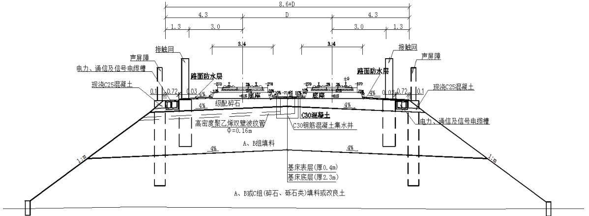
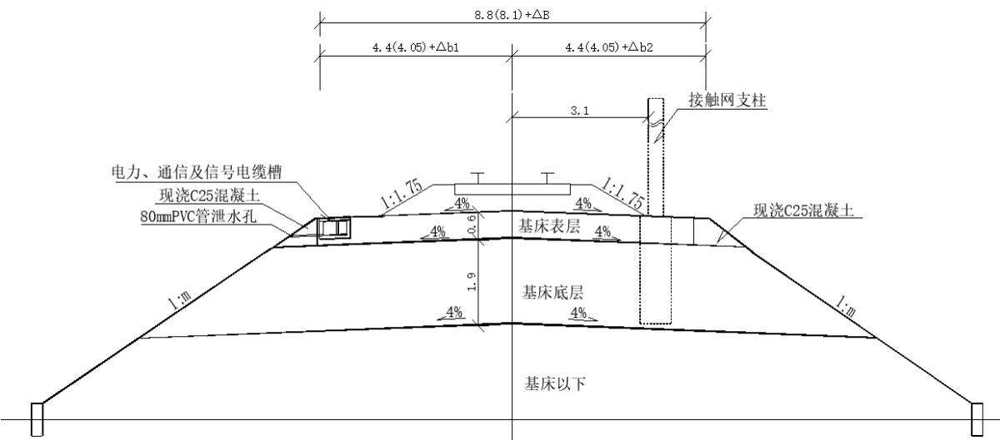
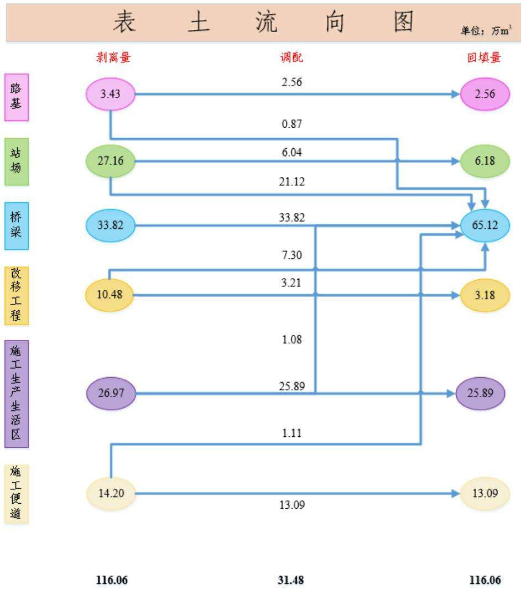
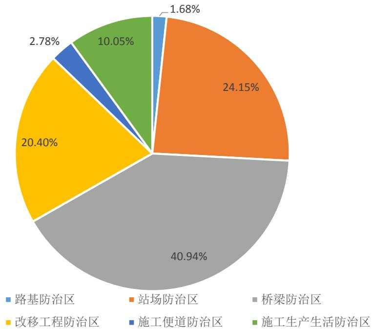
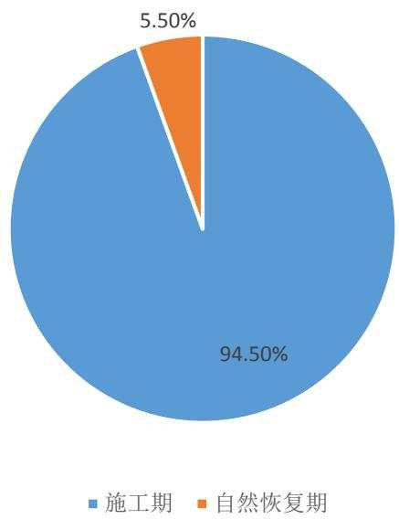
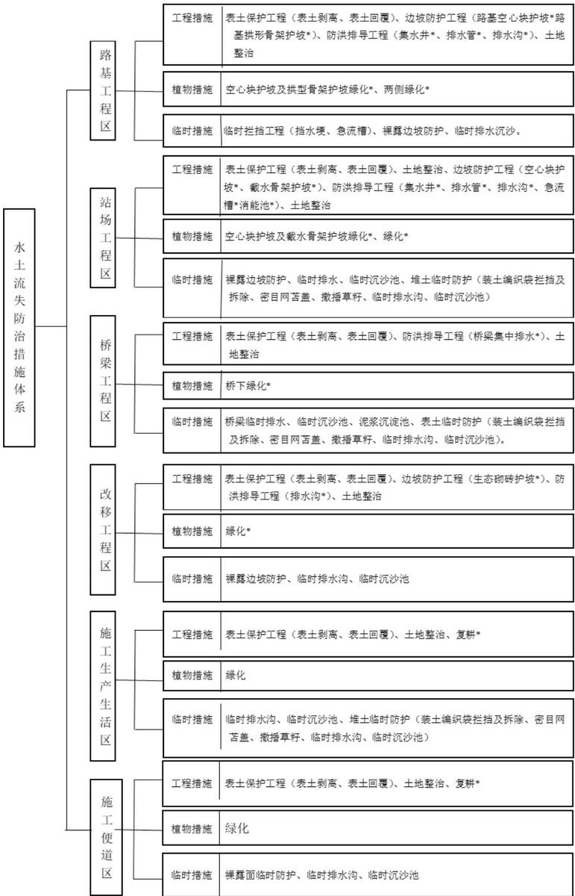

> **Zone C（应用范例层）使用边界**——仅可用于**写作风格、章节展开方式、表达逻辑、表格设计**的参考。
> **不得**用于合规判断；**不得**引入其项目数据（名称／地点／数字／单位名）；
> **不得**因其"曾经通过审批"而推定其做法在当前标准下仍然合规。
> 与 Zone A 冲突时**一律以 Zone A 为准**；Zone A 未明确规定时输出
> 「**Zone A 未明确规定，以下为参考写法，需人工判断**」。
>
> **坐标系警告**：本范例为**老八章结构**（GB 50433—2018 附录B），与 2026 版 10 章模板**同号不同义**
> （老 `1.5`＝防治目标，新 `1.5`＝水土流失预测结果；老 4→新 6 …偏移 +2；新版第 4/5 章老结构无独立章）。
> 因此 **`chapter_mapping: pending`——不得按章节号挂载**，检索一律走 `topic_tags`。
>
> **待加工**：`topic_tags`（主题标签）、`approval_basis_list`（编制依据逐字清单）、
> `structure_summary`（只提取结构：章节展开顺序／段落功能／表格栏目结构／句式模板／论证链步骤）。

<!-- 本文件由原方案 PDF 分段转换后拼接：共 2 段，原 337 页（MinerU 云单文件上限 200 页） -->

新建上海至杭州高速铁路

# 水土保持方案报告书

建设单位：沪杭铁路客运专线股份有限公司

编制单位：中国铁路设计集团有限公司

中铁上海设计院集团有限公司

2025 年 8 月 天津

## 目 录

1 综合说明.  
1.1 项目简况...  
1.2 编制依据... .. 8  
1.3 设计水平年... ... 10  
1.4 水土流失防治责任范围.. ... 10  
1.5 水土流失防治目标...... .. 11  
1.6 项目水土保持评价结论. ... 12  
1.7 水土流失预测结果.... ... 15  
1.8 水土保持措施布设成果... .... 15  
1.9 水土保持监测方案..... ... 20  
1.10 水土保持投资及效益分析成果.. .. 20  
1.11 结论.... ... 21  
2 项目概况... ... 27  
2.1 项目组成及工程布置.. .. 27  
2.2 施工组织.. ... 85  
2.3 工程占地... .. 105  
2.4 土石方平衡....... ..... 111  
2.5 拆迁（移民）安置.. .. 120  
2.6 施工进度... .. 120  
2.7 自然概况... ... 122  
3 项目水土保持评价.... .... 147  
3.1 主体工程选址（线）水土保持评价.. .... 147  
3.2 建设方案与布局水土保持评价... .... 149  
3.3 主体工程设计中水土保持措施界定... ... 170  
4 水土流失分析与预测..... ... 175  
4.1 水土流失现状 ..... ... 175  
4.2 水土流失影响因素分析.... ..... 178  
4.3 土壤流失量预测.... ... 180  
4.4 水土流失危害分析.... ..... 195  
4.5 指导性意见.... ... 195  
5 水土保持措施.... .... 197  
5.1 防治区划分. ... 197  
5.2 措施总体布局.. .... 197  
5.3 分区措施布设.... ... 200  
5.4 施工要求.... ... 231  
6 水土保持监测... ... 235  
6.1 范围和时段... ... 235  
6.2 内容和方法... ... 235  
6.3 点位布设.... ... 242  
6.4 实施条件和成果... ... 246  
7 水土保持投资估算及效益分析.... ... 253  
7.1 投资估算... ... 253  
7.2 效益分析... .. 292  
8 水土保持管理. .. 293  
8.1 组织管理... ... 293  
8.2 后续设计 ...... .... 294  
8.3 水土保持监测.. ... 294  
8.4 水土保持监理.. ... 295  
8.5 水土保持施工.. .... 296  
8.6 水土保持设施验收..... .... 297  
附表、附件、附图. ... 301

## 附表：

附表-01 防治责任范围表；  
附表-02 单价分析表（上海市）；  
附表-03 单价分析表（浙江省）；  
附表-04 表土堆放场情况表；  
附表-05 临时堆土场情况表  
附表-06 上海段工程涉及水域情况表；  
附表-07 浙江段工程涉及水域情况表；  
附表-08 河（航）道清淤表；  
附表-09 上海段改移工程表；  
附表-10 浙江段改移工程表。

## 附件：

附件-01 委托书；

附件-02 用地预审；

附件-03 消纳场协议；

附件-04 外购土源协议;

附件-05 环境敏感区意见;

附件-06 涉河建设方案及防洪评价批复；

附件-07 依托工程支撑性材料。

## 附图:

附图-01 项目地理位置图；

附图-02 项目区水系图；

附图-03 项目区土壤侵蚀强度分布图（上海段）；

附图-04 项目区土壤侵蚀强度分布图（浙江段）；

附图-05 水土流失易发区、重点预防区分布图（上海段）；

附图-06 水土流失重点防治区分布图（浙江段）；

附图-07 新建上海至杭州高速铁路线路平纵断面示意图；

附图-08 新建上海至杭州高速铁路总体布置图；

附图-09 新建上海至杭州高速铁路分区防治措施总体布局图（含监测点位）；

附图-10路基工程区水土保持措施布设图；

附图-11 站场工程区水土保持措施布设图；

附图-12 桥梁工程区水土保持措施布设图；

附图-13 改移工程区水土保持措施布设图；

附图-14 施工生产生活区水土保持典型措施布设图；

附图-15 施工便道区水土保持措施布设图；

附图-16 临时堆土水土保持典型措施布设图；

附图-17 临时排水沟水土保持典型措施布设图；

附图-18 临时电力线水土保持典型措施布设图；

附图-19 典型站场表土分布图。

## 1 综合说明

## 1.1 项目简况

## 1.1.1 项目基本情况

## 1、项目建设必要性

新建上海至杭州高速铁路（曾用名：新建上海至乍浦至杭州高速铁路，以下简称沪杭高铁）作为新型基础设施，是强化上海西向辐射、带动作用，提升嘉兴区域交通优势，促进周边地区积极融入上海大都市圈的需要；是加强核心城市上海与杭州都市圈的快速连接，促进长三角都市圈融合发展的需要；是强化临港新片区、钱塘新区、杭州城西等区域联动发展，加快产业高端人才集聚，打造产城融合发展的先行走廊，实现高质量发展的需要；也是服务“一带一路”、长江经济带、长三角一体化三大国家战略、落实双碳目标，推进生态文明建设的需要。

## 2、规划符合性

沪杭高铁是“八纵八横”高铁主通道沿海通道的重要组成、沪昆通道东段的辅助通道，主要承担上海、嘉兴等地区与长江经济带南翼城市、海西城市群、粤港澳大湾区间的路网客流；是长三角城际铁路网沪杭通道的重要段落，承担上海浦东尤其是临港新片区与嘉兴、杭州等地区的城际客流；是完善沪杭通道现代化综合交通运输体系布局、发挥铁路在综合交通中骨干作用的重要线路。

## 3、项目位置

沪杭高铁位于上海市南部和浙江省北部，经过上海市、嘉兴市、杭州市，总体沿杭州湾北岸呈东西走向。线路起自上海东站（既有）（121°45′49″E，30°53′25″N），利用沪通铁路二期至四团站，新建线路东起既有浦东铁路四团站（121°45′49″E，30°53′25″N），沿浦东铁路北侧西行，正线途经上海市（奉贤区、金山区）、浙江省嘉兴市（平湖市、南湖区、秀洲区、桐乡市、海宁市）、杭州市（临平区、西湖区、余杭区），终至杭州西站（既有湖杭铁路杭临绩场）（119°58′56″E，30°17′54″N）；正线涉及2省（直辖市）2 市 10 县（市、区），全线运营长度 224.067km，利用在建沪通二期工程 26.62km，新建正线 197.447km（其中上海市境内 54.240km，浙江省境内 143.207km）。

另含相关配套工程，其中①金山铁路联络线9.8km（位于上海市金山区），②通苏嘉甬铁路宁波方向东南联络线 7.9km（位于浙江省嘉兴市南湖区和秀洲区），③上海南动车所新建10条存车线、改建7条存车线（位于上海市徐汇区），④上海东动车所新建4条检查库线、26条存车线（位于上海市浦东新区），⑤扩建上海调度楼（位于上海市嘉定区），⑥杭州西站沪杭车场2 台4 线（位于浙江省杭州市余杭区）等。本项目共涉及2省（直辖市）2市13县（市、区）。

根据《新建铁路上海至杭州高速铁路初步设计》，本工程的具体工程内容及范围详见表 2.1-1。

## 4、建设性质、规模与等级

## 建设性质：新建铁路

规模与等级：新建正线 197.447km，高速铁路，正线数目为双线，电力牵引，速度目标值 350km/h。

## 5、项目组成

工程组成包括正线工程、相关配套等主体工程和临时工程。

## （1）主体工程

主体工程包括路基工程、站场工程、桥梁工程、牵引变电及给排水工程等。

## 1）路基工程

新建正线路基工点共计 5 处，共 9.28km，占线路总长的 4.70%；其中正线区间路基长度为 0.42km，车站路基长度为 8.86km。

## 2）站场工程

共设车站8座，其中新建上海金山、平湖市、临平北3座车站，改扩建四团、嘉兴南、桐乡、杭州西 4 座车站，利用既有上海东 1 座车站，上海东动车所、上海南动车所适应性改造工程，扩建上海调度楼工程，新建丁家墩线路所、和庵浜线路所、丰顺线路所3 座线路所，改建勾庄线路所，同步实施陆家木线路所。

## 3）桥梁工程

新建正线桥梁长度 188.167km/17 座，其中 15 座特大桥，2 座中桥。

联络线、枢纽相关配套工程新建桥梁 14.041km/12 座，其中 9 座特大桥，3 座中桥。

## 4）牵引变电

本线新建四团、平湖、沙安浜、临平北 4 座 AT 牵引变电所，改建既有杭州西牵引变电所，新建 4 座分区所，改造并利用四团分区所，6 座 AT 所，1 座 AT 所兼开闭所。

新建牵引变电所、分区所、AT所的占地、土石方已包含在相应站场及区间路基、桥梁占地和土石方内。

## 5）给排水工程

新建生活供水站 3 座，利用既有生活供水站 3 座。本工程新增给水排水站占地和土石方均已纳入相应的站场占地和土石方中。

## （2）临时工程

临时工程包括施工生产生活区、施工便道和表土堆放场。

## 1）施工生产生活区

设置施工生产生活区 55 处，新增临时占地 126.41hm2，包括铺轨基地 1 处，轨道板场4处，制存梁场 8 处，材料厂 6 处，混凝土拌和站 21 处，填料拌和站 2 处，钢结构拼装场13 处。

## 2）施工便道（桥）

全线新建、改扩建施工便道（桥）共 328.61km，其中新建桥下贯通便道 208.23km（其中施工便桥 0.13km），占地 23.33hm2，工点引入便道 64.09km，占地 48.05hm2，改建施工便道 56.29km，占地 6.49hm2，总占地面积 77.87hm2，利用便道 234.01km，新建临时电力线路138.03km，施工用水就近接管取水，地表水不足时接引自来水管路，无需新建供水管线。

## 3）表土堆放场

全线设置 366 处表土堆放场，均位于主体工程区（永临结合）和施工生产生活区用地范围内，无新增用地，单处堆高 3-4m，坡比 1:2，堆土量 0.08-10.05 万 m3，堆存期 2-3 年，共计占地 43.76hm2，堆土量 116.06 万 m3，堆存期 2025 年 12 月\~2028 年11 月。

## 4）临时堆土场

全线设置 21 处回填方临时堆土场，无新增用地，单处堆高 3-4m，坡比 1:2，堆土量 0.42-4.06 万 m3，堆存期 2-3 年，共计占地 8.88hm2，堆土量 27.71 万 $\mathrm { m } ^ { 3 }$ ，堆存期2025 年 12 月\~2028 年 11 月。

## 6、工程占地

本工程总占地 859.98hm2，其中永久占地 655.70hm2，临时占地 204.28hm2。

## 7、土石方量

本工程土石方总量 2291.91 万 $\mathrm { m } ^ { 3 }$ ，其中挖方总量 1247.99 万 $\mathrm { m } ^ { 3 }$ （其中表土剥离

116.06 万 $\mathrm { m } ^ { 3 } \mathrm { ~ , ~ }$ ），填方总量 1043.92 万 $\mathrm { m } ^ { 3 }$ （其中表土回覆 116.06 万 m3），利用方 608.11万 $\mathrm { m } ^ { 3 }$ （表土利用 116.06 万 $\mathrm { m } ^ { 3 }$ ，移挖作填 437.03 万 $\mathrm { m } ^ { 3 }$ ，区间调配 55.02 万 m3），借方 435.81 万 $\mathrm { m } ^ { 3 }$ （采用外购方式），余方量 639.88 万 $\mathrm { m } ^ { 3 }$ （采用消纳方式），土石方利用率 100%。

本工程共剥离表土 116.06 万 $\mathrm { m } ^ { 3 }$ ，回填表土 116.06 万 $\mathrm { m } ^ { 3 }$ ，区间调配表土 31.48 万$\mathrm { m } ^ { 3 }$ ，剥离表土临时堆置于主体工程和施工生产生活区用地范围内不影响施工的位置，无新增临时占地，全部用于后期绿化或复耕覆土。

本工程借方采用外购方式。其中上海段已与上海耀文清洁服务有限公司签订外购土源意向协议，外购方量 $2 4 2 . 2 6 \mathrm { ~ \mathscr { H } ~ m } ^ { 3 }$ ，浙江段已与浙江交投海新矿业有限公司签订外购土源意向协议，外购方量 193.55 万 $\mathrm { m } ^ { 3 }$ ，均能够满足工程需要，水土流失防治责任由售土方负责。

本工程余方采用消纳方式，运至地方规划的 4 处消纳场处置，水土流失防治责任由消纳场经营单位负责，共消纳方量 639.88 万 $\mathrm { m } ^ { 3 }$ ，其中上海市按照市交通委、市重大办、市绿化市容局、市水务局、市交通建管中心等单位确定的南汇东滩生态造林建设项目前期地形整理消纳场、滨海新片区景观提升地形整理项目消纳场和横沙新洲一期消纳场进行工程弃土就近消纳，消纳土方 221.48 万 $\mathrm { m } ^ { 3 }$ ；浙江省利用嘉兴市海盐县隐马山土方消纳场消纳土方 418.40 万 $\mathrm { m } ^ { 3 }$

## 8、拆迁（移民）数量及安置方式

本工程共拆迁房屋约95.74万 $\mathrm { m } ^ { 2 }$ 。涉及的拆迁已纳入主体工程，拆迁采用货币补偿安置，通过与地方政府签订协议，拆迁资金纳入本工程概算，由地方政府统一处理所有拆迁安置事宜，相关水土流失防治工作由地方政府负责。

## 9、专项设施改（迁）建

本项目改移道路 325 处/32.54km，改移沟渠 523 处/91.91km，共计 848 处/124.45km，占地面积 90.09hm2；其中上海段 240 处/51.59km，占地面积 $3 2 . 6 9 \mathrm { h m } ^ { 2 }$ ，浙江段 608 处/72.86km，占地 57.40hm2，纳入改移工程防治区。

## 10、建设工期

工程计划 2025 年 9 月底开工，2029 年 9 月完工，总工期 48 个月。

## 11、总投资与土建投资

工程总投资672.55亿元（上海段236.83亿元，浙江段435.72亿元），其中土建投资

615.58 亿元（上海段 175.49 亿元，浙江段 440.09 亿元）。

## 12、建设单位

沪杭铁路客运专线股份有限公司。（根据 2025 年 1 月 26 日《中国铁路上海局集团有限公司办公室关于研究确定六庆铁路代建实施主体等事项的纪要》要求，在明确本工程建设单位前，由中国铁路上海局集团有限公司上海铁路枢纽工程建设指挥部负责推进本工程水保编制工作相关事宜和工程代建。）

## 1.1.2 项目前期及方案编制过程

## 1、主体工程设计单位和设计情况

沪杭高铁设计单位为中国铁路设计集团有限公司（以下简称中国铁设）、中铁上海设计院集团有限公司（以下简称中铁上海院）共同承担。中国铁设承担浙江段设计工作，中铁上海院承担上海段设计工作，中国铁设为总体单位；

2024 年 5 月，中国铁设、中铁上海院编制完成《新建上海至杭州高速铁路预可行性研究》；

2024 年 8 月，国铁集团发改部组织预可行性研究审查；

2024 年 11 月，中国铁设、中铁上海院编制完成《新建上海至杭州高速铁路可行性研究》；

2024 年 12 月，国铁集团鉴定中心组织可行性研究审查；

2025 年 4 月，中国铁设、中铁上海院编制完成《新建上海至杭州高速铁路初步设计》；

2025 年 4 月，国铁集团鉴定中心组织初步设计审查；

2025 年 5 月，建设单位组织行业技术审查；

2025 年 8 月 19 日，国家发改委批复了本工程可行性研究；

目前，项目处于初步设计阶段。

## 2、项目前期支撑性文件

用地预审：

2025 年 5 月 30 日自然资源部办公厅以自然资办函〔2025〕1288 号《关于新建上海至杭州高速铁路（上海段）项目建设用地预审意见的函》批复了上海段用地预审；

2025 年 6 月 13 日自然资源部办公厅以自然资办函〔2025〕1404 号《关于新建上海至乍浦至杭州高速铁路（浙江段）建设用地建设用地预审意见的函》批复了浙江段

用地预审。

环境敏感区手续取得情况：本项目共涉及的 9 处环境敏感区，其中跨域京杭大运河（嘉兴市）、京杭大运河（杭州市）和良渚遗址相关文保方案报告已上报主管部门，待批复，其他均已取得相应的行政许可或同意意见。

环境影响评价：报告已编制完成，已审查。

防洪评价：

（1）上海段上海市水务局准予行政许可决定书（金汇港、龙泉港河道管理范围）、关于新建上海至杭州高速铁路（上海临港段）涉河建设方案审批准予行政许可决定书（沪自贸临管审〔2025〕689 号）、上海市奉贤区水务局准予行政许可决定书（2025年 9 月 5 日）、上海市金山区水务局准予行政许可决定书（ 2025 年 9 月 3 日）对河道管理范围内建设项目工程建设方案进行了批复，原则同意《报告》提出的建设单位对铁路桥梁垂直投影范围两侧各 30 米均按照规划蓝线进行整治，工程费用应列入项目工程概算；

（2）浙江段 2025 年 6 月 30 日浙江省水利厅以浙水许〔2025〕25 号《浙江省水利厅关于新建上海至乍浦至杭州高速铁路涉河涉堤建设方案的批复》批复了浙江段的防洪评价报告。原则同意工程建设涉及京杭运河、长山河、海盐塘等 330 处水域，其中桥梁一跨过河 210 处，涉及占用水域 120 处，共占用水域面积 63462m2。同意《报告》提出的水域补偿方案及功能补救措施。通过河道局部拓宽、改移、堤岸修复加固、闸站迁建等措施进行功能补偿，河道局部拓宽、改移补偿水域面积 95565 m2；同时对铁路影响范围内盐平塘、海盐塘等堤防按规划标准提标建设，长山河、李家湾等河道按规划实施，按规划开挖水域面积共 19597m2。补偿工程总费用约 4.2 亿元，列入项目工程概算。

通航评价：

（1）上海段 2025 年 7 月 1 日交通运输部以交水函〔2025〕415 号《交通运输部关于新建上海至乍浦至杭州高速铁路（上海段）航道通航条件影响评价的审核意见》批复了上海段的通航评价报告；

（1）浙江段 2025 年 7 月 18 日交通运输部以浙水许〔2025〕462 号《交通运输部关于新建上海至乍浦至杭州高速铁路（浙江段）航道通航条件影响评价的审核意见》批复了浙江段的通航评价报告。

## 3、方案编制情况

根据《中华人民共和国水土保持法》和《生产建设项目水土保持方案管理办法》等相关法律法规，建设单位分别委托中国铁设和中铁上海院开展《新建上海至杭州高速铁路水土保持方案报告书》的编制工作。

接受委托后，编制单位立即成立项目组，组织专业技术人员认真研究工程设计资料，并进行现场实地踏勘和资料收集工作，并征询当地水行政主管部门及相关单位意见和要求，结合主体设计初步设计文件，2025 年 8 月完成《新建上海至杭州高速铁路水土保持方案报告书》。

在现场踏勘、资料收集及报告书编制过程中，得到了沿线各级地方政府及水行政等有关主管部门的大力支持与帮助，在此一并表示衷心感谢！

## 1.1.3 自然简况

线路所经地区属北亚热带湿润气候，地貌类型主要为钱塘江下游及杭州湾北部冲湖积、海湖积平原区，沿线多年平均气温15.5℃～17.6℃，≥10℃积温4464.7\~6213.0℃；年降水量 1103.2mm～1516.1mm，年蒸发量 1223.1mm～1481.0mm，无霜期 215\~260天，平均风速 2.2\~3.1m/s，大风日数 2.66\~23 天，风季 4\~9 月，雨季 7\~10 月，按气候分区划分项目区属于温暖地区，沿线无冻土现象。沿线区域范围内所经水系属于太湖及黄浦江水系，工程沿线分布的土壤类型主要有黄壤、红壤、水稻土等，表层土壤厚度约为 15\~30cm。项目区植被区划属于亚热带常绿阔叶林区。

根据《全国水土保持区划（2015—2030 年）》，项目区属于南方红壤区，容许土壤流失量 $5 0 0 \mathrm { t / \left( \ k m ^ { 2 } \ a \right) }$ 。工程沿线以微度水力侵蚀为主，原地貌土壤侵蚀模数为 200-$4 5 0 \mathrm { t } / \ \left( \mathrm { k m } ^ { 2 } \mathrm { a } \right)$

根据水利部办公厅关于印发《全国水土保持规划国家级水土流失重点预防区和重点治理区复核划分成果》的通知（办水保〔2013〕188 号），本工程不涉及国家级水土流失重点预防区和重点治理区。

根据《上海市水土保持规划修编（2021-2035 年）》，本工程不涉及上海市水土流

失重点预防区和重点治理区。

根据《浙江省水土保持“十四五”规划》，本工程不涉及浙江省水土流失重点预防区和重点治理区。

受地形条件、经济据点、站位设置等条件限制，本工程共涉及特殊或重要环境敏感目标 9 处：其中 3 处省级重要湿地（乍嘉苏航道平湖段湿地、杭平申线平湖段湿地、京杭大运河桐乡段及周边湿地）、2 处饮用水水源保护区（长水塘海宁饮用水源保护区、海宁市盐官下河水环境功能区）、1 处风景名胜区（超山风景名胜区），3 处世界文化遗产（京杭大运河（嘉兴市）、京杭大运河（杭州市）、良渚遗址），其中跨域京杭大运河（嘉兴市）、京杭大运河（杭州市）浙江省文物局已出具原则同意意见，已上报至国家文物局，待批复；穿越良渚遗址三类环境控制区相关文保方案报告已上报杭州良渚遗址管理区管理委员会，待批复；其他均已取得相应的行政许可或同意意见。本工程占用基本农田，已取得自然资源部办公厅原则同意通过用地预审的意见；本工程占用河湖管理范围，已取得上海市水务局、奉贤区水务局、金山区水务局、临港片区管委会和浙江省水利厅对本工程涉河建设方案及防洪评价批复。

本项目主体工程不涉及水功能一级区的保护区和保留区、自然保护区、地质公园、森林公园、生态保护红线等敏感区，表土堆放场、临时堆土场、梁场等临时工程不涉及基本农田、饮用水水源保护区、水功能一级区的保护区和保留区、自然保护区、世界文化和自然遗产地、风景名胜区、地质公园、森林公园、重要湿地、生态保护红线、河湖管理范围等敏感区。

## 1.2 编制依据

## 1.2.1 法律法规

1、《中华人民共和国水土保持法》（2011 年 3 月 1 日施行）；

2、《中华人民共和国长江保护法》（2021 年 3 月 1 日施行）；

3、《上海市水土保持管理办法》（2024 年 9 月 15 日施行）；

4、《浙江省水土保持条例》（2020 年 11 月 27 日修正）。

## 1.2.2 规章、规范性文件

1、水利部办公厅关于印发《全国水土保持规划国家级水土流失重点预防区和重

点治理区复核划分成果》的通知（办水保〔2013〕188 号，2013 年 8 月 12 日）；

2、水利部办公厅关于印发《生产建设项目水土保持监测规程（试行）》的通知（办水保〔2015〕139 号，2015 年 6 月 23 日）；

3、《国家发展改革委、财政部关于降低电信网码号资源占用费等部分行政事业性收费标准的通知》（发改价格〔2017〕1186 号，2017 年 6 月 22 日）；

4、《水利部办公厅关于印发生产建设项目水土保持技术文件编写和印制格式规定规定（试行）的通告》（办水保〔2018〕135 号，2018 年 7 月 12 日）；

5、《水利部关于进一步深化“放管服”改革全面加强水土保持监管的意见》（水保〔2019〕160 号，2019 年 5 月 31 日）；

6、《水利部办公厅关于进一步加强生产建设项目水土保持监测工作的通知》（办水保〔2020〕161 号，2020 年 7 月 28 日）；

7、《水利部办公厅关于进一步加强河湖管理范围内建设项目管理的通知》（办河湖〔2020〕177 号，2020 年 8 月 13 日）；

8、《水利部办公厅 国铁集团办公厅关于加强铁路建设项目水土保持工作的通知》（办水保〔2023〕3 号，2023 年 1 月 3 日）；

9、《生产建设项目水土保持方案管理办法》（水利部令第 53 号，2023 年 1 月 17日）；

10、《水利部办公厅关于印发生产建设项目水土保持方案审查要点的通知》（办水保〔2023〕177 号，2023 年 7 月 4 日）；

11、《自然资源部关于积极做好用地用海要素保障的通知》（自然资发〔2022129 号，2022 年 8 月 2 日）。

## 1.2.3 规范标准

1、《生产建设项目水土保持技术标准》（GB 50433-2018）；

2、《生产建设项目水土流失防治标准》（GB/T 50434-2018）；

3、《生产建设项目水土保持监测与评价标准》（GB/T51240-2018）；

4、《水土保持工程设计规范》（GB51018-2014）；

5、《土地利用现状分类》（GB/T 21010-2017）；

6、《水利水电工程制图标准水土保持制图》（SL73.6-2001）；

7、《土壤侵蚀分类分级标准》（SL190-2007）；

8、《水土保持工程调查与勘测标准》（GB/T 51297-2018）；

9、《水土保持监理规范》（SL523-2024）；

10、《表土剥离及其再利用技术要求》（GB/T 45107-2024）；

11、《铁路工程建设项目临时占地复垦规范》（Q/CR 9161-2023）；

12、《铁路工程绿化设计和施工质量控制标准（南方地区）》（Q/CR 9526-2019）；

13、《水土保持工程概（估）算编制规定》（水利部水总〔2024〕323 号）；

14、《高速铁路设计规范》（TB·10621-2014）；

15、《铁路路基设计规范》（TB 10001-2016）；

16、《铁路桥涵设计规范》（TB 10002-2017）；

17、《铁路车站及枢纽设计规范》（TB 10099-2017）。

## 1.2.4 技术文件与资料

1、《新建铁路上海至杭州高速铁路初步设计》（中国铁设、中铁上海院，2025.4）；

2、《中国铁路总公司 浙江省人民政府关于新建湖州至杭州西至杭黄连接线工程初步设计的批复》（铁总鉴函〔2019〕316 号）；

3、《浙江省水利厅关于新建湖州至杭州西至杭黄高铁连接线水土保持方案的批复》（浙水许〔2019〕26 号）；

4、《关于新建上海至南通铁路水土保持方案的复函》水保函〔2010〕278 号

5、《全国水土保持区划（试行）》；

6、《上海市水土保持规划修编（2021\~2035）》；

7、《浙江省水土保持“十四五”规划》；

8、沿线水土流失资料、水文资料、湿地公园、自然保护区、饮用水水源保护区、基本农田保护区、生态保护红线、河湖管理范围等资料。

## 1.3 设计水平年

本工程建设期为 2025 年 9 月底至 2029 年 9 月，总工期 48 个月。根据《生产建设项目水土保持技术标准》中关于设计水平年的规定“水土保持方案确定的水土保持措施实施完毕并初步发挥效益的年份”，确定本方案的设计水平年为主体工程完工后的当年，即 2029 年。

## 1.4 水土流失防治责任范围

项目水土流失防治责任范围为项目建设征占地范围，包括永久占地、临时占地。本工程水土流失防治责任范围为 $8 5 9 . 9 8 \mathrm { h m } ^ { 2 }$ ，其中永久占地 $6 5 5 . 7 0 \mathrm { h m } ^ { 2 }$ ，临时占地$2 0 4 . 2 8 \mathrm { h m } ^ { 2 }$

其中上海市水土流失防治责任范围面积 $2 7 2 . 9 5 \mathrm { h m } ^ { 2 }$ ，包含永久占地 $2 2 6 . 5 1 \mathrm { h m } ^ { 2 }$ ，临时占地 $4 6 . 4 4 \mathrm { h m } ^ { 2 }$ ；浙江省水土流失防治责任范围面积 $5 8 7 . 0 3 \mathrm { h m } ^ { 2 }$ ，包含永久占地$4 2 9 . 1 9 \mathrm { h m } ^ { 2 }$ ，临时占地 $1 5 7 . 8 4 \mathrm { h m } ^ { 2 } .$ 。沿线各县（区）水土流失防治责任范围表详见附表1。

## 1.5 水土流失防治目标

## 1.5.1 执行标准等级

本工程共涉及特殊或重要环境敏感目标 9 处，3 处省级重要湿地、2 处饮用水源保护区、1 处风景名胜区，3 处世界文化遗产，且项目区穿越上海市、嘉兴市和杭州市城市区域。

因此，根据《生产建设项目水土流失防治标准》（GB/T 50434-2018）4.0.1 条的规定，方案确定本工程执行建设类项目南方红壤区一级防治标准。

## 1.5.2 防治目标

根据铁路工程的建设特点、工程区环境现状等，明确本工程水土流失防治的基本目标为：

1、项目建设范围内的新增水土流失得到有效控制，原有水土流失得到治理。

2、水土保持措施应安全有效。

3、水土资源、林草植被应得到最大限度的保护与恢复。

4、六项防治指标达标。

根据《全国水土保持区划（2015—2030 年）》，本工程位于南方红壤区，气候类型为北亚热带湿润气候，以微度水力侵蚀为主，土壤流失控制比提高 0.20，根据《生产建设项目水土流失防治标准》，考虑项目区无法避让城市区，对渣土防护率和林草覆盖率提高 2%，水土流失防治目标值进行修正后，本工程设计水平年达到的防治目标为：水土流失治理度 98%，土壤流失控制比 1.10，渣土防护率 99%，表土保护率92%，林草植被恢复率 98%，林草覆盖率 27%，调整后的本工程水土流失防治目标值

详表 1.5-1。

表 1.5-1 工程水土流失防治目标值（南方红壤区一级防治标准）
<table><tr><td rowspan=2 colspan=1>防治指标</td><td rowspan=1 colspan=1>施工期</td><td rowspan=1 colspan=7>设计水平年</td></tr><tr><td rowspan=1 colspan=1>标准规定</td><td rowspan=1 colspan=1>标准规定</td><td rowspan=1 colspan=1>按干旱程度修正</td><td rowspan=1 colspan=1>按土壤侵蚀强度修正</td><td rowspan=1 colspan=1>按地形修正</td><td rowspan=1 colspan=1>按城镇区修正</td><td rowspan=1 colspan=1>按是否避让水土流失防治区修正</td><td rowspan=1 colspan=1>执行标准</td></tr><tr><td rowspan=1 colspan=1>水土流失治理度（%）</td><td rowspan=1 colspan=1>二</td><td rowspan=1 colspan=1>98</td><td rowspan=1 colspan=1>0</td><td rowspan=1 colspan=1>0</td><td rowspan=1 colspan=1>0</td><td rowspan=1 colspan=1>0</td><td rowspan=1 colspan=1>0</td><td rowspan=1 colspan=1>98</td></tr><tr><td rowspan=1 colspan=1>土壤流失控制比</td><td rowspan=1 colspan=1>一</td><td rowspan=1 colspan=1>0.90</td><td rowspan=1 colspan=1>0</td><td rowspan=1 colspan=1>+0.20</td><td rowspan=1 colspan=1>0</td><td rowspan=1 colspan=1>0</td><td rowspan=1 colspan=1>0</td><td rowspan=1 colspan=1>1.10</td></tr><tr><td rowspan=1 colspan=1>渣土防护率（%）</td><td rowspan=1 colspan=1>95</td><td rowspan=1 colspan=1>97</td><td rowspan=1 colspan=1>0</td><td rowspan=1 colspan=1>0</td><td rowspan=1 colspan=1>0</td><td rowspan=1 colspan=1>+2</td><td rowspan=1 colspan=1>0</td><td rowspan=1 colspan=1>99</td></tr><tr><td rowspan=1 colspan=1>表土保护率（%）</td><td rowspan=1 colspan=1>92</td><td rowspan=1 colspan=1>92</td><td rowspan=1 colspan=1>0</td><td rowspan=1 colspan=1>0</td><td rowspan=1 colspan=1>0</td><td rowspan=1 colspan=1>0</td><td rowspan=1 colspan=1>0</td><td rowspan=1 colspan=1>92</td></tr><tr><td rowspan=1 colspan=1>林草植被恢复率（%）</td><td rowspan=1 colspan=1>一</td><td rowspan=1 colspan=1>98</td><td rowspan=1 colspan=1>0</td><td rowspan=1 colspan=1>0</td><td rowspan=1 colspan=1>0</td><td rowspan=1 colspan=1>0</td><td rowspan=1 colspan=1>0</td><td rowspan=1 colspan=1>98</td></tr><tr><td rowspan=1 colspan=1>林草覆盖率（%）</td><td rowspan=1 colspan=1>一</td><td rowspan=1 colspan=1>25</td><td rowspan=1 colspan=1>0</td><td rowspan=1 colspan=1>0</td><td rowspan=1 colspan=1>0</td><td rowspan=1 colspan=1>+2</td><td rowspan=1 colspan=1>0</td><td rowspan=1 colspan=1>27</td></tr></table>

## 1.6 项目水土保持评价结论

## 1.6.1 主体工程选址（线）评价

1、项目共涉及特殊或重要环境敏感目标 9 处，均以桥梁形式跨越。由于工程选址选线受沿线地方城市规划、地质条件、车站选址、最小曲率半径等多方面因素综合影响，且环境敏感目标大部分呈线状分布，导致本工程无法避让特殊或重要环境敏感目标，本方案执行南方红壤区水土流失防治一级标准。

2、区域范围内所经水系主要为太湖及黄浦江水系，自东向西跨越主要河流有三团港、南门港、航塘港、金汇港、上横泾、北横泾、叶榭塘、张泾河等。工程以桥梁形式跨越河流范围，最大限度的减小对河流两岸和湖泊周边植物保护带的影响，严格控制施工，尽量减少对地表扰动。

3、本工程未占用全国水土保持监测网络中的水土保持监测站点、重点试验区及国家确定的水土保持长期定位观测站。

综上，工程采取措施后基本符合《生产建设项目水土保持技术标准》（GB50433-2018）的规定要求，从水土保持角度分析，主体工程选线基本符合水土保持要求。

## 1.6.2 建设方案与布局评价

## 1、建设方案

对照《中华人民共和国水土保持法》和《生产建设项目水土保持技术标准》（GB50433-2018）要求进行分析，工程桥梁占比 95.30％，无填高超过 20m 和挖深超过 30m 路段。路堤边坡采用正六边形空心块内灌草防护、拱型骨架植灌草，主体工程在城镇区已综合考虑提高植被建设标准和景观效果，并配套建设排水和雨水等利用设施，符合生产建设项目水土保持技术标准。

## 2、工程占地

工程永久占地数量合理，平均用地指标为 2.5380hm2/km；用地指标满足《新建铁路工程项目建设用地指标》（建标〔2008〕232 号）中规定的 5.2473hm2/km 的综合用地指标要求，工程全线路基、站场和桥梁永久占地 $4 5 2 . 8 5 \mathrm { h m } ^ { 2 }$ （上海市 $1 4 7 . 8 4 \mathrm { h m } ^ { 2 }$ ，浙江省 $3 0 5 . 0 1 \mathrm { h m } ^ { 2 }$ ）小于用地预审批复的 $4 7 0 . 5 5 \mathrm { h m } ^ { 2 }$ （上海市 $1 6 2 . 0 6 \mathrm { h m } ^ { 2 }$ ，浙江省 308.49hm2），临时占地尽可能做到永临结合，表土和回填土堆放于已有占地范围内，施工用地采取永临结合进行布设，堆土堆放场区域与施工场地相结合，符合节约用地和减少扰动的要求，且满足施工要求。

本项目桥梁占比 95.30%，临时工程中制（存）梁场、贯通便道数量多，本次结合站区规划、用地红线分布，统筹研究大临工程永临结合条件，共计减少占地 $7 7 . 9 5 \mathrm { h m } ^ { 2 }$ 永久占地 $8 . 3 6 \mathrm { h m } ^ { 2 }$ ，临时占地 69.59 hm2，主要成果如下：

## （1）上海段：

1）定测及初步设计阶段，桥梁占地基本无可优化空间，主要针对站场占地进行优化，共优化占地 $1 . 8 6 \mathrm { h m } ^ { 2 }$

2）铺轨基地永临结合，设置在四团西技术作业站，减少临时占地 $6 . 6 6 \mathrm { h m } ^ { 2 } ;$

3）2 处混凝土拌和站与维修工区、四团西技术作业站合址设置，减少临时占地$2 . 6 7 \mathrm { h m } ^ { 2 }$ ；

4）2 处材料厂与拟建车站合址设置，减少临时占地 $2 . 6 7 \mathrm { h m } ^ { 2 }$ ；减少 1 处钢梁拼装场，减少临时占地 $0 . 4 0 \mathrm { h m } ^ { 2 }$

5）桥下施工便道与铁路永久占地结合，减少临时占地 $1 6 . 9 3 \mathrm { h m } ^ { 2 }$ ，桥下施工便道与维修道路永临结合；

上海段共减少占地 $3 1 . 1 9 \mathrm { h m } ^ { 2 }$ ，永久占地 $1 . 8 6 \mathrm { h m } ^ { 2 }$ ，临时占地 $2 9 . 3 3 \mathrm { h m } ^ { 2 }$

## （2）浙江段：

1）定测及初步设计阶段，桥梁占地基本无可优化空间，主要针对站场占地进行优

化，共优化占地 $6 . 5 0 \mathrm { h m } ^ { 2 }$ ；

2）根据桥梁工点变化及控制性工程分布，细化梁场布置方案，进一步减少临时占地 16.07 hm2；

3）根据立地条件及供应范围，细化轨道板场布置方案，减少临时占地 $2 . 7 3 \mathrm { h m } ^ { 2 }$ ；

4）1 处混凝土集中拌和站与拟建站站坪永临结合，优化拌和站布置方案，共减少临时占地 $1 . 9 3 \mathrm { h m } ^ { 2 }$

5）桥下施工便道与铁路永久占地结合，减少临时占地 $1 9 . 5 3 \mathrm { h m } ^ { 2 }$ ，桥下施工便道与维修道路永临结合；

浙江段共减少占地 $4 6 . 7 6 \mathrm { h m } ^ { 2 }$ ，永久占地 $6 . 5 0 \mathrm { h m } ^ { 2 }$ ，临时占地 $4 0 . 2 6 \mathrm { h m } ^ { 2 }$

## 3、工程土石方

本工程主体设计坚持以土石方“减量化控制”、“资源化利用”的基本原则，通过优化工艺、桥梁代替路基方案和加大站场、路基、站房及改移工程优先利用桥梁弃土等方式，减少弃土 $4 9 9 . 6 5 \mathrm { ~ \mathscr { H } ~ m } ^ { 3 }$ ，减少填方 32.62 万 $\mathrm { m } ^ { 3 }$

上海段通过优化地基处理措施，减少弃方 $7 . 6 0 \mathrm { ~ \mathcal ~ { ~ H ~ } ~ m ~ } ^ { 3 }$ ；在原设计的基础上，站场工程站区，可利用挖除既有路基填料、动车所挖方共计 8.19 万 $\mathbf { m } ^ { 3 } ;$ ；利用桥梁桩基挖方回填土方 $5 5 . 7 0 \mathrm { ~ } \mathcal { H } \mathrm { ~ m ~ } ^ { 3 }$ ；改移工程工点内移挖作填，增加挖方利用量 18.55 万 $\mathrm { m } ^ { 3 }$ ；施工便道优先永临结合，减少工程土石方数量；大临工程场地平整优先利用桥梁承台弃土 9.82 万 $\mathbf { m } ^ { 3 } \mathbf { ; }$ ；共计减少弃土 99.86 万 $\mathrm { m } ^ { 3 }$

浙江段对填方分布较多及土石方数量相对较大的段落进行了桥梁代替路基方案优化，累计减少填方 32.62 万 $\mathrm { m } ^ { 3 } ;$ ；在原设计的基础上，站场工程站区，可利用自身挖土和桥梁挖方共计 $2 1 . 1 8 \ \overline { { \mathcal { H } } } \ \mathrm { m } ^ { 3 } \mathrm { ; }$ ；利用桥梁桩基挖方回填土方 $2 2 7 . 7 4 \mathrm { ~ \mathscr ~ { ~ H ~ } ~ m ~ } ^ { 3 } ;$ ；改移工程工点内移挖作填，增加挖方利用量 $1 0 2 . 2 8 \mathrm { ~ \mathcal ~ { ~ H ~ } ~ m ~ } ^ { 3 } ;$ ；施工便道优先永临结合，减少工程土石方数量；大临工程场地平整优先利用自身挖土 $2 0 . 5 9 \mathrm { ~ } \overline { { \mathcal { H } } } \mathrm { ~ m } ^ { 3 }$ ，桥梁承台和改移弃土28.00 万 $\mathbf { m } ^ { 3 } ;$ ；共计减少弃土 399.79 万 $\mathrm { m } ^ { 3 }$ ，减少填方 32.62 万 $\mathrm { m } ^ { 3 }$

本工程土石方总量 2291.91 $\mathcal { F } \mathrm { ~ m } ^ { 3 }$ ，其中挖方总量 1247.99 $\mathcal { F } \mathrm { ~ m } ^ { 3 }$ （其中表土剥离116.06 万 $\mathbf { m } ^ { 3 } )$ ，填方总量 1043.92 万 $\mathrm { m } ^ { 3 }$ （其中表土回覆 116.06 万 $\mathbf { m } ^ { 3 } )$ ），利用方 608.11万 $\mathrm { m } ^ { 3 }$ （表土利用 116.06 万 $\mathrm { m } ^ { 3 }$ ，移挖作填 437.03 万 $\mathrm { m } ^ { 3 }$ ，区间调配 55.02 万 $\mathbf { m } ^ { 3 } )$ ），借方 435.81 万 $\mathrm { m } ^ { 3 }$ （采用外购方式），余方量 639.88 万 $\mathrm { m } ^ { 3 }$ （采用消纳方式），土石方利用率 100%。

根据现场调查和资质查验，工程确定 2 处外购土源，上海耀文清洁服务有限公司和海盐县交通投资集团有限公司，企业营业执照齐备，生产能力能够满足工程需要，符合水土保持要求。

本工程余方采用消纳方式，运至地方规划的 4 处消纳场处置，水土流失防治责任由消纳场经营单位负责，共消纳方量639.88万 $\mathrm { m } ^ { 3 }$ ，其中上海市按照市交通委、市重大办、市绿化市容局、市水务局、市交通建管中心等单位确定的南汇东滩生态造林建设项目前期地形整理消纳场、滨海新片区景观提升地形整理项目消纳场和横沙新洲一期消纳场进行工程弃土就近消纳，消纳土方221.48万 $\mathbf { m } ^ { 3 } \mathbf { ; }$ ；浙江省利用嘉兴市海盐县隐马山土方消纳场消纳土方 $4 1 8 . 4 0 \mathrm { ~ } \mathcal { F } \mathrm { ~ m } ^ { 3 }$ 。各消纳场剩余消纳量满足工程实际需求，施工时支付弃土消纳费用，水土流失防治责任由消纳场经营单位负责，符合水土保持要求。

本项目各施工区的施工方法、工艺有所不同，但水土流失主要发生在土石方施工阶段，在施工过程中加强工程措施和临时措施的结合，工程完工后及时实施植物措施，可最大限度的控制因工程建设产生的水土流失。主体设计提出了主体工程边坡防护、截排水、绿化等水土保持措施，措施布设位置、规模合理。本方案将在此基础上开展水土保持措施设计，包括剥离表土及回覆、土地整治、植被恢复、复耕、临时防护措施等，形成完善的水土流失防治措施体系，减少工程建设和运营过程中的水土流失。

综上所述，建设方案在落实水土保持等相关要求的前提下，工程建设方案可行。

## 1.7 水土流失预测结果

工程建设共扰动地表面积 $8 5 9 . 9 8 \mathrm { h m } ^ { 2 }$ 、损坏植被面积 $1 4 3 . 7 9 \mathrm { h m } ^ { 2 }$ ，本工程在建设过程中产生余方639.88万m3。本工程预测时段原地貌土壤流失量为 1.26 万 t，地表扰动后土壤流失总量 8.19 万 t，新增土壤流失量 6.93 万 t。桥梁工程防治区、站场工程防治区等是产生水土流失的重点部位，施工期是工程造成水土流失的重点时段。

## 1.8 水土保持措施布设成果

根据工程沿线地貌及土壤侵蚀类型，结合工程施工区布局，将该项目划分为 6 个水土流失防治区分别为路基工程防治区、站场工程防治区、桥梁工程防治区、改移工程防治区、施工生产生活防治区、施工便道防治区。

按照项目建设的水土流失预测和水土流失防治分区，结合项目特点提出该工程水土流失防治措施总体布局如下：

## 1.8.1 路基工程防治区

措施布局：施工前剥离表土，就近堆放在站场工程区和施工生产生活区内的表土堆放场。路基两侧布设排水沟，排水沟顺接至集水井，边坡采取拱形骨架植灌草、空心块护坡植灌草等措施。施工过程中，裸露边坡区域实施密目网苫盖。施工结束后进行土地整治，回覆表土，路基两侧植乔灌草绿化。在施工中填方路基两侧路肩处修拦水埂，并在路基两侧布设临时排水沟，在临时排水沟末端布设土质沉沙池。

该区水土保持措施有：表土保护工程（表土剥离、表土回覆）、边坡防护工程（路基空心块护坡、路基拱形骨架护坡）、防洪排导工程（集水井、排水管、排水沟）、植被恢复与建设工程（空心块护坡及拱型骨架护坡绿化、两侧绿化）、临时拦挡工程（挡水埂、急流槽）、裸露边坡防护、临时排水沉沙。

工程措施：表土保护工程（表土剥离 3.43 万 $\mathrm { m } ^ { 3 }$ ，表土回覆 2.56 万 $\mathbf { m } ^ { 3 } )$ ）；边坡防护工程（路堤空心块护坡：混凝土 $9 6 \mathrm m ^ { 3 }$ ，土方开挖 $1 7 8 7 \mathrm { m } ^ { 3 }$ ，混凝土空心块 $1 0 4 \mathrm { m } ^ { 3 } \mathrm { ; }$ 路基拱形骨架护坡：混凝土 $2 5 3 8 \mathrm { m } ^ { 3 }$ ，土方开挖 $2 4 4 1 \mathrm { m } ^ { 3 }$ ）；防洪排导工程（集水井：62 个，混凝土 $5 2 \mathrm { m } ^ { 3 }$ ，土方开挖 $5 0 \mathrm { m } ^ { 3 }$ ；排水管：长度 109m，混凝土 $3 1 \mathrm { m } ^ { 3 }$ ，土方开挖$2 4 \mathrm { m } ^ { 3 }$ ；排水沟：混凝土 $1 1 5 4 . 0 0 \mathrm { m } ^ { 3 }$ ，土方开挖 $3 7 2 4 . 0 0 \mathrm { m } ^ { 3 }$ ）；土地整治 $8 . 5 2 \mathrm { h m } ^ { 2 }$ 。实施时段为 2025 年 12 月至 2026 年 9 月。

植物措施：路堤空心块护坡（植草 $1 3 4 6 \mathrm { m } ^ { 2 }$ ，灌木 7425 株），路堤骨架护坡（植草 7625m2，灌木 42363 株），绿化（乔木 7620 株，灌木 30480 株，撒播草籽 76200m2）。实施时段为 2026 年 7 月至 2026 年 9 月。

临时措施：临时拦挡工程（挡水埂长度 420m，土方开挖 $1 1 5 \mathrm { m } ^ { 3 } \ .$ ），急流槽（长度46m，土方开挖 $1 1 . 5 \mathrm { m } ^ { 3 }$ ，装土编织袋拦挡 $4 6 \mathrm m ^ { 3 }$ ，装土编织袋拆除 $4 6 \mathrm { m } ^ { 3 }$ ）；苫盖防护工程（密目网苫盖 $8 7 9 1 \mathrm { m } ^ { 2 }$ ）；临时排水工程（临时排水沟 420m，土方开挖 $6 7 . 2 \mathrm { m } ^ { 3 } \AA \mathrm { ) }$ ）；临时沉沙池（6 座，土方开挖 $7 2 \mathrm { m } ^ { 3 } )$ ）。实施时段为 2025 年 10 月至 2026 年 9 月。

## 1.8.2 站场工程防治区

措施布局：施工前剥离表土，堆放在站场工程区内的表土堆放场，回填土堆放在临时堆土场，并采取临时拦挡、苫盖+撒播草籽和排水沉沙措施。站场边坡采用空心砖及截水骨架结合撒草籽、种植灌木防护。站场区域布设集水井、急流槽、排水沟、消能池。施工过程中，裸露边坡区域实施密目网苫盖。施工结束后进行土地整治，回覆表土，站区采取乔灌草相结合的植物措施。施工过程中拟在场地四周设置排水沟，排水沟末端与自然沟渠联通。在临时排水沟末端布设沉沙池。

该区水土保持措施有：表土保护工程（表土剥离、表土回覆）、边坡防护工程（空心块护坡、截水骨架护坡）、防洪排导工程（集水井、排水管、排水沟、急流槽、消能池）、土地整治、植被恢复与建设工程（空心块护坡及截水骨架护坡绿化、绿化）、裸露边坡防护、临时排水、临时沉沙池、临时堆土防护（装土编织袋拦挡及拆除、密目网苫盖、撒播草籽、临时排水沟、临时沉沙池）。

工程措施：表土保护工程（表土剥离 $2 7 . 1 6 \mathrm { ~ } \mathcal { F } \mathrm { ~ m } ^ { 3 }$ ，表土回覆 6.18 万 m3）；边坡防护工程（路堤空心块护坡：混凝土 $1 1 1 8 4 \mathrm { m } ^ { 3 }$ ，土方开挖 $1 6 9 3 1 \mathrm { m } ^ { 3 }$ ，混凝土空心块 $2 2 2 0 \mathrm { m } ^ { 3 } ;$ 路基拱形骨架护坡：混凝土 $1 2 2 4 1 \mathrm { m } ^ { 3 }$ ，土方开挖 $1 0 1 2 0 \mathrm { m } ^ { 3 }$ ）；防洪排导工程（集水井：200 个，混凝土 $1 2 1 \mathrm { m } ^ { 3 }$ ，土方开挖 $1 5 7 \mathrm { m } ^ { 3 }$ ；排水管：长度 3400m，混凝土 $4 3 7 \mathrm { m } ^ { 3 }$ ，土方开挖 $5 4 4 \mathrm { m } ^ { 3 }$ ；排水沟：混凝土 $2 6 8 6 2 . 0 0 \mathrm { m } ^ { 3 }$ ，土方开挖 $9 7 8 8 5 . 0 0 \mathrm { m } ^ { 3 }$ ；急流槽：混凝土$9 0 2 . 0 0 \mathrm { m } ^ { 3 }$ ，土方开挖 $1 5 0 5 . 0 0 \mathrm { m } ^ { 3 }$ ；消能池：26 个，混凝土 $7 2 . 0 0 \mathrm { m } ^ { 3 }$ ，土方开挖 $1 8 0 . 0 0 \mathrm { m } ^ { 3 } \mathrm { ~ . ~ }$ ）；土地整治 21.69hm2。实施时段为 2026 年 11 月至 2028 年 10 月。

植物措施：路堤空心块护坡（植草 $2 8 0 0 5 \mathrm { m } ^ { 2 }$ ，灌木 235431 株），路堤拱型骨架护坡（植草 37931 m2，灌木 432486 株），站场绿化（植草 $1 5 0 9 4 3 \mathrm { m } ^ { 2 }$ ，灌木 734920 株，乔木 6705 株）。实施时段为 2027 年 6 月至 2027 年 8 月，2028 年 7 月至 2028 年 9 月。

临时措施：苫盖防护工程（密目网苫盖 $6 5 9 3 6 \mathrm { m } ^ { 2 }$ ）；临时排水工程（临时排水沟4600m，土方开挖 $1 9 3 2 \mathrm { m } ^ { 3 }$ ，水泥砂浆抹面 $1 6 0 . 0 8 \ \mathrm { m } ^ { 2 } \ .$ ）；临时沉沙池（25 座，土方开挖 $8 2 5 \mathrm { m } ^ { 3 }$ ，砖砌量 $2 0 0 ~ \mathrm { m } ^ { 3 }$ ，水泥砂浆抹面 $1 5 0 0 \ \mathrm { m } ^ { 2 } \ ,$ ）；临时堆土防护（装土编织袋拦挡 $2 2 0 1 . 0 0 \mathrm { ~ m } ^ { 3 }$ ，装土编织袋拆除 $2 2 0 1 . 0 0 \ \mathrm { m } ^ { 3 }$ ，密目网苫盖 $2 0 3 8 9 9 . 0 0 \ \mathrm { m } ^ { 2 }$ ，撒播草籽$2 0 3 8 9 9 . 0 0 \mathrm { m } ^ { 2 }$ ，临时排水沟 2201m，临时沉沙池 22 个）。实施时段为 2025 年 10 月至2028 年 10 月。

## 1.8.3 桥梁工程防治区

措施布局：施工前剥离表土，堆放在桥梁工程区内的表土堆放场，并采取临时拦挡、苫盖+撒播草籽和排水沉沙措施。桥面排水采用集中排水方式，沿桥梁面底部及墩台一侧引排至地面，在桥墩排水管下部泄水口处铺砌混凝土槽，散排至临近沟渠。施工完成后进行土地整治，利用剥离的表土覆土，对桥下进行乔灌草绿化。桥梁钻渣前在周边设置泥浆沉淀池。在场地四周设置简易土质排水沟，并顺接至自然沟渠。在临时排水沟末端设沉沙池。

该区水土保持措施有：表土保护工程（表土剥离、表土回覆）、防洪排导工程（桥梁集中排水）、土地整治、植被恢复与建设工程（桥下绿化）、桥梁临时排水（临时排水沟、土方开挖）、临时沉沙池、泥浆沉淀池、临时堆土防护（装土编织袋拦挡及拆除、密目网苫盖、撒播草籽、临时排水沟、临时沉沙池）。

工程措施：表土保护工程（表土剥离 33.82 万 $\mathrm { m } ^ { 3 }$ ，表土回覆 65.12 万 $\mathbf { m } ^ { 3 } )$ ；防洪排导工程（桥梁集中排水 1812 处）；土地整治 $2 8 4 . 6 7 \mathrm { h m } ^ { 2 }$ 。实施时段为 2025 年 12 月至 2028 年 9 月。

植物措施：桥下绿化（普通乔木 35768 株，普通灌木 232890 株，撒播草籽$2 9 4 6 6 4 4  { \mathrm { m } } ^ { 2 }  { \mathrm { ~  ~ } }$ ）。实施时段为 2027 年 3 月至 2027 年 5 月，2028 年 6 月至 2028 年 8 月。

临时措施：临时排水沟（临时排水沟232.30km，土方开挖 $3 7 1 6 7 \mathrm { m } ^ { 3 } )$ ）；临时沉沙池（沉沙池585座，土方开挖 $7 0 2 0 \mathrm { m } ^ { 3 } )$ ）；临时堆土防护（装土编织袋拦挡 $1 1 6 5 5 . 0 0 ~ \mathrm { m } ^ { 3 }$ 装土编织袋拆除 $1 1 6 5 5 . 0 0 \mathrm { m } ^ { 3 }$ ，密目网苫盖 $9 4 5 0 0 . 0 0 \mathrm { m } ^ { 2 }$ ，撒播草籽 $9 4 5 0 0 . 0 0 \mathrm { m } ^ { 2 }$ ，临时排水沟 11655m，临时沉沙池 630 个）；泥浆沉淀池 94 座（土方开挖 $1 4 1 0 0 \mathrm { m } ^ { 3 }$ ，装土编织袋2350m3，装土编织袋拆除 $2 3 5 0 \mathrm { m } ^ { 3 } \mathrm { ~ , ~ }$ ）。实施时段为2025年10月至2028年9月。

## 1.8.4 改移工程防治区

措施布局：施工前剥离表土，就近堆放在站场工程区和施工生产生活区内的表土堆放场。部分改移沟渠采用生态砌块护坡措施，在改移道路一侧设置排水沟，排水沟水流直接接入周边自然沟道。施工过程中，裸露面采用临时苫盖，在改移道路两侧设置临时土质排水沟及沉沙池。施工结束后，进行土地整治，回覆表土，道路及沟渠两侧栽植乔木，撒播草籽。

该区水土保持措施有：表土保护工程（表土剥离、表土回覆）、边坡防护工程（生态砌砖护坡）、防洪排导工程（排水沟）、土地整治、绿化工程、裸露边坡防护、临时排水沟、临时沉沙池。

工程措施：表土保护工程（表土剥离 10.48 万 $\mathrm { m } ^ { 3 }$ ，表土回覆 3.21 万 $\mathrm { m } ^ { 3 } )$ ；边坡防护工程（生态砌砖护坡 $3 3 0 1 \mathrm { m } ^ { 3 }$ ），防洪排导工程（排水沟 57678m，土方开挖 18537.33万 $\mathrm { m } ^ { 3 } )$ ），土地整治 $1 2 . 6 1 \mathrm { h m } ^ { 2 }$ 。实施时段为 2025 年 11 月至 2027 年 11 月。

植物措施：绿化（乔木 2342 株，撒播草籽 $1 2 6 1 3 5 \mathrm { m } ^ { 2 } )$ ）。实施时段为 2027 年 8 月至 2027 年 10 月。

临时措施：苫盖防护工程（密目网苫盖 $6 7 2 0 0 \mathrm { m } ^ { 2 } )$ ）；临时排水沟（长度 22.4km，土方开挖 $8 0 6 4 \mathrm { m } ^ { 3 }$ ）；临时沉沙池（13 座，土方开挖 $1 5 6 \mathrm { m } ^ { 3 }$ ）。实施时段为 2025 年 10

月至 2027 年 11 月。

## 1.8.5 施工生产生活防治区

措施布局：施工前剥离表土，堆放在施工生产生活区内的表土堆放场，回填土堆放在临时堆土场，并采取临时拦挡、苫盖+撒播草籽和排水沉沙措施。施工结束后进行土地整治，回覆表土，按原土地利用现状进行复耕或恢复植被（栽植乔木、栽植灌木、撒播种草）。施工过程中，施工场地外围设置临时排水沟和沉沙池。

该区水土保持措施有：表土保护工程（表土剥离、表土回覆）、土地整治、复耕、绿化工程、临时排水沟、临时沉沙池、临时堆土防护（装土编织袋拦挡及拆除、密目网苫盖、撒播草籽、临时排水沟、临时沉沙池）。

工程措施：表土保护工程（表土剥离 26.97 万 m3，表土回覆 25.90 万 m3）；土地整治工程（土地整治 37.00hm2，复耕 $1 0 3 . 7 3 \mathrm { h m } ^ { 2 } )$ 。实施时段为 2025 年 12 月至 2029年 4 月。

植物措施：乔木 45280 株，灌木 14800 株，撒草籽 370000m2。实施时段为 2026年 6 月至 2026 年 8 月，2027 年 6 月至 2027 年 8 月，2029 年 3 月至 2029 年 5 月。

临时措施：临时排水沟（长度 34.85km，土方开挖 $1 2 5 4 6 \mathrm { m } ^ { 3 } \mathrm { ~ , ~ }$ ）；临时沉沙池（51座，土方开挖 612m3）；临时堆土防护（装土编织袋拦挡 $4 2 9 8 . 0 0 \mathrm { ~ m } ^ { 3 }$ ，装土编织袋拆除 4298.00 m3，密目网苫盖 $1 2 7 2 2 9 . 0 0 \mathrm { m } ^ { 2 }$ ，撒播草籽 $1 2 7 2 2 9 . 0 0 \mathrm { m } ^ { 2 }$ ，临时排水沟 4298m，临时沉沙池 102 个）。实施时段为 2025 年 10 月至 2029 年 5 月。

## 1.8.6 施工便道防治区

措施布局：施工前剥离表土，就近堆放在站场工程区和施工生产生活区的表土堆放场。施工结束后进行土地整治，回覆表土，对后期不作为施工便道的区域栽植灌木、撒播草籽，对占地类型为耕地的区域采取复耕措施。施工过程中，裸露边坡和临时电力线施工场地区域实施密目网苫盖，在施工便道一侧布设土质排水沟，在临时排水沟末端设沉沙池。

该区水土保持措施有：表土保护工程（表土剥离、表土回覆）、土地整治、复耕、绿化工程（栽植灌木、撒播草籽）、裸露面临时防护、临时排水沟、临时沉沙池。

工程措施：表土保护工程（表土剥离 14.20 万 m3，表土回覆 13.09 万 m3）；土地整治 6.41hm2，复耕 64.79hm2。实施时段为 2025 年 12 月至 2029 年 5 月。

植物措施：灌木 8400 株，撒草籽 210000m2。实施时段为 2027 年 7 月至 2027 年

9 月，2029 年 3 月至 2029 年 5 月。

临时措施：苫盖防护工程（密目网苫盖 199990m2）；临时排水沟（长度 199.97km，土方开挖 71712m3）；临时沉沙池（404 座，土方开挖 4848m3）。实施时段为 2025 年10 月至 2029 年 5 月。

## 1.9 水土保持监测方案

本项目水土保持监测范围为项目水土流失防治责任范围。水土保持监测内容主要包括水土流失本底值、施工全过程各阶段扰动土地情况、水土流失状况、防治成效及水土流失危害等方面。

本项目水土保持监测时段从施工期（含施工准备期）开始，至设计水平年结束。桥梁工程防治区、站场工程防治区为重点监测防治区。水土保持监测时段为 2025 年 9月底至 2029 年 12 月。

针对不同监测内容和重点，综合采取调查法、地面观测、遥感监测、无人机监测、实地量测等多种方式，充分运用互联网+、大数据等高新信息技术手段。施工前对原地貌的土壤流失量和植被覆盖率进行一次全面的调查。降雨和风力等气象资料通过范围内或附近气象站、水文站搜集，每月监测 1 次。地形地貌整个监测期监测 1 次。地表组成物质施工期和运行期各监测 1 次。植被状况按植被类型选择 3 个\~5 个代表性样地，施工前监测 1 次。扰动土地情况监测应至少每月监测 1 次，水土流失状况应至少每月监测 1 次，发生强降水等情况后应及时加测。水土流失面积、分布采用无人机+实地调查的方法，每月 1 次，加强汛期监测，在发生强降水后加测。土壤流失量及变化情况每月 1 次，加强汛期监测，在发生强降水后加测。水土流失危害监测在灾害事件发生后 1 周内完成监测。工程措施、植物措施每季度监测 1 次，临时措施每月监测1 次。监测单位依据每季度监测结果，对生产建设项目进行水土保持监测三色评价，并在监测季报和总结报告中明确“绿黄红”三色评价结论。

本项目共计布设监测点位 96 处，其中工程措施监测点位 47 处，植物措施监测点位 28 处，土壤流失量监测点 21 处。

## 1.10 水土保持投资及效益分析成果

新建上海至杭州高速铁路水土保持总投资为 20196.12 万元，其中工程措施

11764.46 万元，植物措施 3525.20 万元，监测措施 589.39 万元，临时工程 1618.78 万元，独立费用 1236.93 万元（其中水土保持监理费 420.00 万元），基本预备费 936.74万元，水土保持补偿费 524.64 万元。

上海市工程水土保持总投资为 6574.87 万元，其中工程措施 3420.46 万元，植物措施 1594.62 万元，监测措施 259.40 万元，临时工程 489.99 万元，独立费用 444.93 万元（其中水土保持监理费 160.00 万元），基本预备费 310.47 万元，水土保持补偿费55.02 万元。

浙江省工程水土保持总投资为 13621.25 万元，其中工程措施 8344.00 万元，植物措施 1930.58 万元，监测措施 330.00 万元，临时工程 1128.79 万元，独立费用 792.00万元（水土保持监理费 260.00 万元），基本预备费 626.27 万元，水土保持补偿费 469.62万元。

根据主体设计及方案补充的水土保持工程措施、植物措施和临时措施的布局与数量，随着水土保持措施的实施，造成水土流失面积得到相应治理，因项目建设带来的水土流失将会得到有效控制，预测期间可减少土壤流失量为 6.86 万 t。在严格执行和落实本方案设计的水土保持措施后，拟建工程水土流失治理度、土壤流失控制比、渣土防护率、表土保护率、林草植被恢复率和林草覆盖率等 6 项防治目标均能达到方案编制目标。

## 1.11 结论

本项目建设的选址选线、建设方案、水土流失防治等方面符合国家水土保持法律法规、技术标准的规定。

通过水土保持分析论证，在工程建设和运行过程中建设单位实施一系列水土保持措施后，能有效防止新增水土流失，实现项目区环境的恢复和改善，本工程从水土保持的角度分析是可行的。

建设单位应严格按照有关的法律、法规，做好水土保持后续工作，主体工程设计单位在下阶段设计应对照本方案对主体工程的水土保持分析评价，进一步完善施工组织、施工的设计内容，优化各区域的竖向设计和土石方回填量。主体工程施工单位应选择手续齐全的砂石料场来进行砂石料的外购，并在签订外购砂、石料的合同中明确水土流失防治责任；合理安排工期，尽量避开雨季施工。严格实施水土保持监测报告制度，发现问题及报告，从管理入手，尽可能地将水土流失控制在最低程度。

建设单位要对照水土保持方案及批复，按照有关规定落实审批、审核或审查的水土保持工程的初步设计和施工图设计。在主体工程开工建设前，一次性缴纳水土保持补偿费，落实水土保持工程监理、监测单位，及时开展水土保持工程监理、监测工作，并保留相关影像资料，生产建设项目投产使用前，向水土保持方案审批机关报备水土保持设施验收材料。

表 1.11-1新建上海至杭州高速铁路水土保持方案特性表
<table><tr><td rowspan=1 colspan=1>项目名称</td><td rowspan=1 colspan=4>新建上海至杭州高速铁路</td><td rowspan=1 colspan=1>流域管理机构</td><td rowspan=1 colspan=1>水利部太湖流域管理局</td></tr><tr><td rowspan=1 colspan=1>涉及省（市、区）</td><td rowspan=1 colspan=1>上海市、浙江省</td><td rowspan=1 colspan=2>涉及地市或个数</td><td rowspan=1 colspan=1>嘉兴市、杭州市</td><td rowspan=1 colspan=1>涉及县或个数</td><td rowspan=1 colspan=1>奉贤区、金山区、浦东新区、嘉定区、徐汇区、平湖市、南湖区、秀洲区、桐乡市、海宁市、临平区、西湖区、余杭区13个</td></tr><tr><td rowspan=1 colspan=1>项目规模</td><td rowspan=1 colspan=1>新建正线197.447km</td><td rowspan=1 colspan=2>总投资（亿元）</td><td rowspan=1 colspan=1>672.55</td><td rowspan=1 colspan=1>土建投资（亿元）</td><td rowspan=1 colspan=1>615.58</td></tr><tr><td rowspan=1 colspan=1>动工时间</td><td rowspan=1 colspan=1>2025年9月底</td><td rowspan=1 colspan=2>完工时间</td><td rowspan=1 colspan=1>2029年9月</td><td rowspan=1 colspan=1>设计水平年</td><td rowspan=1 colspan=1>2029年</td></tr><tr><td rowspan=1 colspan=1>工程占地(hm²)</td><td rowspan=1 colspan=1>859.98</td><td rowspan=1 colspan=2>永久占地（hm²）</td><td rowspan=1 colspan=1>655.70</td><td rowspan=1 colspan=1>临时占地（hm²）</td><td rowspan=1 colspan=1>204.28</td></tr><tr><td rowspan=2 colspan=2>土石方量（万m³）</td><td rowspan=1 colspan=2>挖方</td><td rowspan=1 colspan=1>填方</td><td rowspan=1 colspan=1>借方</td><td rowspan=1 colspan=1>余（弃）方</td></tr><tr><td rowspan=1 colspan=2>1247.99</td><td rowspan=1 colspan=1>1043.92</td><td rowspan=1 colspan=1>435.81</td><td rowspan=1 colspan=1>639.88</td></tr><tr><td rowspan=1 colspan=2>重点防治区名称</td><td rowspan=1 colspan=5>1</td></tr><tr><td rowspan=1 colspan=2>地貌类型</td><td rowspan=1 colspan=1>平原区</td><td rowspan=1 colspan=3>水土保持区划</td><td rowspan=1 colspan=1>南方红壤区</td></tr><tr><td rowspan=1 colspan=2>土壤侵蚀类型</td><td rowspan=1 colspan=1>水力侵蚀</td><td rowspan=1 colspan=3>土壤侵蚀强度</td><td rowspan=1 colspan=1>微度</td></tr><tr><td rowspan=1 colspan=2>防治责任范围面积（hm²）</td><td rowspan=1 colspan=1>859.98</td><td rowspan=1 colspan=3>容许土壤流失量〔t/km².a〕</td><td rowspan=1 colspan=1>500</td></tr><tr><td rowspan=1 colspan=2>土壤流失预测总量（t）</td><td rowspan=1 colspan=1>81916</td><td rowspan=1 colspan=3>新增土壤流失量（t）</td><td rowspan=1 colspan=1>69315</td></tr><tr><td rowspan=1 colspan=2>水土流失防治标准执行等级</td><td rowspan=1 colspan=5>南方红壤区一级防治标准</td></tr><tr><td rowspan=3 colspan=1>防治目标</td><td rowspan=1 colspan=1>水土流失治理度（%）</td><td rowspan=1 colspan=3>98</td><td rowspan=1 colspan=1>土壤流失控制比</td><td rowspan=1 colspan=1>1.10</td></tr><tr><td rowspan=1 colspan=1>渣土防护率（%）</td><td rowspan=1 colspan=3>99</td><td rowspan=1 colspan=1>表土保护率（%）</td><td rowspan=1 colspan=1>92</td></tr><tr><td rowspan=1 colspan=1>林草植被恢复率(%)</td><td rowspan=1 colspan=3>98</td><td rowspan=1 colspan=1>林草覆盖率（%）</td><td rowspan=1 colspan=1>27</td></tr><tr><td rowspan=3 colspan=1>防治措施及工程量</td><td rowspan=1 colspan=1>分区</td><td rowspan=1 colspan=3>工程措施</td><td rowspan=1 colspan=1>植物措施</td><td rowspan=1 colspan=1>临时措施</td></tr><tr><td rowspan=1 colspan=1>路基工程区</td><td rowspan=1 colspan=3>表土保护工程(表土剥离3.43万m³，表土回覆2.56万m³）；边坡防护工程（路堤空心块护坡：混凝土96m³土方开挖1787m³，混凝土空心块104m³；路基拱形骨架护坡：混凝土2538m³，土方开挖2441m³）；防排导工程（集水井：集水井个数6个，混凝土52m³，土方开挖50m³;（排水管：长度109m，混凝土31m³，土方开挖 24m³；排水沟：混凝土71154.00m³，土方开挖3724.00m³）；土地整治 8.52hm²。</td><td rowspan=1 colspan=1>，路堤空心块护坡（植草1346m²，灌木742株)；路堤拱型骨架洪坡（植草7625m²，2木42363株）；绿化4乔木7620株，灌木网30480株，撒播草籽6200 m²）。</td><td rowspan=1 colspan=1>临时拦挡工程（挡水埂长度420m，土方开挖115m³）；急5流槽（长度46m，土方开挖护11.5m³，装土编织袋拦挡灌46m³，装土编织袋拆除6m³）；苫盖防护工程（密目苫盖8791m²)；临时排水工程（临时排水沟420m，土方开挖67.2m³)；临时沉沙池（6座，土方开挖72 m³）。</td></tr><tr><td rowspan=1 colspan=1>站场工程区</td><td rowspan=1 colspan=3>表土保护工程（表土剥离27.16万m³，表土回覆6.18万m³）；边坡防护工程（路堤空心块护坡：混凝土11184m³，土方开挖16931m³，混凝土空心块2220m³;路基拱形骨架护坡：混凝土12241m³，土方开挖10120m³）；防洪排导工程（集水井：200个，混凝土121m³，土方开挖157m³；排水管：长度3400m，混凝土437m³，土方开挖544m³；排水沟：混凝土化（植26862.00m³，土 方开 挖97885.00m³；急流槽：混凝土902.00m³，土方开挖1505.00m³；消能池：26个，混凝土72.00m³，土方开挖180.00m³）；土地整治21.69hm²。</td><td rowspan=1 colspan=1>路堤空心块护坡（植草 28005m²，灌木235431株），路堤拱型骨架护坡（植草37931 m²，灌木432486株），站场绿草150943m2，灌木734920株，乔木 6705 株）。</td><td rowspan=1 colspan=1>苫盖防护工程（密目网苫盖65936m²）；临时排水工程（临时排水沟4600m，土方开挖1932m³，水泥砂浆抹面160.08m²）；临时沉沙池(25座，土方开挖825m³，砖砌量200 m³，水泥砂浆抹面1500 m²）；临时堆土防护（装土编织袋拦挡 2201.00m³，装土编织袋拆除2201.00m³，密目网苫盖203899.00m²，撒播草籽 203899.00m²，临时排水沟2201m，临时沉沙池 22 个）。</td></tr></table>

表 1.11-1新建上海至杭州高速铁路水土保持方案特性表
<table><tr><td rowspan=5 colspan=1>防治措施及工程量</td><td rowspan=1 colspan=2>桥梁工程区</td><td rowspan=1 colspan=2>表土保护工程（表土剥离33.82万桥m³，表土回覆65.12万m³）；防株洪排导工程（桥梁集中排水处）；土地整治 284.67hm²。</td><td rowspan=1 colspan=2>下绿化（乔木357681，灌木232890株，1812撒播草   籽2946644m²）。</td><td rowspan=1 colspan=2>临时排水沟（临时排水沟232.30km，土方开挖 37167m³)；临时沉沙池(沉沙池 585座，土方开挖7020m³）；临时堆土防护(装土编织袋拦挡1655.00m³，装土编织袋拆除11655.00 m³，密目网苫盖94500.00 m²，撒播草籽94500.00m2，临时排水沟11655m，临时沉沙池630个);泥浆沉淀池 94座（土方开挖14100m³，装土编织袋2350m³，装土编织袋拆除2350m³）。</td></tr><tr><td rowspan=1 colspan=2>改移工程区</td><td rowspan=1 colspan=2>表土保护工程（表土剥离10.48万m³，表土回覆3.21万m³）；边坡防护工程（生态砌砖护坡3301m³），防洪排导工程（排水沟57678m，土方开挖18537.33万m³），土地整治12.61hm²。</td><td rowspan=1 colspan=2>绿化（乔木2342株，撒播草籽126135m²）。</td><td rowspan=1 colspan=2>苫盖防护工程（密目网苫盖67200m²）；临时排水沟（长度22.4km，土方开挖8064m³)；临时沉沙池(13座，土方开挖156m³）。</td></tr><tr><td rowspan=1 colspan=2>施工生产生活区</td><td rowspan=1 colspan=2>表土保护工程（表土剥离26.97万m³，表土回覆25.90万m³）；土地整治工程（土地整治37.00hm²，复耕 103.73hm²）。</td><td rowspan=1 colspan=2>乔木45280株，灌木14800株，撒草籽370000m²。</td><td rowspan=1 colspan=2>临时排水沟（长度34.85km，土方开挖12546m³）；临时沉沙池（51座，土方开挖612m³）；临时堆土防护（装土编织袋拦挡4298.00m³，装土编织袋拆除4298.00m³，密目网苫盖 127229.00 m²，撒播草籽127229.00m²，临时排水沟 4298m，临时沉沙池 102个)。</td></tr><tr><td rowspan=1 colspan=2>施工便道区</td><td rowspan=1 colspan=2>表土保护工程（表土剥离14.20万m3，表土回覆13.09万m³）；土地整治 6.41hm²，复耕 64.79hm²。</td><td rowspan=1 colspan=2>灌木 8400 株，撒草籽 210000m²。</td><td rowspan=1 colspan=2>苫盖防护工程（密目网苫盖199990m²)；临时排水沟（长度 199.97km，土方开挖71712m³）；临时沉沙池（404座，土方开挖4848m³）。</td></tr><tr><td rowspan=1 colspan=2>投资（万元）</td><td rowspan=1 colspan=2>11764.46</td><td rowspan=1 colspan=2>3525.20</td><td rowspan=1 colspan=2>1618.78</td></tr><tr><td rowspan=1 colspan=2>水土保持总投资(万元)</td><td rowspan=1 colspan=3>20196.12</td><td rowspan=1 colspan=2>独立费用（万元）</td><td rowspan=1 colspan=2>1236.93</td></tr><tr><td rowspan=1 colspan=2>监理费（万元）</td><td rowspan=1 colspan=2>420</td><td rowspan=1 colspan=1>监测费（万元）</td><td rowspan=1 colspan=1>589.39</td><td rowspan=1 colspan=2>补偿费（万元）</td><td rowspan=1 colspan=1>524.64</td></tr><tr><td rowspan=2 colspan=2>分省措施费（万元）</td><td rowspan=1 colspan=2>上海市</td><td rowspan=1 colspan=1>5764.47</td><td rowspan=2 colspan=1>分省补偿费(万元)</td><td rowspan=1 colspan=2>上海市</td><td rowspan=1 colspan=1>55.02</td></tr><tr><td rowspan=1 colspan=2>浙江省</td><td rowspan=1 colspan=1>11733.36</td><td rowspan=1 colspan=2>浙江省</td><td rowspan=1 colspan=1>469.62</td></tr><tr><td rowspan=1 colspan=2>方案编制单位</td><td rowspan=1 colspan=3>中国铁路设计集团有限公司/中铁上海设计院集团有限公司</td><td rowspan=1 colspan=1>建设单位</td><td rowspan=1 colspan=3>沪杭铁路客运专线股份有限公司</td></tr><tr><td rowspan=1 colspan=2>法定代表人</td><td rowspan=1 colspan=3>方天滨/刘建红</td><td rowspan=1 colspan=1>法定代表人</td><td rowspan=1 colspan=3>张利国</td></tr><tr><td rowspan=1 colspan=2>地址</td><td rowspan=1 colspan=3>天津自贸试验区（空港经济区）东七道109号/上海市静安区共和新路1265号</td><td rowspan=1 colspan=1>地址</td><td rowspan=1 colspan=3>上海市静安区中兴路1500号</td></tr><tr><td rowspan=1 colspan=2>邮编</td><td rowspan=1 colspan=3>300308/200070</td><td rowspan=1 colspan=1>邮编</td><td rowspan=1 colspan=3>200070</td></tr><tr><td rowspan=1 colspan=2>联系人及电话</td><td rowspan=1 colspan=3>杨树烨（022-60574894）/刘小丽（021-66823078)</td><td rowspan=1 colspan=1>联系人及电话</td><td rowspan=1 colspan=3>陈小军（【已脱敏手机号】）</td></tr><tr><td rowspan=1 colspan=2>传真</td><td rowspan=1 colspan=3>022-60574858/021-63174872</td><td rowspan=1 colspan=1>传真</td><td rowspan=1 colspan=3>021-51245945</td></tr><tr><td rowspan=1 colspan=2>电子邮箱</td><td rowspan=1 colspan=3>zhangchunhui@crdc.com/liuxiaoli@sty.sh.cn</td><td rowspan=1 colspan=1>电子邮箱</td><td rowspan=1 colspan=3>【已脱敏邮箱】</td></tr></table>

## 2 项目概况

## 2.1 项目组成及工程布置

## 2.1.1 项目基本情况

1、项目名称：新建上海至杭州高速铁路

2、建设单位：沪杭铁路客运专线股份有限公司

3、设计单位：中国铁路设计集团有限公司、中铁上海设计院集团有限公司

4、建设性质：新建铁路

5、地理位置

沪杭高铁位于上海市南部和浙江省北部，经过上海市、嘉兴市、杭州市，总体沿杭州湾北岸呈东西走向。线路自上海东站引出，利用在建沪通铁路二期至四团站后新建正线沿浦东铁路北侧西行，上跨焦橔港后折向西北，下穿 800kV 高压电力线后沿平庄公路南侧走行，后下穿800kV高压电力走廊，采用主跨352m斜拉桥上跨沪金高速，依次上跨龙泉港航道、金山铁路后设上海金山站，出站后西行进入浙江省嘉兴市境内。线路绕避鸿禧能源后并行杭浦高速公路北侧行进，依次上跨黄姑塘、525国道、乍嘉苏航道后于李墩遗址北侧设平湖市站，出站后绕避在建十里春泉小区、在建褚家埭社区，两跨在建平湖射线，穿越南湖高新工业园区部分在建地块，主跨采用330m斜拉桥上跨沪昆高速公路后，于在建通甬高铁南侧与规划沪杭城际合场布置引入嘉兴南站。出站后经长水塘水源保护区南侧通过，依次上跨海盐塘、乍嘉苏高速、常台高速，上跨沪昆高铁后并行其北侧行进，后上跨王甸互通、屠甸互通，再次跨沪昆高铁后于桐乡站南侧新建车场。出站后依次上跨苏台高速、沪昆高铁后折向西，绕避盐官下河饮用水水源生态保护红线后折向西南、上跨京杭运河后进入杭州市境内。线路并行宁桥大道南侧行进，上跨杭州地铁9号线、荷禹路后设临平北站。出站后绕避超山风景名胜区，并行规划宁桥大道西延工程折向西南，沿高压电力廊道，上跨崇贤互通、下穿宁杭高铁、采用主跨330m斜拉桥上跨京杭大运河后，经勾庄线路所并行湖杭铁路引入杭州西站杭临绩场。

## 6、工程规模

全线运营长度 224.067km，新建正线 197.447km，其中上海市境内 54.240km，浙江省境内143.207km，正线桥梁占比95.30%。全线设车站8座，其中新建上海金山、平湖市、临平北 3座车站，改扩建四团、嘉兴南、桐乡、杭州西 4座车站，利用上海东1 座车站。另含金山铁路联络线、还建浦东铁路、还建芦潮港支线、上海东动车所适应性改造工程、上海南动车所适应性改造工程、扩建上海调度楼工程、嘉兴地区沪甬联络线、嘉兴南站沪杭城际同步实施工程、预留杭州东至杭州西东西联络线同步实施工程、预留湖杭铁路北东联络线同步实施工程。共涉及2省（直辖市）2市13县（区）。

表2.1-1 项目组成及相关建设内容介绍
<table><tr><td rowspan=1 colspan=1>序号</td><td rowspan=1 colspan=1>工程范围</td><td rowspan=1 colspan=1>正线长度(km)</td><td rowspan=1 colspan=1>建设内容</td></tr><tr><td rowspan=1 colspan=1>1</td><td rowspan=1 colspan=1>四团站至沪浙省界(DK0+000~DK58+080)</td><td rowspan=1 colspan=1>54.240</td><td rowspan=1 colspan=1>新建工程</td></tr><tr><td rowspan=1 colspan=1>2</td><td rowspan=1 colspan=1>沪浙省界至杭州西站（含）(DK58+080~DK201+291)</td><td rowspan=1 colspan=1>143.207</td><td rowspan=1 colspan=1>新建工程</td></tr><tr><td rowspan=1 colspan=1>3</td><td rowspan=1 colspan=1>金山铁路联络线</td><td rowspan=1 colspan=1>9.8</td><td rowspan=1 colspan=1>新建工程</td></tr><tr><td rowspan=1 colspan=1>4</td><td rowspan=1 colspan=1>还建浦东铁路 PDDK39+000~PDDK42+840.2</td><td rowspan=1 colspan=1>3.838</td><td rowspan=1 colspan=1>改建工程</td></tr><tr><td rowspan=1 colspan=1>5</td><td rowspan=1 colspan=1>还建芦潮港支线 LCGDK0+000~LCGDK0+499.6</td><td rowspan=1 colspan=1>0.500</td><td rowspan=1 colspan=1>改建工程</td></tr><tr><td rowspan=1 colspan=1>6</td><td rowspan=1 colspan=1>嘉兴地区沪杭高铁沪甬联络线</td><td rowspan=1 colspan=1>7.9</td><td rowspan=1 colspan=1>新建工程</td></tr><tr><td rowspan=1 colspan=1>7</td><td rowspan=1 colspan=1>扩建上海调度楼工程</td><td rowspan=1 colspan=1>1</td><td rowspan=1 colspan=1>改建工程</td></tr><tr><td rowspan=1 colspan=1>8</td><td rowspan=1 colspan=1>嘉兴南站沪杭城际同步实施工程</td><td rowspan=1 colspan=1>1</td><td rowspan=1 colspan=1>新建工程</td></tr><tr><td rowspan=1 colspan=1>9</td><td rowspan=1 colspan=1>预留杭州东至杭州西东西联络线同步实施工程</td><td rowspan=1 colspan=1>下联0.065km上联 0.064km</td><td rowspan=1 colspan=1>新建工程</td></tr><tr><td rowspan=1 colspan=1>10</td><td rowspan=1 colspan=1>上海东动车所、上海南动车所改造</td><td rowspan=1 colspan=1>1</td><td rowspan=1 colspan=1>改建工程</td></tr><tr><td rowspan=1 colspan=1>11</td><td rowspan=1 colspan=1>预留湖杭铁路北东联络线同步实施工程</td><td rowspan=1 colspan=1>1</td><td rowspan=1 colspan=1>新建工程</td></tr></table>

## （1）上海段

## 1）正线

线路起自上海东站，利用沪通铁路二期工程至四团站26.62km，新建线路自四团站（含）至上海与浙江省界 DK0+000\~DK58+080，新建线路长度为 54.240km。

## 2）上海枢纽相关工程

①还建浦东铁路 PDDK39+000 \~ PDDK42+838.100，线路长 3.838km。

②还建芦潮港支线 LCGDK0+000 \~ LCGDK0+499.900，线路长 0.500 单线公里。

③上海枢纽金山铁路联络线。

下联：上海金山～金山园区站 LDK0+000\~LDK5+836，线路长 5.836km；

上联：上海金山～金山园区站 LDyK0+000\~LDyK3+981，线路长 3.981km。

3）上海东动车所、上海南动车所适应性改造工程。

## （2）浙江段

## 1）正线

沪浙省界至杭州西站（含）DK58+080\~DK201+291，新建线路长度 143.207km，右绕线 YDK182+600\~YDK199+885，右绕线路长度 17.285km。

## 2）联络线

① 嘉兴地区沪甬联络线

沪甬下联：HYXLDK0+000-HYXLDK3+340，线路长度 3.34km；

沪甬上联：HYSLDK0+000-HYSLDK4+580，线路长度 4.58km。

3）相关工程

① 嘉兴南站沪杭城际同步实施工程。

② 预留杭州东至杭州西东西联络线同步实施工程。

③ 扩建上海调度楼工程

④ 预留湖杭铁路北东联络线同步实施工程

北东上联：BDDK6+587\~BDDK6+848，线路长度 0.26km；

北东下联：BDYDK6+509\~BDDK6+769，线路长度 0.26km。

表 2.1-2上海至杭州高速铁路行政区划表
<table><tr><td rowspan=2 colspan=1>段落</td><td rowspan=2 colspan=1>省市名称</td><td rowspan=2 colspan=1>区县名称</td><td rowspan=1 colspan=3>正线</td><td rowspan=1 colspan=4>相关工程</td></tr><tr><td rowspan=1 colspan=1>起始里程</td><td rowspan=1 colspan=1>终止里程</td><td rowspan=1 colspan=1>长度km</td><td rowspan=1 colspan=1>起始里程</td><td rowspan=1 colspan=1>终止里程</td><td rowspan=1 colspan=1>长度 km</td><td rowspan=1 colspan=1>备注</td></tr><tr><td rowspan=7 colspan=1>上海段</td><td rowspan=7 colspan=1>上海市</td><td rowspan=2 colspan=1>奉贤区</td><td rowspan=2 colspan=1>DK0+000</td><td rowspan=2 colspan=1>DK38+508</td><td rowspan=2 colspan=1>38.51</td><td rowspan=1 colspan=1>PDDK39+000</td><td rowspan=1 colspan=1>PDDK42+840.2</td><td rowspan=1 colspan=1>3.838</td><td rowspan=1 colspan=1>还建浦东铁路</td></tr><tr><td rowspan=1 colspan=1>LCGDK0+000</td><td rowspan=1 colspan=1>LCGDK0+499.6</td><td rowspan=1 colspan=1>0.5</td><td rowspan=1 colspan=1>还建芦潮港支线</td></tr><tr><td rowspan=2 colspan=1>金山区</td><td rowspan=2 colspan=1>DK38+508</td><td rowspan=2 colspan=1>DK58+080</td><td rowspan=2 colspan=1>19.57</td><td rowspan=1 colspan=1>LDK0+000</td><td rowspan=1 colspan=1>LDK5+836</td><td rowspan=1 colspan=1>5.836</td><td rowspan=2 colspan=1>上海枢纽金山铁路联络线</td></tr><tr><td rowspan=1 colspan=1>LDyK0+000</td><td rowspan=1 colspan=1>LDyK3+981</td><td rowspan=1 colspan=1>3.981</td></tr><tr><td rowspan=1 colspan=1>浦东新区</td><td rowspan=1 colspan=1></td><td rowspan=1 colspan=1></td><td rowspan=1 colspan=1></td><td rowspan=1 colspan=2>上海东动车所适应性改造工程</td><td rowspan=1 colspan=1></td><td rowspan=1 colspan=1></td></tr><tr><td rowspan=1 colspan=1>徐汇区</td><td rowspan=1 colspan=1></td><td rowspan=1 colspan=1></td><td rowspan=1 colspan=1></td><td rowspan=1 colspan=2>上海南动车所适应性改造工程</td><td rowspan=1 colspan=1></td><td rowspan=1 colspan=1></td></tr><tr><td rowspan=1 colspan=1>嘉定区</td><td rowspan=1 colspan=1></td><td rowspan=1 colspan=1></td><td rowspan=1 colspan=1></td><td rowspan=1 colspan=2>扩建上海调度楼工程</td><td rowspan=1 colspan=1></td><td rowspan=1 colspan=1></td></tr><tr><td rowspan=19 colspan=1>浙江段</td><td rowspan=15 colspan=1>嘉兴市</td><td rowspan=1 colspan=1>平湖市</td><td rowspan=1 colspan=1>DK58+080</td><td rowspan=1 colspan=1>DK89+470</td><td rowspan=1 colspan=1>31.390</td><td rowspan=1 colspan=1></td><td rowspan=1 colspan=1></td><td rowspan=1 colspan=1></td><td rowspan=1 colspan=1></td></tr><tr><td rowspan=3 colspan=1>南湖区</td><td rowspan=3 colspan=1>DK89+470</td><td rowspan=3 colspan=1>DK110+753</td><td rowspan=1 colspan=1></td><td rowspan=1 colspan=2>嘉兴南站沪杭城际同步实施工程</td><td rowspan=1 colspan=1></td><td rowspan=1 colspan=1></td></tr><tr><td rowspan=2 colspan=1>21.283</td><td rowspan=1 colspan=1>HYXLDK0+000</td><td rowspan=1 colspan=1>HYXLDK3+163</td><td rowspan=1 colspan=1>3.163</td><td rowspan=4 colspan=1>沪杭沪甬联络线</td></tr><tr><td rowspan=1 colspan=1>HYSLDK0+000</td><td rowspan=1 colspan=1>HYSLDK2+955</td><td rowspan=1 colspan=1>2.955</td></tr><tr><td rowspan=2 colspan=1>秀洲区</td><td rowspan=2 colspan=1>DK110+753</td><td rowspan=2 colspan=1>DK126+149</td><td rowspan=2 colspan=1>15.396</td><td rowspan=1 colspan=1>HYXLDK3+163</td><td rowspan=1 colspan=1>HYXLDK3+340</td><td rowspan=1 colspan=1>0.147</td></tr><tr><td rowspan=1 colspan=1>HYSLDK2+955</td><td rowspan=1 colspan=1>HYSLDK4+580</td><td rowspan=1 colspan=1>1.62</td></tr><tr><td rowspan=5 colspan=1>桐乡市</td><td rowspan=1 colspan=1>DK126+149</td><td rowspan=1 colspan=1>DK145+052</td><td rowspan=5 colspan=1>24.895</td><td rowspan=1 colspan=1></td><td rowspan=1 colspan=1></td><td rowspan=1 colspan=1></td><td rowspan=1 colspan=1></td></tr><tr><td rowspan=1 colspan=1>DK148+586</td><td rowspan=1 colspan=1>DK148+75</td><td rowspan=1 colspan=1></td><td rowspan=1 colspan=1></td><td rowspan=1 colspan=1></td><td rowspan=1 colspan=1></td></tr><tr><td rowspan=1 colspan=1>7DK149+691</td><td rowspan=1 colspan=1>DK152+563</td><td rowspan=1 colspan=1></td><td rowspan=1 colspan=1></td><td rowspan=1 colspan=1></td><td rowspan=1 colspan=1></td></tr><tr><td rowspan=1 colspan=1>DK155+032</td><td rowspan=1 colspan=1>DK156+242</td><td rowspan=1 colspan=1></td><td rowspan=1 colspan=1></td><td rowspan=1 colspan=1></td><td rowspan=1 colspan=1></td></tr><tr><td rowspan=1 colspan=1>DK158+261</td><td rowspan=1 colspan=1>DK160+056</td><td rowspan=1 colspan=1></td><td rowspan=1 colspan=1></td><td rowspan=1 colspan=1></td><td rowspan=1 colspan=1></td></tr><tr><td rowspan=4 colspan=1>海宁市</td><td rowspan=1 colspan=1>DK145+052</td><td rowspan=1 colspan=1>DK148+586</td><td rowspan=4 colspan=1>8.956</td><td rowspan=1 colspan=1></td><td rowspan=1 colspan=1></td><td rowspan=1 colspan=1></td><td rowspan=1 colspan=1></td></tr><tr><td rowspan=1 colspan=1>DK148+757</td><td rowspan=1 colspan=1>DK149+691</td><td rowspan=1 colspan=1></td><td rowspan=1 colspan=1></td><td rowspan=1 colspan=1></td><td rowspan=1 colspan=1></td></tr><tr><td rowspan=1 colspan=1>DK152+563</td><td rowspan=1 colspan=1>DK155+032</td><td rowspan=1 colspan=1></td><td rowspan=1 colspan=1></td><td rowspan=1 colspan=1></td><td rowspan=1 colspan=1></td></tr><tr><td rowspan=1 colspan=1>DK156+242</td><td rowspan=1 colspan=1>DK158+261</td><td rowspan=1 colspan=1></td><td rowspan=1 colspan=1></td><td rowspan=1 colspan=1></td><td rowspan=1 colspan=1></td></tr><tr><td rowspan=4 colspan=1>杭州市</td><td rowspan=1 colspan=1>临平区</td><td rowspan=1 colspan=1>DK160+000</td><td rowspan=1 colspan=1>DK182+207</td><td rowspan=1 colspan=1>22.203</td><td rowspan=1 colspan=1></td><td rowspan=1 colspan=1></td><td rowspan=1 colspan=1></td><td rowspan=1 colspan=1></td></tr><tr><td rowspan=1 colspan=1>西湖区</td><td rowspan=1 colspan=1>DK190+053</td><td rowspan=1 colspan=1>DK196+721</td><td rowspan=1 colspan=1>6.668</td><td rowspan=1 colspan=1></td><td rowspan=1 colspan=1></td><td rowspan=1 colspan=1></td><td rowspan=1 colspan=1></td></tr><tr><td rowspan=2 colspan=1>余杭区</td><td rowspan=1 colspan=1>DK182+207</td><td rowspan=1 colspan=1>DK190+053</td><td rowspan=2 colspan=1>12.416</td><td rowspan=1 colspan=2>预留东西联络线同步实施工程</td><td rowspan=1 colspan=1></td><td rowspan=1 colspan=1></td></tr><tr><td rowspan=1 colspan=1>DK196+721</td><td rowspan=1 colspan=1>DK201+291</td><td rowspan=1 colspan=2>预留湖杭铁路北东联络线同步实施工程</td><td rowspan=1 colspan=1></td><td rowspan=1 colspan=1></td></tr><tr><td rowspan=1 colspan=3>合计</td><td rowspan=1 colspan=2></td><td rowspan=1 colspan=1>197.447</td><td rowspan=1 colspan=1></td><td rowspan=1 colspan=1></td><td rowspan=1 colspan=1></td><td rowspan=1 colspan=1></td></tr></table>

## 7、总投资及土建投资

工程总投资 672.55 亿元（上海段 236.83 亿元，浙江段 435.72 亿元），其中土建投资615.58 亿元（上海段 175.49 亿元，浙江段 440.09 亿元）。

## 8、建设工期

工程计划2025年9月底开工，2029年9月完工，总工期48 个月。

## 9、主要技术标准

工程主要技术标准详见表2.1-3。

表2.1-3 新建上海至杭州高速铁路主要技术标准表
<table><tr><td rowspan=3 colspan=1>序号</td><td rowspan=3 colspan=1>项目</td><td rowspan=1 colspan=4>主要技术标准</td></tr><tr><td rowspan=2 colspan=1>工程正线</td><td rowspan=1 colspan=3>联络线及相关改建线路</td></tr><tr><td rowspan=1 colspan=1>上海枢纽金山铁路联络线</td><td rowspan=1 colspan=1>还建浦东铁路</td><td rowspan=1 colspan=1>沪甬联络线</td></tr><tr><td rowspan=1 colspan=1>1</td><td rowspan=1 colspan=1>铁路等级</td><td rowspan=1 colspan=1>高速铁路</td><td rowspan=1 colspan=1>联络线</td><td rowspan=1 colspan=1>普速铁路</td><td rowspan=1 colspan=1>联络线</td></tr><tr><td rowspan=1 colspan=1>2</td><td rowspan=1 colspan=1>设计速度</td><td rowspan=1 colspan=1>350km/h</td><td rowspan=1 colspan=1>160km/h</td><td rowspan=1 colspan=1>120km/h，预留160km/h</td><td rowspan=1 colspan=1>160 km/h</td></tr><tr><td rowspan=1 colspan=1>3</td><td rowspan=1 colspan=1>正线数目</td><td rowspan=1 colspan=1>双线</td><td rowspan=1 colspan=1>双线</td><td rowspan=1 colspan=1>双线</td><td rowspan=1 colspan=1>双线</td></tr><tr><td rowspan=1 colspan=1>4</td><td rowspan=1 colspan=1>最小曲线半径</td><td rowspan=1 colspan=1>一般7000m，困难5500m</td><td rowspan=1 colspan=1>一般 1600m困难1400m</td><td rowspan=1 colspan=1>一般2000m，困难1600m</td><td rowspan=1 colspan=1>一般1600m，困难1400m</td></tr><tr><td rowspan=1 colspan=1>5</td><td rowspan=1 colspan=1>最大坡度</td><td rowspan=1 colspan=1>一般20%o，困难25%0</td><td rowspan=1 colspan=1>一般20%o，困难25%0</td><td rowspan=1 colspan=1>一般 25%o，困难30%</td><td rowspan=1 colspan=1>一般25%o，困难30%0</td></tr><tr><td rowspan=1 colspan=1>6</td><td rowspan=1 colspan=1>牵引种类</td><td rowspan=1 colspan=1>电力</td><td rowspan=1 colspan=1>电力</td><td rowspan=1 colspan=1>电力</td><td rowspan=1 colspan=1>电力</td></tr></table>

## 10、工程特性表

表 2.1-4新建上海至杭州高速铁路工程特性汇总表
<table><tr><td colspan="3" rowspan="1">一、项目基本情况</td><td colspan="1" rowspan="1">所在流域</td><td colspan="8" rowspan="1">太湖流域</td></tr><tr><td colspan="1" rowspan="1">建设单位</td><td colspan="2" rowspan="1">沪杭铁路客运专线股份有限公司</td><td colspan="1" rowspan="1">建设性质</td><td colspan="8" rowspan="1">新建铁路</td></tr><tr><td colspan="1" rowspan="1">设计单位</td><td colspan="2" rowspan="1">中国铁路设计集团有限公司与中铁上海设计院集团有限公司</td><td colspan="1" rowspan="1">建设地点</td><td colspan="8" rowspan="1">上海市金山区、奉贤区、浦东新区、徐汇区、嘉定区，嘉兴市平湖市、南湖区、秀洲区、桐乡市、海宁市，杭州市临平区、余杭区、西湖区。</td></tr><tr><td colspan="1" rowspan="1">建设期</td><td colspan="2" rowspan="1">总工期48个月</td><td colspan="9" rowspan="1">，2025年9月底至2029年9月</td></tr><tr><td colspan="1" rowspan="9">正线工程</td><td colspan="1" rowspan="2">路基</td><td colspan="1" rowspan="1">正线路基</td><td colspan="1" rowspan="1">km</td><td colspan="8" rowspan="1">9.28</td></tr><tr><td colspan="1" rowspan="1">区间路基</td><td colspan="1" rowspan="1">km</td><td colspan="8" rowspan="1">0.42</td></tr><tr><td colspan="1" rowspan="3">站场</td><td colspan="1" rowspan="1">利用既有</td><td colspan="1" rowspan="1">座</td><td colspan="8" rowspan="1">1</td></tr><tr><td colspan="1" rowspan="1">新建站</td><td colspan="1" rowspan="1">座</td><td colspan="8" rowspan="1">3</td></tr><tr><td colspan="1" rowspan="1">改建站</td><td colspan="1" rowspan="1">座</td><td colspan="8" rowspan="1">4</td></tr><tr><td colspan="1" rowspan="4">桥梁</td><td colspan="1" rowspan="1">特大桥</td><td colspan="1" rowspan="1">km/座</td><td colspan="8" rowspan="1">188.039/15</td></tr><tr><td colspan="1" rowspan="1">中桥</td><td colspan="1" rowspan="1">km/座</td><td colspan="8" rowspan="1">0.128/2</td></tr><tr><td colspan="1" rowspan="1">涵洞</td><td colspan="1" rowspan="1">km/座</td><td colspan="8" rowspan="1">1.194/41</td></tr><tr><td colspan="1" rowspan="1">框构</td><td colspan="1" rowspan="1">顶平米/座</td><td colspan="8" rowspan="1">11518.17/24</td></tr><tr><td colspan="2" rowspan="1"></td><td colspan="2" rowspan="1"></td><td colspan="3" rowspan="1">旅客地道</td><td colspan="1" rowspan="1">顶平米/座</td><td colspan="2" rowspan="1">1156.3/2</td></tr><tr><td colspan="1" rowspan="4">占地面积</td><td colspan="1" rowspan="1">永久占地</td><td colspan="1" rowspan="1"> $\mathrm { h m } ^ { 2 }$ </td><td colspan="1" rowspan="1">655.70</td><td colspan="2" rowspan="1"></td><td colspan="2" rowspan="1">外购土源</td><td colspan="1" rowspan="1">处</td><td colspan="1" rowspan="1">外购土源2处</td></tr><tr><td colspan="1" rowspan="1">临时占地</td><td colspan="1" rowspan="1"> $\mathrm { h m } ^ { 2 }$ </td><td colspan="1" rowspan="1">204.28</td><td colspan="2" rowspan="2"></td><td colspan="2" rowspan="1">消纳场</td><td colspan="1" rowspan="1">处</td><td colspan="1" rowspan="1">消纳场4处</td></tr><tr><td colspan="1" rowspan="2">总面积</td><td colspan="1" rowspan="2"> $\mathrm { h m } ^ { 2 }$ </td><td colspan="1" rowspan="2">859.98</td><td colspan="2" rowspan="2"></td><td colspan="2" rowspan="1">施工便道</td><td colspan="1" rowspan="1">km/hm2</td><td colspan="1" rowspan="1">328.61/77.87</td></tr><tr><td colspan="1" rowspan="1"></td><td colspan="2" rowspan="1">制（存）梁场</td><td colspan="1" rowspan="1">处/hm²</td><td colspan="1" rowspan="1">8/74.68</td></tr><tr><td colspan="1" rowspan="9">土石方工程</td><td colspan="1" rowspan="3">总量</td><td colspan="1" rowspan="3"> $\overline { { \mathcal { H } } } \mathrm { m } ^ { 3 }$ </td><td colspan="1" rowspan="3">2291.91</td><td colspan="2" rowspan="3">临时工程</td><td colspan="1" rowspan="1"></td><td colspan="2" rowspan="1">铺轨基地</td><td colspan="1" rowspan="1">处/hm²</td></tr><tr><td colspan="2" rowspan="1">混凝土拌和站</td><td colspan="1" rowspan="1">处 $\mathrm { / h m } ^ { 2 }$ </td><td colspan="1" rowspan="1">21/30.21</td></tr><tr><td colspan="1" rowspan="1">程</td><td colspan="2" rowspan="1">填料拌和站</td><td colspan="1" rowspan="1">处 $\mathrm { / h m } ^ { 2 }$ </td><td colspan="1" rowspan="1">4/2.46</td></tr><tr><td colspan="1" rowspan="2">挖方</td><td colspan="1" rowspan="2"> $\overline { { \mathcal { H } } } \mathrm { m } ^ { 3 }$ </td><td colspan="1" rowspan="2">1247.99</td><td colspan="2" rowspan="2"></td><td colspan="1" rowspan="1"></td><td colspan="2" rowspan="1">轨道板场</td><td colspan="1" rowspan="1">处 $\cdot \mathrm { h m } ^ { 2 }$ </td><td colspan="1" rowspan="1">2/13.47</td></tr><tr><td colspan="1" rowspan="1"></td><td colspan="2" rowspan="1">钢结构拼装场</td><td colspan="1" rowspan="1">处 $\cdot \mathrm { h m } ^ { 2 }$ </td><td colspan="1" rowspan="1">13/5.60</td></tr><tr><td colspan="1" rowspan="1">填方</td><td colspan="1" rowspan="1"> $\overline { { \mathcal { H } } } \mathrm { m } ^ { 3 }$ </td><td colspan="1" rowspan="1">1043.92</td><td colspan="2" rowspan="1"></td><td colspan="1" rowspan="2"></td><td colspan="2" rowspan="2">材料厂</td><td colspan="1" rowspan="2">处 $\cdot \mathrm { h m } ^ { 2 }$ </td><td colspan="1" rowspan="2">6/0</td></tr><tr><td colspan="1" rowspan="1">借方</td><td colspan="1" rowspan="1"> $\overline { { \mathcal { H } } } \mathrm { m } ^ { 3 }$ </td><td colspan="1" rowspan="1">435.81</td><td colspan="2" rowspan="1"></td></tr><tr><td colspan="1" rowspan="1">余方</td><td colspan="1" rowspan="1"> $\overline { { \mathcal { H } } } \mathrm { m } ^ { 3 }$ </td><td colspan="1" rowspan="1">639.88</td><td colspan="2" rowspan="1"></td><td colspan="1" rowspan="2"></td><td colspan="2" rowspan="2">临时电力线</td><td colspan="1" rowspan="2">km</td><td colspan="1" rowspan="2">138.03</td></tr><tr><td colspan="1" rowspan="1">利用方</td><td colspan="1" rowspan="1"> $\overline { { \mathcal { H } } } \mathrm { m } ^ { 3 }$ </td><td colspan="1" rowspan="1">608.11</td><td></td></tr></table>

## 2.1.2 项目依托工程情况

## 1、新建上海至南通铁路

新建上海至南通铁路（以下简称沪通铁路），于 2010年9月 17日取得水利部《关于新建上海至南通铁路水土保持方案的复函》（水保函〔2010〕278号），沪通铁路一期于 2014 年 3 月 1 日开工，2020 年 6 月 24 日取得《新建上海至南通铁路（南通至安亭段）水土保持设施自主验收报备回执》（水保验收回执〔2020〕第 41号），2020年7 月1日开通运营。沪通铁路二期于2019年12月15日开工，目前工程正在建设。

## 2、新建湖州至杭州西至杭黄连接线工程

新建湖州至杭州西至杭黄连接线工程（以下简称湖杭铁路），于2019 年4月24日取得浙江省水利厅《关于新建湖州至杭州西至杭黄高铁连接线水土保持方案的批复》（浙水许〔2019〕26号），2019年9月17日开工，2022年8月31日取得《新建湖州至杭州西至杭黄高铁连接线水土保持设施自主验收报备回执》（验收回执〔2022〕13号），2022年9月22日开通运营。其中11640.5m桥梁已由湖杭铁路全部代建，1195.84m桥梁已由湖杭铁路代建下部墩台，本次架梁。

利用沪通二期和湖杭代建段占地和土石方等不纳入本工程。

## 2.1.3 主体工程项目组成

沪杭高铁主体工程建设内容包括路基工程、站场工程、桥梁工程等。

## 2.1.3.1 路基工程

## 1、路基概况

新建正线路基工点共计5处，共 9.28km，占线路总长的4.7%；其中正线区间路基长度为 0.42km，车站路基长度为 8.86km。

## （1）上海段

上海段路基全长5.38km，其中区间路基 0.42km，站场路基 4.96km，路基工点长度占线路总长的 9.92%。路基主要工点类型为松软土路基。

金山铁路联络线路基长3.893km，均为站场路基。

还建浦东铁路线路全长 3.84km，路基全长 3.62 km，占线路总长的 94.43%。其中区间路基 1.02km，站场路基 2.60km。

改建芦潮港支线工程全长0.5km，均为区间路基。

## （2）浙江段

浙江段正线路基长度 3.90km，路基工点 2 处，为嘉兴南站和桐乡站路基，路基工点类型为松软土路基、挡土墙。

嘉兴南工区走行线及综合维修车间工点长度 0.501km，为站场路基。路基工点类型为挡土墙。

临平北站工区走行线及综合维修工区工点长度 0.554km，为站场路基。路基工点类型为松软土路基。

路基工程设置情况详见表2.1-5。

表 2.1-5 路基工点设置情况
<table><tr><td colspan="1" rowspan="1">序号</td><td colspan="1" rowspan="1">段落</td><td colspan="1" rowspan="1">线别</td><td colspan="1" rowspan="1">起始里程</td><td colspan="1" rowspan="1">终点里程</td><td colspan="1" rowspan="1">长度(m)</td><td colspan="1" rowspan="1">工点名称</td><td colspan="1" rowspan="1">填高/挖深（m）</td></tr><tr><td colspan="1" rowspan="4">1</td><td colspan="1" rowspan="4">上海段</td><td colspan="1" rowspan="6">正线</td><td colspan="1" rowspan="1">DK0+000.00</td><td colspan="1" rowspan="1">DK2+700.00</td><td colspan="1" rowspan="1">2700.00</td><td colspan="1" rowspan="1">松软土路基</td><td colspan="1" rowspan="1">3.8/0</td></tr><tr><td colspan="1" rowspan="1">DK13+305.36</td><td colspan="1" rowspan="1">DK13+477.10</td><td colspan="1" rowspan="1">171.74</td><td colspan="1" rowspan="1">松软土路基</td><td colspan="1" rowspan="1">11.5/0</td></tr><tr><td colspan="1" rowspan="1">DK13+546.40</td><td colspan="1" rowspan="1">DK13+790.50</td><td colspan="1" rowspan="1">244.10</td><td colspan="1" rowspan="1">松软土路基</td><td colspan="1" rowspan="1">11.5/0</td></tr><tr><td colspan="1" rowspan="1">DK45+019.08</td><td colspan="1" rowspan="1">DK47+283.67</td><td colspan="1" rowspan="1">2264.59</td><td colspan="1" rowspan="1">松软土路基</td><td colspan="1" rowspan="1">5.4/0</td></tr><tr><td colspan="1" rowspan="2">2</td><td colspan="1" rowspan="2">浙江段</td><td colspan="1" rowspan="1">DK105+504.78</td><td colspan="1" rowspan="1">DK107+937.15</td><td colspan="1" rowspan="1">2432.37</td><td colspan="1" rowspan="1">松软土路基</td><td colspan="1" rowspan="1">3.8/0</td></tr><tr><td colspan="1" rowspan="1">DK134+424.38</td><td colspan="1" rowspan="1">DK135+887.68</td><td colspan="1" rowspan="1">1463.30</td><td colspan="1" rowspan="1">挡土墙</td><td colspan="1" rowspan="1">6.0/0</td></tr><tr><td colspan="1" rowspan="3">3</td><td colspan="1" rowspan="3">上海</td><td colspan="1" rowspan="3">金山铁路联络线</td><td colspan="1" rowspan="1">LDK0+000</td><td colspan="1" rowspan="1">LDK1+160</td><td colspan="1" rowspan="1">1160.00</td><td colspan="1" rowspan="1">松软土路基</td><td colspan="1" rowspan="1">1.78/0</td></tr><tr><td colspan="1" rowspan="1">LDK5+652</td><td colspan="1" rowspan="1">LDK5+708.98</td><td colspan="1" rowspan="1">56.98</td><td colspan="1" rowspan="1">松软土路基</td><td colspan="1" rowspan="1">4.1/0</td></tr><tr><td colspan="1" rowspan="1">LDyK5+622</td><td colspan="1" rowspan="1">LDyK5+738</td><td colspan="1" rowspan="1">116.07</td><td colspan="1" rowspan="1">松软土路基</td><td colspan="1" rowspan="1">5.4/0</td></tr><tr><td colspan="1" rowspan="4">4</td><td colspan="1" rowspan="4">段相关工程</td><td colspan="1" rowspan="4">浦东改线</td><td colspan="1" rowspan="1">PDDK39+000.00</td><td colspan="1" rowspan="1">PDDK39+730.35</td><td colspan="1" rowspan="1">730.35</td><td colspan="1" rowspan="1">松软土路基</td><td colspan="1" rowspan="1">3.7/0</td></tr><tr><td colspan="1" rowspan="1">PDDK39+806.85</td><td colspan="1" rowspan="1">PDDK40+100.00</td><td colspan="1" rowspan="1">293.15</td><td colspan="1" rowspan="1">松软土路基</td><td colspan="1" rowspan="1">3.9/0</td></tr><tr><td colspan="1" rowspan="1">PDDK40+100.00</td><td colspan="1" rowspan="1">PDCK40+444.85</td><td colspan="1" rowspan="1">344.85</td><td colspan="1" rowspan="1">松软土路基</td><td colspan="1" rowspan="1">4.2/0</td></tr><tr><td colspan="1" rowspan="1">PDCK40+521.35</td><td colspan="1" rowspan="1">PDCK42+666.15</td><td colspan="1" rowspan="1">2144.80</td><td colspan="1" rowspan="1">松软土路基</td><td colspan="1" rowspan="1">4.3/0</td></tr><tr><td colspan="1" rowspan="1"></td><td colspan="1" rowspan="1"></td><td colspan="1" rowspan="1"></td><td colspan="1" rowspan="1">PDCK42+727.1</td><td colspan="1" rowspan="1">PDDK42+838.60</td><td colspan="1" rowspan="1">111.55</td><td colspan="1" rowspan="1">松软土路基</td><td colspan="1" rowspan="1">4.2/0</td></tr><tr><td colspan="1" rowspan="1">5</td><td colspan="1" rowspan="1">上海</td><td colspan="1" rowspan="1">芦潮港支线改线</td><td colspan="1" rowspan="1">LCGDK0+000.00</td><td colspan="1" rowspan="1">LCGDK0+499.63</td><td colspan="1" rowspan="1">499.63</td><td colspan="1" rowspan="1">松软土路基</td><td colspan="1" rowspan="1">5.9/0</td></tr><tr><td colspan="1" rowspan="1">6</td><td colspan="1" rowspan="1">段相关工</td><td colspan="1" rowspan="1">嘉兴南工走线及综合维修工区</td><td colspan="1" rowspan="1">GZDK0+998.54</td><td colspan="1" rowspan="1">GZDK1+500.00</td><td colspan="1" rowspan="1">501.46</td><td colspan="1" rowspan="1">挡土墙</td><td colspan="1" rowspan="1">3.8/0</td></tr><tr><td colspan="1" rowspan="1">7</td><td colspan="1" rowspan="1">程</td><td colspan="1" rowspan="1">临平北工走线及综合维修工区</td><td colspan="1" rowspan="1">GZJDK0+45.00</td><td colspan="1" rowspan="1">GZJK0+599.60</td><td colspan="1" rowspan="1">554.60</td><td colspan="1" rowspan="1">松软土路基</td><td colspan="1" rowspan="1">6.0/0</td></tr></table>

## 2、路基用地范围

路堤用地宽度：排水沟、护道或坡脚矮挡墙边缘外不大于3m，靠近路基地带种植草、灌植物，远离路基地带以种植灌、乔植物为主，形成立体复层的绿化带。

## 3、路基面形状和宽度

## （1）路基面形状

无砟轨道支承层（或底座）底部范围内路基面水平设置，支承层（或底座）外侧路基面应设置不小于4%的横向排水坡。

有砟轨道路基面形状为三角形，由路基面中心线向两侧设4%的横向排水坡。曲线加宽时，路基面仍保持三角形。

## （2）路基面宽度

## 1）路基面宽度要求见表2.1-6。

表 2.1-6直线地段标准路基面宽度
<table><tr><td rowspan=2 colspan=1>线别</td><td rowspan=2 colspan=1>轨道类型</td><td rowspan=2 colspan=1>设计速度(km/h)</td><td rowspan=2 colspan=1>双线线间距（m）</td><td rowspan=1 colspan=2>路基面宽度</td></tr><tr><td rowspan=1 colspan=1>单线（m）</td><td rowspan=1 colspan=1>双线（m）</td></tr><tr><td rowspan=1 colspan=1>正线</td><td rowspan=1 colspan=1>无砟轨道</td><td rowspan=1 colspan=1>350</td><td rowspan=1 colspan=1>5.0</td><td rowspan=1 colspan=1>8.6</td><td rowspan=1 colspan=1>13.6</td></tr><tr><td rowspan=1 colspan=1>金山联络线</td><td rowspan=4 colspan=1>有砟轨道</td><td rowspan=2 colspan=1>160</td><td rowspan=2 colspan=1>4.2</td><td rowspan=1 colspan=1>8.8</td><td rowspan=1 colspan=1>13.0</td></tr><tr><td rowspan=1 colspan=1>浦东铁路改线</td><td rowspan=1 colspan=1>8.1</td><td rowspan=1 colspan=1>13.0</td></tr><tr><td rowspan=1 colspan=1>芦潮港支线改线</td><td rowspan=1 colspan=1>120</td><td rowspan=1 colspan=1>二</td><td rowspan=1 colspan=1>8.1</td><td rowspan=1 colspan=1>二</td></tr><tr><td rowspan=1 colspan=1>工区走行线</td><td rowspan=1 colspan=1>-</td><td rowspan=1 colspan=1>-</td><td rowspan=1 colspan=1>8.1</td><td rowspan=1 colspan=1>-</td></tr></table>

  
图 2.1-2 350km/h 无砟轨道双线路堤标准横断面示意图

  
图 2.1-3 160km/h、120km/h 有砟轨道单线路堤标准横断面示意图

## 4、路基边坡形式及坡率

路堤采用梯形断面，一般情况下，路堤边坡坡率按下表的要求进行设计。

表 2.1-7 路堤边坡坡度及形式
<table><tr><td rowspan=1 colspan=1>填料种类</td><td rowspan=1 colspan=1>边坡高度(m)</td><td rowspan=1 colspan=1>边坡坡度</td><td rowspan=1 colspan=1>附注</td></tr><tr><td rowspan=2 colspan=1>细粒土及改良土、碎石土、卵石土、粗粒土(细砂、粉砂、黏砂除外)</td><td rowspan=1 colspan=1>0~8</td><td rowspan=1 colspan=1>1: 1.5</td><td rowspan=2 colspan=1>超过 10m 于 8m处设 2.0m 平台</td></tr><tr><td rowspan=1 colspan=1>8~15</td><td rowspan=1 colspan=1>1: 1.75</td></tr></table>

路堤坡脚外应设置不小于2m宽的天然护道。在经济作物区地段，当能保证路堤稳定时，可设宽度不小于1m的人工护道或设坡脚墙；当有骨架护坡时应结合护坡基础综合考虑。

## 5、路堤坡面防护

1）路堤边坡高度小于3m 时，采用 C25 混凝土正六边形空心块内植草并种植灌木防护，空心块下铺设一层无纺土工布，空心块内客0.2m 厚种植土。

2）路堤边坡高度大于、等于 3m 时，采用带截水槽的混凝土拱型骨架护坡防护，拱型骨架净距宽×高=3m×3m，骨架厚度0.5m，边坡上缘和下缘分别设置0.5m 宽镶边，拱型骨架内种植灌木并植草防护。

3）当路堤边坡高度大于 3m 时，于路堤边坡水平宽度 3.0m 范围内，自坡脚至基床表层下每隔0.6m 铺设一层GGR/PP/BS30-30 双向拉伸塑料土工格栅。

## 6、浸水路堤

（1）防护高程：坑、塘岸边地面高程+0.5m。

（2）边坡坡度：一般情况下，防护高程以上1：1.5；以下1：1.75，于防护高程处设中国铁路设计集团有限公司 36 中铁上海设计院集团有限公司

2.0m 宽护道，护道以下填筑渗水土。

（3）填料：当坑、塘底淤泥厚度小于2.0m 时，设围堰抽水，挖除淤泥，其上填渗水土，防护高程以上填相应部位要求的填料，当两种填料粒径相差较大时，细粒土底部设0.5m 厚砂砾石隔离垫层。当坑、塘规模较小时，则坑、塘全部填平。

（4）护道及护道以下坡面采用 0.3m 厚的 C25 混凝土+透水土工布（400g/m2）反滤层护坡防护，基础型式采用勺型基础，底宽0.6m，填深1.0m。护道以上边坡防护同“路堤坡面防护”。位于松软土或软土地基地段的常年浸水路堤，其地基处理按松软土地基工点设计，一般原则是先抽干积水，清除淤泥，填筑细粒土、渗水土或砂垫层，整平基底后进行地基处理。

## 7、地基处理

对于软土、松软土地基，根据土层厚度、工程性质等，经沉降和稳定分析采取措施处理，主要原则如下：

（1）对浅层软土（软土厚小于3.0m 时），一般采用挖除换填渗水土处理；厚度大于3m 的软土及松软土地基，结合工程地质条件、沉降和稳定性计算结果，经综合分析，采用预应力管桩、旋喷桩、搅拌桩等复合地基或桩板结构进行处理。

（2）软土及松软土地段的区间正线、站内正线及相邻到发线路基基底，一般采用钻孔灌注桩桩板结构进行加固。与站内正线相邻的到发线同正线处理措施，有站台相隔的到发线及站台相应减弱处理措施。

（3）维修工区地基采用水泥搅拌桩和塑料排水板+真空预压处理，原则上工区走行线及相邻股道基底范围采用搅拌桩加固，场区采用塑料排水板+真空预压进行加固。水泥搅拌桩桩顶设0.5m 碎石垫层夹铺一层双向高强土工格栅（200kN/m）。

## 8、绿色通道设计

## （1）边坡高度小于 3m

1）一般绿化地段：坡脚至排水沟范围内栽植 1 排灌木并播撒草籽，排水沟至用地界范围内交错栽植 2 排灌木并播撒草籽。灌木株距1m，排距1.3m。

平北站至杭州西站为 34.473km，最小站间距为平湖站至嘉兴南站为 26.129km。上海东动车所、上海南动车所适应性改造工程，扩建上海调度楼工程、新建丁家墩线路所、和庵浜线路所、丰顺线路所，改建勾庄线路所，同步实施陆家木线路所。本工程车站及相关工程概况表详见表 2.1-8。

表2.1-8车站及相关工程概况表
<table><tr><td rowspan=2 colspan=1>序号</td><td rowspan=2 colspan=1>段落</td><td rowspan=2 colspan=1>车站名称</td><td rowspan=2 colspan=1>中心里程</td><td rowspan=2 colspan=1>地貌类型</td><td rowspan=2 colspan=1>车站类别</td><td rowspan=2 colspan=1>建设规模</td><td rowspan=1 colspan=3>标高（m）</td><td rowspan=1 colspan=1>挖填高度(m)</td><td rowspan=1 colspan=1>挖方</td><td rowspan=1 colspan=1>填方</td><td rowspan=1 colspan=1>占地面积</td><td rowspan=2 colspan=1>占地类型</td></tr><tr><td rowspan=1 colspan=1>现状地面标高</td><td rowspan=1 colspan=1>设计轨面标高</td><td rowspan=1 colspan=1>标高限制因素</td><td rowspan=1 colspan=1>平均填高</td><td rowspan=1 colspan=1>(万m³)</td><td rowspan=1 colspan=1>(万m³)</td><td rowspan=1 colspan=1>(hm²）</td></tr><tr><td rowspan=1 colspan=1>1</td><td rowspan=1 colspan=1></td><td rowspan=1 colspan=1>上海东站</td><td rowspan=1 colspan=1>沪通二期DK192+050</td><td rowspan=1 colspan=1>平原</td><td rowspan=1 colspan=1>既有站</td><td rowspan=1 colspan=1>/</td><td rowspan=1 colspan=8>沪通二期铁路实施</td></tr><tr><td rowspan=1 colspan=1>2</td><td rowspan=1 colspan=1>上海段</td><td rowspan=1 colspan=1>四团站</td><td rowspan=1 colspan=1>DK1+650</td><td rowspan=1 colspan=1>平原</td><td rowspan=1 colspan=1>改建车站</td><td rowspan=1 colspan=1>2台6线</td><td rowspan=1 colspan=1>2.2</td><td rowspan=1 colspan=1>6.86</td><td rowspan=1 colspan=1>沪通二期接轨标高</td><td rowspan=1 colspan=1>4.66</td><td rowspan=1 colspan=1>23.01</td><td rowspan=1 colspan=1>76.91</td><td rowspan=1 colspan=1>35.55</td><td rowspan=1 colspan=1>耕地、林地、草地</td></tr><tr><td rowspan=1 colspan=1>3</td><td rowspan=1 colspan=1></td><td rowspan=1 colspan=1>上海金山站</td><td rowspan=1 colspan=1>DK46+200</td><td rowspan=1 colspan=1>平原</td><td rowspan=1 colspan=1>新建车站</td><td rowspan=1 colspan=1>2台6线，设综合维修工区</td><td rowspan=1 colspan=1>1.92</td><td rowspan=1 colspan=1>6.26</td><td rowspan=1 colspan=1>既有车站标高控制</td><td rowspan=1 colspan=1>5.04</td><td rowspan=1 colspan=1>10.44</td><td rowspan=1 colspan=1>94.55</td><td rowspan=1 colspan=1>20.32</td><td rowspan=1 colspan=1>耕地、草地、水域及水利设施用地</td></tr><tr><td rowspan=1 colspan=1>4</td><td rowspan=1 colspan=1></td><td rowspan=1 colspan=1>平湖市站</td><td rowspan=1 colspan=1>DK80+630</td><td rowspan=1 colspan=1>平原</td><td rowspan=1 colspan=1>新建中间站</td><td rowspan=1 colspan=1>新建2台4线，高架站</td><td rowspan=1 colspan=1>2.5</td><td rowspan=1 colspan=1>16.66</td><td rowspan=1 colspan=1>1</td><td rowspan=1 colspan=1>桥梁高架站</td><td rowspan=1 colspan=1>2.06</td><td rowspan=1 colspan=1>4.18</td><td rowspan=1 colspan=1>9.56</td><td rowspan=1 colspan=1>耕地、林地、园地、住宅用地等</td></tr><tr><td rowspan=1 colspan=1>5</td><td rowspan=1 colspan=1></td><td rowspan=1 colspan=1>嘉兴南站</td><td rowspan=1 colspan=1>DK106+758</td><td rowspan=1 colspan=1>平原</td><td rowspan=1 colspan=1>改建中间站</td><td rowspan=1 colspan=1>新建2台6线（与规划沪杭城际合场），路基站，设综合维修车间</td><td rowspan=1 colspan=1>3</td><td rowspan=1 colspan=1>7.6</td><td rowspan=1 colspan=1>与沪杭城际相协调</td><td rowspan=1 colspan=1>3.76</td><td rowspan=1 colspan=1>18.66</td><td rowspan=1 colspan=1>146.61</td><td rowspan=1 colspan=1>39.96</td><td rowspan=1 colspan=1>耕地、林地、园地、草地、住宅用地等</td></tr><tr><td rowspan=1 colspan=1>6</td><td rowspan=1 colspan=1>浙江段</td><td rowspan=1 colspan=1>桐乡站</td><td rowspan=1 colspan=1>DK135+334</td><td rowspan=1 colspan=1>平原</td><td rowspan=1 colspan=1>改建中间站</td><td rowspan=1 colspan=1>新建2台4线，与机场高铁合场2台6线，路基站</td><td rowspan=1 colspan=1>2.6</td><td rowspan=1 colspan=1>9.4</td><td rowspan=1 colspan=1>与机场高铁相协调</td><td rowspan=1 colspan=1>5.96</td><td rowspan=1 colspan=1>11.21</td><td rowspan=1 colspan=1>35.63</td><td rowspan=1 colspan=1>14.88</td><td rowspan=1 colspan=1>耕地、住宅用地等</td></tr><tr><td rowspan=1 colspan=1>7</td><td rowspan=1 colspan=1></td><td rowspan=1 colspan=1>临平北站</td><td rowspan=1 colspan=1>DK166+400</td><td rowspan=1 colspan=1>平原</td><td rowspan=1 colspan=1>新建中间站</td><td rowspan=1 colspan=1>新建2台6线，高架站，设维修工区</td><td rowspan=1 colspan=1>2.50</td><td rowspan=1 colspan=1>16.88</td><td rowspan=1 colspan=1>1</td><td rowspan=1 colspan=1>桥梁高架站</td><td rowspan=1 colspan=1>9.97</td><td rowspan=1 colspan=1>28.30</td><td rowspan=1 colspan=1>23.66</td><td rowspan=1 colspan=1>耕地、林地、园地、住宅用地等</td></tr><tr><td rowspan=1 colspan=1>8</td><td rowspan=1 colspan=1></td><td rowspan=1 colspan=1>杭州西站</td><td rowspan=1 colspan=1>DK200+879</td><td rowspan=1 colspan=1>平原</td><td rowspan=1 colspan=1>改建始发站</td><td rowspan=1 colspan=1>改建杭临绩场，2台4线</td><td rowspan=1 colspan=1>5.00</td><td rowspan=1 colspan=1>18.45</td><td rowspan=1 colspan=1>1</td><td rowspan=1 colspan=1>桥梁高架站</td><td rowspan=1 colspan=1>/</td><td rowspan=1 colspan=1>/</td><td rowspan=1 colspan=1>1.98</td><td rowspan=1 colspan=1>耕地、林地、草地等</td></tr><tr><td rowspan=1 colspan=1>9</td><td rowspan=2 colspan=1>海段</td><td rowspan=1 colspan=1>上海东动车所</td><td rowspan=1 colspan=1>/</td><td rowspan=1 colspan=1>平原</td><td rowspan=1 colspan=1>改建动车所</td><td rowspan=1 colspan=1>扩建检查库4线和存车线26线</td><td rowspan=1 colspan=1>/</td><td rowspan=1 colspan=1>/</td><td rowspan=1 colspan=1>既有工程场地标高</td><td rowspan=1 colspan=1>/</td><td rowspan=1 colspan=1>9.56</td><td rowspan=1 colspan=1>53.08</td><td rowspan=1 colspan=1>21.69</td><td rowspan=1 colspan=1>铁路用地</td></tr><tr><td rowspan=1 colspan=1>上10</td><td rowspan=1 colspan=1>上海南动车所</td><td rowspan=1 colspan=1>/</td><td rowspan=1 colspan=1>平原</td><td rowspan=1 colspan=1>改建动车所</td><td rowspan=1 colspan=1>4线检查库、25条存车线</td><td rowspan=1 colspan=1>/</td><td rowspan=1 colspan=1>/</td><td rowspan=1 colspan=1>既有工程场地标高</td><td rowspan=1 colspan=1>/</td><td rowspan=1 colspan=1>8.40</td><td rowspan=1 colspan=1>5.41</td><td rowspan=1 colspan=1>12.03</td><td rowspan=1 colspan=1>耕地、林地、交通运输用地</td></tr><tr><td rowspan=1 colspan=1>11</td><td rowspan=1 colspan=1></td><td rowspan=1 colspan=1>调度楼</td><td rowspan=1 colspan=1></td><td rowspan=1 colspan=1>平原</td><td rowspan=1 colspan=1>改建调度楼</td><td rowspan=1 colspan=1>/</td><td rowspan=1 colspan=1></td><td rowspan=1 colspan=1></td><td rowspan=1 colspan=1></td><td rowspan=1 colspan=1></td><td rowspan=1 colspan=1>0.77</td><td rowspan=1 colspan=1>2.24</td><td rowspan=1 colspan=1>0.75</td><td rowspan=1 colspan=1>铁路用地</td></tr></table>

## （8）站区绿化

站区绿化设计包括通站、所道路、高铁车站线间夹心地（共路基）、有铁路配线的工区等。

①通站（段、所、场）道路两侧应各植一排乔木。

②站台端部两线间三角地丛状种植花感强、着色率高的观赏性植物，或栽植观赏性小乔木，配置花期不同的灌木及地被。乔木种植宜不少于3株/100 ㎡～5 株/100 ㎡；

③带铁路配线的各工区线间夹心地应以灌木、地被植物绿化为主。围墙宜采用藤本植物覆盖，间距1m、每穴3株，3003株/km。可绿化地带绿化率不应小于90％。

工区道路两侧应各植一排乔木。院落内沿围墙应植一排乔木和一排灌木，乔木株间距2m，每行每公里501 株；灌木穴间距1m，每行每公里1001穴，每穴4 株；另外沿围墙应种植爬山虎等藤本植物，间距1m、每穴3 株，每公里3003 株。办公（楼）房前应设花坛、绿地、观赏性树木。其余可绿化范围内采用撒草籽绿化，并适量栽植灌木、乔木。

灌木、乔木应满足其至建筑物的距离要求，不满足时可采取以灌代乔、以草代灌。

## 3、动车运用所

## （1）上海南动车运用所

## 1）设计概述

既有上海南动车运用所整体采用横列式布置，北侧为上海南机务折返段及临修镟轮库，中间为既有动车运用所4线检查库和8条存车线，南侧为既有上海南客整所。

扩建上海南动车运用所方案：在既有动车运用所检查库北侧，利用上海南机务折返段及临修镟轮库用地，新增10条存车线、其中4条存车线长度满足1列短编动车组存放，6条存车线长度满足1列长编动车组存放；既有动车运用所4线检查库和8条存车线维持既有；既有2 线整备棚经补强改造后可进行简易一级修作业；利用既有上海南客整所客整线，改建 7条存车线，长度满足2列短编或1列长编动车组存放；新增临修镟轮库一座；洗车库改建至出入段线上，采用通过式洗车。在运用所用地南侧预留了南站支线通道。扩建补强后上海南动车运用所共计4线检查库、25条存车线，其中包含21条长编动车组存车线、4条短编动车组存车线。（折合成长编动车组共计23条存车线）

表2.1-9上海段沿线桥涵分布情况表
<table><tr><td rowspan=2 colspan=1>分类</td><td rowspan=1 colspan=3>正线</td><td rowspan=1 colspan=3>上海地区相关工程</td></tr><tr><td rowspan=1 colspan=1>单位</td><td rowspan=1 colspan=1>长度</td><td rowspan=1 colspan=1>座数</td><td rowspan=1 colspan=1>单位</td><td rowspan=1 colspan=1>长度</td><td rowspan=1 colspan=1>座数</td></tr><tr><td rowspan=1 colspan=1>特大桥</td><td rowspan=1 colspan=1>km</td><td rowspan=1 colspan=1>48.784</td><td rowspan=1 colspan=1>5</td><td rowspan=1 colspan=1>km</td><td rowspan=1 colspan=1>5.907</td><td rowspan=1 colspan=1>5</td></tr><tr><td rowspan=1 colspan=1>中桥</td><td rowspan=1 colspan=1>km</td><td rowspan=1 colspan=1>0.128</td><td rowspan=1 colspan=1>2</td><td rowspan=1 colspan=1>km</td><td rowspan=1 colspan=1>1</td><td rowspan=1 colspan=1>3</td></tr><tr><td rowspan=1 colspan=1>框构</td><td rowspan=1 colspan=1>顶平米</td><td rowspan=1 colspan=1>64</td><td rowspan=1 colspan=1>7</td><td rowspan=1 colspan=1>顶平米</td><td rowspan=1 colspan=1>46</td><td rowspan=1 colspan=1>4</td></tr><tr><td rowspan=1 colspan=1>涵洞</td><td rowspan=1 colspan=1>km</td><td rowspan=1 colspan=1>0.426</td><td rowspan=1 colspan=1>15</td><td rowspan=1 colspan=1>km</td><td rowspan=1 colspan=1>0.042</td><td rowspan=1 colspan=1>11</td></tr></table>

表2.1-10上海主要桥梁工点概况
<table><tr><td rowspan=1 colspan=1>序号</td><td rowspan=1 colspan=1>分类</td><td rowspan=1 colspan=1>桥名</td><td rowspan=1 colspan=1>线路</td><td rowspan=1 colspan=1>小里程分界里程</td><td rowspan=1 colspan=1>大里程分界里程</td><td rowspan=1 colspan=1>中心里程</td><td rowspan=1 colspan=1>桥长(延长米）</td></tr><tr><td rowspan=1 colspan=1>1</td><td rowspan=5 colspan=1>正线</td><td rowspan=1 colspan=1>奉城特大桥</td><td rowspan=1 colspan=1>双线</td><td rowspan=1 colspan=1>DK03+200.00D</td><td rowspan=1 colspan=1>K13+305.36|</td><td rowspan=1 colspan=1>DK08+252.68</td><td rowspan=1 colspan=1>10105.36</td></tr><tr><td rowspan=1 colspan=1>2</td><td rowspan=1 colspan=1>青村特大桥</td><td rowspan=1 colspan=1>双线</td><td rowspan=1 colspan=1>DK13+790.50</td><td rowspan=1 colspan=1>DK25+801.99</td><td rowspan=1 colspan=1>DK19+518.45</td><td rowspan=1 colspan=1>11455.89</td></tr><tr><td rowspan=1 colspan=1>3</td><td rowspan=1 colspan=1>奉贤特大桥</td><td rowspan=1 colspan=1>双线~四线</td><td rowspan=1 colspan=1>DK25+801.99D</td><td rowspan=1 colspan=1>K27+274.94|</td><td rowspan=1 colspan=1>DK26+538.47</td><td rowspan=1 colspan=1>1472.95</td></tr><tr><td rowspan=1 colspan=1>4</td><td rowspan=1 colspan=1>奉金特大桥</td><td rowspan=1 colspan=1>双线</td><td rowspan=1 colspan=1>DK27+274.94</td><td rowspan=1 colspan=1>DK45+019.08</td><td rowspan=1 colspan=1>DK36+147.01</td><td rowspan=1 colspan=1>17744.14</td></tr><tr><td rowspan=1 colspan=1>5</td><td rowspan=1 colspan=1>金山卫特大桥</td><td rowspan=1 colspan=1>双线</td><td rowspan=1 colspan=1>DK47+281.86</td><td rowspan=1 colspan=1>DK58+072.34D</td><td rowspan=1 colspan=1>K51+284.67</td><td rowspan=1 colspan=1>8005.61</td></tr><tr><td rowspan=1 colspan=1>1</td><td rowspan=3 colspan=1>金山联络线</td><td rowspan=1 colspan=1>金山铁路联络线双线特大桥</td><td rowspan=1 colspan=1>双线</td><td rowspan=1 colspan=1>LDK3+259</td><td rowspan=1 colspan=1>LDK2+830</td><td rowspan=1 colspan=1>LDK3+687</td><td rowspan=1 colspan=1>857</td></tr><tr><td rowspan=1 colspan=1>2</td><td rowspan=1 colspan=1>金山铁路联络线上行线特大桥</td><td rowspan=1 colspan=1>单线</td><td rowspan=1 colspan=1>LDyK2+963</td><td rowspan=1 colspan=1>LDyK1+100</td><td rowspan=1 colspan=1>LDyK4+545</td><td rowspan=1 colspan=1>2592</td></tr><tr><td rowspan=1 colspan=1>3</td><td rowspan=1 colspan=1>金山铁路联络线下行线特大桥</td><td rowspan=1 colspan=1>单线</td><td rowspan=1 colspan=1>LDK2+965</td><td rowspan=1 colspan=1>LDK1+100</td><td rowspan=1 colspan=1>LDK4+415</td><td rowspan=1 colspan=1>2458</td></tr><tr><td rowspan=1 colspan=1>1</td><td rowspan=3 colspan=1>还建浦东铁路</td><td rowspan=1 colspan=1>四团港中桥</td><td rowspan=1 colspan=1>双线</td><td rowspan=1 colspan=1>PDDK39+730|</td><td rowspan=1 colspan=1>PDDK39+807|</td><td rowspan=1 colspan=1>PDDK39+769</td><td rowspan=1 colspan=1>76.50</td></tr><tr><td rowspan=1 colspan=1>2</td><td rowspan=1 colspan=1>新杨公路中桥</td><td rowspan=1 colspan=1>双线</td><td rowspan=1 colspan=1>PDDK42+666|</td><td rowspan=1 colspan=1>PDDK42+727|</td><td rowspan=1 colspan=1>PDDK42+697</td><td rowspan=1 colspan=1>60.90</td></tr><tr><td rowspan=1 colspan=1>3</td><td rowspan=1 colspan=1>新四平公路中桥</td><td rowspan=1 colspan=1>双线</td><td rowspan=1 colspan=1>PDDK40+445</td><td rowspan=1 colspan=1>PDDK40+521P</td><td rowspan=1 colspan=1>DDK40+483</td><td rowspan=1 colspan=1>76.50</td></tr></table>

## （2）浙江段

## 1）正线

新建正线桥梁长度139.311km/10 座，均为特大桥。其中11640.5m桥梁已由湖杭铁路全部代建，1195.84m 桥梁已由湖杭铁路代建下部墩台，本次架梁（见下图表）。新建框架涵 0.726km/15 座，框构 11045.29 顶平米/12 座，旅客地道 1156.3 顶平米/2 座。

表2.1-12 浙江主要桥梁工点概况
<table><tr><td rowspan=1 colspan=1>编号</td><td rowspan=1 colspan=1>段落</td><td rowspan=1 colspan=1>桥名</td><td rowspan=1 colspan=1>桥类型</td><td rowspan=1 colspan=1>中心里程</td><td rowspan=1 colspan=1>起始里程</td><td rowspan=1 colspan=1>终止里程</td><td rowspan=1 colspan=1>桥梁长度(m)</td><td rowspan=1 colspan=1>下部代建，需架梁(m)</td><td rowspan=1 colspan=1>全部代建(m)</td><td rowspan=1 colspan=1>基础形式</td></tr><tr><td rowspan=1 colspan=1>1</td><td rowspan=1 colspan=1></td><td rowspan=1 colspan=1>平湖特大桥</td><td rowspan=1 colspan=1>双线特大桥</td><td rowspan=1 colspan=1>DK69+023.38</td><td rowspan=1 colspan=1>DK58+080.00</td><td rowspan=1 colspan=1>DK79+966.76</td><td rowspan=1 colspan=1>21886.76</td><td rowspan=1 colspan=1></td><td rowspan=1 colspan=1></td><td rowspan=1 colspan=1>钻孔桩基础</td></tr><tr><td rowspan=6 colspan=1>234567</td><td rowspan=6 colspan=1></td><td rowspan=1 colspan=1>平湖站特大桥</td><td rowspan=1 colspan=1>多线特大桥</td><td rowspan=1 colspan=1>DK80+640.00</td><td rowspan=1 colspan=1>DK79+966.76</td><td rowspan=1 colspan=1>DK81+313.24</td><td rowspan=1 colspan=1>1346.48</td><td rowspan=1 colspan=1></td><td rowspan=1 colspan=1></td><td rowspan=1 colspan=1>钻孔桩基础</td></tr><tr><td rowspan=1 colspan=1>湖嘉特大桥</td><td rowspan=1 colspan=1>双线特大桥</td><td rowspan=1 colspan=1>DK93+409.01</td><td rowspan=1 colspan=1>DK81+313.24</td><td rowspan=1 colspan=1>DK105+504.78</td><td rowspan=1 colspan=1>24191.54</td><td rowspan=1 colspan=1></td><td rowspan=1 colspan=1></td><td rowspan=1 colspan=1>钻孔桩基础</td></tr><tr><td rowspan=1 colspan=1>嘉桐特大桥</td><td rowspan=1 colspan=1>双线特大桥</td><td rowspan=1 colspan=1>DK121+180.77</td><td rowspan=1 colspan=1>DK107+937.15</td><td rowspan=1 colspan=1>DK134+424.38</td><td rowspan=1 colspan=1>26487.23</td><td rowspan=1 colspan=1></td><td rowspan=1 colspan=1></td><td rowspan=1 colspan=1>钻孔桩基础</td></tr><tr><td rowspan=1 colspan=1>桐临特大桥(嘉兴段)</td><td rowspan=1 colspan=1>双线特大桥</td><td rowspan=1 colspan=1>DK147+959.76</td><td rowspan=1 colspan=1>DK135+887.68</td><td rowspan=1 colspan=1>DK160+032.32</td><td rowspan=1 colspan=1>24144.17</td><td rowspan=1 colspan=1></td><td rowspan=1 colspan=1></td><td rowspan=1 colspan=1>钻孔桩基础</td></tr><tr><td rowspan=1 colspan=1>桐临特大桥(杭州段）</td><td rowspan=1 colspan=1>双线特大桥</td><td rowspan=1 colspan=1>DK162+802.80</td><td rowspan=1 colspan=1>DK160+032.32</td><td rowspan=1 colspan=1>DK165+577.16</td><td rowspan=1 colspan=1>5540.95</td><td rowspan=1 colspan=1></td><td rowspan=1 colspan=1></td><td rowspan=1 colspan=1>钻孔桩基础</td></tr><tr><td rowspan=1 colspan=1>临平北站特大桥</td><td rowspan=1 colspan=1>多线特大桥</td><td rowspan=1 colspan=1>DK166+540.01</td><td rowspan=1 colspan=1>DK165+577.16</td><td rowspan=1 colspan=1>DK167+502.85</td><td rowspan=1 colspan=1>1925.69</td><td rowspan=1 colspan=1></td><td rowspan=1 colspan=1></td><td rowspan=1 colspan=1>钻孔桩基础</td></tr><tr><td rowspan=8 colspan=1>89</td><td rowspan=8 colspan=1>浙江段</td><td rowspan=1 colspan=1>余杭特大桥(双线段)</td><td rowspan=1 colspan=1>双线特大桥</td><td rowspan=1 colspan=1>DK175+665.3</td><td rowspan=1 colspan=1>DK167+502.85</td><td rowspan=1 colspan=1>DK183+827.74</td><td rowspan=1 colspan=1>16324.89</td><td rowspan=1 colspan=1></td><td rowspan=1 colspan=1></td><td rowspan=1 colspan=1>钻孔桩基础</td></tr><tr><td rowspan=7 colspan=1>余杭特大桥单(单线段）</td><td rowspan=7 colspan=1>线特大桥</td><td rowspan=7 colspan=1>DK186+228.1</td><td rowspan=1 colspan=1>DK183+827.74</td><td rowspan=1 colspan=1>DK187+359.15</td><td rowspan=1 colspan=1>3531.41</td><td rowspan=1 colspan=1></td><td rowspan=1 colspan=1></td><td rowspan=7 colspan=1>2钻孔桩基础</td></tr><tr><td rowspan=1 colspan=1>DK187+359.15</td><td rowspan=1 colspan=1>DK188+628.47</td><td rowspan=1 colspan=1></td><td rowspan=1 colspan=1></td><td rowspan=1 colspan=1>1269.3</td></tr><tr><td rowspan=1 colspan=1>YDK183+828.35</td><td rowspan=1 colspan=1>YDK186+939.34</td><td rowspan=1 colspan=1>3110.99</td><td rowspan=1 colspan=1></td><td rowspan=1 colspan=1></td></tr><tr><td rowspan=1 colspan=1>YDK186+939.34</td><td rowspan=1 colspan=1>YDK187+152.36</td><td rowspan=1 colspan=1></td><td rowspan=1 colspan=1>213.02</td><td rowspan=1 colspan=1></td></tr><tr><td rowspan=1 colspan=1>YDK187+152.36</td><td rowspan=1 colspan=1>YDK187+266.06</td><td rowspan=1 colspan=1></td><td rowspan=1 colspan=1></td><td rowspan=1 colspan=1>113.7</td></tr><tr><td rowspan=1 colspan=1>YDK187+266.06</td><td rowspan=1 colspan=1>YDK188+131.26</td><td rowspan=1 colspan=1>865.2</td><td rowspan=1 colspan=1></td><td rowspan=1 colspan=1></td></tr><tr><td rowspan=1 colspan=1>YDK188+131.26</td><td rowspan=1 colspan=1>YDK188+587.62</td><td rowspan=1 colspan=1></td><td rowspan=1 colspan=1></td><td rowspan=1 colspan=1>456.36</td></tr><tr><td rowspan=8 colspan=1>10</td><td rowspan=8 colspan=1></td><td rowspan=8 colspan=1>杭州西站特大桥</td><td rowspan=6 colspan=1>单线特大桥</td><td rowspan=8 colspan=1>DK194+959.75</td><td rowspan=1 colspan=1>DK188+628.47</td><td rowspan=1 colspan=1>DK192+297.95</td><td rowspan=1 colspan=1></td><td rowspan=1 colspan=1></td><td rowspan=1 colspan=1>3669.4</td><td rowspan=8 colspan=1>8钻孔桩3基础</td></tr><tr><td rowspan=1 colspan=1>DK192+297.95</td><td rowspan=1 colspan=1>DK196+650.66</td><td rowspan=1 colspan=1>4352.71</td><td rowspan=1 colspan=1></td><td rowspan=1 colspan=1></td></tr><tr><td rowspan=1 colspan=1>DK196+650.66</td><td rowspan=1 colspan=1>DK197+633.48</td><td rowspan=1 colspan=1></td><td rowspan=1 colspan=1>982.82</td><td rowspan=1 colspan=1></td></tr><tr><td rowspan=1 colspan=1>DK197+633.48</td><td rowspan=1 colspan=1>DK198+189.74</td><td rowspan=1 colspan=1>556.26</td><td rowspan=1 colspan=1></td><td rowspan=1 colspan=1></td></tr><tr><td rowspan=1 colspan=1>YDK188+587.62</td><td rowspan=1 colspan=1>YDK193+636.75</td><td rowspan=1 colspan=1></td><td rowspan=1 colspan=1></td><td rowspan=1 colspan=1>5049.1</td></tr><tr><td rowspan=1 colspan=1>YDK193+636.75</td><td rowspan=1 colspan=1>YDK198+129.01</td><td rowspan=1 colspan=1>4492.26</td><td rowspan=1 colspan=1></td><td rowspan=1 colspan=1></td></tr><tr><td rowspan=1 colspan=1>双线特大桥</td><td rowspan=1 colspan=1>DK198+189.74</td><td rowspan=1 colspan=1>DK200+208.52</td><td rowspan=1 colspan=1>2018.78</td><td rowspan=1 colspan=1></td><td rowspan=1 colspan=1></td></tr><tr><td rowspan=1 colspan=1>杭临绩车场同步实施</td><td rowspan=1 colspan=1>DK200+208.52</td><td rowspan=1 colspan=1>DK201+291.03</td><td rowspan=1 colspan=1></td><td rowspan=1 colspan=1></td><td rowspan=1 colspan=1>1082.51</td></tr><tr><td rowspan=1 colspan=1>11</td><td rowspan=1 colspan=1></td><td rowspan=1 colspan=1>沪甬上行联络线特大桥</td><td rowspan=1 colspan=1>单线特大桥</td><td rowspan=1 colspan=1>HYSLDK2+509</td><td rowspan=1 colspan=1>HYSLDK0+000H</td><td rowspan=1 colspan=1>YSLDK4+580</td><td rowspan=1 colspan=1>4580</td><td rowspan=1 colspan=1></td><td rowspan=1 colspan=1></td><td rowspan=1 colspan=1>钻孔桩基础</td></tr><tr><td rowspan=1 colspan=1>12</td><td rowspan=1 colspan=1>江段</td><td rowspan=1 colspan=1>沪甬下行联络线特大桥</td><td rowspan=1 colspan=1>单线特大桥</td><td rowspan=1 colspan=1>HYXLDK2+855H</td><td rowspan=1 colspan=1>YXLDK0+000</td><td rowspan=1 colspan=1>HYXLDK3+340</td><td rowspan=1 colspan=1>3340</td><td rowspan=1 colspan=1></td><td rowspan=1 colspan=1></td><td rowspan=1 colspan=1>钻孔桩基础</td></tr><tr><td rowspan=1 colspan=1>13</td><td rowspan=1 colspan=1></td><td rowspan=1 colspan=1>临平北工区走形线特大桥</td><td rowspan=1 colspan=1>单线特大桥</td><td rowspan=1 colspan=1>DK0+937.39</td><td rowspan=1 colspan=1>GZDK0+548.72</td><td rowspan=1 colspan=1>GZDK1+326.06</td><td rowspan=1 colspan=1>777.34</td><td rowspan=1 colspan=1></td><td rowspan=1 colspan=1></td><td rowspan=1 colspan=1>钻孔桩基础</td></tr><tr><td rowspan=1 colspan=1>14</td><td rowspan=1 colspan=1></td><td rowspan=1 colspan=1>嘉兴南工区走形线大桥</td><td rowspan=1 colspan=1>单线特大桥</td><td rowspan=1 colspan=1>DK0+863.68</td><td rowspan=1 colspan=1>GZDK0+728.83</td><td rowspan=1 colspan=1>GZDK0+998.54</td><td rowspan=1 colspan=1>269.72</td><td rowspan=1 colspan=1></td><td rowspan=1 colspan=1></td><td rowspan=1 colspan=1>钻孔桩基础</td></tr></table>

## 2、正线重点桥梁说明

## （1）奉城特大桥

## 1）工程概况

特大桥中心里程：DK08+252.68，全桥长：9813m，线路为双线。

## 2）主要控制因素及拟采用的跨越方式

①本桥于 DKOS+078 附近跨越三团港，所处航段为奉贤浦东区界\~随塘河，规划等级为 V 级航道，规划河口线宽度 60m。三团港航道属性为限制性闸控航道，按航道部门技术要求，航道通航净宽为50m，通航净高为5m。线路与航道交叉角度约 87°，航道西侧有一现状道路，考虑航道通航需要不宜在水中、堤岸及主河道中立墩，拟采用（40+72+40）m预应力混凝土连续梁跨越。

②沿线其他跨越节点为:瓦洪公路（浦东铁路下立交）道路红线宽度 45m，拟采用（45+56+40）m连续梁跨越:南门港通航河道，蓝线宽度55m，拟采用（40+72+40）m连续梁跨越;规划两港大道（按高速公路标准建设）道路红线宽度60m，拟采用144m系杆拱跨越。其他常规节点采用标准跨径连续梁及简支梁跨越。

## （2）奉贤特大桥

## 1）工程概况

桥梁中心里程：DK26+503，全桥长：1411m，线路为双线变四线。

## 2）主要控制因素及拟采用的跨越方式

上跨金海公路采用1-48m现浇简支箱梁;上跨地铁5号线高架采用1-32m 预制架设箱梁，沿线暂无其他控制线位的重大因素，均采用常规跨径跨越，双线\~四线道岔区采用道岔连续梁跨越。

## （3）奉金特大桥

## 1）工程概况

桥梁中心里程：DK36+147.000，全桥长：17965m，线路为双线。

## 2）主要控制因素及拟采用的跨越方式

## ①S4 沪金高速

根据线路路由，沪杭客线在 DK40+45451+888 上跨 S4 沪金高速公路，线路与 S4 斜交角度为 24.936°。

## 本节点主要有两个控制因素：

其一，上跨S4 沪金高速公路，经与高速公路主管部门沟通，要求主塔基础不侵入高

表2.1-13 工程跨越主要水体及功能区概况
<table><tr><td colspan="1" rowspan="1">所在区域</td><td colspan="1" rowspan="1">河流名称</td><td colspan="1" rowspan="1">水功能区</td><td colspan="1" rowspan="1">水质目标</td></tr><tr><td colspan="1" rowspan="14">上海市奉贤区</td><td colspan="1" rowspan="1">四团港</td><td colspan="1" rowspan="1">V类水质控制区</td><td colspan="1" rowspan="1">V</td></tr><tr><td colspan="1" rowspan="1">三团港</td><td colspan="1" rowspan="1">V类水质控制区</td><td colspan="1" rowspan="1">V</td></tr><tr><td colspan="1" rowspan="1">老柴场港</td><td colspan="1" rowspan="1">V类水质控制区</td><td colspan="1" rowspan="1">V</td></tr><tr><td colspan="1" rowspan="1">洪庙港</td><td colspan="1" rowspan="1">V类水质控制区</td><td colspan="1" rowspan="1">V</td></tr><tr><td colspan="1" rowspan="1">同心港</td><td colspan="1" rowspan="1">V类水质控制区</td><td colspan="1" rowspan="1">V</td></tr><tr><td colspan="1" rowspan="1">东门港</td><td colspan="1" rowspan="1">V类水质控制区</td><td colspan="1" rowspan="1">V</td></tr><tr><td colspan="1" rowspan="1">南门港</td><td colspan="1" rowspan="1">V类水质控制区</td><td colspan="1" rowspan="1">V</td></tr><tr><td colspan="1" rowspan="1">航塘港</td><td colspan="1" rowspan="1">V类水质控制区</td><td colspan="1" rowspan="1">V</td></tr><tr><td colspan="1" rowspan="1">金汇港</td><td colspan="1" rowspan="1">IⅣ类水质控制区</td><td colspan="1" rowspan="1">IV</td></tr><tr><td colspan="1" rowspan="1">南竹港</td><td colspan="1" rowspan="1">V类水质控制区</td><td colspan="1" rowspan="1">V</td></tr><tr><td colspan="1" rowspan="1">南沙港</td><td colspan="1" rowspan="1">V类水质控制区</td><td colspan="1" rowspan="1">V</td></tr><tr><td colspan="1" rowspan="1">6组石桥港</td><td colspan="1" rowspan="1">V类水质控制区</td><td colspan="1" rowspan="1">V</td></tr><tr><td colspan="1" rowspan="1">胡桥上横泾</td><td colspan="1" rowspan="1">V类水质控制区</td><td colspan="1" rowspan="1">V</td></tr><tr><td colspan="1" rowspan="1">南横港</td><td colspan="1" rowspan="1">V类水质控制区</td><td colspan="1" rowspan="1">V</td></tr><tr><td colspan="1" rowspan="9">上海市金山区</td><td colspan="1" rowspan="1">平桥港</td><td colspan="1" rowspan="1">V类水质控制区</td><td colspan="1" rowspan="1">V</td></tr><tr><td colspan="1" rowspan="1">朱家港</td><td colspan="1" rowspan="1">V类水质控制区</td><td colspan="1" rowspan="1">V</td></tr><tr><td colspan="1" rowspan="1">张家宅河</td><td colspan="1" rowspan="1">V类水质控制区</td><td colspan="1" rowspan="1">V</td></tr><tr><td colspan="1" rowspan="1">烟登港</td><td colspan="1" rowspan="1">V类水质控制区</td><td colspan="1" rowspan="1">V</td></tr><tr><td colspan="1" rowspan="1">移港</td><td colspan="1" rowspan="1">V类水质控制区</td><td colspan="1" rowspan="1">V</td></tr><tr><td colspan="1" rowspan="1">老龙泉港</td><td colspan="1" rowspan="1">V类水质控制区</td><td colspan="1" rowspan="1">V</td></tr><tr><td colspan="1" rowspan="1">东海港</td><td colspan="1" rowspan="1">V类水质控制区</td><td colspan="1" rowspan="1">V</td></tr><tr><td colspan="1" rowspan="1">龙泉港</td><td colspan="1" rowspan="1">IⅣ类水质控制区</td><td colspan="1" rowspan="1">IV</td></tr><tr><td colspan="1" rowspan="1">张泾河</td><td colspan="1" rowspan="1">IⅣ类水质控制区</td><td colspan="1" rowspan="1">ⅣV</td></tr><tr><td colspan="1" rowspan="7">嘉兴市平湖市</td><td colspan="1" rowspan="1">放港河</td><td colspan="1" rowspan="1">农业用水</td><td colspan="1" rowspan="1">III</td></tr><tr><td colspan="1" rowspan="1">盐船河</td><td colspan="1" rowspan="1">农业、工业用水</td><td colspan="1" rowspan="1">III</td></tr><tr><td colspan="1" rowspan="1">新港河</td><td colspan="1" rowspan="1">农业、工业用水</td><td colspan="1" rowspan="1">III</td></tr><tr><td colspan="1" rowspan="1">卫国河</td><td colspan="1" rowspan="1">农业用水</td><td colspan="1" rowspan="1">III</td></tr><tr><td colspan="1" rowspan="1">黄姑塘</td><td colspan="1" rowspan="1">农业用水</td><td colspan="1" rowspan="1">III</td></tr><tr><td colspan="1" rowspan="1">乍浦塘</td><td colspan="1" rowspan="1">工业用水</td><td colspan="1" rowspan="1">III</td></tr><tr><td colspan="1" rowspan="1">盐平塘</td><td colspan="1" rowspan="1">工业用水</td><td colspan="1" rowspan="1">III</td></tr><tr><td colspan="1" rowspan="1">嘉兴市南湖区</td><td colspan="1" rowspan="1">海盐塘</td><td colspan="1" rowspan="1">水源准保护区</td><td colspan="1" rowspan="1">III</td></tr><tr><td colspan="1" rowspan="3">嘉兴市秀洲区</td><td colspan="1" rowspan="1">长水塘</td><td colspan="1" rowspan="1">工业用水</td><td colspan="1" rowspan="1">III</td></tr><tr><td colspan="1" rowspan="1">莲花桥港段</td><td colspan="1" rowspan="1">农业用水</td><td colspan="1" rowspan="1">III</td></tr><tr><td colspan="1" rowspan="1">濮院港</td><td colspan="1" rowspan="1">农业用水</td><td colspan="1" rowspan="1">III</td></tr><tr><td colspan="1" rowspan="4">嘉兴市桐乡市</td><td colspan="1" rowspan="1">长山河</td><td colspan="1" rowspan="1">农业、工业用水</td><td colspan="1" rowspan="1">III</td></tr><tr><td colspan="1" rowspan="1">南沙渚塘</td><td colspan="1" rowspan="1">农业用水</td><td colspan="1" rowspan="1">III</td></tr><tr><td colspan="1" rowspan="1">长安塘</td><td colspan="1" rowspan="1">工业用水</td><td colspan="1" rowspan="1">III</td></tr><tr><td colspan="1" rowspan="1">盐官下河</td><td colspan="1" rowspan="1">水源保护区</td><td colspan="1" rowspan="1">III</td></tr><tr><td colspan="1" rowspan="3">杭州市临平区</td><td colspan="1" rowspan="1">亭趾港</td><td colspan="1" rowspan="1">工业用水</td><td colspan="1" rowspan="1">IV</td></tr><tr><td colspan="1" rowspan="1">禾丰港</td><td colspan="1" rowspan="1">农业用水</td><td colspan="1" rowspan="1">ⅢII</td></tr><tr><td colspan="1" rowspan="1">京杭运河杭州段</td><td colspan="1" rowspan="1">农业、工业用水</td><td colspan="1" rowspan="1">IV</td></tr><tr><td colspan="1" rowspan="2">杭州市余杭区</td><td colspan="1" rowspan="1">西塘河</td><td colspan="1" rowspan="1">农业用水</td><td colspan="1" rowspan="1">III</td></tr><tr><td colspan="1" rowspan="1">良渚港</td><td colspan="1" rowspan="1">农业、工业用水</td><td colspan="1" rowspan="1">III</td></tr></table>

## 6、基础

（1）桥梁基础类型一般采用桩基础。

（2）跨河桥梁根据水文、地质资料，计算墩台基础冲刷及防洪评价要求确定埋置深度及桩基自由长度。

## （3）桩基设计

1）12m≤Lp≤40m 的桥梁桩基的桩径优先采用 φ1.0m，必要时可采用 φ1.25m 钻孔桩。

2）Lp＞40m 的桥梁桩基的桩径可用 φ1.0m～φ2.0m 钻孔桩。

3）当桩基持力层为压缩性较大地层时，检算桩基工后沉降量。

4）桥梁墩台基础的沉降量应按恒载计算。静定结构，有砟轨道墩台基础工后沉降量不得超过80 mm，相邻墩台沉降量之差不得超过40 mm；无砟轨道墩台基础工后沉降不得超过20mm，相邻墩台沉降量差不得超过5mm。

## 5）承台一般采用六面配筋。

## 7、桥梁泥浆钻渣处置方案

## （1）泥浆池布置原则

经济性原则：充分利用工程所在区域现有地形加以改造，以节约土地，尽量减少临时工程的投入。

实用性原则：现场布置规划设计尽量靠近施工工点，实用方便，不重复建设，确保各项设施的高效使用。

方便管理原则：便于施工管理，便于劳动力、机具设备和材料等调配，有利于减少施工干扰，有利于文明工地建设。

安全性原则：场地布置将符合有关安全生产、劳动保护、防火、防洪等法律、法规和

2×100+4×50+25兆瓦、青浦热电厂2×12兆瓦等。上海电网以形成以杨行、徐行、黄渡等  
13座500千伏变电站为中心环网，220kV变电站23座。

浙江电网与上海电网、江苏电网相连。以500kV线路构成主网架，220kV线路组成骨干网。浙江省电网现有兰亭、杭东、双龙、王店、宁波、诸暨、萧山、双林等500kV变电站。该省除了有水电厂、火电厂、抽水蓄能电站外，还有秦山核电站，电力资源非常丰富。

## 2、牵引变电所分布情况

本线新建四团、平湖、沙安浜、临平北4座AT牵引变电所，改建既有杭州西牵引变电所，新建4座分区所，改造并利用四团分区所，6座AT所，1座AT所兼开闭所。新建牵引变电所、分区所、AT所的占地、土石方已包含在相应站场及区间路基、桥梁占地和土石方内。

表2.1-14新建牵引变电所基本情况
<table><tr><td rowspan=1 colspan=1>序号</td><td rowspan=1 colspan=1>所亭名称</td><td rowspan=1 colspan=1>铁路里程</td><td rowspan=1 colspan=1>备注</td></tr><tr><td rowspan=1 colspan=1>1</td><td rowspan=1 colspan=1>四团牵引变电所</td><td rowspan=1 colspan=1>DK7+750</td><td rowspan=1 colspan=1>线路右侧10</td></tr><tr><td rowspan=1 colspan=1>2</td><td rowspan=1 colspan=1>AT所</td><td rowspan=1 colspan=1>DK21+000</td><td rowspan=1 colspan=1>线路左侧10</td></tr><tr><td rowspan=1 colspan=1>3</td><td rowspan=1 colspan=1>分区所</td><td rowspan=1 colspan=1>DK33+950</td><td rowspan=1 colspan=1>线路左侧10</td></tr><tr><td rowspan=1 colspan=1>4</td><td rowspan=1 colspan=1>DK45AT 所兼开闭所</td><td rowspan=1 colspan=1>DK44+900</td><td rowspan=1 colspan=1>线路左侧10</td></tr><tr><td rowspan=1 colspan=1>5</td><td rowspan=1 colspan=1>沪通铁路四团分区所</td><td rowspan=1 colspan=1></td><td rowspan=1 colspan=1></td></tr><tr><td rowspan=1 colspan=1>6</td><td rowspan=1 colspan=1>平湖牵引变电所</td><td rowspan=1 colspan=1>DK63+200</td><td rowspan=1 colspan=1>新建、面向大里程右侧35米</td></tr><tr><td rowspan=1 colspan=1>7</td><td rowspan=1 colspan=1>AT所</td><td rowspan=1 colspan=1>DK76+880</td><td rowspan=1 colspan=1>新建、面向大里程左侧25米</td></tr><tr><td rowspan=1 colspan=1>8</td><td rowspan=1 colspan=1>分区所</td><td rowspan=1 colspan=1>DK91+510</td><td rowspan=1 colspan=1>新建、面向大里程左侧25米</td></tr><tr><td rowspan=1 colspan=1>9</td><td rowspan=1 colspan=1>AT所</td><td rowspan=1 colspan=1>DK100+120</td><td rowspan=1 colspan=1>新建、面向大里程右侧25米</td></tr><tr><td rowspan=1 colspan=1>10</td><td rowspan=1 colspan=1>沙安浜牵引变电所</td><td rowspan=1 colspan=1>DK112+280</td><td rowspan=1 colspan=1>新建、面向大里程左侧50米</td></tr><tr><td rowspan=1 colspan=1>11</td><td rowspan=1 colspan=1>AT所</td><td rowspan=1 colspan=1>DK122+820</td><td rowspan=1 colspan=1>本线新建 AT 所与还建沪昆铁路花鸟港 AT 所合建，面向大里程右侧20米</td></tr><tr><td rowspan=1 colspan=1>12</td><td rowspan=1 colspan=1>分区所</td><td rowspan=1 colspan=1>DK131+430</td><td rowspan=1 colspan=1>新建、面向大里程右侧77米</td></tr><tr><td rowspan=1 colspan=1>13</td><td rowspan=1 colspan=1>AT所</td><td rowspan=1 colspan=1>DK144+475</td><td rowspan=1 colspan=1>新建、面向大里程右侧25米</td></tr><tr><td rowspan=1 colspan=1>14</td><td rowspan=1 colspan=1>临平北牵引变电所</td><td rowspan=1 colspan=1>DK156+780</td><td rowspan=1 colspan=1>新建、面向大里程右侧30米</td></tr><tr><td rowspan=1 colspan=1>15</td><td rowspan=1 colspan=1>AT所</td><td rowspan=1 colspan=1>DK172+515</td><td rowspan=1 colspan=1>新建、面向大里程左侧25米</td></tr><tr><td rowspan=1 colspan=1>16</td><td rowspan=1 colspan=1>分区所</td><td rowspan=1 colspan=1>DK184+860</td><td rowspan=1 colspan=1>新建、面向大里程右侧52米</td></tr><tr><td rowspan=1 colspan=1>17</td><td rowspan=1 colspan=1>既有杭州西牵引变电所</td><td rowspan=1 colspan=1>湖杭 K382+670</td><td rowspan=1 colspan=1>既有所</td></tr></table>

## 2.1.5 给排水工程

## 1、给水站分布

本次设计无新建给水站，利用既有给水站3座：为杭州西站、上海东动车所、上海南动车所。

## 2、生活供水站、点分布

新建生活供水站3座：上海金山站、平湖市站和临平北站；利用既有生活供水站3座：四团站、嘉兴南站和桐乡站；区间新增牵引变电所和警务区，按新建生活供水点设计。本工程新增给水排水站、点占地和土石方均已纳入相应的站场占地和土石方中。

## 3、污水处理及排除方案

四团站污水主要来自于车站办公房屋产生的生活污水，四团站附近市政污水管网已建成，产生的生活污水经隔油池、化粪池预处理后自建污水管网接入车站西端的新四平公路d2000市政污水管，最终排入上海奉贤区东部污水处理厂。

金山站站区污水主要来自于车站办公房屋产生的生活污水，附近市政污水管网已建成，产生的生活污水经隔油池、化粪池预处理后自建污水管网接入车站南侧市政规划路DN400污水管网，最终排入上海金山排海工程有限公司（新江污水处理厂）。

桐乡站既有污水经预处理后分多处就近排入市政管网，均为生活污水，其中含粪便污水经化粪池预处理、食堂含油废水采用捕油池处理后与其他污水汇集，接入既有车站站前高桥大道d400市政污水管道。

嘉兴南站既有污水管网完善，通甬高铁设φ3×5m污水泵站一座，车站污水经泵站提升最终接入商务大道 DN500 市政污水管网。均为生活污水，新增生活污水中含粪便污水经化粪池预处理、食堂含油废水采用捕油池处理后与其他污水汇集，接入通甬高铁既有污水管网，最终接入市政污水管道。嘉兴南综合维修车间新增生活污水中含粪便污水经化粪池预处理、食堂含油废水采用捕油池处理后、生产含油废水经隔油池处理后，与其他污水汇集，接入站南路市政污水管道。

平湖市站新增主要为生活污水，少量生产含油废水。本次新增污水中的含粪便污水经化粪池预处理、食堂含油污水经捕油池预处理、生产含油废水经隔油沉淀池预处理后与其他污水汇集，排入南环路d1200市政污水管道。站区各设3×5m污水泵站一座。

临平北站新增主要为生活污水，少量生产含油废水。本次新增污水中的含粪便污水经化粪池预处理、食堂含油污水经捕油池预处理、生产含油废水经隔油沉淀池预处理后与其他污水汇集，排入宁桥大道 DN400 市政污水管线。本站工区污水提升至站区，并与站区污水一起提升排入市政污水管道。工区和站区各设3×5m污水泵站一座。

上海南动车所主要新增污水有生产污水和生活污水，新增污水处理设施，生活污水中的食堂含油废水经隔油池预处理，粪便污水经化粪池处理；含油生产废水采用隔油沉淀池预处理，既有和新增高浓度集便污水经厌氧+一体化污水处理设施处理，排入南宁路

DN800 市政管网。

上海东动车所主要新增污水有生产污水和生活污水，新增污水处理设施，生活污水中的含油污水经隔油池预处理，粪便污水经化粪池处理；新增生产废水利用既有隔油沉淀池预处理；新增高浓度集便经新增一体化污水处理设施处理，不与既有污水混合。

上海调度所机房楼新增污水主要为车站工作人员办公生活污水，新增污水中的含粪便污水经化粪池预处理、食堂含油污水经捕油池预处理后与其他污水汇集，收集后排放至上海动车所内既有污水管道中，统一接入市政污水管道的污水系统。

## 2.2 施工组织

## 2.2.1 临时工程项目组成

## 2.2.1.1 外购土源

本工程填方 927.86 万 $\mathrm { m } ^ { 3 }$ ，经土石方调配后，共需借方435.81万 $\mathrm { m } ^ { 3 }$ 。

上海段采用外购方式，外购方量 $2 4 2 . 2 6 \mathrm { ~ \mathscr { H } ~ m } ^ { 3 }$ ，建设单位已与上海耀文清洁服务有限公司签订外购土源意向协议，上海耀文清洁服务有限公司为土石方经营及施工单位，因上海市无法设置采石场，上海耀文清洁服务有限公司可从其供应商中电建安徽长久新材料股份有限公司池州市贵池区长九（神山）灰岩矿采购土方并已签订采购意向合同，按照其现有生产规模，能够满足工程需要，水土流失防治责任由售土方负责。

浙江段采用外购方式，外购方量 193.55万 $\mathrm { m } ^ { 3 }$ ，建设单位已与浙江交投海新矿业有限公司签订外购土源协议，借方来源于浙江交投海新矿业有限公司海盐县六里山矿，该矿生产内容包括老矿续采资源综合利用，按照现有350万 m3/年的生产规模，能够满足工程需要，水土流失防治责任由售土方负责。矿坑回填后期拟采用政府立项、渣土消纳处置的方式，短期内暂无相关规划。外购土方来源详见表2.2-1，外购土方现状图详见图 2.2-1。

表 2.2-1 外购土方来源
<table><tr><td rowspan=1 colspan=1>序号</td><td rowspan=1 colspan=1>行政区划</td><td rowspan=1 colspan=1>名称</td><td rowspan=1 colspan=1>土方最终来源</td><td rowspan=1 colspan=1>生产规模（万m³/年）</td><td rowspan=1 colspan=1>外购方量(万m3)</td><td rowspan=1 colspan=1>水保批复</td></tr><tr><td rowspan=1 colspan=1>1</td><td rowspan=1 colspan=1>上海市</td><td rowspan=1 colspan=1>上海耀文清洁服务有限公司</td><td rowspan=1 colspan=1>中电建安徽长久新材料股份有限公司</td><td rowspan=1 colspan=1>3500</td><td rowspan=1 colspan=1>242.26</td><td rowspan=1 colspan=1>安徽省水利厅于2016年9月8日以《关于池州市贵池区长九(神山)灰岩矿年产7000万吨建设工程水土保持方案报告书的批复》（皖水保函〔2016〕1077号）批复了长九（神山）灰岩矿水土保持方案报告书。</td></tr></table>

“第六条（分类处理）（一）工程渣土，进入消纳场所进行消纳；（二）泥浆，进入泥浆预处理设施进行预处理后，进入消纳场所进行消纳。第二十六条（备案和处置申报）施工单位应当编制建设工程垃圾处理方案，采取污染防治措施，并在工程开工前报工程所在地的区绿化市容行政管理部门备案。建设工程垃圾处理方案应当包括工程概况、建设工程垃圾的源头减量措施、污染防治措施、计划产生总量、消纳利用方式、排放计划安排等内容。施工单位应当依法向工程所在地的区绿化市容行政管理部门申请取得建筑垃圾处置证。申请建筑垃圾处置证应当提交申报处置的排放种类、数量、中转码头、中转分拣场所、消纳场所、资源化利用设施等信息，以及运输合同、处置合同和运输费、处置费列支信息。

根据《关于规范本市工程渣土（泥浆）消纳场所管理的通知》（沪绿容规〔2024〕6 号），本市工程渣土（泥浆）消纳场所备案管理工作遵循“属地备案”的原则，各区绿化市容部门负责所辖区域内消纳场所的备案和管理。各区绿化市容部门应将同意接受备案的消纳场所信息登记在“上海市建筑垃圾综合服务监管平台”（域名：https://ztfwjg.lhsr.sh.gov.cn）。上海市资源利用和垃圾分类管理事务中心负责建筑垃圾监管平台的日常使用和管理，建筑垃圾监管平台应完整准确反映工程渣土（泥浆）消纳场所信息，满足行业管理需求。

2025 年 7 月 2 日，上海铁路建设指挥部办公室组织研究新建上海至杭州高速铁路上海段渣土泥浆消纳方案，市交通委、市重大办、市绿化市容局、市水务局、市交通建管中心等单位参加了会议。根据会议纪要，上海段渣土拟采用浦东 N1库区（南汇东滩生态造林建设项目前期地形整理）、金山滨海新片区景观提升地形整理项目、横沙新洲一期等已备案的消纳场所。本工程建设时期为 2025 年 9 月底至 2029 年 9 月，消纳场回填有效期可满足本工程需求。

根据“上海市建筑垃圾综合服务监管平台”显示，南汇东滩生态造林建设项目前期地形整理、滨海新片区景观提升地形整理项目、横沙新洲一期均为已投入使用的消纳场（见附件）。根据《上海市水务局关于印发<上海市水土保持规划修编（2021-2035年）>的通知》（沪水务〔2021〕981号），各相关单位对不在易发区范围内的项目不再受理生产建设项目水土保持方案。上述 3 处消纳场均不在易发区范围内，无需编制水土保持方案。

## （2）浙江省渣土消纳

表2.2-3大型临时辅助设施概况表
<table><tr><td colspan="1" rowspan="1">序号</td><td colspan="1" rowspan="1">大临名称</td><td colspan="1" rowspan="1">占地面积</td><td colspan="1" rowspan="1">永临结合情况</td></tr><tr><td colspan="1" rowspan="1">1</td><td colspan="1" rowspan="1">上海铺轨基地</td><td colspan="1" rowspan="1"></td><td colspan="1" rowspan="1">占地6.67 hm²，利用四团站货场、停车场</td></tr><tr><td colspan="1" rowspan="1">2</td><td colspan="1" rowspan="1">奉贤梁场</td><td colspan="1" rowspan="1">10.00</td><td colspan="1" rowspan="1">/</td></tr><tr><td colspan="1" rowspan="1">3</td><td colspan="1" rowspan="1">金山梁场</td><td colspan="1" rowspan="1">10.00</td><td colspan="1" rowspan="1">1</td></tr><tr><td colspan="1" rowspan="1">4</td><td colspan="1" rowspan="1">黄姑塘特大桥梁场</td><td colspan="1" rowspan="1">11.27</td><td colspan="1" rowspan="1">/</td></tr><tr><td colspan="1" rowspan="1">5</td><td colspan="1" rowspan="1">湖嘉特大桥梁场</td><td colspan="1" rowspan="1">10.53</td><td colspan="1" rowspan="1">/</td></tr><tr><td colspan="1" rowspan="1">6</td><td colspan="1" rowspan="1">嘉桐特大桥梁场</td><td colspan="1" rowspan="1">8.67</td><td colspan="1" rowspan="1">/</td></tr><tr><td colspan="1" rowspan="1">7</td><td colspan="1" rowspan="1">桐临特大桥梁场</td><td colspan="1" rowspan="1">8.87</td><td colspan="1" rowspan="1">/</td></tr><tr><td colspan="1" rowspan="1">8</td><td colspan="1" rowspan="1">京杭运河特大桥梁场</td><td colspan="1" rowspan="1">9.87</td><td colspan="1" rowspan="1">1</td></tr><tr><td colspan="1" rowspan="1">9</td><td colspan="1" rowspan="1">勾西特大桥梁场</td><td colspan="1" rowspan="1">5.47</td><td colspan="1" rowspan="1">/</td></tr><tr><td colspan="1" rowspan="1">10</td><td colspan="1" rowspan="1">奉贤轨道板场</td><td colspan="1" rowspan="1">6.67</td><td colspan="1" rowspan="1">1</td></tr><tr><td colspan="1" rowspan="1">11</td><td colspan="1" rowspan="1">临平轨道板场</td><td colspan="1" rowspan="1">6.80</td><td colspan="1" rowspan="1">1</td></tr><tr><td colspan="1" rowspan="1">12</td><td colspan="1" rowspan="1">奉贤材料厂</td><td colspan="1" rowspan="1">1.33</td><td colspan="1" rowspan="1">与梁场合址</td></tr><tr><td colspan="1" rowspan="1">13</td><td colspan="1" rowspan="1">金山材料厂</td><td colspan="1" rowspan="1">1.33</td><td colspan="1" rowspan="1">与车站合址</td></tr><tr><td colspan="1" rowspan="1">14</td><td colspan="1" rowspan="1">金山卫西站材料厂</td><td colspan="1" rowspan="1">1.33</td><td colspan="1" rowspan="1">利用既有铁路车站</td></tr><tr><td colspan="1" rowspan="1">15</td><td colspan="1" rowspan="1">马王塘站材料厂</td><td colspan="1" rowspan="1">1.33</td><td colspan="1" rowspan="1">利用既有铁路车站</td></tr><tr><td colspan="1" rowspan="1">16</td><td colspan="1" rowspan="1">长安镇站材料厂</td><td colspan="1" rowspan="1">1.33</td><td colspan="1" rowspan="1">利用既有铁路车站</td></tr><tr><td colspan="1" rowspan="1">17</td><td colspan="1" rowspan="1">行宫塘站材料厂</td><td colspan="1" rowspan="1">1.33</td><td colspan="1" rowspan="1">利用既有铁路车站</td></tr><tr><td colspan="1" rowspan="1">18</td><td colspan="1" rowspan="1">1号混凝土拌和站</td><td colspan="1" rowspan="1">1.33</td><td colspan="1" rowspan="1">与车站合址</td></tr><tr><td colspan="1" rowspan="1">19</td><td colspan="1" rowspan="1">2号混凝土拌和站</td><td colspan="1" rowspan="1">1.33</td><td colspan="1" rowspan="1">/</td></tr><tr><td colspan="1" rowspan="1">20</td><td colspan="1" rowspan="1">3号混凝土拌和站</td><td colspan="1" rowspan="1">1.33</td><td colspan="1" rowspan="1">/</td></tr><tr><td colspan="1" rowspan="1">21</td><td colspan="1" rowspan="1">4号混凝土拌和站</td><td colspan="1" rowspan="1">1.33</td><td colspan="1" rowspan="1">/</td></tr><tr><td colspan="1" rowspan="1">22</td><td colspan="1" rowspan="1">5号混凝土拌和站</td><td colspan="1" rowspan="1">1.33</td><td colspan="1" rowspan="1">与车站合址</td></tr><tr><td colspan="1" rowspan="1">23</td><td colspan="1" rowspan="1">6号混凝土拌和站</td><td colspan="1" rowspan="1">1.33</td><td colspan="1" rowspan="1">/</td></tr><tr><td colspan="1" rowspan="1">24</td><td colspan="1" rowspan="1">7号混凝土拌和站</td><td colspan="1" rowspan="1">1.87</td><td colspan="1" rowspan="1">/</td></tr><tr><td colspan="1" rowspan="1">25</td><td colspan="1" rowspan="1">8号混凝土拌和站</td><td colspan="1" rowspan="1">1.73</td><td colspan="1" rowspan="1">/</td></tr><tr><td colspan="1" rowspan="1">26</td><td colspan="1" rowspan="1">9号混凝土拌和站</td><td colspan="1" rowspan="1">1.47</td><td colspan="1" rowspan="1">/</td></tr><tr><td colspan="1" rowspan="1">27</td><td colspan="1" rowspan="1">10号混凝土拌和站</td><td colspan="1" rowspan="1">1.87</td><td colspan="1" rowspan="1">/</td></tr><tr><td colspan="1" rowspan="1">28</td><td colspan="1" rowspan="1">11号混凝土拌和站</td><td colspan="1" rowspan="1">1.40</td><td colspan="1" rowspan="1">/</td></tr><tr><td colspan="1" rowspan="1">29</td><td colspan="1" rowspan="1">12号混凝土拌和站</td><td colspan="1" rowspan="1">1.80</td><td colspan="1" rowspan="1">/</td></tr><tr><td colspan="1" rowspan="1">30</td><td colspan="1" rowspan="1">13号混凝土拌和站</td><td colspan="1" rowspan="1">1.33</td><td colspan="1" rowspan="1">/</td></tr><tr><td colspan="1" rowspan="1">31</td><td colspan="1" rowspan="1">14号混凝土拌和站</td><td colspan="1" rowspan="1">1.67</td><td colspan="1" rowspan="1">/</td></tr><tr><td colspan="1" rowspan="1">32</td><td colspan="1" rowspan="1">15号混凝土拌和站</td><td colspan="1" rowspan="1">1.87</td><td colspan="1" rowspan="1">/</td></tr><tr><td colspan="1" rowspan="1">33</td><td colspan="1" rowspan="1">16号混凝土拌和站</td><td colspan="1" rowspan="1">1.67</td><td colspan="1" rowspan="1">/</td></tr><tr><td colspan="1" rowspan="1">34</td><td colspan="1" rowspan="1">17号混凝土拌和站</td><td colspan="1" rowspan="1">1.67</td><td colspan="1" rowspan="1">/</td></tr><tr><td colspan="1" rowspan="1">35</td><td colspan="1" rowspan="1">18号混凝土拌和站</td><td colspan="1" rowspan="1">1.8</td><td colspan="1" rowspan="1">/</td></tr><tr><td colspan="1" rowspan="1">36</td><td colspan="1" rowspan="1">19号混凝土拌和站</td><td colspan="1" rowspan="1">1.67</td><td colspan="1" rowspan="1">/</td></tr><tr><td colspan="1" rowspan="1">37</td><td colspan="1" rowspan="1">20号混凝土拌和站</td><td colspan="1" rowspan="1">1.67</td><td colspan="1" rowspan="1">1</td></tr><tr><td colspan="1" rowspan="1">38</td><td colspan="1" rowspan="1">21号混凝土拌和站</td><td colspan="1" rowspan="1">1.4</td><td colspan="1" rowspan="1">/</td></tr><tr><td colspan="1" rowspan="1">39</td><td colspan="1" rowspan="1">1号填料拌和站</td><td colspan="1" rowspan="1">1.13</td><td colspan="1" rowspan="1">与梁场合址</td></tr><tr><td colspan="1" rowspan="1">40</td><td colspan="1" rowspan="1">2号填料拌和站</td><td colspan="1" rowspan="1">1.13</td><td colspan="1" rowspan="1">与车站合址</td></tr><tr><td colspan="1" rowspan="1">41</td><td colspan="1" rowspan="1">3号填料拌和站</td><td colspan="1" rowspan="1">1.13</td><td colspan="1" rowspan="1">/</td></tr><tr><td colspan="1" rowspan="1">42</td><td colspan="1" rowspan="1">4号填料拌和站</td><td colspan="1" rowspan="1">1.33</td><td colspan="1" rowspan="1">/</td></tr><tr><td colspan="1" rowspan="1">43</td><td colspan="1" rowspan="1">1号钢结构拼装场</td><td colspan="1" rowspan="1">0.40</td><td colspan="1" rowspan="1">与梁场合址</td></tr><tr><td colspan="1" rowspan="1">44</td><td colspan="1" rowspan="1">2号钢结构拼装场</td><td colspan="1" rowspan="1">0.40</td><td colspan="1" rowspan="1"></td></tr><tr><td colspan="1" rowspan="1">45</td><td colspan="1" rowspan="1">3号钢结构拼装场</td><td colspan="1" rowspan="1">0.40</td><td colspan="1" rowspan="1">/</td></tr><tr><td colspan="1" rowspan="1">46</td><td colspan="1" rowspan="1">4号钢结构拼装场</td><td colspan="1" rowspan="1">0.40</td><td colspan="1" rowspan="1">1</td></tr><tr><td colspan="1" rowspan="1">47</td><td colspan="1" rowspan="1">5号钢结构拼装场</td><td colspan="1" rowspan="1">0.40</td><td colspan="1" rowspan="1">/</td></tr><tr><td colspan="1" rowspan="1">48</td><td colspan="1" rowspan="1">6号钢结构拼装场</td><td colspan="1" rowspan="1">0.40</td><td colspan="1" rowspan="1">1</td></tr><tr><td colspan="1" rowspan="1">49</td><td colspan="1" rowspan="1">7号钢结构拼装场</td><td colspan="1" rowspan="1">0.47</td><td colspan="1" rowspan="1">1</td></tr><tr><td colspan="1" rowspan="1">50</td><td colspan="1" rowspan="1">8号钢结构拼装场</td><td colspan="1" rowspan="1">0.53</td><td colspan="1" rowspan="1">1</td></tr><tr><td colspan="1" rowspan="1">51</td><td colspan="1" rowspan="1">9号钢结构拼装场</td><td colspan="1" rowspan="1">0.53</td><td colspan="1" rowspan="1">/</td></tr><tr><td colspan="1" rowspan="1">52</td><td colspan="1" rowspan="1">10号钢结构拼装场</td><td colspan="1" rowspan="1">0.47</td><td colspan="1" rowspan="1">/</td></tr><tr><td colspan="1" rowspan="1">53</td><td colspan="1" rowspan="1">11号钢结构拼装场</td><td colspan="1" rowspan="1">0.52</td><td colspan="1" rowspan="1">/</td></tr><tr><td colspan="1" rowspan="1">54</td><td colspan="1" rowspan="1">12号钢结构拼装场</td><td colspan="1" rowspan="1">0.60</td><td colspan="1" rowspan="1">/</td></tr><tr><td colspan="1" rowspan="1">55</td><td colspan="1" rowspan="1">13号钢结构拼装场</td><td colspan="1" rowspan="1">0.47</td><td colspan="1" rowspan="1">/</td></tr><tr><td colspan="2" rowspan="1">合计</td><td colspan="1" rowspan="1">126.41</td><td colspan="1" rowspan="1"></td></tr></table>

## 2、大临设置情况

## （1）铺轨基地

铺轨基地永临结合，利用四团站货场、停车场，占地类型为耕地、林地、坑塘水面等。铺轨基地的设置情况见表2.2-4。

表 2.2-4铺轨基地设置情况表
<table><tr><td rowspan=1 colspan=1>序号</td><td rowspan=1 colspan=2>行政区划</td><td rowspan=1 colspan=1>名称</td><td rowspan=1 colspan=1>位置</td><td rowspan=1 colspan=1>占地面积(hm2)</td><td rowspan=1 colspan=2>供应范围</td><td rowspan=1 colspan=1>占地类型</td><td rowspan=1 colspan=1>备注</td></tr><tr><td rowspan=1 colspan=1>1</td><td rowspan=1 colspan=1>上海市</td><td rowspan=1 colspan=1>奉贤区</td><td rowspan=1 colspan=1>上海铺轨基地</td><td rowspan=1 colspan=1>DK5+300</td><td rowspan=1 colspan=1>(6.67)</td><td rowspan=1 colspan=1>DK0+000D</td><td rowspan=1 colspan=1>K187+879耕</td><td rowspan=1 colspan=1>地、林地、坑塘水面等</td><td rowspan=1 colspan=1>永临结合</td></tr></table>

## （2）制（存）梁场

根据全线桥梁工程分布情况、结合拟供应范围内控制工程的限界及工期要求，对全线箱梁制（存）梁场“统一规划，优化布置”，保证所选场地具有相对较好的自然设场条件，通畅的运输道路，在充分保障施工能力和架梁工期目标的前提下，使大型辅助施工设施和机械设备的投入及其运营成本最小化，经济效益最大化。

全线共设置8处制（存）梁场，新增临时占地面积 $7 4 . 6 8 \mathrm { h m } ^ { 2 }$ ，占地类型为耕地、林地、园地、草地等。具体详见表2.2-5。

表 2.2-5制（存）梁场设置情况表
<table><tr><td colspan="1" rowspan="1">序号</td><td colspan="2" rowspan="1">行政区划</td><td colspan="1" rowspan="1">名称</td><td colspan="1" rowspan="1">位置</td><td colspan="1" rowspan="1">占地面积 $\left( \mathrm { h m } ^ { 2 } \right)$ </td><td colspan="2" rowspan="1">供应范围</td><td colspan="1" rowspan="1">占地类型</td></tr><tr><td colspan="1" rowspan="2">12</td><td colspan="1" rowspan="2">上海市嘉兴</td><td colspan="1" rowspan="1">奉贤区</td><td colspan="1" rowspan="1">奉贤梁场</td><td colspan="1" rowspan="1">DK26+000</td><td colspan="1" rowspan="1">10.00</td><td colspan="1" rowspan="1">DK0+000</td><td colspan="1" rowspan="1">DK38+500</td><td colspan="1" rowspan="3">耕地、林地、园地、草地等</td></tr><tr><td colspan="1" rowspan="1">金山区</td><td colspan="1" rowspan="1">金山梁场</td><td colspan="1" rowspan="1">DK46+300</td><td colspan="1" rowspan="1">10.00</td><td colspan="1" rowspan="1">DK38+500</td><td colspan="1" rowspan="1">DK58+080</td></tr><tr><td colspan="1" rowspan="1">3</td><td colspan="1" rowspan="1">嘉兴</td><td colspan="1" rowspan="1">平湖区</td><td colspan="1" rowspan="1">黄姑塘特大桥梁场</td><td colspan="1" rowspan="1">DK71+100</td><td colspan="1" rowspan="1">11.27</td><td colspan="1" rowspan="1">DK58+080</td><td colspan="1" rowspan="1">DK80+000</td></tr><tr><td colspan="1" rowspan="1">序号</td><td colspan="2" rowspan="1">行政区划</td><td colspan="1" rowspan="1">名称</td><td colspan="1" rowspan="1">位置</td><td colspan="1" rowspan="1">占地面积(hm2)</td><td colspan="2" rowspan="1">供应范围</td><td colspan="1" rowspan="1">占地类型</td></tr><tr><td colspan="1" rowspan="3">456</td><td colspan="1" rowspan="3">市</td><td colspan="1" rowspan="1">南湖区</td><td colspan="1" rowspan="1">湖嘉特大桥梁场</td><td colspan="1" rowspan="1">DK86+200</td><td colspan="1" rowspan="1">10.53</td><td colspan="1" rowspan="1">DK80+000</td><td colspan="1" rowspan="1">DK100+000</td><td colspan="1" rowspan="5"></td></tr><tr><td colspan="1" rowspan="1">秀洲区</td><td colspan="1" rowspan="1">嘉桐特大桥梁场</td><td colspan="1" rowspan="1">DK115+700</td><td colspan="1" rowspan="1">8.67</td><td colspan="1" rowspan="1">DK100+000</td><td colspan="1" rowspan="1">DK125+000</td></tr><tr><td colspan="1" rowspan="1">桐乡市</td><td colspan="1" rowspan="1">桐临特大桥梁场</td><td colspan="1" rowspan="1">DK148+200</td><td colspan="1" rowspan="1">8.87</td><td colspan="1" rowspan="1">DK125+000</td><td colspan="1" rowspan="1">DK160+000</td></tr><tr><td colspan="1" rowspan="2">78</td><td colspan="1" rowspan="2">杭州市</td><td colspan="1" rowspan="1">临平区</td><td colspan="1" rowspan="1">京杭运河特大桥梁场</td><td colspan="1" rowspan="1">DK175+300</td><td colspan="1" rowspan="1">9.87</td><td colspan="1" rowspan="1">DK160+000</td><td colspan="1" rowspan="1">DK185+000</td></tr><tr><td colspan="1" rowspan="1">余杭区</td><td colspan="1" rowspan="1">勾西特大桥梁场</td><td colspan="1" rowspan="1">DK196+850</td><td colspan="1" rowspan="1">5.47</td><td colspan="1" rowspan="1">DK185+000</td><td colspan="1" rowspan="1">DK201+291</td></tr><tr><td colspan="5" rowspan="1">合计</td><td colspan="1" rowspan="1">74.68</td><td colspan="1" rowspan="1"></td><td colspan="1" rowspan="1"></td><td colspan="1" rowspan="1"></td></tr></table>

## （3）轨道板场

全线设轨道板场2处，新增临时占地面积 13.47hm2，占地类型为耕地、林地、坑塘水面等。轨道板场设置情况见表2.2-6。

表2.2-6 全线轨道板场分布表
<table><tr><td rowspan=1 colspan=1>序号</td><td rowspan=1 colspan=2>行政区划</td><td rowspan=1 colspan=1>名称</td><td rowspan=1 colspan=1>中心里程</td><td rowspan=1 colspan=1>占地面积(hm2)</td><td rowspan=1 colspan=2>供应范围</td><td rowspan=1 colspan=1>占地类型</td></tr><tr><td rowspan=1 colspan=1>1</td><td rowspan=1 colspan=1>上海市</td><td rowspan=1 colspan=1>奉贤区</td><td rowspan=1 colspan=1>奉贤轨道板场</td><td rowspan=1 colspan=1>DK24+600</td><td rowspan=1 colspan=1>6.67</td><td rowspan=1 colspan=1>DK0+000</td><td rowspan=1 colspan=1>DK58+081</td><td rowspan=2 colspan=1>耕地、林地、坑塘水面等</td></tr><tr><td rowspan=1 colspan=1>2</td><td rowspan=1 colspan=1>杭州市</td><td rowspan=1 colspan=1>临平区</td><td rowspan=1 colspan=1>临平轨道板场</td><td rowspan=1 colspan=1>DK175+600</td><td rowspan=1 colspan=1>6.80</td><td rowspan=1 colspan=1>DK58+081</td><td rowspan=1 colspan=1>DK201+291</td></tr><tr><td rowspan=1 colspan=5>合计</td><td rowspan=1 colspan=1>13.47</td><td rowspan=1 colspan=1></td><td rowspan=1 colspan=1></td><td rowspan=1 colspan=1></td></tr></table>

## （4）材料厂

上海段2处材料厂与梁场、车站合址设计，无新增用地。

浙江段 4 处材料厂利用既有铁路车站，将材料运输到既有货运车站，再由汽车运往工地，不新增临时占地，详见表2.2-7。

表2.2-7材料厂设置概况表
<table><tr><td rowspan=1 colspan=1>序号</td><td rowspan=1 colspan=2>行政区划</td><td rowspan=1 colspan=1>名称</td><td rowspan=1 colspan=1>位置</td><td rowspan=1 colspan=1>占地面积（hm²）</td></tr><tr><td rowspan=1 colspan=1>1</td><td rowspan=3 colspan=1>上海市</td><td rowspan=1 colspan=1>奉贤区</td><td rowspan=1 colspan=1>奉贤材料厂</td><td rowspan=1 colspan=1>永临结合</td><td rowspan=1 colspan=1>(1.33)</td></tr><tr><td rowspan=1 colspan=1>2</td><td rowspan=1 colspan=1>金山区</td><td rowspan=1 colspan=1>金山材料厂</td><td rowspan=1 colspan=1>永临结合</td><td rowspan=1 colspan=1>(1.33)</td></tr><tr><td rowspan=1 colspan=1>3</td><td rowspan=1 colspan=1>金山区</td><td rowspan=1 colspan=1>金山卫西站材料厂</td><td rowspan=1 colspan=1>既有车站</td><td rowspan=1 colspan=1>(1.33)</td></tr><tr><td rowspan=1 colspan=1>4</td><td rowspan=2 colspan=1>嘉兴市</td><td rowspan=1 colspan=1>秀洲区</td><td rowspan=1 colspan=1>马王塘站材料厂</td><td rowspan=1 colspan=1>既有车站</td><td rowspan=1 colspan=1>(1.33)</td></tr><tr><td rowspan=1 colspan=1>5</td><td rowspan=1 colspan=1>海宁市</td><td rowspan=1 colspan=1>长安镇站材料厂</td><td rowspan=1 colspan=1>既有车站</td><td rowspan=1 colspan=1>(1.33)</td></tr><tr><td rowspan=1 colspan=1>6</td><td rowspan=1 colspan=1>杭州市</td><td rowspan=1 colspan=1>余杭区</td><td rowspan=1 colspan=1>行宫塘站材料厂</td><td rowspan=1 colspan=1>既有车站</td><td rowspan=1 colspan=1>(1.33)</td></tr></table>

## （5）混凝土拌和站

拌和站宜设置在地势较平坦、具有良好施工水源的地带，距离料源点近，交通条件好。拌和站分布还应满足混凝土运输的时间要求，供应半径不宜大于 15km。根据本段桥梁工点分布和混凝土用量需求情况，共计设置21处，占地30.21hm2，占地类型为耕地、林地、园地、草地、住宅用地等，混凝土拌和站设置详见表2.2-8。

表2.2-8 混凝土拌和站设置概况表
<table><tr><td rowspan=1 colspan=1>序号</td><td rowspan=1 colspan=1>段落</td><td rowspan=1 colspan=1>行政区划</td><td rowspan=1 colspan=1>名称</td><td rowspan=1 colspan=1>中心里程</td><td rowspan=1 colspan=2>供应范围</td><td rowspan=1 colspan=1>占地面积(hm2)</td><td rowspan=1 colspan=1>占地类型</td><td rowspan=1 colspan=1>备注</td></tr><tr><td rowspan=6 colspan=1>123456</td><td rowspan=6 colspan=1>上海市</td><td rowspan=1 colspan=1>奉贤区</td><td rowspan=1 colspan=1>混凝土拌和站</td><td rowspan=1 colspan=1>DK5+700</td><td rowspan=1 colspan=1>DK00+000</td><td rowspan=1 colspan=1>DK11+000</td><td rowspan=1 colspan=1>(1.33)</td><td rowspan=18 colspan=1>耕地、林地、园地、草地、住宅用地等</td><td rowspan=1 colspan=1>永临结合</td></tr><tr><td rowspan=1 colspan=1>奉贤区</td><td rowspan=1 colspan=1>混凝土拌和站</td><td rowspan=1 colspan=1>DK16+600</td><td rowspan=1 colspan=1>DK11+000</td><td rowspan=1 colspan=1>DK22+000</td><td rowspan=1 colspan=1>1.33</td><td rowspan=1 colspan=1>1</td></tr><tr><td rowspan=1 colspan=1>奉贤区</td><td rowspan=1 colspan=1>混凝土拌和站</td><td rowspan=1 colspan=1>DK25+600</td><td rowspan=1 colspan=1>DK22+000</td><td rowspan=1 colspan=1>DK32+000</td><td rowspan=1 colspan=1>1.33</td><td rowspan=1 colspan=1>1</td></tr><tr><td rowspan=1 colspan=1>金山区</td><td rowspan=1 colspan=1>混凝土拌和站</td><td rowspan=1 colspan=1>DK39+200</td><td rowspan=1 colspan=1>DK32+000</td><td rowspan=1 colspan=1>DK42+000</td><td rowspan=1 colspan=1>1.33</td><td rowspan=1 colspan=1>1</td></tr><tr><td rowspan=1 colspan=1>金山区</td><td rowspan=1 colspan=1>混凝土拌和站</td><td rowspan=1 colspan=1>DK45+100</td><td rowspan=1 colspan=1>DK42+000</td><td rowspan=1 colspan=1>DK48+000</td><td rowspan=1 colspan=1>(1.33)</td><td rowspan=1 colspan=1>永临结合</td></tr><tr><td rowspan=1 colspan=1>金山区</td><td rowspan=1 colspan=1>混凝土拌和站</td><td rowspan=1 colspan=1>DK50+400</td><td rowspan=1 colspan=1>DK48+000</td><td rowspan=1 colspan=1>DK54+260</td><td rowspan=1 colspan=1>1.33</td><td rowspan=1 colspan=1>1</td></tr><tr><td rowspan=9 colspan=1>789101112131415</td><td rowspan=9 colspan=1>嘉兴市</td><td rowspan=1 colspan=1>平湖区</td><td rowspan=1 colspan=1>混凝土拌和站</td><td rowspan=1 colspan=1>DK66+100</td><td rowspan=1 colspan=1>DK58+080</td><td rowspan=1 colspan=1>DK70+000</td><td rowspan=1 colspan=1>1.87</td><td rowspan=1 colspan=1>1</td></tr><tr><td rowspan=1 colspan=1>平湖区</td><td rowspan=1 colspan=1>混凝土拌和站</td><td rowspan=1 colspan=1>DK76+600</td><td rowspan=1 colspan=1>DK70+00</td><td rowspan=1 colspan=1>DK75+000</td><td rowspan=1 colspan=1>1.73</td><td rowspan=1 colspan=1>1</td></tr><tr><td rowspan=1 colspan=1>平湖区</td><td rowspan=1 colspan=1>混凝土拌和站</td><td rowspan=1 colspan=1>DK80+900</td><td rowspan=1 colspan=1>DK75+000</td><td rowspan=1 colspan=1>DK85+000</td><td rowspan=1 colspan=1>1.47</td><td rowspan=1 colspan=1>1</td></tr><tr><td rowspan=1 colspan=1>南湖区</td><td rowspan=1 colspan=1>混凝土拌和站</td><td rowspan=1 colspan=1>DK92+180</td><td rowspan=1 colspan=1>DK85+000</td><td rowspan=1 colspan=1>DK95+000</td><td rowspan=1 colspan=1>1.87</td><td rowspan=1 colspan=1>1</td></tr><tr><td rowspan=1 colspan=1>南湖区</td><td rowspan=1 colspan=1>混凝土拌和站</td><td rowspan=1 colspan=1>DK100+850</td><td rowspan=1 colspan=1>DK95+000</td><td rowspan=1 colspan=1>DK105+000</td><td rowspan=1 colspan=1>1.40</td><td rowspan=1 colspan=1>1</td></tr><tr><td rowspan=1 colspan=1>秀洲区</td><td rowspan=1 colspan=1>混凝土拌和站</td><td rowspan=1 colspan=1>DK113+900</td><td rowspan=1 colspan=1>DK105+000</td><td rowspan=1 colspan=1>DK115+000</td><td rowspan=1 colspan=1>1.80</td><td rowspan=1 colspan=1>1</td></tr><tr><td rowspan=1 colspan=1>秀洲区</td><td rowspan=1 colspan=1>混凝土拌和站</td><td rowspan=1 colspan=1>DK126+100</td><td rowspan=1 colspan=1>DK115+000</td><td rowspan=1 colspan=1>DK130+000</td><td rowspan=1 colspan=1>1.33</td><td rowspan=1 colspan=1>1</td></tr><tr><td rowspan=1 colspan=1>桐乡市</td><td rowspan=1 colspan=1>混凝土拌和站</td><td rowspan=1 colspan=1>DK135+950</td><td rowspan=1 colspan=1>DK130+000</td><td rowspan=1 colspan=1>DK145+000</td><td rowspan=1 colspan=1>1.67</td><td rowspan=1 colspan=1>1</td></tr><tr><td rowspan=1 colspan=1>桐乡市</td><td rowspan=1 colspan=1>混凝土拌和站</td><td rowspan=1 colspan=1>DK152+100</td><td rowspan=1 colspan=1>DK145+000</td><td rowspan=1 colspan=1>DK155+000</td><td rowspan=1 colspan=1>1.87</td><td rowspan=1 colspan=1>1</td></tr><tr><td rowspan=6 colspan=1>161718192021</td><td rowspan=6 colspan=1>杭州市</td><td rowspan=1 colspan=1>临平区</td><td rowspan=1 colspan=1>混凝土拌和站</td><td rowspan=1 colspan=1>DK160+700</td><td rowspan=1 colspan=1>DK155+000</td><td rowspan=1 colspan=1>DK165+000</td><td rowspan=1 colspan=1>1.67</td><td rowspan=1 colspan=1>1</td></tr><tr><td rowspan=1 colspan=1>临平区</td><td rowspan=1 colspan=1>混凝土拌和站</td><td rowspan=1 colspan=1>DK175+450</td><td rowspan=1 colspan=1>DK165+000</td><td rowspan=1 colspan=1>DK175+000</td><td rowspan=1 colspan=1>1.67</td><td rowspan=1 colspan=1>1</td></tr><tr><td rowspan=1 colspan=1>余杭区</td><td rowspan=1 colspan=1>混凝土拌和站</td><td rowspan=1 colspan=1>DK183+100</td><td rowspan=1 colspan=1>DK175+000</td><td rowspan=1 colspan=1>DK185+000</td><td rowspan=1 colspan=1>1.80</td><td rowspan=1 colspan=1>1</td></tr><tr><td rowspan=1 colspan=1>西湖区</td><td rowspan=1 colspan=1>混凝土拌和站</td><td rowspan=1 colspan=1>DK163+950</td><td rowspan=1 colspan=1>DK185+000</td><td rowspan=1 colspan=1>DK195+000</td><td rowspan=1 colspan=1>1.67</td><td rowspan=3 colspan=1></td><td rowspan=1 colspan=1>1</td></tr><tr><td rowspan=1 colspan=1>余杭区</td><td rowspan=1 colspan=1>混凝土拌和站</td><td rowspan=1 colspan=1>DK197+000</td><td rowspan=1 colspan=1>DK195+000</td><td rowspan=1 colspan=1>DK201+291</td><td rowspan=1 colspan=1>1.67</td><td rowspan=1 colspan=1>1</td></tr><tr><td rowspan=1 colspan=1>南湖区</td><td rowspan=1 colspan=1>混凝土拌和站</td><td rowspan=1 colspan=1>HYSLDK0+650</td><td rowspan=1 colspan=1>HYSLDK0+000</td><td rowspan=1 colspan=1>HYSLDK4+545</td><td rowspan=1 colspan=1>1.40</td><td rowspan=1 colspan=1>1</td></tr><tr><td rowspan=1 colspan=4>合计</td><td rowspan=1 colspan=1></td><td rowspan=1 colspan=1></td><td rowspan=1 colspan=1></td><td rowspan=1 colspan=1>30.21</td><td rowspan=1 colspan=1></td><td rowspan=1 colspan=1></td></tr></table>

## （6）填料拌和站

基床以下部分改良土采用集中场拌法施工，结合高速铁路对路基填料的要求，基床表层填筑级配碎石，基床底层填筑A、B级土。考虑到级配碎石后于改良土填筑，对设置在现场的改良土拌和站，后期尽可能兼做级配碎石拌和站，按照全线的路堤分布情况，共设置填料拌和站 4 处，其中上海段 2 处永临结合，浙江段 2 处新增占地 2.46hm2，占地类型为耕地、林地、园地、草地、交通运输用地等。填料拌和站设置概况详见表2.2-9。

表2.2-9填料拌和站设置概况表
<table><tr><td rowspan=1 colspan=1>序号</td><td rowspan=1 colspan=2>行政区划</td><td rowspan=1 colspan=1>名称</td><td rowspan=1 colspan=1>位置</td><td rowspan=1 colspan=1>占地面积(hm2)</td><td rowspan=1 colspan=1>占地类型</td><td rowspan=1 colspan=1>备注</td></tr><tr><td rowspan=1 colspan=1>1</td><td rowspan=2 colspan=1>上海市</td><td rowspan=1 colspan=1>奉贤区</td><td rowspan=1 colspan=1>填料拌和站</td><td rowspan=1 colspan=1>DK5+600</td><td rowspan=1 colspan=1>(1.13)</td><td rowspan=2 colspan=1>耕地、林地、园地、</td><td rowspan=1 colspan=1>永临结合</td></tr><tr><td rowspan=1 colspan=1>2</td><td rowspan=1 colspan=1>金山区</td><td rowspan=1 colspan=1>填料拌和站</td><td rowspan=1 colspan=1>DK45+600</td><td rowspan=1 colspan=1>(1.13)</td><td rowspan=1 colspan=1>永临结合</td></tr><tr><td rowspan=1 colspan=1>3</td><td rowspan=2 colspan=1>嘉兴市</td><td rowspan=1 colspan=1>南湖区</td><td rowspan=1 colspan=1>填料拌和站</td><td rowspan=1 colspan=1>DK106+900</td><td rowspan=1 colspan=1>1.13</td><td rowspan=2 colspan=1>草地、交通运输用地等</td><td rowspan=1 colspan=1>1</td></tr><tr><td rowspan=1 colspan=1>4</td><td rowspan=1 colspan=1>桐乡市</td><td rowspan=1 colspan=1>填料拌和站</td><td rowspan=1 colspan=1>DK135+700</td><td rowspan=1 colspan=1>1.33</td><td rowspan=1 colspan=1>1</td></tr><tr><td rowspan=1 colspan=5>合计</td><td rowspan=1 colspan=1>2.46</td><td rowspan=1 colspan=1></td><td rowspan=1 colspan=1></td></tr></table>

## （7）钢结构拼装场

全线设钢结构拼装场 13 处，新增临时占地面积 $5 . 6 0 \mathrm { h m } ^ { 2 }$ ，占地类型为耕地、林地、园地、草地、交通运输用地等。钢梁拼装厂设置情况见表2.2-10。

表2.2-10钢梁拼装厂设置概况表
<table><tr><td rowspan=1 colspan=1>序号</td><td rowspan=1 colspan=2>行政区划</td><td rowspan=1 colspan=1>名称</td><td rowspan=1 colspan=1>中心里程</td><td rowspan=1 colspan=1>占地面积 $\left( \mathrm { h m } ^ { 2 } \right)$ </td><td rowspan=1 colspan=4>占地类型</td><td rowspan=1 colspan=1>备注</td></tr><tr><td rowspan=1 colspan=1>1</td><td rowspan=1 colspan=1></td><td rowspan=1 colspan=1>奉贤区</td><td rowspan=1 colspan=1>钢结构拼装场</td><td rowspan=1 colspan=1>DK3+800</td><td rowspan=1 colspan=1>(0.40)</td><td rowspan=6 colspan=4>耕地、林地、</td><td rowspan=1 colspan=1>永临结合</td></tr><tr><td rowspan=1 colspan=1>2</td><td rowspan=2 colspan=1></td><td rowspan=1 colspan=1>金山区</td><td rowspan=1 colspan=1>钢结构拼装场</td><td rowspan=1 colspan=1>DK41+300</td><td rowspan=1 colspan=1>0.40</td><td rowspan=1 colspan=1>1</td></tr><tr><td rowspan=1 colspan=1>3</td><td rowspan=1 colspan=1>金山区</td><td rowspan=1 colspan=1>钢结构拼装场</td><td rowspan=1 colspan=1>DK41+700</td><td rowspan=1 colspan=1>0.40</td><td rowspan=1 colspan=1>1</td></tr><tr><td rowspan=1 colspan=1>4</td><td rowspan=1 colspan=1></td><td rowspan=1 colspan=1>金山区钢</td><td rowspan=1 colspan=1>结构拼装场</td><td rowspan=1 colspan=1>DK44+300</td><td rowspan=1 colspan=1>0.40</td><td rowspan=1 colspan=1>1</td></tr><tr><td rowspan=1 colspan=1>5</td><td rowspan=1 colspan=1></td><td rowspan=1 colspan=1>金山区钢</td><td rowspan=1 colspan=1>结构拼装场</td><td rowspan=1 colspan=1>DK51+700</td><td rowspan=1 colspan=1>0.40</td><td rowspan=1 colspan=1>1</td></tr><tr><td rowspan=1 colspan=1>6</td><td rowspan=1 colspan=1></td><td rowspan=1 colspan=1>金山区</td><td rowspan=1 colspan=1>钢结构拼装场</td><td rowspan=1 colspan=1>DK51+900</td><td rowspan=1 colspan=1>0.40</td><td rowspan=1 colspan=2></td><td rowspan=1 colspan=1></td><td rowspan=1 colspan=1>1</td></tr><tr><td rowspan=1 colspan=1>7</td><td rowspan=1 colspan=1></td><td rowspan=1 colspan=1>平湖区</td><td rowspan=1 colspan=1>钢结构拼装场</td><td rowspan=1 colspan=1>DK73+800</td><td rowspan=1 colspan=1>0.47</td><td rowspan=1 colspan=2></td><td rowspan=7 colspan=2>园地、草地、交通运输用地等</td><td rowspan=1 colspan=1></td></tr><tr><td rowspan=1 colspan=1>8</td><td rowspan=1 colspan=1></td><td rowspan=1 colspan=1>南湖区钢</td><td rowspan=1 colspan=1>结构拼装场</td><td rowspan=1 colspan=1>DK95+200</td><td rowspan=1 colspan=1>0.53</td><td></td><td></td><td rowspan=1 colspan=1>1</td></tr><tr><td rowspan=1 colspan=1>9</td><td rowspan=1 colspan=1>嘉兴市</td><td rowspan=1 colspan=1>南湖区钢</td><td rowspan=1 colspan=1>结构拼装场</td><td rowspan=1 colspan=1>DK100+850</td><td rowspan=1 colspan=1>0.53</td><td></td><td></td><td rowspan=1 colspan=1>1</td></tr><tr><td rowspan=1 colspan=1>10</td><td rowspan=1 colspan=1></td><td rowspan=1 colspan=1>南湖区钢</td><td rowspan=1 colspan=1>结构拼装场</td><td rowspan=1 colspan=1>DK103+570</td><td rowspan=1 colspan=1>0.47</td><td></td><td></td><td rowspan=1 colspan=1>1</td></tr><tr><td rowspan=1 colspan=1>11</td><td rowspan=1 colspan=1></td><td rowspan=1 colspan=1>桐乡市钢</td><td rowspan=1 colspan=1>结构拼装场</td><td rowspan=1 colspan=1>DK152+100</td><td rowspan=1 colspan=1>0.53</td><td></td><td></td><td rowspan=1 colspan=1>1</td></tr><tr><td rowspan=1 colspan=1>12</td><td rowspan=1 colspan=1></td><td rowspan=1 colspan=1>临平区钢</td><td rowspan=1 colspan=1>结构拼装场</td><td rowspan=1 colspan=1>DK178+200</td><td rowspan=1 colspan=1>0.60</td><td></td><td></td><td rowspan=1 colspan=1>1</td></tr><tr><td rowspan=1 colspan=1>13</td><td rowspan=1 colspan=1></td><td rowspan=1 colspan=1>余杭区钢</td><td rowspan=1 colspan=1>结构拼装场</td><td rowspan=1 colspan=1>DK182+600</td><td rowspan=1 colspan=1>0.47</td><td></td><td></td><td rowspan=1 colspan=1>1</td></tr><tr><td rowspan=1 colspan=3>合计</td><td rowspan=1 colspan=1></td><td rowspan=1 colspan=1></td><td rowspan=1 colspan=1>5.60</td><td rowspan=1 colspan=4></td><td rowspan=1 colspan=1></td></tr></table>

## （8）临时电力线

临时电力线包括临时干线及通往特大桥、大型临时工程等的引入线,临电方案应满足施工用电需要，做到安全可靠、经济适用。对于一般路基、桥涵工点，因用电量不大、较为分散、可考虑就近接引10kV电源分散供电方案。

工程共设置临时电力线路138.03km，占地纳入施工便道内，详见表2.2-11。

表2.2-11施工临时电力线设置情况表
<table><tr><td colspan="3" rowspan="1">行政区划</td><td colspan="1" rowspan="2">电力线长度 km</td><td colspan="1" rowspan="2">占地 $\mathrm { h m } ^ { 2 }$ </td><td colspan="1" rowspan="2">用地类型</td></tr><tr><td colspan="1" rowspan="1">省</td><td colspan="1" rowspan="1">市</td><td colspan="1" rowspan="1">县</td></tr><tr><td colspan="1" rowspan="4">上海市</td><td colspan="1" rowspan="3">上海市</td><td colspan="1" rowspan="1">浦东新区</td><td colspan="1" rowspan="1">6.08</td><td colspan="1" rowspan="1">0.01</td><td colspan="1" rowspan="1">耕地</td></tr><tr><td colspan="1" rowspan="1">奉贤区</td><td colspan="1" rowspan="1">46.33</td><td colspan="1" rowspan="1">0.09</td><td colspan="1" rowspan="1">耕地</td></tr><tr><td colspan="1" rowspan="1">金山区</td><td colspan="1" rowspan="1">23.63</td><td colspan="1" rowspan="1">0.05</td><td colspan="1" rowspan="1">耕地</td></tr><tr><td colspan="2" rowspan="1">上海市合计</td><td colspan="1" rowspan="1">76.04</td><td colspan="1" rowspan="1">0.15</td><td colspan="1" rowspan="1">耕地</td></tr><tr><td colspan="1" rowspan="6">浙江省</td><td colspan="1" rowspan="5">嘉兴市</td><td colspan="1" rowspan="1">平湖市</td><td colspan="1" rowspan="1">8.71</td><td colspan="1" rowspan="1">0.17</td><td colspan="1" rowspan="1">耕地</td></tr><tr><td colspan="1" rowspan="1">南湖区</td><td colspan="1" rowspan="1">17.00</td><td colspan="1" rowspan="1">0.34</td><td colspan="1" rowspan="1">耕地</td></tr><tr><td colspan="1" rowspan="1">秀洲区</td><td colspan="1" rowspan="1">5.86</td><td colspan="1" rowspan="1">0.12</td><td colspan="1" rowspan="1">耕地</td></tr><tr><td colspan="1" rowspan="1">桐乡市</td><td colspan="1" rowspan="1">6.04</td><td colspan="1" rowspan="1">0.12</td><td colspan="1" rowspan="1">耕地</td></tr><tr><td colspan="1" rowspan="1">海宁市</td><td colspan="1" rowspan="1">3.97</td><td colspan="1" rowspan="1">0.08</td><td colspan="1" rowspan="1">耕地</td></tr><tr><td colspan="2" rowspan="1">嘉兴市合计</td><td colspan="1" rowspan="1">41.58</td><td colspan="1" rowspan="1">0.83</td><td colspan="1" rowspan="1"></td></tr><tr><td colspan="3" rowspan="1">行政区划</td><td colspan="1" rowspan="2">电力线长度 km</td><td colspan="1" rowspan="2">占地 hm²</td><td colspan="1" rowspan="2">用地类型</td></tr><tr><td colspan="1" rowspan="1">省</td><td colspan="1" rowspan="1">市</td><td colspan="1" rowspan="1">县</td></tr><tr><td colspan="1" rowspan="5">浙江省</td><td colspan="1" rowspan="3">杭州市</td><td colspan="1" rowspan="1">临平区</td><td colspan="1" rowspan="1">8.97</td><td colspan="1" rowspan="1">0.18</td><td colspan="1" rowspan="1">耕地</td></tr><tr><td colspan="1" rowspan="1">余杭区</td><td colspan="1" rowspan="1">7.65</td><td colspan="1" rowspan="1">0.15</td><td colspan="1" rowspan="1">耕地</td></tr><tr><td colspan="1" rowspan="1">西湖区</td><td colspan="1" rowspan="1">3.79</td><td colspan="1" rowspan="1">0.08</td><td colspan="1" rowspan="1">耕地</td></tr><tr><td colspan="2" rowspan="1">杭州市合计</td><td colspan="1" rowspan="1">20.41</td><td colspan="1" rowspan="1">0.41</td><td colspan="1" rowspan="1"></td></tr><tr><td colspan="2" rowspan="1">浙江省合计</td><td colspan="1" rowspan="1">61.99</td><td colspan="1" rowspan="1">1.24</td><td colspan="1" rowspan="1"></td></tr><tr><td colspan="3" rowspan="1">全线合计</td><td colspan="1" rowspan="1">138.03</td><td colspan="1" rowspan="1">1.39</td><td colspan="1" rowspan="1"></td></tr></table>

## （9）表土堆放场

全线设置 366 处表土堆放场，均位于主体工程区（永临结合）和施工生产生活区用地范围内，无新增用地，单处堆高 3-4m，坡比 1:2，堆土量 0.08-10.05 万 m3，堆存期 2-3 年，共计占地 43.76hm2，堆土量 116.06 万 m3，堆存期 2025 年 12 月\~2028 年 11月。详见附表-04。

堆置方式：按照“先拦后弃”原则，堆土前，先在堆土场周边布设填土编织袋拦挡后方可堆存土方。当场地表面倒满后，表层土应保持一定适度透水性，利于后期苫盖期植被生长。同时土堆顶面应保持中间高于周边的三角状，便于排水。

防护措施：表土堆放场周边采用编织袋装土拦挡，临时堆放期间采用密目网覆盖，设临时排水沉沙，并撒播草籽。

## （10）临时堆土场

本项目结合主体工程挖填利用情况以及各工点施工时序，新增回填方临时堆置方案。施工过程中，其开挖产生的土石方遵循“随挖随填、及时调配、就近利用”的原则，实现土方平衡，避免大量二次转运。在实际施工中，综合考虑最不利情况，例如当开挖段与回填段施工进度存在时间差，或开挖土方因含水量过高等原因需经过晾晒、处理后方能达到回填要求时，土方无法立即用于回填。在此类工况下，开挖出的土方必须进行临时堆置。结合车站工程和施工生活生活区共设置了 21处回填方临时堆土场，无新增用地，单处堆高 3-4m，坡比1:2，堆土量0.42-4.06万 m3，堆存期 2-3年，共计占地8.88hm2，堆土量 27.71 万 m3，堆存期 2025 年 12 月\~2028 年 11 月。详见附表-05。

堆置方式：按照“先拦后弃”原则，堆土前，先在堆土场周边布设填土编织袋拦挡后方可堆存土方。当场地表面倒满后，表层土应保持一定适度透水性。同时土堆顶面应保持中间高于周边的三角状，便于排水。

防护措施：临时堆土场周边采用编织袋装土拦挡，临时堆放期间采用密目网覆盖，设临时排水沉沙。

## 2.2.2 施工布置

## 2.2.2.1 交通运输情况

## 1、铁路

本线通道内相关的既有铁路：京沪铁路、沪通铁路，金山铁路、沪昆高铁、沪昆铁路、宁杭高铁、湖杭铁路、宣杭铁路等路网干线，可作为外来料及部分当地料的运输通道，钢材、水泥、钢轨扣配件等材料均由火车运送至材料厂，然后汽车运至工地。

## 2、公路

沿线地区公路十分发达，由高速公路、国道、省道以及县际乡村公路纵横交错形成了快速有效的公路网，相关公路主要有 G15 沈海高速公路、沪金高速、G60（沪昆高速），G92（杭浦高速），S12（申湖嘉高速）、S13（练杭高速）等高速公路，以及G320（沪瑞线）等众多国道、省道，路面状况良好，可作为主要施工运输通路。本线附近的省道一般路面宽度为15\~25米左右，县乡道路面宽度为5\~7米左右，大部分路面材质为沥青。除上述路面条件较好的等级公路外，还有一部分土质乡间路，该类道路路面宽度一般3\~5m，经过拓宽、整修后可以作为工点、临时辅助设施的施工引入便道使用。

## 3、水路

研究区域是我国水运条件最好、水运最为发达的地区之一。横向有全国最发达的长江黄金水道，纵向有京杭大运河，另外还有数十条内河航道。区域内有上海港、龙泉港、东海港、金汇港、宁波—舟山港等众多海港，也有杭州港、嘉兴港、湖州港等内河港口。结合地区水网分布情况，综合考虑当地水运运能、运力的优势，考虑利用船舶运输作为本线材料供应的途径。

## 2.2.2.2 施工用水、电

## 1、施工供水

本工程沿线水系发达，有丰富的地表水，施工用水可就近接管取水，地表水不足时接引自来水管路，无需新建供水管线。本段范围属于地下水禁采区。

## 2、施工供电

线路经过地区电力资源丰富，电网发达。线路经过地区供电线路纵横，沿线城乡均有变（配）电站或小型变电站，这些都为铁路施工用电提供了便利。

## 3、施工燃料

沿线所经地区煤炭、柴、汽油燃料供应充足，可直接在当地采购。

## 2.2.2.3外来材料、成品的来源及供应计划

## 1、主要材料的来源与供应情况

## （1）外来料及结构件运输方案

1）钢材、水泥、钢轨扣配件等材料均由火车运送至材料厂，然后汽车运至工地。

2）箱梁采用在线位附近预制或在桥位浇筑的方法施工，预制箱梁由专用的运梁车运至工地。

3）钢轨由武钢供应，火车运往铺轨基地存放，工程列车运往工地。其中100m长钢轨由武钢火车运至芜湖焊接基地焊接成500m长钢轨后，再由火车运至铺轨基地。

4）道岔由上海宝桥南京厂火车运输至长钢轨铺（存）轨基地存放，工程列车运往工地。

5）双块式轨枕现场设预制厂，汽车运至工地。

6）钢筋混凝土轨枕由南京浦口轨枕厂火车运输至长钢轨铺（存）轨基地存放，工程列车运往工地。

## （2）主要材料的来源及运输方法

## 1）厂发料

项目可利用的铁路主要有京沪、沪通、沪昆、金甬铁路等，选取可办理货运的金山卫西站、马王塘站、长安镇站、行宫塘站作为材料厂。钢材、水泥等材料均由火车运送至材料厂，然后汽车运至工地。

## 2）直发料

①钢轨：由武钢供应；

②道岔：由上海宝桥南京厂供应；

③砼枕：由南京浦口轨枕厂供应；

④支座：由衡水支座厂供应；

## 2、主要砂、石、道砟和砖、瓦、石灰等来源与供应

（1）工程用砂：本线所经区域为河流分布密集，所途经航道、河流众多，但由于环保监督严格，嘉兴市及杭州市余杭区境内禁止采砂作业，中粗砂均来源于长江中上游江西赣江、洞庭湖及上海，均为码头交货。经调查，基本能够满足工程用砂需要。

（2）工程用石料：本线所经地区为平原地区，石料匮乏，上海段可从沿线各码头采购，通过汽车运输至工地。浙江段石料主要来自于湖州，其石场主要密集分布在湖州吴兴区，吴兴区各石场的碎石岩性主要为安山岩，经调查，基本能够满足工程用石需要。

## （3）道砟

根据铁路主管部门以往公布的合格道砟生产厂家名录，结合现场调查情况，本项目附近合格的道砟供应点有多家，满足工程需要。

## （4）砖、瓦及其他当地建筑材料

工程建筑的其他建筑材料（砖、石灰），根据调查的供应点就近供应，采用汽车运输至工地。

## （5）相关水土流失防治责任

建设单位和施工单位在签订购货合同时，合同中明确工程建设材料的水土流失防治责任由供货方承担，相应的水土流失防治费用均计入材料成本单价，并报相应的水行政主管部门备案，以免出现水土流失防治漏洞。

## 2.2.2.4 雨季施工安排

雨季主要集中在 7-10 月，该时段为工程施工重点阶段，因此做好雨期的施工安排，对保证本工程的施工进度和质量有着重大的影响，为保证工期，雨季施工以预防为主，加强排水手段，适时调整施工方法确保雨期正常施工生产。

1、认真执行质量、安全检查制度，做好质量，安全检查工作，消除质量、安全隐患。

2、施工现场周围保持排水通畅，不积水，防止四邻地区地面水倒流。

3、在选择施工临时措施位置时，注意周围地形，做好施工现场的排水工作，避免因暴雨和连续降雨淹没损坏施工材料。

4、在暴雨季前完成水保措施土方开挖，低洼地段和地质不良地段，尽可能避开雨季施工。

5、雨季开槽时，充分考虑由于挖槽和堆土，破坏天然的排水体系后，如何排除地面雨水的问题，根据需要重新规划排水出路。

6、雨季前做好现场地面排水系统，主要暂设道路应将路基碾压坚实，确保雨季道路循环通畅，不淹不冲、不陷不滑。

7、雨季进行土方工程施工时，边坡坡度应适当减缓，并设围堰，避免大面积开挖，采取分段施工，减少路基暴露时间，回填土应在晴天进行，要将所填土方碾压平整坚实，防止土层积水过多。

8、生活区周围应保持清洁卫生，做到无污物和污水，生活垃圾应集中堆放、及时清理。

9、在雨季施工时期，应定期进行观测，防止积水和边坡坍塌。

## 2.2.3 施工工序和工艺

## 2.2.3.1 施工工序

工程遵循“整体设计、系统建设、优质高效、一次建成”的原则，全线按同期开工、同期建成设计，同时考虑勘察设计周期等因素，并结合本线工程分布情况、线路所经区域的施工条件和铁路时速的施工水平和工期要求，本工程采用分段同步施工，一次建成的方式。

本工程总的施工时序为：施工准备期→路基工程施工、桥梁工程施工、站场及其配套设施施工→箱梁及T梁架设、轨道板铺设与铺轨工程施工→综合调试及试运行。

## 2.2.3.2 施工工艺

## 1、施工准备

施工准备是保证各项主体工程顺利施工的先决条件。因此，在主体工程施工前必须提前做好。施工准备主要包括施工单位人员派遣、驻地安置、征地拆迁、整修和新建汽车运输道路、架设施工电力线路、平整施工场地、修建临时材料厂和临时房屋等工程。

## 2、路基工程

本线对路基填料的要求严格，基床表层采用级配碎石，基床底层采用 A、B组填料或改良土，基床以下采用 A、B、C 组（不含细粒土、粉砂、及易风化软质岩块石土）填料或改良土。按照“三阶段（准备、施工、验收）、四区段（填土、平整、碾压、检测）、八流程（施工准备、基底处理、分层填筑、摊铺碾压、洒水凉晒、碾压夯实、检验签证、路基整修）”进行施工。

基床表层采用级配碎石，碎石由石场运至沿线的级配碎石拌和站，通过现场试验最佳级配拌合后，运至工地分层摊铺、分层碾压。拌合好至碾压之间不宜过长，防止水分蒸发压不实。对基床表层施工要分二层填筑，每层施工工艺流程分“四区段（验收基床底层区段、搅拌运输区段、摊铺碾压区段、检测修整区段）、六流程（修整基床底层、拌合、运输、摊铺、碾压、检测试验）” 进行施工，对平地机刮地遍数不宜太多以防级配碎石离析。

为满足路基工程进度及施工质量要求，施工单位需配备级配碎石摊铺、拌和等特种机械，并宜配备和选用大吨位挖掘、运输及重型振动压实机械。

## 3、站场工程

## （1）房建工程

基础采用钢筋混凝土独立基础；候车厅、办公楼、宿舍和检修楼等房屋采用钢筋混凝土框架结构，基础采用钢筋混凝土独立基础；其它房屋采用砖混结构，基础采用钢筋混凝土条形基础。

房屋基础施工：清理→砼垫层→钢筋绑扎→清理→支模板→清理→混凝土搅拌→混凝土浇筑→混凝土振捣→混凝土找平→混凝土养护→模板拆除。基础承台及联系梁垫层随挖随浇，采用搅拌机搅拌，插入式动棒振捣。

（2）站场道路、堆场、停车场及其它硬化地表区域在场地平整的基础上依据各区块工程和承载力要求进行面层的铺装，施工均采用常规施工工艺。

（3）管线工程：电力、通信、供水、排水等管线采用开挖直埋施工，土石方开挖主要采用 1.0m3 反铲挖掘机开挖，堆于沟槽一侧，供回填土方之用。管线工程位于站场内，土石方计入站场工程内。管道通过道路时采取敷设钢管后外包砼，最后铺路面。管道采用分段施工，随开随填，每段施工周期一般不超过7d，管底铺设20cm厚的砂砾垫层，管顶埋深约1\~1.5m，铺设管线结束后随即回填，回填至地面高程，并压实。

（4）绿化工程：为改善项目区环境，对路基边坡采取撒播草籽绿化，站场内绿化区实施园林式景观绿化。绿化施工采用常规绿化施工工艺。

## 4、桥梁工程

## （1）临时围堰

拆除清理杂物——河床淤泥清除——围堰土袋装土——袋装土抛填——袋装土平整叠实。

1）杂物、淤泥清理：围堰填筑前在围堰位置用挖掘机清除杂物、淤泥，拆除清理至河岸内不少于3.0m，保证连接段的防渗效果。

2）围堰土袋装土：采用人工进行装土，土质应选用黏性土，袋口须绑扎。

3）袋装土抛填，土袋装好后用装载机运送到围堰填筑位置。土袋运送到围堰填筑位置后，人工抛投，抛填时根据设计围堰断面尺寸进行均匀抛填，待围堰出水后人工叠实袋装土。

4）平整叠实，围堰出水后将每只袋装土均匀紧密分层错位平铺，人工踩实，最顶层用素土填实袋装土之间的空隙。围堰堰体选用袋装土围堰。

## （2）钢板桩围堰施工

桩基施工前，为减少桩基施工时对河道的影响，需要先用打桩机插打钢板桩做围堰，为方便后续承台施工钢筋绑扎与模板安装，围堰尺寸为承台平面尺寸向外延伸 1m，或施工受限区域沿承台布置。现场设置钢板桩的临时堆放区，位于河道管理范围外。

钢板桩围堰安装步骤：钢板桩围堰按设计要求在工厂分节加工，并在现分节场浮运定位、分节安装和拼焊，拼焊后应进行焊接质量检验及水密试验。最下面一节带有刃角，便于着床后在沉积层中下沉。采用液压式打桩机械进行打桩，钢板桩施打闭合后，采用挖掘机进行基坑开挖，基坑采用分层开挖，每挖一层进行一次围檩支护。

## 钢板桩围堰拆除步骤：

1）钢板桩围堰拆除时，先向钢板桩与承台间填筑砂土混合物或黏土，并在承台上部浇注不小于25cm 高砼冠梁；

2）待冠梁砼达到强度后，拆除承台上一道内支撑，内支撑拆除，先利用钢丝绳绑钢管，采用吊机进行钢管大角撑的割除、移走，再用同样的方法拆除小角撑，最后拆除围囹；

3）向围堰内注水至上一道支撑下1m 标高，用同样的方法拆除内支撑直至第一道；

4）内支撑全部拆除后，依次按顺序拔出钢板桩。

5）拆除的围囹和内支撑堆放到临时堆放区，或者运至下一个需要施工的围堰或钢结构加工厂堆放。

6）施工完成后，拔出钢板桩，对于钢板桩产生的缝隙采用黏土回填并分层压实，分层厚度不宜大于0.3m，按照《堤防工程设计规范》（GB50286—2013）中“黏性土按照压实度不宜小于0.91”进行压实。

## （3）桩基施工

## 1）施工准备：

平整场地、修筑便道便桥、准备泥浆箱、准备合格的黏土、架设配电线路及安装配电柜、配送用电和用水接口、钻机进场安装就位。

## 2）护筒埋设：

钢护筒采用8mm 的钢板制作，护筒直径大于孔径0.4m。护筒顶高出施工水位或地下水2.0m，并高出施工地面0.5m，钢护筒四周用粘土夯实。护筒埋设时护筒埋设到位后竖直，且准确定位，顶面位置偏差不大于5cm，倾斜度小于1%。

## 3）钻机安装：

钻机安装时地面先平整、加固处理，在钻架下部支点处垫设枕木， 以扩散对地面应力。钻机就位时保持底盘平稳、钻架直立、钻头中心对准桩位中心，并将钻架可靠固定。确保在钻进过程中不发生倾斜和位移。

## 4）泥浆制备：

## ①泥浆箱：

泥浆箱采用钢板焊制，具有不泄露功能，避免对河道造成污染。布置在红线施工范围内，单个主墩2 排桩基共用一个泥浆箱，通过泥浆槽、泥浆泵进行泥浆的循环及沉淀，之后再统一用泥浆车清运指定位置。

## ②造浆

本工程地质复杂，为确保水中成孔质量，按易坍地质层的指标进行配置泥浆。泥浆选用优质粘土或膨润土造浆，经试验站配比确定。

## 5）成孔：

根据设计要求采用旋挖钻孔进行桩基施工。钻孔过程中，粘土、粉质粘土覆盖层采用中冲程，输入较低稠度泥浆冲击成孔，钻进要注意防止卡钻、埋钻。基岩采用大冲程冲击成孔，钻进过程中，特别注意当基岩面倾斜大或高低不平时，回填片石、碎石，低锤快打，造成一个平台后，方可采用较大冲程正常钻进，如发现孔偏、孔斜，用片石回填至偏、斜上方0. 3～0. 5m 处重新冲砸造孔。

每钻进0. 5～1. 0m 后，开动反循环泥浆泵，将孔底钻渣抽出来，并及时向孔内补入新鲜泥浆，如此循环操作，随着钻进深度不断增加，排渣管在副卷扬机操作下也随之及时下落，始终与孔底保持10～20cm 距离。

钻进过程中，随时取碴观测地层的变化情况，并与设计图对照比较，如出入较大，与设计单位联系处理，并作好施工记录。

## 6）终孔：

钻孔达到设计深度后，必须核实地质情况，孔径、孔深、孔型必须符合设计要求，孔底高程不小于设计高程。以上指标达到设计要求后才能终孔。

## 7）清孔：

钻孔至设计高程后进行清孔。终孔后及时清孔，不得停歇过久，以免使泥浆、钻渣沉淀增多而造成清孔工作的困难甚至塌孔。清孔用换浆法清孔，采用优质泥浆正、反循环换浆，直到达到规定的清孔质量，灌注水下混凝土前应清底。

## 8）钢筋笼制作、安装：

钢筋笼采用箍筋成形法集中分节制作，接头相互错开，外观必须顺直，不得扭曲变形。钢筋笼安装时用专用的起吊工具起吊，起吊过程中避免钢筋笼起吊变形过大。在承台底面设置一个环接钢筋，利用每根桩基础的一根结构钢筋做为接地钢筋，与承台环接钢筋可靠

焊接。承台环接钢筋原则上利用承台地层结构钢筋。

## 9）水下混凝土灌注：

水下混凝土灌注是保证钻孔桩质量最重要、最关键的工序。在灌注前应射水冲射钻孔孔底3～5min，将孔底沉淀物翻动上浮。灌注导管采用φ300mm 的快速卡口垂直提升导管。混凝土灌注前应在管口设置隔水球，导管埋置深度要适当，埋置深度控制在1～3m 的范围内。

水下混凝土灌注要快速、连续不间断地进行，灌注标高比设计桩顶超灌1.00m，以便凿除桩头浮浆，确保桩身混凝土质量。

## 10）检测：

按规定制作混凝土试件，检查桩身混凝土强度，每根桩基进行声波透射法检测，其余墩台进行低应变无破损检测。当试块强度达不到设计要求时，则对桩基进行大应变或钻芯取样检查，以确保混凝土质量达到设计及规范要求。

## （4）承台施工

陆上的承台采用人工配合挖掘机开挖基坑，并做好排水设施；水中的承台应先分段围堰再进行开挖。在集中加工制作钢筋，现场绑扎钢筋，组合钢模立模。砼输送车输送，人工使用插入式振捣器捣固。

## 1）基坑开挖：

钻孔灌注桩完成后，依据桥墩纵横轴线、桥墩中心位置，使用全站仪和水准仪在地面放出主墩承台开挖范围。为方便承台钢筋绑扎和模板安装，基坑以承台平面尺寸为基准，向外延伸1.0m，作为基坑底部施工作业平面尺寸。弃土弃在指定消纳场，不得堆放于基坑附近，以免妨碍基坑开挖，污染环境。

## 2）基坑防排水：

基坑开挖时，基坑顶设挡水埝，防止地表水流入基坑；基坑底四周设排水沟，四角设汇水井，采用水泵排水，经沉淀过滤等处理达到环保要求后排放，以免污染环境。

## 3）基坑处理：

承台基坑排水，承台基坑开挖至设计标高后，铺设20～30cm 厚混凝土垫层，基坑四周预留汇水井，采用大功率水泵抽水，保证基底干燥；对钻孔桩须凿出桩头，清除碎碴，整修桩头钢筋，进行桩基无损检测。

①.钢筋绑扎：将承台的主筋伸入桩内并与桩内钢筋连接，在主筋上标出箍筋位置，绑扎固定箍筋。

②.沉降观测标：承台沉降观标表分为观测标-1、观测标-2。观测标-1 设置于底层承台左侧小里程角上，观测标-2 设置于底层承台右侧大里程角上，观测标位置距承台混凝土边沿 50cm 处。

③.立模：模板采用组合钢模，在组拼场地分块组拼后，用汽车运到现场，用汽车起重机起吊安装，模板拼缝紧密，表面平整，支撑牢靠，表面涂刷脱模剂。

④.砼浇筑：砼从搅拌站由砼运输车运到浇筑施工现场，进行砼灌注作业。浇筑前，对支架、模板、钢筋及预埋件进行检查，模板内的杂物、积水和钢筋上的污垢清理干净， 模板缝必须填塞严密，脱模剂涂刷均匀，并重新检查轴线和高程无误后分层连续浇筑混凝土。

⑤.养护及拆模：混凝土浇筑完成后，12h 内必须覆盖和洒水，覆盖时不得损伤或污染砼的表面。混凝土养护洒水时间不少于14 天。模板拆除遵循先装后拆、后装先拆的顺序，拆模过程中不得用大锤和撬棍死砸硬撬，要保证模板完整无损

⑥.基坑回填：主墩承台及以上墩柱施工完成后，及时按要求进行回填，填土前清理基坑内杂物，确保内部干净且无积水。回填不得使用草皮土、垃圾、有机物土回填。回填时应该在基础周围两侧及相同高程进行，防止对承台形成单侧施压。回填材料应分层摊铺，每层厚度不得大于 30cm，严格控制含水率，采用小型夯实机械进行夯实，确保压实度大于 0.91。

## 5、轨道工程

本线主要采用了有砟轨道和CRTSⅢ型板式无砟轨道。

有砟轨道施工方法主要采用单枕法，其施工顺序为：施工准备——摊铺底层道砟——单枕法铺轨——单元轨节焊接——分层上砟整道——应力放散及无缝线路锁定——轨道整理——钢轨预打磨。

无砟轨道采用板式轨道、轨枕埋入式轨道。

板式轨道采用 III 型板，道床施工完成并达到规定强度后，利用长钢轨放送车或换轨小车铺设长钢轨。其施工工序为：施工准备——道床底座施工或基底清理——设置基标或基准器——铺设道床或轨道板——铺设长钢轨——单元轨节焊接——应力放散及无缝线路锁定——轨道整理——钢轨打磨。

轨枕埋入式轨道，采用轨排支撑架法施工，其施工步骤为：施工准备——调整桥面预埋钢筋——测设基标——铺设底座钢筋网——底座立模并灌注基床底座混凝土——铺设隔离层并铺设道床板下层钢筋——铺设临时轨排——用可调式螺栓支撑托架调整轨排——铺设道床板上层钢筋——道床板混凝土浇筑——拆除模板和支撑托架——铺设长钢轨——单元轨节焊接——应力放散及无缝线路锁定——轨道整理——轨道打磨。

## 6、站后配套工程

站后配套的房屋、站场设备、通信、信号、电力、供电等工程应配合通车的要求或铺轨进度逐步完成，并在试运营前1\~2个月全部完成。

从主体工程施工工序来看，工序合理、施工方法得当，能保证主体工程施工中水土流失得到有效的控制。

7、施工生产生活区：施工前先用推土机剥离表层耕作土，集中堆置于本区表土堆放场内，并采取临时防护措施；周边布设临时排水沉沙措施，雨水用于场地除尘洒水或汇入场地排水沟后引至附近沟渠，场内空闲地栽植绿化植被；施工结束后拆除硬化面，初步核算施工生产生活区拆迁硬化物土方量，拆除硬化物清运至就近指定消纳地点，集中处置。并进行土地整治，恢复植被或复耕。

8、施工便道：施工时采用挖掘机、推土机挖土，装载机、挖掘机装土，自卸汽车运土、压路机碾压，并在便道一侧布设临时排水沟和沉沙池，路面采取泥结碎石硬化铺筑；施工中需及时洒水养护，防止起尘；施工结束后，拆除泥结碎石用于全线维修通道，并进行土地整治，恢复植被或复耕，无需拆除的移交当地政府使用，并签订移交手续，明确水土流失防治责任。

## 2.3 工程占地

本工程总占地 859.98hm2，其中永久占地 655.70hm2，临时占地 204.28hm2。

## 2.3.1 工程永久占地

工程永久占地包括路基占地、站场占地、桥梁及改移工程占地，工程永久占地共计655.70hm2，新增占地类型中耕地 $3 0 4 . 3 4 \mathrm { h m } ^ { 2 }$ ，比例46.41%；交通运输用地 $1 2 7 . 2 6 \mathrm { h m } ^ { 2 }$ ，比例19.41%；住宅用地 $4 2 . 9 5 \mathrm { h m } ^ { 2 }$ ，比例6.55%；林地 $4 0 . 9 7 \mathrm { h m } ^ { 2 }$ ，比例6.25%；园地 $4 0 . 1 5 \mathrm { h m } ^ { 2 }$ 比例 6.12%，详见表 2.3-1。

## 2.3.2 工程临时占地

临时占地中包括施工生产生活区、施工便道等占地，共计占地 $2 0 4 . 2 8 \mathrm { h m } ^ { 2 }$ ，包括施工生产生活区 $1 2 6 . 4 1 \mathrm { h m } ^ { 2 }$ ，施工便道 $7 7 . 8 7 \mathrm { h m } ^ { 2 }$ 等，详见表2.3-1。

表 2.3-1 工程占地分类数量表
<table><tr><td colspan="2" rowspan="2">行政区</td><td colspan="2" rowspan="2">工程类型</td><td colspan="3" rowspan="1">耕地</td><td colspan="4" rowspan="1">林地</td><td colspan="2" rowspan="1">园地</td><td colspan="1" rowspan="1">草地</td><td colspan="3" rowspan="1">工矿仓储用地</td><td colspan="1" rowspan="1">城镇村及地</td><td colspan="2" rowspan="1">住宅用地</td><td colspan="5" rowspan="1">交通运输用地</td><td colspan="4" rowspan="1">水域及水利设施用地</td><td colspan="3" rowspan="1">商服用地</td><td colspan="3" rowspan="1">公共管理与公共服务用地</td><td colspan="2" rowspan="1">特殊用地其</td><td colspan="2" rowspan="1">他土地</td><td colspan="1" rowspan="1"></td><td colspan="1" rowspan="1">工程补被面积</td></tr><tr><td colspan="1" rowspan="1">水田</td><td colspan="1" rowspan="1">水浇地</td><td colspan="1" rowspan="1">旱地</td><td colspan="1" rowspan="1">乔木林地</td><td colspan="1" rowspan="1">竹林地</td><td colspan="1" rowspan="1">灌木林其地</td><td colspan="1" rowspan="1">他其林地园</td><td colspan="1" rowspan="1">他地</td><td colspan="1" rowspan="1">果园</td><td colspan="1" rowspan="1">其他草地</td><td colspan="1" rowspan="1">工业仓用地</td><td colspan="1" rowspan="1">储用地</td><td colspan="1" rowspan="1">采矿用地</td><td colspan="1" rowspan="1">村庄</td><td colspan="1" rowspan="1">城镇住宅用地</td><td colspan="1" rowspan="1">农村宅基地</td><td colspan="1" rowspan="1">铁路用地</td><td colspan="1" rowspan="1">公路用地</td><td colspan="1" rowspan="1">交通服务场站用地</td><td colspan="1" rowspan="1">农村道路</td><td colspan="1" rowspan="1">城镇村道路用地</td><td colspan="1" rowspan="1">河流水面</td><td colspan="1" rowspan="1">沟渠</td><td colspan="1" rowspan="1">水工建筑用地</td><td colspan="1" rowspan="1">坑塘零水面</td><td colspan="1" rowspan="1">售商业商用地</td><td colspan="1" rowspan="1">务金融其用地</td><td colspan="1" rowspan="1">他商服用地</td><td colspan="1" rowspan="1">机关团体公用地</td><td colspan="1" rowspan="1">园与绿地</td><td colspan="1" rowspan="1">公共冷地</td><td colspan="1" rowspan="1">风景名胜设施用地</td><td colspan="1" rowspan="1">宗教用地</td><td colspan="1" rowspan="1">设施农用地</td><td colspan="1" rowspan="1">空闲地</td><td colspan="1" rowspan="1">合计</td><td colspan="1" rowspan="1">合计</td></tr><tr><td colspan="1" rowspan="32">上海市上海市</td><td colspan="1" rowspan="9">奉贤区</td><td colspan="1" rowspan="5">永地</td><td colspan="1" rowspan="1">路基工程</td><td colspan="1" rowspan="1">7.18</td><td colspan="1" rowspan="1">1.480</td><td colspan="1" rowspan="1">.12</td><td colspan="1" rowspan="1">2.56</td><td colspan="1" rowspan="1">0.06</td><td colspan="1" rowspan="1"></td><td colspan="1" rowspan="1">0.38</td><td colspan="1" rowspan="1"></td><td colspan="1" rowspan="1">0.74</td><td colspan="1" rowspan="1">0.320</td><td colspan="1" rowspan="1">.05</td><td colspan="1" rowspan="1"></td><td colspan="1" rowspan="1"></td><td colspan="1" rowspan="1"></td><td colspan="1" rowspan="1"></td><td colspan="1" rowspan="1"></td><td colspan="1" rowspan="1"></td><td colspan="1" rowspan="1"></td><td colspan="1" rowspan="1"></td><td colspan="1" rowspan="1">0.24</td><td colspan="1" rowspan="1"></td><td colspan="1" rowspan="1">0.72</td><td colspan="1" rowspan="1"></td><td colspan="1" rowspan="1"></td><td colspan="1" rowspan="1">0.54</td><td colspan="1" rowspan="1"></td><td colspan="1" rowspan="1">0.01</td><td colspan="1" rowspan="1"></td><td colspan="1" rowspan="1">0.03</td><td colspan="1" rowspan="1">0.07</td><td colspan="1" rowspan="1"></td><td colspan="1" rowspan="1"></td><td colspan="1" rowspan="1">0.01</td><td colspan="1" rowspan="1">0.09</td><td colspan="1" rowspan="1">0.88</td><td colspan="1" rowspan="1">15.48</td><td colspan="1" rowspan="1">4.06</td></tr><tr><td colspan="1" rowspan="1">站场工程</td><td colspan="1" rowspan="1">7.35</td><td colspan="1" rowspan="1">3.10</td><td colspan="1" rowspan="1"></td><td colspan="1" rowspan="1">1.66</td><td colspan="1" rowspan="1">0.06</td><td colspan="1" rowspan="1">0.04</td><td colspan="1" rowspan="1">2.34</td><td colspan="1" rowspan="1"></td><td colspan="1" rowspan="1">1.04</td><td colspan="1" rowspan="1">0.84</td><td colspan="1" rowspan="1"></td><td colspan="1" rowspan="1"></td><td colspan="1" rowspan="1"></td><td colspan="1" rowspan="1"></td><td colspan="1" rowspan="1"></td><td colspan="1" rowspan="1">0.641</td><td colspan="1" rowspan="1">3.100</td><td colspan="1" rowspan="1">.12</td><td colspan="1" rowspan="1"></td><td colspan="1" rowspan="1"></td><td colspan="1" rowspan="1">0.02</td><td colspan="1" rowspan="1">1.110</td><td colspan="1" rowspan="1">.01</td><td colspan="1" rowspan="1"></td><td colspan="1" rowspan="1">4.03</td><td colspan="1" rowspan="1"></td><td colspan="1" rowspan="1"></td><td colspan="1" rowspan="1"></td><td colspan="1" rowspan="1"></td><td colspan="1" rowspan="1"></td><td colspan="1" rowspan="1"></td><td colspan="1" rowspan="1"></td><td colspan="1" rowspan="1"></td><td colspan="1" rowspan="1"></td><td colspan="1" rowspan="1">0.09</td><td colspan="1" rowspan="1">35.55</td><td colspan="1" rowspan="1">5.98</td></tr><tr><td colspan="1" rowspan="1">桥梁工程</td><td colspan="1" rowspan="1">25.74</td><td colspan="1" rowspan="1">3.95</td><td colspan="1" rowspan="1">0.52</td><td colspan="1" rowspan="1">6.28</td><td colspan="1" rowspan="1"></td><td colspan="1" rowspan="1">0.01</td><td colspan="1" rowspan="1">1.96</td><td colspan="1" rowspan="1"></td><td colspan="1" rowspan="1">2.46</td><td colspan="1" rowspan="1">1.01</td><td colspan="1" rowspan="1">0.24</td><td colspan="1" rowspan="1"></td><td colspan="1" rowspan="1"></td><td colspan="1" rowspan="1"></td><td colspan="1" rowspan="1"></td><td colspan="1" rowspan="1"></td><td colspan="1" rowspan="1"></td><td colspan="1" rowspan="1"></td><td colspan="1" rowspan="1"></td><td colspan="1" rowspan="1">1.29</td><td colspan="1" rowspan="1"></td><td colspan="1" rowspan="1">3.82</td><td colspan="1" rowspan="1"></td><td colspan="1" rowspan="1"></td><td colspan="1" rowspan="1">2.93</td><td colspan="1" rowspan="1"></td><td colspan="1" rowspan="1">1.06</td><td colspan="1" rowspan="1"></td><td colspan="1" rowspan="1">0.14</td><td colspan="1" rowspan="1">0.97</td><td colspan="1" rowspan="1"></td><td colspan="1" rowspan="1"></td><td colspan="1" rowspan="1">0.36</td><td colspan="1" rowspan="1">0.50</td><td colspan="1" rowspan="1">4.72</td><td colspan="1" rowspan="1">57.961</td><td colspan="1" rowspan="1">1.72</td></tr><tr><td colspan="1" rowspan="1">改移工程</td><td colspan="1" rowspan="1">4.47</td><td colspan="1" rowspan="1"></td><td colspan="1" rowspan="1"></td><td colspan="1" rowspan="1"></td><td colspan="1" rowspan="1"></td><td colspan="1" rowspan="1"></td><td colspan="1" rowspan="1"></td><td colspan="1" rowspan="1"></td><td colspan="1" rowspan="1"></td><td colspan="1" rowspan="1"></td><td colspan="1" rowspan="1"></td><td colspan="1" rowspan="1"></td><td colspan="1" rowspan="1"></td><td colspan="1" rowspan="1"></td><td colspan="1" rowspan="1"></td><td colspan="1" rowspan="1">3.57</td><td colspan="1" rowspan="1"></td><td colspan="1" rowspan="1">4.47</td><td colspan="1" rowspan="1"></td><td colspan="1" rowspan="1"></td><td colspan="1" rowspan="1"></td><td colspan="1" rowspan="1">0.89</td><td colspan="1" rowspan="1"></td><td colspan="1" rowspan="1"></td><td colspan="1" rowspan="1"></td><td colspan="1" rowspan="1"></td><td colspan="1" rowspan="1"></td><td colspan="1" rowspan="1"></td><td colspan="1" rowspan="1"></td><td colspan="1" rowspan="1"></td><td colspan="1" rowspan="1"></td><td colspan="1" rowspan="1"></td><td colspan="1" rowspan="1"></td><td colspan="1" rowspan="1"></td><td colspan="1" rowspan="1"></td><td colspan="1" rowspan="1">13.40</td><td colspan="1" rowspan="1"></td></tr><tr><td colspan="1" rowspan="1">小计</td><td colspan="1" rowspan="1">44.74</td><td colspan="1" rowspan="1">8.53</td><td colspan="1" rowspan="1">0.64</td><td colspan="1" rowspan="1">10.50</td><td colspan="1" rowspan="1">0.12</td><td colspan="1" rowspan="1">0.05</td><td colspan="1" rowspan="1">4.68</td><td colspan="1" rowspan="1"></td><td colspan="1" rowspan="1">4.24</td><td colspan="1" rowspan="1">2.17</td><td colspan="1" rowspan="1">0.29</td><td colspan="1" rowspan="1"></td><td colspan="1" rowspan="1"></td><td colspan="1" rowspan="1"></td><td colspan="1" rowspan="1"></td><td colspan="1" rowspan="1">4.21</td><td colspan="1" rowspan="1">13.10</td><td colspan="1" rowspan="1">4.59</td><td colspan="1" rowspan="1"></td><td colspan="1" rowspan="1">1.53</td><td colspan="1" rowspan="1">0.02</td><td colspan="1" rowspan="1">6.54</td><td colspan="1" rowspan="1">0.01</td><td colspan="1" rowspan="1"></td><td colspan="1" rowspan="1">7.50</td><td colspan="1" rowspan="1"></td><td colspan="1" rowspan="1">1.07</td><td colspan="1" rowspan="1"></td><td colspan="1" rowspan="1">0.17</td><td colspan="1" rowspan="1">1.04</td><td colspan="1" rowspan="1"></td><td colspan="1" rowspan="1"></td><td colspan="1" rowspan="1">0.37</td><td colspan="1" rowspan="1">0.59</td><td colspan="1" rowspan="1">5.69</td><td colspan="1" rowspan="1">122.392</td><td colspan="1" rowspan="1">1.76</td></tr><tr><td colspan="1" rowspan="3">临时占地</td><td colspan="1" rowspan="1">施工生产生活区</td><td colspan="1" rowspan="1">2.53</td><td colspan="1" rowspan="1">2.38</td><td colspan="1" rowspan="1"></td><td colspan="1" rowspan="1">2.24</td><td colspan="1" rowspan="1">0.17</td><td colspan="1" rowspan="1">0.08</td><td colspan="1" rowspan="1">5.67</td><td colspan="1" rowspan="1"></td><td colspan="1" rowspan="1">2.35</td><td colspan="1" rowspan="1"></td><td colspan="1" rowspan="1"></td><td colspan="1" rowspan="1"></td><td colspan="1" rowspan="1"></td><td colspan="1" rowspan="1"></td><td colspan="1" rowspan="1"></td><td colspan="1" rowspan="1">0.27</td><td colspan="1" rowspan="1">0.15</td><td colspan="1" rowspan="1">0.13</td><td colspan="1" rowspan="1"></td><td colspan="1" rowspan="1">0.46</td><td colspan="1" rowspan="1"></td><td colspan="1" rowspan="1">0.24 0.22</td><td colspan="1" rowspan="1">0.22</td><td colspan="1" rowspan="1"></td><td colspan="1" rowspan="1">2.45</td><td colspan="1" rowspan="1"></td><td colspan="1" rowspan="1"></td><td colspan="1" rowspan="1"></td><td colspan="1" rowspan="1"></td><td colspan="1" rowspan="1"></td><td colspan="1" rowspan="1"></td><td colspan="1" rowspan="1"></td><td colspan="1" rowspan="1"></td><td colspan="1" rowspan="1"></td><td colspan="1" rowspan="1"></td><td colspan="1" rowspan="1">19.341</td><td colspan="1" rowspan="1">0.51</td></tr><tr><td colspan="1" rowspan="1">施工便道</td><td colspan="1" rowspan="1">3.77</td><td colspan="1" rowspan="1">0.580</td><td colspan="1" rowspan="1">.07</td><td colspan="1" rowspan="1">0.92</td><td colspan="1" rowspan="1"></td><td colspan="1" rowspan="1"></td><td colspan="1" rowspan="1">0.29</td><td colspan="1" rowspan="1"></td><td colspan="1" rowspan="1">0.36</td><td colspan="1" rowspan="1">0.15</td><td colspan="1" rowspan="1">0.03</td><td colspan="1" rowspan="1"></td><td colspan="1" rowspan="1"></td><td colspan="1" rowspan="1"></td><td colspan="1" rowspan="1"></td><td colspan="1" rowspan="1"></td><td colspan="1" rowspan="1"></td><td colspan="1" rowspan="1"></td><td colspan="1" rowspan="1"></td><td colspan="1" rowspan="1">0.18</td><td colspan="1" rowspan="1"></td><td colspan="1" rowspan="1">0.53</td><td colspan="1" rowspan="1"></td><td colspan="1" rowspan="1"></td><td colspan="1" rowspan="1">0.42</td><td colspan="1" rowspan="1"></td><td colspan="1" rowspan="1"></td><td colspan="1" rowspan="1"></td><td colspan="1" rowspan="1">0.02</td><td colspan="1" rowspan="1">0.05</td><td colspan="1" rowspan="1"></td><td colspan="1" rowspan="1"></td><td colspan="1" rowspan="1"></td><td colspan="1" rowspan="1">0.07</td><td colspan="1" rowspan="1">0.67</td><td colspan="1" rowspan="1">8.11</td><td colspan="1" rowspan="1">1.72</td></tr><tr><td colspan="1" rowspan="1">小计</td><td colspan="1" rowspan="1">6.30</td><td colspan="1" rowspan="1">2.96</td><td colspan="1" rowspan="1">0.07</td><td colspan="1" rowspan="1">3.16</td><td colspan="1" rowspan="1">0.17</td><td colspan="1" rowspan="1">0.08</td><td colspan="1" rowspan="1">5.96</td><td colspan="1" rowspan="1"></td><td colspan="1" rowspan="1">2.71</td><td colspan="1" rowspan="1">0.15</td><td colspan="1" rowspan="1">0.03</td><td colspan="1" rowspan="1"></td><td colspan="1" rowspan="1"></td><td colspan="1" rowspan="1"></td><td colspan="1" rowspan="1"></td><td colspan="1" rowspan="1">0.27</td><td colspan="1" rowspan="1">0.15</td><td colspan="1" rowspan="1">0.13</td><td colspan="1" rowspan="1"></td><td colspan="1" rowspan="1">0.64</td><td colspan="1" rowspan="1"></td><td colspan="1" rowspan="1">0.770</td><td colspan="1" rowspan="1">.22</td><td colspan="1" rowspan="1"></td><td colspan="1" rowspan="1">2.87</td><td colspan="1" rowspan="1"></td><td colspan="1" rowspan="1"></td><td colspan="1" rowspan="1"></td><td colspan="1" rowspan="1">0.02</td><td colspan="1" rowspan="1">0.05</td><td colspan="1" rowspan="1"></td><td colspan="1" rowspan="1"></td><td colspan="1" rowspan="1"></td><td colspan="1" rowspan="1">0.07</td><td colspan="1" rowspan="1">0.67</td><td colspan="1" rowspan="1">27.45</td><td colspan="1" rowspan="1">12.23</td></tr><tr><td colspan="1" rowspan="1"></td><td colspan="1" rowspan="1">合计</td><td colspan="1" rowspan="1">51.041</td><td colspan="1" rowspan="1">1.490</td><td colspan="1" rowspan="1">.71</td><td colspan="1" rowspan="1">13.66</td><td colspan="1" rowspan="1">0.29</td><td colspan="1" rowspan="1">0.131</td><td colspan="1" rowspan="1">0.64</td><td colspan="1" rowspan="1"></td><td colspan="1" rowspan="1">6.95</td><td colspan="1" rowspan="1">2.320</td><td colspan="1" rowspan="1">.32</td><td colspan="1" rowspan="1"></td><td colspan="1" rowspan="1"></td><td colspan="1" rowspan="1"></td><td colspan="1" rowspan="1"></td><td colspan="1" rowspan="1">4.48</td><td colspan="1" rowspan="1">13.25</td><td colspan="1" rowspan="1">4.72</td><td colspan="1" rowspan="1"></td><td colspan="1" rowspan="1">2.17</td><td colspan="1" rowspan="1">0.02</td><td colspan="1" rowspan="1">7.31</td><td colspan="1" rowspan="1">0.23</td><td colspan="1" rowspan="1"></td><td colspan="1" rowspan="1">10.37</td><td colspan="1" rowspan="1"></td><td colspan="1" rowspan="1">1.07</td><td colspan="1" rowspan="1"></td><td colspan="1" rowspan="1">0.19</td><td colspan="1" rowspan="1">1.09</td><td colspan="1" rowspan="1"></td><td colspan="1" rowspan="1"></td><td colspan="1" rowspan="1">0.37</td><td colspan="1" rowspan="1">0.66</td><td colspan="1" rowspan="1">6.36</td><td colspan="1" rowspan="1">149.843</td><td colspan="1" rowspan="1">3.99</td></tr><tr><td colspan="1" rowspan="8">金山区</td><td colspan="1" rowspan="4">永久占地</td><td colspan="1" rowspan="1">站场工程</td><td colspan="1" rowspan="1">7.11</td><td colspan="1" rowspan="1">0.55</td><td colspan="1" rowspan="1">0.09</td><td colspan="1" rowspan="1">0.36</td><td colspan="1" rowspan="1">0.20</td><td colspan="1" rowspan="1"></td><td colspan="1" rowspan="1">1.96</td><td colspan="1" rowspan="1"></td><td colspan="1" rowspan="1">1.87</td><td colspan="1" rowspan="1">0.03</td><td colspan="1" rowspan="1">0.29</td><td colspan="1" rowspan="1">0.02</td><td colspan="1" rowspan="1"></td><td colspan="1" rowspan="1"></td><td colspan="1" rowspan="1"></td><td colspan="1" rowspan="1">1.74</td><td colspan="1" rowspan="1">0.62</td><td colspan="1" rowspan="1">0.31</td><td colspan="1" rowspan="1"></td><td colspan="1" rowspan="1"></td><td colspan="1" rowspan="1"></td><td colspan="1" rowspan="1">3.11</td><td colspan="1" rowspan="1"></td><td colspan="1" rowspan="1">0.06</td><td colspan="1" rowspan="1">1.04</td><td colspan="1" rowspan="1">0.01</td><td colspan="1" rowspan="1"></td><td colspan="1" rowspan="1">0.05</td><td colspan="1" rowspan="1"></td><td colspan="1" rowspan="1"></td><td colspan="1" rowspan="1"></td><td colspan="1" rowspan="1"></td><td colspan="1" rowspan="1"></td><td colspan="1" rowspan="1">0.85</td><td colspan="1" rowspan="1">0.05</td><td colspan="1" rowspan="1">20.32</td><td colspan="1" rowspan="1">4.42</td></tr><tr><td colspan="1" rowspan="1">桥梁工程</td><td colspan="1" rowspan="1">15.21</td><td colspan="1" rowspan="1">1.88</td><td colspan="1" rowspan="1">0.06</td><td colspan="1" rowspan="1">3.57</td><td colspan="1" rowspan="1">0.16</td><td colspan="1" rowspan="1"></td><td colspan="1" rowspan="1"></td><td colspan="1" rowspan="1"></td><td colspan="1" rowspan="1">0.69</td><td colspan="1" rowspan="1">0.33</td><td colspan="1" rowspan="1">0.63</td><td colspan="1" rowspan="1"></td><td colspan="1" rowspan="1"></td><td colspan="1" rowspan="1"></td><td colspan="1" rowspan="1"></td><td colspan="1" rowspan="1">1.48</td><td colspan="1" rowspan="1">1.250</td><td colspan="1" rowspan="1">.83</td><td colspan="1" rowspan="1"></td><td colspan="1" rowspan="1"></td><td colspan="1" rowspan="1"></td><td colspan="1" rowspan="1">2.72</td><td colspan="1" rowspan="1"></td><td colspan="1" rowspan="1">0.16</td><td colspan="1" rowspan="1">0.93</td><td colspan="1" rowspan="1"></td><td colspan="1" rowspan="1"></td><td colspan="1" rowspan="1"></td><td colspan="1" rowspan="1"></td><td colspan="1" rowspan="1"></td><td colspan="1" rowspan="1">0.01</td><td colspan="1" rowspan="1"></td><td colspan="1" rowspan="1"></td><td colspan="1" rowspan="1"></td><td colspan="1" rowspan="1">0.13</td><td colspan="1" rowspan="1">30.04</td><td colspan="1" rowspan="1">4.75</td></tr><tr><td colspan="1" rowspan="1">改移工程</td><td colspan="1" rowspan="1">5.41</td><td colspan="1" rowspan="1"></td><td colspan="1" rowspan="1"></td><td colspan="1" rowspan="1"></td><td colspan="1" rowspan="1"></td><td colspan="1" rowspan="1"></td><td colspan="1" rowspan="1"></td><td colspan="1" rowspan="1"></td><td colspan="1" rowspan="1"></td><td colspan="1" rowspan="1"></td><td colspan="1" rowspan="1"></td><td colspan="1" rowspan="1"></td><td colspan="1" rowspan="1"></td><td colspan="1" rowspan="1"></td><td colspan="1" rowspan="1"></td><td colspan="1" rowspan="1">4.47</td><td colspan="1" rowspan="1"></td><td colspan="1" rowspan="1"></td><td colspan="1" rowspan="1"></td><td colspan="1" rowspan="1"></td><td colspan="1" rowspan="1">7.12</td><td colspan="1" rowspan="1">1.01</td><td colspan="1" rowspan="1"></td><td colspan="1" rowspan="1"></td><td colspan="1" rowspan="1">0.45</td><td colspan="1" rowspan="1"></td><td colspan="1" rowspan="1"></td><td colspan="1" rowspan="1"></td><td colspan="1" rowspan="1"></td><td colspan="1" rowspan="1"></td><td colspan="1" rowspan="1"></td><td colspan="1" rowspan="1"></td><td colspan="1" rowspan="1"></td><td colspan="1" rowspan="1"></td><td colspan="1" rowspan="1">0.83</td><td colspan="1" rowspan="1">19.29</td><td colspan="1" rowspan="1"></td></tr><tr><td colspan="1" rowspan="1">小计</td><td colspan="1" rowspan="1">27.73</td><td colspan="1" rowspan="1">2.43</td><td colspan="1" rowspan="1">0.15</td><td colspan="1" rowspan="1">3.93</td><td colspan="1" rowspan="1">0.36</td><td colspan="1" rowspan="1"></td><td colspan="1" rowspan="1">1.96</td><td colspan="1" rowspan="1"></td><td colspan="1" rowspan="1">2.56</td><td colspan="1" rowspan="1">0.360</td><td colspan="1" rowspan="1">.920</td><td colspan="1" rowspan="1">.02</td><td colspan="1" rowspan="1"></td><td colspan="1" rowspan="1"></td><td colspan="1" rowspan="1"></td><td colspan="1" rowspan="1">7.69</td><td colspan="1" rowspan="1">1.87</td><td colspan="1" rowspan="1">1.14</td><td colspan="1" rowspan="1"></td><td colspan="1" rowspan="1"></td><td colspan="1" rowspan="1">7.12</td><td colspan="1" rowspan="1">6.84</td><td colspan="1" rowspan="1"></td><td colspan="1" rowspan="1">0.22</td><td colspan="1" rowspan="1">2.42</td><td colspan="1" rowspan="1">0.01</td><td colspan="1" rowspan="1"></td><td colspan="1" rowspan="1">0.05</td><td colspan="1" rowspan="1"></td><td colspan="1" rowspan="1"></td><td colspan="1" rowspan="1">0.01</td><td colspan="1" rowspan="1"></td><td colspan="1" rowspan="1"></td><td colspan="1" rowspan="1">0.85</td><td colspan="1" rowspan="1">1.01</td><td colspan="1" rowspan="1">69.65</td><td colspan="1" rowspan="1">9.17</td></tr><tr><td colspan="1" rowspan="3">临时占地</td><td colspan="1" rowspan="1">施工生产生活区</td><td colspan="1" rowspan="1">7.93</td><td colspan="1" rowspan="1">0.19</td><td colspan="1" rowspan="1"></td><td colspan="1" rowspan="1">0.85</td><td colspan="1" rowspan="1">0.12</td><td colspan="1" rowspan="1"></td><td colspan="1" rowspan="1">1.930</td><td colspan="1" rowspan="1">.080</td><td colspan="1" rowspan="1">.82</td><td colspan="1" rowspan="1"></td><td colspan="1" rowspan="1"></td><td colspan="1" rowspan="1">0.08</td><td colspan="1" rowspan="1"></td><td colspan="1" rowspan="1"></td><td colspan="1" rowspan="1"></td><td colspan="1" rowspan="1">1.14</td><td colspan="1" rowspan="1"></td><td colspan="1" rowspan="1"></td><td colspan="1" rowspan="1"></td><td colspan="1" rowspan="1">0.33</td><td colspan="1" rowspan="1"></td><td colspan="1" rowspan="1">1.13</td><td colspan="1" rowspan="1"></td><td colspan="1" rowspan="1"></td><td colspan="1" rowspan="1"></td><td colspan="1" rowspan="1"></td><td colspan="1" rowspan="1"></td><td colspan="1" rowspan="1"></td><td colspan="1" rowspan="1"></td><td colspan="1" rowspan="1"></td><td colspan="1" rowspan="1"></td><td colspan="1" rowspan="1"></td><td colspan="1" rowspan="1">0.06</td><td colspan="1" rowspan="1"></td><td colspan="1" rowspan="1"></td><td colspan="1" rowspan="1">14.66</td><td colspan="1" rowspan="1">3.80</td></tr><tr><td colspan="1" rowspan="1">施工便道</td><td colspan="1" rowspan="1">2.18</td><td colspan="1" rowspan="1">0.27</td><td colspan="1" rowspan="1">0.01</td><td colspan="1" rowspan="1">0.51</td><td colspan="1" rowspan="1">0.03</td><td colspan="1" rowspan="1"></td><td colspan="1" rowspan="1"></td><td colspan="1" rowspan="1"></td><td colspan="1" rowspan="1">0.10</td><td colspan="1" rowspan="1">0.05</td><td colspan="1" rowspan="1">0.09</td><td colspan="1" rowspan="1"></td><td colspan="1" rowspan="1"></td><td colspan="1" rowspan="1"></td><td colspan="1" rowspan="1"></td><td colspan="1" rowspan="1">0.21</td><td colspan="1" rowspan="1">0.18</td><td colspan="1" rowspan="1">0.12</td><td colspan="1" rowspan="1"></td><td colspan="1" rowspan="1"></td><td colspan="1" rowspan="1"></td><td colspan="1" rowspan="1">0.39</td><td colspan="1" rowspan="1"></td><td colspan="1" rowspan="1">0.03</td><td colspan="1" rowspan="1">0.14</td><td colspan="1" rowspan="1"></td><td colspan="1" rowspan="1"></td><td colspan="1" rowspan="1"></td><td colspan="1" rowspan="1"></td><td colspan="1" rowspan="1"></td><td colspan="1" rowspan="1"></td><td colspan="1" rowspan="1"></td><td colspan="1" rowspan="1"></td><td colspan="1" rowspan="1"></td><td colspan="1" rowspan="1">0.02</td><td colspan="1" rowspan="1">4.33</td><td colspan="1" rowspan="1">0.69</td></tr><tr><td colspan="1" rowspan="1">小计</td><td colspan="1" rowspan="1">10.11</td><td colspan="1" rowspan="1">0.460</td><td colspan="1" rowspan="1">.01</td><td colspan="1" rowspan="1">1.36</td><td colspan="1" rowspan="1">0.15</td><td colspan="1" rowspan="1"></td><td colspan="1" rowspan="1">1.93</td><td colspan="1" rowspan="1">0.08</td><td colspan="1" rowspan="1">0.92</td><td colspan="1" rowspan="1">0.05</td><td colspan="1" rowspan="1">0.09</td><td colspan="1" rowspan="1">0.08</td><td colspan="1" rowspan="1"></td><td colspan="1" rowspan="1"></td><td colspan="1" rowspan="1"></td><td colspan="1" rowspan="1">1.35</td><td colspan="1" rowspan="1">0.18</td><td colspan="1" rowspan="1">0.12</td><td colspan="1" rowspan="1"></td><td colspan="1" rowspan="1">0.33</td><td colspan="1" rowspan="1"></td><td colspan="1" rowspan="1">1.52</td><td colspan="1" rowspan="1"></td><td colspan="1" rowspan="1">0.03</td><td colspan="1" rowspan="1">0.14</td><td colspan="1" rowspan="1"></td><td colspan="1" rowspan="1"></td><td colspan="1" rowspan="1"></td><td colspan="1" rowspan="1"></td><td colspan="1" rowspan="1"></td><td colspan="1" rowspan="1"></td><td colspan="1" rowspan="1"></td><td colspan="1" rowspan="1">0.06</td><td colspan="1" rowspan="1"></td><td colspan="1" rowspan="1">0.02</td><td colspan="1" rowspan="1">18.99</td><td colspan="1" rowspan="1">4.49</td></tr><tr><td colspan="1" rowspan="1"></td><td colspan="1" rowspan="1">合计</td><td colspan="1" rowspan="1">37.84</td><td colspan="1" rowspan="1">2.89</td><td colspan="1" rowspan="1">0.16</td><td colspan="1" rowspan="1">5.29</td><td colspan="1" rowspan="1">0.51</td><td colspan="1" rowspan="1"></td><td colspan="1" rowspan="1">3.890</td><td colspan="1" rowspan="1">.083</td><td colspan="1" rowspan="1">.48</td><td colspan="1" rowspan="1">0.41</td><td colspan="1" rowspan="1">1.01 </td><td colspan="1" rowspan="1">0.10</td><td colspan="1" rowspan="1"></td><td colspan="1" rowspan="1"></td><td colspan="1" rowspan="1"></td><td colspan="1" rowspan="1">9.04</td><td colspan="1" rowspan="1">2.05</td><td colspan="1" rowspan="1">1.26</td><td colspan="1" rowspan="1"></td><td colspan="1" rowspan="1">0.33</td><td colspan="1" rowspan="1">7.12</td><td colspan="1" rowspan="1">8.36</td><td colspan="1" rowspan="1"></td><td colspan="1" rowspan="1">0.25</td><td colspan="1" rowspan="1">2.56</td><td colspan="1" rowspan="1">0.01</td><td colspan="1" rowspan="1"></td><td colspan="1" rowspan="1">0.05</td><td colspan="1" rowspan="1"></td><td colspan="1" rowspan="1"></td><td colspan="1" rowspan="1">0.01</td><td colspan="1" rowspan="1"></td><td colspan="1" rowspan="1">0.06</td><td colspan="1" rowspan="1">0.85</td><td colspan="1" rowspan="1">1.03</td><td colspan="1" rowspan="1">88.64</td><td colspan="1" rowspan="1">13.66</td></tr><tr><td colspan="1" rowspan="2">嘉定区</td><td colspan="1" rowspan="1">永</td><td colspan="1" rowspan="1">站场工程</td><td colspan="1" rowspan="1"></td><td colspan="1" rowspan="1"></td><td colspan="1" rowspan="1"></td><td colspan="1" rowspan="1"></td><td colspan="1" rowspan="1"></td><td colspan="1" rowspan="1"></td><td colspan="1" rowspan="1"></td><td colspan="1" rowspan="1"></td><td colspan="1" rowspan="1"></td><td colspan="1" rowspan="1"></td><td colspan="1" rowspan="1"></td><td colspan="1" rowspan="1"></td><td colspan="1" rowspan="1"></td><td colspan="1" rowspan="1"></td><td colspan="1" rowspan="1"></td><td colspan="1" rowspan="1"></td><td colspan="1" rowspan="1">0.75</td><td colspan="1" rowspan="1"></td><td colspan="1" rowspan="1"></td><td colspan="1" rowspan="1"></td><td colspan="1" rowspan="1"></td><td colspan="1" rowspan="1"></td><td colspan="1" rowspan="1"></td><td colspan="1" rowspan="1"></td><td colspan="1" rowspan="1"></td><td colspan="1" rowspan="1"></td><td colspan="1" rowspan="1"></td><td colspan="1" rowspan="1"></td><td colspan="1" rowspan="1"></td><td colspan="1" rowspan="1"></td><td colspan="1" rowspan="1"></td><td colspan="1" rowspan="1"></td><td colspan="1" rowspan="1"></td><td colspan="1" rowspan="1"></td><td colspan="1" rowspan="1"></td><td colspan="1" rowspan="1">0.75</td><td colspan="1" rowspan="1"></td></tr><tr><td colspan="1" rowspan="1"></td><td colspan="1" rowspan="1">合计</td><td colspan="1" rowspan="1"></td><td colspan="1" rowspan="1"></td><td colspan="1" rowspan="1"></td><td colspan="1" rowspan="1"></td><td colspan="1" rowspan="1"></td><td colspan="1" rowspan="1"></td><td colspan="1" rowspan="1"></td><td colspan="1" rowspan="1"></td><td colspan="1" rowspan="1"></td><td colspan="1" rowspan="1"></td><td colspan="1" rowspan="1"></td><td colspan="1" rowspan="1"></td><td colspan="1" rowspan="1"></td><td colspan="1" rowspan="1"></td><td colspan="1" rowspan="1"></td><td colspan="1" rowspan="1"></td><td colspan="1" rowspan="1">0.75</td><td colspan="1" rowspan="1"></td><td colspan="1" rowspan="1"></td><td colspan="1" rowspan="1"></td><td colspan="1" rowspan="1"></td><td colspan="1" rowspan="1"></td><td colspan="1" rowspan="1"></td><td colspan="1" rowspan="1"></td><td colspan="1" rowspan="1"></td><td colspan="1" rowspan="1"></td><td colspan="1" rowspan="1"></td><td colspan="1" rowspan="1"></td><td colspan="1" rowspan="1"></td><td colspan="1" rowspan="1"></td><td colspan="1" rowspan="1"></td><td colspan="1" rowspan="1"></td><td colspan="1" rowspan="1"></td><td colspan="1" rowspan="1"></td><td colspan="1" rowspan="1"></td><td colspan="1" rowspan="1">0.75</td><td colspan="1" rowspan="1"></td></tr><tr><td colspan="1" rowspan="2">徐汇区</td><td colspan="1" rowspan="1">永久占地</td><td colspan="1" rowspan="1">站场工程</td><td colspan="1" rowspan="1"></td><td colspan="1" rowspan="1"></td><td colspan="1" rowspan="1"></td><td colspan="1" rowspan="1"></td><td colspan="1" rowspan="1"></td><td colspan="1" rowspan="1"></td><td colspan="1" rowspan="1"></td><td colspan="1" rowspan="1"></td><td colspan="1" rowspan="1"></td><td colspan="1" rowspan="1"></td><td colspan="1" rowspan="1"></td><td colspan="1" rowspan="1"></td><td colspan="1" rowspan="1"></td><td colspan="1" rowspan="1"></td><td colspan="1" rowspan="1"></td><td colspan="1" rowspan="1">1</td><td colspan="1" rowspan="1">2.03</td><td colspan="1" rowspan="1"></td><td colspan="1" rowspan="1"></td><td colspan="1" rowspan="1"></td><td colspan="1" rowspan="1"></td><td colspan="1" rowspan="1"></td><td colspan="1" rowspan="1"></td><td colspan="1" rowspan="1"></td><td colspan="1" rowspan="1"></td><td colspan="1" rowspan="1"></td><td colspan="1" rowspan="1"></td><td colspan="1" rowspan="1"></td><td colspan="1" rowspan="1"></td><td colspan="1" rowspan="1"></td><td colspan="1" rowspan="1"></td><td colspan="1" rowspan="1"></td><td colspan="1" rowspan="1"></td><td colspan="1" rowspan="1"></td><td colspan="1" rowspan="1"></td><td colspan="1" rowspan="1">12.03</td><td colspan="1" rowspan="1"></td></tr><tr><td colspan="1" rowspan="1"></td><td colspan="1" rowspan="1">合计</td><td colspan="1" rowspan="1"></td><td colspan="1" rowspan="1"></td><td colspan="1" rowspan="1"></td><td colspan="1" rowspan="1"></td><td colspan="1" rowspan="1"></td><td colspan="1" rowspan="1"></td><td colspan="1" rowspan="1"></td><td colspan="1" rowspan="1"></td><td colspan="1" rowspan="1"></td><td colspan="1" rowspan="1"></td><td colspan="1" rowspan="1"></td><td colspan="1" rowspan="1"></td><td colspan="1" rowspan="1"></td><td colspan="1" rowspan="1"></td><td colspan="1" rowspan="1"></td><td colspan="1" rowspan="1">1</td><td colspan="1" rowspan="1">2.03</td><td colspan="1" rowspan="1"></td><td colspan="1" rowspan="1"></td><td colspan="1" rowspan="1"></td><td colspan="1" rowspan="1"></td><td colspan="1" rowspan="1"></td><td colspan="1" rowspan="1"></td><td colspan="1" rowspan="1"></td><td colspan="1" rowspan="1"></td><td colspan="1" rowspan="1"></td><td colspan="1" rowspan="1"></td><td colspan="1" rowspan="1"></td><td colspan="1" rowspan="1"></td><td colspan="1" rowspan="1"></td><td colspan="1" rowspan="1"></td><td colspan="1" rowspan="1"></td><td colspan="1" rowspan="1"></td><td colspan="1" rowspan="1"></td><td colspan="1" rowspan="1"></td><td colspan="1" rowspan="1">12.03</td><td colspan="1" rowspan="1"></td></tr><tr><td colspan="1" rowspan="2">浦东新区</td><td colspan="1" rowspan="1">永久占地</td><td colspan="1" rowspan="1">站场工程</td><td colspan="1" rowspan="1">1.76</td><td colspan="1" rowspan="1">0.35</td><td colspan="1" rowspan="1"></td><td colspan="1" rowspan="1">0.15</td><td colspan="1" rowspan="1"></td><td colspan="1" rowspan="1"></td><td colspan="1" rowspan="1">0.14</td><td colspan="1" rowspan="1"></td><td colspan="1" rowspan="1"></td><td colspan="1" rowspan="1"></td><td colspan="1" rowspan="1"></td><td colspan="1" rowspan="1"></td><td colspan="1" rowspan="1"></td><td colspan="1" rowspan="1"></td><td colspan="1" rowspan="1"></td><td colspan="1" rowspan="1">0.021</td><td colspan="1" rowspan="1">8.23</td><td colspan="1" rowspan="1"></td><td colspan="1" rowspan="1">0.090</td><td colspan="1" rowspan="1">.19</td><td colspan="1" rowspan="1"></td><td colspan="1" rowspan="1">0.45 0.01</td><td colspan="1" rowspan="1">0.01</td><td colspan="1" rowspan="1"></td><td colspan="1" rowspan="1">0.08</td><td colspan="1" rowspan="1"></td><td colspan="1" rowspan="1"></td><td colspan="1" rowspan="1"></td><td colspan="1" rowspan="1"></td><td colspan="1" rowspan="1"></td><td colspan="1" rowspan="1"></td><td colspan="1" rowspan="1"></td><td colspan="1" rowspan="1"></td><td colspan="1" rowspan="1">0.01</td><td colspan="1" rowspan="1">0.21</td><td colspan="1" rowspan="1">21.690</td><td colspan="1" rowspan="1">.29</td></tr><tr><td colspan="1" rowspan="1"></td><td colspan="1" rowspan="1">合计</td><td colspan="1" rowspan="1">1.76</td><td colspan="1" rowspan="1">0.35</td><td colspan="1" rowspan="1"></td><td colspan="1" rowspan="1">0.15</td><td colspan="1" rowspan="1"></td><td colspan="1" rowspan="1"></td><td colspan="1" rowspan="1">0.14</td><td colspan="1" rowspan="1"></td><td colspan="1" rowspan="1"></td><td colspan="1" rowspan="1"></td><td colspan="1" rowspan="1"></td><td colspan="1" rowspan="1"></td><td colspan="1" rowspan="1"></td><td colspan="1" rowspan="1"></td><td colspan="1" rowspan="1"></td><td colspan="1" rowspan="1">0.021</td><td colspan="1" rowspan="1">8.23</td><td colspan="1" rowspan="1"></td><td colspan="1" rowspan="1">0.09</td><td colspan="1" rowspan="1">0.19</td><td colspan="1" rowspan="1"></td><td colspan="1" rowspan="1">0.45 0.01</td><td colspan="1" rowspan="1">0.01</td><td colspan="1" rowspan="1"></td><td colspan="1" rowspan="1">0.08</td><td colspan="1" rowspan="1"></td><td colspan="1" rowspan="1"></td><td colspan="1" rowspan="1"></td><td colspan="1" rowspan="1"></td><td colspan="1" rowspan="1"></td><td colspan="1" rowspan="1"></td><td colspan="1" rowspan="1"></td><td colspan="1" rowspan="1"></td><td colspan="1" rowspan="1">0.01</td><td colspan="1" rowspan="1">0.21</td><td colspan="1" rowspan="1">21.69</td><td colspan="1" rowspan="1">0.29</td></tr><tr><td colspan="1" rowspan="9">合计</td><td colspan="1" rowspan="4">永地</td><td colspan="1" rowspan="1">路基工程</td><td colspan="1" rowspan="1">7.18</td><td colspan="1" rowspan="1">1.480</td><td colspan="1" rowspan="1">.12</td><td colspan="1" rowspan="1">2.56</td><td colspan="1" rowspan="1">0.06</td><td colspan="1" rowspan="1"></td><td colspan="1" rowspan="1">0.38</td><td colspan="1" rowspan="1"></td><td colspan="1" rowspan="1">0.74</td><td colspan="1" rowspan="1">0.32</td><td colspan="1" rowspan="1">0.05</td><td colspan="1" rowspan="1"></td><td colspan="1" rowspan="1"></td><td colspan="1" rowspan="1"></td><td colspan="1" rowspan="1"></td><td colspan="1" rowspan="1"></td><td colspan="1" rowspan="1"></td><td colspan="1" rowspan="1"></td><td colspan="1" rowspan="1"></td><td colspan="1" rowspan="1">0.24</td><td colspan="1" rowspan="1"></td><td colspan="1" rowspan="1">0.72</td><td colspan="1" rowspan="1"></td><td colspan="1" rowspan="1"></td><td colspan="1" rowspan="1">0.54</td><td colspan="1" rowspan="1"></td><td colspan="1" rowspan="1">0.01</td><td colspan="1" rowspan="1"></td><td colspan="1" rowspan="1">0.03</td><td colspan="1" rowspan="1">0.07</td><td colspan="1" rowspan="1"></td><td colspan="1" rowspan="1"></td><td colspan="1" rowspan="1">0.01</td><td colspan="1" rowspan="1">0.09</td><td colspan="1" rowspan="1">0.88</td><td colspan="1" rowspan="1">15.48</td><td colspan="1" rowspan="1">4.06</td></tr><tr><td colspan="1" rowspan="1">站场工程</td><td colspan="1" rowspan="1">16.22</td><td colspan="1" rowspan="1">4.00</td><td colspan="1" rowspan="1">0.09</td><td colspan="1" rowspan="1">2.17</td><td colspan="1" rowspan="1">0.26</td><td colspan="1" rowspan="1">0.04</td><td colspan="1" rowspan="1">4.44</td><td colspan="1" rowspan="1"></td><td colspan="1" rowspan="1">2.91</td><td colspan="1" rowspan="1">0.87</td><td colspan="1" rowspan="1">0.290</td><td colspan="1" rowspan="1">.02</td><td colspan="1" rowspan="1"></td><td colspan="1" rowspan="1"></td><td colspan="1" rowspan="1"></td><td colspan="1" rowspan="1">2.40</td><td colspan="1" rowspan="1">44.73</td><td colspan="1" rowspan="1">0.430</td><td colspan="1" rowspan="1">.09</td><td colspan="1" rowspan="1">0.19</td><td colspan="1" rowspan="1">0.02</td><td colspan="1" rowspan="1">4.67</td><td colspan="1" rowspan="1">0.02</td><td colspan="1" rowspan="1">0.06</td><td colspan="1" rowspan="1">5.15</td><td colspan="1" rowspan="1">0.01</td><td colspan="1" rowspan="1"></td><td colspan="1" rowspan="1">0.05</td><td colspan="1" rowspan="1"></td><td colspan="1" rowspan="1"></td><td colspan="1" rowspan="1"></td><td colspan="1" rowspan="1"></td><td colspan="1" rowspan="1"></td><td colspan="1" rowspan="1">0.86</td><td colspan="1" rowspan="1">0.35</td><td colspan="1" rowspan="1">90.34</td><td colspan="1" rowspan="1">10.69</td></tr><tr><td colspan="1" rowspan="1">桥梁工程</td><td colspan="1" rowspan="1">40.95</td><td colspan="1" rowspan="1">5.830</td><td colspan="1" rowspan="1">.58</td><td colspan="1" rowspan="1">9.85</td><td colspan="1" rowspan="1">0.16</td><td colspan="1" rowspan="1">0.01</td><td colspan="1" rowspan="1">1.96</td><td colspan="1" rowspan="1"></td><td colspan="1" rowspan="1">3.15</td><td colspan="1" rowspan="1">1.34</td><td colspan="1" rowspan="1">0.87</td><td colspan="1" rowspan="1"></td><td colspan="1" rowspan="1"></td><td colspan="1" rowspan="1"></td><td colspan="1" rowspan="1"></td><td colspan="1" rowspan="1">1.48</td><td colspan="1" rowspan="1">1.25</td><td colspan="1" rowspan="1">0.83</td><td colspan="1" rowspan="1"></td><td colspan="1" rowspan="1">1.29</td><td colspan="1" rowspan="1"></td><td colspan="1" rowspan="1">6.54</td><td colspan="1" rowspan="1"></td><td colspan="1" rowspan="1">0.16</td><td colspan="1" rowspan="1">3.86</td><td colspan="1" rowspan="1"></td><td colspan="1" rowspan="1">1.06</td><td colspan="1" rowspan="1"></td><td colspan="1" rowspan="1">0.14</td><td colspan="1" rowspan="1">0.970</td><td colspan="1" rowspan="1">.01</td><td colspan="1" rowspan="1"></td><td colspan="1" rowspan="1">0.36</td><td colspan="1" rowspan="1">0.50</td><td colspan="1" rowspan="1">4.85</td><td colspan="1" rowspan="1">88.00</td><td colspan="1" rowspan="1">16.47</td></tr><tr><td colspan="1" rowspan="1">改移工程</td><td colspan="1" rowspan="1">9.88</td><td colspan="1" rowspan="1"></td><td colspan="1" rowspan="1"></td><td colspan="1" rowspan="1"></td><td colspan="1" rowspan="1"></td><td colspan="1" rowspan="1"></td><td colspan="1" rowspan="1"></td><td colspan="1" rowspan="1"></td><td colspan="1" rowspan="1"></td><td colspan="1" rowspan="1"></td><td colspan="1" rowspan="1"></td><td colspan="1" rowspan="1"></td><td colspan="1" rowspan="1"></td><td colspan="1" rowspan="1"></td><td colspan="1" rowspan="1"></td><td colspan="1" rowspan="1">8.04</td><td colspan="1" rowspan="1"></td><td colspan="1" rowspan="1">4.47</td><td colspan="1" rowspan="1"></td><td colspan="1" rowspan="1"></td><td colspan="1" rowspan="1">7.12</td><td colspan="1" rowspan="1">1.90</td><td colspan="1" rowspan="1"></td><td colspan="1" rowspan="1"></td><td colspan="1" rowspan="1">0.45</td><td colspan="1" rowspan="1"></td><td colspan="1" rowspan="1"></td><td colspan="1" rowspan="1"></td><td colspan="1" rowspan="1"></td><td colspan="1" rowspan="1"></td><td colspan="1" rowspan="1"></td><td colspan="1" rowspan="1"></td><td colspan="1" rowspan="1"></td><td colspan="1" rowspan="1"></td><td colspan="1" rowspan="1">0.83</td><td colspan="1" rowspan="1">32.69</td><td colspan="1" rowspan="1"></td></tr><tr><td colspan="1" rowspan="1"></td><td colspan="1" rowspan="1">小计</td><td colspan="1" rowspan="1">74.231</td><td colspan="1" rowspan="1">1.31</td><td colspan="1" rowspan="1">0.79</td><td colspan="1" rowspan="1">14.58</td><td colspan="1" rowspan="1">0.48</td><td colspan="1" rowspan="1">0.05</td><td colspan="1" rowspan="1">6.78</td><td colspan="1" rowspan="1"></td><td colspan="1" rowspan="1">6.80</td><td colspan="1" rowspan="1">2.53</td><td colspan="1" rowspan="1">1.21</td><td colspan="1" rowspan="1">0.02</td><td colspan="1" rowspan="1"></td><td colspan="1" rowspan="1"></td><td colspan="1" rowspan="1"></td><td colspan="1" rowspan="1">11.92</td><td colspan="1" rowspan="1">45.98</td><td colspan="1" rowspan="1">5.730</td><td colspan="1" rowspan="1">.09</td><td colspan="1" rowspan="1">1.72</td><td colspan="1" rowspan="1">7.14</td><td colspan="1" rowspan="1">13.830</td><td colspan="1" rowspan="1">.02</td><td colspan="1" rowspan="1">0.22</td><td colspan="1" rowspan="1">10.00</td><td colspan="1" rowspan="1">0.01</td><td colspan="1" rowspan="1">1.07</td><td colspan="1" rowspan="1">0.05</td><td colspan="1" rowspan="1">0.17</td><td colspan="1" rowspan="1">1.040</td><td colspan="1" rowspan="1">.01</td><td colspan="1" rowspan="1"></td><td colspan="1" rowspan="1">0.37</td><td colspan="1" rowspan="1">1.45</td><td colspan="1" rowspan="1">6.91</td><td colspan="1" rowspan="1">226.513</td><td colspan="1" rowspan="1">1.22</td></tr><tr><td colspan="1" rowspan="3">临时占地</td><td colspan="1" rowspan="1">施工生产生活区</td><td colspan="1" rowspan="1">10.462</td><td colspan="1" rowspan="1">.57</td><td colspan="1" rowspan="1"></td><td colspan="1" rowspan="1">3.09</td><td colspan="1" rowspan="1">0.29</td><td colspan="1" rowspan="1">0.08</td><td colspan="1" rowspan="1">7.600</td><td colspan="1" rowspan="1">.083</td><td colspan="1" rowspan="1">.17</td><td colspan="1" rowspan="1"></td><td colspan="1" rowspan="1"></td><td colspan="1" rowspan="1">0.08</td><td colspan="1" rowspan="1"></td><td colspan="1" rowspan="1"></td><td colspan="1" rowspan="1"></td><td colspan="1" rowspan="1">1.41</td><td colspan="1" rowspan="1">0.15</td><td colspan="1" rowspan="1">0.13</td><td colspan="1" rowspan="1"></td><td colspan="1" rowspan="1">0.79</td><td colspan="1" rowspan="1"></td><td colspan="1" rowspan="1">1.37</td><td colspan="1" rowspan="1">0.22</td><td colspan="1" rowspan="1"></td><td colspan="1" rowspan="1">2.45</td><td colspan="1" rowspan="1"></td><td colspan="1" rowspan="1"></td><td colspan="1" rowspan="1"></td><td colspan="1" rowspan="1"></td><td colspan="1" rowspan="1"></td><td colspan="1" rowspan="1"></td><td colspan="1" rowspan="1"></td><td colspan="1" rowspan="1">0.06</td><td colspan="1" rowspan="1"></td><td colspan="1" rowspan="1"></td><td colspan="1" rowspan="1">34.001</td><td colspan="1" rowspan="1">4.31</td></tr><tr><td colspan="1" rowspan="1">施工便道</td><td colspan="1" rowspan="1">5.95</td><td colspan="1" rowspan="1">0.850</td><td colspan="1" rowspan="1">.08</td><td colspan="1" rowspan="1">1.43</td><td colspan="1" rowspan="1">0.03</td><td colspan="1" rowspan="1"></td><td colspan="1" rowspan="1">0.29</td><td colspan="1" rowspan="1"></td><td colspan="1" rowspan="1">0.46</td><td colspan="1" rowspan="1">0.20</td><td colspan="1" rowspan="1">0.12</td><td colspan="1" rowspan="1"></td><td colspan="1" rowspan="1"></td><td colspan="1" rowspan="1"></td><td colspan="1" rowspan="1"></td><td colspan="1" rowspan="1">0.21</td><td colspan="1" rowspan="1">0.18</td><td colspan="1" rowspan="1">0.12</td><td colspan="1" rowspan="1"></td><td colspan="1" rowspan="1">0.18</td><td colspan="1" rowspan="1"></td><td colspan="1" rowspan="1">0.92</td><td colspan="1" rowspan="1"></td><td colspan="1" rowspan="1">0.03</td><td colspan="1" rowspan="1">0.56</td><td colspan="1" rowspan="1"></td><td colspan="1" rowspan="1"></td><td colspan="1" rowspan="1"></td><td colspan="1" rowspan="1">0.02</td><td colspan="1" rowspan="1">0.05</td><td colspan="1" rowspan="1"></td><td colspan="1" rowspan="1"></td><td colspan="1" rowspan="1"></td><td colspan="1" rowspan="1">0.070</td><td colspan="1" rowspan="1">.69</td><td colspan="1" rowspan="1">12.44</td><td colspan="1" rowspan="1">2.41</td></tr><tr><td colspan="1" rowspan="1">小计</td><td colspan="1" rowspan="1">16.41</td><td colspan="1" rowspan="1">3.42</td><td colspan="1" rowspan="1">0.08</td><td colspan="1" rowspan="1">4.52</td><td colspan="1" rowspan="1">0.32</td><td colspan="1" rowspan="1">0.08</td><td colspan="1" rowspan="1">7.89</td><td colspan="1" rowspan="1">0.08</td><td colspan="1" rowspan="1">3.63</td><td colspan="1" rowspan="1">0.200</td><td colspan="1" rowspan="1">.12 0</td><td colspan="1" rowspan="1">.08</td><td colspan="1" rowspan="1"></td><td colspan="1" rowspan="1"></td><td colspan="1" rowspan="1"></td><td colspan="1" rowspan="1">1.62</td><td colspan="1" rowspan="1">0.33</td><td colspan="1" rowspan="1">0.25</td><td colspan="1" rowspan="1"></td><td colspan="1" rowspan="1">0.97</td><td colspan="1" rowspan="1"></td><td colspan="1" rowspan="1">2.29</td><td colspan="1" rowspan="1">0.22</td><td colspan="1" rowspan="1">0.03</td><td colspan="1" rowspan="1">3.01</td><td colspan="1" rowspan="1"></td><td colspan="1" rowspan="1"></td><td colspan="1" rowspan="1"></td><td colspan="1" rowspan="1">0.02</td><td colspan="1" rowspan="1">0.05</td><td colspan="1" rowspan="1"></td><td colspan="1" rowspan="1"></td><td colspan="1" rowspan="1">0.06</td><td colspan="1" rowspan="1">0.07</td><td colspan="1" rowspan="1">0.69</td><td colspan="1" rowspan="1">46.44</td><td colspan="1" rowspan="1">16.72</td></tr><tr><td colspan="1" rowspan="1"></td><td colspan="1" rowspan="1">合计</td><td colspan="1" rowspan="1">90.641</td><td colspan="1" rowspan="1">4.73</td><td colspan="1" rowspan="1">0.87</td><td colspan="1" rowspan="1">19.10</td><td colspan="1" rowspan="1">0.80</td><td colspan="1" rowspan="1">0.13</td><td colspan="1" rowspan="1">14.67</td><td colspan="1" rowspan="1">0.081</td><td colspan="1" rowspan="1">0.43</td><td colspan="1" rowspan="1">2.73</td><td colspan="1" rowspan="1">1.330</td><td colspan="1" rowspan="1">.10</td><td colspan="1" rowspan="1"></td><td colspan="1" rowspan="1"></td><td colspan="1" rowspan="1">1</td><td colspan="1" rowspan="1">3.544</td><td colspan="1" rowspan="1">6.31</td><td colspan="1" rowspan="1">5.98</td><td colspan="1" rowspan="1">0.09</td><td colspan="1" rowspan="1">2.697</td><td colspan="1" rowspan="1">.141</td><td colspan="1" rowspan="1">6.120</td><td colspan="1" rowspan="1">.24</td><td colspan="1" rowspan="1">0.25</td><td colspan="1" rowspan="1">13.01</td><td colspan="1" rowspan="1">0.01</td><td colspan="1" rowspan="1">1.07</td><td colspan="1" rowspan="1">0.05</td><td colspan="1" rowspan="1">0.19</td><td colspan="1" rowspan="1">1.090</td><td colspan="1" rowspan="1">.01</td><td colspan="1" rowspan="1"></td><td colspan="1" rowspan="1">0.43</td><td colspan="1" rowspan="1">7</td><td colspan="1" rowspan="1">.6027</td><td colspan="1" rowspan="1">2.954</td><td colspan="1" rowspan="1">7.94</td></tr><tr><td colspan="2" rowspan="2">行政区</td><td colspan="2" rowspan="2">工程类型</td><td colspan="3" rowspan="1">耕地</td><td colspan="4" rowspan="1">林地</td><td colspan="2" rowspan="1">园地</td><td colspan="1" rowspan="1">草地工</td><td colspan="3" rowspan="1">矿仓储用地</td><td colspan="1" rowspan="1">城镇村及正可地</td><td colspan="2" rowspan="1">住宅用地</td><td colspan="5" rowspan="1">交通运输用地</td><td colspan="4" rowspan="1">水域及水利设施用地</td><td colspan="3" rowspan="1">商服用地</td><td colspan="3" rowspan="1">公共管理与公共服务用地</td><td colspan="2" rowspan="1">特殊用地</td><td colspan="2" rowspan="1">其他土地</td><td colspan="1" rowspan="1"></td><td colspan="1" rowspan="1">工程损坏三被软</td></tr><tr><td colspan="1" rowspan="1">水田</td><td colspan="1" rowspan="1">水浇地</td><td colspan="1" rowspan="1">旱地</td><td colspan="1" rowspan="1">乔木林地</td><td colspan="1" rowspan="1">竹林灌地</td><td colspan="1" rowspan="1">木林其地</td><td colspan="1" rowspan="1">他其林地园</td><td colspan="1" rowspan="1">他地</td><td colspan="1" rowspan="1">果园</td><td colspan="1" rowspan="1">其他草地</td><td colspan="1" rowspan="1">工业用地</td><td colspan="1" rowspan="1">仓储用地</td><td colspan="1" rowspan="1">采矿用地</td><td colspan="1" rowspan="1">村庄</td><td colspan="1" rowspan="1">城镇住宅用地</td><td colspan="1" rowspan="1">农村宅基地</td><td colspan="1" rowspan="1">铁路用地</td><td colspan="1" rowspan="1">公路用地</td><td colspan="1" rowspan="1">交通服务场站用地</td><td colspan="1" rowspan="1">农村道路</td><td colspan="1" rowspan="1">城镇村道路用地</td><td colspan="1" rowspan="1">河流水面</td><td colspan="1" rowspan="1">沟渠</td><td colspan="1" rowspan="1">水工建筑坑用地</td><td colspan="1" rowspan="1">塘零水面</td><td colspan="1" rowspan="1">售商业商用地</td><td colspan="1" rowspan="1">务金融其用地</td><td colspan="1" rowspan="1">他商服用地</td><td colspan="1" rowspan="1">机关团体用地</td><td colspan="1" rowspan="1">公园与绿地</td><td colspan="1" rowspan="1">公共施公共用地</td><td colspan="1" rowspan="1">风景名胜设施用地</td><td colspan="1" rowspan="1">宗教地</td><td colspan="1" rowspan="1">设被用地</td><td colspan="1" rowspan="1">空</td><td colspan="1" rowspan="1">合计</td><td colspan="1" rowspan="1">合计</td></tr><tr><td colspan="1" rowspan="31">浙江省嘉兴市</td><td colspan="1" rowspan="8">平湖市</td><td colspan="1" rowspan="4">永久占地</td><td colspan="1" rowspan="1">站场（平湖市站）</td><td colspan="1" rowspan="1">5.93</td><td colspan="1" rowspan="1"></td><td colspan="1" rowspan="1">0.58</td><td colspan="1" rowspan="1">0.11</td><td colspan="1" rowspan="1"></td><td colspan="1" rowspan="1"></td><td colspan="1" rowspan="1"></td><td colspan="1" rowspan="1"></td><td colspan="1" rowspan="1">0.76</td><td colspan="1" rowspan="1"></td><td colspan="1" rowspan="1"></td><td colspan="1" rowspan="1"></td><td colspan="1" rowspan="1"></td><td colspan="1" rowspan="1"></td><td colspan="1" rowspan="1"></td><td colspan="1" rowspan="1">1.24</td><td colspan="1" rowspan="1"></td><td colspan="1" rowspan="1">0.32</td><td colspan="1" rowspan="1"></td><td colspan="1" rowspan="1"></td><td colspan="1" rowspan="1"></td><td colspan="1" rowspan="1">0.74</td><td colspan="1" rowspan="1"></td><td colspan="1" rowspan="1"></td><td colspan="1" rowspan="1"></td><td colspan="1" rowspan="1"></td><td colspan="1" rowspan="1"></td><td colspan="1" rowspan="1"></td><td colspan="1" rowspan="1"></td><td colspan="1" rowspan="1"></td><td colspan="1" rowspan="1"></td><td colspan="1" rowspan="1"></td><td colspan="1" rowspan="1"></td><td colspan="1" rowspan="1"></td><td colspan="1" rowspan="1"></td><td colspan="1" rowspan="1">9.68</td><td colspan="1" rowspan="1">0.87</td></tr><tr><td colspan="1" rowspan="1">桥梁工程</td><td colspan="1" rowspan="1">36.64</td><td colspan="1" rowspan="1"></td><td colspan="1" rowspan="1">2.87</td><td colspan="1" rowspan="1">2.60</td><td colspan="1" rowspan="1"></td><td colspan="1" rowspan="1"></td><td colspan="1" rowspan="1"></td><td colspan="1" rowspan="1"></td><td colspan="1" rowspan="1">1.67 |</td><td colspan="1" rowspan="1">0.12|</td><td colspan="1" rowspan="1">1.15</td><td colspan="1" rowspan="1"></td><td colspan="1" rowspan="1"></td><td colspan="1" rowspan="1">0.13</td><td colspan="1" rowspan="1">0.14</td><td colspan="1" rowspan="1">5.59</td><td colspan="1" rowspan="1"></td><td colspan="1" rowspan="1">2.61</td><td colspan="1" rowspan="1"></td><td colspan="1" rowspan="1"></td><td colspan="1" rowspan="1"></td><td colspan="1" rowspan="1">1.64</td><td colspan="1" rowspan="1"></td><td colspan="1" rowspan="1"></td><td colspan="1" rowspan="1"></td><td colspan="1" rowspan="1"></td><td colspan="1" rowspan="1"></td><td colspan="1" rowspan="1"></td><td colspan="1" rowspan="1"></td><td colspan="1" rowspan="1"></td><td colspan="1" rowspan="1"></td><td colspan="1" rowspan="1"></td><td colspan="1" rowspan="1"></td><td colspan="1" rowspan="1">3.83</td><td colspan="1" rowspan="1">0.49</td><td colspan="1" rowspan="1">59.48</td><td colspan="1" rowspan="1">4.39</td></tr><tr><td colspan="1" rowspan="1">改移工程</td><td colspan="1" rowspan="1">4.09</td><td colspan="1" rowspan="1"></td><td colspan="1" rowspan="1"></td><td colspan="1" rowspan="1"></td><td colspan="1" rowspan="1"></td><td colspan="1" rowspan="1"></td><td colspan="1" rowspan="1"></td><td colspan="1" rowspan="1"></td><td colspan="1" rowspan="1"></td><td colspan="1" rowspan="1"></td><td colspan="1" rowspan="1"></td><td colspan="1" rowspan="1"></td><td colspan="1" rowspan="1"></td><td colspan="1" rowspan="1"></td><td colspan="1" rowspan="1"></td><td colspan="1" rowspan="1">0.07</td><td colspan="1" rowspan="1"></td><td colspan="1" rowspan="1">0.95</td><td colspan="1" rowspan="1"></td><td colspan="1" rowspan="1"></td><td colspan="1" rowspan="1">0.40</td><td colspan="1" rowspan="1"></td><td colspan="1" rowspan="1"></td><td colspan="1" rowspan="1"></td><td colspan="1" rowspan="1"></td><td colspan="1" rowspan="1"></td><td colspan="1" rowspan="1"></td><td colspan="1" rowspan="1"></td><td colspan="1" rowspan="1"></td><td colspan="1" rowspan="1"></td><td colspan="1" rowspan="1"></td><td colspan="1" rowspan="1"></td><td colspan="1" rowspan="1"></td><td colspan="1" rowspan="1"></td><td colspan="1" rowspan="1"></td><td colspan="1" rowspan="1">5.51</td><td colspan="1" rowspan="1"></td></tr><tr><td colspan="1" rowspan="1">小计</td><td colspan="1" rowspan="1">46.66</td><td colspan="1" rowspan="1"></td><td colspan="1" rowspan="1">3.45</td><td colspan="1" rowspan="1">2.71</td><td colspan="1" rowspan="1"></td><td colspan="1" rowspan="1"></td><td colspan="1" rowspan="1"></td><td colspan="1" rowspan="1"></td><td colspan="1" rowspan="1">2.43</td><td colspan="1" rowspan="1">0.12</td><td colspan="1" rowspan="1">1.15</td><td colspan="1" rowspan="1"></td><td colspan="1" rowspan="1"></td><td colspan="1" rowspan="1">0.130</td><td colspan="1" rowspan="1">.14 6</td><td colspan="1" rowspan="1">.90</td><td colspan="1" rowspan="1"></td><td colspan="1" rowspan="1">3.88</td><td colspan="1" rowspan="1"></td><td colspan="1" rowspan="1">0</td><td colspan="1" rowspan="1">.40 2</td><td colspan="1" rowspan="1">.38</td><td colspan="1" rowspan="1"></td><td colspan="1" rowspan="1"></td><td colspan="1" rowspan="1"></td><td colspan="1" rowspan="1"></td><td colspan="1" rowspan="1"></td><td colspan="1" rowspan="1"></td><td colspan="1" rowspan="1"></td><td colspan="1" rowspan="1"></td><td colspan="1" rowspan="1"></td><td colspan="1" rowspan="1"></td><td colspan="1" rowspan="1"></td><td colspan="1" rowspan="1">3.83</td><td colspan="1" rowspan="1">0.49</td><td colspan="1" rowspan="1">74.67</td><td colspan="1" rowspan="1">5.26</td></tr><tr><td colspan="1" rowspan="3">临时占地</td><td colspan="1" rowspan="1">施工生产生活区</td><td colspan="1" rowspan="1">9.02</td><td colspan="1" rowspan="1"></td><td colspan="1" rowspan="1">4.65</td><td colspan="1" rowspan="1">0.37</td><td colspan="1" rowspan="1">0.04</td><td colspan="1" rowspan="1"></td><td colspan="1" rowspan="1">3.84</td><td colspan="1" rowspan="1">4.73</td><td colspan="1" rowspan="1">2.060</td><td colspan="1" rowspan="1">.33</td><td colspan="1" rowspan="1"></td><td colspan="1" rowspan="1"></td><td colspan="1" rowspan="1"></td><td colspan="1" rowspan="1"></td><td colspan="1" rowspan="1"></td><td colspan="1" rowspan="1"></td><td colspan="1" rowspan="1"></td><td colspan="1" rowspan="1"></td><td colspan="1" rowspan="1"></td><td colspan="1" rowspan="1">2.13</td><td colspan="1" rowspan="1"></td><td colspan="1" rowspan="1"></td><td colspan="1" rowspan="1"></td><td colspan="1" rowspan="1"></td><td colspan="1" rowspan="1"></td><td colspan="1" rowspan="1"></td><td colspan="1" rowspan="1"></td><td colspan="1" rowspan="1"></td><td colspan="1" rowspan="1"></td><td colspan="1" rowspan="1"></td><td colspan="1" rowspan="1"></td><td colspan="1" rowspan="1"></td><td colspan="1" rowspan="1"></td><td colspan="1" rowspan="1">0.17</td><td colspan="1" rowspan="1"></td><td colspan="1" rowspan="1">27.34</td><td colspan="1" rowspan="1">11.37</td></tr><tr><td colspan="1" rowspan="1">施工便道</td><td colspan="1" rowspan="1">8.45</td><td colspan="1" rowspan="1"></td><td colspan="1" rowspan="1">0.66</td><td colspan="1" rowspan="1">0.60</td><td colspan="1" rowspan="1"></td><td colspan="1" rowspan="1"></td><td colspan="1" rowspan="1"></td><td colspan="1" rowspan="1"></td><td colspan="1" rowspan="1">0.39</td><td colspan="1" rowspan="1">0.030</td><td colspan="1" rowspan="1">.27</td><td colspan="1" rowspan="1"></td><td colspan="1" rowspan="1"></td><td colspan="1" rowspan="1">0.03</td><td colspan="1" rowspan="1">0.03</td><td colspan="1" rowspan="1">1.29</td><td colspan="1" rowspan="1"></td><td colspan="1" rowspan="1">0.60</td><td colspan="1" rowspan="1"></td><td colspan="1" rowspan="1"></td><td colspan="1" rowspan="1"></td><td colspan="1" rowspan="1">0.38</td><td colspan="1" rowspan="1"></td><td colspan="1" rowspan="1"></td><td colspan="1" rowspan="1"></td><td colspan="1" rowspan="1"></td><td colspan="1" rowspan="1"></td><td colspan="1" rowspan="1"></td><td colspan="1" rowspan="1"></td><td colspan="1" rowspan="1"></td><td colspan="1" rowspan="1"></td><td colspan="1" rowspan="1"></td><td colspan="1" rowspan="1"></td><td colspan="1" rowspan="1">0.88</td><td colspan="1" rowspan="1">0.46</td><td colspan="1" rowspan="1">14.07</td><td colspan="1" rowspan="1">1.02</td></tr><tr><td colspan="1" rowspan="1">小计</td><td colspan="1" rowspan="1">17.47</td><td colspan="1" rowspan="1"></td><td colspan="1" rowspan="1">5.31</td><td colspan="1" rowspan="1">0.97</td><td colspan="1" rowspan="1">0.04</td><td colspan="1" rowspan="1"></td><td colspan="1" rowspan="1">3.84</td><td colspan="1" rowspan="1">4.73</td><td colspan="1" rowspan="1">2.45</td><td colspan="1" rowspan="1">0.360</td><td colspan="1" rowspan="1">.27</td><td colspan="1" rowspan="1"></td><td colspan="1" rowspan="1"></td><td colspan="1" rowspan="1">0.03</td><td colspan="1" rowspan="1">0.03</td><td colspan="1" rowspan="1">1.29</td><td colspan="1" rowspan="1"></td><td colspan="1" rowspan="1">0.60</td><td colspan="1" rowspan="1"></td><td colspan="1" rowspan="1">2.13</td><td colspan="1" rowspan="1"></td><td colspan="1" rowspan="1">0.38</td><td colspan="1" rowspan="1"></td><td colspan="1" rowspan="1"></td><td colspan="1" rowspan="1"></td><td colspan="1" rowspan="1"></td><td colspan="1" rowspan="1"></td><td colspan="1" rowspan="1"></td><td colspan="1" rowspan="1"></td><td colspan="1" rowspan="1"></td><td colspan="1" rowspan="1"></td><td colspan="1" rowspan="1"></td><td colspan="1" rowspan="1"></td><td colspan="1" rowspan="1">1.05</td><td colspan="1" rowspan="1">0.46</td><td colspan="1" rowspan="1">41.41</td><td colspan="1" rowspan="1">12.39</td></tr><tr><td colspan="1" rowspan="1"></td><td colspan="1" rowspan="1">合计</td><td colspan="1" rowspan="1">64.13</td><td colspan="1" rowspan="1"></td><td colspan="1" rowspan="1">8.76</td><td colspan="1" rowspan="1">3.68</td><td colspan="1" rowspan="1">0.04</td><td colspan="1" rowspan="1"></td><td colspan="1" rowspan="1">3.84</td><td colspan="1" rowspan="1">4.73</td><td colspan="1" rowspan="1">4.880</td><td colspan="1" rowspan="1">.481</td><td colspan="1" rowspan="1">.42</td><td colspan="1" rowspan="1"></td><td colspan="1" rowspan="1"></td><td colspan="1" rowspan="1">0.16|</td><td colspan="1" rowspan="1">0.17</td><td colspan="1" rowspan="1">8.19</td><td colspan="1" rowspan="1"></td><td colspan="1" rowspan="1">4.48</td><td colspan="1" rowspan="1"></td><td colspan="1" rowspan="1">2.13</td><td colspan="1" rowspan="1">0.40</td><td colspan="1" rowspan="1">2.76</td><td colspan="1" rowspan="1"></td><td colspan="1" rowspan="1"></td><td colspan="1" rowspan="1"></td><td colspan="1" rowspan="1"></td><td colspan="1" rowspan="1"></td><td colspan="1" rowspan="1"></td><td colspan="1" rowspan="1"></td><td colspan="1" rowspan="1"></td><td colspan="1" rowspan="1"></td><td colspan="1" rowspan="1"></td><td colspan="1" rowspan="1"></td><td colspan="1" rowspan="1">4.88</td><td colspan="1" rowspan="1">0.951</td><td colspan="1" rowspan="1">16.08</td><td colspan="1" rowspan="1">17.65</td></tr><tr><td colspan="1" rowspan="8">南湖区</td><td colspan="1" rowspan="4">永地</td><td colspan="1" rowspan="1">站场（嘉兴南）</td><td colspan="1" rowspan="1">41.00</td><td colspan="1" rowspan="1"></td><td colspan="1" rowspan="1">0.29</td><td colspan="1" rowspan="1">0.30</td><td colspan="1" rowspan="1"></td><td colspan="1" rowspan="1"></td><td colspan="1" rowspan="1"></td><td colspan="1" rowspan="1"></td><td colspan="1" rowspan="1">1.27</td><td colspan="1" rowspan="1">0.370</td><td colspan="1" rowspan="1">.30</td><td colspan="1" rowspan="1"></td><td colspan="1" rowspan="1"></td><td colspan="1" rowspan="1"></td><td colspan="1" rowspan="1"></td><td colspan="1" rowspan="1"></td><td colspan="1" rowspan="1">3.284</td><td colspan="1" rowspan="1">.97</td><td colspan="1" rowspan="1"></td><td colspan="1" rowspan="1"></td><td colspan="1" rowspan="1"></td><td colspan="1" rowspan="1">2.19</td><td colspan="1" rowspan="1"></td><td colspan="1" rowspan="1"></td><td colspan="1" rowspan="1"></td><td colspan="1" rowspan="1"></td><td colspan="1" rowspan="1"></td><td colspan="1" rowspan="1"></td><td colspan="1" rowspan="1"></td><td colspan="1" rowspan="1">0.33</td><td colspan="1" rowspan="1"></td><td colspan="1" rowspan="1"></td><td colspan="1" rowspan="1"></td><td colspan="1" rowspan="1"></td><td colspan="1" rowspan="1"></td><td colspan="1" rowspan="1">54.30</td><td colspan="1" rowspan="1">1.94</td></tr><tr><td colspan="1" rowspan="1">桥梁工程</td><td colspan="1" rowspan="1">25.11</td><td colspan="1" rowspan="1"></td><td colspan="1" rowspan="1">2.71</td><td colspan="1" rowspan="1">2.16</td><td colspan="1" rowspan="1"></td><td colspan="1" rowspan="1"></td><td colspan="1" rowspan="1"></td><td colspan="1" rowspan="1"></td><td colspan="1" rowspan="1">3.07</td><td colspan="1" rowspan="1">0.08</td><td colspan="1" rowspan="1">0.85</td><td colspan="1" rowspan="1"></td><td colspan="1" rowspan="1"></td><td colspan="1" rowspan="1">0.27</td><td colspan="1" rowspan="1">0.032</td><td colspan="1" rowspan="1">.74</td><td colspan="1" rowspan="1"></td><td colspan="1" rowspan="1">2.25</td><td colspan="1" rowspan="1"></td><td colspan="1" rowspan="1"></td><td colspan="1" rowspan="1"></td><td colspan="1" rowspan="1">1.25</td><td colspan="1" rowspan="1"></td><td colspan="1" rowspan="1"></td><td colspan="1" rowspan="1"></td><td colspan="1" rowspan="1"></td><td colspan="1" rowspan="1"></td><td colspan="1" rowspan="1"></td><td colspan="1" rowspan="1"></td><td colspan="1" rowspan="1"></td><td colspan="1" rowspan="1"></td><td colspan="1" rowspan="1"></td><td colspan="1" rowspan="1"></td><td colspan="1" rowspan="1">2.91</td><td colspan="1" rowspan="1">0.50</td><td colspan="1" rowspan="1">43.93</td><td colspan="1" rowspan="1">5.31</td></tr><tr><td colspan="1" rowspan="1">改移工程</td><td colspan="1" rowspan="1">3.53</td><td colspan="1" rowspan="1"></td><td colspan="1" rowspan="1">2.12</td><td colspan="1" rowspan="1"></td><td colspan="1" rowspan="1"></td><td colspan="1" rowspan="1"></td><td colspan="1" rowspan="1"></td><td colspan="1" rowspan="1"></td><td colspan="1" rowspan="1"></td><td colspan="1" rowspan="1"></td><td colspan="1" rowspan="1"></td><td colspan="1" rowspan="1"></td><td colspan="1" rowspan="1"></td><td colspan="1" rowspan="1"></td><td colspan="1" rowspan="1"></td><td colspan="1" rowspan="1">0.68</td><td colspan="1" rowspan="1"></td><td colspan="1" rowspan="1">5.97</td><td colspan="1" rowspan="1"></td><td colspan="1" rowspan="1"></td><td colspan="1" rowspan="1">0.54</td><td colspan="1" rowspan="1"></td><td colspan="1" rowspan="1"></td><td colspan="1" rowspan="1"></td><td colspan="1" rowspan="1"></td><td colspan="1" rowspan="1"></td><td colspan="1" rowspan="1"></td><td colspan="1" rowspan="1"></td><td colspan="1" rowspan="1"></td><td colspan="1" rowspan="1"></td><td colspan="1" rowspan="1"></td><td colspan="1" rowspan="1"></td><td colspan="1" rowspan="1"></td><td colspan="1" rowspan="1"></td><td colspan="1" rowspan="1"></td><td colspan="1" rowspan="1">12.84</td><td colspan="1" rowspan="1"></td></tr><tr><td colspan="1" rowspan="1">小计</td><td colspan="1" rowspan="1">69.64</td><td colspan="1" rowspan="1"></td><td colspan="1" rowspan="1">5.12</td><td colspan="1" rowspan="1">2.46</td><td colspan="1" rowspan="1"></td><td colspan="1" rowspan="1"></td><td colspan="1" rowspan="1"></td><td colspan="1" rowspan="1"></td><td colspan="1" rowspan="1">4.34</td><td colspan="1" rowspan="1">0.45</td><td colspan="1" rowspan="1">1.15</td><td colspan="1" rowspan="1"></td><td colspan="1" rowspan="1"></td><td colspan="1" rowspan="1">0.270</td><td colspan="1" rowspan="1">.03</td><td colspan="1" rowspan="1">3.42</td><td colspan="1" rowspan="1">3.281</td><td colspan="1" rowspan="1">3.19</td><td colspan="1" rowspan="1"></td><td colspan="1" rowspan="1"></td><td colspan="1" rowspan="1">0.54</td><td colspan="1" rowspan="1">3.44</td><td colspan="1" rowspan="1"></td><td colspan="1" rowspan="1"></td><td colspan="1" rowspan="1"></td><td colspan="1" rowspan="1"></td><td colspan="1" rowspan="1"></td><td colspan="1" rowspan="1"></td><td colspan="1" rowspan="1"></td><td colspan="1" rowspan="1">0.33</td><td colspan="1" rowspan="1"></td><td colspan="1" rowspan="1"></td><td colspan="1" rowspan="1"></td><td colspan="1" rowspan="1">2.91</td><td colspan="1" rowspan="1">0.501</td><td colspan="1" rowspan="1">11.07</td><td colspan="1" rowspan="1">7.25</td></tr><tr><td colspan="1" rowspan="3">临时占地</td><td colspan="1" rowspan="1">施工生产生活区</td><td colspan="1" rowspan="1">3.45</td><td colspan="1" rowspan="1"></td><td colspan="1" rowspan="1">1.25</td><td colspan="1" rowspan="1">0.10</td><td colspan="1" rowspan="1">0.01</td><td colspan="1" rowspan="1"></td><td colspan="1" rowspan="1"></td><td colspan="1" rowspan="1">1.27</td><td colspan="1" rowspan="1">0.55</td><td colspan="1" rowspan="1">0.09</td><td colspan="1" rowspan="1"></td><td colspan="1" rowspan="1"></td><td colspan="1" rowspan="1"></td><td colspan="1" rowspan="1"></td><td colspan="1" rowspan="1"></td><td colspan="1" rowspan="1"></td><td colspan="1" rowspan="1"></td><td colspan="1" rowspan="1"></td><td colspan="1" rowspan="1"></td><td colspan="1" rowspan="1">0.57</td><td colspan="1" rowspan="1"></td><td colspan="1" rowspan="1"></td><td colspan="1" rowspan="1"></td><td colspan="1" rowspan="1"></td><td colspan="1" rowspan="1"></td><td colspan="1" rowspan="1"></td><td colspan="1" rowspan="1"></td><td colspan="1" rowspan="1"></td><td colspan="1" rowspan="1"></td><td colspan="1" rowspan="1"></td><td colspan="1" rowspan="1"></td><td colspan="1" rowspan="1"></td><td colspan="1" rowspan="1"></td><td colspan="1" rowspan="1">0.05</td><td colspan="1" rowspan="1"></td><td colspan="1" rowspan="1">7.34</td><td colspan="1" rowspan="1">2.02</td></tr><tr><td colspan="1" rowspan="1">施工便道</td><td colspan="1" rowspan="1">6.39</td><td colspan="1" rowspan="1"></td><td colspan="1" rowspan="1">0.69</td><td colspan="1" rowspan="1">0.55</td><td colspan="1" rowspan="1"></td><td colspan="1" rowspan="1"></td><td colspan="1" rowspan="1"></td><td colspan="1" rowspan="1"></td><td colspan="1" rowspan="1">0.78</td><td colspan="1" rowspan="1">0.02 |</td><td colspan="1" rowspan="1">0.22</td><td colspan="1" rowspan="1"></td><td colspan="1" rowspan="1"></td><td colspan="1" rowspan="1">0.07|</td><td colspan="1" rowspan="1">0.01</td><td colspan="1" rowspan="1">0.70</td><td colspan="1" rowspan="1"></td><td colspan="1" rowspan="1">0.57</td><td colspan="1" rowspan="1"></td><td colspan="1" rowspan="1"></td><td colspan="1" rowspan="1"></td><td colspan="1" rowspan="1">0.32</td><td colspan="1" rowspan="1"></td><td colspan="1" rowspan="1"></td><td colspan="1" rowspan="1"></td><td colspan="1" rowspan="1"></td><td colspan="1" rowspan="1"></td><td colspan="1" rowspan="1"></td><td colspan="1" rowspan="1"></td><td colspan="1" rowspan="1"></td><td colspan="1" rowspan="1"></td><td colspan="1" rowspan="1"></td><td colspan="1" rowspan="1"></td><td colspan="1" rowspan="1">0.74</td><td colspan="1" rowspan="1"></td><td colspan="1" rowspan="1">11.06</td><td colspan="1" rowspan="1">1.35</td></tr><tr><td colspan="1" rowspan="1">小计</td><td colspan="1" rowspan="1">9.84</td><td colspan="1" rowspan="1"></td><td colspan="1" rowspan="1">1.94</td><td colspan="1" rowspan="1">0.65</td><td colspan="1" rowspan="1">0.01</td><td colspan="1" rowspan="1"></td><td colspan="1" rowspan="1"></td><td colspan="1" rowspan="1">1.27</td><td colspan="1" rowspan="1">1.33</td><td colspan="1" rowspan="1">0.110</td><td colspan="1" rowspan="1">.22</td><td colspan="1" rowspan="1"></td><td colspan="1" rowspan="1"></td><td colspan="1" rowspan="1">0.07</td><td colspan="1" rowspan="1">0.01</td><td colspan="1" rowspan="1">0.70</td><td colspan="1" rowspan="1"></td><td colspan="1" rowspan="1">0.57</td><td colspan="1" rowspan="1"></td><td colspan="1" rowspan="1">0.57</td><td colspan="1" rowspan="1"></td><td colspan="1" rowspan="1">0.32</td><td colspan="1" rowspan="1"></td><td colspan="1" rowspan="1"></td><td colspan="1" rowspan="1"></td><td colspan="1" rowspan="1"></td><td colspan="1" rowspan="1"></td><td colspan="1" rowspan="1"></td><td colspan="1" rowspan="1"></td><td colspan="1" rowspan="1"></td><td colspan="1" rowspan="1"></td><td colspan="1" rowspan="1"></td><td colspan="1" rowspan="1"></td><td colspan="1" rowspan="1">0.79</td><td colspan="1" rowspan="1"></td><td colspan="1" rowspan="1">18.40</td><td colspan="1" rowspan="1">3.37</td></tr><tr><td colspan="1" rowspan="1"></td><td colspan="1" rowspan="1">合计</td><td colspan="1" rowspan="1">79.48</td><td colspan="1" rowspan="1"></td><td colspan="1" rowspan="1">7.06</td><td colspan="1" rowspan="1">3.11</td><td colspan="1" rowspan="1">0.01</td><td colspan="1" rowspan="1"></td><td colspan="1" rowspan="1"></td><td colspan="1" rowspan="1">1.27</td><td colspan="1" rowspan="1">5.67</td><td colspan="1" rowspan="1">0.56</td><td colspan="1" rowspan="1">1.37</td><td colspan="1" rowspan="1"></td><td colspan="1" rowspan="1"></td><td colspan="1" rowspan="1">0.34</td><td colspan="1" rowspan="1">0.04</td><td colspan="1" rowspan="1">4.12</td><td colspan="1" rowspan="1">3.28</td><td colspan="1" rowspan="1">13.76</td><td colspan="1" rowspan="1"></td><td colspan="1" rowspan="1">0.57</td><td colspan="1" rowspan="1">0.54</td><td colspan="1" rowspan="1">3.76</td><td colspan="1" rowspan="1"></td><td colspan="1" rowspan="1"></td><td colspan="1" rowspan="1"></td><td colspan="1" rowspan="1"></td><td colspan="1" rowspan="1"></td><td colspan="1" rowspan="1"></td><td colspan="1" rowspan="1"></td><td colspan="1" rowspan="1">0.33</td><td colspan="1" rowspan="1"></td><td colspan="1" rowspan="1"></td><td colspan="1" rowspan="1"></td><td colspan="1" rowspan="1">3.70</td><td colspan="1" rowspan="1">0.501</td><td colspan="1" rowspan="1">29.47</td><td colspan="1" rowspan="1">10.62</td></tr><tr><td colspan="1" rowspan="7">秀洲区</td><td colspan="1" rowspan="3">永地</td><td colspan="1" rowspan="1">桥梁工程</td><td colspan="1" rowspan="1">17.61</td><td colspan="1" rowspan="1"></td><td colspan="1" rowspan="1">1.63</td><td colspan="1" rowspan="1">1.03</td><td colspan="1" rowspan="1"></td><td colspan="1" rowspan="1"></td><td colspan="1" rowspan="1"></td><td colspan="1" rowspan="1"></td><td colspan="1" rowspan="1">2.61</td><td colspan="1" rowspan="1">0.08</td><td colspan="1" rowspan="1">0.02</td><td colspan="1" rowspan="1"></td><td colspan="1" rowspan="1"></td><td colspan="1" rowspan="1"></td><td colspan="1" rowspan="1">0.01</td><td colspan="1" rowspan="1">1.26</td><td colspan="1" rowspan="1">0.49</td><td colspan="1" rowspan="1">1.80</td><td colspan="1" rowspan="1"></td><td colspan="1" rowspan="1"></td><td colspan="1" rowspan="1"></td><td colspan="1" rowspan="1">1.46</td><td colspan="1" rowspan="1"></td><td colspan="1" rowspan="1"></td><td colspan="1" rowspan="1"></td><td colspan="1" rowspan="1"></td><td colspan="1" rowspan="1"></td><td colspan="1" rowspan="1"></td><td colspan="1" rowspan="1"></td><td colspan="1" rowspan="1"></td><td colspan="1" rowspan="1"></td><td colspan="1" rowspan="1"></td><td colspan="1" rowspan="1"></td><td colspan="1" rowspan="1">3.40</td><td colspan="1" rowspan="1">0.35</td><td colspan="1" rowspan="1">31.75</td><td colspan="1" rowspan="1">3.72</td></tr><tr><td colspan="1" rowspan="1">改移工程</td><td colspan="1" rowspan="1">2.81</td><td colspan="1" rowspan="1"></td><td colspan="1" rowspan="1"></td><td colspan="1" rowspan="1"></td><td colspan="1" rowspan="1"></td><td colspan="1" rowspan="1"></td><td colspan="1" rowspan="1"></td><td colspan="1" rowspan="1"></td><td colspan="1" rowspan="1"></td><td colspan="1" rowspan="1"></td><td colspan="1" rowspan="1"></td><td colspan="1" rowspan="1"></td><td colspan="1" rowspan="1"></td><td colspan="1" rowspan="1"></td><td colspan="1" rowspan="1"></td><td colspan="1" rowspan="1"></td><td colspan="1" rowspan="1"></td><td colspan="1" rowspan="1">0.89</td><td colspan="1" rowspan="1"></td><td colspan="1" rowspan="1"></td><td colspan="1" rowspan="1">0.26</td><td colspan="1" rowspan="1"></td><td colspan="1" rowspan="1"></td><td colspan="1" rowspan="1"></td><td colspan="1" rowspan="1"></td><td colspan="1" rowspan="1"></td><td colspan="1" rowspan="1"></td><td colspan="1" rowspan="1"></td><td colspan="1" rowspan="1"></td><td colspan="1" rowspan="1"></td><td colspan="1" rowspan="1"></td><td colspan="1" rowspan="1"></td><td colspan="1" rowspan="1"></td><td colspan="1" rowspan="1"></td><td colspan="1" rowspan="1"></td><td colspan="1" rowspan="1">3.96</td><td colspan="1" rowspan="1"></td></tr><tr><td colspan="1" rowspan="1">小计</td><td colspan="1" rowspan="1">20.42</td><td colspan="1" rowspan="1"></td><td colspan="1" rowspan="1">1.63</td><td colspan="1" rowspan="1">1.03</td><td colspan="1" rowspan="1"></td><td colspan="1" rowspan="1"></td><td colspan="1" rowspan="1"></td><td colspan="1" rowspan="1"></td><td colspan="1" rowspan="1">2.61</td><td colspan="1" rowspan="1">0.08</td><td colspan="1" rowspan="1">0.02</td><td colspan="1" rowspan="1"></td><td colspan="1" rowspan="1"></td><td colspan="1" rowspan="1"></td><td colspan="1" rowspan="1">0.01</td><td colspan="1" rowspan="1">1.26</td><td colspan="1" rowspan="1">0.49</td><td colspan="1" rowspan="1">2.69</td><td colspan="1" rowspan="1"></td><td colspan="1" rowspan="1"></td><td colspan="1" rowspan="1">0.26</td><td colspan="1" rowspan="1">1.46</td><td colspan="1" rowspan="1"></td><td colspan="1" rowspan="1"></td><td colspan="1" rowspan="1"></td><td colspan="1" rowspan="1"></td><td colspan="1" rowspan="1"></td><td colspan="1" rowspan="1"></td><td colspan="1" rowspan="1"></td><td colspan="1" rowspan="1"></td><td colspan="1" rowspan="1"></td><td colspan="1" rowspan="1"></td><td colspan="1" rowspan="1"></td><td colspan="1" rowspan="1">3.40</td><td colspan="1" rowspan="1">0.35</td><td colspan="1" rowspan="1">35.71</td><td colspan="1" rowspan="1">3.72</td></tr><tr><td colspan="1" rowspan="3">临时占地</td><td colspan="1" rowspan="1">施工生产生活区</td><td colspan="1" rowspan="1">5.55</td><td colspan="1" rowspan="1"></td><td colspan="1" rowspan="1">2.01</td><td colspan="1" rowspan="1">0.16</td><td colspan="1" rowspan="1">0.02</td><td colspan="1" rowspan="1"></td><td colspan="1" rowspan="1"></td><td colspan="1" rowspan="1">2.04</td><td colspan="1" rowspan="1">0.89</td><td colspan="1" rowspan="1">0.14</td><td colspan="1" rowspan="1"></td><td colspan="1" rowspan="1"></td><td colspan="1" rowspan="1"></td><td colspan="1" rowspan="1"></td><td colspan="1" rowspan="1"></td><td colspan="1" rowspan="1"></td><td colspan="1" rowspan="1"></td><td colspan="1" rowspan="1"></td><td colspan="1" rowspan="1"></td><td colspan="1" rowspan="1"></td><td colspan="1" rowspan="1"></td><td colspan="1" rowspan="1"></td><td colspan="1" rowspan="1"></td><td colspan="1" rowspan="1"></td><td colspan="1" rowspan="1"></td><td colspan="1" rowspan="1"></td><td colspan="1" rowspan="1"></td><td colspan="1" rowspan="1"></td><td colspan="1" rowspan="1"></td><td colspan="1" rowspan="1"></td><td colspan="1" rowspan="1"></td><td colspan="1" rowspan="1"></td><td colspan="1" rowspan="1"></td><td colspan="1" rowspan="1">0.99</td><td colspan="1" rowspan="1"></td><td colspan="1" rowspan="1">11.80</td><td colspan="1" rowspan="1">3.25</td></tr><tr><td colspan="1" rowspan="1">施工便道</td><td colspan="1" rowspan="1">3.64</td><td colspan="1" rowspan="1"></td><td colspan="1" rowspan="1">0.34</td><td colspan="1" rowspan="1">0.21</td><td colspan="1" rowspan="1"></td><td colspan="1" rowspan="1"></td><td colspan="1" rowspan="1"></td><td colspan="1" rowspan="1"></td><td colspan="1" rowspan="1">0.540</td><td colspan="1" rowspan="1">.02</td><td colspan="1" rowspan="1"></td><td colspan="1" rowspan="1"></td><td colspan="1" rowspan="1"></td><td colspan="1" rowspan="1"></td><td colspan="1" rowspan="1"></td><td colspan="1" rowspan="1">0.26</td><td colspan="1" rowspan="1">0.10</td><td colspan="1" rowspan="1">0.37</td><td colspan="1" rowspan="1"></td><td colspan="1" rowspan="1"></td><td colspan="1" rowspan="1"></td><td colspan="1" rowspan="1">0.30</td><td colspan="1" rowspan="1"></td><td colspan="1" rowspan="1"></td><td colspan="1" rowspan="1"></td><td colspan="1" rowspan="1"></td><td colspan="1" rowspan="1"></td><td colspan="1" rowspan="1"></td><td colspan="1" rowspan="1"></td><td colspan="1" rowspan="1"></td><td colspan="1" rowspan="1"></td><td colspan="1" rowspan="1"></td><td colspan="1" rowspan="1"></td><td colspan="1" rowspan="1">0.70</td><td colspan="1" rowspan="1">0.84</td><td colspan="1" rowspan="1">7.32</td><td colspan="1" rowspan="1">0.77</td></tr><tr><td colspan="1" rowspan="1">小计</td><td colspan="1" rowspan="1">9.19</td><td colspan="1" rowspan="1"></td><td colspan="1" rowspan="1">2.35</td><td colspan="1" rowspan="1">0.37</td><td colspan="1" rowspan="1">0.02</td><td colspan="1" rowspan="1"></td><td colspan="1" rowspan="1"></td><td colspan="1" rowspan="1">2.04</td><td colspan="1" rowspan="1">1.43</td><td colspan="1" rowspan="1">0.16</td><td colspan="1" rowspan="1"></td><td colspan="1" rowspan="1"></td><td colspan="1" rowspan="1"></td><td colspan="1" rowspan="1"></td><td colspan="1" rowspan="1"></td><td colspan="1" rowspan="1">0.26</td><td colspan="1" rowspan="1">0.10</td><td colspan="1" rowspan="1">0.37</td><td colspan="1" rowspan="1"></td><td colspan="1" rowspan="1"></td><td colspan="1" rowspan="1"></td><td colspan="1" rowspan="1">0.30</td><td colspan="1" rowspan="1"></td><td colspan="1" rowspan="1"></td><td colspan="1" rowspan="1"></td><td colspan="1" rowspan="1"></td><td colspan="1" rowspan="1"></td><td colspan="1" rowspan="1"></td><td colspan="1" rowspan="1"></td><td colspan="1" rowspan="1"></td><td colspan="1" rowspan="1"></td><td colspan="1" rowspan="1"></td><td colspan="1" rowspan="1"></td><td colspan="1" rowspan="1">1.69</td><td colspan="1" rowspan="1">0.84</td><td colspan="1" rowspan="1">19.12</td><td colspan="1" rowspan="1">4.02</td></tr><tr><td colspan="1" rowspan="1"></td><td colspan="1" rowspan="1">合计</td><td colspan="1" rowspan="1">29.61</td><td colspan="1" rowspan="1"></td><td colspan="1" rowspan="1">3.98</td><td colspan="1" rowspan="1">1.40</td><td colspan="1" rowspan="1">0.02</td><td colspan="1" rowspan="1"></td><td colspan="1" rowspan="1"></td><td colspan="1" rowspan="1">2.04</td><td colspan="1" rowspan="1">4.04</td><td colspan="1" rowspan="1">0.24</td><td colspan="1" rowspan="1">0.02</td><td colspan="1" rowspan="1"></td><td colspan="1" rowspan="1"></td><td colspan="1" rowspan="1"></td><td colspan="1" rowspan="1">0.01</td><td colspan="1" rowspan="1">1.52</td><td colspan="1" rowspan="1">0.59</td><td colspan="1" rowspan="1">3.06</td><td colspan="1" rowspan="1"></td><td colspan="1" rowspan="1"></td><td colspan="1" rowspan="1">0.26</td><td colspan="1" rowspan="1">1.76</td><td colspan="1" rowspan="1"></td><td colspan="1" rowspan="1"></td><td colspan="1" rowspan="1"></td><td colspan="1" rowspan="1"></td><td colspan="1" rowspan="1"></td><td colspan="1" rowspan="1"></td><td colspan="1" rowspan="1"></td><td colspan="1" rowspan="1"></td><td colspan="1" rowspan="1"></td><td colspan="1" rowspan="1"></td><td colspan="1" rowspan="1"></td><td colspan="1" rowspan="1">5.09</td><td colspan="1" rowspan="1">1.19</td><td colspan="1" rowspan="1">54.83</td><td colspan="1" rowspan="1">7.74</td></tr><tr><td colspan="1" rowspan="8">桐乡市</td><td colspan="1" rowspan="4">永久地</td><td colspan="1" rowspan="1">站场（桐乡站)</td><td colspan="1" rowspan="1">4.54</td><td colspan="1" rowspan="1"></td><td colspan="1" rowspan="1">0.93</td><td colspan="1" rowspan="1"></td><td colspan="1" rowspan="1"></td><td colspan="1" rowspan="1"></td><td colspan="1" rowspan="1">0.35</td><td colspan="1" rowspan="1"></td><td colspan="1" rowspan="1">2.49</td><td colspan="1" rowspan="1"></td><td colspan="1" rowspan="1">0.03</td><td colspan="1" rowspan="1"></td><td colspan="1" rowspan="1"></td><td colspan="1" rowspan="1"></td><td colspan="1" rowspan="1"></td><td colspan="1" rowspan="1">1.33</td><td colspan="1" rowspan="1">2.88</td><td colspan="1" rowspan="1">1.00</td><td colspan="1" rowspan="1"></td><td colspan="1" rowspan="1"></td><td colspan="1" rowspan="1"></td><td colspan="1" rowspan="1">0.26</td><td colspan="1" rowspan="1"></td><td colspan="1" rowspan="1"></td><td colspan="1" rowspan="1"></td><td colspan="1" rowspan="1"></td><td colspan="1" rowspan="1"></td><td colspan="1" rowspan="1"></td><td colspan="1" rowspan="1"></td><td colspan="1" rowspan="1"></td><td colspan="1" rowspan="1"></td><td colspan="1" rowspan="1"></td><td colspan="1" rowspan="1"></td><td colspan="1" rowspan="1"></td><td colspan="1" rowspan="1"></td><td colspan="1" rowspan="1">13.81</td><td colspan="1" rowspan="1">2.84</td></tr><tr><td colspan="1" rowspan="1">桥梁工程</td><td colspan="1" rowspan="1">13.80</td><td colspan="1" rowspan="1"></td><td colspan="1" rowspan="1">2.95</td><td colspan="1" rowspan="1">4.01</td><td colspan="1" rowspan="1"></td><td colspan="1" rowspan="1"></td><td colspan="1" rowspan="1"></td><td colspan="1" rowspan="1"></td><td colspan="1" rowspan="1">8.67</td><td colspan="1" rowspan="1">0.330</td><td colspan="1" rowspan="1">.53</td><td colspan="1" rowspan="1"></td><td colspan="1" rowspan="1"></td><td colspan="1" rowspan="1"></td><td colspan="1" rowspan="1">0.11</td><td colspan="1" rowspan="1">1.66</td><td colspan="1" rowspan="1">0.77</td><td colspan="1" rowspan="1">13.14</td><td colspan="1" rowspan="1"></td><td colspan="1" rowspan="1"></td><td colspan="1" rowspan="1"></td><td colspan="1" rowspan="1">0.63</td><td colspan="1" rowspan="1"></td><td colspan="1" rowspan="1"></td><td colspan="1" rowspan="1"></td><td colspan="1" rowspan="1"></td><td colspan="1" rowspan="1"></td><td colspan="1" rowspan="1"></td><td colspan="1" rowspan="1"></td><td colspan="1" rowspan="1"></td><td colspan="1" rowspan="1"></td><td colspan="1" rowspan="1"></td><td colspan="1" rowspan="1"></td><td colspan="1" rowspan="1">1.47</td><td colspan="1" rowspan="1">1.30</td><td colspan="1" rowspan="1">49.37</td><td colspan="1" rowspan="1">13.01</td></tr><tr><td colspan="1" rowspan="1">改移工程</td><td colspan="1" rowspan="1">2.50</td><td colspan="1" rowspan="1"></td><td colspan="1" rowspan="1">0.16</td><td colspan="1" rowspan="1"></td><td colspan="1" rowspan="1"></td><td colspan="1" rowspan="1"></td><td colspan="1" rowspan="1"></td><td colspan="1" rowspan="1"></td><td colspan="1" rowspan="1"></td><td colspan="1" rowspan="1"></td><td colspan="1" rowspan="1"></td><td colspan="1" rowspan="1"></td><td colspan="1" rowspan="1"></td><td colspan="1" rowspan="1"></td><td colspan="1" rowspan="1"></td><td colspan="1" rowspan="1">1.23</td><td colspan="1" rowspan="1"></td><td colspan="1" rowspan="1">4.87</td><td colspan="1" rowspan="1"></td><td colspan="1" rowspan="1"></td><td colspan="1" rowspan="1">0.28</td><td colspan="1" rowspan="1">0.02</td><td colspan="1" rowspan="1"></td><td colspan="1" rowspan="1"></td><td colspan="1" rowspan="1"></td><td colspan="1" rowspan="1"></td><td colspan="1" rowspan="1"></td><td colspan="1" rowspan="1"></td><td colspan="1" rowspan="1"></td><td colspan="1" rowspan="1"></td><td colspan="1" rowspan="1"></td><td colspan="1" rowspan="1"></td><td colspan="1" rowspan="1"></td><td colspan="1" rowspan="1"></td><td colspan="1" rowspan="1"></td><td colspan="1" rowspan="1">9.06</td><td colspan="1" rowspan="1"></td></tr><tr><td colspan="1" rowspan="1">小计</td><td colspan="1" rowspan="1">20.84</td><td colspan="1" rowspan="1"></td><td colspan="1" rowspan="1">4.04</td><td colspan="1" rowspan="1">4.01</td><td colspan="1" rowspan="1"></td><td colspan="1" rowspan="1"></td><td colspan="1" rowspan="1">0.35</td><td colspan="1" rowspan="1"></td><td colspan="1" rowspan="1">11.16</td><td colspan="1" rowspan="1">0.330</td><td colspan="1" rowspan="1">.56</td><td colspan="1" rowspan="1"></td><td colspan="1" rowspan="1"></td><td colspan="1" rowspan="1"></td><td colspan="1" rowspan="1">0.11</td><td colspan="1" rowspan="1">4.22</td><td colspan="1" rowspan="1">3.651</td><td colspan="1" rowspan="1">9.01</td><td colspan="1" rowspan="1"></td><td colspan="1" rowspan="1"></td><td colspan="1" rowspan="1">0.280</td><td colspan="1" rowspan="1">.91</td><td colspan="1" rowspan="1"></td><td colspan="1" rowspan="1"></td><td colspan="1" rowspan="1"></td><td colspan="1" rowspan="1"></td><td colspan="1" rowspan="1"></td><td colspan="1" rowspan="1"></td><td colspan="1" rowspan="1"></td><td colspan="1" rowspan="1"></td><td colspan="1" rowspan="1"></td><td colspan="1" rowspan="1"></td><td colspan="1" rowspan="1"></td><td colspan="1" rowspan="1">1.47</td><td colspan="1" rowspan="1">1.30</td><td colspan="1" rowspan="1">1.3072.24</td><td colspan="1" rowspan="1">15.85</td></tr><tr><td colspan="1" rowspan="3">临时占地</td><td colspan="1" rowspan="1">施工生产生活区</td><td colspan="1" rowspan="1">0.81</td><td colspan="1" rowspan="1"></td><td colspan="1" rowspan="1">1.35</td><td colspan="1" rowspan="1"></td><td colspan="1" rowspan="1"></td><td colspan="1" rowspan="1"></td><td colspan="1" rowspan="1">1.08</td><td colspan="1" rowspan="1"></td><td colspan="1" rowspan="1"></td><td colspan="1" rowspan="1">0.97</td><td colspan="1" rowspan="1"></td><td colspan="1" rowspan="1"></td><td colspan="1" rowspan="1"></td><td colspan="1" rowspan="1"></td><td colspan="1" rowspan="1"></td><td colspan="1" rowspan="1"></td><td colspan="1" rowspan="1"></td><td colspan="1" rowspan="1"></td><td colspan="1" rowspan="1"></td><td colspan="1" rowspan="1">1.19</td><td colspan="1" rowspan="1"></td><td colspan="1" rowspan="1"></td><td colspan="1" rowspan="1"></td><td colspan="1" rowspan="1"></td><td colspan="1" rowspan="1"></td><td colspan="1" rowspan="1"></td><td colspan="1" rowspan="1"></td><td colspan="1" rowspan="1"></td><td colspan="1" rowspan="1"></td><td colspan="1" rowspan="1"></td><td colspan="1" rowspan="1"></td><td colspan="1" rowspan="1"></td><td colspan="1" rowspan="1"></td><td colspan="1" rowspan="1"></td><td colspan="1" rowspan="1"></td><td colspan="1" rowspan="1">5.40</td><td colspan="1" rowspan="1">2.05</td></tr><tr><td colspan="1" rowspan="1">施工便道</td><td colspan="1" rowspan="1">3.26</td><td colspan="1" rowspan="1"></td><td colspan="1" rowspan="1">0.70</td><td colspan="1" rowspan="1">0.95</td><td colspan="1" rowspan="1"></td><td colspan="1" rowspan="1"></td><td colspan="1" rowspan="1"></td><td colspan="1" rowspan="1"></td><td colspan="1" rowspan="1">2.05</td><td colspan="1" rowspan="1">0.08 0.13</td><td colspan="1" rowspan="1">0.13</td><td colspan="1" rowspan="1"></td><td colspan="1" rowspan="1"></td><td colspan="1" rowspan="1"></td><td colspan="1" rowspan="1">0.03</td><td colspan="1" rowspan="1">0.39</td><td colspan="1" rowspan="1">0.18</td><td colspan="1" rowspan="1">2.74</td><td colspan="1" rowspan="1"></td><td colspan="1" rowspan="1"></td><td colspan="1" rowspan="1"></td><td colspan="1" rowspan="1">0.15</td><td colspan="1" rowspan="1"></td><td colspan="1" rowspan="1"></td><td colspan="1" rowspan="1"></td><td colspan="1" rowspan="1"></td><td colspan="1" rowspan="1"></td><td colspan="1" rowspan="1"></td><td colspan="1" rowspan="1"></td><td colspan="1" rowspan="1"></td><td colspan="1" rowspan="1"></td><td colspan="1" rowspan="1"></td><td colspan="1" rowspan="1"></td><td colspan="1" rowspan="1">0.35</td><td colspan="1" rowspan="1">0.31</td><td colspan="1" rowspan="1">11.32</td><td colspan="1" rowspan="1">3.08</td></tr><tr><td colspan="1" rowspan="1">小计</td><td colspan="1" rowspan="1">4.07</td><td colspan="1" rowspan="1"></td><td colspan="1" rowspan="1">2.05</td><td colspan="1" rowspan="1">0.95</td><td colspan="1" rowspan="1"></td><td colspan="1" rowspan="1"></td><td colspan="1" rowspan="1">1.08</td><td colspan="1" rowspan="1"></td><td colspan="1" rowspan="1">2.05</td><td colspan="1" rowspan="1">1.05</td><td colspan="1" rowspan="1">0.13</td><td colspan="1" rowspan="1"></td><td colspan="1" rowspan="1"></td><td colspan="1" rowspan="1"></td><td colspan="1" rowspan="1">0.03</td><td colspan="1" rowspan="1">0.39</td><td colspan="1" rowspan="1">0.18</td><td colspan="1" rowspan="1">2.74</td><td colspan="1" rowspan="1"></td><td colspan="1" rowspan="1">1.19</td><td colspan="1" rowspan="1"></td><td colspan="1" rowspan="1">0.15</td><td colspan="1" rowspan="1"></td><td colspan="1" rowspan="1"></td><td colspan="1" rowspan="1"></td><td colspan="1" rowspan="1"></td><td colspan="1" rowspan="1"></td><td colspan="1" rowspan="1"></td><td colspan="1" rowspan="1"></td><td colspan="1" rowspan="1"></td><td colspan="1" rowspan="1"></td><td colspan="1" rowspan="1"></td><td colspan="1" rowspan="1"></td><td colspan="1" rowspan="1">0.35</td><td colspan="1" rowspan="1">0.31</td><td colspan="1" rowspan="1">16.72</td><td colspan="1" rowspan="1">5.13</td></tr><tr><td colspan="1" rowspan="1"></td><td colspan="1" rowspan="1">合计</td><td colspan="1" rowspan="1">24.91</td><td colspan="1" rowspan="1"></td><td colspan="1" rowspan="1">6.09</td><td colspan="1" rowspan="1">4.96</td><td colspan="1" rowspan="1"></td><td colspan="1" rowspan="1"></td><td colspan="1" rowspan="1">1.43</td><td colspan="1" rowspan="1"></td><td colspan="1" rowspan="1">13.21</td><td colspan="1" rowspan="1">1.380</td><td colspan="1" rowspan="1">.69</td><td colspan="1" rowspan="1"></td><td colspan="1" rowspan="1"></td><td colspan="1" rowspan="1"></td><td colspan="1" rowspan="1">0.14</td><td colspan="1" rowspan="1">4.61</td><td colspan="1" rowspan="1">3.832</td><td colspan="1" rowspan="1">1.75</td><td colspan="1" rowspan="1"></td><td colspan="1" rowspan="1">1.19</td><td colspan="1" rowspan="1">0.28</td><td colspan="1" rowspan="1">1.06</td><td colspan="1" rowspan="1"></td><td colspan="1" rowspan="1"></td><td colspan="1" rowspan="1"></td><td colspan="1" rowspan="1"></td><td colspan="1" rowspan="1"></td><td colspan="1" rowspan="1"></td><td colspan="1" rowspan="1"></td><td colspan="1" rowspan="1"></td><td colspan="1" rowspan="1"></td><td colspan="1" rowspan="1"></td><td colspan="1" rowspan="1"></td><td colspan="1" rowspan="1">1.82</td><td colspan="1" rowspan="1">1.61</td><td colspan="1" rowspan="1">88.96</td><td colspan="1" rowspan="1">20.98</td></tr></table>

<table><tr><td colspan="3" rowspan="2">行政区</td><td colspan="2" rowspan="2">工程类型</td><td colspan="3" rowspan="1">耕地</td><td colspan="4" rowspan="1">林地</td><td colspan="2" rowspan="1">园地</td><td colspan="1" rowspan="1">草地工</td><td colspan="3" rowspan="1">矿仓储用地</td><td colspan="1" rowspan="1">城每及用地</td><td colspan="2" rowspan="1">住宅用地</td><td colspan="5" rowspan="1">交通运输用地</td><td colspan="4" rowspan="1">水域及水利设施用地</td><td colspan="3" rowspan="1">商服用地</td><td colspan="3" rowspan="1">公共管理与公共服务用地</td><td colspan="2" rowspan="1">特殊用地</td><td colspan="2" rowspan="1">其他土地</td><td colspan="1" rowspan="1"></td><td colspan="3" rowspan="1">试处资单任面积</td></tr><tr><td colspan="1" rowspan="1">水田</td><td colspan="1" rowspan="1">水</td><td colspan="1" rowspan="1">旱地</td><td colspan="1" rowspan="1">乔木林地</td><td colspan="1" rowspan="1">竹林地</td><td colspan="1" rowspan="1">灌木林地</td><td colspan="1" rowspan="1">其他林地</td><td colspan="1" rowspan="1">其他园地</td><td colspan="1" rowspan="1">果园</td><td colspan="1" rowspan="1">其他共草地</td><td colspan="1" rowspan="1">工业地</td><td colspan="1" rowspan="1">仓储用地</td><td colspan="1" rowspan="1">采矿用地</td><td colspan="1" rowspan="1">村庄</td><td colspan="1" rowspan="1">城镇住宅用地</td><td colspan="1" rowspan="1">农村宅基地</td><td colspan="1" rowspan="1">铁路公用地用</td><td colspan="1" rowspan="1">路地</td><td colspan="1" rowspan="1">交服通务场站用地</td><td colspan="1" rowspan="1">农村道路</td><td colspan="1" rowspan="1">城镇村道路用地</td><td colspan="1" rowspan="1">河流水面</td><td colspan="1" rowspan="1">沟渠</td><td colspan="1" rowspan="1">水工建筑用地</td><td colspan="1" rowspan="1">坑塘零水面</td><td colspan="1" rowspan="1">售商业用地</td><td colspan="1" rowspan="1">商务金融用地</td><td colspan="1" rowspan="1">其他商服用地</td><td colspan="1" rowspan="1">机关团体用地</td><td colspan="1" rowspan="1">公园与绿地</td><td colspan="1" rowspan="1">公共施公共用地</td><td colspan="1" rowspan="1">风景名胜设施用地</td><td colspan="1" rowspan="1">宗教小用地</td><td colspan="1" rowspan="1">前地文施</td><td colspan="1" rowspan="1">空</td><td colspan="1" rowspan="1">合计</td><td colspan="3" rowspan="1">合计</td></tr><tr><td colspan="1" rowspan="31">浙江省</td><td colspan="1" rowspan="7"></td><td colspan="1" rowspan="7">海宁市</td><td colspan="1" rowspan="3">永地</td><td colspan="1" rowspan="1">桥梁工程</td><td colspan="1" rowspan="1">9.56</td><td colspan="1" rowspan="1"></td><td colspan="1" rowspan="1">1.29</td><td colspan="1" rowspan="1">0.48</td><td colspan="1" rowspan="1"></td><td colspan="1" rowspan="1"></td><td colspan="1" rowspan="1"></td><td colspan="1" rowspan="1"></td><td colspan="1" rowspan="1">1.74 |</td><td colspan="1" rowspan="1">0.06 |</td><td colspan="1" rowspan="1">0.39</td><td colspan="1" rowspan="1"></td><td colspan="1" rowspan="1"></td><td colspan="1" rowspan="1">0.08</td><td colspan="1" rowspan="1">0.03</td><td colspan="1" rowspan="1">1.54</td><td colspan="1" rowspan="1"></td><td colspan="1" rowspan="1">1.08</td><td colspan="1" rowspan="1"></td><td colspan="1" rowspan="1"></td><td colspan="1" rowspan="1"></td><td colspan="1" rowspan="1">0.31</td><td colspan="1" rowspan="1"></td><td colspan="1" rowspan="1"></td><td colspan="1" rowspan="1"></td><td colspan="1" rowspan="1"></td><td colspan="1" rowspan="1"></td><td colspan="1" rowspan="1"></td><td colspan="1" rowspan="1"></td><td colspan="1" rowspan="1"></td><td colspan="1" rowspan="1"></td><td colspan="1" rowspan="1"></td><td colspan="1" rowspan="1"></td><td colspan="1" rowspan="1">0.73</td><td colspan="1" rowspan="1">0.76</td><td colspan="1" rowspan="1">18.05</td><td colspan="3" rowspan="1">2.28</td></tr><tr><td colspan="1" rowspan="1">改移工程</td><td colspan="1" rowspan="1">2.96</td><td colspan="1" rowspan="1"></td><td colspan="1" rowspan="1"></td><td colspan="1" rowspan="1"></td><td colspan="1" rowspan="1"></td><td colspan="1" rowspan="1"></td><td colspan="1" rowspan="1"></td><td colspan="1" rowspan="1"></td><td colspan="1" rowspan="1"></td><td colspan="1" rowspan="1"></td><td colspan="1" rowspan="1"></td><td colspan="1" rowspan="1"></td><td colspan="1" rowspan="1"></td><td colspan="1" rowspan="1"></td><td colspan="1" rowspan="1"></td><td colspan="1" rowspan="1"></td><td colspan="1" rowspan="1"></td><td colspan="1" rowspan="1">0.89</td><td colspan="1" rowspan="1"></td><td colspan="1" rowspan="1"></td><td colspan="1" rowspan="1">0.26</td><td colspan="1" rowspan="1"></td><td colspan="1" rowspan="1"></td><td colspan="1" rowspan="1"></td><td colspan="1" rowspan="1"></td><td colspan="1" rowspan="1"></td><td colspan="1" rowspan="1"></td><td colspan="1" rowspan="1"></td><td colspan="1" rowspan="1"></td><td colspan="1" rowspan="1"></td><td colspan="1" rowspan="1"></td><td colspan="1" rowspan="1"></td><td colspan="1" rowspan="1"></td><td colspan="1" rowspan="1"></td><td colspan="1" rowspan="1"></td><td colspan="1" rowspan="1">4.11</td><td colspan="3" rowspan="1"></td></tr><tr><td colspan="1" rowspan="1">小计</td><td colspan="1" rowspan="1">12.52</td><td colspan="1" rowspan="1"></td><td colspan="1" rowspan="1">1.29</td><td colspan="1" rowspan="1">0.48</td><td colspan="1" rowspan="1"></td><td colspan="1" rowspan="1"></td><td colspan="1" rowspan="1"></td><td colspan="1" rowspan="1"></td><td colspan="1" rowspan="1">1.74 |</td><td colspan="1" rowspan="1">0.06 |</td><td colspan="1" rowspan="1">0.39</td><td colspan="1" rowspan="1"></td><td colspan="1" rowspan="1"></td><td colspan="1" rowspan="1">0.08</td><td colspan="1" rowspan="1">0.03</td><td colspan="1" rowspan="1">1.54</td><td colspan="1" rowspan="1"></td><td colspan="1" rowspan="1">1.97</td><td colspan="1" rowspan="1"></td><td colspan="1" rowspan="1"></td><td colspan="1" rowspan="1">0.26</td><td colspan="1" rowspan="1">0.31</td><td colspan="1" rowspan="1"></td><td colspan="1" rowspan="1"></td><td colspan="1" rowspan="1"></td><td colspan="1" rowspan="1"></td><td colspan="1" rowspan="1"></td><td colspan="1" rowspan="1"></td><td colspan="1" rowspan="1"></td><td colspan="1" rowspan="1"></td><td colspan="1" rowspan="1"></td><td colspan="1" rowspan="1"></td><td colspan="1" rowspan="1"></td><td colspan="1" rowspan="1">0.73 |</td><td colspan="1" rowspan="1">0.76</td><td colspan="1" rowspan="1">22.16</td><td colspan="3" rowspan="1">2.28</td></tr><tr><td colspan="1" rowspan="3">临时占地</td><td colspan="1" rowspan="1">施工生产生活区</td><td colspan="1" rowspan="1">4.44</td><td colspan="1" rowspan="1"></td><td colspan="1" rowspan="1">3.37</td><td colspan="1" rowspan="1"></td><td colspan="1" rowspan="1"></td><td colspan="1" rowspan="1"></td><td colspan="1" rowspan="1">0.71</td><td colspan="1" rowspan="1"></td><td colspan="1" rowspan="1"></td><td colspan="1" rowspan="1"></td><td colspan="1" rowspan="1"></td><td colspan="1" rowspan="1"></td><td colspan="1" rowspan="1"></td><td colspan="1" rowspan="1"></td><td colspan="1" rowspan="1"></td><td colspan="1" rowspan="1"></td><td colspan="1" rowspan="1"></td><td colspan="1" rowspan="1"></td><td colspan="1" rowspan="1"></td><td colspan="1" rowspan="1">0.35</td><td colspan="1" rowspan="1"></td><td colspan="1" rowspan="1"></td><td colspan="1" rowspan="1"></td><td colspan="1" rowspan="1"></td><td colspan="1" rowspan="1"></td><td colspan="1" rowspan="1"></td><td colspan="1" rowspan="1"></td><td colspan="1" rowspan="1"></td><td colspan="1" rowspan="1"></td><td colspan="1" rowspan="1"></td><td colspan="1" rowspan="1"></td><td colspan="1" rowspan="1"></td><td colspan="1" rowspan="1"></td><td colspan="1" rowspan="1"></td><td colspan="1" rowspan="1"></td><td colspan="1" rowspan="1">8.87</td><td colspan="3" rowspan="1">0.71</td></tr><tr><td colspan="1" rowspan="1">施工便道</td><td colspan="1" rowspan="1">2.18</td><td colspan="1" rowspan="1"></td><td colspan="1" rowspan="1"></td><td colspan="1" rowspan="1"></td><td colspan="1" rowspan="1"></td><td colspan="1" rowspan="1"></td><td colspan="1" rowspan="1"></td><td colspan="1" rowspan="1"></td><td colspan="1" rowspan="1">0.67</td><td colspan="1" rowspan="1">0.33</td><td colspan="1" rowspan="1"></td><td colspan="1" rowspan="1"></td><td colspan="1" rowspan="1"></td><td colspan="1" rowspan="1"></td><td colspan="1" rowspan="1"></td><td colspan="1" rowspan="1"></td><td colspan="1" rowspan="1"></td><td colspan="1" rowspan="1"></td><td colspan="1" rowspan="1"></td><td colspan="1" rowspan="1"></td><td colspan="1" rowspan="1"></td><td colspan="1" rowspan="1"></td><td colspan="1" rowspan="1"></td><td colspan="1" rowspan="1"></td><td colspan="1" rowspan="1">0.84</td><td colspan="1" rowspan="1"></td><td colspan="1" rowspan="1"></td><td colspan="1" rowspan="1"></td><td colspan="1" rowspan="1"></td><td colspan="1" rowspan="1"></td><td colspan="1" rowspan="1"></td><td colspan="1" rowspan="1"></td><td colspan="1" rowspan="1"></td><td colspan="1" rowspan="1"></td><td colspan="1" rowspan="1"></td><td colspan="1" rowspan="1">4.02</td><td colspan="3" rowspan="1">1.00</td></tr><tr><td colspan="1" rowspan="1">小计</td><td colspan="1" rowspan="1">6.62</td><td colspan="1" rowspan="1"></td><td colspan="1" rowspan="1">3.37</td><td colspan="1" rowspan="1"></td><td colspan="1" rowspan="1"></td><td colspan="1" rowspan="1"></td><td colspan="1" rowspan="1">0.71</td><td colspan="1" rowspan="1"></td><td colspan="1" rowspan="1">0.67</td><td colspan="1" rowspan="1">0.33</td><td colspan="1" rowspan="1"></td><td colspan="1" rowspan="1"></td><td colspan="1" rowspan="1"></td><td colspan="1" rowspan="1"></td><td colspan="1" rowspan="1"></td><td colspan="1" rowspan="1"></td><td colspan="1" rowspan="1"></td><td colspan="1" rowspan="1"></td><td colspan="1" rowspan="1"></td><td colspan="1" rowspan="1">0.35</td><td colspan="1" rowspan="1"></td><td colspan="1" rowspan="1"></td><td colspan="1" rowspan="1"></td><td colspan="1" rowspan="1"></td><td colspan="1" rowspan="1">0.84</td><td colspan="1" rowspan="1"></td><td colspan="1" rowspan="1"></td><td colspan="1" rowspan="1"></td><td colspan="1" rowspan="1"></td><td colspan="1" rowspan="1"></td><td colspan="1" rowspan="1"></td><td colspan="1" rowspan="1"></td><td colspan="1" rowspan="1"></td><td colspan="1" rowspan="1"></td><td colspan="1" rowspan="1"></td><td colspan="1" rowspan="1">12.89</td><td colspan="3" rowspan="1">1.71</td></tr><tr><td colspan="1" rowspan="1"></td><td colspan="1" rowspan="1">合计</td><td colspan="1" rowspan="1">19.14</td><td colspan="1" rowspan="1"></td><td colspan="1" rowspan="1">4.66</td><td colspan="1" rowspan="1">0.48</td><td colspan="1" rowspan="1"></td><td colspan="1" rowspan="1"></td><td colspan="1" rowspan="1">0.71</td><td colspan="1" rowspan="1"></td><td colspan="1" rowspan="1">2.41</td><td colspan="1" rowspan="1">0.39</td><td colspan="1" rowspan="1">0.39</td><td colspan="1" rowspan="1"></td><td colspan="1" rowspan="1"></td><td colspan="1" rowspan="1">0.08</td><td colspan="1" rowspan="1">0.03</td><td colspan="1" rowspan="1">1.54</td><td colspan="1" rowspan="1"></td><td colspan="1" rowspan="1">1.97</td><td colspan="1" rowspan="1"></td><td colspan="1" rowspan="1">0.35</td><td colspan="1" rowspan="1">0.26|0.31</td><td colspan="1" rowspan="1">0.31</td><td colspan="1" rowspan="1"></td><td colspan="1" rowspan="1"></td><td colspan="1" rowspan="1">0.84</td><td colspan="1" rowspan="1"></td><td colspan="1" rowspan="1"></td><td colspan="1" rowspan="1"></td><td colspan="1" rowspan="1"></td><td colspan="1" rowspan="1"></td><td colspan="1" rowspan="1"></td><td colspan="1" rowspan="1"></td><td colspan="1" rowspan="1"></td><td colspan="1" rowspan="1">0.73</td><td colspan="1" rowspan="1">0.76</td><td colspan="1" rowspan="1">35.05</td><td colspan="3" rowspan="1">3.99</td></tr><tr><td colspan="1" rowspan="8">嘉兴市</td><td colspan="1" rowspan="8">合计</td><td colspan="1" rowspan="2">永久</td><td colspan="1" rowspan="1">站场工程</td><td colspan="1" rowspan="1">51.47</td><td colspan="1" rowspan="1"></td><td colspan="1" rowspan="1">1.80</td><td colspan="1" rowspan="1">0.41</td><td colspan="1" rowspan="1"></td><td colspan="1" rowspan="1"></td><td colspan="1" rowspan="1">0.35</td><td colspan="1" rowspan="1"></td><td colspan="1" rowspan="1">4.52</td><td colspan="1" rowspan="1">0.37</td><td colspan="1" rowspan="1">0.33</td><td colspan="1" rowspan="1"></td><td colspan="1" rowspan="1"></td><td colspan="1" rowspan="1"></td><td colspan="1" rowspan="1"></td><td colspan="1" rowspan="1">2.57</td><td colspan="1" rowspan="1">6.16</td><td colspan="1" rowspan="1">6.29</td><td colspan="1" rowspan="1"></td><td colspan="1" rowspan="1"></td><td colspan="1" rowspan="1"></td><td colspan="1" rowspan="1">3.19</td><td colspan="1" rowspan="1"></td><td colspan="1" rowspan="1"></td><td colspan="1" rowspan="1"></td><td colspan="1" rowspan="1"></td><td colspan="1" rowspan="1"></td><td colspan="1" rowspan="1"></td><td colspan="1" rowspan="1"></td><td colspan="1" rowspan="1">0.33</td><td colspan="1" rowspan="1"></td><td colspan="1" rowspan="1"></td><td colspan="1" rowspan="1"></td><td colspan="1" rowspan="1"></td><td colspan="1" rowspan="1"></td><td colspan="1" rowspan="1">77.79</td><td colspan="3" rowspan="1">5.65</td></tr><tr><td colspan="1" rowspan="1">桥梁工程1</td><td colspan="1" rowspan="1">02.72</td><td colspan="1" rowspan="1"></td><td colspan="1" rowspan="1">11.451</td><td colspan="1" rowspan="1">0.28</td><td colspan="1" rowspan="1"></td><td colspan="1" rowspan="1"></td><td colspan="1" rowspan="1"></td><td colspan="1" rowspan="1"></td><td colspan="1" rowspan="1">17.76</td><td colspan="1" rowspan="1">0.67</td><td colspan="1" rowspan="1">2.94</td><td colspan="1" rowspan="1"></td><td colspan="1" rowspan="1"></td><td colspan="1" rowspan="1">0.480</td><td colspan="1" rowspan="1">.321</td><td colspan="1" rowspan="1">2.791</td><td colspan="1" rowspan="1">.262</td><td colspan="1" rowspan="1">0.88</td><td colspan="1" rowspan="1"></td><td colspan="1" rowspan="1"></td><td colspan="1" rowspan="1"></td><td colspan="1" rowspan="1">5.29</td><td colspan="1" rowspan="1"></td><td colspan="1" rowspan="1"></td><td colspan="1" rowspan="1"></td><td colspan="1" rowspan="1"></td><td colspan="1" rowspan="1"></td><td colspan="1" rowspan="1"></td><td colspan="1" rowspan="1"></td><td colspan="1" rowspan="1"></td><td colspan="1" rowspan="1"></td><td colspan="1" rowspan="1"></td><td colspan="1" rowspan="1"></td><td colspan="1" rowspan="1">12.34</td><td colspan="1" rowspan="1">3.40</td><td colspan="1" rowspan="1">202.582</td><td colspan="3" rowspan="1">8.71</td></tr><tr><td colspan="1" rowspan="2">占地</td><td colspan="1" rowspan="1">改移工程</td><td colspan="1" rowspan="1">15.89</td><td colspan="1" rowspan="1"></td><td colspan="1" rowspan="1">2.28</td><td colspan="1" rowspan="1"></td><td colspan="1" rowspan="1"></td><td colspan="1" rowspan="1"></td><td colspan="1" rowspan="1"></td><td colspan="1" rowspan="1"></td><td colspan="1" rowspan="1"></td><td colspan="1" rowspan="1"></td><td colspan="1" rowspan="1"></td><td colspan="1" rowspan="1"></td><td colspan="1" rowspan="1"></td><td colspan="1" rowspan="1"></td><td colspan="1" rowspan="1"></td><td colspan="1" rowspan="1">1.98</td><td colspan="1" rowspan="1"></td><td colspan="1" rowspan="1">13.57</td><td colspan="1" rowspan="1"></td><td colspan="1" rowspan="1"></td><td colspan="1" rowspan="1">1.74</td><td colspan="1" rowspan="1">0.02</td><td colspan="1" rowspan="1"></td><td colspan="1" rowspan="1"></td><td colspan="1" rowspan="1"></td><td colspan="1" rowspan="1"></td><td colspan="1" rowspan="1"></td><td colspan="1" rowspan="1"></td><td colspan="1" rowspan="1"></td><td colspan="1" rowspan="1"></td><td colspan="1" rowspan="1"></td><td colspan="1" rowspan="1"></td><td colspan="1" rowspan="1"></td><td colspan="1" rowspan="1"></td><td colspan="1" rowspan="1"></td><td colspan="1" rowspan="1">35.48</td><td colspan="3" rowspan="1"></td></tr><tr><td colspan="1" rowspan="1">小计</td><td colspan="1" rowspan="1">170.08</td><td colspan="1" rowspan="1"></td><td colspan="1" rowspan="1">15.531</td><td colspan="1" rowspan="1">0.69</td><td colspan="1" rowspan="1"></td><td colspan="1" rowspan="1"></td><td colspan="1" rowspan="1">0.35</td><td colspan="1" rowspan="1"></td><td colspan="1" rowspan="1">22.28</td><td colspan="1" rowspan="1">1.043</td><td colspan="1" rowspan="1">.27</td><td colspan="1" rowspan="1"></td><td colspan="1" rowspan="1"></td><td colspan="1" rowspan="1">0.480</td><td colspan="1" rowspan="1">.321</td><td colspan="1" rowspan="1">7.347</td><td colspan="1" rowspan="1">.424</td><td colspan="1" rowspan="1">0.74</td><td colspan="1" rowspan="1"></td><td colspan="1" rowspan="1"></td><td colspan="1" rowspan="1">1.74</td><td colspan="1" rowspan="1">8.50</td><td colspan="1" rowspan="1"></td><td colspan="1" rowspan="1"></td><td colspan="1" rowspan="1"></td><td colspan="1" rowspan="1"></td><td colspan="1" rowspan="1"></td><td colspan="1" rowspan="1"></td><td colspan="1" rowspan="1"></td><td colspan="1" rowspan="1">0.33</td><td colspan="1" rowspan="1"></td><td colspan="1" rowspan="1"></td><td colspan="1" rowspan="1"></td><td colspan="1" rowspan="1">12.34</td><td colspan="1" rowspan="1">3.40</td><td colspan="1" rowspan="1">315.853</td><td colspan="3" rowspan="1">4.36</td></tr><tr><td colspan="1" rowspan="3">临时占地</td><td colspan="1" rowspan="1">施工生产生活区</td><td colspan="1" rowspan="1">23.27</td><td colspan="1" rowspan="1"></td><td colspan="1" rowspan="1">12.63</td><td colspan="1" rowspan="1">0.63</td><td colspan="1" rowspan="1">0.07</td><td colspan="1" rowspan="1"></td><td colspan="1" rowspan="1">5.63</td><td colspan="1" rowspan="1">8.04</td><td colspan="1" rowspan="1">3.50</td><td colspan="1" rowspan="1">1.53</td><td colspan="1" rowspan="1"></td><td colspan="1" rowspan="1"></td><td colspan="1" rowspan="1"></td><td colspan="1" rowspan="1"></td><td colspan="1" rowspan="1"></td><td colspan="1" rowspan="1"></td><td colspan="1" rowspan="1"></td><td colspan="1" rowspan="1"></td><td colspan="1" rowspan="1"></td><td colspan="1" rowspan="1">4.24</td><td colspan="1" rowspan="1"></td><td colspan="1" rowspan="1"></td><td colspan="1" rowspan="1"></td><td colspan="1" rowspan="1"></td><td colspan="1" rowspan="1"></td><td colspan="1" rowspan="1"></td><td colspan="1" rowspan="1"></td><td colspan="1" rowspan="1"></td><td colspan="1" rowspan="1"></td><td colspan="1" rowspan="1"></td><td colspan="1" rowspan="1"></td><td colspan="1" rowspan="1"></td><td colspan="1" rowspan="1"></td><td colspan="1" rowspan="1">1.21</td><td colspan="1" rowspan="1"></td><td colspan="1" rowspan="1">60.751</td><td colspan="3" rowspan="1">9.40</td></tr><tr><td colspan="1" rowspan="1">施工便道</td><td colspan="1" rowspan="1">23.92</td><td colspan="1" rowspan="1"></td><td colspan="1" rowspan="1">2.39</td><td colspan="1" rowspan="1">2.31</td><td colspan="1" rowspan="1"></td><td colspan="1" rowspan="1"></td><td colspan="1" rowspan="1"></td><td colspan="1" rowspan="1"></td><td colspan="1" rowspan="1">4.43</td><td colspan="1" rowspan="1">0.480.62</td><td colspan="1" rowspan="1">0.62</td><td colspan="1" rowspan="1"></td><td colspan="1" rowspan="1"></td><td colspan="1" rowspan="1">0.10|</td><td colspan="1" rowspan="1">0.07</td><td colspan="1" rowspan="1">2.640</td><td colspan="1" rowspan="1">.28|4</td><td colspan="1" rowspan="1">.28</td><td colspan="1" rowspan="1"></td><td colspan="1" rowspan="1"></td><td colspan="1" rowspan="1"></td><td colspan="1" rowspan="1">1.15</td><td colspan="1" rowspan="1"></td><td colspan="1" rowspan="1"></td><td colspan="1" rowspan="1">0.84</td><td colspan="1" rowspan="1"></td><td colspan="1" rowspan="1"></td><td colspan="1" rowspan="1"></td><td colspan="1" rowspan="1"></td><td colspan="1" rowspan="1"></td><td colspan="1" rowspan="1"></td><td colspan="1" rowspan="1"></td><td colspan="1" rowspan="1"></td><td colspan="1" rowspan="1">2.67</td><td colspan="1" rowspan="1">1.61</td><td colspan="1" rowspan="1">47.79</td><td colspan="3" rowspan="1">7.22</td></tr><tr><td colspan="1" rowspan="1">小计</td><td colspan="1" rowspan="1">47.19</td><td colspan="1" rowspan="1"></td><td colspan="1" rowspan="1">15.02</td><td colspan="1" rowspan="1">2.94</td><td colspan="1" rowspan="1">0.07</td><td colspan="1" rowspan="1"></td><td colspan="1" rowspan="1">5.63</td><td colspan="1" rowspan="1">8.04</td><td colspan="1" rowspan="1">7.93</td><td colspan="1" rowspan="1">2.01</td><td colspan="1" rowspan="1">0.62</td><td colspan="1" rowspan="1"></td><td colspan="1" rowspan="1"></td><td colspan="1" rowspan="1">0.10</td><td colspan="1" rowspan="1">0.07</td><td colspan="1" rowspan="1">2.64</td><td colspan="1" rowspan="1">0.284.28</td><td colspan="1" rowspan="1">4.28</td><td colspan="1" rowspan="1"></td><td colspan="1" rowspan="1">4.24</td><td colspan="1" rowspan="1"></td><td colspan="1" rowspan="1">1.15</td><td colspan="1" rowspan="1"></td><td colspan="1" rowspan="1"></td><td colspan="1" rowspan="1">0.84</td><td colspan="1" rowspan="1"></td><td colspan="1" rowspan="1"></td><td colspan="1" rowspan="1"></td><td colspan="1" rowspan="1"></td><td colspan="1" rowspan="1"></td><td colspan="1" rowspan="1"></td><td colspan="1" rowspan="1"></td><td colspan="1" rowspan="1"></td><td colspan="1" rowspan="1">3.88</td><td colspan="1" rowspan="1">1.61</td><td colspan="1" rowspan="1">108.54</td><td colspan="3" rowspan="1">26.62</td></tr><tr><td colspan="1" rowspan="1"></td><td colspan="1" rowspan="1">合计     2</td><td colspan="1" rowspan="1">17.27</td><td colspan="1" rowspan="1"></td><td colspan="1" rowspan="1">30.55</td><td colspan="1" rowspan="1">13.63</td><td colspan="1" rowspan="1">0.07</td><td colspan="1" rowspan="1"></td><td colspan="1" rowspan="1">5.98</td><td colspan="1" rowspan="1">8.04</td><td colspan="1" rowspan="1">30.21</td><td colspan="1" rowspan="1">3.05</td><td colspan="1" rowspan="1">3.89</td><td colspan="1" rowspan="1"></td><td colspan="1" rowspan="1"></td><td colspan="1" rowspan="1">0.58</td><td colspan="1" rowspan="1">0.391</td><td colspan="1" rowspan="1">9.987</td><td colspan="1" rowspan="1">.70 4</td><td colspan="1" rowspan="1">5.02</td><td colspan="1" rowspan="1"></td><td colspan="1" rowspan="1">4.24</td><td colspan="1" rowspan="1">1.74</td><td colspan="1" rowspan="1">9.65</td><td colspan="1" rowspan="1"></td><td colspan="1" rowspan="1"></td><td colspan="1" rowspan="1">0.84</td><td colspan="1" rowspan="1"></td><td colspan="1" rowspan="1"></td><td colspan="1" rowspan="1"></td><td colspan="1" rowspan="1"></td><td colspan="1" rowspan="1">0.33</td><td colspan="1" rowspan="1"></td><td colspan="1" rowspan="1"></td><td colspan="1" rowspan="1"></td><td colspan="1" rowspan="1">16.22</td><td colspan="1" rowspan="1">5.01</td><td colspan="1" rowspan="1">424.39</td><td colspan="3" rowspan="1">60.98</td></tr><tr><td colspan="1" rowspan="16">杭州市</td><td colspan="1" rowspan="8">临平区</td><td colspan="1" rowspan="4">永久占地</td><td colspan="1" rowspan="1">站场工程（临平北站）</td><td colspan="1" rowspan="1">1.12</td><td colspan="1" rowspan="1"></td><td colspan="1" rowspan="1">0.29</td><td colspan="1" rowspan="1"></td><td colspan="1" rowspan="1">1.31</td><td colspan="1" rowspan="1"></td><td colspan="1" rowspan="1"></td><td colspan="1" rowspan="1"></td><td colspan="1" rowspan="1">4.60</td><td colspan="1" rowspan="1"></td><td colspan="1" rowspan="1">2.44</td><td colspan="1" rowspan="1"></td><td colspan="1" rowspan="1"></td><td colspan="1" rowspan="1"></td><td colspan="1" rowspan="1"></td><td colspan="1" rowspan="1">2.29</td><td colspan="1" rowspan="1"></td><td colspan="1" rowspan="1">0.70</td><td colspan="1" rowspan="1"></td><td colspan="1" rowspan="1"></td><td colspan="1" rowspan="1"></td><td colspan="1" rowspan="1">3.14</td><td colspan="1" rowspan="1"></td><td colspan="1" rowspan="1"></td><td colspan="1" rowspan="1"></td><td colspan="1" rowspan="1"></td><td colspan="1" rowspan="1"></td><td colspan="1" rowspan="1"></td><td colspan="1" rowspan="1"></td><td colspan="1" rowspan="1">3.86</td><td colspan="1" rowspan="1"></td><td colspan="1" rowspan="1"></td><td colspan="1" rowspan="1"></td><td colspan="1" rowspan="1"></td><td colspan="1" rowspan="1"></td><td colspan="1" rowspan="1">19.75</td><td colspan="3" rowspan="1">5.91</td></tr><tr><td colspan="1" rowspan="1">桥梁工程</td><td colspan="1" rowspan="1">10.02</td><td colspan="1" rowspan="1"></td><td colspan="1" rowspan="1">1.00</td><td colspan="1" rowspan="1">3.38</td><td colspan="1" rowspan="1"></td><td colspan="1" rowspan="1"></td><td colspan="1" rowspan="1"></td><td colspan="1" rowspan="1"></td><td colspan="1" rowspan="1">3.700</td><td colspan="1" rowspan="1">.01 2</td><td colspan="1" rowspan="1">.71</td><td colspan="1" rowspan="1"></td><td colspan="1" rowspan="1"></td><td colspan="1" rowspan="1">2.06</td><td colspan="1" rowspan="1">0.82</td><td colspan="1" rowspan="1">3.79</td><td colspan="1" rowspan="1">0.03</td><td colspan="1" rowspan="1">2.38</td><td colspan="1" rowspan="1"></td><td colspan="1" rowspan="1"></td><td colspan="1" rowspan="1"></td><td colspan="1" rowspan="1">1.19</td><td colspan="1" rowspan="1"></td><td colspan="1" rowspan="1"></td><td colspan="1" rowspan="1"></td><td colspan="1" rowspan="1"></td><td colspan="1" rowspan="1"></td><td colspan="1" rowspan="1"></td><td colspan="1" rowspan="1"></td><td colspan="1" rowspan="1"></td><td colspan="1" rowspan="1"></td><td colspan="1" rowspan="1"></td><td colspan="1" rowspan="1"></td><td colspan="1" rowspan="1">2.77</td><td colspan="1" rowspan="1">4.53</td><td colspan="1" rowspan="1">38.39</td><td colspan="3" rowspan="1">7.09</td></tr><tr><td colspan="1" rowspan="1">改移工程</td><td colspan="1" rowspan="1">3.99</td><td colspan="1" rowspan="1"></td><td colspan="1" rowspan="1"></td><td colspan="1" rowspan="1"></td><td colspan="1" rowspan="1"></td><td colspan="1" rowspan="1"></td><td colspan="1" rowspan="1"></td><td colspan="1" rowspan="1"></td><td colspan="1" rowspan="1"></td><td colspan="1" rowspan="1"></td><td colspan="1" rowspan="1"></td><td colspan="1" rowspan="1"></td><td colspan="1" rowspan="1"></td><td colspan="1" rowspan="1"></td><td colspan="1" rowspan="1"></td><td colspan="1" rowspan="1">1.78</td><td colspan="1" rowspan="1"></td><td colspan="1" rowspan="1">3.52</td><td colspan="1" rowspan="1"></td><td colspan="1" rowspan="1"></td><td colspan="1" rowspan="1">0.46</td><td colspan="1" rowspan="1">2.11</td><td colspan="1" rowspan="1"></td><td colspan="1" rowspan="1"></td><td colspan="1" rowspan="1"></td><td colspan="1" rowspan="1"></td><td colspan="1" rowspan="1"></td><td colspan="1" rowspan="1"></td><td colspan="1" rowspan="1"></td><td colspan="1" rowspan="1"></td><td colspan="1" rowspan="1"></td><td colspan="1" rowspan="1"></td><td colspan="1" rowspan="1"></td><td colspan="1" rowspan="1"></td><td colspan="1" rowspan="1"></td><td colspan="1" rowspan="1">11.86</td><td colspan="3" rowspan="1"></td></tr><tr><td colspan="1" rowspan="1">小计</td><td colspan="1" rowspan="1">15.13</td><td colspan="1" rowspan="1"></td><td colspan="1" rowspan="1">1.29</td><td colspan="1" rowspan="1">3.38</td><td colspan="1" rowspan="1">1.31</td><td colspan="1" rowspan="1"></td><td colspan="1" rowspan="1"></td><td colspan="1" rowspan="1"></td><td colspan="1" rowspan="1">8.30 |</td><td colspan="1" rowspan="1">0.01</td><td colspan="1" rowspan="1">5.15</td><td colspan="1" rowspan="1"></td><td colspan="1" rowspan="1"></td><td colspan="1" rowspan="1">2.06</td><td colspan="1" rowspan="1">0.82</td><td colspan="1" rowspan="1">7.86</td><td colspan="1" rowspan="1">0.03</td><td colspan="1" rowspan="1">6.60</td><td colspan="1" rowspan="1"></td><td colspan="1" rowspan="1"></td><td colspan="1" rowspan="1">0.46</td><td colspan="1" rowspan="1">6.44</td><td colspan="1" rowspan="1"></td><td colspan="1" rowspan="1"></td><td colspan="1" rowspan="1"></td><td colspan="1" rowspan="1"></td><td colspan="1" rowspan="1"></td><td colspan="1" rowspan="1"></td><td colspan="1" rowspan="1"></td><td colspan="1" rowspan="1">3.86</td><td colspan="1" rowspan="1"></td><td colspan="1" rowspan="1"></td><td colspan="1" rowspan="1"></td><td colspan="1" rowspan="1">2.77</td><td colspan="1" rowspan="1">4.53</td><td colspan="1" rowspan="1">70.00</td><td colspan="3" rowspan="1">13.00</td></tr><tr><td colspan="1" rowspan="3">临店时地</td><td colspan="1" rowspan="1">施工生产生活区</td><td colspan="1" rowspan="1">2.97</td><td colspan="1" rowspan="1"></td><td colspan="1" rowspan="1">9.59</td><td colspan="1" rowspan="1"></td><td colspan="1" rowspan="1"></td><td colspan="1" rowspan="1"></td><td colspan="1" rowspan="1">2.90</td><td colspan="1" rowspan="1"></td><td colspan="1" rowspan="1"></td><td colspan="1" rowspan="1">2.06</td><td colspan="1" rowspan="1"></td><td colspan="1" rowspan="1"></td><td colspan="1" rowspan="1"></td><td colspan="1" rowspan="1"></td><td colspan="1" rowspan="1"></td><td colspan="1" rowspan="1"></td><td colspan="1" rowspan="1"></td><td colspan="1" rowspan="1"></td><td colspan="1" rowspan="1"></td><td colspan="1" rowspan="1">0.66</td><td colspan="1" rowspan="1"></td><td colspan="1" rowspan="1"></td><td colspan="1" rowspan="1"></td><td colspan="1" rowspan="1"></td><td colspan="1" rowspan="1">0.76</td><td colspan="1" rowspan="1"></td><td colspan="1" rowspan="1"></td><td colspan="1" rowspan="1"></td><td colspan="1" rowspan="1"></td><td colspan="1" rowspan="1"></td><td colspan="1" rowspan="1"></td><td colspan="1" rowspan="1"></td><td colspan="1" rowspan="1"></td><td colspan="1" rowspan="1">1.67</td><td colspan="1" rowspan="1"></td><td colspan="1" rowspan="1">20.61</td><td colspan="3" rowspan="1">4.96</td></tr><tr><td colspan="1" rowspan="1">施工便道</td><td colspan="1" rowspan="1">1.84</td><td colspan="1" rowspan="1"></td><td colspan="1" rowspan="1">0.18</td><td colspan="1" rowspan="1">0.62</td><td colspan="1" rowspan="1"></td><td colspan="1" rowspan="1"></td><td colspan="1" rowspan="1"></td><td colspan="1" rowspan="1"></td><td colspan="1" rowspan="1">0.68</td><td colspan="1" rowspan="1"></td><td colspan="1" rowspan="1">0.50</td><td colspan="1" rowspan="1"></td><td colspan="1" rowspan="1"></td><td colspan="1" rowspan="1">0.38|</td><td colspan="1" rowspan="1">0.150</td><td colspan="1" rowspan="1">.70|0</td><td colspan="1" rowspan="1">.01 |0</td><td colspan="1" rowspan="1">.44</td><td colspan="1" rowspan="1"></td><td colspan="1" rowspan="1"></td><td colspan="1" rowspan="1"></td><td colspan="1" rowspan="1">0.22</td><td colspan="1" rowspan="1"></td><td colspan="1" rowspan="1"></td><td colspan="1" rowspan="1"></td><td colspan="1" rowspan="1"></td><td colspan="1" rowspan="1"></td><td colspan="1" rowspan="1"></td><td colspan="1" rowspan="1"></td><td colspan="1" rowspan="1"></td><td colspan="1" rowspan="1"></td><td colspan="1" rowspan="1"></td><td colspan="1" rowspan="1"></td><td colspan="1" rowspan="1">0.51</td><td colspan="1" rowspan="1">0.41</td><td colspan="1" rowspan="1">6.64</td><td colspan="3" rowspan="1">1.30</td></tr><tr><td colspan="1" rowspan="1">小计</td><td colspan="1" rowspan="1">4.81</td><td colspan="1" rowspan="1"></td><td colspan="1" rowspan="1">9.77</td><td colspan="1" rowspan="1">0.62</td><td colspan="1" rowspan="1"></td><td colspan="1" rowspan="1"></td><td colspan="1" rowspan="1">2.90</td><td colspan="1" rowspan="1"></td><td colspan="1" rowspan="1">0.68</td><td colspan="1" rowspan="1">2.060</td><td colspan="1" rowspan="1">.50</td><td colspan="1" rowspan="1"></td><td colspan="1" rowspan="1"></td><td colspan="1" rowspan="1">0.38</td><td colspan="1" rowspan="1">0.15</td><td colspan="1" rowspan="1">0.70</td><td colspan="1" rowspan="1">0.01</td><td colspan="1" rowspan="1">0.44</td><td colspan="1" rowspan="1"></td><td colspan="1" rowspan="1">0.66</td><td colspan="1" rowspan="1"></td><td colspan="1" rowspan="1">0.22</td><td colspan="1" rowspan="1"></td><td colspan="1" rowspan="1"></td><td colspan="1" rowspan="1">0.76</td><td colspan="1" rowspan="1"></td><td colspan="1" rowspan="1"></td><td colspan="1" rowspan="1"></td><td colspan="1" rowspan="1"></td><td colspan="1" rowspan="1"></td><td colspan="1" rowspan="1"></td><td colspan="1" rowspan="1"></td><td colspan="1" rowspan="1"></td><td colspan="1" rowspan="1">2.18</td><td colspan="1" rowspan="1">0.41</td><td colspan="1" rowspan="1">27.256</td><td colspan="3" rowspan="1">.26</td></tr><tr><td colspan="1" rowspan="1"></td><td colspan="1" rowspan="1">合计</td><td colspan="1" rowspan="1">19.94</td><td colspan="1" rowspan="1"></td><td colspan="1" rowspan="1">11.06</td><td colspan="1" rowspan="1">4.00</td><td colspan="1" rowspan="1">1.31</td><td colspan="1" rowspan="1"></td><td colspan="1" rowspan="1">2.90</td><td colspan="1" rowspan="1"></td><td colspan="1" rowspan="1">8.98</td><td colspan="1" rowspan="1">2.075</td><td colspan="1" rowspan="1">.65</td><td colspan="1" rowspan="1"></td><td colspan="1" rowspan="1"></td><td colspan="1" rowspan="1">2.44</td><td colspan="1" rowspan="1">0.97</td><td colspan="1" rowspan="1">8.560</td><td colspan="1" rowspan="1">.047</td><td colspan="1" rowspan="1">.04</td><td colspan="1" rowspan="1"></td><td colspan="1" rowspan="1">0.660</td><td colspan="1" rowspan="1">.466</td><td colspan="1" rowspan="1">.66</td><td colspan="1" rowspan="1"></td><td colspan="1" rowspan="1"></td><td colspan="1" rowspan="1">0.76</td><td colspan="1" rowspan="1"></td><td colspan="1" rowspan="1"></td><td colspan="1" rowspan="1"></td><td colspan="1" rowspan="1"></td><td colspan="1" rowspan="1">3.86</td><td colspan="1" rowspan="1"></td><td colspan="1" rowspan="1"></td><td colspan="1" rowspan="1"></td><td colspan="1" rowspan="1">4.95</td><td colspan="1" rowspan="1">4.94</td><td colspan="1" rowspan="1">97.251</td><td colspan="3" rowspan="1">9.26</td></tr><tr><td colspan="1" rowspan="8">余杭区</td><td colspan="1" rowspan="4">水地小</td><td colspan="1" rowspan="1">站场工程（杭州西站）</td><td colspan="1" rowspan="1">0.13</td><td colspan="1" rowspan="1"></td><td colspan="1" rowspan="1">0.05</td><td colspan="1" rowspan="1">0.09</td><td colspan="1" rowspan="1"></td><td colspan="1" rowspan="1"></td><td colspan="1" rowspan="1"></td><td colspan="1" rowspan="1"></td><td colspan="1" rowspan="1"></td><td colspan="1" rowspan="1">1.37</td><td colspan="1" rowspan="1"></td><td colspan="1" rowspan="1"></td><td colspan="1" rowspan="1"></td><td colspan="1" rowspan="1"></td><td colspan="1" rowspan="1"></td><td colspan="1" rowspan="1"></td><td colspan="1" rowspan="1">0.220</td><td colspan="1" rowspan="1">.14</td><td colspan="1" rowspan="1"></td><td colspan="1" rowspan="1"></td><td colspan="1" rowspan="1"></td><td colspan="1" rowspan="1">0.02</td><td colspan="1" rowspan="1"></td><td colspan="1" rowspan="1"></td><td colspan="1" rowspan="1"></td><td colspan="1" rowspan="1"></td><td colspan="1" rowspan="1"></td><td colspan="1" rowspan="1"></td><td colspan="1" rowspan="1"></td><td colspan="1" rowspan="1"></td><td colspan="1" rowspan="1"></td><td colspan="1" rowspan="1"></td><td colspan="1" rowspan="1"></td><td colspan="1" rowspan="1"></td><td colspan="1" rowspan="1"></td><td colspan="1" rowspan="1">2.02</td><td colspan="3" rowspan="1">1.46</td></tr><tr><td colspan="1" rowspan="1">桥梁工程</td><td colspan="1" rowspan="1">5.22</td><td colspan="1" rowspan="1"></td><td colspan="1" rowspan="1">1.30</td><td colspan="1" rowspan="1">1.61</td><td colspan="1" rowspan="1"></td><td colspan="1" rowspan="1"></td><td colspan="1" rowspan="1"></td><td colspan="1" rowspan="1"></td><td colspan="1" rowspan="1">2.60</td><td colspan="1" rowspan="1">0.60</td><td colspan="1" rowspan="1"></td><td colspan="1" rowspan="1"></td><td colspan="1" rowspan="1"></td><td colspan="1" rowspan="1"></td><td colspan="1" rowspan="1">0.277</td><td colspan="1" rowspan="1">3.97</td><td colspan="1" rowspan="1">0.40</td><td colspan="1" rowspan="1">1.58</td><td colspan="1" rowspan="1"></td><td colspan="1" rowspan="1"></td><td colspan="1" rowspan="1"></td><td colspan="1" rowspan="1">0.58</td><td colspan="1" rowspan="1"></td><td colspan="1" rowspan="1"></td><td colspan="1" rowspan="1"></td><td colspan="1" rowspan="1"></td><td colspan="1" rowspan="1"></td><td colspan="1" rowspan="1"></td><td colspan="1" rowspan="1"></td><td colspan="1" rowspan="1"></td><td colspan="1" rowspan="1"></td><td colspan="1" rowspan="1"></td><td colspan="1" rowspan="1"></td><td colspan="1" rowspan="1">1.351</td><td colspan="1" rowspan="1">.08</td><td colspan="1" rowspan="1">20.56</td><td colspan="3" rowspan="1">4.81</td></tr><tr><td colspan="1" rowspan="1">改移工程</td><td colspan="1" rowspan="1">2.98</td><td colspan="1" rowspan="1"></td><td colspan="1" rowspan="1"></td><td colspan="1" rowspan="1"></td><td colspan="1" rowspan="1"></td><td colspan="1" rowspan="1"></td><td colspan="1" rowspan="1"></td><td colspan="1" rowspan="1"></td><td colspan="1" rowspan="1"></td><td colspan="1" rowspan="1"></td><td colspan="1" rowspan="1"></td><td colspan="1" rowspan="1"></td><td colspan="1" rowspan="1"></td><td colspan="1" rowspan="1"></td><td colspan="1" rowspan="1"></td><td colspan="1" rowspan="1">0.16</td><td colspan="1" rowspan="1"></td><td colspan="1" rowspan="1">2.21</td><td colspan="1" rowspan="1"></td><td colspan="1" rowspan="1"></td><td colspan="1" rowspan="1">0.41</td><td colspan="1" rowspan="1">0.01</td><td colspan="1" rowspan="1"></td><td colspan="1" rowspan="1"></td><td colspan="1" rowspan="1"></td><td colspan="1" rowspan="1"></td><td colspan="1" rowspan="1"></td><td colspan="1" rowspan="1"></td><td colspan="1" rowspan="1"></td><td colspan="1" rowspan="1"></td><td colspan="1" rowspan="1"></td><td colspan="1" rowspan="1"></td><td colspan="1" rowspan="1"></td><td colspan="1" rowspan="1"></td><td colspan="1" rowspan="1"></td><td colspan="1" rowspan="1">5.77</td><td colspan="3" rowspan="1"></td></tr><tr><td colspan="1" rowspan="1">小计</td><td colspan="1" rowspan="1">8.33</td><td colspan="1" rowspan="1"></td><td colspan="1" rowspan="1">1.35</td><td colspan="1" rowspan="1">1.70</td><td colspan="1" rowspan="1"></td><td colspan="1" rowspan="1"></td><td colspan="1" rowspan="1"></td><td colspan="1" rowspan="1"></td><td colspan="1" rowspan="1">2.60</td><td colspan="1" rowspan="1">1.97</td><td colspan="1" rowspan="1"></td><td colspan="1" rowspan="1"></td><td colspan="1" rowspan="1"></td><td colspan="1" rowspan="1"></td><td colspan="1" rowspan="1">0.274</td><td colspan="1" rowspan="1">.13 0</td><td colspan="1" rowspan="1">.62 3</td><td colspan="1" rowspan="1">.93</td><td colspan="1" rowspan="1"></td><td colspan="1" rowspan="1"></td><td colspan="1" rowspan="1">0.41</td><td colspan="1" rowspan="1">0.61</td><td colspan="1" rowspan="1"></td><td colspan="1" rowspan="1"></td><td colspan="1" rowspan="1"></td><td colspan="1" rowspan="1"></td><td colspan="1" rowspan="1"></td><td colspan="1" rowspan="1"></td><td colspan="1" rowspan="1"></td><td colspan="1" rowspan="1"></td><td colspan="1" rowspan="1"></td><td colspan="1" rowspan="1"></td><td colspan="1" rowspan="1"></td><td colspan="1" rowspan="1">1.351</td><td colspan="1" rowspan="1">.08</td><td colspan="1" rowspan="1">28.35</td><td colspan="3" rowspan="1">6.27</td></tr><tr><td colspan="1" rowspan="3">临时占地</td><td colspan="1" rowspan="1">施工生产生活区</td><td colspan="1" rowspan="1">3.57</td><td colspan="1" rowspan="1"></td><td colspan="1" rowspan="1">2.44</td><td colspan="1" rowspan="1"></td><td colspan="1" rowspan="1"></td><td colspan="1" rowspan="1"></td><td colspan="1" rowspan="1">1.69</td><td colspan="1" rowspan="1"></td><td colspan="1" rowspan="1"></td><td colspan="1" rowspan="1">1.41</td><td colspan="1" rowspan="1"></td><td colspan="1" rowspan="1"></td><td colspan="1" rowspan="1"></td><td colspan="1" rowspan="1"></td><td colspan="1" rowspan="1"></td><td colspan="1" rowspan="1"></td><td colspan="1" rowspan="1"></td><td colspan="1" rowspan="1"></td><td colspan="1" rowspan="1"></td><td colspan="1" rowspan="1">0.28</td><td colspan="1" rowspan="1"></td><td colspan="1" rowspan="1"></td><td colspan="1" rowspan="1"></td><td colspan="1" rowspan="1"></td><td colspan="1" rowspan="1"></td><td colspan="1" rowspan="1"></td><td colspan="1" rowspan="1"></td><td colspan="1" rowspan="1"></td><td colspan="1" rowspan="1"></td><td colspan="1" rowspan="1"></td><td colspan="1" rowspan="1"></td><td colspan="1" rowspan="1"></td><td colspan="1" rowspan="1"></td><td colspan="1" rowspan="1"></td><td colspan="1" rowspan="1"></td><td colspan="1" rowspan="1">9.39</td><td colspan="3" rowspan="1">3.10</td></tr><tr><td colspan="1" rowspan="1">施工便道</td><td colspan="1" rowspan="1">1.60</td><td colspan="1" rowspan="1"></td><td colspan="1" rowspan="1">0.40</td><td colspan="1" rowspan="1">0.49</td><td colspan="1" rowspan="1"></td><td colspan="1" rowspan="1"></td><td colspan="1" rowspan="1"></td><td colspan="1" rowspan="1"></td><td colspan="1" rowspan="1">0.80</td><td colspan="1" rowspan="1">0.18</td><td colspan="1" rowspan="1"></td><td colspan="1" rowspan="1"></td><td colspan="1" rowspan="1"></td><td colspan="1" rowspan="1"></td><td colspan="1" rowspan="1">0.081</td><td colspan="1" rowspan="1">.220</td><td colspan="1" rowspan="1">.120</td><td colspan="1" rowspan="1">.48</td><td colspan="1" rowspan="1"></td><td colspan="1" rowspan="1"></td><td colspan="1" rowspan="1"></td><td colspan="1" rowspan="1">0.18</td><td colspan="1" rowspan="1"></td><td colspan="1" rowspan="1"></td><td colspan="1" rowspan="1"></td><td colspan="1" rowspan="1"></td><td colspan="1" rowspan="1"></td><td colspan="1" rowspan="1"></td><td colspan="1" rowspan="1"></td><td colspan="1" rowspan="1"></td><td colspan="1" rowspan="1"></td><td colspan="1" rowspan="1"></td><td colspan="1" rowspan="1"></td><td colspan="1" rowspan="1">0.41</td><td colspan="1" rowspan="1">1.04</td><td colspan="1" rowspan="1">7.00</td><td colspan="3" rowspan="1">1.47</td></tr><tr><td colspan="1" rowspan="1">小计</td><td colspan="1" rowspan="1">5.17</td><td colspan="1" rowspan="1"></td><td colspan="1" rowspan="1">2.84</td><td colspan="1" rowspan="1">0.49</td><td colspan="1" rowspan="1"></td><td colspan="1" rowspan="1"></td><td colspan="1" rowspan="1">1.69</td><td colspan="1" rowspan="1"></td><td colspan="1" rowspan="1">0.80</td><td colspan="1" rowspan="1">1.59</td><td colspan="1" rowspan="1"></td><td colspan="1" rowspan="1"></td><td colspan="1" rowspan="1"></td><td colspan="1" rowspan="1"></td><td colspan="1" rowspan="1">0.08</td><td colspan="1" rowspan="1">1.220</td><td colspan="1" rowspan="1">.12 0</td><td colspan="1" rowspan="1">.48</td><td colspan="1" rowspan="1"></td><td colspan="1" rowspan="1">0.28</td><td colspan="1" rowspan="1"></td><td colspan="1" rowspan="1">0.18</td><td colspan="1" rowspan="1"></td><td colspan="1" rowspan="1"></td><td colspan="1" rowspan="1"></td><td colspan="1" rowspan="1"></td><td colspan="1" rowspan="1"></td><td colspan="1" rowspan="1"></td><td colspan="1" rowspan="1"></td><td colspan="1" rowspan="1"></td><td colspan="1" rowspan="1"></td><td colspan="1" rowspan="1"></td><td colspan="1" rowspan="1"></td><td colspan="1" rowspan="1">0.41</td><td colspan="1" rowspan="1">1.04</td><td colspan="1" rowspan="1">16.39</td><td colspan="3" rowspan="1">4.57</td></tr><tr><td colspan="1" rowspan="1"></td><td colspan="1" rowspan="1">合计</td><td colspan="1" rowspan="1">13.50</td><td colspan="1" rowspan="1"></td><td colspan="1" rowspan="1">4.19</td><td colspan="1" rowspan="1">2.19</td><td colspan="1" rowspan="1"></td><td colspan="1" rowspan="1"></td><td colspan="1" rowspan="1">1.69</td><td colspan="1" rowspan="1"></td><td colspan="1" rowspan="1">3.40</td><td colspan="1" rowspan="1">3.56</td><td colspan="1" rowspan="1"></td><td colspan="1" rowspan="1"></td><td colspan="1" rowspan="1"></td><td colspan="1" rowspan="1"></td><td colspan="1" rowspan="1">0.35</td><td colspan="1" rowspan="1">5.35</td><td colspan="1" rowspan="1">0.74</td><td colspan="1" rowspan="1">4.41</td><td colspan="1" rowspan="1"></td><td colspan="1" rowspan="1">0.280</td><td colspan="1" rowspan="1">.41 0</td><td colspan="1" rowspan="1">.79</td><td colspan="1" rowspan="1"></td><td colspan="1" rowspan="1"></td><td colspan="1" rowspan="1"></td><td colspan="1" rowspan="1"></td><td colspan="1" rowspan="1"></td><td colspan="1" rowspan="1"></td><td colspan="1" rowspan="1"></td><td colspan="1" rowspan="1"></td><td colspan="1" rowspan="1"></td><td colspan="1" rowspan="1"></td><td colspan="1" rowspan="1"></td><td colspan="1" rowspan="1">1.76</td><td colspan="1" rowspan="1">2.12</td><td colspan="1" rowspan="1">44.74</td><td colspan="3" rowspan="1">10.84</td></tr><tr><td colspan="3" rowspan="2">行政区</td><td colspan="2" rowspan="2">工程类型</td><td colspan="3" rowspan="1">耕地</td><td colspan="4" rowspan="1">林地</td><td colspan="2" rowspan="1">园地</td><td colspan="1" rowspan="1">草地工</td><td colspan="3" rowspan="1">矿仓储用地</td><td colspan="1" rowspan="1">减树及正研地</td><td colspan="2" rowspan="1">住宅用地</td><td colspan="5" rowspan="1">交通运输用地</td><td colspan="4" rowspan="1">水域及水利设施用地</td><td colspan="3" rowspan="1">商服用地</td><td colspan="3" rowspan="1">公共管理与公共服务用地</td><td colspan="2" rowspan="1">特殊用地</td><td colspan="2" rowspan="1">其他土地</td><td colspan="1" rowspan="1"></td><td colspan="1" rowspan="1">工程环植被面积</td></tr><tr><td colspan="1" rowspan="1">水田</td><td colspan="1" rowspan="1">水</td><td colspan="1" rowspan="1">旱地</td><td colspan="1" rowspan="1">乔木林地</td><td colspan="1" rowspan="1">竹林地</td><td colspan="1" rowspan="1">灌木林其地</td><td colspan="1" rowspan="1">他林地</td><td colspan="1" rowspan="1">其他园地</td><td colspan="1" rowspan="1">果园</td><td colspan="1" rowspan="1">其他地草</td><td colspan="1" rowspan="1">工业用地</td><td colspan="1" rowspan="1">仓储用地</td><td colspan="1" rowspan="1">采矿用地</td><td colspan="1" rowspan="1">村庄</td><td colspan="1" rowspan="1">城镇住生地</td><td colspan="1" rowspan="1">农村宅基地</td><td colspan="1" rowspan="1">铁路用地</td><td colspan="1" rowspan="1">公路用地</td><td colspan="1" rowspan="1">交通服务场站用地</td><td colspan="1" rowspan="1">农村道路</td><td colspan="1" rowspan="1">城镇村道路用地</td><td colspan="1" rowspan="1">河流</td><td colspan="1" rowspan="1">沟渠</td><td colspan="1" rowspan="1">水工建筑用地</td><td colspan="1" rowspan="1">坑塘水面</td><td colspan="1" rowspan="1">零售商业商用地</td><td colspan="1" rowspan="1">务金融其用地</td><td colspan="1" rowspan="1">他商服用地</td><td colspan="1" rowspan="1">机关团体用地</td><td colspan="1" rowspan="1">公园与绿地</td><td colspan="1" rowspan="1"></td><td colspan="1" rowspan="1">风景名胜设施用地</td><td colspan="1" rowspan="1">宗用教地</td><td colspan="1" rowspan="1">地</td><td colspan="1" rowspan="1">空</td><td colspan="1" rowspan="1">合计</td><td colspan="1" rowspan="1">合计</td></tr><tr><td colspan="3" rowspan="23">浙江省合计</td><td colspan="1" rowspan="15"></td><td colspan="1" rowspan="7"></td><td colspan="1" rowspan="3">永地</td><td colspan="2" rowspan="1">桥梁工程</td><td colspan="1" rowspan="1">1.63</td><td colspan="1" rowspan="1"></td><td colspan="1" rowspan="1">1.47</td><td colspan="1" rowspan="1">1.65</td><td colspan="1" rowspan="1"></td><td colspan="1" rowspan="1"></td><td colspan="1" rowspan="1"></td><td colspan="1" rowspan="1"></td><td colspan="1" rowspan="1">0.17</td><td colspan="1" rowspan="1">1.08</td><td colspan="1" rowspan="1"></td><td colspan="1" rowspan="1"></td><td colspan="1" rowspan="1"></td><td colspan="1" rowspan="1"></td><td colspan="1" rowspan="1"></td><td colspan="1" rowspan="1">0.04</td><td colspan="1" rowspan="1">2.08</td><td colspan="1" rowspan="1">1.75</td><td colspan="1" rowspan="1"></td><td colspan="1" rowspan="1"></td><td colspan="1" rowspan="1"></td><td colspan="1" rowspan="1">0.21</td><td colspan="1" rowspan="1"></td><td colspan="1" rowspan="1"></td><td colspan="1" rowspan="1"></td><td colspan="1" rowspan="1"></td><td colspan="1" rowspan="1"></td><td colspan="2" rowspan="1"></td><td colspan="2" rowspan="1"></td><td colspan="1" rowspan="1"></td><td colspan="1" rowspan="1"></td><td colspan="1" rowspan="1"></td></tr><tr><td colspan="1" rowspan="1">改移工程</td><td colspan="1" rowspan="1">3.20</td><td colspan="1" rowspan="1"></td><td colspan="1" rowspan="1"></td><td colspan="1" rowspan="1"></td><td colspan="1" rowspan="1"></td><td colspan="1" rowspan="1"></td><td colspan="1" rowspan="1"></td><td colspan="1" rowspan="1"></td><td colspan="1" rowspan="1"></td><td colspan="1" rowspan="1"></td><td colspan="1" rowspan="1"></td><td colspan="1" rowspan="1"></td><td colspan="1" rowspan="1"></td><td colspan="1" rowspan="1"></td><td colspan="1" rowspan="1"></td><td colspan="1" rowspan="1">0.25</td><td colspan="1" rowspan="1"></td><td colspan="1" rowspan="1">0.54</td><td colspan="1" rowspan="1"></td><td colspan="1" rowspan="1"></td><td colspan="1" rowspan="1">0.28</td><td colspan="1" rowspan="1">0.02</td><td colspan="1" rowspan="1"></td><td colspan="1" rowspan="1"></td><td colspan="1" rowspan="1"></td><td colspan="1" rowspan="1"></td><td colspan="1" rowspan="1"></td><td colspan="1" rowspan="1"></td><td colspan="1" rowspan="1"></td><td colspan="1" rowspan="1"></td><td colspan="1" rowspan="1"></td><td colspan="1" rowspan="1"></td><td colspan="1" rowspan="1"></td><td colspan="1" rowspan="1"></td><td colspan="1" rowspan="1"></td><td colspan="1" rowspan="1">4.29</td><td colspan="1" rowspan="1"></td></tr><tr><td colspan="1" rowspan="1">小计</td><td colspan="1" rowspan="1">4.83</td><td colspan="1" rowspan="1"></td><td colspan="1" rowspan="1">1.47</td><td colspan="1" rowspan="1">1.65</td><td colspan="1" rowspan="1"></td><td colspan="1" rowspan="1"></td><td colspan="1" rowspan="1"></td><td colspan="1" rowspan="1"></td><td colspan="1" rowspan="1">0.17</td><td colspan="1" rowspan="1">1.08</td><td colspan="1" rowspan="1"></td><td colspan="1" rowspan="1"></td><td colspan="1" rowspan="1"></td><td colspan="1" rowspan="1"></td><td colspan="1" rowspan="1"></td><td colspan="1" rowspan="1">0.29</td><td colspan="1" rowspan="1">2.08</td><td colspan="1" rowspan="1">2.29</td><td colspan="1" rowspan="1"></td><td colspan="1" rowspan="1"></td><td colspan="1" rowspan="1">0.28</td><td colspan="1" rowspan="1">0.23</td><td colspan="1" rowspan="1"></td><td colspan="1" rowspan="1"></td><td colspan="1" rowspan="1"></td><td colspan="1" rowspan="1"></td><td colspan="1" rowspan="1"></td><td colspan="1" rowspan="1"></td><td colspan="1" rowspan="1"></td><td colspan="1" rowspan="1"></td><td colspan="1" rowspan="1"></td><td colspan="1" rowspan="1"></td><td colspan="1" rowspan="1"></td><td colspan="1" rowspan="1">0.50</td><td colspan="1" rowspan="1">0.12</td><td colspan="1" rowspan="1">14.99</td><td colspan="1" rowspan="1">2.90</td></tr><tr><td colspan="1" rowspan="3">临时占地</td><td colspan="1" rowspan="1">施工生产生活区</td><td colspan="1" rowspan="1">0.24</td><td colspan="1" rowspan="1"></td><td colspan="1" rowspan="1">0.11</td><td colspan="1" rowspan="1"></td><td colspan="1" rowspan="1"></td><td colspan="1" rowspan="1"></td><td colspan="1" rowspan="1">0.66</td><td colspan="1" rowspan="1"></td><td colspan="1" rowspan="1"></td><td colspan="1" rowspan="1">0.02</td><td colspan="1" rowspan="1"></td><td colspan="1" rowspan="1"></td><td colspan="1" rowspan="1"></td><td colspan="1" rowspan="1"></td><td colspan="1" rowspan="1"></td><td colspan="1" rowspan="1"></td><td colspan="1" rowspan="1"></td><td colspan="1" rowspan="1"></td><td colspan="1" rowspan="1"></td><td colspan="1" rowspan="1">0.05</td><td colspan="1" rowspan="1"></td><td colspan="1" rowspan="1"></td><td colspan="1" rowspan="1"></td><td colspan="1" rowspan="1"></td><td colspan="1" rowspan="1">0.56</td><td colspan="1" rowspan="1"></td><td colspan="1" rowspan="1"></td><td colspan="1" rowspan="1"></td><td colspan="1" rowspan="1"></td><td colspan="1" rowspan="1"></td><td colspan="1" rowspan="1"></td><td colspan="1" rowspan="1"></td><td colspan="1" rowspan="1"></td><td colspan="1" rowspan="1">0.02</td><td colspan="1" rowspan="1"></td><td colspan="1" rowspan="1">1.66</td><td colspan="1" rowspan="1">0.68</td></tr><tr><td colspan="1" rowspan="1">施工便道</td><td colspan="1" rowspan="1">0.67</td><td colspan="1" rowspan="1"></td><td colspan="1" rowspan="1">0.60</td><td colspan="1" rowspan="1">0.68</td><td colspan="1" rowspan="1"></td><td colspan="1" rowspan="1"></td><td colspan="1" rowspan="1"></td><td colspan="1" rowspan="1"></td><td colspan="1" rowspan="1">0.07</td><td colspan="1" rowspan="1">0.44</td><td colspan="1" rowspan="1"></td><td colspan="1" rowspan="1"></td><td colspan="1" rowspan="1"></td><td colspan="1" rowspan="1"></td><td colspan="1" rowspan="1"></td><td colspan="1" rowspan="1">0.02</td><td colspan="1" rowspan="1">0.65</td><td colspan="1" rowspan="1">0.52</td><td colspan="1" rowspan="1"></td><td colspan="1" rowspan="1"></td><td colspan="1" rowspan="1"></td><td colspan="1" rowspan="1">0.09</td><td colspan="1" rowspan="1"></td><td colspan="1" rowspan="1"></td><td colspan="1" rowspan="1"></td><td colspan="1" rowspan="1"></td><td colspan="1" rowspan="1"></td><td colspan="1" rowspan="1"></td><td colspan="1" rowspan="1"></td><td colspan="1" rowspan="1"></td><td colspan="1" rowspan="1"></td><td colspan="1" rowspan="1"></td><td colspan="1" rowspan="1"></td><td colspan="1" rowspan="1">0.21</td><td colspan="1" rowspan="1">0.05</td><td colspan="1" rowspan="1">4.00</td><td colspan="1" rowspan="1">1.19</td></tr><tr><td colspan="1" rowspan="1">小计</td><td colspan="1" rowspan="1">0.91</td><td colspan="1" rowspan="1"></td><td colspan="1" rowspan="1">0.71</td><td colspan="1" rowspan="1">0.68</td><td colspan="1" rowspan="1"></td><td colspan="1" rowspan="1"></td><td colspan="1" rowspan="1">0.66</td><td colspan="1" rowspan="1"></td><td colspan="1" rowspan="1">0.07</td><td colspan="1" rowspan="1">0.46</td><td colspan="1" rowspan="1"></td><td colspan="1" rowspan="1"></td><td colspan="1" rowspan="1"></td><td colspan="1" rowspan="1"></td><td colspan="1" rowspan="1"></td><td colspan="1" rowspan="1">0.02</td><td colspan="1" rowspan="1">0.65</td><td colspan="1" rowspan="1">0.52</td><td colspan="1" rowspan="1"></td><td colspan="1" rowspan="1">0.05</td><td colspan="1" rowspan="1"></td><td colspan="1" rowspan="1">0.09</td><td colspan="1" rowspan="1"></td><td colspan="1" rowspan="1"></td><td colspan="1" rowspan="1">0.56</td><td colspan="1" rowspan="1"></td><td colspan="1" rowspan="1"></td><td colspan="1" rowspan="1"></td><td colspan="1" rowspan="1"></td><td colspan="1" rowspan="1"></td><td colspan="1" rowspan="1"></td><td colspan="1" rowspan="1"></td><td colspan="1" rowspan="1"></td><td colspan="1" rowspan="1">0.23</td><td colspan="1" rowspan="1">0.05</td><td colspan="1" rowspan="1">5.66</td><td colspan="1" rowspan="1">1.87</td></tr><tr><td colspan="1" rowspan="1"></td><td colspan="1" rowspan="1">合计</td><td colspan="1" rowspan="1">5.74</td><td colspan="1" rowspan="1"></td><td colspan="1" rowspan="1">2.18</td><td colspan="1" rowspan="1">2.33</td><td colspan="1" rowspan="1"></td><td colspan="1" rowspan="1"></td><td colspan="1" rowspan="1">0.66</td><td colspan="1" rowspan="1"></td><td colspan="1" rowspan="1">0.24</td><td colspan="1" rowspan="1">1.54</td><td colspan="1" rowspan="1"></td><td colspan="1" rowspan="1"></td><td colspan="1" rowspan="1"></td><td colspan="1" rowspan="1"></td><td colspan="1" rowspan="1"></td><td colspan="1" rowspan="1">0.31</td><td colspan="1" rowspan="1">2.73</td><td colspan="1" rowspan="1">2.81</td><td colspan="1" rowspan="1"></td><td colspan="1" rowspan="1">0.05</td><td colspan="1" rowspan="1">0.28</td><td colspan="1" rowspan="1">0.32</td><td colspan="1" rowspan="1"></td><td colspan="1" rowspan="1"></td><td colspan="1" rowspan="1">0.56</td><td colspan="1" rowspan="1"></td><td colspan="1" rowspan="1"></td><td colspan="1" rowspan="1"></td><td colspan="1" rowspan="1"></td><td colspan="1" rowspan="1"></td><td colspan="1" rowspan="1"></td><td colspan="1" rowspan="1"></td><td colspan="1" rowspan="1"></td><td colspan="1" rowspan="1">0.73</td><td colspan="1" rowspan="1">0.17</td><td colspan="1" rowspan="1">20.65</td><td colspan="1" rowspan="1">4.77</td></tr><tr><td colspan="1" rowspan="8"></td><td colspan="1" rowspan="4">永久占地</td><td colspan="1" rowspan="1">站场工程</td><td colspan="1" rowspan="1">1.25</td><td colspan="1" rowspan="1"></td><td colspan="1" rowspan="1">0.34</td><td colspan="1" rowspan="1">0.09</td><td colspan="1" rowspan="1">1.31</td><td colspan="1" rowspan="1"></td><td colspan="1" rowspan="1"></td><td colspan="1" rowspan="1"></td><td colspan="1" rowspan="1">4.60</td><td colspan="1" rowspan="1">1.37</td><td colspan="1" rowspan="1">2.44</td><td colspan="1" rowspan="1"></td><td colspan="1" rowspan="1"></td><td colspan="1" rowspan="1"></td><td colspan="1" rowspan="1"></td><td colspan="1" rowspan="1">2.29</td><td colspan="1" rowspan="1">0.22</td><td colspan="1" rowspan="1">0.84</td><td colspan="1" rowspan="1"></td><td colspan="1" rowspan="1"></td><td colspan="1" rowspan="1"></td><td colspan="1" rowspan="1">3.16</td><td colspan="1" rowspan="1"></td><td colspan="1" rowspan="1"></td><td colspan="1" rowspan="1"></td><td colspan="1" rowspan="1"></td><td colspan="1" rowspan="1"></td><td colspan="1" rowspan="1"></td><td colspan="1" rowspan="1"></td><td colspan="1" rowspan="1">3.86</td><td colspan="1" rowspan="1"></td><td colspan="1" rowspan="1"></td><td colspan="1" rowspan="1"></td><td colspan="1" rowspan="1"></td><td colspan="1" rowspan="1"></td><td colspan="1" rowspan="1">21.77</td><td colspan="1" rowspan="1">7.37</td></tr><tr><td colspan="1" rowspan="1">桥梁工程</td><td colspan="1" rowspan="1">16.87</td><td colspan="1" rowspan="1"></td><td colspan="1" rowspan="1">3.77</td><td colspan="1" rowspan="1">6.64</td><td colspan="1" rowspan="1"></td><td colspan="1" rowspan="1"></td><td colspan="1" rowspan="1"></td><td colspan="1" rowspan="1"></td><td colspan="1" rowspan="1">6.47</td><td colspan="1" rowspan="1">1.69</td><td colspan="1" rowspan="1">2.71</td><td colspan="1" rowspan="1"></td><td colspan="1" rowspan="1"></td><td colspan="1" rowspan="1">2.06</td><td colspan="1" rowspan="1">1.09</td><td colspan="1" rowspan="1">7.80</td><td colspan="1" rowspan="1">2.51</td><td colspan="1" rowspan="1">5.71</td><td colspan="1" rowspan="1"></td><td colspan="1" rowspan="1"></td><td colspan="1" rowspan="1"></td><td colspan="1" rowspan="1">1.98</td><td colspan="1" rowspan="1"></td><td colspan="1" rowspan="1"></td><td colspan="1" rowspan="1"></td><td colspan="1" rowspan="1"></td><td colspan="1" rowspan="1"></td><td colspan="1" rowspan="1"></td><td colspan="1" rowspan="1"></td><td colspan="1" rowspan="1"></td><td colspan="1" rowspan="1"></td><td colspan="1" rowspan="1"></td><td colspan="1" rowspan="1"></td><td colspan="1" rowspan="1">4.62</td><td colspan="1" rowspan="1">5.73</td><td colspan="1" rowspan="1">69.65</td><td colspan="1" rowspan="1">14.80</td></tr><tr><td colspan="1" rowspan="1">改移工程</td><td colspan="1" rowspan="1">10.17</td><td colspan="1" rowspan="1"></td><td colspan="1" rowspan="1"></td><td colspan="1" rowspan="1"></td><td colspan="1" rowspan="1"></td><td colspan="1" rowspan="1"></td><td colspan="1" rowspan="1"></td><td colspan="1" rowspan="1"></td><td colspan="1" rowspan="1"></td><td colspan="1" rowspan="1"></td><td colspan="1" rowspan="1"></td><td colspan="1" rowspan="1"></td><td colspan="1" rowspan="1"></td><td colspan="1" rowspan="1"></td><td colspan="1" rowspan="1"></td><td colspan="1" rowspan="1">2.19</td><td colspan="1" rowspan="1"></td><td colspan="1" rowspan="1">6.27</td><td colspan="1" rowspan="1"></td><td colspan="1" rowspan="1"></td><td colspan="1" rowspan="1">1.15</td><td colspan="1" rowspan="1">2.14</td><td colspan="1" rowspan="1"></td><td colspan="1" rowspan="1"></td><td colspan="1" rowspan="1"></td><td colspan="1" rowspan="1"></td><td colspan="1" rowspan="1"></td><td colspan="1" rowspan="1"></td><td colspan="1" rowspan="1"></td><td colspan="1" rowspan="1"></td><td colspan="1" rowspan="1"></td><td colspan="1" rowspan="1"></td><td colspan="1" rowspan="1"></td><td colspan="1" rowspan="1"></td><td colspan="1" rowspan="1"></td><td colspan="1" rowspan="1">21.92</td><td colspan="1" rowspan="1"></td></tr><tr><td colspan="1" rowspan="1">小计</td><td colspan="1" rowspan="1">28.29</td><td colspan="1" rowspan="1"></td><td colspan="1" rowspan="1">4.11</td><td colspan="1" rowspan="1">6.733</td><td colspan="1" rowspan="1">1.31</td><td colspan="1" rowspan="1"></td><td colspan="1" rowspan="1"></td><td colspan="1" rowspan="1"></td><td colspan="1" rowspan="1">11.07</td><td colspan="1" rowspan="1">3.06</td><td colspan="1" rowspan="1">5.15</td><td colspan="1" rowspan="1"></td><td colspan="1" rowspan="1"></td><td colspan="1" rowspan="1">2.061</td><td colspan="1" rowspan="1">.09</td><td colspan="1" rowspan="1">12.28</td><td colspan="1" rowspan="1">2.73</td><td colspan="1" rowspan="1">12.82</td><td colspan="1" rowspan="1"></td><td colspan="1" rowspan="1"></td><td colspan="1" rowspan="1">1.15</td><td colspan="1" rowspan="1">7.28</td><td colspan="1" rowspan="1"></td><td colspan="1" rowspan="1"></td><td colspan="1" rowspan="1"></td><td colspan="1" rowspan="1"></td><td colspan="1" rowspan="1"></td><td colspan="1" rowspan="1"></td><td colspan="1" rowspan="1"></td><td colspan="1" rowspan="1">3.86</td><td colspan="1" rowspan="1"></td><td colspan="1" rowspan="1"></td><td colspan="1" rowspan="1"></td><td colspan="1" rowspan="1">4.62</td><td colspan="1" rowspan="1">5.731</td><td colspan="1" rowspan="1">13.34</td><td colspan="1" rowspan="1">22.17</td></tr><tr><td colspan="1" rowspan="3">临时占地</td><td colspan="1" rowspan="1">施工生产生活区</td><td colspan="1" rowspan="1">6.78</td><td colspan="1" rowspan="1"></td><td colspan="1" rowspan="1">12.14</td><td colspan="1" rowspan="1"></td><td colspan="1" rowspan="1"></td><td colspan="1" rowspan="1"></td><td colspan="1" rowspan="1">5.25</td><td colspan="1" rowspan="1"></td><td colspan="1" rowspan="1"></td><td colspan="1" rowspan="1">3.49</td><td colspan="1" rowspan="1"></td><td colspan="1" rowspan="1"></td><td colspan="1" rowspan="1"></td><td colspan="1" rowspan="1"></td><td colspan="1" rowspan="1"></td><td colspan="1" rowspan="1"></td><td colspan="1" rowspan="1"></td><td colspan="1" rowspan="1"></td><td colspan="1" rowspan="1"></td><td colspan="1" rowspan="1">0.99</td><td colspan="1" rowspan="1"></td><td colspan="1" rowspan="1"></td><td colspan="1" rowspan="1"></td><td colspan="1" rowspan="1"></td><td colspan="1" rowspan="1">1.32</td><td colspan="1" rowspan="1"></td><td colspan="1" rowspan="1"></td><td colspan="1" rowspan="1"></td><td colspan="1" rowspan="1"></td><td colspan="1" rowspan="1"></td><td colspan="1" rowspan="1"></td><td colspan="1" rowspan="1"></td><td colspan="1" rowspan="1"></td><td colspan="1" rowspan="1">1.69</td><td colspan="1" rowspan="1"></td><td colspan="1" rowspan="1">31.66</td><td colspan="1" rowspan="1">8.74</td></tr><tr><td colspan="1" rowspan="1">施工便道</td><td colspan="1" rowspan="1">4.11</td><td colspan="1" rowspan="1"></td><td colspan="1" rowspan="1">1.18</td><td colspan="1" rowspan="1">1.79</td><td colspan="1" rowspan="1"></td><td colspan="1" rowspan="1"></td><td colspan="1" rowspan="1"></td><td colspan="1" rowspan="1"></td><td colspan="1" rowspan="1">1.550</td><td colspan="1" rowspan="1">.62 0</td><td colspan="1" rowspan="1">.50</td><td colspan="1" rowspan="1"></td><td colspan="1" rowspan="1"></td><td colspan="1" rowspan="1">0.380</td><td colspan="1" rowspan="1">.23</td><td colspan="1" rowspan="1">1.94</td><td colspan="1" rowspan="1">0.78</td><td colspan="1" rowspan="1">1.44</td><td colspan="1" rowspan="1"></td><td colspan="1" rowspan="1"></td><td colspan="1" rowspan="1"></td><td colspan="1" rowspan="1">0.49</td><td colspan="1" rowspan="1"></td><td colspan="1" rowspan="1"></td><td colspan="1" rowspan="1"></td><td colspan="1" rowspan="1"></td><td colspan="1" rowspan="1"></td><td colspan="1" rowspan="1"></td><td colspan="1" rowspan="1"></td><td colspan="1" rowspan="1"></td><td colspan="1" rowspan="1"></td><td colspan="1" rowspan="1"></td><td colspan="1" rowspan="1"></td><td colspan="1" rowspan="1">1.13</td><td colspan="1" rowspan="1">1.50</td><td colspan="1" rowspan="1">17.64</td><td colspan="1" rowspan="1">3.96</td></tr><tr><td colspan="1" rowspan="1">小计</td><td colspan="1" rowspan="1">10.89</td><td colspan="1" rowspan="1"></td><td colspan="1" rowspan="1">13.32</td><td colspan="1" rowspan="1">1.79</td><td colspan="1" rowspan="1"></td><td colspan="1" rowspan="1"></td><td colspan="1" rowspan="1">5.25</td><td colspan="1" rowspan="1"></td><td colspan="1" rowspan="1">1.55</td><td colspan="1" rowspan="1">4.11</td><td colspan="1" rowspan="1">0.50</td><td colspan="1" rowspan="1"></td><td colspan="1" rowspan="1"></td><td colspan="1" rowspan="1">0.38</td><td colspan="1" rowspan="1">0.23</td><td colspan="1" rowspan="1">1.94</td><td colspan="1" rowspan="1">0.78</td><td colspan="1" rowspan="1">1.44</td><td colspan="1" rowspan="1"></td><td colspan="1" rowspan="1">0.99</td><td colspan="1" rowspan="1"></td><td colspan="1" rowspan="1">0.49</td><td colspan="1" rowspan="1"></td><td colspan="1" rowspan="1"></td><td colspan="1" rowspan="1">1.32</td><td colspan="1" rowspan="1"></td><td colspan="1" rowspan="1"></td><td colspan="1" rowspan="1"></td><td colspan="1" rowspan="1"></td><td colspan="1" rowspan="1"></td><td colspan="1" rowspan="1"></td><td colspan="1" rowspan="1"></td><td colspan="1" rowspan="1"></td><td colspan="1" rowspan="1">2.82</td><td colspan="1" rowspan="1">1.50</td><td colspan="1" rowspan="1">49.30</td><td colspan="1" rowspan="1">12.70</td></tr><tr><td colspan="1" rowspan="1"></td><td colspan="1" rowspan="1">合计</td><td colspan="1" rowspan="1">39.18</td><td colspan="1" rowspan="1"></td><td colspan="1" rowspan="1">17.43</td><td colspan="1" rowspan="1">8.52</td><td colspan="1" rowspan="1">1.31</td><td colspan="1" rowspan="1"></td><td colspan="1" rowspan="1">5.25</td><td colspan="1" rowspan="1"></td><td colspan="1" rowspan="1">12.62</td><td colspan="1" rowspan="1">7.17</td><td colspan="1" rowspan="1">5.65</td><td colspan="1" rowspan="1"></td><td colspan="1" rowspan="1"></td><td colspan="1" rowspan="1">2.44</td><td colspan="1" rowspan="1">1.32</td><td colspan="1" rowspan="1">14.22</td><td colspan="1" rowspan="1">3.51</td><td colspan="1" rowspan="1">14.26</td><td colspan="1" rowspan="1"></td><td colspan="1" rowspan="1">0.99</td><td colspan="1" rowspan="1">1.15</td><td colspan="1" rowspan="1">7.77</td><td colspan="1" rowspan="1"></td><td colspan="1" rowspan="1"></td><td colspan="1" rowspan="1">1.32</td><td colspan="1" rowspan="1"></td><td colspan="1" rowspan="1"></td><td colspan="1" rowspan="1"></td><td colspan="1" rowspan="1"></td><td colspan="1" rowspan="1">3.86</td><td colspan="1" rowspan="1"></td><td colspan="1" rowspan="1"></td><td colspan="1" rowspan="1"></td><td colspan="1" rowspan="1">7.44</td><td colspan="1" rowspan="1">7.23</td><td colspan="1" rowspan="1">162.64</td><td colspan="1" rowspan="1">34.87</td></tr><tr><td colspan="1" rowspan="4">永久占地</td><td colspan="1" rowspan="1">站场工程</td><td colspan="1" rowspan="1">52.72</td><td colspan="1" rowspan="1"></td><td colspan="1" rowspan="1">2.14</td><td colspan="1" rowspan="1">0.50</td><td colspan="1" rowspan="1">1.31</td><td colspan="1" rowspan="1"></td><td colspan="1" rowspan="1">0.35</td><td colspan="1" rowspan="1"></td><td colspan="1" rowspan="1">9.12</td><td colspan="1" rowspan="1">1.74</td><td colspan="1" rowspan="1">2.77</td><td colspan="1" rowspan="1"></td><td colspan="1" rowspan="1"></td><td colspan="1" rowspan="1"></td><td colspan="1" rowspan="1"></td><td colspan="1" rowspan="1">4.86</td><td colspan="1" rowspan="1">6.38</td><td colspan="1" rowspan="1">7.13</td><td colspan="1" rowspan="1"></td><td colspan="1" rowspan="1"></td><td colspan="1" rowspan="1"></td><td colspan="1" rowspan="1">6.35</td><td colspan="1" rowspan="1"></td><td colspan="1" rowspan="1"></td><td colspan="1" rowspan="1"></td><td colspan="1" rowspan="1"></td><td colspan="1" rowspan="1"></td><td colspan="1" rowspan="1"></td><td colspan="1" rowspan="1"></td><td colspan="1" rowspan="1">4.19</td><td colspan="1" rowspan="1"></td><td colspan="1" rowspan="1"></td><td colspan="1" rowspan="1"></td><td colspan="1" rowspan="1"></td><td colspan="1" rowspan="1"></td><td colspan="1" rowspan="1">99.56</td><td colspan="1" rowspan="1">13.02</td></tr><tr><td colspan="1" rowspan="1">桥梁工程</td><td colspan="1" rowspan="1">119.59</td><td colspan="1" rowspan="1"></td><td colspan="1" rowspan="1">15.221</td><td colspan="1" rowspan="1">6.92</td><td colspan="1" rowspan="1"></td><td colspan="1" rowspan="1"></td><td colspan="1" rowspan="1"></td><td colspan="1" rowspan="1"></td><td colspan="1" rowspan="1">24.23</td><td colspan="1" rowspan="1">2.36</td><td colspan="1" rowspan="1">5.65</td><td colspan="1" rowspan="1"></td><td colspan="1" rowspan="1"></td><td colspan="1" rowspan="1">2.54</td><td colspan="1" rowspan="1">1.41</td><td colspan="1" rowspan="1">20.59</td><td colspan="1" rowspan="1">3.77</td><td colspan="1" rowspan="1">26.59</td><td colspan="1" rowspan="1"></td><td colspan="1" rowspan="1"></td><td colspan="1" rowspan="1"></td><td colspan="1" rowspan="1">7.27</td><td colspan="1" rowspan="1"></td><td colspan="1" rowspan="1"></td><td colspan="1" rowspan="1"></td><td colspan="1" rowspan="1"></td><td colspan="1" rowspan="1"></td><td colspan="1" rowspan="1"></td><td colspan="1" rowspan="1"></td><td colspan="1" rowspan="1"></td><td colspan="1" rowspan="1"></td><td colspan="1" rowspan="1"></td><td colspan="1" rowspan="1"></td><td colspan="1" rowspan="1">16.96</td><td colspan="1" rowspan="1">9.13</td><td colspan="1" rowspan="1">272.23</td><td colspan="1" rowspan="1">43.51</td></tr><tr><td colspan="1" rowspan="1">改移工程</td><td colspan="1" rowspan="1">26.06</td><td colspan="1" rowspan="1"></td><td colspan="1" rowspan="1">2.28</td><td colspan="1" rowspan="1"></td><td colspan="1" rowspan="1"></td><td colspan="1" rowspan="1"></td><td colspan="1" rowspan="1"></td><td colspan="1" rowspan="1"></td><td colspan="1" rowspan="1"></td><td colspan="1" rowspan="1"></td><td colspan="1" rowspan="1"></td><td colspan="1" rowspan="1"></td><td colspan="1" rowspan="1"></td><td colspan="1" rowspan="1"></td><td colspan="1" rowspan="1"></td><td colspan="1" rowspan="1">4.17</td><td colspan="1" rowspan="1"></td><td colspan="1" rowspan="1">19.84</td><td colspan="1" rowspan="1"></td><td colspan="1" rowspan="1"></td><td colspan="1" rowspan="1">2.892</td><td colspan="1" rowspan="1">.16</td><td colspan="1" rowspan="1"></td><td colspan="1" rowspan="1"></td><td colspan="1" rowspan="1"></td><td colspan="1" rowspan="1"></td><td colspan="1" rowspan="1"></td><td colspan="1" rowspan="1"></td><td colspan="1" rowspan="1"></td><td colspan="1" rowspan="1"></td><td colspan="1" rowspan="1"></td><td colspan="1" rowspan="1"></td><td colspan="1" rowspan="1"></td><td colspan="1" rowspan="1"></td><td colspan="1" rowspan="1"></td><td colspan="1" rowspan="1">57.40</td><td colspan="1" rowspan="1"></td></tr><tr><td colspan="1" rowspan="1">小计</td><td colspan="1" rowspan="1">198.37</td><td colspan="1" rowspan="1"></td><td colspan="1" rowspan="1">19.64</td><td colspan="1" rowspan="1">417.42</td><td colspan="1" rowspan="1">1.31</td><td colspan="1" rowspan="1"></td><td colspan="1" rowspan="1">0.35</td><td colspan="1" rowspan="1"></td><td colspan="1" rowspan="1">33.35</td><td colspan="1" rowspan="1">4.10</td><td colspan="1" rowspan="1">8.42</td><td colspan="1" rowspan="1"></td><td colspan="1" rowspan="1"></td><td colspan="1" rowspan="1">2.541</td><td colspan="1" rowspan="1">.41</td><td colspan="1" rowspan="1">29.621</td><td colspan="1" rowspan="1">0.155</td><td colspan="1" rowspan="1">3.56</td><td colspan="1" rowspan="1"></td><td colspan="1" rowspan="1"></td><td colspan="1" rowspan="1">2.89</td><td colspan="1" rowspan="1">15.78</td><td colspan="1" rowspan="1"></td><td colspan="1" rowspan="1"></td><td colspan="1" rowspan="1"></td><td colspan="1" rowspan="1"></td><td colspan="1" rowspan="1"></td><td colspan="1" rowspan="1"></td><td colspan="1" rowspan="1"></td><td colspan="1" rowspan="1">4.19</td><td colspan="1" rowspan="1"></td><td colspan="1" rowspan="1"></td><td colspan="1" rowspan="1"></td><td colspan="1" rowspan="1">16.969</td><td colspan="1" rowspan="1">.13 4</td><td colspan="1" rowspan="1">29.19</td><td colspan="1" rowspan="1">56.53</td></tr><tr><td colspan="1" rowspan="3">临时占地</td><td colspan="1" rowspan="1">施工生产生活区</td><td colspan="1" rowspan="1">30.05</td><td colspan="1" rowspan="1"></td><td colspan="1" rowspan="1">24.77</td><td colspan="1" rowspan="1">0.63</td><td colspan="1" rowspan="1">0.07</td><td colspan="1" rowspan="1"></td><td colspan="1" rowspan="1">10.88</td><td colspan="1" rowspan="1">8.04</td><td colspan="1" rowspan="1">3.50</td><td colspan="1" rowspan="1">5.02</td><td colspan="1" rowspan="1"></td><td colspan="1" rowspan="1"></td><td colspan="1" rowspan="1"></td><td colspan="1" rowspan="1"></td><td colspan="1" rowspan="1"></td><td colspan="1" rowspan="1"></td><td colspan="1" rowspan="1"></td><td colspan="1" rowspan="1"></td><td colspan="1" rowspan="1"></td><td colspan="1" rowspan="1">5.23</td><td colspan="1" rowspan="1"></td><td colspan="1" rowspan="1"></td><td colspan="1" rowspan="1"></td><td colspan="1" rowspan="1"></td><td colspan="1" rowspan="1">1.32</td><td colspan="1" rowspan="1"></td><td colspan="1" rowspan="1"></td><td colspan="1" rowspan="1"></td><td colspan="1" rowspan="1"></td><td colspan="1" rowspan="1"></td><td colspan="1" rowspan="1"></td><td colspan="1" rowspan="1"></td><td colspan="1" rowspan="1"></td><td colspan="1" rowspan="1">2.90</td><td colspan="1" rowspan="1"></td><td colspan="1" rowspan="1">92.41</td><td colspan="1" rowspan="1">28.14</td></tr><tr><td colspan="1" rowspan="1">施工便道</td><td colspan="1" rowspan="1">28.03</td><td colspan="1" rowspan="1"></td><td colspan="1" rowspan="1">3.57</td><td colspan="1" rowspan="1">4.10</td><td colspan="1" rowspan="1"></td><td colspan="1" rowspan="1"></td><td colspan="1" rowspan="1"></td><td colspan="1" rowspan="1"></td><td colspan="1" rowspan="1">5.98</td><td colspan="1" rowspan="1">1.101.12</td><td colspan="1" rowspan="1">112</td><td colspan="1" rowspan="1"></td><td colspan="1" rowspan="1"></td><td colspan="1" rowspan="1">0.480</td><td colspan="1" rowspan="1">.30</td><td colspan="1" rowspan="1">4.58</td><td colspan="1" rowspan="1">1.06</td><td colspan="1" rowspan="1">5.72</td><td colspan="1" rowspan="1"></td><td colspan="1" rowspan="1"></td><td colspan="1" rowspan="1"></td><td colspan="1" rowspan="1">1.64</td><td colspan="1" rowspan="1"></td><td colspan="1" rowspan="1"></td><td colspan="1" rowspan="1">0.84</td><td colspan="1" rowspan="1"></td><td colspan="1" rowspan="1"></td><td colspan="1" rowspan="1"></td><td colspan="1" rowspan="1"></td><td colspan="1" rowspan="1"></td><td colspan="1" rowspan="1"></td><td colspan="1" rowspan="1"></td><td colspan="1" rowspan="1"></td><td colspan="1" rowspan="1">3.80</td><td colspan="1" rowspan="1">3.11</td><td colspan="1" rowspan="1">65.43</td><td colspan="1" rowspan="1">11.18</td></tr><tr><td colspan="1" rowspan="1">小计</td><td colspan="1" rowspan="1">58.08</td><td colspan="1" rowspan="1"></td><td colspan="1" rowspan="1">28.34</td><td colspan="1" rowspan="1">4.73</td><td colspan="1" rowspan="1">0.07</td><td colspan="1" rowspan="1"></td><td colspan="1" rowspan="1">10.888.04</td><td colspan="1" rowspan="1">8.04</td><td colspan="1" rowspan="1">9.48</td><td colspan="1" rowspan="1">6.12</td><td colspan="1" rowspan="1">112</td><td colspan="1" rowspan="1"></td><td colspan="1" rowspan="1"></td><td colspan="1" rowspan="1">0.48</td><td colspan="1" rowspan="1">0.30</td><td colspan="1" rowspan="1">4.58</td><td colspan="1" rowspan="1">1.06</td><td colspan="1" rowspan="1">5.72</td><td colspan="1" rowspan="1"></td><td colspan="1" rowspan="1">5.23</td><td colspan="1" rowspan="1"></td><td colspan="1" rowspan="1">1.64</td><td colspan="1" rowspan="1"></td><td colspan="1" rowspan="1"></td><td colspan="1" rowspan="1">2.16</td><td colspan="1" rowspan="1"></td><td colspan="1" rowspan="1"></td><td colspan="1" rowspan="1"></td><td colspan="1" rowspan="1"></td><td colspan="1" rowspan="1"></td><td colspan="1" rowspan="1"></td><td colspan="1" rowspan="1"></td><td colspan="1" rowspan="1"></td><td colspan="1" rowspan="1">6.70</td><td colspan="1" rowspan="1">3.11</td><td colspan="1" rowspan="1">157.84</td><td colspan="1" rowspan="1">39.32</td></tr><tr><td colspan="1" rowspan="1"></td><td colspan="1" rowspan="1">合计</td><td colspan="1" rowspan="1">256.45</td><td colspan="1" rowspan="1"></td><td colspan="1" rowspan="1">47.982</td><td colspan="1" rowspan="1">2.15</td><td colspan="1" rowspan="1">1.38</td><td colspan="1" rowspan="1"></td><td colspan="1" rowspan="1">11.23</td><td colspan="1" rowspan="1">8.04</td><td colspan="1" rowspan="1">42.831</td><td colspan="1" rowspan="1">0.22</td><td colspan="1" rowspan="1">9.54</td><td colspan="1" rowspan="1"></td><td colspan="1" rowspan="1"></td><td colspan="1" rowspan="1">3.02</td><td colspan="1" rowspan="1">1.71</td><td colspan="1" rowspan="1">34.201</td><td colspan="1" rowspan="1">1.215</td><td colspan="1" rowspan="1">9.28</td><td colspan="1" rowspan="1"></td><td colspan="1" rowspan="1">5.23</td><td colspan="1" rowspan="1">2.891</td><td colspan="1" rowspan="1">7.42</td><td colspan="1" rowspan="1"></td><td colspan="1" rowspan="1"></td><td colspan="1" rowspan="1">2.16</td><td colspan="1" rowspan="1"></td><td colspan="1" rowspan="1"></td><td colspan="1" rowspan="1"></td><td colspan="1" rowspan="1"></td><td colspan="1" rowspan="1">4.19</td><td colspan="1" rowspan="1"></td><td colspan="1" rowspan="1"></td><td colspan="1" rowspan="1"></td><td colspan="1" rowspan="1">23.66</td><td colspan="1" rowspan="1">12.24</td><td colspan="1" rowspan="1">587.03</td><td colspan="1" rowspan="1">95.85</td></tr><tr><td colspan="3" rowspan="11">合计</td><td colspan="1" rowspan="6">永久占地</td><td colspan="1" rowspan="1">路基工程</td><td colspan="1" rowspan="1">7.18</td><td colspan="1" rowspan="1">1.48</td><td colspan="1" rowspan="1">0.12</td><td colspan="1" rowspan="1">2.56</td><td colspan="1" rowspan="1">0.06</td><td colspan="1" rowspan="1"></td><td colspan="1" rowspan="1">0.38</td><td colspan="1" rowspan="1"></td><td colspan="1" rowspan="1">0.74</td><td colspan="1" rowspan="1">0.32</td><td colspan="1" rowspan="1">0.05</td><td colspan="1" rowspan="1"></td><td colspan="1" rowspan="1"></td><td colspan="1" rowspan="1"></td><td colspan="1" rowspan="1"></td><td colspan="1" rowspan="1"></td><td colspan="1" rowspan="1"></td><td colspan="1" rowspan="1"></td><td colspan="1" rowspan="1"></td><td colspan="1" rowspan="1">0.24</td><td colspan="1" rowspan="1"></td><td colspan="1" rowspan="1">0.72</td><td colspan="1" rowspan="1"></td><td colspan="1" rowspan="1"></td><td colspan="1" rowspan="1">0.54</td><td colspan="1" rowspan="1"></td><td colspan="1" rowspan="1">0.01</td><td colspan="1" rowspan="1"></td><td colspan="1" rowspan="1">0.03</td><td colspan="1" rowspan="1">0.07</td><td colspan="1" rowspan="1"></td><td colspan="1" rowspan="1"></td><td colspan="1" rowspan="1">0.01</td><td colspan="1" rowspan="1">0.09</td><td colspan="1" rowspan="1">0.88</td><td colspan="1" rowspan="1">15.48</td><td colspan="1" rowspan="1">4.06</td></tr><tr><td colspan="1" rowspan="1">站场工程</td><td colspan="1" rowspan="1">68.94</td><td colspan="1" rowspan="1">4.00</td><td colspan="1" rowspan="1">2.23</td><td colspan="1" rowspan="1">2.67</td><td colspan="1" rowspan="1">1.57</td><td colspan="1" rowspan="1">0.04</td><td colspan="1" rowspan="1">4.79</td><td colspan="1" rowspan="1"></td><td colspan="1" rowspan="1">12.03</td><td colspan="1" rowspan="1">2.61</td><td colspan="1" rowspan="1">3.06</td><td colspan="1" rowspan="1">0.02</td><td colspan="1" rowspan="1"></td><td colspan="1" rowspan="1"></td><td colspan="1" rowspan="1"></td><td colspan="1" rowspan="1">7.26</td><td colspan="1" rowspan="1">51.11</td><td colspan="1" rowspan="1">7.56</td><td colspan="1" rowspan="1">0.09</td><td colspan="1" rowspan="1">0.19</td><td colspan="1" rowspan="1">0.02</td><td colspan="1" rowspan="1">11.02</td><td colspan="1" rowspan="1">0.02</td><td colspan="1" rowspan="1">0.06</td><td colspan="1" rowspan="1">5.15</td><td colspan="1" rowspan="1">0.01</td><td colspan="1" rowspan="1"></td><td colspan="1" rowspan="1">0.05</td><td colspan="1" rowspan="1"></td><td colspan="1" rowspan="1">4.19</td><td colspan="1" rowspan="1"></td><td colspan="1" rowspan="1"></td><td colspan="1" rowspan="1"></td><td colspan="1" rowspan="1">0.86</td><td colspan="1" rowspan="1">0.35</td><td colspan="1" rowspan="1">189.90</td><td colspan="1" rowspan="1">23.71</td></tr><tr><td colspan="1" rowspan="1">桥梁工程</td><td colspan="1" rowspan="1">160.54</td><td colspan="1" rowspan="1">5.83</td><td colspan="1" rowspan="1">15.80</td><td colspan="1" rowspan="1">26.77</td><td colspan="1" rowspan="1">0.16</td><td colspan="1" rowspan="1">0.01</td><td colspan="1" rowspan="1">1.96</td><td colspan="1" rowspan="1"></td><td colspan="1" rowspan="1">27.38</td><td colspan="1" rowspan="1">3.70</td><td colspan="1" rowspan="1">6.52</td><td colspan="1" rowspan="1"></td><td colspan="1" rowspan="1"></td><td colspan="1" rowspan="1">2.54</td><td colspan="1" rowspan="1">1.41</td><td colspan="1" rowspan="1">22.077</td><td colspan="1" rowspan="1">5.02</td><td colspan="1" rowspan="1">27.42</td><td colspan="1" rowspan="1"></td><td colspan="1" rowspan="1">1.29</td><td colspan="1" rowspan="1"></td><td colspan="1" rowspan="1">13.81</td><td colspan="1" rowspan="1"></td><td colspan="1" rowspan="1">0.16</td><td colspan="1" rowspan="1">3.86</td><td colspan="1" rowspan="1"></td><td colspan="1" rowspan="1">1.06</td><td colspan="1" rowspan="1"></td><td colspan="1" rowspan="1">0.14</td><td colspan="1" rowspan="1">0.97</td><td colspan="1" rowspan="1">0.01</td><td colspan="1" rowspan="1"></td><td colspan="1" rowspan="1">0.36</td><td colspan="1" rowspan="1">17.46</td><td colspan="1" rowspan="1">13.98</td><td colspan="1" rowspan="1">360.23</td><td colspan="1" rowspan="1">59.98</td></tr><tr><td colspan="1" rowspan="1">改移工程</td><td colspan="1" rowspan="1">35.94</td><td colspan="1" rowspan="1"></td><td colspan="1" rowspan="1">2.28</td><td colspan="1" rowspan="1"></td><td colspan="1" rowspan="1"></td><td colspan="1" rowspan="1"></td><td colspan="1" rowspan="1"></td><td colspan="1" rowspan="1"></td><td colspan="1" rowspan="1"></td><td colspan="1" rowspan="1"></td><td colspan="1" rowspan="1"></td><td colspan="1" rowspan="1"></td><td colspan="1" rowspan="1"></td><td colspan="1" rowspan="1"></td><td colspan="1" rowspan="1"></td><td colspan="1" rowspan="1">12.21</td><td colspan="1" rowspan="1"></td><td colspan="1" rowspan="1">24.31</td><td colspan="1" rowspan="1"></td><td colspan="1" rowspan="1"></td><td colspan="1" rowspan="1">10.01</td><td colspan="1" rowspan="1">4.06</td><td colspan="1" rowspan="1"></td><td colspan="1" rowspan="1"></td><td colspan="1" rowspan="1">0.45</td><td colspan="1" rowspan="1"></td><td colspan="1" rowspan="1"></td><td colspan="1" rowspan="1"></td><td colspan="1" rowspan="1"></td><td colspan="1" rowspan="1"></td><td colspan="1" rowspan="1"></td><td colspan="1" rowspan="1"></td><td colspan="1" rowspan="1"></td><td colspan="1" rowspan="1"></td><td colspan="1" rowspan="1">0.83</td><td colspan="1" rowspan="1">90.09</td><td colspan="1" rowspan="1"></td></tr><tr><td colspan="1" rowspan="1">小计</td><td colspan="1" rowspan="1">272.601</td><td colspan="1" rowspan="1">1.31</td><td colspan="1" rowspan="1">20.43</td><td colspan="1" rowspan="1">32.00</td><td colspan="1" rowspan="1">1.79</td><td colspan="1" rowspan="1">0.05</td><td colspan="1" rowspan="1">7.13</td><td colspan="1" rowspan="1"></td><td colspan="1" rowspan="1">40.15</td><td colspan="1" rowspan="1">6.63</td><td colspan="1" rowspan="1">9.63</td><td colspan="1" rowspan="1">0.02</td><td colspan="1" rowspan="1"></td><td colspan="1" rowspan="1">2.54</td><td colspan="1" rowspan="1">1.414</td><td colspan="1" rowspan="1">1.545</td><td colspan="1" rowspan="1">6.135</td><td colspan="1" rowspan="1">9.290</td><td colspan="1" rowspan="1">.09</td><td colspan="1" rowspan="1">1.72</td><td colspan="1" rowspan="1">10.032</td><td colspan="1" rowspan="1">9.61</td><td colspan="1" rowspan="1">0.02</td><td colspan="1" rowspan="1">0.22</td><td colspan="1" rowspan="1">10.00</td><td colspan="1" rowspan="1">0.01</td><td colspan="1" rowspan="1">1.07</td><td colspan="1" rowspan="1">0.05</td><td colspan="1" rowspan="1">0.17</td><td colspan="1" rowspan="1">5.23</td><td colspan="1" rowspan="1">0.01</td><td colspan="1" rowspan="1"></td><td colspan="1" rowspan="1">0.37</td><td colspan="1" rowspan="1">18.41</td><td colspan="1" rowspan="1">16.04</td><td colspan="1" rowspan="1">655.70</td><td colspan="1" rowspan="1">87.75</td></tr><tr><td colspan="1" rowspan="1">占比(%)</td><td colspan="1" rowspan="1">41.57</td><td colspan="1" rowspan="1">1.72</td><td colspan="1" rowspan="1">3.12</td><td colspan="1" rowspan="1">4.88</td><td colspan="1" rowspan="1">0.27</td><td colspan="1" rowspan="1">0.01</td><td colspan="1" rowspan="1">1.09</td><td colspan="1" rowspan="1"></td><td colspan="1" rowspan="1">6.12</td><td colspan="1" rowspan="1">1.01</td><td colspan="1" rowspan="1">1.47</td><td colspan="1" rowspan="1">0.00</td><td colspan="1" rowspan="1"></td><td colspan="1" rowspan="1">0.39</td><td colspan="1" rowspan="1">0.22</td><td colspan="1" rowspan="1">6.34</td><td colspan="1" rowspan="1">8.56</td><td colspan="1" rowspan="1">9.04</td><td colspan="1" rowspan="1">0.01</td><td colspan="1" rowspan="1">0.26</td><td colspan="1" rowspan="1">1.53</td><td colspan="1" rowspan="1">4.520</td><td colspan="1" rowspan="1">.00</td><td colspan="1" rowspan="1">0.03</td><td colspan="1" rowspan="1">1.53</td><td colspan="1" rowspan="1">0.00</td><td colspan="1" rowspan="1">0.16</td><td colspan="1" rowspan="1">0.01</td><td colspan="1" rowspan="1">0.03</td><td colspan="1" rowspan="1">0.80</td><td colspan="1" rowspan="1">0.00</td><td colspan="1" rowspan="1"></td><td colspan="1" rowspan="1">0.06</td><td colspan="1" rowspan="1">2.81</td><td colspan="1" rowspan="1">2.451</td><td colspan="1" rowspan="1">00.00</td><td colspan="1" rowspan="1">13.38</td></tr><tr><td colspan="1" rowspan="1"></td><td colspan="1" rowspan="1">施工生产生活区</td><td colspan="1" rowspan="1">40.51</td><td colspan="1" rowspan="1">2.57</td><td colspan="1" rowspan="1">24.77</td><td colspan="1" rowspan="1">3.72</td><td colspan="1" rowspan="1">0.36</td><td colspan="1" rowspan="1">0.08</td><td colspan="1" rowspan="1">18.48</td><td colspan="1" rowspan="1">8.12</td><td colspan="1" rowspan="1">6.67</td><td colspan="1" rowspan="1">5.02</td><td colspan="1" rowspan="1"></td><td colspan="1" rowspan="1">0.08</td><td colspan="1" rowspan="1"></td><td colspan="1" rowspan="1"></td><td colspan="1" rowspan="1"></td><td colspan="1" rowspan="1">1.41</td><td colspan="1" rowspan="1">0.15</td><td colspan="1" rowspan="1">0.13</td><td colspan="1" rowspan="1"></td><td colspan="1" rowspan="1">6.02</td><td colspan="1" rowspan="1"></td><td colspan="1" rowspan="1">1.370</td><td colspan="1" rowspan="1">.22</td><td colspan="1" rowspan="1"></td><td colspan="1" rowspan="1">3.77</td><td colspan="1" rowspan="1"></td><td colspan="1" rowspan="1"></td><td colspan="1" rowspan="1"></td><td colspan="1" rowspan="1"></td><td colspan="1" rowspan="1"></td><td colspan="1" rowspan="1"></td><td colspan="1" rowspan="1"></td><td colspan="1" rowspan="1">0.06</td><td colspan="1" rowspan="1">2.90</td><td colspan="1" rowspan="1"></td><td colspan="1" rowspan="1">126.41</td><td colspan="1" rowspan="1">42.45</td></tr><tr><td colspan="1" rowspan="3">临时占地</td><td colspan="1" rowspan="1">施工便道</td><td colspan="1" rowspan="1">33.98</td><td colspan="1" rowspan="1">0.85</td><td colspan="1" rowspan="1">3.65</td><td colspan="1" rowspan="1">5.53</td><td colspan="1" rowspan="1">0.03</td><td colspan="1" rowspan="1"></td><td colspan="1" rowspan="1">0.29</td><td colspan="1" rowspan="1"></td><td colspan="1" rowspan="1">6.44</td><td colspan="1" rowspan="1">1.30</td><td colspan="1" rowspan="1">1.24</td><td colspan="1" rowspan="1"></td><td colspan="1" rowspan="1"></td><td colspan="1" rowspan="1">0.48</td><td colspan="1" rowspan="1">0.30</td><td colspan="1" rowspan="1">4.79</td><td colspan="1" rowspan="1">1.24</td><td colspan="1" rowspan="1">5.84</td><td colspan="1" rowspan="1"></td><td colspan="1" rowspan="1">0.18</td><td colspan="1" rowspan="1"></td><td colspan="1" rowspan="1">2.56</td><td colspan="1" rowspan="1"></td><td colspan="1" rowspan="1">0.03</td><td colspan="1" rowspan="1">1.40</td><td colspan="1" rowspan="1"></td><td colspan="1" rowspan="1"></td><td colspan="1" rowspan="1"></td><td colspan="1" rowspan="1">0.02</td><td colspan="1" rowspan="1">0.05</td><td colspan="1" rowspan="1"></td><td colspan="1" rowspan="1"></td><td colspan="1" rowspan="1"></td><td colspan="1" rowspan="1">3.87</td><td colspan="1" rowspan="1">3.80</td><td colspan="1" rowspan="1">77.87</td><td colspan="1" rowspan="1">13.59</td></tr><tr><td colspan="1" rowspan="1">小计</td><td colspan="1" rowspan="1">74.49</td><td colspan="1" rowspan="1">3.42</td><td colspan="1" rowspan="1">28.42</td><td colspan="1" rowspan="1">9.25</td><td colspan="1" rowspan="1">0.39</td><td colspan="1" rowspan="1">0.08</td><td colspan="1" rowspan="1">18.77</td><td colspan="1" rowspan="1">8.12</td><td colspan="1" rowspan="1">13.11</td><td colspan="1" rowspan="1">6.321</td><td colspan="1" rowspan="1">.24</td><td colspan="1" rowspan="1">0.08</td><td colspan="1" rowspan="1"></td><td colspan="1" rowspan="1">0.48</td><td colspan="1" rowspan="1">0.30</td><td colspan="1" rowspan="1">6.20</td><td colspan="1" rowspan="1">1.39</td><td colspan="1" rowspan="1">5.97</td><td colspan="1" rowspan="1"></td><td colspan="1" rowspan="1">6.20</td><td colspan="1" rowspan="1"></td><td colspan="1" rowspan="1">3.93</td><td colspan="1" rowspan="1">0.22</td><td colspan="1" rowspan="1">0.03</td><td colspan="1" rowspan="1">5.17</td><td colspan="1" rowspan="1"></td><td colspan="1" rowspan="1"></td><td colspan="1" rowspan="1"></td><td colspan="1" rowspan="1">0.02</td><td colspan="1" rowspan="1">0.05</td><td colspan="1" rowspan="1"></td><td colspan="1" rowspan="1"></td><td colspan="1" rowspan="1">0.06</td><td colspan="1" rowspan="1">6.77</td><td colspan="1" rowspan="1">3.80</td><td colspan="1" rowspan="1">204.28</td><td colspan="1" rowspan="1">56.04</td></tr><tr><td colspan="1" rowspan="1">占比(%)</td><td colspan="1" rowspan="1">36.46</td><td colspan="1" rowspan="1">1.67</td><td colspan="1" rowspan="1">13.91</td><td colspan="1" rowspan="1">4.53</td><td colspan="1" rowspan="1">0.19</td><td colspan="1" rowspan="1">0.04</td><td colspan="1" rowspan="1">9.19</td><td colspan="1" rowspan="1">3.97</td><td colspan="1" rowspan="1">6.42</td><td colspan="1" rowspan="1">3.090</td><td colspan="1" rowspan="1">.61</td><td colspan="1" rowspan="1">0.04</td><td colspan="1" rowspan="1"></td><td colspan="1" rowspan="1">0.23</td><td colspan="1" rowspan="1">0.15</td><td colspan="1" rowspan="1">3.04</td><td colspan="1" rowspan="1">0.68</td><td colspan="1" rowspan="1">2.92</td><td colspan="1" rowspan="1"></td><td colspan="1" rowspan="1">3.04</td><td colspan="1" rowspan="1"></td><td colspan="1" rowspan="1">1.92|</td><td colspan="1" rowspan="1">0.11</td><td colspan="1" rowspan="1">0.01</td><td colspan="1" rowspan="1">2.53</td><td colspan="1" rowspan="1"></td><td colspan="1" rowspan="1"></td><td colspan="1" rowspan="1"></td><td colspan="1" rowspan="1">0.01</td><td colspan="1" rowspan="1">0.02</td><td colspan="1" rowspan="1"></td><td colspan="1" rowspan="1"></td><td colspan="1" rowspan="1">0.03</td><td colspan="1" rowspan="1">3.31</td><td colspan="1" rowspan="1">1.861</td><td colspan="1" rowspan="1">00.00</td><td colspan="1" rowspan="1">27.43</td></tr><tr><td colspan="1" rowspan="1"></td><td colspan="1" rowspan="1">合计</td><td colspan="1" rowspan="1">347.091</td><td colspan="1" rowspan="1">4.73</td><td colspan="1" rowspan="1">48.85</td><td colspan="1" rowspan="1">41.25</td><td colspan="1" rowspan="1">2.18</td><td colspan="1" rowspan="1">0.13</td><td colspan="1" rowspan="1">25.908</td><td colspan="1" rowspan="1">.12|5</td><td colspan="1" rowspan="1">3.261</td><td colspan="1" rowspan="1">2.951</td><td colspan="1" rowspan="1">0.87</td><td colspan="1" rowspan="1">0.10</td><td colspan="1" rowspan="1"></td><td colspan="1" rowspan="1">3.02</td><td colspan="1" rowspan="1">1.71</td><td colspan="1" rowspan="1">47.74|</td><td colspan="1" rowspan="1">57.52</td><td colspan="1" rowspan="1">65.26</td><td colspan="1" rowspan="1">0.09</td><td colspan="1" rowspan="1">7.92</td><td colspan="1" rowspan="1">10.033</td><td colspan="1" rowspan="1">3.54</td><td colspan="1" rowspan="1">0.24</td><td colspan="1" rowspan="1">0.25</td><td colspan="1" rowspan="1">15.17</td><td colspan="1" rowspan="1">0.01</td><td colspan="1" rowspan="1">1.07</td><td colspan="1" rowspan="1">0.05</td><td colspan="1" rowspan="1">0.19</td><td colspan="1" rowspan="1">5.280</td><td colspan="1" rowspan="1">.01</td><td colspan="1" rowspan="1"></td><td colspan="1" rowspan="1">0.43</td><td colspan="1" rowspan="1">25.18</td><td colspan="1" rowspan="1">19.84</td><td colspan="1" rowspan="1">859.98</td><td colspan="1" rowspan="1">143.79</td></tr></table>

## 2.4 土石方平衡

## 2.4.1 工程土石方调配

本工程土石方总量 2291.91 万 $\mathrm { m } ^ { 3 }$ ，其中挖方总量 1247.99 万 $\mathrm { m } ^ { 3 }$ （其中表土剥离$1 1 6 . 0 6 \mathrm { ~ \mathscr { H } ~ m ^ { 3 } ~ } )$ ，填方总量 $1 0 4 3 . 9 2 \mathrm { ~ } \overline { { { \mathcal { H } } } } \mathrm { ~ m } ^ { 3 }$ （其中表土回覆 $1 1 6 . 0 6 \mathrm { ~ \mathscr { F } ~ m ^ { 3 } ~ } )$ ，利用方 608.11万 $\mathrm { m } ^ { 3 }$ （表土利用 116.06 万 $\mathrm { m } ^ { 3 }$ ，移挖做填 $4 3 7 . 0 3 \mathrm { ~ \mathscr { H } ~ m } ^ { 3 }$ ，区间调配 $5 5 . 0 2 \mathrm { ~ \mathscr { H } ~ m ^ { 3 } ~ } )$ ，借方435.81 万 $\mathrm { m } ^ { 3 } ( $ （均采用外购），余方量 639.88万 $\mathrm { m } ^ { 3 } ( $ （均采用消纳），土石方利用率 100%。

## 2.4.2 土石方数量

根据铁路工程设计深度及特点，依照设计文件统计、计算，主体工程填方 927.86 万$\mathrm { m } ^ { 3 } ,$ ，挖方 $1 1 3 1 . 9 3 \ \overline { { \mathcal { H } } } \ \mathbf { m } ^ { 3 } .$ ，工程挖方尽可能利用为填方，利用方 $4 9 2 . 0 5 \ \overline { { { \mathcal { H } } } } \ \mathrm { m } ^ { 3 } ;$ ，总借方 435.81$\overline { { \mathcal { H } } } \mathrm { ~ m } ^ { 3 }$ ，总余方 639.88 万 $\mathrm { m } ^ { 3 } .$ 。本工程各防治分区土石方数量见表 2.4-1、土石方调配情况见表 2.4-2 及图 2.4-1。

表2.4-1 各防治分区土石方数量表  
单位：万 $\mathbf { m } ^ { 3 }$
<table><tr><td rowspan=2 colspan=1>类别</td><td rowspan=1 colspan=1>回填</td><td rowspan=1 colspan=1>开挖</td><td rowspan=1 colspan=1>利用</td><td rowspan=1 colspan=1>区间</td><td rowspan=1 colspan=1>区间</td><td rowspan=1 colspan=1>借方</td><td rowspan=1 colspan=1>余方</td></tr><tr><td rowspan=1 colspan=1>填方</td><td rowspan=1 colspan=1>挖方</td><td rowspan=1 colspan=1>本工点移挖作填</td><td rowspan=1 colspan=1>调入</td><td rowspan=1 colspan=1>调出</td><td rowspan=1 colspan=1>外购</td><td rowspan=1 colspan=1>消纳场</td></tr><tr><td rowspan=1 colspan=1>路基</td><td rowspan=1 colspan=1>13.77</td><td rowspan=1 colspan=1>2.98</td><td rowspan=1 colspan=1></td><td rowspan=1 colspan=1></td><td rowspan=1 colspan=1></td><td rowspan=1 colspan=1>13.77</td><td rowspan=1 colspan=1>2.98</td></tr><tr><td rowspan=1 colspan=1>站场</td><td rowspan=1 colspan=1>447.68</td><td rowspan=1 colspan=1>94.11</td><td rowspan=1 colspan=1>12.17</td><td rowspan=1 colspan=1>17.20</td><td rowspan=1 colspan=1></td><td rowspan=1 colspan=1>418.31</td><td rowspan=1 colspan=1>81.94</td></tr><tr><td rowspan=1 colspan=1>桥梁</td><td rowspan=1 colspan=1>283.44</td><td rowspan=1 colspan=1>719.06</td><td rowspan=1 colspan=1>283.44</td><td rowspan=1 colspan=1></td><td rowspan=1 colspan=1>43.57</td><td rowspan=1 colspan=1></td><td rowspan=1 colspan=1>392.05</td></tr><tr><td rowspan=1 colspan=1>改移工程</td><td rowspan=1 colspan=1>120.83</td><td rowspan=1 colspan=1>262.23</td><td rowspan=1 colspan=1>120.83</td><td rowspan=1 colspan=1></td><td rowspan=1 colspan=1>11.45</td><td rowspan=1 colspan=1></td><td rowspan=1 colspan=1>129.95</td></tr><tr><td rowspan=1 colspan=1>施工生产生活区</td><td rowspan=1 colspan=1>57.97</td><td rowspan=1 colspan=1>30.15</td><td rowspan=1 colspan=1>20.59</td><td rowspan=1 colspan=1>37.23</td><td rowspan=1 colspan=1></td><td rowspan=1 colspan=1>0.15</td><td rowspan=1 colspan=1>9.56</td></tr><tr><td rowspan=1 colspan=1>施工便道</td><td rowspan=1 colspan=1>4.17</td><td rowspan=1 colspan=1>23.40</td><td rowspan=1 colspan=1></td><td rowspan=1 colspan=1>0.59</td><td rowspan=1 colspan=1></td><td rowspan=1 colspan=1>3.58</td><td rowspan=1 colspan=1>23.40</td></tr><tr><td rowspan=1 colspan=1>合计</td><td rowspan=1 colspan=1>927.86</td><td rowspan=1 colspan=1>1131.93</td><td rowspan=1 colspan=1>437.03</td><td rowspan=1 colspan=1>55.02</td><td rowspan=1 colspan=1>55.02</td><td rowspan=1 colspan=1>435.81</td><td rowspan=1 colspan=1>639.88</td></tr></table>

表2.4-2 土石方调配情况表  
单位：万 m3
<table><tr><td colspan="1" rowspan="3">里程</td><td colspan="1" rowspan="3">类别</td><td colspan="3" rowspan="1">填方</td><td colspan="5" rowspan="1">挖方</td><td colspan="2" rowspan="1">自身利用</td><td colspan="1" rowspan="1"></td><td colspan="2" rowspan="1">区间</td><td colspan="2" rowspan="1">调入</td><td colspan="4" rowspan="1">区间调出</td><td colspan="2" rowspan="1">借方</td><td colspan="2" rowspan="1"></td><td colspan="5" rowspan="1">余方</td></tr><tr><td colspan="1" rowspan="2">合计C</td><td colspan="1" rowspan="2">组土</td><td colspan="1" rowspan="2">A、 B组土</td><td colspan="1" rowspan="2">合计</td><td colspan="1" rowspan="2">14通土)</td><td colspan="1" rowspan="2">IV类-V类(石方）</td><td colspan="1" rowspan="2">钻渣</td><td colspan="1" rowspan="2">泥浆</td><td colspan="1" rowspan="2">合计</td><td colspan="1" rowspan="2">类通土)</td><td colspan="1" rowspan="2">0类方）</td><td colspan="1" rowspan="2">合计</td><td colspan="1" rowspan="2">Ⅰ类-V（建售通土）</td><td colspan="1" rowspan="2">美类V尖(石方）</td><td colspan="1" rowspan="2">来源</td><td colspan="1" rowspan="2">合计</td><td colspan="1" rowspan="2">美音通I</td><td colspan="1" rowspan="2">V类-V方）</td><td colspan="1" rowspan="2">去向</td><td colspan="1" rowspan="2">C组土</td><td colspan="1" rowspan="2">A、B组土</td><td colspan="1" rowspan="2">合计</td><td colspan="1" rowspan="2">来源</td><td colspan="2" rowspan="1"></td><td colspan="1" rowspan="1">消纳场</td><td colspan="2" rowspan="1"></td></tr><tr><td colspan="1" rowspan="1">合计</td><td colspan="1" rowspan="1">I 类-(公类单</td><td colspan="1" rowspan="1">限2方）</td><td colspan="1" rowspan="1">钻渣泥</td><td colspan="1" rowspan="1">浆</td></tr><tr><td colspan="1" rowspan="7">DK0+000~DK58+080</td><td colspan="1" rowspan="1">路基工程区</td><td colspan="1" rowspan="1">2.97</td><td colspan="1" rowspan="1">0.41</td><td colspan="1" rowspan="1">2.56</td><td colspan="1" rowspan="1">2.76</td><td colspan="1" rowspan="1">0.56</td><td colspan="1" rowspan="1"></td><td colspan="1" rowspan="1">1.83</td><td colspan="1" rowspan="1">0.37</td><td colspan="1" rowspan="1"></td><td colspan="1" rowspan="1"></td><td colspan="1" rowspan="1"></td><td colspan="1" rowspan="1"></td><td colspan="1" rowspan="1"></td><td colspan="1" rowspan="1"></td><td colspan="1" rowspan="1"></td><td colspan="1" rowspan="1"></td><td colspan="1" rowspan="1"></td><td colspan="1" rowspan="1"></td><td colspan="1" rowspan="1"></td><td colspan="1" rowspan="1">0.41</td><td colspan="1" rowspan="1">2.56</td><td colspan="1" rowspan="1">2.97</td><td colspan="1" rowspan="1"></td><td colspan="1" rowspan="1">2.76</td><td colspan="1" rowspan="1">0.56</td><td colspan="1" rowspan="1"></td><td colspan="1" rowspan="1">1.83</td><td colspan="1" rowspan="1">0.37</td></tr><tr><td colspan="1" rowspan="1">站场工程区</td><td colspan="1" rowspan="1">232.19</td><td colspan="1" rowspan="1">148.77</td><td colspan="1" rowspan="1">83.42</td><td colspan="1" rowspan="1">52.18</td><td colspan="1" rowspan="1">52.18</td><td colspan="1" rowspan="1"></td><td colspan="1" rowspan="1"></td><td colspan="1" rowspan="1"></td><td colspan="1" rowspan="1">8.19</td><td colspan="1" rowspan="1">8.19</td><td colspan="1" rowspan="1"></td><td colspan="1" rowspan="1"></td><td colspan="1" rowspan="1"></td><td colspan="1" rowspan="1"></td><td colspan="1" rowspan="1"></td><td colspan="1" rowspan="1"></td><td colspan="1" rowspan="1"></td><td colspan="1" rowspan="1"></td><td colspan="1" rowspan="1"></td><td colspan="1" rowspan="1">140.58</td><td colspan="1" rowspan="1">83.42</td><td colspan="1" rowspan="1">224.00</td><td colspan="1" rowspan="1"></td><td colspan="1" rowspan="1">43.99</td><td colspan="1" rowspan="1">43.99</td><td colspan="1" rowspan="1"></td><td colspan="1" rowspan="1"></td><td colspan="1" rowspan="1"></td></tr><tr><td colspan="1" rowspan="1">桥梁工程区</td><td colspan="1" rowspan="1">55.17</td><td colspan="1" rowspan="1">55.17</td><td colspan="1" rowspan="1"></td><td colspan="1" rowspan="1">149.93</td><td colspan="1" rowspan="1">64.99</td><td colspan="1" rowspan="1"></td><td colspan="1" rowspan="1">77.22</td><td colspan="1" rowspan="1">7.72</td><td colspan="1" rowspan="1">55.17</td><td colspan="1" rowspan="1">55.17</td><td colspan="1" rowspan="1"></td><td colspan="1" rowspan="1"></td><td colspan="1" rowspan="1"></td><td colspan="1" rowspan="1"></td><td colspan="1" rowspan="1"></td><td colspan="1" rowspan="1">9.82</td><td colspan="1" rowspan="1">9.82</td><td colspan="1" rowspan="1"></td><td colspan="1" rowspan="1"></td><td colspan="1" rowspan="1"></td><td colspan="1" rowspan="1"></td><td colspan="1" rowspan="1"></td><td colspan="1" rowspan="1"></td><td colspan="1" rowspan="1">84.94</td><td colspan="1" rowspan="1"></td><td colspan="1" rowspan="1"></td><td colspan="1" rowspan="1">77.22</td><td colspan="1" rowspan="1">7.72</td></tr><tr><td colspan="1" rowspan="1">改移工程区</td><td colspan="1" rowspan="1">17.62</td><td colspan="1" rowspan="1">17.62</td><td colspan="1" rowspan="1"></td><td colspan="1" rowspan="1">69.55</td><td colspan="1" rowspan="1">69.55</td><td colspan="1" rowspan="1"></td><td colspan="1" rowspan="1"></td><td colspan="1" rowspan="1"></td><td colspan="1" rowspan="1">17.62</td><td colspan="1" rowspan="1">17.62</td><td colspan="1" rowspan="1"></td><td colspan="1" rowspan="1"></td><td colspan="1" rowspan="1"></td><td colspan="1" rowspan="1"></td><td colspan="1" rowspan="1"></td><td colspan="1" rowspan="1"></td><td colspan="1" rowspan="1"></td><td colspan="1" rowspan="1"></td><td colspan="1" rowspan="1"></td><td colspan="1" rowspan="1"></td><td colspan="1" rowspan="1"></td><td colspan="1" rowspan="1"></td><td colspan="1" rowspan="1"></td><td colspan="1" rowspan="1">51.93</td><td colspan="1" rowspan="1">51.93</td><td colspan="1" rowspan="1"></td><td colspan="1" rowspan="1"></td><td colspan="1" rowspan="1"></td></tr><tr><td colspan="1" rowspan="1">施工生产生活区</td><td colspan="1" rowspan="1">9.38</td><td colspan="1" rowspan="1">9.23</td><td colspan="1" rowspan="1">0.15</td><td colspan="1" rowspan="1">9.56</td><td colspan="1" rowspan="1">5.20</td><td colspan="1" rowspan="1">0.44</td><td colspan="1" rowspan="1">1.96</td><td colspan="1" rowspan="1">1.96</td><td colspan="1" rowspan="1"></td><td colspan="1" rowspan="1"></td><td colspan="1" rowspan="1"></td><td colspan="1" rowspan="1">9.23</td><td colspan="1" rowspan="1">9.23</td><td colspan="1" rowspan="1"></td><td colspan="1" rowspan="1">桥梁</td><td colspan="1" rowspan="1"></td><td colspan="1" rowspan="1"></td><td colspan="1" rowspan="1"></td><td colspan="1" rowspan="1"></td><td colspan="1" rowspan="1">0.15</td><td colspan="1" rowspan="1"></td><td colspan="1" rowspan="1">0.15</td><td colspan="1" rowspan="1"></td><td colspan="1" rowspan="1">9.56</td><td colspan="1" rowspan="1">5.20</td><td colspan="1" rowspan="1">0.44</td><td colspan="1" rowspan="1">1.96</td><td colspan="1" rowspan="1">1.96</td></tr><tr><td colspan="1" rowspan="1">施工便道区</td><td colspan="1" rowspan="1">3.34</td><td colspan="1" rowspan="1">3.34</td><td colspan="1" rowspan="1"></td><td colspan="1" rowspan="1">3.82</td><td colspan="1" rowspan="1">3.82</td><td colspan="1" rowspan="1"></td><td colspan="1" rowspan="1"></td><td colspan="1" rowspan="1"></td><td colspan="1" rowspan="1"></td><td colspan="1" rowspan="1"></td><td colspan="1" rowspan="1"></td><td colspan="1" rowspan="1">0.47</td><td colspan="1" rowspan="1">0.47</td><td colspan="1" rowspan="1"></td><td colspan="1" rowspan="1">桥梁</td><td colspan="1" rowspan="1"></td><td colspan="1" rowspan="1"></td><td colspan="1" rowspan="1"></td><td colspan="1" rowspan="1"></td><td colspan="1" rowspan="1">2.87</td><td colspan="1" rowspan="1"></td><td colspan="1" rowspan="1">2.87</td><td colspan="1" rowspan="1"></td><td colspan="1" rowspan="1">3.82</td><td colspan="1" rowspan="1">3.82</td><td colspan="1" rowspan="1"></td><td colspan="1" rowspan="1"></td><td colspan="1" rowspan="1"></td></tr><tr><td colspan="1" rowspan="1">小计</td><td colspan="1" rowspan="1">320.67</td><td colspan="1" rowspan="1">234.54</td><td colspan="1" rowspan="1">86.13</td><td colspan="1" rowspan="1">287.80</td><td colspan="1" rowspan="1">196.300</td><td colspan="1" rowspan="1">0.44|</td><td colspan="1" rowspan="1">81.01[</td><td colspan="1" rowspan="1">10.05</td><td colspan="1" rowspan="1">]80.988</td><td colspan="1" rowspan="1">0.98</td><td colspan="1" rowspan="1"></td><td colspan="1" rowspan="1">9.70</td><td colspan="1" rowspan="1">9.70</td><td colspan="1" rowspan="1"></td><td colspan="1" rowspan="1"></td><td colspan="1" rowspan="1">9.82</td><td colspan="1" rowspan="1">9.82</td><td colspan="1" rowspan="1"></td><td colspan="1" rowspan="1"></td><td colspan="1" rowspan="1">144.01</td><td colspan="1" rowspan="1">85.98</td><td colspan="1" rowspan="1">229.99</td><td colspan="1" rowspan="1"></td><td colspan="1" rowspan="1">197.00</td><td colspan="1" rowspan="1">105.50</td><td colspan="1" rowspan="1">0.44</td><td colspan="1" rowspan="1">81.01</td><td colspan="1" rowspan="1">10.05</td></tr><tr><td colspan="1" rowspan="7">浦东改线</td><td colspan="1" rowspan="1">路基工程区</td><td colspan="1" rowspan="1">10.39</td><td colspan="1" rowspan="1">6.29</td><td colspan="1" rowspan="1">4.10</td><td colspan="1" rowspan="1">0.15</td><td colspan="1" rowspan="1">0.15</td><td colspan="1" rowspan="1"></td><td colspan="1" rowspan="1"></td><td colspan="1" rowspan="1"></td><td colspan="1" rowspan="1"></td><td colspan="1" rowspan="1"></td><td colspan="1" rowspan="1"></td><td colspan="1" rowspan="1"></td><td colspan="1" rowspan="1"></td><td colspan="1" rowspan="1"></td><td colspan="1" rowspan="1"></td><td colspan="1" rowspan="1"></td><td colspan="1" rowspan="1"></td><td colspan="1" rowspan="1"></td><td colspan="1" rowspan="1"></td><td colspan="1" rowspan="1">6.29</td><td colspan="1" rowspan="1">4.10</td><td colspan="1" rowspan="1">10.39</td><td colspan="1" rowspan="1"></td><td colspan="1" rowspan="1">0.15</td><td colspan="1" rowspan="1">0.15</td><td colspan="1" rowspan="1"></td><td colspan="1" rowspan="1"></td><td colspan="1" rowspan="1"></td></tr><tr><td colspan="1" rowspan="1">站场工程区</td><td colspan="1" rowspan="1"></td><td colspan="1" rowspan="1"></td><td colspan="1" rowspan="1"></td><td colspan="1" rowspan="1"></td><td colspan="1" rowspan="1"></td><td colspan="1" rowspan="1"></td><td colspan="1" rowspan="1"></td><td colspan="1" rowspan="1"></td><td colspan="1" rowspan="1"></td><td colspan="1" rowspan="1"></td><td colspan="1" rowspan="1"></td><td colspan="1" rowspan="1"></td><td colspan="1" rowspan="1"></td><td colspan="1" rowspan="1"></td><td colspan="1" rowspan="1"></td><td colspan="1" rowspan="1"></td><td colspan="1" rowspan="1"></td><td colspan="1" rowspan="1"></td><td colspan="1" rowspan="1"></td><td colspan="1" rowspan="1"></td><td colspan="1" rowspan="1"></td><td colspan="1" rowspan="1"></td><td colspan="1" rowspan="1"></td><td colspan="1" rowspan="1"></td><td colspan="1" rowspan="1"></td><td colspan="1" rowspan="1"></td><td colspan="1" rowspan="1"></td><td colspan="1" rowspan="1"></td></tr><tr><td colspan="1" rowspan="1">桥梁工程区</td><td colspan="1" rowspan="1">0.13</td><td colspan="1" rowspan="1">0.13</td><td colspan="1" rowspan="1"></td><td colspan="1" rowspan="1">0.27</td><td colspan="1" rowspan="1">0.13</td><td colspan="1" rowspan="1"></td><td colspan="1" rowspan="1">0.12</td><td colspan="1" rowspan="1">0.02</td><td colspan="1" rowspan="1">0.13</td><td colspan="1" rowspan="1">0.13</td><td colspan="1" rowspan="1"></td><td colspan="1" rowspan="1"></td><td colspan="1" rowspan="1"></td><td colspan="1" rowspan="1"></td><td colspan="1" rowspan="1"></td><td colspan="1" rowspan="1"></td><td colspan="1" rowspan="1"></td><td colspan="1" rowspan="1"></td><td colspan="1" rowspan="1"></td><td colspan="1" rowspan="1"></td><td colspan="1" rowspan="1"></td><td colspan="1" rowspan="1"></td><td colspan="1" rowspan="1"></td><td colspan="1" rowspan="1">0.14</td><td colspan="1" rowspan="1"></td><td colspan="1" rowspan="1"></td><td colspan="1" rowspan="1">0.12</td><td colspan="1" rowspan="1">0.02</td></tr><tr><td colspan="1" rowspan="1">改移工程区</td><td colspan="1" rowspan="1">0.93</td><td colspan="1" rowspan="1">0.93</td><td colspan="1" rowspan="1"></td><td colspan="1" rowspan="1">3.66</td><td colspan="1" rowspan="1">3.66</td><td colspan="1" rowspan="1"></td><td colspan="1" rowspan="1"></td><td colspan="1" rowspan="1"></td><td colspan="1" rowspan="1">0.93</td><td colspan="1" rowspan="1">0.93</td><td colspan="1" rowspan="1"></td><td colspan="1" rowspan="1"></td><td colspan="1" rowspan="1"></td><td colspan="1" rowspan="1"></td><td colspan="1" rowspan="1"></td><td colspan="1" rowspan="1"></td><td colspan="1" rowspan="1"></td><td colspan="1" rowspan="1"></td><td colspan="1" rowspan="1"></td><td colspan="1" rowspan="1"></td><td colspan="1" rowspan="1"></td><td colspan="1" rowspan="1"></td><td colspan="1" rowspan="1"></td><td colspan="1" rowspan="1">2.73</td><td colspan="1" rowspan="1">2.73</td><td colspan="1" rowspan="1"></td><td colspan="1" rowspan="1"></td><td colspan="1" rowspan="1"></td></tr><tr><td colspan="1" rowspan="1">施工生产生活区</td><td colspan="1" rowspan="1"></td><td colspan="1" rowspan="1"></td><td colspan="1" rowspan="1"></td><td colspan="1" rowspan="1"></td><td colspan="1" rowspan="1"></td><td colspan="1" rowspan="1"></td><td colspan="1" rowspan="1"></td><td colspan="1" rowspan="1"></td><td colspan="1" rowspan="1"></td><td colspan="1" rowspan="1"></td><td colspan="1" rowspan="1"></td><td colspan="1" rowspan="1"></td><td colspan="1" rowspan="1"></td><td colspan="1" rowspan="1"></td><td colspan="1" rowspan="1"></td><td colspan="1" rowspan="1"></td><td colspan="1" rowspan="1"></td><td colspan="1" rowspan="1"></td><td colspan="1" rowspan="1"></td><td colspan="1" rowspan="1"></td><td colspan="1" rowspan="1"></td><td colspan="1" rowspan="1"></td><td colspan="1" rowspan="1"></td><td colspan="1" rowspan="1"></td><td colspan="1" rowspan="1"></td><td colspan="1" rowspan="1"></td><td colspan="1" rowspan="1"></td><td colspan="1" rowspan="1"></td></tr><tr><td colspan="1" rowspan="1">施工便道区</td><td colspan="1" rowspan="1">0.83</td><td colspan="1" rowspan="1">0.83</td><td colspan="1" rowspan="1"></td><td colspan="1" rowspan="1">0.95</td><td colspan="1" rowspan="1">0.95</td><td colspan="1" rowspan="1"></td><td colspan="1" rowspan="1"></td><td colspan="1" rowspan="1"></td><td colspan="1" rowspan="1"></td><td colspan="1" rowspan="1"></td><td colspan="1" rowspan="1"></td><td colspan="1" rowspan="1">0.12</td><td colspan="1" rowspan="1">0.12</td><td colspan="1" rowspan="1"></td><td colspan="1" rowspan="1">桥梁</td><td colspan="1" rowspan="1"></td><td colspan="1" rowspan="1"></td><td colspan="1" rowspan="1"></td><td colspan="1" rowspan="1"></td><td colspan="1" rowspan="1">0.71</td><td colspan="1" rowspan="1"></td><td colspan="1" rowspan="1">0.71</td><td colspan="1" rowspan="1"></td><td colspan="1" rowspan="1">0.95</td><td colspan="1" rowspan="1">0.95</td><td colspan="1" rowspan="1"></td><td colspan="1" rowspan="1"></td><td colspan="1" rowspan="1"></td></tr><tr><td colspan="1" rowspan="1">小计</td><td colspan="1" rowspan="1">12.28</td><td colspan="1" rowspan="1">8.18</td><td colspan="1" rowspan="1">4.10</td><td colspan="1" rowspan="1">5.03</td><td colspan="1" rowspan="1">4.89</td><td colspan="1" rowspan="1"></td><td colspan="1" rowspan="1">0.120</td><td colspan="1" rowspan="1">.02</td><td colspan="1" rowspan="1">1.06</td><td colspan="1" rowspan="1">1.06</td><td colspan="1" rowspan="1"></td><td colspan="1" rowspan="1">0.12</td><td colspan="1" rowspan="1">0.12</td><td colspan="1" rowspan="1"></td><td colspan="1" rowspan="1">桥梁</td><td colspan="1" rowspan="1"></td><td colspan="1" rowspan="1"></td><td colspan="1" rowspan="1"></td><td colspan="1" rowspan="1"></td><td colspan="1" rowspan="1">7.00</td><td colspan="1" rowspan="1">4.10</td><td colspan="1" rowspan="1">11.10</td><td colspan="1" rowspan="1"></td><td colspan="1" rowspan="1">3.97</td><td colspan="1" rowspan="1">3.83</td><td colspan="1" rowspan="1"></td><td colspan="1" rowspan="1">0.12</td><td colspan="1" rowspan="1">0.02</td></tr><tr><td colspan="1" rowspan="7">芦潮港支线</td><td colspan="1" rowspan="1">路基工程区</td><td colspan="1" rowspan="1">0.41</td><td colspan="1" rowspan="1">0.04</td><td colspan="1" rowspan="1">0.37</td><td colspan="1" rowspan="1">0.07</td><td colspan="1" rowspan="1">0.07</td><td colspan="1" rowspan="1"></td><td colspan="1" rowspan="1"></td><td colspan="1" rowspan="1"></td><td colspan="1" rowspan="1"></td><td colspan="1" rowspan="1"></td><td colspan="1" rowspan="1"></td><td colspan="1" rowspan="1"></td><td colspan="1" rowspan="1"></td><td colspan="1" rowspan="1"></td><td colspan="1" rowspan="1"></td><td colspan="1" rowspan="1"></td><td colspan="1" rowspan="1"></td><td colspan="1" rowspan="1"></td><td colspan="1" rowspan="1"></td><td colspan="1" rowspan="1">0.04</td><td colspan="1" rowspan="1">0.37</td><td colspan="1" rowspan="1">0.41</td><td colspan="1" rowspan="1"></td><td colspan="1" rowspan="1">0.07</td><td colspan="1" rowspan="1">0.07</td><td colspan="1" rowspan="1"></td><td colspan="1" rowspan="1"></td><td colspan="1" rowspan="1"></td></tr><tr><td colspan="1" rowspan="1">站场工程区</td><td colspan="1" rowspan="1"></td><td colspan="1" rowspan="1"></td><td colspan="1" rowspan="1"></td><td colspan="1" rowspan="1"></td><td colspan="1" rowspan="1"></td><td colspan="1" rowspan="1"></td><td colspan="1" rowspan="1"></td><td colspan="1" rowspan="1"></td><td colspan="1" rowspan="1"></td><td colspan="1" rowspan="1"></td><td colspan="1" rowspan="1"></td><td colspan="1" rowspan="1"></td><td colspan="1" rowspan="1"></td><td colspan="1" rowspan="1"></td><td colspan="1" rowspan="1"></td><td colspan="1" rowspan="1"></td><td colspan="1" rowspan="1"></td><td colspan="1" rowspan="1"></td><td colspan="1" rowspan="1"></td><td colspan="1" rowspan="1"></td><td colspan="1" rowspan="1"></td><td colspan="1" rowspan="1"></td><td colspan="1" rowspan="1"></td><td colspan="1" rowspan="1"></td><td colspan="1" rowspan="1"></td><td colspan="1" rowspan="1"></td><td colspan="1" rowspan="1"></td><td colspan="1" rowspan="1"></td></tr><tr><td colspan="1" rowspan="1">桥梁工程区</td><td colspan="1" rowspan="1"></td><td colspan="1" rowspan="1"></td><td colspan="1" rowspan="1"></td><td colspan="1" rowspan="1"></td><td colspan="1" rowspan="1"></td><td colspan="1" rowspan="1"></td><td colspan="1" rowspan="1"></td><td colspan="1" rowspan="1"></td><td colspan="1" rowspan="1"></td><td colspan="1" rowspan="1"></td><td colspan="1" rowspan="1"></td><td colspan="1" rowspan="1"></td><td colspan="1" rowspan="1"></td><td colspan="1" rowspan="1"></td><td colspan="1" rowspan="1"></td><td colspan="1" rowspan="1"></td><td colspan="1" rowspan="1"></td><td colspan="1" rowspan="1"></td><td colspan="1" rowspan="1"></td><td colspan="1" rowspan="1"></td><td colspan="1" rowspan="1"></td><td colspan="1" rowspan="1"></td><td colspan="1" rowspan="1"></td><td colspan="1" rowspan="1"></td><td colspan="1" rowspan="1"></td><td colspan="1" rowspan="1"></td><td colspan="1" rowspan="1"></td><td colspan="1" rowspan="1"></td></tr><tr><td colspan="1" rowspan="1">改移工程区</td><td colspan="1" rowspan="1"></td><td colspan="1" rowspan="1"></td><td colspan="1" rowspan="1"></td><td colspan="1" rowspan="1"></td><td colspan="1" rowspan="1"></td><td colspan="1" rowspan="1"></td><td colspan="1" rowspan="1"></td><td colspan="1" rowspan="1"></td><td colspan="1" rowspan="1"></td><td colspan="1" rowspan="1"></td><td colspan="1" rowspan="1"></td><td colspan="1" rowspan="1"></td><td colspan="1" rowspan="1"></td><td colspan="1" rowspan="1"></td><td colspan="1" rowspan="1"></td><td colspan="1" rowspan="1"></td><td colspan="1" rowspan="1"></td><td colspan="1" rowspan="1"></td><td colspan="1" rowspan="1"></td><td colspan="1" rowspan="1"></td><td colspan="1" rowspan="1"></td><td colspan="1" rowspan="1"></td><td colspan="1" rowspan="1"></td><td colspan="1" rowspan="1"></td><td colspan="1" rowspan="1"></td><td colspan="1" rowspan="1"></td><td colspan="1" rowspan="1"></td><td colspan="1" rowspan="1"></td></tr><tr><td colspan="1" rowspan="1">施工生产生活区</td><td colspan="1" rowspan="1"></td><td colspan="1" rowspan="1"></td><td colspan="1" rowspan="1"></td><td colspan="1" rowspan="1"></td><td colspan="1" rowspan="1"></td><td colspan="1" rowspan="1"></td><td colspan="1" rowspan="1"></td><td colspan="1" rowspan="1"></td><td colspan="1" rowspan="1"></td><td colspan="1" rowspan="1"></td><td colspan="1" rowspan="1"></td><td colspan="1" rowspan="1"></td><td colspan="1" rowspan="1"></td><td colspan="1" rowspan="1"></td><td colspan="1" rowspan="1"></td><td colspan="1" rowspan="1"></td><td colspan="1" rowspan="1"></td><td colspan="1" rowspan="1"></td><td colspan="1" rowspan="1"></td><td colspan="1" rowspan="1"></td><td colspan="1" rowspan="1"></td><td colspan="1" rowspan="1"></td><td colspan="1" rowspan="1"></td><td colspan="1" rowspan="1"></td><td colspan="1" rowspan="1"></td><td colspan="1" rowspan="1"></td><td colspan="1" rowspan="1"></td><td colspan="1" rowspan="1"></td></tr><tr><td colspan="1" rowspan="1">施工便道区</td><td colspan="1" rowspan="1"></td><td colspan="1" rowspan="1"></td><td colspan="1" rowspan="1"></td><td colspan="1" rowspan="1"></td><td colspan="1" rowspan="1"></td><td colspan="1" rowspan="1"></td><td colspan="1" rowspan="1"></td><td colspan="1" rowspan="1"></td><td colspan="1" rowspan="1"></td><td colspan="1" rowspan="1"></td><td colspan="1" rowspan="1"></td><td colspan="1" rowspan="1"></td><td colspan="1" rowspan="1"></td><td colspan="1" rowspan="1"></td><td colspan="1" rowspan="1"></td><td colspan="1" rowspan="1"></td><td colspan="1" rowspan="1"></td><td colspan="1" rowspan="1"></td><td colspan="1" rowspan="1"></td><td colspan="1" rowspan="1"></td><td colspan="1" rowspan="1"></td><td colspan="1" rowspan="1"></td><td colspan="1" rowspan="1"></td><td colspan="1" rowspan="1"></td><td colspan="1" rowspan="1"></td><td colspan="1" rowspan="1"></td><td colspan="1" rowspan="1"></td><td colspan="1" rowspan="1"></td></tr><tr><td colspan="1" rowspan="1">小计</td><td colspan="1" rowspan="1">0.41</td><td colspan="1" rowspan="1">0.04</td><td colspan="1" rowspan="1">0.37</td><td colspan="1" rowspan="1">0.07</td><td colspan="1" rowspan="1">0.07</td><td colspan="1" rowspan="1"></td><td colspan="1" rowspan="1"></td><td colspan="1" rowspan="1"></td><td colspan="1" rowspan="1"></td><td colspan="1" rowspan="1"></td><td colspan="1" rowspan="1"></td><td colspan="1" rowspan="1"></td><td colspan="1" rowspan="1"></td><td colspan="1" rowspan="1"></td><td colspan="1" rowspan="1"></td><td colspan="1" rowspan="1"></td><td colspan="1" rowspan="1"></td><td colspan="1" rowspan="1"></td><td colspan="1" rowspan="1"></td><td colspan="1" rowspan="1">0.04</td><td colspan="1" rowspan="1">0.37</td><td colspan="1" rowspan="1">0.41</td><td colspan="1" rowspan="1"></td><td colspan="1" rowspan="1">0.07</td><td colspan="1" rowspan="1">0.07</td><td colspan="1" rowspan="1"></td><td colspan="1" rowspan="1"></td><td colspan="1" rowspan="1"></td></tr><tr><td colspan="1" rowspan="5">金山联络线</td><td colspan="1" rowspan="1">站场工程区</td><td colspan="1" rowspan="1">0.76</td><td colspan="1" rowspan="1">0.23</td><td colspan="1" rowspan="1">0.53</td><td colspan="1" rowspan="1">0.03</td><td colspan="1" rowspan="1">0.03</td><td colspan="1" rowspan="1"></td><td colspan="1" rowspan="1"></td><td colspan="1" rowspan="1"></td><td colspan="1" rowspan="1"></td><td colspan="1" rowspan="1"></td><td colspan="1" rowspan="1"></td><td colspan="1" rowspan="1"></td><td colspan="1" rowspan="1"></td><td colspan="1" rowspan="1"></td><td colspan="1" rowspan="1"></td><td colspan="1" rowspan="1"></td><td colspan="1" rowspan="1"></td><td colspan="1" rowspan="1"></td><td colspan="1" rowspan="1"></td><td colspan="1" rowspan="1">0.23</td><td colspan="1" rowspan="1">0.53</td><td colspan="1" rowspan="1">0.76</td><td colspan="1" rowspan="1"></td><td colspan="1" rowspan="1">0.03</td><td colspan="1" rowspan="1">0.03</td><td colspan="1" rowspan="1"></td><td colspan="1" rowspan="1"></td><td colspan="1" rowspan="1"></td></tr><tr><td colspan="1" rowspan="1">桥梁工程区</td><td colspan="1" rowspan="1">0.40</td><td colspan="1" rowspan="1">0.40</td><td colspan="1" rowspan="1"></td><td colspan="1" rowspan="1">20.27</td><td colspan="1" rowspan="1">7.56</td><td colspan="1" rowspan="1"></td><td colspan="1" rowspan="1">10.44</td><td colspan="1" rowspan="1">2.27</td><td colspan="1" rowspan="1">0.40</td><td colspan="1" rowspan="1">0.40</td><td colspan="1" rowspan="1"></td><td colspan="1" rowspan="1"></td><td colspan="1" rowspan="1"></td><td colspan="1" rowspan="1"></td><td colspan="1" rowspan="1"></td><td colspan="1" rowspan="1"></td><td colspan="1" rowspan="1"></td><td colspan="1" rowspan="1"></td><td colspan="1" rowspan="1"></td><td colspan="1" rowspan="1"></td><td colspan="1" rowspan="1"></td><td colspan="1" rowspan="1"></td><td colspan="1" rowspan="1"></td><td colspan="1" rowspan="1">19.87</td><td colspan="1" rowspan="1">7.16</td><td colspan="1" rowspan="1"></td><td colspan="1" rowspan="1">10.44</td><td colspan="1" rowspan="1">2.27</td></tr><tr><td colspan="1" rowspan="1">施工生产生活区</td><td colspan="1" rowspan="1"></td><td colspan="1" rowspan="1"></td><td colspan="1" rowspan="1"></td><td colspan="1" rowspan="1"></td><td colspan="1" rowspan="1"></td><td colspan="1" rowspan="1"></td><td colspan="1" rowspan="1"></td><td colspan="1" rowspan="1"></td><td colspan="1" rowspan="1"></td><td colspan="1" rowspan="1"></td><td colspan="1" rowspan="1"></td><td colspan="1" rowspan="1"></td><td colspan="1" rowspan="1"></td><td colspan="1" rowspan="1"></td><td colspan="1" rowspan="1"></td><td colspan="1" rowspan="1"></td><td colspan="1" rowspan="1"></td><td colspan="1" rowspan="1"></td><td colspan="1" rowspan="1"></td><td colspan="1" rowspan="1"></td><td colspan="1" rowspan="1"></td><td colspan="1" rowspan="1"></td><td colspan="1" rowspan="1"></td><td colspan="1" rowspan="1"></td><td colspan="1" rowspan="1"></td><td colspan="1" rowspan="1"></td><td colspan="1" rowspan="1"></td><td colspan="1" rowspan="1"></td></tr><tr><td colspan="1" rowspan="1">施工便道区</td><td colspan="1" rowspan="1"></td><td colspan="1" rowspan="1"></td><td colspan="1" rowspan="1"></td><td colspan="1" rowspan="1">0.54</td><td colspan="1" rowspan="1">0.54</td><td colspan="1" rowspan="1"></td><td colspan="1" rowspan="1"></td><td colspan="1" rowspan="1"></td><td colspan="1" rowspan="1"></td><td colspan="1" rowspan="1"></td><td colspan="1" rowspan="1"></td><td colspan="1" rowspan="1"></td><td colspan="1" rowspan="1"></td><td colspan="1" rowspan="1"></td><td colspan="1" rowspan="1"></td><td colspan="1" rowspan="1"></td><td colspan="1" rowspan="1"></td><td colspan="1" rowspan="1"></td><td colspan="1" rowspan="1"></td><td colspan="1" rowspan="1"></td><td colspan="1" rowspan="1"></td><td colspan="1" rowspan="1"></td><td colspan="1" rowspan="1"></td><td colspan="1" rowspan="1">0.54</td><td colspan="1" rowspan="1">0.54</td><td colspan="1" rowspan="1"></td><td colspan="1" rowspan="1"></td><td colspan="1" rowspan="1"></td></tr><tr><td colspan="1" rowspan="1">小计</td><td colspan="1" rowspan="1">1.16</td><td colspan="1" rowspan="1">0.63</td><td colspan="1" rowspan="1">0.53</td><td colspan="1" rowspan="1">21.75</td><td colspan="1" rowspan="1">9.04</td><td colspan="1" rowspan="1"></td><td colspan="1" rowspan="1">10.44</td><td colspan="1" rowspan="1">2.27</td><td colspan="1" rowspan="1">0.40</td><td colspan="1" rowspan="1">0.40</td><td colspan="1" rowspan="1"></td><td colspan="1" rowspan="1"></td><td colspan="1" rowspan="1"></td><td colspan="1" rowspan="1"></td><td colspan="1" rowspan="1"></td><td colspan="1" rowspan="1"></td><td colspan="1" rowspan="1"></td><td colspan="1" rowspan="1"></td><td colspan="1" rowspan="1"></td><td colspan="1" rowspan="1">0.23</td><td colspan="1" rowspan="1">0.53</td><td colspan="1" rowspan="1">0.76</td><td colspan="1" rowspan="1"></td><td colspan="1" rowspan="1">21.35</td><td colspan="1" rowspan="1">8.64</td><td colspan="1" rowspan="1"></td><td colspan="1" rowspan="1">10.44</td><td colspan="1" rowspan="1">2.27</td></tr><tr><td colspan="1" rowspan="7">上海段</td><td colspan="1" rowspan="1">路基工程区</td><td colspan="1" rowspan="1">13.77</td><td colspan="1" rowspan="1">6.74</td><td colspan="1" rowspan="1">7.03</td><td colspan="1" rowspan="1">2.98</td><td colspan="1" rowspan="1">0.78</td><td colspan="1" rowspan="1"></td><td colspan="1" rowspan="1">1.83</td><td colspan="1" rowspan="1">0.37</td><td colspan="1" rowspan="1"></td><td colspan="1" rowspan="1"></td><td colspan="1" rowspan="1"></td><td colspan="1" rowspan="1"></td><td colspan="1" rowspan="1"></td><td colspan="1" rowspan="1"></td><td colspan="1" rowspan="1"></td><td colspan="1" rowspan="1"></td><td colspan="1" rowspan="1"></td><td colspan="1" rowspan="1"></td><td colspan="1" rowspan="1"></td><td colspan="1" rowspan="1">6.74</td><td colspan="1" rowspan="1">7.03</td><td colspan="1" rowspan="1">13.77</td><td colspan="1" rowspan="1"></td><td colspan="1" rowspan="1">2.98</td><td colspan="1" rowspan="1">0.78</td><td colspan="1" rowspan="1"></td><td colspan="1" rowspan="1">1.83</td><td colspan="1" rowspan="1">0.37</td></tr><tr><td colspan="1" rowspan="1">站场工程区</td><td colspan="1" rowspan="1">232.95</td><td colspan="1" rowspan="1">149.00</td><td colspan="1" rowspan="1">83.95</td><td colspan="1" rowspan="1">52.21</td><td colspan="1" rowspan="1">52.21</td><td colspan="1" rowspan="1"></td><td colspan="1" rowspan="1"></td><td colspan="1" rowspan="1"></td><td colspan="1" rowspan="1">8.19</td><td colspan="1" rowspan="1">8.19</td><td colspan="1" rowspan="1"></td><td colspan="1" rowspan="1"></td><td colspan="1" rowspan="1"></td><td colspan="1" rowspan="1"></td><td colspan="1" rowspan="1"></td><td colspan="1" rowspan="1"></td><td colspan="1" rowspan="1"></td><td colspan="1" rowspan="1"></td><td colspan="1" rowspan="1"></td><td colspan="1" rowspan="1">140.818</td><td colspan="1" rowspan="1">3.95</td><td colspan="1" rowspan="1">224.76</td><td colspan="1" rowspan="1"></td><td colspan="1" rowspan="1">44.02</td><td colspan="1" rowspan="1">44.02</td><td colspan="1" rowspan="1"></td><td colspan="1" rowspan="1"></td><td colspan="1" rowspan="1"></td></tr><tr><td colspan="1" rowspan="1">桥梁工程区</td><td colspan="1" rowspan="1">55.70</td><td colspan="1" rowspan="1">55.70</td><td colspan="1" rowspan="1"></td><td colspan="1" rowspan="1">170.47</td><td colspan="1" rowspan="1">72.68</td><td colspan="1" rowspan="1"></td><td colspan="1" rowspan="1">87.78</td><td colspan="1" rowspan="1">10.01</td><td colspan="1" rowspan="1">55.70</td><td colspan="1" rowspan="1">55.70</td><td colspan="1" rowspan="1"></td><td colspan="1" rowspan="1"></td><td colspan="1" rowspan="1"></td><td colspan="1" rowspan="1"></td><td colspan="1" rowspan="1"></td><td colspan="1" rowspan="1">9.82</td><td colspan="1" rowspan="1">9.82</td><td colspan="1" rowspan="1"></td><td colspan="1" rowspan="1"></td><td colspan="1" rowspan="1"></td><td colspan="1" rowspan="1"></td><td colspan="1" rowspan="1"></td><td colspan="1" rowspan="1"></td><td colspan="1" rowspan="1">104.95</td><td colspan="1" rowspan="1">7.16</td><td colspan="1" rowspan="1"></td><td colspan="1" rowspan="1">87.78</td><td colspan="1" rowspan="1">10.01</td></tr><tr><td colspan="1" rowspan="1">改移工程区</td><td colspan="1" rowspan="1">18.55</td><td colspan="1" rowspan="1">18.55</td><td colspan="1" rowspan="1"></td><td colspan="1" rowspan="1">73.21</td><td colspan="1" rowspan="1">73.21</td><td colspan="1" rowspan="1"></td><td colspan="1" rowspan="1"></td><td colspan="1" rowspan="1"></td><td colspan="1" rowspan="1">18.55</td><td colspan="1" rowspan="1">18.55</td><td colspan="1" rowspan="1"></td><td colspan="1" rowspan="1"></td><td colspan="1" rowspan="1"></td><td colspan="1" rowspan="1"></td><td colspan="1" rowspan="1"></td><td colspan="1" rowspan="1"></td><td colspan="1" rowspan="1"></td><td colspan="1" rowspan="1"></td><td colspan="1" rowspan="1"></td><td colspan="1" rowspan="1"></td><td colspan="1" rowspan="1"></td><td colspan="1" rowspan="1"></td><td colspan="1" rowspan="1"></td><td colspan="1" rowspan="1">54.66</td><td colspan="1" rowspan="1">54.66</td><td colspan="1" rowspan="1"></td><td colspan="1" rowspan="1"></td><td colspan="1" rowspan="1"></td></tr><tr><td colspan="1" rowspan="1">施工生产生活区</td><td colspan="1" rowspan="1">9.38</td><td colspan="1" rowspan="1">9.23</td><td colspan="1" rowspan="1">0.15</td><td colspan="1" rowspan="1">9.56</td><td colspan="1" rowspan="1">5.20</td><td colspan="1" rowspan="1">0.44</td><td colspan="1" rowspan="1">1.96</td><td colspan="1" rowspan="1">1.96</td><td colspan="1" rowspan="1"></td><td colspan="1" rowspan="1"></td><td colspan="1" rowspan="1"></td><td colspan="1" rowspan="1">9.23</td><td colspan="1" rowspan="1">9.23</td><td colspan="1" rowspan="1"></td><td colspan="1" rowspan="1">桥梁</td><td colspan="1" rowspan="1"></td><td colspan="1" rowspan="1"></td><td colspan="1" rowspan="1"></td><td colspan="1" rowspan="1"></td><td colspan="1" rowspan="1">0.15</td><td colspan="1" rowspan="1"></td><td colspan="1" rowspan="1">0.15</td><td colspan="1" rowspan="1"></td><td colspan="1" rowspan="1">9.56</td><td colspan="1" rowspan="1">5.20</td><td colspan="1" rowspan="1">0.44</td><td colspan="1" rowspan="1">1.96</td><td colspan="1" rowspan="1">1.96</td></tr><tr><td colspan="1" rowspan="1">施工便道区</td><td colspan="1" rowspan="1">4.17</td><td colspan="1" rowspan="1">4.17</td><td colspan="1" rowspan="1"></td><td colspan="1" rowspan="1">5.31</td><td colspan="1" rowspan="1">5.31</td><td colspan="1" rowspan="1"></td><td colspan="1" rowspan="1"></td><td colspan="1" rowspan="1"></td><td colspan="1" rowspan="1"></td><td colspan="1" rowspan="1"></td><td colspan="1" rowspan="1"></td><td colspan="1" rowspan="1">0.59</td><td colspan="1" rowspan="1">0.59</td><td colspan="1" rowspan="1"></td><td colspan="1" rowspan="1">桥梁</td><td colspan="1" rowspan="1"></td><td colspan="1" rowspan="1"></td><td colspan="1" rowspan="1"></td><td colspan="1" rowspan="1"></td><td colspan="1" rowspan="1">3.58</td><td colspan="1" rowspan="1"></td><td colspan="1" rowspan="1">3.58</td><td colspan="1" rowspan="1"></td><td colspan="1" rowspan="1">5.31</td><td colspan="1" rowspan="1">5.31</td><td colspan="1" rowspan="1"></td><td colspan="1" rowspan="1"></td><td colspan="1" rowspan="1"></td></tr><tr><td colspan="1" rowspan="1">合计</td><td colspan="1" rowspan="1">334.522</td><td colspan="1" rowspan="1">43.39</td><td colspan="1" rowspan="1">91.13</td><td colspan="1" rowspan="1">313.74</td><td colspan="1" rowspan="1">209.390</td><td colspan="1" rowspan="1">.449</td><td colspan="1" rowspan="1">1.571</td><td colspan="1" rowspan="1">2.348</td><td colspan="1" rowspan="1">2.44 8</td><td colspan="1" rowspan="1">2.44</td><td colspan="1" rowspan="1"></td><td colspan="1" rowspan="1">9.82</td><td colspan="1" rowspan="1">9.82</td><td colspan="1" rowspan="1"></td><td colspan="1" rowspan="1">桥梁</td><td colspan="1" rowspan="1">9.82</td><td colspan="1" rowspan="1">9.82</td><td colspan="1" rowspan="1"></td><td colspan="1" rowspan="1">施工生产生活区1</td><td colspan="1" rowspan="1">51.28</td><td colspan="1" rowspan="1">90.982</td><td colspan="1" rowspan="1">42.26</td><td colspan="1" rowspan="1"></td><td colspan="1" rowspan="1">221.48</td><td colspan="1" rowspan="1">117.13</td><td colspan="1" rowspan="1">0.44</td><td colspan="1" rowspan="1">91.571</td><td colspan="1" rowspan="1">2.34</td></tr><tr><td colspan="1" rowspan="1"></td><td colspan="18" rowspan="1"></td><td colspan="1" rowspan="1"></td><td colspan="10" rowspan="1"></td></tr><tr><td colspan="1" rowspan="3">里程</td><td colspan="1" rowspan="3">类别</td><td colspan="3" rowspan="1">填方</td><td colspan="2" rowspan="1"></td><td colspan="3" rowspan="1">挖方</td><td colspan="2" rowspan="1">自身利用</td><td colspan="1" rowspan="1"></td><td colspan="4" rowspan="1">区间调入</td><td colspan="4" rowspan="1">区间调出</td><td colspan="4" rowspan="1">借方</td><td colspan="5" rowspan="1">余方</td></tr><tr><td colspan="1" rowspan="2">合计C</td><td colspan="1" rowspan="2">组土</td><td colspan="1" rowspan="2">A、 B组土</td><td colspan="1" rowspan="2">合计</td><td colspan="1" rowspan="2">Ⅰ类-1通土）</td><td colspan="1" rowspan="2">IV类-V类）7</td><td colspan="1" rowspan="2">钻渣</td><td colspan="1" rowspan="2">泥浆</td><td colspan="1" rowspan="2">合计</td><td colspan="1" rowspan="2">I类-Ⅲ类(普通土)</td><td colspan="1" rowspan="2">类类V类方）</td><td colspan="1" rowspan="2">合计</td><td colspan="1" rowspan="2">Ⅰ类Ⅲ类(普值)</td><td colspan="1" rowspan="2">I类V类(石方）</td><td colspan="1" rowspan="2">来源</td><td colspan="1" rowspan="2">合计</td><td colspan="1" rowspan="2">Ⅰ类IⅢ类(普通土）</td><td colspan="1" rowspan="2">V类-类</td><td colspan="1" rowspan="2">去向</td><td colspan="1" rowspan="2">C组土</td><td colspan="1" rowspan="2">A、B组土</td><td colspan="1" rowspan="2">合计</td><td colspan="1" rowspan="2">来源</td><td colspan="2" rowspan="1">消</td><td colspan="1" rowspan="1">纳场</td><td colspan="2" rowspan="1"></td></tr><tr><td colspan="1" rowspan="1">合计</td><td colspan="1" rowspan="1">1类-Ⅲ类(普)</td><td colspan="1" rowspan="1">IV类-单方）</td><td colspan="1" rowspan="1">钻渣</td><td colspan="1" rowspan="1">泥浆</td></tr><tr><td colspan="1" rowspan="6">DK58+080~DK105+374.03</td><td colspan="1" rowspan="1">站场工程区</td><td colspan="1" rowspan="1">4.18</td><td colspan="1" rowspan="1">4.18</td><td colspan="1" rowspan="1"></td><td colspan="1" rowspan="1">2.06</td><td colspan="1" rowspan="1">1.06</td><td colspan="1" rowspan="1"></td><td colspan="1" rowspan="1">0.84</td><td colspan="1" rowspan="1">0.16</td><td colspan="1" rowspan="1">1.06</td><td colspan="1" rowspan="1">1.06</td><td colspan="1" rowspan="1"></td><td colspan="1" rowspan="1">3.12</td><td colspan="1" rowspan="1">3.12</td><td colspan="1" rowspan="1"></td><td colspan="1" rowspan="1">桥梁</td><td colspan="1" rowspan="1"></td><td colspan="1" rowspan="1"></td><td colspan="1" rowspan="1"></td><td colspan="1" rowspan="1"></td><td colspan="1" rowspan="1"></td><td colspan="1" rowspan="1"></td><td colspan="1" rowspan="1"></td><td colspan="1" rowspan="1"></td><td colspan="1" rowspan="1">1.00</td><td colspan="1" rowspan="1"></td><td colspan="1" rowspan="1"></td><td colspan="1" rowspan="1">0.84</td><td colspan="1" rowspan="1">0.16</td></tr><tr><td colspan="1" rowspan="1">桥梁工程区</td><td colspan="1" rowspan="1">85.76</td><td colspan="1" rowspan="1">85.76</td><td colspan="1" rowspan="1"></td><td colspan="1" rowspan="1">196.90</td><td colspan="1" rowspan="1">96.50</td><td colspan="1" rowspan="1"></td><td colspan="1" rowspan="1">91.67</td><td colspan="1" rowspan="1">8.73</td><td colspan="1" rowspan="1">85.76</td><td colspan="1" rowspan="1">85.76</td><td colspan="1" rowspan="1"></td><td colspan="1" rowspan="1"></td><td colspan="1" rowspan="1"></td><td colspan="1" rowspan="1"></td><td colspan="1" rowspan="1"></td><td colspan="1" rowspan="1">10.741</td><td colspan="1" rowspan="1">0.74</td><td colspan="1" rowspan="1"></td><td colspan="1" rowspan="1">站场、施工生产生活区</td><td colspan="1" rowspan="1"></td><td colspan="1" rowspan="1"></td><td colspan="1" rowspan="1"></td><td colspan="1" rowspan="1"></td><td colspan="1" rowspan="1">100.40</td><td colspan="1" rowspan="1"></td><td colspan="1" rowspan="1"></td><td colspan="1" rowspan="1">91.67</td><td colspan="1" rowspan="1">8.73</td></tr><tr><td colspan="1" rowspan="1">改移工程区</td><td colspan="1" rowspan="1">31.14</td><td colspan="1" rowspan="1">31.14</td><td colspan="1" rowspan="1"></td><td colspan="1" rowspan="1">81.88</td><td colspan="1" rowspan="1">81.88</td><td colspan="1" rowspan="1"></td><td colspan="1" rowspan="1"></td><td colspan="1" rowspan="1"></td><td colspan="1" rowspan="1">31.14</td><td colspan="1" rowspan="1">31.14</td><td colspan="1" rowspan="1"></td><td colspan="1" rowspan="1"></td><td colspan="1" rowspan="1"></td><td colspan="1" rowspan="1"></td><td colspan="1" rowspan="1"></td><td colspan="1" rowspan="1">2.78</td><td colspan="1" rowspan="1">2.78</td><td colspan="1" rowspan="1"></td><td colspan="1" rowspan="1">站场、施工生产生活区</td><td colspan="1" rowspan="1"></td><td colspan="1" rowspan="1"></td><td colspan="1" rowspan="1"></td><td colspan="1" rowspan="1"></td><td colspan="1" rowspan="1">47.96</td><td colspan="1" rowspan="1">47.96</td><td colspan="1" rowspan="1"></td><td colspan="1" rowspan="1"></td><td colspan="1" rowspan="1"></td></tr><tr><td colspan="1" rowspan="1">施工生产生活区</td><td colspan="1" rowspan="1">17.11</td><td colspan="1" rowspan="1">17.11</td><td colspan="1" rowspan="1"></td><td colspan="1" rowspan="1">6.71</td><td colspan="1" rowspan="1">6.71</td><td colspan="1" rowspan="1"></td><td colspan="1" rowspan="1"></td><td colspan="1" rowspan="1"></td><td colspan="1" rowspan="1">6.71</td><td colspan="1" rowspan="1">6.71</td><td colspan="1" rowspan="1"></td><td colspan="1" rowspan="1">10.401</td><td colspan="1" rowspan="1">0.40</td><td colspan="1" rowspan="1"></td><td colspan="1" rowspan="1">桥梁、改移</td><td colspan="1" rowspan="1"></td><td colspan="1" rowspan="1"></td><td colspan="1" rowspan="1"></td><td colspan="1" rowspan="1"></td><td colspan="1" rowspan="1"></td><td colspan="1" rowspan="1"></td><td colspan="1" rowspan="1"></td><td colspan="1" rowspan="1"></td><td colspan="1" rowspan="1"></td><td colspan="1" rowspan="1"></td><td colspan="1" rowspan="1"></td><td colspan="1" rowspan="1"></td><td colspan="1" rowspan="1"></td></tr><tr><td colspan="1" rowspan="1">施工便道区</td><td colspan="1" rowspan="1"></td><td colspan="1" rowspan="1"></td><td colspan="1" rowspan="1"></td><td colspan="1" rowspan="1">10.35</td><td colspan="1" rowspan="1">10.35</td><td colspan="1" rowspan="1"></td><td colspan="1" rowspan="1"></td><td colspan="1" rowspan="1"></td><td colspan="1" rowspan="1"></td><td colspan="1" rowspan="1"></td><td colspan="1" rowspan="1"></td><td colspan="1" rowspan="1"></td><td colspan="1" rowspan="1"></td><td colspan="1" rowspan="1"></td><td colspan="1" rowspan="1"></td><td colspan="1" rowspan="1"></td><td colspan="1" rowspan="1"></td><td colspan="1" rowspan="1"></td><td colspan="1" rowspan="1"></td><td colspan="1" rowspan="1"></td><td colspan="1" rowspan="1"></td><td colspan="1" rowspan="1"></td><td colspan="1" rowspan="1"></td><td colspan="1" rowspan="1">10.35</td><td colspan="1" rowspan="1">10.35</td><td colspan="1" rowspan="1"></td><td colspan="1" rowspan="1"></td><td colspan="1" rowspan="1"></td></tr><tr><td colspan="1" rowspan="1">小计</td><td colspan="1" rowspan="1">138.191</td><td colspan="1" rowspan="1">38.19</td><td colspan="1" rowspan="1"></td><td colspan="1" rowspan="1">297.90</td><td colspan="1" rowspan="1">196.50</td><td colspan="1" rowspan="1"></td><td colspan="1" rowspan="1">92.51</td><td colspan="1" rowspan="1">8.89</td><td colspan="1" rowspan="1">124.671</td><td colspan="1" rowspan="1">24.67</td><td colspan="1" rowspan="1"></td><td colspan="1" rowspan="1">13.521</td><td colspan="1" rowspan="1">3.52</td><td colspan="1" rowspan="1"></td><td colspan="1" rowspan="1"></td><td colspan="1" rowspan="1">13.5213.52</td><td colspan="1" rowspan="1">13.52</td><td colspan="1" rowspan="1"></td><td colspan="1" rowspan="1"></td><td colspan="1" rowspan="1"></td><td colspan="1" rowspan="1"></td><td colspan="1" rowspan="1"></td><td colspan="1" rowspan="1">1</td><td colspan="1" rowspan="1">59.71</td><td colspan="1" rowspan="1">58.31</td><td colspan="1" rowspan="1"></td><td colspan="1" rowspan="1">92.51</td><td colspan="1" rowspan="1">8.89</td></tr><tr><td colspan="1" rowspan="6">DK105+374.03~DK164+572.55</td><td colspan="1" rowspan="1">站场工程区</td><td colspan="1" rowspan="1">182.25</td><td colspan="1" rowspan="1">95.28</td><td colspan="1" rowspan="1">86.97</td><td colspan="1" rowspan="1">29.87</td><td colspan="1" rowspan="1">28.44</td><td colspan="1" rowspan="1"></td><td colspan="1" rowspan="1">1.10</td><td colspan="1" rowspan="1">0.33</td><td colspan="1" rowspan="1">0.62</td><td colspan="1" rowspan="1">0.62</td><td colspan="1" rowspan="1"></td><td colspan="1" rowspan="1">11.141</td><td colspan="1" rowspan="1">1.14</td><td colspan="1" rowspan="1"></td><td colspan="1" rowspan="1">桥梁</td><td colspan="1" rowspan="1"></td><td colspan="1" rowspan="1"></td><td colspan="1" rowspan="1"></td><td colspan="1" rowspan="1"></td><td colspan="1" rowspan="1">83.52</td><td colspan="1" rowspan="1">86.97</td><td colspan="1" rowspan="1">170.49</td><td colspan="1" rowspan="1"></td><td colspan="1" rowspan="1">29.25</td><td colspan="1" rowspan="1">27.83</td><td colspan="1" rowspan="1"></td><td colspan="1" rowspan="1">1.09</td><td colspan="1" rowspan="1">0.33</td></tr><tr><td colspan="1" rowspan="1">桥梁工程区</td><td colspan="1" rowspan="1">72.35</td><td colspan="1" rowspan="1">72.35</td><td colspan="1" rowspan="1"></td><td colspan="1" rowspan="1">185.70</td><td colspan="1" rowspan="1">83.75</td><td colspan="1" rowspan="1"></td><td colspan="1" rowspan="1">92.98</td><td colspan="1" rowspan="1">8.97</td><td colspan="1" rowspan="1">72.35</td><td colspan="1" rowspan="1">72.35</td><td colspan="1" rowspan="1"></td><td colspan="1" rowspan="1"></td><td colspan="1" rowspan="1"></td><td colspan="1" rowspan="1"></td><td colspan="1" rowspan="1"></td><td colspan="1" rowspan="1">11.401</td><td colspan="1" rowspan="1">1.40</td><td colspan="1" rowspan="1"></td><td colspan="1" rowspan="1">站场、施工生产生活区</td><td colspan="1" rowspan="1"></td><td colspan="1" rowspan="1"></td><td colspan="1" rowspan="1"></td><td colspan="1" rowspan="1"></td><td colspan="1" rowspan="1">101.95</td><td colspan="1" rowspan="1"></td><td colspan="1" rowspan="1"></td><td colspan="1" rowspan="1">92.98</td><td colspan="1" rowspan="1">8.97</td></tr><tr><td colspan="1" rowspan="1">改移工程区</td><td colspan="1" rowspan="1">16.64</td><td colspan="1" rowspan="1">16.64</td><td colspan="1" rowspan="1"></td><td colspan="1" rowspan="1">30.89</td><td colspan="1" rowspan="1">30.89</td><td colspan="1" rowspan="1"></td><td colspan="1" rowspan="1"></td><td colspan="1" rowspan="1"></td><td colspan="1" rowspan="1">16.64</td><td colspan="1" rowspan="1">16.64</td><td colspan="1" rowspan="1"></td><td colspan="1" rowspan="1"></td><td colspan="1" rowspan="1"></td><td colspan="1" rowspan="1"></td><td colspan="1" rowspan="1"></td><td colspan="1" rowspan="1">8.67</td><td colspan="1" rowspan="1">8.67</td><td colspan="1" rowspan="1"></td><td colspan="1" rowspan="1">施工生产生活区</td><td colspan="1" rowspan="1"></td><td colspan="1" rowspan="1"></td><td colspan="1" rowspan="1"></td><td colspan="1" rowspan="1"></td><td colspan="1" rowspan="1">5.58</td><td colspan="1" rowspan="1">5.58</td><td colspan="1" rowspan="1"></td><td colspan="1" rowspan="1"></td><td colspan="1" rowspan="1"></td></tr><tr><td colspan="1" rowspan="1">施工生产生活区</td><td colspan="1" rowspan="1">16.68</td><td colspan="1" rowspan="1">16.68</td><td colspan="1" rowspan="1"></td><td colspan="1" rowspan="1">7.75</td><td colspan="1" rowspan="1">7.75</td><td colspan="1" rowspan="1"></td><td colspan="1" rowspan="1"></td><td colspan="1" rowspan="1"></td><td colspan="1" rowspan="1">7.75</td><td colspan="1" rowspan="1">7.75</td><td colspan="1" rowspan="1"></td><td colspan="1" rowspan="1">8.93</td><td colspan="1" rowspan="1">8.93</td><td colspan="1" rowspan="1"></td><td colspan="1" rowspan="1">桥梁、改移</td><td colspan="1" rowspan="1"></td><td colspan="1" rowspan="1"></td><td colspan="1" rowspan="1"></td><td colspan="1" rowspan="1"></td><td colspan="1" rowspan="1"></td><td colspan="1" rowspan="1"></td><td colspan="1" rowspan="1"></td><td colspan="1" rowspan="1"></td><td colspan="1" rowspan="1"></td><td colspan="1" rowspan="1"></td><td colspan="1" rowspan="1"></td><td colspan="1" rowspan="1"></td><td colspan="1" rowspan="1"></td></tr><tr><td colspan="1" rowspan="1">施工便道区</td><td colspan="1" rowspan="1"></td><td colspan="1" rowspan="1"></td><td colspan="1" rowspan="1"></td><td colspan="1" rowspan="1">1.58</td><td colspan="1" rowspan="1">1.58</td><td colspan="1" rowspan="1"></td><td colspan="1" rowspan="1"></td><td colspan="1" rowspan="1"></td><td colspan="1" rowspan="1"></td><td colspan="1" rowspan="1"></td><td colspan="1" rowspan="1"></td><td colspan="1" rowspan="1"></td><td colspan="1" rowspan="1"></td><td colspan="1" rowspan="1"></td><td colspan="1" rowspan="1"></td><td colspan="1" rowspan="1"></td><td colspan="1" rowspan="1"></td><td colspan="1" rowspan="1"></td><td colspan="1" rowspan="1"></td><td colspan="1" rowspan="1"></td><td colspan="1" rowspan="1"></td><td colspan="1" rowspan="1"></td><td colspan="1" rowspan="1"></td><td colspan="1" rowspan="1">1.58</td><td colspan="1" rowspan="1">1.58</td><td colspan="1" rowspan="1"></td><td colspan="1" rowspan="1"></td><td colspan="1" rowspan="1"></td></tr><tr><td colspan="1" rowspan="1">小计</td><td colspan="1" rowspan="1">287.92|</td><td colspan="1" rowspan="1">200.95</td><td colspan="1" rowspan="1">86.97</td><td colspan="1" rowspan="1">255.79</td><td colspan="1" rowspan="1">152.41</td><td colspan="1" rowspan="1"></td><td colspan="1" rowspan="1">94.08</td><td colspan="1" rowspan="1">9.30</td><td colspan="1" rowspan="1">97.36</td><td colspan="1" rowspan="1">97.36</td><td colspan="1" rowspan="1"></td><td colspan="1" rowspan="1">20.07</td><td colspan="1" rowspan="1">20.07</td><td colspan="1" rowspan="1"></td><td colspan="1" rowspan="1"></td><td colspan="1" rowspan="1">20.072</td><td colspan="1" rowspan="1">0.07</td><td colspan="1" rowspan="1"></td><td colspan="1" rowspan="1"></td><td colspan="1" rowspan="1">83.52</td><td colspan="1" rowspan="1">86.97</td><td colspan="1" rowspan="1">170.49</td><td colspan="1" rowspan="1"></td><td colspan="1" rowspan="1">138.36</td><td colspan="1" rowspan="1">34.99</td><td colspan="1" rowspan="1"></td><td colspan="1" rowspan="1">94.07</td><td colspan="1" rowspan="1">9.30</td></tr><tr><td colspan="1" rowspan="6">DK164+572.55~DK201+291</td><td colspan="1" rowspan="1">站场工程区</td><td colspan="1" rowspan="1">28.30</td><td colspan="1" rowspan="1">28.01</td><td colspan="1" rowspan="1">0.29</td><td colspan="1" rowspan="1">9.97</td><td colspan="1" rowspan="1">2.74</td><td colspan="1" rowspan="1"></td><td colspan="1" rowspan="1">3.62</td><td colspan="1" rowspan="1">3.61</td><td colspan="1" rowspan="1">2.30</td><td colspan="1" rowspan="1">2.30</td><td colspan="1" rowspan="1"></td><td colspan="1" rowspan="1">2.94</td><td colspan="1" rowspan="1">2.94</td><td colspan="1" rowspan="1"></td><td colspan="1" rowspan="1">桥梁</td><td colspan="1" rowspan="1"></td><td colspan="1" rowspan="1"></td><td colspan="1" rowspan="1"></td><td colspan="1" rowspan="1"></td><td colspan="1" rowspan="1">22.77</td><td colspan="1" rowspan="1">0.29</td><td colspan="1" rowspan="1">23.06</td><td colspan="1" rowspan="1"></td><td colspan="1" rowspan="1">7.67</td><td colspan="1" rowspan="1">0.44</td><td colspan="1" rowspan="1"></td><td colspan="1" rowspan="1">3.62</td><td colspan="1" rowspan="1">3.61</td></tr><tr><td colspan="1" rowspan="1">桥梁工程区</td><td colspan="1" rowspan="1">60.21</td><td colspan="1" rowspan="1">60.21</td><td colspan="1" rowspan="1"></td><td colspan="1" rowspan="1">142.85</td><td colspan="1" rowspan="1">71.28</td><td colspan="1" rowspan="1"></td><td colspan="1" rowspan="1">65.11</td><td colspan="1" rowspan="1">6.46</td><td colspan="1" rowspan="1">60.21</td><td colspan="1" rowspan="1">60.21</td><td colspan="1" rowspan="1"></td><td colspan="1" rowspan="1"></td><td colspan="1" rowspan="1"></td><td colspan="1" rowspan="1"></td><td colspan="1" rowspan="1"></td><td colspan="1" rowspan="1">10.441</td><td colspan="1" rowspan="1">0.44</td><td colspan="1" rowspan="1"></td><td colspan="1" rowspan="1">站场、施工生产生活区</td><td colspan="1" rowspan="1"></td><td colspan="1" rowspan="1"></td><td colspan="1" rowspan="1"></td><td colspan="1" rowspan="1"></td><td colspan="1" rowspan="1">72.20</td><td colspan="1" rowspan="1">0.63</td><td colspan="1" rowspan="1"></td><td colspan="1" rowspan="1">65.11</td><td colspan="1" rowspan="1">6.46</td></tr><tr><td colspan="1" rowspan="1">改移工程区</td><td colspan="1" rowspan="1">53.62</td><td colspan="1" rowspan="1">53.62</td><td colspan="1" rowspan="1"></td><td colspan="1" rowspan="1">73.56</td><td colspan="1" rowspan="1">73.56</td><td colspan="1" rowspan="1"></td><td colspan="1" rowspan="1"></td><td colspan="1" rowspan="1"></td><td colspan="1" rowspan="1">53.62</td><td colspan="1" rowspan="1">53.62</td><td colspan="1" rowspan="1"></td><td colspan="1" rowspan="1"></td><td colspan="1" rowspan="1"></td><td colspan="1" rowspan="1"></td><td colspan="1" rowspan="1"></td><td colspan="1" rowspan="1"></td><td colspan="1" rowspan="1"></td><td colspan="1" rowspan="1"></td><td colspan="1" rowspan="1"></td><td colspan="1" rowspan="1"></td><td colspan="1" rowspan="1"></td><td colspan="1" rowspan="1"></td><td colspan="1" rowspan="1"></td><td colspan="1" rowspan="1">19.94</td><td colspan="1" rowspan="1">19.94</td><td colspan="1" rowspan="1"></td><td colspan="1" rowspan="1"></td><td colspan="1" rowspan="1"></td></tr><tr><td colspan="1" rowspan="1">施工生产生活区</td><td colspan="1" rowspan="1">13.35</td><td colspan="1" rowspan="1">13.35</td><td colspan="1" rowspan="1"></td><td colspan="1" rowspan="1">5.85</td><td colspan="1" rowspan="1">5.85</td><td colspan="1" rowspan="1"></td><td colspan="1" rowspan="1"></td><td colspan="1" rowspan="1"></td><td colspan="1" rowspan="1">5.85</td><td colspan="1" rowspan="1">5.85</td><td colspan="1" rowspan="1"></td><td colspan="1" rowspan="1">7.50</td><td colspan="1" rowspan="1">7.50</td><td colspan="1" rowspan="1"></td><td colspan="1" rowspan="1">桥梁、改移</td><td colspan="1" rowspan="1"></td><td colspan="1" rowspan="1"></td><td colspan="1" rowspan="1"></td><td colspan="1" rowspan="1"></td><td colspan="1" rowspan="1"></td><td colspan="1" rowspan="1"></td><td colspan="1" rowspan="1"></td><td colspan="1" rowspan="1"></td><td colspan="1" rowspan="1"></td><td colspan="1" rowspan="1"></td><td colspan="1" rowspan="1"></td><td colspan="1" rowspan="1"></td><td colspan="1" rowspan="1"></td></tr><tr><td colspan="1" rowspan="1">施工便道区</td><td colspan="1" rowspan="1"></td><td colspan="1" rowspan="1"></td><td colspan="1" rowspan="1"></td><td colspan="1" rowspan="1">5.59</td><td colspan="1" rowspan="1">5.59</td><td colspan="1" rowspan="1"></td><td colspan="1" rowspan="1"></td><td colspan="1" rowspan="1"></td><td colspan="1" rowspan="1"></td><td colspan="1" rowspan="1"></td><td colspan="1" rowspan="1"></td><td colspan="1" rowspan="1"></td><td colspan="1" rowspan="1"></td><td colspan="1" rowspan="1"></td><td colspan="1" rowspan="1"></td><td colspan="1" rowspan="1"></td><td colspan="1" rowspan="1"></td><td colspan="1" rowspan="1"></td><td colspan="1" rowspan="1"></td><td colspan="1" rowspan="1"></td><td colspan="1" rowspan="1"></td><td colspan="1" rowspan="1"></td><td colspan="1" rowspan="1"></td><td colspan="1" rowspan="1">5.59</td><td colspan="1" rowspan="1">5.59</td><td colspan="1" rowspan="1"></td><td colspan="1" rowspan="1"></td><td colspan="1" rowspan="1"></td></tr><tr><td colspan="1" rowspan="1">小计</td><td colspan="1" rowspan="1">155.48</td><td colspan="1" rowspan="1">155.19</td><td colspan="1" rowspan="1">0.29</td><td colspan="1" rowspan="1">237.82</td><td colspan="1" rowspan="1">159.02</td><td colspan="1" rowspan="1"></td><td colspan="1" rowspan="1">68.73</td><td colspan="1" rowspan="1">10.07</td><td colspan="1" rowspan="1">121.98</td><td colspan="1" rowspan="1">121.98</td><td colspan="1" rowspan="1"></td><td colspan="1" rowspan="1">10.441</td><td colspan="1" rowspan="1">0.44</td><td colspan="1" rowspan="1"></td><td colspan="1" rowspan="1"></td><td colspan="1" rowspan="1">10.44</td><td colspan="1" rowspan="1">10.44</td><td colspan="1" rowspan="1"></td><td colspan="1" rowspan="1"></td><td colspan="1" rowspan="1">22.77</td><td colspan="1" rowspan="1">0.29</td><td colspan="1" rowspan="1">23.06</td><td colspan="1" rowspan="1"></td><td colspan="1" rowspan="1">105.40</td><td colspan="1" rowspan="1">26.60</td><td colspan="1" rowspan="1"></td><td colspan="1" rowspan="1">68.73</td><td colspan="1" rowspan="1">10.07</td></tr><tr><td colspan="1" rowspan="5">沪甬联络线</td><td colspan="1" rowspan="1">桥梁工程区</td><td colspan="1" rowspan="1">9.42</td><td colspan="1" rowspan="1">9.42</td><td colspan="1" rowspan="1"></td><td colspan="1" rowspan="1">23.14</td><td colspan="1" rowspan="1">12.24</td><td colspan="1" rowspan="1"></td><td colspan="1" rowspan="1">9.94</td><td colspan="1" rowspan="1">0.96</td><td colspan="1" rowspan="1">9.42</td><td colspan="1" rowspan="1">9.42</td><td colspan="1" rowspan="1"></td><td colspan="1" rowspan="1"></td><td colspan="1" rowspan="1"></td><td colspan="1" rowspan="1"></td><td colspan="1" rowspan="1"></td><td colspan="1" rowspan="1">1.17</td><td colspan="1" rowspan="1">1.17</td><td colspan="1" rowspan="1"></td><td colspan="1" rowspan="1">施工生产生活区</td><td colspan="1" rowspan="1"></td><td colspan="1" rowspan="1"></td><td colspan="1" rowspan="1"></td><td colspan="1" rowspan="1"></td><td colspan="1" rowspan="1">12.55</td><td colspan="1" rowspan="1">1.64</td><td colspan="1" rowspan="1"></td><td colspan="1" rowspan="1">9.95</td><td colspan="1" rowspan="1">0.96</td></tr><tr><td colspan="1" rowspan="1">改移工程区</td><td colspan="1" rowspan="1">0.88</td><td colspan="1" rowspan="1">0.88</td><td colspan="1" rowspan="1"></td><td colspan="1" rowspan="1">2.69</td><td colspan="1" rowspan="1">2.69</td><td colspan="1" rowspan="1"></td><td colspan="1" rowspan="1"></td><td colspan="1" rowspan="1"></td><td colspan="1" rowspan="1">0.88</td><td colspan="1" rowspan="1">0.88</td><td colspan="1" rowspan="1"></td><td colspan="1" rowspan="1"></td><td colspan="1" rowspan="1"></td><td colspan="1" rowspan="1"></td><td colspan="1" rowspan="1"></td><td colspan="1" rowspan="1"></td><td colspan="1" rowspan="1"></td><td colspan="1" rowspan="1"></td><td colspan="1" rowspan="1"></td><td colspan="1" rowspan="1"></td><td colspan="1" rowspan="1"></td><td colspan="1" rowspan="1"></td><td colspan="1" rowspan="1"></td><td colspan="1" rowspan="1">1.81</td><td colspan="1" rowspan="1">1.81</td><td colspan="1" rowspan="1"></td><td colspan="1" rowspan="1"></td><td colspan="1" rowspan="1"></td></tr><tr><td colspan="1" rowspan="1">施工生产生活区</td><td colspan="1" rowspan="1">1.45</td><td colspan="1" rowspan="1">1.45</td><td colspan="1" rowspan="1"></td><td colspan="1" rowspan="1">0.28</td><td colspan="1" rowspan="1">0.28</td><td colspan="1" rowspan="1"></td><td colspan="1" rowspan="1"></td><td colspan="1" rowspan="1"></td><td colspan="1" rowspan="1">0.28</td><td colspan="1" rowspan="1">0.28</td><td colspan="1" rowspan="1"></td><td colspan="1" rowspan="1">1.17</td><td colspan="1" rowspan="1">1.17</td><td colspan="1" rowspan="1"></td><td colspan="1" rowspan="1"></td><td colspan="1" rowspan="1"></td><td colspan="1" rowspan="1"></td><td colspan="1" rowspan="1"></td><td colspan="1" rowspan="1"></td><td colspan="1" rowspan="1"></td><td colspan="1" rowspan="1"></td><td colspan="1" rowspan="1"></td><td colspan="1" rowspan="1"></td><td colspan="1" rowspan="1"></td><td colspan="1" rowspan="1"></td><td colspan="1" rowspan="1"></td><td colspan="1" rowspan="1"></td><td colspan="1" rowspan="1"></td></tr><tr><td colspan="1" rowspan="1">施工便道区</td><td colspan="1" rowspan="1"></td><td colspan="1" rowspan="1"></td><td colspan="1" rowspan="1"></td><td colspan="1" rowspan="1">0.57</td><td colspan="1" rowspan="1">0.57</td><td colspan="1" rowspan="1"></td><td colspan="1" rowspan="1"></td><td colspan="1" rowspan="1"></td><td colspan="1" rowspan="1"></td><td colspan="1" rowspan="1"></td><td colspan="1" rowspan="1"></td><td colspan="1" rowspan="1"></td><td colspan="1" rowspan="1"></td><td colspan="1" rowspan="1"></td><td colspan="1" rowspan="1"></td><td colspan="1" rowspan="1"></td><td colspan="1" rowspan="1"></td><td colspan="1" rowspan="1"></td><td colspan="1" rowspan="1"></td><td colspan="1" rowspan="1"></td><td colspan="1" rowspan="1"></td><td colspan="1" rowspan="1"></td><td colspan="1" rowspan="1"></td><td colspan="1" rowspan="1">0.57</td><td colspan="1" rowspan="1">0.57</td><td colspan="1" rowspan="1"></td><td colspan="1" rowspan="1"></td><td colspan="1" rowspan="1"></td></tr><tr><td colspan="1" rowspan="1">小计</td><td colspan="1" rowspan="1">11.75</td><td colspan="1" rowspan="1">11.75</td><td colspan="1" rowspan="1"></td><td colspan="1" rowspan="1">26.68</td><td colspan="1" rowspan="1">15.78</td><td colspan="1" rowspan="1"></td><td colspan="1" rowspan="1">9.94</td><td colspan="1" rowspan="1">0.96</td><td colspan="1" rowspan="1">10.58</td><td colspan="1" rowspan="1">10.58</td><td colspan="1" rowspan="1"></td><td colspan="1" rowspan="1">1.17</td><td colspan="1" rowspan="1">1.17</td><td colspan="1" rowspan="1"></td><td colspan="1" rowspan="1"></td><td colspan="1" rowspan="1">1.17</td><td colspan="1" rowspan="1">1.17</td><td colspan="1" rowspan="1"></td><td colspan="1" rowspan="1"></td><td colspan="1" rowspan="1"></td><td colspan="1" rowspan="1"></td><td colspan="1" rowspan="1"></td><td colspan="1" rowspan="1"></td><td colspan="1" rowspan="1">14.93</td><td colspan="1" rowspan="1">4.02</td><td colspan="1" rowspan="1"></td><td colspan="1" rowspan="1">9.95</td><td colspan="1" rowspan="1">0.96</td></tr><tr><td colspan="1" rowspan="6">浙江段</td><td colspan="1" rowspan="1">站场工程区</td><td colspan="1" rowspan="1">214.73</td><td colspan="1" rowspan="1">127.47</td><td colspan="1" rowspan="1">87.26</td><td colspan="1" rowspan="1">41.90</td><td colspan="1" rowspan="1">32.24</td><td colspan="1" rowspan="1"></td><td colspan="1" rowspan="1">5.56</td><td colspan="1" rowspan="1">4.10</td><td colspan="1" rowspan="1">3.98</td><td colspan="1" rowspan="1">3.98</td><td colspan="1" rowspan="1"></td><td colspan="1" rowspan="1">17.20</td><td colspan="1" rowspan="1">17.20</td><td colspan="1" rowspan="1"></td><td colspan="1" rowspan="1"></td><td colspan="1" rowspan="1"></td><td colspan="1" rowspan="1"></td><td colspan="1" rowspan="1"></td><td colspan="1" rowspan="1"></td><td colspan="1" rowspan="1">106.29</td><td colspan="1" rowspan="1">87.261</td><td colspan="1" rowspan="1">93.55</td><td colspan="1" rowspan="1"></td><td colspan="1" rowspan="1">37.92</td><td colspan="1" rowspan="1">28.27</td><td colspan="1" rowspan="1"></td><td colspan="1" rowspan="1">5.55</td><td colspan="1" rowspan="1">4.10</td></tr><tr><td colspan="1" rowspan="1">桥梁工程区</td><td colspan="1" rowspan="1">227.74</td><td colspan="1" rowspan="1">227.74</td><td colspan="1" rowspan="1"></td><td colspan="1" rowspan="1">548.59</td><td colspan="1" rowspan="1">263.77</td><td colspan="1" rowspan="1"></td><td colspan="1" rowspan="1">259.702</td><td colspan="1" rowspan="1">5.12</td><td colspan="1" rowspan="1">227.74</td><td colspan="1" rowspan="1">227.74</td><td colspan="1" rowspan="1"></td><td colspan="1" rowspan="1"></td><td colspan="1" rowspan="1"></td><td colspan="1" rowspan="1"></td><td colspan="1" rowspan="1"></td><td colspan="1" rowspan="1">33.753</td><td colspan="1" rowspan="1">3.75</td><td colspan="1" rowspan="1"></td><td colspan="1" rowspan="1"></td><td colspan="1" rowspan="1"></td><td colspan="1" rowspan="1"></td><td colspan="1" rowspan="1"></td><td colspan="1" rowspan="1"></td><td colspan="1" rowspan="1">287.10</td><td colspan="1" rowspan="1">2.27</td><td colspan="1" rowspan="1"></td><td colspan="1" rowspan="1">259.71</td><td colspan="1" rowspan="1">25.12</td></tr><tr><td colspan="1" rowspan="1">改移工程区</td><td colspan="1" rowspan="1">102.281</td><td colspan="1" rowspan="1">02.28</td><td colspan="1" rowspan="1"></td><td colspan="1" rowspan="1">189.02</td><td colspan="1" rowspan="1">189.02</td><td colspan="1" rowspan="1"></td><td colspan="1" rowspan="1"></td><td colspan="1" rowspan="1"></td><td colspan="1" rowspan="1">102.281</td><td colspan="1" rowspan="1">02.28</td><td colspan="1" rowspan="1"></td><td colspan="1" rowspan="1"></td><td colspan="1" rowspan="1"></td><td colspan="1" rowspan="1"></td><td colspan="1" rowspan="1"></td><td colspan="1" rowspan="1">11.451</td><td colspan="1" rowspan="1">1.45</td><td colspan="1" rowspan="1"></td><td colspan="1" rowspan="1"></td><td colspan="1" rowspan="1"></td><td colspan="1" rowspan="1"></td><td colspan="1" rowspan="1"></td><td colspan="1" rowspan="1"></td><td colspan="1" rowspan="1">75.29</td><td colspan="1" rowspan="1">75.29</td><td colspan="1" rowspan="1"></td><td colspan="1" rowspan="1"></td><td colspan="1" rowspan="1"></td></tr><tr><td colspan="1" rowspan="1">施工生产生活区</td><td colspan="1" rowspan="1">48.59</td><td colspan="1" rowspan="1">48.59</td><td colspan="1" rowspan="1"></td><td colspan="1" rowspan="1">20.59</td><td colspan="1" rowspan="1">20.59</td><td colspan="1" rowspan="1"></td><td colspan="1" rowspan="1"></td><td colspan="1" rowspan="1"></td><td colspan="1" rowspan="1">20.59</td><td colspan="1" rowspan="1">20.59</td><td colspan="1" rowspan="1"></td><td colspan="1" rowspan="1">28.002</td><td colspan="1" rowspan="1">8.00</td><td colspan="1" rowspan="1"></td><td colspan="1" rowspan="1">桥梁、改移</td><td colspan="1" rowspan="1"></td><td colspan="1" rowspan="1"></td><td colspan="1" rowspan="1"></td><td colspan="1" rowspan="1"></td><td colspan="1" rowspan="1"></td><td colspan="1" rowspan="1"></td><td colspan="1" rowspan="1"></td><td colspan="1" rowspan="1"></td><td colspan="1" rowspan="1"></td><td colspan="1" rowspan="1"></td><td colspan="1" rowspan="1"></td><td colspan="1" rowspan="1"></td><td colspan="1" rowspan="1"></td></tr><tr><td colspan="1" rowspan="1">施工便道区</td><td colspan="1" rowspan="1"></td><td colspan="1" rowspan="1"></td><td colspan="1" rowspan="1"></td><td colspan="1" rowspan="1">18.09</td><td colspan="1" rowspan="1">18.09</td><td colspan="1" rowspan="1"></td><td colspan="1" rowspan="1"></td><td colspan="1" rowspan="1"></td><td colspan="1" rowspan="1"></td><td colspan="1" rowspan="1"></td><td colspan="1" rowspan="1"></td><td colspan="1" rowspan="1"></td><td colspan="1" rowspan="1"></td><td colspan="1" rowspan="1"></td><td colspan="1" rowspan="1"></td><td colspan="1" rowspan="1"></td><td colspan="1" rowspan="1"></td><td colspan="1" rowspan="1"></td><td colspan="1" rowspan="1"></td><td colspan="1" rowspan="1"></td><td colspan="1" rowspan="1"></td><td colspan="1" rowspan="1"></td><td colspan="1" rowspan="1"></td><td colspan="1" rowspan="1">18.09</td><td colspan="1" rowspan="1">18.09</td><td colspan="1" rowspan="1"></td><td colspan="1" rowspan="1"></td><td colspan="1" rowspan="1"></td></tr><tr><td colspan="1" rowspan="1">合计</td><td colspan="1" rowspan="1">593.345</td><td colspan="1" rowspan="1">06.08</td><td colspan="1" rowspan="1">87.26</td><td colspan="1" rowspan="1">818.195</td><td colspan="1" rowspan="1">23.71</td><td colspan="1" rowspan="1"></td><td colspan="1" rowspan="1">265.262</td><td colspan="1" rowspan="1">9.223</td><td colspan="1" rowspan="1">54.593</td><td colspan="1" rowspan="1">54.59</td><td colspan="1" rowspan="1"></td><td colspan="1" rowspan="1">45.204</td><td colspan="1" rowspan="1">5.20</td><td colspan="1" rowspan="1"></td><td colspan="1" rowspan="1"></td><td colspan="1" rowspan="1">45.204</td><td colspan="1" rowspan="1">5.20</td><td colspan="1" rowspan="1"></td><td colspan="1" rowspan="1"></td><td colspan="1" rowspan="1">106.29</td><td colspan="1" rowspan="1">87.261</td><td colspan="1" rowspan="1">93.55</td><td colspan="1" rowspan="1"></td><td colspan="1" rowspan="1">418.401</td><td colspan="1" rowspan="1">23.92</td><td colspan="1" rowspan="1"></td><td colspan="1" rowspan="1">265.262</td><td colspan="1" rowspan="1">9.22</td></tr><tr><td colspan="1" rowspan="3">里程</td><td colspan="1" rowspan="3">类别</td><td colspan="1" rowspan="1"></td><td colspan="1" rowspan="1">填方</td><td colspan="1" rowspan="1"></td><td colspan="1" rowspan="1"></td><td colspan="2" rowspan="1">挖方</td><td colspan="2" rowspan="1"></td><td colspan="2" rowspan="1">自身利用</td><td colspan="1" rowspan="1"></td><td colspan="2" rowspan="1">区间</td><td colspan="1" rowspan="1">调入</td><td colspan="1" rowspan="1"></td><td colspan="2" rowspan="1"></td><td colspan="2" rowspan="1">区间调出</td><td colspan="2" rowspan="1">借方</td><td colspan="2" rowspan="1"></td><td colspan="5" rowspan="1">余方</td></tr><tr><td colspan="1" rowspan="2">合计C</td><td colspan="1" rowspan="2">组土</td><td colspan="1" rowspan="2">A、B组土</td><td colspan="1" rowspan="2">合计</td><td colspan="1" rowspan="2">Ⅰ类-金售通土)</td><td colspan="1" rowspan="2">IV类V类(石方）</td><td colspan="1" rowspan="2">钻渣</td><td colspan="1" rowspan="2">泥浆</td><td colspan="1" rowspan="2">合计</td><td colspan="1" rowspan="2">Ⅰ类-Ⅲ类I(普通土）</td><td colspan="1" rowspan="2">V类-方）</td><td colspan="1" rowspan="2">合计</td><td colspan="1" rowspan="2">Ⅰ类-ⅢI类(普通土）</td><td colspan="1" rowspan="2">IV类V类(石方）</td><td colspan="1" rowspan="2">来源</td><td colspan="1" rowspan="2">合计</td><td colspan="1" rowspan="2">Ⅰ类类(普通土)</td><td colspan="1" rowspan="2">IV类V类(石方）</td><td colspan="1" rowspan="2">去向</td><td colspan="2" rowspan="2">A、BC组土组土</td><td colspan="1" rowspan="2">合计</td><td colspan="1" rowspan="2">来源</td><td colspan="2" rowspan="1"></td><td colspan="3" rowspan="1">消纳场</td></tr><tr><td colspan="1" rowspan="1">合计</td><td colspan="1" rowspan="1">Ⅰ类I类(普通土)</td><td colspan="1" rowspan="1">类类</td><td colspan="1" rowspan="1">钻渣</td><td colspan="1" rowspan="1">泥浆</td></tr><tr><td colspan="1" rowspan="7">全线合计</td><td colspan="1" rowspan="1">路基工程区</td><td colspan="1" rowspan="1">13.77</td><td colspan="1" rowspan="1">6.74</td><td colspan="1" rowspan="1">7.03</td><td colspan="1" rowspan="1">2.98</td><td colspan="1" rowspan="1">0.78</td><td colspan="1" rowspan="1"></td><td colspan="1" rowspan="1">1.83</td><td colspan="1" rowspan="1">0.37</td><td colspan="1" rowspan="1"></td><td colspan="1" rowspan="1"></td><td colspan="1" rowspan="1"></td><td colspan="1" rowspan="1"></td><td colspan="1" rowspan="1"></td><td colspan="1" rowspan="1"></td><td colspan="1" rowspan="1"></td><td colspan="1" rowspan="1"></td><td colspan="1" rowspan="1"></td><td colspan="1" rowspan="1"></td><td colspan="1" rowspan="1"></td><td colspan="1" rowspan="1">6.74</td><td colspan="1" rowspan="1">7.03</td><td colspan="1" rowspan="1">13.77</td><td colspan="1" rowspan="1"></td><td colspan="1" rowspan="1">2.98</td><td colspan="1" rowspan="1">0.78</td><td colspan="1" rowspan="1"></td><td colspan="1" rowspan="1">1.83</td><td colspan="1" rowspan="1">0.37</td></tr><tr><td colspan="1" rowspan="1">站场工程区</td><td colspan="1" rowspan="1">447.68</td><td colspan="1" rowspan="1">276.47</td><td colspan="1" rowspan="1">171.21</td><td colspan="1" rowspan="1">94.11</td><td colspan="1" rowspan="1">84.45</td><td colspan="1" rowspan="1"></td><td colspan="1" rowspan="1">5.56</td><td colspan="1" rowspan="1">4.10</td><td colspan="1" rowspan="1">12.17</td><td colspan="1" rowspan="1">12.17</td><td colspan="1" rowspan="1"></td><td colspan="1" rowspan="1">17.201</td><td colspan="1" rowspan="1">7.20</td><td colspan="1" rowspan="1"></td><td colspan="1" rowspan="1"></td><td colspan="1" rowspan="1"></td><td colspan="1" rowspan="1"></td><td colspan="1" rowspan="1"></td><td colspan="1" rowspan="1"></td><td colspan="1" rowspan="1">247.101</td><td colspan="1" rowspan="1">71.214</td><td colspan="1" rowspan="1">18.31</td><td colspan="1" rowspan="1"></td><td colspan="1" rowspan="1">81.94</td><td colspan="1" rowspan="1">72.29</td><td colspan="1" rowspan="1"></td><td colspan="1" rowspan="1">5.55</td><td colspan="1" rowspan="1">4.10</td></tr><tr><td colspan="1" rowspan="1">桥梁工程区</td><td colspan="1" rowspan="1">283.44</td><td colspan="1" rowspan="1">283.44</td><td colspan="1" rowspan="1"></td><td colspan="1" rowspan="1">719.06</td><td colspan="1" rowspan="1">336.45</td><td colspan="1" rowspan="1"></td><td colspan="1" rowspan="1">347.483</td><td colspan="1" rowspan="1">5.13</td><td colspan="1" rowspan="1">283.44</td><td colspan="1" rowspan="1">283.44</td><td colspan="1" rowspan="1"></td><td colspan="1" rowspan="1"></td><td colspan="1" rowspan="1"></td><td colspan="1" rowspan="1"></td><td colspan="1" rowspan="1"></td><td colspan="1" rowspan="1">43.57</td><td colspan="1" rowspan="1">43.57</td><td colspan="1" rowspan="1"></td><td colspan="1" rowspan="1"></td><td colspan="1" rowspan="1"></td><td colspan="1" rowspan="1"></td><td colspan="1" rowspan="1"></td><td colspan="1" rowspan="1"></td><td colspan="1" rowspan="1">392.05</td><td colspan="1" rowspan="1">9.43</td><td colspan="1" rowspan="1"></td><td colspan="1" rowspan="1">347.49</td><td colspan="1" rowspan="1">35.13</td></tr><tr><td colspan="1" rowspan="1">改移工程区</td><td colspan="1" rowspan="1">120.83</td><td colspan="1" rowspan="1">120.83</td><td colspan="1" rowspan="1"></td><td colspan="1" rowspan="1">262.23</td><td colspan="1" rowspan="1">262.23</td><td colspan="1" rowspan="1"></td><td colspan="1" rowspan="1"></td><td colspan="1" rowspan="1"></td><td colspan="1" rowspan="1">120.83</td><td colspan="1" rowspan="1">120.83</td><td colspan="1" rowspan="1"></td><td colspan="1" rowspan="1"></td><td colspan="1" rowspan="1"></td><td colspan="1" rowspan="1"></td><td colspan="1" rowspan="1"></td><td colspan="1" rowspan="1">11.45</td><td colspan="1" rowspan="1">11.45</td><td colspan="1" rowspan="1"></td><td colspan="1" rowspan="1"></td><td colspan="1" rowspan="1"></td><td colspan="1" rowspan="1"></td><td colspan="1" rowspan="1"></td><td colspan="1" rowspan="1"></td><td colspan="1" rowspan="1">129.95</td><td colspan="1" rowspan="1">129.95</td><td colspan="1" rowspan="1"></td><td colspan="1" rowspan="1"></td><td colspan="1" rowspan="1"></td></tr><tr><td colspan="1" rowspan="1">施工生产生活区</td><td colspan="1" rowspan="1">57.97</td><td colspan="1" rowspan="1">57.82</td><td colspan="1" rowspan="1">0.15</td><td colspan="1" rowspan="1">30.15</td><td colspan="1" rowspan="1">25.79</td><td colspan="1" rowspan="1">0.44</td><td colspan="1" rowspan="1">1.96</td><td colspan="1" rowspan="1">1.96</td><td colspan="1" rowspan="1">20.59</td><td colspan="1" rowspan="1">20.59</td><td colspan="1" rowspan="1"></td><td colspan="1" rowspan="1">37.233</td><td colspan="1" rowspan="1">7.23</td><td colspan="1" rowspan="1"></td><td colspan="1" rowspan="1">桥梁、改移</td><td colspan="1" rowspan="1"></td><td colspan="1" rowspan="1"></td><td colspan="1" rowspan="1"></td><td colspan="1" rowspan="1"></td><td colspan="1" rowspan="1">0.15</td><td colspan="1" rowspan="1"></td><td colspan="1" rowspan="1">0.15</td><td colspan="1" rowspan="1"></td><td colspan="1" rowspan="1">9.56</td><td colspan="1" rowspan="1">5.20</td><td colspan="1" rowspan="1">0.44</td><td colspan="1" rowspan="1">1.96</td><td colspan="1" rowspan="1">1.96</td></tr><tr><td colspan="1" rowspan="1">施工便道区</td><td colspan="1" rowspan="1">4.17</td><td colspan="1" rowspan="1">4.17</td><td colspan="1" rowspan="1"></td><td colspan="1" rowspan="1">23.40</td><td colspan="1" rowspan="1">23.40</td><td colspan="1" rowspan="1"></td><td colspan="1" rowspan="1"></td><td colspan="1" rowspan="1"></td><td colspan="1" rowspan="1"></td><td colspan="1" rowspan="1"></td><td colspan="1" rowspan="1"></td><td colspan="1" rowspan="1">0.59</td><td colspan="1" rowspan="1">0.59</td><td colspan="1" rowspan="1"></td><td colspan="1" rowspan="1"></td><td colspan="1" rowspan="1"></td><td colspan="1" rowspan="1"></td><td colspan="1" rowspan="1"></td><td colspan="1" rowspan="1"></td><td colspan="1" rowspan="1">3.58</td><td colspan="1" rowspan="1"></td><td colspan="1" rowspan="1">3.58</td><td colspan="1" rowspan="1"></td><td colspan="1" rowspan="1">23.40</td><td colspan="1" rowspan="1">23.40</td><td colspan="1" rowspan="1"></td><td colspan="1" rowspan="1"></td><td colspan="1" rowspan="1"></td></tr><tr><td colspan="1" rowspan="1">合计</td><td colspan="1" rowspan="1">927.867</td><td colspan="1" rowspan="1">49.471</td><td colspan="2" rowspan="1">78.391131.93</td><td colspan="1" rowspan="1">733.10</td><td colspan="1" rowspan="1">0.443</td><td colspan="1" rowspan="1">56.834</td><td colspan="1" rowspan="1">1.564</td><td colspan="1" rowspan="1">37.03</td><td colspan="1" rowspan="1">437.03</td><td colspan="1" rowspan="1"></td><td colspan="1" rowspan="1">55.025</td><td colspan="1" rowspan="1">5.02</td><td colspan="1" rowspan="1"></td><td colspan="1" rowspan="1"></td><td colspan="2" rowspan="1">55.02 55.02</td><td colspan="1" rowspan="1"></td><td colspan="1" rowspan="1"></td><td colspan="1" rowspan="1">257.571</td><td colspan="1" rowspan="1">78.244</td><td colspan="1" rowspan="1">35.81</td><td colspan="1" rowspan="1"></td><td colspan="1" rowspan="1">639.88</td><td colspan="1" rowspan="1">241.05</td><td colspan="1" rowspan="1">0.443</td><td colspan="1" rowspan="1">56.834</td><td colspan="1" rowspan="1">1.56</td></tr></table>

## 2.4.3 表土平衡及堆存利用

本工程设计应保护、合理利用表土资源，加强表土的剥离和保护。根据扰动地表实际情况确定剥离厚度，工程施工准备期对占地类型为耕地、园地、林地、草地的区域进行表土剥离工作。根据现场调查，本项目占地范围内表层土壤厚度约为 15\~30cm，工程施工准备期采取应剥尽剥的原则，对占地类型为耕地、园地、林地的区域进行表土剥离工作，施工结束后回覆表土，厚度 15\~30cm 不等。剥离的表土，临时堆放在永久占地和临时占地范围内，不新增扰动范围，堆放高度不大于 4m，采取临时拦挡和植草措施。采用机械剥离的方式进行表土的剥离工作。

本工程路基工点少且分散于工程沿线，剥离表土堆放于临近站场、桥梁永久占地范围内。桥梁工程、施工便道剥离表土堆放于桥梁工程区及施工场地、营地区域。站场工程剥离表土堆放在站场永久占地范围内。施工生产生活区剥离表土堆放于各自临时占地范围，不新增临时占地。

本工程共剥离表土 116.06 万 m3，回填表土 116.06 万 m3，区间调配表土 31.48 万m3，各分区表土剥离数量及利用平衡详见表 2.4-3、图2.4-2。

表 2.4-3 各防治分区表土数量表  
单位：万 m3
<table><tr><td colspan="2" rowspan="2">行政区划</td><td colspan="1" rowspan="2">类别</td><td colspan="2" rowspan="1">表土</td><td colspan="4" rowspan="1">表土堆放利用</td></tr><tr><td colspan="1" rowspan="1">剥离量</td><td colspan="1" rowspan="1">回填量</td><td colspan="1" rowspan="1">调出</td><td colspan="1" rowspan="1">去向</td><td colspan="1" rowspan="1">调入</td><td colspan="1" rowspan="1">来源</td></tr><tr><td colspan="1" rowspan="7">上海市</td><td colspan="1" rowspan="7">上海市</td><td colspan="1" rowspan="1">路基</td><td colspan="1" rowspan="1">3.43</td><td colspan="1" rowspan="1">2.56</td><td colspan="1" rowspan="1">0.87</td><td colspan="1" rowspan="1">桥梁</td><td colspan="1" rowspan="1"></td><td colspan="1" rowspan="1"></td></tr><tr><td colspan="1" rowspan="1">站场</td><td colspan="1" rowspan="1">8.19</td><td colspan="1" rowspan="1">2.79</td><td colspan="1" rowspan="1">5.40</td><td colspan="1" rowspan="1">桥梁</td><td colspan="1" rowspan="1"></td><td colspan="1" rowspan="1"></td></tr><tr><td colspan="1" rowspan="1">桥梁</td><td colspan="1" rowspan="1">13.15</td><td colspan="1" rowspan="1">20.84</td><td colspan="1" rowspan="1"></td><td colspan="1" rowspan="1"></td><td colspan="1" rowspan="1">7.69</td><td colspan="1" rowspan="1">路基、站场、改移</td></tr><tr><td colspan="1" rowspan="1">改移工程</td><td colspan="1" rowspan="1">1.98</td><td colspan="1" rowspan="1">0.56</td><td colspan="1" rowspan="1">1.42</td><td colspan="1" rowspan="1">桥梁</td><td colspan="1" rowspan="1"></td><td colspan="1" rowspan="1"></td></tr><tr><td colspan="1" rowspan="1">施工生产生活区</td><td colspan="1" rowspan="1">6.76</td><td colspan="1" rowspan="1">6.76</td><td colspan="1" rowspan="1"></td><td colspan="1" rowspan="1"></td><td colspan="1" rowspan="1"></td><td colspan="1" rowspan="1"></td></tr><tr><td colspan="1" rowspan="1">施工便道</td><td colspan="1" rowspan="1">2.54</td><td colspan="1" rowspan="1">2.54</td><td colspan="1" rowspan="1"></td><td colspan="1" rowspan="1"></td><td colspan="1" rowspan="1"></td><td colspan="1" rowspan="1"></td></tr><tr><td colspan="1" rowspan="1">合计</td><td colspan="1" rowspan="1">36.05</td><td colspan="1" rowspan="1">36.05</td><td colspan="1" rowspan="1">7.69</td><td colspan="1" rowspan="1"></td><td colspan="1" rowspan="1">7.69</td><td colspan="1" rowspan="1"></td></tr><tr><td colspan="1" rowspan="12">浙江省</td><td colspan="1" rowspan="6">嘉兴市</td><td colspan="1" rowspan="1">站场</td><td colspan="1" rowspan="1">17.09</td><td colspan="1" rowspan="1">1.37</td><td colspan="1" rowspan="1">15.72</td><td colspan="1" rowspan="1">桥梁</td><td colspan="1" rowspan="1"></td><td colspan="1" rowspan="1"></td></tr><tr><td colspan="1" rowspan="1">桥梁</td><td colspan="1" rowspan="1">12.72</td><td colspan="1" rowspan="1">32.51</td><td colspan="1" rowspan="1"></td><td colspan="1" rowspan="1"></td><td colspan="1" rowspan="1">19.79</td><td colspan="1" rowspan="1">站场、改移工程</td></tr><tr><td colspan="1" rowspan="1">改移工程</td><td colspan="1" rowspan="1">5.45</td><td colspan="1" rowspan="1">1.38</td><td colspan="1" rowspan="1">4.07</td><td colspan="1" rowspan="1">桥梁</td><td colspan="1" rowspan="1"></td><td colspan="1" rowspan="1"></td></tr><tr><td colspan="1" rowspan="1">施工生产生活区</td><td colspan="1" rowspan="1">12.96</td><td colspan="1" rowspan="1">12.96</td><td colspan="1" rowspan="1"></td><td colspan="1" rowspan="1"></td><td colspan="1" rowspan="1"></td><td colspan="1" rowspan="1"></td></tr><tr><td colspan="1" rowspan="1">施工便道</td><td colspan="1" rowspan="1">9.31</td><td colspan="1" rowspan="1">9.31</td><td colspan="1" rowspan="1"></td><td colspan="1" rowspan="1">桥梁</td><td colspan="1" rowspan="1"></td><td colspan="1" rowspan="1"></td></tr><tr><td colspan="1" rowspan="1">小计</td><td colspan="1" rowspan="1">57.53</td><td colspan="1" rowspan="1">57.53</td><td colspan="1" rowspan="1">19.79</td><td colspan="1" rowspan="1"></td><td colspan="1" rowspan="1">19.79</td><td colspan="1" rowspan="1"></td></tr><tr><td colspan="1" rowspan="6">杭州市</td><td colspan="1" rowspan="1">站场</td><td colspan="1" rowspan="1">1.88</td><td colspan="1" rowspan="1">2.02</td><td colspan="1" rowspan="1"></td><td colspan="1" rowspan="1"></td><td colspan="1" rowspan="1">0.14</td><td colspan="1" rowspan="1">施工便道</td></tr><tr><td colspan="1" rowspan="1">桥梁</td><td colspan="1" rowspan="1">7.95</td><td colspan="1" rowspan="1">11.81</td><td colspan="1" rowspan="1"></td><td colspan="1" rowspan="1"></td><td colspan="1" rowspan="1">3.86</td><td colspan="1" rowspan="1">改移工程、施工便道、施工生产生活区</td></tr><tr><td colspan="1" rowspan="1">改移工程</td><td colspan="1" rowspan="1">3.05</td><td colspan="1" rowspan="1">1.24</td><td colspan="1" rowspan="1">1.81</td><td colspan="1" rowspan="1">桥梁</td><td colspan="1" rowspan="1"></td><td colspan="1" rowspan="1"></td></tr><tr><td colspan="1" rowspan="1">施工生产生活区</td><td colspan="1" rowspan="1">7.25</td><td colspan="1" rowspan="1">6.17</td><td colspan="1" rowspan="1">1.08</td><td colspan="1" rowspan="1">桥梁</td><td colspan="1" rowspan="1"></td><td colspan="1" rowspan="1"></td></tr><tr><td colspan="1" rowspan="1">施工便道</td><td colspan="1" rowspan="1">2.35</td><td colspan="1" rowspan="1">1.24</td><td colspan="1" rowspan="1">1.11</td><td colspan="1" rowspan="1">桥梁、站场</td><td colspan="1" rowspan="1"></td><td colspan="1" rowspan="1"></td></tr><tr><td colspan="1" rowspan="1">小计</td><td colspan="1" rowspan="1">22.48</td><td colspan="1" rowspan="1">22.48</td><td colspan="1" rowspan="1">4.00</td><td colspan="1" rowspan="1"></td><td colspan="1" rowspan="1">4.00</td><td colspan="1" rowspan="1"></td></tr><tr><td colspan="1" rowspan="6">浙江省</td><td colspan="1" rowspan="6">合计</td><td colspan="1" rowspan="1">站场</td><td colspan="1" rowspan="1">18.97</td><td colspan="1" rowspan="1">3.39</td><td colspan="1" rowspan="1">15.72</td><td colspan="1" rowspan="1"></td><td colspan="1" rowspan="1">0.14</td><td colspan="1" rowspan="1"></td></tr><tr><td colspan="1" rowspan="1">桥梁</td><td colspan="1" rowspan="1">20.67</td><td colspan="1" rowspan="1">44.32</td><td colspan="1" rowspan="1"></td><td colspan="1" rowspan="1"></td><td colspan="1" rowspan="1">23.65</td><td colspan="1" rowspan="1"></td></tr><tr><td colspan="1" rowspan="1">改移工程</td><td colspan="1" rowspan="1">8.50</td><td colspan="1" rowspan="1">2.62</td><td colspan="1" rowspan="1">5.88</td><td colspan="1" rowspan="1"></td><td colspan="1" rowspan="1"></td><td colspan="1" rowspan="1"></td></tr><tr><td colspan="1" rowspan="1">施工生产生活区</td><td colspan="1" rowspan="1">20.21</td><td colspan="1" rowspan="1">19.13</td><td colspan="1" rowspan="1">1.08</td><td colspan="1" rowspan="1"></td><td colspan="1" rowspan="1"></td><td colspan="1" rowspan="1"></td></tr><tr><td colspan="1" rowspan="1">施工便道</td><td colspan="1" rowspan="1">11.66</td><td colspan="1" rowspan="1">10.55</td><td colspan="1" rowspan="1">1.11</td><td colspan="1" rowspan="1"></td><td colspan="1" rowspan="1"></td><td colspan="1" rowspan="1"></td></tr><tr><td colspan="1" rowspan="1">合计</td><td colspan="1" rowspan="1">80.01</td><td colspan="1" rowspan="1">80.01</td><td colspan="1" rowspan="1">23.79</td><td colspan="1" rowspan="1"></td><td colspan="1" rowspan="1">23.79</td><td colspan="1" rowspan="1"></td></tr><tr><td colspan="2" rowspan="7">总计</td><td colspan="1" rowspan="1">路基</td><td colspan="1" rowspan="1">3.43</td><td colspan="1" rowspan="1">2.56</td><td colspan="1" rowspan="1">0.87</td><td colspan="1" rowspan="1"></td><td colspan="1" rowspan="1"></td><td colspan="1" rowspan="1"></td></tr><tr><td colspan="1" rowspan="1">站场</td><td colspan="1" rowspan="1">27.16</td><td colspan="1" rowspan="1">6.18</td><td colspan="1" rowspan="1">21.12</td><td colspan="1" rowspan="1"></td><td colspan="1" rowspan="1">0.14</td><td colspan="1" rowspan="1"></td></tr><tr><td colspan="1" rowspan="1">桥梁</td><td colspan="1" rowspan="1">33.82</td><td colspan="1" rowspan="1">65.16</td><td colspan="1" rowspan="1"></td><td colspan="1" rowspan="1"></td><td colspan="1" rowspan="1">31.34</td><td colspan="1" rowspan="1"></td></tr><tr><td colspan="1" rowspan="1">改移工程</td><td colspan="1" rowspan="1">10.48</td><td colspan="1" rowspan="1">3.18</td><td colspan="1" rowspan="1">7.30</td><td colspan="1" rowspan="1"></td><td colspan="1" rowspan="1"></td><td colspan="1" rowspan="1"></td></tr><tr><td colspan="1" rowspan="1">施工生产生活区</td><td colspan="1" rowspan="1">26.97</td><td colspan="1" rowspan="1">25.89</td><td colspan="1" rowspan="1">1.08</td><td colspan="1" rowspan="1"></td><td colspan="1" rowspan="1"></td><td colspan="1" rowspan="1"></td></tr><tr><td colspan="1" rowspan="1">施工便道</td><td colspan="1" rowspan="1">14.20</td><td colspan="1" rowspan="1">13.09</td><td colspan="1" rowspan="1">1.11</td><td colspan="1" rowspan="1"></td><td colspan="1" rowspan="1"></td><td colspan="1" rowspan="1"></td></tr><tr><td colspan="1" rowspan="1">合计</td><td colspan="1" rowspan="1">116.06</td><td colspan="1" rowspan="1">116.06</td><td colspan="1" rowspan="1">31.48</td><td colspan="1" rowspan="1"></td><td colspan="1" rowspan="1">31.48</td><td colspan="1" rowspan="1"></td></tr></table>

  
图 2-4.2 表土流向图（单位：万 m3）

## 2.5 拆迁（移民）安置

## 2.5.1 拆迁（移民）安置

本工程共拆迁房屋约95.74万 $\mathrm { m } ^ { 2 } .$ ，拆迁一般采用货币补偿安置，通过与地方政府签订协议，由地方政府统一处理所有拆迁安置事宜。

## 2.5.2 专项设施改（迁）建

本项目改移道路 325 处/32.54km，改移沟渠 523 处/91.91km，共计 848 处/124.45km，占地面积 90.09hm2；其中上海段 240 处/51.59km，占地面积 32.69hm2，浙江段 608 处/72.86km，占地 $5 7 . 4 0 \mathrm { h m } ^ { 2 }$ ，纳入改移工程防治区。见附表-09、10。

## 2.6 施工进度

2025 年9 月底至2029 年9 月（含施工准备期），总工期为48 个月。主体工程施工进度见横道图2.6-1。

## 2.7 自然概况

## 2.7.1 地形地貌

本项目总体为东西走向，地处杭州湾北岸海湖积平原。线路经过地貌单元主要有长江中下游、滨海冲海积平原区，北侧长江，东濒东海，南临杭州湾，处于长江和钱塘江入海汇合处，是长江三角洲冲海积平原的一部分，余杭、杭州附近零星为丘陵。地势整体低平，大部分海拔仅1～5m，湖泊众多，水网密布，局部地段地势低洼。地表覆盖物主要以既有铁路、市政道路、民用建筑为主，其余大部分为农田空地。

## 2.7.2 地质

## 1、地层岩性

沿线第四系地层分布最为广泛，主要位于冲海积平原区，成因类型有海积、冲海积、湖积、冲积、洪积、冲洪积、坡洪积、坡残积等，厚度变化大，自数米至二百余米不等；岩性主要由淤泥、淤泥质黏性土、黏性土、粉土、砂类土、碎石类土等构成，局部为人工填土。基岩零星或隐伏分布，岩性主要有凝灰岩、凝灰质砾岩、砂岩、砂质泥岩、泥岩、灰岩、白云岩、泥质灰岩等，局部为花岗岩、花岗斑岩、闪长岩等侵入岩。

## 2、地质构造

线路所经大地构造单元属扬子准地台（一级构造单元）的东北端部，二级构造单元为钱塘台褶带，三级构造单元为上海台陷及嘉兴-余杭台陷。区内构造主要受北东向、北西向的深大断裂控制和影响，主要有钱桥—奉城断裂、张堰—金山卫断裂、南汇-平湖断裂、上海-南通断裂、太仓-奉贤断裂、长兴-奉化断裂，这些断裂同时控制着区域内的沉积作用和岩浆活动。区域内燕山期、喜山期火山运动强烈，具多旋回、多期次特征。断裂均为早-中更新世及第四系以前断裂，无全新世活动断裂。断裂构造主要隐伏于深厚第四系地层以下的基岩内，对工程无重大影响，沿线属稳定场地，适宜本工程建设。

## 3、水文地质特征

地下水类型主要为第四系松散堆积层孔隙水、基岩裂隙水两类。第四系松散堆积层孔隙水主要为第四系孔隙水和孔隙承压水。孔隙潜水主要赋存于滨海与河口平原区的浅部，地下水位埋藏浅，一般为 1～3m，除沿海地带外，多为淡水。孔隙承压水，主要含水层为砂类土及砂砾石类土，上部为海积、冲海积、湖沼相黏性土覆盖，防护性能好，含水层（组）间由较稳定的、相对隔水的黏性土隔离，构成良好的储水构造。基岩裂隙水主要赋存于岩石风化裂隙及构造裂隙中，富水性不均一，浅部富水性稍强，水量贫乏，水质好，多不具侵蚀性，主要接受大气降水的补给，以蒸发、人工抽排的形式排泄。地下水位随季节变化幅度一般为 1～3m。

## 4、工程地质特征

## （1）特殊岩土

特殊岩土主要为人工填土、软土、膨胀岩（土）等。

## 1）人工填土

沿线多处经过城区、村镇以及既有人为建筑物，表层分布有人工填土，主要类型为填筑土、素填土及杂填土。由于填筑年代长短不一、填筑方法多种多样、料源差异较大，因此其厚度、成份、密实度变化亦较大，一般厚度 1.0～5.0m。填筑土，分布于既有路基，成分为粉质黏土，土质较均匀，工程地质条件较好。素填土，黄褐色，软塑～硬塑，以粉质黏土为主，充填少量植物根，零星分布于城镇、村庄附近。杂填土，浅灰色、黑灰色，杂色，潮湿，主要成份为粉质黏土、生活废弃物等，主要分布于城镇、村庄附近。线路通过填土区，对填筑土、素填土可采取碾压或夯实，对杂填土应采取清除等措施。

## 2）软土

全线普遍分布有软土，岩性为淤泥、淤泥质黏土、淤泥质粉质黏土。淤泥主要分布于河道底部及池塘底，淤泥质黏性土、淤泥，地下水位高，承载力低，含水率大，工程性质差。基底应根据沉降及稳定性检算结果采取相应的加固处理措施，并加强防排水措施，必要时调整线路坡度，以桥梁工程通过。软土的含水量具有随季节变化的特点，不同时期的勘察结果会略有不同。沿线软土分布范围广，厚度大，具有含水率大、孔隙比大、高压缩性、强度低，变形大、变形时间长、低透水性、触变性、流变性、不均匀性的特点。工程区域市政工程建设较为完善，既有工程建设难免改变地表环境，产生一定厚度的填土分布，当填土厚度较大时则成为厚填土。厚填土填料成分复杂，结构松散，均匀性差。

## 3）膨胀岩（土）

DK161+170～DK165+375 段落下伏泥岩局部具弱～中膨胀性，DK184+930～DK187+424.57 段落下伏泥岩局部具弱膨胀性。

## 5、地震烈度

根据《中国地震动参数区划图》（GB18306-2015），在Ⅱ类场地条件下，沿线基

本地震动峰值加速度及基本地震动加速度反应谱特征周期分段如下。

表 2.7-1 基本地震动峰值加速度分区值
<table><tr><td rowspan=1 colspan=2>起讫里程</td><td rowspan=1 colspan=1>加速度（g）</td><td rowspan=1 colspan=1>地震烈度</td></tr><tr><td rowspan=1 colspan=1>DK0+000</td><td rowspan=1 colspan=1>DK201+291</td><td rowspan=1 colspan=1>0.10</td><td rowspan=1 colspan=1>VII</td></tr></table>

表 2.7-2 基本地震动加速度反应谱特征周期分区值
<table><tr><td rowspan=1 colspan=2>起讫里程</td><td rowspan=1 colspan=1>特征周期（s）</td><td rowspan=1 colspan=1>现铁路抗震规范分区</td></tr><tr><td rowspan=1 colspan=1>DK0+000</td><td rowspan=1 colspan=1>DK58+080</td><td rowspan=1 colspan=1>0.40</td><td rowspan=1 colspan=1>二区</td></tr><tr><td rowspan=1 colspan=1>DK58+080</td><td rowspan=1 colspan=1>DK201+291</td><td rowspan=1 colspan=1>0.35</td><td rowspan=1 colspan=1>一区</td></tr></table>

## 2.7.3 气象

线路所经地区属北亚热带湿润气候，沿线多年平均气温 15.5℃～17.6℃，≥10℃积温 4464.7\~6213.0℃；年降水量 1103.2mm～1516.1mm，年蒸发量 1223.1mm～1481.0mm，无霜期 215\~260 天，平均风速 2.2\~3.1m/s，大风日数 2.66\~23 天，风季 4\~9 月，雨季7\~10 月，按对铁路工程影响的气候分区划分，属于温暖地区，沿线无冻土现象。沿线主要地区气象要素见表2.7-3。

表 2.7-3 沿线主要地区气象要素表
<table><tr><td rowspan=1 colspan=1>项目名称</td><td rowspan=1 colspan=1>平湖</td><td rowspan=1 colspan=1>嘉兴</td><td rowspan=1 colspan=1>桐乡</td><td rowspan=1 colspan=1>杭州</td><td rowspan=1 colspan=1>金山区</td><td rowspan=1 colspan=1>奉贤区</td><td rowspan=1 colspan=1>浦东新区</td></tr><tr><td rowspan=1 colspan=1>多年平均气温（℃）</td><td rowspan=1 colspan=1>16.2</td><td rowspan=1 colspan=1>16.4</td><td rowspan=1 colspan=1>16.7</td><td rowspan=1 colspan=1>16.8</td><td rowspan=1 colspan=1>15.5</td><td rowspan=1 colspan=1>16.2</td><td rowspan=1 colspan=1>17.6</td></tr><tr><td rowspan=1 colspan=1>≥10℃积温（℃）</td><td rowspan=1 colspan=1>5763</td><td rowspan=1 colspan=1>5815</td><td rowspan=1 colspan=1>5828</td><td rowspan=1 colspan=1>4464.7</td><td rowspan=1 colspan=1>5914</td><td rowspan=1 colspan=1>6117</td><td rowspan=1 colspan=1>6213</td></tr><tr><td rowspan=1 colspan=1>年降水量（mm）</td><td rowspan=1 colspan=1>1317.1</td><td rowspan=1 colspan=1>1267.9</td><td rowspan=1 colspan=1>1351.4</td><td rowspan=1 colspan=1>1485.2</td><td rowspan=1 colspan=1>1439.4</td><td rowspan=1 colspan=1>1103.2</td><td rowspan=1 colspan=1>1516.1</td></tr><tr><td rowspan=1 colspan=1>年蒸发量（mm）</td><td rowspan=1 colspan=1>1305.4</td><td rowspan=1 colspan=1>1302.7</td><td rowspan=1 colspan=1>1307.3</td><td rowspan=1 colspan=1>1295.0</td><td rowspan=1 colspan=1>1481.0</td><td rowspan=1 colspan=1>1257.9</td><td rowspan=1 colspan=1>1223.1</td></tr><tr><td rowspan=1 colspan=1>无霜期（d）</td><td rowspan=1 colspan=1>225</td><td rowspan=1 colspan=1>218</td><td rowspan=1 colspan=1>236</td><td rowspan=1 colspan=1>230~260</td><td rowspan=1 colspan=1>238</td><td rowspan=1 colspan=1>215</td><td rowspan=1 colspan=1>228</td></tr><tr><td rowspan=1 colspan=1>平均风速（单位 m/s）</td><td rowspan=1 colspan=1>3.14</td><td rowspan=1 colspan=1>2.85</td><td rowspan=1 colspan=1>2.26</td><td rowspan=1 colspan=1>2.19</td><td rowspan=1 colspan=1>3.1</td><td rowspan=1 colspan=1>3</td><td rowspan=1 colspan=1>3.1</td></tr><tr><td rowspan=1 colspan=1>主导风向</td><td rowspan=1 colspan=1>E</td><td rowspan=1 colspan=1>WNW</td><td rowspan=1 colspan=1>WNW</td><td rowspan=1 colspan=1>NNW</td><td rowspan=1 colspan=1>NE</td><td rowspan=1 colspan=1>E</td><td rowspan=1 colspan=1>NNE</td></tr><tr><td rowspan=1 colspan=1>大风日数（d）</td><td rowspan=1 colspan=1>10.95</td><td rowspan=1 colspan=1>3.03</td><td rowspan=1 colspan=1>2.66</td><td rowspan=1 colspan=1>5.19</td><td rowspan=1 colspan=1>36.5</td><td rowspan=1 colspan=1>15</td><td rowspan=1 colspan=1>23.0</td></tr><tr><td rowspan=1 colspan=1>雨季时段（月）</td><td rowspan=1 colspan=1>4-9</td><td rowspan=1 colspan=1>4-9</td><td rowspan=1 colspan=1>4-9</td><td rowspan=1 colspan=1>4-9</td><td rowspan=1 colspan=1>5-9</td><td rowspan=1 colspan=1>5-9</td><td rowspan=1 colspan=1>5-9</td></tr><tr><td rowspan=1 colspan=1>风季时段（月）</td><td rowspan=1 colspan=1>7-9</td><td rowspan=1 colspan=1>7-9</td><td rowspan=1 colspan=1>7-9</td><td rowspan=1 colspan=1>7-9</td><td rowspan=1 colspan=1>7-10</td><td rowspan=1 colspan=1>7-10</td><td rowspan=1 colspan=1>7-10</td></tr><tr><td rowspan=1 colspan=1>最大冻土深度（m）</td><td rowspan=1 colspan=1>-</td><td rowspan=1 colspan=1>-</td><td rowspan=1 colspan=1>-</td><td rowspan=1 colspan=1>-</td><td rowspan=1 colspan=1>-</td><td rowspan=1 colspan=1>-</td><td rowspan=1 colspan=1>-</td></tr></table>

表2.7-5表土资源调查表
<table><tr><td colspan="1" rowspan="2">序号</td><td colspan="3" rowspan="1">行政区划</td><td colspan="1" rowspan="2">调查样点位置里程</td><td colspan="1" rowspan="2">名称</td><td colspan="1" rowspan="2">调查地类</td></tr><tr><td colspan="1" rowspan="1">省</td><td colspan="1" rowspan="1">市</td><td colspan="1" rowspan="1">县（区）</td></tr><tr><td colspan="1" rowspan="1">1</td><td colspan="1" rowspan="1">上海市</td><td colspan="1" rowspan="1">上海市</td><td colspan="1" rowspan="1">奉贤区</td><td colspan="1" rowspan="1">DK0+000</td><td colspan="1" rowspan="1">松软土路基工点</td><td colspan="1" rowspan="1">耕地、林地</td></tr><tr><td colspan="1" rowspan="1">2</td><td colspan="1" rowspan="1">上海市</td><td colspan="1" rowspan="1">上海市</td><td colspan="1" rowspan="1">奉贤区</td><td colspan="1" rowspan="1">DK2+000</td><td colspan="1" rowspan="1">松软土路基工点</td><td colspan="1" rowspan="1">耕地、园地</td></tr><tr><td colspan="1" rowspan="1">3</td><td colspan="1" rowspan="1">上海市</td><td colspan="1" rowspan="1">上海市</td><td colspan="1" rowspan="1">奉贤区</td><td colspan="1" rowspan="1">DK4+000</td><td colspan="1" rowspan="1">奉城特大桥</td><td colspan="1" rowspan="1">林地、草地</td></tr><tr><td colspan="1" rowspan="1">4</td><td colspan="1" rowspan="1">上海市</td><td colspan="1" rowspan="1">上海市</td><td colspan="1" rowspan="1">奉贤区</td><td colspan="1" rowspan="1">DK5+300</td><td colspan="1" rowspan="1">上海铺轨基地</td><td colspan="1" rowspan="1">耕地、林地</td></tr><tr><td colspan="1" rowspan="1">5</td><td colspan="1" rowspan="1">上海市</td><td colspan="1" rowspan="1">上海市</td><td colspan="1" rowspan="1">奉贤区</td><td colspan="1" rowspan="1">DK5+700</td><td colspan="1" rowspan="1">混凝土拌和站</td><td colspan="1" rowspan="1">耕地、林地</td></tr><tr><td colspan="1" rowspan="1">6</td><td colspan="1" rowspan="1">上海市</td><td colspan="1" rowspan="1">上海市</td><td colspan="1" rowspan="1">奉贤区</td><td colspan="1" rowspan="1">DK6+000</td><td colspan="1" rowspan="1">奉城特大桥</td><td colspan="1" rowspan="1">耕地、草地</td></tr><tr><td colspan="1" rowspan="1">7</td><td colspan="1" rowspan="1">上海市</td><td colspan="1" rowspan="1">上海市</td><td colspan="1" rowspan="1">奉贤区</td><td colspan="1" rowspan="1">DK8+000</td><td colspan="1" rowspan="1">奉城特大桥</td><td colspan="1" rowspan="1">耕地、林地</td></tr><tr><td colspan="1" rowspan="1">8</td><td colspan="1" rowspan="1">上海市</td><td colspan="1" rowspan="1">上海市</td><td colspan="1" rowspan="1">奉贤区</td><td colspan="1" rowspan="1">DK10+000</td><td colspan="1" rowspan="1">桥下贯通便道</td><td colspan="1" rowspan="1">耕地、园地</td></tr><tr><td colspan="1" rowspan="1">9</td><td colspan="1" rowspan="1">上海市</td><td colspan="1" rowspan="1">上海市</td><td colspan="1" rowspan="1">奉贤区</td><td colspan="1" rowspan="1">DK12+000</td><td colspan="1" rowspan="1">奉城特大桥</td><td colspan="1" rowspan="1">林地、草地</td></tr><tr><td colspan="1" rowspan="1">10</td><td colspan="1" rowspan="1">上海市</td><td colspan="1" rowspan="1">上海市</td><td colspan="1" rowspan="1">奉贤区</td><td colspan="1" rowspan="1">DK14+000</td><td colspan="1" rowspan="1">青村特大桥</td><td colspan="1" rowspan="1">耕地、草地</td></tr><tr><td colspan="1" rowspan="1">11</td><td colspan="1" rowspan="1">上海市</td><td colspan="1" rowspan="1">上海市</td><td colspan="1" rowspan="1">奉贤区</td><td colspan="1" rowspan="1">DK16+000</td><td colspan="1" rowspan="1">青村特大桥</td><td colspan="1" rowspan="1">耕地、林地</td></tr><tr><td colspan="1" rowspan="1">12</td><td colspan="1" rowspan="1">上海市</td><td colspan="1" rowspan="1">上海市</td><td colspan="1" rowspan="1">奉贤区</td><td colspan="1" rowspan="1">DK16+600</td><td colspan="1" rowspan="1">混凝土拌和站</td><td colspan="1" rowspan="1">耕地、林地</td></tr><tr><td colspan="1" rowspan="1">13</td><td colspan="1" rowspan="1">上海市</td><td colspan="1" rowspan="1">上海市</td><td colspan="1" rowspan="1">奉贤区</td><td colspan="1" rowspan="1">DK18+000</td><td colspan="1" rowspan="1">青村特大桥</td><td colspan="1" rowspan="1">耕地、园地</td></tr><tr><td colspan="1" rowspan="1">14</td><td colspan="1" rowspan="1">上海市</td><td colspan="1" rowspan="1">上海市</td><td colspan="1" rowspan="1">奉贤区</td><td colspan="1" rowspan="1">DK20+000</td><td colspan="1" rowspan="1">青村特大桥</td><td colspan="1" rowspan="1">林地、草地</td></tr><tr><td colspan="1" rowspan="1">15</td><td colspan="1" rowspan="1">上海市</td><td colspan="1" rowspan="1">上海市</td><td colspan="1" rowspan="1">奉贤区</td><td colspan="1" rowspan="1">DK22+000</td><td colspan="1" rowspan="1">桥下贯通便道</td><td colspan="1" rowspan="1">耕地、草地</td></tr><tr><td colspan="1" rowspan="1">16</td><td colspan="1" rowspan="1">上海市</td><td colspan="1" rowspan="1">上海市</td><td colspan="1" rowspan="1">奉贤区</td><td colspan="1" rowspan="1">DK24+000</td><td colspan="1" rowspan="1">青村特大桥</td><td colspan="1" rowspan="1">耕地、林地</td></tr><tr><td colspan="1" rowspan="1">17</td><td colspan="1" rowspan="1">上海市</td><td colspan="1" rowspan="1">上海市</td><td colspan="1" rowspan="1">奉贤区</td><td colspan="1" rowspan="1">DK24+600</td><td colspan="1" rowspan="1">奉贤轨道板场</td><td colspan="1" rowspan="1">耕地、林地</td></tr><tr><td colspan="1" rowspan="1">18</td><td colspan="1" rowspan="1">上海市</td><td colspan="1" rowspan="1">上海市</td><td colspan="1" rowspan="1">奉贤区</td><td colspan="1" rowspan="1">DK25+600</td><td colspan="1" rowspan="1">混凝土拌和站</td><td colspan="1" rowspan="1">耕地、林地</td></tr><tr><td colspan="1" rowspan="1">19</td><td colspan="1" rowspan="1">上海市</td><td colspan="1" rowspan="1">上海市</td><td colspan="1" rowspan="1">奉贤区</td><td colspan="1" rowspan="1">DK26+000</td><td colspan="1" rowspan="1">1#制存梁场</td><td colspan="1" rowspan="1">耕地、园地</td></tr><tr><td colspan="1" rowspan="1">20</td><td colspan="1" rowspan="1">上海市</td><td colspan="1" rowspan="1">上海市</td><td colspan="1" rowspan="1">奉贤区</td><td colspan="1" rowspan="1">DK26+000</td><td colspan="1" rowspan="1">奉贤特大桥</td><td colspan="1" rowspan="1">耕地、园地</td></tr><tr><td colspan="1" rowspan="1">21</td><td colspan="1" rowspan="1">上海市</td><td colspan="1" rowspan="1">上海市</td><td colspan="1" rowspan="1">奉贤区</td><td colspan="1" rowspan="1">DK28+000</td><td colspan="1" rowspan="1">奉金特大桥</td><td colspan="1" rowspan="1">林地、草地</td></tr><tr><td colspan="1" rowspan="1">22</td><td colspan="1" rowspan="1">上海市</td><td colspan="1" rowspan="1">上海市</td><td colspan="1" rowspan="1">奉贤区</td><td colspan="1" rowspan="1">DK30+000</td><td colspan="1" rowspan="1">奉金特大桥</td><td colspan="1" rowspan="1">耕地、草地</td></tr><tr><td colspan="1" rowspan="1">23</td><td colspan="1" rowspan="1">上海市</td><td colspan="1" rowspan="1">上海市</td><td colspan="1" rowspan="1">奉贤区</td><td colspan="1" rowspan="1">DK32+000</td><td colspan="1" rowspan="1">奉金特大桥</td><td colspan="1" rowspan="1">耕地、园地</td></tr><tr><td colspan="1" rowspan="1">24</td><td colspan="1" rowspan="1">上海市</td><td colspan="1" rowspan="1">上海市</td><td colspan="1" rowspan="1">奉贤区</td><td colspan="1" rowspan="1">DK34+000</td><td colspan="1" rowspan="1">奉金特大桥</td><td colspan="1" rowspan="1">林地、草地</td></tr><tr><td colspan="1" rowspan="1">25</td><td colspan="1" rowspan="1">上海市</td><td colspan="1" rowspan="1">上海市</td><td colspan="1" rowspan="1">奉贤区</td><td colspan="1" rowspan="1">DK36+000</td><td colspan="1" rowspan="1">奉金特大桥</td><td colspan="1" rowspan="1">耕地、草地</td></tr><tr><td colspan="1" rowspan="1">26</td><td colspan="1" rowspan="1">上海市</td><td colspan="1" rowspan="1">上海市</td><td colspan="1" rowspan="1">奉贤区</td><td colspan="1" rowspan="1">DK38+000</td><td colspan="1" rowspan="1">桥下贯通便道</td><td colspan="1" rowspan="1">耕地、林地</td></tr><tr><td colspan="1" rowspan="1">27</td><td colspan="1" rowspan="1">上海市</td><td colspan="1" rowspan="1">上海市</td><td colspan="1" rowspan="1">金山区</td><td colspan="1" rowspan="1">DK39+200</td><td colspan="1" rowspan="1">混凝土拌和站</td><td colspan="1" rowspan="1">耕地、林地</td></tr><tr><td colspan="1" rowspan="1">28</td><td colspan="1" rowspan="1">上海市</td><td colspan="1" rowspan="1">上海市</td><td colspan="1" rowspan="1">金山区</td><td colspan="1" rowspan="1">DK40+000</td><td colspan="1" rowspan="1">奉金特大桥</td><td colspan="1" rowspan="1">耕地、园地</td></tr><tr><td colspan="1" rowspan="1">29</td><td colspan="1" rowspan="1">上海市</td><td colspan="1" rowspan="1">上海市</td><td colspan="1" rowspan="1">金山区</td><td colspan="1" rowspan="1">DK41+300</td><td colspan="1" rowspan="1">钢结构拼装场</td><td colspan="1" rowspan="1">耕地、林地</td></tr><tr><td colspan="1" rowspan="1">30</td><td colspan="1" rowspan="1">上海市</td><td colspan="1" rowspan="1">上海市</td><td colspan="1" rowspan="1">金山区</td><td colspan="1" rowspan="1">DK41+700</td><td colspan="1" rowspan="1">钢结构拼装场</td><td colspan="1" rowspan="1">耕地、林地</td></tr><tr><td colspan="1" rowspan="1">31</td><td colspan="1" rowspan="1">上海市</td><td colspan="1" rowspan="1">上海市</td><td colspan="1" rowspan="1">金山区</td><td colspan="1" rowspan="1">DK42+000</td><td colspan="1" rowspan="1">奉金特大桥</td><td colspan="1" rowspan="1">林地、草地</td></tr><tr><td colspan="1" rowspan="1">32</td><td colspan="1" rowspan="1">上海市</td><td colspan="1" rowspan="1">上海市</td><td colspan="1" rowspan="1">金山区</td><td colspan="1" rowspan="1">DK44+000</td><td colspan="1" rowspan="1">奉金特大桥</td><td colspan="1" rowspan="1">耕地、草地</td></tr><tr><td colspan="1" rowspan="1">33</td><td colspan="1" rowspan="1">上海市</td><td colspan="1" rowspan="1">上海市</td><td colspan="1" rowspan="1">金山区</td><td colspan="1" rowspan="1">DK44+300</td><td colspan="1" rowspan="1">钢结构拼装场</td><td colspan="1" rowspan="1">耕地、林地</td></tr><tr><td colspan="1" rowspan="1">34</td><td colspan="1" rowspan="1">上海市</td><td colspan="1" rowspan="1">上海市</td><td colspan="1" rowspan="1">金山区</td><td colspan="1" rowspan="1">DK45+100</td><td colspan="1" rowspan="1">混凝土拌和站</td><td colspan="1" rowspan="1">耕地、林地</td></tr><tr><td colspan="1" rowspan="1">35</td><td colspan="1" rowspan="1">上海市</td><td colspan="1" rowspan="1">上海市</td><td colspan="1" rowspan="1">金山区</td><td colspan="1" rowspan="1">DK46+000</td><td colspan="1" rowspan="1">金山卫特大桥</td><td colspan="1" rowspan="1">耕地、林地</td></tr><tr><td colspan="1" rowspan="1">36</td><td colspan="1" rowspan="1">上海市</td><td colspan="1" rowspan="1">上海市</td><td colspan="1" rowspan="1">金山区</td><td colspan="1" rowspan="1">DK46+300</td><td colspan="1" rowspan="1">金山梁场</td><td colspan="1" rowspan="1">林地、草地</td></tr><tr><td colspan="1" rowspan="1">37</td><td colspan="1" rowspan="1">上海市</td><td colspan="1" rowspan="1">上海市</td><td colspan="1" rowspan="1">金山区</td><td colspan="1" rowspan="1">DK48+000</td><td colspan="1" rowspan="1">金山卫特大桥</td><td colspan="1" rowspan="1">耕地、园地</td></tr><tr><td colspan="1" rowspan="1">38</td><td colspan="1" rowspan="1">上海市</td><td colspan="1" rowspan="1">上海市</td><td colspan="1" rowspan="1">金山区</td><td colspan="1" rowspan="1">DK50+000</td><td colspan="1" rowspan="1">金山卫特大桥</td><td colspan="1" rowspan="1">林地、草地</td></tr><tr><td colspan="1" rowspan="1">39</td><td colspan="1" rowspan="1">上海市</td><td colspan="1" rowspan="1">上海市</td><td colspan="1" rowspan="1">金山区</td><td colspan="1" rowspan="1">DK50+400</td><td colspan="1" rowspan="1">混凝土拌和站</td><td colspan="1" rowspan="1">耕地、林地</td></tr><tr><td colspan="1" rowspan="1">40</td><td colspan="1" rowspan="1">上海市</td><td colspan="1" rowspan="1">上海市</td><td colspan="1" rowspan="1">金山区</td><td colspan="1" rowspan="1">DK51+700</td><td colspan="1" rowspan="1">钢结构拼装场</td><td colspan="1" rowspan="1">耕地、林地</td></tr><tr><td colspan="1" rowspan="1">41</td><td colspan="1" rowspan="1">上海市</td><td colspan="1" rowspan="1">上海市</td><td colspan="1" rowspan="1">金山区</td><td colspan="1" rowspan="1">DK51+900</td><td colspan="1" rowspan="1">钢结构拼装场</td><td colspan="1" rowspan="1">耕地、林地</td></tr><tr><td colspan="1" rowspan="1">42</td><td colspan="1" rowspan="1">上海市</td><td colspan="1" rowspan="1">上海市</td><td colspan="1" rowspan="1">金山区</td><td colspan="1" rowspan="1">DK52+000</td><td colspan="1" rowspan="1">桥下贯通便道</td><td colspan="1" rowspan="1">耕地、草地</td></tr><tr><td colspan="1" rowspan="1">43</td><td colspan="1" rowspan="1">上海市</td><td colspan="1" rowspan="1">上海市</td><td colspan="1" rowspan="1">金山区</td><td colspan="1" rowspan="1">DK54+000</td><td colspan="1" rowspan="1">金山卫特大桥</td><td colspan="1" rowspan="1">耕地、林地</td></tr><tr><td colspan="1" rowspan="1">44</td><td colspan="1" rowspan="1">上海市</td><td colspan="1" rowspan="1">上海市</td><td colspan="1" rowspan="1">金山区</td><td colspan="1" rowspan="1">DK56+000</td><td colspan="1" rowspan="1">金山卫特大桥</td><td colspan="1" rowspan="1">耕地、园地</td></tr><tr><td colspan="1" rowspan="1">45</td><td colspan="1" rowspan="1">上海市</td><td colspan="1" rowspan="1">上海市</td><td colspan="1" rowspan="1">金山区</td><td colspan="1" rowspan="1">DK58+000</td><td colspan="1" rowspan="1">金山卫特大桥</td><td colspan="1" rowspan="1">林地、草地</td></tr><tr><td colspan="1" rowspan="1">46</td><td colspan="1" rowspan="1">浙江省</td><td colspan="1" rowspan="1">嘉兴市</td><td colspan="1" rowspan="1">平湖区</td><td colspan="1" rowspan="1">DK60+000</td><td colspan="1" rowspan="1">平湖特大桥</td><td colspan="1" rowspan="1">耕地、草地</td></tr><tr><td colspan="1" rowspan="1">47</td><td colspan="1" rowspan="1">浙江省</td><td colspan="1" rowspan="1">嘉兴市</td><td colspan="1" rowspan="1">平湖区</td><td colspan="1" rowspan="1">DK62+000</td><td colspan="1" rowspan="1">平湖特大桥</td><td colspan="1" rowspan="1">耕地、林地</td></tr><tr><td colspan="1" rowspan="1">48</td><td colspan="1" rowspan="1">浙江省</td><td colspan="1" rowspan="1">嘉兴市</td><td colspan="1" rowspan="1">平湖区</td><td colspan="1" rowspan="1">DK64+000</td><td colspan="1" rowspan="1">平湖特大桥</td><td colspan="1" rowspan="1">耕地、园地</td></tr><tr><td colspan="1" rowspan="1">49</td><td colspan="1" rowspan="1">浙江省</td><td colspan="1" rowspan="1">嘉兴市</td><td colspan="1" rowspan="1">平湖区</td><td colspan="1" rowspan="1">DK66+000</td><td colspan="1" rowspan="1">平湖特大桥</td><td colspan="1" rowspan="1">林地、草地</td></tr><tr><td colspan="1" rowspan="1">50</td><td colspan="1" rowspan="1">浙江省</td><td colspan="1" rowspan="1">嘉兴市</td><td colspan="1" rowspan="1">平湖区</td><td colspan="1" rowspan="1">DK66+100</td><td colspan="1" rowspan="1">混凝土拌和站</td><td colspan="1" rowspan="1">耕地、林地</td></tr><tr><td colspan="1" rowspan="1">51</td><td colspan="1" rowspan="1">浙江省</td><td colspan="1" rowspan="1">嘉兴市</td><td colspan="1" rowspan="1">平湖区</td><td colspan="1" rowspan="1">DK68+000</td><td colspan="1" rowspan="1">桥下贯通便道</td><td colspan="1" rowspan="1">耕地、草地</td></tr><tr><td colspan="1" rowspan="1">52</td><td colspan="1" rowspan="1">浙江省</td><td colspan="1" rowspan="1">嘉兴市</td><td colspan="1" rowspan="1">平湖区</td><td colspan="1" rowspan="1">DK70+000</td><td colspan="1" rowspan="1">桥下贯通便道</td><td colspan="1" rowspan="1">耕地、林地</td></tr><tr><td colspan="1" rowspan="1">53</td><td colspan="1" rowspan="1">浙江省</td><td colspan="1" rowspan="1">嘉兴市</td><td colspan="1" rowspan="1">平湖区</td><td colspan="1" rowspan="1">DK71+100</td><td colspan="1" rowspan="1">黄姑塘特大桥梁场</td><td colspan="1" rowspan="1">耕地、草地</td></tr><tr><td colspan="1" rowspan="1">54</td><td colspan="1" rowspan="1">浙江省</td><td colspan="1" rowspan="1">嘉兴市</td><td colspan="1" rowspan="1">平湖区</td><td colspan="1" rowspan="1">DK72+000</td><td colspan="1" rowspan="1">平湖特大桥</td><td colspan="1" rowspan="1">耕地、园地</td></tr><tr><td colspan="1" rowspan="1">55</td><td colspan="1" rowspan="1">浙江省</td><td colspan="1" rowspan="1">嘉兴市</td><td colspan="1" rowspan="1">平湖区</td><td colspan="1" rowspan="1">DK73+800</td><td colspan="1" rowspan="1">钢结构拼装场</td><td colspan="1" rowspan="1">耕地、林地</td></tr><tr><td colspan="1" rowspan="1">56</td><td colspan="1" rowspan="1">浙江省</td><td colspan="1" rowspan="1">嘉兴市</td><td colspan="1" rowspan="1">平湖区</td><td colspan="1" rowspan="1">DK74+000</td><td colspan="1" rowspan="1">平湖特大桥</td><td colspan="1" rowspan="1">林地、草地</td></tr><tr><td colspan="1" rowspan="1">57</td><td colspan="1" rowspan="1">浙江省</td><td colspan="1" rowspan="1">嘉兴市</td><td colspan="1" rowspan="1">平湖区</td><td colspan="1" rowspan="1">DK76+000</td><td colspan="1" rowspan="1">平湖特大桥</td><td colspan="1" rowspan="1">耕地、草地</td></tr><tr><td colspan="1" rowspan="1">58</td><td colspan="1" rowspan="1">浙江省</td><td colspan="1" rowspan="1">嘉兴市</td><td colspan="1" rowspan="1">平湖区</td><td colspan="1" rowspan="1">DK76+600</td><td colspan="1" rowspan="1">混凝土拌和站</td><td colspan="1" rowspan="1">耕地、林地</td></tr><tr><td colspan="1" rowspan="1">59</td><td colspan="1" rowspan="1">浙江省</td><td colspan="1" rowspan="1">嘉兴市</td><td colspan="1" rowspan="1">平湖区</td><td colspan="1" rowspan="1">DK78+000</td><td colspan="1" rowspan="1">平湖特大桥</td><td colspan="1" rowspan="1">耕地、林地</td></tr><tr><td colspan="1" rowspan="1">60</td><td colspan="1" rowspan="1">浙江省</td><td colspan="1" rowspan="1">嘉兴市</td><td colspan="1" rowspan="1">平湖区</td><td colspan="1" rowspan="1">DK80+000</td><td colspan="1" rowspan="1">平湖站特大桥</td><td colspan="1" rowspan="1">耕地、园地</td></tr><tr><td colspan="1" rowspan="1">61</td><td colspan="1" rowspan="1">浙江省</td><td colspan="1" rowspan="1">嘉兴市</td><td colspan="1" rowspan="1">平湖区</td><td colspan="1" rowspan="1">DK80+900</td><td colspan="1" rowspan="1">混凝土拌和站</td><td colspan="1" rowspan="1">耕地、林地</td></tr><tr><td colspan="1" rowspan="1">62</td><td colspan="1" rowspan="1">浙江省</td><td colspan="1" rowspan="1">嘉兴市</td><td colspan="1" rowspan="1">平湖区</td><td colspan="1" rowspan="1">DK82+000</td><td colspan="1" rowspan="1">湖嘉特大桥</td><td colspan="1" rowspan="1">林地、草地</td></tr><tr><td colspan="1" rowspan="1">63</td><td colspan="1" rowspan="1">浙江省</td><td colspan="1" rowspan="1">嘉兴市</td><td colspan="1" rowspan="1">平湖区</td><td colspan="1" rowspan="1">DK84+000</td><td colspan="1" rowspan="1">湖嘉特大桥</td><td colspan="1" rowspan="1">耕地、草地</td></tr><tr><td colspan="1" rowspan="1">64</td><td colspan="1" rowspan="1">浙江省</td><td colspan="1" rowspan="1">嘉兴市</td><td colspan="1" rowspan="1">平湖区</td><td colspan="1" rowspan="1">DK86+000</td><td colspan="1" rowspan="1">湖嘉特大桥</td><td colspan="1" rowspan="1">耕地、林地</td></tr><tr><td colspan="1" rowspan="1">65</td><td colspan="1" rowspan="1">浙江省</td><td colspan="1" rowspan="1">嘉兴市</td><td colspan="1" rowspan="1">南湖区</td><td colspan="1" rowspan="1">DK86+200</td><td colspan="1" rowspan="1">湖嘉特大桥梁场</td><td colspan="1" rowspan="1">耕地、林地</td></tr><tr><td colspan="1" rowspan="1">66</td><td colspan="1" rowspan="1">浙江省</td><td colspan="1" rowspan="1">嘉兴市</td><td colspan="1" rowspan="1">平湖区</td><td colspan="1" rowspan="1">DK88+000</td><td colspan="1" rowspan="1">湖嘉特大桥</td><td colspan="1" rowspan="1">耕地、园地</td></tr><tr><td colspan="1" rowspan="1">67</td><td colspan="1" rowspan="1">浙江省</td><td colspan="1" rowspan="1">嘉兴市</td><td colspan="1" rowspan="1">南湖区</td><td colspan="1" rowspan="1">DK90+000</td><td colspan="1" rowspan="1">桥下贯通便道</td><td colspan="1" rowspan="1">林地、草地</td></tr><tr><td colspan="1" rowspan="1">68</td><td colspan="1" rowspan="1">浙江省</td><td colspan="1" rowspan="1">嘉兴市</td><td colspan="1" rowspan="1">南湖区</td><td colspan="1" rowspan="1">DK92+000</td><td colspan="1" rowspan="1">湖嘉特大桥</td><td colspan="1" rowspan="1">耕地、草地</td></tr><tr><td colspan="1" rowspan="1">69</td><td colspan="1" rowspan="1">浙江省</td><td colspan="1" rowspan="1">嘉兴市</td><td colspan="1" rowspan="1">南湖区</td><td colspan="1" rowspan="1">DK92+180</td><td colspan="1" rowspan="1">混凝土拌和站</td><td colspan="1" rowspan="1">耕地、林地</td></tr><tr><td colspan="1" rowspan="1">70</td><td colspan="1" rowspan="1">浙江省</td><td colspan="1" rowspan="1">嘉兴市</td><td colspan="1" rowspan="1">南湖区</td><td colspan="1" rowspan="1">DK94+000</td><td colspan="1" rowspan="1">湖嘉特大桥</td><td colspan="1" rowspan="1">耕地、林地</td></tr><tr><td colspan="1" rowspan="1">71</td><td colspan="1" rowspan="1">浙江省</td><td colspan="1" rowspan="1">嘉兴市</td><td colspan="1" rowspan="1">南湖区</td><td colspan="1" rowspan="1">DK95+200</td><td colspan="1" rowspan="1">钢结构拼装场</td><td colspan="1" rowspan="1">耕地、林地</td></tr><tr><td colspan="1" rowspan="1">72</td><td colspan="1" rowspan="1">浙江省</td><td colspan="1" rowspan="1">嘉兴市</td><td colspan="1" rowspan="1">南湖区</td><td colspan="1" rowspan="1">DK96+000</td><td colspan="1" rowspan="1">湖嘉特大桥</td><td colspan="1" rowspan="1">耕地、园地</td></tr><tr><td colspan="1" rowspan="1">73</td><td colspan="1" rowspan="1">浙江省</td><td colspan="1" rowspan="1">嘉兴市</td><td colspan="1" rowspan="1">南湖区</td><td colspan="1" rowspan="1">DK98+000</td><td colspan="1" rowspan="1">湖嘉特大桥</td><td colspan="1" rowspan="1">林地、草地</td></tr><tr><td colspan="1" rowspan="1">74</td><td colspan="1" rowspan="1">浙江省</td><td colspan="1" rowspan="1">嘉兴市</td><td colspan="1" rowspan="1">南湖区</td><td colspan="1" rowspan="1">DK100+000</td><td colspan="1" rowspan="1">湖嘉特大桥</td><td colspan="1" rowspan="1">耕地、草地</td></tr><tr><td colspan="1" rowspan="1">75</td><td colspan="1" rowspan="1">浙江省</td><td colspan="1" rowspan="1">嘉兴市</td><td colspan="1" rowspan="1">南湖区</td><td colspan="1" rowspan="1">DK100+850</td><td colspan="1" rowspan="1">混凝土拌和站</td><td colspan="1" rowspan="1">耕地、林地</td></tr><tr><td colspan="1" rowspan="1">76</td><td colspan="1" rowspan="1">浙江省</td><td colspan="1" rowspan="1">嘉兴市</td><td colspan="1" rowspan="1">南湖区</td><td colspan="1" rowspan="1">DK100+850</td><td colspan="1" rowspan="1">钢结构拼装场</td><td colspan="1" rowspan="1">耕地、林地</td></tr><tr><td colspan="1" rowspan="1">77</td><td colspan="1" rowspan="1">浙江省</td><td colspan="1" rowspan="1">嘉兴市</td><td colspan="1" rowspan="1">南湖区</td><td colspan="1" rowspan="1">DK102+000</td><td colspan="1" rowspan="1">湖嘉特大桥</td><td colspan="1" rowspan="1">耕地、林地</td></tr><tr><td colspan="1" rowspan="1">78</td><td colspan="1" rowspan="1">浙江省</td><td colspan="1" rowspan="1">嘉兴市</td><td colspan="1" rowspan="1">南湖区</td><td colspan="1" rowspan="1">DK103+570</td><td colspan="1" rowspan="1">钢结构拼装场</td><td colspan="1" rowspan="1">耕地、林地</td></tr><tr><td colspan="1" rowspan="1">79</td><td colspan="1" rowspan="1">浙江省</td><td colspan="1" rowspan="1">嘉兴市</td><td colspan="1" rowspan="1">南湖区</td><td colspan="1" rowspan="1">DK104+000</td><td colspan="1" rowspan="1">湖嘉特大桥</td><td colspan="1" rowspan="1">耕地、园地</td></tr><tr><td colspan="1" rowspan="1">80</td><td colspan="1" rowspan="1">浙江省</td><td colspan="1" rowspan="1">嘉兴市</td><td colspan="1" rowspan="1">南湖区</td><td colspan="1" rowspan="1">DK106+000</td><td colspan="1" rowspan="1">嘉桐特大桥</td><td colspan="1" rowspan="1">林地、草地</td></tr><tr><td colspan="1" rowspan="1">81</td><td colspan="1" rowspan="1">浙江省</td><td colspan="1" rowspan="1">嘉兴市</td><td colspan="1" rowspan="1">南湖区</td><td colspan="1" rowspan="1">DK106+900</td><td colspan="1" rowspan="1">填料拌和站</td><td colspan="1" rowspan="1">耕地、林地</td></tr><tr><td colspan="1" rowspan="1">82</td><td colspan="1" rowspan="1">浙江省</td><td colspan="1" rowspan="1">嘉兴市</td><td colspan="1" rowspan="1">南湖区</td><td colspan="1" rowspan="1">DK108+000</td><td colspan="1" rowspan="1">嘉桐特大桥</td><td colspan="1" rowspan="1">耕地、草地</td></tr><tr><td colspan="1" rowspan="1">83</td><td colspan="1" rowspan="1">浙江省</td><td colspan="1" rowspan="1">嘉兴市</td><td colspan="1" rowspan="1">秀洲区</td><td colspan="1" rowspan="1">DK110+000</td><td colspan="1" rowspan="1">嘉桐特大桥</td><td colspan="1" rowspan="1">耕地、林地</td></tr><tr><td colspan="1" rowspan="1">84</td><td colspan="1" rowspan="1">浙江省</td><td colspan="1" rowspan="1">嘉兴市</td><td colspan="1" rowspan="1">秀洲区</td><td colspan="1" rowspan="1">DK112+000</td><td colspan="1" rowspan="1">桥下贯通便道</td><td colspan="1" rowspan="1">耕地、园地</td></tr><tr><td colspan="1" rowspan="1">85</td><td colspan="1" rowspan="1">浙江省</td><td colspan="1" rowspan="1">嘉兴市</td><td colspan="1" rowspan="1">秀洲区</td><td colspan="1" rowspan="1">DK113+900</td><td colspan="1" rowspan="1">混凝土拌和站</td><td colspan="1" rowspan="1">耕地、林地</td></tr><tr><td colspan="1" rowspan="1">86</td><td colspan="1" rowspan="1">浙江省</td><td colspan="1" rowspan="1">嘉兴市</td><td colspan="1" rowspan="1">秀洲区</td><td colspan="1" rowspan="1">DK114+000</td><td colspan="1" rowspan="1">嘉桐特大桥</td><td colspan="1" rowspan="1">林地、草地</td></tr><tr><td colspan="1" rowspan="1">87</td><td colspan="1" rowspan="1">浙江省</td><td colspan="1" rowspan="1">嘉兴市</td><td colspan="1" rowspan="1">秀洲区</td><td colspan="1" rowspan="1">DK115+700</td><td colspan="1" rowspan="1">嘉桐特大桥梁场</td><td colspan="1" rowspan="1">耕地、园地</td></tr><tr><td colspan="1" rowspan="1">88</td><td colspan="1" rowspan="1">浙江省</td><td colspan="1" rowspan="1">嘉兴市</td><td colspan="1" rowspan="1">秀洲区</td><td colspan="1" rowspan="1">DK116+000</td><td colspan="1" rowspan="1">嘉桐特大桥</td><td colspan="1" rowspan="1">耕地、草地</td></tr><tr><td colspan="1" rowspan="1">89</td><td colspan="1" rowspan="1">浙江省</td><td colspan="1" rowspan="1">嘉兴市</td><td colspan="1" rowspan="1">秀洲区</td><td colspan="1" rowspan="1">DK118+000</td><td colspan="1" rowspan="1">嘉桐特大桥</td><td colspan="1" rowspan="1">耕地、林地</td></tr><tr><td colspan="1" rowspan="1">90</td><td colspan="1" rowspan="1">浙江省</td><td colspan="1" rowspan="1">嘉兴市</td><td colspan="1" rowspan="1">秀洲区</td><td colspan="1" rowspan="1">DK120+000</td><td colspan="1" rowspan="1">嘉桐特大桥</td><td colspan="1" rowspan="1">耕地、园地</td></tr><tr><td colspan="1" rowspan="1">91</td><td colspan="1" rowspan="1">浙江省</td><td colspan="1" rowspan="1">嘉兴市</td><td colspan="1" rowspan="1">秀洲区</td><td colspan="1" rowspan="1">DK122+000</td><td colspan="1" rowspan="1">嘉桐特大桥</td><td colspan="1" rowspan="1">林地、草地</td></tr><tr><td colspan="1" rowspan="1">92</td><td colspan="1" rowspan="1">浙江省</td><td colspan="1" rowspan="1">嘉兴市</td><td colspan="1" rowspan="1">秀洲区</td><td colspan="1" rowspan="1">DK124+000</td><td colspan="1" rowspan="1">嘉桐特大桥</td><td colspan="1" rowspan="1">耕地、草地</td></tr><tr><td colspan="1" rowspan="1">93</td><td colspan="1" rowspan="1">浙江省</td><td colspan="1" rowspan="1">嘉兴市</td><td colspan="1" rowspan="1">秀洲区</td><td colspan="1" rowspan="1">DK126+000</td><td colspan="1" rowspan="1">嘉桐特大桥</td><td colspan="1" rowspan="1">耕地、林地</td></tr><tr><td colspan="1" rowspan="1">94</td><td colspan="1" rowspan="1">浙江省</td><td colspan="1" rowspan="1">嘉兴市</td><td colspan="1" rowspan="1">秀洲区</td><td colspan="1" rowspan="1">DK126+100</td><td colspan="1" rowspan="1">混凝土拌和站</td><td colspan="1" rowspan="1">耕地、林地</td></tr><tr><td colspan="1" rowspan="1">95</td><td colspan="1" rowspan="1">浙江省</td><td colspan="1" rowspan="1">嘉兴市</td><td colspan="1" rowspan="1">桐乡市</td><td colspan="1" rowspan="1">DK128+000</td><td colspan="1" rowspan="1">嘉桐特大桥</td><td colspan="1" rowspan="1">耕地、园地</td></tr><tr><td colspan="1" rowspan="1">96</td><td colspan="1" rowspan="1">浙江省</td><td colspan="1" rowspan="1">嘉兴市</td><td colspan="1" rowspan="1">桐乡市</td><td colspan="1" rowspan="1">DK130+000</td><td colspan="1" rowspan="1">嘉桐特大桥</td><td colspan="1" rowspan="1">林地、草地</td></tr><tr><td colspan="1" rowspan="1">97</td><td colspan="1" rowspan="1">浙江省</td><td colspan="1" rowspan="1">嘉兴市</td><td colspan="1" rowspan="1">桐乡市</td><td colspan="1" rowspan="1">DK132+000</td><td colspan="1" rowspan="1">桥下贯通便道</td><td colspan="1" rowspan="1">耕地、草地</td></tr><tr><td colspan="1" rowspan="1">98</td><td colspan="1" rowspan="1">浙江省</td><td colspan="1" rowspan="1">嘉兴市</td><td colspan="1" rowspan="1">桐乡市</td><td colspan="1" rowspan="1">DK134+000</td><td colspan="1" rowspan="1">嘉桐特大桥</td><td colspan="1" rowspan="1">耕地、林地</td></tr><tr><td colspan="1" rowspan="1">99</td><td colspan="1" rowspan="1">浙江省</td><td colspan="1" rowspan="1">嘉兴市</td><td colspan="1" rowspan="1">桐乡市</td><td colspan="1" rowspan="1">DK135+700</td><td colspan="1" rowspan="1">填料拌和站</td><td colspan="1" rowspan="1">耕地、林地</td></tr><tr><td colspan="1" rowspan="1">100</td><td colspan="1" rowspan="1">浙江省</td><td colspan="1" rowspan="1">嘉兴市</td><td colspan="1" rowspan="1">桐乡市</td><td colspan="1" rowspan="1">DK135+950</td><td colspan="1" rowspan="1">混凝土拌和站</td><td colspan="1" rowspan="1">耕地、林地</td></tr><tr><td colspan="1" rowspan="1">101</td><td colspan="1" rowspan="1">浙江省</td><td colspan="1" rowspan="1">嘉兴市</td><td colspan="1" rowspan="1">桐乡市</td><td colspan="1" rowspan="1">DK136+000</td><td colspan="1" rowspan="1">桐临特大桥</td><td colspan="1" rowspan="1">耕地、园地</td></tr><tr><td colspan="1" rowspan="1">102</td><td colspan="1" rowspan="1">浙江省</td><td colspan="1" rowspan="1">嘉兴市</td><td colspan="1" rowspan="1">桐乡市</td><td colspan="1" rowspan="1">DK138+000</td><td colspan="1" rowspan="1">桐临特大桥</td><td colspan="1" rowspan="1">林地、草地</td></tr><tr><td colspan="1" rowspan="1">103</td><td colspan="1" rowspan="1">浙江省</td><td colspan="1" rowspan="1">嘉兴市</td><td colspan="1" rowspan="1">桐乡市</td><td colspan="1" rowspan="1">DK140+000</td><td colspan="1" rowspan="1">桐临特大桥</td><td colspan="1" rowspan="1">耕地、草地</td></tr><tr><td colspan="1" rowspan="1">104</td><td colspan="1" rowspan="1">浙江省</td><td colspan="1" rowspan="1">嘉兴市</td><td colspan="1" rowspan="1">桐乡市</td><td colspan="1" rowspan="1">DK142+000</td><td colspan="1" rowspan="1">桐临特大桥</td><td colspan="1" rowspan="1">耕地、林地</td></tr><tr><td colspan="1" rowspan="1">105</td><td colspan="1" rowspan="1">浙江省</td><td colspan="1" rowspan="1">嘉兴市</td><td colspan="1" rowspan="1">桐乡市</td><td colspan="1" rowspan="1">DK144+000</td><td colspan="1" rowspan="1">桐临特大桥</td><td colspan="1" rowspan="1">耕地、园地</td></tr><tr><td colspan="1" rowspan="1">106</td><td colspan="1" rowspan="1">浙江省</td><td colspan="1" rowspan="1">嘉兴市</td><td colspan="1" rowspan="1">海宁市</td><td colspan="1" rowspan="1">DK146+000</td><td colspan="1" rowspan="1">桐临特大桥</td><td colspan="1" rowspan="1">林地、草地</td></tr><tr><td colspan="1" rowspan="1">107</td><td colspan="1" rowspan="1">浙江省</td><td colspan="1" rowspan="1">嘉兴市</td><td colspan="1" rowspan="1">桐乡市</td><td colspan="1" rowspan="1">DK148+000</td><td colspan="1" rowspan="1">桐临特大桥</td><td colspan="1" rowspan="1">耕地、草地</td></tr><tr><td colspan="1" rowspan="1">108</td><td colspan="1" rowspan="1">浙江省</td><td colspan="1" rowspan="1">嘉兴市</td><td colspan="1" rowspan="1">桐乡市</td><td colspan="1" rowspan="1">DK148+200</td><td colspan="1" rowspan="1">桐临特大桥梁场</td><td colspan="1" rowspan="1">林地、草地</td></tr><tr><td colspan="1" rowspan="1">109</td><td colspan="1" rowspan="1">浙江省</td><td colspan="1" rowspan="1">嘉兴市</td><td colspan="1" rowspan="1">桐乡市</td><td colspan="1" rowspan="1">DK150+000</td><td colspan="1" rowspan="1">桥下贯通便道</td><td colspan="1" rowspan="1">耕地、林地</td></tr><tr><td colspan="1" rowspan="1">110</td><td colspan="1" rowspan="1">浙江省</td><td colspan="1" rowspan="1">嘉兴市</td><td colspan="1" rowspan="1">桐乡市</td><td colspan="1" rowspan="1">DK152+000</td><td colspan="1" rowspan="1">桐临特大桥</td><td colspan="1" rowspan="1">耕地、园地</td></tr><tr><td colspan="1" rowspan="1">111</td><td colspan="1" rowspan="1">浙江省</td><td colspan="1" rowspan="1">嘉兴市</td><td colspan="1" rowspan="1">桐乡市</td><td colspan="1" rowspan="1">DK152+100</td><td colspan="1" rowspan="1">混凝土拌和站</td><td colspan="1" rowspan="1">耕地、林地</td></tr><tr><td colspan="1" rowspan="1">112</td><td colspan="1" rowspan="1">浙江省</td><td colspan="1" rowspan="1">嘉兴市</td><td colspan="1" rowspan="1">桐乡市</td><td colspan="1" rowspan="1">DK152+100</td><td colspan="1" rowspan="1">钢结构拼装场</td><td colspan="1" rowspan="1">耕地、林地</td></tr><tr><td colspan="1" rowspan="1">113</td><td colspan="1" rowspan="1">浙江省</td><td colspan="1" rowspan="1">嘉兴市</td><td colspan="1" rowspan="1">海宁市</td><td colspan="1" rowspan="1">DK154+000</td><td colspan="1" rowspan="1">桐临特大桥</td><td colspan="1" rowspan="1">林地、草地</td></tr><tr><td colspan="1" rowspan="1">114</td><td colspan="1" rowspan="1">浙江省</td><td colspan="1" rowspan="1">嘉兴市</td><td colspan="1" rowspan="1">桐乡市</td><td colspan="1" rowspan="1">DK156+000</td><td colspan="1" rowspan="1">桐临特大桥</td><td colspan="1" rowspan="1">耕地、草地</td></tr><tr><td colspan="1" rowspan="1">115</td><td colspan="1" rowspan="1">浙江省</td><td colspan="1" rowspan="1">嘉兴市</td><td colspan="1" rowspan="1">海宁市</td><td colspan="1" rowspan="1">DK158+000</td><td colspan="1" rowspan="1">桐临特大桥</td><td colspan="1" rowspan="1">耕地、林地</td></tr><tr><td colspan="1" rowspan="1">116</td><td colspan="1" rowspan="1">浙江省</td><td colspan="1" rowspan="1">杭州市</td><td colspan="1" rowspan="1">临平区</td><td colspan="1" rowspan="1">DK160+000</td><td colspan="1" rowspan="1">桐临特大桥</td><td colspan="1" rowspan="1">耕地、园地</td></tr><tr><td colspan="1" rowspan="1">117</td><td colspan="1" rowspan="1">浙江省</td><td colspan="1" rowspan="1">杭州市</td><td colspan="1" rowspan="1">临平区</td><td colspan="1" rowspan="1">DK160+700</td><td colspan="1" rowspan="1">混凝土拌和站</td><td colspan="1" rowspan="1">耕地、林地</td></tr><tr><td colspan="1" rowspan="1">118</td><td colspan="1" rowspan="1">浙江省</td><td colspan="1" rowspan="1">杭州市</td><td colspan="1" rowspan="1">临平区</td><td colspan="1" rowspan="1">DK162+000</td><td colspan="1" rowspan="1">桐临特大桥</td><td colspan="1" rowspan="1">林地、草地</td></tr><tr><td colspan="1" rowspan="1">119</td><td colspan="1" rowspan="1">浙江省</td><td colspan="1" rowspan="1">杭州市</td><td colspan="1" rowspan="1">西湖区</td><td colspan="1" rowspan="1">DK163+900</td><td colspan="1" rowspan="1">混凝土拌和站</td><td colspan="1" rowspan="1">耕地、林地</td></tr><tr><td colspan="1" rowspan="1">120</td><td colspan="1" rowspan="1">浙江省</td><td colspan="1" rowspan="1">杭州市</td><td colspan="1" rowspan="1">临平区</td><td colspan="1" rowspan="1">DK164+000</td><td colspan="1" rowspan="1">桐临特大桥</td><td colspan="1" rowspan="1">耕地、草地</td></tr><tr><td colspan="1" rowspan="1">121</td><td colspan="1" rowspan="1">浙江省</td><td colspan="1" rowspan="1">杭州市</td><td colspan="1" rowspan="1">临平区</td><td colspan="1" rowspan="1">DK166+000</td><td colspan="1" rowspan="1">临平北站特大桥</td><td colspan="1" rowspan="1">耕地、林地</td></tr><tr><td colspan="1" rowspan="1">122</td><td colspan="1" rowspan="1">浙江省</td><td colspan="1" rowspan="1">杭州市</td><td colspan="1" rowspan="1">临平区</td><td colspan="1" rowspan="1">DK168+000</td><td colspan="1" rowspan="1">余杭特大桥</td><td colspan="1" rowspan="1">耕地、园地</td></tr><tr><td colspan="1" rowspan="1">123</td><td colspan="1" rowspan="1">浙江省</td><td colspan="1" rowspan="1">杭州市</td><td colspan="1" rowspan="1">临平区</td><td colspan="1" rowspan="1">DK170+000</td><td colspan="1" rowspan="1">余杭特大桥</td><td colspan="1" rowspan="1">林地、草地</td></tr><tr><td colspan="1" rowspan="1">124</td><td colspan="1" rowspan="1">浙江省</td><td colspan="1" rowspan="1">杭州市</td><td colspan="1" rowspan="1">临平区</td><td colspan="1" rowspan="1">DK172+000</td><td colspan="1" rowspan="1">余杭特大桥</td><td colspan="1" rowspan="1">耕地、草地</td></tr><tr><td colspan="1" rowspan="1">125</td><td colspan="1" rowspan="1">浙江省</td><td colspan="1" rowspan="1">杭州市</td><td colspan="1" rowspan="1">临平区</td><td colspan="1" rowspan="1">DK174+000</td><td colspan="1" rowspan="1">桥下贯通便道</td><td colspan="1" rowspan="1">耕地、林地</td></tr><tr><td colspan="1" rowspan="1">126</td><td colspan="1" rowspan="1">浙江省</td><td colspan="1" rowspan="1">杭州市</td><td colspan="1" rowspan="1">临平区</td><td colspan="1" rowspan="1">DK175+300</td><td colspan="1" rowspan="1">京杭运河特大桥梁场</td><td colspan="1" rowspan="1">耕地、草地</td></tr><tr><td colspan="1" rowspan="1">127</td><td colspan="1" rowspan="1">浙江省</td><td colspan="1" rowspan="1">杭州市</td><td colspan="1" rowspan="1">临平区</td><td colspan="1" rowspan="1">DK175+450</td><td colspan="1" rowspan="1">混凝土拌和站</td><td colspan="1" rowspan="1">耕地、林地</td></tr><tr><td colspan="1" rowspan="1">128</td><td colspan="1" rowspan="1">浙江省</td><td colspan="1" rowspan="1">杭州市</td><td colspan="1" rowspan="1">临平区</td><td colspan="1" rowspan="1">DK175+600</td><td colspan="1" rowspan="1">临平轨道板场</td><td colspan="1" rowspan="1">耕地、林地</td></tr><tr><td colspan="1" rowspan="1">129</td><td colspan="1" rowspan="1">浙江省</td><td colspan="1" rowspan="1">杭州市</td><td colspan="1" rowspan="1">临平区</td><td colspan="1" rowspan="1">DK176+000</td><td colspan="1" rowspan="1">余杭特大桥</td><td colspan="1" rowspan="1">耕地、园地</td></tr><tr><td colspan="1" rowspan="1">130</td><td colspan="1" rowspan="1">浙江省</td><td colspan="1" rowspan="1">杭州市</td><td colspan="1" rowspan="1">临平区</td><td colspan="1" rowspan="1">DK178+000</td><td colspan="1" rowspan="1">余杭特大桥</td><td colspan="1" rowspan="1">林地、草地</td></tr></table>

点治理区复核划分成果》的通知（办水保〔2013〕188号），本工程不涉及国家级水土流失重点预防区和重点治理区。

根据《上海市水土保持规划修编（2021-2035年）》，本工程不涉及上海市水土流失重点预防区和重点治理区。

根据《浙江省水土保持“十四五”规划》，本工程不涉及浙江省水土流失重点预防区和重点治理区。

## 2.7.7.3 环境敏感区

## （1）项目涉及环境敏感区概况

受地形条件、经济据点、站位设置等条件限制，本工程共涉及特殊或重要环境敏感目标 9 处：其中 3 处省级重要湿地（乍嘉苏航道平湖段湿地、杭平申线平湖段湿地、京杭大运河桐乡段及周边湿地）、2处饮用水水源保护区（长水塘海宁饮用水源保护区、海宁市盐官下河水环境功能区）、1处风景名胜区（超山风景名胜区），3处世界文化遗产（京杭大运河（嘉兴市）、京杭大运河（杭州市）、良渚遗址），其中跨域京杭大运河（嘉兴市）、京杭大运河（杭州市）浙江省文物局已出具原则同意意见，已上报至国家文物局，待批复；穿越良渚遗址三类环境控制区相关文保方案报告已上报杭州良渚遗址管理区管理委员会，待批复；其他均已取得相应的行政许可或同意意见。本工程占用基本农田，已取得自然资源部办公厅原则同意通过用地预审的意见；本工程占用河湖管理范围，已取得上海市水务局、奉贤区水务局、金山区水务局、临港片区管委会和浙江省水利厅对本工程涉河建设方案及防洪评价批复。

本项目主体工程不涉及水功能一级区的保护区和保留区、自然保护区、地质公园、森林公园、生态保护红线等敏感区，表土堆放场、临时堆土场、梁场等临时工程不涉及基本农田、饮用水水源保护区、水功能一级区的保护区和保留区、自然保护区、世界文化和自然遗产地、风景名胜区、地质公园、森林公园、重要湿地、生态保护红线、河湖管理范围等敏感区。

表 2.7-7 敏感区分布一览表
<table><tr><td colspan="1" rowspan="1">序号</td><td colspan="1" rowspan="1">类型</td><td colspan="1" rowspan="1">敏感区名称</td><td colspan="1" rowspan="1">批复情况</td><td colspan="1" rowspan="1">位置</td><td colspan="1" rowspan="1">级别</td><td colspan="1" rowspan="1">工程与保护目标位置关系</td><td colspan="1" rowspan="1">敏感区手续进展情况及主管部门意见</td></tr><tr><td colspan="1" rowspan="1"></td><td colspan="1" rowspan="1">省级重要湿地</td><td colspan="1" rowspan="1">乍嘉苏航道平湖段湿地</td><td colspan="1" rowspan="1">浙政办发【2017）19号</td><td colspan="1" rowspan="1">嘉兴平湖市</td><td colspan="1" rowspan="1">省级</td><td colspan="1" rowspan="1">DK78+828~DK78+888 以桥梁形式一跨跨越省级重要湿地60m</td><td colspan="1" rowspan="1">目前已取得浙江省林业局原则同意本线穿越乍嘉苏航道平湖段湿地（浙林审字2025）14号）的意见，同时主管部门提出应当按照《中华人民共和国湿地保护法》和生态保护红线管理等相关规定，采取必要措施减轻对湿地生态功能的不利影响。</td></tr><tr><td colspan="1" rowspan="1">2</td><td colspan="1" rowspan="1">省级重要湿地</td><td colspan="1" rowspan="1">杭平申线平湖段湿地</td><td colspan="1" rowspan="1">浙政办发【2017）19号</td><td colspan="1" rowspan="1">嘉兴平湖市</td><td colspan="1" rowspan="1">省级</td><td colspan="1" rowspan="1">DK81+575~DK81+640 以桥梁形式一跨跨越省级重要湿地65m</td><td colspan="1" rowspan="1">目前已取得浙江省林业局原则同意本线穿越杭平申线平湖段湿地（浙林审字（2025）14号）的意见，同时主管部门提出应当按照《中华人民共和国湿地保护法》和生态保护红线管理等相关规定，采取必要措施减轻对湿地生态功能的不利影响。</td></tr><tr><td colspan="1" rowspan="1">3</td><td colspan="1" rowspan="1">水源保护区</td><td colspan="1" rowspan="1">长水塘饮用水源保护区</td><td colspan="1" rowspan="1">浙环函[2018」465号</td><td colspan="1" rowspan="1">嘉兴南湖区</td><td colspan="1" rowspan="1">省级</td><td colspan="1" rowspan="1">DK108+760~DK108+842 以桥梁形式一跨跨越准保护区（水域）82m；沪甬上联HYSLDK1+308~HYSLDK1+396 以桥梁形式一跨跨越准保护区（水域）88m；沪甬下联HYXLDK1+310~HYXLDK1+382 以桥梁形式一跨跨越准保护区（水域）72m；距离二级保护区172m、距离一级保护区1.45km</td><td colspan="1" rowspan="1">嘉兴市生态环境局已同意本线穿越长水塘饮用水源保护区准保护区，并提出在工程施工期和运营期内应严格落实各项污染防治措施，不在水源保护区内设取弃土（渣）场、搅拌站、施工生活区等临时工程，及时清理拆除施工废弃物等，尽可能减少施工过程对饮用水水源保护区的影响，同时做好突发环境事件应急预案，保障饮水安全。</td></tr><tr><td colspan="1" rowspan="1">4</td><td colspan="1" rowspan="1">国家文物保护单位、世界文化遗产</td><td colspan="1" rowspan="1">京杭大运河（嘉兴市）</td><td colspan="1" rowspan="1">《关于核定并公布第七批全国重点文物保护单位的通知》</td><td colspan="1" rowspan="1">嘉兴桐乡市</td><td colspan="1" rowspan="1">国家级</td><td colspan="1" rowspan="1">国家文保：DK148+678~DK148+822 以桥梁形式上跨运河规划河道保护范围144m，保护范围内共设2 个桥墩；DK148+468~DK148+ 678、DK148+822~DK149+034 以桥梁形式上跨运河规划河道建设控制地带，合计422m，共设12个桥墩。世界文化遗产：DK148+721~DK148+773 以桥梁形式一跨跨越遗产区52m；DK148+468~DK148+721、DK148+773~DK149+026 以桥梁形式上跨缓冲区，合计506m，共设14个桥墩</td><td colspan="1" rowspan="1">目前全线考古调查已完成，浙江省文物局以浙文物函（2025）184号出具了新建上海至乍浦至杭州高速铁路（浙江段）沿线文物考古调查的意见，表明沿线未发现地下文物遗存。针对大运河，要求项目选址避让大运河保护范围和建设控制地带。若确实无法避让，保护范围内的工程选址需经国家文物局审批同意后，依法报省政府批准。</td></tr><tr><td colspan="1" rowspan="1">5</td><td colspan="1" rowspan="1">省级重要湿地</td><td colspan="1" rowspan="1">桐乡市京杭大运河省级重要湿地</td><td colspan="1" rowspan="1">浙政办发【2017）19号</td><td colspan="1" rowspan="1">嘉兴桐乡市</td><td colspan="1" rowspan="1">省级</td><td colspan="1" rowspan="1">DK148+725~DK148+745 以桥梁形式一跨跨越省级重要湿地 20m</td><td colspan="1" rowspan="1">目前已取得浙江省林业局原则同意本线穿越桐乡市京杭大运河省级重要湿地（浙林审字2025）14号）的意见，同时主管部门提出应当按照《中华人民共和国湿地保护法》和生态保护红线管理等相关规定，采取必要措施减轻对湿地生态功能的不利影响。</td></tr><tr><td colspan="1" rowspan="1">6</td><td colspan="1" rowspan="1">水源保护区</td><td colspan="1" rowspan="1">海宁市盐官下河饮用水水源保护区</td><td colspan="1" rowspan="1">浙环函[2018」465号</td><td colspan="1" rowspan="1">嘉兴海宁市</td><td colspan="1" rowspan="1">省级</td><td colspan="1" rowspan="1">DK152+535~DK152+555 以桥梁形式一跨跨越准保护区（陆域）20m；距离二级保护区10m、距离一级保护区735m</td><td colspan="1" rowspan="1">嘉兴市生态环境局已同意本线穿越盐官下河饮用水源保护区准保护区，并提出在工程施工期和运营期内应严格落实各项污染防治措施，不在水源保护区内设取弃土（渣）场、搅拌站、施工生活区等临时工程，及时清理拆除施工废弃物等，尽可能减少施工过程对饮用水水源保护区的影响，同时做好突发环境事件应急预案，保障饮水安全。</td></tr><tr><td colspan="1" rowspan="1">7</td><td colspan="1" rowspan="1">风景名胜区</td><td colspan="1" rowspan="1">超山风景名胜区</td><td colspan="1" rowspan="1">浙政函【2018」19号</td><td colspan="1" rowspan="1">杭州临平区</td><td colspan="1" rowspan="1">省级</td><td colspan="1" rowspan="1">DK169+758~DK172+420 以桥梁形式穿越风景名胜区外围保护地带2.66km，共设76个桥墩；工程距离三级保护区4m、距离二级保护区62m、距离一级保护区567m</td><td colspan="1" rowspan="1">杭州市临平区超山管委会、杭州市临平区林业水利局已原则同意本线穿越超山风景名胜区外围保护地带，同时提出工程需充分论证项目必要性、合理性、可行性，做好风景名胜区资源生态和景观环境影响评价分析，不得破坏、影响自然保护地生态环境，严格依照法律法规和有关政策要求控制各项指标，并按规定程序报批。项目必须符合超山风景名胜区相关规划，并在下一步施工过程中，严格控制用地不进入风景名胜区范围，将项目对景区的影响降至最低。</td></tr><tr><td colspan="1" rowspan="1">8</td><td colspan="1" rowspan="1">国家文物保护单位、世界文化遗产</td><td colspan="1" rowspan="1">京杭大运河（杭州市）</td><td colspan="1" rowspan="1">《关于核定并公布第六批全国重点文物保护单位的通知》</td><td colspan="1" rowspan="1">杭州余杭区、临平区</td><td colspan="1" rowspan="1">国家级</td><td colspan="1" rowspan="1">国家文保:DK182+038~DK182+328 以桥梁形式一跨跨越运河规划河道保护范围 290m；DK181+837~DK182+038、DK182+328~DK182+物532以桥梁形式上跨运河规划河道建设控制地带，合计405m，共设置10个桥墩。世界文化遗产：DK182+092～DK182+287 以桥梁形式一跨跨越遗产区195m；DK181+860~DK182+092、DK182+287~DK182+ 526 以桥梁形式上跨缓冲区，合计471m，共设9个桥墩。</td><td colspan="1" rowspan="1">目前全线考古调查已完成，浙江省文物局以浙文函（2025184号出具了新建上海至乍浦至杭州高速铁路（浙江段）沿线文物考古调查的意见，表明沿线未发现地下文物遗存。针对大运河，要求项目选址避让大运河保护范围和建设控制地带。若确实无法避让，保护范围内的工程选址需经国家文物局审批同意后，依法报省政府批准。</td></tr><tr><td>序号</td><td>类型 名称</td><td>敏感区</td><td>批复情况</td><td>位置</td><td>级别</td><td>工程与保护目标位置关系</td><td>敏感区手续进展情况及主管部门意见</td></tr><tr><td>9 化遗产</td><td>国家文 物保护 单位、 世界文</td><td>公布第四批全 良渚遗址国重点文物保 护单位的通 知》</td><td>《关于核定并</td><td>杭州余杭区</td><td>国家级</td><td>国家文保：DK187+251~DK188+525以桥梁形 式上跨三类环境控制区（其中DK187+359~ DK188+525已由湖杭铁路代建架梁未铺轨）； 形式上跨三类环境控制区（其中YDK187+236~ YDK187+266、YDK188+131~YDK 188+546已 由湖杭铁路代建架梁未铺轨）；距离一般保护区 1.5km、距离重点保护区2.98km 世界文化遗产：不涉及遗产区及缓冲区，距离缓 冲区1.5km、距离遗产区3km</td><td>目前全线考古调查已完成，浙江省文物局以浙文 右线绕行线YDK187+236~YDK188+546以桥梁物函2025184号出具了新建上海至乍浦至杭 州高速铁路（浙江段）沿线文物考古调查的意见， 表明沿线未发现地下文物遗存。相关文保方案报 告已上报至良渚遗址管委会。</td></tr></table>

## 3 项目水土保持评价

## 3.1 主体工程选址（线）水土保持评价

根据《中华人民共和国水土保持法》、《生产建设项目水土保持技术标准》（GB50433-2018）等相关规范性文件中关于水土保持限制和约束性规定，进行主体工程选址（线）分析与评价。

1、工程执行《中华人民共和国水土保持法》对照表见表 3.1-1。

表 3.1-1 工程执行《中华人民共和国水土保持法》对照表
<table><tr><td rowspan=1 colspan=1>序号</td><td rowspan=1 colspan=1>新水土保持法规定</td><td rowspan=1 colspan=1>本工程情况</td><td rowspan=1 colspan=1>符合性</td></tr><tr><td rowspan=1 colspan=1>1</td><td rowspan=1 colspan=1>第十七条：禁止在崩塌、滑坡危险区和泥石流易发区从事取土、挖砂、采石等可能造成水土流失的活动。</td><td rowspan=1 colspan=1>不涉及</td><td rowspan=1 colspan=1>/</td></tr><tr><td rowspan=1 colspan=1>2</td><td rowspan=1 colspan=1>第十八条：水土流失严重、生态脆弱的地区，应当限制或者禁止可能造成水土流失的生产建设活动。</td><td rowspan=1 colspan=1>不涉及</td><td rowspan=1 colspan=1>/</td></tr><tr><td rowspan=1 colspan=1>3</td><td rowspan=1 colspan=1>第二十四条生产建设项目选址、选线应当避让水土流失重点预防区和重点治理区；无法避让的，应当提高防治标准，优化施工工艺，减少地表扰动和植被损坏范围，有效控制可能造成的水土流失。</td><td rowspan=1 colspan=1>不涉及</td><td rowspan=1 colspan=1>/</td></tr><tr><td rowspan=1 colspan=1>4</td><td rowspan=1 colspan=1>第二十八条依法应当编制水土保持方案的生产建设项目，其生产建设活动中排弃的砂、石、土、矸石、尾矿、废渣等应当综合利用；不能综合利用，确需废弃的，应当堆放在水土保持方案确定的专门存放地，并采取措施保证不产生新的危害。</td><td rowspan=1 colspan=1>项目产生的弃土、弃渣除本工程利用外，均弃至指定消纳场，严禁乱堆乱弃。</td><td rowspan=1 colspan=1>工程土石方首先进行工点间移挖作填，做到“挖、填、借、弃”平衡；不能综合利用，确需堆弃的，结合项目区特点，采用消纳方式，运至政府指点消纳场位，支付消纳费用并明确水土流失防治责任由消纳受纳方负责。建设过程中需要的砂砾石采取购买的方式获取，其水土流失防治责任由提供方负责。</td></tr><tr><td rowspan=1 colspan=1>5</td><td rowspan=1 colspan=1>第三十八条：对生产建设活动所占用的地表土应当进行分层剥离、保存和利用，做到土石方挖填平衡，减少地表扰动范围；对废弃的砂、石、土、矸石、尾矿、废渣等存放地，应当采取拦挡、坡面防护、防洪排导等措施。</td><td rowspan=1 colspan=1>本工程共剥离表土116.06万m³，回填表土116.06万m³，区间调配表土31.48万m³，余方639.88万m³，全部进行消纳。</td><td rowspan=1 colspan=1>本方案对工程占地范围内的表土进行表土剥离，集中存放，用于后期绿化，表土堆放场采取防护措施。土方堆放结束后，回覆表土、恢复植被。</td></tr></table>

2、根据《生产建设项目水土保持技术标准》（GB50433-2018）规范性文件中关于

水土保持限制和约束性规定，进行主体工程选址（线）分析与评价。详见表 3.1-2

表 3.1-2生产建设项目水土保持技术标准对照分析表
<table><tr><td>序号</td><td>生产建设项目水土保持技 术标准</td><td>本工程情况</td><td>符合性</td></tr><tr><td>1.</td><td>主体工程选址（线）应避 让水土流失重点预防区和 重点治理区</td><td>不涉及</td><td>符合 桥梁的桥墩占地面积小，通过加大孔径，减少墩</td></tr><tr><td>2</td><td>主体工程选址（线）应避 让河流两岸、湖泊和水库 周边的植物保护带</td><td>本工程提高桥 梁占比，以桥 梁的形式跨越 河流、湖泊， 减少工程占地 面积，不可避 免的征占了两 岸少量的植物 保护带</td><td>台设置，优化桥梁基础，以控制工程扰动或占压 两岸植被范围，同时主体工程采取桥下撒播草 籽、栽植灌木等生物补救措施。施工过程中严格 控制扰动区域；施工完成后，临时占用的两岸植 物带及时恢复原样。主体工程完成后，及时恢复 河流两岸的植物保护带，同时加大桥下植物措施 的配置，提高林草植被恢复率和生物量，以弥补 因工程建设占压造成的影响。下阶段主体设计单 位应优化设计，尽量减少对河流两岸植物带的影 响或破坏。经采取上述措施，可以满足原有植物</td></tr><tr><td>3</td><td>主体工程选址（线）应避 让全国水土保持监测网络 中的水土保持监测站点、 重点试验区及国家确定的 水土保持长期定位观测站</td><td>本工程未占用</td><td>带生态功能。 符合</td></tr></table>

综上分析，主体工程选线（址）不涉及水土流失重点预防区和重点治理区；不涉及全国水土保持监测网络中的水土保持监测站、重点试验区及国家确定的水土保持长期定位观测站。

无法完全避让三团港、南门港、航塘港、金汇港、上横泾、北横泾等河流两岸的植物保护带；其范围大且受两端车站选址的影响本工程不能完全绕避其范围，工程以桥梁形式跨越河流范围，最大限度的减小对河流两岸和湖泊周边植物保护带的影响。但受工程线路走向及桥梁孔跨影响，无法完全避让植物保护带。砍伐的植被保护带形成的林带缺口与铁路走向一致，此外跨河桥墩较高，也能间接起到防风阻隔作用，因此植被保护带缺口未构成防风功能降低。同时主体工程在桥下采取植灌草等生物补救措施。施工过程中严格控制扰动区域；施工完成后临时占用的两岸植物带及时恢复原样。主体工程完成后，及时恢复两岸的植物保护带，同时加大桥下植物措施的配置，提高林草植被恢复率和生物量，以弥补因工程建设占压造成的影响。下阶段主体设计单位应优化设计，尽量减少对河流两岸植物带的影响或破坏。经采取上述措施，可以满足原有植物带生态功能。

3、根据《生产建设项目水土流失防治标准》（GB/T 50434-2018）4.0.1条的规定，方案确定本工程执行建设类项目南方红壤区一级防治标准，并采取优化施工工艺，控制和减少对原地貌、地表植被、水系的扰动和损毁，同时提高林草覆盖率。通过工程采取的各项水土保持防护措施及恢复措施，工程能较好的防治水土流失的产生，总体上说主体工程选线基本满足相关规定。

## 3.2 建设方案与布局水土保持评价

## 3.2.1 建设方案评价

1、与《生产建设项目水土保持技术标准》中约束性条款相符性分析。

表 3.2-1 水土保持制约性因素分析表
<table><tr><td rowspan=1 colspan=1>序号</td><td rowspan=1 colspan=1>项目名称</td><td rowspan=1 colspan=1>生产建设项目水土保持技术标准中要求的约束性条款</td><td rowspan=1 colspan=1>本工程情况</td><td rowspan=1 colspan=1>符合性分析</td></tr><tr><td rowspan=3 colspan=1>2</td><td rowspan=3 colspan=1>建设方案</td><td rowspan=1 colspan=1>公路、铁路工程在高填深挖路段，应采用加大桥隧比例的方案，减少大填大挖；填高大于20m，挖深大于30m的，应进行桥隧替代方案论证；路堤、路堑在保证边坡稳定的基础上，应采用植物防护或工程与植物防护相结合的设计方案。</td><td rowspan=1 colspan=1>工程无填高大于20m，挖深大于30m 的路段；路堤边坡采用正六边形空心块内灌草防护、拱型骨架植灌草等防护措施。</td><td rowspan=1 colspan=1>符合</td></tr><tr><td rowspan=1 colspan=1>城镇区的建设项目应提高植被建设标准，注重景观效果，配套建设灌溉、排水和雨水利用设施。</td><td rowspan=1 colspan=1>主体工程在城区已提高植被建设标准和景观效果，林草覆盖率提高2个百分点，并设计集水井等措施。</td><td rowspan=1 colspan=1>符合</td></tr><tr><td rowspan=1 colspan=1>对无法避让水土流失重点预防区和重点治理区的生产建设项目，建设方案应符合下列规定：1)应优化方案，减少工程区占地和土石方量；公路、铁路等项目填高大于8m 宜采用桥梁方案。2）截排水工程、拦挡工程的工程等级和防洪标准应提高一级。3）宜布设雨洪集蓄、沉沙设施。4)提高植物措施标准，林草覆盖率应提高 1 个-2 个百分点</td><td rowspan=1 colspan=1>不涉及</td><td rowspan=1 colspan=1>符合</td></tr></table>

对照《中华人民共和国水土保持法》和《生产建设项目水土保持技术标准》（GB50433-2018）要求进行分析，工程桥梁占比 95.30％，无填高超过 20m 和挖深超过 30m 路段。路堤边坡采用正六边形空心块内灌草防护、拱型骨架植灌草，符合生产建设项目水土保持技术标准。

新建车站受规划路标高控制，站中心填高均小于 6m，车站建设方案基本合理。同时主体工程设计已布设较为完善的排水系统，主体工程路基排水设施结构及路基边坡防护结构设计使用年限应为 60 年、防洪标准采用 50 年一遇标准，平原区考虑集水井措施；土壤流失控制比提高 0.20，方案渣土防护率提高2个百分点，林草覆盖率提高 2个百分点，符合生产建设项目水土保持技术标准。

## 2、水土保持敏感区影响分析

受地形条件、经济据点、站位设置等条件限制，本工程共涉及特殊或重要环境敏感目标9处：其中3处省级重要湿地、2处饮用水源保护区、1处风景名胜区、3处世界文化遗产。在上述敏感区内，主体设计均采取了优化施工方案来减少工程占地和土石方，除必要的施工便道无法调整出敏感区外，其他均无临时工程设置，无临时堆土情况，通过提高植物措施标准等各项水土保持防护措施，工程能较好的防治水土流失的产生。

工程沿线共涉及3处省级重要湿地、2处饮用水源保护区的准保护区，相关保护措施详见下表：

表 3.2-2 重要湿地、水源保护区保护措施
<table><tr><td rowspan=1 colspan=1>序号</td><td rowspan=1 colspan=1>名称</td><td rowspan=1 colspan=1>线路与保护目标关系</td><td rowspan=1 colspan=1>保护措施</td></tr><tr><td rowspan=1 colspan=1>1</td><td rowspan=1 colspan=1>乍嘉苏航道平湖段湿地</td><td rowspan=1 colspan=1>DK78+828~DK78+888 以桥梁形式一跨跨越省级重要湿地 60m</td><td rowspan=5 colspan=1>1、本项目在饮用水源保护区范围内桥梁工程无涉水桥墩。评价要求项目桥梁施工过程中的泥浆禁止排入水体或附近沟道，应在周边设置泥浆沉淀池，钻孔和清孔过程中部分泥浆进行回用，无法回用的进行干化、沉淀池临时储存，干化后运至指定消纳场。严禁将泥渣、泥浆弃于沟道两岸。2、在施工过程中，应加强对散体建筑材料的保管，必要时覆盖防水油布，避免因降雨径流冲刷、车辆漏洒、扬尘等环节造成建筑材料颗粒物进入地表水。3、施工原材料砂子、碎石等散粒材料，需加以苫盖或封闭存放，防止大风天气产生大量粉尘污染空气，进而污染水域环境。运输车辆需注意防止遗洒、泄露等措施，并随时检查车况，以防遗洒泄漏等状况影响水体环境。</td></tr><tr><td rowspan=1 colspan=1>2</td><td rowspan=1 colspan=1>杭平申线平湖段湿地</td><td rowspan=1 colspan=1>DK81+577~DK81+640 以桥梁形式一跨跨越省级重要湿地 65m</td></tr><tr><td rowspan=1 colspan=1>3</td><td rowspan=1 colspan=1>长水塘饮用水水源保护区</td><td rowspan=1 colspan=1>1 )DK108+760~ DK108+842 以桥梁形式一跨跨越准保护区（水域）82m;2）沪甬上联 HYSLDK1+308~HYSLDK1+396以桥梁形式一跨跨越准保护区（水域）88m;3 )HYXLDK1+310~HYXLDK1+382 以桥梁形式一跨跨越准保护区（水域）72m；距离二级保护区172m、距离一级保护区1.45km</td></tr><tr><td rowspan=1 colspan=1>4</td><td rowspan=1 colspan=1>京杭大运河桐乡段及周边湿地</td><td rowspan=1 colspan=1>DK148+725~DK148+745 以桥梁形式一跨跨越省级重要湿地 20m</td></tr><tr><td rowspan=1 colspan=1>5</td><td rowspan=1 colspan=1>海宁市盐官下河水环境功能区</td><td rowspan=1 colspan=1>DK152+535~DK152+555 以桥梁形式一跨跨越准保护区（陆域）20m；距离二级保护区10m、距离一级保护区735m</td></tr></table>

无法避让环境敏感区的施工便道严格控制扰动范围，对临时裸露区域实施密目网苫盖，防止降雨形成的地表径流对松散土质边坡的冲刷；便道交叉路口和拐弯处等重要节点须严格划定施工作业带，设立警示标志，人员及车辆禁止在非施工区域外活动及行驶，避免造成地表植被破坏。运输车辆需加盖棚布，防止运输材料洒落，产生扬尘影响水源地环境。施工桥面设专人定期清扫，防止泥渣掉入水域。施工便道一侧或两侧设置防尘网，并及时洒水作业，防止灰尘飘入水源保护区。

## 3、水域占补平衡

工程全线涉及龙泉港、金汇港、四团港、京杭运河、长山河、海盐塘等 489处水域（上海 159 处，浙江 330 处），其中一跨过河 321 处（上海 111 处，浙江 210 处），涉及占用水域 168处（上海48处，浙江 120处）。桥墩和地面场站侵占河道过流断面且无法满足泄流要求的河道，需要进行河道改移；另外为减小桥墩对河道以及堤岸的影响，按照河道主管部门要求、跨、穿、沿河规定和防洪影响评价报告结论及建议，需要对桥梁垂直投影面以下和上下游 30米范围内进行河道清淤疏浚或新建护岸，按规划达标改造。全线共占用水域面积约 $9 8 1 6 5 . 6 4 \mathrm { m } ^ { 2 }$ （上海 $3 4 7 0 3 . 6 4 \mathrm { m } ^ { 2 } , 6 3 4 6 2 \mathrm { m } ^ { 2 } )$ ，补偿水域面积约 $1 4 0 6 7 9 . 7 3 \mathrm { m } ^ { 2 }$ （上海 $4 5 1 1 4 . 7 3 ~ \mathrm { m } ^ { 2 } , ~ 9 5 5 6 5 ~ \mathrm { m } ^ { 2 } )$ ，具体见附表-06、07。

综上分析，本工程建设方案基本合理。

## 3.2.2 工程占地评价

## 3.2.2.1 工程占地优化

定测及初步设计阶段，桥梁占地基本无可优化空间，主要针对站场占地进行优化，共优化占地 $8 . 3 6 \mathrm { h m } ^ { 2 }$

表 3.2-3 工程占地优化情况表
<table><tr><td rowspan=1 colspan=1>序号</td><td rowspan=1 colspan=1>里程段落</td><td rowspan=1 colspan=1>减少占地 $\left( \mathrm { h m } ^ { 2 } \right)$ </td></tr><tr><td rowspan=1 colspan=1>1</td><td rowspan=1 colspan=1>四团站</td><td rowspan=1 colspan=1>1.86</td></tr><tr><td rowspan=1 colspan=1>2</td><td rowspan=1 colspan=1>上海金山站</td><td rowspan=1 colspan=1>1</td></tr><tr><td rowspan=1 colspan=1>3</td><td rowspan=1 colspan=1>平湖市</td><td rowspan=1 colspan=1>1</td></tr><tr><td rowspan=1 colspan=1>4</td><td rowspan=1 colspan=1>嘉兴南</td><td rowspan=1 colspan=1>5.40</td></tr><tr><td rowspan=1 colspan=1>5</td><td rowspan=1 colspan=1>桐乡</td><td rowspan=1 colspan=1>0.29</td></tr><tr><td rowspan=1 colspan=1>6</td><td rowspan=1 colspan=1>临平北</td><td rowspan=1 colspan=1>0.79</td></tr><tr><td rowspan=1 colspan=1>7</td><td rowspan=1 colspan=1>杭州西</td><td rowspan=1 colspan=1>0.02</td></tr><tr><td rowspan=1 colspan=2>合计</td><td rowspan=1 colspan=1>8.36</td></tr></table>

## 3.2.2.2 工程占地评价

全线新建正线197.447km，平均用地指标为 $2 . 5 3 8 0 \mathrm { h m } ^ { 2 } / \mathrm { k m } ;$ ；用地指标满足《新建铁路工程项目建设用地指标》（建标〔2008〕232 号）中规定的 $5 . 2 4 7 3 \mathrm { h m ^ { 2 } / k m }$ 的综合用地指标要求。主要占地类型包括耕地、草地、交通运输用地、林地等。

## 1、用地预审情况对照

上海段：永久占地总面积 $1 4 7 . 8 4 \mathrm { h m } ^ { 2 }$ （去除改移工程代征地 $3 2 . 6 9 \mathrm { h m } ^ { 2 }$ ，去除铁路内用地 $4 5 . 9 8 \mathrm { h m } ^ { 2 } )$ ，占地面积小于《自然资源部办公厅关于新建上海至杭州高速铁路（上海段）项目建设用地预审意见的函》（自然资办函〔2025〕1288号）中批复的 $1 6 2 . 0 6 \mathrm { h m } ^ { 2 }$ 符合用地预审要求。

浙江段：永久占地总面积 305.01hm2（去除改移工程代征地 $5 7 . 4 0 \mathrm { h m } ^ { 2 }$ ，去除铁路用地$1 0 . 1 5 \mathrm { h m } ^ { 2 }$ ，去除国有建设用地 $5 6 . 6 3 \mathrm { h m } ^ { 2 } \cdot$ 包含桥梁占用 $5 4 . 7 2 \mathrm { h m } ^ { 2 }$ ，站场占用 $1 . 9 1 \mathrm { h m } ^ { 2 } )$ ），占地面积小于《自然资源部办公厅关于新建上海至乍浦至杭州高速铁路（浙江段）建设用地预审意见的函》（自然资办函〔2025〕1404号）中批复的308.49hm2，符合用地预审要求。

## 2、占地类型评价

从占地类型看，本工程占用土地有耕地、林地、草地、住宅用地、交通运输用地、水域及水利设施用地及其他土地。

项目建设不可避免占用沿线永久基本农田，项目全线用地预审占用永久基本农田$1 5 3 . 5 9 \mathrm { h m } ^ { 2 }$ （其中上海段用地预审占用永久基本农田 $3 2 . 9 2 \mathrm { h m } ^ { 2 }$ ，浙江段用地预审占用永久基本农田 $1 2 0 . 6 7 \mathrm { h m } ^ { 2 }$ ），根据用地预审批复要求建设项目占用耕地的，应补充数量相同，质量相当的耕地，在用地报批前按规定做好耕地占补平衡和土地复垦工作。

要求工程占用林地按照相关要求办理征占手续，在施工后期在铁路红线内永久占地及时实施绿色通道建设，提升铁路沿线绿化景观效果，同时实现生态恢复的目标，在施工结束后，临时占地进行植被恢复，符合水土保持相关要求。

## 2、临时占地分析评价

## （1）施工生产生活区占地

工程设计大型施工场地临时占地合计 $1 2 6 . 4 1 \mathrm { h m } ^ { 2 } .$ ，占地主要类型为耕地、林地、园地、草地、住宅用地等。工程设置铺轨基地1处，轨道板场2处，制存梁场8处，材料厂6处，混凝土拌和站21处，填料拌和站4处，钢结构拼装场13处。

施工场地将尽量布置在裸土地、草地用地范围，施工营地尽可能利用工矿仓储及既有住宅民房。

工程自身利用、跨区调配的土方做到随挖随填，随运随填，不再进行临时堆存。

对剥离的表土临时堆存，全线设置 366处表土堆放场，均位于主体工程区（永临结合）和施工生产生活区（临临结合）用地范围内，无新增用地，单处堆高 3-4m，坡比1:2，堆土量 0.08-10.05 万 $\mathrm { m } ^ { 3 }$ ，堆存期 2-3 年，共计占地 $4 3 . 7 6 \mathrm { h m } ^ { 2 }$ ，堆土量 116.06 万$\mathrm { m } ^ { 3 }$ ，堆存期 2025年12月\~2028 年10月。采取临时拦挡、植草及苫盖措施。

施工过程中，其开挖产生的土石方遵循“随挖随填、及时调配、就近利用”的原则，实现土方平衡，避免大量二次转运。在实际施工中，综合考虑最不利情况，例如当开挖段与回填段施工进度存在时间差，或开挖土方因含水量过高等原因需经过晾晒、处理后方能达到回填要求时，土方无法立即用于回填。在此类工况下，开挖出的土方必须进行临时堆置。结合车站工程和施工生活生活区共设置了 21 处回填方临时堆土场，无新增用地，单处堆高3-4m，坡比1:2，堆土量0.42-4.06万m3，堆存期2-3年，共计占地 $8 . 8 8 \mathrm { h m } ^ { 2 }$ ，堆土量27.71万m3，堆存期2025年12月\~2028年11月。采取临时拦挡及苫盖措施。

## （2）施工便道占地

全线新建桥下贯通便道 208.23km，占地 $2 3 . 3 3 \mathrm { h m } ^ { 2 }$ ，工点引入便道 64.09km，占地$4 8 . 0 5 \mathrm { h m } ^ { 2 }$ ，改建施工便道56.29km，占地 $6 . 4 9 \mathrm { h m } ^ { 2 }$ ，总占地面积 $7 7 . 8 7 \mathrm { h m } ^ { 2 } ;$ ，利用便道 234.01km，设置临时电力线路138.03km。桥下贯通便道设置在用地界宽度7.2m侧的地界内，充分利用铁路永久占地，减少临时占地，桥下贯通便道4.5m的占地宽度中，3.5m在铁路永久占地之内，1m在铁路永久占地之外，因此桥下贯通便道占地，77%可使用铁路永久占地。

经查勘线路走向、临时工程布置及沿线交通后测算，施工便道长度较为合理，路面宽度及占地符合施工要求。

综上所述，大临工程优先考虑永临结合，工程临时材料厂利用既有设施和永久占地，减少了对植被及农田的影响。施工剥离表土堆放在永久占地和临时占地范围内，不新增临时占地；工程设计施工便道临时占地设置合理，工程铺轨基地、制存梁场、拌和站、施工场地、表土堆放场占用场地能够满足工程需要。

## 3.2.3 土石方评价

## 3.2.3.1弃方减量化、资源化分析与评价

## 1、减量化

定测及初步设计阶段，针对本线位于软土地段的特性，通过优化地基处理措施，采用真空预压方式，尽可能减少弃方量，上海段优化段落长度5.0km，累计减少弃方7.60$\mathcal { F } \mathrm { ~ m } ^ { 3 }$ ，对填方分布较多及土石方数量相对较大的段落进行了桥梁代替路基方案优化，尽可能减少填方量，浙江段优化段落长度 3.05km，累计减少填方 32.62万 $\mathrm { m } ^ { 3 }$

表 3.2-5 工程土石方优化情况表
<table><tr><td rowspan=1 colspan=1>序号</td><td rowspan=1 colspan=1>里程段落</td><td rowspan=1 colspan=1>长度/km</td><td rowspan=1 colspan=1>减少弃方  $( \mathrm { ~ \mathcal { F } ~ m } ^ { 3 } )$ </td><td rowspan=1 colspan=1>减少填方 $( \mathrm { \mathcal { F } m } ^ { 3 } )$ </td></tr><tr><td rowspan=1 colspan=1>1</td><td rowspan=1 colspan=1>DK0+000~DK0+700</td><td rowspan=1 colspan=1>2.70</td><td rowspan=1 colspan=1>4.39</td><td rowspan=1 colspan=1></td></tr><tr><td rowspan=1 colspan=1>2</td><td rowspan=1 colspan=1>DK44+986.377~DK47+284.430</td><td rowspan=1 colspan=1>2.30</td><td rowspan=1 colspan=1>3.21</td><td rowspan=1 colspan=1></td></tr><tr><td rowspan=1 colspan=1>3</td><td rowspan=1 colspan=1>DK105+350~DK108+400</td><td rowspan=1 colspan=1>3.05</td><td rowspan=1 colspan=1></td><td rowspan=1 colspan=1>32.62</td></tr><tr><td rowspan=1 colspan=2>合计</td><td rowspan=1 colspan=1>8.05</td><td rowspan=1 colspan=1>7.60</td><td rowspan=1 colspan=1>32.62</td></tr></table>

## 2、资源化

上海段：

（1）站场工程站区，可利用挖除既有路基填料、动车所挖方共计 8.19万 $\mathbf { m } ^ { 3 } ;$ ；

（2）利用桥梁桩基挖方回填土方 55.70万 $\mathrm { m } ^ { 3 } ;$

（3）改移工程工点内移挖作填，增加挖方利用量 18.55万 m3；

（4）施工便道优先永临结合，减少工程土石方数量；大临工程场地平整优先利用桥梁承台弃土 9.82万 $\mathrm { m } ^ { 3 } .$

## （5）共计减少弃土92.26万 m3。

浙江段

（1）站场工程站区，可利用自身挖土和桥梁挖方共计21.18 万 $\mathrm { m } ^ { 3 }$ ；

（2）利用桥梁桩基挖方回填土方 227.74万 $\mathrm { m } ^ { 3 } ;$

（3）改移工程工点内移挖作填，增加挖方利用量 102.28万 m3；

（4）施工便道优先永临结合，减少工程土石方数量；大临工程场地平整优先利用自身挖土 20.59 万 $\mathbf { m } ^ { 3 } ;$ ，桥梁承台和改移弃土 28.00万 $\mathrm { m } ^ { 3 } \mathrm { . }$

（5）共计减少弃土399.79 万 $\mathbf { m } ^ { 3 } .$

本工程主体设计坚持以土石方“减量化控制”、“资源化利用”的基本原则，通过优化工艺、桥梁代替路基方案和加大站场、路基、站房及改移工程优先利用桥梁弃土等方式，减少弃土 499.65 万 m3，减少填方 32.62 万 $\mathrm { m } ^ { 3 } .$

## 3.2.3.2 土石方平衡评价

本工程土石方总量 2291.91 $\overline { { \mathcal { H } } } \mathrm { ~ m } ^ { 3 } ,$ 其中挖方总量 1247.99 万 $\mathrm { m } ^ { 3 }$ （其中表土剥离116.06 万 $\mathbf { m } ^ { 3 } )$ ），填方总量 1043.92 万 $\mathrm { m } ^ { 3 }$ （其中表土回覆116.06 万 $\mathrm { m } ^ { 3 }$ ），利用方 608.11万 $\mathrm { m } ^ { 3 }$ （表土利用 116.06 万 $\mathbf { m } ^ { 3 } .$ ，移挖做填 $4 3 7 . 0 3 \ \overline { { { \mathcal { H } } } } \ \mathrm { m } ^ { 3 } ;$ ，区间调配 55.02 万 $\mathbf { m } ^ { 3 } )$ ，借方435.81 万 $\mathrm { m } ^ { 3 } ( $ （均采用外购），余方量 639.88万 $\mathrm { m } ^ { 3 } ( $ （均采用消纳），土石方利用率 100%。

本项目借方 435.81 万 $\mathbf { m } ^ { 3 } ;$ ，均为 A、B 组填料；外购填方工点为站场及路基主体工程土方填筑，高铁主体工程填料级别要求高，工程挖方无法满足填料要求，故采用外购方式。

本工程施工过程中土石方开挖 1131.93万 $\mathrm { m } ^ { 3 } .$ ，利用方 492.05 万 $\mathbf { m } ^ { 3 } ;$ ，工程设计将挖方用于桥梁、路基、站场及改移工程的填筑，但工程全线仍将产生约 639.88万 $\mathrm { m } ^ { 3 }$ 的废弃土石方，分析工程余方中桥梁钻渣、泥浆（淤泥）占比约 60%，该类余方地质性质差，承载力低不满足工程填方要求。未利用土石方主要为路基、站场表层基础开挖土方，该类土方承载力不足，无法作为自身工点填料，由于上述几点原因，工程产生了一定数量的弃方，有其工程特殊性。

本工程土石方平衡，在满足工程经济合理性等要求的同时，满足水土保持的要求。

## 3.2.4 取土场设置评价

本工程不设取土场，采用外购形式，合理性分析如下：

1、上海段采用外购方式，外购方量 242.26 万 m3。因上海地处长江三角洲冲积平原，适合采石的岩层于地下200-300m 处，在此深度开展露天开采，不仅成本高昂、技术上难以实现，加之上海土地资源极度宝贵稀缺，因此全市无商业采石场。建设单位已与土石方经营单位上海耀文清洁服务有限公司签订外购土方意向协议，可从其供应商中电建安徽长久新材料股份有限公司采购土方，并已签订采购意向合同（见附件）。

从运输成本分析，航道水运距离约为650km到达码头，水运费用约为0.036元/km·t。后采用汽运方式运输，陆运距离约为 20km，费用约为1.1元/km·t。航运因其运载量较大，土方运输的单位成本低于汽运，费用已纳入本工程。从生产规模分析，中电建安徽长久新材料股份有限公司现有生产规模约为 3500 万 m3/年，可满足本工程需要。从运输方式分析，本项目土石方施工中借方供量的主要投放点是四团站和金山站。借方是以水运+路运的运输方式送达使用地，四团站和金山站作为用量最大的基点，在其附近选择最近的内河码头作为转运和囤货点，再分批次按作业用量驳运至各作业基点。除四团站、金山站之外、其他路段的用量相对较小、故以码头作为基地。根据辐射半径大小，就近取定供应点，以汽运方式输送。

根据调研，四团站附近可选用的码头为弘枫建材货运码头（奉贤金钱公路 3718号），作业辐射区半径 5\~25km。该码头为建材专用码头，日吞吐量为 1500\~2000m3。金山站的内河货运码头较丰富，有伟豪码头（金山区金山大道 3753 号）、金山码头（金山区沪杭公路与亭卫南路交叉东南 20m）、上海化学工业区内河码头（金山区漕泾镇东海村 2200 号）等可选用，可覆盖本项目左右各 5\~30km 的作业区。每个码头均有 3000m3 及以上的日吞吐量。并有可临时堆方 2000m3 左右的囤积能力。若同时启用三个码头的作业，可保证每天供应至少 5000m3 以上的日供量。外购方案合理。

2、浙江段采用外购方式，外购方量 193.55 万 m3，已签订外购土源协议，拟采用浙江交投海新矿业有限公司海盐县六里山矿，施工时支付购土费用，水土流失防治责任由售土方负责，外购方案合理。

表 3.2-6 外购来源信息汇总表
<table><tr><td rowspan=1 colspan=1>序号</td><td rowspan=1 colspan=1>外购土源企业</td><td rowspan=1 colspan=1>性质</td><td rowspan=1 colspan=1>水保批复</td><td rowspan=1 colspan=1>生产规模（万m3/年）</td><td rowspan=1 colspan=1>协议量(万m³)</td><td rowspan=1 colspan=1>外购量(万m³)</td><td rowspan=1 colspan=1>合理性分析</td></tr><tr><td rowspan=1 colspan=1>1</td><td rowspan=1 colspan=1>中电建安徽长久新材料股份有限公司</td><td rowspan=1 colspan=1>采石矿</td><td rowspan=1 colspan=1>皖水保函[2016]1077号</td><td rowspan=1 colspan=1>3500</td><td rowspan=1 colspan=1>260</td><td rowspan=1 colspan=1>242.26</td><td rowspan=2 colspan=1>①营业执照、采矿证齐备；②合法经营单位，经营规模可满足本工程外购量；③已编制水土保持方案并取得水保批复</td></tr><tr><td rowspan=1 colspan=1>2</td><td rowspan=1 colspan=1>海盐县交通投资集团有限公司</td><td rowspan=1 colspan=1>采石矿</td><td rowspan=1 colspan=1>嘉水许[2022〕19号</td><td rowspan=1 colspan=1>350</td><td rowspan=1 colspan=1>204</td><td rowspan=1 colspan=1>193.55</td></tr><tr><td rowspan=1 colspan=3>合计</td><td rowspan=1 colspan=2></td><td rowspan=1 colspan=1>464</td><td rowspan=1 colspan=1>435.81</td><td rowspan=1 colspan=1></td></tr></table>

## 3.2.5弃土场设置评价

本工程不设弃土场，采用消纳形式，合理性分析如下：

## 1、上海市渣土消纳

根据《上海市建筑垃圾处理管理规定》（上海市人民政府令第16号）的相关要求，“第六条（分类处理）（一）工程渣土，进入消纳场所进行消纳；（二）泥浆，进入泥浆预处理设施进行预处理后，进入消纳场所进行消纳。第二十六条（备案和处置申报）施工单位应当编制建设工程垃圾处理方案，采取污染防治措施，并在工程开工前报工程所在地的区绿化市容行政管理部门备案。施工单位应当依法向工程所在地的区绿化市容行政管理部门申请取得建筑垃圾处置证。申请建筑垃圾处置证应当提交申报处置的排放种类、数量、中转码头、中转分拣场所、消纳场所、资源化利用设施等信息，以及运输合同、处置合同和运输费、处置费列支信息。

根据《关于规范本市工程渣土（泥浆）消纳场所管理的通知》（沪绿容规〔2024〕6号），本市工程渣土（泥浆）消纳场所备案管理工作遵循“属地备案”的原则，各区绿化市容部门负责所辖区域内消纳场所的备案和管理。各区绿化市容部门完成消纳场所报备材料核对，主要包括对消纳场所的四至范围（即东西南北四个方向的边界）经纬度、消纳方案、土地性质、三调地类、消纳土质要求（如质地、pH 值、有机质、土壤侵入体含量、土壤环境质量指标等）、标高、消纳前现场照片等信息。各区绿化市容部门应将同意接受备案的消纳场所信息登记在“上海市建筑垃圾综合服务监管平台”（域名：https://ztfwjg.lhsr.sh.gov.cn）。上海市资源利用和垃圾分类管理事务中心负责建筑垃圾监管平台的日常使用和管理，建筑垃圾监管平台应完整准确反映工程渣土（泥浆）消纳场所信息，满足行业管理需求。

2025 年 7 月 2 日，上海铁路建设指挥部办公室组织研究新建上海至杭州高速铁路上海段渣土泥浆消纳方案，市交通委、市重大办、市绿化市容局、市水务局、市交通建管中心等单位参加了会议。根据会议纪要，上海段渣土拟采用南汇东滩生态造林建设项目前期地形整理、金山滨海新片区景观提升地形整理项目、横沙新洲（一期）等已备案的消纳场所。本工程建设时期为2025年9月底至2029年9月，消纳场回填有效期满足本工程需求。

根据“上海市建筑垃圾综合服务监管平台”显示，南汇东滩生态造林建设项目前期地形整理、滨海新片区景观提升地形整理项目、横沙新洲一期均为已投入使用的消纳场（见附件）。根据《上海市水务局关于印发<上海市水土保持规划修编（2021-2035年）>的通知》（沪水务〔2021〕981号），各相关单位对不在易发区范围内的项目不再受理生产建设项目水土保持方案。上述3处消纳场均不在易发区范围内，无需编制水土保持方案。

## 2、浙江省弃土处置方案

浙江段确定 1 处消纳场，为嘉兴市海盐县隐马山土方消纳场，消纳土方 418.40 万m3，已签订消纳协议 440万 m3，支付弃土消纳费，水土流失防治责任由消纳场经营单位负责。本工程建设时期为 2025 年 9 月底至 2029 年 9 月，隐马山土方消纳场回填有效期可满足本工程需求。根据沪乍杭高铁（浙江段）筹建协调小组会议纪要〔2025〕1号同意高铁项目根据外购土源、弃土处置方案实施跨区县运输调配。待项目实施阶段，市级部门做好统筹指导，相关实施单位按规定办理备案手续，做好车辆运输管理等工作，严防环境污染，确保工程安全。

表 3.2-7消纳场情况表
<table><tr><td colspan="1" rowspan="1">序号</td><td colspan="2" rowspan="1">行政区</td><td colspan="1" rowspan="1">消纳场名称</td><td colspan="1" rowspan="1">协议方量(万m³)</td><td colspan="1" rowspan="1">消纳方量(万m³)</td><td colspan="1" rowspan="1">现状及运营情况</td><td colspan="1" rowspan="1">后续利用方向</td></tr><tr><td colspan="1" rowspan="1">1</td><td colspan="1" rowspan="1">上海市</td><td colspan="1" rowspan="1">浦东新区</td><td colspan="1" rowspan="1">南汇东滩生态造林建设项目前期地形整理</td><td colspan="1" rowspan="1">1</td><td colspan="1" rowspan="1">175.68</td><td colspan="1" rowspan="1">已在“上海市建筑垃圾综合服务监管平台”登记备案，备案编号为MTPD202402210005，消纳场剩余容量为58594769t（约为 2929.74万m³），运距约20-80km。综合运距，容量考虑，优先选用南汇东滩生态造林建设项目前期地形整理消纳场。回填有效期2024.02.15-2029.12.31。</td><td colspan="1" rowspan="1">生态造林</td></tr><tr><td colspan="1" rowspan="1">2</td><td colspan="1" rowspan="1">上海市</td><td colspan="1" rowspan="1">金山区</td><td colspan="1" rowspan="1">滨海新片区景观提升地形整理项目</td><td colspan="1" rowspan="1">1</td><td colspan="1" rowspan="1">19.48</td><td colspan="1" rowspan="1">已在“上海市建筑垃圾综合服务监管平台”登记备案，备案编号为MTJ5202503200003，消纳场剩余容量为2178000t（约为108.9万m³），运距10-20km。优先金山区弃渣运送至滨海新片区景观提升地形整理项目消纳场。回填有效期2025.03.20-2025.12.31.</td><td colspan="1" rowspan="1">景观提升</td></tr><tr><td colspan="1" rowspan="1">3</td><td colspan="1" rowspan="1">上海市</td><td colspan="1" rowspan="1">崇明区</td><td colspan="1" rowspan="1">横沙新洲一期</td><td colspan="1" rowspan="1">1</td><td colspan="1" rowspan="1">26.32</td><td colspan="1" rowspan="1">已在“上海市建筑垃圾综合服务监管平台”登记备案，备案编号为HTSH202505200001，消纳场剩余容量为79114400t（约为 3955.72万m³），运距65-80km。综合运距考虑，作为备选消纳场，浦东新区部分弃渣运往横沙新洲一期消纳场。回填有效期2025.05.20-2035.05.30.</td><td colspan="1" rowspan="1">现代农业产业园</td></tr><tr><td colspan="1" rowspan="1">序号</td><td colspan="2" rowspan="1">行政区</td><td colspan="1" rowspan="1">消纳场名称</td><td colspan="1" rowspan="1">协议方量 $( \mathcal { F } \mathrm { m } ^ { 3 } )$ </td><td colspan="1" rowspan="1">消纳方量 $( \mathcal { F } \mathrm { m } ^ { 3 } )$ </td><td colspan="1" rowspan="1">现状及运营情况</td><td colspan="1" rowspan="1">后续利用方向</td></tr><tr><td colspan="1" rowspan="1">4</td><td colspan="1" rowspan="1">嘉兴市</td><td colspan="1" rowspan="1">海盐县</td><td colspan="1" rowspan="1">隐马山土方消纳场</td><td colspan="1" rowspan="1">440</td><td colspan="1" rowspan="1">418.40</td><td colspan="1" rowspan="1">消纳场位于海盐县秦山街道隐马山，为海盐县综合行政执法局批准的消纳场，水保已于2024年7月9日批复，消纳场容量约580万m³，剩余容量440万m³，运距约40-120km。</td><td colspan="1" rowspan="1">矿坑修复</td></tr><tr><td colspan="4" rowspan="1">合计</td><td colspan="1" rowspan="1"></td><td colspan="1" rowspan="1">639.88</td><td colspan="1" rowspan="1"></td><td colspan="1" rowspan="1"></td></tr></table>

开工后建设单位和施工单位应选择行政管理部门核准的建筑垃圾运输企业，签订建筑垃圾运输及消纳合同时，合同中应明确工程渣土运输、消纳的水土流失防治责任由消纳实施方承担，相应的水土流失防治费用均计入消纳土石方单价，并报相应的水行政主管部门备案。

综合分析，该消纳场相关资质齐备、水土流失防治责任明确，消纳方案合理。

## 3.2.6施工方法与工艺评价

## 3.2.6.1施工组织分析评价

本工程按照“统一规划、源头控制、防复结合”的原则，采取有效的预防保护措施，强调源头控制、过程控制，最大程度的减少损坏原地貌。

## 1、永临结合

工程在施工组织设计中，临时工程优先考虑永临结合，尽量利用既有场地或站区范围内的永久占地，减少新增占地。施工便道要做到永临结合，寻求与进站道路、乡村道路、铁路维修道路相结合的利用途径。施工便道尽量结合地方农用机耕道进行设置，尽可能利用原有的机耕路或老路，以减少修建临时道路对农业生产的影响。

## 2、规范施工组织方案

工程建设中尽量做到移挖作填，施工过程中应随挖、随填、随运、随夯，尽量缩短施工周期，同时避免倒运或二次占压；合理安排施工时间，尽量避开雨季和汛期。复耕、植被恢复等在土石方工程基本完成后及时进行。

## 3.2.6.2 施工方法与工艺

各工程施工方法（工艺）分析评价结果详见下表。

表 3.2-8 施工方法（工艺）分析评价一览表
<table><tr><td rowspan=1 colspan=1>工程类型</td><td rowspan=1 colspan=1>施工内容</td><td rowspan=1 colspan=1>施工工艺</td><td rowspan=1 colspan=1>水土保持评价</td></tr><tr><td rowspan=1 colspan=1>路基、车站、改移工程</td><td rowspan=1 colspan=1>边坡开挖、填筑</td><td rowspan=1 colspan=1>1、首先对于可剥离表土的区域进行表土剥离，用于后期绿化；2、其次，对路基沿线、不良地质、特殊路基段落进行处理，采取清表、换填处理、冲击碾压、碎石桩等措施，产生的不能利用土活方就近弃于指定消纳位置；3、再次，路基土方填筑，采取随运随填，采取挖、装、运、摊、平压路机压实的机械化流水作业；4、最后，根据路基填筑实施进度的安排，及时修筑路基工程区的排水措施、边坡防护工程。</td><td rowspan=1 colspan=1>1、施工前进行表土剥离，用于后期绿化或植被恢复，有利于表土资源保护，改善植物生长环境，增加植物成率，使其尽快发挥水土保持作用；2、及时冲击碾压、铺设复合土工膜，可以有效的减少土壤侵蚀，有利于水土保持；3、及时铺砌路基排水、进行边坡防护，能有效减少土壤蚀，有助于水土保持。</td></tr><tr><td rowspan=1 colspan=1>桥梁</td><td rowspan=1 colspan=1>桥梁边坡及基坑开挖</td><td rowspan=1 colspan=1>1、桥墩开挖及边坡刷坡前，对占地区域的表土进行剥离。2、应在周边设置泥浆沉淀池，钻孔和清孔过程中部分泥浆进行回用，无法回用的进行边干化、沉淀池临时储存，干化后运至指定消2、纳场。3、水中墩的承台施工设临时围堰，之后在进行钻孔灌注，涉水较深桥梁水中墩施工采3用钢护筒施工钢吊箱围堰，就位后底板封堵进行封底混凝土浇筑。4、桥台采用分层填筑、碾压施工，边坡采用骨架植草护坡，边坡底部设排水沟基铺砌；5、工程完工后，对跨越主要设施的桥梁，布设桥面和桥墩排水系统。6、及时对桥梁工程区扰动区域进行整治，设置围栏。</td><td rowspan=1 colspan=1>1、在施工前对占地区内可剥离的表土资源进行保护、施工结束后，回覆于坡和桥下区域，有助于植被恢复；施工过程中，对部分泥浆进行回用，增加泥浆和水资源的重复利用，有利于水土保持。、施工临时围堰能够有效的防止水流对施工的区域的影响，减少对施工区水土流失。4、桥梁刷坡和桥台边坡采取防护措施，避免地表裸露，有助于水土保持；5、对扰动区域进行土地整治，周边设置围栏，避免重复扰动，有助于水土保持；</td></tr><tr><td rowspan=1 colspan=1>施工便开道</td><td rowspan=1 colspan=1>挖、填筑</td><td rowspan=1 colspan=1>1、施工前，采用推土机或人工进行表土剥离。2、边坡开挖采用挖掘机直接开挖，自卸汽车运至需要填筑的区段。3、施工便道两侧设置临时排水沟等。</td><td rowspan=1 colspan=1>1、剥离过程中水土流失影响较小，重点做好表土堆放期间的防护。2、施工中应及时运走开挖土方，裸露地表和表土堆放场及时采取防护措施。3、道路一侧布设截排水措施，有序的疏导地表径流，有利于水土保持。</td></tr></table>

表 3.2-8 施工方法（工艺）分析评价一览表
<table><tr><td rowspan=1 colspan=1>工程类型</td><td rowspan=1 colspan=1>施工内容</td><td rowspan=1 colspan=1>施工工艺</td><td rowspan=1 colspan=1>水土保持评价</td></tr><tr><td rowspan=1 colspan=1>施工生产生活区</td><td rowspan=1 colspan=1>场地平整</td><td rowspan=1 colspan=1>1、施工前，采用推土机或人工进行表土剥离。2、表土剥离后，场地开挖采用机械开挖、整平施工，场地较大的采用挖掘机配合小型自卸汽车运输，推土机推平场地方式施工，做到挖填平衡。3、内部设置排水工程、地面进行硬化、陡峭路段下边坡设置拦挡等。</td><td rowspan=1 colspan=1>1、施工生产生活区布置分散，占地面积大，场地平整工程量大，是易于造成水土流失的主要环节，应严格控制场地平整范围，做好场平区的防护措施。2、进行表土剥离有利于保护资源，用于后期复耕或植被恢复，有利于发挥原有土地的水土保持功能。3、剥离过程中水土流失影响较小，重点做好表土堆放期间的防护。4、内部排水沟、地面硬化，减少地表扰动，有序疏导地表径流，有利于水土保持。</td></tr></table>

## 3.2.7 主体工程设计中具有水土保持功能工程的评价

主体工程按照行业设计规范和技术标准设计了具有针对性的水保措施，如排水设施、边坡防护等，这些措施均应界定为水土保持工程，其不仅是主体工程的重要组成部分，同时也对防治建设区水土流失，保障主体工程安全起到重要作用。主体设计中具有水土保持功能的工程具体分析评价过程如下：

## 3.2.7.1 路基工程区

为了减少路基填筑造成水土流失和保证路基工程本身的安全，主体设计对路基边坡进行了防护，其设计原则如下：

## 1、路基边坡防护

路堤边坡高小于3m时，边坡采用混凝土截排水槽内空心砖结合撒草籽、种植灌木防护，路肩下部设置截水槽与横向排水槽衔接；路堤边坡高大于等于 3m时，一般采用混凝土拱型截水骨架内撒草籽、种植灌木防护。

## 2、路基排水及顺接工程

（1）地表排水设计

1）路堤坡脚外，一般设置双侧排水沟，路堤地面横坡明显地段，排水沟可在上方一侧设置。排水沟平面尽量采用直线，如必须转弯时，其半径不宜小于 10～20m。排水沟厚度 0.15m，采用不小于 C25 混凝土现浇，视地表水侵蚀性确定。排水沟一般采用梯形断面，最小尺寸为：底宽 0.4m、深0.6m，坡率1：1。局部地段排水量大时，根据相关专业提供的流量，扩大、加深排水沟。

2）排水沟按1/50 频率设计，沟顶高出设计水位 0.2m，纵向排水坡度不应小于 2‰。并注意路基面排水、边坡排水和附属排水系统的衔接。排水设施过水截面尺寸根据流量计算。单面排水坡度段长度不宜大于 400m，必要时应增设横向排水设施将水流引至路基外，并排入自然河槽或沟渠内。

3）路堤边坡高小于 3m 时，边坡采用混凝土截排水槽内空心砖结合撒草籽、种植灌木防护，路肩下部设置截水槽与横向排水槽衔接；

## （2）基床防排水

无砟轨道路基线间排水采用集水井，再通过埋设于路基内的横向排水管将水引出路堤坡脚外或排水沟、侧沟内。集水井和横向排水管的设置间距 50.0m 左右，横向排水管采用高强度耐压复合材料排水管。

## 3、路基绿化

绿化设计应以因地制宜为原则，并根据气象、水文、土壤、地形、植被现状等，优先选择当地适生植物品种，宜草则草、宜灌则灌，宜乔则乔；同时考虑旅客视觉效果的影响及兼顾景观、美观的需要，采用内低外高、内灌外乔、灌草结合的形式，靠近线路地带栽草、灌植物，远离线路地带栽种灌木、乔木，形成立体复层的绿化带。

根据本线途经地区的自然条件，结合沿线既有绿化植物生长情况，参照《铁路工程绿化设计和施工质量控制标准（南方地区）》（Q/CR 9526-2019）中附录 A 的指导意见，本线乔木可选用洋紫荆、紫薇、红叶李、高杆女贞、香樟、水杉、红叶石楠、女贞、日本樱、月季、海棠、枇杷、冬青、黄花槐等；灌木可选用杜鹃、海棠、黄荆、红花檵木、紫穗槐、三角梅、小叶女贞、金森女贞、红叶石楠、海桐、胡枝子、紫荆、三角梅、连翘、铺地柏、卫矛等；花草籽可选用麦冬、细叶麦冬、高羊茅、狗牙根、芒草、野菊、酢浆草、鸢尾、野古草等。

铁路沿线栽种的植物不应遮挡铁路可视信号和影响列车瞭望，不应影响旅客的乘降、货物装卸和集散条件，植物倾倒、枯死不应妨碍行车安全和铁路设备正常运行。

## 4、水土保持措施分析与评价

主体工程设计中对各类边坡、路基两侧均进行了工程和植物措施防护，布设合理，对路基排水进行了详细的设计，这些防护措施在防护主体工程的同时也有效地控制了水土流失，具有较强的水土保持功能，各项设计标准符合水土保持规范要求。本方案按照同类建设项目水土保持经验补充以下防护措施：

（1）施工前对路基占地范围内耕地进行表土剥离，剥离的表土剥离的表土优先堆

放在临近站场工程区和施工生产区内的表土堆放场；

（2）主体工程建设工期较长，不可避免的经过雨季，补充路基施工过程中的挡水埂、临时排水沟和急流槽措施；

（3）土地整治及表土回覆；

（4）路基边坡裸露面临时防护。

## 3.2.7.2 站场工程区

## 1、站场排水

站场排水系统设计应有总体规划，并与当地的排灌系统密切配合，根据地形、地质、水文等情况，将地表水就近排走。市内车站应与市政排水结合，确保站区排水畅通，满足城市发展需要。改建车站应尽量利用既有的排水设备。

地面排水设备包括集水井、排水管、排水沟、急流槽、消能池等。

地面排水设施的纵向坡度不应小于 2‰，单面排水坡段长度不宜大于 300m。

## （1）集水井及排水管

在纵横向排水槽、管交汇处、排水管的转弯处和高程变化处，应设检查井或集水井。横穿铁路的钢筋混凝土圆管直径可采用 0.75m或 1.0m，穿越道路钢筋混凝土圆管直径可采用 0.5m 或 0.75m。

## （2）排水沟

路堤地段，在路基两侧护道外均设梯形排水沟。

排水沟的边坡坡度，应根据土质和边坡高度确定，排水沟采用 0.2m厚C30混凝土梯形沟，内外侧边坡坡度采用 1：1，底部宽度采用不小于0.4m，深度一般不小于 0.6m，位于反坡排水地段，其起点或分水点的沟深可减少至 0.2m。当深度大于 1.2m时，底宽适当加宽。

## （3）急流槽及消能池

线间槽流入路堤坡脚外排水设置的急流槽材质应采用混凝土修筑。断面形式宜为矩形，沟（槽）底应做成粗糙面，坡度不宜陡于 1：1.5，长度过长时应分段修筑，每段长度不宜超过 10m。急流槽的进水处应予防护，出水处应防止冲刷。沟（槽）体采用混凝土浇筑，出口处设置消能池，消能池嵌入沟底或池底以下。

## 2、站场路基边坡

站场路基边坡防护措施与路基工程区相同，主体工程对站场工程区边坡采取的骨

架内植草及灌草防护等均满足水土保持技术规范要求。

## 3、场区绿化

站区绿化设计范围应包括车站办公区、生产区。植物配植形式应考虑不同的绿化功能要求，采用孤植、对植、列植、丛植、林带、绿篱、棚架、垂直绿化、树坛、花坛、草坪、盆栽等各种形式。办公区绿化植物可选用具有观赏效果的常绿灌木、乔木和花卉。生产区的绿化树种宜选择枝叶茂密、分枝低矮、叶面积大的灌木、乔木，栽植方式应以常绿、阔叶、落叶树木组成复合混交林带和枝叶密接的绿墙。

（1）通站（段、所、场）道路两侧应各植一排乔木。

（2）站台端部两线间三角地丛状种植花感强、着色率高的观赏性植物，或栽植观赏性小乔木，配置花期不同的灌木及地被。乔木种植宜不少于 3株 $/ 1 0 0 \mathrm { m } ^ { 2 } \sim 5 $ 株 $\cdot / 1 0 0 \mathrm { m } ^ { 2 }$

（3）带铁路配线的各工区，线间夹心地应以灌木、地被植物绿化为主。围墙宜采用藤本植物覆盖，间距 1m、每穴 3 株，3003株/km。可绿化地带绿化率不应小于 90％。

工区道路两侧应各植一排乔木。院落内沿围墙应植一排乔木和一排灌木，乔木株间距 2m，每行每公里 501株；灌木穴间距 1m，每行每公里 1001 穴，每穴4株；另外沿围墙应种植爬山虎等藤本植物，间距 1m、每穴 3 株，每公里 3003 株。办公（楼）房前应设花坛、绿地、观赏性树木。其余可绿化范围内采用撒草籽绿化，并适量栽植灌木、乔木。灌木、乔木应满足其至建筑物的距离要求，不满足时可采取以灌代乔、以草代灌。

## 4、水土保持分析与评价

主体设计的排水系统完善，能够有序疏导地表径流，减少水力侵蚀；边坡防护减少地表裸露，减少土壤侵蚀；站场绿化改善站场生产生活环境，增加植被覆盖率，具有水土保持功能。但是，水土流失防治措施还不够完善，本方案需要补充完善以下措施：

（1）施工前对占地范围内耕地、林地、园地和草地等进行表土剥离，剥离的表土堆放在站场占地范围内，表土堆放过程中土体较为松散，极易造成严重的水土流失，本方案对剥离表土补充临时拦挡和植草措施，回填土方临时堆土补充临时拦挡、苫盖等措施；

（2）施工过程中主体排水措施尚未完善，为防止场地内积水影响施工，本方案补充场地四周临时排水沉沙措施；

（3）土地整治及表土回覆。

1、施工生产生活区内表土剥离及临时防护、临时堆土防护；

2、施工生产生活区内临时排水；

3、施工后期植被恢复前土地整治、表土回覆；

4、撒播草籽、栽植灌木、乔木恢复植被；

5、施工场地裸露面临时防护。

## 3.2.7.6 施工便道区

主体工程设计指定了施工便道的长度和宽度等，并在施工完成后对施工便道区占用的耕地进行复耕。本方案补充完善设计如下：

1、表土剥离；

2、施工期裸露面临时防护；

3、施工后期植被恢复前土地整治；

4、施工结束后回覆表土；

5、撒播草籽、栽植灌木恢复植被；

6、施工便道一侧临时排水沉沙。

## 3.3 主体工程设计中水土保持措施界定

通过对主体工程的水土保持措施的分析与评价，主体工程界定为水土保持措施及方案需补充完善的水土保持措施情况表见表 3.3-1，主体工程已有水土保持措施、工程量及投资见表 3.3-2。

表3.3-1 水土保持措施情况表
<table><tr><td colspan="1" rowspan="1">防治分区</td><td colspan="1" rowspan="1">措施分类</td><td colspan="1" rowspan="1">界定为水保工程的措施</td><td colspan="1" rowspan="1">需补充完善的措施</td></tr><tr><td colspan="1" rowspan="3">路基工程区</td><td colspan="1" rowspan="1">工程措施</td><td colspan="1" rowspan="1">边坡防护工程（路基空心块护坡、路基拱形骨架护坡）、防洪排导工程（集水井、排水管、排水沟）</td><td colspan="1" rowspan="1">表土保护工程（表土剥离、表土回覆）、土地整治</td></tr><tr><td colspan="1" rowspan="1">植物措施</td><td colspan="1" rowspan="1">拱形骨架护坡绿化、空心块护坡绿化、两侧绿化</td><td colspan="1" rowspan="1">/</td></tr><tr><td colspan="1" rowspan="1">临时措施</td><td colspan="1" rowspan="1">/</td><td colspan="1" rowspan="1">临时拦挡工程（挡水埂、急流槽）、裸露边坡防护、临时排水沉沙</td></tr><tr><td colspan="1" rowspan="2">站场工程区</td><td colspan="1" rowspan="1">工程措施</td><td colspan="1" rowspan="1">边坡防护工程（空心块护坡、截水骨架护坡）、防洪排导工程（集水井、排水管、排水沟、急流槽、消能池）、土地整治</td><td colspan="1" rowspan="1">表土保护工程（表土剥离、表土回覆）、土地整治</td></tr><tr><td colspan="1" rowspan="1">植物措施</td><td colspan="1" rowspan="1">空心块护坡绿化、路堤拱形骨架护坡绿化、站场绿化</td><td colspan="1" rowspan="1">/</td></tr><tr><td colspan="1" rowspan="1">站场工程区</td><td colspan="1" rowspan="1">临时措施</td><td colspan="1" rowspan="1"></td><td colspan="1" rowspan="1">裸露边坡防护、临时排水、临时沉沙池、临时堆土防护（装土编织袋拦挡及拆除、密目网苫盖、撒播草籽、临时排水沟、临时沉沙池）</td></tr><tr><td colspan="1" rowspan="3">桥梁工程区</td><td colspan="1" rowspan="1">工程措施</td><td colspan="1" rowspan="1">防洪排导工程（桥梁集中排水）</td><td colspan="1" rowspan="1">表土保护工程（表土剥离、表土回覆）、土地整治</td></tr><tr><td colspan="1" rowspan="1">植物措施</td><td colspan="1" rowspan="1">桥下绿化</td><td colspan="1" rowspan="1">/</td></tr><tr><td colspan="1" rowspan="1">临时措施</td><td colspan="1" rowspan="1"></td><td colspan="1" rowspan="1">桥梁临时排水、临时沉沙池、泥浆沉淀池、临时堆土防护（装土编织袋拦挡及拆除、密目网苫盖、撒播草籽、临时排水沟、临时沉沙池）</td></tr><tr><td colspan="1" rowspan="3">改移工程区</td><td colspan="1" rowspan="1">工程措施</td><td colspan="1" rowspan="1">边坡防护工程（生态砌砖护坡）、防洪排导工程（排水沟）、土地整治</td><td colspan="1" rowspan="1">表土保护工程（表土剥离、表土回覆）、土地整治</td></tr><tr><td colspan="1" rowspan="1">植物措施</td><td colspan="1" rowspan="1">绿化</td><td colspan="1" rowspan="1">1</td></tr><tr><td colspan="1" rowspan="1">临时措施</td><td colspan="1" rowspan="1">/</td><td colspan="1" rowspan="1">裸露边坡防护、临时排水沟、临时沉沙池</td></tr><tr><td colspan="1" rowspan="3">施工生产生活区</td><td colspan="1" rowspan="1">工程措施</td><td colspan="1" rowspan="1">复耕</td><td colspan="1" rowspan="1">表土保护工程（表土剥离、表土回覆）、土地整治</td></tr><tr><td colspan="1" rowspan="1">植物措施</td><td colspan="1" rowspan="1"></td><td colspan="1" rowspan="1">撒播草籽、栽植灌木、乔木</td></tr><tr><td colspan="1" rowspan="1">临时措施</td><td colspan="1" rowspan="1">/</td><td colspan="1" rowspan="1">临时排水沟、临时沉沙池、临时堆土防护(装土编织袋拦挡及拆除、密目网苫盖、撒播草籽、临时排水沟、临时沉沙池）。</td></tr><tr><td colspan="1" rowspan="3">施工便道区</td><td colspan="1" rowspan="1">工程措施</td><td colspan="1" rowspan="1">复耕</td><td colspan="1" rowspan="1">表土保护工程（表土剥离、表土回覆）、土地整治</td></tr><tr><td colspan="1" rowspan="1">植物措施</td><td colspan="1" rowspan="1">/</td><td colspan="1" rowspan="1">栽植灌木、撒播草籽</td></tr><tr><td colspan="1" rowspan="1">临时措施</td><td colspan="1" rowspan="1">/</td><td colspan="1" rowspan="1">裸露面临时防护、临时排水沟、临时沉沙池</td></tr></table>

表3.3-2 主体工程已有水土保持措施工程量及投资表
<table><tr><td rowspan=3 colspan=4>项目</td><td rowspan=3 colspan=1>单位</td><td rowspan=2 colspan=1>上海市（工程量）</td><td rowspan=1 colspan=2>浙江省（工程量</td><td rowspan=1 colspan=1>）</td><td rowspan=3 colspan=1>上海市单价(元)</td><td rowspan=3 colspan=1>浙江省单价(元)</td><td rowspan=2 colspan=1>上海市（投资）</td><td rowspan=1 colspan=3>浙江省（投资）</td><td rowspan=1 colspan=1>投资合计</td></tr><tr><td rowspan=1 colspan=1>嘉兴市</td><td rowspan=1 colspan=1>杭州市</td><td rowspan=1 colspan=1>小计</td><td rowspan=1 colspan=1>嘉兴市</td><td rowspan=1 colspan=1>杭州市</td><td rowspan=1 colspan=1>小计</td><td rowspan=1 colspan=1>(万元)</td></tr><tr><td rowspan=1 colspan=1>小计</td><td rowspan=1 colspan=1>小计</td><td rowspan=1 colspan=1>小计</td><td rowspan=1 colspan=1>小计</td><td rowspan=1 colspan=1>小计</td><td rowspan=1 colspan=1>小计</td><td rowspan=1 colspan=1>小计</td><td rowspan=1 colspan=1>小计</td><td rowspan=1 colspan=1></td></tr><tr><td rowspan=33 colspan=2>工程措施站场工程区</td><td rowspan=13 colspan=1></td><td rowspan=3 colspan=1>集水井</td><td rowspan=1 colspan=2>集水井个数</td><td rowspan=1 colspan=1>个</td><td rowspan=1 colspan=1>62.00</td><td rowspan=1 colspan=1></td><td rowspan=1 colspan=1></td><td rowspan=1 colspan=1></td><td rowspan=1 colspan=1></td><td rowspan=1 colspan=1></td><td rowspan=1 colspan=1></td><td rowspan=1 colspan=1></td><td rowspan=1 colspan=1></td></tr><tr><td rowspan=1 colspan=1>混凝土</td><td rowspan=1 colspan=1>m³</td><td rowspan=1 colspan=1>52.00</td><td rowspan=1 colspan=1></td><td rowspan=1 colspan=1></td><td rowspan=1 colspan=1></td><td rowspan=1 colspan=1>797.00</td><td rowspan=1 colspan=1></td><td rowspan=1 colspan=1>4.14</td><td rowspan=1 colspan=1></td><td rowspan=1 colspan=1></td><td rowspan=1 colspan=1></td><td rowspan=1 colspan=1>4.14</td></tr><tr><td rowspan=1 colspan=1>土方开挖</td><td rowspan=1 colspan=1>m³</td><td rowspan=1 colspan=1>50.00</td><td rowspan=1 colspan=1></td><td rowspan=1 colspan=1></td><td rowspan=1 colspan=1></td><td rowspan=1 colspan=1>89.00</td><td rowspan=1 colspan=1></td><td rowspan=1 colspan=1>0.45</td><td rowspan=1 colspan=1></td><td rowspan=1 colspan=1></td><td rowspan=1 colspan=1></td><td rowspan=1 colspan=1>0.45</td></tr><tr><td rowspan=3 colspan=1>排水管</td><td rowspan=1 colspan=1>排水管</td><td rowspan=1 colspan=1>m</td><td rowspan=1 colspan=1>109.00</td><td rowspan=1 colspan=1></td><td rowspan=1 colspan=1></td><td rowspan=1 colspan=1></td><td rowspan=1 colspan=1></td><td rowspan=1 colspan=1></td><td rowspan=1 colspan=1></td><td rowspan=1 colspan=1></td><td rowspan=1 colspan=1></td><td rowspan=1 colspan=1></td><td rowspan=1 colspan=1>0.00</td></tr><tr><td rowspan=1 colspan=1>混凝土</td><td rowspan=1 colspan=1>m³</td><td rowspan=1 colspan=1>31.00</td><td rowspan=1 colspan=1></td><td rowspan=1 colspan=1></td><td rowspan=1 colspan=1></td><td rowspan=1 colspan=1>1204.00</td><td rowspan=1 colspan=1></td><td rowspan=1 colspan=1>3.73</td><td rowspan=1 colspan=1></td><td rowspan=1 colspan=1></td><td rowspan=1 colspan=1></td><td rowspan=1 colspan=1>3.73</td></tr><tr><td rowspan=1 colspan=1>土方开挖</td><td rowspan=1 colspan=1>m³</td><td rowspan=1 colspan=1>24.00</td><td rowspan=1 colspan=1></td><td rowspan=1 colspan=1></td><td rowspan=1 colspan=1></td><td rowspan=1 colspan=1>89.00</td><td rowspan=1 colspan=1></td><td rowspan=1 colspan=1>0.21</td><td rowspan=1 colspan=1></td><td rowspan=1 colspan=1></td><td rowspan=1 colspan=1></td><td rowspan=1 colspan=1>0.21</td></tr><tr><td rowspan=3 colspan=1>路堤空心块护坡</td><td rowspan=1 colspan=1>混凝土</td><td rowspan=1 colspan=1>m³</td><td rowspan=1 colspan=1>96.00</td><td rowspan=1 colspan=1></td><td rowspan=1 colspan=1></td><td rowspan=1 colspan=1></td><td rowspan=1 colspan=1>993.00</td><td rowspan=1 colspan=1></td><td rowspan=1 colspan=1>9.53</td><td rowspan=1 colspan=1></td><td rowspan=1 colspan=1></td><td rowspan=1 colspan=1></td><td rowspan=1 colspan=1>9.53</td></tr><tr><td rowspan=1 colspan=1>土方开挖</td><td rowspan=1 colspan=1>m3</td><td rowspan=1 colspan=1>1787.00</td><td rowspan=1 colspan=1></td><td rowspan=1 colspan=1></td><td rowspan=1 colspan=1></td><td rowspan=1 colspan=1>89.00</td><td rowspan=1 colspan=1></td><td rowspan=1 colspan=1>15.90</td><td rowspan=1 colspan=1></td><td rowspan=1 colspan=1></td><td rowspan=1 colspan=1></td><td rowspan=1 colspan=1>15.90</td></tr><tr><td rowspan=1 colspan=1>混凝土空心块</td><td rowspan=1 colspan=1>m³</td><td rowspan=1 colspan=1>104.00</td><td rowspan=1 colspan=1></td><td rowspan=1 colspan=1></td><td rowspan=1 colspan=1></td><td rowspan=1 colspan=1>1544.00</td><td rowspan=1 colspan=1></td><td rowspan=1 colspan=1>16.06</td><td rowspan=1 colspan=1></td><td rowspan=1 colspan=1></td><td rowspan=1 colspan=1></td><td rowspan=1 colspan=1>16.06</td></tr><tr><td rowspan=2 colspan=1>路堤拱形骨架护坡</td><td rowspan=1 colspan=1>混凝土</td><td rowspan=1 colspan=1>m³</td><td rowspan=1 colspan=1>2538.00</td><td rowspan=1 colspan=1></td><td rowspan=1 colspan=1></td><td rowspan=1 colspan=1></td><td rowspan=1 colspan=1>993.00</td><td rowspan=1 colspan=1></td><td rowspan=1 colspan=1>252.02</td><td rowspan=1 colspan=1></td><td rowspan=1 colspan=1></td><td rowspan=1 colspan=1></td><td rowspan=1 colspan=1>252.02</td></tr><tr><td rowspan=1 colspan=1>土方开挖</td><td rowspan=1 colspan=1>m³</td><td rowspan=1 colspan=1>2441.00</td><td rowspan=1 colspan=1></td><td rowspan=1 colspan=1></td><td rowspan=1 colspan=1></td><td rowspan=1 colspan=1>89.00</td><td rowspan=1 colspan=1></td><td rowspan=1 colspan=1>21.72</td><td rowspan=1 colspan=1></td><td rowspan=1 colspan=1></td><td rowspan=1 colspan=1></td><td rowspan=1 colspan=1>21.72</td></tr><tr><td rowspan=2 colspan=1>排水沟</td><td rowspan=1 colspan=1>混凝土</td><td rowspan=1 colspan=1>m³</td><td rowspan=1 colspan=1>1154.00</td><td rowspan=1 colspan=1></td><td rowspan=1 colspan=1></td><td rowspan=1 colspan=1></td><td rowspan=1 colspan=1>1204.00</td><td rowspan=1 colspan=1></td><td rowspan=1 colspan=1>138.94</td><td rowspan=1 colspan=1></td><td rowspan=1 colspan=1></td><td rowspan=1 colspan=1></td><td rowspan=1 colspan=1>138.94</td></tr><tr><td rowspan=1 colspan=1>土方开挖</td><td rowspan=1 colspan=1>m³</td><td rowspan=1 colspan=1>3724.00</td><td rowspan=1 colspan=1></td><td rowspan=1 colspan=1></td><td rowspan=1 colspan=1></td><td rowspan=1 colspan=1>89.00</td><td rowspan=1 colspan=1></td><td rowspan=1 colspan=1>33.14</td><td rowspan=1 colspan=1></td><td rowspan=1 colspan=1></td><td rowspan=1 colspan=1></td><td rowspan=1 colspan=1>33.14</td></tr><tr><td rowspan=3 colspan=1>集水井</td><td rowspan=1 colspan=1>集水井个数</td><td rowspan=1 colspan=1>个</td><td rowspan=1 colspan=1></td><td rowspan=1 colspan=1>200.00</td><td rowspan=1 colspan=1></td><td rowspan=1 colspan=1>200.00</td><td rowspan=1 colspan=1></td><td rowspan=1 colspan=1></td><td rowspan=1 colspan=1></td><td rowspan=1 colspan=1></td><td rowspan=1 colspan=1></td><td rowspan=1 colspan=1></td><td rowspan=1 colspan=1></td></tr><tr><td rowspan=1 colspan=1>混凝土</td><td rowspan=1 colspan=1>m³</td><td rowspan=1 colspan=1></td><td rowspan=1 colspan=1>121.00</td><td rowspan=1 colspan=1></td><td rowspan=1 colspan=1>121.00</td><td rowspan=1 colspan=1></td><td rowspan=1 colspan=1>892.00</td><td rowspan=1 colspan=1></td><td rowspan=1 colspan=1>10.79</td><td rowspan=1 colspan=1></td><td rowspan=1 colspan=1>10.79</td><td rowspan=1 colspan=1>10.79</td></tr><tr><td rowspan=1 colspan=1>土方开挖</td><td rowspan=1 colspan=1>m³</td><td rowspan=1 colspan=1></td><td rowspan=1 colspan=1>157.00</td><td rowspan=1 colspan=1></td><td rowspan=1 colspan=1>157.00</td><td rowspan=1 colspan=1></td><td rowspan=1 colspan=1>44.00</td><td rowspan=1 colspan=1></td><td rowspan=1 colspan=1>0.69</td><td rowspan=1 colspan=1></td><td rowspan=1 colspan=1>0.69</td><td rowspan=1 colspan=1>0.69</td></tr><tr><td rowspan=3 colspan=1>排水管</td><td rowspan=1 colspan=1>排水管</td><td rowspan=1 colspan=1>m</td><td rowspan=1 colspan=1></td><td rowspan=1 colspan=1>3400.00</td><td rowspan=1 colspan=1></td><td rowspan=1 colspan=1>3400.00</td><td rowspan=1 colspan=1></td><td rowspan=1 colspan=1></td><td rowspan=1 colspan=1></td><td rowspan=1 colspan=1></td><td rowspan=1 colspan=1></td><td rowspan=1 colspan=1></td><td rowspan=1 colspan=1></td></tr><tr><td rowspan=1 colspan=1>混凝土</td><td rowspan=1 colspan=1>m³</td><td rowspan=1 colspan=1></td><td rowspan=1 colspan=1>437.00</td><td rowspan=1 colspan=1></td><td rowspan=1 colspan=1>437.00</td><td rowspan=1 colspan=1></td><td rowspan=1 colspan=1>900.00</td><td rowspan=1 colspan=1></td><td rowspan=1 colspan=1>39.33</td><td rowspan=1 colspan=1></td><td rowspan=1 colspan=1>39.33</td><td rowspan=1 colspan=1>39.33</td></tr><tr><td rowspan=1 colspan=1>土方开挖</td><td rowspan=1 colspan=1>m³</td><td rowspan=1 colspan=1></td><td rowspan=1 colspan=1>544.00</td><td rowspan=1 colspan=1></td><td rowspan=1 colspan=1>544.00</td><td rowspan=1 colspan=1></td><td rowspan=1 colspan=1>44.00</td><td rowspan=1 colspan=1></td><td rowspan=1 colspan=1>2.39</td><td rowspan=1 colspan=1></td><td rowspan=1 colspan=1>2.39</td><td rowspan=1 colspan=1>2.39</td></tr><tr><td rowspan=3 colspan=1>路堤空心块护坡</td><td rowspan=1 colspan=1>混凝土</td><td rowspan=1 colspan=1>m³</td><td rowspan=1 colspan=1>743.00</td><td rowspan=1 colspan=1>8522.00</td><td rowspan=1 colspan=1>1919.00</td><td rowspan=1 colspan=1>10441.00</td><td rowspan=1 colspan=1>993.00</td><td rowspan=1 colspan=1>1228.00</td><td rowspan=1 colspan=1>73.78</td><td rowspan=1 colspan=1>1046.50</td><td rowspan=1 colspan=1></td><td rowspan=1 colspan=1>1046.50</td><td rowspan=1 colspan=1>1120.28</td></tr><tr><td rowspan=1 colspan=1>土方开挖</td><td rowspan=1 colspan=1>m³</td><td rowspan=1 colspan=1>5434.00</td><td rowspan=1 colspan=1>9600.00</td><td rowspan=1 colspan=1>1897.00</td><td rowspan=1 colspan=1>11497.00</td><td rowspan=1 colspan=1>89.00</td><td rowspan=1 colspan=1>44.00</td><td rowspan=1 colspan=1>48.36</td><td rowspan=1 colspan=1>42.24</td><td rowspan=1 colspan=1></td><td rowspan=1 colspan=1>42.24</td><td rowspan=1 colspan=1>90.60</td></tr><tr><td rowspan=1 colspan=1>混凝土空心块</td><td rowspan=1 colspan=1>m³</td><td rowspan=1 colspan=1>1020.00</td><td rowspan=1 colspan=1>1200.00</td><td rowspan=1 colspan=1></td><td rowspan=1 colspan=1>1200.00</td><td rowspan=1 colspan=1>1544.00</td><td rowspan=1 colspan=1>1544.00</td><td rowspan=1 colspan=1>157.49</td><td rowspan=1 colspan=1>185.28</td><td rowspan=1 colspan=1></td><td rowspan=1 colspan=1>185.28</td><td rowspan=1 colspan=1>342.77</td></tr><tr><td rowspan=2 colspan=1>路堤拱型骨架护坡</td><td rowspan=1 colspan=1>混凝土</td><td rowspan=1 colspan=1>m³</td><td rowspan=1 colspan=1>5641.00</td><td rowspan=1 colspan=1>6600.00</td><td rowspan=1 colspan=1></td><td rowspan=1 colspan=1>6600.00</td><td rowspan=1 colspan=1>993.00</td><td rowspan=1 colspan=1>1228.00</td><td rowspan=1 colspan=1>560.15</td><td rowspan=1 colspan=1>810.48</td><td rowspan=1 colspan=1></td><td rowspan=1 colspan=1>810.48</td><td rowspan=1 colspan=1>1370.63</td></tr><tr><td rowspan=1 colspan=1>土方开挖</td><td rowspan=1 colspan=1>m³</td><td rowspan=1 colspan=1>3619.00</td><td rowspan=1 colspan=1>6501.00</td><td rowspan=1 colspan=1></td><td rowspan=1 colspan=1>6501.00</td><td rowspan=1 colspan=1>89.00</td><td rowspan=1 colspan=1>44.00</td><td rowspan=1 colspan=1>32.21</td><td rowspan=1 colspan=1>28.60</td><td rowspan=1 colspan=1></td><td rowspan=1 colspan=1>28.60</td><td rowspan=1 colspan=1>60.81</td></tr><tr><td rowspan=3 colspan=1>排水沟</td><td rowspan=1 colspan=1>长度</td><td rowspan=1 colspan=1>m</td><td rowspan=1 colspan=1>19961.00</td><td rowspan=1 colspan=1>48766.00</td><td rowspan=1 colspan=1>12003.00</td><td rowspan=1 colspan=1>60769.00</td><td rowspan=1 colspan=1></td><td rowspan=1 colspan=1></td><td rowspan=1 colspan=1></td><td rowspan=1 colspan=1></td><td rowspan=1 colspan=1></td><td rowspan=1 colspan=1></td><td rowspan=1 colspan=1></td></tr><tr><td rowspan=1 colspan=1>混凝土</td><td rowspan=1 colspan=1>m³</td><td rowspan=1 colspan=1>10315.00</td><td rowspan=1 colspan=1>11894.00</td><td rowspan=1 colspan=1>4653.00</td><td rowspan=1 colspan=1>16547.00</td><td rowspan=1 colspan=1>1204.00</td><td rowspan=1 colspan=1>1688.00</td><td rowspan=1 colspan=1>1241.93</td><td rowspan=1 colspan=1>2007.71</td><td rowspan=1 colspan=1>785.43</td><td rowspan=1 colspan=1>2793.13</td><td rowspan=1 colspan=1>4035.06</td></tr><tr><td rowspan=1 colspan=1>土方开挖</td><td rowspan=1 colspan=1>m³</td><td rowspan=1 colspan=1>32901.00</td><td rowspan=1 colspan=1>46710.00</td><td rowspan=1 colspan=1>18274.00</td><td rowspan=1 colspan=1>64984.00</td><td rowspan=1 colspan=1>89.00</td><td rowspan=1 colspan=1>44.00</td><td rowspan=1 colspan=1>292.82</td><td rowspan=1 colspan=1>205.52</td><td rowspan=1 colspan=1>80.41</td><td rowspan=1 colspan=1>285.93</td><td rowspan=1 colspan=1>578.75</td></tr><tr><td rowspan=3 colspan=1>急流槽</td><td rowspan=1 colspan=1>长度</td><td rowspan=1 colspan=1>m</td><td rowspan=1 colspan=1></td><td rowspan=1 colspan=1>92.00</td><td rowspan=1 colspan=1>32.00</td><td rowspan=1 colspan=1>124.00</td><td rowspan=1 colspan=1></td><td rowspan=1 colspan=1></td><td rowspan=1 colspan=1></td><td rowspan=1 colspan=1></td><td rowspan=1 colspan=1></td><td rowspan=1 colspan=1></td><td rowspan=1 colspan=1></td></tr><tr><td rowspan=1 colspan=1>混凝土</td><td rowspan=1 colspan=1>m³</td><td rowspan=1 colspan=1></td><td rowspan=1 colspan=1>723.00</td><td rowspan=1 colspan=1>179.00</td><td rowspan=1 colspan=1>902.00</td><td rowspan=1 colspan=1></td><td rowspan=1 colspan=1>1688.00</td><td rowspan=1 colspan=1></td><td rowspan=1 colspan=1>122.04</td><td rowspan=1 colspan=1>30.22</td><td rowspan=1 colspan=1>152.26</td><td rowspan=1 colspan=1>152.26</td></tr><tr><td rowspan=1 colspan=1>土方开挖</td><td rowspan=1 colspan=1>m³</td><td rowspan=1 colspan=1></td><td rowspan=1 colspan=1>1207.00</td><td rowspan=1 colspan=1>298.00</td><td rowspan=1 colspan=1>1505.00</td><td rowspan=1 colspan=1></td><td rowspan=1 colspan=1>44.00</td><td rowspan=1 colspan=1></td><td rowspan=1 colspan=1>5.31</td><td rowspan=1 colspan=1>1.31</td><td rowspan=1 colspan=1>6.62</td><td rowspan=1 colspan=1>6.62</td></tr><tr><td rowspan=3 colspan=1>消能池</td><td rowspan=1 colspan=1>处数</td><td rowspan=1 colspan=1>个</td><td rowspan=1 colspan=1></td><td rowspan=1 colspan=1>24.00</td><td rowspan=1 colspan=1>2.00</td><td rowspan=1 colspan=1>26.00</td><td rowspan=1 colspan=1></td><td rowspan=1 colspan=1></td><td rowspan=1 colspan=1></td><td rowspan=1 colspan=1></td><td rowspan=1 colspan=1></td><td rowspan=1 colspan=1></td><td rowspan=1 colspan=1></td></tr><tr><td rowspan=1 colspan=1>混凝土</td><td rowspan=1 colspan=1>m³</td><td rowspan=1 colspan=1></td><td rowspan=1 colspan=1>66.00</td><td rowspan=1 colspan=1>6.00</td><td rowspan=1 colspan=1>72.00</td><td rowspan=1 colspan=1></td><td rowspan=1 colspan=1>900.00</td><td rowspan=1 colspan=1></td><td rowspan=1 colspan=1>5.94</td><td rowspan=1 colspan=1>0.54</td><td rowspan=1 colspan=1>6.48</td><td rowspan=1 colspan=1>6.48</td></tr><tr><td rowspan=1 colspan=1>土方开挖</td><td rowspan=1 colspan=1>m³</td><td rowspan=1 colspan=1></td><td rowspan=1 colspan=1>166.00</td><td rowspan=1 colspan=1>14.00</td><td rowspan=1 colspan=1>180.00</td><td rowspan=1 colspan=1></td><td rowspan=1 colspan=1>44.00</td><td rowspan=1 colspan=1></td><td rowspan=1 colspan=1>0.73</td><td rowspan=1 colspan=1>0.06</td><td rowspan=1 colspan=1>0.79</td><td rowspan=1 colspan=1>0.79</td></tr></table>

表3.3-2 主体工程已有水土保持措施工程量及投资表
<table><tr><td rowspan=3 colspan=4>项目</td><td rowspan=3 colspan=1>单位</td><td rowspan=2 colspan=1>上海市（工程量）</td><td rowspan=1 colspan=2>浙江省（工程量</td><td rowspan=1 colspan=1>）</td><td rowspan=3 colspan=1>上海市单价(元)</td><td rowspan=3 colspan=1>浙江省单价(元)</td><td rowspan=2 colspan=1>上海市（投资）</td><td rowspan=1 colspan=3>浙江省（投资）</td><td rowspan=1 colspan=1>投资合计</td></tr><tr><td rowspan=1 colspan=1>嘉兴市</td><td rowspan=1 colspan=1>杭州市</td><td rowspan=1 colspan=1>小计</td><td rowspan=1 colspan=1>嘉兴市</td><td rowspan=1 colspan=1>杭州市</td><td rowspan=1 colspan=1>小计</td><td rowspan=1 colspan=1>(万元)</td></tr><tr><td rowspan=1 colspan=1>小计</td><td rowspan=1 colspan=1>小计</td><td rowspan=1 colspan=1>小计</td><td rowspan=1 colspan=1>小计</td><td rowspan=1 colspan=1>小计</td><td rowspan=1 colspan=1>小计</td><td rowspan=1 colspan=1>小计</td><td rowspan=1 colspan=1>小计</td><td rowspan=1 colspan=1></td></tr><tr><td rowspan=7 colspan=1>工相施</td><td rowspan=1 colspan=1>桥梁工程区</td><td rowspan=1 colspan=1>桥梁排水</td><td rowspan=1 colspan=1>集中排水</td><td rowspan=1 colspan=1>处</td><td rowspan=1 colspan=1>31.00</td><td rowspan=1 colspan=1>791.00</td><td rowspan=1 colspan=1>990.00</td><td rowspan=1 colspan=1>1781.00</td><td rowspan=1 colspan=1>17253.00</td><td rowspan=1 colspan=1>7000.00</td><td rowspan=1 colspan=1>53.48</td><td rowspan=1 colspan=1>553.70</td><td rowspan=1 colspan=1>693.00</td><td rowspan=1 colspan=1>1246.70</td><td rowspan=1 colspan=1>1300.18</td></tr><tr><td rowspan=4 colspan=1>改移工程区</td><td rowspan=1 colspan=1>生态砌块防护</td><td rowspan=1 colspan=1>混凝土</td><td rowspan=1 colspan=1>m3</td><td rowspan=1 colspan=1></td><td rowspan=1 colspan=1>3087.00</td><td rowspan=1 colspan=1>214.00</td><td rowspan=1 colspan=1>3301.00</td><td rowspan=1 colspan=1></td><td rowspan=1 colspan=1>600.00</td><td rowspan=1 colspan=1></td><td rowspan=1 colspan=1>185.22</td><td rowspan=1 colspan=1>12.84</td><td rowspan=1 colspan=1>198.06</td><td rowspan=1 colspan=1>198.06</td></tr><tr><td rowspan=3 colspan=1>排水沟</td><td rowspan=1 colspan=1>长度</td><td rowspan=1 colspan=1>m</td><td rowspan=1 colspan=1>6034.00</td><td rowspan=1 colspan=1>36260.00</td><td rowspan=1 colspan=1>15384.00</td><td rowspan=1 colspan=1>51644.00</td><td rowspan=1 colspan=1></td><td rowspan=1 colspan=1></td><td rowspan=1 colspan=1></td><td rowspan=1 colspan=1></td><td rowspan=1 colspan=1></td><td rowspan=1 colspan=1></td><td rowspan=1 colspan=1></td></tr><tr><td rowspan=1 colspan=1>土方开挖</td><td rowspan=1 colspan=1>m³</td><td rowspan=1 colspan=1>2011.33</td><td rowspan=1 colspan=1>10739.00</td><td rowspan=1 colspan=1>5787.00</td><td rowspan=1 colspan=1>16526.00</td><td rowspan=1 colspan=1>89.00</td><td rowspan=1 colspan=1>44.00</td><td rowspan=1 colspan=1>17.90</td><td rowspan=1 colspan=1>47.25</td><td rowspan=1 colspan=1>25.46</td><td rowspan=1 colspan=1>72.71</td><td rowspan=1 colspan=1>90.62</td></tr><tr><td rowspan=1 colspan=1>浆砌片石</td><td rowspan=1 colspan=1>m3</td><td rowspan=1 colspan=1></td><td rowspan=1 colspan=1>2514.00</td><td rowspan=1 colspan=1>531.00</td><td rowspan=1 colspan=1>3045.00</td><td rowspan=1 colspan=1></td><td rowspan=1 colspan=1>493.62</td><td rowspan=1 colspan=1></td><td rowspan=1 colspan=1>124.10</td><td rowspan=1 colspan=1>26.21</td><td rowspan=1 colspan=1>150.31</td><td rowspan=1 colspan=1>150.31</td></tr><tr><td rowspan=1 colspan=1>施工生产生活区</td><td rowspan=1 colspan=1>土地整治工程</td><td rowspan=1 colspan=1>复耕</td><td rowspan=1 colspan=1>hm²</td><td rowspan=1 colspan=1>13.03</td><td rowspan=1 colspan=1>35.89</td><td rowspan=1 colspan=1>54.81</td><td rowspan=1 colspan=1>90.69</td><td rowspan=1 colspan=1>4533.00</td><td rowspan=1 colspan=1>4533.00</td><td rowspan=1 colspan=1>104.01</td><td rowspan=1 colspan=1>47.25</td><td rowspan=1 colspan=1>25.46</td><td rowspan=1 colspan=1>72.71</td><td rowspan=1 colspan=1>176.73</td></tr><tr><td rowspan=1 colspan=1>施工便道区</td><td rowspan=1 colspan=1>土地整治工程</td><td rowspan=1 colspan=1>复耕</td><td rowspan=1 colspan=1>hm²</td><td rowspan=1 colspan=1>6.88</td><td rowspan=1 colspan=1>26.31</td><td rowspan=1 colspan=1>31.60</td><td rowspan=1 colspan=1>57.91</td><td rowspan=1 colspan=1>4533.00</td><td rowspan=1 colspan=1>4533.00</td><td rowspan=1 colspan=1></td><td rowspan=1 colspan=1>124.10</td><td rowspan=1 colspan=1>26.21</td><td rowspan=1 colspan=1>150.31</td><td rowspan=1 colspan=1>150.31</td></tr><tr><td rowspan=19 colspan=1>植物措施</td><td rowspan=7 colspan=1>路基工程区</td><td rowspan=2 colspan=1>路堤空心块护坡</td><td rowspan=1 colspan=1>植草</td><td rowspan=1 colspan=1>m2</td><td rowspan=1 colspan=1>1346.00</td><td rowspan=1 colspan=1></td><td rowspan=1 colspan=1></td><td rowspan=1 colspan=1></td><td rowspan=1 colspan=1>8.27</td><td rowspan=1 colspan=1></td><td rowspan=1 colspan=1>1.11</td><td rowspan=1 colspan=1></td><td rowspan=1 colspan=1></td><td rowspan=1 colspan=1></td><td rowspan=1 colspan=1>1.11</td></tr><tr><td rowspan=1 colspan=1>灌木</td><td rowspan=1 colspan=1>株</td><td rowspan=1 colspan=1>7425.00</td><td rowspan=1 colspan=1></td><td rowspan=1 colspan=1></td><td rowspan=1 colspan=1></td><td rowspan=1 colspan=1>2.20</td><td rowspan=1 colspan=1></td><td rowspan=1 colspan=1>1.63</td><td rowspan=1 colspan=1></td><td rowspan=1 colspan=1></td><td rowspan=1 colspan=1></td><td rowspan=1 colspan=1>1.63</td></tr><tr><td rowspan=2 colspan=1>路堤拱型骨架护坡</td><td rowspan=1 colspan=1>植草</td><td rowspan=1 colspan=1>m2</td><td rowspan=1 colspan=1>7625.00</td><td rowspan=1 colspan=1></td><td rowspan=1 colspan=1></td><td rowspan=1 colspan=1></td><td rowspan=1 colspan=1>8.27</td><td rowspan=1 colspan=1></td><td rowspan=1 colspan=1>6.31</td><td rowspan=1 colspan=1></td><td rowspan=1 colspan=1></td><td rowspan=1 colspan=1></td><td rowspan=1 colspan=1>6.31</td></tr><tr><td rowspan=1 colspan=1>灌木</td><td rowspan=1 colspan=1>株</td><td rowspan=1 colspan=1>42363.00</td><td rowspan=1 colspan=1></td><td rowspan=1 colspan=1></td><td rowspan=1 colspan=1></td><td rowspan=1 colspan=1>2.20</td><td rowspan=1 colspan=1></td><td rowspan=1 colspan=1>9.32</td><td rowspan=1 colspan=1></td><td rowspan=1 colspan=1></td><td rowspan=1 colspan=1></td><td rowspan=1 colspan=1>9.32</td></tr><tr><td rowspan=3 colspan=1>绿化</td><td rowspan=1 colspan=1>乔木</td><td rowspan=1 colspan=1>棵</td><td rowspan=1 colspan=1>7620.00</td><td rowspan=1 colspan=1></td><td rowspan=1 colspan=1></td><td rowspan=1 colspan=1></td><td rowspan=1 colspan=1>95.00</td><td rowspan=1 colspan=1></td><td rowspan=1 colspan=1>72.39</td><td rowspan=1 colspan=1></td><td rowspan=1 colspan=1></td><td rowspan=1 colspan=1></td><td rowspan=1 colspan=1>72.39</td></tr><tr><td rowspan=1 colspan=1>灌木</td><td rowspan=1 colspan=1>株</td><td rowspan=1 colspan=1>30480.00</td><td rowspan=1 colspan=1></td><td rowspan=1 colspan=1></td><td rowspan=1 colspan=1></td><td rowspan=1 colspan=1>2.20</td><td rowspan=1 colspan=1></td><td rowspan=1 colspan=1>6.71</td><td rowspan=1 colspan=1></td><td rowspan=1 colspan=1></td><td rowspan=1 colspan=1></td><td rowspan=1 colspan=1>6.71</td></tr><tr><td rowspan=1 colspan=1>撒播草籽</td><td rowspan=1 colspan=1>m2</td><td rowspan=1 colspan=1>76200.00</td><td rowspan=1 colspan=1></td><td rowspan=1 colspan=1></td><td rowspan=1 colspan=1></td><td rowspan=1 colspan=1>8.27</td><td rowspan=1 colspan=1></td><td rowspan=1 colspan=1>63.02</td><td rowspan=1 colspan=1></td><td rowspan=1 colspan=1></td><td rowspan=1 colspan=1></td><td rowspan=1 colspan=1>63.02</td></tr><tr><td rowspan=7 colspan=1>站场工程区</td><td rowspan=2 colspan=1>路堤空心块护坡</td><td rowspan=1 colspan=1>植草</td><td rowspan=1 colspan=1>m²</td><td rowspan=1 colspan=1>10097.00</td><td rowspan=1 colspan=1>16699.00</td><td rowspan=1 colspan=1>1209.00</td><td rowspan=1 colspan=1>17908.00</td><td rowspan=1 colspan=1>8.27</td><td rowspan=1 colspan=1>4.52</td><td rowspan=1 colspan=1>8.35</td><td rowspan=1 colspan=1>7.55</td><td rowspan=1 colspan=1></td><td rowspan=1 colspan=1>7.55</td><td rowspan=1 colspan=1>15.90</td></tr><tr><td rowspan=1 colspan=1>灌木</td><td rowspan=1 colspan=1>株</td><td rowspan=1 colspan=1>120083.00</td><td rowspan=1 colspan=1>107073.00</td><td rowspan=1 colspan=1>8275.00</td><td rowspan=1 colspan=1>115348.00</td><td rowspan=1 colspan=1>2.20</td><td rowspan=1 colspan=1>2.20</td><td rowspan=1 colspan=1>26.42</td><td rowspan=1 colspan=1>23.56</td><td rowspan=1 colspan=1></td><td rowspan=1 colspan=1>23.56</td><td rowspan=1 colspan=1>49.97</td></tr><tr><td rowspan=2 colspan=1>路堤拱型骨架护坡</td><td rowspan=1 colspan=1>植草</td><td rowspan=1 colspan=1>m2</td><td rowspan=1 colspan=1>27591.00</td><td rowspan=1 colspan=1>10340.00</td><td rowspan=1 colspan=1></td><td rowspan=1 colspan=1>10340.00</td><td rowspan=1 colspan=1>8.27</td><td rowspan=1 colspan=1>4.52</td><td rowspan=1 colspan=1>22.82</td><td rowspan=1 colspan=1>4.67</td><td rowspan=1 colspan=1></td><td rowspan=1 colspan=1>4.67</td><td rowspan=1 colspan=1>27.49</td></tr><tr><td rowspan=1 colspan=1>灌木</td><td rowspan=1 colspan=1>株</td><td rowspan=1 colspan=1>366152.00</td><td rowspan=1 colspan=1>66334.00</td><td rowspan=1 colspan=1></td><td rowspan=1 colspan=1>66334.00</td><td rowspan=1 colspan=1>2.20</td><td rowspan=1 colspan=1>2.20</td><td rowspan=1 colspan=1>80.55</td><td rowspan=1 colspan=1>14.59</td><td rowspan=1 colspan=1></td><td rowspan=1 colspan=1>14.59</td><td rowspan=1 colspan=1>95.15</td></tr><tr><td rowspan=3 colspan=1>站场绿化</td><td rowspan=1 colspan=1>植草</td><td rowspan=1 colspan=1>m2</td><td rowspan=1 colspan=1>38795.00</td><td rowspan=1 colspan=1>12172.50</td><td rowspan=1 colspan=1>99975.00</td><td rowspan=1 colspan=1>112147.50</td><td rowspan=1 colspan=1>8.27</td><td rowspan=1 colspan=1>4.52</td><td rowspan=1 colspan=1>32.08</td><td rowspan=1 colspan=1>5.50</td><td rowspan=1 colspan=1>45.19</td><td rowspan=1 colspan=1>50.69</td><td rowspan=1 colspan=1>82.77</td></tr><tr><td rowspan=1 colspan=1>灌木</td><td rowspan=1 colspan=1>株</td><td rowspan=1 colspan=1>13455.00</td><td rowspan=1 colspan=1>275650.00</td><td rowspan=1 colspan=1>445815.00</td><td rowspan=1 colspan=1>721465.00</td><td rowspan=1 colspan=1>2.20</td><td rowspan=1 colspan=1>2.20</td><td rowspan=1 colspan=1>2.96</td><td rowspan=1 colspan=1>60.64</td><td rowspan=1 colspan=1>98.08</td><td rowspan=1 colspan=1>158.72</td><td rowspan=1 colspan=1>161.68</td></tr><tr><td rowspan=1 colspan=1>乔木</td><td rowspan=1 colspan=1>株</td><td rowspan=1 colspan=1>1289.00</td><td rowspan=1 colspan=1>4184.00</td><td rowspan=1 colspan=1>1232.00</td><td rowspan=1 colspan=1>5416.00</td><td rowspan=1 colspan=1>95.00</td><td rowspan=1 colspan=1>95.00</td><td rowspan=1 colspan=1>12.25</td><td rowspan=1 colspan=1>39.75</td><td rowspan=1 colspan=1>11.70</td><td rowspan=1 colspan=1>51.45</td><td rowspan=1 colspan=1>63.70</td></tr><tr><td rowspan=3 colspan=1>桥梁工程区</td><td rowspan=3 colspan=1>绿化</td><td rowspan=1 colspan=1>乔木</td><td rowspan=1 colspan=1>株</td><td rowspan=1 colspan=1>11412.00</td><td rowspan=1 colspan=1>15494.00</td><td rowspan=1 colspan=1>8862.00</td><td rowspan=1 colspan=1>24356.00</td><td rowspan=1 colspan=1>95.00</td><td rowspan=1 colspan=1>95.00</td><td rowspan=1 colspan=1>108.41</td><td rowspan=1 colspan=1>147.19</td><td rowspan=1 colspan=1>84.19</td><td rowspan=1 colspan=1>231.38</td><td rowspan=1 colspan=1>339.80</td></tr><tr><td rowspan=1 colspan=1>灌木</td><td rowspan=1 colspan=1>株</td><td rowspan=1 colspan=1>38040.00</td><td rowspan=1 colspan=1>123951.00</td><td rowspan=1 colspan=1>70899.00</td><td rowspan=1 colspan=1>194850.00</td><td rowspan=1 colspan=1>2.20</td><td rowspan=1 colspan=1>2.20</td><td rowspan=1 colspan=1>8.37</td><td rowspan=1 colspan=1>27.27</td><td rowspan=1 colspan=1>15.60</td><td rowspan=1 colspan=1>42.87</td><td rowspan=1 colspan=1>51.24</td></tr><tr><td rowspan=1 colspan=1>撒播草籽</td><td rowspan=1 colspan=1>m2</td><td rowspan=1 colspan=1>991636.00</td><td rowspan=1 colspan=1>1264767.00</td><td rowspan=1 colspan=1>590241.00</td><td rowspan=1 colspan=1>1855008.00</td><td rowspan=1 colspan=1>8.27</td><td rowspan=1 colspan=1>4.52</td><td rowspan=1 colspan=1>820.08</td><td rowspan=1 colspan=1>571.67</td><td rowspan=1 colspan=1>266.79</td><td rowspan=1 colspan=1>838.46</td><td rowspan=1 colspan=1>1658.55</td></tr><tr><td rowspan=2 colspan=1>改移工程区</td><td rowspan=2 colspan=1>绿化</td><td rowspan=1 colspan=1>植草</td><td rowspan=1 colspan=1>m2</td><td rowspan=1 colspan=1>27754.00</td><td rowspan=1 colspan=1>36460.89</td><td rowspan=1 colspan=1>61920.20</td><td rowspan=1 colspan=1>98381.09</td><td rowspan=1 colspan=1>8.27</td><td rowspan=1 colspan=1>4.42</td><td rowspan=1 colspan=1>22.95</td><td rowspan=1 colspan=1>16.12</td><td rowspan=1 colspan=1>27.37</td><td rowspan=1 colspan=1>43.48</td><td rowspan=1 colspan=1>66.44</td></tr><tr><td rowspan=1 colspan=1>栽植乔木</td><td rowspan=1 colspan=1>株</td><td rowspan=1 colspan=1>1252.00</td><td rowspan=1 colspan=1>886.00</td><td rowspan=1 colspan=1>204.00</td><td rowspan=1 colspan=1>1090.00</td><td rowspan=1 colspan=1>95.00</td><td rowspan=1 colspan=1>95.00</td><td rowspan=1 colspan=1>11.89</td><td rowspan=1 colspan=1>8.42</td><td rowspan=1 colspan=1>1.94</td><td rowspan=1 colspan=1>10.36</td><td rowspan=1 colspan=1>22.25</td></tr><tr><td rowspan=1 colspan=4>合计</td><td rowspan=1 colspan=1></td><td rowspan=1 colspan=1></td><td rowspan=1 colspan=1></td><td rowspan=1 colspan=1></td><td rowspan=1 colspan=1></td><td rowspan=1 colspan=1></td><td rowspan=1 colspan=1></td><td rowspan=1 colspan=1>4300.64</td><td rowspan=1 colspan=1>6378.96</td><td rowspan=1 colspan=1>2245.50</td><td rowspan=1 colspan=1>8624.46</td><td rowspan=1 colspan=1>12925.10</td></tr></table>

## 4 水土流失分析与预测

## 4.1 水土流失现状

## 4.1.1 水土流失现状

根据中华人民共和国水利行业标准《土壤侵蚀分类分级标准》（SL190/2007），线路所经区域属于水力侵蚀区的南方红壤区，侵蚀强度为微度，容许土壤流失量均为 500t/$\left( \mathrm { { k m } } ^ { 2 } \mathrm { { a } } \right)$ 。本工程沿线地区水土流失现状统计见表 4.1-1。

表 4.1-1 项目区沿线水土流失现状表  
单位：km2
<table><tr><td rowspan=3 colspan=1>侵蚀类型</td><td rowspan=3 colspan=2>行政区划</td><td rowspan=3 colspan=1>总面积</td><td rowspan=3 colspan=1>水土流失面积</td><td rowspan=1 colspan=10>各级别强度土壤侵蚀面积</td></tr><tr><td rowspan=1 colspan=2>轻度</td><td rowspan=1 colspan=2>中度</td><td rowspan=1 colspan=2>强度</td><td rowspan=1 colspan=2>极强度</td><td rowspan=1 colspan=2>剧烈</td></tr><tr><td rowspan=1 colspan=1>面积</td><td rowspan=1 colspan=1>%</td><td rowspan=1 colspan=1>面积</td><td rowspan=1 colspan=1>%</td><td rowspan=1 colspan=1>面积</td><td rowspan=1 colspan=1>%</td><td rowspan=1 colspan=1>面积</td><td rowspan=1 colspan=1>%</td><td rowspan=1 colspan=1>面积</td><td rowspan=1 colspan=1>%</td></tr><tr><td rowspan=3 colspan=1>水力侵蚀</td><td rowspan=1 colspan=2>上海市</td><td rowspan=1 colspan=1>8001</td><td rowspan=1 colspan=1>2.89</td><td rowspan=1 colspan=1>2.86</td><td rowspan=1 colspan=1>98.96</td><td rowspan=1 colspan=1>0.03</td><td rowspan=1 colspan=1>1.04</td><td rowspan=1 colspan=1></td><td rowspan=1 colspan=1></td><td rowspan=1 colspan=1></td><td rowspan=1 colspan=1></td><td rowspan=1 colspan=1></td><td rowspan=1 colspan=1></td></tr><tr><td rowspan=2 colspan=1>浙江省</td><td rowspan=1 colspan=1>嘉兴市</td><td rowspan=1 colspan=1>4222</td><td rowspan=1 colspan=1>5.40</td><td rowspan=1 colspan=1>5.22</td><td rowspan=1 colspan=1>96.67</td><td rowspan=1 colspan=1>0.16</td><td rowspan=1 colspan=1>2.95</td><td rowspan=1 colspan=1>0.01</td><td rowspan=1 colspan=1>0.19</td><td rowspan=1 colspan=1></td><td rowspan=1 colspan=1></td><td rowspan=1 colspan=1>0.01</td><td rowspan=1 colspan=1>0.19</td></tr><tr><td rowspan=1 colspan=1>杭州市</td><td rowspan=1 colspan=1>16850</td><td rowspan=1 colspan=1>1043.72</td><td rowspan=1 colspan=1>934.55</td><td rowspan=1 colspan=1>89.54</td><td rowspan=1 colspan=1>61.81</td><td rowspan=1 colspan=1>5.92</td><td rowspan=1 colspan=1>31.79</td><td rowspan=1 colspan=1>3.05</td><td rowspan=1 colspan=1>14.73</td><td rowspan=1 colspan=1>1.41</td><td rowspan=1 colspan=1>0.84</td><td rowspan=1 colspan=1>0.08</td></tr></table>

上海市水土流失现状资料来源于《上海市水土保持规划修编（2021-2035 年）》，浙江省水土流失现状资料来源于《浙江省水土保持“十四五”规划》。

## 4.1.2 原地貌土壤侵蚀模数的确定

根据工程区域环境特征，结合铁路工程的施工特点，通过实地调查铁路沿线地形地貌、土壤、植被类型、地面组成物质及其结构，结合铁路所经区域土壤侵蚀现状图和当地水土保持规划中水土流失现状资料，类比沪苏湖高速铁路实测土壤流失量，从而确定面蚀土壤流失量。工程区扰动前水土流失类型以水力侵蚀为主，主要由降雨和地表径流冲刷形成，侵蚀程度以沟蚀、面蚀为主，项目区现状地表侵蚀强度属微度，各占地类型土壤侵蚀强度背景值见表 4.1-2，各省工程扰动范围内水土流失背景值详见表4.1-3。

表 4.1-2项目区各地类土壤侵蚀模数一览表
<table><tr><td colspan="1" rowspan="2">占地类型</td><td colspan="1" rowspan="1">坡度</td><td colspan="1" rowspan="1">林草覆盖率</td><td colspan="1" rowspan="1">平均土壤侵蚀模数</td><td colspan="1" rowspan="2">土壤侵蚀强度</td></tr><tr><td colspan="1" rowspan="1">(°)</td><td colspan="1" rowspan="1">(%)</td><td colspan="1" rowspan="1"> $\mathrm { t } / \ \mathrm { ( k m } ^ { 2 } \bullet _ { \mathrm { a } } )$ </td></tr><tr><td colspan="1" rowspan="1">耕地</td><td colspan="1" rowspan="1">0~5</td><td colspan="1" rowspan="1">二</td><td colspan="1" rowspan="1">350</td><td colspan="1" rowspan="1">微度</td></tr><tr><td colspan="1" rowspan="1">园地</td><td colspan="1" rowspan="1">0~8</td><td colspan="1" rowspan="1">二</td><td colspan="1" rowspan="1">450</td><td colspan="1" rowspan="1">微度</td></tr><tr><td colspan="1" rowspan="1">林地</td><td colspan="1" rowspan="1">0~15</td><td colspan="1" rowspan="1">&gt;60</td><td colspan="1" rowspan="1">400</td><td colspan="1" rowspan="1">微度</td></tr><tr><td colspan="1" rowspan="1">草地</td><td colspan="1" rowspan="1">0~8</td><td colspan="1" rowspan="1">&gt;60</td><td colspan="1" rowspan="1">450</td><td colspan="1" rowspan="1">微度</td></tr><tr><td colspan="1" rowspan="1">工矿仓储用地</td><td colspan="1" rowspan="1">1</td><td colspan="1" rowspan="1">11</td><td colspan="1" rowspan="1">300</td><td colspan="1" rowspan="1">微度</td></tr><tr><td colspan="1" rowspan="1">住宅用地</td><td colspan="1" rowspan="1">1</td><td colspan="1" rowspan="1">-</td><td colspan="1" rowspan="1">200</td><td colspan="1" rowspan="1">微度</td></tr><tr><td colspan="1" rowspan="1">城镇村及工矿用地</td><td colspan="1" rowspan="1">1</td><td colspan="1" rowspan="1">1</td><td colspan="1" rowspan="1">250</td><td colspan="1" rowspan="1">微度</td></tr><tr><td colspan="1" rowspan="1">交通设施用地</td><td colspan="1" rowspan="1">1</td><td colspan="1" rowspan="1">1</td><td colspan="1" rowspan="1">400</td><td colspan="1" rowspan="1">微度</td></tr><tr><td colspan="1" rowspan="1">商服用地</td><td colspan="1" rowspan="1">-</td><td colspan="1" rowspan="1">1</td><td colspan="1" rowspan="1">300</td><td colspan="1" rowspan="1">微度</td></tr><tr><td colspan="1" rowspan="1">公共管理与公共服务用地</td><td colspan="1" rowspan="1"> $0 \sim 8$ </td><td colspan="1" rowspan="1">11</td><td colspan="1" rowspan="1">450</td><td colspan="1" rowspan="1">微度</td></tr><tr><td colspan="1" rowspan="1">特殊用地</td><td colspan="1" rowspan="1">0~8</td><td colspan="1" rowspan="1">1</td><td colspan="1" rowspan="1">450</td><td colspan="1" rowspan="1">微度</td></tr><tr><td colspan="1" rowspan="1">水域及水利设施用地</td><td colspan="1" rowspan="1">1</td><td colspan="1" rowspan="1">-</td><td colspan="1" rowspan="1">0</td><td colspan="1" rowspan="1">1</td></tr></table>

采取以下方法确定水土流失背景值。

估算公式：

$$
M _ { 0 } = ( \sum _ { i = 1 } ^ { n } M _ { i } \times F _ { i } ) / F _ { 0 }
$$

式中：

$M _ { \mathrm { ~ o ~ } }$ ——施工区土壤侵蚀模数平均背景值 $\left( { \bf { \ t } } / { \bf { k } } { \bf { m } } ^ { 2 } { \bf { \bullet } } { \bf { a } } \right)$ ；

$\boldsymbol { M } _ { i }$ —施工区各地貌类型原生土壤侵蚀模数 $\left( { \bf { \ t } } / { \bf { k } } { \bf { m } } ^ { 2 } { \bf { \bullet } } { \bf { a } } \right)$ ；

$F _ { i }$ ——施工区各地貌单元面积 $\left( \mathrm { k m } ^ { 2 } \right)$ ；

$F _ { 0 }$ ——施工区总面积 $\left( \mathrm { k m } ^ { 2 } \right)$ ）。

根据以上调查的侵蚀模数，结合各占地类型的面积经加权平均计算，确定项目占地范围内土壤侵蚀背景值为 $3 5 2 \mathrm { t } / \mathrm { k m } ^ { 2 } \bullet \mathrm { a }$

表 4.1-3工程扰动范围内水土流失背景值  
单位：t/km²•a。
<table><tr><td rowspan=1 colspan=2>工程类型</td><td rowspan=1 colspan=1>耕地</td><td rowspan=1 colspan=1>林地</td><td rowspan=1 colspan=1>园地</td><td rowspan=1 colspan=1>草地</td><td rowspan=1 colspan=1>工矿仓储用地</td><td rowspan=1 colspan=1>住宅用地</td><td rowspan=1 colspan=1>城镇村及工矿用地</td><td rowspan=1 colspan=1>交通运输用地</td><td rowspan=1 colspan=1>商服用地</td><td rowspan=1 colspan=1>公共管理与公共服务用地</td><td rowspan=1 colspan=1>水域及水利</td><td rowspan=1 colspan=1>特殊用地</td><td rowspan=1 colspan=1>其他土地</td><td rowspan=1 colspan=1>合计</td><td rowspan=1 colspan=1>水土流失背景值(t/km²·a)</td><td rowspan=1 colspan=1>年侵蚀量(t)</td></tr><tr><td rowspan=5 colspan=1>永久占地</td><td rowspan=1 colspan=1>路基工程</td><td rowspan=1 colspan=1>8.78</td><td rowspan=1 colspan=1>3.00</td><td rowspan=1 colspan=1>0.74</td><td rowspan=1 colspan=1>0.32</td><td rowspan=1 colspan=1>0.05</td><td rowspan=1 colspan=1></td><td rowspan=1 colspan=1></td><td rowspan=1 colspan=1>0.24</td><td rowspan=1 colspan=1>0.01</td><td rowspan=1 colspan=1>0.10</td><td rowspan=1 colspan=1>1.26</td><td rowspan=1 colspan=1>0.01</td><td rowspan=1 colspan=1>0.97</td><td rowspan=1 colspan=1>15.48</td><td rowspan=1 colspan=1>352</td><td rowspan=1 colspan=1>54</td></tr><tr><td rowspan=1 colspan=1>站场工程</td><td rowspan=1 colspan=1>75.17</td><td rowspan=1 colspan=1>9.07</td><td rowspan=1 colspan=1>12.03</td><td rowspan=1 colspan=1>2.61</td><td rowspan=1 colspan=1>3.08</td><td rowspan=1 colspan=1>7.26</td><td rowspan=1 colspan=1></td><td rowspan=1 colspan=1>58.97</td><td rowspan=1 colspan=1>0.06</td><td rowspan=1 colspan=1>4.19</td><td rowspan=1 colspan=1>16.25</td><td rowspan=1 colspan=1></td><td rowspan=1 colspan=1>1.21</td><td rowspan=1 colspan=1>189.90</td><td rowspan=1 colspan=1>343</td><td rowspan=1 colspan=1>651</td></tr><tr><td rowspan=1 colspan=1>桥梁工程</td><td rowspan=1 colspan=1>182.17</td><td rowspan=1 colspan=1>28.90</td><td rowspan=1 colspan=1>27.38</td><td rowspan=1 colspan=1>3.70</td><td rowspan=1 colspan=1>6.52</td><td rowspan=1 colspan=1>23.48</td><td rowspan=1 colspan=1>2.54</td><td rowspan=1 colspan=1>33.73</td><td rowspan=1 colspan=1>1.06</td><td rowspan=1 colspan=1>1.12</td><td rowspan=1 colspan=1>17.83</td><td rowspan=1 colspan=1>0.36</td><td rowspan=1 colspan=1>31.44</td><td rowspan=1 colspan=1>360.23</td><td rowspan=1 colspan=1>356</td><td rowspan=1 colspan=1>1284</td></tr><tr><td rowspan=1 colspan=1>改移工程</td><td rowspan=1 colspan=1>38.22</td><td rowspan=1 colspan=1></td><td rowspan=1 colspan=1></td><td rowspan=1 colspan=1></td><td rowspan=1 colspan=1></td><td rowspan=1 colspan=1>12.21</td><td rowspan=1 colspan=1></td><td rowspan=1 colspan=1>34.32</td><td rowspan=1 colspan=1></td><td rowspan=1 colspan=1></td><td rowspan=1 colspan=1>4.51</td><td rowspan=1 colspan=1></td><td rowspan=1 colspan=1>0.83</td><td rowspan=1 colspan=1>90.09</td><td rowspan=1 colspan=1>333</td><td rowspan=1 colspan=1>300</td></tr><tr><td rowspan=1 colspan=1>小计</td><td rowspan=1 colspan=1>304.34</td><td rowspan=1 colspan=1>40.97</td><td rowspan=1 colspan=1>40.15</td><td rowspan=1 colspan=1>6.63</td><td rowspan=1 colspan=1>9.65</td><td rowspan=1 colspan=1>42.95</td><td rowspan=1 colspan=1>2.54</td><td rowspan=1 colspan=1>127.26</td><td rowspan=1 colspan=1>1.13</td><td rowspan=1 colspan=1>5.41</td><td rowspan=1 colspan=1>39.85</td><td rowspan=1 colspan=1>0.37</td><td rowspan=1 colspan=1>34.45</td><td rowspan=1 colspan=1>655.70</td><td rowspan=1 colspan=1>349</td><td rowspan=1 colspan=1>2289</td></tr><tr><td rowspan=2 colspan=1>临时占地</td><td rowspan=1 colspan=1>施工生产生活区</td><td rowspan=1 colspan=1>67.85</td><td rowspan=1 colspan=1>22.64</td><td rowspan=1 colspan=1>14.79</td><td rowspan=1 colspan=1>5.02</td><td rowspan=1 colspan=1>0.08</td><td rowspan=1 colspan=1>1.41</td><td rowspan=1 colspan=1></td><td rowspan=1 colspan=1>6.30</td><td rowspan=1 colspan=1></td><td rowspan=1 colspan=1></td><td rowspan=1 colspan=1>5.36</td><td rowspan=1 colspan=1>0.06</td><td rowspan=1 colspan=1>2.90</td><td rowspan=1 colspan=1>126.41</td><td rowspan=1 colspan=1>365</td><td rowspan=1 colspan=1>462</td></tr><tr><td rowspan=1 colspan=1>施工便道</td><td rowspan=1 colspan=1>38.48</td><td rowspan=1 colspan=1>5.85</td><td rowspan=1 colspan=1>6.44</td><td rowspan=1 colspan=1>1.30</td><td rowspan=1 colspan=1>1.24</td><td rowspan=1 colspan=1>5.09</td><td rowspan=1 colspan=1>0.48</td><td rowspan=1 colspan=1>7.26</td><td rowspan=1 colspan=1></td><td rowspan=1 colspan=1>0.07</td><td rowspan=1 colspan=1>3.99</td><td rowspan=1 colspan=1></td><td rowspan=1 colspan=1>7.67</td><td rowspan=1 colspan=1>77.87</td><td rowspan=1 colspan=1>359</td><td rowspan=1 colspan=1>280</td></tr><tr><td rowspan=1 colspan=1>地</td><td rowspan=1 colspan=1>小计</td><td rowspan=1 colspan=1>106.33</td><td rowspan=1 colspan=1>28.49</td><td rowspan=1 colspan=1>21.23</td><td rowspan=1 colspan=1>6.32</td><td rowspan=1 colspan=1>1.32</td><td rowspan=1 colspan=1>6.50</td><td rowspan=1 colspan=1>0.48</td><td rowspan=1 colspan=1>13.56</td><td rowspan=1 colspan=1></td><td rowspan=1 colspan=1>0.07</td><td rowspan=1 colspan=1>9.35</td><td rowspan=1 colspan=1>0.06</td><td rowspan=1 colspan=1>10.57</td><td rowspan=1 colspan=1>204.28</td><td rowspan=1 colspan=1>363</td><td rowspan=1 colspan=1>741</td></tr><tr><td rowspan=1 colspan=2>占地面积</td><td rowspan=1 colspan=1>410.67</td><td rowspan=1 colspan=1>69.46</td><td rowspan=1 colspan=1>61.38</td><td rowspan=1 colspan=1>12.95</td><td rowspan=1 colspan=1>10.97</td><td rowspan=1 colspan=1>49.45</td><td rowspan=1 colspan=1>3.02</td><td rowspan=1 colspan=1>140.82</td><td rowspan=1 colspan=1>1.13</td><td rowspan=1 colspan=1>5.48</td><td rowspan=1 colspan=1>49.20</td><td rowspan=1 colspan=1>0.43</td><td rowspan=1 colspan=1>45.02</td><td rowspan=1 colspan=1>859.98</td><td rowspan=1 colspan=1>352</td><td rowspan=1 colspan=1>3030</td></tr></table>

## 4.2 水土流失影响因素分析

## 4.2.1 水土流失成因分析

在铁路工程建设过程中，由于修筑路基、桥梁、站场等施工活动，损坏和占压植被，造成水土保持设施的破坏，使原地貌、植被抗侵蚀力降低或消失，土壤侵蚀量剧增。项目区土壤侵蚀主要外营力为水力。

抗侵蚀力：抗侵蚀力主要包括地形地貌，地面物质组成及结构，植被类型、结构和覆盖度，在无人为干扰情况下，其抗侵蚀力基本保持不变。在铁路的修建过程中，由于地表物质、地形地貌、地表植被等遭受人为破坏和干扰，与原地貌及其组成物质相比，土壤结构松散，地表植被大面积减少或完全消失，抗侵蚀力减弱，加剧了土壤侵蚀。工程建设土壤侵蚀影响因素分析详见表 4.2-1。

表 4.2-1 铁路工程建设水土流失影响因素分析表
<table><tr><td rowspan=3 colspan=2>区域</td><td rowspan=1 colspan=4>影响因素</td></tr><tr><td rowspan=2 colspan=1>人为因素</td><td rowspan=1 colspan=3>自然因素</td></tr><tr><td rowspan=1 colspan=1>占地类型</td><td rowspan=1 colspan=1>结构形式</td><td rowspan=1 colspan=1>外营力</td></tr><tr><td rowspan=2 colspan=1>路基工程区</td><td rowspan=1 colspan=1>挖填方段</td><td rowspan=1 colspan=1>剥离地表植被，形成裸露土质路床，形成土质边坡和路面。</td><td rowspan=4 colspan=1>耕地、林较地、果园、草地</td><td rowspan=1 colspan=1>较松散</td><td rowspan=1 colspan=1>降水</td></tr><tr><td rowspan=1 colspan=1>路基两侧</td><td rowspan=1 colspan=1>由于车辆频繁碾压和人为活动及剥离表土占压，影响了植被生长，使其水保功能降低。</td><td rowspan=1 colspan=1>松散</td><td rowspan=1 colspan=1>降水</td></tr><tr><td rowspan=1 colspan=1>桥梁工程区</td><td rowspan=1 colspan=1>桥梁</td><td rowspan=1 colspan=1>桥梁基坑开挖土方和泥浆，若不及时清运，极易被径流冲走，产生新的水土流失。</td><td rowspan=1 colspan=1>较松散</td><td rowspan=1 colspan=1>降水</td></tr><tr><td rowspan=1 colspan=1>站场工程区</td><td rowspan=1 colspan=1>站场</td><td rowspan=1 colspan=1>剥离表土，形成裸露土质路床，形成土质边坡和路面。</td><td rowspan=1 colspan=1>较松散</td><td rowspan=1 colspan=1>降水</td></tr><tr><td rowspan=1 colspan=1>改移工程区</td><td rowspan=1 colspan=1>道路、沟渠两侧</td><td rowspan=1 colspan=1>由于车辆频繁碾压及剥离表土压占，影响了植被生长，降低水保功能</td><td rowspan=1 colspan=1>耕地、林地、草地</td><td rowspan=1 colspan=1>较松散</td><td rowspan=1 colspan=1>降水</td></tr><tr><td rowspan=1 colspan=1>施工便道区</td><td rowspan=1 colspan=1>施工便道</td><td rowspan=1 colspan=1>形成裸露路基路面，同时占压植被等。</td><td rowspan=1 colspan=1>耕地、林地、草地</td><td rowspan=1 colspan=1>较松散</td><td rowspan=1 colspan=1>降水</td></tr><tr><td rowspan=1 colspan=1>施工生产生活区</td><td rowspan=1 colspan=1>铺轨基地、砼搅拌站、施工场地及营地等</td><td rowspan=1 colspan=1>占压和破坏原地貌及自然植被，降低原有水土保持功能。</td><td rowspan=1 colspan=1>耕地、林地、草地</td><td rowspan=1 colspan=1>较松散</td><td rowspan=1 colspan=1>降水</td></tr></table>

## 4.2.2 水土流失类型及分布

在工程施工过程中，由于工程弃土和修筑路基、桥梁等施工活动，不仅形成有人工边坡的再塑地貌，而且对原地貌和自然植被造成严重破坏，降低或丧失了其原有的水土保持功能，加剧了原地貌水土流失的发生和发展，并产生了新的人为水土流失。

工程建设造成的水土流失类型主要为水力侵蚀，主要分布在铁路路基及两侧占地区、站场、桥梁、改移工程、施工便道、施工生产生活区等。

路基及改移工程：路基及改移工程施工过程中，其路面及边坡虽然边回填边压实，但路基边坡表面结构较松散，土壤固结能力低，坡面抗冲蚀能力降低，在雨滴的打击、水流冲刷的作用必然会产生水蚀。在路基及改移工程两侧占地区域内，由于施工车辆来往频繁和剥离表土临时堆放，破坏、占压地表植被，影响了植被生长并降低了区域内的水土保持功能，遇强降雨易发生水力侵蚀。

站场：站场在工程施工期间，由于完全破坏了原地面并形成部分人工边坡，在强降雨作用下易发生水力侵蚀。

桥梁：桥梁在工程施工期间，破坏了原地貌，在强降雨的作用下易发生水力侵蚀。

施工便道区：开挖施工便道，破坏土壤结构，降雨可能发生水土流失。

施工生产生活区：该区包括混凝土拌和站、铺轨基地、梁场等大临设施生产场地，分布于铁路两侧的平缓地上，在施工期间，由于碾压和扰动破坏了原地面的植被和土壤，降低了土体的抗蚀能力，易产生水力侵蚀。

## 4.2.3 扰动地表、损毁植被面积预测

本项目扰动地表面积共计 $8 5 9 . 9 8 \mathrm { h m } ^ { 2 } .$ ，其中路基工程 $1 5 . 4 8 \mathrm { h m } ^ { 2 }$ ，桥梁工程 $3 6 0 . 2 3 \mathrm { h m } ^ { 2 }$ 站场工程 $1 8 9 . 9 0 \mathrm { h m } ^ { 2 }$ ，改移工程 $9 0 . 0 9 \mathrm { h m } ^ { 2 }$ ，施工生产生活区 $1 2 6 . 4 1 \mathrm { h m } ^ { 2 }$ ，施工便道$7 7 . 8 7 \mathrm { h m } ^ { 2 }$

工程损坏植被面积共计143.79hm²。本工程共计占用林地69.46hm²、园地61.38hm²和草地12.95hm²，其中路基工程4.06hm²，桥梁工程 $5 9 . 9 8 \mathrm { h m } ^ { 2 }$ ，站场工程 $2 3 . 7 1 \mathrm { h m } ^ { 2 }$ ，施工生产生活区 $4 2 . 4 5 \mathrm { h m } ^ { 2 }$ ，施工便道 $1 3 . 5 9 \mathrm { h m } ^ { 2 }$

表 4.2-2 工程损坏植被面积统计表  
单位： $\mathbf { h } \mathbf { m } ^ { 2 }$
<table><tr><td rowspan=1 colspan=2>行政区划</td><td rowspan=1 colspan=3>损毁植被面积</td><td rowspan=2 colspan=1>合计</td></tr><tr><td rowspan=1 colspan=1>省</td><td rowspan=1 colspan=1>市</td><td rowspan=1 colspan=1>林地</td><td rowspan=1 colspan=1>园地</td><td rowspan=1 colspan=1>地草地</td></tr><tr><td rowspan=1 colspan=2>上海市</td><td rowspan=1 colspan=1>34.70</td><td rowspan=1 colspan=1>10.51</td><td rowspan=1 colspan=1>2.73</td><td rowspan=1 colspan=1>47.94</td></tr><tr><td rowspan=2 colspan=1>浙江省</td><td rowspan=1 colspan=1>嘉兴市</td><td rowspan=1 colspan=1>19.68</td><td rowspan=1 colspan=1>38.25</td><td rowspan=1 colspan=1>3.05</td><td rowspan=1 colspan=1>60.98</td></tr><tr><td rowspan=1 colspan=1>杭州市</td><td rowspan=1 colspan=1>15.08</td><td rowspan=1 colspan=1>12.62</td><td rowspan=1 colspan=1>7.17</td><td rowspan=1 colspan=1>34.87</td></tr><tr><td rowspan=1 colspan=2>合计</td><td rowspan=1 colspan=1>69.46</td><td rowspan=1 colspan=1>61.38</td><td rowspan=1 colspan=1>12.95</td><td rowspan=1 colspan=1>143.79</td></tr></table>

## 4.2.4 废弃土（渣）量预测

本工程土石方总量2059.79万 $\mathrm { m } ^ { 3 }$ ，其中挖方总量1131.93万 $\mathrm { m } ^ { 3 }$ ，填方总量 927.86 万$\mathbf { m } ^ { 3 } .$ ，利用方 437.03 万 m3，借方 435.81 万 $\mathrm { m } ^ { 3 }$ ，余方量 639.88 万 $\mathrm { m } ^ { 3 }$

本工程弃方主要来源于路基、桥梁、站场、改移工程和硬化地面拆除等确实无法利用的，全部清运至项目区沿线城市消纳场。

## 4.3 土壤流失量预测

## 4.3.1 预测单元

根据工程建设中土壤流失量影响因素与不同区域水土流失的特点，依据水土流失防治分区，本次水土流失预测单元为路基工程区、站场工程区、桥梁工程区、改移工程区、施工便道区、施工生产生活区。

表 4.3-1 水土流失预测单元划分及面积
<table><tr><td rowspan=1 colspan=1>分区</td><td rowspan=1 colspan=1>一级预测单元</td><td rowspan=1 colspan=1>二级预测单元</td><td rowspan=1 colspan=1>三级预测单元</td><td rowspan=1 colspan=1>施工期面积</td><td rowspan=1 colspan=1>自然恢复期面积</td></tr><tr><td rowspan=22 colspan=1>水力作用</td><td rowspan=4 colspan=1>路基工程区</td><td rowspan=2 colspan=1>一般扰动地表区</td><td rowspan=1 colspan=1>植被破坏型</td><td rowspan=1 colspan=1></td><td rowspan=1 colspan=1>3.02</td></tr><tr><td rowspan=1 colspan=1>地表翻扰型</td><td rowspan=1 colspan=1>7.74</td><td rowspan=1 colspan=1></td></tr><tr><td rowspan=1 colspan=1>工程开挖面</td><td rowspan=1 colspan=1>上方无来水</td><td rowspan=1 colspan=1>1.55</td><td rowspan=1 colspan=1></td></tr><tr><td rowspan=1 colspan=1>工程堆积体</td><td rowspan=1 colspan=1>上方无来水</td><td rowspan=1 colspan=1>6.19</td><td rowspan=1 colspan=1></td></tr><tr><td rowspan=4 colspan=1>站场工程区</td><td rowspan=2 colspan=1>一般扰动地表区</td><td rowspan=1 colspan=1>植被破坏型</td><td rowspan=1 colspan=1></td><td rowspan=1 colspan=1>24.30</td></tr><tr><td rowspan=1 colspan=1>地表翻扰型</td><td rowspan=1 colspan=1>94.95</td><td rowspan=1 colspan=1></td></tr><tr><td rowspan=1 colspan=1>工程开挖面</td><td rowspan=1 colspan=1>上方无来水</td><td rowspan=1 colspan=1>28.49</td><td rowspan=1 colspan=1></td></tr><tr><td rowspan=1 colspan=1>工程堆积体</td><td rowspan=1 colspan=1>上方无来水</td><td rowspan=1 colspan=1>66.46</td><td rowspan=1 colspan=1></td></tr><tr><td rowspan=4 colspan=1>桥梁工程区</td><td rowspan=2 colspan=1>一般扰动地表区</td><td rowspan=1 colspan=1>植被破坏型</td><td rowspan=1 colspan=1></td><td rowspan=1 colspan=1>227.73</td></tr><tr><td rowspan=1 colspan=1>地表翻扰型</td><td rowspan=1 colspan=1>252.16</td><td rowspan=1 colspan=1></td></tr><tr><td rowspan=1 colspan=1>工程开挖面</td><td rowspan=1 colspan=1>上方无来水</td><td rowspan=1 colspan=1>72.06</td><td rowspan=1 colspan=1></td></tr><tr><td rowspan=1 colspan=1>工程堆积体</td><td rowspan=1 colspan=1>上方无来水</td><td rowspan=1 colspan=1>36.02</td><td rowspan=1 colspan=1></td></tr><tr><td rowspan=4 colspan=1>改移工程区</td><td rowspan=2 colspan=1>一般扰动地表区</td><td rowspan=1 colspan=1>植被破坏型</td><td rowspan=1 colspan=1></td><td rowspan=1 colspan=1>12.61</td></tr><tr><td rowspan=1 colspan=1>地表翻扰型</td><td rowspan=1 colspan=1>54.05</td><td rowspan=1 colspan=1></td></tr><tr><td rowspan=1 colspan=1>工程开挖面</td><td rowspan=1 colspan=1>上方无来水</td><td rowspan=1 colspan=1>22.52</td><td rowspan=1 colspan=1></td></tr><tr><td rowspan=1 colspan=1>工程堆积体</td><td rowspan=1 colspan=1>上方无来水</td><td rowspan=1 colspan=1>13.51</td><td rowspan=1 colspan=1></td></tr><tr><td rowspan=2 colspan=1>施工便道区</td><td rowspan=2 colspan=1>一般扰动地表区</td><td rowspan=1 colspan=1>植被破坏型</td><td rowspan=1 colspan=1></td><td rowspan=1 colspan=1>77.87</td></tr><tr><td rowspan=1 colspan=1>地表翻扰型</td><td rowspan=1 colspan=1>77.87</td><td rowspan=1 colspan=1></td></tr><tr><td rowspan=3 colspan=1>施工生产生活区</td><td rowspan=2 colspan=1>一般扰动地表区</td><td rowspan=1 colspan=1>植被破坏型</td><td rowspan=1 colspan=1></td><td rowspan=1 colspan=1>126.41</td></tr><tr><td rowspan=1 colspan=1>地表翻扰型</td><td rowspan=1 colspan=1>66.19</td><td rowspan=1 colspan=1></td></tr><tr><td rowspan=1 colspan=1>工程堆积体</td><td rowspan=1 colspan=1>上方无来水</td><td rowspan=1 colspan=1>60.22</td><td rowspan=1 colspan=1></td></tr><tr><td rowspan=1 colspan=3>合计</td><td rowspan=1 colspan=1>859.98</td><td rowspan=1 colspan=1>471.94</td></tr></table>

经统计分析，项目施工期可能引起的水土流失面积为 $8 5 9 . 9 8 \mathrm { h m } ^ { 2 }$ ，自然恢复期可能引起的水土流失面积为 $4 7 1 . 9 4 \mathrm { h m } ^ { 2 }$

## 4.3.2 预测时段

本工程属于建设类项目，结合工程进行过程中水土流失发生和发展具体情况，将水土流失预测期分施工期（含施工准备期）和自然恢复期。

## 1、施工期

本工程建设期为2025年9月底至2029年9月，路基工程施工时段为18个月（含施工准备期），按2年进行预测；桥梁工程施工时段为37个月，按3.5年施工期进行预测；站场工程施工时段为25个月，按3年施工期进行预测；改移工程、施工生产生活区、施工便道区按4年施工期进行预测。

## 2、自然恢复期

自然恢复期是指各单元施工扰动结束后未采取水土保持措施条件下，松散裸露面逐步趋于稳定，植被自然恢复，土壤侵蚀强度减弱并接近原背景值所需的时间。这时期的工程开挖、填筑等大规模施工活动基本停止，铁路沿线的生态环境正逐渐得到恢复和改善。由于部分水土保持措施的水土保持功能尚未全面发挥，特别是实施的植物措施还没有全面到位或仍处于幼苗和生长阶段，距离实现预期设计功能还需时日。根据铁路沿线的自然条件及工程特点，自然恢复期为2年。

各预测单元预测时段详见表4.3-2。

表 4.3-2 工程各项目区水土流失预测时段表
<table><tr><td rowspan=2 colspan=1>预测单元</td><td rowspan=1 colspan=2>预测时段</td></tr><tr><td rowspan=1 colspan=1>施工期（含施工准备期）</td><td rowspan=1 colspan=1>自然恢复期</td></tr><tr><td rowspan=1 colspan=1>路基工程</td><td rowspan=1 colspan=1>2</td><td rowspan=1 colspan=1>2</td></tr><tr><td rowspan=1 colspan=1>桥梁工程</td><td rowspan=1 colspan=1>3.5</td><td rowspan=1 colspan=1>2</td></tr><tr><td rowspan=1 colspan=1>站场工程</td><td rowspan=1 colspan=1>3</td><td rowspan=1 colspan=1>2</td></tr><tr><td rowspan=1 colspan=1>改移工程</td><td rowspan=1 colspan=1>4</td><td rowspan=1 colspan=1>2</td></tr><tr><td rowspan=1 colspan=1>施工生产生活区</td><td rowspan=1 colspan=1>4</td><td rowspan=1 colspan=1>2</td></tr><tr><td rowspan=1 colspan=1>施工便道</td><td rowspan=1 colspan=1>4</td><td rowspan=1 colspan=1>2</td></tr></table>

## 4.3.3 土壤侵蚀模数

本工程扰动后的土壤侵蚀模数采用《生产建设项目土壤流失量测算导则》（SL773-2018）数学模型法确定。确定扰动后侵蚀模数详见表 4.3-3。

表 4.3-3 扰动后土壤侵蚀模数汇总表 单位：〔t/ $\left( \mathbf { k } \mathbf { m } ^ { 2 } { \cdot } \mathbf { a } \right)$ 〕
<table><tr><td colspan="1" rowspan="2">分区</td><td colspan="1" rowspan="2">一级预测单元</td><td colspan="1" rowspan="2">二级预测单元</td><td colspan="1" rowspan="2">三级预测单元</td><td colspan="1" rowspan="2">施工期</td><td colspan="2" rowspan="1">自然恢复期</td></tr><tr><td colspan="1" rowspan="1">第一年</td><td colspan="1" rowspan="1">第二年</td></tr><tr><td colspan="1" rowspan="6">水力作用</td><td colspan="1" rowspan="4">路基工程区</td><td colspan="1" rowspan="2">一般扰动地表区</td><td colspan="1" rowspan="1">植被破坏型</td><td colspan="1" rowspan="1">/</td><td colspan="1" rowspan="1">1498</td><td colspan="1" rowspan="1">187</td></tr><tr><td colspan="1" rowspan="1">地表翻扰型</td><td colspan="1" rowspan="1">2020</td><td colspan="1" rowspan="1">/</td><td colspan="1" rowspan="1">/</td></tr><tr><td colspan="1" rowspan="1">工程开挖面</td><td colspan="1" rowspan="1">上方无来水</td><td colspan="1" rowspan="1">5559</td><td colspan="1" rowspan="1">/</td><td colspan="1" rowspan="1">1</td></tr><tr><td colspan="1" rowspan="1">工程堆积体</td><td colspan="1" rowspan="1">上方无来水</td><td colspan="1" rowspan="1">6118</td><td colspan="1" rowspan="1">1</td><td colspan="1" rowspan="1">/</td></tr><tr><td colspan="1" rowspan="2">站场工程区</td><td colspan="1" rowspan="2">一般扰动地表区</td><td colspan="1" rowspan="1">植被破坏型</td><td colspan="1" rowspan="1">/</td><td colspan="1" rowspan="1">838</td><td colspan="1" rowspan="1">359</td></tr><tr><td colspan="1" rowspan="1">地表翻扰型</td><td colspan="1" rowspan="1">1690</td><td colspan="1" rowspan="1">/</td><td colspan="1" rowspan="1">/</td></tr><tr><td colspan="1" rowspan="15">水力作用</td><td colspan="1" rowspan="2">站场工程区</td><td colspan="1" rowspan="1">工程开挖面</td><td colspan="1" rowspan="1">上方无来水</td><td colspan="1" rowspan="1">4719</td><td colspan="1" rowspan="1">/</td><td colspan="1" rowspan="1">/</td></tr><tr><td colspan="1" rowspan="1">工程堆积体</td><td colspan="1" rowspan="1">上方无来水</td><td colspan="1" rowspan="1">4876</td><td colspan="1" rowspan="1">/</td><td colspan="1" rowspan="1">/</td></tr><tr><td colspan="1" rowspan="4">桥梁工程区</td><td colspan="1" rowspan="2">一般扰动地表区</td><td colspan="1" rowspan="1">植被破坏型</td><td colspan="1" rowspan="1">/</td><td colspan="1" rowspan="1">593</td><td colspan="1" rowspan="1">185</td></tr><tr><td colspan="1" rowspan="1">地表翻扰型</td><td colspan="1" rowspan="1">1195</td><td colspan="1" rowspan="1">/</td><td colspan="1" rowspan="1">/</td></tr><tr><td colspan="1" rowspan="1">工程开挖面</td><td colspan="1" rowspan="1">上方无来水</td><td colspan="1" rowspan="1">5703</td><td colspan="1" rowspan="1">1</td><td colspan="1" rowspan="1">1</td></tr><tr><td colspan="1" rowspan="1">工程堆积体</td><td colspan="1" rowspan="1">上方无来水</td><td colspan="1" rowspan="1">6180</td><td colspan="1" rowspan="1">/</td><td colspan="1" rowspan="1">1</td></tr><tr><td colspan="1" rowspan="4">改移工程区</td><td colspan="1" rowspan="2">一般扰动地表区</td><td colspan="1" rowspan="1">植被破坏型</td><td colspan="1" rowspan="1">1</td><td colspan="1" rowspan="1">1498</td><td colspan="1" rowspan="1">467</td></tr><tr><td colspan="1" rowspan="1">地表翻扰型</td><td colspan="1" rowspan="1">2020</td><td colspan="1" rowspan="1">/</td><td colspan="1" rowspan="1">/</td></tr><tr><td colspan="1" rowspan="1">工程开挖面</td><td colspan="1" rowspan="1">上方无来水</td><td colspan="1" rowspan="1">7455</td><td colspan="1" rowspan="1">/</td><td colspan="1" rowspan="1">1</td></tr><tr><td colspan="1" rowspan="1">工程堆积体</td><td colspan="1" rowspan="1">上方无来水</td><td colspan="1" rowspan="1">7577</td><td colspan="1" rowspan="1">1</td><td colspan="1" rowspan="1">1</td></tr><tr><td colspan="1" rowspan="2">施工便道区</td><td colspan="1" rowspan="2">一般扰动地表区</td><td colspan="1" rowspan="1">植被破坏型</td><td colspan="1" rowspan="1">1</td><td colspan="1" rowspan="1">794</td><td colspan="1" rowspan="1">255</td></tr><tr><td colspan="1" rowspan="1">地表翻扰型</td><td colspan="1" rowspan="1">1442</td><td colspan="1" rowspan="1">/</td><td colspan="1" rowspan="1">1</td></tr><tr><td colspan="1" rowspan="3">施工生产生活区</td><td colspan="1" rowspan="2">一般扰动地表区</td><td colspan="1" rowspan="1">植被破坏型</td><td colspan="1" rowspan="1">1</td><td colspan="1" rowspan="1">794</td><td colspan="1" rowspan="1">255</td></tr><tr><td colspan="1" rowspan="1">地表翻扰型</td><td colspan="1" rowspan="1">1195</td><td colspan="1" rowspan="1">/</td><td colspan="1" rowspan="1">1</td></tr><tr><td colspan="1" rowspan="1">工程堆积体</td><td colspan="1" rowspan="1">上方无来水</td><td colspan="1" rowspan="1">4876</td><td colspan="1" rowspan="1">/</td><td colspan="1" rowspan="1">/</td></tr></table>

各单元计算如下：

## 1、一般扰动地表区

（1）植被破坏型：

$$
M _ { y z } = R \cdot K \cdot L _ { y } \cdot S _ { y } \cdot B \cdot E \cdot T
$$

式中：

M\_yz——植被破坏型一般扰动地表测算单元土壤侵蚀模数， $\mathrm { t / \Omega } \left( \mathrm { k m } ^ { 2 } \mathrm { ~ a ~ } \right)$

R——降雨侵蚀力因子， $\mathbf { M J } { \mathrm { ~ m m } } / \left( \mathbf { \hat { h } } { \mathrm { m } } ^ { 2 } \mathbf { \hat { h } } \right)$ ；

K——土壤可蚀性因子， $\mathbf { t } ~ \mathbf { h m } ^ { 2 } ~ \mathbf { h } / \ \left( ~ \mathbf { h m } ^ { 2 } ~ \mathbf { M J } ~ \mathbf { m m } \right)$ ；

L\_y——一般扰动地表坡长因子，无量纲；

S\_y——一般扰动地表坡度因子，无量纲；

B——植被覆盖因子，无量纲；

E——工程措施因子，无量纲；

T——耕作措施因子，无量纲。

（2）地表翻扰型：

$$
M _ { y d } = 1 0 0 R \cdot K _ { y d } \cdot L _ { y } \cdot S _ { y } \cdot B \cdot E \cdot T
$$

$$
K _ { y d } = N \cdot K
$$

式中：

$\mathbf { M } _ { \mathrm { y d } }$ ——地表翻扰型一般扰动地表测算单元土壤侵蚀模数， $\mathrm { t / \Omega } ( \mathrm { k m } ^ { 2 } \mathrm { a } )$

R——降雨侵蚀力因子， $\mathbf { M J } { \mathrm { ~ m m } } / \left( \mathbf { \hat { h } } { \mathbf m } ^ { 2 } \mathbf { \hat { h } } \right)$ ；

$\mathrm { K _ { y d } }$ ——地表翻扰后土壤可蚀性因子， $\mathbf { t } ~ \mathbf { h m } ^ { 2 } ~ \mathbf { h } / \textrm { ( } \mathbf { h m } ^ { 2 } ~ \mathbf { M J } \mathbf { m m } )$ ；

N——地表翻扰后土壤可蚀性因子增大系数，无量纲，取值 1.63。

根据上式计算，一般扰动地表区植被破坏型土壤侵蚀模数计算详见表 4.3-4。自然恢复期土壤侵蚀模数参照植被破坏型予以确定，一般扰动地表区植被破坏型土壤侵蚀模数计算详见表 4.3-5、4.3-6。

表 4.3-4施工期一般扰动地表区地表翻扰型土壤侵蚀模数计算表 单位：〔t/ $\left( \mathbf { k } \mathbf { m } ^ { 2 } \mathbf { a } \right)$
<table><tr><td rowspan=2 colspan=1>序号</td><td rowspan=2 colspan=1>项目</td><td rowspan=2 colspan=1>因子</td><td rowspan=2 colspan=1>公式</td><td rowspan=1 colspan=6>平原区</td></tr><tr><td rowspan=1 colspan=1>路基工程区</td><td rowspan=1 colspan=1>站场工程区</td><td rowspan=1 colspan=1>桥梁工程区</td><td rowspan=1 colspan=1>改移工程区</td><td rowspan=1 colspan=1>施工便道区</td><td rowspan=1 colspan=1>施工生产生活区</td></tr><tr><td rowspan=1 colspan=1>1</td><td rowspan=1 colspan=1>地表翻扰型</td><td rowspan=1 colspan=1>M</td><td rowspan=1 colspan=1> $\mathrm { M = 1 0 0 ^ { * } R K _ { y d } L _ { y } S _ { y } B E T }$ </td><td rowspan=1 colspan=1>2020</td><td rowspan=1 colspan=1>1690</td><td rowspan=1 colspan=1>1195</td><td rowspan=1 colspan=1>2020</td><td rowspan=1 colspan=1>1442</td><td rowspan=1 colspan=1>1195</td></tr><tr><td rowspan=1 colspan=1>1.1</td><td rowspan=1 colspan=1>降雨侵蚀力因子</td><td rowspan=1 colspan=1>R</td><td rowspan=1 colspan=1> $\mathrm { R } { = } 0 . 0 6 7 \mathrm { p _ { n } } ^ { 1 . 6 2 7 }$ </td><td rowspan=1 colspan=1>8341.00</td><td rowspan=1 colspan=1>8341.00</td><td rowspan=1 colspan=1>8341.00</td><td rowspan=1 colspan=1>8341.00</td><td rowspan=1 colspan=1>8341.00</td><td rowspan=1 colspan=1>8341.00</td></tr><tr><td rowspan=1 colspan=1></td><td rowspan=1 colspan=1>年降水量</td><td rowspan=1 colspan=1> ${ \mathfrak { p } } _ { \mathrm { n } }$ </td><td rowspan=1 colspan=1></td><td rowspan=1 colspan=1>1354</td><td rowspan=1 colspan=1>1354</td><td rowspan=1 colspan=1>1354</td><td rowspan=1 colspan=1>1354</td><td rowspan=1 colspan=1>1354</td><td rowspan=1 colspan=1>1354</td></tr><tr><td rowspan=1 colspan=1>1.2</td><td rowspan=1 colspan=1>地表翻扰后土壤可蚀性因子</td><td rowspan=1 colspan=1> $\mathrm { K _ { y d } }$ </td><td rowspan=1 colspan=1> $\mathrm { K _ { y d } = N K }$ </td><td rowspan=1 colspan=1>0.00</td><td rowspan=1 colspan=1>0.00</td><td rowspan=1 colspan=1>0.00</td><td rowspan=1 colspan=1>0.00</td><td rowspan=1 colspan=1>0.00</td><td rowspan=1 colspan=1>0.00</td></tr><tr><td rowspan=1 colspan=1></td><td rowspan=1 colspan=1>可蚀性因子增大系数</td><td rowspan=1 colspan=1>N</td><td rowspan=1 colspan=1></td><td rowspan=1 colspan=1>1.63</td><td rowspan=1 colspan=1>1.63</td><td rowspan=1 colspan=1>1.63</td><td rowspan=1 colspan=1>1.63</td><td rowspan=1 colspan=1>1.63</td><td rowspan=1 colspan=1>1.63</td></tr><tr><td rowspan=1 colspan=1></td><td rowspan=1 colspan=1>土壤可蚀性因子</td><td rowspan=1 colspan=1>K</td><td rowspan=1 colspan=1></td><td rowspan=1 colspan=1>0.003</td><td rowspan=1 colspan=1>0.003</td><td rowspan=1 colspan=1>0.003</td><td rowspan=1 colspan=1>0.003</td><td rowspan=1 colspan=1>0.003</td><td rowspan=1 colspan=1>0.003</td></tr><tr><td rowspan=1 colspan=1>1.3</td><td rowspan=1 colspan=1>一般扰动地表坡长因子</td><td rowspan=1 colspan=1> $\mathrm { L _ { y } }$ </td><td rowspan=1 colspan=1> $\mathrm { L } _ { \mathrm { y } } { = } ~ ( { \lambda } / { 2 0 } ) ^ { \mathrm { ~ m ~ } }$ </td><td rowspan=1 colspan=1>0.98</td><td rowspan=1 colspan=1>0.99</td><td rowspan=1 colspan=1>0.70</td><td rowspan=1 colspan=1>0.98</td><td rowspan=1 colspan=1>0.70</td><td rowspan=1 colspan=1>0.70</td></tr><tr><td rowspan=1 colspan=1></td><td rowspan=1 colspan=1>坡长（m）</td><td rowspan=1 colspan=1> $\gimel$ </td><td rowspan=1 colspan=1> $\lambda { = } \lambda _ { \mathrm { x } } { \cos \theta }$ </td><td rowspan=1 colspan=1>19.32</td><td rowspan=1 colspan=1>19.70</td><td rowspan=1 colspan=1>9.85</td><td rowspan=1 colspan=1>19.32</td><td rowspan=1 colspan=1>9.85</td><td rowspan=1 colspan=1>9.85</td></tr><tr><td rowspan=1 colspan=1></td><td rowspan=1 colspan=1>水平投影长度</td><td rowspan=1 colspan=1> $\lambda \mathbf { x }$ </td><td rowspan=1 colspan=1></td><td rowspan=1 colspan=1>20</td><td rowspan=1 colspan=1>20</td><td rowspan=1 colspan=1>10</td><td rowspan=1 colspan=1>20</td><td rowspan=1 colspan=1>10</td><td rowspan=1 colspan=1>10</td></tr><tr><td rowspan=1 colspan=1></td><td rowspan=1 colspan=1>坡度</td><td rowspan=1 colspan=1>θ(°)</td><td rowspan=1 colspan=1></td><td rowspan=1 colspan=1>15</td><td rowspan=1 colspan=1>10</td><td rowspan=1 colspan=1>10</td><td rowspan=1 colspan=1>15</td><td rowspan=1 colspan=1>10</td><td rowspan=1 colspan=1>10</td></tr><tr><td rowspan=1 colspan=1></td><td rowspan=1 colspan=1>坡长指数</td><td rowspan=1 colspan=1>m</td><td rowspan=1 colspan=1></td><td rowspan=1 colspan=1>0.5</td><td rowspan=1 colspan=1>0.5</td><td rowspan=1 colspan=1>0.5</td><td rowspan=1 colspan=1>0.5</td><td rowspan=1 colspan=1>0.5</td><td rowspan=1 colspan=1>0.5</td></tr><tr><td rowspan=1 colspan=1>1.4</td><td rowspan=1 colspan=1>一般扰动地表坡度因子</td><td rowspan=1 colspan=1> $\mathrm { S _ { y } }$ </td><td rowspan=1 colspan=1> $\mathbf { S _ { y } } { = } { - } 1 . 5 { + } 1 7 / [ 1 { + } \mathrm { e } ^ { ( 2 . 3 { - } 6 . 1 \mathrm { s i n } \theta ) } ]$ </td><td rowspan=1 colspan=1>1.46</td><td rowspan=1 colspan=1>1.21</td><td rowspan=1 colspan=1>1.21</td><td rowspan=1 colspan=1>1.46</td><td rowspan=1 colspan=1>1.46</td><td rowspan=1 colspan=1>1.21</td></tr><tr><td rowspan=1 colspan=1></td><td rowspan=1 colspan=1>坡度（°)</td><td rowspan=1 colspan=1>θ</td><td rowspan=1 colspan=1></td><td rowspan=1 colspan=1>7</td><td rowspan=1 colspan=1>6</td><td rowspan=1 colspan=1>6</td><td rowspan=1 colspan=1>7</td><td rowspan=1 colspan=1>7</td><td rowspan=1 colspan=1>6</td></tr><tr><td rowspan=1 colspan=1>1.5</td><td rowspan=1 colspan=1>植被覆盖因子</td><td rowspan=1 colspan=1>B</td><td rowspan=1 colspan=1></td><td rowspan=1 colspan=1>0.345</td><td rowspan=1 colspan=1>0.345</td><td rowspan=1 colspan=1>0.345</td><td rowspan=1 colspan=1>0.345</td><td rowspan=1 colspan=1>0.345</td><td rowspan=1 colspan=1>0.345</td></tr><tr><td rowspan=1 colspan=1>1.6</td><td rowspan=1 colspan=1>工程措施因子</td><td rowspan=1 colspan=1>E</td><td rowspan=1 colspan=1></td><td rowspan=1 colspan=1>1</td><td rowspan=1 colspan=1>1</td><td rowspan=1 colspan=1>1</td><td rowspan=1 colspan=1>1</td><td rowspan=1 colspan=1>1</td><td rowspan=1 colspan=1>1</td></tr><tr><td rowspan=1 colspan=1>1.7</td><td rowspan=1 colspan=1>耕作措施因子</td><td rowspan=1 colspan=1>T</td><td rowspan=1 colspan=1></td><td rowspan=1 colspan=1>1</td><td rowspan=1 colspan=1>1</td><td rowspan=1 colspan=1>1</td><td rowspan=1 colspan=1>1</td><td rowspan=1 colspan=1>1</td><td rowspan=1 colspan=1>1</td></tr></table>

表 4.3-5 自然恢复期第一年一般扰动地表（植被破坏型）土壤侵蚀模数 单位：〔t/ $\left( \mathbf { k } \mathbf { m } ^ { 2 } \mathbf { a } \right)$ ）〕
<table><tr><td rowspan=2 colspan=1>序号</td><td rowspan=2 colspan=1>项目</td><td rowspan=2 colspan=1>因子</td><td rowspan=2 colspan=1>公式</td><td rowspan=1 colspan=6>平原区</td></tr><tr><td rowspan=1 colspan=1>路基工程区</td><td rowspan=1 colspan=1>站场工程区</td><td rowspan=1 colspan=1>桥梁工程区</td><td rowspan=1 colspan=1>改移工程区</td><td rowspan=1 colspan=1>施工便道区</td><td rowspan=1 colspan=1>施工生产生活区</td></tr><tr><td rowspan=1 colspan=1>1</td><td rowspan=1 colspan=1>植被破坏型</td><td rowspan=1 colspan=1>M</td><td rowspan=1 colspan=1>M=100*RKLySyBERT</td><td rowspan=1 colspan=1>1498</td><td rowspan=1 colspan=1>838</td><td rowspan=1 colspan=1>593</td><td rowspan=1 colspan=1>1498</td><td rowspan=1 colspan=1>794</td><td rowspan=1 colspan=1>794</td></tr><tr><td rowspan=1 colspan=1>1.1</td><td rowspan=1 colspan=1>降雨侵蚀力因子</td><td rowspan=1 colspan=1>R</td><td rowspan=1 colspan=1> $\mathrm { R } { = } 0 . 0 6 7 \mathrm { p } _ { \mathrm { n } } ^ { 1 . 6 2 7 }$ </td><td rowspan=1 colspan=1>8341.00</td><td rowspan=1 colspan=1>8341.00</td><td rowspan=1 colspan=1>8341.00</td><td rowspan=1 colspan=1>8341.00</td><td rowspan=1 colspan=1>8341.00</td><td rowspan=1 colspan=1>8341.00</td></tr><tr><td rowspan=1 colspan=1></td><td rowspan=1 colspan=1>年降水量</td><td rowspan=1 colspan=1>Pn</td><td rowspan=1 colspan=1></td><td rowspan=1 colspan=1>1354</td><td rowspan=1 colspan=1>1354</td><td rowspan=1 colspan=1>1354</td><td rowspan=1 colspan=1>1354</td><td rowspan=1 colspan=1>1354</td><td rowspan=1 colspan=1>1354</td></tr><tr><td rowspan=1 colspan=1>1.2</td><td rowspan=1 colspan=1>土壤可蚀性因子</td><td rowspan=1 colspan=1>K</td><td rowspan=1 colspan=1></td><td rowspan=1 colspan=1>0.003</td><td rowspan=1 colspan=1>0.003</td><td rowspan=1 colspan=1>0.003</td><td rowspan=1 colspan=1>0.003</td><td rowspan=1 colspan=1>0.003</td><td rowspan=1 colspan=1>0.003</td></tr><tr><td rowspan=1 colspan=1>1.3</td><td rowspan=1 colspan=1>坡长因子</td><td rowspan=1 colspan=1> $\mathrm { L _ { y } }$ </td><td rowspan=1 colspan=1>Ly=（λ/20）m</td><td rowspan=1 colspan=1>0.97</td><td rowspan=1 colspan=1>0.97</td><td rowspan=1 colspan=1>0.69</td><td rowspan=1 colspan=1>0.97</td><td rowspan=1 colspan=1>0.69</td><td rowspan=1 colspan=1>0.69</td></tr><tr><td rowspan=1 colspan=1></td><td rowspan=1 colspan=1>坡长（m）</td><td rowspan=1 colspan=1>λ</td><td rowspan=1 colspan=1>λ=λxcosθ</td><td rowspan=1 colspan=1>18.79</td><td rowspan=1 colspan=1>18.79</td><td rowspan=1 colspan=1>9.40</td><td rowspan=1 colspan=1>18.79</td><td rowspan=1 colspan=1>9.40</td><td rowspan=1 colspan=1>9.40</td></tr><tr><td rowspan=1 colspan=1></td><td rowspan=1 colspan=1>水平投影长度</td><td rowspan=1 colspan=1>λx</td><td rowspan=1 colspan=1></td><td rowspan=1 colspan=1>20</td><td rowspan=1 colspan=1>20</td><td rowspan=1 colspan=1>10</td><td rowspan=1 colspan=1>20</td><td rowspan=1 colspan=1>10</td><td rowspan=1 colspan=1>10</td></tr><tr><td rowspan=1 colspan=1></td><td rowspan=1 colspan=1>坡度</td><td rowspan=1 colspan=1>θ(°)</td><td rowspan=1 colspan=1></td><td rowspan=1 colspan=1>20</td><td rowspan=1 colspan=1>20</td><td rowspan=1 colspan=1>20</td><td rowspan=1 colspan=1>20</td><td rowspan=1 colspan=1>20</td><td rowspan=1 colspan=1>20</td></tr><tr><td rowspan=1 colspan=1></td><td rowspan=1 colspan=1>坡长指数</td><td rowspan=1 colspan=1>m</td><td rowspan=1 colspan=1></td><td rowspan=1 colspan=1>0.5</td><td rowspan=1 colspan=1>0.5</td><td rowspan=1 colspan=1>0.5</td><td rowspan=1 colspan=1>0.5</td><td rowspan=1 colspan=1>0.5</td><td rowspan=1 colspan=1>0.5</td></tr><tr><td rowspan=1 colspan=1>1.4</td><td rowspan=1 colspan=1>坡度因子</td><td rowspan=1 colspan=1> $\mathrm { S _ { y } }$ </td><td rowspan=1 colspan=1>Sy=-1.5+17/[1+e (2.3-6.1sinθ)]</td><td rowspan=1 colspan=1>2.31</td><td rowspan=1 colspan=1>1.73</td><td rowspan=1 colspan=1>1.73</td><td rowspan=1 colspan=1>2.31</td><td rowspan=1 colspan=1>2.31</td><td rowspan=1 colspan=1>2.31</td></tr><tr><td rowspan=1 colspan=1></td><td rowspan=1 colspan=1>坡度（°)</td><td rowspan=1 colspan=1>θ(°)</td><td rowspan=1 colspan=1></td><td rowspan=1 colspan=1>10</td><td rowspan=1 colspan=1>8</td><td rowspan=1 colspan=1>8</td><td rowspan=1 colspan=1>10</td><td rowspan=1 colspan=1>10</td><td rowspan=1 colspan=1>10</td></tr><tr><td rowspan=1 colspan=1>1.5</td><td rowspan=1 colspan=1>植被覆盖因子</td><td rowspan=1 colspan=1>B</td><td rowspan=1 colspan=1></td><td rowspan=1 colspan=1>0.267</td><td rowspan=1 colspan=1>0.2</td><td rowspan=1 colspan=1>0.2</td><td rowspan=1 colspan=1>0.267</td><td rowspan=1 colspan=1>0.2</td><td rowspan=1 colspan=1>0.2</td></tr><tr><td rowspan=1 colspan=1>1.6</td><td rowspan=1 colspan=1>工程措施因子</td><td rowspan=1 colspan=1>E</td><td rowspan=1 colspan=1></td><td rowspan=1 colspan=1>1</td><td rowspan=1 colspan=1>1</td><td rowspan=1 colspan=1>1</td><td rowspan=1 colspan=1>1</td><td rowspan=1 colspan=1>1</td><td rowspan=1 colspan=1>1</td></tr><tr><td rowspan=1 colspan=1>1.7</td><td rowspan=1 colspan=1>耕作措施因子</td><td rowspan=1 colspan=1>T</td><td rowspan=1 colspan=1></td><td rowspan=1 colspan=1>1</td><td rowspan=1 colspan=1>1</td><td rowspan=1 colspan=1>1</td><td rowspan=1 colspan=1>1</td><td rowspan=1 colspan=1>1</td><td rowspan=1 colspan=1>1</td></tr></table>

表 4.3-6 自然恢复期第二年一般扰动地表（植被破坏型）土壤侵蚀模数 单位：〔t/ $\left( \mathbf { k } \mathbf { m } ^ { 2 } \mathbf { a } \right)$ ）〕
<table><tr><td rowspan=2 colspan=1>序号</td><td rowspan=2 colspan=1>项目</td><td rowspan=2 colspan=1>因子</td><td rowspan=2 colspan=1>公式</td><td rowspan=1 colspan=6>平原区</td></tr><tr><td rowspan=1 colspan=1>路基工程区</td><td rowspan=1 colspan=1>站场工程区</td><td rowspan=1 colspan=1>桥梁工程区</td><td rowspan=1 colspan=1>改移工程区</td><td rowspan=1 colspan=1>施工便道区</td><td rowspan=1 colspan=1>施工生产生活区</td></tr><tr><td rowspan=1 colspan=1>1</td><td rowspan=1 colspan=1>植被破坏型</td><td rowspan=1 colspan=1>M</td><td rowspan=1 colspan=1>M=100*RKLySyBERT</td><td rowspan=1 colspan=1>187</td><td rowspan=1 colspan=1>359</td><td rowspan=1 colspan=1>185</td><td rowspan=1 colspan=1>467</td><td rowspan=1 colspan=1>255</td><td rowspan=1 colspan=1>255</td></tr><tr><td rowspan=1 colspan=1>1.1</td><td rowspan=1 colspan=1>降雨侵蚀力因子</td><td rowspan=1 colspan=1>R</td><td rowspan=1 colspan=1> $\mathrm { R } { = } 0 . 0 6 7 \mathrm { p } _ { \mathrm { n } } ^ { 1 . 6 2 7 }$ </td><td rowspan=1 colspan=1>8341.00</td><td rowspan=1 colspan=1>8341.00</td><td rowspan=1 colspan=1>8341.00</td><td rowspan=1 colspan=1>8341.00</td><td rowspan=1 colspan=1>8341.00</td><td rowspan=1 colspan=1>8341.00</td></tr><tr><td rowspan=1 colspan=1></td><td rowspan=1 colspan=1>年降水量</td><td rowspan=1 colspan=1> ${ \tt p } _ { \tt n }$ </td><td rowspan=1 colspan=1></td><td rowspan=1 colspan=1>1354</td><td rowspan=1 colspan=1>1354</td><td rowspan=1 colspan=1>1354</td><td rowspan=1 colspan=1>1354</td><td rowspan=1 colspan=1>1354</td><td rowspan=1 colspan=1>1354</td></tr><tr><td rowspan=1 colspan=1>1.2</td><td rowspan=1 colspan=1>土壤可蚀性因子</td><td rowspan=1 colspan=1>K</td><td rowspan=1 colspan=1></td><td rowspan=1 colspan=1>0.003</td><td rowspan=1 colspan=1>0.003</td><td rowspan=1 colspan=1>0.003</td><td rowspan=1 colspan=1>0.003</td><td rowspan=1 colspan=1>0.003</td><td rowspan=1 colspan=1>0.003</td></tr><tr><td rowspan=1 colspan=1>1.3</td><td rowspan=1 colspan=1>坡长因子</td><td rowspan=1 colspan=1> $\mathrm { L _ { y } }$ </td><td rowspan=1 colspan=1>Ly=（λ/20）m</td><td rowspan=1 colspan=1>0.98</td><td rowspan=1 colspan=1>0.98</td><td rowspan=1 colspan=1>0.69</td><td rowspan=1 colspan=1>0.98</td><td rowspan=1 colspan=1>0.69</td><td rowspan=1 colspan=1>0.69</td></tr><tr><td rowspan=1 colspan=1></td><td rowspan=1 colspan=1>坡长（m）</td><td rowspan=1 colspan=1> $\lambda$ </td><td rowspan=1 colspan=1>λ=λxcosθ</td><td rowspan=1 colspan=1>19.32</td><td rowspan=1 colspan=1>19.32</td><td rowspan=1 colspan=1>9.66</td><td rowspan=1 colspan=1>19.32</td><td rowspan=1 colspan=1>9.66</td><td rowspan=1 colspan=1>9.66</td></tr><tr><td rowspan=1 colspan=1></td><td rowspan=1 colspan=1>水平投影长度</td><td rowspan=1 colspan=1> $\lambda \mathbf { x }$ </td><td rowspan=1 colspan=1></td><td rowspan=1 colspan=1>20</td><td rowspan=1 colspan=1>20</td><td rowspan=1 colspan=1>10</td><td rowspan=1 colspan=1>20</td><td rowspan=1 colspan=1>10</td><td rowspan=1 colspan=1>10</td></tr><tr><td rowspan=1 colspan=1></td><td rowspan=1 colspan=1>坡度</td><td rowspan=1 colspan=1>θ(°)</td><td rowspan=1 colspan=1></td><td rowspan=1 colspan=1>15</td><td rowspan=1 colspan=1>15</td><td rowspan=1 colspan=1>15</td><td rowspan=1 colspan=1>15</td><td rowspan=1 colspan=1>15</td><td rowspan=1 colspan=1>15</td></tr><tr><td rowspan=1 colspan=1></td><td rowspan=1 colspan=1>坡长指数</td><td rowspan=1 colspan=1>m</td><td rowspan=1 colspan=1></td><td rowspan=1 colspan=1>0.5</td><td rowspan=1 colspan=1>0.5</td><td rowspan=1 colspan=1>0.5</td><td rowspan=1 colspan=1>0.5</td><td rowspan=1 colspan=1>0.5</td><td rowspan=1 colspan=1>0.5</td></tr><tr><td rowspan=1 colspan=1>1.4</td><td rowspan=1 colspan=1>坡度因子</td><td rowspan=1 colspan=1> $\mathrm { S _ { y } }$ </td><td rowspan=1 colspan=1>Sy=-1.5+17/[1+e (2.3-6.1sinθ) ]</td><td rowspan=1 colspan=1>0.76</td><td rowspan=1 colspan=1>1.46</td><td rowspan=1 colspan=1>1.46</td><td rowspan=1 colspan=1>1.73</td><td rowspan=1 colspan=1>2.01</td><td rowspan=1 colspan=1>2.01</td></tr><tr><td rowspan=1 colspan=1></td><td rowspan=1 colspan=1>坡度（°)</td><td rowspan=1 colspan=1>θ(°)</td><td rowspan=1 colspan=1></td><td rowspan=1 colspan=1>4</td><td rowspan=1 colspan=1>7</td><td rowspan=1 colspan=1>7</td><td rowspan=1 colspan=1>8</td><td rowspan=1 colspan=1>9</td><td rowspan=1 colspan=1>9</td></tr><tr><td rowspan=1 colspan=1>1.5</td><td rowspan=1 colspan=1>植被覆盖因子</td><td rowspan=1 colspan=1>B</td><td rowspan=1 colspan=1></td><td rowspan=1 colspan=1>0.1</td><td rowspan=1 colspan=1>0.1</td><td rowspan=1 colspan=1>0.073</td><td rowspan=1 colspan=1>0.11</td><td rowspan=1 colspan=1>0.073</td><td rowspan=1 colspan=1>0.073</td></tr><tr><td rowspan=1 colspan=1>1.6</td><td rowspan=1 colspan=1>工程措施因子</td><td rowspan=1 colspan=1>E</td><td rowspan=1 colspan=1></td><td rowspan=1 colspan=1>1</td><td rowspan=1 colspan=1>1</td><td rowspan=1 colspan=1>1</td><td rowspan=1 colspan=1>1</td><td rowspan=1 colspan=1>1</td><td rowspan=1 colspan=1>1</td></tr><tr><td rowspan=1 colspan=1>1.7</td><td rowspan=1 colspan=1>耕作措施因子</td><td rowspan=1 colspan=1>T</td><td rowspan=1 colspan=1></td><td rowspan=1 colspan=1>1</td><td rowspan=1 colspan=1>1</td><td rowspan=1 colspan=1>1</td><td rowspan=1 colspan=1>1</td><td rowspan=1 colspan=1>1</td><td rowspan=1 colspan=1>1</td></tr></table>

## 2、上方无来水工程堆积体

路基工程区、站场工程区、桥梁工程区、施工便道区和施工生产生活区，周边布设有截排水沟，因此施工期该区域可按照工程堆积体上方无来水土壤流失量公式计算。其中上方无来水土壤流失量公式如下：

$$
\mathrm { M } _ { \mathrm { d w } } { = } 1 0 0 { \cdot } \mathrm { X } \mathrm { R } { \cdot } \mathrm { G } \mathrm { d w } { \cdot } \mathrm { L } \mathrm { d w } { \cdot } \mathrm { S } \mathrm { d w }
$$

式中：

$\boldsymbol { \mathrm { M } } _ { \mathrm { d w } }$ ——上方无来水工程堆积体测算单元土壤侵蚀模数， $\mathbf { t } / \mathbf { \Gamma } ( \mathrm { k m } ^ { 2 } { \cdot } \mathbf { a } )$

X——工程堆积体形态因子，无量纲；

R——降雨侵蚀力因子， $\mathbf { M J \cdot m m } / \mathbf { \lambda } ( \mathbf { h m } ^ { 2 } { \cdot } \mathbf { h } )$

$\mathrm { G } _ { \mathrm { d w } }$ ——上方无来水工程堆积体土石质因子， $\mathbf { t \cdot h m } ^ { 2 } \mathbf { \cdot h } / \textrm { ( h m } ^ { 2 } \mathbf { \cdot M J \cdot m m ) }$

$\mathrm { L } \mathrm { d w }$ ——上方无来水工程堆积体坡长因子，无量纲；

$\mathrm { S d w }$ ——上方无来水工程堆积体坡度因子，无量纲。

根据上式计算，工程堆积体上方无来水土壤侵蚀模数计算详见表 4.3-7。

表 4.3-7施工期上方无来水工程堆积体土壤侵蚀模数计算表  
单位： $\left[ \mathbf { t } / \left( \mathbf { k } \mathrm { m } ^ { 2 } \cdot \mathbf { a } \right) \right.$ 〕
<table><tr><td rowspan=2 colspan=1>序号</td><td rowspan=2 colspan=1>项目</td><td rowspan=2 colspan=1>因子</td><td rowspan=2 colspan=1>公式</td><td rowspan=1 colspan=5>平原区</td></tr><tr><td rowspan=1 colspan=1>路基工程区</td><td rowspan=1 colspan=1>站场工程区</td><td rowspan=1 colspan=1>桥梁工程区</td><td rowspan=1 colspan=1>改移工程区</td><td rowspan=1 colspan=1>施工生产生活区</td></tr><tr><td rowspan=1 colspan=1>1</td><td rowspan=1 colspan=1>工程堆积体</td><td rowspan=1 colspan=1> $\mathbf { M } _ { \mathrm { d w } }$ </td><td rowspan=1 colspan=1> $\mathbf { M } _ { \mathrm { d w } } { = } 1 0 0 ^ { * } \mathrm { X R G } _ { \mathrm { d w } } \mathbf { L } _ { \mathrm { d w } } \mathbf { S } _ { \mathrm { d w } }$ </td><td rowspan=1 colspan=1>6118</td><td rowspan=1 colspan=1>4876</td><td rowspan=1 colspan=1>6180</td><td rowspan=1 colspan=1>7577</td><td rowspan=1 colspan=1>4876</td></tr><tr><td rowspan=1 colspan=1>1.1</td><td rowspan=1 colspan=1>工程堆积体形态因子</td><td rowspan=1 colspan=1>X</td><td rowspan=1 colspan=1></td><td rowspan=1 colspan=1>0.9</td><td rowspan=1 colspan=1>0.9</td><td rowspan=1 colspan=1>0.9</td><td rowspan=1 colspan=1>0.92</td><td rowspan=1 colspan=1>0.9</td></tr><tr><td rowspan=1 colspan=1>1.2</td><td rowspan=1 colspan=1>降雨侵蚀力因子</td><td rowspan=1 colspan=1>R</td><td rowspan=1 colspan=1>R=0.067p1.627</td><td rowspan=1 colspan=1>8341.00</td><td rowspan=1 colspan=1>8341.00</td><td rowspan=1 colspan=1>8341.00</td><td rowspan=1 colspan=1>8341.00</td><td rowspan=1 colspan=1>8341.00</td></tr><tr><td rowspan=1 colspan=1></td><td rowspan=1 colspan=1>年降水量</td><td rowspan=1 colspan=1> ${ \tt p } _ { \tt n }$ </td><td rowspan=1 colspan=1></td><td rowspan=1 colspan=1>1354</td><td rowspan=1 colspan=1>1354</td><td rowspan=1 colspan=1>1354</td><td rowspan=1 colspan=1>1354</td><td rowspan=1 colspan=1>1354</td></tr><tr><td rowspan=1 colspan=1>1.3</td><td rowspan=1 colspan=1>工程堆积体土石质因子</td><td rowspan=1 colspan=1> $\mathrm { G } _ { \mathrm { d w } }$ </td><td rowspan=1 colspan=1> $\mathbf { G } _ { \mathrm { d w } } = \mathbf { a } _ { 1 } \mathbf { e } ^ { \mathrm { { b } 1 \delta } }$ </td><td rowspan=1 colspan=1>0.02</td><td rowspan=1 colspan=1>0.02</td><td rowspan=1 colspan=1>0.02</td><td rowspan=1 colspan=1>0.02</td><td rowspan=1 colspan=1>0.02</td></tr><tr><td rowspan=1 colspan=1></td><td rowspan=1 colspan=1>侵蚀面土体砾石含量</td><td rowspan=1 colspan=1>δ</td><td rowspan=1 colspan=1></td><td rowspan=1 colspan=1>0.2</td><td rowspan=1 colspan=1>0.2</td><td rowspan=1 colspan=1>0.2</td><td rowspan=1 colspan=1>0.2</td><td rowspan=1 colspan=1>0.2</td></tr><tr><td rowspan=1 colspan=1></td><td rowspan=2 colspan=1>土石质因子系数</td><td rowspan=1 colspan=1>a1</td><td rowspan=1 colspan=1></td><td rowspan=1 colspan=1>0.046</td><td rowspan=1 colspan=1>0.046</td><td rowspan=1 colspan=1>0.046</td><td rowspan=1 colspan=1>0.046</td><td rowspan=1 colspan=1>0.046</td></tr><tr><td rowspan=1 colspan=1></td><td rowspan=1 colspan=1>b1</td><td rowspan=1 colspan=1></td><td rowspan=1 colspan=1>-3.379</td><td rowspan=1 colspan=1>-3.379</td><td rowspan=1 colspan=1>-3.379</td><td rowspan=1 colspan=1>-3.379</td><td rowspan=1 colspan=1>-3.379</td></tr><tr><td rowspan=1 colspan=1>1.4</td><td rowspan=1 colspan=1>堆积体坡长因子</td><td rowspan=1 colspan=1> $\mathrm { L } _ { \mathrm { d w } }$ </td><td rowspan=1 colspan=1> $\mathrm { L } _ { \mathrm { d w } } \mathrm { = } \ \left( \lambda / 5 \right) ^ { \mathrm { ~ f 1 ~ } }$ </td><td rowspan=1 colspan=1>0.87</td><td rowspan=1 colspan=1>0.87</td><td rowspan=1 colspan=1>0.72</td><td rowspan=1 colspan=1>0.87</td><td rowspan=1 colspan=1>0.87</td></tr><tr><td rowspan=1 colspan=1></td><td rowspan=1 colspan=1>坡长（m）</td><td rowspan=1 colspan=1> $\gimel$ </td><td rowspan=1 colspan=1></td><td rowspan=1 colspan=1>4</td><td rowspan=1 colspan=1>4</td><td rowspan=1 colspan=1>3</td><td rowspan=1 colspan=1>4</td><td rowspan=1 colspan=1>4</td></tr><tr><td rowspan=1 colspan=1></td><td rowspan=1 colspan=1>坡长因子系数</td><td rowspan=1 colspan=1>f1</td><td rowspan=1 colspan=1></td><td rowspan=1 colspan=1>0.632</td><td rowspan=1 colspan=1>0.632</td><td rowspan=1 colspan=1>0.632</td><td rowspan=1 colspan=1>0.632</td><td rowspan=1 colspan=1>0.632</td></tr><tr><td rowspan=1 colspan=1>1.5</td><td rowspan=1 colspan=1>堆积体坡度因子</td><td rowspan=1 colspan=1> $\mathbf { S } _ { \mathrm { d w } }$ </td><td rowspan=1 colspan=1> $\mathrm { S } _ { \mathrm { d w } . } = \mathrm { ~ ( ~ } 6 / 2 5 \mathrm { ~ ) ~ } ^ { \mathrm { d 1 } }$ </td><td rowspan=1 colspan=1>0.40</td><td rowspan=1 colspan=1>0.32</td><td rowspan=1 colspan=1>0.49</td><td rowspan=1 colspan=1>0.49</td><td rowspan=1 colspan=1>0.32</td></tr><tr><td rowspan=1 colspan=1></td><td rowspan=1 colspan=1>坡度（°)</td><td rowspan=1 colspan=1>θ</td><td rowspan=1 colspan=1></td><td rowspan=1 colspan=1>12</td><td rowspan=1 colspan=1>10</td><td rowspan=1 colspan=1>14</td><td rowspan=1 colspan=1>14</td><td rowspan=1 colspan=1>10</td></tr><tr><td rowspan=1 colspan=1></td><td rowspan=1 colspan=1>坡度因子系数</td><td rowspan=1 colspan=1>d1</td><td rowspan=1 colspan=1></td><td rowspan=1 colspan=1>1.245</td><td rowspan=1 colspan=1>1.245</td><td rowspan=1 colspan=1>1.245</td><td rowspan=1 colspan=1>1.245</td><td rowspan=1 colspan=1>1.245</td></tr></table>

## 3、上方无来水工程开挖面

边坡开挖区域周边布设有截排水沟，因此该区域施工期土壤侵蚀模数可按照上方无来水工程开挖面土壤流失量公式计算，涉及路基工程区、站场工程区、桥梁工程区、改移工程区；上方无来水工程开挖面公式如下：

$$
\mathrm { M _ { k w } { = } 1 0 0 { \cdot } R { \cdot } G _ { k w } { \cdot } L _ { k w } { \cdot } S _ { k w } }
$$

式中：

$\mathrm { M } _ { \mathrm { k w } }$ ——上方无来水工程开挖面测算单元土壤侵蚀模数， $\mathbf { t } / \mathbf { \Gamma } ( \mathrm { k m } ^ { 2 } { \cdot } \mathbf { a } )$

$\mathrm { G } _ { \mathrm { k w } }$ ——上方无来水工程开挖面土质因子，无量纲；

$\mathrm { L } _ { \mathrm { k w } }$ ——上方无来水工程开挖面坡长因子，无量纲；

$\mathrm { S k w }$ ——上方无来水工程开挖面坡度因子，无量纲。

根据上式计算，上方无来水工程开挖面土壤侵蚀模数计算表面土壤侵蚀模数计算表 4.3-8。

表 4.3-8施工期上方无来水工程开挖面土壤侵蚀模数计算表 单位： $\left[ \mathbf { t } / \left( \mathbf { k } \mathbf { m } ^ { 2 } \cdot \mathbf { a } \right) \right.$ 〕
<table><tr><td rowspan=2 colspan=1>序号</td><td rowspan=2 colspan=1>项目</td><td rowspan=2 colspan=1>因子</td><td rowspan=2 colspan=1>公式</td><td rowspan=1 colspan=4>平原区</td></tr><tr><td rowspan=1 colspan=1>路基工程区</td><td rowspan=1 colspan=1>站场工程区</td><td rowspan=1 colspan=1>桥梁工程区</td><td rowspan=1 colspan=1>改移工程区</td></tr><tr><td rowspan=1 colspan=1>1</td><td rowspan=1 colspan=1>工程开挖面</td><td rowspan=1 colspan=1> $\mathbf { M } _ { \mathrm { k w } }$ </td><td rowspan=1 colspan=1> $\mathrm { \Delta \mathbf { M } _ { k w } { = } 1 0 0 ^ { * } R G _ { k w } L _ { k w } \mathbf { S } _ { k w A } }$ </td><td rowspan=1 colspan=1>5559</td><td rowspan=1 colspan=1>4719</td><td rowspan=1 colspan=1>5703</td><td rowspan=1 colspan=1>7455</td></tr><tr><td rowspan=1 colspan=1>1.1</td><td rowspan=1 colspan=1>降雨侵蚀力因子</td><td rowspan=1 colspan=1> $\mathbf { R }$ </td><td rowspan=1 colspan=1> $\mathrm { R } { = } 0 . 0 6 7 \mathrm { p _ { n } } ^ { 1 . 6 2 7 }$ </td><td rowspan=1 colspan=1>8341.00</td><td rowspan=1 colspan=1>8341.00</td><td rowspan=1 colspan=1>8341.00</td><td rowspan=1 colspan=1>8341.00</td></tr><tr><td rowspan=1 colspan=1></td><td rowspan=1 colspan=1>年降水量</td><td rowspan=1 colspan=1> ${ \mathfrak { p } } _ { \mathtt { n } }$ </td><td rowspan=1 colspan=1></td><td rowspan=1 colspan=1>1354</td><td rowspan=1 colspan=1>1354</td><td rowspan=1 colspan=1>1354</td><td rowspan=1 colspan=1>1354</td></tr><tr><td rowspan=1 colspan=1>1.2</td><td rowspan=1 colspan=1>工程开挖面土质因子</td><td rowspan=1 colspan=1> $\mathrm { G } _ { \mathrm { k w } }$ </td><td rowspan=1 colspan=1> $\mathrm { \Delta G _ { k w } = 0 . 0 0 4 e 4 . 2 8 S I L ~ ( ~ 1 { - } C L A ~ ) ~ / \Delta p }$ </td><td rowspan=1 colspan=1>0.01</td><td rowspan=1 colspan=1>0.01</td><td rowspan=1 colspan=1>0.01</td><td rowspan=1 colspan=1>0.01</td></tr><tr><td rowspan=1 colspan=1></td><td rowspan=1 colspan=1>土体密度</td><td rowspan=1 colspan=1> $\rho$ </td><td rowspan=1 colspan=1></td><td rowspan=1 colspan=1>1.65</td><td rowspan=1 colspan=1>1.65</td><td rowspan=1 colspan=1>1.65</td><td rowspan=1 colspan=1>1.65</td></tr><tr><td rowspan=1 colspan=1></td><td rowspan=1 colspan=1>粉粒（0.002~0.05mm）含量</td><td rowspan=1 colspan=1>SIL</td><td rowspan=1 colspan=1></td><td rowspan=1 colspan=1>0.62</td><td rowspan=1 colspan=1>0.62</td><td rowspan=1 colspan=1>0.62</td><td rowspan=1 colspan=1>0.62</td></tr><tr><td rowspan=1 colspan=1></td><td rowspan=1 colspan=1>粘粒（&lt;0.002mm）含量</td><td rowspan=1 colspan=1> $\mathrm { C L A }$ </td><td rowspan=1 colspan=1></td><td rowspan=1 colspan=1>0.21</td><td rowspan=1 colspan=1>0.21</td><td rowspan=1 colspan=1>0.21</td><td rowspan=1 colspan=1>0.21</td></tr><tr><td rowspan=1 colspan=1>1.3</td><td rowspan=1 colspan=1>开挖面坡长因子</td><td rowspan=1 colspan=1> $\mathrm { L } _ { \mathrm { k w } }$ </td><td rowspan=1 colspan=1> $\mathrm { L _ { d w } } \mathrm { = } \ ( \lambda / 5 ) \ ^ { \ - 0 . 5 7 }$ </td><td rowspan=1 colspan=1>0.90</td><td rowspan=1 colspan=1>0.76</td><td rowspan=1 colspan=1>0.76</td><td rowspan=1 colspan=1>1.00</td></tr><tr><td rowspan=1 colspan=1></td><td rowspan=1 colspan=1>坡长（m）</td><td rowspan=1 colspan=1> $\gimel$ </td><td rowspan=1 colspan=1></td><td rowspan=1 colspan=1>6</td><td rowspan=1 colspan=1>8</td><td rowspan=1 colspan=1>8</td><td rowspan=1 colspan=1>5</td></tr><tr><td rowspan=1 colspan=1>1.4</td><td rowspan=1 colspan=1>开挖面坡度因子</td><td rowspan=1 colspan=1> $\mathbf { S } _ { \mathrm { k w } }$ </td><td rowspan=1 colspan=1>Skw =0.8sinθ+0.38</td><td rowspan=1 colspan=1>0.52</td><td rowspan=1 colspan=1>0.52</td><td rowspan=1 colspan=1>0.63</td><td rowspan=1 colspan=1>0.63</td></tr><tr><td rowspan=1 colspan=1></td><td rowspan=1 colspan=1>坡度（°)</td><td rowspan=1 colspan=1> $\theta$ </td><td rowspan=1 colspan=1></td><td rowspan=1 colspan=1>10</td><td rowspan=1 colspan=1>10</td><td rowspan=1 colspan=1>18</td><td rowspan=1 colspan=1>18</td></tr><tr><td rowspan=1 colspan=1>1.5</td><td rowspan=1 colspan=1>计算单元的水平投影面积</td><td rowspan=1 colspan=1>A</td><td rowspan=1 colspan=1></td><td rowspan=1 colspan=1>1</td><td rowspan=1 colspan=1>1</td><td rowspan=1 colspan=1>1</td><td rowspan=1 colspan=1>1</td></tr></table>

## 4.3.4 预测结果

根据铁路可能造成水土流失面积、水土流失背景值和水土流失强度预测值等，计算得出新增土壤侵蚀（流失）量，计算公式如下：

土壤流失量预测公式为：

$$
W = \sum _ { \mathrm { j } = 1 } ^ { n } \ \sum _ { i = 1 } ^ { n } F _ { j i } \times M _ { j i } \times T _ { j i }
$$

新增土壤流失量可按下式计算：

$$
\triangle W = \sum _ { j = 1 } ^ { n } \ \sum _ { i = 1 } ^ { n } ( F _ { j i } \times \triangle M _ { j i } \times T _ { j i } )
$$

式中：

$\mathrm { \mathbf { W } } \cdot$ ——土壤流失量（t）；

$\Delta \mathbf { M } _ { \mathrm { j i } }$ ——第j 时段第i 单元新增土壤侵蚀模数 $\left( { \bf { \ t } } / { \bf { k } } { \bf { m } } ^ { 2 } \mathrm { \ a \ } \right)$ ；

$\mathbf { M } _ { \mathrm { j i } }$ ——第j时段第i 单元的土壤侵蚀模数 $\left( \mathrm { { t } } / \mathrm { { k m } } ^ { 2 } \mathrm { { a } } \right)$

$\mathrm { F j i }$ ——第 j 时段第 i 单元预测面积 $\left( \mathrm { k m } ^ { 2 } \right)$

$\mathrm { T j }$ ——第 j 时段第 i 单元的预测时间（a）；

i——预测单元（1，2，3，4，5，6，7，8，9）

j——预测时段（1，2），指施工期（含施工准备期）和自然恢复期。

根据各个分区的土壤侵蚀模数及施工扰动地表面积，利用土壤流失量计算公式可以计算出原地貌、施工期及自然恢复期土壤流失量。

经分析计算，本工程预测时段原地貌土壤流失量为 1.26万 t，地表扰动后土壤流失量 8.19万t，新增土壤流失量6.93 万t。

  
图 4.3-1 不同工程类型新增土壤流失量比例

根据预测结果，桥梁工程防治区、站场工程防治区是产生水土流失的重点部位。因此，在工程建设中，应对以上部位进行综合防治，有效控制工程施工过程中可能产生的水土流失，避免发生大的水土流失危害。

  
图 4.3-2 不同施工时期新增土壤流失量比例

工程施工期扰动后土壤流失量为 7.74 万 t，占工程新增土壤流失总量的 94.50%。因此，施工期是工程造成水土流失的重点时段。

表 4.3-9 工程建设扰动地貌水土流失量预测
<table><tr><td rowspan=2 colspan=1>分区</td><td rowspan=2 colspan=1>一级预测单元</td><td rowspan=2 colspan=1>二级预测单元</td><td rowspan=2 colspan=1>三级预测单元</td><td rowspan=2 colspan=1>施工期侵蚀面原积（hm²）</td><td rowspan=2 colspan=1>生侵蚀模数(t/km²•a)</td><td rowspan=2 colspan=1>自然恢复期面积（hm²）</td><td rowspan=1 colspan=1>施工准备期及</td><td rowspan=1 colspan=1>施工期水土</td><td rowspan=1 colspan=1>流失量</td><td rowspan=1 colspan=3>自然恢复期第一年</td><td rowspan=1 colspan=1>自然恢</td><td rowspan=1 colspan=2>复期第二年</td><td rowspan=1 colspan=3>水土流失量</td></tr><tr><td rowspan=1 colspan=1>侵蚀模数[t/(km² a)]</td><td rowspan=1 colspan=1>预测时间(a)</td><td rowspan=1 colspan=1>水土流失量(t)</td><td rowspan=1 colspan=1>侵蚀模数[t/(km² a)]</td><td rowspan=1 colspan=1>预测时间(a)</td><td rowspan=1 colspan=1>水土流失量（t）</td><td rowspan=1 colspan=1>侵蚀模数[t/(km² a)]</td><td rowspan=1 colspan=1>预测时间(a)</td><td rowspan=1 colspan=1>水土流失量（t)</td><td rowspan=1 colspan=1>水土流失总量（t）</td><td rowspan=1 colspan=1>原地貌水土流失量（t）</td><td rowspan=1 colspan=1>新增流失量（t)</td></tr><tr><td rowspan=21 colspan=1>水力作用</td><td rowspan=4 colspan=1>路基工程区</td><td rowspan=2 colspan=1>一般扰动地表区</td><td rowspan=1 colspan=1>植被破坏型</td><td rowspan=1 colspan=1></td><td rowspan=1 colspan=1>352</td><td rowspan=1 colspan=1>3.02</td><td rowspan=1 colspan=1>1</td><td rowspan=1 colspan=1>1</td><td rowspan=1 colspan=1>/</td><td rowspan=1 colspan=1>1498</td><td rowspan=1 colspan=1>1</td><td rowspan=1 colspan=1>45</td><td rowspan=1 colspan=1>187</td><td rowspan=1 colspan=1>1</td><td rowspan=1 colspan=1>6</td><td rowspan=1 colspan=1>51</td><td rowspan=1 colspan=1>21</td><td rowspan=1 colspan=1>30</td></tr><tr><td rowspan=1 colspan=1>地表翻扰型</td><td rowspan=1 colspan=1>7.74</td><td rowspan=1 colspan=1>352</td><td rowspan=1 colspan=1></td><td rowspan=1 colspan=1>2020</td><td rowspan=1 colspan=1>2</td><td rowspan=1 colspan=1>313</td><td rowspan=1 colspan=1>1</td><td rowspan=1 colspan=1>1</td><td rowspan=1 colspan=1>/</td><td rowspan=1 colspan=1>/</td><td rowspan=1 colspan=1>1</td><td rowspan=1 colspan=1>/</td><td rowspan=1 colspan=1>313</td><td rowspan=1 colspan=1>54</td><td rowspan=1 colspan=1>258</td></tr><tr><td rowspan=1 colspan=1>工程开挖面</td><td rowspan=1 colspan=1>上方无来水</td><td rowspan=1 colspan=1>1.55</td><td rowspan=1 colspan=1>352</td><td rowspan=1 colspan=1></td><td rowspan=1 colspan=1>5559</td><td rowspan=1 colspan=1>2</td><td rowspan=1 colspan=1>172</td><td rowspan=1 colspan=1>1</td><td rowspan=1 colspan=1>1</td><td rowspan=1 colspan=1>/</td><td rowspan=1 colspan=1>1</td><td rowspan=1 colspan=1>1</td><td rowspan=1 colspan=1>/</td><td rowspan=1 colspan=1>172</td><td rowspan=1 colspan=1>11</td><td rowspan=1 colspan=1>161</td></tr><tr><td rowspan=1 colspan=1>工程堆积体</td><td rowspan=1 colspan=1>上方无来水</td><td rowspan=1 colspan=1>6.19</td><td rowspan=1 colspan=1>352</td><td rowspan=1 colspan=1></td><td rowspan=1 colspan=1>6118</td><td rowspan=1 colspan=1>2</td><td rowspan=1 colspan=1>758</td><td rowspan=1 colspan=1>/</td><td rowspan=1 colspan=1>/</td><td rowspan=1 colspan=1>/</td><td rowspan=1 colspan=1>1</td><td rowspan=1 colspan=1>/</td><td rowspan=1 colspan=1>/</td><td rowspan=1 colspan=1>758</td><td rowspan=1 colspan=1>44</td><td rowspan=1 colspan=1>714</td></tr><tr><td rowspan=4 colspan=1>站场工程区</td><td rowspan=2 colspan=1>般扰动地表区</td><td rowspan=1 colspan=1>植被破坏型</td><td rowspan=1 colspan=1></td><td rowspan=1 colspan=1>343</td><td rowspan=1 colspan=1>24.30</td><td rowspan=1 colspan=1>1</td><td rowspan=1 colspan=1>7</td><td rowspan=1 colspan=1>/</td><td rowspan=1 colspan=1>838</td><td rowspan=1 colspan=1>1</td><td rowspan=1 colspan=1>204</td><td rowspan=1 colspan=1>359</td><td rowspan=1 colspan=1>1</td><td rowspan=1 colspan=1>87</td><td rowspan=1 colspan=1>291</td><td rowspan=1 colspan=1>166</td><td rowspan=1 colspan=1>124</td></tr><tr><td rowspan=1 colspan=1>地表翻扰型</td><td rowspan=1 colspan=1>94.95</td><td rowspan=1 colspan=1>343</td><td rowspan=1 colspan=1></td><td rowspan=1 colspan=1>1690</td><td rowspan=1 colspan=1>3</td><td rowspan=1 colspan=1>4815</td><td rowspan=1 colspan=1>/</td><td rowspan=1 colspan=1>1</td><td rowspan=1 colspan=1>/</td><td rowspan=1 colspan=1>/</td><td rowspan=1 colspan=1>1</td><td rowspan=1 colspan=1>/</td><td rowspan=1 colspan=1>4815</td><td rowspan=1 colspan=1>976</td><td rowspan=1 colspan=1>3839</td></tr><tr><td rowspan=1 colspan=1>工程开挖面</td><td rowspan=1 colspan=1>上方无来水</td><td rowspan=1 colspan=1>28.49</td><td rowspan=1 colspan=1>343</td><td rowspan=1 colspan=1></td><td rowspan=1 colspan=1>4719</td><td rowspan=1 colspan=1>3</td><td rowspan=1 colspan=1>4032</td><td rowspan=1 colspan=1>/</td><td rowspan=1 colspan=1>/</td><td rowspan=1 colspan=1>/</td><td rowspan=1 colspan=1>/</td><td rowspan=1 colspan=1></td><td rowspan=1 colspan=1>/</td><td rowspan=1 colspan=1>4032</td><td rowspan=1 colspan=1>293</td><td rowspan=1 colspan=1>3739</td></tr><tr><td rowspan=1 colspan=1>工程堆积体</td><td rowspan=1 colspan=1>上方无来水</td><td rowspan=1 colspan=1>66.47</td><td rowspan=1 colspan=1>343</td><td rowspan=1 colspan=1></td><td rowspan=1 colspan=1>4876</td><td rowspan=1 colspan=1>3</td><td rowspan=1 colspan=1>9722</td><td rowspan=1 colspan=1>1</td><td rowspan=1 colspan=1>1</td><td rowspan=1 colspan=1>/</td><td rowspan=1 colspan=1>1</td><td rowspan=1 colspan=1>/</td><td rowspan=1 colspan=1></td><td rowspan=1 colspan=1>9722</td><td rowspan=1 colspan=1>683</td><td rowspan=1 colspan=1>9039</td></tr><tr><td rowspan=4 colspan=1>桥梁工程区</td><td rowspan=2 colspan=1>一般扰动地表区</td><td rowspan=1 colspan=1>植被破坏型</td><td rowspan=1 colspan=1></td><td rowspan=1 colspan=1>356</td><td rowspan=1 colspan=1>227.73</td><td rowspan=1 colspan=1>/</td><td rowspan=1 colspan=1>/</td><td rowspan=1 colspan=1></td><td rowspan=1 colspan=1>593</td><td rowspan=1 colspan=1>1</td><td rowspan=1 colspan=1>1349</td><td rowspan=1 colspan=1>185</td><td rowspan=1 colspan=1>1</td><td rowspan=1 colspan=1>422</td><td rowspan=1 colspan=1>1772</td><td rowspan=1 colspan=1>1623</td><td rowspan=1 colspan=1>149</td></tr><tr><td rowspan=1 colspan=1>地表翻扰型</td><td rowspan=1 colspan=1>252.16</td><td rowspan=1 colspan=1>356</td><td rowspan=1 colspan=1></td><td rowspan=1 colspan=1>1195</td><td rowspan=1 colspan=1>3.5</td><td rowspan=1 colspan=1>10549</td><td rowspan=1 colspan=1>/</td><td rowspan=1 colspan=1>/</td><td rowspan=1 colspan=1>/</td><td rowspan=1 colspan=1>/</td><td rowspan=1 colspan=1>/</td><td rowspan=1 colspan=1>/</td><td rowspan=1 colspan=1>10549</td><td rowspan=1 colspan=1>3145</td><td rowspan=1 colspan=1>7405</td></tr><tr><td rowspan=1 colspan=1>工程开挖面</td><td rowspan=1 colspan=1>上方无来水</td><td rowspan=1 colspan=1>72.05</td><td rowspan=1 colspan=1>356</td><td rowspan=1 colspan=1></td><td rowspan=1 colspan=1>5703</td><td rowspan=1 colspan=1>3.5</td><td rowspan=1 colspan=1>14381</td><td rowspan=1 colspan=1>1</td><td rowspan=1 colspan=1>/</td><td rowspan=1 colspan=1>7</td><td rowspan=1 colspan=1>1</td><td rowspan=1 colspan=1>/</td><td rowspan=1 colspan=1>7</td><td rowspan=1 colspan=1>14381</td><td rowspan=1 colspan=1>899</td><td rowspan=1 colspan=1>13483</td></tr><tr><td rowspan=1 colspan=1>工程堆积体</td><td rowspan=1 colspan=1>上方无来水</td><td rowspan=1 colspan=1>36.01</td><td rowspan=1 colspan=1>356</td><td rowspan=1 colspan=1></td><td rowspan=1 colspan=1>6180</td><td rowspan=1 colspan=1>3.5</td><td rowspan=1 colspan=1>7790</td><td rowspan=1 colspan=1>/</td><td rowspan=1 colspan=1>/</td><td rowspan=1 colspan=1>/</td><td rowspan=1 colspan=1>/</td><td rowspan=1 colspan=1>/</td><td rowspan=1 colspan=1>/</td><td rowspan=1 colspan=1>7790</td><td rowspan=1 colspan=1>449</td><td rowspan=1 colspan=1>7341</td></tr><tr><td rowspan=4 colspan=1>改移工程区</td><td rowspan=2 colspan=1>一般扰动地表区</td><td rowspan=1 colspan=1>植被破坏型</td><td rowspan=1 colspan=1></td><td rowspan=1 colspan=1>333</td><td rowspan=1 colspan=1>12.61</td><td rowspan=1 colspan=1>7</td><td rowspan=1 colspan=1>/</td><td rowspan=1 colspan=1></td><td rowspan=1 colspan=1>1498</td><td rowspan=1 colspan=1>1</td><td rowspan=1 colspan=1>189</td><td rowspan=1 colspan=1>467</td><td rowspan=1 colspan=1>1</td><td rowspan=1 colspan=1>59</td><td rowspan=1 colspan=1>248</td><td rowspan=1 colspan=1>84</td><td rowspan=1 colspan=1>164</td></tr><tr><td rowspan=1 colspan=1>地表翻扰型</td><td rowspan=1 colspan=1>54.05</td><td rowspan=1 colspan=1>333</td><td rowspan=1 colspan=1></td><td rowspan=1 colspan=1>2020</td><td rowspan=1 colspan=1>4</td><td rowspan=1 colspan=1>4367</td><td rowspan=1 colspan=1>/</td><td rowspan=1 colspan=1>/</td><td rowspan=1 colspan=1>/</td><td rowspan=1 colspan=1>/</td><td rowspan=1 colspan=1>/</td><td rowspan=1 colspan=1>/</td><td rowspan=1 colspan=1>4367</td><td rowspan=1 colspan=1>720</td><td rowspan=1 colspan=1>3647</td></tr><tr><td rowspan=1 colspan=1>工程开挖面</td><td rowspan=1 colspan=1>上方无来水</td><td rowspan=1 colspan=1>22.52</td><td rowspan=1 colspan=1>333</td><td rowspan=1 colspan=1></td><td rowspan=1 colspan=1>7455</td><td rowspan=1 colspan=1>4</td><td rowspan=1 colspan=1>6717</td><td rowspan=1 colspan=1>1</td><td rowspan=1 colspan=1>1</td><td rowspan=1 colspan=1>1</td><td rowspan=1 colspan=1>1</td><td rowspan=1 colspan=1>1</td><td rowspan=1 colspan=1>7</td><td rowspan=1 colspan=1>6717</td><td rowspan=1 colspan=1>300</td><td rowspan=1 colspan=1>6417</td></tr><tr><td rowspan=1 colspan=1>工程堆积体</td><td rowspan=1 colspan=1>上方无来水</td><td rowspan=1 colspan=1>13.51</td><td rowspan=1 colspan=1>333</td><td rowspan=1 colspan=1></td><td rowspan=1 colspan=1>7577</td><td rowspan=1 colspan=1>4</td><td rowspan=1 colspan=1>4096</td><td rowspan=1 colspan=1>/</td><td rowspan=1 colspan=1>/</td><td rowspan=1 colspan=1>7</td><td rowspan=1 colspan=1>/</td><td rowspan=1 colspan=1>/</td><td rowspan=1 colspan=1>1</td><td rowspan=1 colspan=1>4096</td><td rowspan=1 colspan=1>180</td><td rowspan=1 colspan=1>3916</td></tr><tr><td rowspan=2 colspan=1>施工便道区</td><td rowspan=2 colspan=1>一般扰动地表区</td><td rowspan=1 colspan=1>植被破坏型</td><td rowspan=1 colspan=1></td><td rowspan=1 colspan=1>365</td><td rowspan=1 colspan=1>77.87</td><td rowspan=1 colspan=1>/</td><td rowspan=1 colspan=1>/</td><td rowspan=1 colspan=1></td><td rowspan=1 colspan=1>794</td><td rowspan=1 colspan=1>1</td><td rowspan=1 colspan=1>618</td><td rowspan=1 colspan=1>255</td><td rowspan=1 colspan=1>1</td><td rowspan=1 colspan=1>199</td><td rowspan=1 colspan=1>817</td><td rowspan=1 colspan=1>569</td><td rowspan=1 colspan=1>248</td></tr><tr><td rowspan=1 colspan=1>地表翻扰型</td><td rowspan=1 colspan=1>77.87</td><td rowspan=1 colspan=1>365</td><td rowspan=1 colspan=1></td><td rowspan=1 colspan=1>1442</td><td rowspan=1 colspan=1>2</td><td rowspan=1 colspan=1>2246</td><td rowspan=1 colspan=1>/</td><td rowspan=1 colspan=1>/</td><td rowspan=1 colspan=1>/</td><td rowspan=1 colspan=1>/</td><td rowspan=1 colspan=1>/</td><td rowspan=1 colspan=1>/</td><td rowspan=1 colspan=1>2246</td><td rowspan=1 colspan=1>569</td><td rowspan=1 colspan=1>1677</td></tr><tr><td rowspan=3 colspan=1>施工生产生活区</td><td rowspan=2 colspan=1>一般扰动地表区</td><td rowspan=1 colspan=1>植被破坏型</td><td rowspan=1 colspan=1></td><td rowspan=1 colspan=1>359</td><td rowspan=1 colspan=1>126.41</td><td rowspan=1 colspan=1>/</td><td rowspan=1 colspan=1>1</td><td rowspan=1 colspan=1>/</td><td rowspan=1 colspan=1>794</td><td rowspan=1 colspan=1>1</td><td rowspan=1 colspan=1>1003</td><td rowspan=1 colspan=1>255</td><td rowspan=1 colspan=1>1</td><td rowspan=1 colspan=1>323</td><td rowspan=1 colspan=1>1326</td><td rowspan=1 colspan=1>908</td><td rowspan=1 colspan=1>418</td></tr><tr><td rowspan=1 colspan=1>地表翻扰型</td><td rowspan=1 colspan=1>66.19</td><td rowspan=1 colspan=1>359</td><td rowspan=1 colspan=1></td><td rowspan=1 colspan=1>1195</td><td rowspan=1 colspan=1>2</td><td rowspan=1 colspan=1>1582</td><td rowspan=1 colspan=1>/</td><td rowspan=1 colspan=1>/</td><td rowspan=1 colspan=1>7</td><td rowspan=1 colspan=1>/</td><td rowspan=1 colspan=1>7</td><td rowspan=1 colspan=1>1</td><td rowspan=1 colspan=1>1582</td><td rowspan=1 colspan=1>475</td><td rowspan=1 colspan=1>1107</td></tr><tr><td rowspan=1 colspan=1>工程堆积体</td><td rowspan=1 colspan=1>上方无来水</td><td rowspan=1 colspan=1>60.22</td><td rowspan=1 colspan=1>359</td><td rowspan=1 colspan=1></td><td rowspan=1 colspan=1>4876</td><td rowspan=1 colspan=1>2</td><td rowspan=1 colspan=1>5872</td><td rowspan=1 colspan=1>/</td><td rowspan=1 colspan=1>/</td><td rowspan=1 colspan=1></td><td rowspan=1 colspan=1>1</td><td rowspan=1 colspan=1></td><td rowspan=1 colspan=1>/</td><td rowspan=1 colspan=1>5872</td><td rowspan=1 colspan=1>432</td><td rowspan=1 colspan=1>5440</td></tr><tr><td rowspan=6 colspan=1>合计</td><td rowspan=1 colspan=1></td><td rowspan=1 colspan=2>路基防治区</td><td rowspan=1 colspan=1>15.48</td><td rowspan=1 colspan=1></td><td rowspan=1 colspan=1>3.02</td><td rowspan=1 colspan=1></td><td rowspan=1 colspan=1></td><td rowspan=1 colspan=1>1242</td><td rowspan=1 colspan=1></td><td rowspan=1 colspan=1></td><td rowspan=1 colspan=1>45</td><td rowspan=1 colspan=1></td><td rowspan=1 colspan=1></td><td rowspan=1 colspan=1>6</td><td rowspan=1 colspan=1>1293</td><td rowspan=1 colspan=1>130</td><td rowspan=1 colspan=1>1163</td></tr><tr><td rowspan=1 colspan=3>站场防治区</td><td rowspan=1 colspan=1>189.90</td><td rowspan=1 colspan=1></td><td rowspan=1 colspan=1>24.30</td><td rowspan=1 colspan=1></td><td rowspan=1 colspan=1></td><td rowspan=1 colspan=1>18569</td><td rowspan=1 colspan=1></td><td rowspan=1 colspan=1></td><td rowspan=1 colspan=1>204</td><td rowspan=1 colspan=1></td><td rowspan=1 colspan=1></td><td rowspan=1 colspan=1>87</td><td rowspan=1 colspan=1>18860</td><td rowspan=1 colspan=1>2118</td><td rowspan=1 colspan=1>16742</td></tr><tr><td rowspan=1 colspan=3>桥梁防治区</td><td rowspan=1 colspan=1>360.23</td><td rowspan=1 colspan=1></td><td rowspan=1 colspan=1>227.73</td><td rowspan=1 colspan=1></td><td rowspan=1 colspan=1></td><td rowspan=1 colspan=1>32721</td><td rowspan=1 colspan=1></td><td rowspan=1 colspan=1></td><td rowspan=1 colspan=1>1349</td><td rowspan=1 colspan=1></td><td rowspan=1 colspan=1></td><td rowspan=1 colspan=1>422</td><td rowspan=1 colspan=1>34492</td><td rowspan=1 colspan=1>6115</td><td rowspan=1 colspan=1>28377</td></tr><tr><td rowspan=1 colspan=3>改移工程防治区</td><td rowspan=1 colspan=1>90.09</td><td rowspan=1 colspan=1></td><td rowspan=1 colspan=1>12.61</td><td rowspan=1 colspan=1></td><td rowspan=1 colspan=1></td><td rowspan=1 colspan=1>15179</td><td rowspan=1 colspan=1></td><td rowspan=1 colspan=1></td><td rowspan=1 colspan=1>189</td><td rowspan=1 colspan=1></td><td rowspan=1 colspan=1></td><td rowspan=1 colspan=1>59</td><td rowspan=1 colspan=1>15427</td><td rowspan=1 colspan=1>1284</td><td rowspan=1 colspan=1>14143</td></tr><tr><td rowspan=1 colspan=3>施工便道防治区</td><td rowspan=1 colspan=1>77.87</td><td rowspan=1 colspan=1></td><td rowspan=1 colspan=1>77.87</td><td rowspan=1 colspan=1></td><td rowspan=1 colspan=1></td><td rowspan=1 colspan=1>2246</td><td rowspan=1 colspan=1></td><td rowspan=1 colspan=1></td><td rowspan=1 colspan=1>618</td><td rowspan=1 colspan=1></td><td rowspan=1 colspan=1></td><td rowspan=1 colspan=1>199</td><td rowspan=1 colspan=1>3062</td><td rowspan=1 colspan=1>1138</td><td rowspan=1 colspan=1>1925</td></tr><tr><td rowspan=1 colspan=3>施工生产生活防治区</td><td rowspan=1 colspan=1>126.41</td><td rowspan=1 colspan=1></td><td rowspan=1 colspan=1>126.41</td><td rowspan=1 colspan=1></td><td rowspan=1 colspan=1></td><td rowspan=1 colspan=1>7455</td><td rowspan=1 colspan=1></td><td rowspan=1 colspan=1></td><td rowspan=1 colspan=1>1003</td><td rowspan=1 colspan=1></td><td rowspan=1 colspan=1></td><td rowspan=1 colspan=1>323</td><td rowspan=1 colspan=1>8781</td><td rowspan=1 colspan=1>1815</td><td rowspan=1 colspan=1>6965</td></tr><tr><td rowspan=1 colspan=1></td><td rowspan=1 colspan=3>总计</td><td rowspan=1 colspan=1>859.98</td><td rowspan=1 colspan=1></td><td rowspan=1 colspan=1>471.94</td><td rowspan=1 colspan=1></td><td rowspan=1 colspan=1></td><td rowspan=1 colspan=1>77412</td><td rowspan=1 colspan=1></td><td rowspan=1 colspan=1></td><td rowspan=1 colspan=1>3408</td><td rowspan=1 colspan=1></td><td rowspan=1 colspan=1></td><td rowspan=1 colspan=1>1096</td><td rowspan=1 colspan=1>81916</td><td rowspan=1 colspan=1>12601</td><td rowspan=1 colspan=1>69315</td></tr></table>

## 4.4 水土流失危害分析

## 1、扰动地表，加剧区域水土流失

本线路方案扰动地表面积达 859.98hm²，铁路工程施工征用土地，对原地貌造成破坏，路基、站场、桥梁建设过程中的开挖地表、弃土等工程活动扰动地表、破坏植被，导致表土松动，地表蓄水能力降低，在水力侵蚀的作用下，土壤中的营养元素随水流而流失，使土壤有机质含量降低，物理粘粒减少，造成土壤涵养水源能力减弱，从而加剧铁路沿线的土壤侵蚀强度。

## 2、对沿线河流的影响。

铁路沿线地表水系发育，沿线主要河流有三团港、南门港、航塘港、金汇港、上横泾、北横泾、叶榭塘、张泾河等，因主体工程桥梁比较高，施工期较长，工程建设引起的土壤流失量势必增加太湖流域输沙量。施工建设形成松散的土体堆积物遇强降雨会有大量泥沙随地表水冲走，发生阻塞沟道和增加河流泥沙含量。

## 3、对项目区生态环境的影响

工程建设过程中，开展的土地开挖、回填及场地平整，地表碾压及施工场地的平整，土壤结构均遭到一定程度的破坏，打破原有生态系统形成的相对平衡，原有水土保持功能降低。大片裸露疏松的表层土，加剧了土壤侵蚀，泥土、弃渣随水流进入周边沟道和公路，对建设区及周边地区造成不良的影响。

## 4、危害铁路安全，增加维护运营费用

本工程属于线性工程，在施工过程中，会扰动原地貌，破坏原有植被，对周边环境产生不利影响，如果路基边坡没有得到有效保护，在铁路运行过程中，将增加铁路维护压力和运营费用。

## 4.5 指导性意见

## 1、对水土流失防治的指导性意见

根据预测结果，桥梁工程防治区、站场工程防治区是产生新增水土流失量较大的区域，在水土保持措施布设时，应以这二个区域为重点。在具体措施布设时，要针对不同工程的施工与生产区域、时段，不同的施工工艺、施工特点与施工季节，因地制宜，因害设防，制定行之有效的防治方案。对于其它水土流失相对不突出的区域，也应制定针对性的防治方案，设置相应的防治措施，减少施工过程中的水土流失量。

根据项目区的气候和地形特点，土壤侵蚀类型以水力侵蚀为主，水土保持措施要结合施工特点和工程性质合理布设，最终体现工程措施和植物措施的有机结合，点、线、面治理的有机结合，形成综合防治体系，根据立地条件、周围地形、植被状况进行相应工程措施和植物措施。

## 2、对施工进度安排的指导性意见

根据水土流失预测结果，施工期是新增水土流失较严重的时期，在工程建设过程中施工进度应安排紧凑，缩短强流失时段。如主体工程施工前的平整场地应提早进行，剥离表土产生的表土堆放场应马上采取临时挡护措施，不得滞后；站场建设、基础开挖应尽量避开雨季，难以避开时加强此时段的覆盖、遮挡等临时防护措施；在主体工程施工期间，在其它非施工地段，考虑先期进行植物的种植和抚育。植物措施结合主体工程施工进度的安排，分期、分批地实施。另外可考虑主体工程与防治措施同时进行，如基础土方回填后，可随即进行土地整治；同时应加强表土堆放场的排水和拦挡措施。

因此，本期工程在建设中应采取相应的拦挡措施，并在主体工程防护措施基础上，进一步完善植物和雨季临时防护措施，使其形成一个完整、有效的水土流失防治体系。

## 3、对水土保持监测的指导性意见

由于工程施工区域的不同，水土流失程度和特点各不相同，水土保持监测也必须针对不同水土流失区域进行，各区域监测内容应全面，监测点位布置适当，要具有代表性，能充分反映各施工区的水土流失特征。

根据以上预测结果，工程施工过程造成的水土流失量最大，自然恢复期水土流失量相对较小。因此，根据工程建设特点、工程布局、可能造成的水土流失形式，该工程水土保持监测的重点时期为施工期，监测重点区域为桥梁工程防治区、站场工程防治区。

## 5 水土保持措施

## 5.1 防治区划分

根据水土保持法律法规规定的“谁开发谁保护，谁造成水土流失谁负责治理”的原则，按照《生产建设项目水土保持技术标准》（GB50433-2018）的规定及铁路建设的特点，确定本工程的水土流失防治责任范围即为项目建设区。

本工程沿线地形地貌整体属于平原区。根据工程建设特点，结合工程施工区布局，将该项目划分为 6个水土流失防治区，分别为路基工程区、站场工程区、桥梁工程区、改移工程区、施工生产生活区、施工便道区。其中临时电力线土石方和占地纳入施工便道防治区。详见下表。

表 5.1-1 项目防治分区表  
单位：hm2
<table><tr><td rowspan=1 colspan=1>序号</td><td rowspan=1 colspan=1>防治分区</td><td rowspan=1 colspan=1>面积</td></tr><tr><td rowspan=1 colspan=1>1</td><td rowspan=1 colspan=1>路基工程区</td><td rowspan=1 colspan=1>15.48</td></tr><tr><td rowspan=1 colspan=1>2</td><td rowspan=1 colspan=1>站场工程区</td><td rowspan=1 colspan=1>189.90</td></tr><tr><td rowspan=1 colspan=1>3</td><td rowspan=1 colspan=1>桥梁工程区</td><td rowspan=1 colspan=1>360.23</td></tr><tr><td rowspan=1 colspan=1>4</td><td rowspan=1 colspan=1>改移工程区</td><td rowspan=1 colspan=1>90.09</td></tr><tr><td rowspan=1 colspan=1>5</td><td rowspan=1 colspan=1>施工生产生活区</td><td rowspan=1 colspan=1>126.41</td></tr><tr><td rowspan=1 colspan=1>6</td><td rowspan=1 colspan=1>施工便道区</td><td rowspan=1 colspan=1>77.87</td></tr><tr><td rowspan=1 colspan=2>合计</td><td rowspan=1 colspan=1>859.98</td></tr></table>

## 5.2 措施总体布局

积极响应生态文明建设政策，综合考虑项目沿线人口较为密集且经过江南河网水系发达区域的情况，结合铁路工程建设、施工特点，通过工程措施、植物措施的有机结合，永久措施与临时措施的相互补充，统筹布置水土流失的防治体系。在防治措施具体配置中，以工程措施为先导，充分发挥工程措施的控制作用，注重主体工程在施工期的临时措施布设，尤其是泥浆处置、表土堆放场的防护，防止泥沙入河湖、管网，保证在短时间内遏制或减少水土流失，再利用植物措施蓄水保土，保护新生地表，发挥植物措施的后续性、长久性及生态效应，把水土流失危害降到最低，恢复植被，改善项目区的生态环境，使城市景观更加优美、营造和谐、优美的环境。

水土流失防治措施体系表和水土流失防治措施体系框图如下：

表 5.2-1 各防治区防治措施总体布局表
<table><tr><td rowspan=2 colspan=1>防治措分区类</td><td rowspan=2 colspan=1>施型</td><td rowspan=1 colspan=2>防治措施</td></tr><tr><td rowspan=1 colspan=1>主体已列</td><td rowspan=1 colspan=1>方案新增</td></tr><tr><td rowspan=3 colspan=1>路基工程区</td><td rowspan=1 colspan=1>工程措施</td><td rowspan=1 colspan=1>边坡防护工程（路基空心块护坡、路基拱形骨架护坡）、防洪排导工程（集水井、排水管、排水沟）</td><td rowspan=1 colspan=1>表土保护工程（表土剥离、表土回覆）、土地整治</td></tr><tr><td rowspan=1 colspan=1>植物措施</td><td rowspan=1 colspan=1>拱形骨架护坡绿化、空心块护坡绿化、两侧绿化</td><td rowspan=1 colspan=1>1</td></tr><tr><td rowspan=1 colspan=1>临时措施</td><td rowspan=1 colspan=1>1</td><td rowspan=1 colspan=1>临时拦挡工程（挡水埂、急流槽）、裸露边坡防护、临时排水沉沙</td></tr><tr><td rowspan=3 colspan=1>站场工程区</td><td rowspan=1 colspan=1>工程措施</td><td rowspan=1 colspan=1>边坡防护工程（空心块护坡、截水骨架护坡）、防洪排导工程（集水井、排水管、排水沟、急流槽、消能池）、土地整治</td><td rowspan=1 colspan=1>表土保护工程（表土剥离、表土回覆）、土地整治</td></tr><tr><td rowspan=1 colspan=1>植物措施</td><td rowspan=1 colspan=1>空心块护坡绿化、路堤拱形骨架护坡绿化、站场绿化</td><td rowspan=1 colspan=1>/</td></tr><tr><td rowspan=1 colspan=1>临时措施</td><td rowspan=1 colspan=1>/</td><td rowspan=1 colspan=1>裸露边坡防护、临时排水、临时沉沙池、堆土临时防护（装土编织袋拦挡及拆除、密目网苫盖、撒播草籽、临时排水沟、临时沉沙池）</td></tr><tr><td rowspan=3 colspan=1>桥梁植工程区</td><td rowspan=1 colspan=1>工程措施</td><td rowspan=1 colspan=1>防洪排导工程（桥梁集中排水）</td><td rowspan=1 colspan=1>表土保护工程（表土剥离、表土回覆）、土地整治</td></tr><tr><td rowspan=1 colspan=1>物措施</td><td rowspan=1 colspan=1>桥下绿化</td><td rowspan=1 colspan=1>/</td></tr><tr><td rowspan=1 colspan=1>临时措施</td><td rowspan=1 colspan=1></td><td rowspan=1 colspan=1>桥梁临时排水、临时沉沙池、泥浆沉淀池、临时堆土防护（装土编织袋拦挡及拆除、密目网苫盖、撒播草籽、临时排水沟、临时沉沙池）</td></tr><tr><td rowspan=3 colspan=1>改移工程</td><td rowspan=1 colspan=1>工程措施</td><td rowspan=1 colspan=1>边坡防护工程（生态砌砖护坡）、防洪表排导工程（排水沟）、土地整治</td><td rowspan=1 colspan=1>土保护工程（表土剥离、表土回覆）、土地整治</td></tr><tr><td rowspan=1 colspan=1>植物措施</td><td rowspan=1 colspan=1>绿化</td><td rowspan=1 colspan=1>/</td></tr><tr><td rowspan=1 colspan=1>临时措施</td><td rowspan=1 colspan=1>/</td><td rowspan=1 colspan=1>裸露边坡防护、临时排水沟、临时沉沙池</td></tr><tr><td rowspan=3 colspan=1>施工生产生活区</td><td rowspan=1 colspan=1>工程措施</td><td rowspan=1 colspan=1>复耕</td><td rowspan=1 colspan=1>表土保护工程（表土剥离、表土回覆）、土地整治</td></tr><tr><td rowspan=1 colspan=1>植物措施</td><td rowspan=1 colspan=1></td><td rowspan=1 colspan=1>撒播草籽、栽植灌木、乔木</td></tr><tr><td rowspan=1 colspan=1>临时措施</td><td rowspan=1 colspan=1>/</td><td rowspan=1 colspan=1>临时排水沟、临时沉沙池、堆土临时防护（装土编织袋拦挡及拆除、密目网苫盖、撒播草籽、临时排水沟、临时沉沙池）</td></tr><tr><td rowspan=3 colspan=1>施工便道区</td><td rowspan=1 colspan=1>工程措施</td><td rowspan=1 colspan=1>复耕</td><td rowspan=1 colspan=1>表土保护工程（表土剥离、表土回覆）、土地整治</td></tr><tr><td rowspan=1 colspan=1>植物措施</td><td rowspan=1 colspan=1>/</td><td rowspan=1 colspan=1>栽植灌木、撒播草籽</td></tr><tr><td rowspan=1 colspan=1>临时措施</td><td rowspan=1 colspan=1>1</td><td rowspan=1 colspan=1>裸露面临时防护、临时排水沟、临时沉沙池</td></tr></table>

  
注：带\*为主体工程已有，其余为本方案新增。

图5.2-1 水土流失防治措施体系框图

## 5.3 分区措施布设

本方案水土保持工程设计是基于已有的水土保持措施的基础上，对水土保持措施的补充和完善。本方案重点完成路基工程防治区、站场工程防治区、桥梁工程防治区、改移工程防治区临时防护措施；完成施工便道防治区、施工生产生活防治区的水土流失防护措施。

## 5.3.1 措施设计标准及原则

## 1、工程措施等级及设计标准

## （1）表土剥离及表土回填标准

本方案表土剥离及表土回填措施采取水土保持及表土相关标准规范，具体为：

表土剥离：耕地 30cm，林地、园地 20cm，草地 15cm，耕地剥离厚度约 30cm，园地、林地剥离厚度约 20cm、草地剥离厚度约 15cm；

表土回填：为利于植被恢复或耕作，且满足植被群落构建或种植模式的需求，根据不同工程类型、绿化或复垦区域、植被恢复类型或种植模式采用不同覆土厚度。边坡覆土厚度约 25～30cm，绿化区域覆土厚度约 15～50cm。

## （2）土地整治标准

本方案土地整治措施采取水土保持及表土相关标准规范，具体为：要求平整后的场地与周边地形坡度均匀一致；平整工作量应做到最小，要求移高填低，就近填挖平衡，运距最短，功效最高；宜选择机械化施工为主、人工为辅的土地整治方案。

（3）排水工程标准.

主体工程设计排水沟、侧沟均采用《铁路路基设计规范》（TB 10001-2016）和《铁路车站及枢纽设计规范》（TB 10099-2017）等铁路行业相关标准，按 50 年一遇 1h 最大降雨强度设计，该标准高于《水土保持工程设计规范》(GB51018-2014)，因此，本方案与主体设计保持一致。

## 2、植物措施设计标准

## （1）等级标准

本工程植物措施标准均采取《水土保持工程设计规范》( GB51018-2014)。

生产建设项目的植被恢复与建设工程级别，应根据生产建设项目主体工程所处的自然及人文环境、气候条件、立地条件、占地范围、绿化要求综合确定，铁路项目植被恢复与建设工程级别按下表确定。

表 5.3-1铁路项目植被恢复与建设工程级别
<table><tr><td rowspan=1 colspan=1>铁路级别</td><td rowspan=1 colspan=1>铁路车站</td><td rowspan=1 colspan=1>路基两侧用地界</td><td rowspan=1 colspan=1>铁路桥梁、涵洞</td><td rowspan=1 colspan=1>施工生产生活区、施工便道</td></tr><tr><td rowspan=1 colspan=1>高速铁路</td><td rowspan=1 colspan=1>1</td><td rowspan=1 colspan=1>3</td><td rowspan=1 colspan=1>3</td><td rowspan=1 colspan=1>3</td></tr></table>

注：1级植被建设工程应根据景观、游憩、环境保护和生态防护等多种功能的要求，执行工程所在地区的园林绿化工程标准。

2 级和 3 级植被建设工程应根据生态防护和环境保护要求，按生态公益林绿化标准执行。

本项目为高速铁路，植被恢复与建设工程级别可参照高速铁路标准执行。

本项目不涉及国家及省（直辖市）划定的水土流失重点治理区和水土流失重点预防区，但上海市部分工程涉及水土流失易发区，综合考虑，针对涉及易发区内的工程提高植物措施标准：车站植被恢复与建设工程级别执行 1 级标准，路基两侧用地界及铁路桥梁、涵洞植被恢复与建设工程级别由执行3级提升至执行2 级；施工生产生活区、施工便道植被恢复与建设工程级别由执行 3 级提升至执行 2 级。其余工程按高速铁路标准执行，即车站植被恢复与建设工程级别执行 1 级标准，路基两侧用地界及铁路桥梁、涵洞植被恢复与建设工程级别执行 3 级标准；施工生产生活区、施工便道植被恢复与建设工程级别执行3级标准。

## （2）苗木及整地规格

绿化树种规格：乔木一般采用胸径不小于3～5cm、苗高在1.2m以上的树苗，乔木一般一穴一株；灌木一般采用苗高不小于1.0m的树苗，灌木一般一穴一株或两株。

整地规格：乔灌木一般采取穴状整地，植草采取全面整地。乔灌木穴坑规格表见表5.3-2。

表 5.3-2 乔灌木穴坑规格表
<table><tr><td rowspan=1 colspan=1>乔木胸径（cm）</td><td rowspan=1 colspan=1>灌木高度（m）</td><td rowspan=1 colspan=1>常绿树高度（m）</td><td rowspan=1 colspan=1>穴径×穴深（cm）</td></tr><tr><td rowspan=1 colspan=1>/</td><td rowspan=1 colspan=1>/</td><td rowspan=1 colspan=1>1.0~1.2</td><td rowspan=1 colspan=1>40×40</td></tr><tr><td rowspan=1 colspan=1>1</td><td rowspan=1 colspan=1>1.2~1.5</td><td rowspan=1 colspan=1>1.2~1.5</td><td rowspan=1 colspan=1>50×50</td></tr><tr><td rowspan=1 colspan=1>3~5</td><td rowspan=1 colspan=1>1.5~1.8</td><td rowspan=1 colspan=1>1.5 ~ 2.0</td><td rowspan=1 colspan=1>60×60</td></tr></table>

## （3）苗木品种

结合《铁路工程绿化设计和施工质量控制标准（南方地区）》（Q/CR9526/2019）附录 A 南方地区铁路绿化常用乔木、灌草、藤本植物品种，本工程绿化工程采用适宜亚热带气候生长的品种。详见表 5.3-3。

表 5.3-3 乔灌木品种推荐表
<table><tr><td rowspan=1 colspan=2>分类</td><td rowspan=1 colspan=1>品种</td><td rowspan=1 colspan=1>适用工程区</td></tr><tr><td rowspan=2 colspan=1>乔木</td><td rowspan=1 colspan=1>中（小）乔木</td><td rowspan=1 colspan=1>香樟、女贞、石楠、冬青</td><td rowspan=1 colspan=1>路基、站场、桥梁</td></tr><tr><td rowspan=1 colspan=1>观赏性乔木</td><td rowspan=1 colspan=1>洋紫荆、紫薇、红叶石楠、石榴、海棠、黄花槐</td><td rowspan=1 colspan=1>路基、站场、桥梁</td></tr><tr><td rowspan=3 colspan=1>灌木</td><td rowspan=1 colspan=1>灌木</td><td rowspan=1 colspan=1>夹竹桃、紫穗槐、金叶女贞、黄杨、山毛豆</td><td rowspan=1 colspan=1>全部工程区</td></tr><tr><td rowspan=1 colspan=1>观赏性灌木</td><td rowspan=1 colspan=1>杜鹃、连翘、木槿</td><td rowspan=1 colspan=1>路基、站场、桥梁</td></tr><tr><td rowspan=1 colspan=1>小灌木</td><td rowspan=1 colspan=1>小叶女贞、金森女贞、铺地柏</td><td rowspan=1 colspan=1>路基、站场</td></tr><tr><td rowspan=1 colspan=2>藤本植物</td><td rowspan=1 colspan=1>爬山虎</td><td rowspan=1 colspan=1>站场</td></tr><tr><td rowspan=1 colspan=2>草本品种</td><td rowspan=1 colspan=1>麦冬、高羊茅、狗牙根</td><td rowspan=1 colspan=1>全部工程区</td></tr></table>

## （4）临时防护措施设计标准及原则

## 1）临时排水工程设计标准

本工程临时排水沟设计标准采用《水土保持工程设计规范》（GB51018-2014），按 3年一遇5min 最大降雨强度设计。

## 2）设计原则

施工建设中，临时堆土场设置专门堆放地，集中堆放，并应采取拦挡、苫盖等措施。

对施工开挖、剥离的地表熟土，应安排场地集中堆放，用于工程施工结束后场地的覆土利用。施工中的裸露地，在遇暴雨时应布设防护措施。如裸露时间超过一个生长季节的，应进行临时种草加以防护。

施工建设场地、临时施工道路应统一规划，并采取临时性的防护措施，如布设临时拦挡、排水等设施，防止施工期间的水土流失。

施工中对下游及周边造成影响的，必须采取相应的防护措施。

## 3）建筑垃圾处置原则

本工程在前期拆迁阶段会产生部分建筑垃圾，本次尽可能的将建筑垃圾减量化、资源化，对于未综合利用的建筑垃圾弃至建筑垃圾等固体废物填埋场进行处置，并缴纳处置费用。

本工程在后期对施工场地进行治理时，需清除硬化地面等，将产生建筑垃圾，由于本工程硬化材料主要为砖、混凝土、碎石等，将这些拆除料最大限度地用于其它工程或农村道路、宅基地等填方，没有条件的纳入施工生产生活区防治弃方。

## 5.3.2 分区防治措施布设及典型措施布设

本方案水土保持工程设计是基于已有的水土保持措施的基础上，对水土保持措施的补充和完善。

## 5.3.2.1 路基工程防治区

## 1、工程措施

## （1）表土剥离

施工前，为有效保护表土资源，对路基占用耕地、林地、园地和草地的地块剥离表层土。表土剥离范围为耕地30cm，林地、园地20cm，草地15cm，剥离量为 3.43万 m3。表土剥离应采用推土机进行作业，施工时应避开大风天气，剥离的表土优先堆放在临近站场工程区和施工生产区内的表土堆放场，超过表土堆放量的堆放在临近桥梁墩台之间，并做好临时防护措施，用于后期绿化用土。

## （2）表土回覆

路基边坡空心砖、路基两侧绿化区域进行绿化前利用表土堆放场堆置的表土覆土，路基边坡覆土厚度约 25～30cm，两侧绿化区域覆土厚度约 25～50cm。表土回覆量为2.56 万 m3。

## （3）路堤边坡防护

路堤边坡高小于3m时，边坡采用混凝土截排水槽内空心砖结合撒草籽、种植灌木防护，路肩下部设置截水槽与横向排水槽衔接；路堤边坡高大于等于3m时，一般采用混凝土拱型截水骨架内撒草籽、种植灌木防护。

## （4）路基排水及顺接工程

路堤坡脚外，一般设置双侧排水沟，路堤地面横坡明显地段，排水沟可在上方两侧设置。排水沟平面尽量采用直线，如必须转弯时，其半径不宜小于 10～20m。排水沟厚度 0.15m，采用不小于 C25 混凝土现浇，视地表水侵蚀性确定。排水沟一般采用梯形断面，最小尺寸为：底宽 0.4m、深 0.6m，坡率1：1。局部地段排水量大时，根据相关专业提供的流量，扩大、加深排水沟。

排水沟按 1/50 频率设计，沟顶高出设计水位 0.2m，纵向排水坡度不应小于 2‰。并注意路基面排水、边坡排水和附属排水系统的衔接。排水设施过水截面尺寸根据流量计算。单面排水坡度段长度不宜大于 400m，必要时应增设横向排水设施将水流引至路基外，并排入自然河槽或沟渠内。

## （5）集水井

无砟轨道路基线间排水采用集水井，再通过埋设于路基内的横向排水管将水引出路堤坡脚外或排水沟、侧沟内。集水井和横向排水管的设置间距 50.0m 左右，横向排

水管采用高强度耐压复合材料排水管。

集水井尺寸 15\*15m（顶宽），挖深 1.0\~1.5m，边坡坡率 1:1.0。集水池边坡采用C30 混凝土现筑防护，厚 0.2m，底部不护砌。

## （6）土地整治

施工结束后，对路基边坡空心砖、路基两侧绿化区域进行土地整治，以便于覆土工作的开展。

## 2、植物措施

## （1）边坡植被防护

边坡高度≤3m 时，坡面采用截排水槽内空心砖结合撒草籽、种植灌木防护，沿线路方向每隔 10\~15m设排水槽；边坡高度＞3m时，路堤边坡采用拱形截水骨架内客土撒草籽、种植灌木防护，在两侧边坡内分层铺设宽度不小于 3m的土工格栅；路堤坡脚设置脚墙基础。

## （2）路基两侧绿化

路堤坡脚至用地界：路堤（3m<高度<6m时）坡脚至排水沟种植 1排灌木，灌木间距 2m，空地植草；排水沟至用地界种植 1排灌木，灌木间距2m，行间距1m，交错种植，空地植草，1排小乔木，乔木间距 4m。

路堤（高度<3m时）坡脚至排水沟种植 1排灌木，灌木间距 2m，空地植草；排水沟至用地界种植 1 排灌木，灌木间距 2m，行间距 1m，交错种植，空地植草，1 排灌木，灌木间距 2m。

## 3、临时措施

## （1）路基临时排水

为了防止路基面路拱上的雨水任意流下，冲毁边坡，在施工中采用在填方路基两侧路肩处修起断面为顶宽0.3m，高0.5m，坡比1：0.5 的长条形拦水埂，拍实后连接到急流槽上部的喇叭口，将雨水汇集到急流槽排出。

工程项目所处地区年均降雨量丰富，降水主要集中在 5～10 月份，占全年降水的70%，因此，在路堤两侧每隔 50m 设一道急流槽，急流槽上部做成喇叭口型，与挡水埂接合紧密，槽宽为 0.5m，深0.5m。急流槽采用装土编织袋顺边坡铺设，铺设时保证编织袋接合紧密、平顺，并随着路堤填筑加高而延伸，以利于雨水顺利排入路基外围天然排水系统。

## （2）临时排水沟及沉沙池

施工期路基两侧布设临时排水沟，排水沟采用梯形断面，底宽 40cm，深40cm，边坡 1：0.5，只开挖不衬砌，排水沟边坡需拍实，临时排水应明确排水去向，顺接至临近沟渠、河道。

在临时排水沟末端布设土质沉沙池，沉沙池尺寸 4m（长）×2m（宽）×1.5m（深），开挖边坡 1：0.5，以利于边坡稳定，只开挖，不衬砌。施工过程中，定期清除沉沙池内淤积泥沙。场地利用结束时，回填沉沙池。

## （3）路基边坡临时苫盖

路基填筑碾压边坡形成后未实施骨架边坡加固期间，路基边坡处于裸露状态，为防止降水引起的冲刷，采用密目网覆盖。

## 5.3.2.2 站场工程防治区

## 1、工程措施

## （1）表土剥离

施工前，为有效保护表土资源，对站场占用耕地、林地、园地和草地的地块剥离表层土。表土剥离范围为耕地 30cm，林地、园地 20cm，草地 15cm，剥离量为 27.16 万m3。剥离的表土堆放在站场工程范围内表土堆放场。表土剥离应采用推土机进行作业，施工时应避开大风天气，做好临时防护措施，用于后期绿化用土。

## （2）表土回覆

站场路基边坡空心砖、两侧绿化区域进行绿化前利用表土堆放场堆置的表土覆土，路基边坡及绿化区域覆土厚度约 15～30cm。表土回覆量为6.18 万m3。

## （3）边坡防护

边坡高度≤3m时，坡面采用截排水槽内空心砖结合撒草籽、种植灌木防护；边坡高度＞3m时，边坡采用拱形截水骨架内客土撒草籽、种植灌木防护。

## （4）站场排水及顺接工程

站场排水系统设计按照总体规划，并与当地的排灌系统密切配合，根据地形、地质、水文等情况，将地表水就近排走，确保站区排水畅通，满足城市发展需要。车站站台范围内的纵向排水沟设于到发线与正线之间，经横向排水槽或排水涵洞引出车场外。站、场、段内排水槽应设置盖板。到发场内设置纵向排水沟，槽底宽度宜采用 0.6 米。纵向排水槽底宽宜采用 0.4m，深度不大于 1.2m；当深度大于 1.2m时，底宽采用0.6m。排水槽（沟）的起点或分水点的深度可采用 0.4m。纵向排水沟（槽）的坡度不小于 2‰，

困难条件下不应小于 1‰。

在纵向排水槽纵向凹形变坡点处，设横向排水槽。当设置排水槽的股道间需洼垄填碴时，排水槽设计成碴顶式排水槽。横向排水槽槽底宽不小于 0.4米；当深度大于1.2米时，底宽采用 0.6米。坡度不宜小于 5‰，困难条件下根据情况设置。

站场地面排水设备包括侧沟、排水沟、急流槽、消能池、集水井等。地面排水设施的纵向坡度不应小于 2‰，单面排水坡段长度不宜大于 400m。

路堤地段，在路基两侧护道外均设梯形排水沟。排水沟的边坡坡度，应根据土质和边坡高度确定，采用 1：1.0～1：1.5。排水沟采用钢筋混凝土排水沟。

侧沟流入路堤坡脚外排水设施的急流槽材质应采用钢筋混凝土修筑。槽断面形式宜为矩形，槽底应做成粗糙面，急流槽坡度不宜陡于 1：1.5，急流槽过长时应分段修筑，每段长度不宜超过 10m。急流槽的进水处应予防护，出水处应防止冲刷。侧沟流入路堤坡脚外排水设施的急流槽。

## （5）土地整治

对站场生活办公区，未硬化的可绿化区域及站场路基边坡可绿化区域根据植物种植要求进行清理平整、回覆表层熟土等措施，以改善土壤环境。

## 2、植物措施

## （1）站场路基边坡绿化

路堤边坡高小于3m时，边坡采用混凝土截排水槽内空心砖结合撒草籽、种植灌木防护，路肩下部设置截水槽与横向排水槽衔接；路堤边坡高大于等于3m时，一般采用混凝土拱型截水骨架内撒草籽、种植灌木防护。

## （2）站区绿化美化

站区各楼宇之间的空地应充分绿化，可绿化地带绿化覆盖率不应小于 90%。沿站台栅栏应种爬山虎，间距 1m、每穴 3 株，每公里 3003 株。通站道路每侧应植 1 排乔木；乔木株间距 2m，每行每公里 501 株。新建综合维修车间（工区）、动车段（所）、存车场等沿围墙应植两排树木，乔木、灌木结合；乔木株间距 2m，每行每公里 501株；灌木穴间距 1m，每行每公里 1001 穴，每穴 4 株；另外沿围墙应种植爬山虎等藤本植物，间距 1m、每穴3 株，每公里 3003株。

## 3、临时措施

## （1）场区临时排水

施工过程中主体排水措施尚未完善，为防止场地内积水影响施工，拟在场地四周采用永临结合方式设置排水沟，排水沟末端与自然沟渠联通。采用砖砌矩形断面，底宽40cm，深40cm，砖墙衬砌厚 24cm，底部衬砌厚 12cm，砂浆抹面厚度 2cm。

## （2）场区临时沉沙池

在临时排水沟末端布设沉沙池，为使沉沙效果好，站场工程选用三级砖砌沉沙池对泥沙进行三级沉淀，外围尺寸为 6.0m（长）×2.0m（宽）×2.0m（深），中间布设 2道砖墙，墙底预留排水口，排水口尺寸 0.4m×0.4m，外围及中部砖墙衬砌厚 24cm，底部衬砌厚 12cm，砂浆抹面厚度 2cm，为确保施工安全，在沉沙池周围布置警示标识，同时在沉沙池上方布设钢格栅盖板。

## （3）临时堆土防护

考虑工程施工时序，表土从剥离至利用临时堆置期间和回填方临时堆置需采取措施进行临时防护。站场工程剥离的表土和回填土堆放于场地一角，堆高控制在 4.0m以内，堆土边坡 1:2，四周采用填土编织袋进行防护，填土编织袋顶宽 0.5m，高 1.0m，底宽 1.5m，两侧坡比约1:0.5，土源为剥离的表土和利用的回填土。考虑表土堆放时间较长，超过一个植物生长季，表土堆放期间，为防止大风和降雨对堆土表面产生侵蚀，表面采用撒播植草防护，撒播密度 80kg/hm2。为了保证成活率，堆土表面采用密目网进行临时覆盖。

临时堆置期间，为防止场地内积水影响施工，拟在场地四周设置简易排水沟。根据一般工程施工经验，施工临时排水沟采用矩形断面，底宽 0.4m，深 0.4m，只开挖不衬砌。在临时排水沟末端设沉沙池，沉沙池为土质，沉沙池尺寸 2m（长）×1m（宽）×1.5m（深），开挖边坡 1：0.5，以利于边坡稳定。施工过程中，定期清除沉沙池内淤积泥沙。场地利用结束时，回填沉沙池。

## （4）站场裸露面临时防护

在施工过程中，对站场范围内裸露边坡实施密目网临时苫盖，防止降雨形成的地表径流对松散土质边坡的冲刷。

## 5.3.2.3 桥梁工程防治区

## 1、工程措施

## （1）表土剥离

为充分利用有限的表土资源，工程施工前，对基础施工区域可利用表土进行表土

剥离。表土剥离采用推土机进行作业，施工时应避开大风天气，剥离的表土就近堆置在桥梁工程区表土堆放场内，施工后期用于桥下绿化覆土。表土剥离范围为耕地 30cm，林地、园地 20cm，草地 15cm，表土剥离量为 33.82 万 m3。

## （2）桥梁集中排水及消能

桥面排水采用集中排水方式，采用外径 Ф150 的 PVC 管作为泄水管，收集桥面雨水，沿桥梁面底部及墩台一侧引排至地面。为防止桥梁集中排水产生冲刷，在桥墩排水管下部泄水口处铺砌混凝土槽，散排至临近沟渠。

## （3）土地整治

桥梁施工过程中扰动桥下区域，施工结束后，对扰动区域进行土地整治。

## （4）表土回覆

桥梁墩身间场地需要绿化，绿化前利用剥离的表土覆土，覆土厚度约 30\~50cm。表土回覆量为 65.12 万 m3。

## 2、植物措施

桥梁施工过程中可能破坏桥下植被，施工结束后，在可绿化区域进行恢复植被（除水面、河滩、公路等不易绿化区域），桥梁地段的绿化不得影响维修通道的设置，并宜采用耐荫草、灌木、乔木植物。桥梁附属工程完工后，桥下应及时平整绿化。

## 3、临时措施

## （1）桥梁钻渣防护工程

根据灌注桩施工特点，泥浆沉淀池就近布设在桥头处或引桥下占地范围内（在主体设置泥浆池的外侧），河道管理区外，同时为了减少对周边地区的影响和减少占地，要求在工程占地范围内修建，不得占用河道行洪区。涉水桥梁所在河道内常年有水，汛期水量可能较大。主体工程在泥泥浆沉淀池布设时需充分考虑季节性河流特点，综合考虑布设，预留布设空间。泥浆沉淀池主要存放钻孔施工需要的泥浆，采用半填半挖式，地下部分开挖尺寸根据钻孔需要泥浆数量确定，开挖的土方堆置在池体四周，并拍实，以作为泥浆沉淀池地上部分；施工结束后，泥浆沉淀池四周堆置土方用于回填池体，并整平。

桥梁钻渣前应在周边设置泥浆沉淀池，钻孔和清孔过程中部分泥浆进行回用，无法回用的进行干化、沉淀池临时储存，干化后运至指定消纳场。沉淀池布设尺寸根据单孔桥梁钻渣数量确定。沉淀池形式采用半挖半填式，池身长和宽为 10m，地面以下开挖 1.5m，开挖边坡取1：0.5，地面以上高 0.5m（泥浆沉淀池容积约 $1 5 8 \mathrm m ^ { 3 }$ ，能够满足钻渣泥浆储存要求）。池身开挖的深层土堆置在池体四周，并拍实，以形成沉淀池地上部分。深层土外侧坡脚采用装土编织袋围护，装土编织袋底宽1.0m，顶宽0.5m，高0.5m，装土编织袋围护长度根据具体沉淀池尺寸确定。

## （2）桥下临时排水沟

考虑桥梁工程施工过程中排水措施尚未完善，为防止场地内积水影响施工，拟在场地四周设置简易土质排水沟，并顺接至自然沟渠。根据一般工程施工经验，施工临时排水沟采用梯形断面，底宽 40cm，深40cm，边坡1：0.5，只开挖不衬砌，排水沟边坡需拍实。

## （3）临时沉沙池

在临时排水沟末端设沉沙池，沉沙池为土质，沉沙池尺寸 4m（长）×2m（宽）×1.5m（深），开挖边坡 1：0.5，以利于边坡稳定，只开挖，不衬砌。施工过程中，定期清除沉沙池内淤积泥沙。场地利用结束时，回填沉沙池。

## （5）临时堆土防护

考虑工程施工施工时序，表土从剥离至利用临时堆置期间需采取措施进行临时防护。表土防护措施与站场工程区一致，此处不再赘述。

## 5.3.2.4 改移工程防治区

## 1、工程措施

## （1）表土剥离

施工前，为有效保护表土资源，对改移工程占用耕地地块剥离表层土。表土剥离应采用推土机进行作业，施工时应避开大风天气，剥离的表土优先暂存在临近站场工程区和施工生产区的表土堆放场，超过表土堆放量的堆放在临近桥梁墩台之间，并做好临时防护措施。表土剥离范围为耕地 30cm，表土剥离量为 10.48 万m3。

## （2）土地整治

改移道路、沟渠施工过程中扰动区域，施工结束后，对扰动区域进行土地整治。

## （3）表土回覆

改移工程两侧进行绿化，绿化前利用表土堆放场堆置的表土覆土，覆土厚度约15\~30cm。表土回覆量为 3.21 万 m3。

## （4）生态砌砖护坡

结合当地护坡现状，部分改移沟渠采用生态砌块护坡措施，采用预制的生态砌块，砌块预留植生孔或凹槽，可填充当地优势水生植物，在保障岸坡稳定、防止水土流失和冲刷的同时，为动植物提供栖息、繁殖和生长的环境，实现水利工程与生态系统的协调统一。

## （5）改移道路排水沟

主体设计在改移道路一侧设置排水沟 57678m，排水沟水流直接接入周边自然沟道。共需土方开挖 18537 万 m3，浆砌片石 3045.00m3。

## 2、植物措施

道路及沟渠两侧栽植乔木，撒播草籽。

## 3、临时措施

## （1）裸露面临时防护

在施工过程中，对改移道路、沟渠裸露边坡实施密目网临时苫盖，防止降雨形成的地表径流对松散土质边坡的冲刷。

## （2）改移道路临时土质排水沟及沉沙池

改移道路一侧设置排水沟，排水沟采用就地挖修，断面为梯形，底宽60cm，深60cm，边坡 1：0.5，沟底夯实即可。临时排水沟末端顺接沉沙池，沉沙池为土质，沉沙池尺寸：4m（长）×2m（宽）×1.5m（深），开挖边坡 1：0.5，施工过程中，定期清除沉沙池内淤积泥沙。

## 5.3.2.5 施工生产生活防治区

## 1、工程措施

## （1）表土剥离

为充分利用有限的表土资源，工程施工前，对施工期间需要进行硬化处理的耕地、林地、园地和草地区域进行表土剥离，剥离的表土堆放在施工生产生活区内的表土堆放场，后期用于复耕和绿化覆土。表土剥离范围为耕地30cm，林地、园地 20cm，草地15cm，表土剥离量为 26.97 万 m3。

## （2）土地整治

施工场地利用完毕后，对施工场地进行土地整治，为迹地恢复创造条件。

## （3）表土回覆

施工场地在利用结束后，回填表土，覆土厚度约 15～30cm，为后期绿化和复耕创

造条件。表土回覆量为 25.90 万 $\mathrm { m } ^ { 3 }$ 。

## （4）复耕

施工结束后对占地类型为耕地的区域采取复耕措施。

## 2、植物措施

施工结束后，对施工生产生活区进行撒播草籽、栽植灌木、乔木。

## 3、临时措施

## （1）场地临时排水沉沙

该工程施工单位进入现场后，首先进行施工场地平整，布设临时排水设施。将扰动原地貌、改变原排水途径，为安全排走雨水，不影响生产和造成水土流失，应对各类场地周边修建临时排水，将雨水引入附近沟渠，排水沟采用就地挖修，断面为梯形，底宽60cm，深60cm，边坡 1：0.5，沟底夯实即可。临时排水沟末端顺接沉沙池，沉沙池为土质，沉沙池尺寸：4m（长）×2m（宽）×1.5m（深），开挖边坡 1：0.5，施工过程中，定期清除沉沙池内淤积泥沙。

最大洪峰流量计算公式：

$$
\mathsf { Q } = 1 6 . 6 7 \ \psi \ \mathrm { q F }
$$

式中：Q—设计径流量，m³/s；

ψ—径流系数取 0.5。

q—设计重现期和降雨历时内平均降雨强度，mm/min；

F—汇水面积 $\mathrm { k m } ^ { 2 }$ ，该地块主要汇集路基来水，汇水面积按最大一处汇水面积考虑。

根据本地气候条件确定的，采用上海市暴雨强度公式和浙江省暴雨强度计算公式：

上海市暴雨强度公式：

$$
q = \frac { 1 6 0 0 \times ( 1 + 0 . 8 4 6 \log P ) } { { ( t + 7 . 0 ) } ^ { 0 . 6 5 6 } }
$$

浙江省暴雨强度公式： $\begin{array} { r } { q = \frac { 1 6 7 A 1 \times ( 1 + l g P ) } { \mathrm { ( t + b ) } ^ { \mathrm { ~ n ~ } } } } \end{array}$

暴雨重现期： $\mathrm { p } { = } 3$ 年

径流系数： $\Psi { = } 0 . 5$

地面集水时间: t=5min

经计算，本项目工程区最大洪峰流量成果如表 5.3-4。

表 5.3-4 排水沟洪峰流量成果表
<table><tr><td rowspan=2 colspan=1>项目名称</td><td rowspan=2 colspan=1>Ψ</td><td rowspan=1 colspan=2>q (mm/min)</td><td rowspan=1 colspan=2>集水面F（km2）</td><td rowspan=1 colspan=2>设计径流流量Q（ms）</td></tr><tr><td rowspan=1 colspan=1>上海市浙</td><td rowspan=1 colspan=1>江省</td><td rowspan=1 colspan=1>上海市</td><td rowspan=1 colspan=1>浙江省</td><td rowspan=1 colspan=1>上海市</td><td rowspan=1 colspan=1>浙江省</td></tr><tr><td rowspan=1 colspan=1>排水沟</td><td rowspan=1 colspan=1>0.5</td><td rowspan=1 colspan=1>2.64</td><td rowspan=1 colspan=1>2.71</td><td rowspan=1 colspan=1>0.025</td><td rowspan=1 colspan=1>0.028</td><td rowspan=1 colspan=1>0.55</td><td rowspan=1 colspan=1>0.63</td></tr></table>

经计算，设计最大汇水面积的洪峰流量为上海市 0.36m³/s，浙江省 0.40 m³/s。

排水沟过流能力计算公式如下：

$$
Q _ { \ast \bar { \lambda } } = A C \sqrt { R i } \qquad V = C \sqrt { R i } \qquad C = \frac { 1 } { n } R ^ { \frac { 1 } { 6 } }
$$

式中：Q 设—排水沟设计流量（m³/s）；

A——排水沟断面面积（m²）；

V——平均流速（m/s）；

C——谢才系数；

R——水力半径（m）；

i——排水沟比降（1%）；

n——糙率（取 0.025）。

水力计算采用下列公式：

$$
R = A / \chi \qquad A = ( b + m h ) h \qquad \chi = b + 2 h ( 1 + m ^ { 2 } ) ^ { \vee _ { 2 } }
$$

式中：χ——排水沟断面湿周（m）；

b——排水沟断面底宽（m）；

h——排水沟水深（m）；

m——边坡系数。

经验算，净宽60cm，净深 60cm的最大过流能力为 $1 . 0 1 \mathrm { m } ^ { 3 } / \mathrm { s } > 0 . 5 5 \mathrm { m } ^ { 3 } / \mathrm { s }$ ，1.01m³/s$> 0 . 6 3 \mathrm { m } ^ { 3 } / \mathrm { s }$ ，满足排水需求。

（2）临时堆土防护

考虑工程施工时序，表土从剥离至利用临时堆置期间和回填方临时堆置需采取措施进行临时防护。临时堆土防护措施与站场工程区一致，此处不再赘述。

（3）铺轨基地典型设计

铺轨基地永临结合，设置在四团西技术作业站，占地类型为耕地，对表土进行剥离。

1）工程措施

四团铺轨基地占地为永临结合，不新增临时占地，表土剥离在永久占地中已考虑。

## 2）临时措施

## ①场地临时排水沉沙

该工程施工单位进入现场后，首先进行施工场地平整，布设临时排水设施。将扰动原地貌、改变原排水途径，为安全排走雨水，不影响生产和造成水土流失，应对各类场地周边修建临时排水，将雨水引入附近沟渠，排水沟采用就地挖修，断面为梯形，底宽60cm，深60cm，边坡 1：0.5，沟底夯实即可。临时排水沟末端顺接沉沙池，沉沙池为土质，沉沙池尺寸：4m（长）×2m（宽）×1.5m（深），开挖边坡 1：0.5，施工过程中，定期清除沉沙池内淤积泥沙。

为排导各大临工程场地汇水，拟在场地周边布设临时排水沟，临时排水沟采用 5年一遇标准设计，施工生产生活区施工期扰动强烈，临时排水沟采用就地挖修，断面为梯形，底宽 60cm，深60cm，边坡 1：0.5，沟底夯实即可。临时排水沟末端顺接沉沙池，沉沙池为土质，沉沙池尺寸：4m（长）×2m（宽）×1.5m（深），开挖边坡 1：0.5，施工过程中，定期清除沉沙池内淤积泥沙。为确保安全，沉沙池周围布置警示标识。

②考虑工程施工时序，表土从剥离至利用临时堆置期间和回填方临时堆置需采取措施进行临时防护。站场工程剥离的表土和回填土堆放于场地一角，堆高控制在 4.0m以内，堆土边坡 1:2，四周采用填土编织袋进行防护，填土编织袋顶宽 0.5m，高1.0m，底宽 1.5m，两侧坡比约1:0.5，土源为剥离的表土和利用的回填土。考虑表土堆放时间较长，超过一个植物生长季，表土堆放期间，为防止大风和降雨对堆土表面产生侵蚀，表面采用撒播植草防护，撒播密度 80kg/hm2。为了保证成活率，堆土表面采用密目网进行临时覆盖。

堆放期间，为防止场地内积水影响施工，拟在场地四周设置简易排水沟。根据一般工程施工经验，施工临时排水沟采用矩形断面，底宽 0.4m，深 0.4m，只开挖不衬砌。在临时排水沟末端设沉沙池，沉沙池为土质，沉沙池尺寸 2m（长）×1m（宽）×1.5m（深），开挖边坡 1：0.5，以利于边坡稳定。施工过程中，定期清除沉沙池内淤积泥沙。场地利用结束时，回填沉沙池。

## 5.3.2.6 施工便道防治区

## 1、工程措施

## （1）表土剥离

为充分利用有限的表土资源，工程施工前，对施工便道区占用耕地、林地、园地、和草地进行表土剥离，表土剥离应采用推土机进行作业，施工时应避开大风天气，剥离的表土优先堆放在临近站场工程区和施工生产区的表土堆放场，超过表土堆放量的堆放在临近桥梁墩台之间，并做好临时防护措施，施工后期用于绿化或复耕覆土。临时电力线的用地包含在施工便道范围内，表土剥离量包含在施工便道防治区内。表土剥离范围为耕地 30cm，林地、园地 20cm，草地 15cm，表土剥离量为 14.20万 m3。

## （2）表土回覆

在施工便道使用结束后，回填沿线堆置的表土，覆土厚度约 15\~30cm，为后期绿化和复耕创造条件。表土回覆量为 13.09万 m3。

## （3）土地整治

由于车辆及施工机械的碾压破坏和扰动了原地貌，恢复原土地利用现状的施工便道施工结束后应清理路面及轨面杂物，进行土地整治。

## （4）复耕

施工结束后对占地类型为耕地的区域采取复耕措施。

## 2、植物措施

对后期不作为施工便道的区域栽植灌木、撒播草籽。

## 3、临时措施

## （1）临时排水沟

由于施工车辆的碾压，施工便道地表受到扰动，在降水条件下容易产生积水，在施工便道一侧布设土质排水沟，采用梯形断面，底宽 60cm，深60cm，边坡1：0.5。

## （2）临时沉沙池

施工过程中，拟在临时排水沟末端设沉沙池，沉沙池为土质，沉沙池尺寸 4m（长）×2m（宽）×1.5m（深），开挖边坡 1：0.5，以利于边坡稳定，只开挖，不衬砌。施工过程中，定期清除沉沙池内淤积泥沙。场地利用结束时，回填沉沙池。

## （3）裸露面临时防护

施工期间，对施工便道边坡裸露区域实施密目网苫盖，防止降雨形成的地表径流对松散土质边坡的冲刷。

## 5.3.3 防治措施及工程量

本方案水土流失防治措施由工程措施、植物措施、临时措施三部分组成，水土保持措施主要工程量汇总表见下表。

表 5.3-4水土保持措施工程量汇总表（上海市）
<table><tr><td colspan="1" rowspan="2">序号</td><td colspan="1" rowspan="2">防护措施</td><td colspan="1" rowspan="2">单位</td><td colspan="5" rowspan="1">数量</td><td colspan="1" rowspan="2">数量合计</td></tr><tr><td colspan="1" rowspan="1">奉贤区</td><td colspan="1" rowspan="1">金山区</td><td colspan="1" rowspan="1">浦东新区</td><td colspan="1" rowspan="1">徐汇区</td><td colspan="1" rowspan="1">嘉定区</td></tr><tr><td colspan="1" rowspan="1"></td><td colspan="1" rowspan="1">第一部分 工程措施</td><td colspan="1" rowspan="1"></td><td colspan="1" rowspan="1"></td><td colspan="1" rowspan="1"></td><td colspan="1" rowspan="1"></td><td colspan="1" rowspan="1"></td><td colspan="1" rowspan="1"></td><td colspan="1" rowspan="1"></td></tr><tr><td colspan="1" rowspan="1">一</td><td colspan="1" rowspan="1">路基工程区</td><td colspan="1" rowspan="1"></td><td colspan="1" rowspan="1"></td><td colspan="1" rowspan="1"></td><td colspan="1" rowspan="1"></td><td colspan="1" rowspan="1"></td><td colspan="1" rowspan="1"></td><td colspan="1" rowspan="1"></td></tr><tr><td colspan="1" rowspan="1">(一)</td><td colspan="1" rowspan="1">表土保护工程</td><td colspan="1" rowspan="1"></td><td colspan="1" rowspan="1"></td><td colspan="1" rowspan="1"></td><td colspan="1" rowspan="1"></td><td colspan="1" rowspan="1"></td><td colspan="1" rowspan="1"></td><td colspan="1" rowspan="1"></td></tr><tr><td colspan="1" rowspan="1">1</td><td colspan="1" rowspan="1">表土剥离</td><td colspan="1" rowspan="1">万m³</td><td colspan="1" rowspan="1">3.43</td><td colspan="1" rowspan="1"></td><td colspan="1" rowspan="1"></td><td colspan="1" rowspan="1"></td><td colspan="1" rowspan="1"></td><td colspan="1" rowspan="1">3.43</td></tr><tr><td colspan="1" rowspan="1">2</td><td colspan="1" rowspan="1">表土回填</td><td colspan="1" rowspan="1">万m³</td><td colspan="1" rowspan="1">2.56</td><td colspan="1" rowspan="1"></td><td colspan="1" rowspan="1"></td><td colspan="1" rowspan="1"></td><td colspan="1" rowspan="1"></td><td colspan="1" rowspan="1">2.56</td></tr><tr><td colspan="1" rowspan="1">(二)</td><td colspan="1" rowspan="1">边坡防护工程</td><td colspan="1" rowspan="1"></td><td colspan="1" rowspan="1"></td><td colspan="1" rowspan="1"></td><td colspan="1" rowspan="1"></td><td colspan="1" rowspan="1"></td><td colspan="1" rowspan="1"></td><td colspan="1" rowspan="1"></td></tr><tr><td colspan="1" rowspan="1">1</td><td colspan="1" rowspan="1">路堤空心块护坡</td><td colspan="1" rowspan="1"></td><td colspan="1" rowspan="1"></td><td colspan="1" rowspan="1"></td><td colspan="1" rowspan="1"></td><td colspan="1" rowspan="1"></td><td colspan="1" rowspan="1"></td><td colspan="1" rowspan="1"></td></tr><tr><td colspan="1" rowspan="1">1)</td><td colspan="1" rowspan="1">混凝土</td><td colspan="1" rowspan="1">m³</td><td colspan="1" rowspan="1">96.00</td><td colspan="1" rowspan="1"></td><td colspan="1" rowspan="1"></td><td colspan="1" rowspan="1"></td><td colspan="1" rowspan="1"></td><td colspan="1" rowspan="1">96.00</td></tr><tr><td colspan="1" rowspan="1">2)</td><td colspan="1" rowspan="1">土方开挖</td><td colspan="1" rowspan="1">m³</td><td colspan="1" rowspan="1">1787.00</td><td colspan="1" rowspan="1"></td><td colspan="1" rowspan="1"></td><td colspan="1" rowspan="1"></td><td colspan="1" rowspan="1"></td><td colspan="1" rowspan="1">1787.00</td></tr><tr><td colspan="1" rowspan="1">3)</td><td colspan="1" rowspan="1">混凝土空心块</td><td colspan="1" rowspan="1">m³</td><td colspan="1" rowspan="1">104.00</td><td colspan="1" rowspan="1"></td><td colspan="1" rowspan="1"></td><td colspan="1" rowspan="1"></td><td colspan="1" rowspan="1"></td><td colspan="1" rowspan="1">104.00</td></tr><tr><td colspan="1" rowspan="1">2</td><td colspan="1" rowspan="1">路基拱型骨架护坡</td><td colspan="1" rowspan="1"></td><td colspan="1" rowspan="1"></td><td colspan="1" rowspan="1"></td><td colspan="1" rowspan="1"></td><td colspan="1" rowspan="1"></td><td colspan="1" rowspan="1"></td><td colspan="1" rowspan="1"></td></tr><tr><td colspan="1" rowspan="1">1)</td><td colspan="1" rowspan="1">混凝土</td><td colspan="1" rowspan="1">m³</td><td colspan="1" rowspan="1">2538.00</td><td colspan="1" rowspan="1"></td><td colspan="1" rowspan="1"></td><td colspan="1" rowspan="1"></td><td colspan="1" rowspan="1"></td><td colspan="1" rowspan="1">2538.00</td></tr><tr><td colspan="1" rowspan="1">2)</td><td colspan="1" rowspan="1">土方开挖</td><td colspan="1" rowspan="1">m³</td><td colspan="1" rowspan="1">2441.00</td><td colspan="1" rowspan="1"></td><td colspan="1" rowspan="1"></td><td colspan="1" rowspan="1"></td><td colspan="1" rowspan="1"></td><td colspan="1" rowspan="1">2441.00</td></tr><tr><td colspan="1" rowspan="1">(三)</td><td colspan="1" rowspan="1">防洪排导工程</td><td colspan="1" rowspan="1"></td><td colspan="1" rowspan="1"></td><td colspan="1" rowspan="1"></td><td colspan="1" rowspan="1"></td><td colspan="1" rowspan="1"></td><td colspan="1" rowspan="1"></td><td colspan="1" rowspan="1"></td></tr><tr><td colspan="1" rowspan="1">1</td><td colspan="1" rowspan="1">集水井</td><td colspan="1" rowspan="1">个</td><td colspan="1" rowspan="1">62.00</td><td colspan="1" rowspan="1"></td><td colspan="1" rowspan="1"></td><td colspan="1" rowspan="1"></td><td colspan="1" rowspan="1"></td><td colspan="1" rowspan="1">62.00</td></tr><tr><td colspan="1" rowspan="1">1)</td><td colspan="1" rowspan="1">混凝土</td><td colspan="1" rowspan="1">m³</td><td colspan="1" rowspan="1">52.00</td><td colspan="1" rowspan="1"></td><td colspan="1" rowspan="1"></td><td colspan="1" rowspan="1"></td><td colspan="1" rowspan="1"></td><td colspan="1" rowspan="1">52.00</td></tr><tr><td colspan="1" rowspan="1">2)</td><td colspan="1" rowspan="1">土方开挖</td><td colspan="1" rowspan="1">m³</td><td colspan="1" rowspan="1">50.00</td><td colspan="1" rowspan="1"></td><td colspan="1" rowspan="1"></td><td colspan="1" rowspan="1"></td><td colspan="1" rowspan="1"></td><td colspan="1" rowspan="1">50.00</td></tr><tr><td colspan="1" rowspan="1">2</td><td colspan="1" rowspan="1">排水管</td><td colspan="1" rowspan="1">m</td><td colspan="1" rowspan="1">109.00</td><td colspan="1" rowspan="1"></td><td colspan="1" rowspan="1"></td><td colspan="1" rowspan="1"></td><td colspan="1" rowspan="1"></td><td colspan="1" rowspan="1">109.00</td></tr><tr><td colspan="1" rowspan="1">1)</td><td colspan="1" rowspan="1">混凝土</td><td colspan="1" rowspan="1">m³</td><td colspan="1" rowspan="1">31.00</td><td colspan="1" rowspan="1"></td><td colspan="1" rowspan="1"></td><td colspan="1" rowspan="1"></td><td colspan="1" rowspan="1"></td><td colspan="1" rowspan="1">31.00</td></tr><tr><td colspan="1" rowspan="1">2)</td><td colspan="1" rowspan="1">土方开挖</td><td colspan="1" rowspan="1">m³</td><td colspan="1" rowspan="1">24.00</td><td colspan="1" rowspan="1"></td><td colspan="1" rowspan="1"></td><td colspan="1" rowspan="1"></td><td colspan="1" rowspan="1"></td><td colspan="1" rowspan="1">24.00</td></tr><tr><td colspan="1" rowspan="1">3</td><td colspan="1" rowspan="1">排水沟</td><td colspan="1" rowspan="1"></td><td colspan="1" rowspan="1"></td><td colspan="1" rowspan="1"></td><td colspan="1" rowspan="1"></td><td colspan="1" rowspan="1"></td><td colspan="1" rowspan="1"></td><td colspan="1" rowspan="1"></td></tr><tr><td colspan="1" rowspan="1">1)</td><td colspan="1" rowspan="1">混凝土</td><td colspan="1" rowspan="1">m³</td><td colspan="1" rowspan="1">1154.00</td><td colspan="1" rowspan="1"></td><td colspan="1" rowspan="1"></td><td colspan="1" rowspan="1"></td><td colspan="1" rowspan="1"></td><td colspan="1" rowspan="1">1154.00</td></tr><tr><td colspan="1" rowspan="1">2)</td><td colspan="1" rowspan="1">土方开挖</td><td colspan="1" rowspan="1">m³</td><td colspan="1" rowspan="1">3724.00</td><td colspan="1" rowspan="1"></td><td colspan="1" rowspan="1"></td><td colspan="1" rowspan="1"></td><td colspan="1" rowspan="1"></td><td colspan="1" rowspan="1">3724.00</td></tr><tr><td colspan="1" rowspan="1">(四)</td><td colspan="1" rowspan="1">土地整治</td><td colspan="1" rowspan="1">hm²</td><td colspan="1" rowspan="1">8.52</td><td colspan="1" rowspan="1"></td><td colspan="1" rowspan="1"></td><td colspan="1" rowspan="1"></td><td colspan="1" rowspan="1"></td><td colspan="1" rowspan="1">8.52</td></tr><tr><td colspan="1" rowspan="1">二</td><td colspan="1" rowspan="1">站场工程区</td><td colspan="1" rowspan="1"></td><td colspan="1" rowspan="1"></td><td colspan="1" rowspan="1"></td><td colspan="1" rowspan="1"></td><td colspan="1" rowspan="1"></td><td colspan="1" rowspan="1"></td><td colspan="1" rowspan="1"></td></tr><tr><td colspan="1" rowspan="1">(一)</td><td colspan="1" rowspan="1">表土保护工程</td><td colspan="1" rowspan="1"></td><td colspan="1" rowspan="1"></td><td colspan="1" rowspan="1"></td><td colspan="1" rowspan="1"></td><td colspan="1" rowspan="1"></td><td colspan="1" rowspan="1"></td><td colspan="1" rowspan="1"></td></tr><tr><td colspan="1" rowspan="1">1</td><td colspan="1" rowspan="1">表土剥离</td><td colspan="1" rowspan="1">万m³</td><td colspan="1" rowspan="1">4.29</td><td colspan="1" rowspan="1">3.21</td><td colspan="1" rowspan="1">0.69</td><td colspan="1" rowspan="1"></td><td colspan="1" rowspan="1"></td><td colspan="1" rowspan="1">8.19</td></tr><tr><td colspan="1" rowspan="1">2</td><td colspan="1" rowspan="1">表土回填</td><td colspan="1" rowspan="1">万m³</td><td colspan="1" rowspan="1">1.20</td><td colspan="1" rowspan="1">1.45</td><td colspan="1" rowspan="1">0.08</td><td colspan="1" rowspan="1">0.05</td><td colspan="1" rowspan="1">0.01</td><td colspan="1" rowspan="1">2.79</td></tr><tr><td colspan="1" rowspan="1">(二)</td><td colspan="1" rowspan="1">边坡防护工程</td><td colspan="1" rowspan="1"></td><td colspan="1" rowspan="1"></td><td colspan="1" rowspan="1"></td><td colspan="1" rowspan="1"></td><td colspan="1" rowspan="1"></td><td colspan="1" rowspan="1"></td><td colspan="1" rowspan="1"></td></tr><tr><td colspan="1" rowspan="1">1</td><td colspan="1" rowspan="1">空心砖护坡</td><td colspan="1" rowspan="1"></td><td colspan="1" rowspan="1"></td><td colspan="1" rowspan="1"></td><td colspan="1" rowspan="1"></td><td colspan="1" rowspan="1"></td><td colspan="1" rowspan="1"></td><td colspan="1" rowspan="1"></td></tr><tr><td colspan="1" rowspan="1">1)</td><td colspan="1" rowspan="1">混凝土</td><td colspan="1" rowspan="1">m³</td><td colspan="1" rowspan="1">136.00</td><td colspan="1" rowspan="1">607.00</td><td colspan="1" rowspan="1"></td><td colspan="1" rowspan="1"></td><td colspan="1" rowspan="1"></td><td colspan="1" rowspan="1">743.00</td></tr><tr><td colspan="1" rowspan="1">2)</td><td colspan="1" rowspan="1">土方开挖</td><td colspan="1" rowspan="1">m³</td><td colspan="1" rowspan="1">978.00</td><td colspan="1" rowspan="1">4456.00</td><td colspan="1" rowspan="1"></td><td colspan="1" rowspan="1"></td><td colspan="1" rowspan="1"></td><td colspan="1" rowspan="1">5434.00</td></tr><tr><td colspan="1" rowspan="1">3)</td><td colspan="1" rowspan="1">混凝土空心块</td><td colspan="1" rowspan="1">m³</td><td colspan="1" rowspan="1">184.00</td><td colspan="1" rowspan="1">836.00</td><td colspan="1" rowspan="1"></td><td colspan="1" rowspan="1"></td><td colspan="1" rowspan="1"></td><td colspan="1" rowspan="1">1020.00</td></tr><tr><td colspan="1" rowspan="1">2</td><td colspan="1" rowspan="1">骨架护坡</td><td colspan="1" rowspan="1"></td><td colspan="1" rowspan="1"></td><td colspan="1" rowspan="1"></td><td colspan="1" rowspan="1"></td><td colspan="1" rowspan="1"></td><td colspan="1" rowspan="1"></td><td colspan="1" rowspan="1"></td></tr><tr><td colspan="1" rowspan="1">1)</td><td colspan="1" rowspan="1">混凝土</td><td colspan="1" rowspan="1">m³</td><td colspan="1" rowspan="1">2242.00</td><td colspan="1" rowspan="1">3399.00</td><td colspan="1" rowspan="1"></td><td colspan="1" rowspan="1"></td><td colspan="1" rowspan="1"></td><td colspan="1" rowspan="1">5641.00</td></tr><tr><td colspan="1" rowspan="1">2)</td><td colspan="1" rowspan="1">土方开挖</td><td colspan="1" rowspan="1">m³</td><td colspan="1" rowspan="1">2391.00</td><td colspan="1" rowspan="1">1228.00</td><td colspan="1" rowspan="1"></td><td colspan="1" rowspan="1"></td><td colspan="1" rowspan="1"></td><td colspan="1" rowspan="1">3619.00</td></tr><tr><td colspan="1" rowspan="1">(三)</td><td colspan="1" rowspan="1">防洪排导工程</td><td colspan="1" rowspan="1"></td><td colspan="1" rowspan="1"></td><td colspan="1" rowspan="1"></td><td colspan="1" rowspan="1"></td><td colspan="1" rowspan="1"></td><td colspan="1" rowspan="1"></td><td colspan="1" rowspan="1"></td></tr><tr><td colspan="1" rowspan="1">1</td><td colspan="1" rowspan="1">集水井</td><td colspan="1" rowspan="1">个</td><td colspan="1" rowspan="1"></td><td colspan="1" rowspan="1"></td><td colspan="1" rowspan="1"></td><td colspan="1" rowspan="1"></td><td colspan="1" rowspan="1"></td><td colspan="1" rowspan="1"></td></tr><tr><td colspan="1" rowspan="1">1)</td><td colspan="1" rowspan="1">混凝土</td><td colspan="1" rowspan="1">m³</td><td colspan="1" rowspan="1"></td><td colspan="1" rowspan="1"></td><td colspan="1" rowspan="1"></td><td colspan="1" rowspan="1"></td><td colspan="1" rowspan="1"></td><td colspan="1" rowspan="1"></td></tr><tr><td colspan="1" rowspan="1">2)</td><td colspan="1" rowspan="1">土方开挖</td><td colspan="1" rowspan="1">m3</td><td colspan="1" rowspan="1"></td><td colspan="1" rowspan="1"></td><td colspan="1" rowspan="1"></td><td colspan="1" rowspan="1"></td><td colspan="1" rowspan="1"></td><td colspan="1" rowspan="1"></td></tr><tr><td colspan="1" rowspan="1">2</td><td colspan="1" rowspan="1">排水管</td><td colspan="1" rowspan="1">m</td><td colspan="1" rowspan="1"></td><td colspan="1" rowspan="1"></td><td colspan="1" rowspan="1"></td><td colspan="1" rowspan="1"></td><td colspan="1" rowspan="1"></td><td colspan="1" rowspan="1"></td></tr><tr><td colspan="1" rowspan="1">1)</td><td colspan="1" rowspan="1">混凝土</td><td colspan="1" rowspan="1">m³</td><td colspan="1" rowspan="1"></td><td colspan="1" rowspan="1"></td><td colspan="1" rowspan="1"></td><td colspan="1" rowspan="1"></td><td colspan="1" rowspan="1"></td><td colspan="1" rowspan="1"></td></tr><tr><td colspan="1" rowspan="1">2)</td><td colspan="1" rowspan="1">土方开挖</td><td colspan="1" rowspan="1">m³</td><td colspan="1" rowspan="1"></td><td colspan="1" rowspan="1"></td><td colspan="1" rowspan="1"></td><td colspan="1" rowspan="1"></td><td colspan="1" rowspan="1"></td><td colspan="1" rowspan="1"></td></tr><tr><td colspan="1" rowspan="1">3</td><td colspan="1" rowspan="1">排水沟</td><td colspan="1" rowspan="1">m</td><td colspan="1" rowspan="1">9309.00</td><td colspan="1" rowspan="1">9342.00</td><td colspan="1" rowspan="1">1310.00</td><td colspan="1" rowspan="1"></td><td colspan="1" rowspan="1"></td><td colspan="1" rowspan="1">19961.00</td></tr><tr><td colspan="1" rowspan="1">1)</td><td colspan="1" rowspan="1">混凝土</td><td colspan="1" rowspan="1">m³</td><td colspan="1" rowspan="1">4126.00</td><td colspan="1" rowspan="1">4126.00</td><td colspan="1" rowspan="1">2063.00</td><td colspan="1" rowspan="1"></td><td colspan="1" rowspan="1"></td><td colspan="1" rowspan="1">10315.00</td></tr><tr><td colspan="1" rowspan="1">2)</td><td colspan="1" rowspan="1">土方开挖</td><td colspan="1" rowspan="1">m³</td><td colspan="1" rowspan="1">15344.00</td><td colspan="1" rowspan="1">15398.00</td><td colspan="1" rowspan="1">2159.00</td><td colspan="1" rowspan="1"></td><td colspan="1" rowspan="1"></td><td colspan="1" rowspan="1">32901.00</td></tr><tr><td colspan="1" rowspan="1">4</td><td colspan="1" rowspan="1">急流槽</td><td colspan="1" rowspan="1">m</td><td colspan="1" rowspan="1"></td><td colspan="1" rowspan="1"></td><td colspan="1" rowspan="1"></td><td colspan="1" rowspan="1"></td><td colspan="1" rowspan="1"></td><td colspan="1" rowspan="1"></td></tr><tr><td colspan="1" rowspan="1">1)</td><td colspan="1" rowspan="1">混凝土</td><td colspan="1" rowspan="1">m³</td><td colspan="1" rowspan="1"></td><td colspan="1" rowspan="1"></td><td colspan="1" rowspan="1"></td><td colspan="1" rowspan="1"></td><td colspan="1" rowspan="1"></td><td colspan="1" rowspan="1"></td></tr><tr><td colspan="1" rowspan="1">2)</td><td colspan="1" rowspan="1">土方开挖</td><td colspan="1" rowspan="1">m³</td><td colspan="1" rowspan="1"></td><td colspan="1" rowspan="1"></td><td colspan="1" rowspan="1"></td><td colspan="1" rowspan="1"></td><td colspan="1" rowspan="1"></td><td colspan="1" rowspan="1"></td></tr><tr><td colspan="1" rowspan="1">5</td><td colspan="1" rowspan="1">消能池</td><td colspan="1" rowspan="1">个</td><td colspan="1" rowspan="1"></td><td colspan="1" rowspan="1"></td><td colspan="1" rowspan="1"></td><td colspan="1" rowspan="1"></td><td colspan="1" rowspan="1"></td><td colspan="1" rowspan="1"></td></tr><tr><td colspan="1" rowspan="1">1)</td><td colspan="1" rowspan="1">混凝土</td><td colspan="1" rowspan="1">m³</td><td colspan="1" rowspan="1"></td><td colspan="1" rowspan="1"></td><td colspan="1" rowspan="1"></td><td colspan="1" rowspan="1"></td><td colspan="1" rowspan="1"></td><td colspan="1" rowspan="1"></td></tr><tr><td colspan="1" rowspan="1">2)</td><td colspan="1" rowspan="1">土方开挖</td><td colspan="1" rowspan="1">m³</td><td colspan="1" rowspan="1"></td><td colspan="1" rowspan="1"></td><td colspan="1" rowspan="1"></td><td colspan="1" rowspan="1"></td><td colspan="1" rowspan="1"></td><td colspan="1" rowspan="1"></td></tr><tr><td colspan="1" rowspan="1">(四)</td><td colspan="1" rowspan="1">土地整治</td><td colspan="1" rowspan="1">hm²</td><td colspan="1" rowspan="1">3.11</td><td colspan="1" rowspan="1">4.14</td><td colspan="1" rowspan="1">0.24</td><td colspan="1" rowspan="1">0.14</td><td colspan="1" rowspan="1">0.02</td><td colspan="1" rowspan="1">7.65</td></tr><tr><td colspan="1" rowspan="1">三</td><td colspan="1" rowspan="1">桥梁工程区</td><td colspan="1" rowspan="1"></td><td colspan="1" rowspan="1"></td><td colspan="1" rowspan="1"></td><td colspan="1" rowspan="1"></td><td colspan="1" rowspan="1"></td><td colspan="1" rowspan="1"></td><td colspan="1" rowspan="1"></td></tr><tr><td colspan="1" rowspan="1">(一)</td><td colspan="1" rowspan="1">表土保护工程</td><td colspan="1" rowspan="1"></td><td colspan="1" rowspan="1"></td><td colspan="1" rowspan="1"></td><td colspan="1" rowspan="1"></td><td colspan="1" rowspan="1"></td><td colspan="1" rowspan="1"></td><td colspan="1" rowspan="1"></td></tr><tr><td colspan="1" rowspan="1">1</td><td colspan="1" rowspan="1">表土剥离</td><td colspan="1" rowspan="1">万m³</td><td colspan="1" rowspan="1">7.89</td><td colspan="1" rowspan="1">5.26</td><td colspan="1" rowspan="1"></td><td colspan="1" rowspan="1"></td><td colspan="1" rowspan="1"></td><td colspan="1" rowspan="1">13.15</td></tr><tr><td colspan="1" rowspan="1">2</td><td colspan="1" rowspan="1">表土回填</td><td colspan="1" rowspan="1">万m³</td><td colspan="1" rowspan="1">12.49</td><td colspan="1" rowspan="1">8.33</td><td colspan="1" rowspan="1"></td><td colspan="1" rowspan="1"></td><td colspan="1" rowspan="1"></td><td colspan="1" rowspan="1">20.82</td></tr><tr><td colspan="1" rowspan="1">(二)</td><td colspan="1" rowspan="1">防洪排导工程</td><td colspan="1" rowspan="1"></td><td colspan="1" rowspan="1"></td><td colspan="1" rowspan="1"></td><td colspan="1" rowspan="1"></td><td colspan="1" rowspan="1"></td><td colspan="1" rowspan="1"></td><td colspan="1" rowspan="1"></td></tr><tr><td colspan="1" rowspan="1">2</td><td colspan="1" rowspan="1">桥梁排水</td><td colspan="1" rowspan="1">处</td><td colspan="1" rowspan="1">18.00</td><td colspan="1" rowspan="1">13.00</td><td colspan="1" rowspan="1"></td><td colspan="1" rowspan="1"></td><td colspan="1" rowspan="1"></td><td colspan="1" rowspan="1">31.00</td></tr><tr><td colspan="1" rowspan="1">(三)</td><td colspan="1" rowspan="1">土地整治</td><td colspan="1" rowspan="1">hm2</td><td colspan="1" rowspan="1">59.50</td><td colspan="1" rowspan="1">39.67</td><td colspan="1" rowspan="1"></td><td colspan="1" rowspan="1"></td><td colspan="1" rowspan="1"></td><td colspan="1" rowspan="1">99.17</td></tr><tr><td colspan="1" rowspan="1">四</td><td colspan="1" rowspan="1">改移工程区</td><td colspan="1" rowspan="1"></td><td colspan="1" rowspan="1"></td><td colspan="1" rowspan="1"></td><td colspan="1" rowspan="1"></td><td colspan="1" rowspan="1"></td><td colspan="1" rowspan="1"></td><td colspan="1" rowspan="1"></td></tr><tr><td colspan="1" rowspan="1">(一)</td><td colspan="1" rowspan="1">表土保护工程</td><td colspan="1" rowspan="1"></td><td colspan="1" rowspan="1"></td><td colspan="1" rowspan="1"></td><td colspan="1" rowspan="1"></td><td colspan="1" rowspan="1"></td><td colspan="1" rowspan="1"></td><td colspan="1" rowspan="1"></td></tr><tr><td colspan="1" rowspan="1">1</td><td colspan="1" rowspan="1">表土剥离</td><td colspan="1" rowspan="1">万m³</td><td colspan="1" rowspan="1">0.89</td><td colspan="1" rowspan="1">1.08</td><td colspan="1" rowspan="1"></td><td colspan="1" rowspan="1"></td><td colspan="1" rowspan="1"></td><td colspan="1" rowspan="1">1.98</td></tr><tr><td colspan="1" rowspan="1">2</td><td colspan="1" rowspan="1">表土回填</td><td colspan="1" rowspan="1">万m³</td><td colspan="1" rowspan="1">0.24</td><td colspan="1" rowspan="1">0.34</td><td colspan="1" rowspan="1"></td><td colspan="1" rowspan="1"></td><td colspan="1" rowspan="1"></td><td colspan="1" rowspan="1">0.58</td></tr><tr><td colspan="1" rowspan="1">(二)</td><td colspan="1" rowspan="1">边坡防护工程</td><td colspan="1" rowspan="1"></td><td colspan="1" rowspan="1"></td><td colspan="1" rowspan="1"></td><td colspan="1" rowspan="1"></td><td colspan="1" rowspan="1"></td><td colspan="1" rowspan="1"></td><td colspan="1" rowspan="1"></td></tr><tr><td colspan="1" rowspan="1">1</td><td colspan="1" rowspan="1">生态砌砖护坡</td><td colspan="1" rowspan="1">m³</td><td colspan="1" rowspan="1"></td><td colspan="1" rowspan="1"></td><td colspan="1" rowspan="1"></td><td colspan="1" rowspan="1"></td><td colspan="1" rowspan="1"></td><td colspan="1" rowspan="1"></td></tr><tr><td colspan="1" rowspan="1">(三)</td><td colspan="1" rowspan="1">防洪排导工程</td><td colspan="1" rowspan="1"></td><td colspan="1" rowspan="1"></td><td colspan="1" rowspan="1"></td><td colspan="1" rowspan="1"></td><td colspan="1" rowspan="1"></td><td colspan="1" rowspan="1"></td><td colspan="1" rowspan="1"></td></tr><tr><td colspan="1" rowspan="1">1</td><td colspan="1" rowspan="1">排水沟</td><td colspan="1" rowspan="1"></td><td colspan="1" rowspan="1">1560.00</td><td colspan="1" rowspan="1">4474.00</td><td colspan="1" rowspan="1"></td><td colspan="1" rowspan="1"></td><td colspan="1" rowspan="1"></td><td colspan="1" rowspan="1">6034.00</td></tr><tr><td colspan="1" rowspan="1">1)</td><td colspan="1" rowspan="1">土方开挖</td><td colspan="1" rowspan="1">m³</td><td colspan="1" rowspan="1">520.00</td><td colspan="1" rowspan="1">1491.33</td><td colspan="1" rowspan="1"></td><td colspan="1" rowspan="1"></td><td colspan="1" rowspan="1"></td><td colspan="1" rowspan="1">2011.33</td></tr><tr><td colspan="1" rowspan="1">2)</td><td colspan="1" rowspan="1">浆砌片石</td><td colspan="1" rowspan="1">m³</td><td colspan="1" rowspan="1"></td><td colspan="1" rowspan="1"></td><td colspan="1" rowspan="1"></td><td colspan="1" rowspan="1"></td><td colspan="1" rowspan="1"></td><td colspan="1" rowspan="1"></td></tr><tr><td colspan="1" rowspan="1">(四)</td><td colspan="1" rowspan="1">土地整治</td><td colspan="1" rowspan="1">hm2</td><td colspan="1" rowspan="1">1.11</td><td colspan="1" rowspan="1">1.67</td><td colspan="1" rowspan="1"></td><td colspan="1" rowspan="1"></td><td colspan="1" rowspan="1"></td><td colspan="1" rowspan="1">2.78</td></tr><tr><td colspan="1" rowspan="1">五</td><td colspan="1" rowspan="1">施工生产生活区</td><td colspan="1" rowspan="1"></td><td colspan="1" rowspan="1"></td><td colspan="1" rowspan="1"></td><td colspan="1" rowspan="1"></td><td colspan="1" rowspan="1"></td><td colspan="1" rowspan="1"></td><td colspan="1" rowspan="1"></td></tr><tr><td colspan="1" rowspan="1">(一)</td><td colspan="1" rowspan="1">表土保护工程</td><td colspan="1" rowspan="1"></td><td colspan="1" rowspan="1"></td><td colspan="1" rowspan="1"></td><td colspan="1" rowspan="1"></td><td colspan="1" rowspan="1"></td><td colspan="1" rowspan="1"></td><td colspan="1" rowspan="1"></td></tr><tr><td colspan="1" rowspan="1">1</td><td colspan="1" rowspan="1">表土剥离</td><td colspan="1" rowspan="1">万m³</td><td colspan="1" rowspan="1">3.58</td><td colspan="1" rowspan="1">3.18</td><td colspan="1" rowspan="1"></td><td colspan="1" rowspan="1"></td><td colspan="1" rowspan="1"></td><td colspan="1" rowspan="1">6.76</td></tr><tr><td colspan="1" rowspan="1">2</td><td colspan="1" rowspan="1">表土回填</td><td colspan="1" rowspan="1">万m³</td><td colspan="1" rowspan="1">3.58</td><td colspan="1" rowspan="1">3.18</td><td colspan="1" rowspan="1"></td><td colspan="1" rowspan="1"></td><td colspan="1" rowspan="1"></td><td colspan="1" rowspan="1">6.76</td></tr><tr><td colspan="1" rowspan="1">(二)</td><td colspan="1" rowspan="1">土地整治工程</td><td colspan="1" rowspan="1"></td><td colspan="1" rowspan="1"></td><td colspan="1" rowspan="1"></td><td colspan="1" rowspan="1"></td><td colspan="1" rowspan="1"></td><td colspan="1" rowspan="1"></td><td colspan="1" rowspan="1"></td></tr><tr><td colspan="1" rowspan="1">1</td><td colspan="1" rowspan="1">土地整治</td><td colspan="1" rowspan="1">hm²</td><td colspan="1" rowspan="1">4.20</td><td colspan="1" rowspan="1">2.80</td><td colspan="1" rowspan="1"></td><td colspan="1" rowspan="1"></td><td colspan="1" rowspan="1"></td><td colspan="1" rowspan="1">7.00</td></tr><tr><td colspan="1" rowspan="1">2</td><td colspan="1" rowspan="1">复耕</td><td colspan="1" rowspan="1">hm²</td><td colspan="1" rowspan="1">4.91</td><td colspan="1" rowspan="1">8.12</td><td colspan="1" rowspan="1"></td><td colspan="1" rowspan="1"></td><td colspan="1" rowspan="1"></td><td colspan="1" rowspan="1">13.03</td></tr><tr><td colspan="1" rowspan="1">六</td><td colspan="1" rowspan="1">施工便道区</td><td colspan="1" rowspan="1"></td><td colspan="1" rowspan="1"></td><td colspan="1" rowspan="1"></td><td colspan="1" rowspan="1"></td><td colspan="1" rowspan="1"></td><td colspan="1" rowspan="1"></td><td colspan="1" rowspan="1"></td></tr><tr><td colspan="1" rowspan="1">(一)</td><td colspan="1" rowspan="1">表土保护工程</td><td colspan="1" rowspan="1"></td><td colspan="1" rowspan="1"></td><td colspan="1" rowspan="1"></td><td colspan="1" rowspan="1"></td><td colspan="1" rowspan="1"></td><td colspan="1" rowspan="1"></td><td colspan="1" rowspan="1"></td></tr><tr><td colspan="1" rowspan="1">1</td><td colspan="1" rowspan="1">表土剥离</td><td colspan="1" rowspan="1">万m³</td><td colspan="1" rowspan="1">1.66</td><td colspan="1" rowspan="1">0.87</td><td colspan="1" rowspan="1"></td><td colspan="1" rowspan="1"></td><td colspan="1" rowspan="1"></td><td colspan="1" rowspan="1">2.54</td></tr><tr><td colspan="1" rowspan="1">2</td><td colspan="1" rowspan="1">表土回填</td><td colspan="1" rowspan="1">万m³</td><td colspan="1" rowspan="1">1.66</td><td colspan="1" rowspan="1">0.87</td><td colspan="1" rowspan="1"></td><td colspan="1" rowspan="1"></td><td colspan="1" rowspan="1"></td><td colspan="1" rowspan="1">2.54</td></tr><tr><td colspan="1" rowspan="1">(二)</td><td colspan="1" rowspan="1">土地整治工程</td><td colspan="1" rowspan="1"></td><td colspan="1" rowspan="1"></td><td colspan="1" rowspan="1"></td><td colspan="1" rowspan="1"></td><td colspan="1" rowspan="1"></td><td colspan="1" rowspan="1"></td><td colspan="1" rowspan="1"></td></tr><tr><td colspan="1" rowspan="1">1</td><td colspan="1" rowspan="1">土地整治</td><td colspan="1" rowspan="1">hm²</td><td colspan="1" rowspan="1">0.60</td><td colspan="1" rowspan="1">0.40</td><td colspan="1" rowspan="1"></td><td colspan="1" rowspan="1"></td><td colspan="1" rowspan="1"></td><td colspan="1" rowspan="1">1.00</td></tr><tr><td colspan="1" rowspan="1">2</td><td colspan="1" rowspan="1">复耕</td><td colspan="1" rowspan="1">hm2</td><td colspan="1" rowspan="1">4.42</td><td colspan="1" rowspan="1">2.46</td><td colspan="1" rowspan="1"></td><td colspan="1" rowspan="1"></td><td colspan="1" rowspan="1"></td><td colspan="1" rowspan="1">6.88</td></tr><tr><td colspan="1" rowspan="1"></td><td colspan="1" rowspan="1">第二部分 植物措施</td><td colspan="1" rowspan="1"></td><td colspan="1" rowspan="1"></td><td colspan="1" rowspan="1"></td><td colspan="1" rowspan="1"></td><td colspan="1" rowspan="1"></td><td colspan="1" rowspan="1"></td><td colspan="1" rowspan="1"></td></tr><tr><td colspan="1" rowspan="1">一</td><td colspan="1" rowspan="1">路基工程区</td><td colspan="1" rowspan="1"></td><td colspan="1" rowspan="1"></td><td colspan="1" rowspan="1"></td><td colspan="1" rowspan="1"></td><td colspan="1" rowspan="1"></td><td colspan="1" rowspan="1"></td><td colspan="1" rowspan="1"></td></tr><tr><td colspan="1" rowspan="1">(一)</td><td colspan="1" rowspan="1">植被恢复与建设工程</td><td colspan="1" rowspan="1"></td><td colspan="1" rowspan="1"></td><td colspan="1" rowspan="1"></td><td colspan="1" rowspan="1"></td><td colspan="1" rowspan="1"></td><td colspan="1" rowspan="1"></td><td colspan="1" rowspan="1"></td></tr><tr><td colspan="1" rowspan="1">1</td><td colspan="1" rowspan="1">路堤空心块护坡</td><td colspan="1" rowspan="1"></td><td colspan="1" rowspan="1"></td><td colspan="1" rowspan="1"></td><td colspan="1" rowspan="1"></td><td colspan="1" rowspan="1"></td><td colspan="1" rowspan="1"></td><td colspan="1" rowspan="1"></td></tr><tr><td colspan="1" rowspan="1">1)</td><td colspan="1" rowspan="1">植草</td><td colspan="1" rowspan="1">m²</td><td colspan="1" rowspan="1">1346.00</td><td colspan="1" rowspan="1"></td><td colspan="1" rowspan="1"></td><td colspan="1" rowspan="1"></td><td colspan="1" rowspan="1"></td><td colspan="1" rowspan="1">1346.00</td></tr><tr><td colspan="1" rowspan="1">2)</td><td colspan="1" rowspan="1">灌木</td><td colspan="1" rowspan="1">株</td><td colspan="1" rowspan="1">7425.00</td><td colspan="1" rowspan="1"></td><td colspan="1" rowspan="1"></td><td colspan="1" rowspan="1"></td><td colspan="1" rowspan="1"></td><td colspan="1" rowspan="1">7425.00</td></tr><tr><td colspan="1" rowspan="1">2</td><td colspan="1" rowspan="1">路堤骨架护坡绿化</td><td colspan="1" rowspan="1"></td><td colspan="1" rowspan="1"></td><td colspan="1" rowspan="1"></td><td colspan="1" rowspan="1"></td><td colspan="1" rowspan="1"></td><td colspan="1" rowspan="1"></td><td colspan="1" rowspan="1"></td></tr><tr><td colspan="1" rowspan="1">1)</td><td colspan="1" rowspan="1">植草</td><td colspan="1" rowspan="1">m2</td><td colspan="1" rowspan="1">7625.00</td><td colspan="1" rowspan="1"></td><td colspan="1" rowspan="1"></td><td colspan="1" rowspan="1"></td><td colspan="1" rowspan="1"></td><td colspan="1" rowspan="1">7625.00</td></tr><tr><td colspan="1" rowspan="1">2)</td><td colspan="1" rowspan="1">灌木</td><td colspan="1" rowspan="1">株</td><td colspan="1" rowspan="1">42363.00</td><td colspan="1" rowspan="1"></td><td colspan="1" rowspan="1"></td><td colspan="1" rowspan="1"></td><td colspan="1" rowspan="1"></td><td colspan="1" rowspan="1">42363.00</td></tr><tr><td colspan="1" rowspan="1">3</td><td colspan="1" rowspan="1">绿化</td><td colspan="1" rowspan="1"></td><td colspan="1" rowspan="1"></td><td colspan="1" rowspan="1"></td><td colspan="1" rowspan="1"></td><td colspan="1" rowspan="1"></td><td colspan="1" rowspan="1"></td><td colspan="1" rowspan="1"></td></tr><tr><td colspan="1" rowspan="1">1)</td><td colspan="1" rowspan="1">乔木</td><td colspan="1" rowspan="1">株</td><td colspan="1" rowspan="1">7620.00</td><td colspan="1" rowspan="1"></td><td colspan="1" rowspan="1"></td><td colspan="1" rowspan="1"></td><td colspan="1" rowspan="1"></td><td colspan="1" rowspan="1">7620.00</td></tr><tr><td colspan="1" rowspan="1">2)</td><td colspan="1" rowspan="1">灌木</td><td colspan="1" rowspan="1">株</td><td colspan="1" rowspan="1">30480.00</td><td colspan="1" rowspan="1"></td><td colspan="1" rowspan="1"></td><td colspan="1" rowspan="1"></td><td colspan="1" rowspan="1"></td><td colspan="1" rowspan="1">30480.00</td></tr><tr><td colspan="1" rowspan="1">3)</td><td colspan="1" rowspan="1">植草</td><td colspan="1" rowspan="1">m²</td><td colspan="1" rowspan="1">76200.00</td><td colspan="1" rowspan="1"></td><td colspan="1" rowspan="1"></td><td colspan="1" rowspan="1"></td><td colspan="1" rowspan="1"></td><td colspan="1" rowspan="1">76200.00</td></tr><tr><td colspan="1" rowspan="1">二</td><td colspan="1" rowspan="1">站场工程区</td><td colspan="1" rowspan="1"></td><td colspan="1" rowspan="1"></td><td colspan="1" rowspan="1"></td><td colspan="1" rowspan="1"></td><td colspan="1" rowspan="1"></td><td colspan="1" rowspan="1"></td><td colspan="1" rowspan="1"></td></tr><tr><td colspan="1" rowspan="1">(一)</td><td colspan="1" rowspan="1">植被恢复与建设工程</td><td colspan="1" rowspan="1"></td><td colspan="1" rowspan="1"></td><td colspan="1" rowspan="1"></td><td colspan="1" rowspan="1"></td><td colspan="1" rowspan="1"></td><td colspan="1" rowspan="1"></td><td colspan="1" rowspan="1"></td></tr><tr><td colspan="1" rowspan="1">1</td><td colspan="1" rowspan="1">路堤空心块护坡</td><td colspan="1" rowspan="1"></td><td colspan="1" rowspan="1"></td><td colspan="1" rowspan="1"></td><td colspan="1" rowspan="1"></td><td colspan="1" rowspan="1"></td><td colspan="1" rowspan="1"></td><td colspan="1" rowspan="1"></td></tr><tr><td colspan="1" rowspan="1">1)</td><td colspan="1" rowspan="1">植草</td><td colspan="1" rowspan="1">m2</td><td colspan="1" rowspan="1">3365.00</td><td colspan="1" rowspan="1">6732.00</td><td colspan="1" rowspan="1"></td><td colspan="1" rowspan="1"></td><td colspan="1" rowspan="1"></td><td colspan="1" rowspan="1">10097.00</td></tr><tr><td colspan="1" rowspan="1">2)</td><td colspan="1" rowspan="1">灌木</td><td colspan="1" rowspan="1">株</td><td colspan="1" rowspan="1">40021.00</td><td colspan="1" rowspan="1">80062.00</td><td colspan="1" rowspan="1"></td><td colspan="1" rowspan="1"></td><td colspan="1" rowspan="1"></td><td colspan="1" rowspan="1">120083.00</td></tr><tr><td colspan="1" rowspan="1">2</td><td colspan="1" rowspan="1">路堤骨架护坡绿化</td><td colspan="1" rowspan="1"></td><td colspan="1" rowspan="1"></td><td colspan="1" rowspan="1"></td><td colspan="1" rowspan="1"></td><td colspan="1" rowspan="1"></td><td colspan="1" rowspan="1"></td><td colspan="1" rowspan="1"></td></tr><tr><td colspan="1" rowspan="1">1)</td><td colspan="1" rowspan="1">植草</td><td colspan="1" rowspan="1">m²</td><td colspan="1" rowspan="1">9000.00</td><td colspan="1" rowspan="1">18591.00</td><td colspan="1" rowspan="1"></td><td colspan="1" rowspan="1"></td><td colspan="1" rowspan="1"></td><td colspan="1" rowspan="1">27591.00</td></tr><tr><td colspan="1" rowspan="1">2)</td><td colspan="1" rowspan="1">灌木</td><td colspan="1" rowspan="1">株</td><td colspan="1" rowspan="1">122000.00</td><td colspan="1" rowspan="1">244152.00</td><td colspan="1" rowspan="1"></td><td colspan="1" rowspan="1"></td><td colspan="1" rowspan="1"></td><td colspan="1" rowspan="1">366152.00</td></tr><tr><td colspan="1" rowspan="1">3</td><td colspan="1" rowspan="1">站场绿化</td><td colspan="1" rowspan="1"></td><td colspan="1" rowspan="1"></td><td colspan="1" rowspan="1"></td><td colspan="1" rowspan="1"></td><td colspan="1" rowspan="1"></td><td colspan="1" rowspan="1"></td><td colspan="1" rowspan="1"></td></tr><tr><td colspan="1" rowspan="1">1)</td><td colspan="1" rowspan="1">植草</td><td colspan="1" rowspan="1">m2</td><td colspan="1" rowspan="1">18750.00</td><td colspan="1" rowspan="1">16070.00</td><td colspan="1" rowspan="1">2370.00</td><td colspan="1" rowspan="1">1405.00</td><td colspan="1" rowspan="1">200.00</td><td colspan="1" rowspan="1">38795.00</td></tr><tr><td colspan="1" rowspan="1">2)</td><td colspan="1" rowspan="1">灌木</td><td colspan="1" rowspan="1">株</td><td colspan="1" rowspan="1">3125.00</td><td colspan="1" rowspan="1">2679.00</td><td colspan="1" rowspan="1">7651.00</td><td colspan="1" rowspan="1"></td><td colspan="1" rowspan="1"></td><td colspan="1" rowspan="1">13455.00</td></tr><tr><td colspan="1" rowspan="1">3)</td><td colspan="1" rowspan="1">乔木</td><td colspan="1" rowspan="1">株</td><td colspan="1" rowspan="1">694.00</td><td colspan="1" rowspan="1">595.00</td><td colspan="1" rowspan="1"></td><td colspan="1" rowspan="1"></td><td colspan="1" rowspan="1"></td><td colspan="1" rowspan="1">1289.00</td></tr><tr><td colspan="1" rowspan="1">三</td><td colspan="1" rowspan="1">桥梁工程区</td><td colspan="1" rowspan="1"></td><td colspan="1" rowspan="1"></td><td colspan="1" rowspan="1"></td><td colspan="1" rowspan="1"></td><td colspan="1" rowspan="1"></td><td colspan="1" rowspan="1"></td><td colspan="1" rowspan="1"></td></tr><tr><td colspan="1" rowspan="1">(一)</td><td colspan="1" rowspan="1">植被恢复与建设工程</td><td colspan="1" rowspan="1"></td><td colspan="1" rowspan="1"></td><td colspan="1" rowspan="1"></td><td colspan="1" rowspan="1"></td><td colspan="1" rowspan="1"></td><td colspan="1" rowspan="1"></td><td colspan="1" rowspan="1"></td></tr><tr><td colspan="1" rowspan="1">1</td><td colspan="1" rowspan="1">桥下绿化</td><td colspan="1" rowspan="1">株</td><td colspan="1" rowspan="1"></td><td colspan="1" rowspan="1"></td><td colspan="1" rowspan="1"></td><td colspan="1" rowspan="1"></td><td colspan="1" rowspan="1"></td><td colspan="1" rowspan="1"></td></tr><tr><td colspan="1" rowspan="1">1)</td><td colspan="1" rowspan="1">乔木</td><td colspan="1" rowspan="1">株</td><td colspan="1" rowspan="1">6847.00</td><td colspan="1" rowspan="1">4565.00</td><td colspan="1" rowspan="1"></td><td colspan="1" rowspan="1"></td><td colspan="1" rowspan="1"></td><td colspan="1" rowspan="1">11412.00</td></tr><tr><td colspan="1" rowspan="1">2)</td><td colspan="1" rowspan="1">灌木</td><td colspan="1" rowspan="1">株</td><td colspan="1" rowspan="1">22824.00</td><td colspan="1" rowspan="1">15216.00</td><td colspan="1" rowspan="1"></td><td colspan="1" rowspan="1"></td><td colspan="1" rowspan="1"></td><td colspan="1" rowspan="1">38040.00</td></tr><tr><td colspan="1" rowspan="1">3)</td><td colspan="1" rowspan="1">植草</td><td colspan="1" rowspan="1">m2</td><td colspan="1" rowspan="1">594980.00</td><td colspan="1" rowspan="1">396656.00</td><td colspan="1" rowspan="1"></td><td colspan="1" rowspan="1"></td><td colspan="1" rowspan="1"></td><td colspan="1" rowspan="1">991636.00</td></tr><tr><td colspan="1" rowspan="1">四</td><td colspan="1" rowspan="1">改移工程区</td><td colspan="1" rowspan="1"></td><td colspan="1" rowspan="1"></td><td colspan="1" rowspan="1"></td><td colspan="1" rowspan="1"></td><td colspan="1" rowspan="1"></td><td colspan="1" rowspan="1"></td><td colspan="1" rowspan="1"></td></tr><tr><td colspan="1" rowspan="1">(一)</td><td colspan="1" rowspan="1">绿化工程</td><td colspan="1" rowspan="1"></td><td colspan="1" rowspan="1"></td><td colspan="1" rowspan="1"></td><td colspan="1" rowspan="1"></td><td colspan="1" rowspan="1"></td><td colspan="1" rowspan="1"></td><td colspan="1" rowspan="1"></td></tr><tr><td colspan="1" rowspan="1">1</td><td colspan="1" rowspan="1">绿化</td><td colspan="1" rowspan="1"></td><td colspan="1" rowspan="1"></td><td colspan="1" rowspan="1"></td><td colspan="1" rowspan="1"></td><td colspan="1" rowspan="1"></td><td colspan="1" rowspan="1"></td><td colspan="1" rowspan="1"></td></tr><tr><td colspan="1" rowspan="1">1)</td><td colspan="1" rowspan="1">植草</td><td colspan="1" rowspan="1">m²</td><td colspan="1" rowspan="1">11100.00</td><td colspan="1" rowspan="1">16654.00</td><td colspan="1" rowspan="1"></td><td colspan="1" rowspan="1"></td><td colspan="1" rowspan="1"></td><td colspan="1" rowspan="1">27754.00</td></tr><tr><td colspan="1" rowspan="1">2)</td><td colspan="1" rowspan="1">乔木</td><td colspan="1" rowspan="1">株</td><td colspan="1" rowspan="1">500.00</td><td colspan="1" rowspan="1">752.00</td><td colspan="1" rowspan="1"></td><td colspan="1" rowspan="1"></td><td colspan="1" rowspan="1"></td><td colspan="1" rowspan="1">1252.00</td></tr><tr><td colspan="1" rowspan="1">五</td><td colspan="1" rowspan="1">施工生产生活区</td><td colspan="1" rowspan="1"></td><td colspan="1" rowspan="1"></td><td colspan="1" rowspan="1"></td><td colspan="1" rowspan="1"></td><td colspan="1" rowspan="1"></td><td colspan="1" rowspan="1"></td><td colspan="1" rowspan="1"></td></tr><tr><td colspan="1" rowspan="1">(一)</td><td colspan="1" rowspan="1">绿化工程</td><td colspan="1" rowspan="1"></td><td colspan="1" rowspan="1"></td><td colspan="1" rowspan="1"></td><td colspan="1" rowspan="1"></td><td colspan="1" rowspan="1"></td><td colspan="1" rowspan="1"></td><td colspan="1" rowspan="1"></td></tr><tr><td colspan="1" rowspan="1">1</td><td colspan="1" rowspan="1">乔木</td><td colspan="1" rowspan="1">株</td><td colspan="1" rowspan="1">16320.00</td><td colspan="1" rowspan="1">5800.00</td><td colspan="1" rowspan="1"></td><td colspan="1" rowspan="1"></td><td colspan="1" rowspan="1"></td><td colspan="1" rowspan="1">22120.00</td></tr><tr><td colspan="1" rowspan="1">2</td><td colspan="1" rowspan="1">灌木</td><td colspan="1" rowspan="1">株</td><td colspan="1" rowspan="1">1680.00</td><td colspan="1" rowspan="1">1120.00</td><td colspan="1" rowspan="1"></td><td colspan="1" rowspan="1"></td><td colspan="1" rowspan="1"></td><td colspan="1" rowspan="1">2800.00</td></tr><tr><td colspan="1" rowspan="1">3</td><td colspan="1" rowspan="1">植草</td><td colspan="1" rowspan="1">m2</td><td colspan="1" rowspan="1">42000.00</td><td colspan="1" rowspan="1">28000.00</td><td colspan="1" rowspan="1"></td><td colspan="1" rowspan="1"></td><td colspan="1" rowspan="1"></td><td colspan="1" rowspan="1">70000.00</td></tr><tr><td colspan="1" rowspan="1">六</td><td colspan="1" rowspan="1">施工便道区</td><td colspan="1" rowspan="1"></td><td colspan="1" rowspan="1"></td><td colspan="1" rowspan="1"></td><td colspan="1" rowspan="1"></td><td colspan="1" rowspan="1"></td><td colspan="1" rowspan="1"></td><td colspan="1" rowspan="1"></td></tr><tr><td colspan="1" rowspan="1">(一)</td><td colspan="1" rowspan="1">绿化工程</td><td colspan="1" rowspan="1"></td><td colspan="1" rowspan="1"></td><td colspan="1" rowspan="1"></td><td colspan="1" rowspan="1"></td><td colspan="1" rowspan="1"></td><td colspan="1" rowspan="1"></td><td colspan="1" rowspan="1"></td></tr><tr><td colspan="1" rowspan="1">1</td><td colspan="1" rowspan="1">灌木</td><td colspan="1" rowspan="1">株</td><td colspan="1" rowspan="1">240.00</td><td colspan="1" rowspan="1">160.00</td><td colspan="1" rowspan="1"></td><td colspan="1" rowspan="1"></td><td colspan="1" rowspan="1"></td><td colspan="1" rowspan="1">400.00</td></tr><tr><td colspan="1" rowspan="1">2</td><td colspan="1" rowspan="1">植草</td><td colspan="1" rowspan="1">m²</td><td colspan="1" rowspan="1">6000.00</td><td colspan="1" rowspan="1">4000.00</td><td colspan="1" rowspan="1"></td><td colspan="1" rowspan="1"></td><td colspan="1" rowspan="1"></td><td colspan="1" rowspan="1">10000.00</td></tr><tr><td colspan="1" rowspan="1"></td><td colspan="1" rowspan="1">第四部分 临时措施</td><td colspan="1" rowspan="1"></td><td colspan="1" rowspan="1"></td><td colspan="1" rowspan="1"></td><td colspan="1" rowspan="1"></td><td colspan="1" rowspan="1"></td><td colspan="1" rowspan="1"></td><td colspan="1" rowspan="1"></td></tr><tr><td colspan="1" rowspan="1">一</td><td colspan="1" rowspan="1">临时工程防治区</td><td colspan="1" rowspan="1"></td><td colspan="1" rowspan="1"></td><td colspan="1" rowspan="1"></td><td colspan="1" rowspan="1"></td><td colspan="1" rowspan="1"></td><td colspan="1" rowspan="1"></td><td colspan="1" rowspan="1"></td></tr><tr><td colspan="1" rowspan="1">(一)</td><td colspan="1" rowspan="1">路基工程区</td><td colspan="1" rowspan="1"></td><td colspan="1" rowspan="1"></td><td colspan="1" rowspan="1"></td><td colspan="1" rowspan="1"></td><td colspan="1" rowspan="1"></td><td colspan="1" rowspan="1"></td><td colspan="1" rowspan="1"></td></tr><tr><td colspan="1" rowspan="1">1</td><td colspan="1" rowspan="1">临时拦挡工程</td><td colspan="1" rowspan="1"></td><td colspan="1" rowspan="1"></td><td colspan="1" rowspan="1"></td><td colspan="1" rowspan="1"></td><td colspan="1" rowspan="1"></td><td colspan="1" rowspan="1"></td><td colspan="1" rowspan="1"></td></tr><tr><td colspan="1" rowspan="1">1)</td><td colspan="1" rowspan="1">挡水埂</td><td colspan="1" rowspan="1">m</td><td colspan="1" rowspan="1">420.00</td><td colspan="1" rowspan="1"></td><td colspan="1" rowspan="1"></td><td colspan="1" rowspan="1"></td><td colspan="1" rowspan="1"></td><td colspan="1" rowspan="1">420.00</td></tr><tr><td colspan="1" rowspan="1">①</td><td colspan="1" rowspan="1">土方开挖</td><td colspan="1" rowspan="1">m³</td><td colspan="1" rowspan="1">115.00</td><td colspan="1" rowspan="1"></td><td colspan="1" rowspan="1"></td><td colspan="1" rowspan="1"></td><td colspan="1" rowspan="1"></td><td colspan="1" rowspan="1">115.00</td></tr><tr><td colspan="1" rowspan="1">2)</td><td colspan="1" rowspan="1">急流槽</td><td colspan="1" rowspan="1">m</td><td colspan="1" rowspan="1">46.00</td><td colspan="1" rowspan="1"></td><td colspan="1" rowspan="1"></td><td colspan="1" rowspan="1"></td><td colspan="1" rowspan="1"></td><td colspan="1" rowspan="1">46.00</td></tr><tr><td colspan="1" rowspan="1">①</td><td colspan="1" rowspan="1">土方开挖</td><td colspan="1" rowspan="1">m³</td><td colspan="1" rowspan="1">11.50</td><td colspan="1" rowspan="1"></td><td colspan="1" rowspan="1"></td><td colspan="1" rowspan="1"></td><td colspan="1" rowspan="1"></td><td colspan="1" rowspan="1">11.50</td></tr><tr><td colspan="1" rowspan="1">②</td><td colspan="1" rowspan="1">装土编织袋拦挡</td><td colspan="1" rowspan="1">m³</td><td colspan="1" rowspan="1">46.00</td><td colspan="1" rowspan="1"></td><td colspan="1" rowspan="1"></td><td colspan="1" rowspan="1"></td><td colspan="1" rowspan="1"></td><td colspan="1" rowspan="1">46.00</td></tr><tr><td colspan="1" rowspan="1">③</td><td colspan="1" rowspan="1">装土编织袋拆除</td><td colspan="1" rowspan="1">m³</td><td colspan="1" rowspan="1">46.00</td><td colspan="1" rowspan="1"></td><td colspan="1" rowspan="1"></td><td colspan="1" rowspan="1"></td><td colspan="1" rowspan="1"></td><td colspan="1" rowspan="1">46.00</td></tr><tr><td colspan="1" rowspan="1">2</td><td colspan="1" rowspan="1">苫盖防护</td><td colspan="1" rowspan="1"></td><td colspan="1" rowspan="1"></td><td colspan="1" rowspan="1"></td><td colspan="1" rowspan="1"></td><td colspan="1" rowspan="1"></td><td colspan="1" rowspan="1"></td><td colspan="1" rowspan="1"></td></tr><tr><td colspan="1" rowspan="1">1)</td><td colspan="1" rowspan="1">裸露边坡防护</td><td colspan="1" rowspan="1"></td><td colspan="1" rowspan="1"></td><td colspan="1" rowspan="1"></td><td colspan="1" rowspan="1"></td><td colspan="1" rowspan="1"></td><td colspan="1" rowspan="1"></td><td colspan="1" rowspan="1"></td></tr><tr><td colspan="1" rowspan="1">①</td><td colspan="1" rowspan="1">密目网苫盖</td><td colspan="1" rowspan="1">m²</td><td colspan="1" rowspan="1">8971.00</td><td colspan="1" rowspan="1"></td><td colspan="1" rowspan="1"></td><td colspan="1" rowspan="1"></td><td colspan="1" rowspan="1"></td><td colspan="1" rowspan="1">8971.00</td></tr><tr><td colspan="1" rowspan="1">3</td><td colspan="1" rowspan="1">临时排水</td><td colspan="1" rowspan="1"></td><td colspan="1" rowspan="1"></td><td colspan="1" rowspan="1"></td><td colspan="1" rowspan="1"></td><td colspan="1" rowspan="1"></td><td colspan="1" rowspan="1"></td><td colspan="1" rowspan="1"></td></tr><tr><td colspan="1" rowspan="1">1)</td><td colspan="1" rowspan="1">临时排水沟</td><td colspan="1" rowspan="1">m</td><td colspan="1" rowspan="1">420.00</td><td colspan="1" rowspan="1"></td><td colspan="1" rowspan="1"></td><td colspan="1" rowspan="1"></td><td colspan="1" rowspan="1"></td><td colspan="1" rowspan="1">420.00</td></tr><tr><td colspan="1" rowspan="1">①</td><td colspan="1" rowspan="1">土方开挖</td><td colspan="1" rowspan="1">m³</td><td colspan="1" rowspan="1">67.20</td><td colspan="1" rowspan="1"></td><td colspan="1" rowspan="1"></td><td colspan="1" rowspan="1"></td><td colspan="1" rowspan="1"></td><td colspan="1" rowspan="1">67.20</td></tr><tr><td colspan="1" rowspan="1">4</td><td colspan="1" rowspan="1">临时沉沙池</td><td colspan="1" rowspan="1">个</td><td colspan="1" rowspan="1">6.00</td><td colspan="1" rowspan="1"></td><td colspan="1" rowspan="1"></td><td colspan="1" rowspan="1"></td><td colspan="1" rowspan="1"></td><td colspan="1" rowspan="1">6.00</td></tr><tr><td colspan="1" rowspan="1">①</td><td colspan="1" rowspan="1">土方开挖</td><td colspan="1" rowspan="1">m³</td><td colspan="1" rowspan="1">72.00</td><td colspan="1" rowspan="1"></td><td colspan="1" rowspan="1"></td><td colspan="1" rowspan="1"></td><td colspan="1" rowspan="1"></td><td colspan="1" rowspan="1">72.00</td></tr><tr><td colspan="1" rowspan="1">(二)</td><td colspan="1" rowspan="1">站场工程区</td><td colspan="1" rowspan="1"></td><td colspan="1" rowspan="1"></td><td colspan="1" rowspan="1"></td><td colspan="1" rowspan="1"></td><td colspan="1" rowspan="1"></td><td colspan="1" rowspan="1"></td><td colspan="1" rowspan="1"></td></tr><tr><td colspan="1" rowspan="1">1</td><td colspan="1" rowspan="1">苫盖防护</td><td colspan="1" rowspan="1"></td><td colspan="1" rowspan="1"></td><td colspan="1" rowspan="1"></td><td colspan="1" rowspan="1"></td><td colspan="1" rowspan="1"></td><td colspan="1" rowspan="1"></td><td colspan="1" rowspan="1"></td></tr><tr><td colspan="1" rowspan="1">1)</td><td colspan="1" rowspan="1">裸露边坡防护</td><td colspan="1" rowspan="1"></td><td colspan="1" rowspan="1"></td><td colspan="1" rowspan="1"></td><td colspan="1" rowspan="1"></td><td colspan="1" rowspan="1"></td><td colspan="1" rowspan="1"></td><td colspan="1" rowspan="1"></td></tr><tr><td colspan="1" rowspan="1">①</td><td colspan="1" rowspan="1">密目网苫盖</td><td colspan="1" rowspan="1">m²</td><td colspan="1" rowspan="1">18844.00</td><td colspan="1" rowspan="1">15075.20</td><td colspan="1" rowspan="1">1507.52</td><td colspan="1" rowspan="1">1507.52</td><td colspan="1" rowspan="1">753.76</td><td colspan="1" rowspan="1">37688.00</td></tr><tr><td colspan="1" rowspan="1">2</td><td colspan="1" rowspan="1">临时排水</td><td colspan="1" rowspan="1"></td><td colspan="1" rowspan="1"></td><td colspan="1" rowspan="1"></td><td colspan="1" rowspan="1"></td><td colspan="1" rowspan="1"></td><td colspan="1" rowspan="1"></td><td colspan="1" rowspan="1"></td></tr><tr><td colspan="1" rowspan="1">1)</td><td colspan="1" rowspan="1">临时排水沟</td><td colspan="1" rowspan="1">m</td><td colspan="1" rowspan="1">700.00</td><td colspan="1" rowspan="1">560.00</td><td colspan="1" rowspan="1">56.00</td><td colspan="1" rowspan="1">56.00</td><td colspan="1" rowspan="1">28.00</td><td colspan="1" rowspan="1">1400.00</td></tr><tr><td colspan="1" rowspan="1">①</td><td colspan="1" rowspan="1">土方开挖</td><td colspan="1" rowspan="1">m³</td><td colspan="1" rowspan="1">294.00</td><td colspan="1" rowspan="1">235.20</td><td colspan="1" rowspan="1">23.52</td><td colspan="1" rowspan="1">23.52</td><td colspan="1" rowspan="1">11.76</td><td colspan="1" rowspan="1">588.00</td></tr><tr><td colspan="1" rowspan="1">②</td><td colspan="1" rowspan="1">水泥砂浆抹面（2cm厚）</td><td colspan="1" rowspan="1">m2</td><td colspan="1" rowspan="1">24.36</td><td colspan="1" rowspan="1">19.49</td><td colspan="1" rowspan="1">1.95</td><td colspan="1" rowspan="1">1.95</td><td colspan="1" rowspan="1">0.97</td><td colspan="1" rowspan="1">48.72</td></tr><tr><td colspan="1" rowspan="1">3</td><td colspan="1" rowspan="1">临时沉沙池</td><td colspan="1" rowspan="1">个</td><td colspan="1" rowspan="1">6.00</td><td colspan="1" rowspan="1">4.00</td><td colspan="1" rowspan="1"></td><td colspan="1" rowspan="1"></td><td colspan="1" rowspan="1"></td><td colspan="1" rowspan="1">10.00</td></tr><tr><td colspan="1" rowspan="1">1)</td><td colspan="1" rowspan="1">土方开挖</td><td colspan="1" rowspan="1">m³</td><td colspan="1" rowspan="1">198.00</td><td colspan="1" rowspan="1">132.00</td><td colspan="1" rowspan="1"></td><td colspan="1" rowspan="1"></td><td colspan="1" rowspan="1"></td><td colspan="1" rowspan="1">330.00</td></tr><tr><td colspan="1" rowspan="1">2)</td><td colspan="1" rowspan="1">砖砌量</td><td colspan="1" rowspan="1">m³</td><td colspan="1" rowspan="1">48.00</td><td colspan="1" rowspan="1">32.00</td><td colspan="1" rowspan="1"></td><td colspan="1" rowspan="1"></td><td colspan="1" rowspan="1"></td><td colspan="1" rowspan="1">80.00</td></tr><tr><td colspan="1" rowspan="1">3)</td><td colspan="1" rowspan="1">水泥砂浆抹面</td><td colspan="1" rowspan="1">m²</td><td colspan="1" rowspan="1">360.00</td><td colspan="1" rowspan="1">240.00</td><td colspan="1" rowspan="1"></td><td colspan="1" rowspan="1"></td><td colspan="1" rowspan="1"></td><td colspan="1" rowspan="1">600.00</td></tr><tr><td colspan="1" rowspan="1">4</td><td colspan="1" rowspan="1">临时堆土防护</td><td colspan="1" rowspan="1">m</td><td colspan="1" rowspan="1">675.00</td><td colspan="1" rowspan="1">262.00</td><td colspan="1" rowspan="1"></td><td colspan="1" rowspan="1"></td><td colspan="1" rowspan="1"></td><td colspan="1" rowspan="1">937.00</td></tr><tr><td colspan="1" rowspan="1">1)</td><td colspan="1" rowspan="1">装土编织袋拦挡</td><td colspan="1" rowspan="1">m³</td><td colspan="1" rowspan="1">675.00</td><td colspan="1" rowspan="1">262.00</td><td colspan="1" rowspan="1"></td><td colspan="1" rowspan="1"></td><td colspan="1" rowspan="1"></td><td colspan="1" rowspan="1">937.00</td></tr><tr><td colspan="1" rowspan="1">2)</td><td colspan="1" rowspan="1">装土编织袋拆除</td><td colspan="1" rowspan="1">m³</td><td colspan="1" rowspan="1">675.00</td><td colspan="1" rowspan="1">262.00</td><td colspan="1" rowspan="1"></td><td colspan="1" rowspan="1"></td><td colspan="1" rowspan="1"></td><td colspan="1" rowspan="1">937.00</td></tr><tr><td colspan="1" rowspan="1">3)</td><td colspan="1" rowspan="1">密目网苫盖</td><td colspan="1" rowspan="1">m2</td><td colspan="1" rowspan="1">41720.00</td><td colspan="1" rowspan="1">17161.00</td><td colspan="1" rowspan="1"></td><td colspan="1" rowspan="1"></td><td colspan="1" rowspan="1"></td><td colspan="1" rowspan="1">58881.00</td></tr><tr><td colspan="1" rowspan="1">4)</td><td colspan="1" rowspan="1">撒播草籽</td><td colspan="1" rowspan="1">m²</td><td colspan="1" rowspan="1">41720.00</td><td colspan="1" rowspan="1">17161.00</td><td colspan="1" rowspan="1"></td><td colspan="1" rowspan="1"></td><td colspan="1" rowspan="1"></td><td colspan="1" rowspan="1">58881.00</td></tr><tr><td colspan="1" rowspan="1">5)</td><td colspan="1" rowspan="1">临时排水沟长度</td><td colspan="1" rowspan="1">m</td><td colspan="1" rowspan="1">675.00</td><td colspan="1" rowspan="1">262.00</td><td colspan="1" rowspan="1"></td><td colspan="1" rowspan="1"></td><td colspan="1" rowspan="1"></td><td colspan="1" rowspan="1">937.00</td></tr><tr><td colspan="1" rowspan="1">①</td><td colspan="1" rowspan="1">临时排水沟土方</td><td colspan="1" rowspan="1">m³</td><td colspan="1" rowspan="1">108.00</td><td colspan="1" rowspan="1">41.92</td><td colspan="1" rowspan="1"></td><td colspan="1" rowspan="1"></td><td colspan="1" rowspan="1"></td><td colspan="1" rowspan="1">149.92</td></tr><tr><td colspan="1" rowspan="1">6)</td><td colspan="1" rowspan="1">临时沉沙池个数</td><td colspan="1" rowspan="1">个</td><td colspan="1" rowspan="1">10.00</td><td colspan="1" rowspan="1">2.00</td><td colspan="1" rowspan="1"></td><td colspan="1" rowspan="1"></td><td colspan="1" rowspan="1"></td><td colspan="1" rowspan="1">12.00</td></tr><tr><td colspan="1" rowspan="1">②</td><td colspan="1" rowspan="1">临时沉沙池土方</td><td colspan="1" rowspan="1">m³</td><td colspan="1" rowspan="1">30.00</td><td colspan="1" rowspan="1">6.00</td><td colspan="1" rowspan="1"></td><td colspan="1" rowspan="1"></td><td colspan="1" rowspan="1"></td><td colspan="1" rowspan="1">36.00</td></tr><tr><td colspan="1" rowspan="1">(三)</td><td colspan="1" rowspan="1">桥梁工程区</td><td colspan="1" rowspan="1"></td><td colspan="1" rowspan="1"></td><td colspan="1" rowspan="1"></td><td colspan="1" rowspan="1"></td><td colspan="1" rowspan="1"></td><td colspan="1" rowspan="1"></td><td colspan="1" rowspan="1"></td></tr><tr><td colspan="1" rowspan="1">1</td><td colspan="1" rowspan="1">桥下临时排水</td><td colspan="1" rowspan="1"></td><td colspan="1" rowspan="1"></td><td colspan="1" rowspan="1"></td><td colspan="1" rowspan="1"></td><td colspan="1" rowspan="1"></td><td colspan="1" rowspan="1"></td><td colspan="1" rowspan="1"></td></tr><tr><td colspan="1" rowspan="1">1)</td><td colspan="1" rowspan="1">临时排水沟</td><td colspan="1" rowspan="1">km</td><td colspan="1" rowspan="1">33.34</td><td colspan="1" rowspan="1">22.23</td><td colspan="1" rowspan="1"></td><td colspan="1" rowspan="1"></td><td colspan="1" rowspan="1"></td><td colspan="1" rowspan="1">55.57</td></tr><tr><td colspan="1" rowspan="1">①</td><td colspan="1" rowspan="1">土方开挖</td><td colspan="1" rowspan="1">m³</td><td colspan="1" rowspan="1">5334.60</td><td colspan="1" rowspan="1">3556.40</td><td colspan="1" rowspan="1"></td><td colspan="1" rowspan="1"></td><td colspan="1" rowspan="1"></td><td colspan="1" rowspan="1">8891.00</td></tr><tr><td colspan="1" rowspan="1">2</td><td colspan="1" rowspan="1">临时沉沙池</td><td colspan="1" rowspan="1">个</td><td colspan="1" rowspan="1">84.00</td><td colspan="1" rowspan="1">56.00</td><td colspan="1" rowspan="1"></td><td colspan="1" rowspan="1"></td><td colspan="1" rowspan="1"></td><td colspan="1" rowspan="1">140.00</td></tr><tr><td colspan="1" rowspan="1">1)</td><td colspan="1" rowspan="1">土方开挖</td><td colspan="1" rowspan="1">m³</td><td colspan="1" rowspan="1">1008.00</td><td colspan="1" rowspan="1">672.00</td><td colspan="1" rowspan="1"></td><td colspan="1" rowspan="1"></td><td colspan="1" rowspan="1"></td><td colspan="1" rowspan="1">1680.00</td></tr><tr><td colspan="1" rowspan="1">3</td><td colspan="1" rowspan="1">临时堆土防护</td><td colspan="1" rowspan="1">m</td><td colspan="1" rowspan="1">1887.00</td><td colspan="1" rowspan="1">851.00</td><td colspan="1" rowspan="1"></td><td colspan="1" rowspan="1"></td><td colspan="1" rowspan="1"></td><td colspan="1" rowspan="1">2738.00</td></tr><tr><td colspan="1" rowspan="1">1)</td><td colspan="1" rowspan="1">装土编织袋拦挡</td><td colspan="1" rowspan="1">m³</td><td colspan="1" rowspan="1">1887.00</td><td colspan="1" rowspan="1">851.00</td><td colspan="1" rowspan="1"></td><td colspan="1" rowspan="1"></td><td colspan="1" rowspan="1"></td><td colspan="1" rowspan="1">2738.00</td></tr><tr><td colspan="1" rowspan="1">2)</td><td colspan="1" rowspan="1">装土编织袋拆除</td><td colspan="1" rowspan="1">m³</td><td colspan="1" rowspan="1">1887.00</td><td colspan="1" rowspan="1">851.00</td><td colspan="1" rowspan="1"></td><td colspan="1" rowspan="1"></td><td colspan="1" rowspan="1"></td><td colspan="1" rowspan="1">2738.00</td></tr><tr><td colspan="1" rowspan="1">3)</td><td colspan="1" rowspan="1">密目网苫盖</td><td colspan="1" rowspan="1">m2</td><td colspan="1" rowspan="1">15300.00</td><td colspan="1" rowspan="1">6900.00</td><td colspan="1" rowspan="1"></td><td colspan="1" rowspan="1"></td><td colspan="1" rowspan="1"></td><td colspan="1" rowspan="1">22200.00</td></tr><tr><td colspan="1" rowspan="1">4)</td><td colspan="1" rowspan="1">撒播草籽</td><td colspan="1" rowspan="1">m²</td><td colspan="1" rowspan="1">15300.00</td><td colspan="1" rowspan="1">6900.00</td><td colspan="1" rowspan="1"></td><td colspan="1" rowspan="1"></td><td colspan="1" rowspan="1"></td><td colspan="1" rowspan="1">22200.00</td></tr><tr><td colspan="1" rowspan="1">5)</td><td colspan="1" rowspan="1">临时排水沟长度</td><td colspan="1" rowspan="1">m</td><td colspan="1" rowspan="1">1887.00</td><td colspan="1" rowspan="1">851.00</td><td colspan="1" rowspan="1"></td><td colspan="1" rowspan="1"></td><td colspan="1" rowspan="1"></td><td colspan="1" rowspan="1">2738.00</td></tr><tr><td colspan="1" rowspan="1">①</td><td colspan="1" rowspan="1">临时排水沟土方</td><td colspan="1" rowspan="1">m³</td><td colspan="1" rowspan="1">301.92</td><td colspan="1" rowspan="1">136.16</td><td colspan="1" rowspan="1"></td><td colspan="1" rowspan="1"></td><td colspan="1" rowspan="1"></td><td colspan="1" rowspan="1">438.08</td></tr><tr><td colspan="1" rowspan="1">6)</td><td colspan="1" rowspan="1">临时沉沙池个数</td><td colspan="1" rowspan="1">个</td><td colspan="1" rowspan="1">102.00</td><td colspan="1" rowspan="1">46.00</td><td colspan="1" rowspan="1"></td><td colspan="1" rowspan="1"></td><td colspan="1" rowspan="1"></td><td colspan="1" rowspan="1">148.00</td></tr><tr><td colspan="1" rowspan="1">①</td><td colspan="1" rowspan="1">临时沉沙池土方</td><td colspan="1" rowspan="1">m³</td><td colspan="1" rowspan="1">306.00</td><td colspan="1" rowspan="1">138.00</td><td colspan="1" rowspan="1"></td><td colspan="1" rowspan="1"></td><td colspan="1" rowspan="1"></td><td colspan="1" rowspan="1">444.00</td></tr><tr><td colspan="1" rowspan="1">4</td><td colspan="1" rowspan="1">泥浆沉淀池</td><td colspan="1" rowspan="1">座</td><td colspan="1" rowspan="1">12.00</td><td colspan="1" rowspan="1">12.00</td><td colspan="1" rowspan="1"></td><td colspan="1" rowspan="1"></td><td colspan="1" rowspan="1"></td><td colspan="1" rowspan="1">24.00</td></tr><tr><td colspan="1" rowspan="1">1)</td><td colspan="1" rowspan="1">土方开挖</td><td colspan="1" rowspan="1">m³</td><td colspan="1" rowspan="1">1800.00</td><td colspan="1" rowspan="1">1800.00</td><td colspan="1" rowspan="1"></td><td colspan="1" rowspan="1"></td><td colspan="1" rowspan="1"></td><td colspan="1" rowspan="1">3600.00</td></tr><tr><td colspan="1" rowspan="1">2)</td><td colspan="1" rowspan="1">装土编织袋拦挡</td><td colspan="1" rowspan="1">m³</td><td colspan="1" rowspan="1">300.00</td><td colspan="1" rowspan="1">300.00</td><td colspan="1" rowspan="1"></td><td colspan="1" rowspan="1"></td><td colspan="1" rowspan="1"></td><td colspan="1" rowspan="1">600.00</td></tr><tr><td colspan="1" rowspan="1">3)</td><td colspan="1" rowspan="1">装土编织袋拆除</td><td colspan="1" rowspan="1">m³</td><td colspan="1" rowspan="1">300.00</td><td colspan="1" rowspan="1">300.00</td><td colspan="1" rowspan="1"></td><td colspan="1" rowspan="1"></td><td colspan="1" rowspan="1"></td><td colspan="1" rowspan="1">600.00</td></tr><tr><td colspan="1" rowspan="1">(四)</td><td colspan="1" rowspan="1">改移工程区</td><td colspan="1" rowspan="1"></td><td colspan="1" rowspan="1"></td><td colspan="1" rowspan="1"></td><td colspan="1" rowspan="1"></td><td colspan="1" rowspan="1"></td><td colspan="1" rowspan="1"></td><td colspan="1" rowspan="1"></td></tr><tr><td colspan="1" rowspan="1">1</td><td colspan="1" rowspan="1">苫盖防护</td><td colspan="1" rowspan="1"></td><td colspan="1" rowspan="1"></td><td colspan="1" rowspan="1"></td><td colspan="1" rowspan="1"></td><td colspan="1" rowspan="1"></td><td colspan="1" rowspan="1"></td><td colspan="1" rowspan="1"></td></tr><tr><td colspan="1" rowspan="1">1)</td><td colspan="1" rowspan="1">裸露边坡防护</td><td colspan="1" rowspan="1"></td><td colspan="1" rowspan="1"></td><td colspan="1" rowspan="1"></td><td colspan="1" rowspan="1"></td><td colspan="1" rowspan="1"></td><td colspan="1" rowspan="1"></td><td colspan="1" rowspan="1"></td></tr><tr><td colspan="1" rowspan="1">①</td><td colspan="1" rowspan="1">密目网苫盖</td><td colspan="1" rowspan="1">m²</td><td colspan="1" rowspan="1">12240.00</td><td colspan="1" rowspan="1">8160.00</td><td colspan="1" rowspan="1"></td><td colspan="1" rowspan="1"></td><td colspan="1" rowspan="1"></td><td colspan="1" rowspan="1">20400.00</td></tr><tr><td colspan="1" rowspan="1">2</td><td colspan="1" rowspan="1">临时排水沟</td><td colspan="1" rowspan="1">km</td><td colspan="1" rowspan="1">4.08</td><td colspan="1" rowspan="1">2.72</td><td colspan="1" rowspan="1"></td><td colspan="1" rowspan="1"></td><td colspan="1" rowspan="1"></td><td colspan="1" rowspan="1">6.80</td></tr><tr><td colspan="1" rowspan="1">1)</td><td colspan="1" rowspan="1">土方开挖</td><td colspan="1" rowspan="1">m³</td><td colspan="1" rowspan="1">1468.80</td><td colspan="1" rowspan="1">979.20</td><td colspan="1" rowspan="1"></td><td colspan="1" rowspan="1"></td><td colspan="1" rowspan="1"></td><td colspan="1" rowspan="1">2448.00</td></tr><tr><td colspan="1" rowspan="1">3</td><td colspan="1" rowspan="1">临时沉沙池</td><td colspan="1" rowspan="1">个</td><td colspan="1" rowspan="1">1.80</td><td colspan="1" rowspan="1">1.20</td><td colspan="1" rowspan="1"></td><td colspan="1" rowspan="1"></td><td colspan="1" rowspan="1"></td><td colspan="1" rowspan="1">3.00</td></tr><tr><td colspan="1" rowspan="1">1)</td><td colspan="1" rowspan="1">土方开挖</td><td colspan="1" rowspan="1">m³</td><td colspan="1" rowspan="1">21.60</td><td colspan="1" rowspan="1">14.40</td><td colspan="1" rowspan="1"></td><td colspan="1" rowspan="1"></td><td colspan="1" rowspan="1"></td><td colspan="1" rowspan="1">36.00</td></tr><tr><td colspan="1" rowspan="1">(五)</td><td colspan="1" rowspan="1">施工生产生活区</td><td colspan="1" rowspan="1"></td><td colspan="1" rowspan="1"></td><td colspan="1" rowspan="1"></td><td colspan="1" rowspan="1"></td><td colspan="1" rowspan="1"></td><td colspan="1" rowspan="1"></td><td colspan="1" rowspan="1"></td></tr><tr><td colspan="1" rowspan="1">1</td><td colspan="1" rowspan="1">临时排水沟</td><td colspan="1" rowspan="1">km</td><td colspan="1" rowspan="1">4.20</td><td colspan="1" rowspan="1">2.80</td><td colspan="1" rowspan="1"></td><td colspan="1" rowspan="1"></td><td colspan="1" rowspan="1"></td><td colspan="1" rowspan="1">7.00</td></tr><tr><td colspan="1" rowspan="1">1)</td><td colspan="1" rowspan="1">土方开挖</td><td colspan="1" rowspan="1">m³</td><td colspan="1" rowspan="1">1512.00</td><td colspan="1" rowspan="1">1008.00</td><td colspan="1" rowspan="1"></td><td colspan="1" rowspan="1"></td><td colspan="1" rowspan="1"></td><td colspan="1" rowspan="1">2520.00</td></tr><tr><td colspan="1" rowspan="1">2</td><td colspan="1" rowspan="1">临时沉沙池</td><td colspan="1" rowspan="1">个</td><td colspan="1" rowspan="1">5.40</td><td colspan="1" rowspan="1">3.60</td><td colspan="1" rowspan="1"></td><td colspan="1" rowspan="1"></td><td colspan="1" rowspan="1"></td><td colspan="1" rowspan="1">9.00</td></tr><tr><td colspan="1" rowspan="1">1)</td><td colspan="1" rowspan="1">土方开挖</td><td colspan="1" rowspan="1">m³</td><td colspan="1" rowspan="1">64.80</td><td colspan="1" rowspan="1">43.20</td><td colspan="1" rowspan="1"></td><td colspan="1" rowspan="1"></td><td colspan="1" rowspan="1"></td><td colspan="1" rowspan="1">108.00</td></tr><tr><td colspan="1" rowspan="1">3</td><td colspan="1" rowspan="1">临时堆土防护</td><td colspan="1" rowspan="1">m</td><td colspan="1" rowspan="1">691.00</td><td colspan="1" rowspan="1">655.00</td><td colspan="1" rowspan="1"></td><td colspan="1" rowspan="1"></td><td colspan="1" rowspan="1"></td><td colspan="1" rowspan="1">1346.00</td></tr><tr><td colspan="1" rowspan="1">1)</td><td colspan="1" rowspan="1">装土编织袋拦挡</td><td colspan="1" rowspan="1">m³</td><td colspan="1" rowspan="1">691.00</td><td colspan="1" rowspan="1">655.00</td><td colspan="1" rowspan="1"></td><td colspan="1" rowspan="1"></td><td colspan="1" rowspan="1"></td><td colspan="1" rowspan="1">1346.00</td></tr><tr><td colspan="1" rowspan="1">2)</td><td colspan="1" rowspan="1">装土编织袋拆除</td><td colspan="1" rowspan="1">m³</td><td colspan="1" rowspan="1">691.00</td><td colspan="1" rowspan="1">655.00</td><td colspan="1" rowspan="1"></td><td colspan="1" rowspan="1"></td><td colspan="1" rowspan="1"></td><td colspan="1" rowspan="1">1346.00</td></tr><tr><td colspan="1" rowspan="1">3)</td><td colspan="1" rowspan="1">密目网苫盖</td><td colspan="1" rowspan="1">m²</td><td colspan="1" rowspan="1">20653.00</td><td colspan="1" rowspan="1">15492.00</td><td colspan="1" rowspan="1"></td><td colspan="1" rowspan="1"></td><td colspan="1" rowspan="1"></td><td colspan="1" rowspan="1">36145.00</td></tr><tr><td colspan="1" rowspan="1">4)</td><td colspan="1" rowspan="1">撒播草籽</td><td colspan="1" rowspan="1">m²</td><td colspan="1" rowspan="1">20653.00</td><td colspan="1" rowspan="1">15492.00</td><td colspan="1" rowspan="1"></td><td colspan="1" rowspan="1"></td><td colspan="1" rowspan="1"></td><td colspan="1" rowspan="1">36145.00</td></tr><tr><td colspan="1" rowspan="1">5)</td><td colspan="1" rowspan="1">临时排水沟长度</td><td colspan="1" rowspan="1">m</td><td colspan="1" rowspan="1">691.00</td><td colspan="1" rowspan="1">655.00</td><td colspan="1" rowspan="1"></td><td colspan="1" rowspan="1"></td><td colspan="1" rowspan="1"></td><td colspan="1" rowspan="1">1346.00</td></tr><tr><td colspan="1" rowspan="1">①</td><td colspan="1" rowspan="1">临时排水沟土方</td><td colspan="1" rowspan="1">m³</td><td colspan="1" rowspan="1">110.56</td><td colspan="1" rowspan="1">104.80</td><td colspan="1" rowspan="1"></td><td colspan="1" rowspan="1"></td><td colspan="1" rowspan="1"></td><td colspan="1" rowspan="1">215.36</td></tr><tr><td colspan="1" rowspan="1">6)</td><td colspan="1" rowspan="1">临时沉沙池个数</td><td colspan="1" rowspan="1">个</td><td colspan="1" rowspan="1">18.00</td><td colspan="1" rowspan="1">22.00</td><td colspan="1" rowspan="1"></td><td colspan="1" rowspan="1"></td><td colspan="1" rowspan="1"></td><td colspan="1" rowspan="1">40.00</td></tr><tr><td colspan="1" rowspan="1">①</td><td colspan="1" rowspan="1">临时沉沙池土方</td><td colspan="1" rowspan="1">m³</td><td colspan="1" rowspan="1">54.00</td><td colspan="1" rowspan="1">66.00</td><td colspan="1" rowspan="1"></td><td colspan="1" rowspan="1"></td><td colspan="1" rowspan="1"></td><td colspan="1" rowspan="1">120.00</td></tr><tr><td colspan="1" rowspan="1">(六)</td><td colspan="1" rowspan="1">施工便道区</td><td colspan="1" rowspan="1"></td><td colspan="1" rowspan="1"></td><td colspan="1" rowspan="1"></td><td colspan="1" rowspan="1"></td><td colspan="1" rowspan="1"></td><td colspan="1" rowspan="1"></td><td colspan="1" rowspan="1"></td></tr><tr><td colspan="1" rowspan="1">1</td><td colspan="1" rowspan="1">苫盖防护</td><td colspan="1" rowspan="1"></td><td colspan="1" rowspan="1"></td><td colspan="1" rowspan="1"></td><td colspan="1" rowspan="1"></td><td colspan="1" rowspan="1"></td><td colspan="1" rowspan="1"></td><td colspan="1" rowspan="1"></td></tr><tr><td colspan="1" rowspan="1">1)</td><td colspan="1" rowspan="1">裸露面临时防护</td><td colspan="1" rowspan="1"></td><td colspan="1" rowspan="1"></td><td colspan="1" rowspan="1"></td><td colspan="1" rowspan="1"></td><td colspan="1" rowspan="1"></td><td colspan="1" rowspan="1"></td><td colspan="1" rowspan="1"></td></tr><tr><td colspan="1" rowspan="1">①</td><td colspan="1" rowspan="1">密目网苫盖</td><td colspan="1" rowspan="1">m²</td><td colspan="1" rowspan="1">25062.00</td><td colspan="1" rowspan="1">16708.00</td><td colspan="1" rowspan="1"></td><td colspan="1" rowspan="1"></td><td colspan="1" rowspan="1"></td><td colspan="1" rowspan="1">41770.00</td></tr><tr><td colspan="1" rowspan="1">2</td><td colspan="1" rowspan="1">临时排水沟</td><td colspan="1" rowspan="1">km</td><td colspan="1" rowspan="1">25.06</td><td colspan="1" rowspan="1">16.71</td><td colspan="1" rowspan="1"></td><td colspan="1" rowspan="1"></td><td colspan="1" rowspan="1"></td><td colspan="1" rowspan="1">41.77</td></tr><tr><td colspan="1" rowspan="1">1)</td><td colspan="1" rowspan="1">临时排水沟土方</td><td colspan="1" rowspan="1">m³</td><td colspan="1" rowspan="1">8856.00</td><td colspan="1" rowspan="1">5904.00</td><td colspan="1" rowspan="1"></td><td colspan="1" rowspan="1"></td><td colspan="1" rowspan="1"></td><td colspan="1" rowspan="1">14760.00</td></tr><tr><td colspan="1" rowspan="1">3</td><td colspan="1" rowspan="1">临时沉沙池</td><td colspan="1" rowspan="1">个</td><td colspan="1" rowspan="1">50.40</td><td colspan="1" rowspan="1">33.00</td><td colspan="1" rowspan="1"></td><td colspan="1" rowspan="1"></td><td colspan="1" rowspan="1"></td><td colspan="1" rowspan="1">84.00</td></tr><tr><td colspan="1" rowspan="1">1)</td><td colspan="1" rowspan="1">临时沉沙池土方</td><td colspan="1" rowspan="1">m³</td><td colspan="1" rowspan="1">604.80</td><td colspan="1" rowspan="1">403.20</td><td colspan="1" rowspan="1"></td><td colspan="1" rowspan="1"></td><td colspan="1" rowspan="1"></td><td colspan="1" rowspan="1">1008.00</td></tr></table>

表 5.3-4水土保持措施工程量汇总表（浙江省）
<table><tr><td colspan="1" rowspan="2">序号</td><td colspan="1" rowspan="2">防护措施</td><td colspan="1" rowspan="2">单位</td><td colspan="2" rowspan="1">数量</td><td colspan="1" rowspan="2">数量合计</td></tr><tr><td colspan="1" rowspan="1">嘉兴市</td><td colspan="1" rowspan="1">杭州市</td></tr><tr><td colspan="1" rowspan="1"></td><td colspan="1" rowspan="1">第一部分 工程措施</td><td colspan="1" rowspan="1"></td><td colspan="1" rowspan="1"></td><td colspan="1" rowspan="1"></td><td colspan="1" rowspan="1"></td></tr><tr><td colspan="1" rowspan="1">一</td><td colspan="1" rowspan="1">站场工程区</td><td colspan="1" rowspan="1"></td><td colspan="1" rowspan="1"></td><td colspan="1" rowspan="1"></td><td colspan="1" rowspan="1"></td></tr><tr><td colspan="1" rowspan="1">(一)</td><td colspan="1" rowspan="1">表土保护工程</td><td colspan="1" rowspan="1"></td><td colspan="1" rowspan="1"></td><td colspan="1" rowspan="1"></td><td colspan="1" rowspan="1"></td></tr><tr><td colspan="1" rowspan="1">1</td><td colspan="1" rowspan="1">表土剥离</td><td colspan="1" rowspan="1"> $\overline { { \mathcal { H } } } \mathrm { ~ m } ^ { 3 }$ </td><td colspan="1" rowspan="1">17.09</td><td colspan="1" rowspan="1">1.88</td><td colspan="1" rowspan="1">18.97</td></tr><tr><td colspan="1" rowspan="1">2</td><td colspan="1" rowspan="1">表土回填</td><td colspan="1" rowspan="1"> $\overline { { \mathcal { H } } } \mathrm { ~ m } ^ { 3 }$ </td><td colspan="1" rowspan="1">1.37</td><td colspan="1" rowspan="1">2.02</td><td colspan="1" rowspan="1">3.39</td></tr><tr><td colspan="1" rowspan="1">(二)</td><td colspan="1" rowspan="1">边坡防护工程</td><td colspan="1" rowspan="1"></td><td colspan="1" rowspan="1"></td><td colspan="1" rowspan="1"></td><td colspan="1" rowspan="1"></td></tr><tr><td colspan="1" rowspan="1">1</td><td colspan="1" rowspan="1">空心砖护坡</td><td colspan="1" rowspan="1"></td><td colspan="1" rowspan="1"></td><td colspan="1" rowspan="1"></td><td colspan="1" rowspan="1"></td></tr><tr><td colspan="1" rowspan="1">1)</td><td colspan="1" rowspan="1">混凝土</td><td colspan="1" rowspan="1"> $\mathrm { m } ^ { 3 }$ </td><td colspan="1" rowspan="1">8522.00</td><td colspan="1" rowspan="1">1919.00</td><td colspan="1" rowspan="1">10441.00</td></tr><tr><td colspan="1" rowspan="1">2)</td><td colspan="1" rowspan="1">土方开挖</td><td colspan="1" rowspan="1"> $\mathrm { m } ^ { 3 }$ </td><td colspan="1" rowspan="1">9600.00</td><td colspan="1" rowspan="1">1897.00</td><td colspan="1" rowspan="1">11497.00</td></tr><tr><td colspan="1" rowspan="1">3)</td><td colspan="1" rowspan="1">混凝土空心块</td><td colspan="1" rowspan="1"> $\mathrm { m } ^ { 3 }$ </td><td colspan="1" rowspan="1">1200.00</td><td colspan="1" rowspan="1"></td><td colspan="1" rowspan="1">1200.00</td></tr><tr><td colspan="1" rowspan="1">2</td><td colspan="1" rowspan="1">骨架护坡</td><td colspan="1" rowspan="1"></td><td colspan="1" rowspan="1"></td><td colspan="1" rowspan="1"></td><td colspan="1" rowspan="1"></td></tr><tr><td colspan="1" rowspan="1">1)</td><td colspan="1" rowspan="1">混凝土</td><td colspan="1" rowspan="1"> $\mathrm { m } ^ { 3 }$ </td><td colspan="1" rowspan="1">6600.00</td><td colspan="1" rowspan="1"></td><td colspan="1" rowspan="1">6600.00</td></tr><tr><td colspan="1" rowspan="1">2)</td><td colspan="1" rowspan="1">土方开挖</td><td colspan="1" rowspan="1"> $\mathrm { m } ^ { 3 }$ </td><td colspan="1" rowspan="1">6501.00</td><td colspan="1" rowspan="1"></td><td colspan="1" rowspan="1">6501.00</td></tr><tr><td colspan="1" rowspan="1">(三)</td><td colspan="1" rowspan="1">防洪排导工程</td><td colspan="1" rowspan="1"></td><td colspan="1" rowspan="1"></td><td colspan="1" rowspan="1"></td><td colspan="1" rowspan="1"></td></tr><tr><td colspan="1" rowspan="1">1</td><td colspan="1" rowspan="1">集水井</td><td colspan="1" rowspan="1"> $\uparrow$ </td><td colspan="1" rowspan="1">200.00</td><td colspan="1" rowspan="1"></td><td colspan="1" rowspan="1">200.00</td></tr><tr><td colspan="1" rowspan="1">1)</td><td colspan="1" rowspan="1">混凝土</td><td colspan="1" rowspan="1"> $\mathrm { m } ^ { 3 }$ </td><td colspan="1" rowspan="1">121.00</td><td colspan="1" rowspan="1"></td><td colspan="1" rowspan="1">121.00</td></tr><tr><td colspan="1" rowspan="1">2)</td><td colspan="1" rowspan="1">土方开挖</td><td colspan="1" rowspan="1"> $\mathrm { m } ^ { 3 }$ </td><td colspan="1" rowspan="1">157.00</td><td colspan="1" rowspan="1"></td><td colspan="1" rowspan="1">157.00</td></tr><tr><td colspan="1" rowspan="1">2</td><td colspan="1" rowspan="1">排水管</td><td colspan="1" rowspan="1">m</td><td colspan="1" rowspan="1">3400.00</td><td colspan="1" rowspan="1"></td><td colspan="1" rowspan="1">3400.00</td></tr><tr><td colspan="1" rowspan="1">1)</td><td colspan="1" rowspan="1">混凝土</td><td colspan="1" rowspan="1"> $\mathrm { m } ^ { 3 }$ </td><td colspan="1" rowspan="1">437.00</td><td colspan="1" rowspan="1"></td><td colspan="1" rowspan="1">437.00</td></tr><tr><td colspan="1" rowspan="1">2)</td><td colspan="1" rowspan="1">土方开挖</td><td colspan="1" rowspan="1"> $\mathrm { m } ^ { 3 }$ </td><td colspan="1" rowspan="1">544.00</td><td colspan="1" rowspan="1"></td><td colspan="1" rowspan="1">544.00</td></tr><tr><td colspan="1" rowspan="1">3</td><td colspan="1" rowspan="1">排水沟</td><td colspan="1" rowspan="1">m</td><td colspan="1" rowspan="1">48766.00</td><td colspan="1" rowspan="1">12003.00</td><td colspan="1" rowspan="1">60769.00</td></tr><tr><td colspan="1" rowspan="1">1)</td><td colspan="1" rowspan="1">混凝土</td><td colspan="1" rowspan="1"> $\mathrm { m } ^ { 3 }$ </td><td colspan="1" rowspan="1">11894.00</td><td colspan="1" rowspan="1">4653.00</td><td colspan="1" rowspan="1">16547.00</td></tr><tr><td colspan="1" rowspan="1">2)</td><td colspan="1" rowspan="1">土方开挖</td><td colspan="1" rowspan="1"> $\mathrm { m } ^ { 3 }$ </td><td colspan="1" rowspan="1">46710.00</td><td colspan="1" rowspan="1">18274.00</td><td colspan="1" rowspan="1">64984.00</td></tr><tr><td colspan="1" rowspan="1">4</td><td colspan="1" rowspan="1">急流槽</td><td colspan="1" rowspan="1"> $\mathbf { m }$ </td><td colspan="1" rowspan="1">92.00</td><td colspan="1" rowspan="1">32.00</td><td colspan="1" rowspan="1">124.00</td></tr><tr><td colspan="1" rowspan="1">1)</td><td colspan="1" rowspan="1">混凝土</td><td colspan="1" rowspan="1"> $\mathrm { m } ^ { 3 }$ </td><td colspan="1" rowspan="1">723.00</td><td colspan="1" rowspan="1">179.00</td><td colspan="1" rowspan="1">902.00</td></tr><tr><td colspan="1" rowspan="1">2)</td><td colspan="1" rowspan="1">土方开挖</td><td colspan="1" rowspan="1"> $\mathrm { m } ^ { 3 }$ </td><td colspan="1" rowspan="1">1207.00</td><td colspan="1" rowspan="1">298.00</td><td colspan="1" rowspan="1">1505.00</td></tr><tr><td colspan="1" rowspan="1">5</td><td colspan="1" rowspan="1">消能池</td><td colspan="1" rowspan="1"> $\uparrow$ </td><td colspan="1" rowspan="1">24.00</td><td colspan="1" rowspan="1">2.00</td><td colspan="1" rowspan="1">26.00</td></tr><tr><td colspan="1" rowspan="1">1)</td><td colspan="1" rowspan="1">混凝土</td><td colspan="1" rowspan="1"> $\mathrm { m } ^ { 3 }$ </td><td colspan="1" rowspan="1">66.00</td><td colspan="1" rowspan="1">6.00</td><td colspan="1" rowspan="1">72.00</td></tr><tr><td colspan="1" rowspan="1">2)</td><td colspan="1" rowspan="1">土方开挖</td><td colspan="1" rowspan="1"> $\mathrm { m } ^ { 3 }$ </td><td colspan="1" rowspan="1">166.00</td><td colspan="1" rowspan="1">14.00</td><td colspan="1" rowspan="1">180.00</td></tr><tr><td colspan="1" rowspan="1">(四)</td><td colspan="1" rowspan="1">土地整治</td><td colspan="1" rowspan="1"> $\mathrm { h m } ^ { 2 }$ </td><td colspan="1" rowspan="1">3.92</td><td colspan="1" rowspan="1">10.12</td><td colspan="1" rowspan="1">14.04</td></tr><tr><td colspan="1" rowspan="1">二</td><td colspan="1" rowspan="1">桥梁工程区</td><td colspan="1" rowspan="1"></td><td colspan="1" rowspan="1"></td><td colspan="1" rowspan="1"></td><td colspan="1" rowspan="1"></td></tr><tr><td colspan="1" rowspan="1">(一)</td><td colspan="1" rowspan="1">表土保护工程</td><td colspan="1" rowspan="1"></td><td colspan="1" rowspan="1"></td><td colspan="1" rowspan="1"></td><td colspan="1" rowspan="1"></td></tr><tr><td colspan="1" rowspan="1">1</td><td colspan="1" rowspan="1">表土剥离</td><td colspan="1" rowspan="1"> $\mathcal { F } \mathrm { ~ m } ^ { 3 }$ </td><td colspan="1" rowspan="1">12.72</td><td colspan="1" rowspan="1">7.95</td><td colspan="1" rowspan="1">20.67</td></tr><tr><td colspan="1" rowspan="1">2</td><td colspan="1" rowspan="1">表土回填</td><td colspan="1" rowspan="1"> $\overline { { \mathcal { H } } } \mathrm { ~ m } ^ { 3 }$ </td><td colspan="1" rowspan="1">32.50</td><td colspan="1" rowspan="1">11.80</td><td colspan="1" rowspan="1">44.30</td></tr><tr><td colspan="1" rowspan="1">(二)</td><td colspan="1" rowspan="1">防洪排导工程</td><td colspan="1" rowspan="1"></td><td colspan="1" rowspan="1"></td><td colspan="1" rowspan="1"></td><td colspan="1" rowspan="1"></td></tr><tr><td colspan="1" rowspan="1">2</td><td colspan="1" rowspan="1">桥梁排水</td><td colspan="1" rowspan="1">处</td><td colspan="1" rowspan="1">791.00</td><td colspan="1" rowspan="1">990.00</td><td colspan="1" rowspan="1">1781.00</td></tr><tr><td colspan="1" rowspan="1">(三)</td><td colspan="1" rowspan="1">土地整治</td><td colspan="1" rowspan="1"> $\mathrm { h m } ^ { 2 }$ </td><td colspan="1" rowspan="1">126.48</td><td colspan="1" rowspan="1">59.02</td><td colspan="1" rowspan="1">185.50</td></tr><tr><td colspan="1" rowspan="1">三</td><td colspan="1" rowspan="1">改移工程区</td><td colspan="1" rowspan="1"></td><td colspan="1" rowspan="1"></td><td colspan="1" rowspan="1"></td><td colspan="1" rowspan="1"></td></tr><tr><td colspan="1" rowspan="1">(一)</td><td colspan="1" rowspan="1">表土保护工程</td><td colspan="1" rowspan="1"></td><td colspan="1" rowspan="1"></td><td colspan="1" rowspan="1"></td><td colspan="1" rowspan="1"></td></tr><tr><td colspan="1" rowspan="1">1</td><td colspan="1" rowspan="1">表土剥离</td><td colspan="1" rowspan="1"> $\overline { { \mathcal { H } } } \mathrm { ~ m } ^ { 3 }$ </td><td colspan="1" rowspan="1">5.45</td><td colspan="1" rowspan="1">3.05</td><td colspan="1" rowspan="1">8.50</td></tr><tr><td colspan="1" rowspan="1">2</td><td colspan="1" rowspan="1">表土回填</td><td colspan="1" rowspan="1"> $\overline { { \mathcal { H } } } \mathrm { ~ m } ^ { 3 }$ </td><td colspan="1" rowspan="1">1.39</td><td colspan="1" rowspan="1">1.24</td><td colspan="1" rowspan="1">2.63</td></tr><tr><td colspan="1" rowspan="1">(二)</td><td colspan="1" rowspan="1">边坡防护工程</td><td colspan="1" rowspan="1"></td><td colspan="1" rowspan="1"></td><td colspan="1" rowspan="1"></td><td colspan="1" rowspan="1"></td></tr><tr><td colspan="1" rowspan="1">1</td><td colspan="1" rowspan="1">生态砌砖护坡</td><td colspan="1" rowspan="1"> $\mathrm { m } ^ { 3 }$ </td><td colspan="1" rowspan="1">3087.00</td><td colspan="1" rowspan="1">214.00</td><td colspan="1" rowspan="1">3301.00</td></tr><tr><td colspan="1" rowspan="1">(三)</td><td colspan="1" rowspan="1">防洪排导工程</td><td colspan="1" rowspan="1"></td><td colspan="1" rowspan="1"></td><td colspan="1" rowspan="1"></td><td colspan="1" rowspan="1"></td></tr><tr><td colspan="1" rowspan="1">1</td><td colspan="1" rowspan="1">排水沟</td><td colspan="1" rowspan="1"></td><td colspan="1" rowspan="1">36260.00</td><td colspan="1" rowspan="1">15384.00</td><td colspan="1" rowspan="1">51644.00</td></tr><tr><td colspan="1" rowspan="1">1)</td><td colspan="1" rowspan="1">土方开挖</td><td colspan="1" rowspan="1"> $\mathrm { m } ^ { 3 }$ </td><td colspan="1" rowspan="1">10739.00</td><td colspan="1" rowspan="1">5787.00</td><td colspan="1" rowspan="1">16526.00</td></tr><tr><td colspan="1" rowspan="1">2)</td><td colspan="1" rowspan="1">浆砌片石</td><td colspan="1" rowspan="1"> $\mathrm { m } ^ { 3 }$ </td><td colspan="1" rowspan="1">2514.00</td><td colspan="1" rowspan="1">531.00</td><td colspan="1" rowspan="1">3045.00</td></tr><tr><td colspan="1" rowspan="1">(四)</td><td colspan="1" rowspan="1">土地整治</td><td colspan="1" rowspan="1"> $\mathrm { h m } ^ { 2 }$ </td><td colspan="1" rowspan="1">3.65</td><td colspan="1" rowspan="1">6.19</td><td colspan="1" rowspan="1">9.84</td></tr><tr><td colspan="1" rowspan="1">四</td><td colspan="1" rowspan="1">施工生产生活区</td><td colspan="1" rowspan="1"></td><td colspan="1" rowspan="1"></td><td colspan="1" rowspan="1"></td><td colspan="1" rowspan="1"></td></tr><tr><td colspan="1" rowspan="1">(一)</td><td colspan="1" rowspan="1">表土保护工程</td><td colspan="1" rowspan="1"></td><td colspan="1" rowspan="1"></td><td colspan="1" rowspan="1"></td><td colspan="1" rowspan="1"></td></tr><tr><td colspan="1" rowspan="1">1</td><td colspan="1" rowspan="1">表土剥离</td><td colspan="1" rowspan="1"> $\mathcal { F } \mathrm { ~ m } ^ { 3 }$ </td><td colspan="1" rowspan="1">12.96</td><td colspan="1" rowspan="1">7.25</td><td colspan="1" rowspan="1">20.21</td></tr><tr><td colspan="1" rowspan="1">2</td><td colspan="1" rowspan="1">表土回填</td><td colspan="1" rowspan="1"> $\overline { { \mathcal { H } } } \mathrm { ~ m } ^ { 3 }$ </td><td colspan="1" rowspan="1">12.96</td><td colspan="1" rowspan="1">6.18</td><td colspan="1" rowspan="1">19.14</td></tr><tr><td colspan="1" rowspan="1">(二)</td><td colspan="1" rowspan="1">土地整治工程</td><td colspan="1" rowspan="1"></td><td colspan="1" rowspan="1"></td><td colspan="1" rowspan="1"></td><td colspan="1" rowspan="1"></td></tr><tr><td colspan="1" rowspan="1">1</td><td colspan="1" rowspan="1">土地整治</td><td colspan="1" rowspan="1"> $\mathrm { h m } ^ { 2 }$ </td><td colspan="1" rowspan="1">18.00</td><td colspan="1" rowspan="1">12.00</td><td colspan="1" rowspan="1">30.00</td></tr><tr><td colspan="1" rowspan="1">2</td><td colspan="1" rowspan="1">复耕</td><td colspan="1" rowspan="1"> $\mathrm { h m } ^ { 2 }$ </td><td colspan="1" rowspan="1">35.89</td><td colspan="1" rowspan="1">54.81</td><td colspan="1" rowspan="1">90.70</td></tr><tr><td colspan="1" rowspan="1">五</td><td colspan="1" rowspan="1">施工便道区</td><td colspan="1" rowspan="1"></td><td colspan="1" rowspan="1"></td><td colspan="1" rowspan="1"></td><td colspan="1" rowspan="1"></td></tr><tr><td colspan="1" rowspan="1">(一)</td><td colspan="1" rowspan="1">表土保护工程</td><td colspan="1" rowspan="1"></td><td colspan="1" rowspan="1"></td><td colspan="1" rowspan="1"></td><td colspan="1" rowspan="1"></td></tr><tr><td colspan="1" rowspan="1">1</td><td colspan="1" rowspan="1">表土剥离</td><td colspan="1" rowspan="1"> $\overline { { \mathcal { H } } } \mathrm { ~ m } ^ { 3 }$ </td><td colspan="1" rowspan="1">9.31</td><td colspan="1" rowspan="1">2.35</td><td colspan="1" rowspan="1">11.66</td></tr><tr><td colspan="1" rowspan="1">2</td><td colspan="1" rowspan="1">表土回填</td><td colspan="1" rowspan="1"> $\mathcal { F } \mathrm { ~ m } ^ { 3 }$ </td><td colspan="1" rowspan="1">9.31</td><td colspan="1" rowspan="1">1.24</td><td colspan="1" rowspan="1">10.55</td></tr><tr><td colspan="1" rowspan="1">(二)</td><td colspan="1" rowspan="1">土地整治工程</td><td colspan="1" rowspan="1"></td><td colspan="1" rowspan="1"></td><td colspan="1" rowspan="1"></td><td colspan="1" rowspan="1"></td></tr><tr><td colspan="1" rowspan="1">1</td><td colspan="1" rowspan="1">土地整治</td><td colspan="1" rowspan="1"> $\mathrm { h m } ^ { 2 }$ </td><td colspan="1" rowspan="1">2.02</td><td colspan="1" rowspan="1">3.39</td><td colspan="1" rowspan="1">5.41</td></tr><tr><td colspan="1" rowspan="1">2</td><td colspan="1" rowspan="1">复耕</td><td colspan="1" rowspan="1"> $\mathrm { h m } ^ { 2 }$ </td><td colspan="1" rowspan="1">26.31</td><td colspan="1" rowspan="1">31.60</td><td colspan="1" rowspan="1">57.91</td></tr><tr><td colspan="1" rowspan="1"></td><td colspan="1" rowspan="1">第二部分 植物措施</td><td colspan="1" rowspan="1"></td><td colspan="1" rowspan="1"></td><td colspan="1" rowspan="1"></td><td colspan="1" rowspan="1"></td></tr><tr><td colspan="1" rowspan="1">一</td><td colspan="1" rowspan="1">站场工程区</td><td colspan="1" rowspan="1"></td><td colspan="1" rowspan="1"></td><td colspan="1" rowspan="1"></td><td colspan="1" rowspan="1"></td></tr><tr><td colspan="1" rowspan="1">(一)</td><td colspan="1" rowspan="1">植被恢复与建设工程</td><td colspan="1" rowspan="1"></td><td colspan="1" rowspan="1"></td><td colspan="1" rowspan="1"></td><td colspan="1" rowspan="1"></td></tr><tr><td colspan="1" rowspan="1">1</td><td colspan="1" rowspan="1">路堤空心块护坡</td><td colspan="1" rowspan="1"></td><td colspan="1" rowspan="1"></td><td colspan="1" rowspan="1"></td><td colspan="1" rowspan="1"></td></tr><tr><td colspan="1" rowspan="1">1)</td><td colspan="1" rowspan="1">植草</td><td colspan="1" rowspan="1"> $\mathrm { m } ^ { 2 }$ </td><td colspan="1" rowspan="1">16699.00</td><td colspan="1" rowspan="1">1209.00</td><td colspan="1" rowspan="1">17908.00</td></tr><tr><td colspan="1" rowspan="1">2)</td><td colspan="1" rowspan="1">灌木</td><td colspan="1" rowspan="1">株</td><td colspan="1" rowspan="1">107073.00</td><td colspan="1" rowspan="1">8275.00</td><td colspan="1" rowspan="1">115348.00</td></tr><tr><td colspan="1" rowspan="1">2</td><td colspan="1" rowspan="1">路堤骨架护坡绿化</td><td colspan="1" rowspan="1"></td><td colspan="1" rowspan="1"></td><td colspan="1" rowspan="1"></td><td colspan="1" rowspan="1"></td></tr><tr><td colspan="1" rowspan="1">1)</td><td colspan="1" rowspan="1">植草</td><td colspan="1" rowspan="1"> $\mathrm { m } ^ { 2 }$ </td><td colspan="1" rowspan="1">10340.00</td><td colspan="1" rowspan="1"></td><td colspan="1" rowspan="1">10340.00</td></tr><tr><td colspan="1" rowspan="1">2)</td><td colspan="1" rowspan="1">灌木</td><td colspan="1" rowspan="1">株</td><td colspan="1" rowspan="1">66334.00</td><td colspan="1" rowspan="1"></td><td colspan="1" rowspan="1">66334.00</td></tr><tr><td colspan="1" rowspan="1">3</td><td colspan="1" rowspan="1">站场绿化</td><td colspan="1" rowspan="1"></td><td colspan="1" rowspan="1"></td><td colspan="1" rowspan="1"></td><td colspan="1" rowspan="1"></td></tr><tr><td colspan="1" rowspan="1">1)</td><td colspan="1" rowspan="1">植草</td><td colspan="1" rowspan="1"> $\mathrm { m } ^ { 2 }$ </td><td colspan="1" rowspan="1">12172.50</td><td colspan="1" rowspan="1">99975.00</td><td colspan="1" rowspan="1">112147.50</td></tr><tr><td colspan="1" rowspan="1">2)</td><td colspan="1" rowspan="1">灌木</td><td colspan="1" rowspan="1">株</td><td colspan="1" rowspan="1">275650.00</td><td colspan="1" rowspan="1">445815.00</td><td colspan="1" rowspan="1">721465.00</td></tr><tr><td colspan="1" rowspan="1">3)</td><td colspan="1" rowspan="1">乔木</td><td colspan="1" rowspan="1">株</td><td colspan="1" rowspan="1">4184.00</td><td colspan="1" rowspan="1">1232.00</td><td colspan="1" rowspan="1">5416.00</td></tr><tr><td colspan="1" rowspan="1">二</td><td colspan="1" rowspan="1">桥梁工程区</td><td colspan="1" rowspan="1"></td><td colspan="1" rowspan="1"></td><td colspan="1" rowspan="1"></td><td colspan="1" rowspan="1"></td></tr><tr><td colspan="1" rowspan="1">(一)</td><td colspan="1" rowspan="1">植被恢复与建设工程</td><td colspan="1" rowspan="1"></td><td colspan="1" rowspan="1"></td><td colspan="1" rowspan="1"></td><td colspan="1" rowspan="1"></td></tr><tr><td colspan="1" rowspan="1">1</td><td colspan="1" rowspan="1">桥下绿化</td><td colspan="1" rowspan="1">株</td><td colspan="1" rowspan="1"></td><td colspan="1" rowspan="1"></td><td colspan="1" rowspan="1"></td></tr><tr><td colspan="1" rowspan="1">1)</td><td colspan="1" rowspan="1">乔木</td><td colspan="1" rowspan="1">株</td><td colspan="1" rowspan="1">15494.00</td><td colspan="1" rowspan="1">8862.00</td><td colspan="1" rowspan="1">24356.00</td></tr><tr><td colspan="1" rowspan="1">2)</td><td colspan="1" rowspan="1">灌木</td><td colspan="1" rowspan="1">株</td><td colspan="1" rowspan="1">123951.00</td><td colspan="1" rowspan="1">70899.00</td><td colspan="1" rowspan="1">194850.00</td></tr><tr><td colspan="1" rowspan="1">3)</td><td colspan="1" rowspan="1">植草</td><td colspan="1" rowspan="1"> $\mathrm { m } ^ { 2 }$ </td><td colspan="1" rowspan="1">1264767.00</td><td colspan="1" rowspan="1">590241.00</td><td colspan="1" rowspan="1">1855008.00</td></tr><tr><td colspan="1" rowspan="1">三</td><td colspan="1" rowspan="1">改移工程区</td><td colspan="1" rowspan="1"></td><td colspan="1" rowspan="1"></td><td colspan="1" rowspan="1"></td><td colspan="1" rowspan="1"></td></tr><tr><td colspan="1" rowspan="1">(一)</td><td colspan="1" rowspan="1">植被恢复与建设工程</td><td colspan="1" rowspan="1"></td><td colspan="1" rowspan="1"></td><td colspan="1" rowspan="1"></td><td colspan="1" rowspan="1"></td></tr><tr><td colspan="1" rowspan="1">1</td><td colspan="1" rowspan="1">绿化</td><td colspan="1" rowspan="1"></td><td colspan="1" rowspan="1"></td><td colspan="1" rowspan="1"></td><td colspan="1" rowspan="1"></td></tr><tr><td colspan="1" rowspan="1">1)</td><td colspan="1" rowspan="1">植草</td><td colspan="1" rowspan="1"> $\mathrm { m } ^ { 2 }$ </td><td colspan="1" rowspan="1">36460.89</td><td colspan="1" rowspan="1">61920.20</td><td colspan="1" rowspan="1">98381.09</td></tr><tr><td colspan="1" rowspan="1">2)</td><td colspan="1" rowspan="1">乔木</td><td colspan="1" rowspan="1">株</td><td colspan="1" rowspan="1">886.00</td><td colspan="1" rowspan="1">204.00</td><td colspan="1" rowspan="1">1090.00</td></tr><tr><td colspan="1" rowspan="1">四</td><td colspan="1" rowspan="1">施工生产生活区</td><td colspan="1" rowspan="1"></td><td colspan="1" rowspan="1"></td><td colspan="1" rowspan="1"></td><td colspan="1" rowspan="1"></td></tr><tr><td colspan="1" rowspan="1">(一)</td><td colspan="1" rowspan="1">植被恢复与建设工程</td><td colspan="1" rowspan="1"></td><td colspan="1" rowspan="1"></td><td colspan="1" rowspan="1"></td><td colspan="1" rowspan="1"></td></tr><tr><td colspan="1" rowspan="1">1</td><td colspan="1" rowspan="1">乔木</td><td colspan="1" rowspan="1">株</td><td colspan="1" rowspan="1">12660.00</td><td colspan="1" rowspan="1">10500.00</td><td colspan="1" rowspan="1">23160.00</td></tr><tr><td colspan="1" rowspan="1">2</td><td colspan="1" rowspan="1">灌木</td><td colspan="1" rowspan="1">株</td><td colspan="1" rowspan="1">8400.00</td><td colspan="1" rowspan="1">3600.00</td><td colspan="1" rowspan="1">12000.00</td></tr><tr><td colspan="1" rowspan="1">3</td><td colspan="1" rowspan="1">植草</td><td colspan="1" rowspan="1">m²</td><td colspan="1" rowspan="1">210000.00</td><td colspan="1" rowspan="1">90000.00</td><td colspan="1" rowspan="1">300000.00</td></tr><tr><td colspan="1" rowspan="1">五</td><td colspan="1" rowspan="1">施工便道区</td><td colspan="1" rowspan="1"></td><td colspan="1" rowspan="1"></td><td colspan="1" rowspan="1"></td><td colspan="1" rowspan="1"></td></tr><tr><td colspan="1" rowspan="1">(一)</td><td colspan="1" rowspan="1">植被恢复与建设工程</td><td colspan="1" rowspan="1"></td><td colspan="1" rowspan="1"></td><td colspan="1" rowspan="1"></td><td colspan="1" rowspan="1"></td></tr><tr><td colspan="1" rowspan="1">1</td><td colspan="1" rowspan="1">灌木</td><td colspan="1" rowspan="1">株</td><td colspan="1" rowspan="1">4800.00</td><td colspan="1" rowspan="1">3200.00</td><td colspan="1" rowspan="1">8000.00</td></tr><tr><td colspan="1" rowspan="1">2</td><td colspan="1" rowspan="1">植草</td><td colspan="1" rowspan="1"> $\mathrm { m } ^ { 2 }$ </td><td colspan="1" rowspan="1">120000.00</td><td colspan="1" rowspan="1">80000.00</td><td colspan="1" rowspan="1">200000.00</td></tr><tr><td colspan="1" rowspan="1"></td><td colspan="1" rowspan="1">第四部分 临时措施</td><td colspan="1" rowspan="1"></td><td colspan="1" rowspan="1"></td><td colspan="1" rowspan="1"></td><td colspan="1" rowspan="1"></td></tr><tr><td colspan="1" rowspan="1">一</td><td colspan="1" rowspan="1">临时工程防治区</td><td colspan="1" rowspan="1"></td><td colspan="1" rowspan="1"></td><td colspan="1" rowspan="1"></td><td colspan="1" rowspan="1"></td></tr><tr><td colspan="1" rowspan="1">(一)</td><td colspan="1" rowspan="1">站场工程区</td><td colspan="1" rowspan="1"></td><td colspan="1" rowspan="1"></td><td colspan="1" rowspan="1"></td><td colspan="1" rowspan="1"></td></tr><tr><td colspan="1" rowspan="1">1</td><td colspan="1" rowspan="1">苫盖防护</td><td colspan="1" rowspan="1"></td><td colspan="1" rowspan="1"></td><td colspan="1" rowspan="1"></td><td colspan="1" rowspan="1"></td></tr><tr><td colspan="1" rowspan="1">1)</td><td colspan="1" rowspan="1">裸露边坡防护</td><td colspan="1" rowspan="1"></td><td colspan="1" rowspan="1"></td><td colspan="1" rowspan="1"></td><td colspan="1" rowspan="1"></td></tr><tr><td colspan="1" rowspan="1">①</td><td colspan="1" rowspan="1">密目网苫盖</td><td colspan="1" rowspan="1"> $\mathrm { m } ^ { 2 }$ </td><td colspan="1" rowspan="1">16948.80</td><td colspan="1" rowspan="1">11299.20</td><td colspan="1" rowspan="1">28248.00</td></tr><tr><td colspan="1" rowspan="1">2</td><td colspan="1" rowspan="1">临时排水</td><td colspan="1" rowspan="1"></td><td colspan="1" rowspan="1"></td><td colspan="1" rowspan="1"></td><td colspan="1" rowspan="1"></td></tr><tr><td colspan="1" rowspan="1">1)</td><td colspan="1" rowspan="1">临时排水沟</td><td colspan="1" rowspan="1">m</td><td colspan="1" rowspan="1">1920.00</td><td colspan="1" rowspan="1">1280.00</td><td colspan="1" rowspan="1">3200.00</td></tr><tr><td colspan="1" rowspan="1">①</td><td colspan="1" rowspan="1">土方开挖</td><td colspan="1" rowspan="1"> $\mathrm { m } ^ { 3 }$ </td><td colspan="1" rowspan="1">806.40</td><td colspan="1" rowspan="1">537.60</td><td colspan="1" rowspan="1">1344.00</td></tr><tr><td colspan="1" rowspan="1">②</td><td colspan="1" rowspan="1">水泥砂浆抹面（2cm厚）</td><td colspan="1" rowspan="1"> $\mathrm { m } ^ { 2 }$ </td><td colspan="1" rowspan="1">66.82</td><td colspan="1" rowspan="1">44.54</td><td colspan="1" rowspan="1">111.36</td></tr><tr><td colspan="1" rowspan="1">3</td><td colspan="1" rowspan="1">临时沉沙池</td><td colspan="1" rowspan="1"> $\uparrow$ </td><td colspan="1" rowspan="1">9.00</td><td colspan="1" rowspan="1">6.00</td><td colspan="1" rowspan="1">15.00</td></tr><tr><td colspan="1" rowspan="1">1)</td><td colspan="1" rowspan="1">土方开挖</td><td colspan="1" rowspan="1"> $\mathrm { m } ^ { 3 }$ </td><td colspan="1" rowspan="1">297.00</td><td colspan="1" rowspan="1">198.00</td><td colspan="1" rowspan="1">495.00</td></tr><tr><td colspan="1" rowspan="1">2)</td><td colspan="1" rowspan="1">砖砌量</td><td colspan="1" rowspan="1"> $\mathrm { m } ^ { 3 }$ </td><td colspan="1" rowspan="1">72.00</td><td colspan="1" rowspan="1">48.00</td><td colspan="1" rowspan="1">120.00</td></tr><tr><td colspan="1" rowspan="1">3)</td><td colspan="1" rowspan="1">水泥砂浆抹面</td><td colspan="1" rowspan="1"> $\mathrm { m } ^ { 2 }$ </td><td colspan="1" rowspan="1">540.00</td><td colspan="1" rowspan="1">360.00</td><td colspan="1" rowspan="1">900.00</td></tr><tr><td colspan="1" rowspan="1">4</td><td colspan="1" rowspan="1">临时堆土防护</td><td colspan="1" rowspan="1"> $\mathbf { m }$ </td><td colspan="1" rowspan="1">896.00</td><td colspan="1" rowspan="1">368.00</td><td colspan="1" rowspan="1">1264.00</td></tr><tr><td colspan="1" rowspan="1">1)</td><td colspan="1" rowspan="1">装土编织袋拦挡</td><td colspan="1" rowspan="1"> $\mathrm { m } ^ { 3 }$ </td><td colspan="1" rowspan="1">896.00</td><td colspan="1" rowspan="1">368.00</td><td colspan="1" rowspan="1">1264.00</td></tr><tr><td colspan="1" rowspan="1">2)</td><td colspan="1" rowspan="1">装土编织袋拆除</td><td colspan="1" rowspan="1"> $\mathrm { m } ^ { 3 }$ </td><td colspan="1" rowspan="1">896.00</td><td colspan="1" rowspan="1">368.00</td><td colspan="1" rowspan="1">1264.00</td></tr><tr><td colspan="1" rowspan="1">3)</td><td colspan="1" rowspan="1">密目网苫盖</td><td colspan="1" rowspan="1"> $\mathrm { m } ^ { 2 }$ </td><td colspan="1" rowspan="1">77582.00</td><td colspan="1" rowspan="1">67436.00</td><td colspan="1" rowspan="1">145018.00</td></tr><tr><td colspan="1" rowspan="1">4)</td><td colspan="1" rowspan="1">撒播草籽</td><td colspan="1" rowspan="1"> $\mathrm { m } ^ { 2 }$ </td><td colspan="1" rowspan="1">77582.00</td><td colspan="1" rowspan="1">67436.00</td><td colspan="1" rowspan="1">145018.00</td></tr><tr><td colspan="1" rowspan="1">5)</td><td colspan="1" rowspan="1">临时排水沟长度</td><td colspan="1" rowspan="1">m</td><td colspan="1" rowspan="1">896.00</td><td colspan="1" rowspan="1">368.00</td><td colspan="1" rowspan="1">1264.00</td></tr><tr><td colspan="1" rowspan="1">①</td><td colspan="1" rowspan="1">临时排水沟土方</td><td colspan="1" rowspan="1"> $\mathrm { m } ^ { 3 }$ </td><td colspan="1" rowspan="1">143.36</td><td colspan="1" rowspan="1">58.88</td><td colspan="1" rowspan="1">202.24</td></tr><tr><td colspan="1" rowspan="1">6)</td><td colspan="1" rowspan="1">临时沉沙池个数</td><td colspan="1" rowspan="1"> $\uparrow$ </td><td colspan="1" rowspan="1">6.00</td><td colspan="1" rowspan="1">4.00</td><td colspan="1" rowspan="1">10.00</td></tr><tr><td colspan="1" rowspan="1">②</td><td colspan="1" rowspan="1">临时沉沙池土方</td><td colspan="1" rowspan="1"> $\mathrm { m } ^ { 3 }$ </td><td colspan="1" rowspan="1">18</td><td colspan="1" rowspan="1">12</td><td colspan="1" rowspan="1">30.00</td></tr><tr><td colspan="1" rowspan="1">(二)</td><td colspan="1" rowspan="1">桥梁工程区</td><td colspan="1" rowspan="1"></td><td colspan="1" rowspan="1"></td><td colspan="1" rowspan="1"></td><td colspan="1" rowspan="1"></td></tr><tr><td colspan="1" rowspan="1">1</td><td colspan="1" rowspan="1">桥下临时排水</td><td colspan="1" rowspan="1"></td><td colspan="1" rowspan="1"></td><td colspan="1" rowspan="1"></td><td colspan="1" rowspan="1"></td></tr><tr><td colspan="1" rowspan="1">1)</td><td colspan="1" rowspan="1">临时排水沟</td><td colspan="1" rowspan="1">km</td><td colspan="1" rowspan="1">106.04</td><td colspan="1" rowspan="1">70.69</td><td colspan="1" rowspan="1">176.73</td></tr><tr><td colspan="1" rowspan="1">①</td><td colspan="1" rowspan="1">土方开挖</td><td colspan="1" rowspan="1"> $\mathrm { m } ^ { 3 }$ </td><td colspan="1" rowspan="1">16965.60</td><td colspan="1" rowspan="1">11310.40</td><td colspan="1" rowspan="1">28276.00</td></tr><tr><td colspan="1" rowspan="1">2</td><td colspan="1" rowspan="1">临时沉沙池</td><td colspan="1" rowspan="1"> $\uparrow$ </td><td colspan="1" rowspan="1">267.00</td><td colspan="1" rowspan="1">178.00</td><td colspan="1" rowspan="1">445.00</td></tr><tr><td colspan="1" rowspan="1">1)</td><td colspan="1" rowspan="1">土方开挖</td><td colspan="1" rowspan="1"> $\mathrm { m } ^ { 3 }$ </td><td colspan="1" rowspan="1">3204.00</td><td colspan="1" rowspan="1">2136.00</td><td colspan="1" rowspan="1">5340.00</td></tr><tr><td colspan="1" rowspan="1">3</td><td colspan="1" rowspan="1">临时堆土防护</td><td colspan="1" rowspan="1"> $\mathbf { m }$ </td><td colspan="1" rowspan="1">6031.00</td><td colspan="1" rowspan="1">2886.00</td><td colspan="1" rowspan="1">8917.00</td></tr><tr><td colspan="1" rowspan="1">1)</td><td colspan="1" rowspan="1">装土编织袋拦挡</td><td colspan="1" rowspan="1"> $\mathrm { m } ^ { 3 }$ </td><td colspan="1" rowspan="1">6031.00</td><td colspan="1" rowspan="1">2886.00</td><td colspan="1" rowspan="1">8917.00</td></tr><tr><td colspan="1" rowspan="1">2)</td><td colspan="1" rowspan="1">装土编织袋拆除</td><td colspan="1" rowspan="1"> $\mathrm { m } ^ { 3 }$ </td><td colspan="1" rowspan="1">6031.00</td><td colspan="1" rowspan="1">2886.00</td><td colspan="1" rowspan="1">8917.00</td></tr><tr><td colspan="1" rowspan="1">3)</td><td colspan="1" rowspan="1">密目网苫盖</td><td colspan="1" rowspan="1"> $\mathrm { m } ^ { 2 }$ </td><td colspan="1" rowspan="1">48900.00</td><td colspan="1" rowspan="1">23400.00</td><td colspan="1" rowspan="1">72300.00</td></tr><tr><td colspan="1" rowspan="1">4)</td><td colspan="1" rowspan="1">撒播草籽</td><td colspan="1" rowspan="1"> $\mathrm { m } ^ { 2 }$ </td><td colspan="1" rowspan="1">48900.00</td><td colspan="1" rowspan="1">23400.00</td><td colspan="1" rowspan="1">72300.00</td></tr><tr><td colspan="1" rowspan="1">5)</td><td colspan="1" rowspan="1">临时排水沟长度</td><td colspan="1" rowspan="1">m</td><td colspan="1" rowspan="1">6031</td><td colspan="1" rowspan="1">2886</td><td colspan="1" rowspan="1">8917.00</td></tr><tr><td colspan="1" rowspan="1">①</td><td colspan="1" rowspan="1">临时排水沟土方</td><td colspan="1" rowspan="1"> $\mathrm { m } ^ { 3 }$ </td><td colspan="1" rowspan="1">964.96</td><td colspan="1" rowspan="1">461.76</td><td colspan="1" rowspan="1">1426.72</td></tr><tr><td colspan="1" rowspan="1">6)</td><td colspan="1" rowspan="1">临时沉沙池个数</td><td colspan="1" rowspan="1"> $\uparrow$ </td><td colspan="1" rowspan="1">326.00</td><td colspan="1" rowspan="1">156.00</td><td colspan="1" rowspan="1">482.00</td></tr><tr><td colspan="1" rowspan="1">①</td><td colspan="1" rowspan="1">临时沉沙池土方</td><td colspan="1" rowspan="1"> $\mathrm { m } ^ { 3 }$ </td><td colspan="1" rowspan="1">978</td><td colspan="1" rowspan="1">468</td><td colspan="1" rowspan="1">1446.00</td></tr><tr><td colspan="1" rowspan="1">4</td><td colspan="1" rowspan="1">泥浆沉淀池</td><td colspan="1" rowspan="1"> $\ntrianglerighteq$ </td><td colspan="1" rowspan="1">42.00</td><td colspan="1" rowspan="1">28.00</td><td colspan="1" rowspan="1">70.00</td></tr><tr><td colspan="1" rowspan="1">1)</td><td colspan="1" rowspan="1">土方开挖</td><td colspan="1" rowspan="1"> $\mathrm { m } ^ { 3 }$ </td><td colspan="1" rowspan="1">6300.00</td><td colspan="1" rowspan="1">4200.00</td><td colspan="1" rowspan="1">10500.00</td></tr><tr><td colspan="1" rowspan="1">2)</td><td colspan="1" rowspan="1">装土编织袋拦挡</td><td colspan="1" rowspan="1"> $\mathrm { m } ^ { 3 }$ </td><td colspan="1" rowspan="1">1050.00</td><td colspan="1" rowspan="1">700.00</td><td colspan="1" rowspan="1">1750.00</td></tr><tr><td colspan="1" rowspan="1">3)</td><td colspan="1" rowspan="1">装土编织袋拆除</td><td colspan="1" rowspan="1"> $\mathrm { m } ^ { 3 }$ </td><td colspan="1" rowspan="1">1050.00</td><td colspan="1" rowspan="1">700.00</td><td colspan="1" rowspan="1">1750.00</td></tr><tr><td colspan="1" rowspan="1">(三)</td><td colspan="1" rowspan="1">改移工程防治区</td><td colspan="1" rowspan="1"></td><td colspan="1" rowspan="1"></td><td colspan="1" rowspan="1"></td><td colspan="1" rowspan="1"></td></tr><tr><td colspan="1" rowspan="1">1</td><td colspan="1" rowspan="1">苫盖防护</td><td colspan="1" rowspan="1"></td><td colspan="1" rowspan="1"></td><td colspan="1" rowspan="1"></td><td colspan="1" rowspan="1"></td></tr><tr><td colspan="1" rowspan="1">1)</td><td colspan="1" rowspan="1">裸露边坡防护</td><td colspan="1" rowspan="1"></td><td colspan="1" rowspan="1"></td><td colspan="1" rowspan="1"></td><td colspan="1" rowspan="1"></td></tr><tr><td colspan="1" rowspan="1">①</td><td colspan="1" rowspan="1">密目网苫盖</td><td colspan="1" rowspan="1"> $\mathrm { m } ^ { 2 }$ </td><td colspan="1" rowspan="1">28080.00</td><td colspan="1" rowspan="1">18720.00</td><td colspan="1" rowspan="1">46800.00</td></tr><tr><td colspan="1" rowspan="1">2</td><td colspan="1" rowspan="1">临时排水沟</td><td colspan="1" rowspan="1">km</td><td colspan="1" rowspan="1">9.36</td><td colspan="1" rowspan="1">6.24</td><td colspan="1" rowspan="1">15.60</td></tr><tr><td colspan="1" rowspan="1">1)</td><td colspan="1" rowspan="1">土方开挖</td><td colspan="1" rowspan="1"> $\mathrm { m } ^ { 3 }$ </td><td colspan="1" rowspan="1">3369.60</td><td colspan="1" rowspan="1">2246.40</td><td colspan="1" rowspan="1">5616.00</td></tr><tr><td colspan="1" rowspan="1">3</td><td colspan="1" rowspan="1">临时沉沙池</td><td colspan="1" rowspan="1"> $\uparrow$ </td><td colspan="1" rowspan="1">6.00</td><td colspan="1" rowspan="1">4.00</td><td colspan="1" rowspan="1">10.00</td></tr><tr><td colspan="1" rowspan="1">1)</td><td colspan="1" rowspan="1">土方开挖</td><td colspan="1" rowspan="1"> $\mathrm { m } ^ { 3 }$ </td><td colspan="1" rowspan="1">72.00</td><td colspan="1" rowspan="1">48.00</td><td colspan="1" rowspan="1">120.00</td></tr><tr><td colspan="1" rowspan="1">(四)</td><td colspan="1" rowspan="1">施工生产生活区</td><td colspan="1" rowspan="1"></td><td colspan="1" rowspan="1"></td><td colspan="1" rowspan="1"></td><td colspan="1" rowspan="1"></td></tr><tr><td colspan="1" rowspan="1">1</td><td colspan="1" rowspan="1">临时排水沟</td><td colspan="1" rowspan="1"> $\mathrm { k m }$ </td><td colspan="1" rowspan="1">16.71</td><td colspan="1" rowspan="1">11.14</td><td colspan="1" rowspan="1">27.85</td></tr><tr><td colspan="1" rowspan="1">1)</td><td colspan="1" rowspan="1">土方开挖</td><td colspan="1" rowspan="1"> $\mathrm { m } ^ { 3 }$ </td><td colspan="1" rowspan="1">6015.60</td><td colspan="1" rowspan="1">4010.40</td><td colspan="1" rowspan="1">10026.00</td></tr><tr><td colspan="1" rowspan="1">2</td><td colspan="1" rowspan="1">临时沉沙池</td><td colspan="1" rowspan="1"> $\uparrow$ </td><td colspan="1" rowspan="1">25.00</td><td colspan="1" rowspan="1">17.00</td><td colspan="1" rowspan="1">42.00</td></tr><tr><td colspan="1" rowspan="1">1)</td><td colspan="1" rowspan="1">土方开挖</td><td colspan="1" rowspan="1"> $\mathrm { m } ^ { 3 }$ </td><td colspan="1" rowspan="1">302.40</td><td colspan="1" rowspan="1">201.60</td><td colspan="1" rowspan="1">504.00</td></tr><tr><td colspan="1" rowspan="1">3</td><td colspan="1" rowspan="1">临时堆土防护</td><td colspan="1" rowspan="1"> $\mathbf { m }$ </td><td colspan="1" rowspan="1">1876.00</td><td colspan="1" rowspan="1">1076.00</td><td colspan="1" rowspan="1">2952.00</td></tr><tr><td colspan="1" rowspan="1">1)</td><td colspan="1" rowspan="1">装土编织袋拦挡</td><td colspan="1" rowspan="1"> $\mathrm { m } ^ { 3 }$ </td><td colspan="1" rowspan="1">1876.00</td><td colspan="1" rowspan="1">1076.00</td><td colspan="1" rowspan="1">2952.00</td></tr><tr><td colspan="1" rowspan="1">2)</td><td colspan="1" rowspan="1">装土编织袋拆除</td><td colspan="1" rowspan="1"> $\mathrm { m } ^ { 3 }$ </td><td colspan="1" rowspan="1">1876.00</td><td colspan="1" rowspan="1">1076.00</td><td colspan="1" rowspan="1">2952.00</td></tr><tr><td colspan="1" rowspan="1">3)</td><td colspan="1" rowspan="1">密目网苫盖</td><td colspan="1" rowspan="1"> $\mathrm { m } ^ { 2 }$ </td><td colspan="1" rowspan="1">58680.00</td><td colspan="1" rowspan="1">32404.00</td><td colspan="1" rowspan="1">91084.00</td></tr><tr><td colspan="1" rowspan="1">4)</td><td colspan="1" rowspan="1">撒播草籽</td><td colspan="1" rowspan="1"> $\mathrm { m } ^ { 2 }$ </td><td colspan="1" rowspan="1">58680.00</td><td colspan="1" rowspan="1">32404.00</td><td colspan="1" rowspan="1">91084.00</td></tr><tr><td colspan="1" rowspan="1">5)</td><td colspan="1" rowspan="1">临时排水沟长度</td><td colspan="1" rowspan="1"> $\mathbf { m }$ </td><td colspan="1" rowspan="1">1876.00</td><td colspan="1" rowspan="1">1076.00</td><td colspan="1" rowspan="1">2952.00</td></tr><tr><td colspan="1" rowspan="1">①</td><td colspan="1" rowspan="1">临时排水沟土方</td><td colspan="1" rowspan="1"> $\mathrm { m } ^ { 3 }$ </td><td colspan="1" rowspan="1">300.16</td><td colspan="1" rowspan="1">172.16</td><td colspan="1" rowspan="1">472.32</td></tr><tr><td colspan="1" rowspan="1">6)</td><td colspan="1" rowspan="1">临时沉沙池个数</td><td colspan="1" rowspan="1"> $\uparrow$ </td><td colspan="1" rowspan="1">40.00</td><td colspan="1" rowspan="1">22.00</td><td colspan="1" rowspan="1">62.00</td></tr><tr><td colspan="1" rowspan="1">①</td><td colspan="1" rowspan="1">临时沉沙池土方</td><td colspan="1" rowspan="1"> $\mathrm { m } ^ { 3 }$ </td><td colspan="1" rowspan="1">120</td><td colspan="1" rowspan="1">66</td><td colspan="1" rowspan="1">186.00</td></tr><tr><td colspan="1" rowspan="1">(五)</td><td colspan="1" rowspan="1">施工便道区</td><td colspan="1" rowspan="1"></td><td colspan="1" rowspan="1"></td><td colspan="1" rowspan="1"></td><td colspan="1" rowspan="1"></td></tr><tr><td colspan="1" rowspan="1">1</td><td colspan="1" rowspan="1">苫盖防护</td><td colspan="1" rowspan="1"></td><td colspan="1" rowspan="1"></td><td colspan="1" rowspan="1"></td><td colspan="1" rowspan="1"></td></tr><tr><td colspan="1" rowspan="1">1)</td><td colspan="1" rowspan="1">裸露面临时防护</td><td colspan="1" rowspan="1"></td><td colspan="1" rowspan="1"></td><td colspan="1" rowspan="1"></td><td colspan="1" rowspan="1"></td></tr><tr><td colspan="1" rowspan="1">①</td><td colspan="1" rowspan="1">密目网苫盖</td><td colspan="1" rowspan="1">m²</td><td colspan="1" rowspan="1">94932.00</td><td colspan="1" rowspan="1">63288.00</td><td colspan="1" rowspan="1">158220.00</td></tr><tr><td colspan="1" rowspan="1">2</td><td colspan="1" rowspan="1">临时排水沟</td><td colspan="1" rowspan="1">km</td><td colspan="1" rowspan="1">94.92</td><td colspan="1" rowspan="1">63.28</td><td colspan="1" rowspan="1">158.20</td></tr><tr><td colspan="1" rowspan="1">1)</td><td colspan="1" rowspan="1">临时排水沟土方</td><td colspan="1" rowspan="1">m³</td><td colspan="1" rowspan="1">34171.20</td><td colspan="1" rowspan="1">22780.80</td><td colspan="1" rowspan="1">56952.00</td></tr><tr><td colspan="1" rowspan="1">3</td><td colspan="1" rowspan="1">临时沉沙池</td><td colspan="1" rowspan="1">个</td><td colspan="1" rowspan="1">192.00</td><td colspan="1" rowspan="1">128.00</td><td colspan="1" rowspan="1">320.00</td></tr><tr><td colspan="1" rowspan="1">1)</td><td colspan="1" rowspan="1">临时沉沙池土方</td><td colspan="1" rowspan="1">m³</td><td colspan="1" rowspan="1">2304.00</td><td colspan="1" rowspan="1">1536.00</td><td colspan="1" rowspan="1">3840.00</td></tr></table>

## 5.4 施工要求

## 1、施工组织原则

（1）与主体工程相互配合、协调，在不影响主体工程施工的前提下，尽可能利用主体工程创造的水、电、交通等施工条件，减少施工辅助设施工程量。

（2）按照“三同时”的原则，水土保持实施进度与主体工程建设进度相适应，及时防治新增水土流失。

（3）施工进度安排坚持“保护优先、先拦后弃、科学合理”的原则，表土堆放场先采取拦挡措施，临建工程施工完毕后，按原占地类型及时进行恢复，植物措施在土地整治的基础上尽快实施。

（4）主体工程具有水土保持功能的防护措施的实施，按照主体工程组织设计进行。

## 2、施工组织形式

本方案防治措施主要有工程措施、植物措施和临时防护措施，不同的措施施工组织形式不同，应区别对待。

施工时应根据各防治区域具体的工程措施合理安排各施工工序，减少或避免各工序间的相互干扰。

植物措施主要是各功能区结合主体工程进行植树种草、绿化美化。植物措施施工要选择雨季或雨季来临之前进行，防止因恶劣天气造成不必要的损失或新的水土流失，种籽播撒前，深耕细作，保证土壤温度，为草种正常生长创造良好的条件。

## 3、施工条件

水土保持防治工程与主体工程同一区域施工，可利用主体工程布置的施工场地及施工道路，水土保持防护工程施工用水和用电量相对较小，可利用主体工程的供电供水系统统一供应。所需的材料同主体工程同时购买。

## 4、施工质量要求

水土保持措施实施后，各项治理措施必须符合规定的质量要求，并经规定的质量测定方法确定后，才能作为治理成果进行数量统计。

水土保持工程实施后，各项治理措施必须符合有关规范规定的质量要求，并经质量验收合格。应符合《生产建设项目水土保持设施验收管理办法》等相关规定要求。水土保持各项治理措施的基本要求是总体布局合理，各项措施布置符合规划要求，规格尺寸质量、使用材料、施工方法符合施工和设计标准，经设计暴雨考验后基本完好。

水土保持种草所选种植地块的立地条件应符合相应草种的要求，种草密度要达到设计要求；采用经济价值高、保土能力强的适生优良草种，当年出苗率与成活率在 80%以上，三年保存率在 70%以上。

## 5、水土保持措施进度安排

根据“三同时”制度要求，水土保持工程要求与主体工程同时施工、同时验收。为达到防治水土流失的目的，应把握好施工工序和时机。实施过程中可结合主体工程及其施工特点和本地区的气候特点，利用主体工程的施工条件布设水土保持措施，合理使用资金、劳力、材料和机械设备，保证水土保持工程的施工进度和工程质量。

项目建设造成的新增水土流失主要集中在工程的土建施工期，所以要在水土保持方案编制完成后，对于土建施工期间的临时措施，应立即组织实施。水土保持措施施工时，先工程措施再植物措施，工程措施一般应安排在非主汛期，大的土方工程尽可能避开汛期，植物措施在春季或雨季进行。当主体工程完工后，相应的水土保持工程也应及时完成。

本工程水土保持措施实施计划进度安排详见图 5.4-1。

## 6 水土保持监测

## 6.1 范围和时段

## 6.1.1 监测范围

根据《生产建设项目水土保持技术标准》（GB50533-2018）、《生产建设项目水土保持监测与评价标准》（GB/T 51240－2018）和《水利部办公厅关于进一步加强生产建设项目水土保持监测工作的通知》（办水保〔2020〕161号）的相关要求，水土保持监测应在防治责任范围分区进行，监测分区原则上应与工程项目水土流失防治分区一致，确定本项目水土保持监测范围为水土流失防治责任范围。根据不同工程对地表扰动特点的不同，按照工程类型将项目区分为6个监测区，即路基工程区、站场工程区、桥梁工程区、改移工程区、施工生产生活区和施工便道区，在不同监测区选择具有代表性的地段或场地，布设定位监测点。

根据水土流失预测结果，结合水土流失防治责任范围、防治区划分及水土流失特征，确定本工程水土保持监测重点区域为站场工程区和桥梁工程区。

## 6.1.2 监测时段

根据主体工程建设进度和水土保持措施实施进度安排，为保证监测的实时性和准确性，水土保持监测应与主体工程建设同步进行。依据《生产建设项目水土保持技术标准》（GB50433－2018）、《水土保持监测技术规范》（SL/T 277—2024）和《水利部办公厅关于进一步加强生产建设项目水土保持监测工作的通知》（办水保〔2020〕161号），本工程为建设类项目，监测时段从施工准备期开始至设计水平年结束，即为 2025年 9 月底至 2029 年 12 月。

## 6.2 内容和方法

## 6.2.1 监测内容

根据《生产建设项目水土保持监测与评价标准》（GBT51240-2018）和《水利部办公厅关于进一步加强生产建设项目水土保持监测工作的通知》（办水保〔2020〕161 号），水土保持监测内容应包括水土流失影响因素、水土流失状况、水土流失危害和水土保持措施等。

1、水土流失影响因素监测应包括下列内容：

（1）气象水文、地形地貌、地表组成物质、植被等自然影响因素；

（2）项目建设对原地表、水土保持设施、植被的占压和损毁情况；

（3）项日征占地和水土流失防治责任范围变化情况。

2、扰动土地情况应重点监测下列内容：

项目征占地和水土流失防治责任范围变化情况；实际发生的永久占地；扰动地表植被面积；永久和临时弃渣量及变化情况等。

3、水土流失状况监测应包括下列内容：

（1）水土流失的类型、形式、面积、分布及强度；

（2）各监测分区及其重点对象的土壤流失量。

在水土流失状况方面，重点监测实际造成的水土流失面积、分布、土壤流失量及变化情况等。

4、水土流失危害监测应包括下列内容

（1）水土流失对主体工程造成危害的方式、数量和程度；

（2）水土流失掩埋冲毁农田、道路、居民点等的数量、程度；

（3）对铁路造成的危害；

（4）对水源地、生态保护区、江河湖泊、水库、塘坝、航道的危害，有可能直接进入江河湖泊或产生行洪安全影响的弃土（石、渣）情况。

在水土流失危害方面，重点监测水土流失对主体工程、周边重要设施造成的影响及危害等。

5、水土保持措施监测应包括下列内容：

（1）植物措施的种类、面积、分布、生长状况、成活率、保存率和林草覆盖率；

（2）工程措施的类型、数量、分布和完好程度；

（3）临时措施的类型、数量和分布；

（4）主体工程和各项水土保持措施的实施进展情况；

（5）水土保持措施对主体工程安全建设和运行发挥的作用；

（6）水土保持措施对周边生态环境发挥的作用。

在水土流失防治成效方面，重点监测实际采取水土保持工程、植物和临时措施的位置、数量，以及实施水土保持措施前后的防治效果对比情况等。

6、本底值监测

开工前监测项目区土壤流水背景值，植被及地形地貌等参数。

## 6.2.2 监测方法

针对不同监测内容和重点，综合采取调查法、地面观测、遥感监测、无人机监测、实地量测等多种方式，充分运用互联网+、大数据等高新信息技术手段。

## 1、调查法

调查法主要用于本项目施工建设期的扰动地表面积、破坏林草植被面积、损坏水土保持设施情况以及施工期水土保持临时措施运行情况、弃渣量，设计水平年水土保持措施保存、运行情况、林草植被的生长情况以及水土流失危害情况监测，包括实地调查及资料收集等，同时针对本项目建设过程中一些施工单元时空变化复查，定位观测比较困难，因此采取巡查以监测其扰动地表面积以及水土流失的发生、发展情况。

## 2、地面观测

径流小区法：在路堤边坡选择长 5m，宽2m（边坡宽度可酌情减小）的观测区（或监测小区），在边坡坡脚开挖排水沟（提前砌筑该监测路段路基排水边沟兼用作监测集水沟），并利用工程已有的沉沙池，观测泥沙淤积和沉沙池出水泥沙含量情况。以反映路堤边坡水土流失量的变化。观测期间还需记录天气情况；及时对沉沙池进行清淤并记录清淤量。

沉沙池法：站场工程、施工便道和施工生产生活区采用沉沙池法，利用场地周边设置的（临时）排水沟和沉沙池，观测泥沙淤积和沉沙池出水泥沙含量情况，以反映站场工程、施工便道和施工生产生活区等水土流失量的变化。观测期间还需记录天气情况，及时对沉沙池进行清淤并记录清淤量。

测钎法：在表土堆放场采用测钎法进行水土保持监测。路基工程路堤边坡坡面、站场工程边坡坡面采用测钎法监测，在选择监测的坡面上设置简易水土流失观测场进行水土保持监测。汛期前将直径 0.5cm～1cm、长50cm～100cm、类似钉子状的钢钎，根据坡面面积，按一定距离分上中下、左中右纵横 3 排、共 9 根布设。钢钎沿铅直方向打入坡面，钉帽超出坡面 10cm，并在钉帽上涂上红漆，编号登记入册。坡面面积较大时，适当加大钢钎密度。每次大暴雨后和汛期终了，观测钉帽距地面高度，计算土壤侵蚀厚度和总的土壤侵蚀量。计算公式如下：

$$
\mathrm { A } = \mathrm { Z S } / 1 0 0 0 \mathrm { c o s } \theta
$$

式中 A——土壤侵蚀量（m3）；

Z——侵蚀厚度（mm）；

S——水平投影面积（m2）；

θ——斜坡坡度值。

新堆放的土堆由于沉降产生的影响，需在平坦地段设置对照观测或应用沉降率计算沉降高度。若钢钎不与土体同时沉降，则实际侵蚀厚度计算公式为：

$$
{ \cal Z } = \mathrm { Z 0 - \beta }
$$

式中 Z——实际侵蚀厚度（mm）

Z0——观测值（mm）

β——沉降高度（mm）

## 3、遥感监测法

水土保持遥感监测工作包括资料准备、遥感影像选择与预处理、解译标志建立、信息提取、野外验证、分析评价和成果资料管理等程序进行。

## （1）资料准备

选择性地收集已有成果资料，至少包括项目区地形图、土地利用现状、地貌、土壤、植被、水文、气象、水土流失防治等资料。

## （2）遥感影像的选取

应根据调查成果精度的要求，选择适宜的遥感影像空间分辨率。并选取易于区分土地利用、植被覆盖度、水土保持措施、土壤侵蚀等类型、变化特征的影像。

## （3）遥感影像的预处理

水土保持遥感监测的影像应经过辐射校正、几何校正和必要的增强、合成、融合、镶嵌等预处理。

## （4）解译标志的建立

遥感影像解译前，应根据监测内容、遥感影像分辨率、色调、几何特征、影像处理方法、外业调查等建立遥感解译标志。其内容应包括有知道意义的土地利用、植被覆盖度等土壤侵蚀因子，土壤侵蚀状况和水土流失防治状况的典型影像特征。

## （5）信息提取

水土保持遥感监测信息提取包括土壤侵蚀因子、土壤侵蚀类型和水土保持措施等，可结合地面调查、野外解译标志建立等综合开展。

## （6）野外验证

野外验证主要包括解译标志验证，信息提取成果验证，解译中的疑、难点及需要补

充的解译标志验证，与现有资料对比有较大差异的解译成果验证等内容。

## （7）分析评价和成果管理

根据侵蚀类型，选取合适的分析评价方法对监测成果进行合理性分析。并在遥感解译、野外验证工作完成后，应进行资料的整理和综合分析，并按对应的工作阶段形成文字报告，进行及时的归档。

## 4、无人机监测

随着“无人机”技术不断成熟、完善、普及，民用已经很广泛，如国土监察、城市规划、水利建设、林业管理、实时监控、影视航拍、广告摄影、气象遥感等领域。无人机有能在云层下低空飞行、无需机场起降、而且成本低、运用灵活等优点，因此可以轻易获取相对清晰的影像。因而，无人机航拍更适合安全性要求高，拍摄成果质量要求高、散列分布式任务，大比例尺测图等工作需求。无人机监测的主要技术路线是：

## （1）航摄方案设计

以监测区地形图为基础，根据监测区域地形、地貌设计航摄方案。主要包括航摄比例尺、重叠度、航摄时间等。

## （2）外业工作

在航摄区域布设一定数量的地面标志，检测无人机起飞后即可野外航摄。

## （3）数据预处理及格式标准化

整理航摄范围内航片、清除异常航片、错误纠正、重复航片的清除等。

## （4）数据处理及解译校对

利用遥感影像处理软件对影像进行拼接、纠正、调色等处理；通过野外调查，建立解译标志；依据解译标志针对影像提取植被覆盖度及土地利用信息；利用 GIS 坡度分析功能从 DEM 数据空间分析获取坡度信息。

## 5、实地量测

实地量测法是通过对工程现场实地调查、量测确定工程扰动土地面积、土壤流失面积、水土保持措施实施数量、水土流失防治效果等。采用 GPS、相机、标杆、尺子、测距仪等工具，按不同工程扰动类型分类测定扰动面积。填表记录每个单项 工程区的扰动土地情况（特别是开挖面坡长、坡度、土石类型等）及水土保持措施实施情况。各项水土保持措施实施后，利用标准样地法监测水土流失防治效果。

## 6.2.3 监测频次

项目区水蚀监测主要安排在雨季。根据本工程特点，在工程施工前对项目区进行一次全面调查，摸清项目建设前区域内影响水土流失因子的基本情况和水土流失状况。施工前对原地貌的土壤流失量和植被覆盖率进行一次全面的调查。

## 1、水土流失影响因素监测

（1）气象水文：降雨和风力等气象资料通过范围内或附近气象站、水文站搜集，每月监测 1次。

（2）地形地貌：整个监测期监测 1次。

（3）地表组成物质：施工期和运行期各监测 1次。

（4）植被状况：按植被类型选择 3个\~5个代表性样地，施工前监测 1次。

## 2、扰动土地情况监测

应至少每月监测 1 次，水土流失状况应至少每月监测 1 次，发生强降水等情况后应及时加测。其中土壤流失量结合拦挡、排水等措施，设置必要的控制站，进行定量观测。

## 3、水土流失状况监测

水土流失面积、分布：采用无人机+实地调查的方法，每月 1 次，加强汛期监测，在发生强降水后加测。

土壤流失量及变化情况：按照监测分区、根据监测区域特点、条件、降雨及大风情况，采用沉沙池观测、测钎等方法。每月 1次，加强汛期监测，在发生强降水后加测。

## 4、水土流失危害监测

采用调查法、遥感监测法。结合扰动土地情况、水土流失状况、防治成效等监测内容一并开展，灾害事件发生后 1 周内完成监测。

## 5、水土保持措施监测

工程措施的数量、分布和运行状况采用查阅资料结合实地勘测与全面巡查确定；植物措施类型及面积在综合分析相关技术资料的基础上，实地调查确定，成活率、保存率及生长状况采用抽样调查的方法，郁闭度采用样线法和照相法测定，盖度采用针刺法、网格法和照相法测定，林草覆盖率通过统计林草地面积，分析计算获得；临时措施数量、分布等采用查阅资料结合实地调查的方法。工程措施、植物措施每季度监测 1次，临时措施每月监测 1 次。

本工程监测内容、方法与频次见表 6.2-1。

表 6.2-1 项目监测频次表
<table><tr><td rowspan=1 colspan=2>监测内容</td><td rowspan=1 colspan=1>监测方法</td><td rowspan=1 colspan=1>监测频次</td></tr><tr><td rowspan=10 colspan=1>水土流失影响因素监测</td><td rowspan=1 colspan=1>降雨和风力等气象资料</td><td rowspan=1 colspan=1>气象站、水文站收集</td><td rowspan=1 colspan=1>每月监测1次</td></tr><tr><td rowspan=1 colspan=1>地形地貌</td><td rowspan=1 colspan=1>调查法</td><td rowspan=1 colspan=1>整个监测期应监测1次</td></tr><tr><td rowspan=1 colspan=1>地表组成物质</td><td rowspan=1 colspan=1>调查法</td><td rowspan=1 colspan=1>施工期前和运行期各监测1次</td></tr><tr><td rowspan=1 colspan=1>植被状况</td><td rowspan=1 colspan=1>标准样地法</td><td rowspan=1 colspan=1>施工准备期前测定1次</td></tr><tr><td rowspan=2 colspan=1>地表扰动情况及水土流失防治责任范围</td><td rowspan=1 colspan=1>调查法</td><td rowspan=2 colspan=1>每月监测1次</td></tr><tr><td rowspan=1 colspan=1>遥感监测法</td></tr><tr><td rowspan=4 colspan=1>表土堆放场</td><td rowspan=1 colspan=1>沉沙池法</td><td rowspan=4 colspan=1>每两周监测1次</td></tr><tr><td rowspan=1 colspan=1>调查法</td></tr><tr><td rowspan=1 colspan=1>无人机监测法</td></tr><tr><td rowspan=1 colspan=1>遥感监测法</td></tr><tr><td rowspan=7 colspan=1>水土流失状况监测</td><td rowspan=1 colspan=1>水土流失类型及形式</td><td rowspan=1 colspan=1>资料分析+实地调查</td><td rowspan=1 colspan=1>每年不应少于1次</td></tr><tr><td rowspan=1 colspan=1>水土流失面积</td><td rowspan=1 colspan=1>调查法+无人机法</td><td rowspan=1 colspan=1>每月监测1次</td></tr><tr><td rowspan=1 colspan=1>土壤侵蚀强度</td><td rowspan=1 colspan=1>根据《土壤侵蚀分类分级标准》确定</td><td rowspan=1 colspan=1>施工准备期前和监测期末各1次，施工期每年不应少于1次</td></tr><tr><td rowspan=4 colspan=1>各监测分区及其重点对象的土壤流失量</td><td rowspan=1 colspan=1>沉沙池</td><td rowspan=4 colspan=1>施工期每年不应少于1次</td></tr><tr><td rowspan=1 colspan=1>调查法</td></tr><tr><td rowspan=1 colspan=1>测钎法</td></tr><tr><td rowspan=1 colspan=1>遥感监测法</td></tr><tr><td rowspan=2 colspan=1>水土流失危害监测</td><td rowspan=1 colspan=1>水土流失危害的面积</td><td rowspan=1 colspan=1>遥感监测法</td><td rowspan=2 colspan=1>水土流失危害事件发生后1周内应完成监测工作</td></tr><tr><td rowspan=1 colspan=1>水土流失危害的其他指标和危害程度</td><td rowspan=1 colspan=1>调查法</td></tr><tr><td rowspan=10 colspan=1>水土保持措施监测</td><td rowspan=1 colspan=1>植物类型及面积</td><td rowspan=1 colspan=1>调查法</td><td rowspan=1 colspan=1>每季度调查1次</td></tr><tr><td rowspan=1 colspan=1>成活率、保存率及生长状况</td><td rowspan=1 colspan=1>调查法+标准样地法</td><td rowspan=1 colspan=1>每年调查1次保存率及生长状况</td></tr><tr><td rowspan=1 colspan=1>郁闭度</td><td rowspan=1 colspan=1>标准样地法</td><td rowspan=1 colspan=1>调查法</td></tr><tr><td rowspan=1 colspan=1>林草覆盖率</td><td rowspan=1 colspan=1>标准样地法</td><td rowspan=1 colspan=1></td></tr><tr><td rowspan=1 colspan=1>工程措施措施的数量、分布和运行状况</td><td rowspan=1 colspan=1>调查法</td><td rowspan=2 colspan=1>重点区域应每月监测1次，整体状况应每季度1次</td></tr><tr><td rowspan=1 colspan=1>工程措施运行状况</td><td rowspan=1 colspan=1>调查法</td></tr><tr><td rowspan=1 colspan=1>临时措施</td><td rowspan=1 colspan=1>调查法+无人机监测法</td><td rowspan=1 colspan=1>每月监测1次</td></tr><tr><td rowspan=1 colspan=1>措施实施情况</td><td rowspan=1 colspan=1>调查法</td><td rowspan=1 colspan=1>每季度统计1次</td></tr><tr><td rowspan=1 colspan=1>水土保持措施对主体工程安全建设和运行发挥的作用</td><td rowspan=1 colspan=1>调查法</td><td rowspan=1 colspan=1>每年汛期前后及暴雨后进行调查</td></tr><tr><td rowspan=1 colspan=1>水土保持措施对周边水土保持生态环境发挥的作用</td><td rowspan=1 colspan=1>调查法</td><td rowspan=1 colspan=1>每年汛期前后及暴雨后进行调查</td></tr></table>

## 6.3 点位布设

监测点位的布设应根据项目扰动地表的面积、涉及的水土流失特点或类型、扰动开挖和堆积形态、植被状况、水土保持设施及其布局，以及交通、通信等条件，结合《生产建设项目水土保持监测规程（试行）》（办水保〔2015〕139 号）、《生产建设项目水土保持监测与评价标准》（GBT51240-2018）和《水利部办公厅关于进一步加强生产建设项目水土保持监测工作的通知》（办水保〔2020〕161号）的相关要求和布设原则综合确定。

本项目共计布设监测点位 96 处，其中工程措施监测点位 47 处，植物措施监测点位 28处，土壤流失量监测点21。

监测点位布设详见表6.3-1。

表 6.3-1监测点位布设一览表
<table><tr><td rowspan=1 colspan=4>监测分区</td><td rowspan=3 colspan=1>行政区划</td><td rowspan=1 colspan=6>监测点类型</td><td rowspan=1 colspan=1>土壤流失量</td></tr><tr><td rowspan=2 colspan=1>分区</td><td rowspan=2 colspan=1>工点名称</td><td rowspan=1 colspan=2>里程范围</td><td rowspan=1 colspan=1>植物措施</td><td rowspan=1 colspan=1>工程措施</td><td rowspan=1 colspan=1>土壤流失量</td><td rowspan=2 colspan=3>小计</td><td rowspan=2 colspan=1>监测方法</td></tr><tr><td rowspan=1 colspan=1>起点</td><td rowspan=1 colspan=1>终点</td><td rowspan=1 colspan=1>监测点</td><td rowspan=1 colspan=1>监测点</td><td rowspan=1 colspan=1>监测点</td></tr><tr><td rowspan=4 colspan=1>路基工程区</td><td rowspan=1 colspan=1>路基1</td><td rowspan=1 colspan=1>DK0+000.00</td><td rowspan=1 colspan=1>DK2+700.00</td><td rowspan=1 colspan=1>上海市奉贤区</td><td rowspan=1 colspan=1>1</td><td rowspan=1 colspan=1></td><td rowspan=1 colspan=1></td><td rowspan=1 colspan=3></td><td rowspan=1 colspan=1>样方法、调查法</td></tr><tr><td rowspan=2 colspan=1>路基2</td><td rowspan=2 colspan=1>DK44+993.80</td><td rowspan=2 colspan=1>DK47+165.97</td><td rowspan=2 colspan=1>上海市金山区</td><td rowspan=2 colspan=1>1</td><td rowspan=2 colspan=1>1</td><td rowspan=2 colspan=1>1</td><td rowspan=2 colspan=2></td><td rowspan=1 colspan=2></td><td rowspan=2 colspan=1></td></tr><tr><td rowspan=1 colspan=2></td></tr><tr><td rowspan=1 colspan=1>路基3</td><td rowspan=1 colspan=1>GZDK0+0.00</td><td rowspan=1 colspan=1>GZDK0+600.44</td><td rowspan=1 colspan=1>浙江省嘉兴市</td><td rowspan=1 colspan=1>1</td><td rowspan=1 colspan=1></td><td rowspan=1 colspan=1>1</td><td rowspan=1 colspan=3></td><td rowspan=1 colspan=1>样方法、无人机监测</td></tr><tr><td rowspan=10 colspan=1>桥梁工程区</td><td rowspan=1 colspan=1>奉城特大桥</td><td rowspan=1 colspan=1>DK03+396.12</td><td rowspan=1 colspan=1>DK13+209.13</td><td rowspan=1 colspan=1>上海市奉贤区</td><td rowspan=1 colspan=1>1</td><td rowspan=1 colspan=1></td><td rowspan=1 colspan=1>1</td><td rowspan=1 colspan=3></td><td rowspan=1 colspan=1>遥感监测法、沉沙池</td></tr><tr><td rowspan=1 colspan=1>金山卫特大桥</td><td rowspan=1 colspan=1>DK47+165.97</td><td rowspan=1 colspan=1>DK58+075.46</td><td rowspan=1 colspan=1>上海市金山区</td><td rowspan=1 colspan=1>1</td><td rowspan=1 colspan=1>1</td><td rowspan=1 colspan=1></td><td rowspan=1 colspan=3></td><td rowspan=1 colspan=1>样方法、调查法、无人机监测</td></tr><tr><td rowspan=1 colspan=1>黄姑塘特大桥</td><td rowspan=1 colspan=1>DK58+073.93</td><td rowspan=1 colspan=1>DK79+934.14</td><td rowspan=1 colspan=1>浙江省嘉兴市</td><td rowspan=1 colspan=1>1</td><td rowspan=1 colspan=1>1</td><td rowspan=1 colspan=1></td><td rowspan=1 colspan=3></td><td rowspan=1 colspan=1>样方法、调查法、无人机监测</td></tr><tr><td rowspan=1 colspan=1>平湖市站特大桥</td><td rowspan=1 colspan=1>DK79+934.14</td><td rowspan=1 colspan=1>DK81+306.24</td><td rowspan=1 colspan=1>浙江省嘉兴市</td><td rowspan=1 colspan=1>1</td><td rowspan=1 colspan=1></td><td rowspan=1 colspan=1></td><td rowspan=1 colspan=3></td><td rowspan=1 colspan=1>样方法、调查法、无人机监测</td></tr><tr><td rowspan=1 colspan=1>临平北站特大桥</td><td rowspan=1 colspan=1>DK164+572.55</td><td rowspan=1 colspan=1>DK167+453.16</td><td rowspan=1 colspan=1>浙江省嘉兴市</td><td rowspan=1 colspan=1>1</td><td rowspan=1 colspan=1>1</td><td rowspan=1 colspan=1>1</td><td rowspan=1 colspan=3></td><td rowspan=1 colspan=1>沉沙池、遥感监测法</td></tr><tr><td rowspan=1 colspan=1>京杭运河特大桥</td><td rowspan=1 colspan=1>YDK183+824.60</td><td rowspan=1 colspan=1>YDK188+801.13</td><td rowspan=1 colspan=1>浙江省嘉兴市</td><td rowspan=1 colspan=1>1</td><td rowspan=1 colspan=1></td><td rowspan=1 colspan=1>1</td><td rowspan=1 colspan=3>23</td><td rowspan=1 colspan=1>沉沙池、遥感监测法</td></tr><tr><td rowspan=1 colspan=1>勾西特大桥</td><td rowspan=1 colspan=1>YDK188+801.13</td><td rowspan=1 colspan=1>YDK198+096.30</td><td rowspan=1 colspan=1>浙江省杭州市</td><td rowspan=1 colspan=1>1</td><td rowspan=1 colspan=1>1</td><td rowspan=1 colspan=1></td><td rowspan=1 colspan=3></td><td rowspan=1 colspan=1>样方法、调查法、无人机监测</td></tr><tr><td rowspan=1 colspan=1>奉城特大桥</td><td rowspan=1 colspan=1>DK03+396.12</td><td rowspan=1 colspan=1>DK13+209.13</td><td rowspan=1 colspan=1>上海市奉贤区</td><td rowspan=1 colspan=1>1</td><td rowspan=1 colspan=1>1</td><td rowspan=1 colspan=1>1</td><td rowspan=1 colspan=3></td><td rowspan=1 colspan=1>调查法、无人机监测</td></tr><tr><td rowspan=1 colspan=1>平湖市站特大桥</td><td rowspan=1 colspan=1>DK79+934.14</td><td rowspan=1 colspan=1>DK81+306.24</td><td rowspan=1 colspan=1>浙江省嘉兴市</td><td rowspan=1 colspan=1>1</td><td rowspan=1 colspan=1>1</td><td rowspan=1 colspan=1>1</td><td rowspan=1 colspan=3></td><td rowspan=1 colspan=1>调查法、无人机监测</td></tr><tr><td rowspan=1 colspan=1>勾西特大桥</td><td rowspan=1 colspan=1>YDK188+801.13</td><td rowspan=1 colspan=1>YDK198+096.30</td><td rowspan=1 colspan=1>浙江省杭州市</td><td rowspan=1 colspan=1>1</td><td rowspan=1 colspan=1>1</td><td rowspan=1 colspan=1>1</td><td rowspan=1 colspan=3></td><td rowspan=1 colspan=1>调查法、无人机监测</td></tr><tr><td rowspan=4 colspan=1>站场工程区</td><td rowspan=1 colspan=1>四团站</td><td rowspan=1 colspan=2>DK1+647.000</td><td rowspan=1 colspan=1>上海市奉贤区</td><td rowspan=1 colspan=1>1</td><td rowspan=1 colspan=1>1</td><td rowspan=1 colspan=1>1</td><td rowspan=1 colspan=3></td><td rowspan=1 colspan=1>样方法、调查巡查、无人机监测</td></tr><tr><td rowspan=2 colspan=1>上海金山站</td><td rowspan=2 colspan=2>DK42+025</td><td rowspan=2 colspan=1>上海市金山区</td><td rowspan=2 colspan=1>1</td><td rowspan=2 colspan=1></td><td rowspan=2 colspan=1>1</td><td rowspan=2 colspan=2></td><td rowspan=1 colspan=2></td><td rowspan=2 colspan=1></td></tr><tr><td rowspan=1 colspan=2>28</td></tr><tr><td rowspan=1 colspan=1>上海东动车所</td><td rowspan=1 colspan=2>/</td><td rowspan=1 colspan=1>上海市浦东新区</td><td rowspan=1 colspan=1>1</td><td rowspan=1 colspan=1>1</td><td rowspan=1 colspan=1></td><td rowspan=1 colspan=3></td><td rowspan=1 colspan=1>样方法、调查巡查、无人机监测</td></tr></table>

表 6.3-1监测点位布设一览表
<table><tr><td rowspan=1 colspan=4>监测分区</td><td rowspan=3 colspan=1>行政区划</td><td rowspan=1 colspan=6>监测点类型</td><td rowspan=1 colspan=1>土壤流失量</td></tr><tr><td rowspan=2 colspan=1>分区</td><td rowspan=2 colspan=1>工点名称</td><td rowspan=1 colspan=2>里程范围</td><td rowspan=1 colspan=1>植物措施</td><td rowspan=1 colspan=1>工程措施</td><td rowspan=1 colspan=1>土壤流失量</td><td rowspan=2 colspan=3>小计</td><td rowspan=2 colspan=1>监测方法</td></tr><tr><td rowspan=1 colspan=1>起点</td><td rowspan=1 colspan=1>终点</td><td rowspan=1 colspan=1>监测点</td><td rowspan=1 colspan=1>监测点</td><td rowspan=1 colspan=1>监测点</td></tr><tr><td rowspan=18 colspan=1>站场工程区</td><td rowspan=1 colspan=1>上海南动车所</td><td rowspan=1 colspan=2>/</td><td rowspan=1 colspan=1>上海市徐汇区</td><td rowspan=1 colspan=1>1</td><td rowspan=1 colspan=1>1</td><td rowspan=1 colspan=1>1</td><td rowspan=1 colspan=3></td><td rowspan=1 colspan=1>样方法、调查法、无人机监测</td></tr><tr><td rowspan=2 colspan=1>嘉兴南站</td><td rowspan=2 colspan=2>DK106+758.585</td><td rowspan=2 colspan=1>浙江省嘉兴市</td><td rowspan=2 colspan=1>1</td><td rowspan=2 colspan=1>1</td><td rowspan=2 colspan=1></td><td rowspan=2 colspan=2></td><td rowspan=1 colspan=2></td><td rowspan=2 colspan=1></td></tr><tr><td rowspan=1 colspan=2></td></tr><tr><td rowspan=2 colspan=1>平湖市</td><td rowspan=2 colspan=2>DK80+630.000</td><td rowspan=2 colspan=1>浙江省嘉兴市</td><td rowspan=2 colspan=1>1</td><td rowspan=2 colspan=1></td><td rowspan=2 colspan=1>1</td><td rowspan=2 colspan=2></td><td rowspan=1 colspan=2></td><td rowspan=2 colspan=1></td></tr><tr><td rowspan=1 colspan=2></td></tr><tr><td rowspan=2 colspan=1>桐乡</td><td rowspan=2 colspan=2>DK135+334.405</td><td rowspan=2 colspan=1>浙江省嘉兴市</td><td rowspan=2 colspan=1></td><td rowspan=2 colspan=1>1</td><td rowspan=2 colspan=1></td><td rowspan=2 colspan=2></td><td rowspan=1 colspan=2></td><td rowspan=2 colspan=1></td></tr><tr><td rowspan=1 colspan=2></td></tr><tr><td rowspan=2 colspan=1>临平北</td><td rowspan=2 colspan=2>DK166+430.000</td><td rowspan=2 colspan=1>浙江省杭州市</td><td rowspan=2 colspan=1>1</td><td rowspan=2 colspan=1></td><td rowspan=2 colspan=1>1</td><td rowspan=2 colspan=2></td><td rowspan=1 colspan=2></td><td rowspan=2 colspan=1></td></tr><tr><td rowspan=1 colspan=2>29</td></tr><tr><td rowspan=2 colspan=1>丁家墩线路所</td><td rowspan=2 colspan=2>DK182+566.037</td><td rowspan=2 colspan=1>浙江省杭州市</td><td rowspan=2 colspan=1>1</td><td rowspan=2 colspan=1></td><td rowspan=2 colspan=1></td><td rowspan=2 colspan=2></td><td rowspan=1 colspan=2>20</td><td rowspan=2 colspan=1></td></tr><tr><td rowspan=1 colspan=2></td></tr><tr><td rowspan=2 colspan=1>临平北站临时堆土场</td><td rowspan=2 colspan=2>DK166+430.000</td><td rowspan=2 colspan=1>浙江省杭州市</td><td rowspan=2 colspan=1>1</td><td rowspan=2 colspan=1>1</td><td rowspan=2 colspan=1></td><td rowspan=2 colspan=2></td><td rowspan=1 colspan=2></td><td rowspan=2 colspan=1></td></tr><tr><td rowspan=1 colspan=2></td></tr><tr><td rowspan=2 colspan=1>杭州西</td><td rowspan=2 colspan=2>DK200+879.475</td><td rowspan=2 colspan=1>浙江省杭州市</td><td rowspan=2 colspan=1></td><td rowspan=2 colspan=1>1</td><td rowspan=2 colspan=1>1</td><td rowspan=2 colspan=2></td><td rowspan=1 colspan=2></td><td rowspan=2 colspan=1></td></tr><tr><td rowspan=1 colspan=2></td></tr><tr><td rowspan=2 colspan=1>金山站表土堆放场</td><td rowspan=2 colspan=2>DK25+450</td><td rowspan=2 colspan=1>上海市金山区</td><td rowspan=2 colspan=1>1</td><td rowspan=2 colspan=1>1</td><td rowspan=2 colspan=1>1</td><td rowspan=2 colspan=2></td><td rowspan=1 colspan=2></td><td rowspan=2 colspan=1></td></tr><tr><td rowspan=1 colspan=2></td></tr><tr><td rowspan=1 colspan=1>嘉兴南站表土堆放场</td><td rowspan=1 colspan=2>DK106+758.585</td><td rowspan=1 colspan=1>浙江省嘉兴市</td><td rowspan=1 colspan=1>1</td><td rowspan=1 colspan=1>1</td><td rowspan=1 colspan=1>1</td><td rowspan=1 colspan=3></td><td rowspan=1 colspan=1>调查法、无人机监测</td></tr><tr><td rowspan=8 colspan=1>改移工程</td><td rowspan=1 colspan=1>改移道路1</td><td rowspan=1 colspan=1>DK0+599.18</td><td rowspan=1 colspan=1>DK0+603.13</td><td rowspan=1 colspan=1>上海市奉贤区</td><td rowspan=1 colspan=1>1</td><td rowspan=1 colspan=1>1</td><td rowspan=1 colspan=1>1</td><td rowspan=1 colspan=3></td><td rowspan=1 colspan=1>沉沙池、遥感监测法</td></tr><tr><td rowspan=2 colspan=1>改移道路2</td><td rowspan=2 colspan=1>DK2+612.84</td><td rowspan=2 colspan=1>DK2+616.79</td><td rowspan=2 colspan=1>上海市奉贤区</td><td rowspan=2 colspan=1>1</td><td rowspan=2 colspan=1></td><td rowspan=2 colspan=1></td><td rowspan=2 colspan=2></td><td rowspan=1 colspan=2></td><td rowspan=2 colspan=1></td></tr><tr><td rowspan=1 colspan=2></td></tr><tr><td rowspan=2 colspan=1>改移道路3</td><td rowspan=2 colspan=1>DK43+754.4</td><td rowspan=2 colspan=1>DK43+761.2</td><td rowspan=2 colspan=1>上海市金山区</td><td rowspan=2 colspan=1>1</td><td rowspan=2 colspan=1>1</td><td rowspan=2 colspan=1></td><td rowspan=2 colspan=2>8</td><td rowspan=1 colspan=2></td><td rowspan=2 colspan=1></td></tr><tr><td rowspan=1 colspan=2></td></tr><tr><td rowspan=2 colspan=1>改移道路4</td><td rowspan=2 colspan=1>DK89+810</td><td rowspan=2 colspan=1>DK89+821</td><td rowspan=2 colspan=1>浙江省嘉兴市</td><td rowspan=2 colspan=1>1</td><td rowspan=2 colspan=1></td><td rowspan=2 colspan=1></td><td rowspan=2 colspan=2></td><td rowspan=1 colspan=2></td><td rowspan=2 colspan=1></td></tr><tr><td rowspan=2 colspan=3></td></tr><tr><td rowspan=1 colspan=1>改移道路5</td><td rowspan=1 colspan=1>DK176+353</td><td rowspan=1 colspan=1>DK176+437</td><td rowspan=1 colspan=1>浙江省杭州市</td><td rowspan=1 colspan=1>1</td><td rowspan=1 colspan=1></td><td rowspan=1 colspan=1></td><td rowspan=1 colspan=1>样方法、调查法、无人机监测</td></tr><tr><td rowspan=6 colspan=1>施工生产生活区</td><td rowspan=1 colspan=1>四团西站铺轨基地</td><td rowspan=1 colspan=2></td><td rowspan=1 colspan=1>上海市奉贤区</td><td rowspan=1 colspan=1>1</td><td rowspan=1 colspan=1>1</td><td rowspan=1 colspan=1></td><td rowspan=1 colspan=3></td><td rowspan=1 colspan=1>沉沙池、遥感监测法</td></tr><tr><td rowspan=2 colspan=1>1#制存梁场</td><td rowspan=2 colspan=2>DK26+600 南侧</td><td rowspan=2 colspan=1>上海市奉贤区</td><td rowspan=2 colspan=1>1</td><td rowspan=2 colspan=1>1</td><td rowspan=2 colspan=1>1</td><td rowspan=2 colspan=2></td><td rowspan=1 colspan=2></td><td rowspan=2 colspan=1></td></tr><tr><td rowspan=1 colspan=2></td></tr><tr><td rowspan=2 colspan=1>1#混凝土集中拌和站</td><td rowspan=2 colspan=2>DK5+700</td><td rowspan=2 colspan=1>上海市奉贤区</td><td rowspan=2 colspan=1>1</td><td rowspan=2 colspan=1></td><td rowspan=2 colspan=1></td><td rowspan=2 colspan=2></td><td rowspan=1 colspan=2>24</td><td rowspan=2 colspan=1></td></tr><tr><td rowspan=1 colspan=2></td></tr><tr><td rowspan=1 colspan=1>6#混凝土集中拌和站</td><td rowspan=1 colspan=2>DK50+400</td><td rowspan=1 colspan=1>上海市金山区</td><td rowspan=1 colspan=1>1</td><td rowspan=1 colspan=1></td><td rowspan=1 colspan=1></td><td rowspan=1 colspan=3></td><td rowspan=1 colspan=1>样方法、调查法、无人机监测</td></tr></table>

表 6.3-1监测点位布设一览表
<table><tr><td rowspan=1 colspan=4>监测分区</td><td rowspan=3 colspan=1>行政区划</td><td rowspan=1 colspan=6>监测点类型</td><td rowspan=1 colspan=1>土壤流失量</td></tr><tr><td rowspan=2 colspan=1>分区</td><td rowspan=2 colspan=1>工点名称</td><td rowspan=1 colspan=2>里程范围</td><td rowspan=1 colspan=1>植物措施</td><td rowspan=1 colspan=1>工程措施</td><td rowspan=1 colspan=1>土壤流失量</td><td rowspan=2 colspan=3>小计</td><td rowspan=2 colspan=1>监测方法</td></tr><tr><td rowspan=1 colspan=1>起点</td><td rowspan=1 colspan=1>终点</td><td rowspan=1 colspan=1>监测点</td><td rowspan=1 colspan=1>监测点</td><td rowspan=1 colspan=1>监测点</td></tr><tr><td rowspan=16 colspan=1>施工生产生活区</td><td rowspan=1 colspan=1>奉贤轨道板场</td><td rowspan=1 colspan=2>DK24+600</td><td rowspan=1 colspan=1>上海市奉贤区</td><td rowspan=1 colspan=1>1</td><td rowspan=1 colspan=1>1</td><td rowspan=1 colspan=1></td><td rowspan=1 colspan=3></td><td rowspan=1 colspan=1>样方法、调查法、无人机监测</td></tr><tr><td rowspan=2 colspan=1>湖嘉特大桥梁场</td><td rowspan=2 colspan=2>DK86+200</td><td rowspan=2 colspan=1>浙江省嘉兴市</td><td rowspan=2 colspan=1>1</td><td rowspan=2 colspan=1></td><td rowspan=2 colspan=1></td><td rowspan=2 colspan=2></td><td rowspan=1 colspan=2></td><td rowspan=2 colspan=1></td></tr><tr><td rowspan=1 colspan=2></td></tr><tr><td rowspan=2 colspan=1>8#混凝土拌和站</td><td rowspan=2 colspan=2>DK76+600</td><td rowspan=2 colspan=1>浙江省嘉兴市</td><td rowspan=2 colspan=1>1</td><td rowspan=2 colspan=1>1</td><td rowspan=2 colspan=1>1</td><td rowspan=2 colspan=2></td><td rowspan=1 colspan=2></td><td rowspan=2 colspan=1></td></tr><tr><td rowspan=1 colspan=2></td></tr><tr><td rowspan=2 colspan=1>14#混凝土拌和站</td><td rowspan=2 colspan=2>DK135+950</td><td rowspan=2 colspan=1>浙江省嘉兴市</td><td rowspan=2 colspan=1>1</td><td rowspan=2 colspan=1></td><td rowspan=2 colspan=1></td><td rowspan=2 colspan=2></td><td rowspan=1 colspan=2></td><td rowspan=2 colspan=1></td></tr><tr><td rowspan=1 colspan=2></td></tr><tr><td rowspan=2 colspan=1>嘉兴南站填料拌和站</td><td rowspan=2 colspan=2>DK106+900</td><td rowspan=2 colspan=1>浙江省嘉兴市</td><td rowspan=2 colspan=1>1</td><td rowspan=2 colspan=1>1</td><td rowspan=2 colspan=1></td><td rowspan=2 colspan=2>2</td><td rowspan=1 colspan=2>24</td><td rowspan=2 colspan=1>4</td></tr><tr><td rowspan=1 colspan=2>24</td></tr><tr><td rowspan=2 colspan=1>8#号钢结构拼装场</td><td rowspan=2 colspan=2>DK95+200</td><td rowspan=2 colspan=1>浙江省嘉兴市</td><td rowspan=2 colspan=1>1</td><td rowspan=2 colspan=1></td><td rowspan=2 colspan=1></td><td rowspan=2 colspan=2></td><td rowspan=1 colspan=2></td><td rowspan=2 colspan=1></td></tr><tr><td rowspan=1 colspan=2></td></tr><tr><td rowspan=2 colspan=1>12#钢结构拼装场</td><td rowspan=2 colspan=2>DK178+200</td><td rowspan=2 colspan=1>浙江省杭州市</td><td rowspan=2 colspan=1>1</td><td rowspan=2 colspan=1></td><td rowspan=2 colspan=1></td><td rowspan=2 colspan=2></td><td rowspan=1 colspan=2></td><td rowspan=2 colspan=1></td></tr><tr><td rowspan=1 colspan=2></td></tr><tr><td rowspan=2 colspan=1>6#混凝土集中拌和站</td><td rowspan=2 colspan=2>DK50+400</td><td rowspan=2 colspan=1>上海市金山区</td><td rowspan=2 colspan=1>1</td><td rowspan=2 colspan=1>1</td><td rowspan=2 colspan=1>1</td><td rowspan=2 colspan=2></td><td rowspan=1 colspan=2></td><td rowspan=2 colspan=1></td></tr><tr><td rowspan=1 colspan=2></td></tr><tr><td rowspan=1 colspan=1>8#混凝土拌和站</td><td rowspan=1 colspan=2>DK76+600</td><td rowspan=1 colspan=1>浙江省嘉兴市</td><td rowspan=1 colspan=1>1</td><td rowspan=1 colspan=1>1</td><td rowspan=1 colspan=1>1</td><td rowspan=1 colspan=3></td><td rowspan=1 colspan=1>沉沙池、遥感监测法</td></tr><tr><td rowspan=5 colspan=1>施工便道区</td><td rowspan=1 colspan=1>施工便道1</td><td rowspan=1 colspan=2>1</td><td rowspan=1 colspan=1>上海市奉贤区</td><td rowspan=1 colspan=1>1</td><td rowspan=1 colspan=1>1</td><td rowspan=1 colspan=1>1</td><td rowspan=1 colspan=3></td><td rowspan=1 colspan=1>调查法、沉沙池</td></tr><tr><td rowspan=1 colspan=1>施工便道2</td><td rowspan=1 colspan=2>1</td><td rowspan=1 colspan=1>上海市金山区</td><td rowspan=1 colspan=1>1</td><td rowspan=1 colspan=1></td><td rowspan=1 colspan=1></td><td rowspan=1 colspan=2></td><td rowspan=1 colspan=2></td><td rowspan=1 colspan=1></td></tr><tr><td></td><td></td><td rowspan=2 colspan=1>施工便道3</td><td rowspan=2 colspan=4>1</td><td rowspan=2 colspan=3>浙江省嘉兴市</td><td rowspan=2 colspan=1>1</td></tr><tr><td></td><td></td><td rowspan=1 colspan=2></td></tr><tr><td rowspan=1 colspan=1>施工便道4</td><td rowspan=1 colspan=2>1</td><td rowspan=1 colspan=1>浙江省杭州市</td><td rowspan=1 colspan=1>1</td><td rowspan=1 colspan=1></td><td rowspan=1 colspan=1></td><td rowspan=1 colspan=3></td><td rowspan=1 colspan=1>调查法、沉沙池</td></tr><tr><td rowspan=1 colspan=4>合计</td><td rowspan=1 colspan=1></td><td rowspan=1 colspan=1>47</td><td rowspan=1 colspan=1>28</td><td rowspan=1 colspan=1>21</td><td rowspan=1 colspan=3>96</td><td rowspan=1 colspan=1></td></tr></table>

## 6.4 实施条件和成果

## 6.4.1 监测人员配备

## 1、人员安排

本工程水土保持监测计划分 2 组考虑，每组配备监测人员 3 人，其中总监测工程师1人，监测工程师 1人，监测员 1人。

为确保监测工作顺利展开，监测单位应在现场设立监测项目部，并设总监测工程师、监测工程师、监测员等岗位。总监测工程师为项目部负责人，全面负责项目监测工作的组织、协调、实施和监测成果质量。监测工程师负责监测数据的采集、整理、汇总、校核，编制监测实施方案、监测季度报告、监测年度报告、监测总结报告等。监测员协助监测工程师完成监测数据的采集和整理，并负责监测原始记录、文档、图件、成果的管理。

## 2、监测项目部组建

监测单位应在现场设立监测项目部。本项目属高速铁路项目，可根据实际情况设立监测项目分部。监测单位应于监测合同签订后 20个工作日内将项目部组成报送项目建设单位。

## （1）项目部主要职责

1）负责监测项目的组织、协调和实施；

2）负责监测进度、质量、设备配置和项目管理；

3）负责与施工单位日常联络，收集主体工程进度、施工报表等资料；

4）负责日常监测数据采集，做好原始记录；

5）负责监测资料汇总、复核、成果编制与报送；

6）开展施工现场突发性水土流失事件应急监测。

## （2）项目部组成及岗位职责

本项目分 2 个监测组共计安排 6 人，其中总监测工程师 2 人，监测工程师 2 人，监测员2 人。各岗位职责为：

1）总监测工程师为项目部负责人，全面负责项目监测工作的组织、协调、实施和监测成果质量；

2）监测工程师负责监测数据的采集、整理、汇总、校核、编制监测实施方案、监测季度报告、监测年度报告、监测总结报告等；

3）监测员协助监测工程师完成监测数据的采集和整理，并负责监测原始记录、文档、图件、成果的管理。

## 3、监测人员进场

## （1）技术交底

建设单位应在监测人员进场后 20个工作日内组织召开监测技术交底会议，水土保持监测单位、监理单位、工程设计单位、主体工程监理单位、施工单位的有关负责人参加会议。会议包括以下内容：

1）介绍水土保持法等法律法规及生产建设项目水土保持管理的相关规定

2）介绍监测实施方案，包括水土保持监测技术路线、布局、内容和方法、监测工作组织与质量保证体系等。

3）建立项目水土保持组织管理机构，明确监测单位在机构中的职责。

## （2）监测设施建设

根据监测实施方案和主体工程进度落实监测点位置和监测设施设备，监测设施建设应满足《水土保持监测技术规范》（SL/T 277—2024）要求。

本工程水土保持监测设备主要包括：GPS 定位仪、风向风速仪、自记雨量计、烘箱、电子台秤、遥感影像及其它室内分析仪器等。本工程监测人员主要包括总监及监测工程师6 人，根据工程实施情况可按需增减。

## 6.4.2 监测设施设备

为准确获取各项地面观测及调查数据，水土保持监测必须采用现代技术与传统手段相结合的方法，借助一定的先进仪器设备，使监测方法更科学，监测结论更合理。如利用地理信息系统（GIS）建立动态监测数据库，用水样、土样分析仪器分析典型区域含沙量以及土壤养分等。监测仪器设备主要由监测单位提供。

## 6.4.3 监测成果

## 1、监测成果组成

根据《水利部办公厅关于印发<生产建设项目水土保持监测规程(试行)>的通知》(办水保〔2015〕139号)，监测报告根据工程进展阶段主要包括五项成果，分别为《生产建设项目水土保持监测实施方案》、《生产建设项目水土保持监测季度报告表》、《生产建设项目水土保持监测意见书》、《生产建设项目水土保持监测年报》和《生产建设项

目水土保持监测总结报告》。

## 2、监测成果要求

## （1）总体要求

1）监测成果应包括水土保持监测实施方案、监测季度报告及年报、图件、数据表（册）、影像资料等。

2）在施工准备期之前应进行现场查勘和调查，并应根据相关技术标准和水土保持方案编制《生产建设项目水土保持监测实施方案》。

3）水土保持监测报告应包括季度报告表、专项报告和总结报告。监测期间，应编制《生产建设项目水土保持监测季度报告表》。发生严重水土流失灾害事件时，应于事件发生后一周内完成专项报告。监测工作完成后，应编制《生产建设项目水土保持监测总结报告》。

4）图件应包括项目区地理位置图、监测分区与监测点分布图，以及大型弃土（石、渣）场、大型取上（石、料）场和大型开挖（填筑）区的扰动地表分布图、土壤侵蚀强度图、水土保持措施分布图等。

5）数据表（册）应包括原始记录表和汇总分析表。

6）影像资料应包括监测过程中拍摄的反映水土流失动态变化及其治理措施实施情况的照片、录像等。

7）监测成果应采用纸质和电子版形式保存，做好数据备份。

## （2）监测实施方案要求

《生产建设项目水土保持监测实施方案》应包括综合说明、项目及项目区概况、监测布局、内容和方法、预期成果和工作组织等，各部分内容应符合下列规定：

1）项目及项目区概况应说明项目概况、项目区概况、项目水土流失防治布局；

2）水土保持监测布局应包括监测目标与任务、监测范围及其分区，监测点布局、监测时段和进度安排；

3）监测内容和方法应包括施工准备期前（是指主体工程施工准备期前一年）、施准备期、施工期和试运行期的监测内容，监测指标与监测方法，监测点设计；

4）预期成果应包括水土保持监测季度报告表、水土保持监测年报、水土保持监测总结报告、数据表（册）、附图和附件等；

5）监测工作组织与质量保证体系应包括监测技术人员组成、主要工作制度和监测

质量保证体系。

## （3）监测年报要求

《生产建设项目水土保持监测年度报告》应包建设项目水土保持工作概况、重点部位水土流失动态监测结果、水土流失防治措施监测结果、土壤流失情况动态监测、存在的问题与建议、下一年工作计划等内容。

1）建设项目水土保持工作概况应说明工程建设进度、年度项目区水土流失因子变化情况，包括降、风力等；项目年度水土流失防治工作及水土保持措施的实施情况；监测工作年度开展情况、技术人员配备、驻地情况、监测频次、监测设施设备、监测点布设情况，阶段成果及报送情况等。

2）重点部位水土流失动态监测结果应包括防治责任范围监测方法，防治责任范围的设计情况、年度监测结果、变化情况及原因；扰动土地情况监测方法，年度扰动土地变化情况；取弃土监测结果、弃土场监测结果等。

3）水土流失防治措施监测结果应包括工程措施监测结果、植物措施监测结果、临时防治措施监测结果、水土保持措施防治效果。

4）土壤流失情况动态监测应包括年度土壤流失面积监测情况、根据季度监测结果，对年度的土壤流失量进行汇总，说明年度土壤流失最发生的部位、时间及数量等。

## （4）监测总结报告要求

《生产建设项目水土保持监测总结报告》应包括综合说明、项目及水土流失防治工作概况、监测布局与监测方法、水土流失动态监测结果与分析、水土流失防治效果评价和结论等内容，各部分内容应符合下列规定：

1）项目及水土流失防治工作概况应说明项目及项目区概况、项目水土流失防治工作概况。

2）监测布局与监测方法应包括监测范围及分区、监测点布局、监测时段、监测方法与频次。

3）水土流失动态监测结果与分析应包括防治责任范围监测结果、弃土（石、渣）监测结果、扰动地表面积监测结果、水土流失防治措施监测结果和土壤流失量分析。防治责任范围监测结果应包括水土保持方案确定的和各时段的水土流失防治责任范围监测结果，弃土（石、渣）监测结果应包括设计弃土（石、渣）情况和弃土（石、渣）量监测结果，水土流失防治措施监测结果应包括工程措施、植物措施和临时防治措施及各类措施的实施进度，土壤流失量分析应包括各时段土壤流失量分析和重点区域土壤流失量分析。

4）水土流失防治效果分析评价应包括表土保护率、水土流失治理度、渣土防护率、林草覆盖率、土壤流失控制比、林草植被恢复率等指标的分析评价。

5）结论部分应包括水土流失动态变化、水土保持措施评价、存在问题及建议，并给出综合结论。

## 3．监测成果报送要求

按照《生产建设项目水土保持监测与评价标准》（GB/T 51240-2018）、《水利部办公厅关于进一步加强生产建设项目水土保持监测工作的通知》（办水保〔2020〕161号）等相关规定，监测成果要求如下：

（1）建设单位应在主体工程开工 1个月内向有关水行政主管部门报送水土保持监测实施方案；

（2）工程建设期间，应于每季度的第一个月内报送上季度的《生产建设项目水土保持监测季度报告》；

（3）应每年 1月底前报送上一年度监测报告，监测年度报告宜与第四季度报告结合上报；

（4）因降雨或人为原因发生严重水土流失及危害事件的，应于事件发生后 1周内报告有关情况；

（5）水土保持监测任务完成后，应在水土保持设施验收前编制《生产建设项目水土保持监测总结报告》；

（6）上述报告由建设单位向水利部、太湖流域管理局报送；

（7）报送的报告要加盖生产建设单位公章，并由水土保持监测项目的负责人签字；《生产建设项目水土保持监测实施方案》、《生产建设项目水土保持监测季度报告表》、《生产建设项目水土保持监测年报》、《生产建设项目水土保持监测总结报告》还需加盖监测单位公章。

## 4、监测管理

开展生产建设项目水土保持监测，是生产建设单位应当履行的一项法定义务。生产建设单位应当自行或者委托具备相应技术条件的机构开展水土保持监测工作。监测单位应当按照水土保持有关技术标准和水土保持方案的要求，根据不同生产建设项目

的特点，明确监测内容、方法和频次，调查获取项目区水土流失背景值，定量分析评价自项目动土至投产使用过程中的水土流失状况和防治效果，及时向生产建设单位提出控制施工过程中水土流失的意见建议，并按规定向水行政主管部门定期报送监测情况。监测成果应当公开，生产建设单位应当在工程建设期间将水土保持监测季报在其官方网站公开，同时在业主项目部和施工项目部公开。

实行水土保持监测“绿黄红”三色评价，水土保持监测单位根据监测情况，在监测季报和总结报告等监测成果中提出“绿黄红”三色评价结论。水行政主管部门对监测评价结论为“红”色的项目，纳入重点监管对象三色评价以水土保持方案确定的防治目标为基础，以监测获取的实际数据为依据，针对不同的监测内容，采取定量评价和定性分析相结合方式进行量化打分。三色评价采用评分法，满分为 100分；得分80分及以上的为“绿”色，60分及以上不足80分的为“黄”色，不足 60分的为“红”色。

生产建设单位要根据水土保持监测成果和三色评价结论，不断优化水土保持设计，加强施工组织管理，对监测发现的问题建立台账，及时组织有关参建单位采取整改措施，有效控制新增水土流失。对监测总结报告三色评价结论为“红”色的，务必整改到位并发挥效益后，方可通过水土保持设施自主验收。

《水利部办公厅关于进一步加强生产建设项目水土保持监测工作的通知》（办水保〔2020〕161号）文规定，水行政主管部门对监测季报和总结报告三色评价结论为“绿”色的，可不进行现场检查和验收核查。对监测季报和总结报告三色评价结论为“黄”色的，随机抽取不少于 20%的项目开展现场检查和验收核查。对监测季报和总结报告三色评价结论为“红”色的，进行现场检查和验收核查。

结合监督性监测工作，水行政主管部门将重点抽取三色评价结论为“绿”色的生产建设项目，对其监测成果的真实性进行检查，核实三色评价结论，为监督执法、责任追究、信用惩戒等提供依据。

对存在未按时报送监测季报、监测季报不符合规定、作出不实三色评价结论以及监测工作未按有关规定开展等情形的，水行政主管部门将根据生产建设项目水土保持问题分类和责任追究标准、水土保持信用监管“两单”制度等规定，依法依规追究生产建设单位、监测单位及相关人员的责任，列入水土保持“重点关注名单”及“黑名单”，纳入全国及省级水利建设市场监管服务平台及信用平台。

## 7水土保持投资估算及效益分析

## 7.1 投资估算

## 7.1.1 编制原则及依据

## 7.1.1.1 编制原则

1、本工程的水土保持投资估算作为工程建设的一个组成部分，费用估算的编制依据、价格水平年、主要工程单价、费率计取等与主体工程一致，不能满足要求的部分，选用水土保持行业标准；

2、主体工程已有措施价格水平年、人工单价、主要材料价格与主体工程一致。价格水平年采用 2024年4季度价格水平。水土保持新增措施人工单价按《水利工程设计概（估）算编制规定》（水土保持工程）执行；

3、主体工程无定额的部分单价项目参照水利部水总〔2024〕323号进行参考补充；其他不足部分参考有关规定编制；

4、水土保持补偿费单独计列。

## 7.1.1.2 编制依据

1、《铁路基本建设工程设计概（预）算编制办法》（国铁科法〔2017〕30 号）；

2、《铁路基本建设工程设计概（预）算费用定额》（国铁科法〔2017〕31 号）；

3、《铁路工程材料基期价格》、《铁路工程施工机具台班费用价格》（国铁科法〔2017〕32 号）；

4、《铁路工程基本定额》（TZJ2000-2017）等14项铁路工程造价标准；

5、《水利部关于发布《水利工程设计概（估）算编制规定》及水利工程系列定额的通知》（水总〔2024〕323号）；

6、《国家发展改革委进一步放开建设项目专业服务价格的通知》（发改价格〔2015〕299 号）；

7、《关于印发<水土保持补偿费征收使用管理办法>的通知》（财政部、国家发展改革委、水利部、中国人民银行，财综〔2014〕8号）；

8、沪水务〔2021〕550 号关于印发《上海市水土保持补偿费征收管理办法》的通知。

9、《浙江省发展和改革委员会浙江省财政厅浙江省水利厅关于明确水土保持补偿

费和水资源费收费标准的通知》（浙发改价格函〔2022〕83号）。

## 7.1.2编制说明与估算成果

## 7.1.2.1 编制原则

## 1、基础单价

## （1）人工预算单价

主体人工单价按主体工程设计单价计列，新增水保措施人工单价参照一类地区计列，为6.38 元/工时。

## （2）水电价

工程用水：根据《铁路基本建设工程设计概（预）算费用定额》（国铁科法〔2017〕31号）规定，设计基价为0.35元/吨，上海市设计价0.45元/吨，浙江省设计价0.55元/吨。

工程用电：根据《铁路基本建设工程设计概（预）算费用定额》（国铁科法〔2017〕31号）规定，设计基价为0.47元/度，上海设计价0.894元/度，浙江省设计价0.73元/度。

## （3）材料预算价格

工程措施材料概算价格采用主体工程《铁路工程材料基期价格》（TZJ 3003－2017）作为基期设计价，植物材料预算价格按市场价加运杂费和采购及保管费计算进行计算。运杂费、采购及保管费按《铁路基本建设工程设计概（预）算费用定额》（国铁科法〔2017〕31号）计列。

## （4）施工机械台时费

根据主体工程机械使用费进行编制，即采用《铁路工程施工机具台班费用定额》（TZJ 3004-2017）作为价格基期；不足部分参照水利部水总〔2024〕323号《水利工程施工机械台时费定额》计取。动力燃料费单价与主体工程保持一致，按价格水平年的市场价计算。

上海市汽油：8.428 元/kg，柴油：7.46 元/kg。

浙江省汽油：8.466 元/kg，柴油：7.507 元/kg。

## 2、取费

## （1）其它直接费

包括冬雨季施工增加费、夜间施工增加费、临时设施费及其他。土地整治工程为2%，其余为 3.6%。

## （2）间接费

计算基础为直接费，土方工程费率为 5%，石方工程费率为 8%，植物措施为 6%。

## （3）企业利润

计算基础为直接工程费+间接费，工程措施企业利润率按 7.0%计算。

## （4）税金

税金按直接费、间接费、利润、材料补差之和的 9%计算。

## （5）扩大系数

计费基础为直接工程费+企业利润+税金，扩大系数取 10%。

各项费率见表 7.1-1。

表 7.1-1 各项费率表
<table><tr><td rowspan=1 colspan=2>费用名称</td><td rowspan=1 colspan=1>计算基础</td><td rowspan=1 colspan=1>费用标准（%）</td></tr><tr><td rowspan=2 colspan=1>其他直接费</td><td rowspan=1 colspan=1>土地整治工程</td><td rowspan=1 colspan=1>直接费</td><td rowspan=1 colspan=1>2</td></tr><tr><td rowspan=1 colspan=1>其他工程</td><td rowspan=1 colspan=1>直接费</td><td rowspan=1 colspan=1>3.6</td></tr><tr><td rowspan=3 colspan=1>间接费</td><td rowspan=1 colspan=1>土方工程</td><td rowspan=1 colspan=1>直接工程费</td><td rowspan=1 colspan=1>5</td></tr><tr><td rowspan=1 colspan=1>石方工程</td><td rowspan=1 colspan=1>直接工程费</td><td rowspan=1 colspan=1>8</td></tr><tr><td rowspan=1 colspan=1>植物措施</td><td rowspan=1 colspan=1>直接工程费</td><td rowspan=1 colspan=1>6</td></tr><tr><td rowspan=1 colspan=2>计划利润</td><td rowspan=1 colspan=1>直接工程费+间接费</td><td rowspan=1 colspan=1>7</td></tr><tr><td rowspan=1 colspan=2>税金</td><td rowspan=1 colspan=1>直接工程费+间接费+计划利润</td><td rowspan=1 colspan=1>9</td></tr><tr><td rowspan=1 colspan=2>扩大系数</td><td rowspan=1 colspan=1>直接工程费+间接费+企业利润+税金</td><td rowspan=1 colspan=1>10</td></tr></table>

## 3、临时工程费

临时防护工程按设计工程量乘以单价编制，其它临时工程按第一部分工程措施投资（不含主体已有措施）和第二部分植物措施（不含主体已有措施）投资的 1.0%计取。

## 4、施工安全生产专项

依据现行规定，施工安全生产专项按一至四部分建安工作量（不含设备购置费）之和的2.5%计算。

## 5、独立费用

建设管理费：项目经常费按一至四部分之和的2.0%计算，上海市115.29万元（竣工验收费 69.17 万元），浙江省 234.67 万元（竣工验收费 140.80 万元），合计 349.96万元。技术咨询费根据工作内容，按一至四部分投资合计的 1%计算，上海市57.64万元，浙江省 117.33 万元，合计 174.98 万元。

水土保持监理费：根据工程量及监理年限，上海市 160.00万元，浙江省260.00万元，合计 420.00万元。

科研勘测设计费：科研勘测设计费包括科研实验费和勘测设计费，本方案不计列科研试验费。依据《工程勘察设计收费标准》和《水利、水电、电力建设项目前期工作工程勘察收费暂行规定》内插法进行计算，并根据调整办法进行调整。上海市 112.00万元，浙江省 180.00 万元，合计 292.00 万元。

## 6、基本预备费

按一至四部分投资合计的 5%计算，不计价差预备费。

## 7、水土保持补偿费

上海市水土保持补偿费按《上海市水土保持补偿费征收管理办法》（沪水务〔2021550号）计算，执行 1.0元/m2 的补偿费标准，本工程在上海段易发区占地面积为550173m2，缴纳补偿费 550173 元。

依据《浙江省发展和改革委员会浙江省财政厅浙江省水利厅关于明确水土保持补偿费和水资源费收费标准的通知》（浙发改价格函〔2022〕83号），对一般性生产建设项目，按照征占用土地面积一次性计征，现行收费标准为每平方米0.8元，详见表7.1-2。

表 7.1-2 水土保持补偿费表
<table><tr><td rowspan=1 colspan=3>行政区划</td><td rowspan=1 colspan=1>补偿面积</td><td rowspan=1 colspan=1>补偿标准</td><td rowspan=1 colspan=2>补偿费</td></tr><tr><td rowspan=1 colspan=1>省</td><td rowspan=1 colspan=1>市</td><td rowspan=1 colspan=1>区</td><td rowspan=1 colspan=1>hm²</td><td rowspan=1 colspan=1>元/平方米</td><td rowspan=1 colspan=1>万元</td><td rowspan=1 colspan=1>元</td></tr><tr><td rowspan=6 colspan=1>上海市</td><td rowspan=1 colspan=2>奉贤区</td><td rowspan=1 colspan=1>55.02</td><td rowspan=6 colspan=1>1</td><td rowspan=1 colspan=1>55.02</td><td rowspan=1 colspan=1>550173</td></tr><tr><td rowspan=1 colspan=2>金山区</td><td rowspan=1 colspan=1>0</td><td rowspan=1 colspan=1>0</td><td rowspan=1 colspan=1></td></tr><tr><td rowspan=1 colspan=2>浦东新区</td><td rowspan=1 colspan=1>0</td><td rowspan=1 colspan=1>0</td><td rowspan=1 colspan=1></td></tr><tr><td rowspan=1 colspan=2>徐汇区</td><td rowspan=1 colspan=1>0</td><td rowspan=1 colspan=1>0</td><td rowspan=1 colspan=1></td></tr><tr><td rowspan=1 colspan=2>嘉定区</td><td rowspan=1 colspan=1>0</td><td rowspan=1 colspan=1>0</td><td rowspan=1 colspan=1></td></tr><tr><td rowspan=1 colspan=2>合计</td><td rowspan=1 colspan=1>55.02</td><td rowspan=1 colspan=1>55.02</td><td rowspan=1 colspan=1>550173</td></tr><tr><td rowspan=10 colspan=1>浙江省</td><td rowspan=5 colspan=1>嘉兴市</td><td rowspan=1 colspan=1>平湖市</td><td rowspan=1 colspan=1>116.08</td><td rowspan=10 colspan=1>0.8</td><td rowspan=1 colspan=1>92.86</td><td rowspan=1 colspan=1>928640</td></tr><tr><td rowspan=1 colspan=1>南湖区</td><td rowspan=1 colspan=1>129.47</td><td rowspan=1 colspan=1>103.58</td><td rowspan=1 colspan=1>1035760</td></tr><tr><td rowspan=1 colspan=1>秀洲区</td><td rowspan=1 colspan=1>54.83</td><td rowspan=1 colspan=1>43.86</td><td rowspan=1 colspan=1>438640</td></tr><tr><td rowspan=1 colspan=1>桐乡市</td><td rowspan=1 colspan=1>88.96</td><td rowspan=1 colspan=1>71.17</td><td rowspan=1 colspan=1>711680</td></tr><tr><td rowspan=1 colspan=1>海宁市</td><td rowspan=1 colspan=1>35.05</td><td rowspan=1 colspan=1>28.04</td><td rowspan=1 colspan=1>280400</td></tr><tr><td rowspan=1 colspan=2>合计</td><td rowspan=1 colspan=1>424.39</td><td rowspan=1 colspan=1>339.51</td><td rowspan=1 colspan=1>3395120</td></tr><tr><td rowspan=3 colspan=1>杭州市</td><td rowspan=1 colspan=1>临平区</td><td rowspan=1 colspan=1>97.25</td><td rowspan=1 colspan=1>77.80</td><td rowspan=1 colspan=1>778000</td></tr><tr><td rowspan=1 colspan=1>余杭区</td><td rowspan=1 colspan=1>44.74</td><td rowspan=1 colspan=1>35.79</td><td rowspan=1 colspan=1>357920</td></tr><tr><td rowspan=1 colspan=1>西湖区</td><td rowspan=1 colspan=1>20.65</td><td rowspan=1 colspan=1>16.52</td><td rowspan=1 colspan=1>165200</td></tr><tr><td rowspan=1 colspan=2>合计</td><td rowspan=1 colspan=1>162.64</td><td rowspan=1 colspan=1>130.11</td><td rowspan=1 colspan=1>1301120</td></tr><tr><td rowspan=1 colspan=3>总计</td><td rowspan=1 colspan=1>587.03</td><td rowspan=1 colspan=1></td><td rowspan=1 colspan=1>469.62</td><td rowspan=1 colspan=1>4696240</td></tr></table>

## 7.1.2.2 估算成果

新建上海至杭州高速铁路水土保持总投资为 20196.12 万元，其中工程措施11764.46 万元，植物措施 3525.20 万元，监测措施 589.39 万元，临时工程 1618.78 万元，独立费用 1236.93 万元（其中水土保持监理费 420.00 万元），基本预备费 936.74

万元，水土保持补偿费 524.64 万元。

上海市工程水土保持总投资为 6574.87万元，其中工程措施 3420.46万元，植物措施 1594.62 万元，监测措施 259.40 万元，临时工程 489.99 万元，独立费用 444.93 万元（其中水土保持监理费 160.00万元），基本预备费 310.47 万元，水土保持补偿费55.02万元。

浙江省工程水土保持总投资为 13621.25 万元，其中工程措施 8344.00 万元，植物措施 1930.58 万元，监测措施 330.00 万元，临时工程 1128.79 万元，独立费用 792.00 万元（水土保持监理费 260.00万元），基本预备费 626.27 万元，水土保持补偿费469.62万元。

表 7.1-3 总估算表  
单位：万元
<table><tr><td colspan="1" rowspan="1">编号</td><td colspan="1" rowspan="1">工程或费用名称</td><td colspan="1" rowspan="1">建筑安装工程费</td><td colspan="1" rowspan="1">设备购置费</td><td colspan="1" rowspan="1">独立费用</td><td colspan="1" rowspan="1">合计</td></tr><tr><td colspan="1" rowspan="1"></td><td colspan="1" rowspan="1">第一部分 工程措施</td><td colspan="1" rowspan="1">11764.46</td><td colspan="1" rowspan="1"></td><td colspan="1" rowspan="1"></td><td colspan="1" rowspan="1">11764.46</td></tr><tr><td colspan="1" rowspan="1">一</td><td colspan="1" rowspan="1">路基工程区</td><td colspan="1" rowspan="1">530.32</td><td colspan="1" rowspan="1"></td><td colspan="1" rowspan="1"></td><td colspan="1" rowspan="1">530.32</td></tr><tr><td colspan="1" rowspan="1">二</td><td colspan="1" rowspan="1">站场工程区</td><td colspan="1" rowspan="1">8225.94</td><td colspan="1" rowspan="1"></td><td colspan="1" rowspan="1"></td><td colspan="1" rowspan="1">8225.94</td></tr><tr><td colspan="1" rowspan="1">三</td><td colspan="1" rowspan="1">桥梁工程区</td><td colspan="1" rowspan="1">1995.59</td><td colspan="1" rowspan="1"></td><td colspan="1" rowspan="1"></td><td colspan="1" rowspan="1">1995.59</td></tr><tr><td colspan="1" rowspan="1">四</td><td colspan="1" rowspan="1">改移工程区</td><td colspan="1" rowspan="1">509.59</td><td colspan="1" rowspan="1"></td><td colspan="1" rowspan="1"></td><td colspan="1" rowspan="1">509.59</td></tr><tr><td colspan="1" rowspan="1">五</td><td colspan="1" rowspan="1">施工生产生活区</td><td colspan="1" rowspan="1">333.82</td><td colspan="1" rowspan="1"></td><td colspan="1" rowspan="1"></td><td colspan="1" rowspan="1">333.82</td></tr><tr><td colspan="1" rowspan="1">六</td><td colspan="1" rowspan="1">施工便道区</td><td colspan="1" rowspan="1">169.20</td><td colspan="1" rowspan="1"></td><td colspan="1" rowspan="1"></td><td colspan="1" rowspan="1">169.20</td></tr><tr><td colspan="1" rowspan="1"></td><td colspan="1" rowspan="1">第二部分 植物措施</td><td colspan="1" rowspan="1">3525.20</td><td colspan="1" rowspan="1"></td><td colspan="1" rowspan="1"></td><td colspan="1" rowspan="1">3525.20</td></tr><tr><td colspan="1" rowspan="1">一</td><td colspan="1" rowspan="1">路基工程区</td><td colspan="1" rowspan="1">160.49</td><td colspan="1" rowspan="1"></td><td colspan="1" rowspan="1"></td><td colspan="1" rowspan="1">160.49</td></tr><tr><td colspan="1" rowspan="1">二</td><td colspan="1" rowspan="1">站场工程区</td><td colspan="1" rowspan="1">499.02</td><td colspan="1" rowspan="1"></td><td colspan="1" rowspan="1"></td><td colspan="1" rowspan="1">499.02</td></tr><tr><td colspan="1" rowspan="1">三</td><td colspan="1" rowspan="1">桥梁工程区</td><td colspan="1" rowspan="1">2049.58</td><td colspan="1" rowspan="1"></td><td colspan="1" rowspan="1"></td><td colspan="1" rowspan="1">2049.58</td></tr><tr><td colspan="1" rowspan="1">四</td><td colspan="1" rowspan="1">改移工程区</td><td colspan="1" rowspan="1">88.69</td><td colspan="1" rowspan="1"></td><td colspan="1" rowspan="1"></td><td colspan="1" rowspan="1">88.69</td></tr><tr><td colspan="1" rowspan="1">五</td><td colspan="1" rowspan="1">施工生产生活区</td><td colspan="1" rowspan="1">626.91</td><td colspan="1" rowspan="1"></td><td colspan="1" rowspan="1"></td><td colspan="1" rowspan="1">626.91</td></tr><tr><td colspan="1" rowspan="1">六</td><td colspan="1" rowspan="1">施工便道区</td><td colspan="1" rowspan="1">100.52</td><td colspan="1" rowspan="1"></td><td colspan="1" rowspan="1"></td><td colspan="1" rowspan="1">100.52</td></tr><tr><td colspan="1" rowspan="1"></td><td colspan="1" rowspan="1">第三部分监测措施</td><td colspan="1" rowspan="1"></td><td colspan="1" rowspan="1"></td><td colspan="1" rowspan="1"></td><td colspan="1" rowspan="1">589.39</td></tr><tr><td colspan="1" rowspan="1">一</td><td colspan="1" rowspan="1">水土保持监测</td><td colspan="1" rowspan="1">65.11</td><td colspan="1" rowspan="1">174.28</td><td colspan="1" rowspan="1"></td><td colspan="1" rowspan="1">239.39</td></tr><tr><td colspan="1" rowspan="1">二</td><td colspan="1" rowspan="1">监测期观测费</td><td colspan="1" rowspan="1">350.00</td><td colspan="1" rowspan="1"></td><td colspan="1" rowspan="1"></td><td colspan="1" rowspan="1">350.00</td></tr><tr><td colspan="1" rowspan="1"></td><td colspan="1" rowspan="1">第四部分 临时工程</td><td colspan="1" rowspan="1">1618.78</td><td colspan="1" rowspan="1"></td><td colspan="1" rowspan="1"></td><td colspan="1" rowspan="1">1618.78</td></tr><tr><td colspan="1" rowspan="1">一</td><td colspan="1" rowspan="1">临时防护工程</td><td colspan="1" rowspan="1">1194.44</td><td colspan="1" rowspan="1"></td><td colspan="1" rowspan="1"></td><td colspan="1" rowspan="1">1194.44</td></tr><tr><td colspan="1" rowspan="1">(一)</td><td colspan="1" rowspan="1">路基工程区</td><td colspan="1" rowspan="1">5.55</td><td colspan="1" rowspan="1"></td><td colspan="1" rowspan="1"></td><td colspan="1" rowspan="1">5.55</td></tr><tr><td colspan="1" rowspan="1">(二)</td><td colspan="1" rowspan="1">站场工程区</td><td colspan="1" rowspan="1">309.30</td><td colspan="1" rowspan="1"></td><td colspan="1" rowspan="1"></td><td colspan="1" rowspan="1">309.30</td></tr><tr><td colspan="1" rowspan="1">(三)</td><td colspan="1" rowspan="1">桥梁工程区</td><td colspan="1" rowspan="1">404.73</td><td colspan="1" rowspan="1"></td><td colspan="1" rowspan="1"></td><td colspan="1" rowspan="1">404.73</td></tr><tr><td colspan="1" rowspan="1">(四)</td><td colspan="1" rowspan="1">改移工程区</td><td colspan="1" rowspan="1">45.51</td><td colspan="1" rowspan="1"></td><td colspan="1" rowspan="1"></td><td colspan="1" rowspan="1">45.50</td></tr><tr><td colspan="1" rowspan="1">(五)</td><td colspan="1" rowspan="1">施工生产生活区</td><td colspan="1" rowspan="1">227.47</td><td colspan="1" rowspan="1"></td><td colspan="1" rowspan="1"></td><td colspan="1" rowspan="1">227.47</td></tr><tr><td colspan="1" rowspan="1">(六)</td><td colspan="1" rowspan="1">施工便道区</td><td colspan="1" rowspan="1">201.87</td><td colspan="1" rowspan="1"></td><td colspan="1" rowspan="1"></td><td colspan="1" rowspan="1">201.87</td></tr><tr><td colspan="1" rowspan="1">二</td><td colspan="1" rowspan="1">其他临时工程</td><td colspan="1" rowspan="1">11.94</td><td colspan="1" rowspan="1"></td><td colspan="1" rowspan="1"></td><td colspan="1" rowspan="1">11.92</td></tr><tr><td colspan="1" rowspan="1">三</td><td colspan="1" rowspan="1">施工安全生产专项</td><td colspan="1" rowspan="1">412.40</td><td colspan="1" rowspan="1"></td><td colspan="1" rowspan="1"></td><td colspan="1" rowspan="1">412.40</td></tr><tr><td colspan="1" rowspan="1"></td><td colspan="1" rowspan="1">第五部分 独立费用</td><td colspan="1" rowspan="1"></td><td colspan="1" rowspan="1"></td><td colspan="1" rowspan="1">1196.93</td><td colspan="1" rowspan="1">1196.93</td></tr><tr><td colspan="1" rowspan="1">二</td><td colspan="1" rowspan="1">建设管理费</td><td colspan="1" rowspan="1"></td><td colspan="1" rowspan="1"></td><td colspan="1" rowspan="1">524.93</td><td colspan="1" rowspan="1">524.93</td></tr><tr><td colspan="1" rowspan="1">二</td><td colspan="1" rowspan="1">水土保持监理费</td><td colspan="1" rowspan="1"></td><td colspan="1" rowspan="1"></td><td colspan="1" rowspan="1">380.00</td><td colspan="1" rowspan="1">380.00</td></tr><tr><td colspan="1" rowspan="1">三</td><td colspan="1" rowspan="1">科研勘测设计费</td><td colspan="1" rowspan="1"></td><td colspan="1" rowspan="1"></td><td colspan="1" rowspan="1">292.00</td><td colspan="1" rowspan="1">292.00</td></tr><tr><td colspan="1" rowspan="1"></td><td colspan="1" rowspan="1">一至五部分合计</td><td colspan="1" rowspan="1"></td><td colspan="1" rowspan="1"></td><td colspan="1" rowspan="1"></td><td colspan="1" rowspan="1">18734.75</td></tr><tr><td colspan="1" rowspan="1"></td><td colspan="1" rowspan="1">基本预备费</td><td colspan="1" rowspan="1"></td><td colspan="1" rowspan="1"></td><td colspan="1" rowspan="1"></td><td colspan="1" rowspan="1">936.74</td></tr><tr><td colspan="1" rowspan="1"></td><td colspan="1" rowspan="1">静态总投资</td><td colspan="1" rowspan="1"></td><td colspan="1" rowspan="1"></td><td colspan="1" rowspan="1"></td><td colspan="1" rowspan="1">19671.48</td></tr><tr><td colspan="1" rowspan="1"></td><td colspan="1" rowspan="1">水土保持补偿费</td><td colspan="1" rowspan="1"></td><td colspan="1" rowspan="1"></td><td colspan="1" rowspan="1"></td><td colspan="1" rowspan="1">524.64</td></tr><tr><td colspan="1" rowspan="1"></td><td colspan="1" rowspan="1">总计</td><td colspan="1" rowspan="1"></td><td colspan="1" rowspan="1"></td><td colspan="1" rowspan="1"></td><td colspan="1" rowspan="1">20196.12</td></tr></table>

## 7.1.2.3上海市水土保持投资估算

上海市工程水土保持总投资为6574.87万元，其中工程措施3420.46万元，植物措施1594.62 万元，监测措施 259.40 万元，临时工程 489.99 万元，独立费用 444.93 万元（其中水土保持监理费160.00万元），基本预备费310.47万元，水土保持补偿费55.02万元。

（1）上海市总估算表：见表 7.1-4；

（2）上海市分部工程估算表：见表7.1-5；

（3）上海市独立费用估算表：见表7.1-6；

（4）上海市水土保持分年度投资表：见表7.1-7；

（5）上海市工程单价汇总表：见表7.1-8；

（6）上海市主要材料预算价格汇总表：见表7.1-9；

（7）上海市施工机械台时费汇总表：见表7.1-10；

（8）上海市主要工程量汇总表：见表7.1-11；

（9）上海市主要材料用量汇总表：见表7.1-12。

表 7.1-4 上海市总估算表
<table><tr><td colspan="1" rowspan="2">编号</td><td colspan="1" rowspan="2">工程或费用名称</td><td colspan="1" rowspan="2">建筑安装工程费</td><td colspan="1" rowspan="2">设备购置费</td><td colspan="1" rowspan="2">独立费用</td><td colspan="1" rowspan="2">上海市合计</td><td colspan="5" rowspan="1">其中</td></tr><tr><td colspan="1" rowspan="1">奉贤区</td><td colspan="1" rowspan="1">金山区</td><td colspan="1" rowspan="1">浦东新区</td><td colspan="1" rowspan="1">徐汇区</td><td colspan="1" rowspan="1">嘉定区</td></tr><tr><td colspan="1" rowspan="1"></td><td colspan="1" rowspan="1">第一部分 工程措施</td><td colspan="1" rowspan="1">3420.46</td><td colspan="1" rowspan="1"></td><td colspan="1" rowspan="1"></td><td colspan="1" rowspan="1">3420.46</td><td colspan="1" rowspan="1">1728.05</td><td colspan="1" rowspan="1">1420.83</td><td colspan="1" rowspan="1">271.13</td><td colspan="1" rowspan="1">0.37</td><td colspan="1" rowspan="1">0.05</td></tr><tr><td colspan="1" rowspan="1"></td><td colspan="1" rowspan="1">路基工程区</td><td colspan="1" rowspan="1">530.32</td><td colspan="1" rowspan="1"></td><td colspan="1" rowspan="1"></td><td colspan="1" rowspan="1">530.32</td><td colspan="1" rowspan="1">530.32</td><td colspan="1" rowspan="1">0.00</td><td colspan="1" rowspan="1">0.00</td><td colspan="1" rowspan="1">0.00</td><td colspan="1" rowspan="1">0.00</td></tr><tr><td colspan="1" rowspan="1">二</td><td colspan="1" rowspan="1">站场工程区</td><td colspan="1" rowspan="1">2461.96</td><td colspan="1" rowspan="1"></td><td colspan="1" rowspan="1"></td><td colspan="1" rowspan="1">2461.96</td><td colspan="1" rowspan="1">954.73</td><td colspan="1" rowspan="1">1235.68</td><td colspan="1" rowspan="1">271.13</td><td colspan="1" rowspan="1">0.37</td><td colspan="1" rowspan="1">0.05</td></tr><tr><td colspan="1" rowspan="1">三</td><td colspan="1" rowspan="1">桥梁工程区</td><td colspan="1" rowspan="1">290.12</td><td colspan="1" rowspan="1"></td><td colspan="1" rowspan="1"></td><td colspan="1" rowspan="1">290.12</td><td colspan="1" rowspan="1">173.04</td><td colspan="1" rowspan="1">117.08</td><td colspan="1" rowspan="1">0.00</td><td colspan="1" rowspan="1">0.00</td><td colspan="1" rowspan="1">0.00</td></tr><tr><td colspan="1" rowspan="1">四</td><td colspan="1" rowspan="1">改移工程区</td><td colspan="1" rowspan="1">31.27</td><td colspan="1" rowspan="1"></td><td colspan="1" rowspan="1"></td><td colspan="1" rowspan="1">31.27</td><td colspan="1" rowspan="1">10.45</td><td colspan="1" rowspan="1">20.81</td><td colspan="1" rowspan="1">0.00</td><td colspan="1" rowspan="1">0.00</td><td colspan="1" rowspan="1">0.00</td></tr><tr><td colspan="1" rowspan="1">五</td><td colspan="1" rowspan="1">施工生产生活区</td><td colspan="1" rowspan="1">77.70</td><td colspan="1" rowspan="1"></td><td colspan="1" rowspan="1"></td><td colspan="1" rowspan="1">77.70</td><td colspan="1" rowspan="1">40.52</td><td colspan="1" rowspan="1">37.17</td><td colspan="1" rowspan="1">0.00</td><td colspan="1" rowspan="1">0.00</td><td colspan="1" rowspan="1">0.00</td></tr><tr><td colspan="1" rowspan="1">六</td><td colspan="1" rowspan="1">施工便道区</td><td colspan="1" rowspan="1">29.08</td><td colspan="1" rowspan="1"></td><td colspan="1" rowspan="1"></td><td colspan="1" rowspan="1">29.08</td><td colspan="1" rowspan="1">18.98</td><td colspan="1" rowspan="1">10.09</td><td colspan="1" rowspan="1">0.00</td><td colspan="1" rowspan="1">0.00</td><td colspan="1" rowspan="1">0.00</td></tr><tr><td colspan="1" rowspan="1"></td><td colspan="1" rowspan="1">第二部分植物措施</td><td colspan="1" rowspan="1">1594.62</td><td colspan="1" rowspan="1"></td><td colspan="1" rowspan="1"></td><td colspan="1" rowspan="1">1594.62</td><td colspan="1" rowspan="1">1000.35</td><td colspan="1" rowspan="1">589.30</td><td colspan="1" rowspan="1">3.64</td><td colspan="1" rowspan="1">1.16</td><td colspan="1" rowspan="1">0.17</td></tr><tr><td colspan="1" rowspan="1"></td><td colspan="1" rowspan="1">路基工程区</td><td colspan="1" rowspan="1">160.49</td><td colspan="1" rowspan="1"></td><td colspan="1" rowspan="1"></td><td colspan="1" rowspan="1">160.49</td><td colspan="1" rowspan="1">160.49</td><td colspan="1" rowspan="1">0.00</td><td colspan="1" rowspan="1">0.00</td><td colspan="1" rowspan="1">0.00</td><td colspan="1" rowspan="1">0.00</td></tr><tr><td colspan="1" rowspan="1">二</td><td colspan="1" rowspan="1">站场工程区</td><td colspan="1" rowspan="1">185.42</td><td colspan="1" rowspan="1"></td><td colspan="1" rowspan="1"></td><td colspan="1" rowspan="1">185.42</td><td colspan="1" rowspan="1">68.66</td><td colspan="1" rowspan="1">111.79</td><td colspan="1" rowspan="1">3.64</td><td colspan="1" rowspan="1">1.16</td><td colspan="1" rowspan="1">0.17</td></tr><tr><td colspan="1" rowspan="1">三</td><td colspan="1" rowspan="1">桥梁工程区</td><td colspan="1" rowspan="1">936.87</td><td colspan="1" rowspan="1"></td><td colspan="1" rowspan="1"></td><td colspan="1" rowspan="1">936.87</td><td colspan="1" rowspan="1">562.12</td><td colspan="1" rowspan="1">374.75</td><td colspan="1" rowspan="1">0.00</td><td colspan="1" rowspan="1">0.00</td><td colspan="1" rowspan="1">0.00</td></tr><tr><td colspan="1" rowspan="1">四</td><td colspan="1" rowspan="1">改移工程区</td><td colspan="1" rowspan="1">34.85</td><td colspan="1" rowspan="1"></td><td colspan="1" rowspan="1"></td><td colspan="1" rowspan="1">34.85</td><td colspan="1" rowspan="1">13.93</td><td colspan="1" rowspan="1">20.92</td><td colspan="1" rowspan="1">0.00</td><td colspan="1" rowspan="1">0.00</td><td colspan="1" rowspan="1">0.00</td></tr><tr><td colspan="1" rowspan="1">五</td><td colspan="1" rowspan="1">施工生产生活区</td><td colspan="1" rowspan="1">268.65</td><td colspan="1" rowspan="1"></td><td colspan="1" rowspan="1"></td><td colspan="1" rowspan="1">268.65</td><td colspan="1" rowspan="1">190.14</td><td colspan="1" rowspan="1">78.50</td><td colspan="1" rowspan="1">0.00</td><td colspan="1" rowspan="1">0.00</td><td colspan="1" rowspan="1">0.00</td></tr><tr><td colspan="1" rowspan="1">六</td><td colspan="1" rowspan="1">施工便道区</td><td colspan="1" rowspan="1">8.36</td><td colspan="1" rowspan="1"></td><td colspan="1" rowspan="1"></td><td colspan="1" rowspan="1">8.36</td><td colspan="1" rowspan="1">5.01</td><td colspan="1" rowspan="1">3.34</td><td colspan="1" rowspan="1">0.00</td><td colspan="1" rowspan="1">0.00</td><td colspan="1" rowspan="1">0.00</td></tr><tr><td colspan="1" rowspan="1"></td><td colspan="1" rowspan="1">第三部分 监测措施</td><td colspan="1" rowspan="1"></td><td colspan="1" rowspan="1"></td><td colspan="1" rowspan="1"></td><td colspan="1" rowspan="1">259.40</td><td colspan="1" rowspan="1">155.64</td><td colspan="1" rowspan="1">103.76</td><td colspan="1" rowspan="1"></td><td colspan="1" rowspan="1"></td><td colspan="1" rowspan="1"></td></tr><tr><td colspan="1" rowspan="1">一</td><td colspan="1" rowspan="1">水土保持监测</td><td colspan="1" rowspan="1">25.02</td><td colspan="1" rowspan="1">84.38</td><td colspan="1" rowspan="1"></td><td colspan="1" rowspan="1">109.40</td><td colspan="1" rowspan="1">65.64</td><td colspan="1" rowspan="1">43.76</td><td colspan="1" rowspan="1"></td><td colspan="1" rowspan="1"></td><td colspan="1" rowspan="1"></td></tr><tr><td colspan="1" rowspan="1">二</td><td colspan="1" rowspan="1">监测期观测费</td><td colspan="1" rowspan="1">150.00</td><td colspan="1" rowspan="1"></td><td colspan="1" rowspan="1"></td><td colspan="1" rowspan="1">150.00</td><td colspan="1" rowspan="1">90.00</td><td colspan="1" rowspan="1">60.00</td><td colspan="1" rowspan="1"></td><td colspan="1" rowspan="1"></td><td colspan="1" rowspan="1"></td></tr><tr><td colspan="1" rowspan="1"></td><td colspan="1" rowspan="1">第四部分临时工程</td><td colspan="1" rowspan="1">489.99</td><td colspan="1" rowspan="1"></td><td colspan="1" rowspan="1"></td><td colspan="1" rowspan="1">489.99</td><td colspan="1" rowspan="1">300.40</td><td colspan="1" rowspan="1">180.68</td><td colspan="1" rowspan="1">7.67</td><td colspan="1" rowspan="1">0.83</td><td colspan="1" rowspan="1">0.40</td></tr><tr><td colspan="1" rowspan="1"></td><td colspan="1" rowspan="1">临时防护工程</td><td colspan="1" rowspan="1">352.20</td><td colspan="1" rowspan="1"></td><td colspan="1" rowspan="1"></td><td colspan="1" rowspan="1">352.20</td><td colspan="1" rowspan="1">224.40</td><td colspan="1" rowspan="1">125.86</td><td colspan="1" rowspan="1">0.78</td><td colspan="1" rowspan="1">0.78</td><td colspan="1" rowspan="1">0.39</td></tr><tr><td colspan="1" rowspan="1">(一)</td><td colspan="1" rowspan="1">路基工程区</td><td colspan="1" rowspan="1">5.55</td><td colspan="1" rowspan="1"></td><td colspan="1" rowspan="1"></td><td colspan="1" rowspan="1">5.55</td><td colspan="1" rowspan="1">5.55</td><td colspan="1" rowspan="1">0.00</td><td colspan="1" rowspan="1"></td><td colspan="1" rowspan="1"></td><td colspan="1" rowspan="1"></td></tr><tr><td colspan="1" rowspan="1">(二)</td><td colspan="1" rowspan="1">站场工程区</td><td colspan="1" rowspan="1">120.40</td><td colspan="1" rowspan="1"></td><td colspan="1" rowspan="1"></td><td colspan="1" rowspan="1">120.40</td><td colspan="1" rowspan="1">80.86</td><td colspan="1" rowspan="1">37.60</td><td colspan="1" rowspan="1">0.78</td><td colspan="1" rowspan="1">0.78</td><td colspan="1" rowspan="1">0.39</td></tr><tr><td colspan="1" rowspan="1">(三)</td><td colspan="1" rowspan="1">桥梁工程区</td><td colspan="1" rowspan="1">103.31</td><td colspan="1" rowspan="1"></td><td colspan="1" rowspan="1"></td><td colspan="1" rowspan="1">103.31</td><td colspan="1" rowspan="1">67.75</td><td colspan="1" rowspan="1">35.56</td><td colspan="1" rowspan="1"></td><td colspan="1" rowspan="1"></td><td colspan="1" rowspan="1"></td></tr><tr><td colspan="1" rowspan="1">(四)</td><td colspan="1" rowspan="1">改移工程区</td><td colspan="1" rowspan="1">12.50</td><td colspan="1" rowspan="1"></td><td colspan="1" rowspan="1"></td><td colspan="1" rowspan="1">12.49</td><td colspan="1" rowspan="1">7.50</td><td colspan="1" rowspan="1">5.00</td><td colspan="1" rowspan="1"></td><td colspan="1" rowspan="1"></td><td colspan="1" rowspan="1"></td></tr><tr><td colspan="1" rowspan="1">(五)</td><td colspan="1" rowspan="1">施工生产生活区</td><td colspan="1" rowspan="1">75.19</td><td colspan="1" rowspan="1"></td><td colspan="1" rowspan="1"></td><td colspan="1" rowspan="1">75.19</td><td colspan="1" rowspan="1">41.59</td><td colspan="1" rowspan="1">33.60</td><td colspan="1" rowspan="1"></td><td colspan="1" rowspan="1"></td><td colspan="1" rowspan="1"></td></tr><tr><td colspan="1" rowspan="1">(六)</td><td colspan="1" rowspan="1">施工便道区</td><td colspan="1" rowspan="1">35.25</td><td colspan="1" rowspan="1"></td><td colspan="1" rowspan="1"></td><td colspan="1" rowspan="1">35.25</td><td colspan="1" rowspan="1">21.15</td><td colspan="1" rowspan="1">14.10</td><td colspan="1" rowspan="1"></td><td colspan="1" rowspan="1"></td><td colspan="1" rowspan="1"></td></tr><tr><td colspan="1" rowspan="1">二</td><td colspan="1" rowspan="1">其他临时工程</td><td colspan="1" rowspan="1">3.52</td><td colspan="1" rowspan="1"></td><td colspan="1" rowspan="1"></td><td colspan="1" rowspan="1">3.50</td><td colspan="1" rowspan="1">2.24</td><td colspan="1" rowspan="1">1.26</td><td colspan="1" rowspan="1"></td><td colspan="1" rowspan="1"></td><td colspan="1" rowspan="1"></td></tr><tr><td colspan="1" rowspan="1">三</td><td colspan="1" rowspan="1">施工安全生产专项</td><td colspan="1" rowspan="1">134.27</td><td colspan="1" rowspan="1"></td><td colspan="1" rowspan="1"></td><td colspan="1" rowspan="1">134.27</td><td colspan="1" rowspan="1">73.88</td><td colspan="1" rowspan="1">53.43</td><td colspan="1" rowspan="1">6.89</td><td colspan="1" rowspan="1">0.06</td><td colspan="1" rowspan="1">0.02</td></tr><tr><td colspan="1" rowspan="1"></td><td colspan="1" rowspan="1">第五部分 独立费用</td><td colspan="1" rowspan="1"></td><td colspan="1" rowspan="1"></td><td colspan="1" rowspan="1">444.93</td><td colspan="1" rowspan="1">444.93</td><td colspan="1" rowspan="1">266.96</td><td colspan="1" rowspan="1">177.97</td><td colspan="1" rowspan="1"></td><td colspan="1" rowspan="1"></td><td colspan="1" rowspan="1"></td></tr><tr><td colspan="1" rowspan="1">一</td><td colspan="1" rowspan="1">建设管理费</td><td colspan="1" rowspan="1"></td><td colspan="1" rowspan="1"></td><td colspan="1" rowspan="1">172.93</td><td colspan="1" rowspan="1">172.93</td><td colspan="1" rowspan="1">103.76</td><td colspan="1" rowspan="1">69.17</td><td colspan="1" rowspan="1"></td><td colspan="1" rowspan="1"></td><td colspan="1" rowspan="1"></td></tr><tr><td colspan="1" rowspan="1">二</td><td colspan="1" rowspan="1">水土保持监理费</td><td colspan="1" rowspan="1"></td><td colspan="1" rowspan="1"></td><td colspan="1" rowspan="1">160.00</td><td colspan="1" rowspan="1">160.00</td><td colspan="1" rowspan="1">96.00</td><td colspan="1" rowspan="1">64.00</td><td colspan="1" rowspan="1"></td><td colspan="1" rowspan="1"></td><td colspan="1" rowspan="1"></td></tr><tr><td colspan="1" rowspan="1">三</td><td colspan="1" rowspan="1">科研勘测设计费</td><td colspan="1" rowspan="1"></td><td colspan="1" rowspan="1"></td><td colspan="1" rowspan="1">112.00</td><td colspan="1" rowspan="1">112.00</td><td colspan="1" rowspan="1">67.20</td><td colspan="1" rowspan="1">44.80</td><td colspan="1" rowspan="1"></td><td colspan="1" rowspan="1"></td><td colspan="1" rowspan="1"></td></tr><tr><td colspan="1" rowspan="1"></td><td colspan="1" rowspan="1">一至五部分合计</td><td colspan="1" rowspan="1"></td><td colspan="1" rowspan="1"></td><td colspan="1" rowspan="1"></td><td colspan="1" rowspan="1">6209.38</td><td colspan="1" rowspan="1">3451.52</td><td colspan="1" rowspan="1">2472.42</td><td colspan="1" rowspan="1">282.44</td><td colspan="1" rowspan="1">2.37</td><td colspan="1" rowspan="1">0.62</td></tr><tr><td colspan="1" rowspan="1"></td><td colspan="1" rowspan="1">基本预备费</td><td colspan="1" rowspan="1"></td><td colspan="1" rowspan="1"></td><td colspan="1" rowspan="1"></td><td colspan="1" rowspan="1">310.47</td><td colspan="1" rowspan="1">172.58</td><td colspan="1" rowspan="1">123.62</td><td colspan="1" rowspan="1">14.12</td><td colspan="1" rowspan="1">0.12</td><td colspan="1" rowspan="1">0.03</td></tr><tr><td colspan="1" rowspan="1"></td><td colspan="1" rowspan="1">静态总投资</td><td colspan="1" rowspan="1"></td><td colspan="1" rowspan="1"></td><td colspan="1" rowspan="1"></td><td colspan="1" rowspan="1">6519.85</td><td colspan="1" rowspan="1">3624.10</td><td colspan="1" rowspan="1">2596.04</td><td colspan="1" rowspan="1">296.56</td><td colspan="1" rowspan="1">2.49</td><td colspan="1" rowspan="1">0.65</td></tr><tr><td colspan="1" rowspan="1"></td><td colspan="1" rowspan="1">水土保持补偿费</td><td colspan="1" rowspan="1"></td><td colspan="1" rowspan="1"></td><td colspan="1" rowspan="1"></td><td colspan="1" rowspan="1">55.02</td><td colspan="1" rowspan="1">55.02</td><td colspan="1" rowspan="1"></td><td colspan="1" rowspan="1"></td><td colspan="1" rowspan="1"></td><td colspan="1" rowspan="1"></td></tr><tr><td colspan="1" rowspan="1"></td><td colspan="1" rowspan="1">总计</td><td colspan="1" rowspan="1"></td><td colspan="1" rowspan="1"></td><td colspan="1" rowspan="1"></td><td colspan="1" rowspan="1">6574.87</td><td colspan="1" rowspan="1">3679.12</td><td colspan="1" rowspan="1">2596.04</td><td colspan="1" rowspan="1">296.56</td><td colspan="1" rowspan="1">2.49</td><td colspan="1" rowspan="1">0.65</td></tr></table>

表 7.1-5 上海分部工程估算表
<table><tr><td rowspan=1 colspan=1>序号</td><td rowspan=1 colspan=1>防护措施</td><td rowspan=1 colspan=1>单位</td><td rowspan=1 colspan=1>数量</td><td rowspan=1 colspan=1>单价（元）</td><td rowspan=1 colspan=1>合计（万元）</td></tr><tr><td rowspan=1 colspan=1></td><td rowspan=1 colspan=1>第一部分 工程措施</td><td rowspan=1 colspan=1></td><td rowspan=1 colspan=1></td><td rowspan=1 colspan=1></td><td rowspan=1 colspan=1>3420.46</td></tr><tr><td rowspan=1 colspan=1>一</td><td rowspan=1 colspan=1>路基工程区</td><td rowspan=1 colspan=1></td><td rowspan=1 colspan=1></td><td rowspan=1 colspan=1></td><td rowspan=1 colspan=1>530.32</td></tr><tr><td rowspan=1 colspan=1>(一)</td><td rowspan=1 colspan=1>表土保护工程</td><td rowspan=1 colspan=1></td><td rowspan=1 colspan=1></td><td rowspan=1 colspan=1></td><td rowspan=1 colspan=1>29.23</td></tr><tr><td rowspan=1 colspan=1>1</td><td rowspan=1 colspan=1>表土剥离</td><td rowspan=1 colspan=1> $\overline { { \mathcal { J } } } \mathrm { ~ m } ^ { 3 }$ </td><td rowspan=1 colspan=1>3.43</td><td rowspan=1 colspan=1>42011.78</td><td rowspan=1 colspan=1>14.41</td></tr><tr><td rowspan=1 colspan=1>2</td><td rowspan=1 colspan=1>表土回填</td><td rowspan=1 colspan=1> $\mathcal { F } \mathrm { ~ m } ^ { 3 }$ </td><td rowspan=1 colspan=1>2.56</td><td rowspan=1 colspan=1>57909.41</td><td rowspan=1 colspan=1>14.82</td></tr><tr><td rowspan=1 colspan=1>(二)</td><td rowspan=1 colspan=1>边坡防护工程</td><td rowspan=1 colspan=1></td><td rowspan=1 colspan=1></td><td rowspan=1 colspan=1></td><td rowspan=1 colspan=1>315.24</td></tr><tr><td rowspan=1 colspan=1>1</td><td rowspan=1 colspan=1>路堤空心块护坡</td><td rowspan=1 colspan=1></td><td rowspan=1 colspan=1></td><td rowspan=1 colspan=1></td><td rowspan=1 colspan=1>41.49</td></tr><tr><td rowspan=1 colspan=1>1)</td><td rowspan=1 colspan=1>混凝土</td><td rowspan=1 colspan=1> $\mathrm { m } ^ { 3 }$ </td><td rowspan=1 colspan=1>96.00</td><td rowspan=1 colspan=1>993.00</td><td rowspan=1 colspan=1>9.53</td></tr><tr><td rowspan=1 colspan=1>2)</td><td rowspan=1 colspan=1>土方开挖</td><td rowspan=1 colspan=1> $\mathrm { m } ^ { 3 }$ </td><td rowspan=1 colspan=1>1787.00</td><td rowspan=1 colspan=1>89.00</td><td rowspan=1 colspan=1>15.90</td></tr><tr><td rowspan=1 colspan=1>3)</td><td rowspan=1 colspan=1>混凝土空心块</td><td rowspan=1 colspan=1> $\mathrm { m } ^ { 3 }$ </td><td rowspan=1 colspan=1>104.00</td><td rowspan=1 colspan=1>1544.00</td><td rowspan=1 colspan=1>16.06</td></tr><tr><td rowspan=1 colspan=1>2</td><td rowspan=1 colspan=1>路基拱型骨架护坡</td><td rowspan=1 colspan=1></td><td rowspan=1 colspan=1></td><td rowspan=1 colspan=1></td><td rowspan=1 colspan=1>273.75</td></tr><tr><td rowspan=1 colspan=1>1)</td><td rowspan=1 colspan=1>混凝土</td><td rowspan=1 colspan=1> $\mathrm { m } ^ { 3 }$ </td><td rowspan=1 colspan=1>2538.00</td><td rowspan=1 colspan=1>993.00</td><td rowspan=1 colspan=1>252.02</td></tr><tr><td rowspan=1 colspan=1>2)</td><td rowspan=1 colspan=1>土方开挖</td><td rowspan=1 colspan=1> $\mathrm { m } ^ { 3 }$ </td><td rowspan=1 colspan=1>2441.00</td><td rowspan=1 colspan=1>89.00</td><td rowspan=1 colspan=1>21.72</td></tr><tr><td rowspan=1 colspan=1>(三)</td><td rowspan=1 colspan=1>防洪排导工程</td><td rowspan=1 colspan=1></td><td rowspan=1 colspan=1></td><td rowspan=1 colspan=1></td><td rowspan=1 colspan=1>180.62</td></tr><tr><td rowspan=1 colspan=1>1</td><td rowspan=1 colspan=1>集水井</td><td rowspan=1 colspan=1>个</td><td rowspan=1 colspan=1>62.00</td><td rowspan=1 colspan=1></td><td rowspan=1 colspan=1>4.59</td></tr><tr><td rowspan=1 colspan=1>1)</td><td rowspan=1 colspan=1>混凝土</td><td rowspan=1 colspan=1> $\mathrm { m } ^ { 3 }$ </td><td rowspan=1 colspan=1>52.00</td><td rowspan=1 colspan=1>797.00</td><td rowspan=1 colspan=1>4.14</td></tr><tr><td rowspan=1 colspan=1>2)</td><td rowspan=1 colspan=1>土方开挖</td><td rowspan=1 colspan=1> $\mathrm { m } ^ { 3 }$ </td><td rowspan=1 colspan=1>50.00</td><td rowspan=1 colspan=1>89.00</td><td rowspan=1 colspan=1>0.45</td></tr><tr><td rowspan=1 colspan=1>2</td><td rowspan=1 colspan=1>排水管</td><td rowspan=1 colspan=1>m</td><td rowspan=1 colspan=1>109.00</td><td rowspan=1 colspan=1></td><td rowspan=1 colspan=1>3.95</td></tr><tr><td rowspan=1 colspan=1>1)</td><td rowspan=1 colspan=1>混凝土</td><td rowspan=1 colspan=1> $\mathrm { m } ^ { 3 }$ </td><td rowspan=1 colspan=1>31.00</td><td rowspan=1 colspan=1>1204.00</td><td rowspan=1 colspan=1>3.73</td></tr><tr><td rowspan=1 colspan=1>2)</td><td rowspan=1 colspan=1>土方开挖</td><td rowspan=1 colspan=1> $\mathrm { m } ^ { 3 }$ </td><td rowspan=1 colspan=1>24.00</td><td rowspan=1 colspan=1>89.00</td><td rowspan=1 colspan=1>0.21</td></tr><tr><td rowspan=1 colspan=1>3</td><td rowspan=1 colspan=1>排水沟</td><td rowspan=1 colspan=1></td><td rowspan=1 colspan=1></td><td rowspan=1 colspan=1></td><td rowspan=1 colspan=1>172.09</td></tr><tr><td rowspan=1 colspan=1>1)</td><td rowspan=1 colspan=1>混凝土</td><td rowspan=1 colspan=1> $\mathrm { m } ^ { 3 }$ </td><td rowspan=1 colspan=1>1154.00</td><td rowspan=1 colspan=1>1204.00</td><td rowspan=1 colspan=1>138.94</td></tr><tr><td rowspan=1 colspan=1>2)</td><td rowspan=1 colspan=1>土方开挖</td><td rowspan=1 colspan=1> $\mathrm { m } ^ { 3 }$ </td><td rowspan=1 colspan=1>3724.00</td><td rowspan=1 colspan=1>89.00</td><td rowspan=1 colspan=1>33.14</td></tr><tr><td rowspan=1 colspan=1>(四)</td><td rowspan=1 colspan=1>土地整治</td><td rowspan=1 colspan=1> $\mathrm { h m } ^ { 2 }$ </td><td rowspan=1 colspan=1>8.52</td><td rowspan=1 colspan=1>6132.64</td><td rowspan=1 colspan=1>5.22</td></tr><tr><td rowspan=1 colspan=1>二</td><td rowspan=1 colspan=1>站场工程区</td><td rowspan=1 colspan=1></td><td rowspan=1 colspan=1></td><td rowspan=1 colspan=1></td><td rowspan=1 colspan=1>2461.96</td></tr><tr><td rowspan=1 colspan=1>(一)</td><td rowspan=1 colspan=1>表土保护工程</td><td rowspan=1 colspan=1></td><td rowspan=1 colspan=1></td><td rowspan=1 colspan=1></td><td rowspan=1 colspan=1>50.54</td></tr><tr><td rowspan=1 colspan=1>1</td><td rowspan=1 colspan=1>表土剥离</td><td rowspan=1 colspan=1> $\overline { { \mathcal { J } } } \mathrm { ~ m } ^ { 3 }$ </td><td rowspan=1 colspan=1>8.19</td><td rowspan=1 colspan=1>42011.78</td><td rowspan=1 colspan=1>34.40</td></tr><tr><td rowspan=1 colspan=1>2</td><td rowspan=1 colspan=1>表土回填</td><td rowspan=1 colspan=1> $\overline { { \mathcal { H } } } \mathrm { ~ m } ^ { 3 }$ </td><td rowspan=1 colspan=1>2.79</td><td rowspan=1 colspan=1>57909.41</td><td rowspan=1 colspan=1>16.14</td></tr><tr><td rowspan=1 colspan=1>(二)</td><td rowspan=1 colspan=1>边坡防护工程</td><td rowspan=1 colspan=1></td><td rowspan=1 colspan=1></td><td rowspan=1 colspan=1></td><td rowspan=1 colspan=1>871.99</td></tr><tr><td rowspan=1 colspan=1>1</td><td rowspan=1 colspan=1>空心砖护坡</td><td rowspan=1 colspan=1></td><td rowspan=1 colspan=1></td><td rowspan=1 colspan=1></td><td rowspan=1 colspan=1>279.63</td></tr><tr><td rowspan=1 colspan=1>1)</td><td rowspan=1 colspan=1>混凝土</td><td rowspan=1 colspan=1> $\mathrm { m } ^ { 3 }$ </td><td rowspan=1 colspan=1>743.00</td><td rowspan=1 colspan=1>993.00</td><td rowspan=1 colspan=1>73.78</td></tr><tr><td rowspan=1 colspan=1>2)</td><td rowspan=1 colspan=1>土方开挖</td><td rowspan=1 colspan=1> $\mathrm { m } ^ { 3 }$ </td><td rowspan=1 colspan=1>5434.00</td><td rowspan=1 colspan=1>89.00</td><td rowspan=1 colspan=1>48.36</td></tr><tr><td rowspan=1 colspan=1>3)</td><td rowspan=1 colspan=1>混凝土空心块</td><td rowspan=1 colspan=1> $\mathrm { m } ^ { 3 }$ </td><td rowspan=1 colspan=1>1020.00</td><td rowspan=1 colspan=1>1544.00</td><td rowspan=1 colspan=1>157.49</td></tr><tr><td rowspan=1 colspan=1>2</td><td rowspan=1 colspan=1>骨架护坡</td><td rowspan=1 colspan=1></td><td rowspan=1 colspan=1></td><td rowspan=1 colspan=1></td><td rowspan=1 colspan=1>592.36</td></tr><tr><td rowspan=1 colspan=1>1)</td><td rowspan=1 colspan=1>混凝土</td><td rowspan=1 colspan=1> $\mathrm { m } ^ { 3 }$ </td><td rowspan=1 colspan=1>5641.00</td><td rowspan=1 colspan=1>993.00</td><td rowspan=1 colspan=1>560.15</td></tr><tr><td rowspan=1 colspan=1>2)</td><td rowspan=1 colspan=1>土方开挖</td><td rowspan=1 colspan=1> $\mathrm { m } ^ { 3 }$ </td><td rowspan=1 colspan=1>3619.00</td><td rowspan=1 colspan=1>89.00</td><td rowspan=1 colspan=1>32.21</td></tr></table>

表 7.1-5 上海分部工程估算表
<table><tr><td rowspan=1 colspan=1>序号</td><td rowspan=1 colspan=1>防护措施</td><td rowspan=1 colspan=1>单位</td><td rowspan=1 colspan=1>数量</td><td rowspan=1 colspan=1>单价（元）</td><td rowspan=1 colspan=1>合计（万元）</td></tr><tr><td rowspan=1 colspan=1>(三)</td><td rowspan=1 colspan=1>防洪排导工程</td><td rowspan=1 colspan=1></td><td rowspan=1 colspan=1></td><td rowspan=1 colspan=1></td><td rowspan=1 colspan=1>1534.74</td></tr><tr><td rowspan=1 colspan=1>1</td><td rowspan=1 colspan=1>集水井</td><td rowspan=1 colspan=1> $\uparrow$ </td><td rowspan=1 colspan=1></td><td rowspan=1 colspan=1></td><td rowspan=1 colspan=1></td></tr><tr><td rowspan=1 colspan=1>1)</td><td rowspan=1 colspan=1>混凝土</td><td rowspan=1 colspan=1> $\mathrm { m } ^ { 3 }$ </td><td rowspan=1 colspan=1></td><td rowspan=1 colspan=1></td><td rowspan=1 colspan=1></td></tr><tr><td rowspan=1 colspan=1>2)</td><td rowspan=1 colspan=1>土方开挖</td><td rowspan=1 colspan=1> $\mathrm { m } ^ { 3 }$ </td><td rowspan=1 colspan=1></td><td rowspan=1 colspan=1></td><td rowspan=1 colspan=1></td></tr><tr><td rowspan=1 colspan=1>2</td><td rowspan=1 colspan=1>排水管</td><td rowspan=1 colspan=1> $\mathbf { m }$ </td><td rowspan=1 colspan=1></td><td rowspan=1 colspan=1></td><td rowspan=1 colspan=1></td></tr><tr><td rowspan=1 colspan=1>1)</td><td rowspan=1 colspan=1>混凝土</td><td rowspan=1 colspan=1> $\mathrm { m } ^ { 3 }$ </td><td rowspan=1 colspan=1></td><td rowspan=1 colspan=1></td><td rowspan=1 colspan=1></td></tr><tr><td rowspan=1 colspan=1>2)</td><td rowspan=1 colspan=1>土方开挖</td><td rowspan=1 colspan=1> $\mathrm { m } ^ { 3 }$ </td><td rowspan=1 colspan=1></td><td rowspan=1 colspan=1></td><td rowspan=1 colspan=1></td></tr><tr><td rowspan=1 colspan=1>3</td><td rowspan=1 colspan=1>排水沟</td><td rowspan=1 colspan=1> $\mathbf { m }$ </td><td rowspan=1 colspan=1>19961.00</td><td rowspan=1 colspan=1></td><td rowspan=1 colspan=1>1534.74</td></tr><tr><td rowspan=1 colspan=1>1)</td><td rowspan=1 colspan=1>混凝土</td><td rowspan=1 colspan=1> $\mathrm { m } ^ { 3 }$ </td><td rowspan=1 colspan=1>10315.00</td><td rowspan=1 colspan=1>1204.00</td><td rowspan=1 colspan=1>1241.93</td></tr><tr><td rowspan=1 colspan=1>2)</td><td rowspan=1 colspan=1>土方开挖</td><td rowspan=1 colspan=1> $\mathrm { m } ^ { 3 }$ </td><td rowspan=1 colspan=1>32901.00</td><td rowspan=1 colspan=1>89.00</td><td rowspan=1 colspan=1>292.82</td></tr><tr><td rowspan=1 colspan=1>4</td><td rowspan=1 colspan=1>急流槽</td><td rowspan=1 colspan=1>m</td><td rowspan=1 colspan=1></td><td rowspan=1 colspan=1></td><td rowspan=1 colspan=1></td></tr><tr><td rowspan=1 colspan=1>1)</td><td rowspan=1 colspan=1>混凝土</td><td rowspan=1 colspan=1> $\mathrm { m } ^ { 3 }$ </td><td rowspan=1 colspan=1></td><td rowspan=1 colspan=1></td><td rowspan=1 colspan=1></td></tr><tr><td rowspan=1 colspan=1>2)</td><td rowspan=1 colspan=1>土方开挖</td><td rowspan=1 colspan=1> $\mathrm { m } ^ { 3 }$ </td><td rowspan=1 colspan=1></td><td rowspan=1 colspan=1></td><td rowspan=1 colspan=1></td></tr><tr><td rowspan=1 colspan=1>5</td><td rowspan=1 colspan=1>消能池</td><td rowspan=1 colspan=1>个</td><td rowspan=1 colspan=1></td><td rowspan=1 colspan=1></td><td rowspan=1 colspan=1></td></tr><tr><td rowspan=1 colspan=1>1)</td><td rowspan=1 colspan=1>混凝土</td><td rowspan=1 colspan=1> $\mathrm { m } ^ { 3 }$ </td><td rowspan=1 colspan=1></td><td rowspan=1 colspan=1></td><td rowspan=1 colspan=1></td></tr><tr><td rowspan=1 colspan=1>2)</td><td rowspan=1 colspan=1>土方开挖</td><td rowspan=1 colspan=1> $\mathrm { m } ^ { 3 }$ </td><td rowspan=1 colspan=1></td><td rowspan=1 colspan=1></td><td rowspan=1 colspan=1></td></tr><tr><td rowspan=1 colspan=1>(四)</td><td rowspan=1 colspan=1>土地整治</td><td rowspan=1 colspan=1> $\mathrm { h m } ^ { 2 }$ </td><td rowspan=1 colspan=1>7.65</td><td rowspan=1 colspan=1>6132.64</td><td rowspan=1 colspan=1>4.69</td></tr><tr><td rowspan=1 colspan=1>三</td><td rowspan=1 colspan=1>桥梁工程区</td><td rowspan=1 colspan=1></td><td rowspan=1 colspan=1></td><td rowspan=1 colspan=1></td><td rowspan=1 colspan=1>290.12</td></tr><tr><td rowspan=1 colspan=1>(一)</td><td rowspan=1 colspan=1>表土保护工程</td><td rowspan=1 colspan=1></td><td rowspan=1 colspan=1></td><td rowspan=1 colspan=1></td><td rowspan=1 colspan=1>175.83</td></tr><tr><td rowspan=1 colspan=1>1</td><td rowspan=1 colspan=1>表土剥离</td><td rowspan=1 colspan=1> $\overline { { \mathcal { J } } } \mathrm { ~ m } ^ { 3 }$ </td><td rowspan=1 colspan=1>13.15</td><td rowspan=1 colspan=1>42011.78</td><td rowspan=1 colspan=1>55.23</td></tr><tr><td rowspan=1 colspan=1>2</td><td rowspan=1 colspan=1>表土回填</td><td rowspan=1 colspan=1> $\overline { { \mathcal { J } } } \mathrm { ~ m } ^ { 3 }$ </td><td rowspan=1 colspan=1>20.82</td><td rowspan=1 colspan=1>57909.41</td><td rowspan=1 colspan=1>120.60</td></tr><tr><td rowspan=1 colspan=1>(二)</td><td rowspan=1 colspan=1>防洪排导工程</td><td rowspan=1 colspan=1></td><td rowspan=1 colspan=1></td><td rowspan=1 colspan=1></td><td rowspan=1 colspan=1>53.48</td></tr><tr><td rowspan=1 colspan=1>2</td><td rowspan=1 colspan=1>桥梁排水</td><td rowspan=1 colspan=1>处</td><td rowspan=1 colspan=1>31.00</td><td rowspan=1 colspan=1>17253.00</td><td rowspan=1 colspan=1>53.48</td></tr><tr><td rowspan=1 colspan=1>(三)</td><td rowspan=1 colspan=1>土地整治</td><td rowspan=1 colspan=1> $\mathrm { h m } ^ { 2 }$ </td><td rowspan=1 colspan=1>99.17</td><td rowspan=1 colspan=1>6132.64</td><td rowspan=1 colspan=1>60.82</td></tr><tr><td rowspan=1 colspan=1>四</td><td rowspan=1 colspan=1>改移工程区</td><td rowspan=1 colspan=1></td><td rowspan=1 colspan=1></td><td rowspan=1 colspan=1></td><td rowspan=1 colspan=1>31.27</td></tr><tr><td rowspan=1 colspan=1>(一)</td><td rowspan=1 colspan=1>表土保护工程</td><td rowspan=1 colspan=1></td><td rowspan=1 colspan=1></td><td rowspan=1 colspan=1></td><td rowspan=1 colspan=1>11.67</td></tr><tr><td rowspan=1 colspan=1>1</td><td rowspan=1 colspan=1>表土剥离</td><td rowspan=1 colspan=1> $\overline { { \mathcal { J } } } \mathrm { ~ m } ^ { 3 }$ </td><td rowspan=1 colspan=1>1.98</td><td rowspan=1 colspan=1>42011.78</td><td rowspan=1 colspan=1>8.31</td></tr><tr><td rowspan=1 colspan=1>2</td><td rowspan=1 colspan=1>表土回填</td><td rowspan=1 colspan=1> $\overline { { \mathcal { H } } } \mathrm { ~ m } ^ { 3 }$ </td><td rowspan=1 colspan=1>0.58</td><td rowspan=1 colspan=1>57909.41</td><td rowspan=1 colspan=1>3.36</td></tr><tr><td rowspan=1 colspan=1>(二)</td><td rowspan=1 colspan=1>边坡防护工程</td><td rowspan=1 colspan=1></td><td rowspan=1 colspan=1></td><td rowspan=1 colspan=1></td><td rowspan=1 colspan=1>0.00</td></tr><tr><td rowspan=1 colspan=1>1</td><td rowspan=1 colspan=1>生态砌砖护坡</td><td rowspan=1 colspan=1> $\mathrm { m } ^ { 3 }$ </td><td rowspan=1 colspan=1></td><td rowspan=1 colspan=1></td><td rowspan=1 colspan=1></td></tr><tr><td rowspan=1 colspan=1>(三)</td><td rowspan=1 colspan=1>防洪排导工程</td><td rowspan=1 colspan=1></td><td rowspan=1 colspan=1></td><td rowspan=1 colspan=1></td><td rowspan=1 colspan=1>17.90</td></tr><tr><td rowspan=1 colspan=1>1</td><td rowspan=1 colspan=1>排水沟</td><td rowspan=1 colspan=1></td><td rowspan=1 colspan=1>6034.00</td><td rowspan=1 colspan=1></td><td rowspan=1 colspan=1>17.90</td></tr><tr><td rowspan=1 colspan=1>1)</td><td rowspan=1 colspan=1>土方开挖</td><td rowspan=1 colspan=1> $\mathrm { m } ^ { 3 }$ </td><td rowspan=1 colspan=1>2011.33</td><td rowspan=1 colspan=1>89.00</td><td rowspan=1 colspan=1>17.90</td></tr><tr><td rowspan=1 colspan=1>2)</td><td rowspan=1 colspan=1>浆砌片石</td><td rowspan=1 colspan=1> $\mathrm { m } ^ { 3 }$ </td><td rowspan=1 colspan=1></td><td rowspan=1 colspan=1></td><td rowspan=1 colspan=1></td></tr><tr><td rowspan=1 colspan=1>(四)</td><td rowspan=1 colspan=1>土地整治</td><td rowspan=1 colspan=1> $\mathrm { h m } ^ { 2 }$ </td><td rowspan=1 colspan=1>2.78</td><td rowspan=1 colspan=1>6132.64</td><td rowspan=1 colspan=1>1.70</td></tr><tr><td rowspan=1 colspan=1>五</td><td rowspan=1 colspan=1>施工生产生活区</td><td rowspan=1 colspan=1></td><td rowspan=1 colspan=1></td><td rowspan=1 colspan=1></td><td rowspan=1 colspan=1>77.70</td></tr></table>

表 7.1-5 上海分部工程估算表
<table><tr><td rowspan=1 colspan=1>序号</td><td rowspan=1 colspan=1>防护措施</td><td rowspan=1 colspan=1>单位</td><td rowspan=1 colspan=1>数量</td><td rowspan=1 colspan=1>单价（元）</td><td rowspan=1 colspan=1>合计（万元）</td></tr><tr><td rowspan=1 colspan=1>(一)</td><td rowspan=1 colspan=1>表土保护工程</td><td rowspan=1 colspan=1></td><td rowspan=1 colspan=1></td><td rowspan=1 colspan=1></td><td rowspan=1 colspan=1>67.50</td></tr><tr><td rowspan=1 colspan=1>1</td><td rowspan=1 colspan=1>表土剥离</td><td rowspan=1 colspan=1> $\overline { { \mathcal { H } } } \mathrm { ~ m } ^ { 3 }$ </td><td rowspan=1 colspan=1>6.76</td><td rowspan=1 colspan=1>42011.78</td><td rowspan=1 colspan=1>28.38</td></tr><tr><td rowspan=1 colspan=1>2</td><td rowspan=1 colspan=1>表土回填</td><td rowspan=1 colspan=1> $\overline { { \mathcal { J } } } \mathrm { ~ m } ^ { 3 }$ </td><td rowspan=1 colspan=1>6.76</td><td rowspan=1 colspan=1>57909.41</td><td rowspan=1 colspan=1>39.12</td></tr><tr><td rowspan=1 colspan=1>(二)</td><td rowspan=1 colspan=1>土地整治工程</td><td rowspan=1 colspan=1></td><td rowspan=1 colspan=1></td><td rowspan=1 colspan=1></td><td rowspan=1 colspan=1>10.20</td></tr><tr><td rowspan=1 colspan=1>1</td><td rowspan=1 colspan=1>土地整治</td><td rowspan=1 colspan=1> $\mathrm { h m } ^ { 2 }$ </td><td rowspan=1 colspan=1>7.00</td><td rowspan=1 colspan=1>6132.64</td><td rowspan=1 colspan=1>4.29</td></tr><tr><td rowspan=1 colspan=1>2</td><td rowspan=1 colspan=1>复耕</td><td rowspan=1 colspan=1> $\mathrm { h m } ^ { 2 }$ </td><td rowspan=1 colspan=1>13.03</td><td rowspan=1 colspan=1>4533.00</td><td rowspan=1 colspan=1>5.91</td></tr><tr><td rowspan=1 colspan=1>六</td><td rowspan=1 colspan=1>施工便道区</td><td rowspan=1 colspan=1></td><td rowspan=1 colspan=1></td><td rowspan=1 colspan=1></td><td rowspan=1 colspan=1>29.08</td></tr><tr><td rowspan=1 colspan=1>(一)</td><td rowspan=1 colspan=1>表土保护工程</td><td rowspan=1 colspan=1></td><td rowspan=1 colspan=1></td><td rowspan=1 colspan=1></td><td rowspan=1 colspan=1>25.34</td></tr><tr><td rowspan=1 colspan=1>1</td><td rowspan=1 colspan=1>表土剥离</td><td rowspan=1 colspan=1> $\overline { { \mathcal { J } } } \mathrm { ~ m } ^ { 3 }$ </td><td rowspan=1 colspan=1>2.54</td><td rowspan=1 colspan=1>42011.78</td><td rowspan=1 colspan=1>10.65</td></tr><tr><td rowspan=1 colspan=1>2</td><td rowspan=1 colspan=1>表土回填</td><td rowspan=1 colspan=1> $\mathcal { F } \mathrm { ~ m } ^ { 3 }$ </td><td rowspan=1 colspan=1>2.54</td><td rowspan=1 colspan=1>57909.41</td><td rowspan=1 colspan=1>14.69</td></tr><tr><td rowspan=1 colspan=1>(二)</td><td rowspan=1 colspan=1>土地整治工程</td><td rowspan=1 colspan=1></td><td rowspan=1 colspan=1></td><td rowspan=1 colspan=1></td><td rowspan=1 colspan=1>3.74</td></tr><tr><td rowspan=1 colspan=1>1</td><td rowspan=1 colspan=1>土地整治</td><td rowspan=1 colspan=1> $\mathrm { h m } ^ { 2 }$ </td><td rowspan=1 colspan=1>1.00</td><td rowspan=1 colspan=1>6132.64</td><td rowspan=1 colspan=1>0.61</td></tr><tr><td rowspan=1 colspan=1>2</td><td rowspan=1 colspan=1>复耕</td><td rowspan=1 colspan=1> $\mathrm { h m } ^ { 2 }$ </td><td rowspan=1 colspan=1>6.88</td><td rowspan=1 colspan=1>4533.00</td><td rowspan=1 colspan=1>3.31</td></tr><tr><td rowspan=1 colspan=1></td><td rowspan=1 colspan=1>第二部分 植物措施</td><td rowspan=1 colspan=1></td><td rowspan=1 colspan=1></td><td rowspan=1 colspan=1></td><td rowspan=1 colspan=1>1594.62</td></tr><tr><td rowspan=1 colspan=1>二</td><td rowspan=1 colspan=1>路基工程区</td><td rowspan=1 colspan=1></td><td rowspan=1 colspan=1></td><td rowspan=1 colspan=1></td><td rowspan=1 colspan=1>160.49</td></tr><tr><td rowspan=1 colspan=1>(一)</td><td rowspan=1 colspan=1>植被恢复与建设工程</td><td rowspan=1 colspan=1></td><td rowspan=1 colspan=1></td><td rowspan=1 colspan=1></td><td rowspan=1 colspan=1>160.49</td></tr><tr><td rowspan=1 colspan=1>1</td><td rowspan=1 colspan=1>路堤空心块护坡</td><td rowspan=1 colspan=1></td><td rowspan=1 colspan=1></td><td rowspan=1 colspan=1></td><td rowspan=1 colspan=1>2.75</td></tr><tr><td rowspan=1 colspan=1>1)</td><td rowspan=1 colspan=1>植草</td><td rowspan=1 colspan=1> $\mathrm { m } ^ { 2 }$ </td><td rowspan=1 colspan=1>1346</td><td rowspan=1 colspan=1>8.27</td><td rowspan=1 colspan=1>1.11</td></tr><tr><td rowspan=1 colspan=1>2)</td><td rowspan=1 colspan=1>灌木</td><td rowspan=1 colspan=1>株</td><td rowspan=1 colspan=1>7425</td><td rowspan=1 colspan=1>2.20</td><td rowspan=1 colspan=1>1.63</td></tr><tr><td rowspan=1 colspan=1>2</td><td rowspan=1 colspan=1>路堤骨架护坡绿化</td><td rowspan=1 colspan=1></td><td rowspan=1 colspan=1></td><td rowspan=1 colspan=1></td><td rowspan=1 colspan=1>15.63</td></tr><tr><td rowspan=1 colspan=1>1)</td><td rowspan=1 colspan=1>植草</td><td rowspan=1 colspan=1> $\mathrm { m } ^ { 2 }$ </td><td rowspan=1 colspan=1>7625</td><td rowspan=1 colspan=1>8.27</td><td rowspan=1 colspan=1>6.31</td></tr><tr><td rowspan=1 colspan=1>2)</td><td rowspan=1 colspan=1>灌木</td><td rowspan=1 colspan=1>株</td><td rowspan=1 colspan=1>42363</td><td rowspan=1 colspan=1>2.20</td><td rowspan=1 colspan=1>9.32</td></tr><tr><td rowspan=1 colspan=1>3</td><td rowspan=1 colspan=1>绿化</td><td rowspan=1 colspan=1></td><td rowspan=1 colspan=1></td><td rowspan=1 colspan=1></td><td rowspan=1 colspan=1>142.11</td></tr><tr><td rowspan=1 colspan=1>1)</td><td rowspan=1 colspan=1>乔木</td><td rowspan=1 colspan=1>株</td><td rowspan=1 colspan=1>7620.00</td><td rowspan=1 colspan=1>95.00</td><td rowspan=1 colspan=1>72.39</td></tr><tr><td rowspan=1 colspan=1>2)</td><td rowspan=1 colspan=1>灌木</td><td rowspan=1 colspan=1>株</td><td rowspan=1 colspan=1>30480.00</td><td rowspan=1 colspan=1>2.20</td><td rowspan=1 colspan=1>6.71</td></tr><tr><td rowspan=1 colspan=1>3)</td><td rowspan=1 colspan=1>植草</td><td rowspan=1 colspan=1> $\mathrm { m } ^ { 2 }$ </td><td rowspan=1 colspan=1>76200.00</td><td rowspan=1 colspan=1>8.27</td><td rowspan=1 colspan=1>63.02</td></tr><tr><td rowspan=1 colspan=1>二</td><td rowspan=1 colspan=1>站场工程区</td><td rowspan=1 colspan=1></td><td rowspan=1 colspan=1></td><td rowspan=1 colspan=1></td><td rowspan=1 colspan=1>185.42</td></tr><tr><td rowspan=1 colspan=1>(一)</td><td rowspan=1 colspan=1>植被恢复与建设工程</td><td rowspan=1 colspan=1></td><td rowspan=1 colspan=1></td><td rowspan=1 colspan=1></td><td rowspan=1 colspan=1>185.42</td></tr><tr><td rowspan=1 colspan=1>1</td><td rowspan=1 colspan=1>路堤空心块护坡</td><td rowspan=1 colspan=1></td><td rowspan=1 colspan=1></td><td rowspan=1 colspan=1></td><td rowspan=1 colspan=1>34.77</td></tr><tr><td rowspan=1 colspan=1>1)</td><td rowspan=1 colspan=1>植草</td><td rowspan=1 colspan=1> $\mathrm { m } ^ { 2 }$ </td><td rowspan=1 colspan=1>10097.00</td><td rowspan=1 colspan=1>8.27</td><td rowspan=1 colspan=1>8.35</td></tr><tr><td rowspan=1 colspan=1>2)</td><td rowspan=1 colspan=1>灌木</td><td rowspan=1 colspan=1>株</td><td rowspan=1 colspan=1>120083.00</td><td rowspan=1 colspan=1>2.20</td><td rowspan=1 colspan=1>26.42</td></tr><tr><td rowspan=1 colspan=1>2</td><td rowspan=1 colspan=1>路堤骨架护坡绿化</td><td rowspan=1 colspan=1></td><td rowspan=1 colspan=1></td><td rowspan=1 colspan=1></td><td rowspan=1 colspan=1>103.36</td></tr><tr><td rowspan=1 colspan=1>1)</td><td rowspan=1 colspan=1>植草</td><td rowspan=1 colspan=1> $\mathrm { m } ^ { 2 }$ </td><td rowspan=1 colspan=1>27591.00</td><td rowspan=1 colspan=1>8.27</td><td rowspan=1 colspan=1>22.81</td></tr><tr><td rowspan=1 colspan=1>2)</td><td rowspan=1 colspan=1>灌木</td><td rowspan=1 colspan=1>株</td><td rowspan=1 colspan=1>366152.00</td><td rowspan=1 colspan=1>2.20</td><td rowspan=1 colspan=1>80.55</td></tr><tr><td rowspan=1 colspan=1>3</td><td rowspan=1 colspan=1>站场绿化</td><td rowspan=1 colspan=1></td><td rowspan=1 colspan=1></td><td rowspan=1 colspan=1></td><td rowspan=1 colspan=1>47.29</td></tr><tr><td rowspan=1 colspan=1>1)</td><td rowspan=1 colspan=1>植草</td><td rowspan=1 colspan=1> $\mathrm { m } ^ { 2 }$ </td><td rowspan=1 colspan=1>38795.00</td><td rowspan=1 colspan=1>8.27</td><td rowspan=1 colspan=1>32.08</td></tr></table>

表 7.1-5 上海分部工程估算表
<table><tr><td rowspan=1 colspan=1>序号</td><td rowspan=1 colspan=1>防护措施</td><td rowspan=1 colspan=1>单位</td><td rowspan=1 colspan=1>数量</td><td rowspan=1 colspan=1>单价（元）</td><td rowspan=1 colspan=1>合计（万元）</td></tr><tr><td rowspan=1 colspan=1>2)</td><td rowspan=1 colspan=1>灌木</td><td rowspan=1 colspan=1>株</td><td rowspan=1 colspan=1>13455.00</td><td rowspan=1 colspan=1>2.20</td><td rowspan=1 colspan=1>2.96</td></tr><tr><td rowspan=1 colspan=1>3)</td><td rowspan=1 colspan=1>乔木</td><td rowspan=1 colspan=1>株</td><td rowspan=1 colspan=1>1289.00</td><td rowspan=1 colspan=1>95.00</td><td rowspan=1 colspan=1>12.25</td></tr><tr><td rowspan=1 colspan=1>三</td><td rowspan=1 colspan=1>桥梁工程区</td><td rowspan=1 colspan=1></td><td rowspan=1 colspan=1></td><td rowspan=1 colspan=1></td><td rowspan=1 colspan=1>936.87</td></tr><tr><td rowspan=1 colspan=1>(一)</td><td rowspan=1 colspan=1>植被恢复与建设工程</td><td rowspan=1 colspan=1></td><td rowspan=1 colspan=1></td><td rowspan=1 colspan=1></td><td rowspan=1 colspan=1>936.87</td></tr><tr><td rowspan=1 colspan=1>1</td><td rowspan=1 colspan=1>桥下绿化</td><td rowspan=1 colspan=1>株</td><td rowspan=1 colspan=1></td><td rowspan=1 colspan=1></td><td rowspan=1 colspan=1>936.87</td></tr><tr><td rowspan=1 colspan=1>1)</td><td rowspan=1 colspan=1>乔木</td><td rowspan=1 colspan=1>株</td><td rowspan=1 colspan=1>11412.00</td><td rowspan=1 colspan=1>95.00</td><td rowspan=1 colspan=1>108.41</td></tr><tr><td rowspan=1 colspan=1>2)</td><td rowspan=1 colspan=1>灌木</td><td rowspan=1 colspan=1>株</td><td rowspan=1 colspan=1>38040.00</td><td rowspan=1 colspan=1>2.20</td><td rowspan=1 colspan=1>8.37</td></tr><tr><td rowspan=1 colspan=1>3)</td><td rowspan=1 colspan=1>植草</td><td rowspan=1 colspan=1>m2</td><td rowspan=1 colspan=1>991636.00</td><td rowspan=1 colspan=1>8.27</td><td rowspan=1 colspan=1>820.08</td></tr><tr><td rowspan=1 colspan=1>四</td><td rowspan=1 colspan=1>改移工程区</td><td rowspan=1 colspan=1></td><td rowspan=1 colspan=1></td><td rowspan=1 colspan=1></td><td rowspan=1 colspan=1>34.85</td></tr><tr><td rowspan=1 colspan=1>(一)</td><td rowspan=1 colspan=1>植被恢复与建设工程</td><td rowspan=1 colspan=1></td><td rowspan=1 colspan=1></td><td rowspan=1 colspan=1></td><td rowspan=1 colspan=1>34.85</td></tr><tr><td rowspan=1 colspan=1>1</td><td rowspan=1 colspan=1>绿化</td><td rowspan=1 colspan=1></td><td rowspan=1 colspan=1></td><td rowspan=1 colspan=1></td><td rowspan=1 colspan=1>34.85</td></tr><tr><td rowspan=1 colspan=1>1)</td><td rowspan=1 colspan=1>植草</td><td rowspan=1 colspan=1>m²</td><td rowspan=1 colspan=1>27754.00</td><td rowspan=1 colspan=1>8.27</td><td rowspan=1 colspan=1>22.95</td></tr><tr><td rowspan=1 colspan=1>2)</td><td rowspan=1 colspan=1>乔木</td><td rowspan=1 colspan=1>株</td><td rowspan=1 colspan=1>1252 .00</td><td rowspan=1 colspan=1>95.00</td><td rowspan=1 colspan=1>11.89</td></tr><tr><td rowspan=1 colspan=1>五</td><td rowspan=1 colspan=1>施工生产生活区</td><td rowspan=1 colspan=1></td><td rowspan=1 colspan=1></td><td rowspan=1 colspan=1></td><td rowspan=1 colspan=1>268.65</td></tr><tr><td rowspan=1 colspan=1>(一)</td><td rowspan=1 colspan=1>植被恢复与建设工程</td><td rowspan=1 colspan=1></td><td rowspan=1 colspan=1></td><td rowspan=1 colspan=1></td><td rowspan=1 colspan=1>268.65</td></tr><tr><td rowspan=1 colspan=1>1</td><td rowspan=1 colspan=1>乔木</td><td rowspan=1 colspan=1>株</td><td rowspan=1 colspan=1>22120.00</td><td rowspan=1 colspan=1>95.00</td><td rowspan=1 colspan=1>210.14</td></tr><tr><td rowspan=1 colspan=1>2</td><td rowspan=1 colspan=1>灌木</td><td rowspan=1 colspan=1>株</td><td rowspan=1 colspan=1>2800.00</td><td rowspan=1 colspan=1>2.20</td><td rowspan=1 colspan=1>0.62</td></tr><tr><td rowspan=1 colspan=1>3</td><td rowspan=1 colspan=1>植草</td><td rowspan=1 colspan=1>m²</td><td rowspan=1 colspan=1>70000.00</td><td rowspan=1 colspan=1>8.27</td><td rowspan=1 colspan=1>57.89</td></tr><tr><td rowspan=1 colspan=1>六</td><td rowspan=1 colspan=1>施工便道区</td><td rowspan=1 colspan=1></td><td rowspan=1 colspan=1></td><td rowspan=1 colspan=1></td><td rowspan=1 colspan=1>8.36</td></tr><tr><td rowspan=1 colspan=1>(一)</td><td rowspan=1 colspan=1>植被恢复与建设工程</td><td rowspan=1 colspan=1></td><td rowspan=1 colspan=1></td><td rowspan=1 colspan=1></td><td rowspan=1 colspan=1>8.36</td></tr><tr><td rowspan=1 colspan=1>1</td><td rowspan=1 colspan=1>灌木</td><td rowspan=1 colspan=1>株</td><td rowspan=1 colspan=1>400.00</td><td rowspan=1 colspan=1>2.20</td><td rowspan=1 colspan=1>0.09</td></tr><tr><td rowspan=1 colspan=1>2</td><td rowspan=1 colspan=1>植草</td><td rowspan=1 colspan=1>m²</td><td rowspan=1 colspan=1>10000.00</td><td rowspan=1 colspan=1>8.27</td><td rowspan=1 colspan=1>8.27</td></tr><tr><td rowspan=1 colspan=1></td><td rowspan=1 colspan=1>第三部分 监测措施</td><td rowspan=1 colspan=1></td><td rowspan=1 colspan=1></td><td rowspan=1 colspan=1></td><td rowspan=1 colspan=1>259.40</td></tr><tr><td rowspan=1 colspan=1>(一)</td><td rowspan=1 colspan=1>水土保持监测</td><td rowspan=1 colspan=1></td><td rowspan=1 colspan=1></td><td rowspan=1 colspan=1></td><td rowspan=1 colspan=1>109.40</td></tr><tr><td rowspan=1 colspan=1>1</td><td rowspan=1 colspan=1>土建设施</td><td rowspan=1 colspan=1></td><td rowspan=1 colspan=1></td><td rowspan=1 colspan=1></td><td rowspan=1 colspan=1>22.20</td></tr><tr><td rowspan=1 colspan=1>1)</td><td rowspan=1 colspan=1>简易观测场</td><td rowspan=1 colspan=1>个</td><td rowspan=1 colspan=1>3</td><td rowspan=1 colspan=1>50000.00</td><td rowspan=1 colspan=1>15.00</td></tr><tr><td rowspan=1 colspan=1>2)</td><td rowspan=1 colspan=1>沉砂池法</td><td rowspan=1 colspan=1>个</td><td rowspan=1 colspan=1>9</td><td rowspan=1 colspan=1>8000.00</td><td rowspan=1 colspan=1>7.20</td></tr><tr><td rowspan=1 colspan=1>2</td><td rowspan=1 colspan=1>监测设备及安装</td><td rowspan=1 colspan=1></td><td rowspan=1 colspan=1></td><td rowspan=1 colspan=1></td><td rowspan=1 colspan=1>87.199</td></tr><tr><td rowspan=1 colspan=1>1)</td><td rowspan=1 colspan=1>测量设备、器材</td><td rowspan=1 colspan=1></td><td rowspan=1 colspan=1></td><td rowspan=1 colspan=1></td><td rowspan=1 colspan=1>0.84</td></tr><tr><td rowspan=1 colspan=1>①</td><td rowspan=1 colspan=1>测尺</td><td rowspan=1 colspan=1>件</td><td rowspan=1 colspan=1>30</td><td rowspan=1 colspan=1>100.00</td><td rowspan=1 colspan=1>0.30</td></tr><tr><td rowspan=1 colspan=1>②</td><td rowspan=1 colspan=1>测绳</td><td rowspan=1 colspan=1>件</td><td rowspan=1 colspan=1>30</td><td rowspan=1 colspan=1>80.00</td><td rowspan=1 colspan=1>0.24</td></tr><tr><td rowspan=1 colspan=1>③</td><td rowspan=1 colspan=1>钢卷尺</td><td rowspan=1 colspan=1>件</td><td rowspan=1 colspan=1>30</td><td rowspan=1 colspan=1>100.00</td><td rowspan=1 colspan=1>0.30</td></tr><tr><td rowspan=1 colspan=1>2)</td><td rowspan=1 colspan=1>采样设备、器材</td><td rowspan=1 colspan=1></td><td rowspan=1 colspan=1></td><td rowspan=1 colspan=1></td><td rowspan=1 colspan=1>1.46</td></tr><tr><td rowspan=1 colspan=1>①</td><td rowspan=1 colspan=1>竖式采样器</td><td rowspan=1 colspan=1>件</td><td rowspan=1 colspan=1>70</td><td rowspan=1 colspan=1>50.00</td><td rowspan=1 colspan=1>0.35</td></tr><tr><td rowspan=1 colspan=1>②</td><td rowspan=1 colspan=1>横式采样桶</td><td rowspan=1 colspan=1>件</td><td rowspan=1 colspan=1>70</td><td rowspan=1 colspan=1>120.00</td><td rowspan=1 colspan=1>0.84</td></tr><tr><td rowspan=1 colspan=1>③</td><td rowspan=1 colspan=1>水样桶</td><td rowspan=1 colspan=1>个</td><td rowspan=1 colspan=1>70</td><td rowspan=1 colspan=1>10.00</td><td rowspan=1 colspan=1>0.07</td></tr></table>

表 7.1-5 上海分部工程估算表
<table><tr><td rowspan=1 colspan=1>序号</td><td rowspan=1 colspan=1>防护措施</td><td rowspan=1 colspan=1>单位</td><td rowspan=1 colspan=1>数量</td><td rowspan=1 colspan=1>单价（元）</td><td rowspan=1 colspan=1>合计（万元）</td></tr><tr><td rowspan=1 colspan=1>④</td><td rowspan=1 colspan=1>取土钻</td><td rowspan=1 colspan=1>件</td><td rowspan=1 colspan=1>10</td><td rowspan=1 colspan=1>100.00</td><td rowspan=1 colspan=1>0.10</td></tr><tr><td rowspan=1 colspan=1>⑤</td><td rowspan=1 colspan=1>取土环刀</td><td rowspan=1 colspan=1>个</td><td rowspan=1 colspan=1>10</td><td rowspan=1 colspan=1>50.00</td><td rowspan=1 colspan=1>0.05</td></tr><tr><td rowspan=1 colspan=1>6</td><td rowspan=1 colspan=1>土样盒</td><td rowspan=1 colspan=1>件</td><td rowspan=1 colspan=1>100</td><td rowspan=1 colspan=1>5.00</td><td rowspan=1 colspan=1>0.05</td></tr><tr><td rowspan=1 colspan=1>3)</td><td rowspan=1 colspan=1>分析设备、器材</td><td rowspan=1 colspan=1></td><td rowspan=1 colspan=1></td><td rowspan=1 colspan=1></td><td rowspan=1 colspan=1>6.48</td></tr><tr><td rowspan=1 colspan=1>①</td><td rowspan=1 colspan=1>烘箱</td><td rowspan=1 colspan=1>台</td><td rowspan=1 colspan=1>10</td><td rowspan=1 colspan=1>1200.00</td><td rowspan=1 colspan=1>1.20</td></tr><tr><td rowspan=1 colspan=1>②</td><td rowspan=1 colspan=1>烧杯</td><td rowspan=1 colspan=1>件</td><td rowspan=1 colspan=1>80</td><td rowspan=1 colspan=1>5.00</td><td rowspan=1 colspan=1>0.04</td></tr><tr><td rowspan=1 colspan=1>③</td><td rowspan=1 colspan=1>量杯</td><td rowspan=1 colspan=1>件</td><td rowspan=1 colspan=1>80</td><td rowspan=1 colspan=1>5.00</td><td rowspan=1 colspan=1>0.04</td></tr><tr><td rowspan=1 colspan=1>④</td><td rowspan=1 colspan=1>土壤筛</td><td rowspan=1 colspan=1>套</td><td rowspan=1 colspan=1>80</td><td rowspan=1 colspan=1>300.00</td><td rowspan=1 colspan=1>2.40</td></tr><tr><td rowspan=1 colspan=1>⑤</td><td rowspan=1 colspan=1>温度计</td><td rowspan=1 colspan=1>件</td><td rowspan=1 colspan=1>80</td><td rowspan=1 colspan=1>50.00</td><td rowspan=1 colspan=1>0.40</td></tr><tr><td rowspan=1 colspan=1>⑥</td><td rowspan=1 colspan=1>比重计</td><td rowspan=1 colspan=1>件</td><td rowspan=1 colspan=1>80</td><td rowspan=1 colspan=1>100.00</td><td rowspan=1 colspan=1>0.80</td></tr><tr><td rowspan=1 colspan=1>⑦</td><td rowspan=1 colspan=1>天平</td><td rowspan=1 colspan=1>台</td><td rowspan=1 colspan=1>20</td><td rowspan=1 colspan=1>300.00</td><td rowspan=1 colspan=1>0.60</td></tr><tr><td rowspan=1 colspan=1>⑧</td><td rowspan=1 colspan=1>干燥箱</td><td rowspan=1 colspan=1>台</td><td rowspan=1 colspan=1>20</td><td rowspan=1 colspan=1>500.00</td><td rowspan=1 colspan=1>1.00</td></tr><tr><td rowspan=1 colspan=1>4)</td><td rowspan=1 colspan=1>遥感设备</td><td rowspan=1 colspan=1></td><td rowspan=1 colspan=1></td><td rowspan=1 colspan=1></td><td rowspan=1 colspan=1>33.60</td></tr><tr><td rowspan=1 colspan=1>①</td><td rowspan=1 colspan=1>卫星影像</td><td rowspan=1 colspan=1>项</td><td rowspan=1 colspan=1>10</td><td rowspan=1 colspan=1>30000.00</td><td rowspan=1 colspan=1>30.00</td></tr><tr><td rowspan=1 colspan=1>②</td><td rowspan=1 colspan=1>遥感设备（无人机）</td><td rowspan=1 colspan=1>项</td><td rowspan=1 colspan=1>3</td><td rowspan=1 colspan=1>12000.00</td><td rowspan=1 colspan=1>3.60</td></tr><tr><td rowspan=1 colspan=1>5)</td><td rowspan=1 colspan=1>信息管理系统</td><td rowspan=1 colspan=1></td><td rowspan=1 colspan=1></td><td rowspan=1 colspan=1></td><td rowspan=1 colspan=1>14.00</td></tr><tr><td rowspan=1 colspan=1>①</td><td rowspan=1 colspan=1>水土保持信息化系统</td><td rowspan=1 colspan=1>套</td><td rowspan=1 colspan=1>1</td><td rowspan=1 colspan=1>140000.00</td><td rowspan=1 colspan=1>14.00</td></tr><tr><td rowspan=1 colspan=1>6)</td><td rowspan=1 colspan=1>安装费</td><td rowspan=1 colspan=1>%</td><td rowspan=1 colspan=1>5</td><td rowspan=1 colspan=1></td><td rowspan=1 colspan=1>2.82</td></tr><tr><td rowspan=1 colspan=1>7)</td><td rowspan=1 colspan=1>其他设备</td><td rowspan=1 colspan=1></td><td rowspan=1 colspan=1></td><td rowspan=1 colspan=1></td><td rowspan=1 colspan=1>28.00</td></tr><tr><td rowspan=1 colspan=1>①</td><td rowspan=1 colspan=1>便携式计算机</td><td rowspan=1 colspan=1>台</td><td rowspan=1 colspan=1>5</td><td rowspan=1 colspan=1>10000.00</td><td rowspan=1 colspan=1>5.00</td></tr><tr><td rowspan=1 colspan=1>②</td><td rowspan=1 colspan=1>监测用车</td><td rowspan=1 colspan=1>辆</td><td rowspan=1 colspan=1>1</td><td rowspan=1 colspan=1>150000.00</td><td rowspan=1 colspan=1>15.00</td></tr><tr><td rowspan=1 colspan=1>③</td><td rowspan=1 colspan=1>GPS</td><td rowspan=1 colspan=1>台</td><td rowspan=1 colspan=1>5</td><td rowspan=1 colspan=1>5000.00</td><td rowspan=1 colspan=1>2.50</td></tr><tr><td rowspan=1 colspan=1>④</td><td rowspan=1 colspan=1>全站仪</td><td rowspan=1 colspan=1>台</td><td rowspan=1 colspan=1>1</td><td rowspan=1 colspan=1>5000.00</td><td rowspan=1 colspan=1>0.50</td></tr><tr><td rowspan=1 colspan=1>⑤</td><td rowspan=1 colspan=1>办公设备</td><td rowspan=1 colspan=1>套</td><td rowspan=1 colspan=1>5</td><td rowspan=1 colspan=1>10000.00</td><td rowspan=1 colspan=1>5.00</td></tr><tr><td rowspan=1 colspan=1>(二)</td><td rowspan=1 colspan=1>监测期观测费</td><td rowspan=1 colspan=1></td><td rowspan=1 colspan=1>1</td><td rowspan=1 colspan=1>1500000.00</td><td rowspan=1 colspan=1>150.00</td></tr><tr><td rowspan=1 colspan=1></td><td rowspan=1 colspan=1>第四部分 临时措施</td><td rowspan=1 colspan=1></td><td rowspan=1 colspan=1></td><td rowspan=1 colspan=1></td><td rowspan=1 colspan=1>355.72</td></tr><tr><td rowspan=1 colspan=1>一</td><td rowspan=1 colspan=1>临时工程</td><td rowspan=1 colspan=1></td><td rowspan=1 colspan=1></td><td rowspan=1 colspan=1></td><td rowspan=1 colspan=1>352.20</td></tr><tr><td rowspan=1 colspan=1>(一)</td><td rowspan=1 colspan=1>路基工程区</td><td rowspan=1 colspan=1></td><td rowspan=1 colspan=1></td><td rowspan=1 colspan=1></td><td rowspan=1 colspan=1>5.55</td></tr><tr><td rowspan=1 colspan=1>1</td><td rowspan=1 colspan=1>临时拦挡工程</td><td rowspan=1 colspan=1></td><td rowspan=1 colspan=1></td><td rowspan=1 colspan=1></td><td rowspan=1 colspan=1>0.94</td></tr><tr><td rowspan=1 colspan=1>1)</td><td rowspan=1 colspan=1>挡水埂</td><td rowspan=1 colspan=1>m</td><td rowspan=1 colspan=1>420.00</td><td rowspan=1 colspan=1></td><td rowspan=1 colspan=1>0.09</td></tr><tr><td rowspan=1 colspan=1>①</td><td rowspan=1 colspan=1>土方开挖</td><td rowspan=1 colspan=1> $\mathrm { m } ^ { 3 }$ </td><td rowspan=1 colspan=1>115.00</td><td rowspan=1 colspan=1>7.91</td><td rowspan=1 colspan=1>0.09</td></tr><tr><td rowspan=1 colspan=1>2)</td><td rowspan=1 colspan=1>急流槽</td><td rowspan=1 colspan=1> $\mathbf { m }$ </td><td rowspan=1 colspan=1>46.00</td><td rowspan=1 colspan=1></td><td rowspan=1 colspan=1>0.85</td></tr><tr><td rowspan=1 colspan=1>①</td><td rowspan=1 colspan=1>土方开挖</td><td rowspan=1 colspan=1> $\mathrm { m } ^ { 3 }$ </td><td rowspan=1 colspan=1>11.50</td><td rowspan=1 colspan=1>9.16</td><td rowspan=1 colspan=1>0.01</td></tr><tr><td rowspan=1 colspan=1>②</td><td rowspan=1 colspan=1>装土编织袋拦挡</td><td rowspan=1 colspan=1> $\mathrm { m } ^ { 3 }$ </td><td rowspan=1 colspan=1>46.00</td><td rowspan=1 colspan=1>166.16</td><td rowspan=1 colspan=1>0.76</td></tr><tr><td rowspan=1 colspan=1>③</td><td rowspan=1 colspan=1>装土编织袋拆除</td><td rowspan=1 colspan=1> $\mathrm { m } ^ { 3 }$ </td><td rowspan=1 colspan=1>46.00</td><td rowspan=1 colspan=1>15.85</td><td rowspan=1 colspan=1>0.07</td></tr><tr><td rowspan=1 colspan=1>2</td><td rowspan=1 colspan=1>苫盖防护</td><td rowspan=1 colspan=1></td><td rowspan=1 colspan=1></td><td rowspan=1 colspan=1></td><td rowspan=1 colspan=1>4.50</td></tr></table>

表 7.1-5 上海分部工程估算表
<table><tr><td rowspan=1 colspan=1>序号</td><td rowspan=1 colspan=1>防护措施</td><td rowspan=1 colspan=1>单位</td><td rowspan=1 colspan=1>数量</td><td rowspan=1 colspan=1>单价（元）</td><td rowspan=1 colspan=1>合计（万元）</td></tr><tr><td rowspan=1 colspan=1>1)</td><td rowspan=1 colspan=1>裸露边坡防护</td><td rowspan=1 colspan=1></td><td rowspan=1 colspan=1></td><td rowspan=1 colspan=1></td><td rowspan=1 colspan=1>4.50</td></tr><tr><td rowspan=1 colspan=1>①</td><td rowspan=1 colspan=1>密目网苫盖</td><td rowspan=1 colspan=1> $\mathrm { m } ^ { 2 }$ </td><td rowspan=1 colspan=1>8971.00</td><td rowspan=1 colspan=1>5.01</td><td rowspan=1 colspan=1>4.50</td></tr><tr><td rowspan=1 colspan=1>3</td><td rowspan=1 colspan=1>临时排水</td><td rowspan=1 colspan=1></td><td rowspan=1 colspan=1></td><td rowspan=1 colspan=1></td><td rowspan=1 colspan=1>0.06</td></tr><tr><td rowspan=1 colspan=1>1)</td><td rowspan=1 colspan=1>临时排水沟</td><td rowspan=1 colspan=1> $\mathbf { m }$ </td><td rowspan=1 colspan=1>420.00</td><td rowspan=1 colspan=1></td><td rowspan=1 colspan=1>0.06</td></tr><tr><td rowspan=1 colspan=1>①</td><td rowspan=1 colspan=1>土方开挖</td><td rowspan=1 colspan=1> $\mathrm { m } ^ { 3 }$ </td><td rowspan=1 colspan=1>67.20</td><td rowspan=1 colspan=1>9.16</td><td rowspan=1 colspan=1>0.06</td></tr><tr><td rowspan=1 colspan=1>4</td><td rowspan=1 colspan=1>临时沉沙池</td><td rowspan=1 colspan=1> $\uparrow$ </td><td rowspan=1 colspan=1>6.00</td><td rowspan=1 colspan=1></td><td rowspan=1 colspan=1>0.06</td></tr><tr><td rowspan=1 colspan=1>①</td><td rowspan=1 colspan=1>土方开挖</td><td rowspan=1 colspan=1> $\mathrm { m } ^ { 3 }$ </td><td rowspan=1 colspan=1>72.00</td><td rowspan=1 colspan=1>7.91</td><td rowspan=1 colspan=1>0.06</td></tr><tr><td rowspan=1 colspan=1>(二)</td><td rowspan=1 colspan=1>站场工程区</td><td rowspan=1 colspan=1></td><td rowspan=1 colspan=1></td><td rowspan=1 colspan=1></td><td rowspan=1 colspan=1>120.40</td></tr><tr><td rowspan=1 colspan=1>1</td><td rowspan=1 colspan=1>苫盖防护</td><td rowspan=1 colspan=1></td><td rowspan=1 colspan=1></td><td rowspan=1 colspan=1></td><td rowspan=1 colspan=1>18.89</td></tr><tr><td rowspan=1 colspan=1>1)</td><td rowspan=1 colspan=1>裸露边坡防护</td><td rowspan=1 colspan=1></td><td rowspan=1 colspan=1></td><td rowspan=1 colspan=1></td><td rowspan=1 colspan=1>18.89</td></tr><tr><td rowspan=1 colspan=1>①</td><td rowspan=1 colspan=1>密目网苫盖</td><td rowspan=1 colspan=1> $\mathrm { m } ^ { 2 }$ </td><td rowspan=1 colspan=1>37688.00</td><td rowspan=1 colspan=1>5.01</td><td rowspan=1 colspan=1>18.89</td></tr><tr><td rowspan=1 colspan=1>2</td><td rowspan=1 colspan=1>临时排水</td><td rowspan=1 colspan=1></td><td rowspan=1 colspan=1></td><td rowspan=1 colspan=1></td><td rowspan=1 colspan=1>0.62</td></tr><tr><td rowspan=1 colspan=1>1)</td><td rowspan=1 colspan=1>临时排水沟</td><td rowspan=1 colspan=1>m</td><td rowspan=1 colspan=1>1400.00</td><td rowspan=1 colspan=1></td><td rowspan=1 colspan=1>0.62</td></tr><tr><td rowspan=1 colspan=1>①</td><td rowspan=1 colspan=1>土方开挖</td><td rowspan=1 colspan=1> $\mathrm { m } ^ { 3 }$ </td><td rowspan=1 colspan=1>588.00</td><td rowspan=1 colspan=1>9.16</td><td rowspan=1 colspan=1>0.54</td></tr><tr><td rowspan=1 colspan=1>②</td><td rowspan=1 colspan=1>水泥砂浆抹面（2cm厚）</td><td rowspan=1 colspan=1> $\mathrm { m } ^ { 2 }$ </td><td rowspan=1 colspan=1>48.72</td><td rowspan=1 colspan=1>16.04</td><td rowspan=1 colspan=1>0.08</td></tr><tr><td rowspan=1 colspan=1>3</td><td rowspan=1 colspan=1>临时沉沙池</td><td rowspan=1 colspan=1>个</td><td rowspan=1 colspan=1>10.00</td><td rowspan=1 colspan=1></td><td rowspan=1 colspan=1>5.48</td></tr><tr><td rowspan=1 colspan=1>1)</td><td rowspan=1 colspan=1>土方开挖</td><td rowspan=1 colspan=1> $\mathrm { m } ^ { 3 }$ </td><td rowspan=1 colspan=1>330.00</td><td rowspan=1 colspan=1>7.91</td><td rowspan=1 colspan=1>0.26</td></tr><tr><td rowspan=1 colspan=1>2)</td><td rowspan=1 colspan=1>砖砌量</td><td rowspan=1 colspan=1> $\mathrm { m } ^ { 3 }$ </td><td rowspan=1 colspan=1>80.00</td><td rowspan=1 colspan=1>532.23</td><td rowspan=1 colspan=1>4.26</td></tr><tr><td rowspan=1 colspan=1>3)</td><td rowspan=1 colspan=1>水泥砂浆抹面</td><td rowspan=1 colspan=1> $\mathrm { m } ^ { 2 }$ </td><td rowspan=1 colspan=1>600.00</td><td rowspan=1 colspan=1>16.04</td><td rowspan=1 colspan=1>0.96</td></tr><tr><td rowspan=1 colspan=1>4</td><td rowspan=1 colspan=1>临时堆土防护</td><td rowspan=1 colspan=1>m</td><td rowspan=1 colspan=1>937.00</td><td rowspan=1 colspan=1></td><td rowspan=1 colspan=1>95.41</td></tr><tr><td rowspan=1 colspan=1>1)</td><td rowspan=1 colspan=1>装土编织袋拦挡</td><td rowspan=1 colspan=1> $\mathrm { m } ^ { 3 }$ </td><td rowspan=1 colspan=1>937.00</td><td rowspan=1 colspan=1>166.16</td><td rowspan=1 colspan=1>15.57</td></tr><tr><td rowspan=1 colspan=1>2)</td><td rowspan=1 colspan=1>装土编织袋拆除</td><td rowspan=1 colspan=1> $\mathrm { m } ^ { 3 }$ </td><td rowspan=1 colspan=1>937.00</td><td rowspan=1 colspan=1>15.85</td><td rowspan=1 colspan=1>1.49</td></tr><tr><td rowspan=1 colspan=1>3)</td><td rowspan=1 colspan=1>密目网苫盖</td><td rowspan=1 colspan=1> $\mathrm { m } ^ { 2 }$ </td><td rowspan=1 colspan=1>58881.00</td><td rowspan=1 colspan=1>5.01</td><td rowspan=1 colspan=1>29.51</td></tr><tr><td rowspan=1 colspan=1>4)</td><td rowspan=1 colspan=1>撒播草籽</td><td rowspan=1 colspan=1> $\mathrm { m } ^ { 2 }$ </td><td rowspan=1 colspan=1>58881.00</td><td rowspan=1 colspan=1>8.27</td><td rowspan=1 colspan=1>48.69</td></tr><tr><td rowspan=1 colspan=1>5)</td><td rowspan=1 colspan=1>临时排水沟长度</td><td rowspan=1 colspan=1>m</td><td rowspan=1 colspan=1>937.00</td><td rowspan=1 colspan=1></td><td rowspan=1 colspan=1>0.14</td></tr><tr><td rowspan=1 colspan=1>①</td><td rowspan=1 colspan=1>临时排水沟土方</td><td rowspan=1 colspan=1> $\mathrm { m } ^ { 3 }$ </td><td rowspan=1 colspan=1>149.92</td><td rowspan=1 colspan=1>9.16</td><td rowspan=1 colspan=1>0.14</td></tr><tr><td rowspan=1 colspan=1>6)</td><td rowspan=1 colspan=1>临时沉沙池个数</td><td rowspan=1 colspan=1>个</td><td rowspan=1 colspan=1>12.00</td><td rowspan=1 colspan=1></td><td rowspan=1 colspan=1>0.01</td></tr><tr><td rowspan=1 colspan=1>②</td><td rowspan=1 colspan=1>临时沉沙池土方</td><td rowspan=1 colspan=1> $\mathrm { m } ^ { 3 }$ </td><td rowspan=1 colspan=1>36.00</td><td rowspan=1 colspan=1>7.91</td><td rowspan=1 colspan=1>0.02</td></tr><tr><td rowspan=1 colspan=1>(三)</td><td rowspan=1 colspan=1>桥梁工程区</td><td rowspan=1 colspan=1></td><td rowspan=1 colspan=1></td><td rowspan=1 colspan=1></td><td rowspan=1 colspan=1>103.31</td></tr><tr><td rowspan=1 colspan=1>1</td><td rowspan=1 colspan=1>桥下临时排水</td><td rowspan=1 colspan=1></td><td rowspan=1 colspan=1></td><td rowspan=1 colspan=1></td><td rowspan=1 colspan=1>8.15</td></tr><tr><td rowspan=1 colspan=1>1)</td><td rowspan=1 colspan=1>临时排水沟</td><td rowspan=1 colspan=1> $\mathrm { k m }$ </td><td rowspan=1 colspan=1>55.57</td><td rowspan=1 colspan=1></td><td rowspan=1 colspan=1>8.15</td></tr><tr><td rowspan=1 colspan=1>①</td><td rowspan=1 colspan=1>土方开挖</td><td rowspan=1 colspan=1> $\mathrm { m } ^ { 3 }$ </td><td rowspan=1 colspan=1>8891.00</td><td rowspan=1 colspan=1>9.16</td><td rowspan=1 colspan=1>8.15</td></tr><tr><td rowspan=1 colspan=1>2</td><td rowspan=1 colspan=1>临时沉沙池</td><td rowspan=1 colspan=1> $\uparrow$ </td><td rowspan=1 colspan=1>140.00</td><td rowspan=1 colspan=1></td><td rowspan=1 colspan=1>1.33</td></tr><tr><td rowspan=1 colspan=1>1)</td><td rowspan=1 colspan=1>土方开挖</td><td rowspan=1 colspan=1> $\mathrm { m } ^ { 3 }$ </td><td rowspan=1 colspan=1>1680.00</td><td rowspan=1 colspan=1>7.91</td><td rowspan=1 colspan=1>1.33</td></tr><tr><td rowspan=1 colspan=1>3</td><td rowspan=1 colspan=1>临时堆土防护</td><td rowspan=1 colspan=1> $\mathbf { m }$ </td><td rowspan=1 colspan=1>2738.00</td><td rowspan=1 colspan=1></td><td rowspan=1 colspan=1>80.07</td></tr><tr><td rowspan=1 colspan=1>1)</td><td rowspan=1 colspan=1>装土编织袋拦挡</td><td rowspan=1 colspan=1> $\mathrm { m } ^ { 3 }$ </td><td rowspan=1 colspan=1>2738.00</td><td rowspan=1 colspan=1>166.16</td><td rowspan=1 colspan=1>45.50</td></tr></table>

表 7.1-5 上海分部工程估算表
<table><tr><td rowspan=1 colspan=1>序号</td><td rowspan=1 colspan=1>防护措施</td><td rowspan=1 colspan=1>单位</td><td rowspan=1 colspan=1>数量</td><td rowspan=1 colspan=1>单价（元）</td><td rowspan=1 colspan=1>合计（万元）</td></tr><tr><td rowspan=1 colspan=1>2)</td><td rowspan=1 colspan=1>装土编织袋拆除</td><td rowspan=1 colspan=1> $\mathrm { m } ^ { 3 }$ </td><td rowspan=1 colspan=1>2738.00</td><td rowspan=1 colspan=1>15.85</td><td rowspan=1 colspan=1>4.34</td></tr><tr><td rowspan=1 colspan=1>3)</td><td rowspan=1 colspan=1>密目网苫盖</td><td rowspan=1 colspan=1> $\mathrm { m } ^ { 2 }$ </td><td rowspan=1 colspan=1>22200.00</td><td rowspan=1 colspan=1>5.01</td><td rowspan=1 colspan=1>11.13</td></tr><tr><td rowspan=1 colspan=1>4)</td><td rowspan=1 colspan=1>撒播草籽</td><td rowspan=1 colspan=1> $\mathrm { m } ^ { 2 }$ </td><td rowspan=1 colspan=1>22200.00</td><td rowspan=1 colspan=1>8.27</td><td rowspan=1 colspan=1>18.36</td></tr><tr><td rowspan=1 colspan=1>5)</td><td rowspan=1 colspan=1>临时排水沟长度</td><td rowspan=1 colspan=1> $\mathbf { m }$ </td><td rowspan=1 colspan=1>2738.00</td><td rowspan=1 colspan=1></td><td rowspan=1 colspan=1>0.40</td></tr><tr><td rowspan=1 colspan=1>①</td><td rowspan=1 colspan=1>临时排水沟土方</td><td rowspan=1 colspan=1> $\mathrm { m } ^ { 3 }$ </td><td rowspan=1 colspan=1>438.08</td><td rowspan=1 colspan=1>9.16</td><td rowspan=1 colspan=1>0.40</td></tr><tr><td rowspan=1 colspan=1>6)</td><td rowspan=1 colspan=1>临时沉沙池个数</td><td rowspan=1 colspan=1> $\uparrow$ </td><td rowspan=1 colspan=1>148.00</td><td rowspan=1 colspan=1></td><td rowspan=1 colspan=1>0.35</td></tr><tr><td rowspan=1 colspan=1>①</td><td rowspan=1 colspan=1>临时沉沙池土方</td><td rowspan=1 colspan=1> $\mathrm { m } ^ { 3 }$ </td><td rowspan=1 colspan=1>444.00</td><td rowspan=1 colspan=1>7.91</td><td rowspan=1 colspan=1>0.35</td></tr><tr><td rowspan=1 colspan=1>4</td><td rowspan=1 colspan=1>泥浆沉淀池</td><td rowspan=1 colspan=1> $\boxed { \pm }$ </td><td rowspan=1 colspan=1>24.00</td><td rowspan=1 colspan=1></td><td rowspan=1 colspan=1>13.76</td></tr><tr><td rowspan=1 colspan=1>1)</td><td rowspan=1 colspan=1>土方开挖</td><td rowspan=1 colspan=1> $\mathrm { m } 3$ </td><td rowspan=1 colspan=1>3600.00</td><td rowspan=1 colspan=1>7.91</td><td rowspan=1 colspan=1>2.85</td></tr><tr><td rowspan=1 colspan=1>2)</td><td rowspan=1 colspan=1>装土编织袋拦挡</td><td rowspan=1 colspan=1>m3</td><td rowspan=1 colspan=1>600.00</td><td rowspan=1 colspan=1>166.16</td><td rowspan=1 colspan=1>9.97</td></tr><tr><td rowspan=1 colspan=1>3)</td><td rowspan=1 colspan=1>装土编织袋拆除</td><td rowspan=1 colspan=1>m3</td><td rowspan=1 colspan=1>600.00</td><td rowspan=1 colspan=1>15.85</td><td rowspan=1 colspan=1>0.95</td></tr><tr><td rowspan=1 colspan=1>(四)</td><td rowspan=1 colspan=1>改移工程区</td><td rowspan=1 colspan=1></td><td rowspan=1 colspan=1></td><td rowspan=1 colspan=1></td><td rowspan=1 colspan=1>12.50</td></tr><tr><td rowspan=1 colspan=1>1</td><td rowspan=1 colspan=1>苫盖防护</td><td rowspan=1 colspan=1></td><td rowspan=1 colspan=1></td><td rowspan=1 colspan=1></td><td rowspan=1 colspan=1>10.22</td></tr><tr><td rowspan=1 colspan=1>1)</td><td rowspan=1 colspan=1>裸露边坡防护</td><td rowspan=1 colspan=1></td><td rowspan=1 colspan=1></td><td rowspan=1 colspan=1></td><td rowspan=1 colspan=1>10.22</td></tr><tr><td rowspan=1 colspan=1>①</td><td rowspan=1 colspan=1>密目网苫盖</td><td rowspan=1 colspan=1> $\mathrm { m } ^ { 2 }$ </td><td rowspan=1 colspan=1>20400.00</td><td rowspan=1 colspan=1>5.01</td><td rowspan=1 colspan=1>10.22</td></tr><tr><td rowspan=1 colspan=1>2</td><td rowspan=1 colspan=1>临时排水沟</td><td rowspan=1 colspan=1>km</td><td rowspan=1 colspan=1>6.80</td><td rowspan=1 colspan=1></td><td rowspan=1 colspan=1>2.24</td></tr><tr><td rowspan=1 colspan=1>1)</td><td rowspan=1 colspan=1>土方开挖</td><td rowspan=1 colspan=1> $\mathrm { m } ^ { 3 }$ </td><td rowspan=1 colspan=1>2448.00</td><td rowspan=1 colspan=1>9.16</td><td rowspan=1 colspan=1>2.24</td></tr><tr><td rowspan=1 colspan=1>3</td><td rowspan=1 colspan=1>临时沉沙池</td><td rowspan=1 colspan=1>个</td><td rowspan=1 colspan=1>3.00</td><td rowspan=1 colspan=1></td><td rowspan=1 colspan=1>0.03</td></tr><tr><td rowspan=1 colspan=1>1)</td><td rowspan=1 colspan=1>土方开挖</td><td rowspan=1 colspan=1> $\mathrm { m } ^ { 3 }$ </td><td rowspan=1 colspan=1>36.00</td><td rowspan=1 colspan=1>7.91</td><td rowspan=1 colspan=1>0.03</td></tr><tr><td rowspan=1 colspan=1>(五)</td><td rowspan=1 colspan=1>施工生产生活区</td><td rowspan=1 colspan=1></td><td rowspan=1 colspan=1></td><td rowspan=1 colspan=1></td><td rowspan=1 colspan=1>75.19</td></tr><tr><td rowspan=1 colspan=1>1</td><td rowspan=1 colspan=1>临时排水沟</td><td rowspan=1 colspan=1>km</td><td rowspan=1 colspan=1>7.00</td><td rowspan=1 colspan=1></td><td rowspan=1 colspan=1>2.31</td></tr><tr><td rowspan=1 colspan=1>1)</td><td rowspan=1 colspan=1>土方开挖</td><td rowspan=1 colspan=1> $\mathrm { m } ^ { 3 }$ </td><td rowspan=1 colspan=1>2520.00</td><td rowspan=1 colspan=1>9.16</td><td rowspan=1 colspan=1>2.31</td></tr><tr><td rowspan=1 colspan=1>2</td><td rowspan=1 colspan=1>临时沉沙池</td><td rowspan=1 colspan=1>个</td><td rowspan=1 colspan=1>9.00</td><td rowspan=1 colspan=1></td><td rowspan=1 colspan=1>0.08</td></tr><tr><td rowspan=1 colspan=1>1)</td><td rowspan=1 colspan=1>土方开挖</td><td rowspan=1 colspan=1> $\mathrm { m } ^ { 3 }$ </td><td rowspan=1 colspan=1>108.00</td><td rowspan=1 colspan=1>7.91</td><td rowspan=1 colspan=1>0.08</td></tr><tr><td rowspan=1 colspan=1>3</td><td rowspan=1 colspan=1>临时堆土防护</td><td rowspan=1 colspan=1>m</td><td rowspan=1 colspan=1>1346.00</td><td rowspan=1 colspan=1></td><td rowspan=1 colspan=1>72.81</td></tr><tr><td rowspan=1 colspan=1>1)</td><td rowspan=1 colspan=1>装土编织袋拦挡</td><td rowspan=1 colspan=1> $\mathrm { m } ^ { 3 }$ </td><td rowspan=1 colspan=1>1346.00</td><td rowspan=1 colspan=1>166.16</td><td rowspan=1 colspan=1>22.36</td></tr><tr><td rowspan=1 colspan=1>2)</td><td rowspan=1 colspan=1>装土编织袋拆除</td><td rowspan=1 colspan=1> $\mathrm { m } ^ { 3 }$ </td><td rowspan=1 colspan=1>1346.00</td><td rowspan=1 colspan=1>15.85</td><td rowspan=1 colspan=1>2.14</td></tr><tr><td rowspan=1 colspan=1>3)</td><td rowspan=1 colspan=1>密目网苫盖</td><td rowspan=1 colspan=1> $\mathrm { m } ^ { 2 }$ </td><td rowspan=1 colspan=1>36145.00</td><td rowspan=1 colspan=1>5.01</td><td rowspan=1 colspan=1>18.11</td></tr><tr><td rowspan=1 colspan=1>4)</td><td rowspan=1 colspan=1>撒播草籽</td><td rowspan=1 colspan=1> $\mathrm { m } ^ { 2 }$ </td><td rowspan=1 colspan=1>36145.00</td><td rowspan=1 colspan=1>8.27</td><td rowspan=1 colspan=1>29.89</td></tr><tr><td rowspan=1 colspan=1>5)</td><td rowspan=1 colspan=1>临时排水沟长度</td><td rowspan=1 colspan=1> $\mathbf { m }$ </td><td rowspan=1 colspan=1>1346.00</td><td rowspan=1 colspan=1></td><td rowspan=1 colspan=1>0.20</td></tr><tr><td rowspan=1 colspan=1>①</td><td rowspan=1 colspan=1>临时排水沟土方</td><td rowspan=1 colspan=1> $\mathrm { m } ^ { 3 }$ </td><td rowspan=1 colspan=1>215.36</td><td rowspan=1 colspan=1>9.16</td><td rowspan=1 colspan=1>0.20</td></tr><tr><td rowspan=1 colspan=1>6)</td><td rowspan=1 colspan=1>临时沉沙池个数</td><td rowspan=1 colspan=1> $\uparrow$ </td><td rowspan=1 colspan=1>40.00</td><td rowspan=1 colspan=1></td><td rowspan=1 colspan=1>0.09</td></tr><tr><td rowspan=1 colspan=1>①</td><td rowspan=1 colspan=1>临时沉沙池土方</td><td rowspan=1 colspan=1> $\mathrm { m } ^ { 3 }$ </td><td rowspan=1 colspan=1>120.00</td><td rowspan=1 colspan=1>7.91</td><td rowspan=1 colspan=1>0.09</td></tr><tr><td rowspan=1 colspan=1>(六)</td><td rowspan=1 colspan=1>施工便道区</td><td rowspan=1 colspan=1></td><td rowspan=1 colspan=1></td><td rowspan=1 colspan=1></td><td rowspan=1 colspan=1>35.25</td></tr><tr><td rowspan=1 colspan=1>1</td><td rowspan=1 colspan=1>苫盖防护</td><td rowspan=1 colspan=1></td><td rowspan=1 colspan=1></td><td rowspan=1 colspan=1></td><td rowspan=1 colspan=1>20.93</td></tr><tr><td rowspan=1 colspan=1>1)</td><td rowspan=1 colspan=1>裸露面临时防护</td><td rowspan=1 colspan=1></td><td rowspan=1 colspan=1></td><td rowspan=1 colspan=1></td><td rowspan=1 colspan=1>20.93</td></tr></table>

表 7.1-5 上海分部工程估算表
<table><tr><td rowspan=1 colspan=1>序号</td><td rowspan=1 colspan=1>防护措施</td><td rowspan=1 colspan=1>单位</td><td rowspan=1 colspan=1>数量</td><td rowspan=1 colspan=1>单价（元）</td><td rowspan=1 colspan=1>合计（万元）</td></tr><tr><td rowspan=1 colspan=1>①</td><td rowspan=1 colspan=1>密目网苫盖</td><td rowspan=1 colspan=1> $\mathrm { m } ^ { 2 }$ </td><td rowspan=1 colspan=1>41770.00</td><td rowspan=1 colspan=1>5.01</td><td rowspan=1 colspan=1>20.93</td></tr><tr><td rowspan=1 colspan=1>2</td><td rowspan=1 colspan=1>临时排水沟</td><td rowspan=1 colspan=1> $\mathrm { k m }$ </td><td rowspan=1 colspan=1>41.77</td><td rowspan=1 colspan=1></td><td rowspan=1 colspan=1>13.52</td></tr><tr><td rowspan=1 colspan=1>1)</td><td rowspan=1 colspan=1>临时排水沟土方</td><td rowspan=1 colspan=1> $\mathrm { m } ^ { 3 }$ </td><td rowspan=1 colspan=1>14760.00</td><td rowspan=1 colspan=1>9.16</td><td rowspan=1 colspan=1>13.52</td></tr><tr><td rowspan=1 colspan=1>3</td><td rowspan=1 colspan=1>临时沉沙池</td><td rowspan=1 colspan=1> $\uparrow$ </td><td rowspan=1 colspan=1>84.00</td><td rowspan=1 colspan=1></td><td rowspan=1 colspan=1>0.80</td></tr><tr><td rowspan=1 colspan=1>1)</td><td rowspan=1 colspan=1>临时沉沙池土方</td><td rowspan=1 colspan=1> $\mathrm { m } ^ { 3 }$ </td><td rowspan=1 colspan=1>1008.00</td><td rowspan=1 colspan=1>7.91</td><td rowspan=1 colspan=1>0.80</td></tr><tr><td rowspan=1 colspan=1></td><td rowspan=1 colspan=1>其他临时工程</td><td rowspan=1 colspan=1> $\%$ </td><td rowspan=1 colspan=1>1.00</td><td rowspan=1 colspan=1>352.20</td><td rowspan=1 colspan=1>3.52</td></tr></table>

表 7.1-6 上海市独立费用估算表  
单位：万元
<table><tr><td rowspan=1 colspan=1>序号</td><td rowspan=1 colspan=1>费用名称</td><td rowspan=1 colspan=1>金额（万元）</td><td rowspan=1 colspan=1>编制依据</td></tr><tr><td rowspan=1 colspan=1>一</td><td rowspan=1 colspan=1>建设单位管理费</td><td rowspan=1 colspan=1>172.93</td><td rowspan=1 colspan=1></td></tr><tr><td rowspan=1 colspan=1>1</td><td rowspan=1 colspan=1>项目经常费</td><td rowspan=1 colspan=1>115.29</td><td rowspan=1 colspan=1>按一至四部分投资合计的0.6%~2.5%计算（水土保持竣工验收费可按市场调节价计列或根据实际计算)</td></tr><tr><td rowspan=1 colspan=1>2</td><td rowspan=1 colspan=1>技术咨询费</td><td rowspan=1 colspan=1>57.64</td><td rowspan=1 colspan=1>按一至四部分投资合计的0.4%-1.5%计算（弃场稳定安全评估费可按市场调节价计列或根据实际计算，不涉及此项费用的不计列）</td></tr><tr><td rowspan=1 colspan=1>二</td><td rowspan=1 colspan=1>科研勘测设计费</td><td rowspan=1 colspan=1>112.00</td><td rowspan=1 colspan=1>参考相关资料根据本工程实际工作量计列。</td></tr><tr><td rowspan=1 colspan=1>1</td><td rowspan=1 colspan=1>工程科学研究试验费</td><td rowspan=1 colspan=1>0.00</td><td rowspan=1 colspan=1>一般按一至四部分投资合计的0.2%~0.5%计列，也可根据工程实际需求经方案论证后计列。</td></tr><tr><td rowspan=1 colspan=1>2</td><td rowspan=1 colspan=1>工程勘测设计费</td><td rowspan=1 colspan=1>112.00</td><td rowspan=1 colspan=1>前期工作阶段按照批复费用计列；初步设计、招标设计及施工图设计阶段勘测费、设计费参照计价格〔2002〕10号计算；水土保持方案编制费可按市场调节价计列或根据实际计算。</td></tr><tr><td rowspan=1 colspan=1>三</td><td rowspan=1 colspan=1>水土保持监理费</td><td rowspan=1 colspan=1>160.00</td><td rowspan=1 colspan=1>工程建设监理费参考同类建设项目水保监理实践及本工程具体情况计列。</td></tr><tr><td rowspan=1 colspan=2>合计</td><td rowspan=1 colspan=1>464.93</td><td rowspan=1 colspan=1></td></tr></table>

表 7.1-7上海市水土保持分年度投资表  
单位：万元
<table><tr><td colspan="1" rowspan="1">编号</td><td colspan="1" rowspan="1">工程或费用名称</td><td colspan="1" rowspan="1">2025年</td><td colspan="1" rowspan="1">2026年</td><td colspan="1" rowspan="1">2027年</td><td colspan="1" rowspan="1">2028年</td><td colspan="1" rowspan="1">2029年</td><td colspan="1" rowspan="1">投资合计</td></tr><tr><td colspan="1" rowspan="1">一</td><td colspan="1" rowspan="1">工程措施</td><td colspan="1" rowspan="1">342.05</td><td colspan="1" rowspan="1">1026.14</td><td colspan="1" rowspan="1">1026.14</td><td colspan="1" rowspan="1">684.09</td><td colspan="1" rowspan="1">342.05</td><td colspan="1" rowspan="1">3420.46</td></tr><tr><td colspan="1" rowspan="1">(一)</td><td colspan="1" rowspan="1">路基工程区</td><td colspan="1" rowspan="1">53.03</td><td colspan="1" rowspan="1">159.10</td><td colspan="1" rowspan="1">159.10</td><td colspan="1" rowspan="1">106.06</td><td colspan="1" rowspan="1">53.03</td><td colspan="1" rowspan="1">530.32</td></tr><tr><td colspan="1" rowspan="1">1</td><td colspan="1" rowspan="1">表土保护工程</td><td colspan="1" rowspan="1">2.92</td><td colspan="1" rowspan="1">8.77</td><td colspan="1" rowspan="1">8.77</td><td colspan="1" rowspan="1">5.85</td><td colspan="1" rowspan="1">2.92</td><td colspan="1" rowspan="1">29.23</td></tr><tr><td colspan="1" rowspan="1">2</td><td colspan="1" rowspan="1">边坡防护工程</td><td colspan="1" rowspan="1">31.52</td><td colspan="1" rowspan="1">94.57</td><td colspan="1" rowspan="1">94.57</td><td colspan="1" rowspan="1">63.05</td><td colspan="1" rowspan="1">31.52</td><td colspan="1" rowspan="1">315.24</td></tr><tr><td colspan="1" rowspan="1">3</td><td colspan="1" rowspan="1">防洪排导工程</td><td colspan="1" rowspan="1">18.06</td><td colspan="1" rowspan="1">54.19</td><td colspan="1" rowspan="1">54.19</td><td colspan="1" rowspan="1">36.12</td><td colspan="1" rowspan="1">18.06</td><td colspan="1" rowspan="1">180.62</td></tr><tr><td colspan="1" rowspan="1">4</td><td colspan="1" rowspan="1">土地整治</td><td colspan="1" rowspan="1">0.52</td><td colspan="1" rowspan="1">1.57</td><td colspan="1" rowspan="1">1.57</td><td colspan="1" rowspan="1">1.04</td><td colspan="1" rowspan="1">0.52</td><td colspan="1" rowspan="1">5.22</td></tr><tr><td colspan="1" rowspan="1">(二)</td><td colspan="1" rowspan="1">站场工程区</td><td colspan="1" rowspan="1">246.20</td><td colspan="1" rowspan="1">738.59</td><td colspan="1" rowspan="1">738.59</td><td colspan="1" rowspan="1">492.39</td><td colspan="1" rowspan="1">246.20</td><td colspan="1" rowspan="1">2461.96</td></tr><tr><td colspan="1" rowspan="1">1</td><td colspan="1" rowspan="1">表土保护工程</td><td colspan="1" rowspan="1">5.05</td><td colspan="1" rowspan="1">15.16</td><td colspan="1" rowspan="1">15.16</td><td colspan="1" rowspan="1">10.11</td><td colspan="1" rowspan="1">5.05</td><td colspan="1" rowspan="1">50.54</td></tr><tr><td colspan="1" rowspan="1">2</td><td colspan="1" rowspan="1">边坡防护工程</td><td colspan="1" rowspan="1">87.20</td><td colspan="1" rowspan="1">261.60</td><td colspan="1" rowspan="1">261.60</td><td colspan="1" rowspan="1">174.40</td><td colspan="1" rowspan="1">87.20</td><td colspan="1" rowspan="1">871.99</td></tr><tr><td colspan="1" rowspan="1">3</td><td colspan="1" rowspan="1">防洪排导工程</td><td colspan="1" rowspan="1">153.47</td><td colspan="1" rowspan="1">460.42</td><td colspan="1" rowspan="1">460.42</td><td colspan="1" rowspan="1">306.95</td><td colspan="1" rowspan="1">153.47</td><td colspan="1" rowspan="1">1534.74</td></tr><tr><td colspan="1" rowspan="1">4</td><td colspan="1" rowspan="1">土地整治</td><td colspan="1" rowspan="1">0.47</td><td colspan="1" rowspan="1">1.41</td><td colspan="1" rowspan="1">1.41</td><td colspan="1" rowspan="1">0.94</td><td colspan="1" rowspan="1">0.47</td><td colspan="1" rowspan="1">4.69</td></tr><tr><td colspan="1" rowspan="1">(三)</td><td colspan="1" rowspan="1">桥梁工程区</td><td colspan="1" rowspan="1">29.01</td><td colspan="1" rowspan="1">87.04</td><td colspan="1" rowspan="1">87.04</td><td colspan="1" rowspan="1">58.02</td><td colspan="1" rowspan="1">29.01</td><td colspan="1" rowspan="1">290.12</td></tr><tr><td colspan="1" rowspan="1">1</td><td colspan="1" rowspan="1">表土保护工程</td><td colspan="1" rowspan="1">17.58</td><td colspan="1" rowspan="1">52.75</td><td colspan="1" rowspan="1">52.75</td><td colspan="1" rowspan="1">35.17</td><td colspan="1" rowspan="1">17.58</td><td colspan="1" rowspan="1">175.83</td></tr><tr><td colspan="1" rowspan="1">2</td><td colspan="1" rowspan="1">防洪排导工程</td><td colspan="1" rowspan="1">5.35</td><td colspan="1" rowspan="1">16.05</td><td colspan="1" rowspan="1">16.05</td><td colspan="1" rowspan="1">10.70</td><td colspan="1" rowspan="1">5.35</td><td colspan="1" rowspan="1">53.48</td></tr><tr><td colspan="1" rowspan="1">3</td><td colspan="1" rowspan="1">土地整治</td><td colspan="1" rowspan="1">6.08</td><td colspan="1" rowspan="1">18.25</td><td colspan="1" rowspan="1">18.25</td><td colspan="1" rowspan="1">12.16</td><td colspan="1" rowspan="1">6.08</td><td colspan="1" rowspan="1">60.82</td></tr><tr><td colspan="1" rowspan="1">(四)</td><td colspan="1" rowspan="1">改移工程区</td><td colspan="1" rowspan="1">3.13</td><td colspan="1" rowspan="1">9.38</td><td colspan="1" rowspan="1">9.38</td><td colspan="1" rowspan="1">6.25</td><td colspan="1" rowspan="1">3.13</td><td colspan="1" rowspan="1">31.27</td></tr><tr><td colspan="1" rowspan="1">1</td><td colspan="1" rowspan="1">表土保护工程</td><td colspan="1" rowspan="1">1.17</td><td colspan="1" rowspan="1">3.50</td><td colspan="1" rowspan="1">3.50</td><td colspan="1" rowspan="1">2.33</td><td colspan="1" rowspan="1">1.17</td><td colspan="1" rowspan="1">11.67</td></tr><tr><td colspan="1" rowspan="1">2</td><td colspan="1" rowspan="1">边坡防护工程</td><td colspan="1" rowspan="1">0.00</td><td colspan="1" rowspan="1">0.00</td><td colspan="1" rowspan="1">0.00</td><td colspan="1" rowspan="1">0.00</td><td colspan="1" rowspan="1">0.00</td><td colspan="1" rowspan="1">0.00</td></tr><tr><td colspan="1" rowspan="1">3</td><td colspan="1" rowspan="1">防洪排导工程</td><td colspan="1" rowspan="1">1.79</td><td colspan="1" rowspan="1">5.37</td><td colspan="1" rowspan="1">5.37</td><td colspan="1" rowspan="1">3.58</td><td colspan="1" rowspan="1">1.79</td><td colspan="1" rowspan="1">17.90</td></tr><tr><td colspan="1" rowspan="1">4</td><td colspan="1" rowspan="1">土地整治</td><td colspan="1" rowspan="1">0.17</td><td colspan="1" rowspan="1">0.51</td><td colspan="1" rowspan="1">0.51</td><td colspan="1" rowspan="1">0.34</td><td colspan="1" rowspan="1">0.17</td><td colspan="1" rowspan="1">1.70</td></tr><tr><td colspan="1" rowspan="1">(五)</td><td colspan="1" rowspan="1">施工生产生活区</td><td colspan="1" rowspan="1">7.77</td><td colspan="1" rowspan="1">23.31</td><td colspan="1" rowspan="1">23.31</td><td colspan="1" rowspan="1">15.54</td><td colspan="1" rowspan="1">7.77</td><td colspan="1" rowspan="1">77.70</td></tr><tr><td colspan="1" rowspan="1">1</td><td colspan="1" rowspan="1">表土保护工程</td><td colspan="1" rowspan="1">6.75</td><td colspan="1" rowspan="1">20.25</td><td colspan="1" rowspan="1">20.25</td><td colspan="1" rowspan="1">13.50</td><td colspan="1" rowspan="1">6.75</td><td colspan="1" rowspan="1">67.50</td></tr><tr><td colspan="1" rowspan="1">2</td><td colspan="1" rowspan="1">土地整治</td><td colspan="1" rowspan="1">1.02</td><td colspan="1" rowspan="1">3.06</td><td colspan="1" rowspan="1">3.06</td><td colspan="1" rowspan="1">2.04</td><td colspan="1" rowspan="1">1.02</td><td colspan="1" rowspan="1">10.20</td></tr><tr><td colspan="1" rowspan="1">(六)</td><td colspan="1" rowspan="1">施工便道区</td><td colspan="1" rowspan="1">2.91</td><td colspan="1" rowspan="1">8.72</td><td colspan="1" rowspan="1">8.72</td><td colspan="1" rowspan="1">5.82</td><td colspan="1" rowspan="1">2.91</td><td colspan="1" rowspan="1">29.08</td></tr><tr><td colspan="1" rowspan="1">1</td><td colspan="1" rowspan="1">表土保护工程</td><td colspan="1" rowspan="1">2.53</td><td colspan="1" rowspan="1">7.60</td><td colspan="1" rowspan="1">7.60</td><td colspan="1" rowspan="1">5.07</td><td colspan="1" rowspan="1">2.53</td><td colspan="1" rowspan="1">25.34</td></tr><tr><td colspan="1" rowspan="1">2</td><td colspan="1" rowspan="1">土地整治</td><td colspan="1" rowspan="1">0.37</td><td colspan="1" rowspan="1">1.12</td><td colspan="1" rowspan="1">1.12</td><td colspan="1" rowspan="1">0.75</td><td colspan="1" rowspan="1">0.37</td><td colspan="1" rowspan="1">3.74</td></tr><tr><td colspan="1" rowspan="1">二</td><td colspan="1" rowspan="1">植物措施</td><td colspan="1" rowspan="1">159.46</td><td colspan="1" rowspan="1">478.39</td><td colspan="1" rowspan="1">478.39</td><td colspan="1" rowspan="1">318.92</td><td colspan="1" rowspan="1">159.46</td><td colspan="1" rowspan="1">1594.62</td></tr><tr><td colspan="1" rowspan="1">(一)</td><td colspan="1" rowspan="1">路基工程区</td><td colspan="1" rowspan="1">16.05</td><td colspan="1" rowspan="1">48.15</td><td colspan="1" rowspan="1">48.15</td><td colspan="1" rowspan="1">32.10</td><td colspan="1" rowspan="1">16.05</td><td colspan="1" rowspan="1">160.49</td></tr><tr><td colspan="1" rowspan="1">1</td><td colspan="1" rowspan="1">绿化工程</td><td colspan="1" rowspan="1">16.05</td><td colspan="1" rowspan="1">48.15</td><td colspan="1" rowspan="1">48.15</td><td colspan="1" rowspan="1">32.10</td><td colspan="1" rowspan="1">16.05</td><td colspan="1" rowspan="1">160.49</td></tr><tr><td colspan="1" rowspan="1">(二)</td><td colspan="1" rowspan="1">站场工程区</td><td colspan="1" rowspan="1">18.54</td><td colspan="1" rowspan="1">55.63</td><td colspan="1" rowspan="1">55.63</td><td colspan="1" rowspan="1">37.08</td><td colspan="1" rowspan="1">18.54</td><td colspan="1" rowspan="1">185.42</td></tr><tr><td colspan="1" rowspan="1">1</td><td colspan="1" rowspan="1">绿化工程</td><td colspan="1" rowspan="1">18.54</td><td colspan="1" rowspan="1">55.63</td><td colspan="1" rowspan="1">55.63</td><td colspan="1" rowspan="1">37.08</td><td colspan="1" rowspan="1">18.54</td><td colspan="1" rowspan="1">185.42</td></tr><tr><td colspan="1" rowspan="1">(三)</td><td colspan="1" rowspan="1">桥梁工程区</td><td colspan="1" rowspan="1">93.69</td><td colspan="1" rowspan="1">281.06</td><td colspan="1" rowspan="1">281.06</td><td colspan="1" rowspan="1">187.37</td><td colspan="1" rowspan="1">93.69</td><td colspan="1" rowspan="1">936.87</td></tr><tr><td colspan="1" rowspan="1">1</td><td colspan="1" rowspan="1">绿化工程</td><td colspan="1" rowspan="1">93.69</td><td colspan="1" rowspan="1">281.06</td><td colspan="1" rowspan="1">281.06</td><td colspan="1" rowspan="1">187.37</td><td colspan="1" rowspan="1">93.69</td><td colspan="1" rowspan="1">936.87</td></tr><tr><td colspan="1" rowspan="1">(四)</td><td colspan="1" rowspan="1">改移工程区</td><td colspan="1" rowspan="1">3.48</td><td colspan="1" rowspan="1">10.45</td><td colspan="1" rowspan="1">10.45</td><td colspan="1" rowspan="1">6.97</td><td colspan="1" rowspan="1">3.48</td><td colspan="1" rowspan="1">34.85</td></tr><tr><td colspan="1" rowspan="1">1</td><td colspan="1" rowspan="1">绿化工程</td><td colspan="1" rowspan="1">3.48</td><td colspan="1" rowspan="1">10.45</td><td colspan="1" rowspan="1">10.45</td><td colspan="1" rowspan="1">6.97</td><td colspan="1" rowspan="1">3.48</td><td colspan="1" rowspan="1">34.85</td></tr><tr><td colspan="1" rowspan="1">(五)</td><td colspan="1" rowspan="1">施工生产生活区</td><td colspan="1" rowspan="1">26.86</td><td colspan="1" rowspan="1">80.59</td><td colspan="1" rowspan="1">80.59</td><td colspan="1" rowspan="1">53.73</td><td colspan="1" rowspan="1">26.86</td><td colspan="1" rowspan="1">268.65</td></tr><tr><td colspan="1" rowspan="1">1</td><td colspan="1" rowspan="1">绿化工程</td><td colspan="1" rowspan="1">26.86</td><td colspan="1" rowspan="1">80.59</td><td colspan="1" rowspan="1">80.59</td><td colspan="1" rowspan="1">53.73</td><td colspan="1" rowspan="1">26.86</td><td colspan="1" rowspan="1">268.65</td></tr><tr><td colspan="1" rowspan="1">(六)</td><td colspan="1" rowspan="1">施工便道区</td><td colspan="1" rowspan="1">0.84</td><td colspan="1" rowspan="1">2.51</td><td colspan="1" rowspan="1">2.51</td><td colspan="1" rowspan="1">1.67</td><td colspan="1" rowspan="1">0.84</td><td colspan="1" rowspan="1">8.36</td></tr><tr><td colspan="1" rowspan="1">1</td><td colspan="1" rowspan="1">绿化工程</td><td colspan="1" rowspan="1">0.84</td><td colspan="1" rowspan="1">2.51</td><td colspan="1" rowspan="1">2.51</td><td colspan="1" rowspan="1">1.67</td><td colspan="1" rowspan="1">0.84</td><td colspan="1" rowspan="1">8.36</td></tr><tr><td colspan="1" rowspan="1">三</td><td colspan="1" rowspan="1">监测措施</td><td colspan="1" rowspan="1">25.94</td><td colspan="1" rowspan="1">77.82</td><td colspan="1" rowspan="1">77.82</td><td colspan="1" rowspan="1">51.88</td><td colspan="1" rowspan="1">25.94</td><td colspan="1" rowspan="1">259.40</td></tr><tr><td colspan="1" rowspan="1">(一)</td><td colspan="1" rowspan="1">水土保持监测</td><td colspan="1" rowspan="1">10.94</td><td colspan="1" rowspan="1">32.82</td><td colspan="1" rowspan="1">32.82</td><td colspan="1" rowspan="1">21.88</td><td colspan="1" rowspan="1">10.94</td><td colspan="1" rowspan="1">109.40</td></tr><tr><td colspan="1" rowspan="1">(二)</td><td colspan="1" rowspan="1">监测期观测费</td><td colspan="1" rowspan="1">15.00</td><td colspan="1" rowspan="1">45.00</td><td colspan="1" rowspan="1">45.00</td><td colspan="1" rowspan="1">30.00</td><td colspan="1" rowspan="1">15.00</td><td colspan="1" rowspan="1">150.00</td></tr><tr><td colspan="1" rowspan="1">四</td><td colspan="1" rowspan="1">施工临时工程</td><td colspan="1" rowspan="1">49.00</td><td colspan="1" rowspan="1">147.00</td><td colspan="1" rowspan="1">147.00</td><td colspan="1" rowspan="1">98.00</td><td colspan="1" rowspan="1">49.00</td><td colspan="1" rowspan="1">489.99</td></tr><tr><td colspan="1" rowspan="1">(一)</td><td colspan="1" rowspan="1">路基工程区</td><td colspan="1" rowspan="1">0.56</td><td colspan="1" rowspan="1">1.67</td><td colspan="1" rowspan="1">1.67</td><td colspan="1" rowspan="1">1.11</td><td colspan="1" rowspan="1">0.56</td><td colspan="1" rowspan="1">5.55</td></tr><tr><td colspan="1" rowspan="1">1</td><td colspan="1" rowspan="1">临时拦挡工程</td><td colspan="1" rowspan="1">0.09</td><td colspan="1" rowspan="1">0.28</td><td colspan="1" rowspan="1">0.28</td><td colspan="1" rowspan="1">0.19</td><td colspan="1" rowspan="1">0.09</td><td colspan="1" rowspan="1">0.94</td></tr><tr><td colspan="1" rowspan="1">2</td><td colspan="1" rowspan="1">苫盖防护</td><td colspan="1" rowspan="1">0.45</td><td colspan="1" rowspan="1">1.35</td><td colspan="1" rowspan="1">1.35</td><td colspan="1" rowspan="1">0.90</td><td colspan="1" rowspan="1">0.45</td><td colspan="1" rowspan="1">4.50</td></tr><tr><td colspan="1" rowspan="1">3</td><td colspan="1" rowspan="1">临时排水</td><td colspan="1" rowspan="1">0.01</td><td colspan="1" rowspan="1">0.02</td><td colspan="1" rowspan="1">0.02</td><td colspan="1" rowspan="1">0.01</td><td colspan="1" rowspan="1">0.01</td><td colspan="1" rowspan="1">0.06</td></tr><tr><td colspan="1" rowspan="1">4</td><td colspan="1" rowspan="1">临时沉沙池</td><td colspan="1" rowspan="1">0.01</td><td colspan="1" rowspan="1">0.02</td><td colspan="1" rowspan="1">0.02</td><td colspan="1" rowspan="1">0.01</td><td colspan="1" rowspan="1">0.01</td><td colspan="1" rowspan="1">0.06</td></tr><tr><td colspan="1" rowspan="1">(二)</td><td colspan="1" rowspan="1">站场工程区</td><td colspan="1" rowspan="1">12.04</td><td colspan="1" rowspan="1">36.12</td><td colspan="1" rowspan="1">36.12</td><td colspan="1" rowspan="1">24.08</td><td colspan="1" rowspan="1">12.04</td><td colspan="1" rowspan="1">120.40</td></tr><tr><td colspan="1" rowspan="1">1</td><td colspan="1" rowspan="1">苫盖防护</td><td colspan="1" rowspan="1">1.89</td><td colspan="1" rowspan="1">5.67</td><td colspan="1" rowspan="1">5.67</td><td colspan="1" rowspan="1">3.78</td><td colspan="1" rowspan="1">1.89</td><td colspan="1" rowspan="1">18.89</td></tr><tr><td colspan="1" rowspan="1">2</td><td colspan="1" rowspan="1">临时排水</td><td colspan="1" rowspan="1">0.06</td><td colspan="1" rowspan="1">0.19</td><td colspan="1" rowspan="1">0.19</td><td colspan="1" rowspan="1">0.12</td><td colspan="1" rowspan="1">0.06</td><td colspan="1" rowspan="1">0.62</td></tr><tr><td colspan="1" rowspan="1">3</td><td colspan="1" rowspan="1">临时沉沙池</td><td colspan="1" rowspan="1">0.55</td><td colspan="1" rowspan="1">1.64</td><td colspan="1" rowspan="1">1.64</td><td colspan="1" rowspan="1">1.10</td><td colspan="1" rowspan="1">0.55</td><td colspan="1" rowspan="1">5.48</td></tr><tr><td colspan="1" rowspan="1">4</td><td colspan="1" rowspan="1">临时堆土防护</td><td colspan="1" rowspan="1">9.54</td><td colspan="1" rowspan="1">28.62</td><td colspan="1" rowspan="1">28.62</td><td colspan="1" rowspan="1">19.08</td><td colspan="1" rowspan="1">9.54</td><td colspan="1" rowspan="1">95.41</td></tr><tr><td colspan="1" rowspan="1">(三)</td><td colspan="1" rowspan="1">桥梁工程区</td><td colspan="1" rowspan="1">10.33</td><td colspan="1" rowspan="1">30.99</td><td colspan="1" rowspan="1">30.99</td><td colspan="1" rowspan="1">20.66</td><td colspan="1" rowspan="1">10.33</td><td colspan="1" rowspan="1">103.31</td></tr><tr><td colspan="1" rowspan="1">1</td><td colspan="1" rowspan="1">桥下临时排水</td><td colspan="1" rowspan="1">0.81</td><td colspan="1" rowspan="1">2.44</td><td colspan="1" rowspan="1">2.44</td><td colspan="1" rowspan="1">1.63</td><td colspan="1" rowspan="1">0.81</td><td colspan="1" rowspan="1">8.15</td></tr><tr><td colspan="1" rowspan="1">2</td><td colspan="1" rowspan="1">临时沉沙池</td><td colspan="1" rowspan="1">0.13</td><td colspan="1" rowspan="1">0.40</td><td colspan="1" rowspan="1">0.40</td><td colspan="1" rowspan="1">0.27</td><td colspan="1" rowspan="1">0.13</td><td colspan="1" rowspan="1">1.33</td></tr><tr><td colspan="1" rowspan="1">3</td><td colspan="1" rowspan="1">临时堆土防护</td><td colspan="1" rowspan="1">8.01</td><td colspan="1" rowspan="1">24.02</td><td colspan="1" rowspan="1">24.02</td><td colspan="1" rowspan="1">16.01</td><td colspan="1" rowspan="1">8.01</td><td colspan="1" rowspan="1">80.07</td></tr><tr><td colspan="1" rowspan="1">4</td><td colspan="1" rowspan="1">泥浆沉淀池</td><td colspan="1" rowspan="1">1.38</td><td colspan="1" rowspan="1">4.13</td><td colspan="1" rowspan="1">4.13</td><td colspan="1" rowspan="1">2.75</td><td colspan="1" rowspan="1">1.38</td><td colspan="1" rowspan="1">13.76</td></tr><tr><td colspan="1" rowspan="1">(四)</td><td colspan="1" rowspan="1">改移工程区</td><td colspan="1" rowspan="1">1.25</td><td colspan="1" rowspan="1">3.75</td><td colspan="1" rowspan="1">3.75</td><td colspan="1" rowspan="1">2.50</td><td colspan="1" rowspan="1">1.25</td><td colspan="1" rowspan="1">12.49</td></tr><tr><td colspan="1" rowspan="1">1</td><td colspan="1" rowspan="1">苫盖防护</td><td colspan="1" rowspan="1">1.02</td><td colspan="1" rowspan="1">3.07</td><td colspan="1" rowspan="1">3.07</td><td colspan="1" rowspan="1">2.04</td><td colspan="1" rowspan="1">1.02</td><td colspan="1" rowspan="1">10.22</td></tr><tr><td colspan="1" rowspan="1">2</td><td colspan="1" rowspan="1">临时排水沟</td><td colspan="1" rowspan="1">0.22</td><td colspan="1" rowspan="1">0.67</td><td colspan="1" rowspan="1">0.67</td><td colspan="1" rowspan="1">0.45</td><td colspan="1" rowspan="1">0.22</td><td colspan="1" rowspan="1">2.24</td></tr><tr><td colspan="1" rowspan="1">3</td><td colspan="1" rowspan="1">临时沉沙池</td><td colspan="1" rowspan="1">0.00</td><td colspan="1" rowspan="1">0.01</td><td colspan="1" rowspan="1">0.01</td><td colspan="1" rowspan="1">0.01</td><td colspan="1" rowspan="1">0.00</td><td colspan="1" rowspan="1">0.03</td></tr><tr><td colspan="1" rowspan="1">(五)</td><td colspan="1" rowspan="1">施工生产生活区</td><td colspan="1" rowspan="1">7.52</td><td colspan="1" rowspan="1">22.56</td><td colspan="1" rowspan="1">22.56</td><td colspan="1" rowspan="1">15.04</td><td colspan="1" rowspan="1">7.52</td><td colspan="1" rowspan="1">75.19</td></tr><tr><td colspan="1" rowspan="1">1</td><td colspan="1" rowspan="1">临时排水沟</td><td colspan="1" rowspan="1">0.23</td><td colspan="1" rowspan="1">0.69</td><td colspan="1" rowspan="1">0.69</td><td colspan="1" rowspan="1">0.46</td><td colspan="1" rowspan="1">0.23</td><td colspan="1" rowspan="1">2.31</td></tr><tr><td colspan="1" rowspan="1">2</td><td colspan="1" rowspan="1">临时沉沙池</td><td colspan="1" rowspan="1">0.01</td><td colspan="1" rowspan="1">0.02</td><td colspan="1" rowspan="1">0.02</td><td colspan="1" rowspan="1">0.02</td><td colspan="1" rowspan="1">0.01</td><td colspan="1" rowspan="1">0.08</td></tr><tr><td colspan="1" rowspan="1">3</td><td colspan="1" rowspan="1">临时堆土防护</td><td colspan="1" rowspan="1">7.28</td><td colspan="1" rowspan="1">21.84</td><td colspan="1" rowspan="1">21.84</td><td colspan="1" rowspan="1">14.56</td><td colspan="1" rowspan="1">7.28</td><td colspan="1" rowspan="1">72.81</td></tr><tr><td colspan="1" rowspan="1">(六)</td><td colspan="1" rowspan="1">施工便道区</td><td colspan="1" rowspan="1">3.53</td><td colspan="1" rowspan="1">10.58</td><td colspan="1" rowspan="1">10.58</td><td colspan="1" rowspan="1">7.05</td><td colspan="1" rowspan="1">3.53</td><td colspan="1" rowspan="1">35.25</td></tr><tr><td colspan="1" rowspan="1">1</td><td colspan="1" rowspan="1">苫盖防护</td><td colspan="1" rowspan="1">2.09</td><td colspan="1" rowspan="1">6.28</td><td colspan="1" rowspan="1">6.28</td><td colspan="1" rowspan="1">4.19</td><td colspan="1" rowspan="1">2.09</td><td colspan="1" rowspan="1">20.93</td></tr><tr><td colspan="1" rowspan="1">2</td><td colspan="1" rowspan="1">临时排水沟</td><td colspan="1" rowspan="1">1.35</td><td colspan="1" rowspan="1">4.06</td><td colspan="1" rowspan="1">4.06</td><td colspan="1" rowspan="1">2.70</td><td colspan="1" rowspan="1">1.35</td><td colspan="1" rowspan="1">13.52</td></tr><tr><td colspan="1" rowspan="1">3</td><td colspan="1" rowspan="1">临时沉沙池</td><td colspan="1" rowspan="1">0.08</td><td colspan="1" rowspan="1">0.24</td><td colspan="1" rowspan="1">0.24</td><td colspan="1" rowspan="1">0.16</td><td colspan="1" rowspan="1">0.08</td><td colspan="1" rowspan="1">0.80</td></tr><tr><td colspan="1" rowspan="1">(七)</td><td colspan="1" rowspan="1">其他临时工程</td><td colspan="1" rowspan="1">0.35</td><td colspan="1" rowspan="1">1.05</td><td colspan="1" rowspan="1">1.05</td><td colspan="1" rowspan="1">0.70</td><td colspan="1" rowspan="1">0.35</td><td colspan="1" rowspan="1">3.50</td></tr><tr><td colspan="1" rowspan="1">(八)</td><td colspan="1" rowspan="1">施工安全生产专项</td><td colspan="1" rowspan="1">13.43</td><td colspan="1" rowspan="1">40.28</td><td colspan="1" rowspan="1">40.28</td><td colspan="1" rowspan="1">26.85</td><td colspan="1" rowspan="1">13.43</td><td colspan="1" rowspan="1">134.27</td></tr><tr><td colspan="1" rowspan="1">五</td><td colspan="1" rowspan="1">独立费用</td><td colspan="1" rowspan="1">44.49</td><td colspan="1" rowspan="1">133.48</td><td colspan="1" rowspan="1">133.48</td><td colspan="1" rowspan="1">88.99</td><td colspan="1" rowspan="1">44.49</td><td colspan="1" rowspan="1">444.93</td></tr><tr><td colspan="1" rowspan="1">(一)</td><td colspan="1" rowspan="1">建设管理费</td><td colspan="1" rowspan="1">17.29</td><td colspan="1" rowspan="1">51.88</td><td colspan="1" rowspan="1">51.88</td><td colspan="1" rowspan="1">34.59</td><td colspan="1" rowspan="1">17.29</td><td colspan="1" rowspan="1">172.93</td></tr><tr><td colspan="1" rowspan="1">(二)</td><td colspan="1" rowspan="1">水土保持监理费</td><td colspan="1" rowspan="1">16.00</td><td colspan="1" rowspan="1">48.00</td><td colspan="1" rowspan="1">48.00</td><td colspan="1" rowspan="1">32.00</td><td colspan="1" rowspan="1">16.00</td><td colspan="1" rowspan="1">160.00</td></tr><tr><td colspan="1" rowspan="1">(三)</td><td colspan="1" rowspan="1">科研勘测设计费</td><td colspan="1" rowspan="1">11.20</td><td colspan="1" rowspan="1">33.60</td><td colspan="1" rowspan="1">33.60</td><td colspan="1" rowspan="1">22.40</td><td colspan="1" rowspan="1">11.20</td><td colspan="1" rowspan="1">112.00</td></tr><tr><td colspan="1" rowspan="1"></td><td colspan="1" rowspan="1">一至五部分合计</td><td colspan="1" rowspan="1">620.94</td><td colspan="1" rowspan="1">1862.82</td><td colspan="1" rowspan="1">1862.82</td><td colspan="1" rowspan="1">1241.88</td><td colspan="1" rowspan="1">620.94</td><td colspan="1" rowspan="1">6209.38</td></tr><tr><td colspan="1" rowspan="1"></td><td colspan="1" rowspan="1">预备费</td><td colspan="1" rowspan="1">31.05</td><td colspan="1" rowspan="1">93.14</td><td colspan="1" rowspan="1">93.14</td><td colspan="1" rowspan="1">62.09</td><td colspan="1" rowspan="1">31.05</td><td colspan="1" rowspan="1">310.47</td></tr><tr><td colspan="1" rowspan="1"></td><td colspan="1" rowspan="1">水土保持补偿费</td><td colspan="1" rowspan="1">55.02</td><td colspan="1" rowspan="1"></td><td colspan="1" rowspan="1"></td><td colspan="1" rowspan="1"></td><td colspan="1" rowspan="1"></td><td colspan="1" rowspan="1">55.02</td></tr><tr><td colspan="1" rowspan="1"></td><td colspan="1" rowspan="1">水土保持总投资</td><td colspan="1" rowspan="1">707.01</td><td colspan="1" rowspan="1">1955.96</td><td colspan="1" rowspan="1">1955.96</td><td colspan="1" rowspan="1">1303.97</td><td colspan="1" rowspan="1">651.99</td><td colspan="1" rowspan="1">6574.87</td></tr></table>

表 7.1-8 上海市工程单价汇总表  
单位：元
<table><tr><td rowspan=1 colspan=1>序号</td><td rowspan=1 colspan=1>定额编号</td><td rowspan=1 colspan=1>工程名称</td><td rowspan=1 colspan=1>单位</td><td rowspan=1 colspan=2>单价</td><td rowspan=1 colspan=2>扩大系数</td><td rowspan=1 colspan=1>人工费</td><td rowspan=1 colspan=1>材料费</td><td rowspan=1 colspan=1>机械费</td><td rowspan=1 colspan=1>其他直接费</td><td rowspan=1 colspan=1>材料价差</td><td rowspan=1 colspan=1>间接费</td><td rowspan=1 colspan=1>利润</td><td rowspan=1 colspan=1>税金</td></tr><tr><td rowspan=1 colspan=1>1</td><td rowspan=1 colspan=1>1214</td><td rowspan=1 colspan=1>表土剥离土类级别Ⅰ-Ⅱ</td><td rowspan=1 colspan=1>100m²</td><td rowspan=1 colspan=2>420.12</td><td rowspan=1 colspan=2>38.19</td><td rowspan=1 colspan=1>51.04</td><td rowspan=1 colspan=1>35.18</td><td rowspan=1 colspan=1>219.54</td><td rowspan=1 colspan=1>6.12</td><td rowspan=1 colspan=1></td><td rowspan=1 colspan=1>15.59</td><td rowspan=1 colspan=1>22.92</td><td rowspan=1 colspan=1>31.54</td></tr><tr><td rowspan=1 colspan=1>2</td><td rowspan=1 colspan=1>1176</td><td rowspan=1 colspan=1>表土回覆土类级别Ⅰ-Ⅱ</td><td rowspan=1 colspan=1>100m³</td><td rowspan=1 colspan=2>579.09</td><td rowspan=1 colspan=2>52.64</td><td rowspan=1 colspan=1>31.26</td><td rowspan=1 colspan=1>41.77</td><td rowspan=1 colspan=1>348.43</td><td rowspan=1 colspan=1>8.43</td><td rowspan=1 colspan=1></td><td rowspan=1 colspan=1>21.49</td><td rowspan=1 colspan=1>31.60</td><td rowspan=1 colspan=1>43.47</td></tr><tr><td rowspan=1 colspan=1>3</td><td rowspan=1 colspan=1>3056</td><td rowspan=1 colspan=1>编织袋土（石）填筑</td><td rowspan=1 colspan=1>100m³</td><td rowspan=1 colspan=2>16616.38</td><td rowspan=1 colspan=2>1510.58</td><td rowspan=1 colspan=1>7413.56</td><td rowspan=1 colspan=1>4162.21</td><td rowspan=1 colspan=1>0.00</td><td rowspan=1 colspan=1>416.73</td><td rowspan=1 colspan=1></td><td rowspan=1 colspan=1>959.40</td><td rowspan=1 colspan=1>906.63</td><td rowspan=1 colspan=1>1247.27</td></tr><tr><td rowspan=1 colspan=1>4</td><td rowspan=1 colspan=1>3057</td><td rowspan=1 colspan=1>编织袋土（石）拆除</td><td rowspan=1 colspan=1>100m³</td><td rowspan=1 colspan=2>1584.72</td><td rowspan=1 colspan=2>144.07</td><td rowspan=1 colspan=1>1071.84</td><td rowspan=1 colspan=1>32.16</td><td rowspan=1 colspan=1>0.00</td><td rowspan=1 colspan=1>39.74</td><td rowspan=1 colspan=1></td><td rowspan=1 colspan=1>91.50</td><td rowspan=1 colspan=1>86.47</td><td rowspan=1 colspan=1>118.95</td></tr><tr><td rowspan=1 colspan=1>5</td><td rowspan=1 colspan=1>1167</td><td rowspan=1 colspan=1>土地平整</td><td rowspan=1 colspan=1>hm²</td><td rowspan=1 colspan=2>61.33</td><td rowspan=1 colspan=2>5.58</td><td rowspan=1 colspan=1>4.47</td><td rowspan=1 colspan=1>6.49</td><td rowspan=1 colspan=1>33.68</td><td rowspan=1 colspan=1>0.89</td><td rowspan=1 colspan=1></td><td rowspan=1 colspan=1>2.28</td><td rowspan=1 colspan=1>3.35</td><td rowspan=1 colspan=1>4.60</td></tr><tr><td rowspan=1 colspan=1>6</td><td rowspan=1 colspan=1>1034</td><td rowspan=1 colspan=1>人工挖柱坑-Ⅰ~Ⅱ类土</td><td rowspan=1 colspan=1>100m³</td><td rowspan=1 colspan=2>791.03</td><td rowspan=1 colspan=2>71.91</td><td rowspan=1 colspan=1>555.70</td><td rowspan=1 colspan=1>11.11</td><td rowspan=1 colspan=1>0.00</td><td rowspan=1 colspan=1>20.41</td><td rowspan=1 colspan=1></td><td rowspan=1 colspan=1>29.36</td><td rowspan=1 colspan=1>43.16</td><td rowspan=1 colspan=1>59.38</td></tr><tr><td rowspan=1 colspan=1>7</td><td rowspan=1 colspan=1>1004</td><td rowspan=1 colspan=1>人工挖排水沟、截水沟-Ⅰ~Ⅱ类土</td><td rowspan=1 colspan=1>100m³</td><td rowspan=1 colspan=2>916.17</td><td rowspan=1 colspan=2>83.29</td><td rowspan=1 colspan=1>637.36</td><td rowspan=1 colspan=1>19.12</td><td rowspan=1 colspan=1>0.00</td><td rowspan=1 colspan=1>23.63</td><td rowspan=1 colspan=1></td><td rowspan=1 colspan=1>34.01</td><td rowspan=1 colspan=1>49.99</td><td rowspan=1 colspan=1>68.77</td></tr><tr><td rowspan=1 colspan=1>8</td><td rowspan=1 colspan=1>3003</td><td rowspan=1 colspan=1>密目网苫盖</td><td rowspan=1 colspan=1>100m²</td><td rowspan=1 colspan=2>501.15</td><td rowspan=1 colspan=2>45.56</td><td rowspan=1 colspan=1>63.80</td><td rowspan=1 colspan=1>285.33</td><td rowspan=1 colspan=1>0.00</td><td rowspan=1 colspan=1>12.57</td><td rowspan=1 colspan=1></td><td rowspan=1 colspan=1>28.94</td><td rowspan=1 colspan=1>27.34</td><td rowspan=1 colspan=1>37.62</td></tr><tr><td rowspan=1 colspan=1>10</td><td rowspan=1 colspan=1>3091</td><td rowspan=1 colspan=1>水泥砂浆抹面</td><td rowspan=1 colspan=1>100m²</td><td rowspan=1 colspan=2>1604.04</td><td rowspan=1 colspan=2>145.82</td><td rowspan=1 colspan=1>536.56</td><td rowspan=1 colspan=1>568.51</td><td rowspan=1 colspan=1>12.38</td><td rowspan=1 colspan=1>40.23</td><td rowspan=1 colspan=1></td><td rowspan=1 colspan=1>92.61</td><td rowspan=1 colspan=1>87.52</td><td rowspan=1 colspan=1>120.40</td></tr><tr><td rowspan=1 colspan=1>11</td><td rowspan=1 colspan=1>3006</td><td rowspan=1 colspan=1>砌砖</td><td rowspan=1 colspan=1>100m³</td><td rowspan=1 colspan=2>53222.91</td><td rowspan=1 colspan=2>4838.45</td><td rowspan=1 colspan=1>3688.92</td><td rowspan=1 colspan=1>33241.88</td><td rowspan=1 colspan=1>146.85</td><td rowspan=1 colspan=1>1334.80</td><td rowspan=1 colspan=1></td><td rowspan=1 colspan=1>3073.00</td><td rowspan=1 colspan=1>2903.98</td><td rowspan=1 colspan=1>3995.05</td></tr><tr><td rowspan=1 colspan=1>12</td><td rowspan=1 colspan=1></td><td rowspan=1 colspan=1>撒播草籽</td><td rowspan=1 colspan=1>hm2</td><td rowspan=1 colspan=2>82700.00</td><td rowspan=5 colspan=10>主体已列</td></tr><tr><td rowspan=1 colspan=1>13</td><td rowspan=1 colspan=1></td><td rowspan=1 colspan=1>种植灌木</td><td rowspan=1 colspan=1>株</td><td rowspan=1 colspan=2>2.20</td></tr><tr><td rowspan=2 colspan=1>14</td><td rowspan=2 colspan=1></td><td rowspan=2 colspan=1>栽植乔木</td><td rowspan=2 colspan=1>株</td><td rowspan=2 colspan=2>95.00</td></tr><tr><td rowspan=1 colspan=2></td></tr><tr><td rowspan=1 colspan=1>15</td><td rowspan=1 colspan=1></td><td rowspan=1 colspan=1>复耕</td><td rowspan=1 colspan=1>hm²</td><td rowspan=1 colspan=2>4533.00</td></tr></table>

表 7.1-9上海市主要材料预算价格汇总表  
单位：元
<table><tr><td rowspan=1 colspan=1>序号</td><td rowspan=1 colspan=1>名称及规格</td><td rowspan=1 colspan=1>单位</td><td rowspan=1 colspan=1>预算价格</td></tr><tr><td rowspan=1 colspan=1>1</td><td rowspan=1 colspan=1>人工</td><td rowspan=1 colspan=1> $\pm \boxed { \mathsf { H } }$ </td><td rowspan=1 colspan=1>6.38</td></tr><tr><td rowspan=1 colspan=1>2</td><td rowspan=1 colspan=1>柴油</td><td rowspan=1 colspan=1> $\mathrm { k g }$ </td><td rowspan=1 colspan=1>7.46</td></tr><tr><td rowspan=1 colspan=1>3</td><td rowspan=1 colspan=1>汽油</td><td rowspan=1 colspan=1> $\mathrm { k g }$ </td><td rowspan=1 colspan=1>8.428</td></tr><tr><td rowspan=1 colspan=1>4</td><td rowspan=1 colspan=1>水</td><td rowspan=1 colspan=1> $\mathrm { m } ^ { 3 }$ </td><td rowspan=1 colspan=1>0.45</td></tr><tr><td rowspan=1 colspan=1>5</td><td rowspan=1 colspan=1>电</td><td rowspan=1 colspan=1> $\mathbf { k w h }$ </td><td rowspan=1 colspan=1>0.894</td></tr><tr><td rowspan=1 colspan=1>6</td><td rowspan=1 colspan=1>编织袋</td><td rowspan=1 colspan=1> $\divideontimes$ </td><td rowspan=1 colspan=1>1.07</td></tr><tr><td rowspan=1 colspan=1>7</td><td rowspan=1 colspan=1>草籽</td><td rowspan=1 colspan=1> $\mathrm { k g }$ </td><td rowspan=1 colspan=1>31.03</td></tr><tr><td rowspan=1 colspan=1>8</td><td rowspan=1 colspan=1>灌木</td><td rowspan=1 colspan=1>株</td><td rowspan=1 colspan=1>2.2</td></tr><tr><td rowspan=1 colspan=1>9</td><td rowspan=1 colspan=1>乔木</td><td rowspan=1 colspan=1>株</td><td rowspan=1 colspan=1>95.00</td></tr><tr><td rowspan=1 colspan=1>10</td><td rowspan=1 colspan=1>砖</td><td rowspan=1 colspan=1>千块</td><td rowspan=1 colspan=1>531.88</td></tr><tr><td rowspan=1 colspan=1>11</td><td rowspan=1 colspan=1>PVC（φ=0.1m）</td><td rowspan=1 colspan=1>m</td><td rowspan=1 colspan=1>4.37</td></tr><tr><td rowspan=1 colspan=1>12</td><td rowspan=1 colspan=1>复合肥</td><td rowspan=1 colspan=1> $\mathrm { k g }$ </td><td rowspan=1 colspan=1>1.88</td></tr><tr><td rowspan=1 colspan=1>13</td><td rowspan=1 colspan=1>中粗砂</td><td rowspan=1 colspan=1> $\mathrm { m } ^ { 3 }$ </td><td rowspan=1 colspan=1>203.05</td></tr><tr><td rowspan=1 colspan=1>14</td><td rowspan=1 colspan=1>水泥 32.5 级</td><td rowspan=1 colspan=1> $\mathrm { k g }$ </td><td rowspan=1 colspan=1>0.301</td></tr><tr><td rowspan=1 colspan=1>15</td><td rowspan=1 colspan=1>碎石</td><td rowspan=1 colspan=1> $\mathrm { m } ^ { 3 }$ </td><td rowspan=1 colspan=1>167.4</td></tr><tr><td rowspan=1 colspan=1>16</td><td rowspan=1 colspan=1>片石</td><td rowspan=1 colspan=1> $\mathrm { m } ^ { 3 }$ </td><td rowspan=1 colspan=1>147.4</td></tr><tr><td rowspan=1 colspan=1>17</td><td rowspan=1 colspan=1>卵石</td><td rowspan=1 colspan=1> $\mathrm { m } ^ { 3 }$ </td><td rowspan=1 colspan=1>150</td></tr><tr><td rowspan=1 colspan=1>18</td><td rowspan=1 colspan=1>透水土工布</td><td rowspan=1 colspan=1> $\mathrm { m } ^ { 2 }$ </td><td rowspan=1 colspan=1>3.25</td></tr><tr><td rowspan=1 colspan=1>19</td><td rowspan=1 colspan=1>无纺布</td><td rowspan=1 colspan=1> $\mathrm { m } ^ { 2 }$ </td><td rowspan=1 colspan=1>0.19</td></tr><tr><td rowspan=1 colspan=1>20</td><td rowspan=1 colspan=1>农家土杂肥</td><td rowspan=1 colspan=1> $\mathrm { m } ^ { 3 }$ </td><td rowspan=1 colspan=1>43.11</td></tr><tr><td rowspan=1 colspan=1>21</td><td rowspan=1 colspan=1>粘土</td><td rowspan=1 colspan=1> $\mathrm { m } ^ { 3 }$ </td><td rowspan=1 colspan=1>5.00</td></tr><tr><td rowspan=1 colspan=1>22</td><td rowspan=1 colspan=1>砂浆</td><td rowspan=1 colspan=1> $\mathrm { m } ^ { 3 }$ </td><td rowspan=1 colspan=1>228.87</td></tr><tr><td rowspan=1 colspan=1>24</td><td rowspan=1 colspan=1>密目网</td><td rowspan=1 colspan=1> $\mathrm { m } ^ { 2 }$ </td><td rowspan=1 colspan=1>2.5</td></tr></table>

表 7.1-10 上海市施工机械台时费汇总表  
单位：元
<table><tr><td rowspan=3 colspan=1>序号</td><td rowspan=3 colspan=1>定额编号</td><td rowspan=3 colspan=1>机械名称及规格</td><td rowspan=3 colspan=1>台时费</td><td rowspan=1 colspan=4>一类费用</td><td rowspan=1 colspan=13>二类费用</td></tr><tr><td rowspan=2 colspan=1>折旧费</td><td rowspan=2 colspan=1>修理及替换</td><td rowspan=2 colspan=1>安拆费</td><td rowspan=2 colspan=1>小计</td><td rowspan=1 colspan=2>人工费</td><td rowspan=1 colspan=10>动力燃料费费</td><td rowspan=2 colspan=1>小计</td></tr><tr><td rowspan=1 colspan=1>工时</td><td rowspan=1 colspan=1>单价</td><td rowspan=1 colspan=1>柴油</td><td rowspan=1 colspan=1>单价</td><td rowspan=1 colspan=1>汽油</td><td rowspan=1 colspan=1>单价</td><td rowspan=1 colspan=1>单</td><td rowspan=1 colspan=1>价</td><td rowspan=1 colspan=1>风</td><td rowspan=1 colspan=1>单价</td><td rowspan=1 colspan=1>单</td><td rowspan=1 colspan=1>价</td></tr><tr><td rowspan=1 colspan=1>1</td><td rowspan=1 colspan=1>1054</td><td rowspan=1 colspan=1>推土机 74kw</td><td rowspan=1 colspan=1>116.14</td><td rowspan=1 colspan=1>16.81</td><td rowspan=1 colspan=1>20.92</td><td rowspan=1 colspan=1>0.86</td><td rowspan=1 colspan=1>38.59</td><td rowspan=1 colspan=1>2.1</td><td rowspan=1 colspan=1>6.38</td><td rowspan=1 colspan=1>8.6</td><td rowspan=1 colspan=1>7.46</td><td rowspan=1 colspan=1></td><td rowspan=1 colspan=1></td><td rowspan=1 colspan=1></td><td rowspan=1 colspan=1></td><td rowspan=1 colspan=1></td><td rowspan=1 colspan=1></td><td rowspan=1 colspan=1></td><td rowspan=1 colspan=1></td><td rowspan=1 colspan=1>77.55</td></tr><tr><td rowspan=1 colspan=1>2</td><td rowspan=1 colspan=1>1080</td><td rowspan=1 colspan=1>铲运机6~8拖式</td><td rowspan=1 colspan=1>14.01</td><td rowspan=1 colspan=1>6.94</td><td rowspan=1 colspan=1>6.19</td><td rowspan=1 colspan=1>0.88</td><td rowspan=1 colspan=1>14.01</td><td rowspan=1 colspan=1></td><td rowspan=1 colspan=1></td><td rowspan=1 colspan=1></td><td rowspan=1 colspan=1></td><td rowspan=1 colspan=1></td><td rowspan=1 colspan=1></td><td rowspan=1 colspan=1></td><td rowspan=1 colspan=1></td><td rowspan=1 colspan=1></td><td rowspan=1 colspan=1></td><td rowspan=1 colspan=1></td><td rowspan=1 colspan=1></td><td rowspan=1 colspan=1></td></tr><tr><td rowspan=1 colspan=1>3</td><td rowspan=1 colspan=1>1053</td><td rowspan=1 colspan=1>推土机 59kw</td><td rowspan=1 colspan=1>86.87</td><td rowspan=1 colspan=1>9.17</td><td rowspan=1 colspan=1>12.36</td><td rowspan=1 colspan=1>0.47</td><td rowspan=1 colspan=1>22.00</td><td rowspan=1 colspan=1>2.1</td><td rowspan=1 colspan=1>6.38</td><td rowspan=1 colspan=1>6.9</td><td rowspan=1 colspan=1>7.46</td><td rowspan=1 colspan=1></td><td rowspan=1 colspan=1></td><td rowspan=1 colspan=1></td><td rowspan=1 colspan=1></td><td rowspan=1 colspan=1></td><td rowspan=1 colspan=1></td><td rowspan=1 colspan=1></td><td rowspan=1 colspan=1></td><td rowspan=1 colspan=1>64.87</td></tr><tr><td rowspan=1 colspan=1>4</td><td rowspan=1 colspan=1>1072</td><td rowspan=1 colspan=1>轮胎式拖拉机 37kw</td><td rowspan=1 colspan=1>46.65</td><td rowspan=1 colspan=1>3.19</td><td rowspan=1 colspan=1>2.78</td><td rowspan=1 colspan=1>0.2</td><td rowspan=1 colspan=1>6.17</td><td rowspan=1 colspan=1>1.2</td><td rowspan=1 colspan=1>6.38</td><td rowspan=1 colspan=1>4.4</td><td rowspan=1 colspan=1>7.46</td><td rowspan=1 colspan=1></td><td rowspan=1 colspan=1></td><td rowspan=1 colspan=1></td><td rowspan=1 colspan=1></td><td rowspan=1 colspan=1></td><td rowspan=1 colspan=1></td><td rowspan=1 colspan=1></td><td rowspan=1 colspan=1></td><td rowspan=1 colspan=1>40.48</td></tr><tr><td rowspan=1 colspan=1>5</td><td rowspan=1 colspan=1>1074</td><td rowspan=1 colspan=1>轮胎式拖拉机 59kw</td><td rowspan=1 colspan=1>84.02</td><td rowspan=1 colspan=1>9.08</td><td rowspan=1 colspan=1>7.91</td><td rowspan=1 colspan=1>0.67</td><td rowspan=1 colspan=1>17.66</td><td rowspan=1 colspan=1>2.1</td><td rowspan=1 colspan=1>6.38</td><td rowspan=1 colspan=1>7.1</td><td rowspan=1 colspan=1>7.46</td><td rowspan=1 colspan=1></td><td rowspan=1 colspan=1></td><td rowspan=1 colspan=1></td><td rowspan=1 colspan=1></td><td rowspan=1 colspan=1></td><td rowspan=1 colspan=1></td><td rowspan=1 colspan=1></td><td rowspan=1 colspan=1></td><td rowspan=1 colspan=1>66.36</td></tr><tr><td rowspan=1 colspan=1>6</td><td rowspan=1 colspan=1>3076</td><td rowspan=1 colspan=1>胶轮车</td><td rowspan=1 colspan=1>0.68</td><td rowspan=1 colspan=1>0.19</td><td rowspan=1 colspan=1>0.49</td><td rowspan=1 colspan=1></td><td rowspan=1 colspan=1>0.68</td><td rowspan=1 colspan=1></td><td rowspan=1 colspan=1></td><td rowspan=1 colspan=1></td><td rowspan=1 colspan=1></td><td rowspan=1 colspan=1></td><td rowspan=1 colspan=1></td><td rowspan=1 colspan=1></td><td rowspan=1 colspan=1></td><td rowspan=1 colspan=1></td><td rowspan=1 colspan=1></td><td rowspan=1 colspan=1></td><td rowspan=1 colspan=1></td><td rowspan=1 colspan=1>0.00</td></tr><tr><td rowspan=1 colspan=1>7</td><td rowspan=1 colspan=1>2002</td><td rowspan=1 colspan=1>混凝土搅拌机0.4m³</td><td rowspan=1 colspan=1>22.15</td><td rowspan=1 colspan=1>2.65</td><td rowspan=1 colspan=1>4.46</td><td rowspan=1 colspan=1>0.97</td><td rowspan=1 colspan=1>8.08</td><td rowspan=1 colspan=1>1</td><td rowspan=1 colspan=1>6.38</td><td rowspan=1 colspan=1></td><td rowspan=1 colspan=1></td><td rowspan=1 colspan=1></td><td rowspan=1 colspan=1></td><td rowspan=1 colspan=1>8.60</td><td rowspan=1 colspan=1>.894</td><td rowspan=1 colspan=1></td><td rowspan=1 colspan=1></td><td rowspan=1 colspan=1></td><td rowspan=1 colspan=1></td><td rowspan=1 colspan=1>14.07</td></tr><tr><td rowspan=1 colspan=1>8</td><td rowspan=1 colspan=1>2055</td><td rowspan=1 colspan=1>插入式振动器1.1kw</td><td rowspan=1 colspan=1>1.66</td><td rowspan=1 colspan=1>0.25</td><td rowspan=1 colspan=1>0.69</td><td rowspan=1 colspan=1></td><td rowspan=1 colspan=1>0.94</td><td rowspan=1 colspan=1></td><td rowspan=1 colspan=1></td><td rowspan=1 colspan=1></td><td rowspan=1 colspan=1></td><td rowspan=1 colspan=1></td><td rowspan=1 colspan=1></td><td rowspan=1 colspan=1>0.80</td><td rowspan=1 colspan=1>.894</td><td rowspan=1 colspan=1></td><td rowspan=1 colspan=1></td><td rowspan=1 colspan=1></td><td rowspan=1 colspan=1></td><td rowspan=1 colspan=1>0.72</td></tr><tr><td rowspan=1 colspan=1>9</td><td rowspan=1 colspan=1>1013</td><td rowspan=1 colspan=1>液压挖掘机 2m³</td><td rowspan=1 colspan=1>248.11</td><td rowspan=1 colspan=1>69.8</td><td rowspan=1 colspan=1>36.18</td><td rowspan=1 colspan=1></td><td rowspan=1 colspan=1>105.98</td><td rowspan=1 colspan=1>2.4</td><td rowspan=1 colspan=1>6.38</td><td rowspan=1 colspan=1>17</td><td rowspan=1 colspan=1>7.46</td><td rowspan=1 colspan=1></td><td rowspan=1 colspan=1></td><td rowspan=1 colspan=1></td><td rowspan=1 colspan=1></td><td rowspan=1 colspan=1></td><td rowspan=1 colspan=1></td><td rowspan=1 colspan=1></td><td rowspan=1 colspan=1></td><td rowspan=1 colspan=1>142.13</td></tr><tr><td rowspan=1 colspan=1>10</td><td rowspan=1 colspan=1>3017</td><td rowspan=1 colspan=1>自卸汽车 15t</td><td rowspan=1 colspan=1>135.33</td><td rowspan=1 colspan=1>26.43</td><td rowspan=1 colspan=1>19.18</td><td rowspan=1 colspan=1></td><td rowspan=1 colspan=1>45.61</td><td rowspan=1 colspan=1>1.2</td><td rowspan=1 colspan=1>6.38</td><td rowspan=1 colspan=1>11</td><td rowspan=1 colspan=1>7.46</td><td rowspan=1 colspan=1></td><td rowspan=1 colspan=1></td><td rowspan=1 colspan=1></td><td rowspan=1 colspan=1></td><td rowspan=1 colspan=1></td><td rowspan=1 colspan=1></td><td rowspan=1 colspan=1></td><td rowspan=1 colspan=1></td><td rowspan=1 colspan=1>89.72</td></tr></table>

表 7.1-11上海市主要工程量汇总表
<table><tr><td rowspan=1 colspan=1>序号</td><td rowspan=1 colspan=1>项目</td><td rowspan=1 colspan=1>土石方开挖 $\left( \mathbf { m } ^ { 3 } \right)$ </td><td rowspan=1 colspan=1>土石方填筑 $\left( \mathbf { m } ^ { 3 } \right)$ </td><td rowspan=1 colspan=1>混凝土 $\left( \mathbf { m } ^ { 3 } \right)$ </td><td rowspan=1 colspan=1>砌石 $\left( \mathbf { m } ^ { 3 } \right)$ </td><td rowspan=1 colspan=1>土地平整 $\left( \mathbf { m } ^ { 2 } \right)$ </td><td rowspan=1 colspan=1>林草面积 ${ \bigl ( } \mathbf { m } ^ { 2 } { \bigr ) }$ </td></tr><tr><td rowspan=1 colspan=1>一</td><td rowspan=1 colspan=1>路基工程区</td><td rowspan=1 colspan=1></td><td rowspan=1 colspan=1></td><td rowspan=1 colspan=1></td><td rowspan=1 colspan=1></td><td rowspan=1 colspan=1></td><td rowspan=1 colspan=1></td></tr><tr><td rowspan=1 colspan=1></td><td rowspan=1 colspan=1>工程措施</td><td rowspan=1 colspan=1>39885</td><td rowspan=1 colspan=1>25600</td><td rowspan=1 colspan=1>3975</td><td rowspan=1 colspan=1></td><td rowspan=1 colspan=1>85171</td><td rowspan=1 colspan=1></td></tr><tr><td rowspan=1 colspan=1></td><td rowspan=1 colspan=1>植物措施</td><td rowspan=1 colspan=1></td><td rowspan=1 colspan=1></td><td rowspan=1 colspan=1></td><td rowspan=1 colspan=1></td><td rowspan=1 colspan=1></td><td rowspan=1 colspan=1>85171</td></tr><tr><td rowspan=1 colspan=1></td><td rowspan=1 colspan=1>临时措施</td><td rowspan=1 colspan=1>265.7</td><td rowspan=1 colspan=1></td><td rowspan=1 colspan=1></td><td rowspan=1 colspan=1></td><td rowspan=1 colspan=1></td><td rowspan=1 colspan=1></td></tr><tr><td rowspan=1 colspan=1>二</td><td rowspan=1 colspan=1>站场工程区</td><td rowspan=1 colspan=1></td><td rowspan=1 colspan=1></td><td rowspan=1 colspan=1></td><td rowspan=1 colspan=1></td><td rowspan=1 colspan=1></td><td rowspan=1 colspan=1></td></tr><tr><td rowspan=1 colspan=1></td><td rowspan=1 colspan=1>工程措施</td><td rowspan=1 colspan=1>123830.48</td><td rowspan=1 colspan=1>27869.05</td><td rowspan=1 colspan=1>16699</td><td rowspan=1 colspan=1></td><td rowspan=1 colspan=1>76483</td><td rowspan=1 colspan=1></td></tr><tr><td rowspan=1 colspan=1></td><td rowspan=1 colspan=1>植物措施</td><td rowspan=1 colspan=1></td><td rowspan=1 colspan=1></td><td rowspan=1 colspan=1></td><td rowspan=1 colspan=1></td><td rowspan=1 colspan=1></td><td rowspan=1 colspan=1>76483</td></tr><tr><td rowspan=1 colspan=1></td><td rowspan=1 colspan=1>临时措施</td><td rowspan=1 colspan=1>1103.92</td><td rowspan=1 colspan=1></td><td rowspan=1 colspan=1></td><td rowspan=1 colspan=1>80</td><td rowspan=1 colspan=1></td><td rowspan=1 colspan=1>58881</td></tr><tr><td rowspan=1 colspan=1>三</td><td rowspan=1 colspan=1>桥梁工程区</td><td rowspan=1 colspan=1></td><td rowspan=1 colspan=1></td><td rowspan=1 colspan=1></td><td rowspan=1 colspan=1></td><td rowspan=1 colspan=1></td><td rowspan=1 colspan=1></td></tr><tr><td rowspan=1 colspan=1></td><td rowspan=1 colspan=1>工程措施</td><td rowspan=1 colspan=1>131463</td><td rowspan=1 colspan=1>208243.56</td><td rowspan=1 colspan=1></td><td rowspan=1 colspan=1></td><td rowspan=1 colspan=1>991736</td><td rowspan=1 colspan=1></td></tr><tr><td rowspan=1 colspan=1></td><td rowspan=1 colspan=1>植物措施</td><td rowspan=1 colspan=1></td><td rowspan=1 colspan=1></td><td rowspan=1 colspan=1></td><td rowspan=1 colspan=1></td><td rowspan=1 colspan=1></td><td rowspan=1 colspan=1>991636</td></tr><tr><td rowspan=1 colspan=1></td><td rowspan=1 colspan=1>临时措施</td><td rowspan=1 colspan=1>15053.08</td><td rowspan=1 colspan=1></td><td rowspan=1 colspan=1></td><td rowspan=1 colspan=1></td><td rowspan=1 colspan=1></td><td rowspan=1 colspan=1>22200</td></tr><tr><td rowspan=1 colspan=1>四</td><td rowspan=1 colspan=1>改移工程区</td><td rowspan=1 colspan=1></td><td rowspan=1 colspan=1></td><td rowspan=1 colspan=1></td><td rowspan=1 colspan=1></td><td rowspan=1 colspan=1></td><td rowspan=1 colspan=1></td></tr><tr><td rowspan=1 colspan=1></td><td rowspan=1 colspan=1>工程措施</td><td rowspan=1 colspan=1>19760</td><td rowspan=1 colspan=1>5800</td><td rowspan=1 colspan=1></td><td rowspan=1 colspan=1></td><td rowspan=1 colspan=1>27754</td><td rowspan=1 colspan=1></td></tr><tr><td rowspan=1 colspan=1></td><td rowspan=1 colspan=1>植物措施</td><td rowspan=1 colspan=1></td><td rowspan=1 colspan=1></td><td rowspan=1 colspan=1></td><td rowspan=1 colspan=1></td><td rowspan=1 colspan=1></td><td rowspan=1 colspan=1>27754</td></tr><tr><td rowspan=1 colspan=1></td><td rowspan=1 colspan=1>临时措施</td><td rowspan=1 colspan=1>2490</td><td rowspan=1 colspan=1></td><td rowspan=1 colspan=1></td><td rowspan=1 colspan=1></td><td rowspan=1 colspan=1></td><td rowspan=1 colspan=1>0</td></tr><tr><td rowspan=1 colspan=1>五</td><td rowspan=1 colspan=1>施工生产生活区</td><td rowspan=1 colspan=1></td><td rowspan=1 colspan=1></td><td rowspan=1 colspan=1></td><td rowspan=1 colspan=1></td><td rowspan=1 colspan=1></td><td rowspan=1 colspan=1></td></tr><tr><td rowspan=1 colspan=1></td><td rowspan=1 colspan=1>工程措施</td><td rowspan=1 colspan=1>67550</td><td rowspan=1 colspan=1>67550</td><td rowspan=1 colspan=1></td><td rowspan=1 colspan=1></td><td rowspan=1 colspan=1>200300</td><td rowspan=1 colspan=1></td></tr><tr><td rowspan=1 colspan=1></td><td rowspan=1 colspan=1>植物措施</td><td rowspan=1 colspan=1></td><td rowspan=1 colspan=1></td><td rowspan=1 colspan=1></td><td rowspan=1 colspan=1></td><td rowspan=1 colspan=1></td><td rowspan=1 colspan=1>2800</td></tr><tr><td rowspan=1 colspan=1></td><td rowspan=1 colspan=1>临时措施</td><td rowspan=1 colspan=1>2963.36</td><td rowspan=1 colspan=1></td><td rowspan=1 colspan=1></td><td rowspan=1 colspan=1></td><td rowspan=1 colspan=1></td><td rowspan=1 colspan=1>36145</td></tr><tr><td rowspan=1 colspan=1>六</td><td rowspan=1 colspan=1>施工便道区</td><td rowspan=1 colspan=1></td><td rowspan=1 colspan=1></td><td rowspan=1 colspan=1></td><td rowspan=1 colspan=1></td><td rowspan=1 colspan=1></td><td rowspan=1 colspan=1></td></tr><tr><td rowspan=1 colspan=1></td><td rowspan=1 colspan=1>工程措施</td><td rowspan=1 colspan=1>25360</td><td rowspan=1 colspan=1>25360</td><td rowspan=1 colspan=1></td><td rowspan=1 colspan=1></td><td rowspan=1 colspan=1>78800</td><td rowspan=1 colspan=1></td></tr><tr><td rowspan=1 colspan=1></td><td rowspan=1 colspan=1>植物措施</td><td rowspan=1 colspan=1></td><td rowspan=1 colspan=1></td><td rowspan=1 colspan=1></td><td rowspan=1 colspan=1></td><td rowspan=1 colspan=1></td><td rowspan=1 colspan=1>400</td></tr><tr><td rowspan=1 colspan=1></td><td rowspan=1 colspan=1>临时措施</td><td rowspan=1 colspan=1>15768</td><td rowspan=1 colspan=1></td><td rowspan=1 colspan=1></td><td rowspan=1 colspan=1></td><td rowspan=1 colspan=1></td><td rowspan=1 colspan=1></td></tr></table>

表 7.1-12 上海市主要材料用量汇总表
<table><tr><td colspan="1" rowspan="1">序号</td><td colspan="1" rowspan="1">项目</td><td colspan="1" rowspan="1">混凝土 $\left( \mathbf { m } ^ { 3 } \right)$ </td><td colspan="1" rowspan="1">水泥 ${ \bigl ( } \mathbf { m } ^ { 2 } { \bigr ) }$ </td><td colspan="1" rowspan="1">块石 $\left( \mathbf { m } ^ { 3 } \right)$ </td><td colspan="1" rowspan="1">柴油 $\left( \mathrm { ~ k g ~ } \right)$ </td><td colspan="1" rowspan="1">苗木(株）</td><td colspan="1" rowspan="1">草（草皮） $\left( \mathbf { m } ^ { 2 } \right)$ </td><td colspan="1" rowspan="1">(树、草）籽 ${ \bigl ( } \mathbf { m } ^ { 2 } { \bigr ) }$ </td></tr><tr><td colspan="1" rowspan="1">一</td><td colspan="1" rowspan="1">路基工程区</td><td colspan="1" rowspan="1"></td><td colspan="1" rowspan="1"></td><td colspan="1" rowspan="1"></td><td colspan="1" rowspan="1"></td><td colspan="1" rowspan="1"></td><td colspan="1" rowspan="1"></td><td colspan="1" rowspan="1"></td></tr><tr><td colspan="1" rowspan="1"></td><td colspan="1" rowspan="1">工程措施</td><td colspan="1" rowspan="1">3871</td><td colspan="1" rowspan="1"></td><td colspan="1" rowspan="1">104</td><td colspan="1" rowspan="1">13768.32</td><td colspan="1" rowspan="1"></td><td colspan="1" rowspan="1"></td><td colspan="1" rowspan="1"></td></tr><tr><td colspan="1" rowspan="1"></td><td colspan="1" rowspan="1">植物措施</td><td colspan="1" rowspan="1"></td><td colspan="1" rowspan="1"></td><td colspan="1" rowspan="1"></td><td colspan="1" rowspan="1"></td><td colspan="1" rowspan="1">87888</td><td colspan="1" rowspan="1">85171</td><td colspan="1" rowspan="1"></td></tr><tr><td colspan="1" rowspan="1"></td><td colspan="1" rowspan="1">临时措施</td><td colspan="1" rowspan="1"></td><td colspan="1" rowspan="1"></td><td colspan="1" rowspan="1"></td><td colspan="1" rowspan="1"></td><td colspan="1" rowspan="1"></td><td colspan="1" rowspan="1"></td><td colspan="1" rowspan="1"></td></tr><tr><td colspan="1" rowspan="1">二</td><td colspan="1" rowspan="1">站场工程区</td><td colspan="1" rowspan="1"></td><td colspan="1" rowspan="1"></td><td colspan="1" rowspan="1"></td><td colspan="1" rowspan="1"></td><td colspan="1" rowspan="1"></td><td colspan="1" rowspan="1"></td><td colspan="1" rowspan="1"></td></tr><tr><td colspan="1" rowspan="1"></td><td colspan="1" rowspan="1">工程措施</td><td colspan="1" rowspan="1">16699</td><td colspan="1" rowspan="1"></td><td colspan="1" rowspan="1">1020</td><td colspan="1" rowspan="1">21126.99</td><td colspan="1" rowspan="1"></td><td colspan="1" rowspan="1"></td><td colspan="1" rowspan="1"></td></tr><tr><td colspan="1" rowspan="1"></td><td colspan="1" rowspan="1">植物措施</td><td colspan="1" rowspan="1"></td><td colspan="1" rowspan="1"></td><td colspan="1" rowspan="1"></td><td colspan="1" rowspan="1"></td><td colspan="1" rowspan="1">500979</td><td colspan="1" rowspan="1">76483</td><td colspan="1" rowspan="1"></td></tr><tr><td colspan="1" rowspan="1"></td><td colspan="1" rowspan="1">临时措施</td><td colspan="1" rowspan="1"></td><td colspan="1" rowspan="1">648.72</td><td colspan="1" rowspan="1"></td><td colspan="1" rowspan="1"></td><td colspan="1" rowspan="1"></td><td colspan="1" rowspan="1"></td><td colspan="1" rowspan="1">58881</td></tr><tr><td colspan="1" rowspan="1">三</td><td colspan="1" rowspan="1">桥梁工程区</td><td colspan="1" rowspan="1"></td><td colspan="1" rowspan="1"></td><td colspan="1" rowspan="1"></td><td colspan="1" rowspan="1"></td><td colspan="1" rowspan="1"></td><td colspan="1" rowspan="1"></td><td colspan="1" rowspan="1"></td></tr><tr><td colspan="1" rowspan="1"></td><td colspan="1" rowspan="1">工程措施</td><td colspan="1" rowspan="1"></td><td colspan="1" rowspan="1"></td><td colspan="1" rowspan="1"></td><td colspan="1" rowspan="1">73733.57</td><td colspan="1" rowspan="1"></td><td colspan="1" rowspan="1"></td><td colspan="1" rowspan="1"></td></tr><tr><td colspan="1" rowspan="1"></td><td colspan="1" rowspan="1">植物措施</td><td colspan="1" rowspan="1"></td><td colspan="1" rowspan="1"></td><td colspan="1" rowspan="1"></td><td colspan="1" rowspan="1"></td><td colspan="1" rowspan="1">49452</td><td colspan="1" rowspan="1">991636</td><td colspan="1" rowspan="1"></td></tr><tr><td colspan="1" rowspan="1"></td><td colspan="1" rowspan="1">临时措施</td><td colspan="1" rowspan="1"></td><td colspan="1" rowspan="1"></td><td colspan="1" rowspan="1"></td><td colspan="1" rowspan="1"></td><td colspan="1" rowspan="1"></td><td colspan="1" rowspan="1"></td><td colspan="1" rowspan="1">22200</td></tr><tr><td colspan="1" rowspan="1">四</td><td colspan="1" rowspan="1">改移工程区</td><td colspan="1" rowspan="1"></td><td colspan="1" rowspan="1"></td><td colspan="1" rowspan="1"></td><td colspan="1" rowspan="1"></td><td colspan="1" rowspan="1"></td><td colspan="1" rowspan="1"></td><td colspan="1" rowspan="1"></td></tr><tr><td colspan="1" rowspan="1"></td><td colspan="1" rowspan="1">工程措施</td><td colspan="1" rowspan="1"></td><td colspan="1" rowspan="1"></td><td colspan="1" rowspan="1"></td><td colspan="1" rowspan="1">5091.72</td><td colspan="1" rowspan="1"></td><td colspan="1" rowspan="1"></td><td colspan="1" rowspan="1"></td></tr><tr><td colspan="1" rowspan="1"></td><td colspan="1" rowspan="1">植物措施</td><td colspan="1" rowspan="1"></td><td colspan="1" rowspan="1"></td><td colspan="1" rowspan="1"></td><td colspan="1" rowspan="1"></td><td colspan="1" rowspan="1">1252</td><td colspan="1" rowspan="1">27754</td><td colspan="1" rowspan="1"></td></tr><tr><td colspan="1" rowspan="1"></td><td colspan="1" rowspan="1">临时措施</td><td colspan="1" rowspan="1"></td><td colspan="1" rowspan="1"></td><td colspan="1" rowspan="1"></td><td colspan="1" rowspan="1"></td><td colspan="1" rowspan="1"></td><td colspan="1" rowspan="1"></td><td colspan="1" rowspan="1"></td></tr><tr><td colspan="1" rowspan="1">五</td><td colspan="1" rowspan="1">施工生产生活区</td><td colspan="1" rowspan="1"></td><td colspan="1" rowspan="1"></td><td colspan="1" rowspan="1"></td><td colspan="1" rowspan="1"></td><td colspan="1" rowspan="1"></td><td colspan="1" rowspan="1"></td><td colspan="1" rowspan="1"></td></tr><tr><td colspan="1" rowspan="1"></td><td colspan="1" rowspan="1">工程措施</td><td colspan="1" rowspan="1"></td><td colspan="1" rowspan="1"></td><td colspan="1" rowspan="1"></td><td colspan="1" rowspan="1">29926.85</td><td colspan="1" rowspan="1"></td><td colspan="1" rowspan="1"></td><td colspan="1" rowspan="1"></td></tr><tr><td colspan="1" rowspan="1"></td><td colspan="1" rowspan="1">植物措施</td><td colspan="1" rowspan="1"></td><td colspan="1" rowspan="1"></td><td colspan="1" rowspan="1"></td><td colspan="1" rowspan="1"></td><td colspan="1" rowspan="1">2800</td><td colspan="1" rowspan="1">70000</td><td colspan="1" rowspan="1"></td></tr><tr><td colspan="1" rowspan="1"></td><td colspan="1" rowspan="1">临时措施</td><td colspan="1" rowspan="1"></td><td colspan="1" rowspan="1"></td><td colspan="1" rowspan="1"></td><td colspan="1" rowspan="1"></td><td colspan="1" rowspan="1"></td><td colspan="1" rowspan="1"></td><td colspan="1" rowspan="1">36145</td></tr><tr><td colspan="1" rowspan="1">六</td><td colspan="1" rowspan="1">施工便道区</td><td colspan="1" rowspan="1"></td><td colspan="1" rowspan="1"></td><td colspan="1" rowspan="1"></td><td colspan="1" rowspan="1"></td><td colspan="1" rowspan="1"></td><td colspan="1" rowspan="1"></td><td colspan="1" rowspan="1"></td></tr><tr><td colspan="1" rowspan="1"></td><td colspan="1" rowspan="1">工程措施</td><td colspan="1" rowspan="1"></td><td colspan="1" rowspan="1"></td><td colspan="1" rowspan="1"></td><td colspan="1" rowspan="1">10955.74</td><td colspan="1" rowspan="1"></td><td colspan="1" rowspan="1"></td><td colspan="1" rowspan="1"></td></tr><tr><td colspan="1" rowspan="1"></td><td colspan="1" rowspan="1">植物措施</td><td colspan="1" rowspan="1"></td><td colspan="1" rowspan="1"></td><td colspan="1" rowspan="1"></td><td colspan="1" rowspan="1"></td><td colspan="1" rowspan="1">400</td><td colspan="1" rowspan="1">10000</td><td colspan="1" rowspan="1"></td></tr><tr><td colspan="1" rowspan="1"></td><td colspan="1" rowspan="1">临时措施</td><td colspan="1" rowspan="1"></td><td colspan="1" rowspan="1"></td><td colspan="1" rowspan="1"></td><td colspan="1" rowspan="1"></td><td colspan="1" rowspan="1"></td><td colspan="1" rowspan="1"></td><td colspan="1" rowspan="1"></td></tr></table>

## 7.1.2.4浙江省水土保持投资估算

浙江省工程水土保持总投资为13621.25万元，其中工程措施8344.00万元，植物措施1930.58 万元，监测措施 330.00 万元，临时工程 1128.79 万元，独立费用 792.00 万元（水土保持监理费260.00万元），基本预备费626.27万元，水土保持补偿费469.62万元。

（1）浙江省总估算表：见表7.1-13；

（2）浙江省分部工程估算表：见表7.1-14；

（3）浙江省独立费用估算表：见表7.1-15；

（4）浙江省水土保持分年度投资表：见表7.1-16；

（5）浙江省工程单价汇总表：见表7.1-17；

（6）浙江省主要材料预算价格表：见表7.1-18；

（7）浙江省施工机械台时费汇总表：见表7.1-19；

（8）浙江省主要工程量汇总表：见表7.1-20；

（9）浙江省主要材料用量汇总表：见表7.1-21。

表 7.1-13 浙江省总估算表  
单位：万元
<table><tr><td rowspan=2 colspan=1>编号</td><td rowspan=2 colspan=1>工程或费用名称</td><td rowspan=2 colspan=1>建筑安装工程费</td><td rowspan=2 colspan=1>设备购置费</td><td rowspan=2 colspan=1>独立费用</td><td rowspan=2 colspan=1>浙江省合计</td><td rowspan=1 colspan=2>其中</td></tr><tr><td rowspan=1 colspan=1>嘉兴市</td><td rowspan=1 colspan=1>杭州市</td></tr><tr><td rowspan=1 colspan=1></td><td rowspan=1 colspan=1>第一部分 工程措施</td><td rowspan=1 colspan=1>8344.00</td><td rowspan=1 colspan=1></td><td rowspan=1 colspan=1></td><td rowspan=1 colspan=1>8344.00</td><td rowspan=1 colspan=1>6124.00</td><td rowspan=1 colspan=1>2220.00</td></tr><tr><td rowspan=1 colspan=1></td><td rowspan=1 colspan=1>路基工程区</td><td rowspan=1 colspan=1>0.00</td><td rowspan=1 colspan=1></td><td rowspan=1 colspan=1></td><td rowspan=1 colspan=1>0.00</td><td rowspan=1 colspan=1>0.00</td><td rowspan=1 colspan=1>0.00</td></tr><tr><td rowspan=1 colspan=1>二</td><td rowspan=1 colspan=1>站场工程区</td><td rowspan=1 colspan=1>5763.98</td><td rowspan=1 colspan=1></td><td rowspan=1 colspan=1></td><td rowspan=1 colspan=1>5763.98</td><td rowspan=1 colspan=1>4596.12</td><td rowspan=1 colspan=1>1167.86</td></tr><tr><td rowspan=1 colspan=1>三</td><td rowspan=1 colspan=1>桥梁工程区</td><td rowspan=1 colspan=1>1705.47</td><td rowspan=1 colspan=1></td><td rowspan=1 colspan=1></td><td rowspan=1 colspan=1>1705.47</td><td rowspan=1 colspan=1>874.03</td><td rowspan=1 colspan=1>831.44</td></tr><tr><td rowspan=1 colspan=1>四</td><td rowspan=1 colspan=1>改移工程区</td><td rowspan=1 colspan=1>478.31</td><td rowspan=1 colspan=1></td><td rowspan=1 colspan=1></td><td rowspan=1 colspan=1>478.31</td><td rowspan=1 colspan=1>389.90</td><td rowspan=1 colspan=1>88.41</td></tr><tr><td rowspan=1 colspan=1>五</td><td rowspan=1 colspan=1>施工生产生活区</td><td rowspan=1 colspan=1>256.12</td><td rowspan=1 colspan=1></td><td rowspan=1 colspan=1></td><td rowspan=1 colspan=1>256.12</td><td rowspan=1 colspan=1>157.37</td><td rowspan=1 colspan=1>98.75</td></tr><tr><td rowspan=1 colspan=1>六</td><td rowspan=1 colspan=1>施工便道区</td><td rowspan=1 colspan=1>140.11</td><td rowspan=1 colspan=1></td><td rowspan=1 colspan=1></td><td rowspan=1 colspan=1>140.11</td><td rowspan=1 colspan=1>106.57</td><td rowspan=1 colspan=1>33.54</td></tr><tr><td rowspan=1 colspan=1></td><td rowspan=1 colspan=1>第二部分 植物措施</td><td rowspan=1 colspan=1>1930.58</td><td rowspan=1 colspan=1></td><td rowspan=1 colspan=1></td><td rowspan=1 colspan=1>1930.58</td><td rowspan=1 colspan=1>1199.26</td><td rowspan=1 colspan=1>731.31</td></tr><tr><td rowspan=1 colspan=1></td><td rowspan=1 colspan=1>路基工程区</td><td rowspan=1 colspan=1>0.00</td><td rowspan=1 colspan=1></td><td rowspan=1 colspan=1></td><td rowspan=1 colspan=1>0.00</td><td rowspan=1 colspan=1>0.00</td><td rowspan=1 colspan=1>0.00</td></tr><tr><td rowspan=1 colspan=1>二</td><td rowspan=1 colspan=1>站场工程区</td><td rowspan=1 colspan=1>313.60</td><td rowspan=1 colspan=1></td><td rowspan=1 colspan=1></td><td rowspan=1 colspan=1>313.59</td><td rowspan=1 colspan=1>156.25</td><td rowspan=1 colspan=1>157.34</td></tr><tr><td rowspan=1 colspan=1>三</td><td rowspan=1 colspan=1>桥梁工程区</td><td rowspan=1 colspan=1>1112.71</td><td rowspan=1 colspan=1></td><td rowspan=1 colspan=1></td><td rowspan=1 colspan=1>1112.71</td><td rowspan=1 colspan=1>746.14</td><td rowspan=1 colspan=1>366.58</td></tr><tr><td rowspan=1 colspan=1>四</td><td rowspan=1 colspan=1>改移工程区</td><td rowspan=1 colspan=1>53.84</td><td rowspan=1 colspan=1></td><td rowspan=1 colspan=1></td><td rowspan=1 colspan=1>53.84</td><td rowspan=1 colspan=1>24.53</td><td rowspan=1 colspan=1>29.31</td></tr><tr><td rowspan=1 colspan=1>五</td><td rowspan=1 colspan=1>施工生产生活区</td><td rowspan=1 colspan=1>358.26</td><td rowspan=1 colspan=1></td><td rowspan=1 colspan=1></td><td rowspan=1 colspan=1>358.26</td><td rowspan=1 colspan=1>217.04</td><td rowspan=1 colspan=1>141.22</td></tr><tr><td rowspan=1 colspan=1>六</td><td rowspan=1 colspan=1>施工便道区</td><td rowspan=1 colspan=1>92.16</td><td rowspan=1 colspan=1></td><td rowspan=1 colspan=1></td><td rowspan=1 colspan=1>92.16</td><td rowspan=1 colspan=1>55.30</td><td rowspan=1 colspan=1>36.86</td></tr><tr><td rowspan=1 colspan=1></td><td rowspan=1 colspan=1>第三部分 监测措施</td><td rowspan=1 colspan=1></td><td rowspan=1 colspan=1></td><td rowspan=1 colspan=1></td><td rowspan=1 colspan=1>330.00</td><td rowspan=1 colspan=1>198.00</td><td rowspan=1 colspan=1>132.00</td></tr><tr><td rowspan=1 colspan=1></td><td rowspan=1 colspan=1>水土保持监测</td><td rowspan=1 colspan=1>40.10</td><td rowspan=1 colspan=1>89.90</td><td rowspan=1 colspan=1></td><td rowspan=1 colspan=1>130.00</td><td rowspan=1 colspan=1>78.00</td><td rowspan=1 colspan=1>52.00</td></tr><tr><td rowspan=1 colspan=1>二</td><td rowspan=1 colspan=1>监测期观测费</td><td rowspan=1 colspan=1>200.00</td><td rowspan=1 colspan=1></td><td rowspan=1 colspan=1></td><td rowspan=1 colspan=1>200.00</td><td rowspan=1 colspan=1>120.00</td><td rowspan=1 colspan=1>80.00</td></tr><tr><td rowspan=1 colspan=1></td><td rowspan=1 colspan=1>第四部分临时工程</td><td rowspan=1 colspan=1>1128.79</td><td rowspan=1 colspan=1>0.00</td><td rowspan=1 colspan=1></td><td rowspan=1 colspan=1>1128.79</td><td rowspan=1 colspan=1>722.48</td><td rowspan=1 colspan=1>406.29</td></tr><tr><td rowspan=1 colspan=1></td><td rowspan=1 colspan=1>临时防护工程</td><td rowspan=1 colspan=1>842.24</td><td rowspan=1 colspan=1>0.00</td><td rowspan=1 colspan=1></td><td rowspan=1 colspan=1>842.24</td><td rowspan=1 colspan=1>521.04</td><td rowspan=1 colspan=1>321.19</td></tr><tr><td rowspan=1 colspan=1>(一)</td><td rowspan=1 colspan=1>路基工程区</td><td rowspan=1 colspan=1>0.00</td><td rowspan=1 colspan=1></td><td rowspan=1 colspan=1></td><td rowspan=1 colspan=1>0.00</td><td rowspan=1 colspan=1>0.00</td><td rowspan=1 colspan=1>0.00</td></tr><tr><td rowspan=1 colspan=1>(二)</td><td rowspan=1 colspan=1>站场工程区</td><td rowspan=1 colspan=1>188.90</td><td rowspan=1 colspan=1></td><td rowspan=1 colspan=1></td><td rowspan=1 colspan=1>188.90</td><td rowspan=1 colspan=1>106.50</td><td rowspan=1 colspan=1>82.40</td></tr><tr><td rowspan=1 colspan=1>(三)</td><td rowspan=1 colspan=1>桥梁工程区</td><td rowspan=1 colspan=1>301.43</td><td rowspan=1 colspan=1>0.00</td><td rowspan=1 colspan=1></td><td rowspan=1 colspan=1>301.43</td><td rowspan=1 colspan=1>197.73</td><td rowspan=1 colspan=1>103.70</td></tr><tr><td rowspan=1 colspan=1>(四)</td><td rowspan=1 colspan=1>改移工程区</td><td rowspan=1 colspan=1>33.02</td><td rowspan=1 colspan=1></td><td rowspan=1 colspan=1></td><td rowspan=1 colspan=1>33.02</td><td rowspan=1 colspan=1>19.81</td><td rowspan=1 colspan=1>13.21</td></tr><tr><td rowspan=1 colspan=1>(五)</td><td rowspan=1 colspan=1>施工生产生活区</td><td rowspan=1 colspan=1>152.28</td><td rowspan=1 colspan=1></td><td rowspan=1 colspan=1></td><td rowspan=1 colspan=1>152.28</td><td rowspan=1 colspan=1>97.04</td><td rowspan=1 colspan=1>55.23</td></tr><tr><td rowspan=1 colspan=1>(六)</td><td rowspan=1 colspan=1>施工便道区</td><td rowspan=1 colspan=1>166.61</td><td rowspan=1 colspan=1></td><td rowspan=1 colspan=1></td><td rowspan=1 colspan=1>166.61</td><td rowspan=1 colspan=1>99.96</td><td rowspan=1 colspan=1>66.65</td></tr><tr><td rowspan=1 colspan=1>二</td><td rowspan=1 colspan=1>其他临时工程</td><td rowspan=1 colspan=1>8.42</td><td rowspan=1 colspan=1></td><td rowspan=1 colspan=1></td><td rowspan=1 colspan=1>8.42</td><td rowspan=1 colspan=1>5.21</td><td rowspan=1 colspan=1>3.21</td></tr><tr><td rowspan=1 colspan=1>三</td><td rowspan=1 colspan=1>施工安全生产专项</td><td rowspan=1 colspan=1>278.13</td><td rowspan=1 colspan=1></td><td rowspan=1 colspan=1></td><td rowspan=1 colspan=1>278.13</td><td rowspan=1 colspan=1>196.24</td><td rowspan=1 colspan=1>81.89</td></tr><tr><td rowspan=1 colspan=1></td><td rowspan=1 colspan=1>第五部分独立费用</td><td rowspan=1 colspan=1></td><td rowspan=1 colspan=1></td><td rowspan=1 colspan=1>792.00</td><td rowspan=1 colspan=1>792.00</td><td rowspan=1 colspan=1>475.20</td><td rowspan=1 colspan=1>316.80</td></tr><tr><td rowspan=1 colspan=1></td><td rowspan=1 colspan=1>建设管理费</td><td rowspan=1 colspan=1></td><td rowspan=1 colspan=1></td><td rowspan=1 colspan=1>352.00</td><td rowspan=1 colspan=1>352.00</td><td rowspan=1 colspan=1>211.20</td><td rowspan=1 colspan=1>140.80</td></tr><tr><td rowspan=1 colspan=1>二</td><td rowspan=1 colspan=1>水土保持监理费</td><td rowspan=1 colspan=1></td><td rowspan=1 colspan=1></td><td rowspan=1 colspan=1>260.00</td><td rowspan=1 colspan=1>260.00</td><td rowspan=1 colspan=1>156.00</td><td rowspan=1 colspan=1>104.00</td></tr><tr><td rowspan=1 colspan=1>三</td><td rowspan=1 colspan=1>科研勘测设计费</td><td rowspan=1 colspan=1></td><td rowspan=1 colspan=1></td><td rowspan=1 colspan=1>180.00</td><td rowspan=1 colspan=1>180.00</td><td rowspan=1 colspan=1>108.00</td><td rowspan=1 colspan=1>72.00</td></tr><tr><td rowspan=1 colspan=1></td><td rowspan=1 colspan=1>至五部分合计</td><td rowspan=1 colspan=1></td><td rowspan=1 colspan=1></td><td rowspan=1 colspan=1></td><td rowspan=1 colspan=1>12525.36</td><td rowspan=1 colspan=1>8718.96</td><td rowspan=1 colspan=1>3806.41</td></tr><tr><td rowspan=1 colspan=1></td><td rowspan=1 colspan=1>基本预备费</td><td rowspan=1 colspan=1></td><td rowspan=1 colspan=1></td><td rowspan=1 colspan=1></td><td rowspan=1 colspan=1>626.27</td><td rowspan=1 colspan=1>435.95</td><td rowspan=1 colspan=1>190.32</td></tr><tr><td rowspan=1 colspan=1></td><td rowspan=1 colspan=1>静态总投资</td><td rowspan=1 colspan=1></td><td rowspan=1 colspan=1></td><td rowspan=1 colspan=1></td><td rowspan=1 colspan=1>13151.63</td><td rowspan=1 colspan=1>9154.91</td><td rowspan=1 colspan=1>3996.73</td></tr><tr><td rowspan=1 colspan=1></td><td rowspan=1 colspan=1>水土保持补偿费</td><td rowspan=1 colspan=1></td><td rowspan=1 colspan=1></td><td rowspan=1 colspan=1></td><td rowspan=1 colspan=1>469.62</td><td rowspan=1 colspan=1>339.51</td><td rowspan=1 colspan=1>130.11</td></tr><tr><td rowspan=1 colspan=1></td><td rowspan=1 colspan=1>总计</td><td rowspan=1 colspan=1></td><td rowspan=1 colspan=1></td><td rowspan=1 colspan=1></td><td rowspan=1 colspan=1>13621.25</td><td rowspan=1 colspan=1>9494.41</td><td rowspan=1 colspan=1>4126.83</td></tr></table>

表 7.1-14 浙江省分部工程估算表
<table><tr><td rowspan=1 colspan=1>序号</td><td rowspan=1 colspan=1>防护措施</td><td rowspan=1 colspan=1>单位</td><td rowspan=1 colspan=1>数量</td><td rowspan=1 colspan=1>单价（元）</td><td rowspan=1 colspan=1>合计（万元）</td></tr><tr><td rowspan=1 colspan=1></td><td rowspan=1 colspan=1>第一部分 工程措施</td><td rowspan=1 colspan=1></td><td rowspan=1 colspan=1></td><td rowspan=1 colspan=1></td><td rowspan=1 colspan=1>8343.99</td></tr><tr><td rowspan=1 colspan=1>一</td><td rowspan=1 colspan=1>路基工程区</td><td rowspan=1 colspan=1></td><td rowspan=1 colspan=1></td><td rowspan=1 colspan=1></td><td rowspan=1 colspan=1></td></tr><tr><td rowspan=1 colspan=1>(一)</td><td rowspan=1 colspan=1>表土保护工程</td><td rowspan=1 colspan=1></td><td rowspan=1 colspan=1></td><td rowspan=1 colspan=1></td><td rowspan=1 colspan=1></td></tr><tr><td rowspan=1 colspan=1>1</td><td rowspan=1 colspan=1>表土剥离</td><td rowspan=1 colspan=1> $\overline { { \mathcal { H } } } \mathrm { ~ m } ^ { 3 }$ </td><td rowspan=1 colspan=1></td><td rowspan=1 colspan=1></td><td rowspan=1 colspan=1></td></tr><tr><td rowspan=1 colspan=1>2</td><td rowspan=1 colspan=1>表土回填</td><td rowspan=1 colspan=1> $\overline { { \mathcal { H } } } \mathrm { ~ m } ^ { 3 }$ </td><td rowspan=1 colspan=1></td><td rowspan=1 colspan=1></td><td rowspan=1 colspan=1></td></tr><tr><td rowspan=1 colspan=1>(二)</td><td rowspan=1 colspan=1>边坡防护工程</td><td rowspan=1 colspan=1></td><td rowspan=1 colspan=1></td><td rowspan=1 colspan=1></td><td rowspan=1 colspan=1></td></tr><tr><td rowspan=1 colspan=1>1</td><td rowspan=1 colspan=1>路堤空心块护坡</td><td rowspan=1 colspan=1></td><td rowspan=1 colspan=1></td><td rowspan=1 colspan=1></td><td rowspan=1 colspan=1></td></tr><tr><td rowspan=1 colspan=1>1)</td><td rowspan=1 colspan=1>混凝土</td><td rowspan=1 colspan=1> $\mathrm { m } ^ { 3 }$ </td><td rowspan=1 colspan=1></td><td rowspan=1 colspan=1></td><td rowspan=1 colspan=1></td></tr><tr><td rowspan=1 colspan=1>2)</td><td rowspan=1 colspan=1>土方开挖</td><td rowspan=1 colspan=1> $\mathrm { m } ^ { 3 }$ </td><td rowspan=1 colspan=1></td><td rowspan=1 colspan=1></td><td rowspan=1 colspan=1></td></tr><tr><td rowspan=1 colspan=1>3)</td><td rowspan=1 colspan=1>混凝土空心块</td><td rowspan=1 colspan=1> $\mathrm { m } ^ { 3 }$ </td><td rowspan=1 colspan=1></td><td rowspan=1 colspan=1></td><td rowspan=1 colspan=1></td></tr><tr><td rowspan=1 colspan=1>2</td><td rowspan=1 colspan=1>路基拱型骨架护坡</td><td rowspan=1 colspan=1></td><td rowspan=1 colspan=1></td><td rowspan=1 colspan=1></td><td rowspan=1 colspan=1></td></tr><tr><td rowspan=1 colspan=1>1)</td><td rowspan=1 colspan=1>混凝土</td><td rowspan=1 colspan=1> $\mathrm { m } ^ { 3 }$ </td><td rowspan=1 colspan=1></td><td rowspan=1 colspan=1></td><td rowspan=1 colspan=1></td></tr><tr><td rowspan=1 colspan=1>2)</td><td rowspan=1 colspan=1>土方开挖</td><td rowspan=1 colspan=1> $\mathrm { m } ^ { 3 }$ </td><td rowspan=1 colspan=1></td><td rowspan=1 colspan=1></td><td rowspan=1 colspan=1></td></tr><tr><td rowspan=1 colspan=1>(三)</td><td rowspan=1 colspan=1>防洪排导工程</td><td rowspan=1 colspan=1></td><td rowspan=1 colspan=1></td><td rowspan=1 colspan=1></td><td rowspan=1 colspan=1></td></tr><tr><td rowspan=1 colspan=1>1</td><td rowspan=1 colspan=1>集水井</td><td rowspan=1 colspan=1> $\uparrow$ </td><td rowspan=1 colspan=1></td><td rowspan=1 colspan=1></td><td rowspan=1 colspan=1></td></tr><tr><td rowspan=1 colspan=1>1)</td><td rowspan=1 colspan=1>混凝土</td><td rowspan=1 colspan=1> $\mathrm { m } ^ { 3 }$ </td><td rowspan=1 colspan=1></td><td rowspan=1 colspan=1></td><td rowspan=1 colspan=1></td></tr><tr><td rowspan=1 colspan=1>2)</td><td rowspan=1 colspan=1>土方开挖</td><td rowspan=1 colspan=1> $\mathrm { m } ^ { 3 }$ </td><td rowspan=1 colspan=1></td><td rowspan=1 colspan=1></td><td rowspan=1 colspan=1></td></tr><tr><td rowspan=1 colspan=1>2</td><td rowspan=1 colspan=1>排水管</td><td rowspan=1 colspan=1> $\mathbf { m }$ </td><td rowspan=1 colspan=1></td><td rowspan=1 colspan=1></td><td rowspan=1 colspan=1></td></tr><tr><td rowspan=1 colspan=1>1)</td><td rowspan=1 colspan=1>混凝土</td><td rowspan=1 colspan=1> $\mathrm { m } ^ { 3 }$ </td><td rowspan=1 colspan=1></td><td rowspan=1 colspan=1></td><td rowspan=1 colspan=1></td></tr><tr><td rowspan=1 colspan=1>2)</td><td rowspan=1 colspan=1>土方开挖</td><td rowspan=1 colspan=1> $\mathrm { m } ^ { 3 }$ </td><td rowspan=1 colspan=1></td><td rowspan=1 colspan=1></td><td rowspan=1 colspan=1></td></tr><tr><td rowspan=1 colspan=1>3</td><td rowspan=1 colspan=1>排水沟</td><td rowspan=1 colspan=1></td><td rowspan=1 colspan=1></td><td rowspan=1 colspan=1></td><td rowspan=1 colspan=1></td></tr><tr><td rowspan=1 colspan=1>1)</td><td rowspan=1 colspan=1>混凝土</td><td rowspan=1 colspan=1> $\mathrm { m } ^ { 3 }$ </td><td rowspan=1 colspan=1></td><td rowspan=1 colspan=1></td><td rowspan=1 colspan=1></td></tr><tr><td rowspan=1 colspan=1>2)</td><td rowspan=1 colspan=1>土方开挖</td><td rowspan=1 colspan=1> $\mathrm { m } ^ { 3 }$ </td><td rowspan=1 colspan=1></td><td rowspan=1 colspan=1></td><td rowspan=1 colspan=1></td></tr><tr><td rowspan=1 colspan=1>(四)</td><td rowspan=1 colspan=1>土地整治</td><td rowspan=1 colspan=1> $\mathrm { h m } ^ { 2 }$ </td><td rowspan=1 colspan=1></td><td rowspan=1 colspan=1></td><td rowspan=1 colspan=1></td></tr><tr><td rowspan=1 colspan=1>二</td><td rowspan=1 colspan=1>站场工程区</td><td rowspan=1 colspan=1></td><td rowspan=1 colspan=1></td><td rowspan=1 colspan=1></td><td rowspan=1 colspan=1>5763.98</td></tr><tr><td rowspan=1 colspan=1>(一)</td><td rowspan=1 colspan=1>表土保护工程</td><td rowspan=1 colspan=1></td><td rowspan=1 colspan=1></td><td rowspan=1 colspan=1></td><td rowspan=1 colspan=1>99.83</td></tr><tr><td rowspan=1 colspan=1>1</td><td rowspan=1 colspan=1>表土剥离</td><td rowspan=1 colspan=1> $\overline { { \mathcal { H } } } \mathrm { ~ m } ^ { 3 }$ </td><td rowspan=1 colspan=1>18.97</td><td rowspan=1 colspan=1>42236.09</td><td rowspan=1 colspan=1>80.12</td></tr><tr><td rowspan=1 colspan=1>2</td><td rowspan=1 colspan=1>表土回填</td><td rowspan=1 colspan=1> $\overline { { \mathcal { H } } } \mathrm { ~ m } ^ { 3 }$ </td><td rowspan=1 colspan=1>3.39</td><td rowspan=1 colspan=1>58094.35</td><td rowspan=1 colspan=1>19.70</td></tr><tr><td rowspan=1 colspan=1>(二)</td><td rowspan=1 colspan=1>边坡防护工程</td><td rowspan=1 colspan=1></td><td rowspan=1 colspan=1></td><td rowspan=1 colspan=1></td><td rowspan=1 colspan=1>2357.11</td></tr><tr><td rowspan=1 colspan=1>1</td><td rowspan=1 colspan=1>空心砖护坡</td><td rowspan=1 colspan=1></td><td rowspan=1 colspan=1></td><td rowspan=1 colspan=1></td><td rowspan=1 colspan=1>1518.02</td></tr><tr><td rowspan=1 colspan=1>1)</td><td rowspan=1 colspan=1>混凝土</td><td rowspan=1 colspan=1> $\mathrm { m } ^ { 3 }$ </td><td rowspan=1 colspan=1>10441.00</td><td rowspan=1 colspan=1>1228.00</td><td rowspan=1 colspan=1>1282.15</td></tr><tr><td rowspan=1 colspan=1>2)</td><td rowspan=1 colspan=1>土方开挖</td><td rowspan=1 colspan=1> $\mathrm { m } ^ { 3 }$ </td><td rowspan=1 colspan=1>11497.00</td><td rowspan=1 colspan=1>44.00</td><td rowspan=1 colspan=1>50.59</td></tr><tr><td rowspan=1 colspan=1>3)</td><td rowspan=1 colspan=1>混凝土空心块</td><td rowspan=1 colspan=1> $\mathrm { m } ^ { 3 }$ </td><td rowspan=1 colspan=1>1200.00</td><td rowspan=1 colspan=1>1544.00</td><td rowspan=1 colspan=1>185.28</td></tr><tr><td rowspan=1 colspan=1>2</td><td rowspan=1 colspan=1>骨架护坡</td><td rowspan=1 colspan=1></td><td rowspan=1 colspan=1></td><td rowspan=1 colspan=1></td><td rowspan=1 colspan=1>839.08</td></tr><tr><td rowspan=1 colspan=1>1)</td><td rowspan=1 colspan=1>混凝土</td><td rowspan=1 colspan=1> $\mathrm { m } ^ { 3 }$ </td><td rowspan=1 colspan=1>6600.00</td><td rowspan=1 colspan=1>1228.00</td><td rowspan=1 colspan=1>810.48</td></tr><tr><td rowspan=1 colspan=1>2)</td><td rowspan=1 colspan=1>土方开挖</td><td rowspan=1 colspan=1> $\mathrm { m } ^ { 3 }$ </td><td rowspan=1 colspan=1>6501.00</td><td rowspan=1 colspan=1>44.00</td><td rowspan=1 colspan=1>28.60</td></tr><tr><td rowspan=1 colspan=1>(三)</td><td rowspan=1 colspan=1>防洪排导工程</td><td rowspan=1 colspan=1></td><td rowspan=1 colspan=1></td><td rowspan=1 colspan=1></td><td rowspan=1 colspan=1>3298.43</td></tr></table>

表 7.1-14 浙江省分部工程估算表
<table><tr><td rowspan=1 colspan=1>序号</td><td rowspan=1 colspan=1>防护措施</td><td rowspan=1 colspan=1>单位</td><td rowspan=1 colspan=1>数量</td><td rowspan=1 colspan=1>单价（元）</td><td rowspan=1 colspan=1>合计（万元）</td></tr><tr><td rowspan=1 colspan=1>1</td><td rowspan=1 colspan=1>集水井</td><td rowspan=1 colspan=1> $\uparrow$ </td><td rowspan=1 colspan=1>200.00</td><td rowspan=1 colspan=1></td><td rowspan=1 colspan=1>11.48</td></tr><tr><td rowspan=1 colspan=1>1)</td><td rowspan=1 colspan=1>混凝土</td><td rowspan=1 colspan=1> $\mathrm { m } ^ { 3 }$ </td><td rowspan=1 colspan=1>121.00</td><td rowspan=1 colspan=1>892.00</td><td rowspan=1 colspan=1>10.79</td></tr><tr><td rowspan=1 colspan=1>2)</td><td rowspan=1 colspan=1>土方开挖</td><td rowspan=1 colspan=1> $\mathrm { m } ^ { 3 }$ </td><td rowspan=1 colspan=1>157.00</td><td rowspan=1 colspan=1>44.00</td><td rowspan=1 colspan=1>0.69</td></tr><tr><td rowspan=1 colspan=1>2</td><td rowspan=1 colspan=1>排水管</td><td rowspan=1 colspan=1> $\mathbf { m }$ </td><td rowspan=1 colspan=1>3400.00</td><td rowspan=1 colspan=1></td><td rowspan=1 colspan=1>41.72</td></tr><tr><td rowspan=1 colspan=1>1)</td><td rowspan=1 colspan=1>混凝土</td><td rowspan=1 colspan=1> $\mathrm { m } ^ { 3 }$ </td><td rowspan=1 colspan=1>437.00</td><td rowspan=1 colspan=1>900.00</td><td rowspan=1 colspan=1>39.33</td></tr><tr><td rowspan=1 colspan=1>2)</td><td rowspan=1 colspan=1>土方开挖</td><td rowspan=1 colspan=1> $\mathrm { m } ^ { 3 }$ </td><td rowspan=1 colspan=1>544.00</td><td rowspan=1 colspan=1>44.00</td><td rowspan=1 colspan=1>2.39</td></tr><tr><td rowspan=1 colspan=1>3</td><td rowspan=1 colspan=1>排水沟</td><td rowspan=1 colspan=1>m</td><td rowspan=1 colspan=1>60769.00</td><td rowspan=1 colspan=1></td><td rowspan=1 colspan=1>3079.07</td></tr><tr><td rowspan=1 colspan=1>1)</td><td rowspan=1 colspan=1>混凝土</td><td rowspan=1 colspan=1> $\mathrm { m } ^ { 3 }$ </td><td rowspan=1 colspan=1>16547.00</td><td rowspan=1 colspan=1>1688.00</td><td rowspan=1 colspan=1>2793.14</td></tr><tr><td rowspan=1 colspan=1>2)</td><td rowspan=1 colspan=1>土方开挖</td><td rowspan=1 colspan=1> $\mathrm { m } ^ { 3 }$ </td><td rowspan=1 colspan=1>64984.00</td><td rowspan=1 colspan=1>44.00</td><td rowspan=1 colspan=1>285.93</td></tr><tr><td rowspan=1 colspan=1>4</td><td rowspan=1 colspan=1>急流槽</td><td rowspan=1 colspan=1>m</td><td rowspan=1 colspan=1>124.00</td><td rowspan=1 colspan=1></td><td rowspan=1 colspan=1>158.88</td></tr><tr><td rowspan=1 colspan=1>1)</td><td rowspan=1 colspan=1>混凝土</td><td rowspan=1 colspan=1> $\mathrm { m } ^ { 3 }$ </td><td rowspan=1 colspan=1>902.00</td><td rowspan=1 colspan=1>1688.00</td><td rowspan=1 colspan=1>152.26</td></tr><tr><td rowspan=1 colspan=1>2)</td><td rowspan=1 colspan=1>土方开挖</td><td rowspan=1 colspan=1> $\mathrm { m } ^ { 3 }$ </td><td rowspan=1 colspan=1>1505.00</td><td rowspan=1 colspan=1>44.00</td><td rowspan=1 colspan=1>6.62</td></tr><tr><td rowspan=1 colspan=1>5</td><td rowspan=1 colspan=1>消能池</td><td rowspan=1 colspan=1> $\uparrow$ </td><td rowspan=1 colspan=1>26.00</td><td rowspan=1 colspan=1></td><td rowspan=1 colspan=1>7.27</td></tr><tr><td rowspan=1 colspan=1>1)</td><td rowspan=1 colspan=1>混凝土</td><td rowspan=1 colspan=1> $\mathrm { m } ^ { 3 }$ </td><td rowspan=1 colspan=1>72.00</td><td rowspan=1 colspan=1>900.00</td><td rowspan=1 colspan=1>6.48</td></tr><tr><td rowspan=1 colspan=1>2)</td><td rowspan=1 colspan=1>土方开挖</td><td rowspan=1 colspan=1> $\mathrm { m } ^ { 3 }$ </td><td rowspan=1 colspan=1>180.00</td><td rowspan=1 colspan=1>44.00</td><td rowspan=1 colspan=1>0.79</td></tr><tr><td rowspan=1 colspan=1>(四)</td><td rowspan=1 colspan=1>土地整治</td><td rowspan=1 colspan=1> $\mathrm { h m } ^ { 2 }$ </td><td rowspan=1 colspan=1>14.04</td><td rowspan=1 colspan=1>6151.48</td><td rowspan=1 colspan=1>8.64</td></tr><tr><td rowspan=1 colspan=1>三</td><td rowspan=1 colspan=1>桥梁工程区</td><td rowspan=1 colspan=1></td><td rowspan=1 colspan=1></td><td rowspan=1 colspan=1></td><td rowspan=1 colspan=1>1705.47</td></tr><tr><td rowspan=1 colspan=1>(一)</td><td rowspan=1 colspan=1>表土保护工程</td><td rowspan=1 colspan=1></td><td rowspan=1 colspan=1></td><td rowspan=1 colspan=1></td><td rowspan=1 colspan=1>344.66</td></tr><tr><td rowspan=1 colspan=1>1</td><td rowspan=1 colspan=1>表土剥离</td><td rowspan=1 colspan=1> $\overline { { \mathcal { H } } } \mathrm { ~ m } ^ { 3 }$ </td><td rowspan=1 colspan=1>20.67</td><td rowspan=1 colspan=1>42236.09</td><td rowspan=1 colspan=1>87.30</td></tr><tr><td rowspan=1 colspan=1>2</td><td rowspan=1 colspan=1>表土回填</td><td rowspan=1 colspan=1> $\overline { { \mathcal { H } } } \mathrm { ~ m } ^ { 3 }$ </td><td rowspan=1 colspan=1>44.30</td><td rowspan=1 colspan=1>58094.35</td><td rowspan=1 colspan=1>257.36</td></tr><tr><td rowspan=1 colspan=1>(二)</td><td rowspan=1 colspan=1>防洪排导工程</td><td rowspan=1 colspan=1></td><td rowspan=1 colspan=1></td><td rowspan=1 colspan=1></td><td rowspan=1 colspan=1>1246.70</td></tr><tr><td rowspan=1 colspan=1>2</td><td rowspan=1 colspan=1>桥梁排水</td><td rowspan=1 colspan=1>处</td><td rowspan=1 colspan=1>1781.00</td><td rowspan=1 colspan=1>7000.00</td><td rowspan=1 colspan=1>1246.70</td></tr><tr><td rowspan=1 colspan=1>(三)</td><td rowspan=1 colspan=1>土地整治</td><td rowspan=1 colspan=1> $\mathrm { h m } ^ { 2 }$ </td><td rowspan=1 colspan=1>185.50</td><td rowspan=1 colspan=1>6151.48</td><td rowspan=1 colspan=1>114.11</td></tr><tr><td rowspan=1 colspan=1>四</td><td rowspan=1 colspan=1>改移工程区</td><td rowspan=1 colspan=1></td><td rowspan=1 colspan=1></td><td rowspan=1 colspan=1></td><td rowspan=1 colspan=1>478.31</td></tr><tr><td rowspan=1 colspan=1>(一)</td><td rowspan=1 colspan=1>表土保护工程</td><td rowspan=1 colspan=1></td><td rowspan=1 colspan=1></td><td rowspan=1 colspan=1></td><td rowspan=1 colspan=1>51.18</td></tr><tr><td rowspan=1 colspan=1>1</td><td rowspan=1 colspan=1>表土剥离</td><td rowspan=1 colspan=1> $\overline { { \mathcal { H } } } \mathrm { ~ m } ^ { 3 }$ </td><td rowspan=1 colspan=1>8.50</td><td rowspan=1 colspan=1>42236.09</td><td rowspan=1 colspan=1>35.90</td></tr><tr><td rowspan=1 colspan=1>2</td><td rowspan=1 colspan=1>表土回填</td><td rowspan=1 colspan=1> $\overline { { \mathcal { H } } } \mathrm { ~ m } ^ { 3 }$ </td><td rowspan=1 colspan=1>2.63</td><td rowspan=1 colspan=1>58094.35</td><td rowspan=1 colspan=1>15.28</td></tr><tr><td rowspan=1 colspan=1>(二)</td><td rowspan=1 colspan=1>边坡防护工程</td><td rowspan=1 colspan=1></td><td rowspan=1 colspan=1></td><td rowspan=1 colspan=1></td><td rowspan=1 colspan=1>198.06</td></tr><tr><td rowspan=1 colspan=1>1</td><td rowspan=1 colspan=1>生态砌砖护坡</td><td rowspan=1 colspan=1> $\mathrm { m } ^ { 3 }$ </td><td rowspan=1 colspan=1>3301</td><td rowspan=1 colspan=1>600.00</td><td rowspan=1 colspan=1>198.06</td></tr><tr><td rowspan=1 colspan=1>(三)</td><td rowspan=1 colspan=1>防洪排导工程</td><td rowspan=1 colspan=1></td><td rowspan=1 colspan=1></td><td rowspan=1 colspan=1></td><td rowspan=1 colspan=1>223.02</td></tr><tr><td rowspan=1 colspan=1>1</td><td rowspan=1 colspan=1>排水沟</td><td rowspan=1 colspan=1></td><td rowspan=1 colspan=1>51644.00</td><td rowspan=1 colspan=1></td><td rowspan=1 colspan=1>223.02</td></tr><tr><td rowspan=1 colspan=1>1)</td><td rowspan=1 colspan=1>土方开挖</td><td rowspan=1 colspan=1> $\mathrm { m } ^ { 3 }$ </td><td rowspan=1 colspan=1>16526.00</td><td rowspan=1 colspan=1>44.00</td><td rowspan=1 colspan=1>72.71</td></tr><tr><td rowspan=1 colspan=1>2)</td><td rowspan=1 colspan=1>浆砌片石</td><td rowspan=1 colspan=1> $\mathrm { m } ^ { 3 }$ </td><td rowspan=1 colspan=1>3045.00</td><td rowspan=1 colspan=1>493.62</td><td rowspan=1 colspan=1>150.31</td></tr><tr><td rowspan=1 colspan=1>(三)</td><td rowspan=1 colspan=1>土地整治</td><td rowspan=1 colspan=1> $\mathrm { h m } ^ { 2 }$ </td><td rowspan=1 colspan=1>9.84</td><td rowspan=1 colspan=1>6151.48</td><td rowspan=1 colspan=1>6.05</td></tr><tr><td rowspan=1 colspan=1>五</td><td rowspan=1 colspan=1>施工生产生活区</td><td rowspan=1 colspan=1></td><td rowspan=1 colspan=1></td><td rowspan=1 colspan=1></td><td rowspan=1 colspan=1>256.12</td></tr><tr><td rowspan=1 colspan=1>(一)</td><td rowspan=1 colspan=1>表土保护工程</td><td rowspan=1 colspan=1></td><td rowspan=1 colspan=1></td><td rowspan=1 colspan=1></td><td rowspan=1 colspan=1>196.55</td></tr><tr><td rowspan=1 colspan=1>1</td><td rowspan=1 colspan=1>表土剥离</td><td rowspan=1 colspan=1> $\overline { { \mathcal { H } } } \mathrm { ~ m } ^ { 3 }$ </td><td rowspan=1 colspan=1>20.21</td><td rowspan=1 colspan=1>42236.09</td><td rowspan=1 colspan=1>85.36</td></tr></table>

表 7.1-14 浙江省分部工程估算表
<table><tr><td rowspan=1 colspan=1>序号</td><td rowspan=1 colspan=1>防护措施</td><td rowspan=1 colspan=1> $\yen 12$ </td><td rowspan=1 colspan=1>数量</td><td rowspan=1 colspan=1>单价（元）</td><td rowspan=1 colspan=1>合计（万元）</td></tr><tr><td rowspan=1 colspan=1>2</td><td rowspan=1 colspan=1>表土回填</td><td rowspan=1 colspan=1> $\overline { { \mathcal { H } } } \mathrm { ~ m } ^ { 3 }$ </td><td rowspan=1 colspan=1>19.14</td><td rowspan=1 colspan=1>58094.35</td><td rowspan=1 colspan=1>111.19</td></tr><tr><td rowspan=1 colspan=1>(二)</td><td rowspan=1 colspan=1>土地整治工程</td><td rowspan=1 colspan=1></td><td rowspan=1 colspan=1></td><td rowspan=1 colspan=1></td><td rowspan=1 colspan=1>238.44</td></tr><tr><td rowspan=1 colspan=1>1</td><td rowspan=1 colspan=1>土地整治</td><td rowspan=1 colspan=1> $\mathrm { h m } ^ { 2 }$ </td><td rowspan=1 colspan=1>30.00</td><td rowspan=1 colspan=1>6151.48</td><td rowspan=1 colspan=1>18.45</td></tr><tr><td rowspan=1 colspan=1>2</td><td rowspan=1 colspan=1>复耕</td><td rowspan=1 colspan=1> $\mathrm { h m } ^ { 2 }$ </td><td rowspan=1 colspan=1>90.70</td><td rowspan=1 colspan=1>4533.00</td><td rowspan=1 colspan=1>41.1</td></tr><tr><td rowspan=1 colspan=1>六</td><td rowspan=1 colspan=1>施工便道区</td><td rowspan=1 colspan=1></td><td rowspan=1 colspan=1></td><td rowspan=1 colspan=1></td><td rowspan=1 colspan=1>140.11</td></tr><tr><td rowspan=1 colspan=1>(一)</td><td rowspan=1 colspan=1>表土保护工程</td><td rowspan=1 colspan=1></td><td rowspan=1 colspan=1></td><td rowspan=1 colspan=1></td><td rowspan=1 colspan=1>110.54</td></tr><tr><td rowspan=1 colspan=1>1</td><td rowspan=1 colspan=1>表土剥离</td><td rowspan=1 colspan=1> $\overline { { \mathcal { H } } } \mathrm { ~ m } ^ { 3 }$ </td><td rowspan=1 colspan=1>11.66</td><td rowspan=1 colspan=1>42236.09</td><td rowspan=1 colspan=1>49.25</td></tr><tr><td rowspan=1 colspan=1>2</td><td rowspan=1 colspan=1>表土回填</td><td rowspan=1 colspan=1> $\overline { { \mathcal { H } } } \mathrm { ~ m } ^ { 3 }$ </td><td rowspan=1 colspan=1>10.55</td><td rowspan=1 colspan=1>58094.35</td><td rowspan=1 colspan=1>61.29</td></tr><tr><td rowspan=1 colspan=1>(二)</td><td rowspan=1 colspan=1>土地整治工程</td><td rowspan=1 colspan=1></td><td rowspan=1 colspan=1></td><td rowspan=1 colspan=1></td><td rowspan=1 colspan=1>29.58</td></tr><tr><td rowspan=1 colspan=1>1</td><td rowspan=1 colspan=1>土地整治</td><td rowspan=1 colspan=1> $\mathrm { h m } ^ { 2 }$ </td><td rowspan=1 colspan=1>5.41</td><td rowspan=1 colspan=1>6151.48</td><td rowspan=1 colspan=1>3.33</td></tr><tr><td rowspan=1 colspan=1>2</td><td rowspan=1 colspan=1>复耕</td><td rowspan=1 colspan=1> $\mathrm { h m } ^ { 2 }$ </td><td rowspan=1 colspan=1>57.91</td><td rowspan=1 colspan=1>4533.00</td><td rowspan=1 colspan=1>26.25</td></tr><tr><td rowspan=1 colspan=1></td><td rowspan=1 colspan=1>第二部分 植物措施</td><td rowspan=1 colspan=1></td><td rowspan=1 colspan=1></td><td rowspan=1 colspan=1></td><td rowspan=1 colspan=1>1930.58</td></tr><tr><td rowspan=1 colspan=1>一</td><td rowspan=1 colspan=1>路基工程区</td><td rowspan=1 colspan=1></td><td rowspan=1 colspan=1></td><td rowspan=1 colspan=1></td><td rowspan=1 colspan=1></td></tr><tr><td rowspan=1 colspan=1>(一)</td><td rowspan=1 colspan=1>植被恢复与建设工程</td><td rowspan=1 colspan=1></td><td rowspan=1 colspan=1></td><td rowspan=1 colspan=1></td><td rowspan=1 colspan=1></td></tr><tr><td rowspan=1 colspan=1>1</td><td rowspan=1 colspan=1>路堤空心块护坡</td><td rowspan=1 colspan=1></td><td rowspan=1 colspan=1></td><td rowspan=1 colspan=1></td><td rowspan=1 colspan=1></td></tr><tr><td rowspan=1 colspan=1>1)</td><td rowspan=1 colspan=1>植草</td><td rowspan=1 colspan=1> $\mathrm { m } ^ { 2 }$ </td><td rowspan=1 colspan=1></td><td rowspan=1 colspan=1></td><td rowspan=1 colspan=1></td></tr><tr><td rowspan=1 colspan=1>2)</td><td rowspan=1 colspan=1>灌木</td><td rowspan=1 colspan=1>株</td><td rowspan=1 colspan=1></td><td rowspan=1 colspan=1></td><td rowspan=1 colspan=1></td></tr><tr><td rowspan=1 colspan=1>2</td><td rowspan=1 colspan=1>路堤骨架护坡绿化</td><td rowspan=1 colspan=1></td><td rowspan=1 colspan=1></td><td rowspan=1 colspan=1></td><td rowspan=1 colspan=1></td></tr><tr><td rowspan=1 colspan=1>1)</td><td rowspan=1 colspan=1>植草</td><td rowspan=1 colspan=1> $\mathrm { m } ^ { 2 }$ </td><td rowspan=1 colspan=1></td><td rowspan=1 colspan=1></td><td rowspan=1 colspan=1></td></tr><tr><td rowspan=1 colspan=1>2)</td><td rowspan=1 colspan=1>灌木</td><td rowspan=1 colspan=1>株</td><td rowspan=1 colspan=1></td><td rowspan=1 colspan=1></td><td rowspan=1 colspan=1></td></tr><tr><td rowspan=1 colspan=1>3</td><td rowspan=1 colspan=1>绿化</td><td rowspan=1 colspan=1></td><td rowspan=1 colspan=1></td><td rowspan=1 colspan=1></td><td rowspan=1 colspan=1></td></tr><tr><td rowspan=1 colspan=1>1)</td><td rowspan=1 colspan=1>乔木</td><td rowspan=1 colspan=1>株</td><td rowspan=1 colspan=1></td><td rowspan=1 colspan=1></td><td rowspan=1 colspan=1></td></tr><tr><td rowspan=1 colspan=1>2)</td><td rowspan=1 colspan=1>灌木</td><td rowspan=1 colspan=1>株</td><td rowspan=1 colspan=1></td><td rowspan=1 colspan=1></td><td rowspan=1 colspan=1></td></tr><tr><td rowspan=1 colspan=1>3)</td><td rowspan=1 colspan=1>植草</td><td rowspan=1 colspan=1> $\mathrm { m } ^ { 2 }$ </td><td rowspan=1 colspan=1></td><td rowspan=1 colspan=1></td><td rowspan=1 colspan=1></td></tr><tr><td rowspan=1 colspan=1>二</td><td rowspan=1 colspan=1>站场工程区</td><td rowspan=1 colspan=1></td><td rowspan=1 colspan=1></td><td rowspan=1 colspan=1></td><td rowspan=1 colspan=1>313.60</td></tr><tr><td rowspan=1 colspan=1>(一)</td><td rowspan=1 colspan=1>植被恢复与建设工程</td><td rowspan=1 colspan=1></td><td rowspan=1 colspan=1></td><td rowspan=1 colspan=1></td><td rowspan=1 colspan=1>313.60</td></tr><tr><td rowspan=1 colspan=1>1</td><td rowspan=1 colspan=1>路堤空心块护坡</td><td rowspan=1 colspan=1></td><td rowspan=1 colspan=1></td><td rowspan=1 colspan=1></td><td rowspan=1 colspan=1>33.48</td></tr><tr><td rowspan=1 colspan=1>1)</td><td rowspan=1 colspan=1>植草</td><td rowspan=1 colspan=1> $\mathrm { m } ^ { 2 }$ </td><td rowspan=1 colspan=1>17908.00</td><td rowspan=1 colspan=1>4.52</td><td rowspan=1 colspan=1>8.10</td></tr><tr><td rowspan=1 colspan=1>2)</td><td rowspan=1 colspan=1>灌木</td><td rowspan=1 colspan=1>株</td><td rowspan=1 colspan=1>115348.00</td><td rowspan=1 colspan=1>2.20</td><td rowspan=1 colspan=1>25.38</td></tr><tr><td rowspan=1 colspan=1>2</td><td rowspan=1 colspan=1>路堤骨架护坡绿化</td><td rowspan=1 colspan=1></td><td rowspan=1 colspan=1></td><td rowspan=1 colspan=1></td><td rowspan=1 colspan=1>19.26</td></tr><tr><td rowspan=1 colspan=1>1)</td><td rowspan=1 colspan=1>植草</td><td rowspan=1 colspan=1> $\mathrm { m } ^ { 2 }$ </td><td rowspan=1 colspan=1>10340.00</td><td rowspan=1 colspan=1>4.52</td><td rowspan=1 colspan=1>4.67</td></tr><tr><td rowspan=1 colspan=1>2)</td><td rowspan=1 colspan=1>灌木</td><td rowspan=1 colspan=1>株</td><td rowspan=1 colspan=1>66334.00</td><td rowspan=1 colspan=1>2.20</td><td rowspan=1 colspan=1>14.59</td></tr><tr><td rowspan=1 colspan=1>3</td><td rowspan=1 colspan=1>站场绿化</td><td rowspan=1 colspan=1></td><td rowspan=1 colspan=1></td><td rowspan=1 colspan=1></td><td rowspan=1 colspan=1>260.86</td></tr><tr><td rowspan=1 colspan=1>1)</td><td rowspan=1 colspan=1>植草</td><td rowspan=1 colspan=1> $\mathrm { m } ^ { 2 }$ </td><td rowspan=1 colspan=1>112148.00</td><td rowspan=1 colspan=1>4.52</td><td rowspan=1 colspan=1>50.69</td></tr><tr><td rowspan=1 colspan=1>2)</td><td rowspan=1 colspan=1>灌木</td><td rowspan=1 colspan=1>株</td><td rowspan=1 colspan=1>721465.00</td><td rowspan=1 colspan=1>2.20</td><td rowspan=1 colspan=1>158.72</td></tr><tr><td rowspan=1 colspan=1>3)</td><td rowspan=1 colspan=1>乔木</td><td rowspan=1 colspan=1>株</td><td rowspan=1 colspan=1>5416.00</td><td rowspan=1 colspan=1>95.00</td><td rowspan=1 colspan=1>51.45</td></tr><tr><td rowspan=1 colspan=1>三</td><td rowspan=1 colspan=1>桥梁工程区</td><td rowspan=1 colspan=1></td><td rowspan=1 colspan=1></td><td rowspan=1 colspan=1></td><td rowspan=1 colspan=1>1112.71</td></tr></table>

表 7.1-14 浙江省分部工程估算表
<table><tr><td rowspan=1 colspan=1>序号</td><td rowspan=1 colspan=1>防护措施</td><td rowspan=1 colspan=1>单位</td><td rowspan=1 colspan=1>数量</td><td rowspan=1 colspan=1>单价（元）</td><td rowspan=1 colspan=1>合计（万元）</td></tr><tr><td rowspan=1 colspan=1>(一)</td><td rowspan=1 colspan=1>植被恢复与建设工程</td><td rowspan=1 colspan=1></td><td rowspan=1 colspan=1></td><td rowspan=1 colspan=1></td><td rowspan=1 colspan=1>1112.71</td></tr><tr><td rowspan=1 colspan=1>1</td><td rowspan=1 colspan=1>桥下绿化</td><td rowspan=1 colspan=1>株</td><td rowspan=1 colspan=1></td><td rowspan=1 colspan=1></td><td rowspan=1 colspan=1>1112.71</td></tr><tr><td rowspan=1 colspan=1>1)</td><td rowspan=1 colspan=1>乔木</td><td rowspan=1 colspan=1>株</td><td rowspan=1 colspan=1>24356.00</td><td rowspan=1 colspan=1>95.00</td><td rowspan=1 colspan=1>231.38</td></tr><tr><td rowspan=1 colspan=1>2)</td><td rowspan=1 colspan=1>灌木</td><td rowspan=1 colspan=1>株</td><td rowspan=1 colspan=1>194850.00</td><td rowspan=1 colspan=1>2.20</td><td rowspan=1 colspan=1>42.87</td></tr><tr><td rowspan=1 colspan=1>3)</td><td rowspan=1 colspan=1>植草</td><td rowspan=1 colspan=1>m²</td><td rowspan=1 colspan=1>1855008.0</td><td rowspan=1 colspan=1>4.52</td><td rowspan=1 colspan=1>838.46</td></tr><tr><td rowspan=1 colspan=1>四</td><td rowspan=1 colspan=1>改移工程区</td><td rowspan=1 colspan=1></td><td rowspan=1 colspan=1></td><td rowspan=1 colspan=1></td><td rowspan=1 colspan=1>53.84</td></tr><tr><td rowspan=1 colspan=1>(一)</td><td rowspan=1 colspan=1>植被恢复与建设工程</td><td rowspan=1 colspan=1></td><td rowspan=1 colspan=1></td><td rowspan=1 colspan=1></td><td rowspan=1 colspan=1>53.84</td></tr><tr><td rowspan=1 colspan=1>1</td><td rowspan=1 colspan=1>绿化</td><td rowspan=1 colspan=1></td><td rowspan=1 colspan=1></td><td rowspan=1 colspan=1></td><td rowspan=1 colspan=1>53.84</td></tr><tr><td rowspan=1 colspan=1>1)</td><td rowspan=1 colspan=1>植草</td><td rowspan=1 colspan=1> $\mathrm { m } ^ { 2 }$ </td><td rowspan=1 colspan=1>98381.00</td><td rowspan=1 colspan=1>4.42</td><td rowspan=1 colspan=1>43.48</td></tr><tr><td rowspan=1 colspan=1>2)</td><td rowspan=1 colspan=1>乔木</td><td rowspan=1 colspan=1>株</td><td rowspan=1 colspan=1>1090.00</td><td rowspan=1 colspan=1>95.00</td><td rowspan=1 colspan=1>10.36</td></tr><tr><td rowspan=1 colspan=1>五</td><td rowspan=1 colspan=1>施工生产生活区</td><td rowspan=1 colspan=1></td><td rowspan=1 colspan=1></td><td rowspan=1 colspan=1></td><td rowspan=1 colspan=1>358.26</td></tr><tr><td rowspan=1 colspan=1>(一)</td><td rowspan=1 colspan=1>植被恢复与建设工程</td><td rowspan=1 colspan=1></td><td rowspan=1 colspan=1></td><td rowspan=1 colspan=1></td><td rowspan=1 colspan=1>358.26</td></tr><tr><td rowspan=1 colspan=1>1</td><td rowspan=1 colspan=1>乔木</td><td rowspan=1 colspan=1>株</td><td rowspan=1 colspan=1>23160.00</td><td rowspan=1 colspan=1>95.00</td><td rowspan=1 colspan=1>220.02</td></tr><tr><td rowspan=1 colspan=1>1</td><td rowspan=1 colspan=1>灌木</td><td rowspan=1 colspan=1>株</td><td rowspan=1 colspan=1>12000.00</td><td rowspan=1 colspan=1>2.20</td><td rowspan=1 colspan=1>2.64</td></tr><tr><td rowspan=1 colspan=1>2</td><td rowspan=1 colspan=1>植草</td><td rowspan=1 colspan=1>m²</td><td rowspan=1 colspan=1>300000.00</td><td rowspan=1 colspan=1>4.52</td><td rowspan=1 colspan=1>135.60</td></tr><tr><td rowspan=1 colspan=1>六</td><td rowspan=1 colspan=1>施工便道区</td><td rowspan=1 colspan=1></td><td rowspan=1 colspan=1></td><td rowspan=1 colspan=1></td><td rowspan=1 colspan=1>92.16</td></tr><tr><td rowspan=1 colspan=1>(一)</td><td rowspan=1 colspan=1>植被恢复与建设工程</td><td rowspan=1 colspan=1></td><td rowspan=1 colspan=1></td><td rowspan=1 colspan=1></td><td rowspan=1 colspan=1>92.16</td></tr><tr><td rowspan=1 colspan=1>1</td><td rowspan=1 colspan=1>灌木</td><td rowspan=1 colspan=1>株</td><td rowspan=1 colspan=1>8000.00</td><td rowspan=1 colspan=1>2.20</td><td rowspan=1 colspan=1>1.76</td></tr><tr><td rowspan=1 colspan=1>2</td><td rowspan=1 colspan=1>植草</td><td rowspan=1 colspan=1>m²</td><td rowspan=1 colspan=1>200000.00</td><td rowspan=1 colspan=1>4.52</td><td rowspan=1 colspan=1>90.40</td></tr><tr><td rowspan=1 colspan=1></td><td rowspan=1 colspan=1>第三部分 监测措施</td><td rowspan=1 colspan=1></td><td rowspan=1 colspan=1></td><td rowspan=1 colspan=1></td><td rowspan=1 colspan=1>330.00</td></tr><tr><td rowspan=1 colspan=1>(一)</td><td rowspan=1 colspan=1>水土保持监测</td><td rowspan=1 colspan=1></td><td rowspan=1 colspan=1></td><td rowspan=1 colspan=1></td><td rowspan=1 colspan=1>130.00</td></tr><tr><td rowspan=1 colspan=1>1</td><td rowspan=1 colspan=1>土建设施</td><td rowspan=1 colspan=1></td><td rowspan=1 colspan=1></td><td rowspan=1 colspan=1></td><td rowspan=1 colspan=1>37</td></tr><tr><td rowspan=1 colspan=1>1)</td><td rowspan=1 colspan=1>简易观测场</td><td rowspan=1 colspan=1>个</td><td rowspan=1 colspan=1>5</td><td rowspan=1 colspan=1>50000.00</td><td rowspan=1 colspan=1>25</td></tr><tr><td rowspan=1 colspan=1>2)</td><td rowspan=1 colspan=1>沉砂池法</td><td rowspan=1 colspan=1>个</td><td rowspan=1 colspan=1>15</td><td rowspan=1 colspan=1>8000.00</td><td rowspan=1 colspan=1>12</td></tr><tr><td rowspan=1 colspan=1>2</td><td rowspan=1 colspan=1>监测设备及安装</td><td rowspan=1 colspan=1></td><td rowspan=1 colspan=1></td><td rowspan=1 colspan=1></td><td rowspan=1 colspan=1>92.995</td></tr><tr><td rowspan=1 colspan=1>1)</td><td rowspan=1 colspan=1>测量设备、器材</td><td rowspan=1 colspan=1></td><td rowspan=1 colspan=1></td><td rowspan=1 colspan=1></td><td rowspan=1 colspan=1>0.84</td></tr><tr><td rowspan=1 colspan=1>①</td><td rowspan=1 colspan=1>测尺</td><td rowspan=1 colspan=1>件</td><td rowspan=1 colspan=1>30</td><td rowspan=1 colspan=1>100.00</td><td rowspan=1 colspan=1>0.3</td></tr><tr><td rowspan=1 colspan=1>②</td><td rowspan=1 colspan=1>测绳</td><td rowspan=1 colspan=1>件</td><td rowspan=1 colspan=1>30</td><td rowspan=1 colspan=1>80.00</td><td rowspan=1 colspan=1>0.24</td></tr><tr><td rowspan=1 colspan=1>③</td><td rowspan=1 colspan=1>钢卷尺</td><td rowspan=1 colspan=1>件</td><td rowspan=1 colspan=1>30</td><td rowspan=1 colspan=1>100.00</td><td rowspan=1 colspan=1>0.3</td></tr><tr><td rowspan=1 colspan=1>2)</td><td rowspan=1 colspan=1>采样设备、器材</td><td rowspan=1 colspan=1></td><td rowspan=1 colspan=1></td><td rowspan=1 colspan=1></td><td rowspan=1 colspan=1>1.46</td></tr><tr><td rowspan=1 colspan=1>①</td><td rowspan=1 colspan=1>竖式采样器</td><td rowspan=1 colspan=1>件</td><td rowspan=1 colspan=1>70</td><td rowspan=1 colspan=1>50.00</td><td rowspan=1 colspan=1>0.35</td></tr><tr><td rowspan=1 colspan=1>②</td><td rowspan=1 colspan=1>横式采样桶</td><td rowspan=1 colspan=1>件</td><td rowspan=1 colspan=1>70</td><td rowspan=1 colspan=1>120.00</td><td rowspan=1 colspan=1>0.84</td></tr><tr><td rowspan=1 colspan=1>③</td><td rowspan=1 colspan=1>水样桶</td><td rowspan=1 colspan=1>个</td><td rowspan=1 colspan=1>70</td><td rowspan=1 colspan=1>10.00</td><td rowspan=1 colspan=1>0.07</td></tr><tr><td rowspan=1 colspan=1>④</td><td rowspan=1 colspan=1>取土钻</td><td rowspan=1 colspan=1>件</td><td rowspan=1 colspan=1>10</td><td rowspan=1 colspan=1>100.00</td><td rowspan=1 colspan=1>0.1</td></tr><tr><td rowspan=1 colspan=1>⑤</td><td rowspan=1 colspan=1>取土环刀</td><td rowspan=1 colspan=1>个</td><td rowspan=1 colspan=1>10</td><td rowspan=1 colspan=1>50.00</td><td rowspan=1 colspan=1>0.05</td></tr><tr><td rowspan=1 colspan=1>⑥</td><td rowspan=1 colspan=1>土样盒</td><td rowspan=1 colspan=1>件</td><td rowspan=1 colspan=1>100</td><td rowspan=1 colspan=1>5.00</td><td rowspan=1 colspan=1>0.05</td></tr><tr><td rowspan=1 colspan=1>3)</td><td rowspan=1 colspan=1>分析设备、器材</td><td rowspan=1 colspan=1></td><td rowspan=1 colspan=1></td><td rowspan=1 colspan=1></td><td rowspan=1 colspan=1>9.6</td></tr></table>

表 7.1-14 浙江省分部工程估算表
<table><tr><td rowspan=1 colspan=1>序号</td><td rowspan=1 colspan=1>防护措施</td><td rowspan=1 colspan=1>单位</td><td rowspan=1 colspan=1>数量</td><td rowspan=1 colspan=1>单价（元）</td><td rowspan=1 colspan=1>合计（万元）</td></tr><tr><td rowspan=1 colspan=1>①</td><td rowspan=1 colspan=1>烘箱</td><td rowspan=1 colspan=1>台</td><td rowspan=1 colspan=1>15</td><td rowspan=1 colspan=1>1200.00</td><td rowspan=1 colspan=1>1.8</td></tr><tr><td rowspan=1 colspan=1>②</td><td rowspan=1 colspan=1>烧杯</td><td rowspan=1 colspan=1>件</td><td rowspan=1 colspan=1>100</td><td rowspan=1 colspan=1>5.00</td><td rowspan=1 colspan=1>0.05</td></tr><tr><td rowspan=1 colspan=1>③</td><td rowspan=1 colspan=1>量杯</td><td rowspan=1 colspan=1>件</td><td rowspan=1 colspan=1>100</td><td rowspan=1 colspan=1>5.00</td><td rowspan=1 colspan=1>0.05</td></tr><tr><td rowspan=1 colspan=1>④</td><td rowspan=1 colspan=1>土壤筛</td><td rowspan=1 colspan=1>套</td><td rowspan=1 colspan=1>100</td><td rowspan=1 colspan=1>300.00</td><td rowspan=1 colspan=1>3</td></tr><tr><td rowspan=1 colspan=1>⑤</td><td rowspan=1 colspan=1>温度计</td><td rowspan=1 colspan=1>件</td><td rowspan=1 colspan=1>100</td><td rowspan=1 colspan=1>50.00</td><td rowspan=1 colspan=1>0.5</td></tr><tr><td rowspan=1 colspan=1>6</td><td rowspan=1 colspan=1>比重计</td><td rowspan=1 colspan=1>件</td><td rowspan=1 colspan=1>100</td><td rowspan=1 colspan=1>100.00</td><td rowspan=1 colspan=1>1</td></tr><tr><td rowspan=1 colspan=1>⑦7</td><td rowspan=1 colspan=1>天平</td><td rowspan=1 colspan=1>台</td><td rowspan=1 colspan=1>40</td><td rowspan=1 colspan=1>300.00</td><td rowspan=1 colspan=1>1.2</td></tr><tr><td rowspan=1 colspan=1>⑧</td><td rowspan=1 colspan=1>干燥箱</td><td rowspan=1 colspan=1>台</td><td rowspan=1 colspan=1>40</td><td rowspan=1 colspan=1>500.00</td><td rowspan=1 colspan=1>2</td></tr><tr><td rowspan=1 colspan=1>4)</td><td rowspan=1 colspan=1>遥感设备</td><td rowspan=1 colspan=1></td><td rowspan=1 colspan=1></td><td rowspan=1 colspan=1></td><td rowspan=1 colspan=1>36</td></tr><tr><td rowspan=1 colspan=1>①</td><td rowspan=1 colspan=1>卫星影像</td><td rowspan=1 colspan=1>项</td><td rowspan=1 colspan=1>10</td><td rowspan=1 colspan=1>30000.00</td><td rowspan=1 colspan=1>30</td></tr><tr><td rowspan=1 colspan=1>②</td><td rowspan=1 colspan=1>遥感设备（无人机）</td><td rowspan=1 colspan=1>项</td><td rowspan=1 colspan=1>5</td><td rowspan=1 colspan=1>12000.00</td><td rowspan=1 colspan=1>6</td></tr><tr><td rowspan=1 colspan=1>5)</td><td rowspan=1 colspan=1>信息管理系统</td><td rowspan=1 colspan=1></td><td rowspan=1 colspan=1></td><td rowspan=1 colspan=1></td><td rowspan=1 colspan=1>14</td></tr><tr><td rowspan=1 colspan=1>①</td><td rowspan=1 colspan=1>水土保持信息化系统</td><td rowspan=1 colspan=1>套</td><td rowspan=1 colspan=1>1</td><td rowspan=1 colspan=1>140000.00</td><td rowspan=1 colspan=1>14</td></tr><tr><td rowspan=1 colspan=1>6)</td><td rowspan=1 colspan=1>安装费</td><td rowspan=1 colspan=1>%</td><td rowspan=1 colspan=1>5</td><td rowspan=1 colspan=1></td><td rowspan=1 colspan=1>3.10</td></tr><tr><td rowspan=1 colspan=1>7)</td><td rowspan=1 colspan=1>其他设备</td><td rowspan=1 colspan=1></td><td rowspan=1 colspan=1></td><td rowspan=1 colspan=1></td><td rowspan=1 colspan=1>28</td></tr><tr><td rowspan=1 colspan=1>①</td><td rowspan=1 colspan=1>便携式计算机</td><td rowspan=1 colspan=1>台</td><td rowspan=1 colspan=1>5</td><td rowspan=1 colspan=1>10000.00</td><td rowspan=1 colspan=1>5</td></tr><tr><td rowspan=1 colspan=1>②</td><td rowspan=1 colspan=1>监测用车</td><td rowspan=1 colspan=1>辆</td><td rowspan=1 colspan=1>1</td><td rowspan=1 colspan=1>150000.00</td><td rowspan=1 colspan=1>15</td></tr><tr><td rowspan=1 colspan=1>③</td><td rowspan=1 colspan=1>GPS</td><td rowspan=1 colspan=1>台</td><td rowspan=1 colspan=1>5</td><td rowspan=1 colspan=1>5000.00</td><td rowspan=1 colspan=1>2.5</td></tr><tr><td rowspan=1 colspan=1>④</td><td rowspan=1 colspan=1>全站仪</td><td rowspan=1 colspan=1>台</td><td rowspan=1 colspan=1>1</td><td rowspan=1 colspan=1>5000.00</td><td rowspan=1 colspan=1>0.5</td></tr><tr><td rowspan=1 colspan=1>⑤</td><td rowspan=1 colspan=1>办公设备</td><td rowspan=1 colspan=1>套</td><td rowspan=1 colspan=1>5</td><td rowspan=1 colspan=1>10000.00</td><td rowspan=1 colspan=1>5</td></tr><tr><td rowspan=1 colspan=1>(二)</td><td rowspan=1 colspan=1>监测期观测费</td><td rowspan=1 colspan=1></td><td rowspan=1 colspan=1>1</td><td rowspan=1 colspan=1>2000000.00</td><td rowspan=1 colspan=1>200</td></tr><tr><td rowspan=1 colspan=1></td><td rowspan=1 colspan=1>第四部分 临时措施</td><td rowspan=1 colspan=1></td><td rowspan=1 colspan=1></td><td rowspan=1 colspan=1></td><td rowspan=1 colspan=1>850.66</td></tr><tr><td rowspan=1 colspan=1>一</td><td rowspan=1 colspan=1>临时工程</td><td rowspan=1 colspan=1></td><td rowspan=1 colspan=1></td><td rowspan=1 colspan=1></td><td rowspan=1 colspan=1>842.24</td></tr><tr><td rowspan=1 colspan=1>(一)</td><td rowspan=1 colspan=1>路基工程区</td><td rowspan=1 colspan=1></td><td rowspan=1 colspan=1></td><td rowspan=1 colspan=1></td><td rowspan=1 colspan=1></td></tr><tr><td rowspan=1 colspan=1>1</td><td rowspan=1 colspan=1>临时拦挡工程</td><td rowspan=1 colspan=1></td><td rowspan=1 colspan=1></td><td rowspan=1 colspan=1></td><td rowspan=1 colspan=1></td></tr><tr><td rowspan=1 colspan=1>1)</td><td rowspan=1 colspan=1>挡水埂</td><td rowspan=1 colspan=1>m</td><td rowspan=1 colspan=1></td><td rowspan=1 colspan=1></td><td rowspan=1 colspan=1></td></tr><tr><td rowspan=1 colspan=1>①</td><td rowspan=1 colspan=1>土方开挖</td><td rowspan=1 colspan=1> $\mathrm { m } ^ { 3 }$ </td><td rowspan=1 colspan=1></td><td rowspan=1 colspan=1></td><td rowspan=1 colspan=1></td></tr><tr><td rowspan=1 colspan=1>2)</td><td rowspan=1 colspan=1>急流槽</td><td rowspan=1 colspan=1>m</td><td rowspan=1 colspan=1></td><td rowspan=1 colspan=1></td><td rowspan=1 colspan=1></td></tr><tr><td rowspan=1 colspan=1>①</td><td rowspan=1 colspan=1>土方开挖</td><td rowspan=1 colspan=1> $\mathrm { m } ^ { 3 }$ </td><td rowspan=1 colspan=1></td><td rowspan=1 colspan=1></td><td rowspan=1 colspan=1></td></tr><tr><td rowspan=1 colspan=1>②</td><td rowspan=1 colspan=1>装土编织袋拦挡</td><td rowspan=1 colspan=1> $\mathrm { m } ^ { 3 }$ </td><td rowspan=1 colspan=1></td><td rowspan=1 colspan=1></td><td rowspan=1 colspan=1></td></tr><tr><td rowspan=1 colspan=1>③</td><td rowspan=1 colspan=1>装土编织袋拆除</td><td rowspan=1 colspan=1> $\mathrm { m } ^ { 3 }$ </td><td rowspan=1 colspan=1></td><td rowspan=1 colspan=1></td><td rowspan=1 colspan=1></td></tr><tr><td rowspan=1 colspan=1>2</td><td rowspan=1 colspan=1>苫盖防护</td><td rowspan=1 colspan=1></td><td rowspan=1 colspan=1></td><td rowspan=1 colspan=1></td><td rowspan=1 colspan=1></td></tr><tr><td rowspan=1 colspan=1>1)</td><td rowspan=1 colspan=1>裸露边坡防护</td><td rowspan=1 colspan=1></td><td rowspan=1 colspan=1></td><td rowspan=1 colspan=1></td><td rowspan=1 colspan=1></td></tr><tr><td rowspan=1 colspan=1>①</td><td rowspan=1 colspan=1>密目网苫盖</td><td rowspan=1 colspan=1> $\mathrm { m } ^ { 2 }$ </td><td rowspan=1 colspan=1></td><td rowspan=1 colspan=1></td><td rowspan=1 colspan=1></td></tr><tr><td rowspan=1 colspan=1>3</td><td rowspan=1 colspan=1>临时排水</td><td rowspan=1 colspan=1></td><td rowspan=1 colspan=1></td><td rowspan=1 colspan=1></td><td rowspan=1 colspan=1></td></tr><tr><td rowspan=1 colspan=1>1)</td><td rowspan=1 colspan=1>临时排水沟</td><td rowspan=1 colspan=1>m</td><td rowspan=1 colspan=1></td><td rowspan=1 colspan=1></td><td rowspan=1 colspan=1></td></tr><tr><td rowspan=1 colspan=1>①</td><td rowspan=1 colspan=1>土方开挖</td><td rowspan=1 colspan=1> $\mathrm { m } ^ { 3 }$ </td><td rowspan=1 colspan=1></td><td rowspan=1 colspan=1></td><td rowspan=1 colspan=1></td></tr></table>

表 7.1-14 浙江省分部工程估算表
<table><tr><td rowspan=1 colspan=1>序号</td><td rowspan=1 colspan=1>防护措施</td><td rowspan=1 colspan=1> $\yen 12$ </td><td rowspan=1 colspan=1>数量</td><td rowspan=1 colspan=1>单价（元）</td><td rowspan=1 colspan=1>合计（万元）</td></tr><tr><td rowspan=1 colspan=1>4</td><td rowspan=1 colspan=1>临时沉沙池</td><td rowspan=1 colspan=1> $\uparrow$ </td><td rowspan=1 colspan=1></td><td rowspan=1 colspan=1></td><td rowspan=1 colspan=1></td></tr><tr><td rowspan=1 colspan=1>①</td><td rowspan=1 colspan=1>土方开挖</td><td rowspan=1 colspan=1> $\mathrm { m } ^ { 3 }$ </td><td rowspan=1 colspan=1></td><td rowspan=1 colspan=1></td><td rowspan=1 colspan=1></td></tr><tr><td rowspan=1 colspan=1>(二)</td><td rowspan=1 colspan=1>站场工程区</td><td rowspan=1 colspan=1></td><td rowspan=1 colspan=1></td><td rowspan=1 colspan=1></td><td rowspan=1 colspan=1>188.90</td></tr><tr><td rowspan=1 colspan=1>1</td><td rowspan=1 colspan=1>苫盖防护</td><td rowspan=1 colspan=1></td><td rowspan=1 colspan=1></td><td rowspan=1 colspan=1></td><td rowspan=1 colspan=1>15.20</td></tr><tr><td rowspan=1 colspan=1>1)</td><td rowspan=1 colspan=1>裸露边坡防护</td><td rowspan=1 colspan=1></td><td rowspan=1 colspan=1></td><td rowspan=1 colspan=1></td><td rowspan=1 colspan=1>15.20</td></tr><tr><td rowspan=1 colspan=1>①</td><td rowspan=1 colspan=1>密目网苫盖</td><td rowspan=1 colspan=1> $\mathrm { m } ^ { 2 }$ </td><td rowspan=1 colspan=1>28248.00</td><td rowspan=1 colspan=1>5.38</td><td rowspan=1 colspan=1>15.20</td></tr><tr><td rowspan=1 colspan=1>2</td><td rowspan=1 colspan=1>临时排水</td><td rowspan=1 colspan=1></td><td rowspan=1 colspan=1></td><td rowspan=1 colspan=1></td><td rowspan=1 colspan=1>1.41</td></tr><tr><td rowspan=1 colspan=1>1)</td><td rowspan=1 colspan=1>临时排水沟</td><td rowspan=1 colspan=1>m</td><td rowspan=1 colspan=1>3200.00</td><td rowspan=1 colspan=1></td><td rowspan=1 colspan=1>1.41</td></tr><tr><td rowspan=1 colspan=1>①</td><td rowspan=1 colspan=1>土方开挖</td><td rowspan=1 colspan=1> $\mathrm { m } ^ { 3 }$ </td><td rowspan=1 colspan=1>1344.00</td><td rowspan=1 colspan=1>9.16</td><td rowspan=1 colspan=1>1.23</td></tr><tr><td rowspan=1 colspan=1>②</td><td rowspan=1 colspan=1>水泥砂浆抹面（2cm厚）</td><td rowspan=1 colspan=1> $\mathrm { m } ^ { 2 }$ </td><td rowspan=1 colspan=1>111.36</td><td rowspan=1 colspan=1>16.03</td><td rowspan=1 colspan=1>0.18</td></tr><tr><td rowspan=1 colspan=1>3</td><td rowspan=1 colspan=1>临时沉沙池</td><td rowspan=1 colspan=1>个</td><td rowspan=1 colspan=1>15.00</td><td rowspan=1 colspan=1></td><td rowspan=1 colspan=1>10.48</td></tr><tr><td rowspan=1 colspan=1>1)</td><td rowspan=1 colspan=1>土方开挖</td><td rowspan=1 colspan=1> $\mathrm { m } ^ { 3 }$ </td><td rowspan=1 colspan=1>495.00</td><td rowspan=1 colspan=1>7.91</td><td rowspan=1 colspan=1>0.39</td></tr><tr><td rowspan=1 colspan=1>2)</td><td rowspan=1 colspan=1>砖砌量</td><td rowspan=1 colspan=1> $\mathrm { m } ^ { 3 }$ </td><td rowspan=1 colspan=1>120.00</td><td rowspan=1 colspan=1>719.83</td><td rowspan=1 colspan=1>8.64</td></tr><tr><td rowspan=1 colspan=1>3)</td><td rowspan=1 colspan=1>水泥砂浆抹面</td><td rowspan=1 colspan=1> $\mathrm { m } ^ { 2 }$ </td><td rowspan=1 colspan=1>900.00</td><td rowspan=1 colspan=1>16.03</td><td rowspan=1 colspan=1>1.45</td></tr><tr><td rowspan=1 colspan=1>4</td><td rowspan=1 colspan=1>临时堆土防护</td><td rowspan=1 colspan=1> $\mathbf { m }$ </td><td rowspan=1 colspan=1>1264.00</td><td rowspan=1 colspan=1></td><td rowspan=1 colspan=1>161.82</td></tr><tr><td rowspan=1 colspan=1>1)</td><td rowspan=1 colspan=1>装土编织袋拦挡</td><td rowspan=1 colspan=1> $\mathrm { m } ^ { 3 }$ </td><td rowspan=1 colspan=1>1264.00</td><td rowspan=1 colspan=1>149.81</td><td rowspan=1 colspan=1>18.93</td></tr><tr><td rowspan=1 colspan=1>2)</td><td rowspan=1 colspan=1>装土编织袋拆除</td><td rowspan=1 colspan=1> $\mathrm { m } ^ { 3 }$ </td><td rowspan=1 colspan=1>1264.00</td><td rowspan=1 colspan=1>15.85</td><td rowspan=1 colspan=1>2.00</td></tr><tr><td rowspan=1 colspan=1>3)</td><td rowspan=1 colspan=1>密目网苫盖</td><td rowspan=1 colspan=1> $\mathrm { m } ^ { 2 }$ </td><td rowspan=1 colspan=1>145018.00</td><td rowspan=1 colspan=1>5.38</td><td rowspan=1 colspan=1>78.04</td></tr><tr><td rowspan=1 colspan=1>4)</td><td rowspan=1 colspan=1>撒播草籽</td><td rowspan=1 colspan=1> $\mathrm { m } ^ { 2 }$ </td><td rowspan=1 colspan=1>145018.00</td><td rowspan=1 colspan=1>4.32</td><td rowspan=1 colspan=1>62.65</td></tr><tr><td rowspan=1 colspan=1>5)</td><td rowspan=1 colspan=1>临时排水沟长度</td><td rowspan=1 colspan=1>m</td><td rowspan=1 colspan=1>1264.00</td><td rowspan=1 colspan=1></td><td rowspan=1 colspan=1>0.18</td></tr><tr><td rowspan=1 colspan=1>①</td><td rowspan=1 colspan=1>临时排水沟土方</td><td rowspan=1 colspan=1> $\mathrm { m } ^ { 3 }$ </td><td rowspan=1 colspan=1>202.24</td><td rowspan=1 colspan=1>9.16</td><td rowspan=1 colspan=1>0.18</td></tr><tr><td rowspan=1 colspan=1>6)</td><td rowspan=1 colspan=1>临时沉沙池个数</td><td rowspan=1 colspan=1> $\uparrow$ </td><td rowspan=1 colspan=1>10.00</td><td rowspan=1 colspan=1></td><td rowspan=1 colspan=1>0.02</td></tr><tr><td rowspan=1 colspan=1>②</td><td rowspan=1 colspan=1>临时沉沙池土方</td><td rowspan=1 colspan=1> $\mathrm { m } ^ { 3 }$ </td><td rowspan=1 colspan=1>30.00</td><td rowspan=1 colspan=1>7.91</td><td rowspan=1 colspan=1>0.02</td></tr><tr><td rowspan=1 colspan=1>(三)</td><td rowspan=1 colspan=1>桥梁工程区</td><td rowspan=1 colspan=1></td><td rowspan=1 colspan=1></td><td rowspan=1 colspan=1></td><td rowspan=1 colspan=1>301.43</td></tr><tr><td rowspan=1 colspan=1>1</td><td rowspan=1 colspan=1>桥下临时排水</td><td rowspan=1 colspan=1></td><td rowspan=1 colspan=1></td><td rowspan=1 colspan=1></td><td rowspan=1 colspan=1>38.94</td></tr><tr><td rowspan=1 colspan=1>1)</td><td rowspan=1 colspan=1>临时排水沟</td><td rowspan=1 colspan=1>km</td><td rowspan=1 colspan=1>176.73</td><td rowspan=1 colspan=1></td><td rowspan=1 colspan=1>38.94</td></tr><tr><td rowspan=1 colspan=1>①</td><td rowspan=1 colspan=1>土方开挖</td><td rowspan=1 colspan=1> $\mathrm { m } ^ { 3 }$ </td><td rowspan=1 colspan=1>28276.00</td><td rowspan=1 colspan=1>13.77</td><td rowspan=1 colspan=1>38.94</td></tr><tr><td rowspan=1 colspan=1>2</td><td rowspan=1 colspan=1>临时沉沙池</td><td rowspan=1 colspan=1> $\uparrow$ </td><td rowspan=1 colspan=1>445.00</td><td rowspan=1 colspan=1></td><td rowspan=1 colspan=1>4.22</td></tr><tr><td rowspan=1 colspan=1>1)</td><td rowspan=1 colspan=1>土方开挖</td><td rowspan=1 colspan=1> $\mathrm { m } ^ { 3 }$ </td><td rowspan=1 colspan=1>5340.00</td><td rowspan=1 colspan=1>7.91</td><td rowspan=1 colspan=1>4.22</td></tr><tr><td rowspan=1 colspan=1>3</td><td rowspan=1 colspan=1>临时堆土防护</td><td rowspan=1 colspan=1>m</td><td rowspan=1 colspan=1>8917.00</td><td rowspan=1 colspan=1></td><td rowspan=1 colspan=1>220.98</td></tr><tr><td rowspan=1 colspan=1>1)</td><td rowspan=1 colspan=1>装土编织袋拦挡</td><td rowspan=1 colspan=1> $\mathrm { m } ^ { 3 }$ </td><td rowspan=1 colspan=1>8917.00</td><td rowspan=1 colspan=1>149.81</td><td rowspan=1 colspan=1>133.59</td></tr><tr><td rowspan=1 colspan=1>2)</td><td rowspan=1 colspan=1>装土编织袋拆除</td><td rowspan=1 colspan=1> $\mathrm { m } ^ { 3 }$ </td><td rowspan=1 colspan=1>8917.00</td><td rowspan=1 colspan=1>15.85</td><td rowspan=1 colspan=1>14.13</td></tr><tr><td rowspan=1 colspan=1>3)</td><td rowspan=1 colspan=1>密目网苫盖</td><td rowspan=1 colspan=1> $\mathrm { m } ^ { 2 }$ </td><td rowspan=1 colspan=1>72300.00</td><td rowspan=1 colspan=1>5.38</td><td rowspan=1 colspan=1>38.91</td></tr><tr><td rowspan=1 colspan=1>4)</td><td rowspan=1 colspan=1>撒播草籽</td><td rowspan=1 colspan=1> $\mathrm { m } ^ { 2 }$ </td><td rowspan=1 colspan=1>72300.00</td><td rowspan=1 colspan=1>4.32</td><td rowspan=1 colspan=1>31.23</td></tr><tr><td rowspan=1 colspan=1>5)</td><td rowspan=1 colspan=1>临时排水沟长度</td><td rowspan=1 colspan=1>m</td><td rowspan=1 colspan=1>8917.00</td><td rowspan=1 colspan=1></td><td rowspan=1 colspan=1>1.97</td></tr><tr><td rowspan=1 colspan=1>①</td><td rowspan=1 colspan=1>临时排水沟土方</td><td rowspan=1 colspan=1> $\mathrm { m } ^ { 3 }$ </td><td rowspan=1 colspan=1>1426.72</td><td rowspan=1 colspan=1>13.77</td><td rowspan=1 colspan=1>1.96</td></tr><tr><td rowspan=1 colspan=1>6)</td><td rowspan=1 colspan=1>临时沉沙池个数</td><td rowspan=1 colspan=1> $\uparrow$ </td><td rowspan=1 colspan=1>482.00</td><td rowspan=1 colspan=1></td><td rowspan=1 colspan=1>1.14</td></tr></table>

表 7.1-14 浙江省分部工程估算表
<table><tr><td rowspan=1 colspan=1>序号</td><td rowspan=1 colspan=1>防护措施</td><td rowspan=1 colspan=1> $\yen 12$ </td><td rowspan=1 colspan=1>数量</td><td rowspan=1 colspan=1>单价（元）</td><td rowspan=1 colspan=1>合计（万元）</td></tr><tr><td rowspan=1 colspan=1>①</td><td rowspan=1 colspan=1>临时沉沙池土方</td><td rowspan=1 colspan=1> $\mathrm { m } ^ { 3 }$ </td><td rowspan=1 colspan=1>1446.00</td><td rowspan=1 colspan=1>7.91</td><td rowspan=1 colspan=1>1.14</td></tr><tr><td rowspan=1 colspan=1>4</td><td rowspan=1 colspan=1>泥浆沉淀池</td><td rowspan=1 colspan=1>座</td><td rowspan=1 colspan=1>70.00</td><td rowspan=1 colspan=1></td><td rowspan=1 colspan=1>37.30</td></tr><tr><td rowspan=1 colspan=1>1)</td><td rowspan=1 colspan=1>土方开挖</td><td rowspan=1 colspan=1> $\mathrm { m } ^ { 3 }$ </td><td rowspan=1 colspan=1>10500.00</td><td rowspan=1 colspan=1>7.91</td><td rowspan=1 colspan=1>8.31</td></tr><tr><td rowspan=1 colspan=1>2)</td><td rowspan=1 colspan=1>装土编织袋拦挡</td><td rowspan=1 colspan=1> $\mathrm { m } ^ { 3 }$ </td><td rowspan=1 colspan=1>1750.00</td><td rowspan=1 colspan=1>149.81</td><td rowspan=1 colspan=1>26.22</td></tr><tr><td rowspan=1 colspan=1>3)</td><td rowspan=1 colspan=1>装土编织袋拆除</td><td rowspan=1 colspan=1> $\mathrm { m } ^ { 3 }$ </td><td rowspan=1 colspan=1>1750.00</td><td rowspan=1 colspan=1>15.85</td><td rowspan=1 colspan=1>2.77</td></tr><tr><td rowspan=1 colspan=1>(四)</td><td rowspan=1 colspan=1>改移工程区</td><td rowspan=1 colspan=1></td><td rowspan=1 colspan=1></td><td rowspan=1 colspan=1></td><td rowspan=1 colspan=1>33.02</td></tr><tr><td rowspan=1 colspan=1>1</td><td rowspan=1 colspan=1>苫盖防护</td><td rowspan=1 colspan=1></td><td rowspan=1 colspan=1></td><td rowspan=1 colspan=1></td><td rowspan=1 colspan=1>25.19</td></tr><tr><td rowspan=1 colspan=1>1)</td><td rowspan=1 colspan=1>裸露边坡防护</td><td rowspan=1 colspan=1></td><td rowspan=1 colspan=1></td><td rowspan=1 colspan=1></td><td rowspan=1 colspan=1>25.19</td></tr><tr><td rowspan=1 colspan=1>①</td><td rowspan=1 colspan=1>密目网苫盖</td><td rowspan=1 colspan=1> $\mathrm { m } ^ { 2 }$ </td><td rowspan=1 colspan=1>46800.00</td><td rowspan=1 colspan=1>5.38</td><td rowspan=1 colspan=1>25.19</td></tr><tr><td rowspan=1 colspan=1>2</td><td rowspan=1 colspan=1>临时排水沟</td><td rowspan=1 colspan=1>km</td><td rowspan=1 colspan=1>15.60</td><td rowspan=1 colspan=1></td><td rowspan=1 colspan=1>7.73</td></tr><tr><td rowspan=1 colspan=1>1)</td><td rowspan=1 colspan=1>土方开挖</td><td rowspan=1 colspan=1> $\mathrm { m } ^ { 3 }$ </td><td rowspan=1 colspan=1>5616.00</td><td rowspan=1 colspan=1>13.77</td><td rowspan=1 colspan=1>7.73</td></tr><tr><td rowspan=1 colspan=1>3</td><td rowspan=1 colspan=1>临时沉沙池</td><td rowspan=1 colspan=1>个</td><td rowspan=1 colspan=1>10.00</td><td rowspan=1 colspan=1></td><td rowspan=1 colspan=1>0.09</td></tr><tr><td rowspan=1 colspan=1>1)</td><td rowspan=1 colspan=1>土方开挖</td><td rowspan=1 colspan=1> $\mathrm { m } ^ { 3 }$ </td><td rowspan=1 colspan=1>120.00</td><td rowspan=1 colspan=1>7.91</td><td rowspan=1 colspan=1>0.09</td></tr><tr><td rowspan=1 colspan=1>(五)</td><td rowspan=1 colspan=1>施工生产生活区</td><td rowspan=1 colspan=1></td><td rowspan=1 colspan=1></td><td rowspan=1 colspan=1></td><td rowspan=1 colspan=1>152.28</td></tr><tr><td rowspan=1 colspan=1>1</td><td rowspan=1 colspan=1>临时排水沟</td><td rowspan=1 colspan=1>km</td><td rowspan=1 colspan=1>27.85</td><td rowspan=1 colspan=1></td><td rowspan=1 colspan=1>13.80</td></tr><tr><td rowspan=1 colspan=1>1)</td><td rowspan=1 colspan=1>土方开挖</td><td rowspan=1 colspan=1> $\mathrm { m } ^ { 3 }$ </td><td rowspan=1 colspan=1>10026.00</td><td rowspan=1 colspan=1>13.77</td><td rowspan=1 colspan=1>13.80</td></tr><tr><td rowspan=1 colspan=1>2</td><td rowspan=1 colspan=1>临时沉沙池</td><td rowspan=1 colspan=1> $\uparrow$ </td><td rowspan=1 colspan=1>42.00</td><td rowspan=1 colspan=1></td><td rowspan=1 colspan=1>0.40</td></tr><tr><td rowspan=1 colspan=1>1)</td><td rowspan=1 colspan=1>土方开挖</td><td rowspan=1 colspan=1> $\mathrm { m } ^ { 3 }$ </td><td rowspan=1 colspan=1>504.00</td><td rowspan=1 colspan=1>7.91</td><td rowspan=1 colspan=1>0.40</td></tr><tr><td rowspan=1 colspan=1>3</td><td rowspan=1 colspan=1>临时堆土防护</td><td rowspan=1 colspan=1> $\mathbf { m }$ </td><td rowspan=1 colspan=1>2952.00</td><td rowspan=1 colspan=1></td><td rowspan=1 colspan=1>138.09</td></tr><tr><td rowspan=1 colspan=1>1)</td><td rowspan=1 colspan=1>装土编织袋拦挡</td><td rowspan=1 colspan=1> $\mathrm { m } ^ { 3 }$ </td><td rowspan=1 colspan=1>2952.00</td><td rowspan=1 colspan=1>149.81</td><td rowspan=1 colspan=1>44.22</td></tr><tr><td rowspan=1 colspan=1>2)</td><td rowspan=1 colspan=1>装土编织袋拆除</td><td rowspan=1 colspan=1> $\mathrm { m } ^ { 3 }$ </td><td rowspan=1 colspan=1>2952.00</td><td rowspan=1 colspan=1>15.85</td><td rowspan=1 colspan=1>4.68</td></tr><tr><td rowspan=1 colspan=1>3)</td><td rowspan=1 colspan=1>密目网苫盖</td><td rowspan=1 colspan=1> $\mathrm { m } ^ { 2 }$ </td><td rowspan=1 colspan=1>91084.00</td><td rowspan=1 colspan=1>5.38</td><td rowspan=1 colspan=1>49.02</td></tr><tr><td rowspan=1 colspan=1>4)</td><td rowspan=1 colspan=1>撒播草籽</td><td rowspan=1 colspan=1> $\mathrm { m } ^ { 2 }$ </td><td rowspan=1 colspan=1>91084.00</td><td rowspan=1 colspan=1>4.32</td><td rowspan=1 colspan=1>39.35</td></tr><tr><td rowspan=1 colspan=1>5)</td><td rowspan=1 colspan=1>临时排水沟长度</td><td rowspan=1 colspan=1>m</td><td rowspan=1 colspan=1>2952.00</td><td rowspan=1 colspan=1></td><td rowspan=1 colspan=1>0.65</td></tr><tr><td rowspan=1 colspan=1>①</td><td rowspan=1 colspan=1>临时排水沟土方</td><td rowspan=1 colspan=1> $\mathrm { m } ^ { 3 }$ </td><td rowspan=1 colspan=1>472.32</td><td rowspan=1 colspan=1>13.77</td><td rowspan=1 colspan=1>0.65</td></tr><tr><td rowspan=1 colspan=1>6)</td><td rowspan=1 colspan=1>临时沉沙池个数</td><td rowspan=1 colspan=1>个</td><td rowspan=1 colspan=1>62.00</td><td rowspan=1 colspan=1></td><td rowspan=1 colspan=1>0.14</td></tr><tr><td rowspan=1 colspan=1>①</td><td rowspan=1 colspan=1>临时沉沙池土方</td><td rowspan=1 colspan=1> $\mathrm { m } ^ { 3 }$ </td><td rowspan=1 colspan=1>186.00</td><td rowspan=1 colspan=1>7.91</td><td rowspan=1 colspan=1>0.14</td></tr><tr><td rowspan=1 colspan=1>(六)</td><td rowspan=1 colspan=1>施工便道区</td><td rowspan=1 colspan=1></td><td rowspan=1 colspan=1></td><td rowspan=1 colspan=1></td><td rowspan=1 colspan=1>166.61</td></tr><tr><td rowspan=1 colspan=1>1</td><td rowspan=1 colspan=1>苫盖防 $\cdot \ddag \dot { \ F }$ </td><td rowspan=1 colspan=1> $\mathrm { m } ^ { 2 }$ </td><td rowspan=1 colspan=1></td><td rowspan=1 colspan=1></td><td rowspan=1 colspan=1>85.15</td></tr><tr><td rowspan=1 colspan=1>1)</td><td rowspan=1 colspan=1>裸露面临时防护</td><td rowspan=1 colspan=1>km</td><td rowspan=1 colspan=1></td><td rowspan=1 colspan=1></td><td rowspan=1 colspan=1>85.15</td></tr><tr><td rowspan=1 colspan=1>①</td><td rowspan=1 colspan=1>密目网苫盖</td><td rowspan=1 colspan=1> $\mathrm { m } ^ { 3 }$ </td><td rowspan=1 colspan=1>158220.00</td><td rowspan=1 colspan=1>5.38</td><td rowspan=1 colspan=1>85.15</td></tr><tr><td rowspan=1 colspan=1>2</td><td rowspan=1 colspan=1>临时排水沟</td><td rowspan=1 colspan=1>个</td><td rowspan=1 colspan=1>158.20</td><td rowspan=1 colspan=1></td><td rowspan=1 colspan=1>78.42</td></tr><tr><td rowspan=1 colspan=1>1)</td><td rowspan=1 colspan=1>临时排水沟土方</td><td rowspan=1 colspan=1> $\mathrm { m } ^ { 3 }$ </td><td rowspan=1 colspan=1>56952.00</td><td rowspan=1 colspan=1>13.77</td><td rowspan=1 colspan=1>78.42</td></tr><tr><td rowspan=1 colspan=1>3</td><td rowspan=1 colspan=1>临时沉沙池</td><td rowspan=1 colspan=1> $\%$ </td><td rowspan=1 colspan=1>320.00</td><td rowspan=1 colspan=1></td><td rowspan=1 colspan=1>3.04</td></tr><tr><td rowspan=1 colspan=1>1)</td><td rowspan=1 colspan=1>临时沉沙池土方</td><td rowspan=1 colspan=1> $\mathrm { m } ^ { 2 }$ </td><td rowspan=1 colspan=1>3840.00</td><td rowspan=1 colspan=1>7.91</td><td rowspan=1 colspan=1>3.04</td></tr><tr><td rowspan=1 colspan=1>二</td><td rowspan=1 colspan=1>其他临时工程</td><td rowspan=1 colspan=1> $\%$ </td><td rowspan=1 colspan=1>1.00</td><td rowspan=1 colspan=1>842.24</td><td rowspan=1 colspan=1>8.42</td></tr></table>

表 7.1-15 浙江省独立费用估算表  
单位：万元
<table><tr><td rowspan=1 colspan=1>序号</td><td rowspan=1 colspan=1>费用名称</td><td rowspan=1 colspan=1>金额（万元）</td><td rowspan=1 colspan=1>编制依据</td></tr><tr><td rowspan=1 colspan=1>一</td><td rowspan=1 colspan=1>建设单位管理费</td><td rowspan=1 colspan=1>352.00</td><td rowspan=1 colspan=1></td></tr><tr><td rowspan=1 colspan=1>1</td><td rowspan=1 colspan=1>项目经常费</td><td rowspan=1 colspan=1>234.67</td><td rowspan=1 colspan=1>按一至四部分投资合计的0.6%~2.5%计算（水土保持竣工验收费可按市场调节价计列或根据实际计算）</td></tr><tr><td rowspan=1 colspan=1>2</td><td rowspan=1 colspan=1>技术咨询费</td><td rowspan=1 colspan=1>117.33</td><td rowspan=1 colspan=1>按一至四部分投资合计的0.4%-1.5%计算（弃场稳定安全评估费可按市场调节价计列或根据实际计算，不涉及此项费用的不计列）</td></tr><tr><td rowspan=1 colspan=1>二</td><td rowspan=1 colspan=1>科研勘测设计费</td><td rowspan=1 colspan=1>180.00</td><td rowspan=1 colspan=1></td></tr><tr><td rowspan=1 colspan=1>1</td><td rowspan=1 colspan=1>工程科学研究试验费</td><td rowspan=1 colspan=1>0.00</td><td rowspan=1 colspan=1>一般按一至四部分投资合计的0.2%~0.5%计列，也可根据工程实际需求经方案论证后计列。</td></tr><tr><td rowspan=1 colspan=1>2</td><td rowspan=1 colspan=1>工程勘测设计费</td><td rowspan=1 colspan=1>180.00</td><td rowspan=1 colspan=1>前期工作阶段按照批复费用计列；初步设计、招标设计及施工图设计阶段勘测费、设计费参照计价格〔2002〕10号计算；水土保持方案编制费可按市场调节价计列或根据实际计算。</td></tr><tr><td rowspan=1 colspan=1>三</td><td rowspan=1 colspan=1>水土保持监理费</td><td rowspan=1 colspan=1>260.00</td><td rowspan=1 colspan=1>工程建设监理费参考同类建设项目水保监理实践及本工程具体情况计列。</td></tr><tr><td rowspan=1 colspan=2>合计</td><td rowspan=1 colspan=1>792.00</td><td rowspan=1 colspan=1></td></tr></table>

表 7.1-16浙江省水土保持分年度投资表  
单位：万元

<table><tr><td colspan="1" rowspan="1">编号</td><td colspan="1" rowspan="1">工程或费用名称</td><td colspan="1" rowspan="1">2025年</td><td colspan="1" rowspan="1">2026年</td><td colspan="1" rowspan="1">2027年</td><td colspan="1" rowspan="1">2028年</td><td colspan="1" rowspan="1">2029年</td><td colspan="1" rowspan="1">投资合计</td></tr><tr><td colspan="1" rowspan="1">一</td><td colspan="1" rowspan="1">工程措施</td><td colspan="1" rowspan="1">834.40</td><td colspan="1" rowspan="1">2503.20</td><td colspan="1" rowspan="1">2503.20</td><td colspan="1" rowspan="1">1668.80</td><td colspan="1" rowspan="1">834.40</td><td colspan="1" rowspan="1">8344.00</td></tr><tr><td colspan="1" rowspan="1">(一)</td><td colspan="1" rowspan="1">路基工程区</td><td colspan="1" rowspan="1">0.00</td><td colspan="1" rowspan="1">0.00</td><td colspan="1" rowspan="1">0.00</td><td colspan="1" rowspan="1">0.00</td><td colspan="1" rowspan="1">0.00</td><td colspan="1" rowspan="1">0.00</td></tr><tr><td colspan="1" rowspan="1">1</td><td colspan="1" rowspan="1">表土保护工程</td><td colspan="1" rowspan="1">0.00</td><td colspan="1" rowspan="1">0.00</td><td colspan="1" rowspan="1">0.00</td><td colspan="1" rowspan="1">0.00</td><td colspan="1" rowspan="1">0.00</td><td colspan="1" rowspan="1">0.00</td></tr><tr><td colspan="1" rowspan="1">2</td><td colspan="1" rowspan="1">边坡防护工程</td><td colspan="1" rowspan="1">0.00</td><td colspan="1" rowspan="1">0.00</td><td colspan="1" rowspan="1">0.00</td><td colspan="1" rowspan="1">0.00</td><td colspan="1" rowspan="1">0.00</td><td colspan="1" rowspan="1">0.00</td></tr><tr><td colspan="1" rowspan="1">3</td><td colspan="1" rowspan="1">防洪排导工程</td><td colspan="1" rowspan="1">0.00</td><td colspan="1" rowspan="1">0.00</td><td colspan="1" rowspan="1">0.00</td><td colspan="1" rowspan="1">0.00</td><td colspan="1" rowspan="1">0.00</td><td colspan="1" rowspan="1">0.00</td></tr><tr><td colspan="1" rowspan="1">4</td><td colspan="1" rowspan="1">土地整治</td><td colspan="1" rowspan="1">0.00</td><td colspan="1" rowspan="1">0.00</td><td colspan="1" rowspan="1">0.00</td><td colspan="1" rowspan="1">0.00</td><td colspan="1" rowspan="1">0.00</td><td colspan="1" rowspan="1">0.00</td></tr><tr><td colspan="1" rowspan="1">(二)</td><td colspan="1" rowspan="1">站场工程区</td><td colspan="1" rowspan="1">576.40</td><td colspan="1" rowspan="1">1729.19</td><td colspan="1" rowspan="1">1729.19</td><td colspan="1" rowspan="1">1152.80</td><td colspan="1" rowspan="1">576.40</td><td colspan="1" rowspan="1">5763.98</td></tr><tr><td colspan="1" rowspan="1">1</td><td colspan="1" rowspan="1">表土保护工程</td><td colspan="1" rowspan="1">9.98</td><td colspan="1" rowspan="1">29.95</td><td colspan="1" rowspan="1">29.95</td><td colspan="1" rowspan="1">19.97</td><td colspan="1" rowspan="1">9.98</td><td colspan="1" rowspan="1">99.83</td></tr><tr><td colspan="1" rowspan="1">2</td><td colspan="1" rowspan="1">边坡防护工程</td><td colspan="1" rowspan="1">235.71</td><td colspan="1" rowspan="1">707.13</td><td colspan="1" rowspan="1">707.13</td><td colspan="1" rowspan="1">471.42</td><td colspan="1" rowspan="1">235.71</td><td colspan="1" rowspan="1">2357.11</td></tr><tr><td colspan="1" rowspan="1">3</td><td colspan="1" rowspan="1">防洪排导工程</td><td colspan="1" rowspan="1">329.84</td><td colspan="1" rowspan="1">989.53</td><td colspan="1" rowspan="1">989.53</td><td colspan="1" rowspan="1">659.69</td><td colspan="1" rowspan="1">329.84</td><td colspan="1" rowspan="1">3298.43</td></tr><tr><td colspan="1" rowspan="1">4</td><td colspan="1" rowspan="1">土地整治</td><td colspan="1" rowspan="1">0.86</td><td colspan="1" rowspan="1">2.59</td><td colspan="1" rowspan="1">2.59</td><td colspan="1" rowspan="1">1.73</td><td colspan="1" rowspan="1">0.86</td><td colspan="1" rowspan="1">8.64</td></tr><tr><td colspan="1" rowspan="1">(三)</td><td colspan="1" rowspan="1">桥梁工程区</td><td colspan="1" rowspan="1">170.55</td><td colspan="1" rowspan="1">511.64</td><td colspan="1" rowspan="1">511.64</td><td colspan="1" rowspan="1">341.09</td><td colspan="1" rowspan="1">170.55</td><td colspan="1" rowspan="1">1705.47</td></tr><tr><td colspan="1" rowspan="1">1</td><td colspan="1" rowspan="1">表土保护工程</td><td colspan="1" rowspan="1">34.47</td><td colspan="1" rowspan="1">103.40</td><td colspan="1" rowspan="1">103.40</td><td colspan="1" rowspan="1">68.93</td><td colspan="1" rowspan="1">34.47</td><td colspan="1" rowspan="1">344.66</td></tr><tr><td colspan="1" rowspan="1">2</td><td colspan="1" rowspan="1">防洪排导工程</td><td colspan="1" rowspan="1">124.67</td><td colspan="1" rowspan="1">374.01</td><td colspan="1" rowspan="1">374.01</td><td colspan="1" rowspan="1">249.34</td><td colspan="1" rowspan="1">124.67</td><td colspan="1" rowspan="1">1246.70</td></tr><tr><td colspan="1" rowspan="1">3</td><td colspan="1" rowspan="1">土地整治</td><td colspan="1" rowspan="1">11.41</td><td colspan="1" rowspan="1">34.23</td><td colspan="1" rowspan="1">34.23</td><td colspan="1" rowspan="1">22.82</td><td colspan="1" rowspan="1">11.41</td><td colspan="1" rowspan="1">114.11</td></tr><tr><td colspan="1" rowspan="1">(四)</td><td colspan="1" rowspan="1">改移工程区</td><td colspan="1" rowspan="1">47.83</td><td colspan="1" rowspan="1">143.49</td><td colspan="1" rowspan="1">143.49</td><td colspan="1" rowspan="1">95.66</td><td colspan="1" rowspan="1">47.83</td><td colspan="1" rowspan="1">478.31</td></tr><tr><td colspan="1" rowspan="1">1</td><td colspan="1" rowspan="1">表土保护工程</td><td colspan="1" rowspan="1">5.12</td><td colspan="1" rowspan="1">15.35</td><td colspan="1" rowspan="1">15.35</td><td colspan="1" rowspan="1">10.24</td><td colspan="1" rowspan="1">5.12</td><td colspan="1" rowspan="1">51.18</td></tr><tr><td colspan="1" rowspan="1">2</td><td colspan="1" rowspan="1">边坡防护工程</td><td colspan="1" rowspan="1">19.81</td><td colspan="1" rowspan="1">59.42</td><td colspan="1" rowspan="1">59.42</td><td colspan="1" rowspan="1">39.61</td><td colspan="1" rowspan="1">19.81</td><td colspan="1" rowspan="1">198.06</td></tr><tr><td colspan="1" rowspan="1">3</td><td colspan="1" rowspan="1">防洪排导工程</td><td colspan="1" rowspan="1">22.30</td><td colspan="1" rowspan="1">66.91</td><td colspan="1" rowspan="1">66.91</td><td colspan="1" rowspan="1">44.60</td><td colspan="1" rowspan="1">22.30</td><td colspan="1" rowspan="1">223.02</td></tr><tr><td colspan="1" rowspan="1">4</td><td colspan="1" rowspan="1">土地整治</td><td colspan="1" rowspan="1">0.61</td><td colspan="1" rowspan="1">1.82</td><td colspan="1" rowspan="1">1.82</td><td colspan="1" rowspan="1">1.21</td><td colspan="1" rowspan="1">0.61</td><td colspan="1" rowspan="1">6.05</td></tr><tr><td colspan="1" rowspan="1">(五)</td><td colspan="1" rowspan="1">施工生产生活区</td><td colspan="1" rowspan="1">25.61</td><td colspan="1" rowspan="1">76.84</td><td colspan="1" rowspan="1">76.84</td><td colspan="1" rowspan="1">51.22</td><td colspan="1" rowspan="1">25.61</td><td colspan="1" rowspan="1">256.12</td></tr><tr><td colspan="1" rowspan="1">1</td><td colspan="1" rowspan="1">表土保护工程</td><td colspan="1" rowspan="1">19.66</td><td colspan="1" rowspan="1">58.97</td><td colspan="1" rowspan="1">58.97</td><td colspan="1" rowspan="1">39.31</td><td colspan="1" rowspan="1">19.66</td><td colspan="1" rowspan="1">196.55</td></tr><tr><td colspan="1" rowspan="1">2</td><td colspan="1" rowspan="1">土地整治</td><td colspan="1" rowspan="1">5.96</td><td colspan="1" rowspan="1">17.87</td><td colspan="1" rowspan="1">17.87</td><td colspan="1" rowspan="1">11.91</td><td colspan="1" rowspan="1">5.96</td><td colspan="1" rowspan="1">59.57</td></tr><tr><td colspan="1" rowspan="1">(六)</td><td colspan="1" rowspan="1">施工便道区</td><td colspan="1" rowspan="1">14.01</td><td colspan="1" rowspan="1">42.03</td><td colspan="1" rowspan="1">42.03</td><td colspan="1" rowspan="1">28.02</td><td colspan="1" rowspan="1">14.01</td><td colspan="1" rowspan="1">140.11</td></tr><tr><td colspan="1" rowspan="1">1</td><td colspan="1" rowspan="1">表土保护工程</td><td colspan="1" rowspan="1">11.05</td><td colspan="1" rowspan="1">33.16</td><td colspan="1" rowspan="1">33.16</td><td colspan="1" rowspan="1">22.11</td><td colspan="1" rowspan="1">11.05</td><td colspan="1" rowspan="1">110.54</td></tr><tr><td colspan="1" rowspan="1">2</td><td colspan="1" rowspan="1">土地整治</td><td colspan="1" rowspan="1">2.96</td><td colspan="1" rowspan="1">8.87</td><td colspan="1" rowspan="1">8.87</td><td colspan="1" rowspan="1">5.92</td><td colspan="1" rowspan="1">2.96</td><td colspan="1" rowspan="1">29.58</td></tr><tr><td colspan="1" rowspan="1">二</td><td colspan="1" rowspan="1">植物措施</td><td colspan="1" rowspan="1">193.06</td><td colspan="1" rowspan="1">579.17</td><td colspan="1" rowspan="1">579.17</td><td colspan="1" rowspan="1">386.12</td><td colspan="1" rowspan="1">193.06</td><td colspan="1" rowspan="1">1930.58</td></tr><tr><td colspan="1" rowspan="1">(一)</td><td colspan="1" rowspan="1">路基工程区</td><td colspan="1" rowspan="1">0.00</td><td colspan="1" rowspan="1">0.00</td><td colspan="1" rowspan="1">0.00</td><td colspan="1" rowspan="1">0.00</td><td colspan="1" rowspan="1">0.00</td><td colspan="1" rowspan="1">0.00</td></tr><tr><td colspan="1" rowspan="1">1</td><td colspan="1" rowspan="1">绿化工程</td><td colspan="1" rowspan="1">0.00</td><td colspan="1" rowspan="1">0.00</td><td colspan="1" rowspan="1">0.00</td><td colspan="1" rowspan="1">0.00</td><td colspan="1" rowspan="1">0.00</td><td colspan="1" rowspan="1">0.00</td></tr><tr><td colspan="1" rowspan="1">(二)</td><td colspan="1" rowspan="1">站场工程区</td><td colspan="1" rowspan="1">31.36</td><td colspan="1" rowspan="1">94.08</td><td colspan="1" rowspan="1">94.08</td><td colspan="1" rowspan="1">62.72</td><td colspan="1" rowspan="1">31.36</td><td colspan="1" rowspan="1">313.59</td></tr><tr><td colspan="1" rowspan="1">1</td><td colspan="1" rowspan="1">绿化工程</td><td colspan="1" rowspan="1">31.36</td><td colspan="1" rowspan="1">94.08</td><td colspan="1" rowspan="1">94.08</td><td colspan="1" rowspan="1">62.72</td><td colspan="1" rowspan="1">31.36</td><td colspan="1" rowspan="1">313.59</td></tr><tr><td colspan="1" rowspan="1">(三)</td><td colspan="1" rowspan="1">桥梁工程区</td><td colspan="1" rowspan="1">111.27</td><td colspan="1" rowspan="1">333.81</td><td colspan="1" rowspan="1">333.81</td><td colspan="1" rowspan="1">222.54</td><td colspan="1" rowspan="1">111.27</td><td colspan="1" rowspan="1">1112.71</td></tr><tr><td colspan="1" rowspan="1">1</td><td colspan="1" rowspan="1">绿化工程</td><td colspan="1" rowspan="1">111.27</td><td colspan="1" rowspan="1">333.81</td><td colspan="1" rowspan="1">333.81</td><td colspan="1" rowspan="1">222.54</td><td colspan="1" rowspan="1">111.27</td><td colspan="1" rowspan="1">1112.71</td></tr><tr><td colspan="1" rowspan="1">(四)</td><td colspan="1" rowspan="1">改移工程区</td><td colspan="1" rowspan="1">5.38</td><td colspan="1" rowspan="1">16.15</td><td colspan="1" rowspan="1">16.15</td><td colspan="1" rowspan="1">10.77</td><td colspan="1" rowspan="1">5.38</td><td colspan="1" rowspan="1">53.84</td></tr><tr><td colspan="1" rowspan="1">1</td><td colspan="1" rowspan="1">绿化工程</td><td colspan="1" rowspan="1">5.38</td><td colspan="1" rowspan="1">16.15</td><td colspan="1" rowspan="1">16.15</td><td colspan="1" rowspan="1">10.77</td><td colspan="1" rowspan="1">5.38</td><td colspan="1" rowspan="1">53.84</td></tr><tr><td colspan="1" rowspan="1">(五)</td><td colspan="1" rowspan="1">施工生产生活区</td><td colspan="1" rowspan="1">35.83</td><td colspan="1" rowspan="1">107.48</td><td colspan="1" rowspan="1">107.48</td><td colspan="1" rowspan="1">71.65</td><td colspan="1" rowspan="1">35.83</td><td colspan="1" rowspan="1">358.26</td></tr><tr><td colspan="1" rowspan="1">1</td><td colspan="1" rowspan="1">绿化工程</td><td colspan="1" rowspan="1">35.83</td><td colspan="1" rowspan="1">107.48</td><td colspan="1" rowspan="1">107.48</td><td colspan="1" rowspan="1">71.65</td><td colspan="1" rowspan="1">35.83</td><td colspan="1" rowspan="1">358.26</td></tr><tr><td colspan="1" rowspan="1">(六)</td><td colspan="1" rowspan="1">施工便道区</td><td colspan="1" rowspan="1">9.22</td><td colspan="1" rowspan="1">27.65</td><td colspan="1" rowspan="1">27.65</td><td colspan="1" rowspan="1">18.43</td><td colspan="1" rowspan="1">9.22</td><td colspan="1" rowspan="1">92.16</td></tr><tr><td colspan="1" rowspan="1">1</td><td colspan="1" rowspan="1">绿化工程</td><td colspan="1" rowspan="1">9.22</td><td colspan="1" rowspan="1">27.65</td><td colspan="1" rowspan="1">27.65</td><td colspan="1" rowspan="1">18.43</td><td colspan="1" rowspan="1">9.22</td><td colspan="1" rowspan="1">92.16</td></tr><tr><td colspan="1" rowspan="1">三</td><td colspan="1" rowspan="1">监测措施</td><td colspan="1" rowspan="1">33.00</td><td colspan="1" rowspan="1">99.00</td><td colspan="1" rowspan="1">99.00</td><td colspan="1" rowspan="1">66.00</td><td colspan="1" rowspan="1">33.00</td><td colspan="1" rowspan="1">330.00</td></tr><tr><td colspan="1" rowspan="1">(一)</td><td colspan="1" rowspan="1">水土保持监测</td><td colspan="1" rowspan="1">13.00</td><td colspan="1" rowspan="1">39.00</td><td colspan="1" rowspan="1">39.00</td><td colspan="1" rowspan="1">26.00</td><td colspan="1" rowspan="1">13.00</td><td colspan="1" rowspan="1">130.00</td></tr><tr><td colspan="1" rowspan="1">(二)</td><td colspan="1" rowspan="1">监测期观测费</td><td colspan="1" rowspan="1">20.00</td><td colspan="1" rowspan="1">60.00</td><td colspan="1" rowspan="1">60.00</td><td colspan="1" rowspan="1">40.00</td><td colspan="1" rowspan="1">20.00</td><td colspan="1" rowspan="1">200.00</td></tr><tr><td colspan="1" rowspan="1">四</td><td colspan="1" rowspan="1">施工临时工程</td><td colspan="1" rowspan="1">112.88</td><td colspan="1" rowspan="1">338.64</td><td colspan="1" rowspan="1">338.64</td><td colspan="1" rowspan="1">225.76</td><td colspan="1" rowspan="1">112.88</td><td colspan="1" rowspan="1">1128.79</td></tr><tr><td colspan="1" rowspan="1">(一)</td><td colspan="1" rowspan="1">路基工程区</td><td colspan="1" rowspan="1">0.00</td><td colspan="1" rowspan="1">0.00</td><td colspan="1" rowspan="1">0.00</td><td colspan="1" rowspan="1">0.00</td><td colspan="1" rowspan="1">0.00</td><td colspan="1" rowspan="1">0.00</td></tr><tr><td colspan="1" rowspan="1">1</td><td colspan="1" rowspan="1">临时拦挡工程</td><td colspan="1" rowspan="1">0.00</td><td colspan="1" rowspan="1">0.00</td><td colspan="1" rowspan="1">0.00</td><td colspan="1" rowspan="1">0.00</td><td colspan="1" rowspan="1">0.00</td><td colspan="1" rowspan="1">0.00</td></tr><tr><td colspan="1" rowspan="1">2</td><td colspan="1" rowspan="1">苫盖防护</td><td colspan="1" rowspan="1">0.00</td><td colspan="1" rowspan="1">0.00</td><td colspan="1" rowspan="1">0.00</td><td colspan="1" rowspan="1">0.00</td><td colspan="1" rowspan="1">0.00</td><td colspan="1" rowspan="1">0.00</td></tr><tr><td colspan="1" rowspan="1">3</td><td colspan="1" rowspan="1">临时排水</td><td colspan="1" rowspan="1">0.00</td><td colspan="1" rowspan="1">0.00</td><td colspan="1" rowspan="1">0.00</td><td colspan="1" rowspan="1">0.00</td><td colspan="1" rowspan="1">0.00</td><td colspan="1" rowspan="1">0.00</td></tr><tr><td colspan="1" rowspan="1">4</td><td colspan="1" rowspan="1">临时沉沙池</td><td colspan="1" rowspan="1">0.00</td><td colspan="1" rowspan="1">0.00</td><td colspan="1" rowspan="1">0.00</td><td colspan="1" rowspan="1">0.00</td><td colspan="1" rowspan="1">0.00</td><td colspan="1" rowspan="1">0.00</td></tr><tr><td colspan="1" rowspan="1">(二)</td><td colspan="1" rowspan="1">站场工程区</td><td colspan="1" rowspan="1">18.89</td><td colspan="1" rowspan="1">56.67</td><td colspan="1" rowspan="1">56.67</td><td colspan="1" rowspan="1">37.78</td><td colspan="1" rowspan="1">18.89</td><td colspan="1" rowspan="1">188.90</td></tr><tr><td colspan="1" rowspan="1">1</td><td colspan="1" rowspan="1">苫盖防护</td><td colspan="1" rowspan="1">1.52</td><td colspan="1" rowspan="1">4.56</td><td colspan="1" rowspan="1">4.56</td><td colspan="1" rowspan="1">3.04</td><td colspan="1" rowspan="1">1.52</td><td colspan="1" rowspan="1">15.20</td></tr><tr><td colspan="1" rowspan="1">2</td><td colspan="1" rowspan="1">临时排水</td><td colspan="1" rowspan="1">0.14</td><td colspan="1" rowspan="1">0.42</td><td colspan="1" rowspan="1">0.42</td><td colspan="1" rowspan="1">0.28</td><td colspan="1" rowspan="1">0.14</td><td colspan="1" rowspan="1">1.41</td></tr><tr><td colspan="1" rowspan="1">3</td><td colspan="1" rowspan="1">临时沉沙池</td><td colspan="1" rowspan="1">1.05</td><td colspan="1" rowspan="1">3.14</td><td colspan="1" rowspan="1">3.14</td><td colspan="1" rowspan="1">2.10</td><td colspan="1" rowspan="1">1.05</td><td colspan="1" rowspan="1">10.48</td></tr><tr><td colspan="1" rowspan="1">4</td><td colspan="1" rowspan="1">临时堆土防护</td><td colspan="1" rowspan="1">16.18</td><td colspan="1" rowspan="1">48.55</td><td colspan="1" rowspan="1">48.55</td><td colspan="1" rowspan="1">32.36</td><td colspan="1" rowspan="1">16.18</td><td colspan="1" rowspan="1">161.82</td></tr><tr><td colspan="1" rowspan="1">(三)</td><td colspan="1" rowspan="1">桥梁工程区</td><td colspan="1" rowspan="1">30.14</td><td colspan="1" rowspan="1">90.43</td><td colspan="1" rowspan="1">90.43</td><td colspan="1" rowspan="1">60.29</td><td colspan="1" rowspan="1">30.14</td><td colspan="1" rowspan="1">301.43</td></tr><tr><td colspan="1" rowspan="1">1</td><td colspan="1" rowspan="1">桥下临时排水</td><td colspan="1" rowspan="1">3.89</td><td colspan="1" rowspan="1">11.68</td><td colspan="1" rowspan="1">11.68</td><td colspan="1" rowspan="1">7.79</td><td colspan="1" rowspan="1">3.89</td><td colspan="1" rowspan="1">38.94</td></tr><tr><td colspan="1" rowspan="1">2</td><td colspan="1" rowspan="1">临时沉沙池</td><td colspan="1" rowspan="1">0.42</td><td colspan="1" rowspan="1">1.27</td><td colspan="1" rowspan="1">1.27</td><td colspan="1" rowspan="1">0.84</td><td colspan="1" rowspan="1">0.42</td><td colspan="1" rowspan="1">4.22</td></tr><tr><td colspan="1" rowspan="1">3</td><td colspan="1" rowspan="1">临时堆土防护</td><td colspan="1" rowspan="1">22.10</td><td colspan="1" rowspan="1">66.29</td><td colspan="1" rowspan="1">66.29</td><td colspan="1" rowspan="1">44.20</td><td colspan="1" rowspan="1">22.10</td><td colspan="1" rowspan="1">220.98</td></tr><tr><td colspan="1" rowspan="1">4</td><td colspan="1" rowspan="1">泥浆沉淀池</td><td colspan="1" rowspan="1">3.73</td><td colspan="1" rowspan="1">11.19</td><td colspan="1" rowspan="1">11.19</td><td colspan="1" rowspan="1">7.46</td><td colspan="1" rowspan="1">3.73</td><td colspan="1" rowspan="1">37.30</td></tr><tr><td colspan="1" rowspan="1">(四)</td><td colspan="1" rowspan="1">改移工程区</td><td colspan="1" rowspan="1">3.30</td><td colspan="1" rowspan="1">9.90</td><td colspan="1" rowspan="1">9.90</td><td colspan="1" rowspan="1">6.60</td><td colspan="1" rowspan="1">3.30</td><td colspan="1" rowspan="1">33.02</td></tr><tr><td colspan="1" rowspan="1">1</td><td colspan="1" rowspan="1">苫盖防护</td><td colspan="1" rowspan="1">2.52</td><td colspan="1" rowspan="1">7.56</td><td colspan="1" rowspan="1">7.56</td><td colspan="1" rowspan="1">5.04</td><td colspan="1" rowspan="1">2.52</td><td colspan="1" rowspan="1">25.19</td></tr><tr><td colspan="1" rowspan="1">2</td><td colspan="1" rowspan="1">临时排水沟</td><td colspan="1" rowspan="1">0.77</td><td colspan="1" rowspan="1">2.32</td><td colspan="1" rowspan="1">2.32</td><td colspan="1" rowspan="1">1.55</td><td colspan="1" rowspan="1">0.77</td><td colspan="1" rowspan="1">7.73</td></tr><tr><td colspan="1" rowspan="1">3</td><td colspan="1" rowspan="1">临时沉沙池</td><td colspan="1" rowspan="1">0.01</td><td colspan="1" rowspan="1">0.03</td><td colspan="1" rowspan="1">0.03</td><td colspan="1" rowspan="1">0.02</td><td colspan="1" rowspan="1">0.01</td><td colspan="1" rowspan="1">0.09</td></tr><tr><td colspan="1" rowspan="1">(五)</td><td colspan="1" rowspan="1">施工生产生活区</td><td colspan="1" rowspan="1">15.23</td><td colspan="1" rowspan="1">45.69</td><td colspan="1" rowspan="1">45.69</td><td colspan="1" rowspan="1">30.46</td><td colspan="1" rowspan="1">15.23</td><td colspan="1" rowspan="1">152.28</td></tr><tr><td colspan="1" rowspan="1">1</td><td colspan="1" rowspan="1">临时排水沟</td><td colspan="1" rowspan="1">1.38</td><td colspan="1" rowspan="1">4.14</td><td colspan="1" rowspan="1">4.14</td><td colspan="1" rowspan="1">2.76</td><td colspan="1" rowspan="1">1.38</td><td colspan="1" rowspan="1">13.80</td></tr><tr><td colspan="1" rowspan="1">2</td><td colspan="1" rowspan="1">临时沉沙池</td><td colspan="1" rowspan="1">0.04</td><td colspan="1" rowspan="1">0.12</td><td colspan="1" rowspan="1">0.12</td><td colspan="1" rowspan="1">0.08</td><td colspan="1" rowspan="1">0.04</td><td colspan="1" rowspan="1">0.40</td></tr><tr><td colspan="1" rowspan="1">3</td><td colspan="1" rowspan="1">临时堆土防护</td><td colspan="1" rowspan="1">13.81</td><td colspan="1" rowspan="1">41.43</td><td colspan="1" rowspan="1">41.43</td><td colspan="1" rowspan="1">27.62</td><td colspan="1" rowspan="1">13.81</td><td colspan="1" rowspan="1">138.09</td></tr><tr><td colspan="1" rowspan="1">(六)</td><td colspan="1" rowspan="1">施工便道区</td><td colspan="1" rowspan="1">16.66</td><td colspan="1" rowspan="1">49.98</td><td colspan="1" rowspan="1">49.98</td><td colspan="1" rowspan="1">33.32</td><td colspan="1" rowspan="1">16.66</td><td colspan="1" rowspan="1">166.61</td></tr><tr><td colspan="1" rowspan="1">1</td><td colspan="1" rowspan="1">苫盖防护</td><td colspan="1" rowspan="1">8.52</td><td colspan="1" rowspan="1">25.55</td><td colspan="1" rowspan="1">25.55</td><td colspan="1" rowspan="1">17.03</td><td colspan="1" rowspan="1">8.52</td><td colspan="1" rowspan="1">85.15</td></tr><tr><td colspan="1" rowspan="1">2</td><td colspan="1" rowspan="1">临时排水沟</td><td colspan="1" rowspan="1">7.84</td><td colspan="1" rowspan="1">23.53</td><td colspan="1" rowspan="1">23.53</td><td colspan="1" rowspan="1">15.68</td><td colspan="1" rowspan="1">7.84</td><td colspan="1" rowspan="1">78.42</td></tr><tr><td colspan="1" rowspan="1">3</td><td colspan="1" rowspan="1">临时沉沙池</td><td colspan="1" rowspan="1">0.30</td><td colspan="1" rowspan="1">0.91</td><td colspan="1" rowspan="1">0.91</td><td colspan="1" rowspan="1">0.61</td><td colspan="1" rowspan="1">0.30</td><td colspan="1" rowspan="1">3.04</td></tr><tr><td colspan="1" rowspan="1">(七)</td><td colspan="1" rowspan="1">其他临时工程</td><td colspan="1" rowspan="1">0.84</td><td colspan="1" rowspan="1">2.53</td><td colspan="1" rowspan="1">2.53</td><td colspan="1" rowspan="1">1.68</td><td colspan="1" rowspan="1">0.84</td><td colspan="1" rowspan="1">8.42</td></tr><tr><td colspan="1" rowspan="1">(八)</td><td colspan="1" rowspan="1">施工安全生产专项</td><td colspan="1" rowspan="1">27.81</td><td colspan="1" rowspan="1">83.44</td><td colspan="1" rowspan="1">83.44</td><td colspan="1" rowspan="1">55.63</td><td colspan="1" rowspan="1">27.81</td><td colspan="1" rowspan="1">278.13</td></tr><tr><td colspan="1" rowspan="1">五</td><td colspan="1" rowspan="1">独立费用</td><td colspan="1" rowspan="1">79.20</td><td colspan="1" rowspan="1">237.60</td><td colspan="1" rowspan="1">237.60</td><td colspan="1" rowspan="1">158.40</td><td colspan="1" rowspan="1">79.20</td><td colspan="1" rowspan="1">792.00</td></tr><tr><td colspan="1" rowspan="1">(一)</td><td colspan="1" rowspan="1">建设管理费</td><td colspan="1" rowspan="1">35.20</td><td colspan="1" rowspan="1">105.60</td><td colspan="1" rowspan="1">105.60</td><td colspan="1" rowspan="1">70.40</td><td colspan="1" rowspan="1">35.20</td><td colspan="1" rowspan="1">352.00</td></tr><tr><td colspan="1" rowspan="1">(二)</td><td colspan="1" rowspan="1">水土保持监理费</td><td colspan="1" rowspan="1">26.00</td><td colspan="1" rowspan="1">78.00</td><td colspan="1" rowspan="1">78.00</td><td colspan="1" rowspan="1">52.00</td><td colspan="1" rowspan="1">26.00</td><td colspan="1" rowspan="1">260.00</td></tr><tr><td colspan="1" rowspan="1">(三)</td><td colspan="1" rowspan="1">科研勘测设计费</td><td colspan="1" rowspan="1">18.00</td><td colspan="1" rowspan="1">54.00</td><td colspan="1" rowspan="1">54.00</td><td colspan="1" rowspan="1">36.00</td><td colspan="1" rowspan="1">18.00</td><td colspan="1" rowspan="1">180.00</td></tr><tr><td colspan="1" rowspan="1"></td><td colspan="1" rowspan="1">一至五部分合计</td><td colspan="1" rowspan="1">1252.54</td><td colspan="1" rowspan="1">3757.61</td><td colspan="1" rowspan="1">3757.61</td><td colspan="1" rowspan="1">2505.07</td><td colspan="1" rowspan="1">1252.54</td><td colspan="1" rowspan="1">12525.36</td></tr><tr><td colspan="1" rowspan="1"></td><td colspan="1" rowspan="1">预备费</td><td colspan="1" rowspan="1">62.63</td><td colspan="1" rowspan="1">187.88</td><td colspan="1" rowspan="1">187.88</td><td colspan="1" rowspan="1">125.25</td><td colspan="1" rowspan="1">62.63</td><td colspan="1" rowspan="1">626.27</td></tr><tr><td colspan="1" rowspan="1"></td><td colspan="1" rowspan="1">水土保持补偿费</td><td colspan="1" rowspan="1">469.62</td><td colspan="1" rowspan="1"></td><td colspan="1" rowspan="1"></td><td colspan="1" rowspan="1"></td><td colspan="1" rowspan="1"></td><td colspan="1" rowspan="1">469.62</td></tr><tr><td colspan="1" rowspan="1"></td><td colspan="1" rowspan="1">水土保持总投资</td><td colspan="1" rowspan="1">1784.78</td><td colspan="1" rowspan="1">3945.49</td><td colspan="1" rowspan="1">3945.49</td><td colspan="1" rowspan="1">2630.33</td><td colspan="1" rowspan="1">1315.16</td><td colspan="1" rowspan="1">13621.25</td></tr></table>

表 7.1-17 浙江省工程单价汇总表

单位：元

<table><tr><td rowspan=1 colspan=1>序号</td><td rowspan=1 colspan=1>定额编号</td><td rowspan=1 colspan=1>工程名称</td><td rowspan=1 colspan=1>单位</td><td rowspan=1 colspan=1>单价</td><td rowspan=1 colspan=3>扩大系数</td><td rowspan=1 colspan=1>人工费</td><td rowspan=1 colspan=1>材料费</td><td rowspan=1 colspan=1>机械费</td><td rowspan=1 colspan=1>其他直接费</td><td rowspan=1 colspan=1>材料补差</td><td rowspan=1 colspan=1>间接费</td><td rowspan=1 colspan=1>利润</td><td rowspan=1 colspan=1>税金</td></tr><tr><td rowspan=1 colspan=1>1</td><td rowspan=1 colspan=1>1214</td><td rowspan=1 colspan=1>表土剥离土类级别Ⅰ-Ⅱ</td><td rowspan=1 colspan=1>100m²</td><td rowspan=1 colspan=1>422.36</td><td rowspan=1 colspan=3>38.40</td><td rowspan=1 colspan=1>51.04</td><td rowspan=1 colspan=1>35.27</td><td rowspan=1 colspan=1>220.23</td><td rowspan=1 colspan=1>7.00</td><td rowspan=1 colspan=1></td><td rowspan=1 colspan=1>15.68</td><td rowspan=1 colspan=1>23.05</td><td rowspan=1 colspan=1>31.70</td></tr><tr><td rowspan=1 colspan=1>2</td><td rowspan=1 colspan=1>1176</td><td rowspan=1 colspan=1>表土回覆土类级别Ⅰ-Ⅱ</td><td rowspan=1 colspan=1>100m³</td><td rowspan=1 colspan=1>580.94</td><td rowspan=1 colspan=3>52.81</td><td rowspan=1 colspan=1>31.26</td><td rowspan=1 colspan=1>41.90</td><td rowspan=1 colspan=1>349.64</td><td rowspan=1 colspan=1>8.46</td><td rowspan=1 colspan=1></td><td rowspan=1 colspan=1>21.56</td><td rowspan=1 colspan=1>31.70</td><td rowspan=1 colspan=1>43.61</td></tr><tr><td rowspan=1 colspan=1>3</td><td rowspan=1 colspan=1>3056</td><td rowspan=1 colspan=1>编织袋土（石）填筑</td><td rowspan=1 colspan=1>100m³</td><td rowspan=1 colspan=1>14981.23</td><td rowspan=1 colspan=3>1361.93</td><td rowspan=1 colspan=1>7413.56</td><td rowspan=1 colspan=1>3023.09</td><td rowspan=1 colspan=1>0.00</td><td rowspan=1 colspan=1>375.72</td><td rowspan=1 colspan=1></td><td rowspan=1 colspan=1>864.99</td><td rowspan=1 colspan=1>817.42</td><td rowspan=1 colspan=1>1124.53</td></tr><tr><td rowspan=1 colspan=1>4</td><td rowspan=1 colspan=1>3057</td><td rowspan=1 colspan=1>编织袋土（石）拆除</td><td rowspan=1 colspan=1>100m³</td><td rowspan=1 colspan=1>1584.72</td><td rowspan=1 colspan=3>144.07</td><td rowspan=1 colspan=1>1071.84</td><td rowspan=1 colspan=1>32.16</td><td rowspan=1 colspan=1>0.00</td><td rowspan=1 colspan=1>39.74</td><td rowspan=1 colspan=1></td><td rowspan=1 colspan=1>91.50</td><td rowspan=1 colspan=1>86.47</td><td rowspan=1 colspan=1>118.95</td></tr><tr><td rowspan=1 colspan=1>5</td><td rowspan=1 colspan=1>1167</td><td rowspan=1 colspan=1>土地平整</td><td rowspan=1 colspan=1>hm²</td><td rowspan=1 colspan=1>61.51</td><td rowspan=1 colspan=3>5.59</td><td rowspan=1 colspan=1>4.47</td><td rowspan=1 colspan=1>6.51</td><td rowspan=1 colspan=1>33.80</td><td rowspan=1 colspan=1>0.90</td><td rowspan=1 colspan=1></td><td rowspan=1 colspan=1>2.28</td><td rowspan=1 colspan=1>3.36</td><td rowspan=1 colspan=1>4.62</td></tr><tr><td rowspan=1 colspan=1>6</td><td rowspan=1 colspan=1>1034</td><td rowspan=1 colspan=1>人工挖柱坑-Ⅰ~Ⅱ类土</td><td rowspan=1 colspan=1>100m³</td><td rowspan=1 colspan=1>791.03</td><td rowspan=1 colspan=3>71.91</td><td rowspan=1 colspan=1>555.70</td><td rowspan=1 colspan=1>11.11</td><td rowspan=1 colspan=1>0.00</td><td rowspan=1 colspan=1>20.41</td><td rowspan=1 colspan=1></td><td rowspan=1 colspan=1>29.36</td><td rowspan=1 colspan=1>43.16</td><td rowspan=1 colspan=1>59.38</td></tr><tr><td rowspan=1 colspan=1>7</td><td rowspan=1 colspan=1>1004</td><td rowspan=1 colspan=1>人工挖排水沟、截水沟-Ⅰ~Ⅱ类土</td><td rowspan=1 colspan=1>100m³</td><td rowspan=1 colspan=1>916.17</td><td rowspan=1 colspan=3>83.29</td><td rowspan=1 colspan=1>637.36</td><td rowspan=1 colspan=1>19.12</td><td rowspan=1 colspan=1>0.00</td><td rowspan=1 colspan=1>23.63</td><td rowspan=1 colspan=1></td><td rowspan=1 colspan=1>34.01</td><td rowspan=1 colspan=1>49.99</td><td rowspan=1 colspan=1>68.77</td></tr><tr><td rowspan=1 colspan=1>8</td><td rowspan=1 colspan=1>3003</td><td rowspan=1 colspan=1>密目网苫盖</td><td rowspan=1 colspan=1>100m²</td><td rowspan=1 colspan=1>538.19</td><td rowspan=1 colspan=3>48.93</td><td rowspan=1 colspan=1>102.08</td><td rowspan=1 colspan=1>272.85</td><td rowspan=1 colspan=1>0.00</td><td rowspan=1 colspan=1>13.50</td><td rowspan=1 colspan=1></td><td rowspan=1 colspan=1>31.07</td><td rowspan=1 colspan=1>29.37</td><td rowspan=1 colspan=1>40.40</td></tr><tr><td rowspan=1 colspan=1>9</td><td rowspan=1 colspan=1>3091</td><td rowspan=1 colspan=1>水泥砂浆抹面</td><td rowspan=1 colspan=1>100m²</td><td rowspan=1 colspan=1>1603.22</td><td rowspan=1 colspan=3>145.75</td><td rowspan=1 colspan=1>536.56</td><td rowspan=1 colspan=1>568.51</td><td rowspan=1 colspan=1>11.81</td><td rowspan=1 colspan=1>40.21</td><td rowspan=1 colspan=1></td><td rowspan=1 colspan=1>92.57</td><td rowspan=1 colspan=1>87.48</td><td rowspan=1 colspan=1>120.34</td></tr><tr><td rowspan=1 colspan=1>10</td><td rowspan=1 colspan=1>3006</td><td rowspan=1 colspan=1>砌砖</td><td rowspan=1 colspan=1>100m³</td><td rowspan=1 colspan=1>71983.47</td><td rowspan=1 colspan=3>6543.95</td><td rowspan=1 colspan=1>3688.92</td><td rowspan=1 colspan=1>46318.06</td><td rowspan=1 colspan=1>140.18</td><td rowspan=1 colspan=1>1805.30</td><td rowspan=1 colspan=1></td><td rowspan=1 colspan=1>4156.20</td><td rowspan=1 colspan=1>3927.61</td><td rowspan=1 colspan=1>5403.26</td></tr><tr><td rowspan=1 colspan=1>11</td><td rowspan=1 colspan=1></td><td rowspan=1 colspan=1>撒播草籽</td><td rowspan=1 colspan=1>hm²</td><td rowspan=1 colspan=1>45200.00</td><td rowspan=6 colspan=11>主体已列</td></tr><tr><td rowspan=1 colspan=1>12</td><td rowspan=1 colspan=1></td><td rowspan=1 colspan=1>栽植乔木</td><td rowspan=1 colspan=1>株</td><td rowspan=1 colspan=1>95.00</td></tr><tr><td rowspan=2 colspan=1>13</td><td rowspan=2 colspan=1></td><td rowspan=2 colspan=1>栽植灌木</td><td rowspan=2 colspan=1>株</td><td rowspan=2 colspan=1>2.20</td><td rowspan=2 colspan=1></td><td rowspan=1 colspan=2></td></tr><tr><td rowspan=1 colspan=2></td></tr><tr><td rowspan=1 colspan=1>14</td><td rowspan=1 colspan=1></td><td rowspan=1 colspan=1>复耕</td><td rowspan=1 colspan=1>hm²</td><td rowspan=1 colspan=1>4533.00</td><td rowspan=1 colspan=2></td></tr><tr><td rowspan=1 colspan=1>15</td><td rowspan=1 colspan=1></td><td rowspan=1 colspan=1>浆砌片石</td><td rowspan=1 colspan=1>m³</td><td rowspan=1 colspan=1>493.60</td></tr></table>

表 7.1-18 浙江省主要材料预算价格表  
单位：元
<table><tr><td rowspan=1 colspan=1>序号</td><td rowspan=1 colspan=1>名称及规格</td><td rowspan=1 colspan=1>单位</td><td rowspan=1 colspan=1>预算价格</td></tr><tr><td rowspan=1 colspan=1>1</td><td rowspan=1 colspan=1>人工</td><td rowspan=1 colspan=1>工日</td><td rowspan=1 colspan=1>6.38</td></tr><tr><td rowspan=1 colspan=1>2</td><td rowspan=1 colspan=1>柴油</td><td rowspan=1 colspan=1> $\mathrm { k g }$ </td><td rowspan=1 colspan=1>7.51</td></tr><tr><td rowspan=1 colspan=1>3</td><td rowspan=1 colspan=1>汽油</td><td rowspan=1 colspan=1> $\mathrm { k g }$ </td><td rowspan=1 colspan=1>8.47</td></tr><tr><td rowspan=1 colspan=1>4</td><td rowspan=1 colspan=1>水</td><td rowspan=1 colspan=1> $\mathrm { m } ^ { 3 }$ </td><td rowspan=1 colspan=1>0.55</td></tr><tr><td rowspan=1 colspan=1>5</td><td rowspan=1 colspan=1>电</td><td rowspan=1 colspan=1> $\mathbf { k w h }$ </td><td rowspan=1 colspan=1>0.73</td></tr><tr><td rowspan=1 colspan=1>6</td><td rowspan=1 colspan=1>编织袋</td><td rowspan=1 colspan=1> $\divideontimes$ </td><td rowspan=1 colspan=1>1.07</td></tr><tr><td rowspan=1 colspan=1>7</td><td rowspan=1 colspan=1>草籽</td><td rowspan=1 colspan=1> $\mathrm { k g }$ </td><td rowspan=1 colspan=1>31.02</td></tr><tr><td rowspan=1 colspan=1>8</td><td rowspan=1 colspan=1>灌木</td><td rowspan=1 colspan=1>株</td><td rowspan=1 colspan=1>2.2</td></tr><tr><td rowspan=1 colspan=1>9</td><td rowspan=1 colspan=1>乔木</td><td rowspan=1 colspan=1>株</td><td rowspan=1 colspan=1>95</td></tr><tr><td rowspan=1 colspan=1>10</td><td rowspan=1 colspan=1>草皮</td><td rowspan=1 colspan=1> $\mathrm { m } ^ { 2 }$ </td><td rowspan=1 colspan=1>2.66</td></tr><tr><td rowspan=1 colspan=1>11</td><td rowspan=1 colspan=1> $\mathcal { \bar { k } } \ddag$ </td><td rowspan=1 colspan=1>千块</td><td rowspan=1 colspan=1>787</td></tr><tr><td rowspan=1 colspan=1>12</td><td rowspan=1 colspan=1>钢模板</td><td rowspan=1 colspan=1> $\mathrm { k g }$ </td><td rowspan=1 colspan=1>4.97</td></tr><tr><td rowspan=1 colspan=1>13</td><td rowspan=1 colspan=1>铁件</td><td rowspan=1 colspan=1> $\mathrm { k g }$ </td><td rowspan=1 colspan=1>4.91</td></tr><tr><td rowspan=1 colspan=1>14</td><td rowspan=1 colspan=1>PVC（φ=0.1m）</td><td rowspan=1 colspan=1>m</td><td rowspan=1 colspan=1>4.37</td></tr><tr><td rowspan=1 colspan=1>15</td><td rowspan=1 colspan=1>复合肥</td><td rowspan=1 colspan=1> $\mathrm { K g }$ </td><td rowspan=1 colspan=1>1.88</td></tr><tr><td rowspan=1 colspan=1>16</td><td rowspan=1 colspan=1>中粗砂</td><td rowspan=1 colspan=1> $\mathrm { m } ^ { 3 }$ </td><td rowspan=1 colspan=1>203.05</td></tr><tr><td rowspan=1 colspan=1>17</td><td rowspan=1 colspan=1>水泥 32.5 级</td><td rowspan=1 colspan=1> $\mathrm { k g }$ </td><td rowspan=1 colspan=1>0.301</td></tr><tr><td rowspan=1 colspan=1>18</td><td rowspan=1 colspan=1>碎石</td><td rowspan=1 colspan=1> $\mathrm { m } ^ { 3 }$ </td><td rowspan=1 colspan=1>167.4</td></tr><tr><td rowspan=1 colspan=1>18</td><td rowspan=1 colspan=1>片石</td><td rowspan=1 colspan=1> $\mathrm { m } ^ { 3 }$ </td><td rowspan=1 colspan=1>147.4</td></tr><tr><td rowspan=1 colspan=1>20</td><td rowspan=1 colspan=1>卵石</td><td rowspan=1 colspan=1> $\mathrm { m } ^ { 3 }$ </td><td rowspan=1 colspan=1>150</td></tr><tr><td rowspan=1 colspan=1>21</td><td rowspan=1 colspan=1>透水土工布</td><td rowspan=1 colspan=1> $\mathrm { m } ^ { 2 }$ </td><td rowspan=1 colspan=1>3.25</td></tr><tr><td rowspan=1 colspan=1>22</td><td rowspan=1 colspan=1>无纺布</td><td rowspan=1 colspan=1> $\mathrm { m } ^ { 2 }$ </td><td rowspan=1 colspan=1>0.19</td></tr><tr><td rowspan=1 colspan=1>23</td><td rowspan=1 colspan=1>农家土杂肥</td><td rowspan=1 colspan=1> $\mathrm { m } ^ { 3 }$ </td><td rowspan=1 colspan=1>43.11</td></tr><tr><td rowspan=1 colspan=1>24</td><td rowspan=1 colspan=1>粘土</td><td rowspan=1 colspan=1> $\mathrm { m } ^ { 3 }$ </td><td rowspan=1 colspan=1>5.00</td></tr><tr><td rowspan=1 colspan=1>25</td><td rowspan=1 colspan=1>砂浆</td><td rowspan=1 colspan=1> $\mathrm { m } ^ { 3 }$ </td><td rowspan=1 colspan=1>228.87</td></tr><tr><td rowspan=1 colspan=1>26</td><td rowspan=1 colspan=1>密目网</td><td rowspan=1 colspan=1> $\mathrm { m } ^ { 2 }$ </td><td rowspan=1 colspan=1>2.5</td></tr></table>

表 7.1-19 浙江省施工机械台时费汇总表  
单位：元
<table><tr><td rowspan=3 colspan=1>序号定</td><td rowspan=3 colspan=1>额编号</td><td rowspan=3 colspan=1>机械名称及规格</td><td rowspan=3 colspan=1>台时费</td><td rowspan=1 colspan=4>一类费用</td><td rowspan=1 colspan=13>二类费用</td></tr><tr><td rowspan=2 colspan=1>折旧费</td><td rowspan=2 colspan=1>修理及替换</td><td rowspan=2 colspan=1>安拆费</td><td rowspan=2 colspan=1>小计</td><td rowspan=1 colspan=2>人工费</td><td rowspan=1 colspan=10>动力燃料费费</td><td rowspan=2 colspan=1>小计</td></tr><tr><td rowspan=1 colspan=1>工时</td><td rowspan=1 colspan=1>单价</td><td rowspan=1 colspan=1>柴油</td><td rowspan=1 colspan=1>单价</td><td rowspan=1 colspan=1>汽油</td><td rowspan=1 colspan=1>单价</td><td rowspan=1 colspan=1>电</td><td rowspan=1 colspan=1>单价</td><td rowspan=1 colspan=1>风</td><td rowspan=1 colspan=1>单价</td><td rowspan=1 colspan=1>水单</td><td rowspan=1 colspan=1>价</td></tr><tr><td rowspan=1 colspan=1>1</td><td rowspan=1 colspan=1>1054</td><td rowspan=1 colspan=1>推土机 74kw</td><td rowspan=1 colspan=1>116.55</td><td rowspan=1 colspan=1>16.81</td><td rowspan=1 colspan=1>20.92</td><td rowspan=1 colspan=1>0.86</td><td rowspan=1 colspan=1>38.59</td><td rowspan=1 colspan=1>2.1</td><td rowspan=1 colspan=1>6.38</td><td rowspan=1 colspan=1>8.6</td><td rowspan=1 colspan=1>7.507</td><td rowspan=1 colspan=1></td><td rowspan=1 colspan=1></td><td rowspan=1 colspan=1></td><td rowspan=1 colspan=1></td><td rowspan=1 colspan=1></td><td rowspan=1 colspan=1></td><td rowspan=1 colspan=1></td><td rowspan=1 colspan=1></td><td rowspan=1 colspan=1>77.96</td></tr><tr><td rowspan=1 colspan=1>2</td><td rowspan=1 colspan=1>1080</td><td rowspan=1 colspan=1>铲运机6~8拖式</td><td rowspan=1 colspan=1>14.01</td><td rowspan=1 colspan=1>6.94</td><td rowspan=1 colspan=1>6.19</td><td rowspan=1 colspan=1>0.88</td><td rowspan=1 colspan=1>14.01</td><td rowspan=1 colspan=1></td><td rowspan=1 colspan=1></td><td rowspan=1 colspan=1></td><td rowspan=1 colspan=1></td><td rowspan=1 colspan=1></td><td rowspan=1 colspan=1></td><td rowspan=1 colspan=1></td><td rowspan=1 colspan=1></td><td rowspan=1 colspan=1></td><td rowspan=1 colspan=1></td><td rowspan=1 colspan=1></td><td rowspan=1 colspan=1></td><td rowspan=1 colspan=1></td></tr><tr><td rowspan=1 colspan=1>3</td><td rowspan=1 colspan=1>1053</td><td rowspan=1 colspan=1>推土机 59kw</td><td rowspan=1 colspan=1>87.20</td><td rowspan=1 colspan=1>9.17</td><td rowspan=1 colspan=1>12.36</td><td rowspan=1 colspan=1>0.47</td><td rowspan=1 colspan=1>22.00</td><td rowspan=1 colspan=1>2.1</td><td rowspan=1 colspan=1>6.38</td><td rowspan=1 colspan=1>6.9</td><td rowspan=1 colspan=1>7.507</td><td rowspan=1 colspan=1></td><td rowspan=1 colspan=1></td><td rowspan=1 colspan=1></td><td rowspan=1 colspan=1></td><td rowspan=1 colspan=1></td><td rowspan=1 colspan=1></td><td rowspan=1 colspan=1></td><td rowspan=1 colspan=1></td><td rowspan=1 colspan=1>65.20</td></tr><tr><td rowspan=1 colspan=1>4</td><td rowspan=1 colspan=1>1072</td><td rowspan=1 colspan=1>轮胎式拖拉机 37kw</td><td rowspan=1 colspan=1>46.86</td><td rowspan=1 colspan=1>3.19</td><td rowspan=1 colspan=1>2.78</td><td rowspan=1 colspan=1>0.2</td><td rowspan=1 colspan=1>6.17</td><td rowspan=1 colspan=1>1.2</td><td rowspan=1 colspan=1>6.38</td><td rowspan=1 colspan=1>4.4</td><td rowspan=1 colspan=1>7.507</td><td rowspan=1 colspan=1></td><td rowspan=1 colspan=1></td><td rowspan=1 colspan=1></td><td rowspan=1 colspan=1></td><td rowspan=1 colspan=1></td><td rowspan=1 colspan=1></td><td rowspan=1 colspan=1></td><td rowspan=1 colspan=1></td><td rowspan=1 colspan=1>40.69</td></tr><tr><td rowspan=1 colspan=1>5</td><td rowspan=1 colspan=1>1074</td><td rowspan=1 colspan=1>轮胎式拖拉机 59kw</td><td rowspan=1 colspan=1>84.36</td><td rowspan=1 colspan=1>9.08</td><td rowspan=1 colspan=1>7.91</td><td rowspan=1 colspan=1>0.67</td><td rowspan=1 colspan=1>17.66</td><td rowspan=1 colspan=1>2.1</td><td rowspan=1 colspan=1>6.38</td><td rowspan=1 colspan=1>7.1</td><td rowspan=1 colspan=1>7.507</td><td rowspan=1 colspan=1></td><td rowspan=1 colspan=1></td><td rowspan=1 colspan=1></td><td rowspan=1 colspan=1></td><td rowspan=1 colspan=1></td><td rowspan=1 colspan=1></td><td rowspan=1 colspan=1></td><td rowspan=1 colspan=1></td><td rowspan=1 colspan=1>66.70</td></tr><tr><td rowspan=1 colspan=1>6</td><td rowspan=1 colspan=1>3076</td><td rowspan=1 colspan=1>胶轮车</td><td rowspan=1 colspan=1>0.68</td><td rowspan=1 colspan=1>0.19</td><td rowspan=1 colspan=1>0.49</td><td rowspan=1 colspan=1></td><td rowspan=1 colspan=1>0.68</td><td rowspan=1 colspan=1></td><td rowspan=1 colspan=1></td><td rowspan=1 colspan=1></td><td rowspan=1 colspan=1></td><td rowspan=1 colspan=1></td><td rowspan=1 colspan=1></td><td rowspan=1 colspan=1></td><td rowspan=1 colspan=1></td><td rowspan=1 colspan=1></td><td rowspan=1 colspan=1></td><td rowspan=1 colspan=1></td><td rowspan=1 colspan=1></td><td rowspan=1 colspan=1>0.00</td></tr><tr><td rowspan=1 colspan=1>7</td><td rowspan=1 colspan=1>2002</td><td rowspan=1 colspan=1>混凝土搅拌机 0.4m³</td><td rowspan=1 colspan=1>20.74</td><td rowspan=1 colspan=1>2.65</td><td rowspan=1 colspan=1>4.46</td><td rowspan=1 colspan=1>0.97</td><td rowspan=1 colspan=1>8.08</td><td rowspan=1 colspan=1>1</td><td rowspan=1 colspan=1>6.38</td><td rowspan=1 colspan=1></td><td rowspan=1 colspan=1></td><td rowspan=1 colspan=1></td><td rowspan=1 colspan=1></td><td rowspan=1 colspan=1>8.6|</td><td rowspan=1 colspan=1>0.73</td><td rowspan=1 colspan=1></td><td rowspan=1 colspan=1></td><td rowspan=1 colspan=1></td><td rowspan=1 colspan=1></td><td rowspan=1 colspan=1>12.66</td></tr></table>

表 7.1-20 浙江省主要工程量汇总表
<table><tr><td rowspan=1 colspan=1>序号</td><td rowspan=1 colspan=1>项目</td><td rowspan=1 colspan=1>土石方开挖 $\left( \mathbf { m } ^ { 3 } \right)$ </td><td rowspan=1 colspan=1>土石方填筑 $\left( \mathbf { m } ^ { 3 } \right)$ </td><td rowspan=1 colspan=1>混凝土 $\left( \mathbf { m } ^ { 3 } \right)$ </td><td rowspan=1 colspan=1>砌石 $\left( \mathbf { m } ^ { 3 } \right)$ </td><td rowspan=1 colspan=1>土地平整 ${ \bigl ( } \mathbf { m } ^ { 2 } { \bigr ) }$ </td><td rowspan=1 colspan=1>林草面积 ${ \bigl ( } \mathbf { m } ^ { 2 } { \bigr ) }$ </td></tr><tr><td rowspan=1 colspan=1>一</td><td rowspan=1 colspan=1>路基工程区</td><td rowspan=1 colspan=1></td><td rowspan=1 colspan=1></td><td rowspan=1 colspan=1></td><td rowspan=1 colspan=1></td><td rowspan=1 colspan=1></td><td rowspan=1 colspan=1></td></tr><tr><td rowspan=1 colspan=1></td><td rowspan=1 colspan=1>工程措施</td><td rowspan=1 colspan=1></td><td rowspan=1 colspan=1></td><td rowspan=1 colspan=1></td><td rowspan=1 colspan=1></td><td rowspan=1 colspan=1></td><td rowspan=1 colspan=1></td></tr><tr><td rowspan=1 colspan=1></td><td rowspan=1 colspan=1>植物措施</td><td rowspan=1 colspan=1></td><td rowspan=1 colspan=1></td><td rowspan=1 colspan=1></td><td rowspan=1 colspan=1></td><td rowspan=1 colspan=1></td><td rowspan=1 colspan=1></td></tr><tr><td rowspan=1 colspan=1></td><td rowspan=1 colspan=1>临时措施</td><td rowspan=1 colspan=1></td><td rowspan=1 colspan=1></td><td rowspan=1 colspan=1></td><td rowspan=1 colspan=1></td><td rowspan=1 colspan=1></td><td rowspan=1 colspan=1></td></tr><tr><td rowspan=1 colspan=1>二</td><td rowspan=1 colspan=1>站场工程区</td><td rowspan=1 colspan=1></td><td rowspan=1 colspan=1></td><td rowspan=1 colspan=1></td><td rowspan=1 colspan=1></td><td rowspan=1 colspan=1></td><td rowspan=1 colspan=1></td></tr><tr><td rowspan=1 colspan=1></td><td rowspan=1 colspan=1>工程措施</td><td rowspan=1 colspan=1>275068</td><td rowspan=1 colspan=1>33900</td><td rowspan=1 colspan=1>35120</td><td rowspan=1 colspan=1></td><td rowspan=1 colspan=1>140395.5</td><td rowspan=1 colspan=1></td></tr><tr><td rowspan=1 colspan=1></td><td rowspan=1 colspan=1>植物措施</td><td rowspan=1 colspan=1></td><td rowspan=1 colspan=1></td><td rowspan=1 colspan=1></td><td rowspan=1 colspan=1></td><td rowspan=1 colspan=1></td><td rowspan=1 colspan=1>140395.5</td></tr><tr><td rowspan=1 colspan=1></td><td rowspan=1 colspan=1>临时措施</td><td rowspan=1 colspan=1>2071.24</td><td rowspan=1 colspan=1></td><td rowspan=1 colspan=1></td><td rowspan=1 colspan=1>120</td><td rowspan=1 colspan=1></td><td rowspan=1 colspan=1>145018</td></tr><tr><td rowspan=1 colspan=1>三</td><td rowspan=1 colspan=1>桥梁工程区</td><td rowspan=1 colspan=1></td><td rowspan=1 colspan=1></td><td rowspan=1 colspan=1></td><td rowspan=1 colspan=1></td><td rowspan=1 colspan=1></td><td rowspan=1 colspan=1></td></tr><tr><td rowspan=1 colspan=1></td><td rowspan=1 colspan=1>工程措施</td><td rowspan=1 colspan=1>206700</td><td rowspan=1 colspan=1>443000</td><td rowspan=1 colspan=1></td><td rowspan=1 colspan=1></td><td rowspan=1 colspan=1>1855008</td><td rowspan=1 colspan=1></td></tr><tr><td rowspan=1 colspan=1></td><td rowspan=1 colspan=1>植物措施</td><td rowspan=1 colspan=1></td><td rowspan=1 colspan=1></td><td rowspan=1 colspan=1></td><td rowspan=1 colspan=1></td><td rowspan=1 colspan=1></td><td rowspan=1 colspan=1>1855008</td></tr><tr><td rowspan=1 colspan=1></td><td rowspan=1 colspan=1>临时措施</td><td rowspan=1 colspan=1>46988.72</td><td rowspan=1 colspan=1></td><td rowspan=1 colspan=1></td><td rowspan=1 colspan=1></td><td rowspan=1 colspan=1></td><td rowspan=1 colspan=1>72300</td></tr><tr><td rowspan=1 colspan=1>四</td><td rowspan=1 colspan=1>改移工程区</td><td rowspan=1 colspan=1></td><td rowspan=1 colspan=1></td><td rowspan=1 colspan=1></td><td rowspan=1 colspan=1></td><td rowspan=1 colspan=1></td><td rowspan=1 colspan=1></td></tr><tr><td rowspan=1 colspan=1></td><td rowspan=1 colspan=1>工程措施</td><td rowspan=1 colspan=1>85000</td><td rowspan=1 colspan=1>26300</td><td rowspan=1 colspan=1></td><td rowspan=1 colspan=1>3301</td><td rowspan=1 colspan=1>98381.09</td><td rowspan=1 colspan=1></td></tr><tr><td rowspan=1 colspan=1></td><td rowspan=1 colspan=1>植物措施</td><td rowspan=1 colspan=1></td><td rowspan=1 colspan=1></td><td rowspan=1 colspan=1></td><td rowspan=1 colspan=1></td><td rowspan=1 colspan=1></td><td rowspan=1 colspan=1>98381.09</td></tr><tr><td rowspan=1 colspan=1></td><td rowspan=1 colspan=1>临时措施</td><td rowspan=1 colspan=1>5736</td><td rowspan=1 colspan=1></td><td rowspan=1 colspan=1></td><td rowspan=1 colspan=1></td><td rowspan=1 colspan=1></td><td rowspan=1 colspan=1>0</td></tr><tr><td rowspan=1 colspan=1>五</td><td rowspan=1 colspan=1>施工生产生活区</td><td rowspan=1 colspan=1></td><td rowspan=1 colspan=1></td><td rowspan=1 colspan=1></td><td rowspan=1 colspan=1></td><td rowspan=1 colspan=1></td><td rowspan=1 colspan=1></td></tr><tr><td rowspan=1 colspan=1></td><td rowspan=1 colspan=1>工程措施</td><td rowspan=1 colspan=1>202100</td><td rowspan=1 colspan=1>191400</td><td rowspan=1 colspan=1></td><td rowspan=1 colspan=1></td><td rowspan=1 colspan=1>1207043</td><td rowspan=1 colspan=1></td></tr><tr><td rowspan=1 colspan=1></td><td rowspan=1 colspan=1>植物措施</td><td rowspan=1 colspan=1></td><td rowspan=1 colspan=1></td><td rowspan=1 colspan=1></td><td rowspan=1 colspan=1></td><td rowspan=1 colspan=1></td><td rowspan=1 colspan=1>300000</td></tr><tr><td rowspan=1 colspan=1></td><td rowspan=1 colspan=1>临时措施</td><td rowspan=1 colspan=1>11188.32</td><td rowspan=1 colspan=1></td><td rowspan=1 colspan=1></td><td rowspan=1 colspan=1></td><td rowspan=1 colspan=1></td><td rowspan=1 colspan=1>91084</td></tr><tr><td rowspan=1 colspan=1>六</td><td rowspan=1 colspan=1>施工便道区</td><td rowspan=1 colspan=1></td><td rowspan=1 colspan=1></td><td rowspan=1 colspan=1></td><td rowspan=1 colspan=1></td><td rowspan=1 colspan=1></td><td rowspan=1 colspan=1></td></tr><tr><td rowspan=1 colspan=1></td><td rowspan=1 colspan=1>工程措施</td><td rowspan=1 colspan=1>116600</td><td rowspan=1 colspan=1>105500</td><td rowspan=1 colspan=1></td><td rowspan=1 colspan=1></td><td rowspan=1 colspan=1>633173</td><td rowspan=1 colspan=1></td></tr><tr><td rowspan=1 colspan=1></td><td rowspan=1 colspan=1>植物措施</td><td rowspan=1 colspan=1></td><td rowspan=1 colspan=1></td><td rowspan=1 colspan=1></td><td rowspan=1 colspan=1></td><td rowspan=1 colspan=1></td><td rowspan=1 colspan=1>200000</td></tr><tr><td rowspan=1 colspan=1></td><td rowspan=1 colspan=1>临时措施</td><td rowspan=1 colspan=1>60792</td><td rowspan=1 colspan=1></td><td rowspan=1 colspan=1></td><td rowspan=1 colspan=1></td><td rowspan=1 colspan=1></td><td rowspan=1 colspan=1></td></tr></table>

表 7.1-21 浙江省主要材料用量汇总表
<table><tr><td rowspan=1 colspan=1>序号</td><td rowspan=1 colspan=1>项目</td><td rowspan=1 colspan=1>混凝土 $\left( \mathbf { m } ^ { 3 } \right)$ </td><td rowspan=1 colspan=1>水泥 ${ \bigl ( } \mathbf { m } ^ { 2 } { \bigr ) }$ </td><td rowspan=1 colspan=1>块石 $\left( \mathbf { m } ^ { 3 } \right)$ </td><td rowspan=1 colspan=1>柴油 $\left( \mathrm { ~ k g ~ } \right)$ </td><td rowspan=1 colspan=1>苗木(株)</td><td rowspan=1 colspan=1>草（草皮） $\left( \mathbf { m } ^ { 2 } \right)$ </td><td rowspan=1 colspan=1>(树、草)籽 $\left( \mathbf { m } ^ { 2 } \right)$ </td></tr><tr><td rowspan=1 colspan=1>一</td><td rowspan=1 colspan=1>路基工程区</td><td rowspan=1 colspan=1></td><td rowspan=1 colspan=1></td><td rowspan=1 colspan=1></td><td rowspan=1 colspan=1></td><td rowspan=1 colspan=1></td><td rowspan=1 colspan=1></td><td rowspan=1 colspan=1></td></tr><tr><td rowspan=1 colspan=1></td><td rowspan=1 colspan=1>工程措施</td><td rowspan=1 colspan=1></td><td rowspan=1 colspan=1></td><td rowspan=1 colspan=1></td><td rowspan=1 colspan=1></td><td rowspan=1 colspan=1></td><td rowspan=1 colspan=1></td><td rowspan=1 colspan=1></td></tr><tr><td rowspan=1 colspan=1></td><td rowspan=1 colspan=1>植物措施</td><td rowspan=1 colspan=1></td><td rowspan=1 colspan=1></td><td rowspan=1 colspan=1></td><td rowspan=1 colspan=1></td><td rowspan=1 colspan=1></td><td rowspan=1 colspan=1></td><td rowspan=1 colspan=1></td></tr><tr><td rowspan=1 colspan=1></td><td rowspan=1 colspan=1>临时措施</td><td rowspan=1 colspan=1></td><td rowspan=1 colspan=1></td><td rowspan=1 colspan=1></td><td rowspan=1 colspan=1></td><td rowspan=1 colspan=1></td><td rowspan=1 colspan=1></td><td rowspan=1 colspan=1></td></tr><tr><td rowspan=1 colspan=1>二</td><td rowspan=1 colspan=1>站场工程区</td><td rowspan=1 colspan=1></td><td rowspan=1 colspan=1></td><td rowspan=1 colspan=1></td><td rowspan=1 colspan=1></td><td rowspan=1 colspan=1></td><td rowspan=1 colspan=1></td><td rowspan=1 colspan=1></td></tr><tr><td rowspan=1 colspan=1></td><td rowspan=1 colspan=1>工程措施</td><td rowspan=1 colspan=1>35120</td><td rowspan=1 colspan=1></td><td rowspan=1 colspan=1>1200</td><td rowspan=1 colspan=1>40118.39</td><td rowspan=1 colspan=1></td><td rowspan=1 colspan=1></td><td rowspan=1 colspan=1></td></tr><tr><td rowspan=1 colspan=1></td><td rowspan=1 colspan=1>植物措施</td><td rowspan=1 colspan=1></td><td rowspan=1 colspan=1></td><td rowspan=1 colspan=1></td><td rowspan=1 colspan=1></td><td rowspan=1 colspan=1>908563</td><td rowspan=1 colspan=1>140395.5</td><td rowspan=1 colspan=1></td></tr><tr><td rowspan=1 colspan=1></td><td rowspan=1 colspan=1>临时措施</td><td rowspan=1 colspan=1></td><td rowspan=1 colspan=1>1011.36</td><td rowspan=1 colspan=1></td><td rowspan=1 colspan=1></td><td rowspan=1 colspan=1></td><td rowspan=1 colspan=1></td><td rowspan=1 colspan=1>145018</td></tr><tr><td rowspan=1 colspan=1>三</td><td rowspan=1 colspan=1>桥梁工程区</td><td rowspan=1 colspan=1></td><td rowspan=1 colspan=1></td><td rowspan=1 colspan=1></td><td rowspan=1 colspan=1></td><td rowspan=1 colspan=1></td><td rowspan=1 colspan=1></td><td rowspan=1 colspan=1></td></tr><tr><td rowspan=1 colspan=1></td><td rowspan=1 colspan=1>工程措施</td><td rowspan=1 colspan=1></td><td rowspan=1 colspan=1></td><td rowspan=1 colspan=1></td><td rowspan=1 colspan=1>147115.99</td><td rowspan=1 colspan=1></td><td rowspan=1 colspan=1></td><td rowspan=1 colspan=1></td></tr><tr><td rowspan=1 colspan=1></td><td rowspan=1 colspan=1>植物措施</td><td rowspan=1 colspan=1></td><td rowspan=1 colspan=1></td><td rowspan=1 colspan=1></td><td rowspan=1 colspan=1></td><td rowspan=1 colspan=1>219206</td><td rowspan=1 colspan=1>1855008</td><td rowspan=1 colspan=1></td></tr><tr><td rowspan=1 colspan=1></td><td rowspan=1 colspan=1>临时措施</td><td rowspan=1 colspan=1></td><td rowspan=1 colspan=1></td><td rowspan=1 colspan=1></td><td rowspan=1 colspan=1></td><td rowspan=1 colspan=1></td><td rowspan=1 colspan=1></td><td rowspan=1 colspan=1>72300</td></tr><tr><td rowspan=1 colspan=1>四</td><td rowspan=1 colspan=1>改移工程区</td><td rowspan=1 colspan=1></td><td rowspan=1 colspan=1></td><td rowspan=1 colspan=1></td><td rowspan=1 colspan=1></td><td rowspan=1 colspan=1></td><td rowspan=1 colspan=1></td><td rowspan=1 colspan=1></td></tr><tr><td rowspan=1 colspan=1></td><td rowspan=1 colspan=1>工程措施</td><td rowspan=1 colspan=1></td><td rowspan=1 colspan=1></td><td rowspan=1 colspan=1></td><td rowspan=1 colspan=1>21727.22</td><td rowspan=1 colspan=1></td><td rowspan=1 colspan=1></td><td rowspan=1 colspan=1></td></tr><tr><td rowspan=1 colspan=1></td><td rowspan=1 colspan=1>植物措施</td><td rowspan=1 colspan=1></td><td rowspan=1 colspan=1></td><td rowspan=1 colspan=1></td><td rowspan=1 colspan=1></td><td rowspan=1 colspan=1>1090</td><td rowspan=1 colspan=1>98381.09</td><td rowspan=1 colspan=1></td></tr><tr><td rowspan=1 colspan=1></td><td rowspan=1 colspan=1>临时措施</td><td rowspan=1 colspan=1></td><td rowspan=1 colspan=1></td><td rowspan=1 colspan=1></td><td rowspan=1 colspan=1></td><td rowspan=1 colspan=1></td><td rowspan=1 colspan=1></td><td rowspan=1 colspan=1></td></tr><tr><td rowspan=1 colspan=1>五</td><td rowspan=1 colspan=1>施工生产生活区</td><td rowspan=1 colspan=1></td><td rowspan=1 colspan=1></td><td rowspan=1 colspan=1></td><td rowspan=1 colspan=1></td><td rowspan=1 colspan=1></td><td rowspan=1 colspan=1></td><td rowspan=1 colspan=1></td></tr><tr><td rowspan=1 colspan=1></td><td rowspan=1 colspan=1>工程措施</td><td rowspan=1 colspan=1></td><td rowspan=1 colspan=1></td><td rowspan=1 colspan=1></td><td rowspan=1 colspan=1>92324.53</td><td rowspan=1 colspan=1></td><td rowspan=1 colspan=1></td><td rowspan=1 colspan=1></td></tr><tr><td rowspan=1 colspan=1></td><td rowspan=1 colspan=1>植物措施</td><td rowspan=1 colspan=1></td><td rowspan=1 colspan=1></td><td rowspan=1 colspan=1></td><td rowspan=1 colspan=1></td><td rowspan=1 colspan=1>12000</td><td rowspan=1 colspan=1>300000</td><td rowspan=1 colspan=1></td></tr><tr><td rowspan=1 colspan=1></td><td rowspan=1 colspan=1>临时措施</td><td rowspan=1 colspan=1></td><td rowspan=1 colspan=1></td><td rowspan=1 colspan=1></td><td rowspan=1 colspan=1></td><td rowspan=1 colspan=1></td><td rowspan=1 colspan=1></td><td rowspan=1 colspan=1>91084</td></tr><tr><td rowspan=1 colspan=1>六</td><td rowspan=1 colspan=1>施工便道区</td><td rowspan=1 colspan=1></td><td rowspan=1 colspan=1></td><td rowspan=1 colspan=1></td><td rowspan=1 colspan=1></td><td rowspan=1 colspan=1></td><td rowspan=1 colspan=1></td><td rowspan=1 colspan=1></td></tr><tr><td rowspan=1 colspan=1></td><td rowspan=1 colspan=1>工程措施</td><td rowspan=1 colspan=1></td><td rowspan=1 colspan=1></td><td rowspan=1 colspan=1></td><td rowspan=1 colspan=1>49382.03</td><td rowspan=1 colspan=1></td><td rowspan=1 colspan=1></td><td rowspan=1 colspan=1></td></tr><tr><td rowspan=1 colspan=1></td><td rowspan=1 colspan=1>植物措施</td><td rowspan=1 colspan=1></td><td rowspan=1 colspan=1></td><td rowspan=1 colspan=1></td><td rowspan=1 colspan=1></td><td rowspan=1 colspan=1>8000</td><td rowspan=1 colspan=1>200000</td><td rowspan=1 colspan=1></td></tr><tr><td rowspan=1 colspan=1></td><td rowspan=1 colspan=1>临时措施</td><td rowspan=1 colspan=1></td><td rowspan=1 colspan=1></td><td rowspan=1 colspan=1></td><td rowspan=1 colspan=1></td><td rowspan=1 colspan=1></td><td rowspan=1 colspan=1></td><td rowspan=1 colspan=1></td></tr></table>

## 7.2 效益分析

水土保持方案实施后，各项水土流失防护措施将有效地拦截工程建设过程中的土壤流失、减轻地表径流的冲刷，使土壤侵蚀强度降低，防治责任范围内的水土流失和弃渣得到有效治理，水土流失尽快达到新的稳定状态；增加了地面覆盖，扰动地表的土壤有机质含量逐渐提高，持水能力不断增强，增加土壤入渗，美化环境，使生态环境趋于良性循环；损坏的水土保持设施得到恢复和改善，原有的土壤侵蚀也得到一定程度的控制，该地区的生态环境将得到有效恢复和明显改善。

方案中对可绿化的占地全部实施了植被恢复措施，随着林草的逐渐成长，植物治理坡面的拦截径流、增加入渗、积蓄降雨、固坡保土、改善土壤结构的能力逐年增强，项目区内重塑坡面的新增土壤侵蚀及固有的自然侵蚀将从根本上得到控制。此外，随着项目区内植被覆盖及郁闭度的提高，对于铁路沿线及周边地区的景观和小气候也会带来很多有益的作用。铁路运营 3～5 年后，施工期产生的水土流失影响将基本消除，并将发挥其综合环境效应。

根据主体设计及方案补充的水土保持工程措施、植物措施和临时措施的布局与数量，随着水土保持措施的实施，造成水土流失面积得到相应治理，因项目建设带来的水土流失将会得到有效控制，预测期间可减少土壤流失量为 6.86 万 t。在严格执行和落实本方案设计的水土保持措施后，拟建工程设计水平年，水土流失治理度可达 98％、土壤流失控制比达 1.10、渣土防护率达 99％、表土保护率达 92%、林草植被恢复率达 98％、林草覆盖率达 27％，六项防治目标可达到方案设定的目标值。

## 8 水土保持管理

按照《生产建设项目水土保持方案管理办法》（水利部令第 53 号）的相关要求，为保证本项目水土保持方案顺利实施，工程新增水土流失得到有效控制，工程沿线及周边生态环境得到良性发展，工程建设单位将根据《生产建设项目水土保持方案管理办法》（水利部令第 53 号）、《水利部关于进一步深化“放管服”改革全面加强水土保持监管的意见》（水保〔2019〕160 号）文件精神，在水土保持工程的组织管理、后续设计、水土保持监测、水土保持监理、水土保持施工、水土保持设施验收等方面制定切实可行的方案。

## 8.1 组织管理

## 8.1.1 组织领导

## 1、组织机构

根据《中华人民共和国水土保持法》，水土保持方案报水行政主管部门批准后，由建设单位组织实施。为保证水土保持方案的顺利实施，建立强有力的组织机构是十分必要的。因此，为使本水保方案落实到实处，建设单位将设置水保管理机构，并配备水土保持专职人员 2\~3 名，负责工程的水土保持管理工作，组织和实施本水土保持方案提出的各项防治措施。

## 2、工作职责

（1）认真贯彻、执行“预防为主、保护优先、全面规划、综合治理、因地制宜、突 出重点、科学管理、注重效益”的水土保持方针，确保水土保持工程安全，充分发挥 水土保持工程效益。

（2）建立水土保持目标责任制，把水土保持列为工程进度、质量考核的内容之一，制定水土保持方案详细实施计划，及时向水行政主管部门通报监理、监测工作开展情况，按年度报告水土流失治理情况。

（3）工程施工期间，负责与设计、施工、监理单位保持联系，协调好水土保持方案 与主体工程的关系，确保水土保持工程的正常开展和顺利进行，并按时竣工，最大限 度减少人为造成的水土流失和生态环境的破坏。

（4）深入工程现场进行检查和观测，掌握工程施工和运行期间的水土流失状况及其 防治措施落实状况，为有关部门决策提供基础资料。

（5）建立、健全各项档案，积累、分析整编资料，为水土保持工程验收提供相关资料。

## 8.1.2 管理制度

在日常管理工作中，建设单位主要采取以下管理制度：

1、切实加强领导，真正做到责任、措施和投入“三到位”，认真组织方案的实施和管理，定期检查，接受社会监督。

2、加强水土保持的宣传、教育工作，提高施工人员和各级管理人员以及工程附近群众的水土保持意识。

3、将水土保持方案内容纳入主体工程招标文件中，要求施工单位在投标文件中，对水土保持措施的落实作出承诺。

4、制定详细的水土保持方案实施进度，加强计划管理，以确保各项水土保持措施与主体工程同步实施，同期完成，同时验收。

5、建立土石方动态台账，记录借方来源、余方去向及数量。

## 8.2 后续设计

水土保持方案经水行政主管部门审查批复后，应将批准的防治措施内容和投资纳入主体工程的初步设计和施工图设计中，并单独成章；在主体工程招标设计、施工图设计阶段应包括水土保持内容；主体工程初步设计审查应有水土保持方案审查、审批部门参加。

水土保持方案批复后，若构成水土保持重大变更，应及时履行变更手续，按程序规定进行报批。项目核准后设计单位及时开展水土保持工程施工阶段的后续设计，并报当地水行政主管部门备案。

## 8.3 水土保持监测

根据水保〔2019〕160 号《水利部关于进一步深化“放管服”改革全面加强水土保持监管的意见》的要求，编制水土保持方案报告书的项目，应当依法开展水土保持监测工作。项目应依法开展水土保持监测工作，建设单位自行实施水土保持监测或选择具有水土保持监测能力的监测单位依据批复的水土保持方案设计的监测内容、方法和时段对工程建设实施水土保持监测。监测单位应按《生产建设项目水土保持监测与评价标准》编制《水土保持监测实施方案》，对监测结果定时进行统计分析，作出评价，通过监测发现问题后要及时上报建设单位予以解决。实行水土保持监测“绿黄红”三色评价，水土保持监测情况，在监测季报和总结报告等监测成果中提出“绿黄红”三色评价，水土保持监测单位根据监测情况，在监测季报和总结报告等监测成果中提出“绿黄红”三色评价结论。监测成果应当公开，生产建设单位应当在工程建设期间将水土保持监测季报在其官方网站公开，同时在业主项目部和施工项目部公开。监测单位在监测结束后编制水土保持监测报告。水土保持竣工验收时需提交水土保持监测报告、监测的数据和影像资料。

## 8.4 水土保持监理

## 1、监理单位及要求

根据《水利部关于进一步深化“放管服”改革全面加强水土保持监管的意见》（水保〔2019〕160 号），征占地面积在 200 公顷以上或者挖填土石方总量在 200 万立方米以上的项目，应当由具有水土保持工程施工监理专业资质的单位承担监理任务。本项目占地面积 859.98hm2，土石方总量 2291.91 万 m3，属于上述条件的项目，因此本项目应委托具有水土保持工程施工监理专业资质的单位承担监理任务，与监理公司签订合同，监理单位应配备具有水土保持专业监理资质的工程师负责水土保持监理工作。

## 2、监理工作

在水土保持工程施工中，必须实行监理制度，形成以项目法人、施工单位、监理工程师三方面相互制约，以监理工程师为核心的合同管理模式，以期达到降低造价、保证进度、提高水土保持工程的施工质量。监理单位应派出具有水土保持工程监理能力的水保监理人员，采取跟踪、旁站等监理方法，对水土保持工程的质量、进度及投资等进行控制，对水土保持工程实行信息管理和合同管理，确保工程如期完成。

水土保持监理的主要内容为水土保持工程合同管理，按照合同控制工程建设的投资、工期和质量，并协调有关各方的关系，包括水土保持方案实施阶段的招标工作、勘测设计、施工等建设全过程的监理。

施工期的水土保持监理措施主要为协助项目法人编写开工报告；审查施工单位选择的分包单位；组织设计交底和图纸会审；审查施工单位提出的施工技术措施、施工进度计划和资金、物资、设备计划等；督促施工单位执行工程承包合同，按照国家水土保持技术标准和批准的设计文件施工；监督工程进度和质量，检查安全防护措施；核实完成的工程量；签发工程付款凭证，整理合同文件和技术档案资料；处理违约事件；协助项目法人进行工程各阶段验收，提出竣工验收报告。水土保持竣工验收时需提交水土保持专项监理报告、临时措施的影像资料和质量评定的原始资料。

## 8.5 水土保持施工

《水利部关于进一步深化“放管服”改革全面加强水土保持监管的意见》（水保〔2019〕160 号）要求严格控制施工扰动范围，禁止随意占压破坏地表植被。生产建设单位应当加强对施工单位的管理，在招投标文件和施工合同中明确施工单位的水土保持责任，强化奖惩制度，规范施工行为。

本项目的施工管理主要就是合同管理。在建设单位与施工单位签订的合同中，要有水土保持方案内容的要求，并将水土保持的责、权、利列入施工合同中。

1、各施工单位，应按照建设单位要求组建水土保持组织领导体系，及时建立健全各级工程项目的水土保持组织领导机构，责成专人负责施工中的水土保持方案实施和管理工作，并配合地方水土保持行政主管部门对水土保持措施实施情况进行监督和管理，组织学习、宣传《中华人民共和国水土保持法》等工作，加强工程建设者的水土保持意识。

2、合同中要明确施工单位防治水土流失的范围、措施、工期。

3、施工单位在施工过程中要控制扰动的范围、落实设计的水土保持措施，特别是严格落实表土剥离、拦挡、截排水等水土保持措施，严禁滥采乱挖、乱堆乱弃，造成新增水土流失的由施工单位治理。

（1）应划定施工活动范围，严格控制和管理车辆机械的运行范围，不得随意行使，任意碾压。施工单位不得随意占地，防止扩大对地表的扰动范围。

（2）设立保护地表及植被的警示牌。教育施工人员保护植被，保护地表，施工过程确需清除地表植被时，应尽量保留树木，尽量移栽使用。

（3）施工单位注意表土堆放场不能涉及相关的保护区和河湖管理范围。

（4）对防洪排水设施进行经常性检查维护，保证其防洪效果和通畅。

（5）注意施工及生活用火安全，防止火灾烧毁地表植被。

（6）建成的水土保持工程应有明确的管理维护要求。

4、按照水土保持法要求，生产建设活动中排弃的砂、石、土、矸石、尾矿、废渣等应当综合利用。下阶段施工单位进场后应及时对接方案选定的综合利用项目，签订综合利用实施协议，明确水土流失防治责任；过程中加强与地方政府的沟通协调，进一步优化土石方调配，做好弃渣综合利用工作。

建议土建工程完工后，施工队伍撤离现场前，由当地水行政主管部门进行初步验收，初验合格后施工单位方可结算、撤离现场。

## 8.6 水土保持设施验收

## 8.6.1 验收

依据国务院 2017 年 9 月 22 日发布的《国务院关于取消一批行政许可事项的决定》（国发〔2017〕46 号）和水利部 2017 年 11 月 13 日发布的《关于加强事中事后监管规范生产建设项目水土保持设施自主验收的通知》（水保〔2017〕365 号）文件，实行生产建设单位自主验收水土保持设施，落实生产建设单位的主体责任。生产建设单位根据水土保持方案及其审批决定等，委托第三方机构编制水土保持设施验收报告，报告中应按照水土流失防治分区，结合项目特点说明水土保持单位工程、分部工程、单元工程划分过程及划分结果，按照分部工程列表说明质量评定结果，并附所有分部工程和单位工程验收签证资料。

水土保持设施验收报告编制完成后，建设单位应当按照相关法律规范、水土保持方案及其审批决定、水土保持后续设计等，组织水土保持设施验收工作，验收组中应当有至少一名省级水行政主管部门水土保持方案专家库专家参加并签署意见，形成的水土保持设施验收鉴定书应当明确水土保持设施验收合格与否的结论。生产建设单位应当在水土保持设施验收合格后，及时在其官方网站或者其他公众知悉的网站公示水土保持设施验收材料，公示时间不得少于 20 个工作日。对于公众反映的主要问题和意见，生产建设单位应当及时给予处理或者回应。生产建设单位应当在水土保持设施验收通过 3 个月内，向审批水土保持方案的水行政主管部门或者水土保持方案审批机关的同级水行政主管部门报备水土保持设施验收材料。对报备材料完整、符合格式要求的，水行政主管部门或者其水土保持机构应当在 5 个工作日内出具水土保持设施验收报备回执，并定期在门户网站公告。对报备材料不完整或者不符合格式要求的，应当在 5 个工作日内一次性告知生产建设单位需要补正的全部内容。

依据《生产建设项目水土保持方案管理办法》（水利部令第 53 号），生产建设单位组织第三方机构编制水土保持设施验收报告。承担生产建设项目水土保持方案技术评审、水土保持监测、水土保持监理工作的单位不得作为该生产建设项目水土保持设施验收报告编制的第三方机构，除此以外，对存在下列情形之一的，不得通过水土保持设施验收：

1、未依法依规履行水土保持方案编报审批程序或者开展水土保持监测、监理的；

2、弃土弃渣未堆放在经批准的水土保持方案确定的专门存放地的；

3、水土保持措施体系、等级和标准或者水土流失防治指标未按照水土保持方案批复要求落实的；

4、存在水土流失风险隐患的；

5、水土保持设施验收材料明显不实、内容存在重大缺项、遗漏的；

6、存在法律法规和技术标准规定不得通过水土保持设施验收的其他情形的。

生产建设项目水土保持设施验收合格后，生产建设单位或者运行管理单位应当依法防治生产运行过程中发生的水土流失，加强对水土保持设施的管理维护，确保水土保持设施长期发挥效益。

## 8.6.2 水土保持监督管理

依据《水利部办公厅关于印发生产建设项目水土保持监督管理办法的通知》（办水保〔2019〕172 号）规定，对生产建设项目开展的水土保持监督检查，包括对水土保持方案实施情况的跟踪检查和对水土保持设施自主验收情况的核查。跟踪检查单位应当在官网公开跟踪检查和整改落实情况，并将相关信息及时录入全国水土保持监督管理系统；水行政主管部门应当从已报备的生产建设项目中选取水土保持监测评价结论为“红”色的，以及根据跟踪检查和验收报备材料核查的情况发现可能存在较严重水土保持问题的，开展水土保持设施验收情况核查。

依据《水利部办公厅关于进一步加强部批项目水土保持监管工作的通知》（办水保〔2024〕57 号）规定，流域管理机构依法对所辖范围内部批项目形式水土保持监督检查职责，负责部批项目水土保持全链条全过程监管。主要包括：水土保持方案及其批复的落实、水土保持“三同时”制度执行、水土保持措施实施、表土剥离暂存利用、水土保持监测监理等水土保持方案实施情况的跟踪检查和水土保持设施验收情况的核查。省级水行政主管部门根据本省份水行政执法实际，明确市、县级水行政主管部门对部批项目的具体属地监管责任，并组织具体负责属地监管的水行政主管部门加强对部批项目的监管。同时对流域管理机构监督检查发现问题的整改情况进行跟踪监督落实；对遥感监管发现的问题和收到的线索进行核实；对涉及的违法违规问题已发组织实施行政处罚。

## 附表

附表-01 防治责任范围表
<table><tr><td rowspan=1 colspan=3>行政区划</td><td rowspan=1 colspan=3>水土流失防治范围（hm²）</td></tr><tr><td rowspan=1 colspan=1>省</td><td rowspan=1 colspan=1>市</td><td rowspan=1 colspan=1>区</td><td rowspan=1 colspan=1>永久占地</td><td rowspan=1 colspan=1>临时占地</td><td rowspan=1 colspan=1>合计</td></tr><tr><td rowspan=6 colspan=1>上海市</td><td rowspan=6 colspan=1>上海市</td><td rowspan=1 colspan=1>奉贤区</td><td rowspan=1 colspan=1>122.39</td><td rowspan=1 colspan=1>27.45</td><td rowspan=1 colspan=1>149.84</td></tr><tr><td rowspan=1 colspan=1>金山区</td><td rowspan=1 colspan=1>69.65</td><td rowspan=1 colspan=1>18.99</td><td rowspan=1 colspan=1>88.64</td></tr><tr><td rowspan=1 colspan=1>浦东新区</td><td rowspan=1 colspan=1>21.69</td><td rowspan=1 colspan=1></td><td rowspan=1 colspan=1>21.69</td></tr><tr><td rowspan=1 colspan=1>徐汇区</td><td rowspan=1 colspan=1>12.03</td><td rowspan=1 colspan=1></td><td rowspan=1 colspan=1>12.03</td></tr><tr><td rowspan=1 colspan=1>嘉定区</td><td rowspan=1 colspan=1>0.75</td><td rowspan=1 colspan=1></td><td rowspan=1 colspan=1>0.75</td></tr><tr><td rowspan=1 colspan=1>小计</td><td rowspan=1 colspan=1>226.51</td><td rowspan=1 colspan=1>46.44</td><td rowspan=1 colspan=1>272.95</td></tr><tr><td rowspan=11 colspan=1>浙江省</td><td rowspan=6 colspan=1>嘉兴市</td><td rowspan=1 colspan=1>平湖市</td><td rowspan=1 colspan=1>74.67</td><td rowspan=1 colspan=1>41.41</td><td rowspan=1 colspan=1>116.08</td></tr><tr><td rowspan=1 colspan=1>南湖区</td><td rowspan=1 colspan=1>111.07</td><td rowspan=1 colspan=1>18.40</td><td rowspan=1 colspan=1>129.47</td></tr><tr><td rowspan=1 colspan=1>秀洲区</td><td rowspan=1 colspan=1>35.71</td><td rowspan=1 colspan=1>19.12</td><td rowspan=1 colspan=1>54.83</td></tr><tr><td rowspan=1 colspan=1>桐乡市</td><td rowspan=1 colspan=1>72.24</td><td rowspan=1 colspan=1>16.72</td><td rowspan=1 colspan=1>88.96</td></tr><tr><td rowspan=1 colspan=1>海宁市</td><td rowspan=1 colspan=1>22.16</td><td rowspan=1 colspan=1>12.89</td><td rowspan=1 colspan=1>35.05</td></tr><tr><td rowspan=1 colspan=1>小计</td><td rowspan=1 colspan=1>315.85</td><td rowspan=1 colspan=1>108.54</td><td rowspan=1 colspan=1>424.39</td></tr><tr><td rowspan=4 colspan=1>杭州市</td><td rowspan=1 colspan=1>临平区</td><td rowspan=1 colspan=1>70.00</td><td rowspan=1 colspan=1>27.25</td><td rowspan=1 colspan=1>97.25</td></tr><tr><td rowspan=1 colspan=1>余杭区</td><td rowspan=1 colspan=1>28.35</td><td rowspan=1 colspan=1>16.39</td><td rowspan=1 colspan=1>44.74</td></tr><tr><td rowspan=1 colspan=1>西湖区</td><td rowspan=1 colspan=1>14.99</td><td rowspan=1 colspan=1>5.66</td><td rowspan=1 colspan=1>20.65</td></tr><tr><td rowspan=1 colspan=1>小计</td><td rowspan=1 colspan=1>113.34</td><td rowspan=1 colspan=1>49.30</td><td rowspan=1 colspan=1>162.64</td></tr><tr><td rowspan=1 colspan=2>合计</td><td rowspan=1 colspan=1>429.19</td><td rowspan=1 colspan=1>157.84</td><td rowspan=1 colspan=1>587.03</td></tr><tr><td rowspan=1 colspan=3>总计</td><td rowspan=1 colspan=1>655.70</td><td rowspan=1 colspan=1>204.28</td><td rowspan=1 colspan=1>859.98</td></tr></table>

附表-02 单价分析表（上海市）
<table><tr><td colspan="1" rowspan="1">工程名称</td><td colspan="3" rowspan="1">推土机平整场地、清理表层土</td><td colspan="1" rowspan="1">单价编号</td><td colspan="1" rowspan="1"></td></tr><tr><td colspan="1" rowspan="1">定额编号：</td><td colspan="1" rowspan="1">01214</td><td colspan="1" rowspan="1"></td><td colspan="1" rowspan="1"></td><td colspan="1" rowspan="1">定额单位</td><td colspan="1" rowspan="1">100m³</td></tr><tr><td colspan="6" rowspan="1">施工方法：推平。土类级别Ⅰ-Ⅱ</td></tr><tr><td colspan="1" rowspan="1">编号</td><td colspan="1" rowspan="1">名称及规格</td><td colspan="1" rowspan="1">单位</td><td colspan="1" rowspan="1">数量</td><td colspan="1" rowspan="1">单价(元)</td><td colspan="1" rowspan="1">合价(元)</td></tr><tr><td colspan="1" rowspan="1">二</td><td colspan="1" rowspan="1">直接工程费</td><td colspan="1" rowspan="1">元</td><td colspan="1" rowspan="1"></td><td colspan="1" rowspan="1"></td><td colspan="1" rowspan="1">311.87</td></tr><tr><td colspan="1" rowspan="1">(一)</td><td colspan="1" rowspan="1">直接费</td><td colspan="1" rowspan="1">元</td><td colspan="1" rowspan="1"></td><td colspan="1" rowspan="1"></td><td colspan="1" rowspan="1">305.76</td></tr><tr><td colspan="1" rowspan="1">1</td><td colspan="1" rowspan="1">人工费</td><td colspan="1" rowspan="1">元</td><td colspan="1" rowspan="1"></td><td colspan="1" rowspan="1"></td><td colspan="1" rowspan="1">51.04</td></tr><tr><td colspan="1" rowspan="1"></td><td colspan="1" rowspan="1">人工</td><td colspan="1" rowspan="1">工时</td><td colspan="1" rowspan="1">8</td><td colspan="1" rowspan="1">6.38</td><td colspan="1" rowspan="1">51.04</td></tr><tr><td colspan="1" rowspan="1">2</td><td colspan="1" rowspan="1">材料费</td><td colspan="1" rowspan="1">元</td><td colspan="1" rowspan="1"></td><td colspan="1" rowspan="1"></td><td colspan="1" rowspan="1">35.18</td></tr><tr><td colspan="1" rowspan="1"></td><td colspan="1" rowspan="1">零星材料费</td><td colspan="1" rowspan="1">%</td><td colspan="1" rowspan="1">13</td><td colspan="1" rowspan="1">270.58</td><td colspan="1" rowspan="1">35.18</td></tr><tr><td colspan="1" rowspan="1">3</td><td colspan="1" rowspan="1">机械使用费</td><td colspan="1" rowspan="1">元</td><td colspan="1" rowspan="1"></td><td colspan="1" rowspan="1"></td><td colspan="1" rowspan="1">219.54</td></tr><tr><td colspan="1" rowspan="1"></td><td colspan="1" rowspan="1">推土机 74KW</td><td colspan="1" rowspan="1">台时</td><td colspan="1" rowspan="1">1.58</td><td colspan="1" rowspan="1">116.14</td><td colspan="1" rowspan="1">183.51</td></tr><tr><td colspan="1" rowspan="1"></td><td colspan="1" rowspan="1">铲运机6~8拖式</td><td colspan="1" rowspan="1">台时</td><td colspan="1" rowspan="1">1.58</td><td colspan="1" rowspan="1">14.01</td><td colspan="1" rowspan="1">22.14</td></tr><tr><td colspan="1" rowspan="1"></td><td colspan="1" rowspan="1">推土机 59KW</td><td colspan="1" rowspan="1">台时</td><td colspan="1" rowspan="1">0.16</td><td colspan="1" rowspan="1">86.87</td><td colspan="1" rowspan="1">13.90</td></tr><tr><td colspan="1" rowspan="1">(二)</td><td colspan="1" rowspan="1">其他直接费</td><td colspan="1" rowspan="1">%</td><td colspan="1" rowspan="1">305.76</td><td colspan="1" rowspan="1">2.00</td><td colspan="1" rowspan="1">6.12</td></tr><tr><td colspan="1" rowspan="1">二</td><td colspan="1" rowspan="1">间接费</td><td colspan="1" rowspan="1">%</td><td colspan="1" rowspan="1">311.87</td><td colspan="1" rowspan="1">5.00</td><td colspan="1" rowspan="1">15.59</td></tr><tr><td colspan="1" rowspan="1">三</td><td colspan="1" rowspan="1">利润</td><td colspan="1" rowspan="1">%</td><td colspan="1" rowspan="1">327.47</td><td colspan="1" rowspan="1">7.00</td><td colspan="1" rowspan="1">22.92</td></tr><tr><td colspan="1" rowspan="1">四</td><td colspan="1" rowspan="1">材料补差</td><td colspan="1" rowspan="1"></td><td colspan="1" rowspan="1"></td><td colspan="1" rowspan="1"></td><td colspan="1" rowspan="1"></td></tr><tr><td colspan="1" rowspan="1">五</td><td colspan="1" rowspan="1">税金</td><td colspan="1" rowspan="1">%</td><td colspan="1" rowspan="1">350.39</td><td colspan="1" rowspan="1">9.00</td><td colspan="1" rowspan="1">31.54</td></tr><tr><td colspan="1" rowspan="1">六</td><td colspan="1" rowspan="1">扩大系数</td><td colspan="1" rowspan="1">%</td><td colspan="1" rowspan="1">381.93</td><td colspan="1" rowspan="1">10.00</td><td colspan="1" rowspan="1">38.19</td></tr><tr><td colspan="1" rowspan="1"></td><td colspan="1" rowspan="1">合计</td><td colspan="1" rowspan="1">元</td><td colspan="1" rowspan="1"></td><td colspan="1" rowspan="1"></td><td colspan="1" rowspan="1">420.12</td></tr><tr><td colspan="1" rowspan="1">工程名称</td><td colspan="3" rowspan="1">表土回覆</td><td colspan="1" rowspan="1">单价编号</td><td colspan="1" rowspan="1"></td></tr><tr><td colspan="1" rowspan="1">定额编号：</td><td colspan="3" rowspan="1">01176</td><td colspan="1" rowspan="1">定额单位</td><td colspan="1" rowspan="1">100m³</td></tr><tr><td colspan="6" rowspan="1">施工方法：推松、运送、卸除、拖平、空回。土类级别Ⅰ-Ⅱ。</td></tr><tr><td colspan="1" rowspan="1">编号</td><td colspan="1" rowspan="1">名称及规格</td><td colspan="1" rowspan="1">单位</td><td colspan="1" rowspan="1">数量</td><td colspan="1" rowspan="1">单价(元)</td><td colspan="1" rowspan="1">合价(元)</td></tr><tr><td colspan="1" rowspan="1">二</td><td colspan="1" rowspan="1">直接费</td><td colspan="1" rowspan="1">元</td><td colspan="1" rowspan="1"></td><td colspan="1" rowspan="1"></td><td colspan="1" rowspan="1">429.89</td></tr><tr><td colspan="1" rowspan="1">(一)</td><td colspan="1" rowspan="1">基本直接费</td><td colspan="1" rowspan="1">元</td><td colspan="1" rowspan="1"></td><td colspan="1" rowspan="1"></td><td colspan="1" rowspan="1">421.46</td></tr><tr><td colspan="1" rowspan="1">1</td><td colspan="1" rowspan="1">人工费</td><td colspan="1" rowspan="1">元</td><td colspan="1" rowspan="1"></td><td colspan="1" rowspan="1"></td><td colspan="1" rowspan="1">31.26</td></tr><tr><td colspan="1" rowspan="1"></td><td colspan="1" rowspan="1">人工</td><td colspan="1" rowspan="1">工时</td><td colspan="1" rowspan="1">4.9</td><td colspan="1" rowspan="1">6.38</td><td colspan="1" rowspan="1">31.26</td></tr><tr><td colspan="1" rowspan="1">2</td><td colspan="1" rowspan="1">材料费</td><td colspan="1" rowspan="1">元</td><td colspan="1" rowspan="1"></td><td colspan="1" rowspan="1"></td><td colspan="1" rowspan="1">41.77</td></tr><tr><td colspan="1" rowspan="1"></td><td colspan="1" rowspan="1">零星材料费</td><td colspan="1" rowspan="1">%</td><td colspan="1" rowspan="1">11</td><td colspan="1" rowspan="1">379.69</td><td colspan="1" rowspan="1">41.77</td></tr><tr><td colspan="1" rowspan="1">3</td><td colspan="1" rowspan="1">机械使用费</td><td colspan="1" rowspan="1">元</td><td colspan="1" rowspan="1"></td><td colspan="1" rowspan="1"></td><td colspan="1" rowspan="1">348.43</td></tr><tr><td colspan="1" rowspan="1"></td><td colspan="1" rowspan="1">推土机 74KW</td><td colspan="1" rowspan="1">台时</td><td colspan="1" rowspan="1">3</td><td colspan="1" rowspan="1">116.14</td><td colspan="1" rowspan="1">348.43</td></tr><tr><td colspan="1" rowspan="1">(二)</td><td colspan="1" rowspan="1">其他直接费</td><td colspan="1" rowspan="1">%</td><td colspan="1" rowspan="1">421.46</td><td colspan="1" rowspan="1">2.00</td><td colspan="1" rowspan="1">8.43</td></tr><tr><td colspan="1" rowspan="1">二</td><td colspan="1" rowspan="1">间接费</td><td colspan="1" rowspan="1">%</td><td colspan="1" rowspan="1">429.89</td><td colspan="1" rowspan="1">5.00</td><td colspan="1" rowspan="1">21.49</td></tr><tr><td colspan="1" rowspan="1">三</td><td colspan="1" rowspan="1">利润</td><td colspan="1" rowspan="1">%</td><td colspan="1" rowspan="1">451.38</td><td colspan="1" rowspan="1">7.00</td><td colspan="1" rowspan="1">31.60</td></tr><tr><td colspan="1" rowspan="1">四</td><td colspan="1" rowspan="1">材料补差</td><td colspan="1" rowspan="1"></td><td colspan="1" rowspan="1"></td><td colspan="1" rowspan="1"></td><td colspan="1" rowspan="1"></td></tr><tr><td colspan="1" rowspan="1">五</td><td colspan="1" rowspan="1">税金</td><td colspan="1" rowspan="1">%</td><td colspan="1" rowspan="1">482.98</td><td colspan="1" rowspan="1">9.00</td><td colspan="1" rowspan="1">43.47</td></tr><tr><td colspan="1" rowspan="1">六</td><td colspan="1" rowspan="1">扩大系数</td><td colspan="1" rowspan="1">%</td><td colspan="1" rowspan="1">526.45</td><td colspan="1" rowspan="1">10.00</td><td colspan="1" rowspan="1">52.64</td></tr><tr><td colspan="1" rowspan="1"></td><td colspan="1" rowspan="1">合计</td><td colspan="1" rowspan="1">元</td><td colspan="1" rowspan="1"></td><td colspan="1" rowspan="1"></td><td colspan="1" rowspan="1">579.09</td></tr><tr><td colspan="1" rowspan="1">工程名称</td><td colspan="3" rowspan="1">填土编织袋拦挡</td><td colspan="1" rowspan="1">单价编号</td><td colspan="1" rowspan="1"></td></tr><tr><td colspan="1" rowspan="1">定额编号：</td><td colspan="3" rowspan="1">03056</td><td colspan="1" rowspan="1">定额单位</td><td colspan="1" rowspan="1">100m³</td></tr><tr><td colspan="6" rowspan="1">施工方法：填筑：装土（石）、封包、堆筑。</td></tr><tr><td colspan="1" rowspan="1">编号</td><td colspan="1" rowspan="1">名称及规格</td><td colspan="1" rowspan="1">单位</td><td colspan="1" rowspan="1">数量</td><td colspan="1" rowspan="1">单价(元)</td><td colspan="1" rowspan="1">合价(元)</td></tr><tr><td colspan="1" rowspan="1">二</td><td colspan="1" rowspan="1">直接工程费</td><td colspan="1" rowspan="1">元</td><td colspan="1" rowspan="1"></td><td colspan="1" rowspan="1"></td><td colspan="1" rowspan="1">11992.50</td></tr><tr><td colspan="1" rowspan="1">(一)</td><td colspan="1" rowspan="1">直接费</td><td colspan="1" rowspan="1">元</td><td colspan="1" rowspan="1"></td><td colspan="1" rowspan="1"></td><td colspan="1" rowspan="1">11575.77</td></tr><tr><td colspan="1" rowspan="1">1</td><td colspan="1" rowspan="1">人工费</td><td colspan="1" rowspan="1">元</td><td colspan="1" rowspan="1"></td><td colspan="1" rowspan="1"></td><td colspan="1" rowspan="1">7413.56</td></tr><tr><td colspan="1" rowspan="1"></td><td colspan="1" rowspan="1">人工</td><td colspan="1" rowspan="1">工时</td><td colspan="1" rowspan="1">1162</td><td colspan="1" rowspan="1">6.38</td><td colspan="1" rowspan="1">7413.56</td></tr><tr><td colspan="1" rowspan="1">2</td><td colspan="1" rowspan="1">材料费</td><td colspan="1" rowspan="1">元</td><td colspan="1" rowspan="1"></td><td colspan="1" rowspan="1"></td><td colspan="1" rowspan="1">4162.21</td></tr><tr><td colspan="1" rowspan="1"></td><td colspan="1" rowspan="1">编织袋</td><td colspan="1" rowspan="1">个</td><td colspan="1" rowspan="1">3300</td><td colspan="1" rowspan="1">1.07</td><td colspan="1" rowspan="1">3531.00</td></tr><tr><td colspan="1" rowspan="1"></td><td colspan="1" rowspan="1">粘土</td><td colspan="1" rowspan="1">m³</td><td colspan="1" rowspan="1">118</td><td colspan="1" rowspan="1">5.00</td><td colspan="1" rowspan="1">590.00</td></tr><tr><td colspan="1" rowspan="1"></td><td colspan="1" rowspan="1">其他材料费</td><td colspan="1" rowspan="1">%</td><td colspan="1" rowspan="1">1</td><td colspan="1" rowspan="1">4121.00</td><td colspan="1" rowspan="1">41.21</td></tr><tr><td colspan="1" rowspan="1">3</td><td colspan="1" rowspan="1">施工机械使用费</td><td colspan="1" rowspan="1">元</td><td colspan="1" rowspan="1"></td><td colspan="1" rowspan="1"></td><td colspan="1" rowspan="1"></td></tr><tr><td colspan="1" rowspan="1">(二)</td><td colspan="1" rowspan="1">其他直接费</td><td colspan="1" rowspan="1">%</td><td colspan="1" rowspan="1">11575.77</td><td colspan="1" rowspan="1">3.60</td><td colspan="1" rowspan="1">416.73</td></tr><tr><td colspan="1" rowspan="1">二</td><td colspan="1" rowspan="1">间接费</td><td colspan="1" rowspan="1">%</td><td colspan="1" rowspan="1">11992.50</td><td colspan="1" rowspan="1">8.00</td><td colspan="1" rowspan="1">959.40</td></tr><tr><td colspan="1" rowspan="1">三</td><td colspan="1" rowspan="1">利润</td><td colspan="1" rowspan="1">%</td><td colspan="1" rowspan="1">12951.90</td><td colspan="1" rowspan="1">7.00</td><td colspan="1" rowspan="1">906.63</td></tr><tr><td colspan="1" rowspan="1">四</td><td colspan="1" rowspan="1">材料补差</td><td colspan="1" rowspan="1"></td><td colspan="1" rowspan="1"></td><td colspan="1" rowspan="1"></td><td colspan="1" rowspan="1"></td></tr><tr><td colspan="1" rowspan="1">五</td><td colspan="1" rowspan="1">税金</td><td colspan="1" rowspan="1">%</td><td colspan="1" rowspan="1">13858.53</td><td colspan="1" rowspan="1">9.00</td><td colspan="1" rowspan="1">1247.27</td></tr><tr><td colspan="1" rowspan="1">六</td><td colspan="1" rowspan="1">扩大系数</td><td colspan="1" rowspan="1">%</td><td colspan="1" rowspan="1">15105.80</td><td colspan="1" rowspan="1">10.00</td><td colspan="1" rowspan="1">1510.58</td></tr><tr><td colspan="1" rowspan="1"></td><td colspan="1" rowspan="1">合计</td><td colspan="1" rowspan="1">元</td><td colspan="1" rowspan="1"></td><td colspan="1" rowspan="1"></td><td colspan="1" rowspan="1">16616.38</td></tr><tr><td colspan="1" rowspan="1">工程名称</td><td colspan="3" rowspan="1">填土编织袋拆除</td><td colspan="1" rowspan="1">单价编号</td><td colspan="1" rowspan="1"></td></tr><tr><td colspan="1" rowspan="1">定额编号：</td><td colspan="3" rowspan="1">03057</td><td colspan="1" rowspan="1">定额单位</td><td colspan="1" rowspan="1">100m³</td></tr><tr><td colspan="6" rowspan="1">施工方法：拆除：拆除、清理。</td></tr><tr><td colspan="1" rowspan="1">编号</td><td colspan="1" rowspan="1">名称及规格</td><td colspan="1" rowspan="1">单位</td><td colspan="1" rowspan="1">数量</td><td colspan="1" rowspan="1">单价(元)</td><td colspan="1" rowspan="1">合价(元)</td></tr><tr><td colspan="1" rowspan="1">二</td><td colspan="1" rowspan="1">直接工程费</td><td colspan="1" rowspan="1">元</td><td colspan="1" rowspan="1"></td><td colspan="1" rowspan="1"></td><td colspan="1" rowspan="1">1143.74</td></tr><tr><td colspan="1" rowspan="1">(一)</td><td colspan="1" rowspan="1">直接费</td><td colspan="1" rowspan="1">元</td><td colspan="1" rowspan="1"></td><td colspan="1" rowspan="1"></td><td colspan="1" rowspan="1">1104.00</td></tr><tr><td colspan="1" rowspan="1">1</td><td colspan="1" rowspan="1">人工费</td><td colspan="1" rowspan="1">元</td><td colspan="1" rowspan="1"></td><td colspan="1" rowspan="1"></td><td colspan="1" rowspan="1">1071.84</td></tr><tr><td colspan="1" rowspan="1"></td><td colspan="1" rowspan="1">人工</td><td colspan="1" rowspan="1">工时</td><td colspan="1" rowspan="1">168</td><td colspan="1" rowspan="1">6.38</td><td colspan="1" rowspan="1">1071.84</td></tr><tr><td colspan="1" rowspan="1">2</td><td colspan="1" rowspan="1">材料费</td><td colspan="1" rowspan="1">元</td><td colspan="1" rowspan="1"></td><td colspan="1" rowspan="1"></td><td colspan="1" rowspan="1">32.16</td></tr><tr><td colspan="1" rowspan="1"></td><td colspan="1" rowspan="1">其他材料费</td><td colspan="1" rowspan="1">%</td><td colspan="1" rowspan="1">3</td><td colspan="1" rowspan="1">1071.84</td><td colspan="1" rowspan="1">32.16</td></tr><tr><td colspan="1" rowspan="1">3</td><td colspan="1" rowspan="1">施工机械使用费</td><td colspan="1" rowspan="1">元</td><td colspan="1" rowspan="1"></td><td colspan="1" rowspan="1"></td><td colspan="1" rowspan="1"></td></tr><tr><td colspan="1" rowspan="1">(二)</td><td colspan="1" rowspan="1">其他直接费</td><td colspan="1" rowspan="1">%</td><td colspan="1" rowspan="1">1104.00</td><td colspan="1" rowspan="1">3.60</td><td colspan="1" rowspan="1">39.74</td></tr><tr><td colspan="1" rowspan="1">二</td><td colspan="1" rowspan="1">间接费</td><td colspan="1" rowspan="1">%</td><td colspan="1" rowspan="1">1143.74</td><td colspan="1" rowspan="1">8.00</td><td colspan="1" rowspan="1">91.50</td></tr><tr><td colspan="1" rowspan="1">三</td><td colspan="1" rowspan="1">利润</td><td colspan="1" rowspan="1">%</td><td colspan="1" rowspan="1">1235.24</td><td colspan="1" rowspan="1">7.00</td><td colspan="1" rowspan="1">86.47</td></tr><tr><td colspan="1" rowspan="1">四</td><td colspan="1" rowspan="1">材料补差</td><td colspan="1" rowspan="1"></td><td colspan="1" rowspan="1"></td><td colspan="1" rowspan="1"></td><td colspan="1" rowspan="1"></td></tr><tr><td colspan="1" rowspan="1">五</td><td colspan="1" rowspan="1">税金</td><td colspan="1" rowspan="1">%</td><td colspan="1" rowspan="1">1321.70</td><td colspan="1" rowspan="1">9.00</td><td colspan="1" rowspan="1">118.95</td></tr><tr><td colspan="1" rowspan="1">六</td><td colspan="1" rowspan="1">扩大系数</td><td colspan="1" rowspan="1">%</td><td colspan="1" rowspan="1">1440.66</td><td colspan="1" rowspan="1">10.00</td><td colspan="1" rowspan="1">144.07</td></tr><tr><td colspan="1" rowspan="1"></td><td colspan="1" rowspan="1">合计</td><td colspan="1" rowspan="1">元</td><td colspan="1" rowspan="1"></td><td colspan="1" rowspan="1"></td><td colspan="1" rowspan="1">1584.72</td></tr><tr><td colspan="1" rowspan="1">工程名称</td><td colspan="3" rowspan="1">土地平整</td><td colspan="1" rowspan="1">单价编号</td><td colspan="1" rowspan="1"></td></tr><tr><td colspan="1" rowspan="1">定额编号：</td><td colspan="3" rowspan="1">01167</td><td colspan="1" rowspan="1">定额单位</td><td colspan="1" rowspan="1">100m²</td></tr><tr><td colspan="6" rowspan="1">施工方法：推平。土类级别Ⅰ-Ⅱ</td></tr><tr><td colspan="1" rowspan="1">编号</td><td colspan="1" rowspan="1">名称及规格</td><td colspan="1" rowspan="1">单位</td><td colspan="1" rowspan="1">数量</td><td colspan="1" rowspan="1">单价(元)</td><td colspan="1" rowspan="1">合价(元)</td></tr><tr><td colspan="1" rowspan="1">二</td><td colspan="1" rowspan="1">直接工程费</td><td colspan="1" rowspan="1">元</td><td colspan="1" rowspan="1"></td><td colspan="1" rowspan="1"></td><td colspan="1" rowspan="1">45.53</td></tr><tr><td colspan="1" rowspan="1">(一)</td><td colspan="1" rowspan="1">直接费</td><td colspan="1" rowspan="1">元</td><td colspan="1" rowspan="1"></td><td colspan="1" rowspan="1"></td><td colspan="1" rowspan="1">44.63</td></tr><tr><td colspan="1" rowspan="1">1</td><td colspan="1" rowspan="1">人工费</td><td colspan="1" rowspan="1">元</td><td colspan="1" rowspan="1"></td><td colspan="1" rowspan="1"></td><td colspan="1" rowspan="1">4.47</td></tr><tr><td colspan="1" rowspan="1"></td><td colspan="1" rowspan="1">人工</td><td colspan="1" rowspan="1">工时</td><td colspan="1" rowspan="1">0.7</td><td colspan="1" rowspan="1">6.38</td><td colspan="1" rowspan="1">4.47</td></tr><tr><td colspan="1" rowspan="1">2</td><td colspan="1" rowspan="1">材料费</td><td colspan="1" rowspan="1">元</td><td colspan="1" rowspan="1"></td><td colspan="1" rowspan="1"></td><td colspan="1" rowspan="1">6.49</td></tr><tr><td colspan="1" rowspan="1"></td><td colspan="1" rowspan="1">零星材料费</td><td colspan="1" rowspan="1">%</td><td colspan="1" rowspan="1">17</td><td colspan="1" rowspan="1">38.15</td><td colspan="1" rowspan="1">6.49</td></tr><tr><td colspan="1" rowspan="1">3</td><td colspan="1" rowspan="1">施工机械使用费</td><td colspan="1" rowspan="1">元</td><td colspan="1" rowspan="1"></td><td colspan="1" rowspan="1"></td><td colspan="1" rowspan="1">33.68</td></tr><tr><td colspan="1" rowspan="1"></td><td colspan="1" rowspan="1">推土机 74KW</td><td colspan="1" rowspan="1">台时</td><td colspan="1" rowspan="1">0.29</td><td colspan="1" rowspan="1">116.14</td><td colspan="1" rowspan="1">33.68</td></tr><tr><td colspan="1" rowspan="1">(二)</td><td colspan="1" rowspan="1">其他直接费</td><td colspan="1" rowspan="1">%</td><td colspan="1" rowspan="1">44.63</td><td colspan="1" rowspan="1">2.00</td><td colspan="1" rowspan="1">0.89</td></tr><tr><td colspan="1" rowspan="1">二</td><td colspan="1" rowspan="1">间接费</td><td colspan="1" rowspan="1">%</td><td colspan="1" rowspan="1">45.53</td><td colspan="1" rowspan="1">5.00</td><td colspan="1" rowspan="1">2.28</td></tr><tr><td colspan="1" rowspan="1">三</td><td colspan="1" rowspan="1">利润</td><td colspan="1" rowspan="1">%</td><td colspan="1" rowspan="1">47.80</td><td colspan="1" rowspan="1">7.00</td><td colspan="1" rowspan="1">3.35</td></tr><tr><td colspan="1" rowspan="1">四</td><td colspan="1" rowspan="1">材料补差</td><td colspan="1" rowspan="1"></td><td colspan="1" rowspan="1"></td><td colspan="1" rowspan="1"></td><td colspan="1" rowspan="1"></td></tr><tr><td colspan="1" rowspan="1">五</td><td colspan="1" rowspan="1">税金</td><td colspan="1" rowspan="1">%</td><td colspan="1" rowspan="1">51.15</td><td colspan="1" rowspan="1">9.00</td><td colspan="1" rowspan="1">4.60</td></tr><tr><td colspan="1" rowspan="1">六</td><td colspan="1" rowspan="1">扩大系数</td><td colspan="1" rowspan="1">%</td><td colspan="1" rowspan="1">55.75</td><td colspan="1" rowspan="1">10.00</td><td colspan="1" rowspan="1">5.58</td></tr><tr><td colspan="1" rowspan="1"></td><td colspan="1" rowspan="1">合计</td><td colspan="1" rowspan="1">元</td><td colspan="1" rowspan="1"></td><td colspan="1" rowspan="1"></td><td colspan="1" rowspan="1">61.33</td></tr><tr><td colspan="1" rowspan="1">工程名称</td><td colspan="3" rowspan="1">人工挖柱坑- Ⅰ～Ⅱ类土</td><td colspan="1" rowspan="1">单价编号</td><td colspan="1" rowspan="1"></td></tr><tr><td colspan="1" rowspan="1">定额编号：</td><td colspan="3" rowspan="1">01034</td><td colspan="1" rowspan="1">定额单位</td><td colspan="1" rowspan="1">100m³</td></tr><tr><td colspan="6" rowspan="1">施工方法：挖坑，抛土并倒运到坑边0.5m以外，修整底、边。</td></tr><tr><td colspan="1" rowspan="1">编号</td><td colspan="1" rowspan="1">名称及规格</td><td colspan="1" rowspan="1">单位</td><td colspan="1" rowspan="1">数量</td><td colspan="1" rowspan="1">单价(元)</td><td colspan="1" rowspan="1">合价(元)</td></tr><tr><td colspan="1" rowspan="1">二</td><td colspan="1" rowspan="1">直接工程费</td><td colspan="1" rowspan="1">元</td><td colspan="1" rowspan="1"></td><td colspan="1" rowspan="1"></td><td colspan="1" rowspan="1">587.22</td></tr><tr><td colspan="1" rowspan="1">(一)</td><td colspan="1" rowspan="1">直接费</td><td colspan="1" rowspan="1">元</td><td colspan="1" rowspan="1"></td><td colspan="1" rowspan="1"></td><td colspan="1" rowspan="1">566.81</td></tr><tr><td colspan="1" rowspan="1">1</td><td colspan="1" rowspan="1">人工费</td><td colspan="1" rowspan="1">元</td><td colspan="1" rowspan="1"></td><td colspan="1" rowspan="1"></td><td colspan="1" rowspan="1">555.70</td></tr><tr><td colspan="1" rowspan="1"></td><td colspan="1" rowspan="1">人工</td><td colspan="1" rowspan="1">工时</td><td colspan="1" rowspan="1">87.1</td><td colspan="1" rowspan="1">6.38</td><td colspan="1" rowspan="1">555.70</td></tr><tr><td colspan="1" rowspan="1">2</td><td colspan="1" rowspan="1">材料费</td><td colspan="1" rowspan="1">元</td><td colspan="1" rowspan="1"></td><td colspan="1" rowspan="1"></td><td colspan="1" rowspan="1">11.11</td></tr><tr><td colspan="1" rowspan="1"></td><td colspan="1" rowspan="1">零星材料费</td><td colspan="1" rowspan="1">%</td><td colspan="1" rowspan="1">2</td><td colspan="1" rowspan="1">555.70</td><td colspan="1" rowspan="1">11.11</td></tr><tr><td colspan="1" rowspan="1">3</td><td colspan="1" rowspan="1">施工机械使用费</td><td colspan="1" rowspan="1">元</td><td colspan="1" rowspan="1"></td><td colspan="1" rowspan="1"></td><td colspan="1" rowspan="1"></td></tr><tr><td colspan="1" rowspan="1">(二)</td><td colspan="1" rowspan="1">其他直接费</td><td colspan="1" rowspan="1">%</td><td colspan="1" rowspan="1">566.81</td><td colspan="1" rowspan="1">3.60</td><td colspan="1" rowspan="1">20.41</td></tr><tr><td colspan="1" rowspan="1">二</td><td colspan="1" rowspan="1">间接费</td><td colspan="1" rowspan="1">%</td><td colspan="1" rowspan="1">587.22</td><td colspan="1" rowspan="1">5.00</td><td colspan="1" rowspan="1">29.36</td></tr><tr><td colspan="1" rowspan="1">三</td><td colspan="1" rowspan="1">利润</td><td colspan="1" rowspan="1">%</td><td colspan="1" rowspan="1">616.58</td><td colspan="1" rowspan="1">7.00</td><td colspan="1" rowspan="1">43.16</td></tr><tr><td colspan="1" rowspan="1">四</td><td colspan="1" rowspan="1">材料补差</td><td colspan="1" rowspan="1"></td><td colspan="1" rowspan="1"></td><td colspan="1" rowspan="1"></td><td colspan="1" rowspan="1"></td></tr><tr><td colspan="1" rowspan="1">五</td><td colspan="1" rowspan="1">税金</td><td colspan="1" rowspan="1">%</td><td colspan="1" rowspan="1">659.74</td><td colspan="1" rowspan="1">9.00</td><td colspan="1" rowspan="1">59.38</td></tr><tr><td colspan="1" rowspan="1">六</td><td colspan="1" rowspan="1">扩大系数</td><td colspan="1" rowspan="1">%</td><td colspan="1" rowspan="1">719.11</td><td colspan="1" rowspan="1">10.00</td><td colspan="1" rowspan="1">71.91</td></tr><tr><td colspan="1" rowspan="1"></td><td colspan="1" rowspan="1">合计</td><td colspan="1" rowspan="1">元</td><td colspan="1" rowspan="1"></td><td colspan="1" rowspan="1"></td><td colspan="1" rowspan="1">791.03</td></tr><tr><td colspan="1" rowspan="1">工程名称</td><td colspan="3" rowspan="1">人工挖排水沟、截水沟-Ⅰ~Ⅱ类土</td><td colspan="1" rowspan="1">单价编号</td><td colspan="1" rowspan="1"></td></tr><tr><td colspan="1" rowspan="1">定额编号：</td><td colspan="3" rowspan="1">01004</td><td colspan="1" rowspan="1">定额单位</td><td colspan="1" rowspan="1">100m³</td></tr><tr><td colspan="6" rowspan="1">施工方法：挂线、使用镐锹开挖。</td></tr><tr><td colspan="1" rowspan="1">编号</td><td colspan="1" rowspan="1">名称及规格</td><td colspan="1" rowspan="1">单位</td><td colspan="1" rowspan="1">数量</td><td colspan="1" rowspan="1">单价(元)</td><td colspan="1" rowspan="1">合价(元)</td></tr><tr><td colspan="1" rowspan="1">二</td><td colspan="1" rowspan="1">直接工程费</td><td colspan="1" rowspan="1">元</td><td colspan="1" rowspan="1"></td><td colspan="1" rowspan="1"></td><td colspan="1" rowspan="1">680.12</td></tr><tr><td colspan="1" rowspan="1">(一)</td><td colspan="1" rowspan="1">直接费</td><td colspan="1" rowspan="1">元</td><td colspan="1" rowspan="1"></td><td colspan="1" rowspan="1"></td><td colspan="1" rowspan="1">656.48</td></tr><tr><td colspan="1" rowspan="1">1</td><td colspan="1" rowspan="1">人工费</td><td colspan="1" rowspan="1">元</td><td colspan="1" rowspan="1"></td><td colspan="1" rowspan="1"></td><td colspan="1" rowspan="1">637.36</td></tr><tr><td colspan="1" rowspan="1"></td><td colspan="1" rowspan="1">人工</td><td colspan="1" rowspan="1">工时</td><td colspan="1" rowspan="1">99.9</td><td colspan="1" rowspan="1">6.38</td><td colspan="1" rowspan="1">637.36</td></tr><tr><td colspan="1" rowspan="1">2</td><td colspan="1" rowspan="1">材料费</td><td colspan="1" rowspan="1">元</td><td colspan="1" rowspan="1"></td><td colspan="1" rowspan="1"></td><td colspan="1" rowspan="1">19.12</td></tr><tr><td colspan="1" rowspan="1"></td><td colspan="1" rowspan="1">零星材料费</td><td colspan="1" rowspan="1">%</td><td colspan="1" rowspan="1">3</td><td colspan="1" rowspan="1">637.36</td><td colspan="1" rowspan="1">19.12</td></tr><tr><td colspan="1" rowspan="1">3</td><td colspan="1" rowspan="1">施工机械使用费</td><td colspan="1" rowspan="1">元</td><td colspan="1" rowspan="1"></td><td colspan="1" rowspan="1"></td><td colspan="1" rowspan="1"></td></tr><tr><td colspan="1" rowspan="1">(二)</td><td colspan="1" rowspan="1">其他直接费</td><td colspan="1" rowspan="1">%</td><td colspan="1" rowspan="1">656.48</td><td colspan="1" rowspan="1">3.60</td><td colspan="1" rowspan="1">23.63</td></tr><tr><td colspan="1" rowspan="1">二</td><td colspan="1" rowspan="1">间接费</td><td colspan="1" rowspan="1">%</td><td colspan="1" rowspan="1">680.12</td><td colspan="1" rowspan="1">5.00</td><td colspan="1" rowspan="1">34.01</td></tr><tr><td colspan="1" rowspan="1">三</td><td colspan="1" rowspan="1">利润</td><td colspan="1" rowspan="1">%</td><td colspan="1" rowspan="1">714.12</td><td colspan="1" rowspan="1">7.00</td><td colspan="1" rowspan="1">49.99</td></tr><tr><td colspan="1" rowspan="1">四</td><td colspan="1" rowspan="1">材料补差</td><td colspan="1" rowspan="1"></td><td colspan="1" rowspan="1"></td><td colspan="1" rowspan="1"></td><td colspan="1" rowspan="1"></td></tr><tr><td colspan="1" rowspan="1">五</td><td colspan="1" rowspan="1">税金</td><td colspan="1" rowspan="1">%</td><td colspan="1" rowspan="1">764.11</td><td colspan="1" rowspan="1">9.00</td><td colspan="1" rowspan="1">68.77</td></tr><tr><td colspan="1" rowspan="1">六</td><td colspan="1" rowspan="1">扩大系数</td><td colspan="1" rowspan="1">%</td><td colspan="1" rowspan="1">832.88</td><td colspan="1" rowspan="1">10.00</td><td colspan="1" rowspan="1">83.29</td></tr><tr><td colspan="1" rowspan="1"></td><td colspan="1" rowspan="1">合计</td><td colspan="1" rowspan="1">元</td><td colspan="1" rowspan="1"></td><td colspan="1" rowspan="1"></td><td colspan="1" rowspan="1">916.17</td></tr><tr><td colspan="1" rowspan="1">工程名称</td><td colspan="3" rowspan="1">密目网苫盖</td><td colspan="1" rowspan="1">单价编号</td><td colspan="1" rowspan="1"></td></tr><tr><td colspan="1" rowspan="1">定额编号：</td><td colspan="3" rowspan="1">03005</td><td colspan="1" rowspan="1">定额单位</td><td colspan="1" rowspan="1">100m²</td></tr><tr><td colspan="6" rowspan="1">施工方法：场内运输、铺设、接缝（针缝）。</td></tr><tr><td colspan="1" rowspan="1">编号</td><td colspan="1" rowspan="1">名称及规格</td><td colspan="1" rowspan="1">单位</td><td colspan="1" rowspan="1">数量</td><td colspan="1" rowspan="1">单价(元)</td><td colspan="1" rowspan="1">合价(元)</td></tr><tr><td colspan="1" rowspan="1">二</td><td colspan="1" rowspan="1">直接工程费</td><td colspan="1" rowspan="1">元</td><td colspan="1" rowspan="1"></td><td colspan="1" rowspan="1"></td><td colspan="1" rowspan="1">361.69</td></tr><tr><td colspan="1" rowspan="1">(一)</td><td colspan="1" rowspan="1">直接费</td><td colspan="1" rowspan="1">元</td><td colspan="1" rowspan="1"></td><td colspan="1" rowspan="1"></td><td colspan="1" rowspan="1">349.13</td></tr><tr><td colspan="1" rowspan="1">1</td><td colspan="1" rowspan="1">人工费</td><td colspan="1" rowspan="1">元</td><td colspan="1" rowspan="1"></td><td colspan="1" rowspan="1"></td><td colspan="1" rowspan="1">63.80</td></tr><tr><td colspan="1" rowspan="1"></td><td colspan="1" rowspan="1">人工</td><td colspan="1" rowspan="1">工时</td><td colspan="1" rowspan="1">10</td><td colspan="1" rowspan="1">6.38</td><td colspan="1" rowspan="1">63.80</td></tr><tr><td colspan="1" rowspan="1">2</td><td colspan="1" rowspan="1">材料费</td><td colspan="1" rowspan="1">元</td><td colspan="1" rowspan="1"></td><td colspan="1" rowspan="1"></td><td colspan="1" rowspan="1">285.33</td></tr><tr><td colspan="1" rowspan="1"></td><td colspan="1" rowspan="1">密目网</td><td colspan="1" rowspan="1">m2</td><td colspan="1" rowspan="1">113</td><td colspan="1" rowspan="1">2.50</td><td colspan="1" rowspan="1">282.50</td></tr><tr><td colspan="1" rowspan="1"></td><td colspan="1" rowspan="1">其他材料费</td><td colspan="1" rowspan="1">%</td><td colspan="1" rowspan="1">1</td><td colspan="1" rowspan="1">282.50</td><td colspan="1" rowspan="1">2.83</td></tr><tr><td colspan="1" rowspan="1">3</td><td colspan="1" rowspan="1">施工机械使用费</td><td colspan="1" rowspan="1">元</td><td colspan="1" rowspan="1"></td><td colspan="1" rowspan="1"></td><td colspan="1" rowspan="1"></td></tr><tr><td colspan="1" rowspan="1">(二)</td><td colspan="1" rowspan="1">其他直接费</td><td colspan="1" rowspan="1">%</td><td colspan="1" rowspan="1">349.13</td><td colspan="1" rowspan="1">3.60</td><td colspan="1" rowspan="1">12.57</td></tr><tr><td colspan="1" rowspan="1">二</td><td colspan="1" rowspan="1">间接费</td><td colspan="1" rowspan="1">%</td><td colspan="1" rowspan="1">361.69</td><td colspan="1" rowspan="1">8.00</td><td colspan="1" rowspan="1">28.94</td></tr><tr><td colspan="1" rowspan="1">三</td><td colspan="1" rowspan="1">利润</td><td colspan="1" rowspan="1">%</td><td colspan="1" rowspan="1">390.63</td><td colspan="1" rowspan="1">7.00</td><td colspan="1" rowspan="1">27.34</td></tr><tr><td colspan="1" rowspan="1">四</td><td colspan="1" rowspan="1">材料补差</td><td colspan="1" rowspan="1"></td><td colspan="1" rowspan="1"></td><td colspan="1" rowspan="1"></td><td colspan="1" rowspan="1"></td></tr><tr><td colspan="1" rowspan="1">五</td><td colspan="1" rowspan="1">税金</td><td colspan="1" rowspan="1">%</td><td colspan="1" rowspan="1">417.97</td><td colspan="1" rowspan="1">9.00</td><td colspan="1" rowspan="1">37.62</td></tr><tr><td colspan="1" rowspan="1">六</td><td colspan="1" rowspan="1">扩大系数</td><td colspan="1" rowspan="1">%</td><td colspan="1" rowspan="1">455.59</td><td colspan="1" rowspan="1">10.00</td><td colspan="1" rowspan="1">45.56</td></tr><tr><td colspan="1" rowspan="1"></td><td colspan="1" rowspan="1">合计</td><td colspan="1" rowspan="1">元</td><td colspan="1" rowspan="1"></td><td colspan="1" rowspan="1"></td><td colspan="1" rowspan="1">501.15</td></tr><tr><td colspan="1" rowspan="1">工程名称</td><td colspan="3" rowspan="1">水泥砂浆抹面</td><td colspan="1" rowspan="1">单价编号</td><td colspan="1" rowspan="1"></td></tr><tr><td colspan="1" rowspan="1">定额编号：</td><td colspan="3" rowspan="1">03091</td><td colspan="1" rowspan="1">定额单位</td><td colspan="1" rowspan="1">100m²</td></tr><tr><td colspan="6" rowspan="1">施工方法：冲洗、制浆、抹粉、压光。</td></tr><tr><td colspan="1" rowspan="1">编号</td><td colspan="1" rowspan="1">名称及规格</td><td colspan="1" rowspan="1">单位</td><td colspan="1" rowspan="1">数量</td><td colspan="1" rowspan="1">单价(元)</td><td colspan="1" rowspan="1">合价(元)</td></tr><tr><td colspan="1" rowspan="1">二</td><td colspan="1" rowspan="1">直接工程费</td><td colspan="1" rowspan="1">元</td><td colspan="1" rowspan="1"></td><td colspan="1" rowspan="1"></td><td colspan="1" rowspan="1">1157.68</td></tr><tr><td colspan="1" rowspan="1">(一)</td><td colspan="1" rowspan="1">直接费</td><td colspan="1" rowspan="1">元</td><td colspan="1" rowspan="1"></td><td colspan="1" rowspan="1"></td><td colspan="1" rowspan="1">1117.45</td></tr><tr><td colspan="1" rowspan="1">1</td><td colspan="1" rowspan="1">人工费</td><td colspan="1" rowspan="1">元</td><td colspan="1" rowspan="1"></td><td colspan="1" rowspan="1"></td><td colspan="1" rowspan="1">536.56</td></tr><tr><td colspan="1" rowspan="1"></td><td colspan="1" rowspan="1">人工</td><td colspan="1" rowspan="1">工时</td><td colspan="1" rowspan="1">84.1</td><td colspan="1" rowspan="1">6.38</td><td colspan="1" rowspan="1">536.56</td></tr><tr><td colspan="1" rowspan="1">2</td><td colspan="1" rowspan="1">材料费</td><td colspan="1" rowspan="1">元</td><td colspan="1" rowspan="1"></td><td colspan="1" rowspan="1"></td><td colspan="1" rowspan="1">568.51</td></tr><tr><td colspan="1" rowspan="1"></td><td colspan="1" rowspan="1">砂浆</td><td colspan="1" rowspan="1">m³</td><td colspan="1" rowspan="1">2.3</td><td colspan="1" rowspan="1">228.87</td><td colspan="1" rowspan="1">526.40</td></tr><tr><td colspan="1" rowspan="1"></td><td colspan="1" rowspan="1">零星材料费</td><td colspan="1" rowspan="1">%</td><td colspan="1" rowspan="1">8</td><td colspan="1" rowspan="1">526.40</td><td colspan="1" rowspan="1">42.11</td></tr><tr><td colspan="1" rowspan="1">3</td><td colspan="1" rowspan="1">施工机械使用费</td><td colspan="1" rowspan="1">元</td><td colspan="1" rowspan="1"></td><td colspan="1" rowspan="1"></td><td colspan="1" rowspan="1">12.38</td></tr><tr><td colspan="1" rowspan="1"></td><td colspan="1" rowspan="1">混凝土搅拌机 0.4m³</td><td colspan="1" rowspan="1">台时</td><td colspan="1" rowspan="1">0.4</td><td colspan="1" rowspan="1">22.15</td><td colspan="1" rowspan="1">8.86</td></tr><tr><td colspan="1" rowspan="1"></td><td colspan="1" rowspan="1">胶轮车</td><td colspan="1" rowspan="1">台时</td><td colspan="1" rowspan="1">5</td><td colspan="1" rowspan="1">0.68</td><td colspan="1" rowspan="1">3.40</td></tr><tr><td colspan="1" rowspan="1"></td><td colspan="1" rowspan="1">其他机械费</td><td colspan="1" rowspan="1">%</td><td colspan="1" rowspan="1">1</td><td colspan="1" rowspan="1">12.26</td><td colspan="1" rowspan="1">0.12</td></tr><tr><td colspan="1" rowspan="1">(二)</td><td colspan="1" rowspan="1">其他直接费</td><td colspan="1" rowspan="1">%</td><td colspan="1" rowspan="1">1117.45</td><td colspan="1" rowspan="1">3.60</td><td colspan="1" rowspan="1">40.23</td></tr><tr><td colspan="1" rowspan="1">二</td><td colspan="1" rowspan="1">间接费</td><td colspan="1" rowspan="1">%</td><td colspan="1" rowspan="1">1157.68</td><td colspan="1" rowspan="1">8.00</td><td colspan="1" rowspan="1">92.61</td></tr><tr><td colspan="1" rowspan="1">三</td><td colspan="1" rowspan="1">利润</td><td colspan="1" rowspan="1">%</td><td colspan="1" rowspan="1">1250.30</td><td colspan="1" rowspan="1">7.00</td><td colspan="1" rowspan="1">87.52</td></tr><tr><td colspan="1" rowspan="1">四</td><td colspan="1" rowspan="1">材料补差</td><td colspan="1" rowspan="1"></td><td colspan="1" rowspan="1"></td><td colspan="1" rowspan="1"></td><td colspan="1" rowspan="1"></td></tr><tr><td colspan="1" rowspan="1">五</td><td colspan="1" rowspan="1">税金</td><td colspan="1" rowspan="1">%</td><td colspan="1" rowspan="1">1337.82</td><td colspan="1" rowspan="1">9.00</td><td colspan="1" rowspan="1">120.40</td></tr><tr><td colspan="1" rowspan="1">六</td><td colspan="1" rowspan="1">扩大系数</td><td colspan="1" rowspan="1">%</td><td colspan="1" rowspan="1">1458.22</td><td colspan="1" rowspan="1">10.00</td><td colspan="1" rowspan="1">145.82</td></tr><tr><td colspan="1" rowspan="1"></td><td colspan="1" rowspan="1">合计</td><td colspan="1" rowspan="1">元</td><td colspan="1" rowspan="1"></td><td colspan="1" rowspan="1"></td><td colspan="1" rowspan="1">1604.04</td></tr><tr><td colspan="1" rowspan="1">工程名称</td><td colspan="3" rowspan="1">砌砖</td><td colspan="1" rowspan="1">单价编号</td><td colspan="1" rowspan="1"></td></tr><tr><td colspan="1" rowspan="1">定额编号：</td><td colspan="3" rowspan="1">03006</td><td colspan="1" rowspan="1">定额单位</td><td colspan="1" rowspan="1">100m³</td></tr><tr><td colspan="6" rowspan="1">施工方法：拌浆、洒水、砌筑、勾缝</td></tr><tr><td colspan="1" rowspan="1">编号</td><td colspan="1" rowspan="1">名称及规格</td><td colspan="1" rowspan="1">单位</td><td colspan="1" rowspan="1">数量</td><td colspan="1" rowspan="1">单价(元)</td><td colspan="1" rowspan="1">合价(元)</td></tr><tr><td colspan="1" rowspan="1">一</td><td colspan="1" rowspan="1">直接工程费</td><td colspan="1" rowspan="1">元</td><td colspan="1" rowspan="1"></td><td colspan="1" rowspan="1"></td><td colspan="1" rowspan="1">38412.44</td></tr><tr><td colspan="1" rowspan="1">(一)</td><td colspan="1" rowspan="1">直接费</td><td colspan="1" rowspan="1">元</td><td colspan="1" rowspan="1"></td><td colspan="1" rowspan="1"></td><td colspan="1" rowspan="1">37077.65</td></tr><tr><td colspan="1" rowspan="1">1</td><td colspan="1" rowspan="1">人工费</td><td colspan="1" rowspan="1">元</td><td colspan="1" rowspan="1"></td><td colspan="1" rowspan="1"></td><td colspan="1" rowspan="1">3688.92</td></tr><tr><td colspan="1" rowspan="1"></td><td colspan="1" rowspan="1">人工</td><td colspan="1" rowspan="1">工时</td><td colspan="1" rowspan="1">578.2</td><td colspan="1" rowspan="1">6.38</td><td colspan="1" rowspan="1">3688.92</td></tr><tr><td colspan="1" rowspan="1">2</td><td colspan="1" rowspan="1">材料费</td><td colspan="1" rowspan="1">元</td><td colspan="1" rowspan="1"></td><td colspan="1" rowspan="1"></td><td colspan="1" rowspan="1">33241.88</td></tr><tr><td colspan="1" rowspan="1"></td><td colspan="1" rowspan="1">砖</td><td colspan="1" rowspan="1">千块</td><td colspan="1" rowspan="1">51</td><td colspan="1" rowspan="1">531.88</td><td colspan="1" rowspan="1">27125.88</td></tr><tr><td colspan="1" rowspan="1"></td><td colspan="1" rowspan="1">砂浆</td><td colspan="1" rowspan="1">m³</td><td colspan="1" rowspan="1">26</td><td colspan="1" rowspan="1">228.87</td><td colspan="1" rowspan="1">5950.62</td></tr><tr><td colspan="1" rowspan="1"></td><td colspan="1" rowspan="1">其他材料费</td><td colspan="1" rowspan="1">%</td><td colspan="1" rowspan="1">0.5</td><td colspan="1" rowspan="1">33076.50</td><td colspan="1" rowspan="1">165.38</td></tr><tr><td colspan="1" rowspan="1">3</td><td colspan="1" rowspan="1">施工机械使用费</td><td colspan="1" rowspan="1">元</td><td colspan="1" rowspan="1"></td><td colspan="1" rowspan="1"></td><td colspan="1" rowspan="1">146.85</td></tr><tr><td colspan="1" rowspan="1"></td><td colspan="1" rowspan="1">混凝土搅拌机 0.4m³</td><td colspan="1" rowspan="1">台时</td><td colspan="1" rowspan="1">4.68</td><td colspan="1" rowspan="1">22.15</td><td colspan="1" rowspan="1">103.65</td></tr><tr><td colspan="1" rowspan="1"></td><td colspan="1" rowspan="1">胶轮车</td><td colspan="1" rowspan="1">台时</td><td colspan="1" rowspan="1">61.38</td><td colspan="1" rowspan="1">0.68</td><td colspan="1" rowspan="1">41.74</td></tr><tr><td colspan="1" rowspan="1"></td><td colspan="1" rowspan="1">其他机械费</td><td colspan="1" rowspan="1">%</td><td colspan="1" rowspan="1">1</td><td colspan="1" rowspan="1">145.39</td><td colspan="1" rowspan="1">1.45</td></tr><tr><td colspan="1" rowspan="1">(二)</td><td colspan="1" rowspan="1">其他直接费</td><td colspan="1" rowspan="1">%</td><td colspan="1" rowspan="1">37077.65</td><td colspan="1" rowspan="1">3.60</td><td colspan="1" rowspan="1">1334.80</td></tr><tr><td colspan="1" rowspan="1">二</td><td colspan="1" rowspan="1">间接费</td><td colspan="1" rowspan="1">%</td><td colspan="1" rowspan="1">38412.44</td><td colspan="1" rowspan="1">8.00</td><td colspan="1" rowspan="1">3073.00</td></tr><tr><td colspan="1" rowspan="1">三</td><td colspan="1" rowspan="1">利润</td><td colspan="1" rowspan="1">%</td><td colspan="1" rowspan="1">41485.44</td><td colspan="1" rowspan="1">7.00</td><td colspan="1" rowspan="1">2903.98</td></tr><tr><td colspan="1" rowspan="1">四</td><td colspan="1" rowspan="1">材料补差</td><td colspan="1" rowspan="1"></td><td colspan="1" rowspan="1"></td><td colspan="1" rowspan="1"></td><td colspan="1" rowspan="1"></td></tr><tr><td colspan="1" rowspan="1">五</td><td colspan="1" rowspan="1">税金</td><td colspan="1" rowspan="1">%</td><td colspan="1" rowspan="1">44389.42</td><td colspan="1" rowspan="1">9.00</td><td colspan="1" rowspan="1">3995.05</td></tr><tr><td colspan="1" rowspan="1">六</td><td colspan="1" rowspan="1">扩大系数</td><td colspan="1" rowspan="1">%</td><td colspan="1" rowspan="1">48384.46</td><td colspan="1" rowspan="1">10.00</td><td colspan="1" rowspan="1">4838.45</td></tr><tr><td colspan="1" rowspan="1"></td><td colspan="1" rowspan="1">合计</td><td colspan="1" rowspan="1">元</td><td colspan="1" rowspan="1"></td><td colspan="1" rowspan="1"></td><td colspan="1" rowspan="1">53222.91</td></tr></table>

附表-03 单价分析表（浙江省）
<table><tr><td colspan="1" rowspan="1">工程名称</td><td colspan="3" rowspan="1">推土机平整场地、清理表层土</td><td colspan="1" rowspan="1">单价编号</td><td colspan="1" rowspan="1"></td></tr><tr><td colspan="1" rowspan="1">定额编号：</td><td colspan="1" rowspan="1">01214</td><td colspan="1" rowspan="1"></td><td colspan="1" rowspan="1"></td><td colspan="1" rowspan="1">定额单位</td><td colspan="1" rowspan="1">100m³</td></tr><tr><td colspan="6" rowspan="1">施工方法：推平。土类级别Ⅰ-Ⅱ</td></tr><tr><td colspan="1" rowspan="1">编号</td><td colspan="1" rowspan="1">名称及规格</td><td colspan="1" rowspan="1">单位</td><td colspan="1" rowspan="1">数量</td><td colspan="1" rowspan="1">单价(元)</td><td colspan="1" rowspan="1">合价(元)</td></tr><tr><td colspan="1" rowspan="1">一</td><td colspan="1" rowspan="1">直接工程费</td><td colspan="1" rowspan="1">元</td><td colspan="1" rowspan="1"></td><td colspan="1" rowspan="1"></td><td colspan="1" rowspan="1">313.54</td></tr><tr><td colspan="1" rowspan="1">(一)</td><td colspan="1" rowspan="1">直接费</td><td colspan="1" rowspan="1">元</td><td colspan="1" rowspan="1"></td><td colspan="1" rowspan="1"></td><td colspan="1" rowspan="1">306.54</td></tr><tr><td colspan="1" rowspan="1">1</td><td colspan="1" rowspan="1">人工费</td><td colspan="1" rowspan="1">元</td><td colspan="1" rowspan="1"></td><td colspan="1" rowspan="1"></td><td colspan="1" rowspan="1">51.04</td></tr><tr><td colspan="1" rowspan="1"></td><td colspan="1" rowspan="1">人工</td><td colspan="1" rowspan="1">工时</td><td colspan="1" rowspan="1">8</td><td colspan="1" rowspan="1">6.38</td><td colspan="1" rowspan="1">51.04</td></tr><tr><td colspan="1" rowspan="1">2</td><td colspan="1" rowspan="1">材料费</td><td colspan="1" rowspan="1">元</td><td colspan="1" rowspan="1"></td><td colspan="1" rowspan="1"></td><td colspan="1" rowspan="1">35.27</td></tr><tr><td colspan="1" rowspan="1"></td><td colspan="1" rowspan="1">零星材料费</td><td colspan="1" rowspan="1">%</td><td colspan="1" rowspan="1">13</td><td colspan="1" rowspan="1">271.27</td><td colspan="1" rowspan="1">35.27</td></tr><tr><td colspan="1" rowspan="1">3</td><td colspan="1" rowspan="1">施工机械使用费</td><td colspan="1" rowspan="1">元</td><td colspan="1" rowspan="1"></td><td colspan="1" rowspan="1"></td><td colspan="1" rowspan="1">220.23</td></tr><tr><td colspan="1" rowspan="1"></td><td colspan="1" rowspan="1">推土机 74KW</td><td colspan="1" rowspan="1">台时</td><td colspan="1" rowspan="1">1.58</td><td colspan="1" rowspan="1">116.55</td><td colspan="1" rowspan="1">184.15</td></tr><tr><td colspan="1" rowspan="1"></td><td colspan="1" rowspan="1">铲运机 6~8 拖式</td><td colspan="1" rowspan="1">台时</td><td colspan="1" rowspan="1">1.58</td><td colspan="1" rowspan="1">14.01</td><td colspan="1" rowspan="1">22.14</td></tr><tr><td colspan="1" rowspan="1"></td><td colspan="1" rowspan="1">推土机 59KW</td><td colspan="1" rowspan="1">台时</td><td colspan="1" rowspan="1">0.16</td><td colspan="1" rowspan="1">87.20</td><td colspan="1" rowspan="1">13.95</td></tr><tr><td colspan="1" rowspan="1">(二)</td><td colspan="1" rowspan="1">其他直接费</td><td colspan="1" rowspan="1">%</td><td colspan="1" rowspan="1">306.54</td><td colspan="1" rowspan="1">2.00</td><td colspan="1" rowspan="1">7.00</td></tr><tr><td colspan="1" rowspan="1">二</td><td colspan="1" rowspan="1">间接费</td><td colspan="1" rowspan="1">%</td><td colspan="1" rowspan="1">313.54</td><td colspan="1" rowspan="1">5.00</td><td colspan="1" rowspan="1">15.68</td></tr><tr><td colspan="1" rowspan="1">三</td><td colspan="1" rowspan="1">利润</td><td colspan="1" rowspan="1">%</td><td colspan="1" rowspan="1">329.22</td><td colspan="1" rowspan="1">7.00</td><td colspan="1" rowspan="1">23.05</td></tr><tr><td colspan="1" rowspan="1">四</td><td colspan="1" rowspan="1">材料补差</td><td colspan="1" rowspan="1"></td><td colspan="1" rowspan="1"></td><td colspan="1" rowspan="1"></td><td colspan="1" rowspan="1"></td></tr><tr><td colspan="1" rowspan="1">五</td><td colspan="1" rowspan="1">税金</td><td colspan="1" rowspan="1">%</td><td colspan="1" rowspan="1">352.26</td><td colspan="1" rowspan="1">9.00</td><td colspan="1" rowspan="1">31.70</td></tr><tr><td colspan="1" rowspan="1">六</td><td colspan="1" rowspan="1">扩大系数</td><td colspan="1" rowspan="1">%</td><td colspan="1" rowspan="1">383.96</td><td colspan="1" rowspan="1">10.00</td><td colspan="1" rowspan="1">38.40</td></tr><tr><td colspan="1" rowspan="1"></td><td colspan="1" rowspan="1">合计</td><td colspan="1" rowspan="1">元</td><td colspan="1" rowspan="1"></td><td colspan="1" rowspan="1"></td><td colspan="1" rowspan="1">422.36</td></tr><tr><td colspan="1" rowspan="1">工程名称</td><td colspan="3" rowspan="1">表土回覆</td><td colspan="1" rowspan="1">单价编号</td><td colspan="1" rowspan="1"></td></tr><tr><td colspan="1" rowspan="1">定额编号：</td><td colspan="3" rowspan="1">01176</td><td colspan="1" rowspan="1">定额单位</td><td colspan="1" rowspan="1">100m³</td></tr><tr><td colspan="6" rowspan="1">施工方法：推松、运送、卸除、拖平、空回。土类级别Ⅰ-Ⅱ。</td></tr><tr><td colspan="1" rowspan="1">编号</td><td colspan="1" rowspan="1">名称及规格</td><td colspan="1" rowspan="1">单位</td><td colspan="1" rowspan="1">数量</td><td colspan="1" rowspan="1">单价(元)</td><td colspan="1" rowspan="1">合价(元)</td></tr><tr><td colspan="1" rowspan="1">二</td><td colspan="1" rowspan="1">直接工程费</td><td colspan="1" rowspan="1">元</td><td colspan="1" rowspan="1"></td><td colspan="1" rowspan="1"></td><td colspan="1" rowspan="1">431.26</td></tr><tr><td colspan="1" rowspan="1">(一)</td><td colspan="1" rowspan="1">直接费</td><td colspan="1" rowspan="1">元</td><td colspan="1" rowspan="1"></td><td colspan="1" rowspan="1"></td><td colspan="1" rowspan="1">422.81</td></tr><tr><td colspan="1" rowspan="1">1</td><td colspan="1" rowspan="1">人工费</td><td colspan="1" rowspan="1">元</td><td colspan="1" rowspan="1"></td><td colspan="1" rowspan="1"></td><td colspan="1" rowspan="1">31.26</td></tr><tr><td colspan="1" rowspan="1"></td><td colspan="1" rowspan="1">人工</td><td colspan="1" rowspan="1">工时</td><td colspan="1" rowspan="1">4.9</td><td colspan="1" rowspan="1">6.38</td><td colspan="1" rowspan="1">31.26</td></tr><tr><td colspan="1" rowspan="1">2</td><td colspan="1" rowspan="1">材料费</td><td colspan="1" rowspan="1">元</td><td colspan="1" rowspan="1"></td><td colspan="1" rowspan="1"></td><td colspan="1" rowspan="1">41.90</td></tr><tr><td colspan="1" rowspan="1"></td><td colspan="1" rowspan="1">零星材料费</td><td colspan="1" rowspan="1">%</td><td colspan="1" rowspan="1">11</td><td colspan="1" rowspan="1">380.91</td><td colspan="1" rowspan="1">41.90</td></tr><tr><td colspan="1" rowspan="1">3</td><td colspan="1" rowspan="1">施工机械使用费</td><td colspan="1" rowspan="1">元</td><td colspan="1" rowspan="1"></td><td colspan="1" rowspan="1"></td><td colspan="1" rowspan="1">349.64</td></tr><tr><td colspan="1" rowspan="1"></td><td colspan="1" rowspan="1">推土机 74KW</td><td colspan="1" rowspan="1">台时</td><td colspan="1" rowspan="1">3</td><td colspan="1" rowspan="1">116.55</td><td colspan="1" rowspan="1">349.64</td></tr><tr><td colspan="1" rowspan="1">(二)</td><td colspan="1" rowspan="1">其他直接费</td><td colspan="1" rowspan="1">%</td><td colspan="1" rowspan="1">422.81</td><td colspan="1" rowspan="1">2.00</td><td colspan="1" rowspan="1">8.46</td></tr><tr><td colspan="1" rowspan="1">二</td><td colspan="1" rowspan="1">间接费</td><td colspan="1" rowspan="1">%</td><td colspan="1" rowspan="1">431.26</td><td colspan="1" rowspan="1">5.00</td><td colspan="1" rowspan="1">21.56</td></tr><tr><td colspan="1" rowspan="1">三</td><td colspan="1" rowspan="1">利润</td><td colspan="1" rowspan="1">%</td><td colspan="1" rowspan="1">452.83</td><td colspan="1" rowspan="1">7.00</td><td colspan="1" rowspan="1">31.70</td></tr><tr><td colspan="1" rowspan="1">四</td><td colspan="1" rowspan="1">材料补差</td><td colspan="1" rowspan="1"></td><td colspan="1" rowspan="1"></td><td colspan="1" rowspan="1"></td><td colspan="1" rowspan="1"></td></tr><tr><td colspan="1" rowspan="1">五</td><td colspan="1" rowspan="1">税金</td><td colspan="1" rowspan="1">%</td><td colspan="1" rowspan="1">484.52</td><td colspan="1" rowspan="1">9.00</td><td colspan="1" rowspan="1">43.61</td></tr><tr><td colspan="1" rowspan="1">六</td><td colspan="1" rowspan="1">扩大系数</td><td colspan="1" rowspan="1">%</td><td colspan="1" rowspan="1">528.13</td><td colspan="1" rowspan="1">10.00</td><td colspan="1" rowspan="1">52.81</td></tr><tr><td colspan="1" rowspan="1"></td><td colspan="1" rowspan="1">合计</td><td colspan="1" rowspan="1">元</td><td colspan="1" rowspan="1"></td><td colspan="1" rowspan="1"></td><td colspan="1" rowspan="1">580.94</td></tr><tr><td colspan="1" rowspan="1">工程名称</td><td colspan="3" rowspan="1">填土编织袋拦挡</td><td colspan="1" rowspan="1">单价编号</td><td colspan="1" rowspan="1"></td></tr><tr><td colspan="1" rowspan="1">定额编号：</td><td colspan="3" rowspan="1">03056</td><td colspan="1" rowspan="1">定额单位</td><td colspan="1" rowspan="1">100m³</td></tr><tr><td colspan="6" rowspan="1">施工方法：填筑：装土（石）、封包、堆筑。</td></tr><tr><td colspan="1" rowspan="1">编号</td><td colspan="1" rowspan="1">名称及规格</td><td colspan="1" rowspan="1">单位</td><td colspan="1" rowspan="1">数量</td><td colspan="1" rowspan="1">单价(元)</td><td colspan="1" rowspan="1">合价(元)</td></tr><tr><td colspan="1" rowspan="1">二</td><td colspan="1" rowspan="1">直接工程费</td><td colspan="1" rowspan="1">元</td><td colspan="1" rowspan="1"></td><td colspan="1" rowspan="1"></td><td colspan="1" rowspan="1">10812.37</td></tr><tr><td colspan="1" rowspan="1">(一)</td><td colspan="1" rowspan="1">直接费</td><td colspan="1" rowspan="1">元</td><td colspan="1" rowspan="1"></td><td colspan="1" rowspan="1"></td><td colspan="1" rowspan="1">10436.65</td></tr><tr><td colspan="1" rowspan="1">1</td><td colspan="1" rowspan="1">人工费</td><td colspan="1" rowspan="1">元</td><td colspan="1" rowspan="1"></td><td colspan="1" rowspan="1"></td><td colspan="1" rowspan="1">7413.56</td></tr><tr><td colspan="1" rowspan="1"></td><td colspan="1" rowspan="1">人工</td><td colspan="1" rowspan="1">工时</td><td colspan="1" rowspan="1">1162</td><td colspan="1" rowspan="1">6.38</td><td colspan="1" rowspan="1">7413.56</td></tr><tr><td colspan="1" rowspan="1">2</td><td colspan="1" rowspan="1">材料费</td><td colspan="1" rowspan="1">元</td><td colspan="1" rowspan="1"></td><td colspan="1" rowspan="1"></td><td colspan="1" rowspan="1">3023.09</td></tr><tr><td colspan="1" rowspan="1"></td><td colspan="1" rowspan="1">编织袋</td><td colspan="1" rowspan="1">个</td><td colspan="1" rowspan="1">3300</td><td colspan="1" rowspan="1">0.73</td><td colspan="1" rowspan="1">2409.00</td></tr><tr><td colspan="1" rowspan="1"></td><td colspan="1" rowspan="1">粘土</td><td colspan="1" rowspan="1">m³</td><td colspan="1" rowspan="1">118</td><td colspan="1" rowspan="1">5.00</td><td colspan="1" rowspan="1">590.00</td></tr><tr><td colspan="1" rowspan="1"></td><td colspan="1" rowspan="1">其他材料费</td><td colspan="1" rowspan="1">%</td><td colspan="1" rowspan="1">1</td><td colspan="1" rowspan="1">2409.00</td><td colspan="1" rowspan="1">24.09</td></tr><tr><td colspan="1" rowspan="1">3</td><td colspan="1" rowspan="1">施工机械使用费</td><td colspan="1" rowspan="1">元</td><td colspan="1" rowspan="1"></td><td colspan="1" rowspan="1"></td><td colspan="1" rowspan="1"></td></tr><tr><td colspan="1" rowspan="1">(二)</td><td colspan="1" rowspan="1">其他直接费</td><td colspan="1" rowspan="1">%</td><td colspan="1" rowspan="1">10436.65</td><td colspan="1" rowspan="1">3.60</td><td colspan="1" rowspan="1">375.72</td></tr><tr><td colspan="1" rowspan="1">二</td><td colspan="1" rowspan="1">间接费</td><td colspan="1" rowspan="1">%</td><td colspan="1" rowspan="1">10812.37</td><td colspan="1" rowspan="1">8.00</td><td colspan="1" rowspan="1">864.99</td></tr><tr><td colspan="1" rowspan="1">三</td><td colspan="1" rowspan="1">利润</td><td colspan="1" rowspan="1">%</td><td colspan="1" rowspan="1">11677.36</td><td colspan="1" rowspan="1">7.00</td><td colspan="1" rowspan="1">817.42</td></tr><tr><td colspan="1" rowspan="1">四</td><td colspan="1" rowspan="1">材料补差</td><td colspan="1" rowspan="1"></td><td colspan="1" rowspan="1"></td><td colspan="1" rowspan="1"></td><td colspan="1" rowspan="1"></td></tr><tr><td colspan="1" rowspan="1">五</td><td colspan="1" rowspan="1">税金</td><td colspan="1" rowspan="1">%</td><td colspan="1" rowspan="1">12494.77</td><td colspan="1" rowspan="1">9.00</td><td colspan="1" rowspan="1">1124.53</td></tr><tr><td colspan="1" rowspan="1">六</td><td colspan="1" rowspan="1">扩大系数</td><td colspan="1" rowspan="1">%</td><td colspan="1" rowspan="1">13619.30</td><td colspan="1" rowspan="1">10.00</td><td colspan="1" rowspan="1">1361.93</td></tr><tr><td colspan="1" rowspan="1"></td><td colspan="1" rowspan="1">合计</td><td colspan="1" rowspan="1">元</td><td colspan="1" rowspan="1"></td><td colspan="1" rowspan="1"></td><td colspan="1" rowspan="1">14981.23</td></tr><tr><td colspan="1" rowspan="1">工程名称</td><td colspan="3" rowspan="1">填土编织袋拆除</td><td colspan="1" rowspan="1">单价编号</td><td colspan="1" rowspan="1"></td></tr><tr><td colspan="1" rowspan="1">定额编号：</td><td colspan="3" rowspan="1">03057</td><td colspan="1" rowspan="1">定额单位</td><td colspan="1" rowspan="1">100m³</td></tr><tr><td colspan="6" rowspan="1">施工方法：拆除：拆除、清理。</td></tr><tr><td colspan="1" rowspan="1">编号</td><td colspan="1" rowspan="1">名称及规格</td><td colspan="1" rowspan="1">单位</td><td colspan="1" rowspan="1">数量</td><td colspan="1" rowspan="1">单价(元)</td><td colspan="1" rowspan="1">合价(元)</td></tr><tr><td colspan="1" rowspan="1">二</td><td colspan="1" rowspan="1">直接工程费</td><td colspan="1" rowspan="1">元</td><td colspan="1" rowspan="1"></td><td colspan="1" rowspan="1"></td><td colspan="1" rowspan="1">1143.74</td></tr><tr><td colspan="1" rowspan="1">(一)</td><td colspan="1" rowspan="1">直接费</td><td colspan="1" rowspan="1">元</td><td colspan="1" rowspan="1"></td><td colspan="1" rowspan="1"></td><td colspan="1" rowspan="1">1104.00</td></tr><tr><td colspan="1" rowspan="1">1</td><td colspan="1" rowspan="1">人工费</td><td colspan="1" rowspan="1">元</td><td colspan="1" rowspan="1"></td><td colspan="1" rowspan="1"></td><td colspan="1" rowspan="1">1071.84</td></tr><tr><td colspan="1" rowspan="1"></td><td colspan="1" rowspan="1">人工</td><td colspan="1" rowspan="1">工时</td><td colspan="1" rowspan="1">168</td><td colspan="1" rowspan="1">6.38</td><td colspan="1" rowspan="1">1071.84</td></tr><tr><td colspan="1" rowspan="1">2</td><td colspan="1" rowspan="1">材料费</td><td colspan="1" rowspan="1">元</td><td colspan="1" rowspan="1"></td><td colspan="1" rowspan="1"></td><td colspan="1" rowspan="1">32.16</td></tr><tr><td colspan="1" rowspan="1"></td><td colspan="1" rowspan="1">其他材料费</td><td colspan="1" rowspan="1">%</td><td colspan="1" rowspan="1">3</td><td colspan="1" rowspan="1">1071.84</td><td colspan="1" rowspan="1">32.16</td></tr><tr><td colspan="1" rowspan="1">3</td><td colspan="1" rowspan="1">施工机械使用费</td><td colspan="1" rowspan="1">元</td><td colspan="1" rowspan="1"></td><td colspan="1" rowspan="1"></td><td colspan="1" rowspan="1"></td></tr><tr><td colspan="1" rowspan="1">(二)</td><td colspan="1" rowspan="1">其他直接费</td><td colspan="1" rowspan="1">%</td><td colspan="1" rowspan="1">1104.00</td><td colspan="1" rowspan="1">3.60</td><td colspan="1" rowspan="1">39.74</td></tr><tr><td colspan="1" rowspan="1">二</td><td colspan="1" rowspan="1">间接费</td><td colspan="1" rowspan="1">%</td><td colspan="1" rowspan="1">1143.74</td><td colspan="1" rowspan="1">8.00</td><td colspan="1" rowspan="1">91.50</td></tr><tr><td colspan="1" rowspan="1">三</td><td colspan="1" rowspan="1">利润</td><td colspan="1" rowspan="1">%</td><td colspan="1" rowspan="1">1235.24</td><td colspan="1" rowspan="1">7.00</td><td colspan="1" rowspan="1">86.47</td></tr><tr><td colspan="1" rowspan="1">四</td><td colspan="1" rowspan="1">材料补差</td><td colspan="1" rowspan="1"></td><td colspan="1" rowspan="1"></td><td colspan="1" rowspan="1"></td><td colspan="1" rowspan="1"></td></tr><tr><td colspan="1" rowspan="1">五</td><td colspan="1" rowspan="1">税金</td><td colspan="1" rowspan="1">%</td><td colspan="1" rowspan="1">1321.70</td><td colspan="1" rowspan="1">9.00</td><td colspan="1" rowspan="1">118.95</td></tr><tr><td colspan="1" rowspan="1">六</td><td colspan="1" rowspan="1">扩大系数</td><td colspan="1" rowspan="1">%</td><td colspan="1" rowspan="1">1440.66</td><td colspan="1" rowspan="1">10.00</td><td colspan="1" rowspan="1">144.07</td></tr><tr><td colspan="1" rowspan="1"></td><td colspan="1" rowspan="1">合计</td><td colspan="1" rowspan="1">元</td><td colspan="1" rowspan="1"></td><td colspan="1" rowspan="1"></td><td colspan="1" rowspan="1">1584.72</td></tr><tr><td colspan="1" rowspan="1">工程名称</td><td colspan="3" rowspan="1">土地平整</td><td colspan="1" rowspan="1">单价编号</td><td colspan="1" rowspan="1"></td></tr><tr><td colspan="1" rowspan="1">定额编号：</td><td colspan="3" rowspan="1">01167</td><td colspan="1" rowspan="1">定额单位</td><td colspan="1" rowspan="1">100m²</td></tr><tr><td colspan="6" rowspan="1">施工方法：推平。土类级别Ⅰ-Ⅱ</td></tr><tr><td colspan="1" rowspan="1">编号</td><td colspan="1" rowspan="1">名称及规格</td><td colspan="1" rowspan="1">单位</td><td colspan="1" rowspan="1">数量</td><td colspan="1" rowspan="1">单价(元)</td><td colspan="1" rowspan="1">合价(元)</td></tr><tr><td colspan="1" rowspan="1">一</td><td colspan="1" rowspan="1">直接工程费</td><td colspan="1" rowspan="1">元</td><td colspan="1" rowspan="1"></td><td colspan="1" rowspan="1"></td><td colspan="1" rowspan="1">45.67</td></tr><tr><td colspan="1" rowspan="1">(一)</td><td colspan="1" rowspan="1">直接费</td><td colspan="1" rowspan="1">元</td><td colspan="1" rowspan="1"></td><td colspan="1" rowspan="1"></td><td colspan="1" rowspan="1">44.77</td></tr><tr><td colspan="1" rowspan="1">1</td><td colspan="1" rowspan="1">人工费</td><td colspan="1" rowspan="1">元</td><td colspan="1" rowspan="1"></td><td colspan="1" rowspan="1"></td><td colspan="1" rowspan="1">4.47</td></tr><tr><td colspan="1" rowspan="1"></td><td colspan="1" rowspan="1">人工</td><td colspan="1" rowspan="1">工时</td><td colspan="1" rowspan="1">0.7</td><td colspan="1" rowspan="1">6.38</td><td colspan="1" rowspan="1">4.47</td></tr><tr><td colspan="1" rowspan="1">2</td><td colspan="1" rowspan="1">材料费</td><td colspan="1" rowspan="1">元</td><td colspan="1" rowspan="1"></td><td colspan="1" rowspan="1"></td><td colspan="1" rowspan="1">6.51</td></tr><tr><td colspan="1" rowspan="1"></td><td colspan="1" rowspan="1">零星材料费</td><td colspan="1" rowspan="1">%</td><td colspan="1" rowspan="1">17</td><td colspan="1" rowspan="1">38.26</td><td colspan="1" rowspan="1">6.51</td></tr><tr><td colspan="1" rowspan="1">3</td><td colspan="1" rowspan="1">施工机械使用费</td><td colspan="1" rowspan="1">元</td><td colspan="1" rowspan="1"></td><td colspan="1" rowspan="1"></td><td colspan="1" rowspan="1">33.80</td></tr><tr><td colspan="1" rowspan="1"></td><td colspan="1" rowspan="1">推土机 74KW</td><td colspan="1" rowspan="1">台时</td><td colspan="1" rowspan="1">0.29</td><td colspan="1" rowspan="1">116.55</td><td colspan="1" rowspan="1">33.80</td></tr><tr><td colspan="1" rowspan="1">(二)</td><td colspan="1" rowspan="1">其他直接费</td><td colspan="1" rowspan="1">%</td><td colspan="1" rowspan="1">44.77</td><td colspan="1" rowspan="1">2.00</td><td colspan="1" rowspan="1">0.90</td></tr><tr><td colspan="1" rowspan="1">二</td><td colspan="1" rowspan="1">间接费</td><td colspan="1" rowspan="1">%</td><td colspan="1" rowspan="1">45.67</td><td colspan="1" rowspan="1">5.00</td><td colspan="1" rowspan="1">2.28</td></tr><tr><td colspan="1" rowspan="1">三</td><td colspan="1" rowspan="1">利润</td><td colspan="1" rowspan="1">%</td><td colspan="1" rowspan="1">47.95</td><td colspan="1" rowspan="1">7.00</td><td colspan="1" rowspan="1">3.36</td></tr><tr><td colspan="1" rowspan="1">四</td><td colspan="1" rowspan="1">材料补差</td><td colspan="1" rowspan="1"></td><td colspan="1" rowspan="1"></td><td colspan="1" rowspan="1"></td><td colspan="1" rowspan="1"></td></tr><tr><td colspan="1" rowspan="1">五</td><td colspan="1" rowspan="1">税金</td><td colspan="1" rowspan="1">%</td><td colspan="1" rowspan="1">51.31</td><td colspan="1" rowspan="1">9.00</td><td colspan="1" rowspan="1">4.62</td></tr><tr><td colspan="1" rowspan="1">六</td><td colspan="1" rowspan="1">扩大系数</td><td colspan="1" rowspan="1">%</td><td colspan="1" rowspan="1">55.92</td><td colspan="1" rowspan="1">10.00</td><td colspan="1" rowspan="1">5.59</td></tr><tr><td colspan="1" rowspan="1"></td><td colspan="1" rowspan="1">合计</td><td colspan="1" rowspan="1">元</td><td colspan="1" rowspan="1"></td><td colspan="1" rowspan="1"></td><td colspan="1" rowspan="1">61.51</td></tr><tr><td colspan="1" rowspan="1">工程名称</td><td colspan="3" rowspan="1">人工挖柱坑- I~Ⅱ类土</td><td colspan="1" rowspan="1">单价编号</td><td colspan="1" rowspan="1"></td></tr><tr><td colspan="1" rowspan="1">定额编号：</td><td colspan="3" rowspan="1">01034</td><td colspan="1" rowspan="1">定额单位</td><td colspan="1" rowspan="1">100m³</td></tr><tr><td colspan="6" rowspan="1">施工方法：挖坑，抛土并倒运到坑边0.5m以外，修整底、边。</td></tr><tr><td colspan="1" rowspan="1">编号</td><td colspan="1" rowspan="1">名称及规格</td><td colspan="1" rowspan="1">单位</td><td colspan="1" rowspan="1">数量</td><td colspan="1" rowspan="1">单价(元)</td><td colspan="1" rowspan="1">合价(元)</td></tr><tr><td colspan="1" rowspan="1">一</td><td colspan="1" rowspan="1">直接工程费</td><td colspan="1" rowspan="1">元</td><td colspan="1" rowspan="1"></td><td colspan="1" rowspan="1"></td><td colspan="1" rowspan="1">587.22</td></tr><tr><td colspan="1" rowspan="1">(一)</td><td colspan="1" rowspan="1">直接费</td><td colspan="1" rowspan="1">元</td><td colspan="1" rowspan="1"></td><td colspan="1" rowspan="1"></td><td colspan="1" rowspan="1">566.81</td></tr><tr><td colspan="1" rowspan="1">1</td><td colspan="1" rowspan="1">人工费</td><td colspan="1" rowspan="1">元</td><td colspan="1" rowspan="1"></td><td colspan="1" rowspan="1"></td><td colspan="1" rowspan="1">555.70</td></tr><tr><td colspan="1" rowspan="1"></td><td colspan="1" rowspan="1">人工</td><td colspan="1" rowspan="1">工时</td><td colspan="1" rowspan="1">87.1</td><td colspan="1" rowspan="1">6.38</td><td colspan="1" rowspan="1">555.70</td></tr><tr><td colspan="1" rowspan="1">2</td><td colspan="1" rowspan="1">材料费</td><td colspan="1" rowspan="1">元</td><td colspan="1" rowspan="1"></td><td colspan="1" rowspan="1"></td><td colspan="1" rowspan="1">11.11</td></tr><tr><td colspan="1" rowspan="1"></td><td colspan="1" rowspan="1">零星材料费</td><td colspan="1" rowspan="1">%</td><td colspan="1" rowspan="1">2</td><td colspan="1" rowspan="1">555.70</td><td colspan="1" rowspan="1">11.11</td></tr><tr><td colspan="1" rowspan="1">3</td><td colspan="1" rowspan="1">施工机械使用费</td><td colspan="1" rowspan="1">元</td><td colspan="1" rowspan="1"></td><td colspan="1" rowspan="1"></td><td colspan="1" rowspan="1"></td></tr><tr><td colspan="1" rowspan="1">(二)</td><td colspan="1" rowspan="1">其他直接费</td><td colspan="1" rowspan="1">%</td><td colspan="1" rowspan="1">566.81</td><td colspan="1" rowspan="1">3.60</td><td colspan="1" rowspan="1">20.41</td></tr><tr><td colspan="1" rowspan="1">二</td><td colspan="1" rowspan="1">间接费</td><td colspan="1" rowspan="1">%</td><td colspan="1" rowspan="1">587.22</td><td colspan="1" rowspan="1">5.00</td><td colspan="1" rowspan="1">29.36</td></tr><tr><td colspan="1" rowspan="1">三</td><td colspan="1" rowspan="1">利润</td><td colspan="1" rowspan="1">%</td><td colspan="1" rowspan="1">616.58</td><td colspan="1" rowspan="1">7.00</td><td colspan="1" rowspan="1">43.16</td></tr><tr><td colspan="1" rowspan="1">四</td><td colspan="1" rowspan="1">材料补差</td><td colspan="1" rowspan="1"></td><td colspan="1" rowspan="1"></td><td colspan="1" rowspan="1"></td><td colspan="1" rowspan="1"></td></tr><tr><td colspan="1" rowspan="1">五</td><td colspan="1" rowspan="1">税金</td><td colspan="1" rowspan="1">%</td><td colspan="1" rowspan="1">659.74</td><td colspan="1" rowspan="1">9.00</td><td colspan="1" rowspan="1">59.38</td></tr><tr><td colspan="1" rowspan="1">六</td><td colspan="1" rowspan="1">扩大系数</td><td colspan="1" rowspan="1">%</td><td colspan="1" rowspan="1">719.11</td><td colspan="1" rowspan="1">10.00</td><td colspan="1" rowspan="1">71.91</td></tr><tr><td colspan="1" rowspan="1"></td><td colspan="1" rowspan="1">合计</td><td colspan="1" rowspan="1">元</td><td colspan="1" rowspan="1"></td><td colspan="1" rowspan="1"></td><td colspan="1" rowspan="1">791.03</td></tr><tr><td colspan="1" rowspan="1">工程名称</td><td colspan="3" rowspan="1">人工挖排水沟、截水沟-Ⅰ~Ⅱ类土</td><td colspan="1" rowspan="1">单价编号</td><td colspan="1" rowspan="1"></td></tr><tr><td colspan="1" rowspan="1">定额编号：</td><td colspan="3" rowspan="1">01004</td><td colspan="1" rowspan="1">定额单位</td><td colspan="1" rowspan="1">100m³</td></tr><tr><td colspan="6" rowspan="1">施工方法：挂线、使用镐锹开挖。</td></tr><tr><td colspan="1" rowspan="1">编号</td><td colspan="1" rowspan="1">名称及规格</td><td colspan="1" rowspan="1">单位</td><td colspan="1" rowspan="1">数量</td><td colspan="1" rowspan="1">单价(元)</td><td colspan="1" rowspan="1">合价(元)</td></tr><tr><td colspan="1" rowspan="1">—</td><td colspan="1" rowspan="1">直接工程费</td><td colspan="1" rowspan="1">元</td><td colspan="1" rowspan="1"></td><td colspan="1" rowspan="1"></td><td colspan="1" rowspan="1">680.12</td></tr><tr><td colspan="1" rowspan="1">(一)</td><td colspan="1" rowspan="1">直接费</td><td colspan="1" rowspan="1">元</td><td colspan="1" rowspan="1"></td><td colspan="1" rowspan="1"></td><td colspan="1" rowspan="1">656.48</td></tr><tr><td colspan="1" rowspan="1">1</td><td colspan="1" rowspan="1">人工费</td><td colspan="1" rowspan="1">元</td><td colspan="1" rowspan="1"></td><td colspan="1" rowspan="1"></td><td colspan="1" rowspan="1">637.36</td></tr><tr><td colspan="1" rowspan="1"></td><td colspan="1" rowspan="1">人工</td><td colspan="1" rowspan="1">工时</td><td colspan="1" rowspan="1">99.9</td><td colspan="1" rowspan="1">6.38</td><td colspan="1" rowspan="1">637.36</td></tr><tr><td colspan="1" rowspan="1">2</td><td colspan="1" rowspan="1">材料费</td><td colspan="1" rowspan="1">元</td><td colspan="1" rowspan="1"></td><td colspan="1" rowspan="1"></td><td colspan="1" rowspan="1">19.12</td></tr><tr><td colspan="1" rowspan="1"></td><td colspan="1" rowspan="1">零星材料费</td><td colspan="1" rowspan="1">%</td><td colspan="1" rowspan="1">3</td><td colspan="1" rowspan="1">637.36</td><td colspan="1" rowspan="1">19.12</td></tr><tr><td colspan="1" rowspan="1">3</td><td colspan="1" rowspan="1">施工机械使用费</td><td colspan="1" rowspan="1">元</td><td colspan="1" rowspan="1"></td><td colspan="1" rowspan="1"></td><td colspan="1" rowspan="1"></td></tr><tr><td colspan="1" rowspan="1">(二)</td><td colspan="1" rowspan="1">其他直接费</td><td colspan="1" rowspan="1">%</td><td colspan="1" rowspan="1">656.48</td><td colspan="1" rowspan="1">3.60</td><td colspan="1" rowspan="1">23.63</td></tr><tr><td colspan="1" rowspan="1">二</td><td colspan="1" rowspan="1">间接费</td><td colspan="1" rowspan="1">%</td><td colspan="1" rowspan="1">680.12</td><td colspan="1" rowspan="1">5.00</td><td colspan="1" rowspan="1">34.01</td></tr><tr><td colspan="1" rowspan="1">三</td><td colspan="1" rowspan="1">利润</td><td colspan="1" rowspan="1">%</td><td colspan="1" rowspan="1">714.12</td><td colspan="1" rowspan="1">7.00</td><td colspan="1" rowspan="1">49.99</td></tr><tr><td colspan="1" rowspan="1">四</td><td colspan="1" rowspan="1">材料补差</td><td colspan="1" rowspan="1"></td><td colspan="1" rowspan="1"></td><td colspan="1" rowspan="1"></td><td colspan="1" rowspan="1"></td></tr><tr><td colspan="1" rowspan="1">五</td><td colspan="1" rowspan="1">税金</td><td colspan="1" rowspan="1">%</td><td colspan="1" rowspan="1">764.11</td><td colspan="1" rowspan="1">9.00</td><td colspan="1" rowspan="1">68.77</td></tr><tr><td colspan="1" rowspan="1">六</td><td colspan="1" rowspan="1">扩大系数</td><td colspan="1" rowspan="1">%</td><td colspan="1" rowspan="1">832.88</td><td colspan="1" rowspan="1">10.00</td><td colspan="1" rowspan="1">83.29</td></tr><tr><td colspan="1" rowspan="1"></td><td colspan="1" rowspan="1">合计</td><td colspan="1" rowspan="1">元</td><td colspan="1" rowspan="1"></td><td colspan="1" rowspan="1"></td><td colspan="1" rowspan="1">916.17</td></tr><tr><td colspan="1" rowspan="1">工程名称</td><td colspan="3" rowspan="1">密目网苫盖</td><td colspan="1" rowspan="1">单价编号</td><td colspan="1" rowspan="1"></td></tr><tr><td colspan="1" rowspan="1">定额编号：</td><td colspan="3" rowspan="1">03003</td><td colspan="1" rowspan="1">定额单位</td><td colspan="1" rowspan="1">100m²</td></tr><tr><td colspan="6" rowspan="1">施工方法：场内运输、铺设、接缝（针缝）。</td></tr><tr><td colspan="1" rowspan="1">编号</td><td colspan="1" rowspan="1">名称及规格</td><td colspan="1" rowspan="1">单位</td><td colspan="1" rowspan="1">数量</td><td colspan="1" rowspan="1">单价(元)</td><td colspan="1" rowspan="1">合价(元)</td></tr><tr><td colspan="1" rowspan="1">二</td><td colspan="1" rowspan="1">直接工程费</td><td colspan="1" rowspan="1">元</td><td colspan="1" rowspan="1"></td><td colspan="1" rowspan="1"></td><td colspan="1" rowspan="1">388.43</td></tr><tr><td colspan="1" rowspan="1">(一)</td><td colspan="1" rowspan="1">直接费</td><td colspan="1" rowspan="1">元</td><td colspan="1" rowspan="1"></td><td colspan="1" rowspan="1"></td><td colspan="1" rowspan="1">374.93</td></tr><tr><td colspan="1" rowspan="1">1</td><td colspan="1" rowspan="1">人工费</td><td colspan="1" rowspan="1">元</td><td colspan="1" rowspan="1"></td><td colspan="1" rowspan="1"></td><td colspan="1" rowspan="1">102.08</td></tr><tr><td colspan="1" rowspan="1"></td><td colspan="1" rowspan="1">人工</td><td colspan="1" rowspan="1">工时</td><td colspan="1" rowspan="1">16</td><td colspan="1" rowspan="1">6.38</td><td colspan="1" rowspan="1">102.08</td></tr><tr><td colspan="1" rowspan="1">2</td><td colspan="1" rowspan="1">材料费</td><td colspan="1" rowspan="1">元</td><td colspan="1" rowspan="1"></td><td colspan="1" rowspan="1"></td><td colspan="1" rowspan="1">272.85</td></tr><tr><td colspan="1" rowspan="1"></td><td colspan="1" rowspan="1">密目网</td><td colspan="1" rowspan="1">m2</td><td colspan="1" rowspan="1">107</td><td colspan="1" rowspan="1">2.50</td><td colspan="1" rowspan="1">267.50</td></tr><tr><td colspan="1" rowspan="1"></td><td colspan="1" rowspan="1">其他材料费</td><td colspan="1" rowspan="1">%</td><td colspan="1" rowspan="1">2</td><td colspan="1" rowspan="1">267.50</td><td colspan="1" rowspan="1">5.35</td></tr><tr><td colspan="1" rowspan="1">3</td><td colspan="1" rowspan="1">施工机械使用费</td><td colspan="1" rowspan="1">元</td><td colspan="1" rowspan="1"></td><td colspan="1" rowspan="1"></td><td colspan="1" rowspan="1"></td></tr><tr><td colspan="1" rowspan="1">(二)</td><td colspan="1" rowspan="1">其他直接费</td><td colspan="1" rowspan="1">%</td><td colspan="1" rowspan="1">374.93</td><td colspan="1" rowspan="1">3.60</td><td colspan="1" rowspan="1">13.50</td></tr><tr><td colspan="1" rowspan="1">二</td><td colspan="1" rowspan="1">间接费</td><td colspan="1" rowspan="1">%</td><td colspan="1" rowspan="1">388.43</td><td colspan="1" rowspan="1">8.00</td><td colspan="1" rowspan="1">31.07</td></tr><tr><td colspan="1" rowspan="1">三</td><td colspan="1" rowspan="1">利润</td><td colspan="1" rowspan="1">%</td><td colspan="1" rowspan="1">419.50</td><td colspan="1" rowspan="1">7.00</td><td colspan="1" rowspan="1">29.37</td></tr><tr><td colspan="1" rowspan="1">四</td><td colspan="1" rowspan="1">材料补差</td><td colspan="1" rowspan="1"></td><td colspan="1" rowspan="1"></td><td colspan="1" rowspan="1"></td><td colspan="1" rowspan="1"></td></tr><tr><td colspan="1" rowspan="1">五</td><td colspan="1" rowspan="1">税金</td><td colspan="1" rowspan="1">%</td><td colspan="1" rowspan="1">448.87</td><td colspan="1" rowspan="1">9.00</td><td colspan="1" rowspan="1">40.40</td></tr><tr><td colspan="1" rowspan="1">六</td><td colspan="1" rowspan="1">扩大系数</td><td colspan="1" rowspan="1">%</td><td colspan="1" rowspan="1">489.26</td><td colspan="1" rowspan="1">10.00</td><td colspan="1" rowspan="1">48.93</td></tr><tr><td colspan="1" rowspan="1"></td><td colspan="1" rowspan="1">合计</td><td colspan="1" rowspan="1">元</td><td colspan="1" rowspan="1"></td><td colspan="1" rowspan="1"></td><td colspan="1" rowspan="1">538.19</td></tr><tr><td colspan="1" rowspan="1">工程名称</td><td colspan="3" rowspan="1">水泥砂浆抹面</td><td colspan="1" rowspan="1">单价编号</td><td colspan="1" rowspan="1"></td></tr><tr><td colspan="1" rowspan="1">定额编号：</td><td colspan="3" rowspan="1">03091</td><td colspan="1" rowspan="1">定额单位</td><td colspan="1" rowspan="1">100m²</td></tr><tr><td colspan="6" rowspan="1">施工方法：冲洗、制浆、抹粉、压光。</td></tr><tr><td colspan="1" rowspan="1">编号</td><td colspan="1" rowspan="1">名称及规格</td><td colspan="1" rowspan="1">单位</td><td colspan="1" rowspan="1">数量</td><td colspan="1" rowspan="1">单价(元)</td><td colspan="1" rowspan="1">合价(元)</td></tr><tr><td colspan="1" rowspan="1">二</td><td colspan="1" rowspan="1">直接工程费</td><td colspan="1" rowspan="1">元</td><td colspan="1" rowspan="1"></td><td colspan="1" rowspan="1"></td><td colspan="1" rowspan="1">1157.09</td></tr><tr><td colspan="1" rowspan="1">(一)</td><td colspan="1" rowspan="1">直接费</td><td colspan="1" rowspan="1">元</td><td colspan="1" rowspan="1"></td><td colspan="1" rowspan="1"></td><td colspan="1" rowspan="1">1116.88</td></tr><tr><td colspan="1" rowspan="1">1</td><td colspan="1" rowspan="1">人工费</td><td colspan="1" rowspan="1">元</td><td colspan="1" rowspan="1"></td><td colspan="1" rowspan="1"></td><td colspan="1" rowspan="1">536.56</td></tr><tr><td colspan="1" rowspan="1"></td><td colspan="1" rowspan="1">人工</td><td colspan="1" rowspan="1">工时</td><td colspan="1" rowspan="1">84.1</td><td colspan="1" rowspan="1">6.38</td><td colspan="1" rowspan="1">536.56</td></tr><tr><td colspan="1" rowspan="1">2</td><td colspan="1" rowspan="1">材料费</td><td colspan="1" rowspan="1">元</td><td colspan="1" rowspan="1"></td><td colspan="1" rowspan="1"></td><td colspan="1" rowspan="1">568.51</td></tr><tr><td colspan="1" rowspan="1"></td><td colspan="1" rowspan="1">砂浆</td><td colspan="1" rowspan="1">m³</td><td colspan="1" rowspan="1">2.3</td><td colspan="1" rowspan="1">228.87</td><td colspan="1" rowspan="1">526.40</td></tr><tr><td colspan="1" rowspan="1"></td><td colspan="1" rowspan="1">零星材料费</td><td colspan="1" rowspan="1">%</td><td colspan="1" rowspan="1">8</td><td colspan="1" rowspan="1">526.40</td><td colspan="1" rowspan="1">42.11</td></tr><tr><td colspan="1" rowspan="1">3</td><td colspan="1" rowspan="1">施工机械使用费</td><td colspan="1" rowspan="1">元</td><td colspan="1" rowspan="1"></td><td colspan="1" rowspan="1"></td><td colspan="1" rowspan="1">11.81</td></tr><tr><td colspan="1" rowspan="1"></td><td colspan="1" rowspan="1">混凝土搅拌机 0.4m³</td><td colspan="1" rowspan="1">台时</td><td colspan="1" rowspan="1">0.4</td><td colspan="1" rowspan="1">20.74</td><td colspan="1" rowspan="1">8.30</td></tr><tr><td colspan="1" rowspan="1"></td><td colspan="1" rowspan="1">胶轮车</td><td colspan="1" rowspan="1">台时</td><td colspan="1" rowspan="1">5</td><td colspan="1" rowspan="1">0.68</td><td colspan="1" rowspan="1">3.40</td></tr><tr><td colspan="1" rowspan="1"></td><td colspan="1" rowspan="1">其他机械费</td><td colspan="1" rowspan="1">%</td><td colspan="1" rowspan="1">1</td><td colspan="1" rowspan="1">11.70</td><td colspan="1" rowspan="1">0.12</td></tr><tr><td colspan="1" rowspan="1">(二)</td><td colspan="1" rowspan="1">其他直接费</td><td colspan="1" rowspan="1">%</td><td colspan="1" rowspan="1">1116.88</td><td colspan="1" rowspan="1">3.60</td><td colspan="1" rowspan="1">40.21</td></tr><tr><td colspan="1" rowspan="1">二</td><td colspan="1" rowspan="1">间接费</td><td colspan="1" rowspan="1">%</td><td colspan="1" rowspan="1">1157.09</td><td colspan="1" rowspan="1">8.00</td><td colspan="1" rowspan="1">92.57</td></tr><tr><td colspan="1" rowspan="1">三</td><td colspan="1" rowspan="1">利润</td><td colspan="1" rowspan="1">%</td><td colspan="1" rowspan="1">1249.66</td><td colspan="1" rowspan="1">7.00</td><td colspan="1" rowspan="1">87.48</td></tr><tr><td colspan="1" rowspan="1">四</td><td colspan="1" rowspan="1">材料补差</td><td colspan="1" rowspan="1"></td><td colspan="1" rowspan="1"></td><td colspan="1" rowspan="1"></td><td colspan="1" rowspan="1"></td></tr><tr><td colspan="1" rowspan="1">五</td><td colspan="1" rowspan="1">税金</td><td colspan="1" rowspan="1">%</td><td colspan="1" rowspan="1">1362.67</td><td colspan="1" rowspan="1">9.00</td><td colspan="1" rowspan="1">120.34</td></tr><tr><td colspan="1" rowspan="1">六</td><td colspan="1" rowspan="1">扩大系数</td><td colspan="1" rowspan="1">%</td><td colspan="1" rowspan="1">1457.48</td><td colspan="1" rowspan="1">10.00</td><td colspan="1" rowspan="1">145.75</td></tr><tr><td colspan="1" rowspan="1"></td><td colspan="1" rowspan="1">合计</td><td colspan="1" rowspan="1">元</td><td colspan="1" rowspan="1"></td><td colspan="1" rowspan="1"></td><td colspan="1" rowspan="1">1603.22</td></tr><tr><td colspan="1" rowspan="1">工程名称</td><td colspan="3" rowspan="1">砌砖</td><td colspan="1" rowspan="1">单价编号</td><td colspan="1" rowspan="1"></td></tr><tr><td colspan="1" rowspan="1">定额编号：</td><td colspan="3" rowspan="1">03006</td><td colspan="1" rowspan="1">定额单位</td><td colspan="1" rowspan="1">100m³</td></tr><tr><td colspan="6" rowspan="1">施工方法：拌浆、洒水、砌筑、勾缝</td></tr><tr><td colspan="1" rowspan="1">编号</td><td colspan="1" rowspan="1">名称及规格</td><td colspan="1" rowspan="1">单位</td><td colspan="1" rowspan="1">数量</td><td colspan="1" rowspan="1">单价(元)</td><td colspan="1" rowspan="1">合价(元)</td></tr><tr><td colspan="1" rowspan="1">一</td><td colspan="1" rowspan="1">直接工程费</td><td colspan="1" rowspan="1">元</td><td colspan="1" rowspan="1"></td><td colspan="1" rowspan="1"></td><td colspan="1" rowspan="1">51952.45</td></tr><tr><td colspan="1" rowspan="1">(一)</td><td colspan="1" rowspan="1">直接费</td><td colspan="1" rowspan="1">元</td><td colspan="1" rowspan="1"></td><td colspan="1" rowspan="1"></td><td colspan="1" rowspan="1">50147.15</td></tr><tr><td colspan="1" rowspan="1">1</td><td colspan="1" rowspan="1">人工费</td><td colspan="1" rowspan="1">元</td><td colspan="1" rowspan="1"></td><td colspan="1" rowspan="1"></td><td colspan="1" rowspan="1">3688.92</td></tr><tr><td colspan="1" rowspan="1"></td><td colspan="1" rowspan="1">人工</td><td colspan="1" rowspan="1">工时</td><td colspan="1" rowspan="1">578.2</td><td colspan="1" rowspan="1">6.38</td><td colspan="1" rowspan="1">3688.92</td></tr><tr><td colspan="1" rowspan="1">2</td><td colspan="1" rowspan="1">材料费</td><td colspan="1" rowspan="1">元</td><td colspan="1" rowspan="1"></td><td colspan="1" rowspan="1"></td><td colspan="1" rowspan="1">46318.06</td></tr><tr><td colspan="1" rowspan="1"></td><td colspan="1" rowspan="1">砖</td><td colspan="1" rowspan="1">千块</td><td colspan="1" rowspan="1">51</td><td colspan="1" rowspan="1">787.00</td><td colspan="1" rowspan="1">40137.00</td></tr><tr><td colspan="1" rowspan="1"></td><td colspan="1" rowspan="1">砂浆</td><td colspan="1" rowspan="1">m³</td><td colspan="1" rowspan="1">26</td><td colspan="1" rowspan="1">228.87</td><td colspan="1" rowspan="1">5950.62</td></tr><tr><td colspan="1" rowspan="1"></td><td colspan="1" rowspan="1">其他材料费</td><td colspan="1" rowspan="1">%</td><td colspan="1" rowspan="1">0.5</td><td colspan="1" rowspan="1">46087.62</td><td colspan="1" rowspan="1">230.44</td></tr><tr><td colspan="1" rowspan="1">3</td><td colspan="1" rowspan="1">施工机械使用费</td><td colspan="1" rowspan="1">元</td><td colspan="1" rowspan="1"></td><td colspan="1" rowspan="1"></td><td colspan="1" rowspan="1">140.18</td></tr><tr><td colspan="1" rowspan="1"></td><td colspan="1" rowspan="1">混凝土搅拌机 0.4m³</td><td colspan="1" rowspan="1">台时</td><td colspan="1" rowspan="1">4.68</td><td colspan="1" rowspan="1">20.74</td><td colspan="1" rowspan="1">97.05</td></tr><tr><td colspan="1" rowspan="1"></td><td colspan="1" rowspan="1">胶轮车</td><td colspan="1" rowspan="1">台时</td><td colspan="1" rowspan="1">61.38</td><td colspan="1" rowspan="1">0.68</td><td colspan="1" rowspan="1">41.74</td></tr><tr><td colspan="1" rowspan="1"></td><td colspan="1" rowspan="1">其他机械费</td><td colspan="1" rowspan="1">%</td><td colspan="1" rowspan="1">1</td><td colspan="1" rowspan="1">138.79</td><td colspan="1" rowspan="1">1.39</td></tr><tr><td colspan="1" rowspan="1">(二)</td><td colspan="1" rowspan="1">其他直接费</td><td colspan="1" rowspan="1">%</td><td colspan="1" rowspan="1">50147.15</td><td colspan="1" rowspan="1">3.60</td><td colspan="1" rowspan="1">1805.30</td></tr><tr><td colspan="1" rowspan="1">二</td><td colspan="1" rowspan="1">间接费</td><td colspan="1" rowspan="1">%</td><td colspan="1" rowspan="1">51952.45</td><td colspan="1" rowspan="1">8.00</td><td colspan="1" rowspan="1">4156.20</td></tr><tr><td colspan="1" rowspan="1">三</td><td colspan="1" rowspan="1">利润</td><td colspan="1" rowspan="1">%</td><td colspan="1" rowspan="1">56108.65</td><td colspan="1" rowspan="1">7.00</td><td colspan="1" rowspan="1">3927.61</td></tr><tr><td colspan="1" rowspan="1">四</td><td colspan="1" rowspan="1">材料补差</td><td colspan="1" rowspan="1"></td><td colspan="1" rowspan="1"></td><td colspan="1" rowspan="1"></td><td colspan="1" rowspan="1"></td></tr><tr><td colspan="1" rowspan="1">五</td><td colspan="1" rowspan="1">税金</td><td colspan="1" rowspan="1">%</td><td colspan="1" rowspan="1">60036.25</td><td colspan="1" rowspan="1">9.00</td><td colspan="1" rowspan="1">5403.26</td></tr><tr><td colspan="1" rowspan="1">六</td><td colspan="1" rowspan="1">扩大系数</td><td colspan="1" rowspan="1">%</td><td colspan="1" rowspan="1">65439.52</td><td colspan="1" rowspan="1">10.00</td><td colspan="1" rowspan="1">6543.95</td></tr><tr><td colspan="1" rowspan="1"></td><td colspan="1" rowspan="1">合计</td><td colspan="1" rowspan="1">元</td><td colspan="1" rowspan="1"></td><td colspan="1" rowspan="1"></td><td colspan="1" rowspan="1">71983.47</td></tr></table>

附表-04 表土堆放场情况表
<table><tr><td colspan="1" rowspan="1">序号</td><td colspan="1" rowspan="1">位置</td><td colspan="1" rowspan="1">面积(公顷)</td><td colspan="1" rowspan="1">堆高(米)</td><td colspan="1" rowspan="1">堆土量(万方)</td><td colspan="1" rowspan="1">序号</td><td colspan="1" rowspan="1">位置</td><td colspan="1" rowspan="1">面积(公顷)</td><td colspan="1" rowspan="1">堆高(米)</td><td colspan="1" rowspan="1">堆土量(万方)</td></tr><tr><td colspan="1" rowspan="1">1</td><td colspan="1" rowspan="1">四团站</td><td colspan="1" rowspan="1">1.95</td><td colspan="1" rowspan="1">3.0~4.0</td><td colspan="1" rowspan="1">6.50</td><td colspan="1" rowspan="1">21</td><td colspan="1" rowspan="1">DK28+900</td><td colspan="1" rowspan="1">0.05</td><td colspan="1" rowspan="1">3.0~4.0</td><td colspan="1" rowspan="1">0.08</td></tr><tr><td colspan="1" rowspan="1">2</td><td colspan="1" rowspan="1">DK13+800</td><td colspan="1" rowspan="1">0.05</td><td colspan="1" rowspan="1">3.0~4.0</td><td colspan="1" rowspan="1">0.08</td><td colspan="1" rowspan="1">22</td><td colspan="1" rowspan="1">DK29+300</td><td colspan="1" rowspan="1">0.05</td><td colspan="1" rowspan="1">3.0~4.0</td><td colspan="1" rowspan="1">0.08</td></tr><tr><td colspan="1" rowspan="1">3</td><td colspan="1" rowspan="1">DK14+600</td><td colspan="1" rowspan="1">0.05</td><td colspan="1" rowspan="1">3.0~4.0</td><td colspan="1" rowspan="1">0.08</td><td colspan="1" rowspan="1">23</td><td colspan="1" rowspan="1">DK29+800</td><td colspan="1" rowspan="1">0.05</td><td colspan="1" rowspan="1">3.0~4.0</td><td colspan="1" rowspan="1">0.08</td></tr><tr><td colspan="1" rowspan="1">4</td><td colspan="1" rowspan="1">DK15+400</td><td colspan="1" rowspan="1">0.05</td><td colspan="1" rowspan="1">3.0~4.0</td><td colspan="1" rowspan="1">0.08</td><td colspan="1" rowspan="1">24</td><td colspan="1" rowspan="1">DK30+300</td><td colspan="1" rowspan="1">0.05</td><td colspan="1" rowspan="1">3.0~4.0</td><td colspan="1" rowspan="1">0.08</td></tr><tr><td colspan="1" rowspan="1">5</td><td colspan="1" rowspan="1">DK16+200</td><td colspan="1" rowspan="1">0.05</td><td colspan="1" rowspan="1">3.0~4.0</td><td colspan="1" rowspan="1">0.08</td><td colspan="1" rowspan="1">25</td><td colspan="1" rowspan="1">DK30+800</td><td colspan="1" rowspan="1">0.05</td><td colspan="1" rowspan="1">3.0~4.0</td><td colspan="1" rowspan="1">0.08</td></tr><tr><td colspan="1" rowspan="1">6</td><td colspan="1" rowspan="1">DK17+000</td><td colspan="1" rowspan="1">0.05</td><td colspan="1" rowspan="1">3.0~4.0</td><td colspan="1" rowspan="1">0.08</td><td colspan="1" rowspan="1">26</td><td colspan="1" rowspan="1">DK31+300</td><td colspan="1" rowspan="1">0.05</td><td colspan="1" rowspan="1">3.0~4.0</td><td colspan="1" rowspan="1">0.08</td></tr><tr><td colspan="1" rowspan="1">7</td><td colspan="1" rowspan="1">DK17+800</td><td colspan="1" rowspan="1">0.05</td><td colspan="1" rowspan="1">3.0~4.0</td><td colspan="1" rowspan="1">0.08</td><td colspan="1" rowspan="1">27</td><td colspan="1" rowspan="1">DK31+800</td><td colspan="1" rowspan="1">0.05</td><td colspan="1" rowspan="1">3.0~4.0</td><td colspan="1" rowspan="1">0.08</td></tr><tr><td colspan="1" rowspan="1">8</td><td colspan="1" rowspan="1">DK18+600</td><td colspan="1" rowspan="1">0.05</td><td colspan="1" rowspan="1">3.0~4.0</td><td colspan="1" rowspan="1">0.08</td><td colspan="1" rowspan="1">28</td><td colspan="1" rowspan="1">DK32+300</td><td colspan="1" rowspan="1">0.05</td><td colspan="1" rowspan="1">3.0~4.0</td><td colspan="1" rowspan="1">0.08</td></tr><tr><td colspan="1" rowspan="1">9</td><td colspan="1" rowspan="1">DK19+400</td><td colspan="1" rowspan="1">0.05</td><td colspan="1" rowspan="1">3.0~4.0</td><td colspan="1" rowspan="1">0.08</td><td colspan="1" rowspan="1">29</td><td colspan="1" rowspan="1">DK32+800</td><td colspan="1" rowspan="1">0.05</td><td colspan="1" rowspan="1">3.0~4.0</td><td colspan="1" rowspan="1">0.08</td></tr><tr><td colspan="1" rowspan="1">10</td><td colspan="1" rowspan="1">DK20+200</td><td colspan="1" rowspan="1">0.05</td><td colspan="1" rowspan="1">3.0~4.0</td><td colspan="1" rowspan="1">0.08</td><td colspan="1" rowspan="1">30</td><td colspan="1" rowspan="1">DK33+300</td><td colspan="1" rowspan="1">0.05</td><td colspan="1" rowspan="1">3.0~4.0</td><td colspan="1" rowspan="1">0.08</td></tr><tr><td colspan="1" rowspan="1">11</td><td colspan="1" rowspan="1">DK21+000</td><td colspan="1" rowspan="1">0.05</td><td colspan="1" rowspan="1">3.0~4.0</td><td colspan="1" rowspan="1">0.08</td><td colspan="1" rowspan="1">31</td><td colspan="1" rowspan="1">DK33+700</td><td colspan="1" rowspan="1">0.05</td><td colspan="1" rowspan="1">3.0~4.0</td><td colspan="1" rowspan="1">0.08</td></tr><tr><td colspan="1" rowspan="1">12</td><td colspan="1" rowspan="1">DK21+800</td><td colspan="1" rowspan="1">0.05</td><td colspan="1" rowspan="1">3.0~4.0</td><td colspan="1" rowspan="1">0.08</td><td colspan="1" rowspan="1">32</td><td colspan="1" rowspan="1">DK34+300</td><td colspan="1" rowspan="1">0.05</td><td colspan="1" rowspan="1">3.0~4.0</td><td colspan="1" rowspan="1">0.08</td></tr><tr><td colspan="1" rowspan="1">13</td><td colspan="1" rowspan="1">DK22+600</td><td colspan="1" rowspan="1">0.05</td><td colspan="1" rowspan="1">3.0~4.0</td><td colspan="1" rowspan="1">0.08</td><td colspan="1" rowspan="1">33</td><td colspan="1" rowspan="1">DK34+800</td><td colspan="1" rowspan="1">0.05</td><td colspan="1" rowspan="1">3.0~4.0</td><td colspan="1" rowspan="1">0.08</td></tr><tr><td colspan="1" rowspan="1">14</td><td colspan="1" rowspan="1">DK23+400</td><td colspan="1" rowspan="1">0.05</td><td colspan="1" rowspan="1">3.0~4.0</td><td colspan="1" rowspan="1">0.08</td><td colspan="1" rowspan="1">34</td><td colspan="1" rowspan="1">DK35+300</td><td colspan="1" rowspan="1">0.05</td><td colspan="1" rowspan="1">3.0~4.0</td><td colspan="1" rowspan="1">0.08</td></tr><tr><td colspan="1" rowspan="1">15</td><td colspan="1" rowspan="1">DK24+200</td><td colspan="1" rowspan="1">0.05</td><td colspan="1" rowspan="1">3.0~4.0</td><td colspan="1" rowspan="1">0.08</td><td colspan="1" rowspan="1">35</td><td colspan="1" rowspan="1">DK35+800</td><td colspan="1" rowspan="1">0.05</td><td colspan="1" rowspan="1">3.0~4.0</td><td colspan="1" rowspan="1">0.08</td></tr><tr><td colspan="1" rowspan="1">16</td><td colspan="1" rowspan="1">DK25+000</td><td colspan="1" rowspan="1">0.05</td><td colspan="1" rowspan="1">3.0~4.0</td><td colspan="1" rowspan="1">0.08</td><td colspan="1" rowspan="1">36</td><td colspan="1" rowspan="1">DK36+300</td><td colspan="1" rowspan="1">0.05</td><td colspan="1" rowspan="1">3.0~4.0</td><td colspan="1" rowspan="1">0.08</td></tr><tr><td colspan="1" rowspan="1">17</td><td colspan="1" rowspan="1">DK26+500</td><td colspan="1" rowspan="1">0.05</td><td colspan="1" rowspan="1">3.0~4.0</td><td colspan="1" rowspan="1">0.08</td><td colspan="1" rowspan="1">37</td><td colspan="1" rowspan="1">DK36+800</td><td colspan="1" rowspan="1">0.05</td><td colspan="1" rowspan="1">3.0~4.0</td><td colspan="1" rowspan="1">0.08</td></tr><tr><td colspan="1" rowspan="1">18</td><td colspan="1" rowspan="1">DK27+700</td><td colspan="1" rowspan="1">0.05</td><td colspan="1" rowspan="1">3.0~4.0</td><td colspan="1" rowspan="1">0.08</td><td colspan="1" rowspan="1">38</td><td colspan="1" rowspan="1">DK37+100</td><td colspan="1" rowspan="1">0.05</td><td colspan="1" rowspan="1">3.0~4.0</td><td colspan="1" rowspan="1">0.08</td></tr><tr><td colspan="1" rowspan="1">19</td><td colspan="1" rowspan="1">DK27+800</td><td colspan="1" rowspan="1">0.05</td><td colspan="1" rowspan="1">3.0~4.0</td><td colspan="1" rowspan="1">0.08</td><td colspan="1" rowspan="1">39</td><td colspan="1" rowspan="1">DK37+800</td><td colspan="1" rowspan="1">0.05</td><td colspan="1" rowspan="1">3.0~4.0</td><td colspan="1" rowspan="1">0.08</td></tr><tr><td colspan="1" rowspan="1">20</td><td colspan="1" rowspan="1">DK28+300</td><td colspan="1" rowspan="1">0.05</td><td colspan="1" rowspan="1">3.0~4.0</td><td colspan="1" rowspan="1">0.08</td><td colspan="1" rowspan="1">40</td><td colspan="1" rowspan="1">DK38+300</td><td colspan="1" rowspan="1">0.05</td><td colspan="1" rowspan="1">3.0~4.0</td><td colspan="1" rowspan="1">0.08</td></tr><tr><td colspan="1" rowspan="1">41</td><td colspan="1" rowspan="1">DK39+000</td><td colspan="1" rowspan="1">0.05</td><td colspan="1" rowspan="1">3.0~4.0</td><td colspan="1" rowspan="1">0.08</td><td colspan="1" rowspan="1">61</td><td colspan="1" rowspan="1">DK50+350</td><td colspan="1" rowspan="1">0.05</td><td colspan="1" rowspan="1">3.0~4.0</td><td colspan="1" rowspan="1">0.08</td></tr><tr><td colspan="1" rowspan="1">42</td><td colspan="1" rowspan="1">DK39+300</td><td colspan="1" rowspan="1">0.05</td><td colspan="1" rowspan="1">3.0~4.0</td><td colspan="1" rowspan="1">0.08</td><td colspan="1" rowspan="1">62</td><td colspan="1" rowspan="1">DK50+500</td><td colspan="1" rowspan="1">0.05</td><td colspan="1" rowspan="1">3.0~4.0</td><td colspan="1" rowspan="1">0.08</td></tr><tr><td colspan="1" rowspan="1">43</td><td colspan="1" rowspan="1">DK39+600</td><td colspan="1" rowspan="1">0.05</td><td colspan="1" rowspan="1">3.0~4.0</td><td colspan="1" rowspan="1">0.08</td><td colspan="1" rowspan="1">63</td><td colspan="1" rowspan="1">DK51+250</td><td colspan="1" rowspan="1">0.05</td><td colspan="1" rowspan="1">3.0~4.0</td><td colspan="1" rowspan="1">0.08</td></tr><tr><td colspan="1" rowspan="1">44</td><td colspan="1" rowspan="1">DK40+200</td><td colspan="1" rowspan="1">0.05</td><td colspan="1" rowspan="1">3.0~4.0</td><td colspan="1" rowspan="1">0.08</td><td colspan="1" rowspan="1">64</td><td colspan="1" rowspan="1">DK51+700</td><td colspan="1" rowspan="1">0.05</td><td colspan="1" rowspan="1">3.0~4.0</td><td colspan="1" rowspan="1">0.08</td></tr><tr><td colspan="1" rowspan="1">45</td><td colspan="1" rowspan="1">DK40+800</td><td colspan="1" rowspan="1">0.05</td><td colspan="1" rowspan="1">3.0~4.0</td><td colspan="1" rowspan="1">0.08</td><td colspan="1" rowspan="1">65</td><td colspan="1" rowspan="1">DK52+150</td><td colspan="1" rowspan="1">0.05</td><td colspan="1" rowspan="1">3.0~4.0</td><td colspan="1" rowspan="1">0.08</td></tr><tr><td colspan="1" rowspan="1">46</td><td colspan="1" rowspan="1">DK41+300</td><td colspan="1" rowspan="1">0.05</td><td colspan="1" rowspan="1">3.0~4.0</td><td colspan="1" rowspan="1">0.08</td><td colspan="1" rowspan="1">66</td><td colspan="1" rowspan="1">DK52+600</td><td colspan="1" rowspan="1">0.05</td><td colspan="1" rowspan="1">3.0~4.0</td><td colspan="1" rowspan="1">0.08</td></tr><tr><td colspan="1" rowspan="1">47</td><td colspan="1" rowspan="1">DK42+000</td><td colspan="1" rowspan="1">0.05</td><td colspan="1" rowspan="1">3.0~4.0</td><td colspan="1" rowspan="1">0.08</td><td colspan="1" rowspan="1">67</td><td colspan="1" rowspan="1">DK53+050</td><td colspan="1" rowspan="1">0.05</td><td colspan="1" rowspan="1">3.0~4.0</td><td colspan="1" rowspan="1">0.08</td></tr><tr><td colspan="1" rowspan="1">48</td><td colspan="1" rowspan="1">DK42+300</td><td colspan="1" rowspan="1">0.05</td><td colspan="1" rowspan="1">3.0~4.0</td><td colspan="1" rowspan="1">0.08</td><td colspan="1" rowspan="1">68</td><td colspan="1" rowspan="1">DK53+400</td><td colspan="1" rowspan="1">0.05</td><td colspan="1" rowspan="1">3.0~4.0</td><td colspan="1" rowspan="1">0.08</td></tr><tr><td colspan="1" rowspan="1">49</td><td colspan="1" rowspan="1">DK42+800</td><td colspan="1" rowspan="1">0.05</td><td colspan="1" rowspan="1">3.0~4.0</td><td colspan="1" rowspan="1">0.08</td><td colspan="1" rowspan="1">69</td><td colspan="1" rowspan="1">DK53+850</td><td colspan="1" rowspan="1">0.05</td><td colspan="1" rowspan="1">3.0~4.0</td><td colspan="1" rowspan="1">0.08</td></tr><tr><td colspan="1" rowspan="1">50</td><td colspan="1" rowspan="1">DK43+300</td><td colspan="1" rowspan="1">0.05</td><td colspan="1" rowspan="1">3.0~4.0</td><td colspan="1" rowspan="1">0.08</td><td colspan="1" rowspan="1">70</td><td colspan="1" rowspan="1">DK53+650</td><td colspan="1" rowspan="1">0.05</td><td colspan="1" rowspan="1">3.0~4.0</td><td colspan="1" rowspan="1">0.08</td></tr><tr><td colspan="1" rowspan="1">51</td><td colspan="1" rowspan="1">DK43+800</td><td colspan="1" rowspan="1">0.05</td><td colspan="1" rowspan="1">3.0~4.0</td><td colspan="1" rowspan="1">0.08</td><td colspan="1" rowspan="1">71</td><td colspan="1" rowspan="1">DK52+750</td><td colspan="1" rowspan="1">0.05</td><td colspan="1" rowspan="1">3.0~4.0</td><td colspan="1" rowspan="1">0.08</td></tr><tr><td colspan="1" rowspan="1">52</td><td colspan="1" rowspan="1">DK44+700</td><td colspan="1" rowspan="1">0.05</td><td colspan="1" rowspan="1">3.0~4.0</td><td colspan="1" rowspan="1">0.08</td><td colspan="1" rowspan="1">72</td><td colspan="1" rowspan="1">DK52+350</td><td colspan="1" rowspan="1">0.05</td><td colspan="1" rowspan="1">3.0~4.0</td><td colspan="1" rowspan="1">0.08</td></tr><tr><td colspan="1" rowspan="1">53</td><td colspan="1" rowspan="1">上海金山站</td><td colspan="1" rowspan="1">1.73</td><td colspan="1" rowspan="1">3.0~4.0</td><td colspan="1" rowspan="1">5.80</td><td colspan="1" rowspan="1">73</td><td colspan="1" rowspan="1">DK56+900</td><td colspan="1" rowspan="1">0.05</td><td colspan="1" rowspan="1">3.0~4.0</td><td colspan="1" rowspan="1">0.08</td></tr><tr><td colspan="1" rowspan="1">54</td><td colspan="1" rowspan="1">DK47+200</td><td colspan="1" rowspan="1">0.05</td><td colspan="1" rowspan="1">3.0~4.0</td><td colspan="1" rowspan="1">0.08</td><td colspan="1" rowspan="1">74</td><td colspan="1" rowspan="1">DK57+700</td><td colspan="1" rowspan="1">0.05</td><td colspan="1" rowspan="1">3.0~4.0</td><td colspan="1" rowspan="1">0.08</td></tr><tr><td colspan="1" rowspan="1">55</td><td colspan="1" rowspan="1">DK47+650</td><td colspan="1" rowspan="1">0.05</td><td colspan="1" rowspan="1">3.0~4.0</td><td colspan="1" rowspan="1">0.08</td><td colspan="1" rowspan="1">75</td><td colspan="1" rowspan="1">DK56+750</td><td colspan="1" rowspan="1">0.05</td><td colspan="1" rowspan="1">3.0~4.0</td><td colspan="1" rowspan="1">0.08</td></tr><tr><td colspan="1" rowspan="1">56</td><td colspan="1" rowspan="1">DK48+100</td><td colspan="1" rowspan="1">0.05</td><td colspan="1" rowspan="1">3.0~4.0</td><td colspan="1" rowspan="1">0.08</td><td colspan="1" rowspan="1">76</td><td colspan="1" rowspan="1">DK57+900</td><td colspan="1" rowspan="1">0.05</td><td colspan="1" rowspan="1">3.0~4.0</td><td colspan="1" rowspan="1">0.08</td></tr><tr><td colspan="1" rowspan="1">57</td><td colspan="1" rowspan="1">DK48+550</td><td colspan="1" rowspan="1">0.05</td><td colspan="1" rowspan="1">3.0~4.0</td><td colspan="1" rowspan="1">0.08</td><td colspan="1" rowspan="1">77</td><td colspan="1" rowspan="1">DK58+400</td><td colspan="1" rowspan="1">0.05</td><td colspan="1" rowspan="1">3.0~4.0</td><td colspan="1" rowspan="1">0.08</td></tr><tr><td colspan="1" rowspan="1">58</td><td colspan="1" rowspan="1">DK49+200</td><td colspan="1" rowspan="1">0.05</td><td colspan="1" rowspan="1">3.0~4.0</td><td colspan="1" rowspan="1">0.08</td><td colspan="1" rowspan="1">78</td><td colspan="1" rowspan="1">DK58+700</td><td colspan="1" rowspan="1">0.05</td><td colspan="1" rowspan="1">3.0~4.0</td><td colspan="1" rowspan="1">0.08</td></tr><tr><td colspan="1" rowspan="1">59</td><td colspan="1" rowspan="1">DK49+450</td><td colspan="1" rowspan="1">0.05</td><td colspan="1" rowspan="1">3.0~4.0</td><td colspan="1" rowspan="1">0.08</td><td colspan="1" rowspan="1">79</td><td colspan="1" rowspan="1">DK59+000</td><td colspan="1" rowspan="1">0.05</td><td colspan="1" rowspan="1">3.0~4.0</td><td colspan="1" rowspan="1">0.08</td></tr><tr><td colspan="1" rowspan="1">60</td><td colspan="1" rowspan="1">DK49+900</td><td colspan="1" rowspan="1">0.05</td><td colspan="1" rowspan="1">3.0~4.0</td><td colspan="1" rowspan="1">0.08</td><td colspan="1" rowspan="1">80</td><td colspan="1" rowspan="1">DK59+300</td><td colspan="1" rowspan="1">0.05</td><td colspan="1" rowspan="1">3.0~4.0</td><td colspan="1" rowspan="1">0.08</td></tr><tr><td colspan="1" rowspan="1">81</td><td colspan="1" rowspan="1">DK59+600</td><td colspan="1" rowspan="1">0.05</td><td colspan="1" rowspan="1">3.0~4.0</td><td colspan="1" rowspan="1">0.08</td><td colspan="1" rowspan="1">101</td><td colspan="1" rowspan="1">DK65+700</td><td colspan="1" rowspan="1">0.05</td><td colspan="1" rowspan="1">3.0~4.0</td><td colspan="1" rowspan="1">0.08</td></tr><tr><td colspan="1" rowspan="1">82</td><td colspan="1" rowspan="1">DK60+100</td><td colspan="1" rowspan="1">0.05</td><td colspan="1" rowspan="1">3.0~4.0</td><td colspan="1" rowspan="1">0.08</td><td colspan="1" rowspan="1">102</td><td colspan="1" rowspan="1">DK65+950</td><td colspan="1" rowspan="1">0.05</td><td colspan="1" rowspan="1">3.0~4.0</td><td colspan="1" rowspan="1">0.08</td></tr><tr><td colspan="1" rowspan="1">83</td><td colspan="1" rowspan="1">DK60+200</td><td colspan="1" rowspan="1">0.05</td><td colspan="1" rowspan="1">3.0~4.0</td><td colspan="1" rowspan="1">0.08</td><td colspan="1" rowspan="1">103</td><td colspan="1" rowspan="1">DK66+200</td><td colspan="1" rowspan="1">0.05</td><td colspan="1" rowspan="1">3.0~4.0</td><td colspan="1" rowspan="1">0.08</td></tr><tr><td colspan="1" rowspan="1">84</td><td colspan="1" rowspan="1">DK60+400</td><td colspan="1" rowspan="1">0.05</td><td colspan="1" rowspan="1">3.0~4.0</td><td colspan="1" rowspan="1">0.08</td><td colspan="1" rowspan="1">104</td><td colspan="1" rowspan="1">DK66+500</td><td colspan="1" rowspan="1">0.05</td><td colspan="1" rowspan="1">3.0~4.0</td><td colspan="1" rowspan="1">0.08</td></tr><tr><td colspan="1" rowspan="1">85</td><td colspan="1" rowspan="1">DK60+900</td><td colspan="1" rowspan="1">0.05</td><td colspan="1" rowspan="1">3.0~4.0</td><td colspan="1" rowspan="1">0.08</td><td colspan="1" rowspan="1">105</td><td colspan="1" rowspan="1">DK66+800</td><td colspan="1" rowspan="1">0.05</td><td colspan="1" rowspan="1">3.0~4.0</td><td colspan="1" rowspan="1">0.08</td></tr><tr><td colspan="1" rowspan="1">86</td><td colspan="1" rowspan="1">DK61+100</td><td colspan="1" rowspan="1">0.05</td><td colspan="1" rowspan="1">3.0~4.0</td><td colspan="1" rowspan="1">0.08</td><td colspan="1" rowspan="1">106</td><td colspan="1" rowspan="1">DK67+050</td><td colspan="1" rowspan="1">0.05</td><td colspan="1" rowspan="1">3.0~4.0</td><td colspan="1" rowspan="1">0.08</td></tr><tr><td colspan="1" rowspan="1">87</td><td colspan="1" rowspan="1">DK61+350</td><td colspan="1" rowspan="1">0.05</td><td colspan="1" rowspan="1">3.0~4.0</td><td colspan="1" rowspan="1">0.08</td><td colspan="1" rowspan="1">107</td><td colspan="1" rowspan="1">DK67+450</td><td colspan="1" rowspan="1">0.05</td><td colspan="1" rowspan="1">3.0~4.0</td><td colspan="1" rowspan="1">0.08</td></tr><tr><td colspan="1" rowspan="1">88</td><td colspan="1" rowspan="1">DK61+700</td><td colspan="1" rowspan="1">0.05</td><td colspan="1" rowspan="1">3.0~4.0</td><td colspan="1" rowspan="1">0.08</td><td colspan="1" rowspan="1">108</td><td colspan="1" rowspan="1">DK67+650</td><td colspan="1" rowspan="1">0.05</td><td colspan="1" rowspan="1">3.0~4.0</td><td colspan="1" rowspan="1">0.08</td></tr><tr><td colspan="1" rowspan="1">89</td><td colspan="1" rowspan="1">DK62+050</td><td colspan="1" rowspan="1">0.05</td><td colspan="1" rowspan="1">3.0~4.0</td><td colspan="1" rowspan="1">0.08</td><td colspan="1" rowspan="1">109</td><td colspan="1" rowspan="1">DK68+100</td><td colspan="1" rowspan="1">0.05</td><td colspan="1" rowspan="1">3.0~4.0</td><td colspan="1" rowspan="1">0.08</td></tr><tr><td colspan="1" rowspan="1">90</td><td colspan="1" rowspan="1">DK62+250</td><td colspan="1" rowspan="1">0.05</td><td colspan="1" rowspan="1">3.0~4.0</td><td colspan="1" rowspan="1">0.08</td><td colspan="1" rowspan="1">110</td><td colspan="1" rowspan="1">DK68+200</td><td colspan="1" rowspan="1">0.05</td><td colspan="1" rowspan="1">3.0~4.0</td><td colspan="1" rowspan="1">0.08</td></tr><tr><td colspan="1" rowspan="1">91</td><td colspan="1" rowspan="1">DK62+650</td><td colspan="1" rowspan="1">0.05</td><td colspan="1" rowspan="1">3.0~4.0</td><td colspan="1" rowspan="1">0.08</td><td colspan="1" rowspan="1">111</td><td colspan="1" rowspan="1">DK68+600</td><td colspan="1" rowspan="1">0.05</td><td colspan="1" rowspan="1">3.0~4.0</td><td colspan="1" rowspan="1">0.08</td></tr><tr><td colspan="1" rowspan="1">92</td><td colspan="1" rowspan="1">DK62+900</td><td colspan="1" rowspan="1">0.05</td><td colspan="1" rowspan="1">3.0~4.0</td><td colspan="1" rowspan="1">0.08</td><td colspan="1" rowspan="1">112</td><td colspan="1" rowspan="1">DK68+900</td><td colspan="1" rowspan="1">0.05</td><td colspan="1" rowspan="1">3.0~4.0</td><td colspan="1" rowspan="1">0.08</td></tr><tr><td colspan="1" rowspan="1">93</td><td colspan="1" rowspan="1">DK63+200</td><td colspan="1" rowspan="1">0.05</td><td colspan="1" rowspan="1">3.0~4.0</td><td colspan="1" rowspan="1">0.08</td><td colspan="1" rowspan="1">113</td><td colspan="1" rowspan="1">DK69+300</td><td colspan="1" rowspan="1">0.05</td><td colspan="1" rowspan="1">3.0~4.0</td><td colspan="1" rowspan="1">0.08</td></tr><tr><td colspan="1" rowspan="1">94</td><td colspan="1" rowspan="1">DK63+500</td><td colspan="1" rowspan="1">0.05</td><td colspan="1" rowspan="1">3.0~4.0</td><td colspan="1" rowspan="1">0.08</td><td colspan="1" rowspan="1">114</td><td colspan="1" rowspan="1">DK69+500</td><td colspan="1" rowspan="1">0.05</td><td colspan="1" rowspan="1">3.0~4.0</td><td colspan="1" rowspan="1">0.08</td></tr><tr><td colspan="1" rowspan="1">95</td><td colspan="1" rowspan="1">DK63+800</td><td colspan="1" rowspan="1">0.05</td><td colspan="1" rowspan="1">3.0~4.0</td><td colspan="1" rowspan="1">0.08</td><td colspan="1" rowspan="1">115</td><td colspan="1" rowspan="1">DK69+900</td><td colspan="1" rowspan="1">0.05</td><td colspan="1" rowspan="1">3.0~4.0</td><td colspan="1" rowspan="1">0.08</td></tr><tr><td colspan="1" rowspan="1">96</td><td colspan="1" rowspan="1">DK64+100</td><td colspan="1" rowspan="1">0.05</td><td colspan="1" rowspan="1">3.0~4.0</td><td colspan="1" rowspan="1">0.08</td><td colspan="1" rowspan="1">116</td><td colspan="1" rowspan="1">DK70+100</td><td colspan="1" rowspan="1">0.05</td><td colspan="1" rowspan="1">3.0~4.0</td><td colspan="1" rowspan="1">0.08</td></tr><tr><td colspan="1" rowspan="1">97</td><td colspan="1" rowspan="1">DK64+400</td><td colspan="1" rowspan="1">0.05</td><td colspan="1" rowspan="1">3.0~4.0</td><td colspan="1" rowspan="1">0.08</td><td colspan="1" rowspan="1">117</td><td colspan="1" rowspan="1">DK70+400</td><td colspan="1" rowspan="1">0.05</td><td colspan="1" rowspan="1">3.0~4.0</td><td colspan="1" rowspan="1">0.08</td></tr><tr><td colspan="1" rowspan="1">98</td><td colspan="1" rowspan="1">DK64+700</td><td colspan="1" rowspan="1">0.05</td><td colspan="1" rowspan="1">3.0~4.0</td><td colspan="1" rowspan="1">0.08</td><td colspan="1" rowspan="1">118</td><td colspan="1" rowspan="1">DK70+700</td><td colspan="1" rowspan="1">0.05</td><td colspan="1" rowspan="1">3.0~4.0</td><td colspan="1" rowspan="1">0.08</td></tr><tr><td colspan="1" rowspan="1">99</td><td colspan="1" rowspan="1">DK65+000</td><td colspan="1" rowspan="1">0.05</td><td colspan="1" rowspan="1">3.0~4.0</td><td colspan="1" rowspan="1">0.08</td><td colspan="1" rowspan="1">119</td><td colspan="1" rowspan="1">DK71+000</td><td colspan="1" rowspan="1">0.05</td><td colspan="1" rowspan="1">3.0~4.0</td><td colspan="1" rowspan="1">0.08</td></tr><tr><td colspan="1" rowspan="1">100</td><td colspan="1" rowspan="1">DK65+500</td><td colspan="1" rowspan="1">0.05</td><td colspan="1" rowspan="1">3.0~4.0</td><td colspan="1" rowspan="1">0.08</td><td colspan="1" rowspan="1">120</td><td colspan="1" rowspan="1">DK71+300</td><td colspan="1" rowspan="1">0.05</td><td colspan="1" rowspan="1">3.0~4.0</td><td colspan="1" rowspan="1">0.08</td></tr><tr><td colspan="1" rowspan="1">121</td><td colspan="1" rowspan="1">DK71+600</td><td colspan="1" rowspan="1">0.05</td><td colspan="1" rowspan="1">3.0~4.0</td><td colspan="1" rowspan="1">0.08</td><td colspan="1" rowspan="1">141</td><td colspan="1" rowspan="1">DK77+600</td><td colspan="1" rowspan="1">0.05</td><td colspan="1" rowspan="1">3.0~4.0</td><td colspan="1" rowspan="1">0.08</td></tr><tr><td colspan="1" rowspan="1">122</td><td colspan="1" rowspan="1">DK71+900</td><td colspan="1" rowspan="1">0.05</td><td colspan="1" rowspan="1">3.0~4.0</td><td colspan="1" rowspan="1">0.08</td><td colspan="1" rowspan="1">142</td><td colspan="1" rowspan="1">平湖市站</td><td colspan="1" rowspan="1">1.00</td><td colspan="1" rowspan="1">3.0~4.0</td><td colspan="1" rowspan="1">3.24</td></tr><tr><td colspan="1" rowspan="1">123</td><td colspan="1" rowspan="1">DK72+300</td><td colspan="1" rowspan="1">0.05</td><td colspan="1" rowspan="1">3.0~4.0</td><td colspan="1" rowspan="1">0.08</td><td colspan="1" rowspan="1">143</td><td colspan="1" rowspan="1">DK81+400</td><td colspan="1" rowspan="1">0.05</td><td colspan="1" rowspan="1">3.0~4.0</td><td colspan="1" rowspan="1">0.08</td></tr><tr><td colspan="1" rowspan="1">124</td><td colspan="1" rowspan="1">DK72+600</td><td colspan="1" rowspan="1">0.05</td><td colspan="1" rowspan="1">3.0~4.0</td><td colspan="1" rowspan="1">0.08</td><td colspan="1" rowspan="1">144</td><td colspan="1" rowspan="1">DK81+700</td><td colspan="1" rowspan="1">0.05</td><td colspan="1" rowspan="1">3.0~4.0</td><td colspan="1" rowspan="1">0.08</td></tr><tr><td colspan="1" rowspan="1">125</td><td colspan="1" rowspan="1">DK72+700</td><td colspan="1" rowspan="1">0.05</td><td colspan="1" rowspan="1">3.0~4.0</td><td colspan="1" rowspan="1">0.08</td><td colspan="1" rowspan="1">145</td><td colspan="1" rowspan="1">DK81+900</td><td colspan="1" rowspan="1">0.05</td><td colspan="1" rowspan="1">3.0~4.0</td><td colspan="1" rowspan="1">0.08</td></tr><tr><td colspan="1" rowspan="1">126</td><td colspan="1" rowspan="1">DK73+100</td><td colspan="1" rowspan="1">0.05</td><td colspan="1" rowspan="1">3.0~4.0</td><td colspan="1" rowspan="1">0.08</td><td colspan="1" rowspan="1">146</td><td colspan="1" rowspan="1">DK82+300</td><td colspan="1" rowspan="1">0.05</td><td colspan="1" rowspan="1">3.0~4.0</td><td colspan="1" rowspan="1">0.08</td></tr><tr><td colspan="1" rowspan="1">127</td><td colspan="1" rowspan="1">DK73+400</td><td colspan="1" rowspan="1">0.05</td><td colspan="1" rowspan="1">3.0~4.0</td><td colspan="1" rowspan="1">0.08</td><td colspan="1" rowspan="1">147</td><td colspan="1" rowspan="1">DK82+500</td><td colspan="1" rowspan="1">0.05</td><td colspan="1" rowspan="1">3.0~4.0</td><td colspan="1" rowspan="1">0.08</td></tr><tr><td colspan="1" rowspan="1">128</td><td colspan="1" rowspan="1">DK73+600</td><td colspan="1" rowspan="1">0.05</td><td colspan="1" rowspan="1">3.0~4.0</td><td colspan="1" rowspan="1">0.08</td><td colspan="1" rowspan="1">148</td><td colspan="1" rowspan="1">DK83+000</td><td colspan="1" rowspan="1">0.05</td><td colspan="1" rowspan="1">3.0~4.0</td><td colspan="1" rowspan="1">0.08</td></tr><tr><td colspan="1" rowspan="1">129</td><td colspan="1" rowspan="1">DK74+000</td><td colspan="1" rowspan="1">0.05</td><td colspan="1" rowspan="1">3.0~4.0</td><td colspan="1" rowspan="1">0.08</td><td colspan="1" rowspan="1">149</td><td colspan="1" rowspan="1">DK83+200</td><td colspan="1" rowspan="1">0.05</td><td colspan="1" rowspan="1">3.0~4.0</td><td colspan="1" rowspan="1">0.08</td></tr><tr><td colspan="1" rowspan="1">130</td><td colspan="1" rowspan="1">DK74+300</td><td colspan="1" rowspan="1">0.05</td><td colspan="1" rowspan="1">3.0~4.0</td><td colspan="1" rowspan="1">0.08</td><td colspan="1" rowspan="1">150</td><td colspan="1" rowspan="1">DK83+500</td><td colspan="1" rowspan="1">0.05</td><td colspan="1" rowspan="1">3.0~4.0</td><td colspan="1" rowspan="1">0.08</td></tr><tr><td colspan="1" rowspan="1">131</td><td colspan="1" rowspan="1">DK74+550</td><td colspan="1" rowspan="1">0.05</td><td colspan="1" rowspan="1">3.0~4.0</td><td colspan="1" rowspan="1">0.08</td><td colspan="1" rowspan="1">151</td><td colspan="1" rowspan="1">DK83+800</td><td colspan="1" rowspan="1">0.05</td><td colspan="1" rowspan="1">3.0~4.0</td><td colspan="1" rowspan="1">0.08</td></tr><tr><td colspan="1" rowspan="1">132</td><td colspan="1" rowspan="1">DK74+900</td><td colspan="1" rowspan="1">0.05</td><td colspan="1" rowspan="1">3.0~4.0</td><td colspan="1" rowspan="1">0.08</td><td colspan="1" rowspan="1">152</td><td colspan="1" rowspan="1">DK84+200</td><td colspan="1" rowspan="1">0.05</td><td colspan="1" rowspan="1">3.0~4.0</td><td colspan="1" rowspan="1">0.08</td></tr><tr><td colspan="1" rowspan="1">133</td><td colspan="1" rowspan="1">DK75+300</td><td colspan="1" rowspan="1">0.05</td><td colspan="1" rowspan="1">3.0~4.0</td><td colspan="1" rowspan="1">0.08</td><td colspan="1" rowspan="1">153</td><td colspan="1" rowspan="1">DK84+400</td><td colspan="1" rowspan="1">0.05</td><td colspan="1" rowspan="1">3.0~4.0</td><td colspan="1" rowspan="1">0.08</td></tr><tr><td colspan="1" rowspan="1">134</td><td colspan="1" rowspan="1">DK75+600</td><td colspan="1" rowspan="1">0.05</td><td colspan="1" rowspan="1">3.0~4.0</td><td colspan="1" rowspan="1">0.08</td><td colspan="1" rowspan="1">154</td><td colspan="1" rowspan="1">DK84+700</td><td colspan="1" rowspan="1">0.05</td><td colspan="1" rowspan="1">3.0~4.0</td><td colspan="1" rowspan="1">0.08</td></tr><tr><td colspan="1" rowspan="1">135</td><td colspan="1" rowspan="1">DK75+900</td><td colspan="1" rowspan="1">0.05</td><td colspan="1" rowspan="1">3.0~4.0</td><td colspan="1" rowspan="1">0.08</td><td colspan="1" rowspan="1">155</td><td colspan="1" rowspan="1">DK85+100</td><td colspan="1" rowspan="1">0.05</td><td colspan="1" rowspan="1">3.0~4.0</td><td colspan="1" rowspan="1">0.08</td></tr><tr><td colspan="1" rowspan="1">136</td><td colspan="1" rowspan="1">DK76+100</td><td colspan="1" rowspan="1">0.05</td><td colspan="1" rowspan="1">3.0~4.0</td><td colspan="1" rowspan="1">0.08</td><td colspan="1" rowspan="1">156</td><td colspan="1" rowspan="1">DK85+200</td><td colspan="1" rowspan="1">0.05</td><td colspan="1" rowspan="1">3.0~4.0</td><td colspan="1" rowspan="1">0.08</td></tr><tr><td colspan="1" rowspan="1">137</td><td colspan="1" rowspan="1">DK76+600</td><td colspan="1" rowspan="1">0.05</td><td colspan="1" rowspan="1">3.0~4.0</td><td colspan="1" rowspan="1">0.08</td><td colspan="1" rowspan="1">157</td><td colspan="1" rowspan="1">DK85+400</td><td colspan="1" rowspan="1">0.05</td><td colspan="1" rowspan="1">3.0~4.0</td><td colspan="1" rowspan="1">0.08</td></tr><tr><td colspan="1" rowspan="1">138</td><td colspan="1" rowspan="1">DK76+800</td><td colspan="1" rowspan="1">0.05</td><td colspan="1" rowspan="1">3.0~4.0</td><td colspan="1" rowspan="1">0.08</td><td colspan="1" rowspan="1">158</td><td colspan="1" rowspan="1">DK85+900</td><td colspan="1" rowspan="1">0.05</td><td colspan="1" rowspan="1">3.0~4.0</td><td colspan="1" rowspan="1">0.08</td></tr><tr><td colspan="1" rowspan="1">139</td><td colspan="1" rowspan="1">DK77+000</td><td colspan="1" rowspan="1">0.05</td><td colspan="1" rowspan="1">3.0~4.0</td><td colspan="1" rowspan="1">0.08</td><td colspan="1" rowspan="1">159</td><td colspan="1" rowspan="1">DK86+300</td><td colspan="1" rowspan="1">0.05</td><td colspan="1" rowspan="1">3.0~4.0</td><td colspan="1" rowspan="1">0.08</td></tr><tr><td colspan="1" rowspan="1">140</td><td colspan="1" rowspan="1">DK77+400</td><td colspan="1" rowspan="1">0.05</td><td colspan="1" rowspan="1">3.0~4.0</td><td colspan="1" rowspan="1">0.08</td><td colspan="1" rowspan="1">160</td><td colspan="1" rowspan="1">DK86+500</td><td colspan="1" rowspan="1">0.05</td><td colspan="1" rowspan="1">3.0~4.0</td><td colspan="1" rowspan="1">0.08</td></tr><tr><td colspan="1" rowspan="1">161</td><td colspan="1" rowspan="1">DK86+750</td><td colspan="1" rowspan="1">0.05</td><td colspan="1" rowspan="1">3.0~4.0</td><td colspan="1" rowspan="1">0.08</td><td colspan="1" rowspan="1">181</td><td colspan="1" rowspan="1">DK92+800</td><td colspan="1" rowspan="1">0.05</td><td colspan="1" rowspan="1">3.0~4.0</td><td colspan="1" rowspan="1">0.08</td></tr><tr><td colspan="1" rowspan="1">162</td><td colspan="1" rowspan="1">DK87+100</td><td colspan="1" rowspan="1">0.05</td><td colspan="1" rowspan="1">3.0~4.0</td><td colspan="1" rowspan="1">0.08</td><td colspan="1" rowspan="1">182</td><td colspan="1" rowspan="1">DK93+100</td><td colspan="1" rowspan="1">0.05</td><td colspan="1" rowspan="1">3.0~4.0</td><td colspan="1" rowspan="1">0.08</td></tr><tr><td colspan="1" rowspan="1">163</td><td colspan="1" rowspan="1">DK87+250</td><td colspan="1" rowspan="1">0.05</td><td colspan="1" rowspan="1">3.0~4.0</td><td colspan="1" rowspan="1">0.08</td><td colspan="1" rowspan="1">183</td><td colspan="1" rowspan="1">DK93+400</td><td colspan="1" rowspan="1">0.05</td><td colspan="1" rowspan="1">3.0~4.0</td><td colspan="1" rowspan="1">0.08</td></tr><tr><td colspan="1" rowspan="1">164</td><td colspan="1" rowspan="1">DK87+700</td><td colspan="1" rowspan="1">0.05</td><td colspan="1" rowspan="1">3.0~4.0</td><td colspan="1" rowspan="1">0.08</td><td colspan="1" rowspan="1">184</td><td colspan="1" rowspan="1">DK93+600</td><td colspan="1" rowspan="1">0.05</td><td colspan="1" rowspan="1">3.0~4.0</td><td colspan="1" rowspan="1">0.08</td></tr><tr><td colspan="1" rowspan="1">165</td><td colspan="1" rowspan="1">DK88+150</td><td colspan="1" rowspan="1">0.05</td><td colspan="1" rowspan="1">3.0~4.0</td><td colspan="1" rowspan="1">0.08</td><td colspan="1" rowspan="1">185</td><td colspan="1" rowspan="1">DK94+000</td><td colspan="1" rowspan="1">0.05</td><td colspan="1" rowspan="1">3.0~4.0</td><td colspan="1" rowspan="1">0.08</td></tr><tr><td colspan="1" rowspan="1">166</td><td colspan="1" rowspan="1">DK88+300</td><td colspan="1" rowspan="1">0.05</td><td colspan="1" rowspan="1">3.0~4.0</td><td colspan="1" rowspan="1">0.08</td><td colspan="1" rowspan="1">186</td><td colspan="1" rowspan="1">DK94+300</td><td colspan="1" rowspan="1">0.05</td><td colspan="1" rowspan="1">3.0~4.0</td><td colspan="1" rowspan="1">0.08</td></tr><tr><td colspan="1" rowspan="1">167</td><td colspan="1" rowspan="1">DK88+600</td><td colspan="1" rowspan="1">0.05</td><td colspan="1" rowspan="1">3.0~4.0</td><td colspan="1" rowspan="1">0.08</td><td colspan="1" rowspan="1">187</td><td colspan="1" rowspan="1">DK94+600</td><td colspan="1" rowspan="1">0.05</td><td colspan="1" rowspan="1">3.0~4.0</td><td colspan="1" rowspan="1">0.08</td></tr><tr><td colspan="1" rowspan="1">168</td><td colspan="1" rowspan="1">DK88+950</td><td colspan="1" rowspan="1">0.05</td><td colspan="1" rowspan="1">3.0~4.0</td><td colspan="1" rowspan="1">0.08</td><td colspan="1" rowspan="1">188</td><td colspan="1" rowspan="1">DK94+800</td><td colspan="1" rowspan="1">0.05</td><td colspan="1" rowspan="1">3.0~4.0</td><td colspan="1" rowspan="1">0.08</td></tr><tr><td colspan="1" rowspan="1">169</td><td colspan="1" rowspan="1">DK89+350</td><td colspan="1" rowspan="1">0.05</td><td colspan="1" rowspan="1">3.0~4.0</td><td colspan="1" rowspan="1">0.08</td><td colspan="1" rowspan="1">189</td><td colspan="1" rowspan="1">DK95+300</td><td colspan="1" rowspan="1">0.05</td><td colspan="1" rowspan="1">3.0~4.0</td><td colspan="1" rowspan="1">0.08</td></tr><tr><td colspan="1" rowspan="1">170</td><td colspan="1" rowspan="1">DK89+500</td><td colspan="1" rowspan="1">0.05</td><td colspan="1" rowspan="1">3.0~4.0</td><td colspan="1" rowspan="1">0.08</td><td colspan="1" rowspan="1">190</td><td colspan="1" rowspan="1">DK95+600</td><td colspan="1" rowspan="1">0.05</td><td colspan="1" rowspan="1">3.0~4.0</td><td colspan="1" rowspan="1">0.08</td></tr><tr><td colspan="1" rowspan="1">171</td><td colspan="1" rowspan="1">DK89+800</td><td colspan="1" rowspan="1">0.05</td><td colspan="1" rowspan="1">3.0~4.0</td><td colspan="1" rowspan="1">0.08</td><td colspan="1" rowspan="1">191</td><td colspan="1" rowspan="1">DK97+000</td><td colspan="1" rowspan="1">0.05</td><td colspan="1" rowspan="1">3.0~4.0</td><td colspan="1" rowspan="1">0.08</td></tr><tr><td colspan="1" rowspan="1">172</td><td colspan="1" rowspan="1">DK90+100</td><td colspan="1" rowspan="1">0.05</td><td colspan="1" rowspan="1">3.0~4.0</td><td colspan="1" rowspan="1">0.08</td><td colspan="1" rowspan="1">192</td><td colspan="1" rowspan="1">DK96+350</td><td colspan="1" rowspan="1">0.05</td><td colspan="1" rowspan="1">3.0~4.0</td><td colspan="1" rowspan="1">0.08</td></tr><tr><td colspan="1" rowspan="1">173</td><td colspan="1" rowspan="1">DK90+400</td><td colspan="1" rowspan="1">0.05</td><td colspan="1" rowspan="1">3.0~4.0</td><td colspan="1" rowspan="1">0.08</td><td colspan="1" rowspan="1">193</td><td colspan="1" rowspan="1">DK96+550</td><td colspan="1" rowspan="1">0.05</td><td colspan="1" rowspan="1">3.0~4.0</td><td colspan="1" rowspan="1">0.08</td></tr><tr><td colspan="1" rowspan="1">174</td><td colspan="1" rowspan="1">DK90+800</td><td colspan="1" rowspan="1">0.05</td><td colspan="1" rowspan="1">3.0~4.0</td><td colspan="1" rowspan="1">0.08</td><td colspan="1" rowspan="1">194</td><td colspan="1" rowspan="1">DK96+800</td><td colspan="1" rowspan="1">0.05</td><td colspan="1" rowspan="1">3.0~4.0</td><td colspan="1" rowspan="1">0.08</td></tr><tr><td colspan="1" rowspan="1">175</td><td colspan="1" rowspan="1">DK90+950</td><td colspan="1" rowspan="1">0.05</td><td colspan="1" rowspan="1">3.0~4.0</td><td colspan="1" rowspan="1">0.08</td><td colspan="1" rowspan="1">195</td><td colspan="1" rowspan="1">DK97+000</td><td colspan="1" rowspan="1">0.05</td><td colspan="1" rowspan="1">3.0~4.0</td><td colspan="1" rowspan="1">0.08</td></tr><tr><td colspan="1" rowspan="1">176</td><td colspan="1" rowspan="1">DK91+300</td><td colspan="1" rowspan="1">0.05</td><td colspan="1" rowspan="1">3.0~4.0</td><td colspan="1" rowspan="1">0.08</td><td colspan="1" rowspan="1">196</td><td colspan="1" rowspan="1">DK97+400</td><td colspan="1" rowspan="1">0.05</td><td colspan="1" rowspan="1">3.0~4.0</td><td colspan="1" rowspan="1">0.08</td></tr><tr><td colspan="1" rowspan="1">177</td><td colspan="1" rowspan="1">DK91+600</td><td colspan="1" rowspan="1">0.05</td><td colspan="1" rowspan="1">3.0~4.0</td><td colspan="1" rowspan="1">0.08</td><td colspan="1" rowspan="1">197</td><td colspan="1" rowspan="1">DK97+600</td><td colspan="1" rowspan="1">0.05</td><td colspan="1" rowspan="1">3.0~4.0</td><td colspan="1" rowspan="1">0.08</td></tr><tr><td colspan="1" rowspan="1">178</td><td colspan="1" rowspan="1">DK91+700</td><td colspan="1" rowspan="1">0.05</td><td colspan="1" rowspan="1">3.0~4.0</td><td colspan="1" rowspan="1">0.08</td><td colspan="1" rowspan="1">198</td><td colspan="1" rowspan="1">DK98+000</td><td colspan="1" rowspan="1">0.05</td><td colspan="1" rowspan="1">3.0~4.0</td><td colspan="1" rowspan="1">0.08</td></tr><tr><td colspan="1" rowspan="1">179</td><td colspan="1" rowspan="1">DK92+100</td><td colspan="1" rowspan="1">0.05</td><td colspan="1" rowspan="1">3.0~4.0</td><td colspan="1" rowspan="1">0.08</td><td colspan="1" rowspan="1">199</td><td colspan="1" rowspan="1">DK98+200</td><td colspan="1" rowspan="1">0.05</td><td colspan="1" rowspan="1">3.0~4.0</td><td colspan="1" rowspan="1">0.08</td></tr><tr><td colspan="1" rowspan="1">180</td><td colspan="1" rowspan="1">DK92+500</td><td colspan="1" rowspan="1">0.05</td><td colspan="1" rowspan="1">3.0~4.0</td><td colspan="1" rowspan="1">0.08</td><td colspan="1" rowspan="1">200</td><td colspan="1" rowspan="1">DK98+500</td><td colspan="1" rowspan="1">0.05</td><td colspan="1" rowspan="1">3.0~4.0</td><td colspan="1" rowspan="1">0.08</td></tr><tr><td colspan="1" rowspan="1">201</td><td colspan="1" rowspan="1">DK98+800</td><td colspan="1" rowspan="1">0.05</td><td colspan="1" rowspan="1">3.0~4.0</td><td colspan="1" rowspan="1">0.08</td><td colspan="1" rowspan="1">221</td><td colspan="1" rowspan="1">DK136+000</td><td colspan="1" rowspan="1">0.05</td><td colspan="1" rowspan="1">3.0~4.0</td><td colspan="1" rowspan="1">0.08</td></tr><tr><td colspan="1" rowspan="1">202</td><td colspan="1" rowspan="1">DK99+100</td><td colspan="1" rowspan="1">0.05</td><td colspan="1" rowspan="1">3.0~4.0</td><td colspan="1" rowspan="1">0.08</td><td colspan="1" rowspan="1">222</td><td colspan="1" rowspan="1">DK137+150</td><td colspan="1" rowspan="1">0.05</td><td colspan="1" rowspan="1">3.0~4.0</td><td colspan="1" rowspan="1">0.08</td></tr><tr><td colspan="1" rowspan="1">203</td><td colspan="1" rowspan="1">DK99+600</td><td colspan="1" rowspan="1">0.05</td><td colspan="1" rowspan="1">3.0~4.0</td><td colspan="1" rowspan="1">0.08</td><td colspan="1" rowspan="1">223</td><td colspan="1" rowspan="1">DK140+000</td><td colspan="1" rowspan="1">0.05</td><td colspan="1" rowspan="1">3.0~4.0</td><td colspan="1" rowspan="1">0.08</td></tr><tr><td colspan="1" rowspan="1">204</td><td colspan="1" rowspan="1">DK99+700</td><td colspan="1" rowspan="1">0.05</td><td colspan="1" rowspan="1">3.0~4.0</td><td colspan="1" rowspan="1">0.08</td><td colspan="1" rowspan="1">224</td><td colspan="1" rowspan="1">DK140+500</td><td colspan="1" rowspan="1">0.05</td><td colspan="1" rowspan="1">3.0~4.0</td><td colspan="1" rowspan="1">0.08</td></tr><tr><td colspan="1" rowspan="1">205</td><td colspan="1" rowspan="1">DK100+100</td><td colspan="1" rowspan="1">0.05</td><td colspan="1" rowspan="1">3.0~4.0</td><td colspan="1" rowspan="1">0.08</td><td colspan="1" rowspan="1">225</td><td colspan="1" rowspan="1">DK142+000</td><td colspan="1" rowspan="1">0.05</td><td colspan="1" rowspan="1">3.0~4.0</td><td colspan="1" rowspan="1">0.08</td></tr><tr><td colspan="1" rowspan="1">206</td><td colspan="1" rowspan="1">DK100+350</td><td colspan="1" rowspan="1">0.05</td><td colspan="1" rowspan="1">3.0~4.0</td><td colspan="1" rowspan="1">0.08</td><td colspan="1" rowspan="1">226</td><td colspan="1" rowspan="1">DK143+350</td><td colspan="1" rowspan="1">0.05</td><td colspan="1" rowspan="1">3.0~4.0</td><td colspan="1" rowspan="1">0.08</td></tr><tr><td colspan="1" rowspan="1">207</td><td colspan="1" rowspan="1">DK99+800</td><td colspan="1" rowspan="1">0.05</td><td colspan="1" rowspan="1">3.0~4.0</td><td colspan="1" rowspan="1">0.08</td><td colspan="1" rowspan="1">227</td><td colspan="1" rowspan="1">DK145+000</td><td colspan="1" rowspan="1">0.05</td><td colspan="1" rowspan="1">3.0~4.0</td><td colspan="1" rowspan="1">0.08</td></tr><tr><td colspan="1" rowspan="1">208</td><td colspan="1" rowspan="1">DK99+900</td><td colspan="1" rowspan="1">0.05</td><td colspan="1" rowspan="1">3.0~4.0</td><td colspan="1" rowspan="1">0.08</td><td colspan="1" rowspan="1">228</td><td colspan="1" rowspan="1">DK146+400</td><td colspan="1" rowspan="1">0.05</td><td colspan="1" rowspan="1">3.0~4.0</td><td colspan="1" rowspan="1">0.08</td></tr><tr><td colspan="1" rowspan="1">209</td><td colspan="1" rowspan="1">DK101+200</td><td colspan="1" rowspan="1">0.05</td><td colspan="1" rowspan="1">3.0~4.0</td><td colspan="1" rowspan="1">0.08</td><td colspan="1" rowspan="1">229</td><td colspan="1" rowspan="1">DK147+850</td><td colspan="1" rowspan="1">0.05</td><td colspan="1" rowspan="1">3.0~4.0</td><td colspan="1" rowspan="1">0.08</td></tr><tr><td colspan="1" rowspan="1">210</td><td colspan="1" rowspan="1">DK101+700</td><td colspan="1" rowspan="1">0.05</td><td colspan="1" rowspan="1">3.0~4.0</td><td colspan="1" rowspan="1">0.08</td><td colspan="1" rowspan="1">230</td><td colspan="1" rowspan="1">DK149+500</td><td colspan="1" rowspan="1">0.05</td><td colspan="1" rowspan="1">3.0~4.0</td><td colspan="1" rowspan="1">0.08</td></tr><tr><td colspan="1" rowspan="1">211</td><td colspan="1" rowspan="1">DK101+850</td><td colspan="1" rowspan="1">0.05</td><td colspan="1" rowspan="1">3.0~4.0</td><td colspan="1" rowspan="1">0.08</td><td colspan="1" rowspan="1">231</td><td colspan="1" rowspan="1">DK150+950</td><td colspan="1" rowspan="1">0.05</td><td colspan="1" rowspan="1">3.0~4.0</td><td colspan="1" rowspan="1">0.08</td></tr><tr><td colspan="1" rowspan="1">212</td><td colspan="1" rowspan="1">DK102+100</td><td colspan="1" rowspan="1">0.05</td><td colspan="1" rowspan="1">3.0~4.0</td><td colspan="1" rowspan="1">0.08</td><td colspan="1" rowspan="1">232</td><td colspan="1" rowspan="1">DK152+300</td><td colspan="1" rowspan="1">0.05</td><td colspan="1" rowspan="1">3.0~4.0</td><td colspan="1" rowspan="1">0.08</td></tr><tr><td colspan="1" rowspan="1">213</td><td colspan="1" rowspan="1">DK102+600</td><td colspan="1" rowspan="1">0.05</td><td colspan="1" rowspan="1">3.0~4.0</td><td colspan="1" rowspan="1">0.08</td><td colspan="1" rowspan="1">233</td><td colspan="1" rowspan="1">DK154+000</td><td colspan="1" rowspan="1">0.05</td><td colspan="1" rowspan="1">3.0~4.0</td><td colspan="1" rowspan="1">0.08</td></tr><tr><td colspan="1" rowspan="1">214</td><td colspan="1" rowspan="1">DK102+700</td><td colspan="1" rowspan="1">0.05</td><td colspan="1" rowspan="1">3.0~4.0</td><td colspan="1" rowspan="1">0.08</td><td colspan="1" rowspan="1">234</td><td colspan="1" rowspan="1">DK155+500</td><td colspan="1" rowspan="1">0.05</td><td colspan="1" rowspan="1">3.0~4.0</td><td colspan="1" rowspan="1">0.08</td></tr><tr><td colspan="1" rowspan="1">215</td><td colspan="1" rowspan="1">DK102+900</td><td colspan="1" rowspan="1">0.05</td><td colspan="1" rowspan="1">3.0~4.0</td><td colspan="1" rowspan="1">0.08</td><td colspan="1" rowspan="1">235</td><td colspan="1" rowspan="1">DK157+000</td><td colspan="1" rowspan="1">0.05</td><td colspan="1" rowspan="1">3.0~4.0</td><td colspan="1" rowspan="1">0.08</td></tr><tr><td colspan="1" rowspan="1">216</td><td colspan="1" rowspan="1">DK103+300</td><td colspan="1" rowspan="1">0.05</td><td colspan="1" rowspan="1">3.0~4.0</td><td colspan="1" rowspan="1">0.08</td><td colspan="1" rowspan="1">236</td><td colspan="1" rowspan="1">DK158+500</td><td colspan="1" rowspan="1">0.05</td><td colspan="1" rowspan="1">3.0~4.0</td><td colspan="1" rowspan="1">0.08</td></tr><tr><td colspan="1" rowspan="1">217</td><td colspan="1" rowspan="1">DK103+500</td><td colspan="1" rowspan="1">0.05</td><td colspan="1" rowspan="1">3.0~4.0</td><td colspan="1" rowspan="1">0.08</td><td colspan="1" rowspan="1">237</td><td colspan="1" rowspan="1">DK160+100</td><td colspan="1" rowspan="1">0.05</td><td colspan="1" rowspan="1">3.0~4.0</td><td colspan="1" rowspan="1">0.08</td></tr><tr><td colspan="1" rowspan="1">218</td><td colspan="1" rowspan="1">嘉兴南站</td><td colspan="1" rowspan="1">2.85</td><td colspan="1" rowspan="1">3.0~4.0</td><td colspan="1" rowspan="1">10.05</td><td colspan="1" rowspan="1">238</td><td colspan="1" rowspan="1">DK161+500</td><td colspan="1" rowspan="1">0.05</td><td colspan="1" rowspan="1">3.0~4.0</td><td colspan="1" rowspan="1">0.08</td></tr><tr><td colspan="1" rowspan="1">219</td><td colspan="1" rowspan="1">DK110+000</td><td colspan="1" rowspan="1">0.05</td><td colspan="1" rowspan="1">3.0~4.0</td><td colspan="1" rowspan="1">0.08</td><td colspan="1" rowspan="1">239</td><td colspan="1" rowspan="1">临平北站</td><td colspan="1" rowspan="1">2.53</td><td colspan="1" rowspan="1">3.0~4.0</td><td colspan="1" rowspan="1">8.78</td></tr><tr><td colspan="1" rowspan="1">220</td><td colspan="1" rowspan="1">桐乡站</td><td colspan="1" rowspan="1">1.67</td><td colspan="1" rowspan="1">3.0~4.0</td><td colspan="1" rowspan="1">5.81</td><td colspan="1" rowspan="1">240</td><td colspan="1" rowspan="1">DK167+500</td><td colspan="1" rowspan="1">0.05</td><td colspan="1" rowspan="1">3.0~4.0</td><td colspan="1" rowspan="1">0.08</td></tr><tr><td colspan="1" rowspan="1">241</td><td colspan="1" rowspan="1">DK167+750</td><td colspan="1" rowspan="1">0.05</td><td colspan="1" rowspan="1">3.0~4.0</td><td colspan="1" rowspan="1">0.08</td><td colspan="1" rowspan="1">261</td><td colspan="1" rowspan="1">DK172+850</td><td colspan="1" rowspan="1">0.05</td><td colspan="1" rowspan="1">3.0~4.0</td><td colspan="1" rowspan="1">0.08</td></tr><tr><td colspan="1" rowspan="1">242</td><td colspan="1" rowspan="1">DK168+000</td><td colspan="1" rowspan="1">0.05</td><td colspan="1" rowspan="1">3.0~4.0</td><td colspan="1" rowspan="1">0.08</td><td colspan="1" rowspan="1">262</td><td colspan="1" rowspan="1">DK172+950</td><td colspan="1" rowspan="1">0.05</td><td colspan="1" rowspan="1">3.0~4.0</td><td colspan="1" rowspan="1">0.08</td></tr><tr><td colspan="1" rowspan="1">243</td><td colspan="1" rowspan="1">DK168+250</td><td colspan="1" rowspan="1">0.05</td><td colspan="1" rowspan="1">3.0~4.0</td><td colspan="1" rowspan="1">0.08</td><td colspan="1" rowspan="1">263</td><td colspan="1" rowspan="1">DK173+250</td><td colspan="1" rowspan="1">0.05</td><td colspan="1" rowspan="1">3.0~4.0</td><td colspan="1" rowspan="1">0.08</td></tr><tr><td colspan="1" rowspan="1">244</td><td colspan="1" rowspan="1">DK168+350</td><td colspan="1" rowspan="1">0.05</td><td colspan="1" rowspan="1">3.0~4.0</td><td colspan="1" rowspan="1">0.08</td><td colspan="1" rowspan="1">264</td><td colspan="1" rowspan="1">DK173+350</td><td colspan="1" rowspan="1">0.05</td><td colspan="1" rowspan="1">3.0~4.0</td><td colspan="1" rowspan="1">0.08</td></tr><tr><td colspan="1" rowspan="1">245</td><td colspan="1" rowspan="1">DK168+900</td><td colspan="1" rowspan="1">0.05</td><td colspan="1" rowspan="1">3.0~4.0</td><td colspan="1" rowspan="1">0.08</td><td colspan="1" rowspan="1">265</td><td colspan="1" rowspan="1">DK173+750</td><td colspan="1" rowspan="1">0.05</td><td colspan="1" rowspan="1">3.0~4.0</td><td colspan="1" rowspan="1">0.08</td></tr><tr><td colspan="1" rowspan="1">246</td><td colspan="1" rowspan="1">DK169+000</td><td colspan="1" rowspan="1">0.05</td><td colspan="1" rowspan="1">3.0~4.0</td><td colspan="1" rowspan="1">0.08</td><td colspan="1" rowspan="1">266</td><td colspan="1" rowspan="1">DK174+000</td><td colspan="1" rowspan="1">0.05</td><td colspan="1" rowspan="1">3.0~4.0</td><td colspan="1" rowspan="1">0.08</td></tr><tr><td colspan="1" rowspan="1">247</td><td colspan="1" rowspan="1">DK169+250</td><td colspan="1" rowspan="1">0.05</td><td colspan="1" rowspan="1">3.0~4.0</td><td colspan="1" rowspan="1">0.08</td><td colspan="1" rowspan="1">267</td><td colspan="1" rowspan="1">DK174+250</td><td colspan="1" rowspan="1">0.05</td><td colspan="1" rowspan="1">3.0~4.0</td><td colspan="1" rowspan="1">0.08</td></tr><tr><td colspan="1" rowspan="1">248</td><td colspan="1" rowspan="1">DK169+300</td><td colspan="1" rowspan="1">0.05</td><td colspan="1" rowspan="1">3.0~4.0</td><td colspan="1" rowspan="1">0.08</td><td colspan="1" rowspan="1">268</td><td colspan="1" rowspan="1">DK174+500</td><td colspan="1" rowspan="1">0.05</td><td colspan="1" rowspan="1">3.0~4.0</td><td colspan="1" rowspan="1">0.08</td></tr><tr><td colspan="1" rowspan="1">249</td><td colspan="1" rowspan="1">DK169+650</td><td colspan="1" rowspan="1">0.05</td><td colspan="1" rowspan="1">3.0~4.0</td><td colspan="1" rowspan="1">0.08</td><td colspan="1" rowspan="1">269</td><td colspan="1" rowspan="1">DK174+750</td><td colspan="1" rowspan="1">0.05</td><td colspan="1" rowspan="1">3.0~4.0</td><td colspan="1" rowspan="1">0.08</td></tr><tr><td colspan="1" rowspan="1">250</td><td colspan="1" rowspan="1">DK170+000</td><td colspan="1" rowspan="1">0.05</td><td colspan="1" rowspan="1">3.0~4.0</td><td colspan="1" rowspan="1">0.08</td><td colspan="1" rowspan="1">270</td><td colspan="1" rowspan="1">DK175+000</td><td colspan="1" rowspan="1">0.05</td><td colspan="1" rowspan="1">3.0~4.0</td><td colspan="1" rowspan="1">0.08</td></tr><tr><td colspan="1" rowspan="1">251</td><td colspan="1" rowspan="1">DK170+400</td><td colspan="1" rowspan="1">0.05</td><td colspan="1" rowspan="1">3.0~4.0</td><td colspan="1" rowspan="1">0.08</td><td colspan="1" rowspan="1">271</td><td colspan="1" rowspan="1">DK175+200</td><td colspan="1" rowspan="1">0.05</td><td colspan="1" rowspan="1">3.0~4.0</td><td colspan="1" rowspan="1">0.08</td></tr><tr><td colspan="1" rowspan="1">252</td><td colspan="1" rowspan="1">DK170+500</td><td colspan="1" rowspan="1">0.05</td><td colspan="1" rowspan="1">3.0~4.0</td><td colspan="1" rowspan="1">0.08</td><td colspan="1" rowspan="1">272</td><td colspan="1" rowspan="1">DK175+500</td><td colspan="1" rowspan="1">0.05</td><td colspan="1" rowspan="1">3.0~4.0</td><td colspan="1" rowspan="1">0.08</td></tr><tr><td colspan="1" rowspan="1">253</td><td colspan="1" rowspan="1">DK170+900</td><td colspan="1" rowspan="1">0.05</td><td colspan="1" rowspan="1">3.0~4.0</td><td colspan="1" rowspan="1">0.08</td><td colspan="1" rowspan="1">273</td><td colspan="1" rowspan="1">DK175+700</td><td colspan="1" rowspan="1">0.05</td><td colspan="1" rowspan="1">3.0~4.0</td><td colspan="1" rowspan="1">0.08</td></tr><tr><td colspan="1" rowspan="1">254</td><td colspan="1" rowspan="1">DK171+050</td><td colspan="1" rowspan="1">0.05</td><td colspan="1" rowspan="1">3.0~4.0</td><td colspan="1" rowspan="1">0.08</td><td colspan="1" rowspan="1">274</td><td colspan="1" rowspan="1">DK176+050</td><td colspan="1" rowspan="1">0.05</td><td colspan="1" rowspan="1">3.0~4.0</td><td colspan="1" rowspan="1">0.08</td></tr><tr><td colspan="1" rowspan="1">255</td><td colspan="1" rowspan="1">DK171+250</td><td colspan="1" rowspan="1">0.05</td><td colspan="1" rowspan="1">3.0~4.0</td><td colspan="1" rowspan="1">0.08</td><td colspan="1" rowspan="1">275</td><td colspan="1" rowspan="1">DK176+250</td><td colspan="1" rowspan="1">0.05</td><td colspan="1" rowspan="1">3.0~4.0</td><td colspan="1" rowspan="1">0.08</td></tr><tr><td colspan="1" rowspan="1">256</td><td colspan="1" rowspan="1">DK171+350</td><td colspan="1" rowspan="1">0.05</td><td colspan="1" rowspan="1">3.0~4.0</td><td colspan="1" rowspan="1">0.08</td><td colspan="1" rowspan="1">276</td><td colspan="1" rowspan="1">DK176+500</td><td colspan="1" rowspan="1">0.05</td><td colspan="1" rowspan="1">3.0~4.0</td><td colspan="1" rowspan="1">0.08</td></tr><tr><td colspan="1" rowspan="1">257</td><td colspan="1" rowspan="1">DK171+750</td><td colspan="1" rowspan="1">0.05</td><td colspan="1" rowspan="1">3.0~4.0</td><td colspan="1" rowspan="1">0.08</td><td colspan="1" rowspan="1">277</td><td colspan="1" rowspan="1">DK176+700</td><td colspan="1" rowspan="1">0.05</td><td colspan="1" rowspan="1">3.0~4.0</td><td colspan="1" rowspan="1">0.08</td></tr><tr><td colspan="1" rowspan="1">258</td><td colspan="1" rowspan="1">DK172+100</td><td colspan="1" rowspan="1">0.05</td><td colspan="1" rowspan="1">3.0~4.0</td><td colspan="1" rowspan="1">0.08</td><td colspan="1" rowspan="1">278</td><td colspan="1" rowspan="1">DK177+000</td><td colspan="1" rowspan="1">0.05</td><td colspan="1" rowspan="1">3.0~4.0</td><td colspan="1" rowspan="1">0.08</td></tr><tr><td colspan="1" rowspan="1">259</td><td colspan="1" rowspan="1">DK172+200</td><td colspan="1" rowspan="1">0.05</td><td colspan="1" rowspan="1">3.0~4.0</td><td colspan="1" rowspan="1">0.08</td><td colspan="1" rowspan="1">279</td><td colspan="1" rowspan="1">DK177+250</td><td colspan="1" rowspan="1">0.05</td><td colspan="1" rowspan="1">3.0~4.0</td><td colspan="1" rowspan="1">0.08</td></tr><tr><td colspan="1" rowspan="1">260</td><td colspan="1" rowspan="1">DK172+500</td><td colspan="1" rowspan="1">0.05</td><td colspan="1" rowspan="1">3.0~4.0</td><td colspan="1" rowspan="1">0.08</td><td colspan="1" rowspan="1">280</td><td colspan="1" rowspan="1">DK177+400</td><td colspan="1" rowspan="1">0.05</td><td colspan="1" rowspan="1">3.0~4.0</td><td colspan="1" rowspan="1">0.08</td></tr><tr><td colspan="1" rowspan="1">281</td><td colspan="1" rowspan="1">DK177+700</td><td colspan="1" rowspan="1">0.05</td><td colspan="1" rowspan="1">3.0~4.0</td><td colspan="1" rowspan="1">0.08</td><td colspan="1" rowspan="1">301</td><td colspan="1" rowspan="1">DK182+900</td><td colspan="1" rowspan="1">0.05</td><td colspan="1" rowspan="1">3.0~4.0</td><td colspan="1" rowspan="1">0.08</td></tr><tr><td colspan="1" rowspan="1">282</td><td colspan="1" rowspan="1">DK178+080</td><td colspan="1" rowspan="1">0.05</td><td colspan="1" rowspan="1">3.0~4.0</td><td colspan="1" rowspan="1">0.08</td><td colspan="1" rowspan="1">302</td><td colspan="1" rowspan="1">DK183+200</td><td colspan="1" rowspan="1">0.05</td><td colspan="1" rowspan="1">3.0~4.0</td><td colspan="1" rowspan="1">0.08</td></tr><tr><td colspan="1" rowspan="1">283</td><td colspan="1" rowspan="1">DK178+250</td><td colspan="1" rowspan="1">0.05</td><td colspan="1" rowspan="1">3.0~4.0</td><td colspan="1" rowspan="1">0.08</td><td colspan="1" rowspan="1">303</td><td colspan="1" rowspan="1">DK183+250</td><td colspan="1" rowspan="1">0.05</td><td colspan="1" rowspan="1">3.0~4.0</td><td colspan="1" rowspan="1">0.08</td></tr><tr><td colspan="1" rowspan="1">284</td><td colspan="1" rowspan="1">DK178+800</td><td colspan="1" rowspan="1">0.05</td><td colspan="1" rowspan="1">3.0~4.0</td><td colspan="1" rowspan="1">0.08</td><td colspan="1" rowspan="1">304</td><td colspan="1" rowspan="1">DK183+500</td><td colspan="1" rowspan="1">0.05</td><td colspan="1" rowspan="1">3.0~4.0</td><td colspan="1" rowspan="1">0.08</td></tr><tr><td colspan="1" rowspan="1">285</td><td colspan="1" rowspan="1">DK178+650</td><td colspan="1" rowspan="1">0.05</td><td colspan="1" rowspan="1">3.0~4.0</td><td colspan="1" rowspan="1">0.08</td><td colspan="1" rowspan="1">305</td><td colspan="1" rowspan="1">DK183+850</td><td colspan="1" rowspan="1">0.05</td><td colspan="1" rowspan="1">3.0~4.0</td><td colspan="1" rowspan="1">0.08</td></tr><tr><td colspan="1" rowspan="1">286</td><td colspan="1" rowspan="1">DK179+000</td><td colspan="1" rowspan="1">0.05</td><td colspan="1" rowspan="1">3.0~4.0</td><td colspan="1" rowspan="1">0.08</td><td colspan="1" rowspan="1">306</td><td colspan="1" rowspan="1">DK184+000</td><td colspan="1" rowspan="1">0.05</td><td colspan="1" rowspan="1">3.0~4.0</td><td colspan="1" rowspan="1">0.08</td></tr><tr><td colspan="1" rowspan="1">287</td><td colspan="1" rowspan="1">DK179+250</td><td colspan="1" rowspan="1">0.05</td><td colspan="1" rowspan="1">3.0~4.0</td><td colspan="1" rowspan="1">0.08</td><td colspan="1" rowspan="1">307</td><td colspan="1" rowspan="1">DK184+250</td><td colspan="1" rowspan="1">0.05</td><td colspan="1" rowspan="1">3.0~4.0</td><td colspan="1" rowspan="1">0.08</td></tr><tr><td colspan="1" rowspan="1">288</td><td colspan="1" rowspan="1">DK179+300</td><td colspan="1" rowspan="1">0.05</td><td colspan="1" rowspan="1">3.0~4.0</td><td colspan="1" rowspan="1">0.08</td><td colspan="1" rowspan="1">308</td><td colspan="1" rowspan="1">DK184+450</td><td colspan="1" rowspan="1">0.05</td><td colspan="1" rowspan="1">3.0~4.0</td><td colspan="1" rowspan="1">0.08</td></tr><tr><td colspan="1" rowspan="1">289</td><td colspan="1" rowspan="1">DK179+700</td><td colspan="1" rowspan="1">0.05</td><td colspan="1" rowspan="1">3.0~4.0</td><td colspan="1" rowspan="1">0.08</td><td colspan="1" rowspan="1">309</td><td colspan="1" rowspan="1">DK184+650</td><td colspan="1" rowspan="1">0.05</td><td colspan="1" rowspan="1">3.0~4.0</td><td colspan="1" rowspan="1">0.08</td></tr><tr><td colspan="1" rowspan="1">290</td><td colspan="1" rowspan="1">DK180+000</td><td colspan="1" rowspan="1">0.05</td><td colspan="1" rowspan="1">3.0~4.0</td><td colspan="1" rowspan="1">0.08</td><td colspan="1" rowspan="1">310</td><td colspan="1" rowspan="1">DK184+900</td><td colspan="1" rowspan="1">0.05</td><td colspan="1" rowspan="1">3.0~4.0</td><td colspan="1" rowspan="1">0.08</td></tr><tr><td colspan="1" rowspan="1">291</td><td colspan="1" rowspan="1">DK180+250</td><td colspan="1" rowspan="1">0.05</td><td colspan="1" rowspan="1">3.0~4.0</td><td colspan="1" rowspan="1">0.08</td><td colspan="1" rowspan="1">311</td><td colspan="1" rowspan="1">DK185+100</td><td colspan="1" rowspan="1">0.05</td><td colspan="1" rowspan="1">3.0~4.0</td><td colspan="1" rowspan="1">0.08</td></tr><tr><td colspan="1" rowspan="1">292</td><td colspan="1" rowspan="1">DK180+450</td><td colspan="1" rowspan="1">0.05</td><td colspan="1" rowspan="1">3.0~4.0</td><td colspan="1" rowspan="1">0.08</td><td colspan="1" rowspan="1">312</td><td colspan="1" rowspan="1">DK185+500</td><td colspan="1" rowspan="1">0.05</td><td colspan="1" rowspan="1">3.0~4.0</td><td colspan="1" rowspan="1">0.08</td></tr><tr><td colspan="1" rowspan="1">293</td><td colspan="1" rowspan="1">DK180+700</td><td colspan="1" rowspan="1">0.05</td><td colspan="1" rowspan="1">3.0~4.0</td><td colspan="1" rowspan="1">0.08</td><td colspan="1" rowspan="1">313</td><td colspan="1" rowspan="1">DK185+550</td><td colspan="1" rowspan="1">0.05</td><td colspan="1" rowspan="1">3.0~4.0</td><td colspan="1" rowspan="1">0.08</td></tr><tr><td colspan="1" rowspan="1">294</td><td colspan="1" rowspan="1">DK181+050</td><td colspan="1" rowspan="1">0.05</td><td colspan="1" rowspan="1">3.0~4.0</td><td colspan="1" rowspan="1">0.08</td><td colspan="1" rowspan="1">314</td><td colspan="1" rowspan="1">DK186+000</td><td colspan="1" rowspan="1">0.05</td><td colspan="1" rowspan="1">3.0~4.0</td><td colspan="1" rowspan="1">0.08</td></tr><tr><td colspan="1" rowspan="1">295</td><td colspan="1" rowspan="1">DK181+200</td><td colspan="1" rowspan="1">0.05</td><td colspan="1" rowspan="1">3.0~4.0</td><td colspan="1" rowspan="1">0.08</td><td colspan="1" rowspan="1">315</td><td colspan="1" rowspan="1">DK186+350</td><td colspan="1" rowspan="1">0.05</td><td colspan="1" rowspan="1">3.0~4.0</td><td colspan="1" rowspan="1">0.08</td></tr><tr><td colspan="1" rowspan="1">296</td><td colspan="1" rowspan="1">DK181+100</td><td colspan="1" rowspan="1">0.05</td><td colspan="1" rowspan="1">3.0~4.0</td><td colspan="1" rowspan="1">0.08</td><td colspan="1" rowspan="1">316</td><td colspan="1" rowspan="1">DK186+400</td><td colspan="1" rowspan="1">0.05</td><td colspan="1" rowspan="1">3.0~4.0</td><td colspan="1" rowspan="1">0.08</td></tr><tr><td colspan="1" rowspan="1">297</td><td colspan="1" rowspan="1">DK181+150</td><td colspan="1" rowspan="1">0.05</td><td colspan="1" rowspan="1">3.0~4.0</td><td colspan="1" rowspan="1">0.08</td><td colspan="1" rowspan="1">317</td><td colspan="1" rowspan="1">奉贤材料厂</td><td colspan="1" rowspan="1">0.16</td><td colspan="1" rowspan="1">3.0~4.0</td><td colspan="1" rowspan="1">0.41</td></tr><tr><td colspan="1" rowspan="1">298</td><td colspan="1" rowspan="1">DK182+000</td><td colspan="1" rowspan="1">0.05</td><td colspan="1" rowspan="1">3.0~4.0</td><td colspan="1" rowspan="1">0.08</td><td colspan="1" rowspan="1">318</td><td colspan="1" rowspan="1">金山材料厂</td><td colspan="1" rowspan="1">0.16</td><td colspan="1" rowspan="1">3.0~4.0</td><td colspan="1" rowspan="1">0.41</td></tr><tr><td colspan="1" rowspan="1">299</td><td colspan="1" rowspan="1">DK182+400</td><td colspan="1" rowspan="1">0.05</td><td colspan="1" rowspan="1">3.0~4.0</td><td colspan="1" rowspan="1">0.08</td><td colspan="1" rowspan="1">319</td><td colspan="1" rowspan="1">奉贤梁场</td><td colspan="1" rowspan="1">1.44</td><td colspan="1" rowspan="1">3.0~4.0</td><td colspan="1" rowspan="1">5.02</td></tr><tr><td colspan="1" rowspan="1">300</td><td colspan="1" rowspan="1">DK182+500</td><td colspan="1" rowspan="1">0.05</td><td colspan="1" rowspan="1">3.0~4.0</td><td colspan="1" rowspan="1">0.08</td><td colspan="1" rowspan="1">320</td><td colspan="1" rowspan="1">金山梁场</td><td colspan="1" rowspan="1">1.44</td><td colspan="1" rowspan="1">3.0~4.0</td><td colspan="1" rowspan="1">5.02</td></tr><tr><td colspan="1" rowspan="1">3211</td><td colspan="1" rowspan="1">#混凝土拌和站</td><td colspan="1" rowspan="1">0.16</td><td colspan="1" rowspan="1">3.0~4.0</td><td colspan="1" rowspan="1">0.41</td><td colspan="1" rowspan="1">341</td><td colspan="1" rowspan="1">铺轨基地</td><td colspan="1" rowspan="1">1.04</td><td colspan="1" rowspan="1">3.0~4.0</td><td colspan="1" rowspan="1">3.26</td></tr><tr><td colspan="1" rowspan="1">3222</td><td colspan="1" rowspan="1">#混凝土拌和站</td><td colspan="1" rowspan="1">0.16</td><td colspan="1" rowspan="1">3.0~4.0</td><td colspan="1" rowspan="1">0.41</td><td colspan="1" rowspan="1">342</td><td colspan="1" rowspan="1">7#混凝土拌和站</td><td colspan="1" rowspan="1">0.16</td><td colspan="1" rowspan="1">3.0~4.0</td><td colspan="1" rowspan="1">0.41</td></tr><tr><td colspan="1" rowspan="1">3233</td><td colspan="1" rowspan="1">#混凝土拌和站</td><td colspan="1" rowspan="1">0.16</td><td colspan="1" rowspan="1">3.0~4.0</td><td colspan="1" rowspan="1">0.41</td><td colspan="1" rowspan="1">343</td><td colspan="1" rowspan="1">8#混凝土拌和站</td><td colspan="1" rowspan="1">0.16</td><td colspan="1" rowspan="1">3.0~4.0</td><td colspan="1" rowspan="1">0.41</td></tr><tr><td colspan="1" rowspan="1">3244</td><td colspan="1" rowspan="1">#混凝土拌和站</td><td colspan="1" rowspan="1">0.16</td><td colspan="1" rowspan="1">3.0~4.0</td><td colspan="1" rowspan="1">0.41</td><td colspan="1" rowspan="1">344</td><td colspan="1" rowspan="1">9#混凝土拌和站</td><td colspan="1" rowspan="1">0.16</td><td colspan="1" rowspan="1">3.0~4.0</td><td colspan="1" rowspan="1">0.41</td></tr><tr><td colspan="1" rowspan="1">3255</td><td colspan="1" rowspan="1">#混凝土拌和站</td><td colspan="1" rowspan="1">0.16</td><td colspan="1" rowspan="1">3.0~4.0</td><td colspan="1" rowspan="1">0.41</td><td colspan="1" rowspan="1">345</td><td colspan="1" rowspan="1">10#混凝土拌和站</td><td colspan="1" rowspan="1">0.16</td><td colspan="1" rowspan="1">3.0~4.0</td><td colspan="1" rowspan="1">0.41</td></tr><tr><td colspan="1" rowspan="1">3266</td><td colspan="1" rowspan="1">#混凝土拌和站</td><td colspan="1" rowspan="1">0.16</td><td colspan="1" rowspan="1">3.0~4.0</td><td colspan="1" rowspan="1">0.41</td><td colspan="1" rowspan="1">346</td><td colspan="1" rowspan="1">11#混凝土拌和站</td><td colspan="1" rowspan="1">0.16</td><td colspan="1" rowspan="1">3.0~4.0</td><td colspan="1" rowspan="1">0.41</td></tr><tr><td colspan="1" rowspan="1">327</td><td colspan="1" rowspan="1">奉贤轨道板场</td><td colspan="1" rowspan="1">0.81</td><td colspan="1" rowspan="1">3.0~4.0</td><td colspan="1" rowspan="1">2.64</td><td colspan="1" rowspan="1">347</td><td colspan="1" rowspan="1">12#混凝土拌和站</td><td colspan="1" rowspan="1">0.16</td><td colspan="1" rowspan="1">3.0~4.0</td><td colspan="1" rowspan="1">0.41</td></tr><tr><td colspan="1" rowspan="1">328</td><td colspan="1" rowspan="1">临平轨道板场</td><td colspan="1" rowspan="1">0.81</td><td colspan="1" rowspan="1">3.0~4.0</td><td colspan="1" rowspan="1">2.64</td><td colspan="1" rowspan="1">348</td><td colspan="1" rowspan="1">13#混凝土拌和站</td><td colspan="1" rowspan="1">0.16</td><td colspan="1" rowspan="1">3.0~4.0</td><td colspan="1" rowspan="1">0.41</td></tr><tr><td colspan="1" rowspan="1">3291</td><td colspan="1" rowspan="1">#钢结构拼装场</td><td colspan="1" rowspan="1">0.06</td><td colspan="1" rowspan="1">3.0~4.0</td><td colspan="1" rowspan="1">0.11</td><td colspan="1" rowspan="1">349</td><td colspan="1" rowspan="1">14#混凝土拌和站</td><td colspan="1" rowspan="1">0.16</td><td colspan="1" rowspan="1">3.0~4.0</td><td colspan="1" rowspan="1">0.41</td></tr><tr><td colspan="1" rowspan="1">3302</td><td colspan="1" rowspan="1">#钢结构拼装场</td><td colspan="1" rowspan="1">0.06</td><td colspan="1" rowspan="1">3.0~4.0</td><td colspan="1" rowspan="1">0.11</td><td colspan="1" rowspan="1">350</td><td colspan="1" rowspan="1">15#混凝土拌和站</td><td colspan="1" rowspan="1">0.16</td><td colspan="1" rowspan="1">3.0~4.0</td><td colspan="1" rowspan="1">0.41</td></tr><tr><td colspan="1" rowspan="1">3313</td><td colspan="1" rowspan="1">#钢结构拼装场</td><td colspan="1" rowspan="1">0.06</td><td colspan="1" rowspan="1">3.0~4.0</td><td colspan="1" rowspan="1">0.11</td><td colspan="1" rowspan="1">351</td><td colspan="1" rowspan="1">16#混凝土拌和站</td><td colspan="1" rowspan="1">0.16</td><td colspan="1" rowspan="1">3.0~4.0</td><td colspan="1" rowspan="1">0.41</td></tr><tr><td colspan="1" rowspan="1">3324</td><td colspan="1" rowspan="1">#钢结构拼装场</td><td colspan="1" rowspan="1">0.06</td><td colspan="1" rowspan="1">3.0~4.0</td><td colspan="1" rowspan="1">0.11</td><td colspan="1" rowspan="1">352</td><td colspan="1" rowspan="1">17#混凝土拌和站</td><td colspan="1" rowspan="1">0.16</td><td colspan="1" rowspan="1">3.0~4.0</td><td colspan="1" rowspan="1">0.41</td></tr><tr><td colspan="1" rowspan="1">3335</td><td colspan="1" rowspan="1">#钢结构拼装场</td><td colspan="1" rowspan="1">0.06</td><td colspan="1" rowspan="1">3.0~4.0</td><td colspan="1" rowspan="1">0.11</td><td colspan="1" rowspan="1">353</td><td colspan="1" rowspan="1">18#混凝土拌和站</td><td colspan="1" rowspan="1">0.16</td><td colspan="1" rowspan="1">3.0~4.0</td><td colspan="1" rowspan="1">0.41</td></tr><tr><td colspan="1" rowspan="1">3346</td><td colspan="1" rowspan="1">#钢结构拼装场</td><td colspan="1" rowspan="1">0.06</td><td colspan="1" rowspan="1">3.0~4.0</td><td colspan="1" rowspan="1">0.11</td><td colspan="1" rowspan="1">354</td><td colspan="1" rowspan="1">19#混凝土拌和站</td><td colspan="1" rowspan="1">0.16</td><td colspan="1" rowspan="1">3.0~4.0</td><td colspan="1" rowspan="1">0.41</td></tr><tr><td colspan="1" rowspan="1">335</td><td colspan="1" rowspan="1">黄姑塘特大桥梁场</td><td colspan="1" rowspan="1">1.21</td><td colspan="1" rowspan="1">3.0~4.0</td><td colspan="1" rowspan="1">4.06</td><td colspan="1" rowspan="1">355</td><td colspan="1" rowspan="1">20#混凝土拌和站</td><td colspan="1" rowspan="1">0.16</td><td colspan="1" rowspan="1">3.0~4.0</td><td colspan="1" rowspan="1">0.41</td></tr><tr><td colspan="1" rowspan="1">336</td><td colspan="1" rowspan="1">湖嘉特大桥梁场</td><td colspan="1" rowspan="1">1.21</td><td colspan="1" rowspan="1">3.0~4.0</td><td colspan="1" rowspan="1">4.06</td><td colspan="1" rowspan="1">356</td><td colspan="1" rowspan="1">21#混凝土拌和站</td><td colspan="1" rowspan="1">0.16</td><td colspan="1" rowspan="1">3.0~4.0</td><td colspan="1" rowspan="1">0.41</td></tr><tr><td colspan="1" rowspan="1">337</td><td colspan="1" rowspan="1">嘉桐特大桥梁场</td><td colspan="1" rowspan="1">1.00</td><td colspan="1" rowspan="1">3.0~4.0</td><td colspan="1" rowspan="1">3.39</td><td colspan="1" rowspan="1">357</td><td colspan="1" rowspan="1">1#填料拌和站</td><td colspan="1" rowspan="1">0.09</td><td colspan="1" rowspan="1">3.0~4.0</td><td colspan="1" rowspan="1">0.19</td></tr><tr><td colspan="1" rowspan="1">338</td><td colspan="1" rowspan="1">桐临特大桥梁场</td><td colspan="1" rowspan="1">1.00</td><td colspan="1" rowspan="1">3.0~4.0</td><td colspan="1" rowspan="1">3.39</td><td colspan="1" rowspan="1">358</td><td colspan="1" rowspan="1">2#填料拌和站</td><td colspan="1" rowspan="1">0.09</td><td colspan="1" rowspan="1">3.0~4.0</td><td colspan="1" rowspan="1">0.19</td></tr><tr><td colspan="1" rowspan="1">339</td><td colspan="1" rowspan="1">京杭运河特大桥梁场</td><td colspan="1" rowspan="1">1.00</td><td colspan="1" rowspan="1">3.0~4.0</td><td colspan="1" rowspan="1">3.39</td><td colspan="1" rowspan="1">359</td><td colspan="1" rowspan="1">3#填料拌和站</td><td colspan="1" rowspan="1">0.09</td><td colspan="1" rowspan="1">3.0~4.0</td><td colspan="1" rowspan="1">0.19</td></tr><tr><td colspan="1" rowspan="1">340</td><td colspan="1" rowspan="1">勾西特大桥梁场</td><td colspan="1" rowspan="1">0.81</td><td colspan="1" rowspan="1">3.0~4.0</td><td colspan="1" rowspan="1">2.70</td><td colspan="1" rowspan="1">360</td><td colspan="1" rowspan="1">4#填料拌和站</td><td colspan="1" rowspan="1">0.09</td><td colspan="1" rowspan="1">3.0~4.0</td><td colspan="1" rowspan="1">0.19</td></tr><tr><td colspan="1" rowspan="1">361</td><td colspan="1" rowspan="1">7#钢结构拼装场</td><td colspan="1" rowspan="1">0.06</td><td colspan="1" rowspan="1">3.0~4.0</td><td colspan="1" rowspan="1">0.11</td><td colspan="1" rowspan="1">364</td><td colspan="1" rowspan="1">10#钢结构拼装场</td><td colspan="1" rowspan="1">0.06</td><td colspan="1" rowspan="1">3.0~4.0</td><td colspan="1" rowspan="1">0.11</td></tr><tr><td colspan="1" rowspan="1">362</td><td colspan="1" rowspan="1">8#钢结构拼装场</td><td colspan="1" rowspan="1">0.06</td><td colspan="1" rowspan="1">3.0~4.0</td><td colspan="1" rowspan="1">0.11</td><td colspan="1" rowspan="1">365</td><td colspan="1" rowspan="1">12#钢结构拼装场</td><td colspan="1" rowspan="1">0.06</td><td colspan="1" rowspan="1">3.0~4.0</td><td colspan="1" rowspan="1">0.11</td></tr><tr><td colspan="1" rowspan="1">363</td><td colspan="1" rowspan="1">9#钢结构拼装场</td><td colspan="1" rowspan="1">0.06</td><td colspan="1" rowspan="1">3.0~4.0</td><td colspan="1" rowspan="1">0.11</td><td colspan="1" rowspan="1">366</td><td colspan="1" rowspan="1">13#钢结构拼装场</td><td colspan="1" rowspan="1">0.06</td><td colspan="1" rowspan="1">3.0~4.0</td><td colspan="1" rowspan="1">0.11</td></tr></table>

附表-05 临时堆土场情况表
<table><tr><td rowspan=1 colspan=1>序号</td><td rowspan=1 colspan=1>位置</td><td rowspan=1 colspan=1>面积(公顷)</td><td rowspan=1 colspan=1>堆高(米)</td><td rowspan=1 colspan=1>堆土量(万方)</td><td rowspan=1 colspan=1>序号</td><td rowspan=1 colspan=1>位置</td><td rowspan=1 colspan=1>面积(公顷)</td><td rowspan=1 colspan=1>堆高(米)</td><td rowspan=1 colspan=1>堆土量(万方)</td></tr><tr><td rowspan=1 colspan=1>1</td><td rowspan=1 colspan=1>四团站</td><td rowspan=1 colspan=1>1.00</td><td rowspan=1 colspan=1>3.0~4.0</td><td rowspan=1 colspan=1>3.08</td><td rowspan=1 colspan=1>12</td><td rowspan=1 colspan=1>1#填料拌和站</td><td rowspan=1 colspan=1>0.16</td><td rowspan=1 colspan=1>3.0~4.0</td><td rowspan=1 colspan=1>0.42</td></tr><tr><td rowspan=1 colspan=1>2</td><td rowspan=1 colspan=1>上海金山站</td><td rowspan=1 colspan=1>1.25</td><td rowspan=1 colspan=1>3.0~4.0</td><td rowspan=1 colspan=1>4.06</td><td rowspan=1 colspan=1>13</td><td rowspan=1 colspan=1>2#填料拌和站</td><td rowspan=1 colspan=1>0.16</td><td rowspan=1 colspan=1>3.0~4.0</td><td rowspan=1 colspan=1>0.42</td></tr><tr><td rowspan=1 colspan=1>3</td><td rowspan=1 colspan=1>平湖市站</td><td rowspan=1 colspan=1>1.00</td><td rowspan=1 colspan=1>3.0~4.0</td><td rowspan=1 colspan=1>3.39</td><td rowspan=1 colspan=1>14</td><td rowspan=1 colspan=1>3#填料拌和站</td><td rowspan=1 colspan=1>0.16</td><td rowspan=1 colspan=1>3.0~4.0</td><td rowspan=1 colspan=1>0.42</td></tr><tr><td rowspan=1 colspan=1>4</td><td rowspan=1 colspan=1>嘉兴南站</td><td rowspan=1 colspan=1>1.00</td><td rowspan=1 colspan=1>3.0~4.0</td><td rowspan=1 colspan=1>3.39</td><td rowspan=1 colspan=1>15</td><td rowspan=1 colspan=1>4#填料拌和站</td><td rowspan=1 colspan=1>0.20</td><td rowspan=1 colspan=1>3.0~4.0</td><td rowspan=1 colspan=1>0.55</td></tr><tr><td rowspan=1 colspan=1>5</td><td rowspan=1 colspan=1>桐乡站</td><td rowspan=1 colspan=1>0.78</td><td rowspan=1 colspan=1>3.0~4.0</td><td rowspan=1 colspan=1>2.58</td><td rowspan=1 colspan=1>16</td><td rowspan=1 colspan=1>临平轨道板场</td><td rowspan=1 colspan=1>0.16</td><td rowspan=1 colspan=1>3.0~4.0</td><td rowspan=1 colspan=1>0.42</td></tr><tr><td rowspan=1 colspan=1>6</td><td rowspan=1 colspan=1>临平北站</td><td rowspan=1 colspan=1>1.17</td><td rowspan=1 colspan=1>3.0~4.0</td><td rowspan=1 colspan=1>4.02</td><td rowspan=1 colspan=1>17</td><td rowspan=1 colspan=1>1#材料厂</td><td rowspan=1 colspan=1>0.16</td><td rowspan=1 colspan=1>3.0~4.0</td><td rowspan=1 colspan=1>0.42</td></tr><tr><td rowspan=1 colspan=1>7</td><td rowspan=1 colspan=1>1#混凝土拌和站</td><td rowspan=1 colspan=1>0.16</td><td rowspan=1 colspan=1>3.0~4.0</td><td rowspan=1 colspan=1>0.42</td><td rowspan=1 colspan=1>18</td><td rowspan=1 colspan=1>1#梁场</td><td rowspan=1 colspan=1>0.16</td><td rowspan=1 colspan=1>3.0~4.0</td><td rowspan=1 colspan=1>0.42</td></tr><tr><td rowspan=1 colspan=1>8</td><td rowspan=1 colspan=1>16#混凝土拌和站</td><td rowspan=1 colspan=1>0.16</td><td rowspan=1 colspan=1>3.0~4.0</td><td rowspan=1 colspan=1>0.42</td><td rowspan=1 colspan=1>19</td><td rowspan=1 colspan=1>2#梁场</td><td rowspan=1 colspan=1>0.16</td><td rowspan=1 colspan=1>3.0~4.0</td><td rowspan=1 colspan=1>0.42</td></tr><tr><td rowspan=1 colspan=1>9</td><td rowspan=1 colspan=1>17#混凝土拌和站</td><td rowspan=1 colspan=1>0.16</td><td rowspan=1 colspan=1>3.0~4.0</td><td rowspan=1 colspan=1>0.42</td><td rowspan=1 colspan=1>20</td><td rowspan=1 colspan=1>4#梁场</td><td rowspan=1 colspan=1>0.16</td><td rowspan=1 colspan=1>3.0~4.0</td><td rowspan=1 colspan=1>0.42</td></tr><tr><td rowspan=1 colspan=1>10</td><td rowspan=1 colspan=1>20#混凝土拌和站</td><td rowspan=1 colspan=1>0.16</td><td rowspan=1 colspan=1>3.0~4.0</td><td rowspan=1 colspan=1>0.42</td><td rowspan=1 colspan=1>21</td><td rowspan=1 colspan=1>5#梁场</td><td rowspan=1 colspan=1>0.16</td><td rowspan=1 colspan=1>3.0~4.0</td><td rowspan=1 colspan=1>0.42</td></tr><tr><td rowspan=1 colspan=1>11</td><td rowspan=1 colspan=1>铺轨基地</td><td rowspan=1 colspan=1>0.40</td><td rowspan=1 colspan=1>3.0~4.0</td><td rowspan=1 colspan=1>1.18</td><td rowspan=1 colspan=1></td><td rowspan=1 colspan=1></td><td rowspan=1 colspan=1></td><td rowspan=1 colspan=1></td><td rowspan=1 colspan=1></td></tr></table>

附表-06 上海段工程涉及水域情况表
<table><tr><td colspan="1" rowspan="1">序号</td><td colspan="1" rowspan="1">县（市、区）</td><td colspan="1" rowspan="1">涉河涉堤建筑物名称</td><td colspan="1" rowspan="1">涉及水城名称</td><td colspan="1" rowspan="1">涉河涉堤情况</td></tr><tr><td colspan="1" rowspan="1">1</td><td colspan="1" rowspan="1">奉贤区</td><td colspan="1" rowspan="1">奉城特大桥 DK3+500</td><td colspan="1" rowspan="1">四团港</td><td colspan="1" rowspan="1">一跨过河</td></tr><tr><td colspan="1" rowspan="1">2</td><td colspan="1" rowspan="1">奉贤区</td><td colspan="1" rowspan="1">奉城特大桥 DK5+100</td><td colspan="1" rowspan="1">三团港</td><td colspan="1" rowspan="1">一跨过河</td></tr><tr><td colspan="1" rowspan="1">3</td><td colspan="1" rowspan="1">奉贤区</td><td colspan="1" rowspan="1">奉城特大桥 DK5+610</td><td colspan="1" rowspan="1">民福杨家港</td><td colspan="1" rowspan="1">一跨过河</td></tr><tr><td colspan="1" rowspan="1">4</td><td colspan="1" rowspan="1">奉贤区</td><td colspan="1" rowspan="1">奉城特大桥 DK6+350</td><td colspan="1" rowspan="1">平安柴场港</td><td colspan="1" rowspan="1">一跨过河</td></tr><tr><td colspan="1" rowspan="1">5</td><td colspan="1" rowspan="1">奉贤区</td><td colspan="1" rowspan="1">奉城特大桥 DK6+750</td><td colspan="1" rowspan="1">朱新村汪茅港</td><td colspan="1" rowspan="1">一跨过河</td></tr><tr><td colspan="1" rowspan="1">6</td><td colspan="1" rowspan="1">奉贤区</td><td colspan="1" rowspan="1">奉城特大桥 DK7+250</td><td colspan="1" rowspan="1">洪庙港</td><td colspan="1" rowspan="1">一跨过河</td></tr><tr><td colspan="1" rowspan="1">7</td><td colspan="1" rowspan="1">奉贤区</td><td colspan="1" rowspan="1">奉城特大桥 DK7+640</td><td colspan="1" rowspan="1">朱新村 45号河</td><td colspan="1" rowspan="1">一跨过河</td></tr><tr><td colspan="1" rowspan="1">8</td><td colspan="1" rowspan="1">奉贤区</td><td colspan="1" rowspan="1">奉城特大桥 DK7+850</td><td colspan="1" rowspan="1">白衣港</td><td colspan="1" rowspan="1">一跨过河</td></tr><tr><td colspan="1" rowspan="1">9</td><td colspan="1" rowspan="1">奉贤区</td><td colspan="1" rowspan="1">奉城特大桥 DK8+050</td><td colspan="1" rowspan="1">新民村30号河</td><td colspan="1" rowspan="1">2个水中墩</td></tr><tr><td colspan="1" rowspan="1">10</td><td colspan="1" rowspan="1">奉贤区</td><td colspan="1" rowspan="1">奉城特大桥 DK8+500</td><td colspan="1" rowspan="1">同心港</td><td colspan="1" rowspan="1">一跨过河</td></tr><tr><td colspan="1" rowspan="1">11</td><td colspan="1" rowspan="1">奉贤区</td><td colspan="1" rowspan="1">奉城特大桥 DK9+250</td><td colspan="1" rowspan="1">东门港</td><td colspan="1" rowspan="1">一跨过河</td></tr><tr><td colspan="1" rowspan="1">12</td><td colspan="1" rowspan="1">奉贤区</td><td colspan="1" rowspan="1">奉城特大桥 DK9+650</td><td colspan="1" rowspan="1">夹脊港</td><td colspan="1" rowspan="1">一跨过河</td></tr><tr><td colspan="1" rowspan="1">13</td><td colspan="1" rowspan="1">奉贤区</td><td colspan="1" rowspan="1">奉城特大桥 DK10+000</td><td colspan="1" rowspan="1">久茂村 35号河</td><td colspan="1" rowspan="1">1 个水中墩</td></tr><tr><td colspan="1" rowspan="1">14</td><td colspan="1" rowspan="1">奉贤区</td><td colspan="1" rowspan="1">奉城特大桥 DK10+350</td><td colspan="1" rowspan="1">久茂村34号河</td><td colspan="1" rowspan="1">一跨过河</td></tr><tr><td colspan="1" rowspan="1">15</td><td colspan="1" rowspan="1">奉贤区</td><td colspan="1" rowspan="1">奉城特大桥 DK10+350</td><td colspan="1" rowspan="1">老排路港</td><td colspan="1" rowspan="1">一跨过河</td></tr><tr><td colspan="1" rowspan="1">16</td><td colspan="1" rowspan="1">奉贤区</td><td colspan="1" rowspan="1">奉城特大桥 DK10+500</td><td colspan="1" rowspan="1">久茂村33号河</td><td colspan="1" rowspan="1">一跨过河</td></tr><tr><td colspan="1" rowspan="1">17</td><td colspan="1" rowspan="1">奉贤区</td><td colspan="1" rowspan="1">奉城特大桥 DK10+850</td><td colspan="1" rowspan="1">FXw4046 河</td><td colspan="1" rowspan="1">一跨过河</td></tr><tr><td colspan="1" rowspan="1">18</td><td colspan="1" rowspan="1">奉贤区</td><td colspan="1" rowspan="1">奉城特大桥 DK11+100</td><td colspan="1" rowspan="1">南门港</td><td colspan="1" rowspan="1">一跨过河</td></tr><tr><td colspan="1" rowspan="1">19</td><td colspan="1" rowspan="1">奉贤区</td><td colspan="1" rowspan="1">奉城特大桥 DK11+500</td><td colspan="1" rowspan="1">联民村2号河</td><td colspan="1" rowspan="1">2个水中墩</td></tr><tr><td colspan="1" rowspan="1">20</td><td colspan="1" rowspan="1">奉贤区</td><td colspan="1" rowspan="1">奉城特大桥 DK11+800</td><td colspan="1" rowspan="1">联民村机口引水河</td><td colspan="1" rowspan="1">一跨过河</td></tr><tr><td colspan="1" rowspan="1">21</td><td colspan="1" rowspan="1">奉贤区</td><td colspan="1" rowspan="1">奉城特大桥 DK11+850</td><td colspan="1" rowspan="1">联民村1号河</td><td colspan="1" rowspan="1">一跨过河</td></tr><tr><td colspan="1" rowspan="1">22</td><td colspan="1" rowspan="1">奉贤区</td><td colspan="1" rowspan="1">奉城特大桥 DK12+200</td><td colspan="1" rowspan="1">谢家港</td><td colspan="1" rowspan="1">一跨过河</td></tr><tr><td colspan="1" rowspan="1">23</td><td colspan="1" rowspan="1">奉贤区</td><td colspan="1" rowspan="1">奉城特大桥 DK12+600</td><td colspan="1" rowspan="1">外塘中心河</td><td colspan="1" rowspan="1">1 个水中墩</td></tr><tr><td colspan="1" rowspan="1">24</td><td colspan="1" rowspan="1">奉贤区</td><td colspan="1" rowspan="1">奉城特大桥 DK12+850</td><td colspan="1" rowspan="1">焦墩港</td><td colspan="1" rowspan="1">1个水中墩</td></tr><tr><td colspan="1" rowspan="1">25</td><td colspan="1" rowspan="1">奉贤区</td><td colspan="1" rowspan="1">小桥涵 DK13+350</td><td colspan="1" rowspan="1">护民村4号河</td><td colspan="1" rowspan="1">1 个水中墩</td></tr><tr><td colspan="1" rowspan="1">26</td><td colspan="1" rowspan="1">奉贤区</td><td colspan="1" rowspan="1">青村特大桥 DK14+100</td><td colspan="1" rowspan="1">bcw384、bcw386</td><td colspan="1" rowspan="1">一跨过河</td></tr><tr><td colspan="1" rowspan="1">27</td><td colspan="1" rowspan="1">奉贤区</td><td colspan="1" rowspan="1">青村特大桥 DK14+350</td><td colspan="1" rowspan="1">红心港</td><td colspan="1" rowspan="1">一跨过河</td></tr><tr><td colspan="1" rowspan="1">28</td><td colspan="1" rowspan="1">奉贤区</td><td colspan="1" rowspan="1">青村特大桥 DK14+750</td><td colspan="1" rowspan="1">航塘港</td><td colspan="1" rowspan="1">一跨过河</td></tr><tr><td colspan="1" rowspan="1">29</td><td colspan="1" rowspan="1">奉贤区</td><td colspan="1" rowspan="1">青村特大桥 DK15+400</td><td colspan="1" rowspan="1">西沿塘河</td><td colspan="1" rowspan="1">一跨过河</td></tr><tr><td colspan="1" rowspan="1">30</td><td colspan="1" rowspan="1">奉贤区</td><td colspan="1" rowspan="1">青村特大桥 DK15+600</td><td colspan="1" rowspan="1">光跃港</td><td colspan="1" rowspan="1">一跨过河</td></tr><tr><td colspan="1" rowspan="1">31</td><td colspan="1" rowspan="1">奉贤区</td><td colspan="1" rowspan="1">青村特大桥 DK16+100</td><td colspan="1" rowspan="1">朱墩村5号河</td><td colspan="1" rowspan="1">1 个水中墩</td></tr><tr><td colspan="1" rowspan="1">32</td><td colspan="1" rowspan="1">奉贤区</td><td colspan="1" rowspan="1">青村特大桥 DK16+900</td><td colspan="1" rowspan="1">盐行朱墩排河</td><td colspan="1" rowspan="1">一跨过河</td></tr><tr><td colspan="1" rowspan="1">33</td><td colspan="1" rowspan="1">奉贤区</td><td colspan="1" rowspan="1">青村特大桥 DK17+100</td><td colspan="1" rowspan="1">盐团界河</td><td colspan="1" rowspan="1">一跨过河</td></tr><tr><td colspan="1" rowspan="1">34</td><td colspan="1" rowspan="1">奉贤区</td><td colspan="1" rowspan="1">青村特大桥 DK17+500</td><td colspan="1" rowspan="1">盐行村排水一河</td><td colspan="1" rowspan="1">一跨过河</td></tr><tr><td colspan="1" rowspan="1">35</td><td colspan="1" rowspan="1">奉贤区</td><td colspan="1" rowspan="1">青村特大桥 DK17+700</td><td colspan="1" rowspan="1">盐行村排水二河、盐青</td><td colspan="1" rowspan="1">一跨过河</td></tr><tr><td colspan="1" rowspan="1">36</td><td colspan="1" rowspan="1">奉贤区</td><td colspan="1" rowspan="1">青村特大桥 DK18+050</td><td colspan="1" rowspan="1">申隆生态园6号河</td><td colspan="1" rowspan="1">一跨过河</td></tr><tr><td colspan="1" rowspan="1">37</td><td colspan="1" rowspan="1">奉贤区</td><td colspan="1" rowspan="1">青村特大桥 DK18+250</td><td colspan="1" rowspan="1">申隆生态园13号河、</td><td colspan="1" rowspan="1">2个水中墩</td></tr><tr><td colspan="1" rowspan="1">38</td><td colspan="1" rowspan="1">奉贤区</td><td colspan="1" rowspan="1">青村特大桥 DK18+500</td><td colspan="1" rowspan="1">申隆生态园 12 号河</td><td colspan="1" rowspan="1">1个水中墩</td></tr><tr><td colspan="1" rowspan="1">39</td><td colspan="1" rowspan="1">奉贤区</td><td colspan="1" rowspan="1">青村特大桥 DK18+900</td><td colspan="1" rowspan="1">申隆生态园 11 号河</td><td colspan="1" rowspan="1">1 个水中墩</td></tr><tr><td colspan="1" rowspan="1">40</td><td colspan="1" rowspan="1">奉贤区</td><td colspan="1" rowspan="1">青村特大桥 DK19+100</td><td colspan="1" rowspan="1">申龙湖</td><td colspan="1" rowspan="1">1 个水中墩</td></tr><tr><td colspan="1" rowspan="1">41</td><td colspan="1" rowspan="1">奉贤区</td><td colspan="1" rowspan="1">青村特大桥 DK19+200</td><td colspan="1" rowspan="1">申隆二村2号河</td><td colspan="1" rowspan="1">一跨过河</td></tr><tr><td colspan="1" rowspan="1">42</td><td colspan="1" rowspan="1">奉贤区</td><td colspan="1" rowspan="1">青村特大桥 DK20+650</td><td colspan="1" rowspan="1">元通村13号河、申隆</td><td colspan="1" rowspan="1">2个水中墩</td></tr><tr><td colspan="1" rowspan="1">43</td><td colspan="1" rowspan="1">奉贤区</td><td colspan="1" rowspan="1">青村特大桥 DK21+450</td><td colspan="1" rowspan="1">元通村10号河</td><td colspan="1" rowspan="1">一跨过河</td></tr><tr><td colspan="1" rowspan="1">44</td><td colspan="1" rowspan="1">奉贤区</td><td colspan="1" rowspan="1">青村特大桥 DK21+800</td><td colspan="1" rowspan="1">元通村2号河</td><td colspan="1" rowspan="1">一跨过河</td></tr><tr><td colspan="1" rowspan="1">45</td><td colspan="1" rowspan="1">奉贤区</td><td colspan="1" rowspan="1">青村特大桥 DK22+600</td><td colspan="1" rowspan="1">钱中河</td><td colspan="1" rowspan="1">一跨过河</td></tr><tr><td colspan="1" rowspan="1">46</td><td colspan="1" rowspan="1">奉贤区</td><td colspan="1" rowspan="1">青村特大桥 DK22+950</td><td colspan="1" rowspan="1">吴房村 13 号河</td><td colspan="1" rowspan="1">一跨过河</td></tr><tr><td colspan="1" rowspan="1">47</td><td colspan="1" rowspan="1">奉贤区</td><td colspan="1" rowspan="1">青村特大桥 DK23+300</td><td colspan="1" rowspan="1">吴房村 30 号河</td><td colspan="1" rowspan="1">3个水中墩</td></tr><tr><td colspan="1" rowspan="1">48</td><td colspan="1" rowspan="1">奉贤区</td><td colspan="1" rowspan="1">青村特大桥 DK23+600</td><td colspan="1" rowspan="1">吴房村 25 号河</td><td colspan="1" rowspan="1">2个水中墩</td></tr><tr><td colspan="1" rowspan="1">49</td><td colspan="1" rowspan="1">奉贤区</td><td colspan="1" rowspan="1">青村特大桥 DK24+400</td><td colspan="1" rowspan="1">石海村 20号河</td><td colspan="1" rowspan="1">一跨过河</td></tr><tr><td colspan="1" rowspan="1">50</td><td colspan="1" rowspan="1">奉贤区</td><td colspan="1" rowspan="1">青村特大桥 DK25+200</td><td colspan="1" rowspan="1">杨王庙浜河</td><td colspan="1" rowspan="1">2个水中墩</td></tr><tr><td colspan="1" rowspan="1">51</td><td colspan="1" rowspan="1">奉贤区</td><td colspan="1" rowspan="1">青村特大桥 DK25+350</td><td colspan="1" rowspan="1">杨王前房浜河</td><td colspan="1" rowspan="1">一跨过河</td></tr><tr><td colspan="1" rowspan="1">52</td><td colspan="1" rowspan="1">奉贤区</td><td colspan="1" rowspan="1">青村特大桥 DK25+600</td><td colspan="1" rowspan="1">青村庙泾港</td><td colspan="1" rowspan="1">一跨过河</td></tr><tr><td colspan="1" rowspan="1">53</td><td colspan="1" rowspan="1">奉贤区</td><td colspan="1" rowspan="1">青村特大桥 DK27+800</td><td colspan="1" rowspan="1">奉柘红旗港</td><td colspan="1" rowspan="1">一跨过河</td></tr><tr><td colspan="1" rowspan="1">54</td><td colspan="1" rowspan="1">奉贤区</td><td colspan="1" rowspan="1">奉贤特大桥 DK28+550</td><td colspan="1" rowspan="1">奉柘东横泾</td><td colspan="1" rowspan="1">一跨过河</td></tr><tr><td colspan="1" rowspan="1">55</td><td colspan="1" rowspan="1">奉贤区</td><td colspan="1" rowspan="1">奉贤特大桥 DK30+200</td><td colspan="1" rowspan="1">奉柘贝港</td><td colspan="1" rowspan="1">一跨过河</td></tr><tr><td colspan="1" rowspan="1">56</td><td colspan="1" rowspan="1">奉贤区</td><td colspan="1" rowspan="1">奉贤特大桥 DK26+350</td><td colspan="1" rowspan="1">奉柘林中河</td><td colspan="1" rowspan="1">奉贤站处</td></tr><tr><td colspan="1" rowspan="1">57</td><td colspan="1" rowspan="1">奉贤区</td><td colspan="1" rowspan="1">奉贤特大桥 DK27+100</td><td colspan="1" rowspan="1">奉柘金海大沟河</td><td colspan="1" rowspan="1">奉贤站处</td></tr><tr><td colspan="1" rowspan="1">58</td><td colspan="1" rowspan="1">奉贤区</td><td colspan="1" rowspan="1">奉金特大桥 1DK28+000</td><td colspan="1" rowspan="1">奉柘新塘十胡港</td><td colspan="1" rowspan="1">2个水中墩</td></tr><tr><td colspan="1" rowspan="1">59</td><td colspan="1" rowspan="1">奉贤区</td><td colspan="1" rowspan="1">奉金特大桥 1DK28+500</td><td colspan="1" rowspan="1">六墩退渔二河</td><td colspan="1" rowspan="1">2个水中墩</td></tr><tr><td colspan="1" rowspan="1">60</td><td colspan="1" rowspan="1">奉贤区</td><td colspan="1" rowspan="1">奉金特大桥 1DK29+250</td><td colspan="1" rowspan="1">奉柘南横泾</td><td colspan="1" rowspan="1">一跨过河</td></tr><tr><td colspan="1" rowspan="1">61</td><td colspan="1" rowspan="1">奉贤区</td><td colspan="1" rowspan="1">奉金特大桥 1DK30+350</td><td colspan="1" rowspan="1">沈陆 2 组苏家河</td><td colspan="1" rowspan="1">一跨过河</td></tr><tr><td colspan="1" rowspan="1">62</td><td colspan="1" rowspan="1">奉贤区</td><td colspan="1" rowspan="1">奉金特大桥 1DK30+700</td><td colspan="1" rowspan="1">沈陆1组王家2号河</td><td colspan="1" rowspan="1">2个水中墩</td></tr><tr><td colspan="1" rowspan="1">63</td><td colspan="1" rowspan="1">奉贤区</td><td colspan="1" rowspan="1">奉金特大桥 1DK30+900</td><td colspan="1" rowspan="1">南竹港</td><td colspan="1" rowspan="1">一跨过河</td></tr><tr><td colspan="1" rowspan="1">64</td><td colspan="1" rowspan="1">奉贤区</td><td colspan="1" rowspan="1">奉金特大桥 1DK31+400</td><td colspan="1" rowspan="1">奉柘新寺立志港</td><td colspan="1" rowspan="1">一跨过河</td></tr><tr><td colspan="1" rowspan="1">65</td><td colspan="1" rowspan="1">奉贤区</td><td colspan="1" rowspan="1">奉金特大桥 1DK31+400</td><td colspan="1" rowspan="1">奉柘新寺立志港、奉柘</td><td colspan="1" rowspan="1">一跨过河</td></tr><tr><td colspan="1" rowspan="1">66</td><td colspan="1" rowspan="1">奉贤区</td><td colspan="1" rowspan="1">奉金特大桥 1DK31+400</td><td colspan="1" rowspan="1">奉柘渔塘港</td><td colspan="1" rowspan="1">一跨过河</td></tr><tr><td colspan="1" rowspan="1">67</td><td colspan="1" rowspan="1">奉贤区</td><td colspan="1" rowspan="1">奉金特大桥 1DK31+950</td><td colspan="1" rowspan="1">奉柘新寺九排河</td><td colspan="1" rowspan="1">一跨过河</td></tr><tr><td colspan="1" rowspan="1">68</td><td colspan="1" rowspan="1">奉贤区</td><td colspan="1" rowspan="1">奉金特大桥 1DK32+100</td><td colspan="1" rowspan="1">奉柘新寺九排河</td><td colspan="1" rowspan="1">一跨过河</td></tr><tr><td colspan="1" rowspan="1">69</td><td colspan="1" rowspan="1">奉贤区</td><td colspan="1" rowspan="1">奉金特大桥 1DK32+400</td><td colspan="1" rowspan="1">奉柘新寺牛泾港</td><td colspan="1" rowspan="1">一跨过河</td></tr><tr><td colspan="1" rowspan="1">70</td><td colspan="1" rowspan="1">奉贤区</td><td colspan="1" rowspan="1">奉金特大桥 1DK32+100</td><td colspan="1" rowspan="1">奉柘三桥施界泾</td><td colspan="1" rowspan="1">3个水中墩</td></tr><tr><td colspan="1" rowspan="1">71</td><td colspan="1" rowspan="1">奉贤区</td><td colspan="1" rowspan="1">奉金特大桥 1DK32+650</td><td colspan="1" rowspan="1">奉柘三桥鸡场河</td><td colspan="1" rowspan="1">1 个水中墩</td></tr><tr><td colspan="1" rowspan="1">72</td><td colspan="1" rowspan="1">奉贤区</td><td colspan="1" rowspan="1">奉金特大桥 1DK33+000</td><td colspan="1" rowspan="1">奉柘三桥蒋家港</td><td colspan="1" rowspan="1">一跨过河</td></tr><tr><td colspan="1" rowspan="1">73</td><td colspan="1" rowspan="1">奉贤区</td><td colspan="1" rowspan="1">奉金特大桥 1DK33+500</td><td colspan="1" rowspan="1">奉柘三桥村委河</td><td colspan="1" rowspan="1">一跨过河</td></tr><tr><td colspan="1" rowspan="1">74</td><td colspan="1" rowspan="1">奉贤区</td><td colspan="1" rowspan="1">奉金特大桥 1DK33+500</td><td colspan="1" rowspan="1">奉柘下横泾</td><td colspan="1" rowspan="1">一跨过河</td></tr><tr><td colspan="1" rowspan="1">75</td><td colspan="1" rowspan="1">奉贤区</td><td colspan="1" rowspan="1">奉金特大桥 1DK33+800</td><td colspan="1" rowspan="1">南沙港</td><td colspan="1" rowspan="1">一跨过河</td></tr><tr><td colspan="1" rowspan="1">76</td><td colspan="1" rowspan="1">奉贤区</td><td colspan="1" rowspan="1">奉金特大桥 1DK34+400</td><td colspan="1" rowspan="1">奉柘迎龙新横港</td><td colspan="1" rowspan="1">一跨过河</td></tr><tr><td colspan="1" rowspan="1">77</td><td colspan="1" rowspan="1">奉贤区</td><td colspan="1" rowspan="1">奉金特大桥 1DK34+800</td><td colspan="1" rowspan="1">奉柘迎龙竹家港</td><td colspan="1" rowspan="1">1个水中墩</td></tr><tr><td colspan="1" rowspan="1">78</td><td colspan="1" rowspan="1">奉贤区</td><td colspan="1" rowspan="1">奉金特大桥 1DK35+050</td><td colspan="1" rowspan="1">奉柘胡桥小桥港</td><td colspan="1" rowspan="1">一跨过河</td></tr><tr><td colspan="1" rowspan="1">79</td><td colspan="1" rowspan="1">奉贤区</td><td colspan="1" rowspan="1">奉金特大桥 1DK35+200</td><td colspan="1" rowspan="1">奉柘胡桥潘家港</td><td colspan="1" rowspan="1">一跨过河</td></tr><tr><td colspan="1" rowspan="1">80</td><td colspan="1" rowspan="1">奉贤区</td><td colspan="1" rowspan="1">奉金特大桥 1DK35+400</td><td colspan="1" rowspan="1">奉柘胡桥小囡港</td><td colspan="1" rowspan="1">一跨过河</td></tr><tr><td colspan="1" rowspan="1">81</td><td colspan="1" rowspan="1">奉贤区</td><td colspan="1" rowspan="1">奉金特大桥 1DK35+500</td><td colspan="1" rowspan="1">奉柘胡桥徐家河</td><td colspan="1" rowspan="1">2个水中墩</td></tr><tr><td colspan="1" rowspan="1">82</td><td colspan="1" rowspan="1">奉贤区</td><td colspan="1" rowspan="1">奉金特大桥 1DK35+850</td><td colspan="1" rowspan="1">奉柘百尺泾</td><td colspan="1" rowspan="1">一跨过河</td></tr><tr><td colspan="1" rowspan="1">83</td><td colspan="1" rowspan="1">奉贤区</td><td colspan="1" rowspan="1">奉金特大桥 1DK35+850</td><td colspan="1" rowspan="1">奉柘迎龙迎宋河</td><td colspan="1" rowspan="1">一跨过河</td></tr><tr><td colspan="1" rowspan="1">84</td><td colspan="1" rowspan="1">奉贤区</td><td colspan="1" rowspan="1">奉金特大桥 1DK35+650</td><td colspan="1" rowspan="1">奉柘船潮港</td><td colspan="1" rowspan="1">一跨过河</td></tr><tr><td colspan="1" rowspan="1">85</td><td colspan="1" rowspan="1">奉贤区</td><td colspan="1" rowspan="1">奉金特大桥 1DK36+100</td><td colspan="1" rowspan="1">奉柘迎龙南佰河</td><td colspan="1" rowspan="1">1 个水中墩</td></tr><tr><td colspan="1" rowspan="1">86</td><td colspan="1" rowspan="1">奉贤区</td><td colspan="1" rowspan="1">奉金特大桥 2DK36+400</td><td colspan="1" rowspan="1">奉柘迎龙石桥港</td><td colspan="1" rowspan="1">1个水中墩</td></tr><tr><td colspan="1" rowspan="1">87</td><td colspan="1" rowspan="1">奉贤区</td><td colspan="1" rowspan="1">奉金特大桥 2DK36+500</td><td colspan="1" rowspan="1">奉柘迎龙七家沟</td><td colspan="1" rowspan="1">1 个水中墩</td></tr><tr><td colspan="1" rowspan="1">88</td><td colspan="1" rowspan="1">奉贤区</td><td colspan="1" rowspan="1">奉金特大桥 2DK36+900</td><td colspan="1" rowspan="1">胡桥上横泾</td><td colspan="1" rowspan="1">一跨过河</td></tr><tr><td colspan="1" rowspan="1">89</td><td colspan="1" rowspan="1">奉贤区</td><td colspan="1" rowspan="1">奉金特大桥 2DK37+100</td><td colspan="1" rowspan="1">奉柘兴园蔡家浜</td><td colspan="1" rowspan="1">3个水中墩</td></tr><tr><td colspan="1" rowspan="1">90</td><td colspan="1" rowspan="1">奉贤区</td><td colspan="1" rowspan="1">奉金特大桥 2DK37+700</td><td colspan="1" rowspan="1">奉柘兴园北横港</td><td colspan="1" rowspan="1">一跨过河</td></tr><tr><td colspan="1" rowspan="1">91</td><td colspan="1" rowspan="1">奉贤区</td><td colspan="1" rowspan="1">奉金特大桥 2DK38+050</td><td colspan="1" rowspan="1">金奉南横港</td><td colspan="1" rowspan="1">1 个水中墩</td></tr><tr><td colspan="1" rowspan="1">92</td><td colspan="1" rowspan="1">奉贤区</td><td colspan="1" rowspan="1">奉金特大桥 2DK38+350</td><td colspan="1" rowspan="1">奉柘兴园干家浜</td><td colspan="1" rowspan="1">1个水中墩</td></tr><tr><td colspan="1" rowspan="1">93</td><td colspan="1" rowspan="1">金山区</td><td colspan="1" rowspan="1">奉金特大桥 2DK38+500</td><td colspan="1" rowspan="1">奉金周家浜</td><td colspan="1" rowspan="1">一跨过河</td></tr><tr><td colspan="1" rowspan="1">94</td><td colspan="1" rowspan="1">金山区</td><td colspan="1" rowspan="1">金山卫特大桥 DK58+010</td><td colspan="1" rowspan="1">金廊界河</td><td colspan="1" rowspan="1">一跨过河</td></tr><tr><td colspan="1" rowspan="1">95</td><td colspan="1" rowspan="1">金山区</td><td colspan="1" rowspan="1">金山卫特大桥 DK57+400</td><td colspan="1" rowspan="1">白泾</td><td colspan="1" rowspan="1">一跨过河</td></tr><tr><td colspan="1" rowspan="1">96</td><td colspan="1" rowspan="1">金山区</td><td colspan="1" rowspan="1">金山卫特大桥 DK57+200</td><td colspan="1" rowspan="1">南石2 组沈家浜</td><td colspan="1" rowspan="1">一跨过河</td></tr><tr><td colspan="1" rowspan="1">97</td><td colspan="1" rowspan="1">金山区</td><td colspan="1" rowspan="1">金山卫特大桥 DK56+760</td><td colspan="1" rowspan="1">梅园砖桥港</td><td colspan="1" rowspan="1">一跨过河</td></tr><tr><td colspan="1" rowspan="1">98</td><td colspan="1" rowspan="1">金山区</td><td colspan="1" rowspan="1">金山卫特大桥 DK53+480</td><td colspan="1" rowspan="1">张桥张家港</td><td colspan="1" rowspan="1">一跨过河</td></tr><tr><td colspan="1" rowspan="1">99</td><td colspan="1" rowspan="1">金山区</td><td colspan="1" rowspan="1">金山卫特大桥 DK53+460</td><td colspan="1" rowspan="1">梅园夏家浜</td><td colspan="1" rowspan="1">一跨过河</td></tr><tr><td colspan="1" rowspan="1">100</td><td colspan="1" rowspan="1">金山区</td><td colspan="1" rowspan="1">金山卫特大桥 DK52+980</td><td colspan="1" rowspan="1">梅园金家浜</td><td colspan="1" rowspan="1">一跨过河</td></tr><tr><td colspan="1" rowspan="1">101</td><td colspan="1" rowspan="1">金山区</td><td colspan="1" rowspan="1">金山卫特大桥 DK52+420</td><td colspan="1" rowspan="1">沐沥港</td><td colspan="1" rowspan="1">一跨过河</td></tr><tr><td colspan="1" rowspan="1">102</td><td colspan="1" rowspan="1">金山区</td><td colspan="1" rowspan="1">金山卫特大桥 DK52+250</td><td colspan="1" rowspan="1">横浦张家浜</td><td colspan="1" rowspan="1">一跨过河</td></tr><tr><td colspan="1" rowspan="1">103</td><td colspan="1" rowspan="1">金山区</td><td colspan="1" rowspan="1">金山卫特大桥 DK51+580</td><td colspan="1" rowspan="1">横浦河</td><td colspan="1" rowspan="1">一跨过河</td></tr><tr><td colspan="1" rowspan="1">104</td><td colspan="1" rowspan="1">金山区</td><td colspan="1" rowspan="1">金山卫特大桥 DK51+400</td><td colspan="1" rowspan="1">横浦蒋家浜</td><td colspan="1" rowspan="1">一跨过河</td></tr><tr><td colspan="1" rowspan="1">105</td><td colspan="1" rowspan="1">金山区</td><td colspan="1" rowspan="1">金山卫特大桥 DK51+230</td><td colspan="1" rowspan="1">卫北村浜</td><td colspan="1" rowspan="1">一跨过河</td></tr><tr><td colspan="1" rowspan="1">106</td><td colspan="1" rowspan="1">金山区</td><td colspan="1" rowspan="1">金山卫特大桥 DK50+920</td><td colspan="1" rowspan="1">蒋家河</td><td colspan="1" rowspan="1">一跨过河</td></tr><tr><td colspan="1" rowspan="1">107</td><td colspan="1" rowspan="1">金山区</td><td colspan="1" rowspan="1">金山卫特大桥 DK50+600</td><td colspan="1" rowspan="1">罗上机口浜</td><td colspan="1" rowspan="1">1 个水中墩</td></tr><tr><td colspan="1" rowspan="1">108</td><td colspan="1" rowspan="1">金山区</td><td colspan="1" rowspan="1">金山卫特大桥 DK50+200</td><td colspan="1" rowspan="1">长春河</td><td colspan="1" rowspan="1">一跨过河</td></tr><tr><td colspan="1" rowspan="1">109</td><td colspan="1" rowspan="1">金山区</td><td colspan="1" rowspan="1">金山卫特大桥 DK49+900</td><td colspan="1" rowspan="1">张泾河</td><td colspan="1" rowspan="1">一跨过河</td></tr><tr><td colspan="1" rowspan="1">110</td><td colspan="1" rowspan="1">金山区</td><td colspan="1" rowspan="1">金山卫特大桥 DK49+680</td><td colspan="1" rowspan="1">祝家港</td><td colspan="1" rowspan="1">一跨过河</td></tr><tr><td colspan="1" rowspan="1">111</td><td colspan="1" rowspan="1">金山区</td><td colspan="1" rowspan="1">金山卫特大桥 DK49+300</td><td colspan="1" rowspan="1">卫通沈家浜、红旗港、</td><td colspan="1" rowspan="1">1 个水中墩</td></tr><tr><td colspan="1" rowspan="1">112</td><td colspan="1" rowspan="1">金山区</td><td colspan="1" rowspan="1">金山卫特大桥 DK48+345</td><td colspan="1" rowspan="1">卫通唐家浜</td><td colspan="1" rowspan="1">一跨过河</td></tr><tr><td colspan="1" rowspan="1">113</td><td colspan="1" rowspan="1">金山区</td><td colspan="1" rowspan="1">金山卫特大桥 DK48+060</td><td colspan="1" rowspan="1">旧港卫新河</td><td colspan="1" rowspan="1">一跨过河</td></tr><tr><td colspan="1" rowspan="1">114</td><td colspan="1" rowspan="1">金山区</td><td colspan="1" rowspan="1">金山卫特大桥 DK48+000</td><td colspan="1" rowspan="1">旧港河</td><td colspan="1" rowspan="1">一跨过河</td></tr><tr><td colspan="1" rowspan="1">115</td><td colspan="1" rowspan="1">金山区</td><td colspan="1" rowspan="1">金山卫特大桥 DK47+404</td><td colspan="1" rowspan="1">中兴星辉河</td><td colspan="1" rowspan="1">2个水中墩</td></tr><tr><td colspan="1" rowspan="1">116</td><td colspan="1" rowspan="1">金山区</td><td colspan="1" rowspan="1">金山卫特大桥 DK47+100</td><td colspan="1" rowspan="1">山阳纬四河</td><td colspan="1" rowspan="1">一跨过河</td></tr><tr><td colspan="1" rowspan="1">117</td><td colspan="1" rowspan="1">金山区</td><td colspan="1" rowspan="1">金山站 DK46+900</td><td colspan="1" rowspan="1">甸山一组徐家浜</td><td colspan="1" rowspan="10">金山站处，现状水体进行填堵</td></tr><tr><td colspan="1" rowspan="1">118</td><td colspan="1" rowspan="1">金山区</td><td colspan="1" rowspan="1">金山站 DK47+300</td><td colspan="1" rowspan="1">战斗港</td></tr><tr><td colspan="1" rowspan="1">119</td><td colspan="1" rowspan="1">金山区</td><td colspan="1" rowspan="1">金山站 DK46+800</td><td colspan="1" rowspan="1">甸山徐家河</td></tr><tr><td colspan="1" rowspan="1">120</td><td colspan="1" rowspan="1">金山区</td><td colspan="1" rowspan="1">金山站 DK46+400</td><td colspan="1" rowspan="1">跃进毛家河</td></tr><tr><td colspan="1" rowspan="1">121</td><td colspan="1" rowspan="1">金山区</td><td colspan="1" rowspan="1">金山站 DK46+400</td><td colspan="1" rowspan="1">王坟河</td></tr><tr><td colspan="1" rowspan="1">122</td><td colspan="1" rowspan="1">金山区</td><td colspan="1" rowspan="1">金山站 DK46+200</td><td colspan="1" rowspan="1">跃进汤家河</td></tr><tr><td colspan="1" rowspan="1">123</td><td colspan="1" rowspan="1">金山区</td><td colspan="1" rowspan="1">金山站 DK46+050</td><td colspan="1" rowspan="1">跃进九曲河</td></tr><tr><td colspan="1" rowspan="1">124</td><td colspan="1" rowspan="1">金山区</td><td colspan="1" rowspan="1">金山站 DK45+600</td><td colspan="1" rowspan="1">跃进南黄家河</td></tr><tr><td colspan="1" rowspan="1">125</td><td colspan="1" rowspan="1">金山区</td><td colspan="1" rowspan="1">金山站 DK45+400</td><td colspan="1" rowspan="1">跃进天主堂河</td></tr><tr><td colspan="1" rowspan="1">126</td><td colspan="1" rowspan="1">金山区</td><td colspan="1" rowspan="1">金山站 DK45+250</td><td colspan="1" rowspan="1">跃进北黄家河</td></tr><tr><td colspan="1" rowspan="1">127</td><td colspan="1" rowspan="1">金山区</td><td colspan="1" rowspan="1">奉金特大桥 2DK44+950</td><td colspan="1" rowspan="1">山阳青龙港</td><td colspan="1" rowspan="1">1个水中墩</td></tr><tr><td colspan="1" rowspan="1">128</td><td colspan="1" rowspan="1">金山区</td><td colspan="1" rowspan="1">奉金特大桥 2DK44+424</td><td colspan="1" rowspan="1">黄沙石港</td><td colspan="1" rowspan="1">5个水中墩</td></tr><tr><td colspan="1" rowspan="1">129</td><td colspan="1" rowspan="1">金山区</td><td colspan="1" rowspan="1">奉金特大桥 2DK44+260</td><td colspan="1" rowspan="1">工农后陆家浜</td><td colspan="1" rowspan="1">一跨过河</td></tr><tr><td colspan="1" rowspan="1">130</td><td colspan="1" rowspan="1">金山区</td><td colspan="1" rowspan="1">奉金特大桥 2DK44+064</td><td colspan="1" rowspan="1">迎春港</td><td colspan="1" rowspan="1">一跨过河</td></tr><tr><td colspan="1" rowspan="1">131</td><td colspan="1" rowspan="1">金山区</td><td colspan="1" rowspan="1">奉金特大桥 2DK43+900</td><td colspan="1" rowspan="1">工农熊家港</td><td colspan="1" rowspan="1">1个水中墩</td></tr><tr><td colspan="1" rowspan="1">132</td><td colspan="1" rowspan="1">金山区</td><td colspan="1" rowspan="1">奉金特大桥 2DK43+639</td><td colspan="1" rowspan="1">粮系港</td><td colspan="1" rowspan="1">1 个水中墩</td></tr><tr><td colspan="1" rowspan="1">133</td><td colspan="1" rowspan="1">金山区</td><td colspan="1" rowspan="1">奉金特大桥 2DK43+000</td><td colspan="1" rowspan="1">东海港</td><td colspan="1" rowspan="1">一跨过河</td></tr><tr><td colspan="1" rowspan="1">134</td><td colspan="1" rowspan="1">金山区</td><td colspan="1" rowspan="1">奉金特大桥 2DK42+433</td><td colspan="1" rowspan="1">护塘蔡家河</td><td colspan="1" rowspan="1">1个水中墩</td></tr><tr><td colspan="1" rowspan="1">135</td><td colspan="1" rowspan="1">金山区</td><td colspan="1" rowspan="1">奉金特大桥 2DK42+650</td><td colspan="1" rowspan="1">漕泾老龙泉港</td><td colspan="1" rowspan="1">一跨过河</td></tr><tr><td colspan="1" rowspan="1">136</td><td colspan="1" rowspan="1">金山区</td><td colspan="1" rowspan="1">奉金特大桥 2DK41+718</td><td colspan="1" rowspan="1">中学浜</td><td colspan="1" rowspan="1">一跨过河</td></tr><tr><td colspan="1" rowspan="1">137</td><td colspan="1" rowspan="1">金山区</td><td colspan="1" rowspan="1">奉金特大桥 2DK41+300</td><td colspan="1" rowspan="1">漕泾涵养林河</td><td colspan="1" rowspan="1">一跨过河</td></tr><tr><td colspan="1" rowspan="1">138</td><td colspan="1" rowspan="1">金山区</td><td colspan="1" rowspan="1">奉金特大桥 2DK41+602</td><td colspan="1" rowspan="1">护塘汤家浜</td><td colspan="1" rowspan="1">一跨过河</td></tr><tr><td colspan="1" rowspan="1">139</td><td colspan="1" rowspan="1">金山区</td><td colspan="1" rowspan="1">奉金特大桥 2DK39+800</td><td colspan="1" rowspan="1">九泾塘</td><td colspan="1" rowspan="1">一跨过河</td></tr><tr><td colspan="1" rowspan="1">140</td><td colspan="1" rowspan="1">金山区</td><td colspan="1" rowspan="1">奉金特大桥 2DK40+600</td><td colspan="1" rowspan="1">移港</td><td colspan="1" rowspan="1">一跨过河</td></tr><tr><td colspan="1" rowspan="1">141</td><td colspan="1" rowspan="1">金山区</td><td colspan="1" rowspan="1">奉金特大桥 2DK40+280</td><td colspan="1" rowspan="1">烟登港</td><td colspan="1" rowspan="1">一跨过河</td></tr><tr><td colspan="1" rowspan="1">142</td><td colspan="1" rowspan="1">金山区</td><td colspan="1" rowspan="1">奉金特大桥 2DK39+960</td><td colspan="1" rowspan="1">水库张家宅河</td><td colspan="1" rowspan="1">一跨过河</td></tr><tr><td colspan="1" rowspan="1">143</td><td colspan="1" rowspan="1">金山区</td><td colspan="1" rowspan="1">奉金特大桥 2DK40+850</td><td colspan="1" rowspan="1">水库张家塘</td><td colspan="1" rowspan="1">一跨过河</td></tr><tr><td colspan="1" rowspan="1">144</td><td colspan="1" rowspan="1">金山区</td><td colspan="1" rowspan="1">奉金特大桥 2DK39+540</td><td colspan="1" rowspan="1">北张家河</td><td colspan="1" rowspan="1">一跨过河</td></tr><tr><td colspan="1" rowspan="1">145</td><td colspan="1" rowspan="1">金山区</td><td colspan="1" rowspan="1">奉金特大桥 2DK39+300</td><td colspan="1" rowspan="1">水库朱家港</td><td colspan="1" rowspan="1">一跨过河</td></tr><tr><td colspan="1" rowspan="1">146</td><td colspan="1" rowspan="1">金山区</td><td colspan="1" rowspan="1">奉金特大桥 2DK38+983</td><td colspan="1" rowspan="1">何家河</td><td colspan="1" rowspan="1">一跨过河</td></tr><tr><td colspan="1" rowspan="1">147</td><td colspan="1" rowspan="1">金山区</td><td colspan="1" rowspan="1">奉金特大桥 1DK34+840</td><td colspan="1" rowspan="1">万担港</td><td colspan="1" rowspan="1">一跨过河</td></tr><tr><td colspan="1" rowspan="1">148</td><td colspan="1" rowspan="1">金山区</td><td colspan="1" rowspan="1">奉金特大桥 1DK33+615</td><td colspan="1" rowspan="1">坟屋港支河</td><td colspan="1" rowspan="1">一跨过河</td></tr><tr><td colspan="1" rowspan="1">149</td><td colspan="1" rowspan="1">金山区</td><td colspan="1" rowspan="1">奉金特大桥 1DK33+480</td><td colspan="1" rowspan="1">奉金周家浜</td><td colspan="1" rowspan="1">一跨过河</td></tr><tr><td colspan="1" rowspan="1">150</td><td colspan="1" rowspan="1">金山区</td><td colspan="1" rowspan="1">上海金山站特大桥LDK3+200</td><td colspan="1" rowspan="1">蒋庄浜斗河</td><td colspan="1" rowspan="1">一跨过河</td></tr><tr><td colspan="1" rowspan="1">151</td><td colspan="1" rowspan="1">金山区</td><td colspan="1" rowspan="1">上海金山站特大桥LDK2+950</td><td colspan="1" rowspan="1">新丰港</td><td colspan="1" rowspan="1">一跨过河</td></tr><tr><td colspan="1" rowspan="1">152</td><td colspan="1" rowspan="1">金山区</td><td colspan="1" rowspan="1">上海金山站特大桥LDK2+800</td><td colspan="1" rowspan="1">小子庙河</td><td colspan="1" rowspan="1">一跨过河</td></tr><tr><td colspan="1" rowspan="1">153</td><td colspan="1" rowspan="1">金山区</td><td colspan="1" rowspan="1">上海金山站特大桥LDK2+300</td><td colspan="1" rowspan="1">石灰港</td><td colspan="1" rowspan="1">一跨过河</td></tr><tr><td colspan="1" rowspan="1">154</td><td colspan="1" rowspan="1">金山区</td><td colspan="1" rowspan="1">上海金山站特大桥LDK1+900</td><td colspan="1" rowspan="1">漕泾小庙港</td><td colspan="1" rowspan="1">一跨过河</td></tr><tr><td colspan="1" rowspan="1">155</td><td colspan="1" rowspan="1">金山区</td><td colspan="1" rowspan="1">上海金山站特大桥LDK1+600</td><td colspan="1" rowspan="1">小庙港支河</td><td colspan="1" rowspan="1">一跨过河</td></tr><tr><td colspan="1" rowspan="1">156</td><td colspan="1" rowspan="1">金山区</td><td colspan="1" rowspan="1">上海金山站特大桥LDK1+000</td><td colspan="1" rowspan="1">蒋庄界河港</td><td colspan="1" rowspan="1">一跨过河</td></tr><tr><td colspan="1" rowspan="1">157</td><td colspan="1" rowspan="1">金山区</td><td colspan="1" rowspan="1">奉金特大桥 DK24+350</td><td colspan="1" rowspan="1">龙泉港</td><td colspan="1" rowspan="1">一跨过河</td></tr><tr><td colspan="1" rowspan="1">158</td><td colspan="1" rowspan="1">金山区</td><td colspan="1" rowspan="1">青村特大桥 DK24+960</td><td colspan="1" rowspan="1">金汇港</td><td colspan="1" rowspan="1">一跨过河</td></tr></table>

附表-07 浙江段工程涉及水域情况表
<table><tr><td colspan="1" rowspan="1">序号</td><td colspan="1" rowspan="1">县（市、区）</td><td colspan="1" rowspan="1">涉河涉堤建筑物名称</td><td colspan="1" rowspan="1">涉及水域名称</td><td colspan="1" rowspan="1">涉河涉堤情况</td><td colspan="1" rowspan="1">占用水域面积（平方米)</td><td colspan="1" rowspan="1">补偿水域面积(平方米)</td><td colspan="1" rowspan="1">水域补偿方案和功能补救措施</td></tr><tr><td colspan="1" rowspan="1">1</td><td colspan="1" rowspan="1">平湖市</td><td colspan="1" rowspan="1">平湖特大桥DK58+062</td><td colspan="1" rowspan="1">界河（交界）</td><td colspan="1" rowspan="1">一跨过河</td><td colspan="1" rowspan="1">/</td><td colspan="1" rowspan="1">/</td><td colspan="1" rowspan="1">铁路及两侧各 30 米保护范围内清淤疏浚，西岸新建护岸。</td></tr><tr><td colspan="1" rowspan="1">2</td><td colspan="1" rowspan="1">平湖市</td><td colspan="1" rowspan="1">平湖特大桥DK58+829</td><td colspan="1" rowspan="1">中心河</td><td colspan="1" rowspan="1">一跨过河</td><td colspan="1" rowspan="1">/</td><td colspan="1" rowspan="1">/</td><td colspan="1" rowspan="1">铁路及两侧各 30 米保护范围内清淤疏浚、新建护岸。</td></tr><tr><td colspan="1" rowspan="1">3</td><td colspan="1" rowspan="1">平湖市</td><td colspan="1" rowspan="1">平湖特大桥DK59+157</td><td colspan="1" rowspan="1">朱家浜（芦湾村南）</td><td colspan="1" rowspan="1">一跨过河</td><td colspan="1" rowspan="1">/</td><td colspan="1" rowspan="1">/</td><td colspan="1" rowspan="1">1</td></tr><tr><td colspan="1" rowspan="1">4</td><td colspan="1" rowspan="1">平湖市</td><td colspan="1" rowspan="1">平湖特大桥DK59+667</td><td colspan="1" rowspan="1">四队仓库河</td><td colspan="1" rowspan="1">一跨过河</td><td colspan="1" rowspan="1">/</td><td colspan="1" rowspan="1">/</td><td colspan="1" rowspan="1">铁路及两侧各 30 米保护范围内清淤疏浚、新建护岸。</td></tr><tr><td colspan="1" rowspan="1">5</td><td colspan="1" rowspan="1">平湖市</td><td colspan="1" rowspan="1">平湖特大桥DK59+909</td><td colspan="1" rowspan="1">洞桥河</td><td colspan="1" rowspan="1">一跨过河</td><td colspan="1" rowspan="1">/</td><td colspan="1" rowspan="1">/</td><td colspan="1" rowspan="1">铁路及两侧各 30 米保护范围内清淤疏浚、新建护岸。</td></tr><tr><td colspan="1" rowspan="1">6</td><td colspan="1" rowspan="1">平湖市</td><td colspan="1" rowspan="1">平湖特大桥DK59+990</td><td colspan="1" rowspan="1">洞桥河</td><td colspan="1" rowspan="1">一跨过河</td><td colspan="1" rowspan="1">/</td><td colspan="1" rowspan="1">/</td><td colspan="1" rowspan="1">/</td></tr><tr><td colspan="1" rowspan="1">7</td><td colspan="1" rowspan="1">平湖市</td><td colspan="1" rowspan="1">平湖特大桥DK60+020</td><td colspan="1" rowspan="1">新开河（芦湾村）</td><td colspan="1" rowspan="1">一跨过河</td><td colspan="1" rowspan="1">/</td><td colspan="1" rowspan="1">/</td><td colspan="1" rowspan="1">/</td></tr><tr><td colspan="1" rowspan="1">8</td><td colspan="1" rowspan="1">平湖市</td><td colspan="1" rowspan="1">平湖特大桥DK60+470</td><td colspan="1" rowspan="1">磨子桥</td><td colspan="1" rowspan="1">一跨过河</td><td colspan="1" rowspan="1">/</td><td colspan="1" rowspan="1">/</td><td colspan="1" rowspan="1">铁路及两侧各 30 米保护范围内清淤疏浚、新建护岸。</td></tr><tr><td colspan="1" rowspan="1">9</td><td colspan="1" rowspan="1">平湖市</td><td colspan="1" rowspan="1">平湖特大桥DK60+546</td><td colspan="1" rowspan="1">磨子桥</td><td colspan="1" rowspan="1">一跨过河</td><td colspan="1" rowspan="1">一</td><td colspan="1" rowspan="1">/</td><td colspan="1" rowspan="1">铁路及两侧各 30 米保护范围内清淤疏浚、新建护岸。</td></tr><tr><td colspan="1" rowspan="1">10</td><td colspan="1" rowspan="1">平湖市</td><td colspan="1" rowspan="1">平湖特大桥DK60+643</td><td colspan="1" rowspan="1">磨子桥</td><td colspan="1" rowspan="1">一跨过河</td><td colspan="1" rowspan="1">/</td><td colspan="1" rowspan="1">/</td><td colspan="1" rowspan="1">铁路及两侧各 30 米保护范围内清淤疏浚、新建护岸。</td></tr><tr><td colspan="1" rowspan="1">11</td><td colspan="1" rowspan="1">平湖市</td><td colspan="1" rowspan="1">平湖特大桥DK60+754</td><td colspan="1" rowspan="1">磨子桥</td><td colspan="1" rowspan="1">西岸1个桥墩占用水域</td><td colspan="1" rowspan="1">1.01</td><td colspan="1" rowspan="1">通过县域内补偿</td><td colspan="1" rowspan="1">铁路及两侧各 30 米保护范围内清淤疏浚、新建护岸。</td></tr><tr><td colspan="1" rowspan="1">12</td><td colspan="1" rowspan="1">平湖市</td><td colspan="1" rowspan="1">平湖特大桥DK60+834</td><td colspan="1" rowspan="1">磨子桥</td><td colspan="1" rowspan="1">一跨过河</td><td colspan="1" rowspan="1">1</td><td colspan="1" rowspan="1">/</td><td colspan="1" rowspan="1">铁路及两侧各 30 米保护范围内清淤疏浚、新建护岸。</td></tr><tr><td colspan="1" rowspan="1">13</td><td colspan="1" rowspan="1">平湖市</td><td colspan="1" rowspan="1">平湖特大桥DK60+955</td><td colspan="1" rowspan="1">放港河</td><td colspan="1" rowspan="1">一跨过堤防，桥墩承台不涉及堤防</td><td colspan="1" rowspan="1"></td><td colspan="1" rowspan="1">/</td><td colspan="1" rowspan="1">/</td></tr><tr><td colspan="1" rowspan="1">14</td><td colspan="1" rowspan="1">平湖市</td><td colspan="1" rowspan="1">平湖特大桥DK61+363</td><td colspan="1" rowspan="1">新桥头河</td><td colspan="1" rowspan="1">一跨过河</td><td colspan="1" rowspan="1">7</td><td colspan="1" rowspan="1">/</td><td colspan="1" rowspan="1">铁路及两侧各 30 米保护范围内清淤疏浚、新建护岸。</td></tr><tr><td colspan="1" rowspan="1">15</td><td colspan="1" rowspan="1">平湖市</td><td colspan="1" rowspan="1">平湖特大桥DK61+500</td><td colspan="1" rowspan="1">新桥头河</td><td colspan="1" rowspan="1">5 个桥墩平行占压断头浜</td><td colspan="1" rowspan="1">37.86</td><td colspan="1" rowspan="1">59.1</td><td colspan="1" rowspan="1">铁路及两侧各 30 米保护范围内清淤疏浚、新建护岸，拓宽河道补偿水域 59.1 平方米。</td></tr><tr><td colspan="1" rowspan="1">16</td><td colspan="1" rowspan="1">平湖市</td><td colspan="1" rowspan="1">平湖特大桥DK62+135</td><td colspan="1" rowspan="1">盐船河</td><td colspan="1" rowspan="1">一跨过河，承台施工占用堤岸</td><td colspan="1" rowspan="1">/</td><td colspan="1" rowspan="1">/</td><td colspan="1" rowspan="1">对堤防被破坏部分进行修复加固。</td></tr><tr><td colspan="1" rowspan="1">17</td><td colspan="1" rowspan="1">平湖市</td><td colspan="1" rowspan="1">平湖特大桥DK62+282</td><td colspan="1" rowspan="1">杨家漾</td><td colspan="1" rowspan="1">一跨过河</td><td colspan="1" rowspan="1">7</td><td colspan="1" rowspan="1">一</td><td colspan="1" rowspan="1">铁路及两侧各 30 米保护范围内清淤疏浚、新建护岸。</td></tr><tr><td colspan="1" rowspan="1">18</td><td colspan="1" rowspan="1">平湖市</td><td colspan="1" rowspan="1">平湖特大桥DK62+617</td><td colspan="1" rowspan="1">二盐船河</td><td colspan="1" rowspan="1">一跨过河</td><td colspan="1" rowspan="1">/</td><td colspan="1" rowspan="1">/</td><td colspan="1" rowspan="1">铁路及两侧各 30 米保护范围内清淤疏浚、新建护岸。</td></tr><tr><td colspan="1" rowspan="1">19</td><td colspan="1" rowspan="1">平湖市</td><td colspan="1" rowspan="1">平湖特大桥DK62+829</td><td colspan="1" rowspan="1">战斗河</td><td colspan="1" rowspan="1">一跨过河</td><td colspan="1" rowspan="1">/</td><td colspan="1" rowspan="1">1</td><td colspan="1" rowspan="1">铁路及两侧各 30 米保护范围内清淤疏浚、新建护岸。</td></tr><tr><td colspan="1" rowspan="1">20</td><td colspan="1" rowspan="1">平湖市</td><td colspan="1" rowspan="1">平湖特大桥DK62+852</td><td colspan="1" rowspan="1">西浜</td><td colspan="1" rowspan="1">北岸1个桥墩占用水域</td><td colspan="1" rowspan="1">3.1</td><td colspan="1" rowspan="1">通过县域内补偿</td><td colspan="1" rowspan="1">铁路及两侧各 30 米保护范围内清淤疏浚、新建护岸。</td></tr><tr><td colspan="1" rowspan="1">21</td><td colspan="1" rowspan="1">平湖市</td><td colspan="1" rowspan="1">平湖特大桥DK63+397</td><td colspan="1" rowspan="1">团结河</td><td colspan="1" rowspan="1">南岸1个桥墩占用水域</td><td colspan="1" rowspan="1">5.77</td><td colspan="1" rowspan="1">181.52</td><td colspan="1" rowspan="1">铁路及两侧各 30 米保护范围内清淤疏浚，修复护岸。就地拓宽左岸河道补偿水域 181.52平方米。</td></tr><tr><td colspan="1" rowspan="1">22</td><td colspan="1" rowspan="1">平湖市</td><td colspan="1" rowspan="1">平湖特大桥DK64+010</td><td colspan="1" rowspan="1">九曲河（三叉河村）</td><td colspan="1" rowspan="1">一跨过河</td><td colspan="1" rowspan="1">/</td><td colspan="1" rowspan="1">/</td><td colspan="1" rowspan="1">/</td></tr><tr><td colspan="1" rowspan="1">23</td><td colspan="1" rowspan="1">平湖市</td><td colspan="1" rowspan="1">平湖特大桥DK64+556</td><td colspan="1" rowspan="1">金家浜（三叉河村西）</td><td colspan="1" rowspan="1">一跨过河，承台施工占用护岸</td><td colspan="1" rowspan="1">/</td><td colspan="1" rowspan="1">1</td><td colspan="1" rowspan="1">铁路及两侧各 30 米保护范围内清淤疏浚，护岸被破坏部分进行修复。</td></tr><tr><td colspan="1" rowspan="1">24</td><td colspan="1" rowspan="1">平湖市</td><td colspan="1" rowspan="1">平湖特大桥DK64+765</td><td colspan="1" rowspan="1">黄家浜（三叉河村西）</td><td colspan="1" rowspan="1">一跨过河，承台施工占用护岸</td><td colspan="1" rowspan="1">/</td><td colspan="1" rowspan="1">/</td><td colspan="1" rowspan="1">铁路及两侧各 30 米保护范围内清淤疏浚，护岸被破坏部分进行修复。</td></tr><tr><td colspan="1" rowspan="1">25</td><td colspan="1" rowspan="1">平湖市</td><td colspan="1" rowspan="1">平湖特大桥DK64+959</td><td colspan="1" rowspan="1">（南）朝阳河</td><td colspan="1" rowspan="1">一跨过河，承台施工占用护岸</td><td colspan="1" rowspan="1">1</td><td colspan="1" rowspan="1">/</td><td colspan="1" rowspan="1">铁路及两侧各 30 米保护范围内清淤疏浚，护岸被破坏部分进行修复。</td></tr><tr><td colspan="1" rowspan="1">26</td><td colspan="1" rowspan="1">平湖市</td><td colspan="1" rowspan="1">平湖特大桥DK65+197</td><td colspan="1" rowspan="1">杨家浜（友谊村北）</td><td colspan="1" rowspan="1">1个桥墩占用水域</td><td colspan="1" rowspan="1">11.14</td><td colspan="1" rowspan="1">通过县域内补偿</td><td colspan="1" rowspan="1">/</td></tr><tr><td colspan="1" rowspan="1">27</td><td colspan="1" rowspan="1">平湖市</td><td colspan="1" rowspan="1">平湖特大桥DK65+293</td><td colspan="1" rowspan="1">郭家浜（友谊村）</td><td colspan="1" rowspan="1">一跨过河</td><td colspan="1" rowspan="1">1</td><td colspan="1" rowspan="1">/</td><td colspan="1" rowspan="1">铁路及两侧各 30 米保护范围内清淤疏浚、新建护岸。</td></tr><tr><td colspan="1" rowspan="1">28</td><td colspan="1" rowspan="1">平湖市</td><td colspan="1" rowspan="1">平湖特大桥DK65+318</td><td colspan="1" rowspan="1">新港河</td><td colspan="1" rowspan="1">一跨过河，两岸承台施工占用护岸</td><td colspan="1" rowspan="1">/</td><td colspan="1" rowspan="1">/</td><td colspan="1" rowspan="1">护岸被破坏部分进行修复。</td></tr><tr><td colspan="1" rowspan="1">29</td><td colspan="1" rowspan="1">平湖市</td><td colspan="1" rowspan="1">平湖特大桥DK65+655</td><td colspan="1" rowspan="1">龚家浜（友谊村）</td><td colspan="1" rowspan="1">一跨过河</td><td colspan="1" rowspan="1">/</td><td colspan="1" rowspan="1">/</td><td colspan="1" rowspan="1">铁路及两侧各 30 米保护范围内清淤疏浚、新建护岸。</td></tr><tr><td colspan="1" rowspan="1">30</td><td colspan="1" rowspan="1">平湖市</td><td colspan="1" rowspan="1">平湖特大桥DK65+972</td><td colspan="1" rowspan="1">王家沼</td><td colspan="1" rowspan="1">1占用水域</td><td colspan="1" rowspan="1">个桥墩   15.12</td><td colspan="1" rowspan="1">通过县域内补偿</td><td colspan="1" rowspan="1">1</td></tr><tr><td colspan="1" rowspan="1">31</td><td colspan="1" rowspan="1">平湖市</td><td colspan="1" rowspan="1">平湖特大桥DK66+073</td><td colspan="1" rowspan="1">王家沼</td><td colspan="1" rowspan="1">一跨过河</td><td colspan="1" rowspan="1">/</td><td colspan="1" rowspan="1">/</td><td colspan="1" rowspan="1">铁路及两侧各 30 米保护范围内清淤疏浚、新建护岸。</td></tr><tr><td colspan="1" rowspan="1">32</td><td colspan="1" rowspan="1">平湖市</td><td colspan="1" rowspan="1">平湖特大桥DK66+419</td><td colspan="1" rowspan="1">大治河</td><td colspan="1" rowspan="1">一跨过河</td><td colspan="1" rowspan="1">1</td><td colspan="1" rowspan="1">/</td><td colspan="1" rowspan="1">铁路及两侧各 30 米保护范围内清淤疏浚、新建护岸。</td></tr><tr><td colspan="1" rowspan="1">33</td><td colspan="1" rowspan="1">平湖市</td><td colspan="1" rowspan="1">平湖特大桥DK67+140</td><td colspan="1" rowspan="1">大治河</td><td colspan="1" rowspan="1">一跨过河</td><td colspan="1" rowspan="1">/</td><td colspan="1" rowspan="1">/</td><td colspan="1" rowspan="1">铁路及两侧各 30 米保护范围内清淤疏浚、新建护岸。</td></tr><tr><td colspan="1" rowspan="1">34</td><td colspan="1" rowspan="1">平湖市</td><td colspan="1" rowspan="1">平湖特大桥DK66+562</td><td colspan="1" rowspan="1">厍廊浜</td><td colspan="1" rowspan="1">1占用水域</td><td colspan="1" rowspan="1">个桥墩   357.76</td><td colspan="1" rowspan="1">通过县域内补偿</td><td colspan="1" rowspan="1">/</td></tr><tr><td colspan="1" rowspan="1">35</td><td colspan="1" rowspan="1">平湖市</td><td colspan="1" rowspan="1">平湖特大桥DK66+769</td><td colspan="1" rowspan="1">陆家沼</td><td colspan="1" rowspan="1">一跨过河</td><td colspan="1" rowspan="1">/</td><td colspan="1" rowspan="1">/</td><td colspan="1" rowspan="1">铁路及两侧各 30 米保护范围内清淤疏浚、新建护岸。</td></tr><tr><td colspan="1" rowspan="1">36</td><td colspan="1" rowspan="1">平湖市</td><td colspan="1" rowspan="1">平湖特大桥DK67+498</td><td colspan="1" rowspan="1">新开沼</td><td colspan="1" rowspan="1">一跨过河</td><td colspan="1" rowspan="1">/</td><td colspan="1" rowspan="1">/</td><td colspan="1" rowspan="1">铁路及两侧各 30 米保护范围内清淤疏浚、新建护岸。</td></tr><tr><td colspan="1" rowspan="1">37</td><td colspan="1" rowspan="1">平湖市</td><td colspan="1" rowspan="1">平湖特大桥DK67+743</td><td colspan="1" rowspan="1">荒圩沼</td><td colspan="1" rowspan="1">西岸1个桥墩占用水域</td><td colspan="1" rowspan="1">8.01</td><td colspan="1" rowspan="1">256.93</td><td colspan="1" rowspan="1">铁路及两侧各 30 米保护范围内清淤疏浚、新建护岸，就地拓宽河道补偿水域 256.93 平方米。</td></tr><tr><td colspan="1" rowspan="1">38</td><td colspan="1" rowspan="1">平湖市</td><td colspan="1" rowspan="1">平湖特大桥DK68+006</td><td colspan="1" rowspan="1">马家沼</td><td colspan="1" rowspan="1">一跨过河</td><td colspan="1" rowspan="1">/</td><td colspan="1" rowspan="1">/</td><td colspan="1" rowspan="1">铁路及两侧各 30 米保护范围内清淤疏浚、新建护岸。</td></tr><tr><td colspan="1" rowspan="1">39</td><td colspan="1" rowspan="1">平湖市</td><td colspan="1" rowspan="1">平湖特大桥DK68+472</td><td colspan="1" rowspan="1">横浜（赵家桥村）</td><td colspan="1" rowspan="1">一跨过河</td><td colspan="1" rowspan="1">1</td><td colspan="1" rowspan="1">/</td><td colspan="1" rowspan="1">铁路及两侧各 30 米保护范围内清淤疏浚、新建护岸。</td></tr><tr><td colspan="1" rowspan="1">40</td><td colspan="1" rowspan="1">平湖市</td><td colspan="1" rowspan="1">平湖特大桥DK68+783</td><td colspan="1" rowspan="1">山东沼</td><td colspan="1" rowspan="1">一跨过河</td><td colspan="1" rowspan="1">/</td><td colspan="1" rowspan="1">/</td><td colspan="1" rowspan="1">铁路及两侧各 30 米保护范围内清淤疏浚、新建护岸。</td></tr><tr><td colspan="1" rowspan="1">41</td><td colspan="1" rowspan="1">平湖市</td><td colspan="1" rowspan="1">平湖特大桥DK69+151</td><td colspan="1" rowspan="1">卫国河</td><td colspan="1" rowspan="1">一跨过河，桥墩承台不涉及防洪墙</td><td colspan="1" rowspan="1"></td><td colspan="1" rowspan="1">1</td><td colspan="1" rowspan="1">铁路及两侧各 30 米保护范围内清淤疏浚，东岸按20年一遇标准新建堤防。</td></tr><tr><td colspan="1" rowspan="1">42</td><td colspan="1" rowspan="1">平湖市</td><td colspan="1" rowspan="1">平湖特大桥DK69+760</td><td colspan="1" rowspan="1">南横沼新开河</td><td colspan="1" rowspan="1">北岸1个桥墩占用水域</td><td colspan="1" rowspan="1">4.36</td><td colspan="1" rowspan="1">95.30</td><td colspan="1" rowspan="1">铁路及两侧各 30 米保护范围内清淤疏浚、新建护岸，就地拓宽右岸河道补偿水域95.30平方米。</td></tr><tr><td colspan="1" rowspan="1">43</td><td colspan="1" rowspan="1">平湖市</td><td colspan="1" rowspan="1">平湖特大桥DK69+776</td><td colspan="1" rowspan="1">爱国河（聚福村）</td><td colspan="1" rowspan="1">一跨过河</td><td colspan="1" rowspan="1">/</td><td colspan="1" rowspan="1">/</td><td colspan="1" rowspan="1">铁路及两侧各 30 米保护范围内清淤疏浚、新建护岸。</td></tr><tr><td colspan="1" rowspan="1">44</td><td colspan="1" rowspan="1">平湖市</td><td colspan="1" rowspan="1">平湖特大桥DK69+793</td><td colspan="1" rowspan="1">南新开河</td><td colspan="1" rowspan="1">一跨过河</td><td colspan="1" rowspan="1">/</td><td colspan="1" rowspan="1">/</td><td colspan="1" rowspan="1">铁路及两侧各 30 米保护范围内清淤疏浚、新建护岸。</td></tr><tr><td colspan="1" rowspan="1">45</td><td colspan="1" rowspan="1">平湖市</td><td colspan="1" rowspan="1">平湖特大桥DK70+556</td><td colspan="1" rowspan="1">爱国河（韩家庙村）</td><td colspan="1" rowspan="1">一跨过河</td><td colspan="1" rowspan="1">/</td><td colspan="1" rowspan="1">1</td><td colspan="1" rowspan="1">铁路及两侧各 30 米保护范围内清淤疏浚、新建护岸。</td></tr><tr><td colspan="1" rowspan="1">46</td><td colspan="1" rowspan="1">平湖市</td><td colspan="1" rowspan="1">平湖特大桥DK72+148</td><td colspan="1" rowspan="1">丰收河</td><td colspan="1" rowspan="1">一跨过堤防，桥墩承台不涉及堤防</td><td colspan="1" rowspan="1">/</td><td colspan="1" rowspan="1">/</td><td colspan="1" rowspan="1">/</td></tr><tr><td colspan="1" rowspan="1">47</td><td colspan="1" rowspan="1">平湖市</td><td colspan="1" rowspan="1">平湖特大桥DK72+760</td><td colspan="1" rowspan="1">竖头河</td><td colspan="1" rowspan="1">一跨过河</td><td colspan="1" rowspan="1">/</td><td colspan="1" rowspan="1">/</td><td colspan="1" rowspan="1">铁路及两侧各 30 米保护范围内清淤疏浚、新建护岸。</td></tr><tr><td colspan="1" rowspan="1">48</td><td colspan="1" rowspan="1">平湖市</td><td colspan="1" rowspan="1">平湖特大桥DK72+880</td><td colspan="1" rowspan="1">杨家港</td><td colspan="1" rowspan="1">北岸南岸共 2 个桥墩占用水域</td><td colspan="1" rowspan="1">12.37</td><td colspan="1" rowspan="1">220.12</td><td colspan="1" rowspan="1">铁路及两侧各 30 米保护范围内清淤疏浚、新建护岸，就地拓宽右岸河道补偿水域 220.12平方米。</td></tr><tr><td colspan="1" rowspan="1">49</td><td colspan="1" rowspan="1">平湖市</td><td colspan="1" rowspan="1">平湖特大桥DK73+109</td><td colspan="1" rowspan="1">杨家港</td><td colspan="1" rowspan="1">一跨过河</td><td colspan="1" rowspan="1">/</td><td colspan="1" rowspan="1">/</td><td colspan="1" rowspan="1">/</td></tr><tr><td colspan="1" rowspan="1">50</td><td colspan="1" rowspan="1">平湖市</td><td colspan="1" rowspan="1">平湖特大桥DK73+430</td><td colspan="1" rowspan="1">杨家港</td><td colspan="1" rowspan="1">一跨过河</td><td colspan="1" rowspan="1">/</td><td colspan="1" rowspan="1">1</td><td colspan="1" rowspan="1">铁路及两侧各 30 米保护范围内清淤疏浚、新建护岸。</td></tr><tr><td colspan="1" rowspan="1">51</td><td colspan="1" rowspan="1">平湖市</td><td colspan="1" rowspan="1">平湖特大桥DK73+265</td><td colspan="1" rowspan="1">鸽子埝桥</td><td colspan="1" rowspan="1">一跨过河</td><td colspan="1" rowspan="1"></td><td colspan="1" rowspan="1">373.66</td><td colspan="1" rowspan="1">铁路及两侧各 30 米保护范围内清淤疏浚、新建护岸，就地拓宽左岸河道补偿水域373.66平方米。</td></tr><tr><td colspan="1" rowspan="1">52</td><td colspan="1" rowspan="1">平湖市</td><td colspan="1" rowspan="1">平湖特大桥DK73+842</td><td colspan="1" rowspan="1">黄姑塘（中段）</td><td colspan="1" rowspan="1">一跨过河，两岸承台施工占用堤防</td><td colspan="1" rowspan="1">7</td><td colspan="1" rowspan="1">/</td><td colspan="1" rowspan="1">堤防被破坏部分进行修复。</td></tr><tr><td colspan="1" rowspan="1">53</td><td colspan="1" rowspan="1">平湖市</td><td colspan="1" rowspan="1">平湖特大桥DK74+152</td><td colspan="1" rowspan="1">东海池</td><td colspan="1" rowspan="1">一跨过河</td><td colspan="1" rowspan="1">/</td><td colspan="1" rowspan="1">/</td><td colspan="1" rowspan="1">铁路及两侧各 30 米保护范围内清淤疏浚、新建护岸。</td></tr><tr><td colspan="1" rowspan="1">54</td><td colspan="1" rowspan="1">平湖市</td><td colspan="1" rowspan="1">平湖特大桥DK74+253</td><td colspan="1" rowspan="1">章家埝</td><td colspan="1" rowspan="1">2 个桥墩占用水域</td><td colspan="1" rowspan="1">35.3</td><td colspan="1" rowspan="1">通过县域内补偿</td><td colspan="1" rowspan="1">/</td></tr><tr><td colspan="1" rowspan="1">55</td><td colspan="1" rowspan="1">平湖市</td><td colspan="1" rowspan="1">平湖特大桥DK74+626</td><td colspan="1" rowspan="1">蒋家小浜</td><td colspan="1" rowspan="1">1 个桥墩占用水域</td><td colspan="1" rowspan="1">251.4</td><td colspan="1" rowspan="1">通过县域内补偿</td><td colspan="1" rowspan="1">/</td></tr><tr><td colspan="1" rowspan="1">56</td><td colspan="1" rowspan="1">平湖市</td><td colspan="1" rowspan="1">平湖特大桥DK74+795</td><td colspan="1" rowspan="1">独山塘</td><td colspan="1" rowspan="1">一跨过河，两岸承台施工占用堤防</td><td colspan="1" rowspan="1">/</td><td colspan="1" rowspan="1">/</td><td colspan="1" rowspan="1">铁路及两侧各 30 米保护范围内新建护岸、修复堤防。</td></tr><tr><td colspan="1" rowspan="1">57</td><td colspan="1" rowspan="1">平湖市</td><td colspan="1" rowspan="1">平湖特大桥DK75+280</td><td colspan="1" rowspan="1">孙家桥</td><td colspan="1" rowspan="1">一跨过河</td><td colspan="1" rowspan="1">1</td><td colspan="1" rowspan="1">/</td><td colspan="1" rowspan="1">铁路及两侧各 30 米保护范围内清淤疏浚、新建护岸。</td></tr><tr><td colspan="1" rowspan="1">58</td><td colspan="1" rowspan="1">平湖市</td><td colspan="1" rowspan="1">平湖特大桥DK75+413</td><td colspan="1" rowspan="1">西塘河</td><td colspan="1" rowspan="1">南岸1个桥墩占用水域</td><td colspan="1" rowspan="1">7.71</td><td colspan="1" rowspan="1">通过县域内补偿</td><td colspan="1" rowspan="1">铁路及两侧各 30 米保护范围内清淤疏浚、新建护岸。</td></tr><tr><td colspan="1" rowspan="1">59</td><td colspan="1" rowspan="1">平湖市</td><td colspan="1" rowspan="1">平湖特大桥DK75+500</td><td colspan="1" rowspan="1">白洋湾港</td><td colspan="1" rowspan="1">一跨过河</td><td colspan="1" rowspan="1">/</td><td colspan="1" rowspan="1">/</td><td colspan="1" rowspan="1">铁路及两侧各 30 米保护范围内清淤疏浚、新建护岸。</td></tr><tr><td colspan="1" rowspan="1">60</td><td colspan="1" rowspan="1">平湖市</td><td colspan="1" rowspan="1">平湖特大桥DK75+994</td><td colspan="1" rowspan="1">白洋湾港</td><td colspan="1" rowspan="1">一跨过河</td><td colspan="1" rowspan="1">/</td><td colspan="1" rowspan="1">/</td><td colspan="1" rowspan="1">铁路及两侧各 30 米保护范围内清淤疏浚、新建护岸。</td></tr><tr><td colspan="1" rowspan="1">61</td><td colspan="1" rowspan="1">平湖市</td><td colspan="1" rowspan="1">平湖特大桥DK75+605</td><td colspan="1" rowspan="1">曹家圩</td><td colspan="1" rowspan="1">一跨过河</td><td colspan="1" rowspan="1">/</td><td colspan="1" rowspan="1">/</td><td colspan="1" rowspan="1">铁路红线内清淤疏浚、新建护岸。</td></tr><tr><td colspan="1" rowspan="1">62</td><td colspan="1" rowspan="1">平湖市</td><td colspan="1" rowspan="1">平湖特大桥DK75+757</td><td colspan="1" rowspan="1">曹家圩</td><td colspan="1" rowspan="1">南岸1个桥墩占用水域</td><td colspan="1" rowspan="1">4.69</td><td colspan="1" rowspan="1">通过县域内补偿</td><td colspan="1" rowspan="1">1</td></tr><tr><td colspan="1" rowspan="1">63</td><td colspan="1" rowspan="1">平湖市</td><td colspan="1" rowspan="1">平湖特大桥DK76+255</td><td colspan="1" rowspan="1">张金桥港</td><td colspan="1" rowspan="1">一跨过河</td><td colspan="1" rowspan="1">/</td><td colspan="1" rowspan="1">/</td><td colspan="1" rowspan="1">/</td></tr><tr><td colspan="1" rowspan="1">64</td><td colspan="1" rowspan="1">平湖市</td><td colspan="1" rowspan="1">平湖特大桥DK76+393</td><td colspan="1" rowspan="1">张金桥港</td><td colspan="1" rowspan="1">一跨过河</td><td colspan="1" rowspan="1">/</td><td colspan="1" rowspan="1">/</td><td colspan="1" rowspan="1">铁路及两侧各 30 米保护范围内清淤疏浚、新建护岸。</td></tr><tr><td colspan="1" rowspan="1">65</td><td colspan="1" rowspan="1">平湖市</td><td colspan="1" rowspan="1">平湖特大桥DK76+828</td><td colspan="1" rowspan="1">花胡浜</td><td colspan="1" rowspan="1">一跨过河</td><td colspan="1" rowspan="1"></td><td colspan="1" rowspan="1">1</td><td colspan="1" rowspan="1">铁路及两侧各 30 米保护范围内清淤疏浚、新建护岸。</td></tr><tr><td colspan="1" rowspan="1">66</td><td colspan="1" rowspan="1">平湖市</td><td colspan="1" rowspan="1">平湖特大桥DK77+173</td><td colspan="1" rowspan="1">轮船港</td><td colspan="1" rowspan="1">一跨过河，两岸承台施工占用堤防</td><td colspan="1" rowspan="1"></td><td colspan="1" rowspan="1"></td><td colspan="1" rowspan="1">堤防被破坏部分进行修复，铁路及两侧各30米保护范围内清淤疏浚。</td></tr><tr><td colspan="1" rowspan="1">67</td><td colspan="1" rowspan="1">平湖市</td><td colspan="1" rowspan="1">平湖特大桥DK77+538</td><td colspan="1" rowspan="1">庄家浜</td><td colspan="1" rowspan="1">一跨过河</td><td colspan="1" rowspan="1">/</td><td colspan="1" rowspan="1">/</td><td colspan="1" rowspan="1">/</td></tr><tr><td colspan="1" rowspan="1">68</td><td colspan="1" rowspan="1">平湖市</td><td colspan="1" rowspan="1">平湖特大桥DK77+734</td><td colspan="1" rowspan="1">曹家桥港</td><td colspan="1" rowspan="1">一跨过河</td><td colspan="1" rowspan="1">/</td><td colspan="1" rowspan="1">/</td><td colspan="1" rowspan="1">铁路及两侧各 30 米保护范围内清淤疏浚、新建护岸。</td></tr><tr><td colspan="1" rowspan="1">69</td><td colspan="1" rowspan="1">平湖市</td><td colspan="1" rowspan="1">平湖特大桥DK78+316</td><td colspan="1" rowspan="1">新村港</td><td colspan="1" rowspan="1">一跨过河，承台施工占用护岸</td><td colspan="1" rowspan="1">/</td><td colspan="1" rowspan="1">/</td><td colspan="1" rowspan="1">铁路及两侧各 30 米保护范围内清淤疏浚，护岸被破坏部分进行修复。</td></tr><tr><td colspan="1" rowspan="1">70</td><td colspan="1" rowspan="1">平湖市</td><td colspan="1" rowspan="1">平湖特大桥DK78+861</td><td colspan="1" rowspan="1">乍浦塘</td><td colspan="1" rowspan="1">一跨过河，东岸承台施工占用堤防</td><td colspan="1" rowspan="1">7</td><td colspan="1" rowspan="1">1</td><td colspan="1" rowspan="1">堤防被破坏部分进行修复。</td></tr><tr><td colspan="1" rowspan="1">71</td><td colspan="1" rowspan="1">平湖市</td><td colspan="1" rowspan="1">平湖特大桥DK79+086</td><td colspan="1" rowspan="1">戚坟浜</td><td colspan="1" rowspan="1">1 个桥墩占用水域</td><td colspan="1" rowspan="1">17.15</td><td colspan="1" rowspan="1">57.55</td><td colspan="1" rowspan="1">铁路及两侧各 30 米保护范围内清淤疏浚、新建护岸，就地拓宽河道补偿水域 57.55 平方米。</td></tr><tr><td colspan="1" rowspan="1">72</td><td colspan="1" rowspan="1">平湖市</td><td colspan="1" rowspan="1">平湖特大桥DK79+550</td><td colspan="1" rowspan="1">东小港</td><td colspan="1" rowspan="1">1 个桥墩占用水域</td><td colspan="1" rowspan="1">10.76</td><td colspan="1" rowspan="1">通过县域内补偿</td><td colspan="1" rowspan="1">铁路及两侧各 30 米保护范围内清淤疏浚、新建护岸。</td></tr><tr><td colspan="1" rowspan="1">73</td><td colspan="1" rowspan="1">平湖市</td><td colspan="1" rowspan="1">平湖站特大桥DK79+959</td><td colspan="1" rowspan="1">钱家头港</td><td colspan="1" rowspan="1">1 个桥墩占用水域</td><td colspan="1" rowspan="1">11.14</td><td colspan="1" rowspan="1">153.96</td><td colspan="1" rowspan="1">铁路及两侧各 30 米保护范围内清淤疏浚、新建护岸，就地拓宽河道补偿水域 153.96 平方米。</td></tr><tr><td colspan="1" rowspan="1">74</td><td colspan="1" rowspan="1">平湖市</td><td colspan="1" rowspan="1">平湖站特大桥DK80+393</td><td colspan="1" rowspan="1">金钱河</td><td colspan="1" rowspan="1">一跨过河</td><td colspan="1" rowspan="1">/</td><td colspan="1" rowspan="1">/</td><td colspan="1" rowspan="1">铁路及两侧各 30 米保护范围内清淤疏浚、新建护岸。</td></tr><tr><td colspan="1" rowspan="1">75</td><td colspan="1" rowspan="1">平湖市</td><td colspan="1" rowspan="1">平湖站特大桥DK80+600</td><td colspan="1" rowspan="1">荷花浜（金家村）</td><td colspan="1" rowspan="1">5个桥墩占用水域</td><td colspan="1" rowspan="1">2006.05</td><td colspan="1" rowspan="1">通过县域内补偿</td><td colspan="1" rowspan="1">/</td></tr><tr><td colspan="1" rowspan="1">76</td><td colspan="1" rowspan="1">平湖市</td><td colspan="1" rowspan="1">湖嘉特大桥DK81+320</td><td colspan="1" rowspan="1">宋行浜</td><td colspan="1" rowspan="1">东岸1个桥墩占用水域</td><td colspan="1" rowspan="1">6.91</td><td colspan="1" rowspan="1">通过县域内补偿</td><td colspan="1" rowspan="1">铁路及两侧各 30 米保护范围内清淤疏浚、新建护岸。</td></tr><tr><td colspan="1" rowspan="1">77</td><td colspan="1" rowspan="1">平湖市</td><td colspan="1" rowspan="1">湖嘉特大桥DK81+602</td><td colspan="1" rowspan="1">盐平塘</td><td colspan="1" rowspan="1">一跨过河，两岸承台施工占用规划堤防</td><td colspan="1" rowspan="1"></td><td colspan="1" rowspan="1">/</td><td colspan="1" rowspan="1">铁路及两侧各 30 米保护范围内清淤疏浚，按100年一遇标准新建堤防。</td></tr><tr><td colspan="1" rowspan="1">78</td><td colspan="1" rowspan="1">平湖市</td><td colspan="1" rowspan="1">湖嘉特大桥DK82+055</td><td colspan="1" rowspan="1">吴家浜（沐阳社区）</td><td colspan="1" rowspan="1">1个桥墩占用水域</td><td colspan="1" rowspan="1">9.99</td><td colspan="1" rowspan="1">通过县域内补偿</td><td colspan="1" rowspan="1">铁路及两侧各 30 米保护范围内清淤疏浚、新建护岸。</td></tr><tr><td colspan="1" rowspan="1">79</td><td colspan="1" rowspan="1">平湖市</td><td colspan="1" rowspan="1">湖嘉特大桥DK82+669</td><td colspan="1" rowspan="1">黑鱼漾港</td><td colspan="1" rowspan="1">一跨过河，承台施工占用护岸</td><td colspan="1" rowspan="1"></td><td colspan="1" rowspan="1">/</td><td colspan="1" rowspan="1">铁路及两侧各 30 米保护范围内清淤疏浚，护岸被破坏部分进行修复。</td></tr><tr><td colspan="1" rowspan="1">80</td><td colspan="1" rowspan="1">平湖市</td><td colspan="1" rowspan="1">湖嘉特大桥DK83+259</td><td colspan="1" rowspan="1">陆窑里</td><td colspan="1" rowspan="1">一跨过河</td><td colspan="1" rowspan="1">/</td><td colspan="1" rowspan="1">/</td><td colspan="1" rowspan="1">铁路及两侧各 30 米保护范围内清淤疏浚、新建护岸。</td></tr><tr><td colspan="1" rowspan="1">81</td><td colspan="1" rowspan="1">平湖市</td><td colspan="1" rowspan="1">湖嘉特大桥DK83+746</td><td colspan="1" rowspan="1">安桥港（张家桥港）</td><td colspan="1" rowspan="1">一跨过河</td><td colspan="1" rowspan="1">1</td><td colspan="1" rowspan="1">7</td><td colspan="1" rowspan="1">铁路及两侧各 30 米保护范围内清淤疏浚、新建护岸。</td></tr><tr><td colspan="1" rowspan="1">82</td><td colspan="1" rowspan="1">平湖市</td><td colspan="1" rowspan="1">湖嘉特大桥DK84+114</td><td colspan="1" rowspan="1">曹兑港</td><td colspan="1" rowspan="1">一跨过河，承台施工占用护岸</td><td colspan="1" rowspan="1"></td><td colspan="1" rowspan="1">/</td><td colspan="1" rowspan="1">护岸被破坏部分进行修复。</td></tr><tr><td colspan="1" rowspan="1">83</td><td colspan="1" rowspan="1">平湖市</td><td colspan="1" rowspan="1">湖嘉特大桥DK85+015</td><td colspan="1" rowspan="1">黄水港</td><td colspan="1" rowspan="1">南岸1个桥墩占用水域</td><td colspan="1" rowspan="1">5.38</td><td colspan="1" rowspan="1">210.99</td><td colspan="1" rowspan="1">铁路及两侧各 30 米保护范围内清淤疏浚，护岸被破坏部分进行修复，就地拓宽右岸河道补偿水域 210.99 平方米。</td></tr><tr><td colspan="1" rowspan="1">84</td><td colspan="1" rowspan="1">平湖市</td><td colspan="1" rowspan="1">湖嘉特大桥DK85+263</td><td colspan="1" rowspan="1">周家浜（马厩村）</td><td colspan="1" rowspan="1">一跨过河</td><td colspan="1" rowspan="1">/</td><td colspan="1" rowspan="1">/</td><td colspan="1" rowspan="1">/</td></tr><tr><td colspan="1" rowspan="1">85</td><td colspan="1" rowspan="1">平湖市</td><td colspan="1" rowspan="1">湖嘉特大桥DK85+653</td><td colspan="1" rowspan="1">陶家头</td><td colspan="1" rowspan="1">一跨过河</td><td colspan="1" rowspan="1">/</td><td colspan="1" rowspan="1">/</td><td colspan="1" rowspan="1">铁路及两侧各 30 米保护范围内清淤疏浚、新建护岸。</td></tr><tr><td colspan="1" rowspan="1">86</td><td colspan="1" rowspan="1">平湖市</td><td colspan="1" rowspan="1">湖嘉特大桥DK85+793</td><td colspan="1" rowspan="1">陶家头</td><td colspan="1" rowspan="1">2 个桥墩占用水域</td><td colspan="1" rowspan="1">18.16</td><td colspan="1" rowspan="1">293.87</td><td colspan="1" rowspan="1">铁路及两侧各 30 米保护范围内清淤疏浚、新建护岸，就地拓宽河道补偿水域 293.87 平方米。</td></tr><tr><td colspan="1" rowspan="1">87</td><td colspan="1" rowspan="1">平湖市</td><td colspan="1" rowspan="1">湖嘉特大桥DK86+175</td><td colspan="1" rowspan="1">虹桥港</td><td colspan="1" rowspan="1">一跨过河</td><td colspan="1" rowspan="1">/</td><td colspan="1" rowspan="1">/</td><td colspan="1" rowspan="1">铁路及两侧各 30 米保护范围内清淤疏浚、新建护岸。</td></tr><tr><td colspan="1" rowspan="1">88</td><td colspan="1" rowspan="1">平湖市</td><td colspan="1" rowspan="1">湖嘉特大桥DK86+480</td><td colspan="1" rowspan="1">张家埭</td><td colspan="1" rowspan="1">一跨过河</td><td colspan="1" rowspan="1">1</td><td colspan="1" rowspan="1">1</td><td colspan="1" rowspan="1">铁路及两侧各 30 米保护范围内清淤疏浚、新建护岸。</td></tr><tr><td colspan="1" rowspan="1">89</td><td colspan="1" rowspan="1">平湖市</td><td colspan="1" rowspan="1">湖嘉特大桥DK86+925</td><td colspan="1" rowspan="1">香象庵浜</td><td colspan="1" rowspan="1">西岸1个桥墩占用水域</td><td colspan="1" rowspan="1">4.8</td><td colspan="1" rowspan="1">通过县域内补偿</td><td colspan="1" rowspan="1">/</td></tr><tr><td colspan="1" rowspan="1">90</td><td colspan="1" rowspan="1">平湖市</td><td colspan="1" rowspan="1">湖嘉特大桥DK87+469</td><td colspan="1" rowspan="1">余泾港</td><td colspan="1" rowspan="1">北岸南岸共3个桥墩占用水域</td><td colspan="1" rowspan="1">12.07</td><td colspan="1" rowspan="1">通过县域内补偿</td><td colspan="1" rowspan="1">铁路及两侧各 30 米保护范围内清淤疏浚、新建护岸。</td></tr><tr><td colspan="1" rowspan="1">91</td><td colspan="1" rowspan="1">平湖市</td><td colspan="1" rowspan="1">湖嘉特大桥DK87+804</td><td colspan="1" rowspan="1">积丰桥港</td><td colspan="1" rowspan="1">一跨过河，承台施工占用护岸</td><td colspan="1" rowspan="1"></td><td colspan="1" rowspan="1">/</td><td colspan="1" rowspan="1">铁路及两侧各 30 米保护范围内清淤疏浚，护岸被破坏部分进行修复。</td></tr><tr><td colspan="1" rowspan="1">92</td><td colspan="1" rowspan="1">平湖市</td><td colspan="1" rowspan="1">湖嘉特大桥DK88+004</td><td colspan="1" rowspan="1">张北塘桥港</td><td colspan="1" rowspan="1">一跨过河</td><td colspan="1" rowspan="1">/</td><td colspan="1" rowspan="1">/</td><td colspan="1" rowspan="1">铁路及两侧各 30 米保护范围内清淤疏浚、新建护岸。</td></tr><tr><td colspan="1" rowspan="1">93</td><td colspan="1" rowspan="1">平湖市</td><td colspan="1" rowspan="1">湖嘉特大桥DK88+090</td><td colspan="1" rowspan="1">张北塘桥港</td><td colspan="1" rowspan="1">南岸1个桥墩占用水域</td><td colspan="1" rowspan="1">6.98</td><td colspan="1" rowspan="1">496.34</td><td colspan="1" rowspan="1">铁路及两侧各 30 米保护范围内清淤疏浚、新建护岸，就地拓宽右岸河道补偿水域496.34平方米。</td></tr><tr><td colspan="1" rowspan="1">94</td><td colspan="1" rowspan="1">平湖市</td><td colspan="1" rowspan="1">湖嘉特大桥DK88+649</td><td colspan="1" rowspan="1">褚家埭（孔家堰村）</td><td colspan="1" rowspan="1">一跨过河</td><td colspan="1" rowspan="1"></td><td colspan="1" rowspan="1">53.93</td><td colspan="1" rowspan="1">铁路及两侧各 30 米保护范围内清淤疏浚、新建护岸，就地拓宽河道补偿水域 53.93 平方米。</td></tr><tr><td colspan="1" rowspan="1">95</td><td colspan="1" rowspan="1">平湖市</td><td colspan="1" rowspan="1">湖嘉特大桥DK88+791</td><td colspan="1" rowspan="1">章家头</td><td colspan="1" rowspan="1">2 个桥墩占用水域</td><td colspan="1" rowspan="1">17.5</td><td colspan="1" rowspan="1">356.45</td><td colspan="1" rowspan="1">铁路及两侧各 30 米保护范围内清淤疏浚，护岸被破坏部分进行修复，就地拓宽河道补偿水域 356.45 平方米。</td></tr><tr><td colspan="1" rowspan="1">96</td><td colspan="1" rowspan="1">平湖市</td><td colspan="1" rowspan="1">湖嘉特大桥DK89+183</td><td colspan="1" rowspan="1">西曲兜浜</td><td colspan="1" rowspan="1">1 个桥墩占用水域</td><td colspan="1" rowspan="1">11.14</td><td colspan="1" rowspan="1">100.54</td><td colspan="1" rowspan="1">铁路及两侧各 30 米保护范围内清淤疏浚，护岸被破坏部分进行修复，就地拓宽河道补偿水域100.54 平方米。</td></tr><tr><td colspan="1" rowspan="1">97</td><td colspan="1" rowspan="1">平湖市</td><td colspan="1" rowspan="1">湖嘉特大桥DK89+447</td><td colspan="1" rowspan="1">沈章塘（交界）</td><td colspan="1" rowspan="1">一跨过河</td><td colspan="1" rowspan="1">/</td><td colspan="1" rowspan="1">/</td><td colspan="1" rowspan="1">铁路及两侧各 30 米保护范围内清淤疏浚、新建护岸。</td></tr><tr><td colspan="1" rowspan="1">98</td><td colspan="1" rowspan="1">南湖区</td><td colspan="1" rowspan="1">湖嘉特大桥DK89+622</td><td colspan="1" rowspan="1">曹家浜</td><td colspan="1" rowspan="1">1 个桥墩占用水域</td><td colspan="1" rowspan="1">1.09</td><td colspan="1" rowspan="1">通过县域内补偿</td><td colspan="1" rowspan="1">铁路及两侧各30米保护范围内清淤疏浚、新建护岸。</td></tr><tr><td colspan="1" rowspan="1">99</td><td colspan="1" rowspan="1">南湖区</td><td colspan="1" rowspan="1">湖嘉特大桥DK89+763</td><td colspan="1" rowspan="1">望月浜</td><td colspan="1" rowspan="1">一跨过河</td><td colspan="1" rowspan="1">1</td><td colspan="1" rowspan="1">/</td><td colspan="1" rowspan="1">铁路及两侧各 30 米保护范围内清淤疏浚，护岸被破坏部分进行修复。</td></tr><tr><td colspan="1" rowspan="1">100</td><td colspan="1" rowspan="1">南湖区</td><td colspan="1" rowspan="1">湖嘉特大桥DK90+150</td><td colspan="1" rowspan="1">具元桥港</td><td colspan="1" rowspan="1">一跨过河</td><td colspan="1" rowspan="1">/</td><td colspan="1" rowspan="1">/</td><td colspan="1" rowspan="1">铁路及两侧各 30 米保护范围内清淤疏浚、新建护岸。</td></tr><tr><td colspan="1" rowspan="1">101</td><td colspan="1" rowspan="1">南湖区</td><td colspan="1" rowspan="1">湖嘉特大桥DK90+326</td><td colspan="1" rowspan="1">王家桥港</td><td colspan="1" rowspan="1">一跨过河</td><td colspan="1" rowspan="1"></td><td colspan="1" rowspan="1">1</td><td colspan="1" rowspan="1">铁路及两侧各 30 米保护范围内清淤疏浚、新建护岸。</td></tr><tr><td colspan="1" rowspan="1">102</td><td colspan="1" rowspan="1">南湖区</td><td colspan="1" rowspan="1">湖嘉特大桥DK90+485</td><td colspan="1" rowspan="1">王家桥港</td><td colspan="1" rowspan="1">一跨过河</td><td colspan="1" rowspan="1">/</td><td colspan="1" rowspan="1">1</td><td colspan="1" rowspan="1">铁路及两侧各 30 米保护范围内清淤疏浚、新建护岸、护岸被破坏部分进行修复。</td></tr><tr><td colspan="1" rowspan="1">103</td><td colspan="1" rowspan="1">南湖区</td><td colspan="1" rowspan="1">湖嘉特大桥DK91+386</td><td colspan="1" rowspan="1">阳光港</td><td colspan="1" rowspan="1">一跨过河</td><td colspan="1" rowspan="1"></td><td colspan="1" rowspan="1">/</td><td colspan="1" rowspan="1">铁路及两侧各 30 米保护范围内清淤疏浚、新建护岸。</td></tr><tr><td colspan="1" rowspan="1">104</td><td colspan="1" rowspan="1">南湖区</td><td colspan="1" rowspan="1">湖嘉特大桥DK91+972</td><td colspan="1" rowspan="1">阳光港</td><td colspan="1" rowspan="1">2 个桥墩占用水域</td><td colspan="1" rowspan="1">37.46</td><td colspan="1" rowspan="1">136.27</td><td colspan="1" rowspan="1">铁路及两侧各 30 米保护范围内清淤疏浚、新建护岸；北侧 20 米范围内河道拓宽，拓宽段长度44米，最大宽度24.5 米，补偿水域面积136.27 平方米。</td></tr><tr><td colspan="1" rowspan="1">105</td><td colspan="1" rowspan="1">南湖区</td><td colspan="1" rowspan="1">湖嘉特大桥DK92+37</td><td colspan="1" rowspan="1">余丰塘</td><td colspan="1" rowspan="1">一跨过河</td><td colspan="1" rowspan="1">1</td><td colspan="1" rowspan="1">/</td><td colspan="1" rowspan="1">铁路及两侧各 30 米保护范围内清淤疏浚、新建护岸、护岸破坏部分修复。</td></tr><tr><td colspan="1" rowspan="1">106</td><td colspan="1" rowspan="1">南湖区</td><td colspan="1" rowspan="1">湖嘉特大桥DK92+350</td><td colspan="1" rowspan="1">车浜</td><td colspan="1" rowspan="1">2 个桥墩占用水域</td><td colspan="1" rowspan="1">18.35</td><td colspan="1" rowspan="1">通过县域内补偿</td><td colspan="1" rowspan="1">铁路及两侧各 30 米保护范围内清淤疏浚、新建护岸。</td></tr><tr><td colspan="1" rowspan="1">107</td><td colspan="1" rowspan="1">南湖区</td><td colspan="1" rowspan="1">湖嘉特大桥DK92+750</td><td colspan="1" rowspan="1">寿山桥港</td><td colspan="1" rowspan="1">1 个桥墩占用水域</td><td colspan="1" rowspan="1">12.57</td><td colspan="1" rowspan="1">通过县域内补偿</td><td colspan="1" rowspan="1">铁路及两侧各 30 米保护范围内清淤疏浚、新建护岸。</td></tr><tr><td colspan="1" rowspan="1">108</td><td colspan="1" rowspan="1">南湖区</td><td colspan="1" rowspan="1">湖嘉特大桥DK93+310</td><td colspan="1" rowspan="1">西青龙港</td><td colspan="1" rowspan="1">一跨过河、东岸承台施工占用护岸</td><td colspan="1" rowspan="1">7</td><td colspan="1" rowspan="1">1</td><td colspan="1" rowspan="1">铁路及两侧各 30 米保护范围内清淤疏浚，护岸被破坏部分进行修复。</td></tr><tr><td colspan="1" rowspan="1">109</td><td colspan="1" rowspan="1">南湖区</td><td colspan="1" rowspan="1">湖嘉特大桥DK93+500</td><td colspan="1" rowspan="1">河摇浜</td><td colspan="1" rowspan="1">1 个桥墩占用水域</td><td colspan="1" rowspan="1">6.99</td><td colspan="1" rowspan="1">通过县域内补偿</td><td colspan="1" rowspan="1">1</td></tr><tr><td colspan="1" rowspan="1">110</td><td colspan="1" rowspan="1">南湖区</td><td colspan="1" rowspan="1">湖嘉特大桥DK93+873</td><td colspan="1" rowspan="1">卧龙港</td><td colspan="1" rowspan="1">1 个桥墩占用水域、东岸承台施工占用护岸</td><td colspan="1" rowspan="1">10.83</td><td colspan="1" rowspan="1">通过县域内补偿</td><td colspan="1" rowspan="1">铁路及两侧各 30 米保护范围内清淤疏浚、新建护岸。</td></tr><tr><td colspan="1" rowspan="1">111</td><td colspan="1" rowspan="1">南湖区</td><td colspan="1" rowspan="1">湖嘉特大桥DK94+445</td><td colspan="1" rowspan="1">蒋家港</td><td colspan="1" rowspan="1">一跨过河</td><td colspan="1" rowspan="1">/</td><td colspan="1" rowspan="1">1</td><td colspan="1" rowspan="1">铁路及两侧各 30 米保护范围内清淤疏浚，护岸被破坏部分进行修复。</td></tr><tr><td colspan="1" rowspan="1">112</td><td colspan="1" rowspan="1">南湖区</td><td colspan="1" rowspan="1">湖嘉特大桥DK94+474</td><td colspan="1" rowspan="1">东沈家浜</td><td colspan="1" rowspan="1">1个桥墩占用水域</td><td colspan="1" rowspan="1">30.07</td><td colspan="1" rowspan="1">30.07</td><td colspan="1" rowspan="1">铁路及两侧各 30 米保护范围内清淤疏浚、新建护岸、护岸被破坏部分进行修复；北侧17米范围内按规划岸线河道拓宽，拓宽段长度18米，河道最大宽度 36.2米，开挖水域面积77.14，补偿水域面积30.07平方米。</td></tr><tr><td colspan="1" rowspan="1">113</td><td colspan="1" rowspan="1">南湖区</td><td colspan="1" rowspan="1">湖嘉特大桥DK95+78</td><td colspan="1" rowspan="1">车夫浜</td><td colspan="1" rowspan="1">1 个桥墩占用水域、东岸承台施工占用护岸</td><td colspan="1" rowspan="1">26.77</td><td colspan="1" rowspan="1">通过县域内补偿</td><td colspan="1" rowspan="1">铁路及两侧各 30 米保护范围内清淤疏浚、新建护岸。</td></tr><tr><td colspan="1" rowspan="1">114</td><td colspan="1" rowspan="1">南湖区</td><td colspan="1" rowspan="1">湖嘉特大桥DK95+465</td><td colspan="1" rowspan="1">徐祥木桥港</td><td colspan="1" rowspan="1">一跨过河</td><td colspan="1" rowspan="1">/</td><td colspan="1" rowspan="1">/</td><td colspan="1" rowspan="1">铁路及两侧各 30 米保护范围内清淤疏浚、新建护岸。</td></tr><tr><td colspan="1" rowspan="1">115</td><td colspan="1" rowspan="1">南湖区</td><td colspan="1" rowspan="1">湖嘉特大桥DK95+735</td><td colspan="1" rowspan="1">东杨桥港</td><td colspan="1" rowspan="1">2 个桥墩占用水域、南岸承台施工占用护岸</td><td colspan="1" rowspan="1">18.14</td><td colspan="1" rowspan="1">通过县域内补偿</td><td colspan="1" rowspan="1">铁路及两侧各 30 米保护范围内清淤疏浚、新建护岸、护岸被破坏部分进行修复。</td></tr><tr><td colspan="1" rowspan="1">116</td><td colspan="1" rowspan="1">南湖区</td><td colspan="1" rowspan="1">湖嘉特大桥DK95+905</td><td colspan="1" rowspan="1">高家湾</td><td colspan="1" rowspan="1">一跨过河、西岸和东岸承台施工占用护岸</td><td colspan="1" rowspan="1"></td><td colspan="1" rowspan="1"></td><td colspan="1" rowspan="1">铁路及两侧各 30 米保护范围内清淤疏浚，护岸被破坏部分进行修复。</td></tr><tr><td colspan="1" rowspan="1">117</td><td colspan="1" rowspan="1">南湖区</td><td colspan="1" rowspan="1">湖嘉特大桥DK96+180</td><td colspan="1" rowspan="1">西坟浜</td><td colspan="1" rowspan="1">一跨过河</td><td colspan="1" rowspan="1"></td><td colspan="1" rowspan="1">/</td><td colspan="1" rowspan="1">铁路及两侧各 30 米保护范围内清淤疏浚，护岸被破坏部分进行修复。</td></tr><tr><td colspan="1" rowspan="1">118</td><td colspan="1" rowspan="1">南湖区</td><td colspan="1" rowspan="1">湖嘉特大桥DK96+490</td><td colspan="1" rowspan="1">六亩浜</td><td colspan="1" rowspan="1">一跨过河、东岸承台施工占用护岸</td><td colspan="1" rowspan="1"></td><td colspan="1" rowspan="1">/</td><td colspan="1" rowspan="1">铁路及两侧各 30 米保护范围内清淤疏浚，护岸被破坏部分进行修复。</td></tr><tr><td colspan="1" rowspan="1">119</td><td colspan="1" rowspan="1">南湖区</td><td colspan="1" rowspan="1">湖嘉特大桥DK97+100</td><td colspan="1" rowspan="1">仁康塘</td><td colspan="1" rowspan="1">一跨过河、西岸承台施工占用护岸</td><td colspan="1" rowspan="1">/</td><td colspan="1" rowspan="1">/</td><td colspan="1" rowspan="1">铁路及两侧各 30 米保护范围内清淤疏浚、护岸被破坏部分进行修复、西岸按照20年一遇标准新建堤防。</td></tr><tr><td colspan="1" rowspan="1">120</td><td colspan="1" rowspan="1">南湖区</td><td colspan="1" rowspan="1">湖嘉特大桥DK97+252</td><td colspan="1" rowspan="1">方升桥港</td><td colspan="1" rowspan="1">一跨过河</td><td colspan="1" rowspan="1">/</td><td colspan="1" rowspan="1">1</td><td colspan="1" rowspan="1">铁路及两侧各 30 米保护范围内清淤疏浚，护岸被破坏部分进行修复。</td></tr><tr><td colspan="1" rowspan="1">121</td><td colspan="1" rowspan="1">南湖区</td><td colspan="1" rowspan="1">湖嘉特大桥DK97+475</td><td colspan="1" rowspan="1">灯芯浜</td><td colspan="1" rowspan="1">一跨过河</td><td colspan="1" rowspan="1">7</td><td colspan="1" rowspan="1">/</td><td colspan="1" rowspan="1">铁路及两侧各 30 米保护范围内清淤疏浚，护岸被破坏部分进行修复。</td></tr><tr><td colspan="1" rowspan="1">122</td><td colspan="1" rowspan="1">南湖区</td><td colspan="1" rowspan="1">湖嘉特大桥DK97+525</td><td colspan="1" rowspan="1">灯芯浜</td><td colspan="1" rowspan="1">1 个桥墩占用水域、南岸承台施工占用护岸</td><td colspan="1" rowspan="1">1.33</td><td colspan="1" rowspan="1">通过县域内补偿</td><td colspan="1" rowspan="1">铁路及两侧各 30 米保护范围内清淤疏浚，护岸被破坏部分进行修复。</td></tr><tr><td colspan="1" rowspan="1">123</td><td colspan="1" rowspan="1">南湖区</td><td colspan="1" rowspan="1">湖嘉特大桥DK98+100</td><td colspan="1" rowspan="1">赵家楼港</td><td colspan="1" rowspan="1">一跨过河</td><td colspan="1" rowspan="1">/</td><td colspan="1" rowspan="1">/</td><td colspan="1" rowspan="1">铁路及两侧各 30 米保护范围内清淤疏浚，护岸被破坏部分进行修复。</td></tr><tr><td colspan="1" rowspan="1">124</td><td colspan="1" rowspan="1">南湖区</td><td colspan="1" rowspan="1">湖嘉特大桥DK98+572</td><td colspan="1" rowspan="1">方家港</td><td colspan="1" rowspan="1">1 个桥墩占用水域</td><td colspan="1" rowspan="1">12.57</td><td colspan="1" rowspan="1">通过县域内补偿</td><td colspan="1" rowspan="1">/</td></tr><tr><td colspan="1" rowspan="1">125</td><td colspan="1" rowspan="1">南湖区</td><td colspan="1" rowspan="1">湖嘉特大桥DK99+500</td><td colspan="1" rowspan="1">汤金桥港</td><td colspan="1" rowspan="1">一跨过河</td><td colspan="1" rowspan="1">1</td><td colspan="1" rowspan="1">/</td><td colspan="1" rowspan="1">铁路及两侧各 30 米保护范围内清淤疏浚、新建护岸。</td></tr><tr><td colspan="1" rowspan="1">126</td><td colspan="1" rowspan="1">南湖区</td><td colspan="1" rowspan="1">湖嘉特大桥DK100</td><td colspan="1" rowspan="1">夏坞桥浜</td><td colspan="1" rowspan="1">1 个桥墩占用水域</td><td colspan="1" rowspan="1">26.45</td><td colspan="1" rowspan="1">通过县域内补偿</td><td colspan="1" rowspan="1">/</td></tr><tr><td colspan="1" rowspan="1">127</td><td colspan="1" rowspan="1">南湖区</td><td colspan="1" rowspan="1">湖嘉特大桥DK100+970</td><td colspan="1" rowspan="1">孔庙塘</td><td colspan="1" rowspan="1">岸线调整后，一跨过河</td><td colspan="1" rowspan="1">1743.3</td><td colspan="1" rowspan="1">1767.79</td><td colspan="1" rowspan="1">铁路及两侧各 30 米保护范围内清淤疏浚、新建护岸，东岸按照20年一遇标准新建堤防；铁路北侧 94 米至南侧26 米范围内河道拓宽，拓宽河道120米，河道最大宽度 38.1 米，补偿水域面积 1767.79 平方米。</td></tr><tr><td colspan="1" rowspan="1">128</td><td colspan="1" rowspan="1">南湖区</td><td colspan="1" rowspan="1">湖嘉特大桥DK101+383</td><td colspan="1" rowspan="1">周家港</td><td colspan="1" rowspan="1">一跨过河</td><td colspan="1" rowspan="1">/</td><td colspan="1" rowspan="1">/</td><td colspan="1" rowspan="1">铁路及两侧各 30 米保护范围内清淤疏浚、新建护岸。</td></tr><tr><td colspan="1" rowspan="1">129</td><td colspan="1" rowspan="1">南湖区</td><td colspan="1" rowspan="1">湖嘉特大桥DK102+215</td><td colspan="1" rowspan="1">红月河</td><td colspan="1" rowspan="1">一跨过河</td><td colspan="1" rowspan="1">/</td><td colspan="1" rowspan="1">/</td><td colspan="1" rowspan="1">铁路及两侧各 30 米保护范围内清淤疏浚、新建护岸。</td></tr><tr><td colspan="1" rowspan="1">130</td><td colspan="1" rowspan="1">南湖区</td><td colspan="1" rowspan="1">湖嘉特大桥DK102+391</td><td colspan="1" rowspan="1">张泾港</td><td colspan="1" rowspan="1">1 个桥墩占用水域</td><td colspan="1" rowspan="1">1.25</td><td colspan="1" rowspan="1">通过县域内补偿</td><td colspan="1" rowspan="1">铁路及两侧各 30 米保护范围内清淤疏浚、新建护岸。</td></tr><tr><td colspan="1" rowspan="1">131</td><td colspan="1" rowspan="1">南湖区</td><td colspan="1" rowspan="1">湖嘉特大桥DK103+145</td><td colspan="1" rowspan="1">王庙塘</td><td colspan="1" rowspan="1">一跨过河，东西两岸桥墩均部分落在堤防上</td><td colspan="1" rowspan="1"></td><td colspan="1" rowspan="1"></td><td colspan="1" rowspan="1">铁路及两侧各 30 米保护范围内清淤疏浚、护岸被破坏部分进行修复、堤防被破坏部分进行修复。</td></tr><tr><td colspan="1" rowspan="1">132</td><td colspan="1" rowspan="1">南湖区</td><td colspan="1" rowspan="1">湖嘉特大桥DK103+900</td><td colspan="1" rowspan="1">水塔木桥港</td><td colspan="1" rowspan="1">一跨过河</td><td colspan="1" rowspan="1"></td><td colspan="1" rowspan="1"></td><td colspan="1" rowspan="1">铁路及两侧各 30 米保护范围内清淤疏浚、新建护岸。</td></tr><tr><td colspan="1" rowspan="1">133</td><td colspan="1" rowspan="1">南湖区</td><td colspan="1" rowspan="1">湖嘉特大桥DK104+50</td><td colspan="1" rowspan="1">杨树湾港</td><td colspan="1" rowspan="1">改河后，一跨过河</td><td colspan="1" rowspan="1">6520.94</td><td colspan="1" rowspan="1">7524.67</td><td colspan="1" rowspan="1">铁路及两侧各 30 米保护范围内清淤疏浚、新建护岸；北侧 107 米范围内沟通河道长 273米，河宽22米；铁路南侧 103 范围处拓宽河道 177 米，河道最大宽度31米；共补偿水域面积7524.67平方米。</td></tr><tr><td colspan="1" rowspan="1">134</td><td colspan="1" rowspan="1">南湖区</td><td colspan="1" rowspan="1">湖嘉特大桥DK104+520</td><td colspan="1" rowspan="1">小曲浜</td><td colspan="1" rowspan="1">1 个桥墩占用水域</td><td colspan="1" rowspan="1">2.38</td><td colspan="1" rowspan="1">通过县域内补偿</td><td colspan="1" rowspan="1">/</td></tr><tr><td colspan="1" rowspan="1">135</td><td colspan="1" rowspan="1">南湖区</td><td colspan="1" rowspan="1">湖嘉特大桥DK104+630</td><td colspan="1" rowspan="1">九曲浜</td><td colspan="1" rowspan="1">1个桥墩占用水域</td><td colspan="1" rowspan="1">7.36</td><td colspan="1" rowspan="1">通过县域内补偿</td><td colspan="1" rowspan="1">铁路及两侧各 30 米保护范围内清淤疏浚、新建护岸。</td></tr><tr><td colspan="1" rowspan="1">136</td><td colspan="1" rowspan="1">南湖区</td><td colspan="1" rowspan="1">路基DK105+717</td><td colspan="1" rowspan="1">日晖桥港</td><td colspan="1" rowspan="1">路基填埋河道占用</td><td colspan="1" rowspan="1">1020.88</td><td colspan="1" rowspan="1">通过县域内补偿</td><td colspan="1" rowspan="1">/</td></tr><tr><td colspan="1" rowspan="1">137</td><td colspan="1" rowspan="1">南湖区</td><td colspan="1" rowspan="1">路基DK105+729</td><td colspan="1" rowspan="1">斜桥港</td><td colspan="1" rowspan="1">路基填埋河道占用</td><td colspan="1" rowspan="1">793.87</td><td colspan="1" rowspan="1">697.01，其余通过县域内补偿</td><td colspan="1" rowspan="1">维修站场红线外北侧10.3 米至 25.6 米范围内河道拓宽，拓宽河道长度46.6米，河道最大宽度 33.8米，补偿水域面积 697.01 平方米，新建护岸。</td></tr><tr><td colspan="1" rowspan="1">138</td><td colspan="1" rowspan="1">经开区</td><td colspan="1" rowspan="1">文贤桥港桥DK105+991</td><td colspan="1" rowspan="1">文贤桥港</td><td colspan="1" rowspan="1">一跨河、为规划河道，现状无水域</td><td colspan="1" rowspan="1">1</td><td colspan="1" rowspan="1">/</td><td colspan="1" rowspan="1"></td></tr><tr><td colspan="1" rowspan="1">139</td><td colspan="1" rowspan="1">经开区</td><td colspan="1" rowspan="1">沈家汇桥DK107+705</td><td colspan="1" rowspan="1">沈家汇</td><td colspan="1" rowspan="1">中墙占用水域</td><td colspan="1" rowspan="1">10.93</td><td colspan="1" rowspan="1">通过县域内补偿</td><td colspan="1" rowspan="1">/</td></tr><tr><td colspan="1" rowspan="1">140</td><td colspan="1" rowspan="1">经开区</td><td colspan="1" rowspan="1">嘉桐特大桥DK107+990</td><td colspan="1" rowspan="1">东兜里港</td><td colspan="1" rowspan="1">一跨过河</td><td colspan="1" rowspan="1">/</td><td colspan="1" rowspan="1">/</td><td colspan="1" rowspan="1">铁路及两侧各 30 米保护范围内清淤疏浚、新建护岸。</td></tr><tr><td colspan="1" rowspan="1">141</td><td colspan="1" rowspan="1">经开区</td><td colspan="1" rowspan="1">嘉桐特大桥DK108+800</td><td colspan="1" rowspan="1">海盐塘南郊河南段</td><td colspan="1" rowspan="1">一跨过河，东西两岸桥墩均部分落在规划堤防上</td><td colspan="1" rowspan="1">1</td><td colspan="1" rowspan="1">/</td><td colspan="1" rowspan="1">铁路及两侧各 30 米保护范围内清淤疏浚、按照 200年一遇标准新建堤防。</td></tr><tr><td colspan="1" rowspan="1">142</td><td colspan="1" rowspan="1">经开区</td><td colspan="1" rowspan="1">嘉桐特大桥DK109+28</td><td colspan="1" rowspan="1">陆泾桥港</td><td colspan="1" rowspan="1">一跨过河</td><td colspan="1" rowspan="1">/</td><td colspan="1" rowspan="1">/</td><td colspan="1" rowspan="1">铁路及两侧各 30 米保护范围内清淤疏浚、新建护岸。</td></tr><tr><td colspan="1" rowspan="1">143</td><td colspan="1" rowspan="1">经开区</td><td colspan="1" rowspan="1">嘉桐特大桥DK109+237</td><td colspan="1" rowspan="1">陆泾桥港</td><td colspan="1" rowspan="1">4个桥墩占用水域</td><td colspan="1" rowspan="1">24.79</td><td colspan="1" rowspan="1">150.07</td><td colspan="1" rowspan="1">铁路及两侧各 30 米保护范围内清淤疏浚、新建护岸；铁路红线内拓宽河道两处，拓宽长度分别为28米、48.5米，河道最大宽度分别为32米、21.6米，共补偿水域面积150.07 平方米。</td></tr><tr><td colspan="1" rowspan="1">144</td><td colspan="1" rowspan="1">经开区</td><td colspan="1" rowspan="1">嘉桐特大桥DK109+750</td><td colspan="1" rowspan="1">陆泾桥港</td><td colspan="1" rowspan="1">1 个桥墩占用水域</td><td colspan="1" rowspan="1">2.79</td><td colspan="1" rowspan="1">536.48</td><td colspan="1" rowspan="1">铁路及两侧各 30 米保护范围内清淤疏浚、新建护岸、护岸被破坏部分进行修复；铁路正线北侧 11.3 米至南侧38.1 米范围内，拓宽河道长度 86.5 米，河道最大宽度为23.9米，补偿水域面积 536.48 平方米。</td></tr><tr><td colspan="1" rowspan="1">145</td><td colspan="1" rowspan="1">经开区</td><td colspan="1" rowspan="1">沪甬上行联络线特大桥HYSLDK0+540</td><td colspan="1" rowspan="1">东兜里港</td><td colspan="1" rowspan="1">一跨过河</td><td colspan="1" rowspan="1">/</td><td colspan="1" rowspan="1">/</td><td colspan="1" rowspan="1">铁路及两侧各 30 米保护范围内清淤疏浚、新建护岸。</td></tr><tr><td colspan="1" rowspan="1">146</td><td colspan="1" rowspan="1">经开区</td><td colspan="1" rowspan="1">沪甬上行联络线特大桥HYSLDK1+350</td><td colspan="1" rowspan="1">海盐塘南郊河南段</td><td colspan="1" rowspan="1">一跨过河，东西两岸桥墩均部分落在规划堤防上</td><td colspan="1" rowspan="1"></td><td colspan="1" rowspan="1">7</td><td colspan="1" rowspan="1">铁路及两侧各 30 米保护范围内清淤疏浚、按照200年一遇标准新建堤防。</td></tr><tr><td colspan="1" rowspan="1">147</td><td colspan="1" rowspan="1">经开区</td><td colspan="1" rowspan="1">沪甬上行联络线特大桥HYSLDK1+400</td><td colspan="1" rowspan="1">陆泾桥港</td><td colspan="1" rowspan="1">1 个桥墩占用水域</td><td colspan="1" rowspan="1">0.5</td><td colspan="1" rowspan="1">通过县域内补偿</td><td colspan="1" rowspan="1">铁路及两侧各 30 米保护范围内清淤疏浚、新建护岸。</td></tr><tr><td colspan="1" rowspan="1">148</td><td colspan="1" rowspan="1">经开区</td><td colspan="1" rowspan="1">沪甬上行联络线特大桥HYSLDK1+550</td><td colspan="1" rowspan="1">陆泾桥港</td><td colspan="1" rowspan="1">一跨过河</td><td colspan="1" rowspan="1"></td><td colspan="1" rowspan="1">1</td><td colspan="1" rowspan="1">铁路及两侧各 30 米保护范围内清淤疏浚、新建护岸。</td></tr><tr><td colspan="1" rowspan="1">149</td><td colspan="1" rowspan="1">经开区</td><td colspan="1" rowspan="1">沪甬上行联络线特大桥HYSLDK1+800</td><td colspan="1" rowspan="1">陆泾桥港</td><td colspan="1" rowspan="1">1 个桥墩占用水域</td><td colspan="1" rowspan="1">12.1</td><td colspan="1" rowspan="1">通过县域内补偿</td><td colspan="1" rowspan="1">铁路及两侧各 30 米保护范围内清淤疏浚、新建护岸。</td></tr><tr><td colspan="1" rowspan="1">150</td><td colspan="1" rowspan="1">经开区</td><td colspan="1" rowspan="1">沪甬上行联络线特大桥HYSLDK2+300</td><td colspan="1" rowspan="1">陆泾桥港</td><td colspan="1" rowspan="1">2 个桥墩占用水域、南岸和北岸承台施工占用护岸</td><td colspan="1" rowspan="1">8.5</td><td colspan="1" rowspan="1">通过县域内补偿</td><td colspan="1" rowspan="1">铁路及两侧各 30 米保护范围内清淤疏浚、新建护岸、护岸被破坏部分进行修复。</td></tr><tr><td colspan="1" rowspan="1">151</td><td colspan="1" rowspan="1">经开区</td><td colspan="1" rowspan="1">沪甬下行联络线特大桥HYXLDK1+540</td><td colspan="1" rowspan="1">东兜里港</td><td colspan="1" rowspan="1">一跨过河</td><td colspan="1" rowspan="1">/</td><td colspan="1" rowspan="1">1</td><td colspan="1" rowspan="1">铁路及两侧各 30 米保护范围内清淤疏浚、新建护岸。</td></tr><tr><td colspan="1" rowspan="1">152</td><td colspan="1" rowspan="1">经开区</td><td colspan="1" rowspan="1">沪甬下行联络线特大桥HYXLDK1+350</td><td colspan="1" rowspan="1">海盐塘南郊河南段</td><td colspan="1" rowspan="1">一跨过河，东西两岸桥墩均部分落在规划堤防上</td><td colspan="1" rowspan="1"></td><td colspan="1" rowspan="1"></td><td colspan="1" rowspan="1">铁路及两侧各 30 米保护范围内清淤疏浚、按照 200年一遇标准新建堤防。</td></tr><tr><td colspan="1" rowspan="1">153</td><td colspan="1" rowspan="1">经开区</td><td colspan="1" rowspan="1">沪甬下行联络线特大桥HYXLDK1+550</td><td colspan="1" rowspan="1">陆泾桥港</td><td colspan="1" rowspan="1">一跨过河</td><td colspan="1" rowspan="1"></td><td colspan="1" rowspan="1">/</td><td colspan="1" rowspan="1">铁路及两侧各 30 米保护范围内清淤疏浚、新建护岸。</td></tr><tr><td colspan="1" rowspan="1">154</td><td colspan="1" rowspan="1">经开区</td><td colspan="1" rowspan="1">沪甬下行联络线特大桥HYXLDK1+750</td><td colspan="1" rowspan="1">陆泾桥港</td><td colspan="1" rowspan="1">2 个桥墩占用水域</td><td colspan="1" rowspan="1">9.31</td><td colspan="1" rowspan="1">通过县域内补偿</td><td colspan="1" rowspan="1">铁路及两侧各 30 米保护范围内清淤疏浚、新建护岸。</td></tr><tr><td colspan="1" rowspan="1">155</td><td colspan="1" rowspan="1">经开区</td><td colspan="1" rowspan="1">沪甬下行联络线特大桥HYXLDK2+210</td><td colspan="1" rowspan="1">陆泾桥港</td><td colspan="1" rowspan="1">一跨过河</td><td colspan="1" rowspan="1"></td><td colspan="1" rowspan="1">2668.11</td><td colspan="1" rowspan="1">铁路及两侧各 30 米保护范围内清淤疏浚、新建护岸；铁路下联络线南侧 51 米至 126.5 范围内河道拓宽，拓宽河道长度110米，河道最大宽度为 34.7 米，补偿水域面 2668.11 平方米。</td></tr><tr><td colspan="1" rowspan="1">156</td><td colspan="1" rowspan="1">南湖区</td><td colspan="1" rowspan="1">沪甬下行联络线特大桥HYXLDK3+320</td><td colspan="1" rowspan="1">丰声港</td><td colspan="1" rowspan="1">1 个桥墩占用水域</td><td colspan="1" rowspan="1">19.75</td><td colspan="1" rowspan="1">259.6</td><td colspan="1" rowspan="1">铁路及两侧各 30 米保护范围内清淤疏浚、新建护岸；铁路下联络线北侧12 米至南侧 32.5范围内河道拓宽，拓宽河道长度59米，河道最大宽度为 26.7 米，补偿水域面 259.6 平方米。</td></tr><tr><td colspan="1" rowspan="1">157</td><td colspan="1" rowspan="1">南湖区与秀洲区交界河道</td><td colspan="1" rowspan="1">沪甬下行联络线特大桥HYXLDK3+485</td><td colspan="1" rowspan="1">练浦塘</td><td colspan="1" rowspan="1">2 个桥墩占用水域</td><td colspan="1" rowspan="1">64.79</td><td colspan="1" rowspan="1">1755.29</td><td colspan="1" rowspan="1">铁路及两侧各 30 米保护范围内清淤疏浚、新建护岸；铁路下联络线西侧 12 米至东侧 47.5米范围内河道拓宽，拓宽河道长度 110.5米，河道最大宽度为47.9米，补偿水域面1755.29平方米。</td></tr><tr><td colspan="1" rowspan="1">158</td><td colspan="1" rowspan="1">经开区</td><td colspan="1" rowspan="1">南湖区维修站场DK105+374</td><td colspan="1" rowspan="1">南小桥港</td><td colspan="1" rowspan="1">站场填埋河道占用水域</td><td colspan="1" rowspan="1">3009.37</td><td colspan="1" rowspan="1">通过县域内补偿</td><td colspan="1" rowspan="1">/</td></tr><tr><td colspan="1" rowspan="1">159</td><td colspan="1" rowspan="1">南湖区</td><td colspan="1" rowspan="1">通甬高铁沪甬主线DIK138+278</td><td colspan="1" rowspan="1">陆泾桥港</td><td colspan="1" rowspan="1">2 个桥墩占用水域、南岸和北岸承台施工占用护岸</td><td colspan="1" rowspan="1">19.87</td><td colspan="1" rowspan="1">通过县域内补偿</td><td colspan="1" rowspan="1">铁路及两侧各 30 米保护范围内清淤疏浚、新建护岸、护岸被破坏部分进行修复。</td></tr><tr><td colspan="1" rowspan="1">160</td><td colspan="1" rowspan="1">南湖区</td><td colspan="1" rowspan="1">通甬高铁沪甬主线DIK139+300</td><td colspan="1" rowspan="1">丰声港</td><td colspan="1" rowspan="1">一跨过河</td><td colspan="1" rowspan="1">/</td><td colspan="1" rowspan="1">/</td><td colspan="1" rowspan="1">铁路及两侧各 30 米保护范围内清淤疏浚、新建护岸。</td></tr><tr><td colspan="1" rowspan="1">161</td><td colspan="1" rowspan="1">秀洲区</td><td colspan="1" rowspan="1">嘉桐特大桥DK110+743</td><td colspan="1" rowspan="1">练浦荡港</td><td colspan="1" rowspan="1">一跨过河</td><td colspan="1" rowspan="1">/</td><td colspan="1" rowspan="1">/</td><td colspan="1" rowspan="1">铁路及两侧各 30 米保护范围内清淤疏浚、新建护岸。</td></tr><tr><td colspan="1" rowspan="1">162</td><td colspan="1" rowspan="1">秀洲区</td><td colspan="1" rowspan="1">嘉桐特大桥DK110+866</td><td colspan="1" rowspan="1">钱河浜</td><td colspan="1" rowspan="1">1 个桥墩占用水域面积</td><td colspan="1" rowspan="1">4.85</td><td colspan="1" rowspan="1">通过县域内补偿</td><td colspan="1" rowspan="1">铁路及两侧各 30 米保护范围内清淤疏浚、新建护岸。</td></tr><tr><td colspan="1" rowspan="1">163</td><td colspan="1" rowspan="1">秀洲区</td><td colspan="1" rowspan="1">嘉桐特大桥DK111+201</td><td colspan="1" rowspan="1">黄沟湾港</td><td colspan="1" rowspan="1">一跨过河</td><td colspan="1" rowspan="1"></td><td colspan="1" rowspan="1">1</td><td colspan="1" rowspan="1">铁路及两侧各 30 米保护范围内清淤疏浚、新建护岸。</td></tr><tr><td colspan="1" rowspan="1">164</td><td colspan="1" rowspan="1">秀洲区</td><td colspan="1" rowspan="1">嘉桐特大桥DK111+384</td><td colspan="1" rowspan="1">沙安浜</td><td colspan="1" rowspan="1">一跨过河</td><td colspan="1" rowspan="1">/</td><td colspan="1" rowspan="1">/</td><td colspan="1" rowspan="1">铁路及两侧各 30 米保护范围内清淤疏浚、护岸被破坏部分修复。</td></tr><tr><td colspan="1" rowspan="1">165</td><td colspan="1" rowspan="1">秀洲区</td><td colspan="1" rowspan="1">嘉桐特大桥DK111+924</td><td colspan="1" rowspan="1">铁匠浜</td><td colspan="1" rowspan="1">1 个桥墩占用水域面积</td><td colspan="1" rowspan="1">10.01</td><td colspan="1" rowspan="1">通过县域内补偿</td><td colspan="1" rowspan="1">铁路及两侧各 30 米保护范围内清淤疏浚、护岸被破坏部分修复。</td></tr><tr><td colspan="1" rowspan="1">166</td><td colspan="1" rowspan="1">秀洲区</td><td colspan="1" rowspan="1">嘉桐特大桥DK112+338</td><td colspan="1" rowspan="1">郁家桥港</td><td colspan="1" rowspan="1">1 个桥墩占用水域面积</td><td colspan="1" rowspan="1">3.15</td><td colspan="1" rowspan="1">通过县域内补偿</td><td colspan="1" rowspan="1">铁路及两侧各 30 米保护范围内清淤疏浚、新建护岸。</td></tr><tr><td colspan="1" rowspan="1">167</td><td colspan="1" rowspan="1">秀洲区</td><td colspan="1" rowspan="1">嘉桐特大桥DK112+838</td><td colspan="1" rowspan="1">大桥村港</td><td colspan="1" rowspan="1">一跨过河</td><td colspan="1" rowspan="1">/</td><td colspan="1" rowspan="1">/</td><td colspan="1" rowspan="1">铁路及两侧各 30 米保护范围内清淤疏浚、护岸被破坏部分修复。</td></tr><tr><td colspan="1" rowspan="1">168</td><td colspan="1" rowspan="1">秀洲区</td><td colspan="1" rowspan="1">嘉桐特大桥DK113+211</td><td colspan="1" rowspan="1">牛桥港</td><td colspan="1" rowspan="1">一跨过河</td><td colspan="1" rowspan="1">1</td><td colspan="1" rowspan="1">/</td><td colspan="1" rowspan="1">铁路及两侧各 30 米保护范围内清淤疏浚、新建护岸。</td></tr><tr><td colspan="1" rowspan="1">169</td><td colspan="1" rowspan="1">秀洲区</td><td colspan="1" rowspan="1">嘉桐特大桥DK113+760</td><td colspan="1" rowspan="1">夏家浜</td><td colspan="1" rowspan="1">一跨过河</td><td colspan="1" rowspan="1"></td><td colspan="1" rowspan="1">/</td><td colspan="1" rowspan="1">铁路及两侧各 30 米保护范围内清淤疏浚、新建护岸。</td></tr><tr><td colspan="1" rowspan="1">170</td><td colspan="1" rowspan="1">秀洲区</td><td colspan="1" rowspan="1">嘉桐特大桥DK114+096</td><td colspan="1" rowspan="1">刁塘港</td><td colspan="1" rowspan="1">1 个桥墩占用水域面积</td><td colspan="1" rowspan="1">15.8</td><td colspan="1" rowspan="1">通过县域内补偿</td><td colspan="1" rowspan="1">铁路及两侧各 30 米保护范围内清淤疏浚、新建护岸。</td></tr><tr><td colspan="1" rowspan="1">171</td><td colspan="1" rowspan="1">秀洲区</td><td colspan="1" rowspan="1">嘉桐特大桥DK114+161</td><td colspan="1" rowspan="1">宝华黄家浜</td><td colspan="1" rowspan="1">一跨过河</td><td colspan="1" rowspan="1"></td><td colspan="1" rowspan="1">7</td><td colspan="1" rowspan="1">铁路及两侧各 30 米保护范围内清淤疏浚、新建护岸。</td></tr><tr><td colspan="1" rowspan="1">172</td><td colspan="1" rowspan="1">秀洲区</td><td colspan="1" rowspan="1">嘉桐特大桥DK114+350</td><td colspan="1" rowspan="1">宝华黄家浜</td><td colspan="1" rowspan="1">1 个桥墩占用水域面积</td><td colspan="1" rowspan="1">42.46</td><td colspan="1" rowspan="1">121.23</td><td colspan="1" rowspan="1">铁路及两侧各 30 米保护范围清淤疏浚、新建护岸，就地拓宽河道补偿 121.23 平方米水域。</td></tr><tr><td colspan="1" rowspan="1">173</td><td colspan="1" rowspan="1">秀洲区</td><td colspan="1" rowspan="1">嘉桐特大桥DK115+103</td><td colspan="1" rowspan="1">园子浜</td><td colspan="1" rowspan="1">4个桥墩占用水域面积</td><td colspan="1" rowspan="1">109.45</td><td colspan="1" rowspan="1">155.17</td><td colspan="1" rowspan="1">铁路及两侧 30 米保护范围内清淤疏浚、护岸被破坏部分修复，就地拓宽河道补偿 155.17平方米水域。</td></tr><tr><td colspan="1" rowspan="1">174</td><td colspan="1" rowspan="1">秀洲区</td><td colspan="1" rowspan="1">嘉桐特大桥DK115+883</td><td colspan="1" rowspan="1">秀才浜</td><td colspan="1" rowspan="1">1 个桥墩占用水域面积</td><td colspan="1" rowspan="1">10.39</td><td colspan="1" rowspan="1">通过县域内补偿</td><td colspan="1" rowspan="1">铁路及两侧各 30 米保护范围内清淤疏浚、修复被破坏的堤防。</td></tr><tr><td colspan="1" rowspan="1">175</td><td colspan="1" rowspan="1">秀洲区</td><td colspan="1" rowspan="1">嘉桐特大桥DK115+983</td><td colspan="1" rowspan="1">长水塘南郊河南段</td><td colspan="1" rowspan="1">2个桥墩占用堤防</td><td colspan="1" rowspan="1">/</td><td colspan="1" rowspan="1">/</td><td colspan="1" rowspan="1">铁路及两侧各 30 米保护范围内清淤疏浚、西岸修复被破坏的护岸，东岸修复被破坏的堤防。</td></tr><tr><td colspan="1" rowspan="1">176</td><td colspan="1" rowspan="1">秀洲区</td><td colspan="1" rowspan="1">嘉桐特大桥DK116+338</td><td colspan="1" rowspan="1">姚家庄浜</td><td colspan="1" rowspan="1">1 个桥墩占用水域面积</td><td colspan="1" rowspan="1">8.02</td><td colspan="1" rowspan="1">通过县域内补偿</td><td colspan="1" rowspan="1">铁路及两侧各 30 米保护范围内清淤疏浚、新建护岸。</td></tr><tr><td colspan="1" rowspan="1">177</td><td colspan="1" rowspan="1">秀洲区</td><td colspan="1" rowspan="1">嘉桐特大桥DK116+551</td><td colspan="1" rowspan="1">姚家庄浜</td><td colspan="1" rowspan="1">一跨过河</td><td colspan="1" rowspan="1">7</td><td colspan="1" rowspan="1">/</td><td colspan="1" rowspan="1">铁路及两侧各 30 米保护范围内清淤疏浚、新建护岸。</td></tr><tr><td colspan="1" rowspan="1">178</td><td colspan="1" rowspan="1">秀洲区</td><td colspan="1" rowspan="1">嘉桐特大桥DK117+460</td><td colspan="1" rowspan="1">保胜桥港</td><td colspan="1" rowspan="1">一跨过河</td><td colspan="1" rowspan="1"></td><td colspan="1" rowspan="1">/</td><td colspan="1" rowspan="1">铁路及两侧各 30 米保护范围内清淤疏浚、新建护岸。</td></tr><tr><td colspan="1" rowspan="1">179</td><td colspan="1" rowspan="1">秀洲区</td><td colspan="1" rowspan="1">嘉桐特大桥DK117+967</td><td colspan="1" rowspan="1">镇西新开河</td><td colspan="1" rowspan="1">一跨过河</td><td colspan="1" rowspan="1">/</td><td colspan="1" rowspan="1">/</td><td colspan="1" rowspan="1">铁路及两侧各 30 米保护范围内清淤疏浚、新建护岸。</td></tr><tr><td colspan="1" rowspan="1">180</td><td colspan="1" rowspan="1">秀洲区</td><td colspan="1" rowspan="1">嘉桐特大桥DK118+385</td><td colspan="1" rowspan="1">建农唐家浜</td><td colspan="1" rowspan="1">2 个桥墩占用水域面积</td><td colspan="1" rowspan="1">41.13</td><td colspan="1" rowspan="1">通过县域内补偿</td><td colspan="1" rowspan="1">铁路及两侧各 30 米保护范围内清淤疏浚、新建护岸。</td></tr><tr><td colspan="1" rowspan="1">181</td><td colspan="1" rowspan="1">秀洲区</td><td colspan="1" rowspan="1">嘉桐特大桥DK119+072</td><td colspan="1" rowspan="1">车河头</td><td colspan="1" rowspan="1">1占用水域面积</td><td colspan="1" rowspan="1">个桥墩4.71</td><td colspan="1" rowspan="1">通过县域内补偿</td><td colspan="1" rowspan="1">铁路及两侧各 30 米保护范围内清淤疏浚、新建护岸。</td></tr><tr><td colspan="1" rowspan="1">182</td><td colspan="1" rowspan="1">秀洲区</td><td colspan="1" rowspan="1">嘉桐特大桥DK119+532</td><td colspan="1" rowspan="1">建农新开河</td><td colspan="1" rowspan="1">一跨过河</td><td colspan="1" rowspan="1"></td><td colspan="1" rowspan="1">/</td><td colspan="1" rowspan="1">铁路及两侧各 30 米保护范围内清淤疏浚、新建护岸。</td></tr><tr><td colspan="1" rowspan="1">183</td><td colspan="1" rowspan="1">秀洲区</td><td colspan="1" rowspan="1">嘉桐特大桥DK120+404</td><td colspan="1" rowspan="1">建农庙浜</td><td colspan="1" rowspan="1">2 个桥墩占用水域面积</td><td colspan="1" rowspan="1">11.14</td><td colspan="1" rowspan="1">通过县域内补偿</td><td colspan="1" rowspan="1">铁路及两侧各 30 米保护范围内清淤疏浚、新建护岸。</td></tr><tr><td colspan="1" rowspan="1">184</td><td colspan="1" rowspan="1">秀洲区</td><td colspan="1" rowspan="1">嘉桐特大桥DK120+862</td><td colspan="1" rowspan="1">腾家桥港</td><td colspan="1" rowspan="1">一跨过河</td><td colspan="1" rowspan="1">/</td><td colspan="1" rowspan="1">1</td><td colspan="1" rowspan="1">铁路及两侧各 30 米保护范围内清淤疏浚、新建护岸。</td></tr><tr><td colspan="1" rowspan="1">185</td><td colspan="1" rowspan="1">秀洲区</td><td colspan="1" rowspan="1">嘉桐特大桥DK121+498</td><td colspan="1" rowspan="1">鸟船港</td><td colspan="1" rowspan="1">一跨过河</td><td colspan="1" rowspan="1">/</td><td colspan="1" rowspan="1">1</td><td colspan="1" rowspan="1">铁路及两侧各 30 米保护范围内清淤疏浚、新建护岸。</td></tr><tr><td colspan="1" rowspan="1">186</td><td colspan="1" rowspan="1">秀洲区</td><td colspan="1" rowspan="1">嘉桐特大桥DK122+620</td><td colspan="1" rowspan="1">莲花桥港段</td><td colspan="1" rowspan="1">2占用堤防</td><td colspan="1" rowspan="1">个桥墩      7</td><td colspan="1" rowspan="1">/</td><td colspan="1" rowspan="1">铁路及两侧各 30 米保护范围内清淤疏浚、两岸修复被破坏的堤防。</td></tr><tr><td colspan="1" rowspan="1">187</td><td colspan="1" rowspan="1">秀洲区</td><td colspan="1" rowspan="1">嘉桐特大桥DK123+390</td><td colspan="1" rowspan="1">建设新港</td><td colspan="1" rowspan="1">一跨过河</td><td colspan="1" rowspan="1">7</td><td colspan="1" rowspan="1">7</td><td colspan="1" rowspan="1">铁路及两侧各 30 米保护范围内清淤疏浚、护岸被破坏部分修复。</td></tr><tr><td colspan="1" rowspan="1">188</td><td colspan="1" rowspan="1">秀洲区</td><td colspan="1" rowspan="1">嘉桐特大桥DK13+460</td><td colspan="1" rowspan="1">建设新港</td><td colspan="1" rowspan="1">一跨过河</td><td colspan="1" rowspan="1">/</td><td colspan="1" rowspan="1">/</td><td colspan="1" rowspan="1">铁路及两侧各 30 米保护范围内清淤疏浚、新建护岸。</td></tr><tr><td colspan="1" rowspan="1">189</td><td colspan="1" rowspan="1">秀洲区</td><td colspan="1" rowspan="1">嘉桐特大桥DK123+673</td><td colspan="1" rowspan="1">珠花浜</td><td colspan="1" rowspan="1">一跨过河</td><td colspan="1" rowspan="1">7</td><td colspan="1" rowspan="1">1</td><td colspan="1" rowspan="1">铁路及两侧各 30 米保护范围内清淤疏浚、新建护岸。</td></tr><tr><td colspan="1" rowspan="1">190</td><td colspan="1" rowspan="1">秀洲区</td><td colspan="1" rowspan="1">嘉桐特大桥DK124+384</td><td colspan="1" rowspan="1">佛子村浜</td><td colspan="1" rowspan="1">一跨过河</td><td colspan="1" rowspan="1"></td><td colspan="1" rowspan="1"></td><td colspan="1" rowspan="1">铁路及两侧各 30 米保护范围内清淤疏浚、新建护岸。</td></tr><tr><td colspan="1" rowspan="1">191</td><td colspan="1" rowspan="1">秀洲区</td><td colspan="1" rowspan="1">嘉桐特大桥DK124+810</td><td colspan="1" rowspan="1">建南陈家桥港一</td><td colspan="1" rowspan="1">跨过河</td><td colspan="1" rowspan="1"></td><td colspan="1" rowspan="1">7</td><td colspan="1" rowspan="1">铁路及两侧各 30 米保护范围内清淤疏浚、新建护岸。</td></tr><tr><td colspan="1" rowspan="1">192</td><td colspan="1" rowspan="1">秀洲区</td><td colspan="1" rowspan="1">嘉桐特大桥DK125+325</td><td colspan="1" rowspan="1">2耆宿桥港</td><td colspan="1" rowspan="1">个桥墩占用水域面积</td><td colspan="1" rowspan="1">11.14</td><td colspan="1" rowspan="1">139.82</td><td colspan="1" rowspan="1">铁路及两侧各 30 米保护范围内清淤疏浚、新建护岸、就地拓宽河道补偿水域 139.82 平方米。</td></tr><tr><td colspan="1" rowspan="1">193</td><td colspan="1" rowspan="1">秀洲区</td><td colspan="1" rowspan="1">嘉桐特大桥DK125+718</td><td colspan="1" rowspan="1">耆宿桥港</td><td colspan="1" rowspan="1">2 个桥墩占用水域面积</td><td colspan="1" rowspan="1">5.93</td><td colspan="1" rowspan="1">通过县域内补偿</td><td colspan="1" rowspan="1">铁路及两侧各 30 米保护范围内清淤疏浚、新建护岸。</td></tr><tr><td colspan="1" rowspan="1">194</td><td colspan="1" rowspan="1">秀洲区</td><td colspan="1" rowspan="1">嘉桐特大桥DK125+891</td><td colspan="1" rowspan="1">耆宿桥港</td><td colspan="1" rowspan="1">2个桥墩占用水域面积</td><td colspan="1" rowspan="1">23.48</td><td colspan="1" rowspan="1">81.8</td><td colspan="1" rowspan="1">铁路及两侧各 30 米保护范围内清淤疏浚、新建护岸、就地拓宽河道补偿水域 81.80 平方米。</td></tr><tr><td colspan="1" rowspan="1">195</td><td colspan="1" rowspan="1">秀洲区</td><td colspan="1" rowspan="1">沪甬上行联络线特大桥HYSLDK2+944</td><td colspan="1" rowspan="1">练浦荡港</td><td colspan="1" rowspan="1">一跨过河</td><td colspan="1" rowspan="1"></td><td colspan="1" rowspan="1">7</td><td colspan="1" rowspan="1">铁路及两侧各 30 米保护范围内清淤疏浚、新建护岸。</td></tr><tr><td colspan="1" rowspan="1">196</td><td colspan="1" rowspan="1">秀洲区</td><td colspan="1" rowspan="1">沪甬上行联络线特大桥HYSLDK3+059</td><td colspan="1" rowspan="1">钱河浜</td><td colspan="1" rowspan="1">一跨过河</td><td colspan="1" rowspan="1"></td><td colspan="1" rowspan="1"></td><td colspan="1" rowspan="1">铁路及两侧各 30 米保护范围内清淤疏浚、新建护岸。</td></tr><tr><td colspan="1" rowspan="1">197</td><td colspan="1" rowspan="1">秀洲区</td><td colspan="1" rowspan="1">沪甬上行联络线特大桥HYSLDK3+330</td><td colspan="1" rowspan="1">黄沟湾港</td><td colspan="1" rowspan="1">一跨过河</td><td colspan="1" rowspan="1"></td><td colspan="1" rowspan="1">/</td><td colspan="1" rowspan="1">铁路及两侧各 30 米保护范围内清淤疏浚、新建护岸。</td></tr><tr><td colspan="1" rowspan="1">198</td><td colspan="1" rowspan="1">秀洲区</td><td colspan="1" rowspan="1">沪甬下行联络线特大桥HYXLDK3+152</td><td colspan="1" rowspan="1">2练浦荡港</td><td colspan="1" rowspan="1">个桥墩占用水域面积</td><td colspan="1" rowspan="1">93.82</td><td colspan="1" rowspan="1">通过县域内补偿</td><td colspan="1" rowspan="1">铁路及两侧各 30 米保护范围内清淤疏浚、新建护岸。</td></tr><tr><td colspan="1" rowspan="1">199</td><td colspan="1" rowspan="1">秀洲区</td><td colspan="1" rowspan="1">海盐特大桥DIK139+459</td><td colspan="1" rowspan="1">1练浦荡港</td><td colspan="1" rowspan="1">个桥墩占用水域面积</td><td colspan="1" rowspan="1">20.18</td><td colspan="1" rowspan="1">通过县域内补偿</td><td colspan="1" rowspan="1">铁路及两侧各 30 米保护范围内清淤疏浚、新建护岸。</td></tr><tr><td colspan="1" rowspan="1">200</td><td colspan="1" rowspan="1">桐乡市</td><td colspan="1" rowspan="1">嘉桐特大桥DK126+735</td><td colspan="1" rowspan="1">汤家浜</td><td colspan="1" rowspan="1">1 个桥墩占用水域，北岸承台施工占用护岸</td><td colspan="1" rowspan="1">11.14</td><td colspan="1" rowspan="1">通过县域内补偿</td><td colspan="1" rowspan="1">铁路及两侧各 30 米保护范围内，清淤疏浚；18 米范围内护岸修复。</td></tr><tr><td colspan="1" rowspan="1">201</td><td colspan="1" rowspan="1">桐乡市</td><td colspan="1" rowspan="1">嘉桐特大桥DK127+027</td><td colspan="1" rowspan="1">陆家浜</td><td colspan="1" rowspan="1">一跨过河</td><td colspan="1" rowspan="1"></td><td colspan="1" rowspan="1">1</td><td colspan="1" rowspan="1">铁路及两侧各 30 米保护范围内，清淤疏浚；18 米范围内护岸修复。</td></tr><tr><td colspan="1" rowspan="1">202</td><td colspan="1" rowspan="1">桐乡市</td><td colspan="1" rowspan="1">嘉桐特大桥DK127+988</td><td colspan="1" rowspan="1">长山河</td><td colspan="1" rowspan="1">一跨过河</td><td colspan="1" rowspan="1">1</td><td colspan="1" rowspan="1">1</td><td colspan="1" rowspan="1">铁路及两侧各 30 米保护范围内，按规划拓宽河道，开挖水域 648 平方米。新建堤防、护岸与上下游顺接。同步清淤疏浚、</td></tr><tr><td colspan="1" rowspan="1">203</td><td colspan="1" rowspan="1">桐乡市</td><td colspan="1" rowspan="1">嘉桐特大桥DK129+055</td><td colspan="1" rowspan="1">斜港</td><td colspan="1" rowspan="1">一跨过河，承台施工占用堤防、护岸</td><td colspan="1" rowspan="1">一</td><td colspan="1" rowspan="1">/</td><td colspan="1" rowspan="1">铁路及两侧各 30 米保护范围内，清淤疏浚；65 米范围内北侧护岸新建，南侧护岸修复(避开老铁路保护范围）。</td></tr><tr><td colspan="1" rowspan="1">204</td><td colspan="1" rowspan="1">桐乡市</td><td colspan="1" rowspan="1">嘉桐特大桥DK129+624</td><td colspan="1" rowspan="1">西木桥港</td><td colspan="1" rowspan="1">一跨过河</td><td colspan="1" rowspan="1">/</td><td colspan="1" rowspan="1">/</td><td colspan="1" rowspan="1">铁路及两侧各 30 米保护范围内，清淤疏浚；18 米范围内护岸修复。</td></tr><tr><td colspan="1" rowspan="1">205</td><td colspan="1" rowspan="1">桐乡市</td><td colspan="1" rowspan="1">嘉桐特大桥DK129+794</td><td colspan="1" rowspan="1">叶家湾浜</td><td colspan="1" rowspan="1">一跨过河，承台占用护岸</td><td colspan="1" rowspan="1"></td><td colspan="1" rowspan="1">/</td><td colspan="1" rowspan="1">铁路及两侧各 30 米保护范围内，清淤疏浚；18 米范围内护岸修复。</td></tr><tr><td colspan="1" rowspan="1">206</td><td colspan="1" rowspan="1">桐乡市</td><td colspan="1" rowspan="1">嘉桐特大桥DK130+456</td><td colspan="1" rowspan="1">毛竹港</td><td colspan="1" rowspan="1">一跨过河，承台施工占用堤防</td><td colspan="1" rowspan="1">/</td><td colspan="1" rowspan="1">1</td><td colspan="1" rowspan="1">铁路及两侧各 30 米保护范围内，按规划拓宽河道，拓宽至45米，开挖水域 1982 平方米，新建堤防、护岸与上下游顺接。同步清淤疏浚。</td></tr><tr><td colspan="1" rowspan="1">207</td><td colspan="1" rowspan="1">桐乡市</td><td colspan="1" rowspan="1">嘉桐特大桥DK130+988</td><td colspan="1" rowspan="1">金岳门浜</td><td colspan="1" rowspan="1">西岸1个桥墩占用水域</td><td colspan="1" rowspan="1">11.14</td><td colspan="1" rowspan="1">177.8</td><td colspan="1" rowspan="1">铁路及两侧各 30 米保护范围内，清淤疏浚；18 米范围内护岸修复；东侧 37 米范围内岸线拓宽，最大宽度9米，补偿水域面积 177.8平方米。</td></tr><tr><td colspan="1" rowspan="1">208</td><td colspan="1" rowspan="1">桐乡市</td><td colspan="1" rowspan="1">嘉桐特大桥DK131+716</td><td colspan="1" rowspan="1">石桥浜</td><td colspan="1" rowspan="1">西岸1个桥墩占用水域</td><td colspan="1" rowspan="1">11.14</td><td colspan="1" rowspan="1">166.36</td><td colspan="1" rowspan="1">铁路及两侧各 30 米保护范围内，清淤疏浚；18 米范围内护岸修复；东侧 35 米范围内河道拓宽，最大宽度8.5米，补偿水域面积166.36平方米。</td></tr><tr><td colspan="1" rowspan="1">209</td><td colspan="1" rowspan="1">桐乡市</td><td colspan="1" rowspan="1">嘉桐特大桥DK132+253</td><td colspan="1" rowspan="1">十七图浜</td><td colspan="1" rowspan="1">一跨过河</td><td colspan="1" rowspan="1">/</td><td colspan="1" rowspan="1">1</td><td colspan="1" rowspan="1">铁路及两侧各 30 米保护范围内，清淤疏浚；65 米范围内护岸新建；十七图排涝闸站迁建至南侧 125 米处，闸门宽6 米，设计流量 0.42立方米/秒。</td></tr><tr><td colspan="1" rowspan="1">210</td><td colspan="1" rowspan="1">桐乡市</td><td colspan="1" rowspan="1">嘉桐特大桥DK132+900</td><td colspan="1" rowspan="1">钟家浜</td><td colspan="1" rowspan="1">一跨过河</td><td colspan="1" rowspan="1">一</td><td colspan="1" rowspan="1">/</td><td colspan="1" rowspan="1">铁路及两侧各 30 米保护范围内，清淤疏浚；18 米范围内护岸修复。</td></tr><tr><td colspan="1" rowspan="1">211</td><td colspan="1" rowspan="1">桐乡市</td><td colspan="1" rowspan="1">嘉桐特大桥DK133+377</td><td colspan="1" rowspan="1">九曲港</td><td colspan="1" rowspan="1">一跨过河，承台施工占用堤防</td><td colspan="1" rowspan="1">/</td><td colspan="1" rowspan="1">1</td><td colspan="1" rowspan="1">铁路及两侧各 30 米保护范围内，清淤疏浚；18 米范围内护岸修复，堤防重建。</td></tr><tr><td colspan="1" rowspan="1">212</td><td colspan="1" rowspan="1">桐乡市</td><td colspan="1" rowspan="1">嘉桐特大桥DK134+113</td><td colspan="1" rowspan="1">斜港</td><td colspan="1" rowspan="1">一跨过河，承台施工占用堤防</td><td colspan="1" rowspan="1"></td><td colspan="1" rowspan="1">/</td><td colspan="1" rowspan="1">铁路及两侧各 30 米保护范围内，清淤疏浚；18米范围内护岸修复，堤防重建。</td></tr><tr><td colspan="1" rowspan="1">213</td><td colspan="1" rowspan="1">桐乡市</td><td colspan="1" rowspan="1">嘉桐特大桥DK134+700</td><td colspan="1" rowspan="1">陈家木桥浜</td><td colspan="1" rowspan="1">一跨过河</td><td colspan="1" rowspan="1"></td><td colspan="1" rowspan="1"></td><td colspan="1" rowspan="1">铁路及两侧各 30 米保护范围内，清淤疏浚；18 米范围内护岸修复。</td></tr><tr><td colspan="1" rowspan="1">214</td><td colspan="1" rowspan="1">桐乡市</td><td colspan="1" rowspan="1">桐临特大桥DK135+900</td><td colspan="1" rowspan="1">南日港</td><td colspan="1" rowspan="1"> 一跨过岸</td><td colspan="1" rowspan="1"></td><td colspan="1" rowspan="1"></td><td colspan="1" rowspan="1">铁路及两侧各 30 米保护范围内，清淤疏浚；18 米范围内护岸、堤防修复。</td></tr><tr><td colspan="1" rowspan="1">215</td><td colspan="1" rowspan="1">桐乡市</td><td colspan="1" rowspan="1">桐临特大桥DK136+000</td><td colspan="1" rowspan="1">陈家木桥港</td><td colspan="1" rowspan="1">改河，涉及堤防</td><td colspan="1" rowspan="1">2602.02</td><td colspan="1" rowspan="1">5347.4</td><td colspan="1" rowspan="1">新开挖河道长 356 米，河宽15米；补偿水域面积 5347.4 平方米，新建护岸；朱家石桥闸站迁建至新开河道上，位于现状闸站南侧 137 米处，闸门宽6米，设计流量0.62 立方米/秒。</td></tr><tr><td colspan="1" rowspan="1">216</td><td colspan="1" rowspan="1">桐乡市</td><td colspan="1" rowspan="1">桐临特大桥DK136+752</td><td colspan="1" rowspan="1">新开河</td><td colspan="1" rowspan="1">一跨过河</td><td colspan="1" rowspan="1"></td><td colspan="1" rowspan="1">1</td><td colspan="1" rowspan="1">铁路及两侧各 30 米保护范围内，清淤疏浚；18 米范围内护岸修复。</td></tr><tr><td colspan="1" rowspan="1">217</td><td colspan="1" rowspan="1">桐乡市</td><td colspan="1" rowspan="1">桐临特大桥DK138+217</td><td colspan="1" rowspan="1">斜角石桥港</td><td colspan="1" rowspan="1">一跨过河，承台施工占用护岸</td><td colspan="1" rowspan="1"></td><td colspan="1" rowspan="1">7</td><td colspan="1" rowspan="1">铁路及两侧各 30 米保护范围内，清淤疏浚；18 米范围内护岸修复。</td></tr><tr><td colspan="1" rowspan="1">218</td><td colspan="1" rowspan="1">桐乡市</td><td colspan="1" rowspan="1">桐临特大桥DK139+000</td><td colspan="1" rowspan="1">日晖港</td><td colspan="1" rowspan="1">西岸1个桥墩占用水域</td><td colspan="1" rowspan="1">16.19</td><td colspan="1" rowspan="1">77.66</td><td colspan="1" rowspan="1">铁路及两侧各 30 米保护范围内，清淤疏浚；18 米范围内护岸修复；东侧30米河道拓宽，最大宽度6.2米；补偿水域面积 77.66 平方米。</td></tr><tr><td colspan="1" rowspan="1">219</td><td colspan="1" rowspan="1">桐乡市</td><td colspan="1" rowspan="1">桐临特大桥DK139+725</td><td colspan="1" rowspan="1">许家埭浜</td><td colspan="1" rowspan="1">临河</td><td colspan="1" rowspan="1"></td><td colspan="1" rowspan="1"></td><td colspan="1" rowspan="1">河口至新建闸站处清淤疏浚、护岸修复、堤防迁建；许家埭闸站迁建至现状北侧 26 米处，闸门宽6米，设计流量0.62 立方米/秒。</td></tr><tr><td colspan="1" rowspan="1">220</td><td colspan="1" rowspan="1">桐乡市</td><td colspan="1" rowspan="1">桐临特大桥DK139+770</td><td colspan="1" rowspan="1">中沙渚塘</td><td colspan="1" rowspan="1">一跨过河，承台施工占用堤防、护岸</td><td colspan="1" rowspan="1"></td><td colspan="1" rowspan="1">/</td><td colspan="1" rowspan="1">铁路及两侧各 30 米保护范围内，清淤疏浚；18米范围内护岸、堤防修复</td></tr><tr><td colspan="1" rowspan="1">221</td><td colspan="1" rowspan="1">桐乡市</td><td colspan="1" rowspan="1">桐临特大桥DK140+445</td><td colspan="1" rowspan="1">祝家浜</td><td colspan="1" rowspan="1">一跨过河，西岸承台施工占用护岸</td><td colspan="1" rowspan="1"></td><td colspan="1" rowspan="1"></td><td colspan="1" rowspan="1">铁路及两侧各 30 米保护范围内，清淤疏浚；18 米范围内护岸修复。</td></tr><tr><td colspan="1" rowspan="1">222</td><td colspan="1" rowspan="1">桐乡市</td><td colspan="1" rowspan="1">桐临特大桥DK140+837</td><td colspan="1" rowspan="1">长浜</td><td colspan="1" rowspan="1">西岸1个桥墩占用水域</td><td colspan="1" rowspan="1">2.47</td><td colspan="1" rowspan="1">通过县域内补偿</td><td colspan="1" rowspan="1">铁路及两侧各 30 米保护范围内，清淤疏浚；18 米范围内护岸修复。</td></tr><tr><td colspan="1" rowspan="1">223</td><td colspan="1" rowspan="1">桐乡市</td><td colspan="1" rowspan="1">桐临特大桥DK141+426</td><td colspan="1" rowspan="1">徐家角浜</td><td colspan="1" rowspan="1">一跨过河，东岸承台施工占用护岸</td><td colspan="1" rowspan="1"></td><td colspan="1" rowspan="1"></td><td colspan="1" rowspan="1">铁路及两侧各 30 米保护范围内，清淤疏浚；18 米范围内护岸修复。</td></tr><tr><td colspan="1" rowspan="1">224</td><td colspan="1" rowspan="1">桐乡市</td><td colspan="1" rowspan="1">桐临特大桥DK141+680</td><td colspan="1" rowspan="1">马西港</td><td colspan="1" rowspan="1">一跨过河，承台施工占用堤防、东岸护岸</td><td colspan="1" rowspan="1"></td><td colspan="1" rowspan="1"></td><td colspan="1" rowspan="1">铁路及两侧各 30 米保护范围内，清淤疏浚；18米范围内护岸、堤防修复。</td></tr><tr><td colspan="1" rowspan="1">225</td><td colspan="1" rowspan="1">桐乡市</td><td colspan="1" rowspan="1">桐临特大桥DK142+136</td><td colspan="1" rowspan="1">南沙渚塘</td><td colspan="1" rowspan="1">一跨过河，承台施工占用堤防</td><td colspan="1" rowspan="1"></td><td colspan="1" rowspan="1">7</td><td colspan="1" rowspan="1">铁路及两侧各 30 米保护范围内，清淤疏浚；18 米范围内护岸、堤防修复。</td></tr><tr><td colspan="1" rowspan="1">226</td><td colspan="1" rowspan="1">桐乡市</td><td colspan="1" rowspan="1">桐临特大桥DK142+737</td><td colspan="1" rowspan="1">王家石桥港</td><td colspan="1" rowspan="1">一跨过河，承台施工占用东侧护</td><td colspan="1" rowspan="1"></td><td colspan="1" rowspan="1">7</td><td colspan="1" rowspan="1">铁路及两侧各 30 米保护范围内，清淤疏浚；18 米范围内护岸修复。</td></tr><tr><td colspan="1" rowspan="1">227</td><td colspan="1" rowspan="1">桐乡市</td><td colspan="1" rowspan="1">桐临特大桥DK143+279</td><td colspan="1" rowspan="1">高地上浜</td><td colspan="1" rowspan="1">1占用水域</td><td colspan="1" rowspan="1">个桥墩23.5</td><td colspan="1" rowspan="1">通过县域内补偿</td><td colspan="1" rowspan="1">铁路及两侧各 30 米保护范围内，清淤疏浚；18 米范围内护岸修复。</td></tr><tr><td colspan="1" rowspan="1">228</td><td colspan="1" rowspan="1">桐乡市</td><td colspan="1" rowspan="1">桐临特大桥DK143+429</td><td colspan="1" rowspan="1">陈家角浜</td><td colspan="1" rowspan="1">一跨过河</td><td colspan="1" rowspan="1"></td><td colspan="1" rowspan="1">1</td><td colspan="1" rowspan="1">铁路及两侧各 30 米保护范围内，清淤疏浚；18 米范围内护岸修复。</td></tr><tr><td colspan="1" rowspan="1">229</td><td colspan="1" rowspan="1">桐乡市</td><td colspan="1" rowspan="1">桐临特大桥DK143+700</td><td colspan="1" rowspan="1">计家浜</td><td colspan="1" rowspan="1">4 个桥墩占用水域</td><td colspan="1" rowspan="1">88.38</td><td colspan="1" rowspan="1">1582</td><td colspan="1" rowspan="1">铁路及两侧各 30 米保护范围内，清淤疏浚；18 米范围内护岸修复；南岸 135 米范围内河道拓宽，最大宽度15米，补偿水域面积 1582平方米。</td></tr><tr><td colspan="1" rowspan="1">230</td><td colspan="1" rowspan="1">桐乡市</td><td colspan="1" rowspan="1">桐临特大桥DK144+127</td><td colspan="1" rowspan="1">良家桥港</td><td colspan="1" rowspan="1">5 个桥墩占用水域</td><td colspan="1" rowspan="1">49.29</td><td colspan="1" rowspan="1">162.43</td><td colspan="1" rowspan="1">铁路及两侧各 30 米保护范围内，清淤疏浚；18 米范围内护岸修复；北岸 50 米范围内河道拓宽，最大宽度 3.5米，补偿水域面积162.43平方米。</td></tr><tr><td colspan="1" rowspan="1">231</td><td colspan="1" rowspan="1">桐乡市</td><td colspan="1" rowspan="1">桐临特大桥DK144+173</td><td colspan="1" rowspan="1">新开河</td><td colspan="1" rowspan="1">一跨过河</td><td colspan="1" rowspan="1"></td><td colspan="1" rowspan="1"></td><td colspan="1" rowspan="1">铁路及两侧各 30 米保护范围内，清淤疏浚；18 米范围内护岸修复。</td></tr><tr><td colspan="1" rowspan="1">232</td><td colspan="1" rowspan="1">桐乡市</td><td colspan="1" rowspan="1">桐临特大桥DK144+200</td><td colspan="1" rowspan="1">周家木桥港</td><td colspan="1" rowspan="1">一跨过河</td><td colspan="1" rowspan="1">/</td><td colspan="1" rowspan="1">1</td><td colspan="1" rowspan="1">铁路及两侧各 30 米保护范围内，清淤疏浚；18 米范围内护岸修复。</td></tr><tr><td colspan="1" rowspan="1">233</td><td colspan="1" rowspan="1">桐乡市</td><td colspan="1" rowspan="1">桐临特大桥DK144+527</td><td colspan="1" rowspan="1">周家木桥港</td><td colspan="1" rowspan="1">一跨过河</td><td colspan="1" rowspan="1">/</td><td colspan="1" rowspan="1">1</td><td colspan="1" rowspan="1">铁路及两侧各 30 米保护范围内，清淤疏浚；18 米范围内护岸修复。</td></tr><tr><td colspan="1" rowspan="1">234</td><td colspan="1" rowspan="1">桐乡市</td><td colspan="1" rowspan="1">桐临特大桥DK144+730</td><td colspan="1" rowspan="1">西经桥港</td><td colspan="1" rowspan="1">一跨过河</td><td colspan="1" rowspan="1">/</td><td colspan="1" rowspan="1">1</td><td colspan="1" rowspan="1">铁路及两侧各 30 米保护范围内，清淤疏浚；18 米范围内护岸修复。</td></tr><tr><td colspan="1" rowspan="1">235</td><td colspan="1" rowspan="1">海宁市</td><td colspan="1" rowspan="1">桐临特大桥DK145+621</td><td colspan="1" rowspan="1">桃花河</td><td colspan="1" rowspan="1">一跨过河</td><td colspan="1" rowspan="1">/</td><td colspan="1" rowspan="1">/</td><td colspan="1" rowspan="1">铁路及两侧各 30 米保护范围内，清淤疏浚；18 米范围内护岸修复。</td></tr><tr><td colspan="1" rowspan="1">236</td><td colspan="1" rowspan="1">海宁市</td><td colspan="1" rowspan="1">桐临特大桥DK146+247</td><td colspan="1" rowspan="1">苏家桥港</td><td colspan="1" rowspan="1">一跨过河</td><td colspan="1" rowspan="1"></td><td colspan="1" rowspan="1"></td><td colspan="1" rowspan="1">铁路及两侧各 30 米保护范围内，清淤疏浚；18 米范围内护岸修复。</td></tr><tr><td colspan="1" rowspan="1">237</td><td colspan="1" rowspan="1">海宁市</td><td colspan="1" rowspan="1">桐临特大桥DK146+544</td><td colspan="1" rowspan="1">新开河</td><td colspan="1" rowspan="1">南岸1个桥墩占用水域，承台施工占用北侧护岸</td><td colspan="1" rowspan="1">11.14</td><td colspan="1" rowspan="1">166.21</td><td colspan="1" rowspan="1">铁路及两侧各 30 米保护范围内，清淤疏浚；18 米范围内护岸修复；北岸 39 米范围内河道拓宽，最大宽度9米，补偿水域面积166.21平方米。</td></tr><tr><td colspan="1" rowspan="1">238</td><td colspan="1" rowspan="1">海宁市</td><td colspan="1" rowspan="1">桐临特大桥DK147+950</td><td colspan="1" rowspan="1">刘门角浜</td><td colspan="1" rowspan="1">2 个桥墩占用水域</td><td colspan="1" rowspan="1">35.54</td><td colspan="1" rowspan="1">727.09</td><td colspan="1" rowspan="1">铁路及两侧各 30 米保护范围内，清淤疏浚；18 米范围内护岸修复；南、北岸39米范围内河道拓宽，最大宽度12 米，补偿水域面积727.09平方米。</td></tr><tr><td colspan="1" rowspan="1">239</td><td colspan="1" rowspan="1">桐乡市/海宁市</td><td colspan="1" rowspan="1">桐临特大桥DK148+750</td><td colspan="1" rowspan="1">长安塘（桐乡-海宁界河（崇长港））</td><td colspan="1" rowspan="1">一跨过河，承台施工占用堤防</td><td colspan="1" rowspan="1"></td><td colspan="1" rowspan="1">/</td><td colspan="1" rowspan="1">铁路及两侧各 30 米保护范围内，清淤疏浚；18米范围内护岸、堤防修复</td></tr><tr><td colspan="1" rowspan="1">240</td><td colspan="1" rowspan="1">海宁市</td><td colspan="1" rowspan="1">桐临特大桥DK149+425</td><td colspan="1" rowspan="1">毛家浜</td><td colspan="1" rowspan="1">一跨过河，承台施工占用护岸</td><td colspan="1" rowspan="1">/</td><td colspan="1" rowspan="1">/</td><td colspan="1" rowspan="1">铁路及两侧各 30 米保护范围内，清淤疏浚；18 米范围内护岸修复。</td></tr><tr><td colspan="1" rowspan="1">241</td><td colspan="1" rowspan="1">桐乡市/海宁市</td><td colspan="1" rowspan="1">桐临特大桥DK149+683</td><td colspan="1" rowspan="1">陆家桥港（桐乡-海宁界河（西河港））</td><td colspan="1" rowspan="1">一跨过河，承台施工占用堤防</td><td colspan="1" rowspan="1">/</td><td colspan="1" rowspan="1">/</td><td colspan="1" rowspan="1">铁路及两侧各 30 米保护范围内，清淤疏浚；18 米范围内护岸修复、西岸桐乡堤防迁建，东岸海宁按50年一遇提标堤防。</td></tr><tr><td colspan="1" rowspan="1">242</td><td colspan="1" rowspan="1">桐乡市</td><td colspan="1" rowspan="1">桐临特大桥DK150+864</td><td colspan="1" rowspan="1">陆家木桥浜</td><td colspan="1" rowspan="1">一跨过河</td><td colspan="1" rowspan="1">/</td><td colspan="1" rowspan="1">/</td><td colspan="1" rowspan="1">铁路及两侧各 30 米保护范围内，清淤疏浚；18 米范围内护岸修复。</td></tr><tr><td colspan="1" rowspan="1">243</td><td colspan="1" rowspan="1">桐乡市</td><td colspan="1" rowspan="1">桐临特大桥DK151+043</td><td colspan="1" rowspan="1">鱼船会门前浜</td><td colspan="1" rowspan="1">一跨过河、承台施工占用西侧护岸</td><td colspan="1" rowspan="1">861.93</td><td colspan="1" rowspan="1">通过县域内补偿</td><td colspan="1" rowspan="1">铁路及两侧各 30 米保护范围内，清淤疏浚；18 米范围内护岸修复。</td></tr><tr><td colspan="1" rowspan="1">244</td><td colspan="1" rowspan="1">桐乡市</td><td colspan="1" rowspan="1">桐临特大桥DK151+684</td><td colspan="1" rowspan="1">谢步桥港</td><td colspan="1" rowspan="1">一跨过河</td><td colspan="1" rowspan="1">/</td><td colspan="1" rowspan="1">/</td><td colspan="1" rowspan="1">铁路及两侧各 30 米保护范围内，清淤疏浚；18 米范围内护岸修复。</td></tr><tr><td colspan="1" rowspan="1">245</td><td colspan="1" rowspan="1">桐乡市</td><td colspan="1" rowspan="1">桐临特大桥DK151+800-900</td><td colspan="1" rowspan="1">木西浜</td><td colspan="1" rowspan="1">4个桥墩占用水域</td><td colspan="1" rowspan="1">58.22</td><td colspan="1" rowspan="1">129.86</td><td colspan="1" rowspan="1">铁路及两侧各 30 米保护范围内，清淤疏浚；18 米范围内护岸修复；南岸 60 米范围内河道拓宽，最大宽度4米，补偿水域面积129.86平方米。</td></tr><tr><td colspan="1" rowspan="1">246</td><td colspan="1" rowspan="1">桐乡市/海宁市</td><td colspan="1" rowspan="1">桐临特大桥DK152+500-600</td><td colspan="1" rowspan="1">盐官下河（桐乡-海宁段）</td><td colspan="1" rowspan="1">一跨过河，承台施工占用堤防</td><td colspan="1" rowspan="1">/</td><td colspan="1" rowspan="1">/</td><td colspan="1" rowspan="1">铁路及两侧各 30 米保护范围内，清淤疏浚；18 米范围内护岸、南岸堤防修复。</td></tr><tr><td colspan="1" rowspan="1">247</td><td colspan="1" rowspan="1">海宁市</td><td colspan="1" rowspan="1">桐临特大桥DK152+672</td><td colspan="1" rowspan="1">黄泥坝港</td><td colspan="1" rowspan="1">一跨过河</td><td colspan="1" rowspan="1">/</td><td colspan="1" rowspan="1">7</td><td colspan="1" rowspan="1">铁路及两侧各 30 米保护范围内，清淤疏浚；18 米范围内护岸修复。</td></tr><tr><td colspan="1" rowspan="1">248</td><td colspan="1" rowspan="1">海宁市</td><td colspan="1" rowspan="1">桐临特大桥DK153+227</td><td colspan="1" rowspan="1">塔桥港</td><td colspan="1" rowspan="1">一跨过河</td><td colspan="1" rowspan="1">/</td><td colspan="1" rowspan="1">/</td><td colspan="1" rowspan="1">铁路及两侧各 30 米保护范围内，清淤疏浚；18 米范围内护岸修复。</td></tr><tr><td colspan="1" rowspan="1">249</td><td colspan="1" rowspan="1">海宁市</td><td colspan="1" rowspan="1">桐临特大桥DK153+476</td><td colspan="1" rowspan="1">涵洞港</td><td colspan="1" rowspan="1">一跨过河</td><td colspan="1" rowspan="1"></td><td colspan="1" rowspan="1">1</td><td colspan="1" rowspan="1">铁路及两侧各 30 米保护范围内，清淤疏浚；18 米范围内护岸修复。</td></tr><tr><td colspan="1" rowspan="1">250</td><td colspan="1" rowspan="1">海宁市</td><td colspan="1" rowspan="1">桐临特大桥DK153+650</td><td colspan="1" rowspan="1">涵洞港</td><td colspan="1" rowspan="1">东岸1个桥墩占用水域</td><td colspan="1" rowspan="1">3.05</td><td colspan="1" rowspan="1">通过县域内补偿</td><td colspan="1" rowspan="1">铁路及两侧各 30 米保护范围内，清淤疏浚；18 米范围内护岸修复。</td></tr><tr><td colspan="1" rowspan="1">251</td><td colspan="1" rowspan="1">海宁市</td><td colspan="1" rowspan="1">桐临特大桥DK154+221</td><td colspan="1" rowspan="1">科同港</td><td colspan="1" rowspan="1">一跨过河，承台施工占用堤防、东侧护岸</td><td colspan="1" rowspan="1">/</td><td colspan="1" rowspan="1">/</td><td colspan="1" rowspan="1">铁路及两侧各 30 米保护范围内，清淤疏浚；18米范围内护岸、堤防修复。</td></tr><tr><td colspan="1" rowspan="1">252</td><td colspan="1" rowspan="1">桐乡市/海宁市</td><td colspan="1" rowspan="1">桐临特大桥DK154+851</td><td colspan="1" rowspan="1">宁水桥港（桐乡-海宁界河）</td><td colspan="1" rowspan="1">北岸1个桥墩占用水域</td><td colspan="1" rowspan="1">4.17</td><td colspan="1" rowspan="1">通过县域内补偿</td><td colspan="1" rowspan="1">铁路及两侧各 30 米保护范围内，清淤疏浚；18 米范围内护岸、堤防修复。</td></tr><tr><td colspan="1" rowspan="1">253</td><td colspan="1" rowspan="1">桐乡市/海宁市</td><td colspan="1" rowspan="1">桐临特大桥DK155+024</td><td colspan="1" rowspan="1">宁水桥港（桐乡-海宁界河）</td><td colspan="1" rowspan="1">一跨过河，承台施工占用堤防、护岸</td><td colspan="1" rowspan="1"></td><td colspan="1" rowspan="1"></td><td colspan="1" rowspan="1">铁路及两侧各 30 米保护范围内，清淤疏浚；18 米范围内护岸、堤防修复。</td></tr><tr><td colspan="1" rowspan="1">254</td><td colspan="1" rowspan="1">桐乡市/海宁市</td><td colspan="1" rowspan="1">桐临特大桥DK156+234</td><td colspan="1" rowspan="1">长木桥港（桐乡-海宁界河（张角漾港））</td><td colspan="1" rowspan="1">一跨过河，承台施工占用堤防、东侧护岸</td><td colspan="1" rowspan="1"></td><td colspan="1" rowspan="1"></td><td colspan="1" rowspan="1">铁路及两侧各 30 米保护范围内，清淤疏浚；18 米范围内护岸、堤防修复。</td></tr><tr><td colspan="1" rowspan="1">255</td><td colspan="1" rowspan="1">海宁市</td><td colspan="1" rowspan="1">桐临特大桥DK157+600</td><td colspan="1" rowspan="1">泥坝桥港</td><td colspan="1" rowspan="1">一跨过河，承台施工占用提防、护岸</td><td colspan="1" rowspan="1"></td><td colspan="1" rowspan="1">1</td><td colspan="1" rowspan="1">铁路及两侧各 30 米保护范围内，清淤疏浚；18米范围内护岸、堤防修复。</td></tr><tr><td colspan="1" rowspan="1">256</td><td colspan="1" rowspan="1">桐乡市</td><td colspan="1" rowspan="1">桐临特大桥DK158+600</td><td colspan="1" rowspan="1">大洋桥港</td><td colspan="1" rowspan="1">2 个桥墩占用水域</td><td colspan="1" rowspan="1">15.53</td><td colspan="1" rowspan="1">通过县域内补偿</td><td colspan="1" rowspan="1">铁路及两侧各 30 米保护范围内，清淤疏浚；18 米范围内护岸修复。</td></tr><tr><td colspan="1" rowspan="1">257</td><td colspan="1" rowspan="1">桐乡市</td><td colspan="1" rowspan="1">桐临特大桥DK158+870</td><td colspan="1" rowspan="1">永红桥港</td><td colspan="1" rowspan="1">一跨过河，承台施工占用堤防</td><td colspan="1" rowspan="1"></td><td colspan="1" rowspan="1"></td><td colspan="1" rowspan="1">铁路及两侧各 30 米保护范围内，清淤疏浚；18 米范围内护岸、堤防修复。</td></tr><tr><td colspan="1" rowspan="1">258</td><td colspan="1" rowspan="1">桐乡市</td><td colspan="1" rowspan="1">桐临特大桥DK159+000</td><td colspan="1" rowspan="1">螺丝滩港</td><td colspan="1" rowspan="1">北岸4个桥墩占用水域</td><td colspan="1" rowspan="1">37.6</td><td colspan="1" rowspan="1">258.71</td><td colspan="1" rowspan="1">铁路及两侧各 30 米保护范围内，清淤疏浚；18米范围内护岸、堤防修复；北岸 51 米范围内河道拓宽，最大宽度9.5 米，补偿水域面积 258.71 平方米。</td></tr><tr><td colspan="1" rowspan="1">259</td><td colspan="1" rowspan="1">桐乡市</td><td colspan="1" rowspan="1">桐临特大桥DK159+387</td><td colspan="1" rowspan="1">外港</td><td colspan="1" rowspan="1">一跨过河</td><td colspan="1" rowspan="1"></td><td colspan="1" rowspan="1">7</td><td colspan="1" rowspan="1">铁路及两侧各 30 米保护范围内，清淤疏浚；18 米范围内护岸修复。</td></tr><tr><td colspan="1" rowspan="1">260</td><td colspan="1" rowspan="1">临平区</td><td colspan="1" rowspan="1">桐临特大桥DK160</td><td colspan="1" rowspan="1">京杭运河二通道</td><td colspan="1" rowspan="1">一跨过河</td><td colspan="1" rowspan="1">/</td><td colspan="1" rowspan="1">/</td><td colspan="1" rowspan="1">/</td></tr><tr><td colspan="1" rowspan="1">261</td><td colspan="1" rowspan="1">临平区</td><td colspan="1" rowspan="1">桐临特大桥DK161+50</td><td colspan="1" rowspan="1">高安桥港</td><td colspan="1" rowspan="1">一跨过河</td><td colspan="1" rowspan="1"></td><td colspan="1" rowspan="1">/</td><td colspan="1" rowspan="1">铁路及两侧各 30 米保护范围内，未建护岸河道新建护岸，已建护岸河道按50年一遇标准修复护岸，并同步清淤疏浚。</td></tr><tr><td colspan="1" rowspan="1">262</td><td colspan="1" rowspan="1">临平区</td><td colspan="1" rowspan="1">桐临特大桥DK161+900</td><td colspan="1" rowspan="1">亭趾港</td><td colspan="1" rowspan="1">一跨过河，承台施工占用护岸</td><td colspan="1" rowspan="1"></td><td colspan="1" rowspan="1"></td><td colspan="1" rowspan="1">铁路及两侧各 30 米保护范围内，未建护岸河道新建护岸，已建护岸河道按50年一遇标准修复护岸，并同步清淤疏浚。</td></tr><tr><td colspan="1" rowspan="1">263</td><td colspan="1" rowspan="1">临平区</td><td colspan="1" rowspan="1">桐临特大桥DK162+260</td><td colspan="1" rowspan="1">余庆桥港</td><td colspan="1" rowspan="1">河道与铁路平行，桥墩侵入河道临水线</td><td colspan="1" rowspan="1">4984</td><td colspan="1" rowspan="1">5351</td><td colspan="1" rowspan="1">铁路及两侧各 30 米保护范围内，未建护岸河道新建护岸，已建护岸河道按 50年一遇标准修复护岸，并同步清淤疏浚。保留与南北向先生桥港同宽河道，同时在铁路南侧红线外新开河道，宽13米，长413米，开挖补偿水域 5351 平方米。新开河道迁建日辉桥闸站，设计流量 3.16 立方米/秒。</td></tr><tr><td colspan="1" rowspan="1">264</td><td colspan="1" rowspan="1">临平区</td><td colspan="1" rowspan="1">桐临特大桥DK162+660</td><td colspan="1" rowspan="1">2北塘河</td><td colspan="1" rowspan="1">个桥墩侵入临水线</td><td colspan="1" rowspan="1">13.46</td><td colspan="1" rowspan="1"></td><td colspan="1" rowspan="1">铁路及两侧各 30 米保护范围内，东侧河道新建重力式挡墙和堤防，堤防等级为Ⅱ级，堤顶宽 6m。未建护岸河道新建护岸并同步清淤，已建护岸河道按50年一遇标准复建因施工影响而破坏的护岸。</td></tr><tr><td colspan="1" rowspan="1">265</td><td colspan="1" rowspan="1">临平区</td><td colspan="1" rowspan="1">桐临特大桥DK164+520</td><td colspan="1" rowspan="1">西港</td><td colspan="1" rowspan="1">一跨过河，西部承台施工占用护岸</td><td colspan="1" rowspan="1">/</td><td colspan="1" rowspan="1">13.46</td><td colspan="1" rowspan="1">铁路及两侧各 30 米保护范围内，对西港西侧河道按规划拓宽至 25米，新建重力式挡墙和堤防，堤防等级为Ⅱ级，堤顶宽6米。开挖水域面积 611 平方米，其中补偿水域 13.46平方米。东侧修复护岸。同步清淤疏浚。</td></tr><tr><td colspan="1" rowspan="1">266</td><td colspan="1" rowspan="1">临平区</td><td colspan="1" rowspan="1">临平北特大桥DK164+900</td><td colspan="1" rowspan="1">硖江桥港</td><td colspan="1" rowspan="1">一跨过河</td><td colspan="1" rowspan="1">/</td><td colspan="1" rowspan="1">/</td><td colspan="1" rowspan="1">/</td></tr><tr><td colspan="1" rowspan="1">267</td><td colspan="1" rowspan="1">临平区</td><td colspan="1" rowspan="1">临平北特大桥DK165+350</td><td colspan="1" rowspan="1">禾丰港</td><td colspan="1" rowspan="1">一跨过河，承台施工占用护岸</td><td colspan="1" rowspan="1">1</td><td colspan="1" rowspan="1">/</td><td colspan="1" rowspan="1">铁路及两侧各 30 米保护范围内，现状东侧河道堤防进行提标，堤防等级Ⅱ级，堤顶宽6米。未建护岸河道新建护岸，已建护岸河道按50年一遇标准修复护岸，并同步清淤疏浚。</td></tr><tr><td colspan="1" rowspan="1">268</td><td colspan="1" rowspan="1">临平区</td><td colspan="1" rowspan="1">临平北特大桥DK165+740</td><td colspan="1" rowspan="1">小林港</td><td colspan="1" rowspan="1">河道与铁路平行，桥墩侵入河道临水线</td><td colspan="1" rowspan="3">36192</td><td colspan="1" rowspan="3">56545</td><td colspan="1" rowspan="3">对小林港进行局部改道，改移河道长度1.8公里，河道面宽30米，新开挖面积 55287平方米，河道两侧新建护岸。现状剩余段小林港局部拓宽，拓宽面积1258平方米，河道两侧新建护岸。共开挖补偿水域面积 56545平方米。</td></tr><tr><td colspan="1" rowspan="1">269</td><td colspan="1" rowspan="1">临平区</td><td colspan="1" rowspan="1">临平北特大桥DK165+920</td><td colspan="1" rowspan="1">小林港</td><td colspan="1" rowspan="1">河道部分填埋</td></tr><tr><td colspan="1" rowspan="1">270</td><td colspan="1" rowspan="1">临平区</td><td colspan="1" rowspan="1">临平北特大桥DK166+430</td><td colspan="1" rowspan="1">小林港</td><td colspan="1" rowspan="1">河道与铁路平行，桥墩侵入河道临水线</td></tr><tr><td colspan="1" rowspan="1">271</td><td colspan="1" rowspan="1">临平区</td><td colspan="1" rowspan="1">临平北特大桥DK166+120</td><td colspan="1" rowspan="1">石坝河</td><td colspan="1" rowspan="1">3 个桥墩侵入临水线</td><td colspan="1" rowspan="1">735</td><td colspan="1" rowspan="1">687（其余通过县域内补偿）</td><td colspan="1" rowspan="1">对河道岸线局部调整并与小林港连接，开挖补偿水域面积 687 平方米，西侧河道新建护岸85米。</td></tr><tr><td colspan="1" rowspan="1">272</td><td colspan="1" rowspan="1">临平区</td><td colspan="1" rowspan="1">临平北特大桥DK166+700</td><td colspan="1" rowspan="1">上南港</td><td colspan="1" rowspan="1">2 个桥墩侵入临水线</td><td colspan="1" rowspan="1">330.48</td><td colspan="1" rowspan="1">通过县域内补偿</td><td colspan="1" rowspan="1">铁路及两侧各 30 米保护范围内，对河道岸线局部调整与小林港连接，两岸新建护岸，长度分别为53 米和 75 米。</td></tr><tr><td colspan="1" rowspan="1">273</td><td colspan="1" rowspan="1">临平区</td><td colspan="1" rowspan="1">余杭特大桥（双线段）DK168+440</td><td colspan="1" rowspan="1">胡家坟河</td><td colspan="1" rowspan="1">一跨过河</td><td colspan="1" rowspan="1">7</td><td colspan="1" rowspan="1">/</td><td colspan="1" rowspan="1">铁路及两侧各 30 米保护范围内，未建护岸河道新建护岸，已建护岸河道按50年一遇标准修复护岸，并同步清淤疏浚。</td></tr><tr><td colspan="1" rowspan="1">274</td><td colspan="1" rowspan="1">临平区</td><td colspan="1" rowspan="1">余杭特大桥（双线段）DK168+540</td><td colspan="1" rowspan="1">胡家坟河</td><td colspan="1" rowspan="1">1侵入临水线</td><td colspan="1" rowspan="1">个桥墩9.53</td><td colspan="1" rowspan="1">通过县域内补偿</td><td colspan="1" rowspan="1">铁路及两侧各 30 米保护范围内，未建护岸河道新建护岸，已建护岸河道按50年一遇标准修复护岸，并同步清淤疏浚。</td></tr><tr><td colspan="1" rowspan="1">275</td><td colspan="1" rowspan="1">临平区</td><td colspan="1" rowspan="1">余杭特大桥(双线段)DK168+710</td><td colspan="1" rowspan="1">胡家坟河</td><td colspan="1" rowspan="1">一跨过河</td><td colspan="1" rowspan="1"></td><td colspan="1" rowspan="1"></td><td colspan="1" rowspan="1">铁路及两侧各 30 米保护范围内，未建护岸河道新建护岸，已建护岸河道按50年一遇标准修复护岸，并同步清淤疏浚。</td></tr><tr><td colspan="1" rowspan="1">276</td><td colspan="1" rowspan="1">临平区</td><td colspan="1" rowspan="1">余杭特大桥(双线段）DK169+750</td><td colspan="1" rowspan="1">横山港</td><td colspan="1" rowspan="1">一跨过河，承台施工占用护岸</td><td colspan="1" rowspan="1"></td><td colspan="1" rowspan="1">/</td><td colspan="1" rowspan="1">铁路及两侧各 30 米保护范围内，对两侧河道按50年一遇标准新建重力式挡墙+防浪墙，同步清淤疏浚。迁建理河坝泵站，设计流量 500立方米/小时。</td></tr><tr><td colspan="1" rowspan="1">277</td><td colspan="1" rowspan="1">临平区</td><td colspan="1" rowspan="1">余杭特大桥(双线段)DK170+780</td><td colspan="1" rowspan="1">张埠桥港</td><td colspan="1" rowspan="1">一跨过河，西侧承台施工占用堤防</td><td colspan="1" rowspan="1"></td><td colspan="1" rowspan="1"></td><td colspan="1" rowspan="1">铁路及两侧各 30 米保护范围内，对东侧河道新建重力式挡墙+防浪墙；西侧河道修复堤防，堤防等级Ⅱ级，堤顶宽6米。并同步清淤疏浚。</td></tr><tr><td colspan="1" rowspan="1">278</td><td colspan="1" rowspan="1">临平区</td><td colspan="1" rowspan="1">余杭特大桥（双线段）DK171+490</td><td colspan="1" rowspan="1">张埠桥港</td><td colspan="1" rowspan="1">1个桥墩侵占临水线</td><td colspan="1" rowspan="1">5.1</td><td colspan="1" rowspan="1">169</td><td colspan="1" rowspan="1">铁路及两侧各30米保护范围内，东侧河道就近拓宽河道，并新建堤防，堤防等级Ⅱ级，堤顶宽6米，拓宽补偿水域 169平方米；西侧河道按50年一遇标准复建护岸。并同步清淤疏浚。</td></tr><tr><td colspan="1" rowspan="1">279</td><td colspan="1" rowspan="1">临平区</td><td colspan="1" rowspan="1">余杭特大桥（双线段）DK171+550</td><td colspan="1" rowspan="1">塘栖沿山港</td><td colspan="1" rowspan="1">一跨过河，西部承台施工占用堤防</td><td colspan="1" rowspan="1"></td><td colspan="1" rowspan="1">644</td><td colspan="1" rowspan="1">铁路及两侧各 30 米保护范围内，未建护岸河道新建护岸，已建护岸河道按50年一遇标准修复护岸。对116号桥墩处进行退堤，堤防等级为Ⅱ级，补偿水域644 平方米，新建堤防与上下游做好衔接。同步清淤疏浚。</td></tr><tr><td colspan="1" rowspan="1">280</td><td colspan="1" rowspan="1">临平区</td><td colspan="1" rowspan="1">余杭特大桥(双线段）DK172+750</td><td colspan="1" rowspan="1">深结港</td><td colspan="1" rowspan="1">1个桥墩位于河道内</td><td colspan="1" rowspan="1">22.12</td><td colspan="1" rowspan="1">41</td><td colspan="1" rowspan="1">铁路及两侧各 30 米保护范围内，对河道进行开挖拓宽并新建重力式护岸，补偿水域41平方米。未拓宽侧河道按不低于20年一遇防洪标准复建因施工影响而破坏的护岸。同步清淤疏浚。</td></tr><tr><td colspan="1" rowspan="1">281</td><td colspan="1" rowspan="1">临平区</td><td colspan="1" rowspan="1">余杭特大桥(双线段）DK172+900</td><td colspan="1" rowspan="1">洪家庄港</td><td colspan="1" rowspan="1">一跨过河</td><td colspan="1" rowspan="1"></td><td colspan="1" rowspan="1"></td><td colspan="1" rowspan="1">铁路及两侧各 30 米保护范围内，未建护岸河道新建护岸，已建护岸河道按50年一遇标准修复护岸，并同步清淤疏浚。</td></tr><tr><td colspan="1" rowspan="1">282</td><td colspan="1" rowspan="1">临平区</td><td colspan="1" rowspan="1">余杭特大桥（双线段）DK173+390</td><td colspan="1" rowspan="1">安家角港</td><td colspan="1" rowspan="1">一跨过河，东部承台施工占用护岸</td><td colspan="1" rowspan="1"></td><td colspan="1" rowspan="1"></td><td colspan="1" rowspan="3">铁路及两侧各 30 米保护范围内，未建护岸河道新建护岸，已建护岸河道按50年一遇标准修复护岸，并同步清淤疏浚。</td></tr><tr><td colspan="1" rowspan="1">283</td><td colspan="1" rowspan="1">临平区</td><td colspan="1" rowspan="1">余杭特大桥(双线段）DK173+410</td><td colspan="1" rowspan="1">安家角港</td><td colspan="1" rowspan="1">一跨过河</td><td colspan="1" rowspan="1"></td><td colspan="1" rowspan="1">/</td></tr><tr><td colspan="1" rowspan="1">284</td><td colspan="1" rowspan="1">临平区</td><td colspan="1" rowspan="1">余杭特大桥（双线段）DK173+590</td><td colspan="1" rowspan="1">安家角港</td><td colspan="1" rowspan="1">一跨过河</td><td colspan="1" rowspan="1"></td><td colspan="1" rowspan="1">/</td></tr><tr><td colspan="1" rowspan="1">285</td><td colspan="1" rowspan="1">临平区</td><td colspan="1" rowspan="1">余杭特大桥（双线段）DK174+150</td><td colspan="1" rowspan="1">柴家坞港</td><td colspan="1" rowspan="1">一跨过河，两部承台施工占用护岸</td><td colspan="1" rowspan="1"></td><td colspan="1" rowspan="1"></td><td colspan="1" rowspan="1">铁路及两侧各 30 米保护范围内，未建护岸河道新建护岸，已建护岸河道按50年一遇标准修复护岸，并同步清淤疏浚。</td></tr><tr><td colspan="1" rowspan="1">286</td><td colspan="1" rowspan="1">临平区</td><td colspan="1" rowspan="1">余杭特大桥(双线段)DK174+600</td><td colspan="1" rowspan="1">横港</td><td colspan="1" rowspan="1">一跨过河</td><td colspan="1" rowspan="1">1</td><td colspan="1" rowspan="1">/</td><td colspan="1" rowspan="1">铁路及两侧各 30 米保护范围内，按规划拓宽河道，河道宽度拓宽至50 米，开挖面积 1290平方米。两侧护岸分别采用仿木桩护岸和重力式挡墙+防浪墙护岸型式，并同步清淤疏浚。</td></tr><tr><td colspan="1" rowspan="1">287</td><td colspan="1" rowspan="1">临平区</td><td colspan="1" rowspan="1">余杭特大桥(双线段)DK175+820</td><td colspan="1" rowspan="1">新桥港</td><td colspan="1" rowspan="1">一跨过河</td><td colspan="1" rowspan="1"></td><td colspan="1" rowspan="1"></td><td colspan="1" rowspan="1">铁路及两侧各 30 米保护范围内，对两侧河道新建重力式挡墙+防浪墙。并同步实施清淤。</td></tr><tr><td colspan="1" rowspan="1">288</td><td colspan="1" rowspan="1">临平区</td><td colspan="1" rowspan="1">余杭特大桥(双线段)DK175+910</td><td colspan="1" rowspan="1">杨家滨（杨家浜）</td><td colspan="1" rowspan="1">1 个桥墩位于河道内，1侵入临水线</td><td colspan="1" rowspan="1">个桥墩   17.75</td><td colspan="1" rowspan="1">203</td><td colspan="1" rowspan="1">铁路及两侧各 30 米保护范围内对河道北侧进行拓宽并新建护岸，并同步清淤疏浚，河道南侧按不低于20年一遇防洪标准复建因施工影响而破坏的护岸。拓宽河道补偿水域面积 203平方米。</td></tr><tr><td colspan="1" rowspan="1">289</td><td colspan="1" rowspan="1">临平区</td><td colspan="1" rowspan="1">余杭特大桥(双线段)DK176+400</td><td colspan="1" rowspan="1">吴家浜</td><td colspan="1" rowspan="1">一跨过河，承台施工占用护岸</td><td colspan="1" rowspan="1"></td><td colspan="1" rowspan="1"></td><td colspan="1" rowspan="1">铁路建设期间基坑采用钢板桩支护，对破损护岸按规划标准进行复建。迁建吴家浜泵站，设计流量 350 立方米/小时。</td></tr><tr><td colspan="1" rowspan="1">290</td><td colspan="1" rowspan="1">临平区</td><td colspan="1" rowspan="1">余杭特大桥(双线段)DK177+500</td><td colspan="1" rowspan="1">塔家浜</td><td colspan="1" rowspan="1">2 个桥墩位于河道内</td><td colspan="1" rowspan="1">36.04</td><td colspan="1" rowspan="1">714</td><td colspan="1" rowspan="1">铁路及两侧各 30 米保护范围内，未建护岸河道新建护岸并同步清淤，对于河段北岸按不低于20年一遇标准复建因施工影响而破坏的护岸。对高铁保护范围内堤防进行改建，堤防等级为IV级，堤顶宽3米，新建堤防与上下游堤岸衔接。就近拓宽河道补偿水域面积 714 平方米。</td></tr><tr><td colspan="1" rowspan="1">291</td><td colspan="1" rowspan="1">临平区</td><td colspan="1" rowspan="1">余杭特大桥(双线段)DK178+000</td><td colspan="1" rowspan="1">肚大漾港</td><td colspan="1" rowspan="1">一跨过河</td><td colspan="1" rowspan="1"></td><td colspan="1" rowspan="1"></td><td colspan="1" rowspan="1">铁路及两侧各 30 米保护范围内。对现状堤防进行提升和改建，堤防等级IⅣ级，堤顶宽3米，并同步实施清淤。</td></tr><tr><td colspan="1" rowspan="1">292</td><td colspan="1" rowspan="1">临平区</td><td colspan="1" rowspan="1">余杭特大桥(双线段)DK178+505</td><td colspan="1" rowspan="1">鸭兰港</td><td colspan="1" rowspan="1">一跨过河，东部承台施工占用护岸</td><td colspan="1" rowspan="1"></td><td colspan="1" rowspan="1"></td><td colspan="1" rowspan="1">铁路及两侧各 30 米保护范围内，未建护岸河道新建护岸并同步清淤，已建护岸河道按50年一遇标准复建因施工影响而破坏的护岸。</td></tr><tr><td colspan="1" rowspan="1">293</td><td colspan="1" rowspan="1">临平区</td><td colspan="1" rowspan="1">余杭特大桥(双线段)DK179+870</td><td colspan="1" rowspan="1">石前港</td><td colspan="1" rowspan="1">一跨过河</td><td colspan="1" rowspan="1"></td><td colspan="1" rowspan="1"></td><td colspan="1" rowspan="1">铁路及两侧各 30 米保护范围内，未建护岸河道新建护岸并同步清淤，已建护岸河道按50年一遇标准复建因施工影响而破坏的护岸。</td></tr><tr><td colspan="1" rowspan="1">294</td><td colspan="1" rowspan="1">临平区</td><td colspan="1" rowspan="1">余杭特大桥(双线段）DK180+799</td><td colspan="1" rowspan="1">沾桥港</td><td colspan="1" rowspan="1">一跨过河，承台施工占用护岸</td><td colspan="1" rowspan="1"></td><td colspan="1" rowspan="1"></td><td colspan="1" rowspan="1">铁路及两侧各 30 米保护范围内，对西岸现状堤防进行提升和改建，堤防等级IⅣ级，堤顶宽3米；对东岸河道新建重力式挡墙+防浪墙。同步实施清淤。</td></tr><tr><td colspan="1" rowspan="1">295</td><td colspan="1" rowspan="1">临平区</td><td colspan="1" rowspan="1">余杭特大桥(双线段)DK181+500</td><td colspan="1" rowspan="1">俞家塘港</td><td colspan="1" rowspan="1">一跨过河，承台施工占用护岸</td><td colspan="1" rowspan="1">/</td><td colspan="1" rowspan="1">/</td><td colspan="1" rowspan="2">对占用的护岸进行复建，护岸型式为重力式护岸。</td></tr><tr><td colspan="1" rowspan="1">296</td><td colspan="1" rowspan="1">临平区</td><td colspan="1" rowspan="1">余杭特大桥(双线段)DK182+019</td><td colspan="1" rowspan="1">俞家塘港</td><td colspan="1" rowspan="1">一跨过河，承台施工占用护岸</td><td colspan="1" rowspan="1">/</td><td colspan="1" rowspan="1">1</td></tr><tr><td colspan="1" rowspan="1">297</td><td colspan="1" rowspan="1">临平区</td><td colspan="1" rowspan="1">余杭特大桥(双线段)DK182+100</td><td colspan="1" rowspan="1">京杭运河</td><td colspan="1" rowspan="1">一跨过河</td><td colspan="1" rowspan="1">/</td><td colspan="1" rowspan="1">/</td><td colspan="1" rowspan="1">/</td></tr><tr><td colspan="1" rowspan="1">298</td><td colspan="1" rowspan="1">余杭区</td><td colspan="1" rowspan="1">余杭特大桥（双线段）DK182+848</td><td colspan="1" rowspan="1">贺家桥港</td><td colspan="1" rowspan="1">一跨过河</td><td colspan="1" rowspan="1"></td><td colspan="1" rowspan="1"></td><td colspan="1" rowspan="1">铁路及两侧各 30 米保护范围内，未建护岸河道新建护岸并同步清淤，已建护岸河道按50年一遇标准复建因施工影响而破坏的护岸。</td></tr><tr><td colspan="1" rowspan="1">299</td><td colspan="1" rowspan="1">余杭区</td><td colspan="1" rowspan="1">余杭左、右单线特大桥DK183+783</td><td colspan="1" rowspan="1">彩虹河</td><td colspan="1" rowspan="1">1 个桥墩侵占临水线</td><td colspan="1" rowspan="1">7.33</td><td colspan="1" rowspan="1">通过县域内补偿</td><td colspan="1" rowspan="1">铁路及两侧各 30 米保护范围内，东侧新建堤防，堤防等级IⅣ级，堤顶宽3米；西侧河道新建重力式挡墙。同步实施清淤疏浚。</td></tr><tr><td colspan="1" rowspan="1">300</td><td colspan="1" rowspan="1">余杭区</td><td colspan="1" rowspan="1">余杭左、右单线特大桥DK184+750</td><td colspan="1" rowspan="1">孟家湾港</td><td colspan="1" rowspan="1">一跨过河，承台施工占用护岸</td><td colspan="1" rowspan="1"></td><td colspan="1" rowspan="1">7</td><td colspan="1" rowspan="1">铁路及两侧各 30 米保护范围内，未建护岸河道新建护岸并同步清淤，已建护岸河道按20年一遇标准复建因施工影响而破坏的护岸。</td></tr><tr><td colspan="1" rowspan="1">301</td><td colspan="1" rowspan="1">余杭区</td><td colspan="1" rowspan="1">余杭左、右单线特大桥DK185+200、YDK185+200</td><td colspan="1" rowspan="1">孟家湾港</td><td colspan="1" rowspan="1">一跨过河</td><td colspan="1" rowspan="1"></td><td colspan="1" rowspan="1">/</td><td colspan="1" rowspan="1">铁路及两侧各 30 米保护范围内，未建护岸河道新建护岸并同步清淤，已建护岸河道按20年一遇标准复建因施工影响而破坏的护岸。</td></tr><tr><td colspan="1" rowspan="1">302</td><td colspan="1" rowspan="1">余杭区</td><td colspan="1" rowspan="1">余杭左、右单线特大桥DK185+600、YDK186+650</td><td colspan="1" rowspan="1">孟家湾港</td><td colspan="1" rowspan="1">一跨过河</td><td colspan="1" rowspan="1"></td><td colspan="1" rowspan="1">/</td><td colspan="1" rowspan="1">铁路及两侧各 30 米保护范围内，未建护岸河道新建护岸并同步清淤，已建护岸河道按 20年一遇标准复建因施工影响而破坏的护岸。</td></tr><tr><td colspan="1" rowspan="1">303</td><td colspan="1" rowspan="1">余杭区</td><td colspan="1" rowspan="1">余杭左、右单线特大桥DK186+200、YDK186+200</td><td colspan="1" rowspan="1">孟家湾港</td><td colspan="1" rowspan="1">一跨过河，承台施工占用护岸</td><td colspan="1" rowspan="1"></td><td colspan="1" rowspan="1"></td><td colspan="1" rowspan="1">铁路及两侧各 30 米保护范围内，未建护岸河道新建护岸并同步清淤，已建护岸河道按20年一遇标准复建因施工影响而破坏的护岸。</td></tr><tr><td colspan="1" rowspan="1">304</td><td colspan="1" rowspan="1">余杭区</td><td colspan="1" rowspan="1">余杭左、右单线特大桥DK186+420、YDK186+434、YDK186+514</td><td colspan="1" rowspan="1">孟家湾港</td><td colspan="1" rowspan="1">3 个桥墩侵占临水线</td><td colspan="1" rowspan="1">41.41</td><td colspan="1" rowspan="1">通过县域内补偿</td><td colspan="1" rowspan="1">铁路及两侧各 30 米保护范围内，未建护岸河道新建护岸并同步清淤，已建护岸河道按20年一遇标准复建因施工影响而破坏的护岸。</td></tr><tr><td colspan="1" rowspan="1">305</td><td colspan="1" rowspan="1">余杭区</td><td colspan="1" rowspan="1">余杭左、右单线特大桥DK186+535、YDK186+514、YDK186+563</td><td colspan="1" rowspan="1">盛家斗港</td><td colspan="1" rowspan="1">2 个桥墩侵占临水线</td><td colspan="1" rowspan="1">37.76</td><td colspan="1" rowspan="1">通过县域内补偿</td><td colspan="1" rowspan="1">铁路及两侧各 30 米保护范围内，未建护岸河道新建护岸并同步清淤，已建护岸河道按20年一遇标准复建因施工影响而破坏的护岸。</td></tr><tr><td colspan="1" rowspan="1">306</td><td colspan="1" rowspan="1">余杭区</td><td colspan="1" rowspan="1">余杭左、右单线特大桥DK187+000、YDK187+070</td><td colspan="1" rowspan="1">汤家坝港（吴家桥港）</td><td colspan="1" rowspan="1">1 个桥墩位于河道内</td><td colspan="1" rowspan="1">12.5</td><td colspan="1" rowspan="1">105</td><td colspan="1" rowspan="1">铁路及两侧各 30 米保护范围内，就近拓宽河道补偿水域并清淤，补偿水域面积 105 平方米。未建护岸河道新建护岸并同步清淤，已建护岸河道按20年一遇标准复建因施工影响而破坏的护岸。原址重建汤家坝闸站，设计流量5 立方米/秒。</td></tr><tr><td colspan="1" rowspan="1">307</td><td colspan="1" rowspan="1">余杭区</td><td colspan="1" rowspan="1">余杭左、右单线特大桥DK187+200</td><td colspan="1" rowspan="1">西塘河</td><td colspan="1" rowspan="1">一跨过河</td><td colspan="1" rowspan="1">/</td><td colspan="1" rowspan="1">1</td><td colspan="1" rowspan="1">对西塘河两侧护岸及破坏的堤防进行复建。</td></tr><tr><td colspan="1" rowspan="1">308</td><td colspan="1" rowspan="1">余杭区</td><td colspan="1" rowspan="1">余杭左、右单线特大桥YDK187+620</td><td colspan="1" rowspan="1">大塘坝港</td><td colspan="1" rowspan="1">1个桥墩侵占临水线</td><td colspan="1" rowspan="1">1.06</td><td colspan="1" rowspan="2">7</td><td colspan="1" rowspan="1">铁路及两侧各 30 米保护范围内，对局部河道开挖拓宽，补偿水域面积7 平方米。未建护岸河道新建护岸并同步清淤，已建护岸河道按20年一遇标准复建因施工影响而破坏的护岸。</td></tr><tr><td colspan="1" rowspan="1">309</td><td colspan="1" rowspan="1">余杭区</td><td colspan="1" rowspan="1">余杭左、右单线特大桥YDK187+770</td><td colspan="1" rowspan="1">大塘坝港</td><td colspan="1" rowspan="1">1个桥墩侵占临水线</td><td colspan="1" rowspan="1">1.69</td><td colspan="1" rowspan="1">铁路及两侧各 30 米保护范围内，未建护岸河道新建护岸并同步清淤，已建护岸河道按20年一遇标准复建因施工影响而破坏的护岸。</td></tr><tr><td colspan="1" rowspan="1">310</td><td colspan="1" rowspan="1">余杭区</td><td colspan="1" rowspan="1">杭州西站特大桥YDK197+330</td><td colspan="1" rowspan="1">李家祠堂滨斗(李家祠堂浜斗）</td><td colspan="1" rowspan="1">1 个桥墩侵占临水线</td><td colspan="1" rowspan="1">9.54</td><td colspan="1" rowspan="1">通过县域内补偿</td><td colspan="1" rowspan="1">1</td></tr><tr><td colspan="1" rowspan="1">311</td><td colspan="1" rowspan="1">余杭区</td><td colspan="1" rowspan="1">杭州西站特大桥双线段DK198+300</td><td colspan="1" rowspan="1">会源桥港</td><td colspan="1" rowspan="1">1个桥墩位于河道内</td><td colspan="1" rowspan="1">8.94</td><td colspan="1" rowspan="1">8.94</td><td colspan="1" rowspan="1">铁路及两侧各 30 米保护范围内，按规划河道实施。规划河宽 20~25米，规划河底高程-1米，开挖面积 1641 平方米，其中水域补偿8.94 平方米。新建重力式护岸134米。</td></tr><tr><td colspan="1" rowspan="1">312</td><td colspan="1" rowspan="1">余杭区</td><td colspan="1" rowspan="1">杭州西站特大桥双线段DK198+800</td><td colspan="1" rowspan="1">田社里港</td><td colspan="1" rowspan="1">一跨过河</td><td colspan="1" rowspan="1">/</td><td colspan="1" rowspan="1">1</td><td colspan="1" rowspan="1">1</td></tr><tr><td colspan="1" rowspan="1">313</td><td colspan="1" rowspan="1">余杭区</td><td colspan="1" rowspan="1">杭州西站特大桥双线段DK198+900</td><td colspan="1" rowspan="1">田社里港</td><td colspan="1" rowspan="1">一跨过河</td><td colspan="1" rowspan="1">/</td><td colspan="1" rowspan="1">/</td><td colspan="1" rowspan="1"></td></tr><tr><td colspan="1" rowspan="1">314</td><td colspan="1" rowspan="1">余杭区</td><td colspan="1" rowspan="1">杭州西站特大桥双线段DK199+200</td><td colspan="1" rowspan="1">福严桥港</td><td colspan="1" rowspan="1">2 个桥墩侵占临水线</td><td colspan="1" rowspan="1">11.16</td><td colspan="1" rowspan="1">11.16</td><td colspan="1" rowspan="1">铁路及两侧各 30 米保护范围内，按规划河道实施，规划河宽20~30米，规划河底高程-1 米，开挖面积 1123 平方米，其中水域补偿11.16 平方米。新建重力式护岸132 米。</td></tr><tr><td colspan="1" rowspan="1">315</td><td colspan="1" rowspan="1">西湖区</td><td colspan="1" rowspan="1">杭州西站特大桥 DK192+700</td><td colspan="1" rowspan="1">倪家坝</td><td colspan="1" rowspan="1">1 个桥墩侵占临水线</td><td colspan="1" rowspan="1">14.64</td><td colspan="1" rowspan="1">246</td><td colspan="1" rowspan="1">铁路及两侧各 30 米保护范围内，按规划河道实施，规划河底高程-0.5米，规划控制河面宽15~20 米，并实施水域补偿，同步新建重力式护岸。开挖面积共计1359 平方米，其中水域补偿246 平方米。</td></tr><tr><td colspan="1" rowspan="1">316</td><td colspan="1" rowspan="1">西湖区</td><td colspan="1" rowspan="1">杭州西站特大桥 DK192+830</td><td colspan="1" rowspan="1">倪家坝支河</td><td colspan="1" rowspan="1">一跨过河</td><td colspan="1" rowspan="1">/</td><td colspan="1" rowspan="1">/</td><td colspan="1" rowspan="1">/</td></tr><tr><td colspan="1" rowspan="1">317</td><td colspan="1" rowspan="1">西湖区</td><td colspan="1" rowspan="1">杭州西站特大桥 DK193+270</td><td colspan="1" rowspan="1">油车桥港</td><td colspan="1" rowspan="1">1 个桥墩侵占临水线</td><td colspan="1" rowspan="1">2.5</td><td colspan="1" rowspan="1">16</td><td colspan="1" rowspan="1">铁路及两侧各 30 米保护范围内，就近拓宽河道补偿水域，对拓宽河道新建护岸，未拓宽侧按50年一遇标准复建因施工影响而破坏的护岸。</td></tr><tr><td colspan="1" rowspan="1">318</td><td colspan="1" rowspan="1">西湖区</td><td colspan="1" rowspan="1">杭州西站特大桥YDK193+750</td><td colspan="1" rowspan="1">李家湾</td><td colspan="1" rowspan="1">3 个桥墩位于河道内</td><td colspan="1" rowspan="1">16.14</td><td colspan="1" rowspan="2">2282</td><td colspan="1" rowspan="2">铁路及两侧各 30 米保护范围内，对未实施规划岸线的河道按规划进行开挖，同时对水域进行补偿。规划河底高程-0.5 米。开挖面积共4495 平方米，其中水域补偿 2282 平方米。开挖河道新建重力式护岸。同步实施清淤。</td></tr><tr><td colspan="1" rowspan="1">319</td><td colspan="1" rowspan="1">西湖区</td><td colspan="1" rowspan="1">杭州西站特大桥 DK193+950</td><td colspan="1" rowspan="1">李家湾</td><td colspan="1" rowspan="1">1 个桥墩位于河道内</td><td colspan="1" rowspan="1">11.35</td></tr><tr><td colspan="1" rowspan="1">320</td><td colspan="1" rowspan="1">西湖区</td><td colspan="1" rowspan="1">杭州西站特大桥YDK194+440</td><td colspan="1" rowspan="1">宋家坝支河</td><td colspan="1" rowspan="1">一跨过河</td><td colspan="1" rowspan="1"></td><td colspan="1" rowspan="1">7</td><td colspan="1" rowspan="1">铁路及两侧各 30 米保护范围内，按规划河道实施。规划河底高程-0.5米，规划控制河面宽 15米，开挖河道面积466平方米，新建护岸90米。</td></tr><tr><td colspan="1" rowspan="1">321</td><td colspan="1" rowspan="1">西湖区</td><td colspan="1" rowspan="1">杭州西站特大桥YDK195+000</td><td colspan="1" rowspan="1">宋家坝河</td><td colspan="1" rowspan="1">1 个桥墩位于河道内</td><td colspan="1" rowspan="1">13.26</td><td colspan="1" rowspan="1">497</td><td colspan="1" rowspan="1">河道局部拓宽并新建重力式护岸，新建护岸长度69米，补偿水域面积497平方米。迁建宋家坝闸站，设计流量2×0.75 立方米/秒。</td></tr><tr><td colspan="1" rowspan="1">322</td><td colspan="1" rowspan="1">西湖区</td><td colspan="1" rowspan="1">杭州西站特大桥YDK195+240</td><td colspan="1" rowspan="1">宋家坝河</td><td colspan="1" rowspan="1">平行于河道</td><td colspan="1" rowspan="1"></td><td colspan="1" rowspan="1"></td><td colspan="1" rowspan="1"></td></tr><tr><td colspan="1" rowspan="1">323</td><td colspan="1" rowspan="1">西湖区</td><td colspan="1" rowspan="1">杭州西站特大桥YDK195+380</td><td colspan="1" rowspan="1">麻皮港</td><td colspan="1" rowspan="1">1 个桥墩位于河道内</td><td colspan="1" rowspan="1">14.24</td><td colspan="1" rowspan="2">224</td><td colspan="1" rowspan="2">铁路及两侧各 30 米保护范围内，按规划河道实施。规划河宽30米，规划河底高程-1.0米，并进行水域补偿。开挖河道面积共计 1251平方米，其中水域补偿224平方米，河道西侧新建护岸 163 米，东侧新建护岸147米。</td></tr><tr><td colspan="1" rowspan="1">324</td><td colspan="1" rowspan="1">西湖区</td><td colspan="1" rowspan="1">杭州西站特大桥 DK195+390</td><td colspan="1" rowspan="1">麻皮港</td><td colspan="1" rowspan="1">一跨过河，承台施工占用护岸</td><td colspan="1" rowspan="1">10.36</td></tr><tr><td colspan="1" rowspan="1">325</td><td colspan="1" rowspan="1">西湖区</td><td colspan="1" rowspan="1">杭州西站特大桥YDK196+100</td><td colspan="1" rowspan="1">2东沙斗港</td><td colspan="1" rowspan="1">个桥墩占用水域</td><td colspan="1" rowspan="1">38.65</td><td colspan="1" rowspan="2">112.61</td><td colspan="1" rowspan="2">铁路及两侧各 30 米保护范围内，按规划河道实施。规划河宽 10~15米，规划河底高程-0.5米，开挖面积 5696 平方米，其中水域补偿112.61 平方米。新建重力式护岸794米。</td></tr><tr><td colspan="1" rowspan="1">326</td><td colspan="1" rowspan="1">西湖区</td><td colspan="1" rowspan="1">杭州西站特大桥YDK196+200</td><td colspan="1" rowspan="1">东沙斗港</td><td colspan="1" rowspan="1">3 个桥墩占用水域</td><td colspan="1" rowspan="1">73.96</td></tr><tr><td colspan="1" rowspan="1">327</td><td colspan="1" rowspan="1">西湖区</td><td colspan="1" rowspan="1">杭州西站特大桥YDK196+700</td><td colspan="1" rowspan="1">九曲洋港</td><td colspan="1" rowspan="1">一跨过河</td><td colspan="1" rowspan="1">/</td><td colspan="1" rowspan="1">/</td><td colspan="1" rowspan="1">对九曲洋港现状河道进行清淤，并按照规划岸线拓宽至 50米，开挖河道面积 1886 平方米，河道西侧新建护岸145 米，东侧新建护岸151 米。</td></tr><tr><td colspan="1" rowspan="1">328</td><td colspan="1" rowspan="1">临平区</td><td colspan="1" rowspan="1">余杭特大桥（双线段）DK169+870</td><td colspan="1" rowspan="1">超山村塘4</td><td colspan="1" rowspan="1">一跨过河</td><td colspan="1" rowspan="1">/</td><td colspan="1" rowspan="1">/</td><td colspan="1" rowspan="1">/</td></tr><tr><td colspan="1" rowspan="1">329</td><td colspan="1" rowspan="1">临平区</td><td colspan="1" rowspan="1">桐临特大桥DK162+820</td><td colspan="1" rowspan="1">兴旺村塘1</td><td colspan="1" rowspan="1">2 个桥墩侵占临水线</td><td colspan="1" rowspan="1">23.86</td><td colspan="1" rowspan="1">40</td><td colspan="1" rowspan="1">对兴旺村塘 1 进行开挖，补偿水域面积40平方米</td></tr><tr><td colspan="1" rowspan="1">330</td><td colspan="1" rowspan="1">余杭区</td><td colspan="1" rowspan="1">余杭特大桥（双线段）、余杭左、右单线特大桥DK183+600</td><td colspan="1" rowspan="1">南庄兜村塘4位</td><td colspan="1" rowspan="1">4 个桥墩于村塘内</td><td colspan="1" rowspan="1">139.23</td><td colspan="1" rowspan="1">165</td><td colspan="1" rowspan="1">就近补偿，拟对南庄兜村塘 1 进行开挖，补偿水域面积 165 平方米。</td></tr></table>

附表-08 河（航）道清淤表
<table><tr><td colspan="1" rowspan="2">序号</td><td colspan="3" rowspan="1">行政区</td><td colspan="1" rowspan="2">类别</td><td colspan="1" rowspan="2">相应铁路里程</td><td colspan="1" rowspan="2">清淤（m³）</td><td colspan="6" rowspan="2">涉及河道</td></tr><tr><td colspan="2" rowspan="1">市</td><td colspan="6" rowspan="1">县（市、区）</td></tr><tr><td colspan="1" rowspan="1">1</td><td colspan="2" rowspan="1"></td><td colspan="1" rowspan="2"></td><td colspan="1" rowspan="2"></td><td colspan="1" rowspan="1">DK61+575</td><td colspan="1" rowspan="1">169.38</td><td colspan="6" rowspan="1">新桥头河2</td></tr><tr><td colspan="1" rowspan="1">2</td><td colspan="2" rowspan="1"></td><td colspan="1" rowspan="1">DK63+397</td><td colspan="1" rowspan="1">943.16</td><td colspan="6" rowspan="1">团结河</td></tr><tr><td colspan="1" rowspan="1">3</td><td colspan="2" rowspan="1"></td><td colspan="1" rowspan="7"></td><td colspan="1" rowspan="7"></td><td colspan="1" rowspan="1">DK67+743</td><td colspan="1" rowspan="1">508.28</td><td colspan="6" rowspan="1">荒圩沼</td></tr><tr><td colspan="1" rowspan="1">4</td><td colspan="1" rowspan="1"></td><td colspan="1" rowspan="3"></td><td colspan="1" rowspan="1">DK69+760</td><td colspan="1" rowspan="1">1103.76</td><td colspan="6" rowspan="1">南横沼新开河</td></tr><tr><td colspan="1" rowspan="1">5</td><td></td><td colspan="1" rowspan="1">DK72+880</td><td colspan="1" rowspan="1">3905.55</td><td colspan="6" rowspan="1">杨家港1</td></tr><tr><td colspan="1" rowspan="1">6</td><td></td><td colspan="1" rowspan="1">DK73+265</td><td colspan="1" rowspan="1">677.52</td><td colspan="6" rowspan="1">鸽子埝桥</td></tr><tr><td colspan="1" rowspan="1">7</td><td colspan="2" rowspan="1"></td><td colspan="1" rowspan="1">DK79+086</td><td colspan="1" rowspan="1">1045.98</td><td colspan="6" rowspan="1">戚坟浜</td></tr><tr><td colspan="1" rowspan="1">8</td><td colspan="2" rowspan="1"></td><td colspan="1" rowspan="1">DK79+959</td><td colspan="1" rowspan="1">1300.32</td><td colspan="6" rowspan="1">钱家头港</td></tr><tr><td colspan="1" rowspan="1">9</td><td colspan="2" rowspan="1"></td><td colspan="1" rowspan="1">DK85+015</td><td colspan="1" rowspan="1">1282.86</td><td colspan="6" rowspan="1">黄水港</td></tr><tr><td colspan="1" rowspan="1">10</td><td colspan="2" rowspan="2"></td><td colspan="1" rowspan="1"></td><td colspan="1" rowspan="1"></td><td colspan="1" rowspan="1">DK85+793</td><td colspan="1" rowspan="1">1683.90</td><td colspan="6" rowspan="1">陶家头</td></tr><tr><td colspan="1" rowspan="1">11</td><td colspan="2" rowspan="28">嘉兴市</td><td colspan="1" rowspan="1"></td><td colspan="1" rowspan="28">河道补偿</td><td colspan="1" rowspan="1">DK88+004</td><td colspan="1" rowspan="1">3259.94</td><td colspan="4" rowspan="1">张北塘桥港</td></tr><tr><td colspan="1" rowspan="1">12</td><td colspan="1" rowspan="27">平湖市</td><td colspan="1" rowspan="1">DK88+649</td><td colspan="1" rowspan="1">468.50</td><td colspan="6" rowspan="1">褚家埭（孔家堰村）</td></tr><tr><td colspan="1" rowspan="1">13</td><td colspan="1" rowspan="1">DK88+791</td><td colspan="1" rowspan="1">491.94</td><td colspan="6" rowspan="1">章家头</td></tr><tr><td colspan="1" rowspan="1">14</td><td colspan="1" rowspan="1">DK89+183</td><td colspan="1" rowspan="1">666.18</td><td colspan="6" rowspan="1">西曲兜浜</td></tr><tr><td colspan="1" rowspan="1">15</td><td colspan="1" rowspan="1">DK58+062</td><td colspan="1" rowspan="1">232.16</td><td colspan="6" rowspan="1">界河(交界)</td></tr><tr><td colspan="1" rowspan="1">16</td><td colspan="1" rowspan="1">DK58+829</td><td colspan="1" rowspan="1">411.30</td><td colspan="6" rowspan="1">中心河</td></tr><tr><td colspan="1" rowspan="1">17</td><td colspan="1" rowspan="1">DK59+666</td><td colspan="1" rowspan="1">244.13</td><td colspan="6" rowspan="1">四队仓库河</td></tr><tr><td colspan="1" rowspan="1">18</td><td colspan="1" rowspan="1">DK59+909</td><td colspan="1" rowspan="1">663.12</td><td colspan="6" rowspan="1">洞桥河</td></tr><tr><td colspan="1" rowspan="1">19</td><td colspan="1" rowspan="1">DK60+470</td><td colspan="1" rowspan="1">337.50</td><td colspan="6" rowspan="5">磨子桥</td></tr><tr><td colspan="1" rowspan="1">20</td><td colspan="1" rowspan="1">DK60+546</td><td colspan="6" rowspan="1">481.91</td></tr><tr><td colspan="1" rowspan="1">21</td><td colspan="1" rowspan="1">DK60+643</td><td colspan="6" rowspan="1">396.95</td></tr><tr><td colspan="1" rowspan="1">22</td><td colspan="1" rowspan="1">DK60+754</td><td colspan="6" rowspan="1">471.83</td></tr><tr><td colspan="1" rowspan="1">23</td><td colspan="1" rowspan="1">DK60+834</td><td colspan="6" rowspan="1">336.92</td></tr><tr><td colspan="1" rowspan="1">24</td><td colspan="1" rowspan="1">DK61+363</td><td colspan="1" rowspan="1">420.62</td><td colspan="6" rowspan="1">新桥头河1</td></tr><tr><td colspan="1" rowspan="1">25</td><td colspan="1" rowspan="1">DK62+135</td><td colspan="1" rowspan="1"></td><td colspan="6" rowspan="1">盐船河</td></tr><tr><td colspan="1" rowspan="1">26</td><td colspan="1" rowspan="1">DK62+282</td><td colspan="1" rowspan="1">291.96</td><td colspan="6" rowspan="1">杨家漾</td></tr><tr><td colspan="1" rowspan="1">27</td><td colspan="1" rowspan="1">DK62+617</td><td colspan="1" rowspan="1">384.57</td><td colspan="6" rowspan="1">二盐船河</td></tr><tr><td colspan="1" rowspan="1">28</td><td colspan="1" rowspan="1">DK62+829</td><td colspan="1" rowspan="1">494.33</td><td colspan="6" rowspan="1">战斗河</td></tr><tr><td colspan="1" rowspan="1">29</td><td colspan="1" rowspan="1">DK62+852</td><td colspan="1" rowspan="1">247.10</td><td colspan="6" rowspan="1">西浜</td></tr><tr><td colspan="1" rowspan="1">30</td><td colspan="1" rowspan="1">DK64+556</td><td colspan="1" rowspan="1">262.17</td><td colspan="6" rowspan="1">金家浜（三叉河村西）</td></tr><tr><td colspan="1" rowspan="1">31</td><td colspan="1" rowspan="1">DK64+765</td><td colspan="1" rowspan="1">255.78</td><td colspan="6" rowspan="1">黄家浜（三叉河村西）</td></tr><tr><td colspan="1" rowspan="1">32</td><td colspan="1" rowspan="1">DK64+959</td><td colspan="1" rowspan="1">540.59</td><td colspan="6" rowspan="1">（南）朝阳河</td></tr><tr><td colspan="1" rowspan="1">33</td><td colspan="1" rowspan="1">DK65+290</td><td colspan="1" rowspan="1">137.12</td><td colspan="6" rowspan="1">郭家浜（友谊村）</td></tr><tr><td colspan="1" rowspan="1">34</td><td colspan="1" rowspan="1">DK65+656</td><td colspan="1" rowspan="1">325.17</td><td colspan="6" rowspan="1">龚家浜（友谊村）</td></tr><tr><td colspan="1" rowspan="1">35</td><td colspan="1" rowspan="1">DK66+074</td><td colspan="1" rowspan="1">333.23</td><td colspan="6" rowspan="1">王家沼</td></tr><tr><td colspan="1" rowspan="1">36</td><td colspan="1" rowspan="1">DK66+419</td><td colspan="1" rowspan="1">665.28</td><td colspan="6" rowspan="2">大治河</td></tr><tr><td colspan="1" rowspan="1">37</td><td colspan="1" rowspan="1">DK67+140</td><td colspan="6" rowspan="1">1106.78</td></tr><tr><td colspan="1" rowspan="1">38</td><td colspan="1" rowspan="1">DK66+562</td><td colspan="1" rowspan="1">161.01</td><td colspan="6" rowspan="1">厍廊浜</td></tr><tr><td colspan="1" rowspan="1">39</td><td colspan="1" rowspan="2"></td><td colspan="1" rowspan="41">平湖市</td><td colspan="1" rowspan="41">河道补偿</td><td colspan="1" rowspan="1">DK66+769</td><td colspan="1" rowspan="1">317.12</td><td colspan="7" rowspan="1">陆家沼</td></tr><tr><td colspan="1" rowspan="1">40</td><td colspan="1" rowspan="1"></td><td colspan="1" rowspan="1">DK67+498</td><td colspan="1" rowspan="1">449.15</td><td colspan="6" rowspan="1">新开沼</td></tr><tr><td colspan="1" rowspan="1">41</td><td colspan="1" rowspan="5"></td><td colspan="1" rowspan="1">DK68+006</td><td colspan="1" rowspan="1">375.03</td><td colspan="7" rowspan="1">马家沼</td></tr><tr><td colspan="1" rowspan="1">42</td><td colspan="1" rowspan="1">DK68+472</td><td colspan="1" rowspan="1">125.78</td><td colspan="7" rowspan="1">横浜（赵家桥村）</td></tr><tr><td colspan="1" rowspan="1">43</td><td colspan="1" rowspan="1">DK68+783</td><td colspan="1" rowspan="1">338.13</td><td colspan="7" rowspan="1">山东沼</td></tr><tr><td colspan="1" rowspan="1">44</td><td colspan="1" rowspan="1">DK69+151</td><td colspan="1" rowspan="1"></td><td colspan="7" rowspan="1">卫国河</td></tr><tr><td colspan="1" rowspan="1">45</td><td colspan="1" rowspan="1">DK69+776</td><td colspan="1" rowspan="1">428.00</td><td colspan="7" rowspan="1">爱国河（聚福村）</td></tr><tr><td colspan="1" rowspan="1">46</td><td colspan="1" rowspan="34">嘉兴市</td><td colspan="1" rowspan="1">DK69+793</td><td colspan="1" rowspan="1">1072.40</td><td colspan="7" rowspan="1">南新开河</td></tr><tr><td colspan="1" rowspan="1">47</td><td colspan="1" rowspan="1">DK70+556</td><td colspan="1" rowspan="1">447.30</td><td colspan="7" rowspan="1">爱国河（韩家庙村）</td></tr><tr><td colspan="1" rowspan="1">48</td><td colspan="1" rowspan="1">DK72+760</td><td colspan="1" rowspan="1">441.05</td><td colspan="7" rowspan="1">竖头河</td></tr><tr><td colspan="1" rowspan="1">49</td><td colspan="1" rowspan="1">DK73+430</td><td colspan="1" rowspan="1">503.42</td><td colspan="7" rowspan="1">杨家港3</td></tr><tr><td colspan="1" rowspan="1">50</td><td colspan="1" rowspan="1">DK72+890</td><td colspan="1" rowspan="1">215.01</td><td colspan="7" rowspan="1">竖头港</td></tr><tr><td colspan="1" rowspan="1">51</td><td colspan="1" rowspan="1">DK72+880</td><td colspan="1" rowspan="1">251.55</td><td colspan="7" rowspan="1">施家浜（韩家庙村）</td></tr><tr><td colspan="1" rowspan="1">52</td><td colspan="1" rowspan="1">DK73+842</td><td colspan="1" rowspan="1"></td><td colspan="7" rowspan="1">黄姑塘（中段）</td></tr><tr><td colspan="1" rowspan="1">53</td><td colspan="1" rowspan="1">DK74+152</td><td colspan="1" rowspan="1">895.50</td><td colspan="7" rowspan="1">东海池</td></tr><tr><td colspan="1" rowspan="1">54</td><td colspan="1" rowspan="1">DK74+626</td><td colspan="1" rowspan="1">105.39</td><td colspan="7" rowspan="1">蒋家小浜</td></tr><tr><td colspan="1" rowspan="1">55</td><td colspan="1" rowspan="1">DK74+795</td><td colspan="1" rowspan="1"></td><td colspan="7" rowspan="1">独山塘</td></tr><tr><td colspan="1" rowspan="1">56</td><td colspan="1" rowspan="1">DK75+280</td><td colspan="1" rowspan="1">1636.70</td><td colspan="7" rowspan="1">孙家桥</td></tr><tr><td colspan="1" rowspan="1">57</td><td colspan="1" rowspan="1">DK75+413</td><td colspan="1" rowspan="1">1707.17</td><td colspan="7" rowspan="1">西塘河</td></tr><tr><td colspan="1" rowspan="1">58</td><td colspan="1" rowspan="1">DK75+500</td><td colspan="1" rowspan="1">1597.37</td><td colspan="7" rowspan="2">白洋湾港</td></tr><tr><td colspan="1" rowspan="1">59</td><td colspan="1" rowspan="1">DK75+994</td><td colspan="7" rowspan="1">746.10</td></tr><tr><td colspan="1" rowspan="1">60</td><td colspan="1" rowspan="1">DK75+605</td><td colspan="1" rowspan="1">215.42</td><td colspan="7" rowspan="1">曹家圩</td></tr><tr><td colspan="1" rowspan="1">61</td><td colspan="1" rowspan="1">DK76+393</td><td colspan="1" rowspan="1">2332.85</td><td colspan="7" rowspan="1">张金桥港</td></tr><tr><td colspan="1" rowspan="1">62</td><td colspan="1" rowspan="1">DK76+828</td><td colspan="1" rowspan="1">237.02</td><td colspan="7" rowspan="1">花胡浜</td></tr><tr><td colspan="1" rowspan="1">63</td><td colspan="1" rowspan="1">DK77+173</td><td colspan="1" rowspan="1"></td><td colspan="7" rowspan="1">轮船港</td></tr><tr><td colspan="1" rowspan="1">64</td><td colspan="1" rowspan="1">DK77+734</td><td colspan="1" rowspan="1">590.04</td><td colspan="7" rowspan="1">曹家桥港</td></tr><tr><td colspan="1" rowspan="1">65</td><td colspan="1" rowspan="1">DK78+316</td><td colspan="1" rowspan="1">455.58</td><td colspan="7" rowspan="1">新村港</td></tr><tr><td colspan="1" rowspan="1">66</td><td colspan="1" rowspan="1">DK78+861</td><td colspan="1" rowspan="1"></td><td colspan="7" rowspan="1">乍浦塘</td></tr><tr><td colspan="1" rowspan="1">67</td><td colspan="1" rowspan="1">DK79+550</td><td colspan="1" rowspan="1">464.18</td><td colspan="7" rowspan="1">东小港</td></tr><tr><td colspan="1" rowspan="1">68</td><td colspan="1" rowspan="1">DK80+393</td><td colspan="1" rowspan="1">709.38</td><td colspan="7" rowspan="1">金钱河</td></tr><tr><td colspan="1" rowspan="1">69</td><td colspan="1" rowspan="1">DK80+600</td><td colspan="1" rowspan="1">902.70</td><td colspan="7" rowspan="1">荷花浜（金家村）</td></tr><tr><td colspan="1" rowspan="1">70</td><td colspan="1" rowspan="1">DK81+320</td><td colspan="1" rowspan="1">1553.54</td><td colspan="7" rowspan="1">宋行浜</td></tr><tr><td colspan="1" rowspan="1">71</td><td colspan="1" rowspan="1">DK81+602</td><td colspan="1" rowspan="1"></td><td colspan="7" rowspan="1">盐平塘</td></tr><tr><td colspan="1" rowspan="1">72</td><td colspan="1" rowspan="1">DK82+055</td><td colspan="1" rowspan="1">389.93</td><td colspan="7" rowspan="1">吴家浜（沐阳社区）</td></tr><tr><td colspan="1" rowspan="1">73</td><td colspan="1" rowspan="1">DK83+259</td><td colspan="1" rowspan="1">645.08</td><td colspan="7" rowspan="1">陆窑里</td></tr><tr><td colspan="1" rowspan="1">74</td><td colspan="1" rowspan="1">DK83+746</td><td colspan="1" rowspan="1">1021.41</td><td colspan="7" rowspan="1">安桥港（张家桥港）</td></tr><tr><td colspan="1" rowspan="1">75</td><td colspan="1" rowspan="1">DK86+175</td><td colspan="1" rowspan="1">497.48</td><td colspan="7" rowspan="1">虹桥港</td></tr><tr><td colspan="1" rowspan="1">76</td><td colspan="1" rowspan="1">DK86+480</td><td colspan="1" rowspan="1">280.40</td><td colspan="7" rowspan="1">张家埭</td></tr><tr><td colspan="1" rowspan="1">77</td><td colspan="1" rowspan="1">DK87+469</td><td colspan="1" rowspan="1">2452.91</td><td colspan="7" rowspan="1">余泾港</td></tr><tr><td colspan="1" rowspan="1">78</td><td colspan="1" rowspan="1">DK87+804</td><td colspan="1" rowspan="1">753.26</td><td colspan="7" rowspan="1">积丰桥港</td></tr><tr><td colspan="1" rowspan="1">79</td><td colspan="1" rowspan="1">DK89+447</td><td colspan="1" rowspan="1">837.27</td><td colspan="7" rowspan="1">沈章塘（交界）</td></tr><tr><td colspan="1" rowspan="1">80</td><td colspan="3" rowspan="2"></td><td colspan="3" rowspan="8"></td><td colspan="1" rowspan="12"></td><td colspan="1" rowspan="1">DK89+650</td><td colspan="1" rowspan="1">1051.34</td><td colspan="1" rowspan="1">曹家浜</td></tr><tr><td colspan="1" rowspan="1">81</td><td colspan="1" rowspan="1">DK89+780</td><td colspan="1" rowspan="1">571.91</td><td colspan="1" rowspan="1">望月浜</td></tr><tr><td colspan="1" rowspan="1">82</td><td colspan="3" rowspan="1"></td><td colspan="1" rowspan="1">DK90+150</td><td colspan="1" rowspan="1"></td><td colspan="1" rowspan="1">具元桥港</td></tr><tr><td colspan="1" rowspan="1">83</td><td colspan="3" rowspan="1"></td><td colspan="1" rowspan="1">DK90+300</td><td colspan="1" rowspan="1"></td><td colspan="1" rowspan="1">王家桥港1</td></tr><tr><td colspan="1" rowspan="1">84</td><td colspan="3" rowspan="1"></td><td colspan="1" rowspan="1">DK90+500</td><td colspan="1" rowspan="1"></td><td colspan="1" rowspan="1">王家桥港2</td></tr><tr><td colspan="1" rowspan="1">85</td><td colspan="3" rowspan="1"></td><td colspan="1" rowspan="1">DK91+380</td><td colspan="1" rowspan="1">197.37</td><td colspan="1" rowspan="1">中和桥港</td></tr><tr><td colspan="1" rowspan="1">86</td><td colspan="3" rowspan="1"></td><td colspan="1" rowspan="1">DK91+400</td><td colspan="1" rowspan="1">581.94</td><td colspan="1" rowspan="1">阳光港1</td></tr><tr><td colspan="1" rowspan="1">87</td><td colspan="3" rowspan="1"></td><td colspan="2" rowspan="1"></td><td colspan="1" rowspan="1">DK91+972</td><td colspan="1" rowspan="1">977.28</td><td colspan="1" rowspan="1">阳光港2</td></tr><tr><td colspan="1" rowspan="2">88</td><td colspan="2" rowspan="2"></td><td colspan="1" rowspan="1"></td><td colspan="3" rowspan="2"></td><td colspan="1" rowspan="2"></td><td colspan="1" rowspan="2"></td><td colspan="1" rowspan="2">DK92+150</td><td colspan="1" rowspan="2"></td></tr><tr><td colspan="1" rowspan="1"></td><td></td></tr><tr><td colspan="1" rowspan="1">89</td><td colspan="3" rowspan="30">嘉兴市</td><td colspan="4" rowspan="30">南湖区    河道补偿</td><td colspan="1" rowspan="1"></td><td colspan="1" rowspan="1">DK92+350</td><td colspan="1" rowspan="1">2383.70</td></tr><tr><td colspan="1" rowspan="1">90</td><td colspan="1" rowspan="1">DK92+750</td><td colspan="1" rowspan="1">1230.08</td><td colspan="1" rowspan="1">寿山桥港</td></tr><tr><td colspan="1" rowspan="1">91</td><td colspan="1" rowspan="1">DK92+750</td><td colspan="1" rowspan="1">304.16</td><td colspan="1" rowspan="1">上南浜</td></tr><tr><td colspan="1" rowspan="1">92</td><td colspan="1" rowspan="1">DK93+300</td><td colspan="1" rowspan="1"></td><td colspan="1" rowspan="1">西青龙港</td></tr><tr><td colspan="1" rowspan="1">93</td><td colspan="1" rowspan="1">DK93+873</td><td colspan="1" rowspan="1">679.19</td><td colspan="1" rowspan="1">卧龙港</td></tr><tr><td colspan="1" rowspan="1">94</td><td colspan="1" rowspan="1">DK94+474</td><td colspan="1" rowspan="1">1001.25</td><td colspan="1" rowspan="1">东沈家浜</td></tr><tr><td colspan="1" rowspan="1">95</td><td colspan="1" rowspan="1">DK95+78</td><td colspan="1" rowspan="1">1161.90</td><td colspan="1" rowspan="1">车夫浜</td></tr><tr><td colspan="1" rowspan="1">96</td><td colspan="1" rowspan="1">DK95+480</td><td colspan="1" rowspan="1">720.36</td><td colspan="1" rowspan="1">徐祥木桥港</td></tr><tr><td colspan="1" rowspan="1">97</td><td colspan="1" rowspan="1">DK95+735</td><td colspan="1" rowspan="1">2270.88</td><td colspan="1" rowspan="1">东杨桥港</td></tr><tr><td colspan="1" rowspan="1">98</td><td colspan="1" rowspan="1">DK95+900</td><td colspan="1" rowspan="1">678.69</td><td colspan="1" rowspan="1">高家湾</td></tr><tr><td colspan="1" rowspan="1">99</td><td colspan="1" rowspan="1">DK96+200</td><td colspan="1" rowspan="1">523.49</td><td colspan="1" rowspan="1">西坟浜</td></tr><tr><td colspan="1" rowspan="1">100</td><td colspan="1" rowspan="1">DK96+500</td><td colspan="1" rowspan="1">516.20</td><td colspan="1" rowspan="1">六亩浜</td></tr><tr><td colspan="1" rowspan="1">101</td><td colspan="1" rowspan="1">DK97+100</td><td colspan="1" rowspan="1"></td><td colspan="1" rowspan="1">仁康塘（堤防）</td></tr><tr><td colspan="1" rowspan="1">102</td><td colspan="1" rowspan="1">DK97+250</td><td colspan="1" rowspan="1">1076.31</td><td colspan="1" rowspan="1">方升桥港</td></tr><tr><td colspan="1" rowspan="1">103</td><td colspan="1" rowspan="1">DK97+525</td><td colspan="1" rowspan="1">1642.86</td><td colspan="1" rowspan="1">灯芯浜</td></tr><tr><td colspan="1" rowspan="1">104</td><td colspan="1" rowspan="1">DK98+100</td><td colspan="1" rowspan="1">365.49</td><td colspan="1" rowspan="1">赵家楼港</td></tr><tr><td colspan="1" rowspan="1">105</td><td colspan="1" rowspan="1">DK99+500</td><td colspan="1" rowspan="1">699.66</td><td colspan="1" rowspan="1">汤金桥港</td></tr><tr><td colspan="1" rowspan="1">106</td><td colspan="1" rowspan="1">DK100+970</td><td colspan="1" rowspan="1">1385.42</td><td colspan="1" rowspan="1">孔庙塘（堤防）</td></tr><tr><td colspan="1" rowspan="1">107</td><td colspan="1" rowspan="1">DK101+390</td><td colspan="1" rowspan="1">458.46</td><td colspan="1" rowspan="1">周家港</td></tr><tr><td colspan="1" rowspan="1">108</td><td colspan="1" rowspan="1">DK102+200</td><td colspan="1" rowspan="1">387.99</td><td colspan="1" rowspan="1">红月河</td></tr><tr><td colspan="1" rowspan="1">109</td><td colspan="1" rowspan="1">DK102+391</td><td colspan="1" rowspan="1">1446.35</td><td colspan="1" rowspan="1">张泾港</td></tr><tr><td colspan="1" rowspan="1">110</td><td colspan="1" rowspan="1">DK103+150</td><td colspan="1" rowspan="1"></td><td colspan="1" rowspan="1">王庙塘（堤防）</td></tr><tr><td colspan="1" rowspan="1">111</td><td colspan="1" rowspan="1">DK104+300</td><td colspan="1" rowspan="1">971.91</td><td colspan="1" rowspan="1">九曲港</td></tr><tr><td colspan="1" rowspan="1">112</td><td colspan="1" rowspan="1">DK105+717</td><td colspan="1" rowspan="1"></td><td colspan="1" rowspan="1">日晖桥港</td></tr><tr><td colspan="1" rowspan="1">113</td><td colspan="1" rowspan="1">DK107+990</td><td colspan="1" rowspan="1">942.71</td><td colspan="1" rowspan="1">东兜里港</td></tr><tr><td colspan="1" rowspan="1">114</td><td colspan="1" rowspan="1">场站</td><td colspan="1" rowspan="1"></td><td colspan="1" rowspan="1">南小桥港</td></tr><tr><td colspan="1" rowspan="1">115</td><td colspan="1" rowspan="1">DK108+800</td><td colspan="1" rowspan="1"></td><td colspan="1" rowspan="1">海盐塘南郊河南段（堤防）</td></tr><tr><td colspan="1" rowspan="1">116</td><td colspan="1" rowspan="1">DK109+237</td><td colspan="1" rowspan="1">725.40</td><td colspan="1" rowspan="1">陆泾桥港1</td></tr><tr><td colspan="1" rowspan="1">117</td><td colspan="1" rowspan="1">DK109+735</td><td colspan="1" rowspan="1">3714.44</td><td colspan="1" rowspan="1">陆泾桥港2</td></tr><tr><td colspan="1" rowspan="1">118</td><td colspan="1" rowspan="1">HYXLDK1+400</td><td colspan="1" rowspan="1">918.23</td><td colspan="1" rowspan="1">陆泾桥港3</td></tr></table>

<table><tr><td colspan="1" rowspan="2">序号</td><td colspan="2" rowspan="1">行政区</td><td colspan="1" rowspan="2">类别</td><td colspan="1" rowspan="2">相应铁路里程</td><td colspan="1" rowspan="2">清淤（m³）</td><td colspan="1" rowspan="2">涉及河道</td></tr><tr><td colspan="1" rowspan="1">市</td><td colspan="1" rowspan="1">县（市、区）</td></tr><tr><td colspan="1" rowspan="1">119</td><td colspan="1" rowspan="6"></td><td colspan="1" rowspan="4">南湖区</td><td colspan="1" rowspan="39">河道补偿</td><td colspan="1" rowspan="1">HYXLDK1+870</td><td colspan="1" rowspan="1">499.46</td><td colspan="1" rowspan="1">陆泾桥港4</td></tr><tr><td colspan="1" rowspan="1">120</td><td colspan="1" rowspan="1">HYXLDK2+977</td><td colspan="1" rowspan="1">1207.98</td><td colspan="1" rowspan="1">丰声港</td></tr><tr><td colspan="1" rowspan="1">121</td><td colspan="1" rowspan="1">DK110+740</td><td colspan="1" rowspan="1">412.43</td><td colspan="1" rowspan="1">练浦荡1</td></tr><tr><td colspan="1" rowspan="1">122</td><td colspan="1" rowspan="1">HYXLDK3+140</td><td colspan="1" rowspan="1">757.89</td><td colspan="1" rowspan="1">练浦荡2</td></tr><tr><td colspan="1" rowspan="1">123</td><td colspan="1" rowspan="26">秀洲区</td><td colspan="1" rowspan="1">DK110+743</td><td colspan="1" rowspan="1">311.85</td><td colspan="1" rowspan="1">练浦荡港</td></tr><tr><td colspan="1" rowspan="1">124</td><td colspan="1" rowspan="1">HYXLDK3+152</td><td colspan="1" rowspan="1">995.20</td><td colspan="1" rowspan="1">练浦荡港</td></tr><tr><td colspan="1" rowspan="1">125</td><td colspan="1" rowspan="33">嘉兴市</td><td colspan="1" rowspan="1">DK110+886</td><td colspan="1" rowspan="1">402.67</td><td colspan="1" rowspan="1">钱河浜</td></tr><tr><td colspan="1" rowspan="1">126</td><td colspan="1" rowspan="1">DK111+201</td><td colspan="1" rowspan="1">347.21</td><td colspan="1" rowspan="1">黄沟湾浜</td></tr><tr><td colspan="1" rowspan="1">127</td><td colspan="1" rowspan="1">HYSLDK3+330</td><td colspan="1" rowspan="1">209.40</td><td colspan="1" rowspan="1">黄沟湾浜</td></tr><tr><td colspan="1" rowspan="1">128</td><td colspan="1" rowspan="1">DK111+384</td><td colspan="1" rowspan="1">1071.02</td><td colspan="1" rowspan="1">沙安浜</td></tr><tr><td colspan="1" rowspan="1">129</td><td colspan="1" rowspan="1">DK111+924</td><td colspan="1" rowspan="1">577.81</td><td colspan="1" rowspan="1">铁匠浜</td></tr><tr><td colspan="1" rowspan="1">130</td><td colspan="1" rowspan="1">DK112+338</td><td colspan="1" rowspan="1">466.24</td><td colspan="1" rowspan="1">郁家桥港</td></tr><tr><td colspan="1" rowspan="1">131</td><td colspan="1" rowspan="1">DK113+211</td><td colspan="1" rowspan="1">630.74</td><td colspan="1" rowspan="1">牛桥港</td></tr><tr><td colspan="1" rowspan="1">132</td><td colspan="1" rowspan="1">DK114+096</td><td colspan="1" rowspan="1">404.68</td><td colspan="1" rowspan="1">刁塘港</td></tr><tr><td colspan="1" rowspan="1">133</td><td colspan="1" rowspan="1">DK114+350</td><td colspan="1" rowspan="1">1633.70</td><td colspan="1" rowspan="1">宝华黄家浜</td></tr><tr><td colspan="1" rowspan="1">134</td><td colspan="1" rowspan="1">DK115+103</td><td colspan="1" rowspan="1">793.39</td><td colspan="1" rowspan="1">园子浜</td></tr><tr><td colspan="1" rowspan="1">135</td><td colspan="1" rowspan="1">DK115+883</td><td colspan="1" rowspan="1">518.47</td><td colspan="1" rowspan="1">秀才浜</td></tr><tr><td colspan="1" rowspan="1">136</td><td colspan="1" rowspan="1">DK116+338</td><td colspan="1" rowspan="1">327.06</td><td colspan="1" rowspan="1">姚家庄浜</td></tr><tr><td colspan="1" rowspan="1">137</td><td colspan="1" rowspan="1">DK117+460</td><td colspan="1" rowspan="1">407.63</td><td colspan="1" rowspan="1">保胜桥港</td></tr><tr><td colspan="1" rowspan="1">138</td><td colspan="1" rowspan="1">DK117+967</td><td colspan="1" rowspan="1">220.24</td><td colspan="1" rowspan="1">镇西新开河</td></tr><tr><td colspan="1" rowspan="1">139</td><td colspan="1" rowspan="1">DK118+385</td><td colspan="1" rowspan="1">1213.36</td><td colspan="1" rowspan="1">建农唐家浜</td></tr><tr><td colspan="1" rowspan="1">140</td><td colspan="1" rowspan="1">DK119+532</td><td colspan="1" rowspan="1">314.86</td><td colspan="1" rowspan="1">建农新开河</td></tr><tr><td colspan="1" rowspan="1">141</td><td colspan="1" rowspan="1">DK120+862</td><td colspan="1" rowspan="1">279.00</td><td colspan="1" rowspan="1">腾家桥港</td></tr><tr><td colspan="1" rowspan="1">142</td><td colspan="1" rowspan="1">DK121+498</td><td colspan="1" rowspan="1">155.09</td><td colspan="1" rowspan="1">鸟船港</td></tr><tr><td colspan="1" rowspan="1">143</td><td colspan="1" rowspan="1">DK123+390</td><td colspan="1" rowspan="1">1689.01</td><td colspan="1" rowspan="1">建设新港</td></tr><tr><td colspan="1" rowspan="1">144</td><td colspan="1" rowspan="1">DK124+384</td><td colspan="1" rowspan="1">290.89</td><td colspan="1" rowspan="1">佛子村浜</td></tr><tr><td colspan="1" rowspan="1">145</td><td colspan="1" rowspan="1">DK124+810</td><td colspan="1" rowspan="1">284.95</td><td colspan="1" rowspan="1">建南陈家港</td></tr><tr><td colspan="1" rowspan="1">146</td><td colspan="1" rowspan="1">DK125+325</td><td colspan="1" rowspan="1">269.29</td><td colspan="1" rowspan="1">耆宿桥港</td></tr><tr><td colspan="1" rowspan="1">147</td><td colspan="1" rowspan="1">DK125+718</td><td colspan="1" rowspan="1">418.55</td><td colspan="1" rowspan="1">耆宿桥港</td></tr><tr><td colspan="1" rowspan="1">148</td><td colspan="1" rowspan="1">DK125+891</td><td colspan="1" rowspan="1">881.12</td><td colspan="1" rowspan="1">耆宿桥港</td></tr><tr><td colspan="1" rowspan="1">149</td><td colspan="1" rowspan="9">桐乡市</td><td colspan="1" rowspan="1">DK126+735</td><td colspan="1" rowspan="1">546.30</td><td colspan="1" rowspan="1">汤家浜</td></tr><tr><td colspan="1" rowspan="1">150</td><td colspan="1" rowspan="1">DK127+027</td><td colspan="1" rowspan="1">761.40</td><td colspan="1" rowspan="1">陆家浜</td></tr><tr><td colspan="1" rowspan="1">151</td><td colspan="1" rowspan="1">DK127+988</td><td colspan="1" rowspan="1"></td><td colspan="1" rowspan="1">长山河</td></tr><tr><td colspan="1" rowspan="1">152</td><td colspan="1" rowspan="1">DK129+055</td><td colspan="1" rowspan="1">241.20</td><td colspan="1" rowspan="1">斜港</td></tr><tr><td colspan="1" rowspan="1">153</td><td colspan="1" rowspan="1">DK129+624</td><td colspan="1" rowspan="1">869.40</td><td colspan="1" rowspan="1">西木桥港</td></tr><tr><td colspan="1" rowspan="1">154</td><td colspan="1" rowspan="1">DK129+794</td><td colspan="1" rowspan="1">405.00</td><td colspan="1" rowspan="1">叶家湾浜</td></tr><tr><td colspan="1" rowspan="1">155</td><td colspan="1" rowspan="1">DK130+456</td><td colspan="1" rowspan="1">157.08</td><td colspan="1" rowspan="1">毛竹港</td></tr><tr><td colspan="1" rowspan="1">156</td><td colspan="1" rowspan="1">DK130+988</td><td colspan="1" rowspan="1">467.10</td><td colspan="1" rowspan="1">金岳门浜</td></tr><tr><td colspan="1" rowspan="1">157</td><td colspan="1" rowspan="1">DK131+716</td><td colspan="1" rowspan="1">263.70</td><td colspan="1" rowspan="1">石桥浜</td></tr><tr><td colspan="1" rowspan="1">158</td><td colspan="1" rowspan="1"></td><td colspan="1" rowspan="1"></td><td colspan="1" rowspan="39">河道补偿</td><td colspan="1" rowspan="1">DK132+253</td><td colspan="1" rowspan="1">220.50</td><td colspan="1" rowspan="1">十七图浜</td></tr><tr><td colspan="1" rowspan="1">159</td><td colspan="1" rowspan="1"></td><td colspan="1" rowspan="1"></td><td colspan="1" rowspan="1">DK132+900</td><td colspan="1" rowspan="1">162.45</td><td colspan="1" rowspan="1">钟家浜</td></tr><tr><td colspan="1" rowspan="1">160</td><td colspan="1" rowspan="1"></td><td colspan="1" rowspan="22"></td><td colspan="1" rowspan="1">DK133+377</td><td colspan="1" rowspan="1">552.15</td><td colspan="1" rowspan="1">九曲港</td></tr><tr><td colspan="1" rowspan="1">161</td><td colspan="1" rowspan="1"></td><td colspan="1" rowspan="1">DK134+113</td><td colspan="1" rowspan="1">458.10</td><td colspan="1" rowspan="1">斜港</td></tr><tr><td colspan="1" rowspan="1">162</td><td colspan="1" rowspan="5"></td><td colspan="1" rowspan="1">DK134+700</td><td colspan="1" rowspan="1">364.50</td><td colspan="1" rowspan="1">陈家木桥浜</td></tr><tr><td colspan="1" rowspan="1">163</td><td colspan="1" rowspan="1">DK135+900</td><td colspan="1" rowspan="1"></td><td colspan="1" rowspan="1">南日港</td></tr><tr><td colspan="1" rowspan="1">164</td><td colspan="1" rowspan="1">DK136+000</td><td colspan="1" rowspan="1">1244.25</td><td colspan="1" rowspan="1">陈家木桥港</td></tr><tr><td colspan="1" rowspan="1">165</td><td colspan="1" rowspan="1">DK136+752</td><td colspan="1" rowspan="1">417.60</td><td colspan="1" rowspan="1">新开河</td></tr><tr><td colspan="1" rowspan="1">166</td><td colspan="1" rowspan="1">DK138+217</td><td colspan="1" rowspan="1">698.40</td><td colspan="1" rowspan="1">斜角石桥港</td></tr><tr><td colspan="1" rowspan="1">167</td><td colspan="1" rowspan="1"></td><td colspan="1" rowspan="1">DK139+000</td><td colspan="1" rowspan="1">1575.90</td><td colspan="1" rowspan="1">日晖港</td></tr><tr><td colspan="1" rowspan="1">168</td><td colspan="1" rowspan="29">嘉兴市</td><td colspan="1" rowspan="1">DK139+725</td><td colspan="1" rowspan="1">409.95</td><td colspan="1" rowspan="1">许家埭浜</td></tr><tr><td colspan="1" rowspan="1">169</td><td colspan="1" rowspan="1">DK139+770</td><td colspan="1" rowspan="1"></td><td colspan="1" rowspan="1">中沙渚塘</td></tr><tr><td colspan="1" rowspan="1">170</td><td colspan="1" rowspan="1">DK140+445</td><td colspan="1" rowspan="1">452.25</td><td colspan="1" rowspan="1">祝家浜</td></tr><tr><td colspan="1" rowspan="1">171</td><td colspan="1" rowspan="1">DK141+680</td><td colspan="1" rowspan="1">151.20</td><td colspan="1" rowspan="1">马西港</td></tr><tr><td colspan="1" rowspan="1">172</td><td colspan="1" rowspan="1">DK142+136</td><td colspan="1" rowspan="1"></td><td colspan="1" rowspan="1">南沙渚塘</td></tr><tr><td colspan="1" rowspan="1">173</td><td colspan="1" rowspan="1">DK142+737</td><td colspan="1" rowspan="1">450.90</td><td colspan="1" rowspan="1">王家石桥港</td></tr><tr><td colspan="1" rowspan="1">174</td><td colspan="1" rowspan="1">DK143+279</td><td colspan="1" rowspan="1">530.10</td><td colspan="1" rowspan="1">高地上浜</td></tr><tr><td colspan="1" rowspan="1">175</td><td colspan="1" rowspan="1">DK143+429</td><td colspan="1" rowspan="1">183.15</td><td colspan="1" rowspan="1">陈家角浜</td></tr><tr><td colspan="1" rowspan="1">176</td><td colspan="1" rowspan="1">DK143+700</td><td colspan="1" rowspan="1">796.05</td><td colspan="1" rowspan="1">计家浜</td></tr><tr><td colspan="1" rowspan="1">177</td><td colspan="1" rowspan="1">DK144+127</td><td colspan="1" rowspan="1">4408.75</td><td colspan="1" rowspan="1">良家桥港</td></tr><tr><td colspan="1" rowspan="1">178</td><td colspan="1" rowspan="1">DK144+173</td><td colspan="1" rowspan="1">439.20</td><td colspan="1" rowspan="1">新开河</td></tr><tr><td colspan="1" rowspan="1">179</td><td colspan="1" rowspan="1">DK144+200</td><td colspan="1" rowspan="1">823.05</td><td colspan="1" rowspan="1">周家木桥港</td></tr><tr><td colspan="1" rowspan="1">180</td><td colspan="1" rowspan="1">DK144+527</td><td colspan="1" rowspan="1">404.10</td><td colspan="1" rowspan="1">周家木桥港</td></tr><tr><td colspan="1" rowspan="1">181</td><td colspan="1" rowspan="1">DK144+730</td><td colspan="1" rowspan="1">285.75</td><td colspan="1" rowspan="1">西经桥港</td></tr><tr><td colspan="1" rowspan="1">182</td><td colspan="1" rowspan="4">海宁市</td><td colspan="1" rowspan="1">DK145+621</td><td colspan="1" rowspan="1">233.55</td><td colspan="1" rowspan="1">桃花河</td></tr><tr><td colspan="1" rowspan="1">183</td><td colspan="1" rowspan="1">DK146+247</td><td colspan="1" rowspan="1">599.40</td><td colspan="1" rowspan="1">苏家桥港</td></tr><tr><td colspan="1" rowspan="1">184</td><td colspan="1" rowspan="1">DK146+544</td><td colspan="1" rowspan="1">451.80</td><td colspan="1" rowspan="1">新开河</td></tr><tr><td colspan="1" rowspan="1">185</td><td colspan="1" rowspan="1">DK147+950</td><td colspan="1" rowspan="1">898.20</td><td colspan="1" rowspan="1">刘门角浜</td></tr><tr><td colspan="1" rowspan="1">186</td><td colspan="1" rowspan="1">桐乡市/海宁市</td><td colspan="1" rowspan="1">DK148+750</td><td colspan="1" rowspan="1"></td><td colspan="1" rowspan="1">长安塘（桐乡-海宁界河（崇长港））</td></tr><tr><td colspan="1" rowspan="1">187</td><td colspan="1" rowspan="1">海宁市</td><td colspan="1" rowspan="1">DK149+425</td><td colspan="1" rowspan="1">3510.42</td><td colspan="1" rowspan="1">毛家浜</td></tr><tr><td colspan="1" rowspan="1">188</td><td colspan="1" rowspan="1">桐乡市/海宁市</td><td colspan="1" rowspan="1">DK149+683</td><td colspan="1" rowspan="1">446.85</td><td colspan="1" rowspan="1">陆家桥港（桐乡-海宁界河（西河港))</td></tr><tr><td colspan="1" rowspan="1">189</td><td colspan="1" rowspan="3">桐乡市</td><td colspan="1" rowspan="1">DK150+864</td><td colspan="1" rowspan="1">751.50</td><td colspan="1" rowspan="1">陆家木桥浜</td></tr><tr><td colspan="1" rowspan="1">190</td><td colspan="1" rowspan="1">DK151+684</td><td colspan="1" rowspan="1">580.50</td><td colspan="1" rowspan="1">谢步桥港</td></tr><tr><td colspan="1" rowspan="1">191</td><td colspan="1" rowspan="1">DK151+800-900</td><td colspan="1" rowspan="1">872.10</td><td colspan="1" rowspan="1">木西浜</td></tr><tr><td colspan="1" rowspan="1">192</td><td colspan="1" rowspan="1">桐乡市/海宁市</td><td colspan="1" rowspan="1">DK152+500-600</td><td colspan="1" rowspan="1"></td><td colspan="1" rowspan="1">盐官下河（桐乡-海宁段）</td></tr><tr><td colspan="1" rowspan="1">193</td><td colspan="1" rowspan="4">海宁市</td><td colspan="1" rowspan="1">DK152+672</td><td colspan="1" rowspan="1"></td><td colspan="1" rowspan="1">黄泥坝港</td></tr><tr><td colspan="1" rowspan="1">194</td><td colspan="1" rowspan="1">DK153+227</td><td colspan="1" rowspan="1">489.60</td><td colspan="1" rowspan="1">塔桥港</td></tr><tr><td colspan="1" rowspan="1">195</td><td colspan="1" rowspan="1">DK153+476</td><td colspan="1" rowspan="1">1035.90</td><td colspan="1" rowspan="1">涵洞港</td></tr><tr><td colspan="1" rowspan="1">196</td><td colspan="1" rowspan="1">DK154+221</td><td colspan="1" rowspan="1">672.75</td><td colspan="1" rowspan="1">科同港</td></tr><tr><td colspan="1" rowspan="1">197</td><td colspan="1" rowspan="8">嘉兴市</td><td colspan="1" rowspan="1">桐乡市/海宁市</td><td colspan="1" rowspan="35">河道补偿</td><td colspan="1" rowspan="1">DK154+851</td><td colspan="1" rowspan="1">5791.50</td><td colspan="1" rowspan="1">宁水桥港（桐乡-海宁界河）</td></tr><tr><td colspan="1" rowspan="1">198</td><td colspan="1" rowspan="1">桐乡市/海宁市</td><td colspan="1" rowspan="1">DK155+024</td><td colspan="1" rowspan="1">634.05</td><td colspan="1" rowspan="1">宁水桥港（桐乡-海宁界河）</td></tr><tr><td colspan="1" rowspan="1">199</td><td colspan="1" rowspan="1">桐乡市/海宁市</td><td colspan="1" rowspan="1">DK156+234</td><td colspan="1" rowspan="1">1254.15</td><td colspan="1" rowspan="1">长木桥港（桐乡-海宁界河(张角漾港))</td></tr><tr><td colspan="1" rowspan="1">200</td><td colspan="1" rowspan="1">海宁市</td><td colspan="1" rowspan="1">DK157+600</td><td colspan="1" rowspan="1"></td><td colspan="1" rowspan="1">泥坝桥港</td></tr><tr><td colspan="1" rowspan="1">201</td><td colspan="1" rowspan="4">桐乡市</td><td colspan="1" rowspan="1">DK158+600</td><td colspan="1" rowspan="1">968.85</td><td colspan="1" rowspan="1">大洋桥港</td></tr><tr><td colspan="1" rowspan="1">202</td><td colspan="1" rowspan="1">DK158+870</td><td colspan="1" rowspan="1">293.40</td><td colspan="1" rowspan="1">永红桥港</td></tr><tr><td colspan="1" rowspan="1">203</td><td colspan="1" rowspan="1">DK159+000</td><td colspan="1" rowspan="1">2215.35</td><td colspan="1" rowspan="1">螺丝滩港</td></tr><tr><td colspan="1" rowspan="1">204</td><td colspan="1" rowspan="1">DK159+387</td><td colspan="1" rowspan="1">408.60</td><td colspan="1" rowspan="1">外港</td></tr><tr><td colspan="1" rowspan="1">205</td><td colspan="1" rowspan="27">杭州市</td><td colspan="1" rowspan="27">临平区</td><td colspan="1" rowspan="1">DK161+050</td><td colspan="1" rowspan="1">344.84</td><td colspan="1" rowspan="1">高安桥港</td></tr><tr><td colspan="1" rowspan="1">206</td><td colspan="1" rowspan="1">DK162+260</td><td colspan="1" rowspan="1">7539.85</td><td colspan="1" rowspan="1">余庆桥港</td></tr><tr><td colspan="1" rowspan="1">207</td><td colspan="1" rowspan="1">DK162+660</td><td colspan="1" rowspan="1">749.76</td><td colspan="1" rowspan="1">北塘河</td></tr><tr><td colspan="1" rowspan="1">208</td><td colspan="1" rowspan="1">DK164+520</td><td colspan="1" rowspan="1">611.82</td><td colspan="1" rowspan="1">西港</td></tr><tr><td colspan="1" rowspan="1">209</td><td colspan="1" rowspan="1">DK165+740</td><td colspan="1" rowspan="3">23791.46</td><td colspan="1" rowspan="3">小林港</td></tr><tr><td colspan="1" rowspan="1">210</td><td colspan="1" rowspan="1">DK165+920</td></tr><tr><td colspan="1" rowspan="1">211</td><td colspan="1" rowspan="1">DK166+430</td></tr><tr><td colspan="1" rowspan="1">212</td><td colspan="1" rowspan="1">DK166+120</td><td colspan="1" rowspan="1">1067.90</td><td colspan="1" rowspan="1">石坝河</td></tr><tr><td colspan="1" rowspan="1">213</td><td colspan="1" rowspan="1">DK166+700</td><td colspan="1" rowspan="1">404.91</td><td colspan="1" rowspan="1">上南港</td></tr><tr><td colspan="1" rowspan="1">214</td><td colspan="1" rowspan="1">DK168+440</td><td colspan="1" rowspan="3">6020.87</td><td colspan="1" rowspan="3">胡家坟河</td></tr><tr><td colspan="1" rowspan="1">215</td><td colspan="1" rowspan="1">DK168+540</td></tr><tr><td colspan="1" rowspan="1">216</td><td colspan="1" rowspan="1">DK168+710</td></tr><tr><td colspan="1" rowspan="1">217</td><td colspan="1" rowspan="1">DK170+780</td><td colspan="1" rowspan="1">1555.14</td><td colspan="1" rowspan="1">张埠桥港</td></tr><tr><td colspan="1" rowspan="1">218</td><td colspan="1" rowspan="1">DK171+490</td><td colspan="1" rowspan="1">2605.80</td><td colspan="1" rowspan="1">张埠桥港</td></tr><tr><td colspan="1" rowspan="1">219</td><td colspan="1" rowspan="1">DK172+750</td><td colspan="1" rowspan="1">2500.12</td><td colspan="1" rowspan="1">深结港</td></tr><tr><td colspan="1" rowspan="1">220</td><td colspan="1" rowspan="1">DK172+900</td><td colspan="1" rowspan="1">780.90</td><td colspan="1" rowspan="1">洪家庄港</td></tr><tr><td colspan="1" rowspan="1">221</td><td colspan="1" rowspan="1">DK173+390</td><td colspan="1" rowspan="2">1423.87</td><td colspan="1" rowspan="2">安家角港</td></tr><tr><td colspan="1" rowspan="1">222</td><td colspan="1" rowspan="1">DK173+410</td></tr><tr><td colspan="1" rowspan="1">223</td><td colspan="1" rowspan="1">DK173+590</td><td colspan="1" rowspan="1">673.56</td><td colspan="1" rowspan="1">安家角港</td></tr><tr><td colspan="1" rowspan="1">224</td><td colspan="1" rowspan="1">DK174+150</td><td colspan="1" rowspan="1">2596.90</td><td colspan="1" rowspan="1">柴家坞港</td></tr><tr><td colspan="1" rowspan="1">225</td><td colspan="1" rowspan="1">DK174+600</td><td colspan="1" rowspan="1">1037.31</td><td colspan="1" rowspan="1">橫港</td></tr><tr><td colspan="1" rowspan="1">226</td><td colspan="1" rowspan="1">DK175+910</td><td colspan="1" rowspan="1">963.34</td><td colspan="1" rowspan="1">杨家浜</td></tr><tr><td colspan="1" rowspan="1">227</td><td colspan="1" rowspan="1">DK177+500</td><td colspan="1" rowspan="1">2389.99</td><td colspan="1" rowspan="1">塔家浜</td></tr><tr><td colspan="1" rowspan="1">228</td><td colspan="1" rowspan="1">DK178+000</td><td colspan="1" rowspan="1">1059.56</td><td colspan="1" rowspan="1">肚大漾港</td></tr><tr><td colspan="1" rowspan="1">229</td><td colspan="1" rowspan="1">DK178+505</td><td colspan="1" rowspan="1">2460.07</td><td colspan="1" rowspan="1">鸭兰港</td></tr><tr><td colspan="1" rowspan="1">230</td><td colspan="1" rowspan="1">DK181+500</td><td colspan="1" rowspan="2"></td><td colspan="1" rowspan="2">俞家塘港</td></tr><tr><td colspan="1" rowspan="1">231</td><td colspan="1" rowspan="1">DK182+019</td></tr><tr><td colspan="1" rowspan="1">232</td><td colspan="1" rowspan="3"></td><td colspan="1" rowspan="14">余杭区</td><td colspan="1" rowspan="25">河道补偿</td><td colspan="1" rowspan="1">DK182+848</td><td colspan="1" rowspan="1">406.03</td><td colspan="1" rowspan="1">贺家桥港</td></tr><tr><td colspan="1" rowspan="1">233</td><td colspan="1" rowspan="1">DK183+783</td><td colspan="1" rowspan="1">2190.87</td><td colspan="1" rowspan="1">彩虹河</td></tr><tr><td colspan="1" rowspan="1">234</td><td colspan="1" rowspan="1">DK184+750</td><td colspan="1" rowspan="1">652.42</td><td colspan="1" rowspan="1">孟家湾港</td></tr><tr><td colspan="1" rowspan="1">235</td><td colspan="1" rowspan="1"></td><td colspan="1" rowspan="1">DK185+200YDK185+200</td><td colspan="1" rowspan="1">1619.65</td><td colspan="1" rowspan="1">孟家湾港</td></tr><tr><td colspan="1" rowspan="1">236</td><td colspan="1" rowspan="1"></td><td colspan="1" rowspan="1">DK185+600YDK186+650</td><td colspan="1" rowspan="1">863.78</td><td colspan="1" rowspan="1">孟家湾港</td></tr><tr><td colspan="1" rowspan="1">237</td><td colspan="1" rowspan="20">杭州市</td><td colspan="1" rowspan="1">DK186+200YDK186+200</td><td colspan="1" rowspan="1">1447.23</td><td colspan="1" rowspan="1">孟家湾港</td></tr><tr><td colspan="1" rowspan="1">238</td><td colspan="1" rowspan="1">DK186+420YDK186+434YDK186+514</td><td colspan="1" rowspan="1">2254.28</td><td colspan="1" rowspan="1">孟家湾港</td></tr><tr><td colspan="1" rowspan="1">239</td><td colspan="1" rowspan="1">DK186+535YDK186+514YDK186+563</td><td colspan="1" rowspan="1">2764.87</td><td colspan="1" rowspan="1">盛家斗港</td></tr><tr><td colspan="1" rowspan="1">240</td><td colspan="1" rowspan="1">DK187+000YDK187+070</td><td colspan="1" rowspan="1">1255.34</td><td colspan="1" rowspan="1">汤家坝港</td></tr><tr><td colspan="1" rowspan="1">241</td><td colspan="1" rowspan="1">DK187+200</td><td colspan="1" rowspan="1">5442.42</td><td colspan="1" rowspan="1">西塘河</td></tr><tr><td colspan="1" rowspan="1">242</td><td colspan="1" rowspan="1">YDK187+620</td><td colspan="1" rowspan="2">2065.00</td><td colspan="1" rowspan="2">大塘坝港</td></tr><tr><td colspan="1" rowspan="1">243</td><td colspan="1" rowspan="1">YDK187+770</td></tr><tr><td colspan="1" rowspan="1">244</td><td colspan="1" rowspan="1">DK198+300</td><td colspan="1" rowspan="1"></td><td colspan="1" rowspan="1">会源桥港</td></tr><tr><td colspan="1" rowspan="1">245</td><td colspan="1" rowspan="1">DK199+200</td><td colspan="1" rowspan="1"></td><td colspan="1" rowspan="1">福严桥港</td></tr><tr><td colspan="1" rowspan="1">246</td><td colspan="1" rowspan="11">西湖区</td><td colspan="1" rowspan="1">DK192+700</td><td colspan="1" rowspan="1">3027.95</td><td colspan="1" rowspan="1">倪家坝</td></tr><tr><td colspan="1" rowspan="1">247</td><td colspan="1" rowspan="1">DK193+270</td><td colspan="1" rowspan="1"></td><td colspan="1" rowspan="1">油车桥港</td></tr><tr><td colspan="1" rowspan="1">248</td><td colspan="1" rowspan="1">YDK193+750</td><td colspan="1" rowspan="2">4747.17</td><td colspan="1" rowspan="2">李家湾</td></tr><tr><td colspan="1" rowspan="1">249</td><td colspan="1" rowspan="1">DK193+950</td></tr><tr><td colspan="1" rowspan="1">250</td><td colspan="1" rowspan="1">YDK194+440</td><td colspan="1" rowspan="1">279.21</td><td colspan="1" rowspan="1">宋家坝支河</td></tr><tr><td colspan="1" rowspan="1">251</td><td colspan="1" rowspan="1">YDK195+000</td><td colspan="1" rowspan="2"></td><td colspan="1" rowspan="2">宋家坝河</td></tr><tr><td colspan="1" rowspan="1">252</td><td colspan="1" rowspan="1">YDK195+240</td></tr><tr><td colspan="1" rowspan="1">253</td><td colspan="1" rowspan="1">YDK195+380</td><td colspan="1" rowspan="2">2273.19</td><td colspan="1" rowspan="2">麻皮港</td></tr><tr><td colspan="1" rowspan="1">254</td><td colspan="1" rowspan="1">DK195+390</td></tr><tr><td colspan="1" rowspan="1">255</td><td colspan="1" rowspan="1">YDK196+100</td><td colspan="1" rowspan="2"></td><td colspan="1" rowspan="2">东沙斗港</td></tr><tr><td colspan="1" rowspan="1">256</td><td colspan="1" rowspan="1">YDK196+200</td></tr><tr><td colspan="1" rowspan="1">257</td><td colspan="1" rowspan="7">嘉兴市</td><td colspan="1" rowspan="7">平湖市</td><td colspan="1" rowspan="12">航道</td><td colspan="1" rowspan="1">DK60+955</td><td colspan="1" rowspan="2">1370.34</td><td colspan="1" rowspan="2">广庙线</td></tr><tr><td colspan="1" rowspan="1">258</td><td colspan="1" rowspan="1">DK62+146</td></tr><tr><td colspan="1" rowspan="1">259</td><td colspan="1" rowspan="1">DK65+325</td><td colspan="1" rowspan="1">1136.52</td><td colspan="1" rowspan="1">六三线</td></tr><tr><td colspan="1" rowspan="1">260</td><td colspan="1" rowspan="1">DK69+149</td><td colspan="1" rowspan="1">34.26</td><td colspan="1" rowspan="1">山独线</td></tr><tr><td colspan="1" rowspan="1">261</td><td colspan="1" rowspan="1">DK72+149</td><td colspan="1" rowspan="1">1054.95</td><td colspan="1" rowspan="1">新岔线</td></tr><tr><td colspan="1" rowspan="1">262</td><td colspan="1" rowspan="1">DK73+846</td><td colspan="1" rowspan="1">17277.02</td><td colspan="1" rowspan="1">黄姑塘</td></tr><tr><td colspan="1" rowspan="1">263</td><td colspan="1" rowspan="1">DK74+815</td><td colspan="1" rowspan="1"></td><td colspan="1" rowspan="1">白光线</td></tr><tr><td colspan="1" rowspan="1">264</td><td colspan="1" rowspan="5"></td><td colspan="1" rowspan="5"></td><td colspan="1" rowspan="1">DK77+174</td><td colspan="1" rowspan="1">158.53</td><td colspan="1" rowspan="1">徐林线</td></tr><tr><td colspan="1" rowspan="1">265</td><td colspan="1" rowspan="1">DK78+855</td><td colspan="1" rowspan="1">5443.56</td><td colspan="1" rowspan="1">乍嘉苏线</td></tr><tr><td colspan="1" rowspan="1">266</td><td colspan="1" rowspan="1">DK81+604</td><td colspan="1" rowspan="1">10783.16</td><td colspan="1" rowspan="1">杭平申线</td></tr><tr><td colspan="1" rowspan="1">267</td><td colspan="1" rowspan="1">DK82+669</td><td colspan="1" rowspan="1">313.63</td><td colspan="1" rowspan="1">前淡线</td></tr><tr><td colspan="1" rowspan="1">268</td><td colspan="1" rowspan="1">DK84+114</td><td colspan="1" rowspan="1"></td><td colspan="1" rowspan="1">庄马线</td></tr><tr><td colspan="1" rowspan="1">269</td><td colspan="1" rowspan="1"></td><td colspan="1" rowspan="10">南湖区</td><td colspan="1" rowspan="31">航道</td><td colspan="1" rowspan="1">DK90+148</td><td colspan="1" rowspan="3">2297.25</td><td colspan="1" rowspan="3">新净线</td></tr><tr><td colspan="1" rowspan="1">270</td><td colspan="1" rowspan="1"></td><td colspan="1" rowspan="1">DK90+327</td></tr><tr><td colspan="1" rowspan="1">271</td><td colspan="1" rowspan="1"></td><td colspan="1" rowspan="1">DK90+482</td></tr><tr><td colspan="1" rowspan="1">272</td><td colspan="1" rowspan="1"></td><td colspan="1" rowspan="1">DK92+037</td><td colspan="1" rowspan="1">509.42</td><td colspan="1" rowspan="1">黄丰线</td></tr><tr><td colspan="1" rowspan="1">273</td><td colspan="1" rowspan="16">嘉兴市</td><td colspan="1" rowspan="1">DK93+310</td><td colspan="1" rowspan="1">364.74</td><td colspan="1" rowspan="1">新竹线</td></tr><tr><td colspan="1" rowspan="1">274</td><td colspan="1" rowspan="1">DK97+100</td><td colspan="1" rowspan="1"></td><td colspan="1" rowspan="1">嘉净线</td></tr><tr><td colspan="1" rowspan="1">275</td><td colspan="1" rowspan="1">DK103+145</td><td colspan="1" rowspan="1">976.85</td><td colspan="1" rowspan="1">嘉皇甲线</td></tr><tr><td colspan="1" rowspan="1">276</td><td colspan="1" rowspan="1">DK103+920</td><td colspan="1" rowspan="1">3142.00</td><td colspan="1" rowspan="1">王海线</td></tr><tr><td colspan="1" rowspan="1">277</td><td colspan="1" rowspan="1">DK108+800</td><td colspan="1" rowspan="2">5723.04</td><td colspan="1" rowspan="2">嘉于线</td></tr><tr><td colspan="1" rowspan="1">278</td><td colspan="1" rowspan="1">HYXLDK1+004</td></tr><tr><td colspan="1" rowspan="1">279</td><td colspan="1" rowspan="2">秀洲区</td><td colspan="1" rowspan="1">DK115+991</td><td colspan="1" rowspan="1">6803.35</td><td colspan="1" rowspan="1">嘉海尖线</td></tr><tr><td colspan="1" rowspan="1">280</td><td colspan="1" rowspan="1">DK122+575</td><td colspan="1" rowspan="1"></td><td colspan="1" rowspan="1">永齐线</td></tr><tr><td colspan="1" rowspan="1">281</td><td colspan="1" rowspan="4">桐乡市</td><td colspan="1" rowspan="1">DK127+993</td><td colspan="1" rowspan="1">18866.23</td><td colspan="1" rowspan="1">杭平申线</td></tr><tr><td colspan="1" rowspan="1">282</td><td colspan="1" rowspan="1">DK135+911</td><td colspan="1" rowspan="1">2384.28</td><td colspan="1" rowspan="1">南日港</td></tr><tr><td colspan="1" rowspan="1">283</td><td colspan="1" rowspan="1">DK139+775</td><td colspan="1" rowspan="1">3086.37</td><td colspan="1" rowspan="1">中沙渚塘</td></tr><tr><td colspan="1" rowspan="1">284</td><td colspan="1" rowspan="1">DK142+137</td><td colspan="1" rowspan="1">3404.00</td><td colspan="1" rowspan="1">南沙渚塘</td></tr><tr><td colspan="1" rowspan="1">285</td><td colspan="1" rowspan="3">桐乡市、海宁市交界</td><td colspan="1" rowspan="1">DK148+747</td><td colspan="1" rowspan="1">1069.60</td><td colspan="1" rowspan="1">崇长港</td></tr><tr><td colspan="1" rowspan="1">286</td><td colspan="1" rowspan="1">DK152+545</td><td colspan="1" rowspan="1">8500.00</td><td colspan="1" rowspan="1">辛江塘</td></tr><tr><td colspan="1" rowspan="1">287</td><td colspan="1" rowspan="1">DK152+674</td><td colspan="1" rowspan="1">4346.50</td><td colspan="1" rowspan="1">黄泥坝港</td></tr><tr><td colspan="1" rowspan="1">288</td><td colspan="1" rowspan="1">桐乡市</td><td colspan="1" rowspan="1">DK157+589</td><td colspan="1" rowspan="1">735.07</td><td colspan="1" rowspan="1">泥坝桥港</td></tr><tr><td colspan="1" rowspan="1">289</td><td colspan="1" rowspan="11">杭州市</td><td colspan="1" rowspan="9">临平区</td><td colspan="1" rowspan="1">DK159+923</td><td colspan="1" rowspan="1">10303.02</td><td colspan="1" rowspan="1">京杭运河二通道</td></tr><tr><td colspan="1" rowspan="1">290</td><td colspan="1" rowspan="1">DK161+878</td><td colspan="1" rowspan="1">1690.19</td><td colspan="1" rowspan="1">临博线</td></tr><tr><td colspan="1" rowspan="1">291</td><td colspan="1" rowspan="1">DK165+351</td><td colspan="1" rowspan="2">3708.45</td><td colspan="1" rowspan="2">临五线</td></tr><tr><td colspan="1" rowspan="1">292</td><td colspan="1" rowspan="1">DK0+731</td></tr><tr><td colspan="1" rowspan="1">293</td><td colspan="1" rowspan="1">DK165+600~DK167+000</td><td colspan="1" rowspan="1"></td><td colspan="1" rowspan="1">临小线</td></tr><tr><td colspan="1" rowspan="1">294</td><td colspan="1" rowspan="1">DK169+762</td><td colspan="1" rowspan="1">102.48</td><td colspan="1" rowspan="1">塘东乙线</td></tr><tr><td colspan="1" rowspan="1">295</td><td colspan="1" rowspan="1">DK171+616</td><td colspan="1" rowspan="1">4611.17</td><td colspan="1" rowspan="1">塘超线</td></tr><tr><td colspan="1" rowspan="1">296</td><td colspan="1" rowspan="1">DK175+819</td><td colspan="1" rowspan="1">2979.56</td><td colspan="1" rowspan="1">塘崇线</td></tr><tr><td colspan="1" rowspan="1">297</td><td colspan="1" rowspan="1">DK180+816</td><td colspan="1" rowspan="1">1405.56</td><td colspan="1" rowspan="1">横沾线</td></tr><tr><td colspan="1" rowspan="1">298</td><td colspan="1" rowspan="1">临平区、余杭区交界</td><td colspan="1" rowspan="1">DK182+194</td><td colspan="1" rowspan="1">7491.49</td><td colspan="1" rowspan="1">京杭运河</td></tr><tr><td colspan="1" rowspan="1">299</td><td colspan="1" rowspan="1">余杭区、西湖区交界</td><td colspan="1" rowspan="1">YDK196+688</td><td colspan="1" rowspan="1">1547.61</td><td colspan="1" rowspan="1">下长线</td></tr><tr><td colspan="5" rowspan="1">合计</td><td colspan="1" rowspan="1">366610.85</td><td colspan="1" rowspan="1"></td></tr></table>

附表-09 上海段改移工程表
<table><tr><td colspan="1" rowspan="2">序号</td><td colspan="2" rowspan="1">行政区</td><td colspan="1" rowspan="2">类别</td><td colspan="1" rowspan="2">相应铁路里程</td><td colspan="1" rowspan="1">改移长度</td><td colspan="1" rowspan="1">占地面积</td><td colspan="2" rowspan="1">土石方数量(m³)</td><td colspan="1" rowspan="2">涉及河道/道路</td></tr><tr><td colspan="1" rowspan="1">市</td><td colspan="1" rowspan="1">区(县)</td><td colspan="1" rowspan="1">(m)</td><td colspan="1" rowspan="1">(m²)</td><td colspan="1" rowspan="1">填方</td><td colspan="1" rowspan="1">挖方</td></tr><tr><td colspan="1" rowspan="1">1</td><td colspan="1" rowspan="1">上海市奉</td><td colspan="1" rowspan="1">贤区</td><td colspan="1" rowspan="1">等级公路</td><td colspan="1" rowspan="1">DK3+440</td><td colspan="1" rowspan="1">900.00</td><td colspan="1" rowspan="1">6780.00</td><td colspan="1" rowspan="1">4946.08</td><td colspan="1" rowspan="1">1360.17</td><td colspan="1" rowspan="1">四平公路</td></tr><tr><td colspan="1" rowspan="1">2</td><td colspan="1" rowspan="1">上海市奉</td><td colspan="1" rowspan="1">贤区</td><td colspan="1" rowspan="1">等级公路</td><td colspan="1" rowspan="1">DK13+540</td><td colspan="1" rowspan="1">500.00</td><td colspan="1" rowspan="1">5600.00</td><td colspan="1" rowspan="1">1863.00</td><td colspan="1" rowspan="1">1061.91</td><td colspan="1" rowspan="1">燎钦公路</td></tr><tr><td colspan="1" rowspan="1">3</td><td colspan="1" rowspan="1">上海市奉</td><td colspan="1" rowspan="1">贤区</td><td colspan="1" rowspan="1">等级公路</td><td colspan="1" rowspan="1">DK12+950</td><td colspan="1" rowspan="1">902.00</td><td colspan="1" rowspan="1">11000.00</td><td colspan="1" rowspan="1">3240.00</td><td colspan="1" rowspan="1">2203.20</td><td colspan="1" rowspan="1">平庄东路</td></tr><tr><td colspan="1" rowspan="1">4</td><td colspan="1" rowspan="1">上海市奉</td><td colspan="1" rowspan="1">贤区</td><td colspan="1" rowspan="1">等级公路</td><td colspan="1" rowspan="1">DK15+950</td><td colspan="1" rowspan="1">1400.00</td><td colspan="1" rowspan="1">17800.00</td><td colspan="1" rowspan="1">4902.00</td><td colspan="1" rowspan="1">3333.36</td><td colspan="1" rowspan="1">平庄东路</td></tr><tr><td colspan="1" rowspan="1">5</td><td colspan="1" rowspan="1">上海市奉</td><td colspan="1" rowspan="1">贤区</td><td colspan="1" rowspan="1">改沟</td><td colspan="1" rowspan="1">DK13+305</td><td colspan="1" rowspan="1">390.00</td><td colspan="1" rowspan="1">1170.00</td><td colspan="1" rowspan="1"></td><td colspan="1" rowspan="1">8000.00</td><td colspan="1" rowspan="1"></td></tr><tr><td colspan="1" rowspan="1">6</td><td colspan="1" rowspan="1">上海市奉</td><td colspan="1" rowspan="1">贤区</td><td colspan="1" rowspan="1">改沟</td><td colspan="1" rowspan="1">DK13+550</td><td colspan="1" rowspan="1">480.00</td><td colspan="1" rowspan="1">1440.00</td><td colspan="1" rowspan="1"></td><td colspan="1" rowspan="1">5012.00</td><td colspan="1" rowspan="1"></td></tr><tr><td colspan="1" rowspan="1">7</td><td colspan="1" rowspan="1">上海市金</td><td colspan="1" rowspan="1">山区</td><td colspan="1" rowspan="1">改河</td><td colspan="1" rowspan="1"></td><td colspan="1" rowspan="1">53.75</td><td colspan="1" rowspan="1">483.75</td><td colspan="1" rowspan="1"></td><td colspan="1" rowspan="1">1025.55</td><td colspan="1" rowspan="1">JS18XZ136 蒋庄新丰港东支河</td></tr><tr><td colspan="1" rowspan="1">8</td><td colspan="1" rowspan="1">上海市</td><td colspan="1" rowspan="1">金山区</td><td colspan="1" rowspan="1">改河</td><td colspan="1" rowspan="1"></td><td colspan="1" rowspan="1">411.37</td><td colspan="1" rowspan="1">6170.55</td><td colspan="1" rowspan="1"></td><td colspan="1" rowspan="1">13081.57</td><td colspan="1" rowspan="1">JS1245 沈家宅河</td></tr><tr><td colspan="1" rowspan="1">9</td><td colspan="1" rowspan="1">上海市金</td><td colspan="1" rowspan="1">山区</td><td colspan="1" rowspan="1">改河</td><td colspan="1" rowspan="1"></td><td colspan="1" rowspan="1">259.05</td><td colspan="1" rowspan="1">3367.65</td><td colspan="1" rowspan="1"></td><td colspan="1" rowspan="1">7139.42</td><td colspan="1" rowspan="1">JS18XZ258 金光俞家港</td></tr><tr><td colspan="1" rowspan="1">10</td><td colspan="1" rowspan="1">上海市</td><td colspan="1" rowspan="1">市金山区</td><td colspan="1" rowspan="1">改河</td><td colspan="1" rowspan="1"></td><td colspan="1" rowspan="1">42.05</td><td colspan="1" rowspan="1">1177.40</td><td colspan="1" rowspan="1"></td><td colspan="1" rowspan="1">2496.09</td><td colspan="1" rowspan="1">JS1522 移港</td></tr><tr><td colspan="1" rowspan="1">11</td><td colspan="1" rowspan="1">上海市</td><td colspan="1" rowspan="1">金山区</td><td colspan="1" rowspan="1">改河</td><td colspan="1" rowspan="1"></td><td colspan="1" rowspan="1">93.38</td><td colspan="1" rowspan="1">2334.50</td><td colspan="1" rowspan="1"></td><td colspan="1" rowspan="1">4949.14</td><td colspan="1" rowspan="1">JS1627 楼屋店河</td></tr><tr><td colspan="1" rowspan="1">12</td><td colspan="1" rowspan="1">上海市</td><td colspan="1" rowspan="1">金山区</td><td colspan="1" rowspan="1">改河</td><td colspan="1" rowspan="1"></td><td colspan="1" rowspan="1">209.34</td><td colspan="1" rowspan="1">3140.10</td><td colspan="1" rowspan="1"></td><td colspan="1" rowspan="1">6657.01</td><td colspan="1" rowspan="1">JS1867 中学浜</td></tr><tr><td colspan="1" rowspan="1">13</td><td colspan="1" rowspan="1">上海市</td><td colspan="1" rowspan="1">金山区</td><td colspan="1" rowspan="1">改河</td><td colspan="1" rowspan="1"></td><td colspan="1" rowspan="1">217.24</td><td colspan="1" rowspan="1">3258.60</td><td colspan="1" rowspan="1"></td><td colspan="1" rowspan="1">6908.23</td><td colspan="1" rowspan="1">JS711 护塘汤家浜</td></tr><tr><td colspan="1" rowspan="1">14</td><td colspan="1" rowspan="1">上海市</td><td colspan="1" rowspan="1">金山区</td><td colspan="1" rowspan="1">改河</td><td colspan="1" rowspan="1"></td><td colspan="1" rowspan="1">74.79</td><td colspan="1" rowspan="1">673.11</td><td colspan="1" rowspan="1"></td><td colspan="1" rowspan="1">1426.99</td><td colspan="1" rowspan="1">JS518 护塘蔡家河</td></tr><tr><td colspan="1" rowspan="1">15</td><td colspan="1" rowspan="1">上海市金</td><td colspan="1" rowspan="1">山区</td><td colspan="1" rowspan="1">改河</td><td colspan="1" rowspan="1"></td><td colspan="1" rowspan="1">144.60</td><td colspan="1" rowspan="1">1735.20</td><td colspan="1" rowspan="1"></td><td colspan="1" rowspan="1">3678.62</td><td colspan="1" rowspan="1">JS71 蒋庄冯家浜</td></tr><tr><td colspan="1" rowspan="1">16</td><td colspan="1" rowspan="1">上海市</td><td colspan="1" rowspan="1">金山区</td><td colspan="1" rowspan="1">改河</td><td colspan="1" rowspan="1"></td><td colspan="1" rowspan="1">344.16</td><td colspan="1" rowspan="1">5506.56</td><td colspan="1" rowspan="1"></td><td colspan="1" rowspan="1">11673.91</td><td colspan="1" rowspan="1">JS687 小庙港支河</td></tr><tr><td colspan="1" rowspan="1">17</td><td colspan="1" rowspan="1">上海市</td><td colspan="1" rowspan="1">金山区</td><td colspan="1" rowspan="1">改河</td><td colspan="1" rowspan="1"></td><td colspan="1" rowspan="1">105.16</td><td colspan="1" rowspan="1">2523.84</td><td colspan="1" rowspan="1"></td><td colspan="1" rowspan="1">5350.54</td><td colspan="1" rowspan="1">JS456 小子庙河</td></tr><tr><td colspan="1" rowspan="1">18</td><td colspan="1" rowspan="1">上海市</td><td colspan="1" rowspan="1">金山区</td><td colspan="1" rowspan="1">改河</td><td colspan="1" rowspan="1"></td><td colspan="1" rowspan="1">811.21</td><td colspan="1" rowspan="1">12979.36</td><td colspan="1" rowspan="1"></td><td colspan="1" rowspan="1">27516.24</td><td colspan="1" rowspan="1">JS110 粮系港</td></tr><tr><td colspan="1" rowspan="1">19</td><td colspan="1" rowspan="1">上海市</td><td colspan="1" rowspan="1">金山区</td><td colspan="1" rowspan="1">改河</td><td colspan="1" rowspan="1"></td><td colspan="1" rowspan="1">302.25</td><td colspan="1" rowspan="1">3627.00</td><td colspan="1" rowspan="1"></td><td colspan="1" rowspan="1">7689.24</td><td colspan="1" rowspan="1">JS111 工农熊家港</td></tr><tr><td colspan="1" rowspan="1">20</td><td colspan="1" rowspan="1">上海市金</td><td colspan="1" rowspan="1">山区</td><td colspan="1" rowspan="1">改河</td><td colspan="1" rowspan="1"></td><td colspan="1" rowspan="1">612.74</td><td colspan="1" rowspan="1">12254.80</td><td colspan="1" rowspan="1"></td><td colspan="1" rowspan="1">25980.18</td><td colspan="1" rowspan="1">JS113 黄沙石港</td></tr><tr><td colspan="1" rowspan="1">21</td><td colspan="1" rowspan="1">上海市</td><td colspan="1" rowspan="1">金山区</td><td colspan="1" rowspan="1">改河</td><td colspan="1" rowspan="1"></td><td colspan="1" rowspan="1">166.89</td><td colspan="1" rowspan="1">2002.68</td><td colspan="1" rowspan="1"></td><td colspan="1" rowspan="1">4245.68</td><td colspan="1" rowspan="1">JS561 跃进北黄家河</td></tr><tr><td colspan="1" rowspan="1">22</td><td colspan="1" rowspan="1">上海市金</td><td colspan="1" rowspan="1">山区</td><td colspan="1" rowspan="1">改河</td><td colspan="1" rowspan="1"></td><td colspan="1" rowspan="1">336.82</td><td colspan="1" rowspan="1">9094.14</td><td colspan="1" rowspan="1"></td><td colspan="1" rowspan="1">19279.58</td><td colspan="1" rowspan="1">JS1859 跃进王家浜</td></tr><tr><td colspan="1" rowspan="1">23</td><td colspan="1" rowspan="1">上海市金</td><td colspan="1" rowspan="1">山区</td><td colspan="1" rowspan="1">改河</td><td colspan="1" rowspan="1"></td><td colspan="1" rowspan="1">1075.57</td><td colspan="1" rowspan="1">12906.84</td><td colspan="1" rowspan="1"></td><td colspan="1" rowspan="1">27362.50</td><td colspan="1" rowspan="1">JS563 跃进天主堂河</td></tr><tr><td colspan="1" rowspan="1">24</td><td colspan="1" rowspan="1">上海市金</td><td colspan="1" rowspan="1">山区</td><td colspan="1" rowspan="1">改河</td><td colspan="1" rowspan="1"></td><td colspan="1" rowspan="1">388.56</td><td colspan="1" rowspan="1">4662.72</td><td colspan="1" rowspan="1"></td><td colspan="1" rowspan="1">9884.97</td><td colspan="1" rowspan="1">JS1000跃进九曲河</td></tr><tr><td colspan="1" rowspan="1">25</td><td colspan="1" rowspan="1">上海市金</td><td colspan="1" rowspan="1">山区</td><td colspan="1" rowspan="1">改河</td><td colspan="1" rowspan="1"></td><td colspan="1" rowspan="1">214.50</td><td colspan="1" rowspan="1">3646.50</td><td colspan="1" rowspan="1"></td><td colspan="1" rowspan="1">7730.58</td><td colspan="1" rowspan="1">JS18XZ270 跃进南黄家河</td></tr><tr><td colspan="1" rowspan="1">26</td><td colspan="1" rowspan="1">上海市金</td><td colspan="1" rowspan="1">山区</td><td colspan="1" rowspan="1">改河</td><td colspan="1" rowspan="1"></td><td colspan="1" rowspan="1">496.09</td><td colspan="1" rowspan="1">7937.44</td><td colspan="1" rowspan="1"></td><td colspan="1" rowspan="1">16827.37</td><td colspan="1" rowspan="1">JS998 跃进汤家河</td></tr><tr><td colspan="1" rowspan="1">27</td><td colspan="1" rowspan="1">上海市</td><td colspan="1" rowspan="1">金山区</td><td colspan="1" rowspan="1">改河</td><td colspan="1" rowspan="1"></td><td colspan="1" rowspan="1">128.81</td><td colspan="1" rowspan="1">1545.72</td><td colspan="1" rowspan="1"></td><td colspan="1" rowspan="1">3276.93</td><td colspan="1" rowspan="1">JS999 王坟河</td></tr><tr><td colspan="1" rowspan="1">28</td><td colspan="1" rowspan="1">上海市</td><td colspan="1" rowspan="1">金山区</td><td colspan="1" rowspan="1">改河</td><td colspan="1" rowspan="1"></td><td colspan="1" rowspan="1">403.30</td><td colspan="1" rowspan="1">6049.50</td><td colspan="1" rowspan="1"></td><td colspan="1" rowspan="1">12824.94</td><td colspan="1" rowspan="1">JS997 跃进毛家河</td></tr><tr><td colspan="1" rowspan="1">29</td><td colspan="1" rowspan="1">上海市</td><td colspan="1" rowspan="1">金山区</td><td colspan="1" rowspan="1">改河</td><td colspan="1" rowspan="1"></td><td colspan="1" rowspan="1">308.01</td><td colspan="1" rowspan="1">3696.12</td><td colspan="1" rowspan="1"></td><td colspan="1" rowspan="1">7835.77</td><td colspan="1" rowspan="1">JS18XZ267 甸山徐家河</td></tr><tr><td colspan="1" rowspan="1">30</td><td colspan="1" rowspan="1">上海市</td><td colspan="1" rowspan="1">金山区</td><td colspan="1" rowspan="1">改河</td><td colspan="1" rowspan="1"></td><td colspan="1" rowspan="1">226.73</td><td colspan="1" rowspan="1">2720.76</td><td colspan="1" rowspan="1"></td><td colspan="1" rowspan="1">5768.01</td><td colspan="1" rowspan="1">JS1002甸山一组徐家浜</td></tr><tr><td colspan="1" rowspan="1">31</td><td colspan="1" rowspan="1">上海市</td><td colspan="1" rowspan="1">金山区</td><td colspan="1" rowspan="1">改河</td><td colspan="1" rowspan="1"></td><td colspan="1" rowspan="1">447.65</td><td colspan="1" rowspan="1">5371.80</td><td colspan="1" rowspan="1"></td><td colspan="1" rowspan="1">11388.22</td><td colspan="1" rowspan="1">JS1006 中兴星辉河</td></tr><tr><td colspan="1" rowspan="1">32</td><td colspan="1" rowspan="1">上海市</td><td colspan="1" rowspan="1">金山区</td><td colspan="1" rowspan="1">改河</td><td colspan="1" rowspan="1"></td><td colspan="1" rowspan="1">129.91</td><td colspan="1" rowspan="1">2078.56</td><td colspan="1" rowspan="1"></td><td colspan="1" rowspan="1">4406.55</td><td colspan="1" rowspan="1">JS1017 长春河</td></tr><tr><td colspan="1" rowspan="1">33</td><td colspan="1" rowspan="1">上海市</td><td colspan="1" rowspan="1">奉贤区</td><td colspan="1" rowspan="1">改河</td><td colspan="1" rowspan="1"></td><td colspan="1" rowspan="1">90.00</td><td colspan="1" rowspan="1">1620.00</td><td colspan="1" rowspan="1"></td><td colspan="1" rowspan="1">3434.40</td><td colspan="1" rowspan="1">李志港</td></tr><tr><td colspan="1" rowspan="1">34</td><td colspan="1" rowspan="1">上海市</td><td colspan="1" rowspan="1">奉贤区</td><td colspan="1" rowspan="1">改河</td><td colspan="1" rowspan="1"></td><td colspan="1" rowspan="1">295.00</td><td colspan="1" rowspan="1">4425.00</td><td colspan="1" rowspan="1"></td><td colspan="1" rowspan="1">9381.00</td><td colspan="1" rowspan="1">新塘五组机口河</td></tr><tr><td colspan="1" rowspan="1">35</td><td colspan="1" rowspan="1">上海市</td><td colspan="1" rowspan="1">奉贤区</td><td colspan="1" rowspan="1">改河</td><td colspan="1" rowspan="1"></td><td colspan="1" rowspan="1">270.00</td><td colspan="1" rowspan="1">4590.00</td><td colspan="1" rowspan="1"></td><td colspan="1" rowspan="1">9730.80</td><td colspan="1" rowspan="1">奉柘新塘十胡港</td></tr><tr><td colspan="1" rowspan="1">36</td><td colspan="1" rowspan="1">上海市</td><td colspan="1" rowspan="1">奉贤区</td><td colspan="1" rowspan="1">改河</td><td colspan="1" rowspan="1"></td><td colspan="1" rowspan="1">1235.00</td><td colspan="1" rowspan="1">22230.00</td><td colspan="1" rowspan="1"></td><td colspan="1" rowspan="1">47127.60</td><td colspan="1" rowspan="1">大沟</td></tr><tr><td colspan="1" rowspan="1">37</td><td colspan="1" rowspan="1">上海市</td><td colspan="1" rowspan="1">奉贤区</td><td colspan="1" rowspan="1">改河</td><td colspan="1" rowspan="1"></td><td colspan="1" rowspan="1">160.00</td><td colspan="1" rowspan="1">2880.00</td><td colspan="1" rowspan="1"></td><td colspan="1" rowspan="1">6105.60</td><td colspan="1" rowspan="1">小庙泾</td></tr><tr><td colspan="1" rowspan="1">38</td><td colspan="1" rowspan="1">上海市</td><td colspan="1" rowspan="1">奉贤区</td><td colspan="1" rowspan="1">改河</td><td colspan="1" rowspan="1"></td><td colspan="1" rowspan="1">104.00</td><td colspan="1" rowspan="1">1976.00</td><td colspan="1" rowspan="1"></td><td colspan="1" rowspan="1">4189.12</td><td colspan="1" rowspan="1">朱桥村八组河</td></tr><tr><td colspan="1" rowspan="1">39</td><td colspan="1" rowspan="1">上海市</td><td colspan="1" rowspan="1">奉贤区</td><td colspan="1" rowspan="1">改河</td><td colspan="1" rowspan="1"></td><td colspan="1" rowspan="1">664.00</td><td colspan="1" rowspan="1">11952.00</td><td colspan="1" rowspan="1"></td><td colspan="1" rowspan="1">25338.24</td><td colspan="1" rowspan="1">盐行排水二河</td></tr><tr><td colspan="1" rowspan="1">40</td><td colspan="1" rowspan="1">上海市</td><td colspan="1" rowspan="1">奉贤区</td><td colspan="1" rowspan="1">改河</td><td colspan="1" rowspan="1"></td><td colspan="1" rowspan="1">212.00</td><td colspan="1" rowspan="1">4240.00</td><td colspan="1" rowspan="1"></td><td colspan="1" rowspan="1">8988.80</td><td colspan="1" rowspan="1">卫团界河</td></tr><tr><td colspan="1" rowspan="1">41</td><td colspan="1" rowspan="1">上海市奉</td><td colspan="1" rowspan="1">贤区</td><td colspan="1" rowspan="1">改河</td><td colspan="1" rowspan="1"></td><td colspan="1" rowspan="1">329.00</td><td colspan="1" rowspan="1">6580.00</td><td colspan="1" rowspan="1"></td><td colspan="1" rowspan="1">13949.60</td><td colspan="1" rowspan="1">塘外褚聚三组排水河</td></tr><tr><td colspan="1" rowspan="1">42</td><td colspan="1" rowspan="1">上海市</td><td colspan="1" rowspan="1">奉贤区</td><td colspan="1" rowspan="1">改河</td><td colspan="1" rowspan="1"></td><td colspan="1" rowspan="1">325.00</td><td colspan="1" rowspan="1">13000.00</td><td colspan="1" rowspan="1"></td><td colspan="1" rowspan="1">27560.00</td><td colspan="1" rowspan="1">南横河</td></tr><tr><td colspan="1" rowspan="1">43</td><td colspan="1" rowspan="1">上海市</td><td colspan="1" rowspan="1">奉贤区</td><td colspan="1" rowspan="1">非等级公路</td><td colspan="1" rowspan="1"></td><td colspan="1" rowspan="1">300.00</td><td colspan="1" rowspan="1">2700.00</td><td colspan="1" rowspan="1">3600.00</td><td colspan="1" rowspan="1"></td><td colspan="1" rowspan="1"></td></tr><tr><td colspan="1" rowspan="1">44</td><td colspan="1" rowspan="1">上海市</td><td colspan="1" rowspan="1">奉贤区</td><td colspan="1" rowspan="1">非等级公路</td><td colspan="1" rowspan="1">DK10+005.860</td><td colspan="1" rowspan="1">70.00</td><td colspan="1" rowspan="1">175.00</td><td colspan="1" rowspan="1"></td><td colspan="1" rowspan="1">70.00</td><td colspan="1" rowspan="1"></td></tr><tr><td colspan="1" rowspan="1">45</td><td colspan="1" rowspan="1">上海市</td><td colspan="1" rowspan="1">奉贤区</td><td colspan="1" rowspan="1">非等级公路</td><td colspan="1" rowspan="1">DK10+333.260</td><td colspan="1" rowspan="1">70.00</td><td colspan="1" rowspan="1">245.00</td><td colspan="1" rowspan="1"></td><td colspan="1" rowspan="1">98.00</td><td colspan="1" rowspan="1"></td></tr><tr><td colspan="1" rowspan="1">46</td><td colspan="1" rowspan="1">上海市</td><td colspan="1" rowspan="1">奉贤区</td><td colspan="1" rowspan="1">非等级公路</td><td colspan="1" rowspan="1">DK10+856.855</td><td colspan="1" rowspan="1">40.00</td><td colspan="1" rowspan="1">124.00</td><td colspan="1" rowspan="1"></td><td colspan="1" rowspan="1">49.60</td><td colspan="1" rowspan="1"></td></tr><tr><td colspan="1" rowspan="1">47</td><td colspan="1" rowspan="1">上海市</td><td colspan="1" rowspan="1">奉贤区</td><td colspan="1" rowspan="1">非等级公路</td><td colspan="1" rowspan="1">DK11+796.080</td><td colspan="1" rowspan="1">70.00</td><td colspan="1" rowspan="1">336.00</td><td colspan="1" rowspan="1"></td><td colspan="1" rowspan="1">134.40</td><td colspan="1" rowspan="1"></td></tr><tr><td colspan="1" rowspan="1">48</td><td colspan="1" rowspan="1">上海市</td><td colspan="1" rowspan="1">奉贤区</td><td colspan="1" rowspan="1">非等级公路</td><td colspan="1" rowspan="1">DK13+828.720</td><td colspan="1" rowspan="1">70.00</td><td colspan="1" rowspan="1">175.00</td><td colspan="1" rowspan="1"></td><td colspan="1" rowspan="1">250.25</td><td colspan="1" rowspan="1"></td></tr><tr><td colspan="1" rowspan="1">49</td><td colspan="1" rowspan="1">上海市</td><td colspan="1" rowspan="1">奉贤区</td><td colspan="1" rowspan="1">非等级公路</td><td colspan="1" rowspan="1">DK14+324.035</td><td colspan="1" rowspan="1">70.00</td><td colspan="1" rowspan="1">315.00</td><td colspan="1" rowspan="1"></td><td colspan="1" rowspan="1">327.25</td><td colspan="1" rowspan="1"></td></tr><tr><td colspan="1" rowspan="1">50</td><td colspan="1" rowspan="1">上海市</td><td colspan="1" rowspan="1">奉贤区</td><td colspan="1" rowspan="1">非等级公路</td><td colspan="1" rowspan="1">DK15+597.700</td><td colspan="1" rowspan="1">70.00</td><td colspan="1" rowspan="1">280.00</td><td colspan="1" rowspan="1"></td><td colspan="1" rowspan="1">308.00</td><td colspan="1" rowspan="1"></td></tr><tr><td colspan="1" rowspan="1">51</td><td colspan="1" rowspan="1">上海市</td><td colspan="1" rowspan="1">奉贤区</td><td colspan="1" rowspan="1">非等级公路</td><td colspan="1" rowspan="1">DK16+408.000</td><td colspan="1" rowspan="1">40.00</td><td colspan="1" rowspan="1">320.00</td><td colspan="1" rowspan="1"></td><td colspan="1" rowspan="1">264.00</td><td colspan="1" rowspan="1"></td></tr><tr><td colspan="1" rowspan="1">52</td><td colspan="1" rowspan="1">上海市</td><td colspan="1" rowspan="1">奉贤区</td><td colspan="1" rowspan="1">非等级公路</td><td colspan="1" rowspan="1">DK17+098.370</td><td colspan="1" rowspan="1">100.00</td><td colspan="1" rowspan="1">250.00</td><td colspan="1" rowspan="1"></td><td colspan="1" rowspan="1">357.50</td><td colspan="1" rowspan="1"></td></tr><tr><td colspan="1" rowspan="1">53</td><td colspan="1" rowspan="1">上海市</td><td colspan="1" rowspan="1">奉贤区</td><td colspan="1" rowspan="1">非等级公路</td><td colspan="1" rowspan="1">DK17+958.470</td><td colspan="1" rowspan="1">50.00</td><td colspan="1" rowspan="1">110.00</td><td colspan="1" rowspan="1"></td><td colspan="1" rowspan="1">170.50</td><td colspan="1" rowspan="1"></td></tr><tr><td colspan="1" rowspan="1">54</td><td colspan="1" rowspan="1">上海市</td><td colspan="1" rowspan="1">奉贤区</td><td colspan="1" rowspan="1">非等级公路</td><td colspan="1" rowspan="1">DK21+810.435</td><td colspan="1" rowspan="1">50.00</td><td colspan="1" rowspan="1">150.00</td><td colspan="1" rowspan="1"></td><td colspan="1" rowspan="1">192.50</td><td colspan="1" rowspan="1"></td></tr><tr><td colspan="1" rowspan="1">55</td><td colspan="1" rowspan="1">上海市</td><td colspan="1" rowspan="1">奉贤区</td><td colspan="1" rowspan="1">非等级公路</td><td colspan="1" rowspan="1">DK026+000.0</td><td colspan="1" rowspan="1">180.00</td><td colspan="1" rowspan="1">630.00</td><td colspan="1" rowspan="1"></td><td colspan="1" rowspan="1">742.50</td><td colspan="1" rowspan="1"></td></tr><tr><td colspan="1" rowspan="1">56</td><td colspan="1" rowspan="1">上海市</td><td colspan="1" rowspan="1">奉贤区</td><td colspan="1" rowspan="1">非等级公路</td><td colspan="1" rowspan="1">DK026+547.0</td><td colspan="1" rowspan="1">55.00</td><td colspan="1" rowspan="1">137.50</td><td colspan="1" rowspan="1"></td><td colspan="1" rowspan="1">196.63</td><td colspan="1" rowspan="1"></td></tr><tr><td colspan="1" rowspan="1">57</td><td colspan="1" rowspan="1">上海市</td><td colspan="1" rowspan="1">奉贤区</td><td colspan="1" rowspan="1">非等级公路</td><td colspan="1" rowspan="1">DK026+710.0</td><td colspan="1" rowspan="1">72.00</td><td colspan="1" rowspan="1">316.80</td><td colspan="1" rowspan="1"></td><td colspan="1" rowspan="1">332.64</td><td colspan="1" rowspan="1"></td></tr><tr><td colspan="1" rowspan="1">58</td><td colspan="1" rowspan="1">上海市</td><td colspan="1" rowspan="1">奉贤区</td><td colspan="1" rowspan="1">非等级公路</td><td colspan="1" rowspan="1">DK027+055.9</td><td colspan="1" rowspan="1">40.00</td><td colspan="1" rowspan="1">120.00</td><td colspan="1" rowspan="1"></td><td colspan="1" rowspan="1">154.00</td><td colspan="1" rowspan="1"></td></tr><tr><td colspan="1" rowspan="1">59</td><td colspan="1" rowspan="1">上海市</td><td colspan="1" rowspan="1">奉贤区</td><td colspan="1" rowspan="1">非等级公路</td><td colspan="1" rowspan="1">DK27+812</td><td colspan="1" rowspan="1">50.00</td><td colspan="1" rowspan="1">200.00</td><td colspan="1" rowspan="1"></td><td colspan="1" rowspan="1">220.00</td><td colspan="1" rowspan="1"></td></tr><tr><td colspan="1" rowspan="1">60</td><td colspan="1" rowspan="1">上海市</td><td colspan="1" rowspan="1">奉贤区</td><td colspan="1" rowspan="1">非等级公路</td><td colspan="1" rowspan="1">DK30+613</td><td colspan="1" rowspan="1">100.00</td><td colspan="1" rowspan="1">500.00</td><td colspan="1" rowspan="1"></td><td colspan="1" rowspan="1">495.00</td><td colspan="1" rowspan="1"></td></tr><tr><td colspan="1" rowspan="1">61</td><td colspan="1" rowspan="1">上海市</td><td colspan="1" rowspan="1">奉贤区</td><td colspan="1" rowspan="1">非等级公路</td><td colspan="1" rowspan="1">DK33+770</td><td colspan="1" rowspan="1">80.00</td><td colspan="1" rowspan="1">480.00</td><td colspan="1" rowspan="1"></td><td colspan="1" rowspan="1">440.00</td><td colspan="1" rowspan="1"></td></tr><tr><td colspan="1" rowspan="1">62</td><td colspan="1" rowspan="1">上海市</td><td colspan="1" rowspan="1">奉贤区</td><td colspan="1" rowspan="1">非等级公路</td><td colspan="1" rowspan="1">DK35+258</td><td colspan="1" rowspan="1">50.00</td><td colspan="1" rowspan="1">200.00</td><td colspan="1" rowspan="1"></td><td colspan="1" rowspan="1">220.00</td><td colspan="1" rowspan="1"></td></tr><tr><td colspan="1" rowspan="1">63</td><td colspan="1" rowspan="1">上海市</td><td colspan="1" rowspan="1">奉贤区</td><td colspan="1" rowspan="1">非等级公路</td><td colspan="1" rowspan="1">DK35+929</td><td colspan="1" rowspan="1">150.00</td><td colspan="1" rowspan="1">450.00</td><td colspan="1" rowspan="1"></td><td colspan="1" rowspan="1">577.50</td><td colspan="1" rowspan="1"></td></tr><tr><td colspan="1" rowspan="1">64</td><td colspan="1" rowspan="1">上海市</td><td colspan="1" rowspan="1">奉贤区</td><td colspan="1" rowspan="1">非等级公路</td><td colspan="1" rowspan="1">DK36+850</td><td colspan="1" rowspan="1">100.00</td><td colspan="1" rowspan="1">400.00</td><td colspan="1" rowspan="1"></td><td colspan="1" rowspan="1">440.00</td><td colspan="1" rowspan="1"></td></tr><tr><td colspan="1" rowspan="1">65</td><td colspan="1" rowspan="1">上海市</td><td colspan="1" rowspan="1">金山区</td><td colspan="1" rowspan="1">非等级公路</td><td colspan="1" rowspan="1">DK39+908</td><td colspan="1" rowspan="1">50.00</td><td colspan="1" rowspan="1">400.00</td><td colspan="1" rowspan="1"></td><td colspan="1" rowspan="1">330.00</td><td colspan="1" rowspan="1"></td></tr><tr><td colspan="1" rowspan="1">66</td><td colspan="1" rowspan="1">上海市</td><td colspan="1" rowspan="1">金山区</td><td colspan="1" rowspan="1">非等级公路</td><td colspan="1" rowspan="1">DK43+802</td><td colspan="1" rowspan="1">100.00</td><td colspan="1" rowspan="1">500.00</td><td colspan="1" rowspan="1"></td><td colspan="1" rowspan="1">495.00</td><td colspan="1" rowspan="1"></td></tr><tr><td colspan="1" rowspan="1">67</td><td colspan="1" rowspan="1">上海市</td><td colspan="1" rowspan="1">金山区</td><td colspan="1" rowspan="1">非等级公路</td><td colspan="1" rowspan="1"></td><td colspan="1" rowspan="1">100.00</td><td colspan="1" rowspan="1">300.00</td><td colspan="1" rowspan="1"></td><td colspan="1" rowspan="1">1680.00</td><td colspan="1" rowspan="1"></td></tr><tr><td colspan="1" rowspan="1">68</td><td colspan="1" rowspan="1">上海市</td><td colspan="1" rowspan="1">金山区</td><td colspan="1" rowspan="1">非等级公路</td><td colspan="1" rowspan="1"></td><td colspan="1" rowspan="1">60.00</td><td colspan="1" rowspan="1">120.00</td><td colspan="1" rowspan="1"></td><td colspan="1" rowspan="1">48.00</td><td colspan="1" rowspan="1"></td></tr><tr><td colspan="1" rowspan="1">69</td><td colspan="1" rowspan="1">上海市</td><td colspan="1" rowspan="1">金山区</td><td colspan="1" rowspan="1">非等级公路</td><td colspan="1" rowspan="1"></td><td colspan="1" rowspan="1">25.00</td><td colspan="1" rowspan="1">250.00</td><td colspan="1" rowspan="1"></td><td colspan="1" rowspan="1">100.00</td><td colspan="1" rowspan="1"></td></tr><tr><td colspan="1" rowspan="1">70</td><td colspan="1" rowspan="1">上海市</td><td colspan="1" rowspan="1">金山区</td><td colspan="1" rowspan="1">非等级公路</td><td colspan="1" rowspan="1"></td><td colspan="1" rowspan="1">80.00</td><td colspan="1" rowspan="1">240.00</td><td colspan="1" rowspan="1"></td><td colspan="1" rowspan="1">96.00</td><td colspan="1" rowspan="1"></td></tr><tr><td colspan="1" rowspan="1">71</td><td colspan="1" rowspan="1">上海市</td><td colspan="1" rowspan="1">金山区</td><td colspan="1" rowspan="1">非等级公路</td><td colspan="1" rowspan="1"></td><td colspan="1" rowspan="1">180.00</td><td colspan="1" rowspan="1">720.00</td><td colspan="1" rowspan="1"></td><td colspan="1" rowspan="1">288.00</td><td colspan="1" rowspan="1"></td></tr><tr><td colspan="1" rowspan="1">72</td><td colspan="1" rowspan="1">上海市</td><td colspan="1" rowspan="1">金山区</td><td colspan="1" rowspan="1">非等级公路</td><td colspan="1" rowspan="1"></td><td colspan="1" rowspan="1">60.00</td><td colspan="1" rowspan="1">210.00</td><td colspan="1" rowspan="1"></td><td colspan="1" rowspan="1">84.00</td><td colspan="1" rowspan="1"></td></tr><tr><td colspan="1" rowspan="1">73</td><td colspan="1" rowspan="1">上海市</td><td colspan="1" rowspan="1">金山区</td><td colspan="1" rowspan="1">非等级公路</td><td colspan="1" rowspan="1"></td><td colspan="1" rowspan="1">20.00</td><td colspan="1" rowspan="1">70.00</td><td colspan="1" rowspan="1"></td><td colspan="1" rowspan="1">28.00</td><td colspan="1" rowspan="1"></td></tr><tr><td colspan="1" rowspan="1">74</td><td colspan="1" rowspan="1">上海市</td><td colspan="1" rowspan="1">金山区</td><td colspan="1" rowspan="1">非等级公路</td><td colspan="1" rowspan="1"></td><td colspan="1" rowspan="1">35.00</td><td colspan="1" rowspan="1">105.00</td><td colspan="1" rowspan="1"></td><td colspan="1" rowspan="1">42.00</td><td colspan="1" rowspan="1"></td></tr><tr><td colspan="1" rowspan="1">75</td><td colspan="1" rowspan="1">上海市</td><td colspan="1" rowspan="1">金山区</td><td colspan="1" rowspan="1">非等级公路</td><td colspan="1" rowspan="1"></td><td colspan="1" rowspan="1">70.00</td><td colspan="1" rowspan="1">210.00</td><td colspan="1" rowspan="1"></td><td colspan="1" rowspan="1">84.00</td><td colspan="1" rowspan="1"></td></tr><tr><td colspan="1" rowspan="1">76</td><td colspan="1" rowspan="1">上海市</td><td colspan="1" rowspan="1">奉贤区</td><td colspan="1" rowspan="1">非等级公路</td><td colspan="1" rowspan="1">DK002+048.0</td><td colspan="1" rowspan="1">100.00</td><td colspan="1" rowspan="1">800.00</td><td colspan="1" rowspan="1"></td><td colspan="1" rowspan="1">660.00</td><td colspan="1" rowspan="1"></td></tr><tr><td colspan="1" rowspan="1">77</td><td colspan="1" rowspan="1">上海市</td><td colspan="1" rowspan="1">奉贤区</td><td colspan="1" rowspan="1">非等级公路</td><td colspan="1" rowspan="1">DK002+408.0</td><td colspan="1" rowspan="1">130.00</td><td colspan="1" rowspan="1">1040.00</td><td colspan="1" rowspan="1"></td><td colspan="1" rowspan="1">858.00</td><td colspan="1" rowspan="1"></td></tr><tr><td colspan="1" rowspan="1">78</td><td colspan="1" rowspan="1">上海市</td><td colspan="1" rowspan="1">奉贤区</td><td colspan="1" rowspan="1">非等级公路</td><td colspan="1" rowspan="1">DK003+261.0</td><td colspan="1" rowspan="1">80.00</td><td colspan="1" rowspan="1">400.00</td><td colspan="1" rowspan="1"></td><td colspan="1" rowspan="1">396.00</td><td colspan="1" rowspan="1"></td></tr><tr><td colspan="1" rowspan="1">79</td><td colspan="1" rowspan="1">上海市</td><td colspan="1" rowspan="1">奉贤区</td><td colspan="1" rowspan="1">非等级公路</td><td colspan="1" rowspan="1">DK004+431.0</td><td colspan="1" rowspan="1">50.00</td><td colspan="1" rowspan="1">400.00</td><td colspan="1" rowspan="1"></td><td colspan="1" rowspan="1">330.00</td><td colspan="1" rowspan="1"></td></tr><tr><td colspan="1" rowspan="1">80</td><td colspan="1" rowspan="1">上海市</td><td colspan="1" rowspan="1">奉贤区</td><td colspan="1" rowspan="1">沟渠</td><td colspan="1" rowspan="1">DK08+261.4</td><td colspan="1" rowspan="1">50.00</td><td colspan="1" rowspan="1">100.00</td><td colspan="1" rowspan="1"></td><td colspan="1" rowspan="1">96.30</td><td colspan="1" rowspan="1"></td></tr><tr><td colspan="1" rowspan="1">81</td><td colspan="1" rowspan="1">上海市</td><td colspan="1" rowspan="1">奉贤区</td><td colspan="1" rowspan="1">沟渠</td><td colspan="1" rowspan="1">DK08+384.5</td><td colspan="1" rowspan="1">50.00</td><td colspan="1" rowspan="1">100.00</td><td colspan="1" rowspan="1"></td><td colspan="1" rowspan="1">96.30</td><td colspan="1" rowspan="1"></td></tr><tr><td colspan="1" rowspan="1">82</td><td colspan="1" rowspan="1">上海市</td><td colspan="1" rowspan="1">奉贤区</td><td colspan="1" rowspan="1">沟渠</td><td colspan="1" rowspan="1">DK09+744.0</td><td colspan="1" rowspan="1">50.00</td><td colspan="1" rowspan="1">100.00</td><td colspan="1" rowspan="1"></td><td colspan="1" rowspan="1">96.30</td><td colspan="1" rowspan="1"></td></tr><tr><td colspan="1" rowspan="1">83</td><td colspan="1" rowspan="1">上海市</td><td colspan="1" rowspan="1">奉贤区</td><td colspan="1" rowspan="1">沟渠</td><td colspan="1" rowspan="1">DK10+136.9</td><td colspan="1" rowspan="1">50.00</td><td colspan="1" rowspan="1">100.00</td><td colspan="1" rowspan="1"></td><td colspan="1" rowspan="1">96.30</td><td colspan="1" rowspan="1"></td></tr><tr><td colspan="1" rowspan="1">84</td><td colspan="1" rowspan="1">上海市</td><td colspan="1" rowspan="1">奉贤区</td><td colspan="1" rowspan="1">沟渠</td><td colspan="1" rowspan="1">DK10+758.8</td><td colspan="1" rowspan="1">50.00</td><td colspan="1" rowspan="1">100.00</td><td colspan="1" rowspan="1"></td><td colspan="1" rowspan="1">96.30</td><td colspan="1" rowspan="1"></td></tr><tr><td colspan="1" rowspan="1">85</td><td colspan="1" rowspan="1">上海市</td><td colspan="1" rowspan="1">奉贤区</td><td colspan="1" rowspan="1">沟渠</td><td colspan="1" rowspan="1">DK11+771.5</td><td colspan="1" rowspan="1">50.00</td><td colspan="1" rowspan="1">100.00</td><td colspan="1" rowspan="1"></td><td colspan="1" rowspan="1">96.30</td><td colspan="1" rowspan="1"></td></tr><tr><td colspan="1" rowspan="1">86</td><td colspan="1" rowspan="1">上海市</td><td colspan="1" rowspan="1">奉贤区</td><td colspan="1" rowspan="1">沟渠</td><td colspan="1" rowspan="1"></td><td colspan="1" rowspan="1">50.00</td><td colspan="1" rowspan="1">150.00</td><td colspan="1" rowspan="1"></td><td colspan="1" rowspan="1">247.50</td><td colspan="1" rowspan="1"></td></tr><tr><td colspan="1" rowspan="1">87</td><td colspan="1" rowspan="1">上海市</td><td colspan="1" rowspan="1">奉贤区</td><td colspan="1" rowspan="1">沟渠</td><td colspan="1" rowspan="1"></td><td colspan="1" rowspan="1">50.00</td><td colspan="1" rowspan="1">150.00</td><td colspan="1" rowspan="1"></td><td colspan="1" rowspan="1">247.50</td><td colspan="1" rowspan="1"></td></tr><tr><td colspan="1" rowspan="1">88</td><td colspan="1" rowspan="1">上海市</td><td colspan="1" rowspan="1">奉贤区</td><td colspan="1" rowspan="1">沟渠</td><td colspan="1" rowspan="1"></td><td colspan="1" rowspan="1">50.00</td><td colspan="1" rowspan="1">150.00</td><td colspan="1" rowspan="1"></td><td colspan="1" rowspan="1">247.50</td><td colspan="1" rowspan="1"></td></tr><tr><td colspan="1" rowspan="1">89</td><td colspan="1" rowspan="1">上海市</td><td colspan="1" rowspan="1">奉贤区</td><td colspan="1" rowspan="1">沟渠</td><td colspan="1" rowspan="1"></td><td colspan="1" rowspan="1">50.00</td><td colspan="1" rowspan="1">150.00</td><td colspan="1" rowspan="1"></td><td colspan="1" rowspan="1">247.50</td><td colspan="1" rowspan="1"></td></tr><tr><td colspan="1" rowspan="1">90</td><td colspan="1" rowspan="1">上海市</td><td colspan="1" rowspan="1">奉贤区</td><td colspan="1" rowspan="1">沟渠</td><td colspan="1" rowspan="1"></td><td colspan="1" rowspan="1">50.00</td><td colspan="1" rowspan="1">150.00</td><td colspan="1" rowspan="1"></td><td colspan="1" rowspan="1">247.50</td><td colspan="1" rowspan="1"></td></tr><tr><td colspan="1" rowspan="1">91</td><td colspan="1" rowspan="1">上海市</td><td colspan="1" rowspan="1">奉贤区</td><td colspan="1" rowspan="1">沟渠</td><td colspan="1" rowspan="1"></td><td colspan="1" rowspan="1">50.00</td><td colspan="1" rowspan="1">150.00</td><td colspan="1" rowspan="1"></td><td colspan="1" rowspan="1">247.50</td><td colspan="1" rowspan="1"></td></tr><tr><td colspan="1" rowspan="1">92</td><td colspan="1" rowspan="1">上海市</td><td colspan="1" rowspan="1">奉贤区</td><td colspan="1" rowspan="1">沟渠</td><td colspan="1" rowspan="1"></td><td colspan="1" rowspan="1">50.00</td><td colspan="1" rowspan="1">150.00</td><td colspan="1" rowspan="1"></td><td colspan="1" rowspan="1">247.50</td><td colspan="1" rowspan="1"></td></tr><tr><td colspan="1" rowspan="1">93</td><td colspan="1" rowspan="1">上海市</td><td colspan="1" rowspan="1">奉贤区</td><td colspan="1" rowspan="1">沟渠</td><td colspan="1" rowspan="1">DK025+966</td><td colspan="1" rowspan="1">209.00</td><td colspan="1" rowspan="1">313.50</td><td colspan="1" rowspan="1"></td><td colspan="1" rowspan="1">517.30</td><td colspan="1" rowspan="1"></td></tr><tr><td colspan="1" rowspan="1">94</td><td colspan="1" rowspan="1">上海市</td><td colspan="1" rowspan="1">奉贤区</td><td colspan="1" rowspan="1">沟渠</td><td colspan="1" rowspan="1">DK026+285</td><td colspan="1" rowspan="1">52.00</td><td colspan="1" rowspan="1">78.00</td><td colspan="1" rowspan="1"></td><td colspan="1" rowspan="1">128.70</td><td colspan="1" rowspan="1"></td></tr><tr><td colspan="1" rowspan="1">95</td><td colspan="1" rowspan="1">上海市</td><td colspan="1" rowspan="1">奉贤区</td><td colspan="1" rowspan="1">沟渠</td><td colspan="1" rowspan="1">DK026+334</td><td colspan="1" rowspan="1">52.00</td><td colspan="1" rowspan="1">78.00</td><td colspan="1" rowspan="1"></td><td colspan="1" rowspan="1">128.70</td><td colspan="1" rowspan="1"></td></tr><tr><td colspan="1" rowspan="1">96</td><td colspan="1" rowspan="1">上海市</td><td colspan="1" rowspan="1">奉贤区</td><td colspan="1" rowspan="1">沟渠</td><td colspan="1" rowspan="1">DK026+907</td><td colspan="1" rowspan="1">42.00</td><td colspan="1" rowspan="1">63.00</td><td colspan="1" rowspan="1"></td><td colspan="1" rowspan="1">104.00</td><td colspan="1" rowspan="1"></td></tr><tr><td colspan="1" rowspan="1">97</td><td colspan="1" rowspan="1">上海市</td><td colspan="1" rowspan="1">奉贤区</td><td colspan="1" rowspan="1">沟渠</td><td colspan="1" rowspan="1">DK27+520</td><td colspan="1" rowspan="1">30.00</td><td colspan="1" rowspan="1">90.00</td><td colspan="1" rowspan="1"></td><td colspan="1" rowspan="1">82.50</td><td colspan="1" rowspan="1"></td></tr><tr><td colspan="1" rowspan="1">98</td><td colspan="1" rowspan="1">上海市</td><td colspan="1" rowspan="1">奉贤区</td><td colspan="1" rowspan="1">沟渠</td><td colspan="1" rowspan="1">DK28+720</td><td colspan="1" rowspan="1">30.00</td><td colspan="1" rowspan="1">90.00</td><td colspan="1" rowspan="1"></td><td colspan="1" rowspan="1">82.50</td><td colspan="1" rowspan="1"></td></tr><tr><td colspan="1" rowspan="1">99</td><td colspan="1" rowspan="1">上海市</td><td colspan="1" rowspan="1">奉贤区</td><td colspan="1" rowspan="1">沟渠</td><td colspan="1" rowspan="1">DK28+866</td><td colspan="1" rowspan="1">30.00</td><td colspan="1" rowspan="1">90.00</td><td colspan="1" rowspan="1"></td><td colspan="1" rowspan="1">82.50</td><td colspan="1" rowspan="1"></td></tr><tr><td colspan="1" rowspan="1">100</td><td colspan="1" rowspan="1">上海市</td><td colspan="1" rowspan="1">奉贤区</td><td colspan="1" rowspan="1">沟渠</td><td colspan="1" rowspan="1">DK29+501</td><td colspan="1" rowspan="1">30.00</td><td colspan="1" rowspan="1">90.00</td><td colspan="1" rowspan="1"></td><td colspan="1" rowspan="1">82.50</td><td colspan="1" rowspan="1"></td></tr><tr><td colspan="1" rowspan="1">101</td><td colspan="1" rowspan="1">上海市</td><td colspan="1" rowspan="1">奉贤区</td><td colspan="1" rowspan="1">沟渠</td><td colspan="1" rowspan="1">DK29+837</td><td colspan="1" rowspan="1">30.00</td><td colspan="1" rowspan="1">90.00</td><td colspan="1" rowspan="1"></td><td colspan="1" rowspan="1">82.50</td><td colspan="1" rowspan="1"></td></tr><tr><td colspan="1" rowspan="1">102</td><td colspan="1" rowspan="1">上海市</td><td colspan="1" rowspan="1">奉贤区</td><td colspan="1" rowspan="1">沟渠</td><td colspan="1" rowspan="1">DK29+893</td><td colspan="1" rowspan="1">30.00</td><td colspan="1" rowspan="1">90.00</td><td colspan="1" rowspan="1"></td><td colspan="1" rowspan="1">82.50</td><td colspan="1" rowspan="1"></td></tr><tr><td colspan="1" rowspan="1">103</td><td colspan="1" rowspan="1">上海市</td><td colspan="1" rowspan="1">奉贤区</td><td colspan="1" rowspan="1">沟渠</td><td colspan="1" rowspan="1">DK29+934</td><td colspan="1" rowspan="1">30.00</td><td colspan="1" rowspan="1">90.00</td><td colspan="1" rowspan="1"></td><td colspan="1" rowspan="1">82.50</td><td colspan="1" rowspan="1"></td></tr><tr><td colspan="1" rowspan="1">104</td><td colspan="1" rowspan="1">上海市</td><td colspan="1" rowspan="1">奉贤区</td><td colspan="1" rowspan="1">沟渠</td><td colspan="1" rowspan="1">DK32+544</td><td colspan="1" rowspan="1">30.00</td><td colspan="1" rowspan="1">90.00</td><td colspan="1" rowspan="1"></td><td colspan="1" rowspan="1">82.50</td><td colspan="1" rowspan="1"></td></tr><tr><td colspan="1" rowspan="1">105</td><td colspan="1" rowspan="1">上海市</td><td colspan="1" rowspan="1">奉贤区</td><td colspan="1" rowspan="1">沟渠</td><td colspan="1" rowspan="1">DK32+871</td><td colspan="1" rowspan="1">30.00</td><td colspan="1" rowspan="1">90.00</td><td colspan="1" rowspan="1"></td><td colspan="1" rowspan="1">82.50</td><td colspan="1" rowspan="1"></td></tr><tr><td colspan="1" rowspan="1">106</td><td colspan="1" rowspan="1">上海市</td><td colspan="1" rowspan="1">奉贤区</td><td colspan="1" rowspan="1">沟渠</td><td colspan="1" rowspan="1">DK32+904</td><td colspan="1" rowspan="1">30.00</td><td colspan="1" rowspan="1">90.00</td><td colspan="1" rowspan="1"></td><td colspan="1" rowspan="1">82.50</td><td colspan="1" rowspan="1"></td></tr><tr><td colspan="1" rowspan="1">107</td><td colspan="1" rowspan="1">上海市奉</td><td colspan="1" rowspan="1">贤区</td><td colspan="1" rowspan="1">沟渠</td><td colspan="1" rowspan="1">DK33+965</td><td colspan="1" rowspan="1">30.00</td><td colspan="1" rowspan="1">90.00</td><td colspan="1" rowspan="1"></td><td colspan="1" rowspan="1">82.50</td><td colspan="1" rowspan="1"></td></tr><tr><td colspan="1" rowspan="1">108</td><td colspan="1" rowspan="1">上海市奉</td><td colspan="1" rowspan="1">贤区</td><td colspan="1" rowspan="1">沟渠</td><td colspan="1" rowspan="1">DK35+225</td><td colspan="1" rowspan="1">150.00</td><td colspan="1" rowspan="1">450.00</td><td colspan="1" rowspan="1"></td><td colspan="1" rowspan="1">412.50</td><td colspan="1" rowspan="1"></td></tr><tr><td colspan="1" rowspan="1">109</td><td colspan="1" rowspan="1">上海市奉</td><td colspan="1" rowspan="1">贤区</td><td colspan="1" rowspan="1">沟渠</td><td colspan="1" rowspan="1"></td><td colspan="1" rowspan="1">25.00</td><td colspan="1" rowspan="1">25.00</td><td colspan="1" rowspan="1"></td><td colspan="1" rowspan="1">50.00</td><td colspan="1" rowspan="1"></td></tr><tr><td colspan="1" rowspan="1">110</td><td colspan="1" rowspan="1">上海市奉</td><td colspan="1" rowspan="1">贤区</td><td colspan="1" rowspan="1">沟渠</td><td colspan="1" rowspan="1"></td><td colspan="1" rowspan="1">18.00</td><td colspan="1" rowspan="1">45.00</td><td colspan="1" rowspan="1"></td><td colspan="1" rowspan="1">94.50</td><td colspan="1" rowspan="1"></td></tr><tr><td colspan="1" rowspan="1">111</td><td colspan="1" rowspan="1">上海市奉</td><td colspan="1" rowspan="1">贤区</td><td colspan="1" rowspan="1">沟渠</td><td colspan="1" rowspan="1"></td><td colspan="1" rowspan="1">60.00</td><td colspan="1" rowspan="1">150.00</td><td colspan="1" rowspan="1"></td><td colspan="1" rowspan="1">315.00</td><td colspan="1" rowspan="1"></td></tr><tr><td colspan="1" rowspan="1">112</td><td colspan="1" rowspan="1">上海市奉</td><td colspan="1" rowspan="1">贤区</td><td colspan="1" rowspan="1">沟渠</td><td colspan="1" rowspan="1"></td><td colspan="1" rowspan="1">85.00</td><td colspan="1" rowspan="1">170.00</td><td colspan="1" rowspan="1"></td><td colspan="1" rowspan="1">340.00</td><td colspan="1" rowspan="1"></td></tr><tr><td colspan="1" rowspan="1">113</td><td colspan="1" rowspan="1">上海市奉</td><td colspan="1" rowspan="1">贤区</td><td colspan="1" rowspan="1">沟渠</td><td colspan="1" rowspan="1"></td><td colspan="1" rowspan="1">180.00</td><td colspan="1" rowspan="1">900.00</td><td colspan="1" rowspan="1"></td><td colspan="1" rowspan="1">4860.00</td><td colspan="1" rowspan="1"></td></tr><tr><td colspan="1" rowspan="1">114</td><td colspan="1" rowspan="1">上海市</td><td colspan="1" rowspan="1">奉贤区</td><td colspan="1" rowspan="1">沟渠</td><td colspan="1" rowspan="1"></td><td colspan="1" rowspan="1">140.00</td><td colspan="1" rowspan="1">560.00</td><td colspan="1" rowspan="1"></td><td colspan="1" rowspan="1">1960.00</td><td colspan="1" rowspan="1"></td></tr><tr><td colspan="1" rowspan="1">115</td><td colspan="1" rowspan="1">上海市金</td><td colspan="1" rowspan="1">山区护</td><td colspan="1" rowspan="1">坡提标改造</td><td colspan="1" rowspan="1"></td><td colspan="1" rowspan="1">156.86</td><td colspan="1" rowspan="15">47600</td><td colspan="1" rowspan="1"></td><td colspan="1" rowspan="15">190400</td><td colspan="1" rowspan="1">周家浜</td></tr><tr><td colspan="1" rowspan="1">116</td><td colspan="1" rowspan="1">上海市金</td><td colspan="1" rowspan="1">山区护</td><td colspan="1" rowspan="1">坡提标改造</td><td colspan="1" rowspan="1"></td><td colspan="1" rowspan="1">352.00</td><td colspan="1" rowspan="1"></td><td colspan="1" rowspan="1">万担港</td></tr><tr><td colspan="1" rowspan="1">117</td><td colspan="1" rowspan="1">上海市金</td><td colspan="1" rowspan="1">山区护</td><td colspan="1" rowspan="1">坡提标改造</td><td colspan="1" rowspan="1"></td><td colspan="1" rowspan="1">219.90</td><td colspan="1" rowspan="1"></td><td colspan="1" rowspan="1">JS486 水库朱家港</td></tr><tr><td colspan="1" rowspan="1">118</td><td colspan="1" rowspan="1">上海市金</td><td colspan="1" rowspan="1">山区护</td><td colspan="1" rowspan="1">坡提标改造</td><td colspan="1" rowspan="1"></td><td colspan="1" rowspan="1">255.28</td><td colspan="1" rowspan="1"></td><td colspan="1" rowspan="1">JS385 漕泾老龙泉港</td></tr><tr><td colspan="1" rowspan="1">119</td><td colspan="1" rowspan="1">上海市金</td><td colspan="1" rowspan="1">山区护</td><td colspan="1" rowspan="1">坡提标改造</td><td colspan="1" rowspan="1"></td><td colspan="1" rowspan="1">247.50</td><td colspan="1" rowspan="1"></td><td colspan="1" rowspan="1">东海港</td></tr><tr><td colspan="1" rowspan="1">120 </td><td colspan="1" rowspan="1">上海市金</td><td colspan="1" rowspan="1">山区护</td><td colspan="1" rowspan="1">坡提标改造</td><td colspan="1" rowspan="1"></td><td colspan="1" rowspan="1">222.14</td><td colspan="1" rowspan="1"></td><td colspan="1" rowspan="1">龙泉港</td></tr><tr><td colspan="1" rowspan="1">121</td><td colspan="1" rowspan="1">上海市金</td><td colspan="1" rowspan="1">山区护</td><td colspan="1" rowspan="1">坡提标改造</td><td colspan="1" rowspan="1"></td><td colspan="1" rowspan="1">1012.00</td><td colspan="1" rowspan="1"></td><td colspan="1" rowspan="1">北横塘</td></tr><tr><td colspan="1" rowspan="1">122</td><td colspan="1" rowspan="1">上海市金</td><td colspan="1" rowspan="1">山区护</td><td colspan="1" rowspan="1">坡提标改造</td><td colspan="1" rowspan="1"></td><td colspan="1" rowspan="1">322.52</td><td colspan="1" rowspan="1"></td><td colspan="1" rowspan="1">东横塘</td></tr><tr><td colspan="1" rowspan="1">123</td><td colspan="1" rowspan="1">上海市金</td><td colspan="1" rowspan="1">山区护</td><td colspan="1" rowspan="1">坡提标改造</td><td colspan="1" rowspan="1"></td><td colspan="1" rowspan="1">248.02</td><td colspan="1" rowspan="1"></td><td colspan="1" rowspan="1">横塘支河</td></tr><tr><td colspan="1" rowspan="1">124</td><td colspan="1" rowspan="1">上海市金</td><td colspan="1" rowspan="1">山区护</td><td colspan="1" rowspan="1">坡提标改造</td><td colspan="1" rowspan="1"></td><td colspan="1" rowspan="1">206.12</td><td colspan="1" rowspan="1"></td><td colspan="1" rowspan="1">万担港</td></tr><tr><td colspan="1" rowspan="1">125</td><td colspan="1" rowspan="1">上海市金</td><td colspan="1" rowspan="1">山区护</td><td colspan="1" rowspan="1">坡提标改造</td><td colspan="1" rowspan="1"></td><td colspan="1" rowspan="1">162.68</td><td colspan="1" rowspan="1"></td><td colspan="1" rowspan="1">龙泉港</td></tr><tr><td colspan="1" rowspan="1">126</td><td colspan="1" rowspan="1">上海市金</td><td colspan="1" rowspan="1">山区护</td><td colspan="1" rowspan="1">坡提标改造</td><td colspan="1" rowspan="1"></td><td colspan="1" rowspan="1">271.26</td><td colspan="1" rowspan="1"></td><td colspan="1" rowspan="1">金星前进河</td></tr><tr><td colspan="1" rowspan="1">127</td><td colspan="1" rowspan="1">上海市金</td><td colspan="1" rowspan="1">山区护</td><td colspan="1" rowspan="1">坡提标改造</td><td colspan="1" rowspan="1"></td><td colspan="1" rowspan="1">221.74</td><td colspan="1" rowspan="1"></td><td colspan="1" rowspan="1">金星中心河</td></tr><tr><td colspan="1" rowspan="1">128</td><td colspan="1" rowspan="1">上海市金</td><td colspan="1" rowspan="1">山区护</td><td colspan="1" rowspan="1">坡提标改造</td><td colspan="1" rowspan="1"></td><td colspan="1" rowspan="1">228.78</td><td colspan="1" rowspan="1"></td><td colspan="1" rowspan="1">新丰港</td></tr><tr><td colspan="1" rowspan="1">129</td><td colspan="1" rowspan="1">上海市金</td><td colspan="1" rowspan="1">山区护</td><td colspan="1" rowspan="1">坡提标改造</td><td colspan="1" rowspan="1"></td><td colspan="1" rowspan="1">329.80</td><td colspan="1" rowspan="1"></td><td colspan="1" rowspan="1">山阳青龙港</td></tr><tr><td colspan="1" rowspan="1">130</td><td colspan="1" rowspan="1">上海市金</td><td colspan="1" rowspan="1">山区护</td><td colspan="1" rowspan="1">坡提标改造</td><td colspan="1" rowspan="1"></td><td colspan="1" rowspan="1">378.08</td><td colspan="1" rowspan="7">47600</td><td colspan="1" rowspan="1"></td><td colspan="1" rowspan="13">190400</td><td colspan="1" rowspan="1">战斗港</td></tr><tr><td colspan="1" rowspan="1">131</td><td colspan="1" rowspan="1">上海市金</td><td colspan="1" rowspan="1">山区护</td><td colspan="1" rowspan="1">坡提标改造</td><td colspan="1" rowspan="1"></td><td colspan="1" rowspan="1">280.06</td><td colspan="1" rowspan="1"></td><td colspan="1" rowspan="1">纬四河</td></tr><tr><td colspan="1" rowspan="1">132</td><td colspan="1" rowspan="1">上海市金</td><td colspan="1" rowspan="1">山区护</td><td colspan="1" rowspan="1">坡提标改造</td><td colspan="1" rowspan="1"></td><td colspan="1" rowspan="1">277.20</td><td colspan="1" rowspan="1"></td><td colspan="1" rowspan="1">旧港河</td></tr><tr><td colspan="1" rowspan="1">133</td><td colspan="1" rowspan="1">上海市金</td><td colspan="1" rowspan="1">山区护</td><td colspan="1" rowspan="1">坡提标改造</td><td colspan="1" rowspan="1"></td><td colspan="1" rowspan="1">277.20</td><td colspan="1" rowspan="1"></td><td colspan="1" rowspan="1">旧港河</td></tr><tr><td colspan="1" rowspan="1">134</td><td colspan="1" rowspan="1">上海市金</td><td colspan="1" rowspan="1">山区护</td><td colspan="1" rowspan="1">坡提标改造</td><td colspan="1" rowspan="1"></td><td colspan="1" rowspan="1">186.64</td><td colspan="1" rowspan="1"></td><td colspan="1" rowspan="1">祝家港</td></tr><tr><td colspan="1" rowspan="1">135</td><td colspan="1" rowspan="1">上海市金</td><td colspan="1" rowspan="1">山区护</td><td colspan="1" rowspan="1">坡提标改造</td><td colspan="1" rowspan="1"></td><td colspan="1" rowspan="1">183.80</td><td colspan="1" rowspan="1"></td><td colspan="1" rowspan="1">张泾河</td></tr><tr><td colspan="1" rowspan="1">136</td><td colspan="1" rowspan="1">上海市金</td><td colspan="1" rowspan="1">山区护</td><td colspan="1" rowspan="1">坡提标改造</td><td colspan="1" rowspan="1"></td><td colspan="1" rowspan="1">707.88</td><td colspan="1" rowspan="1"></td><td colspan="1" rowspan="1">JS1846罗上机口浜</td></tr><tr><td colspan="1" rowspan="1">137</td><td colspan="1" rowspan="1">上海市金</td><td colspan="1" rowspan="1">山区护</td><td colspan="1" rowspan="1">坡提标改造</td><td colspan="1" rowspan="1"></td><td colspan="1" rowspan="1">249.38</td><td colspan="1" rowspan="1"></td><td colspan="1" rowspan="1"></td><td colspan="1" rowspan="1">JS1264 蒋家河</td></tr><tr><td colspan="1" rowspan="1">138</td><td colspan="1" rowspan="1">上海市金</td><td colspan="1" rowspan="1">山区护</td><td colspan="1" rowspan="1">坡提标改造</td><td colspan="1" rowspan="1"></td><td colspan="1" rowspan="1">183.26</td><td colspan="1" rowspan="3"></td><td colspan="1" rowspan="1"></td><td colspan="1" rowspan="1">JSw743 卫北村浜</td></tr><tr><td colspan="1" rowspan="1">139</td><td colspan="1" rowspan="1">上海市金</td><td colspan="1" rowspan="1">山区护</td><td colspan="1" rowspan="1">坡提标改造</td><td colspan="1" rowspan="1"></td><td colspan="1" rowspan="1">184.18</td><td colspan="1" rowspan="1"></td><td colspan="1" rowspan="1">JS1845 横浦蒋家浜</td></tr><tr><td colspan="1" rowspan="1">140</td><td colspan="1" rowspan="1">上海市金</td><td colspan="1" rowspan="1">山区护</td><td colspan="1" rowspan="1">坡提标改造</td><td colspan="1" rowspan="1"></td><td colspan="1" rowspan="1">183.86</td><td colspan="1" rowspan="1"></td><td colspan="1" rowspan="1">金卫北横港</td></tr><tr><td colspan="1" rowspan="1">141</td><td colspan="1" rowspan="1">上海市金</td><td colspan="1" rowspan="1">山区护</td><td colspan="1" rowspan="1">坡提标改造</td><td colspan="1" rowspan="1"></td><td colspan="1" rowspan="1">183.30</td><td colspan="1" rowspan="1"></td><td colspan="1" rowspan="1"></td><td colspan="1" rowspan="1">JS1411 横浦张家浜</td></tr><tr><td colspan="1" rowspan="1">142</td><td colspan="1" rowspan="1">上海市金</td><td colspan="1" rowspan="1">山区护</td><td colspan="1" rowspan="1">坡提标改造</td><td colspan="1" rowspan="1"></td><td colspan="1" rowspan="1">184.18</td><td colspan="1" rowspan="1"></td><td colspan="1" rowspan="1"></td><td colspan="1" rowspan="1">沐沥港</td></tr><tr><td colspan="1" rowspan="1">143</td><td colspan="1" rowspan="1">上海市金</td><td colspan="1" rowspan="1">山区护</td><td colspan="1" rowspan="1">坡提标改造</td><td colspan="1" rowspan="1"></td><td colspan="1" rowspan="1">183.92</td><td colspan="1" rowspan="1"></td><td colspan="1" rowspan="1"></td><td colspan="1" rowspan="23"></td><td colspan="1" rowspan="1">JS1141-1 梅园金家浜</td></tr><tr><td colspan="1" rowspan="1">144</td><td colspan="1" rowspan="1">上海市金</td><td colspan="1" rowspan="1">山区护</td><td colspan="1" rowspan="1">坡提标改造</td><td colspan="1" rowspan="1"></td><td colspan="1" rowspan="1">182.68</td><td colspan="1" rowspan="1"></td><td colspan="1" rowspan="1"></td><td colspan="1" rowspan="1">JS1636 张桥张家港</td></tr><tr><td colspan="1" rowspan="1">145</td><td colspan="1" rowspan="1">上海市金</td><td colspan="1" rowspan="1">山区护</td><td colspan="1" rowspan="1">坡提标改造</td><td colspan="1" rowspan="1"></td><td colspan="1" rowspan="1">185.26</td><td colspan="1" rowspan="1"></td><td colspan="1" rowspan="1"></td><td colspan="1" rowspan="1">JS1483 梅园砖桥港</td></tr><tr><td colspan="1" rowspan="1">146</td><td colspan="1" rowspan="1">上海市金</td><td colspan="1" rowspan="1">山区护</td><td colspan="1" rowspan="1">坡提标改造</td><td colspan="1" rowspan="1"></td><td colspan="1" rowspan="1">194.96</td><td colspan="1" rowspan="1"></td><td colspan="1" rowspan="1"></td><td colspan="1" rowspan="1">JS1652 南石 2 组沈家浜</td></tr><tr><td colspan="1" rowspan="1">147</td><td colspan="1" rowspan="1">上海市金</td><td colspan="1" rowspan="1">山区护</td><td colspan="1" rowspan="1">坡提标改造</td><td colspan="1" rowspan="1"></td><td colspan="1" rowspan="1">201.42</td><td colspan="1" rowspan="1"></td><td colspan="1" rowspan="1"></td><td colspan="1" rowspan="1">白泾河</td></tr><tr><td colspan="1" rowspan="1">148</td><td colspan="1" rowspan="1">上海市金</td><td colspan="1" rowspan="1">山区护</td><td colspan="1" rowspan="1">坡提标改造</td><td colspan="1" rowspan="1"></td><td colspan="1" rowspan="1">187.04</td><td colspan="1" rowspan="2"></td><td colspan="1" rowspan="1"></td><td colspan="1" rowspan="1">界河</td></tr><tr><td colspan="1" rowspan="1">149</td><td colspan="1" rowspan="1">上海市金</td><td colspan="1" rowspan="1">山区护</td><td colspan="1" rowspan="1">坡提标改造</td><td colspan="1" rowspan="1"></td><td colspan="1" rowspan="1">332.60</td><td colspan="1" rowspan="1"></td><td colspan="1" rowspan="1">JS1919 奉金周家浜</td></tr><tr><td colspan="1" rowspan="1">150</td><td colspan="1" rowspan="1">上海市金</td><td colspan="1" rowspan="1">山区护</td><td colspan="1" rowspan="1">坡提标改造</td><td colspan="1" rowspan="1"></td><td colspan="1" rowspan="1">281.42</td><td colspan="1" rowspan="1"></td><td colspan="1" rowspan="1"></td><td colspan="1" rowspan="1">JS18XZ288 何家河</td></tr><tr><td colspan="1" rowspan="1">151</td><td colspan="1" rowspan="1">上海市金</td><td colspan="1" rowspan="1">山区护</td><td colspan="1" rowspan="1">坡提标改造</td><td colspan="1" rowspan="1"></td><td colspan="1" rowspan="1">170.18</td><td colspan="1" rowspan="1"></td><td colspan="1" rowspan="1"></td><td colspan="1" rowspan="1">JS18XZ284 北张家河</td></tr><tr><td colspan="1" rowspan="1">152上</td><td colspan="1" rowspan="1">海市金</td><td colspan="1" rowspan="1">山区护</td><td colspan="1" rowspan="1">坡提标改造</td><td colspan="1" rowspan="1"></td><td colspan="1" rowspan="1">213.78</td><td colspan="1" rowspan="1"></td><td colspan="1" rowspan="1"></td><td colspan="1" rowspan="1">JS943 水库张家塘</td></tr><tr><td colspan="1" rowspan="1">153上</td><td colspan="1" rowspan="1">海市金</td><td colspan="1" rowspan="1">山区护</td><td colspan="1" rowspan="1">坡提标改造</td><td colspan="1" rowspan="1"></td><td colspan="1" rowspan="1">232.50</td><td colspan="1" rowspan="1"></td><td colspan="1" rowspan="1"></td><td colspan="1" rowspan="1">JS18XZ285 水库张家宅河</td></tr><tr><td colspan="1" rowspan="1">154上</td><td colspan="1" rowspan="1">海市金</td><td colspan="1" rowspan="1">山区护</td><td colspan="1" rowspan="1">坡提标改造</td><td colspan="1" rowspan="1"></td><td colspan="1" rowspan="1">285.58</td><td colspan="1" rowspan="1"></td><td colspan="1" rowspan="1"></td><td colspan="1" rowspan="1">JS470 烟登港</td></tr><tr><td colspan="1" rowspan="1">155上</td><td colspan="1" rowspan="1">海市金</td><td colspan="1" rowspan="1">山区护</td><td colspan="1" rowspan="1">坡提标改造</td><td colspan="1" rowspan="1"></td><td colspan="1" rowspan="1">464.00</td><td colspan="1" rowspan="1"></td><td colspan="1" rowspan="1"></td><td colspan="1" rowspan="1">JS1522 移港</td></tr><tr><td colspan="1" rowspan="1">156</td><td colspan="1" rowspan="1">上海市金</td><td colspan="1" rowspan="1">山区护</td><td colspan="1" rowspan="1">坡提标改造</td><td colspan="1" rowspan="1"></td><td colspan="1" rowspan="1">222.74</td><td colspan="1" rowspan="1"></td><td colspan="1" rowspan="1"></td><td colspan="1" rowspan="1">JS412 九泾塘</td></tr><tr><td colspan="1" rowspan="1">157</td><td colspan="1" rowspan="1">上海市金</td><td colspan="1" rowspan="1">山区护</td><td colspan="1" rowspan="1">坡提标改造</td><td colspan="1" rowspan="1"></td><td colspan="1" rowspan="1">819.16</td><td colspan="1" rowspan="1"></td><td colspan="1" rowspan="1"></td><td colspan="1" rowspan="1">JS1867 中学浜</td></tr><tr><td colspan="1" rowspan="1">158</td><td colspan="1" rowspan="1">上海市金</td><td colspan="1" rowspan="1">山区护</td><td colspan="1" rowspan="1">坡提标改造</td><td colspan="1" rowspan="1"></td><td colspan="1" rowspan="1">208.76</td><td colspan="1" rowspan="1"></td><td colspan="1" rowspan="1"></td><td colspan="1" rowspan="1">JS518 护塘蔡家河</td></tr><tr><td colspan="1" rowspan="1">159</td><td colspan="1" rowspan="1">上海市金</td><td colspan="1" rowspan="1">山区护</td><td colspan="1" rowspan="1">坡提标改造</td><td colspan="1" rowspan="1"></td><td colspan="1" rowspan="1">524.00</td><td colspan="1" rowspan="1"></td><td colspan="1" rowspan="1"></td><td colspan="1" rowspan="1">JS518 护塘蔡家河</td></tr><tr><td colspan="1" rowspan="1">160</td><td colspan="1" rowspan="1">上海市金</td><td colspan="1" rowspan="1">山区护</td><td colspan="1" rowspan="1">坡提标改造</td><td colspan="1" rowspan="1"></td><td colspan="1" rowspan="1">194.08</td><td colspan="1" rowspan="1"></td><td colspan="1" rowspan="1"></td><td colspan="1" rowspan="1">JS71 蒋庄冯家浜</td></tr><tr><td colspan="1" rowspan="1">161</td><td colspan="1" rowspan="1">上海市金</td><td colspan="1" rowspan="1">山区护</td><td colspan="1" rowspan="1">坡提标改造</td><td colspan="1" rowspan="1"></td><td colspan="1" rowspan="1">245.38</td><td colspan="1" rowspan="1"></td><td colspan="1" rowspan="1"></td><td colspan="1" rowspan="1">JS966 蒋庄界河港</td></tr><tr><td colspan="1" rowspan="1">162</td><td colspan="1" rowspan="1">上海市金</td><td colspan="1" rowspan="1">山区护</td><td colspan="1" rowspan="1">坡提标改造</td><td colspan="1" rowspan="1"></td><td colspan="1" rowspan="1">181.08</td><td colspan="1" rowspan="1"></td><td colspan="1" rowspan="1"></td><td colspan="1" rowspan="1">JS244 漕泾小庙港</td></tr><tr><td colspan="1" rowspan="1">163</td><td colspan="1" rowspan="1">上海市金</td><td colspan="1" rowspan="1">山区护</td><td colspan="1" rowspan="1">坡提标改造</td><td colspan="1" rowspan="1"></td><td colspan="1" rowspan="1">314.14</td><td colspan="1" rowspan="1"></td><td colspan="1" rowspan="1"></td><td colspan="1" rowspan="1">JS1317 石灰港</td></tr><tr><td colspan="1" rowspan="1">164</td><td colspan="1" rowspan="1">上海市金</td><td colspan="1" rowspan="1">山区护</td><td colspan="1" rowspan="1">坡提标改造</td><td colspan="1" rowspan="1"></td><td colspan="1" rowspan="1">157.90</td><td colspan="1" rowspan="1"></td><td colspan="1" rowspan="1"></td><td colspan="1" rowspan="1">JS1094 蒋庄浜斗河</td></tr><tr><td colspan="1" rowspan="1">165</td><td colspan="1" rowspan="1">上海市金</td><td colspan="1" rowspan="1">山区护</td><td colspan="1" rowspan="1">坡提标改造</td><td colspan="1" rowspan="1"></td><td colspan="1" rowspan="1">279.54</td><td colspan="1" rowspan="1"></td><td colspan="1" rowspan="1"></td><td colspan="1" rowspan="1">JS110 粮系港</td></tr><tr><td colspan="1" rowspan="1">166</td><td colspan="1" rowspan="1">上海市金</td><td colspan="1" rowspan="1">山区护</td><td colspan="1" rowspan="1">坡提标改造</td><td colspan="1" rowspan="1"></td><td colspan="1" rowspan="1">556.10</td><td colspan="1" rowspan="1"></td><td colspan="1" rowspan="1"></td><td colspan="1" rowspan="5">190400</td><td colspan="1" rowspan="1">JS115 迎春港</td></tr><tr><td colspan="1" rowspan="1">167</td><td colspan="1" rowspan="1">上海市金</td><td colspan="1" rowspan="1">山区护</td><td colspan="1" rowspan="1">坡提标改造</td><td colspan="1" rowspan="1"></td><td colspan="1" rowspan="1">333.64</td><td colspan="1" rowspan="1"></td><td colspan="1" rowspan="1"></td><td colspan="1" rowspan="1">JS113 黄沙石港</td></tr><tr><td colspan="1" rowspan="1">168</td><td colspan="1" rowspan="1">上海市金</td><td colspan="1" rowspan="1">山区护</td><td colspan="1" rowspan="1">坡提标改造</td><td colspan="1" rowspan="1"></td><td colspan="1" rowspan="1">220.00</td><td colspan="1" rowspan="1">47600</td><td colspan="1" rowspan="1"></td><td colspan="1" rowspan="1">JS1028 旧港卫新河</td></tr><tr><td colspan="1" rowspan="1">169</td><td colspan="1" rowspan="1">上海市金</td><td colspan="1" rowspan="1">山区护</td><td colspan="1" rowspan="1">坡提标改造</td><td colspan="1" rowspan="1"></td><td colspan="1" rowspan="1">422.12</td><td colspan="1" rowspan="1"></td><td colspan="1" rowspan="1"></td><td colspan="1" rowspan="1">JS1028 旧港卫新河</td></tr><tr><td colspan="1" rowspan="1">170</td><td colspan="1" rowspan="1">上海市金</td><td colspan="1" rowspan="1">山区护</td><td colspan="1" rowspan="1">坡提标改造</td><td colspan="1" rowspan="1"></td><td colspan="1" rowspan="1">191.40</td><td colspan="1" rowspan="1"></td><td colspan="1" rowspan="1"></td><td colspan="1" rowspan="1">JS1025 卫通唐家浜</td></tr><tr><td colspan="1" rowspan="1">171</td><td colspan="1" rowspan="1">上海市奉</td><td colspan="1" rowspan="1">贤区护</td><td colspan="1" rowspan="1">坡提标改造</td><td colspan="1" rowspan="1"></td><td colspan="1" rowspan="1">352.00</td><td colspan="1" rowspan="1"></td><td colspan="1" rowspan="1"></td><td colspan="1" rowspan="8">84800</td><td colspan="1" rowspan="1">四团港</td></tr><tr><td colspan="1" rowspan="1">172</td><td colspan="1" rowspan="1">上海市奉</td><td colspan="1" rowspan="1">贤区护</td><td colspan="1" rowspan="1">坡提标改造</td><td colspan="1" rowspan="1"></td><td colspan="1" rowspan="1">144.00</td><td colspan="1" rowspan="1"></td><td colspan="1" rowspan="1"></td><td colspan="1" rowspan="1">三团港</td></tr><tr><td colspan="1" rowspan="1">173</td><td colspan="1" rowspan="1">上海市奉</td><td colspan="1" rowspan="1">贤区护</td><td colspan="1" rowspan="1">坡提标改造</td><td colspan="1" rowspan="1"></td><td colspan="1" rowspan="1">146.00</td><td colspan="1" rowspan="1"></td><td colspan="1" rowspan="1"></td><td colspan="1" rowspan="1">柴场港</td></tr><tr><td colspan="1" rowspan="1">174上</td><td colspan="1" rowspan="1">海市奉</td><td colspan="1" rowspan="1">贤区护</td><td colspan="1" rowspan="1">坡提标改造</td><td colspan="1" rowspan="1"></td><td colspan="1" rowspan="1">150.00</td><td colspan="1" rowspan="1">21200</td><td colspan="1" rowspan="1"></td><td colspan="1" rowspan="1">老柴场港</td></tr><tr><td colspan="1" rowspan="1">175</td><td colspan="1" rowspan="1">上海市奉</td><td colspan="1" rowspan="1">贤区护</td><td colspan="1" rowspan="1">坡提标改造</td><td colspan="1" rowspan="1"></td><td colspan="1" rowspan="1">148.00</td><td colspan="1" rowspan="1">21200</td><td colspan="1" rowspan="1"></td><td colspan="1" rowspan="1">洪庙港</td></tr><tr><td colspan="1" rowspan="1">176</td><td colspan="1" rowspan="1">上海市奉</td><td colspan="1" rowspan="1">贤区护</td><td colspan="1" rowspan="1">坡提标改造</td><td colspan="1" rowspan="1"></td><td colspan="1" rowspan="1">146.00</td><td colspan="1" rowspan="1"></td><td colspan="1" rowspan="1"></td><td colspan="1" rowspan="1">城南经五河</td></tr><tr><td colspan="1" rowspan="1">177</td><td colspan="1" rowspan="1">上海市奉</td><td colspan="1" rowspan="1">贤区护</td><td colspan="1" rowspan="1">坡提标改造</td><td colspan="1" rowspan="1"></td><td colspan="1" rowspan="1">148.00</td><td colspan="1" rowspan="1"></td><td colspan="1" rowspan="1"></td><td colspan="1" rowspan="1">白衣港</td></tr><tr><td colspan="1" rowspan="1">178</td><td colspan="1" rowspan="1">上海市奉</td><td colspan="1" rowspan="1">贤区护</td><td colspan="1" rowspan="1">坡提标改造</td><td colspan="1" rowspan="1"></td><td colspan="1" rowspan="1">150.00</td><td colspan="1" rowspan="1"></td><td colspan="1" rowspan="1"></td><td colspan="1" rowspan="1">同心港</td></tr><tr><td colspan="1" rowspan="1">179</td><td colspan="1" rowspan="1">上海市奉</td><td colspan="1" rowspan="1">贤区护</td><td colspan="1" rowspan="1">坡提标改造</td><td colspan="1" rowspan="1"></td><td colspan="1" rowspan="1">148.00</td><td colspan="1" rowspan="1"></td><td colspan="1" rowspan="1"></td><td colspan="1" rowspan="23"></td><td colspan="1" rowspan="1">新民中心河</td></tr><tr><td colspan="1" rowspan="1">180</td><td colspan="1" rowspan="1">上海市奉</td><td colspan="1" rowspan="1">贤区护</td><td colspan="1" rowspan="1">坡提标改造</td><td colspan="1" rowspan="1"></td><td colspan="1" rowspan="1">148.00</td><td colspan="1" rowspan="4"></td><td colspan="1" rowspan="1"></td><td colspan="1" rowspan="1">东门港</td></tr><tr><td colspan="1" rowspan="1">181</td><td colspan="1" rowspan="1">上海市奉</td><td colspan="1" rowspan="1">贤区护</td><td colspan="1" rowspan="1">坡提标改造</td><td colspan="1" rowspan="1"></td><td colspan="1" rowspan="1">150.00</td><td colspan="1" rowspan="1"></td><td colspan="1" rowspan="1">夹脊港</td></tr><tr><td colspan="1" rowspan="1">182</td><td colspan="1" rowspan="1">上海市奉</td><td colspan="1" rowspan="1">贤区护</td><td colspan="1" rowspan="1">坡提标改造</td><td colspan="1" rowspan="1"></td><td colspan="1" rowspan="1">166.00</td><td colspan="1" rowspan="1"></td><td colspan="1" rowspan="1">老排路港</td></tr><tr><td colspan="1" rowspan="1">183</td><td colspan="1" rowspan="1">上海市奉</td><td colspan="1" rowspan="1">贤区护</td><td colspan="1" rowspan="1">坡提标改造</td><td colspan="1" rowspan="1"></td><td colspan="1" rowspan="1">234.00</td><td colspan="1" rowspan="1"></td><td colspan="1" rowspan="1">久茂横河</td></tr><tr><td colspan="1" rowspan="1">184</td><td colspan="1" rowspan="1">上海市奉</td><td colspan="1" rowspan="1">贤区护</td><td colspan="1" rowspan="1">坡提标改造</td><td colspan="1" rowspan="1"></td><td colspan="1" rowspan="1">156.00</td><td colspan="1" rowspan="1"></td><td colspan="1" rowspan="1"></td><td colspan="1" rowspan="1">南门港</td></tr><tr><td colspan="1" rowspan="1">185</td><td colspan="1" rowspan="1">上海市奉</td><td colspan="1" rowspan="1">贤区护</td><td colspan="1" rowspan="1">坡提标改造</td><td colspan="1" rowspan="1"></td><td colspan="1" rowspan="1">158.00</td><td colspan="1" rowspan="1"></td><td colspan="1" rowspan="1"></td><td colspan="1" rowspan="1">联民共耕农排河</td></tr><tr><td colspan="1" rowspan="1">186</td><td colspan="1" rowspan="1">上海市奉</td><td colspan="1" rowspan="1">贤区护</td><td colspan="1" rowspan="1">坡提标改造</td><td colspan="1" rowspan="1"></td><td colspan="1" rowspan="1">170.00</td><td colspan="1" rowspan="1"></td><td colspan="1" rowspan="1"></td><td colspan="1" rowspan="1">谢家港</td></tr><tr><td colspan="1" rowspan="1">187</td><td colspan="1" rowspan="1">上海市奉</td><td colspan="1" rowspan="1">贤区护</td><td colspan="1" rowspan="1">坡提标改造</td><td colspan="1" rowspan="1"></td><td colspan="1" rowspan="1">382.00</td><td colspan="1" rowspan="3"></td><td colspan="1" rowspan="1"></td><td colspan="1" rowspan="1">外塘中心河</td></tr><tr><td colspan="1" rowspan="1">188</td><td colspan="1" rowspan="1">上海市奉</td><td colspan="1" rowspan="1">贤区护</td><td colspan="1" rowspan="1">坡提标改造</td><td colspan="1" rowspan="1"></td><td colspan="1" rowspan="1">148.00</td><td colspan="1" rowspan="1"></td><td colspan="1" rowspan="1">焦墩港</td></tr><tr><td colspan="1" rowspan="1">189</td><td colspan="1" rowspan="1">上海市奉</td><td colspan="1" rowspan="1">贤区护</td><td colspan="1" rowspan="1">坡提标改造</td><td colspan="1" rowspan="1"></td><td colspan="1" rowspan="1">170.00</td><td colspan="1" rowspan="1"></td><td colspan="1" rowspan="1">前进港</td></tr><tr><td colspan="1" rowspan="1">190</td><td colspan="1" rowspan="1">上海市奉</td><td colspan="1" rowspan="1">贤区护</td><td colspan="1" rowspan="1">坡提标改造</td><td colspan="1" rowspan="1"></td><td colspan="1" rowspan="1">254.00</td><td colspan="1" rowspan="4"></td><td colspan="1" rowspan="1"></td><td colspan="1" rowspan="1">塘外褚聚三组排水河1</td></tr><tr><td colspan="1" rowspan="1">191</td><td colspan="1" rowspan="1">上海市奉</td><td colspan="1" rowspan="1">贤区护</td><td colspan="1" rowspan="1">坡提标改造</td><td colspan="1" rowspan="1"></td><td colspan="1" rowspan="1">194.00</td><td colspan="1" rowspan="1"></td><td colspan="1" rowspan="1">塘外褚聚三组排水河2</td></tr><tr><td colspan="1" rowspan="1">192</td><td colspan="1" rowspan="1">上海市奉</td><td colspan="1" rowspan="1">贤区护</td><td colspan="1" rowspan="1">坡提标改造</td><td colspan="1" rowspan="1"></td><td colspan="1" rowspan="1">454.00</td><td colspan="1" rowspan="1"></td><td colspan="1" rowspan="1">塘外褚聚三组排水河3</td></tr><tr><td colspan="1" rowspan="1">193</td><td colspan="1" rowspan="1">上海市奉</td><td colspan="1" rowspan="1">贤区护</td><td colspan="1" rowspan="1">坡提标改造</td><td colspan="1" rowspan="1"></td><td colspan="1" rowspan="1">172.00</td><td colspan="1" rowspan="1"></td><td colspan="1" rowspan="1">红心港</td></tr><tr><td colspan="1" rowspan="1">194上</td><td colspan="1" rowspan="1">海市奉</td><td colspan="1" rowspan="1">贤区护</td><td colspan="1" rowspan="1">坡提标改造</td><td colspan="1" rowspan="1"></td><td colspan="1" rowspan="1">148.00</td><td colspan="1" rowspan="6"></td><td colspan="1" rowspan="1"></td><td colspan="1" rowspan="1">航塘港</td></tr><tr><td colspan="1" rowspan="1">195上</td><td colspan="1" rowspan="1">海市奉</td><td colspan="1" rowspan="1">贤区护</td><td colspan="1" rowspan="1">坡提标改造</td><td colspan="1" rowspan="1"></td><td colspan="1" rowspan="1">278.00</td><td colspan="1" rowspan="1"></td><td colspan="1" rowspan="1">新中河、二号横河、西沿塘河</td></tr><tr><td colspan="1" rowspan="1">196上</td><td colspan="1" rowspan="1">海市奉</td><td colspan="1" rowspan="1">贤区护</td><td colspan="1" rowspan="1">坡提标改造</td><td colspan="1" rowspan="1"></td><td colspan="1" rowspan="1">148.00</td><td colspan="1" rowspan="1"></td><td colspan="1" rowspan="1">光跃港</td></tr><tr><td colspan="1" rowspan="1">197</td><td colspan="1" rowspan="1">上海市奉</td><td colspan="1" rowspan="1">贤区护</td><td colspan="1" rowspan="1">坡提标改造</td><td colspan="1" rowspan="1"></td><td colspan="1" rowspan="1">260.00</td><td colspan="1" rowspan="1"></td><td colspan="1" rowspan="1">卫团界河</td></tr><tr><td colspan="1" rowspan="1">198</td><td colspan="1" rowspan="1">上海市奉</td><td colspan="1" rowspan="1">贤区护</td><td colspan="1" rowspan="1">坡提标改造</td><td colspan="1" rowspan="1"></td><td colspan="1" rowspan="1">278.00</td><td colspan="1" rowspan="1"></td><td colspan="1" rowspan="1">盐青港</td></tr><tr><td colspan="1" rowspan="1">199</td><td colspan="1" rowspan="1">上海市奉</td><td colspan="1" rowspan="1">贤区护</td><td colspan="1" rowspan="1">坡提标改造</td><td colspan="1" rowspan="1"></td><td colspan="1" rowspan="1">166.00</td><td colspan="1" rowspan="1"></td><td colspan="1" rowspan="1">盐团界河</td></tr><tr><td colspan="1" rowspan="1">200</td><td colspan="1" rowspan="1">上海市奉</td><td colspan="1" rowspan="1">贤区护</td><td colspan="1" rowspan="1">坡提标改造</td><td colspan="1" rowspan="1"></td><td colspan="1" rowspan="1">150.00</td><td colspan="1" rowspan="2"></td><td colspan="1" rowspan="1"></td><td colspan="1" rowspan="1">盐行排水一河</td></tr><tr><td colspan="1" rowspan="1">201</td><td colspan="1" rowspan="1">上海市奉</td><td colspan="1" rowspan="1">贤区护</td><td colspan="1" rowspan="1">坡提标改造</td><td colspan="1" rowspan="1"></td><td colspan="1" rowspan="1">150.00</td><td colspan="1" rowspan="1"></td><td colspan="1" rowspan="1">盐行排水二河1</td></tr><tr><td colspan="1" rowspan="1">202</td><td colspan="1" rowspan="1">上海市奉</td><td colspan="1" rowspan="1">贤区护</td><td colspan="1" rowspan="1">坡提标改造</td><td colspan="1" rowspan="1"></td><td colspan="1" rowspan="1">758.00</td><td colspan="1" rowspan="5"></td><td colspan="1" rowspan="1"></td><td colspan="1" rowspan="13">84800</td><td colspan="1" rowspan="1">盐行排水二河2</td></tr><tr><td colspan="1" rowspan="1">203</td><td colspan="1" rowspan="1">上海市奉</td><td colspan="1" rowspan="1">贤区护</td><td colspan="1" rowspan="1">坡提标改造</td><td colspan="1" rowspan="1"></td><td colspan="1" rowspan="1">160.00</td><td colspan="1" rowspan="1"></td><td colspan="1" rowspan="1">盐行排水二河3</td></tr><tr><td colspan="1" rowspan="1">204</td><td colspan="1" rowspan="1">上海市奉</td><td colspan="1" rowspan="1">贤区护</td><td colspan="1" rowspan="1">坡提标改造</td><td colspan="1" rowspan="1"></td><td colspan="1" rowspan="1">146.00</td><td colspan="1" rowspan="1"></td><td colspan="1" rowspan="1">朱桥村八组河</td></tr><tr><td colspan="1" rowspan="1">205</td><td colspan="1" rowspan="1">上海市奉</td><td colspan="1" rowspan="1">贤区护</td><td colspan="1" rowspan="1">坡提标改造</td><td colspan="1" rowspan="1"></td><td colspan="1" rowspan="1">148.00</td><td colspan="1" rowspan="1"></td><td colspan="1" rowspan="1">泰青港</td></tr><tr><td colspan="1" rowspan="1">206</td><td colspan="1" rowspan="1">上海市奉</td><td colspan="1" rowspan="1">贤区护</td><td colspan="1" rowspan="1">坡提标改造</td><td colspan="1" rowspan="1"></td><td colspan="1" rowspan="1">146.00</td><td colspan="1" rowspan="1"></td><td colspan="1" rowspan="1">元通村支河</td></tr><tr><td colspan="1" rowspan="1">207</td><td colspan="1" rowspan="1">上海市奉</td><td colspan="1" rowspan="1">贤区护</td><td colspan="1" rowspan="1">坡提标改造</td><td colspan="1" rowspan="1"></td><td colspan="1" rowspan="1">146.00</td><td colspan="1" rowspan="2">21200</td><td colspan="1" rowspan="1"></td><td colspan="1" rowspan="1">钱中河</td></tr><tr><td colspan="1" rowspan="1">208</td><td colspan="1" rowspan="1">上海市奉</td><td colspan="1" rowspan="1">贤区护</td><td colspan="1" rowspan="1">坡提标改造</td><td colspan="1" rowspan="1"></td><td colspan="1" rowspan="1">146.00</td><td colspan="1" rowspan="1"></td><td colspan="1" rowspan="1">青村沿塘河</td></tr><tr><td colspan="1" rowspan="1">209</td><td colspan="1" rowspan="1">上海市奉</td><td colspan="1" rowspan="1">贤区护</td><td colspan="1" rowspan="1">坡提标改造</td><td colspan="1" rowspan="1"></td><td colspan="1" rowspan="1">146.00</td><td colspan="1" rowspan="3"></td><td colspan="1" rowspan="1"></td><td colspan="1" rowspan="1">金汇港</td></tr><tr><td colspan="1" rowspan="1">210</td><td colspan="1" rowspan="1">上海市奉</td><td colspan="1" rowspan="1">贤区护</td><td colspan="1" rowspan="1">坡提标改造</td><td colspan="1" rowspan="1"></td><td colspan="1" rowspan="1">146.00</td><td colspan="1" rowspan="1"></td><td colspan="1" rowspan="1">庙泾港</td></tr><tr><td colspan="1" rowspan="1">211</td><td colspan="1" rowspan="1">上海市奉</td><td colspan="1" rowspan="1">贤区护</td><td colspan="1" rowspan="1">坡提标改造</td><td colspan="1" rowspan="1"></td><td colspan="1" rowspan="1">136.00</td><td colspan="1" rowspan="1"></td><td colspan="1" rowspan="1">小庙泾</td></tr><tr><td colspan="1" rowspan="1">212</td><td colspan="1" rowspan="1">上海市奉</td><td colspan="1" rowspan="1">贤区护</td><td colspan="1" rowspan="1">坡提标改造</td><td colspan="1" rowspan="1"></td><td colspan="1" rowspan="1">516.00</td><td colspan="1" rowspan="1"></td><td colspan="1" rowspan="1"></td><td colspan="1" rowspan="1">大沟</td></tr><tr><td colspan="1" rowspan="1">213</td><td colspan="1" rowspan="1">上海市奉</td><td colspan="1" rowspan="1">贤区护</td><td colspan="1" rowspan="1">坡提标改造</td><td colspan="1" rowspan="1"></td><td colspan="1" rowspan="1">146.00</td><td colspan="1" rowspan="1"></td><td colspan="1" rowspan="1"></td><td colspan="1" rowspan="1">杨耀港</td></tr><tr><td colspan="1" rowspan="1">214</td><td colspan="1" rowspan="1">上海市奉</td><td colspan="1" rowspan="1">贤区护</td><td colspan="1" rowspan="1">坡提标改造</td><td colspan="1" rowspan="1"></td><td colspan="1" rowspan="1">814.00</td><td colspan="1" rowspan="1"></td><td colspan="1" rowspan="1"></td><td colspan="1" rowspan="1">十组胡家港</td></tr><tr><td colspan="1" rowspan="1">215</td><td colspan="1" rowspan="1">上海市奉</td><td colspan="1" rowspan="1">贤区护</td><td colspan="1" rowspan="1">坡提标改造</td><td colspan="1" rowspan="1"></td><td colspan="1" rowspan="1">146.00</td><td colspan="1" rowspan="2"></td><td colspan="1" rowspan="1"></td><td colspan="1" rowspan="23"></td><td colspan="1" rowspan="1">东横泾</td></tr><tr><td colspan="1" rowspan="1">216上</td><td colspan="1" rowspan="1">海市奉</td><td colspan="1" rowspan="1">贤区护</td><td colspan="1" rowspan="1">坡提标改造</td><td colspan="1" rowspan="1"></td><td colspan="1" rowspan="1">146.00</td><td colspan="1" rowspan="1"></td><td colspan="1" rowspan="1">南横泾</td></tr><tr><td colspan="1" rowspan="1">217上</td><td colspan="1" rowspan="1">海市奉</td><td colspan="1" rowspan="1">贤区护</td><td colspan="1" rowspan="1">坡提标改造</td><td colspan="1" rowspan="1"></td><td colspan="1" rowspan="1">146.00</td><td colspan="1" rowspan="2"></td><td colspan="1" rowspan="1"></td><td colspan="1" rowspan="1">新塘五组机口河</td></tr><tr><td colspan="1" rowspan="1">218上</td><td colspan="1" rowspan="1">海市奉</td><td colspan="1" rowspan="1">贤区护</td><td colspan="1" rowspan="1">坡提标改造</td><td colspan="1" rowspan="1"></td><td colspan="1" rowspan="1">146.00</td><td colspan="1" rowspan="1"></td><td colspan="1" rowspan="1">贝港</td></tr><tr><td colspan="1" rowspan="1">219上</td><td colspan="1" rowspan="1">海市奉</td><td colspan="1" rowspan="1">贤区护</td><td colspan="1" rowspan="1">坡提标改造</td><td colspan="1" rowspan="1"></td><td colspan="1" rowspan="1">314.00</td><td colspan="1" rowspan="1"></td><td colspan="1" rowspan="1"></td><td colspan="1" rowspan="1">苏家河</td></tr><tr><td colspan="1" rowspan="1">220上</td><td colspan="1" rowspan="1">海市奉</td><td colspan="1" rowspan="1">贤区护</td><td colspan="1" rowspan="1">坡提标改造</td><td colspan="1" rowspan="1"></td><td colspan="1" rowspan="1">148.00</td><td colspan="1" rowspan="2"></td><td colspan="1" rowspan="1"></td><td colspan="1" rowspan="1">南竹港</td></tr><tr><td colspan="1" rowspan="1">221上</td><td colspan="1" rowspan="1">海市奉</td><td colspan="1" rowspan="1">贤区护</td><td colspan="1" rowspan="1">坡提标改造</td><td colspan="1" rowspan="1"></td><td colspan="1" rowspan="1">274.00</td><td colspan="1" rowspan="1"></td><td colspan="1" rowspan="1">李志港1</td></tr><tr><td colspan="1" rowspan="1">222上</td><td colspan="1" rowspan="1">海市奉</td><td colspan="1" rowspan="1">贤区护</td><td colspan="1" rowspan="1">坡提标改造</td><td colspan="1" rowspan="1"></td><td colspan="1" rowspan="1">154.00</td><td colspan="1" rowspan="2"></td><td colspan="1" rowspan="1"></td><td colspan="1" rowspan="1">渔塘港</td></tr><tr><td colspan="1" rowspan="1">223上</td><td colspan="1" rowspan="1">海市奉</td><td colspan="1" rowspan="1">贤区护</td><td colspan="1" rowspan="1">坡提标改造</td><td colspan="1" rowspan="1"></td><td colspan="1" rowspan="1">190.00</td><td colspan="1" rowspan="1"></td><td colspan="1" rowspan="1">李志港2</td></tr><tr><td colspan="1" rowspan="1">224上</td><td colspan="1" rowspan="1">海市奉</td><td colspan="1" rowspan="1">贤区护</td><td colspan="1" rowspan="1">坡提标改造</td><td colspan="1" rowspan="1"></td><td colspan="1" rowspan="1">286.00</td><td colspan="1" rowspan="1"></td><td colspan="1" rowspan="1"></td><td colspan="1" rowspan="1">施界泾1</td></tr><tr><td colspan="1" rowspan="1">225上</td><td colspan="1" rowspan="1">海市奉</td><td colspan="1" rowspan="1">贤区护</td><td colspan="1" rowspan="1">坡提标改造</td><td colspan="1" rowspan="1"></td><td colspan="1" rowspan="1">96.00</td><td colspan="1" rowspan="1"></td><td colspan="1" rowspan="1"></td><td colspan="1" rowspan="1">施界泾2</td></tr><tr><td colspan="1" rowspan="1">226上</td><td colspan="1" rowspan="1">海市奉</td><td colspan="1" rowspan="1">贤区护</td><td colspan="1" rowspan="1">坡提标改造</td><td colspan="1" rowspan="1"></td><td colspan="1" rowspan="1">186.00</td><td colspan="1" rowspan="1"></td><td colspan="1" rowspan="1"></td><td colspan="1" rowspan="1">牛泾港</td></tr><tr><td colspan="1" rowspan="1">227上</td><td colspan="1" rowspan="1">海市奉</td><td colspan="1" rowspan="1">贤区护</td><td colspan="1" rowspan="1">坡提标改造</td><td colspan="1" rowspan="1"></td><td colspan="1" rowspan="1">216.00</td><td colspan="1" rowspan="2"></td><td colspan="1" rowspan="1"></td><td colspan="1" rowspan="1">蒋龙芳后河</td></tr><tr><td colspan="1" rowspan="1">228上</td><td colspan="1" rowspan="1">海市奉</td><td colspan="1" rowspan="1">贤区护</td><td colspan="1" rowspan="1">坡提标改造</td><td colspan="1" rowspan="1"></td><td colspan="1" rowspan="1">250.00</td><td colspan="1" rowspan="1"></td><td colspan="1" rowspan="1">下横泾</td></tr><tr><td colspan="1" rowspan="1">229上</td><td colspan="1" rowspan="1">海市奉</td><td colspan="1" rowspan="1">贤区护</td><td colspan="1" rowspan="1">坡提标改造</td><td colspan="1" rowspan="1"></td><td colspan="1" rowspan="1">186.00</td><td colspan="1" rowspan="1"></td><td colspan="1" rowspan="1"></td><td colspan="1" rowspan="1">南沙港</td></tr><tr><td colspan="1" rowspan="1">230上</td><td colspan="1" rowspan="1">海市奉</td><td colspan="1" rowspan="1">贤区护</td><td colspan="1" rowspan="1">坡提标改造</td><td colspan="1" rowspan="1"></td><td colspan="1" rowspan="1">222.00</td><td colspan="1" rowspan="1"></td><td colspan="1" rowspan="1"></td><td colspan="1" rowspan="1">蓝线无名称，无现状水体河道</td></tr><tr><td colspan="1" rowspan="1">231上</td><td colspan="1" rowspan="1">海市奉</td><td colspan="1" rowspan="1">贤区护</td><td colspan="1" rowspan="1">坡提标改造</td><td colspan="1" rowspan="1"></td><td colspan="1" rowspan="1">190.00</td><td colspan="1" rowspan="1"></td><td colspan="1" rowspan="1"></td><td colspan="1" rowspan="1">横港</td></tr><tr><td colspan="1" rowspan="1">232上</td><td colspan="1" rowspan="1">海市奉</td><td colspan="1" rowspan="1">贤区护</td><td colspan="1" rowspan="1">坡提标改造</td><td colspan="1" rowspan="1"></td><td colspan="1" rowspan="1">160.00</td><td colspan="1" rowspan="1"></td><td colspan="1" rowspan="1"></td><td colspan="1" rowspan="1">小桥港</td></tr><tr><td colspan="1" rowspan="1">233上</td><td colspan="1" rowspan="1">海市奉</td><td colspan="1" rowspan="1">贤区护</td><td colspan="1" rowspan="1">坡提标改造</td><td colspan="1" rowspan="1"></td><td colspan="1" rowspan="1">166.00</td><td colspan="1" rowspan="1"></td><td colspan="1" rowspan="1"></td><td colspan="1" rowspan="1">小桥港支一</td></tr><tr><td colspan="1" rowspan="1">234上</td><td colspan="1" rowspan="1">海市奉</td><td colspan="1" rowspan="1">贤区护</td><td colspan="1" rowspan="1">坡提标改造</td><td colspan="1" rowspan="1"></td><td colspan="1" rowspan="1">168.00</td><td colspan="1" rowspan="1"></td><td colspan="1" rowspan="1"></td><td colspan="1" rowspan="1">小桥港支二</td></tr><tr><td colspan="1" rowspan="1">235</td><td colspan="1" rowspan="1">上海市奉</td><td colspan="1" rowspan="1">贤区护</td><td colspan="1" rowspan="1">坡提标改造</td><td colspan="1" rowspan="1"></td><td colspan="1" rowspan="1">168.00</td><td colspan="1" rowspan="1"></td><td colspan="1" rowspan="1"></td><td colspan="1" rowspan="1">百尺泾</td></tr><tr><td colspan="1" rowspan="1">236上</td><td colspan="1" rowspan="1">海市奉</td><td colspan="1" rowspan="1">贤区护</td><td colspan="1" rowspan="1">坡提标改造</td><td colspan="1" rowspan="1"></td><td colspan="1" rowspan="1">224.00</td><td colspan="1" rowspan="1"></td><td colspan="1" rowspan="1"></td><td colspan="1" rowspan="1">FX382 奉柘船潮港</td></tr><tr><td colspan="1" rowspan="1">237上</td><td colspan="1" rowspan="1">海市奉</td><td colspan="1" rowspan="1">贤区护</td><td colspan="1" rowspan="1">坡提标改造</td><td colspan="1" rowspan="1"></td><td colspan="1" rowspan="1">156.00</td><td colspan="1" rowspan="1"></td><td colspan="1" rowspan="1"></td><td colspan="1" rowspan="1">南百尺</td></tr><tr><td colspan="1" rowspan="1">238上</td><td colspan="1" rowspan="1">海市奉</td><td colspan="1" rowspan="1">贤区护</td><td colspan="1" rowspan="1">坡提标改造</td><td colspan="1" rowspan="1"></td><td colspan="1" rowspan="1">152.00</td><td colspan="1" rowspan="2">21200</td><td colspan="1" rowspan="1"></td><td colspan="1" rowspan="3">84800</td><td colspan="1" rowspan="1">上横泾</td></tr><tr><td colspan="1" rowspan="1">239上</td><td colspan="1" rowspan="1">海市奉</td><td colspan="1" rowspan="1">贤区护</td><td colspan="1" rowspan="1">坡提标改造</td><td colspan="1" rowspan="1"></td><td colspan="1" rowspan="1">148.00</td><td colspan="1" rowspan="1"></td><td colspan="1" rowspan="1">杜家港</td></tr><tr><td colspan="1" rowspan="1">240上</td><td colspan="1" rowspan="1">海市奉</td><td colspan="1" rowspan="1">贤区护</td><td colspan="1" rowspan="1">坡提标改造</td><td colspan="1" rowspan="1"></td><td colspan="1" rowspan="1">162.00</td><td colspan="1" rowspan="1"></td><td colspan="1" rowspan="1"></td><td colspan="1" rowspan="1">谈泾港</td></tr></table>

附表-10 浙江段改移工程表
<table><tr><td colspan="1" rowspan="2">序号</td><td colspan="2" rowspan="1">行政区划</td><td colspan="1" rowspan="2">相应铁路里程</td><td colspan="1" rowspan="2">长度(m)</td><td colspan="1" rowspan="2">宽度(m)</td><td colspan="1" rowspan="2">沟渠深度(m)</td><td colspan="1" rowspan="2">平均挖深(m)</td><td colspan="2" rowspan="1">土石方数量(m³)</td><td colspan="1" rowspan="2">占地(m²)</td></tr><tr><td colspan="1" rowspan="1">市</td><td colspan="1" rowspan="1">区</td><td colspan="1" rowspan="1">填方</td><td colspan="1" rowspan="1">挖方</td></tr><tr><td colspan="1" rowspan="1">1</td><td colspan="1" rowspan="1">嘉兴市</td><td colspan="1" rowspan="1">平湖市</td><td colspan="1" rowspan="1">DK59+038</td><td colspan="1" rowspan="1">112.11</td><td colspan="1" rowspan="1">0.80</td><td colspan="1" rowspan="1">0.50</td><td colspan="1" rowspan="1">0.50</td><td colspan="1" rowspan="1"></td><td colspan="1" rowspan="1">293.92</td><td colspan="1" rowspan="1">426.04</td></tr><tr><td colspan="1" rowspan="1">2</td><td colspan="1" rowspan="1">嘉兴市</td><td colspan="1" rowspan="1">平湖市</td><td colspan="1" rowspan="1">DK61+405</td><td colspan="1" rowspan="1">55.46</td><td colspan="1" rowspan="1">0.80</td><td colspan="1" rowspan="1">0.500</td><td colspan="1" rowspan="1">.50</td><td colspan="1" rowspan="1"></td><td colspan="1" rowspan="1">145.40</td><td colspan="1" rowspan="1">210.75</td></tr><tr><td colspan="1" rowspan="1">3</td><td colspan="1" rowspan="1">嘉兴市</td><td colspan="1" rowspan="1">平湖市</td><td colspan="1" rowspan="1">DK67+732</td><td colspan="1" rowspan="1">40.74</td><td colspan="1" rowspan="1">4.00</td><td colspan="1" rowspan="1">1.00</td><td colspan="1" rowspan="1">1.00</td><td colspan="1" rowspan="1"></td><td colspan="1" rowspan="1">415.85</td><td colspan="1" rowspan="1">325.95</td></tr><tr><td colspan="1" rowspan="1">4</td><td colspan="1" rowspan="1">嘉兴市</td><td colspan="1" rowspan="1">平湖市</td><td colspan="1" rowspan="1">DK68+835</td><td colspan="1" rowspan="1">47.82</td><td colspan="1" rowspan="1">0.80</td><td colspan="1" rowspan="1">0.500</td><td colspan="1" rowspan="1">.50</td><td colspan="1" rowspan="1"></td><td colspan="1" rowspan="1">125.37</td><td colspan="1" rowspan="1">181.72</td></tr><tr><td colspan="1" rowspan="1">5</td><td colspan="1" rowspan="1">嘉兴市</td><td colspan="1" rowspan="1">平湖市</td><td colspan="1" rowspan="1">DK83+374</td><td colspan="1" rowspan="1">97.20</td><td colspan="1" rowspan="1">0.80</td><td colspan="1" rowspan="1">0.500</td><td colspan="1" rowspan="1">.50</td><td colspan="1" rowspan="1"></td><td colspan="1" rowspan="1">254.81</td><td colspan="1" rowspan="1">369.35</td></tr><tr><td colspan="1" rowspan="1">6</td><td colspan="1" rowspan="1">嘉兴市</td><td colspan="1" rowspan="1">平湖市</td><td colspan="1" rowspan="1">DK85+766</td><td colspan="1" rowspan="1">65.19</td><td colspan="1" rowspan="1">11.00</td><td colspan="1" rowspan="1">1.00</td><td colspan="1" rowspan="1">1.00</td><td colspan="1" rowspan="1"></td><td colspan="1" rowspan="1">1486.65</td><td colspan="1" rowspan="1">977.79</td></tr><tr><td colspan="1" rowspan="1">7</td><td colspan="1" rowspan="1">嘉兴市</td><td colspan="1" rowspan="1">平湖市</td><td colspan="1" rowspan="1">DK58+542</td><td colspan="1" rowspan="1">74.21</td><td colspan="1" rowspan="1">0.80</td><td colspan="1" rowspan="1">0.500</td><td colspan="1" rowspan="1">.50</td><td colspan="1" rowspan="1"></td><td colspan="1" rowspan="1">194.54</td><td colspan="1" rowspan="1">281.99</td></tr><tr><td colspan="1" rowspan="1">8</td><td colspan="1" rowspan="1">嘉兴市</td><td colspan="1" rowspan="1">平湖市</td><td colspan="1" rowspan="1">DK59+015</td><td colspan="1" rowspan="1">38.86</td><td colspan="1" rowspan="1">10.00</td><td colspan="1" rowspan="1">1.00</td><td colspan="1" rowspan="1">1.00</td><td colspan="1" rowspan="1"></td><td colspan="1" rowspan="1">761.91</td><td colspan="1" rowspan="1">544.05</td></tr><tr><td colspan="1" rowspan="1">9</td><td colspan="1" rowspan="1">嘉兴市</td><td colspan="1" rowspan="1">平湖市</td><td colspan="1" rowspan="1">DK59+708</td><td colspan="1" rowspan="1">41.29</td><td colspan="1" rowspan="1">0.80</td><td colspan="1" rowspan="1">0.50</td><td colspan="1" rowspan="1">0.50</td><td colspan="1" rowspan="1"></td><td colspan="1" rowspan="1">92.55</td><td colspan="1" rowspan="1">156.89</td></tr><tr><td colspan="1" rowspan="1">10</td><td colspan="1" rowspan="1">嘉兴市</td><td colspan="1" rowspan="1">平湖市</td><td colspan="1" rowspan="1">DK61+017</td><td colspan="1" rowspan="1">163.82</td><td colspan="1" rowspan="1">0.80</td><td colspan="1" rowspan="1">0.500</td><td colspan="1" rowspan="1">.50</td><td colspan="1" rowspan="1"></td><td colspan="1" rowspan="1">367.21</td><td colspan="1" rowspan="1">622.52</td></tr><tr><td colspan="1" rowspan="1">11</td><td colspan="1" rowspan="1">嘉兴市</td><td colspan="1" rowspan="1">平湖市</td><td colspan="1" rowspan="1">DK61+880</td><td colspan="1" rowspan="1">43.85</td><td colspan="1" rowspan="1">0.80</td><td colspan="1" rowspan="1">0.500</td><td colspan="1" rowspan="1">.50</td><td colspan="1" rowspan="1"></td><td colspan="1" rowspan="1">98.28</td><td colspan="1" rowspan="1">166.61</td></tr><tr><td colspan="1" rowspan="1">12</td><td colspan="1" rowspan="1">嘉兴市</td><td colspan="1" rowspan="1">平湖市</td><td colspan="1" rowspan="1">DK61+984</td><td colspan="1" rowspan="1">28.22</td><td colspan="1" rowspan="1">0.80</td><td colspan="1" rowspan="1">0.500</td><td colspan="1" rowspan="1">.50</td><td colspan="1" rowspan="1"></td><td colspan="1" rowspan="1">73.98</td><td colspan="1" rowspan="1">107.24</td></tr><tr><td colspan="1" rowspan="1">13</td><td colspan="1" rowspan="1">嘉兴市</td><td colspan="1" rowspan="1">平湖市</td><td colspan="1" rowspan="1">DK62+627</td><td colspan="1" rowspan="1">80.98</td><td colspan="1" rowspan="1">0.80</td><td colspan="1" rowspan="1">0.500</td><td colspan="1" rowspan="1">.50</td><td colspan="1" rowspan="1"></td><td colspan="1" rowspan="1">181.52</td><td colspan="1" rowspan="1">307.73</td></tr><tr><td colspan="1" rowspan="1">14</td><td colspan="1" rowspan="1">嘉兴市</td><td colspan="1" rowspan="1">平湖市</td><td colspan="1" rowspan="1">DK63+450</td><td colspan="1" rowspan="1">133.10</td><td colspan="1" rowspan="1">0.80</td><td colspan="1" rowspan="1">0.500</td><td colspan="1" rowspan="1">.50</td><td colspan="1" rowspan="1"></td><td colspan="1" rowspan="1">311.67</td><td colspan="1" rowspan="1">505.79</td></tr><tr><td colspan="1" rowspan="1">15</td><td colspan="1" rowspan="1">嘉兴市</td><td colspan="1" rowspan="1">平湖市</td><td colspan="1" rowspan="1">DK65+006</td><td colspan="1" rowspan="1">109.62</td><td colspan="1" rowspan="1">0.80</td><td colspan="1" rowspan="1">0.500</td><td colspan="1" rowspan="1">.50</td><td colspan="1" rowspan="1"></td><td colspan="1" rowspan="1">245.72</td><td colspan="1" rowspan="1">416.56</td></tr><tr><td colspan="1" rowspan="1">16</td><td colspan="1" rowspan="1">嘉兴市</td><td colspan="1" rowspan="1">平湖市</td><td colspan="1" rowspan="1">DK65+762</td><td colspan="1" rowspan="1">48.72</td><td colspan="1" rowspan="1">0.80</td><td colspan="1" rowspan="1">0.500</td><td colspan="1" rowspan="1">.50</td><td colspan="1" rowspan="1"></td><td colspan="1" rowspan="1">109.21</td><td colspan="1" rowspan="1">185.14</td></tr><tr><td colspan="1" rowspan="1">17</td><td colspan="1" rowspan="1">嘉兴市</td><td colspan="1" rowspan="1">平湖市</td><td colspan="1" rowspan="1">DK65+856</td><td colspan="1" rowspan="1">76.59</td><td colspan="1" rowspan="1">0.80</td><td colspan="1" rowspan="1">0.500</td><td colspan="1" rowspan="1">.50</td><td colspan="1" rowspan="1"></td><td colspan="1" rowspan="1">171.69</td><td colspan="1" rowspan="1">291.05</td></tr><tr><td colspan="1" rowspan="1">18</td><td colspan="1" rowspan="1">嘉兴市</td><td colspan="1" rowspan="1">平湖市</td><td colspan="1" rowspan="1">DK66+110</td><td colspan="1" rowspan="1">89.60</td><td colspan="1" rowspan="1">0.80</td><td colspan="1" rowspan="1">0.500</td><td colspan="1" rowspan="1">.50</td><td colspan="1" rowspan="1"></td><td colspan="1" rowspan="1">200.85</td><td colspan="1" rowspan="1">340.49</td></tr><tr><td colspan="1" rowspan="1">19</td><td colspan="1" rowspan="1">嘉兴市</td><td colspan="1" rowspan="1">平湖市</td><td colspan="1" rowspan="1">DK66+306</td><td colspan="1" rowspan="1">68.97</td><td colspan="1" rowspan="1">0.80</td><td colspan="1" rowspan="1">0.500</td><td colspan="1" rowspan="1">.50</td><td colspan="1" rowspan="1"></td><td colspan="1" rowspan="1">154.61</td><td colspan="1" rowspan="1">262.10</td></tr><tr><td colspan="1" rowspan="1">20</td><td colspan="1" rowspan="1">嘉兴市</td><td colspan="1" rowspan="1">平湖市</td><td colspan="1" rowspan="1">DK66+920</td><td colspan="1" rowspan="1">71.86</td><td colspan="1" rowspan="1">0.80</td><td colspan="1" rowspan="1">0.500</td><td colspan="1" rowspan="1">.50</td><td colspan="1" rowspan="1"></td><td colspan="1" rowspan="1">161.07</td><td colspan="1" rowspan="1">273.06</td></tr><tr><td colspan="1" rowspan="1">21</td><td colspan="1" rowspan="1">嘉兴市</td><td colspan="1" rowspan="1">平湖市</td><td colspan="1" rowspan="1">DK67+371</td><td colspan="1" rowspan="1">89.04</td><td colspan="1" rowspan="1">0.80</td><td colspan="1" rowspan="1">0.500</td><td colspan="1" rowspan="1">.50</td><td colspan="1" rowspan="1"></td><td colspan="1" rowspan="1">233.44</td><td colspan="1" rowspan="1">338.37</td></tr><tr><td colspan="1" rowspan="1">22</td><td colspan="1" rowspan="1">嘉兴市</td><td colspan="1" rowspan="1">平湖市</td><td colspan="1" rowspan="1">DK67+540</td><td colspan="1" rowspan="1">88.05</td><td colspan="1" rowspan="1">0.80</td><td colspan="1" rowspan="1">0.500</td><td colspan="1" rowspan="1">.50</td><td colspan="1" rowspan="1"></td><td colspan="1" rowspan="1">197.37</td><td colspan="1" rowspan="1">334.60</td></tr><tr><td colspan="1" rowspan="1">23</td><td colspan="1" rowspan="1">嘉兴市</td><td colspan="1" rowspan="1">平湖市</td><td colspan="1" rowspan="1">DK67+861</td><td colspan="1" rowspan="1">197.51</td><td colspan="1" rowspan="1">0.80</td><td colspan="1" rowspan="1">0.50</td><td colspan="1" rowspan="1">0.50</td><td colspan="1" rowspan="1"></td><td colspan="1" rowspan="1">462.50</td><td colspan="1" rowspan="1">750.56</td></tr><tr><td colspan="1" rowspan="1">24</td><td colspan="1" rowspan="1">嘉兴市</td><td colspan="1" rowspan="1">平湖市</td><td colspan="1" rowspan="1">DK68+820</td><td colspan="1" rowspan="1">120.17</td><td colspan="1" rowspan="1">0.80</td><td colspan="1" rowspan="1">0.500</td><td colspan="1" rowspan="1">.50</td><td colspan="1" rowspan="1"></td><td colspan="1" rowspan="1">315.04</td><td colspan="1" rowspan="1">456.65</td></tr><tr><td colspan="1" rowspan="1">25</td><td colspan="1" rowspan="1">嘉兴市</td><td colspan="1" rowspan="1">平湖市</td><td colspan="1" rowspan="1">DK69+232</td><td colspan="1" rowspan="1">126.20</td><td colspan="1" rowspan="1">0.80</td><td colspan="1" rowspan="1">0.500</td><td colspan="1" rowspan="1">.50</td><td colspan="1" rowspan="1"></td><td colspan="1" rowspan="1">330.84</td><td colspan="1" rowspan="1">479.56</td></tr><tr><td colspan="1" rowspan="1">26</td><td colspan="1" rowspan="1">嘉兴市</td><td colspan="1" rowspan="1">平湖市</td><td colspan="1" rowspan="1">DK69+439</td><td colspan="1" rowspan="1">179.31</td><td colspan="1" rowspan="1">4.50</td><td colspan="1" rowspan="1"></td><td colspan="1" rowspan="1"></td><td colspan="1" rowspan="1">537.93</td><td colspan="1" rowspan="1">381.03</td><td colspan="1" rowspan="1">2171.37</td></tr><tr><td colspan="1" rowspan="1">27</td><td colspan="1" rowspan="1">嘉兴市</td><td colspan="1" rowspan="1">平湖市</td><td colspan="1" rowspan="1">DK70+920</td><td colspan="1" rowspan="1">113.88</td><td colspan="1" rowspan="1">3.00</td><td colspan="1" rowspan="1"></td><td colspan="1" rowspan="1"></td><td colspan="1" rowspan="1">256.22</td><td colspan="1" rowspan="1">190.74</td><td colspan="1" rowspan="1">1191.08</td></tr><tr><td colspan="1" rowspan="1">28</td><td colspan="1" rowspan="1">嘉兴市</td><td colspan="1" rowspan="1">平湖市</td><td colspan="1" rowspan="1">DK71+815</td><td colspan="1" rowspan="1">26.22</td><td colspan="1" rowspan="1">3.00</td><td colspan="1" rowspan="1"></td><td colspan="1" rowspan="1"></td><td colspan="1" rowspan="1">59.00</td><td colspan="1" rowspan="1">43.92</td><td colspan="1" rowspan="1">274.26</td></tr><tr><td colspan="1" rowspan="1">29</td><td colspan="1" rowspan="1">嘉兴市</td><td colspan="1" rowspan="1">平湖市</td><td colspan="1" rowspan="1">DK72+110</td><td colspan="1" rowspan="1">120.38</td><td colspan="1" rowspan="1">3.00</td><td colspan="1" rowspan="1"></td><td colspan="1" rowspan="1"></td><td colspan="1" rowspan="1">270.86</td><td colspan="1" rowspan="1">201.64</td><td colspan="1" rowspan="1">1259.11</td></tr><tr><td colspan="1" rowspan="1">30</td><td colspan="1" rowspan="1">嘉兴市</td><td colspan="1" rowspan="1">平湖市</td><td colspan="1" rowspan="1">DK72+496</td><td colspan="1" rowspan="1">41.46</td><td colspan="1" rowspan="1">5.00</td><td colspan="1" rowspan="1"></td><td colspan="1" rowspan="1"></td><td colspan="1" rowspan="1">134.73</td><td colspan="1" rowspan="1">94.31</td><td colspan="1" rowspan="1">524.82</td></tr><tr><td colspan="1" rowspan="1">31</td><td colspan="1" rowspan="1">嘉兴市</td><td colspan="1" rowspan="1">平湖市</td><td colspan="1" rowspan="1">DK74+046</td><td colspan="1" rowspan="1">87.49</td><td colspan="1" rowspan="1">3.00</td><td colspan="1" rowspan="1"></td><td colspan="1" rowspan="1"></td><td colspan="1" rowspan="1">196.85</td><td colspan="1" rowspan="1">146.54</td><td colspan="1" rowspan="1">915.07</td></tr><tr><td colspan="1" rowspan="1">32</td><td colspan="1" rowspan="1">嘉兴市</td><td colspan="1" rowspan="1">平湖市</td><td colspan="1" rowspan="1">DK74+384</td><td colspan="1" rowspan="1">39.43</td><td colspan="1" rowspan="1">3.50</td><td colspan="1" rowspan="1"></td><td colspan="1" rowspan="1"></td><td colspan="1" rowspan="1">98.58</td><td colspan="1" rowspan="1">71.97</td><td colspan="1" rowspan="1">434.14</td></tr><tr><td colspan="1" rowspan="1">33</td><td colspan="1" rowspan="1">嘉兴市</td><td colspan="1" rowspan="1">平湖市</td><td colspan="1" rowspan="1">DK74+450</td><td colspan="1" rowspan="1">49.47</td><td colspan="1" rowspan="1">4.00</td><td colspan="1" rowspan="1"></td><td colspan="1" rowspan="1"></td><td colspan="1" rowspan="1">136.04</td><td colspan="1" rowspan="1">97.70</td><td colspan="1" rowspan="1">571.85</td></tr><tr><td colspan="1" rowspan="2">序号</td><td colspan="2" rowspan="1">行政区划</td><td colspan="1" rowspan="2">相应铁路里程</td><td colspan="1" rowspan="2">长度(m)</td><td colspan="1" rowspan="2">宽度(m)</td><td colspan="1" rowspan="1">沟</td><td colspan="1" rowspan="1"></td><td colspan="2" rowspan="1">土石方数量(m³)</td><td colspan="1" rowspan="2">占地 $( \mathbf { m } ^ { 2 } )$ </td></tr><tr><td colspan="1" rowspan="1">市</td><td colspan="1" rowspan="1">区</td><td colspan="1" rowspan="1">沟渠深度(m)</td><td colspan="1" rowspan="1">平均挖深(m)</td><td colspan="1" rowspan="1">填方</td><td colspan="1" rowspan="1">挖方</td></tr><tr><td colspan="1" rowspan="1">34</td><td colspan="1" rowspan="1">嘉兴市</td><td colspan="1" rowspan="1">平湖市</td><td colspan="1" rowspan="1">DK74+450</td><td colspan="1" rowspan="1">25.88</td><td colspan="1" rowspan="1">7.00</td><td colspan="1" rowspan="1"></td><td colspan="1" rowspan="1"></td><td colspan="1" rowspan="1">109.98</td><td colspan="1" rowspan="1">74.40</td><td colspan="1" rowspan="1">384.54</td></tr><tr><td colspan="1" rowspan="1">35</td><td colspan="1" rowspan="1">嘉兴市</td><td colspan="1" rowspan="1">平湖市</td><td colspan="1" rowspan="1">DK75+150</td><td colspan="1" rowspan="1">39.55</td><td colspan="1" rowspan="1">3.00</td><td colspan="1" rowspan="1"></td><td colspan="1" rowspan="1"></td><td colspan="1" rowspan="1">89.00</td><td colspan="1" rowspan="1">66.25</td><td colspan="1" rowspan="1">413.71</td></tr><tr><td colspan="1" rowspan="1">36</td><td colspan="1" rowspan="1">嘉兴市</td><td colspan="1" rowspan="1">平湖市</td><td colspan="1" rowspan="1">DK75+769</td><td colspan="1" rowspan="1">32.78</td><td colspan="1" rowspan="1">4.00</td><td colspan="1" rowspan="1"></td><td colspan="1" rowspan="1"></td><td colspan="1" rowspan="1">90.13</td><td colspan="1" rowspan="1">64.73</td><td colspan="1" rowspan="1">378.86</td></tr><tr><td colspan="1" rowspan="1">37</td><td colspan="1" rowspan="1">嘉兴市</td><td colspan="1" rowspan="1">平湖市</td><td colspan="1" rowspan="1">DK75+880</td><td colspan="1" rowspan="1">33.86</td><td colspan="1" rowspan="1">3.00</td><td colspan="1" rowspan="1"></td><td colspan="1" rowspan="1"></td><td colspan="1" rowspan="1">76.19</td><td colspan="1" rowspan="1">56.72</td><td colspan="1" rowspan="1">354.19</td></tr><tr><td colspan="1" rowspan="1">38</td><td colspan="1" rowspan="1">嘉兴市</td><td colspan="1" rowspan="1">平湖市</td><td colspan="1" rowspan="1">DK76+191</td><td colspan="1" rowspan="1">37.12</td><td colspan="1" rowspan="1">4.00</td><td colspan="1" rowspan="1"></td><td colspan="1" rowspan="1"></td><td colspan="1" rowspan="1">102.07</td><td colspan="1" rowspan="1">73.31</td><td colspan="1" rowspan="1">429.06</td></tr><tr><td colspan="1" rowspan="1">39</td><td colspan="1" rowspan="1">嘉兴市</td><td colspan="1" rowspan="1">平湖市</td><td colspan="1" rowspan="1">DK76+214</td><td colspan="1" rowspan="1">39.64</td><td colspan="1" rowspan="1">3.00</td><td colspan="1" rowspan="1"></td><td colspan="1" rowspan="1"></td><td colspan="1" rowspan="1">89.19</td><td colspan="1" rowspan="1">66.40</td><td colspan="1" rowspan="1">414.60</td></tr><tr><td colspan="1" rowspan="1">40</td><td colspan="1" rowspan="1">嘉兴市</td><td colspan="1" rowspan="1">平湖市</td><td colspan="1" rowspan="1">DK76+826</td><td colspan="1" rowspan="1">28.70</td><td colspan="1" rowspan="1">7.00</td><td colspan="1" rowspan="1"></td><td colspan="1" rowspan="1"></td><td colspan="1" rowspan="1">121.96</td><td colspan="1" rowspan="1">82.50</td><td colspan="1" rowspan="1">426.42</td></tr><tr><td colspan="1" rowspan="1">41</td><td colspan="1" rowspan="1">嘉兴市</td><td colspan="1" rowspan="1">平湖市</td><td colspan="1" rowspan="1">DK76+921</td><td colspan="1" rowspan="1">56.71</td><td colspan="1" rowspan="1">3.50</td><td colspan="1" rowspan="1"></td><td colspan="1" rowspan="1"></td><td colspan="1" rowspan="1">141.77</td><td colspan="1" rowspan="1">103.49</td><td colspan="1" rowspan="1">624.32</td></tr><tr><td colspan="1" rowspan="1">42</td><td colspan="1" rowspan="1">嘉兴市</td><td colspan="1" rowspan="1">平湖市</td><td colspan="1" rowspan="1">DK77+125</td><td colspan="1" rowspan="1">62.61</td><td colspan="1" rowspan="1">4.00</td><td colspan="1" rowspan="1"></td><td colspan="1" rowspan="1"></td><td colspan="1" rowspan="1">172.16</td><td colspan="1" rowspan="1">123.64</td><td colspan="1" rowspan="1">723.69</td></tr><tr><td colspan="1" rowspan="1">43</td><td colspan="1" rowspan="1">嘉兴市</td><td colspan="1" rowspan="1">平湖市</td><td colspan="1" rowspan="1">DK77+815</td><td colspan="1" rowspan="1">67.71</td><td colspan="1" rowspan="1">3.00</td><td colspan="1" rowspan="1"></td><td colspan="1" rowspan="1"></td><td colspan="1" rowspan="1">152.34</td><td colspan="1" rowspan="1">113.41</td><td colspan="1" rowspan="1">708.19</td></tr><tr><td colspan="1" rowspan="1">44</td><td colspan="1" rowspan="1">嘉兴市</td><td colspan="1" rowspan="1">平湖市</td><td colspan="1" rowspan="1">DK78+982</td><td colspan="1" rowspan="1">58.52</td><td colspan="1" rowspan="1">5.00</td><td colspan="1" rowspan="1"></td><td colspan="1" rowspan="1"></td><td colspan="1" rowspan="1">190.20</td><td colspan="1" rowspan="1">133.14</td><td colspan="1" rowspan="1">740.87</td></tr><tr><td colspan="1" rowspan="1">45</td><td colspan="1" rowspan="1">嘉兴市</td><td colspan="1" rowspan="1">平湖市</td><td colspan="1" rowspan="1">DK79+447</td><td colspan="1" rowspan="1">43.83</td><td colspan="1" rowspan="1">3.07</td><td colspan="1" rowspan="1"></td><td colspan="1" rowspan="1"></td><td colspan="1" rowspan="1">100.16</td><td colspan="1" rowspan="1">74.34</td><td colspan="1" rowspan="1">461.84</td></tr><tr><td colspan="1" rowspan="1">46</td><td colspan="1" rowspan="1">嘉兴市</td><td colspan="1" rowspan="1">平湖市</td><td colspan="1" rowspan="1">DK79+697</td><td colspan="1" rowspan="1">186.90</td><td colspan="1" rowspan="1">4.00</td><td colspan="1" rowspan="1"></td><td colspan="1" rowspan="1"></td><td colspan="1" rowspan="1">513.98</td><td colspan="1" rowspan="1">369.13</td><td colspan="1" rowspan="1">2160.51</td></tr><tr><td colspan="1" rowspan="1">47</td><td colspan="1" rowspan="1">嘉兴市</td><td colspan="1" rowspan="1">平湖市</td><td colspan="1" rowspan="1">DK81+317</td><td colspan="1" rowspan="1">103.88</td><td colspan="1" rowspan="1">2.50</td><td colspan="1" rowspan="1"></td><td colspan="1" rowspan="1"></td><td colspan="1" rowspan="1">207.75</td><td colspan="1" rowspan="1">158.41</td><td colspan="1" rowspan="1">1029.35</td></tr><tr><td colspan="1" rowspan="1">48</td><td colspan="1" rowspan="1">嘉兴市</td><td colspan="1" rowspan="1">平湖市</td><td colspan="1" rowspan="1">DK81+920</td><td colspan="1" rowspan="1">71.00</td><td colspan="1" rowspan="1">5.00</td><td colspan="1" rowspan="1"></td><td colspan="1" rowspan="1"></td><td colspan="1" rowspan="1">230.75</td><td colspan="1" rowspan="1">161.53</td><td colspan="1" rowspan="1">898.84</td></tr><tr><td colspan="1" rowspan="1">49</td><td colspan="1" rowspan="1">嘉兴市</td><td colspan="1" rowspan="1">平湖市</td><td colspan="1" rowspan="1">DK82+030</td><td colspan="1" rowspan="1">51.31</td><td colspan="1" rowspan="1">5.00</td><td colspan="1" rowspan="1"></td><td colspan="1" rowspan="1"></td><td colspan="1" rowspan="1">166.75</td><td colspan="1" rowspan="1">116.72</td><td colspan="1" rowspan="1">649.53</td></tr><tr><td colspan="1" rowspan="1">50</td><td colspan="1" rowspan="1">嘉兴市</td><td colspan="1" rowspan="1">平湖市</td><td colspan="1" rowspan="1">DK82+165</td><td colspan="1" rowspan="1">24.84</td><td colspan="1" rowspan="1">4.00</td><td colspan="1" rowspan="1"></td><td colspan="1" rowspan="1"></td><td colspan="1" rowspan="1">68.30</td><td colspan="1" rowspan="1">49.05</td><td colspan="1" rowspan="1">287.08</td></tr><tr><td colspan="1" rowspan="1">51</td><td colspan="1" rowspan="1">嘉兴市</td><td colspan="1" rowspan="1">平湖市</td><td colspan="1" rowspan="1">DK82+882</td><td colspan="1" rowspan="1">73.70</td><td colspan="1" rowspan="1">4.00</td><td colspan="1" rowspan="1"></td><td colspan="1" rowspan="1"></td><td colspan="1" rowspan="1">202.68</td><td colspan="1" rowspan="1">145.56</td><td colspan="1" rowspan="1">851.95</td></tr><tr><td colspan="1" rowspan="1">52</td><td colspan="1" rowspan="1">嘉兴市</td><td colspan="1" rowspan="1">平湖市</td><td colspan="1" rowspan="1">DK83+216</td><td colspan="1" rowspan="1">31.27</td><td colspan="1" rowspan="1">3.00</td><td colspan="1" rowspan="1"></td><td colspan="1" rowspan="1"></td><td colspan="1" rowspan="1">70.36</td><td colspan="1" rowspan="1">52.38</td><td colspan="1" rowspan="1">327.07</td></tr><tr><td colspan="1" rowspan="1">53</td><td colspan="1" rowspan="1">嘉兴市</td><td colspan="1" rowspan="1">平湖市</td><td colspan="1" rowspan="1">DK83+323</td><td colspan="1" rowspan="1">114.78</td><td colspan="1" rowspan="1">3.00</td><td colspan="1" rowspan="1"></td><td colspan="1" rowspan="1"></td><td colspan="1" rowspan="1">258.25</td><td colspan="1" rowspan="1">192.25</td><td colspan="1" rowspan="1">1200.49</td></tr><tr><td colspan="1" rowspan="1">54</td><td colspan="1" rowspan="1">嘉兴市</td><td colspan="1" rowspan="1">平湖市</td><td colspan="1" rowspan="1">DK84+804</td><td colspan="1" rowspan="1">36.00</td><td colspan="1" rowspan="1">4.00</td><td colspan="1" rowspan="1"></td><td colspan="1" rowspan="1"></td><td colspan="1" rowspan="1">99.00</td><td colspan="1" rowspan="1">71.10</td><td colspan="1" rowspan="1">416.14</td></tr><tr><td colspan="1" rowspan="1">55</td><td colspan="1" rowspan="1">嘉兴市</td><td colspan="1" rowspan="1">平湖市</td><td colspan="1" rowspan="1">DK86+078</td><td colspan="1" rowspan="1">62.84</td><td colspan="1" rowspan="1">4.00</td><td colspan="1" rowspan="1"></td><td colspan="1" rowspan="1"></td><td colspan="1" rowspan="1">172.80</td><td colspan="1" rowspan="1">124.10</td><td colspan="1" rowspan="1">726.37</td></tr><tr><td colspan="1" rowspan="1">56</td><td colspan="1" rowspan="1">嘉兴市</td><td colspan="1" rowspan="1">平湖市</td><td colspan="1" rowspan="1">DK86+581</td><td colspan="1" rowspan="1">21.67</td><td colspan="1" rowspan="1">2.50</td><td colspan="1" rowspan="1"></td><td colspan="1" rowspan="1"></td><td colspan="1" rowspan="1">43.35</td><td colspan="1" rowspan="1">33.05</td><td colspan="1" rowspan="1">214.77</td></tr><tr><td colspan="1" rowspan="1">57</td><td colspan="1" rowspan="1">嘉兴市</td><td colspan="1" rowspan="1">平湖市</td><td colspan="1" rowspan="1">DK87+720</td><td colspan="1" rowspan="1">88.27</td><td colspan="1" rowspan="1">4.00</td><td colspan="1" rowspan="1"></td><td colspan="1" rowspan="1"></td><td colspan="1" rowspan="1">242.74</td><td colspan="1" rowspan="1">174.33</td><td colspan="1" rowspan="1">1020.36</td></tr><tr><td colspan="1" rowspan="1">58</td><td colspan="1" rowspan="1">嘉兴市</td><td colspan="1" rowspan="1">平湖市</td><td colspan="1" rowspan="1">DK87+882</td><td colspan="1" rowspan="1">65.32</td><td colspan="1" rowspan="1">5.00</td><td colspan="1" rowspan="1"></td><td colspan="1" rowspan="1"></td><td colspan="1" rowspan="1">212.29</td><td colspan="1" rowspan="1">148.60</td><td colspan="1" rowspan="1">826.93</td></tr><tr><td colspan="1" rowspan="1">59</td><td colspan="1" rowspan="1">嘉兴市</td><td colspan="1" rowspan="1">平湖市</td><td colspan="1" rowspan="1">DK88+753</td><td colspan="1" rowspan="1">96.29</td><td colspan="1" rowspan="1">6.50</td><td colspan="1" rowspan="1"></td><td colspan="1" rowspan="1"></td><td colspan="1" rowspan="1">385.16</td><td colspan="1" rowspan="1">262.39</td><td colspan="1" rowspan="1">1377.88</td></tr><tr><td colspan="1" rowspan="1">60</td><td colspan="1" rowspan="1">嘉兴市</td><td colspan="1" rowspan="1">平湖市</td><td colspan="1" rowspan="1">DK88+775</td><td colspan="1" rowspan="1">25.30</td><td colspan="1" rowspan="1">4.00</td><td colspan="1" rowspan="1"></td><td colspan="1" rowspan="1"></td><td colspan="1" rowspan="1">69.58</td><td colspan="1" rowspan="1">49.97</td><td colspan="1" rowspan="1">292.46</td></tr><tr><td colspan="1" rowspan="1">61</td><td colspan="1" rowspan="1">嘉兴市</td><td colspan="1" rowspan="1">平湖市</td><td colspan="1" rowspan="1">DK89+059</td><td colspan="1" rowspan="1">80.99</td><td colspan="1" rowspan="1">6.00</td><td colspan="1" rowspan="1"></td><td colspan="1" rowspan="1"></td><td colspan="1" rowspan="1">303.70</td><td colspan="1" rowspan="1">208.54</td><td colspan="1" rowspan="1">1114.35</td></tr><tr><td colspan="1" rowspan="1">62</td><td colspan="1" rowspan="1">嘉兴市</td><td colspan="1" rowspan="1">平湖市</td><td colspan="1" rowspan="1">DK89+264</td><td colspan="1" rowspan="1">35.96</td><td colspan="1" rowspan="1">3.00</td><td colspan="1" rowspan="1"></td><td colspan="1" rowspan="1"></td><td colspan="1" rowspan="1">80.91</td><td colspan="1" rowspan="1">60.23</td><td colspan="1" rowspan="1">376.13</td></tr><tr><td colspan="1" rowspan="1">63</td><td colspan="1" rowspan="1">嘉兴市</td><td colspan="1" rowspan="1">平湖市</td><td colspan="1" rowspan="1">DK61+575</td><td colspan="1" rowspan="1">149.35</td><td colspan="1" rowspan="1">10.00</td><td colspan="1" rowspan="1"></td><td colspan="1" rowspan="1"></td><td colspan="1" rowspan="1">858.75</td><td colspan="1" rowspan="1">563.78</td><td colspan="1" rowspan="1">2712.18</td></tr><tr><td colspan="1" rowspan="1">64</td><td colspan="1" rowspan="1">嘉兴市</td><td colspan="1" rowspan="1">平湖市</td><td colspan="1" rowspan="1">DK63+397</td><td colspan="1" rowspan="1">46.07</td><td colspan="1" rowspan="1">15.00</td><td colspan="1" rowspan="1"></td><td colspan="1" rowspan="1"></td><td colspan="1" rowspan="1">380.08</td><td colspan="1" rowspan="1">243.02</td><td colspan="1" rowspan="1">1090.05</td></tr><tr><td colspan="1" rowspan="1">65</td><td colspan="1" rowspan="1">嘉兴市</td><td colspan="1" rowspan="1">平湖市</td><td colspan="1" rowspan="1">DK67+743</td><td colspan="1" rowspan="1">49.82</td><td colspan="1" rowspan="1">5.00</td><td colspan="1" rowspan="1"></td><td colspan="1" rowspan="1"></td><td colspan="1" rowspan="1">161.90</td><td colspan="1" rowspan="1">113.33</td><td colspan="1" rowspan="1">630.64</td></tr><tr><td colspan="1" rowspan="1">66</td><td colspan="1" rowspan="1">嘉兴市</td><td colspan="1" rowspan="1">平湖市</td><td colspan="1" rowspan="1">DK69+760</td><td colspan="1" rowspan="1">120.00</td><td colspan="1" rowspan="1">4.00</td><td colspan="1" rowspan="1"></td><td colspan="1" rowspan="1"></td><td colspan="1" rowspan="1">330.00</td><td colspan="1" rowspan="1">237.00</td><td colspan="1" rowspan="1">1387.15</td></tr><tr><td colspan="1" rowspan="1">67</td><td colspan="1" rowspan="1">嘉兴市</td><td colspan="1" rowspan="1">平湖市</td><td colspan="1" rowspan="1">DK72+880</td><td colspan="1" rowspan="1">105.49</td><td colspan="1" rowspan="1">4.00</td><td colspan="1" rowspan="1"></td><td colspan="1" rowspan="1"></td><td colspan="1" rowspan="1">290.10</td><td colspan="1" rowspan="1">208.35</td><td colspan="1" rowspan="1">1219.44</td></tr><tr><td colspan="1" rowspan="1">68</td><td colspan="1" rowspan="1">嘉兴市</td><td colspan="1" rowspan="1">平湖市</td><td colspan="1" rowspan="1">DK73+265</td><td colspan="1" rowspan="1">33.00</td><td colspan="1" rowspan="1">4.00</td><td colspan="1" rowspan="1"></td><td colspan="1" rowspan="1"></td><td colspan="1" rowspan="1">90.75</td><td colspan="1" rowspan="1">65.18</td><td colspan="1" rowspan="1">381.47</td></tr><tr><td colspan="1" rowspan="2">序号</td><td colspan="2" rowspan="1">行政区划</td><td colspan="1" rowspan="2">相应铁路里程</td><td colspan="1" rowspan="2">长度(m)</td><td colspan="1" rowspan="2">宽度(m)</td><td colspan="1" rowspan="2">沟渠深度(m)</td><td colspan="1" rowspan="2">平均挖深(m)</td><td colspan="2" rowspan="1">土石方数量(m³)</td><td colspan="1" rowspan="2">占地 $( \mathbf { m } ^ { 2 } )$ </td></tr><tr><td colspan="1" rowspan="1">市</td><td colspan="1" rowspan="1">区</td><td colspan="1" rowspan="1">填方</td><td colspan="1" rowspan="1">挖方</td></tr><tr><td colspan="1" rowspan="1">69</td><td colspan="1" rowspan="1">嘉兴市</td><td colspan="1" rowspan="1">平湖市</td><td colspan="1" rowspan="1">DK79+086</td><td colspan="1" rowspan="1">48.11</td><td colspan="1" rowspan="1">6.50</td><td colspan="1" rowspan="1"></td><td colspan="1" rowspan="1"></td><td colspan="1" rowspan="1">192.43</td><td colspan="1" rowspan="1">131.09</td><td colspan="1" rowspan="1">688.42</td></tr><tr><td colspan="1" rowspan="1">70</td><td colspan="1" rowspan="1">嘉兴市</td><td colspan="1" rowspan="1">平湖市</td><td colspan="1" rowspan="1">DK79+959</td><td colspan="1" rowspan="1">115.87</td><td colspan="1" rowspan="1">3.00</td><td colspan="1" rowspan="1"></td><td colspan="1" rowspan="1"></td><td colspan="1" rowspan="1">260.70</td><td colspan="1" rowspan="1">194.07</td><td colspan="1" rowspan="1">1211.88</td></tr><tr><td colspan="1" rowspan="1">71</td><td colspan="1" rowspan="1">嘉兴市</td><td colspan="1" rowspan="1">平湖市</td><td colspan="1" rowspan="1">DK85+015</td><td colspan="1" rowspan="1">53.44</td><td colspan="1" rowspan="1">3.00</td><td colspan="1" rowspan="1"></td><td colspan="1" rowspan="1"></td><td colspan="1" rowspan="1">120.23</td><td colspan="1" rowspan="1">89.50</td><td colspan="1" rowspan="1">558.90</td></tr><tr><td colspan="1" rowspan="1">72</td><td colspan="1" rowspan="1">嘉兴市</td><td colspan="1" rowspan="1">平湖市</td><td colspan="1" rowspan="1">DK85+793</td><td colspan="1" rowspan="1">119.91</td><td colspan="1" rowspan="1">5.00</td><td colspan="1" rowspan="1"></td><td colspan="1" rowspan="1"></td><td colspan="1" rowspan="1">389.72</td><td colspan="1" rowspan="1">272.80</td><td colspan="1" rowspan="1">1518.06</td></tr><tr><td colspan="1" rowspan="1">73</td><td colspan="1" rowspan="1">嘉兴市</td><td colspan="1" rowspan="1">平湖市</td><td colspan="1" rowspan="1">DK88+004</td><td colspan="1" rowspan="1">121.00</td><td colspan="1" rowspan="1">5.00</td><td colspan="1" rowspan="1"></td><td colspan="1" rowspan="1"></td><td colspan="1" rowspan="1">393.25</td><td colspan="1" rowspan="1">275.28</td><td colspan="1" rowspan="1">1531.82</td></tr><tr><td colspan="1" rowspan="1">74</td><td colspan="1" rowspan="1">嘉兴市</td><td colspan="1" rowspan="1">平湖市</td><td colspan="1" rowspan="1">DK88+649</td><td colspan="1" rowspan="1">32.59</td><td colspan="1" rowspan="1">3.00</td><td colspan="1" rowspan="1"></td><td colspan="1" rowspan="1"></td><td colspan="1" rowspan="1">73.33</td><td colspan="1" rowspan="1">54.59</td><td colspan="1" rowspan="1">340.88</td></tr><tr><td colspan="1" rowspan="1">75</td><td colspan="1" rowspan="1">嘉兴市</td><td colspan="1" rowspan="1">平湖市</td><td colspan="1" rowspan="1">DK88+791</td><td colspan="1" rowspan="1">75.73</td><td colspan="1" rowspan="1">3.00</td><td colspan="1" rowspan="1"></td><td colspan="1" rowspan="1"></td><td colspan="1" rowspan="1">170.39</td><td colspan="1" rowspan="1">126.85</td><td colspan="1" rowspan="1">792.10</td></tr><tr><td colspan="1" rowspan="1">76</td><td colspan="1" rowspan="1">嘉兴市</td><td colspan="1" rowspan="1">平湖市</td><td colspan="1" rowspan="1">DK89+183</td><td colspan="1" rowspan="1">87.22</td><td colspan="1" rowspan="1">4.00</td><td colspan="1" rowspan="1"></td><td colspan="1" rowspan="1"></td><td colspan="1" rowspan="1">239.87</td><td colspan="1" rowspan="1">172.27</td><td colspan="1" rowspan="1">1008.27</td></tr><tr><td colspan="1" rowspan="1">77</td><td colspan="1" rowspan="1">嘉兴市</td><td colspan="1" rowspan="1">平湖市</td><td colspan="1" rowspan="1">DK58+062</td><td colspan="1" rowspan="1">74.11</td><td colspan="1" rowspan="1">5.50</td><td colspan="1" rowspan="1"></td><td colspan="1" rowspan="1"></td><td colspan="1" rowspan="1">259.40</td><td colspan="1" rowspan="1">179.72</td><td colspan="1" rowspan="1">979.01</td></tr><tr><td colspan="1" rowspan="1">78</td><td colspan="1" rowspan="1">嘉兴市</td><td colspan="1" rowspan="1">平湖市</td><td colspan="1" rowspan="1">DK58+829</td><td colspan="1" rowspan="1">49.37</td><td colspan="1" rowspan="1">2.50</td><td colspan="1" rowspan="1"></td><td colspan="1" rowspan="1"></td><td colspan="1" rowspan="1">98.74</td><td colspan="1" rowspan="1">75.29</td><td colspan="1" rowspan="1">489.21</td></tr><tr><td colspan="1" rowspan="1">79</td><td colspan="1" rowspan="1">嘉兴市</td><td colspan="1" rowspan="1">平湖市</td><td colspan="1" rowspan="1">DK59+666</td><td colspan="1" rowspan="1">111.41</td><td colspan="1" rowspan="1">4.00</td><td colspan="1" rowspan="1"></td><td colspan="1" rowspan="1"></td><td colspan="1" rowspan="1">306.39</td><td colspan="1" rowspan="1">220.04</td><td colspan="1" rowspan="1">1287.90</td></tr><tr><td colspan="1" rowspan="1">80</td><td colspan="1" rowspan="1">嘉兴市</td><td colspan="1" rowspan="1">平湖市</td><td colspan="1" rowspan="1">DK59+909</td><td colspan="1" rowspan="1">123.23</td><td colspan="1" rowspan="1">5.00</td><td colspan="1" rowspan="1"></td><td colspan="1" rowspan="1"></td><td colspan="1" rowspan="1">400.49</td><td colspan="1" rowspan="1">280.35</td><td colspan="1" rowspan="1">1560.04</td></tr><tr><td colspan="1" rowspan="1">81</td><td colspan="1" rowspan="1">嘉兴市</td><td colspan="1" rowspan="1">平湖市</td><td colspan="1" rowspan="1">DK60+470</td><td colspan="1" rowspan="1">46.80</td><td colspan="1" rowspan="1">4.00</td><td colspan="1" rowspan="1"></td><td colspan="1" rowspan="1"></td><td colspan="1" rowspan="1">128.71</td><td colspan="1" rowspan="1">92.43</td><td colspan="1" rowspan="1">541.01</td></tr><tr><td colspan="1" rowspan="1">82</td><td colspan="1" rowspan="1">嘉兴市</td><td colspan="1" rowspan="1">平湖市</td><td colspan="1" rowspan="1">DK60+546</td><td colspan="1" rowspan="1">33.50</td><td colspan="1" rowspan="1">4.00</td><td colspan="1" rowspan="1"></td><td colspan="1" rowspan="1"></td><td colspan="1" rowspan="1">92.13</td><td colspan="1" rowspan="1">66.17</td><td colspan="1" rowspan="1">387.28</td></tr><tr><td colspan="1" rowspan="1">83</td><td colspan="1" rowspan="1">嘉兴市</td><td colspan="1" rowspan="1">平湖市</td><td colspan="1" rowspan="1">DK60+643</td><td colspan="1" rowspan="1">29.50</td><td colspan="1" rowspan="1">5.00</td><td colspan="1" rowspan="1"></td><td colspan="1" rowspan="1"></td><td colspan="1" rowspan="1">95.86</td><td colspan="1" rowspan="1">67.10</td><td colspan="1" rowspan="1">373.41</td></tr><tr><td colspan="1" rowspan="1">84</td><td colspan="1" rowspan="1">嘉兴市</td><td colspan="1" rowspan="1">平湖市</td><td colspan="1" rowspan="1">DK60+754</td><td colspan="1" rowspan="1">32.29</td><td colspan="1" rowspan="1">4.00</td><td colspan="1" rowspan="1"></td><td colspan="1" rowspan="1"></td><td colspan="1" rowspan="1">88.81</td><td colspan="1" rowspan="1">63.78</td><td colspan="1" rowspan="1">373.30</td></tr><tr><td colspan="1" rowspan="1">85</td><td colspan="1" rowspan="1">嘉兴市</td><td colspan="1" rowspan="1">平湖市</td><td colspan="1" rowspan="1">DK60+834</td><td colspan="1" rowspan="1">17.91</td><td colspan="1" rowspan="1">4.50</td><td colspan="1" rowspan="1"></td><td colspan="1" rowspan="1"></td><td colspan="1" rowspan="1">53.73</td><td colspan="1" rowspan="1">38.06</td><td colspan="1" rowspan="1">216.87</td></tr><tr><td colspan="1" rowspan="1">86</td><td colspan="1" rowspan="1">嘉兴市</td><td colspan="1" rowspan="1">平湖市</td><td colspan="1" rowspan="1">DK61+363</td><td colspan="1" rowspan="1">18.11</td><td colspan="1" rowspan="1">4.00</td><td colspan="1" rowspan="1"></td><td colspan="1" rowspan="1"></td><td colspan="1" rowspan="1">49.79</td><td colspan="1" rowspan="1">35.76</td><td colspan="1" rowspan="1">209.29</td></tr><tr><td colspan="1" rowspan="1">87</td><td colspan="1" rowspan="1">嘉兴市</td><td colspan="1" rowspan="1">平湖</td><td colspan="1" rowspan="1">DK62+135</td><td colspan="1" rowspan="1">34.59</td><td colspan="1" rowspan="1">3.55</td><td colspan="1" rowspan="1"></td><td colspan="1" rowspan="1"></td><td colspan="1" rowspan="1">87.33</td><td colspan="1" rowspan="1">63.64</td><td colspan="1" rowspan="1">382.68</td></tr><tr><td colspan="1" rowspan="1">88</td><td colspan="1" rowspan="1">嘉兴市</td><td colspan="1" rowspan="1">平湖市</td><td colspan="1" rowspan="1">DK62+282</td><td colspan="1" rowspan="1">17.57</td><td colspan="1" rowspan="1">3.50</td><td colspan="1" rowspan="1"></td><td colspan="1" rowspan="1"></td><td colspan="1" rowspan="1">43.93</td><td colspan="1" rowspan="1">32.07</td><td colspan="1" rowspan="1">193.44</td></tr><tr><td colspan="1" rowspan="1">89</td><td colspan="1" rowspan="1">嘉兴市</td><td colspan="1" rowspan="1">平湖市</td><td colspan="1" rowspan="1">DK62+617</td><td colspan="1" rowspan="1">13.76</td><td colspan="1" rowspan="1">3.50</td><td colspan="1" rowspan="1"></td><td colspan="1" rowspan="1"></td><td colspan="1" rowspan="1">34.40</td><td colspan="1" rowspan="1">25.11</td><td colspan="1" rowspan="1">151.50</td></tr><tr><td colspan="1" rowspan="1">90</td><td colspan="1" rowspan="1">嘉兴市</td><td colspan="1" rowspan="1">平湖市</td><td colspan="1" rowspan="1">DK62+829</td><td colspan="1" rowspan="1">19.85</td><td colspan="1" rowspan="1">9.00</td><td colspan="1" rowspan="1"></td><td colspan="1" rowspan="1"></td><td colspan="1" rowspan="1">104.20</td><td colspan="1" rowspan="1">68.97</td><td colspan="1" rowspan="1">338.59</td></tr><tr><td colspan="1" rowspan="1">91</td><td colspan="1" rowspan="1">嘉兴市</td><td colspan="1" rowspan="1">平湖市</td><td colspan="1" rowspan="1">DK62+852</td><td colspan="1" rowspan="1">30.52</td><td colspan="1" rowspan="1">4.00</td><td colspan="1" rowspan="1"></td><td colspan="1" rowspan="1"></td><td colspan="1" rowspan="1">83.94</td><td colspan="1" rowspan="1">60.28</td><td colspan="1" rowspan="1">352.82</td></tr><tr><td colspan="1" rowspan="1">92</td><td colspan="1" rowspan="1">嘉兴市</td><td colspan="1" rowspan="1">平湖市</td><td colspan="1" rowspan="1">DK64+556</td><td colspan="1" rowspan="1">81.80</td><td colspan="1" rowspan="1">4.00</td><td colspan="1" rowspan="1"></td><td colspan="1" rowspan="1"></td><td colspan="1" rowspan="1">224.95</td><td colspan="1" rowspan="1">161.56</td><td colspan="1" rowspan="1">945.57</td></tr><tr><td colspan="1" rowspan="1">93</td><td colspan="1" rowspan="1">嘉兴市</td><td colspan="1" rowspan="1">平湖市</td><td colspan="1" rowspan="1">DK64+765</td><td colspan="1" rowspan="1">30.67</td><td colspan="1" rowspan="1">3.00</td><td colspan="1" rowspan="1"></td><td colspan="1" rowspan="1"></td><td colspan="1" rowspan="1">69.00</td><td colspan="1" rowspan="1">51.36</td><td colspan="1" rowspan="1">320.74</td></tr><tr><td colspan="1" rowspan="1">94</td><td colspan="1" rowspan="1">嘉兴市</td><td colspan="1" rowspan="1">平湖市</td><td colspan="1" rowspan="1">DK64+959</td><td colspan="1" rowspan="1">61.37</td><td colspan="1" rowspan="1">4.00</td><td colspan="1" rowspan="1"></td><td colspan="1" rowspan="1"></td><td colspan="1" rowspan="1">168.77</td><td colspan="1" rowspan="1">121.21</td><td colspan="1" rowspan="1">709.42</td></tr><tr><td colspan="1" rowspan="1">95</td><td colspan="1" rowspan="1">嘉兴市</td><td colspan="1" rowspan="1">平湖市</td><td colspan="1" rowspan="1">DK65+290</td><td colspan="1" rowspan="1">87.52</td><td colspan="1" rowspan="1">4.00</td><td colspan="1" rowspan="1"></td><td colspan="1" rowspan="1"></td><td colspan="1" rowspan="1">240.67</td><td colspan="1" rowspan="1">172.84</td><td colspan="1" rowspan="1">1011.63</td></tr><tr><td colspan="1" rowspan="1">96</td><td colspan="1" rowspan="1">嘉兴市</td><td colspan="1" rowspan="1">平湖市</td><td colspan="1" rowspan="1">DK65+656</td><td colspan="1" rowspan="1">22.38</td><td colspan="1" rowspan="1">3.00</td><td colspan="1" rowspan="1"></td><td colspan="1" rowspan="1"></td><td colspan="1" rowspan="1">50.36</td><td colspan="1" rowspan="1">37.49</td><td colspan="1" rowspan="1">234.08</td></tr><tr><td colspan="1" rowspan="1">97</td><td colspan="1" rowspan="1">嘉兴市</td><td colspan="1" rowspan="1">平湖市</td><td colspan="1" rowspan="1">DK66+074</td><td colspan="1" rowspan="1">54.88</td><td colspan="1" rowspan="1">4.00</td><td colspan="1" rowspan="1"></td><td colspan="1" rowspan="1"></td><td colspan="1" rowspan="1">150.93</td><td colspan="1" rowspan="1">108.39</td><td colspan="1" rowspan="1">634.42</td></tr><tr><td colspan="1" rowspan="1">98</td><td colspan="1" rowspan="1">嘉兴市</td><td colspan="1" rowspan="1">平湖市</td><td colspan="1" rowspan="1">DK66+419</td><td colspan="1" rowspan="1">51.86</td><td colspan="1" rowspan="1">4.00</td><td colspan="1" rowspan="1"></td><td colspan="1" rowspan="1"></td><td colspan="1" rowspan="1">142.61</td><td colspan="1" rowspan="1">102.42</td><td colspan="1" rowspan="1">599.44</td></tr><tr><td colspan="1" rowspan="1">99</td><td colspan="1" rowspan="1">嘉兴市</td><td colspan="1" rowspan="1">平湖市</td><td colspan="1" rowspan="1">DK67+140</td><td colspan="1" rowspan="1">42.69</td><td colspan="1" rowspan="1">4.00</td><td colspan="1" rowspan="1"></td><td colspan="1" rowspan="1"></td><td colspan="1" rowspan="1">117.40</td><td colspan="1" rowspan="1">84.31</td><td colspan="1" rowspan="1">493.49</td></tr><tr><td colspan="1" rowspan="1">100</td><td colspan="1" rowspan="1">嘉兴市</td><td colspan="1" rowspan="1">平湖市</td><td colspan="1" rowspan="1">DK66+562</td><td colspan="1" rowspan="1">29.53</td><td colspan="1" rowspan="1">4.00</td><td colspan="1" rowspan="1"></td><td colspan="1" rowspan="1"></td><td colspan="1" rowspan="1">81.21</td><td colspan="1" rowspan="1">58.33</td><td colspan="1" rowspan="1">341.38</td></tr><tr><td colspan="1" rowspan="1">101</td><td colspan="1" rowspan="1">嘉兴市</td><td colspan="1" rowspan="1">平湖市</td><td colspan="1" rowspan="1">DK66+769</td><td colspan="1" rowspan="1">71.19</td><td colspan="1" rowspan="1">4.00</td><td colspan="1" rowspan="1"></td><td colspan="1" rowspan="1"></td><td colspan="1" rowspan="1">195.78</td><td colspan="1" rowspan="1">140.60</td><td colspan="1" rowspan="1">822.95</td></tr><tr><td colspan="1" rowspan="1">102</td><td colspan="1" rowspan="1">嘉兴市</td><td colspan="1" rowspan="1">平湖市</td><td colspan="1" rowspan="1">DK67+498</td><td colspan="1" rowspan="1">35.41</td><td colspan="1" rowspan="1">4.00</td><td colspan="1" rowspan="1"></td><td colspan="1" rowspan="1"></td><td colspan="1" rowspan="1">97.38</td><td colspan="1" rowspan="1">69.94</td><td colspan="1" rowspan="1">409.35</td></tr><tr><td colspan="1" rowspan="1">103</td><td colspan="1" rowspan="1">嘉兴市</td><td colspan="1" rowspan="1">平湖市</td><td colspan="1" rowspan="1">DK68+006</td><td colspan="1" rowspan="1">85.35</td><td colspan="1" rowspan="1">3.50</td><td colspan="1" rowspan="1"></td><td colspan="1" rowspan="1"></td><td colspan="1" rowspan="1">213.38</td><td colspan="1" rowspan="1">155.77</td><td colspan="1" rowspan="1">939.69</td></tr><tr><td colspan="1" rowspan="1">104</td><td colspan="1" rowspan="1">嘉兴市</td><td colspan="1" rowspan="1">平湖市</td><td colspan="1" rowspan="1">DK68+472</td><td colspan="1" rowspan="1">75.49</td><td colspan="1" rowspan="1">4.50</td><td colspan="1" rowspan="1"></td><td colspan="1" rowspan="1"></td><td colspan="1" rowspan="1">226.46</td><td colspan="1" rowspan="1">160.41</td><td colspan="1" rowspan="1">914.09</td></tr><tr><td colspan="1" rowspan="1">105</td><td colspan="1" rowspan="1">嘉兴市</td><td colspan="1" rowspan="1">平湖市</td><td colspan="1" rowspan="1">DK68+783</td><td colspan="1" rowspan="1">47.24</td><td colspan="1" rowspan="1">3.00</td><td colspan="1" rowspan="1"></td><td colspan="1" rowspan="1"></td><td colspan="1" rowspan="1">106.28</td><td colspan="1" rowspan="1">79.12</td><td colspan="1" rowspan="1">494.07</td></tr><tr><td colspan="1" rowspan="1">106</td><td colspan="1" rowspan="1">嘉兴市</td><td colspan="1" rowspan="1">平湖市</td><td colspan="1" rowspan="1">DK69+151</td><td colspan="1" rowspan="1">285.49</td><td colspan="1" rowspan="1">4.00</td><td colspan="1" rowspan="1"></td><td colspan="1" rowspan="1"></td><td colspan="1" rowspan="1">785.10</td><td colspan="1" rowspan="1">563.84</td><td colspan="1" rowspan="1">3300.14</td></tr><tr><td colspan="1" rowspan="1">107</td><td colspan="1" rowspan="1">嘉兴市</td><td colspan="1" rowspan="1">平湖市</td><td colspan="1" rowspan="1">DK69+776</td><td colspan="1" rowspan="1">106.10</td><td colspan="1" rowspan="1">6.00</td><td colspan="1" rowspan="1"></td><td colspan="1" rowspan="1"></td><td colspan="1" rowspan="1">397.87</td><td colspan="1" rowspan="1">273.20</td><td colspan="1" rowspan="1">1459.88</td></tr><tr><td colspan="1" rowspan="1">108</td><td colspan="1" rowspan="1">嘉兴市</td><td colspan="1" rowspan="1">平湖市</td><td colspan="1" rowspan="1">DK69+793</td><td colspan="1" rowspan="1">90.61</td><td colspan="1" rowspan="1">4.00</td><td colspan="1" rowspan="1"></td><td colspan="1" rowspan="1"></td><td colspan="1" rowspan="1">249.19</td><td colspan="1" rowspan="1">178.96</td><td colspan="1" rowspan="1">1047.46</td></tr><tr><td colspan="1" rowspan="1">109</td><td colspan="1" rowspan="1">嘉兴市</td><td colspan="1" rowspan="1">平湖市</td><td colspan="1" rowspan="1">DK70+556</td><td colspan="1" rowspan="1">35.29</td><td colspan="1" rowspan="1">3.00</td><td colspan="1" rowspan="1"></td><td colspan="1" rowspan="1"></td><td colspan="1" rowspan="1">79.39</td><td colspan="1" rowspan="1">59.10</td><td colspan="1" rowspan="1">369.06</td></tr><tr><td colspan="1" rowspan="1">110</td><td colspan="1" rowspan="1">嘉兴市</td><td colspan="1" rowspan="1">平湖市</td><td colspan="1" rowspan="1">DK72+760</td><td colspan="1" rowspan="1">12.92</td><td colspan="1" rowspan="1">4.50</td><td colspan="1" rowspan="1"></td><td colspan="1" rowspan="1"></td><td colspan="1" rowspan="1">38.76</td><td colspan="1" rowspan="1">27.46</td><td colspan="1" rowspan="1">156.46</td></tr><tr><td colspan="1" rowspan="1">111</td><td colspan="1" rowspan="1">嘉兴市</td><td colspan="1" rowspan="1">平湖市</td><td colspan="1" rowspan="1">DK73+430</td><td colspan="1" rowspan="1">36.05</td><td colspan="1" rowspan="1">3.50</td><td colspan="1" rowspan="1"></td><td colspan="1" rowspan="1"></td><td colspan="1" rowspan="1">90.13</td><td colspan="1" rowspan="1">65.79</td><td colspan="1" rowspan="1">396.89</td></tr><tr><td colspan="1" rowspan="1">112</td><td colspan="1" rowspan="1">嘉兴市</td><td colspan="1" rowspan="1">平湖市</td><td colspan="1" rowspan="1">DK72+890</td><td colspan="1" rowspan="1">26.70</td><td colspan="1" rowspan="1">4.50</td><td colspan="1" rowspan="1"></td><td colspan="1" rowspan="1"></td><td colspan="1" rowspan="1">80.10</td><td colspan="1" rowspan="1">56.74</td><td colspan="1" rowspan="1">323.33</td></tr><tr><td colspan="1" rowspan="1">113</td><td colspan="1" rowspan="1">嘉兴市</td><td colspan="1" rowspan="1">平湖市</td><td colspan="1" rowspan="1">DK72+880</td><td colspan="1" rowspan="1">25.10</td><td colspan="1" rowspan="1">4.00</td><td colspan="1" rowspan="1"></td><td colspan="1" rowspan="1"></td><td colspan="1" rowspan="1">69.03</td><td colspan="1" rowspan="1">49.57</td><td colspan="1" rowspan="1">290.14</td></tr><tr><td colspan="1" rowspan="1">114</td><td colspan="1" rowspan="1">嘉兴市</td><td colspan="1" rowspan="1">平湖市</td><td colspan="1" rowspan="1">DK73+842</td><td colspan="1" rowspan="1">24.27</td><td colspan="1" rowspan="1">3.00</td><td colspan="1" rowspan="1"></td><td colspan="1" rowspan="1"></td><td colspan="1" rowspan="1">54.61</td><td colspan="1" rowspan="1">40.65</td><td colspan="1" rowspan="1">253.85</td></tr><tr><td colspan="1" rowspan="1">115</td><td colspan="1" rowspan="1">嘉兴市</td><td colspan="1" rowspan="1">平湖市</td><td colspan="1" rowspan="1">DK74+152</td><td colspan="1" rowspan="1">58.22</td><td colspan="1" rowspan="1">4.00</td><td colspan="1" rowspan="1"></td><td colspan="1" rowspan="1"></td><td colspan="1" rowspan="1">160.10</td><td colspan="1" rowspan="1">114.98</td><td colspan="1" rowspan="1">672.97</td></tr><tr><td colspan="1" rowspan="1">116</td><td colspan="1" rowspan="1">嘉兴市</td><td colspan="1" rowspan="1">平湖市</td><td colspan="1" rowspan="1">DK74+626</td><td colspan="1" rowspan="1">52.56</td><td colspan="1" rowspan="1">3.00</td><td colspan="1" rowspan="1"></td><td colspan="1" rowspan="1"></td><td colspan="1" rowspan="1">118.25</td><td colspan="1" rowspan="1">88.03</td><td colspan="1" rowspan="1">549.72</td></tr><tr><td colspan="1" rowspan="1">117</td><td colspan="1" rowspan="1">嘉兴市</td><td colspan="1" rowspan="1">平湖市</td><td colspan="1" rowspan="1">DK74+795</td><td colspan="1" rowspan="1">52.36</td><td colspan="1" rowspan="1">3.00</td><td colspan="1" rowspan="1"></td><td colspan="1" rowspan="1"></td><td colspan="1" rowspan="1">117.80</td><td colspan="1" rowspan="1">87.70</td><td colspan="1" rowspan="1">547.62</td></tr><tr><td colspan="1" rowspan="1">118</td><td colspan="1" rowspan="1">嘉兴市</td><td colspan="1" rowspan="1">平湖市</td><td colspan="1" rowspan="1">DK75+280</td><td colspan="1" rowspan="1">86.51</td><td colspan="1" rowspan="1">3.00</td><td colspan="1" rowspan="1"></td><td colspan="1" rowspan="1"></td><td colspan="1" rowspan="1">194.66</td><td colspan="1" rowspan="1">144.91</td><td colspan="1" rowspan="1">904.89</td></tr><tr><td colspan="1" rowspan="1">119</td><td colspan="1" rowspan="1">嘉兴市</td><td colspan="1" rowspan="1">平湖市</td><td colspan="1" rowspan="1">DK75+413</td><td colspan="1" rowspan="1">99.30</td><td colspan="1" rowspan="1">4.00</td><td colspan="1" rowspan="1"></td><td colspan="1" rowspan="1"></td><td colspan="1" rowspan="1">273.08</td><td colspan="1" rowspan="1">196.12</td><td colspan="1" rowspan="1">1147.86</td></tr><tr><td colspan="1" rowspan="1">120</td><td colspan="1" rowspan="1">嘉兴市</td><td colspan="1" rowspan="1">平湖市</td><td colspan="1" rowspan="1">DK75+500</td><td colspan="1" rowspan="1">30.80</td><td colspan="1" rowspan="1">5.00</td><td colspan="1" rowspan="1"></td><td colspan="1" rowspan="1"></td><td colspan="1" rowspan="1">100.10</td><td colspan="1" rowspan="1">70.07</td><td colspan="1" rowspan="1">389.92</td></tr><tr><td colspan="1" rowspan="1">121</td><td colspan="1" rowspan="1">嘉兴市</td><td colspan="1" rowspan="1">平湖市</td><td colspan="1" rowspan="1">DK75+994</td><td colspan="1" rowspan="1">58.45</td><td colspan="1" rowspan="1">4.00</td><td colspan="1" rowspan="1"></td><td colspan="1" rowspan="1"></td><td colspan="1" rowspan="1">160.74</td><td colspan="1" rowspan="1">115.44</td><td colspan="1" rowspan="1">675.66</td></tr><tr><td colspan="1" rowspan="1">122</td><td colspan="1" rowspan="1">嘉兴市</td><td colspan="1" rowspan="1">平湖市</td><td colspan="1" rowspan="1">DK75+605</td><td colspan="1" rowspan="1">47.32</td><td colspan="1" rowspan="1">3.00</td><td colspan="1" rowspan="1"></td><td colspan="1" rowspan="1"></td><td colspan="1" rowspan="1">106.47</td><td colspan="1" rowspan="1">79.26</td><td colspan="1" rowspan="1">494.94</td></tr><tr><td colspan="1" rowspan="1">123</td><td colspan="1" rowspan="1">嘉兴市</td><td colspan="1" rowspan="1">平湖市</td><td colspan="1" rowspan="1">DK76+393</td><td colspan="1" rowspan="1">102.11</td><td colspan="1" rowspan="1">6.00</td><td colspan="1" rowspan="1"></td><td colspan="1" rowspan="1"></td><td colspan="1" rowspan="1">382.91</td><td colspan="1" rowspan="1">262.93</td><td colspan="1" rowspan="1">1405.01</td></tr><tr><td colspan="1" rowspan="1">124</td><td colspan="1" rowspan="1">嘉兴市</td><td colspan="1" rowspan="1">平湖市</td><td colspan="1" rowspan="1">DK76+828</td><td colspan="1" rowspan="1">89.37</td><td colspan="1" rowspan="1">6.00</td><td colspan="1" rowspan="1"></td><td colspan="1" rowspan="1"></td><td colspan="1" rowspan="1">335.14</td><td colspan="1" rowspan="1">230.13</td><td colspan="1" rowspan="1">1229.71</td></tr><tr><td colspan="1" rowspan="1">125</td><td colspan="1" rowspan="1">嘉兴市</td><td colspan="1" rowspan="1">平湖市</td><td colspan="1" rowspan="1">DK77+173</td><td colspan="1" rowspan="1">76.75</td><td colspan="1" rowspan="1">6.00</td><td colspan="1" rowspan="1"></td><td colspan="1" rowspan="1"></td><td colspan="1" rowspan="1">287.81</td><td colspan="1" rowspan="1">197.63</td><td colspan="1" rowspan="1">1056.04</td></tr><tr><td colspan="1" rowspan="1">126</td><td colspan="1" rowspan="1">嘉兴市</td><td colspan="1" rowspan="1">平湖市</td><td colspan="1" rowspan="1">DK77+734</td><td colspan="1" rowspan="1">70.28</td><td colspan="1" rowspan="1">4.00</td><td colspan="1" rowspan="1"></td><td colspan="1" rowspan="1"></td><td colspan="1" rowspan="1">193.26</td><td colspan="1" rowspan="1">138.79</td><td colspan="1" rowspan="1">812.35</td></tr><tr><td colspan="1" rowspan="1">127</td><td colspan="1" rowspan="1">嘉兴市</td><td colspan="1" rowspan="1">平湖市</td><td colspan="1" rowspan="1">DK78+316</td><td colspan="1" rowspan="1">51.96</td><td colspan="1" rowspan="1">6.00</td><td colspan="1" rowspan="1"></td><td colspan="1" rowspan="1"></td><td colspan="1" rowspan="1">194.85</td><td colspan="1" rowspan="1">133.80</td><td colspan="1" rowspan="1">714.96</td></tr><tr><td colspan="1" rowspan="1">128</td><td colspan="1" rowspan="1">嘉兴市</td><td colspan="1" rowspan="1">平湖市</td><td colspan="1" rowspan="1">DK78+861</td><td colspan="1" rowspan="1">51.35</td><td colspan="1" rowspan="1">4.00</td><td colspan="1" rowspan="1"></td><td colspan="1" rowspan="1"></td><td colspan="1" rowspan="1">141.20</td><td colspan="1" rowspan="1">101.41</td><td colspan="1" rowspan="1">593.52</td></tr><tr><td colspan="1" rowspan="1">129</td><td colspan="1" rowspan="1">嘉兴市</td><td colspan="1" rowspan="1">平湖市</td><td colspan="1" rowspan="1">DK79+550</td><td colspan="1" rowspan="1">26.89</td><td colspan="1" rowspan="1">4.00</td><td colspan="1" rowspan="1"></td><td colspan="1" rowspan="1"></td><td colspan="1" rowspan="1">73.93</td><td colspan="1" rowspan="1">53.10</td><td colspan="1" rowspan="1">310.78</td></tr><tr><td colspan="1" rowspan="1">130</td><td colspan="1" rowspan="1">嘉兴市</td><td colspan="1" rowspan="1">平湖市</td><td colspan="1" rowspan="1">DK80+393</td><td colspan="1" rowspan="1">54.95</td><td colspan="1" rowspan="1">3.50</td><td colspan="1" rowspan="1"></td><td colspan="1" rowspan="1"></td><td colspan="1" rowspan="1">137.38</td><td colspan="1" rowspan="1">100.28</td><td colspan="1" rowspan="1">604.97</td></tr><tr><td colspan="1" rowspan="1">131</td><td colspan="1" rowspan="1">嘉兴市</td><td colspan="1" rowspan="1">平湖市</td><td colspan="1" rowspan="1">DK80+600</td><td colspan="1" rowspan="1">242.16</td><td colspan="1" rowspan="1">5.00</td><td colspan="1" rowspan="1"></td><td colspan="1" rowspan="1"></td><td colspan="1" rowspan="1">787.02</td><td colspan="1" rowspan="1">550.91</td><td colspan="1" rowspan="1">3065.66</td></tr><tr><td colspan="1" rowspan="1">132</td><td colspan="1" rowspan="1">嘉兴市</td><td colspan="1" rowspan="1">平湖市</td><td colspan="1" rowspan="1">DK81+320</td><td colspan="1" rowspan="1">175.58</td><td colspan="1" rowspan="1">5.00</td><td colspan="1" rowspan="1"></td><td colspan="1" rowspan="1"></td><td colspan="1" rowspan="1">570.62</td><td colspan="1" rowspan="1">399.43</td><td colspan="1" rowspan="1">2222.72</td></tr><tr><td colspan="1" rowspan="1">133</td><td colspan="1" rowspan="1">嘉兴市</td><td colspan="1" rowspan="1">平湖市</td><td colspan="1" rowspan="1">DK81+602</td><td colspan="1" rowspan="1">102.99</td><td colspan="1" rowspan="1">5.00</td><td colspan="1" rowspan="1"></td><td colspan="1" rowspan="1"></td><td colspan="1" rowspan="1">334.72</td><td colspan="1" rowspan="1">234.31</td><td colspan="1" rowspan="1">1303.84</td></tr><tr><td colspan="1" rowspan="1">134</td><td colspan="1" rowspan="1">嘉兴市</td><td colspan="1" rowspan="1">平湖市</td><td colspan="1" rowspan="1">DK82+055</td><td colspan="1" rowspan="1">111.79</td><td colspan="1" rowspan="1">4.00</td><td colspan="1" rowspan="1"></td><td colspan="1" rowspan="1"></td><td colspan="1" rowspan="1">307.41</td><td colspan="1" rowspan="1">220.78</td><td colspan="1" rowspan="1">1292.21</td></tr><tr><td colspan="1" rowspan="1">135</td><td colspan="1" rowspan="1">嘉兴市</td><td colspan="1" rowspan="1">平湖市</td><td colspan="1" rowspan="1">DK83+259</td><td colspan="1" rowspan="1">49.69</td><td colspan="1" rowspan="1">3.50</td><td colspan="1" rowspan="1"></td><td colspan="1" rowspan="1"></td><td colspan="1" rowspan="1">124.23</td><td colspan="1" rowspan="1">90.68</td><td colspan="1" rowspan="1">547.06</td></tr><tr><td colspan="1" rowspan="1">136</td><td colspan="1" rowspan="1">嘉兴市</td><td colspan="1" rowspan="1">平湖市</td><td colspan="1" rowspan="1">DK83+746</td><td colspan="1" rowspan="1">68.94</td><td colspan="1" rowspan="1">5.00</td><td colspan="1" rowspan="1"></td><td colspan="1" rowspan="1"></td><td colspan="1" rowspan="1">224.06</td><td colspan="1" rowspan="1">156.84</td><td colspan="1" rowspan="1">872.76</td></tr><tr><td colspan="1" rowspan="1">137</td><td colspan="1" rowspan="1">嘉兴市</td><td colspan="1" rowspan="1">平湖市</td><td colspan="1" rowspan="1">DK86+175</td><td colspan="1" rowspan="1">71.22</td><td colspan="1" rowspan="1">7.20</td><td colspan="1" rowspan="1"></td><td colspan="1" rowspan="1"></td><td colspan="1" rowspan="1">309.79</td><td colspan="1" rowspan="1">209.02</td><td colspan="1" rowspan="1">1073.95</td></tr><tr><td colspan="1" rowspan="1">138</td><td colspan="1" rowspan="1">嘉兴市</td><td colspan="1" rowspan="1">平湖市</td><td colspan="1" rowspan="1">DK86+480</td><td colspan="1" rowspan="1">62.39</td><td colspan="1" rowspan="1">3.00</td><td colspan="1" rowspan="1"></td><td colspan="1" rowspan="1"></td><td colspan="1" rowspan="1">140.38</td><td colspan="1" rowspan="1">104.50</td><td colspan="1" rowspan="1">652.56</td></tr><tr><td colspan="1" rowspan="1">139</td><td colspan="1" rowspan="1">嘉兴市</td><td colspan="1" rowspan="1">平湖市</td><td colspan="1" rowspan="1">DK87+469</td><td colspan="1" rowspan="1">33.93</td><td colspan="1" rowspan="1">4.00</td><td colspan="1" rowspan="1"></td><td colspan="1" rowspan="1"></td><td colspan="1" rowspan="1">93.31</td><td colspan="1" rowspan="1">67.01</td><td colspan="1" rowspan="1">392.23</td></tr><tr><td colspan="1" rowspan="1">140</td><td colspan="1" rowspan="1">嘉兴市</td><td colspan="1" rowspan="1">平湖市</td><td colspan="1" rowspan="1">DK87+804</td><td colspan="1" rowspan="1">88.95</td><td colspan="1" rowspan="1">3.00</td><td colspan="1" rowspan="1"></td><td colspan="1" rowspan="1"></td><td colspan="1" rowspan="1">200.14</td><td colspan="1" rowspan="1">148.99</td><td colspan="1" rowspan="1">930.36</td></tr><tr><td colspan="1" rowspan="1">141</td><td colspan="1" rowspan="1">嘉兴市</td><td colspan="1" rowspan="1">平湖市</td><td colspan="1" rowspan="1">DK89+447</td><td colspan="1" rowspan="1">29.08</td><td colspan="1" rowspan="1">3.00</td><td colspan="1" rowspan="1"></td><td colspan="1" rowspan="1"></td><td colspan="1" rowspan="1">65.43</td><td colspan="1" rowspan="1">48.71</td><td colspan="1" rowspan="1">304.15</td></tr><tr><td colspan="1" rowspan="1">142</td><td colspan="1" rowspan="1">嘉兴市</td><td colspan="1" rowspan="1">平湖市</td><td colspan="1" rowspan="1">DK60+955</td><td colspan="1" rowspan="1">89.27</td><td colspan="1" rowspan="1">4.00</td><td colspan="1" rowspan="1"></td><td colspan="1" rowspan="1"></td><td colspan="1" rowspan="1">245.49</td><td colspan="1" rowspan="1">176.31</td><td colspan="1" rowspan="1">1031.92</td></tr><tr><td colspan="1" rowspan="1">143</td><td colspan="1" rowspan="1">嘉兴市</td><td colspan="1" rowspan="1">平湖市</td><td colspan="1" rowspan="1">DK62+146</td><td colspan="1" rowspan="1">62.96</td><td colspan="1" rowspan="1">3.00</td><td colspan="1" rowspan="1"></td><td colspan="1" rowspan="1"></td><td colspan="1" rowspan="1">141.65</td><td colspan="1" rowspan="1">105.45</td><td colspan="1" rowspan="1">658.48</td></tr><tr><td colspan="1" rowspan="1">144</td><td colspan="1" rowspan="1">嘉兴市</td><td colspan="1" rowspan="1">平湖市</td><td colspan="1" rowspan="1">DK65+325</td><td colspan="1" rowspan="1">56.10</td><td colspan="1" rowspan="1">4.00</td><td colspan="1" rowspan="1"></td><td colspan="1" rowspan="1"></td><td colspan="1" rowspan="1">154.27</td><td colspan="1" rowspan="1">110.80</td><td colspan="1" rowspan="1">648.48</td></tr><tr><td colspan="1" rowspan="1">145</td><td colspan="1" rowspan="1">嘉兴市</td><td colspan="1" rowspan="1">平湖市</td><td colspan="1" rowspan="1">DK69+149</td><td colspan="1" rowspan="1">15.25</td><td colspan="1" rowspan="1">1.50</td><td colspan="1" rowspan="1"></td><td colspan="1" rowspan="1"></td><td colspan="1" rowspan="1">22.88</td><td colspan="1" rowspan="1">18.68</td><td colspan="1" rowspan="1">134.34</td></tr><tr><td colspan="1" rowspan="1">146</td><td colspan="1" rowspan="1">嘉兴市</td><td colspan="1" rowspan="1">平湖市</td><td colspan="1" rowspan="1">DK72+149</td><td colspan="1" rowspan="1">87.39</td><td colspan="1" rowspan="1">4.00</td><td colspan="1" rowspan="1"></td><td colspan="1" rowspan="1"></td><td colspan="1" rowspan="1">240.33</td><td colspan="1" rowspan="1">172.60</td><td colspan="1" rowspan="1">1010.22</td></tr><tr><td colspan="1" rowspan="1">147</td><td colspan="1" rowspan="1">嘉兴市</td><td colspan="1" rowspan="1">平湖市</td><td colspan="1" rowspan="1">DK73+846</td><td colspan="1" rowspan="1">92.36</td><td colspan="1" rowspan="1">6.00</td><td colspan="1" rowspan="1"></td><td colspan="1" rowspan="1"></td><td colspan="1" rowspan="1">346.35</td><td colspan="1" rowspan="1">237.83</td><td colspan="1" rowspan="1">1270.85</td></tr><tr><td colspan="1" rowspan="1">148</td><td colspan="1" rowspan="1">嘉兴市</td><td colspan="1" rowspan="1">平湖市</td><td colspan="1" rowspan="1">DK74+815</td><td colspan="1" rowspan="1">43.40</td><td colspan="1" rowspan="1">3.00</td><td colspan="1" rowspan="1"></td><td colspan="1" rowspan="1"></td><td colspan="1" rowspan="1">97.65</td><td colspan="1" rowspan="1">72.70</td><td colspan="1" rowspan="1">453.94</td></tr><tr><td colspan="1" rowspan="1">149</td><td colspan="1" rowspan="1">嘉兴市</td><td colspan="1" rowspan="1">平湖市</td><td colspan="1" rowspan="1">DK77+174</td><td colspan="1" rowspan="1">29.61</td><td colspan="1" rowspan="1">3.00</td><td colspan="1" rowspan="1"></td><td colspan="1" rowspan="1"></td><td colspan="1" rowspan="1">66.62</td><td colspan="1" rowspan="1">49.60</td><td colspan="1" rowspan="1">309.70</td></tr><tr><td colspan="1" rowspan="1">150</td><td colspan="1" rowspan="1">嘉兴市</td><td colspan="1" rowspan="1">平湖市</td><td colspan="1" rowspan="1">DK78+855</td><td colspan="1" rowspan="1">35.32</td><td colspan="1" rowspan="1">5.00</td><td colspan="1" rowspan="1"></td><td colspan="1" rowspan="1"></td><td colspan="1" rowspan="1">114.79</td><td colspan="1" rowspan="1">80.36</td><td colspan="1" rowspan="1">447.15</td></tr><tr><td colspan="1" rowspan="1">151</td><td colspan="1" rowspan="1">嘉兴市</td><td colspan="1" rowspan="1">平湖市</td><td colspan="1" rowspan="1">DK81+604</td><td colspan="1" rowspan="1">34.88</td><td colspan="1" rowspan="1">3.00</td><td colspan="1" rowspan="1"></td><td colspan="1" rowspan="1"></td><td colspan="1" rowspan="1">78.48</td><td colspan="1" rowspan="1">58.43</td><td colspan="1" rowspan="1">364.85</td></tr><tr><td colspan="1" rowspan="1">152</td><td colspan="1" rowspan="1">嘉兴市</td><td colspan="1" rowspan="1">平湖市</td><td colspan="1" rowspan="1">DK82+669</td><td colspan="1" rowspan="1">50.78</td><td colspan="1" rowspan="1">3.50</td><td colspan="1" rowspan="1"></td><td colspan="1" rowspan="1"></td><td colspan="1" rowspan="1">126.96</td><td colspan="1" rowspan="1">92.68</td><td colspan="1" rowspan="1">559.11</td></tr><tr><td colspan="1" rowspan="1">153</td><td colspan="1" rowspan="1">嘉兴市</td><td colspan="1" rowspan="1">平湖市</td><td colspan="1" rowspan="1">DK84+114</td><td colspan="1" rowspan="1">116.00</td><td colspan="1" rowspan="1">5.00</td><td colspan="1" rowspan="1"></td><td colspan="1" rowspan="1"></td><td colspan="1" rowspan="1">377.00</td><td colspan="1" rowspan="1">263.90</td><td colspan="1" rowspan="1">1468.52</td></tr><tr><td colspan="1" rowspan="1">154</td><td colspan="1" rowspan="1">嘉兴市</td><td colspan="1" rowspan="1">南湖区</td><td colspan="1" rowspan="1">DK105+255</td><td colspan="1" rowspan="1">88.54</td><td colspan="1" rowspan="1">4.00</td><td colspan="1" rowspan="1"></td><td colspan="1" rowspan="1"></td><td colspan="1" rowspan="1">243.49</td><td colspan="1" rowspan="1">174.87</td><td colspan="1" rowspan="1">1023.51</td></tr><tr><td colspan="1" rowspan="1">155</td><td colspan="1" rowspan="1">嘉兴市</td><td colspan="1" rowspan="1">南湖区</td><td colspan="1" rowspan="1">DK89+808</td><td colspan="1" rowspan="1">75.12</td><td colspan="1" rowspan="1">6.00</td><td colspan="1" rowspan="1"></td><td colspan="1" rowspan="1"></td><td colspan="1" rowspan="1">281.70</td><td colspan="1" rowspan="1">193.44</td><td colspan="1" rowspan="1">1033.65</td></tr><tr><td colspan="1" rowspan="1">156</td><td colspan="1" rowspan="1">嘉兴市</td><td colspan="1" rowspan="1">南湖区</td><td colspan="1" rowspan="1">DK90+751</td><td colspan="1" rowspan="1">89.49</td><td colspan="1" rowspan="1">3.00</td><td colspan="1" rowspan="1"></td><td colspan="1" rowspan="1"></td><td colspan="1" rowspan="1">201.34</td><td colspan="1" rowspan="1">149.89</td><td colspan="1" rowspan="1">935.96</td></tr><tr><td colspan="1" rowspan="1">157</td><td colspan="1" rowspan="1">嘉兴市</td><td colspan="1" rowspan="1">南湖区</td><td colspan="1" rowspan="1">DK92+195</td><td colspan="1" rowspan="1">81.75</td><td colspan="1" rowspan="1">4.00</td><td colspan="1" rowspan="1"></td><td colspan="1" rowspan="1"></td><td colspan="1" rowspan="1">224.81</td><td colspan="1" rowspan="1">161.46</td><td colspan="1" rowspan="1">944.99</td></tr><tr><td colspan="1" rowspan="1">158</td><td colspan="1" rowspan="1">嘉兴市</td><td colspan="1" rowspan="1">南湖区</td><td colspan="1" rowspan="1">DK92+697</td><td colspan="1" rowspan="1">27.49</td><td colspan="1" rowspan="1">4.00</td><td colspan="1" rowspan="1"></td><td colspan="1" rowspan="1"></td><td colspan="1" rowspan="1">75.61</td><td colspan="1" rowspan="1">54.30</td><td colspan="1" rowspan="1">317.82</td></tr><tr><td colspan="1" rowspan="1">159</td><td colspan="1" rowspan="1">嘉兴市</td><td colspan="1" rowspan="1">南湖区</td><td colspan="1" rowspan="1">DK93+160</td><td colspan="1" rowspan="1">124.35</td><td colspan="1" rowspan="1">4.00</td><td colspan="1" rowspan="1"></td><td colspan="1" rowspan="1"></td><td colspan="1" rowspan="1">341.96</td><td colspan="1" rowspan="1">245.59</td><td colspan="1" rowspan="1">1437.42</td></tr><tr><td colspan="1" rowspan="1">160</td><td colspan="1" rowspan="1">嘉兴市</td><td colspan="1" rowspan="1">南湖区</td><td colspan="1" rowspan="1">DK93+662</td><td colspan="1" rowspan="1">85.95</td><td colspan="1" rowspan="1">4.00</td><td colspan="1" rowspan="1"></td><td colspan="1" rowspan="1"></td><td colspan="1" rowspan="1">236.35</td><td colspan="1" rowspan="1">169.75</td><td colspan="1" rowspan="1">993.51</td></tr><tr><td colspan="1" rowspan="1">161</td><td colspan="1" rowspan="1">嘉兴市</td><td colspan="1" rowspan="1">南湖区</td><td colspan="1" rowspan="1">DK94+022</td><td colspan="1" rowspan="1">74.35</td><td colspan="1" rowspan="1">3.00</td><td colspan="1" rowspan="1"></td><td colspan="1" rowspan="1"></td><td colspan="1" rowspan="1">167.29</td><td colspan="1" rowspan="1">124.54</td><td colspan="1" rowspan="1">777.66</td></tr><tr><td colspan="1" rowspan="1">162</td><td colspan="1" rowspan="1">嘉兴市</td><td colspan="1" rowspan="1">南湖区</td><td colspan="1" rowspan="1">DK94+026</td><td colspan="1" rowspan="1">85.28</td><td colspan="1" rowspan="1">3.00</td><td colspan="1" rowspan="1"></td><td colspan="1" rowspan="1"></td><td colspan="1" rowspan="1">191.87</td><td colspan="1" rowspan="1">142.84</td><td colspan="1" rowspan="1">891.94</td></tr><tr><td colspan="1" rowspan="1">163</td><td colspan="1" rowspan="1">嘉兴市</td><td colspan="1" rowspan="1">南湖区</td><td colspan="1" rowspan="1">DK94+028</td><td colspan="1" rowspan="1">44.73</td><td colspan="1" rowspan="1">3.00</td><td colspan="1" rowspan="1"></td><td colspan="1" rowspan="1"></td><td colspan="1" rowspan="1">100.64</td><td colspan="1" rowspan="1">74.92</td><td colspan="1" rowspan="1">467.85</td></tr><tr><td colspan="1" rowspan="1">164</td><td colspan="1" rowspan="1">嘉兴市</td><td colspan="1" rowspan="1">南湖区</td><td colspan="1" rowspan="1">DK94+217</td><td colspan="1" rowspan="1">91.03</td><td colspan="1" rowspan="1">4.00</td><td colspan="1" rowspan="1"></td><td colspan="1" rowspan="1"></td><td colspan="1" rowspan="1">250.34</td><td colspan="1" rowspan="1">179.79</td><td colspan="1" rowspan="1">1052.30</td></tr><tr><td colspan="1" rowspan="1">165</td><td colspan="1" rowspan="1">嘉兴市</td><td colspan="1" rowspan="1">南湖区</td><td colspan="1" rowspan="1">DK94+578</td><td colspan="1" rowspan="1">60.35</td><td colspan="1" rowspan="1">4.00</td><td colspan="1" rowspan="1"></td><td colspan="1" rowspan="1"></td><td colspan="1" rowspan="1">165.97</td><td colspan="1" rowspan="1">119.19</td><td colspan="1" rowspan="1">697.63</td></tr><tr><td colspan="1" rowspan="1">166</td><td colspan="1" rowspan="1">嘉兴市</td><td colspan="1" rowspan="1">南湖区</td><td colspan="1" rowspan="1">DK94+855</td><td colspan="1" rowspan="1">68.76</td><td colspan="1" rowspan="1">4.00</td><td colspan="1" rowspan="1"></td><td colspan="1" rowspan="1"></td><td colspan="1" rowspan="1">189.08</td><td colspan="1" rowspan="1">135.80</td><td colspan="1" rowspan="1">794.81</td></tr><tr><td colspan="1" rowspan="1">167</td><td colspan="1" rowspan="1">嘉兴市</td><td colspan="1" rowspan="1">南湖区</td><td colspan="1" rowspan="1">DK95+031</td><td colspan="1" rowspan="1">83.54</td><td colspan="1" rowspan="1">4.00</td><td colspan="1" rowspan="1"></td><td colspan="1" rowspan="1"></td><td colspan="1" rowspan="1">229.73</td><td colspan="1" rowspan="1">164.99</td><td colspan="1" rowspan="1">965.66</td></tr><tr><td colspan="1" rowspan="1">168</td><td colspan="1" rowspan="1">嘉兴市</td><td colspan="1" rowspan="1">南湖区</td><td colspan="1" rowspan="1">DK95+312</td><td colspan="1" rowspan="1">67.35</td><td colspan="1" rowspan="1">4.00</td><td colspan="1" rowspan="1"></td><td colspan="1" rowspan="1"></td><td colspan="1" rowspan="1">185.21</td><td colspan="1" rowspan="1">133.02</td><td colspan="1" rowspan="1">778.54</td></tr><tr><td colspan="1" rowspan="1">169</td><td colspan="1" rowspan="1">嘉兴市</td><td colspan="1" rowspan="1">南湖区</td><td colspan="1" rowspan="1">DK96+650</td><td colspan="1" rowspan="1">71.07</td><td colspan="1" rowspan="1">4.00</td><td colspan="1" rowspan="1"></td><td colspan="1" rowspan="1"></td><td colspan="1" rowspan="1">195.45</td><td colspan="1" rowspan="1">140.37</td><td colspan="1" rowspan="1">821.55</td></tr><tr><td colspan="1" rowspan="1">170</td><td colspan="1" rowspan="1">嘉兴市</td><td colspan="1" rowspan="1">南湖区</td><td colspan="1" rowspan="1">DK96+650</td><td colspan="1" rowspan="1">75.08</td><td colspan="1" rowspan="1">5.00</td><td colspan="1" rowspan="1"></td><td colspan="1" rowspan="1"></td><td colspan="1" rowspan="1">244.02</td><td colspan="1" rowspan="1">170.81</td><td colspan="1" rowspan="1">950.51</td></tr><tr><td colspan="1" rowspan="1">171</td><td colspan="1" rowspan="1">嘉兴市</td><td colspan="1" rowspan="1">南湖区</td><td colspan="1" rowspan="1">DK96+726</td><td colspan="1" rowspan="1">88.85</td><td colspan="1" rowspan="1">3.50</td><td colspan="1" rowspan="1"></td><td colspan="1" rowspan="1"></td><td colspan="1" rowspan="1">222.13</td><td colspan="1" rowspan="1">162.16</td><td colspan="1" rowspan="1">978.23</td></tr><tr><td colspan="1" rowspan="1">172</td><td colspan="1" rowspan="1">嘉兴市</td><td colspan="1" rowspan="1">南湖区</td><td colspan="1" rowspan="1">DK96+876</td><td colspan="1" rowspan="1">101.93</td><td colspan="1" rowspan="1">3.50</td><td colspan="1" rowspan="1"></td><td colspan="1" rowspan="1"></td><td colspan="1" rowspan="1">254.83</td><td colspan="1" rowspan="1">186.02</td><td colspan="1" rowspan="1">1122.20</td></tr><tr><td colspan="1" rowspan="1">173</td><td colspan="1" rowspan="1">嘉兴市</td><td colspan="1" rowspan="1">南湖区</td><td colspan="1" rowspan="1">DK97+057</td><td colspan="1" rowspan="1">187.93</td><td colspan="1" rowspan="1">3.50</td><td colspan="1" rowspan="1"></td><td colspan="1" rowspan="1"></td><td colspan="1" rowspan="1">469.84</td><td colspan="1" rowspan="1">342.98</td><td colspan="1" rowspan="1">2069.06</td></tr><tr><td colspan="1" rowspan="1">174</td><td colspan="1" rowspan="1">嘉兴市</td><td colspan="1" rowspan="1">南湖区</td><td colspan="1" rowspan="1">DK97+548</td><td colspan="1" rowspan="1">26.46</td><td colspan="1" rowspan="1">3.00</td><td colspan="1" rowspan="1"></td><td colspan="1" rowspan="1"></td><td colspan="1" rowspan="1">59.53</td><td colspan="1" rowspan="1">44.31</td><td colspan="1" rowspan="1">276.71</td></tr><tr><td colspan="1" rowspan="1">175</td><td colspan="1" rowspan="1">嘉兴市</td><td colspan="1" rowspan="1">南湖区</td><td colspan="1" rowspan="1">DK99+793</td><td colspan="1" rowspan="1">698.36</td><td colspan="1" rowspan="1">8.00</td><td colspan="1" rowspan="1"></td><td colspan="1" rowspan="1"></td><td colspan="1" rowspan="1">3317.21</td><td colspan="1" rowspan="1">2217.29</td><td colspan="1" rowspan="1">11145.82</td></tr><tr><td colspan="1" rowspan="1">176</td><td colspan="1" rowspan="1">嘉兴市</td><td colspan="1" rowspan="1">南湖区</td><td colspan="1" rowspan="1">DK101+104</td><td colspan="1" rowspan="1">79.34</td><td colspan="1" rowspan="1">4.00</td><td colspan="1" rowspan="1"></td><td colspan="1" rowspan="1"></td><td colspan="1" rowspan="1">218.17</td><td colspan="1" rowspan="1">156.69</td><td colspan="1" rowspan="1">917.09</td></tr><tr><td colspan="1" rowspan="1">177</td><td colspan="1" rowspan="1">嘉兴市</td><td colspan="1" rowspan="1">南湖区</td><td colspan="1" rowspan="1">DK101+452</td><td colspan="1" rowspan="1">23.52</td><td colspan="1" rowspan="1">3.00</td><td colspan="1" rowspan="1"></td><td colspan="1" rowspan="1"></td><td colspan="1" rowspan="1">52.91</td><td colspan="1" rowspan="1">39.39</td><td colspan="1" rowspan="1">245.95</td></tr><tr><td colspan="1" rowspan="1">178</td><td colspan="1" rowspan="1">嘉兴市</td><td colspan="1" rowspan="1">南湖区</td><td colspan="1" rowspan="1">DK101+715</td><td colspan="1" rowspan="1">45.73</td><td colspan="1" rowspan="1">4.00</td><td colspan="1" rowspan="1"></td><td colspan="1" rowspan="1"></td><td colspan="1" rowspan="1">125.77</td><td colspan="1" rowspan="1">90.32</td><td colspan="1" rowspan="1">528.65</td></tr><tr><td colspan="1" rowspan="1">179</td><td colspan="1" rowspan="1">嘉兴市</td><td colspan="1" rowspan="1">南湖区</td><td colspan="1" rowspan="1">DK101+914</td><td colspan="1" rowspan="1">413.23</td><td colspan="1" rowspan="1">5.00</td><td colspan="1" rowspan="1"></td><td colspan="1" rowspan="1"></td><td colspan="1" rowspan="1">1343.00</td><td colspan="1" rowspan="1">940.10</td><td colspan="1" rowspan="1">5231.35</td></tr><tr><td colspan="1" rowspan="1">180</td><td colspan="1" rowspan="1">嘉兴市</td><td colspan="1" rowspan="1">南湖区</td><td colspan="1" rowspan="1">DK103+180</td><td colspan="1" rowspan="1">48.80</td><td colspan="1" rowspan="1">5.00</td><td colspan="1" rowspan="1"></td><td colspan="1" rowspan="1"></td><td colspan="1" rowspan="1">158.60</td><td colspan="1" rowspan="1">111.02</td><td colspan="1" rowspan="1">617.79</td></tr><tr><td colspan="1" rowspan="1">181</td><td colspan="1" rowspan="1">嘉兴市</td><td colspan="1" rowspan="1">南湖区</td><td colspan="1" rowspan="1">DK105+229</td><td colspan="1" rowspan="1">95.09</td><td colspan="1" rowspan="1">7.00</td><td colspan="1" rowspan="1"></td><td colspan="1" rowspan="1"></td><td colspan="1" rowspan="1">404.14</td><td colspan="1" rowspan="1">273.39</td><td colspan="1" rowspan="1">1413.04</td></tr><tr><td colspan="1" rowspan="1">182</td><td colspan="1" rowspan="1">嘉兴市</td><td colspan="1" rowspan="1">南湖区</td><td colspan="1" rowspan="1">DK109+637</td><td colspan="1" rowspan="1">89.99</td><td colspan="1" rowspan="1">4.00</td><td colspan="1" rowspan="1"></td><td colspan="1" rowspan="1"></td><td colspan="1" rowspan="1">247.47</td><td colspan="1" rowspan="1">177.73</td><td colspan="1" rowspan="1">1040.24</td></tr><tr><td colspan="1" rowspan="1">183</td><td colspan="1" rowspan="1">嘉兴市</td><td colspan="1" rowspan="1">南湖区</td><td colspan="1" rowspan="1">DK110+159</td><td colspan="1" rowspan="1">47.84</td><td colspan="1" rowspan="1">4.00</td><td colspan="1" rowspan="1"></td><td colspan="1" rowspan="1"></td><td colspan="1" rowspan="1">131.56</td><td colspan="1" rowspan="1">94.48</td><td colspan="1" rowspan="1">553.00</td></tr><tr><td colspan="1" rowspan="1">184</td><td colspan="1" rowspan="1">嘉兴市</td><td colspan="1" rowspan="1">南湖区</td><td colspan="1" rowspan="1">DK110+499</td><td colspan="1" rowspan="1">100.85</td><td colspan="1" rowspan="1">3.00</td><td colspan="1" rowspan="1"></td><td colspan="1" rowspan="1"></td><td colspan="1" rowspan="1">226.91</td><td colspan="1" rowspan="1">168.92</td><td colspan="1" rowspan="1">1054.83</td></tr><tr><td colspan="1" rowspan="1">185</td><td colspan="1" rowspan="1">嘉兴市</td><td colspan="1" rowspan="1">南湖区</td><td colspan="1" rowspan="1">DK110+572</td><td colspan="1" rowspan="1">73.10</td><td colspan="1" rowspan="1">2.50</td><td colspan="1" rowspan="1"></td><td colspan="1" rowspan="1"></td><td colspan="1" rowspan="1">146.20</td><td colspan="1" rowspan="1">111.48</td><td colspan="1" rowspan="1">724.39</td></tr><tr><td colspan="1" rowspan="1">186</td><td colspan="1" rowspan="1">嘉兴市</td><td colspan="1" rowspan="1">南湖区</td><td colspan="1" rowspan="1">DK110+612</td><td colspan="1" rowspan="1">109.74</td><td colspan="1" rowspan="1">5.00</td><td colspan="1" rowspan="1"></td><td colspan="1" rowspan="1"></td><td colspan="1" rowspan="1">356.65</td><td colspan="1" rowspan="1">249.66</td><td colspan="1" rowspan="1">1389.26</td></tr><tr><td colspan="1" rowspan="1">187</td><td colspan="1" rowspan="1">嘉兴市</td><td colspan="1" rowspan="1">南湖区</td><td colspan="1" rowspan="1">HYXLDK1+033</td><td colspan="1" rowspan="1">81.37</td><td colspan="1" rowspan="1">3.00</td><td colspan="1" rowspan="1"></td><td colspan="1" rowspan="1"></td><td colspan="1" rowspan="1">183.09</td><td colspan="1" rowspan="1">136.30</td><td colspan="1" rowspan="1">851.13</td></tr><tr><td colspan="1" rowspan="1">188</td><td colspan="1" rowspan="1">嘉兴市</td><td colspan="1" rowspan="1">南湖区</td><td colspan="1" rowspan="1">HYXLDK2+088</td><td colspan="1" rowspan="1">288.85</td><td colspan="1" rowspan="1">4.00</td><td colspan="1" rowspan="1"></td><td colspan="1" rowspan="1"></td><td colspan="1" rowspan="1">794.35</td><td colspan="1" rowspan="1">570.49</td><td colspan="1" rowspan="1">3339.02</td></tr><tr><td colspan="1" rowspan="1">189</td><td colspan="1" rowspan="1">嘉兴市</td><td colspan="1" rowspan="1">南湖区</td><td colspan="1" rowspan="1">HYXLDK2+572</td><td colspan="1" rowspan="1">104.33</td><td colspan="1" rowspan="1">3.00</td><td colspan="1" rowspan="1"></td><td colspan="1" rowspan="1"></td><td colspan="1" rowspan="1">234.74</td><td colspan="1" rowspan="1">174.75</td><td colspan="1" rowspan="1">1091.24</td></tr><tr><td colspan="1" rowspan="1">190</td><td colspan="1" rowspan="1">嘉兴市</td><td colspan="1" rowspan="1">南湖区</td><td colspan="1" rowspan="1">HYXLDK2+845</td><td colspan="1" rowspan="1">63.10</td><td colspan="1" rowspan="1">4.00</td><td colspan="1" rowspan="1"></td><td colspan="1" rowspan="1"></td><td colspan="1" rowspan="1">173.53</td><td colspan="1" rowspan="1">124.62</td><td colspan="1" rowspan="1">729.41</td></tr><tr><td colspan="1" rowspan="1">191</td><td colspan="1" rowspan="1">嘉兴市</td><td colspan="1" rowspan="1">南湖区</td><td colspan="1" rowspan="1">HYSLDK2+449</td><td colspan="1" rowspan="1">89.00</td><td colspan="1" rowspan="1">3.00</td><td colspan="1" rowspan="1"></td><td colspan="1" rowspan="1"></td><td colspan="1" rowspan="1">200.25</td><td colspan="1" rowspan="1">149.08</td><td colspan="1" rowspan="1">930.90</td></tr><tr><td colspan="1" rowspan="1">192</td><td colspan="1" rowspan="1">嘉兴市</td><td colspan="1" rowspan="1">南湖区</td><td colspan="1" rowspan="1">HYSLDK2+598</td><td colspan="1" rowspan="1">68.75</td><td colspan="1" rowspan="1">10.00</td><td colspan="1" rowspan="1"></td><td colspan="1" rowspan="1"></td><td colspan="1" rowspan="1">395.33</td><td colspan="1" rowspan="1">259.54</td><td colspan="1" rowspan="1">1248.57</td></tr><tr><td colspan="1" rowspan="1">193</td><td colspan="1" rowspan="1">嘉兴市</td><td colspan="1" rowspan="1">南湖区</td><td colspan="1" rowspan="1">HYSLDK2+837</td><td colspan="1" rowspan="1">59.74</td><td colspan="1" rowspan="1">5.00</td><td colspan="1" rowspan="1"></td><td colspan="1" rowspan="1"></td><td colspan="1" rowspan="1">194.16</td><td colspan="1" rowspan="1">135.91</td><td colspan="1" rowspan="1">756.29</td></tr><tr><td colspan="1" rowspan="1">194</td><td colspan="1" rowspan="1">嘉兴市</td><td colspan="1" rowspan="1">南湖区</td><td colspan="1" rowspan="1">DK105+782</td><td colspan="1" rowspan="1">67.69</td><td colspan="1" rowspan="1">3.50</td><td colspan="1" rowspan="1"></td><td colspan="1" rowspan="1"></td><td colspan="1" rowspan="1">169.21</td><td colspan="1" rowspan="1">123.53</td><td colspan="1" rowspan="1">745.18</td></tr><tr><td colspan="1" rowspan="1">195</td><td colspan="1" rowspan="1">嘉兴市</td><td colspan="1" rowspan="1">南湖区</td><td colspan="1" rowspan="1">DK106+190</td><td colspan="1" rowspan="1">119.96</td><td colspan="1" rowspan="1">2.00</td><td colspan="1" rowspan="1"></td><td colspan="1" rowspan="1"></td><td colspan="1" rowspan="1">209.93</td><td colspan="1" rowspan="1">164.95</td><td colspan="1" rowspan="1">1122.76</td></tr><tr><td colspan="1" rowspan="1">196</td><td colspan="1" rowspan="1">嘉兴市</td><td colspan="1" rowspan="1">南湖区</td><td colspan="1" rowspan="1">DK107+347</td><td colspan="1" rowspan="1">71.61</td><td colspan="1" rowspan="1">3.00</td><td colspan="1" rowspan="1"></td><td colspan="1" rowspan="1"></td><td colspan="1" rowspan="1">161.13</td><td colspan="1" rowspan="1">119.95</td><td colspan="1" rowspan="1">749.03</td></tr><tr><td colspan="1" rowspan="1">197</td><td colspan="1" rowspan="1">嘉兴市</td><td colspan="1" rowspan="1">南湖区</td><td colspan="1" rowspan="1">DK108+087</td><td colspan="1" rowspan="1">87.86</td><td colspan="1" rowspan="1">6.00</td><td colspan="1" rowspan="1"></td><td colspan="1" rowspan="1"></td><td colspan="1" rowspan="1">329.48</td><td colspan="1" rowspan="1">226.24</td><td colspan="1" rowspan="1">1208.96</td></tr><tr><td colspan="1" rowspan="1">198</td><td colspan="1" rowspan="1">嘉兴市</td><td colspan="1" rowspan="1">南湖区</td><td colspan="1" rowspan="1">DK108+284.259</td><td colspan="1" rowspan="1">13.52</td><td colspan="1" rowspan="1">3.00</td><td colspan="1" rowspan="1"></td><td colspan="1" rowspan="1"></td><td colspan="1" rowspan="1">30.42</td><td colspan="1" rowspan="1">22.65</td><td colspan="1" rowspan="1">141.41</td></tr><tr><td colspan="1" rowspan="1">199</td><td colspan="1" rowspan="1">嘉兴市</td><td colspan="1" rowspan="1">南湖区</td><td colspan="1" rowspan="1">DK108+128.257</td><td colspan="1" rowspan="1">65.19</td><td colspan="1" rowspan="1">3.00</td><td colspan="1" rowspan="1"></td><td colspan="1" rowspan="1"></td><td colspan="1" rowspan="1">146.68</td><td colspan="1" rowspan="1">109.19</td><td colspan="1" rowspan="1">681.85</td></tr><tr><td colspan="1" rowspan="1">200</td><td colspan="1" rowspan="1">嘉兴市</td><td colspan="1" rowspan="1">南湖区</td><td colspan="1" rowspan="1">DK105+927.390</td><td colspan="1" rowspan="1">19.92</td><td colspan="1" rowspan="1">7.00</td><td colspan="1" rowspan="1"></td><td colspan="1" rowspan="1"></td><td colspan="1" rowspan="1">84.68</td><td colspan="1" rowspan="1">57.28</td><td colspan="1" rowspan="1">296.07</td></tr><tr><td colspan="1" rowspan="1">201</td><td colspan="1" rowspan="1">嘉兴市</td><td colspan="1" rowspan="1">南湖区</td><td colspan="1" rowspan="1">DK89+650</td><td colspan="1" rowspan="1">119.21</td><td colspan="1" rowspan="1">7.00</td><td colspan="1" rowspan="1"></td><td colspan="1" rowspan="1"></td><td colspan="1" rowspan="1">506.63</td><td colspan="1" rowspan="1">342.72</td><td colspan="1" rowspan="1">1771.40</td></tr><tr><td colspan="1" rowspan="1">202</td><td colspan="1" rowspan="1">嘉兴市</td><td colspan="1" rowspan="1">南湖区</td><td colspan="1" rowspan="1">DK89+780</td><td colspan="1" rowspan="1">143.16</td><td colspan="1" rowspan="1">4.00</td><td colspan="1" rowspan="1"></td><td colspan="1" rowspan="1"></td><td colspan="1" rowspan="1">393.69</td><td colspan="1" rowspan="1">282.74</td><td colspan="1" rowspan="1">1654.86</td></tr><tr><td colspan="1" rowspan="1">203</td><td colspan="1" rowspan="1">嘉兴市</td><td colspan="1" rowspan="1">南湖区</td><td colspan="1" rowspan="1">DK90+150</td><td colspan="1" rowspan="1">19.92</td><td colspan="1" rowspan="1">2.50</td><td colspan="1" rowspan="1"></td><td colspan="1" rowspan="1"></td><td colspan="1" rowspan="1">39.83</td><td colspan="1" rowspan="1">30.37</td><td colspan="1" rowspan="1">197.36</td></tr><tr><td colspan="1" rowspan="1">204</td><td colspan="1" rowspan="1">嘉兴市</td><td colspan="1" rowspan="1">南湖区</td><td colspan="1" rowspan="1">DK90+300</td><td colspan="1" rowspan="1">49.77</td><td colspan="1" rowspan="1">4.29</td><td colspan="1" rowspan="1"></td><td colspan="1" rowspan="1"></td><td colspan="1" rowspan="1">144.08</td><td colspan="1" rowspan="1">102.63</td><td colspan="1" rowspan="1">591.20</td></tr><tr><td colspan="1" rowspan="1">205</td><td colspan="1" rowspan="1">嘉兴市</td><td colspan="1" rowspan="1">南湖区</td><td colspan="1" rowspan="1">DK90+500</td><td colspan="1" rowspan="1">78.28</td><td colspan="1" rowspan="1">7.00</td><td colspan="1" rowspan="1"></td><td colspan="1" rowspan="1"></td><td colspan="1" rowspan="1">332.69</td><td colspan="1" rowspan="1">225.06</td><td colspan="1" rowspan="1">1163.25</td></tr><tr><td colspan="1" rowspan="1">206</td><td colspan="1" rowspan="1">嘉兴市</td><td colspan="1" rowspan="1">南湖区</td><td colspan="1" rowspan="1">DK91+380</td><td colspan="1" rowspan="1">425.20</td><td colspan="1" rowspan="1">6.00</td><td colspan="1" rowspan="1"></td><td colspan="1" rowspan="1"></td><td colspan="1" rowspan="1">1594.48</td><td colspan="1" rowspan="1">1094.88</td><td colspan="1" rowspan="1">5850.59</td></tr><tr><td colspan="1" rowspan="1">207</td><td colspan="1" rowspan="1">嘉兴市</td><td colspan="1" rowspan="1">南湖区</td><td colspan="1" rowspan="1">DK91+400</td><td colspan="1" rowspan="1">47.91</td><td colspan="1" rowspan="1">6.00</td><td colspan="1" rowspan="1"></td><td colspan="1" rowspan="1"></td><td colspan="1" rowspan="1">179.66</td><td colspan="1" rowspan="1">123.37</td><td colspan="1" rowspan="1">659.23</td></tr><tr><td colspan="1" rowspan="1">208</td><td colspan="1" rowspan="1">嘉兴市</td><td colspan="1" rowspan="1">南湖区</td><td colspan="1" rowspan="1">DK91+972</td><td colspan="1" rowspan="1">98.78</td><td colspan="1" rowspan="1">7.00</td><td colspan="1" rowspan="1"></td><td colspan="1" rowspan="1"></td><td colspan="1" rowspan="1">419.82</td><td colspan="1" rowspan="1">284.00</td><td colspan="1" rowspan="1">1467.89</td></tr><tr><td colspan="1" rowspan="1">209</td><td colspan="1" rowspan="1">嘉兴市</td><td colspan="1" rowspan="1">南湖区</td><td colspan="1" rowspan="1">DK92+150</td><td colspan="1" rowspan="1">36.56</td><td colspan="1" rowspan="1">3.00</td><td colspan="1" rowspan="1"></td><td colspan="1" rowspan="1"></td><td colspan="1" rowspan="1">82.27</td><td colspan="1" rowspan="1">61.24</td><td colspan="1" rowspan="1">382.44</td></tr><tr><td colspan="1" rowspan="1">210</td><td colspan="1" rowspan="1">嘉兴市</td><td colspan="1" rowspan="1">南湖区</td><td colspan="1" rowspan="1">DK92+350</td><td colspan="1" rowspan="1">62.86</td><td colspan="1" rowspan="1">3.00</td><td colspan="1" rowspan="1"></td><td colspan="1" rowspan="1"></td><td colspan="1" rowspan="1">141.44</td><td colspan="1" rowspan="1">105.29</td><td colspan="1" rowspan="1">657.48</td></tr><tr><td colspan="1" rowspan="1">211</td><td colspan="1" rowspan="1">嘉兴市</td><td colspan="1" rowspan="1">南湖区</td><td colspan="1" rowspan="1">DK92+750</td><td colspan="1" rowspan="1">30.00</td><td colspan="1" rowspan="1">5.00</td><td colspan="1" rowspan="1"></td><td colspan="1" rowspan="1"></td><td colspan="1" rowspan="1">97.50</td><td colspan="1" rowspan="1">68.25</td><td colspan="1" rowspan="1">379.79</td></tr><tr><td colspan="1" rowspan="1">212</td><td colspan="1" rowspan="1">嘉兴市</td><td colspan="1" rowspan="1">南湖区</td><td colspan="1" rowspan="1">DK92+750</td><td colspan="1" rowspan="1">78.14</td><td colspan="1" rowspan="1">3.00</td><td colspan="1" rowspan="1"></td><td colspan="1" rowspan="1"></td><td colspan="1" rowspan="1">175.82</td><td colspan="1" rowspan="1">130.89</td><td colspan="1" rowspan="1">817.32</td></tr><tr><td colspan="1" rowspan="1">213</td><td colspan="1" rowspan="1">嘉兴市</td><td colspan="1" rowspan="1">南湖区</td><td colspan="1" rowspan="1">DK93+300</td><td colspan="1" rowspan="1">226.76</td><td colspan="1" rowspan="1">4.00</td><td colspan="1" rowspan="1"></td><td colspan="1" rowspan="1"></td><td colspan="1" rowspan="1">623.58</td><td colspan="1" rowspan="1">447.84</td><td colspan="1" rowspan="1">2621.20</td></tr><tr><td colspan="1" rowspan="1">214</td><td colspan="1" rowspan="1">嘉兴市</td><td colspan="1" rowspan="1">南湖区</td><td colspan="1" rowspan="1">DK93+873</td><td colspan="1" rowspan="1">73.42</td><td colspan="1" rowspan="1">4.00</td><td colspan="1" rowspan="1"></td><td colspan="1" rowspan="1"></td><td colspan="1" rowspan="1">201.91</td><td colspan="1" rowspan="1">145.01</td><td colspan="1" rowspan="1">848.74</td></tr><tr><td colspan="1" rowspan="1">215</td><td colspan="1" rowspan="1">嘉兴市</td><td colspan="1" rowspan="1">南湖区</td><td colspan="1" rowspan="1">DK94+474</td><td colspan="1" rowspan="1">59.93</td><td colspan="1" rowspan="1">3.00</td><td colspan="1" rowspan="1"></td><td colspan="1" rowspan="1"></td><td colspan="1" rowspan="1">134.84</td><td colspan="1" rowspan="1">100.38</td><td colspan="1" rowspan="1">626.83</td></tr><tr><td colspan="1" rowspan="1">216</td><td colspan="1" rowspan="1">嘉兴市</td><td colspan="1" rowspan="1">南湖区</td><td colspan="1" rowspan="1">DK95+78</td><td colspan="1" rowspan="1">88.56</td><td colspan="1" rowspan="1">4.00</td><td colspan="1" rowspan="1"></td><td colspan="1" rowspan="1"></td><td colspan="1" rowspan="1">243.54</td><td colspan="1" rowspan="1">174.91</td><td colspan="1" rowspan="1">1023.71</td></tr><tr><td colspan="1" rowspan="1">217</td><td colspan="1" rowspan="1">嘉兴市</td><td colspan="1" rowspan="1">南湖区</td><td colspan="1" rowspan="1">DK95+480</td><td colspan="1" rowspan="1">99.44</td><td colspan="1" rowspan="1">6.00</td><td colspan="1" rowspan="1"></td><td colspan="1" rowspan="1"></td><td colspan="1" rowspan="1">372.90</td><td colspan="1" rowspan="1">256.06</td><td colspan="1" rowspan="1">1368.27</td></tr><tr><td colspan="1" rowspan="1">218</td><td colspan="1" rowspan="1">嘉兴市</td><td colspan="1" rowspan="1">南湖区</td><td colspan="1" rowspan="1">DK95+735</td><td colspan="1" rowspan="1">80.19</td><td colspan="1" rowspan="1">5.00</td><td colspan="1" rowspan="1"></td><td colspan="1" rowspan="1"></td><td colspan="1" rowspan="1">260.61</td><td colspan="1" rowspan="1">182.43</td><td colspan="1" rowspan="1">1015.17</td></tr><tr><td colspan="1" rowspan="1">219</td><td colspan="1" rowspan="1">嘉兴市</td><td colspan="1" rowspan="1">南湖区</td><td colspan="1" rowspan="1">DK95+900</td><td colspan="1" rowspan="1">73.67</td><td colspan="1" rowspan="1">5.00</td><td colspan="1" rowspan="1"></td><td colspan="1" rowspan="1"></td><td colspan="1" rowspan="1">239.43</td><td colspan="1" rowspan="1">167.60</td><td colspan="1" rowspan="1">932.64</td></tr><tr><td colspan="1" rowspan="1">220</td><td colspan="1" rowspan="1">嘉兴市</td><td colspan="1" rowspan="1">南湖区</td><td colspan="1" rowspan="1">DK96+200</td><td colspan="1" rowspan="1">63.75</td><td colspan="1" rowspan="1">4.00</td><td colspan="1" rowspan="1"></td><td colspan="1" rowspan="1"></td><td colspan="1" rowspan="1">175.32</td><td colspan="1" rowspan="1">125.91</td><td colspan="1" rowspan="1">736.96</td></tr><tr><td colspan="1" rowspan="1">221</td><td colspan="1" rowspan="1">嘉兴市</td><td colspan="1" rowspan="1">南湖区</td><td colspan="1" rowspan="1">DK96+500</td><td colspan="1" rowspan="1">58.86</td><td colspan="1" rowspan="1">6.00</td><td colspan="1" rowspan="1"></td><td colspan="1" rowspan="1"></td><td colspan="1" rowspan="1">220.73</td><td colspan="1" rowspan="1">151.56</td><td colspan="1" rowspan="1">809.90</td></tr><tr><td colspan="1" rowspan="1">222</td><td colspan="1" rowspan="1">嘉兴市</td><td colspan="1" rowspan="1">南湖区</td><td colspan="1" rowspan="1">DK97+100</td><td colspan="1" rowspan="1">53.15</td><td colspan="1" rowspan="1">9.00</td><td colspan="1" rowspan="1"></td><td colspan="1" rowspan="1"></td><td colspan="1" rowspan="1">279.02</td><td colspan="1" rowspan="1">184.69</td><td colspan="1" rowspan="1">906.69</td></tr><tr><td colspan="1" rowspan="1">223</td><td colspan="1" rowspan="1">嘉兴市</td><td colspan="1" rowspan="1">南湖区</td><td colspan="1" rowspan="1">DK97+250</td><td colspan="1" rowspan="1">107.84</td><td colspan="1" rowspan="1">5.00</td><td colspan="1" rowspan="1"></td><td colspan="1" rowspan="1"></td><td colspan="1" rowspan="1">350.49</td><td colspan="1" rowspan="1">245.35</td><td colspan="1" rowspan="1">1365.27</td></tr><tr><td colspan="1" rowspan="1">224</td><td colspan="1" rowspan="1">嘉兴市</td><td colspan="1" rowspan="1">南湖区</td><td colspan="1" rowspan="1">DK97+525</td><td colspan="1" rowspan="1">51.90</td><td colspan="1" rowspan="1">4.00</td><td colspan="1" rowspan="1"></td><td colspan="1" rowspan="1"></td><td colspan="1" rowspan="1">142.73</td><td colspan="1" rowspan="1">102.51</td><td colspan="1" rowspan="1">599.96</td></tr><tr><td colspan="1" rowspan="1">225</td><td colspan="1" rowspan="1">嘉兴市</td><td colspan="1" rowspan="1">南湖区</td><td colspan="1" rowspan="1">DK98+100</td><td colspan="1" rowspan="1">55.58</td><td colspan="1" rowspan="1">4.00</td><td colspan="1" rowspan="1"></td><td colspan="1" rowspan="1"></td><td colspan="1" rowspan="1">152.85</td><td colspan="1" rowspan="1">109.77</td><td colspan="1" rowspan="1">642.48</td></tr><tr><td colspan="1" rowspan="1">226</td><td colspan="1" rowspan="1">嘉兴市</td><td colspan="1" rowspan="1">南湖区</td><td colspan="1" rowspan="1">DK99+500</td><td colspan="1" rowspan="1">28.62</td><td colspan="1" rowspan="1">6.00</td><td colspan="1" rowspan="1"></td><td colspan="1" rowspan="1"></td><td colspan="1" rowspan="1">107.32</td><td colspan="1" rowspan="1">73.69</td><td colspan="1" rowspan="1">393.79</td></tr><tr><td colspan="1" rowspan="1">227</td><td colspan="1" rowspan="1">嘉兴市</td><td colspan="1" rowspan="1">南湖区</td><td colspan="1" rowspan="1">DK100+970</td><td colspan="1" rowspan="1">41.76</td><td colspan="1" rowspan="1">6.00</td><td colspan="1" rowspan="1"></td><td colspan="1" rowspan="1"></td><td colspan="1" rowspan="1">156.59</td><td colspan="1" rowspan="1">107.53</td><td colspan="1" rowspan="1">574.58</td></tr><tr><td colspan="1" rowspan="1">228</td><td colspan="1" rowspan="1">嘉兴市</td><td colspan="1" rowspan="1">南湖区</td><td colspan="1" rowspan="1">DK101+390</td><td colspan="1" rowspan="1">90.65</td><td colspan="1" rowspan="1">7.00</td><td colspan="1" rowspan="1"></td><td colspan="1" rowspan="1"></td><td colspan="1" rowspan="1">385.28</td><td colspan="1" rowspan="1">260.63</td><td colspan="1" rowspan="1">1347.11</td></tr><tr><td colspan="1" rowspan="1">229</td><td colspan="1" rowspan="1">嘉兴市</td><td colspan="1" rowspan="1">南湖区</td><td colspan="1" rowspan="1">DK102+200</td><td colspan="1" rowspan="1">40.13</td><td colspan="1" rowspan="1">6.00</td><td colspan="1" rowspan="1"></td><td colspan="1" rowspan="1"></td><td colspan="1" rowspan="1">150.49</td><td colspan="1" rowspan="1">103.33</td><td colspan="1" rowspan="1">552.18</td></tr><tr><td colspan="1" rowspan="1">230</td><td colspan="1" rowspan="1">嘉兴市</td><td colspan="1" rowspan="1">南湖区</td><td colspan="1" rowspan="1">DK102+391</td><td colspan="1" rowspan="1">54.13</td><td colspan="1" rowspan="1">4.00</td><td colspan="1" rowspan="1"></td><td colspan="1" rowspan="1"></td><td colspan="1" rowspan="1">148.86</td><td colspan="1" rowspan="1">106.91</td><td colspan="1" rowspan="1">625.72</td></tr><tr><td colspan="1" rowspan="1">231</td><td colspan="1" rowspan="1">嘉兴市</td><td colspan="1" rowspan="1">南湖区</td><td colspan="1" rowspan="1">DK103+150</td><td colspan="1" rowspan="1">26.43</td><td colspan="1" rowspan="1">4.00</td><td colspan="1" rowspan="1"></td><td colspan="1" rowspan="1"></td><td colspan="1" rowspan="1">72.69</td><td colspan="1" rowspan="1">52.20</td><td colspan="1" rowspan="1">305.53</td></tr><tr><td colspan="1" rowspan="1">232</td><td colspan="1" rowspan="1">嘉兴市</td><td colspan="1" rowspan="1">南湖区</td><td colspan="1" rowspan="1">DK104+300</td><td colspan="1" rowspan="1">11.43</td><td colspan="1" rowspan="1">3.00</td><td colspan="1" rowspan="1"></td><td colspan="1" rowspan="1"></td><td colspan="1" rowspan="1">25.72</td><td colspan="1" rowspan="1">19.15</td><td colspan="1" rowspan="1">119.55</td></tr><tr><td colspan="1" rowspan="1">233</td><td colspan="1" rowspan="1">嘉兴市</td><td colspan="1" rowspan="1">南湖区</td><td colspan="1" rowspan="1">DK105+717</td><td colspan="1" rowspan="1">41.24</td><td colspan="1" rowspan="1">3.50</td><td colspan="1" rowspan="1"></td><td colspan="1" rowspan="1"></td><td colspan="1" rowspan="1">103.10</td><td colspan="1" rowspan="1">75.26</td><td colspan="1" rowspan="1">454.03</td></tr><tr><td colspan="1" rowspan="1">234</td><td colspan="1" rowspan="1">嘉兴市</td><td colspan="1" rowspan="1">南湖区</td><td colspan="1" rowspan="1">DK107+990</td><td colspan="1" rowspan="1">61.20</td><td colspan="1" rowspan="1">6.00</td><td colspan="1" rowspan="1"></td><td colspan="1" rowspan="1"></td><td colspan="1" rowspan="1">229.50</td><td colspan="1" rowspan="1">157.59</td><td colspan="1" rowspan="1">842.10</td></tr><tr><td colspan="1" rowspan="1">235</td><td colspan="1" rowspan="1">嘉兴市</td><td colspan="1" rowspan="1">南湖区</td><td colspan="1" rowspan="1">场站</td><td colspan="1" rowspan="1">98.25</td><td colspan="1" rowspan="1">3.00</td><td colspan="1" rowspan="1"></td><td colspan="1" rowspan="1"></td><td colspan="1" rowspan="1">221.06</td><td colspan="1" rowspan="1">164.57</td><td colspan="1" rowspan="1">1027.65</td></tr><tr><td colspan="1" rowspan="1">236</td><td colspan="1" rowspan="1">嘉兴市</td><td colspan="1" rowspan="1">南湖区</td><td colspan="1" rowspan="1">DK108+800</td><td colspan="1" rowspan="1">27.44</td><td colspan="1" rowspan="1">3.50</td><td colspan="1" rowspan="1"></td><td colspan="1" rowspan="1"></td><td colspan="1" rowspan="1">68.60</td><td colspan="1" rowspan="1">50.08</td><td colspan="1" rowspan="1">302.10</td></tr><tr><td colspan="1" rowspan="1">237</td><td colspan="1" rowspan="1">嘉兴市</td><td colspan="1" rowspan="1">南湖区</td><td colspan="1" rowspan="1">DK109+237</td><td colspan="1" rowspan="1">57.90</td><td colspan="1" rowspan="1">9.00</td><td colspan="1" rowspan="1"></td><td colspan="1" rowspan="1"></td><td colspan="1" rowspan="1">304.00</td><td colspan="1" rowspan="1">201.22</td><td colspan="1" rowspan="1">987.85</td></tr><tr><td colspan="1" rowspan="1">238</td><td colspan="1" rowspan="1">嘉兴市</td><td colspan="1" rowspan="1">南湖区</td><td colspan="1" rowspan="1">DK109+735</td><td colspan="1" rowspan="1">91.72</td><td colspan="1" rowspan="1">3.00</td><td colspan="1" rowspan="1"></td><td colspan="1" rowspan="1"></td><td colspan="1" rowspan="1">206.38</td><td colspan="1" rowspan="1">153.64</td><td colspan="1" rowspan="1">959.37</td></tr><tr><td colspan="1" rowspan="1">239</td><td colspan="1" rowspan="1">嘉兴市</td><td colspan="1" rowspan="1">南湖区</td><td colspan="1" rowspan="1">HYXLDK1+400</td><td colspan="1" rowspan="1">161.70</td><td colspan="1" rowspan="1">4.00</td><td colspan="1" rowspan="1"></td><td colspan="1" rowspan="1"></td><td colspan="1" rowspan="1">444.69</td><td colspan="1" rowspan="1">319.37</td><td colspan="1" rowspan="1">1869.23</td></tr><tr><td colspan="1" rowspan="1">240</td><td colspan="1" rowspan="1">嘉兴市</td><td colspan="1" rowspan="1">南湖区</td><td colspan="1" rowspan="1">HYXLDK1+870</td><td colspan="1" rowspan="1">159.39</td><td colspan="1" rowspan="1">2.50</td><td colspan="1" rowspan="1"></td><td colspan="1" rowspan="1"></td><td colspan="1" rowspan="1">318.77</td><td colspan="1" rowspan="1">243.06</td><td colspan="1" rowspan="1">1579.42</td></tr><tr><td colspan="1" rowspan="1">241</td><td colspan="1" rowspan="1">嘉兴市</td><td colspan="1" rowspan="1">南湖区</td><td colspan="1" rowspan="1">HYXLDK2+977</td><td colspan="1" rowspan="1">57.08</td><td colspan="1" rowspan="1">2.50</td><td colspan="1" rowspan="1"></td><td colspan="1" rowspan="1"></td><td colspan="1" rowspan="1">114.16</td><td colspan="1" rowspan="1">87.05</td><td colspan="1" rowspan="1">565.63</td></tr><tr><td colspan="1" rowspan="1">242</td><td colspan="1" rowspan="1">嘉兴市</td><td colspan="1" rowspan="1">南湖区</td><td colspan="1" rowspan="1">DK110+740</td><td colspan="1" rowspan="1">174.70</td><td colspan="1" rowspan="1">2.50</td><td colspan="1" rowspan="1"></td><td colspan="1" rowspan="1"></td><td colspan="1" rowspan="1">349.40</td><td colspan="1" rowspan="1">266.42</td><td colspan="1" rowspan="1">1731.17</td></tr><tr><td colspan="1" rowspan="1">243</td><td colspan="1" rowspan="1">嘉兴市</td><td colspan="1" rowspan="1">南湖区</td><td colspan="1" rowspan="1">HYXLDK3+140</td><td colspan="1" rowspan="1">138.62</td><td colspan="1" rowspan="1">2.50</td><td colspan="1" rowspan="1"></td><td colspan="1" rowspan="1"></td><td colspan="1" rowspan="1">277.24</td><td colspan="1" rowspan="1">211.39</td><td colspan="1" rowspan="1">1373.62</td></tr><tr><td colspan="1" rowspan="1">244</td><td colspan="1" rowspan="1">嘉兴市</td><td colspan="1" rowspan="1">南湖区</td><td colspan="1" rowspan="1">DK90+148</td><td colspan="1" rowspan="1">86.71</td><td colspan="1" rowspan="1">5.00</td><td colspan="1" rowspan="1"></td><td colspan="1" rowspan="1"></td><td colspan="1" rowspan="1">281.80</td><td colspan="1" rowspan="1">197.26</td><td colspan="1" rowspan="1">1097.69</td></tr><tr><td colspan="1" rowspan="1">245</td><td colspan="1" rowspan="1">嘉兴市</td><td colspan="1" rowspan="1">南湖区</td><td colspan="1" rowspan="1">DK90+327</td><td colspan="1" rowspan="1">86.61</td><td colspan="1" rowspan="1">3.00</td><td colspan="1" rowspan="1"></td><td colspan="1" rowspan="1"></td><td colspan="1" rowspan="1">194.86</td><td colspan="1" rowspan="1">145.06</td><td colspan="1" rowspan="1">905.84</td></tr><tr><td colspan="1" rowspan="1">246</td><td colspan="1" rowspan="1">嘉兴市</td><td colspan="1" rowspan="1">南湖区</td><td colspan="1" rowspan="1">DK90+482</td><td colspan="1" rowspan="1">104.72</td><td colspan="1" rowspan="1">3.00</td><td colspan="1" rowspan="1"></td><td colspan="1" rowspan="1"></td><td colspan="1" rowspan="1">235.62</td><td colspan="1" rowspan="1">175.41</td><td colspan="1" rowspan="1">1095.32</td></tr><tr><td colspan="1" rowspan="1">247</td><td colspan="1" rowspan="1">嘉兴市</td><td colspan="1" rowspan="1">南湖区</td><td colspan="1" rowspan="1">DK92+037</td><td colspan="1" rowspan="1">171.81</td><td colspan="1" rowspan="1">10.00</td><td colspan="1" rowspan="1"></td><td colspan="1" rowspan="1"></td><td colspan="1" rowspan="1">987.89</td><td colspan="1" rowspan="1">648.57</td><td colspan="1" rowspan="1">3120.06</td></tr><tr><td colspan="1" rowspan="1">248</td><td colspan="1" rowspan="1">嘉兴市</td><td colspan="1" rowspan="1">南湖区</td><td colspan="1" rowspan="1">DK93+310</td><td colspan="1" rowspan="1">76.79</td><td colspan="1" rowspan="1">5.00</td><td colspan="1" rowspan="1"></td><td colspan="1" rowspan="1"></td><td colspan="1" rowspan="1">249.58</td><td colspan="1" rowspan="1">174.70</td><td colspan="1" rowspan="1">972.17</td></tr><tr><td colspan="1" rowspan="1">249</td><td colspan="1" rowspan="1">嘉兴市</td><td colspan="1" rowspan="1">南湖区</td><td colspan="1" rowspan="1">DK97+100</td><td colspan="1" rowspan="1">103.48</td><td colspan="1" rowspan="1">5.00</td><td colspan="1" rowspan="1"></td><td colspan="1" rowspan="1"></td><td colspan="1" rowspan="1">336.31</td><td colspan="1" rowspan="1">235.42</td><td colspan="1" rowspan="1">1310.02</td></tr><tr><td colspan="1" rowspan="1">250</td><td colspan="1" rowspan="1">嘉兴市</td><td colspan="1" rowspan="1">南湖区</td><td colspan="1" rowspan="1">DK103+145</td><td colspan="1" rowspan="1">70.46</td><td colspan="1" rowspan="1">5.00</td><td colspan="1" rowspan="1"></td><td colspan="1" rowspan="1"></td><td colspan="1" rowspan="1">229.00</td><td colspan="1" rowspan="1">160.30</td><td colspan="1" rowspan="1">892.01</td></tr><tr><td colspan="1" rowspan="1">251</td><td colspan="1" rowspan="1">嘉兴市</td><td colspan="1" rowspan="1">南湖区</td><td colspan="1" rowspan="1">DK103+920</td><td colspan="1" rowspan="1">333.73</td><td colspan="1" rowspan="1">6.00</td><td colspan="1" rowspan="1"></td><td colspan="1" rowspan="1"></td><td colspan="1" rowspan="1">1251.48</td><td colspan="1" rowspan="1">859.35</td><td colspan="1" rowspan="1">4592.04</td></tr><tr><td colspan="1" rowspan="1">252</td><td colspan="1" rowspan="1">嘉兴市</td><td colspan="1" rowspan="1">南湖区</td><td colspan="1" rowspan="1">DK108+800</td><td colspan="1" rowspan="1">11.54</td><td colspan="1" rowspan="1">4.00</td><td colspan="1" rowspan="1"></td><td colspan="1" rowspan="1"></td><td colspan="1" rowspan="1">31.73</td><td colspan="1" rowspan="1">22.79</td><td colspan="1" rowspan="1">133.39</td></tr><tr><td colspan="1" rowspan="1">253</td><td colspan="1" rowspan="1">嘉兴市</td><td colspan="1" rowspan="1">南湖区</td><td colspan="1" rowspan="1">HYXLDK1+004</td><td colspan="1" rowspan="1">66.44</td><td colspan="1" rowspan="1">6.00</td><td colspan="1" rowspan="1"></td><td colspan="1" rowspan="1"></td><td colspan="1" rowspan="1">249.15</td><td colspan="1" rowspan="1">171.08</td><td colspan="1" rowspan="1">914.20</td></tr><tr><td colspan="1" rowspan="1">254</td><td colspan="1" rowspan="1">嘉兴市</td><td colspan="1" rowspan="1">南湖区</td><td colspan="1" rowspan="1">DK115+991</td><td colspan="1" rowspan="1">112.95</td><td colspan="1" rowspan="1">7.00</td><td colspan="1" rowspan="1"></td><td colspan="1" rowspan="1"></td><td colspan="1" rowspan="1">480.02</td><td colspan="1" rowspan="1">324.72</td><td colspan="1" rowspan="1">1678.37</td></tr><tr><td colspan="1" rowspan="1">255</td><td colspan="1" rowspan="1">嘉兴市</td><td colspan="1" rowspan="1">南湖区</td><td colspan="1" rowspan="1">DK122+575</td><td colspan="1" rowspan="1">116.69</td><td colspan="1" rowspan="1">4.00</td><td colspan="1" rowspan="1"></td><td colspan="1" rowspan="1"></td><td colspan="1" rowspan="1">320.91</td><td colspan="1" rowspan="1">230.47</td><td colspan="1" rowspan="1">1348.92</td></tr><tr><td colspan="1" rowspan="1">256</td><td colspan="1" rowspan="1">嘉兴市</td><td colspan="1" rowspan="1">秀洲区</td><td colspan="1" rowspan="1">DK114+322</td><td colspan="1" rowspan="1">123.80</td><td colspan="1" rowspan="1">5.00</td><td colspan="1" rowspan="1"></td><td colspan="1" rowspan="1"></td><td colspan="1" rowspan="1">402.33</td><td colspan="1" rowspan="1">281.63</td><td colspan="1" rowspan="1">1567.20</td></tr><tr><td colspan="1" rowspan="1">257</td><td colspan="1" rowspan="1">嘉兴市</td><td colspan="1" rowspan="1">秀洲区</td><td colspan="1" rowspan="1">DK116+187</td><td colspan="1" rowspan="1">94.46</td><td colspan="1" rowspan="1">3.00</td><td colspan="1" rowspan="1"></td><td colspan="1" rowspan="1"></td><td colspan="1" rowspan="1">212.54</td><td colspan="1" rowspan="1">158.22</td><td colspan="1" rowspan="1">988.00</td></tr><tr><td colspan="1" rowspan="1">258</td><td colspan="1" rowspan="1">嘉兴市</td><td colspan="1" rowspan="1">秀洲区</td><td colspan="1" rowspan="1">DK110+947</td><td colspan="1" rowspan="1">73.62</td><td colspan="1" rowspan="1">5.00</td><td colspan="1" rowspan="1"></td><td colspan="1" rowspan="1"></td><td colspan="1" rowspan="1">239.26</td><td colspan="1" rowspan="1">167.48</td><td colspan="1" rowspan="1">931.97</td></tr><tr><td colspan="1" rowspan="1">259</td><td colspan="1" rowspan="1">嘉兴市</td><td colspan="1" rowspan="1">秀洲区</td><td colspan="1" rowspan="1">DK111+517</td><td colspan="1" rowspan="1">27.64</td><td colspan="1" rowspan="1">3.00</td><td colspan="1" rowspan="1"></td><td colspan="1" rowspan="1"></td><td colspan="1" rowspan="1">62.19</td><td colspan="1" rowspan="1">46.30</td><td colspan="1" rowspan="1">289.11</td></tr><tr><td colspan="1" rowspan="1">260</td><td colspan="1" rowspan="1">嘉兴市</td><td colspan="1" rowspan="1">秀洲区</td><td colspan="1" rowspan="1">DK111+583</td><td colspan="1" rowspan="1">36.20</td><td colspan="1" rowspan="1">3.00</td><td colspan="1" rowspan="1"></td><td colspan="1" rowspan="1"></td><td colspan="1" rowspan="1">81.45</td><td colspan="1" rowspan="1">60.63</td><td colspan="1" rowspan="1">378.61</td></tr><tr><td colspan="1" rowspan="1">261</td><td colspan="1" rowspan="1">嘉兴市</td><td colspan="1" rowspan="1">秀洲区</td><td colspan="1" rowspan="1">DK111+879</td><td colspan="1" rowspan="1">50.50</td><td colspan="1" rowspan="1">4.00</td><td colspan="1" rowspan="1"></td><td colspan="1" rowspan="1"></td><td colspan="1" rowspan="1">138.87</td><td colspan="1" rowspan="1">99.73</td><td colspan="1" rowspan="1">583.73</td></tr><tr><td colspan="1" rowspan="1">262</td><td colspan="1" rowspan="1">嘉兴市</td><td colspan="1" rowspan="1">秀洲区</td><td colspan="1" rowspan="1">DK111+916</td><td colspan="1" rowspan="1">17.92</td><td colspan="1" rowspan="1">2.00</td><td colspan="1" rowspan="1"></td><td colspan="1" rowspan="1"></td><td colspan="1" rowspan="1">31.35</td><td colspan="1" rowspan="1">24.64</td><td colspan="1" rowspan="1">167.69</td></tr><tr><td colspan="1" rowspan="1">263</td><td colspan="1" rowspan="1">嘉兴市</td><td colspan="1" rowspan="1">秀洲区</td><td colspan="1" rowspan="1">DK112+926</td><td colspan="1" rowspan="1">91.63</td><td colspan="1" rowspan="1">5.00</td><td colspan="1" rowspan="1"></td><td colspan="1" rowspan="1"></td><td colspan="1" rowspan="1">297.80</td><td colspan="1" rowspan="1">208.46</td><td colspan="1" rowspan="1">1160.03</td></tr><tr><td colspan="1" rowspan="1">264</td><td colspan="1" rowspan="1">嘉兴市</td><td colspan="1" rowspan="1">秀洲区</td><td colspan="1" rowspan="1">DK113+430</td><td colspan="1" rowspan="1">62.89</td><td colspan="1" rowspan="1">5.00</td><td colspan="1" rowspan="1"></td><td colspan="1" rowspan="1"></td><td colspan="1" rowspan="1">204.40</td><td colspan="1" rowspan="1">143.08</td><td colspan="1" rowspan="1">796.18</td></tr><tr><td colspan="1" rowspan="1">265</td><td colspan="1" rowspan="1">嘉兴市</td><td colspan="1" rowspan="1">秀洲区</td><td colspan="1" rowspan="1">DK113+696</td><td colspan="1" rowspan="1">41.29</td><td colspan="1" rowspan="1">3.00</td><td colspan="1" rowspan="1"></td><td colspan="1" rowspan="1"></td><td colspan="1" rowspan="1">92.90</td><td colspan="1" rowspan="1">69.16</td><td colspan="1" rowspan="1">431.86</td></tr><tr><td colspan="1" rowspan="1">266</td><td colspan="1" rowspan="1">嘉兴市</td><td colspan="1" rowspan="1">秀洲区</td><td colspan="1" rowspan="1">DK113+923</td><td colspan="1" rowspan="1">28.29</td><td colspan="1" rowspan="1">6.00</td><td colspan="1" rowspan="1"></td><td colspan="1" rowspan="1"></td><td colspan="1" rowspan="1">106.10</td><td colspan="1" rowspan="1">72.85</td><td colspan="1" rowspan="1">389.31</td></tr><tr><td colspan="1" rowspan="1">267</td><td colspan="1" rowspan="1">嘉兴市</td><td colspan="1" rowspan="1">秀洲区</td><td colspan="1" rowspan="1">DK115+257</td><td colspan="1" rowspan="1">192.40</td><td colspan="1" rowspan="1">7.00</td><td colspan="1" rowspan="1"></td><td colspan="1" rowspan="1"></td><td colspan="1" rowspan="1">2886.03</td><td colspan="1" rowspan="1">553.16</td><td colspan="1" rowspan="1">3436.34</td></tr><tr><td colspan="1" rowspan="1">268</td><td colspan="1" rowspan="1">嘉兴市</td><td colspan="1" rowspan="1">秀洲区</td><td colspan="1" rowspan="1">DK115+387</td><td colspan="1" rowspan="1">74.39</td><td colspan="1" rowspan="1">4.00</td><td colspan="1" rowspan="1"></td><td colspan="1" rowspan="1"></td><td colspan="1" rowspan="1">1580.85</td><td colspan="1" rowspan="1">146.93</td><td colspan="1" rowspan="1">1306.35</td></tr><tr><td colspan="1" rowspan="1">269</td><td colspan="1" rowspan="1">嘉兴市</td><td colspan="1" rowspan="1">秀洲区</td><td colspan="1" rowspan="1">DK116+147</td><td colspan="1" rowspan="1">81.25</td><td colspan="1" rowspan="1">4.00</td><td colspan="1" rowspan="1"></td><td colspan="1" rowspan="1"></td><td colspan="1" rowspan="1">2843.86</td><td colspan="1" rowspan="1">160.47</td><td colspan="1" rowspan="1">1670.60</td></tr><tr><td colspan="1" rowspan="1">270</td><td colspan="1" rowspan="1">嘉兴市</td><td colspan="1" rowspan="1">秀洲区</td><td colspan="1" rowspan="1">DK116+448</td><td colspan="1" rowspan="1">67.81</td><td colspan="1" rowspan="1">7.00</td><td colspan="1" rowspan="1"></td><td colspan="1" rowspan="1"></td><td colspan="1" rowspan="1">4424.47</td><td colspan="1" rowspan="1">194.95</td><td colspan="1" rowspan="1">1821.40</td></tr><tr><td colspan="1" rowspan="1">271</td><td colspan="1" rowspan="1">嘉兴市</td><td colspan="1" rowspan="1">秀洲区</td><td colspan="1" rowspan="1">DK117+209</td><td colspan="1" rowspan="1">149.13</td><td colspan="1" rowspan="1">9.00</td><td colspan="1" rowspan="1"></td><td colspan="1" rowspan="1"></td><td colspan="1" rowspan="1">14763.47</td><td colspan="1" rowspan="1">518.21</td><td colspan="1" rowspan="1">4781.23</td></tr><tr><td colspan="1" rowspan="1">272</td><td colspan="1" rowspan="1">嘉兴市</td><td colspan="1" rowspan="1">秀洲区</td><td colspan="1" rowspan="1">DK117+404</td><td colspan="1" rowspan="1">161.96</td><td colspan="1" rowspan="1">5.00</td><td colspan="1" rowspan="1"></td><td colspan="1" rowspan="1"></td><td colspan="1" rowspan="1">16317.67</td><td colspan="1" rowspan="1">368.46</td><td colspan="1" rowspan="1">4966.01</td></tr><tr><td colspan="1" rowspan="1">273</td><td colspan="1" rowspan="1">嘉兴市</td><td colspan="1" rowspan="1">秀洲区</td><td colspan="1" rowspan="1">DK117+750</td><td colspan="1" rowspan="1">46.23</td><td colspan="1" rowspan="1">5.00</td><td colspan="1" rowspan="1"></td><td colspan="1" rowspan="1"></td><td colspan="1" rowspan="1">5893.82</td><td colspan="1" rowspan="1">105.16</td><td colspan="1" rowspan="1">1556.05</td></tr><tr><td colspan="1" rowspan="1">274</td><td colspan="1" rowspan="1">嘉兴市</td><td colspan="1" rowspan="1">秀洲区</td><td colspan="1" rowspan="1">DK118+331</td><td colspan="1" rowspan="1">79.97</td><td colspan="1" rowspan="1">7.00</td><td colspan="1" rowspan="1"></td><td colspan="1" rowspan="1"></td><td colspan="1" rowspan="1">13933.90</td><td colspan="1" rowspan="1">229.90</td><td colspan="1" rowspan="1">3107.63</td></tr><tr><td colspan="1" rowspan="1">275</td><td colspan="1" rowspan="1">嘉兴市</td><td colspan="1" rowspan="1">秀洲区</td><td colspan="1" rowspan="1">DK118+627</td><td colspan="1" rowspan="1">45.05</td><td colspan="1" rowspan="1">4.00</td><td colspan="1" rowspan="1"></td><td colspan="1" rowspan="1"></td><td colspan="1" rowspan="1">8131.71</td><td colspan="1" rowspan="1">88.98</td><td colspan="1" rowspan="1">1737.27</td></tr><tr><td colspan="1" rowspan="1">276</td><td colspan="1" rowspan="1">嘉兴市</td><td colspan="1" rowspan="1">秀洲区</td><td colspan="1" rowspan="1">DK119+240</td><td colspan="1" rowspan="1">54.95</td><td colspan="1" rowspan="1">3.00</td><td colspan="1" rowspan="1"></td><td colspan="1" rowspan="1"></td><td colspan="1" rowspan="1">11250.40</td><td colspan="1" rowspan="1">92.04</td><td colspan="1" rowspan="1">2223.30</td></tr><tr><td colspan="1" rowspan="1">277</td><td colspan="1" rowspan="1">嘉兴市</td><td colspan="1" rowspan="1">秀洲区</td><td colspan="1" rowspan="1">DK119+416</td><td colspan="1" rowspan="1">85.85</td><td colspan="1" rowspan="1">4.00</td><td colspan="1" rowspan="1"></td><td colspan="1" rowspan="1"></td><td colspan="1" rowspan="1">21720.05</td><td colspan="1" rowspan="1">169.55</td><td colspan="1" rowspan="1">3825.73</td></tr><tr><td colspan="1" rowspan="1">278</td><td colspan="1" rowspan="1">嘉兴市</td><td colspan="1" rowspan="1">秀洲区</td><td colspan="1" rowspan="1">DK119+991</td><td colspan="1" rowspan="1">58.28</td><td colspan="1" rowspan="1">2.00</td><td colspan="1" rowspan="1"></td><td colspan="1" rowspan="1"></td><td colspan="1" rowspan="1">15663.02</td><td colspan="1" rowspan="1">80.14</td><td colspan="1" rowspan="1">2643.81</td></tr><tr><td colspan="1" rowspan="1">279</td><td colspan="1" rowspan="1">嘉兴市</td><td colspan="1" rowspan="1">秀洲区</td><td colspan="1" rowspan="1">DK120+107</td><td colspan="1" rowspan="1">47.91</td><td colspan="1" rowspan="1">3.00</td><td colspan="1" rowspan="1"></td><td colspan="1" rowspan="1"></td><td colspan="1" rowspan="1">15522.52</td><td colspan="1" rowspan="1">80.25</td><td colspan="1" rowspan="1">2369.75</td></tr><tr><td colspan="1" rowspan="1">280</td><td colspan="1" rowspan="1">嘉兴市</td><td colspan="1" rowspan="1">秀洲区</td><td colspan="1" rowspan="1">DK120+480</td><td colspan="1" rowspan="1">182.94</td><td colspan="1" rowspan="1">4.00</td><td colspan="1" rowspan="1"></td><td colspan="1" rowspan="1"></td><td colspan="1" rowspan="1">70295.46</td><td colspan="1" rowspan="1">361.31</td><td colspan="1" rowspan="1">9799.10</td></tr><tr><td colspan="1" rowspan="1">281</td><td colspan="1" rowspan="1">嘉兴市</td><td colspan="1" rowspan="1">秀洲区</td><td colspan="1" rowspan="1">DK121+202</td><td colspan="1" rowspan="1">70.03</td><td colspan="1" rowspan="1">9.00</td><td colspan="1" rowspan="1"></td><td colspan="1" rowspan="1"></td><td colspan="1" rowspan="1">35819.83</td><td colspan="1" rowspan="1">243.35</td><td colspan="1" rowspan="1">4346.34</td></tr><tr><td colspan="1" rowspan="1">282</td><td colspan="1" rowspan="1">嘉兴市</td><td colspan="1" rowspan="1">秀洲区</td><td colspan="1" rowspan="1">DK121+304</td><td colspan="1" rowspan="1">59.20</td><td colspan="1" rowspan="1">6.00</td><td colspan="1" rowspan="1"></td><td colspan="1" rowspan="1"></td><td colspan="1" rowspan="1">30767.12</td><td colspan="1" rowspan="1">152.43</td><td colspan="1" rowspan="1">3656.23</td></tr><tr><td colspan="1" rowspan="1">283</td><td colspan="1" rowspan="1">嘉兴市</td><td colspan="1" rowspan="1">秀洲区</td><td colspan="1" rowspan="1">DK121+393</td><td colspan="1" rowspan="1">59.39</td><td colspan="1" rowspan="1">4.00</td><td colspan="1" rowspan="1"></td><td colspan="1" rowspan="1"></td><td colspan="1" rowspan="1">32217.99</td><td colspan="1" rowspan="1">117.29</td><td colspan="1" rowspan="1">3715.60</td></tr><tr><td colspan="1" rowspan="1">284</td><td colspan="1" rowspan="1">嘉兴市</td><td colspan="1" rowspan="1">秀洲区</td><td colspan="1" rowspan="1">DK122+331</td><td colspan="1" rowspan="1">41.57</td><td colspan="1" rowspan="1">3.00</td><td colspan="1" rowspan="1"></td><td colspan="1" rowspan="1"></td><td colspan="1" rowspan="1">24223.17</td><td colspan="1" rowspan="1">69.62</td><td colspan="1" rowspan="1">2679.62</td></tr><tr><td colspan="1" rowspan="1">285</td><td colspan="1" rowspan="1">嘉兴市</td><td colspan="1" rowspan="1">秀洲区</td><td colspan="1" rowspan="1">DK123+050</td><td colspan="1" rowspan="1">45.98</td><td colspan="1" rowspan="1">3.00</td><td colspan="1" rowspan="1"></td><td colspan="1" rowspan="1"></td><td colspan="1" rowspan="1">241.39</td><td colspan="1" rowspan="1">77.01</td><td colspan="1" rowspan="1">549.89</td></tr><tr><td colspan="1" rowspan="1">286</td><td colspan="1" rowspan="1">嘉兴市</td><td colspan="1" rowspan="1">秀洲区</td><td colspan="1" rowspan="1">DK123+792</td><td colspan="1" rowspan="1">35.64</td><td colspan="1" rowspan="1">3.00</td><td colspan="1" rowspan="1"></td><td colspan="1" rowspan="1"></td><td colspan="1" rowspan="1">187.13</td><td colspan="1" rowspan="1">59.70</td><td colspan="1" rowspan="1">426.28</td></tr><tr><td colspan="1" rowspan="1">287</td><td colspan="1" rowspan="1">嘉兴市</td><td colspan="1" rowspan="1">秀洲区</td><td colspan="1" rowspan="1">DK124+044</td><td colspan="1" rowspan="1">134.09</td><td colspan="1" rowspan="1">5.00</td><td colspan="1" rowspan="1"></td><td colspan="1" rowspan="1"></td><td colspan="1" rowspan="1">972.18</td><td colspan="1" rowspan="1">305.06</td><td colspan="1" rowspan="1">1898.75</td></tr><tr><td colspan="1" rowspan="1">288</td><td colspan="1" rowspan="1">嘉兴市</td><td colspan="1" rowspan="1">秀洲区</td><td colspan="1" rowspan="1">DK124+352</td><td colspan="1" rowspan="1">189.88</td><td colspan="1" rowspan="1">4.00</td><td colspan="1" rowspan="1"></td><td colspan="1" rowspan="1"></td><td colspan="1" rowspan="1">1186.73</td><td colspan="1" rowspan="1">375.01</td><td colspan="1" rowspan="1">2479.74</td></tr><tr><td colspan="1" rowspan="1">289</td><td colspan="1" rowspan="1">嘉兴市</td><td colspan="1" rowspan="1">秀洲区</td><td colspan="1" rowspan="1">DK124+513</td><td colspan="1" rowspan="1">68.30</td><td colspan="1" rowspan="1">7.00</td><td colspan="1" rowspan="1"></td><td colspan="1" rowspan="1"></td><td colspan="1" rowspan="1">631.76</td><td colspan="1" rowspan="1">196.36</td><td colspan="1" rowspan="1">1117.36</td></tr><tr><td colspan="1" rowspan="1">290</td><td colspan="1" rowspan="1">嘉兴市</td><td colspan="1" rowspan="1">秀洲区</td><td colspan="1" rowspan="1">DK124+820</td><td colspan="1" rowspan="1">95.97</td><td colspan="1" rowspan="1">5.00</td><td colspan="1" rowspan="1"></td><td colspan="1" rowspan="1"></td><td colspan="1" rowspan="1">695.75</td><td colspan="1" rowspan="1">218.32</td><td colspan="1" rowspan="1">1358.85</td></tr><tr><td colspan="1" rowspan="1">291</td><td colspan="1" rowspan="1">嘉兴市</td><td colspan="1" rowspan="1">秀洲区</td><td colspan="1" rowspan="1">DK125+455</td><td colspan="1" rowspan="1">77.36</td><td colspan="1" rowspan="1">4.00</td><td colspan="1" rowspan="1"></td><td colspan="1" rowspan="1"></td><td colspan="1" rowspan="1">483.47</td><td colspan="1" rowspan="1">152.78</td><td colspan="1" rowspan="1">1010.23</td></tr><tr><td colspan="1" rowspan="1">292</td><td colspan="1" rowspan="1">嘉兴市</td><td colspan="1" rowspan="1">秀洲区</td><td colspan="1" rowspan="1">DK125+623</td><td colspan="1" rowspan="1">82.64</td><td colspan="1" rowspan="1">4.00</td><td colspan="1" rowspan="1"></td><td colspan="1" rowspan="1"></td><td colspan="1" rowspan="1">516.52</td><td colspan="1" rowspan="1">163.22</td><td colspan="1" rowspan="1">1079.29</td></tr><tr><td colspan="1" rowspan="1">293</td><td colspan="1" rowspan="1">嘉兴市</td><td colspan="1" rowspan="1">秀洲区</td><td colspan="1" rowspan="1">DK125+759</td><td colspan="1" rowspan="1">69.94</td><td colspan="1" rowspan="1">4.00</td><td colspan="1" rowspan="1"></td><td colspan="1" rowspan="1"></td><td colspan="1" rowspan="1">437.13</td><td colspan="1" rowspan="1">138.13</td><td colspan="1" rowspan="1">913.41</td></tr><tr><td colspan="1" rowspan="1">294</td><td colspan="1" rowspan="1">嘉兴市</td><td colspan="1" rowspan="1">秀洲区</td><td colspan="1" rowspan="1">HYSLDK3+195</td><td colspan="1" rowspan="1">545.00</td><td colspan="1" rowspan="1">55.69</td><td colspan="1" rowspan="1"></td><td colspan="1" rowspan="1"></td><td colspan="1" rowspan="1">83385.00</td><td colspan="1" rowspan="1">195057.00</td><td colspan="1" rowspan="1">30351.05</td></tr><tr><td colspan="1" rowspan="1">295</td><td colspan="1" rowspan="1">嘉兴市</td><td colspan="1" rowspan="1">秀洲区</td><td colspan="1" rowspan="1">HYSLDK3+714</td><td colspan="1" rowspan="1">385.00</td><td colspan="1" rowspan="1">35.73</td><td colspan="1" rowspan="1"></td><td colspan="1" rowspan="1"></td><td colspan="1" rowspan="1">38799.00</td><td colspan="1" rowspan="1">87152.70</td><td colspan="1" rowspan="1">13756.05</td></tr><tr><td colspan="1" rowspan="1">296</td><td colspan="1" rowspan="1">嘉兴市</td><td colspan="1" rowspan="1">秀洲区</td><td colspan="1" rowspan="1">DK110+743</td><td colspan="1" rowspan="1">430.00</td><td colspan="1" rowspan="1">46.09</td><td colspan="1" rowspan="1"></td><td colspan="1" rowspan="1"></td><td colspan="1" rowspan="1">35456.50</td><td colspan="1" rowspan="1">87538.50</td><td colspan="1" rowspan="1">19818.70</td></tr><tr><td colspan="1" rowspan="1">297</td><td colspan="1" rowspan="1">嘉兴市</td><td colspan="1" rowspan="1">秀洲区</td><td colspan="1" rowspan="1">HYXLDK3+152</td><td colspan="1" rowspan="1">258.00</td><td colspan="1" rowspan="1">47.50</td><td colspan="1" rowspan="1"></td><td colspan="1" rowspan="1"></td><td colspan="1" rowspan="1">23313.50</td><td colspan="1" rowspan="1">55853.00</td><td colspan="1" rowspan="1">12255.00</td></tr><tr><td colspan="1" rowspan="1">298</td><td colspan="1" rowspan="1">嘉兴市</td><td colspan="1" rowspan="1">秀洲区</td><td colspan="1" rowspan="1">DK110+886</td><td colspan="1" rowspan="1">610.00</td><td colspan="1" rowspan="1">25.50</td><td colspan="1" rowspan="1"></td><td colspan="1" rowspan="1"></td><td colspan="1" rowspan="1">10406.00</td><td colspan="1" rowspan="1">29837.00</td><td colspan="1" rowspan="1">15555.00</td></tr><tr><td colspan="1" rowspan="1">299</td><td colspan="1" rowspan="1">嘉兴市</td><td colspan="1" rowspan="1">秀洲区</td><td colspan="1" rowspan="1">DK111+201</td><td colspan="1" rowspan="1">700.00</td><td colspan="1" rowspan="1">25.50</td><td colspan="1" rowspan="1"></td><td colspan="1" rowspan="1"></td><td colspan="1" rowspan="1">1519.00</td><td colspan="1" rowspan="1">51148.00</td><td colspan="1" rowspan="1">17850.00</td></tr><tr><td colspan="1" rowspan="1">300</td><td colspan="1" rowspan="1">嘉兴市</td><td colspan="1" rowspan="1">秀洲区</td><td colspan="1" rowspan="1">HYSLDK3+330</td><td colspan="1" rowspan="1">150.00</td><td colspan="1" rowspan="1">10.00</td><td colspan="1" rowspan="1"></td><td colspan="1" rowspan="1"></td><td colspan="1" rowspan="1"></td><td colspan="1" rowspan="1"></td><td colspan="1" rowspan="1">1500.00</td></tr><tr><td colspan="1" rowspan="1">301</td><td colspan="1" rowspan="1">嘉兴市</td><td colspan="1" rowspan="1">秀洲区</td><td colspan="1" rowspan="1">DK111+384</td><td colspan="1" rowspan="1">300.00</td><td colspan="1" rowspan="1">4.75</td><td colspan="1" rowspan="1"></td><td colspan="1" rowspan="1"></td><td colspan="1" rowspan="1"></td><td colspan="1" rowspan="1"></td><td colspan="1" rowspan="1">1425.00</td></tr><tr><td colspan="1" rowspan="1">302</td><td colspan="1" rowspan="1">嘉兴市</td><td colspan="1" rowspan="1">秀洲区</td><td colspan="1" rowspan="1">DK111+924</td><td colspan="1" rowspan="1">110.00</td><td colspan="1" rowspan="1">6.00</td><td colspan="1" rowspan="1"></td><td colspan="1" rowspan="1"></td><td colspan="1" rowspan="1">1320.00</td><td colspan="1" rowspan="1"></td><td colspan="1" rowspan="1">1953.34</td></tr><tr><td colspan="1" rowspan="1">303</td><td colspan="1" rowspan="1">嘉兴市</td><td colspan="1" rowspan="1">秀洲区</td><td colspan="1" rowspan="1">DK112+338</td><td colspan="1" rowspan="1">50.00</td><td colspan="1" rowspan="1">6.00</td><td colspan="1" rowspan="1"></td><td colspan="1" rowspan="1"></td><td colspan="1" rowspan="1">600.00</td><td colspan="1" rowspan="1"></td><td colspan="1" rowspan="1">592.67</td></tr><tr><td colspan="1" rowspan="1">304</td><td colspan="1" rowspan="1">嘉兴市</td><td colspan="1" rowspan="1">秀洲区</td><td colspan="1" rowspan="1">DK113+211</td><td colspan="1" rowspan="1">210.00</td><td colspan="1" rowspan="1">11.00</td><td colspan="1" rowspan="1"></td><td colspan="1" rowspan="1"></td><td colspan="1" rowspan="1">4469.00</td><td colspan="1" rowspan="1"></td><td colspan="1" rowspan="1">5393.36</td></tr><tr><td colspan="1" rowspan="1">305</td><td colspan="1" rowspan="1">嘉兴市</td><td colspan="1" rowspan="1">秀洲区</td><td colspan="1" rowspan="1">DK114+096</td><td colspan="1" rowspan="1">200.00</td><td colspan="1" rowspan="1">6.00</td><td colspan="1" rowspan="1"></td><td colspan="1" rowspan="1"></td><td colspan="1" rowspan="1">919.30</td><td colspan="1" rowspan="1"></td><td colspan="1" rowspan="1">4710.59</td></tr><tr><td colspan="1" rowspan="1">306</td><td colspan="1" rowspan="1">嘉兴市</td><td colspan="1" rowspan="1">秀洲区</td><td colspan="1" rowspan="1">DK114+350</td><td colspan="1" rowspan="1">90.00</td><td colspan="1" rowspan="1">6.00</td><td colspan="1" rowspan="1"></td><td colspan="1" rowspan="1"></td><td colspan="1" rowspan="1">413.68</td><td colspan="1" rowspan="1"></td><td colspan="1" rowspan="1">2157.16</td></tr><tr><td colspan="1" rowspan="1">307</td><td colspan="1" rowspan="1">嘉兴市</td><td colspan="1" rowspan="1">秀洲区</td><td colspan="1" rowspan="1">DK115+103</td><td colspan="1" rowspan="1">280.00</td><td colspan="1" rowspan="1">7.00</td><td colspan="1" rowspan="1"></td><td colspan="1" rowspan="1"></td><td colspan="1" rowspan="1">1287.02</td><td colspan="1" rowspan="1"></td><td colspan="1" rowspan="1">7251.05</td></tr><tr><td colspan="1" rowspan="1">308</td><td colspan="1" rowspan="1">嘉兴市</td><td colspan="1" rowspan="1">秀洲区</td><td colspan="1" rowspan="1">DK115+883</td><td colspan="1" rowspan="1">220.00</td><td colspan="1" rowspan="1">7.00</td><td colspan="1" rowspan="1"></td><td colspan="1" rowspan="1"></td><td colspan="1" rowspan="1">3886.00</td><td colspan="1" rowspan="1"></td><td colspan="1" rowspan="1">5033.36</td></tr><tr><td colspan="1" rowspan="1">309</td><td colspan="1" rowspan="1">嘉兴市</td><td colspan="1" rowspan="1">秀洲区</td><td colspan="1" rowspan="1">DK116+338</td><td colspan="1" rowspan="1">235.00</td><td colspan="1" rowspan="1">10.00</td><td colspan="1" rowspan="1"></td><td colspan="1" rowspan="1"></td><td colspan="1" rowspan="1">11280.00</td><td colspan="1" rowspan="1"></td><td colspan="1" rowspan="1">6439.66</td></tr><tr><td colspan="1" rowspan="1">310</td><td colspan="1" rowspan="1">嘉兴市</td><td colspan="1" rowspan="1">秀洲区</td><td colspan="1" rowspan="1">DK117+460</td><td colspan="1" rowspan="1">89.20</td><td colspan="1" rowspan="1"></td><td colspan="1" rowspan="1"></td><td colspan="1" rowspan="1"></td><td colspan="1" rowspan="1">615.71</td><td colspan="1" rowspan="1">983.74</td><td colspan="1" rowspan="1">2.19</td></tr><tr><td colspan="1" rowspan="1">311</td><td colspan="1" rowspan="1">嘉兴市</td><td colspan="1" rowspan="1">秀洲区</td><td colspan="1" rowspan="1">DK117+967</td><td colspan="1" rowspan="1">107.60</td><td colspan="1" rowspan="1"></td><td colspan="1" rowspan="1"></td><td colspan="1" rowspan="1"></td><td colspan="1" rowspan="1">633.66</td><td colspan="1" rowspan="1">1731.23</td><td colspan="1" rowspan="1">197.21</td></tr><tr><td colspan="1" rowspan="1">312</td><td colspan="1" rowspan="1">嘉兴市</td><td colspan="1" rowspan="1">秀洲区</td><td colspan="1" rowspan="1">DK118+385</td><td colspan="1" rowspan="1">180.20</td><td colspan="1" rowspan="1"></td><td colspan="1" rowspan="1"></td><td colspan="1" rowspan="1"></td><td colspan="1" rowspan="1">28.80</td><td colspan="1" rowspan="1">924.95</td><td colspan="1" rowspan="1">123.17</td></tr><tr><td colspan="1" rowspan="1">313</td><td colspan="1" rowspan="1">嘉兴市</td><td colspan="1" rowspan="1">秀洲区</td><td colspan="1" rowspan="1">DK119+532</td><td colspan="1" rowspan="1">280.80</td><td colspan="1" rowspan="1"></td><td colspan="1" rowspan="1"></td><td colspan="1" rowspan="1"></td><td colspan="1" rowspan="1">1517.19</td><td colspan="1" rowspan="1">2597.86</td><td colspan="1" rowspan="1"></td></tr><tr><td colspan="1" rowspan="1">314</td><td colspan="1" rowspan="1">嘉兴市</td><td colspan="1" rowspan="1">秀洲区</td><td colspan="1" rowspan="1">DK120+862</td><td colspan="1" rowspan="1">342.80</td><td colspan="1" rowspan="1"></td><td colspan="1" rowspan="1"></td><td colspan="1" rowspan="1"></td><td colspan="1" rowspan="1">1875.85</td><td colspan="1" rowspan="1">3534.50</td><td colspan="1" rowspan="1">34.20</td></tr><tr><td colspan="1" rowspan="1">315</td><td colspan="1" rowspan="1">嘉兴市</td><td colspan="1" rowspan="1">秀洲区</td><td colspan="1" rowspan="1">DK121+498</td><td colspan="1" rowspan="1">150.70</td><td colspan="1" rowspan="1"></td><td colspan="1" rowspan="1"></td><td colspan="1" rowspan="1"></td><td colspan="1" rowspan="1"></td><td colspan="1" rowspan="1">934.15</td><td colspan="1" rowspan="1">253.92</td></tr><tr><td colspan="1" rowspan="1">316</td><td colspan="1" rowspan="1">嘉兴市</td><td colspan="1" rowspan="1">秀洲区</td><td colspan="1" rowspan="1">DK123+390</td><td colspan="1" rowspan="1">340.60</td><td colspan="1" rowspan="1"></td><td colspan="1" rowspan="1"></td><td colspan="1" rowspan="1"></td><td colspan="1" rowspan="1">58.48</td><td colspan="1" rowspan="1">195.67</td><td colspan="1" rowspan="1">2.32</td></tr><tr><td colspan="1" rowspan="1">317</td><td colspan="1" rowspan="1">嘉兴市</td><td colspan="1" rowspan="1">秀洲区</td><td colspan="1" rowspan="1">DK124+384</td><td colspan="1" rowspan="1">154.90</td><td colspan="1" rowspan="1"></td><td colspan="1" rowspan="1"></td><td colspan="1" rowspan="1"></td><td colspan="1" rowspan="1">623.66</td><td colspan="1" rowspan="1">1460.35</td><td colspan="1" rowspan="1">172.46</td></tr><tr><td colspan="1" rowspan="1">318</td><td colspan="1" rowspan="1">嘉兴市</td><td colspan="1" rowspan="1">秀洲区</td><td colspan="1" rowspan="1">DK124+810</td><td colspan="1" rowspan="1">106.00</td><td colspan="1" rowspan="1"></td><td colspan="1" rowspan="1"></td><td colspan="1" rowspan="1"></td><td colspan="1" rowspan="1">589.22</td><td colspan="1" rowspan="1">1704.82</td><td colspan="1" rowspan="1">140.55</td></tr><tr><td colspan="1" rowspan="1">319</td><td colspan="1" rowspan="1">嘉兴市</td><td colspan="1" rowspan="1">秀洲区</td><td colspan="1" rowspan="1">DK125+325</td><td colspan="1" rowspan="1">646.20</td><td colspan="1" rowspan="1"></td><td colspan="1" rowspan="1"></td><td colspan="1" rowspan="1"></td><td colspan="1" rowspan="1">3529.15</td><td colspan="1" rowspan="1">6434.31</td><td colspan="1" rowspan="1">44.52</td></tr><tr><td colspan="1" rowspan="1">320</td><td colspan="1" rowspan="1">嘉兴市</td><td colspan="1" rowspan="1">秀洲区</td><td colspan="1" rowspan="1">DK125+718</td><td colspan="1" rowspan="1">333.30</td><td colspan="1" rowspan="1"></td><td colspan="1" rowspan="1"></td><td colspan="1" rowspan="1"></td><td colspan="1" rowspan="1">1786.49</td><td colspan="1" rowspan="1">4609.52</td><td colspan="1" rowspan="1">169.53</td></tr><tr><td colspan="1" rowspan="1">321</td><td colspan="1" rowspan="1">嘉兴市</td><td colspan="1" rowspan="1">秀洲区</td><td colspan="1" rowspan="1">DK125+891</td><td colspan="1" rowspan="1">140.90</td><td colspan="1" rowspan="1"></td><td colspan="1" rowspan="1"></td><td colspan="1" rowspan="1"></td><td colspan="1" rowspan="1"></td><td colspan="1" rowspan="1">199.54</td><td colspan="1" rowspan="1">3.09</td></tr><tr><td colspan="1" rowspan="1">322</td><td colspan="1" rowspan="1">嘉兴市</td><td colspan="1" rowspan="1">桐乡市</td><td colspan="1" rowspan="1">DK137+106</td><td colspan="1" rowspan="1">181.60</td><td colspan="1" rowspan="1"></td><td colspan="1" rowspan="1"></td><td colspan="1" rowspan="1"></td><td colspan="1" rowspan="1">484.44</td><td colspan="1" rowspan="1">2096.58</td><td colspan="1" rowspan="1">79.86</td></tr><tr><td colspan="1" rowspan="1">323</td><td colspan="1" rowspan="1">嘉兴市</td><td colspan="1" rowspan="1">桐乡市</td><td colspan="1" rowspan="1">DK140+773</td><td colspan="1" rowspan="1">154.60</td><td colspan="1" rowspan="1"></td><td colspan="1" rowspan="1"></td><td colspan="1" rowspan="1"></td><td colspan="1" rowspan="1">881.94</td><td colspan="1" rowspan="1">1768.86</td><td colspan="1" rowspan="1">36.44</td></tr><tr><td colspan="1" rowspan="1">324</td><td colspan="1" rowspan="1">嘉兴市</td><td colspan="1" rowspan="1">桐乡市</td><td colspan="1" rowspan="1">DK140+742</td><td colspan="1" rowspan="1">66.80</td><td colspan="1" rowspan="1"></td><td colspan="1" rowspan="1"></td><td colspan="1" rowspan="1"></td><td colspan="1" rowspan="1">358.05</td><td colspan="1" rowspan="1">555.78</td><td colspan="1" rowspan="1"></td></tr><tr><td colspan="1" rowspan="1">325</td><td colspan="1" rowspan="1">嘉兴市</td><td colspan="1" rowspan="1">桐乡市</td><td colspan="1" rowspan="1">DK140+938</td><td colspan="1" rowspan="1">135.10</td><td colspan="1" rowspan="1"></td><td colspan="1" rowspan="1"></td><td colspan="1" rowspan="1"></td><td colspan="1" rowspan="1">724.14</td><td colspan="1" rowspan="1">1124.03</td><td colspan="1" rowspan="1"></td></tr><tr><td colspan="1" rowspan="1">326</td><td colspan="1" rowspan="1">嘉兴市</td><td colspan="1" rowspan="1">桐乡市</td><td colspan="1" rowspan="1">DK141+056</td><td colspan="1" rowspan="1">130.70</td><td colspan="1" rowspan="1"></td><td colspan="1" rowspan="1"></td><td colspan="1" rowspan="1"></td><td colspan="1" rowspan="1">700.55</td><td colspan="1" rowspan="1">1087.42</td><td colspan="1" rowspan="1"></td></tr><tr><td colspan="1" rowspan="1">327</td><td colspan="1" rowspan="1">嘉兴市</td><td colspan="1" rowspan="1">桐乡市</td><td colspan="1" rowspan="1">DK158+464.96</td><td colspan="1" rowspan="1">184.00</td><td colspan="1" rowspan="1"></td><td colspan="1" rowspan="1"></td><td colspan="1" rowspan="1"></td><td colspan="1" rowspan="1">986.24</td><td colspan="1" rowspan="1">1530.88</td><td colspan="1" rowspan="1"></td></tr><tr><td colspan="1" rowspan="1">328</td><td colspan="1" rowspan="1">嘉兴市</td><td colspan="1" rowspan="1">桐乡市</td><td colspan="1" rowspan="1">DK126+267</td><td colspan="1" rowspan="1">179.50</td><td colspan="1" rowspan="1"></td><td colspan="1" rowspan="1"></td><td colspan="1" rowspan="1"></td><td colspan="1" rowspan="1"></td><td colspan="1" rowspan="1"></td><td colspan="1" rowspan="1"></td></tr><tr><td colspan="1" rowspan="1">329</td><td colspan="1" rowspan="1">嘉兴市</td><td colspan="1" rowspan="1">桐乡市</td><td colspan="1" rowspan="1">DK126+467</td><td colspan="1" rowspan="1">263.50</td><td colspan="1" rowspan="1"></td><td colspan="1" rowspan="1"></td><td colspan="1" rowspan="1"></td><td colspan="1" rowspan="1"></td><td colspan="1" rowspan="1"></td><td colspan="1" rowspan="1"></td></tr><tr><td colspan="1" rowspan="1">330</td><td colspan="1" rowspan="1">嘉兴市</td><td colspan="1" rowspan="1">桐乡市</td><td colspan="1" rowspan="1">DK126+771</td><td colspan="1" rowspan="1">261.80</td><td colspan="1" rowspan="1"></td><td colspan="1" rowspan="1"></td><td colspan="1" rowspan="1"></td><td colspan="1" rowspan="1"></td><td colspan="1" rowspan="1"></td><td colspan="1" rowspan="1"></td></tr><tr><td colspan="1" rowspan="1">331</td><td colspan="1" rowspan="1">嘉兴市</td><td colspan="1" rowspan="1">桐乡市</td><td colspan="1" rowspan="1">DK126+990</td><td colspan="1" rowspan="1">313.90</td><td colspan="1" rowspan="1"></td><td colspan="1" rowspan="1"></td><td colspan="1" rowspan="1"></td><td colspan="1" rowspan="1"></td><td colspan="1" rowspan="1"></td><td colspan="1" rowspan="1"></td></tr><tr><td colspan="1" rowspan="1">332</td><td colspan="1" rowspan="1">嘉兴市</td><td colspan="1" rowspan="1">桐乡市</td><td colspan="1" rowspan="1">DK127+133</td><td colspan="1" rowspan="1">187.70</td><td colspan="1" rowspan="1"></td><td colspan="1" rowspan="1"></td><td colspan="1" rowspan="1"></td><td colspan="1" rowspan="1"></td><td colspan="1" rowspan="1"></td><td colspan="1" rowspan="1"></td></tr><tr><td colspan="1" rowspan="1">333</td><td colspan="1" rowspan="1">嘉兴市</td><td colspan="1" rowspan="1">桐乡市</td><td colspan="1" rowspan="1">DK129+274</td><td colspan="1" rowspan="1">172.10</td><td colspan="1" rowspan="1"></td><td colspan="1" rowspan="1"></td><td colspan="1" rowspan="1"></td><td colspan="1" rowspan="1"></td><td colspan="1" rowspan="1"></td><td colspan="1" rowspan="1"></td></tr><tr><td colspan="1" rowspan="1">334</td><td colspan="1" rowspan="1">嘉兴市</td><td colspan="1" rowspan="1">桐乡市</td><td colspan="1" rowspan="1">DK133+974</td><td colspan="1" rowspan="1">119.10</td><td colspan="1" rowspan="1"></td><td colspan="1" rowspan="1"></td><td colspan="1" rowspan="1"></td><td colspan="1" rowspan="1">306.49</td><td colspan="1" rowspan="1">174.42</td><td colspan="1" rowspan="1">139.52</td></tr><tr><td colspan="1" rowspan="1">335</td><td colspan="1" rowspan="1">嘉兴市</td><td colspan="1" rowspan="1">桐乡市</td><td colspan="1" rowspan="1">DK134+251</td><td colspan="1" rowspan="1">118.30</td><td colspan="1" rowspan="1"></td><td colspan="1" rowspan="1"></td><td colspan="1" rowspan="1"></td><td colspan="1" rowspan="1"></td><td colspan="1" rowspan="1"></td><td colspan="1" rowspan="1"></td></tr><tr><td colspan="1" rowspan="1">336</td><td colspan="1" rowspan="1">嘉兴市</td><td colspan="1" rowspan="1">桐乡市</td><td colspan="1" rowspan="1">DK134+324</td><td colspan="1" rowspan="1">145.40</td><td colspan="1" rowspan="1"></td><td colspan="1" rowspan="1"></td><td colspan="1" rowspan="1"></td><td colspan="1" rowspan="1">779.34</td><td colspan="1" rowspan="1">1209.73</td><td colspan="1" rowspan="1"></td></tr><tr><td colspan="1" rowspan="1">337</td><td colspan="1" rowspan="1">嘉兴市</td><td colspan="1" rowspan="1">桐乡市</td><td colspan="1" rowspan="1">DK134+328</td><td colspan="1" rowspan="1">40.20</td><td colspan="1" rowspan="1"></td><td colspan="1" rowspan="1"></td><td colspan="1" rowspan="1"></td><td colspan="1" rowspan="1">225.12</td><td colspan="1" rowspan="1">282.61</td><td colspan="1" rowspan="1"></td></tr><tr><td colspan="1" rowspan="1">338</td><td colspan="1" rowspan="1">嘉兴市</td><td colspan="1" rowspan="1">桐乡市</td><td colspan="1" rowspan="1">DK136+086</td><td colspan="1" rowspan="1">116.00</td><td colspan="1" rowspan="1"></td><td colspan="1" rowspan="1"></td><td colspan="1" rowspan="1"></td><td colspan="1" rowspan="1"></td><td colspan="1" rowspan="1"></td><td colspan="1" rowspan="1"></td></tr><tr><td colspan="1" rowspan="1">339</td><td colspan="1" rowspan="1">嘉兴市</td><td colspan="1" rowspan="1">桐乡市</td><td colspan="1" rowspan="1">DK136+690</td><td colspan="1" rowspan="1">18.00</td><td colspan="1" rowspan="1"></td><td colspan="1" rowspan="1"></td><td colspan="1" rowspan="1"></td><td colspan="1" rowspan="1">100.80</td><td colspan="1" rowspan="1">126.54</td><td colspan="1" rowspan="1"></td></tr><tr><td colspan="1" rowspan="1">340</td><td colspan="1" rowspan="1">嘉兴市</td><td colspan="1" rowspan="1">桐乡市</td><td colspan="1" rowspan="1">DK138+515</td><td colspan="1" rowspan="1">18.00</td><td colspan="1" rowspan="1"></td><td colspan="1" rowspan="1"></td><td colspan="1" rowspan="1"></td><td colspan="1" rowspan="1">100.80</td><td colspan="1" rowspan="1">126.54</td><td colspan="1" rowspan="1"></td></tr><tr><td colspan="1" rowspan="1">341</td><td colspan="1" rowspan="1">嘉兴市</td><td colspan="1" rowspan="1">桐乡市</td><td colspan="1" rowspan="1">DK140+310</td><td colspan="1" rowspan="1">36.40</td><td colspan="1" rowspan="1"></td><td colspan="1" rowspan="1"></td><td colspan="1" rowspan="1"></td><td colspan="1" rowspan="1">195.10</td><td colspan="1" rowspan="1">302.85</td><td colspan="1" rowspan="1"></td></tr><tr><td colspan="1" rowspan="1">342</td><td colspan="1" rowspan="1">嘉兴市</td><td colspan="1" rowspan="1">桐乡市</td><td colspan="1" rowspan="1">DK140+412</td><td colspan="1" rowspan="1">74.70</td><td colspan="1" rowspan="1"></td><td colspan="1" rowspan="1"></td><td colspan="1" rowspan="1"></td><td colspan="1" rowspan="1">400.39</td><td colspan="1" rowspan="1">621.50</td><td colspan="1" rowspan="1"></td></tr><tr><td colspan="1" rowspan="1">343</td><td colspan="1" rowspan="1">嘉兴市</td><td colspan="1" rowspan="1">桐乡市</td><td colspan="1" rowspan="1">DK141+018</td><td colspan="1" rowspan="1">150.90</td><td colspan="1" rowspan="1"></td><td colspan="1" rowspan="1"></td><td colspan="1" rowspan="1"></td><td colspan="1" rowspan="1">808.82</td><td colspan="1" rowspan="1">1255.49</td><td colspan="1" rowspan="1"></td></tr><tr><td colspan="1" rowspan="1">344</td><td colspan="1" rowspan="1">嘉兴市</td><td colspan="1" rowspan="1">桐乡市</td><td colspan="1" rowspan="1">DK141+233</td><td colspan="1" rowspan="1">150.40</td><td colspan="1" rowspan="1"></td><td colspan="1" rowspan="1"></td><td colspan="1" rowspan="1"></td><td colspan="1" rowspan="1">806.14</td><td colspan="1" rowspan="1">1251.33</td><td colspan="1" rowspan="1"></td></tr><tr><td colspan="1" rowspan="1">345</td><td colspan="1" rowspan="1">嘉兴市</td><td colspan="1" rowspan="1">桐乡市</td><td colspan="1" rowspan="1">DK141+429</td><td colspan="1" rowspan="1">151.50</td><td colspan="1" rowspan="1"></td><td colspan="1" rowspan="1"></td><td colspan="1" rowspan="1"></td><td colspan="1" rowspan="1">812.04</td><td colspan="1" rowspan="1">1260.48</td><td colspan="1" rowspan="1"></td></tr><tr><td colspan="1" rowspan="1">346</td><td colspan="1" rowspan="1">嘉兴市</td><td colspan="1" rowspan="1">桐乡市</td><td colspan="1" rowspan="1">DK141+533</td><td colspan="1" rowspan="1">236.40</td><td colspan="1" rowspan="1"></td><td colspan="1" rowspan="1"></td><td colspan="1" rowspan="1"></td><td colspan="1" rowspan="1">1267.10</td><td colspan="1" rowspan="1">1966.85</td><td colspan="1" rowspan="1"></td></tr><tr><td colspan="1" rowspan="1">347</td><td colspan="1" rowspan="1">嘉兴市</td><td colspan="1" rowspan="1">桐乡市</td><td colspan="1" rowspan="1">DK142+036</td><td colspan="1" rowspan="1"></td><td colspan="1" rowspan="1"></td><td colspan="1" rowspan="1"></td><td colspan="1" rowspan="1"></td><td colspan="1" rowspan="1"></td><td colspan="1" rowspan="1"></td><td colspan="1" rowspan="1"></td></tr><tr><td colspan="1" rowspan="1">348</td><td colspan="1" rowspan="1">嘉兴市</td><td colspan="1" rowspan="1">桐乡市</td><td colspan="1" rowspan="1">DK142+172</td><td colspan="1" rowspan="1">149.40</td><td colspan="1" rowspan="1"></td><td colspan="1" rowspan="1"></td><td colspan="1" rowspan="1"></td><td colspan="1" rowspan="1"></td><td colspan="1" rowspan="1"></td><td colspan="1" rowspan="1"></td></tr><tr><td colspan="1" rowspan="1">349</td><td colspan="1" rowspan="1">嘉兴市</td><td colspan="1" rowspan="1">桐乡市</td><td colspan="1" rowspan="1">DK142+608</td><td colspan="1" rowspan="1">146.30</td><td colspan="1" rowspan="1"></td><td colspan="1" rowspan="1"></td><td colspan="1" rowspan="1"></td><td colspan="1" rowspan="1"></td><td colspan="1" rowspan="1"></td><td colspan="1" rowspan="1"></td></tr><tr><td colspan="1" rowspan="1">350</td><td colspan="1" rowspan="1">嘉兴市</td><td colspan="1" rowspan="1">桐乡市</td><td colspan="1" rowspan="1">DK144+186</td><td colspan="1" rowspan="1">141.80</td><td colspan="1" rowspan="1"></td><td colspan="1" rowspan="1"></td><td colspan="1" rowspan="1"></td><td colspan="1" rowspan="1"></td><td colspan="1" rowspan="1"></td><td colspan="1" rowspan="1"></td></tr><tr><td colspan="1" rowspan="1">351</td><td colspan="1" rowspan="1">嘉兴市</td><td colspan="1" rowspan="1">桐乡市</td><td colspan="1" rowspan="1">DK144+217</td><td colspan="1" rowspan="1">138.40</td><td colspan="1" rowspan="1"></td><td colspan="1" rowspan="1"></td><td colspan="1" rowspan="1"></td><td colspan="1" rowspan="1">741.82</td><td colspan="1" rowspan="1">1151.49</td><td colspan="1" rowspan="1"></td></tr><tr><td colspan="1" rowspan="1">352</td><td colspan="1" rowspan="1">嘉兴市</td><td colspan="1" rowspan="1">桐乡市</td><td colspan="1" rowspan="1">DK149+903</td><td colspan="1" rowspan="1">135.70</td><td colspan="1" rowspan="1"></td><td colspan="1" rowspan="1"></td><td colspan="1" rowspan="1"></td><td colspan="1" rowspan="1"></td><td colspan="1" rowspan="1"></td><td colspan="1" rowspan="1"></td></tr><tr><td colspan="1" rowspan="1">353</td><td colspan="1" rowspan="1">嘉兴市</td><td colspan="1" rowspan="1">桐乡市</td><td colspan="1" rowspan="1">DK150+276</td><td colspan="1" rowspan="1">66.20</td><td colspan="1" rowspan="1"></td><td colspan="1" rowspan="1"></td><td colspan="1" rowspan="1"></td><td colspan="1" rowspan="1">57.59</td><td colspan="1" rowspan="1">160.20</td><td colspan="1" rowspan="1"></td></tr><tr><td colspan="1" rowspan="1">354</td><td colspan="1" rowspan="1">嘉兴市</td><td colspan="1" rowspan="1">桐乡市</td><td colspan="1" rowspan="1">DK151+060</td><td colspan="1" rowspan="1">105.10</td><td colspan="1" rowspan="1"></td><td colspan="1" rowspan="1"></td><td colspan="1" rowspan="1"></td><td colspan="1" rowspan="1">563.34</td><td colspan="1" rowspan="1">874.43</td><td colspan="1" rowspan="1">0.08</td></tr><tr><td colspan="1" rowspan="1">355</td><td colspan="1" rowspan="1">嘉兴市</td><td colspan="1" rowspan="1">桐乡市</td><td colspan="1" rowspan="1">DK151+245</td><td colspan="1" rowspan="1">268.60</td><td colspan="1" rowspan="1"></td><td colspan="1" rowspan="1"></td><td colspan="1" rowspan="1"></td><td colspan="1" rowspan="1">1439.70</td><td colspan="1" rowspan="1">2234.75</td><td colspan="1" rowspan="1"></td></tr><tr><td colspan="1" rowspan="1">356</td><td colspan="1" rowspan="1">嘉兴市</td><td colspan="1" rowspan="1">桐乡市</td><td colspan="1" rowspan="1">DK151+661</td><td colspan="1" rowspan="1">133.80</td><td colspan="1" rowspan="1"></td><td colspan="1" rowspan="1"></td><td colspan="1" rowspan="1"></td><td colspan="1" rowspan="1"></td><td colspan="1" rowspan="1"></td><td colspan="1" rowspan="1"></td></tr><tr><td colspan="1" rowspan="1">357</td><td colspan="1" rowspan="1">嘉兴市</td><td colspan="1" rowspan="1">桐乡市</td><td colspan="1" rowspan="1">DK151+704</td><td colspan="1" rowspan="1">96.80</td><td colspan="1" rowspan="1"></td><td colspan="1" rowspan="1"></td><td colspan="1" rowspan="1"></td><td colspan="1" rowspan="1">518.85</td><td colspan="1" rowspan="1">805.38</td><td colspan="1" rowspan="1"></td></tr><tr><td colspan="1" rowspan="1">358</td><td colspan="1" rowspan="1">嘉兴市</td><td colspan="1" rowspan="1">桐乡市</td><td colspan="1" rowspan="1">DK158+394</td><td colspan="1" rowspan="1">179.40</td><td colspan="1" rowspan="1"></td><td colspan="1" rowspan="1"></td><td colspan="1" rowspan="1"></td><td colspan="1" rowspan="1"></td><td colspan="1" rowspan="1"></td><td colspan="1" rowspan="1"></td></tr><tr><td colspan="1" rowspan="1">359</td><td colspan="1" rowspan="1">嘉兴市</td><td colspan="1" rowspan="1">桐乡市</td><td colspan="1" rowspan="1">DK159+341</td><td colspan="1" rowspan="1">43.50</td><td colspan="1" rowspan="1"></td><td colspan="1" rowspan="1"></td><td colspan="1" rowspan="1"></td><td colspan="1" rowspan="1">233.16</td><td colspan="1" rowspan="1">361.92</td><td colspan="1" rowspan="1"></td></tr><tr><td colspan="1" rowspan="1">360</td><td colspan="1" rowspan="1">嘉兴市</td><td colspan="1" rowspan="1">桐乡市</td><td colspan="1" rowspan="1">DK159+686</td><td colspan="1" rowspan="1">42.70</td><td colspan="1" rowspan="1"></td><td colspan="1" rowspan="1"></td><td colspan="1" rowspan="1"></td><td colspan="1" rowspan="1">228.87</td><td colspan="1" rowspan="1">355.26</td><td colspan="1" rowspan="1"></td></tr><tr><td colspan="1" rowspan="1">361</td><td colspan="1" rowspan="1">嘉兴市</td><td colspan="1" rowspan="1">桐乡市</td><td colspan="1" rowspan="1">DK135+079</td><td colspan="1" rowspan="1">116.60</td><td colspan="1" rowspan="1"></td><td colspan="1" rowspan="1"></td><td colspan="1" rowspan="1"></td><td colspan="1" rowspan="1">216.51</td><td colspan="1" rowspan="1">270.59</td><td colspan="1" rowspan="1">210.61</td></tr><tr><td colspan="1" rowspan="1">362</td><td colspan="1" rowspan="1">嘉兴市</td><td colspan="1" rowspan="1">桐乡市</td><td colspan="1" rowspan="1">DK137+336</td><td colspan="1" rowspan="1">132.50</td><td colspan="1" rowspan="1"></td><td colspan="1" rowspan="1"></td><td colspan="1" rowspan="1"></td><td colspan="1" rowspan="1">710.20</td><td colspan="1" rowspan="1">1102.40</td><td colspan="1" rowspan="1"></td></tr><tr><td colspan="1" rowspan="1">363</td><td colspan="1" rowspan="1">嘉兴市</td><td colspan="1" rowspan="1">桐乡市</td><td colspan="1" rowspan="1">DK136+179.860</td><td colspan="1" rowspan="1"></td><td colspan="1" rowspan="1"></td><td colspan="1" rowspan="1"></td><td colspan="1" rowspan="1"></td><td colspan="1" rowspan="1"></td><td colspan="1" rowspan="1"></td><td colspan="1" rowspan="1"></td></tr><tr><td colspan="1" rowspan="1">364</td><td colspan="1" rowspan="1">嘉兴市</td><td colspan="1" rowspan="1">桐乡市</td><td colspan="1" rowspan="1">DK135+957.441</td><td colspan="1" rowspan="1">156.40</td><td colspan="1" rowspan="1"></td><td colspan="1" rowspan="1"></td><td colspan="1" rowspan="1"></td><td colspan="1" rowspan="1">431.61</td><td colspan="1" rowspan="1">385.99</td><td colspan="1" rowspan="1">655.73</td></tr><tr><td colspan="1" rowspan="1">365</td><td colspan="1" rowspan="1">嘉兴市</td><td colspan="1" rowspan="1">桐乡市</td><td colspan="1" rowspan="1">DK134+773.450</td><td colspan="1" rowspan="1">209.50</td><td colspan="1" rowspan="1"></td><td colspan="1" rowspan="1"></td><td colspan="1" rowspan="1"></td><td colspan="1" rowspan="1"></td><td colspan="1" rowspan="1"></td><td colspan="1" rowspan="1"></td></tr><tr><td colspan="1" rowspan="1">366</td><td colspan="1" rowspan="1">嘉兴市</td><td colspan="1" rowspan="1">桐乡市</td><td colspan="1" rowspan="1">DK135+433.518</td><td colspan="1" rowspan="1">122.00</td><td colspan="1" rowspan="1"></td><td colspan="1" rowspan="1"></td><td colspan="1" rowspan="1"></td><td colspan="1" rowspan="1">428.80</td><td colspan="1" rowspan="1">665.60</td><td colspan="1" rowspan="1"></td></tr><tr><td colspan="1" rowspan="1">367</td><td colspan="1" rowspan="1">嘉兴市</td><td colspan="1" rowspan="1">桐乡市</td><td colspan="1" rowspan="1">DK126+735</td><td colspan="1" rowspan="1">219.20</td><td colspan="1" rowspan="1"></td><td colspan="1" rowspan="1"></td><td colspan="1" rowspan="1"></td><td colspan="1" rowspan="1">1174.91</td><td colspan="1" rowspan="1">1823.74</td><td colspan="1" rowspan="1"></td></tr><tr><td colspan="1" rowspan="1">368</td><td colspan="1" rowspan="1">嘉兴市</td><td colspan="1" rowspan="1">桐乡市</td><td colspan="1" rowspan="1">DK127+027</td><td colspan="1" rowspan="1">134.60</td><td colspan="1" rowspan="1"></td><td colspan="1" rowspan="1"></td><td colspan="1" rowspan="1"></td><td colspan="1" rowspan="1"></td><td colspan="1" rowspan="1"></td><td colspan="1" rowspan="1"></td></tr><tr><td colspan="1" rowspan="1">369</td><td colspan="1" rowspan="1">嘉兴市</td><td colspan="1" rowspan="1">桐乡市</td><td colspan="1" rowspan="1">DK127+988</td><td colspan="1" rowspan="1">59.00</td><td colspan="1" rowspan="1"></td><td colspan="1" rowspan="1"></td><td colspan="1" rowspan="1"></td><td colspan="1" rowspan="1">316.24</td><td colspan="1" rowspan="1">490.88</td><td colspan="1" rowspan="1"></td></tr><tr><td colspan="1" rowspan="1">370</td><td colspan="1" rowspan="1">嘉兴市</td><td colspan="1" rowspan="1">桐乡市</td><td colspan="1" rowspan="1">DK129+055</td><td colspan="1" rowspan="1">349.40</td><td colspan="1" rowspan="1"></td><td colspan="1" rowspan="1"></td><td colspan="1" rowspan="1"></td><td colspan="1" rowspan="1">1872.78</td><td colspan="1" rowspan="1">2907.01</td><td colspan="1" rowspan="1"></td></tr><tr><td colspan="1" rowspan="1">371</td><td colspan="1" rowspan="1">嘉兴市</td><td colspan="1" rowspan="1">桐乡市</td><td colspan="1" rowspan="1">DK129+624</td><td colspan="1" rowspan="1">131.00</td><td colspan="1" rowspan="1"></td><td colspan="1" rowspan="1"></td><td colspan="1" rowspan="1"></td><td colspan="1" rowspan="1">702.16</td><td colspan="1" rowspan="1">1089.92</td><td colspan="1" rowspan="1"></td></tr><tr><td colspan="1" rowspan="1">372</td><td colspan="1" rowspan="1">嘉兴市</td><td colspan="1" rowspan="1">桐乡市</td><td colspan="1" rowspan="1">DK129+794</td><td colspan="1" rowspan="1">59.80</td><td colspan="1" rowspan="1"></td><td colspan="1" rowspan="1"></td><td colspan="1" rowspan="1"></td><td colspan="1" rowspan="1">162.03</td><td colspan="1" rowspan="1">150.28</td><td colspan="1" rowspan="1">224.62</td></tr><tr><td colspan="1" rowspan="1">373</td><td colspan="1" rowspan="1">嘉兴市</td><td colspan="1" rowspan="1">桐乡市</td><td colspan="1" rowspan="1">DK130+456</td><td colspan="1" rowspan="1">130.60</td><td colspan="1" rowspan="1"></td><td colspan="1" rowspan="1"></td><td colspan="1" rowspan="1"></td><td colspan="1" rowspan="1"></td><td colspan="1" rowspan="1"></td><td colspan="1" rowspan="1"></td></tr><tr><td colspan="1" rowspan="1">374</td><td colspan="1" rowspan="1">嘉兴市</td><td colspan="1" rowspan="1">桐乡市</td><td colspan="1" rowspan="1">DK130+988</td><td colspan="1" rowspan="1">36.30</td><td colspan="1" rowspan="1"></td><td colspan="1" rowspan="1"></td><td colspan="1" rowspan="1"></td><td colspan="1" rowspan="1">194.57</td><td colspan="1" rowspan="1">302.02</td><td colspan="1" rowspan="1"></td></tr><tr><td colspan="1" rowspan="1">375</td><td colspan="1" rowspan="1">嘉兴市</td><td colspan="1" rowspan="1">桐乡市</td><td colspan="1" rowspan="1">DK131+716</td><td colspan="1" rowspan="1">42.80</td><td colspan="1" rowspan="1"></td><td colspan="1" rowspan="1"></td><td colspan="1" rowspan="1"></td><td colspan="1" rowspan="1">110.25</td><td colspan="1" rowspan="1">72.16</td><td colspan="1" rowspan="1">130.22</td></tr><tr><td colspan="1" rowspan="1">376</td><td colspan="1" rowspan="1">嘉兴市</td><td colspan="1" rowspan="1">桐乡市</td><td colspan="1" rowspan="1">DK132+253</td><td colspan="1" rowspan="1">83.20</td><td colspan="1" rowspan="1"></td><td colspan="1" rowspan="1"></td><td colspan="1" rowspan="1"></td><td colspan="1" rowspan="1">445.95</td><td colspan="1" rowspan="1">692.22</td><td colspan="1" rowspan="1"></td></tr><tr><td colspan="1" rowspan="1">377</td><td colspan="1" rowspan="1">嘉兴市</td><td colspan="1" rowspan="1">桐乡市</td><td colspan="1" rowspan="1">DK132+900</td><td colspan="1" rowspan="1">132.90</td><td colspan="1" rowspan="1"></td><td colspan="1" rowspan="1"></td><td colspan="1" rowspan="1"></td><td colspan="1" rowspan="1">712.34</td><td colspan="1" rowspan="1">1105.73</td><td colspan="1" rowspan="1"></td></tr><tr><td colspan="1" rowspan="1">378</td><td colspan="1" rowspan="1">嘉兴市</td><td colspan="1" rowspan="1">桐乡市</td><td colspan="1" rowspan="1">DK133+377</td><td colspan="1" rowspan="1"></td><td colspan="1" rowspan="1"></td><td colspan="1" rowspan="1"></td><td colspan="1" rowspan="1"></td><td colspan="1" rowspan="1"></td><td colspan="1" rowspan="1"></td><td colspan="1" rowspan="1"></td></tr><tr><td colspan="1" rowspan="1">379</td><td colspan="1" rowspan="1">嘉兴市</td><td colspan="1" rowspan="1">桐乡市</td><td colspan="1" rowspan="1">DK134+113</td><td colspan="1" rowspan="1">12.50</td><td colspan="1" rowspan="1"></td><td colspan="1" rowspan="1"></td><td colspan="1" rowspan="1"></td><td colspan="1" rowspan="1">70.00</td><td colspan="1" rowspan="1">87.88</td><td colspan="1" rowspan="1"></td></tr><tr><td colspan="1" rowspan="1">380</td><td colspan="1" rowspan="1">嘉兴市</td><td colspan="1" rowspan="1">桐乡市</td><td colspan="1" rowspan="1">DK134+700</td><td colspan="1" rowspan="1">106.20</td><td colspan="1" rowspan="1"></td><td colspan="1" rowspan="1"></td><td colspan="1" rowspan="1"></td><td colspan="1" rowspan="1">182.88</td><td colspan="1" rowspan="1">152.93</td><td colspan="1" rowspan="1"></td></tr><tr><td colspan="1" rowspan="1">381</td><td colspan="1" rowspan="1">嘉兴市</td><td colspan="1" rowspan="1">桐乡市</td><td colspan="1" rowspan="1">DK135+900</td><td colspan="1" rowspan="1">35.00</td><td colspan="1" rowspan="1"></td><td colspan="1" rowspan="1"></td><td colspan="1" rowspan="1"></td><td colspan="1" rowspan="1">196.00</td><td colspan="1" rowspan="1">246.05</td><td colspan="1" rowspan="1"></td></tr><tr><td colspan="1" rowspan="1">382</td><td colspan="1" rowspan="1">嘉兴市</td><td colspan="1" rowspan="1">桐乡市</td><td colspan="1" rowspan="1">DK136+000</td><td colspan="1" rowspan="1">143.40</td><td colspan="1" rowspan="1"></td><td colspan="1" rowspan="1"></td><td colspan="1" rowspan="1"></td><td colspan="1" rowspan="1">768.62</td><td colspan="1" rowspan="1">1193.09</td><td colspan="1" rowspan="1"></td></tr><tr><td colspan="1" rowspan="1">383</td><td colspan="1" rowspan="1">嘉兴市</td><td colspan="1" rowspan="1">桐乡市</td><td colspan="1" rowspan="1">DK136+752</td><td colspan="1" rowspan="1">138.30</td><td colspan="1" rowspan="1"></td><td colspan="1" rowspan="1"></td><td colspan="1" rowspan="1"></td><td colspan="1" rowspan="1">741.29</td><td colspan="1" rowspan="1">1150.66</td><td colspan="1" rowspan="1"></td></tr><tr><td colspan="1" rowspan="1">384</td><td colspan="1" rowspan="1">嘉兴市</td><td colspan="1" rowspan="1">桐乡市</td><td colspan="1" rowspan="1">DK138+217</td><td colspan="1" rowspan="1">145.90</td><td colspan="1" rowspan="1"></td><td colspan="1" rowspan="1"></td><td colspan="1" rowspan="1"></td><td colspan="1" rowspan="1">782.02</td><td colspan="1" rowspan="1">1213.89</td><td colspan="1" rowspan="1"></td></tr><tr><td colspan="1" rowspan="1">385</td><td colspan="1" rowspan="1">嘉兴市</td><td colspan="1" rowspan="1">桐乡市</td><td colspan="1" rowspan="1">DK139+000</td><td colspan="1" rowspan="1">142.10</td><td colspan="1" rowspan="1"></td><td colspan="1" rowspan="1"></td><td colspan="1" rowspan="1"></td><td colspan="1" rowspan="1"></td><td colspan="1" rowspan="1"></td><td colspan="1" rowspan="1"></td></tr><tr><td colspan="1" rowspan="1">386</td><td colspan="1" rowspan="1">嘉兴市</td><td colspan="1" rowspan="1">桐乡市</td><td colspan="1" rowspan="1">DK139+725</td><td colspan="1" rowspan="1">303.40</td><td colspan="1" rowspan="1"></td><td colspan="1" rowspan="1"></td><td colspan="1" rowspan="1"></td><td colspan="1" rowspan="1">1626.22</td><td colspan="1" rowspan="1">2524.29</td><td colspan="1" rowspan="1"></td></tr><tr><td colspan="1" rowspan="1">387</td><td colspan="1" rowspan="1">嘉兴市</td><td colspan="1" rowspan="1">桐乡市</td><td colspan="1" rowspan="1">DK139+770</td><td colspan="1" rowspan="1">70.80</td><td colspan="1" rowspan="1"></td><td colspan="1" rowspan="1"></td><td colspan="1" rowspan="1"></td><td colspan="1" rowspan="1">396.48</td><td colspan="1" rowspan="1">497.72</td><td colspan="1" rowspan="1"></td></tr><tr><td colspan="1" rowspan="1">388</td><td colspan="1" rowspan="1">嘉兴市</td><td colspan="1" rowspan="1">桐乡市</td><td colspan="1" rowspan="1">DK140+445</td><td colspan="1" rowspan="1">179.80</td><td colspan="1" rowspan="1"></td><td colspan="1" rowspan="1"></td><td colspan="1" rowspan="1"></td><td colspan="1" rowspan="1">963.73</td><td colspan="1" rowspan="1">1495.94</td><td colspan="1" rowspan="1"></td></tr><tr><td colspan="1" rowspan="1">389</td><td colspan="1" rowspan="1">嘉兴市</td><td colspan="1" rowspan="1">桐乡市</td><td colspan="1" rowspan="1">DK141+680</td><td colspan="1" rowspan="1">284.00</td><td colspan="1" rowspan="1"></td><td colspan="1" rowspan="1"></td><td colspan="1" rowspan="1"></td><td colspan="1" rowspan="1">1590.51</td><td colspan="1" rowspan="1">1996.66</td><td colspan="1" rowspan="1"></td></tr><tr><td colspan="1" rowspan="1">390</td><td colspan="1" rowspan="1">嘉兴市</td><td colspan="1" rowspan="1">桐乡市</td><td colspan="1" rowspan="1">DK142+136</td><td colspan="1" rowspan="1">52.80</td><td colspan="1" rowspan="1"></td><td colspan="1" rowspan="1"></td><td colspan="1" rowspan="1"></td><td colspan="1" rowspan="1">295.12</td><td colspan="1" rowspan="1">370.48</td><td colspan="1" rowspan="1"></td></tr><tr><td colspan="1" rowspan="1">391</td><td colspan="1" rowspan="1">嘉兴市</td><td colspan="1" rowspan="1">桐乡市</td><td colspan="1" rowspan="1">DK142+737</td><td colspan="1" rowspan="1">150.50</td><td colspan="1" rowspan="1"></td><td colspan="1" rowspan="1"></td><td colspan="1" rowspan="1"></td><td colspan="1" rowspan="1"></td><td colspan="1" rowspan="1"></td><td colspan="1" rowspan="1"></td></tr><tr><td colspan="1" rowspan="1">392</td><td colspan="1" rowspan="1">嘉兴市</td><td colspan="1" rowspan="1">桐乡市</td><td colspan="1" rowspan="1">DK143+279</td><td colspan="1" rowspan="1">254.50</td><td colspan="1" rowspan="1"></td><td colspan="1" rowspan="1"></td><td colspan="1" rowspan="1"></td><td colspan="1" rowspan="1"></td><td colspan="1" rowspan="1"></td><td colspan="1" rowspan="1"></td></tr><tr><td colspan="1" rowspan="1">393</td><td colspan="1" rowspan="1">嘉兴市</td><td colspan="1" rowspan="1">桐乡市</td><td colspan="1" rowspan="1">DK143+429</td><td colspan="1" rowspan="1">103.50</td><td colspan="1" rowspan="1"></td><td colspan="1" rowspan="1"></td><td colspan="1" rowspan="1"></td><td colspan="1" rowspan="1"></td><td colspan="1" rowspan="1"></td><td colspan="1" rowspan="1"></td></tr><tr><td colspan="1" rowspan="1">394</td><td colspan="1" rowspan="1">嘉兴市</td><td colspan="1" rowspan="1">桐乡市</td><td colspan="1" rowspan="1">DK143+700</td><td colspan="1" rowspan="1">30.60</td><td colspan="1" rowspan="1"></td><td colspan="1" rowspan="1"></td><td colspan="1" rowspan="1"></td><td colspan="1" rowspan="1">171.36</td><td colspan="1" rowspan="1">215.12</td><td colspan="1" rowspan="1"></td></tr><tr><td colspan="1" rowspan="1">395</td><td colspan="1" rowspan="1">嘉兴市</td><td colspan="1" rowspan="1">桐乡市</td><td colspan="1" rowspan="1">DK144+127</td><td colspan="1" rowspan="1">131.80</td><td colspan="1" rowspan="1"></td><td colspan="1" rowspan="1"></td><td colspan="1" rowspan="1"></td><td colspan="1" rowspan="1">738.64</td><td colspan="1" rowspan="1">927.26</td><td colspan="1" rowspan="1"></td></tr><tr><td colspan="1" rowspan="1">396</td><td colspan="1" rowspan="1">嘉兴市</td><td colspan="1" rowspan="1">桐乡市</td><td colspan="1" rowspan="1">DK144+173</td><td colspan="1" rowspan="1">271.90</td><td colspan="1" rowspan="1"></td><td colspan="1" rowspan="1"></td><td colspan="1" rowspan="1"></td><td colspan="1" rowspan="1">1522.64</td><td colspan="1" rowspan="1">2320.36</td><td colspan="1" rowspan="1">158.00</td></tr><tr><td colspan="1" rowspan="1">397</td><td colspan="1" rowspan="1">嘉兴市</td><td colspan="1" rowspan="1">桐乡市</td><td colspan="1" rowspan="1">DK144+200</td><td colspan="1" rowspan="1">67.30</td><td colspan="1" rowspan="1"></td><td colspan="1" rowspan="1"></td><td colspan="1" rowspan="1"></td><td colspan="1" rowspan="1"></td><td colspan="1" rowspan="1"></td><td colspan="1" rowspan="1"></td></tr><tr><td colspan="1" rowspan="1">398</td><td colspan="1" rowspan="1">嘉兴市</td><td colspan="1" rowspan="1">桐乡市</td><td colspan="1" rowspan="1">DK144+527</td><td colspan="1" rowspan="1">169.00</td><td colspan="1" rowspan="1"></td><td colspan="1" rowspan="1"></td><td colspan="1" rowspan="1"></td><td colspan="1" rowspan="1">946.40</td><td colspan="1" rowspan="1">1188.07</td><td colspan="1" rowspan="1"></td></tr><tr><td colspan="1" rowspan="1">399</td><td colspan="1" rowspan="1">嘉兴市</td><td colspan="1" rowspan="1">桐乡市</td><td colspan="1" rowspan="1">DK144+730</td><td colspan="1" rowspan="1">186.70</td><td colspan="1" rowspan="1"></td><td colspan="1" rowspan="1"></td><td colspan="1" rowspan="1"></td><td colspan="1" rowspan="1">975.52</td><td colspan="1" rowspan="1">1224.63</td><td colspan="1" rowspan="1"></td></tr><tr><td colspan="1" rowspan="1">400</td><td colspan="1" rowspan="1">嘉兴市</td><td colspan="1" rowspan="1">桐乡市</td><td colspan="1" rowspan="1">DK148+750</td><td colspan="1" rowspan="1">62.20</td><td colspan="1" rowspan="1"></td><td colspan="1" rowspan="1"></td><td colspan="1" rowspan="1"></td><td colspan="1" rowspan="1">301.84</td><td colspan="1" rowspan="1">378.92</td><td colspan="1" rowspan="1"></td></tr><tr><td colspan="1" rowspan="1">401</td><td colspan="1" rowspan="1">嘉兴市</td><td colspan="1" rowspan="1">桐乡市</td><td colspan="1" rowspan="1">DK149+683</td><td colspan="1" rowspan="1">67.30</td><td colspan="1" rowspan="1"></td><td colspan="1" rowspan="1"></td><td colspan="1" rowspan="1"></td><td colspan="1" rowspan="1"></td><td colspan="1" rowspan="1"></td><td colspan="1" rowspan="1"></td></tr><tr><td colspan="1" rowspan="1">402</td><td colspan="1" rowspan="1">嘉兴市</td><td colspan="1" rowspan="1">桐乡市</td><td colspan="1" rowspan="1">DK150+864</td><td colspan="1" rowspan="1">126.50</td><td colspan="1" rowspan="1"></td><td colspan="1" rowspan="1"></td><td colspan="1" rowspan="1"></td><td colspan="1" rowspan="1">708.40</td><td colspan="1" rowspan="1">889.30</td><td colspan="1" rowspan="1"></td></tr><tr><td colspan="1" rowspan="1">403</td><td colspan="1" rowspan="1">嘉兴市</td><td colspan="1" rowspan="1">桐乡市</td><td colspan="1" rowspan="1">DK151+684</td><td colspan="1" rowspan="1">55.60</td><td colspan="1" rowspan="1"></td><td colspan="1" rowspan="1"></td><td colspan="1" rowspan="1"></td><td colspan="1" rowspan="1">380.03</td><td colspan="1" rowspan="1">781.52</td><td colspan="1" rowspan="1">21.00</td></tr><tr><td colspan="1" rowspan="1">404</td><td colspan="1" rowspan="1">嘉兴市</td><td colspan="1" rowspan="1">桐乡市</td><td colspan="1" rowspan="1">DK151+800-900</td><td colspan="1" rowspan="1">135.60</td><td colspan="1" rowspan="1"></td><td colspan="1" rowspan="1"></td><td colspan="1" rowspan="1"></td><td colspan="1" rowspan="1">759.36</td><td colspan="1" rowspan="1">953.27</td><td colspan="1" rowspan="1"></td></tr><tr><td colspan="1" rowspan="1">405</td><td colspan="1" rowspan="1">嘉兴市</td><td colspan="1" rowspan="1">桐乡市</td><td colspan="1" rowspan="1">DK152+500-600</td><td colspan="1" rowspan="1">171.10</td><td colspan="1" rowspan="1"></td><td colspan="1" rowspan="1"></td><td colspan="1" rowspan="1"></td><td colspan="1" rowspan="1">958.16</td><td colspan="1" rowspan="1">1202.83</td><td colspan="1" rowspan="1"></td></tr><tr><td colspan="1" rowspan="1">406</td><td colspan="1" rowspan="1">嘉兴市</td><td colspan="1" rowspan="1">桐乡市</td><td colspan="1" rowspan="1">DK154+851</td><td colspan="1" rowspan="1">184.80</td><td colspan="1" rowspan="1"></td><td colspan="1" rowspan="1"></td><td colspan="1" rowspan="1"></td><td colspan="1" rowspan="1">1023.55</td><td colspan="1" rowspan="1">1360.03</td><td colspan="1" rowspan="1"></td></tr><tr><td colspan="1" rowspan="1">407</td><td colspan="1" rowspan="1">嘉兴市</td><td colspan="1" rowspan="1">桐乡市</td><td colspan="1" rowspan="1">DK155+024</td><td colspan="1" rowspan="1">60.00</td><td colspan="1" rowspan="1"></td><td colspan="1" rowspan="1"></td><td colspan="1" rowspan="1"></td><td colspan="1" rowspan="1">101.97</td><td colspan="1" rowspan="1">103.52</td><td colspan="1" rowspan="1"></td></tr><tr><td colspan="1" rowspan="1">408</td><td colspan="1" rowspan="1">嘉兴市</td><td colspan="1" rowspan="1">桐乡市</td><td colspan="1" rowspan="1">DK156+234</td><td colspan="1" rowspan="1">51.50</td><td colspan="1" rowspan="1"></td><td colspan="1" rowspan="1"></td><td colspan="1" rowspan="1"></td><td colspan="1" rowspan="1">178.47</td><td colspan="1" rowspan="1">252.57</td><td colspan="1" rowspan="1"></td></tr><tr><td colspan="1" rowspan="1">409</td><td colspan="1" rowspan="1">嘉兴市</td><td colspan="1" rowspan="1">桐乡市</td><td colspan="1" rowspan="1">DK158+600</td><td colspan="1" rowspan="1">50.90</td><td colspan="1" rowspan="1"></td><td colspan="1" rowspan="1"></td><td colspan="1" rowspan="1"></td><td colspan="1" rowspan="1">285.04</td><td colspan="1" rowspan="1">357.83</td><td colspan="1" rowspan="1"></td></tr><tr><td colspan="1" rowspan="1">410</td><td colspan="1" rowspan="1">嘉兴市</td><td colspan="1" rowspan="1">桐乡市</td><td colspan="1" rowspan="1">DK158+870</td><td colspan="1" rowspan="1">83.30</td><td colspan="1" rowspan="1"></td><td colspan="1" rowspan="1"></td><td colspan="1" rowspan="1"></td><td colspan="1" rowspan="1">1019.56</td><td colspan="1" rowspan="1">585.60</td><td colspan="1" rowspan="1">524.00</td></tr><tr><td colspan="1" rowspan="1">411</td><td colspan="1" rowspan="1">嘉兴市</td><td colspan="1" rowspan="1">桐乡市</td><td colspan="1" rowspan="1">DK159+000</td><td colspan="1" rowspan="1">68.40</td><td colspan="1" rowspan="1"></td><td colspan="1" rowspan="1"></td><td colspan="1" rowspan="1"></td><td colspan="1" rowspan="1">383.04</td><td colspan="1" rowspan="1">480.85</td><td colspan="1" rowspan="1"></td></tr><tr><td colspan="1" rowspan="1">412</td><td colspan="1" rowspan="1">嘉兴市</td><td colspan="1" rowspan="1">桐乡市</td><td colspan="1" rowspan="1">DK159+387</td><td colspan="1" rowspan="1">81.70</td><td colspan="1" rowspan="1"></td><td colspan="1" rowspan="1"></td><td colspan="1" rowspan="1"></td><td colspan="1" rowspan="1">457.52</td><td colspan="1" rowspan="1">574.35</td><td colspan="1" rowspan="1"></td></tr><tr><td colspan="1" rowspan="1">413</td><td colspan="1" rowspan="1">嘉兴市</td><td colspan="1" rowspan="1">桐乡市</td><td colspan="1" rowspan="1">DK127+993</td><td colspan="1" rowspan="1">24.50</td><td colspan="1" rowspan="1"></td><td colspan="1" rowspan="1"></td><td colspan="1" rowspan="1"></td><td colspan="1" rowspan="1">137.20</td><td colspan="1" rowspan="1">172.24</td><td colspan="1" rowspan="1"></td></tr><tr><td colspan="1" rowspan="1">414</td><td colspan="1" rowspan="1">嘉兴市</td><td colspan="1" rowspan="1">桐乡市</td><td colspan="1" rowspan="1">DK135+911</td><td colspan="1" rowspan="1">134.10</td><td colspan="1" rowspan="1"></td><td colspan="1" rowspan="1"></td><td colspan="1" rowspan="1"></td><td colspan="1" rowspan="1">750.96</td><td colspan="1" rowspan="1">942.72</td><td colspan="1" rowspan="1"></td></tr><tr><td colspan="1" rowspan="1">415</td><td colspan="1" rowspan="1">嘉兴市</td><td colspan="1" rowspan="1">桐乡市</td><td colspan="1" rowspan="1">DK139+775</td><td colspan="1" rowspan="1">291.30</td><td colspan="1" rowspan="1"></td><td colspan="1" rowspan="1"></td><td colspan="1" rowspan="1"></td><td colspan="1" rowspan="1">7671.60</td><td colspan="1" rowspan="1">9592.70</td><td colspan="1" rowspan="1">1695.00</td></tr><tr><td colspan="1" rowspan="1">416</td><td colspan="1" rowspan="1">嘉兴市</td><td colspan="1" rowspan="1">桐乡市</td><td colspan="1" rowspan="1">DK142+137</td><td colspan="1" rowspan="1">125.10</td><td colspan="1" rowspan="1"></td><td colspan="1" rowspan="1"></td><td colspan="1" rowspan="1"></td><td colspan="1" rowspan="1">701.12</td><td colspan="1" rowspan="1">880.16</td><td colspan="1" rowspan="1"></td></tr><tr><td colspan="1" rowspan="1">417</td><td colspan="1" rowspan="1">嘉兴市</td><td colspan="1" rowspan="1">桐乡市</td><td colspan="1" rowspan="1">DK148+747</td><td colspan="1" rowspan="1">128.00</td><td colspan="1" rowspan="1"></td><td colspan="1" rowspan="1"></td><td colspan="1" rowspan="1"></td><td colspan="1" rowspan="1">716.80</td><td colspan="1" rowspan="1">899.84</td><td colspan="1" rowspan="1"></td></tr><tr><td colspan="1" rowspan="1">418</td><td colspan="1" rowspan="1">嘉兴市</td><td colspan="1" rowspan="1">桐乡市</td><td colspan="1" rowspan="1">DK152+545</td><td colspan="1" rowspan="1">388.20</td><td colspan="1" rowspan="1"></td><td colspan="1" rowspan="1"></td><td colspan="1" rowspan="1"></td><td colspan="1" rowspan="1">2173.92</td><td colspan="1" rowspan="1">2729.05</td><td colspan="1" rowspan="1"></td></tr><tr><td colspan="1" rowspan="1">419</td><td colspan="1" rowspan="1">嘉兴市</td><td colspan="1" rowspan="1">桐乡市</td><td colspan="1" rowspan="1">DK152+674</td><td colspan="1" rowspan="1">122.20</td><td colspan="1" rowspan="1"></td><td colspan="1" rowspan="1"></td><td colspan="1" rowspan="1"></td><td colspan="1" rowspan="1">28.50</td><td colspan="1" rowspan="1"></td><td colspan="1" rowspan="1">399.00</td></tr><tr><td colspan="1" rowspan="1">420</td><td colspan="1" rowspan="1">嘉兴市</td><td colspan="1" rowspan="1">桐乡市</td><td colspan="1" rowspan="1">DK157+589</td><td colspan="1" rowspan="1">139.10</td><td colspan="1" rowspan="1"></td><td colspan="1" rowspan="1"></td><td colspan="1" rowspan="1"></td><td colspan="1" rowspan="1">778.96</td><td colspan="1" rowspan="1">977.87</td><td colspan="1" rowspan="1"></td></tr><tr><td colspan="1" rowspan="1">421</td><td colspan="1" rowspan="1">嘉兴市</td><td colspan="1" rowspan="1">海宁市</td><td colspan="1" rowspan="1">DK145+312</td><td colspan="1" rowspan="1">159.70</td><td colspan="1" rowspan="1"></td><td colspan="1" rowspan="1"></td><td colspan="1" rowspan="1"></td><td colspan="1" rowspan="1">6371.42</td><td colspan="1" rowspan="1">3213.69</td><td colspan="1" rowspan="1">778.00</td></tr><tr><td colspan="1" rowspan="1">422</td><td colspan="1" rowspan="1">嘉兴市</td><td colspan="1" rowspan="1">海宁市</td><td colspan="1" rowspan="1">DK154+673</td><td colspan="1" rowspan="1">154.30</td><td colspan="1" rowspan="1"></td><td colspan="1" rowspan="1"></td><td colspan="1" rowspan="1"></td><td colspan="1" rowspan="1">864.08</td><td colspan="1" rowspan="1">1084.73</td><td colspan="1" rowspan="1"></td></tr><tr><td colspan="1" rowspan="1">423</td><td colspan="1" rowspan="1">嘉兴市</td><td colspan="1" rowspan="1">海宁市</td><td colspan="1" rowspan="1">DK156+143</td><td colspan="1" rowspan="1"></td><td colspan="1" rowspan="1"></td><td colspan="1" rowspan="1"></td><td colspan="1" rowspan="1"></td><td colspan="1" rowspan="1">9028.20</td><td colspan="1" rowspan="1"></td><td colspan="1" rowspan="1"></td></tr><tr><td colspan="1" rowspan="1">424</td><td colspan="1" rowspan="1">嘉兴市</td><td colspan="1" rowspan="1">海宁市</td><td colspan="1" rowspan="1">DK156+593</td><td colspan="1" rowspan="1">295.80</td><td colspan="1" rowspan="1"></td><td colspan="1" rowspan="1"></td><td colspan="1" rowspan="1"></td><td colspan="1" rowspan="1">223.60</td><td colspan="1" rowspan="1"></td><td colspan="1" rowspan="1">2879.00</td></tr><tr><td colspan="1" rowspan="1">425</td><td colspan="1" rowspan="1">嘉兴市</td><td colspan="1" rowspan="1">海宁市</td><td colspan="1" rowspan="1">DK156+776</td><td colspan="1" rowspan="1">141.90</td><td colspan="1" rowspan="1"></td><td colspan="1" rowspan="1"></td><td colspan="1" rowspan="1"></td><td colspan="1" rowspan="1">262.64</td><td colspan="1" rowspan="1">407.68</td><td colspan="1" rowspan="1"></td></tr><tr><td colspan="1" rowspan="1">426</td><td colspan="1" rowspan="1">嘉兴市</td><td colspan="1" rowspan="1">海宁市</td><td colspan="1" rowspan="1">DK157+446.94</td><td colspan="1" rowspan="1">908.00</td><td colspan="1" rowspan="1"></td><td colspan="1" rowspan="1"></td><td colspan="1" rowspan="1"></td><td colspan="1" rowspan="1">5084.80</td><td colspan="1" rowspan="1">6879.74</td><td colspan="1" rowspan="1">15.00</td></tr><tr><td colspan="1" rowspan="1">427</td><td colspan="1" rowspan="1">嘉兴市</td><td colspan="1" rowspan="1">海宁市</td><td colspan="1" rowspan="1">DK157+679.62</td><td colspan="1" rowspan="1">186.40</td><td colspan="1" rowspan="1"></td><td colspan="1" rowspan="1"></td><td colspan="1" rowspan="1"></td><td colspan="1" rowspan="1">/</td><td colspan="1" rowspan="1">1609.50</td><td colspan="1" rowspan="1">388.00</td></tr><tr><td colspan="1" rowspan="1">428</td><td colspan="1" rowspan="1">嘉兴市</td><td colspan="1" rowspan="1">海宁市</td><td colspan="1" rowspan="1">DK145+129</td><td colspan="1" rowspan="1">298.10</td><td colspan="1" rowspan="1"></td><td colspan="1" rowspan="1"></td><td colspan="1" rowspan="1"></td><td colspan="1" rowspan="1">/</td><td colspan="1" rowspan="1">8004.30</td><td colspan="1" rowspan="1">2668.11</td></tr><tr><td colspan="1" rowspan="1">429</td><td colspan="1" rowspan="1">嘉兴市</td><td colspan="1" rowspan="1">海宁市</td><td colspan="1" rowspan="1">DK145+280</td><td colspan="1" rowspan="1">202.90</td><td colspan="1" rowspan="1"></td><td colspan="1" rowspan="1"></td><td colspan="1" rowspan="1"></td><td colspan="1" rowspan="1">1263.44</td><td colspan="1" rowspan="1">2608.06</td><td colspan="1" rowspan="1">212.00</td></tr><tr><td colspan="1" rowspan="1">430</td><td colspan="1" rowspan="1">嘉兴市</td><td colspan="1" rowspan="1">海宁市</td><td colspan="1" rowspan="1">DK146+104</td><td colspan="1" rowspan="1">114.60</td><td colspan="1" rowspan="1"></td><td colspan="1" rowspan="1"></td><td colspan="1" rowspan="1"></td><td colspan="1" rowspan="1">403.76</td><td colspan="1" rowspan="1">506.86</td><td colspan="1" rowspan="1"></td></tr><tr><td colspan="1" rowspan="1">431</td><td colspan="1" rowspan="1">嘉兴市</td><td colspan="1" rowspan="1">海宁市</td><td colspan="1" rowspan="1">DK146+330</td><td colspan="1" rowspan="1">177.40</td><td colspan="1" rowspan="1"></td><td colspan="1" rowspan="1"></td><td colspan="1" rowspan="1"></td><td colspan="1" rowspan="1">1105.20</td><td colspan="1" rowspan="1">6866.05</td><td colspan="1" rowspan="1">1654.00</td></tr><tr><td colspan="1" rowspan="1">432</td><td colspan="1" rowspan="1">嘉兴市</td><td colspan="1" rowspan="1">海宁市</td><td colspan="1" rowspan="1">DK146+503</td><td colspan="1" rowspan="1">62.30</td><td colspan="1" rowspan="1"></td><td colspan="1" rowspan="1"></td><td colspan="1" rowspan="1"></td><td colspan="1" rowspan="1">345.39</td><td colspan="1" rowspan="1">518.09</td><td colspan="1" rowspan="1"></td></tr><tr><td colspan="1" rowspan="1">433</td><td colspan="1" rowspan="1">嘉兴市</td><td colspan="1" rowspan="1">海宁市</td><td colspan="1" rowspan="1">DK148+096</td><td colspan="1" rowspan="1">108.20</td><td colspan="1" rowspan="1"></td><td colspan="1" rowspan="1"></td><td colspan="1" rowspan="1"></td><td colspan="1" rowspan="1">599.86</td><td colspan="1" rowspan="1">899.79</td><td colspan="1" rowspan="1"></td></tr><tr><td colspan="1" rowspan="1">434</td><td colspan="1" rowspan="1">嘉兴市</td><td colspan="1" rowspan="1">海宁市</td><td colspan="1" rowspan="1">DK148+276</td><td colspan="1" rowspan="1">198.30</td><td colspan="1" rowspan="1"></td><td colspan="1" rowspan="1"></td><td colspan="1" rowspan="1"></td><td colspan="1" rowspan="1">1099.38</td><td colspan="1" rowspan="1">1649.06</td><td colspan="1" rowspan="1"></td></tr><tr><td colspan="1" rowspan="1">435</td><td colspan="1" rowspan="1">嘉兴市</td><td colspan="1" rowspan="1">海宁市</td><td colspan="1" rowspan="1">DK148+895</td><td colspan="1" rowspan="1">128.90</td><td colspan="1" rowspan="1"></td><td colspan="1" rowspan="1"></td><td colspan="1" rowspan="1"></td><td colspan="1" rowspan="1">714.62</td><td colspan="1" rowspan="1">1071.93</td><td colspan="1" rowspan="1"></td></tr><tr><td colspan="1" rowspan="1">436</td><td colspan="1" rowspan="1">嘉兴市</td><td colspan="1" rowspan="1">海宁市</td><td colspan="1" rowspan="1">DK149+296</td><td colspan="1" rowspan="1">80.00</td><td colspan="1" rowspan="1"></td><td colspan="1" rowspan="1"></td><td colspan="1" rowspan="1"></td><td colspan="1" rowspan="1">443.52</td><td colspan="1" rowspan="1">665.28</td><td colspan="1" rowspan="1"></td></tr><tr><td colspan="1" rowspan="1">437</td><td colspan="1" rowspan="1">嘉兴市</td><td colspan="1" rowspan="1">海宁市</td><td colspan="1" rowspan="1">DK152+899</td><td colspan="1" rowspan="1">45.70</td><td colspan="1" rowspan="1"></td><td colspan="1" rowspan="1"></td><td colspan="1" rowspan="1"></td><td colspan="1" rowspan="1">253.36</td><td colspan="1" rowspan="1">380.04</td><td colspan="1" rowspan="1"></td></tr><tr><td colspan="1" rowspan="1">438</td><td colspan="1" rowspan="1">嘉兴市</td><td colspan="1" rowspan="1">海宁市</td><td colspan="1" rowspan="1">DK153+597</td><td colspan="1" rowspan="1">53.50</td><td colspan="1" rowspan="1"></td><td colspan="1" rowspan="1"></td><td colspan="1" rowspan="1"></td><td colspan="1" rowspan="1">328.97</td><td colspan="1" rowspan="1">484.34</td><td colspan="1" rowspan="1"></td></tr><tr><td colspan="1" rowspan="1">439</td><td colspan="1" rowspan="1">嘉兴市</td><td colspan="1" rowspan="1">海宁市</td><td colspan="1" rowspan="1">DK153+636</td><td colspan="1" rowspan="1">74.26</td><td colspan="1" rowspan="1"></td><td colspan="1" rowspan="1"></td><td colspan="1" rowspan="1"></td><td colspan="1" rowspan="1">452.99</td><td colspan="1" rowspan="1">621.48</td><td colspan="1" rowspan="1"></td></tr><tr><td colspan="1" rowspan="1">440</td><td colspan="1" rowspan="1">嘉兴市</td><td colspan="1" rowspan="1">海宁市</td><td colspan="1" rowspan="1">DK154+141</td><td colspan="1" rowspan="1">174.21</td><td colspan="1" rowspan="1"></td><td colspan="1" rowspan="1"></td><td colspan="1" rowspan="1"></td><td colspan="1" rowspan="1">1039.63</td><td colspan="1" rowspan="1">2959.31</td><td colspan="1" rowspan="1"></td></tr><tr><td colspan="1" rowspan="1">441</td><td colspan="1" rowspan="1">嘉兴市</td><td colspan="1" rowspan="1">海宁市</td><td colspan="1" rowspan="1">DK154+196</td><td colspan="1" rowspan="1">121.63</td><td colspan="1" rowspan="1"></td><td colspan="1" rowspan="1"></td><td colspan="1" rowspan="1"></td><td colspan="1" rowspan="1">870.36</td><td colspan="1" rowspan="1">1421.16</td><td colspan="1" rowspan="1"></td></tr><tr><td colspan="1" rowspan="1">442</td><td colspan="1" rowspan="1">嘉兴市</td><td colspan="1" rowspan="1">海宁市</td><td colspan="1" rowspan="1">DK154+237</td><td colspan="1" rowspan="1">249.54</td><td colspan="1" rowspan="1"></td><td colspan="1" rowspan="1"></td><td colspan="1" rowspan="1"></td><td colspan="1" rowspan="1">279.58</td><td colspan="1" rowspan="1">2096.83</td><td colspan="1" rowspan="1">140.00</td></tr><tr><td colspan="1" rowspan="1">443</td><td colspan="1" rowspan="1">嘉兴市</td><td colspan="1" rowspan="1">海宁市</td><td colspan="1" rowspan="1">DK154+616</td><td colspan="1" rowspan="1">176.76</td><td colspan="1" rowspan="1"></td><td colspan="1" rowspan="1"></td><td colspan="1" rowspan="1"></td><td colspan="1" rowspan="1">968.02</td><td colspan="1" rowspan="1">2120.33</td><td colspan="1" rowspan="1">90.40</td></tr><tr><td colspan="1" rowspan="1">444</td><td colspan="1" rowspan="1">嘉兴市</td><td colspan="1" rowspan="1">海宁市</td><td colspan="1" rowspan="1">DK156+251</td><td colspan="1" rowspan="1">140.16</td><td colspan="1" rowspan="1"></td><td colspan="1" rowspan="1"></td><td colspan="1" rowspan="1"></td><td colspan="1" rowspan="1">818.33</td><td colspan="1" rowspan="1">1461.14</td><td colspan="1" rowspan="1"></td></tr><tr><td colspan="1" rowspan="1">445</td><td colspan="1" rowspan="1">嘉兴市</td><td colspan="1" rowspan="1">海宁市</td><td colspan="1" rowspan="1">DK157+473</td><td colspan="1" rowspan="1">295.41</td><td colspan="1" rowspan="1"></td><td colspan="1" rowspan="1"></td><td colspan="1" rowspan="1"></td><td colspan="1" rowspan="1">3484.16</td><td colspan="1" rowspan="1">3484.16</td><td colspan="1" rowspan="1"></td></tr><tr><td colspan="1" rowspan="1">446</td><td colspan="1" rowspan="1">嘉兴市</td><td colspan="1" rowspan="1">海宁市</td><td colspan="1" rowspan="1">DK157+557</td><td colspan="1" rowspan="1">80.10</td><td colspan="1" rowspan="1"></td><td colspan="1" rowspan="1"></td><td colspan="1" rowspan="1"></td><td colspan="1" rowspan="1">524.13</td><td colspan="1" rowspan="1">905.90</td><td colspan="1" rowspan="1"></td></tr><tr><td colspan="1" rowspan="1">447</td><td colspan="1" rowspan="1">嘉兴市</td><td colspan="1" rowspan="1">海宁市</td><td colspan="1" rowspan="1">DK157+607</td><td colspan="1" rowspan="1">84.81</td><td colspan="1" rowspan="1"></td><td colspan="1" rowspan="1"></td><td colspan="1" rowspan="1"></td><td colspan="1" rowspan="1">645.79</td><td colspan="1" rowspan="1">1093.67</td><td colspan="1" rowspan="1"></td></tr><tr><td colspan="1" rowspan="1">448</td><td colspan="1" rowspan="1">嘉兴市</td><td colspan="1" rowspan="1">海宁市</td><td colspan="1" rowspan="1">DK157+737</td><td colspan="1" rowspan="1">103.30</td><td colspan="1" rowspan="1"></td><td colspan="1" rowspan="1"></td><td colspan="1" rowspan="1"></td><td colspan="1" rowspan="1">785.70</td><td colspan="1" rowspan="1">1205.72</td><td colspan="1" rowspan="1"></td></tr><tr><td colspan="1" rowspan="1">449</td><td colspan="1" rowspan="1">嘉兴市</td><td colspan="1" rowspan="1">海宁市</td><td colspan="1" rowspan="1">DK157+740</td><td colspan="1" rowspan="1">141.80</td><td colspan="1" rowspan="1"></td><td colspan="1" rowspan="1"></td><td colspan="1" rowspan="1"></td><td colspan="1" rowspan="1">1215.35</td><td colspan="1" rowspan="1">1871.00</td><td colspan="1" rowspan="1"></td></tr><tr><td colspan="1" rowspan="1">450</td><td colspan="1" rowspan="1">嘉兴市</td><td colspan="1" rowspan="1">海宁市</td><td colspan="1" rowspan="1">DK145+621</td><td colspan="1" rowspan="1">106.26</td><td colspan="1" rowspan="1"></td><td colspan="1" rowspan="1"></td><td colspan="1" rowspan="1"></td><td colspan="1" rowspan="1">177.56</td><td colspan="1" rowspan="1">172.26</td><td colspan="1" rowspan="1"></td></tr><tr><td colspan="1" rowspan="1">451</td><td colspan="1" rowspan="1">嘉兴市</td><td colspan="1" rowspan="1">海宁市</td><td colspan="1" rowspan="1">DK146+247</td><td colspan="1" rowspan="1">98.35</td><td colspan="1" rowspan="1"></td><td colspan="1" rowspan="1"></td><td colspan="1" rowspan="1"></td><td colspan="1" rowspan="1">474.38</td><td colspan="1" rowspan="1">1385.74</td><td colspan="1" rowspan="1"></td></tr><tr><td colspan="1" rowspan="1">452</td><td colspan="1" rowspan="1">嘉兴市</td><td colspan="1" rowspan="1">海宁市</td><td colspan="1" rowspan="1">DK146+544</td><td colspan="1" rowspan="1">153.67</td><td colspan="1" rowspan="1"></td><td colspan="1" rowspan="1"></td><td colspan="1" rowspan="1"></td><td colspan="1" rowspan="1">589.33</td><td colspan="1" rowspan="1">1064.53</td><td colspan="1" rowspan="1"></td></tr><tr><td colspan="1" rowspan="1">453</td><td colspan="1" rowspan="1">嘉兴市</td><td colspan="1" rowspan="1">海宁市</td><td colspan="1" rowspan="1">DK147+950</td><td colspan="1" rowspan="1">104.00</td><td colspan="1" rowspan="1"></td><td colspan="1" rowspan="1"></td><td colspan="1" rowspan="1"></td><td colspan="1" rowspan="1">576.58</td><td colspan="1" rowspan="1">864.86</td><td colspan="1" rowspan="1"></td></tr><tr><td colspan="1" rowspan="1">454</td><td colspan="1" rowspan="1">嘉兴市</td><td colspan="1" rowspan="1">海宁市</td><td colspan="1" rowspan="1">DK149+425</td><td colspan="1" rowspan="1">84.50</td><td colspan="1" rowspan="1"></td><td colspan="1" rowspan="1"></td><td colspan="1" rowspan="1"></td><td colspan="1" rowspan="1">468.47</td><td colspan="1" rowspan="1">702.70</td><td colspan="1" rowspan="1"></td></tr><tr><td colspan="1" rowspan="1">455</td><td colspan="1" rowspan="1">嘉兴市</td><td colspan="1" rowspan="1">海宁市</td><td colspan="1" rowspan="1">DK152+672</td><td colspan="1" rowspan="1">112.70</td><td colspan="1" rowspan="1"></td><td colspan="1" rowspan="1"></td><td colspan="1" rowspan="1"></td><td colspan="1" rowspan="1">624.81</td><td colspan="1" rowspan="1">937.21</td><td colspan="1" rowspan="1">7.59</td></tr><tr><td colspan="1" rowspan="1">456</td><td colspan="1" rowspan="1">嘉兴市</td><td colspan="1" rowspan="1">海宁市</td><td colspan="1" rowspan="1">DK153+227</td><td colspan="1" rowspan="1">122.60</td><td colspan="1" rowspan="1"></td><td colspan="1" rowspan="1"></td><td colspan="1" rowspan="1"></td><td colspan="1" rowspan="1">679.69</td><td colspan="1" rowspan="1">1019.54</td><td colspan="1" rowspan="1"></td></tr><tr><td colspan="1" rowspan="1">457</td><td colspan="1" rowspan="1">嘉兴市</td><td colspan="1" rowspan="1">海宁市</td><td colspan="1" rowspan="1">DK153+476</td><td colspan="1" rowspan="1">138.30</td><td colspan="1" rowspan="1"></td><td colspan="1" rowspan="1"></td><td colspan="1" rowspan="1"></td><td colspan="1" rowspan="1">766.74</td><td colspan="1" rowspan="1">1150.10</td><td colspan="1" rowspan="1"></td></tr><tr><td colspan="1" rowspan="1">458</td><td colspan="1" rowspan="1">嘉兴市</td><td colspan="1" rowspan="1">海宁市</td><td colspan="1" rowspan="1">DK154+221</td><td colspan="1" rowspan="1">126.00</td><td colspan="1" rowspan="1"></td><td colspan="1" rowspan="1"></td><td colspan="1" rowspan="1"></td><td colspan="1" rowspan="1">705.60</td><td colspan="1" rowspan="1">894.60</td><td colspan="1" rowspan="1"></td></tr><tr><td colspan="1" rowspan="1">459</td><td colspan="1" rowspan="1">嘉兴市</td><td colspan="1" rowspan="1">海宁市</td><td colspan="1" rowspan="1">DK157+600</td><td colspan="1" rowspan="1">40.60</td><td colspan="1" rowspan="1"></td><td colspan="1" rowspan="1"></td><td colspan="1" rowspan="1"></td><td colspan="1" rowspan="1">223.06</td><td colspan="1" rowspan="1">316.21</td><td colspan="1" rowspan="1"></td></tr><tr><td colspan="1" rowspan="1">460</td><td colspan="1" rowspan="1">杭州市</td><td colspan="1" rowspan="1">临平区</td><td colspan="1" rowspan="1">DK162+044.36</td><td colspan="1" rowspan="1">162.60</td><td colspan="1" rowspan="1"></td><td colspan="1" rowspan="1"></td><td colspan="1" rowspan="1"></td><td colspan="1" rowspan="1">1463.00</td><td colspan="1" rowspan="1">650.00</td><td colspan="1" rowspan="1">703.80</td></tr><tr><td colspan="1" rowspan="1">461</td><td colspan="1" rowspan="1">杭州市</td><td colspan="1" rowspan="1">临平区</td><td colspan="1" rowspan="1">DK170+907.71</td><td colspan="1" rowspan="1">109.90</td><td colspan="1" rowspan="1"></td><td colspan="1" rowspan="1"></td><td colspan="1" rowspan="1"></td><td colspan="1" rowspan="1">1245.00</td><td colspan="1" rowspan="1">741.00</td><td colspan="1" rowspan="1"></td></tr><tr><td colspan="1" rowspan="1">462</td><td colspan="1" rowspan="1">杭州市</td><td colspan="1" rowspan="1">临平区</td><td colspan="1" rowspan="1">DK161+580</td><td colspan="1" rowspan="1">92.90</td><td colspan="1" rowspan="1"></td><td colspan="1" rowspan="1"></td><td colspan="1" rowspan="1"></td><td colspan="1" rowspan="1">520.24</td><td colspan="1" rowspan="1">659.59</td><td colspan="1" rowspan="1"></td></tr><tr><td colspan="1" rowspan="1">463</td><td colspan="1" rowspan="1">杭州市</td><td colspan="1" rowspan="1">临平区</td><td colspan="1" rowspan="1">DK162+043</td><td colspan="1" rowspan="1">170.10</td><td colspan="1" rowspan="1"></td><td colspan="1" rowspan="1"></td><td colspan="1" rowspan="1"></td><td colspan="1" rowspan="1">952.56</td><td colspan="1" rowspan="1">1207.71</td><td colspan="1" rowspan="1"></td></tr><tr><td colspan="1" rowspan="1">464</td><td colspan="1" rowspan="1">杭州市</td><td colspan="1" rowspan="1">临平区</td><td colspan="1" rowspan="1">DK162+710</td><td colspan="1" rowspan="1">212.60</td><td colspan="1" rowspan="1"></td><td colspan="1" rowspan="1"></td><td colspan="1" rowspan="1"></td><td colspan="1" rowspan="1">980.00</td><td colspan="1" rowspan="1">1637.00</td><td colspan="1" rowspan="1">2245.70</td></tr><tr><td colspan="1" rowspan="1">465</td><td colspan="1" rowspan="1">杭州市</td><td colspan="1" rowspan="1">临平区</td><td colspan="1" rowspan="1">DK162+756</td><td colspan="1" rowspan="1">118.70</td><td colspan="1" rowspan="1"></td><td colspan="1" rowspan="1"></td><td colspan="1" rowspan="1"></td><td colspan="1" rowspan="1">664.72</td><td colspan="1" rowspan="1">842.77</td><td colspan="1" rowspan="1">33.80</td></tr><tr><td colspan="1" rowspan="1">466</td><td colspan="1" rowspan="1">杭州市</td><td colspan="1" rowspan="1">临平区</td><td colspan="1" rowspan="1">DK169+074</td><td colspan="1" rowspan="1">99.80</td><td colspan="1" rowspan="1"></td><td colspan="1" rowspan="1"></td><td colspan="1" rowspan="1"></td><td colspan="1" rowspan="1">538.92</td><td colspan="1" rowspan="1">838.32</td><td colspan="1" rowspan="1">42.60</td></tr><tr><td colspan="1" rowspan="1">467</td><td colspan="1" rowspan="1">杭州市</td><td colspan="1" rowspan="1">临平区</td><td colspan="1" rowspan="1">DK169+112</td><td colspan="1" rowspan="1">85.60</td><td colspan="1" rowspan="1"></td><td colspan="1" rowspan="1"></td><td colspan="1" rowspan="1"></td><td colspan="1" rowspan="1">691.00</td><td colspan="1" rowspan="1">1109.00</td><td colspan="1" rowspan="1"></td></tr><tr><td colspan="1" rowspan="1">468</td><td colspan="1" rowspan="1">杭州市</td><td colspan="1" rowspan="1">临平区</td><td colspan="1" rowspan="1">DK169+540</td><td colspan="1" rowspan="1">85.60</td><td colspan="1" rowspan="1"></td><td colspan="1" rowspan="1"></td><td colspan="1" rowspan="1"></td><td colspan="1" rowspan="1">479.36</td><td colspan="1" rowspan="1">607.76</td><td colspan="1" rowspan="1"></td></tr><tr><td colspan="1" rowspan="1">469</td><td colspan="1" rowspan="1">杭州市</td><td colspan="1" rowspan="1">临平区</td><td colspan="1" rowspan="1">DK170+737</td><td colspan="1" rowspan="1">111.50</td><td colspan="1" rowspan="1"></td><td colspan="1" rowspan="1"></td><td colspan="1" rowspan="1"></td><td colspan="1" rowspan="1">514.00</td><td colspan="1" rowspan="1">859.00</td><td colspan="1" rowspan="1">547.90</td></tr><tr><td colspan="1" rowspan="1">470</td><td colspan="1" rowspan="1">杭州市</td><td colspan="1" rowspan="1">临平区</td><td colspan="1" rowspan="1">DK170+882</td><td colspan="1" rowspan="1">130.70</td><td colspan="1" rowspan="1"></td><td colspan="1" rowspan="1"></td><td colspan="1" rowspan="1"></td><td colspan="1" rowspan="1">649.00</td><td colspan="1" rowspan="1">1112.00</td><td colspan="1" rowspan="1"></td></tr><tr><td colspan="1" rowspan="1">471</td><td colspan="1" rowspan="1">杭州市</td><td colspan="1" rowspan="1">临平区</td><td colspan="1" rowspan="1">DK171+634</td><td colspan="1" rowspan="1">120.30</td><td colspan="1" rowspan="1"></td><td colspan="1" rowspan="1"></td><td colspan="1" rowspan="1"></td><td colspan="1" rowspan="1">673.68</td><td colspan="1" rowspan="1">854.13</td><td colspan="1" rowspan="1"></td></tr><tr><td colspan="1" rowspan="1">472</td><td colspan="1" rowspan="1">杭州市</td><td colspan="1" rowspan="1">临平区</td><td colspan="1" rowspan="1">DK171+647</td><td colspan="1" rowspan="1">122.00</td><td colspan="1" rowspan="1"></td><td colspan="1" rowspan="1"></td><td colspan="1" rowspan="1"></td><td colspan="1" rowspan="1">482.00</td><td colspan="1" rowspan="1">49.00</td><td colspan="1" rowspan="1"></td></tr><tr><td colspan="1" rowspan="1">473</td><td colspan="1" rowspan="1">杭州市</td><td colspan="1" rowspan="1">临平区</td><td colspan="1" rowspan="1">DK172+138</td><td colspan="1" rowspan="1">656.20</td><td colspan="1" rowspan="1"></td><td colspan="1" rowspan="1"></td><td colspan="1" rowspan="1"></td><td colspan="1" rowspan="1">184.00</td><td colspan="1" rowspan="1">1027.00</td><td colspan="1" rowspan="1">6914.30</td></tr><tr><td colspan="1" rowspan="1">474</td><td colspan="1" rowspan="1">杭州市</td><td colspan="1" rowspan="1">临平区</td><td colspan="1" rowspan="1">DK172+538</td><td colspan="1" rowspan="1">124.70</td><td colspan="1" rowspan="1"></td><td colspan="1" rowspan="1"></td><td colspan="1" rowspan="1"></td><td colspan="1" rowspan="1">673.38</td><td colspan="1" rowspan="1">1047.48</td><td colspan="1" rowspan="1"></td></tr><tr><td colspan="1" rowspan="1">475</td><td colspan="1" rowspan="1">杭州市</td><td colspan="1" rowspan="1">临平区</td><td colspan="1" rowspan="1">DK173+109</td><td colspan="1" rowspan="1">201.30</td><td colspan="1" rowspan="1"></td><td colspan="1" rowspan="1"></td><td colspan="1" rowspan="1"></td><td colspan="1" rowspan="1">1087.02</td><td colspan="1" rowspan="1">1690.92</td><td colspan="1" rowspan="1"></td></tr><tr><td colspan="1" rowspan="1">476</td><td colspan="1" rowspan="1">杭州市</td><td colspan="1" rowspan="1">临平区</td><td colspan="1" rowspan="1">DK174+054</td><td colspan="1" rowspan="1">559.00</td><td colspan="1" rowspan="1"></td><td colspan="1" rowspan="1"></td><td colspan="1" rowspan="1"></td><td colspan="1" rowspan="1">982.00</td><td colspan="1" rowspan="1">279.00</td><td colspan="1" rowspan="1">34.80</td></tr><tr><td colspan="1" rowspan="1">477</td><td colspan="1" rowspan="1">杭州市</td><td colspan="1" rowspan="1">临平区</td><td colspan="1" rowspan="1">DK174+169</td><td colspan="1" rowspan="1">67.60</td><td colspan="1" rowspan="1"></td><td colspan="1" rowspan="1"></td><td colspan="1" rowspan="1"></td><td colspan="1" rowspan="1">140.00</td><td colspan="1" rowspan="1">234.00</td><td colspan="1" rowspan="1"></td></tr><tr><td colspan="1" rowspan="1">478</td><td colspan="1" rowspan="1">杭州市</td><td colspan="1" rowspan="1">临平区</td><td colspan="1" rowspan="1">DK174+613</td><td colspan="1" rowspan="1">182.90</td><td colspan="1" rowspan="1"></td><td colspan="1" rowspan="1"></td><td colspan="1" rowspan="1"></td><td colspan="1" rowspan="1">828.00</td><td colspan="1" rowspan="1">173.00</td><td colspan="1" rowspan="1"></td></tr><tr><td colspan="1" rowspan="1">479</td><td colspan="1" rowspan="1">杭州市</td><td colspan="1" rowspan="1">临平区</td><td colspan="1" rowspan="1">DK174+719</td><td colspan="1" rowspan="1">55.40</td><td colspan="1" rowspan="1"></td><td colspan="1" rowspan="1"></td><td colspan="1" rowspan="1"></td><td colspan="1" rowspan="1">310.24</td><td colspan="1" rowspan="1">393.34</td><td colspan="1" rowspan="1"></td></tr><tr><td colspan="1" rowspan="1">480</td><td colspan="1" rowspan="1">杭州市</td><td colspan="1" rowspan="1">临平区</td><td colspan="1" rowspan="1">DK175+447</td><td colspan="1" rowspan="1">39.10</td><td colspan="1" rowspan="1"></td><td colspan="1" rowspan="1"></td><td colspan="1" rowspan="1"></td><td colspan="1" rowspan="1">141.00</td><td colspan="1" rowspan="1">293.00</td><td colspan="1" rowspan="1"></td></tr><tr><td colspan="1" rowspan="1">481</td><td colspan="1" rowspan="1">杭州市</td><td colspan="1" rowspan="1">临平区</td><td colspan="1" rowspan="1">DK175+995</td><td colspan="1" rowspan="1">134.20</td><td colspan="1" rowspan="1"></td><td colspan="1" rowspan="1"></td><td colspan="1" rowspan="1"></td><td colspan="1" rowspan="1">152.00</td><td colspan="1" rowspan="1">49.00</td><td colspan="1" rowspan="1">115.70</td></tr><tr><td colspan="1" rowspan="1">482</td><td colspan="1" rowspan="1">杭州市</td><td colspan="1" rowspan="1">临平区</td><td colspan="1" rowspan="1">DK176+070</td><td colspan="1" rowspan="1">70.00</td><td colspan="1" rowspan="1"></td><td colspan="1" rowspan="1"></td><td colspan="1" rowspan="1"></td><td colspan="1" rowspan="1">392.00</td><td colspan="1" rowspan="1">497.00</td><td colspan="1" rowspan="1"></td></tr><tr><td colspan="1" rowspan="1">483</td><td colspan="1" rowspan="1">杭州市</td><td colspan="1" rowspan="1">临平区</td><td colspan="1" rowspan="1">DK176+395</td><td colspan="1" rowspan="1">153.80</td><td colspan="1" rowspan="1"></td><td colspan="1" rowspan="1"></td><td colspan="1" rowspan="1"></td><td colspan="1" rowspan="1">861.28</td><td colspan="1" rowspan="1">1091.98</td><td colspan="1" rowspan="1"></td></tr><tr><td colspan="1" rowspan="1">484</td><td colspan="1" rowspan="1">杭州市</td><td colspan="1" rowspan="1">临平区</td><td colspan="1" rowspan="1">DK176+399</td><td colspan="1" rowspan="1">40.90</td><td colspan="1" rowspan="1"></td><td colspan="1" rowspan="1"></td><td colspan="1" rowspan="1"></td><td colspan="1" rowspan="1">229.04</td><td colspan="1" rowspan="1">290.39</td><td colspan="1" rowspan="1"></td></tr><tr><td colspan="1" rowspan="1">485</td><td colspan="1" rowspan="1">杭州市</td><td colspan="1" rowspan="1">临平区</td><td colspan="1" rowspan="1">DK176+770</td><td colspan="1" rowspan="1">316.30</td><td colspan="1" rowspan="1"></td><td colspan="1" rowspan="1"></td><td colspan="1" rowspan="1"></td><td colspan="1" rowspan="1">714.24</td><td colspan="1" rowspan="1">759.45</td><td colspan="1" rowspan="1">879.40</td></tr><tr><td colspan="1" rowspan="1">486</td><td colspan="1" rowspan="1">杭州市</td><td colspan="1" rowspan="1">临平区</td><td colspan="1" rowspan="1">DK177+450</td><td colspan="1" rowspan="1">257.30</td><td colspan="1" rowspan="1"></td><td colspan="1" rowspan="1"></td><td colspan="1" rowspan="1"></td><td colspan="1" rowspan="1">1440.88</td><td colspan="1" rowspan="1">1826.83</td><td colspan="1" rowspan="1">191.40</td></tr><tr><td colspan="1" rowspan="1">487</td><td colspan="1" rowspan="1">杭州市</td><td colspan="1" rowspan="1">临平区</td><td colspan="1" rowspan="1">DK177+660</td><td colspan="1" rowspan="1">31.90</td><td colspan="1" rowspan="1"></td><td colspan="1" rowspan="1"></td><td colspan="1" rowspan="1"></td><td colspan="1" rowspan="1">172.26</td><td colspan="1" rowspan="1">267.96</td><td colspan="1" rowspan="1"></td></tr><tr><td colspan="1" rowspan="1">488</td><td colspan="1" rowspan="1">杭州市</td><td colspan="1" rowspan="1">临平区</td><td colspan="1" rowspan="1">DK177+838</td><td colspan="1" rowspan="1">89.30</td><td colspan="1" rowspan="1"></td><td colspan="1" rowspan="1"></td><td colspan="1" rowspan="1"></td><td colspan="1" rowspan="1">482.22</td><td colspan="1" rowspan="1">750.12</td><td colspan="1" rowspan="1"></td></tr><tr><td colspan="1" rowspan="1">489</td><td colspan="1" rowspan="1">杭州市</td><td colspan="1" rowspan="1">临平区</td><td colspan="1" rowspan="1">DK177+962</td><td colspan="1" rowspan="1">130.90</td><td colspan="1" rowspan="1"></td><td colspan="1" rowspan="1"></td><td colspan="1" rowspan="1"></td><td colspan="1" rowspan="1">706.86</td><td colspan="1" rowspan="1">1099.56</td><td colspan="1" rowspan="1"></td></tr><tr><td colspan="1" rowspan="1">490</td><td colspan="1" rowspan="1">杭州市</td><td colspan="1" rowspan="1">临平区</td><td colspan="1" rowspan="1">DK178+050</td><td colspan="1" rowspan="1">31.30</td><td colspan="1" rowspan="1"></td><td colspan="1" rowspan="1"></td><td colspan="1" rowspan="1"></td><td colspan="1" rowspan="1">175.28</td><td colspan="1" rowspan="1">222.23</td><td colspan="1" rowspan="1"></td></tr><tr><td colspan="1" rowspan="1">491</td><td colspan="1" rowspan="1">杭州市</td><td colspan="1" rowspan="1">临平区</td><td colspan="1" rowspan="1">DK178+290</td><td colspan="1" rowspan="1">130.50</td><td colspan="1" rowspan="1"></td><td colspan="1" rowspan="1"></td><td colspan="1" rowspan="1"></td><td colspan="1" rowspan="1">730.80</td><td colspan="1" rowspan="1">926.55</td><td colspan="1" rowspan="1"></td></tr><tr><td colspan="1" rowspan="1">492</td><td colspan="1" rowspan="1">杭州市</td><td colspan="1" rowspan="1">临平区</td><td colspan="1" rowspan="1">DK180+254</td><td colspan="1" rowspan="1">139.10</td><td colspan="1" rowspan="1"></td><td colspan="1" rowspan="1"></td><td colspan="1" rowspan="1"></td><td colspan="1" rowspan="1">778.96</td><td colspan="1" rowspan="1">987.61</td><td colspan="1" rowspan="1"></td></tr><tr><td colspan="1" rowspan="1">493</td><td colspan="1" rowspan="1">杭州市</td><td colspan="1" rowspan="1">临平区</td><td colspan="1" rowspan="1">DK180+460</td><td colspan="1" rowspan="1">188.10</td><td colspan="1" rowspan="1"></td><td colspan="1" rowspan="1"></td><td colspan="1" rowspan="1"></td><td colspan="1" rowspan="1">1015.74</td><td colspan="1" rowspan="1">1580.04</td><td colspan="1" rowspan="1">55.40</td></tr><tr><td colspan="1" rowspan="1">494</td><td colspan="1" rowspan="1">杭州市</td><td colspan="1" rowspan="1">临平区</td><td colspan="1" rowspan="1">DK180+541</td><td colspan="1" rowspan="1">222.60</td><td colspan="1" rowspan="1"></td><td colspan="1" rowspan="1"></td><td colspan="1" rowspan="1"></td><td colspan="1" rowspan="1">1246.56</td><td colspan="1" rowspan="1">1580.46</td><td colspan="1" rowspan="1"></td></tr><tr><td colspan="1" rowspan="1">495</td><td colspan="1" rowspan="1">杭州市</td><td colspan="1" rowspan="1">临平区</td><td colspan="1" rowspan="1">DK180+790</td><td colspan="1" rowspan="1">139.10</td><td colspan="1" rowspan="1"></td><td colspan="1" rowspan="1"></td><td colspan="1" rowspan="1"></td><td colspan="1" rowspan="1">205.00</td><td colspan="1" rowspan="1">120.00</td><td colspan="1" rowspan="1">433.60</td></tr><tr><td colspan="1" rowspan="1">496</td><td colspan="1" rowspan="1">杭州市</td><td colspan="1" rowspan="1">临平区</td><td colspan="1" rowspan="1">DK181+140</td><td colspan="1" rowspan="1">835.70</td><td colspan="1" rowspan="1"></td><td colspan="1" rowspan="1"></td><td colspan="1" rowspan="1"></td><td colspan="1" rowspan="1">5937.99</td><td colspan="1" rowspan="1">6091.20</td><td colspan="1" rowspan="1"></td></tr><tr><td colspan="1" rowspan="1">497</td><td colspan="1" rowspan="1">杭州市</td><td colspan="1" rowspan="1">临平区</td><td colspan="1" rowspan="1">DK181+379</td><td colspan="1" rowspan="1">170.10</td><td colspan="1" rowspan="1"></td><td colspan="1" rowspan="1"></td><td colspan="1" rowspan="1"></td><td colspan="1" rowspan="1">602.00</td><td colspan="1" rowspan="1">1043.00</td><td colspan="1" rowspan="1">718.50</td></tr><tr><td colspan="1" rowspan="1">498</td><td colspan="1" rowspan="1">杭州市</td><td colspan="1" rowspan="1">临平区</td><td colspan="1" rowspan="1">DK181+469</td><td colspan="1" rowspan="1">146.70</td><td colspan="1" rowspan="1"></td><td colspan="1" rowspan="1"></td><td colspan="1" rowspan="1"></td><td colspan="1" rowspan="1">792.18</td><td colspan="1" rowspan="1">1232.28</td><td colspan="1" rowspan="1"></td></tr><tr><td colspan="1" rowspan="1">499</td><td colspan="1" rowspan="1">杭州市</td><td colspan="1" rowspan="1">临平区</td><td colspan="1" rowspan="1">DK181+532</td><td colspan="1" rowspan="1">95.60</td><td colspan="1" rowspan="1"></td><td colspan="1" rowspan="1"></td><td colspan="1" rowspan="1"></td><td colspan="1" rowspan="1">535.36</td><td colspan="1" rowspan="1">678.76</td><td colspan="1" rowspan="1"></td></tr><tr><td colspan="1" rowspan="1">500</td><td colspan="1" rowspan="1">杭州市</td><td colspan="1" rowspan="1">临平区</td><td colspan="1" rowspan="1">DK181+540</td><td colspan="1" rowspan="1">115.00</td><td colspan="1" rowspan="1"></td><td colspan="1" rowspan="1"></td><td colspan="1" rowspan="1"></td><td colspan="1" rowspan="1">1637.44</td><td colspan="1" rowspan="1">2076.04</td><td colspan="1" rowspan="1"></td></tr><tr><td colspan="1" rowspan="1">501</td><td colspan="1" rowspan="1">杭州市</td><td colspan="1" rowspan="1">临平区</td><td colspan="1" rowspan="1">DK181+768</td><td colspan="1" rowspan="1">92.70</td><td colspan="1" rowspan="1"></td><td colspan="1" rowspan="1"></td><td colspan="1" rowspan="1"></td><td colspan="1" rowspan="1"></td><td colspan="1" rowspan="1"></td><td colspan="1" rowspan="1"></td></tr><tr><td colspan="1" rowspan="1">502</td><td colspan="1" rowspan="1">杭州市</td><td colspan="1" rowspan="1">临平区</td><td colspan="1" rowspan="1">DK181+950</td><td colspan="1" rowspan="1">77.50</td><td colspan="1" rowspan="1"></td><td colspan="1" rowspan="1"></td><td colspan="1" rowspan="1"></td><td colspan="1" rowspan="1"></td><td colspan="1" rowspan="1"></td><td colspan="1" rowspan="1"></td></tr><tr><td colspan="1" rowspan="1">503</td><td colspan="1" rowspan="1">杭州市</td><td colspan="1" rowspan="1">临平区</td><td colspan="1" rowspan="1">DK181+992</td><td colspan="1" rowspan="1">130.20</td><td colspan="1" rowspan="1"></td><td colspan="1" rowspan="1"></td><td colspan="1" rowspan="1"></td><td colspan="1" rowspan="1">703.08</td><td colspan="1" rowspan="1">1093.68</td><td colspan="1" rowspan="1"></td></tr><tr><td colspan="1" rowspan="1">504</td><td colspan="1" rowspan="1">杭州市</td><td colspan="1" rowspan="1">临平区</td><td colspan="1" rowspan="1">DK169+310</td><td colspan="1" rowspan="1">172.70</td><td colspan="1" rowspan="1"></td><td colspan="1" rowspan="1"></td><td colspan="1" rowspan="1"></td><td colspan="1" rowspan="1">338.24</td><td colspan="1" rowspan="1">428.84</td><td colspan="1" rowspan="1"></td></tr><tr><td colspan="1" rowspan="1">505</td><td colspan="1" rowspan="1">杭州市</td><td colspan="1" rowspan="1">临平区</td><td colspan="1" rowspan="1">DK178+475</td><td colspan="1" rowspan="1">112.60</td><td colspan="1" rowspan="1"></td><td colspan="1" rowspan="1"></td><td colspan="1" rowspan="1"></td><td colspan="1" rowspan="1">833.00</td><td colspan="1" rowspan="1">1480.00</td><td colspan="1" rowspan="1"></td></tr><tr><td colspan="1" rowspan="1">506</td><td colspan="1" rowspan="1">杭州市</td><td colspan="1" rowspan="1">临平区</td><td colspan="1" rowspan="1">DK165+168.631</td><td colspan="1" rowspan="1">417.90</td><td colspan="1" rowspan="1"></td><td colspan="1" rowspan="1"></td><td colspan="1" rowspan="1"></td><td colspan="1" rowspan="1">840.00</td><td colspan="1" rowspan="1">828.00</td><td colspan="1" rowspan="1"></td></tr><tr><td colspan="1" rowspan="1">507</td><td colspan="1" rowspan="1">杭州市</td><td colspan="1" rowspan="1">临平区</td><td colspan="1" rowspan="1">DK161+050</td><td colspan="1" rowspan="1">66.50</td><td colspan="1" rowspan="1"></td><td colspan="1" rowspan="1"></td><td colspan="1" rowspan="1"></td><td colspan="1" rowspan="1">357.00</td><td colspan="1" rowspan="1">626.00</td><td colspan="1" rowspan="1"></td></tr><tr><td colspan="1" rowspan="1">508</td><td colspan="1" rowspan="1">杭州市</td><td colspan="1" rowspan="1">临平区</td><td colspan="1" rowspan="1">DK162+260</td><td colspan="1" rowspan="1">160.70</td><td colspan="1" rowspan="1"></td><td colspan="1" rowspan="1"></td><td colspan="1" rowspan="1"></td><td colspan="1" rowspan="1">863.00</td><td colspan="1" rowspan="1">1513.00</td><td colspan="1" rowspan="1"></td></tr><tr><td colspan="1" rowspan="1">509</td><td colspan="1" rowspan="1">杭州市</td><td colspan="1" rowspan="1">临平区</td><td colspan="1" rowspan="1">DK162+660</td><td colspan="1" rowspan="1">154.40</td><td colspan="1" rowspan="1"></td><td colspan="1" rowspan="1"></td><td colspan="1" rowspan="1"></td><td colspan="1" rowspan="1"></td><td colspan="1" rowspan="1"></td><td colspan="1" rowspan="1"></td></tr><tr><td colspan="1" rowspan="1">510</td><td colspan="1" rowspan="1">杭州市</td><td colspan="1" rowspan="1">临平区</td><td colspan="1" rowspan="1">DK164+520</td><td colspan="1" rowspan="1">124.80</td><td colspan="1" rowspan="1"></td><td colspan="1" rowspan="1"></td><td colspan="1" rowspan="1"></td><td colspan="1" rowspan="1">673.92</td><td colspan="1" rowspan="1">1048.32</td><td colspan="1" rowspan="1"></td></tr><tr><td colspan="1" rowspan="1">511</td><td colspan="1" rowspan="1">杭州市</td><td colspan="1" rowspan="1">临平区</td><td colspan="1" rowspan="1">DK165+740</td><td colspan="1" rowspan="1">93.50</td><td colspan="1" rowspan="1"></td><td colspan="1" rowspan="1"></td><td colspan="1" rowspan="1"></td><td colspan="1" rowspan="1">502.00</td><td colspan="1" rowspan="1">880.00</td><td colspan="1" rowspan="1"></td></tr><tr><td colspan="1" rowspan="1">512</td><td colspan="1" rowspan="1">杭州市</td><td colspan="1" rowspan="1">临平区</td><td colspan="1" rowspan="1">DK165+920</td><td colspan="1" rowspan="1">334.30</td><td colspan="1" rowspan="1"></td><td colspan="1" rowspan="1"></td><td colspan="1" rowspan="1"></td><td colspan="1" rowspan="1">882.00</td><td colspan="1" rowspan="1">1153.00</td><td colspan="1" rowspan="1">62.40</td></tr><tr><td colspan="1" rowspan="1">513</td><td colspan="1" rowspan="1">杭州市</td><td colspan="1" rowspan="1">临平区</td><td colspan="1" rowspan="1">DK166+430</td><td colspan="1" rowspan="1">141.20</td><td colspan="1" rowspan="1"></td><td colspan="1" rowspan="1"></td><td colspan="1" rowspan="1"></td><td colspan="1" rowspan="1">762.48</td><td colspan="1" rowspan="1">1186.08</td><td colspan="1" rowspan="1"></td></tr><tr><td colspan="1" rowspan="1">514</td><td colspan="1" rowspan="1">杭州市</td><td colspan="1" rowspan="1">临平区</td><td colspan="1" rowspan="1">DK166+120</td><td colspan="1" rowspan="1">131.00</td><td colspan="1" rowspan="1"></td><td colspan="1" rowspan="1"></td><td colspan="1" rowspan="1"></td><td colspan="1" rowspan="1">2618.60</td><td colspan="1" rowspan="1">3923.71</td><td colspan="1" rowspan="1"></td></tr><tr><td colspan="1" rowspan="1">515</td><td colspan="1" rowspan="1">杭州市</td><td colspan="1" rowspan="1">临平区</td><td colspan="1" rowspan="1">DK166+700</td><td colspan="1" rowspan="1">1345.00</td><td colspan="1" rowspan="1"></td><td colspan="1" rowspan="1"></td><td colspan="1" rowspan="1"></td><td colspan="1" rowspan="1">31997.02</td><td colspan="1" rowspan="1">33969.07</td><td colspan="1" rowspan="1">6422.13</td></tr><tr><td colspan="1" rowspan="1">516</td><td colspan="1" rowspan="1">杭州市</td><td colspan="1" rowspan="1">临平区</td><td colspan="1" rowspan="1">DK168+440</td><td colspan="1" rowspan="1">111.00</td><td colspan="1" rowspan="1"></td><td colspan="1" rowspan="1"></td><td colspan="1" rowspan="1"></td><td colspan="1" rowspan="1">1499.55</td><td colspan="1" rowspan="1">3027.58</td><td colspan="1" rowspan="1">510.64</td></tr><tr><td colspan="1" rowspan="1">517</td><td colspan="1" rowspan="1">杭州市</td><td colspan="1" rowspan="1">临平区</td><td colspan="1" rowspan="1">DK168+540</td><td colspan="1" rowspan="1">154.00</td><td colspan="1" rowspan="1"></td><td colspan="1" rowspan="1"></td><td colspan="1" rowspan="1"></td><td colspan="1" rowspan="1">2632.10</td><td colspan="1" rowspan="1">4292.67</td><td colspan="1" rowspan="1">1466.56</td></tr><tr><td colspan="1" rowspan="1">518</td><td colspan="1" rowspan="1">杭州市</td><td colspan="1" rowspan="1">临平区</td><td colspan="1" rowspan="1">DK168+710</td><td colspan="1" rowspan="1">1576.00</td><td colspan="1" rowspan="1"></td><td colspan="1" rowspan="1"></td><td colspan="1" rowspan="1"></td><td colspan="1" rowspan="1">36959.19</td><td colspan="1" rowspan="1">40416.52</td><td colspan="1" rowspan="1">4347.32</td></tr><tr><td colspan="1" rowspan="1">519</td><td colspan="1" rowspan="1">杭州市</td><td colspan="1" rowspan="1">临平区</td><td colspan="1" rowspan="1">DK170+780</td><td colspan="1" rowspan="1"></td><td colspan="1" rowspan="1"></td><td colspan="1" rowspan="1"></td><td colspan="1" rowspan="1"></td><td colspan="1" rowspan="1"></td><td colspan="1" rowspan="1"></td><td colspan="1" rowspan="1"></td></tr><tr><td colspan="1" rowspan="1">520</td><td colspan="1" rowspan="1">杭州市</td><td colspan="1" rowspan="1">临平区</td><td colspan="1" rowspan="1">DK171+490</td><td colspan="1" rowspan="1"></td><td colspan="1" rowspan="1"></td><td colspan="1" rowspan="1"></td><td colspan="1" rowspan="1"></td><td colspan="1" rowspan="1"></td><td colspan="1" rowspan="1"></td><td colspan="1" rowspan="1"></td></tr><tr><td colspan="1" rowspan="1">521</td><td colspan="1" rowspan="1">杭州市</td><td colspan="1" rowspan="1">临平区</td><td colspan="1" rowspan="1">DK172+750</td><td colspan="1" rowspan="1">144.00</td><td colspan="1" rowspan="1"></td><td colspan="1" rowspan="1"></td><td colspan="1" rowspan="1"></td><td colspan="1" rowspan="1">3376.98</td><td colspan="1" rowspan="1">3692.88</td><td colspan="1" rowspan="1"></td></tr><tr><td colspan="1" rowspan="1">522</td><td colspan="1" rowspan="1">杭州市</td><td colspan="1" rowspan="1">临平区</td><td colspan="1" rowspan="1">DK172+900</td><td colspan="1" rowspan="1">128.00</td><td colspan="1" rowspan="1"></td><td colspan="1" rowspan="1"></td><td colspan="1" rowspan="1"></td><td colspan="1" rowspan="1">3001.76</td><td colspan="1" rowspan="1">3282.56</td><td colspan="1" rowspan="1"></td></tr><tr><td colspan="1" rowspan="1">523</td><td colspan="1" rowspan="1">杭州市</td><td colspan="1" rowspan="1">临平区</td><td colspan="1" rowspan="1">DK173+390</td><td colspan="1" rowspan="1">399.00</td><td colspan="1" rowspan="1"></td><td colspan="1" rowspan="1"></td><td colspan="1" rowspan="1"></td><td colspan="1" rowspan="1">2411.03</td><td colspan="1" rowspan="1">3011.33</td><td colspan="1" rowspan="1"></td></tr><tr><td colspan="1" rowspan="1">524</td><td colspan="1" rowspan="1">杭州市</td><td colspan="1" rowspan="1">临平区</td><td colspan="1" rowspan="1">DK173+410</td><td colspan="1" rowspan="1"></td><td colspan="1" rowspan="1"></td><td colspan="1" rowspan="1"></td><td colspan="1" rowspan="1"></td><td colspan="1" rowspan="1"></td><td colspan="1" rowspan="1"></td><td colspan="1" rowspan="1"></td></tr><tr><td colspan="1" rowspan="1">525</td><td colspan="1" rowspan="1">杭州市</td><td colspan="1" rowspan="1">临平区</td><td colspan="1" rowspan="1">DK173+590</td><td colspan="1" rowspan="1"></td><td colspan="1" rowspan="1"></td><td colspan="1" rowspan="1"></td><td colspan="1" rowspan="1"></td><td colspan="1" rowspan="1"></td><td colspan="1" rowspan="1"></td><td colspan="1" rowspan="1"></td></tr><tr><td colspan="1" rowspan="1">526</td><td colspan="1" rowspan="1">杭州市</td><td colspan="1" rowspan="1">临平区</td><td colspan="1" rowspan="1">DK174+150</td><td colspan="1" rowspan="1">164.00</td><td colspan="1" rowspan="1"></td><td colspan="1" rowspan="1"></td><td colspan="1" rowspan="1"></td><td colspan="1" rowspan="1">3196.50</td><td colspan="1" rowspan="1">3417.58</td><td colspan="1" rowspan="1">1030.82</td></tr><tr><td colspan="1" rowspan="1">527</td><td colspan="1" rowspan="1">杭州市</td><td colspan="1" rowspan="1">临平区</td><td colspan="1" rowspan="1">DK174+600</td><td colspan="1" rowspan="1">194.00</td><td colspan="1" rowspan="1"></td><td colspan="1" rowspan="1"></td><td colspan="1" rowspan="1"></td><td colspan="1" rowspan="1">3203.32</td><td colspan="1" rowspan="1">10195.46</td><td colspan="1" rowspan="1">1323.10</td></tr><tr><td colspan="1" rowspan="1">528</td><td colspan="1" rowspan="1">杭州市</td><td colspan="1" rowspan="1">临平区</td><td colspan="1" rowspan="1">DK175+910</td><td colspan="1" rowspan="1">184.00</td><td colspan="1" rowspan="1"></td><td colspan="1" rowspan="1"></td><td colspan="1" rowspan="1"></td><td colspan="1" rowspan="1">3445.79</td><td colspan="1" rowspan="1">18778.60</td><td colspan="1" rowspan="1"></td></tr><tr><td colspan="1" rowspan="1">529</td><td colspan="1" rowspan="1">杭州市</td><td colspan="1" rowspan="1">临平区</td><td colspan="1" rowspan="1">DK177+500</td><td colspan="1" rowspan="1">266.00</td><td colspan="1" rowspan="1"></td><td colspan="1" rowspan="1"></td><td colspan="1" rowspan="1"></td><td colspan="1" rowspan="1">6775.33</td><td colspan="1" rowspan="1">6127.15</td><td colspan="1" rowspan="1"></td></tr><tr><td colspan="1" rowspan="1">530</td><td colspan="1" rowspan="1">杭州市</td><td colspan="1" rowspan="1">临平区</td><td colspan="1" rowspan="1">DK178+000</td><td colspan="1" rowspan="1">184.00</td><td colspan="1" rowspan="1"></td><td colspan="1" rowspan="1"></td><td colspan="1" rowspan="1"></td><td colspan="1" rowspan="1">1951.34</td><td colspan="1" rowspan="1">4387.00</td><td colspan="1" rowspan="1"></td></tr><tr><td colspan="1" rowspan="1">531</td><td colspan="1" rowspan="1">杭州市</td><td colspan="1" rowspan="1">临平区</td><td colspan="1" rowspan="1">DK178+505</td><td colspan="1" rowspan="1"></td><td colspan="1" rowspan="1"></td><td colspan="1" rowspan="1"></td><td colspan="1" rowspan="1"></td><td colspan="1" rowspan="1"></td><td colspan="1" rowspan="1"></td><td colspan="1" rowspan="1"></td></tr><tr><td colspan="1" rowspan="1">532</td><td colspan="1" rowspan="1">杭州市</td><td colspan="1" rowspan="1">临平区</td><td colspan="1" rowspan="1">DK181+500</td><td colspan="1" rowspan="1">143.00</td><td colspan="1" rowspan="1"></td><td colspan="1" rowspan="1"></td><td colspan="1" rowspan="1"></td><td colspan="1" rowspan="1">2071.98</td><td colspan="1" rowspan="1">4326.95</td><td colspan="1" rowspan="1"></td></tr><tr><td colspan="1" rowspan="1">533</td><td colspan="1" rowspan="1">杭州市</td><td colspan="1" rowspan="1">临平区</td><td colspan="1" rowspan="1">DK182+019</td><td colspan="1" rowspan="1">327.00</td><td colspan="1" rowspan="1"></td><td colspan="1" rowspan="1"></td><td colspan="1" rowspan="1"></td><td colspan="1" rowspan="1">4468.90</td><td colspan="1" rowspan="1">5943.29</td><td colspan="1" rowspan="1"></td></tr><tr><td colspan="1" rowspan="1">534</td><td colspan="1" rowspan="1">杭州市</td><td colspan="1" rowspan="1">临平区</td><td colspan="1" rowspan="1">DK159+923</td><td colspan="1" rowspan="1">172.00</td><td colspan="1" rowspan="1"></td><td colspan="1" rowspan="1"></td><td colspan="1" rowspan="1"></td><td colspan="1" rowspan="1">1426.63</td><td colspan="1" rowspan="1">12517.32</td><td colspan="1" rowspan="1">866.63</td></tr><tr><td colspan="1" rowspan="1">535</td><td colspan="1" rowspan="1">杭州市</td><td colspan="1" rowspan="1">临平区</td><td colspan="1" rowspan="1">DK161+878</td><td colspan="1" rowspan="1">127.00</td><td colspan="1" rowspan="1"></td><td colspan="1" rowspan="1"></td><td colspan="1" rowspan="1"></td><td colspan="1" rowspan="1">2232.28</td><td colspan="1" rowspan="1">4971.90</td><td colspan="1" rowspan="1">205.12</td></tr><tr><td colspan="1" rowspan="1">536</td><td colspan="1" rowspan="1">杭州市</td><td colspan="1" rowspan="1">临平区</td><td colspan="1" rowspan="1">DK165+351</td><td colspan="1" rowspan="1">253.00</td><td colspan="1" rowspan="1"></td><td colspan="1" rowspan="1"></td><td colspan="1" rowspan="1"></td><td colspan="1" rowspan="1">4927.52</td><td colspan="1" rowspan="1">13015.70</td><td colspan="1" rowspan="1">2212.48</td></tr><tr><td colspan="1" rowspan="1">537</td><td colspan="1" rowspan="1">杭州市</td><td colspan="1" rowspan="1">临平区</td><td colspan="1" rowspan="1">DK0+731</td><td colspan="1" rowspan="1">163.00</td><td colspan="1" rowspan="1"></td><td colspan="1" rowspan="1"></td><td colspan="1" rowspan="1"></td><td colspan="1" rowspan="1">1695.28</td><td colspan="1" rowspan="1">1959.72</td><td colspan="1" rowspan="1">1536.19</td></tr><tr><td colspan="1" rowspan="1">538</td><td colspan="1" rowspan="1">杭州市</td><td colspan="1" rowspan="1">临平区</td><td colspan="1" rowspan="1">DK165+600~DK167+000</td><td colspan="1" rowspan="1">136.00</td><td colspan="1" rowspan="1"></td><td colspan="1" rowspan="1"></td><td colspan="1" rowspan="1"></td><td colspan="1" rowspan="1">1594.49</td><td colspan="1" rowspan="1">6006.79</td><td colspan="1" rowspan="1"></td></tr><tr><td colspan="1" rowspan="1">539</td><td colspan="1" rowspan="1">杭州市</td><td colspan="1" rowspan="1">临平区</td><td colspan="1" rowspan="1">DK169+762</td><td colspan="1" rowspan="1">132.00</td><td colspan="1" rowspan="1"></td><td colspan="1" rowspan="1"></td><td colspan="1" rowspan="1"></td><td colspan="1" rowspan="1">1413.58</td><td colspan="1" rowspan="1">1238.27</td><td colspan="1" rowspan="1"></td></tr><tr><td colspan="1" rowspan="1">540</td><td colspan="1" rowspan="1">杭州市</td><td colspan="1" rowspan="1">临平区</td><td colspan="1" rowspan="1">DK171+616</td><td colspan="1" rowspan="1"></td><td colspan="1" rowspan="1"></td><td colspan="1" rowspan="1"></td><td colspan="1" rowspan="1"></td><td colspan="1" rowspan="1"></td><td colspan="1" rowspan="1"></td><td colspan="1" rowspan="1"></td></tr><tr><td colspan="1" rowspan="1">541</td><td colspan="1" rowspan="1">杭州市</td><td colspan="1" rowspan="1">临平区</td><td colspan="1" rowspan="1">DK175+819</td><td colspan="1" rowspan="1">131.00</td><td colspan="1" rowspan="1"></td><td colspan="1" rowspan="1"></td><td colspan="1" rowspan="1"></td><td colspan="1" rowspan="1">3448.80</td><td colspan="1" rowspan="1">3461.54</td><td colspan="1" rowspan="1"></td></tr><tr><td colspan="1" rowspan="1">542</td><td colspan="1" rowspan="1">杭州市</td><td colspan="1" rowspan="1">临平区</td><td colspan="1" rowspan="1">DK180+816</td><td colspan="1" rowspan="1">159.00</td><td colspan="1" rowspan="1"></td><td colspan="1" rowspan="1"></td><td colspan="1" rowspan="1"></td><td colspan="1" rowspan="1">2158.56</td><td colspan="1" rowspan="1">4098.89</td><td colspan="1" rowspan="1">544.76</td></tr><tr><td colspan="1" rowspan="1">543</td><td colspan="1" rowspan="1">杭州市</td><td colspan="1" rowspan="1">临平区</td><td colspan="1" rowspan="1">DK182+194</td><td colspan="1" rowspan="1">162.00</td><td colspan="1" rowspan="1"></td><td colspan="1" rowspan="1"></td><td colspan="1" rowspan="1"></td><td colspan="1" rowspan="1">1620.30</td><td colspan="1" rowspan="1">1977.96</td><td colspan="1" rowspan="1"></td></tr><tr><td colspan="1" rowspan="1">544</td><td colspan="1" rowspan="1">杭州市</td><td colspan="1" rowspan="1">西湖区</td><td colspan="1" rowspan="1">DK193+238</td><td colspan="1" rowspan="1">188.00</td><td colspan="1" rowspan="1"></td><td colspan="1" rowspan="1"></td><td colspan="1" rowspan="1"></td><td colspan="1" rowspan="1">1958.60</td><td colspan="1" rowspan="1">2095.22</td><td colspan="1" rowspan="1"></td></tr><tr><td colspan="1" rowspan="1">545</td><td colspan="1" rowspan="1">杭州市</td><td colspan="1" rowspan="1">西湖区</td><td colspan="1" rowspan="1">DK193+303</td><td colspan="1" rowspan="1">261.00</td><td colspan="1" rowspan="1"></td><td colspan="1" rowspan="1"></td><td colspan="1" rowspan="1"></td><td colspan="1" rowspan="1">4454.39</td><td colspan="1" rowspan="1">5049.10</td><td colspan="1" rowspan="1"></td></tr><tr><td colspan="1" rowspan="1">546</td><td colspan="1" rowspan="1">杭州市</td><td colspan="1" rowspan="1">西湖区</td><td colspan="1" rowspan="1">DK193+339</td><td colspan="1" rowspan="1">205.00</td><td colspan="1" rowspan="1"></td><td colspan="1" rowspan="1"></td><td colspan="1" rowspan="1"></td><td colspan="1" rowspan="1">1665.84</td><td colspan="1" rowspan="1">3750.33</td><td colspan="1" rowspan="1"></td></tr><tr><td colspan="1" rowspan="1">547</td><td colspan="1" rowspan="1">杭州市</td><td colspan="1" rowspan="1">西湖区</td><td colspan="1" rowspan="1">DK193+383</td><td colspan="1" rowspan="1">324.00</td><td colspan="1" rowspan="1"></td><td colspan="1" rowspan="1"></td><td colspan="1" rowspan="1"></td><td colspan="1" rowspan="1">541.35</td><td colspan="1" rowspan="1">34578.06</td><td colspan="1" rowspan="1"></td></tr><tr><td colspan="1" rowspan="1">548</td><td colspan="1" rowspan="1">杭州市</td><td colspan="1" rowspan="1">西湖区</td><td colspan="1" rowspan="1">DK193+696</td><td colspan="1" rowspan="1">214.00</td><td colspan="1" rowspan="1"></td><td colspan="1" rowspan="1"></td><td colspan="1" rowspan="1"></td><td colspan="1" rowspan="1">1778.99</td><td colspan="1" rowspan="1">3060.58</td><td colspan="1" rowspan="1"></td></tr><tr><td colspan="1" rowspan="1">549</td><td colspan="1" rowspan="1">杭州市</td><td colspan="1" rowspan="1">西湖区</td><td colspan="1" rowspan="1">DK193+780</td><td colspan="1" rowspan="1">341.00</td><td colspan="1" rowspan="1"></td><td colspan="1" rowspan="1"></td><td colspan="1" rowspan="1"></td><td colspan="1" rowspan="1">5772.19</td><td colspan="1" rowspan="1">11069.81</td><td colspan="1" rowspan="1">49.93</td></tr><tr><td colspan="1" rowspan="1">550</td><td colspan="1" rowspan="1">杭州市</td><td colspan="1" rowspan="1">西湖区</td><td colspan="1" rowspan="1">DK194+030</td><td colspan="1" rowspan="1">332.00</td><td colspan="1" rowspan="1"></td><td colspan="1" rowspan="1"></td><td colspan="1" rowspan="1"></td><td colspan="1" rowspan="1">554.72</td><td colspan="1" rowspan="1">36095.84</td><td colspan="1" rowspan="1">3710.06</td></tr><tr><td colspan="1" rowspan="1">551</td><td colspan="1" rowspan="1">杭州市</td><td colspan="1" rowspan="1">西湖区</td><td colspan="1" rowspan="1">YDK195+351</td><td colspan="1" rowspan="1">250.00</td><td colspan="1" rowspan="1"></td><td colspan="1" rowspan="1"></td><td colspan="1" rowspan="1"></td><td colspan="1" rowspan="1">5796.46</td><td colspan="1" rowspan="1">7617.34</td><td colspan="1" rowspan="1">11.17</td></tr><tr><td colspan="1" rowspan="1">552</td><td colspan="1" rowspan="1">杭州市</td><td colspan="1" rowspan="1">西湖区</td><td colspan="1" rowspan="1">DK195+400</td><td colspan="1" rowspan="1">240.00</td><td colspan="1" rowspan="1"></td><td colspan="1" rowspan="1"></td><td colspan="1" rowspan="1"></td><td colspan="1" rowspan="1"></td><td colspan="1" rowspan="1"></td><td colspan="1" rowspan="1"></td></tr><tr><td colspan="1" rowspan="1">553</td><td colspan="1" rowspan="1">杭州市</td><td colspan="1" rowspan="1">西湖区</td><td colspan="1" rowspan="1">DK196+581</td><td colspan="1" rowspan="1">130.00</td><td colspan="1" rowspan="1"></td><td colspan="1" rowspan="1"></td><td colspan="1" rowspan="1"></td><td colspan="1" rowspan="1">4952.72</td><td colspan="1" rowspan="1">12332.11</td><td colspan="1" rowspan="1">1528.35</td></tr><tr><td colspan="1" rowspan="1">554</td><td colspan="1" rowspan="1">杭州市</td><td colspan="1" rowspan="1">西湖区</td><td colspan="1" rowspan="1">YDK196+654</td><td colspan="1" rowspan="1">131.00</td><td colspan="1" rowspan="1"></td><td colspan="1" rowspan="1"></td><td colspan="1" rowspan="1"></td><td colspan="1" rowspan="1">4990.82</td><td colspan="1" rowspan="1">12426.97</td><td colspan="1" rowspan="1">1126.56</td></tr><tr><td colspan="1" rowspan="1">555</td><td colspan="1" rowspan="1">杭州市</td><td colspan="1" rowspan="1">西湖区</td><td colspan="1" rowspan="1">YDK196+719</td><td colspan="1" rowspan="1">363.00</td><td colspan="1" rowspan="1"></td><td colspan="1" rowspan="1"></td><td colspan="1" rowspan="1"></td><td colspan="1" rowspan="1">7955.37</td><td colspan="1" rowspan="1">7063.40</td><td colspan="1" rowspan="1">271.40</td></tr><tr><td colspan="1" rowspan="1">556</td><td colspan="1" rowspan="1">杭州市</td><td colspan="1" rowspan="1">西湖区</td><td colspan="1" rowspan="1">DK192+700</td><td colspan="1" rowspan="1">12.00</td><td colspan="1" rowspan="1"></td><td colspan="1" rowspan="1"></td><td colspan="1" rowspan="1"></td><td colspan="1" rowspan="1">262.99</td><td colspan="1" rowspan="1">233.50</td><td colspan="1" rowspan="1">22.36</td></tr><tr><td colspan="1" rowspan="1">557</td><td colspan="1" rowspan="1">杭州市</td><td colspan="1" rowspan="1">西湖区</td><td colspan="1" rowspan="1">DK193+270</td><td colspan="1" rowspan="1">351.00</td><td colspan="1" rowspan="1"></td><td colspan="1" rowspan="1"></td><td colspan="1" rowspan="1"></td><td colspan="1" rowspan="1">7692.39</td><td colspan="1" rowspan="1">6829.90</td><td colspan="1" rowspan="1">2336.63</td></tr><tr><td colspan="1" rowspan="1">558</td><td colspan="1" rowspan="1">杭州市</td><td colspan="1" rowspan="1">西湖区</td><td colspan="1" rowspan="1">YDK193+750</td><td colspan="1" rowspan="1"></td><td colspan="1" rowspan="1"></td><td colspan="1" rowspan="1"></td><td colspan="1" rowspan="1"></td><td colspan="1" rowspan="1"></td><td colspan="1" rowspan="1"></td><td colspan="1" rowspan="1"></td></tr><tr><td colspan="1" rowspan="1">559</td><td colspan="1" rowspan="1">杭州市</td><td colspan="1" rowspan="1">西湖区</td><td colspan="1" rowspan="1">DK193+950</td><td colspan="1" rowspan="1">95.00</td><td colspan="1" rowspan="1"></td><td colspan="1" rowspan="1"></td><td colspan="1" rowspan="1"></td><td colspan="1" rowspan="1">2081.98</td><td colspan="1" rowspan="1">1848.55</td><td colspan="1" rowspan="1">381.63</td></tr><tr><td colspan="1" rowspan="1">560</td><td colspan="1" rowspan="1">杭州市</td><td colspan="1" rowspan="1">西湖区</td><td colspan="1" rowspan="1">YDK194+440</td><td colspan="1" rowspan="1">69.00</td><td colspan="1" rowspan="1"></td><td colspan="1" rowspan="1"></td><td colspan="1" rowspan="1"></td><td colspan="1" rowspan="1">1115.12</td><td colspan="1" rowspan="1">2032.02</td><td colspan="1" rowspan="1">494.70</td></tr><tr><td colspan="1" rowspan="1">561</td><td colspan="1" rowspan="1">杭州市</td><td colspan="1" rowspan="1">西湖区</td><td colspan="1" rowspan="1">YDK195+000</td><td colspan="1" rowspan="1"></td><td colspan="1" rowspan="1"></td><td colspan="1" rowspan="1"></td><td colspan="1" rowspan="1"></td><td colspan="1" rowspan="1"></td><td colspan="1" rowspan="1"></td><td colspan="1" rowspan="1"></td></tr><tr><td colspan="1" rowspan="1">562</td><td colspan="1" rowspan="1">杭州市</td><td colspan="1" rowspan="1">西湖区</td><td colspan="1" rowspan="1">YDK195+240</td><td colspan="1" rowspan="1">310.00</td><td colspan="1" rowspan="1"></td><td colspan="1" rowspan="1"></td><td colspan="1" rowspan="1"></td><td colspan="1" rowspan="1">7392.70</td><td colspan="1" rowspan="1">6634.25</td><td colspan="1" rowspan="1">159.26</td></tr><tr><td colspan="1" rowspan="1">563</td><td colspan="1" rowspan="1">杭州市</td><td colspan="1" rowspan="1">西湖区</td><td colspan="1" rowspan="1">YDK195+380</td><td colspan="1" rowspan="1"></td><td colspan="1" rowspan="1"></td><td colspan="1" rowspan="1"></td><td colspan="1" rowspan="1"></td><td colspan="1" rowspan="1"></td><td colspan="1" rowspan="1"></td><td colspan="1" rowspan="1"></td></tr><tr><td colspan="1" rowspan="1">564</td><td colspan="1" rowspan="1">杭州市</td><td colspan="1" rowspan="1">西湖区</td><td colspan="1" rowspan="1">DK195+390</td><td colspan="1" rowspan="1">794.00</td><td colspan="1" rowspan="1"></td><td colspan="1" rowspan="1"></td><td colspan="1" rowspan="1"></td><td colspan="1" rowspan="1">30249.70</td><td colspan="1" rowspan="1">75320.75</td><td colspan="1" rowspan="1">7205.36</td></tr><tr><td colspan="1" rowspan="1">565</td><td colspan="1" rowspan="1">杭州市</td><td colspan="1" rowspan="1">西湖区</td><td colspan="1" rowspan="1">YDK196+100</td><td colspan="1" rowspan="1"></td><td colspan="1" rowspan="1"></td><td colspan="1" rowspan="1"></td><td colspan="1" rowspan="1"></td><td colspan="1" rowspan="1"></td><td colspan="1" rowspan="1"></td><td colspan="1" rowspan="1"></td></tr><tr><td colspan="1" rowspan="1">566</td><td colspan="1" rowspan="1">杭州市</td><td colspan="1" rowspan="1">西湖区</td><td colspan="1" rowspan="1">YDK196+200</td><td colspan="1" rowspan="1"></td><td colspan="1" rowspan="1"></td><td colspan="1" rowspan="1"></td><td colspan="1" rowspan="1"></td><td colspan="1" rowspan="1">1685.72</td><td colspan="1" rowspan="1">3342.42</td><td colspan="1" rowspan="1"></td></tr><tr><td colspan="1" rowspan="1">567</td><td colspan="1" rowspan="1">杭州市</td><td colspan="1" rowspan="1">余杭区</td><td colspan="1" rowspan="1">DK184+042.34</td><td colspan="1" rowspan="1"></td><td colspan="1" rowspan="1"></td><td colspan="1" rowspan="1"></td><td colspan="1" rowspan="1"></td><td colspan="1" rowspan="1"></td><td colspan="1" rowspan="1"></td><td colspan="1" rowspan="1"></td></tr><tr><td colspan="1" rowspan="1">568</td><td colspan="1" rowspan="1">杭州市</td><td colspan="1" rowspan="1">余杭区</td><td colspan="1" rowspan="1">DK182+413</td><td colspan="1" rowspan="1"></td><td colspan="1" rowspan="1"></td><td colspan="1" rowspan="1"></td><td colspan="1" rowspan="1"></td><td colspan="1" rowspan="1">1142.10</td><td colspan="1" rowspan="1">3088.95</td><td colspan="1" rowspan="1"></td></tr><tr><td colspan="1" rowspan="1">569</td><td colspan="1" rowspan="1">杭州市</td><td colspan="1" rowspan="1">余杭区</td><td colspan="1" rowspan="1">DK182+523</td><td colspan="1" rowspan="1"></td><td colspan="1" rowspan="1"></td><td colspan="1" rowspan="1"></td><td colspan="1" rowspan="1"></td><td colspan="1" rowspan="1">714.78</td><td colspan="1" rowspan="1">1159.75</td><td colspan="1" rowspan="1"></td></tr><tr><td colspan="1" rowspan="1">570</td><td colspan="1" rowspan="1">杭州市</td><td colspan="1" rowspan="1">余杭区</td><td colspan="1" rowspan="1">DK182+830</td><td colspan="1" rowspan="1"></td><td colspan="1" rowspan="1"></td><td colspan="1" rowspan="1"></td><td colspan="1" rowspan="1"></td><td colspan="1" rowspan="1">727.32</td><td colspan="1" rowspan="1">1311.88</td><td colspan="1" rowspan="1"></td></tr><tr><td colspan="1" rowspan="1">571</td><td colspan="1" rowspan="1">杭州市</td><td colspan="1" rowspan="1">余杭区</td><td colspan="1" rowspan="1">DK182+970</td><td colspan="1" rowspan="1"></td><td colspan="1" rowspan="1"></td><td colspan="1" rowspan="1"></td><td colspan="1" rowspan="1"></td><td colspan="1" rowspan="1">466.56</td><td colspan="1" rowspan="1">496.13</td><td colspan="1" rowspan="1"></td></tr><tr><td colspan="1" rowspan="1">572</td><td colspan="1" rowspan="1">杭州市</td><td colspan="1" rowspan="1">余杭区</td><td colspan="1" rowspan="1">DK183+138</td><td colspan="1" rowspan="1"></td><td colspan="1" rowspan="1"></td><td colspan="1" rowspan="1"></td><td colspan="1" rowspan="1"></td><td colspan="1" rowspan="1">840.50</td><td colspan="1" rowspan="1">936.84</td><td colspan="1" rowspan="1"></td></tr><tr><td colspan="1" rowspan="1">573</td><td colspan="1" rowspan="1">杭州市</td><td colspan="1" rowspan="1">余杭区</td><td colspan="1" rowspan="1">DK183+414</td><td colspan="1" rowspan="1"></td><td colspan="1" rowspan="1"></td><td colspan="1" rowspan="1"></td><td colspan="1" rowspan="1"></td><td colspan="1" rowspan="1">921.69</td><td colspan="1" rowspan="1">1190.81</td><td colspan="1" rowspan="1"></td></tr><tr><td colspan="1" rowspan="1">574</td><td colspan="1" rowspan="1">杭州市</td><td colspan="1" rowspan="1">余杭区</td><td colspan="1" rowspan="1">DK183+441</td><td colspan="1" rowspan="1"></td><td colspan="1" rowspan="1"></td><td colspan="1" rowspan="1"></td><td colspan="1" rowspan="1"></td><td colspan="1" rowspan="1">340.20</td><td colspan="1" rowspan="1">6978.30</td><td colspan="1" rowspan="1"></td></tr><tr><td colspan="1" rowspan="1">575</td><td colspan="1" rowspan="1">杭州市</td><td colspan="1" rowspan="1">余杭区</td><td colspan="1" rowspan="1">DK183+577</td><td colspan="1" rowspan="1"></td><td colspan="1" rowspan="1"></td><td colspan="1" rowspan="1"></td><td colspan="1" rowspan="1"></td><td colspan="1" rowspan="1">358.02</td><td colspan="1" rowspan="1">2651.43</td><td colspan="1" rowspan="1"></td></tr><tr><td colspan="1" rowspan="1">576</td><td colspan="1" rowspan="1">杭州市</td><td colspan="1" rowspan="1">余杭区</td><td colspan="1" rowspan="1">DK184+030</td><td colspan="1" rowspan="1"></td><td colspan="1" rowspan="1"></td><td colspan="1" rowspan="1"></td><td colspan="1" rowspan="1"></td><td colspan="1" rowspan="1">1053.36</td><td colspan="1" rowspan="1">1532.24</td><td colspan="1" rowspan="1"></td></tr><tr><td colspan="1" rowspan="1">577</td><td colspan="1" rowspan="1">杭州市</td><td colspan="1" rowspan="1">余杭区</td><td colspan="1" rowspan="1">DK184+570</td><td colspan="1" rowspan="1"></td><td colspan="1" rowspan="1"></td><td colspan="1" rowspan="1"></td><td colspan="1" rowspan="1"></td><td colspan="1" rowspan="1">652.08</td><td colspan="1" rowspan="1">691.92</td><td colspan="1" rowspan="1"></td></tr><tr><td colspan="1" rowspan="1">578</td><td colspan="1" rowspan="1">杭州市</td><td colspan="1" rowspan="1">余杭区</td><td colspan="1" rowspan="1">DK184+678</td><td colspan="1" rowspan="1"></td><td colspan="1" rowspan="1"></td><td colspan="1" rowspan="1"></td><td colspan="1" rowspan="1"></td><td colspan="1" rowspan="1">2697.70</td><td colspan="1" rowspan="1">6751.67</td><td colspan="1" rowspan="1"></td></tr><tr><td colspan="1" rowspan="1">579</td><td colspan="1" rowspan="1">杭州市</td><td colspan="1" rowspan="1">余杭区</td><td colspan="1" rowspan="1">DK185+141</td><td colspan="1" rowspan="1"></td><td colspan="1" rowspan="1"></td><td colspan="1" rowspan="1"></td><td colspan="1" rowspan="1"></td><td colspan="1" rowspan="1"></td><td colspan="1" rowspan="1"></td><td colspan="1" rowspan="1"></td></tr><tr><td colspan="1" rowspan="1">580</td><td colspan="1" rowspan="1">杭州市</td><td colspan="1" rowspan="1">余杭区</td><td colspan="1" rowspan="1">DK185+240</td><td colspan="1" rowspan="1"></td><td colspan="1" rowspan="1"></td><td colspan="1" rowspan="1"></td><td colspan="1" rowspan="1"></td><td colspan="1" rowspan="1"></td><td colspan="1" rowspan="1"></td><td colspan="1" rowspan="1"></td></tr><tr><td colspan="1" rowspan="1">581</td><td colspan="1" rowspan="1">杭州市</td><td colspan="1" rowspan="1">余杭区</td><td colspan="1" rowspan="1">DK185+309</td><td colspan="1" rowspan="1"></td><td colspan="1" rowspan="1"></td><td colspan="1" rowspan="1"></td><td colspan="1" rowspan="1"></td><td colspan="1" rowspan="1">846.77</td><td colspan="1" rowspan="1">1280.33</td><td colspan="1" rowspan="1"></td></tr><tr><td colspan="1" rowspan="1">582</td><td colspan="1" rowspan="1">杭州市</td><td colspan="1" rowspan="1">余杭区</td><td colspan="1" rowspan="1">YDK185+370</td><td colspan="1" rowspan="1"></td><td colspan="1" rowspan="1"></td><td colspan="1" rowspan="1"></td><td colspan="1" rowspan="1"></td><td colspan="1" rowspan="1">796.29</td><td colspan="1" rowspan="1">999.13</td><td colspan="1" rowspan="1"></td></tr><tr><td colspan="1" rowspan="1">583</td><td colspan="1" rowspan="1">杭州市</td><td colspan="1" rowspan="1">余杭区</td><td colspan="1" rowspan="1">YDK185+496</td><td colspan="1" rowspan="1"></td><td colspan="1" rowspan="1"></td><td colspan="1" rowspan="1"></td><td colspan="1" rowspan="1"></td><td colspan="1" rowspan="1">884.07</td><td colspan="1" rowspan="1">1116.54</td><td colspan="1" rowspan="1"></td></tr><tr><td colspan="1" rowspan="1">584</td><td colspan="1" rowspan="1">杭州市</td><td colspan="1" rowspan="1">余杭区</td><td colspan="1" rowspan="1">DK185+665</td><td colspan="1" rowspan="1"></td><td colspan="1" rowspan="1"></td><td colspan="1" rowspan="1"></td><td colspan="1" rowspan="1"></td><td colspan="1" rowspan="1">677.16</td><td colspan="1" rowspan="1">720.00</td><td colspan="1" rowspan="1"></td></tr><tr><td colspan="1" rowspan="1">585</td><td colspan="1" rowspan="1">杭州市</td><td colspan="1" rowspan="1">余杭区</td><td colspan="1" rowspan="1">DK186+185</td><td colspan="1" rowspan="1">616.00</td><td colspan="1" rowspan="1"></td><td colspan="1" rowspan="1"></td><td colspan="1" rowspan="1"></td><td colspan="1" rowspan="1">11000.00</td><td colspan="1" rowspan="1">43000.00</td><td colspan="1" rowspan="1">8581.90</td></tr><tr><td colspan="1" rowspan="1">586</td><td colspan="1" rowspan="1">杭州市</td><td colspan="1" rowspan="1">余杭区</td><td colspan="1" rowspan="1">DK187+148</td><td colspan="1" rowspan="1"></td><td colspan="1" rowspan="1"></td><td colspan="1" rowspan="1"></td><td colspan="1" rowspan="1"></td><td colspan="1" rowspan="1">662.85</td><td colspan="1" rowspan="1">326.48</td><td colspan="1" rowspan="1"></td></tr><tr><td colspan="1" rowspan="1">587</td><td colspan="1" rowspan="1">杭州市</td><td colspan="1" rowspan="1">余杭区</td><td colspan="1" rowspan="1">YDK187+720</td><td colspan="1" rowspan="1"></td><td colspan="1" rowspan="1"></td><td colspan="1" rowspan="1"></td><td colspan="1" rowspan="1"></td><td colspan="1" rowspan="1"></td><td colspan="1" rowspan="1"></td><td colspan="1" rowspan="1"></td></tr><tr><td colspan="1" rowspan="1">588</td><td colspan="1" rowspan="1">杭州市</td><td colspan="1" rowspan="1">余杭区</td><td colspan="1" rowspan="1">YDK187+922</td><td colspan="1" rowspan="1"></td><td colspan="1" rowspan="1"></td><td colspan="1" rowspan="1"></td><td colspan="1" rowspan="1"></td><td colspan="1" rowspan="1">740.00</td><td colspan="1" rowspan="1">285.75</td><td colspan="1" rowspan="1"></td></tr><tr><td colspan="1" rowspan="1">589</td><td colspan="1" rowspan="1">杭州市</td><td colspan="1" rowspan="1">余杭区</td><td colspan="1" rowspan="1">YDK197+000</td><td colspan="1" rowspan="1"></td><td colspan="1" rowspan="1"></td><td colspan="1" rowspan="1"></td><td colspan="1" rowspan="1"></td><td colspan="1" rowspan="1">683.43</td><td colspan="1" rowspan="1">728.38</td><td colspan="1" rowspan="1">1172.77</td></tr><tr><td colspan="1" rowspan="1">590</td><td colspan="1" rowspan="1">杭州市</td><td colspan="1" rowspan="1">余杭区</td><td colspan="1" rowspan="1">DK197+648</td><td colspan="1" rowspan="1"></td><td colspan="1" rowspan="1"></td><td colspan="1" rowspan="1"></td><td colspan="1" rowspan="1"></td><td colspan="1" rowspan="1">322.38</td><td colspan="1" rowspan="1">323.55</td><td colspan="1" rowspan="1"></td></tr><tr><td colspan="1" rowspan="1">591</td><td colspan="1" rowspan="1">杭州市</td><td colspan="1" rowspan="1">余杭区</td><td colspan="1" rowspan="1">DK198+310</td><td colspan="1" rowspan="1"></td><td colspan="1" rowspan="1"></td><td colspan="1" rowspan="1"></td><td colspan="1" rowspan="1"></td><td colspan="1" rowspan="1">950.85</td><td colspan="1" rowspan="1">1608.03</td><td colspan="1" rowspan="1"></td></tr><tr><td colspan="1" rowspan="1">592</td><td colspan="1" rowspan="1">杭州市</td><td colspan="1" rowspan="1">余杭区</td><td colspan="1" rowspan="1">DK198+352</td><td colspan="1" rowspan="1"></td><td colspan="1" rowspan="1"></td><td colspan="1" rowspan="1"></td><td colspan="1" rowspan="1"></td><td colspan="1" rowspan="1">746.13</td><td colspan="1" rowspan="1">789.48</td><td colspan="1" rowspan="1"></td></tr><tr><td colspan="1" rowspan="1">593</td><td colspan="1" rowspan="1">杭州市</td><td colspan="1" rowspan="1">余杭区</td><td colspan="1" rowspan="1">DK198+455</td><td colspan="1" rowspan="1"></td><td colspan="1" rowspan="1"></td><td colspan="1" rowspan="1"></td><td colspan="1" rowspan="1"></td><td colspan="1" rowspan="1">840.18</td><td colspan="1" rowspan="1">2147.19</td><td colspan="1" rowspan="1"></td></tr><tr><td colspan="1" rowspan="1">594</td><td colspan="1" rowspan="1">杭州市</td><td colspan="1" rowspan="1">余杭区</td><td colspan="1" rowspan="1">DK182+848</td><td colspan="1" rowspan="1"></td><td colspan="1" rowspan="1"></td><td colspan="1" rowspan="1"></td><td colspan="1" rowspan="1"></td><td colspan="1" rowspan="1"></td><td colspan="1" rowspan="1"></td><td colspan="1" rowspan="1"></td></tr><tr><td colspan="1" rowspan="1">595</td><td colspan="1" rowspan="1">杭州市</td><td colspan="1" rowspan="1">余杭区</td><td colspan="1" rowspan="1">DK183+783</td><td colspan="1" rowspan="1"></td><td colspan="1" rowspan="1"></td><td colspan="1" rowspan="1"></td><td colspan="1" rowspan="1"></td><td colspan="1" rowspan="1">802.67</td><td colspan="1" rowspan="1">611.55</td><td colspan="1" rowspan="1"></td></tr><tr><td colspan="1" rowspan="1">596</td><td colspan="1" rowspan="1">杭州市</td><td colspan="1" rowspan="1">余杭区</td><td colspan="1" rowspan="1">DK184+750</td><td colspan="1" rowspan="1"></td><td colspan="1" rowspan="1"></td><td colspan="1" rowspan="1"></td><td colspan="1" rowspan="1"></td><td colspan="1" rowspan="1">978.12</td><td colspan="1" rowspan="1">1868.88</td><td colspan="1" rowspan="1"></td></tr><tr><td colspan="1" rowspan="1">597</td><td colspan="1" rowspan="1">杭州市</td><td colspan="1" rowspan="1">余杭区</td><td colspan="1" rowspan="1">DK185+200YDK185+200</td><td colspan="1" rowspan="1"></td><td colspan="1" rowspan="1"></td><td colspan="1" rowspan="1"></td><td colspan="1" rowspan="1"></td><td colspan="1" rowspan="1">664.62</td><td colspan="1" rowspan="1">759.53</td><td colspan="1" rowspan="1"></td></tr><tr><td colspan="1" rowspan="1">598</td><td colspan="1" rowspan="1">杭州市</td><td colspan="1" rowspan="1">余杭区</td><td colspan="1" rowspan="1">DK185+600YDK186+650</td><td colspan="1" rowspan="1"></td><td colspan="1" rowspan="1"></td><td colspan="1" rowspan="1"></td><td colspan="1" rowspan="1"></td><td colspan="1" rowspan="1">252.72</td><td colspan="1" rowspan="1">288.90</td><td colspan="1" rowspan="1"></td></tr><tr><td colspan="1" rowspan="1">599</td><td colspan="1" rowspan="1">杭州市</td><td colspan="1" rowspan="1">余杭区</td><td colspan="1" rowspan="1">DK186+200YDK186+200</td><td colspan="1" rowspan="1"></td><td colspan="1" rowspan="1"></td><td colspan="1" rowspan="1"></td><td colspan="1" rowspan="1"></td><td colspan="1" rowspan="1">915.42</td><td colspan="1" rowspan="1">977.57</td><td colspan="1" rowspan="1"></td></tr><tr><td colspan="1" rowspan="1">600</td><td colspan="1" rowspan="1">杭州市</td><td colspan="1" rowspan="1">余杭区</td><td colspan="1" rowspan="1">DK186+420YDK186+434YDK186+514</td><td colspan="1" rowspan="1"></td><td colspan="1" rowspan="1"></td><td colspan="1" rowspan="1"></td><td colspan="1" rowspan="1"></td><td colspan="1" rowspan="1">815.10</td><td colspan="1" rowspan="1">1181.23</td><td colspan="1" rowspan="1"></td></tr><tr><td colspan="1" rowspan="1">601</td><td colspan="1" rowspan="1">杭州市</td><td colspan="1" rowspan="1">余杭区</td><td colspan="1" rowspan="1">DK186+535YDK186+514YDK186+563</td><td colspan="1" rowspan="1"></td><td colspan="1" rowspan="1"></td><td colspan="1" rowspan="1"></td><td colspan="1" rowspan="1"></td><td colspan="1" rowspan="1"></td><td colspan="1" rowspan="1"></td><td colspan="1" rowspan="1"></td></tr><tr><td colspan="1" rowspan="1">602</td><td colspan="1" rowspan="1">杭州市</td><td colspan="1" rowspan="1">余杭区</td><td colspan="1" rowspan="1">DK187+000YDK187+070</td><td colspan="1" rowspan="1">1953.00</td><td colspan="1" rowspan="1"></td><td colspan="1" rowspan="1"></td><td colspan="1" rowspan="1"></td><td colspan="1" rowspan="1">7329.72</td><td colspan="1" rowspan="1">227333.344</td><td colspan="1" rowspan="1">2950.00</td></tr><tr><td colspan="1" rowspan="1">603</td><td colspan="1" rowspan="1">杭州市余</td><td colspan="1" rowspan="1">杭区</td><td colspan="1" rowspan="1">DK187+200</td><td colspan="1" rowspan="1"></td><td colspan="1" rowspan="1"></td><td colspan="1" rowspan="1"></td><td colspan="1" rowspan="1"></td><td colspan="1" rowspan="1">683.43</td><td colspan="1" rowspan="1">714.01</td><td colspan="1" rowspan="1"></td></tr><tr><td colspan="1" rowspan="1">604</td><td colspan="1" rowspan="1">杭州市余</td><td colspan="1" rowspan="1">杭区</td><td colspan="1" rowspan="1">YDK187+620</td><td colspan="1" rowspan="1"></td><td colspan="1" rowspan="1"></td><td colspan="1" rowspan="1"></td><td colspan="1" rowspan="1"></td><td colspan="1" rowspan="1">2207.04</td><td colspan="1" rowspan="1">3712.60</td><td colspan="1" rowspan="1"></td></tr><tr><td colspan="1" rowspan="1">605</td><td colspan="1" rowspan="1">杭州市余</td><td colspan="1" rowspan="1">杭区</td><td colspan="1" rowspan="1">YDK187+770</td><td colspan="1" rowspan="1"></td><td colspan="1" rowspan="1"></td><td colspan="1" rowspan="1"></td><td colspan="1" rowspan="1"></td><td colspan="1" rowspan="1">990.66</td><td colspan="1" rowspan="1">1303.42</td><td colspan="1" rowspan="1"></td></tr><tr><td colspan="1" rowspan="1">606</td><td colspan="1" rowspan="1">杭州市余</td><td colspan="1" rowspan="1">杭区</td><td colspan="1" rowspan="1">DK198+300</td><td colspan="1" rowspan="1"></td><td colspan="1" rowspan="1"></td><td colspan="1" rowspan="1"></td><td colspan="1" rowspan="1"></td><td colspan="1" rowspan="1">326.04</td><td colspan="1" rowspan="1">984.76</td><td colspan="1" rowspan="1"></td></tr><tr><td colspan="1" rowspan="1">607</td><td colspan="1" rowspan="1">杭州市余</td><td colspan="1" rowspan="1">杭区</td><td colspan="1" rowspan="1">DK199+200</td><td colspan="1" rowspan="1"></td><td colspan="1" rowspan="1"></td><td colspan="1" rowspan="1"></td><td colspan="1" rowspan="1"></td><td colspan="1" rowspan="1"></td><td colspan="1" rowspan="1"></td><td colspan="1" rowspan="1"></td></tr><tr><td colspan="1" rowspan="1">608</td><td colspan="1" rowspan="1">杭州市余</td><td colspan="1" rowspan="1">杭区</td><td colspan="1" rowspan="1">YDK196+688</td><td colspan="1" rowspan="1"></td><td colspan="1" rowspan="1"></td><td colspan="1" rowspan="1"></td><td colspan="1" rowspan="1"></td><td colspan="1" rowspan="1">639.54</td><td colspan="1" rowspan="1">656.50</td><td colspan="1" rowspan="1"></td></tr></table>