> **Zone C（应用范例层）使用边界**——仅可用于**写作风格、章节展开方式、表达逻辑、表格设计**的参考。
> **不得**用于合规判断；**不得**引入其项目数据（名称／地点／数字／单位名）；
> **不得**因其"曾经通过审批"而推定其做法在当前标准下仍然合规。
> 与 Zone A 冲突时**一律以 Zone A 为准**；Zone A 未明确规定时输出
> 「**Zone A 未明确规定，以下为参考写法，需人工判断**」。
>
> **坐标系警告**：本范例为**老八章结构**（GB 50433—2018 附录B），与 2026 版 10 章模板**同号不同义**
> （老 `1.5`＝防治目标，新 `1.5`＝水土流失预测结果；老 4→新 6 …偏移 +2；新版第 4/5 章老结构无独立章）。
> 因此 **`chapter_mapping: pending`——不得按章节号挂载**，检索一律走 `topic_tags`。
>
> **待加工**：`topic_tags`（主题标签）、`approval_basis_list`（编制依据逐字清单）、
> `structure_summary`（只提取结构：章节展开顺序／段落功能／表格栏目结构／句式模板／论证链步骤）。

<!-- 本文件由原方案 PDF 分段转换后拼接：共 3 段，原 453 页（MinerU 云单文件上限 200 页） -->

新 建 宜 昌 至 常 德 铁 路

# 水土保持方案报告书

建设单位：湖北汉十城际铁路有限责任公司

怀 邵 衡 铁 路 有 限 责 任 公 司

编制单位：中铁第四勘察设计院集团有限公司

2025 年 8 月

## 目 录

1 综合说明...  
1.1 项目简况 .  
1.2 编制依据 .....  
1.3 设计水平年 . 8  
1.4 水土流失防治责任范围. .. 8  
1.5 水土流失防治目标 ...... .. 9  
1.6 项目水土保持评价结论. .. 9  
1.7 水土流失预测结果 ..... .. 15  
1.8 水土保持措施布设成果. .. 15  
1.9 水土保持监测方案 .... .. 20  
1.10 水土保持投资及效益分析成果.... .. 21  
1.11 结 论.... .. 22  
2 项目概况 ...... .. 28  
2.1 项目组成及工程布置. ... 28  
2.2 施工组织 ... ... 74  
2.3 工程占地 ... .. 129  
2.4 土石方平衡 ... .. 134  
2.5 拆迁安置与专项设施改（迁）建...... .. 151  
2.6 施工进度 . .. 152  
2.7 自然概况 ... .. 153  
3 主体工程水土保持分析与评价... .. 183  
3.1 主体工程选址（线）水土保持评价.. .. 183  
3.2 建设方案与布局水土保持评价........ ... 188  
3.3 主体工程设计中水土保持措施界定.. .. 247  
4 水土流失分析与预测. .. 259  
4.1 水土流失现状 ..... .. 259  
4.2 水土流失影响因素分析. .. 262  
4.3 土壤流失量预测 .... .. 264  
4.4 水土流失危害分析 .. .. 297  
4.5 指导性意见 .. . 298  
5 水土保持措施.. .. 300  
中铁第四勘察设计院集团有限公司  
5.1 防治区划分 ... ... 300  
5.2 措施总体布局 .. .... 301  
5.3 分区措施布设 ... ... 306  
5.4 施工要求 ..... ... 391  
6 水土保持监测 ........ ..... 396  
6.1 范围和时段 ....... ... 396  
6.2 内容和方法 ... .... 396  
6.3 点位布设 ......... ..... 402  
6.4 实施条件和成果 ......... .... 410  
7 水土保持投资估算及效益分析.......... ... 415  
7.1 投资估算 .......... .... 415  
7.2 效益分析 ...... ..... 452  
8 水土保持管理... ... 454  
8.1 组织管理 .... ... 454  
8.2 后续设计 ........... ..... 455  
8.3 水土保持监理 .... ... 456  
8.4 水土保持监测 ... ... 456  
8.5 水土保持施工 ...... ... 457  
8.6 水土保持设施验收 ...... ... 458  
附表、附件  
1 附 表  
附表1：防治责任范围表  
附表2：防治标准指标计算表  
附表3：估算附表  
2 附 件  
附件1 自然资源部办公厅关于新建铁路宜昌至常德铁路项目（湖北  
段）建设用地预审意见的函  
附件2 自然资源部办公厅关于新建铁路宜昌至常德铁路（湖南段）建  
设用地预审意见的函  
附件3 湖南省林业局关于新建铁路宜昌至常德铁路（湖南段）项目拟穿  
越湖南澧县城头山省级地质公园和湖南临澧道水河国家湿地  
公园的复函  
附件4 湖南省生态环境厅关于宜常高铁澧水特大桥穿越澧县澧水饮  
中铁第四勘察设计院集团有限公司

用水水源二级保护区的复函

附件 5 取土场协议

附件6 弃渣场协议

附件7 弃渣综合利用协议及支撑文件

附件8 表土堆放场、临时堆土场、弃渣周转场情况表

附件9 弃渣周转场临时用地选址确认书

附件10 宜昌市水利和湖泊局关于宜常铁路宜昌市境内涉河建设方案有关事宜的批复

附件11 荆州市水利和湖泊局关于宜常铁路宜昌市境内涉河工程防洪评价报告的批复

附件12 常德市水利局关于宜常铁路（常德段）涉河桥梁工程防洪评价及补救措施设计的批复

附 图（另见附图）

附图1 项目地理位置图

附图2 平纵断面示意图

附图 3 项目区水系图

附图4-1 湖北省土壤侵蚀强度分布图

附图4-2 湖南省土壤侵蚀强度分布图

附图5-1 湖北省水土流失重点防治区划分图

附图5-2 湖南省水土流失重点防治区划分图

附图6 项目水土保持措施总体布局图（含监测点）

附图7-1 路基工程区典型措施布设图

附图7-2 桥梁工程区典型措施布设图

附图7-3 隧道工程区典型措施布设图

附图7-4 站场工程区典型措施布设图

附图7-5 施工生产生活区典型措施布设图

附图7-6 施工便道区典型措施布设图

附图7-7 表土堆放场典型措施布设图

附图7-8 改移工程区典型措施布设图

附图8 典型措施布设图

附图9 取土场地理位置图、卫星影像图和措施布局图

附图10 弃渣场地理位置图、卫星影像图和措施布局图

附图11 弃渣周转场措施布设图

中铁第四勘察设计院集团有限公司

## 1 综合说明

## 1.1 项目简况

## 1.1.1 项目基本情况

## 1．项目建设必要性

新建宜昌至常德铁路（简称“宜常铁路”）是呼南通道的重要组成部分，也是京港澳通道西翼重要的协作通道；是深入落实服务新时代中部地区高质量发展、长江经济带等国家战略，串联鄂西生态经济圈和洞庭湖生态经济区、促进沿线经济发展的重要基础设施；是完善国家综合立体交通网——二湛综合运输大通道的有力支撑；是一条以承担中长途通过客流为主的高速铁路。

## 2．项目位置

宜常铁路位于湖北省和湖南省境内，线路整体走向为自南向北，途经湖北省宜昌市长阳土家族自治县、宜都市，荆州市松滋市，湖南省常德市澧县、临澧县、鼎城区和武陵区。工程共涉及2省3市7县（区、市）。

## 3．建设性质、规模与等级

## 建设性质：新建铁路

规模：根据可行性研究批复，线路全长 234.4km，其中新建正线长度 184.5km，利用宜昌至涪陵高铁49.9km，全线共设7座车站（新建4座，利用3座）。

经初步设计调整后，线路全长 234.629km，其中新建正线长度 184.729km，利用宜昌至涪陵高铁 49.9km。新建线路湖北省境内 86.258km，湖南省境内 98.471km，另含长阳东站相关工程0.138km，正线桥隧比73.00%。全线共设7座车站（新建4座，利用3座）。

等级：高速铁路，双线，电力牵引，速度目标值350km/h。

## 4．工程范围

根据可行性研究批复，项目起自宜昌北站，经湖北宜都、松滋，湖南澧县、临澧接入常德站，线路全长234.4km，其中新建线路184.5km，利用宜昌至涪陵高铁49.9km，全线共设7座车站。

经初步设计调整后，项目起自宜昌北站，经湖北宜都、松滋，湖南澧县、临澧接入常德站，线路全长 234.629km，其中新建线路 184.729km，利用宜昌至涪陵高铁49.9km，全线共设7座车站，另包含长阳东站相关工程。具体工程范围如下：

## （1）正线工程

长阳东站（不含）至常德站（不含），DK49+783.33～DK236+645.926，正线长度

184.729km。其中，引入长阳东站右线绕行段，YDK49+768.86～YDK55+686.03，线路长 5.917km；引入常德站右线绕行段，YDK231+714～YDK236+894.223，线路长5.180km。

## （2）长阳东站相关工程

宜常至宜涪上行联络线，LSDK1+033.694～LSDK1+100，线路长 0.066km；下行联络线，LXDK1+028.223～LXDK1+100，线路长 0.072km，合计长 0.138km。

## 5．项目组成

## （1）路基工程

工程正线路基长度共计49.885km（含站场路基），占正线长度的27.00%。区间路基长度共计42.459km，站场内路基7.426km。引入长阳东站右线绕行段路基长0.873km，引入常德站右线绕行段路基长0.345km。

## （2）桥梁工程

新建正线桥梁 156 座-118.40km，占线路总长的 64.09%，其中特大桥 56 座-93.520km，大桥 84 座-23.369km，中桥 16 座-1.511km。引入长阳东站右线绕行段桥梁4座长0.563km，引入常德站右线绕行段桥梁1座长4.835km。

## （3）隧道工程

新建正线隧道 17 座-16.444km，占正线长度的 8.91%。引入长阳东站右线绕行段隧道2座长4.463km。设置斜井共2座，斜井总长580m。

长阳东站联络线隧道2座0.138km。

## （4）站场工程

全线共涉及7座车站，其中本工程新建车站4个（宜都站、松滋西站、澧县西站、临澧东站），利用既有和在建车站3个（常德站为既有站，宜昌北站和长阳东站为在建站）。

## （5）改移工程

全线改移道路 319 条-82.68km，改移沟渠 78 条-10.99km。

## （6）取土场

本项目取土量76.54万m3，设置1处肖家河取土场，为岗地取土，占地面积5.40hm2。

## （7）弃渣场

本工程弃渣量自然方共计1186.87万m3（松方1468.77万m3），共设置34处弃渣场，其中湖北省20处，湖南省14处，弃渣场占地面积165.96hm2。

沟道型弃渣场 15 处，坡地型弃渣场 1 处，平地（填凹）型弃渣场 18 处。3 级弃渣场1处，4级弃渣场19处，5级弃渣场14处。

## （8）施工生产生活区

全线共设施工生产生活区341处（大型临时工程59处，表土堆放场224处、临时堆土场49处、弃渣周转场9处），其中红线内（永临、临临结合）260处，红线外（新增占地）81处。

大型临时工程具体包括：铺轨基地1处，制存梁场5处，双块式轨枕预制场1处，混凝土构配件预制场 1 处，混凝土拌和站 12 处，填料拌和站 4 处，隧道施工场地 22处，桥梁施工场地13处，临时给水管线长度15.62km，施工临时电力线88.26km。

表土堆放场224处（26处为新增临时占地，198处为永临、临临结合），临时堆土场 49 处（永临结合），弃渣周转场 9 处（永临结合，利用四电场坪布置）。上述 282处临时堆土场占地共计 $7 8 . 9 2 \mathrm { h m } ^ { 2 }$ ，堆放表土共计187.31万 $\mathrm { m } ^ { 3 }$ ，单个堆高 3.0～4.0m，堆存期约2～3年；堆放回填土方共计61.47万 $\mathrm { m } ^ { 3 }$ ，单个堆高3.5～4.0m，堆存期约1～2年；弃渣周转场单个堆高3.0～4.0m，堆存期约1～2年。

全线施工生产生活区共计占地 $1 6 2 . 7 1 \mathrm { h m } ^ { 2 }$ ，其中永临结合 $5 8 . 7 4 \mathrm { h m } ^ { 2 }$ ，新增临时占地 $1 0 3 . 9 7 \mathrm { h m } ^ { 2 }$ o

## （9）施工便道

全线共设通往各工点的施工便道（桥）长 209.58km，其中新建便道 177.74km，改扩建便道26.20km，新建便桥5.64km。新增临时占地 $1 1 1 . 7 9 \mathrm { h m } ^ { 2 }$

## 6．工程占地

本工程总占地 $1 1 2 5 . 2 3 \mathrm { h m } ^ { 2 }$ ，其中永久占地 $7 3 8 . 1 1 \mathrm { h m } ^ { 2 }$ ，临时占地 $3 8 7 . 1 2 \mathrm { h m } ^ { 2 }$ 。占地类型以林地、耕地为主。湖北省总占地 $5 4 7 . 5 2 \mathrm { h m } ^ { 2 }$ ，其中永久占地 $3 4 1 . 0 6 \mathrm { h m } ^ { 2 }$ ，临时占地206.46hm2。湖南省总占地 $5 7 7 . 7 1 \mathrm { h m } ^ { 2 }$ ，其中永久占地 $3 9 7 . 0 5 \mathrm { h m } ^ { 2 }$ ，临时占地 $1 8 0 . 6 6 \mathrm { h m } ^ { 2 }$

## 7．土石方数量

本工程土石方总量 3206.89 万 $\mathrm { m } ^ { 3 }$ ，其中挖方 2301.21 万 $\mathrm { m } ^ { 3 }$ （含表土剥离 187.31万 $\mathrm { m } ^ { 3 }$ ），填方 905.68 万 $\mathrm { m } ^ { 3 }$ （含表土回填187.31万 $\mathrm { m } ^ { 3 }$ ），挖方回填利用829.14万 $\mathrm { m } ^ { 3 }$ ，借方 76.54 万 $\mathrm { m } ^ { 3 }$ ，借方来源于本工程设置的1处取土场，余方1472.07万 $\mathrm { m } ^ { 3 }$ ，其中地方综合利用 285.20 万 $\mathrm { m } ^ { 3 }$ （宜昌市长阳土家族自治县、宜都市，荆州市松滋市，常德市澧县、鼎城区），其余1186.87万 $\mathrm { m } ^ { 3 }$ 弃于本工程设置的34处弃渣场。工程土石方利用率 48.42%。

## 8．拆迁安置及专项设施改（迁）建

本工程共拆迁各类建筑物62.07万 $\mathrm { m } ^ { 2 }$ ，采用货币补偿安置，由地方政府统一处理所有拆迁安置事宜，相关水土流失防治工作由地方政府负责。

全线改移道路319条-82.68km，改移沟渠78条-10.99km。改移工程的占地、土石方及水土保持措施均纳入本方案。

## 9．建设工期

工程计划于2025年12月底开工，2029年12月完工，总工期48个月。

## 10．工程投资及建设单位

总投资 310.72 亿元，其中土建投资 241.37 亿元。

建设单位为湖北汉十城际铁路有限责任公司（湖北段）、怀邵衡铁路有限责任公司（湖南段）。

## 1.1.2 项目前期工作进展情况

## 1．主体工程设计单位和设计情况

## （1）设计分工

本工程勘察设计工作由中铁第四勘察设计院集团有限公司（简称“铁四院”）和中铁工程设计咨询集团有限公司（简称“中铁设计”）共同承担，铁四院为总体单位，设计分工如下：

## 1）中铁设计

①长阳东站（不含）至宜都站（不含）

正线工程：DK49+783.33～DK70+434.280，线路长 19.492km。其中引入长阳东站右线绕行段，YDK49+768.86～YDK55+686.03，线路长 5.917km。

②长阳东站相关工程：宜常至宜涪上行联络线，LSDK1+033.694～LSDK1+100，线路长 0.066km；下行联络线，LXDK1+028.223～LXDK1+100，线路长 0.072km，合计长 0.138km。

## 2）铁四院

宜都站（含）至常德站（不含）正线工程，DK70+434.280～DK236+645.926，线路长 165.236km。其中，引入常德站右线绕行段，YDK231+714～YDK236+894.223，线路长 5.180km。

## （2）设计过程

2023 年 7 月至 9 月完成初测，结合沪渝蓉高铁宜涪段研究成果，于 10 月编制完成《新建宜昌至常德铁路可行性研究报告》（送审稿），同年10月国铁集团鉴定中心对本项目进行了可研审查；

2023 年 11 月，根据可研审查意见，编制完成《新建宜昌至常德铁路可行性研究补充材料》，同年12月鉴定中心对本项目进行了可研鉴修审查，并形成《新建宜昌至常德高速铁路可行性研究评审报告》；

2024年3月至5月，编制完成《新建宜昌至常德铁路初步设计》（送审稿），2024年10月，国铁集团鉴定中心对本项目进行了初步设计预审查，形成了初步设计预审意见（初稿）；

结合初步设计预审意见，于 2024 年 11 月至 12 月期间完成补充定测，2025 年 4月完成初步设计鉴修材料。

## 2．项目前期支撑性文件

2023年12月28日，本工程取得《自然资源部办公厅关于新建铁路宜昌至常德铁路项目（湖北段）建设用地预审意见的函》（自然资办函〔2023〕2670号）；2024年2月27日，本工程取得《自然资源部办公厅关于新建铁路宜昌至常德铁路（湖南段）建设用地预审意见的函》（自然资办函〔2024〕35号）。

2024 年 12 月，国家发展和改革委员会以《国家发展改革委关于新建宜昌至常德铁路可行性研究报告的批复》（发改基础〔2024〕1830 号）对本工程可行性研究报告进行批复。

环境影响评价已于2025年7月18日通过生态环境部审查，待批复。

湖北段河道管理范围内建设项目工程建设方案已分别取得宜昌市、荆州市水利和湖泊局批复。湖南段河道管理范围内建设项目工程建设方案已取得常德市水利局批复；长江水利委员会管辖范围内建设项目工程建设方案已通过专家咨询会审查，待批复。

## 3．方案编制工作开展情况

受建设单位委托，铁四院承担本工程水土保持方案编制工作。方案项目组在2024年至2025年多次组织开展了现场踏勘以及弃渣综合利用调查工作，以县（区）为单位，针对路基、桥梁、站场、隧道、取土场、弃渣场及施工生产生活区、施工便道典型工点开展了现状表土调查及现状植被调查，此外，重点调查了弃渣场位置及周边环境、重大隧道进出口、主要车站、深挖路基工点、跨河桥梁以及沿线生态环境敏感区内工程等，收集了项目区水土流失现状、水土保持规划、生态保护红线等资料，根据初步设计及相关研究成果于2025年8月编制完成《新建宜昌至常德铁路水土保持方案报告书》。

## 1.1.3 自然简况

本工程所经地区属低山丘陵区。气候类型为亚热带湿润气候，年平均气温在16.5℃～17.5℃之间，多年平均降水量1183.4～1389.1mm，雨季6～8月，平均风速为1.1～2.4m/s，≥10℃积温为 4623～5717℃，年平均蒸发量 1206.7～1456.0mm；土壤类型主要为红壤、水稻土、紫色土；林草植被类型以亚热带阔叶林为主。根据《全国水土保持区划》（2015-2030 年），项目区属西南紫色土区和南方红壤区，土壤侵蚀类型以轻度水力侵蚀为主，容许土壤流失量500t/（km2·a）。

根据《湖北省水土保持规划（2016～2030年）》（鄂政函〔2017〕97号），本工程经过的宜昌市长阳土家族自治县属于清江流域中下游省级水土流失重点预防区。

本工程线路共涉及3处生态环境敏感区，包括2处自然公园：临澧道水河国家级湿地公园（范围同省级重要湿地）、澧县城头山省级地质公园，已取得湖南省林业局复函同意本工程选址。1 处饮用水水源保护区：澧县澧水饮用水水源保护区，已取得湖南省生态环境厅同意意见。工程穿越生态红线长度共计 3.882km，已取得自然资源部关于本项目用地预审的批复。本工程线路部分路段涉及河湖管理范围，其中湖北段河道管理范围内建设项目工程建设方案已分别取得宜昌市和荆州市水利和湖泊局批复。湖南段河道管理范围内建设项目工程建设方案已取得常德市水利局批复；长江水利委员会管辖范围内建设项目工程建设方案已通过专家咨询会审查，待批复。本工程大型临时工程、取土场和弃渣场均不涉及生态环境敏感区、生态保护红线或河湖管理范围。

## 1.2 编制依据

## 1.2.1 法律法规

（1）《中华人民共和国水土保持法》（2010年12月25日修订，2011年3月1日起施行）；

（2）《中华人民共和国河道管理条例》（国务院令第698号，2018年3月19日施行）；

（3）《中华人民共和国长江保护法》（2021年3月1日施行）；

（4）《湖北省实施<中华人民共和国水土保持法>办法》（2015年11月26日修订，2016年2月1日施行）；

（5）《湖南省实施〈中华人民共和国水土保持法〉办法》（2018年7月19日修订并施行）。

## 1.2.2 规章、规范性文件

（1）《生产建设项目水土保持方案管理办法》（水利部令第53号）；

（2）《水利部关于进一步深化“放管服”改革全面加强水土保持监管的意见》（水保〔2019〕160 号）；

（3）《水利部办公厅关于印发生产建设项目水土保持监督管理办法的通知》（办水保〔2019〕172 号）；

（4）《水利部办公厅关于印发生产建设项目水土保持问题分类和责任追究标准的通知》（办水保函〔2020〕564号）；

（5）《水利部办公厅关于印发生产建设项目水土保持技术文件编写和印制格式规定（试行）的通知》（办水保〔2018〕135号）；

（6）《财政部关于水土保持补偿费等四项非税收入划转税务部门征收的通知》（财税〔2020〕58 号）；

（7）《自然资源部关于进一步做好用地用海要素保障的通知》（自然资发〔202389 号）；

（8）《关于印发全国水土保持规划国家级水土流失重点预防区和重点治理区复核

划分成果的通知》（办水保〔2013〕188号）；

（9）《水利部办公厅关于进一步加强生产建设项目水土保持监测工作的通知》（办水保〔2020〕161 号）；

（10）《水利部办公厅 国铁集团办公厅关于加强铁路建设项目水土保持工作的通知》（办水保〔2023〕3号）；

（11）《水利部办公厅关于印发生产建设项目水土保持方案审查要点的通知》（办水保〔2023〕177 号）；

（12）国铁集团关于印发《中国国家铁路集团有限公司铁路建设项目水土保持方案工作管理办法》的通知（铁发改〔2023〕69号）；

（13）《水利部关于加强水土保持空间管控的意见》（水保〔2024〕4号）；

（14）《水利部办公厅关于进一步加强部批项目水土保持监管工作的通知》（办水保〔2024〕57 号）；

（15）《长江水利委员会部批生产建设项目水土保持监督检查办法》（长水土〔2020669 号）；

（16）湖北省水利厅关于修订印发《〈湖北省生产建设项目水土保持监督管理办法的通知》（鄂水规〔2023〕5号）；

（17）湖南省水利厅关于修订印发《湖南省生产建设项目水土保持监督管理办法》的通知（湘水发〔2022〕14号）。

## 1.2.3 技术标准

（1）《生产建设项目水土保持技术标准》（GB 50433-2018）；

（2）《生产建设项目水土流失防治标准》（GB/T 50434-2018）；

（3）《生产建设项目土壤流失量测算导则》（SL773-2018）；

（4）《土壤侵蚀分类分级标准》（SL190-2007）；

（5）《水土保持工程调查与勘测标准》（GB/T 51297-2018）；

（6）《生产建设项目水土保持监测与评价标准》（GB/T 51240-2018）；

（7）《水利水电工程制图标准水土保持图》（SL 73.6-2015）；

（8）《水土流失危害程度分级标准》（SL 718-2015）；

（9）《土地利用现状分类》（GB/T 21010-2017）；

（10）《水土保持工程设计规范》（GB 51018-2014）；

（11）《防洪标准》（GB 50201-2014）；

（12）《水土保持监理规范》（SL/T 523-2024）；

（13）《铁路工程建设项目临时用地复垦规范》（Q/CR 9161-2023）；

（14）《铁路工程绿化设计和施工质量控制标准（南方地区）》（Q/CR 9526-2019）；

（15）《水土保持工程概（估）算编制规定》（水利部水总〔2024〕323号）；

（16）《铁路工程取弃土（渣）场设计和施工质量控制标准》（Q/CR 9261-2023）；

（17）《表土剥离及其再利用技术要求》（GB/T 45107-2024）；

（18）《高速铁路设计规范》（TB 10621-2014）；

（19）《铁路路基设计规范》（TB 10001-2016）；

（20）《铁路桥涵设计规范》（TB10002-2017）；

（21）《铁路隧道设计规范》（TB 10003-2016）

（22）《铁路基本建设工程设计概（预）算编制办法》（TB 10801-2024）；

（23）《铁路基本建设工程设计概（预）算费用定额》（TB 10811-2024）。

## 1.2.4 技术文件

（1）《新建宜昌至常德铁路初步设计鉴修》（中铁第四勘察设计院集团有限公司、中铁工程设计咨询集团有限公司）（2025年4月）；

（2）《全国水土保持规划（2015～2030年）》；

（3）《湖北省水土保持规划（2016-2030 年）》；

（4）《湖南省水土保持规划（2016-2030 年）》；

（5）《宜昌市水土保持规划（2016-2030年》；

（6）《常德市水土保持规划（2018～2030年）》；

（7）沿线自然保护区、饮用水水源保护区、森林公园、风景名胜区、湿地公园、地质公园、生态保护红线（规划资料），以及水土保持规划、土壤、林业和植被等资料。

## 1.3 设计水平年

根据《生产建设项目水土保持技术标准》（GB 50433—2018）中关于设计水平年的规定“设计水平年应为主体工程完工后的当年或后一年，根据主体工程完工时间和水土保持措施实施进度安排等综合确定”，本工程计划于2029年12月建成，铁路工程为当年完工，当年验收通车，在2029年水保措施均已实施完毕并可发挥效益，因此确定设计水平年为工程完工当年，即2029年。

## 1.4 水土流失防治责任范围

根据《生产建设项目水土保持技术标准》（GB 50433—2018）的规定，本工程水土流失防治责任范围包括永久征地和临时占地，共计 $1 1 2 5 . 2 3 \mathrm { h m } ^ { 2 } .$ ，其中永久占地$7 3 8 . 1 1 \mathrm { h m } ^ { 2 } ; \quad$ ，临时占地387.12hm2。水土流失防治责任范围详见附表1。

## 1.5 水土流失防治目标

## 1.5.1 执行标准等级

本工程经过的宜昌市长阳土家族自治县属于清江流域中下游省级水土流失重点预防区，同时工程线路涉及3处生态环境敏感区，以及湖北省、湖南省生态保护红线。根据《生产建设项目水土流失防治标准》（GB/T 50434-2018）4.0.1条的规定，同时考虑项目区域生态功能的重要性，确定本工程水土流失防治标准等级分别执行西南紫色土区、南方红壤区一级标准。

## 1.5.2 防治目标

根据铁路工程的建设特点、项目区环境现状等，明确本工程水土流失防治的基本目标为：

（1）项目建设范围内的新增水土流失应得到有效控制，原有水土流失得到治理；

（2）水土保持设施应安全有效；

（3）水土资源、林草植被应得到最大限度的保护与恢复；

（4）各项水土流失防治指标符合现行国家标准《生产建设项目水土流失防治标准》（GB/T 50434-2018）的规定。

（5）根据《中华人民共和国水土保持法》第二十四条、《生产建设项目水土保持技术标准》（GB 50433—2018）第3.2.2条及4.0.7条规定，防治指标调整原则如下：

1）水土流失治理度：本项目年平均降水量 1183.4～1389.1mm，不属于干旱、极干旱地区，水土流失治理度不做调整；

2）土壤流失控制比：在轻度侵蚀为主的区域不应小于1.00，经修正后取值1.00；

3）渣土防护率：湖南段（属南方红壤区）部分线路位于常德市城区，渣土防护率 提高1%，西南紫色土区不作修正。

4）林草覆盖率：宜昌市长阳土家族自治县（属西南紫色土区）涉及省级水土流失重点防治区，湖南段（属南方红壤区）部分线路位于常德市城区，因此林草覆盖率提高 2%。

根据不同区段防治标准，经占地面积加权得到全线6项防治指标综合值如下：

水土流失治理度 97.7%、土壤流失控制比 1.0、渣土防护率 96.4%、表土保护率92.0%、林草植被恢复率 97.7%、林草覆盖率 26.5%。

本工程水土流失防治标准指标计算表详见附表2。

## 1.6 项目水土保持评价结论

## 1.6.1 主体工程选址（线）评价

工程线路走向综合考虑预留廊道、地方规划、地形地貌、工程地质等条件，符合铁路网规划和产业政策。主体工程选址（线）未占用沿线河流、湖泊、水库周边的植被保护带；不涉及全国水土保持监测网络中的水土保持监测站点、重点试验区及国家确定的水土保持长期定位观测站。但主体线路因整体走向及站位布置等综合因素无法避让清江流域中下游省级水土流失重点预防区，以及1处饮用水水源保护区二级保护区范围。

全线分段执行西南紫色土区和南方红壤区水土流失防治一级标准，提高位于水土流失重点防治区内弃渣场的截排水工程、拦挡工程的工程等级和防洪标准，位于两区的弃渣场排洪标准从 20 年一遇设计提高至 30 年一遇设计，30 年一遇校核提高至 50年一遇校核；各分区临时排水工程等级从5年一遇10 min提高到3年一遇5 min；提高了植物措施标准，林草覆盖率提高2%；通过利用19处废弃矿坑（取土坑）作为弃渣场，能够有效减少弃渣产生的水土流失；主体设计大临工程集约布设、永临结合、临临结合，共减少临时占地58.74hm2；隧道洞口按照“早进晚出”原则，以减少隧道洞口边、仰坡刷方，尽量减少地表植被破坏和扰动范围；饮用水水源保护区内桥墩采用钢板桩围堰，岸边设泥浆池，通过泥浆管理将泥浆抽送至泥浆箱，在施工过程中加强施工管理，优化施工工艺，可减少对水源的影响，符合水土保持相关规定。

综上，受规划线路走向、地质条件等因素影响，本工程不可避免涉及部分约束性因素，主体设计优化了设计方案，本方案提高了防治标准，工程建设的水土流失影响可得到有效控制，主体工程选（址）线符合《中华人民共和国水土保持法》和《生产建设项目水土保持技术标准》（GB 50433—2018）等相关规定要求。

## 1.6.2 建设方案与布局评价

## 1．推荐建设方案评价

（1）受工程沿线地质及地形地貌以及站区布设需要等限制，经设计优化后，本工程挖深大于 30m 的路堑共 2 处，分别为宜都站（DK70+726.130～DK72+250.000）和线路区间（DK224+254.605～DK225+045.690）。主体设计开展了隧道方案论证，该段若采用隧道形式，属于超浅埋隧道，超浅埋隧道坍塌冒顶风险极高，且隧道进出口偏压严重，故设计采用路基方案。主体设计深路堑边坡采用框架锚杆、桩板墙以及拱型截水骨架内客土栽植灌草、喷混植生等工程措施+植物措施的综合护坡方案，保证了边坡的稳定，满足水土保持规范要求。

（2）受工程站区布设限制，本工程不可避免经过城镇建设区，主体设计注重景观效果，完善了路基、桥梁、隧道及车站绿色通道设计内容，提高了植被建设标准，车站植被恢复与建设工程级别执行1级标准，路基两侧、桥梁、隧道与其他主体工程植被恢复与建设工程执行2级标准，临建工程植被恢复与建设工程执行3级标准，满足

水土保持相关规范要求。

（3）本工程涉及水土流失重点防治区，主体设计不断优化设计方案，对大临工程开展全面优化，尽可能采取集约布设、永临结合、临临结合，共减少大临工程临时占地58.74hm2；对弃渣场进行选址优化、合并布设，共减少弃渣场临时占地77.45hm2；开展土石方源头减量及综合利用专题优化方案，通过开展线路平纵断面优化、优化站场方案等土石方减量化研究，减少取土量71.00万m3，总弃渣量减少46.25万m3，此外，本方案水土流失防治在执行西南紫色土区、南方红壤区一级标准的基础上，截排水工程、拦挡工程的工程等级和防洪标准提高一级，并在排水设施末端布设沉沙设施。林草覆盖率提高2%，满足水土保持相关规范要求。

（4）本工程线路所经区域涉及 1 处国家级湿地公园（范围同省级重要湿地），1处省级地质公园、1 处饮用水水源保护区以及湖北省、湖南省生态保护红线等水土保持敏感区，不涉及水功能一级区的保护区和保留区、自然保护区、世界文化和自然遗产地、风景名胜区、森林公园等敏感区。工程未穿越法定禁止区域，涉及敏感区的线路多以桥梁、隧道的方式穿越，最大限度的减少了工程对敏感区的影响。工程穿越生态环境敏感区均已取得相关主管部门同意的意见，并将相关措施纳入水保方案。

（5）取土场、弃渣场、施工生产生活区、表土堆放场、临时堆土场、弃渣转运场等临时工程不涉及基本农田、饮用水水源保护区、水功能一级区的保护区和保留区、自然保护区、世界文化和自然遗产地、风景名胜区、地质公园、森林公园、重要湿地、生态保护红线、河湖管理范围等敏感区。

综上，主体设计和本方案充分考虑了区域水土保持要求，工程建设方案符合《生产建设项目水土保持技术标准》（GB 50433—2018）要求。

## 2．工程占地评价

本工程总占地 1125.23hm2，其中永久占地 738.11hm2，临时占地 387.12hm2。路基、桥梁、站场和隧道永久占地共 619.95hm2（不含改移工程占地面积 118.16hm2），全线用地指标为 3.356hm2/km，工程永久占地数量合理，满足《新建铁路工程项目建设用地指标》（建标〔2008〕232号）中规定设计时速350km/h新建客运专线铁路综合建设用地标准丘陵 6.7718hm2/km。工程全线路基、桥梁、站场和隧道永久占地 619.95hm2（湖北省 279.51hm2，湖南省 340.44hm2）小于用地预审批复的 686.6hm2（湖北省341.02hm2，湖南省 345.58hm2）。

临时占地方面，主体设计考虑了集约布设、永临结合，其中4处填料拌和站利用主体工程永久占地 4.00hm2；表土堆放场利用工程永久占地和临时占地布设 198 处，共减少新增临时占地35.98hm2；49处临时堆土场结合车站工程的永久征地范围内，共减少临时占地 18.31hm2；9 处弃渣周转场结合四电场坪的永久征地范围内，共减少临时占地 $0 . 4 5 \mathrm { h m } ^ { 2 }$ 。临时占地数量满足集约用地和施工要求，符合水土保持的要求。

永久占地类型中，占用林地和耕地面积最大，符合项目区域现状。工程临时占地类型中，不可避免的占用部分耕地和林地，未占用永久基本农田，主体设计开展了土地复垦设计，并计列了土地复垦费用，本方案也布设了完整有效的水土流失防治措施，施工期重点做好表土剥离、堆存及保护，施工后期按要求实施植被恢复及复耕。

因此，本工程占地符合国家有关政策的要求，工程占地性质、类型基本合理，工程占地计列全面、不漏项，符合水土保持要求。

## 3．土石方平衡评价

## （1）出渣减量化、资源化评价

## 1）路基减量化设计

初步设计阶段，为减少取土量，通过对2段路堑采用扩堑取土，减少外设取土场的取土量约 60.00 万 m3。

## 2）站场减量化设计

初步设计阶段，主体设计通过优化宜都站、澧县西站设计，实现了局部出渣减量化，实际产生的减量效果表现为减少弃方41.00万m3，减少取土量11.00万 $\mathrm { m } ^ { 3 }$ ，减少占地 0.76hm2。

## 3）隧道减量化设计

初步设计阶段，主体设计通过优化辅助坑道断面设计和隧道洞口边坡防护设计，共减少弃方5.25万m3。

## 4）弃渣场减量化设计

相较于可研阶段，弃渣场共计减少6处，减少占地77.45hm2。

## 5）小结

综上，初设阶段通过开展路堑段扩堑取土、优化站场方案、隧道洞口防护设计、弃渣场设计等土石方减量化研究，较可研阶段，共减少占地78.21hm2，减少取土量71.00万m3，局部共减少弃方46.25万m3。

## （2）土石方评价

本工程土石方总量 3206.89 万 m3，其中挖方 2301.21 万 m3（含表土剥离 187.31万 m3），填方 905.68 万 $\mathrm { m } ^ { 3 }$ （含表土回填187.31万m3），挖方回填利用829.14万 $\mathrm { m } ^ { 3 }$ ，借方 76.54 万 $\mathrm { m } ^ { 3 }$ ，借方来源于本工程设置的1处取土场，余方1472.07万 $\mathrm { m } ^ { 3 }$ ，其中地方综合利用 285.20 万 $\mathrm { m } ^ { 3 }$ （宜昌市长阳土家族自治县、宜都市，荆州市松滋市，常德市澧县、鼎城区），其余1186.87万 $\mathrm { m } ^ { 3 }$ 弃于本工程设置的34处弃渣场。工程土石方利用率48.42%。经查阅线路平面、纵断面等，路基、桥梁、隧道、站场土石方数量计算合理。

本工程以挖方为主，挖方量远远大于填方。因工程线路长，主体工程设计土石方分段进行调运，对于工程填方路段，在运距满足要求的情况下，优先考虑利用工程挖方进行回填，主体工程土石方优化设计基本合理，基本满足工程本身以及水土保持要求。

综上，本工程土石方数量计算合理，充分考虑了工点移挖作填和就近调配，土石方调运节点适宜、时序可行、运距合理工程土石方平衡可行，符合《生产建设项目水土保持技术标准》（GB 50433—2018）要求。

## （3）余方资源化利用评价

主体设计根据每座隧道洞身围岩的洞渣地质说明（围岩岩石名称、岩性、结构、风化程度、强度），隧道经过岩层主要以灰岩、白云岩、石英砂岩以及砂质页岩为主，根据勘察结果，全线隧道出渣均不可加工为混凝土骨料，38.98万 $\mathrm { m } ^ { 3 }$ 出渣利用为路基、站场地段的填料。

## （4）余方综合利用评价

为全面推进弃渣“资源化”利用，在初步设计阶段，本项目开展了弃渣综合利用调查和方案研究。在本工程设计工作的开展过程中，建设单位、主体设计与沿线各县（区、市）发改委、交通局、水利局、自然资源和规划局、生态环境局、林业局等行政主管部门内多次对接弃渣综合利用事宜，最终确定 285.20 万 $\mathrm { m } ^ { 3 }$ 弃渣进行综合利用处置，分别为：宜昌市长阳土家族自治县（ $\cdot 1 5 . 0 0 \ \mathrm { ~ \mathcal ~ { ~ H ~ } ~ m ~ } ^ { 3 } \ \mathrm { ~ , ~ }$ ）、宜昌市宜都市（145.00 万$\mathrm { m } ^ { 3 } \mathrm { ~ . ~ }$ ）、荆州市松滋市（40.00万 $\mathrm { m } ^ { 3 }$ ）、常德市澧县（35.20万 $\mathrm { m } ^ { 3 }$ ）、常德市鼎城区（50.00万 $\mathrm { m } ^ { 3 }$ ）。已与相关政府部门和建设单位签订了弃渣综合利用框架协议，明确了水土流失防治责任。

后续有条件综合利用本工程弃渣的项目有3个，项目尚处于规划阶段，分别为澧县站站前广场及交通连接线项目需填方约9.00万 $\mathrm { m } ^ { 3 }$ ，澧县通用机场项目需填方约5.30万 $\mathrm { m } ^ { 3 }$ ，临澧东站站前广场项目需填方约30.00万 $\mathrm { m } ^ { 3 }$ 。鉴于目前尚处于规划阶段，工程方案尚未稳定，届时，结合宜常高铁实施进度，充分综合利用弃渣用于地方项目填筑，进一步降低弃渣数量。

## 4．取土场设置评价

工程设置肖家河取土场 1 处，占地面积 5.40hm2，取土量为 76.54 万 $\mathrm { m } ^ { 3 }$ ，容量能够满足要求。

取土场不涉及崩塌和滑坡危险区、泥石流易发区，不占基本农田保护区，不涉及自然保护区、森林公园、湿地公园、风景名胜区、地质公园、生态红线和水源保护区等敏感区。取土场不处于城镇和景区周边，不属于河道取土。取土结束后恢复植被。

## 5．弃渣场设置评价

本工程共设置 34 处弃渣场，弃渣量自然方共计 1186.87 万 m3，弃渣场容量能够满足工程弃渣要求。

本工程弃渣场选址不涉及崩塌和滑坡危险区、泥石流易发区；不涉及河道、湖泊和建成水库管理范围内；不涉及生态环境敏感区、生态保护红线等。本工程34处弃渣场均已取得了沿线各县（区、市）人民政府、自然资源、水利、林业、生态环境等政府部门及土地权属单位（个人）同意，并签署了选址协议。

本工程共3处弃渣场涉及水土流失重点防治区，方案将弃渣场挡护工程的工程等级和防洪标准、截排水工程等级提高一级，位于两区的弃渣场排洪标准从20年一遇设计提高至30年一遇设计，30年一遇校核提高至50年一遇校核，符合水土保持相关技术规范要求。

13处弃渣场（分别为弃1、弃2、弃4、弃5、弃6、弃7、弃10、弃12、弃13、弃18、弃19、弃20、弃26）范围内及下游共29处建构筑物（27处房屋、1处35kV高压塔基、1处临时工棚）存在安全隐患，拆迁（迁改）后可消除安全隐患。

本项目 34 处弃渣场中，13 处弃渣场范围内及下游直冲影响范围内有房屋等构筑物分布，弃渣前严格采取拆迁（迁改）措施，消除安全隐患后13处弃渣场选址可行，21处弃渣场选址合理。

## 6．施工方法与工艺的评价

主体工程施工按先土建、后安装调试的顺序进行安排，处理好各阶段的关系。土石方作业按照“随挖随运，移挖作填”的原则，桥梁的下部与路基施工紧密配合，隧道根据围岩等级采用不同的施工工法等，施工场地和施工便道的布置遵循因地制宜、运输方便、易于管理、安全可靠和经济适用的原则，充分考虑本工程特点进行施工布置，尽量结合工程区地形地貌条件，力求紧凑、统筹规划。

主体设计中对主体工程中的路基边坡、路基及站场排水、隧道洞口及边仰坡防护所采取的工程、植物防护措施合理，数量充足，防护工程实施后，工程范围内的水土流失将得到有效的控制。方案补充施工前先表土剥离，然后在场地周边开挖临时排水沟，临时排水沟末端布设沉沙池消能沉沙，施工裸露面采用防尘网苫盖，施工结束后采取土地整治、表土回填，工程施工满足水土保持要求。

综上，本工程的施工方法与工艺不仅确保主体工程顺利实施，且符合《生产建设项目水土保持技术标准》（GB 50433—2018）的要求。

7．主体工程设计中具有水土保持功能工程的评价

主体设计提出了拦挡、边坡防护、截排水沟等措施，此类措施兼具主体工程防护和水土保持功能，措施布设位置、规模合理，工程数量充足，符合水土保持的要求。本方案将在此基础上开展水土保持措施设计，包括表土剥离与回填、土地整治、植被恢复、临时防护及临时排水沟、沉沙措施等，以形成完善的水土流失防治措施体系，减少工程建设和运营过程中的水土流失。

综上所述，本工程设计充分考虑了水土保持要求，在认真落实各项水土保持防护措施、加强施工期管理的基础上，不存在影响工程建设的水土保持制约因素，工程建设可行。

## 1.7 水土流失预测结果

工程扰动面积为1125.23hm2，损毁植被面积 $6 7 9 . 7 2 \mathrm { h m } ^ { 2 }$ 。本工程共产生余方1472.07万 $\mathrm { m } ^ { 3 }$ （其中地方综合利用 285.20 万 $\mathrm { m } ^ { 3 }$ ，其余 1186.87 万 $\mathrm { m } ^ { 3 }$ 弃于本工程设置的 34 处弃渣场）。

本工程预测时段内原地貌土壤流失量为 1.77 万 t，可能产生土壤流失总量 12.56万 t，新增土壤流失量 10.79 万 t。施工期为本工程产生水土流失最多的时期，水土流失重点时段为施工期；本工程产生水土流失的重点部位为弃渣场区、路基工程区、桥梁工程区。

水土流失危害表现在扰动地表，加剧区域水土流失；泥沙淤积河道，影响行洪；引起土地退化，降低生态环境质量；危害铁路安全，影响铁路正常运行。

## 1.8 水土保持措施布设成果

## 1.8.1 路基工程区

## 1．措施布设

施工前剥离表土，堆置在方案新增的表土堆放场内，坡脚采取装土编织袋拦挡，表面防尘网苫盖+临时撒播草籽防护，周边设置临时排水沟，末端设置临时沉沙池，后期用于表土回覆。施工过程中，路堑堑顶实施永久性截水天沟，陡坡地段设置急流槽；路堤两侧设临时急流槽，引排至路基两侧临时排水沟，末端接临时沉沙池，裸露边坡采用防尘网临时苫盖。回填土方采取临时拦挡、苫盖，路基填筑完成后在一侧或两侧实施永久排水沟，末端接消力池，顺接至自然沟渠、排水涵洞。边坡采取预制混凝土空心砖护坡、预制混凝土实心砖护坡、截水骨架护坡、植草窗护坡和植灌草防护。施工结束后，进行土地整治，回覆表土，路基边坡及两侧绿色通道植乔灌草绿化。

## 2．水保措施主要工程量

工程措施：预制空心砖护坡（C30混凝土） $3 8 8 9 4 \mathrm { m } ^ { 3 }$ ，预制实心砖护坡（C30混凝土） $3 9 \mathrm { m } ^ { 3 }$ ，拱形截水骨架护坡（C25混凝土） $1 0 8 3 4 8 \mathrm { m } ^ { 3 }$ 、（C30混凝土） $2 7 0 7 1 \mathrm { m } ^ { 3 }$ ，植草窗护坡（C25混凝土） $7 2 8 \mathrm { m } ^ { 3 }$ ；截排水沟122022m，急流槽495处，消力池495个，消力坪355个；剥离表土面积 $2 5 2 . 6 1 \mathrm { h m } ^ { 2 }$ ，剥离表土量57.80万 $\mathrm { m } ^ { 3 } ;$ ；土地整治 $9 7 . 7 9 \mathrm { h m } ^ { 2 }$ 表土回填量25.54万 $\mathrm { m } ^ { 3 }$ 。实施时段：2026年4月～2027年12月。

植物措施：路基边坡绿化：撒播草籽499129m2，栽植灌木2311017株，植生袋防护 $3 2 4 1 1 \mathrm { m } ^ { 2 }$ ；路基两侧绿化：撒播草籽1069000m2，栽植灌木81451株，栽植乔木6800株。实施时段：2027年1月～2027年11月。

临时措施：表土堆放场装土编织袋拦挡 15407m，防尘网临时苫盖 $2 3 . 1 1 \mathrm { h m } ^ { 2 }$ ，临时撒草绿化 $2 3 . 1 1 \mathrm { h m } ^ { 2 }$ ，临时排水沟12711m，临时沉沙池63座；回填土方装土编织袋拦挡7171m，防尘网临时苫盖 $2 . 1 6 \mathrm { h m } ^ { 2 } ; $ ；临时排水沟71714m，临时急流槽3586m，临时沉沙池180座，防尘网临时苫盖 $1 4 . 3 4 \mathrm { h m } ^ { 2 }$ ；路堤边坡装土编织袋临时拦挡9562m。实施时段：2026 年 3 月～2029 年 11 月。

## 1.8.2 桥梁工程区

## 1．措施布设

施工前剥离表土，集中堆放在桥梁征地范围内设置的表土堆放场内，坡脚装土编织袋拦挡，表面防尘网苫盖+临时撒播草籽防护，周边设置临时排水沟，末端设置临时沉沙池，后期用于表土回覆。桥墩间未扰动范围内表土采取铺垫保护。施工过程中，桥台边坡上方设置截水天沟并设顺接排水沟至自然沟渠，坡面采取预制混凝土空心砖护坡、截水骨架护坡和植灌草防护。桥墩基坑外侧设泥浆沉淀池，基坑回填土方采取临时拦挡、苫盖，桥梁一侧设置临时排水沟，末端接临时沉沙池。施工结束后桥下进行土地整治，回覆表土，植乔灌草恢复植被。

## 2．水保措施主要工程量

工程措施：预制空心砖护坡（C30 混凝土） $1 7 0 5 \mathrm { m } ^ { 3 }$ ，拱形截水骨架护坡（C25 混凝土）25092m3，（C30 混凝土） $4 6 1 1 \mathrm { m } ^ { 3 } \mathrm { m }$ ；截水天沟13860m；剥离表土面积 $9 1 . 2 0 \mathrm { h m } ^ { 2 }$ 剥离表土量 28.91 万 m3；土地整治 195.30hm2，表土回填量 20.80 万 $\mathrm { m } ^ { 3 }$ 。实施时段：2026 年 3 月～2028 年 3 月。

植物措施：桥梁边坡撒播草籽 $5 5 9 6 4 \mathrm { m } ^ { 2 }$ ，栽植小灌木 247751 株；桥下撒播草籽1251100m2，栽植灌木 94930 株，栽植乔木 7961 株。实施时段：2027 年 1 月～2028年 3 月。

临时措施：表土铺垫保护面积 $9 1 . 2 5 \mathrm { h m } ^ { 2 }$ ；表土堆放场装土编织袋拦挡7707m，防尘网临时苫盖11.56hm2，临时撒草绿化 $1 1 . 5 6 \mathrm { h m } ^ { 2 }$ ，临时排水沟6359m，临时沉沙池16座；回填方装土编织袋拦挡 4500m，防尘网临时苫盖 2.25hm2；施工场地临时排水沟67421m，临时沉沙池 450 座，泥浆沉淀池 225 座。实施时段：2026 年 3 月～2029 年3 月。

## 1.8.3 隧道工程区

1．措施布设

施工前剥离表土，堆置在附近设置的表土堆放场内，坡脚装土编织袋拦挡，表面防尘网苫盖+临时撒播草籽防护，周边设置临时排水沟，末端设置临时沉沙池。施工过程中，在隧道洞口上方修建永久性截水天沟，末端接消力池，顺接至自然沟渠；隧道洞口边坡采用骨架护坡，周边设置临时排水沟，末端设置临时沉沙池。出渣平台坡脚设置浆砌片石脚墙临时挡护，边坡撒播草籽临时防护；裸露边坡采取防尘网临时苫盖。弃渣周转场设置脚墙和排水沟，末端接沉沙池，并顺接至自然沟渠。施工结束后，对需绿化的区域进行土地整治，回覆表土并植灌草绿化。

## 2．水保措施主要工程量

工程措施：混凝土拱形骨架护坡 4200m2；截排水沟 4631m；剥离表土面积18.37hm2，剥离表土量 3.78 万 m3；土地整治 8.03hm2，表土回填量 2.05 万 $\mathrm { m } ^ { 3 }$ 。实施时段：2026 年 3 月～2028 年 1 月。

植物措施：植草80319m2，栽植灌木23117株。实施时段：2028年1月～2028年3 月。

临时措施：出渣平台浆砌片石脚墙长度2520m，平台边坡临时撒播草籽 $2 . 7 3 \mathrm { h m } ^ { 2 }$ 弃渣周转场设置混凝土脚墙土方开挖 2063m，C25 混凝土 3569m3，浆砌片石排水沟3615m，临时沉沙池9座；施工场地周边临时排水沟6000m，临时沉沙池20座，裸露面防尘网苫盖5.70hm2。实施时段：2026年3月～2028年3月。

## 1.8.4 站场工程区

## 1．措施布设

施工前剥离表土，堆置在站场征地范围内设置的表土堆放场，坡脚装土编织袋拦挡，表面防尘网苫盖+临时撒播草籽防护，周边设置临时排水沟，末端设置临时沉沙池，后期用于表土回填。施工过程中，开挖边坡上方设置永久性截水天沟，末端接消力池，顺接至自然沟渠。场地内布设临时排水沟和临时沉沙池，施工裸露面采用防尘网进行临时苫盖。回填土方采取临时拦挡、苫盖；站场填筑完成后，实施永久性排水系统，经沉沙池后顺接至自然沟渠，边坡采取预制混凝土空心砖、实心砖护坡、骨架护坡。施工结束后，对需绿化的区域进行土地整治，回覆表土，植乔灌草绿化。

## 2．水保措施主要工程量

工程措施：预制混凝土空心砖护坡（C30混凝土）3830m3、（C35混凝土）1372m3，预制混凝土实心砖护坡（C25混凝土） $2 3 9 8 \mathrm { m } ^ { 3 }$ ，截水骨架护坡（C25混凝土） $2 9 3 8 3 \mathrm { m } ^ { 3 }$ （C30 混凝土） $7 8 8 9 \mathrm { m } ^ { 3 }$ ；截排水沟总长度 43060m；剥离表土面积 $6 8 . 9 0 \mathrm { h m } ^ { 2 }$ ，剥离表土量 18.69 万 $\mathrm { m } ^ { 3 } ;$ ；土地整治 $1 2 . 5 1 \mathrm { h m } ^ { 2 }$ ，表土回填量3.45 万 $\mathrm { m } ^ { 3 }$ 。实施时段：2027 年7月～2028 年 4 月。

植物措施：边坡绿化（撒播草籽 $8 5 9 1 8 \mathrm { m } ^ { 2 }$ ，栽植小灌木 515514 株，植生袋防护

14774m2）；场坪绿化（栽植灌木78843株，栽植乔木1294株）。实施时段：2028年7月～2029 年 3 月。

临时措施：表土堆放场装土编织袋拦挡 5706m，防尘网 7.47hm2，临时撒草绿化7.47hm2，临时排水沟 4708m，临时沉沙池 12 座，回填土方装土编织袋拦挡 6500m，防尘网 $2 . 6 0 \mathrm { h m } ^ { 2 }$ ，临时排水沟5000m，临时沉沙池12座，填方边坡坡脚装土编织袋临时拦挡4600m，裸露面防尘网临时苫盖 $1 3 . 7 9 \mathrm { h m } ^ { 2 }$ 。实施时段：2027年7月～2028年4月。

## 1.8.5 改移工程区

## 1．措施布设

施工前表土剥离，堆置在附近设置的表土堆放场内，坡脚装土编织袋拦挡，表面防尘网苫盖+临时撒播草籽防护，周边设置临时排水沟，末端设置临时沉沙池，后期用于表土回填。施工过程中，在改移道路永久排水沟位置设置一侧临时排水沟，裸露边坡采用防尘网临时苫盖。施工结束后，改移道路一侧实施永久排水沟、排水管涵，并顺接至周边道路或沟渠，可绿化区域进行土地整治，回覆表土，植草绿化。

## 2．水保措施主要工程量

工程措施：截排水沟挖方 116919m3、M7.5 浆砌片石 20110m3、M10 砂浆抹面100548m3、C25 混凝土 68079m3，排水管涵挖方 5127m3、C30 混凝土 767m3；剥离表土面积 112.66hm2，剥离表土量 25.67 万 $\mathbf { m } ^ { 3 } \mathbf { ; }$ ；土地整治 67.12hm2，表土回填量 17.74万m3。实施时段：2026年3月～2027年6月。

植物措施：撒播草籽671190m2。实施时段：2027年4月～2027年6月。

临时措施：临时排水沟12886m，临时沉沙池32座，裸露面防尘网苫盖123.92hm2。实施时段：实施时段：2026年3月～2027年6月。

## 1.8.6 取土场区

## 1．措施布设

施工前表土剥离，堆置在附近设置的表土堆放场内，坡脚装土编织袋拦挡，表面密目网苫盖+临时撒播草籽防护，后期用于表土回填。施工过程中，周边设置永久性截排水沟，末端接沉沙池，施工裸露面采用防尘网进行临时苫盖。分级取土，边坡采取基材植生防护，取土结束后对取土平台和边坡进行土地整治，恢复植被，取土平台植乔灌草绿化。

## 2．水保措施主要工程量

工程措施：截排水沟860m，沉沙池2座；剥离表土面积 $5 . 4 0 \mathrm { h m } ^ { 2 }$ ，剥离表土量0.81万 $\mathrm { m } ^ { 3 }$ ；土地整治 $5 . 4 0 \mathrm { h m } ^ { 2 }$ ，表土回填量2.70万 $\mathrm { m } ^ { 3 }$ 。实施时段：2026年3月～2029年3月。

植物措施：撒播草籽 36523m2，栽植灌木 $3 6 5 2 3 \mathrm { m } ^ { 2 }$ ，基材植生 19953m2，栽植乔

木 3375 株。实施时段：2028 年 3 月～2029 年 3 月。

临时措施：表土堆放场装土编织袋拦挡 235m，防尘网 $0 . 9 7 \mathrm { h m } ^ { 2 }$ ，临时撒草绿化$0 . 9 7 \mathrm { h m } ^ { 2 }$ ，临时排水沟282m，临时沉沙池1座，裸露面防尘网苫盖 $4 . 3 2 \mathrm { h m } ^ { 2 }$ 。实施时段：2026 年 3 月～2029 年 3 月。

## 1.8.7 弃渣场区

## 1．措施布设

平地（填凹型）弃渣场弃渣前排干场内积水，引至既有沟渠。弃渣结束后，进行土地整治、回覆表土，植乔灌草绿化。

沟道型弃渣场，按照“先拦后弃，分层碾压”原则弃渣。弃渣前表土剥离，集中堆放在弃渣场内一角，坡脚装土编织袋拦挡，表面防尘网苫盖+临时撒播草籽防护，周边设置临时排水沟，末端设置临时沉沙池并顺接至自然沟道，后期用于表土回填。在弃渣场上方用地界内先修筑截、排水沟，陡坡地段设急流槽、消力坪，末端接沉沙池，渣底埋设排水盲管，下游设置挡渣墙。采取自下而上的方式堆渣，分层碾压，弃渣场边坡采取植灌草护坡。弃渣结束后，进行土地整治、回覆表土，弃渣平台植乔灌草绿化。

## 2．水保措施主要工程量

工程措施：挡渣墙（挖土 $3 6 1 2 \mathrm { m } ^ { 3 }$ ，C30混凝土 $1 0 5 3 2 \mathrm { m } ^ { 3 }$ ）；截排水及消能顺接（截排水沟 36282 m，渣底盲管 17307 m，急流槽 2619 m，消力坪 19 个，沉沙池 37 个）；剥离表土面积 $8 2 . 2 0 \mathrm { h m } ^ { 2 }$ ，剥离表土量 16.44 万 m3；土地整治 165.96 hm2，表土回填量54.17 万 m3。实施时段：2026 年 3 月～2029 年 6 月。

植物措施：边坡绿化（撒播草籽 $1 4 7 2 4 4 \mathrm { m } ^ { 2 }$ ，栽植灌木88416株），渣顶绿化（撒播草籽 $1 5 0 8 8 0 0 \mathrm { m } ^ { 2 }$ ，栽植灌木1142583株，栽植乔木184379株）。实施时段：2028年1 月～2029 年 6 月。

临时措施：表土堆放场共计装土编织袋拦挡4767m，临时排水沟5720 m，临时沉沙池15座，防尘网苫盖 $1 9 . 7 1 \mathrm { h m } ^ { 2 }$ ，临时撒草绿化19.71 hm2。实施时段：2026年3月～2029 年 6 月。

## 1.8.8 施工生产生活区

## 1．措施布设

施工前剥离表土，集中堆置在方案新增的表土堆放场内，坡脚装土编织袋拦挡，表面防尘网苫盖+临时撒播草籽防护，周边设置临时排水沟，末端设置临时沉沙池。施工生产生活区场地周边布设截排水沟，顺接至自然沟渠；边坡采取预制混凝土空心砖护坡、截水骨架护坡。表土堆放场本身占地范围内表土采取铺垫保护。施工过程中，场地周边布设临时排水沟和沉沙池，裸露面采取防尘网临时苫盖；管沟回填土方、临时电力线路架设区临时苫盖；施工结束后，进行土地整治，回覆表土，复耕或植乔灌草恢复植被。

## 2．水保措施主要工程量

工程措施：截水骨架护坡（挖土 $7 8 0 6 \mathrm { m } ^ { 3 }$ ，C25混凝土 $7 9 4 9 \mathrm { m } ^ { 3 }$ ），预制混凝土空心砖护坡（混凝土预制块6203块，C30混凝土 $1 8 9 \mathrm { m } ^ { 3 }$ ）；截排水沟10913m，剥离表土面积 $6 9 . 5 2 \mathrm { h m } ^ { 2 }$ ，剥离表土量13.91万 $\mathbf { m } ^ { 3 } \mathbf { ; }$ ；土地整治 $1 0 3 . 9 7 \mathrm { h m } ^ { 2 }$ ，表土回填量24.32万 $\mathbf { m } ^ { 3 } \mathbf { ; }$ ；复耕 5.64hm2。实施时段：2026 年 3 月～2029 年 5 月。

植物措施：撒播草籽103.97hm2，栽植灌木859900株，栽植乔木95535株。实施时段：2027 年 1 月～2029 年 3 月。

临时措施：表土铺垫保护面积24.18hm2；表土堆放场装土编织袋拦挡3860m，防尘网 5.56hm2，临时撒草绿化 $5 . 5 6 \mathrm { h m } ^ { 2 }$ ，临时排水沟 4246m，临时沉沙池 22 座；施工生产生活区临时排水沟19800m，临时沉沙池50座，管沟回填土方、电力线作业区防尘网苫盖 $0 . 7 3 \mathrm { h m } ^ { 2 } .$ 。实施时段：2026年3月～2029年12月。

## 1.8.9 施工便道区

## 1．措施布设

施工前剥离表土，就近集中堆放在方案设置的表土堆放场内，并采用防护措施，后期用于表土回填。便道边坡以自然放坡为主，单侧设置排水沟，末端顺接沉沙池。施工便道填方侧边坡坡脚设浆砌片石脚墙临时拦挡，边坡坡面采取防尘网临时苫盖防护。施工结束后进行土地整治，回覆表土，复耕或植乔灌草恢复植被。

## 2．水保措施主要工程量

工程措施：剥离表土面积82.95 hm2，剥离表土量 $2 1 . 3 0 \mathrm { ~ \mathscr { H } ~ m ^ { 3 } ; }$ ；土地整治 $1 0 5 . 2 9 \mathrm { h m } ^ { 2 }$ 表土回填量35.87万 $\mathrm { m } ^ { 3 }$ ，复耕 $2 3 . 5 8 \mathrm { h m } ^ { 2 } .$ 。实施时段：2026年3月～2029年10月。

植物措施：撒播草籽 $1 0 5 . 2 9 \mathrm { h m } ^ { 2 }$ ，栽植灌木1052900株，栽植乔木116977株。实施时段：2027 年 1 月～2029 年 3 月。

临时措施：临时排水沟 251640m，临时沉沙池 1258 座，填方边坡坡脚浆砌片石脚墙5032m，裸露面防尘网苫盖 $2 0 . 9 8 \mathrm { h m } ^ { 2 }$ 。实施时段：2026年3月～2029年12月。

## 1.9 水土保持监测方案

## 1．监测内容

水土保持监测内容包括水土流失影响自然因素，项目施工全过程各阶段扰动土地情况、水土流失状况、水土流失防治成效、水土流失危害等。

## 2．监测时段

监测时段确定为施工准备期至设计水平年结束，即 2025 年 12 月底至 2029 年 12

月结束。每年 6 月～8 月雨季为重点监测时段，应在施工及设备进场前进行本底值监测。

## 3．监测方法

监测方法包括：地面观测、实地量测、调查巡查、遥感监测（卫星遥感及无人机遥感）和视频监测等。

## 4．监测点位布设

本项目共计布设监测点位 126 处，其中综合监测点位（工程措施+植物措施）27处，植物措施监测点位38处，工程措施监测点位21处、土壤流失量监测点位40处。

## 1.10 水土保持投资及效益分析成果

## 1．水土保持投资

本工程水土保持总投资为92041.09万元，其中工程措施投资52265.06万元，植物措施投资13018.14万元，监测措施费1015.03万元（水土保持监测费708.85万元，弃渣场稳定性监测费306.18万元），施工临时工程投资11632.99万元，独立费用4470.69万元（包括水土保持监理费630.00万元、弃渣场安全稳定性评估费400.00万元），基本预备费8240.19万元，水土保持补偿费1398.99万元。

湖北省水土保持总投资为45588.31万元，其中工程措施投资26152.98万元，植物措施投资6583.70万元，监测措施费659.50万元（水土保持监测费353.32万元，弃渣场稳定性监测费306.18万元），施工临时工程投资4946.39万元，独立费用2354.73万元（包括水土保持监理费310.00万元、弃渣场安全稳定性评估费340.00万元），基本预备费4069.73万元，水土保持补偿费821.28万元。

湖南省水土保持总投资为46452.78万元，其中工程措施投资26112.08万元，植物措施投资 6434.44 万元，监测措施费 355.53 万元，施工临时工程投资 6686.60 万元，独立费用2115.96万元（包括水土保持监理费320.00万元、弃渣场安全稳定性评估费60.00万元），基本预备费4170.46万元，水土保持补偿费577.71万元。

## 2．效益分析

工程在施工前对永久和临时占用的耕地、园地、林地和草地进行表土剥离和保护，施工过程中采取排水、沉沙、苫盖、拦挡等措施，弃渣“先挡后弃”，施工结束后对可绿化区域采取表土回覆、灌草或乔灌草措施恢复植被。随着本方案中水土保持措施的实施，水土流失面积得到相应的治理，因项目建设带来的水土流失将会得到有效控制。在严格执行和落实本方案设计的水土保持措施后，拟建工程在水土流失治理度、土壤流失控制比、渣土防护率、表土保护率、林草植被恢复率和林草覆盖率等6项防治目标均能达到方案编制目标。

## 1.11 结 论

## （1）结 论

①受车站站位布置以及线路走向等影响，工程不可避免的涉及部分限制性因素，主体工程设计充分考虑了水土保持要求，设计施工工艺可减少地表扰动和植被损坏范围，不足部分经本方案完善后，工程建设的水土流失影响可得到有效控制，选（址）线符合《生产建设项目水土保持技术标准》（GB50433-2018）要求。

②主体工程建设方案可行，符合《生产建设项目水土保持技术标准》（GB50433-2018）要求。

③主体工程考虑了部分水土保持措施，不足部分经本方案完善后，水土保持措施体系合理、全面，实施水土保持措施后可达到控制水土流失、保护生态环境的目的。

## （2）建 议

①主体设计下阶段进一步优化工程占地和土石方数量，充分结合弃渣综合利用调查成果，跟踪地方项目建设情况，制定合理可行的弃渣综合利用方案，减少工程弃渣；并按批复的水土保持方案要求，做好水土保持工程后续设计，落实“三同时”制度。

②施工前，对征占地范围内占用的耕地、园地、林地和草地等进行表土剥离，集中堆置于方案设置的表土堆放场进行防护，工程产生的余方应及时外运至指定弃渣场，不得随意乱堆乱弃，防止发生水土流失危害。落实好方案设计的各项水土保持措施，减少水土流失发生。

③建设单位将加强对施工单位的管理，严格控制施工扰动范围，要与沿线水行政主管部门密切配合，认真听取当地水行政主管部门对水土保持工作的建议和要求，及时修改、完善设计施工中的水土保持措施。并按要求开展水土保持监理、水土保持监测工作。

④弃渣前应完成13处弃渣场受影响的建构筑物拆迁（迁改）工作；定期开展弃渣场等重点区域巡查，针对级别在3级及以上的弃渣场开展视频监测。

中国铁建 CREE

表 1.11-1

新建宜昌至常德铁路水土保持方案特性表
<table><tr><td rowspan=1 colspan=1>项目名称</td><td rowspan=1 colspan=3>新建宜昌至常德铁路</td><td rowspan=1 colspan=1>流域管理机构</td><td rowspan=1 colspan=2>长江水利委员会</td></tr><tr><td rowspan=1 colspan=1>涉及省(市、区)</td><td rowspan=1 colspan=1>湖北省、湖南省</td><td rowspan=1 colspan=1>涉及地市或个数</td><td rowspan=1 colspan=1>宜昌市、荆州市、常德市</td><td rowspan=1 colspan=1>涉及县或个数</td><td rowspan=1 colspan=2>长阳土家族自治县、宜都市、松滋市、澧县、临澧县、鼎城区、武陵区共7个</td></tr><tr><td rowspan=1 colspan=1>项目规模</td><td rowspan=1 colspan=1>新建正线全长 184.729km</td><td rowspan=1 colspan=1>总投资(万元)</td><td rowspan=1 colspan=1>3107200</td><td rowspan=1 colspan=1>土建投资(万元)</td><td rowspan=1 colspan=2>2413700</td></tr><tr><td rowspan=1 colspan=1>动工时间</td><td rowspan=1 colspan=1>2025年12月底</td><td rowspan=1 colspan=1>完工时间</td><td rowspan=1 colspan=1>2029年12月</td><td rowspan=1 colspan=1>设计水平年</td><td rowspan=1 colspan=2>2029年</td></tr><tr><td rowspan=1 colspan=1>工程占地（hm²）</td><td rowspan=1 colspan=1>1125.23</td><td rowspan=1 colspan=1>永久占地 $\left( \mathrm { h m } ^ { 2 } \right)$ </td><td rowspan=1 colspan=1>738.11</td><td rowspan=1 colspan=1>临时占地（hm²）</td><td rowspan=1 colspan=2>387.12</td></tr><tr><td rowspan=3 colspan=1>项目组成</td><td rowspan=3 colspan=1>占地（hm²）</td><td rowspan=1 colspan=5>土石方量（万m³）</td></tr><tr><td rowspan=2 colspan=1>挖方</td><td rowspan=2 colspan=1>填方</td><td rowspan=2 colspan=1>借方</td><td rowspan=1 colspan=2>余方</td></tr><tr><td rowspan=1 colspan=1>综合利用</td><td rowspan=1 colspan=1>弃方</td></tr><tr><td rowspan=1 colspan=1>路基工程</td><td rowspan=1 colspan=1>292.83</td><td rowspan=1 colspan=1>985.60</td><td rowspan=1 colspan=1>194.04</td><td rowspan=1 colspan=1>31.54</td><td rowspan=1 colspan=1>143.80</td><td rowspan=1 colspan=1>641.36</td></tr><tr><td rowspan=1 colspan=1>桥梁工程</td><td rowspan=1 colspan=1>222.43</td><td rowspan=1 colspan=1>277.38</td><td rowspan=1 colspan=1>71.69</td><td rowspan=1 colspan=1>0.00</td><td rowspan=1 colspan=1>0.00</td><td rowspan=1 colspan=1>183.06</td></tr><tr><td rowspan=1 colspan=1>隧道工程</td><td rowspan=1 colspan=1>18.42</td><td rowspan=1 colspan=1>291.30</td><td rowspan=1 colspan=1>2.58</td><td rowspan=1 colspan=1>0.00</td><td rowspan=1 colspan=1>42.00</td><td rowspan=1 colspan=1>206.01</td></tr><tr><td rowspan=1 colspan=1>站场工程</td><td rowspan=1 colspan=1>86.27</td><td rowspan=1 colspan=1>370.33</td><td rowspan=1 colspan=1>269.06</td><td rowspan=1 colspan=1>45.00</td><td rowspan=1 colspan=1>99.40</td><td rowspan=1 colspan=1>97.91</td></tr><tr><td rowspan=1 colspan=1>改移工程</td><td rowspan=1 colspan=1>118.16</td><td rowspan=1 colspan=1>122.30</td><td rowspan=1 colspan=1>94.17</td><td rowspan=1 colspan=1>0.00</td><td rowspan=1 colspan=1>0.00</td><td rowspan=1 colspan=1>32.45</td></tr><tr><td rowspan=1 colspan=1>取土场</td><td rowspan=1 colspan=1>5.40</td><td rowspan=1 colspan=1>4.64</td><td rowspan=1 colspan=1>2.70</td><td rowspan=1 colspan=1>0.00</td><td rowspan=1 colspan=1>0.00</td><td rowspan=1 colspan=1>3.83</td></tr><tr><td rowspan=1 colspan=1>弃渣场</td><td rowspan=1 colspan=1>165.96</td><td rowspan=1 colspan=1>16.44</td><td rowspan=1 colspan=1>54.17</td><td rowspan=1 colspan=1>0.00</td><td rowspan=1 colspan=1>0.00</td><td rowspan=1 colspan=1>0.00</td></tr><tr><td rowspan=1 colspan=1>施工生产生活区</td><td rowspan=1 colspan=1>103.97</td><td rowspan=1 colspan=1>171.32</td><td rowspan=1 colspan=1>143.66</td><td rowspan=1 colspan=1>0.00</td><td rowspan=1 colspan=1>0.00</td><td rowspan=1 colspan=1>4.91</td></tr><tr><td rowspan=1 colspan=1>施工便道</td><td rowspan=1 colspan=1>111.79</td><td rowspan=1 colspan=1>61.90</td><td rowspan=1 colspan=1>73.61</td><td rowspan=1 colspan=1>0.00</td><td rowspan=1 colspan=1>0.00</td><td rowspan=1 colspan=1>17.34</td></tr><tr><td rowspan=1 colspan=1>合计</td><td rowspan=1 colspan=1>1125.23</td><td rowspan=1 colspan=1>2301.21</td><td rowspan=1 colspan=1>905.68</td><td rowspan=1 colspan=1>76.54</td><td rowspan=1 colspan=1>285.20</td><td rowspan=1 colspan=1>1186.87</td></tr></table>

<table><tr><td rowspan=1 colspan=2>重点防治区名称</td><td rowspan=1 colspan=6>清江流域中下游省级水土流失重点预防区</td></tr><tr><td rowspan=1 colspan=2>地貌类型</td><td rowspan=1 colspan=2>低山丘陵区</td><td rowspan=1 colspan=2>水土保持区划</td><td rowspan=1 colspan=2>西南紫色土区、南方红壤区</td></tr><tr><td rowspan=1 colspan=2>土壤侵蚀类型</td><td rowspan=1 colspan=2>水力侵蚀</td><td rowspan=1 colspan=2>土壤侵蚀强度</td><td rowspan=1 colspan=2>轻度</td></tr><tr><td rowspan=1 colspan=3>防治责任范围面积（hm²）</td><td rowspan=1 colspan=1>1125.23</td><td rowspan=1 colspan=2>容许土壤流失量 $\left[ \mathbf { \Gamma } _ { \mathrm { t / \Gamma } } \left( \mathrm { k m } ^ { 2 } { \cdot } _ { \mathrm { a } } \right) \right]$ </td><td rowspan=1 colspan=2>500</td></tr><tr><td rowspan=1 colspan=3>土壤流失预测总量（t）</td><td rowspan=1 colspan=1>125600</td><td rowspan=1 colspan=2>新增土壤流失量（t）</td><td rowspan=1 colspan=2>107900</td></tr><tr><td rowspan=1 colspan=3>水土流失防治标准执行等级</td><td rowspan=1 colspan=1></td><td rowspan=1 colspan=4>西南紫色土区、南方红壤区一级标准</td></tr><tr><td rowspan=3 colspan=1>综合防治目标</td><td rowspan=1 colspan=2>水土流失治理度（%）</td><td rowspan=1 colspan=1>97.7</td><td rowspan=1 colspan=3>土壤流失控制比</td><td rowspan=1 colspan=1>1.00</td></tr><tr><td rowspan=1 colspan=2>渣土防护率（%）</td><td rowspan=1 colspan=1>96.4</td><td rowspan=1 colspan=3>表土保护率（%）</td><td rowspan=1 colspan=1>92.0</td></tr><tr><td rowspan=1 colspan=2>林草植被恢复率（%）</td><td rowspan=1 colspan=1>97.7</td><td rowspan=1 colspan=3>林草覆盖率（%）</td><td rowspan=1 colspan=1>26.5</td></tr><tr><td rowspan=3 colspan=1>防治措施及工程量</td><td rowspan=1 colspan=1>防治分区</td><td rowspan=1 colspan=2>工程措施</td><td rowspan=1 colspan=1>植物措施</td><td rowspan=1 colspan=3>临时措施</td></tr><tr><td rowspan=1 colspan=1>路基工程防治区</td><td rowspan=1 colspan=2>预制空心砖护坡（C30混凝土）38894m³，预制实心砖护坡（C30混凝土）39m³，拱形截水骨架护坡（C25混凝土）108348m³、（C30混凝土）27071m³，植草窗护坡（C25混凝土）728m³；截排水沟122022m，急流槽495处，消力池495个，消力坪355个；剥离表土面积252.61hm²，剥离表土量 57.80万 m³；土地整治 97.79hm²，表土回填量 25.54 万 m³。</td><td rowspan=1 colspan=1>路基边坡绿化：撒播草籽499129m2，栽植灌木 2311017株，植生袋防护32411m²；路基两侧绿化：撒播草籽1069000m²，栽植灌木 81451株，栽植乔木6800株。</td><td rowspan=1 colspan=3>表土堆放场装土编织袋拦挡15407m，防尘网临时苫盖 23.11hm²，临时撒草绿化 23.11hm²，临时排水沟12711m，临时沉沙池63座；回填土方装土编织袋拦挡7171m，防尘网临时苫盖2.16hm²；临时排水沟71714m，临时急流槽3586m，临时沉沙池180座，防尘网临时苫盖14.34hm²；路堤边坡装土编织袋临时拦挡9562m。</td></tr><tr><td rowspan=1 colspan=1>桥梁工程防治区</td><td rowspan=1 colspan=2>预制空心砖护坡（C30混凝土）1705m³，拱形截水骨架护坡（C25混凝土）25092m³，（C30混凝土）4611m³；截水天沟13860m；剥离表土面积91.20hm²，剥离表土量28.91万m³；土地整治195.30hm²，表土回填量 20.80万 m³。</td><td rowspan=1 colspan=1>桥梁边坡撒播草籽 55964m²，栽植小灌木 247751 株；桥下撒播草籽1251100m²，栽植灌木 94930株，栽植乔木7961株。</td><td rowspan=1 colspan=3>表土铺垫保护面积91.25hm²；表土堆放场装土编织袋拦挡7707m，防尘网临时苫盖11.56hm²，临时撒草绿化11.56hm²，临时排水沟6359m，临时沉沙池16座；回填土方装土编织袋拦挡4500m，防尘网临时苫盖2.25hm²；临时排水沟67421m，临时沉沙池450座，泥浆沉淀池225座。</td></tr></table>

中国铁建 CREE

综合说

中国铁建 CREE
<table><tr><td rowspan=6 colspan=1>防治措施及工程量</td><td rowspan=1 colspan=1>防治分区</td><td rowspan=1 colspan=1>工程措施</td><td rowspan=1 colspan=1>植物措施</td><td rowspan=1 colspan=1>临时措施</td></tr><tr><td rowspan=1 colspan=1>隧道工程防治区</td><td rowspan=1 colspan=1>混凝土拱形骨架护坡4200m²；截排水沟4631m；剥离表土面积18.37hm²，剥离表土量3.78万m³；土地整治 8.03hm²，表土回填量 2.05 万m³。</td><td rowspan=1 colspan=1>植草 80319m2，栽植灌木 23117株。</td><td rowspan=1 colspan=1>出渣平台浆砌片石脚墙长度2520m，平台边坡临时撒播草籽2.73hm²；弃渣周转场浆砌片石脚墙1800m，浆砌片石排水沟1891m；施工场地周边临时排水沟 6000m，临时沉沙池20座，裸露面防尘网苫盖 5.70hm²。</td></tr><tr><td rowspan=1 colspan=1>站场工程防治区</td><td rowspan=1 colspan=1>预制混凝土空心砖护坡（C30混凝土）3830m3、（C35混凝土）1372m³，预制混凝土实心砖护坡（C25混凝土）2398m³，截水骨架护坡（C25混凝土）29383m³、（C30混凝土）7889m³；截排水沟总长度43060m;剥离表土面积 68.90hm²，剥离表土量 18.69万m³；土地整治12.51hm²，表土回填量 3.45 万 m³。</td><td rowspan=1 colspan=1>边坡绿化（撒播草籽85918m²，栽植小灌木 515514 株，植生袋防护14774m²）；场坪绿化（栽植灌木78843株，栽植乔木1294株）。</td><td rowspan=1 colspan=1>表土堆放场装土编织袋拦挡5706m，防尘网7.47hm²，临时撒草绿化7.47hm²，临时排水沟4708m，临时沉沙池12座，回填土方装土编织袋拦挡6500m，防尘网 2.60hm²，临时排水沟5000m，临时沉沙池12座，填方边坡坡脚装土编织袋临时拦挡4600m，裸露面防尘网临时苫盖13.79hm2。</td></tr><tr><td rowspan=1 colspan=1>改移工程防治区</td><td rowspan=1 colspan=1>截排水沟挖方116919m³、M7.5浆砌片石20110m³、M10砂浆抹面100548m³、C25 混凝土68079m³，排水管涵挖方5127m³、C30混凝土767m³；剥离表土面积112.66hm²，剥离表土量25.67万m³；土地整治67.12hm²，表土回填量 17.74万m³。</td><td rowspan=1 colspan=1>撒播草籽 671190m²。</td><td rowspan=1 colspan=1>临时排水沟12886m，临时沉沙池 32座，裸露面防尘网苫盖123.92hm²。</td></tr><tr><td rowspan=1 colspan=1>取土场防治区</td><td rowspan=1 colspan=1>截排水沟 860m，沉沙池2座；剥离表土面积5.40hm²，剥离表土量0.81万 m³；土地整治5.40hm²，表土回填量 2.70 万m³。</td><td rowspan=1 colspan=1>撒播草籽36523m²，栽植灌木36523m²，基材植生19953m²，栽植乔木 3375 株。</td><td rowspan=1 colspan=1>表土堆放场装土编织袋拦挡235m，防尘网 0.97hm²，临时撒草绿化0.97hm²，临时排水沟282m，临时沉沙池1座，裸露面防尘网苫盖4.32hm²。</td></tr><tr><td rowspan=1 colspan=1>弃渣场防治区</td><td rowspan=1 colspan=1>挡渣墙（挖土 3612 m3，C30 混凝土10532 m³）；截排水及消能顺接(截排水沟36282 m，渣底盲管17307 m，急流槽2619m，消力坪19个，沉沙池37个)；剥离表土面积 82.20 hm²，剥离表土量 16.44 万 m³；土地整治 165.96 hm²，表土回填量 54.17 万 m³。</td><td rowspan=1 colspan=1>边坡绿化（撒播草籽147244m²，栽植灌木 88416株)，渣顶绿化（撒播草籽1508800m2，栽植灌木1142583株，栽植乔木184379株）</td><td rowspan=1 colspan=1>表土堆放场共计装土编织袋拦挡4767 m，临时排水沟 5720 m，临时沉沙池 15 座，防尘网苫盖 19.71 hm²，临时撒草绿化 19.71 hm²。</td></tr></table>

综合说
<table><tr><td rowspan=2 colspan=1>防治措施及工程量</td><td rowspan=1 colspan=1>施工生产生活防治区</td><td rowspan=1 colspan=1>截水骨架护坡（挖土7806m³，C25混凝土7949m³），预制混凝土空心砖护坡（混凝土预制块6203块，C30混凝土189m³)；截排水沟10913m，剥离表土面积69.52hm²，剥离表土量13.91万m³；土地整治103.97hm²，表土回填量 24.32 万 m³；复耕5.64hm²。</td><td rowspan=1 colspan=2>撒播草籽103.97hm²，栽植灌木859900株，栽植乔木95535株。</td><td rowspan=1 colspan=2>表土铺垫保护面积 24.18hm²；表土堆放场装土编织袋拦挡3860m，防尘网5.56hm²，临时撒草绿化 5.56hm²，临时排水沟4246m，临时沉沙池22座；施工生产生活区临时排水沟19800m，临时沉沙池50座，管沟回填土方、电力线作业区防尘网苫盖0.73hm²。</td></tr><tr><td rowspan=1 colspan=1>施工便道防治区</td><td rowspan=1 colspan=1>剥离表土面积 82.95 hm²，剥离表土量21.30万m³;土地整治105.29 hm²，表土回填量 35.87万m³，复耕23.58hm²。</td><td rowspan=1 colspan=2>撒播草籽105.29hm²，栽植灌木1052900株，栽植乔木116977株。</td><td rowspan=1 colspan=2>临时排水沟251640m，临时沉沙池1258座，填方边坡坡脚浆砌片石脚墙5032m，裸露面防尘网苫盖 20.98hm²。</td></tr><tr><td rowspan=1 colspan=2>投资（万元）</td><td rowspan=1 colspan=1>52265.06</td><td rowspan=1 colspan=2>13018.14</td><td rowspan=1 colspan=2>11632.99</td></tr><tr><td rowspan=1 colspan=2>水土保持总投资(万元)</td><td rowspan=1 colspan=1>92041.09</td><td rowspan=1 colspan=2>独立费用（万元）</td><td rowspan=1 colspan=2>4470.69</td></tr><tr><td rowspan=1 colspan=2>监理费（万元）</td><td rowspan=1 colspan=1>630.00</td><td rowspan=1 colspan=1>监测措施费(万元)</td><td rowspan=1 colspan=1>1015.03</td><td rowspan=1 colspan=1>补偿费（万元）</td><td rowspan=1 colspan=1>1398.99</td></tr><tr><td rowspan=1 colspan=2>分省措施费(万元)</td><td rowspan=1 colspan=1>湖北省：45588.31湖南省：46452.78</td><td rowspan=1 colspan=2>分省补偿费(万元）</td><td rowspan=1 colspan=2>湖北省：821.28湖南省：577.71</td></tr><tr><td rowspan=1 colspan=2>方案编制单位</td><td rowspan=1 colspan=1>中铁第四勘察设计院集团有限公司</td><td rowspan=1 colspan=2>建设单位</td><td rowspan=1 colspan=2>湖北汉十城际铁路有限责任公司、怀邵衡铁路有限责任公司</td></tr><tr><td rowspan=1 colspan=2>法人代表</td><td rowspan=1 colspan=1>凌汉东</td><td rowspan=1 colspan=2>法人代表</td><td rowspan=1 colspan=2>胡剑鸿/谭立新</td></tr><tr><td rowspan=1 colspan=2>地址</td><td rowspan=1 colspan=1>武汉市和平大道745号</td><td rowspan=1 colspan=2>地址</td><td rowspan=1 colspan=2>武昌区中北路236号/长沙市雨花区曲塘路1001号</td></tr><tr><td rowspan=1 colspan=2>邮编</td><td rowspan=1 colspan=1>430063</td><td rowspan=1 colspan=2>邮编</td><td rowspan=1 colspan=2>430000/330000</td></tr><tr><td rowspan=1 colspan=2>联系人及电话</td><td rowspan=1 colspan=1>联系人/【已脱敏】</td><td rowspan=1 colspan=2>联系人及电话</td><td rowspan=1 colspan=2>联系人/【已脱敏】联系人/【已脱敏】</td></tr><tr><td rowspan=1 colspan=2>传真</td><td rowspan=1 colspan=1>027-51184487</td><td rowspan=1 colspan=2>传真</td><td rowspan=1 colspan=2>1</td></tr><tr><td rowspan=1 colspan=2>电子信箱</td><td rowspan=1 colspan=1>【已脱敏邮箱】</td><td rowspan=1 colspan=2>电子信箱</td><td rowspan=1 colspan=2>/</td></tr></table>

中国铁建 CRCE

## 2 项目概况

## 2.1 项目组成及工程布置

## 2.1.1 项目基本情况

1．项目名称：新建宜昌至常德铁路

2．建设单位：湖北汉十城际铁路有限责任公司（湖北段）、怀邵衡铁路有限责任公司（湖南段）

3．建设性质：新建

4．地理位置及线路走向

线路自沪渝蓉高铁武宜段宜昌北站引出，近期利用沪渝蓉高铁宜涪段宜昌北站至长阳东站段，新建线路自长阳东站引出，折向东南跨越渔洋河，于宜都市西南7km张家冲村设宜都站，出站后跨越呼北高速后折向东南行进，跨越焦柳铁路、国道 G351后，于松滋市西南侧新江口街道柘树垸村设松滋西站，出站后跨越新河向南行进，跨越洈水后进入湖南境内，跨越省道 S304、绕避城头山遗址（国家级文物）、彭头山遗址（国家级文物），于澧县西侧 9km 彭头山镇设澧县西站，出站后跨越澧水、安慈高速后，于临澧县东北4.5km处设临澧东站，出站后依次跨越省道S517、道水河后沿国道 G207 东侧继续向南行进，跨越杭瑞高速、石长铁路后，引入常益长铁路常德站高速场。

宜常铁路位于湖北省和湖南省境内，线路整体走向为南北走向，途经湖北省宜昌市长阳土家族自治县、宜都市，湖北省荆州市的松滋市，湖南省常德市澧县、临澧县、鼎城区和武陵区。工程共涉及2省3市7县（区、市）。

项目地理位置详见地理位置图，线路走向详见平、纵断面示意图。

表 2.1.1-1  
工程涉及行政区划表
<table><tr><td rowspan=1 colspan=1>工程分类</td><td rowspan=1 colspan=1>省</td><td rowspan=1 colspan=1>市</td><td rowspan=1 colspan=1>区、县</td><td rowspan=1 colspan=1>起点里程</td><td rowspan=1 colspan=1>终点里程</td><td rowspan=1 colspan=1>线路长度/km</td><td rowspan=1 colspan=1>备注</td></tr><tr><td rowspan=7 colspan=1>正线工程</td><td rowspan=7 colspan=1>湖北省</td><td rowspan=7 colspan=1>宜昌市</td><td rowspan=3 colspan=1>长阳土家族自治县</td><td rowspan=1 colspan=1>DK49+783</td><td rowspan=1 colspan=1>DK58+690</td><td rowspan=1 colspan=1>8.907</td><td rowspan=1 colspan=1></td></tr><tr><td rowspan=1 colspan=1>DK58+722</td><td rowspan=1 colspan=1>DK59+258</td><td rowspan=1 colspan=1>0.536</td><td rowspan=1 colspan=1></td></tr><tr><td rowspan=1 colspan=1>DK59+325</td><td rowspan=1 colspan=1>DK59+350</td><td rowspan=1 colspan=1>0.025</td><td rowspan=1 colspan=1></td></tr><tr><td rowspan=4 colspan=1>宜都市</td><td rowspan=1 colspan=1>DK58+690</td><td rowspan=1 colspan=1>DK58+722</td><td rowspan=1 colspan=1>0.032</td><td rowspan=1 colspan=1></td></tr><tr><td rowspan=1 colspan=1>DK59+258</td><td rowspan=1 colspan=1>DK59+325</td><td rowspan=1 colspan=1>0.067</td><td rowspan=1 colspan=1></td></tr><tr><td rowspan=1 colspan=1>DK59+350</td><td rowspan=1 colspan=1>DK70+434</td><td rowspan=1 colspan=1>9.926</td><td rowspan=1 colspan=1>短链1158m</td></tr><tr><td rowspan=1 colspan=1>DK70+434</td><td rowspan=1 colspan=1>DK96+031</td><td rowspan=1 colspan=1>25.597</td><td rowspan=1 colspan=1></td></tr></table>

CREE 中铁第四勘察设计院集团有限公司  
中国铁建 CHINA RAILWAY SIYUAN SURVEY AND DESIGN GROUP CO.,LTD.

<table><tr><td rowspan=1 colspan=1>工程分类</td><td rowspan=1 colspan=1>省</td><td rowspan=1 colspan=1>市</td><td rowspan=1 colspan=1>区、县</td><td rowspan=1 colspan=1>起点里程</td><td rowspan=1 colspan=1>终点里程</td><td rowspan=1 colspan=1>线路长度/km</td><td rowspan=1 colspan=1>备注</td></tr><tr><td rowspan=12 colspan=1>正线工程</td><td rowspan=2 colspan=1>湖北省</td><td rowspan=1 colspan=1>荆州市</td><td rowspan=1 colspan=1>松滋市</td><td rowspan=1 colspan=1>DK96+031</td><td rowspan=1 colspan=1>DK137+200</td><td rowspan=1 colspan=1>41.169</td><td rowspan=1 colspan=1></td></tr><tr><td rowspan=1 colspan=2>湖北省境内合计</td><td rowspan=1 colspan=1></td><td rowspan=1 colspan=1></td><td rowspan=1 colspan=1>86.258</td><td rowspan=1 colspan=1></td></tr><tr><td rowspan=9 colspan=1>湖南省</td><td rowspan=8 colspan=1>常德市</td><td rowspan=3 colspan=1>澧县</td><td rowspan=1 colspan=1>DK137+200</td><td rowspan=1 colspan=1>DK178+451</td><td rowspan=1 colspan=1>40.275</td><td rowspan=1 colspan=1>短链975.26m</td></tr><tr><td rowspan=1 colspan=1>DK178+581</td><td rowspan=1 colspan=1>DK178+775</td><td rowspan=1 colspan=1>0.194</td><td rowspan=1 colspan=1></td></tr><tr><td rowspan=1 colspan=1>DK178+816</td><td rowspan=1 colspan=1>DK178+903</td><td rowspan=1 colspan=1>0.087</td><td rowspan=1 colspan=1></td></tr><tr><td rowspan=3 colspan=1>临澧县</td><td rowspan=1 colspan=1>DK178+451</td><td rowspan=1 colspan=1>DK178+581</td><td rowspan=1 colspan=1>0.131</td><td rowspan=1 colspan=1></td></tr><tr><td rowspan=1 colspan=1>DK178+775</td><td rowspan=1 colspan=1>DK178+816</td><td rowspan=1 colspan=1>0.041</td><td rowspan=1 colspan=1></td></tr><tr><td rowspan=1 colspan=1>DK178+903</td><td rowspan=1 colspan=1>DK211+353</td><td rowspan=1 colspan=1>32.450</td><td rowspan=1 colspan=1></td></tr><tr><td rowspan=1 colspan=1>鼎城区</td><td rowspan=1 colspan=1>DK211+353</td><td rowspan=1 colspan=1>DK235+186</td><td rowspan=1 colspan=1>23.834</td><td rowspan=1 colspan=1></td></tr><tr><td rowspan=1 colspan=1>武陵区</td><td rowspan=1 colspan=1>DK235+186</td><td rowspan=1 colspan=1>DK236+646</td><td rowspan=1 colspan=1>1.460</td><td rowspan=1 colspan=1></td></tr><tr><td rowspan=1 colspan=2>湖南省境内合计</td><td rowspan=1 colspan=1></td><td rowspan=1 colspan=1></td><td rowspan=1 colspan=1>98.471</td><td rowspan=1 colspan=1></td></tr><tr><td rowspan=1 colspan=1></td><td rowspan=1 colspan=2>正线合计</td><td rowspan=1 colspan=1></td><td rowspan=1 colspan=1></td><td rowspan=1 colspan=1>184.729</td><td rowspan=1 colspan=1></td></tr><tr><td rowspan=2 colspan=1>联络线</td><td rowspan=2 colspan=1>湖北省</td><td rowspan=2 colspan=1>宜昌市</td><td rowspan=2 colspan=1>长阳土家族自治县</td><td rowspan=1 colspan=1>LSDK1+033.694</td><td rowspan=1 colspan=1>LSDK1+100</td><td rowspan=1 colspan=1>0.066</td><td rowspan=1 colspan=1>宜常至宜涪上行联络线</td></tr><tr><td rowspan=1 colspan=1>LXDK1+028.223</td><td rowspan=1 colspan=1>LXDK1+100</td><td rowspan=1 colspan=1>0.072</td><td rowspan=1 colspan=1>宜常至宜涪下行联络线</td></tr></table>

备注：区间线路长度为两端里程差减去短链长度，加上长链长度。

## 5．工程范围

新建工程起自在建宜涪高铁长阳东站（不含），止于常益长铁路常德站（不含），包含正线工程、长阳东站相关工程。具体工程范围如下：

## （1）正线工程

长阳东站（不含）至常德站（不含），DK49+783.33～ DK236+645.926，正线长度 184.729km。其中，引入长阳东站右线绕行段，YDK49+768.86～YDK55+686.03，线路长 5.917km；引入常德站右线绕行段，YDK231+714～YDK236+894.223，线路长5.18km。

## （2）长阳东站相关工程

宜常至宜涪上行联络线，LSDK1+033.694～LSDK1+100，线路长 0.066km；下行联络线，LXDK1+028.223～LXDK1+100，线路长 0.072km，合计长 0.138km。

## 6．依托工程情况

## （1）宜涪高铁同步实施工程

由于宜常铁路近期引入宜涪高铁长阳东站，需要与宜涪同步实施，涉及路基、桥梁、站场工程的占地和土石方均已纳入宜涪高铁。宜涪高铁可研已于 2023 年 2 月 23

日取得了国家发展和改革委员会批复，其水土保持方案报告书已于 2024 年 10 月 22日取得水利部批复，项目于2025年2月正式开工建设。

## 1）宜常铁路长江桥公铁合建段

YCDK17+258.33～YCDK20+041.22，线路长度 2.783km。

## 2）宜常铁路长阳东段同步实施工程

宜常至宜涪上行联络线，LSDK0+000～LSDK1+033.694，线路长 1.034km；下行联络线，LXDK0+000～LXDK1+028.223，线路长 1.028km，合计长 2.062km。

与长阳东站同步实施正线工程：宜常铁路左线 DK47+400～DK49+783.33、宜常铁路右线 YDK47+385.23～YDK49+768.86，单线合计长度 4.767km 线下土建工程。

## 7．工程投资

总投资概算约310.72 亿元，其中土建投资241.37 亿元。

## 8．工程工期

工程计划于2025年12月底开工，2029年12月完工，总工期48个月。

## 9．主要技术标准

表 2.1.1-2  
本工程正线主要技术标准表
<table><tr><td rowspan=1 colspan=1>序号</td><td rowspan=1 colspan=1>主要技术标准</td><td rowspan=1 colspan=1>正线</td><td rowspan=1 colspan=1>宜常至宜涪联络线</td></tr><tr><td rowspan=1 colspan=1>1</td><td rowspan=1 colspan=1>铁路等级</td><td rowspan=1 colspan=1>高速铁路</td><td rowspan=1 colspan=1>高速铁路</td></tr><tr><td rowspan=1 colspan=1>2</td><td rowspan=1 colspan=1>设计速度</td><td rowspan=1 colspan=1>350km/h</td><td rowspan=1 colspan=1>160km/h</td></tr><tr><td rowspan=1 colspan=1>3</td><td rowspan=1 colspan=1>正线数目</td><td rowspan=1 colspan=1>双线</td><td rowspan=1 colspan=1>双线</td></tr><tr><td rowspan=1 colspan=1>4</td><td rowspan=1 colspan=1>正线线间距</td><td rowspan=1 colspan=1>5.0m</td><td rowspan=1 colspan=1>1</td></tr><tr><td rowspan=1 colspan=1>5</td><td rowspan=1 colspan=1>最小曲线半经</td><td rowspan=1 colspan=1>一般 7000m、困难 5500m</td><td rowspan=1 colspan=1>一般1600m，困难1400m</td></tr><tr><td rowspan=1 colspan=1>6</td><td rowspan=1 colspan=1>最大坡度</td><td rowspan=1 colspan=1>一般20%0</td><td rowspan=1 colspan=1>一般20%0</td></tr><tr><td rowspan=1 colspan=1>7</td><td rowspan=1 colspan=1>到发线有效长度</td><td rowspan=1 colspan=1>650m</td><td rowspan=1 colspan=1>1</td></tr><tr><td rowspan=1 colspan=1>8</td><td rowspan=1 colspan=1>列车运行控制方式</td><td rowspan=1 colspan=1>CTCS-3</td><td rowspan=1 colspan=1>1</td></tr><tr><td rowspan=1 colspan=1>9</td><td rowspan=1 colspan=1>调度指挥方式</td><td rowspan=1 colspan=1>调度集中</td><td rowspan=1 colspan=1>调度集中</td></tr><tr><td rowspan=1 colspan=1>10</td><td rowspan=1 colspan=1>最小行车间隔</td><td rowspan=1 colspan=1>3分钟</td><td rowspan=1 colspan=1>1</td></tr></table>

CREEE 中铁第四勘察设计院集团有限公司

表 2.1.1-3  
工程特征表
<table><tr><td rowspan=1 colspan=2>一、项目的基本情况</td><td rowspan=1 colspan=3>流域管理机构</td><td rowspan=1 colspan=1>长江水利委员会</td></tr><tr><td rowspan=1 colspan=1>项目名称</td><td rowspan=1 colspan=5>新建宜昌至常德铁路</td></tr><tr><td rowspan=1 colspan=1>建设地点</td><td rowspan=1 colspan=5>湖北省、湖南省</td></tr><tr><td rowspan=1 colspan=1>建设单位</td><td rowspan=1 colspan=5>湖北汉十城际铁路有限责任公司（湖北段）、怀邵衡铁路有限责任公司（湖南段）</td></tr><tr><td rowspan=1 colspan=1>设计单位</td><td rowspan=1 colspan=5>中铁第四勘察设计院集团有限公司、中铁工程设计咨询集团有限公司</td></tr><tr><td rowspan=3 colspan=1>技术指标</td><td rowspan=1 colspan=1>线路等级</td><td rowspan=1 colspan=2>高速铁路</td><td rowspan=1 colspan=1>正线数目</td><td rowspan=1 colspan=1>双线</td></tr><tr><td rowspan=1 colspan=1>设计行车速度</td><td rowspan=1 colspan=2>350km/h</td><td rowspan=1 colspan=1>最大坡度</td><td rowspan=1 colspan=1>一般 20%o</td></tr><tr><td rowspan=1 colspan=1>到发线有效长度</td><td rowspan=1 colspan=2>650m</td><td rowspan=1 colspan=1>最小曲线半径</td><td rowspan=1 colspan=1>一般7000m、困难 5500m</td></tr><tr><td rowspan=1 colspan=1>投资</td><td rowspan=1 colspan=5>总投资310.72亿元，其中土建投资241.37亿元</td></tr><tr><td rowspan=1 colspan=1>建设期</td><td rowspan=1 colspan=5>2025年12月底开工，2029年12月完工，总工期48个月</td></tr><tr><td rowspan=1 colspan=6>二、项目组成及主要技术指标</td></tr><tr><td rowspan=2 colspan=2>工程组成</td><td rowspan=1 colspan=3>工程占地（hm²）</td><td rowspan=2 colspan=1>主要工程量</td></tr><tr><td rowspan=1 colspan=1>永久占地</td><td rowspan=1 colspan=1>临时占地</td><td rowspan=1 colspan=1>小计</td></tr><tr><td rowspan=6 colspan=1>主体工程</td><td rowspan=1 colspan=1>路基工程</td><td rowspan=1 colspan=1>292.83</td><td rowspan=1 colspan=1></td><td rowspan=1 colspan=1>292.83</td><td rowspan=1 colspan=1>正线路基（含站场）长度49.885km；引入长阳东站右线绕行段路基0.873km，引入常德站右线绕行段路基0.345km。</td></tr><tr><td rowspan=1 colspan=1>桥梁工程</td><td rowspan=1 colspan=1>222.43</td><td rowspan=1 colspan=1></td><td rowspan=1 colspan=1>222.43</td><td rowspan=1 colspan=1>正线桥梁156座-118.40km，引入长阳东站右线绕行段桥梁4座-0.563km，引入常德站右线绕行段桥梁1座-4.835km。</td></tr><tr><td rowspan=1 colspan=1>隧道工程</td><td rowspan=1 colspan=1>18.42</td><td rowspan=1 colspan=1></td><td rowspan=1 colspan=1>18.42</td><td rowspan=1 colspan=1>正线隧道17座/16.444km；右线绕行段2座 4.463km;联络线隧道2 座/0.138km。</td></tr><tr><td rowspan=1 colspan=1>站场工程</td><td rowspan=1 colspan=1>86.27</td><td rowspan=1 colspan=1></td><td rowspan=1 colspan=1>86.27</td><td rowspan=1 colspan=1>新建4座，利用既有2座。</td></tr><tr><td rowspan=1 colspan=1>改移工程</td><td rowspan=1 colspan=1>118.16</td><td rowspan=1 colspan=1></td><td rowspan=1 colspan=1>118.16</td><td rowspan=1 colspan=1>改移道路 319条/82.68km;改移沟渠 78 条/10.99km。</td></tr><tr><td rowspan=1 colspan=1>小计</td><td rowspan=1 colspan=1>738.11</td><td rowspan=1 colspan=1></td><td rowspan=1 colspan=1>738.11</td><td rowspan=1 colspan=1></td></tr><tr><td rowspan=3 colspan=1>临时工程</td><td rowspan=1 colspan=1>取土场</td><td rowspan=1 colspan=1></td><td rowspan=1 colspan=1>5.40</td><td rowspan=1 colspan=1>5.40</td><td rowspan=1 colspan=1>1处</td></tr><tr><td rowspan=1 colspan=1>弃渣场</td><td rowspan=1 colspan=1></td><td rowspan=1 colspan=1>165.96</td><td rowspan=1 colspan=1>165.96</td><td rowspan=1 colspan=1>34处</td></tr><tr><td rowspan=1 colspan=1>施工生产生活区</td><td rowspan=1 colspan=1></td><td rowspan=1 colspan=1>103.97</td><td rowspan=1 colspan=1>103.97</td><td rowspan=1 colspan=1>全线共设施工生产生活区341 处(大型临时工程59处，表土堆放场224处、临时堆土场49处、弃渣周转场9处）。大型临时工程具体包括：铺轨基地1处，制存梁场5处，双块式轨枕预制场1处，构配件预制场1处，混凝土拌和站12处，填料拌和站4处，隧道施工场地22处，桥梁施工场地13处，临时给水管线15.62km，临时电力线88.26km。表土堆放场224处（26处为新增临时占地，198处为永临、临临结合)，临时堆土场49处（永临结合），弃渣周转场9处（永临结合）。</td></tr></table>

中国铁建 CHINA RAILWAY SIYUAN SURVEY AND DESIGN GROUP CO.,LTD.

<table><tr><td rowspan=2 colspan=2>工程组成</td><td rowspan=1 colspan=3>工程占地（hm²）</td><td rowspan=2 colspan=4>主要工程量</td></tr><tr><td rowspan=1 colspan=1>永久占地</td><td rowspan=1 colspan=1>临时占地</td><td rowspan=1 colspan=1>小计</td></tr><tr><td rowspan=2 colspan=1>临时工程</td><td rowspan=1 colspan=1>施工便道</td><td rowspan=1 colspan=1></td><td rowspan=1 colspan=1>111.79</td><td rowspan=1 colspan=1>111.79</td><td rowspan=1 colspan=4>全线共设通往各工点的施工便道(桥)长209.58km，其中新建便道177.74km，改扩建便道26.20km，新建便桥 5.64km。</td></tr><tr><td rowspan=1 colspan=1>小计</td><td rowspan=1 colspan=1></td><td rowspan=1 colspan=1>387.12</td><td rowspan=1 colspan=1>387.12</td><td rowspan=1 colspan=4></td></tr><tr><td rowspan=1 colspan=2>合计</td><td rowspan=1 colspan=1>738.11</td><td rowspan=1 colspan=1>387.12</td><td rowspan=1 colspan=1>1125.23</td><td rowspan=1 colspan=4></td></tr><tr><td rowspan=1 colspan=9>三、项目土石方工程量（单位：万m³）</td></tr><tr><td rowspan=2 colspan=1>项目组成</td><td rowspan=2 colspan=1>挖方</td><td rowspan=2 colspan=1>填方</td><td rowspan=2 colspan=1>移挖作填</td><td rowspan=2 colspan=1>调入</td><td rowspan=2 colspan=1>调出</td><td rowspan=2 colspan=1>外借</td><td rowspan=1 colspan=2>余方</td></tr><tr><td rowspan=1 colspan=1>综合利用</td><td rowspan=1 colspan=1>弃方</td></tr><tr><td rowspan=1 colspan=1>路基工程</td><td rowspan=1 colspan=1>985.60</td><td rowspan=1 colspan=1>194.04</td><td rowspan=1 colspan=1>134.37</td><td rowspan=1 colspan=1>28.13</td><td rowspan=1 colspan=1>66.07</td><td rowspan=1 colspan=1>31.54</td><td rowspan=1 colspan=1>143.80</td><td rowspan=1 colspan=1>641.36</td></tr><tr><td rowspan=1 colspan=1>桥梁工程</td><td rowspan=1 colspan=1>277.38</td><td rowspan=1 colspan=1>71.69</td><td rowspan=1 colspan=1>71.69</td><td rowspan=1 colspan=1></td><td rowspan=1 colspan=1>22.63</td><td rowspan=1 colspan=1></td><td rowspan=1 colspan=1></td><td rowspan=1 colspan=1>183.06</td></tr><tr><td rowspan=1 colspan=1>隧道工程</td><td rowspan=1 colspan=1>291.30</td><td rowspan=1 colspan=1>2.58</td><td rowspan=1 colspan=1>2.58</td><td rowspan=1 colspan=1></td><td rowspan=1 colspan=1>40.71</td><td rowspan=1 colspan=1></td><td rowspan=1 colspan=1>42.00</td><td rowspan=1 colspan=1>206.01</td></tr><tr><td rowspan=1 colspan=1>站场工程</td><td rowspan=1 colspan=1>370.33</td><td rowspan=1 colspan=1>269.06</td><td rowspan=1 colspan=1>157.78</td><td rowspan=1 colspan=1>66.28</td><td rowspan=1 colspan=1>15.24</td><td rowspan=1 colspan=1>45.00</td><td rowspan=1 colspan=1>99.40</td><td rowspan=1 colspan=1>97.91</td></tr><tr><td rowspan=1 colspan=1>改移工程</td><td rowspan=1 colspan=1>122.30</td><td rowspan=1 colspan=1>94.17</td><td rowspan=1 colspan=1>81.92</td><td rowspan=1 colspan=1>12.25</td><td rowspan=1 colspan=1>7.93</td><td rowspan=1 colspan=1></td><td rowspan=1 colspan=1></td><td rowspan=1 colspan=1>32.45</td></tr><tr><td rowspan=1 colspan=1>取土场</td><td rowspan=1 colspan=1>4.64</td><td rowspan=1 colspan=1>2.70</td><td rowspan=1 colspan=1>0.81</td><td rowspan=1 colspan=1>1.89</td><td rowspan=1 colspan=1></td><td rowspan=1 colspan=1></td><td rowspan=1 colspan=1></td><td rowspan=1 colspan=1>3.83</td></tr><tr><td rowspan=1 colspan=1>弃渣场</td><td rowspan=1 colspan=1>16.44</td><td rowspan=1 colspan=1>54.17</td><td rowspan=1 colspan=1>16.44</td><td rowspan=1 colspan=1>37.73</td><td rowspan=1 colspan=1></td><td rowspan=1 colspan=1></td><td rowspan=1 colspan=1></td><td rowspan=1 colspan=1></td></tr><tr><td rowspan=1 colspan=1>施工生产生活区</td><td rowspan=1 colspan=1>171.32</td><td rowspan=1 colspan=1>143.66</td><td rowspan=1 colspan=1>122.99</td><td rowspan=1 colspan=1>20.67</td><td rowspan=1 colspan=1>43.42</td><td rowspan=1 colspan=1></td><td rowspan=1 colspan=1></td><td rowspan=1 colspan=1>4.91</td></tr><tr><td rowspan=1 colspan=1>施工便道</td><td rowspan=1 colspan=1>61.90</td><td rowspan=1 colspan=1>73.61</td><td rowspan=1 colspan=1>44.56</td><td rowspan=1 colspan=1>29.05</td><td rowspan=1 colspan=1></td><td rowspan=1 colspan=1></td><td rowspan=1 colspan=1></td><td rowspan=1 colspan=1>17.34</td></tr><tr><td rowspan=1 colspan=1>合计</td><td rowspan=1 colspan=1>2301.21</td><td rowspan=1 colspan=1>905.68</td><td rowspan=1 colspan=1>633.14</td><td rowspan=1 colspan=1>196.00</td><td rowspan=1 colspan=1>196.00</td><td rowspan=1 colspan=1>76.54</td><td rowspan=1 colspan=1>285.20</td><td rowspan=1 colspan=1>1186.87</td></tr></table>

## 2.1.2 项目组成及布置

本工程主体工程由路基、桥梁、隧道和站场等组成。

## 2.1.2.1 路基工程

## 1．路基概况

工程正线路基长度共计 49.885km（含站场路基），占正线长度的 27.0%。区间路基长度共计 42.459km，站场内路基 7.426km。

引入长阳东站右线绕行段路基长 0.873km，引入常德站右线绕行段路基长0.345km。

全线无填高大于 20m 的路堤，挖深大于 30m 的路堑有 2 处。路基工点表设置情况详见表 2.1.2-1。

中铁第四勘察设计院集团有限公司

表 2.1.2-1

路基工点及边坡防护表
<table><tr><td rowspan=3 colspan=1>序号</td><td rowspan=3 colspan=2>起止里程</td><td rowspan=3 colspan=1>长度（m）</td><td rowspan=3 colspan=1>类别</td><td rowspan=1 colspan=1></td><td rowspan=1 colspan=3>填高</td><td rowspan=1 colspan=3>挖深</td><td rowspan=3 colspan=1>边坡防护</td></tr><tr><td rowspan=2 colspan=1>最大挖深/填高(m)</td><td rowspan=2 colspan=1>填高范围</td><td rowspan=1 colspan=1>路堤长度</td><td rowspan=1 colspan=1>中心最大填高</td><td rowspan=1 colspan=1>挖深范围</td><td rowspan=1 colspan=1>路堑长度</td><td rowspan=1 colspan=1>中心最大挖深</td></tr><tr><td rowspan=1 colspan=1>m</td><td rowspan=1 colspan=1>m</td><td rowspan=1 colspan=1></td><td rowspan=1 colspan=1>m</td><td rowspan=1 colspan=1>m</td></tr><tr><td rowspan=1 colspan=1>1</td><td rowspan=1 colspan=1>DK54+448.000</td><td rowspan=1 colspan=1>DK54+536.100</td><td rowspan=1 colspan=1>88.10</td><td rowspan=1 colspan=1>路堤+路堑</td><td rowspan=1 colspan=1>18.0/8.0</td><td rowspan=1 colspan=1>DK54+448.000~ DK54+492.000</td><td rowspan=1 colspan=1>44</td><td rowspan=1 colspan=1>8.0</td><td rowspan=1 colspan=1>DK54+492.000~DK54+536.100</td><td rowspan=1 colspan=1>44.10</td><td rowspan=1 colspan=1>18.0</td><td rowspan=1 colspan=1>锚杆框架梁防护</td></tr><tr><td rowspan=1 colspan=1>2</td><td rowspan=1 colspan=1>DK54+662.020</td><td rowspan=1 colspan=1>DK54+947.280</td><td rowspan=1 colspan=1>285.26</td><td rowspan=1 colspan=1>路堤+路堑</td><td rowspan=1 colspan=1>24.0/7.0</td><td rowspan=1 colspan=1>DK54+662.020~ DK54+794.580</td><td rowspan=1 colspan=1>132.56</td><td rowspan=1 colspan=1>7.0</td><td rowspan=1 colspan=1>DK54+794.580~DK54+947.280</td><td rowspan=1 colspan=1>152.70</td><td rowspan=1 colspan=1>24.0</td><td rowspan=1 colspan=1>骨架、锚杆框架梁防护</td></tr><tr><td rowspan=1 colspan=1>3</td><td rowspan=1 colspan=1>DK55+146.680</td><td rowspan=1 colspan=1>DK55+194.500</td><td rowspan=1 colspan=1>47.82</td><td rowspan=1 colspan=1>路堑</td><td rowspan=1 colspan=1>19.0</td><td rowspan=1 colspan=1></td><td rowspan=1 colspan=1></td><td rowspan=1 colspan=1></td><td rowspan=1 colspan=1>DK55+146.680~ DK55+194.500</td><td rowspan=1 colspan=1>47.82</td><td rowspan=1 colspan=1>19.0</td><td rowspan=1 colspan=1>锚杆框架梁防护</td></tr><tr><td rowspan=1 colspan=1>4</td><td rowspan=1 colspan=1>DK55+336.360</td><td rowspan=1 colspan=1>DK55+602.200</td><td rowspan=1 colspan=1>265.84</td><td rowspan=1 colspan=1>路堤+路堑</td><td rowspan=1 colspan=1>19.0/11.0</td><td rowspan=1 colspan=1>DK55+439.200~ DK55+602.200</td><td rowspan=1 colspan=1>163</td><td rowspan=1 colspan=1>11.0</td><td rowspan=1 colspan=1>DK55+336.360~DK55+439.200</td><td rowspan=1 colspan=1>102.84</td><td rowspan=1 colspan=1>19.0</td><td rowspan=1 colspan=1>锚杆框架梁防护</td></tr><tr><td rowspan=1 colspan=1>5</td><td rowspan=1 colspan=1>DK55+744.000</td><td rowspan=1 colspan=1>DK55+785.000</td><td rowspan=1 colspan=1>41.00</td><td rowspan=1 colspan=1>路堤+路堑</td><td rowspan=1 colspan=1>11.0/8.0</td><td rowspan=1 colspan=1>DK55+744.000~ DK55+767.000</td><td rowspan=1 colspan=1>23</td><td rowspan=1 colspan=1>8.0</td><td rowspan=1 colspan=1>DK55+767.000~DK55+785.000</td><td rowspan=1 colspan=1>18.00</td><td rowspan=1 colspan=1>11.0</td><td rowspan=1 colspan=1>锚杆框架梁防护</td></tr><tr><td rowspan=1 colspan=1>6</td><td rowspan=1 colspan=1>DK56+453.000</td><td rowspan=1 colspan=1>DK56+555.000</td><td rowspan=1 colspan=1>102.00</td><td rowspan=1 colspan=1>路堤+路堑</td><td rowspan=1 colspan=1>11.0/8.0</td><td rowspan=1 colspan=1>DK56+453.000~ DK56+509.000</td><td rowspan=1 colspan=1>56</td><td rowspan=1 colspan=1>8.0</td><td rowspan=1 colspan=1>DK56+509.000~ DK56+555.000</td><td rowspan=1 colspan=1>46.00</td><td rowspan=1 colspan=1>11.0</td><td rowspan=1 colspan=1>锚杆框架梁防护</td></tr><tr><td rowspan=1 colspan=1>7</td><td rowspan=1 colspan=1>DK57+267.000</td><td rowspan=1 colspan=1>DK57+381.510</td><td rowspan=1 colspan=1>114.51</td><td rowspan=1 colspan=1>路堤+路堑</td><td rowspan=1 colspan=1>11.0/8.0</td><td rowspan=1 colspan=1>DK57+335.910~DK57+381.510</td><td rowspan=1 colspan=1>45.6</td><td rowspan=1 colspan=1>8.0</td><td rowspan=1 colspan=1>DK57+267.000~ DK57+335.910</td><td rowspan=1 colspan=1>68.91</td><td rowspan=1 colspan=1>11.0</td><td rowspan=1 colspan=1>骨架防护</td></tr><tr><td rowspan=1 colspan=1>8</td><td rowspan=1 colspan=1>DK60+220.000</td><td rowspan=1 colspan=1>DK60+454.400</td><td rowspan=1 colspan=1>234.40</td><td rowspan=1 colspan=1>路堤+路堑</td><td rowspan=1 colspan=1>15.0/6.0</td><td rowspan=1 colspan=1>DK60+220.000~ DK60+340.500</td><td rowspan=1 colspan=1>120.5</td><td rowspan=1 colspan=1>6.0</td><td rowspan=1 colspan=1>DK60+340.500~DK60+454.400</td><td rowspan=1 colspan=1>113.90</td><td rowspan=1 colspan=1>15.0</td><td rowspan=1 colspan=1>骨架防护</td></tr><tr><td rowspan=1 colspan=1>9</td><td rowspan=1 colspan=1>DK61+413.700</td><td rowspan=1 colspan=1>DK61+788.750</td><td rowspan=1 colspan=1>375.05</td><td rowspan=1 colspan=1>路堤+路堑</td><td rowspan=1 colspan=1>18.0/7.0</td><td rowspan=1 colspan=1>DK61+413.700~DK61+571.700</td><td rowspan=1 colspan=1>158</td><td rowspan=1 colspan=1>7.0</td><td rowspan=1 colspan=1>DK61+571.700~DK61+788.750</td><td rowspan=1 colspan=1>217.05</td><td rowspan=1 colspan=1>18.0</td><td rowspan=1 colspan=1>锚杆框架梁防护</td></tr><tr><td rowspan=1 colspan=1>10</td><td rowspan=1 colspan=1>DK62+224.850</td><td rowspan=1 colspan=1>DK62+668.785</td><td rowspan=1 colspan=1>443.94</td><td rowspan=1 colspan=1>路堤+路堑</td><td rowspan=1 colspan=1>21.0/7.0</td><td rowspan=1 colspan=1>DK62+442.785~ DK62+668.785</td><td rowspan=1 colspan=1>226</td><td rowspan=1 colspan=1>7.0</td><td rowspan=1 colspan=1>DK62+224.850~DK62+442.785</td><td rowspan=1 colspan=1>217.94</td><td rowspan=1 colspan=1>21.0</td><td rowspan=1 colspan=1>锚杆框架梁防护</td></tr><tr><td rowspan=1 colspan=1>11</td><td rowspan=1 colspan=1>DK64+011.645</td><td rowspan=1 colspan=1>DK64+567.500</td><td rowspan=1 colspan=1>555.86</td><td rowspan=1 colspan=1>路堤+路堑</td><td rowspan=1 colspan=1>26.0/4.0</td><td rowspan=1 colspan=1>DK64+011.645~ DK64+160.095</td><td rowspan=1 colspan=1>148.45</td><td rowspan=1 colspan=1>4.0</td><td rowspan=1 colspan=1>DK64+160.095~ DK64+567.500</td><td rowspan=1 colspan=1>407.41</td><td rowspan=1 colspan=1>26.0</td><td rowspan=1 colspan=1>锚杆框架梁防护</td></tr><tr><td rowspan=1 colspan=1>12</td><td rowspan=1 colspan=1>DK64+742.160</td><td rowspan=1 colspan=1>DK65+029.500</td><td rowspan=1 colspan=1>287.34</td><td rowspan=1 colspan=1>路堤+路堑</td><td rowspan=1 colspan=1>17.0/4.0</td><td rowspan=1 colspan=1>DK64+742.160~DK64+769.110</td><td rowspan=1 colspan=1>26.95</td><td rowspan=1 colspan=1>4.0</td><td rowspan=1 colspan=1>DK64+769.110~ DK65+029.500</td><td rowspan=1 colspan=1>260.39</td><td rowspan=1 colspan=1>17.0</td><td rowspan=1 colspan=1>锚杆框架梁防护</td></tr><tr><td rowspan=1 colspan=1>13</td><td rowspan=1 colspan=1>DK65+916.400</td><td rowspan=1 colspan=1>DK66+187.790</td><td rowspan=1 colspan=1>271.39</td><td rowspan=1 colspan=1>路堤+路堑</td><td rowspan=1 colspan=1>18.0/6.0</td><td rowspan=1 colspan=1>DK65+916.400~ DK65+955.530</td><td rowspan=1 colspan=1>39.13</td><td rowspan=1 colspan=1>6.0</td><td rowspan=1 colspan=1>DK65+955.530~DK66+187.790</td><td rowspan=1 colspan=1>232.26</td><td rowspan=1 colspan=1>18.0</td><td rowspan=1 colspan=1>锚杆框架梁防护</td></tr><tr><td rowspan=1 colspan=1>14</td><td rowspan=1 colspan=1>DK66+346.410</td><td rowspan=1 colspan=1>DK66+490.040</td><td rowspan=1 colspan=1>143.63</td><td rowspan=1 colspan=1>路堤+路堑</td><td rowspan=1 colspan=1>6.0/6.0</td><td rowspan=1 colspan=1>DK66+346.410~DK66+418.560</td><td rowspan=1 colspan=1>72.15</td><td rowspan=1 colspan=1>6.0</td><td rowspan=1 colspan=1>DK66+418.560~ DK66+490.400</td><td rowspan=1 colspan=1>71.48</td><td rowspan=1 colspan=1>6.0</td><td rowspan=1 colspan=1>骨架防护</td></tr><tr><td rowspan=1 colspan=1>15</td><td rowspan=1 colspan=1>DK66+974.100</td><td rowspan=1 colspan=1>DK67+430.000</td><td rowspan=1 colspan=1>455.90</td><td rowspan=1 colspan=1>路堤+路堑</td><td rowspan=1 colspan=1>19.0/6.0</td><td rowspan=1 colspan=1>DK66+974.100~DK69+124.090</td><td rowspan=1 colspan=1>149.99</td><td rowspan=1 colspan=1>6.0</td><td rowspan=1 colspan=1>DK69+124.090~DK67+430.000</td><td rowspan=1 colspan=1>305.91</td><td rowspan=1 colspan=1>19.0</td><td rowspan=1 colspan=1>骨架防护</td></tr><tr><td rowspan=1 colspan=1>16</td><td rowspan=1 colspan=1>DK68+010.000</td><td rowspan=1 colspan=1>DK68+176.700</td><td rowspan=1 colspan=1>166.70</td><td rowspan=1 colspan=1>路堤+路堑</td><td rowspan=1 colspan=1>11.0/6.0</td><td rowspan=1 colspan=1>DK68+093.560~DK68+176.700</td><td rowspan=1 colspan=1>83.14</td><td rowspan=1 colspan=1>6.0</td><td rowspan=1 colspan=1>DK68+010.000~DK68+093.560</td><td rowspan=1 colspan=1>83.56</td><td rowspan=1 colspan=1>11.0</td><td rowspan=1 colspan=1>锚杆框架梁防护</td></tr><tr><td rowspan=1 colspan=1>17</td><td rowspan=1 colspan=1>DK68+776.820</td><td rowspan=1 colspan=1>DK70+434.280</td><td rowspan=1 colspan=1>499.46</td><td rowspan=1 colspan=1>路堤+路堑</td><td rowspan=1 colspan=1>15.0/4.0</td><td rowspan=1 colspan=1>DK68+776.820~ DK68+840.930,DK69+350.330~DK69+560.960</td><td rowspan=1 colspan=1>274.74</td><td rowspan=1 colspan=1>4.0</td><td rowspan=1 colspan=1>DK68+840.930~ DK69+350.330,DK69+560.960~DK70.434.280</td><td rowspan=1 colspan=1>224.72</td><td rowspan=1 colspan=1>15.0</td><td rowspan=1 colspan=1>锚杆框架梁防护</td></tr><tr><td rowspan=1 colspan=1>18</td><td rowspan=1 colspan=1>DK70+726.130</td><td rowspan=1 colspan=1>DK72+250.000</td><td rowspan=1 colspan=1>1523.87</td><td rowspan=1 colspan=1>站场路基</td><td rowspan=1 colspan=1>31.0/16.2</td><td rowspan=1 colspan=1>DK70+726.130~DK71+036.130</td><td rowspan=1 colspan=1>310</td><td rowspan=1 colspan=1>16.2</td><td rowspan=1 colspan=1>DK71+036.130~DK72+250.000</td><td rowspan=1 colspan=1>1213.87</td><td rowspan=1 colspan=1>31.0</td><td rowspan=1 colspan=1>框架锚杆（索）+骨架护坡</td></tr><tr><td rowspan=1 colspan=1>19</td><td rowspan=1 colspan=1>DK72+250.000</td><td rowspan=1 colspan=1>DK72+367.520</td><td rowspan=1 colspan=1>117.52</td><td rowspan=1 colspan=1>路堤+路堑</td><td rowspan=1 colspan=1>11.1/5.7</td><td rowspan=1 colspan=1>DK72+319.060~ DK72+367.520</td><td rowspan=1 colspan=1>48.46</td><td rowspan=1 colspan=1>5.7</td><td rowspan=1 colspan=1>DK72+250.000~ DK72+319.060</td><td rowspan=1 colspan=1>69.06</td><td rowspan=1 colspan=1>11.1</td><td rowspan=1 colspan=1>框架锚杆（索）+骨架护坡</td></tr><tr><td rowspan=1 colspan=1>20</td><td rowspan=1 colspan=1>DK72+509.490</td><td rowspan=1 colspan=1>DK72+894.800</td><td rowspan=1 colspan=1>385.31</td><td rowspan=1 colspan=1>路堤+路堑</td><td rowspan=1 colspan=1>24.9/11.0</td><td rowspan=1 colspan=1>DK72+743.030~DK72+894.800</td><td rowspan=1 colspan=1>151.77</td><td rowspan=1 colspan=1>11.0</td><td rowspan=1 colspan=1>DK72+509.490~ DK72+743.030</td><td rowspan=1 colspan=1>233.54</td><td rowspan=1 colspan=1>24.9</td><td rowspan=1 colspan=1>框架锚杆（索）+骨架护坡</td></tr><tr><td rowspan=1 colspan=1>21</td><td rowspan=1 colspan=1>DK73+078.260</td><td rowspan=1 colspan=1>DK73+412.700</td><td rowspan=1 colspan=1>334.44</td><td rowspan=1 colspan=1>路堑</td><td rowspan=1 colspan=1>21.5</td><td rowspan=1 colspan=1></td><td rowspan=1 colspan=1></td><td rowspan=1 colspan=1></td><td rowspan=1 colspan=1>DK73+078.260~ DK73+412.700</td><td rowspan=1 colspan=1>334.44</td><td rowspan=1 colspan=1>21.5</td><td rowspan=1 colspan=1>框架锚杆（索）+骨架护坡</td></tr><tr><td rowspan=1 colspan=1>22</td><td rowspan=1 colspan=1>DK75+935.190</td><td rowspan=1 colspan=1>DK76+004.890</td><td rowspan=1 colspan=1>69.70</td><td rowspan=1 colspan=1>路堤</td><td rowspan=1 colspan=1>5.7</td><td rowspan=1 colspan=1>DK75+935.190~DK76+004.890</td><td rowspan=1 colspan=1>69.7</td><td rowspan=1 colspan=1>5.7</td><td rowspan=1 colspan=1></td><td rowspan=1 colspan=1></td><td rowspan=1 colspan=1></td><td rowspan=1 colspan=1>骨架+空心砖护坡</td></tr><tr><td rowspan=1 colspan=1>23</td><td rowspan=1 colspan=1>DK76+267.845</td><td rowspan=1 colspan=1>DK76+361.440</td><td rowspan=1 colspan=1>93.60</td><td rowspan=1 colspan=1>路堤+路堑</td><td rowspan=1 colspan=1>4.6/6.3</td><td rowspan=1 colspan=1>DK76+267.845~ DK76+333.095</td><td rowspan=1 colspan=1>65.25</td><td rowspan=1 colspan=1>6.3</td><td rowspan=1 colspan=1>DK76+333.095~DK76+361.440</td><td rowspan=1 colspan=1>28.35</td><td rowspan=1 colspan=1>4.6</td><td rowspan=1 colspan=1>骨架+空心砖护坡</td></tr><tr><td rowspan=1 colspan=1>24</td><td rowspan=1 colspan=1>DK77+615.850</td><td rowspan=1 colspan=1>DK78+091.440</td><td rowspan=1 colspan=1>475.59</td><td rowspan=1 colspan=1>路堤+路堑</td><td rowspan=1 colspan=1>13.4/3.5</td><td rowspan=1 colspan=1>DK77+615.850~ DK77+776.800,DK77+886.030~ DK78+091.440</td><td rowspan=1 colspan=1>366.36</td><td rowspan=1 colspan=1>3.5</td><td rowspan=1 colspan=1>DK77+776.800~ DK77+886.030</td><td rowspan=1 colspan=1>109.23</td><td rowspan=1 colspan=1>13.4</td><td rowspan=1 colspan=1>框架锚杆（索）+骨架护坡</td></tr><tr><td rowspan=1 colspan=1>25</td><td rowspan=1 colspan=1>DK78+282.770</td><td rowspan=1 colspan=1>DK78+513.620</td><td rowspan=1 colspan=1>230.85</td><td rowspan=1 colspan=1>路堤+路堑</td><td rowspan=1 colspan=1>21.5/10.1</td><td rowspan=1 colspan=1>DK78+282.770~DK78+396.33</td><td rowspan=1 colspan=1>113.56</td><td rowspan=1 colspan=1>10.1</td><td rowspan=1 colspan=1>DK78+396.33~DK78+513.620</td><td rowspan=1 colspan=1>117.29</td><td rowspan=1 colspan=1>21.5</td><td rowspan=1 colspan=1>框架锚杆（索）+骨架护坡</td></tr><tr><td rowspan=1 colspan=1>26</td><td rowspan=1 colspan=1>DK78+811.050</td><td rowspan=1 colspan=1>DK79+493.440</td><td rowspan=1 colspan=1>682.39</td><td rowspan=1 colspan=1>路堤+路堑</td><td rowspan=1 colspan=1>29.1/6.8</td><td rowspan=1 colspan=1>DK78+811.050~DK78+975.850,DK79+054.010~DK79+150.250</td><td rowspan=1 colspan=1>261.04</td><td rowspan=1 colspan=1>6.8</td><td rowspan=1 colspan=1>DK78+975.850~ DK79+054.010,DK79+150.250~DK79+493.440</td><td rowspan=1 colspan=1>421.35</td><td rowspan=1 colspan=1>29.1</td><td rowspan=1 colspan=1>框架锚杆（索）+骨架护坡</td></tr></table>

中国铁建 CHINA RAILWAY SIYUAN SURVEY AND DESIGN GROUP CO.,LTD

<table><tr><td rowspan=3 colspan=1>序号</td><td rowspan=3 colspan=2>起止里程</td><td rowspan=3 colspan=1>长度（m）</td><td rowspan=3 colspan=1>类别</td><td rowspan=1 colspan=1></td><td rowspan=1 colspan=3>填高</td><td rowspan=1 colspan=3>挖深</td><td rowspan=3 colspan=1>边坡防护</td></tr><tr><td rowspan=2 colspan=1>最大挖深/填高(m)</td><td rowspan=2 colspan=1>填高范围</td><td rowspan=1 colspan=1>路堤长度</td><td rowspan=1 colspan=1>中心最大填高</td><td rowspan=1 colspan=1>挖深范围</td><td rowspan=1 colspan=1>路堑长度</td><td rowspan=1 colspan=1>中心最大挖深</td></tr><tr><td rowspan=1 colspan=1>m</td><td rowspan=1 colspan=1>m</td><td rowspan=1 colspan=1></td><td rowspan=1 colspan=1>m</td><td rowspan=1 colspan=1>m</td></tr><tr><td rowspan=1 colspan=1>27</td><td rowspan=1 colspan=1>DK79+594.700</td><td rowspan=1 colspan=1>DK79+703.740</td><td rowspan=1 colspan=1>109.04</td><td rowspan=1 colspan=1>路堤+路堑</td><td rowspan=1 colspan=1>16.1/4.7</td><td rowspan=1 colspan=1>DK79+594.700~DK79+639.840</td><td rowspan=1 colspan=1>45.14</td><td rowspan=1 colspan=1>4.7</td><td rowspan=1 colspan=1>DK79+639.840~ DK79+703.740</td><td rowspan=1 colspan=1>63.90</td><td rowspan=1 colspan=1>16.1</td><td rowspan=1 colspan=1>框架锚杆（索）++骨架护坡</td></tr><tr><td rowspan=1 colspan=1>28</td><td rowspan=1 colspan=1>DK80+532.400</td><td rowspan=1 colspan=1>DK80+636.050</td><td rowspan=1 colspan=1>103.65</td><td rowspan=1 colspan=1>路堤+路堑</td><td rowspan=1 colspan=1>18.7/11.9</td><td rowspan=1 colspan=1>DK80+532.400~ DK80+591.170</td><td rowspan=1 colspan=1>58.77</td><td rowspan=1 colspan=1>11.9</td><td rowspan=1 colspan=1>DK80+591.170~DK80+636.500</td><td rowspan=1 colspan=1>44.88</td><td rowspan=1 colspan=1>18.7</td><td rowspan=1 colspan=1>框架锚杆（索）+骨架护坡</td></tr><tr><td rowspan=1 colspan=1>29</td><td rowspan=1 colspan=1>DK80+712.610</td><td rowspan=1 colspan=1>DK80+930.440</td><td rowspan=1 colspan=1>217.83</td><td rowspan=1 colspan=1>路堤+路堑</td><td rowspan=1 colspan=1>18.7/11.9</td><td rowspan=1 colspan=1>DK80+712.610~ DK80+774.750</td><td rowspan=1 colspan=1>62.14</td><td rowspan=1 colspan=1>11.9</td><td rowspan=1 colspan=1>DK80+774.750~DK80+930.440</td><td rowspan=1 colspan=1>155.69</td><td rowspan=1 colspan=1>18.7</td><td rowspan=1 colspan=1>框架锚杆（索）+骨架护坡</td></tr><tr><td rowspan=1 colspan=1>30</td><td rowspan=1 colspan=1>DK81+317.950</td><td rowspan=1 colspan=1>DK81+447.445</td><td rowspan=1 colspan=1>129.50</td><td rowspan=1 colspan=1>路堑</td><td rowspan=1 colspan=1>7.7</td><td rowspan=1 colspan=1></td><td rowspan=1 colspan=1></td><td rowspan=1 colspan=1></td><td rowspan=1 colspan=1>DK81+317.950~DK81+447.445</td><td rowspan=1 colspan=1>129.50</td><td rowspan=1 colspan=1>7.7</td><td rowspan=1 colspan=1>框架锚杆（索）+骨架护坡</td></tr><tr><td rowspan=1 colspan=1>31</td><td rowspan=1 colspan=1>DK82+104.825</td><td rowspan=1 colspan=1>DK82+462.430</td><td rowspan=1 colspan=1>357.60</td><td rowspan=1 colspan=1>路堤</td><td rowspan=1 colspan=1>10.2</td><td rowspan=1 colspan=1>DK82+104.825~ DK82+462.430</td><td rowspan=1 colspan=1>357.60</td><td rowspan=1 colspan=1>10.2</td><td rowspan=1 colspan=1></td><td rowspan=1 colspan=1></td><td rowspan=1 colspan=1></td><td rowspan=1 colspan=1>骨架+空心砖护坡</td></tr><tr><td rowspan=1 colspan=1>32</td><td rowspan=1 colspan=1>DK87+453.000</td><td rowspan=1 colspan=1>DK87+501.745</td><td rowspan=1 colspan=1>48.74</td><td rowspan=1 colspan=1>路堤+路堑</td><td rowspan=1 colspan=1>2.1/7.1</td><td rowspan=1 colspan=1>DK87+453.000+DK87+467.740</td><td rowspan=1 colspan=1>24.74</td><td rowspan=1 colspan=1>7.1</td><td rowspan=1 colspan=1>DK87+467.740~ DK87+501.745</td><td rowspan=1 colspan=1>24.00</td><td rowspan=1 colspan=1>2.1</td><td rowspan=1 colspan=1>骨架+空心砖护坡</td></tr><tr><td rowspan=1 colspan=1>33</td><td rowspan=1 colspan=1>DK90+058.000</td><td rowspan=1 colspan=1>DK90+324.035</td><td rowspan=1 colspan=1>266.04</td><td rowspan=1 colspan=1>路堤+路堑</td><td rowspan=1 colspan=1>8.5/7.9</td><td rowspan=1 colspan=1>DK90+148.685~DK90+324.035</td><td rowspan=1 colspan=1>175.35</td><td rowspan=1 colspan=1>7.9</td><td rowspan=1 colspan=1>DK90+058.000~DK90+148.685</td><td rowspan=1 colspan=1>90.69</td><td rowspan=1 colspan=1>8.5</td><td rowspan=1 colspan=1>框架锚杆（索）+骨架护坡</td></tr><tr><td rowspan=1 colspan=1>34</td><td rowspan=1 colspan=1>DK94+208.000</td><td rowspan=1 colspan=1>DK94+265.650</td><td rowspan=1 colspan=1>57.65</td><td rowspan=1 colspan=1>路堤+路堑</td><td rowspan=1 colspan=1>3.7/4.3</td><td rowspan=1 colspan=1>DK94+235.440~DK94+265.650</td><td rowspan=1 colspan=1>30.21</td><td rowspan=1 colspan=1>4.3</td><td rowspan=1 colspan=1>DK94+208.000~ DK94+235.440</td><td rowspan=1 colspan=1>27.44</td><td rowspan=1 colspan=1>3.7</td><td rowspan=1 colspan=1>骨架+空心砖护坡</td></tr><tr><td rowspan=1 colspan=1>35</td><td rowspan=1 colspan=1>DK94+735.250</td><td rowspan=1 colspan=1>DK94+938.050</td><td rowspan=1 colspan=1>202.80</td><td rowspan=1 colspan=1>路堤+路堑</td><td rowspan=1 colspan=1>3.5/7.7</td><td rowspan=1 colspan=1>DK94+735.250~ DK94+776.720</td><td rowspan=1 colspan=1>41.47</td><td rowspan=1 colspan=1>7.7</td><td rowspan=1 colspan=1>DK94+776.720~DK94+938.050</td><td rowspan=1 colspan=1>161.33</td><td rowspan=1 colspan=1>3.5</td><td rowspan=1 colspan=1>骨架+空心砖护坡</td></tr><tr><td rowspan=1 colspan=1>36</td><td rowspan=1 colspan=1>DK95+832.070</td><td rowspan=1 colspan=1>DK96+316.000</td><td rowspan=1 colspan=1>483.93</td><td rowspan=1 colspan=1>路堤+路堑</td><td rowspan=1 colspan=1>12.2/6.3</td><td rowspan=1 colspan=1>DK95+832.070~DK95+921.560,DK96+105.480~DK96+178.320</td><td rowspan=1 colspan=1>162.33</td><td rowspan=1 colspan=1>6.3</td><td rowspan=1 colspan=1>DK95+921.560~DK96+105.480,DK96+178.320~DK96+316.000</td><td rowspan=1 colspan=1>321.60</td><td rowspan=1 colspan=1>12.2</td><td rowspan=1 colspan=1>框架锚杆（索）+骨架护坡</td></tr><tr><td rowspan=1 colspan=1>37</td><td rowspan=1 colspan=1>DK96+588.880</td><td rowspan=1 colspan=1>DK96+658.650</td><td rowspan=1 colspan=1>69.77</td><td rowspan=1 colspan=1>路堤+路堑</td><td rowspan=1 colspan=1>5.2/7.5</td><td rowspan=1 colspan=1>DK96+618.730~~ DK96+658.650</td><td rowspan=1 colspan=1>39.92</td><td rowspan=1 colspan=1>7.5</td><td rowspan=1 colspan=1>DK96+588.880~DK96+618.730</td><td rowspan=1 colspan=1>29.85</td><td rowspan=1 colspan=1>5.2</td><td rowspan=1 colspan=1>骨架+空心砖护坡</td></tr><tr><td rowspan=1 colspan=1>38</td><td rowspan=1 colspan=1>DK98+100.380</td><td rowspan=1 colspan=1>DK98+447.140</td><td rowspan=1 colspan=1>346.76</td><td rowspan=1 colspan=1>路堤+路堑</td><td rowspan=1 colspan=1>22.0/5.4</td><td rowspan=1 colspan=1>DK98+100.380~ DK98+165.850,DK98+424.850~ DK98+447.140</td><td rowspan=1 colspan=1>87.76</td><td rowspan=1 colspan=1>5.4</td><td rowspan=1 colspan=1>DK98+165.85~ DK98+424.850</td><td rowspan=1 colspan=1>259.00</td><td rowspan=1 colspan=1>22.0</td><td rowspan=1 colspan=1>框架锚杆（索）+骨架护坡</td></tr><tr><td rowspan=1 colspan=1>39</td><td rowspan=1 colspan=1>DK99+136.355</td><td rowspan=1 colspan=1>DK99+649.212</td><td rowspan=1 colspan=1>512.86</td><td rowspan=1 colspan=1>路堤+路堑</td><td rowspan=1 colspan=1>29.3/5.5</td><td rowspan=1 colspan=1>DK99+136.355~DK99+150.735,DK99+636.485~ DK99+649.212</td><td rowspan=1 colspan=1>27.11</td><td rowspan=1 colspan=1>5.5</td><td rowspan=1 colspan=1>DK99+150.735~DK99+636.485</td><td rowspan=1 colspan=1>485.75</td><td rowspan=1 colspan=1>29.3</td><td rowspan=1 colspan=1>框架锚杆（索）+骨架护坡</td></tr><tr><td rowspan=1 colspan=1>40</td><td rowspan=1 colspan=1>DK99+823.832</td><td rowspan=1 colspan=1>DK99+876.000</td><td rowspan=1 colspan=1>52.17</td><td rowspan=1 colspan=1>路堤+路堑</td><td rowspan=1 colspan=1>3.0/6.2</td><td rowspan=1 colspan=1>DK99+823.832~ DK99+839.672</td><td rowspan=1 colspan=1>15.84</td><td rowspan=1 colspan=1>6.2</td><td rowspan=1 colspan=1>DK99+839.672~DK99+876.000</td><td rowspan=1 colspan=1>36.33</td><td rowspan=1 colspan=1>3.0</td><td rowspan=1 colspan=1>骨架+空心砖护坡</td></tr><tr><td rowspan=1 colspan=1>41</td><td rowspan=1 colspan=1>DK100+389.000</td><td rowspan=1 colspan=1>DK100+446.532</td><td rowspan=1 colspan=1>57.53</td><td rowspan=1 colspan=1>路堑</td><td rowspan=1 colspan=1>3.7</td><td rowspan=1 colspan=1></td><td rowspan=1 colspan=1></td><td rowspan=1 colspan=1></td><td rowspan=1 colspan=1>DK100+389.000~DK100+446.532</td><td rowspan=1 colspan=1>57.53</td><td rowspan=1 colspan=1>3.7</td><td rowspan=1 colspan=1>骨架+空心砖护坡</td></tr><tr><td rowspan=1 colspan=1>42</td><td rowspan=1 colspan=1>DK103+450.492</td><td rowspan=1 colspan=1>DK103+652.422</td><td rowspan=1 colspan=1>201.93</td><td rowspan=1 colspan=1>路堤+路堑</td><td rowspan=1 colspan=1>3.0/6.9</td><td rowspan=1 colspan=1>DK103+641.262~DK103+652.422</td><td rowspan=1 colspan=1>57.32</td><td rowspan=1 colspan=1>6.9</td><td rowspan=1 colspan=1>DK103+496.652~DK103+641.262</td><td rowspan=1 colspan=1>144.61</td><td rowspan=1 colspan=1>3.0</td><td rowspan=1 colspan=1>骨架+空心砖护坡</td></tr><tr><td rowspan=1 colspan=1>43</td><td rowspan=1 colspan=1>DK103+794.402</td><td rowspan=1 colspan=1>DK103+914.182</td><td rowspan=1 colspan=1>119.78</td><td rowspan=1 colspan=1>路堤+路堑</td><td rowspan=1 colspan=1>5.9/2.2</td><td rowspan=1 colspan=1>DK103+794.402~DK103+806.412,DK103+889.772~</td><td rowspan=1 colspan=1>36.42</td><td rowspan=1 colspan=1>2.2</td><td rowspan=1 colspan=1>DK103+806.412~DK103+889.772</td><td rowspan=1 colspan=1>83.36</td><td rowspan=1 colspan=1>5.9</td><td rowspan=1 colspan=1>骨架+空心砖护坡</td></tr><tr><td rowspan=1 colspan=1>44</td><td rowspan=1 colspan=1>DK104+138.282</td><td rowspan=1 colspan=1>DK104+273.562</td><td rowspan=1 colspan=1>135.28</td><td rowspan=1 colspan=1>路堤+路堑</td><td rowspan=1 colspan=1>3.3/6.5</td><td rowspan=1 colspan=1>DK104+151.002DK104+267.952~DK104+273.562</td><td rowspan=1 colspan=1>18.33</td><td rowspan=1 colspan=1>6.5</td><td rowspan=1 colspan=1>DK104+151.002~DK104+267.952</td><td rowspan=1 colspan=1>116.95</td><td rowspan=1 colspan=1>3.3</td><td rowspan=1 colspan=1>骨架+空心砖护坡</td></tr><tr><td rowspan=1 colspan=1>45</td><td rowspan=1 colspan=1>DK104+448.182</td><td rowspan=1 colspan=1>DK104+919.562</td><td rowspan=1 colspan=1>471.38</td><td rowspan=1 colspan=1>路堤+路堑</td><td rowspan=1 colspan=1>5.1/6.2</td><td rowspan=1 colspan=1>DK104+665.702DK104+706.172</td><td rowspan=1 colspan=1>54.71</td><td rowspan=1 colspan=1>6.2</td><td rowspan=1 colspan=1>DK104+462.422~DK104+665.702,DK104+706.172~DK104+919.562</td><td rowspan=1 colspan=1>416.67</td><td rowspan=1 colspan=1>5.1</td><td rowspan=1 colspan=1>骨架+空心砖护坡</td></tr><tr><td rowspan=1 colspan=1>46</td><td rowspan=1 colspan=1>DK105+028.782</td><td rowspan=1 colspan=1>DK105+818.792</td><td rowspan=1 colspan=1>790.01</td><td rowspan=1 colspan=1>路堤+路堑</td><td rowspan=1 colspan=1>4.1/5.0</td><td rowspan=1 colspan=1>DK105+028.782 DK105+044.172,DK105+258.002DK105+298.082DK105+366.452 DK105+427.732DK105+509.302DK105+557.712DK105+790.322DK105+818.792</td><td rowspan=1 colspan=1>228.17</td><td rowspan=1 colspan=1>5.0</td><td rowspan=1 colspan=1>DK105+044.172~ DK105+258.002,DK105+298.082~DK105+366.452DK105+427.732~DK105+509.302DK105+557.712~DK105+648.182DK105+684.722~DK105+790.322</td><td rowspan=1 colspan=1>561.84</td><td rowspan=1 colspan=1>4.1</td><td rowspan=1 colspan=1>骨架+空心砖护坡</td></tr><tr><td rowspan=1 colspan=1>47</td><td rowspan=1 colspan=1>DK106+018.112</td><td rowspan=1 colspan=1>DK106+471.442</td><td rowspan=1 colspan=1>453.33</td><td rowspan=1 colspan=1>路堤+路堑</td><td rowspan=1 colspan=1>2.9/6.7</td><td rowspan=1 colspan=1>DK106+018.112~DK106+040.692DK106+322.832~DK106+352.422DK106+429.602DK106+471.442</td><td rowspan=1 colspan=1>94.01</td><td rowspan=1 colspan=1>6.7</td><td rowspan=1 colspan=1>DK106+352.422~ DK106+429.602</td><td rowspan=1 colspan=1>359.32</td><td rowspan=1 colspan=1>2.9</td><td rowspan=1 colspan=1>骨架+空心砖护坡</td></tr><tr><td rowspan=1 colspan=1>48</td><td rowspan=1 colspan=1>DK106+857.862</td><td rowspan=1 colspan=1>DK107+306.742</td><td rowspan=1 colspan=1>448.88</td><td rowspan=1 colspan=1>路堤+路堑</td><td rowspan=1 colspan=1>6.7/4.7</td><td rowspan=1 colspan=1>DK107+203.112~ DK107+231.122DK107+301.582~ DK107+306.742</td><td rowspan=1 colspan=1>65.01</td><td rowspan=1 colspan=1>4.7</td><td rowspan=1 colspan=1>DK106+889.802~ DK107+203.112DK107+231.122~ DK107+301.582</td><td rowspan=1 colspan=1>383.87</td><td rowspan=1 colspan=1>6.7</td><td rowspan=1 colspan=1>框架锚杆（索）+骨架护坡</td></tr><tr><td rowspan=1 colspan=1>49</td><td rowspan=1 colspan=1>DK109+733.777</td><td rowspan=1 colspan=1>DK110+500.000</td><td rowspan=1 colspan=1>766.22</td><td rowspan=1 colspan=1>路堤+路堑</td><td rowspan=1 colspan=1>9.5/8.2</td><td rowspan=1 colspan=1>DK109+733.777~DK109+759.787DK109+970.227~ DK110+015.567DK110+075.377~ DK110+132.647DK110+295.977~DK110+350.707</td><td rowspan=1 colspan=1>183.35</td><td rowspan=1 colspan=1>8.2</td><td rowspan=1 colspan=1>DK110+132.647~DK110+295.977DK110+350.707~DK110+500.000</td><td rowspan=1 colspan=1>582.87</td><td rowspan=1 colspan=1>9.5</td><td rowspan=1 colspan=1>骨架+空心砖护坡</td></tr></table>

中国铁建 CHINA RAILWAY SIYUAN SURVEY AND DESIGN GROUP CO.,LTD

<table><tr><td rowspan=3 colspan=1>序号</td><td rowspan=3 colspan=2>起止里程</td><td rowspan=3 colspan=1>长度（m）</td><td rowspan=3 colspan=1>类别</td><td rowspan=1 colspan=1></td><td rowspan=1 colspan=3>填高</td><td rowspan=1 colspan=3>挖深</td><td rowspan=3 colspan=1>边坡防护</td></tr><tr><td rowspan=2 colspan=1>最大挖深/填高(m)</td><td rowspan=2 colspan=1>填高范围</td><td rowspan=1 colspan=1>路堤长度</td><td rowspan=1 colspan=1>中心最大填高</td><td rowspan=1 colspan=1>挖深范围</td><td rowspan=1 colspan=1>路堑长度</td><td rowspan=1 colspan=1>中心最大挖深</td></tr><tr><td rowspan=1 colspan=1>m</td><td rowspan=1 colspan=1>m</td><td rowspan=1 colspan=1></td><td rowspan=1 colspan=1>m</td><td rowspan=1 colspan=1>m</td></tr><tr><td rowspan=1 colspan=1>50</td><td rowspan=1 colspan=1>DK110+500.000</td><td rowspan=1 colspan=1>DK110+709.242</td><td rowspan=1 colspan=1>209.24</td><td rowspan=1 colspan=1>站场路基</td><td rowspan=1 colspan=1>1.7/9.7</td><td rowspan=1 colspan=1>DK110+636.002 ~ DK110+709.242</td><td rowspan=1 colspan=1>73.24</td><td rowspan=1 colspan=1>9.7</td><td rowspan=1 colspan=1>DK110+500.000~ DK110+636.002</td><td rowspan=1 colspan=1>136.00</td><td rowspan=1 colspan=1>1.7</td><td rowspan=1 colspan=1>骨架+空心砖护坡</td></tr><tr><td rowspan=1 colspan=1>51</td><td rowspan=1 colspan=1>DK111+072.042</td><td rowspan=1 colspan=1>DK112+900.000</td><td rowspan=1 colspan=1>1827.96</td><td rowspan=1 colspan=1>站场路基</td><td rowspan=1 colspan=1>10.6/9.2</td><td rowspan=1 colspan=1>DK111+230.462~DK112+824.500</td><td rowspan=1 colspan=1>1594.04</td><td rowspan=1 colspan=1>9.2</td><td rowspan=1 colspan=1>DK111+072.042~DK111+230.462DK112+824.500~DK112+900.000</td><td rowspan=1 colspan=1>233.92</td><td rowspan=1 colspan=1>10.6</td><td rowspan=1 colspan=1>骨架+空心砖护坡</td></tr><tr><td rowspan=1 colspan=1>52</td><td rowspan=1 colspan=1>DK112+900.000</td><td rowspan=1 colspan=1>DK112+996.242</td><td rowspan=1 colspan=1>96.24</td><td rowspan=1 colspan=1>路堤+路堑</td><td rowspan=1 colspan=1>2.0/3.7</td><td rowspan=1 colspan=1>DK112+949.902~ DK112+996.242</td><td rowspan=1 colspan=1>46.34</td><td rowspan=1 colspan=1>3.7</td><td rowspan=1 colspan=1>DK112+900.000~ DK112+949.902</td><td rowspan=1 colspan=1>49.90</td><td rowspan=1 colspan=1>2.0</td><td rowspan=1 colspan=1>骨架+空心砖护坡</td></tr><tr><td rowspan=1 colspan=1>53</td><td rowspan=1 colspan=1>DK113+040.062</td><td rowspan=1 colspan=1>DK113+312.740</td><td rowspan=1 colspan=1>272.68</td><td rowspan=1 colspan=1>路堤+路堑</td><td rowspan=1 colspan=1>1.8/7.7</td><td rowspan=1 colspan=1>DK113+040.062~ DK113+66.632,</td><td rowspan=1 colspan=1>65.46</td><td rowspan=1 colspan=1>7.7</td><td rowspan=1 colspan=1>DK113+066.632~DK113+273.850</td><td rowspan=1 colspan=1>207.22</td><td rowspan=1 colspan=1>1.8</td><td rowspan=1 colspan=1>骨架+空心砖护坡</td></tr><tr><td rowspan=1 colspan=1>54</td><td rowspan=1 colspan=1>DK113+389.280</td><td rowspan=1 colspan=1>DK113+449.370</td><td rowspan=1 colspan=1>60.09</td><td rowspan=1 colspan=1>路堤+路堑</td><td rowspan=1 colspan=1>2.2/6.5</td><td rowspan=1 colspan=1>DK113+413.830~ DK113+449.370</td><td rowspan=1 colspan=1>35.54</td><td rowspan=1 colspan=1>6.5</td><td rowspan=1 colspan=1>DK113+389.280~ DK113+413.830</td><td rowspan=1 colspan=1>24.55</td><td rowspan=1 colspan=1>2.2</td><td rowspan=1 colspan=1>骨架+空心砖护坡</td></tr><tr><td rowspan=1 colspan=1>55</td><td rowspan=1 colspan=1>DK113+525.920</td><td rowspan=1 colspan=1>DK113+801.742</td><td rowspan=1 colspan=1>275.82</td><td rowspan=1 colspan=1>路堤</td><td rowspan=1 colspan=1>11.6</td><td rowspan=1 colspan=1>DK113+525.920~DK113+801.742</td><td rowspan=1 colspan=1>275.82</td><td rowspan=1 colspan=1>11.6</td><td rowspan=1 colspan=1></td><td rowspan=1 colspan=1></td><td rowspan=1 colspan=1></td><td rowspan=1 colspan=1>骨架+空心砖护坡</td></tr><tr><td rowspan=1 colspan=1>56</td><td rowspan=1 colspan=1>DK114+189.592</td><td rowspan=1 colspan=1>DK114+870.647</td><td rowspan=1 colspan=1>681.05</td><td rowspan=1 colspan=1>路堤+路堑</td><td rowspan=1 colspan=1>4.3/9.6</td><td rowspan=1 colspan=1>DK114+189.592~DK114+443.512</td><td rowspan=1 colspan=1>253.92</td><td rowspan=1 colspan=1>9.6</td><td rowspan=1 colspan=1>DK114+443.512~DK114+870.647</td><td rowspan=1 colspan=1>427.13</td><td rowspan=1 colspan=1>4.3</td><td rowspan=1 colspan=1>骨架+空心砖护坡</td></tr><tr><td rowspan=1 colspan=1>57</td><td rowspan=1 colspan=1>DK117+436.527</td><td rowspan=1 colspan=1>DK117+754.637</td><td rowspan=1 colspan=1>318.11</td><td rowspan=1 colspan=1>路堤+路堑</td><td rowspan=1 colspan=1>2.5/8.6</td><td rowspan=1 colspan=1>DK117+436.527~DK117+747.647</td><td rowspan=1 colspan=1>311.12</td><td rowspan=1 colspan=1>8.6</td><td rowspan=1 colspan=1>DK117+747.647~DK117+754.637</td><td rowspan=1 colspan=1>6.99</td><td rowspan=1 colspan=1>2.5</td><td rowspan=1 colspan=1>骨架+空心砖护坡</td></tr><tr><td rowspan=1 colspan=1>58</td><td rowspan=1 colspan=1>DK120+352.157</td><td rowspan=1 colspan=1>DK120+422.662</td><td rowspan=1 colspan=1>70.50</td><td rowspan=1 colspan=1>路堤+路堑</td><td rowspan=1 colspan=1>1.5/3.6</td><td rowspan=1 colspan=1>DK120+402.267~DK120+422.662</td><td rowspan=1 colspan=1>40.60</td><td rowspan=1 colspan=1>3.6</td><td rowspan=1 colspan=1>DK120+372.357~DK120+402.267</td><td rowspan=1 colspan=1>29.90</td><td rowspan=1 colspan=1>1.5</td><td rowspan=1 colspan=1>骨架+空心砖护坡</td></tr><tr><td rowspan=1 colspan=1>59</td><td rowspan=1 colspan=1>DK120+614.142</td><td rowspan=1 colspan=1>DK120+774.157</td><td rowspan=1 colspan=1>160.02</td><td rowspan=1 colspan=1>路堤+路堑</td><td rowspan=1 colspan=1>3.3/6.8</td><td rowspan=1 colspan=1>DK120+761.542~DK120+774.157</td><td rowspan=1 colspan=1>29.82</td><td rowspan=1 colspan=1>6.8</td><td rowspan=1 colspan=1>DK120+631.342~DK120+761.542</td><td rowspan=1 colspan=1>130.20</td><td rowspan=1 colspan=1>3.3</td><td rowspan=1 colspan=1>骨架+空心砖护坡</td></tr><tr><td rowspan=1 colspan=1>60</td><td rowspan=1 colspan=1>DK121+554.797</td><td rowspan=1 colspan=1>DK121+621.622</td><td rowspan=1 colspan=1>66.82</td><td rowspan=1 colspan=1>路堤</td><td rowspan=1 colspan=1>5.5</td><td rowspan=1 colspan=1>DK121+554.797~DK121+621.622</td><td rowspan=1 colspan=1>66.82</td><td rowspan=1 colspan=1>5.5</td><td rowspan=1 colspan=1></td><td rowspan=1 colspan=1></td><td rowspan=1 colspan=1></td><td rowspan=1 colspan=1>骨架+空心砖护坡</td></tr><tr><td rowspan=1 colspan=1>61</td><td rowspan=1 colspan=1>DK121+779.142</td><td rowspan=1 colspan=1>DK122+213.000</td><td rowspan=1 colspan=1>433.86</td><td rowspan=1 colspan=1>路堤+路堑</td><td rowspan=1 colspan=1>2.4/8.2</td><td rowspan=1 colspan=1>DK121+779.142~DK121+802.982,DK121+858.892~DK122+213.000</td><td rowspan=1 colspan=1>377.95</td><td rowspan=1 colspan=1>8.2</td><td rowspan=1 colspan=1>DK121+802.982~DK121+858.892</td><td rowspan=1 colspan=1>55.91</td><td rowspan=1 colspan=1>2.4</td><td rowspan=1 colspan=1>骨架+空心砖护坡</td></tr><tr><td rowspan=1 colspan=1>62</td><td rowspan=1 colspan=1>DK122+213.000</td><td rowspan=1 colspan=1>DK122+315.000</td><td rowspan=1 colspan=1>102.00</td><td rowspan=1 colspan=1>路堤+路堑</td><td rowspan=1 colspan=1>0.4/2.9</td><td rowspan=1 colspan=1>DK122+289.66~DK122+315.000</td><td rowspan=1 colspan=1>50.19</td><td rowspan=1 colspan=1>2.9</td><td rowspan=1 colspan=1>DK122+237.85~DK122+289.66</td><td rowspan=1 colspan=1>51.81</td><td rowspan=1 colspan=1>0.4</td><td rowspan=1 colspan=1>骨架+空心砖护坡</td></tr><tr><td rowspan=1 colspan=1>63</td><td rowspan=1 colspan=1>DK122+315.000</td><td rowspan=1 colspan=1>DK122+475.455</td><td rowspan=1 colspan=1>160.46</td><td rowspan=1 colspan=1>路堤+路堑</td><td rowspan=1 colspan=1>0.68/4.56</td><td rowspan=1 colspan=1>DK122+347.205~DK122+475.455</td><td rowspan=1 colspan=1>128.25</td><td rowspan=1 colspan=1>4.6</td><td rowspan=1 colspan=1>DK122+315.000~DK122+347.205</td><td rowspan=1 colspan=1>32.21</td><td rowspan=1 colspan=1>0.7</td><td rowspan=1 colspan=1>骨架+空心砖护坡</td></tr><tr><td rowspan=1 colspan=1>64</td><td rowspan=1 colspan=1>DK123+170.025</td><td rowspan=1 colspan=1>DK123+549.242</td><td rowspan=1 colspan=1>379.22</td><td rowspan=1 colspan=1>路堤+路堑</td><td rowspan=1 colspan=1>10.22/6.07</td><td rowspan=1 colspan=1>DK123+170.025~DK123+399.285DK123+515.192~DK123+549.242</td><td rowspan=1 colspan=1>163.31</td><td rowspan=1 colspan=1>6.1</td><td rowspan=1 colspan=1>DK123+399.285~ DK123+515.192</td><td rowspan=1 colspan=1>215.91</td><td rowspan=1 colspan=1>10.2</td><td rowspan=1 colspan=1>框架锚杆（索）+骨架护坡</td></tr><tr><td rowspan=1 colspan=1>65</td><td rowspan=1 colspan=1>DK123+920.402</td><td rowspan=1 colspan=1>DK124+169.005</td><td rowspan=1 colspan=1>248.60</td><td rowspan=1 colspan=1>路堤+路堑</td><td rowspan=1 colspan=1>3.6/8.2</td><td rowspan=1 colspan=1>DK123+920.402~DK124+040.032</td><td rowspan=1 colspan=1>137.63</td><td rowspan=1 colspan=1>8.2</td><td rowspan=1 colspan=1>DK124+040.032~DK124+169.005</td><td rowspan=1 colspan=1>110.97</td><td rowspan=1 colspan=1>3.6</td><td rowspan=1 colspan=1>骨架+空心砖护坡</td></tr><tr><td rowspan=1 colspan=1>66</td><td rowspan=1 colspan=1>DK124+278.275</td><td rowspan=1 colspan=1>DK124+937.650</td><td rowspan=1 colspan=1>659.38</td><td rowspan=1 colspan=1>路堤+路堑</td><td rowspan=1 colspan=1>2.66/8.09</td><td rowspan=1 colspan=1>DK124+778.230~DK124+937.650</td><td rowspan=1 colspan=1>159.42</td><td rowspan=1 colspan=1>8.1</td><td rowspan=1 colspan=1>DK124+278.275~ DK124+778.230</td><td rowspan=1 colspan=1>499.96</td><td rowspan=1 colspan=1>2.7</td><td rowspan=1 colspan=1>骨架+空心砖护坡</td></tr><tr><td rowspan=1 colspan=1>67</td><td rowspan=1 colspan=1>DK125+341.180</td><td rowspan=1 colspan=1>DK125+408.542</td><td rowspan=1 colspan=1>67.36</td><td rowspan=1 colspan=1>路堤</td><td rowspan=1 colspan=1>5.73</td><td rowspan=1 colspan=1>DK125+341.180~DK125+408.542</td><td rowspan=1 colspan=1>67.36</td><td rowspan=1 colspan=1>5.7</td><td rowspan=1 colspan=1></td><td rowspan=1 colspan=1></td><td rowspan=1 colspan=1></td><td rowspan=1 colspan=1>骨架+空心砖护坡</td></tr><tr><td rowspan=1 colspan=1>68</td><td rowspan=1 colspan=1>DK125+934.892</td><td rowspan=1 colspan=1>DK126+013.141</td><td rowspan=1 colspan=1>78.25</td><td rowspan=1 colspan=1>路堤</td><td rowspan=1 colspan=1>4.45</td><td rowspan=1 colspan=1>DK125+934.892~DK126+013.141</td><td rowspan=1 colspan=1>78.25</td><td rowspan=1 colspan=1>4.5</td><td rowspan=1 colspan=1></td><td rowspan=1 colspan=1></td><td rowspan=1 colspan=1></td><td rowspan=1 colspan=1>骨架+空心砖护坡</td></tr><tr><td rowspan=1 colspan=1>69</td><td rowspan=1 colspan=1>DK126+915.891</td><td rowspan=1 colspan=1>DK127+241.942</td><td rowspan=1 colspan=1>326.05</td><td rowspan=1 colspan=1>路堤+路堑</td><td rowspan=1 colspan=1>6.62/5.74</td><td rowspan=1 colspan=1>DK126+915.891~ DK126+955.121,</td><td rowspan=1 colspan=1>130.27</td><td rowspan=1 colspan=1>5.7</td><td rowspan=1 colspan=1>DK126+955.121~ DK127+150.901</td><td rowspan=1 colspan=1>195.78</td><td rowspan=1 colspan=1>6.6</td><td rowspan=1 colspan=1>框架锚杆（索）+骨架护坡</td></tr><tr><td rowspan=1 colspan=1>70</td><td rowspan=1 colspan=1>DK131+058.137</td><td rowspan=1 colspan=1>DK131+531.992</td><td rowspan=1 colspan=1>473.85</td><td rowspan=1 colspan=1>路堤+路堑</td><td rowspan=1 colspan=1>5.26/6.33</td><td rowspan=1 colspan=1>DK131+423.867~DK131+531.992</td><td rowspan=1 colspan=1>205.76</td><td rowspan=1 colspan=1>6.3</td><td rowspan=1 colspan=1>DK131+155.767~DK131+423.867</td><td rowspan=1 colspan=1>268.09</td><td rowspan=1 colspan=1>5.3</td><td rowspan=1 colspan=1>骨架+空心砖护坡</td></tr><tr><td rowspan=1 colspan=1>71</td><td rowspan=1 colspan=1>DK132+581.492</td><td rowspan=1 colspan=1>DK132+908.202</td><td rowspan=1 colspan=1>326.71</td><td rowspan=1 colspan=1>路堤+路堑</td><td rowspan=1 colspan=1>2.52/7.4</td><td rowspan=1 colspan=1>DK132+898.842~DK132+908.202</td><td rowspan=1 colspan=1>90.09</td><td rowspan=1 colspan=1>7.4</td><td rowspan=1 colspan=1>DK132+662.222 ~ DK132+898.842</td><td rowspan=1 colspan=1>236.62</td><td rowspan=1 colspan=1>2.5</td><td rowspan=1 colspan=1>骨架+空心砖护坡</td></tr><tr><td rowspan=1 colspan=1>72</td><td rowspan=1 colspan=1>DK133+115.522</td><td rowspan=1 colspan=1>DK133+257.732</td><td rowspan=1 colspan=1>142.21</td><td rowspan=1 colspan=1>路堤+路堑</td><td rowspan=1 colspan=1>0.77/6.1</td><td rowspan=1 colspan=1>DK133+249.772~DK133+257.732</td><td rowspan=1 colspan=1>56.51</td><td rowspan=1 colspan=1>6.1</td><td rowspan=1 colspan=1>DK133+164.072~DK133+249.772</td><td rowspan=1 colspan=1>85.70</td><td rowspan=1 colspan=1>0.8</td><td rowspan=1 colspan=1>骨架+空心砖护坡</td></tr><tr><td rowspan=1 colspan=1>73</td><td rowspan=1 colspan=1>DK133+751.352</td><td rowspan=1 colspan=1>DK133+990.032</td><td rowspan=1 colspan=1>238.68</td><td rowspan=1 colspan=1>路堤+路堑</td><td rowspan=1 colspan=1>2.5/5.17</td><td rowspan=1 colspan=1>DK133+751.352~DK133+866.232</td><td rowspan=1 colspan=1>114.88</td><td rowspan=1 colspan=1>5.2</td><td rowspan=1 colspan=1>DK133+866.232~DK133+990.032</td><td rowspan=1 colspan=1>123.80</td><td rowspan=1 colspan=1>2.5</td><td rowspan=1 colspan=1>骨架+空心砖护坡</td></tr><tr><td rowspan=1 colspan=1>74</td><td rowspan=1 colspan=1>DK137+476.772</td><td rowspan=1 colspan=1>DK137+811.052</td><td rowspan=1 colspan=1>334.28</td><td rowspan=1 colspan=1>路堤+路堑</td><td rowspan=1 colspan=1>0.62/6.96</td><td rowspan=1 colspan=1>DK137+629.142~DK137+811.052</td><td rowspan=1 colspan=1>181.91</td><td rowspan=1 colspan=1>7.0</td><td rowspan=1 colspan=1>DK137+476.772~DK137+629.142</td><td rowspan=1 colspan=1>152.37</td><td rowspan=1 colspan=1>0.6</td><td rowspan=1 colspan=1>骨架+空心砖护坡</td></tr><tr><td rowspan=1 colspan=1>75</td><td rowspan=1 colspan=1>DK139+662.742</td><td rowspan=1 colspan=1>DK139+749.042</td><td rowspan=1 colspan=1>86.30</td><td rowspan=1 colspan=1>路堤+路堑</td><td rowspan=1 colspan=1>0.81/6.43</td><td rowspan=1 colspan=1>DK139+662.742~ DK139+684.142DK139+725.892~DK139+749.042</td><td rowspan=1 colspan=1>44.55</td><td rowspan=1 colspan=1>6.4</td><td rowspan=1 colspan=1>DK139+684.142~ DK139+725.892</td><td rowspan=1 colspan=1>41.75</td><td rowspan=1 colspan=1>0.8</td><td rowspan=1 colspan=1>骨架+空心砖护坡</td></tr></table>

中铁第四勘察设计院集团有限公司  
中国铁建 CHINA RAILWAY SIYUAN SURVEY AND DESIGN GROUP CO.,LTD

<table><tr><td rowspan=3 colspan=1>序号</td><td rowspan=3 colspan=2>起止里程</td><td rowspan=3 colspan=1>长度（m）</td><td rowspan=3 colspan=1>类别</td><td rowspan=3 colspan=1>最大挖深/填高(m)</td><td rowspan=1 colspan=3>填高</td><td rowspan=1 colspan=3>挖深</td><td rowspan=3 colspan=1>边坡防护</td></tr><tr><td rowspan=2 colspan=1>填高范围</td><td rowspan=1 colspan=1>路堤长度</td><td rowspan=1 colspan=1>中心最大填高</td><td rowspan=1 colspan=1>挖深范围</td><td rowspan=1 colspan=1>路堑长度</td><td rowspan=1 colspan=1>中心最大挖深</td></tr><tr><td rowspan=1 colspan=1>m</td><td rowspan=1 colspan=1>m</td><td rowspan=1 colspan=1></td><td rowspan=1 colspan=1>m</td><td rowspan=1 colspan=1>m</td></tr><tr><td rowspan=1 colspan=1>76</td><td rowspan=1 colspan=1>DK140+046.462</td><td rowspan=1 colspan=1>DK140+231.542</td><td rowspan=1 colspan=1>185.08</td><td rowspan=1 colspan=1>路堤+路堑</td><td rowspan=1 colspan=1>4.28/9.41</td><td rowspan=1 colspan=1>DK140+046.462~DK140+100.612,DK140+214.102~DK140+231.542</td><td rowspan=1 colspan=1>71.59</td><td rowspan=1 colspan=1>9.4</td><td rowspan=1 colspan=1>DK140+100.612~ DK140+214.102</td><td rowspan=1 colspan=1>113.49</td><td rowspan=1 colspan=1>4.3</td><td rowspan=1 colspan=1>骨架+空心砖护坡</td></tr><tr><td rowspan=1 colspan=1>77</td><td rowspan=1 colspan=1>DK140+471.562</td><td rowspan=1 colspan=1>DK140+648.590</td><td rowspan=1 colspan=1>177.03</td><td rowspan=1 colspan=1>路堤+路堑</td><td rowspan=1 colspan=1>3.0/5.31</td><td rowspan=1 colspan=1>DK140+626.312~DK140+648.59</td><td rowspan=1 colspan=1>67.50</td><td rowspan=1 colspan=1>5.3</td><td rowspan=1 colspan=1>DK140+516.782~DK140+626.312</td><td rowspan=1 colspan=1>109.53</td><td rowspan=1 colspan=1>3.0</td><td rowspan=1 colspan=1>骨架+空心砖护坡</td></tr><tr><td rowspan=1 colspan=1>78</td><td rowspan=1 colspan=1>DK140+921.290</td><td rowspan=1 colspan=1>DK141+129.960</td><td rowspan=1 colspan=1>208.67</td><td rowspan=1 colspan=1>路堤+路堑</td><td rowspan=1 colspan=1>2.73/9.49</td><td rowspan=1 colspan=1>DK140+921.290~DK140+996.190DK141+115.690~DK141+129.960</td><td rowspan=1 colspan=1>89.17</td><td rowspan=1 colspan=1>9.5</td><td rowspan=1 colspan=1>DK140+996.190~DK141+115.69</td><td rowspan=1 colspan=1>119.50</td><td rowspan=1 colspan=1>2.7</td><td rowspan=1 colspan=1>骨架+空心砖护坡</td></tr><tr><td rowspan=1 colspan=1>79</td><td rowspan=1 colspan=1>DK141+206.500</td><td rowspan=1 colspan=1>DK141+334.720</td><td rowspan=1 colspan=1>128.22</td><td rowspan=1 colspan=1>路堤+路堑</td><td rowspan=1 colspan=1>1.46/6.45</td><td rowspan=1 colspan=1>DK141+206.500~ DK141+251.840,DK141+310.460~DK141+334.720</td><td rowspan=1 colspan=1>69.6</td><td rowspan=1 colspan=1>6.5</td><td rowspan=1 colspan=1>DK141+251.840~DK141+310.460</td><td rowspan=1 colspan=1>58.62</td><td rowspan=1 colspan=1>1.5</td><td rowspan=1 colspan=1>骨架+空心砖护坡</td></tr><tr><td rowspan=1 colspan=1>80</td><td rowspan=1 colspan=1>DK141+578.160</td><td rowspan=1 colspan=1>DK141+846.470</td><td rowspan=1 colspan=1>268.31</td><td rowspan=1 colspan=1>路堤+路堑</td><td rowspan=1 colspan=1>10.06/4.71</td><td rowspan=1 colspan=1>DK141+825.610~DK141+846.470</td><td rowspan=1 colspan=1>78.06</td><td rowspan=1 colspan=1>4.7</td><td rowspan=1 colspan=1>DK141+635.360~DK141+825.610</td><td rowspan=1 colspan=1>190.25</td><td rowspan=1 colspan=1>10.1</td><td rowspan=1 colspan=1>框架锚杆（索）+骨架护坡</td></tr><tr><td rowspan=1 colspan=1>81</td><td rowspan=1 colspan=1>DK142+797.900</td><td rowspan=1 colspan=1>DK142+887.000</td><td rowspan=1 colspan=1>89.10</td><td rowspan=1 colspan=1>路堤+路堑</td><td rowspan=1 colspan=1>4.23/7.44</td><td rowspan=1 colspan=1>DK142+797.900~DK142+846.200</td><td rowspan=1 colspan=1>48.30</td><td rowspan=1 colspan=1>7.4</td><td rowspan=1 colspan=1>DK142+846.200~DK142+887.000</td><td rowspan=1 colspan=1>40.80</td><td rowspan=1 colspan=1>4.2</td><td rowspan=1 colspan=1>框架锚杆（索）+骨架护坡</td></tr><tr><td rowspan=1 colspan=1>82</td><td rowspan=1 colspan=1>DK143+000.000</td><td rowspan=1 colspan=1>DK143+333.257</td><td rowspan=1 colspan=1>333.26</td><td rowspan=1 colspan=1>路堤+路堑</td><td rowspan=1 colspan=1>3.36/8.84</td><td rowspan=1 colspan=1>DK143+160.697~DK143+333.257</td><td rowspan=1 colspan=1>172.56</td><td rowspan=1 colspan=1>8.8</td><td rowspan=1 colspan=1>DK143+000.000~DK143+160.697</td><td rowspan=1 colspan=1>160.70</td><td rowspan=1 colspan=1>3.4</td><td rowspan=1 colspan=1>骨架+空心砖护坡</td></tr><tr><td rowspan=1 colspan=1>83</td><td rowspan=1 colspan=1>DK144+587.682</td><td rowspan=1 colspan=1>DK144+658.672</td><td rowspan=1 colspan=1>70.99</td><td rowspan=1 colspan=1>路堤</td><td rowspan=1 colspan=1>7.29</td><td rowspan=1 colspan=1>DK144+587.682~DK144+658.672</td><td rowspan=1 colspan=1>70.99</td><td rowspan=1 colspan=1>7.3</td><td rowspan=1 colspan=1></td><td rowspan=1 colspan=1></td><td rowspan=1 colspan=1></td><td rowspan=1 colspan=1>骨架+空心砖护坡</td></tr><tr><td rowspan=1 colspan=1>84</td><td rowspan=1 colspan=1>DK144+767.942</td><td rowspan=1 colspan=1>DK145+584.000</td><td rowspan=1 colspan=1>816.06</td><td rowspan=1 colspan=1>路堤+路堑</td><td rowspan=1 colspan=1>3.24/9.54</td><td rowspan=1 colspan=1>DK144+767.942~DK145+452.712</td><td rowspan=1 colspan=1>684.77</td><td rowspan=1 colspan=1>9.5</td><td rowspan=1 colspan=1>DK145+452.712~DK145+584.000</td><td rowspan=1 colspan=1>131.29</td><td rowspan=1 colspan=1>3.2</td><td rowspan=1 colspan=1>骨架+空心砖护坡</td></tr><tr><td rowspan=1 colspan=1>85</td><td rowspan=1 colspan=1>DK145+584.000</td><td rowspan=1 colspan=1>DK145+841.000</td><td rowspan=1 colspan=1>257.00</td><td rowspan=1 colspan=1>路堤+路堑</td><td rowspan=1 colspan=1>3.2/8.58</td><td rowspan=1 colspan=1>DK145+584.000~DK145+652.550</td><td rowspan=1 colspan=1>68.55</td><td rowspan=1 colspan=1>8.6</td><td rowspan=1 colspan=1>DK145+652.550~DK145+841.000</td><td rowspan=1 colspan=1>188.45</td><td rowspan=1 colspan=1>3.2</td><td rowspan=1 colspan=1>骨架+空心砖护坡</td></tr><tr><td rowspan=1 colspan=1>86</td><td rowspan=1 colspan=1>DK145+841.000</td><td rowspan=1 colspan=1>DK145+877.500</td><td rowspan=1 colspan=1>36.50</td><td rowspan=1 colspan=1>路堤</td><td rowspan=1 colspan=1>8.65</td><td rowspan=1 colspan=1>DK145+841.000~DK145+877.500</td><td rowspan=1 colspan=1>36.50</td><td rowspan=1 colspan=1>8.7</td><td rowspan=1 colspan=1></td><td rowspan=1 colspan=1></td><td rowspan=1 colspan=1></td><td rowspan=1 colspan=1>骨架+空心砖护坡</td></tr><tr><td rowspan=1 colspan=1>87</td><td rowspan=1 colspan=1>DK146+321.300</td><td rowspan=1 colspan=1>DK146+729.750</td><td rowspan=1 colspan=1>408.45</td><td rowspan=1 colspan=1>路堤+路堑</td><td rowspan=1 colspan=1>4.42/5.86</td><td rowspan=1 colspan=1>DK146+321.300~DK146+497.150</td><td rowspan=1 colspan=1>175.85</td><td rowspan=1 colspan=1>5.9</td><td rowspan=1 colspan=1>DK146+497.150~DK146+729.750</td><td rowspan=1 colspan=1>232.60</td><td rowspan=1 colspan=1>4.4</td><td rowspan=1 colspan=1>框架锚杆（索）+骨架护坡</td></tr><tr><td rowspan=1 colspan=1>88</td><td rowspan=1 colspan=1>DK146+838.970</td><td rowspan=1 colspan=1>DK147+000.500</td><td rowspan=1 colspan=1>161.53</td><td rowspan=1 colspan=1>路堤+路堑</td><td rowspan=1 colspan=1>2.5/7.16</td><td rowspan=1 colspan=1>DK146+838.970~ DK146+864.770,DK146+988.400~ DK147+000.500</td><td rowspan=1 colspan=1>37.90</td><td rowspan=1 colspan=1>7.2</td><td rowspan=1 colspan=1>DK146+864.770~ DK146+988.400</td><td rowspan=1 colspan=1>123.63</td><td rowspan=1 colspan=1>2.5</td><td rowspan=1 colspan=1>骨架+空心砖护坡</td></tr><tr><td rowspan=1 colspan=1>89</td><td rowspan=1 colspan=1>DK148+328.300</td><td rowspan=1 colspan=1>DK148+990.000</td><td rowspan=1 colspan=1>661.70</td><td rowspan=1 colspan=1>路堤+路堑</td><td rowspan=1 colspan=1>8.26/7.67</td><td rowspan=1 colspan=1>DK148+975.350~DK148+990.000</td><td rowspan=1 colspan=1>116.10</td><td rowspan=1 colspan=1>7.7</td><td rowspan=1 colspan=1>DK148+429.750~DK148+975.350</td><td rowspan=1 colspan=1>545.60</td><td rowspan=1 colspan=1>8.3</td><td rowspan=1 colspan=1>骨架+空心砖护坡</td></tr><tr><td rowspan=1 colspan=1>90</td><td rowspan=1 colspan=1>DK150+164.110</td><td rowspan=1 colspan=1>DK150+304.975</td><td rowspan=1 colspan=1>140.87</td><td rowspan=1 colspan=1>路堤+路堑</td><td rowspan=1 colspan=1>2.8/6.59</td><td rowspan=1 colspan=1>DK150+278.130~DK150+304.975</td><td rowspan=1 colspan=1>59.40</td><td rowspan=1 colspan=1>6.6</td><td rowspan=1 colspan=1>DK150+196.610~DK150+278.130</td><td rowspan=1 colspan=1>81.47</td><td rowspan=1 colspan=1>2.8</td><td rowspan=1 colspan=1>骨架+空心砖护坡</td></tr><tr><td rowspan=1 colspan=1>91</td><td rowspan=1 colspan=1>DK150+905.665</td><td rowspan=1 colspan=1>DK152+025.000</td><td rowspan=1 colspan=1>144.07</td><td rowspan=1 colspan=1>路堤+路堑</td><td rowspan=1 colspan=1>4.22/3.99</td><td rowspan=1 colspan=1>DK150+905.665~ DK150+965.665</td><td rowspan=1 colspan=1>60.00</td><td rowspan=1 colspan=1>4.0</td><td rowspan=1 colspan=1>DK150+965.665~ DK152+025.000</td><td rowspan=1 colspan=1>84.07</td><td rowspan=1 colspan=1>4.2</td><td rowspan=1 colspan=1>骨架+空心砖护坡</td></tr><tr><td rowspan=1 colspan=1>92</td><td rowspan=1 colspan=1>DK152+289.730</td><td rowspan=1 colspan=1>DK152+488.870</td><td rowspan=1 colspan=1>199.14</td><td rowspan=1 colspan=1>路堤+路堑</td><td rowspan=1 colspan=1>1.09/5.36</td><td rowspan=1 colspan=1>DK152+453.200~DK152+488.870</td><td rowspan=1 colspan=1>60.35</td><td rowspan=1 colspan=1>5.4</td><td rowspan=1 colspan=1>DK152+314.410~DK152+453.200</td><td rowspan=1 colspan=1>138.79</td><td rowspan=1 colspan=1>1.1</td><td rowspan=1 colspan=1>骨架+空心砖护坡</td></tr><tr><td rowspan=1 colspan=1>93</td><td rowspan=1 colspan=1>DK152+794.300</td><td rowspan=1 colspan=1>DK152+857.300</td><td rowspan=1 colspan=1>63.00</td><td rowspan=1 colspan=1>路堤</td><td rowspan=1 colspan=1>4.97</td><td rowspan=1 colspan=1>DK152+794.300~DK152+857.300</td><td rowspan=1 colspan=1>63.00</td><td rowspan=1 colspan=1>5.0</td><td rowspan=1 colspan=1></td><td rowspan=1 colspan=1></td><td rowspan=1 colspan=1></td><td rowspan=1 colspan=1>骨架+空心砖护坡</td></tr><tr><td rowspan=1 colspan=1>94</td><td rowspan=1 colspan=1>DK153+031.910</td><td rowspan=1 colspan=1>DK153+110.900</td><td rowspan=1 colspan=1>78.99</td><td rowspan=1 colspan=1>路堤</td><td rowspan=1 colspan=1>5.71</td><td rowspan=1 colspan=1>DK153+031.910~DK153+110.900</td><td rowspan=1 colspan=1>78.99</td><td rowspan=1 colspan=1>5.7</td><td rowspan=1 colspan=1></td><td rowspan=1 colspan=1></td><td rowspan=1 colspan=1></td><td rowspan=1 colspan=1>骨架+空心砖护坡</td></tr><tr><td rowspan=1 colspan=1>95</td><td rowspan=1 colspan=1>DK153+637.210</td><td rowspan=1 colspan=1>DK153+691.900</td><td rowspan=1 colspan=1>54.69</td><td rowspan=1 colspan=1>路堤</td><td rowspan=1 colspan=1>6.88</td><td rowspan=1 colspan=1>DK153+637.210~DK153+691.900</td><td rowspan=1 colspan=1>54.69</td><td rowspan=1 colspan=1>6.9</td><td rowspan=1 colspan=1></td><td rowspan=1 colspan=1></td><td rowspan=1 colspan=1></td><td rowspan=1 colspan=1>骨架+空心砖护坡</td></tr><tr><td rowspan=1 colspan=1>96</td><td rowspan=1 colspan=1>DK154+520.240</td><td rowspan=1 colspan=1>DK154+860.750</td><td rowspan=1 colspan=1>340.51</td><td rowspan=1 colspan=1>路堤+路堑</td><td rowspan=1 colspan=1>8.08/5.49</td><td rowspan=1 colspan=1>DK154+520.240~DK154+171.100</td><td rowspan=1 colspan=1>196.86</td><td rowspan=1 colspan=1>5.5</td><td rowspan=1 colspan=1>DK154+171.100~ DK154+860.750</td><td rowspan=1 colspan=1>143.65</td><td rowspan=1 colspan=1>8.1</td><td rowspan=1 colspan=1>框架锚杆（索）+骨架护坡</td></tr><tr><td rowspan=1 colspan=1>97</td><td rowspan=1 colspan=1>DK163+942.500</td><td rowspan=1 colspan=1>DK166+600.000</td><td rowspan=1 colspan=1>2657.50</td><td rowspan=1 colspan=1>站场路基</td><td rowspan=1 colspan=1>8.6</td><td rowspan=1 colspan=1>DK163+942.500~DK166+600.000</td><td rowspan=1 colspan=1>2657.5</td><td rowspan=1 colspan=1>8.6</td><td rowspan=1 colspan=1></td><td rowspan=1 colspan=1></td><td rowspan=1 colspan=1></td><td rowspan=1 colspan=1>骨架+空心砖护坡</td></tr><tr><td rowspan=1 colspan=1>98</td><td rowspan=1 colspan=1>DK166+600.000</td><td rowspan=1 colspan=1>DK166+886.550</td><td rowspan=1 colspan=1>286.55</td><td rowspan=1 colspan=1>路堤</td><td rowspan=1 colspan=1>8.3</td><td rowspan=1 colspan=1>DK166+600.000~DK166+886.550</td><td rowspan=1 colspan=1>286.55</td><td rowspan=1 colspan=1>8.3</td><td rowspan=1 colspan=1></td><td rowspan=1 colspan=1></td><td rowspan=1 colspan=1></td><td rowspan=1 colspan=1>骨架+空心砖护坡</td></tr><tr><td rowspan=1 colspan=1>99</td><td rowspan=1 colspan=1>DK174+318.000</td><td rowspan=1 colspan=1>DK174+596.385</td><td rowspan=1 colspan=1>278.39</td><td rowspan=1 colspan=1>路堤</td><td rowspan=1 colspan=1>6.13</td><td rowspan=1 colspan=1>DK174+318.000~DK174+596.385</td><td rowspan=1 colspan=1>278.39</td><td rowspan=1 colspan=1>6.1</td><td rowspan=1 colspan=1></td><td rowspan=1 colspan=1></td><td rowspan=1 colspan=1></td><td rowspan=1 colspan=1>骨架+空心砖护坡</td></tr><tr><td rowspan=1 colspan=1>100</td><td rowspan=1 colspan=1>DK175+613.475</td><td rowspan=1 colspan=1>DK175+745.990</td><td rowspan=1 colspan=1>132.51</td><td rowspan=1 colspan=1>路堤+路堑</td><td rowspan=1 colspan=1>4.52/7.24</td><td rowspan=1 colspan=1>DK175+736.675~ DK175+745.990</td><td rowspan=1 colspan=1>42.77</td><td rowspan=1 colspan=1>7.2</td><td rowspan=1 colspan=1>DK175+646.925~DK175+736.675</td><td rowspan=1 colspan=1>89.74</td><td rowspan=1 colspan=1>4.5</td><td rowspan=1 colspan=1>骨架+空心砖护坡</td></tr><tr><td rowspan=1 colspan=1>101</td><td rowspan=1 colspan=1>DK175+953.500</td><td rowspan=1 colspan=1>DK176+164.730</td><td rowspan=1 colspan=1>211.23</td><td rowspan=1 colspan=1>路堤+路堑</td><td rowspan=1 colspan=1>2.06/6.39</td><td rowspan=1 colspan=1>DK175+953.500~DK175+996.760DK176+145.140~DK176+164.730</td><td rowspan=1 colspan=1>62.85</td><td rowspan=1 colspan=1>6.4</td><td rowspan=1 colspan=1>DK175+996.760~DK176+145.140</td><td rowspan=1 colspan=1>148.38</td><td rowspan=1 colspan=1>2.1</td><td rowspan=1 colspan=1>骨架+空心砖护坡</td></tr><tr><td rowspan=1 colspan=1>102</td><td rowspan=1 colspan=1>DK176+306.760</td><td rowspan=1 colspan=1>DK176+641.510</td><td rowspan=1 colspan=1>334.75</td><td rowspan=1 colspan=1>路堤+路堑</td><td rowspan=1 colspan=1>0.4/6.67</td><td rowspan=1 colspan=1>DK176+306.760~DK176+388.760</td><td rowspan=1 colspan=1>82.00</td><td rowspan=1 colspan=1>6.7</td><td rowspan=1 colspan=1>DK176+388.760~DK176+641.510</td><td rowspan=1 colspan=1>252.75</td><td rowspan=1 colspan=1>0.4</td><td rowspan=1 colspan=1>骨架+空心砖护坡</td></tr></table>

中铁第四勘察设计院集团有限公司  
中国铁建 CHINA RAILWAY SIYUAN SURVEY AND DESIGN GROUP CO.,LTD.

中铁第四勘察设计院集团有限公司

<table><tr><td rowspan=3 colspan=1>序号</td><td rowspan=3 colspan=2>起止里程</td><td rowspan=3 colspan=1>长度（m）</td><td rowspan=3 colspan=1>类别</td><td rowspan=1 colspan=1></td><td rowspan=1 colspan=3>填高</td><td rowspan=1 colspan=3>挖深</td><td rowspan=3 colspan=1>边坡防护</td></tr><tr><td rowspan=2 colspan=1>最大挖深/填高(m)</td><td rowspan=2 colspan=1>填高范围</td><td rowspan=1 colspan=1>路堤长度</td><td rowspan=1 colspan=1>中心最大填高</td><td rowspan=1 colspan=1>挖深范围</td><td rowspan=1 colspan=1>路堑长度</td><td rowspan=1 colspan=1>中心最大挖深</td></tr><tr><td rowspan=1 colspan=1>m</td><td rowspan=1 colspan=1>m</td><td rowspan=1 colspan=1></td><td rowspan=1 colspan=1>m</td><td rowspan=1 colspan=1>m</td></tr><tr><td rowspan=1 colspan=1>103</td><td rowspan=1 colspan=1>DK177+012.730</td><td rowspan=1 colspan=1>DK177+108.600</td><td rowspan=1 colspan=1>95.87</td><td rowspan=1 colspan=1>路堤+路堑</td><td rowspan=1 colspan=1>3.5/6.04</td><td rowspan=1 colspan=1>DK177+066.040~ DK177+108.600</td><td rowspan=1 colspan=1>42.56</td><td rowspan=1 colspan=1>6.0</td><td rowspan=1 colspan=1>DK177+012.730~ DK177+066.040</td><td rowspan=1 colspan=1>53.31</td><td rowspan=1 colspan=1>3.5</td><td rowspan=1 colspan=1>骨架+空心砖护坡</td></tr><tr><td rowspan=1 colspan=1>104</td><td rowspan=1 colspan=1>DK177+217.890</td><td rowspan=1 colspan=1>DK177+439.250</td><td rowspan=1 colspan=1>221.36</td><td rowspan=1 colspan=1>路堤+路堑</td><td rowspan=1 colspan=1>3.08/4.62</td><td rowspan=1 colspan=1>DK177+217.890~DK177+247.390DK177+409.390~DK177+439.250</td><td rowspan=1 colspan=1>59.36</td><td rowspan=1 colspan=1>3.1</td><td rowspan=1 colspan=1>DK177+247.390~DK177+409.390</td><td rowspan=1 colspan=1>162.00</td><td rowspan=1 colspan=1>4.6</td><td rowspan=1 colspan=1>骨架+空心砖护坡</td></tr><tr><td rowspan=1 colspan=1>105</td><td rowspan=1 colspan=1>DK177+606.020</td><td rowspan=1 colspan=1>DK178+287.350</td><td rowspan=1 colspan=1>681.33</td><td rowspan=1 colspan=1>路堤+路堑</td><td rowspan=1 colspan=1>1.74/9.46</td><td rowspan=1 colspan=1>DK177+606.020~ DK177+899.96</td><td rowspan=1 colspan=1>293.94</td><td rowspan=1 colspan=1>9.5</td><td rowspan=1 colspan=1>DK177+899.96~ DK178+287.35</td><td rowspan=1 colspan=1>387.39</td><td rowspan=1 colspan=1>1.7</td><td rowspan=1 colspan=1>骨架+空心砖护坡</td></tr><tr><td rowspan=1 colspan=1>106</td><td rowspan=1 colspan=1>DK181+655.270</td><td rowspan=1 colspan=1>DK181+946.740</td><td rowspan=1 colspan=1>291.47</td><td rowspan=1 colspan=1>路堤+路堑</td><td rowspan=1 colspan=1>11.16/3.79</td><td rowspan=1 colspan=1>DK181+655.270~DK181+708.870,DK181+910.500~DK181+946.740</td><td rowspan=1 colspan=1>89.84</td><td rowspan=1 colspan=1>3.8</td><td rowspan=1 colspan=1>DK181+708.870~DK181+910.500</td><td rowspan=1 colspan=1>201.63</td><td rowspan=1 colspan=1>11.2</td><td rowspan=1 colspan=1>框架锚杆（索）+骨架护坡</td></tr><tr><td rowspan=1 colspan=1>107</td><td rowspan=1 colspan=1>DK182+407.650</td><td rowspan=1 colspan=1>DK182+625.725</td><td rowspan=1 colspan=1>218.08</td><td rowspan=1 colspan=1>路堤+路堑</td><td rowspan=1 colspan=1>3.86/1.83</td><td rowspan=1 colspan=1>DK182+407.650~ DK182+458.350,DK182+612.580~DK182+625.725</td><td rowspan=1 colspan=1>63.85</td><td rowspan=1 colspan=1>1.8</td><td rowspan=1 colspan=1>DK182+458.350~DK182+612.580</td><td rowspan=1 colspan=1>154.23</td><td rowspan=1 colspan=1>3.9</td><td rowspan=1 colspan=1>框架锚杆（索）+骨架护坡</td></tr><tr><td rowspan=1 colspan=1>108</td><td rowspan=1 colspan=1>DK182+718.965</td><td rowspan=1 colspan=1>DK183+587.410</td><td rowspan=1 colspan=1>868.45</td><td rowspan=1 colspan=1>路堤+路堑</td><td rowspan=1 colspan=1>5.64/9.36</td><td rowspan=1 colspan=1>DK182+718.965~ DK182+883.555DK183+082.050~DK183+157.695DK183+310.195~DK183+587.410</td><td rowspan=1 colspan=1>517.45</td><td rowspan=1 colspan=1>9.4</td><td rowspan=1 colspan=1>DK182+883.555~ DK183+082.050,DK183+157.695~ DK183+310.195</td><td rowspan=1 colspan=1>351.00</td><td rowspan=1 colspan=1>5.6</td><td rowspan=1 colspan=1>框架锚杆（索）+骨架护坡</td></tr><tr><td rowspan=1 colspan=1>109</td><td rowspan=1 colspan=1>DK185+816.170</td><td rowspan=1 colspan=1>DK186+230.210</td><td rowspan=1 colspan=1>414.04</td><td rowspan=1 colspan=1>路堤+路堑</td><td rowspan=1 colspan=1>6.3/7.44</td><td rowspan=1 colspan=1>DK185+816.170~ DK185+965.280,DK186+074.900~DK186+230.210</td><td rowspan=1 colspan=1>304.42</td><td rowspan=1 colspan=1>7.4</td><td rowspan=1 colspan=1>DK185+965.280~DK186+074.900</td><td rowspan=1 colspan=1>109.62</td><td rowspan=1 colspan=1>6.3</td><td rowspan=1 colspan=1>骨架+空心砖护坡</td></tr><tr><td rowspan=1 colspan=1>110</td><td rowspan=1 colspan=1>DK187+108.700</td><td rowspan=1 colspan=1>DK187+470.240</td><td rowspan=1 colspan=1>361.54</td><td rowspan=1 colspan=1>路堤+路堑</td><td rowspan=1 colspan=1>2.01/6.66</td><td rowspan=1 colspan=1>DK187+108.700~DK187+332.280</td><td rowspan=1 colspan=1>223.58</td><td rowspan=1 colspan=1>6.7</td><td rowspan=1 colspan=1>DK187+332.280~ DK187+470.240</td><td rowspan=1 colspan=1>137.96</td><td rowspan=1 colspan=1>2.0</td><td rowspan=1 colspan=1>骨架+空心砖护坡</td></tr><tr><td rowspan=1 colspan=1>111</td><td rowspan=1 colspan=1>DK188+069.970</td><td rowspan=1 colspan=1>DK188+255.050</td><td rowspan=1 colspan=1>185.08</td><td rowspan=1 colspan=1>路堤+路堑</td><td rowspan=1 colspan=1>3.1/6.8</td><td rowspan=1 colspan=1>DK188+069.970~ DK188+149.310</td><td rowspan=1 colspan=1>79.34</td><td rowspan=1 colspan=1>6.8</td><td rowspan=1 colspan=1>DK188+149.310~DK188+255.050</td><td rowspan=1 colspan=1>105.74</td><td rowspan=1 colspan=1>3.1</td><td rowspan=1 colspan=1>骨架+空心砖护坡</td></tr><tr><td rowspan=1 colspan=1>112</td><td rowspan=1 colspan=1>DK189+419.350</td><td rowspan=1 colspan=1>DK190+627.290</td><td rowspan=1 colspan=1>1207.94</td><td rowspan=1 colspan=1>站场路基</td><td rowspan=1 colspan=1>16.9/9.54</td><td rowspan=1 colspan=1>DK189+742.770~DK190+627.290</td><td rowspan=1 colspan=1>884.52</td><td rowspan=1 colspan=1>9.5</td><td rowspan=1 colspan=1>DK189+419.350~DK189+742.770</td><td rowspan=1 colspan=1>323.42</td><td rowspan=1 colspan=1>16.9</td><td rowspan=1 colspan=1>框架锚杆（索）+骨架护坡</td></tr><tr><td rowspan=1 colspan=1>113</td><td rowspan=1 colspan=1>DK196+565.195</td><td rowspan=1 colspan=1>DK197+107.580</td><td rowspan=1 colspan=1>542.38</td><td rowspan=1 colspan=1>路堤+路堑</td><td rowspan=1 colspan=1>2.39/9.44</td><td rowspan=1 colspan=1>DK196+835.770~DK197+107.580</td><td rowspan=1 colspan=1>271.81</td><td rowspan=1 colspan=1>9.4</td><td rowspan=1 colspan=1>DK196+565.195~DK196+835.770</td><td rowspan=1 colspan=1>270.57</td><td rowspan=1 colspan=1>2.4</td><td rowspan=1 colspan=1>骨架+空心砖护坡</td></tr><tr><td rowspan=1 colspan=1>114</td><td rowspan=1 colspan=1>DK197+315.040</td><td rowspan=1 colspan=1>DK197+500.190</td><td rowspan=1 colspan=1>185.15</td><td rowspan=1 colspan=1>路堤+路堑</td><td rowspan=1 colspan=1>2.33/4.54</td><td rowspan=1 colspan=1>DK197+315.040~ DK197+356.740</td><td rowspan=1 colspan=1>41.70</td><td rowspan=1 colspan=1>4.5</td><td rowspan=1 colspan=1>DK197+356.740~DK197+500.190</td><td rowspan=1 colspan=1>143.45</td><td rowspan=1 colspan=1>2.3</td><td rowspan=1 colspan=1>骨架+空心砖护坡</td></tr><tr><td rowspan=1 colspan=1>115</td><td rowspan=1 colspan=1>DK198+720.790</td><td rowspan=1 colspan=1>DK199+224.550</td><td rowspan=1 colspan=1>503.76</td><td rowspan=1 colspan=1>路堤+路堑</td><td rowspan=1 colspan=1>12.56/4.04</td><td rowspan=1 colspan=1>DK199+051.970~DK199+224.550</td><td rowspan=1 colspan=1>172.58</td><td rowspan=1 colspan=1>4.0</td><td rowspan=1 colspan=1>DK198+720.79~DK199+051.970</td><td rowspan=1 colspan=1>331.18</td><td rowspan=1 colspan=1>12.6</td><td rowspan=1 colspan=1>框架锚杆（索）+骨架护坡</td></tr><tr><td rowspan=1 colspan=1>116</td><td rowspan=1 colspan=1>DK199+391.160</td><td rowspan=1 colspan=1>DK199+748.230</td><td rowspan=1 colspan=1>357.07</td><td rowspan=1 colspan=1>路堤+路堑</td><td rowspan=1 colspan=1>0.81/7.26</td><td rowspan=1 colspan=1>DK199+498.630~DK199+748.230</td><td rowspan=1 colspan=1>249.60</td><td rowspan=1 colspan=1>7.3</td><td rowspan=1 colspan=1>DK199+391.160~DK199+498.630</td><td rowspan=1 colspan=1>107.47</td><td rowspan=1 colspan=1>0.8</td><td rowspan=1 colspan=1>骨架+空心砖护坡</td></tr><tr><td rowspan=1 colspan=1>117</td><td rowspan=1 colspan=1>DK200+135.740</td><td rowspan=1 colspan=1>DK200+288.130</td><td rowspan=1 colspan=1>152.39</td><td rowspan=1 colspan=1>路堤+路堑</td><td rowspan=1 colspan=1>3.3/4.72</td><td rowspan=1 colspan=1>DK200+188.770~DK200+288.130</td><td rowspan=1 colspan=1>99.36</td><td rowspan=1 colspan=1>4.7</td><td rowspan=1 colspan=1>DK200+135.740~DK200+188.770</td><td rowspan=1 colspan=1>53.03</td><td rowspan=1 colspan=1>3.3</td><td rowspan=1 colspan=1>骨架+空心砖护坡</td></tr><tr><td rowspan=1 colspan=1>118</td><td rowspan=1 colspan=1>DK200+593.540</td><td rowspan=1 colspan=1>DK200+672.530</td><td rowspan=1 colspan=1>78.99</td><td rowspan=1 colspan=1>路堤</td><td rowspan=1 colspan=1>6.31</td><td rowspan=1 colspan=1>DK200+593.54~DK200+672.530</td><td rowspan=1 colspan=1>78.99</td><td rowspan=1 colspan=1>6.3</td><td rowspan=1 colspan=1></td><td rowspan=1 colspan=1></td><td rowspan=1 colspan=1></td><td rowspan=1 colspan=1>骨架+空心砖护坡</td></tr><tr><td rowspan=1 colspan=1>119</td><td rowspan=1 colspan=1>DK200+912.540</td><td rowspan=1 colspan=1>DK201+097.270</td><td rowspan=1 colspan=1>184.73</td><td rowspan=1 colspan=1>路堤+路堑</td><td rowspan=1 colspan=1>5.59/6.63</td><td rowspan=1 colspan=1>DK200+912.540~DK200+990.460</td><td rowspan=1 colspan=1>77.92</td><td rowspan=1 colspan=1>6.6</td><td rowspan=1 colspan=1>DK200+990.460~DK201+097.270</td><td rowspan=1 colspan=1>106.81</td><td rowspan=1 colspan=1>5.6</td><td rowspan=1 colspan=1>骨架+空心砖护坡</td></tr><tr><td rowspan=1 colspan=1>120</td><td rowspan=1 colspan=1>DK201+402.680</td><td rowspan=1 colspan=1>DK201+495.370</td><td rowspan=1 colspan=1>92.69</td><td rowspan=1 colspan=1>路堤</td><td rowspan=1 colspan=1>6.38</td><td rowspan=1 colspan=1>DK201+402.680~DK201+495.370</td><td rowspan=1 colspan=1>92.69</td><td rowspan=1 colspan=1>6.4</td><td rowspan=1 colspan=1></td><td rowspan=1 colspan=1></td><td rowspan=1 colspan=1></td><td rowspan=1 colspan=1>骨架+空心砖护坡</td></tr><tr><td rowspan=1 colspan=1>121</td><td rowspan=1 colspan=1>DK201+956.280</td><td rowspan=1 colspan=1>DK202+284.360</td><td rowspan=1 colspan=1>328.08</td><td rowspan=1 colspan=1>路堤+路堑</td><td rowspan=1 colspan=1>4.03/4.83</td><td rowspan=1 colspan=1>DK202+075.960~DK202+284.360</td><td rowspan=1 colspan=1>208.4</td><td rowspan=1 colspan=1>4.8</td><td rowspan=1 colspan=1>DK201+956.280~DK202+075.960</td><td rowspan=1 colspan=1>119.68</td><td rowspan=1 colspan=1>4.0</td><td rowspan=1 colspan=1>框架锚杆（索）+骨架护坡</td></tr><tr><td rowspan=1 colspan=1>122</td><td rowspan=1 colspan=1>DK202+426.270</td><td rowspan=1 colspan=1>DK202+720.250</td><td rowspan=1 colspan=1>293.98</td><td rowspan=1 colspan=1>路堤+路堑</td><td rowspan=1 colspan=1>10.99/5.17</td><td rowspan=1 colspan=1>DK202+426.270~ DK202+572.960</td><td rowspan=1 colspan=1>146.69</td><td rowspan=1 colspan=1>5.2</td><td rowspan=1 colspan=1>DK202+572.960~ DK202+720.250</td><td rowspan=1 colspan=1>147.29</td><td rowspan=1 colspan=1>11.0</td><td rowspan=1 colspan=1>框架锚杆（索）+骨架护坡</td></tr><tr><td rowspan=1 colspan=1>123</td><td rowspan=1 colspan=1>DK202+976.960</td><td rowspan=1 colspan=1>DK203+098.050</td><td rowspan=1 colspan=1>121.09</td><td rowspan=1 colspan=1>路堤+路堑</td><td rowspan=1 colspan=1>6.18/4.17</td><td rowspan=1 colspan=1>DK203+056.570~DK203+098.050</td><td rowspan=1 colspan=1>41.48</td><td rowspan=1 colspan=1>4.2</td><td rowspan=1 colspan=1>DK202+976.960~ DK203+056.570</td><td rowspan=1 colspan=1>79.61</td><td rowspan=1 colspan=1>6.2</td><td rowspan=1 colspan=1>框架锚杆（索）+骨架护坡</td></tr><tr><td rowspan=1 colspan=1>124</td><td rowspan=1 colspan=1>DK203+460.850</td><td rowspan=1 colspan=1>DK203+648.360</td><td rowspan=1 colspan=1>187.51</td><td rowspan=1 colspan=1>路堤+路堑</td><td rowspan=1 colspan=1>0.62/4.66</td><td rowspan=1 colspan=1>DK203+538.860~ DK203+648.360</td><td rowspan=1 colspan=1>109.50</td><td rowspan=1 colspan=1>4.7</td><td rowspan=1 colspan=1>DK203+460.850~DK203+538.860</td><td rowspan=1 colspan=1>78.01</td><td rowspan=1 colspan=1>0.6</td><td rowspan=1 colspan=1>骨架+空心砖护坡</td></tr><tr><td rowspan=1 colspan=1>125</td><td rowspan=1 colspan=1>DK204+052.580</td><td rowspan=1 colspan=1>DK204+808.050</td><td rowspan=1 colspan=1>755.47</td><td rowspan=1 colspan=1>路堤+路堑</td><td rowspan=1 colspan=1>2.55/10.32</td><td rowspan=1 colspan=1>DK204+446.350 ~ DK204+808.050</td><td rowspan=1 colspan=1>361.70</td><td rowspan=1 colspan=1>10.3</td><td rowspan=1 colspan=1>DK204+052.580~ DK204+446.350</td><td rowspan=1 colspan=1>393.77</td><td rowspan=1 colspan=1>2.6</td><td rowspan=1 colspan=1>骨架+空心砖护坡</td></tr><tr><td rowspan=1 colspan=1>126</td><td rowspan=1 colspan=1>DK205+040.060</td><td rowspan=1 colspan=1>DK205+176.450</td><td rowspan=1 colspan=1>136.39</td><td rowspan=1 colspan=1>路堤+路堑</td><td rowspan=1 colspan=1>2.82/5.79</td><td rowspan=1 colspan=1>DK205+040.060~DK205+102.810</td><td rowspan=1 colspan=1>62.75</td><td rowspan=1 colspan=1>5.8</td><td rowspan=1 colspan=1>DK205+102.810~DK205+176.450</td><td rowspan=1 colspan=1>73.64</td><td rowspan=1 colspan=1>2.8</td><td rowspan=1 colspan=1>骨架+空心砖护坡</td></tr><tr><td rowspan=1 colspan=1>127</td><td rowspan=1 colspan=1>DK205+735.470</td><td rowspan=1 colspan=1>DK205+847.210</td><td rowspan=1 colspan=1>111.74</td><td rowspan=1 colspan=1>路堤+路堑</td><td rowspan=1 colspan=1>0.46/4.66</td><td rowspan=1 colspan=1>DK205+735.470~DK205+777.140</td><td rowspan=1 colspan=1>41.67</td><td rowspan=1 colspan=1>4.7</td><td rowspan=1 colspan=1>DK205+777.140~ DK205+847.210</td><td rowspan=1 colspan=1>70.07</td><td rowspan=1 colspan=1>0.5</td><td rowspan=1 colspan=1>骨架+空心砖护坡</td></tr><tr><td rowspan=1 colspan=1>128</td><td rowspan=1 colspan=1>DK206+120.000</td><td rowspan=1 colspan=1>DK206+305.235</td><td rowspan=1 colspan=1>185.23</td><td rowspan=1 colspan=1>路堤+路堑</td><td rowspan=1 colspan=1>1.84/5.76</td><td rowspan=1 colspan=1>DK206+120.000~ DK206+228.200</td><td rowspan=1 colspan=1>108.2</td><td rowspan=1 colspan=1>5.8</td><td rowspan=1 colspan=1>DK206+228.200~ DK206+305.235</td><td rowspan=1 colspan=1>77.03</td><td rowspan=1 colspan=1>1.8</td><td rowspan=1 colspan=1>骨架+空心砖护坡</td></tr><tr><td rowspan=1 colspan=1>129</td><td rowspan=1 colspan=1>DK206+439.195</td><td rowspan=1 colspan=1>DK206+558.985</td><td rowspan=1 colspan=1>119.79</td><td rowspan=1 colspan=1>路堤+路堑</td><td rowspan=1 colspan=1>0.84/5.54</td><td rowspan=1 colspan=1>DK206+508.985~ DK206+558.985</td><td rowspan=1 colspan=1>50.00</td><td rowspan=1 colspan=1>5.5</td><td rowspan=1 colspan=1>DK206+439.195 ~ DK206+508.985</td><td rowspan=1 colspan=1>69.79</td><td rowspan=1 colspan=1>0.8</td><td rowspan=1 colspan=1>骨架+空心砖护坡</td></tr></table>

中国铁建 CHINA RAILWAY SIYUAN SURVEY AND DESIGN GROUP CO.,LTD

<table><tr><td rowspan=3 colspan=1>序号</td><td rowspan=3 colspan=2>起止里程</td><td rowspan=3 colspan=1>长度（m）</td><td rowspan=3 colspan=1>类别</td><td rowspan=1 colspan=1></td><td rowspan=1 colspan=3>填高</td><td rowspan=1 colspan=3>挖深</td><td rowspan=3 colspan=1>边坡防护</td></tr><tr><td rowspan=2 colspan=1>最大挖深/填高(m)</td><td rowspan=2 colspan=1>填高范围</td><td rowspan=1 colspan=1>路堤长度</td><td rowspan=1 colspan=1>中心最大填高</td><td rowspan=1 colspan=1>挖深范围</td><td rowspan=1 colspan=1>路堑长度</td><td rowspan=1 colspan=1>中心最大挖深</td></tr><tr><td rowspan=1 colspan=1>m</td><td rowspan=1 colspan=1>m</td><td rowspan=1 colspan=1></td><td rowspan=1 colspan=1>m</td><td rowspan=1 colspan=1>m</td></tr><tr><td rowspan=1 colspan=1>130</td><td rowspan=1 colspan=1>DK206+775.085</td><td rowspan=1 colspan=1>DK206+931.970</td><td rowspan=1 colspan=1>156.89</td><td rowspan=1 colspan=1>路堤+路堑</td><td rowspan=1 colspan=1>3.23/6.7</td><td rowspan=1 colspan=1>DK206+872.520~DK206+931.970</td><td rowspan=1 colspan=1>59.45</td><td rowspan=1 colspan=1>6.7</td><td rowspan=1 colspan=1>DK206+775.085~ DK206+872.520</td><td rowspan=1 colspan=1>97.44</td><td rowspan=1 colspan=1>3.2</td><td rowspan=1 colspan=1>骨架+空心砖护坡</td></tr><tr><td rowspan=1 colspan=1>131</td><td rowspan=1 colspan=1>DK207+254.250</td><td rowspan=1 colspan=1>DK207+704.600</td><td rowspan=1 colspan=1>450.35</td><td rowspan=1 colspan=1>路堤+路堑</td><td rowspan=1 colspan=1>7.18/5.54</td><td rowspan=1 colspan=1>DK207+254.250~ DK207+468.200</td><td rowspan=1 colspan=1>213.95</td><td rowspan=1 colspan=1>5.5</td><td rowspan=1 colspan=1>DK207+468.200~DK207+704.600</td><td rowspan=1 colspan=1>236.40</td><td rowspan=1 colspan=1>7.2</td><td rowspan=1 colspan=1>框架锚杆（索）+骨架护坡</td></tr><tr><td rowspan=1 colspan=1>132</td><td rowspan=1 colspan=1>DK207+911.910</td><td rowspan=1 colspan=1>DK207+998.840</td><td rowspan=1 colspan=1>86.93</td><td rowspan=1 colspan=1>路堤</td><td rowspan=1 colspan=1>5.81</td><td rowspan=1 colspan=1>DK207+911.910~ DK207+998.840</td><td rowspan=1 colspan=1>86.93</td><td rowspan=1 colspan=1>5.8</td><td rowspan=1 colspan=1></td><td rowspan=1 colspan=1></td><td rowspan=1 colspan=1></td><td rowspan=1 colspan=1>骨架+空心砖护坡</td></tr><tr><td rowspan=1 colspan=1>133</td><td rowspan=1 colspan=1>DK208+173.450</td><td rowspan=1 colspan=1>DK208+260.500</td><td rowspan=1 colspan=1>87.05</td><td rowspan=1 colspan=1>路堤</td><td rowspan=1 colspan=1>7.23</td><td rowspan=1 colspan=1>DK208+173.450~DK208+260.500</td><td rowspan=1 colspan=1>87.05</td><td rowspan=1 colspan=1>7.2</td><td rowspan=1 colspan=1></td><td rowspan=1 colspan=1></td><td rowspan=1 colspan=1></td><td rowspan=1 colspan=1>骨架+空心砖护坡</td></tr><tr><td rowspan=1 colspan=1>134</td><td rowspan=1 colspan=1>DK209+302.000</td><td rowspan=1 colspan=1>DK210+196.800</td><td rowspan=1 colspan=1>894.80</td><td rowspan=1 colspan=1>路堤+路堑</td><td rowspan=1 colspan=1>12.64/9.73</td><td rowspan=1 colspan=1>DK209+579.000~DK209+717.500</td><td rowspan=1 colspan=1>138.50</td><td rowspan=1 colspan=1>9.7</td><td rowspan=1 colspan=1>DK209+302.000~ DK209+579.000,DK209+717.500~ DK210+196.800</td><td rowspan=1 colspan=1>756.30</td><td rowspan=1 colspan=1>12.6</td><td rowspan=1 colspan=1>框架锚杆（索）+骨架护坡</td></tr><tr><td rowspan=1 colspan=1>135</td><td rowspan=1 colspan=1>DK210+494.220</td><td rowspan=1 colspan=1>DK210+656.080</td><td rowspan=1 colspan=1>161.86</td><td rowspan=1 colspan=1>路堤+路堑</td><td rowspan=1 colspan=1>6.18/3.82</td><td rowspan=1 colspan=1>DK210+494.220~ DK210+585.820</td><td rowspan=1 colspan=1>91.60</td><td rowspan=1 colspan=1>3.8</td><td rowspan=1 colspan=1>DK210+585.820~DK210+656.080</td><td rowspan=1 colspan=1>70.26</td><td rowspan=1 colspan=1>6.2</td><td rowspan=1 colspan=1>框架锚杆（索）+骨架护坡</td></tr><tr><td rowspan=1 colspan=1>136</td><td rowspan=1 colspan=1>DK211+092.330</td><td rowspan=1 colspan=1>DK211+176.050</td><td rowspan=1 colspan=1>83.72</td><td rowspan=1 colspan=1>路堤</td><td rowspan=1 colspan=1>0.89/5.26</td><td rowspan=1 colspan=1>DK211+092.330~DK211+176.050</td><td rowspan=1 colspan=1>83.72</td><td rowspan=1 colspan=1>5.3</td><td rowspan=1 colspan=1></td><td rowspan=1 colspan=1></td><td rowspan=1 colspan=1>0.9</td><td rowspan=1 colspan=1>骨架+空心砖护坡</td></tr><tr><td rowspan=1 colspan=1>137</td><td rowspan=1 colspan=1>DK211+317.990</td><td rowspan=1 colspan=1>DK211+495.080</td><td rowspan=1 colspan=1>177.09</td><td rowspan=1 colspan=1>路堤+路堑</td><td rowspan=1 colspan=1>5.56/5.08</td><td rowspan=1 colspan=1>DK211+450.080~DK211+495.080</td><td rowspan=1 colspan=1>45.00</td><td rowspan=1 colspan=1>5.1</td><td rowspan=1 colspan=1>DK211+317.990~DK211+450.080</td><td rowspan=1 colspan=1>132.09</td><td rowspan=1 colspan=1>5.6</td><td rowspan=1 colspan=1>框架锚杆（索）+骨架护坡</td></tr><tr><td rowspan=1 colspan=1>138</td><td rowspan=1 colspan=1>DK211+890.620</td><td rowspan=1 colspan=1>DK212+350.810</td><td rowspan=1 colspan=1>460.19</td><td rowspan=1 colspan=1>路堤+路堑</td><td rowspan=1 colspan=1>12.02/5.86</td><td rowspan=1 colspan=1>DK212+277.250~DK212+350.810</td><td rowspan=1 colspan=1>73.56</td><td rowspan=1 colspan=1>5.9</td><td rowspan=1 colspan=1>DK211+890.620~DK212+277.250</td><td rowspan=1 colspan=1>386.63</td><td rowspan=1 colspan=1>12.0</td><td rowspan=1 colspan=1>框架锚杆（索）+骨架护坡</td></tr><tr><td rowspan=1 colspan=1>139</td><td rowspan=1 colspan=1>DK212+558.150</td><td rowspan=1 colspan=1>DK212+694.510</td><td rowspan=1 colspan=1>136.36</td><td rowspan=1 colspan=1>路堤+路堑</td><td rowspan=1 colspan=1>1.65/6.41</td><td rowspan=1 colspan=1>DK212+664.210~DK212+694.510</td><td rowspan=1 colspan=1>30.30</td><td rowspan=1 colspan=1>6.4</td><td rowspan=1 colspan=1>DK212+558.150~DK212+664.210</td><td rowspan=1 colspan=1>106.06</td><td rowspan=1 colspan=1>1.7</td><td rowspan=1 colspan=1>框架锚杆（索）+骨架护坡</td></tr><tr><td rowspan=1 colspan=1>140</td><td rowspan=1 colspan=1>DK213+163.450</td><td rowspan=1 colspan=1>DK213+444.070</td><td rowspan=1 colspan=1>280.62</td><td rowspan=1 colspan=1>路堤+路堑</td><td rowspan=1 colspan=1>8.16/5.59</td><td rowspan=1 colspan=1>DK213+354.270~ DK213+444.070</td><td rowspan=1 colspan=1>89.80</td><td rowspan=1 colspan=1>5.6</td><td rowspan=1 colspan=1>DK213+163.450~ DK213+354.270</td><td rowspan=1 colspan=1>190.82</td><td rowspan=1 colspan=1>8.2</td><td rowspan=1 colspan=1>框架锚杆（索）+骨架护坡</td></tr><tr><td rowspan=1 colspan=1>141</td><td rowspan=1 colspan=1>DK214+133.870</td><td rowspan=1 colspan=1>DK214+727.770</td><td rowspan=1 colspan=1>593.90</td><td rowspan=1 colspan=1>路堤+路堑</td><td rowspan=1 colspan=1>12.5/6.37</td><td rowspan=1 colspan=1>DK214+133.870~DK214+216.870</td><td rowspan=1 colspan=1>128.00</td><td rowspan=1 colspan=1>6.4</td><td rowspan=1 colspan=1>DK214+216.870~DK214+727.770</td><td rowspan=1 colspan=1>465.90</td><td rowspan=1 colspan=1>12.5</td><td rowspan=1 colspan=1>框架锚杆（索）+骨架护坡</td></tr><tr><td rowspan=1 colspan=1>142</td><td rowspan=1 colspan=1>DK214+902.480</td><td rowspan=1 colspan=1>DK215+130.120</td><td rowspan=1 colspan=1>227.64</td><td rowspan=1 colspan=1>路堤+路堑</td><td rowspan=1 colspan=1>5.09/5.96</td><td rowspan=1 colspan=1>DK215+084.820~DK215+130.120</td><td rowspan=1 colspan=1>45.30</td><td rowspan=1 colspan=1>6.0</td><td rowspan=1 colspan=1>DK214+902.480~DK215+084.820</td><td rowspan=1 colspan=1>182.34</td><td rowspan=1 colspan=1>5.1</td><td rowspan=1 colspan=1>骨架+空心砖护坡</td></tr><tr><td rowspan=1 colspan=1>143</td><td rowspan=1 colspan=1>DK215+600.020</td><td rowspan=1 colspan=1>DK215+662.360</td><td rowspan=1 colspan=1>62.34</td><td rowspan=1 colspan=1>路堤</td><td rowspan=1 colspan=1>6.12</td><td rowspan=1 colspan=1>DK215+600.020~DK215+662.360</td><td rowspan=1 colspan=1>62.34</td><td rowspan=1 colspan=1>6.1</td><td rowspan=1 colspan=1></td><td rowspan=1 colspan=1></td><td rowspan=1 colspan=1></td><td rowspan=1 colspan=1>骨架+空心砖护坡</td></tr><tr><td rowspan=1 colspan=1>144</td><td rowspan=1 colspan=1>DK215+894.510</td><td rowspan=1 colspan=1>DK216+030.100</td><td rowspan=1 colspan=1>135.59</td><td rowspan=1 colspan=1>路堤+路堑</td><td rowspan=1 colspan=1>4.1/5.12</td><td rowspan=1 colspan=1>DK215+944.530~DK216+030.100</td><td rowspan=1 colspan=1>35.57</td><td rowspan=1 colspan=1>5.1</td><td rowspan=1 colspan=1>DK215+894.510~DK215+944.530</td><td rowspan=1 colspan=1>100.02</td><td rowspan=1 colspan=1>4.1</td><td rowspan=1 colspan=1>骨架+空心砖护坡</td></tr><tr><td rowspan=1 colspan=1>145</td><td rowspan=1 colspan=1>DK216+638.860</td><td rowspan=1 colspan=1>DK217+102.025</td><td rowspan=1 colspan=1>463.17</td><td rowspan=1 colspan=1>路堤+路堑</td><td rowspan=1 colspan=1>26.19/4.99</td><td rowspan=1 colspan=1>DK216+638.860~ DK216+735.180</td><td rowspan=1 colspan=1>51.32</td><td rowspan=1 colspan=1>5.0</td><td rowspan=1 colspan=1>DK216+735.180~DK217+102.025</td><td rowspan=1 colspan=1>411.85</td><td rowspan=1 colspan=1>26.2</td><td rowspan=1 colspan=1>框架锚杆（索）+骨架护坡</td></tr><tr><td rowspan=1 colspan=1>146</td><td rowspan=1 colspan=1>DK217+211.255</td><td rowspan=1 colspan=1>DK217+991.220</td><td rowspan=1 colspan=1>779.96</td><td rowspan=1 colspan=1>路堤+路堑</td><td rowspan=1 colspan=1>26.35/6.24</td><td rowspan=1 colspan=1>DK217+885.690~ DK217+991.220</td><td rowspan=1 colspan=1>105.53</td><td rowspan=1 colspan=1>6.2</td><td rowspan=1 colspan=1>DK217+211.255~ DK217+885.690</td><td rowspan=1 colspan=1>674.43</td><td rowspan=1 colspan=1>26.4</td><td rowspan=1 colspan=1>框架锚杆（索）+骨架护坡</td></tr><tr><td rowspan=1 colspan=1>147</td><td rowspan=1 colspan=1>DK219+056.010</td><td rowspan=1 colspan=1>DK219+247.740</td><td rowspan=1 colspan=1>191.73</td><td rowspan=1 colspan=1>路堤+路堑</td><td rowspan=1 colspan=1>1.19/5.27</td><td rowspan=1 colspan=1>DK219+056.010~DK219+116.940</td><td rowspan=1 colspan=1>60.93</td><td rowspan=1 colspan=1>5.3</td><td rowspan=1 colspan=1>DK219+116.940~DK219+247.740</td><td rowspan=1 colspan=1>130.80</td><td rowspan=1 colspan=1>1.2</td><td rowspan=1 colspan=1>骨架+空心砖护坡</td></tr><tr><td rowspan=1 colspan=1>148</td><td rowspan=1 colspan=1>DK219+341.020</td><td rowspan=1 colspan=1>DK219+454.730</td><td rowspan=1 colspan=1>113.71</td><td rowspan=1 colspan=1>路堤+路堑</td><td rowspan=1 colspan=1>1.29/4.15</td><td rowspan=1 colspan=1>DK219+410.230~DK219+454.730</td><td rowspan=1 colspan=1>44.50</td><td rowspan=1 colspan=1>4.2</td><td rowspan=1 colspan=1>DK219+341.020~DK219+410.230</td><td rowspan=1 colspan=1>69.21</td><td rowspan=1 colspan=1>1.3</td><td rowspan=1 colspan=1>骨架+空心砖护坡</td></tr><tr><td rowspan=1 colspan=1>149</td><td rowspan=1 colspan=1>DK219+564.020</td><td rowspan=1 colspan=1>DK219+981.775</td><td rowspan=1 colspan=1>417.76</td><td rowspan=1 colspan=1>路堤+路堑</td><td rowspan=1 colspan=1>6.59/6.69</td><td rowspan=1 colspan=1>DK219+864.105~DK219+981.775</td><td rowspan=1 colspan=1>117.67</td><td rowspan=1 colspan=1>6.7</td><td rowspan=1 colspan=1>DK219+564.020~ DK219+864.105</td><td rowspan=1 colspan=1>300.09</td><td rowspan=1 colspan=1>6.6</td><td rowspan=1 colspan=1>框架锚杆（索）+骨架护坡</td></tr><tr><td rowspan=1 colspan=1>150</td><td rowspan=1 colspan=1>DK220+115.805</td><td rowspan=1 colspan=1>DK220+202.985</td><td rowspan=1 colspan=1>87.18</td><td rowspan=1 colspan=1>路堤</td><td rowspan=1 colspan=1>5.94</td><td rowspan=1 colspan=1>DK220+115.805~DK220+202.985</td><td rowspan=1 colspan=1>87.18</td><td rowspan=1 colspan=1>5.9</td><td rowspan=1 colspan=1></td><td rowspan=1 colspan=1></td><td rowspan=1 colspan=1></td><td rowspan=1 colspan=1>骨架+空心砖护坡</td></tr><tr><td rowspan=1 colspan=1>151</td><td rowspan=1 colspan=1>DK221+320.015</td><td rowspan=1 colspan=1>DK221+601.760</td><td rowspan=1 colspan=1>281.74</td><td rowspan=1 colspan=1>路堤+路堑</td><td rowspan=1 colspan=1>4.26/5.45</td><td rowspan=1 colspan=1>DK221+320.015~DK221+446.815</td><td rowspan=1 colspan=1>126.8</td><td rowspan=1 colspan=1>5.5</td><td rowspan=1 colspan=1>DK221+446.815~DK221+601.760</td><td rowspan=1 colspan=1>154.94</td><td rowspan=1 colspan=1>4.3</td><td rowspan=1 colspan=1>框架锚杆（索）+骨架护坡</td></tr><tr><td rowspan=1 colspan=1>152</td><td rowspan=1 colspan=1>DK221+997.710</td><td rowspan=1 colspan=1>DK222+408.510</td><td rowspan=1 colspan=1>410.80</td><td rowspan=1 colspan=1>路堤+路堑</td><td rowspan=1 colspan=1>4.07/8.16</td><td rowspan=1 colspan=1>DK222+192.710~ DK222+307.630</td><td rowspan=1 colspan=1>114.62</td><td rowspan=1 colspan=1>8.2</td><td rowspan=1 colspan=1>DK221+997.710~ DK222+192.710,DK222+307.630~ DK222+408.510</td><td rowspan=1 colspan=1>296.18</td><td rowspan=1 colspan=1>4.1</td><td rowspan=1 colspan=1>骨架+空心砖护坡</td></tr><tr><td rowspan=1 colspan=1>153</td><td rowspan=1 colspan=1>DK223+614.980</td><td rowspan=1 colspan=1>DK223+718.975</td><td rowspan=1 colspan=1>103.99</td><td rowspan=1 colspan=1>路堤+路堑</td><td rowspan=1 colspan=1>0.66/4.44</td><td rowspan=1 colspan=1>DK223+657.035~DK223+718.975</td><td rowspan=1 colspan=1>61.94</td><td rowspan=1 colspan=1>4.4</td><td rowspan=1 colspan=1>DK223+614.980~DK223+657.035</td><td rowspan=1 colspan=1>42.05</td><td rowspan=1 colspan=1>.7</td><td rowspan=1 colspan=1>骨架+空心砖护坡</td></tr><tr><td rowspan=1 colspan=1>154</td><td rowspan=1 colspan=1>DK224+254.605</td><td rowspan=1 colspan=1>DK225+045.690</td><td rowspan=1 colspan=1>791.08</td><td rowspan=1 colspan=1>路堤+路堑</td><td rowspan=1 colspan=1>38.59/6.41</td><td rowspan=1 colspan=1>DK224+675.430~ DK225+045.690</td><td rowspan=1 colspan=1>370.26</td><td rowspan=1 colspan=1>6.4</td><td rowspan=1 colspan=1>DK224+254.605~ DK224+675.430</td><td rowspan=1 colspan=1>420.82</td><td rowspan=1 colspan=1>38.6</td><td rowspan=1 colspan=1>框架锚杆（索）+骨架护坡</td></tr><tr><td rowspan=1 colspan=1>155</td><td rowspan=1 colspan=1>DK225+441.210</td><td rowspan=1 colspan=1>DK225+612.850</td><td rowspan=1 colspan=1>171.64</td><td rowspan=1 colspan=1>路堤+路堑</td><td rowspan=1 colspan=1>11.31/5.87</td><td rowspan=1 colspan=1>DK225+533.520~DK225+612.850</td><td rowspan=1 colspan=1>79.33</td><td rowspan=1 colspan=1>5.9</td><td rowspan=1 colspan=1>DK225+441.210~ DK225+533.520</td><td rowspan=1 colspan=1>92.31</td><td rowspan=1 colspan=1>11.3</td><td rowspan=1 colspan=1>骨架+空心砖护坡</td></tr><tr><td rowspan=1 colspan=1>156</td><td rowspan=1 colspan=1>DK225+787.460</td><td rowspan=1 colspan=1>DK226+098.900</td><td rowspan=1 colspan=1>311.44</td><td rowspan=1 colspan=1>路堤+路堑</td><td rowspan=1 colspan=1>4.48/5.53</td><td rowspan=1 colspan=1>DK225+787.460~ DK226+001.760</td><td rowspan=1 colspan=1>214.3</td><td rowspan=1 colspan=1>5.5</td><td rowspan=1 colspan=1>DK226+001.760~ DK226+098.900</td><td rowspan=1 colspan=1>97.14</td><td rowspan=1 colspan=1>4.9</td><td rowspan=1 colspan=1>框架锚杆（索）+骨架护坡</td></tr><tr><td rowspan=1 colspan=1>157</td><td rowspan=1 colspan=1>DK226+355.730</td><td rowspan=1 colspan=1>DK226+425.745</td><td rowspan=1 colspan=1>70.01</td><td rowspan=1 colspan=1>路堤+路堑</td><td rowspan=1 colspan=1>2.1/4.66</td><td rowspan=1 colspan=1>DK226+355.730~DK226+421.330</td><td rowspan=1 colspan=1>65.50</td><td rowspan=1 colspan=1>4.7</td><td rowspan=1 colspan=1>DK226+421.330~ DK226+425.745</td><td rowspan=1 colspan=1>4.51</td><td rowspan=1 colspan=1>2.1</td><td rowspan=1 colspan=1>骨架+空心砖护坡</td></tr></table>

中铁第四勘察设计院集团有限公司  
中国铁建 CHINA RAILWAY SIYUAN SURVEY AND DESIGN GROUP CO.,LTD

<table><tr><td rowspan=3 colspan=1>序号</td><td rowspan=3 colspan=2>起止里程</td><td rowspan=3 colspan=1>长度（m）</td><td rowspan=3 colspan=1>类别</td><td rowspan=1 colspan=1></td><td rowspan=1 colspan=3>填高</td><td rowspan=1 colspan=3>挖深</td><td rowspan=3 colspan=1>边坡防护</td></tr><tr><td rowspan=2 colspan=1>最大挖深/填高(m)</td><td rowspan=2 colspan=1>填高范围</td><td rowspan=1 colspan=1>路堤长度</td><td rowspan=1 colspan=1>中心最大填高</td><td rowspan=1 colspan=1>挖深范围</td><td rowspan=1 colspan=1>路堑长度</td><td rowspan=1 colspan=1>中心最大挖深</td></tr><tr><td rowspan=1 colspan=1>m</td><td rowspan=1 colspan=1>m</td><td rowspan=1 colspan=1></td><td rowspan=1 colspan=1>m</td><td rowspan=1 colspan=1>m</td></tr><tr><td rowspan=1 colspan=1>158</td><td rowspan=1 colspan=1>DK226+617.145</td><td rowspan=1 colspan=1>DK226+806.140</td><td rowspan=1 colspan=1>189.00</td><td rowspan=1 colspan=1>路堤+路堑</td><td rowspan=1 colspan=1>4.67/6.15</td><td rowspan=1 colspan=1>DK226+617.145~DK226+754.705</td><td rowspan=1 colspan=1>137.56</td><td rowspan=1 colspan=1>6.2</td><td rowspan=1 colspan=1>DK226+754.705~DK226+806.140</td><td rowspan=1 colspan=1>51.44</td><td rowspan=1 colspan=1>4.7</td><td rowspan=1 colspan=1></td></tr><tr><td rowspan=1 colspan=1>159</td><td rowspan=1 colspan=1>DK227+062.990</td><td rowspan=1 colspan=1>DK227+135.070</td><td rowspan=1 colspan=1>72.08</td><td rowspan=1 colspan=1>路堤+路堑</td><td rowspan=1 colspan=1>7.24/2.2</td><td rowspan=1 colspan=1>DK227+062.990~DK227+109.330</td><td rowspan=1 colspan=1>46.34</td><td rowspan=1 colspan=1>2.2</td><td rowspan=1 colspan=1>DK227+109.330~DK227+135.070</td><td rowspan=1 colspan=1>25.74</td><td rowspan=1 colspan=1>7.2</td><td rowspan=1 colspan=1>框架锚杆（索）+骨架护坡</td></tr><tr><td rowspan=1 colspan=1>160</td><td rowspan=1 colspan=1>DK227+612.950</td><td rowspan=1 colspan=1>DK227+672.480</td><td rowspan=1 colspan=1>59.53</td><td rowspan=1 colspan=1>路堤</td><td rowspan=1 colspan=1>3.39</td><td rowspan=1 colspan=1>DK227+612.950~DK227+672.480</td><td rowspan=1 colspan=1>59.53</td><td rowspan=1 colspan=1>3.39</td><td rowspan=1 colspan=1></td><td rowspan=1 colspan=1></td><td rowspan=1 colspan=1></td><td rowspan=1 colspan=1>骨架+空心砖护坡</td></tr><tr><td rowspan=1 colspan=1>161</td><td rowspan=1 colspan=1>DK228+328.815</td><td rowspan=1 colspan=1>DK228+457.340</td><td rowspan=1 colspan=1>128.52</td><td rowspan=1 colspan=1>路堤+路堑</td><td rowspan=1 colspan=1>2.9/4.48</td><td rowspan=1 colspan=1>DK228+378.390~ DK228+457.340</td><td rowspan=1 colspan=1>78.95</td><td rowspan=1 colspan=1>4.5</td><td rowspan=1 colspan=1>DK228+328.815~ DK228+378.390</td><td rowspan=1 colspan=1>49.57</td><td rowspan=1 colspan=1>2.9</td><td rowspan=1 colspan=1>骨架+空心砖护坡</td></tr><tr><td rowspan=1 colspan=1>162</td><td rowspan=1 colspan=1>DK229+163.105</td><td rowspan=1 colspan=1>DK229+574.760</td><td rowspan=1 colspan=1>411.65</td><td rowspan=1 colspan=1>路堤+路堑</td><td rowspan=1 colspan=1>20.74/6.97</td><td rowspan=1 colspan=1>DK229+163.105~DK229+393.155</td><td rowspan=1 colspan=1>230.05</td><td rowspan=1 colspan=1>7.0</td><td rowspan=1 colspan=1>DK229+163.105~DK229+393.155</td><td rowspan=1 colspan=1>181.60</td><td rowspan=1 colspan=1>20.7</td><td rowspan=1 colspan=1>框架锚杆（索）+骨架护坡</td></tr><tr><td rowspan=1 colspan=1>163</td><td rowspan=1 colspan=1>DK236+206.345</td><td rowspan=1 colspan=1>DK236+645.926</td><td rowspan=1 colspan=1>439.58</td><td rowspan=1 colspan=1>路堤</td><td rowspan=1 colspan=1>5.2</td><td rowspan=1 colspan=1>DK236+206.345~DK236+645.926</td><td rowspan=1 colspan=1>439.58</td><td rowspan=1 colspan=1>5.2</td><td rowspan=1 colspan=1></td><td rowspan=1 colspan=1></td><td rowspan=1 colspan=1></td><td rowspan=1 colspan=1>骨架+空心砖护坡</td></tr><tr><td rowspan=1 colspan=1>164</td><td rowspan=1 colspan=1>YDK236+549.140</td><td rowspan=1 colspan=1>YDK236+894.070</td><td rowspan=1 colspan=1>344.93</td><td rowspan=1 colspan=1>路堤</td><td rowspan=1 colspan=1>4.6</td><td rowspan=1 colspan=1>YDK236+549.140~YDK236+894.070</td><td rowspan=1 colspan=1>344.93</td><td rowspan=1 colspan=1>4.6</td><td rowspan=1 colspan=1></td><td rowspan=1 colspan=1></td><td rowspan=1 colspan=1></td><td rowspan=1 colspan=1>骨架+空心砖护坡</td></tr></table>

备注：“YDK”代表右线绕行线。

## 2．路基占地原则

路堤用地宽度：护道边缘外不小于 2m，护道、排水沟或坡脚矮挡墙边缘外不大 于 3m；

路堑用地宽度：天沟外为2m，无天沟时，距路堑顶边缘外为5m。

## 3．路基面形状和宽度

时速350km/h无砟轨道直线地段路基面形状为梯形，基床底层顶面自中心向两侧设置不小于 4%的横向排水坡。正线双线路基面宽 13.6m，线间距 5.0m，单线路基宽8.6m。

时速 160km/h 有砟轨道路基面形状为三角形，由路基面中心向两侧设 4%的横向排水坡，路基面曲线加宽时，路基面仍保持三角形形状。区间直线地段：双线路基面宽 13.2m，线间距 4.2m，半宽 4.5m，单线路基面宽度 8.1m，半宽 4.05m。

## 4．路堤边坡形式及边坡坡率

## （1）边坡形式及坡率

路堤边坡高度应结合铁路等级、轨道类型、地基条件、填料来源、用地性质及环境因素等合理确定。一般路堤边坡高度不宜超过15m，超过时应根据填料、边坡高度等规定加宽路基面，同时与桥梁方案作技术经济比较。浸水地段边坡坡率放缓一级。

表 2.1.2-2  
路堤边坡坡度
<table><tr><td rowspan=2 colspan=1>填料名称</td><td rowspan=1 colspan=3>边坡高度（m）</td><td rowspan=1 colspan=2>边坡坡率</td><td rowspan=2 colspan=1>边坡形式</td></tr><tr><td rowspan=1 colspan=1>全部高度</td><td rowspan=1 colspan=1>上部高度</td><td rowspan=1 colspan=1>下部高度</td><td rowspan=1 colspan=1>上部坡率</td><td rowspan=1 colspan=1>下部坡率</td></tr><tr><td rowspan=1 colspan=1>细粒土、易风化的软块石土</td><td rowspan=1 colspan=1>15</td><td rowspan=1 colspan=1>8</td><td rowspan=1 colspan=1>7</td><td rowspan=1 colspan=1>1:1.50</td><td rowspan=1 colspan=1>1: 1.75</td><td rowspan=1 colspan=1>折线型或台阶型</td></tr><tr><td rowspan=1 colspan=1>粗粒土（细砂、粉砂除外）、漂石土、卵石土、碎石土、不易风化的软块石土</td><td rowspan=1 colspan=1>15</td><td rowspan=1 colspan=1>8</td><td rowspan=1 colspan=1>7</td><td rowspan=1 colspan=1>1:1.50</td><td rowspan=1 colspan=1>1:1.75</td><td rowspan=1 colspan=1>折线型或台阶型</td></tr></table>

## （2）路堤边坡防护

1）当路堤最大边坡高度H＜3m时，边坡采取客土植草+栽植灌木防护。

2）当路堤最大边坡高度H≥3m时，路堤边坡采用混凝土截水骨架内（客土）植草+栽植灌木护坡。

3）当一般地区边坡高度 H≥6m，路堤边坡采用混凝土截水骨架内加铺空心砖。骨架净间距3.0m，主骨架厚0.6m。

表 2.1.2-4  
路堑边坡坡率
<table><tr><td rowspan=1 colspan=1>岩土名称</td><td rowspan=1 colspan=1>风化程度</td><td rowspan=1 colspan=1>分级平台（m）</td><td rowspan=1 colspan=1>边坡坡率</td></tr><tr><td rowspan=3 colspan=1>下第三系泥质砂岩、粉砂岩、泥岩等软岩（5&lt;Rc≤15MPa）</td><td rowspan=1 colspan=1>全风化</td><td rowspan=1 colspan=1>8</td><td rowspan=1 colspan=1>1: 1.5~1.: 2</td></tr><tr><td rowspan=1 colspan=1>强风化</td><td rowspan=1 colspan=1>8</td><td rowspan=1 colspan=1>1:1.5~1:1.75</td></tr><tr><td rowspan=1 colspan=1>弱风化</td><td rowspan=1 colspan=1>10</td><td rowspan=1 colspan=1>1:1.25~1:1.5</td></tr><tr><td rowspan=3 colspan=1>下第三系泥灰岩、砾岩等较软岩(15&lt;Rc≤30MPa)</td><td rowspan=1 colspan=1>全风化</td><td rowspan=1 colspan=1>8</td><td rowspan=1 colspan=1>1: 1.5</td></tr><tr><td rowspan=1 colspan=1>强风化</td><td rowspan=1 colspan=1>8</td><td rowspan=1 colspan=1>1:1.25~1:1.5</td></tr><tr><td rowspan=1 colspan=1>弱风化</td><td rowspan=1 colspan=1>10</td><td rowspan=1 colspan=1>1:1~1:1.25</td></tr><tr><td rowspan=2 colspan=1>灰岩、白云岩、石英砂岩等硬岩(30&lt;Rc≤60MPa)</td><td rowspan=1 colspan=1>全风化</td><td rowspan=1 colspan=1>8</td><td rowspan=1 colspan=1>1: 1.5</td></tr><tr><td rowspan=1 colspan=1>强风化</td><td rowspan=1 colspan=1>10</td><td rowspan=1 colspan=1>1:1.25~1:1.5</td></tr><tr><td rowspan=1 colspan=1>灰岩、白云岩、石英砂岩等硬岩(30&lt;Rc≤60MPa)</td><td rowspan=1 colspan=1>弱风化</td><td rowspan=1 colspan=1>12~15</td><td rowspan=1 colspan=1>1:1~1:1.25</td></tr><tr><td rowspan=1 colspan=2>一般粘性土</td><td rowspan=1 colspan=1>8</td><td rowspan=1 colspan=1>1:1.5~1.75</td></tr><tr><td rowspan=1 colspan=2>高液限粘土</td><td rowspan=1 colspan=1>6</td><td rowspan=1 colspan=1>1:1.75~1:2.0</td></tr></table>

膨胀（岩）土边坡执行《铁路特殊路基设计规范》（TB100035—2018）第 4 章中相关规定，边坡坡率和形式结合稳定性分析计算确定，执行下表要求。

表 2.1.2-5  
膨胀土（岩）路堑边坡坡率表
<table><tr><td rowspan=2 colspan=1>边坡高度</td><td rowspan=1 colspan=3>边坡坡率</td><td rowspan=1 colspan=3>边地平台宽度（m）</td><td rowspan=1 colspan=3>侧沟平台宽度（m）</td></tr><tr><td rowspan=1 colspan=1>弱</td><td rowspan=1 colspan=1>中</td><td rowspan=1 colspan=1>强</td><td rowspan=1 colspan=1>弱</td><td rowspan=1 colspan=1>中</td><td rowspan=1 colspan=1>强</td><td rowspan=1 colspan=1>弱</td><td rowspan=1 colspan=1>中</td><td rowspan=1 colspan=1>强</td></tr><tr><td rowspan=1 colspan=1>&lt;6m</td><td rowspan=1 colspan=1>1:1.75</td><td rowspan=1 colspan=1>1:1.75~1:2.0</td><td rowspan=1 colspan=1>1:2.0</td><td rowspan=1 colspan=3>可不设</td><td rowspan=1 colspan=1>2.0</td><td rowspan=1 colspan=1>2.0</td><td rowspan=1 colspan=1>2.0</td></tr><tr><td rowspan=1 colspan=1>6~10m</td><td rowspan=1 colspan=1>1: 1.75</td><td rowspan=1 colspan=1>1:2.0~1:2.5</td><td rowspan=1 colspan=1>1:2.0~1: 3</td><td rowspan=1 colspan=1>3.0</td><td rowspan=1 colspan=1>≥3.0</td><td rowspan=1 colspan=1>≥3.0</td><td rowspan=1 colspan=1>2.0</td><td rowspan=1 colspan=1>2.0</td><td rowspan=1 colspan=1>≥2.0</td></tr><tr><td rowspan=1 colspan=1>&gt;10m</td><td rowspan=1 colspan=9>特殊设计</td></tr></table>

## （2）路堑边坡防护

1）土质及全风化软质岩路堑边坡高度 H＜3m 时，路堑边坡采用客土植草+栽植灌木防护。边坡高 H≥3m 时，采用 C30 混凝土截水骨架、框架锚杆内植草、种灌木防护。骨架间距 3.0m，主骨架厚 0.6m，边坡控制高度为 6～8m 一级。土质及各类全风化地层边坡较高时，可在坡脚设置挡墙或锚固桩，墙高不宜超过6m。

2）无不利结构影响的软质岩路堑边坡，当边坡高＜12m 时，边坡采用混凝土拱形截水骨架内空心砖内客土草灌结合防护；当边坡高≥12m时，采用框架锚杆（索）内空心砖内客土草灌结合防护。

3）软质岩边坡及风化破碎的硬质岩边坡，视边坡岩土性质、边坡高度，可因地制宜采用截水骨架内覆土植草、喷混植生护坡、锚杆（索）框架内喷混植生、孔窗式护

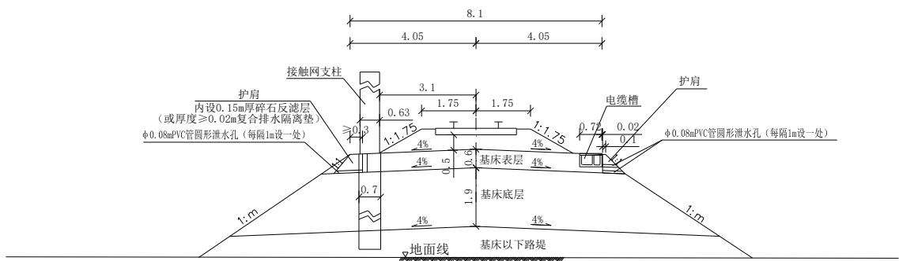  
图 2.1.2-6 160km/h 有砟轨道单线路堤标准横断面图

## 6．特殊路基

## （1）膨胀岩（土）路基

膨胀土路基广泛分布于全线高阶地、垄岗地区，下第三系、第四系 Q2～Q3 及寒武系上覆风化土层普遍为弱膨胀性，局部为中膨胀性。边坡一般按照坡脚设置矮挡墙、缓边坡、宽平台的原则进行设计，边坡较高时应按个别设计进行边坡稳定分析。主要防护原则如下：

①膨胀土地区应严格控制边坡高度，路堑边坡高度不宜超过10m。膨胀土路堑边坡应采用缓坡率、宽平台、强支撑、加固坡脚相结合的挡护措施。每级边坡控制在6m。边坡高度大于10m时，边坡坡率及形式，结合稳定分析计算进行设计。

②弱膨胀土地段，当路堑边坡≤3m时，边坡喷播草灌防护。当路堑边坡高3m＜H≤6m 时，采用混凝土截水骨架内喷播草灌防护，一般每隔 10m 左右沿主骨架设支撑渗沟排水；当路堑边坡高 H﹥6m 时，坡面采用锚杆框架梁或混凝土植草窗防护，坡脚加设混凝土挡墙收坡，挡墙高一般不超过 4m。挡土墙设计时计入膨胀土侧胀力的影响，墙后设置不小于 0.5m 厚的反滤层兼作缓冲层，并增设复合排水网。中-强膨胀土地段，路堑坡面一律采用混凝土封闭防护。

③墙顶、桩顶后平台宽度3m。边坡平台宽度5m，边坡平台分级高度6m。

④路堑基床采用路堤式路堑。基床底层2.3m范围内换填改良土或A、B组填料，并在换填底部铺设不透水复合土工膜或采用级配碎石掺水泥封闭。中～强膨胀土地段根据检算采用相应的加固处理措施，抵抗膨胀变形造成的路基面上拱，并加强变形监测。

⑤膨胀（岩）土地区路基除沉降、稳定性检算外，还应考虑其胀缩变形影响。当路基荷载小于膨胀（岩）土地基的前期固结应力时，可仅对大气影响深度范围处理；当路基荷载大于膨胀（岩）土=前期固结应力时，应根据沉降计算确定处理深度。

⑥膨胀土路堑边坡和基床开挖面喷撒膨胀土生态改性剂进行改良加固。地下水发育地段坡面布置仰斜排水管。

⑦侧沟、天沟、排水沟等周围铺设一层土工复合膜。

## （2）软土路基

本线软土地基主要分布沿线河流一、二级阶地、谷以及丘间谷地区。根据各工点的路基标准、地基条件、填土高度，结合沉降、稳定检算结果选择加固措施。主要地基加固措施有挖除换填、冲击压实、强夯置换、旋喷桩，CFG桩、素混凝土桩、钢筋混凝土桩等刚性桩-网（或桩-筏）结构。

软土地基地段，当软弱层厚≤3m 时，一般采用挖除换填粗粒土填料，若换填不能满足沉降检算要求，应进行深层处理措施。

软土厚度大于3m地区，一般采用CFG桩、素混凝土桩等桩网或桩筏结构进行地基加固。对于低矮软土路基可采用CFG桩、素混凝土桩桩筏结构处理。

采用桩网结构型式时，桩顶铺设 0.5m 碎石垫层，垫层内铺设两层土工格栅，铺设土工格栅时，两端回折不少于2m；采用桩筏结构时，在桩顶设0.2m厚碎石垫层+0.4m厚的不低于C35钢筋混凝土筏板，沿线路纵向每块筏板间留2cm的伸缩缝，填塞沥青麻筋，伸缩缝位置必须位于两排桩的正中间。

## （3）填土路基

对于沿线存在杂填土、填筑土地段，原则上采取挖除弃运。

当其厚度小于3.0m时，应挖除，采用符合要求的填料分层填筑。

对厚度较大挖除困难时，在地下水位以上时，采用灰土挤密桩或强夯密实法处理；若于地下水位以下时，采用旋喷桩、CFG桩等复合地基加固。填土成分含大量块石、混凝土块，地基采用素混凝土灌注桩＋筏板加固。

对于有机质含量较多的生活垃圾及侵蚀性的工业废料杂填土，均应全部挖除换填。

## （4）浸水路基

水塘路基：水塘地段应采取围堰、抽水、清淤后填筑。地基不加固时，塘埂标高以下采用渗水土填筑；地基须深层加固时，水塘水位以下采用C组细粒土回填碾压后进行地基加固。塘埂标高处设不小于2m宽护道，护道以下边坡坡率1：1.75，平台及以下边坡采用M10浆砌片石防护。

## 7．路基排水及顺接设计

路基应有良好、完善的排水系统。排水设备应布置合理，并与桥涵、车站等排水设备衔接配合，形成完整的排水系统，排水设备应有足够的过水能力，保证水流畅通。排水工程应结合具体条件，适当加强路基的横向排水设施，并及时实施，防止在施工期间因地表水及地下水的侵入而造成路基松软和坡面坍塌。排水系统的设置，应与水土保持及农田水利的综合利用相结合，不利用边沟作为灌溉渠道。为避免地表水对路基的侵蚀，路堤地段坡脚根据需要设置排水沟，路堑地段设置侧沟、天沟、边坡平台截水沟等。天沟、边坡截水沟应与路基排水沟连接，将水排出路基以外，路堑必须设

吊沟时，应采取防冲刷措施。

（1）对路基有危害的地表水，通过设置侧沟、天沟、排水沟及边坡平台截水沟等，将水拦截引排至路基范围以外，防止水流冲刷路基。

（2）路堤坡脚外，一般设置双侧排水沟，路堤地面横坡明显地段，排水沟可在上方一侧设置；地形平坦、排水困难的平原地段不设路堤排水沟，结合骨架护坡基础适当加高脚墙，以节约耕地，节省投资。排水沟平面尽量采用直线，如必需转弯时，其半径不宜小于 10～20m，排水沟的长度根据实际需要而定，通常宜在 400m 以内。排水沟采用现浇混凝土，厚度0.15m。排水沟一般采用梯形断面，最小尺寸为：底宽0.4m、深 0.6m，坡率 1：1。

（3）路堑两侧侧沟，靠线路侧预留泄水孔。软质岩、强风化或构造破碎的硬质岩 路堑及土质路堑采用矩形沟，一般底宽 0.6m，深 0.8m，厚 0.2m，采用钢筋混凝土现 浇；不易风化的硬质岩石路堑，采用混凝土现浇，厚0.2m。路堑侧沟的水流，不得经 隧道排出。

（4）深路堑在边坡平台上设置截水沟，边坡平台截水沟需顺接于天沟外或采用吊沟接入侧沟。平台截水沟采用矩形断面，底宽0.3m、深0.4m，采用混凝土现浇。

（5）路堑堑顶以外5m设置天沟，路堑地面横坡明显地段，可在上方一侧设置。堑顶低洼地段天沟水不能沿坡顶排出时，设吊沟接入侧沟。天沟一般采用梯形断面，最小尺寸为：底宽0.4m、深0.6m，坡率1：1，采用素混凝土现浇，厚度0.2m。

（6）侧沟、天沟、排水沟或截水沟按1/50频率设计，沟顶高出设计水位0.2m。排水纵坡不小于2‰，地面平坦或反坡排水地段，仅在特殊困难情况下，可减小至1‰。并注意路基面排水、边坡排水和附属排水系统的衔接。排水设施过水截面尺寸根据流量计算。对平行沟谷或路堑横穿谷地地段，截排水措施按 1/100 洪水频率进行检算，并按1/300洪水频率进行验算。

（7）当路堤边坡采用骨架护坡时，两侧边坡主骨架作为路堤顺边坡向的横向排水槽。采用混凝土空心砖防护地段每隔 10m 设顺边坡向的横向排水槽，深 0.2m，采用混凝土预制拼装，厚度0.1m。

## 8．路基绿化设计

## （1）路基边坡绿化

路基边坡栽植常绿灌木（红叶石楠），每平米均约9株，采用穴栽法种植。整个坡面下层采用植草防护。撒播草籽可选用狗牙根、茅尾草、高羊茅等混播，每平方米不少于30克。

## （2）绿色通道

## 1）路堤坡脚绿化

表 2.1.2-6

全线桥梁概况表
<table><tr><td rowspan=1 colspan=1>序号</td><td rowspan=1 colspan=1>桥名</td><td rowspan=1 colspan=1>桥梁分类</td><td rowspan=1 colspan=1>起点里程</td><td rowspan=1 colspan=1>终点里程</td><td rowspan=1 colspan=1>桥梁全长 m</td><td rowspan=1 colspan=1>跨越河流</td><td rowspan=1 colspan=1>河宽(m)</td><td rowspan=1 colspan=1>水中墩个数</td><td rowspan=1 colspan=1>水中墩施工围堰方案</td><td rowspan=1 colspan=1>桥梁墩台边坡防护里程</td><td rowspan=1 colspan=1>边坡防护措施</td></tr><tr><td rowspan=1 colspan=1>1</td><td rowspan=1 colspan=1>小营头中桥</td><td rowspan=1 colspan=1>中桥</td><td rowspan=1 colspan=1>DK50+194.000</td><td rowspan=1 colspan=1>DK50+303.100</td><td rowspan=1 colspan=1>109.10</td><td rowspan=1 colspan=1></td><td rowspan=1 colspan=1></td><td rowspan=1 colspan=1></td><td rowspan=1 colspan=1></td><td rowspan=1 colspan=1>DK50+199、DK50+232、DK50+264、DK50+297</td><td rowspan=1 colspan=1>框架锚杆梁、桩板墙、框架锚杆梁、桩板墙</td></tr><tr><td rowspan=1 colspan=1>2</td><td rowspan=1 colspan=1>右线小营头大桥</td><td rowspan=1 colspan=1>桥梁</td><td rowspan=1 colspan=1>YDK50+201.310</td><td rowspan=1 colspan=1>YDK50+355.000</td><td rowspan=1 colspan=1>153.69</td><td rowspan=1 colspan=1></td><td rowspan=1 colspan=1></td><td rowspan=1 colspan=1></td><td rowspan=1 colspan=1></td><td rowspan=1 colspan=1>YDK50+280</td><td rowspan=1 colspan=1>桩板墙</td></tr><tr><td rowspan=1 colspan=1>3</td><td rowspan=1 colspan=1>马家湾大桥</td><td rowspan=1 colspan=1>大桥</td><td rowspan=1 colspan=1>DK54+536.100</td><td rowspan=1 colspan=1>DK54+662.140</td><td rowspan=1 colspan=1>126.04</td><td rowspan=1 colspan=1></td><td rowspan=1 colspan=1></td><td rowspan=1 colspan=1></td><td rowspan=1 colspan=1></td><td rowspan=1 colspan=1>DK50+543.63、DK54+651.87</td><td rowspan=1 colspan=1>骨架护坡</td></tr><tr><td rowspan=1 colspan=1>4</td><td rowspan=1 colspan=1>右线马家湾中桥</td><td rowspan=1 colspan=1>桥梁</td><td rowspan=1 colspan=1>YDK54+693.500</td><td rowspan=1 colspan=1>YDK54+770.100</td><td rowspan=1 colspan=1>76.60</td><td rowspan=1 colspan=1></td><td rowspan=1 colspan=1></td><td rowspan=1 colspan=1></td><td rowspan=1 colspan=1></td><td rowspan=1 colspan=1>YDK54+712.6、YDK54+764.85</td><td rowspan=1 colspan=1>骨架护坡</td></tr><tr><td rowspan=1 colspan=1>5</td><td rowspan=1 colspan=1>郑家坝1号大桥</td><td rowspan=1 colspan=1>大桥</td><td rowspan=1 colspan=1>DK54+947.200</td><td rowspan=1 colspan=1>DK55+146.680</td><td rowspan=1 colspan=1>199.48</td><td rowspan=1 colspan=1></td><td rowspan=1 colspan=1></td><td rowspan=1 colspan=1></td><td rowspan=1 colspan=1></td><td rowspan=1 colspan=1>DK55+062.09</td><td rowspan=1 colspan=1>骨架护坡</td></tr><tr><td rowspan=1 colspan=1>6</td><td rowspan=1 colspan=1>右线郑家坝1号大桥</td><td rowspan=1 colspan=1>桥梁</td><td rowspan=1 colspan=1>YDK55+040.200</td><td rowspan=1 colspan=1>YDK55+231.700</td><td rowspan=1 colspan=1>191.50</td><td rowspan=1 colspan=1></td><td rowspan=1 colspan=1></td><td rowspan=1 colspan=1></td><td rowspan=1 colspan=1></td><td rowspan=1 colspan=1>YDK55+055.35、YDK56+212.55</td><td rowspan=1 colspan=1>骨架护坡</td></tr><tr><td rowspan=1 colspan=1>7</td><td rowspan=1 colspan=1>郑家坝2号大桥</td><td rowspan=1 colspan=1>大桥</td><td rowspan=1 colspan=1>DK55+194.500</td><td rowspan=1 colspan=1>DK55+336.360</td><td rowspan=1 colspan=1>141.86</td><td rowspan=1 colspan=1></td><td rowspan=1 colspan=1></td><td rowspan=1 colspan=1></td><td rowspan=1 colspan=1></td><td rowspan=1 colspan=1>DK55+249、DK55+330</td><td rowspan=1 colspan=1>骨架护坡、桩板墙</td></tr><tr><td rowspan=1 colspan=1>8</td><td rowspan=1 colspan=1>右线郑家坝2号大桥</td><td rowspan=1 colspan=1>桥梁</td><td rowspan=1 colspan=1>YDK55+280.460</td><td rowspan=1 colspan=1>YDK55+422.320</td><td rowspan=1 colspan=1>141.86</td><td rowspan=1 colspan=1></td><td rowspan=1 colspan=1></td><td rowspan=1 colspan=1></td><td rowspan=1 colspan=1></td><td rowspan=1 colspan=1>YDK55+334.5、YDK55+416</td><td rowspan=1 colspan=1>骨架护坡、桩板墙</td></tr><tr><td rowspan=1 colspan=1>9</td><td rowspan=1 colspan=1>大山上大桥</td><td rowspan=1 colspan=1>大桥</td><td rowspan=1 colspan=1>DK55+602.130</td><td rowspan=1 colspan=1>DK55+744.050</td><td rowspan=1 colspan=1>141.92</td><td rowspan=1 colspan=1></td><td rowspan=1 colspan=1></td><td rowspan=1 colspan=1></td><td rowspan=1 colspan=1></td><td rowspan=1 colspan=1>DK55+640.4</td><td rowspan=1 colspan=1>骨架护坡</td></tr><tr><td rowspan=1 colspan=1>10</td><td rowspan=1 colspan=1>中溪河特大桥</td><td rowspan=1 colspan=1>特大桥</td><td rowspan=1 colspan=1>DK57+381.510</td><td rowspan=1 colspan=1>DK58+364.830</td><td rowspan=1 colspan=1>983.32</td><td rowspan=1 colspan=1>中溪河</td><td rowspan=1 colspan=1>10</td><td rowspan=1 colspan=1>0</td><td rowspan=1 colspan=1></td><td rowspan=1 colspan=1>DK57+481、DK57+837、DK58+000、DK58+139、DK58+306.5</td><td rowspan=1 colspan=1>骨架护坡、骨架护坡、骨架护坡、桩板墙、骨架护坡</td></tr><tr><td rowspan=1 colspan=1>11</td><td rowspan=1 colspan=1>荷叶溪村特大桥</td><td rowspan=1 colspan=1>特大桥</td><td rowspan=1 colspan=1>DK60+454.300</td><td rowspan=1 colspan=1>DK61+446.500</td><td rowspan=1 colspan=1>992.20</td><td rowspan=1 colspan=1></td><td rowspan=1 colspan=1></td><td rowspan=1 colspan=1></td><td rowspan=1 colspan=1></td><td rowspan=1 colspan=1>DK60+819.6、DK61+048.5、DK61+081.2、DK61+146.6、DK61+287.4、DK61+375.5</td><td rowspan=1 colspan=1>骨架护坡</td></tr><tr><td rowspan=1 colspan=1>12</td><td rowspan=1 colspan=1>黄家垧大桥</td><td rowspan=1 colspan=1>大桥</td><td rowspan=1 colspan=1>DK61+788.750</td><td rowspan=1 colspan=1>DK62+224.850</td><td rowspan=1 colspan=1>436.10</td><td rowspan=1 colspan=1></td><td rowspan=1 colspan=1></td><td rowspan=1 colspan=1></td><td rowspan=1 colspan=1></td><td rowspan=1 colspan=1>DK61+791.375、DK61+826.95</td><td rowspan=1 colspan=1>骨架护坡</td></tr><tr><td rowspan=1 colspan=1>13</td><td rowspan=1 colspan=1>五眼泉特大桥</td><td rowspan=1 colspan=1>特大桥</td><td rowspan=1 colspan=1>DK62+668.785</td><td rowspan=1 colspan=1>DK64+011.645</td><td rowspan=1 colspan=1>1342.86</td><td rowspan=1 colspan=1>五眼泉水库</td><td rowspan=1 colspan=1>240</td><td rowspan=1 colspan=1>8</td><td rowspan=1 colspan=1>钢板桩围堰</td><td rowspan=1 colspan=1>DK62+671、DK63+008、DK63+073</td><td rowspan=1 colspan=1>骨架护坡</td></tr><tr><td rowspan=1 colspan=1>14</td><td rowspan=1 colspan=1>蔡家湾大桥</td><td rowspan=1 colspan=1>大桥</td><td rowspan=1 colspan=1>DK64+567.500</td><td rowspan=1 colspan=1>DK64+742.300</td><td rowspan=1 colspan=1>174.80</td><td rowspan=1 colspan=1></td><td rowspan=1 colspan=1></td><td rowspan=1 colspan=1></td><td rowspan=1 colspan=1></td><td rowspan=1 colspan=1>DK64+595.535、DK64+697.905</td><td rowspan=1 colspan=1>骨架护坡</td></tr><tr><td rowspan=1 colspan=1>15</td><td rowspan=1 colspan=1>段家坳特大桥</td><td rowspan=1 colspan=1>特大桥</td><td rowspan=1 colspan=1>DK65+029.500</td><td rowspan=1 colspan=1>DK65+949.300</td><td rowspan=1 colspan=1>919.80</td><td rowspan=1 colspan=1></td><td rowspan=1 colspan=1></td><td rowspan=1 colspan=1></td><td rowspan=1 colspan=1></td><td rowspan=1 colspan=1></td><td rowspan=1 colspan=1></td></tr><tr><td rowspan=1 colspan=1>16</td><td rowspan=1 colspan=1>龙口子大桥</td><td rowspan=1 colspan=1>大桥</td><td rowspan=1 colspan=1>DK66+187.790</td><td rowspan=1 colspan=1>DK66+346.410</td><td rowspan=1 colspan=1>158.62</td><td rowspan=1 colspan=1></td><td rowspan=1 colspan=1></td><td rowspan=1 colspan=1></td><td rowspan=1 colspan=1></td><td rowspan=1 colspan=1>DK66+267</td><td rowspan=1 colspan=1>骨架护坡</td></tr><tr><td rowspan=1 colspan=1>17</td><td rowspan=1 colspan=1>渔洋河大桥</td><td rowspan=1 colspan=1>大桥</td><td rowspan=1 colspan=1>DK66+490.040</td><td rowspan=1 colspan=1>DK66+974.100</td><td rowspan=1 colspan=1>484.06</td><td rowspan=1 colspan=1>渔洋河</td><td rowspan=1 colspan=1>96</td><td rowspan=1 colspan=1>2</td><td rowspan=1 colspan=1>钢板桩围堰</td><td rowspan=1 colspan=1>DK66+528</td><td rowspan=1 colspan=1>骨架护坡</td></tr><tr><td rowspan=1 colspan=1>18</td><td rowspan=1 colspan=1>高袁冲特大桥</td><td rowspan=1 colspan=1>特大桥</td><td rowspan=1 colspan=1>DK68+176.700</td><td rowspan=1 colspan=1>DK68+776.820</td><td rowspan=1 colspan=1>600.12</td><td rowspan=1 colspan=1></td><td rowspan=1 colspan=1></td><td rowspan=1 colspan=1></td><td rowspan=1 colspan=1></td><td rowspan=1 colspan=1>DK68+454.05、DK68+656</td><td rowspan=1 colspan=1>骨架护坡</td></tr><tr><td rowspan=1 colspan=1>19</td><td rowspan=1 colspan=1>和尚岩大桥</td><td rowspan=1 colspan=1>大桥</td><td rowspan=1 colspan=1>DK70+434.280</td><td rowspan=1 colspan=1>DK70+726.130</td><td rowspan=1 colspan=1>291.85</td><td rowspan=1 colspan=1></td><td rowspan=1 colspan=1></td><td rowspan=1 colspan=1></td><td rowspan=1 colspan=1></td><td rowspan=1 colspan=1>DK70+323.5、DK70+597.760、DK70+695.860</td><td rowspan=1 colspan=1>骨架护坡</td></tr><tr><td rowspan=1 colspan=1>20</td><td rowspan=1 colspan=1>聂家湾大桥</td><td rowspan=1 colspan=1>大桥</td><td rowspan=1 colspan=1>DK72+367.520</td><td rowspan=1 colspan=1>DK72+509.490</td><td rowspan=1 colspan=1>141.97</td><td rowspan=1 colspan=1></td><td rowspan=1 colspan=1></td><td rowspan=1 colspan=1></td><td rowspan=1 colspan=1></td><td rowspan=1 colspan=1></td><td rowspan=1 colspan=1></td></tr><tr><td rowspan=1 colspan=1>21</td><td rowspan=1 colspan=1>洞湾大桥</td><td rowspan=1 colspan=1>大桥</td><td rowspan=1 colspan=1>DK72+894.800</td><td rowspan=1 colspan=1>DK73+078.260</td><td rowspan=1 colspan=1>183.46</td><td rowspan=1 colspan=1></td><td rowspan=1 colspan=1></td><td rowspan=1 colspan=1></td><td rowspan=1 colspan=1></td><td rowspan=1 colspan=1>DK72+894.800</td><td rowspan=1 colspan=1>骨架护坡</td></tr><tr><td rowspan=1 colspan=1>22</td><td rowspan=1 colspan=1>新桥河村特大桥</td><td rowspan=1 colspan=1>特大桥</td><td rowspan=1 colspan=1>DK73+412.700</td><td rowspan=1 colspan=1>DK75+935.190</td><td rowspan=1 colspan=1>2522.49</td><td rowspan=1 colspan=1>新桥河</td><td rowspan=1 colspan=1>20</td><td rowspan=1 colspan=1>0</td><td rowspan=1 colspan=1></td><td rowspan=1 colspan=1>DK73+412.700、DK73+475.690、DK73+500.410、DK73+576.970、DK73+579.700、DK73+590.595、DK73+599.000、DK73+607.000、DK73+615.320、DK73+625.550、</td><td rowspan=1 colspan=1>骨架、框架锚杆护坡</td></tr><tr><td rowspan=1 colspan=1>22</td><td rowspan=1 colspan=1>新桥河村特大桥</td><td rowspan=1 colspan=1>特大桥</td><td rowspan=1 colspan=1>DK73+412.700</td><td rowspan=1 colspan=1>DK75+935.190</td><td rowspan=1 colspan=1>2522.49</td><td rowspan=1 colspan=1>新桥河</td><td rowspan=1 colspan=1>20</td><td rowspan=1 colspan=1>0</td><td rowspan=1 colspan=1></td><td rowspan=1 colspan=1>DK73+713.515、DK74+384.360、DK74+417.100、DK74+482.580、DK75+569.605、DK75+602.335、DK75+667.795DK75+677.800、DK75+682.800</td><td rowspan=1 colspan=1>骨架、框架锚杆护坡</td></tr><tr><td rowspan=1 colspan=1>23</td><td rowspan=1 colspan=1>跨呼北高速公路大桥</td><td rowspan=1 colspan=1>大桥</td><td rowspan=1 colspan=1>DK76+004.890</td><td rowspan=1 colspan=1>DK76+267.845</td><td rowspan=1 colspan=1>262.96</td><td rowspan=1 colspan=1></td><td rowspan=1 colspan=1></td><td rowspan=1 colspan=1></td><td rowspan=1 colspan=1></td><td rowspan=1 colspan=1>DK76+196.850、DK76+229.560、DK76+262.340</td><td rowspan=1 colspan=1>骨架护坡</td></tr></table>

中国铁建 CHINA RAILWAY SIYUAN SURVEY AND DESIGN GROUP CO.,LTD

<table><tr><td rowspan=1 colspan=1>序号</td><td rowspan=1 colspan=1>桥名</td><td rowspan=1 colspan=1>桥梁分类</td><td rowspan=1 colspan=1>起点里程</td><td rowspan=1 colspan=1>终点里程</td><td rowspan=1 colspan=1>桥梁全长 m</td><td rowspan=1 colspan=1>跨越河流</td><td rowspan=1 colspan=1>河宽(m)</td><td rowspan=1 colspan=1>水中墩个数</td><td rowspan=1 colspan=1>水中墩施工围堰方案</td><td rowspan=1 colspan=1>桥梁墩台边坡防护里程</td><td rowspan=1 colspan=1>边坡防护措施</td></tr><tr><td rowspan=1 colspan=1>24</td><td rowspan=1 colspan=1>溜石板特大桥</td><td rowspan=1 colspan=1>特大桥</td><td rowspan=1 colspan=1>DK76+361.440</td><td rowspan=1 colspan=1>DK77+615.850</td><td rowspan=1 colspan=1>1254.41</td><td rowspan=1 colspan=1></td><td rowspan=1 colspan=1></td><td rowspan=1 colspan=1></td><td rowspan=1 colspan=1></td><td rowspan=1 colspan=1>DK76+432.400、DK76+555.200、DK76+579.900、DK76+585.010、DK76+595.980、DK76+597.170、DK76+612.600DK76+645.300、DK76+841.500、DK77+037.700、DK77+070.400、DK77+201.200、DK77+233.900、DK77+266.600、DK77+299.300、DK77+446.880、DK77+479.500、DK77+512.200、DK77+544.900、DK77+610.350、DK77+615.850</td><td rowspan=1 colspan=1>骨架、框架锚杆护坡</td></tr><tr><td rowspan=1 colspan=1>25</td><td rowspan=1 colspan=1>白云湾大桥</td><td rowspan=1 colspan=1>大桥</td><td rowspan=1 colspan=1>DK78+091.440</td><td rowspan=1 colspan=1>DK78+282.770</td><td rowspan=1 colspan=1>191.33</td><td rowspan=1 colspan=1></td><td rowspan=1 colspan=1></td><td rowspan=1 colspan=1></td><td rowspan=1 colspan=1></td><td rowspan=1 colspan=1>DK78+277.270</td><td rowspan=1 colspan=1>骨架护坡</td></tr><tr><td rowspan=1 colspan=1>26</td><td rowspan=1 colspan=1>罗家冲大桥</td><td rowspan=1 colspan=1>大桥</td><td rowspan=1 colspan=1>DK78+513.620</td><td rowspan=1 colspan=1>DK78+811.050</td><td rowspan=1 colspan=1>297.43</td><td rowspan=1 colspan=1></td><td rowspan=1 colspan=1></td><td rowspan=1 colspan=1></td><td rowspan=1 colspan=1></td><td rowspan=1 colspan=1>DK78+715.400、DK78+748.100、DK78+780.800</td><td rowspan=1 colspan=1></td></tr><tr><td rowspan=1 colspan=1>27</td><td rowspan=1 colspan=1>石渣湾中桥</td><td rowspan=1 colspan=1>中桥</td><td rowspan=1 colspan=1>DK79+493.440</td><td rowspan=1 colspan=1>DK79+594.700</td><td rowspan=1 colspan=1>101.26</td><td rowspan=1 colspan=1></td><td rowspan=1 colspan=1></td><td rowspan=1 colspan=1></td><td rowspan=1 colspan=1></td><td rowspan=1 colspan=1>DK79+023.690、DK79+589.200</td><td rowspan=1 colspan=1>骨架护坡</td></tr><tr><td rowspan=1 colspan=1>28</td><td rowspan=1 colspan=1>解家冲芭芒河特大桥</td><td rowspan=1 colspan=1>特大桥</td><td rowspan=1 colspan=1>DK79+703.740</td><td rowspan=1 colspan=1>DK80+532.400</td><td rowspan=1 colspan=1>828.66</td><td rowspan=1 colspan=1></td><td rowspan=1 colspan=1></td><td rowspan=1 colspan=1></td><td rowspan=1 colspan=1></td><td rowspan=1 colspan=1>DK79+741.990、DK79+774.690、DK80+003.590、DK80+036.290、DK80+068.990</td><td rowspan=1 colspan=1>骨架、框架锚杆护坡</td></tr><tr><td rowspan=1 colspan=1>29</td><td rowspan=1 colspan=1>邓家咀中桥</td><td rowspan=1 colspan=1>中桥</td><td rowspan=1 colspan=1>DK80+636.050</td><td rowspan=1 colspan=1>DK80+712.610</td><td rowspan=1 colspan=1>76.56</td><td rowspan=1 colspan=1></td><td rowspan=1 colspan=1></td><td rowspan=1 colspan=1></td><td rowspan=1 colspan=1></td><td rowspan=1 colspan=1></td><td rowspan=1 colspan=1></td></tr><tr><td rowspan=1 colspan=1>30</td><td rowspan=1 colspan=1>四得桥大桥</td><td rowspan=1 colspan=1>大桥</td><td rowspan=1 colspan=1>DK80+930.440</td><td rowspan=1 colspan=1>DK81+317.950</td><td rowspan=1 colspan=1>387.51</td><td rowspan=1 colspan=1></td><td rowspan=1 colspan=1></td><td rowspan=1 colspan=1></td><td rowspan=1 colspan=1></td><td rowspan=1 colspan=1></td><td rowspan=1 colspan=1></td></tr><tr><td rowspan=1 colspan=1>31</td><td rowspan=1 colspan=1>余家桥村特大桥</td><td rowspan=1 colspan=1>特大桥</td><td rowspan=1 colspan=1>DK81+447.445</td><td rowspan=1 colspan=1>DK82+104.825</td><td rowspan=1 colspan=1>657.38</td><td rowspan=1 colspan=1></td><td rowspan=1 colspan=1></td><td rowspan=1 colspan=1></td><td rowspan=1 colspan=1></td><td rowspan=1 colspan=1>DK81+812.820、DK81+649.250</td><td rowspan=1 colspan=1>骨架护坡</td></tr><tr><td rowspan=1 colspan=1>32</td><td rowspan=1 colspan=1>七岭荒特大桥</td><td rowspan=1 colspan=1>特大桥</td><td rowspan=1 colspan=1>DK82+462.430</td><td rowspan=1 colspan=1>DK83+512.050</td><td rowspan=1 colspan=1>1049.62</td><td rowspan=1 colspan=1></td><td rowspan=1 colspan=1></td><td rowspan=1 colspan=1></td><td rowspan=1 colspan=1></td><td rowspan=1 colspan=1></td><td rowspan=1 colspan=1></td></tr><tr><td rowspan=1 colspan=1>33</td><td rowspan=1 colspan=1>钟家冲村界牌河特大桥</td><td rowspan=1 colspan=1>特大桥</td><td rowspan=1 colspan=1>DK84+268.448</td><td rowspan=1 colspan=1>DK85+244.148</td><td rowspan=1 colspan=1>975.70</td><td rowspan=1 colspan=1>界牌河</td><td rowspan=1 colspan=1>16</td><td rowspan=1 colspan=1>0</td><td rowspan=1 colspan=1></td><td rowspan=1 colspan=1></td><td rowspan=1 colspan=1></td></tr><tr><td rowspan=1 colspan=1>34</td><td rowspan=1 colspan=1>蔡家湾九道河特大桥</td><td rowspan=1 colspan=1>特大桥</td><td rowspan=1 colspan=1>DK86+176.580</td><td rowspan=1 colspan=1>DK86+994.850</td><td rowspan=1 colspan=1>818.27</td><td rowspan=1 colspan=1>九道河</td><td rowspan=1 colspan=1>25</td><td rowspan=1 colspan=1>0</td><td rowspan=1 colspan=1></td><td rowspan=1 colspan=1></td><td rowspan=1 colspan=1></td></tr><tr><td rowspan=1 colspan=1>35</td><td rowspan=1 colspan=1>青龙咀大桥</td><td rowspan=1 colspan=1>大桥</td><td rowspan=1 colspan=1>DK87+501.745</td><td rowspan=1 colspan=1>DK87+979.565</td><td rowspan=1 colspan=1>477.82</td><td rowspan=1 colspan=1></td><td rowspan=1 colspan=1></td><td rowspan=1 colspan=1></td><td rowspan=1 colspan=1></td><td rowspan=1 colspan=1>DK87+540.000、DK87+979.555</td><td rowspan=1 colspan=1>骨架护坡</td></tr><tr><td rowspan=1 colspan=1>36</td><td rowspan=1 colspan=1>沙湾子大桥</td><td rowspan=1 colspan=1>大桥</td><td rowspan=1 colspan=1>DK88+286.050</td><td rowspan=1 colspan=1>DK88+649.000</td><td rowspan=1 colspan=1>362.95</td><td rowspan=1 colspan=1></td><td rowspan=1 colspan=1></td><td rowspan=1 colspan=1></td><td rowspan=1 colspan=1></td><td rowspan=1 colspan=1>DK88+282.060、DK88+300.770、DK88+316.355、DK88+649.000</td><td rowspan=1 colspan=1>骨架护坡</td></tr><tr><td rowspan=1 colspan=1>37</td><td rowspan=1 colspan=1>猫子冲大桥</td><td rowspan=1 colspan=1>大桥</td><td rowspan=1 colspan=1>DK89+172.700</td><td rowspan=1 colspan=1>DK89+445.520</td><td rowspan=1 colspan=1>272.82</td><td rowspan=1 colspan=1></td><td rowspan=1 colspan=1></td><td rowspan=1 colspan=1></td><td rowspan=1 colspan=1></td><td rowspan=1 colspan=1>DK89+172.700、DK89+211.005</td><td rowspan=1 colspan=1>骨架、框架锚杆护坡</td></tr><tr><td rowspan=1 colspan=1>38</td><td rowspan=1 colspan=1>弭水井大桥</td><td rowspan=1 colspan=1>大桥</td><td rowspan=1 colspan=1>DK90+324.035</td><td rowspan=1 colspan=1>DK90+556.045</td><td rowspan=1 colspan=1>232.01</td><td rowspan=1 colspan=1></td><td rowspan=1 colspan=1></td><td rowspan=1 colspan=1></td><td rowspan=1 colspan=1></td><td rowspan=1 colspan=1></td><td rowspan=1 colspan=1></td></tr><tr><td rowspan=1 colspan=1>39</td><td rowspan=1 colspan=1>卞家塝大桥</td><td rowspan=1 colspan=1>大桥</td><td rowspan=1 colspan=1>DK91+144.000</td><td rowspan=1 colspan=1>DK91+433.410</td><td rowspan=1 colspan=1>289.41</td><td rowspan=1 colspan=1></td><td rowspan=1 colspan=1></td><td rowspan=1 colspan=1></td><td rowspan=1 colspan=1></td><td rowspan=1 colspan=1>DK91+144.000、DK91+174.260、DK91+433.410</td><td rowspan=1 colspan=1>骨架护坡</td></tr><tr><td rowspan=1 colspan=1>40</td><td rowspan=1 colspan=1>五峰山村大桥</td><td rowspan=1 colspan=1>大桥</td><td rowspan=1 colspan=1>DK94+265.650</td><td rowspan=1 colspan=1>DK94+735.250</td><td rowspan=1 colspan=1>469.60</td><td rowspan=1 colspan=1></td><td rowspan=1 colspan=1></td><td rowspan=1 colspan=1></td><td rowspan=1 colspan=1></td><td rowspan=1 colspan=1>DK94+336.600、DK94+697.000</td><td rowspan=1 colspan=1>骨架护坡</td></tr><tr><td rowspan=1 colspan=1>41</td><td rowspan=1 colspan=1>黄家湾特大桥</td><td rowspan=1 colspan=1>特大桥</td><td rowspan=1 colspan=1>DK94+938.050</td><td rowspan=1 colspan=1>DK95+832.070</td><td rowspan=1 colspan=1>894.02</td><td rowspan=1 colspan=1></td><td rowspan=1 colspan=1></td><td rowspan=1 colspan=1></td><td rowspan=1 colspan=1></td><td rowspan=1 colspan=1>DK95+368.700</td><td rowspan=1 colspan=1>骨架护坡</td></tr><tr><td rowspan=1 colspan=1>42</td><td rowspan=1 colspan=1>田家湾大桥</td><td rowspan=1 colspan=1>大桥</td><td rowspan=1 colspan=1>DK96+316.000</td><td rowspan=1 colspan=1>DK96+588.880</td><td rowspan=1 colspan=1>272.88</td><td rowspan=1 colspan=1></td><td rowspan=1 colspan=1></td><td rowspan=1 colspan=1></td><td rowspan=1 colspan=1></td><td rowspan=1 colspan=1>DK98+485.140、DK96+588.880</td><td rowspan=1 colspan=1>骨架护坡</td></tr><tr><td rowspan=1 colspan=1>43</td><td rowspan=1 colspan=1>何家畈特大桥</td><td rowspan=1 colspan=1>特大桥</td><td rowspan=1 colspan=1>DK96+658.650</td><td rowspan=1 colspan=1>DK98+100.380</td><td rowspan=1 colspan=1>1441.73</td><td rowspan=1 colspan=1></td><td rowspan=1 colspan=1></td><td rowspan=1 colspan=1></td><td rowspan=1 colspan=1></td><td rowspan=1 colspan=1>DK96+688.910、DK96+819.790、DK97+245.030、DK97+343.130</td><td rowspan=1 colspan=1>骨架护坡</td></tr><tr><td rowspan=1 colspan=1>44</td><td rowspan=1 colspan=1>张家畈跨焦柳铁路特大桥</td><td rowspan=1 colspan=1>特大桥</td><td rowspan=1 colspan=1>DK98+447.140</td><td rowspan=1 colspan=1>DK99+136.355</td><td rowspan=1 colspan=1>689.21</td><td rowspan=1 colspan=1></td><td rowspan=1 colspan=1></td><td rowspan=1 colspan=1></td><td rowspan=1 colspan=1></td><td rowspan=1 colspan=1></td><td rowspan=1 colspan=1></td></tr><tr><td rowspan=1 colspan=1>45</td><td rowspan=1 colspan=1>尖山村大桥</td><td rowspan=1 colspan=1>大桥</td><td rowspan=1 colspan=1>DK99+649.212</td><td rowspan=1 colspan=1>DK99+823.832</td><td rowspan=1 colspan=1>174.62</td><td rowspan=1 colspan=1></td><td rowspan=1 colspan=1></td><td rowspan=1 colspan=1></td><td rowspan=1 colspan=1></td><td rowspan=1 colspan=1></td><td rowspan=1 colspan=1></td></tr><tr><td rowspan=1 colspan=1>46</td><td rowspan=1 colspan=1>王家桥镇特大桥</td><td rowspan=1 colspan=1>特大桥</td><td rowspan=1 colspan=1>DK100+446.532</td><td rowspan=1 colspan=1>DK103+450.492</td><td rowspan=1 colspan=1>3003.96</td><td rowspan=1 colspan=1></td><td rowspan=1 colspan=1></td><td rowspan=1 colspan=1></td><td rowspan=1 colspan=1></td><td rowspan=1 colspan=1>DK102+039.180、DK102+169.982、DK102+202.830、DK102+283.682、DK102+071.482</td><td rowspan=1 colspan=1>骨架护坡</td></tr><tr><td rowspan=1 colspan=1>47</td><td rowspan=1 colspan=1>中桥一队大桥</td><td rowspan=1 colspan=1>大桥</td><td rowspan=1 colspan=1>DK103+652.422</td><td rowspan=1 colspan=1>DK103+794.402</td><td rowspan=1 colspan=1>141.98</td><td rowspan=1 colspan=1></td><td rowspan=1 colspan=1></td><td rowspan=1 colspan=1></td><td rowspan=1 colspan=1></td><td rowspan=1 colspan=1></td><td rowspan=1 colspan=1></td></tr></table>

中铁第四勘察设计院集团有限公司  
中国铁建 CHINA RAILWAY SIYUAN SURVEY AND DESIGN GROUP CO.,LTD.

中国铁建 CHINA RAILWAY SIYUAN SURVEY AND DESIGN GROUP CO.,LTD.

<table><tr><td colspan="1" rowspan="1">序号</td><td colspan="1" rowspan="1">桥名</td><td colspan="1" rowspan="1">桥梁分类</td><td colspan="1" rowspan="1">起点里程</td><td colspan="1" rowspan="1">终点里程</td><td colspan="1" rowspan="1">桥梁全长 m</td><td colspan="1" rowspan="1">跨越河流</td><td colspan="1" rowspan="1">河宽(m)</td><td colspan="1" rowspan="1">水中墩个数</td><td colspan="1" rowspan="1">水中墩施工围堰方案</td><td colspan="1" rowspan="1">桥梁墩台边坡防护里程</td><td colspan="1" rowspan="1">边坡防护措施</td></tr><tr><td colspan="1" rowspan="1">48</td><td colspan="1" rowspan="1">中水桥村大桥</td><td colspan="1" rowspan="1">大桥</td><td colspan="1" rowspan="1">DK103+914.182</td><td colspan="1" rowspan="1">DK104+138.282</td><td colspan="1" rowspan="1">224.10</td><td colspan="1" rowspan="1"></td><td colspan="1" rowspan="1"></td><td colspan="1" rowspan="1"></td><td colspan="1" rowspan="1"></td><td colspan="1" rowspan="1"></td><td colspan="1" rowspan="1"></td></tr><tr><td colspan="1" rowspan="1">49</td><td colspan="1" rowspan="1">胡家湾大桥</td><td colspan="1" rowspan="1">大桥</td><td colspan="1" rowspan="1">DK104+273.562</td><td colspan="1" rowspan="1">DK104+448.182</td><td colspan="1" rowspan="1">174.62</td><td colspan="1" rowspan="1"></td><td colspan="1" rowspan="1"></td><td colspan="1" rowspan="1"></td><td colspan="1" rowspan="1"></td><td colspan="1" rowspan="1"></td><td colspan="1" rowspan="1"></td></tr><tr><td colspan="1" rowspan="1">50</td><td colspan="1" rowspan="1">中桥八队中桥</td><td colspan="1" rowspan="1">中桥</td><td colspan="1" rowspan="1">DK104+919.562</td><td colspan="1" rowspan="1">DK105+028.782</td><td colspan="1" rowspan="1">109.22</td><td colspan="1" rowspan="1"></td><td colspan="1" rowspan="1"></td><td colspan="1" rowspan="1"></td><td colspan="1" rowspan="1"></td><td colspan="1" rowspan="1"></td><td colspan="1" rowspan="1"></td></tr><tr><td colspan="1" rowspan="1">51</td><td colspan="1" rowspan="1">杨树河一队大桥</td><td colspan="1" rowspan="1">大桥</td><td colspan="1" rowspan="1">DK105+818.792</td><td colspan="1" rowspan="1">DK106+018.112</td><td colspan="1" rowspan="1">199.32</td><td colspan="1" rowspan="1"></td><td colspan="1" rowspan="1"></td><td colspan="1" rowspan="1"></td><td colspan="1" rowspan="1"></td><td colspan="1" rowspan="1"></td><td colspan="1" rowspan="1"></td></tr><tr><td colspan="1" rowspan="1">52</td><td colspan="1" rowspan="1">杨树河大桥</td><td colspan="1" rowspan="1">大桥</td><td colspan="1" rowspan="1">DK106+471.442</td><td colspan="1" rowspan="1">DK106+857.862</td><td colspan="1" rowspan="1">386.42</td><td colspan="1" rowspan="1"></td><td colspan="1" rowspan="1"></td><td colspan="1" rowspan="1"></td><td colspan="1" rowspan="1"></td><td colspan="1" rowspan="1"></td><td colspan="1" rowspan="1"></td></tr><tr><td colspan="1" rowspan="1">53</td><td colspan="1" rowspan="1">民主村碾盘河特大桥</td><td colspan="1" rowspan="1">特大桥</td><td colspan="1" rowspan="1">DK107+306.742</td><td colspan="1" rowspan="1">DK109+733.777</td><td colspan="1" rowspan="1">2427.03</td><td colspan="1" rowspan="1"></td><td colspan="1" rowspan="1"></td><td colspan="1" rowspan="1"></td><td colspan="1" rowspan="1"></td><td colspan="1" rowspan="1"></td><td colspan="1" rowspan="1"></td></tr><tr><td colspan="1" rowspan="1">54</td><td colspan="1" rowspan="1">花屋场大桥</td><td colspan="1" rowspan="1">大桥</td><td colspan="1" rowspan="1">DK110+709.242</td><td colspan="1" rowspan="1">DK111+072.042</td><td colspan="1" rowspan="1">362.80</td><td colspan="1" rowspan="1"></td><td colspan="1" rowspan="1"></td><td colspan="1" rowspan="1"></td><td colspan="1" rowspan="1"></td><td colspan="1" rowspan="1">DK111+041.792</td><td colspan="1" rowspan="1">骨架护坡</td></tr><tr><td colspan="1" rowspan="1">55</td><td colspan="1" rowspan="1">黄家坪中桥</td><td colspan="1" rowspan="1">中桥</td><td colspan="1" rowspan="1">DK112+996.242</td><td colspan="1" rowspan="1">DK113+040.062</td><td colspan="1" rowspan="1">43.82</td><td colspan="1" rowspan="1"></td><td colspan="1" rowspan="1"></td><td colspan="1" rowspan="1"></td><td colspan="1" rowspan="1"></td><td colspan="1" rowspan="1"></td><td colspan="1" rowspan="1"></td></tr><tr><td colspan="1" rowspan="1">56</td><td colspan="1" rowspan="1">左家铺子1号中桥</td><td colspan="1" rowspan="1">中桥</td><td colspan="1" rowspan="1">DK113+312.740</td><td colspan="1" rowspan="1">DK113+389.280</td><td colspan="1" rowspan="1">76.54</td><td colspan="1" rowspan="1"></td><td colspan="1" rowspan="1"></td><td colspan="1" rowspan="1"></td><td colspan="1" rowspan="1"></td><td colspan="1" rowspan="1"></td><td colspan="1" rowspan="1"></td></tr><tr><td colspan="1" rowspan="1">57</td><td colspan="1" rowspan="1">左家铺子2号中桥</td><td colspan="1" rowspan="1">中桥</td><td colspan="1" rowspan="1">DK113+449.370</td><td colspan="1" rowspan="1">DK113+525.920</td><td colspan="1" rowspan="1">76.55</td><td colspan="1" rowspan="1"></td><td colspan="1" rowspan="1"></td><td colspan="1" rowspan="1"></td><td colspan="1" rowspan="1"></td><td colspan="1" rowspan="1"></td><td colspan="1" rowspan="1"></td></tr><tr><td colspan="1" rowspan="1">58</td><td colspan="1" rowspan="1">彭家岭大桥</td><td colspan="1" rowspan="1">大桥</td><td colspan="1" rowspan="1">DK113+801.742</td><td colspan="1" rowspan="1">DK114+189.592</td><td colspan="1" rowspan="1">387.85</td><td colspan="1" rowspan="1"></td><td colspan="1" rowspan="1"></td><td colspan="1" rowspan="1"></td><td colspan="1" rowspan="1"></td><td colspan="1" rowspan="1"></td><td colspan="1" rowspan="1"></td></tr><tr><td colspan="1" rowspan="1">59</td><td colspan="1" rowspan="1">长堰堤新河特大桥</td><td colspan="1" rowspan="1">特大桥</td><td colspan="1" rowspan="1">DK114+870.647</td><td colspan="1" rowspan="1">DK117+436.527</td><td colspan="1" rowspan="1">2565.88</td><td colspan="1" rowspan="1">新河</td><td colspan="1" rowspan="1">115</td><td colspan="1" rowspan="1">2</td><td colspan="1" rowspan="1">钢板桩围堰</td><td colspan="1" rowspan="1">DK114+917.047、DK114+973.047、DK117+431.027、DK117+792.902、DK118+144.932、DK118+177.662、DK118+210.392</td><td colspan="1" rowspan="1">骨架护坡</td></tr><tr><td colspan="1" rowspan="1">60</td><td colspan="1" rowspan="1">横岭村特大桥</td><td colspan="1" rowspan="1">特大桥</td><td colspan="1" rowspan="1">DK117+754.637</td><td colspan="1" rowspan="1">DK120+352.157</td><td colspan="1" rowspan="1">2597.52</td><td colspan="1" rowspan="1"></td><td colspan="1" rowspan="1"></td><td colspan="1" rowspan="1"></td><td colspan="1" rowspan="1"></td><td colspan="1" rowspan="1">DK118+144.932、DK118+177.662、DK118+210.392、DK118+456.222、DK118+488.952、DK119+536.312、DK119+691.962</td><td colspan="1" rowspan="1">骨架护坡</td></tr><tr><td colspan="1" rowspan="1">61</td><td colspan="1" rowspan="1">谭家坪大桥</td><td colspan="1" rowspan="1">大桥</td><td colspan="1" rowspan="1">DK120+422.662</td><td colspan="1" rowspan="1">DK120+614.142</td><td colspan="1" rowspan="1">191.48</td><td colspan="1" rowspan="1"></td><td colspan="1" rowspan="1"></td><td colspan="1" rowspan="1"></td><td colspan="1" rowspan="1"></td><td colspan="1" rowspan="1"></td><td colspan="1" rowspan="1"></td></tr><tr><td colspan="1" rowspan="1">62</td><td colspan="1" rowspan="1">十字岭村特大桥</td><td colspan="1" rowspan="1">特大桥</td><td colspan="1" rowspan="1">DK120+774.157</td><td colspan="1" rowspan="1">DK121+554.797</td><td colspan="1" rowspan="1">780.64</td><td colspan="1" rowspan="1"></td><td colspan="1" rowspan="1"></td><td colspan="1" rowspan="1"></td><td colspan="1" rowspan="1"></td><td colspan="1" rowspan="1"></td><td colspan="1" rowspan="1"></td></tr><tr><td colspan="1" rowspan="1">63</td><td colspan="1" rowspan="1">跨武松高速公路大桥</td><td colspan="1" rowspan="1">大桥</td><td colspan="1" rowspan="1">DK121+621.622</td><td colspan="1" rowspan="1">DK121+779.142</td><td colspan="1" rowspan="1">157.52</td><td colspan="1" rowspan="1"></td><td colspan="1" rowspan="1"></td><td colspan="1" rowspan="1"></td><td colspan="1" rowspan="1"></td><td colspan="1" rowspan="1"></td><td colspan="1" rowspan="1"></td></tr><tr><td colspan="1" rowspan="1">64</td><td colspan="1" rowspan="1">肖家冲村特大桥</td><td colspan="1" rowspan="1">特大桥</td><td colspan="1" rowspan="1">DK122+475.455</td><td colspan="1" rowspan="1">DK123+170.025</td><td colspan="1" rowspan="1">694.57</td><td colspan="1" rowspan="1"></td><td colspan="1" rowspan="1"></td><td colspan="1" rowspan="1"></td><td colspan="1" rowspan="1"></td><td colspan="1" rowspan="1"></td><td colspan="1" rowspan="1"></td></tr><tr><td colspan="1" rowspan="1">65</td><td colspan="1" rowspan="1">芭芒林子大桥</td><td colspan="1" rowspan="1">大桥</td><td colspan="1" rowspan="1">DK123+549.242</td><td colspan="1" rowspan="1">DK123+920.402</td><td colspan="1" rowspan="1">371.16</td><td colspan="1" rowspan="1"></td><td colspan="1" rowspan="1"></td><td colspan="1" rowspan="1"></td><td colspan="1" rowspan="1"></td><td colspan="1" rowspan="1"></td><td colspan="1" rowspan="1"></td></tr><tr><td colspan="1" rowspan="1">66</td><td colspan="1" rowspan="1">滚钟坡中桥</td><td colspan="1" rowspan="1">中桥</td><td colspan="1" rowspan="1">DK124+169.005</td><td colspan="1" rowspan="1">DK124+278.275</td><td colspan="1" rowspan="1">109.27</td><td colspan="1" rowspan="1"></td><td colspan="1" rowspan="1"></td><td colspan="1" rowspan="1"></td><td colspan="1" rowspan="1"></td><td colspan="1" rowspan="1"></td><td colspan="1" rowspan="1"></td></tr><tr><td colspan="1" rowspan="1">67</td><td colspan="1" rowspan="1">百草凹大桥</td><td colspan="1" rowspan="1">大桥</td><td colspan="1" rowspan="1">DK124+937.650</td><td colspan="1" rowspan="1">DK125+341.180</td><td colspan="1" rowspan="1">403.53</td><td colspan="1" rowspan="1"></td><td colspan="1" rowspan="1"></td><td colspan="1" rowspan="1"></td><td colspan="1" rowspan="1"></td><td colspan="1" rowspan="1"></td><td colspan="1" rowspan="1"></td></tr><tr><td colspan="1" rowspan="1">68</td><td colspan="1" rowspan="1">五里冲村特大桥</td><td colspan="1" rowspan="1">特大桥</td><td colspan="1" rowspan="1">DK125+408.542</td><td colspan="1" rowspan="1">DK125+934.892</td><td colspan="1" rowspan="1">526.35</td><td colspan="1" rowspan="1"></td><td colspan="1" rowspan="1"></td><td colspan="1" rowspan="1"></td><td colspan="1" rowspan="1"></td><td colspan="1" rowspan="1"></td><td colspan="1" rowspan="1"></td></tr><tr><td colspan="1" rowspan="1">69</td><td colspan="1" rowspan="1">肖家岗特大桥</td><td colspan="1" rowspan="1">特大桥</td><td colspan="1" rowspan="1">DK126+013.141</td><td colspan="1" rowspan="1">DK126+915.891</td><td colspan="1" rowspan="1">902.75</td><td colspan="1" rowspan="1"></td><td colspan="1" rowspan="1"></td><td colspan="1" rowspan="1"></td><td colspan="1" rowspan="1"></td><td colspan="1" rowspan="1"></td><td colspan="1" rowspan="1"></td></tr><tr><td colspan="1" rowspan="1">70</td><td colspan="1" rowspan="1">金鸡山洈水特大桥</td><td colspan="1" rowspan="1">特大桥</td><td colspan="1" rowspan="1">DK127+241.942</td><td colspan="1" rowspan="1">DK131+058.137</td><td colspan="1" rowspan="1">3816.20</td><td colspan="1" rowspan="1">洈水</td><td colspan="1" rowspan="1">200</td><td colspan="1" rowspan="1">2</td><td colspan="1" rowspan="1">钢板桩围堰</td><td colspan="1" rowspan="1">DK127+280.192</td><td colspan="1" rowspan="1">骨架护坡</td></tr><tr><td colspan="1" rowspan="1">71</td><td colspan="1" rowspan="1">千工垱村特大桥</td><td colspan="1" rowspan="1">特大桥</td><td colspan="1" rowspan="1">DK131+531.992</td><td colspan="1" rowspan="1">DK132+581.492</td><td colspan="1" rowspan="1">1049.50</td><td colspan="1" rowspan="1"></td><td colspan="1" rowspan="1"></td><td colspan="1" rowspan="1"></td><td colspan="1" rowspan="1"></td><td colspan="1" rowspan="1"></td><td colspan="1" rowspan="1"></td></tr><tr><td colspan="1" rowspan="1">72</td><td colspan="1" rowspan="1">邓家湾大桥</td><td colspan="1" rowspan="1">大桥</td><td colspan="1" rowspan="1">DK132+908.202</td><td colspan="1" rowspan="1">DK133+115.522</td><td colspan="1" rowspan="1">207.32</td><td colspan="1" rowspan="1"></td><td colspan="1" rowspan="1"></td><td colspan="1" rowspan="1"></td><td colspan="1" rowspan="1"></td><td colspan="1" rowspan="1"></td><td colspan="1" rowspan="1"></td></tr><tr><td colspan="1" rowspan="1">73</td><td colspan="1" rowspan="1">丘家屋场大桥</td><td colspan="1" rowspan="1">大桥</td><td colspan="1" rowspan="1">DK133+257.732</td><td colspan="1" rowspan="1">DK133+751.352</td><td colspan="1" rowspan="1">493.62</td><td colspan="1" rowspan="1"></td><td colspan="1" rowspan="1"></td><td colspan="1" rowspan="1"></td><td colspan="1" rowspan="1"></td><td colspan="1" rowspan="1"></td><td colspan="1" rowspan="1"></td></tr><tr><td colspan="1" rowspan="1">74</td><td colspan="1" rowspan="1">邓家铺村界溪河特大桥</td><td colspan="1" rowspan="1">特大桥</td><td colspan="1" rowspan="1">DK133+990.032</td><td colspan="1" rowspan="1">DK137+476.772</td><td colspan="1" rowspan="1">3486.74</td><td colspan="1" rowspan="1"></td><td colspan="1" rowspan="1"></td><td colspan="1" rowspan="1"></td><td colspan="1" rowspan="1"></td><td colspan="1" rowspan="1"></td><td colspan="1" rowspan="1"></td></tr><tr><td colspan="1" rowspan="1">75</td><td colspan="1" rowspan="1">花瓦村特大桥</td><td colspan="1" rowspan="1">特大桥</td><td colspan="1" rowspan="1">DK137+811.052</td><td colspan="1" rowspan="1">DK139+662.742</td><td colspan="1" rowspan="1">1851.69</td><td colspan="1" rowspan="1"></td><td colspan="1" rowspan="1"></td><td colspan="1" rowspan="1"></td><td colspan="1" rowspan="1"></td><td colspan="1" rowspan="1"></td><td colspan="1" rowspan="1"></td></tr><tr><td colspan="1" rowspan="1">76</td><td colspan="1" rowspan="1">赵家湾大桥</td><td colspan="1" rowspan="1">大桥</td><td colspan="1" rowspan="1">DK139+749.042</td><td colspan="1" rowspan="1">DK140+046.462</td><td colspan="1" rowspan="1">297.42</td><td colspan="1" rowspan="1"></td><td colspan="1" rowspan="1"></td><td colspan="1" rowspan="1"></td><td colspan="1" rowspan="1"></td><td colspan="1" rowspan="1"></td><td colspan="1" rowspan="1"></td></tr><tr><td colspan="1" rowspan="1">77</td><td colspan="1" rowspan="1">地福村大桥</td><td colspan="1" rowspan="1">大桥</td><td colspan="1" rowspan="1">DK140+231.542</td><td colspan="1" rowspan="1">DK140+471.562</td><td colspan="1" rowspan="1">240.02</td><td colspan="1" rowspan="1"></td><td colspan="1" rowspan="1"></td><td colspan="1" rowspan="1"></td><td colspan="1" rowspan="1"></td><td colspan="1" rowspan="1"></td><td colspan="1" rowspan="1"></td></tr><tr><td colspan="1" rowspan="1">78</td><td colspan="1" rowspan="1">十里峪河大桥</td><td colspan="1" rowspan="1">大桥</td><td colspan="1" rowspan="1">DK140+648.590</td><td colspan="1" rowspan="1">DK140+921.290</td><td colspan="1" rowspan="1">272.70</td><td colspan="1" rowspan="1"></td><td colspan="1" rowspan="1"></td><td colspan="1" rowspan="1"></td><td colspan="1" rowspan="1"></td><td colspan="1" rowspan="1"></td><td colspan="1" rowspan="1"></td></tr><tr><td colspan="1" rowspan="1">79</td><td colspan="1" rowspan="1">王家凼中桥</td><td colspan="1" rowspan="1">中桥</td><td colspan="1" rowspan="1">DK141+129.960</td><td colspan="1" rowspan="1">DK141+206.500</td><td colspan="1" rowspan="1">76.54</td><td colspan="1" rowspan="1"></td><td colspan="1" rowspan="1"></td><td colspan="1" rowspan="1"></td><td colspan="1" rowspan="1"></td><td colspan="1" rowspan="1"></td><td colspan="1" rowspan="1"></td></tr><tr><td colspan="1" rowspan="1">80</td><td colspan="1" rowspan="1">彭家湾大桥</td><td colspan="1" rowspan="1">大桥</td><td colspan="1" rowspan="1">DK141+334.720</td><td colspan="1" rowspan="1">DK141+578.160</td><td colspan="1" rowspan="1">243.44</td><td colspan="1" rowspan="1"></td><td colspan="1" rowspan="1"></td><td colspan="1" rowspan="1"></td><td colspan="1" rowspan="1"></td><td colspan="1" rowspan="1">DK141+572.710</td><td colspan="1" rowspan="1">骨架护坡</td></tr><tr><td colspan="1" rowspan="1">81</td><td colspan="1" rowspan="1">谭家湾特大桥</td><td colspan="1" rowspan="1">特大桥</td><td colspan="1" rowspan="1">DK141+846.470</td><td colspan="1" rowspan="1">DK142+797.900</td><td colspan="1" rowspan="1">951.43</td><td colspan="1" rowspan="1"></td><td colspan="1" rowspan="1"></td><td colspan="1" rowspan="1"></td><td colspan="1" rowspan="1"></td><td colspan="1" rowspan="1"></td><td colspan="1" rowspan="1"></td></tr><tr><td colspan="1" rowspan="1">82</td><td colspan="1" rowspan="1">洪杨村 S303 省道特大桥</td><td colspan="1" rowspan="1">特大桥</td><td colspan="1" rowspan="1">DK143+333.257</td><td colspan="1" rowspan="1">DK144+587.682</td><td colspan="1" rowspan="1">1254.42</td><td colspan="1" rowspan="1"></td><td colspan="1" rowspan="1"></td><td colspan="1" rowspan="1"></td><td colspan="1" rowspan="1"></td><td colspan="1" rowspan="1"></td><td colspan="1" rowspan="1"></td></tr><tr><td colspan="1" rowspan="1">83</td><td colspan="1" rowspan="1">文家湾中桥</td><td colspan="1" rowspan="1">中桥</td><td colspan="1" rowspan="1">DK144+658.672</td><td colspan="1" rowspan="1">DK144+767.942</td><td colspan="1" rowspan="1">109.27</td><td colspan="1" rowspan="1"></td><td colspan="1" rowspan="1"></td><td colspan="1" rowspan="1"></td><td colspan="1" rowspan="1"></td><td colspan="1" rowspan="1"></td><td colspan="1" rowspan="1"></td></tr><tr><td colspan="1" rowspan="1">84</td><td colspan="1" rowspan="1">汪家湾大桥</td><td colspan="1" rowspan="1">大桥</td><td colspan="1" rowspan="1">DK145+877.500</td><td colspan="1" rowspan="1">DK146+321.300</td><td colspan="1" rowspan="1">443.80</td><td colspan="1" rowspan="1"></td><td colspan="1" rowspan="1"></td><td colspan="1" rowspan="1"></td><td colspan="1" rowspan="1"></td><td colspan="1" rowspan="1"></td><td colspan="1" rowspan="1"></td></tr><tr><td colspan="1" rowspan="1">85</td><td colspan="1" rowspan="1">易家湾中桥</td><td colspan="1" rowspan="1">中桥</td><td colspan="1" rowspan="1">DK146+729.750</td><td colspan="1" rowspan="1">DK146+838.970</td><td colspan="1" rowspan="1">109.22</td><td colspan="1" rowspan="1"></td><td colspan="1" rowspan="1"></td><td colspan="1" rowspan="1"></td><td colspan="1" rowspan="1"></td><td colspan="1" rowspan="1"></td><td colspan="1" rowspan="1"></td></tr><tr><td colspan="1" rowspan="1">86</td><td colspan="1" rowspan="1">万福村特大桥</td><td colspan="1" rowspan="1">特大桥</td><td colspan="1" rowspan="1">DK147+000.500</td><td colspan="1" rowspan="1">DK148+328.300</td><td colspan="1" rowspan="1">1327.80</td><td colspan="1" rowspan="1"></td><td colspan="1" rowspan="1"></td><td colspan="1" rowspan="1"></td><td colspan="1" rowspan="1"></td><td colspan="1" rowspan="1"></td><td colspan="1" rowspan="1"></td></tr><tr><td colspan="1" rowspan="1">87</td><td colspan="1" rowspan="1">张家坡特大桥</td><td colspan="1" rowspan="1">特大桥</td><td colspan="1" rowspan="1">DK148+990.000</td><td colspan="1" rowspan="1">DK150+164.110</td><td colspan="1" rowspan="1">1174.11</td><td colspan="1" rowspan="1"></td><td colspan="1" rowspan="1"></td><td colspan="1" rowspan="1"></td><td colspan="1" rowspan="1"></td><td colspan="1" rowspan="1"></td><td colspan="1" rowspan="1"></td></tr><tr><td colspan="1" rowspan="1">88</td><td colspan="1" rowspan="1">孟家团特大桥</td><td colspan="1" rowspan="1">特大桥</td><td colspan="1" rowspan="1">DK150+304.975</td><td colspan="1" rowspan="1">DK150+905.665</td><td colspan="1" rowspan="1">600.69</td><td colspan="1" rowspan="1"></td><td colspan="1" rowspan="1"></td><td colspan="1" rowspan="1"></td><td colspan="1" rowspan="1"></td><td colspan="1" rowspan="1"></td><td colspan="1" rowspan="1"></td></tr><tr><td colspan="1" rowspan="1">89</td><td colspan="1" rowspan="1">肖家塝大桥</td><td colspan="1" rowspan="1">大桥</td><td colspan="1" rowspan="1">DK152+025.000</td><td colspan="1" rowspan="1">DK152+289.730</td><td colspan="1" rowspan="1">264.73</td><td colspan="1" rowspan="1"></td><td colspan="1" rowspan="1"></td><td colspan="1" rowspan="1"></td><td colspan="1" rowspan="1"></td><td colspan="1" rowspan="1"></td><td colspan="1" rowspan="1"></td></tr><tr><td colspan="1" rowspan="1">90</td><td colspan="1" rowspan="1">樟树湾大桥</td><td colspan="1" rowspan="1">大桥</td><td colspan="1" rowspan="1">DK152+488.870</td><td colspan="1" rowspan="1">DK152+794.300</td><td colspan="1" rowspan="1">305.43</td><td colspan="1" rowspan="1"></td><td colspan="1" rowspan="1"></td><td colspan="1" rowspan="1"></td><td colspan="1" rowspan="1"></td><td colspan="1" rowspan="1"></td><td colspan="1" rowspan="1"></td></tr><tr><td colspan="1" rowspan="1">91</td><td colspan="1" rowspan="1">土地咀大桥</td><td colspan="1" rowspan="1">大桥</td><td colspan="1" rowspan="1">DK152+857.300</td><td colspan="1" rowspan="1">DK153+031.910</td><td colspan="1" rowspan="1">174.61</td><td colspan="1" rowspan="1"></td><td colspan="1" rowspan="1"></td><td colspan="1" rowspan="1"></td><td colspan="1" rowspan="1"></td><td colspan="1" rowspan="1"></td><td colspan="1" rowspan="1"></td></tr><tr><td colspan="1" rowspan="1">92</td><td colspan="1" rowspan="1">龚家湾特大桥</td><td colspan="1" rowspan="1">特大桥</td><td colspan="1" rowspan="1">DK153+110.900</td><td colspan="1" rowspan="1">DK153+637.210</td><td colspan="1" rowspan="1">526.31</td><td colspan="1" rowspan="1"></td><td colspan="1" rowspan="1"></td><td colspan="1" rowspan="1"></td><td colspan="1" rowspan="1"></td><td colspan="1" rowspan="1"></td><td colspan="1" rowspan="1"></td></tr><tr><td colspan="1" rowspan="1">93</td><td colspan="1" rowspan="1">官垱村特大桥</td><td colspan="1" rowspan="1">特大桥</td><td colspan="1" rowspan="1">DK153+691.900</td><td colspan="1" rowspan="1">DK154+520.240</td><td colspan="1" rowspan="1">828.34</td><td colspan="1" rowspan="1"></td><td colspan="1" rowspan="1"></td><td colspan="1" rowspan="1"></td><td colspan="1" rowspan="1"></td><td colspan="1" rowspan="1"></td><td colspan="1" rowspan="1"></td></tr><tr><td colspan="1" rowspan="1">94</td><td colspan="1" rowspan="1">城头山特大桥</td><td colspan="1" rowspan="1">特大桥</td><td colspan="1" rowspan="1">DK154+860.750</td><td colspan="1" rowspan="1">DK163+942.500</td><td colspan="1" rowspan="1">9081.75</td><td colspan="1" rowspan="1"></td><td colspan="1" rowspan="1"></td><td colspan="1" rowspan="1"></td><td colspan="1" rowspan="1"></td><td colspan="1" rowspan="1"></td><td colspan="1" rowspan="1"></td></tr><tr><td colspan="1" rowspan="1">95</td><td colspan="1" rowspan="1">澧县澧水特大桥</td><td colspan="1" rowspan="1">特大桥</td><td colspan="1" rowspan="1">DK166+886.550</td><td colspan="1" rowspan="1">DK173+823.195</td><td colspan="1" rowspan="1">6936.65</td><td colspan="1" rowspan="1">澧水</td><td colspan="1" rowspan="1">1191</td><td colspan="1" rowspan="1">15</td><td colspan="1" rowspan="1">钢板桩围堰</td><td colspan="1" rowspan="1"></td><td colspan="1" rowspan="1"></td></tr><tr><td colspan="1" rowspan="1">96</td><td colspan="1" rowspan="1">老湾里特大桥</td><td colspan="1" rowspan="1">特大桥</td><td colspan="1" rowspan="1">DK174+596.385</td><td colspan="1" rowspan="1">DK175+613.475</td><td colspan="1" rowspan="1">1017.09</td><td colspan="1" rowspan="1"></td><td colspan="1" rowspan="1"></td><td colspan="1" rowspan="1"></td><td colspan="1" rowspan="1"></td><td colspan="1" rowspan="1"></td><td colspan="1" rowspan="1"></td></tr><tr><td colspan="1" rowspan="1">97</td><td colspan="1" rowspan="1">新桥大桥</td><td colspan="1" rowspan="1">大桥</td><td colspan="1" rowspan="1">DK175+745.990</td><td colspan="1" rowspan="1">DK175+953.500</td><td colspan="1" rowspan="1">207.51</td><td colspan="1" rowspan="1"></td><td colspan="1" rowspan="1"></td><td colspan="1" rowspan="1"></td><td colspan="1" rowspan="1"></td><td colspan="1" rowspan="1"></td><td colspan="1" rowspan="1"></td></tr><tr><td colspan="1" rowspan="1">98</td><td colspan="1" rowspan="1">松林村大桥</td><td colspan="1" rowspan="1">大桥</td><td colspan="1" rowspan="1">DK176+164.730</td><td colspan="1" rowspan="1">DK176+306.760</td><td colspan="1" rowspan="1">142.03</td><td colspan="1" rowspan="1"></td><td colspan="1" rowspan="1"></td><td colspan="1" rowspan="1"></td><td colspan="1" rowspan="1"></td><td colspan="1" rowspan="1"></td><td colspan="1" rowspan="1"></td></tr><tr><td colspan="1" rowspan="1">99</td><td colspan="1" rowspan="1">兴桥大桥</td><td colspan="1" rowspan="1">大桥</td><td colspan="1" rowspan="1">DK176+641.510</td><td colspan="1" rowspan="1">DK177+012.730</td><td colspan="1" rowspan="1">371.22</td><td colspan="1" rowspan="1"></td><td colspan="1" rowspan="1"></td><td colspan="1" rowspan="1"></td><td colspan="1" rowspan="1"></td><td colspan="1" rowspan="1"></td><td colspan="1" rowspan="1"></td></tr><tr><td colspan="1" rowspan="1">100</td><td colspan="1" rowspan="1">唐家湾中桥</td><td colspan="1" rowspan="1">中桥</td><td colspan="1" rowspan="1">DK177+108.600</td><td colspan="1" rowspan="1">DK177+217.890</td><td colspan="1" rowspan="1">109.29</td><td colspan="1" rowspan="1"></td><td colspan="1" rowspan="1"></td><td colspan="1" rowspan="1"></td><td colspan="1" rowspan="1"></td><td colspan="1" rowspan="1"></td><td colspan="1" rowspan="1"></td></tr><tr><td colspan="1" rowspan="1">101</td><td colspan="1" rowspan="1">长木村大桥</td><td colspan="1" rowspan="1">大桥</td><td colspan="1" rowspan="1">DK177+439.250</td><td colspan="1" rowspan="1">DK177+606.020</td><td colspan="1" rowspan="1">166.77</td><td colspan="1" rowspan="1"></td><td colspan="1" rowspan="1"></td><td colspan="1" rowspan="1"></td><td colspan="1" rowspan="1"></td><td colspan="1" rowspan="1"></td><td colspan="1" rowspan="1"></td></tr></table>

中国铁建 CHINA RAILWAY SIYUAN SURVEY AND DESIGN GROUP CO.,LTD.

<table><tr><td colspan="1" rowspan="1">序号</td><td colspan="1" rowspan="1">桥名</td><td colspan="1" rowspan="1">桥梁分类</td><td colspan="1" rowspan="1">起点里程</td><td colspan="1" rowspan="1">终点里程</td><td colspan="1" rowspan="1">桥梁全长 m</td><td colspan="1" rowspan="1">跨越河流</td><td colspan="1" rowspan="1">河宽(m)</td><td colspan="1" rowspan="1">水中墩个数</td><td colspan="1" rowspan="1">水中墩施工围堰方案</td><td colspan="1" rowspan="1">桥梁墩台边坡防护里程</td><td colspan="1" rowspan="1">边坡防护措施</td></tr><tr><td colspan="1" rowspan="1">102</td><td colspan="1" rowspan="1">跨安慈高速特大桥</td><td colspan="1" rowspan="1">特大桥</td><td colspan="1" rowspan="1">DK178+287.350</td><td colspan="1" rowspan="1">DK181+655.270</td><td colspan="1" rowspan="1">3367.92</td><td colspan="1" rowspan="1">黄丝堰水库</td><td colspan="1" rowspan="1">110</td><td colspan="1" rowspan="1">3</td><td colspan="1" rowspan="1">钢板桩围堰</td><td colspan="1" rowspan="1"></td><td colspan="1" rowspan="1"></td></tr><tr><td colspan="1" rowspan="1">103</td><td colspan="1" rowspan="1">杨班桥大桥</td><td colspan="1" rowspan="1">大桥</td><td colspan="1" rowspan="1">DK181+946.740</td><td colspan="1" rowspan="1">DK182+407.650</td><td colspan="1" rowspan="1">460.91</td><td colspan="1" rowspan="1"></td><td colspan="1" rowspan="1"></td><td colspan="1" rowspan="1"></td><td colspan="1" rowspan="1"></td><td colspan="1" rowspan="1"></td><td colspan="1" rowspan="1"></td></tr><tr><td colspan="1" rowspan="1">104</td><td colspan="1" rowspan="1">马口堰中桥</td><td colspan="1" rowspan="1">中桥</td><td colspan="1" rowspan="1">DK182+625.725</td><td colspan="1" rowspan="1">DK182+718.965</td><td colspan="1" rowspan="1">93.24</td><td colspan="1" rowspan="1"></td><td colspan="1" rowspan="1"></td><td colspan="1" rowspan="1"></td><td colspan="1" rowspan="1"></td><td colspan="1" rowspan="1"></td><td colspan="1" rowspan="1"></td></tr><tr><td colspan="1" rowspan="1">105</td><td colspan="1" rowspan="1">云翎村特大桥</td><td colspan="1" rowspan="1">特大桥</td><td colspan="1" rowspan="1">DK183+587.410</td><td colspan="1" rowspan="1">DK185+816.170</td><td colspan="1" rowspan="1">2228.76</td><td colspan="1" rowspan="1"></td><td colspan="1" rowspan="1"></td><td colspan="1" rowspan="1"></td><td colspan="1" rowspan="1"></td><td colspan="1" rowspan="1"></td><td colspan="1" rowspan="1"></td></tr><tr><td colspan="1" rowspan="1">106</td><td colspan="1" rowspan="1">清水堰特大桥</td><td colspan="1" rowspan="1">特大桥</td><td colspan="1" rowspan="1">DK186+230.210</td><td colspan="1" rowspan="1">DK187+108.700</td><td colspan="1" rowspan="1">878.49</td><td colspan="1" rowspan="1"></td><td colspan="1" rowspan="1"></td><td colspan="1" rowspan="1"></td><td colspan="1" rowspan="1"></td><td colspan="1" rowspan="1"></td><td colspan="1" rowspan="1"></td></tr><tr><td colspan="1" rowspan="1">107</td><td colspan="1" rowspan="1">清湾特大桥</td><td colspan="1" rowspan="1">特大桥</td><td colspan="1" rowspan="1">DK187+470.240</td><td colspan="1" rowspan="1">DK188+069.970</td><td colspan="1" rowspan="1">599.73</td><td colspan="1" rowspan="1"></td><td colspan="1" rowspan="1"></td><td colspan="1" rowspan="1"></td><td colspan="1" rowspan="1"></td><td colspan="1" rowspan="1"></td><td colspan="1" rowspan="1"></td></tr><tr><td colspan="1" rowspan="1">108</td><td colspan="1" rowspan="1">荷花堰特大桥</td><td colspan="1" rowspan="1">特大桥</td><td colspan="1" rowspan="1">DK188+255.050</td><td colspan="1" rowspan="1">DK189+419.350</td><td colspan="1" rowspan="1">1164.30</td><td colspan="1" rowspan="1"></td><td colspan="1" rowspan="1"></td><td colspan="1" rowspan="1"></td><td colspan="1" rowspan="1"></td><td colspan="1" rowspan="1"></td><td colspan="1" rowspan="1"></td></tr><tr><td colspan="1" rowspan="1">109</td><td colspan="1" rowspan="1">临澧道水特大桥</td><td colspan="1" rowspan="1">特大桥</td><td colspan="1" rowspan="1">DK190+627.290</td><td colspan="1" rowspan="1">DK196+565.195</td><td colspan="1" rowspan="1">5937.91</td><td colspan="1" rowspan="1">道水</td><td colspan="1" rowspan="1">272</td><td colspan="1" rowspan="1">5</td><td colspan="1" rowspan="1">钢板桩围堰</td><td colspan="1" rowspan="1"></td><td colspan="1" rowspan="1"></td></tr><tr><td colspan="1" rowspan="1">110</td><td colspan="1" rowspan="1">马家冲大桥</td><td colspan="1" rowspan="1">大桥</td><td colspan="1" rowspan="1">DK197+107.580</td><td colspan="1" rowspan="1">DK197+315.040</td><td colspan="1" rowspan="1">207.46</td><td colspan="1" rowspan="1"></td><td colspan="1" rowspan="1"></td><td colspan="1" rowspan="1"></td><td colspan="1" rowspan="1"></td><td colspan="1" rowspan="1"></td><td colspan="1" rowspan="1"></td></tr><tr><td colspan="1" rowspan="1">111</td><td colspan="1" rowspan="1">石柏桥特大桥</td><td colspan="1" rowspan="1">特大桥</td><td colspan="1" rowspan="1">DK197+500.190</td><td colspan="1" rowspan="1">DK198+720.790</td><td colspan="1" rowspan="1">1220.60</td><td colspan="1" rowspan="1"></td><td colspan="1" rowspan="1"></td><td colspan="1" rowspan="1"></td><td colspan="1" rowspan="1"></td><td colspan="1" rowspan="1"></td><td colspan="1" rowspan="1"></td></tr><tr><td colspan="1" rowspan="1">112</td><td colspan="1" rowspan="1">彩芳湾大桥</td><td colspan="1" rowspan="1">大桥</td><td colspan="1" rowspan="1">DK199+224.550</td><td colspan="1" rowspan="1">DK199+391.160</td><td colspan="1" rowspan="1">166.61</td><td colspan="1" rowspan="1"></td><td colspan="1" rowspan="1"></td><td colspan="1" rowspan="1"></td><td colspan="1" rowspan="1"></td><td colspan="1" rowspan="1"></td><td colspan="1" rowspan="1"></td></tr><tr><td colspan="1" rowspan="1">113</td><td colspan="1" rowspan="1">红咀塆大桥</td><td colspan="1" rowspan="1">大桥</td><td colspan="1" rowspan="1">DK199+748.230</td><td colspan="1" rowspan="1">DK200+135.740</td><td colspan="1" rowspan="1">387.51</td><td colspan="1" rowspan="1"></td><td colspan="1" rowspan="1"></td><td colspan="1" rowspan="1"></td><td colspan="1" rowspan="1"></td><td colspan="1" rowspan="1">DK199+778.490、DK200+007.390</td><td colspan="1" rowspan="1">骨架护坡</td></tr><tr><td colspan="1" rowspan="1">114</td><td colspan="1" rowspan="1">杜家咀大桥</td><td colspan="1" rowspan="1">大桥</td><td colspan="1" rowspan="1">DK200+288.130</td><td colspan="1" rowspan="1">DK200+593.540</td><td colspan="1" rowspan="1">305.41</td><td colspan="1" rowspan="1"></td><td colspan="1" rowspan="1"></td><td colspan="1" rowspan="1"></td><td colspan="1" rowspan="1"></td><td colspan="1" rowspan="1"></td><td colspan="1" rowspan="1"></td></tr><tr><td colspan="1" rowspan="1">115</td><td colspan="1" rowspan="1">新屋里大桥</td><td colspan="1" rowspan="1">大桥</td><td colspan="1" rowspan="1">DK200+672.530</td><td colspan="1" rowspan="1">DK200+912.540</td><td colspan="1" rowspan="1">240.01</td><td colspan="1" rowspan="1"></td><td colspan="1" rowspan="1"></td><td colspan="1" rowspan="1"></td><td colspan="1" rowspan="1"></td><td colspan="1" rowspan="1"></td><td colspan="1" rowspan="1"></td></tr><tr><td colspan="1" rowspan="1">116</td><td colspan="1" rowspan="1">李家湾大桥</td><td colspan="1" rowspan="1">大桥</td><td colspan="1" rowspan="1">DK201+097.270</td><td colspan="1" rowspan="1">DK201+402.680</td><td colspan="1" rowspan="1">305.41</td><td colspan="1" rowspan="1"></td><td colspan="1" rowspan="1"></td><td colspan="1" rowspan="1"></td><td colspan="1" rowspan="1"></td><td colspan="1" rowspan="1"></td><td colspan="1" rowspan="1"></td></tr><tr><td colspan="1" rowspan="1">117</td><td colspan="1" rowspan="1">王家湾大桥</td><td colspan="1" rowspan="1">大桥</td><td colspan="1" rowspan="1">DK201+495.370</td><td colspan="1" rowspan="1">DK201+956.280</td><td colspan="1" rowspan="1">460.91</td><td colspan="1" rowspan="1"></td><td colspan="1" rowspan="1"></td><td colspan="1" rowspan="1"></td><td colspan="1" rowspan="1"></td><td colspan="1" rowspan="1">DK201+631.720、DK201+664.420、DK201+787.220DK201+819.920、DK201+885.320</td><td colspan="1" rowspan="1">骨架护坡</td></tr><tr><td colspan="1" rowspan="1">118</td><td colspan="1" rowspan="1">余家湾大桥</td><td colspan="1" rowspan="1">大桥</td><td colspan="1" rowspan="1">DK202+284.360</td><td colspan="1" rowspan="1">DK202+426.270</td><td colspan="1" rowspan="1">141.91</td><td colspan="1" rowspan="1"></td><td colspan="1" rowspan="1"></td><td colspan="1" rowspan="1"></td><td colspan="1" rowspan="1"></td><td colspan="1" rowspan="1"></td><td colspan="1" rowspan="1"></td></tr><tr><td colspan="1" rowspan="1">119</td><td colspan="1" rowspan="1">黄土坡大桥</td><td colspan="1" rowspan="1">大桥</td><td colspan="1" rowspan="1">DK202+720.250</td><td colspan="1" rowspan="1">DK202+976.960</td><td colspan="1" rowspan="1">256.71</td><td colspan="1" rowspan="1"></td><td colspan="1" rowspan="1"></td><td colspan="1" rowspan="1"></td><td colspan="1" rowspan="1"></td><td colspan="1" rowspan="1"></td><td colspan="1" rowspan="1"></td></tr><tr><td colspan="1" rowspan="1">120</td><td colspan="1" rowspan="1">黎家桥大桥</td><td colspan="1" rowspan="1">大桥</td><td colspan="1" rowspan="1">DK203+098.050</td><td colspan="1" rowspan="1">DK203+460.850</td><td colspan="1" rowspan="1">362.80</td><td colspan="1" rowspan="1"></td><td colspan="1" rowspan="1"></td><td colspan="1" rowspan="1"></td><td colspan="1" rowspan="1"></td><td colspan="1" rowspan="1"></td><td colspan="1" rowspan="1"></td></tr><tr><td colspan="1" rowspan="1">121</td><td colspan="1" rowspan="1">兰草堰大桥</td><td colspan="1" rowspan="1">大桥</td><td colspan="1" rowspan="1">DK203+648.360</td><td colspan="1" rowspan="1">DK204+052.580</td><td colspan="1" rowspan="1">404.22</td><td colspan="1" rowspan="1"></td><td colspan="1" rowspan="1"></td><td colspan="1" rowspan="1"></td><td colspan="1" rowspan="1"></td><td colspan="1" rowspan="1"></td><td colspan="1" rowspan="1"></td></tr><tr><td colspan="1" rowspan="1">122</td><td colspan="1" rowspan="1">五房咀大桥</td><td colspan="1" rowspan="1">大桥</td><td colspan="1" rowspan="1">DK204+808.050</td><td colspan="1" rowspan="1">DK205+040.060</td><td colspan="1" rowspan="1">232.01</td><td colspan="1" rowspan="1"></td><td colspan="1" rowspan="1"></td><td colspan="1" rowspan="1"></td><td colspan="1" rowspan="1"></td><td colspan="1" rowspan="1"></td><td colspan="1" rowspan="1"></td></tr><tr><td colspan="1" rowspan="1">123</td><td colspan="1" rowspan="1">丰台村特大桥</td><td colspan="1" rowspan="1">特大桥</td><td colspan="1" rowspan="1">DK205+176.450</td><td colspan="1" rowspan="1">DK205+735.470</td><td colspan="1" rowspan="1">559.02</td><td colspan="1" rowspan="1"></td><td colspan="1" rowspan="1"></td><td colspan="1" rowspan="1"></td><td colspan="1" rowspan="1"></td><td colspan="1" rowspan="1">DK205+214.710</td><td colspan="1" rowspan="1">骨架护坡</td></tr><tr><td colspan="1" rowspan="1">124</td><td colspan="1" rowspan="1">冲天咀大桥</td><td colspan="1" rowspan="1">大桥</td><td colspan="1" rowspan="1">DK205+847.210</td><td colspan="1" rowspan="1">DK206+120.000</td><td colspan="1" rowspan="1">272.79</td><td colspan="1" rowspan="1"></td><td colspan="1" rowspan="1"></td><td colspan="1" rowspan="1"></td><td colspan="1" rowspan="1"></td><td colspan="1" rowspan="1"></td><td colspan="1" rowspan="1"></td></tr><tr><td colspan="1" rowspan="1">125</td><td colspan="1" rowspan="1">青林村1号大桥</td><td colspan="1" rowspan="1">大桥</td><td colspan="1" rowspan="1">DK206+305.235</td><td colspan="1" rowspan="1">DK206+439.195</td><td colspan="1" rowspan="1">133.96</td><td colspan="1" rowspan="1"></td><td colspan="1" rowspan="1"></td><td colspan="1" rowspan="1"></td><td colspan="1" rowspan="1"></td><td colspan="1" rowspan="1"></td><td colspan="1" rowspan="1"></td></tr><tr><td colspan="1" rowspan="1">126</td><td colspan="1" rowspan="1">青林村2号大桥</td><td colspan="1" rowspan="1">大桥</td><td colspan="1" rowspan="1">DK206+558.985</td><td colspan="1" rowspan="1">DK206+775.085</td><td colspan="1" rowspan="1">216.10</td><td colspan="1" rowspan="1"></td><td colspan="1" rowspan="1"></td><td colspan="1" rowspan="1"></td><td colspan="1" rowspan="1"></td><td colspan="1" rowspan="1">DK206+597.240</td><td colspan="1" rowspan="1">骨架护坡</td></tr><tr><td colspan="1" rowspan="1">127</td><td colspan="1" rowspan="1">九陈家大桥</td><td colspan="1" rowspan="1">大桥</td><td colspan="1" rowspan="1">DK206+931.970</td><td colspan="1" rowspan="1">DK207+254.250</td><td colspan="1" rowspan="1">322.28</td><td colspan="1" rowspan="1"></td><td colspan="1" rowspan="1"></td><td colspan="1" rowspan="1"></td><td colspan="1" rowspan="1"></td><td colspan="1" rowspan="1"></td><td colspan="1" rowspan="1"></td></tr><tr><td colspan="1" rowspan="1">128</td><td colspan="1" rowspan="1">家堰湾大桥</td><td colspan="1" rowspan="1">大桥</td><td colspan="1" rowspan="1">DK207+704.600</td><td colspan="1" rowspan="1">DK207+911.910</td><td colspan="1" rowspan="1">207.31</td><td colspan="1" rowspan="1"></td><td colspan="1" rowspan="1"></td><td colspan="1" rowspan="1"></td><td colspan="1" rowspan="1"></td><td colspan="1" rowspan="1"></td><td colspan="1" rowspan="1"></td></tr><tr><td colspan="1" rowspan="1">129</td><td colspan="1" rowspan="1">马家村大桥</td><td colspan="1" rowspan="1">大桥</td><td colspan="1" rowspan="1">DK207+998.840</td><td colspan="1" rowspan="1">DK208+173.450</td><td colspan="1" rowspan="1">174.61</td><td colspan="1" rowspan="1"></td><td colspan="1" rowspan="1"></td><td colspan="1" rowspan="1"></td><td colspan="1" rowspan="1"></td><td colspan="1" rowspan="1"></td><td colspan="1" rowspan="1"></td></tr><tr><td colspan="1" rowspan="1">130</td><td colspan="1" rowspan="1">樊家旁特大桥</td><td colspan="1" rowspan="1">特大桥</td><td colspan="1" rowspan="1">DK208+260.500</td><td colspan="1" rowspan="1">DK209+302.000</td><td colspan="1" rowspan="1">1041.50</td><td colspan="1" rowspan="1"></td><td colspan="1" rowspan="1"></td><td colspan="1" rowspan="1"></td><td colspan="1" rowspan="1"></td><td colspan="1" rowspan="1">DK208+290.750</td><td colspan="1" rowspan="1">骨架护坡</td></tr><tr><td colspan="1" rowspan="1">131</td><td colspan="1" rowspan="1">杨家湾大桥</td><td colspan="1" rowspan="1">大桥</td><td colspan="1" rowspan="1">DK210+196.800</td><td colspan="1" rowspan="1">DK210+494.220</td><td colspan="1" rowspan="1">297.42</td><td colspan="1" rowspan="1"></td><td colspan="1" rowspan="1"></td><td colspan="1" rowspan="1"></td><td colspan="1" rowspan="1"></td><td colspan="1" rowspan="1">DK210+235.070、DK210+463.870</td><td colspan="1" rowspan="1">骨架护坡</td></tr><tr><td colspan="1" rowspan="1">132</td><td colspan="1" rowspan="1">苦竹笼大桥</td><td colspan="1" rowspan="1">大桥</td><td colspan="1" rowspan="1">DK210+656.080</td><td colspan="1" rowspan="1">DK211+092.330</td><td colspan="1" rowspan="1">436.25</td><td colspan="1" rowspan="1"></td><td colspan="1" rowspan="1"></td><td colspan="1" rowspan="1"></td><td colspan="1" rowspan="1"></td><td colspan="1" rowspan="1"></td><td colspan="1" rowspan="1"></td></tr><tr><td colspan="1" rowspan="1">133</td><td colspan="1" rowspan="1">许家湾大桥</td><td colspan="1" rowspan="1">大桥</td><td colspan="1" rowspan="1">DK211+176.050</td><td colspan="1" rowspan="1">DK211+317.990</td><td colspan="1" rowspan="1">141.94</td><td colspan="1" rowspan="1"></td><td colspan="1" rowspan="1"></td><td colspan="1" rowspan="1"></td><td colspan="1" rowspan="1"></td><td colspan="1" rowspan="1"></td><td colspan="1" rowspan="1"></td></tr><tr><td colspan="1" rowspan="1">134</td><td colspan="1" rowspan="1">夏家湾大桥</td><td colspan="1" rowspan="1">大桥</td><td colspan="1" rowspan="1">DK211+495.080</td><td colspan="1" rowspan="1">DK211+890.620</td><td colspan="1" rowspan="1">395.54</td><td colspan="1" rowspan="1"></td><td colspan="1" rowspan="1"></td><td colspan="1" rowspan="1"></td><td colspan="1" rowspan="1"></td><td colspan="1" rowspan="1"></td><td colspan="1" rowspan="1"></td></tr><tr><td colspan="1" rowspan="1">135</td><td colspan="1" rowspan="1">张家湾大桥</td><td colspan="1" rowspan="1">大桥</td><td colspan="1" rowspan="1">DK212+350.810</td><td colspan="1" rowspan="1">DK212+558.150</td><td colspan="1" rowspan="1">207.34</td><td colspan="1" rowspan="1"></td><td colspan="1" rowspan="1"></td><td colspan="1" rowspan="1"></td><td colspan="1" rowspan="1"></td><td colspan="1" rowspan="1"></td><td colspan="1" rowspan="1"></td></tr><tr><td colspan="1" rowspan="1">136</td><td colspan="1" rowspan="1">周家冲大桥</td><td colspan="1" rowspan="1">大桥</td><td colspan="1" rowspan="1">DK212+694.510</td><td colspan="1" rowspan="1">DK213+163.450</td><td colspan="1" rowspan="1">468.94</td><td colspan="1" rowspan="1"></td><td colspan="1" rowspan="1"></td><td colspan="1" rowspan="1"></td><td colspan="1" rowspan="1"></td><td colspan="1" rowspan="1"></td><td colspan="1" rowspan="1"></td></tr><tr><td colspan="1" rowspan="1">137</td><td colspan="1" rowspan="1">望仙桥村特大桥</td><td colspan="1" rowspan="1">特大桥</td><td colspan="1" rowspan="1">DK213+444.070</td><td colspan="1" rowspan="1">DK214+133.870</td><td colspan="1" rowspan="1">689.80</td><td colspan="1" rowspan="1"></td><td colspan="1" rowspan="1"></td><td colspan="1" rowspan="1"></td><td colspan="1" rowspan="1"></td><td colspan="1" rowspan="1">DK213+866.720、DK213+884.000、DK213+899.420</td><td colspan="1" rowspan="1">骨架护坡</td></tr><tr><td colspan="1" rowspan="1">138</td><td colspan="1" rowspan="1">新屋大桥</td><td colspan="1" rowspan="1">大桥</td><td colspan="1" rowspan="1">DK214+727.770</td><td colspan="1" rowspan="1">DK214+902.480</td><td colspan="1" rowspan="1">174.71</td><td colspan="1" rowspan="1"></td><td colspan="1" rowspan="1"></td><td colspan="1" rowspan="1"></td><td colspan="1" rowspan="1"></td><td colspan="1" rowspan="1"></td><td colspan="1" rowspan="1"></td></tr><tr><td colspan="1" rowspan="1">139</td><td colspan="1" rowspan="1">黄山峪村大桥</td><td colspan="1" rowspan="1">大桥</td><td colspan="1" rowspan="1">DK215+130.120</td><td colspan="1" rowspan="1">DK215+600.020</td><td colspan="1" rowspan="1">469.90</td><td colspan="1" rowspan="1"></td><td colspan="1" rowspan="1"></td><td colspan="1" rowspan="1"></td><td colspan="1" rowspan="1"></td><td colspan="1" rowspan="1">DK215+193.100、DK215+512.300</td><td colspan="1" rowspan="1">骨架护坡</td></tr><tr><td colspan="1" rowspan="1">140</td><td colspan="1" rowspan="1">石牛冲大桥</td><td colspan="1" rowspan="1">大桥</td><td colspan="1" rowspan="1">DK215+662.360</td><td colspan="1" rowspan="1">DK215+894.510</td><td colspan="1" rowspan="1">232.15</td><td colspan="1" rowspan="1"></td><td colspan="1" rowspan="1"></td><td colspan="1" rowspan="1"></td><td colspan="1" rowspan="1"></td><td colspan="1" rowspan="1"></td><td colspan="1" rowspan="1"></td></tr><tr><td colspan="1" rowspan="1">141</td><td colspan="1" rowspan="1">周家巷村特大桥</td><td colspan="1" rowspan="1">特大桥</td><td colspan="1" rowspan="1">DK216+030.100</td><td colspan="1" rowspan="1">DK216+638.860</td><td colspan="1" rowspan="1">608.76</td><td colspan="1" rowspan="1"></td><td colspan="1" rowspan="1"></td><td colspan="1" rowspan="1"></td><td colspan="1" rowspan="1"></td><td colspan="1" rowspan="1"></td><td colspan="1" rowspan="1"></td></tr><tr><td colspan="1" rowspan="1">142</td><td colspan="1" rowspan="1">曹家湾中桥</td><td colspan="1" rowspan="1">中桥</td><td colspan="1" rowspan="1">DK217+102.025</td><td colspan="1" rowspan="1">DK217+211.255</td><td colspan="1" rowspan="1">109.23</td><td colspan="1" rowspan="1"></td><td colspan="1" rowspan="1"></td><td colspan="1" rowspan="1"></td><td colspan="1" rowspan="1"></td><td colspan="1" rowspan="1"></td><td colspan="1" rowspan="1"></td></tr><tr><td colspan="1" rowspan="1">143</td><td colspan="1" rowspan="1">蒋家湾特大桥</td><td colspan="1" rowspan="1">特大桥</td><td colspan="1" rowspan="1">DK217+991.220</td><td colspan="1" rowspan="1">DK219+056.010</td><td colspan="1" rowspan="1">1064.79</td><td colspan="1" rowspan="1"></td><td colspan="1" rowspan="1"></td><td colspan="1" rowspan="1"></td><td colspan="1" rowspan="1"></td><td colspan="1" rowspan="1">DK218+094.870、DK218+487.295、DK218+520.005</td><td colspan="1" rowspan="1">骨架护坡</td></tr><tr><td colspan="1" rowspan="1">144</td><td colspan="1" rowspan="1">岩桥1号中桥</td><td colspan="1" rowspan="1">中桥</td><td colspan="1" rowspan="1">DK219+247.740</td><td colspan="1" rowspan="1">DK219+341.020</td><td colspan="1" rowspan="1">93.28</td><td colspan="1" rowspan="1"></td><td colspan="1" rowspan="1"></td><td colspan="1" rowspan="1"></td><td colspan="1" rowspan="1"></td><td colspan="1" rowspan="1"></td><td colspan="1" rowspan="1"></td></tr><tr><td colspan="1" rowspan="1">145</td><td colspan="1" rowspan="1">岩桥2号中桥</td><td colspan="1" rowspan="1">中桥</td><td colspan="1" rowspan="1">DK219+454.730</td><td colspan="1" rowspan="1">DK219+564.020</td><td colspan="1" rowspan="1">109.29</td><td colspan="1" rowspan="1"></td><td colspan="1" rowspan="1"></td><td colspan="1" rowspan="1"></td><td colspan="1" rowspan="1"></td><td colspan="1" rowspan="1"></td><td colspan="1" rowspan="1"></td></tr><tr><td colspan="1" rowspan="1">146</td><td colspan="1" rowspan="1">田家坪大桥</td><td colspan="1" rowspan="1">大桥</td><td colspan="1" rowspan="1">DK219+981.775</td><td colspan="1" rowspan="1">DK220+115.805</td><td colspan="1" rowspan="1">134.03</td><td colspan="1" rowspan="1"></td><td colspan="1" rowspan="1"></td><td colspan="1" rowspan="1"></td><td colspan="1" rowspan="1"></td><td colspan="1" rowspan="1"></td><td colspan="1" rowspan="1"></td></tr><tr><td colspan="1" rowspan="1">147</td><td colspan="1" rowspan="1">刘坪特大桥</td><td colspan="1" rowspan="1">特大桥</td><td colspan="1" rowspan="1">DK220+202.985</td><td colspan="1" rowspan="1">DK221+320.015</td><td colspan="1" rowspan="1">1117.03</td><td colspan="1" rowspan="1"></td><td colspan="1" rowspan="1"></td><td colspan="1" rowspan="1"></td><td colspan="1" rowspan="1"></td><td colspan="1" rowspan="1"></td><td colspan="1" rowspan="1"></td></tr><tr><td colspan="1" rowspan="1">148</td><td colspan="1" rowspan="1">罗堤大桥</td><td colspan="1" rowspan="1">大桥</td><td colspan="1" rowspan="1">DK221+601.760</td><td colspan="1" rowspan="1">DK221+997.710</td><td colspan="1" rowspan="1">395.95</td><td colspan="1" rowspan="1"></td><td colspan="1" rowspan="1"></td><td colspan="1" rowspan="1"></td><td colspan="1" rowspan="1"></td><td colspan="1" rowspan="1"></td><td colspan="1" rowspan="1"></td></tr><tr><td colspan="1" rowspan="1">149</td><td colspan="1" rowspan="1">兴隆桥村特大桥</td><td colspan="1" rowspan="1">特大桥</td><td colspan="1" rowspan="1">DK222+408.510</td><td colspan="1" rowspan="1">DK223+614.980</td><td colspan="1" rowspan="1">1206.47</td><td colspan="1" rowspan="1"></td><td colspan="1" rowspan="1"></td><td colspan="1" rowspan="1"></td><td colspan="1" rowspan="1"></td><td colspan="1" rowspan="1"></td><td colspan="1" rowspan="1"></td></tr><tr><td colspan="1" rowspan="1">150</td><td colspan="1" rowspan="1">将军堰特大桥</td><td colspan="1" rowspan="1">特大桥</td><td colspan="1" rowspan="1">DK223+718.975</td><td colspan="1" rowspan="1">DK224+254.605</td><td colspan="1" rowspan="1">535.63</td><td colspan="1" rowspan="1"></td><td colspan="1" rowspan="1"></td><td colspan="1" rowspan="1"></td><td colspan="1" rowspan="1"></td><td colspan="1" rowspan="1"></td><td colspan="1" rowspan="1"></td></tr><tr><td colspan="1" rowspan="1">151</td><td colspan="1" rowspan="1">张家冲大桥</td><td colspan="1" rowspan="1">大桥</td><td colspan="1" rowspan="1">DK225+045.690</td><td colspan="1" rowspan="1">DK225+441.210</td><td colspan="1" rowspan="1">395.52</td><td colspan="1" rowspan="1"></td><td colspan="1" rowspan="1"></td><td colspan="1" rowspan="1"></td><td colspan="1" rowspan="1"></td><td colspan="1" rowspan="1"></td><td colspan="1" rowspan="1"></td></tr><tr><td colspan="1" rowspan="1">152</td><td colspan="1" rowspan="1">宁家湾大桥</td><td colspan="1" rowspan="1">大桥</td><td colspan="1" rowspan="1">DK225+612.850</td><td colspan="1" rowspan="1">DK225+787.460</td><td colspan="1" rowspan="1">174.61</td><td colspan="1" rowspan="1"></td><td colspan="1" rowspan="1"></td><td colspan="1" rowspan="1"></td><td colspan="1" rowspan="1"></td><td colspan="1" rowspan="1"></td><td colspan="1" rowspan="1"></td></tr><tr><td colspan="1" rowspan="1">153</td><td colspan="1" rowspan="1">泉堰1号大桥</td><td colspan="1" rowspan="1">大桥</td><td colspan="1" rowspan="1">DK226+098.900</td><td colspan="1" rowspan="1">DK226+355.730</td><td colspan="1" rowspan="1">256.83</td><td colspan="1" rowspan="1"></td><td colspan="1" rowspan="1"></td><td colspan="1" rowspan="1"></td><td colspan="1" rowspan="1"></td><td colspan="1" rowspan="1">DK226+325.360</td><td colspan="1" rowspan="1">骨架护坡</td></tr><tr><td colspan="1" rowspan="1">154</td><td colspan="1" rowspan="1">泉堰2号大桥</td><td colspan="1" rowspan="1">大桥</td><td colspan="1" rowspan="1">DK226+425.745</td><td colspan="1" rowspan="1">DK226+617.145</td><td colspan="1" rowspan="1">191.40</td><td colspan="1" rowspan="1"></td><td colspan="1" rowspan="1"></td><td colspan="1" rowspan="1"></td><td colspan="1" rowspan="1"></td><td colspan="1" rowspan="1">DK226+546.155</td><td colspan="1" rowspan="1">骨架护坡</td></tr><tr><td colspan="1" rowspan="1">155</td><td colspan="1" rowspan="1">毛栗岗村大桥</td><td colspan="1" rowspan="1">大桥</td><td colspan="1" rowspan="1">DK226+806.140</td><td colspan="1" rowspan="1">DK227+062.990</td><td colspan="1" rowspan="1">256.85</td><td colspan="1" rowspan="1"></td><td colspan="1" rowspan="1"></td><td colspan="1" rowspan="1"></td><td colspan="1" rowspan="1"></td><td colspan="1" rowspan="1">DK226+806.140、DK226+869.140、DK227+062.990</td><td colspan="1" rowspan="1">骨架护坡</td></tr><tr><td colspan="1" rowspan="1">序号</td><td colspan="1" rowspan="1">桥名</td><td colspan="1" rowspan="1">桥梁分类</td><td colspan="1" rowspan="1">起点里程</td><td colspan="1" rowspan="1">终点里程</td><td colspan="1" rowspan="1">桥梁全长 m</td><td colspan="1" rowspan="1">跨越河流</td><td colspan="1" rowspan="1">河宽(m)</td><td colspan="1" rowspan="1">水中墩水个数</td><td colspan="1" rowspan="1">中墩施工围堰方案</td><td colspan="1" rowspan="1">桥梁墩台边坡防护里程</td><td colspan="1" rowspan="1">边坡防护措施</td></tr><tr><td colspan="1" rowspan="1">156</td><td colspan="1" rowspan="1">棉花山大桥</td><td colspan="1" rowspan="1">大桥</td><td colspan="1" rowspan="1">DK227+135.070</td><td colspan="1" rowspan="1">DK227+612.950</td><td colspan="1" rowspan="1">477.88</td><td colspan="1" rowspan="1"></td><td colspan="1" rowspan="1"></td><td colspan="1" rowspan="1"></td><td colspan="1" rowspan="1"></td><td colspan="1" rowspan="1"></td><td colspan="1" rowspan="1"></td></tr><tr><td colspan="1" rowspan="1">157</td><td colspan="1" rowspan="1">跨杭瑞高速特大桥</td><td colspan="1" rowspan="1">特大桥</td><td colspan="1" rowspan="1">DK227+672.480</td><td colspan="1" rowspan="1">DK228+328.815</td><td colspan="1" rowspan="1">656.33</td><td colspan="1" rowspan="1"></td><td colspan="1" rowspan="1"></td><td colspan="1" rowspan="1"></td><td colspan="1" rowspan="1"></td><td colspan="1" rowspan="1">DK227+899.100、DK228+298.560</td><td colspan="1" rowspan="1">骨架护坡</td></tr><tr><td colspan="1" rowspan="1">158</td><td colspan="1" rowspan="1">跨石长铁路特大桥</td><td colspan="1" rowspan="1">特大桥</td><td colspan="1" rowspan="1">DK228+457.340</td><td colspan="1" rowspan="1">DK229+163.105</td><td colspan="1" rowspan="1">705.77</td><td colspan="1" rowspan="1"></td><td colspan="1" rowspan="1"></td><td colspan="1" rowspan="1"></td><td colspan="1" rowspan="1"></td><td colspan="1" rowspan="1">DK228+487.595、DK228+741.350、DK228+512.310、DK228+872.230</td><td colspan="1" rowspan="1">骨架护坡</td></tr><tr><td colspan="1" rowspan="1">159</td><td colspan="1" rowspan="1">富贵坪村特大桥</td><td colspan="1" rowspan="1">特大桥</td><td colspan="1" rowspan="1">DK229+574.760</td><td colspan="1" rowspan="1">DK231+714.110</td><td colspan="1" rowspan="1">2139.35</td><td colspan="1" rowspan="1">老渐河</td><td colspan="1" rowspan="1">48</td><td colspan="1" rowspan="1">1</td><td colspan="1" rowspan="1">钢板桩围堰</td><td colspan="1" rowspan="1">DK229+605.010</td><td colspan="1" rowspan="1">骨架护坡</td></tr><tr><td colspan="1" rowspan="1">160</td><td colspan="1" rowspan="1">跨黔张常铁路特大桥</td><td colspan="1" rowspan="1">特大桥</td><td colspan="1" rowspan="1">DK231+714.110</td><td colspan="1" rowspan="1">DK236+206.345</td><td colspan="1" rowspan="1">4492.24</td><td colspan="1" rowspan="1"></td><td colspan="1" rowspan="1"></td><td colspan="1" rowspan="1"></td><td colspan="1" rowspan="1"></td><td colspan="1" rowspan="1"></td><td colspan="1" rowspan="1"></td></tr><tr><td colspan="1" rowspan="1">161</td><td colspan="1" rowspan="1">右线跨黔张常铁路特大桥</td><td colspan="1" rowspan="1">特大桥</td><td colspan="1" rowspan="1">YDK231+714.140</td><td colspan="1" rowspan="1">YDK236+549.140</td><td colspan="1" rowspan="1">4835.00</td><td colspan="1" rowspan="1"></td><td colspan="1" rowspan="1"></td><td colspan="1" rowspan="1"></td><td colspan="1" rowspan="1"></td><td colspan="1" rowspan="1"></td><td colspan="1" rowspan="1"></td></tr></table>

备 注：“YDK”代表右线绕行线。

## 2.1.2.3 隧道工程

## 1．隧道概况

工程正线新建隧道 17 座-16.444km，占正线长度的 8.91%。右线绕行段隧道 2 座长 4.463km。长阳东站联络线隧道 2 座 0.138km。

为了能满足工期的要求，结合地形、地质条件、环境要求，结合救援疏散的需要，本线长度大于4km隧道考虑设置辅助坑道，2座隧道设置斜井共2座，斜井总长580m。

隧道分布情况如下：

表 2.1.2-7  
隧道概况一览表
<table><tr><td rowspan=2 colspan=1>序号</td><td rowspan=2 colspan=1>名称</td><td rowspan=2 colspan=1>起点里程</td><td rowspan=2 colspan=1>终点里程</td><td rowspan=2 colspan=1>长度(m)</td><td rowspan=1 colspan=1>出渣总量</td><td rowspan=1 colspan=3>可利用出渣量</td></tr><tr><td rowspan=1 colspan=1>自然方(万m³)</td><td rowspan=1 colspan=1>A、B组填料</td><td rowspan=1 colspan=1>C 组填料D</td><td rowspan=1 colspan=1>组填料</td></tr><tr><td rowspan=1 colspan=1>1</td><td rowspan=1 colspan=1>宜常至宜涪上行联络线</td><td rowspan=1 colspan=1>LSDK1+033.694</td><td rowspan=1 colspan=1>LSDK1+100</td><td rowspan=1 colspan=1>66.0</td><td rowspan=1 colspan=1>0.81</td><td rowspan=1 colspan=1></td><td rowspan=1 colspan=1></td><td rowspan=1 colspan=1>0.81</td></tr><tr><td rowspan=1 colspan=1>2</td><td rowspan=1 colspan=1>宜常至宜涪下行联络线</td><td rowspan=1 colspan=1>LXDK1+028.223</td><td rowspan=1 colspan=1>LXDK1+100</td><td rowspan=1 colspan=1>72.0</td><td rowspan=1 colspan=1>0.84</td><td rowspan=1 colspan=1></td><td rowspan=1 colspan=1></td><td rowspan=1 colspan=1>0.84</td></tr><tr><td rowspan=1 colspan=1>3</td><td rowspan=1 colspan=1>郭家1号隧道</td><td rowspan=1 colspan=1>DK49+783.330</td><td rowspan=1 colspan=1>DK50+194</td><td rowspan=1 colspan=1>410.67</td><td rowspan=1 colspan=1>4.25</td><td rowspan=1 colspan=1></td><td rowspan=1 colspan=1>0.24</td><td rowspan=1 colspan=1>4.01</td></tr><tr><td rowspan=1 colspan=1>4</td><td rowspan=1 colspan=1>郭家2号隧道</td><td rowspan=1 colspan=1>YDK49+786</td><td rowspan=1 colspan=1>YDK50+201.31</td><td rowspan=1 colspan=1>415.31</td><td rowspan=1 colspan=1>4.26</td><td rowspan=1 colspan=1></td><td rowspan=1 colspan=1>0.28</td><td rowspan=1 colspan=1>3.98</td></tr><tr><td rowspan=1 colspan=1>5</td><td rowspan=1 colspan=1>马鞍山1号隧道</td><td rowspan=1 colspan=1>DK50+303.1</td><td rowspan=1 colspan=1>DK54+448</td><td rowspan=1 colspan=1>4144.90</td><td rowspan=1 colspan=1>45.08</td><td rowspan=1 colspan=1></td><td rowspan=1 colspan=1>32.74</td><td rowspan=1 colspan=1>12.34</td></tr><tr><td rowspan=1 colspan=1>6</td><td rowspan=1 colspan=1>马鞍山2号隧道</td><td rowspan=1 colspan=1>YDK50+355</td><td rowspan=1 colspan=1>YDK54+403</td><td rowspan=1 colspan=1>4048.00</td><td rowspan=1 colspan=1>45.82</td><td rowspan=1 colspan=1></td><td rowspan=1 colspan=1>30.83</td><td rowspan=1 colspan=1>14.99</td></tr><tr><td rowspan=1 colspan=1>7</td><td rowspan=1 colspan=1>大山上隧道</td><td rowspan=1 colspan=1>DK55+785</td><td rowspan=1 colspan=1>DK56+453</td><td rowspan=1 colspan=1>668.00</td><td rowspan=1 colspan=1>12.18</td><td rowspan=1 colspan=1></td><td rowspan=1 colspan=1>1.9</td><td rowspan=1 colspan=1>10.28</td></tr><tr><td rowspan=1 colspan=1>8</td><td rowspan=1 colspan=1>杨家岭1号隧道</td><td rowspan=1 colspan=1>DK56+555</td><td rowspan=1 colspan=1>DK57+267</td><td rowspan=1 colspan=1>712.00</td><td rowspan=1 colspan=1>11.97</td><td rowspan=1 colspan=1></td><td rowspan=1 colspan=1>1.92</td><td rowspan=1 colspan=1>10.05</td></tr><tr><td rowspan=1 colspan=1>9</td><td rowspan=1 colspan=1>杨家岭2号隧道</td><td rowspan=1 colspan=1>DK58+364.83</td><td rowspan=1 colspan=1>DK60+220</td><td rowspan=1 colspan=1>1855.17</td><td rowspan=1 colspan=1>29.06</td><td rowspan=1 colspan=1></td><td rowspan=1 colspan=1>19.63</td><td rowspan=1 colspan=1>9.43</td></tr><tr><td rowspan=1 colspan=1>10</td><td rowspan=1 colspan=1>香客岩隧道</td><td rowspan=1 colspan=1>DK67+430</td><td rowspan=1 colspan=1>DK68+010</td><td rowspan=1 colspan=1>580.00</td><td rowspan=1 colspan=1>8.93</td><td rowspan=1 colspan=1></td><td rowspan=1 colspan=1>1.55</td><td rowspan=1 colspan=1>7.38</td></tr><tr><td rowspan=1 colspan=1>11</td><td rowspan=1 colspan=1>七岭山隧道</td><td rowspan=1 colspan=1>DK83+512.050</td><td rowspan=1 colspan=1>DK84+268.448</td><td rowspan=1 colspan=1>756.40</td><td rowspan=1 colspan=1>11.57</td><td rowspan=1 colspan=1>8.68</td><td rowspan=1 colspan=1>2.66</td><td rowspan=1 colspan=1>0.23</td></tr><tr><td rowspan=1 colspan=1>12</td><td rowspan=1 colspan=1>曾家塝隧道</td><td rowspan=1 colspan=1>DK85+244.148</td><td rowspan=1 colspan=1>DK86+176.580</td><td rowspan=1 colspan=1>932.43</td><td rowspan=1 colspan=1>14.27</td><td rowspan=1 colspan=1>10.7</td><td rowspan=1 colspan=1>3.14</td><td rowspan=1 colspan=1>0.43</td></tr><tr><td rowspan=1 colspan=1>13</td><td rowspan=1 colspan=1>宁家坳隧道</td><td rowspan=1 colspan=1>DK86+994.850</td><td rowspan=1 colspan=1>DK87+453.000</td><td rowspan=1 colspan=1>458.15</td><td rowspan=1 colspan=1>7.01</td><td rowspan=1 colspan=1>4.91</td><td rowspan=1 colspan=1>1.61</td><td rowspan=1 colspan=1>0.49</td></tr><tr><td rowspan=1 colspan=1>14</td><td rowspan=1 colspan=1>半山垴隧道</td><td rowspan=1 colspan=1>DK87+979.565</td><td rowspan=1 colspan=1>DK88+286.050</td><td rowspan=1 colspan=1>306.49</td><td rowspan=1 colspan=1>4.68</td><td rowspan=1 colspan=1>3.28</td><td rowspan=1 colspan=1>1.17</td><td rowspan=1 colspan=1>0.23</td></tr><tr><td rowspan=1 colspan=1>15</td><td rowspan=1 colspan=1>钟家垴隧道</td><td rowspan=1 colspan=1>DK88+649.000</td><td rowspan=1 colspan=1>DK89+172.700</td><td rowspan=1 colspan=1>523.70</td><td rowspan=1 colspan=1>8.01</td><td rowspan=1 colspan=1>6.01</td><td rowspan=1 colspan=1>1.76</td><td rowspan=1 colspan=1>0.24</td></tr><tr><td rowspan=1 colspan=1>16</td><td rowspan=1 colspan=1>官垱隧道</td><td rowspan=1 colspan=1>DK89+445.520</td><td rowspan=1 colspan=1>DK90+058.000</td><td rowspan=1 colspan=1>612.48</td><td rowspan=1 colspan=1>9.37</td><td rowspan=1 colspan=1>7.03</td><td rowspan=1 colspan=1>2.06</td><td rowspan=1 colspan=1>0.28</td></tr><tr><td rowspan=1 colspan=1>17</td><td rowspan=1 colspan=1>卞家塝隧道</td><td rowspan=1 colspan=1>DK90+556.045</td><td rowspan=1 colspan=1>DK91+144.000</td><td rowspan=1 colspan=1>587.96</td><td rowspan=1 colspan=1>9.01</td><td rowspan=1 colspan=1>7.2</td><td rowspan=1 colspan=1>1.17</td><td rowspan=1 colspan=1>0.64</td></tr><tr><td rowspan=1 colspan=1>18</td><td rowspan=1 colspan=1>五峰山隧道</td><td rowspan=1 colspan=1>DK91+433.410</td><td rowspan=1 colspan=1>DK94+208.000</td><td rowspan=1 colspan=1>2774.59</td><td rowspan=1 colspan=1>42.72</td><td rowspan=1 colspan=1>32.04</td><td rowspan=1 colspan=1>9.83</td><td rowspan=1 colspan=1>0.85</td></tr><tr><td rowspan=1 colspan=1>19</td><td rowspan=1 colspan=1>尖山隧道</td><td rowspan=1 colspan=1>DK99+876.000</td><td rowspan=1 colspan=1>DK100+389.000</td><td rowspan=1 colspan=1>513.00</td><td rowspan=1 colspan=1>7.85</td><td rowspan=1 colspan=1></td><td rowspan=1 colspan=1>6.28</td><td rowspan=1 colspan=1>1.57</td></tr><tr><td rowspan=1 colspan=1>20</td><td rowspan=1 colspan=1>张家隧道</td><td rowspan=1 colspan=1>DK142+887.000</td><td rowspan=1 colspan=1>DK143+000.000</td><td rowspan=1 colspan=1>113.00</td><td rowspan=1 colspan=1>2.26</td><td rowspan=1 colspan=1></td><td rowspan=1 colspan=1>0.9</td><td rowspan=1 colspan=1>1.36</td></tr><tr><td rowspan=1 colspan=1>21</td><td rowspan=1 colspan=1>彭山隧道</td><td rowspan=1 colspan=1>DK173+823.195</td><td rowspan=1 colspan=1>DK174+318.000</td><td rowspan=1 colspan=1>494.80</td><td rowspan=1 colspan=1>7.57</td><td rowspan=1 colspan=1>0.38</td><td rowspan=1 colspan=1>6.81</td><td rowspan=1 colspan=1>0.38</td></tr><tr><td rowspan=1 colspan=2>合计</td><td rowspan=1 colspan=1></td><td rowspan=1 colspan=1></td><td rowspan=1 colspan=1>16443.74</td><td rowspan=1 colspan=1>287.52</td><td rowspan=1 colspan=1>80.23</td><td rowspan=1 colspan=1>126.48</td><td rowspan=1 colspan=1>80.81</td></tr></table>

备 注：“YDK”代表右线绕行线。

## 4．隧道排水

（1）洞身排水：一般情况单线隧道内设置双侧水沟，双线隧道内设置“双侧水沟+中心水沟”。特长隧道、断层较多、地下水发育的隧道应对排水沟的排水能力进行核算，必要时可采用加大水沟断面等工程措施，确保洞内排水通畅。

（2）路隧相连时，侧沟和中心沟在相连处设置沟槽过渡，为防止相连段反坡排水，在相连段把水槽设置成向洞外的坡度。桥隧相连时，出口方向为下坡时，隧道内水沟汇水由洞口端头横向排水管经过转向井排出洞外。

（3）洞口边、仰坡顶设截水天沟截水，并与路基截水天沟相连。洞内、外排水系统应完整、通畅。

## 5．边（仰）坡防护

（1）隧道洞口边仰坡防护应在确保边仰坡稳定的前提下，做到与自然环境及洞口段相邻工程协调。

（2）永久边仰坡防护应贯彻绿色防护的理念，采用植物防护与工程防护相结合的措施，减少隧道工程对山体削切的破坏影响。永久边仰坡应结合洞口地形、地质条件、边坡高度、洞外路基防护形式等综合考虑采用骨架护坡、锚杆框架梁等防护措施，并与路基边坡及相邻工程的防护措施协调一致。

（3）当洞口纵横坡面陡峭、洞口位于较厚的土层或全风化地层、顺层或严重偏压及堆积体等不良地质时，应结合地形、地质条件及其对工程的影响程度，采用反压回填、预加固桩、地表注浆等加固措施。

（4）对于存在危岩落石的洞口，危岩落石防护遵循“多重防护、综合治理”的原则，根据危岩落石特征及范围、地形地貌特征，采取清除、支挡、拦截、锚固、接长明洞等主、被动防护措施，必要时设置拦石墙、落石槽、柔性防护系统等防护措施。

## 6．隧道洞口绿化设计

隧道洞口绿色防护设计遵循“因地制宜、安全可靠、经济适用”的原则进行，且植物防护与工程防护应有效结合，达到恢复自然景观、与周边环境和谐的效果。隧道边仰坡绿色防护设计应符合“草灌结合”的要求。隧道边仰坡有条件时采用植草及栽种灌木等措施防护。

隧道仰坡框格（梁）和拱形骨架、C25 混凝土拱型截水骨架防护、空心砖护坡、框架锚杆（索）、控窗护坡等，种植视仰坡高度采用撒草籽+栽种灌木。重点路段灌木选用南天竹，小叶黄杨、金叶假连翘，16株/平方米。一般路段灌木选用紫穗槐，9株/平方米。底部散播草籽，采用狗牙根、茅尾草、高羊茅混播，每平方米不少于30克。

隧道平台及堑顶绿化（仰坡框格（梁）和拱形骨架外至防护栅栏区域）：一般段隧道在此范围内仅撒播草籽；重点段隧道洞口在此区域内沿隧道洞门防护栅栏栽植两排

表 2.1.2-7

中国铁建 CREE  
新建车站特性表
<table><tr><td rowspan=2 colspan=1>车站名称</td><td rowspan=2 colspan=1>中心里程</td><td rowspan=2 colspan=1>车站性质</td><td rowspan=2 colspan=1>车站规模</td><td rowspan=2 colspan=1>站房型式</td><td rowspan=2 colspan=1>占地面积(hm²)</td><td rowspan=1 colspan=1>最大填高</td><td rowspan=1 colspan=1>最大挖深</td><td rowspan=1 colspan=1>挖方</td><td rowspan=1 colspan=1>填方</td><td rowspan=1 colspan=1>原地面标高</td><td rowspan=1 colspan=1>设计场坪标高</td><td rowspan=1 colspan=1>借方</td><td rowspan=1 colspan=1>弃方</td><td rowspan=2 colspan=1>弃土去向</td></tr><tr><td rowspan=1 colspan=1>m</td><td rowspan=1 colspan=1>m</td><td rowspan=1 colspan=1>(万m³)</td><td rowspan=1 colspan=1>(万m³)</td><td rowspan=1 colspan=1>m</td><td rowspan=1 colspan=1>m</td><td rowspan=1 colspan=1>(万m³)</td><td rowspan=1 colspan=1>（万m³）</td></tr><tr><td rowspan=1 colspan=1>宜都站</td><td rowspan=1 colspan=1>DK71+195</td><td rowspan=1 colspan=1>新建站</td><td rowspan=1 colspan=1>2台4线</td><td rowspan=1 colspan=1>地面站</td><td rowspan=1 colspan=1>19.67</td><td rowspan=1 colspan=1>16.20</td><td rowspan=1 colspan=1>31.00</td><td rowspan=1 colspan=1>198.97</td><td rowspan=1 colspan=1>34.42</td><td rowspan=1 colspan=1>115~158</td><td rowspan=1 colspan=1>135</td><td rowspan=1 colspan=1>0.0</td><td rowspan=1 colspan=1>113.84</td><td rowspan=1 colspan=1>龙井弃土场（26.34)、天井湖弃土场（12.50)、宜都化工园九根松片区基础设施配套项目综合利用（75.00）、</td></tr><tr><td rowspan=1 colspan=1>松滋西站</td><td rowspan=1 colspan=1>DK111+67</td><td rowspan=1 colspan=1>0新建站</td><td rowspan=1 colspan=1>2台6线</td><td rowspan=1 colspan=1>地面站</td><td rowspan=1 colspan=1>22.52</td><td rowspan=1 colspan=1>14.90</td><td rowspan=1 colspan=1>6.60</td><td rowspan=1 colspan=1>68.98</td><td rowspan=1 colspan=1>82.63</td><td rowspan=1 colspan=1>72.1~88.6</td><td rowspan=1 colspan=1>84.18</td><td rowspan=1 colspan=1>0.0</td><td rowspan=1 colspan=1>37.06</td><td rowspan=1 colspan=1>厂下1#弃土场（12.66）松滋通用机场综合利用（24.40）</td></tr><tr><td rowspan=1 colspan=1>澧县西站</td><td rowspan=1 colspan=1>DK165+230</td><td rowspan=1 colspan=1>新建站</td><td rowspan=1 colspan=1>2台4线</td><td rowspan=1 colspan=1>地面站</td><td rowspan=1 colspan=1>24.86</td><td rowspan=1 colspan=1>11.60</td><td rowspan=1 colspan=1>3.30</td><td rowspan=1 colspan=1>29.69</td><td rowspan=1 colspan=1>115.17</td><td rowspan=1 colspan=1>40.1~41.6</td><td rowspan=1 colspan=1>47.8</td><td rowspan=1 colspan=1>45.0</td><td rowspan=1 colspan=1>29.69</td><td rowspan=1 colspan=1>观音洞弃土场（9.69）澧县荆湘建材有限公司页岩多孔砖生产线改扩建项目综合利用（20.00）</td></tr><tr><td rowspan=1 colspan=1>临澧东站</td><td rowspan=1 colspan=1>DK190+395</td><td rowspan=1 colspan=1>新建站</td><td rowspan=1 colspan=1>2台4线</td><td rowspan=1 colspan=1>地面站</td><td rowspan=1 colspan=1>16.62</td><td rowspan=1 colspan=1>9.54</td><td rowspan=1 colspan=1>16.90</td><td rowspan=1 colspan=1>54.00</td><td rowspan=1 colspan=1>33.39</td><td rowspan=1 colspan=1>56.5~86.1</td><td rowspan=1 colspan=1>65.18</td><td rowspan=1 colspan=1>0.0</td><td rowspan=1 colspan=1>16.72</td><td rowspan=1 colspan=1>临柏弃土场</td></tr></table>

## 2．边坡防护

站场路基边坡防护与路基边坡防护一致。

## 3．排水工程

路堤地段坡脚根据需要设置排水沟，路堑地段设置侧沟、天沟、边坡平台截水沟、吊沟等，路堑两侧侧沟设平台，平台宽宜为2.0m，地面排水系统应视地基条件采取加固措施，防止冲刷或渗漏。

1）侧沟、排水沟及天沟按1/50洪水频率设计，沟顶高出设计水位0.2m。排水沟、天沟均采用梯形沟，一般为0.6m（底宽）×0.6m（高），内、外侧坡率均为1：1，厚0.2m，采用钢筋混凝土浇筑。路堑侧沟一般采用底宽 0.6m、深 0.8m 的钢筋混凝土矩形沟，厚0.2m。

2）车站站台纵向排水槽设于到发线与到发线、到发线与正线之间。纵向排水槽槽底宽不应小于0.4m，深度不宜大于1.2m，当深度大于1.2m时，底宽应采用0.6m。横向排水槽不宜穿越高速正线。

3）纵向排水设施坡度不应小于2‰，穿越线路的横向排水设施的坡度不应小于5‰。

主体工程站场排水设置排水沟，设计标准为50 年一遇1h 时暴雨量，按照《水土保持工程设计规范》，排水沟的设计防护标准为10 年一遇1h 暴雨量。因此，主体工程设计的排水沟防护标准满足水土保持规范要求。

## 4．站区绿化

（1）站区场段绿化设计应根据建筑设施布局，总体规划、统筹安排，充分利用可绿化空间，并与周围环境相协调。

（2）站区场段绿化选用具水土保持、降尘、净化空气、遮荫、减噪及观赏效果良好的植物，并且不得影响旅客乘降、货物装卸、可视信号瞭望和各类管线的安全。

（3）植物配置形式根据不同的绿化功能要求，用乔木种植形成立体骨架空间，其次结合灌木+地被采用自然式组团或规则式布置形成舒缓自然的中低层景观，形成色彩丰富、季节分明的复层景观。

## 5．主要车站概况

（1）宜都站

## 1）车站概况

宜都站位于宜都市张家冲村，距宜都市中心 7km。车站中心里程 DK71+195，规模为 2 台 4 线（含正线 2 条），到发线有效长度 650m，设 $4 5 0 . 0 { \times } 8 . 0 { \times } 1 . 2 5 \mathrm { m }$ 基本站台和侧式站台各1座，站中心设10m宽天桥1处，站房位于线路左侧。站同左设综合维修车间1处，安全线1条，有效长度50m。综合维修车间内设大机停留线1条，有效长度300m；轨道车库线3条，有效长度120m。

9 处，分别为区间 3 处牵引变电所及 6 处警务区，其占地、土石方均就近纳入主体工程内。

## 2.2 施工组织

## 2.2.1 施工条件

## 2.2.1.1 交通运输情况

## （1）铁路

本项目周边可利用的铁路有石长铁路、焦柳铁路等，工程施工可充分利用既有铁路的运输能力。

## （2）公路

本项目公路交通较为便利，由高速公路、省道、县乡道及村级道路构成的公路网较发达，省道和高速公路路面为沥青或砼路面，县道和乡村道绝大部分为砼路面。部分乡道及村级道路等级较低，为3～5m宽碎石路，在施工时可在改扩建之后加以利用。

与本项目关系密切的高速公路有 G107 国道；省道：S113 省道、S40 省道、S101省道、S246省道；以及多条县道及乡村公路。

## 2.2.1.2 施工用水、供电

## （1）施工用水

本项目沿线水系发育，分布有众多的长江分支河流，地表水和地下水资源丰富。铁路工程施工用水可就近采用“非城区以河中取水为主+打井取水为辅、城区采用自来水”的原则。全线共铺设临时给水管线15.62km，临时占地宽约0.5m，新增临时占地0.78hm2，占地及土石方纳入施工生产生活区内。

## （2）施工供电

## 1）现状电力系统情况

本项目沿线电力资源充沛，城乡电网建设已覆盖到村，10kV、35kV 等高压电力线或交错或平行线路分布，电力容量可满足本线铁路施工用电需求，施工用电时需先向地方电力部门申请。铁路工程施工用电采用“‘T’接地方电源+自备内燃集中发电”的方案，长大隧道及桥隧密集地段用电可考虑采用自地方变电所直接供电方式。

## 2）新增临时施工供电工程情况

沿线电力资源较为丰富，沿线变电站容量富裕，电力配套设施较好，能够满足线路工程施工用电需要。根据大临辅助企业用电负荷及沿线重点工程用电负荷的情况，制存梁场、隧道工点需从变电站接引专线供电；其他工程主要采用“T”接地方10kV电力线方案，全线共设临时电力线路88.26km，每50～60m设1根混凝土电杆，每根杆临时占地按5m2计列，新增临时占地0.73hm2，纳入施工生产生活区内。

工程施工期供电系统占地较少，相应占地、土石方及水土保持措施等已纳入施工生产生活区计列。

## 2.2.2 施工生产生活区

全线共设施工生产生活区341处（大型临时工程59处，表土堆放场224处、临时堆土场49处、弃渣周转场9处），其中红线内（永临、临临结合）260处，红线外（新增占地）81处。

大型临时工程具体包括：铺轨基地1处，制存梁场5处，双块式轨枕预制场1处，混凝土构配件预制场 1 处，混凝土拌和站 12 处，填料拌和站 4 处，隧道施工场地 22处，桥梁施工场地13处，临时给水管线长度15.62km，施工临时电力线88.26km。

表土堆放场224处（26处为新增临时占地，198处为永临、临临结合），临时堆土场49处（永临结合），弃渣周转场9处（永临结合）。上述282处临时堆土场占地共计78.92hm2，堆放表土共计 187.31 万 m3，单个堆高 3.0～4.0m，堆存期约 2～3 年；堆放回填土方共计61.47万m3，单个堆高3.5～4.0m，堆存期约1～2年；弃渣周转场单个堆高3.0～4.0m，堆存期约1～2年。

全线施工生产生活区共计占地 162.71hm2，其中永临结合 58.74hm2，新增临时占地 103.97hm2。

施工生产生活区使用结束后，针对结合永久占地布设区域，根据永久占地后续使用情况统一建设；针对新增临时占地区域，结合原地貌类型进行复绿或复耕。

表 2.2.2-1  
施工生产生活区布置情况汇总表
<table><tr><td rowspan=2 colspan=1>序号</td><td rowspan=2 colspan=1>工程类型</td><td rowspan=2 colspan=1>个数</td><td rowspan=1 colspan=3>占地面积（hm²）</td></tr><tr><td rowspan=1 colspan=1>永临结合</td><td rowspan=1 colspan=1>新增</td><td rowspan=1 colspan=1>总占地</td></tr><tr><td rowspan=1 colspan=1>1</td><td rowspan=1 colspan=1>铺轨基地</td><td rowspan=1 colspan=1>1</td><td rowspan=1 colspan=1></td><td rowspan=1 colspan=1>3.90</td><td rowspan=1 colspan=1>3.90</td></tr><tr><td rowspan=1 colspan=1>2</td><td rowspan=1 colspan=1>制存梁场</td><td rowspan=1 colspan=1>5</td><td rowspan=1 colspan=1></td><td rowspan=1 colspan=1>40.70</td><td rowspan=1 colspan=1>40.70</td></tr><tr><td rowspan=1 colspan=1>3</td><td rowspan=1 colspan=1>构配件预制场</td><td rowspan=1 colspan=1>1</td><td rowspan=1 colspan=1></td><td rowspan=1 colspan=1>1.33</td><td rowspan=1 colspan=1>1.33</td></tr><tr><td rowspan=1 colspan=1>5</td><td rowspan=1 colspan=1>双块式轨枕预制场</td><td rowspan=1 colspan=1>1</td><td rowspan=1 colspan=1></td><td rowspan=1 colspan=1>5.33</td><td rowspan=1 colspan=1>5.33</td></tr><tr><td rowspan=1 colspan=1>6</td><td rowspan=1 colspan=1>混凝土拌和站</td><td rowspan=1 colspan=1>12</td><td rowspan=1 colspan=1></td><td rowspan=1 colspan=1>17.30</td><td rowspan=1 colspan=1>17.30</td></tr><tr><td rowspan=1 colspan=1>7</td><td rowspan=1 colspan=1>填料拌和站</td><td rowspan=1 colspan=1>4</td><td rowspan=1 colspan=1>4.00</td><td rowspan=1 colspan=1>0.00</td><td rowspan=1 colspan=1>4.00</td></tr><tr><td rowspan=1 colspan=1>8</td><td rowspan=1 colspan=1>隧道施工场地</td><td rowspan=1 colspan=1>22</td><td rowspan=1 colspan=1></td><td rowspan=1 colspan=1>6.49</td><td rowspan=1 colspan=1>6.49</td></tr><tr><td rowspan=1 colspan=1>9</td><td rowspan=1 colspan=1>桥梁施工场地</td><td rowspan=1 colspan=1>13</td><td rowspan=1 colspan=1></td><td rowspan=1 colspan=1>3.23</td><td rowspan=1 colspan=1>3.23</td></tr><tr><td rowspan=1 colspan=1>10</td><td rowspan=1 colspan=1>表土堆放场</td><td rowspan=1 colspan=1>224</td><td rowspan=1 colspan=1>35.98</td><td rowspan=1 colspan=1>24.18</td><td rowspan=1 colspan=1>60.16</td></tr><tr><td rowspan=1 colspan=1>11</td><td rowspan=1 colspan=1>临时堆土场</td><td rowspan=1 colspan=1>49</td><td rowspan=1 colspan=1>18.31</td><td rowspan=1 colspan=1></td><td rowspan=1 colspan=1>18.31</td></tr><tr><td rowspan=1 colspan=1>12</td><td rowspan=1 colspan=1>弃渣周转场</td><td rowspan=1 colspan=1>9</td><td rowspan=1 colspan=1>0.45</td><td rowspan=1 colspan=1></td><td rowspan=1 colspan=1>0.45</td></tr></table>

CREEE 中铁第四勘察设计院集团有限公司  
中国铁建 CHINA RAILWAY SIYUAN SURVEY AND DESIGN GROUP CO.,LTD.

表 2.2.2-6  
混凝土拌和站设置一览表
<table><tr><td rowspan=1 colspan=1>序号</td><td rowspan=1 colspan=1>行政区</td><td rowspan=1 colspan=1>名称</td><td rowspan=1 colspan=1>与线路关系</td><td rowspan=1 colspan=1>供应起点</td><td rowspan=1 colspan=1>供应终点</td><td rowspan=1 colspan=1>供应数量(km)</td><td rowspan=1 colspan=1>面积(hm2)</td><td rowspan=1 colspan=1>地貌类型</td></tr><tr><td rowspan=1 colspan=1>1</td><td rowspan=1 colspan=1>长阳土家族自治县</td><td rowspan=1 colspan=1>1#混凝土拌和站</td><td rowspan=1 colspan=1>DK51+400左侧100m</td><td rowspan=1 colspan=1>DK49+783</td><td rowspan=1 colspan=1>DK59+350</td><td rowspan=1 colspan=1>9.5</td><td rowspan=1 colspan=1>2.00</td><td rowspan=1 colspan=1>坡地</td></tr><tr><td rowspan=1 colspan=1>2</td><td rowspan=1 colspan=1>宜都市</td><td rowspan=1 colspan=1>2#混凝土拌和站</td><td rowspan=1 colspan=1>DK62+600左侧 100m</td><td rowspan=1 colspan=1>DK59+350</td><td rowspan=1 colspan=1>DK070+200</td><td rowspan=1 colspan=1>10.9</td><td rowspan=1 colspan=1>2.00</td><td rowspan=1 colspan=1>坡地</td></tr><tr><td rowspan=1 colspan=1>3</td><td rowspan=1 colspan=1>宜都市</td><td rowspan=1 colspan=1>白云湾混凝土拌和站</td><td rowspan=1 colspan=1>DK77+500右侧 100m</td><td rowspan=1 colspan=1>DK070+200D</td><td rowspan=1 colspan=1>K089+400</td><td rowspan=1 colspan=1>19.2</td><td rowspan=1 colspan=1>1.33</td><td rowspan=1 colspan=1>坡地</td></tr><tr><td rowspan=1 colspan=1>4</td><td rowspan=1 colspan=1>松滋市</td><td rowspan=1 colspan=1>尖山村混凝土拌和站</td><td rowspan=1 colspan=1>DK100+500左侧 0m</td><td rowspan=1 colspan=1>DK089+400D</td><td rowspan=1 colspan=1>K110+000</td><td rowspan=1 colspan=1>20.6</td><td rowspan=1 colspan=1>1.33</td><td rowspan=1 colspan=1>坡地</td></tr><tr><td rowspan=1 colspan=1>5</td><td rowspan=1 colspan=1>松滋市</td><td rowspan=1 colspan=1>横岭村混凝土拌和站</td><td rowspan=1 colspan=1>DK119+450左侧 0m</td><td rowspan=1 colspan=1>DK110+000D</td><td rowspan=1 colspan=1>K126+800</td><td rowspan=1 colspan=1>16.8</td><td rowspan=1 colspan=1>1.33</td><td rowspan=1 colspan=1>坡地</td></tr><tr><td rowspan=1 colspan=1>6</td><td rowspan=1 colspan=1>松滋市</td><td rowspan=1 colspan=1>花土地混凝土拌和站</td><td rowspan=1 colspan=1>DK134+050左侧 300m</td><td rowspan=1 colspan=1>DK126+800D</td><td rowspan=1 colspan=1>K137+200</td><td rowspan=1 colspan=1>10.4</td><td rowspan=1 colspan=1>1.33</td><td rowspan=1 colspan=1>平地</td></tr><tr><td rowspan=1 colspan=1>7</td><td rowspan=1 colspan=1>澧县</td><td rowspan=1 colspan=1>地福村混凝土拌和站</td><td rowspan=1 colspan=1>DK140+150左侧 0m</td><td rowspan=1 colspan=1>DK137+200D</td><td rowspan=1 colspan=1>K151+000</td><td rowspan=1 colspan=1>13.8</td><td rowspan=1 colspan=1>1.33</td><td rowspan=1 colspan=1>坡地</td></tr><tr><td rowspan=1 colspan=1>8</td><td rowspan=1 colspan=1>澧县</td><td rowspan=1 colspan=1>城头山镇混凝土拌和站</td><td rowspan=1 colspan=1>DK161+800左侧 650m</td><td rowspan=1 colspan=1>DK151+000D</td><td rowspan=1 colspan=1>K170+800</td><td rowspan=1 colspan=1>19.8</td><td rowspan=1 colspan=1>1.33</td><td rowspan=1 colspan=1>平地</td></tr><tr><td rowspan=1 colspan=1>9</td><td rowspan=1 colspan=1>临澧县</td><td rowspan=1 colspan=1>澧南镇混凝土拌和站</td><td rowspan=1 colspan=1>DK179+850左侧 0m</td><td rowspan=1 colspan=1>DK170+800D</td><td rowspan=1 colspan=1>K189+300</td><td rowspan=1 colspan=1>18.5</td><td rowspan=1 colspan=1>1.33</td><td rowspan=1 colspan=1>坡地</td></tr><tr><td rowspan=1 colspan=1>10</td><td rowspan=1 colspan=1>临澧县</td><td rowspan=1 colspan=1>四新岗镇混凝土拌和站</td><td rowspan=1 colspan=1>DK198+300右侧 850m</td><td rowspan=1 colspan=1>DK189+300D</td><td rowspan=1 colspan=1>K209+200</td><td rowspan=1 colspan=1>19.90</td><td rowspan=1 colspan=1>1.33</td><td rowspan=1 colspan=1>平地</td></tr><tr><td rowspan=1 colspan=1>11</td><td rowspan=1 colspan=1>鼎城区</td><td rowspan=1 colspan=1>蔡家岗镇混凝土拌和站</td><td rowspan=1 colspan=1>DK219+650右侧 35m0</td><td rowspan=1 colspan=1>DK209+200D</td><td rowspan=1 colspan=1>K225+100</td><td rowspan=1 colspan=1>15.9</td><td rowspan=1 colspan=1>1.33</td><td rowspan=1 colspan=1>坡地</td></tr><tr><td rowspan=1 colspan=1>12</td><td rowspan=1 colspan=1>鼎城区</td><td rowspan=1 colspan=1>灌溪镇混凝土拌和站</td><td rowspan=1 colspan=1>DK233+200右侧 700m</td><td rowspan=1 colspan=1>DK225+100D</td><td rowspan=1 colspan=1>K236+646</td><td rowspan=1 colspan=1>11.55</td><td rowspan=1 colspan=1>1.33</td><td rowspan=1 colspan=1>平地</td></tr><tr><td rowspan=1 colspan=1>合计</td><td rowspan=1 colspan=1></td><td rowspan=1 colspan=1></td><td rowspan=1 colspan=1></td><td rowspan=1 colspan=1></td><td rowspan=1 colspan=1></td><td rowspan=1 colspan=1></td><td rowspan=1 colspan=1>17.30</td><td rowspan=1 colspan=1></td></tr></table>

## 5．填料拌和站

根据车站及路基段落分布情况，综合分析确定填料集中加工站。原则上需利用挖方改良的一个路基施工区段设一处填料拌和站，填方较大的车站单独考虑设置一处填料集中加工站。根据初步的标段划分情况，1 标和 6 标范围内无车站工程，路基填方全部移挖作填，利用方无需改良，可直接在工点完成，无需设置填料拌和站。全线共设置 4 处填料拌和站，总占地面积 4.00hm2，全部结合新建车站永久用地布设，不新增临时占地。

表 2.2.2-7  
填料拌和站布置情况一览表
<table><tr><td rowspan=1 colspan=1>序号行</td><td rowspan=1 colspan=1>政区</td><td rowspan=1 colspan=1>大临场地名称</td><td rowspan=1 colspan=1>与线路关系</td><td rowspan=1 colspan=1>供应起点</td><td rowspan=1 colspan=1>供应终点</td><td rowspan=1 colspan=1>面积(hm²)</td></tr><tr><td rowspan=1 colspan=1>1</td><td rowspan=1 colspan=1>宜都市</td><td rowspan=1 colspan=1>宜都站填料集中加工站</td><td rowspan=1 colspan=1>宜都站综合维修车间</td><td rowspan=1 colspan=1>DK070+200D</td><td rowspan=1 colspan=1>K091+400</td><td rowspan=1 colspan=1>1.00</td></tr><tr><td rowspan=1 colspan=1>2</td><td rowspan=1 colspan=1>松滋市</td><td rowspan=1 colspan=1>松滋西站填料集中加工站</td><td rowspan=1 colspan=1>松滋西站综合维修工区</td><td rowspan=1 colspan=1>DK091+400D</td><td rowspan=1 colspan=1>K137+200</td><td rowspan=1 colspan=1>1.00</td></tr><tr><td rowspan=1 colspan=1>3</td><td rowspan=1 colspan=1>澧县</td><td rowspan=1 colspan=1>澧县西站填料集中加工站</td><td rowspan=1 colspan=1>澧县西站生产生活房屋用地</td><td rowspan=1 colspan=1>DK137+200D</td><td rowspan=1 colspan=1>K177+800</td><td rowspan=1 colspan=1>1.00</td></tr><tr><td rowspan=1 colspan=1>4</td><td rowspan=1 colspan=1>临澧县</td><td rowspan=1 colspan=1>临澧东站填料集中加工站</td><td rowspan=1 colspan=1>临澧东站综合维修工区</td><td rowspan=1 colspan=1>DK177+800D</td><td rowspan=1 colspan=1>K236+646</td><td rowspan=1 colspan=1>1.00</td></tr><tr><td rowspan=1 colspan=1>合计</td><td rowspan=1 colspan=1></td><td rowspan=1 colspan=1></td><td rowspan=1 colspan=1></td><td rowspan=1 colspan=1></td><td rowspan=1 colspan=1></td><td rowspan=1 colspan=1>4.00</td></tr></table>

ERES 中铁第四勘察设计院集团有限公司  
中国铁建 CHINA RAILWAY SIYUAN SURVEY AND DESIGN GROUP CO.,LTD.

## 6．隧道、桥梁施工场地

本工程除在铁路大临工程内合并布设施工场地外，共需增设施工场地 35 处-9.72hm2，其中桥梁施工场地 13 处-3.23hm2，隧道施工场地 22 处-6.49hm2，主要用于跨水桥梁施工材料堆放、隧道进出口工区施工驻地等，施工场地详见下表。

表 2.2.2-8  
桥梁、隧道施工场地一览表
<table><tr><td rowspan=1 colspan=1>序号</td><td rowspan=1 colspan=1>行政区</td><td rowspan=1 colspan=1>类别</td><td rowspan=1 colspan=1>施工场地名称</td><td rowspan=1 colspan=1>与线路关系</td><td rowspan=1 colspan=1>面积 $\left( \mathrm { h m } ^ { 2 } \right)$ </td></tr><tr><td rowspan=1 colspan=1>1</td><td rowspan=1 colspan=1>长阳土家族自治县</td><td rowspan=1 colspan=1>桥梁施工场地</td><td rowspan=1 colspan=1>中溪河特大桥施工场地</td><td rowspan=1 colspan=1>DK058+400</td><td rowspan=1 colspan=1>0.25</td></tr><tr><td rowspan=1 colspan=1>2</td><td rowspan=1 colspan=1>宜都市</td><td rowspan=1 colspan=1>桥梁施工场地</td><td rowspan=1 colspan=1>荷叶溪村特大桥施工场地</td><td rowspan=1 colspan=1>DK060+900</td><td rowspan=1 colspan=1>0.24</td></tr><tr><td rowspan=1 colspan=1>3</td><td rowspan=1 colspan=1>宜都市</td><td rowspan=1 colspan=1>桥梁施工场地</td><td rowspan=1 colspan=1>五眼泉特大桥施工场地</td><td rowspan=1 colspan=1>DK063+500</td><td rowspan=1 colspan=1>0.25</td></tr><tr><td rowspan=1 colspan=1>4</td><td rowspan=1 colspan=1>宜都市</td><td rowspan=1 colspan=1>桥梁施工场地</td><td rowspan=1 colspan=1>渔洋河大桥施工场地</td><td rowspan=1 colspan=1>DK066+732</td><td rowspan=1 colspan=1>0.25</td></tr><tr><td rowspan=1 colspan=1>5</td><td rowspan=1 colspan=1>松滋市</td><td rowspan=1 colspan=1>桥梁施工场地</td><td rowspan=1 colspan=1>长堰堤新河特大桥施工场地</td><td rowspan=1 colspan=1>DK114+871</td><td rowspan=1 colspan=1>0.25</td></tr><tr><td rowspan=1 colspan=1>6</td><td rowspan=1 colspan=1>松滋市</td><td rowspan=1 colspan=1>桥梁施工场地</td><td rowspan=1 colspan=1>金鸡山洈水特大桥施工场地</td><td rowspan=1 colspan=1>DK127+242</td><td rowspan=1 colspan=1>0.25</td></tr><tr><td rowspan=1 colspan=1>7</td><td rowspan=1 colspan=1>澧县</td><td rowspan=1 colspan=1>桥梁施工场地</td><td rowspan=1 colspan=1>澧县澧水特大桥施工场地</td><td rowspan=1 colspan=1>DK166+887</td><td rowspan=1 colspan=1>0.25</td></tr><tr><td rowspan=1 colspan=1>8</td><td rowspan=1 colspan=1>澧县</td><td rowspan=1 colspan=1>桥梁施工场地</td><td rowspan=1 colspan=1>跨安慈高速特大桥施工场地</td><td rowspan=1 colspan=1>DK178+287</td><td rowspan=1 colspan=1>0.25</td></tr><tr><td rowspan=1 colspan=1>9</td><td rowspan=1 colspan=1>临澧县</td><td rowspan=1 colspan=1>桥梁施工场地</td><td rowspan=1 colspan=1>临澧道水特大桥施工场地</td><td rowspan=1 colspan=1>DK190+627</td><td rowspan=1 colspan=1>0.25</td></tr><tr><td rowspan=1 colspan=1>10</td><td rowspan=1 colspan=1>临澧县</td><td rowspan=1 colspan=1>桥梁施工场地</td><td rowspan=1 colspan=1>樊家塝特大桥施工场地</td><td rowspan=1 colspan=1>DK208+261</td><td rowspan=1 colspan=1>0.24</td></tr><tr><td rowspan=1 colspan=1>11</td><td rowspan=1 colspan=1>鼎城区</td><td rowspan=1 colspan=1>桥梁施工场地</td><td rowspan=1 colspan=1>富贵坪村特大桥施工场地</td><td rowspan=1 colspan=1>DK229+575</td><td rowspan=1 colspan=1>0.25</td></tr><tr><td rowspan=1 colspan=1>12</td><td rowspan=1 colspan=1>鼎城区</td><td rowspan=1 colspan=1>桥梁施工场地</td><td rowspan=1 colspan=1>左线跨黔张常铁路特大桥施工场地</td><td rowspan=1 colspan=1>DK231+714</td><td rowspan=1 colspan=1>0.25</td></tr><tr><td rowspan=1 colspan=1>13</td><td rowspan=1 colspan=1>鼎城区</td><td rowspan=1 colspan=1>桥梁施工场地</td><td rowspan=1 colspan=1>右线跨黔张常铁路特大桥施工场地</td><td rowspan=1 colspan=1>YDK231+714</td><td rowspan=1 colspan=1>0.25</td></tr><tr><td rowspan=1 colspan=1>14</td><td rowspan=1 colspan=1>长阳土家族自治县</td><td rowspan=1 colspan=1>隧道施工场地</td><td rowspan=1 colspan=1>郭家1号隧道进口施工场地</td><td rowspan=1 colspan=1>DK49+795</td><td rowspan=1 colspan=1>0.25</td></tr><tr><td rowspan=1 colspan=1>15</td><td rowspan=1 colspan=1>长阳土家族自治县</td><td rowspan=1 colspan=1>隧道施工场地</td><td rowspan=1 colspan=1>郭家2号隧道进口施工场地</td><td rowspan=1 colspan=1>YDK49+786</td><td rowspan=1 colspan=1>0.25</td></tr><tr><td rowspan=1 colspan=1>16</td><td rowspan=1 colspan=1>长阳土家族自治县</td><td rowspan=1 colspan=1>隧道施工场地</td><td rowspan=1 colspan=1>马鞍山1号隧道进口施工场地</td><td rowspan=1 colspan=1>DK50+303.1</td><td rowspan=1 colspan=1>0.30</td></tr><tr><td rowspan=1 colspan=1>17</td><td rowspan=1 colspan=1>长阳土家族自治县</td><td rowspan=1 colspan=1>隧道施工场地</td><td rowspan=1 colspan=1>马鞍山1号隧道斜井施工场地</td><td rowspan=1 colspan=1>DK51 +700</td><td rowspan=1 colspan=1>0.30</td></tr><tr><td rowspan=1 colspan=1>18</td><td rowspan=1 colspan=1>长阳土家族自治县</td><td rowspan=1 colspan=1>隧道施工场地</td><td rowspan=1 colspan=1>马鞍山1号隧道出口施工场地</td><td rowspan=1 colspan=1>DK54+448</td><td rowspan=1 colspan=1>0.30</td></tr><tr><td rowspan=1 colspan=1>19</td><td rowspan=1 colspan=1>长阳土家族自治县</td><td rowspan=1 colspan=1>隧道施工场地</td><td rowspan=1 colspan=1>马鞍山2号隧道进口施工场地</td><td rowspan=1 colspan=1>YDK50+355</td><td rowspan=1 colspan=1>0.29</td></tr><tr><td rowspan=1 colspan=1>20</td><td rowspan=1 colspan=1>长阳土家族自治县</td><td rowspan=1 colspan=1>隧道施工场地</td><td rowspan=1 colspan=1>马鞍山2号隧道斜井施工场地</td><td rowspan=1 colspan=1>YDK50 +550</td><td rowspan=1 colspan=1>0.30</td></tr><tr><td rowspan=1 colspan=1>21</td><td rowspan=1 colspan=1>长阳土家族自治县</td><td rowspan=1 colspan=1>隧道施工场地</td><td rowspan=1 colspan=1>马鞍山2号隧道出口施工场地</td><td rowspan=1 colspan=1>YDK54+403</td><td rowspan=1 colspan=1>0.30</td></tr><tr><td rowspan=1 colspan=1>22</td><td rowspan=1 colspan=1>长阳土家族自治县</td><td rowspan=1 colspan=1>隧道施工场地</td><td rowspan=1 colspan=1>大山上隧道进口施工场地</td><td rowspan=1 colspan=1>DK55+785</td><td rowspan=1 colspan=1>0.30</td></tr></table>

CREE 中铁第四勘察设计院集团有限公司  
中国铁建 CHINA RAILWAY SIYUAN SURVEY AND DESIGN GROUP CO.,LTD.

<table><tr><td rowspan=1 colspan=1>序号</td><td rowspan=1 colspan=1>行政区</td><td rowspan=1 colspan=1>类别</td><td rowspan=1 colspan=1>施工场地名称</td><td rowspan=1 colspan=1>与线路关系</td><td rowspan=1 colspan=1>面积（hm²）</td></tr><tr><td rowspan=1 colspan=1>23</td><td rowspan=1 colspan=1>长阳土家族自治县</td><td rowspan=1 colspan=1>隧道施工场地</td><td rowspan=1 colspan=1>杨家岭1号隧道进口施工场地</td><td rowspan=1 colspan=1>DK56+555</td><td rowspan=1 colspan=1>0.30</td></tr><tr><td rowspan=1 colspan=1>24</td><td rowspan=1 colspan=1>长阳土家族自治县</td><td rowspan=1 colspan=1>隧道施工场地</td><td rowspan=1 colspan=1>杨家岭2号隧道出口施工场地</td><td rowspan=1 colspan=1>DK60+220</td><td rowspan=1 colspan=1>0.30</td></tr><tr><td rowspan=1 colspan=1>25</td><td rowspan=1 colspan=1>宜都市</td><td rowspan=1 colspan=1>隧道施工场地</td><td rowspan=1 colspan=1>香客岩隧道进口施工场地</td><td rowspan=1 colspan=1>DK67+200</td><td rowspan=1 colspan=1>0.30</td></tr><tr><td rowspan=1 colspan=1>26</td><td rowspan=1 colspan=1>宜都市</td><td rowspan=1 colspan=1>隧道施工场地</td><td rowspan=1 colspan=1>七岭山隧道进口施工场地</td><td rowspan=1 colspan=1>DK83+512</td><td rowspan=1 colspan=1>0.30</td></tr><tr><td rowspan=1 colspan=1>27</td><td rowspan=1 colspan=1>宜都市</td><td rowspan=1 colspan=1>隧道施工场地</td><td rowspan=1 colspan=1>曾家旁隧道出口施工场地</td><td rowspan=1 colspan=1>DK86+177</td><td rowspan=1 colspan=1>0.30</td></tr><tr><td rowspan=1 colspan=1>28</td><td rowspan=1 colspan=1>宜都市</td><td rowspan=1 colspan=1>隧道施工场地</td><td rowspan=1 colspan=1>宁家坳隧道出口施工场地</td><td rowspan=1 colspan=1>DK87+453</td><td rowspan=1 colspan=1>0.30</td></tr><tr><td rowspan=1 colspan=1>29</td><td rowspan=1 colspan=1>宜都市</td><td rowspan=1 colspan=1>隧道施工场地</td><td rowspan=1 colspan=1>半山隧道进口施工场地</td><td rowspan=1 colspan=1>DK87+980</td><td rowspan=1 colspan=1>0.30</td></tr><tr><td rowspan=1 colspan=1>30</td><td rowspan=1 colspan=1>宜都市</td><td rowspan=1 colspan=1>隧道施工场地</td><td rowspan=1 colspan=1>钟家隧道进口施工场地</td><td rowspan=1 colspan=1>DK88+649</td><td rowspan=1 colspan=1>0.30</td></tr><tr><td rowspan=1 colspan=1>31</td><td rowspan=1 colspan=1>宜都市</td><td rowspan=1 colspan=1>隧道施工场地</td><td rowspan=1 colspan=1>官垱隧道进口施工场地</td><td rowspan=1 colspan=1>DK89+446</td><td rowspan=1 colspan=1>0.30</td></tr><tr><td rowspan=1 colspan=1>32</td><td rowspan=1 colspan=1>宜都市</td><td rowspan=1 colspan=1>隧道施工场地</td><td rowspan=1 colspan=1>卞家旁隧道进口施工场地</td><td rowspan=1 colspan=1>DK90+556</td><td rowspan=1 colspan=1>0.30</td></tr><tr><td rowspan=1 colspan=1>33</td><td rowspan=1 colspan=1>宜都市</td><td rowspan=1 colspan=1>隧道施工场地</td><td rowspan=1 colspan=1>五峰山隧道进口施工场地</td><td rowspan=1 colspan=1>DK91+433</td><td rowspan=1 colspan=1>0.30</td></tr><tr><td rowspan=1 colspan=1>34</td><td rowspan=1 colspan=1>宜都市</td><td rowspan=1 colspan=1>隧道施工场地</td><td rowspan=1 colspan=1>五峰山隧道出口施工场地</td><td rowspan=1 colspan=1>DK94+208</td><td rowspan=1 colspan=1>0.30</td></tr><tr><td rowspan=1 colspan=1>35</td><td rowspan=1 colspan=1>宜都市</td><td rowspan=1 colspan=1>隧道施工场地</td><td rowspan=1 colspan=1>尖山隧道出口施工场地</td><td rowspan=1 colspan=1>DK100+389</td><td rowspan=1 colspan=1>0.30</td></tr><tr><td rowspan=1 colspan=1>合计</td><td rowspan=1 colspan=1></td><td rowspan=1 colspan=1></td><td rowspan=1 colspan=1></td><td rowspan=1 colspan=1></td><td rowspan=1 colspan=1>9.72</td></tr></table>

## 7．临时电力线路和临时给水管线

全线共设临时电力线路88.26km，每50～60m设1根混凝土电杆，每根杆临时占地按5m2计列，新增临时占地0.73hm2。临时给水管路15.62km，临时占地宽约0.5m，临时占地总计 0.78hm2。临时电力线路和临时给水管路属临时线性工程，大多紧邻拌和站、铺轨基地、制梁场和施工场地等敷设，因此本方案将其并入施工生产生活区的大临工程统筹考虑。

## 8．表土堆放场

## 1）堆存原则

表土原则上按主体工程分区进行堆放，同时结合施工时序，零散工点需各分区统筹堆放。剥离的表土堆尽可能放在工程占地范围内空闲区域，由于受施工组织及占地限制，已有的征地范围无法满足表土临时堆存要求，需要考虑新增表土堆放场，并采取临时苫盖、拦挡、截排水等防护措施。

当路基段落小于 200m 时，路基剥离表土堆放场设置于永久占地范围内，不新增临时占地；路基段落大于200m时，每增加200m增设1处表土堆放场，不足200m按照增设1处考虑，堆高按3～4m考虑。

桥梁工程表土可堆放在旱桥桥墩之间的占地范围内。

站场工程征地范围较大，并且站内各工程实施有时间上的差异，有条件堆放表土，不需新增临时占地，车站内场坪开阔地不宜超过4m。

隧道工程表土剥离量较小，但由于隧道工程洞口施工平台面积较小，不具备临时堆存表土条件，因此隧道剥离表土考虑临时堆存在临近路基或桥梁永久占地范围内，无需新增临时占地。

改移工程工点分散且剥离表土数量较小，剥离表土考虑临时堆存在临近桥梁或站场永久占地范围内，无需新增临时占地。

取土场为岗地型，无表土堆放条件，考虑新增1处表土堆放场。

弃渣场表土堆放场应结合渣场类型、堆置方案和堆置时序，灵活布设。沟道型弃渣场剥离表土均在渣场用地范围内进行临时堆存，弃渣场根据施工时序自下而上分区域剥离表土，剥离表土堆存至不影响倒渣区域，分级平台和边坡及时回覆表土绿化，待下部弃渣基本完毕后，再对下一区域表土进行剥离。

施工便道行车和运输条件紧张，表土堆存至便道两侧可实施性较差。结合便道布设，施工便道剥离的表土运至临近路基、桥梁或弃渣场集中存放，无需新增临时占地。

施工生产生活区占地面积有限，在制存梁场、轨枕场和混凝土预制构件场等周边新增临时用地，用于表土堆放，堆高不宜超过4m。

## 2）堆置方案

按照“先拦后弃”原则，堆土前，在表土堆放场周边布设编织袋装土拦挡后方可堆存土方。土堆顶面应保持中间高于周边的三角状，便于排水。临时堆土堆放高度不宜超过4m，临时堆土边坡坡比1：1.5～1：2.0。

表土临时堆存区域四周沿坡脚外侧 0.5m 开挖排水沟，以疏导雨水及渗水，排水沟根据地势坡度汇入下游或周边水沟，形成完整排水体系。坡脚采用编织袋装土拦挡加固，防止水土流失，采用人工分层堆码，采用周边编织袋堆高 1m，底宽 1.5m，顶宽0.5m。表面采用临时撒播草籽防护。

针对新增临时占地进行表土堆存区域，仅对地表植被进行清理，不再进行表土剥离，对地表采用苫盖防尘网措施，待表土堆存结束后，采用灌、草绿化。

3）表土堆放场设置情况

结合工程施工需要，方案结合主体工程分布以及施工场地布置，共设置了224处表土堆放场，占地面积共计 60.16hm2，其中 26 处为新增临时占地，共计 24.18hm2；198 处为永临结合设置在桥梁、站场、弃渣场用地范围内，不新增临时占地，共计35.98hm2。表土临时堆存量共计187.31万m3。表土堆放场堆置时间为2～3年。

表土堆放场均紧邻主线和大临工程设置，占地和方量均较小，不涉及环境敏感区，不涉及河湖管理范围，对周边无安全隐患，选址合理。

各工程区表土堆放场布设情况详见表 2.2.2-10，新增临时占地的表土堆放场布设情况详见表 2.2.2-11。

表 2.2.2-9  
中国铁建 CREE  
表土堆放场布设情况总表
<table><tr><td colspan="2" rowspan="2">各工程区设置情况</td><td colspan="2" rowspan="1">宜昌市</td><td colspan="1" rowspan="1">荆州市</td><td colspan="4" rowspan="1">常德市</td><td colspan="1" rowspan="2">合计</td><td colspan="1" rowspan="2">表土堆置方案</td></tr><tr><td colspan="1" rowspan="1">长阳土家族自治县</td><td colspan="1" rowspan="1">宜都市</td><td colspan="1" rowspan="1">松滋市</td><td colspan="1" rowspan="1">澧县</td><td colspan="1" rowspan="1">临澧县</td><td colspan="1" rowspan="1">鼎城区</td><td colspan="1" rowspan="1">武陵区</td></tr><tr><td colspan="1" rowspan="3">路基工程区</td><td colspan="1" rowspan="1">数量（处）</td><td colspan="1" rowspan="1">1</td><td colspan="1" rowspan="1">3</td><td colspan="1" rowspan="1">3</td><td colspan="1" rowspan="1">3</td><td colspan="1" rowspan="1">3</td><td colspan="1" rowspan="1">3</td><td colspan="1" rowspan="1">0</td><td colspan="1" rowspan="1">16</td><td colspan="1" rowspan="3">新增16 处，新增占地19.27hm²。堆高按3~4m控制，最高不超过4m。</td></tr><tr><td colspan="1" rowspan="1">堆土量（万m³）</td><td colspan="1" rowspan="1">1.85</td><td colspan="1" rowspan="1">12.06</td><td colspan="1" rowspan="1">13.18</td><td colspan="1" rowspan="1">9.46</td><td colspan="1" rowspan="1">10.67</td><td colspan="1" rowspan="1">10.58</td><td colspan="1" rowspan="1">0</td><td colspan="1" rowspan="1">57.80</td></tr><tr><td colspan="1" rowspan="1">占地面积 $\left( \mathrm { h m } ^ { 2 } \right)$ </td><td colspan="1" rowspan="1">0.62</td><td colspan="1" rowspan="1">4.02</td><td colspan="1" rowspan="1">4.39</td><td colspan="1" rowspan="1">3.15</td><td colspan="1" rowspan="1">3.56</td><td colspan="1" rowspan="1">3.53</td><td colspan="1" rowspan="1">0</td><td colspan="1" rowspan="1">19.27</td></tr><tr><td colspan="1" rowspan="3">桥梁工程区</td><td colspan="1" rowspan="1">数量（处）</td><td colspan="1" rowspan="1">10</td><td colspan="1" rowspan="1">30</td><td colspan="1" rowspan="1">43</td><td colspan="1" rowspan="1">41</td><td colspan="1" rowspan="1">30</td><td colspan="1" rowspan="1">23</td><td colspan="1" rowspan="1">2</td><td colspan="1" rowspan="1">179</td><td colspan="1" rowspan="3">布设在桥梁占地范围内，不另外新增临时用地。堆高按3~4m控制，最高不超过4m。</td></tr><tr><td colspan="1" rowspan="1">堆土量（万m³）</td><td colspan="1" rowspan="1">4.3</td><td colspan="1" rowspan="1">13.37</td><td colspan="1" rowspan="1">19.24</td><td colspan="1" rowspan="1">18.25</td><td colspan="1" rowspan="1">13.43</td><td colspan="1" rowspan="1">10.24</td><td colspan="1" rowspan="1">0.83</td><td colspan="1" rowspan="1">79.66</td></tr><tr><td colspan="1" rowspan="1">占地面积（hm²）</td><td colspan="1" rowspan="1">1.34</td><td colspan="1" rowspan="1">4.31</td><td colspan="1" rowspan="1">6.27</td><td colspan="1" rowspan="1">5.87</td><td colspan="1" rowspan="1">4.4</td><td colspan="1" rowspan="1">3.36</td><td colspan="1" rowspan="1">0.27</td><td colspan="1" rowspan="1">25.82</td></tr><tr><td colspan="1" rowspan="3">站场工程区</td><td colspan="1" rowspan="1">数量（处）</td><td colspan="1" rowspan="1"></td><td colspan="1" rowspan="1">1</td><td colspan="1" rowspan="1">1</td><td colspan="1" rowspan="1">1</td><td colspan="1" rowspan="1">1</td><td colspan="1" rowspan="1"></td><td colspan="1" rowspan="1"></td><td colspan="1" rowspan="1">4</td><td colspan="1" rowspan="3">布置在车站永久占地范围内，不另外新增临时用地。堆高按3.5~4m控制，最高不超过4m。</td></tr><tr><td colspan="1" rowspan="1">堆土量（万m³）</td><td colspan="1" rowspan="1"></td><td colspan="1" rowspan="1">3.58</td><td colspan="1" rowspan="1">4.85</td><td colspan="1" rowspan="1">6.65</td><td colspan="1" rowspan="1">3.61</td><td colspan="1" rowspan="1"></td><td colspan="1" rowspan="1"></td><td colspan="1" rowspan="1">18.69</td></tr><tr><td colspan="1" rowspan="1">占地面积 $\left( \mathrm { h m } ^ { 2 } \right)$ </td><td colspan="1" rowspan="1"></td><td colspan="1" rowspan="1">0.90</td><td colspan="1" rowspan="1">1.21</td><td colspan="1" rowspan="1">1.66</td><td colspan="1" rowspan="1">0.90</td><td colspan="1" rowspan="1"></td><td colspan="1" rowspan="1"></td><td colspan="1" rowspan="1">4.67</td></tr><tr><td colspan="1" rowspan="3">取土场</td><td colspan="1" rowspan="1">数量（处）</td><td colspan="1" rowspan="1">0</td><td colspan="1" rowspan="1">0</td><td colspan="1" rowspan="1">0</td><td colspan="1" rowspan="1">1</td><td colspan="1" rowspan="1">0</td><td colspan="1" rowspan="1">0</td><td colspan="1" rowspan="1">0</td><td colspan="1" rowspan="1">1</td><td colspan="1" rowspan="3">新增1 处，新增占地 0.27hm²。堆高按 3m控制，最高不超过4m。</td></tr><tr><td colspan="1" rowspan="1">堆土量（万m³）</td><td colspan="1" rowspan="1">0</td><td colspan="1" rowspan="1">0</td><td colspan="1" rowspan="1">0</td><td colspan="1" rowspan="1">0.81</td><td colspan="1" rowspan="1">0.00</td><td colspan="1" rowspan="1">0.00</td><td colspan="1" rowspan="1">0.00</td><td colspan="1" rowspan="1">0.81</td></tr><tr><td colspan="1" rowspan="1">占地面积（hm²）</td><td colspan="1" rowspan="1">0</td><td colspan="1" rowspan="1">0</td><td colspan="1" rowspan="1">0</td><td colspan="1" rowspan="1">0.27</td><td colspan="1" rowspan="1">0.00</td><td colspan="1" rowspan="1">0.00</td><td colspan="1" rowspan="1">0.00</td><td colspan="1" rowspan="1">0.27</td></tr><tr><td colspan="1" rowspan="3">弃渣场</td><td colspan="1" rowspan="1">数量（处）</td><td colspan="1" rowspan="1">3</td><td colspan="1" rowspan="1">8</td><td colspan="1" rowspan="1">4</td><td colspan="1" rowspan="1"></td><td colspan="1" rowspan="1"></td><td colspan="1" rowspan="1"></td><td colspan="1" rowspan="1"></td><td colspan="1" rowspan="1">15</td><td colspan="1" rowspan="3">布置在弃渣场临时占地范围内，不另外新增临时用地堆高按3~4m控制，最高不超过4m。</td></tr><tr><td colspan="1" rowspan="1">堆土量（万m³）</td><td colspan="1" rowspan="1">4.24</td><td colspan="1" rowspan="1">7.82</td><td colspan="1" rowspan="1">4.38</td><td colspan="1" rowspan="1"></td><td colspan="1" rowspan="1"></td><td colspan="1" rowspan="1"></td><td colspan="1" rowspan="1"></td><td colspan="1" rowspan="1">16.44</td></tr><tr><td colspan="1" rowspan="1">占地面积 $\left( \mathrm { h m } ^ { 2 } \right)$ </td><td colspan="1" rowspan="1">1.41</td><td colspan="1" rowspan="1">2.61</td><td colspan="1" rowspan="1">1.46</td><td colspan="1" rowspan="1"></td><td colspan="1" rowspan="1"></td><td colspan="1" rowspan="1"></td><td colspan="1" rowspan="1"></td><td colspan="1" rowspan="1">5.48</td></tr><tr><td colspan="1" rowspan="3">施工生产生活区</td><td colspan="1" rowspan="1">数量（处）</td><td colspan="1" rowspan="1">1</td><td colspan="1" rowspan="1">1</td><td colspan="1" rowspan="1">2</td><td colspan="1" rowspan="1">2</td><td colspan="1" rowspan="1">2</td><td colspan="1" rowspan="1">1</td><td colspan="1" rowspan="1">0</td><td colspan="1" rowspan="1">9</td><td colspan="1" rowspan="3">新增9处，新增占地4.65hm²。堆高按3~4m控制，最高不超过4m。</td></tr><tr><td colspan="1" rowspan="1">堆土量（万m³）</td><td colspan="1" rowspan="1">0.47</td><td colspan="1" rowspan="1">2.83</td><td colspan="1" rowspan="1">2.66</td><td colspan="1" rowspan="1">2.33</td><td colspan="1" rowspan="1">3.27</td><td colspan="1" rowspan="1">2.35</td><td colspan="1" rowspan="1">0.00</td><td colspan="1" rowspan="1">13.91</td></tr><tr><td colspan="1" rowspan="1">占地面积（hm²）</td><td colspan="1" rowspan="1">0.15</td><td colspan="1" rowspan="1">0.95</td><td colspan="1" rowspan="1">0.89</td><td colspan="1" rowspan="1">0.78</td><td colspan="1" rowspan="1">1.10</td><td colspan="1" rowspan="1">0.78</td><td colspan="1" rowspan="1">0.00</td><td colspan="1" rowspan="1">4.65</td></tr><tr><td colspan="1" rowspan="3">合计</td><td colspan="1" rowspan="1">数量（处）</td><td colspan="1" rowspan="1">15</td><td colspan="1" rowspan="1">43</td><td colspan="1" rowspan="1">53</td><td colspan="1" rowspan="1">48</td><td colspan="1" rowspan="1">36</td><td colspan="1" rowspan="1">27</td><td colspan="1" rowspan="1">2</td><td colspan="1" rowspan="1">224</td><td colspan="1" rowspan="3">新增 26 处，新增占地 24.18hm²。堆高按3~4m控制，最高不超过4m。</td></tr><tr><td colspan="1" rowspan="1">堆土量（万m³）</td><td colspan="1" rowspan="1">10.86</td><td colspan="1" rowspan="1">39.66</td><td colspan="1" rowspan="1">44.31</td><td colspan="1" rowspan="1">37.5</td><td colspan="1" rowspan="1">30.98</td><td colspan="1" rowspan="1">23.17</td><td colspan="1" rowspan="1">0.83</td><td colspan="1" rowspan="1">187.31</td></tr><tr><td colspan="1" rowspan="1">占地面积（hm²）</td><td colspan="1" rowspan="1">3.52</td><td colspan="1" rowspan="1">12.79</td><td colspan="1" rowspan="1">14.22</td><td colspan="1" rowspan="1">11.73</td><td colspan="1" rowspan="1">9.96</td><td colspan="1" rowspan="1">7.67</td><td colspan="1" rowspan="1">0.27</td><td colspan="1" rowspan="1">60.16</td></tr></table>

中国铁建 CREE

表 2.2.2-10

永临结合表土堆放场设置情况明细表  
中国铁建 CREE
<table><tr><td rowspan=1 colspan=1>序号</td><td rowspan=1 colspan=3>行政区划</td><td rowspan=1 colspan=1>名称</td><td rowspan=1 colspan=1>位置</td><td rowspan=1 colspan=1>分区</td><td rowspan=1 colspan=1>面积（hm²）</td><td rowspan=1 colspan=1>堆高（m）</td><td rowspan=1 colspan=1>堆土量（万m³）堆</td><td rowspan=1 colspan=1>置时间</td></tr><tr><td rowspan=1 colspan=1>1</td><td rowspan=1 colspan=1>湖北省</td><td rowspan=1 colspan=1>宜昌市</td><td rowspan=1 colspan=1>长阳土家族自治县</td><td rowspan=1 colspan=1>1号表土堆放场</td><td rowspan=1 colspan=1>DK49+800</td><td rowspan=1 colspan=1>弃渣场</td><td rowspan=1 colspan=1>0.40</td><td rowspan=1 colspan=1>3.0~4.0</td><td rowspan=1 colspan=1>1.20</td><td rowspan=1 colspan=1>2~3年</td></tr><tr><td rowspan=1 colspan=1>2</td><td rowspan=1 colspan=1>湖北省</td><td rowspan=1 colspan=1>宜昌市</td><td rowspan=1 colspan=1>长阳土家族自治县</td><td rowspan=1 colspan=1>2号表土堆放场</td><td rowspan=1 colspan=1>DK50+194</td><td rowspan=1 colspan=1>桥梁</td><td rowspan=1 colspan=1>0.16</td><td rowspan=1 colspan=1>3.0~4.0</td><td rowspan=1 colspan=1>0.48</td><td rowspan=1 colspan=1>2~3年</td></tr><tr><td rowspan=1 colspan=1>3</td><td rowspan=1 colspan=1>湖北省</td><td rowspan=1 colspan=1>宜昌市</td><td rowspan=1 colspan=1>长阳土家族自治县</td><td rowspan=1 colspan=1>3号表土堆放场</td><td rowspan=1 colspan=1>YDK50+253</td><td rowspan=1 colspan=1>桥梁</td><td rowspan=1 colspan=1>0.16</td><td rowspan=1 colspan=1>3.0~4.0</td><td rowspan=1 colspan=1>0.48</td><td rowspan=1 colspan=1>2~3年</td></tr><tr><td rowspan=1 colspan=1>4</td><td rowspan=1 colspan=1>湖北省</td><td rowspan=1 colspan=1>宜昌市</td><td rowspan=1 colspan=1>长阳土家族自治县</td><td rowspan=1 colspan=1>4号表土堆放场</td><td rowspan=1 colspan=1>DK54+576</td><td rowspan=1 colspan=1>桥梁</td><td rowspan=1 colspan=1>0.16</td><td rowspan=1 colspan=1>3.0~4.0</td><td rowspan=1 colspan=1>0.48</td><td rowspan=1 colspan=1>2~3年</td></tr><tr><td rowspan=1 colspan=1>5</td><td rowspan=1 colspan=1>湖北省</td><td rowspan=1 colspan=1>宜昌市</td><td rowspan=1 colspan=1>长阳土家族自治县</td><td rowspan=1 colspan=1>5号表土堆放场</td><td rowspan=1 colspan=1>YDK54+749</td><td rowspan=1 colspan=1>桥梁</td><td rowspan=1 colspan=1>0.16</td><td rowspan=1 colspan=1>3.0~4.0</td><td rowspan=1 colspan=1>0.48</td><td rowspan=1 colspan=1>2~3年</td></tr><tr><td rowspan=1 colspan=1>6</td><td rowspan=1 colspan=1>湖北省</td><td rowspan=1 colspan=1>宜昌市</td><td rowspan=1 colspan=1>宜都市</td><td rowspan=1 colspan=1>6号表土堆放场</td><td rowspan=1 colspan=1>DK54+800</td><td rowspan=1 colspan=1>弃渣场</td><td rowspan=1 colspan=1>0.30</td><td rowspan=1 colspan=1>3.0~4.0</td><td rowspan=1 colspan=1>0.90</td><td rowspan=1 colspan=1>2~3年</td></tr><tr><td rowspan=1 colspan=1>7</td><td rowspan=1 colspan=1>湖北省</td><td rowspan=1 colspan=1>宜昌市</td><td rowspan=1 colspan=1>长阳土家族自治县</td><td rowspan=1 colspan=1>7号表土堆放场</td><td rowspan=1 colspan=1>DK54+955</td><td rowspan=1 colspan=1>桥梁</td><td rowspan=1 colspan=1>0.14</td><td rowspan=1 colspan=1>3.0~4.0</td><td rowspan=1 colspan=1>0.42</td><td rowspan=1 colspan=1>2~3年</td></tr><tr><td rowspan=1 colspan=1>8</td><td rowspan=1 colspan=1>湖北省</td><td rowspan=1 colspan=1>宜昌市</td><td rowspan=1 colspan=1>长阳土家族自治县</td><td rowspan=1 colspan=1>8号表土堆放场</td><td rowspan=1 colspan=1>YDK55+050</td><td rowspan=1 colspan=1>桥梁</td><td rowspan=1 colspan=1>0.12</td><td rowspan=1 colspan=1>3.0~4.0</td><td rowspan=1 colspan=1>0.35</td><td rowspan=1 colspan=1>2~3年</td></tr><tr><td rowspan=1 colspan=1>9</td><td rowspan=1 colspan=1>湖北省</td><td rowspan=1 colspan=1>宜昌市</td><td rowspan=1 colspan=1>宜都市</td><td rowspan=1 colspan=1>9号表土堆放场</td><td rowspan=1 colspan=1>DK55+100</td><td rowspan=1 colspan=1>弃渣场</td><td rowspan=1 colspan=1>0.58</td><td rowspan=1 colspan=1>3.0~4.0</td><td rowspan=1 colspan=1>1.73</td><td rowspan=1 colspan=1>2~3年</td></tr><tr><td rowspan=1 colspan=1>10</td><td rowspan=1 colspan=1>湖北省</td><td rowspan=1 colspan=1>宜昌市</td><td rowspan=1 colspan=1>长阳土家族自治县</td><td rowspan=1 colspan=1>10号表土堆放场</td><td rowspan=1 colspan=1>DK55+205</td><td rowspan=1 colspan=1>桥梁</td><td rowspan=1 colspan=1>0.12</td><td rowspan=1 colspan=1>3.0~4.0</td><td rowspan=1 colspan=1>0.35</td><td rowspan=1 colspan=1>2~3年</td></tr><tr><td rowspan=1 colspan=1>11</td><td rowspan=1 colspan=1>湖北省</td><td rowspan=1 colspan=1>宜昌市</td><td rowspan=1 colspan=1>长阳土家族自治县</td><td rowspan=1 colspan=1>11号表土堆放场</td><td rowspan=1 colspan=1>YDK55+300</td><td rowspan=1 colspan=1>桥梁</td><td rowspan=1 colspan=1>0.14</td><td rowspan=1 colspan=1>3.0~4.0</td><td rowspan=1 colspan=1>0.42</td><td rowspan=1 colspan=1>2~3年</td></tr><tr><td rowspan=1 colspan=1>12</td><td rowspan=1 colspan=1>湖北省</td><td rowspan=1 colspan=1>宜昌市</td><td rowspan=1 colspan=1>长阳土家族自治县</td><td rowspan=1 colspan=1>12号表土堆放场</td><td rowspan=1 colspan=1>DK55+400</td><td rowspan=1 colspan=1>弃渣场</td><td rowspan=1 colspan=1>0.55</td><td rowspan=1 colspan=1>3.0~4.0</td><td rowspan=1 colspan=1>1.67</td><td rowspan=1 colspan=1>2~3年</td></tr><tr><td rowspan=1 colspan=1>13</td><td rowspan=1 colspan=1>湖北省</td><td rowspan=1 colspan=1>宜昌市</td><td rowspan=1 colspan=1>长阳土家族自治县</td><td rowspan=1 colspan=1>13号表土堆放场</td><td rowspan=1 colspan=1>DK55+677</td><td rowspan=1 colspan=1>桥梁</td><td rowspan=1 colspan=1>0.14</td><td rowspan=1 colspan=1>3.0~4.0</td><td rowspan=1 colspan=1>0.42</td><td rowspan=1 colspan=1>2~3年</td></tr><tr><td rowspan=1 colspan=1>14</td><td rowspan=1 colspan=1>湖北省</td><td rowspan=1 colspan=1>宜昌市</td><td rowspan=1 colspan=1>长阳土家族自治县</td><td rowspan=1 colspan=1>14号表土堆放场</td><td rowspan=1 colspan=1>DK55+770</td><td rowspan=1 colspan=1>弃渣场</td><td rowspan=1 colspan=1>0.46</td><td rowspan=1 colspan=1>3.0~4.0</td><td rowspan=1 colspan=1>1.37</td><td rowspan=1 colspan=1>2~3年</td></tr><tr><td rowspan=1 colspan=1>15</td><td rowspan=1 colspan=1>湖北省</td><td rowspan=1 colspan=1>宜昌市</td><td rowspan=1 colspan=1>长阳土家族自治县</td><td rowspan=1 colspan=1>15号表土堆放场</td><td rowspan=1 colspan=1>DK57+778</td><td rowspan=1 colspan=1>桥梁</td><td rowspan=1 colspan=1>0.14</td><td rowspan=1 colspan=1>3.0~4.0</td><td rowspan=1 colspan=1>0.42</td><td rowspan=1 colspan=1>2~3年</td></tr><tr><td rowspan=1 colspan=1>16</td><td rowspan=1 colspan=1>湖北省</td><td rowspan=1 colspan=1>宜昌市</td><td rowspan=1 colspan=1>宜都市</td><td rowspan=1 colspan=1>16号表土堆放场</td><td rowspan=1 colspan=1>DK58+300</td><td rowspan=1 colspan=1>弃渣场</td><td rowspan=1 colspan=1>0.65</td><td rowspan=1 colspan=1>3.0~4.0</td><td rowspan=1 colspan=1>1.96</td><td rowspan=1 colspan=1>2~3年</td></tr><tr><td rowspan=1 colspan=1>17</td><td rowspan=1 colspan=1>湖北省</td><td rowspan=1 colspan=1>宜昌市</td><td rowspan=1 colspan=1>宜都市</td><td rowspan=1 colspan=1>17号表土堆放场</td><td rowspan=1 colspan=1>DK61+084</td><td rowspan=1 colspan=1>桥梁</td><td rowspan=1 colspan=1>0.12</td><td rowspan=1 colspan=1>3.0~4.0</td><td rowspan=1 colspan=1>0.35</td><td rowspan=1 colspan=1>2~3年</td></tr></table>

2 项目概

中国铁建 CREE
<table><tr><td rowspan=1 colspan=1>序号</td><td rowspan=1 colspan=3>行政区划</td><td rowspan=1 colspan=1>名称</td><td rowspan=1 colspan=1>位置</td><td rowspan=1 colspan=1>分区</td><td rowspan=1 colspan=1>面积（hm²）</td><td rowspan=1 colspan=1>堆高（m）</td><td rowspan=1 colspan=1>堆土量（万m³）</td><td rowspan=1 colspan=1>堆置时间</td></tr><tr><td rowspan=1 colspan=1>18</td><td rowspan=1 colspan=1>湖北省</td><td rowspan=1 colspan=1>宜昌市</td><td rowspan=1 colspan=1>宜都市</td><td rowspan=1 colspan=1>18号表土堆放场</td><td rowspan=1 colspan=1>DK61+809</td><td rowspan=1 colspan=1>桥梁</td><td rowspan=1 colspan=1>0.21</td><td rowspan=1 colspan=1>3.0~4.0</td><td rowspan=1 colspan=1>0.63</td><td rowspan=1 colspan=1>2~3年</td></tr><tr><td rowspan=1 colspan=1>19</td><td rowspan=1 colspan=1>湖北省</td><td rowspan=1 colspan=1>宜昌市</td><td rowspan=1 colspan=1>宜都市</td><td rowspan=1 colspan=1>19号表土堆放场</td><td rowspan=1 colspan=1>DK62+856</td><td rowspan=1 colspan=1>桥梁</td><td rowspan=1 colspan=1>0.14</td><td rowspan=1 colspan=1>3.0~4.0</td><td rowspan=1 colspan=1>0.42</td><td rowspan=1 colspan=1>2~3年</td></tr><tr><td rowspan=1 colspan=1>20</td><td rowspan=1 colspan=1>湖北省</td><td rowspan=1 colspan=1>宜昌市</td><td rowspan=1 colspan=1>宜都市</td><td rowspan=1 colspan=1>20号表土堆放场</td><td rowspan=1 colspan=1>DK64+722</td><td rowspan=1 colspan=1>桥梁</td><td rowspan=1 colspan=1>0.15</td><td rowspan=1 colspan=1>3.0~4.0</td><td rowspan=1 colspan=1>0.45</td><td rowspan=1 colspan=1>2~3年</td></tr><tr><td rowspan=1 colspan=1>21</td><td rowspan=1 colspan=1>湖北省</td><td rowspan=1 colspan=1>宜昌市</td><td rowspan=1 colspan=1>宜都市</td><td rowspan=1 colspan=1>21号表土堆放场</td><td rowspan=1 colspan=1>DK65+132</td><td rowspan=1 colspan=1>桥梁</td><td rowspan=1 colspan=1>0.22</td><td rowspan=1 colspan=1>3.0~4.0</td><td rowspan=1 colspan=1>0.67</td><td rowspan=1 colspan=1>2~3年</td></tr><tr><td rowspan=1 colspan=1>22</td><td rowspan=1 colspan=1>湖北省</td><td rowspan=1 colspan=1>宜昌市</td><td rowspan=1 colspan=1>宜都市</td><td rowspan=1 colspan=1>22号表土堆放场</td><td rowspan=1 colspan=1>DK66+000</td><td rowspan=1 colspan=1>弃渣场</td><td rowspan=1 colspan=1>0.24</td><td rowspan=1 colspan=1>3.0~4.0</td><td rowspan=1 colspan=1>0.72</td><td rowspan=1 colspan=1>2~3年</td></tr><tr><td rowspan=1 colspan=1>23</td><td rowspan=1 colspan=1>湖北省</td><td rowspan=1 colspan=1>宜昌市</td><td rowspan=1 colspan=1>宜都市</td><td rowspan=1 colspan=1>23号表土堆放场</td><td rowspan=1 colspan=1>DK66+267</td><td rowspan=1 colspan=1>桥梁</td><td rowspan=1 colspan=1>0.18</td><td rowspan=1 colspan=1>3.0~4.0</td><td rowspan=1 colspan=1>0.54</td><td rowspan=1 colspan=1>2~3年</td></tr><tr><td rowspan=1 colspan=1>24</td><td rowspan=1 colspan=1>湖北省</td><td rowspan=1 colspan=1>宜昌市</td><td rowspan=1 colspan=1>宜都市</td><td rowspan=1 colspan=1>24号表土堆放场</td><td rowspan=1 colspan=1>DK66+517</td><td rowspan=1 colspan=1>桥梁</td><td rowspan=1 colspan=1>0.18</td><td rowspan=1 colspan=1>3.0~4.0</td><td rowspan=1 colspan=1>0.54</td><td rowspan=1 colspan=1>2~3年</td></tr><tr><td rowspan=1 colspan=1>25</td><td rowspan=1 colspan=1>湖北省</td><td rowspan=1 colspan=1>宜昌市</td><td rowspan=1 colspan=1>宜都市</td><td rowspan=1 colspan=1>25号表土堆放场</td><td rowspan=1 colspan=1>DK68+631</td><td rowspan=1 colspan=1>桥梁</td><td rowspan=1 colspan=1>0.15</td><td rowspan=1 colspan=1>3.0~4.0</td><td rowspan=1 colspan=1>0.45</td><td rowspan=1 colspan=1>2~3年</td></tr><tr><td rowspan=1 colspan=1>26</td><td rowspan=1 colspan=1>湖北省</td><td rowspan=1 colspan=1>宜昌市</td><td rowspan=1 colspan=1>宜都市</td><td rowspan=1 colspan=1>26号表土堆放场</td><td rowspan=1 colspan=1>DK70+490</td><td rowspan=1 colspan=1>桥梁</td><td rowspan=1 colspan=1>0.15</td><td rowspan=1 colspan=1>3.0~4.0</td><td rowspan=1 colspan=1>0.45</td><td rowspan=1 colspan=1>2~3年</td></tr><tr><td rowspan=1 colspan=1>27</td><td rowspan=1 colspan=1>湖北省</td><td rowspan=1 colspan=1>宜昌市</td><td rowspan=1 colspan=1>宜都市</td><td rowspan=1 colspan=1>27号表土堆放场</td><td rowspan=1 colspan=1>DK71+195</td><td rowspan=1 colspan=1>宜都站</td><td rowspan=1 colspan=1>0.90</td><td rowspan=1 colspan=1>3.0~4.0</td><td rowspan=1 colspan=1>3.58</td><td rowspan=1 colspan=1>1~2年</td></tr><tr><td rowspan=1 colspan=1>28</td><td rowspan=1 colspan=1>湖北省</td><td rowspan=1 colspan=1>宜昌市</td><td rowspan=1 colspan=1>宜都市</td><td rowspan=1 colspan=1>28号表土堆放场</td><td rowspan=1 colspan=1>DK72+509</td><td rowspan=1 colspan=1>桥梁</td><td rowspan=1 colspan=1>0.10</td><td rowspan=1 colspan=1>3.0~4.0</td><td rowspan=1 colspan=1>0.30</td><td rowspan=1 colspan=1>2~3年</td></tr><tr><td rowspan=1 colspan=1>29</td><td rowspan=1 colspan=1>湖北省</td><td rowspan=1 colspan=1>宜昌市</td><td rowspan=1 colspan=1>宜都市</td><td rowspan=1 colspan=1>29号表土堆放场</td><td rowspan=1 colspan=1>DK72+910</td><td rowspan=1 colspan=1>桥梁</td><td rowspan=1 colspan=1>0.10</td><td rowspan=1 colspan=1>3.0~4.0</td><td rowspan=1 colspan=1>0.30</td><td rowspan=1 colspan=1>2~3年</td></tr><tr><td rowspan=1 colspan=1>30</td><td rowspan=1 colspan=1>湖北省</td><td rowspan=1 colspan=1>宜昌市</td><td rowspan=1 colspan=1>宜都市</td><td rowspan=1 colspan=1>30号表土堆放场</td><td rowspan=1 colspan=1>DK73+758</td><td rowspan=1 colspan=1>桥梁</td><td rowspan=1 colspan=1>0.13</td><td rowspan=1 colspan=1>3.0~4.0</td><td rowspan=1 colspan=1>0.39</td><td rowspan=1 colspan=1>2~3年</td></tr><tr><td rowspan=1 colspan=1>31</td><td rowspan=1 colspan=1>湖北省</td><td rowspan=1 colspan=1>宜昌市</td><td rowspan=1 colspan=1>宜都市</td><td rowspan=1 colspan=1>31号表土堆放场</td><td rowspan=1 colspan=1>DK76+253</td><td rowspan=1 colspan=1>桥梁</td><td rowspan=1 colspan=1>0.15</td><td rowspan=1 colspan=1>3.0~4.0</td><td rowspan=1 colspan=1>0.45</td><td rowspan=1 colspan=1>2~3年</td></tr><tr><td rowspan=1 colspan=1>32</td><td rowspan=1 colspan=1>湖北省</td><td rowspan=1 colspan=1>宜昌市</td><td rowspan=1 colspan=1>宜都市</td><td rowspan=1 colspan=1>32号表土堆放场</td><td rowspan=1 colspan=1>DK76+837</td><td rowspan=1 colspan=1>桥梁</td><td rowspan=1 colspan=1>0.21</td><td rowspan=1 colspan=1>3.0~4.0</td><td rowspan=1 colspan=1>0.63</td><td rowspan=1 colspan=1>2~3年</td></tr><tr><td rowspan=1 colspan=1>33</td><td rowspan=1 colspan=1>湖北省</td><td rowspan=1 colspan=1>宜昌市</td><td rowspan=1 colspan=1>宜都市</td><td rowspan=1 colspan=1>33号表土堆放场</td><td rowspan=1 colspan=1>DK78+273</td><td rowspan=1 colspan=1>桥梁</td><td rowspan=1 colspan=1>0.15</td><td rowspan=1 colspan=1>3.0~4.0</td><td rowspan=1 colspan=1>0.45</td><td rowspan=1 colspan=1>2~3年</td></tr><tr><td rowspan=1 colspan=1>34</td><td rowspan=1 colspan=1>湖北省</td><td rowspan=1 colspan=1>宜昌市</td><td rowspan=1 colspan=1>宜都市</td><td rowspan=1 colspan=1>34号表土堆放场</td><td rowspan=1 colspan=1>DK78+801</td><td rowspan=1 colspan=1>桥梁</td><td rowspan=1 colspan=1>0.15</td><td rowspan=1 colspan=1>3.0~4.0</td><td rowspan=1 colspan=1>0.45</td><td rowspan=1 colspan=1>2~3年</td></tr><tr><td rowspan=1 colspan=1>35</td><td rowspan=1 colspan=1>湖北省</td><td rowspan=1 colspan=1>宜昌市</td><td rowspan=1 colspan=1>宜都市</td><td rowspan=1 colspan=1>35号表土堆放场</td><td rowspan=1 colspan=1>DK79+585</td><td rowspan=1 colspan=1>桥梁</td><td rowspan=1 colspan=1>0.15</td><td rowspan=1 colspan=1>3.0~4.0</td><td rowspan=1 colspan=1>0.45</td><td rowspan=1 colspan=1>2~3年</td></tr></table>

项目概

中国铁建 CREE
<table><tr><td rowspan=1 colspan=1>序号</td><td rowspan=1 colspan=3>行政区划</td><td rowspan=1 colspan=1>名称</td><td rowspan=1 colspan=1>位置</td><td rowspan=1 colspan=1>分区</td><td rowspan=1 colspan=1>面积（hm²）</td><td rowspan=1 colspan=1>堆高（m）</td><td rowspan=1 colspan=1>堆土量（万m³）</td><td rowspan=1 colspan=1>堆置时间</td></tr><tr><td rowspan=1 colspan=1>36</td><td rowspan=1 colspan=1>湖北省</td><td rowspan=1 colspan=1>宜昌市</td><td rowspan=1 colspan=1>宜都市</td><td rowspan=1 colspan=1>36号表土堆放场</td><td rowspan=1 colspan=1>DK79+950</td><td rowspan=1 colspan=1>桥梁</td><td rowspan=1 colspan=1>0.12</td><td rowspan=1 colspan=1>3.0~4.0</td><td rowspan=1 colspan=1>0.36</td><td rowspan=1 colspan=1>2~3年</td></tr><tr><td rowspan=1 colspan=1>37</td><td rowspan=1 colspan=1>湖北省</td><td rowspan=1 colspan=1>宜昌市</td><td rowspan=1 colspan=1>宜都市</td><td rowspan=1 colspan=1>37号表土堆放场</td><td rowspan=1 colspan=1>DK81+616</td><td rowspan=1 colspan=1>桥梁</td><td rowspan=1 colspan=1>0.12</td><td rowspan=1 colspan=1>3.0~4.0</td><td rowspan=1 colspan=1>0.36</td><td rowspan=1 colspan=1>2~3年</td></tr><tr><td rowspan=1 colspan=1>38</td><td rowspan=1 colspan=1>湖北省</td><td rowspan=1 colspan=1>宜昌市</td><td rowspan=1 colspan=1>宜都市</td><td rowspan=1 colspan=1>38号表土堆放场</td><td rowspan=1 colspan=1>DK82+048</td><td rowspan=1 colspan=1>桥梁</td><td rowspan=1 colspan=1>0.15</td><td rowspan=1 colspan=1>3.0~4.0</td><td rowspan=1 colspan=1>0.45</td><td rowspan=1 colspan=1>2~3年</td></tr><tr><td rowspan=1 colspan=1>39</td><td rowspan=1 colspan=1>湖北省</td><td rowspan=1 colspan=1>宜昌市</td><td rowspan=1 colspan=1>宜都市</td><td rowspan=1 colspan=1>39号表土堆放场</td><td rowspan=1 colspan=1>DK82+500</td><td rowspan=1 colspan=1>弃渣场</td><td rowspan=1 colspan=1>0.24</td><td rowspan=1 colspan=1>3.0~4.0</td><td rowspan=1 colspan=1>0.71</td><td rowspan=1 colspan=1>2~3年</td></tr><tr><td rowspan=1 colspan=1>40</td><td rowspan=1 colspan=1>湖北省</td><td rowspan=1 colspan=1>宜昌市</td><td rowspan=1 colspan=1>宜都市</td><td rowspan=1 colspan=1>40号表土堆放场</td><td rowspan=1 colspan=1>DK83+186</td><td rowspan=1 colspan=1>桥梁</td><td rowspan=1 colspan=1>0.15</td><td rowspan=1 colspan=1>3.0~4.0</td><td rowspan=1 colspan=1>0.45</td><td rowspan=1 colspan=1>2~3年</td></tr><tr><td rowspan=1 colspan=1>41</td><td rowspan=1 colspan=1>湖北省</td><td rowspan=1 colspan=1>宜昌市</td><td rowspan=1 colspan=1>宜都市</td><td rowspan=1 colspan=1>41号表土堆放场</td><td rowspan=1 colspan=1>DK84+749</td><td rowspan=1 colspan=1>桥梁</td><td rowspan=1 colspan=1>0.13</td><td rowspan=1 colspan=1>3.0~4.0</td><td rowspan=1 colspan=1>0.39</td><td rowspan=1 colspan=1>2~3年</td></tr><tr><td rowspan=1 colspan=1>42</td><td rowspan=1 colspan=1>湖北省</td><td rowspan=1 colspan=1>宜昌市</td><td rowspan=1 colspan=1>宜都市</td><td rowspan=1 colspan=1>42号表土堆放场</td><td rowspan=1 colspan=1>DK86+460</td><td rowspan=1 colspan=1>桥梁</td><td rowspan=1 colspan=1>0.15</td><td rowspan=1 colspan=1>3.0~4.0</td><td rowspan=1 colspan=1>0.45</td><td rowspan=1 colspan=1>2~3年</td></tr><tr><td rowspan=1 colspan=1>43</td><td rowspan=1 colspan=1>湖北省</td><td rowspan=1 colspan=1>宜昌市</td><td rowspan=1 colspan=1>宜都市</td><td rowspan=1 colspan=1>43号表土堆放场</td><td rowspan=1 colspan=1>DK87+624</td><td rowspan=1 colspan=1>桥梁</td><td rowspan=1 colspan=1>0.12</td><td rowspan=1 colspan=1>3.0~4.0</td><td rowspan=1 colspan=1>0.36</td><td rowspan=1 colspan=1>2~3年</td></tr><tr><td rowspan=1 colspan=1>44</td><td rowspan=1 colspan=1>湖北省</td><td rowspan=1 colspan=1>宜昌市</td><td rowspan=1 colspan=1>宜都市</td><td rowspan=1 colspan=1>44号表土堆放场</td><td rowspan=1 colspan=1>DK88+000</td><td rowspan=1 colspan=1>弃渣场</td><td rowspan=1 colspan=1>0.12</td><td rowspan=1 colspan=1>3.0~4.0</td><td rowspan=1 colspan=1>0.36</td><td rowspan=1 colspan=1>2~3年</td></tr><tr><td rowspan=1 colspan=1>45</td><td rowspan=1 colspan=1>湖北省</td><td rowspan=1 colspan=1>宜昌市</td><td rowspan=1 colspan=1>宜都市</td><td rowspan=1 colspan=1>45号表土堆放场</td><td rowspan=1 colspan=1>DK88+200</td><td rowspan=1 colspan=1>弃渣场</td><td rowspan=1 colspan=1>0.28</td><td rowspan=1 colspan=1>3.0~4.0</td><td rowspan=1 colspan=1>0.84</td><td rowspan=1 colspan=1>2~3年</td></tr><tr><td rowspan=1 colspan=1>46</td><td rowspan=1 colspan=1>湖北省</td><td rowspan=1 colspan=1>宜昌市</td><td rowspan=1 colspan=1>宜都市</td><td rowspan=1 colspan=1>46号表土堆放场</td><td rowspan=1 colspan=1>DK88+327</td><td rowspan=1 colspan=1>桥梁</td><td rowspan=1 colspan=1>0.13</td><td rowspan=1 colspan=1>3.0~4.0</td><td rowspan=1 colspan=1>0.40</td><td rowspan=1 colspan=1>2~3年</td></tr><tr><td rowspan=1 colspan=1>47</td><td rowspan=1 colspan=1>湖北省</td><td rowspan=1 colspan=1>宜昌市</td><td rowspan=1 colspan=1>宜都市</td><td rowspan=1 colspan=1>47号表土堆放场</td><td rowspan=1 colspan=1>DK89+000</td><td rowspan=1 colspan=1>弃渣场</td><td rowspan=1 colspan=1>0.20</td><td rowspan=1 colspan=1>3.0~4.0</td><td rowspan=1 colspan=1>0.60</td><td rowspan=1 colspan=1>2~3年</td></tr><tr><td rowspan=1 colspan=1>48</td><td rowspan=1 colspan=1>湖北省</td><td rowspan=1 colspan=1>宜昌市</td><td rowspan=1 colspan=1>宜都市</td><td rowspan=1 colspan=1>48号表土堆放场</td><td rowspan=1 colspan=1>DK89+227</td><td rowspan=1 colspan=1>桥梁</td><td rowspan=1 colspan=1>0.15</td><td rowspan=1 colspan=1>3.0~4.0</td><td rowspan=1 colspan=1>0.45</td><td rowspan=1 colspan=1>2~3年</td></tr><tr><td rowspan=1 colspan=1>49</td><td rowspan=1 colspan=1>湖北省</td><td rowspan=1 colspan=1>宜昌市</td><td rowspan=1 colspan=1>宜都市</td><td rowspan=1 colspan=1>49号表土堆放场</td><td rowspan=1 colspan=1>DK90+556</td><td rowspan=1 colspan=1>桥梁</td><td rowspan=1 colspan=1>0.15</td><td rowspan=1 colspan=1>3.0~4.0</td><td rowspan=1 colspan=1>0.45</td><td rowspan=1 colspan=1>2~3年</td></tr><tr><td rowspan=1 colspan=1>50</td><td rowspan=1 colspan=1>湖北省</td><td rowspan=1 colspan=1>宜昌市</td><td rowspan=1 colspan=1>宜都市</td><td rowspan=1 colspan=1>50号表土堆放场</td><td rowspan=1 colspan=1>DK91+161</td><td rowspan=1 colspan=1>桥梁</td><td rowspan=1 colspan=1>0.15</td><td rowspan=1 colspan=1>3.0~4.0</td><td rowspan=1 colspan=1>0.45</td><td rowspan=1 colspan=1>2~3年</td></tr><tr><td rowspan=1 colspan=1>51</td><td rowspan=1 colspan=1>湖北省</td><td rowspan=1 colspan=1>宜昌市</td><td rowspan=1 colspan=1>宜都市</td><td rowspan=1 colspan=1>51号表土堆放场</td><td rowspan=1 colspan=1>DK94+271</td><td rowspan=1 colspan=1>桥梁</td><td rowspan=1 colspan=1>0.12</td><td rowspan=1 colspan=1>3.0~4.0</td><td rowspan=1 colspan=1>0.35</td><td rowspan=1 colspan=1>2~3年</td></tr><tr><td rowspan=1 colspan=1>52</td><td rowspan=1 colspan=1>湖北省</td><td rowspan=1 colspan=1>宜昌市</td><td rowspan=1 colspan=1>宜都市</td><td rowspan=1 colspan=1>52号表土堆放场</td><td rowspan=1 colspan=1>DK95+475</td><td rowspan=1 colspan=1>桥梁</td><td rowspan=1 colspan=1>0.18</td><td rowspan=1 colspan=1>3.0~4.0</td><td rowspan=1 colspan=1>0.53</td><td rowspan=1 colspan=1>2~3年</td></tr><tr><td rowspan=1 colspan=1>53</td><td rowspan=1 colspan=1>湖北省</td><td rowspan=1 colspan=1>荆州市</td><td rowspan=1 colspan=1>松滋市</td><td rowspan=1 colspan=1>53号表土堆放场</td><td rowspan=1 colspan=1>DK96+464</td><td rowspan=1 colspan=1>桥梁</td><td rowspan=1 colspan=1>0.21</td><td rowspan=1 colspan=1>3.0~4.0</td><td rowspan=1 colspan=1>0.63</td><td rowspan=1 colspan=1>2~3年</td></tr></table>

项目概

中国铁建 CREE
<table><tr><td rowspan=1 colspan=1>序号</td><td rowspan=1 colspan=3>行政区划</td><td rowspan=1 colspan=1>名称</td><td rowspan=1 colspan=1>位置</td><td rowspan=1 colspan=1>分区</td><td rowspan=1 colspan=1>面积（hm²）</td><td rowspan=1 colspan=1>堆高（m）</td><td rowspan=1 colspan=1>堆土量（万m³）</td><td rowspan=1 colspan=1>堆置时间</td></tr><tr><td rowspan=1 colspan=1>54</td><td rowspan=1 colspan=1>湖北省</td><td rowspan=1 colspan=1>荆州市</td><td rowspan=1 colspan=1>松滋市</td><td rowspan=1 colspan=1>54号表土堆放场</td><td rowspan=1 colspan=1>DK97+433</td><td rowspan=1 colspan=1>桥梁</td><td rowspan=1 colspan=1>0.13</td><td rowspan=1 colspan=1>3.0~4.0</td><td rowspan=1 colspan=1>0.39</td><td rowspan=1 colspan=1>2~3年</td></tr><tr><td rowspan=1 colspan=1>55</td><td rowspan=1 colspan=1>湖北省</td><td rowspan=1 colspan=1>荆州市</td><td rowspan=1 colspan=1>松滋市</td><td rowspan=1 colspan=1>55号表土堆放场</td><td rowspan=1 colspan=1>DK97+989</td><td rowspan=1 colspan=1>桥梁</td><td rowspan=1 colspan=1>0.10</td><td rowspan=1 colspan=1>3.0~4.0</td><td rowspan=1 colspan=1>0.30</td><td rowspan=1 colspan=1>2~3年</td></tr><tr><td rowspan=1 colspan=1>56</td><td rowspan=1 colspan=1>湖北省</td><td rowspan=1 colspan=1>荆州市</td><td rowspan=1 colspan=1>松滋市</td><td rowspan=1 colspan=1>56号表土堆放场</td><td rowspan=1 colspan=1>DK98+955</td><td rowspan=1 colspan=1>桥梁</td><td rowspan=1 colspan=1>0.16</td><td rowspan=1 colspan=1>3.0~4.0</td><td rowspan=1 colspan=1>0.48</td><td rowspan=1 colspan=1>2~3年</td></tr><tr><td rowspan=1 colspan=1>57</td><td rowspan=1 colspan=1>湖北省</td><td rowspan=1 colspan=1>荆州市</td><td rowspan=1 colspan=1>松滋市</td><td rowspan=1 colspan=1>57号表土堆放场</td><td rowspan=1 colspan=1>DK99+654</td><td rowspan=1 colspan=1>桥梁</td><td rowspan=1 colspan=1>0.16</td><td rowspan=1 colspan=1>3.0~4.0</td><td rowspan=1 colspan=1>0.48</td><td rowspan=1 colspan=1>2~3年</td></tr><tr><td rowspan=1 colspan=1>58</td><td rowspan=1 colspan=1>湖北省</td><td rowspan=1 colspan=1>荆州市</td><td rowspan=1 colspan=1>松滋市</td><td rowspan=1 colspan=1>58号表土堆放场</td><td rowspan=1 colspan=1>DK100+000</td><td rowspan=1 colspan=1>弃渣场</td><td rowspan=1 colspan=1>0.32</td><td rowspan=1 colspan=1>3.0~4.0</td><td rowspan=1 colspan=1>0.97</td><td rowspan=1 colspan=1>2~3年</td></tr><tr><td rowspan=1 colspan=1>59</td><td rowspan=1 colspan=1>湖北省</td><td rowspan=1 colspan=1>荆州市</td><td rowspan=1 colspan=1>松滋市</td><td rowspan=1 colspan=1>59号表土堆放场</td><td rowspan=1 colspan=1>DK100+808</td><td rowspan=1 colspan=1>桥梁</td><td rowspan=1 colspan=1>0.20</td><td rowspan=1 colspan=1>3.0~4.0</td><td rowspan=1 colspan=1>0.60</td><td rowspan=1 colspan=1>2~3年</td></tr><tr><td rowspan=1 colspan=1>60</td><td rowspan=1 colspan=1>湖北省</td><td rowspan=1 colspan=1>荆州市</td><td rowspan=1 colspan=1>松滋市</td><td rowspan=1 colspan=1>60号表土堆放场</td><td rowspan=1 colspan=1>DK102+295</td><td rowspan=1 colspan=1>桥梁</td><td rowspan=1 colspan=1>0.16</td><td rowspan=1 colspan=1>3.0~4.0</td><td rowspan=1 colspan=1>0.48</td><td rowspan=1 colspan=1>2~3年</td></tr><tr><td rowspan=1 colspan=1>61</td><td rowspan=1 colspan=1>湖北省</td><td rowspan=1 colspan=1>荆州市</td><td rowspan=1 colspan=1>松滋市</td><td rowspan=1 colspan=1>61号表土堆放场</td><td rowspan=1 colspan=1>DK102+800</td><td rowspan=1 colspan=1>桥梁</td><td rowspan=1 colspan=1>0.15</td><td rowspan=1 colspan=1>3.0~4.0</td><td rowspan=1 colspan=1>0.45</td><td rowspan=1 colspan=1>2~3年</td></tr><tr><td rowspan=1 colspan=1>62</td><td rowspan=1 colspan=1>湖北省</td><td rowspan=1 colspan=1>荆州市</td><td rowspan=1 colspan=1>松滋市</td><td rowspan=1 colspan=1>62号表土堆放场</td><td rowspan=1 colspan=1>DK103+657</td><td rowspan=1 colspan=1>桥梁</td><td rowspan=1 colspan=1>0.10</td><td rowspan=1 colspan=1>3.0~4.0</td><td rowspan=1 colspan=1>0.30</td><td rowspan=1 colspan=1>2~3年</td></tr><tr><td rowspan=1 colspan=1>63</td><td rowspan=1 colspan=1>湖北省</td><td rowspan=1 colspan=1>荆州市</td><td rowspan=1 colspan=1>松滋市</td><td rowspan=1 colspan=1>63号表土堆放场</td><td rowspan=1 colspan=1>DK103+941</td><td rowspan=1 colspan=1>桥梁</td><td rowspan=1 colspan=1>0.15</td><td rowspan=1 colspan=1>3.0~4.0</td><td rowspan=1 colspan=1>0.45</td><td rowspan=1 colspan=1>2~3年</td></tr><tr><td rowspan=1 colspan=1>64</td><td rowspan=1 colspan=1>湖北省</td><td rowspan=1 colspan=1>荆州市</td><td rowspan=1 colspan=1>松滋市</td><td rowspan=1 colspan=1>64号表土堆放场</td><td rowspan=1 colspan=1>DK104+279</td><td rowspan=1 colspan=1>桥梁</td><td rowspan=1 colspan=1>0.10</td><td rowspan=1 colspan=1>3.0~4.0</td><td rowspan=1 colspan=1>0.30</td><td rowspan=1 colspan=1>2~3年</td></tr><tr><td rowspan=1 colspan=1>65</td><td rowspan=1 colspan=1>湖北省</td><td rowspan=1 colspan=1>荆州市</td><td rowspan=1 colspan=1>松滋市</td><td rowspan=1 colspan=1>65号表土堆放场</td><td rowspan=1 colspan=1>DK104+966</td><td rowspan=1 colspan=1>桥梁</td><td rowspan=1 colspan=1>0.10</td><td rowspan=1 colspan=1>3.0~4.0</td><td rowspan=1 colspan=1>0.30</td><td rowspan=1 colspan=1>2~3年</td></tr><tr><td rowspan=1 colspan=1>66</td><td rowspan=1 colspan=1>湖北省</td><td rowspan=1 colspan=1>荆州市</td><td rowspan=1 colspan=1>松滋市</td><td rowspan=1 colspan=1>66号表土堆放场</td><td rowspan=1 colspan=1>DK105+834</td><td rowspan=1 colspan=1>桥梁</td><td rowspan=1 colspan=1>0.15</td><td rowspan=1 colspan=1>3.0~4.0</td><td rowspan=1 colspan=1>0.45</td><td rowspan=1 colspan=1>2~3年</td></tr><tr><td rowspan=1 colspan=1>67</td><td rowspan=1 colspan=1>湖北省</td><td rowspan=1 colspan=1>荆州市</td><td rowspan=1 colspan=1>松滋市</td><td rowspan=1 colspan=1>67号表土堆放场</td><td rowspan=1 colspan=1>DK106+000</td><td rowspan=1 colspan=1>弃渣场</td><td rowspan=1 colspan=1>0.36</td><td rowspan=1 colspan=1>3.0~4.0</td><td rowspan=1 colspan=1>1.07</td><td rowspan=1 colspan=1>2~3年</td></tr><tr><td rowspan=1 colspan=1>68</td><td rowspan=1 colspan=1>湖北省</td><td rowspan=1 colspan=1>荆州市</td><td rowspan=1 colspan=1>松滋市</td><td rowspan=1 colspan=1>68号表土堆放场</td><td rowspan=1 colspan=1>DK106+000</td><td rowspan=1 colspan=1>弃渣场</td><td rowspan=1 colspan=1>0.51</td><td rowspan=1 colspan=1>3.0~4.0</td><td rowspan=1 colspan=1>1.54</td><td rowspan=1 colspan=1>2~3年</td></tr><tr><td rowspan=1 colspan=1>69</td><td rowspan=1 colspan=1>湖北省</td><td rowspan=1 colspan=1>荆州市</td><td rowspan=1 colspan=1>松滋市</td><td rowspan=1 colspan=1>69号表土堆放场</td><td rowspan=1 colspan=1>DK106+000</td><td rowspan=1 colspan=1>弃渣场</td><td rowspan=1 colspan=1>0.27</td><td rowspan=1 colspan=1>3.0~4.0</td><td rowspan=1 colspan=1>0.80</td><td rowspan=1 colspan=1>2~3年</td></tr><tr><td rowspan=1 colspan=1>70</td><td rowspan=1 colspan=1>湖北省</td><td rowspan=1 colspan=1>荆州市</td><td rowspan=1 colspan=1>松滋市</td><td rowspan=1 colspan=1>70号表土堆放场</td><td rowspan=1 colspan=1>DK107+307</td><td rowspan=1 colspan=1>桥梁</td><td rowspan=1 colspan=1>0.19</td><td rowspan=1 colspan=1>3.0~4.0</td><td rowspan=1 colspan=1>0.58</td><td rowspan=1 colspan=1>2~3年</td></tr><tr><td rowspan=1 colspan=1>71</td><td rowspan=1 colspan=1>湖北省</td><td rowspan=1 colspan=1>荆州市</td><td rowspan=1 colspan=1>松滋市</td><td rowspan=1 colspan=1>71号表土堆放场</td><td rowspan=1 colspan=1>DK107+563</td><td rowspan=1 colspan=1>桥梁</td><td rowspan=1 colspan=1>0.19</td><td rowspan=1 colspan=1>3.0~4.0</td><td rowspan=1 colspan=1>0.58</td><td rowspan=1 colspan=1>2~3年</td></tr></table>

项目概

中国铁建 CREE
<table><tr><td rowspan=1 colspan=1>序号</td><td rowspan=1 colspan=3>行政区划</td><td rowspan=1 colspan=1>名称</td><td rowspan=1 colspan=1>位置</td><td rowspan=1 colspan=1>分区</td><td rowspan=1 colspan=1>面积（hm²）</td><td rowspan=1 colspan=1>堆高（m）</td><td rowspan=1 colspan=1>堆土量（万m³）</td><td rowspan=1 colspan=1>堆置时间</td></tr><tr><td rowspan=1 colspan=1>72</td><td rowspan=1 colspan=1>湖北省</td><td rowspan=1 colspan=1>荆州市</td><td rowspan=1 colspan=1>松滋市</td><td rowspan=1 colspan=1>72号表土堆放场</td><td rowspan=1 colspan=1>DK109+624</td><td rowspan=1 colspan=1>桥梁</td><td rowspan=1 colspan=1>0.20</td><td rowspan=1 colspan=1>3.0~4.0</td><td rowspan=1 colspan=1>0.60</td><td rowspan=1 colspan=1>2~3年</td></tr><tr><td rowspan=1 colspan=1>73</td><td rowspan=1 colspan=1>湖北省</td><td rowspan=1 colspan=1>荆州市</td><td rowspan=1 colspan=1>松滋市</td><td rowspan=1 colspan=1>73号表土堆放场</td><td rowspan=1 colspan=1>DK111+670</td><td rowspan=1 colspan=1>松滋西站</td><td rowspan=1 colspan=1>1.21</td><td rowspan=1 colspan=1>3.0~4.0</td><td rowspan=1 colspan=1>4.85</td><td rowspan=1 colspan=1>1~2年</td></tr><tr><td rowspan=1 colspan=1>74</td><td rowspan=1 colspan=1>湖北省</td><td rowspan=1 colspan=1>荆州市</td><td rowspan=1 colspan=1>松滋市</td><td rowspan=1 colspan=1>74号表土堆放场</td><td rowspan=1 colspan=1>DK113+035</td><td rowspan=1 colspan=1>桥梁</td><td rowspan=1 colspan=1>0.15</td><td rowspan=1 colspan=1>3.0~4.0</td><td rowspan=1 colspan=1>0.45</td><td rowspan=1 colspan=1>2~3年</td></tr><tr><td rowspan=1 colspan=1>75</td><td rowspan=1 colspan=1>湖北省</td><td rowspan=1 colspan=1>荆州市</td><td rowspan=1 colspan=1>松滋市</td><td rowspan=1 colspan=1>75号表土堆放场</td><td rowspan=1 colspan=1>DK113+460</td><td rowspan=1 colspan=1>桥梁</td><td rowspan=1 colspan=1>0.15</td><td rowspan=1 colspan=1>3.0~4.0</td><td rowspan=1 colspan=1>0.45</td><td rowspan=1 colspan=1>2~3年</td></tr><tr><td rowspan=1 colspan=1>76</td><td rowspan=1 colspan=1>湖北省</td><td rowspan=1 colspan=1>荆州市</td><td rowspan=1 colspan=1>松滋市</td><td rowspan=1 colspan=1>76号表土堆放场</td><td rowspan=1 colspan=1>DK113+521</td><td rowspan=1 colspan=1>桥梁</td><td rowspan=1 colspan=1>0.15</td><td rowspan=1 colspan=1>3.0~4.0</td><td rowspan=1 colspan=1>0.45</td><td rowspan=1 colspan=1>2~3年</td></tr><tr><td rowspan=1 colspan=1>77</td><td rowspan=1 colspan=1>湖北省</td><td rowspan=1 colspan=1>荆州市</td><td rowspan=1 colspan=1>松滋市</td><td rowspan=1 colspan=1>77号表土堆放场</td><td rowspan=1 colspan=1>DK113+861</td><td rowspan=1 colspan=1>桥梁</td><td rowspan=1 colspan=1>0.15</td><td rowspan=1 colspan=1>3.0~4.0</td><td rowspan=1 colspan=1>0.45</td><td rowspan=1 colspan=1>2~3年</td></tr><tr><td rowspan=1 colspan=1>78</td><td rowspan=1 colspan=1>湖北省</td><td rowspan=1 colspan=1>荆州市</td><td rowspan=1 colspan=1>松滋市</td><td rowspan=1 colspan=1>78号表土堆放场</td><td rowspan=1 colspan=1>DK114+111</td><td rowspan=1 colspan=1>桥梁</td><td rowspan=1 colspan=1>0.15</td><td rowspan=1 colspan=1>3.0~4.0</td><td rowspan=1 colspan=1>0.45</td><td rowspan=1 colspan=1>2~3年</td></tr><tr><td rowspan=1 colspan=1>79</td><td rowspan=1 colspan=1>湖北省</td><td rowspan=1 colspan=1>荆州市</td><td rowspan=1 colspan=1>松滋市</td><td rowspan=1 colspan=1>79号表土堆放场</td><td rowspan=1 colspan=1>DK115+654</td><td rowspan=1 colspan=1>桥梁</td><td rowspan=1 colspan=1>0.15</td><td rowspan=1 colspan=1>3.0~4.0</td><td rowspan=1 colspan=1>0.45</td><td rowspan=1 colspan=1>2~3年</td></tr><tr><td rowspan=1 colspan=1>80</td><td rowspan=1 colspan=1>湖北省</td><td rowspan=1 colspan=1>荆州市</td><td rowspan=1 colspan=1>松滋市</td><td rowspan=1 colspan=1>80号表土堆放场</td><td rowspan=1 colspan=1>DK116+754</td><td rowspan=1 colspan=1>桥梁</td><td rowspan=1 colspan=1>0.15</td><td rowspan=1 colspan=1>3.0~4.0</td><td rowspan=1 colspan=1>0.45</td><td rowspan=1 colspan=1>2~3年</td></tr><tr><td rowspan=1 colspan=1>81</td><td rowspan=1 colspan=1>湖北省</td><td rowspan=1 colspan=1>荆州市</td><td rowspan=1 colspan=1>松滋市</td><td rowspan=1 colspan=1>81号表土堆放场</td><td rowspan=1 colspan=1>DK117+414</td><td rowspan=1 colspan=1>桥梁</td><td rowspan=1 colspan=1>0.15</td><td rowspan=1 colspan=1>3.0~4.0</td><td rowspan=1 colspan=1>0.45</td><td rowspan=1 colspan=1>2~3年</td></tr><tr><td rowspan=1 colspan=1>82</td><td rowspan=1 colspan=1>湖北省</td><td rowspan=1 colspan=1>荆州市</td><td rowspan=1 colspan=1>松滋市</td><td rowspan=1 colspan=1>82号表土堆放场</td><td rowspan=1 colspan=1>DK117+672</td><td rowspan=1 colspan=1>桥梁</td><td rowspan=1 colspan=1>0.15</td><td rowspan=1 colspan=1>3.0~4.0</td><td rowspan=1 colspan=1>0.45</td><td rowspan=1 colspan=1>2~3年</td></tr><tr><td rowspan=1 colspan=1>83</td><td rowspan=1 colspan=1>湖北省</td><td rowspan=1 colspan=1>荆州市</td><td rowspan=1 colspan=1>松滋市</td><td rowspan=1 colspan=1>83号表土堆放场</td><td rowspan=1 colspan=1>DK118+538</td><td rowspan=1 colspan=1>桥梁</td><td rowspan=1 colspan=1>0.15</td><td rowspan=1 colspan=1>3.0~4.0</td><td rowspan=1 colspan=1>0.45</td><td rowspan=1 colspan=1>2~3年</td></tr><tr><td rowspan=1 colspan=1>84</td><td rowspan=1 colspan=1>湖北省</td><td rowspan=1 colspan=1>荆州市</td><td rowspan=1 colspan=1>松滋市</td><td rowspan=1 colspan=1>84号表土堆放场</td><td rowspan=1 colspan=1>DK121+522</td><td rowspan=1 colspan=1>桥梁</td><td rowspan=1 colspan=1>0.15</td><td rowspan=1 colspan=1>3.0~4.0</td><td rowspan=1 colspan=1>0.45</td><td rowspan=1 colspan=1>2~3年</td></tr><tr><td rowspan=1 colspan=1>85</td><td rowspan=1 colspan=1>湖北省</td><td rowspan=1 colspan=1>荆州市</td><td rowspan=1 colspan=1>松滋市</td><td rowspan=1 colspan=1>85号表土堆放场</td><td rowspan=1 colspan=1>DK121+691</td><td rowspan=1 colspan=1>桥梁</td><td rowspan=1 colspan=1>0.15</td><td rowspan=1 colspan=1>3.0~4.0</td><td rowspan=1 colspan=1>0.45</td><td rowspan=1 colspan=1>2~3年</td></tr><tr><td rowspan=1 colspan=1>86</td><td rowspan=1 colspan=1>湖北省</td><td rowspan=1 colspan=1>荆州市</td><td rowspan=1 colspan=1>松滋市</td><td rowspan=1 colspan=1>86号表土堆放场</td><td rowspan=1 colspan=1>DK122+744</td><td rowspan=1 colspan=1>桥梁</td><td rowspan=1 colspan=1>0.15</td><td rowspan=1 colspan=1>3.0~4.0</td><td rowspan=1 colspan=1>0.45</td><td rowspan=1 colspan=1>2~3年</td></tr><tr><td rowspan=1 colspan=1>87</td><td rowspan=1 colspan=1>湖北省</td><td rowspan=1 colspan=1>荆州市</td><td rowspan=1 colspan=1>松滋市</td><td rowspan=1 colspan=1>87号表土堆放场</td><td rowspan=1 colspan=1>DK123+163</td><td rowspan=1 colspan=1>桥梁</td><td rowspan=1 colspan=1>0.13</td><td rowspan=1 colspan=1>3.0~4.0</td><td rowspan=1 colspan=1>0.39</td><td rowspan=1 colspan=1>2~3年</td></tr><tr><td rowspan=1 colspan=1>88</td><td rowspan=1 colspan=1>湖北省</td><td rowspan=1 colspan=1>荆州市</td><td rowspan=1 colspan=1>松滋市</td><td rowspan=1 colspan=1>88号表土堆放场</td><td rowspan=1 colspan=1>DK123+633</td><td rowspan=1 colspan=1>桥梁</td><td rowspan=1 colspan=1>0.13</td><td rowspan=1 colspan=1>3.0~4.0</td><td rowspan=1 colspan=1>0.39</td><td rowspan=1 colspan=1>2~3年</td></tr><tr><td rowspan=1 colspan=1>89</td><td rowspan=1 colspan=1>湖北省</td><td rowspan=1 colspan=1>荆州市</td><td rowspan=1 colspan=1>松滋市</td><td rowspan=1 colspan=1>89号表土堆放场</td><td rowspan=1 colspan=1>DK124+192</td><td rowspan=1 colspan=1>桥梁</td><td rowspan=1 colspan=1>0.15</td><td rowspan=1 colspan=1>3.0~4.0</td><td rowspan=1 colspan=1>0.45</td><td rowspan=1 colspan=1>2~3年</td></tr></table>

项目概

中国铁建 CREE
<table><tr><td rowspan=1 colspan=1>序号</td><td rowspan=1 colspan=3>行政区划</td><td rowspan=1 colspan=1>名称</td><td rowspan=1 colspan=1>位置</td><td rowspan=1 colspan=1>分区</td><td rowspan=1 colspan=1>面积（hm²）</td><td rowspan=1 colspan=1>堆高（m）</td><td rowspan=1 colspan=1>堆土量（万m³）</td><td rowspan=1 colspan=1>堆置时间</td></tr><tr><td rowspan=1 colspan=1>90</td><td rowspan=1 colspan=1>湖北省</td><td rowspan=1 colspan=1>荆州市</td><td rowspan=1 colspan=1>松滋市</td><td rowspan=1 colspan=1>90号表土堆放场</td><td rowspan=1 colspan=1>DK125+182</td><td rowspan=1 colspan=1>桥梁</td><td rowspan=1 colspan=1>0.15</td><td rowspan=1 colspan=1>3.0~4.0</td><td rowspan=1 colspan=1>0.45</td><td rowspan=1 colspan=1>2~3年</td></tr><tr><td rowspan=1 colspan=1>91</td><td rowspan=1 colspan=1>湖北省</td><td rowspan=1 colspan=1>荆州市</td><td rowspan=1 colspan=1>松滋市</td><td rowspan=1 colspan=1>91号表土堆放场</td><td rowspan=1 colspan=1>DK125+448</td><td rowspan=1 colspan=1>桥梁</td><td rowspan=1 colspan=1>0.15</td><td rowspan=1 colspan=1>3.0~4.0</td><td rowspan=1 colspan=1>0.45</td><td rowspan=1 colspan=1>2~3年</td></tr><tr><td rowspan=1 colspan=1>92</td><td rowspan=1 colspan=1>湖北省</td><td rowspan=1 colspan=1>荆州市</td><td rowspan=1 colspan=1>松滋市</td><td rowspan=1 colspan=1>92号表土堆放场</td><td rowspan=1 colspan=1>DK126+107</td><td rowspan=1 colspan=1>桥梁</td><td rowspan=1 colspan=1>0.10</td><td rowspan=1 colspan=1>3.0~4.0</td><td rowspan=1 colspan=1>0.30</td><td rowspan=1 colspan=1>2~3年</td></tr><tr><td rowspan=1 colspan=1>93</td><td rowspan=1 colspan=1>湖北省</td><td rowspan=1 colspan=1>荆州市</td><td rowspan=1 colspan=1>松滋市</td><td rowspan=1 colspan=1>93号表土堆放场</td><td rowspan=1 colspan=1>DK126+366</td><td rowspan=1 colspan=1>桥梁</td><td rowspan=1 colspan=1>0.10</td><td rowspan=1 colspan=1>3.0~4.0</td><td rowspan=1 colspan=1>0.30</td><td rowspan=1 colspan=1>2~3年</td></tr><tr><td rowspan=1 colspan=1>94</td><td rowspan=1 colspan=1>湖北省</td><td rowspan=1 colspan=1>荆州市</td><td rowspan=1 colspan=1>松滋市</td><td rowspan=1 colspan=1>94号表土堆放场</td><td rowspan=1 colspan=1>DK127+525</td><td rowspan=1 colspan=1>桥梁</td><td rowspan=1 colspan=1>0.12</td><td rowspan=1 colspan=1>3.0~4.0</td><td rowspan=1 colspan=1>0.36</td><td rowspan=1 colspan=1>2~3年</td></tr><tr><td rowspan=1 colspan=1>95</td><td rowspan=1 colspan=1>湖北省</td><td rowspan=1 colspan=1>荆州市</td><td rowspan=1 colspan=1>松滋市</td><td rowspan=1 colspan=1>95号表土堆放场</td><td rowspan=1 colspan=1>DK128+244</td><td rowspan=1 colspan=1>桥梁</td><td rowspan=1 colspan=1>0.12</td><td rowspan=1 colspan=1>3.0~4.0</td><td rowspan=1 colspan=1>0.36</td><td rowspan=1 colspan=1>2~3年</td></tr><tr><td rowspan=1 colspan=1>96</td><td rowspan=1 colspan=1>湖北省</td><td rowspan=1 colspan=1>荆州市</td><td rowspan=1 colspan=1>松滋市</td><td rowspan=1 colspan=1>96号表土堆放场</td><td rowspan=1 colspan=1>DK128+695</td><td rowspan=1 colspan=1>桥梁</td><td rowspan=1 colspan=1>0.15</td><td rowspan=1 colspan=1>3.0~4.0</td><td rowspan=1 colspan=1>0.45</td><td rowspan=1 colspan=1>2~3年</td></tr><tr><td rowspan=1 colspan=1>97</td><td rowspan=1 colspan=1>湖北省</td><td rowspan=1 colspan=1>荆州市</td><td rowspan=1 colspan=1>松滋市</td><td rowspan=1 colspan=1>97号表土堆放场</td><td rowspan=1 colspan=1>DK131+988</td><td rowspan=1 colspan=1>桥梁</td><td rowspan=1 colspan=1>0.15</td><td rowspan=1 colspan=1>3.0~4.0</td><td rowspan=1 colspan=1>0.45</td><td rowspan=1 colspan=1>2~3年</td></tr><tr><td rowspan=1 colspan=1>98</td><td rowspan=1 colspan=1>湖北省</td><td rowspan=1 colspan=1>荆州市</td><td rowspan=1 colspan=1>松滋市</td><td rowspan=1 colspan=1>98号表土堆放场</td><td rowspan=1 colspan=1>DK133+404</td><td rowspan=1 colspan=1>桥梁</td><td rowspan=1 colspan=1>0.15</td><td rowspan=1 colspan=1>3.0~4.0</td><td rowspan=1 colspan=1>0.45</td><td rowspan=1 colspan=1>2~3年</td></tr><tr><td rowspan=1 colspan=1>99</td><td rowspan=1 colspan=1>湖北省</td><td rowspan=1 colspan=1>荆州市</td><td rowspan=1 colspan=1>松滋市</td><td rowspan=1 colspan=1>99号表土堆放场</td><td rowspan=1 colspan=1>DK133+735</td><td rowspan=1 colspan=1>桥梁</td><td rowspan=1 colspan=1>0.15</td><td rowspan=1 colspan=1>3.0~4.0</td><td rowspan=1 colspan=1>0.45</td><td rowspan=1 colspan=1>2~3年</td></tr><tr><td rowspan=1 colspan=1>100</td><td rowspan=1 colspan=1>湖北省</td><td rowspan=1 colspan=1>荆州市</td><td rowspan=1 colspan=1>松滋市</td><td rowspan=1 colspan=1>100号表土堆放场</td><td rowspan=1 colspan=1>DK135+271</td><td rowspan=1 colspan=1>桥梁</td><td rowspan=1 colspan=1>0.26</td><td rowspan=1 colspan=1>3.0~4.0</td><td rowspan=1 colspan=1>0.77</td><td rowspan=1 colspan=1>2~3年</td></tr><tr><td rowspan=1 colspan=1>101</td><td rowspan=1 colspan=1>湖南省</td><td rowspan=1 colspan=1>常德市</td><td rowspan=1 colspan=1>澧县</td><td rowspan=1 colspan=1>101号表土堆放场</td><td rowspan=1 colspan=1>DK137+863</td><td rowspan=1 colspan=1>桥梁</td><td rowspan=1 colspan=1>0.18</td><td rowspan=1 colspan=1>3.0~4.0</td><td rowspan=1 colspan=1>0.56</td><td rowspan=1 colspan=1>2~3年</td></tr><tr><td rowspan=1 colspan=1>102</td><td rowspan=1 colspan=1>湖南省</td><td rowspan=1 colspan=1>常德市</td><td rowspan=1 colspan=1>澧县</td><td rowspan=1 colspan=1>102号表土堆放场</td><td rowspan=1 colspan=1>DK138+550</td><td rowspan=1 colspan=1>桥梁</td><td rowspan=1 colspan=1>0.19</td><td rowspan=1 colspan=1>3.0~4.0</td><td rowspan=1 colspan=1>0.59</td><td rowspan=1 colspan=1>2~3年</td></tr><tr><td rowspan=1 colspan=1>103</td><td rowspan=1 colspan=1>湖南省</td><td rowspan=1 colspan=1>常德市</td><td rowspan=1 colspan=1>澧县</td><td rowspan=1 colspan=1>103号表土堆放场</td><td rowspan=1 colspan=1>DK138+991</td><td rowspan=1 colspan=1>桥梁</td><td rowspan=1 colspan=1>0.16</td><td rowspan=1 colspan=1>3.0~4.0</td><td rowspan=1 colspan=1>0.48</td><td rowspan=1 colspan=1>2~3年</td></tr><tr><td rowspan=1 colspan=1>104</td><td rowspan=1 colspan=1>湖南省</td><td rowspan=1 colspan=1>常德市</td><td rowspan=1 colspan=1>澧县</td><td rowspan=1 colspan=1>104号表土堆放场</td><td rowspan=1 colspan=1>DK139+630</td><td rowspan=1 colspan=1>桥梁</td><td rowspan=1 colspan=1>0.16</td><td rowspan=1 colspan=1>3.0~4.0</td><td rowspan=1 colspan=1>0.47</td><td rowspan=1 colspan=1>2~3年</td></tr><tr><td rowspan=1 colspan=1>105</td><td rowspan=1 colspan=1>湖南省</td><td rowspan=1 colspan=1>常德市</td><td rowspan=1 colspan=1>澧县</td><td rowspan=1 colspan=1>105号表土堆放场</td><td rowspan=1 colspan=1>DK139+773</td><td rowspan=1 colspan=1>桥梁</td><td rowspan=1 colspan=1>0.16</td><td rowspan=1 colspan=1>3.0~4.0</td><td rowspan=1 colspan=1>0.47</td><td rowspan=1 colspan=1>2~3年</td></tr><tr><td rowspan=1 colspan=1>106</td><td rowspan=1 colspan=1>湖南省</td><td rowspan=1 colspan=1>常德市</td><td rowspan=1 colspan=1>澧县</td><td rowspan=1 colspan=1>106号表土堆放场</td><td rowspan=1 colspan=1>DK140+472</td><td rowspan=1 colspan=1>桥梁</td><td rowspan=1 colspan=1>0.15</td><td rowspan=1 colspan=1>3.0~4.0</td><td rowspan=1 colspan=1>0.45</td><td rowspan=1 colspan=1>2~3年</td></tr><tr><td rowspan=1 colspan=1>107</td><td rowspan=1 colspan=1>湖南省</td><td rowspan=1 colspan=1>常德市</td><td rowspan=1 colspan=1>澧县</td><td rowspan=1 colspan=1>107号表土堆放场</td><td rowspan=1 colspan=1>DK140+903</td><td rowspan=1 colspan=1>桥梁</td><td rowspan=1 colspan=1>0.12</td><td rowspan=1 colspan=1>3.0~4.0</td><td rowspan=1 colspan=1>0.36</td><td rowspan=1 colspan=1>2~3年</td></tr></table>

项目概

中国铁建 CREE
<table><tr><td rowspan=1 colspan=1>序号</td><td rowspan=1 colspan=3>行政区划</td><td rowspan=1 colspan=1>名称</td><td rowspan=1 colspan=1>位置</td><td rowspan=1 colspan=1>分区</td><td rowspan=1 colspan=1>面积（hm²）</td><td rowspan=1 colspan=1>堆高（m）</td><td rowspan=1 colspan=1>堆土量（万m³）</td><td rowspan=1 colspan=1>堆置时间</td></tr><tr><td rowspan=1 colspan=1>108</td><td rowspan=1 colspan=1>湖南省</td><td rowspan=1 colspan=1>常德市</td><td rowspan=1 colspan=1>澧县</td><td rowspan=1 colspan=1>108号表土堆放场</td><td rowspan=1 colspan=1>DK141+550</td><td rowspan=1 colspan=1>桥梁</td><td rowspan=1 colspan=1>0.13</td><td rowspan=1 colspan=1>3.0~4.0</td><td rowspan=1 colspan=1>0.39</td><td rowspan=1 colspan=1>2~3年</td></tr><tr><td rowspan=1 colspan=1>109</td><td rowspan=1 colspan=1>湖南省</td><td rowspan=1 colspan=1>常德市</td><td rowspan=1 colspan=1>澧县</td><td rowspan=1 colspan=1>109号表土堆放场</td><td rowspan=1 colspan=1>DK141+861</td><td rowspan=1 colspan=1>桥梁</td><td rowspan=1 colspan=1>0.10</td><td rowspan=1 colspan=1>3.0~4.0</td><td rowspan=1 colspan=1>0.30</td><td rowspan=1 colspan=1>2~3年</td></tr><tr><td rowspan=1 colspan=1>110</td><td rowspan=1 colspan=1>湖南省</td><td rowspan=1 colspan=1>常德市</td><td rowspan=1 colspan=1>澧县</td><td rowspan=1 colspan=1>110号表土堆放场</td><td rowspan=1 colspan=1>DK142+314</td><td rowspan=1 colspan=1>桥梁</td><td rowspan=1 colspan=1>0.15</td><td rowspan=1 colspan=1>3.0~4.0</td><td rowspan=1 colspan=1>0.45</td><td rowspan=1 colspan=1>2~3年</td></tr><tr><td rowspan=1 colspan=1>111</td><td rowspan=1 colspan=1>湖南省</td><td rowspan=1 colspan=1>常德市</td><td rowspan=1 colspan=1>澧县</td><td rowspan=1 colspan=1>111号表土堆放场</td><td rowspan=1 colspan=1>DK142+775</td><td rowspan=1 colspan=1>桥梁</td><td rowspan=1 colspan=1>0.15</td><td rowspan=1 colspan=1>3.0~4.0</td><td rowspan=1 colspan=1>0.45</td><td rowspan=1 colspan=1>2~3年</td></tr><tr><td rowspan=1 colspan=1>112</td><td rowspan=1 colspan=1>湖南省</td><td rowspan=1 colspan=1>常德市</td><td rowspan=1 colspan=1>澧县</td><td rowspan=1 colspan=1>112号表土堆放场</td><td rowspan=1 colspan=1>DK143+346</td><td rowspan=1 colspan=1>桥梁</td><td rowspan=1 colspan=1>0.10</td><td rowspan=1 colspan=1>3.0~4.0</td><td rowspan=1 colspan=1>0.30</td><td rowspan=1 colspan=1>2~3年</td></tr><tr><td rowspan=1 colspan=1>113</td><td rowspan=1 colspan=1>湖南省</td><td rowspan=1 colspan=1>常德市</td><td rowspan=1 colspan=1>澧县</td><td rowspan=1 colspan=1>113号表土堆放场</td><td rowspan=1 colspan=1>DK143+693</td><td rowspan=1 colspan=1>桥梁</td><td rowspan=1 colspan=1>0.15</td><td rowspan=1 colspan=1>3.0~4.0</td><td rowspan=1 colspan=1>0.45</td><td rowspan=1 colspan=1>2~3年</td></tr><tr><td rowspan=1 colspan=1>114</td><td rowspan=1 colspan=1>湖南省</td><td rowspan=1 colspan=1>常德市</td><td rowspan=1 colspan=1>澧县</td><td rowspan=1 colspan=1>114号表土堆放场</td><td rowspan=1 colspan=1>DK144+212</td><td rowspan=1 colspan=1>桥梁</td><td rowspan=1 colspan=1>0.15</td><td rowspan=1 colspan=1>3.0~4.0</td><td rowspan=1 colspan=1>0.45</td><td rowspan=1 colspan=1>2~3年</td></tr><tr><td rowspan=1 colspan=1>115</td><td rowspan=1 colspan=1>湖南省</td><td rowspan=1 colspan=1>常德市</td><td rowspan=1 colspan=1>澧县</td><td rowspan=1 colspan=1>115号表土堆放场</td><td rowspan=1 colspan=1>DK144+713</td><td rowspan=1 colspan=1>桥梁</td><td rowspan=1 colspan=1>0.10</td><td rowspan=1 colspan=1>3.0~4.0</td><td rowspan=1 colspan=1>0.30</td><td rowspan=1 colspan=1>2~3年</td></tr><tr><td rowspan=1 colspan=1>116</td><td rowspan=1 colspan=1>湖南省</td><td rowspan=1 colspan=1>常德市</td><td rowspan=1 colspan=1>澧县</td><td rowspan=1 colspan=1>116号表土堆放场</td><td rowspan=1 colspan=1>DK146+062</td><td rowspan=1 colspan=1>桥梁</td><td rowspan=1 colspan=1>0.15</td><td rowspan=1 colspan=1>3.0~4.0</td><td rowspan=1 colspan=1>0.45</td><td rowspan=1 colspan=1>2~3年</td></tr><tr><td rowspan=1 colspan=1>117</td><td rowspan=1 colspan=1>湖南省</td><td rowspan=1 colspan=1>常德市</td><td rowspan=1 colspan=1>澧县</td><td rowspan=1 colspan=1>117号表土堆放场</td><td rowspan=1 colspan=1>DK146+821</td><td rowspan=1 colspan=1>桥梁</td><td rowspan=1 colspan=1>0.15</td><td rowspan=1 colspan=1>3.0~4.0</td><td rowspan=1 colspan=1>0.45</td><td rowspan=1 colspan=1>2~3年</td></tr><tr><td rowspan=1 colspan=1>118</td><td rowspan=1 colspan=1>湖南省</td><td rowspan=1 colspan=1>常德市</td><td rowspan=1 colspan=1>澧县</td><td rowspan=1 colspan=1>118号表土堆放场</td><td rowspan=1 colspan=1>DK147+119</td><td rowspan=1 colspan=1>桥梁</td><td rowspan=1 colspan=1>0.19</td><td rowspan=1 colspan=1>3.0~4.0</td><td rowspan=1 colspan=1>0.56</td><td rowspan=1 colspan=1>2~3年</td></tr><tr><td rowspan=1 colspan=1>119</td><td rowspan=1 colspan=1>湖南省</td><td rowspan=1 colspan=1>常德市</td><td rowspan=1 colspan=1>澧县</td><td rowspan=1 colspan=1>119号表土堆放场</td><td rowspan=1 colspan=1>DK147+725</td><td rowspan=1 colspan=1>桥梁</td><td rowspan=1 colspan=1>0.15</td><td rowspan=1 colspan=1>3.0~4.0</td><td rowspan=1 colspan=1>0.45</td><td rowspan=1 colspan=1>2~3年</td></tr><tr><td rowspan=1 colspan=1>120</td><td rowspan=1 colspan=1>湖南省</td><td rowspan=1 colspan=1>常德市</td><td rowspan=1 colspan=1>澧县</td><td rowspan=1 colspan=1>120号表土堆放场</td><td rowspan=1 colspan=1>DK148+309</td><td rowspan=1 colspan=1>桥梁</td><td rowspan=1 colspan=1>0.14</td><td rowspan=1 colspan=1>3.0~4.0</td><td rowspan=1 colspan=1>0.42</td><td rowspan=1 colspan=1>2~3年</td></tr><tr><td rowspan=1 colspan=1>121</td><td rowspan=1 colspan=1>湖南省</td><td rowspan=1 colspan=1>常德市</td><td rowspan=1 colspan=1>澧县</td><td rowspan=1 colspan=1>121号表土堆放场</td><td rowspan=1 colspan=1>DK149+637</td><td rowspan=1 colspan=1>桥梁</td><td rowspan=1 colspan=1>0.10</td><td rowspan=1 colspan=1>3.0~4.0</td><td rowspan=1 colspan=1>0.30</td><td rowspan=1 colspan=1>2~3年</td></tr><tr><td rowspan=1 colspan=1>122</td><td rowspan=1 colspan=1>湖南省</td><td rowspan=1 colspan=1>常德市</td><td rowspan=1 colspan=1>澧县</td><td rowspan=1 colspan=1>122号表土堆放场</td><td rowspan=1 colspan=1>DK150+138</td><td rowspan=1 colspan=1>桥梁</td><td rowspan=1 colspan=1>0.15</td><td rowspan=1 colspan=1>3.0~4.0</td><td rowspan=1 colspan=1>0.45</td><td rowspan=1 colspan=1>2~3年</td></tr><tr><td rowspan=1 colspan=1>123</td><td rowspan=1 colspan=1>湖南省</td><td rowspan=1 colspan=1>常德市</td><td rowspan=1 colspan=1>澧县</td><td rowspan=1 colspan=1>123号表土堆放场</td><td rowspan=1 colspan=1>DK150+421</td><td rowspan=1 colspan=1>桥梁</td><td rowspan=1 colspan=1>0.13</td><td rowspan=1 colspan=1>3.0~4.0</td><td rowspan=1 colspan=1>0.39</td><td rowspan=1 colspan=1>2~3年</td></tr><tr><td rowspan=1 colspan=1>124</td><td rowspan=1 colspan=1>湖南省</td><td rowspan=1 colspan=1>常德市</td><td rowspan=1 colspan=1>澧县</td><td rowspan=1 colspan=1>124号表土堆放场</td><td rowspan=1 colspan=1>DK150+892</td><td rowspan=1 colspan=1>桥梁</td><td rowspan=1 colspan=1>0.15</td><td rowspan=1 colspan=1>3.0~4.0</td><td rowspan=1 colspan=1>0.45</td><td rowspan=1 colspan=1>2~3年</td></tr><tr><td rowspan=1 colspan=1>125</td><td rowspan=1 colspan=1>湖南省</td><td rowspan=1 colspan=1>常德市</td><td rowspan=1 colspan=1>澧县</td><td rowspan=1 colspan=1>125号表土堆放场</td><td rowspan=1 colspan=1>DK152+112</td><td rowspan=1 colspan=1>桥梁</td><td rowspan=1 colspan=1>0.12</td><td rowspan=1 colspan=1>3.0~4.0</td><td rowspan=1 colspan=1>0.36</td><td rowspan=1 colspan=1>2~3年</td></tr></table>

项目概

中国铁建 CRCE
<table><tr><td rowspan=1 colspan=1>序号</td><td rowspan=1 colspan=3>行政区划</td><td rowspan=1 colspan=1>名称</td><td rowspan=1 colspan=1>位置</td><td rowspan=1 colspan=1>分区</td><td rowspan=1 colspan=1>面积（hm²）</td><td rowspan=1 colspan=1>堆高（m）</td><td rowspan=1 colspan=1>堆土量（万m³）</td><td rowspan=1 colspan=1>堆置时间</td></tr><tr><td rowspan=1 colspan=1>126</td><td rowspan=1 colspan=1>湖南省</td><td rowspan=1 colspan=1>常德市</td><td rowspan=1 colspan=1>澧县</td><td rowspan=1 colspan=1>126号表土堆放场</td><td rowspan=1 colspan=1>DK152+675</td><td rowspan=1 colspan=1>桥梁</td><td rowspan=1 colspan=1>0.15</td><td rowspan=1 colspan=1>3.0~4.0</td><td rowspan=1 colspan=1>0.45</td><td rowspan=1 colspan=1>2~3年</td></tr><tr><td rowspan=1 colspan=1>127</td><td rowspan=1 colspan=1>湖南省</td><td rowspan=1 colspan=1>常德市</td><td rowspan=1 colspan=1>澧县</td><td rowspan=1 colspan=1>127号表土堆放场</td><td rowspan=1 colspan=1>DK152+873</td><td rowspan=1 colspan=1>桥梁</td><td rowspan=1 colspan=1>0.15</td><td rowspan=1 colspan=1>3.0~4.0</td><td rowspan=1 colspan=1>0.45</td><td rowspan=1 colspan=1>2~3年</td></tr><tr><td rowspan=1 colspan=1>128</td><td rowspan=1 colspan=1>湖南省</td><td rowspan=1 colspan=1>常德市</td><td rowspan=1 colspan=1>澧县</td><td rowspan=1 colspan=1>128号表土堆放场</td><td rowspan=1 colspan=1>DK153+159</td><td rowspan=1 colspan=1>桥梁</td><td rowspan=1 colspan=1>0.21</td><td rowspan=1 colspan=1>3.0~4.0</td><td rowspan=1 colspan=1>0.63</td><td rowspan=1 colspan=1>2~3年</td></tr><tr><td rowspan=1 colspan=1>129</td><td rowspan=1 colspan=1>湖南省</td><td rowspan=1 colspan=1>常德市</td><td rowspan=1 colspan=1>澧县</td><td rowspan=1 colspan=1>129号表土堆放场</td><td rowspan=1 colspan=1>DK154+198</td><td rowspan=1 colspan=1>桥梁</td><td rowspan=1 colspan=1>0.19</td><td rowspan=1 colspan=1>3.0~4.0</td><td rowspan=1 colspan=1>0.56</td><td rowspan=1 colspan=1>2~3年</td></tr><tr><td rowspan=1 colspan=1>130</td><td rowspan=1 colspan=1>湖南省</td><td rowspan=1 colspan=1>常德市</td><td rowspan=1 colspan=1>澧县</td><td rowspan=1 colspan=1>130号表土堆放场</td><td rowspan=1 colspan=1>DK154+881</td><td rowspan=1 colspan=1>桥梁</td><td rowspan=1 colspan=1>0.22</td><td rowspan=1 colspan=1>3.0~4.0</td><td rowspan=1 colspan=1>0.66</td><td rowspan=1 colspan=1>2~3年</td></tr><tr><td rowspan=1 colspan=1>131</td><td rowspan=1 colspan=1>湖南省</td><td rowspan=1 colspan=1>常德市</td><td rowspan=1 colspan=1>澧县</td><td rowspan=1 colspan=1>131号表土堆放场</td><td rowspan=1 colspan=1>DK156+379</td><td rowspan=1 colspan=1>桥梁</td><td rowspan=1 colspan=1>0.12</td><td rowspan=1 colspan=1>3.0~4.0</td><td rowspan=1 colspan=1>0.36</td><td rowspan=1 colspan=1>2~3年</td></tr><tr><td rowspan=1 colspan=1>132</td><td rowspan=1 colspan=1>湖南省</td><td rowspan=1 colspan=1>常德市</td><td rowspan=1 colspan=1>澧县</td><td rowspan=1 colspan=1>132号表土堆放场</td><td rowspan=1 colspan=1>DK158+846</td><td rowspan=1 colspan=1>桥梁</td><td rowspan=1 colspan=1>0.10</td><td rowspan=1 colspan=1>3.0~4.0</td><td rowspan=1 colspan=1>0.30</td><td rowspan=1 colspan=1>2~3年</td></tr><tr><td rowspan=1 colspan=1>133</td><td rowspan=1 colspan=1>湖南省</td><td rowspan=1 colspan=1>常德市</td><td rowspan=1 colspan=1>澧县</td><td rowspan=1 colspan=1>133号表土堆放场</td><td rowspan=1 colspan=1>DK159+763</td><td rowspan=1 colspan=1>桥梁</td><td rowspan=1 colspan=1>0.13</td><td rowspan=1 colspan=1>3.0~4.0</td><td rowspan=1 colspan=1>0.39</td><td rowspan=1 colspan=1>2~3年</td></tr><tr><td rowspan=1 colspan=1>134</td><td rowspan=1 colspan=1>湖南省</td><td rowspan=1 colspan=1>常德市</td><td rowspan=1 colspan=1>澧县</td><td rowspan=1 colspan=1>134号表土堆放场</td><td rowspan=1 colspan=1>DK163+013</td><td rowspan=1 colspan=1>桥梁</td><td rowspan=1 colspan=1>0.15</td><td rowspan=1 colspan=1>3.0~4.0</td><td rowspan=1 colspan=1>0.45</td><td rowspan=1 colspan=1>2~3年</td></tr><tr><td rowspan=1 colspan=1>135</td><td rowspan=1 colspan=1>湖南省</td><td rowspan=1 colspan=1>常德市</td><td rowspan=1 colspan=1>澧县</td><td rowspan=1 colspan=1>135号表土堆放场</td><td rowspan=1 colspan=1>DK165+230</td><td rowspan=1 colspan=1>澧县西站</td><td rowspan=1 colspan=1>1.66</td><td rowspan=1 colspan=1>3.0~4.0</td><td rowspan=1 colspan=1>6.65</td><td rowspan=1 colspan=1>1~2年</td></tr><tr><td rowspan=1 colspan=1>136</td><td rowspan=1 colspan=1>湖南省</td><td rowspan=1 colspan=1>常德市</td><td rowspan=1 colspan=1>澧县</td><td rowspan=1 colspan=1>136号表土堆放场</td><td rowspan=1 colspan=1>DK169+523</td><td rowspan=1 colspan=1>桥梁</td><td rowspan=1 colspan=1>0.10</td><td rowspan=1 colspan=1>3.0~4.0</td><td rowspan=1 colspan=1>0.30</td><td rowspan=1 colspan=1>2~3年</td></tr><tr><td rowspan=1 colspan=1>137</td><td rowspan=1 colspan=1>湖南省</td><td rowspan=1 colspan=1>常德市</td><td rowspan=1 colspan=1>澧县</td><td rowspan=1 colspan=1>137号表土堆放场</td><td rowspan=1 colspan=1>DK171+209</td><td rowspan=1 colspan=1>桥梁</td><td rowspan=1 colspan=1>0.14</td><td rowspan=1 colspan=1>3.0~4.0</td><td rowspan=1 colspan=1>0.42</td><td rowspan=1 colspan=1>2~3年</td></tr><tr><td rowspan=1 colspan=1>138</td><td rowspan=1 colspan=1>湖南省</td><td rowspan=1 colspan=1>常德市</td><td rowspan=1 colspan=1>澧县</td><td rowspan=1 colspan=1>138号表土堆放场</td><td rowspan=1 colspan=1>DK175+031</td><td rowspan=1 colspan=1>桥梁</td><td rowspan=1 colspan=1>0.19</td><td rowspan=1 colspan=1>3.0~4.0</td><td rowspan=1 colspan=1>0.58</td><td rowspan=1 colspan=1>2~3年</td></tr><tr><td rowspan=1 colspan=1>139</td><td rowspan=1 colspan=1>湖南省</td><td rowspan=1 colspan=1>常德市</td><td rowspan=1 colspan=1>澧县</td><td rowspan=1 colspan=1>139号表土堆放场</td><td rowspan=1 colspan=1>DK176+642</td><td rowspan=1 colspan=1>桥梁</td><td rowspan=1 colspan=1>0.21</td><td rowspan=1 colspan=1>3.0~4.0</td><td rowspan=1 colspan=1>0.63</td><td rowspan=1 colspan=1>2~3年</td></tr><tr><td rowspan=1 colspan=1>140</td><td rowspan=1 colspan=1>湖南省</td><td rowspan=1 colspan=1>常德市</td><td rowspan=1 colspan=1>澧县</td><td rowspan=1 colspan=1>140号表土堆放场</td><td rowspan=1 colspan=1>DK177+569</td><td rowspan=1 colspan=1>桥梁</td><td rowspan=1 colspan=1>0.14</td><td rowspan=1 colspan=1>3.0~4.0</td><td rowspan=1 colspan=1>0.42</td><td rowspan=1 colspan=1>2~3年</td></tr><tr><td rowspan=1 colspan=1>141</td><td rowspan=1 colspan=1>湖南省</td><td rowspan=1 colspan=1>常德市</td><td rowspan=1 colspan=1>澧县</td><td rowspan=1 colspan=1>141号表土堆放场</td><td rowspan=1 colspan=1>DK178+430</td><td rowspan=1 colspan=1>桥梁</td><td rowspan=1 colspan=1>0.15</td><td rowspan=1 colspan=1>3.0~4.0</td><td rowspan=1 colspan=1>0.45</td><td rowspan=1 colspan=1>2~3年</td></tr><tr><td rowspan=1 colspan=1>142</td><td rowspan=1 colspan=1>湖南省</td><td rowspan=1 colspan=1>常德市</td><td rowspan=1 colspan=1>澧县</td><td rowspan=1 colspan=1>142号表土堆放场</td><td rowspan=1 colspan=1>DK181+575</td><td rowspan=1 colspan=1>桥梁</td><td rowspan=1 colspan=1>0.15</td><td rowspan=1 colspan=1>3.0~4.0</td><td rowspan=1 colspan=1>0.45</td><td rowspan=1 colspan=1>2~3年</td></tr><tr><td rowspan=1 colspan=1>143</td><td rowspan=1 colspan=1>湖南省</td><td rowspan=1 colspan=1>常德市</td><td rowspan=1 colspan=1>临澧县</td><td rowspan=1 colspan=1>143号表土堆放场</td><td rowspan=1 colspan=1>DK181+947</td><td rowspan=1 colspan=1>桥梁</td><td rowspan=1 colspan=1>0.14</td><td rowspan=1 colspan=1>3.0~4.0</td><td rowspan=1 colspan=1>0.42</td><td rowspan=1 colspan=1>2~3年</td></tr></table>

项目概

中国铁建 CREE
<table><tr><td rowspan=1 colspan=1>序号</td><td rowspan=1 colspan=3>行政区划</td><td rowspan=1 colspan=1>名称</td><td rowspan=1 colspan=1>位置</td><td rowspan=1 colspan=1>分区</td><td rowspan=1 colspan=1>面积（hm²）</td><td rowspan=1 colspan=1>堆高（m）</td><td rowspan=1 colspan=1>堆土量（万m³）</td><td rowspan=1 colspan=1>堆置时间</td></tr><tr><td rowspan=1 colspan=1>144</td><td rowspan=1 colspan=1>湖南省</td><td rowspan=1 colspan=1>常德市</td><td rowspan=1 colspan=1>临澧县</td><td rowspan=1 colspan=1>144号表土堆放场</td><td rowspan=1 colspan=1>DK182+707</td><td rowspan=1 colspan=1>桥梁</td><td rowspan=1 colspan=1>0.12</td><td rowspan=1 colspan=1>3.0~4.0</td><td rowspan=1 colspan=1>0.36</td><td rowspan=1 colspan=1>2~3年</td></tr><tr><td rowspan=1 colspan=1>145</td><td rowspan=1 colspan=1>湖南省</td><td rowspan=1 colspan=1>常德市</td><td rowspan=1 colspan=1>临澧县</td><td rowspan=1 colspan=1>145号表土堆放场</td><td rowspan=1 colspan=1>DK184+023</td><td rowspan=1 colspan=1>桥梁</td><td rowspan=1 colspan=1>0.17</td><td rowspan=1 colspan=1>3.0~4.0</td><td rowspan=1 colspan=1>0.51</td><td rowspan=1 colspan=1>2~3年</td></tr><tr><td rowspan=1 colspan=1>146</td><td rowspan=1 colspan=1>湖南省</td><td rowspan=1 colspan=1>常德市</td><td rowspan=1 colspan=1>临澧县</td><td rowspan=1 colspan=1>146号表土堆放场</td><td rowspan=1 colspan=1>DK185+387</td><td rowspan=1 colspan=1>桥梁</td><td rowspan=1 colspan=1>0.17</td><td rowspan=1 colspan=1>3.0~4.0</td><td rowspan=1 colspan=1>0.51</td><td rowspan=1 colspan=1>2~3年</td></tr><tr><td rowspan=1 colspan=1>147</td><td rowspan=1 colspan=1>湖南省</td><td rowspan=1 colspan=1>常德市</td><td rowspan=1 colspan=1>临澧县</td><td rowspan=1 colspan=1>147号表土堆放场</td><td rowspan=1 colspan=1>DK186+230</td><td rowspan=1 colspan=1>桥梁</td><td rowspan=1 colspan=1>0.12</td><td rowspan=1 colspan=1>3.0~4.0</td><td rowspan=1 colspan=1>0.36</td><td rowspan=1 colspan=1>2~3年</td></tr><tr><td rowspan=1 colspan=1>148</td><td rowspan=1 colspan=1>湖南省</td><td rowspan=1 colspan=1>常德市</td><td rowspan=1 colspan=1>临澧县</td><td rowspan=1 colspan=1>148号表土堆放场</td><td rowspan=1 colspan=1>DK187+887</td><td rowspan=1 colspan=1>桥梁</td><td rowspan=1 colspan=1>0.15</td><td rowspan=1 colspan=1>3.0~4.0</td><td rowspan=1 colspan=1>0.45</td><td rowspan=1 colspan=1>2~3年</td></tr><tr><td rowspan=1 colspan=1>149</td><td rowspan=1 colspan=1>湖南省</td><td rowspan=1 colspan=1>常德市</td><td rowspan=1 colspan=1>临澧县</td><td rowspan=1 colspan=1>149号表土堆放场</td><td rowspan=1 colspan=1>DK188+456</td><td rowspan=1 colspan=1>桥梁</td><td rowspan=1 colspan=1>0.15</td><td rowspan=1 colspan=1>3.0~4.0</td><td rowspan=1 colspan=1>0.45</td><td rowspan=1 colspan=1>2~3年</td></tr><tr><td rowspan=1 colspan=1>150</td><td rowspan=1 colspan=1>湖南省</td><td rowspan=1 colspan=1>常德市</td><td rowspan=1 colspan=1>临澧县</td><td rowspan=1 colspan=1>150号表土堆放场</td><td rowspan=1 colspan=1>DK190+395</td><td rowspan=1 colspan=1>临澧东站</td><td rowspan=1 colspan=1>0.90</td><td rowspan=1 colspan=1>3.0~4.0</td><td rowspan=1 colspan=1>3.61</td><td rowspan=1 colspan=1>1~2年</td></tr><tr><td rowspan=1 colspan=1>151</td><td rowspan=1 colspan=1>湖南省</td><td rowspan=1 colspan=1>常德市</td><td rowspan=1 colspan=1>临澧县</td><td rowspan=1 colspan=1>151号表土堆放场</td><td rowspan=1 colspan=1>DK190+912</td><td rowspan=1 colspan=1>桥梁</td><td rowspan=1 colspan=1>0.19</td><td rowspan=1 colspan=1>3.0~4.0</td><td rowspan=1 colspan=1>0.58</td><td rowspan=1 colspan=1>2~3年</td></tr><tr><td rowspan=1 colspan=1>152</td><td rowspan=1 colspan=1>湖南省</td><td rowspan=1 colspan=1>常德市</td><td rowspan=1 colspan=1>临澧县</td><td rowspan=1 colspan=1>152号表土堆放场</td><td rowspan=1 colspan=1>DK193+297</td><td rowspan=1 colspan=1>桥梁</td><td rowspan=1 colspan=1>0.21</td><td rowspan=1 colspan=1>3.0~4.0</td><td rowspan=1 colspan=1>0.64</td><td rowspan=1 colspan=1>2~3年</td></tr><tr><td rowspan=1 colspan=1>153</td><td rowspan=1 colspan=1>湖南省</td><td rowspan=1 colspan=1>常德市</td><td rowspan=1 colspan=1>临澧县</td><td rowspan=1 colspan=1>153号表土堆放场</td><td rowspan=1 colspan=1>DK198+010</td><td rowspan=1 colspan=1>桥梁</td><td rowspan=1 colspan=1>0.21</td><td rowspan=1 colspan=1>3.0~4.0</td><td rowspan=1 colspan=1>0.64</td><td rowspan=1 colspan=1>2~3年</td></tr><tr><td rowspan=1 colspan=1>154</td><td rowspan=1 colspan=1>湖南省</td><td rowspan=1 colspan=1>常德市</td><td rowspan=1 colspan=1>临澧县</td><td rowspan=1 colspan=1>154号表土堆放场</td><td rowspan=1 colspan=1>DK200+136</td><td rowspan=1 colspan=1>桥梁</td><td rowspan=1 colspan=1>0.14</td><td rowspan=1 colspan=1>3.0~4.0</td><td rowspan=1 colspan=1>0.42</td><td rowspan=1 colspan=1>2~3年</td></tr><tr><td rowspan=1 colspan=1>155</td><td rowspan=1 colspan=1>湖南省</td><td rowspan=1 colspan=1>常德市</td><td rowspan=1 colspan=1>临澧县</td><td rowspan=1 colspan=1>155号表土堆放场</td><td rowspan=1 colspan=1>DK200+473</td><td rowspan=1 colspan=1>桥梁</td><td rowspan=1 colspan=1>0.13</td><td rowspan=1 colspan=1>3.0~4.0</td><td rowspan=1 colspan=1>0.39</td><td rowspan=1 colspan=1>2~3年</td></tr><tr><td rowspan=1 colspan=1>156</td><td rowspan=1 colspan=1>湖南省</td><td rowspan=1 colspan=1>常德市</td><td rowspan=1 colspan=1>临澧县</td><td rowspan=1 colspan=1>156号表土堆放场</td><td rowspan=1 colspan=1>DK200+889</td><td rowspan=1 colspan=1>桥梁</td><td rowspan=1 colspan=1>0.12</td><td rowspan=1 colspan=1>3.0~4.0</td><td rowspan=1 colspan=1>0.36</td><td rowspan=1 colspan=1>2~3年</td></tr><tr><td rowspan=1 colspan=1>157</td><td rowspan=1 colspan=1>湖南省</td><td rowspan=1 colspan=1>常德市</td><td rowspan=1 colspan=1>临澧县</td><td rowspan=1 colspan=1>157号表土堆放场</td><td rowspan=1 colspan=1>DK201+121</td><td rowspan=1 colspan=1>桥梁</td><td rowspan=1 colspan=1>0.15</td><td rowspan=1 colspan=1>3.0~4.0</td><td rowspan=1 colspan=1>0.45</td><td rowspan=1 colspan=1>2~3年</td></tr><tr><td rowspan=1 colspan=1>158</td><td rowspan=1 colspan=1>湖南省</td><td rowspan=1 colspan=1>常德市</td><td rowspan=1 colspan=1>临澧县</td><td rowspan=1 colspan=1>158号表土堆放场</td><td rowspan=1 colspan=1>DK202+977</td><td rowspan=1 colspan=1>桥梁</td><td rowspan=1 colspan=1>0.15</td><td rowspan=1 colspan=1>3.0~4.0</td><td rowspan=1 colspan=1>0.45</td><td rowspan=1 colspan=1>2~3年</td></tr><tr><td rowspan=1 colspan=1>159</td><td rowspan=1 colspan=1>湖南省</td><td rowspan=1 colspan=1>常德市</td><td rowspan=1 colspan=1>临澧县</td><td rowspan=1 colspan=1>159号表土堆放场</td><td rowspan=1 colspan=1>DK203+461</td><td rowspan=1 colspan=1>桥梁</td><td rowspan=1 colspan=1>0.19</td><td rowspan=1 colspan=1>3.0~4.0</td><td rowspan=1 colspan=1>0.56</td><td rowspan=1 colspan=1>2~3年</td></tr><tr><td rowspan=1 colspan=1>160</td><td rowspan=1 colspan=1>湖南省</td><td rowspan=1 colspan=1>常德市</td><td rowspan=1 colspan=1>临澧县</td><td rowspan=1 colspan=1>160号表土堆放场</td><td rowspan=1 colspan=1>DK204+053</td><td rowspan=1 colspan=1>桥梁</td><td rowspan=1 colspan=1>0.15</td><td rowspan=1 colspan=1>3.0~4.0</td><td rowspan=1 colspan=1>0.45</td><td rowspan=1 colspan=1>2~3年</td></tr><tr><td rowspan=1 colspan=1>161</td><td rowspan=1 colspan=1>湖南省</td><td rowspan=1 colspan=1>常德市</td><td rowspan=1 colspan=1>临澧县</td><td rowspan=1 colspan=1>161号表土堆放场</td><td rowspan=1 colspan=1>DK205+040</td><td rowspan=1 colspan=1>桥梁</td><td rowspan=1 colspan=1>0.16</td><td rowspan=1 colspan=1>3.0~4.0</td><td rowspan=1 colspan=1>0.48</td><td rowspan=1 colspan=1>2~3年</td></tr></table>

项目概

中国铁建 CREE
<table><tr><td rowspan=1 colspan=1>序号</td><td rowspan=1 colspan=3>行政区划</td><td rowspan=1 colspan=1>名称</td><td rowspan=1 colspan=1>位置</td><td rowspan=1 colspan=1>分区</td><td rowspan=1 colspan=1>面积（hm²）</td><td rowspan=1 colspan=1>堆高（m）</td><td rowspan=1 colspan=1>堆土量（万m³）</td><td rowspan=1 colspan=1>堆置时间</td></tr><tr><td rowspan=1 colspan=1>162</td><td rowspan=1 colspan=1>湖南省</td><td rowspan=1 colspan=1>常德市</td><td rowspan=1 colspan=1>临澧县</td><td rowspan=1 colspan=1>162号表土堆放场</td><td rowspan=1 colspan=1>DK205+735</td><td rowspan=1 colspan=1>桥梁</td><td rowspan=1 colspan=1>0.15</td><td rowspan=1 colspan=1>3.0~4.0</td><td rowspan=1 colspan=1>0.45</td><td rowspan=1 colspan=1>2~3年</td></tr><tr><td rowspan=1 colspan=1>163</td><td rowspan=1 colspan=1>湖南省</td><td rowspan=1 colspan=1>常德市</td><td rowspan=1 colspan=1>临澧县</td><td rowspan=1 colspan=1>163号表土堆放场</td><td rowspan=1 colspan=1>DK206+110</td><td rowspan=1 colspan=1>桥梁</td><td rowspan=1 colspan=1>0.15</td><td rowspan=1 colspan=1>3.0~4.0</td><td rowspan=1 colspan=1>0.45</td><td rowspan=1 colspan=1>2~3年</td></tr><tr><td rowspan=1 colspan=1>164</td><td rowspan=1 colspan=1>湖南省</td><td rowspan=1 colspan=1>常德市</td><td rowspan=1 colspan=1>临澧县</td><td rowspan=1 colspan=1>164号表土堆放场</td><td rowspan=1 colspan=1>DK206+439</td><td rowspan=1 colspan=1>桥梁</td><td rowspan=1 colspan=1>0.15</td><td rowspan=1 colspan=1>3.0~4.0</td><td rowspan=1 colspan=1>0.45</td><td rowspan=1 colspan=1>2~3年</td></tr><tr><td rowspan=1 colspan=1>165</td><td rowspan=1 colspan=1>湖南省</td><td rowspan=1 colspan=1>常德市</td><td rowspan=1 colspan=1>临澧县</td><td rowspan=1 colspan=1>165号表土堆放场</td><td rowspan=1 colspan=1>DK206+775</td><td rowspan=1 colspan=1>桥梁</td><td rowspan=1 colspan=1>0.15</td><td rowspan=1 colspan=1>3.0~4.0</td><td rowspan=1 colspan=1>0.45</td><td rowspan=1 colspan=1>2~3年</td></tr><tr><td rowspan=1 colspan=1>166</td><td rowspan=1 colspan=1>湖南省</td><td rowspan=1 colspan=1>常德市</td><td rowspan=1 colspan=1>临澧县</td><td rowspan=1 colspan=1>166号表土堆放场</td><td rowspan=1 colspan=1>DK207+705</td><td rowspan=1 colspan=1>桥梁</td><td rowspan=1 colspan=1>0.12</td><td rowspan=1 colspan=1>3.0~4.0</td><td rowspan=1 colspan=1>0.36</td><td rowspan=1 colspan=1>2~3年</td></tr><tr><td rowspan=1 colspan=1>167</td><td rowspan=1 colspan=1>湖南省</td><td rowspan=1 colspan=1>常德市</td><td rowspan=1 colspan=1>临澧县</td><td rowspan=1 colspan=1>167号表土堆放场</td><td rowspan=1 colspan=1>DK208+154</td><td rowspan=1 colspan=1>桥梁</td><td rowspan=1 colspan=1>0.10</td><td rowspan=1 colspan=1>3.0~4.0</td><td rowspan=1 colspan=1>0.30</td><td rowspan=1 colspan=1>2~3年</td></tr><tr><td rowspan=1 colspan=1>168</td><td rowspan=1 colspan=1>湖南省</td><td rowspan=1 colspan=1>常德市</td><td rowspan=1 colspan=1>临澧县</td><td rowspan=1 colspan=1>168号表土堆放场</td><td rowspan=1 colspan=1>DK208+262</td><td rowspan=1 colspan=1>桥梁</td><td rowspan=1 colspan=1>0.10</td><td rowspan=1 colspan=1>3.0~4.0</td><td rowspan=1 colspan=1>0.30</td><td rowspan=1 colspan=1>2~3年</td></tr><tr><td rowspan=1 colspan=1>169</td><td rowspan=1 colspan=1>湖南省</td><td rowspan=1 colspan=1>常德市</td><td rowspan=1 colspan=1>临澧县</td><td rowspan=1 colspan=1>169号表土堆放场</td><td rowspan=1 colspan=1>DK209+302</td><td rowspan=1 colspan=1>桥梁</td><td rowspan=1 colspan=1>0.15</td><td rowspan=1 colspan=1>3.0~4.0</td><td rowspan=1 colspan=1>0.45</td><td rowspan=1 colspan=1>2~3年</td></tr><tr><td rowspan=1 colspan=1>170</td><td rowspan=1 colspan=1>湖南省</td><td rowspan=1 colspan=1>常德市</td><td rowspan=1 colspan=1>临澧县</td><td rowspan=1 colspan=1>170号表土堆放场</td><td rowspan=1 colspan=1>DK210+197</td><td rowspan=1 colspan=1>桥梁</td><td rowspan=1 colspan=1>0.15</td><td rowspan=1 colspan=1>3.0~4.0</td><td rowspan=1 colspan=1>0.45</td><td rowspan=1 colspan=1>2~3年</td></tr><tr><td rowspan=1 colspan=1>171</td><td rowspan=1 colspan=1>湖南省</td><td rowspan=1 colspan=1>常德市</td><td rowspan=1 colspan=1>临澧县</td><td rowspan=1 colspan=1>171号表土堆放场</td><td rowspan=1 colspan=1>DK210+656</td><td rowspan=1 colspan=1>桥梁</td><td rowspan=1 colspan=1>0.13</td><td rowspan=1 colspan=1>3.0~4.0</td><td rowspan=1 colspan=1>0.39</td><td rowspan=1 colspan=1>2~3年</td></tr><tr><td rowspan=1 colspan=1>172</td><td rowspan=1 colspan=1>湖南省</td><td rowspan=1 colspan=1>常德市</td><td rowspan=1 colspan=1>临澧县</td><td rowspan=1 colspan=1>172号表土堆放场</td><td rowspan=1 colspan=1>DK211+092</td><td rowspan=1 colspan=1>桥梁</td><td rowspan=1 colspan=1>0.15</td><td rowspan=1 colspan=1>3.0~4.0</td><td rowspan=1 colspan=1>0.45</td><td rowspan=1 colspan=1>2~3年</td></tr><tr><td rowspan=1 colspan=1>173</td><td rowspan=1 colspan=1>湖南省</td><td rowspan=1 colspan=1>常德市</td><td rowspan=1 colspan=1>临澧县</td><td rowspan=1 colspan=1>173号表土堆放场</td><td rowspan=1 colspan=1>DK211+176</td><td rowspan=1 colspan=1>桥梁</td><td rowspan=1 colspan=1>0.15</td><td rowspan=1 colspan=1>3.0~4.0</td><td rowspan=1 colspan=1>0.45</td><td rowspan=1 colspan=1>2~3年</td></tr><tr><td rowspan=1 colspan=1>174</td><td rowspan=1 colspan=1>湖南省</td><td rowspan=1 colspan=1>常德市</td><td rowspan=1 colspan=1>鼎城区</td><td rowspan=1 colspan=1>174号表土堆放场</td><td rowspan=1 colspan=1>DK211+891</td><td rowspan=1 colspan=1>桥梁</td><td rowspan=1 colspan=1>0.15</td><td rowspan=1 colspan=1>3.0~4.0</td><td rowspan=1 colspan=1>0.45</td><td rowspan=1 colspan=1>2~3年</td></tr><tr><td rowspan=1 colspan=1>175</td><td rowspan=1 colspan=1>湖南省</td><td rowspan=1 colspan=1>常德市</td><td rowspan=1 colspan=1>鼎城区</td><td rowspan=1 colspan=1>175号表土堆放场</td><td rowspan=1 colspan=1>DK212+558</td><td rowspan=1 colspan=1>桥梁</td><td rowspan=1 colspan=1>0.14</td><td rowspan=1 colspan=1>3.0~4.0</td><td rowspan=1 colspan=1>0.42</td><td rowspan=1 colspan=1>2~3年</td></tr><tr><td rowspan=1 colspan=1>176</td><td rowspan=1 colspan=1>湖南省</td><td rowspan=1 colspan=1>常德市</td><td rowspan=1 colspan=1>鼎城区</td><td rowspan=1 colspan=1>176号表土堆放场</td><td rowspan=1 colspan=1>DK213+853</td><td rowspan=1 colspan=1>桥梁</td><td rowspan=1 colspan=1>0.15</td><td rowspan=1 colspan=1>3.0~4.0</td><td rowspan=1 colspan=1>0.45</td><td rowspan=1 colspan=1>2~3年</td></tr><tr><td rowspan=1 colspan=1>177</td><td rowspan=1 colspan=1>湖南省</td><td rowspan=1 colspan=1>常德市</td><td rowspan=1 colspan=1>鼎城区</td><td rowspan=1 colspan=1>177号表土堆放场</td><td rowspan=1 colspan=1>DK214+902</td><td rowspan=1 colspan=1>桥梁</td><td rowspan=1 colspan=1>0.15</td><td rowspan=1 colspan=1>3.0~4.0</td><td rowspan=1 colspan=1>0.45</td><td rowspan=1 colspan=1>2~3年</td></tr><tr><td rowspan=1 colspan=1>178</td><td rowspan=1 colspan=1>湖南省</td><td rowspan=1 colspan=1>常德市</td><td rowspan=1 colspan=1>鼎城区</td><td rowspan=1 colspan=1>178号表土堆放场</td><td rowspan=1 colspan=1>DK215+398</td><td rowspan=1 colspan=1>桥梁</td><td rowspan=1 colspan=1>0.13</td><td rowspan=1 colspan=1>3.0~4.0</td><td rowspan=1 colspan=1>0.39</td><td rowspan=1 colspan=1>2~3年</td></tr><tr><td rowspan=1 colspan=1>179</td><td rowspan=1 colspan=1>湖南省</td><td rowspan=1 colspan=1>常德市</td><td rowspan=1 colspan=1>鼎城区</td><td rowspan=1 colspan=1>179号表土堆放场</td><td rowspan=1 colspan=1>DK215+857</td><td rowspan=1 colspan=1>桥梁</td><td rowspan=1 colspan=1>0.15</td><td rowspan=1 colspan=1>3.0~4.0</td><td rowspan=1 colspan=1>0.45</td><td rowspan=1 colspan=1>2~3年</td></tr></table>

项目概

中国铁建 CREE
<table><tr><td rowspan=1 colspan=1>序号</td><td rowspan=1 colspan=3>行政区划</td><td rowspan=1 colspan=1>名称</td><td rowspan=1 colspan=1>位置</td><td rowspan=1 colspan=1>分区</td><td rowspan=1 colspan=1>面积（hm²）</td><td rowspan=1 colspan=1>堆高（m）</td><td rowspan=1 colspan=1>堆土量（万m³）</td><td rowspan=1 colspan=1>堆置时间</td></tr><tr><td rowspan=1 colspan=1>180</td><td rowspan=1 colspan=1>湖南省</td><td rowspan=1 colspan=1>常德市</td><td rowspan=1 colspan=1>鼎城区</td><td rowspan=1 colspan=1>180号表土堆放场</td><td rowspan=1 colspan=1>DK216+214</td><td rowspan=1 colspan=1>桥梁</td><td rowspan=1 colspan=1>0.12</td><td rowspan=1 colspan=1>3.0~4.0</td><td rowspan=1 colspan=1>0.36</td><td rowspan=1 colspan=1>2~3年</td></tr><tr><td rowspan=1 colspan=1>181</td><td rowspan=1 colspan=1>湖南省</td><td rowspan=1 colspan=1>常德市</td><td rowspan=1 colspan=1>鼎城区</td><td rowspan=1 colspan=1>181号表土堆放场</td><td rowspan=1 colspan=1>DK217+211</td><td rowspan=1 colspan=1>桥梁</td><td rowspan=1 colspan=1>0.15</td><td rowspan=1 colspan=1>3.0~4.0</td><td rowspan=1 colspan=1>0.45</td><td rowspan=1 colspan=1>2~3年</td></tr><tr><td rowspan=1 colspan=1>182</td><td rowspan=1 colspan=1>湖南省</td><td rowspan=1 colspan=1>常德市</td><td rowspan=1 colspan=1>鼎城区</td><td rowspan=1 colspan=1>182号表土堆放场</td><td rowspan=1 colspan=1>DK218+038</td><td rowspan=1 colspan=1>桥梁</td><td rowspan=1 colspan=1>0.10</td><td rowspan=1 colspan=1>3.0~4.0</td><td rowspan=1 colspan=1>0.30</td><td rowspan=1 colspan=1>2~3年</td></tr><tr><td rowspan=1 colspan=1>183</td><td rowspan=1 colspan=1>湖南省</td><td rowspan=1 colspan=1>常德市</td><td rowspan=1 colspan=1>鼎城区</td><td rowspan=1 colspan=1>183号表土堆放场</td><td rowspan=1 colspan=1>DK219+341</td><td rowspan=1 colspan=1>桥梁</td><td rowspan=1 colspan=1>0.15</td><td rowspan=1 colspan=1>3.0~4.0</td><td rowspan=1 colspan=1>0.45</td><td rowspan=1 colspan=1>2~3年</td></tr><tr><td rowspan=1 colspan=1>184</td><td rowspan=1 colspan=1>湖南省</td><td rowspan=1 colspan=1>常德市</td><td rowspan=1 colspan=1>鼎城区</td><td rowspan=1 colspan=1>184号表土堆放场</td><td rowspan=1 colspan=1>DK219+564</td><td rowspan=1 colspan=1>桥梁</td><td rowspan=1 colspan=1>0.13</td><td rowspan=1 colspan=1>3.0~4.0</td><td rowspan=1 colspan=1>0.39</td><td rowspan=1 colspan=1>2~3年</td></tr><tr><td rowspan=1 colspan=1>185</td><td rowspan=1 colspan=1>湖南省</td><td rowspan=1 colspan=1>常德市</td><td rowspan=1 colspan=1>鼎城区</td><td rowspan=1 colspan=1>185号表土堆放场</td><td rowspan=1 colspan=1>DK221+320</td><td rowspan=1 colspan=1>桥梁</td><td rowspan=1 colspan=1>0.15</td><td rowspan=1 colspan=1>3.0~4.0</td><td rowspan=1 colspan=1>0.45</td><td rowspan=1 colspan=1>2~3年</td></tr><tr><td rowspan=1 colspan=1>186</td><td rowspan=1 colspan=1>湖南省</td><td rowspan=1 colspan=1>常德市</td><td rowspan=1 colspan=1>鼎城区</td><td rowspan=1 colspan=1>186号表土堆放场</td><td rowspan=1 colspan=1>DK221+743</td><td rowspan=1 colspan=1>桥梁</td><td rowspan=1 colspan=1>0.18</td><td rowspan=1 colspan=1>3.0~4.0</td><td rowspan=1 colspan=1>0.56</td><td rowspan=1 colspan=1>2~3年</td></tr><tr><td rowspan=1 colspan=1>187</td><td rowspan=1 colspan=1>湖南省</td><td rowspan=1 colspan=1>常德市</td><td rowspan=1 colspan=1>鼎城区</td><td rowspan=1 colspan=1>187号表土堆放场</td><td rowspan=1 colspan=1>DK223+607</td><td rowspan=1 colspan=1>桥梁</td><td rowspan=1 colspan=1>0.15</td><td rowspan=1 colspan=1>3.0~4.0</td><td rowspan=1 colspan=1>0.45</td><td rowspan=1 colspan=1>2~3年</td></tr><tr><td rowspan=1 colspan=1>188</td><td rowspan=1 colspan=1>湖南省</td><td rowspan=1 colspan=1>常德市</td><td rowspan=1 colspan=1>鼎城区</td><td rowspan=1 colspan=1>188号表土堆放场</td><td rowspan=1 colspan=1>DK225+441</td><td rowspan=1 colspan=1>桥梁</td><td rowspan=1 colspan=1>0.20</td><td rowspan=1 colspan=1>3.0~4.0</td><td rowspan=1 colspan=1>0.60</td><td rowspan=1 colspan=1>2~3年</td></tr><tr><td rowspan=1 colspan=1>189</td><td rowspan=1 colspan=1>湖南省</td><td rowspan=1 colspan=1>常德市</td><td rowspan=1 colspan=1>鼎城区</td><td rowspan=1 colspan=1>189号表土堆放场</td><td rowspan=1 colspan=1>DK226+617</td><td rowspan=1 colspan=1>桥梁</td><td rowspan=1 colspan=1>0.12</td><td rowspan=1 colspan=1>3.0~4.0</td><td rowspan=1 colspan=1>0.36</td><td rowspan=1 colspan=1>2~3年</td></tr><tr><td rowspan=1 colspan=1>190</td><td rowspan=1 colspan=1>湖南省</td><td rowspan=1 colspan=1>常德市</td><td rowspan=1 colspan=1>鼎城区</td><td rowspan=1 colspan=1>190号表土堆放场</td><td rowspan=1 colspan=1>DK226+872</td><td rowspan=1 colspan=1>桥梁</td><td rowspan=1 colspan=1>0.19</td><td rowspan=1 colspan=1>3.0~4.0</td><td rowspan=1 colspan=1>0.56</td><td rowspan=1 colspan=1>2~3年</td></tr><tr><td rowspan=1 colspan=1>191</td><td rowspan=1 colspan=1>湖南省</td><td rowspan=1 colspan=1>常德市</td><td rowspan=1 colspan=1>鼎城区</td><td rowspan=1 colspan=1>191号表土堆放场</td><td rowspan=1 colspan=1>DK227+613</td><td rowspan=1 colspan=1>桥梁</td><td rowspan=1 colspan=1>0.19</td><td rowspan=1 colspan=1>3.0~4.0</td><td rowspan=1 colspan=1>0.56</td><td rowspan=1 colspan=1>2~3年</td></tr><tr><td rowspan=1 colspan=1>192</td><td rowspan=1 colspan=1>湖南省</td><td rowspan=1 colspan=1>常德市</td><td rowspan=1 colspan=1>鼎城区</td><td rowspan=1 colspan=1>192号表土堆放场</td><td rowspan=1 colspan=1>DK228+101</td><td rowspan=1 colspan=1>桥梁</td><td rowspan=1 colspan=1>0.19</td><td rowspan=1 colspan=1>3.0~4.0</td><td rowspan=1 colspan=1>0.56</td><td rowspan=1 colspan=1>2~3年</td></tr><tr><td rowspan=1 colspan=1>193</td><td rowspan=1 colspan=1>湖南省</td><td rowspan=1 colspan=1>常德市</td><td rowspan=1 colspan=1>鼎城区</td><td rowspan=1 colspan=1>193号表土堆放场</td><td rowspan=1 colspan=1>DK228+457</td><td rowspan=1 colspan=1>桥梁</td><td rowspan=1 colspan=1>0.17</td><td rowspan=1 colspan=1>3.0~4.0</td><td rowspan=1 colspan=1>0.50</td><td rowspan=1 colspan=1>2~3年</td></tr><tr><td rowspan=1 colspan=1>194</td><td rowspan=1 colspan=1>湖南省</td><td rowspan=1 colspan=1>常德市</td><td rowspan=1 colspan=1>鼎城区</td><td rowspan=1 colspan=1>194号表土堆放场</td><td rowspan=1 colspan=1>DK229+163</td><td rowspan=1 colspan=1>桥梁</td><td rowspan=1 colspan=1>0.16</td><td rowspan=1 colspan=1>3.0~4.0</td><td rowspan=1 colspan=1>0.48</td><td rowspan=1 colspan=1>2~3年</td></tr><tr><td rowspan=1 colspan=1>195</td><td rowspan=1 colspan=1>湖南省</td><td rowspan=1 colspan=1>常德市</td><td rowspan=1 colspan=1>鼎城区</td><td rowspan=1 colspan=1>195号表土堆放场</td><td rowspan=1 colspan=1>DK233+659</td><td rowspan=1 colspan=1>桥梁</td><td rowspan=1 colspan=1>0.10</td><td rowspan=1 colspan=1>3.0~4.0</td><td rowspan=1 colspan=1>0.30</td><td rowspan=1 colspan=1>2~3年</td></tr><tr><td rowspan=1 colspan=1>196</td><td rowspan=1 colspan=1>湖南省</td><td rowspan=1 colspan=1>常德市</td><td rowspan=1 colspan=1>鼎城区</td><td rowspan=1 colspan=1>196号表土堆放场</td><td rowspan=1 colspan=1>YDK234+180</td><td rowspan=1 colspan=1>桥梁</td><td rowspan=1 colspan=1>0.10</td><td rowspan=1 colspan=1>3.0~4.0</td><td rowspan=1 colspan=1>0.30</td><td rowspan=1 colspan=1>2~3年</td></tr><tr><td rowspan=1 colspan=1>197</td><td rowspan=1 colspan=1>湖南省</td><td rowspan=1 colspan=1>常德市</td><td rowspan=1 colspan=1>武陵区</td><td rowspan=1 colspan=1>197号表土堆放场</td><td rowspan=1 colspan=1>DK235+668</td><td rowspan=1 colspan=1>桥梁</td><td rowspan=1 colspan=1>0.14</td><td rowspan=1 colspan=1>3.0~4.0</td><td rowspan=1 colspan=1>0.43</td><td rowspan=1 colspan=1>2~3年</td></tr><tr><td rowspan=1 colspan=1>198</td><td rowspan=1 colspan=1>湖南省</td><td rowspan=1 colspan=1>常德市</td><td rowspan=1 colspan=1>武陵区</td><td rowspan=1 colspan=1>198号表土堆放场</td><td rowspan=1 colspan=1>YDK235+770</td><td rowspan=1 colspan=1>桥梁</td><td rowspan=1 colspan=1>0.14</td><td rowspan=1 colspan=1>3.0~4.0</td><td rowspan=1 colspan=1>0.40</td><td rowspan=1 colspan=1>2~3年</td></tr></table>

项目概

表 2.2.2-11

新增临时占地表土堆放场设置情况明细表  
中国铁建 CREE
<table><tr><td rowspan=1 colspan=1>序号</td><td rowspan=1 colspan=1>名称</td><td rowspan=1 colspan=2>与线路关系</td><td rowspan=1 colspan=1>距离(m)</td><td rowspan=1 colspan=1>面积(hm2)</td><td rowspan=1 colspan=1>方量(万m³)</td><td rowspan=1 colspan=1>堆高(m)</td><td rowspan=1 colspan=2>行政区划</td><td rowspan=1 colspan=1>备注</td></tr><tr><td rowspan=1 colspan=1>1</td><td rowspan=1 colspan=1>新增1号表土堆放场</td><td rowspan=1 colspan=1>DK55+420</td><td rowspan=1 colspan=1>左侧</td><td rowspan=1 colspan=1>15</td><td rowspan=1 colspan=1>0.62</td><td rowspan=1 colspan=1>1.85</td><td rowspan=1 colspan=1>3.0~4.0</td><td rowspan=1 colspan=1>宜昌市</td><td rowspan=1 colspan=1>长阳土家族自治县</td><td rowspan=1 colspan=1>新增占地，紧邻主线设置</td></tr><tr><td rowspan=1 colspan=1>2</td><td rowspan=1 colspan=1>新增2号表土堆放场</td><td rowspan=1 colspan=1>DK51+400</td><td rowspan=1 colspan=1>左侧</td><td rowspan=1 colspan=1>115</td><td rowspan=1 colspan=1>0.15</td><td rowspan=1 colspan=1>0.47</td><td rowspan=1 colspan=1>3.0~4.0</td><td rowspan=1 colspan=1>宜昌市</td><td rowspan=1 colspan=1>长阳土家族自治县</td><td rowspan=1 colspan=1>新增占地，紧邻1#拌合站设置</td></tr><tr><td rowspan=1 colspan=1>3</td><td rowspan=1 colspan=1>新增3号表土堆放场</td><td rowspan=1 colspan=1>DK64+400</td><td rowspan=1 colspan=1>右侧</td><td rowspan=1 colspan=1>15</td><td rowspan=1 colspan=1>1.34</td><td rowspan=1 colspan=1>4.02</td><td rowspan=1 colspan=1>3.0~4.0</td><td rowspan=1 colspan=1>宜昌市</td><td rowspan=1 colspan=1>宜都市</td><td rowspan=1 colspan=1>新增占地，紧邻主线设置</td></tr><tr><td rowspan=1 colspan=1>4</td><td rowspan=1 colspan=1>新增4号表土堆放场</td><td rowspan=1 colspan=1>DK73+200</td><td rowspan=1 colspan=1>左侧</td><td rowspan=1 colspan=1>15</td><td rowspan=1 colspan=1>1.34</td><td rowspan=1 colspan=1>4.02</td><td rowspan=1 colspan=1>3.0~4.0</td><td rowspan=1 colspan=1>宜昌市</td><td rowspan=1 colspan=1>宜都市</td><td rowspan=1 colspan=1>新增占地，紧邻主线设置</td></tr><tr><td rowspan=1 colspan=1>5</td><td rowspan=1 colspan=1>新增5号表土堆放场</td><td rowspan=1 colspan=1>DK77+800</td><td rowspan=1 colspan=1>左侧</td><td rowspan=1 colspan=1>15</td><td rowspan=1 colspan=1>1.34</td><td rowspan=1 colspan=1>4.02</td><td rowspan=1 colspan=1>3.0~4.0</td><td rowspan=1 colspan=1>宜昌市</td><td rowspan=1 colspan=1>宜都市</td><td rowspan=1 colspan=1>新增占地，紧邻主线设置</td></tr><tr><td rowspan=1 colspan=1>6</td><td rowspan=1 colspan=1>新增6号表土堆放场</td><td rowspan=1 colspan=1>DK70+036</td><td rowspan=1 colspan=1>左侧</td><td rowspan=1 colspan=1>85</td><td rowspan=1 colspan=1>0.95</td><td rowspan=1 colspan=1>2.83</td><td rowspan=1 colspan=1>3.0~4.0</td><td rowspan=1 colspan=1>宜昌市</td><td rowspan=1 colspan=1>宜都市</td><td rowspan=1 colspan=1>新增占地，紧邻宜都站前广场制（存）梁场设置</td></tr><tr><td rowspan=1 colspan=1>7</td><td rowspan=1 colspan=1>新增7号表土堆放场</td><td rowspan=1 colspan=1>DK105+400</td><td rowspan=1 colspan=1>右侧</td><td rowspan=1 colspan=1>15</td><td rowspan=1 colspan=1>1.46</td><td rowspan=1 colspan=1>4.39</td><td rowspan=1 colspan=1>3.0~4.0</td><td rowspan=1 colspan=1>荆州市</td><td rowspan=1 colspan=1>松滋市</td><td rowspan=1 colspan=1>新增占地，紧邻主线设置</td></tr><tr><td rowspan=1 colspan=1>8</td><td rowspan=1 colspan=1>新增8号表土堆放场</td><td rowspan=1 colspan=1>DK110+200</td><td rowspan=1 colspan=1>左侧</td><td rowspan=1 colspan=1>15</td><td rowspan=1 colspan=1>1.46</td><td rowspan=1 colspan=1>4.39</td><td rowspan=1 colspan=1>3.0~4.0</td><td rowspan=1 colspan=1>荆州市</td><td rowspan=1 colspan=1>松滋市</td><td rowspan=1 colspan=1>新增占地，紧邻主线设置</td></tr><tr><td rowspan=1 colspan=1>9</td><td rowspan=1 colspan=1>新增9号表土堆放场</td><td rowspan=1 colspan=1>DK131+200</td><td rowspan=1 colspan=1>右侧</td><td rowspan=1 colspan=1>15</td><td rowspan=1 colspan=1>1.45</td><td rowspan=1 colspan=1>4.40</td><td rowspan=1 colspan=1>3.0~4.0</td><td rowspan=1 colspan=1>荆州市</td><td rowspan=1 colspan=1>松滋市</td><td rowspan=1 colspan=1>新增占地，紧邻主线设置</td></tr><tr><td rowspan=1 colspan=1>10</td><td rowspan=1 colspan=1>新增10号表土堆放场</td><td rowspan=1 colspan=1>DK122+950</td><td rowspan=1 colspan=1>右侧</td><td rowspan=1 colspan=1>30</td><td rowspan=1 colspan=1>0.45</td><td rowspan=1 colspan=1>1.33</td><td rowspan=1 colspan=1>3.0~4.0</td><td rowspan=1 colspan=1>荆州市</td><td rowspan=1 colspan=1>松滋市</td><td rowspan=1 colspan=1>新增占地，紧邻芭芒林子制（存）梁场设置</td></tr><tr><td rowspan=1 colspan=1>11</td><td rowspan=1 colspan=1>新增11号表土堆放场</td><td rowspan=1 colspan=1>DK134+100</td><td rowspan=1 colspan=1>左侧</td><td rowspan=1 colspan=1>60</td><td rowspan=1 colspan=1>0.44</td><td rowspan=1 colspan=1>1.33</td><td rowspan=1 colspan=1>3.0~4.0</td><td rowspan=1 colspan=1>荆州市</td><td rowspan=1 colspan=1>松滋市</td><td rowspan=1 colspan=1>新增占地，紧邻花土地混凝土集中拌和站设置</td></tr><tr><td rowspan=1 colspan=1>12</td><td rowspan=1 colspan=1>新增12号表土堆放场</td><td rowspan=1 colspan=1>DK137+600</td><td rowspan=1 colspan=1>右侧</td><td rowspan=1 colspan=1>15</td><td rowspan=1 colspan=1>1.05</td><td rowspan=1 colspan=1>3.15</td><td rowspan=1 colspan=1>3.0~4.0</td><td rowspan=1 colspan=1>常德市</td><td rowspan=1 colspan=1>澧县</td><td rowspan=1 colspan=1>新增占地，紧邻主线设置</td></tr><tr><td rowspan=1 colspan=1>13</td><td rowspan=1 colspan=1>新增13号表土堆放场</td><td rowspan=1 colspan=1>DK145+100</td><td rowspan=1 colspan=1>右侧</td><td rowspan=1 colspan=1>15</td><td rowspan=1 colspan=1>1.05</td><td rowspan=1 colspan=1>3.15</td><td rowspan=1 colspan=1>3.0~4.0</td><td rowspan=1 colspan=1>常德市</td><td rowspan=1 colspan=1>澧县</td><td rowspan=1 colspan=1>新增占地，紧邻主线设置</td></tr><tr><td rowspan=1 colspan=1>14</td><td rowspan=1 colspan=1>新增14号表土堆放场</td><td rowspan=1 colspan=1>DK166+000</td><td rowspan=1 colspan=1>左侧</td><td rowspan=1 colspan=1>15</td><td rowspan=1 colspan=1>1.06</td><td rowspan=1 colspan=1>3.16</td><td rowspan=1 colspan=1>3.0~4.0</td><td rowspan=1 colspan=1>常德市</td><td rowspan=1 colspan=1>澧县</td><td rowspan=1 colspan=1>新增占地，紧邻主线设置</td></tr><tr><td rowspan=1 colspan=1>15</td><td rowspan=1 colspan=1>新增15号表土堆放场</td><td rowspan=1 colspan=1>DK144+500</td><td rowspan=1 colspan=1>左侧</td><td rowspan=1 colspan=1>23000</td><td rowspan=1 colspan=1>0.27</td><td rowspan=1 colspan=1>0.81</td><td rowspan=1 colspan=1>3.0~4.0</td><td rowspan=1 colspan=1>常德市</td><td rowspan=1 colspan=1>澧县</td><td rowspan=1 colspan=1>新增占地，紧邻肖家河取土场设置</td></tr><tr><td rowspan=1 colspan=1>16</td><td rowspan=1 colspan=1>新增16号表土堆放场</td><td rowspan=1 colspan=1>DK143+100</td><td rowspan=1 colspan=1>右侧</td><td rowspan=1 colspan=1>85</td><td rowspan=1 colspan=1>0.39</td><td rowspan=1 colspan=1>1.17</td><td rowspan=1 colspan=1>3.0~4.0</td><td rowspan=1 colspan=1>常德市</td><td rowspan=1 colspan=1>澧县</td><td rowspan=1 colspan=1>新增占地，紧邻仙鹤寺制(存)梁场设置</td></tr></table>

中国铁建 CRCE
<table><tr><td rowspan=1 colspan=1>序号</td><td rowspan=1 colspan=1>名称</td><td rowspan=1 colspan=2>与线路关系</td><td rowspan=1 colspan=1>距离(m)</td><td rowspan=1 colspan=1>面积(hm2)</td><td rowspan=1 colspan=1>方量(万m³)</td><td rowspan=1 colspan=1>堆高(m)</td><td rowspan=1 colspan=2>行政区划</td><td rowspan=1 colspan=1>备注</td></tr><tr><td rowspan=1 colspan=1>17</td><td rowspan=1 colspan=1>新增17号表土堆放场</td><td rowspan=1 colspan=1>DK161+800</td><td rowspan=1 colspan=1>左侧</td><td rowspan=1 colspan=1>85</td><td rowspan=1 colspan=1>0.39</td><td rowspan=1 colspan=1>1.16</td><td rowspan=1 colspan=1>3.0~4.0</td><td rowspan=1 colspan=1>常德市</td><td rowspan=1 colspan=1>澧县</td><td rowspan=1 colspan=1>新增占地，紧邻城头山镇混凝土集中拌和站设置</td></tr><tr><td rowspan=1 colspan=1>18</td><td rowspan=1 colspan=1>新增18号表土堆放场</td><td rowspan=1 colspan=1>DK183+000</td><td rowspan=1 colspan=1>右侧</td><td rowspan=1 colspan=1>15</td><td rowspan=1 colspan=1>1.19</td><td rowspan=1 colspan=1>3.56</td><td rowspan=1 colspan=1>3.0~4.0</td><td rowspan=1 colspan=1>常德市</td><td rowspan=1 colspan=1>临澧县</td><td rowspan=1 colspan=1>新增占地，紧邻主线设置</td></tr><tr><td rowspan=1 colspan=1>19</td><td rowspan=1 colspan=1>新增19号表土堆放场</td><td rowspan=1 colspan=1>DK187+300</td><td rowspan=1 colspan=1>左侧</td><td rowspan=1 colspan=1>15</td><td rowspan=1 colspan=1>1.19</td><td rowspan=1 colspan=1>3.56</td><td rowspan=1 colspan=1>3.0~4.0</td><td rowspan=1 colspan=1>常德市</td><td rowspan=1 colspan=1>临澧县</td><td rowspan=1 colspan=1>新增占地，紧邻主线设置</td></tr><tr><td rowspan=1 colspan=1>20</td><td rowspan=1 colspan=1>新增20号表土堆放场</td><td rowspan=1 colspan=1>DK190+200</td><td rowspan=1 colspan=1>右侧</td><td rowspan=1 colspan=1>15</td><td rowspan=1 colspan=1>1.18</td><td rowspan=1 colspan=1>3.55</td><td rowspan=1 colspan=1>3.0~4.0</td><td rowspan=1 colspan=1>常德市</td><td rowspan=1 colspan=1>临澧县</td><td rowspan=1 colspan=1>新增占地，紧邻主线设置</td></tr><tr><td rowspan=1 colspan=1>21</td><td rowspan=1 colspan=1>新增21号表土堆放场</td><td rowspan=1 colspan=1>DK179+850</td><td rowspan=1 colspan=1>左侧</td><td rowspan=1 colspan=1>85</td><td rowspan=1 colspan=1>0.55</td><td rowspan=1 colspan=1>1.64</td><td rowspan=1 colspan=1>3.0~4.0</td><td rowspan=1 colspan=1>常德市</td><td rowspan=1 colspan=1>临澧县</td><td rowspan=1 colspan=1>新增占地，紧邻澧南镇混凝土集中拌和站设置</td></tr><tr><td rowspan=1 colspan=1>22</td><td rowspan=1 colspan=1>新增22号表土堆放场</td><td rowspan=1 colspan=1>DK199+100</td><td rowspan=1 colspan=1>右侧</td><td rowspan=1 colspan=1>85</td><td rowspan=1 colspan=1>0.55</td><td rowspan=1 colspan=1>1.63</td><td rowspan=1 colspan=1>3.0~4.0</td><td rowspan=1 colspan=1>常德市</td><td rowspan=1 colspan=1>临澧县</td><td rowspan=1 colspan=1>新增占地，紧邻四新岗镇制（存）梁场设置</td></tr><tr><td rowspan=1 colspan=1>23</td><td rowspan=1 colspan=1>新增23 号表土堆放场</td><td rowspan=1 colspan=1>DK214+400</td><td rowspan=1 colspan=1>左侧</td><td rowspan=1 colspan=1>15</td><td rowspan=1 colspan=1>1.18</td><td rowspan=1 colspan=1>3.53</td><td rowspan=1 colspan=1>3.0~4.0</td><td rowspan=1 colspan=1>常德市</td><td rowspan=1 colspan=1>鼎城区</td><td rowspan=1 colspan=1>新增占地，紧邻主线设置</td></tr><tr><td rowspan=1 colspan=1>24</td><td rowspan=1 colspan=1>新增24号表土堆放场</td><td rowspan=1 colspan=1>DK217+500</td><td rowspan=1 colspan=1>右侧</td><td rowspan=1 colspan=1>15</td><td rowspan=1 colspan=1>1.18</td><td rowspan=1 colspan=1>3.53</td><td rowspan=1 colspan=1>3.0~4.0</td><td rowspan=1 colspan=1>常德市</td><td rowspan=1 colspan=1>鼎城区</td><td rowspan=1 colspan=1>新增占地，紧邻主线设置</td></tr><tr><td rowspan=1 colspan=1>25</td><td rowspan=1 colspan=1>新增25号表土堆放场</td><td rowspan=1 colspan=1>DK224+700</td><td rowspan=1 colspan=1>左侧</td><td rowspan=1 colspan=1>15</td><td rowspan=1 colspan=1>1.17</td><td rowspan=1 colspan=1>3.52</td><td rowspan=1 colspan=1>3.0~4.0</td><td rowspan=1 colspan=1>常德市</td><td rowspan=1 colspan=1>鼎城区</td><td rowspan=1 colspan=1>新增占地，紧邻主线设置</td></tr><tr><td rowspan=1 colspan=1>26</td><td rowspan=1 colspan=1>新增26号表土堆放场</td><td rowspan=1 colspan=1>DK217+400</td><td rowspan=1 colspan=1>左侧</td><td rowspan=1 colspan=1>85</td><td rowspan=1 colspan=1>0.78</td><td rowspan=1 colspan=1>2.35</td><td rowspan=1 colspan=1>3.0~4.0</td><td rowspan=1 colspan=1>常德市</td><td rowspan=1 colspan=1>鼎城区</td><td rowspan=1 colspan=1>新增占地，紧邻蔡家岗镇制（存）梁场设置</td></tr><tr><td rowspan=1 colspan=1>合计</td><td rowspan=1 colspan=1></td><td rowspan=1 colspan=1></td><td rowspan=1 colspan=1></td><td rowspan=1 colspan=1></td><td rowspan=1 colspan=1>24.18</td><td rowspan=1 colspan=1>72.52</td><td rowspan=1 colspan=1></td><td rowspan=1 colspan=1></td><td rowspan=1 colspan=1></td><td rowspan=1 colspan=1></td></tr></table>

CREE 中铁第四勘察设计院集团有限公司

## 9．临时堆土场

本项目主体设计结合主体工程挖填利用情况以及各工点施工时序，设计了回填方临时堆置方案。施工过程中，其开挖产生的土石方遵循“随挖随填、及时调配、就近利用”的原则，实现土方平衡，避免大量二次转运。在实际施工中，综合考虑最不利情况，例如当开挖段与回填段施工进度存在时间差，土方无法立即用于回填。在此类工况下，开挖出的土方必须进行临时堆置。结合路基、桥梁和车站工程共设置了 49处回填方临时堆土场，临时占地共计 18.31hm2，无新增用地，单处堆高 3.5～4.0m，坡比1:2，堆置方量61.47万m3，堆置时间为1～2年。

临时堆土场均结合路基、桥梁、车站设置，占地和方量均较小，不涉及环境敏感区，不涉及河湖管理范围，对周边无安全隐患，选址合理。

表 2.2.2-12  
临时堆土场设置情况一览表
<table><tr><td rowspan=1 colspan=1>序号</td><td rowspan=1 colspan=3>行政区划</td><td rowspan=1 colspan=1>名称</td><td rowspan=1 colspan=1>位置</td><td rowspan=1 colspan=1>面积 $\left( \mathrm { h m } ^ { 2 } \right)$ </td><td rowspan=1 colspan=1>堆高(m)</td><td rowspan=1 colspan=1>堆土量(万m³)</td><td rowspan=1 colspan=1>堆置时间</td></tr><tr><td rowspan=1 colspan=1>1</td><td rowspan=1 colspan=1>湖北省</td><td rowspan=1 colspan=1>宜昌市</td><td rowspan=1 colspan=1>长阳土家族自治县</td><td rowspan=1 colspan=1>路基临时堆土场</td><td rowspan=1 colspan=1>DK56+500</td><td rowspan=1 colspan=1>0.14</td><td rowspan=1 colspan=1>3.0~4.0</td><td rowspan=1 colspan=1>0.43</td><td rowspan=1 colspan=1>1~2年</td></tr><tr><td rowspan=1 colspan=1>2</td><td rowspan=1 colspan=1>湖北省</td><td rowspan=1 colspan=1>宜昌市</td><td rowspan=1 colspan=1>长阳土家族自治县</td><td rowspan=1 colspan=1>中溪河特大桥临时堆土场</td><td rowspan=1 colspan=1>DK58+306</td><td rowspan=1 colspan=1>0.24</td><td rowspan=1 colspan=1>3.0~4.0</td><td rowspan=1 colspan=1>0.72</td><td rowspan=1 colspan=1>1~2年</td></tr><tr><td rowspan=1 colspan=1>3</td><td rowspan=1 colspan=1>湖北省</td><td rowspan=1 colspan=1>宜昌市</td><td rowspan=1 colspan=1>宜都市</td><td rowspan=1 colspan=1>荷叶溪村特大桥临时堆土场</td><td rowspan=1 colspan=1>DK61+413</td><td rowspan=1 colspan=1>0.19</td><td rowspan=1 colspan=1>3.0~4.0</td><td rowspan=1 colspan=1>0.56</td><td rowspan=1 colspan=1>1~2年</td></tr><tr><td rowspan=1 colspan=1>4</td><td rowspan=1 colspan=1>湖北省</td><td rowspan=1 colspan=1>宜昌市</td><td rowspan=1 colspan=1>宜都市</td><td rowspan=1 colspan=1>五眼泉特大桥临时堆土场</td><td rowspan=1 colspan=1>DK62+669</td><td rowspan=1 colspan=1>0.23</td><td rowspan=1 colspan=1>3.0~4.0</td><td rowspan=1 colspan=1>0.68</td><td rowspan=1 colspan=1>1~2年</td></tr><tr><td rowspan=1 colspan=1>5</td><td rowspan=1 colspan=1>湖北省</td><td rowspan=1 colspan=1>宜昌市</td><td rowspan=1 colspan=1>宜都市</td><td rowspan=1 colspan=1>段家坳特大桥临时堆土场</td><td rowspan=1 colspan=1>DK65+916</td><td rowspan=1 colspan=1>0.16</td><td rowspan=1 colspan=1>3.0~4.0</td><td rowspan=1 colspan=1>0.47</td><td rowspan=1 colspan=1>1~2年</td></tr><tr><td rowspan=1 colspan=1>6</td><td rowspan=1 colspan=1>湖北省</td><td rowspan=1 colspan=1>宜昌市</td><td rowspan=1 colspan=1>宜都市</td><td rowspan=1 colspan=1>高袁冲特大桥临时堆土场</td><td rowspan=1 colspan=1>DK68+350</td><td rowspan=1 colspan=1>0.17</td><td rowspan=1 colspan=1>3.0~4.0</td><td rowspan=1 colspan=1>0.5</td><td rowspan=1 colspan=1>1~2年</td></tr><tr><td rowspan=1 colspan=1>7</td><td rowspan=1 colspan=1>湖北省</td><td rowspan=1 colspan=1>宜昌市</td><td rowspan=1 colspan=1>宜都市</td><td rowspan=1 colspan=1>和尚岩大桥临时堆土场</td><td rowspan=1 colspan=1>DK70+700</td><td rowspan=1 colspan=1>0.17</td><td rowspan=1 colspan=1>3.0~4.0</td><td rowspan=1 colspan=1>0.5</td><td rowspan=1 colspan=1>1~2年</td></tr><tr><td rowspan=1 colspan=1>8</td><td rowspan=1 colspan=1>湖北省</td><td rowspan=1 colspan=1>宜昌市</td><td rowspan=1 colspan=1>宜都市</td><td rowspan=1 colspan=1>宜都站临时堆土场</td><td rowspan=1 colspan=1>DK71+195</td><td rowspan=1 colspan=1>1.64</td><td rowspan=1 colspan=1>3.5~4.0</td><td rowspan=1 colspan=1>5.74</td><td rowspan=1 colspan=1>1~2年</td></tr><tr><td rowspan=1 colspan=1>9</td><td rowspan=1 colspan=1>湖北省</td><td rowspan=1 colspan=1>宜昌市</td><td rowspan=1 colspan=1>宜都市</td><td rowspan=1 colspan=1>2号路基临时堆土场</td><td rowspan=1 colspan=1>DK72+790</td><td rowspan=1 colspan=1>0.17</td><td rowspan=1 colspan=1>3.0~4.0</td><td rowspan=1 colspan=1>0.5</td><td rowspan=1 colspan=1>1~2年</td></tr><tr><td rowspan=1 colspan=1>10</td><td rowspan=1 colspan=1>湖北省</td><td rowspan=1 colspan=1>宜昌市</td><td rowspan=1 colspan=1>宜都市</td><td rowspan=1 colspan=1>新桥河村特大桥临时堆土场</td><td rowspan=1 colspan=1>DK73+540</td><td rowspan=1 colspan=1>0.13</td><td rowspan=1 colspan=1>3.0~4.0</td><td rowspan=1 colspan=1>0.4</td><td rowspan=1 colspan=1>1~2年</td></tr><tr><td rowspan=1 colspan=1>11</td><td rowspan=1 colspan=1>湖北省</td><td rowspan=1 colspan=1>宜昌市</td><td rowspan=1 colspan=1>宜都市</td><td rowspan=1 colspan=1>3号路基临时堆土场</td><td rowspan=1 colspan=1>DK76+250</td><td rowspan=1 colspan=1>0.13</td><td rowspan=1 colspan=1>3.0~4.0</td><td rowspan=1 colspan=1>0.4</td><td rowspan=1 colspan=1>1~2年</td></tr><tr><td rowspan=1 colspan=1>12</td><td rowspan=1 colspan=1>湖北省</td><td rowspan=1 colspan=1>宜昌市</td><td rowspan=1 colspan=1>宜都市</td><td rowspan=1 colspan=1>溜石板特大桥临时堆土场</td><td rowspan=1 colspan=1>DK77+130</td><td rowspan=1 colspan=1>0.13</td><td rowspan=1 colspan=1>3.0~4.0</td><td rowspan=1 colspan=1>0.4</td><td rowspan=1 colspan=1>1~2年</td></tr><tr><td rowspan=1 colspan=1>13</td><td rowspan=1 colspan=1>湖北省</td><td rowspan=1 colspan=1>宜昌市</td><td rowspan=1 colspan=1>宜都市</td><td rowspan=1 colspan=1>4号路基临时堆土场</td><td rowspan=1 colspan=1>DK77+985</td><td rowspan=1 colspan=1>0.17</td><td rowspan=1 colspan=1>3.0~4.0</td><td rowspan=1 colspan=1>0.5</td><td rowspan=1 colspan=1>1~2年</td></tr><tr><td rowspan=1 colspan=1>14</td><td rowspan=1 colspan=1>湖北省</td><td rowspan=1 colspan=1>宜昌市</td><td rowspan=1 colspan=1>宜都市</td><td rowspan=1 colspan=1>5号路基临时堆土场</td><td rowspan=1 colspan=1>DK78+480</td><td rowspan=1 colspan=1>0.17</td><td rowspan=1 colspan=1>3.0~4.0</td><td rowspan=1 colspan=1>0.5</td><td rowspan=1 colspan=1>1~2年</td></tr><tr><td rowspan=1 colspan=1>15</td><td rowspan=1 colspan=1>湖北省</td><td rowspan=1 colspan=1>宜昌市</td><td rowspan=1 colspan=1>宜都市</td><td rowspan=1 colspan=1>解家冲芭芒河特大桥临时堆土场</td><td rowspan=1 colspan=1>DK80+420</td><td rowspan=1 colspan=1>0.17</td><td rowspan=1 colspan=1>3.0~4.0</td><td rowspan=1 colspan=1>0.5</td><td rowspan=1 colspan=1>1~2年</td></tr><tr><td rowspan=1 colspan=1>16</td><td rowspan=1 colspan=1>湖北省</td><td rowspan=1 colspan=1>宜昌市</td><td rowspan=1 colspan=1>宜都市</td><td rowspan=1 colspan=1>四得桥大桥临时堆土场</td><td rowspan=1 colspan=1>DK81+318</td><td rowspan=1 colspan=1>0.17</td><td rowspan=1 colspan=1>3.0~4.0</td><td rowspan=1 colspan=1>0.5</td><td rowspan=1 colspan=1>1~2年</td></tr><tr><td rowspan=1 colspan=1>17</td><td rowspan=1 colspan=1>湖北省</td><td rowspan=1 colspan=1>宜昌市</td><td rowspan=1 colspan=1>宜都市</td><td rowspan=1 colspan=1>七岭荒特大桥临时堆土场</td><td rowspan=1 colspan=1>DK82+850</td><td rowspan=1 colspan=1>0.17</td><td rowspan=1 colspan=1>3.0~4.0</td><td rowspan=1 colspan=1>0.5</td><td rowspan=1 colspan=1>1~2年</td></tr><tr><td rowspan=1 colspan=1>18</td><td rowspan=1 colspan=1>湖北省</td><td rowspan=1 colspan=1>宜昌市</td><td rowspan=1 colspan=1>宜都市</td><td rowspan=1 colspan=1>九道河特大桥临时堆土场</td><td rowspan=1 colspan=1>DK86+296</td><td rowspan=1 colspan=1>0.15</td><td rowspan=1 colspan=1>3.0~4.0</td><td rowspan=1 colspan=1>0.45</td><td rowspan=1 colspan=1>1~2年</td></tr></table>

中国铁建 CHINA RAILWAY SIYUAN SURVEY AND DESIGN GROUP CO.,LTD.

<table><tr><td rowspan=1 colspan=1>序号</td><td rowspan=1 colspan=3>行政区划</td><td rowspan=1 colspan=1>名称</td><td rowspan=1 colspan=1>位置</td><td rowspan=1 colspan=1>面积 $\left( \mathrm { h m } ^ { 2 } \right)$ </td><td rowspan=1 colspan=1>堆高(m)</td><td rowspan=1 colspan=1>堆土量 $( \ \mathcal { F } _ { \mathrm { ~ m ~ } ^ { 3 } } )$ </td><td rowspan=1 colspan=1>堆置时间</td></tr><tr><td rowspan=1 colspan=1>19</td><td rowspan=1 colspan=1>湖北省</td><td rowspan=1 colspan=1>宜昌市</td><td rowspan=1 colspan=1>宜都市</td><td rowspan=1 colspan=1>沙湾子大桥临时堆土场</td><td rowspan=1 colspan=1>DK88+542</td><td rowspan=1 colspan=1>0.15</td><td rowspan=1 colspan=1>3.0~4.0</td><td rowspan=1 colspan=1>0.45</td><td rowspan=1 colspan=1>1~2年</td></tr><tr><td rowspan=1 colspan=1>20</td><td rowspan=1 colspan=1>湖北省</td><td rowspan=1 colspan=1>宜昌市</td><td rowspan=1 colspan=1>宜都市</td><td rowspan=1 colspan=1>6号路基临时堆土场</td><td rowspan=1 colspan=1>DK90+259</td><td rowspan=1 colspan=1>0.15</td><td rowspan=1 colspan=1>3.0~4.0</td><td rowspan=1 colspan=1>0.45</td><td rowspan=1 colspan=1>1~2年</td></tr><tr><td rowspan=1 colspan=1>21</td><td rowspan=1 colspan=1>湖北省</td><td rowspan=1 colspan=1>宜昌市</td><td rowspan=1 colspan=1>宜都市</td><td rowspan=1 colspan=1>五峰山村特大桥临时堆土场</td><td rowspan=1 colspan=1>DK94+531</td><td rowspan=1 colspan=1>0.13</td><td rowspan=1 colspan=1>3.0~4.0</td><td rowspan=1 colspan=1>0.4</td><td rowspan=1 colspan=1>1~2年</td></tr><tr><td rowspan=1 colspan=1>22</td><td rowspan=1 colspan=1>湖北省</td><td rowspan=1 colspan=1>宜昌市</td><td rowspan=1 colspan=1>松滋市</td><td rowspan=1 colspan=1>7号路基临时堆土场</td><td rowspan=1 colspan=1>DK96+296</td><td rowspan=1 colspan=1>0.13</td><td rowspan=1 colspan=1>3.0~4.0</td><td rowspan=1 colspan=1>0.4</td><td rowspan=1 colspan=1>1~2年</td></tr><tr><td rowspan=1 colspan=1>23</td><td rowspan=1 colspan=1>湖北省</td><td rowspan=1 colspan=1>宜昌市</td><td rowspan=1 colspan=1>松滋市</td><td rowspan=1 colspan=1>张家畈跨焦柳铁路特大桥临时堆土场</td><td rowspan=1 colspan=1>DK98+743</td><td rowspan=1 colspan=1>0.13</td><td rowspan=1 colspan=1>3.0~4.0</td><td rowspan=1 colspan=1>0.4</td><td rowspan=1 colspan=1>1~2年</td></tr><tr><td rowspan=1 colspan=1>24</td><td rowspan=1 colspan=1>湖北省</td><td rowspan=1 colspan=1>宜昌市</td><td rowspan=1 colspan=1>松滋市</td><td rowspan=1 colspan=1>王家桥镇特大桥临时堆土场</td><td rowspan=1 colspan=1>DK103+267</td><td rowspan=1 colspan=1>0.17</td><td rowspan=1 colspan=1>3.0~4.0</td><td rowspan=1 colspan=1>0.5</td><td rowspan=1 colspan=1>1~2年</td></tr><tr><td rowspan=1 colspan=1>25</td><td rowspan=1 colspan=1>湖北省</td><td rowspan=1 colspan=1>宜昌市</td><td rowspan=1 colspan=1>松滋市</td><td rowspan=1 colspan=1>8号路基临时堆土场</td><td rowspan=1 colspan=1>DK106+907</td><td rowspan=1 colspan=1>0.17</td><td rowspan=1 colspan=1>3.0~4.0</td><td rowspan=1 colspan=1>0.5</td><td rowspan=1 colspan=1>1~2年</td></tr><tr><td rowspan=1 colspan=1>26</td><td rowspan=1 colspan=1>湖北省</td><td rowspan=1 colspan=1>荆州市</td><td rowspan=1 colspan=1>松滋市</td><td rowspan=1 colspan=1>松滋西站临时堆土场</td><td rowspan=1 colspan=1>DK111+670</td><td rowspan=1 colspan=1>3.37</td><td rowspan=1 colspan=1>3.5~4.0</td><td rowspan=1 colspan=1>11.80</td><td rowspan=1 colspan=1>1~2年</td></tr><tr><td rowspan=1 colspan=1>27</td><td rowspan=1 colspan=1>湖北省</td><td rowspan=1 colspan=1>宜昌市</td><td rowspan=1 colspan=1>松滋市</td><td rowspan=1 colspan=1>9号路基临时堆土场</td><td rowspan=1 colspan=1>DK112+833</td><td rowspan=1 colspan=1>0.17</td><td rowspan=1 colspan=1>3.0~4.0</td><td rowspan=1 colspan=1>0.5</td><td rowspan=1 colspan=1>1~2年</td></tr><tr><td rowspan=1 colspan=1>28</td><td rowspan=1 colspan=1>湖北省</td><td rowspan=1 colspan=1>宜昌市</td><td rowspan=1 colspan=1>松滋市</td><td rowspan=1 colspan=1>横岭村特大桥临时堆土场</td><td rowspan=1 colspan=1>DK118+273</td><td rowspan=1 colspan=1>0.17</td><td rowspan=1 colspan=1>3.0~4.0</td><td rowspan=1 colspan=1>0.5</td><td rowspan=1 colspan=1>1~2年</td></tr><tr><td rowspan=1 colspan=1>29</td><td rowspan=1 colspan=1>湖北省</td><td rowspan=1 colspan=1>宜昌市</td><td rowspan=1 colspan=1>松滋市</td><td rowspan=1 colspan=1>10号路基临时堆土场</td><td rowspan=1 colspan=1>DK122+410</td><td rowspan=1 colspan=1>0.17</td><td rowspan=1 colspan=1>3.0~4.0</td><td rowspan=1 colspan=1>0.5</td><td rowspan=1 colspan=1>1~2年</td></tr><tr><td rowspan=1 colspan=1>30</td><td rowspan=1 colspan=1>湖北省</td><td rowspan=1 colspan=1>宜昌市</td><td rowspan=1 colspan=1>松滋市</td><td rowspan=1 colspan=1>金鸡山洈水特大桥临时堆土场</td><td rowspan=1 colspan=1>DK127+703</td><td rowspan=1 colspan=1>0.17</td><td rowspan=1 colspan=1>3.0~4.0</td><td rowspan=1 colspan=1>0.5</td><td rowspan=1 colspan=1>1~2年</td></tr><tr><td rowspan=1 colspan=1>31</td><td rowspan=1 colspan=1>湖北省</td><td rowspan=1 colspan=1>宜昌市</td><td rowspan=1 colspan=1>松滋市</td><td rowspan=1 colspan=1>千工垱村特大桥临时堆土场</td><td rowspan=1 colspan=1>DK132+175</td><td rowspan=1 colspan=1>0.17</td><td rowspan=1 colspan=1>3.0~4.0</td><td rowspan=1 colspan=1>0.5</td><td rowspan=1 colspan=1>1~2年</td></tr><tr><td rowspan=1 colspan=1>32</td><td rowspan=1 colspan=1>湖南省</td><td rowspan=1 colspan=1>常德市</td><td rowspan=1 colspan=1>澧县</td><td rowspan=1 colspan=1>界溪河特大桥临时堆土场</td><td rowspan=1 colspan=1>DK137+281</td><td rowspan=1 colspan=1>0.17</td><td rowspan=1 colspan=1>3.0~4.0</td><td rowspan=1 colspan=1>0.5</td><td rowspan=1 colspan=1>1~2年</td></tr><tr><td rowspan=1 colspan=1>33</td><td rowspan=1 colspan=1>湖南省</td><td rowspan=1 colspan=1>常德市</td><td rowspan=1 colspan=1>澧县</td><td rowspan=1 colspan=1>11号路基临时堆土场</td><td rowspan=1 colspan=1>DK143+286</td><td rowspan=1 colspan=1>0.17</td><td rowspan=1 colspan=1>3.0~4.0</td><td rowspan=1 colspan=1>0.5</td><td rowspan=1 colspan=1>1~2年</td></tr><tr><td rowspan=1 colspan=1>34</td><td rowspan=1 colspan=1>湖南省</td><td rowspan=1 colspan=1>常德市</td><td rowspan=1 colspan=1>澧县</td><td rowspan=1 colspan=1>12号路基临时堆土场</td><td rowspan=1 colspan=1>DK148+424</td><td rowspan=1 colspan=1>0.17</td><td rowspan=1 colspan=1>3.0~4.0</td><td rowspan=1 colspan=1>0.5</td><td rowspan=1 colspan=1>1~2年</td></tr><tr><td rowspan=1 colspan=1>35</td><td rowspan=1 colspan=1>湖南省</td><td rowspan=1 colspan=1>常德市</td><td rowspan=1 colspan=1>澧县</td><td rowspan=1 colspan=1>13号路基临时堆土场</td><td rowspan=1 colspan=1>DK154+631</td><td rowspan=1 colspan=1>0.17</td><td rowspan=1 colspan=1>3.0~4.0</td><td rowspan=1 colspan=1>0.5</td><td rowspan=1 colspan=1>1~2年</td></tr><tr><td rowspan=1 colspan=1>36</td><td rowspan=1 colspan=1>湖南省</td><td rowspan=1 colspan=1>常德市</td><td rowspan=1 colspan=1>澧县</td><td rowspan=1 colspan=1>城头山特大桥临时堆土场</td><td rowspan=1 colspan=1>DK160+360</td><td rowspan=1 colspan=1>0.15</td><td rowspan=1 colspan=1>3.0~4.0</td><td rowspan=1 colspan=1>0.45</td><td rowspan=1 colspan=1>1~2年</td></tr><tr><td rowspan=1 colspan=1>37</td><td rowspan=1 colspan=1>湖南省</td><td rowspan=1 colspan=1>常德市</td><td rowspan=1 colspan=1>澧县</td><td rowspan=1 colspan=1>澧县西站临时堆土场</td><td rowspan=1 colspan=1>DK165+230</td><td rowspan=1 colspan=1>4.33</td><td rowspan=1 colspan=1>3.5~4.0</td><td rowspan=1 colspan=1>16.45</td><td rowspan=1 colspan=1>1~2年</td></tr><tr><td rowspan=1 colspan=1>38</td><td rowspan=1 colspan=1>湖南省</td><td rowspan=1 colspan=1>常德市</td><td rowspan=1 colspan=1>澧县</td><td rowspan=1 colspan=1>澧县澧水特大桥临时堆土场</td><td rowspan=1 colspan=1>DK168+196</td><td rowspan=1 colspan=1>0.15</td><td rowspan=1 colspan=1>3.0~4.0</td><td rowspan=1 colspan=1>0.45</td><td rowspan=1 colspan=1>1~2年</td></tr><tr><td rowspan=1 colspan=1>39</td><td rowspan=1 colspan=1>湖南省</td><td rowspan=1 colspan=1>常德市</td><td rowspan=1 colspan=1>澧县</td><td rowspan=1 colspan=1>14号路基临时堆土场</td><td rowspan=1 colspan=1>DK176+050</td><td rowspan=1 colspan=1>0.15</td><td rowspan=1 colspan=1>3.0~4.0</td><td rowspan=1 colspan=1>0.45</td><td rowspan=1 colspan=1>1~2年</td></tr><tr><td rowspan=1 colspan=1>40</td><td rowspan=1 colspan=1>湖南省</td><td rowspan=1 colspan=1>常德市</td><td rowspan=1 colspan=1>临澧县</td><td rowspan=1 colspan=1>云翎村特大桥临时堆土场</td><td rowspan=1 colspan=1>DK185+050</td><td rowspan=1 colspan=1>0.15</td><td rowspan=1 colspan=1>3.0~4.0</td><td rowspan=1 colspan=1>0.45</td><td rowspan=1 colspan=1>1~2年</td></tr><tr><td rowspan=1 colspan=1>41</td><td rowspan=1 colspan=1>湖南省</td><td rowspan=1 colspan=1>常德市</td><td rowspan=1 colspan=1>临澧县</td><td rowspan=1 colspan=1>临澧东站临时堆土场</td><td rowspan=1 colspan=1>DK190+395</td><td rowspan=1 colspan=1>1.59</td><td rowspan=1 colspan=1>3.5~4.0</td><td rowspan=1 colspan=1>5.57</td><td rowspan=1 colspan=1>1~2年</td></tr><tr><td rowspan=1 colspan=1>42</td><td rowspan=1 colspan=1>湖南省</td><td rowspan=1 colspan=1>常德市</td><td rowspan=1 colspan=1>临澧县</td><td rowspan=1 colspan=1>临澧道水特大桥临时堆土场</td><td rowspan=1 colspan=1>DK193+368</td><td rowspan=1 colspan=1>0.17</td><td rowspan=1 colspan=1>3.0~4.0</td><td rowspan=1 colspan=1>0.5</td><td rowspan=1 colspan=1>1~2年</td></tr><tr><td rowspan=1 colspan=1>43</td><td rowspan=1 colspan=1>湖南省</td><td rowspan=1 colspan=1>常德市</td><td rowspan=1 colspan=1>临澧县</td><td rowspan=1 colspan=1>15号路基临时堆土场</td><td rowspan=1 colspan=1>DK199+078</td><td rowspan=1 colspan=1>0.17</td><td rowspan=1 colspan=1>3.0~4.0</td><td rowspan=1 colspan=1>0.5</td><td rowspan=1 colspan=1>1~2年</td></tr><tr><td rowspan=1 colspan=1>44</td><td rowspan=1 colspan=1>湖南省</td><td rowspan=1 colspan=1>常德市</td><td rowspan=1 colspan=1>临澧县</td><td rowspan=1 colspan=1>16号路基临时堆土场</td><td rowspan=1 colspan=1>DK207+420</td><td rowspan=1 colspan=1>0.17</td><td rowspan=1 colspan=1>3.0~4.0</td><td rowspan=1 colspan=1>0.5</td><td rowspan=1 colspan=1>1~2年</td></tr><tr><td rowspan=1 colspan=1>45</td><td rowspan=1 colspan=1>湖南省</td><td rowspan=1 colspan=1>常德市</td><td rowspan=1 colspan=1>鼎城区</td><td rowspan=1 colspan=1>周家冲大桥临时堆土场</td><td rowspan=1 colspan=1>DK212+871</td><td rowspan=1 colspan=1>0.17</td><td rowspan=1 colspan=1>3.0~4.0</td><td rowspan=1 colspan=1>0.5</td><td rowspan=1 colspan=1>1~2年</td></tr></table>

CREE 中铁第四勘察设计院集团有限公司  
中国铁建 CHINA RAILWAY SIYUAN SURVEY AND DESIGN GROUP CO.,LTD.

<table><tr><td rowspan=1 colspan=1>序号</td><td rowspan=1 colspan=3>行政区划</td><td rowspan=1 colspan=1>名称</td><td rowspan=1 colspan=1>位置</td><td rowspan=1 colspan=1>面积(hm2)</td><td rowspan=1 colspan=1>堆高(m)</td><td rowspan=1 colspan=1>堆土量(万m³)</td><td rowspan=1 colspan=1>堆置时间</td></tr><tr><td rowspan=1 colspan=1>46</td><td rowspan=1 colspan=1>湖南省</td><td rowspan=1 colspan=1>常德市</td><td rowspan=1 colspan=1>鼎城区</td><td rowspan=1 colspan=1>17号路基临时堆土场</td><td rowspan=1 colspan=1>DK219+180</td><td rowspan=1 colspan=1>0.17</td><td rowspan=1 colspan=1>3.0~4.0</td><td rowspan=1 colspan=1>0.5</td><td rowspan=1 colspan=1>1~2年</td></tr><tr><td rowspan=1 colspan=1>47</td><td rowspan=1 colspan=1>湖南省</td><td rowspan=1 colspan=1>常德市</td><td rowspan=1 colspan=1>鼎城区</td><td rowspan=1 colspan=1>棉花山大桥临时堆土场</td><td rowspan=1 colspan=1>DK227+464</td><td rowspan=1 colspan=1>0.17</td><td rowspan=1 colspan=1>3.0~4.0</td><td rowspan=1 colspan=1>0.5</td><td rowspan=1 colspan=1>1~2年</td></tr><tr><td rowspan=1 colspan=1>48</td><td rowspan=1 colspan=1>湖南省</td><td rowspan=1 colspan=1>常德市</td><td rowspan=1 colspan=1>武陵区</td><td rowspan=1 colspan=1>左线跨黔张常铁路特大桥临时堆土场</td><td rowspan=1 colspan=1>DK233+280</td><td rowspan=1 colspan=1>0.17</td><td rowspan=1 colspan=1>3.0~4.0</td><td rowspan=1 colspan=1>0.5</td><td rowspan=1 colspan=1>1~2年</td></tr><tr><td rowspan=1 colspan=1>49</td><td rowspan=1 colspan=1>湖南省</td><td rowspan=1 colspan=1>常德市</td><td rowspan=1 colspan=1>武陵区</td><td rowspan=1 colspan=1>右线跨黔张常铁路特大桥临时堆土场</td><td rowspan=1 colspan=1>DK235+157</td><td rowspan=1 colspan=1>0.17</td><td rowspan=1 colspan=1>3.0~4.0</td><td rowspan=1 colspan=1>0.5</td><td rowspan=1 colspan=1>1~2年</td></tr><tr><td rowspan=1 colspan=6>合计</td><td rowspan=1 colspan=1>18.31</td><td rowspan=1 colspan=1></td><td rowspan=1 colspan=1>61.47</td><td rowspan=1 colspan=1></td></tr></table>

## 10．弃渣周转场

## 1）设置必要性

根据施工组织设计，本工程施工准备期6个月，在施工准备阶段完成弃渣场临时用地手续，确保工程弃渣前弃渣场能够使用。一般情况隧道出渣能够“随挖随运”，主体设计按不利因素考虑出现隔天转运的情况，拟在弃渣外运平均运距超过 15km 的隧道出渣口结合四电场坪设置弃渣周转场。

## 2）弃渣周转周期

根据隧道掘进速度，双洞隧道矿山法施工每天出渣量约 900m3，按不利因素考虑弃渣周转周期1\~3天，每处弃渣周转场临时堆渣1500\~3000m3，堆高3.0～4.0m，每处占地约0.05hm2，全线共计9处，临时占地共计0.45hm2。弃渣周转场设置时间根据隧道工程施工工期确定，为1～2年。

## 3）弃渣周转场防护及迹地恢复要求

主体设计已对弃渣周转场开展相应设计，弃渣周转场坡脚采用混凝土脚墙围护，顶宽0.8m，高1.5m，基础埋深0.5m，并留有运输车辆出入口。周边设置环形排水沟，末端接临时沉沙池。周转料堆置时，大块状的石料堆置在外围，小粒径的堆置在里面，堆置坡比 1：1.5～1：2.0。施工结束后清理浮渣运至工程设置的弃渣场后按设计图纸建设四电场坪。

弃渣周转场均结合四电场坪设置，占地和方量均较小，不涉及河湖管理范围，对周边无安全隐患，选址合理。本方案拟布设弃渣周转场情况见下表。

表 2.2.2-13  
弃渣周转场设置情况一览表
<table><tr><td rowspan=1 colspan=1>编号</td><td rowspan=1 colspan=1>周转场名称</td><td rowspan=1 colspan=1>位置</td><td rowspan=1 colspan=1>隧道全长(m)</td><td rowspan=1 colspan=1>面积(hm²)</td><td rowspan=1 colspan=1>堆高（m）</td><td rowspan=1 colspan=1>堆土量(万m³)</td><td rowspan=1 colspan=1>周转场设置时间</td></tr><tr><td rowspan=1 colspan=1>1</td><td rowspan=1 colspan=1>七岭山隧道弃渣周转场</td><td rowspan=1 colspan=1>DK84+350 左侧 25m</td><td rowspan=1 colspan=1>764.398</td><td rowspan=1 colspan=1>0.05</td><td rowspan=1 colspan=1>3.0~3.5</td><td rowspan=1 colspan=1>[0.15~0.30</td><td rowspan=1 colspan=1>1~2年</td></tr><tr><td rowspan=1 colspan=1>2</td><td rowspan=1 colspan=1>曾家旁隧道弃渣周转场</td><td rowspan=1 colspan=1>DK85+200 左侧 9m</td><td rowspan=1 colspan=1>940.43</td><td rowspan=1 colspan=1>0.05</td><td rowspan=1 colspan=1>3.0~3.5</td><td rowspan=1 colspan=1>0.15~0.30</td><td rowspan=1 colspan=1>1~2年</td></tr><tr><td rowspan=1 colspan=1>3</td><td rowspan=1 colspan=1>宁家坳隧道弃渣周转场</td><td rowspan=1 colspan=1>DK87+565 左侧 19m</td><td rowspan=1 colspan=1>458.10</td><td rowspan=1 colspan=1>0.05</td><td rowspan=1 colspan=1>3.0~3.5</td><td rowspan=1 colspan=1>0.15~0.30</td><td rowspan=1 colspan=1>1~2年</td></tr><tr><td rowspan=1 colspan=1>4</td><td rowspan=1 colspan=1>半山垴隧道弃渣周转场</td><td rowspan=1 colspan=1>DK88+355 右侧 22m</td><td rowspan=1 colspan=1>306.49</td><td rowspan=1 colspan=1>0.05</td><td rowspan=1 colspan=1>3.0~3.5</td><td rowspan=1 colspan=1>0.15~0.30</td><td rowspan=1 colspan=1>1~2年</td></tr></table>

<table><tr><td rowspan=3 colspan=1></td><td rowspan=3 colspan=1></td><td rowspan=1 colspan=1>临澧县</td><td rowspan=1 colspan=1>31.24</td><td rowspan=1 colspan=1>0.00</td><td rowspan=1 colspan=1>1.39</td><td rowspan=1 colspan=1>17.54</td></tr><tr><td rowspan=1 colspan=1>鼎城区</td><td rowspan=1 colspan=1>27.15</td><td rowspan=1 colspan=1>0.77</td><td rowspan=1 colspan=1>0.44</td><td rowspan=1 colspan=1>14.98</td></tr><tr><td rowspan=1 colspan=1>武陵区</td><td rowspan=1 colspan=1>5.09</td><td rowspan=1 colspan=1>0.00</td><td rowspan=1 colspan=1></td><td rowspan=1 colspan=1>2.74</td></tr><tr><td rowspan=1 colspan=3>合计</td><td rowspan=1 colspan=1>177.74</td><td rowspan=1 colspan=1>26.20</td><td rowspan=1 colspan=1>5.64</td><td rowspan=1 colspan=1>111.79</td></tr></table>

表 2.2.3-2  
取、弃土场施工便道布设表
<table><tr><td rowspan=2 colspan=1>序号</td><td rowspan=2 colspan=1>工点名称</td><td rowspan=1 colspan=3>行政区划</td><td rowspan=2 colspan=1>新建便道(m)</td><td rowspan=2 colspan=1>改扩建(m)</td><td rowspan=2 colspan=1>面积 $\mathbf { h } \mathbf { m } ^ { 2 }$ </td></tr><tr><td rowspan=1 colspan=1>省</td><td rowspan=1 colspan=1>市</td><td rowspan=1 colspan=1>区县</td></tr><tr><td rowspan=1 colspan=1>1</td><td rowspan=1 colspan=1>磨石村弃渣场便道</td><td rowspan=1 colspan=1>湖北省</td><td rowspan=1 colspan=1>宜昌市</td><td rowspan=1 colspan=1>长阳土家族自治县</td><td rowspan=1 colspan=1>259</td><td rowspan=1 colspan=1>2738</td><td rowspan=1 colspan=1>0.85</td></tr><tr><td rowspan=1 colspan=1>2</td><td rowspan=1 colspan=1>曹家冲弃渣场便道</td><td rowspan=1 colspan=1>湖北省</td><td rowspan=1 colspan=1>宜昌市</td><td rowspan=1 colspan=1>长阳土家族自治县</td><td rowspan=1 colspan=1></td><td rowspan=1 colspan=1>1737</td><td rowspan=1 colspan=1>0.47</td></tr><tr><td rowspan=1 colspan=1>3</td><td rowspan=1 colspan=1>彭家坳弃渣场便道</td><td rowspan=1 colspan=1>湖北省</td><td rowspan=1 colspan=1>宜昌市</td><td rowspan=1 colspan=1>长阳土家族自治县</td><td rowspan=1 colspan=1>373</td><td rowspan=1 colspan=1>945</td><td rowspan=1 colspan=1>0.43</td></tr><tr><td rowspan=1 colspan=1>4</td><td rowspan=1 colspan=1>天江湾1号弃渣场便道</td><td rowspan=1 colspan=1>湖北省</td><td rowspan=1 colspan=1>宜昌市</td><td rowspan=1 colspan=1>宜都市</td><td rowspan=1 colspan=1></td><td rowspan=1 colspan=1>366</td><td rowspan=1 colspan=1>1.17</td></tr><tr><td rowspan=1 colspan=1>5</td><td rowspan=1 colspan=1>天江湾2号弃渣场便道</td><td rowspan=1 colspan=1>湖北省</td><td rowspan=1 colspan=1>宜昌市</td><td rowspan=1 colspan=1>宜都市</td><td rowspan=1 colspan=1></td><td rowspan=1 colspan=1>4685</td><td rowspan=1 colspan=1>0.09</td></tr><tr><td rowspan=1 colspan=1>6</td><td rowspan=1 colspan=1>望水坪2号弃渣场便道</td><td rowspan=1 colspan=1>湖北省</td><td rowspan=1 colspan=1>宜昌市</td><td rowspan=1 colspan=1>宜都市</td><td rowspan=1 colspan=1></td><td rowspan=1 colspan=1>1357</td><td rowspan=1 colspan=1>0.34</td></tr><tr><td rowspan=1 colspan=1>7</td><td rowspan=1 colspan=1>鸡头山弃土场便道</td><td rowspan=1 colspan=1>湖北省</td><td rowspan=1 colspan=1>宜昌市</td><td rowspan=1 colspan=1>宜都市</td><td rowspan=1 colspan=1>175</td><td rowspan=1 colspan=1></td><td rowspan=1 colspan=1>0.1</td></tr><tr><td rowspan=1 colspan=1>8</td><td rowspan=1 colspan=1>熊家坳弃土场便道</td><td rowspan=1 colspan=1>湖北省</td><td rowspan=1 colspan=1>宜昌市</td><td rowspan=1 colspan=1>宜都市</td><td rowspan=1 colspan=1></td><td rowspan=1 colspan=1></td><td rowspan=1 colspan=1>0</td></tr><tr><td rowspan=1 colspan=1>9</td><td rowspan=1 colspan=1>龙井弃土场便道</td><td rowspan=1 colspan=1>湖北省</td><td rowspan=1 colspan=1>宜昌市</td><td rowspan=1 colspan=1>宜都市</td><td rowspan=1 colspan=1></td><td rowspan=1 colspan=1></td><td rowspan=1 colspan=1>0</td></tr><tr><td rowspan=1 colspan=1>10</td><td rowspan=1 colspan=1>天井湖弃土场便道</td><td rowspan=1 colspan=1>湖北省</td><td rowspan=1 colspan=1>宜昌市</td><td rowspan=1 colspan=1>宜都市</td><td rowspan=1 colspan=1></td><td rowspan=1 colspan=1>338</td><td rowspan=1 colspan=1>0.08</td></tr><tr><td rowspan=1 colspan=1>11</td><td rowspan=1 colspan=1>咸池冲1#弃土场便道</td><td rowspan=1 colspan=1>湖北省</td><td rowspan=1 colspan=1>宜昌市</td><td rowspan=1 colspan=1>宜都市</td><td rowspan=1 colspan=1>334</td><td rowspan=1 colspan=1></td><td rowspan=1 colspan=1>0.2</td></tr><tr><td rowspan=1 colspan=1>12</td><td rowspan=1 colspan=1>咸池冲 2#弃土场便道</td><td rowspan=1 colspan=1>湖北省</td><td rowspan=1 colspan=1>宜昌市</td><td rowspan=1 colspan=1>宜都市</td><td rowspan=1 colspan=1>50</td><td rowspan=1 colspan=1></td><td rowspan=1 colspan=1>0.03</td></tr><tr><td rowspan=1 colspan=1>13</td><td rowspan=1 colspan=1>茶园寺村1#弃土场便道</td><td rowspan=1 colspan=1>湖北省</td><td rowspan=1 colspan=1>宜昌市</td><td rowspan=1 colspan=1>宜都市</td><td rowspan=1 colspan=1>497</td><td rowspan=1 colspan=1></td><td rowspan=1 colspan=1>0.29</td></tr><tr><td rowspan=1 colspan=1>14</td><td rowspan=1 colspan=1>窑湾弃土场场便道</td><td rowspan=1 colspan=1>湖北省</td><td rowspan=1 colspan=1>宜昌市</td><td rowspan=1 colspan=1>宜都市</td><td rowspan=1 colspan=1></td><td rowspan=1 colspan=1></td><td rowspan=1 colspan=1>0</td></tr><tr><td rowspan=1 colspan=1>15</td><td rowspan=1 colspan=1>田家东弃土场便道</td><td rowspan=1 colspan=1>湖北省</td><td rowspan=1 colspan=1>荆州市</td><td rowspan=1 colspan=1>松滋市</td><td rowspan=1 colspan=1></td><td rowspan=1 colspan=1></td><td rowspan=1 colspan=1>0</td></tr><tr><td rowspan=1 colspan=1>16</td><td rowspan=1 colspan=1>刘家湾弃土场便道</td><td rowspan=1 colspan=1>湖北省</td><td rowspan=1 colspan=1>荆州市</td><td rowspan=1 colspan=1>松滋市</td><td rowspan=1 colspan=1></td><td rowspan=1 colspan=1></td><td rowspan=1 colspan=1>0</td></tr><tr><td rowspan=1 colspan=1>17</td><td rowspan=1 colspan=1>燕窝池弃土场便道</td><td rowspan=1 colspan=1>湖北省</td><td rowspan=1 colspan=1>荆州市</td><td rowspan=1 colspan=1>松滋市</td><td rowspan=1 colspan=1>632</td><td rowspan=1 colspan=1></td><td rowspan=1 colspan=1>0.37</td></tr><tr><td rowspan=1 colspan=1>18</td><td rowspan=1 colspan=1>姜家岭1#弃土场便道</td><td rowspan=1 colspan=1>湖北省</td><td rowspan=1 colspan=1>荆州市</td><td rowspan=1 colspan=1>松滋市</td><td rowspan=1 colspan=1>246</td><td rowspan=1 colspan=1>650</td><td rowspan=1 colspan=1>0.31</td></tr><tr><td rowspan=1 colspan=1>19</td><td rowspan=1 colspan=1>厂下1#弃土场便道</td><td rowspan=1 colspan=1>湖北省</td><td rowspan=1 colspan=1>荆州市</td><td rowspan=1 colspan=1>松滋市</td><td rowspan=1 colspan=1>242</td><td rowspan=1 colspan=1>790</td><td rowspan=1 colspan=1>0.34</td></tr><tr><td rowspan=1 colspan=1>20</td><td rowspan=1 colspan=1>厂下2#弃土场便道</td><td rowspan=1 colspan=1>湖北省</td><td rowspan=1 colspan=1>荆州市</td><td rowspan=1 colspan=1>松滋市</td><td rowspan=1 colspan=1>116</td><td rowspan=1 colspan=1></td><td rowspan=1 colspan=1>0.07</td></tr><tr><td rowspan=1 colspan=1>21</td><td rowspan=1 colspan=1>东方湾弃土场便道</td><td rowspan=1 colspan=1>湖南省</td><td rowspan=1 colspan=1>常德市</td><td rowspan=1 colspan=1>澧县</td><td rowspan=1 colspan=1></td><td rowspan=1 colspan=1></td><td rowspan=1 colspan=1>0</td></tr><tr><td rowspan=1 colspan=1>22</td><td rowspan=1 colspan=1>马家堰3#弃土场便道</td><td rowspan=1 colspan=1>湖南省</td><td rowspan=1 colspan=1>常德市</td><td rowspan=1 colspan=1>澧县</td><td rowspan=1 colspan=1></td><td rowspan=1 colspan=1></td><td rowspan=1 colspan=1>0</td></tr><tr><td rowspan=1 colspan=1>23</td><td rowspan=1 colspan=1>肖家河取土场便道</td><td rowspan=1 colspan=1>湖南省</td><td rowspan=1 colspan=1>常德市</td><td rowspan=1 colspan=1>澧县</td><td rowspan=1 colspan=1>233</td><td rowspan=1 colspan=1>438</td><td rowspan=1 colspan=1>0.21</td></tr></table>

中国铁建 CHINA RAILWAY SIYUAN SURVEY AND DESIGN GROUP CO.,LTD.

<table><tr><td rowspan=2 colspan=1>序号</td><td rowspan=2 colspan=1>工点名称</td><td rowspan=1 colspan=3>行政区划</td><td rowspan=2 colspan=1>新建便道(m)</td><td rowspan=2 colspan=1>改扩建(m)</td><td rowspan=2 colspan=1>面积hm2</td></tr><tr><td rowspan=1 colspan=1>省</td><td rowspan=1 colspan=1>市</td><td rowspan=1 colspan=1>区县</td></tr><tr><td rowspan=1 colspan=1>24</td><td rowspan=1 colspan=1>五里堆弃土场#1 便道</td><td rowspan=1 colspan=1>湖南省</td><td rowspan=1 colspan=1>常德市</td><td rowspan=1 colspan=1>临澧县</td><td rowspan=1 colspan=1></td><td rowspan=1 colspan=1></td><td rowspan=1 colspan=1>0</td></tr><tr><td rowspan=1 colspan=1>25</td><td rowspan=1 colspan=1>观音洞弃土场便道</td><td rowspan=1 colspan=1>湖南省</td><td rowspan=1 colspan=1>常德市</td><td rowspan=1 colspan=1>临澧县</td><td rowspan=1 colspan=1></td><td rowspan=1 colspan=1></td><td rowspan=1 colspan=1>0</td></tr><tr><td rowspan=1 colspan=1>26</td><td rowspan=1 colspan=1>云翎咀弃土场便道</td><td rowspan=1 colspan=1>湖南省</td><td rowspan=1 colspan=1>常德市</td><td rowspan=1 colspan=1>临澧县</td><td rowspan=1 colspan=1>262</td><td rowspan=1 colspan=1></td><td rowspan=1 colspan=1>0.14</td></tr><tr><td rowspan=1 colspan=1>27</td><td rowspan=1 colspan=1>肖家河弃土场便道</td><td rowspan=1 colspan=1>湖南省</td><td rowspan=1 colspan=1>常德市</td><td rowspan=1 colspan=1>临澧县</td><td rowspan=1 colspan=1></td><td rowspan=1 colspan=1></td><td rowspan=1 colspan=1>0</td></tr><tr><td rowspan=1 colspan=1>28</td><td rowspan=1 colspan=1>临柏弃土场便道</td><td rowspan=1 colspan=1>湖南省</td><td rowspan=1 colspan=1>常德市</td><td rowspan=1 colspan=1>临澧县</td><td rowspan=1 colspan=1></td><td rowspan=1 colspan=1></td><td rowspan=1 colspan=1>0</td></tr><tr><td rowspan=1 colspan=1>29</td><td rowspan=1 colspan=1>兴安弃土场便道</td><td rowspan=1 colspan=1>湖南省</td><td rowspan=1 colspan=1>常德市</td><td rowspan=1 colspan=1>临澧县</td><td rowspan=1 colspan=1></td><td rowspan=1 colspan=1></td><td rowspan=1 colspan=1>0</td></tr><tr><td rowspan=1 colspan=1>30</td><td rowspan=1 colspan=1>郑湾 1#弃土场便道</td><td rowspan=1 colspan=1>湖南省</td><td rowspan=1 colspan=1>常德市</td><td rowspan=1 colspan=1>鼎城区</td><td rowspan=1 colspan=1></td><td rowspan=1 colspan=1></td><td rowspan=1 colspan=1>0</td></tr><tr><td rowspan=1 colspan=1>31</td><td rowspan=1 colspan=1>郑湾 2#弃土场便道</td><td rowspan=1 colspan=1>湖南省</td><td rowspan=1 colspan=1>常德市</td><td rowspan=1 colspan=1>鼎城区</td><td rowspan=1 colspan=1></td><td rowspan=1 colspan=1></td><td rowspan=1 colspan=1>0</td></tr><tr><td rowspan=1 colspan=1>32</td><td rowspan=1 colspan=1>长堰弃土场便道</td><td rowspan=1 colspan=1>湖南省</td><td rowspan=1 colspan=1>常德市</td><td rowspan=1 colspan=1>鼎城区</td><td rowspan=1 colspan=1></td><td rowspan=1 colspan=1>769</td><td rowspan=1 colspan=1>0.15</td></tr><tr><td rowspan=1 colspan=1>33</td><td rowspan=1 colspan=1>金家湾1#弃土场便道</td><td rowspan=1 colspan=1>湖南省</td><td rowspan=1 colspan=1>常德市</td><td rowspan=1 colspan=1>鼎城区</td><td rowspan=1 colspan=1></td><td rowspan=1 colspan=1></td><td rowspan=1 colspan=1>0</td></tr><tr><td rowspan=1 colspan=1>34</td><td rowspan=1 colspan=1>棉花山弃土场便道</td><td rowspan=1 colspan=1>湖南省</td><td rowspan=1 colspan=1>常德市</td><td rowspan=1 colspan=1>鼎城区</td><td rowspan=1 colspan=1>125</td><td rowspan=1 colspan=1></td><td rowspan=1 colspan=1>0.07</td></tr><tr><td rowspan=1 colspan=1>35</td><td rowspan=1 colspan=1>铁山村弃土场便道</td><td rowspan=1 colspan=1>湖南省</td><td rowspan=1 colspan=1>常德市</td><td rowspan=1 colspan=1>鼎城区</td><td rowspan=1 colspan=1></td><td rowspan=1 colspan=1></td><td rowspan=1 colspan=1>0</td></tr><tr><td rowspan=1 colspan=1>合计</td><td rowspan=1 colspan=1></td><td rowspan=1 colspan=1></td><td rowspan=1 colspan=1></td><td rowspan=1 colspan=1></td><td rowspan=1 colspan=1>3544</td><td rowspan=1 colspan=1>14813</td><td rowspan=1 colspan=1>5.71</td></tr></table>

## 2.2.4 取土场

## （1）概况

本项目取土量 76.54 万 m3（土方 13.66 万 m3，石方 62.88 万 m3），设置 1 处取土场，为岗地取土，取土场位于湖南省澧县境内，占地面积5.40hm2，占地类型为林地，取土场容量90.0万m3，能够满足工程取土需求。

## （2）地质情况及取土方案

取土场位于丘陵区，山体表土厚度约0.15m，表土量约0.81万m3，剥离后的表土存放在取土场用地周边，采取装土编织袋拦挡。表层以下覆盖层为黏性土，厚度0.5～0.9m，可用于站场工程场坪填方。开采的岩石为三叠系灰岩，灰白色，属硬质岩，岩经物理改良后，可用作 A、B 组填料，可用于正线路基填筑。根据地勘资料，综合考虑取土场剥采比按5%考虑，开采的无用料约3.83万m3运至弃渣场堆置。

本取土场最大边坡为 5 级边坡，单级边坡高 10m，边坡坡率 1：0.75，坡面采用基材植生防护，边坡分级平台宽2m。

表 2.2.5-1

弃渣场基本情况一览表
<table><tr><td rowspan=2 colspan=1>序号</td><td rowspan=2 colspan=1>弃渣场名称</td><td rowspan=2 colspan=1>里程桩号</td><td rowspan=1 colspan=3>行政区</td><td rowspan=1 colspan=2>中心点坐标</td><td rowspan=1 colspan=2>弃渣量(万m3)</td><td rowspan=1 colspan=1>容渣量</td><td rowspan=2 colspan=1>占地面积(hm2)</td><td rowspan=2 colspan=1>汇水面积(km²</td><td rowspan=2 colspan=1>最大堆高(m)</td><td rowspan=2 colspan=1>凹地型最大填土深度(m)</td><td rowspan=2 colspan=1>渣场等级</td><td rowspan=2 colspan=1>弃渣场类型</td><td rowspan=2 colspan=1>堆置方案</td><td rowspan=2 colspan=1>周围环境</td><td rowspan=2 colspan=1>两区情况</td></tr><tr><td rowspan=1 colspan=1>省/市</td><td rowspan=1 colspan=1>市</td><td rowspan=1 colspan=1>区/县/市</td><td rowspan=1 colspan=1>E</td><td rowspan=1 colspan=1>W</td><td rowspan=1 colspan=1>自然方</td><td rowspan=1 colspan=1>松方</td><td rowspan=1 colspan=1>(万 m³)</td></tr><tr><td rowspan=1 colspan=1>1</td><td rowspan=1 colspan=1>磨石村弃渣场</td><td rowspan=1 colspan=1>DK49+800 左侧1.3km</td><td rowspan=1 colspan=1>湖北省</td><td rowspan=1 colspan=1>宜昌市</td><td rowspan=1 colspan=1>长阳土家族自治县</td><td rowspan=1 colspan=1>111°14′15″</td><td rowspan=1 colspan=1>30°23&#x27;45″</td><td rowspan=1 colspan=1>65.00</td><td rowspan=1 colspan=1>87.75</td><td rowspan=1 colspan=1>90.00</td><td rowspan=1 colspan=1>6.00</td><td rowspan=1 colspan=1>0.09</td><td rowspan=1 colspan=1>46.5</td><td rowspan=1 colspan=1>/</td><td rowspan=1 colspan=1>4</td><td rowspan=1 colspan=1>沟道型</td><td rowspan=1 colspan=1>弃渣前剥离表土、修筑挡墙、渣底盲沟及周边截排水沟；先挡后弃，先石后土，分层碾压于挡渣墙后设置3.0m宽平台堆渣边坡坡比1：2.5，堆渣后综合坡比1：11.6，完成稳定的边坡和平台后及时覆土采取灌草动态恢复，渣顶乔灌草绿化</td><td rowspan=1 colspan=1>1、弃渣场占用林地；2、弃渣场下游180m右侧台地处有1处房屋，高于沟底 13m;3、弃渣场下游350m左侧台地处有1处房屋高于沟底 5m;4、弃渣场下游350m右侧台地处有1处房屋，高于沟底 6m;5、弃渣场下游400m左侧台地处有1处房屋，高于沟底 8m;6、弃渣场下游 600m两侧台地处有5处房屋，高于沟底 6-14m;7、弃渣场下游700m-1000m右侧台地处有多处房屋，高于沟底5m-10m。</td><td rowspan=1 colspan=1>清江流域中下游省级水土流失重点预防区</td></tr><tr><td rowspan=1 colspan=1>2</td><td rowspan=1 colspan=1>曹家冲弃渣场</td><td rowspan=1 colspan=1>DK55+400 右侧 2.0km</td><td rowspan=1 colspan=1>湖北省</td><td rowspan=1 colspan=1>宜昌市</td><td rowspan=1 colspan=1>长阳土家族自治县</td><td rowspan=1 colspan=1>111°14′24″</td><td rowspan=1 colspan=1>30°20&#x27;32″</td><td rowspan=1 colspan=1>61.94</td><td rowspan=1 colspan=1>77.43</td><td rowspan=1 colspan=1>100.00</td><td rowspan=1 colspan=1>8.34</td><td rowspan=1 colspan=1>0.25</td><td rowspan=1 colspan=1>55.6</td><td rowspan=1 colspan=1>1</td><td rowspan=1 colspan=1>4</td><td rowspan=1 colspan=1>沟道型</td><td rowspan=1 colspan=1>弃渣前剥离表土、修筑挡墙渣底盲沟及周边截排水沟；先挡后弃，先石后土，分层碾压于挡渣墙后设置 5.0m 宽平台，堆渣边坡坡比1：2.5，堆渣后综合坡比1：9.95，完成稳定的边坡和平台后及时覆土采取灌草动态恢复，渣顶乔灌草绿化。</td><td rowspan=1 colspan=1>1、弃渣场占用林地；2、弃渣场下游150m右侧台地处有2处房屋，高于沟底18m;3、弃渣场下游240m左侧台地处有1处房屋，高于沟底3m;4、弃渣场下游290m右侧台地处有1处房屋，高于沟底 12m;5、弃渣场下游450m右侧台地处有1处房屋，高于沟底 4m；6、弃渣场下游700m-900m右侧台地处有多处房屋，高于沟底5m-7m。</td><td rowspan=1 colspan=1>清江流域中下游省级水土流失重点预防区</td></tr><tr><td rowspan=1 colspan=1>3</td><td rowspan=1 colspan=1>彭家坳弃渣场</td><td rowspan=1 colspan=1>DK55+640 右侧1.77km湖</td><td rowspan=1 colspan=1>北省</td><td rowspan=1 colspan=1>宜昌市</td><td rowspan=1 colspan=1>长阳土家族自治县</td><td rowspan=1 colspan=1>111°14′32″</td><td rowspan=1 colspan=1>30°20&#x27;32″</td><td rowspan=1 colspan=1>64.99</td><td rowspan=1 colspan=1>87.74</td><td rowspan=1 colspan=1>100.00</td><td rowspan=1 colspan=1>6.84</td><td rowspan=1 colspan=1>0.19</td><td rowspan=1 colspan=1>55.6</td><td rowspan=1 colspan=1>/</td><td rowspan=1 colspan=1>4</td><td rowspan=1 colspan=1>沟道型</td><td rowspan=1 colspan=1>弃渣前剥离表土、修筑挡墙、渣底盲沟及周边截排水沟；先挡后弃，先石后土，分层碾压，于挡渣墙后设置 3.0m 宽平台，堆渣边坡坡比1：2.5，堆渣后综合坡比1：9.2，完成稳定的边坡和平台后及时覆土采取灌草动态恢复，渣顶乔灌草绿化。</td><td rowspan=1 colspan=1>1、弃渣场占用林地；2、弃渣场下游850m左侧台地处有4处房屋，高于沟底7m；3、弃渣场下游900m左侧台地处有1处房屋，高于沟底 3m;4、弃渣场下游950m-1000m右侧台地处有多处房屋，高于沟底 5-10m。</td><td rowspan=1 colspan=1>清江流域中下游省级水土流失重点预防区</td></tr><tr><td rowspan=1 colspan=1>4</td><td rowspan=1 colspan=1>天江湾1号弃渣场</td><td rowspan=1 colspan=1>DK54+800 右侧 3.4km</td><td rowspan=1 colspan=1>湖北省</td><td rowspan=1 colspan=1>宜昌市</td><td rowspan=1 colspan=1>宜都市</td><td rowspan=1 colspan=1>111°13&#x27;28″</td><td rowspan=1 colspan=1>30°20&#x27;00″</td><td rowspan=1 colspan=1>40.76</td><td rowspan=1 colspan=1>50.95</td><td rowspan=1 colspan=1>80.00</td><td rowspan=1 colspan=1>4.48</td><td rowspan=1 colspan=1>0.37</td><td rowspan=1 colspan=1>54.1</td><td rowspan=1 colspan=1>/</td><td rowspan=1 colspan=1>4</td><td rowspan=1 colspan=1>沟道型</td><td rowspan=1 colspan=1>弃渣前剥离表土、修筑挡墙、渣底盲沟及周边截排水沟；先挡后弃，先石后土，分层碾压于挡渣墙后设置5.0m宽平台，堆渣边坡坡比1：2.5，堆渣后综合坡比1：8.82，完成稳定的边坡和平台后及时覆土采取灌草动态恢复，渣顶乔灌草绿化</td><td rowspan=1 colspan=1>1、弃渣场占用林地；2、弃渣场下游100m有2处房屋，位于直冲位置；3、弃渣场下游200m右侧台地处有1处房屋高于沟底 5m；4、弃渣场下游300m左侧台地处有1处房屋，高于沟底 6m;5、弃渣场下游350m右侧台地处有2处房屋，高于沟底10m；6、弃渣场下游550m右侧台地处有4处房屋高于沟底8m。</td><td rowspan=1 colspan=1>否</td></tr><tr><td rowspan=1 colspan=1>52</td><td rowspan=1 colspan=1>天江湾号弃渣场</td><td rowspan=1 colspan=1>DK55+100 右侧 3.4km</td><td rowspan=1 colspan=1>湖北省宜</td><td rowspan=1 colspan=1>昌市</td><td rowspan=1 colspan=1>宜都市</td><td rowspan=1 colspan=1>111°13′48″</td><td rowspan=1 colspan=1>30°19&#x27;54″</td><td rowspan=1 colspan=1>46.98</td><td rowspan=1 colspan=1>58.73</td><td rowspan=1 colspan=1>70.00</td><td rowspan=1 colspan=1>8.67</td><td rowspan=1 colspan=1>0.36</td><td rowspan=1 colspan=1>55.0</td><td rowspan=1 colspan=1>/</td><td rowspan=1 colspan=1>4</td><td rowspan=1 colspan=1>沟道型</td><td rowspan=1 colspan=1>弃渣前剥离表土、修筑挡墙、渣底盲沟及周边截排水沟；先挡后弃，先石后土，分层碾压于挡渣墙后设置5.0m 宽平台，堆渣边坡坡比1：2.5，堆渣后综合坡比1：12，完成稳定的边坡和平台后及时覆土采取灌草动态恢复，渣顶乔灌草绿化。</td><td rowspan=1 colspan=1>1、弃渣场占用林地；2、弃渣场下游150沟口处有2处房屋，高于沟底10m;3、弃渣场下游950m右侧台地处有2处房屋，高于沟底15m。</td><td rowspan=1 colspan=1>否</td></tr><tr><td rowspan=1 colspan=2></td><td rowspan=1 colspan=1></td><td rowspan=1 colspan=1></td><td rowspan=1 colspan=1></td><td rowspan=1 colspan=8></td><td rowspan=1 colspan=1></td><td rowspan=1 colspan=1></td><td rowspan=1 colspan=1></td><td rowspan=1 colspan=1></td><td rowspan=1 colspan=1></td><td rowspan=1 colspan=1></td><td rowspan=1 colspan=1>_</td></tr></table>

中铁第四勘察设计院集团有限公司  
中国铁建 CHINA RAILWAY SIYUAN SURVEY AND DESIGN GROUP CO.,LTD.

<table><tr><td rowspan=2 colspan=1>序号</td><td rowspan=2 colspan=1>弃渣场名称</td><td rowspan=2 colspan=1>里程桩号</td><td rowspan=1 colspan=3>行政区</td><td rowspan=1 colspan=2>中心点坐标</td><td rowspan=1 colspan=2>弃渣量(万m³)</td><td rowspan=1 colspan=1>容渣量</td><td rowspan=2 colspan=1>占地面积(hm²)</td><td rowspan=2 colspan=1>汇水面积(km²</td><td rowspan=2 colspan=1>最大堆高(m)</td><td rowspan=2 colspan=1>凹地型最大填土深度(m)</td><td rowspan=2 colspan=1>渣场等级</td><td rowspan=2 colspan=1>弃渣场类型</td><td rowspan=2 colspan=1>堆置方案</td><td rowspan=2 colspan=1>周围环境</td><td rowspan=2 colspan=1>两区情况</td></tr><tr><td rowspan=1 colspan=1>省/市</td><td rowspan=1 colspan=1>市</td><td rowspan=1 colspan=1>区/县/市</td><td rowspan=1 colspan=1>E</td><td rowspan=1 colspan=1>W</td><td rowspan=1 colspan=1>自然方</td><td rowspan=1 colspan=1>松方</td><td rowspan=1 colspan=1>(万m³)</td></tr><tr><td rowspan=1 colspan=1>6</td><td rowspan=1 colspan=1>望水坪2号弃渣场</td><td rowspan=1 colspan=1>DK58+300 右侧 2.0km</td><td rowspan=1 colspan=1>湖北省宜</td><td rowspan=1 colspan=1>昌市</td><td rowspan=1 colspan=1>宜都市</td><td rowspan=1 colspan=1>111°16′20″</td><td rowspan=1 colspan=1>30°20′10″</td><td rowspan=1 colspan=1>44.28</td><td rowspan=1 colspan=1>57.83</td><td rowspan=1 colspan=1>85.00</td><td rowspan=1 colspan=1>9.79</td><td rowspan=1 colspan=1>0.15</td><td rowspan=1 colspan=1>56.0</td><td rowspan=1 colspan=1></td><td rowspan=1 colspan=1>4</td><td rowspan=1 colspan=1>沟道型</td><td rowspan=1 colspan=1>弃渣前剥离表土、修筑挡墙、渣底盲沟及周边截排水沟；先挡后弃，先石后土，分层碾压，于挡渣墙后设置3.0m宽平台，堆渣边坡坡比1：2.5，堆渣后综合坡比1：11.5，完成稳定的边坡和平台后及时覆土采取灌草动态恢复，渣顶乔灌草绿化</td><td rowspan=1 colspan=1>1、弃渣场占用林地；2、弃渣场下游290m处有一处房屋，正对沟口，高于沟底3m;3、弃渣场下游310m处有一处房屋，正对沟口，高于沟底5m；4、弃渣场下游350m处有一处房屋，正对沟口，高于沟底12m;5、弃渣场下游370m左侧台地处有1处房屋高于沟底 4m;6、弃渣场下游 400-450m左侧台地处有2处房屋，高于沟底5m；7、弃渣场下游 550m左侧台地处有1处房屋高于沟底 2m;8、弃渣场下游580m左侧台地处有1处房屋高于沟底 5m;9、弃渣场下游670m处有1处房屋，位于直冲位置；10、弃渣场下游1000m左侧台地处有多处房屋，高于沟底5m。</td><td rowspan=1 colspan=1>否</td></tr><tr><td rowspan=1 colspan=1>7</td><td rowspan=1 colspan=1>鸡头山弃土场</td><td rowspan=1 colspan=1>DK66+000 左侧4.3km</td><td rowspan=1 colspan=1>湖北省宜</td><td rowspan=1 colspan=1>昌市</td><td rowspan=1 colspan=1>宜都市</td><td rowspan=1 colspan=1>111°2135.752&quot;</td><td rowspan=1 colspan=1>30°2330.749&quot;</td><td rowspan=1 colspan=1>22.00</td><td rowspan=1 colspan=1>27.50</td><td rowspan=1 colspan=1>28.60</td><td rowspan=1 colspan=1>3.59</td><td rowspan=1 colspan=1>0.26</td><td rowspan=1 colspan=1>25.5</td><td rowspan=1 colspan=1>7</td><td rowspan=1 colspan=1>4</td><td rowspan=1 colspan=1>沟道型</td><td rowspan=1 colspan=1>弃渣前剥离表土；先挡后弃，先石后土，分层碾压，于渣场下游设置挡墙，于挡墙墙后设置 5.0m宽平台；堆渣边坡坡比1:2.5，堆渣后综合坡比1:3.6，完成稳定的边坡和平台后及时覆土采取灌草动态恢复，渣顶乔灌草绿化。</td><td rowspan=1 colspan=1>1、弃渣场占用林地和园地，渣场范围内有1处35kV 高压塔基；2、弃渣场下游170m左侧台地处有2处房屋，高于沟底4m和8m，位于山体背面；右侧台地处有1处废弃房屋，高于沟底2m；3、弃渣场下游260m左侧台地处有1处房屋高于沟底6m，位于山体背面；4、弃渣场下游380m右侧台地处有3处房屋，高于沟底 5m；5、弃渣场下游490m右侧台地处有1处房屋，高于沟底 4m；6、弃渣场下游620m左侧台地处有1处房屋：高于沟底4m。</td><td rowspan=1 colspan=1>否</td></tr><tr><td rowspan=1 colspan=1>8</td><td rowspan=1 colspan=1>熊家坳弃土场</td><td rowspan=1 colspan=1>DK69+000 左侧 2.4km</td><td rowspan=1 colspan=1>湖北省宜</td><td rowspan=1 colspan=1>昌市</td><td rowspan=1 colspan=1>宜都市</td><td rowspan=1 colspan=1>111°2149.115&quot;</td><td rowspan=1 colspan=1>30°2233.232&quot;</td><td rowspan=1 colspan=1>59.08</td><td rowspan=1 colspan=1>70.00</td><td rowspan=1 colspan=1>70.60</td><td rowspan=1 colspan=1>5.90</td><td rowspan=1 colspan=1>0.14</td><td rowspan=1 colspan=1>/</td><td rowspan=1 colspan=1>22.4</td><td rowspan=1 colspan=1>4</td><td rowspan=1 colspan=1>平地(填凹)型</td><td rowspan=1 colspan=1>先石后土，分层碾压，周边设置截排水沟，堆渣结束后渣顶覆土采取乔灌草绿化。</td><td rowspan=1 colspan=1>1、弃渣场为废弃矿坑填平。</td><td rowspan=1 colspan=1>否</td></tr><tr><td rowspan=1 colspan=1>9</td><td rowspan=1 colspan=1>龙井弃土场</td><td rowspan=1 colspan=1>DK70+600 左侧0.1km</td><td rowspan=1 colspan=1>湖北省宜</td><td rowspan=1 colspan=1>昌市</td><td rowspan=1 colspan=1>宜都市</td><td rowspan=1 colspan=1>1112255.134&quot;</td><td rowspan=1 colspan=1>30°2030.252&quot;</td><td rowspan=1 colspan=1>26.34</td><td rowspan=1 colspan=1>32.92</td><td rowspan=1 colspan=1>33.00</td><td rowspan=1 colspan=1>2.93</td><td rowspan=1 colspan=1>0.05</td><td rowspan=1 colspan=1>/</td><td rowspan=1 colspan=1>19.9</td><td rowspan=1 colspan=1>5</td><td rowspan=1 colspan=1>平地(填凹)型</td><td rowspan=1 colspan=1>先石后土，分层碾压，周边设置截排水沟，堆渣结束后渣顶覆土采取乔灌草绿化。</td><td rowspan=1 colspan=1>1、弃渣场为废弃矿坑填平。</td><td rowspan=1 colspan=1>否</td></tr><tr><td rowspan=1 colspan=1>10</td><td rowspan=1 colspan=1>天井湖弃土场</td><td rowspan=1 colspan=1>DK78+000 右侧11.0km</td><td rowspan=1 colspan=1>湖北省宜</td><td rowspan=1 colspan=1>昌市</td><td rowspan=1 colspan=1>宜都市</td><td rowspan=1 colspan=1>111°1927.1394&quot;|</td><td rowspan=1 colspan=1>30°1609.1376&quot;</td><td rowspan=1 colspan=1>14.90</td><td rowspan=1 colspan=1>17.88</td><td rowspan=1 colspan=1>34.00</td><td rowspan=1 colspan=1>3.68</td><td rowspan=1 colspan=1>0.61</td><td rowspan=1 colspan=1>43.4</td><td rowspan=1 colspan=1>/</td><td rowspan=1 colspan=1>4</td><td rowspan=1 colspan=1>沟道型</td><td rowspan=1 colspan=1>弃渣前剥离表土；先挡后弃，先石后土，分层碾压，于渣场下游设置挡墙，于挡墙墙后设置 5.0m宽平台；堆渣边坡坡比1:2.5，堆渣后综合坡比1:4.26完成稳定的边坡和平台后及时覆土采取灌草动态恢复，渣顶乔灌草绿化。</td><td rowspan=1 colspan=1>1、弃渣场占用林地，渣场范围内有1处房屋；2、弃渣场下游无基础设施。</td><td rowspan=1 colspan=1>否</td></tr><tr><td rowspan=1 colspan=1>11#</td><td rowspan=1 colspan=1>咸池冲1弃土场</td><td rowspan=1 colspan=1>DK88+000 右侧 4.8km</td><td rowspan=1 colspan=1>湖北省宜</td><td rowspan=1 colspan=1>昌市</td><td rowspan=1 colspan=1>宜都市</td><td rowspan=1 colspan=1>111°28′13.6206&quot;|30°</td><td rowspan=1 colspan=1>11&#x27;13.4947&quot;</td><td rowspan=1 colspan=1>8.48</td><td rowspan=1 colspan=1>10.18</td><td rowspan=1 colspan=1>11.00</td><td rowspan=1 colspan=1>1.81</td><td rowspan=1 colspan=1>0.08</td><td rowspan=1 colspan=1>26.0</td><td rowspan=1 colspan=1>7</td><td rowspan=1 colspan=1>4</td><td rowspan=1 colspan=1>沟道型</td><td rowspan=1 colspan=1>弃渣前剥离表土；先挡后弃，先石后土，分层碾压，于渣场下游设置挡墙，于挡墙墙后设置5.0m宽平台；堆渣边坡坡比1:2.5，堆渣后综合坡比1:3.32完成稳定的边坡和平台后及时覆土采取灌草动态恢复，渣顶乔灌草绿化。</td><td rowspan=1 colspan=1>1、弃渣场占用林地；2、弃渣场下游正对山体，经90°拐角后下273m沟道两侧台地上各有2处房屋、高于沟底5m;3、弃渣场经90°拐角后下游370m左右两侧台地上各有1 处房屋，高于沟底6m。</td><td rowspan=1 colspan=1>否</td></tr></table>

中铁第四勘察设计院集团有限公司  
中国铁建 CHINA RAILWAY SIYUAN SURVEY AND DESIGN GROUP CO.,LTD.

<table><tr><td colspan="1" rowspan="2">序号</td><td colspan="1" rowspan="2">弃渣场名称</td><td colspan="1" rowspan="2">里程桩号</td><td colspan="3" rowspan="1">行政区</td><td colspan="2" rowspan="1">中心点坐标</td><td colspan="2" rowspan="1">弃渣量(万m3)</td><td colspan="1" rowspan="1">容渣量</td><td colspan="1" rowspan="2">占地面积(hm²)</td><td colspan="1" rowspan="2">汇水面积(km²</td><td colspan="1" rowspan="2">最大堆高(m)</td><td colspan="1" rowspan="2">凹地型最大填土深度(m)</td><td colspan="1" rowspan="2">渣场弃等级</td><td colspan="1" rowspan="2">渣场类型</td><td colspan="1" rowspan="2">堆置方案</td><td colspan="1" rowspan="2">周围环境</td><td colspan="1" rowspan="2">两区情况</td></tr><tr><td colspan="1" rowspan="1">省/市</td><td colspan="1" rowspan="1">市</td><td colspan="1" rowspan="1">区/县/市</td><td colspan="1" rowspan="1">E</td><td colspan="1" rowspan="1">W</td><td colspan="1" rowspan="1">自然方</td><td colspan="1" rowspan="1">松方</td><td colspan="1" rowspan="1">(万 m³)</td></tr><tr><td colspan="1" rowspan="1">12</td><td colspan="1" rowspan="1">咸池冲2#弃土场</td><td colspan="1" rowspan="1">DK88+200 右侧 5.0km</td><td colspan="1" rowspan="1">湖北省</td><td colspan="1" rowspan="1">宜昌市</td><td colspan="1" rowspan="1">宜都市</td><td colspan="1" rowspan="1">1112808.4450"30</td><td colspan="1" rowspan="1">°11'11.2245′</td><td colspan="1" rowspan="1">18.17</td><td colspan="1" rowspan="1">21.80</td><td colspan="1" rowspan="1">22.00</td><td colspan="1" rowspan="1">4.18</td><td colspan="1" rowspan="1">0.26</td><td colspan="1" rowspan="1">30.5</td><td colspan="1" rowspan="1">/</td><td colspan="1" rowspan="1">4</td><td colspan="1" rowspan="1">沟道型</td><td colspan="1" rowspan="1">弃渣前剥离表土；先挡后弃，先石后土，分层碾压，于渣场下游设置挡墙，于挡墙墙后设置5.0m宽平台；堆渣边坡坡比1:2.5,堆渣后综合坡比1:3.32完成稳定的边坡和平台后及时覆土采取灌草动态恢复，渣顶乔灌草绿化。</td><td colspan="1" rowspan="1">1、弃渣场占用林地和草地；2、弃渣场下游130m正对山体，经90°拐角后下195m沟道左侧台地上有1处房屋、高于沟底 4m;3、弃渣场经90°拐角后下游300m台地上有1处房屋，高于沟底7m。</td><td colspan="1" rowspan="1">否</td></tr><tr><td colspan="1" rowspan="1">13</td><td colspan="1" rowspan="1">茶园寺村1#弃土场</td><td colspan="1" rowspan="1">DK89+000 右侧 5.5km</td><td colspan="1" rowspan="1">湖北省</td><td colspan="1" rowspan="1">宜昌市</td><td colspan="1" rowspan="1">宜都市</td><td colspan="1" rowspan="1">111°2824.4739"3</td><td colspan="1" rowspan="1">0°1039.9402"</td><td colspan="1" rowspan="1">22.00</td><td colspan="1" rowspan="1">29.70</td><td colspan="1" rowspan="1">30.00</td><td colspan="1" rowspan="1">3.02</td><td colspan="1" rowspan="1">0.84</td><td colspan="1" rowspan="1">38.5</td><td colspan="1" rowspan="1">1</td><td colspan="1" rowspan="1">4</td><td colspan="1" rowspan="1">沟道型</td><td colspan="1" rowspan="1">弃渣前剥离表土；先挡后弃，先石后土，分层碾压，于渣场下游设置挡墙，于挡墙墙后设置 5.0m 宽平台；堆渣边坡坡比1:2.5，堆渣后综合坡比1:3.52完成稳定的边坡和平台后及时覆土采取灌草动态恢复，渣顶乔灌草绿化。</td><td colspan="1" rowspan="1">1、弃渣场占用林地；2、弃渣场下游178m沟道右侧台地上有1处房屋，高于沟底5m；3、弃渣场下游477m右侧台地处有1处房屋：高于沟底10m;4、弃渣场下游578m右侧台地上有1处房屋高于沟底 11m;5、弃渣场下游660m右侧台地上有2处房屋高于沟底 6m;6、下游792m右侧台地上有2处房屋，高于沟底 6m;7、下游 950m沟底有1处房屋，下游 1.1km沟底有2处房屋。</td><td colspan="1" rowspan="1">否</td></tr><tr><td colspan="1" rowspan="1">14</td><td colspan="1" rowspan="1">窑湾弃土场</td><td colspan="1" rowspan="1">DK92+400 左侧0.6km</td><td colspan="1" rowspan="1">湖北省宜</td><td colspan="1" rowspan="1">昌市</td><td colspan="1" rowspan="1">宜都市</td><td colspan="1" rowspan="1">111°32'45.056"</td><td colspan="1" rowspan="1">30°1220.595"</td><td colspan="1" rowspan="1">54.62</td><td colspan="1" rowspan="1">68.50</td><td colspan="1" rowspan="1">79.00</td><td colspan="1" rowspan="1">4.68</td><td colspan="1" rowspan="1">0.25</td><td colspan="1" rowspan="1">/</td><td colspan="1" rowspan="1">28.5</td><td colspan="1" rowspan="1">4</td><td colspan="1" rowspan="1">平地(填凹)型</td><td colspan="1" rowspan="1">先石后土，分层碾压，周边设置截排水沟，堆渣结束后渣顶覆土采取乔灌草绿化。</td><td colspan="1" rowspan="1">1、弃渣场为废弃矿坑填平。</td><td colspan="1" rowspan="1">否</td></tr><tr><td colspan="1" rowspan="1">15</td><td colspan="1" rowspan="1">田家东弃土场</td><td colspan="1" rowspan="1">DK97+000左侧0.54km湖</td><td colspan="1" rowspan="1">北省荆</td><td colspan="1" rowspan="1">州市</td><td colspan="1" rowspan="1">松滋市</td><td colspan="1" rowspan="1">111°35'16.880"</td><td colspan="1" rowspan="1">30°1131.616"</td><td colspan="1" rowspan="1">36.85</td><td colspan="1" rowspan="1">45.40</td><td colspan="1" rowspan="1">46.00</td><td colspan="1" rowspan="1">6.95</td><td colspan="1" rowspan="1">0.12</td><td colspan="1" rowspan="1"></td><td colspan="1" rowspan="1">16.2</td><td colspan="1" rowspan="1">5</td><td colspan="1" rowspan="1">平地(填凹)型</td><td colspan="1" rowspan="1">先石后土，分层碾压，周边设置截排水沟，堆渣结束后渣顶覆土采取乔灌草绿化。</td><td colspan="1" rowspan="1">1、弃渣场为废弃矿坑填平。</td><td colspan="1" rowspan="1">否</td></tr><tr><td colspan="1" rowspan="1">16</td><td colspan="1" rowspan="1">刘家湾弃渣场</td><td colspan="1" rowspan="1">DK98+000 右侧 3.3km</td><td colspan="1" rowspan="1">湖北省荆</td><td colspan="1" rowspan="1">州市</td><td colspan="1" rowspan="1">松滋市</td><td colspan="1" rowspan="1">111°3424.558"</td><td colspan="1" rowspan="1">30°936.121″</td><td colspan="1" rowspan="1">16.00</td><td colspan="1" rowspan="1">19.20</td><td colspan="1" rowspan="1">20.00</td><td colspan="1" rowspan="1">3.43</td><td colspan="1" rowspan="1">0.07</td><td colspan="1" rowspan="1">/</td><td colspan="1" rowspan="1">12.3</td><td colspan="1" rowspan="1">5</td><td colspan="1" rowspan="1">平地(填凹)型</td><td colspan="1" rowspan="1">先石后土，分层碾压，周边设置截排水沟，堆渣结束后渣顶覆土采取乔灌草绿化。</td><td colspan="1" rowspan="1">1、弃渣场为废弃矿坑填平。</td><td colspan="1" rowspan="1">否</td></tr><tr><td colspan="1" rowspan="1">17</td><td colspan="1" rowspan="1">燕窝池弃土场</td><td colspan="1" rowspan="1">DK100+000左侧15.48km</td><td colspan="1" rowspan="1">湖北省荆</td><td colspan="1" rowspan="1">州市</td><td colspan="1" rowspan="1">松滋市</td><td colspan="1" rowspan="1">1113952.326"</td><td colspan="1" rowspan="1">30°1834.898"</td><td colspan="1" rowspan="1">22.25</td><td colspan="1" rowspan="1">26.70</td><td colspan="1" rowspan="1">30.00</td><td colspan="1" rowspan="1">4.83</td><td colspan="1" rowspan="1">0.10</td><td colspan="1" rowspan="1">29.9</td><td colspan="1" rowspan="1">/</td><td colspan="1" rowspan="1">4</td><td colspan="1" rowspan="1">沟道型</td><td colspan="1" rowspan="1">弃渣前剥离表土；先挡后弃先石后土，分层碾压，于渣场下游设置挡墙，于挡墙墙后设置5.0m宽平台；堆渣边坡坡比1:2.5，堆渣后综合坡比1：3.6，完成稳定的边坡和平台后及时覆土采取灌草动态恢复，渣顶乔灌草绿化。</td><td colspan="1" rowspan="1">1、弃渣场占用林地；2、弃渣场下游180m左侧台地处有2处房屋，高于沟底4~8m，位于山体背面；3、弃渣场下游280m左侧台地处有1处房屋，高于沟底 3.5m；4、弃渣场下游415m右侧台地处有1处房屋，高于沟底3m。</td><td colspan="1" rowspan="1">否</td></tr><tr><td colspan="1" rowspan="1">18</td><td colspan="1" rowspan="1">姜家岭1#弃土场</td><td colspan="1" rowspan="1">DK106+000右侧11.2km湖</td><td colspan="1" rowspan="1">北省荆</td><td colspan="1" rowspan="1">州市</td><td colspan="1" rowspan="1">松滋市</td><td colspan="1" rowspan="1">111°3708.560"</td><td colspan="1" rowspan="1">30°03'52.559"</td><td colspan="1" rowspan="1">18.52</td><td colspan="1" rowspan="1">22.22</td><td colspan="1" rowspan="1">35.00</td><td colspan="1" rowspan="1">5.52</td><td colspan="1" rowspan="1">0.07</td><td colspan="1" rowspan="1">33.1</td><td colspan="1" rowspan="1">/</td><td colspan="1" rowspan="1">4</td><td colspan="1" rowspan="1">沟道型</td><td colspan="1" rowspan="1">弃渣前剥离表土；先挡后弃，先石后土，分层碾压，于渣场下游设置挡墙，于挡墙墙后设置5.0m宽平台；堆渣边坡坡比1:2.5，堆渣后综合坡比1:3.6，完成稳定的边坡和平台后及时覆土采取灌草动态恢复，渣顶乔灌草绿化。</td><td colspan="1" rowspan="1">1、弃渣场占用林地和园地；2、弃渣场下游直冲范围内210m、308m、438m处各有1处房屋。</td><td colspan="1" rowspan="1">否</td></tr><tr><td colspan="1" rowspan="2">序号</td><td colspan="1" rowspan="2">弃渣场名称</td><td colspan="1" rowspan="2">里程桩号</td><td colspan="3" rowspan="1">行政区</td><td colspan="2" rowspan="1">中心点坐标</td><td colspan="2" rowspan="1">弃渣量(万m3)</td><td colspan="1" rowspan="2">容渣量(万m³)</td><td colspan="1" rowspan="2">占地面积(hm2)</td><td colspan="1" rowspan="2">汇水面积(km²</td><td colspan="1" rowspan="2">最大堆高(m)</td><td colspan="1" rowspan="2">凹地型最大填土深度(m）</td><td colspan="1" rowspan="2">渣场等级</td><td colspan="1" rowspan="2">弃渣场类型</td><td colspan="1" rowspan="2">堆置方案</td><td colspan="1" rowspan="2">周围环境</td><td colspan="1" rowspan="2">两区情况</td></tr><tr><td colspan="1" rowspan="1">省/市</td><td colspan="1" rowspan="1">市</td><td colspan="1" rowspan="1">区/县/市</td><td colspan="1" rowspan="1">E</td><td colspan="1" rowspan="1">W</td><td colspan="1" rowspan="1">自然方</td><td colspan="1" rowspan="1">松方</td></tr><tr><td colspan="1" rowspan="1">19</td><td colspan="1" rowspan="1">厂下1#弃土场</td><td colspan="1" rowspan="1">DK106+000右侧11.5km湖</td><td colspan="1" rowspan="1">北省荆</td><td colspan="1" rowspan="1">州市</td><td colspan="1" rowspan="1">松滋市</td><td colspan="1" rowspan="1">111°3655.556″</td><td colspan="1" rowspan="1">30°44.225″</td><td colspan="1" rowspan="1">52.90</td><td colspan="1" rowspan="1">66.13</td><td colspan="1" rowspan="1">77.00</td><td colspan="1" rowspan="1">8.37</td><td colspan="1" rowspan="1">0.19</td><td colspan="1" rowspan="1">39.0</td><td colspan="1" rowspan="1"></td><td colspan="1" rowspan="1">4</td><td colspan="1" rowspan="1">沟道型</td><td colspan="1" rowspan="1">弃渣前剥离表土；先挡后弃，先石后土，分层碾压，于渣场下游设置挡墙，于挡墙墙后设置 5.0m宽平台；堆渣边坡坡比1:2.5，堆渣后综合坡比1:3.77，完成稳定的边坡和平台后及时覆土采取灌草动态恢复，渣顶乔灌草绿化。</td><td colspan="1" rowspan="1">1、弃渣场占用林地和坑塘；2、弃渣场下游100m右侧台地上有1处废弃房屋，下游230m右侧台地上有1处房屋，高于沟底 4m;3、弃渣场下游440m左侧台地上有1处房屋，高于沟底2m，下游460m左侧台地上有1处房屋，高于沟底10m；4、弃渣场下游680m水塘左侧有2处房屋，高于沟底2m；5、弃渣场下游830m左侧台地处有1处房屋，高于沟底7m；6、弃渣场下游940m左侧台地处有1处房屋，高于沟底3m；7、弃渣场下游1006m左侧台地处有2处房屋高于沟底3m，右侧台地上有1处房屋，高于沟底3m。</td><td colspan="1" rowspan="1">否</td></tr><tr><td colspan="1" rowspan="1">20</td><td colspan="1" rowspan="1">厂下2#弃土场</td><td colspan="1" rowspan="1">DK106+000右侧11.5km湖</td><td colspan="1" rowspan="1">北省荆</td><td colspan="1" rowspan="1">州市</td><td colspan="1" rowspan="1">松滋市</td><td colspan="1" rowspan="1">111°3705.586"</td><td colspan="1" rowspan="1">30°0410.376"</td><td colspan="1" rowspan="1">24.80</td><td colspan="1" rowspan="1">31.00</td><td colspan="1" rowspan="1">34.00</td><td colspan="1" rowspan="1">4.24</td><td colspan="1" rowspan="1">0.09</td><td colspan="1" rowspan="1">37.0</td><td colspan="1" rowspan="1"></td><td colspan="1" rowspan="1">4</td><td colspan="1" rowspan="1">沟道型</td><td colspan="1" rowspan="1">弃渣前剥离表土；先挡后弃，先石后土，分层碾压，于渣场下游设置挡墙，于挡墙墙后设置 5.0m宽平台；堆渣边坡坡比1:2.5，堆渣后综合坡比1:3.7，完成稳定的边坡和平台后及时覆土采取灌草动态恢复，渣顶乔灌草绿化。</td><td colspan="1" rowspan="1">1、弃渣场占用林地和坑塘；2、弃渣场下游通道与厂下1#弃土场相同，周围环境不再赘叙。</td><td colspan="1" rowspan="1">否</td></tr><tr><td colspan="1" rowspan="1">21</td><td colspan="1" rowspan="1">东方湾弃土场</td><td colspan="1" rowspan="1">DK153+800右侧12.0km湖</td><td colspan="1" rowspan="1">南省常</td><td colspan="1" rowspan="1">德市</td><td colspan="1" rowspan="1">澧县</td><td colspan="1" rowspan="1">111°3442.141"</td><td colspan="1" rowspan="1">29°4714.114"</td><td colspan="1" rowspan="1">12.50</td><td colspan="1" rowspan="1">15.00</td><td colspan="1" rowspan="1">15.50</td><td colspan="1" rowspan="1">1.37</td><td colspan="1" rowspan="1">0.02</td><td colspan="1" rowspan="1">1</td><td colspan="1" rowspan="1">16.2</td><td colspan="1" rowspan="1">5</td><td colspan="1" rowspan="1">平地(填凹)型</td><td colspan="1" rowspan="1">先石后土，分层碾压，周边设置截排水沟，堆渣结束后渣顶覆土采取乔灌草绿化。</td><td colspan="1" rowspan="1">1、弃渣场为废弃矿坑填平。</td><td colspan="1" rowspan="1">否</td></tr><tr><td colspan="1" rowspan="1">22</td><td colspan="1" rowspan="1">五里堆弃土场# D</td><td colspan="1" rowspan="1">K159+000右侧 7.2km 湖</td><td colspan="1" rowspan="1">南省常</td><td colspan="1" rowspan="1">德市</td><td colspan="1" rowspan="1">临澧县</td><td colspan="1" rowspan="1">111°376.448″</td><td colspan="1" rowspan="1">29°45'7.702"</td><td colspan="1" rowspan="1">38.11</td><td colspan="1" rowspan="1">45.73</td><td colspan="1" rowspan="1">48.50</td><td colspan="1" rowspan="1">2.98</td><td colspan="1" rowspan="1">0.05</td><td colspan="1" rowspan="1">/</td><td colspan="1" rowspan="1">21.7</td><td colspan="1" rowspan="1">5</td><td colspan="1" rowspan="1">平地(填凹)型</td><td colspan="1" rowspan="1">先石后土，分层碾压，周边设置截排水沟，堆渣结束后渣顶覆土采取乔灌草绿化。</td><td colspan="1" rowspan="1">1、弃渣场为取土坑填平。</td><td colspan="1" rowspan="1">否</td></tr><tr><td colspan="1" rowspan="1">23</td><td colspan="1" rowspan="1">马家堰3#弃渣场</td><td colspan="1" rowspan="1">DK176+000左侧2.0km湖</td><td colspan="1" rowspan="1">南省常</td><td colspan="1" rowspan="1">德市</td><td colspan="1" rowspan="1">澧县</td><td colspan="1" rowspan="1">111°433.993"</td><td colspan="1" rowspan="1">29°35'43.081</td><td colspan="1" rowspan="1">7.50</td><td colspan="1" rowspan="1">9.00</td><td colspan="1" rowspan="1">9.50</td><td colspan="1" rowspan="1">2.09</td><td colspan="1" rowspan="1">0.03</td><td colspan="1" rowspan="1"></td><td colspan="1" rowspan="1">5.2</td><td colspan="1" rowspan="1">5</td><td colspan="1" rowspan="1">平地(填凹)型</td><td colspan="1" rowspan="1">先石后土，分层碾压，周边设置截排水沟，堆渣结束后渣顶覆土采取乔灌草绿化。</td><td colspan="1" rowspan="1">1、弃渣场为取土坑填平。</td><td colspan="1" rowspan="1">否</td></tr><tr><td colspan="1" rowspan="1">24</td><td colspan="1" rowspan="1">观音洞弃土场</td><td colspan="1" rowspan="1">DK183+000右侧13.0km湖</td><td colspan="1" rowspan="1">南省常</td><td colspan="1" rowspan="1">德市</td><td colspan="1" rowspan="1">临澧县</td><td colspan="1" rowspan="1">111°3245.358"</td><td colspan="1" rowspan="1">29°31'49.259"</td><td colspan="1" rowspan="1">33.66</td><td colspan="1" rowspan="1">40.40</td><td colspan="1" rowspan="1">40.40</td><td colspan="1" rowspan="1">2.69</td><td colspan="1" rowspan="1">0.06</td><td colspan="1" rowspan="1"></td><td colspan="1" rowspan="1">31.2</td><td colspan="1" rowspan="1">5</td><td colspan="1" rowspan="1">平地(填凹)型</td><td colspan="1" rowspan="1">先石后土，分层碾压，周边设置截排水沟，堆渣结束后渣顶覆土采取乔灌草绿化。</td><td colspan="1" rowspan="1">1、弃渣场为废弃矿坑填平。</td><td colspan="1" rowspan="1">否</td></tr><tr><td colspan="1" rowspan="1">25</td><td colspan="1" rowspan="1">云翎咀弃土场</td><td colspan="1" rowspan="1">DK184+000 左侧 0.2km湖</td><td colspan="1" rowspan="1">南省常</td><td colspan="1" rowspan="1">德市</td><td colspan="1" rowspan="1">临澧县</td><td colspan="1" rowspan="1">111°4046.205"</td><td colspan="1" rowspan="1">29°31'10.341"</td><td colspan="1" rowspan="1">55.22</td><td colspan="1" rowspan="1">66.26</td><td colspan="1" rowspan="1">66.80</td><td colspan="1" rowspan="1">6.11</td><td colspan="1" rowspan="1">0.10</td><td colspan="1" rowspan="1"></td><td colspan="1" rowspan="1">20.3</td><td colspan="1" rowspan="1">4</td><td colspan="1" rowspan="1">平地(填凹)型</td><td colspan="1" rowspan="1">先石后土，分层碾压，周边设置截排水沟，堆渣结束后渣顶覆土采取乔灌草绿化。</td><td colspan="1" rowspan="1">1、弃渣场为取土坑填平</td><td colspan="1" rowspan="1">否</td></tr><tr><td colspan="1" rowspan="1">26</td><td colspan="1" rowspan="1">肖家河弃土场</td><td colspan="1" rowspan="1">DK189+200左侧3.4km湖</td><td colspan="1" rowspan="1">南省常</td><td colspan="1" rowspan="1">德市</td><td colspan="1" rowspan="1">临澧县</td><td colspan="1" rowspan="1">111°4228.103"</td><td colspan="1" rowspan="1">29°2835.572″</td><td colspan="1" rowspan="1">37.22</td><td colspan="1" rowspan="1">44.66</td><td colspan="1" rowspan="1">48.50</td><td colspan="1" rowspan="1">6.09</td><td colspan="1" rowspan="1">0.08</td><td colspan="1" rowspan="1">16.0</td><td colspan="1" rowspan="1"></td><td colspan="1" rowspan="1">5</td><td colspan="1" rowspan="1">坡地(填凹)型</td><td colspan="1" rowspan="1">弃渣前剥离表土；先挡后弃，先石后土，分层碾压，于渣场下游设置挡墙，于挡墙墙后设置 5.0m宽平台；堆渣边坡坡比1：2.5，完成稳定的边坡和平台后及时覆土采取灌草动态恢复，渣顶乔灌草绿化。</td><td colspan="1" rowspan="1">1、弃渣场占地为取土后遗留的凹地；2、弃渣场下游55m有1处工棚。</td><td colspan="1" rowspan="1">否</td></tr><tr><td colspan="1" rowspan="1">27</td><td colspan="1" rowspan="1">临柏弃土场</td><td colspan="1" rowspan="1">DK196+500 左侧 5.0km湖</td><td colspan="1" rowspan="1">南省常</td><td colspan="1" rowspan="1">德市</td><td colspan="1" rowspan="1">临澧县</td><td colspan="1" rowspan="1">111°43'50.159"</td><td colspan="1" rowspan="1">29°2454.848"</td><td colspan="1" rowspan="1">16.72</td><td colspan="1" rowspan="1">20.06</td><td colspan="1" rowspan="1">23.30</td><td colspan="1" rowspan="1">3.77</td><td colspan="1" rowspan="1">0.10</td><td colspan="1" rowspan="1">/</td><td colspan="1" rowspan="1">18.8</td><td colspan="1" rowspan="1">5</td><td colspan="1" rowspan="1">平地(填凹)型</td><td colspan="1" rowspan="1">先石后土，分层碾压，周边设置截排水沟，堆渣结束后渣顶覆土采取乔灌草绿化。</td><td colspan="1" rowspan="1">1、弃渣场为取土坑填平</td><td colspan="1" rowspan="1">否</td></tr><tr><td colspan="1" rowspan="1">28</td><td colspan="1" rowspan="1">兴安弃土场</td><td colspan="1" rowspan="1">DK207+900右侧3.0km湖</td><td colspan="1" rowspan="1">南省常</td><td colspan="1" rowspan="1">德市</td><td colspan="1" rowspan="1">临澧县</td><td colspan="1" rowspan="1">111°377.761"</td><td colspan="1" rowspan="1">29°1911.471"</td><td colspan="1" rowspan="1">60.00</td><td colspan="1" rowspan="1">72.00</td><td colspan="1" rowspan="1">72.00</td><td colspan="1" rowspan="1">4.56</td><td colspan="1" rowspan="1">0.09</td><td colspan="1" rowspan="1"></td><td colspan="1" rowspan="1">34.5</td><td colspan="1" rowspan="1">4</td><td colspan="1" rowspan="1">平地(填凹)型</td><td colspan="1" rowspan="1">先石后土，分层碾压，周边设置截排水沟，堆渣结束后渣顶覆土采取乔灌草绿化。</td><td colspan="1" rowspan="1">1、弃渣场为废弃矿坑填平。</td><td colspan="1" rowspan="1">否</td></tr><tr><td colspan="1" rowspan="2">序号</td><td colspan="1" rowspan="2">弃渣场名称</td><td colspan="1" rowspan="2">里程桩号</td><td colspan="3" rowspan="1">行政区</td><td colspan="2" rowspan="1">中心点坐标</td><td colspan="2" rowspan="1">弃渣量(万m3)</td><td colspan="1" rowspan="2">容渣量(万m3)</td><td colspan="1" rowspan="2">占地面积(hm2)</td><td colspan="1" rowspan="2">汇水面积(km²)</td><td colspan="1" rowspan="2">最大堆高(m)</td><td colspan="1" rowspan="2">凹地型最大填土深度(m)</td><td colspan="1" rowspan="2">渣场等级</td><td colspan="1" rowspan="2">弃渣场类型</td><td colspan="1" rowspan="2">堆置方案</td><td colspan="1" rowspan="2">周围环境</td><td colspan="1" rowspan="2">两区情况</td></tr><tr><td colspan="1" rowspan="1">省/市</td><td colspan="1" rowspan="1">市</td><td colspan="1" rowspan="1">区/县/市</td><td colspan="1" rowspan="1">E</td><td colspan="1" rowspan="1">W</td><td colspan="1" rowspan="1">自分</td><td colspan="1" rowspan="1">松方</td></tr><tr><td colspan="1" rowspan="1">29</td><td colspan="1" rowspan="1">郑湾 1#弃土场</td><td colspan="1" rowspan="1">DK216+800 左侧 0.3km 湖</td><td colspan="1" rowspan="1">南省常</td><td colspan="1" rowspan="1">德市</td><td colspan="1" rowspan="1">鼎城区</td><td colspan="1" rowspan="1">111°3857.721"</td><td colspan="1" rowspan="1">29°1344.983"</td><td colspan="1" rowspan="1">48.22</td><td colspan="1" rowspan="1">57.86</td><td colspan="1" rowspan="1">109.00</td><td colspan="1" rowspan="1">12.95</td><td colspan="1" rowspan="1">0.06</td><td colspan="1" rowspan="1">/</td><td colspan="1" rowspan="1">27.0</td><td colspan="1" rowspan="1">5</td><td colspan="1" rowspan="1">平地(填凹)型</td><td colspan="1" rowspan="1">先石后土，分层碾压，周边设置截排水沟，堆渣结束后渣顶覆土采取乔灌草绿化。</td><td colspan="1" rowspan="1">1、弃渣场为废弃矿坑填筑，仍为凹地</td><td colspan="1" rowspan="1">否</td></tr><tr><td colspan="1" rowspan="1">30</td><td colspan="1" rowspan="1">郑湾 2#弃土场</td><td colspan="1" rowspan="1">DK217+000 左侧 1.0km 湖</td><td colspan="1" rowspan="1">南省常</td><td colspan="1" rowspan="1">德市</td><td colspan="1" rowspan="1">鼎城区</td><td colspan="1" rowspan="1">111°3933.424"</td><td colspan="1" rowspan="1">29°1343.129"</td><td colspan="1" rowspan="1">103.36</td><td colspan="1" rowspan="1">124.03</td><td colspan="1" rowspan="1">254.00</td><td colspan="1" rowspan="1">5.64</td><td colspan="1" rowspan="1">0.08</td><td colspan="1" rowspan="1">1</td><td colspan="1" rowspan="1">45.0</td><td colspan="1" rowspan="1">3</td><td colspan="1" rowspan="1">平地(填凹)型</td><td colspan="1" rowspan="1">先石后土，分层碾压，周边设置截排水沟，堆渣结束后渣顶覆土采取乔灌草绿化</td><td colspan="1" rowspan="1">1、弃渣场为废弃矿坑填筑，仍为凹地</td><td colspan="1" rowspan="1">否</td></tr><tr><td colspan="1" rowspan="1">31</td><td colspan="1" rowspan="1">长堰弃土场</td><td colspan="1" rowspan="1">DK220+000左侧1.0km 湖</td><td colspan="1" rowspan="1">南省常</td><td colspan="1" rowspan="1">德市</td><td colspan="1" rowspan="1">鼎城区</td><td colspan="1" rowspan="1">111°405.093"</td><td colspan="1" rowspan="1">29°126.182"</td><td colspan="1" rowspan="1">10.00</td><td colspan="1" rowspan="1">12.00</td><td colspan="1" rowspan="1">12.80</td><td colspan="1" rowspan="1">1.40</td><td colspan="1" rowspan="1">0.03</td><td colspan="1" rowspan="1"></td><td colspan="1" rowspan="1">19.6</td><td colspan="1" rowspan="1">5</td><td colspan="1" rowspan="1">平地(填凹)型</td><td colspan="1" rowspan="1">先石后土，分层碾压，周边设置截排水沟，堆渣结束后渣顶覆土采取乔灌草绿化。</td><td colspan="1" rowspan="1">1、弃渣场为废弃矿坑填平。</td><td colspan="1" rowspan="1">否</td></tr><tr><td colspan="1" rowspan="1">32</td><td colspan="1" rowspan="1">金家湾1#弃土场</td><td colspan="1" rowspan="1">DK224+280左侧0.1km湖</td><td colspan="1" rowspan="1">南省常</td><td colspan="1" rowspan="1">德市</td><td colspan="1" rowspan="1">鼎城区</td><td colspan="1" rowspan="1">111°396.160"</td><td colspan="1" rowspan="1">29°947.451"</td><td colspan="1" rowspan="1">14.00</td><td colspan="1" rowspan="1">16.80</td><td colspan="1" rowspan="1">18.40</td><td colspan="1" rowspan="1">1.50</td><td colspan="1" rowspan="1">0.03</td><td colspan="1" rowspan="1">/</td><td colspan="1" rowspan="1">28.4</td><td colspan="1" rowspan="1">5</td><td colspan="1" rowspan="1">平地(填凹)型</td><td colspan="1" rowspan="1">先石后土，分层碾压，周边设置截排水沟，堆渣结束后渣顶覆土采取乔灌草绿化。</td><td colspan="1" rowspan="1">1、弃渣场为废弃矿坑填平。</td><td colspan="1" rowspan="1">否</td></tr><tr><td colspan="1" rowspan="1">33</td><td colspan="1" rowspan="1">棉花山弃土场</td><td colspan="1" rowspan="1">DK227+100 右侧0.2km</td><td colspan="1" rowspan="1">湖南省常</td><td colspan="1" rowspan="1">德市</td><td colspan="1" rowspan="1">鼎城区</td><td colspan="1" rowspan="1">111°38'10.499"</td><td colspan="1" rowspan="1">29°827.976"</td><td colspan="1" rowspan="1">15.00</td><td colspan="1" rowspan="1">18.00</td><td colspan="1" rowspan="1">20.00</td><td colspan="1" rowspan="1">1.88</td><td colspan="1" rowspan="1">0.02</td><td colspan="1" rowspan="1">1</td><td colspan="1" rowspan="1">18.3</td><td colspan="1" rowspan="1">5</td><td colspan="1" rowspan="1">平地(填凹)型</td><td colspan="1" rowspan="1">先石后土，分层碾压，周边设置截排水沟，堆渣结束后渣顶覆土采取乔灌草绿化。</td><td colspan="1" rowspan="1">1、弃渣场为废弃矿坑填平。</td><td colspan="1" rowspan="1">否</td></tr><tr><td colspan="1" rowspan="1">34</td><td colspan="1" rowspan="1">铁山村弃土场</td><td colspan="1" rowspan="1">DK228+800 右侧 3.4km</td><td colspan="1" rowspan="1">湖南省常</td><td colspan="1" rowspan="1">德市</td><td colspan="1" rowspan="1">鼎城区</td><td colspan="1" rowspan="1">111°356.040"</td><td colspan="1" rowspan="1">29°947.451″</td><td colspan="1" rowspan="1">14.50</td><td colspan="1" rowspan="1">17.40</td><td colspan="1" rowspan="1">20.00</td><td colspan="1" rowspan="1">5.68</td><td colspan="1" rowspan="1">0.09</td><td colspan="1" rowspan="1">1</td><td colspan="1" rowspan="1">9.0</td><td colspan="1" rowspan="1">5</td><td colspan="1" rowspan="1">平地(填凹)型</td><td colspan="1" rowspan="1">先石后土，分层碾压，周边设置截排水沟，堆渣结束后渣顶覆土采取乔灌草绿化。</td><td colspan="1" rowspan="1">1、弃渣场为取土坑填平。</td><td colspan="1" rowspan="1">否</td></tr><tr><td colspan="1" rowspan="1">合计</td><td colspan="1" rowspan="1"></td><td colspan="1" rowspan="1"></td><td colspan="1" rowspan="1"></td><td colspan="1" rowspan="1"></td><td colspan="1" rowspan="1"></td><td colspan="1" rowspan="1"></td><td colspan="1" rowspan="1"></td><td colspan="1" rowspan="1">1186.871</td><td colspan="1" rowspan="1">468.77</td><td colspan="1" rowspan="1">1833.90</td><td colspan="1" rowspan="1">165.96</td><td colspan="1" rowspan="1"></td><td colspan="1" rowspan="1"></td><td colspan="1" rowspan="1"></td><td colspan="1" rowspan="1"></td><td colspan="1" rowspan="1"></td><td colspan="1" rowspan="1"></td><td colspan="1" rowspan="1"></td><td colspan="1" rowspan="1"></td></tr></table>

表 2.2.5-2

弃渣场地质情况一览表
<table><tr><td colspan="1" rowspan="2">序号</td><td colspan="1" rowspan="2">弃渣场名称</td><td colspan="4" rowspan="1">工程地质说明</td></tr><tr><td colspan="1" rowspan="1">地层岩性</td><td colspan="1" rowspan="1">水文地质条件</td><td colspan="1" rowspan="1">不良地质及特殊岩土</td><td colspan="1" rowspan="1">地震动参数</td></tr><tr><td colspan="1" rowspan="1"></td><td colspan="1" rowspan="1">磨石村弃渣场</td><td colspan="1" rowspan="1">山坡表层为粉质黏土（Q4al+pl、Q4el+dl）)，褐黄色，软～硬塑，成分以黏粒为主，层厚1~3m，基本承载力σ0=120150kPa，属于Ⅱ级普通土。下伏基岩主要为志留系下统新滩组（S1x）页岩，强~弱风化：强风化，灰褐色、泥质结构，薄层状构造，泥质胶结，节理裂隙发育，岩体破碎，岩芯呈短柱状及块状，岩质软，敲击易碎，基本承载力σ0=350kPa属于IV级软石，层厚2~6m；弱风化，泥质结构，岩芯较完整，多呈柱状，少量短柱状及块状，岩质较软，敲击不易</td><td colspan="1" rowspan="1">地表水一般不发育，主要接受大气降水补给，水量随季节性变化较大，往低处排泄对弃渣场影响小。</td><td colspan="1" rowspan="1">未见不良地质情况；特殊岩土主要为局部存在少量软塑状粉质黏土，弃渣前可清除。</td><td colspan="1" rowspan="1">Ⅱ类场地基本地震动峰值加速度为 0.05g，ⅡI类场地地震动反应谱特征周期为 0.35s。</td></tr><tr><td colspan="1" rowspan="1">2</td><td colspan="1" rowspan="1">曹家冲弃渣场</td><td colspan="1" rowspan="1">山坡表层为粉质黏土（Q4al+pl、Q4el+dl)，褐黄色，软～硬塑，成分以黏粒为主，层厚1~3m，基本承载力σ0=120150kPa，属于Ⅱ级普通土。下伏基岩主要为志留系下统新滩组（S1x）页岩，全～弱风化：全风化，灰黄色，原岩结构较清晰，风化剧烈，岩芯呈散体状，手捏易散，浸水易软化、崩解，层厚1~2m，属于Ⅲ级中硬土，基本承载力σ0=200kPa；强风化，灰褐色、泥质结构，薄层状构造，泥质胶结，节理裂隙发育，岩体破碎，岩芯呈短柱状及块状岩质软，敲击易碎，基本承载力σ0=350kPa，属于IV级软石，层厚2~6m；弱风化，泥质结构，岩芯较完整，多呈柱状，少量短柱状及块状，岩质较软，敲击不易碎，基本承载力σ0=500kPa，属于IV级软石。</td><td colspan="1" rowspan="1">地表水一般不发育，主要接受大气降水补给，水量随季节性变化较大，往低处排泄，对弃渣场影响小。</td><td colspan="1" rowspan="1">未见不良地质情况；特殊岩土主要为局部存在少量软塑状粉质黏土，弃渣前可清除。</td><td colspan="1" rowspan="1">Ⅱ类场地基本地震动峰值加速度为 0.05g，Ⅱ类场地地震动反应谱特征周期为0.35s。</td></tr><tr><td colspan="1" rowspan="1">3</td><td colspan="1" rowspan="1">彭家坳弃渣场</td><td colspan="1" rowspan="1">山坡表层为粉质黏土（Q4el+dl)，褐黄色，硬塑，成分以黏粒为主，层厚0~1m，基本承载力σ0=150kPa，属于Ⅱ级泥质胶结，节理裂隙发育，岩体破碎，岩芯呈短柱状及块状，岩质软，敲击易碎，基本承载力σ0=350kPa，属于IV级软石，层厚2~6m；弱风化，泥质结构，岩芯较完整，多呈柱状，少量短柱状及块状，岩质较软，敲击不易碎，基本承载力σ0=500kPa，属于IV级软石。</td><td colspan="1" rowspan="1">地表水一般不发育，主要接受大气降水补给，水量随季节性变化较大，往低处排泄，对弃渣场影响小。</td><td colspan="1" rowspan="1">未见不良地质情况；无特殊岩土</td><td colspan="1" rowspan="1">Ⅱ类场地基本地震动峰值加速度为 0.05g，Ⅱ类场地地震动反应谱特征周期为 0.35s。</td></tr><tr><td colspan="1" rowspan="1">4</td><td colspan="1" rowspan="1">天江湾1号弃渣场</td><td colspan="1" rowspan="1">山坡表层为粉质黏土（Q4al+p1、Q4el+dl），褐黄色，软~硬塑，成分以黏粒为主，层厚0~3m，基本承载力σ0=120150kPa，属于Ⅱ级普通土。下伏基岩主要为志留系中统罗惹坪组（S2lr）页岩，强～弱风化：强风化，灰褐色、泥质结构，薄层状构造，泥质胶结，节理裂隙发育，岩体破碎，岩芯呈短柱状及块状，岩质软，敲击易碎，基本承载力σ0=350kPa，属于IV级软石，层厚2~6m；弱风化，泥质结构，岩芯较完整，多呈柱状，少量短柱状及块状，岩质较软，敲击不易碎，基本承载力σ0=500kPa，属于IV级软石。</td><td colspan="1" rowspan="1">地表水一般不发育，主要接受大气降水补给，水量随季节性变化较大，往低处排泄，对弃渣场影响小。</td><td colspan="1" rowspan="1">未见不良地质情况；特殊岩土主要为局部存在少量软塑状粉质黏土，弃渣前可清除。</td><td colspan="1" rowspan="1">Ⅱ类场地基本地震动峰值加速度为 0.05g，ⅡI类场地地震动反应谱特征周期为 0.35s。</td></tr><tr><td colspan="1" rowspan="1">5</td><td colspan="1" rowspan="1">天江湾2号弃渣场</td><td colspan="1" rowspan="1">山坡表层为粉质黏土（Q4el+dl)，褐黄色，硬塑，成分以黏粒为主，层厚0~2m，基本承载力σ0=150kPa，属于Ⅱ级普通土。下伏基岩主要为志留系中统罗惹坪组（S2lr）页岩，强～弱风化：强风化，灰褐色、泥质结构，薄层状构造，泥质胶结，节理裂隙发育，岩体破碎，岩芯呈短柱状及块状，岩质软，敲击易碎，基本承载力σ0=350kPa，属于IV级软石，层厚2~6m；弱风化，泥质结构，岩芯较完整，多呈柱状，少量短柱状及块状，岩质较软，敲击不易碎，基本承载力σ0=500kPa，属于IV级软石</td><td colspan="1" rowspan="1">地表水一般不发育，主要接受大气降水补给，水量随季节性变化较大，往低处排泄，对弃渣场影响小。</td><td colspan="1" rowspan="1">未见不良地质情况；无特殊岩土</td><td colspan="1" rowspan="1">Ⅱ类场地基本地震动峰值加速度为 0.05g，Ⅱ类场地地震动反应谱特征周期为 0.35s。</td></tr><tr><td colspan="1" rowspan="1">6</td><td colspan="1" rowspan="1">望水坪2号弃渣场</td><td colspan="1" rowspan="1">山坡表层为粉质黏土（Q4al+pl、Q4el+dl），褐黄色，硬塑，成分以黏粒为主，层厚0~2m，基本承载力σ0=150kPa，属于Ⅱ级普通土。下伏基岩主要为志留系下统新滩组（S1x）页岩，强～弱风化：强风化，灰褐色、泥质结构，薄层状构造，泥质胶结，节理裂隙发育，岩体破碎，岩芯呈短柱状及块状，岩质软，敲击易碎，基本承载力σ0=350kPa，属于IⅣ级软石，层厚2~6m；弱风化，泥质结构，岩芯较完整，多呈柱状，少量短柱状及块状，岩质较软，敲击不易碎，基本承载力σ0=500kPa，属于IV级软石。</td><td colspan="1" rowspan="1">地表水一般不发育，主要接受大气降水补给，水量随季节性变化较大，往低处排泄，对弃渣场影响小。</td><td colspan="1" rowspan="1">未见不良地质情况；无特殊岩土</td><td colspan="1" rowspan="1">Ⅱ类场地基本地震动峰值加速度为0.05g，ⅡI类场地地震动反应谱特征周期为 0.35s。</td></tr><tr><td colspan="1" rowspan="1">7</td><td colspan="1" rowspan="1">鸡头山弃土场</td><td colspan="1" rowspan="1">丘坡表层为第四系全新统残坡积层Qel+dl粉质黏土：褐黄色，硬塑，厚0.5~3.0m；谷地表层主要为第四系冲洪积层Q4al+p1粉质黏土：黄褐色，硬塑，厚约0.90~3.80m；路边分布有（Q4ml）素填土，灰褐色，松散，稍湿，主要成分为黏土及砂砾石，含少量植物根茎，厚约0.5~3.0m。下伏基岩为寒武系上统三游洞群∈3sn灰岩，灰白色，弱风化，隐晶质结构，中厚层状构造，主要矿物成分为方解石，未揭穿。</td><td colspan="1" rowspan="1">地表水主要为丘间谷地水，较发育；地下水类型可分为第四系孔隙水、基岩裂隙水和岩溶水，欠发育。</td><td colspan="1" rowspan="1">下伏基岩为灰岩，主要不良地质为岩溶，根据同地貌同地层工点钻孔判断，场地岩溶属中等～强烈发育。特殊岩土为局部分布的素填土，弃渣前可清除</td><td colspan="1" rowspan="1">Ⅱ类场地基本地震动峰值加速度为0.05g，基本地震动加速度反应谱特征周期为0.35s，抗震设防烈度为VI度</td></tr><tr><td colspan="1" rowspan="1"></td><td colspan="1" rowspan="1">熊家坳弃土场</td><td colspan="1" rowspan="1">丘坡表层为第四系全新统残坡积层Qel+dl粉质黏土：褐黄色，硬塑，厚0.5~1.0m；谷地表层主要为第四系冲洪积层Q4al+pl粉质黏土：黄褐色，硬塑，厚约0.50~1.00m;下伏基岩为寒武系上统三游洞群∈3sn灰岩，灰白色，弱风化，隐晶质结构，中厚层状构造，主要矿物成分为方解石，可见方解石脉充填，滴盐酸起泡剧烈，节理裂隙较发育，岩质坚硬，锤击声脆，不易碎，岩体完整，岩芯多呈短柱状，未揭穿。</td><td colspan="1" rowspan="1">地表水主要为丘间谷地水，较发育；地下水类型可分为第四系孔隙水、基岩裂隙水和岩溶水，欠发育。</td><td colspan="1" rowspan="1">下伏基岩为灰岩，主要不良地质为岩溶，根据同地貌同地层工点钻孔判断，场地岩溶属弱～中等发育。无特殊岩土。</td><td colspan="1" rowspan="1">Ⅱ类场地基本地震动峰值加速度为0.05g，基本地震动加速度反应谱特征周期为 0.35s，抗震设防烈度为VI度。</td></tr><tr><td colspan="1" rowspan="1">9</td><td colspan="1" rowspan="1">龙井弃土场</td><td colspan="1" rowspan="1">谷地表层为第四系冲洪积层（Q4al+p1）水塘底部分布有淤泥，灰黑色，流塑，含较多腐植质，具腥臭味，厚约0.51.0m。道路附近表层为第四系人工堆积层（Q4ml）素填土，杂色，松散，主要由黏性土及碎石组成。碎石粒径一般2.00~5.00cm，最大约10.00cm，土质不均匀，层厚5.0~5.2m剥蚀丘陵表层为第四系残坡积（Qel+d1）粉质黏土，褐黄色，硬塑，成份以黏粒为主，粉粒次之，黏性较好，手搓成条，切面光滑，干强度中等，韧性中等，层厚2.0~3.5m。下伏基岩为寒武系上统三游洞群∈3sn灰岩，灰白色，弱风化，隐晶质结构，中厚层状构造，主要矿物成分为方解石，可见方解石脉充填，滴盐酸起泡剧烈，节理裂隙较发育，岩质坚硬，锤击声脆，不易碎，岩体完整，岩芯多呈短柱状未揭穿。</td><td colspan="1" rowspan="1">地表水：地表水不发育。场区地下水类型可分为松散岩类孔隙水和碳酸盐岩岩溶水。</td><td colspan="1" rowspan="1">为岩溶，根据同地貌同地层工点钻孔判断，场地岩溶属弱发育。特殊岩土为素填土及淤泥，弃渣前可清除</td><td colspan="1" rowspan="1">Ⅱ类场地基本地震动峰值加速度为0.05g，基本地震动加速度反应谱特征周期为0.35s，抗震设防烈度为VI度</td></tr><tr><td colspan="1" rowspan="1">10</td><td colspan="1" rowspan="1">天井湖弃土场</td><td colspan="1" rowspan="1">残坡积层（Qel+d1）粉质黏土；下伏基岩为寒武系中统覃家庙组（∈2qn）白云岩。现将各岩土层的特征及其物理力学参数，自新至老分层叙述如下：1、第四系全新统残坡积层（Q4el+d1）3-1粉质黏土：褐黄色，硬塑，刀切面较光滑，稍有光泽，干强度中等，韧性中等，粘粒含量高，土质均匀，黏性一般。本层主要分布于谷地，厚约1-2m，岩土施工工程等级为Ⅱ，推荐基本承载力60=180kPa。2、寒武系中统覃家庙组（∈2qn（14）2-3白云岩：青灰色，弱风化，隐晶质结构，中厚层构造，由条带状方解石脉填充，节理裂隙较发育，岩芯较完整，多呈长短柱状、少量块状，一般节长5-40cm，岩土施工工程分级为V级，推荐基本承载力60=1000kPa。</td><td colspan="1" rowspan="1">地表水一般不发育，主要接受大气降水补给，水量随季节性变化较大，往低处排泄，对弃渣场影响小。</td><td colspan="1" rowspan="1">下伏基岩为灰岩，主要不良地质为岩溶，根据同地貌同地层工点钻孔判断，场地岩溶属弱发育。特殊岩土为素填土及淤泥，弃渣前可清除</td><td colspan="1" rowspan="1">ⅡI类场地基本地震动峰值加速度为 0.05g，ⅡI类场地地震动反应谱特征周期为0.40s。</td></tr><tr><td colspan="1" rowspan="1">11</td><td colspan="1" rowspan="1">咸池冲1#弃土场</td><td colspan="1" rowspan="1">第四系全新统冲洪积层（Q4al+p1）粉质黏土，第四系全新统残坡积层（Qel+p1）粉质黏土，下伏基岩为志留系下统龙马溪组（S11）砂质页岩。现将各岩土层的特征及其物理力学参数，自新至老分层叙述如下：1、第四系全新统冲洪积层（Q4al+pl）粉质黏土粉质黏土（Q4al+p1）：黄褐色，硬塑，土质不均，局部含铁锰质锈斑和少量砾石。层面标高为160.38~368.95m，层面埋深0.00m，厚度2.8~4.0m，岩土施工工程等级为Ⅱ，推荐基本承载力60=160kPa。2、第四系全新统残坡积层（Qel+p1）粉质黏土粉质黏土（Qel+pl)：黄褐色，硬塑，土质不均，局部含铁锰质锈斑和少量砾石。未揭露，岩土施工工程等级为Ⅱ，推荐基本承载力60=180kPa。3、志留系下统龙马溪组（S11）砂质页岩（12）10-3砂质页岩（S11）弱风化，浅灰-青灰色，局部棕红色，泥质结构，中厚层状构造，遇稀盐酸起泡，岩质较硬，锤击声脆不易碎，裂隙较发育，岩芯呈柱状、短柱状，少量块状。层面标高为156.38~165.95m，层面埋深2.8~4.0m，厚度16.02~17.2m，岩土施工工程分级为IV级，推荐基本承载力60=500kPa。</td><td colspan="1" rowspan="1">地表水主要为丘间谷地水，地表水发育；地下水类型可分为松散岩类孔隙水，水量随季节性变化较大，往低处排泄，对弃渣场影响小。</td><td colspan="1" rowspan="1">未见不良地质情况；无特殊岩土</td><td colspan="1" rowspan="1">Ⅱ类场地基本地震动峰值加速度为0.10g，Ⅱ类场地地震动反应谱特征周期为 0.35s。</td></tr><tr><td colspan="1" rowspan="1">12</td><td colspan="1" rowspan="1">咸池冲2#弃土场</td><td colspan="1" rowspan="1">第四系全新统冲洪积层（Q4al+pl）粉质黏土，第四系全新统残坡积层（Qel+pl）粉质黏土，下伏基岩为志留系下统龙马溪组（S11）砂质页岩。现将各岩土层的特征及其物理力学参数，自新至老分层叙述如下：1、第四系全新统冲洪积层（Q4al+pl）粉质黏土粉质黏土（Q4al+pl）：黄褐色，硬塑，土质不均，局部含铁锰质锈斑和少量砾石。层面标高为170.62~194.70m，层面埋深0.00m，厚度1.5~2.3m，岩土施工工程等级为Ⅱ，推荐基本承载力60=160kPa。2、第四系全新统残坡积层（Qel+pl）粉质黏土粉质黏土（Qel+pl)：黄褐色，硬塑，土质不均，局部含铁锰质锈斑和少量砾石。未揭露，岩土施工工程等级为Ⅱ，推荐基本承载力60=180kPa。3、志留系下统龙马溪组（S11）砂质页岩（12）10-3砂质页岩（S11）弱风化，浅灰-青灰色，局部棕红色，泥质结构，中厚层状构造，遇稀盐酸起泡，岩质较硬，锤击声脆不易碎，裂隙较发育，岩芯呈柱状、短柱状，少量块状。层面标高为168.62~192.90m，层面埋深1.52.3m，厚度17.9~18.7m，岩土施工工程分级为IV级，推荐基本承载力60=500kPa。</td><td colspan="1" rowspan="1">地表水主要为丘间谷地水，地表水发育；地下水类型可分为松散岩类孔隙水，水量随季节性变化较大，往低处排泄，对弃渣场影响小。</td><td colspan="1" rowspan="1">未见不良地质情况；无特殊岩土</td><td colspan="1" rowspan="1">Ⅱ类场地基本地震动峰值加速度为0.10g，ⅡI类场地地震动反应谱特征周期为 0.35s。</td></tr><tr><td colspan="1" rowspan="1">13</td><td colspan="1" rowspan="1">茶园寺村1#弃土场</td><td colspan="1" rowspan="1">第四系全新统冲洪积层（Q4al+p1）粉质黏土，第四系全新统残坡积层（Qel+p1）粉质黏土，下伏基岩为志留系下统龙马溪组（S11）砂质页岩。现将各岩土层的特征及其物理力学参数，自新至老分层叙述如下：1、第四系全新统冲洪积层（Q4al+pl）粉质黏土粉质黏土（Q4al+p1）：黄褐色，硬塑，土质不均，局部含铁锰质锈斑和少量砾石。厚度1.5m，岩土施工工程等级为Ⅱ推荐基本承载力60=160kPa。2、第四系全新统残坡积层（Qel+p1）粉质黏土粉质黏土（Qel+pl)：黄褐色，硬塑，土质不均，局部含铁锰质锈斑和少量砾石。未揭露，岩土施工工程等级为Ⅱ，推荐基本承载力60=180kPa。3、志留系中统罗惹坪群（S2lr）页岩（12）5-2页岩（S2lr）强风化，强风化，褐黄色-浅灰色，浅灰色，局部暗紫红色，隐晶质结构，中厚层构造，主要矿物成分以方解石为主，节理裂隙发育，岩芯呈短柱状、块状，少量柱状。层面标高为143.99m，层面埋深1.5m，厚度3.0m，岩土施工工程分级为IV级，推荐基本承载力60=300kPa。（12）5-3页岩（S2lr）弱风化，浅灰-青灰色，局部棕红色，泥质结构，中厚层状构造，遇稀盐酸起泡，岩质较硬锤击声脆不易碎，裂隙较发育，岩芯呈柱状、短柱状，少量块状。层面标高为140.99~161.36m，层面埋深0.9~4.5m，厚度15.7~19.3m，岩土施工工程分级为IV级，推荐基本承载力60=400kPa。</td><td colspan="1" rowspan="1">地表水一般不发育，主要接受大气降水补给，水量随季节性变化较大，往低处排泄，对弃渣场影响小。</td><td colspan="1" rowspan="1">未见不良地质情况；无特殊岩土。</td><td colspan="1" rowspan="1">Ⅱ类场地基本地震动峰值加速度为0.10g，Ⅱ类场地地震动反应谱特征周期为 0.35s。</td></tr><tr><td colspan="1" rowspan="1">14</td><td colspan="1" rowspan="1">窑湾弃土场</td><td colspan="1" rowspan="1">残坡积层（Q4el+d1）粉质黏土；下伏基岩为侏罗系上统南园组第三段（J3nc）凝灰岩。现将各岩土层的特征及其物理力学参数，自新至老分层叙述如下：1、第四系全新统残坡积层（Q4el+dl）3-1粉质黏土：褐黄色，硬塑，刀切面较光滑，稍有光泽，干强度中等，韧性中等，粘粒含量高，土质均匀，黏性般。本层主要分布于谷地，厚约1-2m，岩土施工工程等级为Ⅱ，推荐基本承载力60=180kPa。2、侏罗系上统南园组第三段（J3nc）8-11凝灰岩：灰色，全风化，呈土状，母岩主要以凝灰岩为主，以粉质黏土充填，厚度0~4.00m，岩土施工工程分级为II级，推荐基本承载力60=200kPa。8-12凝灰岩：灰色，强风化，多呈块状，凝灰岩主要成分为火山碎屑物质，碎屑多以长石及少量暗色矿物组成，岩性节理裂隙发育，岩质较硬，锤击声脆，厚度4.00~5.00m，岩土施工工程分级为IV级，推荐基本承载力60=500kPa。8-13凝灰岩：灰色，弱风化，多呈柱状，凝灰岩主要成分为火山碎屑物质，碎屑多以长石及少量暗色矿物组成，岩性节理裂隙较发育，岩质较硬，锤击声脆，厚度&gt;5.00m，岩土施工工程分级为V级，推荐基本承载力60=1000kPa。</td><td colspan="1" rowspan="1">地表水一般不发育，主要接受大气降水补给，水量随季节性变化较大，往低处排泄，对弃渣场影响小。</td><td colspan="1" rowspan="1">下伏基岩为灰岩，主要不良地质为岩溶，根据同地貌同地层工点钻孔判断，场地岩溶属弱发育。特殊岩土为素填土及淤泥，弃渣前可清除</td><td colspan="1" rowspan="1">Ⅱ类场地基本地震动峰值加速度为 0.05g，ⅡI类场地地震动反应谱特征周期为 0.40s。</td></tr><tr><td colspan="1" rowspan="1">15</td><td colspan="1" rowspan="1">田家东弃土场</td><td colspan="1" rowspan="1">第四系全新统残坡积层（Q4el+dl）粉质黏土；下伏基岩为奥陶系中统（Q2）灰岩。现将各岩土层的特征及其物理力学参数，自新至老分层叙述如下：1、第四系全新统残坡积层（Q4el+dl）3-1粉质黏土：褐黄色，硬塑，刀切面较光滑，稍有光泽，干强度中等，韧性中等，粘粒含量高，土质均匀，黏性般。本层主要分布于谷地，厚约1-2m，岩土施工工程等级为Ⅱ，推荐基本承载力60=180kPa。2、奥陶系中统灰岩（O2）（13）5-3灰岩：灰白色，弱风化，隐晶质结构，层状构造，节理裂隙较发育，岩芯多呈柱状，少量块状，推荐基本承载力60=1000kPa。</td><td colspan="1" rowspan="1">地表水一般不发育，主要接受大气降水补给，水量随季节性变化较大，往低处排泄，对弃渣场影响小。</td><td colspan="1" rowspan="1">下伏基岩为灰岩，主要不良地质为岩溶，根据同地貌同地层工点钻孔判断，场地岩溶属弱发育。特殊岩土为素填土及淤泥，弃渣前可清除</td><td colspan="1" rowspan="1">Ⅱ类场地基本地震动峰值加速度为0.05g，Ⅱ类场地地震动反应谱特征周期为 0.40s。</td></tr><tr><td colspan="1" rowspan="1">16</td><td colspan="1" rowspan="1">刘家湾弃渣场</td><td colspan="1" rowspan="1">第四系全新统残坡积层（Q4el+d1）粉质黏土；下伏基岩为奥陶系中统（O2）灰岩。现将各岩土层的特征及其物理力学参数，自新至老分层叙述如下：1、第四系全新统残坡积层（Q4el+dl）3-1粉质黏土：褐黄色，硬塑，刀切面较光滑，稍有光泽，干强度中等，韧性中等，粘粒含量高，土质均匀，黏性般。本层主要分布于谷地，厚约1-2m，岩土施工工程等级为Ⅱ，推荐基本承载力60=180kPa。2、奥陶系中统灰岩（O2）（13）5-3灰岩：灰白色，弱风化，隐晶质结构，层状构造，节理裂隙较发育，岩芯多呈柱状，少量块状，推荐基本承载力60=1000kPa。</td><td colspan="1" rowspan="1">地表水一般不发育，主要接受大气降水补给，水量随季节性变化较大，往低处排泄，对弃渣场影响小。</td><td colspan="1" rowspan="1">下伏基岩为灰岩，主要不良地质为岩溶，根据同地貌同地层工点钻孔判断，场地岩溶属弱发育。特殊岩土为素填土及淤泥，弃渣前可清除</td><td colspan="1" rowspan="1">Ⅱ类场地基本地震动峰值加速度为0.05g，Ⅱ类场地地震动反应谱特征周期为 0.40s。</td></tr><tr><td colspan="1" rowspan="1">17</td><td colspan="1" rowspan="1">燕窝池弃土场</td><td colspan="1" rowspan="1">第四系冲洪积层（Q2al+p1）粉质黏土；下伏基岩为第三系（Ef）泥岩，强风化。现将各岩土层的特征及其物理力学参数，自新至老分层叙述如下：1、第四系冲洪积层（Q2al+pl）（4）1-3粉质黏土：褐黄色，硬塑，刀切面较光滑，稍有光泽，干强度中等，韧性中等，粘粒含量高，土质均匀，黏性一般。本层主要分布于谷地，厚约1-2m，岩土施工工程等级为Ⅱ，推荐基本承载力60=180kPa。2、第三系分水岭组（Efn）（5）1-2（Efn）泥质砂岩：红褐色，强风化，泥质结构，中厚层状构造，节理裂隙较发育，岩芯呈柱状夹块状，局部间或夹土夹石状。推荐基本承载力60=300kPa。</td><td colspan="1" rowspan="1">地表水一般不发育，主要接受大气降水补给，水量随季节性变化较大，往低处排泄，对弃渣场影响小。</td><td colspan="1" rowspan="1">未见不良地质情况；无特殊岩土</td><td colspan="1" rowspan="1">Ⅱ类场地基本地震动峰值加速度为0.05g，ⅡI类场地地震动反应谱特征周期为 0.40s。</td></tr><tr><td colspan="1" rowspan="1">18</td><td colspan="1" rowspan="1">姜家岭1#弃土场</td><td colspan="1" rowspan="1">丘坡表层为第四系全新统残坡积层Qel+dl粉质黏土：褐黄色，硬塑，厚2.0~4.0m；谷地表层主要为第四系冲洪积层Q4al+pl粉质黏土：褐黄色，软塑，厚约3.00~5.00m。下伏基岩为下第三系E泥质粉砂岩全风化层，褐红色，全风化，原岩结构已基本被破坏，尚可辨认，岩芯呈土状，遇水软化，该层未揭穿。</td><td colspan="1" rowspan="1">1、地表水：场区内地表水主要为沟溪水、水塘水，接受大气降水补给，水量随季节性变化较大；2、地下水：场区内地下水为第四系及全风化层孔隙潜水，弱发育，接受大气降水补给。</td><td colspan="1" rowspan="1">未见不良地质情况；无特殊岩</td><td colspan="1" rowspan="1">Ⅱ类场地基本地震动峰值加速度为 0.05g，基本地震动加速度反应谱特征周期为0.35s，抗震设防烈度为VI度。</td></tr><tr><td colspan="1" rowspan="1">19</td><td colspan="1" rowspan="1">厂下1#弃土场</td><td colspan="1" rowspan="1">丘坡表层为第四系全新统残坡积层Qel+dl粉质黏土：褐黄色，硬塑，厚2.0~5.0m；谷地表层主要为第四系冲洪积层Q4al+pl粉质黏土：褐黄色，软塑，厚约2.00~5.50m；局部分布有（Q4ml）素填土，灰褐色，松散，稍湿，主要成分为黏土及砂砾石，含少量植物根茎，厚约0.5~3.0m。下伏基岩为下第三系E泥质粉砂岩全风化层，褐红色，全风化，原岩结构已基本被破坏，尚可辨认，岩芯呈土状，遇水软化；下第三系E砾岩，弱风化，砾状结构，中厚层状构造，该层未揭穿。</td><td colspan="1" rowspan="1">1、地表水：场区内地表水主要为沟溪水水塘水，接受大气降水补给，水量随季节性变化较大；2、地下水：场区内地下水为第四系及全风化层孔隙潜水及基岩裂隙水，弱发育，接受大气降水补给。</td><td colspan="1" rowspan="1">未见不良地质情况；特殊岩土为局部分布的素填土，弃渣前可清除。</td><td colspan="1" rowspan="1">Ⅱ类场地基本地震动峰值加速度为 0.05g，基本地震动加速度反应谱特征周期为0.35s，抗震设防烈度为VI度。</td></tr><tr><td colspan="1" rowspan="1">20</td><td colspan="1" rowspan="1">厂下 2#弃土场</td><td colspan="1" rowspan="1">丘坡表层为第四系全新统残坡积层Qel+dl粉质黏土：褐黄色，硬塑，厚2.0~5.0m；谷地表层主要为第四系冲洪积层Q4al+pl粉质黏土：褐黄色，软塑，厚约2.00~5.50m;下伏基岩为下第三系E泥质粉砂岩全风化层，褐红色，全风化，原岩结构已基本被破坏，尚可辨认，岩芯呈土状，遇水软化，该层未揭穿。</td><td colspan="1" rowspan="1">1、地表水：场区内地表水主要为沟溪水、水塘水，接受大气降水补给，水量随季节性变化较大；2、地下水：场区内地下水为第四系及全风化层孔隙潜水，弱发育，接受大气降水补给。</td><td colspan="1" rowspan="1">未见不良地质情况；无特殊岩土。</td><td colspan="1" rowspan="1">Ⅱ类场地基本地震动峰值加速度为 0.05g，基本地震动加速度反应谱特征周期为 0.35s，抗震设防烈度为VI度。</td></tr><tr><td colspan="1" rowspan="1">21</td><td colspan="1" rowspan="1">东方湾弃土场</td><td colspan="1" rowspan="1">第四系全新统残坡积层（Q4el+d1）粉质黏土；下伏基岩为第三系分水岭组（Efn）泥质砂岩，强～弱风化。现将各岩土层的特征及其物理力学参数，自新至老分层叙述如下：1、第四系全新统残坡积层（Qel+d1）3-1粉质黏土：褐黄色，硬塑，刀切面较光滑，稍有光泽，干强度中等，韧性中等，粘粒含量高，土质均匀，黏性般。本层主要分布于谷地，厚约1-2m，岩土施工工程等级为Ⅱ，推荐基本承载力60=180kPa2、第三系分水岭组（Efn）（5）1-2（Efn）泥质砂岩：红褐色，强风化，泥质结构，中厚层状构造，节理裂隙较发育，岩芯呈柱状夹块状，局部间或夹土夹石状。推荐基本承载力60=300kPa。（5）1-3（Efn）泥质砂岩：紫红色，弱风化，泥质结构，中厚层状构造，节理裂隙发育，岩芯较完整，多呈柱状，偶夹短柱状。推荐基本承载力60=450kPa。</td><td colspan="1" rowspan="1">地表水一般不发育，主要接受大气降水补给，水量随季节性变化较大，往低处排泄，对弃渣场影响小。</td><td colspan="1" rowspan="1">未见不良地质情况；无特殊岩土</td><td colspan="1" rowspan="1">Ⅱ类场地基本地震动峰值加速度为 0.10g，基本地震动加速度反应谱特征周期为 0.35s。</td></tr><tr><td colspan="1" rowspan="1">22</td><td colspan="1" rowspan="1">五里堆弃土场#1</td><td colspan="1" rowspan="1">第四系全新统残坡积层（Q4el+dl）粉质黏土；下伏基岩为燕山晚期第三次侵入（γ53c）钾长花岗岩。现将各岩土层的特征及其物理力学参数，自新至老分层叙述如下：1、第四系全新统残坡积层（Q4el+dl）3-1粉质黏土：褐黄色，硬塑，刀切面较光滑，稍有光泽，干强度中等，韧性中等，粘粒含量高，土质均匀，黏性一般。本层主要分布于谷地，厚约1-2m，岩土施工工程等级为Ⅱ，推荐基本承载力60=180kPa。2、燕山晚期第三次侵入（γ53c）11-13钾长花岗岩：灰褐色、肉红色、黄褐色，弱风化，中粗粒花岗结构，局部夹凝灰岩捕掳体，块状构造，节理裂隙较发育，矿物成分由长石、石英、黑云母等组成，岩体较完整，岩芯呈柱-长柱状，节长一般9-55cm，最长69cm，锤击声清脆，不易击碎，岩土施工工程分级为VI级，推荐基本承载力60=1000kPa。</td><td colspan="1" rowspan="1">地表水一般不发育，主要接受大气降水补给，水量随季节性变化较大，往低处排泄，对弃渣场影响小。</td><td colspan="1" rowspan="1">未见不良地质情况；特殊岩土主要为局部存在少量软塑状粉质黏土，弃渣前可清除。</td><td colspan="1" rowspan="1">Ⅱ类场地基本地震动峰值加速度为 0.05g，Ⅱ类场地地震动反应谱特征周期为 0.40s。</td></tr><tr><td colspan="1" rowspan="1">23</td><td colspan="1" rowspan="1">马家堰3#弃渣场</td><td colspan="1" rowspan="1">第四系全新统残坡积层（Q4el+dl）粉质黏土；下伏基岩为燕山晚期第三次侵入（γ53c）钾长花岗岩。现将各岩土层的特征及其物理力学参数，自新至老分层叙述如下：1、第四系全新统残坡积层（Q4el+dl）3-1粉质黏土：褐黄色，硬塑，刀切面较光滑，稍有光泽，于强度中等，韧性中等，粘粒含量高，土质均匀，黏性一般。本层主要分布于谷地，厚约1-2m，岩土施工工程等级为Ⅱ，推荐基本承载力60=180kPa。2、燕山晚期第三次侵入（γ53c）11-11钾长花岗岩：灰褐色、浅灰色、黄褐色，全风化，原岩结构可辨，结构构造已基本破坏，岩芯呈砂土状，手掰易碎，岩土施工工程分级为Ⅲ级，推荐基本承载力60=200kPa。11-12钾长花岗岩：灰褐色、浅灰色、黄褐色，强风化，中粗粒花岗结构、块状构造，矿物成分为长石、石英、黑云母等组成，岩体破碎，节理裂隙极发育，岩芯呈块状，一般块径2-5cm，最大6cm，锤击声哑，易击碎，岩土施工工程分级为V级，推荐基本承载力60=500kPa。11-13钾长花岗岩：灰褐色、肉红色、黄褐色，弱风化，中粗粒花岗结构，局部夹凝灰岩捕掳体，块状构造，节理裂隙较发育，矿物成分由长石、石英、黑云母等组成，岩体较完整，岩芯呈柱-长柱状，节长一般9-55cm，最长69cm，锤击声清脆，不易击碎，岩土施工工程分级为VI级，推荐基本承载力60=1000kPa。</td><td colspan="1" rowspan="1">地表水一般不发育，主要接受大气降水补给，水量随季节性变化较大，往低处排泄，对弃渣场影响小。</td><td colspan="1" rowspan="1">未见不良地质情况；无特殊岩土</td><td colspan="1" rowspan="1">Ⅱ类场地基本地震动峰值加速度为 0.05g，ⅡI类场地地震动反应谱特征周期为 0.40s。</td></tr><tr><td colspan="1" rowspan="1">24</td><td colspan="1" rowspan="1">观音洞弃土场</td><td colspan="1" rowspan="1">第四系全新统残坡积层（Q4el+d1）粉质黏土；下伏基岩为燕山晚期第三次侵入（γ53c）钾长花岗岩。现将各岩土层的特征及其物理力学参数，自新至老分层叙述如下：1、第四系全新统残坡积层（Q4el+dl）3-1粉质黏土：褐黄色，硬塑，刀切面较光滑，稍有光泽，干强度中等，韧性中等，粘粒含量高，土质均匀，黏性般。本层主要分布于谷地，厚约1-2m，岩土施工工程等级为Ⅱ，推荐基本承载力60=180kPa。2、燕山晚期第三次侵入（γ53c）11-13钾长花岗岩：灰褐色、肉红色、黄褐色，弱风化，中粗粒花岗结构，局部夹凝灰岩捕掳体，块状构造，节理裂隙较发育，矿物成分由长石、石英、黑云母等组成，岩体较完整，岩芯呈柱-长柱状，节长一般9-55cm，最长69cm，锤击声清脆，不易击碎，岩土施工工程分级为VI级，推荐基本承载力60=1000kPa。</td><td colspan="1" rowspan="1">地表水一般不发育，主要接受大气降水补给，水量随季节性变化较大，往低处排泄，对弃渣场影响小。</td><td colspan="1" rowspan="1">未见不良地质情况；特殊岩土主要为局部存在少量软塑状粉质黏土，弃渣前可清除。</td><td colspan="1" rowspan="1">Ⅱ类场地基本地震动峰值加速度为0.05g，Ⅱ类场地地震动反应谱特征周期为 0.40s。</td></tr><tr><td colspan="1" rowspan="1">25</td><td colspan="1" rowspan="1">云翎咀弃土场</td><td colspan="1" rowspan="1">第四系全新统残坡积层（Q4el+dl）粉质黏土；下伏基岩为燕山晚期第三次侵入（γ53c）钾长花岗岩。现将各岩土层的特征及其物理力学参数，自新至老分层叙述如下：1、第四系全新统残坡积层（Q4el+dl）3-1粉质黏土：褐黄色，硬塑，刀切面较光滑，稍有光泽，干强度中等，韧性中等，粘粒含量高，土质均匀，黏性般。本层主要分布于谷地，厚约1-2m，岩土施工工程等级为Ⅱ，推荐基本承载力60=180kPa2、燕山晚期第三次侵入（γ53c）11-11钾长花岗岩：灰褐色、浅灰色、黄褐色，全风化，原岩结构可辨，结构构造已基本破坏，岩芯呈砂土状，手掰易碎，岩土施工工程分级为Ⅲ级，推荐基本承载力60=200kPa。11-13钾长花岗岩：灰褐色、肉红色、黄褐色，弱风化，中粗粒花岗结构，局部夹凝灰岩捕掳体，块状构造，节理裂隙较发育，矿物成分由长石、石英、黑云母等组成，岩体较完整，岩芯呈柱-长柱状，节长一般9-55cm，最长69cm，锤击声清脆，不易击碎，岩土施工工程分级为VI级，推荐基本承载力60=1000kPa。</td><td colspan="1" rowspan="1">地表水一般不发育，主要接受大气降水补给，水量随季节性变化较大，往低处排泄，对弃渣场影响小。</td><td colspan="1" rowspan="1">未见不良地质情况；无特殊岩土。</td><td colspan="1" rowspan="1">Ⅱ类场地基本地震动峰值加速度为 0.05g，ⅡI类场地地震动反应谱特征周期为0.40s。</td></tr><tr><td colspan="1" rowspan="1">26</td><td colspan="1" rowspan="1">肖家河弃土场</td><td colspan="1" rowspan="1">残坡积层（Q4el+d1）粉质黏土；下伏基岩为侏罗系上统南园组第二段（J3nb）凝灰岩。现将各岩土层的特征及其物理力学参数，自新至老分层叙述如下：1、第四系全新统残坡积层（Q4el+dl）3-1粉质黏土：褐黄色，硬塑，刀切面较光滑，稍有光泽，干强度中等，韧性中等，粘粒含量高，土质均匀，黏性一般。本层主要分布于谷地，厚约1-2m，岩土施工工程等级为Ⅱ，推荐基本承载力60=180kPa。2、侏罗系上统南园组第二段（J3nb）9-11凝灰岩：灰色，全风化，呈土状，母岩主要以凝灰岩为主，以粉质黏土充填，厚度0~4.00m，岩土施工工程分级为级，推荐基本承载力60=200kPa。9-12凝灰岩：灰色，强风化，多呈块状，凝灰岩主要成分为火山碎屑物质，碎屑多以长石及少量暗色矿物组成，岩性节理裂隙发育，岩质较硬，锤击声脆，厚度4.00~5.00m，岩土施工工程分级为IV级，推荐基本承载力60=500kPa。9-13凝灰岩：灰色，弱风化，多呈柱状，凝灰岩主要成分为火山碎屑物质，碎屑多以长石及少量暗色矿物组成，岩性节理裂隙较发育，岩质较硬，锤击声脆，厚度&gt;5.00m，岩土施工工程分级为V级，推荐基本承载力60=800kPa。</td><td colspan="1" rowspan="1">地表水一般不发育，主要接受大气降水补给，水量随季节性变化较大，往低处排泄，对弃渣场影响小。</td><td colspan="1" rowspan="1">未见不良地质情况；特殊岩土主要为局部存在少量软塑状粉质黏土，弃渣前可清除。</td><td colspan="1" rowspan="1">Ⅱ类场地基本地震动峰值加速度为 0.05g，Ⅱ类场地地震动反应谱特征周期为 0.40s。</td></tr><tr><td colspan="1" rowspan="1">27</td><td colspan="1" rowspan="1">临柏弃土场</td><td colspan="1" rowspan="1">第四系全新残坡积层（Q4el+dl）粉质黏土；下伏基岩为侏罗系上统南园组第二段（J3nb）凝灰岩。现将各岩土层的特征及其物理力学参数，自新至老分层叙述如下：1、第四系全新统残坡积层（Q4el+dl）3-1粉质黏土：褐黄色，硬塑，刀切面较光滑，稍有光泽，干强度中等，韧性中等，粘粒含量高，土质均匀，黏性一般。本层主要分布于谷地，厚约1-2m，岩土施工工程等级为Ⅱ，推荐基本承载力60=180kPa2、侏罗系上统南园组第二段（J3nb）9-12凝灰岩：灰色，强风化，多呈块状，凝灰岩主要成分为火山碎屑物质，碎屑多以长石及少量暗色矿物组成，岩性节理裂隙发育，岩质较硬，锤击声脆，厚度4.00~5.00m，岩土施工工程分级为IV级，推荐基本承载力60=500kPa。9-13凝灰岩：灰色，弱风化，多呈柱状，凝灰岩主要成分为火山碎屑物质，碎屑多以长石及少量暗色矿物组成，岩性节理裂隙较发育，岩质较硬，锤击声脆，厚度&gt;5.00m，岩土施工工程分级为V级，推荐基本承载力60=800kPa。</td><td colspan="1" rowspan="1">地表水一般不发育，主要接受大气降水补给，水量随季节性变化较大，往低处排泄，对弃渣场影响小。</td><td colspan="1" rowspan="1">未见不良地质情况；特殊岩土主要为局部存在少量软塑状粉质黏土，弃渣前可清除。</td><td colspan="1" rowspan="1">Ⅱ类场地基本地震动峰值加速度为 0.05g，ⅡI类场地地震动反应谱特征周期为0.40s。</td></tr><tr><td colspan="1" rowspan="1">28</td><td colspan="1" rowspan="1">兴安弃土场</td><td colspan="1" rowspan="1">第四系全新残坡积层（Q4el+dl）粉质黏土；下伏基岩为侏罗系上统南园组第二段（J3nb）凝灰岩。现将各岩土层的特征及其物理力学参数，自新至老分层叙述如下：1、第四系全新统残坡积层（Q4el+dl）3-1粉质黏土：褐黄色，硬塑，刀切面较光滑，稍有光泽，干强度中等，韧性中等，粘粒含量高，土质均匀，黏性一般。本层主要分布于谷地，厚约1-2m，岩土施工工程等级为Ⅱ，推荐基本承载力60=180kPa。2、侏罗系上统南园组第二段（J3nb）9-12凝灰岩：灰色，强风化，多呈块状，凝灰岩主要成分为火山碎屑物质，碎屑多以长石及少量暗色矿物组成，岩性节理裂隙发育，岩质较硬，锤击声脆，厚度4.00~5.00m，岩土施工工程分级为IV级，推荐基本承载力60=500kPa。9-13凝灰岩：灰色，弱风化，多呈柱状，凝灰岩主要成分为火山碎屑物质，碎屑多以长石及少量暗色矿物组成，岩性节理裂隙较发育，岩质较硬，锤击声脆，厚度&gt;5.00m，岩土施工工程分级为V级，推荐基本承载力60=800kPa。</td><td colspan="1" rowspan="1">地表水一般不发育，主要接受大气降水补给，水量随季节性变化较大，往低处排泄，对弃渣场影响小。</td><td colspan="1" rowspan="1">未见不良地质情况；特殊岩土主要为局部存在少量软塑状粉质黏土，弃渣前可清除。</td><td colspan="1" rowspan="1">Ⅱ类场地基本地震动峰值加速度为 0.05g，ⅡI类场地地震动反应谱特征周期为 0.40s。</td></tr><tr><td colspan="1" rowspan="1">29</td><td colspan="1" rowspan="1">郑湾 1#弃土场</td><td colspan="1" rowspan="1">残坡积层（Q4el+dl）粉质黏土；下伏基岩为燕山早期第三次侵入（γ53c）花岗岩。现将各岩土层的特征及其物理力学参数，自新至老分层叙述如下：1、第四系全新统残坡积层（Q4el+dl）3-1粉质黏土：褐黄色，硬塑，刀切面较光滑，稍有光泽，干强度中等，韧性中等，粘粒含量高，土质均匀，黏性般。本层主要分布于谷地，厚约1-2m，岩土施工工程等级为Ⅱ，推荐基本承载力60=180kPa2、燕山早期第三次侵入（γ53c）13-13花岗岩：灰褐色、肉红色、黄褐色，弱风化，中粗粒花岗结构，局部夹凝灰岩捕掳体，块状构造，节理裂隙较发育，矿物成分由长石、石英、黑云母等组成，岩体较完整，岩芯呈柱-长柱状，节长一般9-55cm，最长69cm，锤击声清脆，不易击碎，岩土施工工程分级为VI级，推荐基本承载力60=1000kPa。</td><td colspan="1" rowspan="1">地表水一般不发育，主要接受大气降水补给，水量随季节性变化较大，往低处排泄，对弃渣场影响小。</td><td colspan="1" rowspan="1">未见不良地质情况；特殊岩土主要为局部存在少量软塑状粉质黏土，弃渣前可清除。</td><td colspan="1" rowspan="1">Ⅱ类场地基本地震动峰值加速度为 0.05g，Ⅱ类场地地震动反应谱特征周期为 0.40s。</td></tr><tr><td colspan="1" rowspan="1">30</td><td colspan="1" rowspan="1">郑湾 2#弃土场</td><td colspan="1" rowspan="1">残坡积层（Q4el+dl）粉质黏土；下伏基岩为燕山早期第三次侵入（γ53c）花岗岩。现将各岩土层的特征及其物理力学参数，自新至老分层叙述如下：1、第四系全新统残坡积层（Q4el+dl）3-1粉质黏土：褐黄色，硬塑，刀切面较光滑，稍有光泽，干强度中等，韧性中等，粘粒含量高，土质均匀，黏性一般。本层主要分布于谷地，厚约1-2m，岩土施工工程等级为Ⅱ，推荐基本承载力60=180kPa。2、燕山早期第三次侵入（γ53c）13-13花岗岩：灰褐色、肉红色、黄褐色，弱风化，中粗粒花岗结构，局部夹凝灰岩捕掳体，块状构造，节理裂隙较发育，矿物成分由长石、石英、黑云母等组成，岩体较完整，岩芯呈柱-长柱状，节长一般9-55cm，最长69cm，锤击声清脆，不易击碎，岩土施工工程分级为VI级，推荐基本承载力60=1000kPa。</td><td colspan="1" rowspan="1">地表水一般不发育，主要接受大气降水补给，水量随季节性变化较大，往低处排泄，对弃渣场影响小。</td><td colspan="1" rowspan="1">未见不良地质情况；特殊岩土主要为局部存在少量软塑状粉质黏土，弃渣前可清除。</td><td colspan="1" rowspan="1">Ⅱ类场地基本地震动峰值加速度为0.05g，Ⅱ类场地地震动反应谱特征周期为 0.40s。</td></tr><tr><td colspan="1" rowspan="1">31</td><td colspan="1" rowspan="1">长堰弃土场</td><td colspan="1" rowspan="1">残坡积层（Q4el+dl）粉质黏土；下伏基岩为燕山早期第三次侵入（γ53c）花岗岩。现将各岩土层的特征及其物理力学参数，自新至老分层叙述如下：1、第四系全新统残坡积层（Q4el+dl）3-1粉质黏土：褐黄色，硬塑，刀切面较光滑，稍有光泽，干强度中等，韧性中等，粘粒含量高，土质均匀，黏性一般。本层主要分布于谷地，厚约1-2m，岩土施工工程等级为Ⅱ，推荐基本承载力60=180kPa。2、燕山早期第三次侵入（γ53c）13-13花岗岩：灰褐色、肉红色、黄褐色，弱风化，中粗粒花岗结构，局部夹凝灰岩捕掳体，块状构造，节理裂隙较发育，矿物成分由长石、石英、黑云母等组成，岩体较完整，岩芯呈柱-长柱状，节长一般9-55cm，最长69cm，锤击声清脆，不易击碎，岩土施工工程分级为VI级，推荐基本承载力60=1000kPa。</td><td colspan="1" rowspan="1">地表水一般不发育，主要接受大气降水补给，水量随季节性变化较大，往低处排泄，对弃渣场影响小。</td><td colspan="1" rowspan="1">未见不良地质情况；无特殊岩土</td><td colspan="1" rowspan="1">Ⅱ类场地基本地震动峰值加速度为0.05g，Ⅱ类场地地震动反应谱特征周期为 0.40s。</td></tr><tr><td colspan="1" rowspan="1">32</td><td colspan="1" rowspan="1">金家湾 1#弃土场</td><td colspan="1" rowspan="1">第四系残坡积层（Q4el+dl）粉质黏土；下伏基岩为燕山早期第二次侵入（ηγ52（3）b）二长花岗岩。现将各岩土层的特征及其物理力学参数，自新至老分层叙述如下：1、第四系全新统残坡积层（Q4el+dl）3-1粉质黏土：褐黄色，硬塑，刀切面较光滑，稍有光泽，干强度中等，韧性中等，粘粒含量高，土质均匀，黏性般。本层主要分布于谷地，厚约1-2m，岩土施工工程等级为Ⅱ，推荐基本承载力60=180kPa。2、燕山早期第二次侵入（ηγ52（3）b）14-11二长花岗岩：灰褐色、浅灰色、黄褐色，全风化，原岩结构可辨，结构构造已基本破坏，岩芯呈砂土状，手掰易碎，岩土施工工程分级为级，推荐基本承载力60=300kPa。14-12二长花岗岩：灰褐色、浅灰色、黄褐色，强风化，中粗粒花岗结构、块状构造，矿物成分为长石、石英、黑云母等组成，岩体破碎，节理裂隙极发育，岩芯呈块状，一般块径2-5cm，最大6cm，锤击声哑，易击碎，岩土施工工程分级为V级，推荐基本承载力60=500kPa。14-13二长花岗岩：灰褐色、浅灰色、黄褐色，弱风化，中粗粒花岗结构，局部夹凝灰岩捕掳体，块状构造，节理裂隙较发育，矿物成分由长石、石英、黑云母等组成，岩体较完整，岩芯呈柱-长柱状，节长一般9-55cm，最长69cm锤击声清脆，不易击碎，岩土施工工程分级为VI级，推荐基本承载力60=1000kPa。</td><td colspan="1" rowspan="1">地表水一般不发育，主要接受大气降水补给，水量随季节性变化较大，往低处排泄，对弃渣场影响小。</td><td colspan="1" rowspan="1">未见不良地质情况；无特殊岩土</td><td colspan="1" rowspan="1">Ⅱ类场地基本地震动峰值加速度为0.05g，Ⅱ类场地地震动反应谱特征周期为 0.40s。</td></tr><tr><td colspan="1" rowspan="1">33</td><td colspan="1" rowspan="1">棉花山弃土场</td><td colspan="1" rowspan="1">第四系残坡积层（Q4el+dl）粉质黏土；下伏基岩为燕山早期第二次侵入（ηy52（3）b）二长花岗岩。现将各岩土层的特征及其物理力学参数，自新至老分层叙述如下：1、第四系全新统残坡积层（Q4el+dl）3-1粉质黏土：褐黄色，硬塑，刀切面较光滑，稍有光泽，干强度中等，韧性中等，粘粒含量高，土质均匀，黏性一般。本层主要分布于谷地，厚约1-2m，岩土施工工程等级为Ⅱ，推荐基本承载力60=180kPa。2、燕山早期第二次侵入（ny52（3）b）14-12二长花岗岩：灰褐色、浅灰色、黄褐色，强风化，中粗粒花岗结构、块状构造，矿物成分为长石、石英、黑云母等组成，岩体破碎，节理裂隙极发育，岩芯呈块状，一般块径2-5cm，最大6cm，锤击声哑，易击碎，岩土施工工程分级为V级，推荐基本承载力60=500kPa。14-13二长花岗岩：灰褐色、浅灰色、黄褐色，弱风化，中粗粒花岗结构，局部夹凝灰岩捕掳体，块状构造，节理裂隙较发育，矿物成分由长石、石英、黑云母等组成，岩体较完整，岩芯呈柱-长柱状，节长一般9-55cm，最长69cm，锤击声清脆，不易击碎，岩土施工工程分级为VI级，推荐基本承载力60=1000kPa。</td><td colspan="1" rowspan="1">地表水一般不发育，主要接受大气降水补给，水量随季节性变化较大，往低处排泄，对弃渣场影响小。</td><td colspan="1" rowspan="1">未见不良地质情况；特殊岩土主要为局部存在少量软塑状粉质黏土，弃渣前可清除。</td><td colspan="1" rowspan="1">Ⅱ类场地基本地震动峰值加速度为 0.05g，ⅡI类场地地震动反应谱特征周期为0.40s。</td></tr><tr><td colspan="1" rowspan="1">34</td><td colspan="1" rowspan="1">铁山村弃土场</td><td colspan="1" rowspan="1">山坡表层为第四系残坡积粉质黏土（Qel+dl)，硬塑，灰黄色，厚度约3.0~5.0m，谷地表层为第四系全新统冲洪积粉质黏土（Q4al+p1），软塑，黄褐色、灰褐色，厚度约3.0~5.0m，下伏基岩主要为燕山晚期第三次侵入（ξγ53c）钾长花岗岩，全~弱风化；全风化花岗岩，灰褐色，原岩结构较清晰，风化剧烈，岩芯呈散体状，手捏易散，浸水易软化、崩解，层厚约8.0~10.0m；强风化层呈灰褐色，节理裂隙发育，岩体破碎，岩芯多为块状，层厚约3.0~5.0m；弱风化层呈灰白色，节理裂隙较发育，岩体较完整，岩芯多呈柱状、长柱状，层厚未揭穿。</td><td colspan="1" rowspan="1">地表水弱发育，多为沟谷流水；地下水主要为第四系土层、基岩全风化层孔隙水及基岩裂隙水，弱发育，地下水水量受大气降雨影响较大，水位埋深约2~3m。</td><td colspan="1" rowspan="1">未见不良地质情况；无特殊岩土。</td><td colspan="1" rowspan="1">Ⅱ类场地基本地震动峰值加速度为 0.05g，Ⅱ类场地地震动反应谱特征周期为 0.40s。</td></tr></table>

## 2.2.6 施工方法和工艺

本工程施工的主要工序见图2.2.6-1。

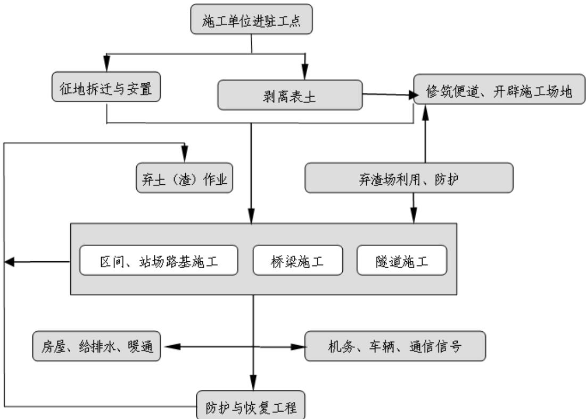  
图 2.2.6-1 施工工序示意图

## 1．施工准备工作

征地、拆迁严格遵守国家新颁布的征用土地管理办法及省、市人民政府有关规定，按工期要求在正式工程开工前完成此项工作，为全线顺利施工创造条件。

改移道路视正式工程的施工情况，在正式工程开工前完成。

做好三通一平。临时房屋尽早修建，拟采用钢架活动式临时房屋。

材料厂应先行一步建成，为各类工程开工创造条件。

此外，砂、石、道渣备料工作提前安排，避免停工待料现象。

## 2．路基工程

## ①路基填筑

路基在填方前需清除地表腐殖土，集中堆放，并采取临时挡护，工程结束时作为绿化用土及复垦土源；清表后将工作面基本平整压实。

施工工序为：挖除树根、排除地表水→清除表层淤泥、杂草→平地机、推土机整平→压路机压实→填筑。填筑土时适当加大宽度和高度，分层填土、压实，多余部分利用挖掘机修坡及平地机或其他方法铲除修整。

## ②路堑开挖

土质、软质岩及强风化硬质岩路堑开挖前，首先进行排水设施施工。按照“永临结合”的原则对临时排水设施进行周密规划，避免积水冲刷边坡、浸泡边坡坡脚，并于路堑开挖施工前完成所有临时截、排水设施的施工，保持边坡的稳定。

路堑开挖采用挖掘机自上而下、分层进行，纵向开挖坡度不小于 4%，在每一开挖层路基两侧设临时排水沟，以便及时将路堑开挖中的渗水和雨水排出开挖面，保持开挖层面不被水浸泡。边坡防护、边坡平台及其上截水沟的施工与开挖紧密衔接，开挖一段，防护一段。

## ③路基排水工程

结合地质、地形情况，按照“永临结合”的原则规划临时排水设施，具备条件的地段按设计做好排水工程以及施工生产生活区附近的临时排水设施，然后再做主体工程。不具备施作排水工程的地段，先做好临时排水设施，条件许可时及时完成永久排水工程。

## ④路基边坡防护工程

主要采用混凝土空心砖和拱形骨架护坡。基础开挖采用人工风镐凿除方式，应自上而下进行。

## 3．桥梁工程

## ①桥梁主体施工方法

正线桥梁一般为24m、32m预应力混凝土简支箱梁，采用架桥机架设。对于地质条件较差或开挖防护高度>3.0m 的基坑采用钢板桩防护，地下水位较高时且为透水层时考虑配置轻型井点降水措施。

桥梁桩基础的桩径普通墩台桩基础桩径一般优先选用φ1.0m、φ1.25m、φ1.5m，特殊大跨桥梁可根据需要采用更大直径的钻孔桩。

一般墩台基础采用常规方法施工。对深水基础，采用钢套箱或（吊）箱施工。对墩高大于50m的桥墩采用移动滑摸或翻模法施工。

道岔区内的小跨度连续梁采用膺架法施工，主跨小于 48m 连续梁采用膺架法施工，一般连续梁、刚构采用悬臂灌注法施工，跨越规划道路和一般河堤的连续梁桥采用支架法现浇施工。跨越铁路及高等级公路的门式墩也可采用钢横梁，钢横梁采用整体吊装施工。

## ②桥梁防治水土流失施工工艺

桥梁工程施工造成水土流失的主要环节是桥梁下部的基础施工部分，桥梁基础的施工平台。跨越水体的桥梁基础施工应在枯水期进行，采用围堰施工工艺。施工时先将主河槽内各墩位的工作面展开，采用钻孔灌桩形式。墩台基础施工开挖时，根据水深设置不同类型围堰，钻孔后的废弃土（渣）方用泥浆泵抽于岸边泥浆沉淀池内，晾干后运至指定位置弃置，其余位于河岸的墩台桩位，待主河槽施工完毕后进行。

## ③泥浆处置方案

泥浆循环系统布置根据现场和周围环境统筹安排，泥浆池设在两墩之间，征地地界以内。部分泥浆回用，其他废弃部分在充分沉淀之后，达到泥水分离的效果。泥浆使用完毕后，在泥浆池中干化，干化后按弃渣处理，用汽车弃运至指定地点。

## ④饮用水水源保护区及其它敏感水体桥梁施工工艺及要求

施工场地周边考虑采用陡坡截留的方式，将施工生产废水统一收集至指定地点处理。施工泥浆废水通过沉淀、蒸发后回收利用；基坑废水沉淀处理，含油废水静置、隔油处理，处理后废水可回用，沉淀渣定期清理；严禁施工生产废水、弃渣排入饮用水水源保护区及其它敏感水体。桥梁基坑弃土、钻孔桩弃渣及时外运，不得在饮用水水源保护区及其它敏感水体周边堆放。

机械停放保养场产生的含油废水处理：设置简单的清洗废水收集系统，收集含油废水，先静置再进行初级油水分离，后投加破乳剂，最后经过滤实现油、水分离的效果，处理后回用。经过水源保护区及其它敏感水体的工程施工尽量选用先进或保养较好的设备、机械，以有效地减少跑、冒、漏、滴的数量及机械维修次数，从而减少含油污水的产生量。

## 4．隧道工程

## ①明挖隧道施工方案

放坡开挖适用于基坑浅、土质较好、地下水位较低、基坑周围具有放坡和堆放料具的宽度。其施工速度快、费用低，需作好地面截流和坑内排水措施，并注意对坡面保护。开挖前，在开挖边线外设截水天沟，开挖临时边坡采用锚喷网防护，洞口掌子面防护采用玻璃纤维锚杆防护。隧道基坑内设置双侧水沟加中心矩形水沟排水，在基坑底较低侧隧道衬砌轮廓以外设置积水坑，用于汇集基坑渗水及流入的表水，并进行不间断抽排。明挖段的回填，主要是结构覆土回填，以机械回填为主，人工为辅。

## ②矿山法隧道施工方案

矿山法隧道工程产生水土流失集中在洞口施工，下面重点说明洞口施工工艺：

洞口开挖前，首先在距仰坡刷坡线 5m 以外施作截水沟，水沟与路堑侧沟连接，以拦截地表水，避免地表水冲刷洞口边仰坡及洞门；清除或加固洞口上的危岩体；洞口施工避开雨季。

洞口土质路堑采用挖掘机纵向分段自上而下分层开挖，边坡由人工清刷，土质边坡成型后即施工防护工程或施作临时防护；石质路堑采用松动爆破，气腿式凿岩机钻孔，非电毫秒雷管网路起爆，边坡坡面预留保护层，采取光面爆破或预裂爆破方式，保证边坡坡面平整、稳固；开挖作业按设计要求一次到位，挖掘机配合自卸车装运弃渣。

洞口边仰坡整修到位后，按设计要求进行喷锚网加固、防护或其它加固项目施工。锚杆采用风钻钻进或锤击施作；钢筋网片在钢筋加工棚内集中下料、弯制，运输车运输至作业面，在初喷砼后由人工安装；喷射混凝土采用湿喷方式。

## 5．站场施工

## ①土石方工程

本线站场工程土石方挖填施工工艺可参照路基工程，其简化施工工艺如下：施工准备→基底处理→场地挖填→基面整修→站房施工→站区相关附属工程施工→铺设道碴与轨道→整理验收。

## ②房建工程

基础采用钢筋混凝土独立基础；候车厅、办公楼、宿舍和检修楼等房屋采用钢筋混凝土框架结构，基础采用钢筋混凝土独立基础；其它房屋采用砖混结构，基础采用钢筋混凝土条形基础。

站场道路、堆场、停车场及其它硬化地表区域在场平的基础上，依据各区块工程和承载力要求进行面层的铺装，施工均采用常规施工工艺。

## ③管线工程

电力、通信、供水、排水等管线采用开挖直埋施工，土石方开挖主要采用反铲挖掘机开挖，堆于沟槽一侧，供回填土方之用。管线工程位于站场内，土石方计入站场工程内。管道通过道路时采取敷设钢管后外包砼，最后铺路面。管道采用分段施工，随开随填，铺设管线结束后随即回填，回填至地面高程，并压实。

## ④绿化工程

站内路基边坡采取栽植灌草绿化，站场内可绿化区域采取园林式景观绿化，绿化施工采用常规绿化施工工艺。

## 6．改移工程施工工艺

改移道路在施工前将表土耕作层预先剥离并集中堆放，表面覆盖进行临时防护。表土剥离后根据地基情况对道路基底处理，岩石地段直接填筑水泥稳定砂砾，软土地基地段将基底软土挖出后，进行三七灰土换填处理。道路两侧排水沟利用临时排水沟进行拓宽砌筑，并与临近排水系统顺接。道路两侧和边坡及时撒播草籽，栽植灌木绿化，利用雨季便利条件尽快进行边坡绿化。

改移沟渠沟槽开挖前应对原有水系进行截流或导流，再根据测量放样所定的桩位进行开挖，纵向采用拉线撒白灰进行控制，横断面由挖掘机根据设计断面进行开挖，并人工削坡成型，使改沟尺寸、纵坡、顺直度满足设计和施工要求，同时在沟槽开挖过程中按照规范要求及时做好安全防护，沟槽开挖尽量做到开挖一段施工一段防护一段。后期进行沟底夯实，沟壁拍实。

## 7．取土场

取土前对占用的林地进行表土剥离，集中堆放在取土场占地范围内并采取防护措施。设计从取土基准高程进行开挖，分级开挖，分级边坡坡率不陡于 1：0.75，取土分级高度不大于10m，分级平台宽度不小于2m，边坡采用基材植生护坡。

根据地形、地貌及汇区流量于取土场外缘周边设梯形截排水沟，截排山体坡面汇水，水沟应砌筑在稳定岩取土场上。周边沟底宽 0.8m，深 0.6m，沟壁厚 0.3m，采用C30 混凝土砌筑。截水沟的沟底坡度不小于 2%。两侧依地形设置排水沟，将山坡排水沟的水引至下游沉沙池内。

## 8．弃渣工程

1）弃渣场施工严格按照具体有关设计要求进行。

2）根据实际情况，对应剥离的表土进行剥离（可采取机械结合人工的方式剥离），集中堆放，并采取临时拦挡、截排水、苫盖、绿化等防护措施，弃渣场使用完成后用于后期渣场绿化恢复或复耕。

3）弃渣场清基，在弃渣场启用前进行清基处理，一般在剥离表土后根据场地不同情况进行2～3m清理，针对软土层较厚的弃渣场，对于挡墙位置软土层较厚采取基础换填措施，以满足基地承载力要求，若软土层厚度超过 4m 则挡渣墙采用加桩处理，确保挡墙稳定。

4）弃渣场施工前对渣场内部及周边排水系统进行疏导，并与渣场底部盲沟连接引至渣场外保持排水系统畅通，避免渣场内部积水影响弃渣场安全或影响区域地下水系；周边修建截排水沟设施，结合地形情况布置急流槽或跌水坎等消能设施，下游接沉沙池并顺接入周边自然沟道或农灌沟。

5）弃渣场度汛方案：针对汇水面积较大的沟道型弃渣场采用在沟道中部低洼处铺设管涵，将上游来水引至渣场下游，以及提出根据施工情况设置临时土质截排水沟要求，将汛期上游来水引至弃渣场外，避免形成地表径流，造成水土流失并影响弃渣安全。

6）在弃渣场下游设置挡渣墙防护，挡渣墙上设置泄水孔，渣底设置排水盲沟；装卸车卸渣后，利用推土机将渣推至1%～4%的坡度。

7）本工程弃渣场挡护措施主要采用重力式挡渣墙。其主要施工工艺流程如下：测量放样→基坑开挖→地基承载力检测→基底处理、验收→脚手架及组合型模板支护→砌筑→墙背反滤层回填，同时利用清表树木制成的木棒、清表块石或开挖基坑渣土等继续支护防止墙体倾覆→养护→整理验收→验收合格后堆置弃渣反压。

8）弃渣场弃渣应严格执行“先挡后弃”，在弃渣前完成挡渣墙建设，做好临时排水沟，弃渣过程中弃渣应自下而上逐层填筑，分层碾压，不得自上而下倒渣、溜渣。

9）弃渣完成后，对边坡进行合理的削坡，确保边坡稳定后覆土；平台利用表土覆土，适当的夯实；渣顶整平后覆土。最终在渣顶和边坡根据原占地类型不同采取绿化或复垦措施。渣场施工流程见下图。

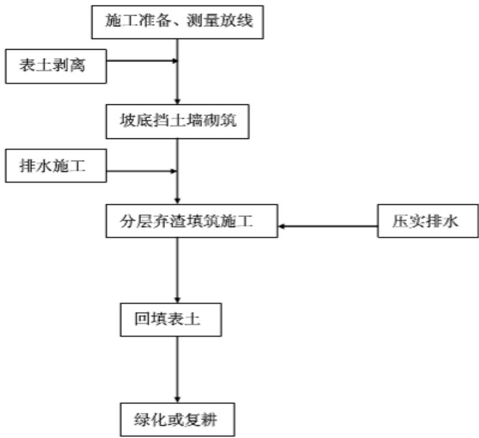  
图2.2.6-2 弃渣场施工工艺流程图

## 9．施工生产生活区

## 1）场地平整

场地严格按照测量交底进行开挖，严格按照路基填筑要求，分层填筑分层碾压，分层厚度不大于 40cm，在陡坡位置进行挖台阶处理，台阶高度小于大于 0.6m，宽度不小于2m，并设置不小于3%的横坡，保证场地的平整性及减少后期的沉降。

施工场地优先布置在地势相对较为平坦的区域，地质条件较好的区域，施工一般采用挖掘机挖土，装载机配合，推土机及人工进行清平填补和平整，场地内部分区域采用混凝土硬化或砂砾石铺面，用压路机压实，人工配合修整；施工期对裸露地表及时防尘网覆盖，对于填方边坡按照1：1.5～1：1.75进行放坡，边坡采取骨架+灌草绿化防护。各别区域场平后形成的挖填边坡最大不超过4m，边坡坡率为1：1.5～1：1.75，主体设计拟采用撒播草籽进行边坡防护。

## 2）表土剥离

在场地平整前，将占地范围内的耕地、林地及草地区域的表土进行剥离并集中堆存在场地范围内不受影响的一侧，采用临时防护措施进行防护。

## 3）场地排水

场地硬化按照四周低中间高的原则设置人字坡或单面坡，排水综合坡度不小于3%，

场地雨水通过横坡流向低处排出，避免场地内出现积水。

4）为防止施工场地周边扰动范围无序扩大，施工初期对场地四周设置围墙拦挡，限制施工人员、机械活动及材料等堆放区域。

5）施工期间对场地洒水降尘，及时清理施工生产生活垃圾。

6）施工完工后，应将施工场地硬化层进行拆除，土地整治。当地部门要求保留时，要与相关部门签订好协议，并作为交工资料移交业主保管，否则应予以复垦或恢复植被。

## 10．施工便道

严格控制施工范围，及时清运施工过程中产生渣土，避免顺坡溜渣或边坡挂渣。具体工艺及要求如下：

1）根据红线用地图实地查勘道路的平面布置，进一步优化道路平面布置。完成红线边桩的测量及布设。对红线边桩做好明显标记，并做好保护。

2）施工便道根据不同地形、地质条件采取不同的修筑方法。新建施工便道路面宽度一般不小于4.5m，曲线或地形复杂路段适当加宽，改建道路局部施工困难路段保持不小于 4m。视地形条件和视距要求，不小于 400 米设置一处错车道。错车道路面宽度不小于5.5米，长度不小于20米。利用既有道路，应进行加宽加固。施工便道挖方段两侧边坡坡度按设计要求进行，挖至标高后，用振动压路机进行碾压后，上面铺筑碎石或混凝土。填方段道路采用挖方段弃土进行填筑，填筑标准参照路基填筑标准。

3）开挖之前在红线范围之内采用竹跳板及钢管搭设排架，竹跳板内侧底部堆码沙袋。开挖采用分台阶开挖，沟槽开挖，避免渣土外溜，其中陡峭区域上台阶操作空间小，采用小型挖机（液压挖掘机，俗称“啄木鸟”）开挖，减小对原地貌的扰动范围。同时对产生的渣土做到“随挖随运”。施工前按要求在部分路段的下边坡预先采取被动防护网+编织袋装土的拦挡型式。坡面不稳定地段采用挖掘机配合工人的方式进行清理，保证坡脚尽可能清理干净。通过以上各项措施，可避免顺坡溜渣或边坡挂渣的现象。

4）施工便道的两侧设置边沟或排水沟，保证雨天不积水，排水流畅。

5）道路急弯、陡坡地段设置安全护栏和醒目的安全警示标志，岔道口设置方向指示牌。

6）施工期间指定专人（队）负责对施工便道的日常检查和养护、洒水，做到雨天不泥泞，晴天少扬尘。

7）施工便道在工程完工后，如当地部门要求保留，要与相关部门签订好协议，并作为交工资料移交业主保管，否则应予以复垦或恢复植被。

## 3．生态环境敏感区域内施工要求

工程经过湖北、湖南两省，沿线自然生态环境良好，沿线分布有饮用水水源保护区、国家级湿地公园（范围同省级重要湿地）、省级地质公园、生态保护红线等敏感点。工程在选线时对重要的生态环境敏感目标进行了绕避，对不能绕避的生态敏感目标采用环境影响较小的方案，并采取各项有效措施控制工程的不利影响。

施工场地周边采用陡坡截留的方式，将施工生产废水统一收集至指定地点处理。桥梁基坑废水沉淀隔油处理后回用；桥墩两端设置泥浆沉淀池和泥浆循环池，泥浆经沉淀处理后其上清液循环利用不外排，泥饼干化后外运处置，严禁桥梁施工生产废水、弃渣排入水体。栈桥及施工平台施工：采用钢构件并在陆地制造，栈桥“钓鱼法”机械打桩，平台采用桥位组拼，可避免对水体的影响。水中桥墩采用钢围堰施工工艺，钢围堰为封闭箱体，采用钢护筒阻隔，基本可以避免桥墩及基础施工对水体的影响。

施工用料的堆放应远离水源和其他水体，选择暴雨径流难以冲刷的地方。部分施工用料若堆放在桥位附近，应在材料堆放场四周挖明沟，沉沙井等，防止被暴雨径流进入水体，影响水质，各类材料应备有防雨遮雨设施。

在水中进行桥梁施工时，禁止将污水、垃圾及船舶和其它施工机械的废油等污染物抛入水体，应收集后和大桥工地上的污染物一并处理。桥梁施工挖出的淤泥、渣土等不得抛入河流中。

## 2.3 工程占地

本工程总占地 $1 1 2 5 . 2 3 \mathrm { h m } ^ { 2 }$ ，其中永久占地 $7 3 8 . 1 1 \mathrm { h m } ^ { 2 }$ ，临时占地 $3 8 7 . 1 2 \mathrm { h m } ^ { 2 }$ 。占地类型以林地、耕地为主。湖北省总占地 $5 4 7 . 5 2 \mathrm { h m } ^ { 2 }$ ，其中永久占地 $3 4 1 . 0 6 \mathrm { h m } ^ { 2 }$ ，临时占地 $2 0 6 . 4 6 \mathrm { h m } ^ { 2 }$ 。湖南省总占地 $5 7 7 . 7 1 \mathrm { h m } ^ { 2 }$ ，其中永久占地 $3 9 7 . 0 5 \mathrm { h m } ^ { 2 }$ ，临时占地 $1 8 0 . 6 6 \mathrm { h m } ^ { 2 }$

表 2.3-1

## 工 程 占 地 表

（单位：hm2）

<table><tr><td colspan="3" rowspan="1">行政区划</td><td colspan="1" rowspan="2">占地性质</td><td colspan="1" rowspan="1"></td><td colspan="3" rowspan="1">耕地</td><td colspan="3" rowspan="1">园地</td><td colspan="4" rowspan="1">林地</td><td colspan="2" rowspan="1">草地</td><td colspan="1" rowspan="1">商用地</td><td colspan="2" rowspan="1">工矿仓储用地</td><td colspan="2" rowspan="1">住宅用地</td><td colspan="1" rowspan="1">特地</td><td colspan="4" rowspan="1">交通运输用地</td><td colspan="5" rowspan="1">水域及水利设施用地</td><td colspan="2" rowspan="1">其他用地</td><td colspan="1" rowspan="2">合计</td></tr><tr><td colspan="1" rowspan="1">省</td><td colspan="1" rowspan="1">市</td><td colspan="1" rowspan="1">县（区</td><td colspan="1" rowspan="1">工程分区</td><td colspan="1" rowspan="1">水田</td><td colspan="1" rowspan="1">水浇地</td><td colspan="1" rowspan="1">旱地</td><td colspan="1" rowspan="1">果园</td><td colspan="1" rowspan="1">茶园</td><td colspan="1" rowspan="1">其他园地</td><td colspan="1" rowspan="1">乔木林地</td><td colspan="1" rowspan="1">竹林地</td><td colspan="1" rowspan="1">灌木林地</td><td colspan="1" rowspan="1">其他林地</td><td colspan="1" rowspan="1">天然牧草地</td><td colspan="1" rowspan="1">其他草地</td><td colspan="1" rowspan="1">其他商服用地</td><td colspan="1" rowspan="1">工用业地</td><td colspan="1" rowspan="1">采矿用地</td><td colspan="1" rowspan="1">试1验住宅</td><td colspan="1" rowspan="1">农村宅基地</td><td colspan="1" rowspan="1">风景名胜设施用地</td><td colspan="1" rowspan="1">铁路用地</td><td colspan="1" rowspan="1">公胎路地</td><td colspan="1" rowspan="1">城镇村道路用地</td><td colspan="1" rowspan="1">农村道路</td><td colspan="1" rowspan="1">河流水面</td><td colspan="1" rowspan="1">坑塘水面</td><td colspan="1" rowspan="1">内陆滩涂</td><td colspan="1" rowspan="1">沟渠</td><td colspan="1" rowspan="1">本物用地</td><td colspan="1" rowspan="1">空</td><td colspan="1" rowspan="1">设施农用地</td></tr><tr><td colspan="1" rowspan="27">湖北省</td><td colspan="1" rowspan="21">宜昌市</td><td colspan="1" rowspan="10">长阳土家族自治县</td><td colspan="1" rowspan="5">永久占地</td><td colspan="1" rowspan="1">路基工程</td><td colspan="1" rowspan="1"></td><td colspan="1" rowspan="1"></td><td colspan="1" rowspan="1">1.22</td><td colspan="1" rowspan="1">1.53</td><td colspan="1" rowspan="1">0.29</td><td colspan="1" rowspan="1"></td><td colspan="1" rowspan="1">4.25</td><td colspan="1" rowspan="1"></td><td colspan="1" rowspan="1"></td><td colspan="1" rowspan="1">0.74</td><td colspan="1" rowspan="1"></td><td colspan="1" rowspan="1"></td><td colspan="1" rowspan="1"></td><td colspan="1" rowspan="1"></td><td colspan="1" rowspan="1"></td><td colspan="1" rowspan="1"></td><td colspan="1" rowspan="1">0.48</td><td colspan="1" rowspan="1"></td><td colspan="1" rowspan="1"></td><td colspan="1" rowspan="1">0.17</td><td colspan="1" rowspan="1"></td><td colspan="1" rowspan="1"></td><td colspan="1" rowspan="1"></td><td colspan="1" rowspan="1">0.05</td><td colspan="1" rowspan="1"></td><td colspan="1" rowspan="1"></td><td colspan="1" rowspan="1"></td><td colspan="1" rowspan="1"></td><td colspan="1" rowspan="1"></td><td colspan="1" rowspan="1">8.73</td></tr><tr><td colspan="1" rowspan="1">桥梁工程</td><td colspan="1" rowspan="1">0.47</td><td colspan="1" rowspan="1"></td><td colspan="1" rowspan="1">1.01</td><td colspan="1" rowspan="1">0.25</td><td colspan="1" rowspan="1">0.14</td><td colspan="1" rowspan="1"></td><td colspan="1" rowspan="1">3.12</td><td colspan="1" rowspan="1"></td><td colspan="1" rowspan="1"></td><td colspan="1" rowspan="1">0.15</td><td colspan="1" rowspan="1"></td><td colspan="1" rowspan="1"></td><td colspan="1" rowspan="1"></td><td colspan="1" rowspan="1"></td><td colspan="1" rowspan="1"></td><td colspan="1" rowspan="1"></td><td colspan="1" rowspan="1">0.03</td><td colspan="1" rowspan="1"></td><td colspan="1" rowspan="1"></td><td colspan="1" rowspan="1">0.07</td><td colspan="1" rowspan="1"></td><td colspan="1" rowspan="1"></td><td colspan="1" rowspan="1"></td><td colspan="1" rowspan="1"></td><td colspan="1" rowspan="1"></td><td colspan="1" rowspan="1"></td><td colspan="1" rowspan="1"></td><td colspan="1" rowspan="1">0.17</td><td colspan="1" rowspan="1">0.03</td><td colspan="1" rowspan="1">5.44</td></tr><tr><td colspan="1" rowspan="1">隧道工程</td><td colspan="1" rowspan="1"></td><td colspan="1" rowspan="1"></td><td colspan="1" rowspan="1">0.51</td><td colspan="1" rowspan="1"></td><td colspan="1" rowspan="1"></td><td colspan="1" rowspan="1"></td><td colspan="1" rowspan="1">7.16</td><td colspan="1" rowspan="1"></td><td colspan="1" rowspan="1"></td><td colspan="1" rowspan="1"></td><td colspan="1" rowspan="1"></td><td colspan="1" rowspan="1"></td><td colspan="1" rowspan="1"></td><td colspan="1" rowspan="1"></td><td colspan="1" rowspan="1"></td><td colspan="1" rowspan="1"></td><td colspan="1" rowspan="1"></td><td colspan="1" rowspan="1"></td><td colspan="1" rowspan="1"></td><td colspan="1" rowspan="1"></td><td colspan="1" rowspan="1"></td><td colspan="1" rowspan="1">0.04</td><td colspan="1" rowspan="1"></td><td colspan="1" rowspan="1"></td><td colspan="1" rowspan="1"></td><td colspan="1" rowspan="1"></td><td colspan="1" rowspan="1"></td><td colspan="1" rowspan="1"></td><td colspan="1" rowspan="1"></td><td colspan="1" rowspan="1">7.71</td></tr><tr><td colspan="1" rowspan="1">改移工程</td><td colspan="1" rowspan="1">0.87</td><td colspan="1" rowspan="1"></td><td colspan="1" rowspan="1">1.52</td><td colspan="1" rowspan="1">0.18</td><td colspan="1" rowspan="1">0.25</td><td colspan="1" rowspan="1"></td><td colspan="1" rowspan="1">2.19</td><td colspan="1" rowspan="1"></td><td colspan="1" rowspan="1"></td><td colspan="1" rowspan="1">0.38</td><td colspan="1" rowspan="1"></td><td colspan="1" rowspan="1"></td><td colspan="1" rowspan="1"></td><td colspan="1" rowspan="1"></td><td colspan="1" rowspan="1"></td><td colspan="1" rowspan="1"></td><td colspan="1" rowspan="1">0.42</td><td colspan="1" rowspan="1"></td><td colspan="1" rowspan="1"></td><td colspan="1" rowspan="1">0.55</td><td colspan="1" rowspan="1"></td><td colspan="1" rowspan="1"></td><td colspan="1" rowspan="1"></td><td colspan="1" rowspan="1">0.05</td><td colspan="1" rowspan="1"></td><td colspan="1" rowspan="1"></td><td colspan="1" rowspan="1"></td><td colspan="1" rowspan="1"></td><td colspan="1" rowspan="1"></td><td colspan="1" rowspan="1">6.41</td></tr><tr><td colspan="1" rowspan="1">小计</td><td colspan="1" rowspan="1">1.34</td><td colspan="1" rowspan="1"></td><td colspan="1" rowspan="1">4.26</td><td colspan="1" rowspan="1">1.96</td><td colspan="1" rowspan="1">0.68</td><td colspan="1" rowspan="1"></td><td colspan="1" rowspan="1">16.72</td><td colspan="1" rowspan="1"></td><td colspan="1" rowspan="1"></td><td colspan="1" rowspan="1">1.27</td><td colspan="1" rowspan="1"></td><td colspan="1" rowspan="1"></td><td colspan="1" rowspan="1"></td><td colspan="1" rowspan="1"></td><td colspan="1" rowspan="1"></td><td colspan="1" rowspan="1"></td><td colspan="1" rowspan="1">0.93</td><td colspan="1" rowspan="1"></td><td colspan="1" rowspan="1"></td><td colspan="1" rowspan="1">0.79</td><td colspan="1" rowspan="1"></td><td colspan="1" rowspan="1">0.04</td><td colspan="1" rowspan="1"></td><td colspan="1" rowspan="1">0.10</td><td colspan="1" rowspan="1"></td><td colspan="1" rowspan="1"></td><td colspan="1" rowspan="1"></td><td colspan="1" rowspan="1">0.17</td><td colspan="1" rowspan="1">0.03</td><td colspan="1" rowspan="1">28.29</td></tr><tr><td colspan="1" rowspan="4">临时占地</td><td colspan="1" rowspan="1">弃渣场</td><td colspan="1" rowspan="1"></td><td colspan="1" rowspan="1"></td><td colspan="1" rowspan="1"></td><td colspan="1" rowspan="1">1.35</td><td colspan="1" rowspan="1"></td><td colspan="1" rowspan="1"></td><td colspan="1" rowspan="1">19.83</td><td colspan="1" rowspan="1"></td><td colspan="1" rowspan="1"></td><td colspan="1" rowspan="1"></td><td colspan="1" rowspan="1"></td><td colspan="1" rowspan="1"></td><td colspan="1" rowspan="1"></td><td colspan="1" rowspan="1"></td><td colspan="1" rowspan="1"></td><td colspan="1" rowspan="1"></td><td colspan="1" rowspan="1"></td><td colspan="1" rowspan="1"></td><td colspan="1" rowspan="1"></td><td colspan="1" rowspan="1"></td><td colspan="1" rowspan="1"></td><td colspan="1" rowspan="1"></td><td colspan="1" rowspan="1"></td><td colspan="1" rowspan="1"></td><td colspan="1" rowspan="1"></td><td colspan="1" rowspan="1"></td><td colspan="1" rowspan="1"></td><td colspan="1" rowspan="1"></td><td colspan="1" rowspan="1"></td><td colspan="1" rowspan="1">21.18</td></tr><tr><td colspan="1" rowspan="1">施工便道</td><td colspan="1" rowspan="1"></td><td colspan="1" rowspan="1"></td><td colspan="1" rowspan="1"></td><td colspan="1" rowspan="1"></td><td colspan="1" rowspan="1"></td><td colspan="1" rowspan="1"></td><td colspan="1" rowspan="1">1.23</td><td colspan="1" rowspan="1"></td><td colspan="1" rowspan="1"></td><td colspan="1" rowspan="1">0.84</td><td colspan="1" rowspan="1"></td><td colspan="1" rowspan="1">0.12</td><td colspan="1" rowspan="1"></td><td colspan="1" rowspan="1"></td><td colspan="1" rowspan="1"></td><td colspan="1" rowspan="1"></td><td colspan="1" rowspan="1"></td><td colspan="1" rowspan="1"></td><td colspan="1" rowspan="1"></td><td colspan="1" rowspan="1"></td><td colspan="1" rowspan="1"></td><td colspan="1" rowspan="1">2.00</td><td colspan="1" rowspan="1">0.36</td><td colspan="1" rowspan="1"></td><td colspan="1" rowspan="1"></td><td colspan="1" rowspan="1"></td><td colspan="1" rowspan="1"></td><td colspan="1" rowspan="1">1.52</td><td colspan="1" rowspan="1"></td><td colspan="1" rowspan="1">6.07</td></tr><tr><td colspan="1" rowspan="1">施工生产生活区</td><td colspan="1" rowspan="1"></td><td colspan="1" rowspan="1"></td><td colspan="1" rowspan="1">0.62</td><td colspan="1" rowspan="1"></td><td colspan="1" rowspan="1"></td><td colspan="1" rowspan="1"></td><td colspan="1" rowspan="1">2.15</td><td colspan="1" rowspan="1"></td><td colspan="1" rowspan="1"></td><td colspan="1" rowspan="1">0.35</td><td colspan="1" rowspan="1"></td><td colspan="1" rowspan="1"></td><td colspan="1" rowspan="1"></td><td colspan="1" rowspan="1"></td><td colspan="1" rowspan="1"></td><td colspan="1" rowspan="1"></td><td colspan="1" rowspan="1"></td><td colspan="1" rowspan="1"></td><td colspan="1" rowspan="1"></td><td colspan="1" rowspan="1"></td><td colspan="1" rowspan="1"></td><td colspan="1" rowspan="1"></td><td colspan="1" rowspan="1"></td><td colspan="1" rowspan="1"></td><td colspan="1" rowspan="1"></td><td colspan="1" rowspan="1"></td><td colspan="1" rowspan="1"></td><td colspan="1" rowspan="1">3.60</td><td colspan="1" rowspan="1"></td><td colspan="1" rowspan="1">6.72</td></tr><tr><td colspan="1" rowspan="1">小计</td><td colspan="1" rowspan="1"></td><td colspan="1" rowspan="1"></td><td colspan="1" rowspan="1">0.62</td><td colspan="1" rowspan="1">1.35</td><td colspan="1" rowspan="1"></td><td colspan="1" rowspan="1"></td><td colspan="1" rowspan="1">23.21</td><td colspan="1" rowspan="1"></td><td colspan="1" rowspan="1"></td><td colspan="1" rowspan="1">1.19</td><td colspan="1" rowspan="1"></td><td colspan="1" rowspan="1">0.12</td><td colspan="1" rowspan="1"></td><td colspan="1" rowspan="1"></td><td colspan="1" rowspan="1"></td><td colspan="1" rowspan="1"></td><td colspan="1" rowspan="1"></td><td colspan="1" rowspan="1"></td><td colspan="1" rowspan="1"></td><td colspan="1" rowspan="1"></td><td colspan="1" rowspan="1"></td><td colspan="1" rowspan="1">2.00</td><td colspan="1" rowspan="1">0.36</td><td colspan="1" rowspan="1"></td><td colspan="1" rowspan="1"></td><td colspan="1" rowspan="1"></td><td colspan="1" rowspan="1"></td><td colspan="1" rowspan="1">5.12</td><td colspan="1" rowspan="1"></td><td colspan="1" rowspan="1">33.97</td></tr><tr><td colspan="1" rowspan="1"></td><td colspan="1" rowspan="1">合计</td><td colspan="1" rowspan="1">1.34</td><td colspan="1" rowspan="1"></td><td colspan="1" rowspan="1">4.88</td><td colspan="1" rowspan="1">3.31</td><td colspan="1" rowspan="1">0.68</td><td colspan="1" rowspan="1"></td><td colspan="1" rowspan="1">39.93</td><td colspan="1" rowspan="1"></td><td colspan="1" rowspan="1"></td><td colspan="1" rowspan="1">2.46</td><td colspan="1" rowspan="1"></td><td colspan="1" rowspan="1">0.12</td><td colspan="1" rowspan="1"></td><td colspan="1" rowspan="1"></td><td colspan="1" rowspan="1"></td><td colspan="1" rowspan="1"></td><td colspan="1" rowspan="1">0.93</td><td colspan="1" rowspan="1"></td><td colspan="1" rowspan="1"></td><td colspan="1" rowspan="1">0.79</td><td colspan="1" rowspan="1"></td><td colspan="1" rowspan="1">2.04</td><td colspan="1" rowspan="1">0.36</td><td colspan="1" rowspan="1">0.10</td><td colspan="1" rowspan="1"></td><td colspan="1" rowspan="1"></td><td colspan="1" rowspan="1"></td><td colspan="1" rowspan="1">5.29</td><td colspan="1" rowspan="1">0.03</td><td colspan="1" rowspan="1">62.26</td></tr><tr><td colspan="1" rowspan="11">宜都市</td><td colspan="1" rowspan="6">永久占地</td><td colspan="1" rowspan="1">路基工程</td><td colspan="1" rowspan="1">1.17</td><td colspan="1" rowspan="1"></td><td colspan="1" rowspan="1">6.26</td><td colspan="1" rowspan="1">5.49</td><td colspan="1" rowspan="1">2.36</td><td colspan="1" rowspan="1">0.72</td><td colspan="1" rowspan="1">22.05</td><td colspan="1" rowspan="1"></td><td colspan="1" rowspan="1">9.68</td><td colspan="1" rowspan="1">5.14</td><td colspan="1" rowspan="1"></td><td colspan="1" rowspan="1"></td><td colspan="1" rowspan="1">0.06</td><td colspan="1" rowspan="1">0.33</td><td colspan="1" rowspan="1"></td><td colspan="1" rowspan="1"></td><td colspan="1" rowspan="1">2.76</td><td colspan="1" rowspan="1"></td><td colspan="1" rowspan="1">0.03</td><td colspan="1" rowspan="1">0.49</td><td colspan="1" rowspan="1"></td><td colspan="1" rowspan="1">0.79</td><td colspan="1" rowspan="1"></td><td colspan="1" rowspan="1">0.33</td><td colspan="1" rowspan="1"></td><td colspan="1" rowspan="1"></td><td colspan="1" rowspan="1"></td><td colspan="1" rowspan="1">0.01</td><td colspan="1" rowspan="1">0.25</td><td colspan="1" rowspan="1">57.92</td></tr><tr><td colspan="1" rowspan="1">桥梁工程</td><td colspan="1" rowspan="1">0.76</td><td colspan="1" rowspan="1"></td><td colspan="1" rowspan="1">6.98</td><td colspan="1" rowspan="1">4.66</td><td colspan="1" rowspan="1">1.19</td><td colspan="1" rowspan="1">0.44</td><td colspan="1" rowspan="1">11.21</td><td colspan="1" rowspan="1"></td><td colspan="1" rowspan="1">3.26</td><td colspan="1" rowspan="1">1.44</td><td colspan="1" rowspan="1"></td><td colspan="1" rowspan="1"></td><td colspan="1" rowspan="1"></td><td colspan="1" rowspan="1"></td><td colspan="1" rowspan="1"></td><td colspan="1" rowspan="1"></td><td colspan="1" rowspan="1">3.01</td><td colspan="1" rowspan="1"></td><td colspan="1" rowspan="1"></td><td colspan="1" rowspan="1">0.40</td><td colspan="1" rowspan="1"></td><td colspan="1" rowspan="1">0.08</td><td colspan="1" rowspan="1">0.17</td><td colspan="1" rowspan="1">0.69</td><td colspan="1" rowspan="1"></td><td colspan="1" rowspan="1">0.40</td><td colspan="1" rowspan="1"></td><td colspan="1" rowspan="1">0.65</td><td colspan="1" rowspan="1">0.09</td><td colspan="1" rowspan="1">35.43</td></tr><tr><td colspan="1" rowspan="1">隧道工程</td><td colspan="1" rowspan="1"></td><td colspan="1" rowspan="1"></td><td colspan="1" rowspan="1"></td><td colspan="1" rowspan="1"></td><td colspan="1" rowspan="1"></td><td colspan="1" rowspan="1"></td><td colspan="1" rowspan="1">6.38</td><td colspan="1" rowspan="1"></td><td colspan="1" rowspan="1"></td><td colspan="1" rowspan="1">1.96</td><td colspan="1" rowspan="1"></td><td colspan="1" rowspan="1"></td><td colspan="1" rowspan="1"></td><td colspan="1" rowspan="1"></td><td colspan="1" rowspan="1"></td><td colspan="1" rowspan="1"></td><td colspan="1" rowspan="1"></td><td colspan="1" rowspan="1"></td><td colspan="1" rowspan="1"></td><td colspan="1" rowspan="1"></td><td colspan="1" rowspan="1"></td><td colspan="1" rowspan="1"></td><td colspan="1" rowspan="1"></td><td colspan="1" rowspan="1"></td><td colspan="1" rowspan="1"></td><td colspan="1" rowspan="1"></td><td colspan="1" rowspan="1"></td><td colspan="1" rowspan="1"></td><td colspan="1" rowspan="1"></td><td colspan="1" rowspan="1">8.34</td></tr><tr><td colspan="1" rowspan="1">站场工程</td><td colspan="1" rowspan="1"></td><td colspan="1" rowspan="1"></td><td colspan="1" rowspan="1">3.22</td><td colspan="1" rowspan="1">3.86</td><td colspan="1" rowspan="1">0.85</td><td colspan="1" rowspan="1"></td><td colspan="1" rowspan="1">6.14</td><td colspan="1" rowspan="1"></td><td colspan="1" rowspan="1">2.22</td><td colspan="1" rowspan="1">0.64</td><td colspan="1" rowspan="1"></td><td colspan="1" rowspan="1"></td><td colspan="1" rowspan="1"></td><td colspan="1" rowspan="1"></td><td colspan="1" rowspan="1"></td><td colspan="1" rowspan="1"></td><td colspan="1" rowspan="1">1.62</td><td colspan="1" rowspan="1"></td><td colspan="1" rowspan="1"></td><td colspan="1" rowspan="1"></td><td colspan="1" rowspan="1">0.29</td><td colspan="1" rowspan="1">0.33</td><td colspan="1" rowspan="1"></td><td colspan="1" rowspan="1">0.27</td><td colspan="1" rowspan="1"></td><td colspan="1" rowspan="1">0.01</td><td colspan="1" rowspan="1"></td><td colspan="1" rowspan="1"></td><td colspan="1" rowspan="1">0.22</td><td colspan="1" rowspan="1">19.67</td></tr><tr><td colspan="1" rowspan="1">改移工程</td><td colspan="1" rowspan="1">0.02</td><td colspan="1" rowspan="1"></td><td colspan="1" rowspan="1">5.12</td><td colspan="1" rowspan="1">3.64</td><td colspan="1" rowspan="1">1.04</td><td colspan="1" rowspan="1"></td><td colspan="1" rowspan="1">9.33</td><td colspan="1" rowspan="1"></td><td colspan="1" rowspan="1">1.36</td><td colspan="1" rowspan="1">0.71</td><td colspan="1" rowspan="1">0.08</td><td colspan="1" rowspan="1"></td><td colspan="1" rowspan="1"></td><td colspan="1" rowspan="1"></td><td colspan="1" rowspan="1"></td><td colspan="1" rowspan="1"></td><td colspan="1" rowspan="1">0.72</td><td colspan="1" rowspan="1"></td><td colspan="1" rowspan="1"></td><td colspan="1" rowspan="1">0.97</td><td colspan="1" rowspan="1">0.20</td><td colspan="1" rowspan="1">0.13</td><td colspan="1" rowspan="1"></td><td colspan="1" rowspan="1">0.22</td><td colspan="1" rowspan="1"></td><td colspan="1" rowspan="1">0.01</td><td colspan="1" rowspan="1"></td><td colspan="1" rowspan="1"></td><td colspan="1" rowspan="1"></td><td colspan="1" rowspan="1">23.55</td></tr><tr><td colspan="1" rowspan="1">小计</td><td colspan="1" rowspan="1">1.95</td><td colspan="1" rowspan="1"></td><td colspan="1" rowspan="1">21.58</td><td colspan="1" rowspan="1">17.65</td><td colspan="1" rowspan="1">5.44</td><td colspan="1" rowspan="1">1.16</td><td colspan="1" rowspan="1">55.11</td><td colspan="1" rowspan="1"></td><td colspan="1" rowspan="1">16.52</td><td colspan="1" rowspan="1">9.89</td><td colspan="1" rowspan="1">0.08</td><td colspan="1" rowspan="1"></td><td colspan="1" rowspan="1">0.06</td><td colspan="1" rowspan="1">0.33</td><td colspan="1" rowspan="1"></td><td colspan="1" rowspan="1"></td><td colspan="1" rowspan="1">8.11</td><td colspan="1" rowspan="1"></td><td colspan="1" rowspan="1">0.03</td><td colspan="1" rowspan="1">1.86</td><td colspan="1" rowspan="1">0.49</td><td colspan="1" rowspan="1">1.33</td><td colspan="1" rowspan="1">0.17</td><td colspan="1" rowspan="1">1.51</td><td colspan="1" rowspan="1"></td><td colspan="1" rowspan="1">0.42</td><td colspan="1" rowspan="1"></td><td colspan="1" rowspan="1">0.66</td><td colspan="1" rowspan="1">0.561</td><td colspan="1" rowspan="1">44.91</td></tr><tr><td colspan="1" rowspan="4">临时占地</td><td colspan="1" rowspan="1">弃渣场</td><td colspan="1" rowspan="1"></td><td colspan="1" rowspan="1"></td><td colspan="1" rowspan="1"></td><td colspan="1" rowspan="1">1.05</td><td colspan="1" rowspan="1">0.22</td><td colspan="1" rowspan="1"></td><td colspan="1" rowspan="1">34.29</td><td colspan="1" rowspan="1"></td><td colspan="1" rowspan="1">2.54</td><td colspan="1" rowspan="1"></td><td colspan="1" rowspan="1"></td><td colspan="1" rowspan="1">1.00</td><td colspan="1" rowspan="1"></td><td colspan="1" rowspan="1"></td><td colspan="1" rowspan="1">13.51</td><td colspan="1" rowspan="1"></td><td colspan="1" rowspan="1">0.12</td><td colspan="1" rowspan="1"></td><td colspan="1" rowspan="1"></td><td colspan="1" rowspan="1"></td><td colspan="1" rowspan="1"></td><td colspan="1" rowspan="1"></td><td colspan="1" rowspan="1"></td><td colspan="1" rowspan="1"></td><td colspan="1" rowspan="1"></td><td colspan="1" rowspan="1"></td><td colspan="1" rowspan="1"></td><td colspan="1" rowspan="1"></td><td colspan="1" rowspan="1"></td><td colspan="1" rowspan="1">52.73</td></tr><tr><td colspan="1" rowspan="1">施工便道</td><td colspan="1" rowspan="1">0.59</td><td colspan="1" rowspan="1">1.25</td><td colspan="1" rowspan="1"></td><td colspan="1" rowspan="1"></td><td colspan="1" rowspan="1"></td><td colspan="1" rowspan="1">0.57</td><td colspan="1" rowspan="1">5.41</td><td colspan="1" rowspan="1"></td><td colspan="1" rowspan="1">1.58</td><td colspan="1" rowspan="1">1.97</td><td colspan="1" rowspan="1"></td><td colspan="1" rowspan="1"></td><td colspan="1" rowspan="1"></td><td colspan="1" rowspan="1"></td><td colspan="1" rowspan="1"></td><td colspan="1" rowspan="1"></td><td colspan="1" rowspan="1"></td><td colspan="1" rowspan="1"></td><td colspan="1" rowspan="1"></td><td colspan="1" rowspan="1"></td><td colspan="1" rowspan="1">1.55</td><td colspan="1" rowspan="1">3.00</td><td colspan="1" rowspan="1">2.05</td><td colspan="1" rowspan="1"></td><td colspan="1" rowspan="1"></td><td colspan="1" rowspan="1"></td><td colspan="1" rowspan="1"></td><td colspan="1" rowspan="1">3.96</td><td colspan="1" rowspan="1"></td><td colspan="1" rowspan="1">21.93</td></tr><tr><td colspan="1" rowspan="1">施工生产生活区</td><td colspan="1" rowspan="1"></td><td colspan="1" rowspan="1"></td><td colspan="1" rowspan="1"></td><td colspan="1" rowspan="1"></td><td colspan="1" rowspan="1"></td><td colspan="1" rowspan="1"></td><td colspan="1" rowspan="1">17.70</td><td colspan="1" rowspan="1"></td><td colspan="1" rowspan="1"></td><td colspan="1" rowspan="1">1.08</td><td colspan="1" rowspan="1"></td><td colspan="1" rowspan="1">0.33</td><td colspan="1" rowspan="1"></td><td colspan="1" rowspan="1"></td><td colspan="1" rowspan="1"></td><td colspan="1" rowspan="1"></td><td colspan="1" rowspan="1"></td><td colspan="1" rowspan="1"></td><td colspan="1" rowspan="1"></td><td colspan="1" rowspan="1"></td><td colspan="1" rowspan="1"></td><td colspan="1" rowspan="1"></td><td colspan="1" rowspan="1"></td><td colspan="1" rowspan="1"></td><td colspan="1" rowspan="1"></td><td colspan="1" rowspan="1"></td><td colspan="1" rowspan="1"></td><td colspan="1" rowspan="1">1.20</td><td colspan="1" rowspan="1"></td><td colspan="1" rowspan="1">20.31</td></tr><tr><td colspan="1" rowspan="1">小计</td><td colspan="1" rowspan="1">0.59</td><td colspan="1" rowspan="1">1.25</td><td colspan="1" rowspan="1"></td><td colspan="1" rowspan="1">1.05</td><td colspan="1" rowspan="1">0.22</td><td colspan="1" rowspan="1">0.57</td><td colspan="1" rowspan="1">57.40</td><td colspan="1" rowspan="1"></td><td colspan="1" rowspan="1">4.12</td><td colspan="1" rowspan="1">3.05</td><td colspan="1" rowspan="1"></td><td colspan="1" rowspan="1">1.33</td><td colspan="1" rowspan="1"></td><td colspan="1" rowspan="1"></td><td colspan="1" rowspan="1">13.51</td><td colspan="1" rowspan="1"></td><td colspan="1" rowspan="1">0.12</td><td colspan="1" rowspan="1"></td><td colspan="1" rowspan="1"></td><td colspan="1" rowspan="1"></td><td colspan="1" rowspan="1">1.55</td><td colspan="1" rowspan="1">3.00</td><td colspan="1" rowspan="1">2.05</td><td colspan="1" rowspan="1"></td><td colspan="1" rowspan="1"></td><td colspan="1" rowspan="1"></td><td colspan="1" rowspan="1"></td><td colspan="1" rowspan="1">5.16</td><td colspan="1" rowspan="1"></td><td colspan="1" rowspan="1">94.97</td></tr><tr><td colspan="1" rowspan="1"></td><td colspan="1" rowspan="1">合计</td><td colspan="1" rowspan="1">2.54</td><td colspan="1" rowspan="1">1.25</td><td colspan="1" rowspan="1">21.58</td><td colspan="1" rowspan="1">18.70</td><td colspan="1" rowspan="1">5.66</td><td colspan="1" rowspan="1">1.73</td><td colspan="1" rowspan="1">112.51</td><td colspan="1" rowspan="1"></td><td colspan="1" rowspan="1">20.64</td><td colspan="1" rowspan="1">12.94</td><td colspan="1" rowspan="1">0.08</td><td colspan="1" rowspan="1">1.33</td><td colspan="1" rowspan="1">0.06</td><td colspan="1" rowspan="1">0.33</td><td colspan="1" rowspan="1">13.51</td><td colspan="1" rowspan="1"></td><td colspan="1" rowspan="1">8.23</td><td colspan="1" rowspan="1"></td><td colspan="1" rowspan="1">0.03</td><td colspan="1" rowspan="1">1.86</td><td colspan="1" rowspan="1">2.04</td><td colspan="1" rowspan="1">4.33</td><td colspan="1" rowspan="1">2.22</td><td colspan="1" rowspan="1">1.51</td><td colspan="1" rowspan="1"></td><td colspan="1" rowspan="1">0.42</td><td colspan="1" rowspan="1"></td><td colspan="1" rowspan="1">5.82</td><td colspan="1" rowspan="1">0.562</td><td colspan="1" rowspan="1">39.88</td></tr><tr><td colspan="1" rowspan="6">荆州市</td><td colspan="1" rowspan="6">松滋市永</td><td colspan="1" rowspan="6">久占地</td><td colspan="1" rowspan="1">路基工程</td><td colspan="1" rowspan="1">7.51</td><td colspan="1" rowspan="1">2.57</td><td colspan="1" rowspan="1">2.24</td><td colspan="1" rowspan="1">5.25</td><td colspan="1" rowspan="1"></td><td colspan="1" rowspan="1"></td><td colspan="1" rowspan="1">34.94</td><td colspan="1" rowspan="1"></td><td colspan="1" rowspan="1">0.59</td><td colspan="1" rowspan="1">0.49</td><td colspan="1" rowspan="1"></td><td colspan="1" rowspan="1"></td><td colspan="1" rowspan="1"></td><td colspan="1" rowspan="1">0.03</td><td colspan="1" rowspan="1">0.27</td><td colspan="1" rowspan="1">0.10</td><td colspan="1" rowspan="1">2.49</td><td colspan="1" rowspan="1"></td><td colspan="1" rowspan="1">0.04</td><td colspan="1" rowspan="1">0.55</td><td colspan="1" rowspan="1">0.21</td><td colspan="1" rowspan="1">0.99</td><td colspan="1" rowspan="1"></td><td colspan="1" rowspan="1">3.35</td><td colspan="1" rowspan="1"></td><td colspan="1" rowspan="1"></td><td colspan="1" rowspan="1"></td><td colspan="1" rowspan="1"></td><td colspan="1" rowspan="1">0.39</td><td colspan="1" rowspan="1">62.01</td></tr><tr><td colspan="1" rowspan="1">桥梁工程</td><td colspan="1" rowspan="1">25.02</td><td colspan="1" rowspan="1">1.13</td><td colspan="1" rowspan="1">2.68</td><td colspan="1" rowspan="1">3.57</td><td colspan="1" rowspan="1"></td><td colspan="1" rowspan="1"></td><td colspan="1" rowspan="1">8.74</td><td colspan="1" rowspan="1"></td><td colspan="1" rowspan="1">0.23</td><td colspan="1" rowspan="1">0.58</td><td colspan="1" rowspan="1"></td><td colspan="1" rowspan="1"></td><td colspan="1" rowspan="1"></td><td colspan="1" rowspan="1"></td><td colspan="1" rowspan="1">0.11</td><td colspan="1" rowspan="1"></td><td colspan="1" rowspan="1">3.71</td><td colspan="1" rowspan="1"></td><td colspan="1" rowspan="1"></td><td colspan="1" rowspan="1">0.05</td><td colspan="1" rowspan="1">0.13</td><td colspan="1" rowspan="1">0.23</td><td colspan="1" rowspan="1">0.69</td><td colspan="1" rowspan="1">2.48</td><td colspan="1" rowspan="1"></td><td colspan="1" rowspan="1">1.42</td><td colspan="1" rowspan="1">0.12</td><td colspan="1" rowspan="1"></td><td colspan="1" rowspan="1"></td><td colspan="1" rowspan="1">50.89</td></tr><tr><td colspan="1" rowspan="1">隧道工程</td><td colspan="1" rowspan="1"></td><td colspan="1" rowspan="1"></td><td colspan="1" rowspan="1"></td><td colspan="1" rowspan="1"></td><td colspan="1" rowspan="1"></td><td colspan="1" rowspan="1"></td><td colspan="1" rowspan="1">0.85</td><td colspan="1" rowspan="1"></td><td colspan="1" rowspan="1"></td><td colspan="1" rowspan="1"></td><td colspan="1" rowspan="1"></td><td colspan="1" rowspan="1"></td><td colspan="1" rowspan="1"></td><td colspan="1" rowspan="1"></td><td colspan="1" rowspan="1"></td><td colspan="1" rowspan="1"></td><td colspan="1" rowspan="1"></td><td colspan="1" rowspan="1"></td><td colspan="1" rowspan="1"></td><td colspan="1" rowspan="1"></td><td colspan="1" rowspan="1"></td><td colspan="1" rowspan="1"></td><td colspan="1" rowspan="1"></td><td colspan="1" rowspan="1"></td><td colspan="1" rowspan="1"></td><td colspan="1" rowspan="1"></td><td colspan="1" rowspan="1"></td><td colspan="1" rowspan="1"></td><td colspan="1" rowspan="1"></td><td colspan="1" rowspan="1">0.85</td></tr><tr><td colspan="1" rowspan="1">站场工程</td><td colspan="1" rowspan="1">3.89</td><td colspan="1" rowspan="1">2.42</td><td colspan="1" rowspan="1">0.25</td><td colspan="1" rowspan="1">1.67</td><td colspan="1" rowspan="1"></td><td colspan="1" rowspan="1">0.67</td><td colspan="1" rowspan="1">10.49</td><td colspan="1" rowspan="1"></td><td colspan="1" rowspan="1">0.96</td><td colspan="1" rowspan="1">0.24</td><td colspan="1" rowspan="1"></td><td colspan="1" rowspan="1"></td><td colspan="1" rowspan="1"></td><td colspan="1" rowspan="1"></td><td colspan="1" rowspan="1"></td><td colspan="1" rowspan="1"></td><td colspan="1" rowspan="1">0.57</td><td colspan="1" rowspan="1"></td><td colspan="1" rowspan="1"></td><td colspan="1" rowspan="1">0.03</td><td colspan="1" rowspan="1"></td><td colspan="1" rowspan="1">0.17</td><td colspan="1" rowspan="1"></td><td colspan="1" rowspan="1">1.07</td><td colspan="1" rowspan="1"></td><td colspan="1" rowspan="1">0.06</td><td colspan="1" rowspan="1"></td><td colspan="1" rowspan="1"></td><td colspan="1" rowspan="1">0.03</td><td colspan="1" rowspan="1">22.52</td></tr><tr><td colspan="1" rowspan="1">改移工程</td><td colspan="1" rowspan="1">0.43</td><td colspan="1" rowspan="1">0.04</td><td colspan="1" rowspan="1">1.43</td><td colspan="1" rowspan="1">3.32</td><td colspan="1" rowspan="1"></td><td colspan="1" rowspan="1"></td><td colspan="1" rowspan="1">24.51</td><td colspan="1" rowspan="1"></td><td colspan="1" rowspan="1">1.57</td><td colspan="1" rowspan="1">0.14</td><td colspan="1" rowspan="1"></td><td colspan="1" rowspan="1"></td><td colspan="1" rowspan="1"></td><td colspan="1" rowspan="1"></td><td colspan="1" rowspan="1"></td><td colspan="1" rowspan="1"></td><td colspan="1" rowspan="1">0.02</td><td colspan="1" rowspan="1"></td><td colspan="1" rowspan="1"></td><td colspan="1" rowspan="1">0.02</td><td colspan="1" rowspan="1"></td><td colspan="1" rowspan="1">0.03</td><td colspan="1" rowspan="1"></td><td colspan="1" rowspan="1">0.08</td><td colspan="1" rowspan="1"></td><td colspan="1" rowspan="1"></td><td colspan="1" rowspan="1"></td><td colspan="1" rowspan="1"></td><td colspan="1" rowspan="1"></td><td colspan="1" rowspan="1">31.59</td></tr><tr><td colspan="1" rowspan="1">小计</td><td colspan="1" rowspan="1">36.85</td><td colspan="1" rowspan="1">6.16</td><td colspan="1" rowspan="1">6.60</td><td colspan="1" rowspan="1">13.81</td><td colspan="1" rowspan="1"></td><td colspan="1" rowspan="1">0.67</td><td colspan="1" rowspan="1">79.53</td><td colspan="1" rowspan="1"></td><td colspan="1" rowspan="1">3.35</td><td colspan="1" rowspan="1">1.45</td><td colspan="1" rowspan="1"></td><td colspan="1" rowspan="1"></td><td colspan="1" rowspan="1"></td><td colspan="1" rowspan="1">0.03</td><td colspan="1" rowspan="1">0.38</td><td colspan="1" rowspan="1">0.10</td><td colspan="1" rowspan="1">6.79</td><td colspan="1" rowspan="1"></td><td colspan="1" rowspan="1">0.04</td><td colspan="1" rowspan="1">0.65</td><td colspan="1" rowspan="1">0.34</td><td colspan="1" rowspan="1">1.42</td><td colspan="1" rowspan="1">0.69</td><td colspan="1" rowspan="1">6.98</td><td colspan="1" rowspan="1"></td><td colspan="1" rowspan="1">1.48</td><td colspan="1" rowspan="1">0.12</td><td colspan="1" rowspan="1"></td><td colspan="1" rowspan="1">0.421</td><td colspan="1" rowspan="1">67.86</td></tr><tr><td colspan="3" rowspan="1">行政区划</td><td colspan="1" rowspan="1"></td><td colspan="1" rowspan="1"></td><td colspan="3" rowspan="1">耕地</td><td colspan="3" rowspan="1">园地</td><td colspan="4" rowspan="1">林地</td><td colspan="2" rowspan="1">草地</td><td colspan="1" rowspan="1">商服用地</td><td colspan="2" rowspan="1">工矿仓储用地</td><td colspan="2" rowspan="1">住宅用地</td><td colspan="1" rowspan="1">特殊用地</td><td colspan="4" rowspan="1">交通运输用地</td><td colspan="5" rowspan="1">水域及水利设施用地</td><td colspan="2" rowspan="1">其他用地</td><td colspan="1" rowspan="2">合计</td></tr><tr><td colspan="1" rowspan="1">省</td><td colspan="1" rowspan="1">市</td><td colspan="1" rowspan="1">县(区)</td><td colspan="1" rowspan="1">占地性质</td><td colspan="1" rowspan="1">工程分区</td><td colspan="1" rowspan="1">水田</td><td colspan="1" rowspan="1">水浇地</td><td colspan="1" rowspan="1">旱地</td><td colspan="1" rowspan="1">果园</td><td colspan="1" rowspan="1">茶园</td><td colspan="1" rowspan="1">其他园地</td><td colspan="1" rowspan="1">乔木林地</td><td colspan="1" rowspan="1">竹林地</td><td colspan="1" rowspan="1">灌木林地</td><td colspan="1" rowspan="1">其他林地</td><td colspan="1" rowspan="1">天然牧草地</td><td colspan="1" rowspan="1">其他草地</td><td colspan="1" rowspan="1">其他商服用地</td><td colspan="1" rowspan="1">工业用地</td><td colspan="1" rowspan="1">采矿用地</td><td colspan="1" rowspan="1">城镇准代地</td><td colspan="1" rowspan="1">农村宅基地</td><td colspan="1" rowspan="1">风景名胜设施用地</td><td colspan="1" rowspan="1">铁路用地</td><td colspan="1" rowspan="1">公路用地</td><td colspan="1" rowspan="1">城镇村道路用地</td><td colspan="1" rowspan="1">农村道路</td><td colspan="1" rowspan="1">河流水面</td><td colspan="1" rowspan="1">坑塘水面</td><td colspan="1" rowspan="1">内陆滩涂</td><td colspan="1" rowspan="1">沟渠</td><td colspan="1" rowspan="1">水工减销用地</td><td colspan="1" rowspan="1">空闲地</td><td colspan="1" rowspan="1">设施农用地</td></tr><tr><td colspan="1" rowspan="16">湖北省</td><td colspan="1" rowspan="5">荆州市</td><td colspan="1" rowspan="5">松滋市</td><td colspan="1" rowspan="4">临时占地</td><td colspan="1" rowspan="1">弃渣场</td><td colspan="1" rowspan="1"></td><td colspan="1" rowspan="1"></td><td colspan="1" rowspan="1"></td><td colspan="1" rowspan="1">1.20</td><td colspan="1" rowspan="1"></td><td colspan="1" rowspan="1"></td><td colspan="1" rowspan="1">15.66</td><td colspan="1" rowspan="1"></td><td colspan="1" rowspan="1"></td><td colspan="1" rowspan="1">4.02</td><td colspan="1" rowspan="1"></td><td colspan="1" rowspan="1">1.04</td><td colspan="1" rowspan="1"></td><td colspan="1" rowspan="1"></td><td colspan="1" rowspan="1">10.38</td><td colspan="1" rowspan="1"></td><td colspan="1" rowspan="1"></td><td colspan="1" rowspan="1"></td><td colspan="1" rowspan="1"></td><td colspan="1" rowspan="1"></td><td colspan="1" rowspan="1"></td><td colspan="1" rowspan="1"></td><td colspan="1" rowspan="1"></td><td colspan="1" rowspan="1">1.04</td><td colspan="1" rowspan="1"></td><td colspan="1" rowspan="1"></td><td colspan="1" rowspan="1"></td><td colspan="1" rowspan="1"></td><td colspan="1" rowspan="1"></td><td colspan="1" rowspan="1">33.34</td></tr><tr><td colspan="1" rowspan="1">施工便道</td><td colspan="1" rowspan="1">2.20</td><td colspan="1" rowspan="1">4.30</td><td colspan="1" rowspan="1"></td><td colspan="1" rowspan="1">1.30</td><td colspan="1" rowspan="1"></td><td colspan="1" rowspan="1">0.40</td><td colspan="1" rowspan="1">5.14</td><td colspan="1" rowspan="1"></td><td colspan="1" rowspan="1">2.20</td><td colspan="1" rowspan="1">2.80</td><td colspan="1" rowspan="1"></td><td colspan="1" rowspan="1">1.76</td><td colspan="1" rowspan="1"></td><td colspan="1" rowspan="1"></td><td colspan="1" rowspan="1"></td><td colspan="1" rowspan="1"></td><td colspan="1" rowspan="1"></td><td colspan="1" rowspan="1"></td><td colspan="1" rowspan="1"></td><td colspan="1" rowspan="1"></td><td colspan="1" rowspan="1">2.50</td><td colspan="1" rowspan="1"></td><td colspan="1" rowspan="1">2.77</td><td colspan="1" rowspan="1"></td><td colspan="1" rowspan="1"></td><td colspan="1" rowspan="1"></td><td colspan="1" rowspan="1"></td><td colspan="1" rowspan="1">0.27</td><td colspan="1" rowspan="1"></td><td colspan="1" rowspan="1">25.64</td></tr><tr><td colspan="1" rowspan="1">施工生产生活区</td><td colspan="1" rowspan="1"></td><td colspan="1" rowspan="1"></td><td colspan="1" rowspan="1">2.91</td><td colspan="1" rowspan="1"></td><td colspan="1" rowspan="1"></td><td colspan="1" rowspan="1"></td><td colspan="1" rowspan="1">3.33</td><td colspan="1" rowspan="1"></td><td colspan="1" rowspan="1">0.97</td><td colspan="1" rowspan="1">11.33</td><td colspan="1" rowspan="1"></td><td colspan="1" rowspan="1"></td><td colspan="1" rowspan="1"></td><td colspan="1" rowspan="1"></td><td colspan="1" rowspan="1"></td><td colspan="1" rowspan="1"></td><td colspan="1" rowspan="1"></td><td colspan="1" rowspan="1"></td><td colspan="1" rowspan="1"></td><td colspan="1" rowspan="1"></td><td colspan="1" rowspan="1"></td><td colspan="1" rowspan="1"></td><td colspan="1" rowspan="1"></td><td colspan="1" rowspan="1"></td><td colspan="1" rowspan="1"></td><td colspan="1" rowspan="1"></td><td colspan="1" rowspan="1"></td><td colspan="1" rowspan="1"></td><td colspan="1" rowspan="1"></td><td colspan="1" rowspan="1">18.54</td></tr><tr><td colspan="1" rowspan="1">小计</td><td colspan="1" rowspan="1">2.20</td><td colspan="1" rowspan="1">4.30</td><td colspan="1" rowspan="1">2.91</td><td colspan="1" rowspan="1">2.50</td><td colspan="1" rowspan="1"></td><td colspan="1" rowspan="1">0.40</td><td colspan="1" rowspan="1">24.13</td><td colspan="1" rowspan="1"></td><td colspan="1" rowspan="1">3.17</td><td colspan="1" rowspan="1">18.15</td><td colspan="1" rowspan="1"></td><td colspan="1" rowspan="1">2.80</td><td colspan="1" rowspan="1"></td><td colspan="1" rowspan="1"></td><td colspan="1" rowspan="1">10.38</td><td colspan="1" rowspan="1"></td><td colspan="1" rowspan="1"></td><td colspan="1" rowspan="1"></td><td colspan="1" rowspan="1"></td><td colspan="1" rowspan="1"></td><td colspan="1" rowspan="1">2.50</td><td colspan="1" rowspan="1"></td><td colspan="1" rowspan="1">2.77</td><td colspan="1" rowspan="1">1.04</td><td colspan="1" rowspan="1"></td><td colspan="1" rowspan="1"></td><td colspan="1" rowspan="1"></td><td colspan="1" rowspan="1">0.27</td><td colspan="1" rowspan="1"></td><td colspan="1" rowspan="1">77.52</td></tr><tr><td colspan="1" rowspan="1"></td><td colspan="1" rowspan="1">合计</td><td colspan="1" rowspan="1">39.05</td><td colspan="1" rowspan="1">10.46</td><td colspan="1" rowspan="1">9.51</td><td colspan="1" rowspan="1">16.31</td><td colspan="1" rowspan="1"></td><td colspan="1" rowspan="1">1.07</td><td colspan="1" rowspan="1">103.66</td><td colspan="1" rowspan="1"></td><td colspan="1" rowspan="1">6.52</td><td colspan="1" rowspan="1">19.60</td><td colspan="1" rowspan="1"></td><td colspan="1" rowspan="1">2.80</td><td colspan="1" rowspan="1"></td><td colspan="1" rowspan="1">0.03</td><td colspan="1" rowspan="1">10.76</td><td colspan="1" rowspan="1">0.10</td><td colspan="1" rowspan="1">6.79</td><td colspan="1" rowspan="1"></td><td colspan="1" rowspan="1">0.04</td><td colspan="1" rowspan="1">0.65</td><td colspan="1" rowspan="1">2.84</td><td colspan="1" rowspan="1">1.42</td><td colspan="1" rowspan="1">3.46</td><td colspan="1" rowspan="1">8.02</td><td colspan="1" rowspan="1"></td><td colspan="1" rowspan="1">1.48</td><td colspan="1" rowspan="1">0.12</td><td colspan="1" rowspan="1">0.27</td><td colspan="1" rowspan="1">0.42</td><td colspan="1" rowspan="1">245.38</td></tr><tr><td colspan="2" rowspan="11">湖北省合计</td><td colspan="1" rowspan="5">永久占地</td><td colspan="1" rowspan="1">路基工程</td><td colspan="1" rowspan="1">8.68</td><td colspan="1" rowspan="1">2.57</td><td colspan="1" rowspan="1">9.72</td><td colspan="1" rowspan="1">12.27</td><td colspan="1" rowspan="1">2.65</td><td colspan="1" rowspan="1">0.72</td><td colspan="1" rowspan="1">61.24</td><td colspan="1" rowspan="1"></td><td colspan="1" rowspan="1">10.27</td><td colspan="1" rowspan="1">6.37</td><td colspan="1" rowspan="1"></td><td colspan="1" rowspan="1"></td><td colspan="1" rowspan="1">0.06</td><td colspan="1" rowspan="1">0.36</td><td colspan="1" rowspan="1">0.27</td><td colspan="1" rowspan="1">0.10</td><td colspan="1" rowspan="1">5.73</td><td colspan="1" rowspan="1"></td><td colspan="1" rowspan="1">0.07</td><td colspan="1" rowspan="1">1.21</td><td colspan="1" rowspan="1">0.21</td><td colspan="1" rowspan="1">1.78</td><td colspan="1" rowspan="1"></td><td colspan="1" rowspan="1">3.73</td><td colspan="1" rowspan="1"></td><td colspan="1" rowspan="1"></td><td colspan="1" rowspan="1"></td><td colspan="1" rowspan="1">0.01</td><td colspan="1" rowspan="1">0.64</td><td colspan="1" rowspan="1">128.66</td></tr><tr><td colspan="1" rowspan="1">桥梁工程</td><td colspan="1" rowspan="1">26.25</td><td colspan="1" rowspan="1">1.13</td><td colspan="1" rowspan="1">10.67</td><td colspan="1" rowspan="1">8.48</td><td colspan="1" rowspan="1">1.33</td><td colspan="1" rowspan="1">0.44</td><td colspan="1" rowspan="1">23.07</td><td colspan="1" rowspan="1"></td><td colspan="1" rowspan="1">3.49</td><td colspan="1" rowspan="1">2.17</td><td colspan="1" rowspan="1"></td><td colspan="1" rowspan="1"></td><td colspan="1" rowspan="1"></td><td colspan="1" rowspan="1"></td><td colspan="1" rowspan="1">0.11</td><td colspan="1" rowspan="1"></td><td colspan="1" rowspan="1">6.75</td><td colspan="1" rowspan="1"></td><td colspan="1" rowspan="1"></td><td colspan="1" rowspan="1">0.52</td><td colspan="1" rowspan="1">0.13</td><td colspan="1" rowspan="1">0.31</td><td colspan="1" rowspan="1">0.86</td><td colspan="1" rowspan="1">3.17</td><td colspan="1" rowspan="1"></td><td colspan="1" rowspan="1">1.82</td><td colspan="1" rowspan="1">0.12</td><td colspan="1" rowspan="1">0.82</td><td colspan="1" rowspan="1">0.12</td><td colspan="1" rowspan="1">91.76</td></tr><tr><td colspan="1" rowspan="1">隧道工程</td><td colspan="1" rowspan="1"></td><td colspan="1" rowspan="1"></td><td colspan="1" rowspan="1">0.51</td><td colspan="1" rowspan="1"></td><td colspan="1" rowspan="1"></td><td colspan="1" rowspan="1"></td><td colspan="1" rowspan="1">14.39</td><td colspan="1" rowspan="1"></td><td colspan="1" rowspan="1"></td><td colspan="1" rowspan="1">1.96</td><td colspan="1" rowspan="1"></td><td colspan="1" rowspan="1"></td><td colspan="1" rowspan="1"></td><td colspan="1" rowspan="1"></td><td colspan="1" rowspan="1"></td><td colspan="1" rowspan="1"></td><td colspan="1" rowspan="1"></td><td colspan="1" rowspan="1"></td><td colspan="1" rowspan="1"></td><td colspan="1" rowspan="1"></td><td colspan="1" rowspan="1"></td><td colspan="1" rowspan="1">0.04</td><td colspan="1" rowspan="1"></td><td colspan="1" rowspan="1"></td><td colspan="1" rowspan="1"></td><td colspan="1" rowspan="1"></td><td colspan="1" rowspan="1"></td><td colspan="1" rowspan="1"></td><td colspan="1" rowspan="1"></td><td colspan="1" rowspan="1">16.90</td></tr><tr><td colspan="1" rowspan="1">站场工程</td><td colspan="1" rowspan="1">3.89</td><td colspan="1" rowspan="1">2.42</td><td colspan="1" rowspan="1">3.47</td><td colspan="1" rowspan="1">5.53</td><td colspan="1" rowspan="1">0.85</td><td colspan="1" rowspan="1">0.67</td><td colspan="1" rowspan="1">16.63</td><td colspan="1" rowspan="1"></td><td colspan="1" rowspan="1">3.18</td><td colspan="1" rowspan="1">0.88</td><td colspan="1" rowspan="1"></td><td colspan="1" rowspan="1"></td><td colspan="1" rowspan="1"></td><td colspan="1" rowspan="1"></td><td colspan="1" rowspan="1"></td><td colspan="1" rowspan="1"></td><td colspan="1" rowspan="1">2.19</td><td colspan="1" rowspan="1"></td><td colspan="1" rowspan="1"></td><td colspan="1" rowspan="1">0.03</td><td colspan="1" rowspan="1">0.29</td><td colspan="1" rowspan="1">0.50</td><td colspan="1" rowspan="1"></td><td colspan="1" rowspan="1">1.34</td><td colspan="1" rowspan="1"></td><td colspan="1" rowspan="1">0.07</td><td colspan="1" rowspan="1"></td><td colspan="1" rowspan="1"></td><td colspan="1" rowspan="1">0.25</td><td colspan="1" rowspan="1">42.19</td></tr><tr><td colspan="1" rowspan="1">改移工程</td><td colspan="1" rowspan="1">1.32</td><td colspan="1" rowspan="1">0.04</td><td colspan="1" rowspan="1">8.07</td><td colspan="1" rowspan="1">7.14</td><td colspan="1" rowspan="1">1.29</td><td colspan="1" rowspan="1"></td><td colspan="1" rowspan="1">36.03</td><td colspan="1" rowspan="1"></td><td colspan="1" rowspan="1">2.93</td><td colspan="1" rowspan="1">1.23</td><td colspan="1" rowspan="1">0.08</td><td colspan="1" rowspan="1"></td><td colspan="1" rowspan="1"></td><td colspan="1" rowspan="1"></td><td colspan="1" rowspan="1"></td><td colspan="1" rowspan="1"></td><td colspan="1" rowspan="1">1.16</td><td colspan="1" rowspan="1"></td><td colspan="1" rowspan="1"></td><td colspan="1" rowspan="1">1.54</td><td colspan="1" rowspan="1">0.20</td><td colspan="1" rowspan="1">0.16</td><td colspan="1" rowspan="1"></td><td colspan="1" rowspan="1">0.35</td><td colspan="1" rowspan="1"></td><td colspan="1" rowspan="1">0.01</td><td colspan="1" rowspan="1"></td><td colspan="1" rowspan="1"></td><td colspan="1" rowspan="1"></td><td colspan="1" rowspan="1">61.55</td></tr><tr><td colspan="1" rowspan="1"></td><td colspan="1" rowspan="1">小计</td><td colspan="1" rowspan="1">40.14</td><td colspan="1" rowspan="1">6.16</td><td colspan="1" rowspan="1">32.44</td><td colspan="1" rowspan="1">33.42</td><td colspan="1" rowspan="1">6.12</td><td colspan="1" rowspan="1">1.83</td><td colspan="1" rowspan="1">151.36</td><td colspan="1" rowspan="1"></td><td colspan="1" rowspan="1">19.87</td><td colspan="1" rowspan="1">12.61</td><td colspan="1" rowspan="1">0.08</td><td colspan="1" rowspan="1"></td><td colspan="1" rowspan="1">0.06</td><td colspan="1" rowspan="1">0.36</td><td colspan="1" rowspan="1">0.38</td><td colspan="1" rowspan="1">0.10</td><td colspan="1" rowspan="1">15.83</td><td colspan="1" rowspan="1"></td><td colspan="1" rowspan="1">0.07</td><td colspan="1" rowspan="1">3.30</td><td colspan="1" rowspan="1">0.83</td><td colspan="1" rowspan="1">2.79</td><td colspan="1" rowspan="1">0.86</td><td colspan="1" rowspan="1">8.59</td><td colspan="1" rowspan="1"></td><td colspan="1" rowspan="1">1.90</td><td colspan="1" rowspan="1">0.12</td><td colspan="1" rowspan="1">0.83</td><td colspan="1" rowspan="1">1.01</td><td colspan="1" rowspan="1">341.06</td></tr><tr><td colspan="1" rowspan="4">临时占地</td><td colspan="1" rowspan="1">弃渣场</td><td colspan="1" rowspan="1"></td><td colspan="1" rowspan="1"></td><td colspan="1" rowspan="1"></td><td colspan="1" rowspan="1">3.60</td><td colspan="1" rowspan="1">0.22</td><td colspan="1" rowspan="1"></td><td colspan="1" rowspan="1">69.78</td><td colspan="1" rowspan="1"></td><td colspan="1" rowspan="1">2.54</td><td colspan="1" rowspan="1">4.02</td><td colspan="1" rowspan="1"></td><td colspan="1" rowspan="1">2.04</td><td colspan="1" rowspan="1"></td><td colspan="1" rowspan="1"></td><td colspan="1" rowspan="1">23.89</td><td colspan="1" rowspan="1"></td><td colspan="1" rowspan="1">0.12</td><td colspan="1" rowspan="1"></td><td colspan="1" rowspan="1"></td><td colspan="1" rowspan="1"></td><td colspan="1" rowspan="1"></td><td colspan="1" rowspan="1"></td><td colspan="1" rowspan="1"></td><td colspan="1" rowspan="1">1.04</td><td colspan="1" rowspan="1"></td><td colspan="1" rowspan="1"></td><td colspan="1" rowspan="1"></td><td colspan="1" rowspan="1"></td><td colspan="1" rowspan="1"></td><td colspan="1" rowspan="1">107.25</td></tr><tr><td colspan="1" rowspan="1">施工便道</td><td colspan="1" rowspan="1">2.79</td><td colspan="1" rowspan="1">5.55</td><td colspan="1" rowspan="1"></td><td colspan="1" rowspan="1">1.30</td><td colspan="1" rowspan="1"></td><td colspan="1" rowspan="1">0.97</td><td colspan="1" rowspan="1">11.78</td><td colspan="1" rowspan="1"></td><td colspan="1" rowspan="1">3.78</td><td colspan="1" rowspan="1">5.61</td><td colspan="1" rowspan="1"></td><td colspan="1" rowspan="1">1.88</td><td colspan="1" rowspan="1"></td><td colspan="1" rowspan="1"></td><td colspan="1" rowspan="1"></td><td colspan="1" rowspan="1"></td><td colspan="1" rowspan="1"></td><td colspan="1" rowspan="1"></td><td colspan="1" rowspan="1"></td><td colspan="1" rowspan="1"></td><td colspan="1" rowspan="1">4.05</td><td colspan="1" rowspan="1">5.00</td><td colspan="1" rowspan="1">5.18</td><td colspan="1" rowspan="1"></td><td colspan="1" rowspan="1"></td><td colspan="1" rowspan="1"></td><td colspan="1" rowspan="1"></td><td colspan="1" rowspan="1">5.75</td><td colspan="1" rowspan="1"></td><td colspan="1" rowspan="1">53.64</td></tr><tr><td colspan="1" rowspan="1">施工生产生活区</td><td colspan="1" rowspan="1"></td><td colspan="1" rowspan="1"></td><td colspan="1" rowspan="1">3.53</td><td colspan="1" rowspan="1"></td><td colspan="1" rowspan="1"></td><td colspan="1" rowspan="1"></td><td colspan="1" rowspan="1">23.18</td><td colspan="1" rowspan="1"></td><td colspan="1" rowspan="1">0.97</td><td colspan="1" rowspan="1">12.76</td><td colspan="1" rowspan="1"></td><td colspan="1" rowspan="1">0.33</td><td colspan="1" rowspan="1"></td><td colspan="1" rowspan="1"></td><td colspan="1" rowspan="1"></td><td colspan="1" rowspan="1"></td><td colspan="1" rowspan="1"></td><td colspan="1" rowspan="1"></td><td colspan="1" rowspan="1"></td><td colspan="1" rowspan="1"></td><td colspan="1" rowspan="1"></td><td colspan="1" rowspan="1"></td><td colspan="1" rowspan="1"></td><td colspan="1" rowspan="1"></td><td colspan="1" rowspan="1"></td><td colspan="1" rowspan="1"></td><td colspan="1" rowspan="1"></td><td colspan="1" rowspan="1">4.80</td><td colspan="1" rowspan="1"></td><td colspan="1" rowspan="1">45.57</td></tr><tr><td colspan="1" rowspan="1">小计</td><td colspan="1" rowspan="1">2.79</td><td colspan="1" rowspan="1">5.55</td><td colspan="1" rowspan="1">3.53</td><td colspan="1" rowspan="1">4.90</td><td colspan="1" rowspan="1">0.22</td><td colspan="1" rowspan="1">0.97</td><td colspan="1" rowspan="1">104.74</td><td colspan="1" rowspan="1"></td><td colspan="1" rowspan="1">7.29</td><td colspan="1" rowspan="1">22.39</td><td colspan="1" rowspan="1"></td><td colspan="1" rowspan="1">4.25</td><td colspan="1" rowspan="1"></td><td colspan="1" rowspan="1"></td><td colspan="1" rowspan="1">23.89</td><td colspan="1" rowspan="1"></td><td colspan="1" rowspan="1">0.12</td><td colspan="1" rowspan="1"></td><td colspan="1" rowspan="1"></td><td colspan="1" rowspan="1"></td><td colspan="1" rowspan="1">4.05</td><td colspan="1" rowspan="1">5.00</td><td colspan="1" rowspan="1">5.18</td><td colspan="1" rowspan="1">1.04</td><td colspan="1" rowspan="1"></td><td colspan="1" rowspan="1"></td><td colspan="1" rowspan="1"></td><td colspan="1" rowspan="1">10.55</td><td colspan="1" rowspan="1"></td><td colspan="1" rowspan="1">206.46</td></tr><tr><td colspan="1" rowspan="1"></td><td colspan="1" rowspan="1">合计</td><td colspan="1" rowspan="1">42.93</td><td colspan="1" rowspan="1">11.71</td><td colspan="1" rowspan="1">35.97</td><td colspan="1" rowspan="1">38.32</td><td colspan="1" rowspan="1">6.34</td><td colspan="1" rowspan="1">2.80</td><td colspan="1" rowspan="1">256.10</td><td colspan="1" rowspan="1"></td><td colspan="1" rowspan="1">27.16</td><td colspan="1" rowspan="1">35.00</td><td colspan="1" rowspan="1">0.08</td><td colspan="1" rowspan="1">4.25</td><td colspan="1" rowspan="1">0.06</td><td colspan="1" rowspan="1">0.36</td><td colspan="1" rowspan="1">24.27</td><td colspan="1" rowspan="1">0.10</td><td colspan="1" rowspan="1">15.95</td><td colspan="1" rowspan="1"></td><td colspan="1" rowspan="1">0.07</td><td colspan="1" rowspan="1">3.30</td><td colspan="1" rowspan="1">4.88</td><td colspan="1" rowspan="1">7.79</td><td colspan="1" rowspan="1">6.04</td><td colspan="1" rowspan="1">9.63</td><td colspan="1" rowspan="1"></td><td colspan="1" rowspan="1">1.90</td><td colspan="1" rowspan="1">0.12</td><td colspan="1" rowspan="1">11.38</td><td colspan="1" rowspan="1">1.01</td><td colspan="1" rowspan="1">547.52</td></tr><tr><td colspan="1" rowspan="12">湖南省</td><td colspan="2" rowspan="12">常德澧县市</td><td colspan="1" rowspan="5">永久占地</td><td colspan="1" rowspan="1">路基工程</td><td colspan="1" rowspan="1">3.70</td><td colspan="1" rowspan="1"></td><td colspan="1" rowspan="1">2.60</td><td colspan="1" rowspan="1">12.44</td><td colspan="1" rowspan="1"></td><td colspan="1" rowspan="1">7.09</td><td colspan="1" rowspan="1">6.92</td><td colspan="1" rowspan="1">1.81</td><td colspan="1" rowspan="1">0.11</td><td colspan="1" rowspan="1">6.30</td><td colspan="1" rowspan="1"></td><td colspan="1" rowspan="1">0.04</td><td colspan="1" rowspan="1"></td><td colspan="1" rowspan="1"></td><td colspan="1" rowspan="1"></td><td colspan="1" rowspan="1"></td><td colspan="1" rowspan="1">3.93</td><td colspan="1" rowspan="1"></td><td colspan="1" rowspan="1"></td><td colspan="1" rowspan="1">0.47</td><td colspan="1" rowspan="1">0.36</td><td colspan="1" rowspan="1">1.68</td><td colspan="1" rowspan="1"></td><td colspan="1" rowspan="1">4.59</td><td colspan="1" rowspan="1"></td><td colspan="1" rowspan="1"></td><td colspan="1" rowspan="1"></td><td colspan="1" rowspan="1"></td><td colspan="1" rowspan="1">0.05</td><td colspan="1" rowspan="1">52.09</td></tr><tr><td colspan="1" rowspan="1">桥梁工程</td><td colspan="1" rowspan="1">26.55</td><td colspan="1" rowspan="1"></td><td colspan="1" rowspan="1">6.37</td><td colspan="1" rowspan="1">3.24</td><td colspan="1" rowspan="1"></td><td colspan="1" rowspan="1">1.83</td><td colspan="1" rowspan="1">0.96</td><td colspan="1" rowspan="1"></td><td colspan="1" rowspan="1"></td><td colspan="1" rowspan="1">3.42</td><td colspan="1" rowspan="1"></td><td colspan="1" rowspan="1"></td><td colspan="1" rowspan="1"></td><td colspan="1" rowspan="1">0.03</td><td colspan="1" rowspan="1"></td><td colspan="1" rowspan="1"></td><td colspan="1" rowspan="1">4.26</td><td colspan="1" rowspan="1">0.38</td><td colspan="1" rowspan="1"></td><td colspan="1" rowspan="1"></td><td colspan="1" rowspan="1"></td><td colspan="1" rowspan="1">0.13</td><td colspan="1" rowspan="1">0.25</td><td colspan="1" rowspan="1">3.42</td><td colspan="1" rowspan="1">0.86</td><td colspan="1" rowspan="1">1.74</td><td colspan="1" rowspan="1">0.21</td><td colspan="1" rowspan="1"></td><td colspan="1" rowspan="1"></td><td colspan="1" rowspan="1">53.65</td></tr><tr><td colspan="1" rowspan="1">隧道工程</td><td colspan="1" rowspan="1"></td><td colspan="1" rowspan="1"></td><td colspan="1" rowspan="1"></td><td colspan="1" rowspan="1"></td><td colspan="1" rowspan="1"></td><td colspan="1" rowspan="1"></td><td colspan="1" rowspan="1">0.59</td><td colspan="1" rowspan="1"></td><td colspan="1" rowspan="1">0.33</td><td colspan="1" rowspan="1">0.59</td><td colspan="1" rowspan="1"></td><td colspan="1" rowspan="1"></td><td colspan="1" rowspan="1"></td><td colspan="1" rowspan="1"></td><td colspan="1" rowspan="1"></td><td colspan="1" rowspan="1"></td><td colspan="1" rowspan="1"></td><td colspan="1" rowspan="1"></td><td colspan="1" rowspan="1"></td><td colspan="1" rowspan="1"></td><td colspan="1" rowspan="1"></td><td colspan="1" rowspan="1">0.01</td><td colspan="1" rowspan="1"></td><td colspan="1" rowspan="1"></td><td colspan="1" rowspan="1"></td><td colspan="1" rowspan="1"></td><td colspan="1" rowspan="1"></td><td colspan="1" rowspan="1"></td><td colspan="1" rowspan="1"></td><td colspan="1" rowspan="1">1.52</td></tr><tr><td colspan="1" rowspan="1">站场工程</td><td colspan="1" rowspan="1">16.04</td><td colspan="1" rowspan="1"></td><td colspan="1" rowspan="1">0.46</td><td colspan="1" rowspan="1"></td><td colspan="1" rowspan="1"></td><td colspan="1" rowspan="1"></td><td colspan="1" rowspan="1"></td><td colspan="1" rowspan="1"></td><td colspan="1" rowspan="1"></td><td colspan="1" rowspan="1">0.30</td><td colspan="1" rowspan="1"></td><td colspan="1" rowspan="1"></td><td colspan="1" rowspan="1"></td><td colspan="1" rowspan="1"></td><td colspan="1" rowspan="1"></td><td colspan="1" rowspan="1"></td><td colspan="1" rowspan="1">3.09</td><td colspan="1" rowspan="1"></td><td colspan="1" rowspan="1"></td><td colspan="1" rowspan="1">0.07</td><td colspan="1" rowspan="1"></td><td colspan="1" rowspan="1">0.61</td><td colspan="1" rowspan="1">0.52</td><td colspan="1" rowspan="1">3.03</td><td colspan="1" rowspan="1"></td><td colspan="1" rowspan="1">0.74</td><td colspan="1" rowspan="1"></td><td colspan="1" rowspan="1"></td><td colspan="1" rowspan="1"></td><td colspan="1" rowspan="1">24.86</td></tr><tr><td colspan="1" rowspan="1">改移工程</td><td colspan="1" rowspan="1">0.74</td><td colspan="1" rowspan="1"></td><td colspan="1" rowspan="1">1.85</td><td colspan="1" rowspan="1">7.71</td><td colspan="1" rowspan="1"></td><td colspan="1" rowspan="1"></td><td colspan="1" rowspan="1">6.75</td><td colspan="1" rowspan="1"></td><td colspan="1" rowspan="1"></td><td colspan="1" rowspan="1">6.35</td><td colspan="1" rowspan="1"></td><td colspan="1" rowspan="1"></td><td colspan="1" rowspan="1"></td><td colspan="1" rowspan="1"></td><td colspan="1" rowspan="1"></td><td colspan="1" rowspan="1"></td><td colspan="1" rowspan="1">0.51</td><td colspan="1" rowspan="1"></td><td colspan="1" rowspan="1"></td><td colspan="1" rowspan="1"></td><td colspan="1" rowspan="1"></td><td colspan="1" rowspan="1">0.01</td><td colspan="1" rowspan="1"></td><td colspan="1" rowspan="1">0.21</td><td colspan="1" rowspan="1"></td><td colspan="1" rowspan="1">0.01</td><td colspan="1" rowspan="1"></td><td colspan="1" rowspan="1"></td><td colspan="1" rowspan="1"></td><td colspan="1" rowspan="1">24.14</td></tr><tr><td colspan="1" rowspan="1"></td><td colspan="1" rowspan="1">小计</td><td colspan="1" rowspan="1">47.03</td><td colspan="1" rowspan="1"></td><td colspan="1" rowspan="1">11.28</td><td colspan="1" rowspan="1">23.39</td><td colspan="1" rowspan="1"></td><td colspan="1" rowspan="1">8.92</td><td colspan="1" rowspan="1">15.22</td><td colspan="1" rowspan="1">1.81</td><td colspan="1" rowspan="1">0.44</td><td colspan="1" rowspan="1">16.96</td><td colspan="1" rowspan="1"></td><td colspan="1" rowspan="1">0.04</td><td colspan="1" rowspan="1"></td><td colspan="1" rowspan="1">0.03</td><td colspan="1" rowspan="1"></td><td colspan="1" rowspan="1"></td><td colspan="1" rowspan="1">11.79</td><td colspan="1" rowspan="1">0.38</td><td colspan="1" rowspan="1"></td><td colspan="1" rowspan="1">0.54</td><td colspan="1" rowspan="1">0.36</td><td colspan="1" rowspan="1">2.44</td><td colspan="1" rowspan="1">0.77</td><td colspan="1" rowspan="1">11.25</td><td colspan="1" rowspan="1">0.86</td><td colspan="1" rowspan="1">2.49</td><td colspan="1" rowspan="1">0.21</td><td colspan="1" rowspan="1"></td><td colspan="1" rowspan="1">0.05</td><td colspan="1" rowspan="1">156.26</td></tr><tr><td colspan="1" rowspan="5">临时占地</td><td colspan="1" rowspan="1">取土场</td><td colspan="1" rowspan="1"></td><td colspan="1" rowspan="1"></td><td colspan="1" rowspan="1"></td><td colspan="1" rowspan="1"></td><td colspan="1" rowspan="1"></td><td colspan="1" rowspan="1"></td><td colspan="1" rowspan="1">5.40</td><td colspan="1" rowspan="1"></td><td colspan="1" rowspan="1"></td><td colspan="1" rowspan="1"></td><td colspan="1" rowspan="1"></td><td colspan="1" rowspan="1"></td><td colspan="1" rowspan="1"></td><td colspan="1" rowspan="1"></td><td colspan="1" rowspan="1"></td><td colspan="1" rowspan="1"></td><td colspan="1" rowspan="1"></td><td colspan="1" rowspan="1"></td><td colspan="1" rowspan="1"></td><td colspan="1" rowspan="1"></td><td colspan="1" rowspan="1"></td><td colspan="1" rowspan="1"></td><td colspan="1" rowspan="1"></td><td colspan="1" rowspan="1"></td><td colspan="1" rowspan="1"></td><td colspan="1" rowspan="1"></td><td colspan="1" rowspan="1"></td><td colspan="1" rowspan="1"></td><td colspan="1" rowspan="1"></td><td colspan="1" rowspan="1">5.40</td></tr><tr><td colspan="1" rowspan="1">弃渣场</td><td colspan="1" rowspan="1"></td><td colspan="1" rowspan="1"></td><td colspan="1" rowspan="1"></td><td colspan="1" rowspan="1"></td><td colspan="1" rowspan="1"></td><td colspan="1" rowspan="1"></td><td colspan="1" rowspan="1"></td><td colspan="1" rowspan="1"></td><td colspan="1" rowspan="1"></td><td colspan="1" rowspan="1"></td><td colspan="1" rowspan="1"></td><td colspan="1" rowspan="1"></td><td colspan="1" rowspan="1"></td><td colspan="1" rowspan="1"></td><td colspan="1" rowspan="1">3.46</td><td colspan="1" rowspan="1"></td><td colspan="1" rowspan="1"></td><td colspan="1" rowspan="1"></td><td colspan="1" rowspan="1"></td><td colspan="1" rowspan="1"></td><td colspan="1" rowspan="1"></td><td colspan="1" rowspan="1"></td><td colspan="1" rowspan="1"></td><td colspan="1" rowspan="1"></td><td colspan="1" rowspan="1"></td><td colspan="1" rowspan="1"></td><td colspan="1" rowspan="1"></td><td colspan="1" rowspan="1"></td><td colspan="1" rowspan="1"></td><td colspan="1" rowspan="1">3.46</td></tr><tr><td colspan="1" rowspan="1">施工便道</td><td colspan="1" rowspan="1">3.21</td><td colspan="1" rowspan="1"></td><td colspan="1" rowspan="1">3.55</td><td colspan="1" rowspan="1">0.36</td><td colspan="1" rowspan="1"></td><td colspan="1" rowspan="1">1.10</td><td colspan="1" rowspan="1">0.62</td><td colspan="1" rowspan="1"></td><td colspan="1" rowspan="1">2.30</td><td colspan="1" rowspan="1">3.50</td><td colspan="1" rowspan="1"></td><td colspan="1" rowspan="1">4.71</td><td colspan="1" rowspan="1"></td><td colspan="1" rowspan="1"></td><td colspan="1" rowspan="1"></td><td colspan="1" rowspan="1"></td><td colspan="1" rowspan="1"></td><td colspan="1" rowspan="1"></td><td colspan="1" rowspan="1"></td><td colspan="1" rowspan="1"></td><td colspan="1" rowspan="1">2.33</td><td colspan="1" rowspan="1"></td><td colspan="1" rowspan="1">1.21</td><td colspan="1" rowspan="1"></td><td colspan="1" rowspan="1"></td><td colspan="1" rowspan="1"></td><td colspan="1" rowspan="1"></td><td colspan="1" rowspan="1"></td><td colspan="1" rowspan="1"></td><td colspan="1" rowspan="1">22.89</td></tr><tr><td colspan="1" rowspan="1">施工生产</td><td colspan="1" rowspan="1"></td><td colspan="1" rowspan="1"></td><td colspan="1" rowspan="1">2.11</td><td colspan="1" rowspan="1"></td><td colspan="1" rowspan="1"></td><td colspan="1" rowspan="1"></td><td colspan="1" rowspan="1">2.61</td><td colspan="1" rowspan="1"></td><td colspan="1" rowspan="1"></td><td colspan="1" rowspan="1">11.16</td><td colspan="1" rowspan="1"></td><td colspan="1" rowspan="1"></td><td colspan="1" rowspan="1"></td><td colspan="1" rowspan="1"></td><td colspan="1" rowspan="1"></td><td colspan="1" rowspan="1"></td><td colspan="1" rowspan="1"></td><td colspan="1" rowspan="1"></td><td colspan="1" rowspan="1"></td><td colspan="1" rowspan="1"></td><td colspan="1" rowspan="1"></td><td colspan="1" rowspan="1"></td><td colspan="1" rowspan="1"></td><td colspan="1" rowspan="1"></td><td colspan="1" rowspan="1"></td><td colspan="1" rowspan="1"></td><td colspan="1" rowspan="1"></td><td colspan="1" rowspan="1">0.48</td><td colspan="1" rowspan="1"></td><td colspan="1" rowspan="1">16.36</td></tr><tr><td colspan="1" rowspan="1">小计</td><td colspan="1" rowspan="1">3.21</td><td colspan="1" rowspan="1"></td><td colspan="1" rowspan="1">5.66</td><td colspan="1" rowspan="1">0.36</td><td colspan="1" rowspan="1"></td><td colspan="1" rowspan="1">1.10</td><td colspan="1" rowspan="1">8.63</td><td colspan="1" rowspan="1"></td><td colspan="1" rowspan="1">2.30</td><td colspan="1" rowspan="1">14.66</td><td colspan="1" rowspan="1"></td><td colspan="1" rowspan="1">4.71</td><td colspan="1" rowspan="1"></td><td colspan="1" rowspan="1"></td><td colspan="1" rowspan="1">3.46</td><td colspan="1" rowspan="1"></td><td colspan="1" rowspan="1"></td><td colspan="1" rowspan="1"></td><td colspan="1" rowspan="1"></td><td colspan="1" rowspan="1"></td><td colspan="1" rowspan="1">2.33</td><td colspan="1" rowspan="1"></td><td colspan="1" rowspan="1">1.21</td><td colspan="1" rowspan="1"></td><td colspan="1" rowspan="1"></td><td colspan="1" rowspan="1"></td><td colspan="1" rowspan="1"></td><td colspan="1" rowspan="1">0.48</td><td colspan="1" rowspan="1"></td><td colspan="1" rowspan="1">48.11</td></tr><tr><td colspan="2" rowspan="1">合计</td><td colspan="1" rowspan="1">50.24</td><td colspan="1" rowspan="1"></td><td colspan="1" rowspan="1">16.94</td><td colspan="1" rowspan="1">23.75</td><td colspan="1" rowspan="1"></td><td colspan="1" rowspan="1">10.02</td><td colspan="1" rowspan="1">23.85</td><td colspan="1" rowspan="1">1.81</td><td colspan="1" rowspan="1">2.74</td><td colspan="1" rowspan="1">31.62</td><td colspan="1" rowspan="1"></td><td colspan="1" rowspan="1">4.75</td><td colspan="1" rowspan="1"></td><td colspan="1" rowspan="1">0.03</td><td colspan="1" rowspan="1">3.46</td><td colspan="1" rowspan="1"></td><td colspan="1" rowspan="1">11.79</td><td colspan="1" rowspan="1">0.38</td><td colspan="1" rowspan="1"></td><td colspan="1" rowspan="1">0.54</td><td colspan="1" rowspan="1">2.69</td><td colspan="1" rowspan="1">2.44</td><td colspan="1" rowspan="1">1.98</td><td colspan="1" rowspan="1">11.25</td><td colspan="1" rowspan="1">0.86</td><td colspan="1" rowspan="1">2.49</td><td colspan="1" rowspan="1">0.21</td><td colspan="1" rowspan="1">0.48</td><td colspan="1" rowspan="1">0.05</td><td colspan="1" rowspan="1">204.37</td></tr><tr><td colspan="1" rowspan="1"></td><td colspan="2" rowspan="1"></td><td colspan="6" rowspan="1"></td><td colspan="1" rowspan="1">_</td><td colspan="2" rowspan="1"></td><td colspan="1" rowspan="1">_</td><td colspan="1" rowspan="1">_</td><td colspan="1" rowspan="1">_</td><td colspan="1" rowspan="1">_</td><td colspan="3" rowspan="1"></td><td colspan="2" rowspan="1"></td><td colspan="1" rowspan="1">_</td><td colspan="1" rowspan="1">_</td><td colspan="1" rowspan="1">_</td><td colspan="1" rowspan="1">_</td><td colspan="1" rowspan="1"></td><td colspan="2" rowspan="1"></td><td colspan="1" rowspan="1">_</td><td colspan="1" rowspan="1">_</td><td colspan="1" rowspan="1">_</td><td colspan="1" rowspan="1">_</td><td colspan="1" rowspan="1"></td><td colspan="1" rowspan="1"></td><td colspan="1" rowspan="1">_</td></tr><tr><td colspan="3" rowspan="1">行政区划</td><td colspan="1" rowspan="2">占地性质</td><td colspan="1" rowspan="1"></td><td colspan="3" rowspan="1">耕地</td><td colspan="3" rowspan="1">园地</td><td colspan="4" rowspan="1">林地</td><td colspan="2" rowspan="1">草地</td><td colspan="1" rowspan="1">商服用地</td><td colspan="2" rowspan="1">工矿仓储用地</td><td colspan="2" rowspan="1">住宅用地</td><td colspan="1" rowspan="1">特殊用地</td><td colspan="4" rowspan="1">交通运输用地</td><td colspan="5" rowspan="1">水域及水利设施用地</td><td colspan="2" rowspan="1">其他用地</td><td colspan="1" rowspan="2">合计</td></tr><tr><td colspan="1" rowspan="1">省</td><td colspan="1" rowspan="1">市</td><td colspan="1" rowspan="1">县（区）</td><td colspan="1" rowspan="1">工程分区</td><td colspan="1" rowspan="1">水田</td><td colspan="1" rowspan="1">水浇地</td><td colspan="1" rowspan="1">旱地</td><td colspan="1" rowspan="1">果园</td><td colspan="1" rowspan="1">茶园</td><td colspan="1" rowspan="1">其他园地</td><td colspan="1" rowspan="1">乔木林地</td><td colspan="1" rowspan="1">竹林地</td><td colspan="1" rowspan="1">灌木林地</td><td colspan="1" rowspan="1">其他林地</td><td colspan="1" rowspan="1">天然牧草地</td><td colspan="1" rowspan="1">其他草地</td><td colspan="1" rowspan="1">其他商服用地</td><td colspan="1" rowspan="1">工业用地</td><td colspan="1" rowspan="1">采矿用地</td><td colspan="1" rowspan="1">制总验</td><td colspan="1" rowspan="1">农村宅基地</td><td colspan="1" rowspan="1">风景名胜设施用地</td><td colspan="1" rowspan="1">铁路用地</td><td colspan="1" rowspan="1">公路用地</td><td colspan="1" rowspan="1">城镇村道路用地</td><td colspan="1" rowspan="1">农村道路</td><td colspan="1" rowspan="1">河流水面</td><td colspan="1" rowspan="1">坑塘水面</td><td colspan="1" rowspan="1">内陆滩涂</td><td colspan="1" rowspan="1">沟渠</td><td colspan="1" rowspan="1">水工频地</td><td colspan="1" rowspan="1">空</td><td colspan="1" rowspan="1">设施农用地</td></tr><tr><td colspan="2" rowspan="27">常德湖南省市</td><td colspan="1" rowspan="10">临澧县</td><td colspan="1" rowspan="5">永久占地</td><td colspan="1" rowspan="1">路基工程</td><td colspan="1" rowspan="1">4.25</td><td colspan="1" rowspan="1"></td><td colspan="1" rowspan="1">1.48</td><td colspan="1" rowspan="1">0.61</td><td colspan="1" rowspan="1"></td><td colspan="1" rowspan="1">5.51</td><td colspan="1" rowspan="1">30.03</td><td colspan="1" rowspan="1">0.02</td><td colspan="1" rowspan="1">1.42</td><td colspan="1" rowspan="1">4.13</td><td colspan="1" rowspan="1"></td><td colspan="1" rowspan="1">0.15</td><td colspan="1" rowspan="1"></td><td colspan="1" rowspan="1">0.16</td><td colspan="1" rowspan="1"></td><td colspan="1" rowspan="1"></td><td colspan="1" rowspan="1">2.82</td><td colspan="1" rowspan="1"></td><td colspan="1" rowspan="1"></td><td colspan="1" rowspan="1">0.16</td><td colspan="1" rowspan="1">0.21</td><td colspan="1" rowspan="1">0.71</td><td colspan="1" rowspan="1"></td><td colspan="1" rowspan="1">2.12</td><td colspan="1" rowspan="1"></td><td colspan="1" rowspan="1"></td><td colspan="1" rowspan="1"></td><td colspan="1" rowspan="1"></td><td colspan="1" rowspan="1">0.31</td><td colspan="1" rowspan="1">54.09</td></tr><tr><td colspan="1" rowspan="1">桥梁工程</td><td colspan="1" rowspan="1">17.28</td><td colspan="1" rowspan="1"></td><td colspan="1" rowspan="1">3.97</td><td colspan="1" rowspan="1">0.43</td><td colspan="1" rowspan="1"></td><td colspan="1" rowspan="1">3.25</td><td colspan="1" rowspan="1">7.51</td><td colspan="1" rowspan="1"></td><td colspan="1" rowspan="1">0.42</td><td colspan="1" rowspan="1">1.23</td><td colspan="1" rowspan="1"></td><td colspan="1" rowspan="1"></td><td colspan="1" rowspan="1"></td><td colspan="1" rowspan="1"></td><td colspan="1" rowspan="1"></td><td colspan="1" rowspan="1"></td><td colspan="1" rowspan="1">1.31</td><td colspan="1" rowspan="1">0.03</td><td colspan="1" rowspan="1"></td><td colspan="1" rowspan="1">0.13</td><td colspan="1" rowspan="1">0.02</td><td colspan="1" rowspan="1">0.62</td><td colspan="1" rowspan="1">0.93</td><td colspan="1" rowspan="1">2.34</td><td colspan="1" rowspan="1">0.31</td><td colspan="1" rowspan="1">0.77</td><td colspan="1" rowspan="1">0.04</td><td colspan="1" rowspan="1"></td><td colspan="1" rowspan="1">0.42</td><td colspan="1" rowspan="1">41.01</td></tr><tr><td colspan="1" rowspan="1">站场工程</td><td colspan="1" rowspan="1">3.21</td><td colspan="1" rowspan="1"></td><td colspan="1" rowspan="1">1.62</td><td colspan="1" rowspan="1"></td><td colspan="1" rowspan="1"></td><td colspan="1" rowspan="1">4.27</td><td colspan="1" rowspan="1">4.05</td><td colspan="1" rowspan="1"></td><td colspan="1" rowspan="1"></td><td colspan="1" rowspan="1">1.43</td><td colspan="1" rowspan="1"></td><td colspan="1" rowspan="1"></td><td colspan="1" rowspan="1"></td><td colspan="1" rowspan="1"></td><td colspan="1" rowspan="1"></td><td colspan="1" rowspan="1"></td><td colspan="1" rowspan="1">0.52</td><td colspan="1" rowspan="1"></td><td colspan="1" rowspan="1"></td><td colspan="1" rowspan="1"></td><td colspan="1" rowspan="1"></td><td colspan="1" rowspan="1">0.26</td><td colspan="1" rowspan="1"></td><td colspan="1" rowspan="1">1.24</td><td colspan="1" rowspan="1"></td><td colspan="1" rowspan="1">0.02</td><td colspan="1" rowspan="1"></td><td colspan="1" rowspan="1"></td><td colspan="1" rowspan="1"></td><td colspan="1" rowspan="1">16.62</td></tr><tr><td colspan="1" rowspan="1">改移工程</td><td colspan="1" rowspan="1">0.50</td><td colspan="1" rowspan="1"></td><td colspan="1" rowspan="1">1.84</td><td colspan="1" rowspan="1"></td><td colspan="1" rowspan="1"></td><td colspan="1" rowspan="1">3.24</td><td colspan="1" rowspan="1">9.00</td><td colspan="1" rowspan="1"></td><td colspan="1" rowspan="1"></td><td colspan="1" rowspan="1">3.24</td><td colspan="1" rowspan="1"></td><td colspan="1" rowspan="1"></td><td colspan="1" rowspan="1"></td><td colspan="1" rowspan="1"></td><td colspan="1" rowspan="1"></td><td colspan="1" rowspan="1"></td><td colspan="1" rowspan="1">0.01</td><td colspan="1" rowspan="1"></td><td colspan="1" rowspan="1"></td><td colspan="1" rowspan="1"></td><td colspan="1" rowspan="1"></td><td colspan="1" rowspan="1">0.09</td><td colspan="1" rowspan="1"></td><td colspan="1" rowspan="1"></td><td colspan="1" rowspan="1"></td><td colspan="1" rowspan="1"></td><td colspan="1" rowspan="1"></td><td colspan="1" rowspan="1"></td><td colspan="1" rowspan="1"></td><td colspan="1" rowspan="1">17.92</td></tr><tr><td colspan="1" rowspan="1">小计</td><td colspan="1" rowspan="1">25.24</td><td colspan="1" rowspan="1"></td><td colspan="1" rowspan="1">8.91</td><td colspan="1" rowspan="1">1.04</td><td colspan="1" rowspan="1"></td><td colspan="1" rowspan="1">16.27</td><td colspan="1" rowspan="1">50.59</td><td colspan="1" rowspan="1">0.02</td><td colspan="1" rowspan="1">1.84</td><td colspan="1" rowspan="1">10.03</td><td colspan="1" rowspan="1"></td><td colspan="1" rowspan="1">0.15</td><td colspan="1" rowspan="1"></td><td colspan="1" rowspan="1">0.16</td><td colspan="1" rowspan="1"></td><td colspan="1" rowspan="1"></td><td colspan="1" rowspan="1">4.66</td><td colspan="1" rowspan="1">0.03</td><td colspan="1" rowspan="1"></td><td colspan="1" rowspan="1">0.29</td><td colspan="1" rowspan="1">0.23</td><td colspan="1" rowspan="1">1.68</td><td colspan="1" rowspan="1">0.93</td><td colspan="1" rowspan="1">5.70</td><td colspan="1" rowspan="1">0.31</td><td colspan="1" rowspan="1">0.79</td><td colspan="1" rowspan="1">0.04</td><td colspan="1" rowspan="1"></td><td colspan="1" rowspan="1">0.73</td><td colspan="1" rowspan="1">129.64</td></tr><tr><td colspan="1" rowspan="3">临时占地</td><td colspan="1" rowspan="1">弃渣场</td><td colspan="1" rowspan="1"></td><td colspan="1" rowspan="1"></td><td colspan="1" rowspan="1"></td><td colspan="1" rowspan="1"></td><td colspan="1" rowspan="1"></td><td colspan="1" rowspan="1"></td><td colspan="1" rowspan="1"></td><td colspan="1" rowspan="1"></td><td colspan="1" rowspan="1"></td><td colspan="1" rowspan="1"></td><td colspan="1" rowspan="1"></td><td colspan="1" rowspan="1"></td><td colspan="1" rowspan="1"></td><td colspan="1" rowspan="1"></td><td colspan="1" rowspan="1">26.20</td><td colspan="1" rowspan="1"></td><td colspan="1" rowspan="1"></td><td colspan="1" rowspan="1"></td><td colspan="1" rowspan="1"></td><td colspan="1" rowspan="1"></td><td colspan="1" rowspan="1"></td><td colspan="1" rowspan="1"></td><td colspan="1" rowspan="1"></td><td colspan="1" rowspan="1"></td><td colspan="1" rowspan="1"></td><td colspan="1" rowspan="1"></td><td colspan="1" rowspan="1"></td><td colspan="1" rowspan="1"></td><td colspan="1" rowspan="1"></td><td colspan="1" rowspan="1">26.20</td></tr><tr><td colspan="1" rowspan="1">施工便道</td><td colspan="1" rowspan="1">1.51</td><td colspan="1" rowspan="1"></td><td colspan="1" rowspan="1">2.82</td><td colspan="1" rowspan="1">0.26</td><td colspan="1" rowspan="1"></td><td colspan="1" rowspan="1">1.80</td><td colspan="1" rowspan="1">2.07</td><td colspan="1" rowspan="1"></td><td colspan="1" rowspan="1">1.11</td><td colspan="1" rowspan="1">2.10</td><td colspan="1" rowspan="1"></td><td colspan="1" rowspan="1">3.37</td><td colspan="1" rowspan="1"></td><td colspan="1" rowspan="1"></td><td colspan="1" rowspan="1"></td><td colspan="1" rowspan="1"></td><td colspan="1" rowspan="1"></td><td colspan="1" rowspan="1"></td><td colspan="1" rowspan="1"></td><td colspan="1" rowspan="1"></td><td colspan="1" rowspan="1">2.50</td><td colspan="1" rowspan="1"></td><td colspan="1" rowspan="1"></td><td colspan="1" rowspan="1"></td><td colspan="1" rowspan="1"></td><td colspan="1" rowspan="1"></td><td colspan="1" rowspan="1"></td><td colspan="1" rowspan="1"></td><td colspan="1" rowspan="1"></td><td colspan="1" rowspan="1">17.54</td></tr><tr><td colspan="1" rowspan="1">施工生产生活区</td><td colspan="1" rowspan="1"></td><td colspan="1" rowspan="1"></td><td colspan="1" rowspan="1"></td><td colspan="1" rowspan="1"></td><td colspan="1" rowspan="1"></td><td colspan="1" rowspan="1"></td><td colspan="1" rowspan="1">4.16</td><td colspan="1" rowspan="1"></td><td colspan="1" rowspan="1">0.51</td><td colspan="1" rowspan="1">15.85</td><td colspan="1" rowspan="1"></td><td colspan="1" rowspan="1">0.47</td><td colspan="1" rowspan="1"></td><td colspan="1" rowspan="1"></td><td colspan="1" rowspan="1"></td><td colspan="1" rowspan="1"></td><td colspan="1" rowspan="1"></td><td colspan="1" rowspan="1"></td><td colspan="1" rowspan="1"></td><td colspan="1" rowspan="1"></td><td colspan="1" rowspan="1"></td><td colspan="1" rowspan="1"></td><td colspan="1" rowspan="1"></td><td colspan="1" rowspan="1"></td><td colspan="1" rowspan="1"></td><td colspan="1" rowspan="1"></td><td colspan="1" rowspan="1"></td><td colspan="1" rowspan="1">0.53</td><td colspan="1" rowspan="1"></td><td colspan="1" rowspan="1">21.52</td></tr><tr><td colspan="1" rowspan="1"></td><td colspan="1" rowspan="1">小计</td><td colspan="1" rowspan="1">1.51</td><td colspan="1" rowspan="1"></td><td colspan="1" rowspan="1">2.82</td><td colspan="1" rowspan="1">0.26</td><td colspan="1" rowspan="1"></td><td colspan="1" rowspan="1">1.80</td><td colspan="1" rowspan="1">6.23</td><td colspan="1" rowspan="1"></td><td colspan="1" rowspan="1">1.62</td><td colspan="1" rowspan="1">17.95</td><td colspan="1" rowspan="1"></td><td colspan="1" rowspan="1">3.84</td><td colspan="1" rowspan="1"></td><td colspan="1" rowspan="1"></td><td colspan="1" rowspan="1">26.20</td><td colspan="1" rowspan="1"></td><td colspan="1" rowspan="1"></td><td colspan="1" rowspan="1"></td><td colspan="1" rowspan="1"></td><td colspan="1" rowspan="1"></td><td colspan="1" rowspan="1">2.50</td><td colspan="1" rowspan="1"></td><td colspan="1" rowspan="1"></td><td colspan="1" rowspan="1"></td><td colspan="1" rowspan="1"></td><td colspan="1" rowspan="1"></td><td colspan="1" rowspan="1"></td><td colspan="1" rowspan="1">0.53</td><td colspan="1" rowspan="1"></td><td colspan="1" rowspan="1">65.26</td></tr><tr><td colspan="1" rowspan="1"></td><td colspan="1" rowspan="1">合计</td><td colspan="1" rowspan="1">26.75</td><td colspan="1" rowspan="1"></td><td colspan="1" rowspan="1">11.73</td><td colspan="1" rowspan="1">1.30</td><td colspan="1" rowspan="1"></td><td colspan="1" rowspan="1">18.07</td><td colspan="1" rowspan="1">56.82</td><td colspan="1" rowspan="1">0.02</td><td colspan="1" rowspan="1">3.46</td><td colspan="1" rowspan="1">27.98</td><td colspan="1" rowspan="1"></td><td colspan="1" rowspan="1">3.99</td><td colspan="1" rowspan="1"></td><td colspan="1" rowspan="1">0.16</td><td colspan="1" rowspan="1">26.20</td><td colspan="1" rowspan="1"></td><td colspan="1" rowspan="1">4.66</td><td colspan="1" rowspan="1">0.03</td><td colspan="1" rowspan="1"></td><td colspan="1" rowspan="1">0.29</td><td colspan="1" rowspan="1">2.73</td><td colspan="1" rowspan="1">1.68</td><td colspan="1" rowspan="1">0.93</td><td colspan="1" rowspan="1">5.70</td><td colspan="1" rowspan="1">0.31</td><td colspan="1" rowspan="1">0.79</td><td colspan="1" rowspan="1">0.04</td><td colspan="1" rowspan="1">0.53</td><td colspan="1" rowspan="1">0.73</td><td colspan="1" rowspan="1">194.90</td></tr><tr><td colspan="1" rowspan="9">鼎城区</td><td colspan="1" rowspan="4">永久占地</td><td colspan="1" rowspan="1">路基工程</td><td colspan="1" rowspan="1">2.81</td><td colspan="1" rowspan="1"></td><td colspan="1" rowspan="1">0.58</td><td colspan="1" rowspan="1">0.16</td><td colspan="1" rowspan="1"></td><td colspan="1" rowspan="1">24.12</td><td colspan="1" rowspan="1">18.68</td><td colspan="1" rowspan="1">0.17</td><td colspan="1" rowspan="1">0.70</td><td colspan="1" rowspan="1">2.19</td><td colspan="1" rowspan="1"></td><td colspan="1" rowspan="1">0.10</td><td colspan="1" rowspan="1"></td><td colspan="1" rowspan="1"></td><td colspan="1" rowspan="1">0.21</td><td colspan="1" rowspan="1"></td><td colspan="1" rowspan="1">4.41</td><td colspan="1" rowspan="1"></td><td colspan="1" rowspan="1">0.36</td><td colspan="1" rowspan="1">0.16</td><td colspan="1" rowspan="1">0.06</td><td colspan="1" rowspan="1">0.83</td><td colspan="1" rowspan="1"></td><td colspan="1" rowspan="1">1.48</td><td colspan="1" rowspan="1"></td><td colspan="1" rowspan="1"></td><td colspan="1" rowspan="1"></td><td colspan="1" rowspan="1"></td><td colspan="1" rowspan="1">0.04</td><td colspan="1" rowspan="1">57.06</td></tr><tr><td colspan="1" rowspan="1">桥梁工程</td><td colspan="1" rowspan="1">12.78</td><td colspan="1" rowspan="1"></td><td colspan="1" rowspan="1">1.23</td><td colspan="1" rowspan="1"></td><td colspan="1" rowspan="1"></td><td colspan="1" rowspan="1">6.70</td><td colspan="1" rowspan="1">3.30</td><td colspan="1" rowspan="1"></td><td colspan="1" rowspan="1">0.23</td><td colspan="1" rowspan="1">4.33</td><td colspan="1" rowspan="1"></td><td colspan="1" rowspan="1"></td><td colspan="1" rowspan="1">0.03</td><td colspan="1" rowspan="1">0.09</td><td colspan="1" rowspan="1">0.25</td><td colspan="1" rowspan="1"></td><td colspan="1" rowspan="1">1.42</td><td colspan="1" rowspan="1">0.07</td><td colspan="1" rowspan="1"></td><td colspan="1" rowspan="1"></td><td colspan="1" rowspan="1"></td><td colspan="1" rowspan="1">0.14</td><td colspan="1" rowspan="1">0.73</td><td colspan="1" rowspan="1">1.58</td><td colspan="1" rowspan="1">0.03</td><td colspan="1" rowspan="1">0.38</td><td colspan="1" rowspan="1">0.06</td><td colspan="1" rowspan="1"></td><td colspan="1" rowspan="1"></td><td colspan="1" rowspan="1">33.35</td></tr><tr><td colspan="1" rowspan="1">改移工程</td><td colspan="1" rowspan="1">0.80</td><td colspan="1" rowspan="1"></td><td colspan="1" rowspan="1"></td><td colspan="1" rowspan="1"></td><td colspan="1" rowspan="1"></td><td colspan="1" rowspan="1">3.35</td><td colspan="1" rowspan="1">8.52</td><td colspan="1" rowspan="1"></td><td colspan="1" rowspan="1"></td><td colspan="1" rowspan="1">0.13</td><td colspan="1" rowspan="1"></td><td colspan="1" rowspan="1"></td><td colspan="1" rowspan="1"></td><td colspan="1" rowspan="1"></td><td colspan="1" rowspan="1"></td><td colspan="1" rowspan="1"></td><td colspan="1" rowspan="1"></td><td colspan="1" rowspan="1"></td><td colspan="1" rowspan="1"></td><td colspan="1" rowspan="1"></td><td colspan="1" rowspan="1"></td><td colspan="1" rowspan="1"></td><td colspan="1" rowspan="1"></td><td colspan="1" rowspan="1"></td><td colspan="1" rowspan="1"></td><td colspan="1" rowspan="1"></td><td colspan="1" rowspan="1"></td><td colspan="1" rowspan="1"></td><td colspan="1" rowspan="1"></td><td colspan="1" rowspan="1">12.80</td></tr><tr><td colspan="1" rowspan="1">小计</td><td colspan="1" rowspan="1">16.39</td><td colspan="1" rowspan="1"></td><td colspan="1" rowspan="1">1.81</td><td colspan="1" rowspan="1">0.16</td><td colspan="1" rowspan="1"></td><td colspan="1" rowspan="1">34.17</td><td colspan="1" rowspan="1">30.50</td><td colspan="1" rowspan="1">0.17</td><td colspan="1" rowspan="1">0.93</td><td colspan="1" rowspan="1">6.65</td><td colspan="1" rowspan="1"></td><td colspan="1" rowspan="1">0.10</td><td colspan="1" rowspan="1">0.03</td><td colspan="1" rowspan="1">0.09</td><td colspan="1" rowspan="1">0.46</td><td colspan="1" rowspan="1"></td><td colspan="1" rowspan="1">5.83</td><td colspan="1" rowspan="1">0.070</td><td colspan="1" rowspan="1">.36</td><td colspan="1" rowspan="1">0.16</td><td colspan="1" rowspan="1">0.06</td><td colspan="1" rowspan="1">0.97</td><td colspan="1" rowspan="1">0.73</td><td colspan="1" rowspan="1">3.06</td><td colspan="1" rowspan="1">0.03</td><td colspan="1" rowspan="1">0.38</td><td colspan="1" rowspan="1">0.06</td><td colspan="1" rowspan="1"></td><td colspan="1" rowspan="1">0.04</td><td colspan="1" rowspan="1">103.21</td></tr><tr><td colspan="1" rowspan="4">临时占地</td><td colspan="1" rowspan="1">弃渣场</td><td colspan="1" rowspan="1"></td><td colspan="1" rowspan="1"></td><td colspan="1" rowspan="1"></td><td colspan="1" rowspan="1"></td><td colspan="1" rowspan="1"></td><td colspan="1" rowspan="1"></td><td colspan="1" rowspan="1"></td><td colspan="1" rowspan="1"></td><td colspan="1" rowspan="1"></td><td colspan="1" rowspan="1"></td><td colspan="1" rowspan="1"></td><td colspan="1" rowspan="1"></td><td colspan="1" rowspan="1"></td><td colspan="1" rowspan="1"></td><td colspan="1" rowspan="1">29.05</td><td colspan="1" rowspan="1"></td><td colspan="1" rowspan="1"></td><td colspan="1" rowspan="1"></td><td colspan="1" rowspan="1"></td><td colspan="1" rowspan="1"></td><td colspan="1" rowspan="1"></td><td colspan="1" rowspan="1"></td><td colspan="1" rowspan="1"></td><td colspan="1" rowspan="1"></td><td colspan="1" rowspan="1"></td><td colspan="1" rowspan="1"></td><td colspan="1" rowspan="1"></td><td colspan="1" rowspan="1"></td><td colspan="1" rowspan="1"></td><td colspan="1" rowspan="1">29.05</td></tr><tr><td colspan="1" rowspan="1">施工便道</td><td colspan="1" rowspan="1">0.98</td><td colspan="1" rowspan="1"></td><td colspan="1" rowspan="1">3.17</td><td colspan="1" rowspan="1"></td><td colspan="1" rowspan="1"></td><td colspan="1" rowspan="1">0.20</td><td colspan="1" rowspan="1">2.10</td><td colspan="1" rowspan="1"></td><td colspan="1" rowspan="1">0.20</td><td colspan="1" rowspan="1">3.30</td><td colspan="1" rowspan="1"></td><td colspan="1" rowspan="1">2.21</td><td colspan="1" rowspan="1"></td><td colspan="1" rowspan="1"></td><td colspan="1" rowspan="1"></td><td colspan="1" rowspan="1"></td><td colspan="1" rowspan="1"></td><td colspan="1" rowspan="1"></td><td colspan="1" rowspan="1"></td><td colspan="1" rowspan="1"></td><td colspan="1" rowspan="1">1.20</td><td colspan="1" rowspan="1"></td><td colspan="1" rowspan="1"></td><td colspan="1" rowspan="1"></td><td colspan="1" rowspan="1"></td><td colspan="1" rowspan="1"></td><td colspan="1" rowspan="1"></td><td colspan="1" rowspan="1">1.62</td><td colspan="1" rowspan="1"></td><td colspan="1" rowspan="1">14.98</td></tr><tr><td colspan="1" rowspan="1">施工生产生活区</td><td colspan="1" rowspan="1"></td><td colspan="1" rowspan="1"></td><td colspan="1" rowspan="1"></td><td colspan="1" rowspan="1"></td><td colspan="1" rowspan="1"></td><td colspan="1" rowspan="1"></td><td colspan="1" rowspan="1">8.25</td><td colspan="1" rowspan="1"></td><td colspan="1" rowspan="1"></td><td colspan="1" rowspan="1">7.81</td><td colspan="1" rowspan="1"></td><td colspan="1" rowspan="1"></td><td colspan="1" rowspan="1"></td><td colspan="1" rowspan="1"></td><td colspan="1" rowspan="1"></td><td colspan="1" rowspan="1"></td><td colspan="1" rowspan="1"></td><td colspan="1" rowspan="1"></td><td colspan="1" rowspan="1"></td><td colspan="1" rowspan="1"></td><td colspan="1" rowspan="1"></td><td colspan="1" rowspan="1"></td><td colspan="1" rowspan="1"></td><td colspan="1" rowspan="1"></td><td colspan="1" rowspan="1"></td><td colspan="1" rowspan="1"></td><td colspan="1" rowspan="1"></td><td colspan="1" rowspan="1">0.56</td><td colspan="1" rowspan="1"></td><td colspan="1" rowspan="1">16.62</td></tr><tr><td colspan="1" rowspan="1">小计</td><td colspan="1" rowspan="1">0.98</td><td colspan="1" rowspan="1"></td><td colspan="1" rowspan="1">3.17</td><td colspan="1" rowspan="1"></td><td colspan="1" rowspan="1"></td><td colspan="1" rowspan="1">0.20</td><td colspan="1" rowspan="1">10.35</td><td colspan="1" rowspan="1"></td><td colspan="1" rowspan="1">0.20</td><td colspan="1" rowspan="1">11.11</td><td colspan="1" rowspan="1"></td><td colspan="1" rowspan="1">2.21</td><td colspan="1" rowspan="1"></td><td colspan="1" rowspan="1"></td><td colspan="1" rowspan="1">29.05</td><td colspan="1" rowspan="1"></td><td colspan="1" rowspan="1"></td><td colspan="1" rowspan="1"></td><td colspan="1" rowspan="1"></td><td colspan="1" rowspan="1"></td><td colspan="1" rowspan="1">1.20</td><td colspan="1" rowspan="1"></td><td colspan="1" rowspan="1"></td><td colspan="1" rowspan="1"></td><td colspan="1" rowspan="1"></td><td colspan="1" rowspan="1"></td><td colspan="1" rowspan="1"></td><td colspan="1" rowspan="1">2.18</td><td colspan="1" rowspan="1"></td><td colspan="1" rowspan="1">60.65</td></tr><tr><td colspan="1" rowspan="1"></td><td colspan="1" rowspan="1">合计</td><td colspan="1" rowspan="1">17.37</td><td colspan="1" rowspan="1"></td><td colspan="1" rowspan="1">4.98</td><td colspan="1" rowspan="1">0.16</td><td colspan="1" rowspan="1"></td><td colspan="1" rowspan="1">34.37</td><td colspan="1" rowspan="1">40.85</td><td colspan="1" rowspan="1">0.17</td><td colspan="1" rowspan="1">1.13</td><td colspan="1" rowspan="1">17.76</td><td colspan="1" rowspan="1"></td><td colspan="1" rowspan="1">2.31</td><td colspan="1" rowspan="1">0.03</td><td colspan="1" rowspan="1">0.09</td><td colspan="1" rowspan="1">29.51</td><td colspan="1" rowspan="1"></td><td colspan="1" rowspan="1">5.83</td><td colspan="1" rowspan="1">0.07</td><td colspan="1" rowspan="1">0.36</td><td colspan="1" rowspan="1">0.16</td><td colspan="1" rowspan="1">1.26</td><td colspan="1" rowspan="1">0.97</td><td colspan="1" rowspan="1">0.73</td><td colspan="1" rowspan="1">3.06</td><td colspan="1" rowspan="1">0.03</td><td colspan="1" rowspan="1">0.38</td><td colspan="1" rowspan="1">0.06</td><td colspan="1" rowspan="1">2.18</td><td colspan="1" rowspan="1">0.04</td><td colspan="1" rowspan="1">163.86</td></tr><tr><td colspan="1" rowspan="8">武陵区</td><td colspan="1" rowspan="4">永久占地</td><td colspan="1" rowspan="1">路基工程</td><td colspan="1" rowspan="1"></td><td colspan="1" rowspan="1"></td><td colspan="1" rowspan="1"></td><td colspan="1" rowspan="1"></td><td colspan="1" rowspan="1"></td><td colspan="1" rowspan="1"></td><td colspan="1" rowspan="1"></td><td colspan="1" rowspan="1"></td><td colspan="1" rowspan="1"></td><td colspan="1" rowspan="1"></td><td colspan="1" rowspan="1"></td><td colspan="1" rowspan="1"></td><td colspan="1" rowspan="1"></td><td colspan="1" rowspan="1"></td><td colspan="1" rowspan="1"></td><td colspan="1" rowspan="1"></td><td colspan="1" rowspan="1"></td><td colspan="1" rowspan="1"></td><td colspan="1" rowspan="1">3.14</td><td colspan="1" rowspan="1"></td><td colspan="1" rowspan="1">0.39</td><td colspan="1" rowspan="1"></td><td colspan="1" rowspan="1"></td><td colspan="1" rowspan="1"></td><td colspan="1" rowspan="1"></td><td colspan="1" rowspan="1"></td><td colspan="1" rowspan="1"></td><td colspan="1" rowspan="1"></td><td colspan="1" rowspan="1"></td><td colspan="1" rowspan="1">3.53</td></tr><tr><td colspan="1" rowspan="1">桥梁工程</td><td colspan="1" rowspan="1">0.38</td><td colspan="1" rowspan="1"></td><td colspan="1" rowspan="1">0.01</td><td colspan="1" rowspan="1"></td><td colspan="1" rowspan="1"></td><td colspan="1" rowspan="1"></td><td colspan="1" rowspan="1"></td><td colspan="1" rowspan="1"></td><td colspan="1" rowspan="1"></td><td colspan="1" rowspan="1"></td><td colspan="1" rowspan="1"></td><td colspan="1" rowspan="1"></td><td colspan="1" rowspan="1"></td><td colspan="1" rowspan="1">0.05</td><td colspan="1" rowspan="1"></td><td colspan="1" rowspan="1"></td><td colspan="1" rowspan="1">0.42</td><td colspan="1" rowspan="1"></td><td colspan="1" rowspan="1">1.22</td><td colspan="1" rowspan="1"></td><td colspan="1" rowspan="1">0.33</td><td colspan="1" rowspan="1">0.01</td><td colspan="1" rowspan="1">0.13</td><td colspan="1" rowspan="1">0.11</td><td colspan="1" rowspan="1"></td><td colspan="1" rowspan="1"></td><td colspan="1" rowspan="1"></td><td colspan="1" rowspan="1"></td><td colspan="1" rowspan="1"></td><td colspan="1" rowspan="1">2.66</td></tr><tr><td colspan="1" rowspan="1">改移工程</td><td colspan="1" rowspan="1">0.51</td><td colspan="1" rowspan="1"></td><td colspan="1" rowspan="1"></td><td colspan="1" rowspan="1"></td><td colspan="1" rowspan="1"></td><td colspan="1" rowspan="1"></td><td colspan="1" rowspan="1"></td><td colspan="1" rowspan="1"></td><td colspan="1" rowspan="1"></td><td colspan="1" rowspan="1"></td><td colspan="1" rowspan="1"></td><td colspan="1" rowspan="1"></td><td colspan="1" rowspan="1"></td><td colspan="1" rowspan="1"></td><td colspan="1" rowspan="1"></td><td colspan="1" rowspan="1"></td><td colspan="1" rowspan="1"></td><td colspan="1" rowspan="1"></td><td colspan="1" rowspan="1">1.24</td><td colspan="1" rowspan="1"></td><td colspan="1" rowspan="1"></td><td colspan="1" rowspan="1"></td><td colspan="1" rowspan="1"></td><td colspan="1" rowspan="1"></td><td colspan="1" rowspan="1"></td><td colspan="1" rowspan="1"></td><td colspan="1" rowspan="1"></td><td colspan="1" rowspan="1"></td><td colspan="1" rowspan="1"></td><td colspan="1" rowspan="1">1.75</td></tr><tr><td colspan="1" rowspan="1">小计</td><td colspan="1" rowspan="1">0.89</td><td colspan="1" rowspan="1"></td><td colspan="1" rowspan="1">0.01</td><td colspan="1" rowspan="1"></td><td colspan="1" rowspan="1"></td><td colspan="1" rowspan="1"></td><td colspan="1" rowspan="1"></td><td colspan="1" rowspan="1"></td><td colspan="1" rowspan="1"></td><td colspan="1" rowspan="1"></td><td colspan="1" rowspan="1"></td><td colspan="1" rowspan="1"></td><td colspan="1" rowspan="1"></td><td colspan="1" rowspan="1">0.05</td><td colspan="1" rowspan="1"></td><td colspan="1" rowspan="1"></td><td colspan="1" rowspan="1">0.42</td><td colspan="1" rowspan="1"></td><td colspan="1" rowspan="1">5.60</td><td colspan="1" rowspan="1"></td><td colspan="1" rowspan="1">0.72</td><td colspan="1" rowspan="1">0.01</td><td colspan="1" rowspan="1">0.13</td><td colspan="1" rowspan="1">0.11</td><td colspan="1" rowspan="1"></td><td colspan="1" rowspan="1"></td><td colspan="1" rowspan="1"></td><td colspan="1" rowspan="1"></td><td colspan="1" rowspan="1"></td><td colspan="1" rowspan="1">7.94</td></tr><tr><td colspan="1" rowspan="1"></td><td colspan="1" rowspan="1">施工便道</td><td colspan="1" rowspan="1"></td><td colspan="1" rowspan="1"></td><td colspan="1" rowspan="1"></td><td colspan="1" rowspan="1"></td><td colspan="1" rowspan="1"></td><td colspan="1" rowspan="1"></td><td colspan="1" rowspan="1">0.95</td><td colspan="1" rowspan="1"></td><td colspan="1" rowspan="1"></td><td colspan="1" rowspan="1">1.24</td><td colspan="1" rowspan="1"></td><td colspan="1" rowspan="1">0.55</td><td colspan="1" rowspan="1"></td><td colspan="1" rowspan="1"></td><td colspan="1" rowspan="1"></td><td colspan="1" rowspan="1"></td><td colspan="1" rowspan="1"></td><td colspan="1" rowspan="1"></td><td colspan="1" rowspan="1"></td><td colspan="1" rowspan="1"></td><td colspan="1" rowspan="1"></td><td colspan="1" rowspan="1"></td><td colspan="1" rowspan="1"></td><td colspan="1" rowspan="1"></td><td colspan="1" rowspan="1"></td><td colspan="1" rowspan="1"></td><td colspan="1" rowspan="1"></td><td colspan="1" rowspan="1"></td><td colspan="1" rowspan="1"></td><td colspan="1" rowspan="1">2.74</td></tr><tr><td colspan="1" rowspan="2">临时占地</td><td colspan="1" rowspan="1">施工生产生活区</td><td colspan="1" rowspan="1"></td><td colspan="1" rowspan="1"></td><td colspan="1" rowspan="1"></td><td colspan="1" rowspan="1"></td><td colspan="1" rowspan="1"></td><td colspan="1" rowspan="1"></td><td colspan="1" rowspan="1"></td><td colspan="1" rowspan="1"></td><td colspan="1" rowspan="1"></td><td colspan="1" rowspan="1"></td><td colspan="1" rowspan="1"></td><td colspan="1" rowspan="1"></td><td colspan="1" rowspan="1"></td><td colspan="1" rowspan="1"></td><td colspan="1" rowspan="1"></td><td colspan="1" rowspan="1"></td><td colspan="1" rowspan="1"></td><td colspan="1" rowspan="1"></td><td colspan="1" rowspan="1">3.90</td><td colspan="1" rowspan="1"></td><td colspan="1" rowspan="1"></td><td colspan="1" rowspan="1"></td><td colspan="1" rowspan="1"></td><td colspan="1" rowspan="1"></td><td colspan="1" rowspan="1"></td><td colspan="1" rowspan="1"></td><td colspan="1" rowspan="1"></td><td colspan="1" rowspan="1"></td><td colspan="1" rowspan="1"></td><td colspan="1" rowspan="1">3.90</td></tr><tr><td colspan="1" rowspan="1">小计</td><td colspan="1" rowspan="1"></td><td colspan="1" rowspan="1"></td><td colspan="1" rowspan="1"></td><td colspan="1" rowspan="1"></td><td colspan="1" rowspan="1"></td><td colspan="1" rowspan="1"></td><td colspan="1" rowspan="1">0.95</td><td colspan="1" rowspan="1"></td><td colspan="1" rowspan="1"></td><td colspan="1" rowspan="1">1.24</td><td colspan="1" rowspan="1"></td><td colspan="1" rowspan="1">0.55</td><td colspan="1" rowspan="1"></td><td colspan="1" rowspan="1"></td><td colspan="1" rowspan="1"></td><td colspan="1" rowspan="1"></td><td colspan="1" rowspan="1"></td><td colspan="1" rowspan="1"></td><td colspan="1" rowspan="1">3.90</td><td colspan="1" rowspan="1"></td><td colspan="1" rowspan="1"></td><td colspan="1" rowspan="1"></td><td colspan="1" rowspan="1"></td><td colspan="1" rowspan="1"></td><td colspan="1" rowspan="1"></td><td colspan="1" rowspan="1"></td><td colspan="1" rowspan="1"></td><td colspan="1" rowspan="1"></td><td colspan="1" rowspan="1"></td><td colspan="1" rowspan="1">6.64</td></tr><tr><td colspan="1" rowspan="1"></td><td colspan="1" rowspan="1">合计</td><td colspan="1" rowspan="1">0.89</td><td colspan="1" rowspan="1"></td><td colspan="1" rowspan="1">0.01</td><td colspan="1" rowspan="1"></td><td colspan="1" rowspan="1"></td><td colspan="1" rowspan="1"></td><td colspan="1" rowspan="1">0.95</td><td colspan="1" rowspan="1"></td><td colspan="1" rowspan="1"></td><td colspan="1" rowspan="1">1.24</td><td colspan="1" rowspan="1"></td><td colspan="1" rowspan="1">0.55</td><td colspan="1" rowspan="1"></td><td colspan="1" rowspan="1">0.05</td><td colspan="1" rowspan="1"></td><td colspan="1" rowspan="1"></td><td colspan="1" rowspan="1">0.42</td><td colspan="1" rowspan="1"></td><td colspan="1" rowspan="1">9.50</td><td colspan="1" rowspan="1"></td><td colspan="1" rowspan="1">0.72</td><td colspan="1" rowspan="1">0.01</td><td colspan="1" rowspan="1">0.13</td><td colspan="1" rowspan="1">0.11</td><td colspan="1" rowspan="1"></td><td colspan="1" rowspan="1"></td><td colspan="1" rowspan="1"></td><td colspan="1" rowspan="1"></td><td colspan="1" rowspan="1"></td><td colspan="1" rowspan="1">14.58</td></tr><tr><td colspan="1" rowspan="12">湖南省</td><td colspan="2" rowspan="12">湖南省合计</td><td colspan="1" rowspan="6">永久占地</td><td colspan="1" rowspan="1">路基工程</td><td colspan="1" rowspan="1">10.76</td><td colspan="1" rowspan="1"></td><td colspan="1" rowspan="1">4.66</td><td colspan="1" rowspan="1">13.21</td><td colspan="1" rowspan="1"></td><td colspan="1" rowspan="1">36.72</td><td colspan="1" rowspan="1">55.63</td><td colspan="1" rowspan="1">2.00</td><td colspan="1" rowspan="1">2.23</td><td colspan="1" rowspan="1">12.62</td><td colspan="1" rowspan="1"></td><td colspan="1" rowspan="1">0.29</td><td colspan="1" rowspan="1"></td><td colspan="1" rowspan="1">0.16</td><td colspan="1" rowspan="1">0.21</td><td colspan="1" rowspan="1"></td><td colspan="1" rowspan="1">11.16</td><td colspan="1" rowspan="1"></td><td colspan="1" rowspan="1">3.50</td><td colspan="1" rowspan="1">0.79</td><td colspan="1" rowspan="1">1.02</td><td colspan="1" rowspan="1">3.22</td><td colspan="1" rowspan="1"></td><td colspan="1" rowspan="1">8.19</td><td colspan="1" rowspan="1"></td><td colspan="1" rowspan="1"></td><td colspan="1" rowspan="1"></td><td colspan="1" rowspan="1"></td><td colspan="1" rowspan="1">0.40</td><td colspan="1" rowspan="1">166.77</td></tr><tr><td colspan="1" rowspan="1">桥梁工程</td><td colspan="1" rowspan="1">56.99</td><td colspan="1" rowspan="1"></td><td colspan="1" rowspan="1">11.58</td><td colspan="1" rowspan="1">3.67</td><td colspan="1" rowspan="1"></td><td colspan="1" rowspan="1">11.78</td><td colspan="1" rowspan="1">11.77</td><td colspan="1" rowspan="1"></td><td colspan="1" rowspan="1">0.65</td><td colspan="1" rowspan="1">8.98</td><td colspan="1" rowspan="1"></td><td colspan="1" rowspan="1"></td><td colspan="1" rowspan="1">0.03</td><td colspan="1" rowspan="1">0.17</td><td colspan="1" rowspan="1">0.25</td><td colspan="1" rowspan="1"></td><td colspan="1" rowspan="1">7.41</td><td colspan="1" rowspan="1">0.48</td><td colspan="1" rowspan="1">1.22</td><td colspan="1" rowspan="1">0.13</td><td colspan="1" rowspan="1">0.35</td><td colspan="1" rowspan="1">0.90</td><td colspan="1" rowspan="1">2.04</td><td colspan="1" rowspan="1">7.45</td><td colspan="1" rowspan="1">1.20</td><td colspan="1" rowspan="1">2.89</td><td colspan="1" rowspan="1">0.31</td><td colspan="1" rowspan="1"></td><td colspan="1" rowspan="1">0.42</td><td colspan="1" rowspan="1">130.67</td></tr><tr><td colspan="1" rowspan="1">隧道工程</td><td colspan="1" rowspan="1"></td><td colspan="1" rowspan="1"></td><td colspan="1" rowspan="1"></td><td colspan="1" rowspan="1"></td><td colspan="1" rowspan="1"></td><td colspan="1" rowspan="1"></td><td colspan="1" rowspan="1">0.59</td><td colspan="1" rowspan="1"></td><td colspan="1" rowspan="1">0.33</td><td colspan="1" rowspan="1">0.59</td><td colspan="1" rowspan="1"></td><td colspan="1" rowspan="1"></td><td colspan="1" rowspan="1"></td><td colspan="1" rowspan="1"></td><td colspan="1" rowspan="1"></td><td colspan="1" rowspan="1"></td><td colspan="1" rowspan="1"></td><td colspan="1" rowspan="1"></td><td colspan="1" rowspan="1"></td><td colspan="1" rowspan="1"></td><td colspan="1" rowspan="1"></td><td colspan="1" rowspan="1">0.01</td><td colspan="1" rowspan="1"></td><td colspan="1" rowspan="1"></td><td colspan="1" rowspan="1"></td><td colspan="1" rowspan="1"></td><td colspan="1" rowspan="1"></td><td colspan="1" rowspan="1"></td><td colspan="1" rowspan="1"></td><td colspan="1" rowspan="1">1.52</td></tr><tr><td colspan="1" rowspan="1">站场工程</td><td colspan="1" rowspan="1">19.25</td><td colspan="1" rowspan="1"></td><td colspan="1" rowspan="1">2.08</td><td colspan="1" rowspan="1"></td><td colspan="1" rowspan="1"></td><td colspan="1" rowspan="1">4.27</td><td colspan="1" rowspan="1">4.05</td><td colspan="1" rowspan="1"></td><td colspan="1" rowspan="1"></td><td colspan="1" rowspan="1">1.73</td><td colspan="1" rowspan="1"></td><td colspan="1" rowspan="1"></td><td colspan="1" rowspan="1"></td><td colspan="1" rowspan="1"></td><td colspan="1" rowspan="1"></td><td colspan="1" rowspan="1"></td><td colspan="1" rowspan="1">3.61</td><td colspan="1" rowspan="1"></td><td colspan="1" rowspan="1"></td><td colspan="1" rowspan="1">0.07</td><td colspan="1" rowspan="1"></td><td colspan="1" rowspan="1">0.87</td><td colspan="1" rowspan="1">0.52</td><td colspan="1" rowspan="1">4.27</td><td colspan="1" rowspan="1"></td><td colspan="1" rowspan="1">0.76</td><td colspan="1" rowspan="1"></td><td colspan="1" rowspan="1"></td><td colspan="1" rowspan="1"></td><td colspan="1" rowspan="1">41.48</td></tr><tr><td colspan="1" rowspan="1">改移工程</td><td colspan="1" rowspan="1">2.55</td><td colspan="1" rowspan="1"></td><td colspan="1" rowspan="1">3.69</td><td colspan="1" rowspan="1">7.71</td><td colspan="1" rowspan="1"></td><td colspan="1" rowspan="1">6.59</td><td colspan="1" rowspan="1">24.27</td><td colspan="1" rowspan="1"></td><td colspan="1" rowspan="1"></td><td colspan="1" rowspan="1">9.72</td><td colspan="1" rowspan="1"></td><td colspan="1" rowspan="1"></td><td colspan="1" rowspan="1"></td><td colspan="1" rowspan="1"></td><td colspan="1" rowspan="1"></td><td colspan="1" rowspan="1"></td><td colspan="1" rowspan="1">0.52</td><td colspan="1" rowspan="1"></td><td colspan="1" rowspan="1">1.24</td><td colspan="1" rowspan="1"></td><td colspan="1" rowspan="1"></td><td colspan="1" rowspan="1">0.10</td><td colspan="1" rowspan="1"></td><td colspan="1" rowspan="1">0.21</td><td colspan="1" rowspan="1"></td><td colspan="1" rowspan="1">0.01</td><td colspan="1" rowspan="1"></td><td colspan="1" rowspan="1"></td><td colspan="1" rowspan="1"></td><td colspan="1" rowspan="1">56.61</td></tr><tr><td colspan="1" rowspan="1">小计</td><td colspan="1" rowspan="1">89.55</td><td colspan="1" rowspan="1"></td><td colspan="1" rowspan="1">22.01</td><td colspan="1" rowspan="1">24.59</td><td colspan="1" rowspan="1"></td><td colspan="1" rowspan="1">59.36</td><td colspan="1" rowspan="1">96.31</td><td colspan="1" rowspan="1">2.00</td><td colspan="1" rowspan="1">3.21</td><td colspan="1" rowspan="1">33.64</td><td colspan="1" rowspan="1"></td><td colspan="1" rowspan="1">0.29</td><td colspan="1" rowspan="1">0.03</td><td colspan="1" rowspan="1">0.33</td><td colspan="1" rowspan="1">0.46</td><td colspan="1" rowspan="1"></td><td colspan="1" rowspan="1">22.70</td><td colspan="1" rowspan="1">0.48</td><td colspan="1" rowspan="1">5.96</td><td colspan="1" rowspan="1">0.99</td><td colspan="1" rowspan="1">1.37</td><td colspan="1" rowspan="1">5.10</td><td colspan="1" rowspan="1">2.56</td><td colspan="1" rowspan="1">20.12</td><td colspan="1" rowspan="1">1.20</td><td colspan="1" rowspan="1">3.66</td><td colspan="1" rowspan="1">0.31</td><td colspan="1" rowspan="1"></td><td colspan="1" rowspan="1">0.82</td><td colspan="1" rowspan="1">397.05</td></tr><tr><td colspan="1" rowspan="5">临时占地</td><td colspan="1" rowspan="1">取土场</td><td colspan="1" rowspan="1"></td><td colspan="1" rowspan="1"></td><td colspan="1" rowspan="1"></td><td colspan="1" rowspan="1"></td><td colspan="1" rowspan="1"></td><td colspan="1" rowspan="1"></td><td colspan="1" rowspan="1">5.40</td><td colspan="1" rowspan="1"></td><td colspan="1" rowspan="1"></td><td colspan="1" rowspan="1"></td><td colspan="1" rowspan="1"></td><td colspan="1" rowspan="1"></td><td colspan="1" rowspan="1"></td><td colspan="1" rowspan="1"></td><td colspan="1" rowspan="1"></td><td colspan="1" rowspan="1"></td><td colspan="1" rowspan="1"></td><td colspan="1" rowspan="1"></td><td colspan="1" rowspan="1"></td><td colspan="1" rowspan="1"></td><td colspan="1" rowspan="1"></td><td colspan="1" rowspan="1"></td><td colspan="1" rowspan="1"></td><td colspan="1" rowspan="1"></td><td colspan="1" rowspan="1"></td><td colspan="1" rowspan="1"></td><td colspan="1" rowspan="1"></td><td colspan="1" rowspan="1"></td><td colspan="1" rowspan="1"></td><td colspan="1" rowspan="1">5.40</td></tr><tr><td colspan="1" rowspan="1">弃渣场</td><td colspan="1" rowspan="1"></td><td colspan="1" rowspan="1"></td><td colspan="1" rowspan="1"></td><td colspan="1" rowspan="1"></td><td colspan="1" rowspan="1"></td><td colspan="1" rowspan="1"></td><td colspan="1" rowspan="1"></td><td colspan="1" rowspan="1"></td><td colspan="1" rowspan="1"></td><td colspan="1" rowspan="1"></td><td colspan="1" rowspan="1"></td><td colspan="1" rowspan="1"></td><td colspan="1" rowspan="1"></td><td colspan="1" rowspan="1"></td><td colspan="1" rowspan="1">58.71</td><td colspan="1" rowspan="1"></td><td colspan="1" rowspan="1"></td><td colspan="1" rowspan="1"></td><td colspan="1" rowspan="1"></td><td colspan="1" rowspan="1"></td><td colspan="1" rowspan="1"></td><td colspan="1" rowspan="1"></td><td colspan="1" rowspan="1"></td><td colspan="1" rowspan="1"></td><td colspan="1" rowspan="1"></td><td colspan="1" rowspan="1"></td><td colspan="1" rowspan="1"></td><td colspan="1" rowspan="1"></td><td colspan="1" rowspan="1"></td><td colspan="1" rowspan="1">58.71</td></tr><tr><td colspan="1" rowspan="1">施工便道</td><td colspan="1" rowspan="1">5.70</td><td colspan="1" rowspan="1"></td><td colspan="1" rowspan="1">9.54</td><td colspan="1" rowspan="1">0.62</td><td colspan="1" rowspan="1"></td><td colspan="1" rowspan="1">3.10</td><td colspan="1" rowspan="1">5.74</td><td colspan="1" rowspan="1"></td><td colspan="1" rowspan="1">3.61</td><td colspan="1" rowspan="1">10.14</td><td colspan="1" rowspan="1"></td><td colspan="1" rowspan="1">10.84</td><td colspan="1" rowspan="1"></td><td colspan="1" rowspan="1"></td><td colspan="1" rowspan="1"></td><td colspan="1" rowspan="1"></td><td colspan="1" rowspan="1"></td><td colspan="1" rowspan="1"></td><td colspan="1" rowspan="1"></td><td colspan="1" rowspan="1"></td><td colspan="1" rowspan="1">6.03</td><td colspan="1" rowspan="1"></td><td colspan="1" rowspan="1">1.21</td><td colspan="1" rowspan="1"></td><td colspan="1" rowspan="1"></td><td colspan="1" rowspan="1"></td><td colspan="1" rowspan="1"></td><td colspan="1" rowspan="1">1.62</td><td colspan="1" rowspan="1"></td><td colspan="1" rowspan="1">58.15</td></tr><tr><td colspan="1" rowspan="1">施工生产生活区</td><td colspan="1" rowspan="1"></td><td colspan="1" rowspan="1"></td><td colspan="1" rowspan="1">2.11</td><td colspan="1" rowspan="1"></td><td colspan="1" rowspan="1"></td><td colspan="1" rowspan="1"></td><td colspan="1" rowspan="1">15.02</td><td colspan="1" rowspan="1"></td><td colspan="1" rowspan="1">0.51</td><td colspan="1" rowspan="1">34.82</td><td colspan="1" rowspan="1"></td><td colspan="1" rowspan="1">0.47</td><td colspan="1" rowspan="1"></td><td colspan="1" rowspan="1"></td><td colspan="1" rowspan="1"></td><td colspan="1" rowspan="1"></td><td colspan="1" rowspan="1"></td><td colspan="1" rowspan="1"></td><td colspan="1" rowspan="1">3.90</td><td colspan="1" rowspan="1"></td><td colspan="1" rowspan="1"></td><td colspan="1" rowspan="1"></td><td colspan="1" rowspan="1"></td><td colspan="1" rowspan="1"></td><td colspan="1" rowspan="1"></td><td colspan="1" rowspan="1"></td><td colspan="1" rowspan="1"></td><td colspan="1" rowspan="1">1.57</td><td colspan="1" rowspan="1"></td><td colspan="1" rowspan="1">58.40</td></tr><tr><td colspan="1" rowspan="1">小计</td><td colspan="1" rowspan="1">5.70</td><td colspan="1" rowspan="1"></td><td colspan="1" rowspan="1">11.65</td><td colspan="1" rowspan="1">0.62</td><td colspan="1" rowspan="1"></td><td colspan="1" rowspan="1">3.10</td><td colspan="1" rowspan="1">26.16</td><td colspan="1" rowspan="1"></td><td colspan="1" rowspan="1">4.12</td><td colspan="1" rowspan="1">44.96</td><td colspan="1" rowspan="1"></td><td colspan="1" rowspan="1">11.31</td><td colspan="1" rowspan="1"></td><td colspan="1" rowspan="1"></td><td colspan="1" rowspan="1">58.71</td><td colspan="1" rowspan="1"></td><td colspan="1" rowspan="1"></td><td colspan="1" rowspan="1"></td><td colspan="1" rowspan="1">3.90</td><td colspan="1" rowspan="1"></td><td colspan="1" rowspan="1">6.03</td><td colspan="1" rowspan="1"></td><td colspan="1" rowspan="1">1.21</td><td colspan="1" rowspan="1"></td><td colspan="1" rowspan="1"></td><td colspan="1" rowspan="1"></td><td colspan="1" rowspan="1"></td><td colspan="1" rowspan="1">3.19</td><td colspan="1" rowspan="1"></td><td colspan="1" rowspan="1">180.66</td></tr><tr><td colspan="1" rowspan="1"></td><td colspan="1" rowspan="1">合计</td><td colspan="1" rowspan="1">95.25</td><td colspan="1" rowspan="1"></td><td colspan="1" rowspan="1">33.66</td><td colspan="1" rowspan="1">25.21</td><td colspan="1" rowspan="1"></td><td colspan="1" rowspan="1">62.46</td><td colspan="1" rowspan="1">122.47</td><td colspan="1" rowspan="1">2.00</td><td colspan="1" rowspan="1">7.33</td><td colspan="1" rowspan="1">78.60</td><td colspan="1" rowspan="1"></td><td colspan="1" rowspan="1">11.60</td><td colspan="1" rowspan="1">0.03</td><td colspan="1" rowspan="1">0.33</td><td colspan="1" rowspan="1">59.17</td><td colspan="1" rowspan="1"></td><td colspan="1" rowspan="1">22.70</td><td colspan="1" rowspan="1">0.48</td><td colspan="1" rowspan="1">9.86</td><td colspan="1" rowspan="1">0.99</td><td colspan="1" rowspan="1">7.40</td><td colspan="1" rowspan="1">5.10</td><td colspan="1" rowspan="1">3.77</td><td colspan="1" rowspan="1">20.12</td><td colspan="1" rowspan="1">1.20</td><td colspan="1" rowspan="1">3.66</td><td colspan="1" rowspan="1">0.31</td><td colspan="1" rowspan="1">3.19</td><td colspan="1" rowspan="1">0.82|5</td><td colspan="1" rowspan="1">77.71</td></tr><tr><td colspan="3" rowspan="12">全线合计</td><td colspan="1" rowspan="6">永久占地</td><td colspan="1" rowspan="1">路基工程</td><td colspan="1" rowspan="1">19.44</td><td colspan="1" rowspan="1">2.57</td><td colspan="1" rowspan="1">14.38</td><td colspan="1" rowspan="1">25.48</td><td colspan="1" rowspan="1">2.65</td><td colspan="1" rowspan="1">37.44</td><td colspan="1" rowspan="1">116.87</td><td colspan="1" rowspan="1">2.00</td><td colspan="1" rowspan="1">12.50</td><td colspan="1" rowspan="1">18.99</td><td colspan="1" rowspan="1"></td><td colspan="1" rowspan="1">0.29</td><td colspan="1" rowspan="1">0.06</td><td colspan="1" rowspan="1">0.52</td><td colspan="1" rowspan="1">0.48</td><td colspan="1" rowspan="1">0.10</td><td colspan="1" rowspan="1">16.89</td><td colspan="1" rowspan="1"></td><td colspan="1" rowspan="1">3.57</td><td colspan="1" rowspan="1">2.00</td><td colspan="1" rowspan="1">1.23</td><td colspan="1" rowspan="1">5.00</td><td colspan="1" rowspan="1"></td><td colspan="1" rowspan="1">11.92</td><td colspan="1" rowspan="1"></td><td colspan="1" rowspan="1"></td><td colspan="1" rowspan="1"></td><td colspan="1" rowspan="1">0.01</td><td colspan="1" rowspan="1">1.042</td><td colspan="1" rowspan="1">95.43</td></tr><tr><td colspan="1" rowspan="1">桥梁工程</td><td colspan="1" rowspan="1">83.24</td><td colspan="1" rowspan="1">1.13</td><td colspan="1" rowspan="1">22.25</td><td colspan="1" rowspan="1">12.15</td><td colspan="1" rowspan="1">1.33</td><td colspan="1" rowspan="1">12.22</td><td colspan="1" rowspan="1">34.84</td><td colspan="1" rowspan="1"></td><td colspan="1" rowspan="1">4.14</td><td colspan="1" rowspan="1">11.15</td><td colspan="1" rowspan="1"></td><td colspan="1" rowspan="1"></td><td colspan="1" rowspan="1">0.03</td><td colspan="1" rowspan="1">0.17</td><td colspan="1" rowspan="1">0.36</td><td colspan="1" rowspan="1"></td><td colspan="1" rowspan="1">14.16</td><td colspan="1" rowspan="1">0.48</td><td colspan="1" rowspan="1">1.22</td><td colspan="1" rowspan="1">0.65</td><td colspan="1" rowspan="1">0.48</td><td colspan="1" rowspan="1">1.21</td><td colspan="1" rowspan="1">2.90</td><td colspan="1" rowspan="1">10.62</td><td colspan="1" rowspan="1">1.20</td><td colspan="1" rowspan="1">4.71</td><td colspan="1" rowspan="1">0.43</td><td colspan="1" rowspan="1">0.82</td><td colspan="1" rowspan="1">0.542</td><td colspan="1" rowspan="1">22.43</td></tr><tr><td colspan="1" rowspan="1">隧道工程</td><td colspan="1" rowspan="1"></td><td colspan="1" rowspan="1"></td><td colspan="1" rowspan="1">0.51</td><td colspan="1" rowspan="1"></td><td colspan="1" rowspan="1"></td><td colspan="1" rowspan="1"></td><td colspan="1" rowspan="1">14.98</td><td colspan="1" rowspan="1"></td><td colspan="1" rowspan="1">0.33</td><td colspan="1" rowspan="1">2.55</td><td colspan="1" rowspan="1"></td><td colspan="1" rowspan="1"></td><td colspan="1" rowspan="1"></td><td colspan="1" rowspan="1"></td><td colspan="1" rowspan="1"></td><td colspan="1" rowspan="1"></td><td colspan="1" rowspan="1"></td><td colspan="1" rowspan="1"></td><td colspan="1" rowspan="1"></td><td colspan="1" rowspan="1"></td><td colspan="1" rowspan="1"></td><td colspan="1" rowspan="1">0.05</td><td colspan="1" rowspan="1"></td><td colspan="1" rowspan="1"></td><td colspan="1" rowspan="1"></td><td colspan="1" rowspan="1"></td><td colspan="1" rowspan="1"></td><td colspan="1" rowspan="1"></td><td colspan="1" rowspan="1"></td><td colspan="1" rowspan="1">18.42</td></tr><tr><td colspan="1" rowspan="1">站场工程</td><td colspan="1" rowspan="1">23.14</td><td colspan="1" rowspan="1">2.42</td><td colspan="1" rowspan="1">5.55</td><td colspan="1" rowspan="1">5.53</td><td colspan="1" rowspan="1">0.85</td><td colspan="1" rowspan="1">4.94</td><td colspan="1" rowspan="1">20.68</td><td colspan="1" rowspan="1"></td><td colspan="1" rowspan="1">3.18</td><td colspan="1" rowspan="1">2.61</td><td colspan="1" rowspan="1"></td><td colspan="1" rowspan="1"></td><td colspan="1" rowspan="1"></td><td colspan="1" rowspan="1"></td><td colspan="1" rowspan="1"></td><td colspan="1" rowspan="1"></td><td colspan="1" rowspan="1">5.80</td><td colspan="1" rowspan="1"></td><td colspan="1" rowspan="1"></td><td colspan="1" rowspan="1">0.10</td><td colspan="1" rowspan="1">0.29</td><td colspan="1" rowspan="1">1.37</td><td colspan="1" rowspan="1">0.52</td><td colspan="1" rowspan="1">5.61</td><td colspan="1" rowspan="1"></td><td colspan="1" rowspan="1">0.83</td><td colspan="1" rowspan="1"></td><td colspan="1" rowspan="1"></td><td colspan="1" rowspan="1">0.25</td><td colspan="1" rowspan="1">83.67</td></tr><tr><td colspan="1" rowspan="1">改移工程</td><td colspan="1" rowspan="1">3.87</td><td colspan="1" rowspan="1">0.04</td><td colspan="1" rowspan="1">11.76</td><td colspan="1" rowspan="1">14.85</td><td colspan="1" rowspan="1">1.29</td><td colspan="1" rowspan="1">6.59</td><td colspan="1" rowspan="1">60.30</td><td colspan="1" rowspan="1"></td><td colspan="1" rowspan="1">2.93</td><td colspan="1" rowspan="1">10.95</td><td colspan="1" rowspan="1">0.08</td><td colspan="1" rowspan="1"></td><td colspan="1" rowspan="1"></td><td colspan="1" rowspan="1"></td><td colspan="1" rowspan="1"></td><td colspan="1" rowspan="1"></td><td colspan="1" rowspan="1">1.68</td><td colspan="1" rowspan="1"></td><td colspan="1" rowspan="1">1.24</td><td colspan="1" rowspan="1">1.54</td><td colspan="1" rowspan="1">0.20</td><td colspan="1" rowspan="1">0.26</td><td colspan="1" rowspan="1"></td><td colspan="1" rowspan="1">0.56</td><td colspan="1" rowspan="1"></td><td colspan="1" rowspan="1">0.02</td><td colspan="1" rowspan="1"></td><td colspan="1" rowspan="1"></td><td colspan="1" rowspan="1"></td><td colspan="1" rowspan="1">118.16</td></tr><tr><td colspan="1" rowspan="1">小计</td><td colspan="1" rowspan="1">129.69</td><td colspan="1" rowspan="1">6.16</td><td colspan="1" rowspan="1">54.45</td><td colspan="1" rowspan="1">58.01</td><td colspan="1" rowspan="1">6.12</td><td colspan="1" rowspan="1">61.19</td><td colspan="1" rowspan="1">247.67</td><td colspan="1" rowspan="1">2.00</td><td colspan="1" rowspan="1">23.08</td><td colspan="1" rowspan="1">46.25</td><td colspan="1" rowspan="1">0.08</td><td colspan="1" rowspan="1">0.29</td><td colspan="1" rowspan="1">0.09</td><td colspan="1" rowspan="1">0.69</td><td colspan="1" rowspan="1">0.84</td><td colspan="1" rowspan="1">0.10</td><td colspan="1" rowspan="1">38.53</td><td colspan="1" rowspan="1">0.48</td><td colspan="1" rowspan="1">6.03</td><td colspan="1" rowspan="1">4.29</td><td colspan="1" rowspan="1">2.20</td><td colspan="1" rowspan="1">7.89</td><td colspan="1" rowspan="1">3.42</td><td colspan="1" rowspan="1">28.71</td><td colspan="1" rowspan="1">1.20 |</td><td colspan="1" rowspan="1">5.56</td><td colspan="1" rowspan="1">0.430</td><td colspan="1" rowspan="1">.83</td><td colspan="1" rowspan="1">1.83</td><td colspan="1" rowspan="1">738.11</td></tr><tr><td colspan="1" rowspan="5">临时占地</td><td colspan="1" rowspan="1">取土场</td><td colspan="1" rowspan="1"></td><td colspan="1" rowspan="1"></td><td colspan="1" rowspan="1"></td><td colspan="1" rowspan="1"></td><td colspan="1" rowspan="1"></td><td colspan="1" rowspan="1"></td><td colspan="1" rowspan="1">5.40</td><td colspan="1" rowspan="1"></td><td colspan="1" rowspan="1"></td><td colspan="1" rowspan="1"></td><td colspan="1" rowspan="1"></td><td colspan="1" rowspan="1"></td><td colspan="1" rowspan="1"></td><td colspan="1" rowspan="1"></td><td colspan="1" rowspan="1"></td><td colspan="1" rowspan="1"></td><td colspan="1" rowspan="1"></td><td colspan="1" rowspan="1"></td><td colspan="1" rowspan="1"></td><td colspan="1" rowspan="1"></td><td colspan="1" rowspan="1"></td><td colspan="1" rowspan="1"></td><td colspan="1" rowspan="1"></td><td colspan="1" rowspan="1"></td><td colspan="1" rowspan="1"></td><td colspan="1" rowspan="1"></td><td colspan="1" rowspan="1"></td><td colspan="1" rowspan="1"></td><td colspan="1" rowspan="1"></td><td colspan="1" rowspan="1">5.40</td></tr><tr><td colspan="1" rowspan="1">弃渣场</td><td colspan="1" rowspan="1"></td><td colspan="1" rowspan="1"></td><td colspan="1" rowspan="1"></td><td colspan="1" rowspan="1">3.60</td><td colspan="1" rowspan="1">0.22</td><td colspan="1" rowspan="1"></td><td colspan="1" rowspan="1">69.78</td><td colspan="1" rowspan="1"></td><td colspan="1" rowspan="1">2.54</td><td colspan="1" rowspan="1">4.02</td><td colspan="1" rowspan="1"></td><td colspan="1" rowspan="1">2.04</td><td colspan="1" rowspan="1"></td><td colspan="1" rowspan="1"></td><td colspan="1" rowspan="1">82.60</td><td colspan="1" rowspan="1"></td><td colspan="1" rowspan="1">0.12</td><td colspan="1" rowspan="1"></td><td colspan="1" rowspan="1"></td><td colspan="1" rowspan="1"></td><td colspan="1" rowspan="1"></td><td colspan="1" rowspan="1"></td><td colspan="1" rowspan="1"></td><td colspan="1" rowspan="1">1.04</td><td colspan="1" rowspan="1"></td><td colspan="1" rowspan="1"></td><td colspan="1" rowspan="1"></td><td colspan="1" rowspan="1"></td><td colspan="1" rowspan="1"></td><td colspan="1" rowspan="1">165.96</td></tr><tr><td colspan="1" rowspan="1">施工便道</td><td colspan="1" rowspan="1">8.49</td><td colspan="1" rowspan="1">5.55</td><td colspan="1" rowspan="1">9.54</td><td colspan="1" rowspan="1">1.92</td><td colspan="1" rowspan="1"></td><td colspan="1" rowspan="1">4.07</td><td colspan="1" rowspan="1">17.52</td><td colspan="1" rowspan="1"></td><td colspan="1" rowspan="1">7.39</td><td colspan="1" rowspan="1">15.75</td><td colspan="1" rowspan="1"></td><td colspan="1" rowspan="1">12.72</td><td colspan="1" rowspan="1"></td><td colspan="1" rowspan="1"></td><td colspan="1" rowspan="1"></td><td colspan="1" rowspan="1"></td><td colspan="1" rowspan="1"></td><td colspan="1" rowspan="1"></td><td colspan="1" rowspan="1"></td><td colspan="1" rowspan="1"></td><td colspan="1" rowspan="1">10.08</td><td colspan="1" rowspan="1">5.00</td><td colspan="1" rowspan="1">6.39</td><td colspan="1" rowspan="1"></td><td colspan="1" rowspan="1"></td><td colspan="1" rowspan="1"></td><td colspan="1" rowspan="1"></td><td colspan="1" rowspan="1">7.37</td><td colspan="1" rowspan="1"></td><td colspan="1" rowspan="1">111.79</td></tr><tr><td colspan="1" rowspan="1">施工生产生活区</td><td colspan="1" rowspan="1"></td><td colspan="1" rowspan="1"></td><td colspan="1" rowspan="1">5.64</td><td colspan="1" rowspan="1"></td><td colspan="1" rowspan="1"></td><td colspan="1" rowspan="1"></td><td colspan="1" rowspan="1">38.20</td><td colspan="1" rowspan="1"></td><td colspan="1" rowspan="1">1.48</td><td colspan="1" rowspan="1">47.58</td><td colspan="1" rowspan="1"></td><td colspan="1" rowspan="1">0.80</td><td colspan="1" rowspan="1"></td><td colspan="1" rowspan="1"></td><td colspan="1" rowspan="1"></td><td colspan="1" rowspan="1"></td><td colspan="1" rowspan="1"></td><td colspan="1" rowspan="1"></td><td colspan="1" rowspan="1">3.90</td><td colspan="1" rowspan="1"></td><td colspan="1" rowspan="1"></td><td colspan="1" rowspan="1"></td><td colspan="1" rowspan="1"></td><td colspan="1" rowspan="1"></td><td colspan="1" rowspan="1"></td><td colspan="1" rowspan="1"></td><td colspan="1" rowspan="1"></td><td colspan="1" rowspan="1">6.37</td><td colspan="1" rowspan="1"></td><td colspan="1" rowspan="1">103.97</td></tr><tr><td colspan="1" rowspan="1">小计</td><td colspan="1" rowspan="1">8.49</td><td colspan="1" rowspan="1">5.55</td><td colspan="1" rowspan="1">15.18</td><td colspan="1" rowspan="1">5.52</td><td colspan="1" rowspan="1">0.22</td><td colspan="1" rowspan="1">4.07</td><td colspan="1" rowspan="1">130.90</td><td colspan="1" rowspan="1"></td><td colspan="1" rowspan="1">11.41</td><td colspan="1" rowspan="1">67.35</td><td colspan="1" rowspan="1"></td><td colspan="1" rowspan="1">15.56</td><td colspan="1" rowspan="1"></td><td colspan="1" rowspan="1"></td><td colspan="1" rowspan="1">82.60</td><td colspan="1" rowspan="1"></td><td colspan="1" rowspan="1">0.12</td><td colspan="1" rowspan="1"></td><td colspan="1" rowspan="1">3.90</td><td colspan="1" rowspan="1"></td><td colspan="1" rowspan="1">10.08</td><td colspan="1" rowspan="1">5.00</td><td colspan="1" rowspan="1">6.39</td><td colspan="1" rowspan="1">1.04</td><td colspan="1" rowspan="1"></td><td colspan="1" rowspan="1"></td><td colspan="1" rowspan="1"></td><td colspan="1" rowspan="1">13.74</td><td colspan="1" rowspan="1"></td><td colspan="1" rowspan="1">387.12</td></tr><tr><td colspan="2" rowspan="1">合计</td><td colspan="1" rowspan="1">138.18</td><td colspan="1" rowspan="1">11.71</td><td colspan="1" rowspan="1">69.63</td><td colspan="1" rowspan="1">63.53</td><td colspan="1" rowspan="1">6.34</td><td colspan="1" rowspan="1">65.26</td><td colspan="1" rowspan="1">378.57</td><td colspan="1" rowspan="1">2.00</td><td colspan="1" rowspan="1">34.49</td><td colspan="1" rowspan="1">113.60</td><td colspan="1" rowspan="1">0.08</td><td colspan="1" rowspan="1">15.85</td><td colspan="1" rowspan="1">0.09</td><td colspan="1" rowspan="1">0.69</td><td colspan="1" rowspan="1">83.44</td><td colspan="1" rowspan="1">0.10</td><td colspan="1" rowspan="1">38.65</td><td colspan="1" rowspan="1">0.48</td><td colspan="1" rowspan="1">9.93</td><td colspan="1" rowspan="1">4.29</td><td colspan="1" rowspan="1">12.28</td><td colspan="1" rowspan="1">12.89</td><td colspan="1" rowspan="1">9.81</td><td colspan="1" rowspan="1">29.75</td><td colspan="1" rowspan="1">1.20</td><td colspan="1" rowspan="1">5.56</td><td colspan="1" rowspan="1">0.43</td><td colspan="1" rowspan="1">14.57</td><td colspan="1" rowspan="1">1.831</td><td colspan="1" rowspan="1">125.23</td></tr></table>

## 2.4 土石方平衡

## 2.4.1 土石方平衡情况

## 1．土石方平衡原则

为进一步调配利用工程出渣，减少工程外借土石方、减少工程出渣，从而减少扰动面积，实现资源最大化利用、减少水土流失、保护生态环境。工程土石方调配利用原则如下：

## （1）减量化控制

在满足工程技术要求的前提下，进一步研究优化平纵断面、优化站场竖向布设、减少隧道辅助坑道数量等方式减少工程挖方和弃渣。

## （2）资源化利用

1）综合分析运距、征占地数量、防护工程等，在综合投资合理的前提下，加强各专业之间的衔接，适当加大调配距离。

2）隧道出渣岩性的优劣依次作为工程砂石骨料、路基 A/B 组填料、站场 A/B 组填料、路基基层、站场基层，提高隧道出渣利用率。

3）充分利用隧道出渣加工作为砂石骨料使用，加大资源利用。

4）充分结合地方建设需求，加强综合利用工程出渣途径。

## 2．土石方平衡

主体设计土石方总量2832.27万 $\mathrm { m } ^ { 3 }$ ，其中挖方 2113.90 万 $\mathrm { m } ^ { 3 }$ ，填方 718.37 万 $\mathrm { m } ^ { 3 }$ ，利用方 641.83 万 $\mathrm { m } ^ { 3 }$ ，借方 76.54 万 $\mathrm { m } ^ { 3 }$ ，借方来源于本工程设置的 1 处取土场，余方1472.07 万 $\mathrm { m } ^ { 3 }$ ，其中地方综合利用285.20万 $\mathrm { m } ^ { 3 }$ （宜昌市长阳土家族自治县、宜都市，荆州市松滋市，常德市澧县、鼎城区），其余1186.87万 $\mathrm { m } ^ { 3 }$ 弃于本工程设置的34处弃渣场。

## （1）路基工程

根据主体设计，路基工程主要以挖方为主，共产生挖方 927.80 万 $\mathrm { m } ^ { 3 }$ ，远远大于需要的填方 168.50 万 $\mathrm { m } ^ { 3 }$ ，利用自身和隧道挖方后，仍需借方31.54万 $\mathrm { m } ^ { 3 }$ （A、B组填料）， $\vec { p ^ { \underline { { { \nu } } } } }$ 生余方 785.16 万 $\mathrm { m } ^ { 3 }$ ，其中 143.80 万 $\mathrm { m } ^ { 3 }$ 地方综合利用，其余 641.36 万 $\mathrm { m } ^ { 3 }$ 弃于弃渣场。借方主要为路基工程填筑需要的 A、B 组填料，外借原因为线路在澧县境内以桥梁和路基为主，无隧道工程，开挖的土方不满足 A、B 组填料要求，从湖北段调配运距过大，不满足运距经济合理性的要求，因此主体设计在澧县境内设置了1处取土场。

## （2）桥梁工程

根据主体设计，桥梁工程产生挖方 248.47 万 $\mathrm { m } ^ { 3 }$ ，自身回填利用 50.89 万 $\mathrm { m } ^ { 3 }$ ，调

出 14.52 万 $\mathrm { m } ^ { 3 }$ 用于施工便道填方后，剩余弃方183.06万 $\mathrm { m } ^ { 3 }$ 运往弃渣场。

## （3）隧道工程

根据主体设计，隧道工程挖方 287.52 万 $\mathrm { m } ^ { 3 }$ ，自身利用和调出至路基、站场、改移等利用 39.51 万 $\mathrm { m } ^ { 3 }$ ，地方综合利用 $4 2 . 0 0 \mathrm { ~ } \overline { { \mathrm { ~ \mathscr { H } ~ } } } \mathrm { m } ^ { 3 }$ ，剩余 206.01 万 $\mathrm { m } ^ { 3 }$ 弃于弃渣场。根据勘察结果，隧道经过岩层主要以灰岩、白云岩、石英砂岩以及砂质页岩为主，全线隧道出渣均不可加工为混凝土骨料，因此全部运往弃渣场。

## （4）站场工程

根据主体设计，站场工程挖方351.64万 $\mathrm { m } ^ { 3 }$ ，需要填方 265.61 万 $\mathrm { m } ^ { 3 }$ ，自身移挖作填 86.17 万 $\mathrm { m } ^ { 3 }$ ，站场间调配利用 $6 8 . 1 6 \mathrm { ~ } \mathcal { F } \mathrm { ~ m } ^ { 3 }$ ，利用路基、隧道、制梁场挖方66.28万$\mathrm { m } ^ { 3 }$ ，仍需借方 $4 5 . 0 0 ~ \mathcal { F } ~ \mathrm { m } ^ { 3 }$ ，借方全部用于澧县西站填方，由于湖南省境内无多余可用的挖方，因此在澧县境内设置 1 处取土场。站场工程共产生余方 197.31 万 $\mathrm { m } ^ { 3 }$ ，其中99.40 万 $\mathrm { m } ^ { 3 }$ 地方综合利用，其余97.91万 $\mathrm { m } ^ { 3 }$ 弃于弃渣场。

## （5）改移工程

根据主体设计，改移工程挖方96.63万 $\mathrm { m } ^ { 3 }$ ，需要填方76.43万 $\mathrm { m } ^ { 3 }$ ，自身利用 64.18万 $\mathrm { m } ^ { 3 }$ ，从主体工程挖方调入利用 12.25 万 $\mathrm { m } ^ { 3 }$ ，剩余 32.45 万 $\mathrm { m } ^ { 3 }$ 弃于弃渣场。

## （6）取土场

取土场位于丘陵区，占地类型为林地，表层以下覆盖层为黏性土，厚度0.5～0.9m，可用于站场工程场坪填方。开采的岩石为三叠系灰岩，灰白色，属硬质岩，岩经物理改良后，可用作 A、B 组填料，可用于正线路基填筑。根据地勘资料，综合考虑取土场剥采比按5%考虑，开采的无用料约3.83万 $\mathrm { m } ^ { 3 }$ 运至弃渣场堆置。

## （7）施工生产生活区

本工程施工生产生活区挖方157.41万 $\mathrm { m } ^ { 3 }$ ，需要填方 118.63 万 $\mathrm { m } ^ { 3 }$ ，自身利用 109.08万 $\mathrm { m } ^ { 3 }$ ，从主体工程挖方调入利用9.55万 $\mathrm { m } ^ { 3 }$ ，调出 43.42 万 $\mathrm { m } ^ { 3 }$ 至澧县西站，剩余弃方4.91 万 $\mathrm { m } ^ { 3 }$ ，弃于弃渣场。

## （8）施工便道

主体设计施工便道均为半挖半填形式，挖方40.60万 $\mathrm { m } ^ { 3 }$ ，填方 37.78 万 $\mathrm { m } ^ { 3 }$ ，利用自身挖方和从主体工程调入挖方后，剩余弃方17.34万 $\mathrm { m } ^ { 3 }$ ，弃于弃渣场。

主体设计土石方汇总详见表 2.4.1-1，主体设计土石方平衡调配详细情况见表2.4.1-2。

表 2.4.1-1  
主体设计土石方汇总表  
（单位：万 m3）
<table><tr><td rowspan=2 colspan=1>工程类型</td><td rowspan=2 colspan=1>挖方</td><td rowspan=2 colspan=1>填方</td><td rowspan=2 colspan=1>移挖作填</td><td rowspan=2 colspan=1>调入</td><td rowspan=2 colspan=1>调出</td><td rowspan=2 colspan=1>借方</td><td rowspan=1 colspan=2>余方</td></tr><tr><td rowspan=1 colspan=1>综合利用</td><td rowspan=1 colspan=1>弃方</td></tr><tr><td rowspan=1 colspan=1>路基工程</td><td rowspan=1 colspan=1>927.80</td><td rowspan=1 colspan=1>168.50</td><td rowspan=1 colspan=1>53.13</td><td rowspan=1 colspan=1>83.83</td><td rowspan=1 colspan=1>89.51</td><td rowspan=1 colspan=1>31.54</td><td rowspan=1 colspan=1>143.80</td><td rowspan=1 colspan=1>641.36</td></tr><tr><td rowspan=1 colspan=1>桥梁工程</td><td rowspan=1 colspan=1>248.47</td><td rowspan=1 colspan=1>50.89</td><td rowspan=1 colspan=1>50.89</td><td rowspan=1 colspan=1>0.00</td><td rowspan=1 colspan=1>14.52</td><td rowspan=1 colspan=1>0.00</td><td rowspan=1 colspan=1>0.00</td><td rowspan=1 colspan=1>183.06</td></tr><tr><td rowspan=1 colspan=1>隧道工程</td><td rowspan=1 colspan=1>287.52</td><td rowspan=1 colspan=1>0.53</td><td rowspan=1 colspan=1>0.53</td><td rowspan=1 colspan=1>0.00</td><td rowspan=1 colspan=1>38.98</td><td rowspan=1 colspan=1>0.00</td><td rowspan=1 colspan=1>42.00</td><td rowspan=1 colspan=1>206.01</td></tr><tr><td rowspan=1 colspan=1>站场工程</td><td rowspan=1 colspan=1>351.64</td><td rowspan=1 colspan=1>265.61</td><td rowspan=1 colspan=1>86.17</td><td rowspan=1 colspan=1>134.44</td><td rowspan=1 colspan=1>68.16</td><td rowspan=1 colspan=1>45.00</td><td rowspan=1 colspan=1>99.40</td><td rowspan=1 colspan=1>97.91</td></tr><tr><td rowspan=1 colspan=1>改移工程</td><td rowspan=1 colspan=1>96.63</td><td rowspan=1 colspan=1>76.43</td><td rowspan=1 colspan=1>64.18</td><td rowspan=1 colspan=1>12.25</td><td rowspan=1 colspan=1>0.00</td><td rowspan=1 colspan=1>0.00</td><td rowspan=1 colspan=1>0.00</td><td rowspan=1 colspan=1>32.45</td></tr><tr><td rowspan=1 colspan=1>取土场</td><td rowspan=1 colspan=1>3.83</td><td rowspan=1 colspan=1>0.00</td><td rowspan=1 colspan=1>0.00</td><td rowspan=1 colspan=1>0.00</td><td rowspan=1 colspan=1>0.00</td><td rowspan=1 colspan=1>0.00</td><td rowspan=1 colspan=1>0.00</td><td rowspan=1 colspan=1>3.83</td></tr><tr><td rowspan=1 colspan=1>施工生产生活区</td><td rowspan=1 colspan=1>157.41</td><td rowspan=1 colspan=1>118.63</td><td rowspan=1 colspan=1>109.08</td><td rowspan=1 colspan=1>9.55</td><td rowspan=1 colspan=1>43.42</td><td rowspan=1 colspan=1>0.00</td><td rowspan=1 colspan=1>0.00</td><td rowspan=1 colspan=1>4.91</td></tr><tr><td rowspan=1 colspan=1>施工便道</td><td rowspan=1 colspan=1>40.60</td><td rowspan=1 colspan=1>37.78</td><td rowspan=1 colspan=1>23.26</td><td rowspan=1 colspan=1>14.52</td><td rowspan=1 colspan=1>0.00</td><td rowspan=1 colspan=1>0.00</td><td rowspan=1 colspan=1>0.00</td><td rowspan=1 colspan=1>17.34</td></tr><tr><td rowspan=1 colspan=1>合计</td><td rowspan=1 colspan=1>2113.90</td><td rowspan=1 colspan=1>718.37</td><td rowspan=1 colspan=1>387.24</td><td rowspan=1 colspan=1>254.59</td><td rowspan=1 colspan=1>254.59</td><td rowspan=1 colspan=1>76.54</td><td rowspan=1 colspan=1>285.20</td><td rowspan=1 colspan=1>1186.87</td></tr></table>

表 2.4.1-2

主体设计土石方调配详表  
（单位：万 m3）
<table><tr><td rowspan=3 colspan=1>序号</td><td rowspan=1 colspan=3>行政区</td><td rowspan=3 colspan=1>里程范围</td><td rowspan=3 colspan=1>工点类型</td><td rowspan=2 colspan=4>挖方</td><td rowspan=2 colspan=3>填方</td><td rowspan=1 colspan=11>挖填利用</td><td rowspan=2 colspan=4>借方</td><td rowspan=2 colspan=5>余方</td></tr><tr><td rowspan=2 colspan=1>省</td><td rowspan=2 colspan=1>市市</td><td rowspan=2 colspan=1>、区、县</td><td rowspan=1 colspan=3>本段移挖作填</td><td rowspan=1 colspan=4>调入</td><td rowspan=1 colspan=4>调出</td></tr><tr><td rowspan=1 colspan=1>土方</td><td rowspan=1 colspan=1>石方</td><td rowspan=1 colspan=1>钻渣</td><td rowspan=1 colspan=1>小计土</td><td rowspan=1 colspan=1>方石</td><td rowspan=1 colspan=1>方</td><td rowspan=1 colspan=1>小计土</td><td rowspan=1 colspan=1>方</td><td rowspan=1 colspan=1>石方</td><td rowspan=1 colspan=1>小计</td><td rowspan=1 colspan=1>土方石</td><td rowspan=1 colspan=1>方小</td><td rowspan=1 colspan=1>计</td><td rowspan=1 colspan=1>来源</td><td rowspan=1 colspan=1>土方</td><td rowspan=1 colspan=1>石方</td><td rowspan=1 colspan=1>小计</td><td rowspan=1 colspan=1>去向</td><td rowspan=1 colspan=1>土方</td><td rowspan=1 colspan=1>方</td><td rowspan=1 colspan=1>小计</td><td rowspan=1 colspan=1>来源</td><td rowspan=1 colspan=1>土方</td><td rowspan=1 colspan=1>石方</td><td rowspan=1 colspan=1>钻渣</td><td rowspan=1 colspan=1>小计</td><td rowspan=1 colspan=1>去向</td></tr><tr><td rowspan=10 colspan=1></td><td rowspan=30 colspan=1>湖北省</td><td rowspan=30 colspan=2>宜昌市宜都市</td><td rowspan=10 colspan=1></td><td rowspan=10 colspan=2>设计起点郭家1号隧道（含）~杨家岭2号隧道进口（含）(DK49+795~DK58+364)长阳东站相关工程宜常至宜涪上行联络线，LSDK1+033.694~LSDK1+100下行联络线，LXDK1+028.223~LXDK1+100</td><td rowspan=2 colspan=2>路基工程</td><td rowspan=2 colspan=1>6.36</td><td rowspan=2 colspan=1>30.70</td><td rowspan=2 colspan=1></td><td rowspan=2 colspan=1>37.064</td><td rowspan=2 colspan=1>.70</td><td rowspan=2 colspan=1></td><td rowspan=2 colspan=1>4.70</td><td rowspan=2 colspan=1>4.70</td><td rowspan=2 colspan=1></td><td rowspan=2 colspan=1>4.70</td><td rowspan=2 colspan=1></td><td rowspan=2 colspan=1></td><td rowspan=2 colspan=1></td><td rowspan=2 colspan=1></td><td rowspan=2 colspan=1></td><td rowspan=2 colspan=1></td><td rowspan=2 colspan=1></td><td rowspan=2 colspan=1></td><td rowspan=2 colspan=1></td><td rowspan=2 colspan=1></td><td rowspan=2 colspan=1></td><td rowspan=2 colspan=1></td><td rowspan=2 colspan=1>1.66</td><td rowspan=2 colspan=1>30.70</td></tr><tr><td rowspan=1 colspan=1>5.00</td><td rowspan=1 colspan=1>刘家堂新材料加工项目综合利用</td></tr><tr><td rowspan=1 colspan=1>桥梁工程</td><td rowspan=1 colspan=1>26.85</td><td rowspan=1 colspan=1>0.82</td><td rowspan=1 colspan=1>1.65</td><td rowspan=1 colspan=1>29.322</td><td rowspan=1 colspan=1>.97</td><td rowspan=1 colspan=1></td><td rowspan=1 colspan=1>2.97</td><td rowspan=1 colspan=1>2.97</td><td rowspan=1 colspan=1></td><td rowspan=1 colspan=1>2.97</td><td rowspan=1 colspan=1></td><td rowspan=1 colspan=1></td><td rowspan=1 colspan=1></td><td rowspan=1 colspan=1></td><td rowspan=1 colspan=1></td><td rowspan=1 colspan=1></td><td rowspan=1 colspan=1></td><td rowspan=1 colspan=1></td><td rowspan=1 colspan=1></td><td rowspan=1 colspan=1></td><td rowspan=1 colspan=1></td><td rowspan=1 colspan=1></td><td rowspan=1 colspan=1>23.88</td><td rowspan=1 colspan=1>0.82</td><td rowspan=1 colspan=1>1.65</td><td rowspan=1 colspan=1>26.35</td><td rowspan=1 colspan=1>Q2 曹家冲弃渣场</td></tr><tr><td rowspan=4 colspan=1>隧道工程</td><td rowspan=4 colspan=1>2.89</td><td rowspan=4 colspan=1>135.50</td><td rowspan=4 colspan=1></td><td rowspan=4 colspan=1>138.39</td><td rowspan=4 colspan=1></td><td rowspan=4 colspan=1></td><td rowspan=4 colspan=1></td><td rowspan=4 colspan=1></td><td rowspan=4 colspan=1></td><td rowspan=4 colspan=1></td><td rowspan=4 colspan=1></td><td rowspan=4 colspan=1></td><td rowspan=4 colspan=1></td><td rowspan=4 colspan=1></td><td rowspan=4 colspan=1></td><td rowspan=4 colspan=1>1.70</td><td rowspan=4 colspan=1>1.70</td><td rowspan=4 colspan=1>改移</td><td rowspan=4 colspan=1></td><td rowspan=4 colspan=1></td><td rowspan=4 colspan=1></td><td rowspan=4 colspan=1></td><td rowspan=4 colspan=1>2.89</td><td rowspan=4 colspan=1>133.80</td><td rowspan=4 colspan=1></td><td rowspan=1 colspan=1>65.00</td><td rowspan=1 colspan=1>Q1 磨石村弃渣场</td></tr><tr><td rowspan=1 colspan=1>2.91</td><td rowspan=1 colspan=1>Q2 曹家冲弃渣场</td></tr><tr><td rowspan=1 colspan=1>63.78</td><td rowspan=1 colspan=1>Q3 彭家坳弃渣场</td></tr><tr><td rowspan=1 colspan=1>5.00</td><td rowspan=1 colspan=1>刘家堂新材料加工项目综合利用</td></tr><tr><td rowspan=1 colspan=1>改移工程</td><td rowspan=1 colspan=1>6.65</td><td rowspan=1 colspan=1></td><td rowspan=1 colspan=1></td><td rowspan=1 colspan=1>6.657</td><td rowspan=1 colspan=1>.14</td><td rowspan=1 colspan=1></td><td rowspan=1 colspan=1>7.14</td><td rowspan=1 colspan=1>5.44</td><td rowspan=1 colspan=1></td><td rowspan=1 colspan=1>5.44</td><td rowspan=1 colspan=1></td><td rowspan=1 colspan=1>1.70</td><td rowspan=1 colspan=1>1.70</td><td rowspan=1 colspan=1>隧道</td><td rowspan=1 colspan=1></td><td rowspan=1 colspan=1></td><td rowspan=1 colspan=1></td><td rowspan=1 colspan=1></td><td rowspan=1 colspan=1></td><td rowspan=1 colspan=1></td><td rowspan=1 colspan=1></td><td rowspan=1 colspan=1></td><td rowspan=1 colspan=1>1.21</td><td rowspan=1 colspan=1></td><td rowspan=1 colspan=1></td><td rowspan=1 colspan=1>1.21</td><td rowspan=1 colspan=1>Q3 彭家坳弃渣场</td></tr><tr><td rowspan=1 colspan=1>施工生产生活区</td><td rowspan=1 colspan=1>2.77</td><td rowspan=1 colspan=1></td><td rowspan=1 colspan=1></td><td rowspan=1 colspan=1>2.772</td><td rowspan=1 colspan=1>.45</td><td rowspan=1 colspan=1></td><td rowspan=1 colspan=1>2.45</td><td rowspan=1 colspan=1>2.45</td><td rowspan=1 colspan=1></td><td rowspan=1 colspan=1>2.45</td><td rowspan=1 colspan=1></td><td rowspan=1 colspan=1></td><td rowspan=1 colspan=1></td><td rowspan=1 colspan=1></td><td rowspan=1 colspan=1></td><td rowspan=1 colspan=1></td><td rowspan=1 colspan=1></td><td rowspan=1 colspan=1></td><td rowspan=1 colspan=1></td><td rowspan=1 colspan=1></td><td rowspan=1 colspan=1></td><td rowspan=1 colspan=1></td><td rowspan=1 colspan=1>0.32</td><td rowspan=1 colspan=1></td><td rowspan=1 colspan=1></td><td rowspan=1 colspan=1>0.32</td><td rowspan=1 colspan=1>Q2 曹家冲弃渣场</td></tr><tr><td rowspan=1 colspan=1>施工便道</td><td rowspan=1 colspan=1>5.00</td><td rowspan=1 colspan=1></td><td rowspan=1 colspan=1></td><td rowspan=1 colspan=1>5.00</td><td rowspan=1 colspan=1></td><td rowspan=1 colspan=1></td><td rowspan=1 colspan=1>0.00</td><td rowspan=1 colspan=1></td><td rowspan=1 colspan=1></td><td rowspan=1 colspan=1>0.00</td><td rowspan=1 colspan=1></td><td rowspan=1 colspan=1></td><td rowspan=1 colspan=1></td><td rowspan=1 colspan=1></td><td rowspan=1 colspan=1></td><td rowspan=1 colspan=1></td><td rowspan=1 colspan=1></td><td rowspan=1 colspan=1></td><td rowspan=1 colspan=1></td><td rowspan=1 colspan=1></td><td rowspan=1 colspan=1></td><td rowspan=1 colspan=1></td><td rowspan=1 colspan=1>5.00</td><td rowspan=1 colspan=1></td><td rowspan=1 colspan=1></td><td rowspan=1 colspan=1>5.00</td><td rowspan=1 colspan=1>Q2 曹家冲弃渣场</td></tr><tr><td rowspan=10 colspan=1>2</td><td rowspan=10 colspan=1>杨家岭2号隧道出口（含）～和尚岩大桥(不含)（DK60+220~DK82+462)</td><td rowspan=4 colspan=1>路基工程6</td><td rowspan=4 colspan=1>3.742</td><td rowspan=4 colspan=1>0.34</td><td rowspan=4 colspan=1></td><td rowspan=4 colspan=1>84.084</td><td rowspan=4 colspan=1>.55</td><td rowspan=4 colspan=1></td><td rowspan=4 colspan=1>4.55</td><td rowspan=4 colspan=1>4.55</td><td rowspan=4 colspan=1></td><td rowspan=4 colspan=1>4.55</td><td rowspan=4 colspan=1></td><td rowspan=4 colspan=1></td><td rowspan=4 colspan=1></td><td rowspan=4 colspan=1></td><td rowspan=4 colspan=1></td><td rowspan=4 colspan=1></td><td rowspan=4 colspan=1></td><td rowspan=4 colspan=1></td><td rowspan=4 colspan=1></td><td rowspan=4 colspan=1></td><td rowspan=4 colspan=1></td><td rowspan=4 colspan=1></td><td rowspan=4 colspan=1>59.19</td><td rowspan=4 colspan=1>20.34</td><td rowspan=4 colspan=1></td><td rowspan=1 colspan=1>40.76</td><td rowspan=1 colspan=1>Q4天江湾1号弃渣场</td></tr><tr><td rowspan=1 colspan=1>19.26</td><td rowspan=1 colspan=1>Q5天江湾2号弃渣场</td></tr><tr><td rowspan=1 colspan=1>14.51</td><td rowspan=1 colspan=1>Q6望水坪2号弃渣场</td></tr><tr><td rowspan=1 colspan=1>5.00</td><td rowspan=1 colspan=1>刘家堂新材料加工项目综合利用</td></tr><tr><td rowspan=2 colspan=1>桥梁工程</td><td rowspan=2 colspan=1>16.93</td><td rowspan=2 colspan=1>2.89</td><td rowspan=2 colspan=1>4.95</td><td rowspan=2 colspan=1>24.775</td><td rowspan=2 colspan=1>.92</td><td rowspan=2 colspan=1></td><td rowspan=2 colspan=1>5.92</td><td rowspan=2 colspan=1>5.92</td><td rowspan=2 colspan=1></td><td rowspan=2 colspan=1>5.92</td><td rowspan=2 colspan=1></td><td rowspan=2 colspan=1></td><td rowspan=2 colspan=1></td><td rowspan=2 colspan=1></td><td rowspan=2 colspan=1></td><td rowspan=2 colspan=1></td><td rowspan=2 colspan=1></td><td rowspan=2 colspan=1></td><td rowspan=2 colspan=1></td><td rowspan=2 colspan=1></td><td rowspan=2 colspan=1></td><td rowspan=2 colspan=1></td><td rowspan=2 colspan=1>11.01</td><td rowspan=2 colspan=1>2.89</td><td rowspan=2 colspan=1>4.95</td><td rowspan=1 colspan=1>13.83</td><td rowspan=1 colspan=1>Q5天江湾2号弃渣场</td></tr><tr><td rowspan=1 colspan=1>5.02</td><td rowspan=1 colspan=1>Q6望水坪2号弃渣场</td></tr><tr><td rowspan=1 colspan=1>隧道工程</td><td rowspan=1 colspan=1>0.80</td><td rowspan=1 colspan=1>24.01</td><td rowspan=1 colspan=1></td><td rowspan=1 colspan=1>24.81</td><td rowspan=1 colspan=1></td><td rowspan=1 colspan=1></td><td rowspan=1 colspan=1></td><td rowspan=1 colspan=1></td><td rowspan=1 colspan=1></td><td rowspan=1 colspan=1></td><td rowspan=1 colspan=1></td><td rowspan=1 colspan=1></td><td rowspan=1 colspan=1></td><td rowspan=1 colspan=1></td><td rowspan=1 colspan=1>0.06</td><td rowspan=1 colspan=1></td><td rowspan=1 colspan=1>0.06</td><td rowspan=1 colspan=1>改移</td><td rowspan=1 colspan=1></td><td rowspan=1 colspan=1></td><td rowspan=1 colspan=1></td><td rowspan=1 colspan=1></td><td rowspan=1 colspan=1>0.74</td><td rowspan=1 colspan=1>24.01</td><td rowspan=1 colspan=1></td><td rowspan=1 colspan=1>24.75</td><td rowspan=1 colspan=1>Q6望水坪2号弃渣场</td></tr><tr><td rowspan=1 colspan=1>改移工程</td><td rowspan=1 colspan=1>12.59</td><td rowspan=1 colspan=1></td><td rowspan=1 colspan=1></td><td rowspan=1 colspan=1>12.593</td><td rowspan=1 colspan=1>.68</td><td rowspan=1 colspan=1></td><td rowspan=1 colspan=1>3.68</td><td rowspan=1 colspan=1>3.62</td><td rowspan=1 colspan=1></td><td rowspan=1 colspan=1>3.620</td><td rowspan=1 colspan=1>.06</td><td rowspan=1 colspan=1></td><td rowspan=1 colspan=1>0.06</td><td rowspan=1 colspan=1>隧道</td><td rowspan=1 colspan=1></td><td rowspan=1 colspan=1></td><td rowspan=1 colspan=1></td><td rowspan=1 colspan=1></td><td rowspan=1 colspan=1></td><td rowspan=1 colspan=1></td><td rowspan=1 colspan=1></td><td rowspan=1 colspan=1></td><td rowspan=1 colspan=1>8.97</td><td rowspan=1 colspan=1></td><td rowspan=1 colspan=1></td><td rowspan=1 colspan=1>8.97</td><td rowspan=1 colspan=1>Q5天江湾2号弃渣场</td></tr><tr><td rowspan=1 colspan=1>施工生产2生活区</td><td rowspan=1 colspan=1>4.27</td><td rowspan=1 colspan=1>28.39</td><td rowspan=1 colspan=1></td><td rowspan=1 colspan=1>52.662</td><td rowspan=1 colspan=1>4.272</td><td rowspan=1 colspan=1>8.395</td><td rowspan=1 colspan=1>2.66</td><td rowspan=1 colspan=1>24.272</td><td rowspan=1 colspan=1>8.39</td><td rowspan=1 colspan=1>52.66</td><td rowspan=1 colspan=1></td><td rowspan=1 colspan=1></td><td rowspan=1 colspan=1></td><td rowspan=1 colspan=1></td><td rowspan=1 colspan=1></td><td rowspan=1 colspan=1></td><td rowspan=1 colspan=1></td><td rowspan=1 colspan=1></td><td rowspan=1 colspan=1></td><td rowspan=1 colspan=1></td><td rowspan=1 colspan=1></td><td rowspan=1 colspan=1></td><td rowspan=1 colspan=1></td><td rowspan=1 colspan=1></td><td rowspan=1 colspan=1></td><td rowspan=1 colspan=1>0.00</td><td rowspan=1 colspan=1></td></tr><tr><td rowspan=1 colspan=1>施工便道</td><td rowspan=1 colspan=1>4.92</td><td rowspan=1 colspan=1></td><td rowspan=1 colspan=1></td><td rowspan=1 colspan=1>4.92</td><td rowspan=1 colspan=1></td><td rowspan=1 colspan=1></td><td rowspan=1 colspan=1></td><td rowspan=1 colspan=1></td><td rowspan=1 colspan=1></td><td rowspan=1 colspan=1></td><td rowspan=1 colspan=1></td><td rowspan=1 colspan=1></td><td rowspan=1 colspan=1></td><td rowspan=1 colspan=1></td><td rowspan=1 colspan=1></td><td rowspan=1 colspan=1></td><td rowspan=1 colspan=1></td><td rowspan=1 colspan=1></td><td rowspan=1 colspan=1></td><td rowspan=1 colspan=1></td><td rowspan=1 colspan=1></td><td rowspan=1 colspan=1></td><td rowspan=1 colspan=1>4.92</td><td rowspan=1 colspan=1></td><td rowspan=1 colspan=1></td><td rowspan=1 colspan=1>4.92</td><td rowspan=1 colspan=1>Q5天江湾2号弃渣场</td></tr><tr><td rowspan=10 colspan=1>3</td><td rowspan=10 colspan=1>和尚岩大桥（含）~七岭荒特大桥（不含）(DK70+434~DK82+462)</td><td rowspan=3 colspan=1>路基工程</td><td rowspan=3 colspan=1>96.97</td><td rowspan=3 colspan=1>36.68</td><td rowspan=3 colspan=1></td><td rowspan=3 colspan=1>133.65|</td><td rowspan=3 colspan=1>5.32</td><td rowspan=3 colspan=1>4.60</td><td rowspan=3 colspan=1>9.92</td><td rowspan=3 colspan=1>5.32</td><td rowspan=3 colspan=1>4.60</td><td rowspan=3 colspan=1>9.92</td><td rowspan=3 colspan=1></td><td rowspan=3 colspan=1></td><td rowspan=3 colspan=1></td><td rowspan=3 colspan=1></td><td rowspan=3 colspan=1>1.54</td><td rowspan=3 colspan=1>5.5011.290.39</td><td rowspan=3 colspan=1>18.72</td><td rowspan=3 colspan=1>路基17.18改移1.54</td><td rowspan=3 colspan=1></td><td rowspan=3 colspan=1></td><td rowspan=3 colspan=1></td><td rowspan=3 colspan=1></td><td rowspan=3 colspan=1>90.11</td><td rowspan=3 colspan=1>26.58</td><td rowspan=3 colspan=1></td><td rowspan=1 colspan=1>22.00</td><td rowspan=1 colspan=1>Q7 鸡头山弃土场</td></tr><tr><td rowspan=1 colspan=1>50.01</td><td rowspan=1 colspan=1>Q8 熊家坳弃土场</td></tr><tr><td rowspan=1 colspan=1>33.00</td><td rowspan=1 colspan=1>湖北芯辰科创宜都化工园货运服务区建设项目综合利用</td></tr><tr><td rowspan=1 colspan=1>桥梁工程</td><td rowspan=1 colspan=1>5.44</td><td rowspan=1 colspan=1>1.02</td><td rowspan=1 colspan=1>4.88</td><td rowspan=1 colspan=1>11.343</td><td rowspan=1 colspan=1>.89</td><td rowspan=1 colspan=1></td><td rowspan=1 colspan=1>3.89</td><td rowspan=1 colspan=1>3.89</td><td rowspan=1 colspan=1></td><td rowspan=1 colspan=1>3.89</td><td rowspan=1 colspan=1></td><td rowspan=1 colspan=1></td><td rowspan=1 colspan=1></td><td rowspan=1 colspan=1></td><td rowspan=1 colspan=1></td><td rowspan=1 colspan=1></td><td rowspan=1 colspan=1></td><td rowspan=1 colspan=1></td><td rowspan=1 colspan=1></td><td rowspan=1 colspan=1></td><td rowspan=1 colspan=1></td><td rowspan=1 colspan=1></td><td rowspan=1 colspan=1>1.55</td><td rowspan=1 colspan=1>1.02</td><td rowspan=1 colspan=1>4.88</td><td rowspan=1 colspan=1>7.45</td><td rowspan=1 colspan=1>Q8 熊家坳弃土场</td></tr><tr><td rowspan=3 colspan=1>站场工程9</td><td rowspan=3 colspan=1>5.811</td><td rowspan=3 colspan=1>03.16</td><td rowspan=3 colspan=1></td><td rowspan=3 colspan=1>198.971</td><td rowspan=3 colspan=1>9.621</td><td rowspan=3 colspan=1>4.80|</td><td rowspan=3 colspan=1>34.42</td><td rowspan=3 colspan=1>19.621</td><td rowspan=3 colspan=1>4.80</td><td rowspan=3 colspan=1>34.42</td><td rowspan=3 colspan=1></td><td rowspan=3 colspan=1></td><td rowspan=3 colspan=1></td><td rowspan=3 colspan=1></td><td rowspan=3 colspan=1></td><td rowspan=3 colspan=1>50.71</td><td rowspan=3 colspan=1>50.71</td><td rowspan=3 colspan=1>松滋站</td><td rowspan=3 colspan=1></td><td rowspan=3 colspan=1></td><td rowspan=3 colspan=1></td><td rowspan=3 colspan=1></td><td rowspan=3 colspan=1>76.19</td><td rowspan=3 colspan=1>37.65</td><td rowspan=3 colspan=1></td><td rowspan=1 colspan=1>75.00</td><td rowspan=1 colspan=1>宜都化工园九根松片区基础设施配套项目综合利用</td></tr><tr><td rowspan=1 colspan=1>26.34</td><td rowspan=1 colspan=1>Q9 龙井弃土场</td></tr><tr><td rowspan=1 colspan=1>12.50</td><td rowspan=1 colspan=1>Q10天井湖弃土场</td></tr><tr><td rowspan=1 colspan=1>改移工程</td><td rowspan=1 colspan=1>4.71</td><td rowspan=1 colspan=1></td><td rowspan=1 colspan=1></td><td rowspan=1 colspan=1>4.714</td><td rowspan=1 colspan=1>.63</td><td rowspan=1 colspan=1></td><td rowspan=1 colspan=1>4.63</td><td rowspan=1 colspan=1>3.09</td><td rowspan=1 colspan=1></td><td rowspan=1 colspan=1>3.091</td><td rowspan=1 colspan=1>.54</td><td rowspan=1 colspan=1></td><td rowspan=1 colspan=1>1.54</td><td rowspan=1 colspan=1>本段</td><td rowspan=1 colspan=1></td><td rowspan=1 colspan=1></td><td rowspan=1 colspan=1></td><td rowspan=1 colspan=1></td><td rowspan=1 colspan=1></td><td rowspan=1 colspan=1></td><td rowspan=1 colspan=1></td><td rowspan=1 colspan=1></td><td rowspan=1 colspan=1>1.62</td><td rowspan=1 colspan=1></td><td rowspan=1 colspan=1></td><td rowspan=1 colspan=1>1.62</td><td rowspan=1 colspan=1>Q8 熊家坳弃土场</td></tr><tr><td rowspan=1 colspan=1>施工生产生活区</td><td rowspan=1 colspan=1>1.33</td><td rowspan=1 colspan=1></td><td rowspan=1 colspan=1></td><td rowspan=1 colspan=1>1.330</td><td rowspan=1 colspan=1>.52</td><td rowspan=1 colspan=1></td><td rowspan=1 colspan=1>0.52</td><td rowspan=1 colspan=1>0.52</td><td rowspan=1 colspan=1></td><td rowspan=1 colspan=1>0.52</td><td rowspan=1 colspan=1></td><td rowspan=1 colspan=1></td><td rowspan=1 colspan=1></td><td rowspan=1 colspan=1></td><td rowspan=1 colspan=1></td><td rowspan=1 colspan=1></td><td rowspan=1 colspan=1></td><td rowspan=1 colspan=1></td><td rowspan=1 colspan=1></td><td rowspan=1 colspan=1></td><td rowspan=1 colspan=1></td><td rowspan=1 colspan=1></td><td rowspan=1 colspan=1>0.81</td><td rowspan=1 colspan=1></td><td rowspan=1 colspan=1></td><td rowspan=1 colspan=1>0.81</td><td rowspan=1 colspan=1>Q10 天井湖弃土场</td></tr><tr><td rowspan=1 colspan=1>施工便道2</td><td rowspan=1 colspan=1>.91</td><td rowspan=1 colspan=1></td><td rowspan=1 colspan=1></td><td rowspan=1 colspan=1>2.911</td><td rowspan=1 colspan=1>.32</td><td rowspan=1 colspan=1></td><td rowspan=1 colspan=1>1.32</td><td rowspan=1 colspan=1>1.32</td><td rowspan=1 colspan=1></td><td rowspan=1 colspan=1>1.32</td><td rowspan=1 colspan=1></td><td rowspan=1 colspan=1></td><td rowspan=1 colspan=1></td><td rowspan=1 colspan=1></td><td rowspan=1 colspan=1></td><td rowspan=1 colspan=1></td><td rowspan=1 colspan=1></td><td rowspan=1 colspan=1></td><td rowspan=1 colspan=1></td><td rowspan=1 colspan=1></td><td rowspan=1 colspan=1></td><td rowspan=1 colspan=1></td><td rowspan=1 colspan=1>1.59</td><td rowspan=1 colspan=1></td><td rowspan=1 colspan=1></td><td rowspan=1 colspan=1>1.59</td><td rowspan=1 colspan=1>Q10天井湖弃土场</td></tr></table>

中铁第四勘察设计院集团有限公司  
中国铁建 CHINA RAILWAY SIYUAN SURVEY AND DESIGN GROUP CO.,LTD

<table><tr><td colspan="1" rowspan="3">序号</td><td colspan="3" rowspan="1">行政区</td><td colspan="1" rowspan="3">里程范围</td><td colspan="1" rowspan="3">工点类型</td><td colspan="4" rowspan="2">挖方</td><td colspan="3" rowspan="2">填方</td><td colspan="11" rowspan="1">挖填利用</td><td colspan="4" rowspan="2">借方</td><td colspan="5" rowspan="2">余方</td></tr><tr><td colspan="1" rowspan="2">省</td><td colspan="1" rowspan="2">市市</td><td colspan="1" rowspan="2">、区、县</td><td colspan="3" rowspan="1">本段移挖作填</td><td colspan="4" rowspan="1">调入</td><td colspan="4" rowspan="1">调出</td></tr><tr><td colspan="1" rowspan="1">土方</td><td colspan="1" rowspan="1">石方</td><td colspan="1" rowspan="1">钻渣</td><td colspan="1" rowspan="1">小计</td><td colspan="1" rowspan="1">土方</td><td colspan="1" rowspan="1">石方</td><td colspan="1" rowspan="1">小计</td><td colspan="1" rowspan="1">土方</td><td colspan="1" rowspan="1">石方</td><td colspan="1" rowspan="1">小计</td><td colspan="1" rowspan="1">土方</td><td colspan="1" rowspan="1">石方</td><td colspan="1" rowspan="1">小计</td><td colspan="1" rowspan="1">来源</td><td colspan="1" rowspan="1">土方</td><td colspan="1" rowspan="1">石方</td><td colspan="1" rowspan="1">小计</td><td colspan="1" rowspan="1">去向</td><td colspan="1" rowspan="1">土方</td><td colspan="1" rowspan="1">石方</td><td colspan="1" rowspan="1">小计</td><td colspan="1" rowspan="1">来源</td><td colspan="1" rowspan="1">土方</td><td colspan="1" rowspan="1">石方</td><td colspan="1" rowspan="1">钻渣</td><td colspan="1" rowspan="1">小计</td><td colspan="1" rowspan="1">去向</td></tr><tr><td colspan="1" rowspan="8">4</td><td colspan="1" rowspan="8"></td><td colspan="1" rowspan="8">宜昌市</td><td colspan="1" rowspan="8">宜都市</td><td colspan="1" rowspan="8">七岭荒特大桥（含）~黄家湾特大桥（含）(DK82+462DK96+031)</td><td colspan="1" rowspan="1">路基工程</td><td colspan="1" rowspan="1">18.70</td><td colspan="1" rowspan="1"></td><td colspan="1" rowspan="1"></td><td colspan="1" rowspan="1">18.70</td><td colspan="1" rowspan="1">3.07</td><td colspan="1" rowspan="1">5.50</td><td colspan="1" rowspan="1">8.57</td><td colspan="1" rowspan="1">3.07</td><td colspan="1" rowspan="1"></td><td colspan="1" rowspan="1">3.07</td><td colspan="1" rowspan="1"></td><td colspan="1" rowspan="1">5.50</td><td colspan="1" rowspan="1">5.50</td><td colspan="1" rowspan="1">路基</td><td colspan="1" rowspan="1">2.29</td><td colspan="1" rowspan="1"></td><td colspan="1" rowspan="1">2.29</td><td colspan="1" rowspan="1">改移</td><td colspan="1" rowspan="1"></td><td colspan="1" rowspan="1"></td><td colspan="1" rowspan="1"></td><td colspan="1" rowspan="1"></td><td colspan="1" rowspan="1">13.34</td><td colspan="1" rowspan="1"></td><td colspan="1" rowspan="1"></td><td colspan="1" rowspan="1">13.34</td><td colspan="1" rowspan="1">Q12 咸池冲2#弃土场</td></tr><tr><td colspan="1" rowspan="1">桥梁工程</td><td colspan="1" rowspan="1">6.44</td><td colspan="1" rowspan="1">0.40</td><td colspan="1" rowspan="1">3.86</td><td colspan="1" rowspan="1">10.70</td><td colspan="1" rowspan="1">2.82</td><td colspan="1" rowspan="1"></td><td colspan="1" rowspan="1">2.82</td><td colspan="1" rowspan="1">2.82</td><td colspan="1" rowspan="1"></td><td colspan="1" rowspan="1">2.82</td><td colspan="1" rowspan="1"></td><td colspan="1" rowspan="1"></td><td colspan="1" rowspan="1"></td><td colspan="1" rowspan="1"></td><td colspan="1" rowspan="1"></td><td colspan="1" rowspan="1"></td><td colspan="1" rowspan="1"></td><td colspan="1" rowspan="1"></td><td colspan="1" rowspan="1"></td><td colspan="1" rowspan="1"></td><td colspan="1" rowspan="1"></td><td colspan="1" rowspan="1"></td><td colspan="1" rowspan="1">3.62</td><td colspan="1" rowspan="1">0.40</td><td colspan="1" rowspan="1">3.86</td><td colspan="1" rowspan="1">7.88</td><td colspan="1" rowspan="1">Q11 咸池冲 1#弃土场</td></tr><tr><td colspan="1" rowspan="3">隧道工程</td><td colspan="1" rowspan="3">3.88</td><td colspan="1" rowspan="3">102.76</td><td colspan="1" rowspan="3"></td><td colspan="1" rowspan="3">106.64</td><td colspan="1" rowspan="3"></td><td colspan="1" rowspan="3"></td><td colspan="1" rowspan="3"></td><td colspan="1" rowspan="3"></td><td colspan="1" rowspan="3"></td><td colspan="1" rowspan="3"></td><td colspan="1" rowspan="3"></td><td colspan="1" rowspan="3"></td><td colspan="1" rowspan="3"></td><td colspan="1" rowspan="3"></td><td colspan="1" rowspan="3"></td><td colspan="1" rowspan="3">27.92</td><td colspan="1" rowspan="3">27.92</td><td colspan="1" rowspan="3">路基</td><td colspan="1" rowspan="3"></td><td colspan="1" rowspan="3"></td><td colspan="1" rowspan="3"></td><td colspan="1" rowspan="3"></td><td colspan="1" rowspan="3">3.88</td><td colspan="1" rowspan="3">74.84</td><td colspan="1" rowspan="3"></td><td colspan="1" rowspan="1">37.00</td><td colspan="1" rowspan="1">湖北芯辰科创宜都化工园货运服务区建设项目综合利用</td></tr><tr><td colspan="1" rowspan="1">22.00</td><td colspan="1" rowspan="1">Q13 茶园寺村 1#弃土场</td></tr><tr><td colspan="1" rowspan="1">19.72</td><td colspan="1" rowspan="1">Q14 窑湾弃土场</td></tr><tr><td colspan="1" rowspan="1">改移工程</td><td colspan="1" rowspan="1">6.59</td><td colspan="1" rowspan="1"></td><td colspan="1" rowspan="1"></td><td colspan="1" rowspan="1">6.59</td><td colspan="1" rowspan="1">6.89</td><td colspan="1" rowspan="1"></td><td colspan="1" rowspan="1">6.89</td><td colspan="1" rowspan="1">4.60</td><td colspan="1" rowspan="1"></td><td colspan="1" rowspan="1">4.602</td><td colspan="1" rowspan="1">.29</td><td colspan="1" rowspan="1"></td><td colspan="1" rowspan="1">2.29</td><td colspan="1" rowspan="1">本段路基</td><td colspan="1" rowspan="1"></td><td colspan="1" rowspan="1"></td><td colspan="1" rowspan="1"></td><td colspan="1" rowspan="1"></td><td colspan="1" rowspan="1"></td><td colspan="1" rowspan="1"></td><td colspan="1" rowspan="1"></td><td colspan="1" rowspan="1"></td><td colspan="1" rowspan="1">1.99</td><td colspan="1" rowspan="1"></td><td colspan="1" rowspan="1"></td><td colspan="1" rowspan="1">1.99</td><td colspan="1" rowspan="1">Q12 咸池冲 2#弃土场</td></tr><tr><td colspan="1" rowspan="1">施工生产生活区</td><td colspan="1" rowspan="1">0.60</td><td colspan="1" rowspan="1"></td><td colspan="1" rowspan="1"></td><td colspan="1" rowspan="1">0.60</td><td colspan="1" rowspan="1"></td><td colspan="1" rowspan="1"></td><td colspan="1" rowspan="1"></td><td colspan="1" rowspan="1"></td><td colspan="1" rowspan="1"></td><td colspan="1" rowspan="1"></td><td colspan="1" rowspan="1"></td><td colspan="1" rowspan="1"></td><td colspan="1" rowspan="1"></td><td colspan="1" rowspan="1"></td><td colspan="1" rowspan="1"></td><td colspan="1" rowspan="1"></td><td colspan="1" rowspan="1"></td><td colspan="1" rowspan="1"></td><td colspan="1" rowspan="1"></td><td colspan="1" rowspan="1"></td><td colspan="1" rowspan="1"></td><td colspan="1" rowspan="1"></td><td colspan="1" rowspan="1">0.60</td><td colspan="1" rowspan="1"></td><td colspan="1" rowspan="1"></td><td colspan="1" rowspan="1">0.60</td><td colspan="1" rowspan="1">Q11 咸池冲 1#弃土场</td></tr><tr><td colspan="1" rowspan="1">施工便道</td><td colspan="1" rowspan="1">2.84</td><td colspan="1" rowspan="1"></td><td colspan="1" rowspan="1"></td><td colspan="1" rowspan="1">2.84</td><td colspan="1" rowspan="1"></td><td colspan="1" rowspan="1"></td><td colspan="1" rowspan="1"></td><td colspan="1" rowspan="1"></td><td colspan="1" rowspan="1"></td><td colspan="1" rowspan="1"></td><td colspan="1" rowspan="1"></td><td colspan="1" rowspan="1"></td><td colspan="1" rowspan="1"></td><td colspan="1" rowspan="1"></td><td colspan="1" rowspan="1"></td><td colspan="1" rowspan="1"></td><td colspan="1" rowspan="1"></td><td colspan="1" rowspan="1"></td><td colspan="1" rowspan="1"></td><td colspan="1" rowspan="1"></td><td colspan="1" rowspan="1"></td><td colspan="1" rowspan="1"></td><td colspan="1" rowspan="1">2.84</td><td colspan="1" rowspan="1"></td><td colspan="1" rowspan="1"></td><td colspan="1" rowspan="1">2.84</td><td colspan="1" rowspan="1">Q12 咸池冲 2#弃土场</td></tr><tr><td colspan="1" rowspan="9">5</td><td colspan="1" rowspan="17">湖北省</td><td colspan="2" rowspan="17">荆州  松滋市市</td><td colspan="1" rowspan="9">黄家湾特大桥（不含）~松滋站（不含）(DK96+031~DK110+500)</td><td colspan="1" rowspan="4">路基工程</td><td colspan="1" rowspan="4">101.87</td><td colspan="1" rowspan="4"></td><td colspan="1" rowspan="4"></td><td colspan="1" rowspan="4">101.871</td><td colspan="1" rowspan="4">.6717</td><td colspan="1" rowspan="4">.94|1</td><td colspan="1" rowspan="4">9.61</td><td colspan="1" rowspan="4">1.67</td><td colspan="1" rowspan="4"></td><td colspan="1" rowspan="4">1.67</td><td colspan="1" rowspan="4"></td><td colspan="1" rowspan="4">17.941</td><td colspan="1" rowspan="4">7.946.65基</td><td colspan="1" rowspan="4">隧道路11.29</td><td colspan="1" rowspan="4"></td><td colspan="1" rowspan="4"></td><td colspan="1" rowspan="4"></td><td colspan="1" rowspan="4"></td><td colspan="1" rowspan="4"></td><td colspan="1" rowspan="4"></td><td colspan="1" rowspan="4"></td><td colspan="1" rowspan="4"></td><td colspan="1" rowspan="4">100.20</td><td colspan="1" rowspan="4"></td><td colspan="1" rowspan="4"></td><td colspan="1" rowspan="1">34.90</td><td colspan="1" rowspan="1">Q14 窑湾弃土场</td></tr><tr><td colspan="1" rowspan="1">29.00</td><td colspan="1" rowspan="1">Q15 田家东弃土场</td></tr><tr><td colspan="1" rowspan="1">16.00</td><td colspan="1" rowspan="1">Q16 刘家湾弃土场</td></tr><tr><td colspan="1" rowspan="1">20.30</td><td colspan="1" rowspan="1">Q17 燕窝池弃土场</td></tr><tr><td colspan="1" rowspan="1">桥梁工程</td><td colspan="1" rowspan="1">9.65</td><td colspan="1" rowspan="1"></td><td colspan="1" rowspan="1">11.96</td><td colspan="1" rowspan="1">21.61</td><td colspan="1" rowspan="1">3.09</td><td colspan="1" rowspan="1"></td><td colspan="1" rowspan="1">3.09</td><td colspan="1" rowspan="1">3.09</td><td colspan="1" rowspan="1"></td><td colspan="1" rowspan="1">3.09</td><td colspan="1" rowspan="1"></td><td colspan="1" rowspan="1"></td><td colspan="1" rowspan="1"></td><td colspan="1" rowspan="1"></td><td colspan="1" rowspan="1"></td><td colspan="1" rowspan="1"></td><td colspan="1" rowspan="1"></td><td colspan="1" rowspan="1"></td><td colspan="1" rowspan="1"></td><td colspan="1" rowspan="1"></td><td colspan="1" rowspan="1"></td><td colspan="1" rowspan="1"></td><td colspan="1" rowspan="1">6.56</td><td colspan="1" rowspan="1"></td><td colspan="1" rowspan="1">11.96</td><td colspan="1" rowspan="1">18.52</td><td colspan="1" rowspan="1">Q18 姜家岭 1#弃土场</td></tr><tr><td colspan="1" rowspan="1">隧道工程</td><td colspan="1" rowspan="1"></td><td colspan="1" rowspan="1">7.85</td><td colspan="1" rowspan="1"></td><td colspan="1" rowspan="1">7.85</td><td colspan="1" rowspan="1"></td><td colspan="1" rowspan="1"></td><td colspan="1" rowspan="1"></td><td colspan="1" rowspan="1"></td><td colspan="1" rowspan="1"></td><td colspan="1" rowspan="1"></td><td colspan="1" rowspan="1"></td><td colspan="1" rowspan="1"></td><td colspan="1" rowspan="1"></td><td colspan="1" rowspan="1"></td><td colspan="1" rowspan="1"></td><td colspan="1" rowspan="1"></td><td colspan="1" rowspan="1"></td><td colspan="1" rowspan="1"></td><td colspan="1" rowspan="1"></td><td colspan="1" rowspan="1"></td><td colspan="1" rowspan="1"></td><td colspan="1" rowspan="1"></td><td colspan="1" rowspan="1"></td><td colspan="1" rowspan="1">7.85</td><td colspan="1" rowspan="1"></td><td colspan="1" rowspan="1">7.85</td><td colspan="1" rowspan="1">Q15 田家东弃土场</td></tr><tr><td colspan="1" rowspan="1">改移工程</td><td colspan="1" rowspan="1">10.27</td><td colspan="1" rowspan="1"></td><td colspan="1" rowspan="1"></td><td colspan="1" rowspan="1">10.27</td><td colspan="1" rowspan="1">8.32</td><td colspan="1" rowspan="1"></td><td colspan="1" rowspan="1">8.32</td><td colspan="1" rowspan="1">8.32</td><td colspan="1" rowspan="1"></td><td colspan="1" rowspan="1">8.32</td><td colspan="1" rowspan="1"></td><td colspan="1" rowspan="1"></td><td colspan="1" rowspan="1"></td><td colspan="1" rowspan="1"></td><td colspan="1" rowspan="1"></td><td colspan="1" rowspan="1"></td><td colspan="1" rowspan="1"></td><td colspan="1" rowspan="1"></td><td colspan="1" rowspan="1"></td><td colspan="1" rowspan="1"></td><td colspan="1" rowspan="1"></td><td colspan="1" rowspan="1"></td><td colspan="1" rowspan="1">1.95</td><td colspan="1" rowspan="1"></td><td colspan="1" rowspan="1"></td><td colspan="1" rowspan="1">1.95</td><td colspan="1" rowspan="1">Q17 燕窝池弃土场</td></tr><tr><td colspan="1" rowspan="1">施工生产生活区</td><td colspan="1" rowspan="1">0.00</td><td colspan="1" rowspan="1"></td><td colspan="1" rowspan="1"></td><td colspan="1" rowspan="1"></td><td colspan="1" rowspan="1">0.00</td><td colspan="1" rowspan="1"></td><td colspan="1" rowspan="1"></td><td colspan="1" rowspan="1">0.00</td><td colspan="1" rowspan="1"></td><td colspan="1" rowspan="1"></td><td colspan="1" rowspan="1"></td><td colspan="1" rowspan="1"></td><td colspan="1" rowspan="1"></td><td colspan="1" rowspan="1"></td><td colspan="1" rowspan="1"></td><td colspan="1" rowspan="1"></td><td colspan="1" rowspan="1"></td><td colspan="1" rowspan="1"></td><td colspan="1" rowspan="1"></td><td colspan="1" rowspan="1"></td><td colspan="1" rowspan="1"></td><td colspan="1" rowspan="1"></td><td colspan="1" rowspan="1"></td><td colspan="1" rowspan="1"></td><td colspan="1" rowspan="1"></td><td colspan="1" rowspan="1">0.00</td><td colspan="1" rowspan="1"></td></tr><tr><td colspan="1" rowspan="1">施工便道</td><td colspan="1" rowspan="1">3.04</td><td colspan="1" rowspan="1"></td><td colspan="1" rowspan="1"></td><td colspan="1" rowspan="1">3.04</td><td colspan="1" rowspan="1">3.04</td><td colspan="1" rowspan="1"></td><td colspan="1" rowspan="1">3.04</td><td colspan="1" rowspan="1">3.04</td><td colspan="1" rowspan="1"></td><td colspan="1" rowspan="1">3.04</td><td colspan="1" rowspan="1"></td><td colspan="1" rowspan="1"></td><td colspan="1" rowspan="1"></td><td colspan="1" rowspan="1"></td><td colspan="1" rowspan="1"></td><td colspan="1" rowspan="1"></td><td colspan="1" rowspan="1"></td><td colspan="1" rowspan="1"></td><td colspan="1" rowspan="1"></td><td colspan="1" rowspan="1"></td><td colspan="1" rowspan="1"></td><td colspan="1" rowspan="1"></td><td colspan="1" rowspan="1"></td><td colspan="1" rowspan="1"></td><td colspan="1" rowspan="1"></td><td colspan="1" rowspan="1">0.00</td><td colspan="1" rowspan="1"></td></tr><tr><td colspan="1" rowspan="8">6</td><td colspan="1" rowspan="8">松滋站（含）省界（DK110+500~DK137+200)</td><td colspan="1" rowspan="2">路基工程</td><td colspan="1" rowspan="2">48.21</td><td colspan="1" rowspan="2"></td><td colspan="1" rowspan="2"></td><td colspan="1" rowspan="2">48.21</td><td colspan="1" rowspan="2">3.51 |2</td><td colspan="1" rowspan="2">1.66|2</td><td colspan="1" rowspan="2">5.17|</td><td colspan="1" rowspan="2">3.51</td><td colspan="1" rowspan="2"></td><td colspan="1" rowspan="2">3.51</td><td colspan="1" rowspan="2"></td><td colspan="1" rowspan="2">21.662</td><td colspan="1" rowspan="2">1.662</td><td colspan="1" rowspan="2">隧道1.27路基 0.39</td><td colspan="1" rowspan="2"></td><td colspan="1" rowspan="2"></td><td colspan="1" rowspan="2"></td><td colspan="1" rowspan="2"></td><td colspan="1" rowspan="2"></td><td colspan="1" rowspan="2"></td><td colspan="1" rowspan="2"></td><td colspan="1" rowspan="2"></td><td colspan="1" rowspan="2">44.70</td><td colspan="1" rowspan="2"></td><td colspan="1" rowspan="2"></td><td colspan="1" rowspan="1">29.10</td><td colspan="1" rowspan="1">Q19厂下1#弃土场</td></tr><tr><td colspan="1" rowspan="1">15.60</td><td colspan="1" rowspan="1">松滋通用机场综合利用</td></tr><tr><td colspan="1" rowspan="1">桥梁工程</td><td colspan="1" rowspan="1">23.27</td><td colspan="1" rowspan="1"></td><td colspan="1" rowspan="1">15.70</td><td colspan="1" rowspan="1">38.976</td><td colspan="1" rowspan="1">.97</td><td colspan="1" rowspan="1"></td><td colspan="1" rowspan="1">6.97</td><td colspan="1" rowspan="1">6.97</td><td colspan="1" rowspan="1"></td><td colspan="1" rowspan="1">6.97</td><td colspan="1" rowspan="1"></td><td colspan="1" rowspan="1"></td><td colspan="1" rowspan="1"></td><td colspan="1" rowspan="1"></td><td colspan="1" rowspan="1">7.20</td><td colspan="1" rowspan="1"></td><td colspan="1" rowspan="1">7.20</td><td colspan="1" rowspan="1">施工便道</td><td colspan="1" rowspan="1"></td><td colspan="1" rowspan="1"></td><td colspan="1" rowspan="1"></td><td colspan="1" rowspan="1"></td><td colspan="1" rowspan="1">9.10</td><td colspan="1" rowspan="1"></td><td colspan="1" rowspan="1">15.70</td><td colspan="1" rowspan="1">24.80</td><td colspan="1" rowspan="1">Q20 厂下 2#弃土场</td></tr><tr><td colspan="1" rowspan="2">站场工程</td><td colspan="1" rowspan="2">68.98</td><td colspan="1" rowspan="2"></td><td colspan="1" rowspan="2"></td><td colspan="1" rowspan="2">68.9831</td><td colspan="1" rowspan="2">.92|50</td><td colspan="1" rowspan="2">.71|8</td><td colspan="1" rowspan="2">2.63|3</td><td colspan="1" rowspan="2">1.92</td><td colspan="1" rowspan="2"></td><td colspan="1" rowspan="2">31.92</td><td colspan="1" rowspan="2"></td><td colspan="1" rowspan="2">50.71</td><td colspan="1" rowspan="2">50.71</td><td colspan="1" rowspan="2">宜都站</td><td colspan="1" rowspan="2"></td><td colspan="1" rowspan="2"></td><td colspan="1" rowspan="2"></td><td colspan="1" rowspan="2"></td><td colspan="1" rowspan="2"></td><td colspan="1" rowspan="2"></td><td colspan="1" rowspan="2"></td><td colspan="1" rowspan="2"></td><td colspan="1" rowspan="2">37.06</td><td colspan="1" rowspan="2"></td><td colspan="1" rowspan="2"></td><td colspan="1" rowspan="1">12.66</td><td colspan="1" rowspan="1">Q19 厂下 1#弃土场</td></tr><tr><td colspan="1" rowspan="1">24.40</td><td colspan="1" rowspan="1">松滋通用机场综合利用</td></tr><tr><td colspan="1" rowspan="1">改移工程1</td><td colspan="1" rowspan="1">6.95</td><td colspan="1" rowspan="1"></td><td colspan="1" rowspan="1"></td><td colspan="1" rowspan="1">16.95</td><td colspan="1" rowspan="1">8.14</td><td colspan="1" rowspan="1"></td><td colspan="1" rowspan="1">8.14</td><td colspan="1" rowspan="1">8.14</td><td colspan="1" rowspan="1"></td><td colspan="1" rowspan="1">8.14</td><td colspan="1" rowspan="1"></td><td colspan="1" rowspan="1"></td><td colspan="1" rowspan="1"></td><td colspan="1" rowspan="1"></td><td colspan="1" rowspan="1"></td><td colspan="1" rowspan="1"></td><td colspan="1" rowspan="1"></td><td colspan="1" rowspan="1"></td><td colspan="1" rowspan="1"></td><td colspan="1" rowspan="1"></td><td colspan="1" rowspan="1"></td><td colspan="1" rowspan="1"></td><td colspan="1" rowspan="1">8.81</td><td colspan="1" rowspan="1"></td><td colspan="1" rowspan="1"></td><td colspan="1" rowspan="1">8.81</td><td colspan="1" rowspan="1">Q19 厂下 1#弃土场</td></tr><tr><td colspan="1" rowspan="1">施工生产生活区</td><td colspan="1" rowspan="1">10.00</td><td colspan="1" rowspan="1"></td><td colspan="1" rowspan="1"></td><td colspan="1" rowspan="1">10.00</td><td colspan="1" rowspan="1">10.00</td><td colspan="1" rowspan="1"></td><td colspan="1" rowspan="1">10.001</td><td colspan="1" rowspan="1">0.00</td><td colspan="1" rowspan="1"></td><td colspan="1" rowspan="1">10.00</td><td colspan="1" rowspan="1"></td><td colspan="1" rowspan="1"></td><td colspan="1" rowspan="1"></td><td colspan="1" rowspan="1"></td><td colspan="1" rowspan="1"></td><td colspan="1" rowspan="1"></td><td colspan="1" rowspan="1"></td><td colspan="1" rowspan="1"></td><td colspan="1" rowspan="1"></td><td colspan="1" rowspan="1"></td><td colspan="1" rowspan="1"></td><td colspan="1" rowspan="1"></td><td colspan="1" rowspan="1"></td><td colspan="1" rowspan="1"></td><td colspan="1" rowspan="1"></td><td colspan="1" rowspan="1">0.00</td><td colspan="1" rowspan="1"></td></tr><tr><td colspan="1" rowspan="1">施工便道</td><td colspan="1" rowspan="1">2.33</td><td colspan="1" rowspan="1"></td><td colspan="1" rowspan="1"></td><td colspan="1" rowspan="1">2.33</td><td colspan="1" rowspan="1">7.20</td><td colspan="1" rowspan="1"></td><td colspan="1" rowspan="1">7.20</td><td colspan="1" rowspan="1"></td><td colspan="1" rowspan="1"></td><td colspan="1" rowspan="1">0.007</td><td colspan="1" rowspan="1">.20</td><td colspan="1" rowspan="1"></td><td colspan="1" rowspan="1">7.20</td><td colspan="1" rowspan="1">桥梁</td><td colspan="1" rowspan="1"></td><td colspan="1" rowspan="1"></td><td colspan="1" rowspan="1"></td><td colspan="1" rowspan="1"></td><td colspan="1" rowspan="1"></td><td colspan="1" rowspan="1"></td><td colspan="1" rowspan="1"></td><td colspan="1" rowspan="1"></td><td colspan="1" rowspan="1">2.33</td><td colspan="1" rowspan="1"></td><td colspan="1" rowspan="1"></td><td colspan="1" rowspan="1">2.33</td><td colspan="1" rowspan="1">Q19 厂下 1#弃土场</td></tr><tr><td colspan="1" rowspan="9">7</td><td colspan="1" rowspan="19">湖南省</td><td colspan="2" rowspan="19">常德市    澧县</td><td colspan="1" rowspan="9">省界～张家坡特大桥（不含）(DK137+200DK148+990)</td><td colspan="1" rowspan="2">路基工程</td><td colspan="1" rowspan="2">47.33</td><td colspan="1" rowspan="2"></td><td colspan="1" rowspan="2"></td><td colspan="1" rowspan="2">47.33</td><td colspan="1" rowspan="2">0.51 2</td><td colspan="1" rowspan="2">2.39|2</td><td colspan="1" rowspan="2">2.90</td><td colspan="1" rowspan="2">0.51</td><td colspan="1" rowspan="2"></td><td colspan="1" rowspan="2">0.51</td><td colspan="1" rowspan="2"></td><td colspan="1" rowspan="2"></td><td colspan="1" rowspan="2"></td><td colspan="1" rowspan="2"></td><td colspan="1" rowspan="2"></td><td colspan="1" rowspan="2"></td><td colspan="1" rowspan="2"></td><td colspan="1" rowspan="2"></td><td colspan="1" rowspan="2"></td><td colspan="1" rowspan="2">22.39</td><td colspan="1" rowspan="2">22.39</td><td colspan="1" rowspan="2">肖家河取土场</td><td colspan="1" rowspan="2">46.82</td><td colspan="1" rowspan="2"></td><td colspan="1" rowspan="2"></td><td colspan="1" rowspan="1">21.62</td><td colspan="1" rowspan="1">Q22 五里堆弃土场#1</td></tr><tr><td colspan="1" rowspan="1">25.20</td><td colspan="1" rowspan="1">澧县仓储项目综合利用</td></tr><tr><td colspan="1" rowspan="2">桥梁工程</td><td colspan="1" rowspan="2">6.71</td><td colspan="1" rowspan="2"></td><td colspan="1" rowspan="2">3.56</td><td colspan="1" rowspan="2">10.27</td><td colspan="1" rowspan="2">2.72</td><td colspan="1" rowspan="2"></td><td colspan="1" rowspan="2">2.72</td><td colspan="1" rowspan="2">2.72</td><td colspan="1" rowspan="2"></td><td colspan="1" rowspan="2">2.72</td><td colspan="1" rowspan="2"></td><td colspan="1" rowspan="2"></td><td colspan="1" rowspan="2"></td><td colspan="1" rowspan="2"></td><td colspan="1" rowspan="2"></td><td colspan="1" rowspan="2"></td><td colspan="1" rowspan="2"></td><td colspan="1" rowspan="2"></td><td colspan="1" rowspan="2"></td><td colspan="1" rowspan="2"></td><td colspan="1" rowspan="2"></td><td colspan="1" rowspan="2"></td><td colspan="1" rowspan="2">3.99</td><td colspan="1" rowspan="2"></td><td colspan="1" rowspan="2">3.56</td><td colspan="1" rowspan="1">7.10</td><td colspan="1" rowspan="1">Q21 东方湾弃土场</td></tr><tr><td colspan="1" rowspan="1">0.45</td><td colspan="1" rowspan="1">Q22 五里堆弃土场#1</td></tr><tr><td colspan="1" rowspan="1">隧道工程</td><td colspan="1" rowspan="1">0.53</td><td colspan="1" rowspan="1">1.73</td><td colspan="1" rowspan="1"></td><td colspan="1" rowspan="1">2.26</td><td colspan="1" rowspan="1">0.53</td><td colspan="1" rowspan="1"></td><td colspan="1" rowspan="1">0.53</td><td colspan="1" rowspan="1">0.53</td><td colspan="1" rowspan="1"></td><td colspan="1" rowspan="1">0.53</td><td colspan="1" rowspan="1"></td><td colspan="1" rowspan="1"></td><td colspan="1" rowspan="1"></td><td colspan="1" rowspan="1"></td><td colspan="1" rowspan="1"></td><td colspan="1" rowspan="1">1.73</td><td colspan="1" rowspan="1">1.73</td><td colspan="1" rowspan="1">澧县西站</td><td colspan="1" rowspan="1"></td><td colspan="1" rowspan="1"></td><td colspan="1" rowspan="1"></td><td colspan="1" rowspan="1"></td><td colspan="1" rowspan="1"></td><td colspan="1" rowspan="1"></td><td colspan="1" rowspan="1"></td><td colspan="1" rowspan="1">0.00</td><td colspan="1" rowspan="1"></td></tr><tr><td colspan="1" rowspan="1">改移工程</td><td colspan="1" rowspan="1">6.51</td><td colspan="1" rowspan="1"></td><td colspan="1" rowspan="1"></td><td colspan="1" rowspan="1">6.51</td><td colspan="1" rowspan="1">4.94</td><td colspan="1" rowspan="1"></td><td colspan="1" rowspan="1">4.94</td><td colspan="1" rowspan="1">4.94</td><td colspan="1" rowspan="1"></td><td colspan="1" rowspan="1">4.94</td><td colspan="1" rowspan="1"></td><td colspan="1" rowspan="1"></td><td colspan="1" rowspan="1"></td><td colspan="1" rowspan="1"></td><td colspan="1" rowspan="1"></td><td colspan="1" rowspan="1"></td><td colspan="1" rowspan="1"></td><td colspan="1" rowspan="1"></td><td colspan="1" rowspan="1"></td><td colspan="1" rowspan="1"></td><td colspan="1" rowspan="1"></td><td colspan="1" rowspan="1"></td><td colspan="1" rowspan="1">1.57</td><td colspan="1" rowspan="1"></td><td colspan="1" rowspan="1"></td><td colspan="1" rowspan="1">1.57</td><td colspan="1" rowspan="1">Q21 东方湾弃土场</td></tr><tr><td colspan="1" rowspan="1">取土场</td><td colspan="1" rowspan="1">3.83</td><td colspan="1" rowspan="1"></td><td colspan="1" rowspan="1"></td><td colspan="1" rowspan="1">3.83</td><td colspan="1" rowspan="1"></td><td colspan="1" rowspan="1"></td><td colspan="1" rowspan="1"></td><td colspan="1" rowspan="1"></td><td colspan="1" rowspan="1"></td><td colspan="1" rowspan="1"></td><td colspan="1" rowspan="1"></td><td colspan="1" rowspan="1"></td><td colspan="1" rowspan="1"></td><td colspan="1" rowspan="1"></td><td colspan="1" rowspan="1"></td><td colspan="1" rowspan="1"></td><td colspan="1" rowspan="1"></td><td colspan="1" rowspan="1"></td><td colspan="1" rowspan="1"></td><td colspan="1" rowspan="1"></td><td colspan="1" rowspan="1"></td><td colspan="1" rowspan="1"></td><td colspan="1" rowspan="1">3.83</td><td colspan="1" rowspan="1"></td><td colspan="1" rowspan="1"></td><td colspan="1" rowspan="1">3.83</td><td colspan="1" rowspan="1">Q21 东方湾弃土场</td></tr><tr><td colspan="1" rowspan="1">施工生产生活区</td><td colspan="1" rowspan="1">7.25</td><td colspan="1" rowspan="1"></td><td colspan="1" rowspan="1"></td><td colspan="1" rowspan="1">7.25</td><td colspan="1" rowspan="1">7.25</td><td colspan="1" rowspan="1"></td><td colspan="1" rowspan="1">7.25</td><td colspan="1" rowspan="1">7.25</td><td colspan="1" rowspan="1"></td><td colspan="1" rowspan="1">7.25</td><td colspan="1" rowspan="1"></td><td colspan="1" rowspan="1"></td><td colspan="1" rowspan="1"></td><td colspan="1" rowspan="1"></td><td colspan="1" rowspan="1"></td><td colspan="1" rowspan="1"></td><td colspan="1" rowspan="1"></td><td colspan="1" rowspan="1"></td><td colspan="1" rowspan="1"></td><td colspan="1" rowspan="1"></td><td colspan="1" rowspan="1"></td><td colspan="1" rowspan="1"></td><td colspan="1" rowspan="1"></td><td colspan="1" rowspan="1"></td><td colspan="1" rowspan="1"></td><td colspan="1" rowspan="1">0.00</td><td colspan="1" rowspan="1"></td></tr><tr><td colspan="1" rowspan="1">施工便道</td><td colspan="1" rowspan="1">4.50</td><td colspan="1" rowspan="1"></td><td colspan="1" rowspan="1"></td><td colspan="1" rowspan="1">4.50</td><td colspan="1" rowspan="1">4.50</td><td colspan="1" rowspan="1"></td><td colspan="1" rowspan="1">4.50</td><td colspan="1" rowspan="1">4.50</td><td colspan="1" rowspan="1"></td><td colspan="1" rowspan="1">4.50</td><td colspan="1" rowspan="1"></td><td colspan="1" rowspan="1"></td><td colspan="1" rowspan="1"></td><td colspan="1" rowspan="1"></td><td colspan="1" rowspan="1"></td><td colspan="1" rowspan="1"></td><td colspan="1" rowspan="1"></td><td colspan="1" rowspan="1"></td><td colspan="1" rowspan="1"></td><td colspan="1" rowspan="1"></td><td colspan="1" rowspan="1"></td><td colspan="1" rowspan="1"></td><td colspan="1" rowspan="1"></td><td colspan="1" rowspan="1"></td><td colspan="1" rowspan="1"></td><td colspan="1" rowspan="1">0.00</td><td colspan="1" rowspan="1"></td></tr><tr><td colspan="1" rowspan="10">8</td><td colspan="1" rowspan="10">张家坡特大桥（含）~跨安慈高速特大桥(不含）(DK148+990DK178+903)</td><td colspan="1" rowspan="3">路基工程</td><td colspan="1" rowspan="3">32.29</td><td colspan="1" rowspan="3"></td><td colspan="1" rowspan="3"></td><td colspan="1" rowspan="3">32.29</td><td colspan="1" rowspan="3">1.211</td><td colspan="1" rowspan="3">1.711</td><td colspan="1" rowspan="3">2.92</td><td colspan="1" rowspan="3">1.21</td><td colspan="1" rowspan="3"></td><td colspan="1" rowspan="3">1.21</td><td colspan="1" rowspan="3"></td><td colspan="1" rowspan="3">2.56</td><td colspan="1" rowspan="3">2.56</td><td colspan="1" rowspan="3">路基</td><td colspan="1" rowspan="3">0.35</td><td colspan="1" rowspan="3"></td><td colspan="1" rowspan="3">0.35</td><td colspan="1" rowspan="3">改移</td><td colspan="1" rowspan="3"></td><td colspan="1" rowspan="3">9.15</td><td colspan="1" rowspan="3">9.15</td><td colspan="1" rowspan="3">肖家河取土场</td><td colspan="1" rowspan="3">30.73</td><td colspan="1" rowspan="3"></td><td colspan="1" rowspan="3"></td><td colspan="1" rowspan="1">13.23</td><td colspan="1" rowspan="1">Q22 五里堆弃土场#1</td></tr><tr><td colspan="1" rowspan="1">7.50</td><td colspan="1" rowspan="1">Q23 马家堰 3#弃土场</td></tr><tr><td colspan="1" rowspan="1">10.00</td><td colspan="1" rowspan="1">湖南澧县科创电子产业园建设项目综合利用</td></tr><tr><td colspan="1" rowspan="2">桥梁工程</td><td colspan="1" rowspan="2">16.13</td><td colspan="1" rowspan="2"></td><td colspan="1" rowspan="2">23.70</td><td colspan="1" rowspan="2">39.83</td><td colspan="1" rowspan="2">7.75</td><td colspan="1" rowspan="2"></td><td colspan="1" rowspan="2">7.75</td><td colspan="1" rowspan="2">7.75</td><td colspan="1" rowspan="2"></td><td colspan="1" rowspan="2">7.75</td><td colspan="1" rowspan="2"></td><td colspan="1" rowspan="2"></td><td colspan="1" rowspan="2"></td><td colspan="1" rowspan="2"></td><td colspan="1" rowspan="2">1.63</td><td colspan="1" rowspan="2"></td><td colspan="1" rowspan="2">1.63</td><td colspan="1" rowspan="2">施工便道</td><td colspan="1" rowspan="2"></td><td colspan="1" rowspan="2"></td><td colspan="1" rowspan="2"></td><td colspan="1" rowspan="2"></td><td colspan="1" rowspan="2">6.75</td><td colspan="1" rowspan="2"></td><td colspan="1" rowspan="2">23.70</td><td colspan="1" rowspan="1">6.78</td><td colspan="1" rowspan="1">Q24 观音洞弃土场</td></tr><tr><td colspan="1" rowspan="1">23.67</td><td colspan="1" rowspan="1">Q25 云翎咀弃土场</td></tr><tr><td colspan="1" rowspan="1">隧道工程</td><td colspan="1" rowspan="1"></td><td colspan="1" rowspan="1">7.57</td><td colspan="1" rowspan="1"></td><td colspan="1" rowspan="1">7.57</td><td colspan="1" rowspan="1"></td><td colspan="1" rowspan="1"></td><td colspan="1" rowspan="1"></td><td colspan="1" rowspan="1"></td><td colspan="1" rowspan="1"></td><td colspan="1" rowspan="1"></td><td colspan="1" rowspan="1"></td><td colspan="1" rowspan="1"></td><td colspan="1" rowspan="1"></td><td colspan="1" rowspan="1"></td><td colspan="1" rowspan="1"></td><td colspan="1" rowspan="1">7.57</td><td colspan="1" rowspan="1">7.57</td><td colspan="1" rowspan="1">澧县西站</td><td colspan="1" rowspan="1"></td><td colspan="1" rowspan="1"></td><td colspan="1" rowspan="1"></td><td colspan="1" rowspan="1"></td><td colspan="1" rowspan="1"></td><td colspan="1" rowspan="1"></td><td colspan="1" rowspan="1"></td><td colspan="1" rowspan="1">0.00</td><td colspan="1" rowspan="1"></td></tr><tr><td colspan="1" rowspan="1">站场工程</td><td colspan="1" rowspan="1">29.69</td><td colspan="1" rowspan="1"></td><td colspan="1" rowspan="1"></td><td colspan="1" rowspan="1">29.6931</td><td colspan="1" rowspan="1">.1184</td><td colspan="1" rowspan="1">.0611</td><td colspan="1" rowspan="1">5.17</td><td colspan="1" rowspan="1"></td><td colspan="1" rowspan="1"></td><td colspan="1" rowspan="1"></td><td colspan="1" rowspan="1">17.45|</td><td colspan="1" rowspan="1">52.72|</td><td colspan="1" rowspan="1">9.3070.1717.45</td><td colspan="1" rowspan="1">隧道临澧东站施工生产生活区43.42</td><td colspan="1" rowspan="1"></td><td colspan="1" rowspan="1"></td><td colspan="1" rowspan="1"></td><td colspan="1" rowspan="1"></td><td colspan="1" rowspan="1">13.66</td><td colspan="1" rowspan="1">31.34</td><td colspan="1" rowspan="1">45.00</td><td colspan="1" rowspan="1">肖家河取土场</td><td colspan="1" rowspan="1">29.69</td><td colspan="1" rowspan="1"></td><td colspan="1" rowspan="1"></td><td colspan="1" rowspan="1">29.69</td><td colspan="1" rowspan="1">Q24 观音洞弃土场</td></tr><tr><td colspan="1" rowspan="1">改移工程</td><td colspan="1" rowspan="1">7.97</td><td colspan="1" rowspan="1"></td><td colspan="1" rowspan="1"></td><td colspan="1" rowspan="1">7.97</td><td colspan="1" rowspan="1">6.13</td><td colspan="1" rowspan="1"></td><td colspan="1" rowspan="1">6.13</td><td colspan="1" rowspan="1">5.78</td><td colspan="1" rowspan="1"></td><td colspan="1" rowspan="1">5.780</td><td colspan="1" rowspan="1">.35</td><td colspan="1" rowspan="1"></td><td colspan="1" rowspan="1">0.35</td><td colspan="1" rowspan="1">本段路基</td><td colspan="1" rowspan="1"></td><td colspan="1" rowspan="1"></td><td colspan="1" rowspan="1"></td><td colspan="1" rowspan="1"></td><td colspan="1" rowspan="1"></td><td colspan="1" rowspan="1"></td><td colspan="1" rowspan="1"></td><td colspan="1" rowspan="1"></td><td colspan="1" rowspan="1">2.19</td><td colspan="1" rowspan="1"></td><td colspan="1" rowspan="1"></td><td colspan="1" rowspan="1">2.19</td><td colspan="1" rowspan="1">Q25 云翎咀弃土场</td></tr><tr><td colspan="1" rowspan="1">施工生产生活区</td><td colspan="1" rowspan="1">0.80</td><td colspan="1" rowspan="1"></td><td colspan="1" rowspan="1"></td><td colspan="1" rowspan="1">0.80</td><td colspan="1" rowspan="1">0.80</td><td colspan="1" rowspan="1"></td><td colspan="1" rowspan="1">0.80</td><td colspan="1" rowspan="1">0.80</td><td colspan="1" rowspan="1"></td><td colspan="1" rowspan="1">0.80</td><td colspan="1" rowspan="1"></td><td colspan="1" rowspan="1"></td><td colspan="1" rowspan="1"></td><td colspan="1" rowspan="1"></td><td colspan="1" rowspan="1"></td><td colspan="1" rowspan="1"></td><td colspan="1" rowspan="1"></td><td colspan="1" rowspan="1"></td><td colspan="1" rowspan="1"></td><td colspan="1" rowspan="1"></td><td colspan="1" rowspan="1"></td><td colspan="1" rowspan="1"></td><td colspan="1" rowspan="1"></td><td colspan="1" rowspan="1"></td><td colspan="1" rowspan="1"></td><td colspan="1" rowspan="1">0.00</td><td colspan="1" rowspan="1"></td></tr><tr><td colspan="1" rowspan="1">施工便道1</td><td colspan="1" rowspan="1">.16</td><td colspan="1" rowspan="1"></td><td colspan="1" rowspan="1"></td><td colspan="1" rowspan="1">1.162</td><td colspan="1" rowspan="1">.79</td><td colspan="1" rowspan="1"></td><td colspan="1" rowspan="1">2.79</td><td colspan="1" rowspan="1">1.16</td><td colspan="1" rowspan="1"></td><td colspan="1" rowspan="1">1.161</td><td colspan="1" rowspan="1">.63</td><td colspan="1" rowspan="1"></td><td colspan="1" rowspan="1">1.63</td><td colspan="1" rowspan="1">桥梁</td><td colspan="1" rowspan="1"></td><td colspan="1" rowspan="1"></td><td colspan="1" rowspan="1"></td><td colspan="1" rowspan="1"></td><td colspan="1" rowspan="1"></td><td colspan="1" rowspan="1"></td><td colspan="1" rowspan="1"></td><td colspan="1" rowspan="1"></td><td colspan="1" rowspan="1"></td><td colspan="1" rowspan="1"></td><td colspan="1" rowspan="1"></td><td colspan="1" rowspan="1">0.00</td><td colspan="1" rowspan="1"></td></tr><tr><td colspan="1" rowspan="7">9</td><td colspan="1" rowspan="7">湖南省</td><td colspan="1" rowspan="7">常德市</td><td colspan="1" rowspan="7">临澧县</td><td colspan="1" rowspan="3">跨安慈高速特大桥（含）～石柏桥特大桥（含）(DK178+903~DK198+721)</td><td colspan="1" rowspan="2">路基工程</td><td colspan="1" rowspan="2">44.47</td><td colspan="1" rowspan="2"></td><td colspan="1" rowspan="2"></td><td colspan="1" rowspan="2">44.47 0</td><td colspan="1" rowspan="2">.961</td><td colspan="1" rowspan="2">5.52|</td><td colspan="1" rowspan="2">16.48</td><td colspan="1" rowspan="2">0.96</td><td colspan="1" rowspan="2"></td><td colspan="1" rowspan="2">0.96</td><td colspan="1" rowspan="2"></td><td colspan="1" rowspan="2">15.521</td><td colspan="1" rowspan="2">5.52</td><td colspan="1" rowspan="2">路基</td><td colspan="1" rowspan="2">2.94</td><td colspan="1" rowspan="2"></td><td colspan="1" rowspan="2">2.94</td><td colspan="1" rowspan="2">改移</td><td colspan="1" rowspan="2"></td><td colspan="1" rowspan="2"></td><td colspan="1" rowspan="2"></td><td colspan="1" rowspan="2"></td><td colspan="1" rowspan="2">40.57</td><td colspan="1" rowspan="2"></td><td colspan="1" rowspan="2"></td><td colspan="1" rowspan="1">29.36</td><td colspan="1" rowspan="1">Q25云翎咀弃土场</td></tr><tr><td colspan="1" rowspan="1">11.21</td><td colspan="1" rowspan="1">Q26 肖家河弃土场</td></tr><tr><td colspan="1" rowspan="1">桥梁工程</td><td colspan="1" rowspan="1">12.91</td><td colspan="1" rowspan="1"></td><td colspan="1" rowspan="1">8.72</td><td colspan="1" rowspan="1">21.634</td><td colspan="1" rowspan="1">.95</td><td colspan="1" rowspan="1"></td><td colspan="1" rowspan="1">4.95</td><td colspan="1" rowspan="1">4.95</td><td colspan="1" rowspan="1"></td><td colspan="1" rowspan="1">4.95</td><td colspan="1" rowspan="1"></td><td colspan="1" rowspan="1"></td><td colspan="1" rowspan="1"></td><td colspan="1" rowspan="1"></td><td colspan="1" rowspan="1">5.69</td><td colspan="1" rowspan="1"></td><td colspan="1" rowspan="1">5.69</td><td colspan="1" rowspan="1">施工便道</td><td colspan="1" rowspan="1"></td><td colspan="1" rowspan="1"></td><td colspan="1" rowspan="1"></td><td colspan="1" rowspan="1"></td><td colspan="1" rowspan="1">2.27</td><td colspan="1" rowspan="1"></td><td colspan="1" rowspan="1">8.72</td><td colspan="1" rowspan="1">10.99</td><td colspan="1" rowspan="1">Q26 肖家河弃土场</td></tr><tr><td colspan="1" rowspan="4">跨安慈高速特大桥（含）~石柏桥特大桥（含）(DK178+903~DK198+721)</td><td colspan="1" rowspan="1">站场工程</td><td colspan="1" rowspan="1">54.00</td><td colspan="1" rowspan="1"></td><td colspan="1" rowspan="1"></td><td colspan="1" rowspan="1">54.0019</td><td colspan="1" rowspan="1">.831</td><td colspan="1" rowspan="1">3.563</td><td colspan="1" rowspan="1">3.391</td><td colspan="1" rowspan="1">9.83</td><td colspan="1" rowspan="1"></td><td colspan="1" rowspan="1">19.83</td><td colspan="1" rowspan="1"></td><td colspan="1" rowspan="1">13.56</td><td colspan="1" rowspan="1">13.56</td><td colspan="1" rowspan="1">路基</td><td colspan="1" rowspan="1">17.45</td><td colspan="1" rowspan="1"></td><td colspan="1" rowspan="1">17.45</td><td colspan="1" rowspan="1">澧县西站</td><td colspan="1" rowspan="1"></td><td colspan="1" rowspan="1"></td><td colspan="1" rowspan="1"></td><td colspan="1" rowspan="1"></td><td colspan="1" rowspan="1">16.72</td><td colspan="1" rowspan="1"></td><td colspan="1" rowspan="1"></td><td colspan="1" rowspan="1">16.72</td><td colspan="1" rowspan="1">Q27 临柏弃土场</td></tr><tr><td colspan="1" rowspan="1">改移工程</td><td colspan="1" rowspan="1">6.70</td><td colspan="1" rowspan="1"></td><td colspan="1" rowspan="1"></td><td colspan="1" rowspan="1">6.708</td><td colspan="1" rowspan="1">.82</td><td colspan="1" rowspan="1"></td><td colspan="1" rowspan="1">8.82</td><td colspan="1" rowspan="1">5.88</td><td colspan="1" rowspan="1"></td><td colspan="1" rowspan="1">5.882</td><td colspan="1" rowspan="1">.94</td><td colspan="1" rowspan="1"></td><td colspan="1" rowspan="1">2.94</td><td colspan="1" rowspan="1">本事</td><td colspan="1" rowspan="1"></td><td colspan="1" rowspan="1"></td><td colspan="1" rowspan="1"></td><td colspan="1" rowspan="1"></td><td colspan="1" rowspan="1"></td><td colspan="1" rowspan="1"></td><td colspan="1" rowspan="1"></td><td colspan="1" rowspan="1"></td><td colspan="1" rowspan="1">0.82</td><td colspan="1" rowspan="1"></td><td colspan="1" rowspan="1"></td><td colspan="1" rowspan="1">0.82</td><td colspan="1" rowspan="1">Q26 肖家河弃土场</td></tr><tr><td colspan="1" rowspan="1">施工生产生活区</td><td colspan="1" rowspan="1">13.50</td><td colspan="1" rowspan="1"></td><td colspan="1" rowspan="1"></td><td colspan="1" rowspan="1">13.501</td><td colspan="1" rowspan="1">3.50</td><td colspan="1" rowspan="1"></td><td colspan="1" rowspan="1">13.501</td><td colspan="1" rowspan="1">3.50</td><td colspan="1" rowspan="1"></td><td colspan="1" rowspan="1">13.50</td><td colspan="1" rowspan="1"></td><td colspan="1" rowspan="1"></td><td colspan="1" rowspan="1"></td><td colspan="1" rowspan="1"></td><td colspan="1" rowspan="1"></td><td colspan="1" rowspan="1"></td><td colspan="1" rowspan="1"></td><td colspan="1" rowspan="1"></td><td colspan="1" rowspan="1"></td><td colspan="1" rowspan="1"></td><td colspan="1" rowspan="1"></td><td colspan="1" rowspan="1"></td><td colspan="1" rowspan="1"></td><td colspan="1" rowspan="1"></td><td colspan="1" rowspan="1"></td><td colspan="1" rowspan="1">0.00</td><td colspan="1" rowspan="1"></td></tr><tr><td colspan="1" rowspan="1">施工便道</td><td colspan="1" rowspan="1">0.66</td><td colspan="1" rowspan="1"></td><td colspan="1" rowspan="1"></td><td colspan="1" rowspan="1">0.66</td><td colspan="1" rowspan="1">5.69</td><td colspan="1" rowspan="1"></td><td colspan="1" rowspan="1">5.69</td><td colspan="1" rowspan="1"></td><td colspan="1" rowspan="1"></td><td colspan="1" rowspan="1"></td><td colspan="1" rowspan="1">5.69</td><td colspan="1" rowspan="1"></td><td colspan="1" rowspan="1">5.69</td><td colspan="1" rowspan="1">桥梁</td><td colspan="1" rowspan="1"></td><td colspan="1" rowspan="1"></td><td colspan="1" rowspan="1"></td><td colspan="1" rowspan="1"></td><td colspan="1" rowspan="1"></td><td colspan="1" rowspan="1"></td><td colspan="1" rowspan="1"></td><td colspan="1" rowspan="1"></td><td colspan="1" rowspan="1">0.66</td><td colspan="1" rowspan="1"></td><td colspan="1" rowspan="1"></td><td colspan="1" rowspan="1">0.66</td><td colspan="1" rowspan="1">Q26 肖家河弃土场</td></tr></table>

中国铁建 CHINA RAILWAY SIYUAN SURVEY AND DESIGN GROUP CO.,LTD

中国铁建 CHINA RAILWAY SIYUAN SURVEY AND DESIGN GROUP CO.,LTD

<table><tr><td colspan="1" rowspan="3">序号</td><td colspan="3" rowspan="1">行政区</td><td colspan="1" rowspan="3">里程范围</td><td colspan="1" rowspan="3">工点类型</td><td colspan="4" rowspan="2">挖方</td><td colspan="3" rowspan="2">填方</td><td colspan="11" rowspan="1">挖填利用</td><td colspan="4" rowspan="2">借方</td><td colspan="5" rowspan="2">余方</td></tr><tr><td colspan="1" rowspan="2">省</td><td colspan="1" rowspan="2">市</td><td colspan="1" rowspan="2">市、区、县</td><td colspan="3" rowspan="1">本段移挖作填</td><td colspan="4" rowspan="1">调入</td><td colspan="4" rowspan="1">调出</td></tr><tr><td colspan="1" rowspan="1">土方</td><td colspan="1" rowspan="1">石方</td><td colspan="1" rowspan="1">钻渣</td><td colspan="1" rowspan="1">小计</td><td colspan="1" rowspan="1">土方</td><td colspan="1" rowspan="1">石方</td><td colspan="1" rowspan="1">小计</td><td colspan="1" rowspan="1">土方</td><td colspan="1" rowspan="1">石方</td><td colspan="1" rowspan="1">小计</td><td colspan="1" rowspan="1">土方</td><td colspan="1" rowspan="1">石方</td><td colspan="1" rowspan="1">小计</td><td colspan="1" rowspan="1">来源</td><td colspan="1" rowspan="1">土方</td><td colspan="1" rowspan="1">石方</td><td colspan="1" rowspan="1">小计</td><td colspan="1" rowspan="1">去向</td><td colspan="1" rowspan="1">土方</td><td colspan="1" rowspan="1">石方</td><td colspan="1" rowspan="1">小计</td><td colspan="1" rowspan="1">来源</td><td colspan="1" rowspan="1">土方</td><td colspan="1" rowspan="1">石方</td><td colspan="1" rowspan="1">钻渣</td><td colspan="1" rowspan="1">小计</td><td colspan="1" rowspan="1">去向</td></tr><tr><td colspan="1" rowspan="7">10</td><td colspan="1" rowspan="25">湖南省</td><td colspan="1" rowspan="25">常德市</td><td colspan="1" rowspan="7">临澧县</td><td colspan="1" rowspan="7">石柏桥特大桥（不含）~许家湾大桥（含）(DK198+721~DK211+318)</td><td colspan="1" rowspan="3">路基工程</td><td colspan="1" rowspan="3">87.12</td><td colspan="1" rowspan="3"></td><td colspan="1" rowspan="3"></td><td colspan="1" rowspan="3">87.12</td><td colspan="1" rowspan="3">[0.21 |</td><td colspan="1" rowspan="3">20.65|</td><td colspan="1" rowspan="3">20.86]</td><td colspan="1" rowspan="3">0.21</td><td colspan="1" rowspan="3"></td><td colspan="1" rowspan="3">0.21</td><td colspan="1" rowspan="3"></td><td colspan="1" rowspan="3">20.652</td><td colspan="1" rowspan="3">0.65</td><td colspan="1" rowspan="3">路基</td><td colspan="1" rowspan="3">3.37</td><td colspan="1" rowspan="3"></td><td colspan="1" rowspan="3">3.37</td><td colspan="1" rowspan="3">改移</td><td colspan="1" rowspan="3"></td><td colspan="1" rowspan="3"></td><td colspan="1" rowspan="3"></td><td colspan="1" rowspan="3"></td><td colspan="1" rowspan="3">83.54</td><td colspan="1" rowspan="3"></td><td colspan="1" rowspan="3"></td><td colspan="1" rowspan="1">13.54</td><td colspan="1" rowspan="1">Q26 肖家河弃土场</td></tr><tr><td colspan="1" rowspan="1">60.00</td><td colspan="1" rowspan="1">Q28 兴安弃土场</td></tr><tr><td colspan="1" rowspan="1">10.00</td><td colspan="1" rowspan="1">Q29 郑湾 1#弃土场</td></tr><tr><td colspan="1" rowspan="1">桥梁工程</td><td colspan="1" rowspan="1">5.89</td><td colspan="1" rowspan="1"></td><td colspan="1" rowspan="1">4.92</td><td colspan="1" rowspan="1">10.81</td><td colspan="1" rowspan="1">2.10</td><td colspan="1" rowspan="1"></td><td colspan="1" rowspan="1">2.10</td><td colspan="1" rowspan="1">2.10</td><td colspan="1" rowspan="1"></td><td colspan="1" rowspan="1">2.10</td><td colspan="1" rowspan="1"></td><td colspan="1" rowspan="1"></td><td colspan="1" rowspan="1"></td><td colspan="1" rowspan="1"></td><td colspan="1" rowspan="1"></td><td colspan="1" rowspan="1"></td><td colspan="1" rowspan="1"></td><td colspan="1" rowspan="1"></td><td colspan="1" rowspan="1"></td><td colspan="1" rowspan="1"></td><td colspan="1" rowspan="1"></td><td colspan="1" rowspan="1"></td><td colspan="1" rowspan="1">3.79</td><td colspan="1" rowspan="1"></td><td colspan="1" rowspan="1">4.92</td><td colspan="1" rowspan="1">8.71</td><td colspan="1" rowspan="1">Q29 郑湾 1#弃土场</td></tr><tr><td colspan="1" rowspan="1">改移工程</td><td colspan="1" rowspan="1">7.69</td><td colspan="1" rowspan="1"></td><td colspan="1" rowspan="1"></td><td colspan="1" rowspan="1">7.69</td><td colspan="1" rowspan="1">10.12</td><td colspan="1" rowspan="1"></td><td colspan="1" rowspan="1">10.12</td><td colspan="1" rowspan="1">6.75</td><td colspan="1" rowspan="1"></td><td colspan="1" rowspan="1">6.753</td><td colspan="1" rowspan="1">.37</td><td colspan="1" rowspan="1"></td><td colspan="1" rowspan="1">3.37</td><td colspan="1" rowspan="1">本段</td><td colspan="1" rowspan="1"></td><td colspan="1" rowspan="1"></td><td colspan="1" rowspan="1"></td><td colspan="1" rowspan="1"></td><td colspan="1" rowspan="1"></td><td colspan="1" rowspan="1"></td><td colspan="1" rowspan="1"></td><td colspan="1" rowspan="1"></td><td colspan="1" rowspan="1">0.94</td><td colspan="1" rowspan="1"></td><td colspan="1" rowspan="1"></td><td colspan="1" rowspan="1">0.94</td><td colspan="1" rowspan="1">Q29 郑湾 1#弃土场</td></tr><tr><td colspan="1" rowspan="1">施工生产生活区</td><td colspan="1" rowspan="1">13.50</td><td colspan="1" rowspan="1"></td><td colspan="1" rowspan="1"></td><td colspan="1" rowspan="1">13.501</td><td colspan="1" rowspan="1">3.50</td><td colspan="1" rowspan="1"></td><td colspan="1" rowspan="1">13.50</td><td colspan="1" rowspan="1">13.50</td><td colspan="1" rowspan="1"></td><td colspan="1" rowspan="1">13.50</td><td colspan="1" rowspan="1"></td><td colspan="1" rowspan="1"></td><td colspan="1" rowspan="1"></td><td colspan="1" rowspan="1"></td><td colspan="1" rowspan="1"></td><td colspan="1" rowspan="1"></td><td colspan="1" rowspan="1"></td><td colspan="1" rowspan="1"></td><td colspan="1" rowspan="1"></td><td colspan="1" rowspan="1"></td><td colspan="1" rowspan="1"></td><td colspan="1" rowspan="1"></td><td colspan="1" rowspan="1"></td><td colspan="1" rowspan="1"></td><td colspan="1" rowspan="1"></td><td colspan="1" rowspan="1">0.00</td><td colspan="1" rowspan="1"></td></tr><tr><td colspan="1" rowspan="1">施工便道</td><td colspan="1" rowspan="1">5.50</td><td colspan="1" rowspan="1"></td><td colspan="1" rowspan="1"></td><td colspan="1" rowspan="1">5.50</td><td colspan="1" rowspan="1">5.50</td><td colspan="1" rowspan="1"></td><td colspan="1" rowspan="1">5.50</td><td colspan="1" rowspan="1">5.50</td><td colspan="1" rowspan="1"></td><td colspan="1" rowspan="1">5.50</td><td colspan="1" rowspan="1"></td><td colspan="1" rowspan="1"></td><td colspan="1" rowspan="1"></td><td colspan="1" rowspan="1"></td><td colspan="1" rowspan="1"></td><td colspan="1" rowspan="1"></td><td colspan="1" rowspan="1"></td><td colspan="1" rowspan="1"></td><td colspan="1" rowspan="1"></td><td colspan="1" rowspan="1"></td><td colspan="1" rowspan="1"></td><td colspan="1" rowspan="1"></td><td colspan="1" rowspan="1"></td><td colspan="1" rowspan="1"></td><td colspan="1" rowspan="1"></td><td colspan="1" rowspan="1">0.00</td><td colspan="1" rowspan="1"></td></tr><tr><td colspan="1" rowspan="7">11</td><td colspan="1" rowspan="7">鼎城区</td><td colspan="1" rowspan="7">许家湾大桥（不含）～兴隆桥村特大桥（含）(DK211+318~DK223+615)</td><td colspan="1" rowspan="3">路基工程1</td><td colspan="1" rowspan="3">40.86</td><td colspan="1" rowspan="3">19.92</td><td colspan="1" rowspan="3"></td><td colspan="1" rowspan="3">160.781</td><td colspan="1" rowspan="3">1.45</td><td colspan="1" rowspan="3"></td><td colspan="1" rowspan="3">11.45</td><td colspan="1" rowspan="3">11.45</td><td colspan="1" rowspan="3"></td><td colspan="1" rowspan="3">11.45</td><td colspan="1" rowspan="3"></td><td colspan="1" rowspan="3"></td><td colspan="1" rowspan="3"></td><td colspan="1" rowspan="3"></td><td colspan="1" rowspan="3"></td><td colspan="1" rowspan="1">6.36</td><td colspan="1" rowspan="1"></td><td colspan="1" rowspan="1">路基</td><td colspan="1" rowspan="3"></td><td colspan="1" rowspan="3"></td><td colspan="1" rowspan="3"></td><td colspan="1" rowspan="3"></td><td colspan="1" rowspan="3">129.41</td><td colspan="1" rowspan="3"></td><td colspan="1" rowspan="3"></td><td colspan="1" rowspan="1">28.57</td><td colspan="1" rowspan="1">Q29 郑湾 1#弃土场</td></tr><tr><td colspan="1" rowspan="2">13.56</td><td colspan="1" rowspan="2">19.92</td><td colspan="1" rowspan="2">临澧东站</td><td colspan="1" rowspan="1">100.38</td><td colspan="1" rowspan="1">Q30 郑湾 2#弃土场</td></tr><tr><td colspan="1" rowspan="1">0.46</td><td colspan="1" rowspan="1">Q31 长堰弃土场</td></tr><tr><td colspan="1" rowspan="1">桥梁工程</td><td colspan="1" rowspan="1">6.05</td><td colspan="1" rowspan="1"></td><td colspan="1" rowspan="1">4.54</td><td colspan="1" rowspan="1">10.59</td><td colspan="1" rowspan="1">2.62</td><td colspan="1" rowspan="1"></td><td colspan="1" rowspan="1">2.62</td><td colspan="1" rowspan="1">2.62</td><td colspan="1" rowspan="1"></td><td colspan="1" rowspan="1">2.62</td><td colspan="1" rowspan="1"></td><td colspan="1" rowspan="1"></td><td colspan="1" rowspan="1"></td><td colspan="1" rowspan="1"></td><td colspan="1" rowspan="1"></td><td colspan="1" rowspan="1"></td><td colspan="1" rowspan="1"></td><td colspan="1" rowspan="1"></td><td colspan="1" rowspan="1"></td><td colspan="1" rowspan="1"></td><td colspan="1" rowspan="1"></td><td colspan="1" rowspan="1"></td><td colspan="1" rowspan="1">3.43</td><td colspan="1" rowspan="1"></td><td colspan="1" rowspan="1">4.54</td><td colspan="1" rowspan="1">7.97</td><td colspan="1" rowspan="1">Q31 长堰弃土场</td></tr><tr><td colspan="1" rowspan="1">改移工程</td><td colspan="1" rowspan="1">6.99</td><td colspan="1" rowspan="1"></td><td colspan="1" rowspan="1"></td><td colspan="1" rowspan="1">6.99</td><td colspan="1" rowspan="1">5.42</td><td colspan="1" rowspan="1"></td><td colspan="1" rowspan="1">5.42</td><td colspan="1" rowspan="1">5.42</td><td colspan="1" rowspan="1"></td><td colspan="1" rowspan="1">5.42</td><td colspan="1" rowspan="1"></td><td colspan="1" rowspan="1"></td><td colspan="1" rowspan="1"></td><td colspan="1" rowspan="1"></td><td colspan="1" rowspan="1"></td><td colspan="1" rowspan="1"></td><td colspan="1" rowspan="1"></td><td colspan="1" rowspan="1"></td><td colspan="1" rowspan="1"></td><td colspan="1" rowspan="1"></td><td colspan="1" rowspan="1"></td><td colspan="1" rowspan="1"></td><td colspan="1" rowspan="1">1.57</td><td colspan="1" rowspan="1"></td><td colspan="1" rowspan="1"></td><td colspan="1" rowspan="1">1.57</td><td colspan="1" rowspan="1">Q31 长堰弃土场</td></tr><tr><td colspan="1" rowspan="1">施工生产生活区</td><td colspan="1" rowspan="1">8.40</td><td colspan="1" rowspan="1">43.42</td><td colspan="1" rowspan="1"></td><td colspan="1" rowspan="1">51.828</td><td colspan="1" rowspan="1">.40</td><td colspan="1" rowspan="1"></td><td colspan="1" rowspan="1">8.40</td><td colspan="1" rowspan="1">8.40</td><td colspan="1" rowspan="1"></td><td colspan="1" rowspan="1">8.40</td><td colspan="1" rowspan="1"></td><td colspan="1" rowspan="1"></td><td colspan="1" rowspan="1"></td><td colspan="1" rowspan="1"></td><td colspan="1" rowspan="1"></td><td colspan="1" rowspan="1">43.42</td><td colspan="1" rowspan="1">43.42</td><td colspan="1" rowspan="1">澧县西站</td><td colspan="1" rowspan="1"></td><td colspan="1" rowspan="1"></td><td colspan="1" rowspan="1"></td><td colspan="1" rowspan="1"></td><td colspan="1" rowspan="1"></td><td colspan="1" rowspan="1"></td><td colspan="1" rowspan="1"></td><td colspan="1" rowspan="1">0.00</td><td colspan="1" rowspan="1"></td></tr><tr><td colspan="1" rowspan="1">施工便道</td><td colspan="1" rowspan="1">4.40</td><td colspan="1" rowspan="1"></td><td colspan="1" rowspan="1"></td><td colspan="1" rowspan="1">4.40</td><td colspan="1" rowspan="1">4.40</td><td colspan="1" rowspan="1"></td><td colspan="1" rowspan="1">4.40</td><td colspan="1" rowspan="1">4.40</td><td colspan="1" rowspan="1"></td><td colspan="1" rowspan="1">4.40</td><td colspan="1" rowspan="1"></td><td colspan="1" rowspan="1"></td><td colspan="1" rowspan="1"></td><td colspan="1" rowspan="1"></td><td colspan="1" rowspan="1"></td><td colspan="1" rowspan="1"></td><td colspan="1" rowspan="1"></td><td colspan="1" rowspan="1"></td><td colspan="1" rowspan="1"></td><td colspan="1" rowspan="1"></td><td colspan="1" rowspan="1"></td><td colspan="1" rowspan="1"></td><td colspan="1" rowspan="1"></td><td colspan="1" rowspan="1"></td><td colspan="1" rowspan="1"></td><td colspan="1" rowspan="1">0.00</td><td colspan="1" rowspan="1"></td></tr><tr><td colspan="1" rowspan="11">12</td><td colspan="1" rowspan="6">鼎城区</td><td colspan="1" rowspan="6">兴隆桥村特大桥(不含)~线路终点（含）(DK223+615~DK236+646)</td><td colspan="1" rowspan="6">路基工程</td><td colspan="1" rowspan="6">99.87</td><td colspan="1" rowspan="6">32.37</td><td colspan="1" rowspan="6"></td><td colspan="1" rowspan="6">132.241</td><td colspan="1" rowspan="6">1.37</td><td colspan="1" rowspan="6"></td><td colspan="1" rowspan="6">11.37</td><td colspan="1" rowspan="6">11.37</td><td colspan="1" rowspan="6"></td><td colspan="1" rowspan="6">11.37</td><td colspan="1" rowspan="6"></td><td colspan="1" rowspan="6"></td><td colspan="1" rowspan="6"></td><td colspan="1" rowspan="6"></td><td colspan="1" rowspan="6">9.55</td><td colspan="1" rowspan="6">32.37</td><td colspan="1" rowspan="6">41.92</td><td colspan="1" rowspan="6">路基32.37 施工生产生活区9.55</td><td colspan="1" rowspan="6"></td><td colspan="1" rowspan="6"></td><td colspan="1" rowspan="6"></td><td colspan="1" rowspan="6"></td><td colspan="1" rowspan="6">78.95</td><td colspan="1" rowspan="6"></td><td colspan="1" rowspan="6"></td><td colspan="1" rowspan="1">2.98</td><td colspan="1" rowspan="1">Q30 郑湾 2#弃土场</td></tr><tr><td colspan="1" rowspan="1">13.19</td><td colspan="1" rowspan="1">Q32 金家湾 1#弃土场</td></tr><tr><td colspan="1" rowspan="1">5.98</td><td colspan="1" rowspan="1">Q33 棉花山弃土场</td></tr><tr><td colspan="1" rowspan="1">6.80</td><td colspan="1" rowspan="1">Q34 铁山村弃土场</td></tr><tr><td colspan="1" rowspan="1">40.00</td><td colspan="1" rowspan="1">常德瑞立新建材有限公司固废资源化项目综合利用</td></tr><tr><td colspan="1" rowspan="1">10.00</td><td colspan="1" rowspan="1">鼎城区环保砖原材料综合利用</td></tr><tr><td colspan="1" rowspan="5">鼎城区</td><td colspan="1" rowspan="5">兴隆桥村特大桥（不含）~线路终点（含）(DK223+615~DK236+646)</td><td colspan="1" rowspan="2">桥梁工程</td><td colspan="1" rowspan="2">11.00</td><td colspan="1" rowspan="2"></td><td colspan="1" rowspan="2">7.63</td><td colspan="1" rowspan="2">18.63</td><td colspan="1" rowspan="2">5.09</td><td colspan="1" rowspan="2"></td><td colspan="1" rowspan="2">5.09</td><td colspan="1" rowspan="2">5.09</td><td colspan="1" rowspan="2"></td><td colspan="1" rowspan="2">5.09</td><td colspan="1" rowspan="2"></td><td colspan="1" rowspan="2"></td><td colspan="1" rowspan="2"></td><td colspan="1" rowspan="2"></td><td colspan="1" rowspan="2"></td><td colspan="1" rowspan="2"></td><td colspan="1" rowspan="2"></td><td colspan="1" rowspan="2"></td><td colspan="1" rowspan="2"></td><td colspan="1" rowspan="2"></td><td colspan="1" rowspan="2"></td><td colspan="1" rowspan="2"></td><td colspan="1" rowspan="2">5.91</td><td colspan="1" rowspan="2"></td><td colspan="1" rowspan="2">7.63</td><td colspan="1" rowspan="1">9.02</td><td colspan="1" rowspan="1">Q33 棉花山弃土场</td></tr><tr><td colspan="1" rowspan="1">4.52</td><td colspan="1" rowspan="1">Q34 铁山村弃土场</td></tr><tr><td colspan="1" rowspan="1">改移工程</td><td colspan="1" rowspan="1">3.01</td><td colspan="1" rowspan="1"></td><td colspan="1" rowspan="1"></td><td colspan="1" rowspan="1">3.01</td><td colspan="1" rowspan="1">2.20</td><td colspan="1" rowspan="1"></td><td colspan="1" rowspan="1">2.20</td><td colspan="1" rowspan="1">2.20</td><td colspan="1" rowspan="1"></td><td colspan="1" rowspan="1">2.20</td><td colspan="1" rowspan="1"></td><td colspan="1" rowspan="1"></td><td colspan="1" rowspan="1"></td><td colspan="1" rowspan="1"></td><td colspan="1" rowspan="1"></td><td colspan="1" rowspan="1"></td><td colspan="1" rowspan="1"></td><td colspan="1" rowspan="1"></td><td colspan="1" rowspan="1"></td><td colspan="1" rowspan="1"></td><td colspan="1" rowspan="1"></td><td colspan="1" rowspan="1"></td><td colspan="1" rowspan="1">0.81</td><td colspan="1" rowspan="1"></td><td colspan="1" rowspan="1"></td><td colspan="1" rowspan="1">0.81</td><td colspan="1" rowspan="1">Q32 金家湾 1#弃土场</td></tr><tr><td colspan="1" rowspan="1">施工生产生活区</td><td colspan="1" rowspan="1">3.18</td><td colspan="1" rowspan="1"></td><td colspan="1" rowspan="1"></td><td colspan="1" rowspan="1">3.18</td><td colspan="1" rowspan="1">9.55</td><td colspan="1" rowspan="1"></td><td colspan="1" rowspan="1">9.55</td><td colspan="1" rowspan="1"></td><td colspan="1" rowspan="1"></td><td colspan="1" rowspan="1">0.009</td><td colspan="1" rowspan="1">.55</td><td colspan="1" rowspan="1"></td><td colspan="1" rowspan="1">9.55</td><td colspan="1" rowspan="1">路基</td><td colspan="1" rowspan="1"></td><td colspan="1" rowspan="1"></td><td colspan="1" rowspan="1"></td><td colspan="1" rowspan="1"></td><td colspan="1" rowspan="1"></td><td colspan="1" rowspan="1"></td><td colspan="1" rowspan="1"></td><td colspan="1" rowspan="1"></td><td colspan="1" rowspan="1">3.18</td><td colspan="1" rowspan="1"></td><td colspan="1" rowspan="1"></td><td colspan="1" rowspan="1">3.18</td><td colspan="1" rowspan="1">Q34 铁山村弃土场</td></tr><tr><td colspan="1" rowspan="1">施工便道</td><td colspan="1" rowspan="1">3.34</td><td colspan="1" rowspan="1"></td><td colspan="1" rowspan="1"></td><td colspan="1" rowspan="1">3.34</td><td colspan="1" rowspan="1">3.34</td><td colspan="1" rowspan="1"></td><td colspan="1" rowspan="1">3.34</td><td colspan="1" rowspan="1">3.34</td><td colspan="1" rowspan="1"></td><td colspan="1" rowspan="1">3.34</td><td colspan="1" rowspan="1"></td><td colspan="1" rowspan="1"></td><td colspan="1" rowspan="1"></td><td colspan="1" rowspan="1"></td><td colspan="1" rowspan="1"></td><td colspan="1" rowspan="1"></td><td colspan="1" rowspan="1"></td><td colspan="1" rowspan="1"></td><td colspan="1" rowspan="1"></td><td colspan="1" rowspan="1"></td><td colspan="1" rowspan="1"></td><td colspan="1" rowspan="1"></td><td colspan="1" rowspan="1"></td><td colspan="1" rowspan="1"></td><td colspan="1" rowspan="1"></td><td colspan="1" rowspan="1">0.00</td><td colspan="1" rowspan="1"></td></tr><tr><td colspan="5" rowspan="9">全线合计</td><td colspan="1" rowspan="1">路基工程</td><td colspan="1" rowspan="1">787.79</td><td colspan="1" rowspan="1">140.011</td><td colspan="1" rowspan="1"></td><td colspan="1" rowspan="1">927.804</td><td colspan="1" rowspan="1">8.531</td><td colspan="1" rowspan="1">19.971</td><td colspan="1" rowspan="1">68.50</td><td colspan="1" rowspan="1">48.53</td><td colspan="1" rowspan="1">4.60</td><td colspan="1" rowspan="1">53.13</td><td colspan="1" rowspan="1"></td><td colspan="1" rowspan="1">83.838</td><td colspan="1" rowspan="1">3.83</td><td colspan="1" rowspan="1"></td><td colspan="1" rowspan="1">20.046</td><td colspan="1" rowspan="1">9.47</td><td colspan="1" rowspan="1">89.51</td><td colspan="1" rowspan="1"></td><td colspan="1" rowspan="1"></td><td colspan="1" rowspan="1">31.54</td><td colspan="1" rowspan="1">31.54</td><td colspan="1" rowspan="1"></td><td colspan="1" rowspan="1">719.22</td><td colspan="1" rowspan="1">65.94</td><td colspan="1" rowspan="1"></td><td colspan="1" rowspan="1">785.16</td><td colspan="1" rowspan="1"></td></tr><tr><td colspan="1" rowspan="1">桥梁工程</td><td colspan="1" rowspan="1">147.27</td><td colspan="1" rowspan="1">5.13</td><td colspan="1" rowspan="1">96.072</td><td colspan="1" rowspan="1">48.475</td><td colspan="1" rowspan="1">0.89</td><td colspan="1" rowspan="1"></td><td colspan="1" rowspan="1">50.89</td><td colspan="1" rowspan="1">50.895</td><td colspan="1" rowspan="1"></td><td colspan="1" rowspan="1">50.89</td><td colspan="1" rowspan="1"></td><td colspan="1" rowspan="1"></td><td colspan="1" rowspan="1"></td><td colspan="1" rowspan="1">1</td><td colspan="1" rowspan="1">4.52</td><td colspan="1" rowspan="1"></td><td colspan="1" rowspan="1">14.52</td><td colspan="1" rowspan="1"></td><td colspan="1" rowspan="1"></td><td colspan="1" rowspan="1"></td><td colspan="1" rowspan="1"></td><td colspan="1" rowspan="1"></td><td colspan="1" rowspan="1">81.86</td><td colspan="1" rowspan="1">5.13</td><td colspan="1" rowspan="1">96.07</td><td colspan="1" rowspan="1">183.06</td><td colspan="1" rowspan="1"></td></tr><tr><td colspan="1" rowspan="1">隧道工程</td><td colspan="1" rowspan="1">8.10</td><td colspan="1" rowspan="1">279.42</td><td colspan="1" rowspan="1"></td><td colspan="1" rowspan="1">287.52</td><td colspan="1" rowspan="1">0.53</td><td colspan="1" rowspan="1"></td><td colspan="1" rowspan="1">0.53</td><td colspan="1" rowspan="1">0.53</td><td colspan="1" rowspan="1"></td><td colspan="1" rowspan="1">0.53</td><td colspan="1" rowspan="1"></td><td colspan="1" rowspan="1"></td><td colspan="1" rowspan="1"></td><td colspan="1" rowspan="1"></td><td colspan="1" rowspan="1">0.063</td><td colspan="1" rowspan="1">8.92</td><td colspan="1" rowspan="1">38.98</td><td colspan="1" rowspan="1"></td><td colspan="1" rowspan="1"></td><td colspan="1" rowspan="1"></td><td colspan="1" rowspan="1"></td><td colspan="1" rowspan="1"></td><td colspan="1" rowspan="1">7.51</td><td colspan="1" rowspan="1">240.50</td><td colspan="1" rowspan="1"></td><td colspan="1" rowspan="1">248.01</td><td colspan="1" rowspan="1"></td></tr><tr><td colspan="1" rowspan="1">站场工程2</td><td colspan="1" rowspan="1">48.481</td><td colspan="1" rowspan="1">03.16</td><td colspan="1" rowspan="1"></td><td colspan="1" rowspan="1">351.6410</td><td colspan="1" rowspan="1">2.481</td><td colspan="1" rowspan="1">63.132</td><td colspan="1" rowspan="1">65.61</td><td colspan="1" rowspan="1">71.37</td><td colspan="1" rowspan="1">14.8</td><td colspan="1" rowspan="1">86.170</td><td colspan="1" rowspan="1">17.451</td><td colspan="1" rowspan="1">16.991</td><td colspan="1" rowspan="1">34.44</td><td colspan="1" rowspan="1"></td><td colspan="1" rowspan="1">17.45</td><td colspan="1" rowspan="1">50.71</td><td colspan="1" rowspan="1">68.16</td><td colspan="1" rowspan="1"></td><td colspan="1" rowspan="1">13.66</td><td colspan="1" rowspan="1">31.34</td><td colspan="1" rowspan="1">45.00</td><td colspan="1" rowspan="1"></td><td colspan="1" rowspan="1">159.66</td><td colspan="1" rowspan="1">37.65</td><td colspan="1" rowspan="1"></td><td colspan="1" rowspan="1">197.31</td><td colspan="1" rowspan="1"></td></tr><tr><td colspan="1" rowspan="1">改移工程</td><td colspan="1" rowspan="1">96.63</td><td colspan="1" rowspan="1"></td><td colspan="1" rowspan="1"></td><td colspan="1" rowspan="1">96.637</td><td colspan="1" rowspan="1">6.43</td><td colspan="1" rowspan="1"></td><td colspan="1" rowspan="1">76.436</td><td colspan="1" rowspan="1">4.18</td><td colspan="1" rowspan="1"></td><td colspan="1" rowspan="1">64.18 1</td><td colspan="1" rowspan="1">0.55</td><td colspan="1" rowspan="1">1.70 1</td><td colspan="1" rowspan="1">2.25</td><td colspan="1" rowspan="1"></td><td colspan="1" rowspan="1"></td><td colspan="1" rowspan="1"></td><td colspan="1" rowspan="1"></td><td colspan="1" rowspan="1"></td><td colspan="1" rowspan="1"></td><td colspan="1" rowspan="1"></td><td colspan="1" rowspan="1"></td><td colspan="1" rowspan="1"></td><td colspan="1" rowspan="1">32.45</td><td colspan="1" rowspan="1"></td><td colspan="1" rowspan="1"></td><td colspan="1" rowspan="1">32.45</td><td colspan="1" rowspan="1"></td></tr><tr><td colspan="1" rowspan="1">取土场</td><td colspan="1" rowspan="1">3.83</td><td colspan="1" rowspan="1"></td><td colspan="1" rowspan="1"></td><td colspan="1" rowspan="1">3.83</td><td colspan="1" rowspan="1"></td><td colspan="1" rowspan="1"></td><td colspan="1" rowspan="1"></td><td colspan="1" rowspan="1"></td><td colspan="1" rowspan="1"></td><td colspan="1" rowspan="1"></td><td colspan="1" rowspan="1"></td><td colspan="1" rowspan="1"></td><td colspan="1" rowspan="1"></td><td colspan="1" rowspan="1"></td><td colspan="1" rowspan="1"></td><td colspan="1" rowspan="1"></td><td colspan="1" rowspan="1"></td><td colspan="1" rowspan="1"></td><td colspan="1" rowspan="1"></td><td colspan="1" rowspan="1"></td><td colspan="1" rowspan="1"></td><td colspan="1" rowspan="1"></td><td colspan="1" rowspan="1">3.83</td><td colspan="1" rowspan="1"></td><td colspan="1" rowspan="1"></td><td colspan="1" rowspan="1">3.83</td><td colspan="1" rowspan="1"></td></tr><tr><td colspan="1" rowspan="1">施工生产生活区</td><td colspan="1" rowspan="1">85.60</td><td colspan="1" rowspan="1">71.81</td><td colspan="1" rowspan="1"></td><td colspan="1" rowspan="1">157.41</td><td colspan="1" rowspan="1">90.24</td><td colspan="1" rowspan="1">28.391</td><td colspan="1" rowspan="1">18.63</td><td colspan="1" rowspan="1">80.69</td><td colspan="1" rowspan="1">28.39</td><td colspan="1" rowspan="1">109.089</td><td colspan="1" rowspan="1">.55</td><td colspan="1" rowspan="1"></td><td colspan="1" rowspan="1">9.55</td><td colspan="1" rowspan="1"></td><td colspan="1" rowspan="1">4</td><td colspan="1" rowspan="1">3.424</td><td colspan="1" rowspan="1">3.42</td><td colspan="1" rowspan="1"></td><td colspan="1" rowspan="1"></td><td colspan="1" rowspan="1"></td><td colspan="1" rowspan="1"></td><td colspan="1" rowspan="1"></td><td colspan="1" rowspan="1">4.91</td><td colspan="1" rowspan="1"></td><td colspan="1" rowspan="1"></td><td colspan="1" rowspan="1">4.91</td><td colspan="1" rowspan="1"></td></tr><tr><td colspan="1" rowspan="1">施工便道</td><td colspan="1" rowspan="1">40.60</td><td colspan="1" rowspan="1"></td><td colspan="1" rowspan="1"></td><td colspan="1" rowspan="1">40.603</td><td colspan="1" rowspan="1">7.78</td><td colspan="1" rowspan="1"></td><td colspan="1" rowspan="1">37.782</td><td colspan="1" rowspan="1">3.26</td><td colspan="1" rowspan="1"></td><td colspan="1" rowspan="1">23.261</td><td colspan="1" rowspan="1">4.52</td><td colspan="1" rowspan="1"></td><td colspan="1" rowspan="1">14.52</td><td colspan="1" rowspan="1"></td><td colspan="1" rowspan="1"></td><td colspan="1" rowspan="1"></td><td colspan="1" rowspan="1"></td><td colspan="1" rowspan="1"></td><td colspan="1" rowspan="1"></td><td colspan="1" rowspan="1"></td><td colspan="1" rowspan="1"></td><td colspan="1" rowspan="1"></td><td colspan="1" rowspan="1">17.34</td><td colspan="1" rowspan="1"></td><td colspan="1" rowspan="1"></td><td colspan="1" rowspan="1">17.34</td><td colspan="1" rowspan="1"></td></tr><tr><td colspan="1" rowspan="1">合计</td><td colspan="1" rowspan="1">1418.30</td><td colspan="1" rowspan="1">599.53</td><td colspan="1" rowspan="1">96.072</td><td colspan="1" rowspan="1">113.904</td><td colspan="1" rowspan="1">06.88</td><td colspan="1" rowspan="1">311.49</td><td colspan="1" rowspan="1">718.37</td><td colspan="1" rowspan="1">339.45</td><td colspan="1" rowspan="1">47.79</td><td colspan="1" rowspan="1">387.245</td><td colspan="1" rowspan="1">2.072</td><td colspan="1" rowspan="1">02.522</td><td colspan="1" rowspan="1">54.59</td><td colspan="1" rowspan="1">0.0052</td><td colspan="1" rowspan="1">.07|2</td><td colspan="1" rowspan="1">02.52</td><td colspan="1" rowspan="1">254.59</td><td colspan="1" rowspan="1"></td><td colspan="1" rowspan="1">13.66</td><td colspan="1" rowspan="1">62.887</td><td colspan="1" rowspan="1">6.54</td><td colspan="1" rowspan="1"></td><td colspan="1" rowspan="1">1026.78</td><td colspan="1" rowspan="1">349.22</td><td colspan="1" rowspan="1">96.07</td><td colspan="1" rowspan="1">1472.07</td><td colspan="1" rowspan="1"></td></tr></table>

## 2.4.2 表土平衡情况

## 1．表土剥离原则

（1）对生产建设活动所扰动土地的地表土应当进行分层剥离、保存和利用，对于占地范围内不扰动或轻微扰动的地表实施铺垫保护。

（2）表土剥离主要以机械剥离为主，人工剥离为辅的方式开展。地形较为平坦的区域采用机械进行剥离，多采用拖式铲运机、挖土机、挖掘机及自卸汽车等；而地形较陡，机械无法操作的地方可采用人工剥离表土。

## 2．表土剥离量

本方案通过对工程占地区域内表土资源分布和表土厚度调查，项目区表土主要分布在耕地、园地、林地和草地范围内，其中耕地和园地多位于阶地和平台，地势较为平坦，表土剥离和交通条件较好；林地主要分布在沿线山坡和丘陵地带，坡度较大。综合确定剥离厚度：耕地：30～50cm，园地、林地、草地：10～30cm。

根据项目占地情况统计，本工程可剥离表土面积 $8 7 5 . 0 6 \mathrm { h m } ^ { 2 }$ （湖北省 449.66hm2，湖南省425.40hm2），其中桥梁工程区只考虑剥离桥台、桥墩区域及周边施工扰动区域，表土堆场区域不考虑剥离，采取铺垫保护，保护面积91.25hm2，后期翻松后直接复耕或恢复植被。共剥离表土面积783.81hm2，剥离表土量187.31万 $\mathrm { m } ^ { 3 }$ （湖北省 94.83 万m3，湖南省 92.48 万 m3）。

## 3．表土回填

（1）表土按照“移挖作填、充分利用”进行合理调配，原则上剥离的表土都应回填用于工程绿化或复垦，若工程剥离表土无法满足回填覆土量要求，则采取外购种植土或对土壤进行改良补充表土。

（2）为利于植被恢复或耕作，且满足植被群落构建或种植模式的需求，根据不同工程类型、绿化或复垦区域、植被恢复类型或种植模式采用不同覆土厚度。边坡绿化按20cm 厚度回覆表土，桥下绿化按 20cm 厚度回覆表土，灌草绿化的区域 20～30cm 厚度回覆表土，栽植乔木的区域和复耕区域按 40～50cm 厚度回覆表土。

本工程共计回覆表土面积737.19hm2（湖北省352.39hm2，湖南省 $3 8 4 . 8 0 \mathrm { h m } ^ { 2 }$ ），表土回填量 187.31 万 $\mathrm { m } ^ { 3 }$ （湖北省 94.83 万 m3，湖南省 92.48 万 m3）。

各工程分区表土剥离量与回填量及调配详表2.4.2-1。

表 2.4.2-1

工程表土剥离量与回填量及调配详表  
单位：万 m3
<table><tr><td rowspan=1 colspan=1>行政区划</td><td rowspan=3 colspan=1>工程分区</td><td rowspan=1 colspan=12>剥离地类及面积</td><td rowspan=2 colspan=1>剥离面积</td><td rowspan=2 colspan=1>覆土面积</td><td rowspan=2 colspan=1>剥离表土回</td><td rowspan=2 colspan=1>填表土</td><td rowspan=2 colspan=1>本段移挖作填</td><td rowspan=1 colspan=2>调入</td><td rowspan=1 colspan=2>调出</td></tr><tr><td rowspan=2 colspan=1>省</td><td rowspan=1 colspan=3>耕地</td><td rowspan=1 colspan=3>园地</td><td rowspan=1 colspan=4>林地</td><td rowspan=1 colspan=2>草地</td><td rowspan=1 colspan=1>数量</td><td rowspan=2 colspan=1>来源</td><td rowspan=1 colspan=1>数量</td><td rowspan=2 colspan=1>去向</td></tr><tr><td rowspan=1 colspan=1>水田</td><td rowspan=1 colspan=1>水浇地</td><td rowspan=1 colspan=1>旱地</td><td rowspan=1 colspan=1>果园</td><td rowspan=1 colspan=1>茶园</td><td rowspan=1 colspan=1>其他园地</td><td rowspan=1 colspan=1>乔木林地</td><td rowspan=1 colspan=1>竹林地</td><td rowspan=1 colspan=1>灌木林地</td><td rowspan=1 colspan=1>其他林地</td><td rowspan=1 colspan=1>天然牧草地</td><td rowspan=1 colspan=1>其他草地</td><td rowspan=1 colspan=1>hm²</td><td rowspan=1 colspan=1>hm²</td><td rowspan=1 colspan=1>万m³</td><td rowspan=1 colspan=1>万m³</td><td rowspan=1 colspan=1>万m³</td><td rowspan=1 colspan=1>万m³</td><td rowspan=1 colspan=1>万m³</td></tr><tr><td rowspan=21 colspan=1>湖北省</td><td rowspan=1 colspan=1>路基工程</td><td rowspan=1 colspan=1>8.68</td><td rowspan=1 colspan=1>2.57</td><td rowspan=1 colspan=1>9.72</td><td rowspan=1 colspan=1>12.27</td><td rowspan=1 colspan=1>2.65</td><td rowspan=1 colspan=1>0.72</td><td rowspan=1 colspan=1>61.24</td><td rowspan=1 colspan=1>0</td><td rowspan=1 colspan=1>10.27</td><td rowspan=1 colspan=1>6.37</td><td rowspan=1 colspan=1>0</td><td rowspan=1 colspan=1>0</td><td rowspan=1 colspan=1>114.49</td><td rowspan=1 colspan=1>45.37</td><td rowspan=1 colspan=1>27.09</td><td rowspan=1 colspan=1>12.59</td><td rowspan=1 colspan=1>12.59</td><td rowspan=1 colspan=1></td><td rowspan=1 colspan=1></td><td rowspan=1 colspan=1>14.5</td><td rowspan=1 colspan=1>弃渣场</td></tr><tr><td rowspan=1 colspan=1>桥梁工程</td><td rowspan=1 colspan=1>26.25</td><td rowspan=1 colspan=1>1.13</td><td rowspan=1 colspan=1>10.67</td><td rowspan=1 colspan=1>8.48</td><td rowspan=1 colspan=1>1.33</td><td rowspan=1 colspan=1>0.44</td><td rowspan=1 colspan=1>23.07</td><td rowspan=1 colspan=1>0</td><td rowspan=1 colspan=1>3.49</td><td rowspan=1 colspan=1>2.17</td><td rowspan=1 colspan=1>0</td><td rowspan=1 colspan=1>0</td><td rowspan=1 colspan=1>77.03</td><td rowspan=1 colspan=1>144.83</td><td rowspan=1 colspan=1>11.51</td><td rowspan=1 colspan=1>7.17</td><td rowspan=1 colspan=1>7.17</td><td rowspan=1 colspan=1></td><td rowspan=1 colspan=1></td><td rowspan=1 colspan=1>4.34</td><td rowspan=1 colspan=1>弃渣场</td></tr><tr><td rowspan=3 colspan=1>隧道工程</td><td rowspan=3 colspan=1>0</td><td rowspan=3 colspan=1>1.96</td><td rowspan=3 colspan=1>0</td><td rowspan=3 colspan=1>0</td><td rowspan=3 colspan=1>16.86</td><td rowspan=3 colspan=1>0</td><td rowspan=3 colspan=1>16.86</td><td rowspan=3 colspan=1>3.48</td><td rowspan=3 colspan=1>0</td><td rowspan=3 colspan=1>7.57</td><td rowspan=3 colspan=1>1.91</td><td rowspan=3 colspan=1>1.17</td><td rowspan=3 colspan=1>49.81</td><td rowspan=3 colspan=1>7.57</td><td rowspan=3 colspan=1>3.48</td><td rowspan=3 colspan=1>1.91</td><td rowspan=3 colspan=1>1.91</td><td rowspan=3 colspan=1></td><td rowspan=3 colspan=1></td><td rowspan=1 colspan=1>0.7</td><td rowspan=1 colspan=1>弃渣场</td></tr><tr><td rowspan=1 colspan=1>0.37</td><td rowspan=1 colspan=1>施工生产生活区</td></tr><tr><td rowspan=1 colspan=1>0.5</td><td rowspan=1 colspan=1>施工便道</td></tr><tr><td rowspan=2 colspan=1>站场工程</td><td rowspan=2 colspan=1>3.89</td><td rowspan=2 colspan=1>2.42</td><td rowspan=2 colspan=1>3.47</td><td rowspan=2 colspan=1>5.53</td><td rowspan=2 colspan=1>0.85</td><td rowspan=2 colspan=1>0.67</td><td rowspan=2 colspan=1>16.63</td><td rowspan=2 colspan=1>0</td><td rowspan=2 colspan=1>3.18</td><td rowspan=2 colspan=1>0.88</td><td rowspan=2 colspan=1>0</td><td rowspan=2 colspan=1>0</td><td rowspan=2 colspan=1>37.52</td><td rowspan=2 colspan=1>5.87</td><td rowspan=2 colspan=1>8.43</td><td rowspan=2 colspan=1>1.58</td><td rowspan=2 colspan=1>1.58</td><td rowspan=2 colspan=1></td><td rowspan=2 colspan=1></td><td rowspan=1 colspan=1>1.34</td><td rowspan=1 colspan=1>弃渣场</td></tr><tr><td rowspan=1 colspan=1>5.51</td><td rowspan=1 colspan=1>施工便道</td></tr><tr><td rowspan=2 colspan=1>改移工程</td><td rowspan=2 colspan=1>1.32</td><td rowspan=2 colspan=1>0.04</td><td rowspan=2 colspan=1>8.07</td><td rowspan=2 colspan=1>7.14</td><td rowspan=2 colspan=1>1.29</td><td rowspan=2 colspan=1>0</td><td rowspan=2 colspan=1>36.03</td><td rowspan=2 colspan=1>0</td><td rowspan=2 colspan=1>2.93</td><td rowspan=2 colspan=1>1.23</td><td rowspan=2 colspan=1>0.08</td><td rowspan=2 colspan=1>0</td><td rowspan=2 colspan=1>58.13</td><td rowspan=2 colspan=1>29.96</td><td rowspan=2 colspan=1>13.52</td><td rowspan=2 colspan=1>8.16</td><td rowspan=2 colspan=1>8.16</td><td rowspan=2 colspan=1></td><td rowspan=2 colspan=1></td><td rowspan=1 colspan=1>4.41</td><td rowspan=1 colspan=1>施工生产生活区</td></tr><tr><td rowspan=1 colspan=1>0.95</td><td rowspan=1 colspan=1>施工便道</td></tr><tr><td rowspan=1 colspan=1>小计</td><td rowspan=1 colspan=1>40.14</td><td rowspan=1 colspan=1>8.12</td><td rowspan=1 colspan=1>31.93</td><td rowspan=1 colspan=1>33.42</td><td rowspan=1 colspan=1>22.98</td><td rowspan=1 colspan=1>1.83</td><td rowspan=1 colspan=1>153.83</td><td rowspan=1 colspan=1>3.48</td><td rowspan=1 colspan=1>19.87</td><td rowspan=1 colspan=1>18.22</td><td rowspan=1 colspan=1>1.99</td><td rowspan=1 colspan=1>1.17</td><td rowspan=1 colspan=1>336.98</td><td rowspan=1 colspan=1>233.6</td><td rowspan=1 colspan=1>64.03</td><td rowspan=1 colspan=1>31.41</td><td rowspan=1 colspan=1>31.41</td><td rowspan=1 colspan=1>0</td><td rowspan=1 colspan=1></td><td rowspan=1 colspan=1>32.62</td><td rowspan=1 colspan=1></td></tr><tr><td rowspan=4 colspan=1>弃渣场</td><td rowspan=4 colspan=1>0</td><td rowspan=4 colspan=1>0</td><td rowspan=4 colspan=1>0</td><td rowspan=4 colspan=1>3.6</td><td rowspan=4 colspan=1>0.22</td><td rowspan=4 colspan=1>0</td><td rowspan=4 colspan=1>69.78</td><td rowspan=4 colspan=1>0</td><td rowspan=4 colspan=1>2.54</td><td rowspan=4 colspan=1>4.02</td><td rowspan=4 colspan=1>0</td><td rowspan=4 colspan=1>2.04</td><td rowspan=4 colspan=1>82.2</td><td rowspan=4 colspan=1>107.25</td><td rowspan=4 colspan=1>16.44</td><td rowspan=1 colspan=1></td><td rowspan=1 colspan=1></td><td rowspan=1 colspan=1>14.5</td><td rowspan=1 colspan=1>路基工程</td><td rowspan=4 colspan=1></td><td rowspan=4 colspan=1></td></tr><tr><td rowspan=3 colspan=1>37.32</td><td rowspan=3 colspan=1>16.44</td><td rowspan=1 colspan=1>4.34</td><td rowspan=1 colspan=1>桥梁工程</td></tr><tr><td rowspan=1 colspan=1>0.7</td><td rowspan=1 colspan=1>隧道工程</td></tr><tr><td rowspan=1 colspan=1>1.34</td><td rowspan=1 colspan=1>站场工程</td></tr><tr><td rowspan=3 colspan=1>施工便道</td><td rowspan=3 colspan=1>2.79</td><td rowspan=3 colspan=1>5.55</td><td rowspan=3 colspan=1>0</td><td rowspan=3 colspan=1>1.3</td><td rowspan=3 colspan=1>0</td><td rowspan=3 colspan=1>0.97</td><td rowspan=3 colspan=1>11.78</td><td rowspan=3 colspan=1>0</td><td rowspan=3 colspan=1>3.78</td><td rowspan=3 colspan=1>5.61</td><td rowspan=3 colspan=1>0</td><td rowspan=3 colspan=1>1.88</td><td rowspan=3 colspan=1>33.66</td><td rowspan=3 colspan=1>47.4</td><td rowspan=3 colspan=1>8.4</td><td rowspan=2 colspan=1>15.36</td><td rowspan=2 colspan=1>8.4</td><td rowspan=1 colspan=1>0.5</td><td rowspan=1 colspan=1>隧道工程</td><td rowspan=3 colspan=1></td><td rowspan=3 colspan=1></td></tr><tr><td rowspan=1 colspan=1>5.51</td><td rowspan=1 colspan=1>站场工程</td></tr><tr><td rowspan=1 colspan=1></td><td rowspan=1 colspan=1></td><td rowspan=1 colspan=1>0.95</td><td rowspan=1 colspan=1>改移工程</td></tr><tr><td rowspan=2 colspan=1>施工生产生活区</td><td rowspan=2 colspan=1>0</td><td rowspan=2 colspan=1>0</td><td rowspan=2 colspan=1>0</td><td rowspan=2 colspan=1>0</td><td rowspan=2 colspan=1>0</td><td rowspan=2 colspan=1>0</td><td rowspan=2 colspan=1>16.15</td><td rowspan=2 colspan=1>0</td><td rowspan=2 colspan=1>0.97</td><td rowspan=2 colspan=1>12.32</td><td rowspan=2 colspan=1>0</td><td rowspan=2 colspan=1>0.33</td><td rowspan=2 colspan=1>29.77</td><td rowspan=2 colspan=1>34.57</td><td rowspan=2 colspan=1>5.96</td><td rowspan=2 colspan=1>10.74</td><td rowspan=2 colspan=1>5.96</td><td rowspan=1 colspan=1>0.37</td><td rowspan=1 colspan=1>隧道工程</td><td rowspan=2 colspan=1></td><td rowspan=2 colspan=1></td></tr><tr><td rowspan=1 colspan=1>4.41</td><td rowspan=1 colspan=1>改移工程</td></tr><tr><td rowspan=1 colspan=1>小计</td><td rowspan=1 colspan=1>2.79</td><td rowspan=1 colspan=1>5.55</td><td rowspan=1 colspan=1>0</td><td rowspan=1 colspan=1>4.9</td><td rowspan=1 colspan=1>0.22</td><td rowspan=1 colspan=1>0.97</td><td rowspan=1 colspan=1>97.71</td><td rowspan=1 colspan=1>0</td><td rowspan=1 colspan=1>7.29</td><td rowspan=1 colspan=1>21.95</td><td rowspan=1 colspan=1>0</td><td rowspan=1 colspan=1>4.25</td><td rowspan=1 colspan=1>145.63</td><td rowspan=1 colspan=1>189.22</td><td rowspan=1 colspan=1>30.8</td><td rowspan=1 colspan=1>63.42</td><td rowspan=1 colspan=1>30.8</td><td rowspan=1 colspan=1>32.62</td><td rowspan=1 colspan=1></td><td rowspan=1 colspan=1>0</td><td rowspan=1 colspan=1></td></tr><tr><td rowspan=1 colspan=1>合计</td><td rowspan=1 colspan=1>42.93</td><td rowspan=1 colspan=1>13.67</td><td rowspan=1 colspan=1>31.93</td><td rowspan=1 colspan=1>38.32</td><td rowspan=1 colspan=1>23.2</td><td rowspan=1 colspan=1>2.8</td><td rowspan=1 colspan=1>251.54</td><td rowspan=1 colspan=1>3.48</td><td rowspan=1 colspan=1>27.16</td><td rowspan=1 colspan=1>40.17</td><td rowspan=1 colspan=1>1.99</td><td rowspan=1 colspan=1>5.42</td><td rowspan=1 colspan=1>482.61</td><td rowspan=1 colspan=1>422.82</td><td rowspan=1 colspan=1>94.83</td><td rowspan=1 colspan=1>94.83</td><td rowspan=1 colspan=1>62.21</td><td rowspan=1 colspan=1>32.62</td><td rowspan=1 colspan=1></td><td rowspan=1 colspan=1>32.62</td><td rowspan=1 colspan=1></td></tr><tr><td rowspan=6 colspan=1>湖南省</td><td rowspan=3 colspan=1>路基工程</td><td rowspan=3 colspan=1>56.75</td><td rowspan=3 colspan=1>0</td><td rowspan=3 colspan=1>18.01</td><td rowspan=3 colspan=1>36.35</td><td rowspan=3 colspan=1>0</td><td rowspan=3 colspan=1>41.23</td><td rowspan=3 colspan=1>47.74</td><td rowspan=3 colspan=1>3.79</td><td rowspan=3 colspan=1>3.55</td><td rowspan=3 colspan=1>39.72</td><td rowspan=3 colspan=1>0</td><td rowspan=3 colspan=1>4.89</td><td rowspan=3 colspan=1>252.03</td><td rowspan=3 colspan=1>52.42</td><td rowspan=3 colspan=1>30.71</td><td rowspan=3 colspan=1>12.95</td><td rowspan=3 colspan=1>12.74</td><td rowspan=2 colspan=1>0.21</td><td rowspan=1 colspan=1></td><td rowspan=1 colspan=1>1.89</td><td rowspan=1 colspan=1>取土场</td></tr><tr><td rowspan=1 colspan=1>改移工程</td><td rowspan=1 colspan=1>15.12</td><td rowspan=1 colspan=1>弃渣场</td></tr><tr><td rowspan=1 colspan=1></td><td rowspan=1 colspan=1></td><td rowspan=1 colspan=1>0.96</td><td rowspan=1 colspan=1>施工便道</td></tr><tr><td rowspan=3 colspan=1>桥梁工程</td><td rowspan=3 colspan=1>56.99</td><td rowspan=3 colspan=1>0</td><td rowspan=3 colspan=1>11.58</td><td rowspan=3 colspan=1>3.67</td><td rowspan=3 colspan=1>0</td><td rowspan=3 colspan=1>11.78</td><td rowspan=3 colspan=1>11.77</td><td rowspan=3 colspan=1>0</td><td rowspan=3 colspan=1>0.65</td><td rowspan=3 colspan=1>8.98</td><td rowspan=3 colspan=1>0</td><td rowspan=3 colspan=1>0</td><td rowspan=3 colspan=1>105.42</td><td rowspan=3 colspan=1>120.9</td><td rowspan=3 colspan=1>17.4</td><td rowspan=3 colspan=1>13.63</td><td rowspan=3 colspan=1>13.63</td><td rowspan=1 colspan=1></td><td rowspan=3 colspan=1></td><td rowspan=1 colspan=1>1.55</td><td rowspan=1 colspan=1>弃渣场</td></tr><tr><td rowspan=2 colspan=1></td><td rowspan=1 colspan=1>0.11</td><td rowspan=1 colspan=1>施工生产生活区</td></tr><tr><td rowspan=1 colspan=1>2.11</td><td rowspan=1 colspan=1>施工便道</td></tr></table>

中国铁建 CHINA RAILWAY SIYUAN SURVEY AND DESIGN GROUP CO.,LTD.

<table><tr><td rowspan=1 colspan=1>行政区划</td><td rowspan=1 colspan=1></td><td rowspan=1 colspan=12>剥离地类及面积</td><td rowspan=1 colspan=1>剥离面</td><td rowspan=2 colspan=1>覆土面积</td><td rowspan=2 colspan=1>剥离表土回</td><td rowspan=2 colspan=1>填表土</td><td rowspan=1 colspan=1>本段移挖</td><td rowspan=1 colspan=2>调入</td><td rowspan=1 colspan=2>调出</td></tr><tr><td rowspan=2 colspan=1>省</td><td rowspan=2 colspan=1>工程分区</td><td rowspan=1 colspan=3>耕地</td><td rowspan=1 colspan=3>园地</td><td rowspan=1 colspan=4>林地</td><td rowspan=1 colspan=2>草地</td><td rowspan=1 colspan=1>积</td><td rowspan=1 colspan=1>作填</td><td rowspan=1 colspan=1>数量</td><td rowspan=2 colspan=1>来源</td><td rowspan=1 colspan=1>数量</td><td rowspan=2 colspan=1>去向</td></tr><tr><td rowspan=1 colspan=1>水田</td><td rowspan=1 colspan=1>水浇地</td><td rowspan=1 colspan=1>旱地</td><td rowspan=1 colspan=1>果园</td><td rowspan=1 colspan=1>茶园</td><td rowspan=1 colspan=1>其他园地</td><td rowspan=1 colspan=1>乔木林地</td><td rowspan=1 colspan=1>竹林地</td><td rowspan=1 colspan=1>灌木林地</td><td rowspan=1 colspan=1>其他林地</td><td rowspan=1 colspan=1>天然牧草地</td><td rowspan=1 colspan=1>其他草地</td><td rowspan=1 colspan=1>hm²</td><td rowspan=1 colspan=1>hm²</td><td rowspan=1 colspan=1>万m³</td><td rowspan=1 colspan=1>万m³</td><td rowspan=1 colspan=1>万m³</td><td rowspan=1 colspan=1>万m³</td><td rowspan=1 colspan=1>万m³</td></tr><tr><td rowspan=22 colspan=1>湖南省</td><td rowspan=1 colspan=1>隧道工程</td><td rowspan=1 colspan=1>0</td><td rowspan=1 colspan=1>0</td><td rowspan=1 colspan=1>0</td><td rowspan=1 colspan=1>0</td><td rowspan=1 colspan=1>0</td><td rowspan=1 colspan=1>0</td><td rowspan=1 colspan=1>0.59</td><td rowspan=1 colspan=1>0</td><td rowspan=1 colspan=1>0.33</td><td rowspan=1 colspan=1>0.59</td><td rowspan=1 colspan=1>0</td><td rowspan=1 colspan=1>0</td><td rowspan=1 colspan=1>1.51</td><td rowspan=1 colspan=1>0.46</td><td rowspan=1 colspan=1>0.3</td><td rowspan=1 colspan=1>0.14</td><td rowspan=1 colspan=1>0.14</td><td rowspan=1 colspan=1></td><td rowspan=1 colspan=1></td><td rowspan=1 colspan=1>0.16</td><td rowspan=1 colspan=1>施工便道</td></tr><tr><td rowspan=3 colspan=1>站场工程</td><td rowspan=3 colspan=1>19.25</td><td rowspan=3 colspan=1>0</td><td rowspan=3 colspan=1>2.08</td><td rowspan=3 colspan=1>0</td><td rowspan=3 colspan=1>0</td><td rowspan=3 colspan=1>4.27</td><td rowspan=3 colspan=1>4.05</td><td rowspan=3 colspan=1>0</td><td rowspan=3 colspan=1>0</td><td rowspan=3 colspan=1>1.73</td><td rowspan=3 colspan=1>0</td><td rowspan=3 colspan=1>0</td><td rowspan=3 colspan=1>31.38</td><td rowspan=3 colspan=1>6.64</td><td rowspan=3 colspan=1>10.26</td><td rowspan=3 colspan=1>1.87</td><td rowspan=3 colspan=1>1.87</td><td rowspan=3 colspan=1></td><td rowspan=3 colspan=1></td><td rowspan=1 colspan=1>0.18</td><td rowspan=1 colspan=1>弃渣场</td></tr><tr><td rowspan=1 colspan=1>5.45</td><td rowspan=1 colspan=1>施工生产生活区</td></tr><tr><td rowspan=1 colspan=1>2.76</td><td rowspan=1 colspan=1>施工便道</td></tr><tr><td rowspan=3 colspan=1>改移工程</td><td rowspan=3 colspan=1>2.55</td><td rowspan=3 colspan=1>0</td><td rowspan=3 colspan=1>3.69</td><td rowspan=3 colspan=1>7.71</td><td rowspan=3 colspan=1>0</td><td rowspan=3 colspan=1>6.59</td><td rowspan=3 colspan=1>24.27</td><td rowspan=3 colspan=1>0</td><td rowspan=3 colspan=1>0</td><td rowspan=3 colspan=1>9.72</td><td rowspan=3 colspan=1>0</td><td rowspan=3 colspan=1>0</td><td rowspan=3 colspan=1>54.53</td><td rowspan=3 colspan=1>37.16</td><td rowspan=3 colspan=1>12.15</td><td rowspan=3 colspan=1>9.58</td><td rowspan=3 colspan=1>9.58</td><td rowspan=3 colspan=1></td><td rowspan=3 colspan=1></td><td rowspan=1 colspan=1>0.21</td><td rowspan=1 colspan=1>路基工程</td></tr><tr><td rowspan=1 colspan=1>0.78</td><td rowspan=1 colspan=1>施工生产生活区</td></tr><tr><td rowspan=1 colspan=1>1.58</td><td rowspan=1 colspan=1>施工便道</td></tr><tr><td rowspan=1 colspan=1>小计</td><td rowspan=1 colspan=1>135.54</td><td rowspan=1 colspan=1>0</td><td rowspan=1 colspan=1>35.36</td><td rowspan=1 colspan=1>47.73</td><td rowspan=1 colspan=1>0</td><td rowspan=1 colspan=1>63.87</td><td rowspan=1 colspan=1>88.42</td><td rowspan=1 colspan=1>3.79</td><td rowspan=1 colspan=1>4.53</td><td rowspan=1 colspan=1>60.74</td><td rowspan=1 colspan=1>0</td><td rowspan=1 colspan=1>4.89</td><td rowspan=1 colspan=1>444.87</td><td rowspan=1 colspan=1>217.58</td><td rowspan=1 colspan=1>70.82</td><td rowspan=1 colspan=1>38.17</td><td rowspan=1 colspan=1>37.96</td><td rowspan=1 colspan=1>0.21</td><td rowspan=1 colspan=1></td><td rowspan=1 colspan=1>32.86</td><td rowspan=1 colspan=1></td></tr><tr><td rowspan=1 colspan=1>取土场</td><td rowspan=1 colspan=1>0</td><td rowspan=1 colspan=1>0</td><td rowspan=1 colspan=1>0</td><td rowspan=1 colspan=1>0</td><td rowspan=1 colspan=1>0</td><td rowspan=1 colspan=1>0</td><td rowspan=1 colspan=1>5.4</td><td rowspan=1 colspan=1>0</td><td rowspan=1 colspan=1>0</td><td rowspan=1 colspan=1>0</td><td rowspan=1 colspan=1>0</td><td rowspan=1 colspan=1>0</td><td rowspan=1 colspan=1>5.4</td><td rowspan=1 colspan=1>5.40</td><td rowspan=1 colspan=1>0.81</td><td rowspan=1 colspan=1>2.7</td><td rowspan=1 colspan=1>0.81</td><td rowspan=1 colspan=1>1.89</td><td rowspan=1 colspan=1>路基工程</td><td rowspan=1 colspan=1></td><td rowspan=1 colspan=1></td></tr><tr><td rowspan=3 colspan=1>弃渣场</td><td rowspan=3 colspan=1>0</td><td rowspan=3 colspan=1>0</td><td rowspan=3 colspan=1>0</td><td rowspan=3 colspan=1>0</td><td rowspan=3 colspan=1>0</td><td rowspan=3 colspan=1>0</td><td rowspan=3 colspan=1>0</td><td rowspan=3 colspan=1>0</td><td rowspan=3 colspan=1>0</td><td rowspan=3 colspan=1>0</td><td rowspan=3 colspan=1>0</td><td rowspan=3 colspan=1>0</td><td rowspan=3 colspan=1>0</td><td rowspan=3 colspan=1>58.71</td><td rowspan=3 colspan=1>0</td><td rowspan=1 colspan=1></td><td rowspan=1 colspan=1></td><td rowspan=1 colspan=1>15.12</td><td rowspan=1 colspan=1>路基工程</td><td rowspan=1 colspan=1></td><td rowspan=3 colspan=1></td></tr><tr><td rowspan=2 colspan=1>16.85</td><td rowspan=2 colspan=1>0</td><td rowspan=1 colspan=1>1.55</td><td rowspan=1 colspan=1>桥梁工程</td><td rowspan=2 colspan=1></td></tr><tr><td rowspan=1 colspan=1>0.18</td><td rowspan=1 colspan=1>站场工程</td></tr><tr><td rowspan=5 colspan=1>施工便道</td><td rowspan=5 colspan=1>5.7</td><td rowspan=5 colspan=1>0</td><td rowspan=5 colspan=1>9.54</td><td rowspan=5 colspan=1>0.62</td><td rowspan=5 colspan=1>0</td><td rowspan=5 colspan=1>3.1</td><td rowspan=5 colspan=1>5.74</td><td rowspan=5 colspan=1>0</td><td rowspan=5 colspan=1>3.61</td><td rowspan=5 colspan=1>10.14</td><td rowspan=5 colspan=1>0</td><td rowspan=5 colspan=1>10.84</td><td rowspan=5 colspan=1>49.29</td><td rowspan=5 colspan=1>57.89</td><td rowspan=5 colspan=1>12.9</td><td rowspan=1 colspan=1></td><td rowspan=1 colspan=1></td><td rowspan=1 colspan=1>0.96</td><td rowspan=1 colspan=1>路基工程</td><td rowspan=5 colspan=1></td><td rowspan=5 colspan=1></td></tr><tr><td rowspan=1 colspan=1></td><td rowspan=1 colspan=1></td><td rowspan=1 colspan=1>2.11</td><td rowspan=1 colspan=1>桥梁工程</td></tr><tr><td rowspan=3 colspan=1>20.47</td><td rowspan=2 colspan=1>12.9</td><td rowspan=1 colspan=1>0.16</td><td rowspan=1 colspan=1>隧道工程</td></tr><tr><td rowspan=1 colspan=1>2.76</td><td rowspan=1 colspan=1>站场工程</td></tr><tr><td rowspan=1 colspan=1></td><td rowspan=1 colspan=1>1.58</td><td rowspan=1 colspan=1>改移工程</td></tr><tr><td rowspan=3 colspan=1>施工生产生活区</td><td rowspan=3 colspan=1>0</td><td rowspan=3 colspan=1>0</td><td rowspan=3 colspan=1>0</td><td rowspan=3 colspan=1>0</td><td rowspan=3 colspan=1>0</td><td rowspan=3 colspan=1>0</td><td rowspan=3 colspan=1>6.22</td><td rowspan=3 colspan=1>0</td><td rowspan=3 colspan=1>0.51</td><td rowspan=3 colspan=1>32.55</td><td rowspan=3 colspan=1>0</td><td rowspan=3 colspan=1>0.47</td><td rowspan=3 colspan=1>39.75</td><td rowspan=3 colspan=1>45.22</td><td rowspan=3 colspan=1>7.95</td><td rowspan=2 colspan=1>14.29</td><td rowspan=2 colspan=1>7.95</td><td rowspan=1 colspan=1>0.11</td><td rowspan=1 colspan=1>桥梁工程</td><td rowspan=3 colspan=1></td><td rowspan=3 colspan=1></td></tr><tr><td rowspan=1 colspan=1>5.45</td><td rowspan=1 colspan=1>站场工程</td></tr><tr><td rowspan=1 colspan=1></td><td rowspan=1 colspan=1></td><td rowspan=1 colspan=1>0.78</td><td rowspan=1 colspan=1>改移工程</td></tr><tr><td rowspan=1 colspan=1>小计</td><td rowspan=1 colspan=1>5.7</td><td rowspan=1 colspan=1>0</td><td rowspan=1 colspan=1>9.54</td><td rowspan=1 colspan=1>0.62</td><td rowspan=1 colspan=1>0</td><td rowspan=1 colspan=1>3.1</td><td rowspan=1 colspan=1>17.36</td><td rowspan=1 colspan=1>0</td><td rowspan=1 colspan=1>4.12</td><td rowspan=1 colspan=1>42.69</td><td rowspan=1 colspan=1>0</td><td rowspan=1 colspan=1>11.31</td><td rowspan=1 colspan=1>94.44</td><td rowspan=1 colspan=1>167.22</td><td rowspan=1 colspan=1>21.66</td><td rowspan=1 colspan=1>54.31</td><td rowspan=1 colspan=1>21.66</td><td rowspan=1 colspan=1>32.65</td><td rowspan=1 colspan=1></td><td rowspan=1 colspan=1>0</td><td rowspan=1 colspan=1></td></tr><tr><td rowspan=1 colspan=1>合计</td><td rowspan=1 colspan=1>141.24</td><td rowspan=1 colspan=1>0</td><td rowspan=1 colspan=1>44.9</td><td rowspan=1 colspan=1>48.35</td><td rowspan=1 colspan=1>0</td><td rowspan=1 colspan=1>66.97</td><td rowspan=1 colspan=1>105.78</td><td rowspan=1 colspan=1>3.79</td><td rowspan=1 colspan=1>8.65</td><td rowspan=1 colspan=1>103.4</td><td rowspan=1 colspan=1>0</td><td rowspan=1 colspan=1>16.2</td><td rowspan=1 colspan=1>539.31</td><td rowspan=1 colspan=1>384.8</td><td rowspan=1 colspan=1>92.48</td><td rowspan=1 colspan=1>92.48</td><td rowspan=1 colspan=1>59.62</td><td rowspan=1 colspan=1>32.86</td><td rowspan=1 colspan=1></td><td rowspan=1 colspan=1>32.86</td><td rowspan=1 colspan=1></td></tr><tr><td rowspan=6 colspan=1>全线合计</td><td rowspan=3 colspan=1>路基工程</td><td rowspan=3 colspan=1>65.43</td><td rowspan=3 colspan=1>2.57</td><td rowspan=3 colspan=1>27.73</td><td rowspan=3 colspan=1>48.62</td><td rowspan=3 colspan=1>2.65</td><td rowspan=3 colspan=1>41.95</td><td rowspan=3 colspan=1>108.98</td><td rowspan=3 colspan=1>3.79</td><td rowspan=3 colspan=1>13.82</td><td rowspan=3 colspan=1>46.09</td><td rowspan=3 colspan=1>0</td><td rowspan=3 colspan=1>4.89</td><td rowspan=3 colspan=1>366.52</td><td rowspan=3 colspan=1>97.79</td><td rowspan=3 colspan=1>57.8</td><td rowspan=3 colspan=1>25.54</td><td rowspan=3 colspan=1>25.33</td><td rowspan=3 colspan=1>0.21</td><td rowspan=1 colspan=1></td><td rowspan=1 colspan=1>1.89</td><td rowspan=1 colspan=1>取土场</td></tr><tr><td rowspan=2 colspan=1>改移工程</td><td rowspan=1 colspan=1>29.62</td><td rowspan=1 colspan=1>弃渣场</td></tr><tr><td rowspan=1 colspan=1>0.96</td><td rowspan=1 colspan=1>施工便道</td></tr><tr><td rowspan=3 colspan=1>桥梁工程</td><td rowspan=3 colspan=1>83.24</td><td rowspan=3 colspan=1>1.13</td><td rowspan=3 colspan=1>22.25</td><td rowspan=3 colspan=1>12.15</td><td rowspan=3 colspan=1>1.33</td><td rowspan=3 colspan=1>12.22</td><td rowspan=3 colspan=1>34.84</td><td rowspan=3 colspan=1>0</td><td rowspan=3 colspan=1>4.14</td><td rowspan=3 colspan=1>11.15</td><td rowspan=3 colspan=1>0</td><td rowspan=3 colspan=1>0</td><td rowspan=3 colspan=1>182.45</td><td rowspan=3 colspan=1>265.73</td><td rowspan=3 colspan=1>28.91</td><td rowspan=3 colspan=1>20.8</td><td rowspan=3 colspan=1>20.8</td><td rowspan=3 colspan=1></td><td rowspan=3 colspan=1></td><td rowspan=1 colspan=1>5.89</td><td rowspan=1 colspan=1>弃渣场</td></tr><tr><td rowspan=1 colspan=1>0.11</td><td rowspan=1 colspan=1>施工生产生活区</td></tr><tr><td rowspan=1 colspan=1>2.11</td><td rowspan=1 colspan=1>施工便道</td></tr></table>

中铁第四勘察设计院集团有限公司  
中国铁建 CHINA RAILWAY SIYUAN SURVEY AND DESIGN GROUP CO.,LTD

<table><tr><td rowspan=1 colspan=1>行政区划</td><td rowspan=3 colspan=1>工程分区</td><td rowspan=1 colspan=12>剥离地类及面积</td><td rowspan=1 colspan=1>剥离面</td><td rowspan=2 colspan=1>覆土面积</td><td rowspan=2 colspan=1>剥离表土回</td><td rowspan=2 colspan=1>填表土</td><td rowspan=1 colspan=1>本段移挖</td><td rowspan=1 colspan=2>调入</td><td rowspan=1 colspan=2>调出</td></tr><tr><td rowspan=2 colspan=1>省</td><td rowspan=1 colspan=3>耕地</td><td rowspan=1 colspan=3>园地</td><td rowspan=1 colspan=4>林地</td><td rowspan=1 colspan=2>草地</td><td rowspan=1 colspan=1>积</td><td rowspan=1 colspan=1>作填</td><td rowspan=1 colspan=1>数量</td><td rowspan=2 colspan=1>来源</td><td rowspan=1 colspan=1>数量</td><td rowspan=2 colspan=1>去向</td></tr><tr><td rowspan=1 colspan=1>水田</td><td rowspan=1 colspan=1>水浇地</td><td rowspan=1 colspan=1>旱地</td><td rowspan=1 colspan=1>果园</td><td rowspan=1 colspan=1>茶园</td><td rowspan=1 colspan=1>其他园地</td><td rowspan=1 colspan=1>乔木林地</td><td rowspan=1 colspan=1>竹林地</td><td rowspan=1 colspan=1>灌木林地</td><td rowspan=1 colspan=1>其他林地</td><td rowspan=1 colspan=1>天然牧草地</td><td rowspan=1 colspan=1>其他草地</td><td rowspan=1 colspan=1>hm²</td><td rowspan=1 colspan=1>hm²</td><td rowspan=1 colspan=1>万m³</td><td rowspan=1 colspan=1>万m³</td><td rowspan=1 colspan=1>万m³</td><td rowspan=1 colspan=1>万m³</td><td rowspan=1 colspan=1>万m³</td></tr><tr><td rowspan=26 colspan=1>全线合计</td><td rowspan=3 colspan=1>隧道工程</td><td rowspan=3 colspan=1>0</td><td rowspan=3 colspan=1>1.96</td><td rowspan=3 colspan=1>0</td><td rowspan=3 colspan=1>0</td><td rowspan=3 colspan=1>16.86</td><td rowspan=3 colspan=1>0</td><td rowspan=3 colspan=1>17.45</td><td rowspan=3 colspan=1>3.48</td><td rowspan=3 colspan=1>0.33</td><td rowspan=3 colspan=1>8.16</td><td rowspan=3 colspan=1>1.91</td><td rowspan=3 colspan=1>1.17</td><td rowspan=3 colspan=1>51.32</td><td rowspan=3 colspan=1>8.03</td><td rowspan=3 colspan=1>3.78</td><td rowspan=3 colspan=1>2.05</td><td rowspan=3 colspan=1>2.05</td><td rowspan=3 colspan=1></td><td rowspan=3 colspan=1></td><td rowspan=1 colspan=1>0.7</td><td rowspan=1 colspan=1>弃渣场</td></tr><tr><td rowspan=1 colspan=1>0.37</td><td rowspan=1 colspan=1>施工生产生活区</td></tr><tr><td rowspan=1 colspan=1>0.66</td><td rowspan=1 colspan=1>施工便道</td></tr><tr><td rowspan=3 colspan=1>站场工程</td><td rowspan=3 colspan=1>23.14</td><td rowspan=3 colspan=1>2.42</td><td rowspan=3 colspan=1>5.55</td><td rowspan=3 colspan=1>5.53</td><td rowspan=3 colspan=1>0.85</td><td rowspan=3 colspan=1>4.94</td><td rowspan=3 colspan=1>20.68</td><td rowspan=3 colspan=1>0</td><td rowspan=3 colspan=1>3.18</td><td rowspan=3 colspan=1>2.61</td><td rowspan=3 colspan=1>0</td><td rowspan=3 colspan=1>0</td><td rowspan=3 colspan=1>68.9</td><td rowspan=3 colspan=1>12.51</td><td rowspan=3 colspan=1>18.69</td><td rowspan=3 colspan=1>3.45</td><td rowspan=3 colspan=1>3.45</td><td rowspan=3 colspan=1></td><td rowspan=3 colspan=1></td><td rowspan=1 colspan=1>1.52</td><td rowspan=1 colspan=1>弃渣场</td></tr><tr><td rowspan=1 colspan=1>5.45</td><td rowspan=1 colspan=1>施工生产生活区</td></tr><tr><td rowspan=1 colspan=1>8.27</td><td rowspan=1 colspan=1>施工便道</td></tr><tr><td rowspan=3 colspan=1>改移工程</td><td rowspan=3 colspan=1>3.87</td><td rowspan=3 colspan=1>0.04</td><td rowspan=3 colspan=1>11.76</td><td rowspan=3 colspan=1>14.85</td><td rowspan=3 colspan=1>1.29</td><td rowspan=3 colspan=1>6.59</td><td rowspan=3 colspan=1>60.3</td><td rowspan=3 colspan=1>0</td><td rowspan=3 colspan=1>2.93</td><td rowspan=3 colspan=1>10.95</td><td rowspan=3 colspan=1>0.08</td><td rowspan=3 colspan=1>0</td><td rowspan=3 colspan=1>112.66</td><td rowspan=3 colspan=1>67.12</td><td rowspan=3 colspan=1>25.67</td><td rowspan=3 colspan=1>17.74</td><td rowspan=3 colspan=1>17.74</td><td rowspan=3 colspan=1></td><td rowspan=3 colspan=1></td><td rowspan=1 colspan=1>0.21</td><td rowspan=1 colspan=1>路基工程</td></tr><tr><td rowspan=1 colspan=1>5.19</td><td rowspan=1 colspan=1>施工生产生活区</td></tr><tr><td rowspan=1 colspan=1>2.53</td><td rowspan=1 colspan=1>施工便道</td></tr><tr><td rowspan=1 colspan=1>小计</td><td rowspan=1 colspan=1>175.68</td><td rowspan=1 colspan=1>8.12</td><td rowspan=1 colspan=1>67.29</td><td rowspan=1 colspan=1>81.15</td><td rowspan=1 colspan=1>22.98</td><td rowspan=1 colspan=1>65.7</td><td rowspan=1 colspan=1>242.25</td><td rowspan=1 colspan=1>7.27</td><td rowspan=1 colspan=1>24.4</td><td rowspan=1 colspan=1>78.96</td><td rowspan=1 colspan=1>1.99</td><td rowspan=1 colspan=1>6.06</td><td rowspan=1 colspan=1>781.85</td><td rowspan=1 colspan=1>451.18</td><td rowspan=1 colspan=1>134.85</td><td rowspan=1 colspan=1>69.58</td><td rowspan=1 colspan=1>69.37</td><td rowspan=1 colspan=1>0.21</td><td rowspan=1 colspan=1></td><td rowspan=1 colspan=1>65.48</td><td rowspan=1 colspan=1></td></tr><tr><td rowspan=1 colspan=1>取土场</td><td rowspan=1 colspan=1>0</td><td rowspan=1 colspan=1>0</td><td rowspan=1 colspan=1>0</td><td rowspan=1 colspan=1>0</td><td rowspan=1 colspan=1>0</td><td rowspan=1 colspan=1>0</td><td rowspan=1 colspan=1>5.4</td><td rowspan=1 colspan=1>0</td><td rowspan=1 colspan=1>0</td><td rowspan=1 colspan=1>0</td><td rowspan=1 colspan=1>0</td><td rowspan=1 colspan=1>0</td><td rowspan=1 colspan=1>5.4</td><td rowspan=1 colspan=1>5.4</td><td rowspan=1 colspan=1>0.81</td><td rowspan=1 colspan=1>2.7</td><td rowspan=1 colspan=1>0.81</td><td rowspan=1 colspan=1>1.89</td><td rowspan=1 colspan=1>路基工程</td><td rowspan=1 colspan=1></td><td rowspan=1 colspan=1></td></tr><tr><td rowspan=4 colspan=1>弃渣场</td><td rowspan=4 colspan=1>0</td><td rowspan=4 colspan=1>0</td><td rowspan=4 colspan=1>0</td><td rowspan=4 colspan=1>3.6</td><td rowspan=4 colspan=1>0.22</td><td rowspan=4 colspan=1>0</td><td rowspan=4 colspan=1>69.78</td><td rowspan=4 colspan=1>0</td><td rowspan=4 colspan=1>2.54</td><td rowspan=4 colspan=1>4.02</td><td rowspan=4 colspan=1>0</td><td rowspan=4 colspan=1>2.04</td><td rowspan=4 colspan=1>82.2</td><td rowspan=4 colspan=1>165.96</td><td rowspan=4 colspan=1>16.44</td><td rowspan=4 colspan=1>54.17</td><td rowspan=4 colspan=1>16.44</td><td rowspan=1 colspan=1>29.62</td><td rowspan=1 colspan=1>路基工程</td><td rowspan=4 colspan=1></td><td rowspan=4 colspan=1></td></tr><tr><td rowspan=1 colspan=1>5.89</td><td rowspan=1 colspan=1>桥梁工程</td></tr><tr><td rowspan=1 colspan=1>0.7</td><td rowspan=1 colspan=1>隧道工程</td></tr><tr><td rowspan=1 colspan=1>1.52</td><td rowspan=1 colspan=1>站场工程</td></tr><tr><td rowspan=5 colspan=1>施工便道</td><td rowspan=5 colspan=1>8.49</td><td rowspan=5 colspan=1>5.55</td><td rowspan=5 colspan=1>9.54</td><td rowspan=5 colspan=1>1.92</td><td rowspan=5 colspan=1>0</td><td rowspan=5 colspan=1>4.07</td><td rowspan=5 colspan=1>17.52</td><td rowspan=5 colspan=1>0</td><td rowspan=5 colspan=1>7.39</td><td rowspan=5 colspan=1>15.75</td><td rowspan=5 colspan=1>0</td><td rowspan=5 colspan=1>12.72</td><td rowspan=5 colspan=1>82.95</td><td rowspan=5 colspan=1>105.29</td><td rowspan=5 colspan=1>21.3</td><td rowspan=5 colspan=1>35.83</td><td rowspan=5 colspan=1>21.3</td><td rowspan=1 colspan=1>0.96</td><td rowspan=1 colspan=1>路基工程</td><td rowspan=5 colspan=1></td><td rowspan=5 colspan=1></td></tr><tr><td rowspan=1 colspan=1>2.11</td><td rowspan=1 colspan=1>桥梁工程</td></tr><tr><td rowspan=1 colspan=1>0.66</td><td rowspan=1 colspan=1>隧道工程</td></tr><tr><td rowspan=1 colspan=1>8.27</td><td rowspan=1 colspan=1>站场工程</td></tr><tr><td rowspan=1 colspan=1>2.53</td><td rowspan=1 colspan=1>改移工程</td></tr><tr><td rowspan=4 colspan=1>施工生产生活区</td><td rowspan=4 colspan=1>0</td><td rowspan=4 colspan=1>0</td><td rowspan=4 colspan=1>0</td><td rowspan=4 colspan=1>0</td><td rowspan=4 colspan=1>0</td><td rowspan=4 colspan=1>0</td><td rowspan=4 colspan=1>22.37</td><td rowspan=4 colspan=1>0</td><td rowspan=4 colspan=1>1.48</td><td rowspan=4 colspan=1>44.87</td><td rowspan=4 colspan=1>0</td><td rowspan=4 colspan=1>0.8</td><td rowspan=4 colspan=1>69.52</td><td rowspan=4 colspan=1>79.79</td><td rowspan=4 colspan=1>13.91</td><td rowspan=4 colspan=1>25.03</td><td rowspan=4 colspan=1>13.91</td><td rowspan=1 colspan=1>0.11</td><td rowspan=1 colspan=1>桥梁工程</td><td rowspan=4 colspan=1></td><td rowspan=4 colspan=1></td></tr><tr><td rowspan=1 colspan=1>0.37</td><td rowspan=1 colspan=1>隧道工程</td></tr><tr><td rowspan=1 colspan=1>5.45</td><td rowspan=1 colspan=1>站场工程</td></tr><tr><td rowspan=1 colspan=1>5.19</td><td rowspan=1 colspan=1>改移工程</td></tr><tr><td rowspan=1 colspan=1>小计</td><td rowspan=1 colspan=1>8.49</td><td rowspan=1 colspan=1>5.55</td><td rowspan=1 colspan=1>9.54</td><td rowspan=1 colspan=1>5.52</td><td rowspan=1 colspan=1>0.22</td><td rowspan=1 colspan=1>4.07</td><td rowspan=1 colspan=1>115.07</td><td rowspan=1 colspan=1>0</td><td rowspan=1 colspan=1>11.41</td><td rowspan=1 colspan=1>64.64</td><td rowspan=1 colspan=1>0</td><td rowspan=1 colspan=1>15.56</td><td rowspan=1 colspan=1>240.07</td><td rowspan=1 colspan=1>356.44</td><td rowspan=1 colspan=1>52.46</td><td rowspan=1 colspan=1>117.73</td><td rowspan=1 colspan=1>52.46</td><td rowspan=1 colspan=1>65.27</td><td rowspan=1 colspan=1></td><td rowspan=1 colspan=1>0</td><td rowspan=1 colspan=1></td></tr><tr><td rowspan=1 colspan=1>合计</td><td rowspan=1 colspan=1>184.17</td><td rowspan=1 colspan=1>13.67</td><td rowspan=1 colspan=1>76.83</td><td rowspan=1 colspan=1>86.67</td><td rowspan=1 colspan=1>23.2</td><td rowspan=1 colspan=1>69.77</td><td rowspan=1 colspan=1>357.32</td><td rowspan=1 colspan=1>7.27</td><td rowspan=1 colspan=1>35.81</td><td rowspan=1 colspan=1>143.6</td><td rowspan=1 colspan=1>1.99</td><td rowspan=1 colspan=1>21.62</td><td rowspan=1 colspan=1>1021.9</td><td rowspan=1 colspan=1>807.62</td><td rowspan=1 colspan=1>187.31</td><td rowspan=1 colspan=1>187.31</td><td rowspan=1 colspan=1>121.83</td><td rowspan=1 colspan=1>65.48</td><td rowspan=1 colspan=1></td><td rowspan=1 colspan=1>65.48</td><td rowspan=1 colspan=1></td></tr></table>

## 2.4.3 土石方汇总

本工程土石方总量 3206.89 万 $\mathrm { m } ^ { 3 }$ ，其中挖方 2301.21 万 $\mathrm { m } ^ { 3 }$ （含表土剥离 187.31万 $\mathrm { m } ^ { 3 } \mathrm { ~ . ~ }$ ），填方 905.68 万 $\mathrm { m } ^ { 3 }$ （含表土回填187.31万 $\mathrm { ~ m } ^ { 3 } \mathrm { ~ , ~ }$ ），挖方回填利用829.14万 $\mathrm { m } ^ { 3 }$ ，借方 76.54 万 $\mathrm { m } ^ { 3 }$ ，借方来源于本工程设置的1处取土场，余方1472.07万 $\mathrm { m } ^ { 3 }$ ，其中地方综合利用 285.20 万 $\mathrm { m } ^ { 3 }$ （宜昌市长阳土家族自治县、宜都市，荆州市松滋市，常德市澧县、鼎城区），其余1186.87万 $\mathrm { m } ^ { 3 }$ 弃于本工程设置的34处弃渣场。工程土石方利用率 48.42%。

表 2.4.3-1

全线土石方汇总表

单位：万 m3

中国铁建 CREE
<table><tr><td rowspan=2 colspan=2>工程类型</td><td rowspan=2 colspan=1>挖方</td><td rowspan=2 colspan=1>填方</td><td rowspan=2 colspan=1>本段移挖作填</td><td rowspan=1 colspan=2>调入</td><td rowspan=1 colspan=2>调出</td><td rowspan=1 colspan=1>借方</td><td rowspan=1 colspan=2>余方</td></tr><tr><td rowspan=1 colspan=1>数量</td><td rowspan=1 colspan=1>来源</td><td rowspan=1 colspan=1>数量</td><td rowspan=1 colspan=1>去向</td><td rowspan=1 colspan=1>取土场</td><td rowspan=1 colspan=1>综合利用</td><td rowspan=1 colspan=1>弃渣场</td></tr><tr><td rowspan=7 colspan=1>路基工程</td><td rowspan=3 colspan=1>表土</td><td rowspan=3 colspan=1>57.80</td><td rowspan=3 colspan=1>25.54</td><td rowspan=3 colspan=1>25.33</td><td rowspan=3 colspan=1>0.21</td><td rowspan=3 colspan=1>改移工程</td><td rowspan=1 colspan=1>1.89</td><td rowspan=1 colspan=1>取土场</td><td rowspan=1 colspan=1></td><td rowspan=1 colspan=1></td><td rowspan=1 colspan=1></td></tr><tr><td rowspan=1 colspan=1>29.62</td><td rowspan=1 colspan=1>弃渣场</td><td rowspan=1 colspan=1></td><td rowspan=1 colspan=1></td><td rowspan=1 colspan=1></td></tr><tr><td rowspan=1 colspan=1>0.96</td><td rowspan=1 colspan=1>施工便道</td><td rowspan=1 colspan=1></td><td rowspan=1 colspan=1></td><td rowspan=1 colspan=1></td></tr><tr><td rowspan=3 colspan=1>土石方</td><td rowspan=3 colspan=1>927.8</td><td rowspan=3 colspan=1>168.50</td><td rowspan=3 colspan=1>109.04</td><td rowspan=3 colspan=1>27.92</td><td rowspan=3 colspan=1>隧道工程</td><td rowspan=1 colspan=1>13.56</td><td rowspan=1 colspan=1>站场工程</td><td rowspan=3 colspan=1>31.54</td><td rowspan=3 colspan=1>143.80</td><td rowspan=3 colspan=1>641.36</td></tr><tr><td rowspan=1 colspan=1>10.49</td><td rowspan=1 colspan=1>改移工程</td></tr><tr><td rowspan=1 colspan=1>9.55</td><td rowspan=1 colspan=1>施工生产生活区</td></tr><tr><td rowspan=1 colspan=1>小计</td><td rowspan=1 colspan=1>985.60</td><td rowspan=1 colspan=1>194.04</td><td rowspan=1 colspan=1>134.37</td><td rowspan=1 colspan=1>28.13</td><td rowspan=1 colspan=1></td><td rowspan=1 colspan=1>66.07</td><td rowspan=1 colspan=1></td><td rowspan=1 colspan=1>31.54</td><td rowspan=1 colspan=1>143.80</td><td rowspan=1 colspan=1>641.36</td></tr><tr><td rowspan=5 colspan=1>桥梁工程</td><td rowspan=3 colspan=1>表土</td><td rowspan=3 colspan=1>28.91</td><td rowspan=3 colspan=1>20.80</td><td rowspan=3 colspan=1>20.80</td><td rowspan=3 colspan=1></td><td rowspan=3 colspan=1></td><td rowspan=1 colspan=1>5.89</td><td rowspan=1 colspan=1>弃渣场</td><td rowspan=1 colspan=1></td><td rowspan=1 colspan=1></td><td rowspan=1 colspan=1></td></tr><tr><td rowspan=1 colspan=1>0.11</td><td rowspan=1 colspan=1>施工生产生活区</td><td rowspan=1 colspan=1></td><td rowspan=1 colspan=1></td><td rowspan=1 colspan=1></td></tr><tr><td rowspan=1 colspan=1>2.11</td><td rowspan=1 colspan=1>施工便道</td><td rowspan=1 colspan=1></td><td rowspan=1 colspan=1></td><td rowspan=1 colspan=1></td></tr><tr><td rowspan=1 colspan=1>土石方</td><td rowspan=1 colspan=1>248.47</td><td rowspan=1 colspan=1>50.89</td><td rowspan=1 colspan=1>50.89</td><td rowspan=1 colspan=1></td><td rowspan=1 colspan=1></td><td rowspan=1 colspan=1>14.52</td><td rowspan=1 colspan=1>施工便道</td><td rowspan=1 colspan=1></td><td rowspan=1 colspan=1></td><td rowspan=1 colspan=1>183.06</td></tr><tr><td rowspan=1 colspan=1>小计</td><td rowspan=1 colspan=1>277.38</td><td rowspan=1 colspan=1>71.69</td><td rowspan=1 colspan=1>71.69</td><td rowspan=1 colspan=1></td><td rowspan=1 colspan=1></td><td rowspan=1 colspan=1>22.63</td><td rowspan=1 colspan=1></td><td rowspan=1 colspan=1></td><td rowspan=1 colspan=1></td><td rowspan=1 colspan=1>183.06</td></tr><tr><td rowspan=7 colspan=1>隧道工程</td><td rowspan=3 colspan=1>表土</td><td rowspan=3 colspan=1>3.78</td><td rowspan=3 colspan=1>2.05</td><td rowspan=3 colspan=1>2.05</td><td rowspan=3 colspan=1></td><td rowspan=3 colspan=1></td><td rowspan=1 colspan=1>0.7</td><td rowspan=1 colspan=1>弃渣场</td><td rowspan=1 colspan=1></td><td rowspan=1 colspan=1></td><td rowspan=1 colspan=1></td></tr><tr><td rowspan=1 colspan=1>0.37</td><td rowspan=1 colspan=1>施工生产生活区</td><td rowspan=1 colspan=1></td><td rowspan=1 colspan=1></td><td rowspan=1 colspan=1></td></tr><tr><td rowspan=1 colspan=1>0.66</td><td rowspan=1 colspan=1>施工便道</td><td rowspan=1 colspan=1></td><td rowspan=1 colspan=1></td><td rowspan=1 colspan=1></td></tr><tr><td rowspan=3 colspan=1>土石方</td><td rowspan=3 colspan=1>287.52</td><td rowspan=3 colspan=1>0.53</td><td rowspan=3 colspan=1>0.53</td><td rowspan=3 colspan=1></td><td rowspan=3 colspan=1></td><td rowspan=1 colspan=1>9.30</td><td rowspan=1 colspan=1>站场工程</td><td rowspan=3 colspan=1></td><td rowspan=3 colspan=1>42.00</td><td rowspan=3 colspan=1>206.01</td></tr><tr><td rowspan=1 colspan=1>1.76</td><td rowspan=1 colspan=1>改移工程</td></tr><tr><td rowspan=1 colspan=1>27.92</td><td rowspan=1 colspan=1>路基工程</td></tr><tr><td rowspan=1 colspan=1>小计</td><td rowspan=1 colspan=1>291.30</td><td rowspan=1 colspan=1>2.58</td><td rowspan=1 colspan=1>2.58</td><td rowspan=1 colspan=1></td><td rowspan=1 colspan=1></td><td rowspan=1 colspan=1>40.71</td><td rowspan=1 colspan=1></td><td rowspan=1 colspan=1></td><td rowspan=1 colspan=1>42.00</td><td rowspan=1 colspan=1>206.01</td></tr></table>

2项目概况

中国铁建 CRCE
<table><tr><td rowspan=2 colspan=2>工程类型</td><td rowspan=2 colspan=1>挖方</td><td rowspan=2 colspan=1>填方</td><td rowspan=2 colspan=1>本段移挖作填</td><td rowspan=1 colspan=2>调入</td><td rowspan=1 colspan=2>调出</td><td rowspan=1 colspan=1>借方</td><td rowspan=1 colspan=2>余方</td></tr><tr><td rowspan=1 colspan=1>数量</td><td rowspan=1 colspan=1>来源</td><td rowspan=1 colspan=1>数量</td><td rowspan=1 colspan=1>去向</td><td rowspan=1 colspan=1>取土场</td><td rowspan=1 colspan=1>综合利用</td><td rowspan=1 colspan=1>弃渣场</td></tr><tr><td rowspan=7 colspan=1>站场工程</td><td rowspan=3 colspan=1>表土</td><td rowspan=3 colspan=1>18.69</td><td rowspan=3 colspan=1>3.45</td><td rowspan=3 colspan=1>3.45</td><td rowspan=3 colspan=1></td><td rowspan=3 colspan=1></td><td rowspan=1 colspan=1>1.52</td><td rowspan=1 colspan=1>弃渣场</td><td rowspan=1 colspan=1></td><td rowspan=1 colspan=1></td><td rowspan=1 colspan=1></td></tr><tr><td rowspan=1 colspan=1>5.45</td><td rowspan=1 colspan=1>施工生产生活区</td><td rowspan=1 colspan=1></td><td rowspan=1 colspan=1></td><td rowspan=1 colspan=1></td></tr><tr><td rowspan=1 colspan=1>8.27</td><td rowspan=1 colspan=1>施工便道</td><td rowspan=1 colspan=1></td><td rowspan=1 colspan=1></td><td rowspan=1 colspan=1></td></tr><tr><td rowspan=3 colspan=1>土石方</td><td rowspan=3 colspan=1>351.64</td><td rowspan=3 colspan=1>265.61</td><td rowspan=3 colspan=1>154.33</td><td rowspan=1 colspan=1>13.56</td><td rowspan=1 colspan=1>路基工程</td><td rowspan=3 colspan=1></td><td rowspan=3 colspan=1></td><td rowspan=3 colspan=1>45.00</td><td rowspan=3 colspan=1>99.40</td><td rowspan=3 colspan=1>97.91</td></tr><tr><td rowspan=1 colspan=1>9.30</td><td rowspan=1 colspan=1>隧道工程</td></tr><tr><td rowspan=1 colspan=1>43.42</td><td rowspan=1 colspan=1>施工生产生活区</td></tr><tr><td rowspan=1 colspan=1>小计</td><td rowspan=1 colspan=1>370.33</td><td rowspan=1 colspan=1>269.06</td><td rowspan=1 colspan=1>157.78</td><td rowspan=1 colspan=1>66.28</td><td rowspan=1 colspan=1></td><td rowspan=1 colspan=1>15.24</td><td rowspan=1 colspan=1></td><td rowspan=1 colspan=1>45.00</td><td rowspan=1 colspan=1>99.40</td><td rowspan=1 colspan=1>97.91</td></tr><tr><td rowspan=6 colspan=1>改移工程</td><td rowspan=3 colspan=1>表土</td><td rowspan=3 colspan=1>25.67</td><td rowspan=3 colspan=1>17.74</td><td rowspan=3 colspan=1>17.74</td><td rowspan=3 colspan=1></td><td rowspan=3 colspan=1></td><td rowspan=1 colspan=1>0.21</td><td rowspan=1 colspan=1>路基工程</td><td rowspan=1 colspan=1></td><td rowspan=1 colspan=1></td><td rowspan=1 colspan=1></td></tr><tr><td rowspan=1 colspan=1>5.19</td><td rowspan=1 colspan=1>施工生产生活区</td><td rowspan=1 colspan=1></td><td rowspan=1 colspan=1></td><td rowspan=1 colspan=1></td></tr><tr><td rowspan=1 colspan=1>2.53</td><td rowspan=1 colspan=1>施工便道</td><td rowspan=1 colspan=1></td><td rowspan=1 colspan=1></td><td rowspan=1 colspan=1></td></tr><tr><td rowspan=2 colspan=1>土石方</td><td rowspan=2 colspan=1>96.63</td><td rowspan=2 colspan=1>76.43</td><td rowspan=2 colspan=1>64.18</td><td rowspan=1 colspan=1>1.76</td><td rowspan=1 colspan=1>隧道工程</td><td rowspan=2 colspan=1></td><td rowspan=2 colspan=1></td><td rowspan=2 colspan=1></td><td rowspan=2 colspan=1></td><td rowspan=2 colspan=1>32.45</td></tr><tr><td rowspan=1 colspan=1>10.49</td><td rowspan=1 colspan=1>路基工程</td></tr><tr><td rowspan=1 colspan=1>小计</td><td rowspan=1 colspan=1>122.30</td><td rowspan=1 colspan=1>94.17</td><td rowspan=1 colspan=1>81.92</td><td rowspan=1 colspan=1>12.25</td><td rowspan=1 colspan=1></td><td rowspan=1 colspan=1>7.93</td><td rowspan=1 colspan=1></td><td rowspan=1 colspan=1></td><td rowspan=1 colspan=1></td><td rowspan=1 colspan=1>32.45</td></tr><tr><td rowspan=3 colspan=1>取土场</td><td rowspan=1 colspan=1>表土</td><td rowspan=1 colspan=1>0.81</td><td rowspan=1 colspan=1>2.70</td><td rowspan=1 colspan=1>0.81</td><td rowspan=1 colspan=1>1.89</td><td rowspan=1 colspan=1>路基工程</td><td rowspan=1 colspan=1></td><td rowspan=1 colspan=1></td><td rowspan=1 colspan=1></td><td rowspan=1 colspan=1></td><td rowspan=1 colspan=1></td></tr><tr><td rowspan=1 colspan=1>土石方</td><td rowspan=1 colspan=1>3.83</td><td rowspan=1 colspan=1></td><td rowspan=1 colspan=1></td><td rowspan=1 colspan=1></td><td rowspan=1 colspan=1></td><td rowspan=1 colspan=1></td><td rowspan=1 colspan=1></td><td rowspan=1 colspan=1></td><td rowspan=1 colspan=1></td><td rowspan=1 colspan=1>3.83</td></tr><tr><td rowspan=1 colspan=1>小计</td><td rowspan=1 colspan=1>4.64</td><td rowspan=1 colspan=1>2.70</td><td rowspan=1 colspan=1>0.81</td><td rowspan=1 colspan=1>1.89</td><td rowspan=1 colspan=1></td><td rowspan=1 colspan=1></td><td rowspan=1 colspan=1></td><td rowspan=1 colspan=1></td><td rowspan=1 colspan=1></td><td rowspan=1 colspan=1>3.83</td></tr><tr><td rowspan=2 colspan=1>弃渣场</td><td rowspan=2 colspan=1>表土</td><td rowspan=2 colspan=1>16.44</td><td rowspan=2 colspan=1>54.17</td><td rowspan=2 colspan=1>16.44</td><td rowspan=1 colspan=1>29.62</td><td rowspan=1 colspan=1>路基工程</td><td rowspan=1 colspan=1></td><td rowspan=1 colspan=1></td><td rowspan=1 colspan=1></td><td rowspan=1 colspan=1></td><td rowspan=1 colspan=1></td></tr><tr><td rowspan=1 colspan=1>5.89</td><td rowspan=1 colspan=1>桥梁工程</td><td rowspan=1 colspan=1></td><td rowspan=1 colspan=1></td><td rowspan=1 colspan=1></td><td rowspan=1 colspan=1></td><td rowspan=1 colspan=1></td></tr></table>

项目概

中国铁建 CRCE
<table><tr><td rowspan=2 colspan=2>工程类型</td><td rowspan=2 colspan=1>挖方</td><td rowspan=2 colspan=1>填方</td><td rowspan=2 colspan=1>本段移挖作填</td><td rowspan=1 colspan=2>调入</td><td rowspan=1 colspan=2>调出</td><td rowspan=1 colspan=1>借方</td><td rowspan=1 colspan=2>余方</td></tr><tr><td rowspan=1 colspan=1>数量</td><td rowspan=1 colspan=1>来源</td><td rowspan=1 colspan=1>数量</td><td rowspan=1 colspan=1>去向</td><td rowspan=1 colspan=1>取土场</td><td rowspan=1 colspan=1>综合利用</td><td rowspan=1 colspan=1>弃渣场</td></tr><tr><td rowspan=2 colspan=1>弃渣场</td><td rowspan=2 colspan=1>表土</td><td rowspan=2 colspan=1>16.44</td><td rowspan=2 colspan=1>54.17</td><td rowspan=2 colspan=1>16.44</td><td rowspan=1 colspan=1>0.70</td><td rowspan=1 colspan=1>隧道工程</td><td rowspan=1 colspan=1></td><td rowspan=1 colspan=1></td><td rowspan=1 colspan=1></td><td rowspan=1 colspan=1></td><td rowspan=1 colspan=1></td></tr><tr><td rowspan=1 colspan=1>1.52</td><td rowspan=1 colspan=1>站场工程</td><td rowspan=1 colspan=1></td><td rowspan=1 colspan=1></td><td rowspan=1 colspan=1></td><td rowspan=1 colspan=1></td><td rowspan=1 colspan=1></td></tr><tr><td rowspan=6 colspan=1>施工生产生活区</td><td rowspan=4 colspan=1>表土</td><td rowspan=4 colspan=1>13.91</td><td rowspan=4 colspan=1>25.03</td><td rowspan=4 colspan=1>13.91</td><td rowspan=1 colspan=1>0.11</td><td rowspan=1 colspan=1>桥梁工程</td><td rowspan=1 colspan=1></td><td rowspan=1 colspan=1></td><td rowspan=1 colspan=1></td><td rowspan=1 colspan=1></td><td rowspan=1 colspan=1></td></tr><tr><td rowspan=1 colspan=1>0.37</td><td rowspan=1 colspan=1>隧道工程</td><td rowspan=1 colspan=1></td><td rowspan=1 colspan=1></td><td rowspan=1 colspan=1></td><td rowspan=1 colspan=1></td><td rowspan=1 colspan=1></td></tr><tr><td rowspan=1 colspan=1>5.45</td><td rowspan=1 colspan=1>站场工程</td><td rowspan=1 colspan=1></td><td rowspan=1 colspan=1></td><td rowspan=1 colspan=1></td><td rowspan=1 colspan=1></td><td rowspan=1 colspan=1></td></tr><tr><td rowspan=1 colspan=1>5.19</td><td rowspan=1 colspan=1>改移工程</td><td rowspan=1 colspan=1></td><td rowspan=1 colspan=1></td><td rowspan=1 colspan=1></td><td rowspan=1 colspan=1></td><td rowspan=1 colspan=1></td></tr><tr><td rowspan=1 colspan=1>土石方</td><td rowspan=1 colspan=1>157.41</td><td rowspan=1 colspan=1>118.63</td><td rowspan=1 colspan=1>109.08</td><td rowspan=1 colspan=1>9.55</td><td rowspan=1 colspan=1>路基工程</td><td rowspan=1 colspan=1>43.42</td><td rowspan=1 colspan=1>站场工程</td><td rowspan=1 colspan=1></td><td rowspan=1 colspan=1></td><td rowspan=1 colspan=1>4.91</td></tr><tr><td rowspan=1 colspan=1>小计</td><td rowspan=1 colspan=1>171.32</td><td rowspan=1 colspan=1>143.66</td><td rowspan=1 colspan=1>122.99</td><td rowspan=1 colspan=1>20.67</td><td rowspan=1 colspan=1></td><td rowspan=1 colspan=1>43.42</td><td rowspan=1 colspan=1></td><td rowspan=1 colspan=1></td><td rowspan=1 colspan=1></td><td rowspan=1 colspan=1>4.91</td></tr><tr><td rowspan=7 colspan=1>施工便道</td><td rowspan=5 colspan=1>表土</td><td rowspan=5 colspan=1>21.30</td><td rowspan=5 colspan=1>35.83</td><td rowspan=5 colspan=1>21.30</td><td rowspan=1 colspan=1>0.96</td><td rowspan=1 colspan=1>路基工程</td><td rowspan=1 colspan=1></td><td rowspan=1 colspan=1></td><td rowspan=1 colspan=1></td><td rowspan=1 colspan=1></td><td rowspan=1 colspan=1></td></tr><tr><td rowspan=1 colspan=1>2.11</td><td rowspan=1 colspan=1>桥梁工程</td><td rowspan=1 colspan=1></td><td rowspan=1 colspan=1></td><td rowspan=1 colspan=1></td><td rowspan=1 colspan=1></td><td rowspan=1 colspan=1></td></tr><tr><td rowspan=1 colspan=1>0.66</td><td rowspan=1 colspan=1>隧道工程</td><td rowspan=1 colspan=1></td><td rowspan=1 colspan=1></td><td rowspan=1 colspan=1></td><td rowspan=1 colspan=1></td><td rowspan=1 colspan=1></td></tr><tr><td rowspan=1 colspan=1>8.27</td><td rowspan=1 colspan=1>站场工程</td><td rowspan=1 colspan=1></td><td rowspan=1 colspan=1></td><td rowspan=1 colspan=1></td><td rowspan=1 colspan=1></td><td rowspan=1 colspan=1></td></tr><tr><td rowspan=1 colspan=1>2.53</td><td rowspan=1 colspan=1>改移工程</td><td rowspan=1 colspan=1></td><td rowspan=1 colspan=1></td><td rowspan=1 colspan=1></td><td rowspan=1 colspan=1></td><td rowspan=1 colspan=1></td></tr><tr><td rowspan=1 colspan=1>土石方</td><td rowspan=1 colspan=1>40.60</td><td rowspan=1 colspan=1>37.78</td><td rowspan=1 colspan=1>23.26</td><td rowspan=1 colspan=1>14.52</td><td rowspan=1 colspan=1>桥梁工程</td><td rowspan=1 colspan=1></td><td rowspan=1 colspan=1></td><td rowspan=1 colspan=1></td><td rowspan=1 colspan=1></td><td rowspan=1 colspan=1>17.34</td></tr><tr><td rowspan=1 colspan=1>小计</td><td rowspan=1 colspan=1>61.90</td><td rowspan=1 colspan=1>73.61</td><td rowspan=1 colspan=1>44.56</td><td rowspan=1 colspan=1>29.05</td><td rowspan=1 colspan=1></td><td rowspan=1 colspan=1></td><td rowspan=1 colspan=1></td><td rowspan=1 colspan=1></td><td rowspan=1 colspan=1></td><td rowspan=1 colspan=1>17.34</td></tr><tr><td rowspan=3 colspan=1>合计</td><td rowspan=1 colspan=1>表土</td><td rowspan=1 colspan=1>187.31</td><td rowspan=1 colspan=1>187.31</td><td rowspan=1 colspan=1>121.83</td><td rowspan=1 colspan=1>65.48</td><td rowspan=1 colspan=1></td><td rowspan=1 colspan=1>65.48</td><td rowspan=1 colspan=1></td><td rowspan=1 colspan=1></td><td rowspan=1 colspan=1></td><td rowspan=1 colspan=1></td></tr><tr><td rowspan=1 colspan=1>土石方</td><td rowspan=1 colspan=1>2113.90</td><td rowspan=1 colspan=1>718.37</td><td rowspan=1 colspan=1>511.31</td><td rowspan=1 colspan=1>130.52</td><td rowspan=1 colspan=1></td><td rowspan=1 colspan=1>130.52</td><td rowspan=1 colspan=1></td><td rowspan=1 colspan=1>76.54</td><td rowspan=1 colspan=1>285.20</td><td rowspan=1 colspan=1>1186.87</td></tr><tr><td rowspan=1 colspan=1>小计</td><td rowspan=1 colspan=1>2301.21</td><td rowspan=1 colspan=1>905.68</td><td rowspan=1 colspan=1>633.14</td><td rowspan=1 colspan=1>196.00</td><td rowspan=1 colspan=1></td><td rowspan=1 colspan=1>196.00</td><td rowspan=1 colspan=1></td><td rowspan=1 colspan=1>76.54</td><td rowspan=1 colspan=1>285.20</td><td rowspan=1 colspan=1>1186.87</td></tr></table>

项目概

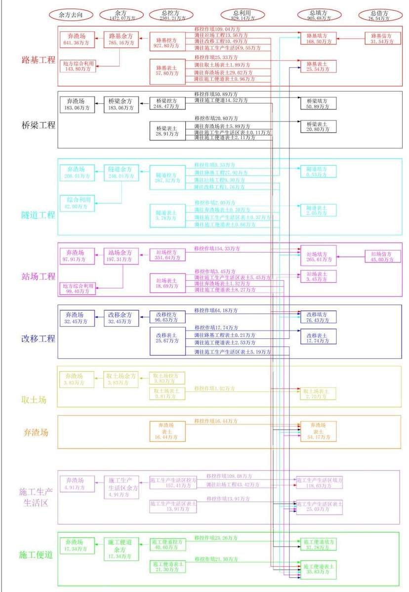  
图2.4.3-2 土石方流向框图（单位：万m3）  
CREEE 中铁第四勘察设计院集团有限公司  
中国铁建 CHINA RAILWAY SIYUAN SURVEY AND DESIGN GROUP CO.,LTD.

## 2.5 拆迁安置与专项设施改（迁）建

## 2.5.1 拆迁安置

全线共拆迁各类建筑物总计62.07万 $\mathrm { m } ^ { 2 } .$ ，采用货币补偿安置，由地方政府统一处理所有拆迁安置事宜，相关水土流失防治工作由地方政府负责。

## 2.5.2 专项设施（迁）改

## 1．改移道路

## （1）概况

全线共计改移道路 319 条，长度共计 82.68km，全部为乡、村道路改移，不涉及等级公路。改移道路产生的弃土、建筑垃圾纳入本方案弃渣场统一处置。

## （2）改移原则

道路改移要结合地方交通规划并遵照协议执行，按照不低于既有标准进行改移，对于一般乡村道路，面层铺设22cm厚混凝土，基层铺设20cm厚水泥稳定砂，垫层铺设20cm厚石灰土或干压碎石。一般碎石路，只铺设20cm厚泥结碎石。

## （3）边坡防护

全线改移工程最大边坡高度不超过 3m，填方边坡坡率为 1：1.5，挖方边坡坡率为1：1.0，路肩采取干砌片石砌筑。边坡防护采用植草护坡，植草范围从土路肩至用地界。

## （4）路面排水

路面设置2%的横向排水坡，土路肩设计横坡为3%。

根据现场地形情况设置边沟、截水沟，采用 M7.5 浆砌片石或 C25 混凝土修筑，排水沟采用梯形断面，底段0.4m，深0.6m，坡比1：1。

边沟等排水设施与既有沟渠和排水桥涵连通，将地表水排出路基。

表 2.5.2-1  
改移道路概况表
<table><tr><td colspan="3" rowspan="1">行政区划</td><td colspan="1" rowspan="2">改移长度m</td><td colspan="5" rowspan="1">排水沟</td><td colspan="1" rowspan="2">撒播草籽 m²</td></tr><tr><td colspan="1" rowspan="1">省</td><td colspan="1" rowspan="1">市</td><td colspan="1" rowspan="1">区、县</td><td colspan="1" rowspan="1">长度m</td><td colspan="1" rowspan="1">挖土 $\mathrm { m } ^ { 3 }$ </td><td colspan="1" rowspan="1">浆砌片石 m³</td><td colspan="1" rowspan="1">M10 砂浆抹面 $\mathrm { m } ^ { 2 }$ </td><td colspan="1" rowspan="1">C25 混凝土 $\mathrm { m } ^ { 3 }$ </td></tr><tr><td colspan="1" rowspan="3">湖北省</td><td colspan="1" rowspan="2">宜昌市</td><td colspan="1" rowspan="1">长阳土家族自治县</td><td colspan="1" rowspan="1">1919.66</td><td colspan="1" rowspan="1"></td><td colspan="1" rowspan="1"></td><td colspan="1" rowspan="1">3956</td><td colspan="1" rowspan="1">19778.0</td><td colspan="1" rowspan="1"></td><td colspan="1" rowspan="1"></td></tr><tr><td colspan="1" rowspan="1">宜都市</td><td colspan="1" rowspan="1">14741.32</td><td colspan="1" rowspan="1">8906</td><td colspan="1" rowspan="1">15256</td><td colspan="1" rowspan="1">16154</td><td colspan="1" rowspan="1">80770.0</td><td colspan="1" rowspan="1">7218</td><td colspan="1" rowspan="1">98755</td></tr><tr><td colspan="1" rowspan="1">荆州市</td><td colspan="1" rowspan="1">松滋市</td><td colspan="1" rowspan="1">21871.62</td><td colspan="1" rowspan="1">21876</td><td colspan="1" rowspan="1">30961</td><td colspan="1" rowspan="1"></td><td colspan="1" rowspan="1"></td><td colspan="1" rowspan="1">18686</td><td colspan="1" rowspan="1">200887</td></tr><tr><td colspan="1" rowspan="2">湖南省常</td><td colspan="1" rowspan="2">德市</td><td colspan="1" rowspan="1">澧县</td><td colspan="1" rowspan="1">18303.85</td><td colspan="1" rowspan="1">18301</td><td colspan="1" rowspan="1">35390</td><td colspan="1" rowspan="1"></td><td colspan="1" rowspan="1"></td><td colspan="1" rowspan="1">16497</td><td colspan="1" rowspan="1">120166</td></tr><tr><td colspan="1" rowspan="1">临澧县</td><td colspan="1" rowspan="1">15728.87</td><td colspan="1" rowspan="1">15728</td><td colspan="1" rowspan="1">19279</td><td colspan="1" rowspan="1"></td><td colspan="1" rowspan="1"></td><td colspan="1" rowspan="1">14390</td><td colspan="1" rowspan="1">164531</td></tr><tr><td colspan="3" rowspan="1">行政区划</td><td colspan="1" rowspan="1">改移长度</td><td colspan="5" rowspan="1">排水沟</td><td colspan="1" rowspan="2">撒播草籽 m²</td></tr><tr><td colspan="1" rowspan="1">省</td><td colspan="1" rowspan="1">市</td><td colspan="1" rowspan="1">区、县</td><td colspan="1" rowspan="1">m</td><td colspan="1" rowspan="1">长度m</td><td colspan="1" rowspan="1">挖土 $\mathrm { m } ^ { 3 }$ </td><td colspan="1" rowspan="1">浆砌片石m³</td><td colspan="1" rowspan="1">M10 砂浆抹面 $\mathrm { m } ^ { 2 }$ </td><td colspan="1" rowspan="1">C25 混凝土 $\mathrm { m } ^ { 3 }$ </td></tr><tr><td colspan="1" rowspan="2">湖南省常</td><td colspan="1" rowspan="2">德市</td><td colspan="1" rowspan="1">鼎城区</td><td colspan="1" rowspan="1">9583.68</td><td colspan="1" rowspan="1">9585</td><td colspan="1" rowspan="1">15401</td><td colspan="1" rowspan="1"></td><td colspan="1" rowspan="1"></td><td colspan="1" rowspan="1">11119</td><td colspan="1" rowspan="1">83887</td></tr><tr><td colspan="1" rowspan="1">武陵区</td><td colspan="1" rowspan="1">527.00</td><td colspan="1" rowspan="1">527</td><td colspan="1" rowspan="1">632</td><td colspan="1" rowspan="1"></td><td colspan="1" rowspan="1"></td><td colspan="1" rowspan="1">169</td><td colspan="1" rowspan="1">2964</td></tr><tr><td colspan="3" rowspan="1">全线合计</td><td colspan="1" rowspan="1">82676.00</td><td colspan="1" rowspan="1">74923</td><td colspan="1" rowspan="1">116919</td><td colspan="1" rowspan="1">20110</td><td colspan="1" rowspan="1">100548</td><td colspan="1" rowspan="1">68079</td><td colspan="1" rowspan="1">671190</td></tr></table>

## 2．改移沟渠

全线改移沟渠78条，长度共计10.99km。改移沟渠产生的弃土、建筑垃圾纳入本方案弃渣场统一处置。建设单位为改移沟渠的责任主体，改移沟渠投资已纳入主体工程投资，防治责任范围纳入本方案。

表 2.5.2-2  
改移沟渠概况表
<table><tr><td rowspan=2 colspan=3>行政区划</td><td rowspan=2 colspan=1>改移长度</td><td rowspan=1 colspan=3>工程量</td></tr><tr><td rowspan=1 colspan=1>挖土</td><td rowspan=1 colspan=1>浆砌片石</td><td rowspan=1 colspan=1>混凝土</td></tr><tr><td rowspan=1 colspan=1>省</td><td rowspan=1 colspan=1>市</td><td rowspan=1 colspan=1>区、县</td><td rowspan=1 colspan=1>m</td><td rowspan=1 colspan=1> $\mathrm { m } ^ { 3 }$ </td><td rowspan=1 colspan=1> $\mathrm { m } ^ { 3 }$ </td><td rowspan=1 colspan=1> $\mathrm { m } ^ { 3 }$ </td></tr><tr><td rowspan=2 colspan=1>湖北省</td><td rowspan=1 colspan=1>宜昌市</td><td rowspan=1 colspan=1>宜都市</td><td rowspan=1 colspan=1>1006.91</td><td rowspan=1 colspan=1>10622.73</td><td rowspan=1 colspan=1>1938.48</td><td rowspan=1 colspan=1>408.63</td></tr><tr><td rowspan=1 colspan=1>荆州市</td><td rowspan=1 colspan=1>松滋市</td><td rowspan=1 colspan=1>3143.27</td><td rowspan=1 colspan=1>37240.31</td><td rowspan=1 colspan=1>1890.36</td><td rowspan=1 colspan=1>1620.66</td></tr><tr><td rowspan=1 colspan=1>湖南省</td><td rowspan=1 colspan=1>常德市</td><td rowspan=1 colspan=1>澧县</td><td rowspan=1 colspan=1>2219.33</td><td rowspan=1 colspan=1>57175.53</td><td rowspan=1 colspan=1>15030</td><td rowspan=1 colspan=1>8510.74</td></tr><tr><td rowspan=3 colspan=1>湖南省</td><td rowspan=3 colspan=1>常德市</td><td rowspan=1 colspan=1>临澧县</td><td rowspan=1 colspan=1>1591.06</td><td rowspan=1 colspan=1>25423.26</td><td rowspan=1 colspan=1>7282.62</td><td rowspan=1 colspan=1>3895.73</td></tr><tr><td rowspan=1 colspan=1>鼎城区</td><td rowspan=1 colspan=1>2626.64</td><td rowspan=1 colspan=1>16719.45</td><td rowspan=1 colspan=1></td><td rowspan=1 colspan=1>3081.79</td></tr><tr><td rowspan=1 colspan=1>武陵区</td><td rowspan=1 colspan=1>400.00</td><td rowspan=1 colspan=1>2692.80</td><td rowspan=1 colspan=1>2629.20</td><td rowspan=1 colspan=1></td></tr><tr><td rowspan=1 colspan=3>全线合计</td><td rowspan=1 colspan=1>10987.21</td><td rowspan=1 colspan=1>149874.08</td><td rowspan=1 colspan=1>28770.66</td><td rowspan=1 colspan=1>17517.55</td></tr></table>

## 2.6 施工进度

本工程计划于 2025 年 12 月底开工，2029 年 12 月完工。根据工程特点和施工条件，本着保证施工质量和提高投资效益的原则，结合设置的主体工程的设计、施工方案等，本工程工期48个月，施工工期总体安排为：

1．施工准备总工期6 个月；

2．隧道工程工期按24个月考虑，马鞍山1号隧道工期27个月考虑；

3．路基工程地基处理及主体施工并考虑地基沉降按7～18个月/项考虑

4．桥梁下部及连续梁工程按9～25个月考虑，澧水特大桥工程按28个月考虑；

5．铺轨及轨道精调工程总工期为6 个月；

6．四电及其他站后配套工程工期按12～15个月考虑；

7．联调联试及试运行工期按3～6个月考虑。

表 2.6-1  
本工程施工进度计划表
<table><tr><td rowspan=2 colspan=1>工程项目</td><td rowspan=1 colspan=1>时间</td><td rowspan=1 colspan=2></td><td rowspan=1 colspan=1>关键</td><td rowspan=1 colspan=4>第1年</td><td rowspan=1 colspan=4>第2年</td><td rowspan=1 colspan=4>第3年</td><td rowspan=1 colspan=4>第4年</td></tr><tr><td rowspan=1 colspan=1>(月)</td><td rowspan=1 colspan=2></td><td rowspan=1 colspan=2>时间</td><td rowspan=1 colspan=1>1</td><td rowspan=1 colspan=1>2</td><td rowspan=1 colspan=1>3</td><td rowspan=1 colspan=1>4</td><td rowspan=1 colspan=1>1</td><td rowspan=1 colspan=1>2</td><td rowspan=1 colspan=1>3</td><td rowspan=1 colspan=1>4</td><td rowspan=1 colspan=1>1</td><td rowspan=1 colspan=1>2</td><td rowspan=1 colspan=1>3</td><td rowspan=1 colspan=1>4</td><td rowspan=1 colspan=1>1</td><td rowspan=1 colspan=1>2</td><td rowspan=1 colspan=1>1</td><td rowspan=1 colspan=1>2</td></tr><tr><td rowspan=2 colspan=1>施工准备</td><td rowspan=2 colspan=1>12</td><td rowspan=2 colspan=3>3</td><td rowspan=1 colspan=1>__</td><td rowspan=1 colspan=1>__</td><td rowspan=1 colspan=1>__</td><td rowspan=1 colspan=1></td><td rowspan=2 colspan=2>关键工期3个月</td><td rowspan=2 colspan=1></td><td rowspan=2 colspan=1></td><td rowspan=2 colspan=1></td><td rowspan=2 colspan=1></td><td rowspan=2 colspan=1></td><td rowspan=2 colspan=1></td><td rowspan=2 colspan=1></td><td rowspan=2 colspan=1></td><td rowspan=2 colspan=1></td><td rowspan=2 colspan=1></td></tr><tr><td rowspan=1 colspan=1></td><td rowspan=1 colspan=1></td><td rowspan=1 colspan=1></td><td rowspan=1 colspan=1></td></tr><tr><td rowspan=2 colspan=1>路基工程</td><td rowspan=2 colspan=1>18</td><td rowspan=2 colspan=3></td><td rowspan=2 colspan=1></td><td rowspan=1 colspan=1>__</td><td rowspan=1 colspan=1>__</td><td rowspan=1 colspan=1>__</td><td rowspan=1 colspan=1>__</td><td rowspan=2 colspan=1></td><td rowspan=2 colspan=1></td><td rowspan=2 colspan=1>路基沉降</td><td rowspan=2 colspan=1>6个月</td><td rowspan=2 colspan=1></td><td rowspan=2 colspan=1></td><td rowspan=2 colspan=1></td><td rowspan=2 colspan=1></td><td rowspan=2 colspan=1></td><td rowspan=2 colspan=1></td><td rowspan=2 colspan=1></td></tr><tr><td rowspan=1 colspan=1></td><td rowspan=1 colspan=1></td><td rowspan=1 colspan=1></td><td rowspan=1 colspan=1></td></tr><tr><td rowspan=2 colspan=1>桥梁工程</td><td rowspan=2 colspan=1>25</td><td rowspan=2 colspan=2></td><td rowspan=1 colspan=1></td><td rowspan=2 colspan=1></td><td rowspan=2 colspan=1></td><td rowspan=1 colspan=1></td><td rowspan=1 colspan=1></td><td rowspan=1 colspan=1></td><td rowspan=1 colspan=1></td><td rowspan=1 colspan=1></td><td rowspan=1 colspan=1></td><td rowspan=1 colspan=1></td><td rowspan=1 colspan=1></td><td rowspan=2 colspan=3>澧水铁路特大桥工</td><td rowspan=2 colspan=2>期28个月</td><td rowspan=2 colspan=1></td></tr><tr><td rowspan=1 colspan=2></td><td rowspan=1 colspan=1></td><td rowspan=1 colspan=1></td><td rowspan=1 colspan=1></td><td rowspan=1 colspan=1></td><td rowspan=1 colspan=1></td><td rowspan=1 colspan=1></td><td rowspan=1 colspan=1></td><td rowspan=1 colspan=1></td><td></td></tr><tr><td rowspan=2 colspan=1>隧道工程</td><td rowspan=2 colspan=1>24</td><td rowspan=2 colspan=3></td><td rowspan=2 colspan=1></td><td rowspan=1 colspan=1></td><td rowspan=1 colspan=1></td><td rowspan=1 colspan=1></td><td rowspan=1 colspan=1></td><td rowspan=1 colspan=1></td><td rowspan=1 colspan=1></td><td rowspan=1 colspan=1></td><td rowspan=1 colspan=1></td><td rowspan=2 colspan=1></td><td rowspan=2 colspan=2>马鞍山1号隧道工</td><td rowspan=2 colspan=2>期27个月</td><td rowspan=2 colspan=1></td><td rowspan=2 colspan=1></td></tr><tr><td rowspan=1 colspan=1></td><td rowspan=1 colspan=1></td><td rowspan=1 colspan=1></td><td rowspan=1 colspan=1></td><td rowspan=1 colspan=1></td><td rowspan=1 colspan=1></td><td rowspan=1 colspan=1></td><td rowspan=1 colspan=1></td></tr><tr><td rowspan=2 colspan=1>运输、架设简支箱梁工程</td><td rowspan=2 colspan=1>20</td><td rowspan=2 colspan=3>6</td><td rowspan=2 colspan=1></td><td rowspan=2 colspan=1></td><td rowspan=2 colspan=1></td><td rowspan=2 colspan=1></td><td rowspan=2 colspan=1></td><td rowspan=1 colspan=1>_</td><td rowspan=1 colspan=1>_</td><td rowspan=1 colspan=1>_</td><td rowspan=1 colspan=1>_</td><td rowspan=1 colspan=1>__</td><td rowspan=1 colspan=1>_</td><td rowspan=1 colspan=1>运、架</td><td rowspan=2 colspan=2>简支箱梁工程键工期6个月</td><td rowspan=2 colspan=1></td><td rowspan=2 colspan=1></td></tr><tr><td rowspan=1 colspan=1></td><td rowspan=1 colspan=1></td><td rowspan=1 colspan=1></td><td rowspan=1 colspan=1></td><td rowspan=1 colspan=1></td><td rowspan=1 colspan=1></td><td rowspan=1 colspan=1>关</td></tr><tr><td rowspan=2 colspan=1>无砟道床（含道床)</td><td rowspan=2 colspan=1>15</td><td rowspan=2 colspan=3>4</td><td rowspan=2 colspan=1></td><td rowspan=2 colspan=1></td><td rowspan=2 colspan=1></td><td rowspan=2 colspan=1></td><td rowspan=2 colspan=1></td><td rowspan=2 colspan=1></td><td rowspan=2 colspan=1></td><td rowspan=2 colspan=1></td><td rowspan=1 colspan=1>__</td><td rowspan=1 colspan=1>__</td><td rowspan=1 colspan=1>__</td><td rowspan=1 colspan=1>」_</td><td rowspan=2 colspan=1></td><td rowspan=2 colspan=3>无砟道床工程关键工期4个月</td></tr><tr><td rowspan=1 colspan=1></td><td rowspan=1 colspan=1></td><td rowspan=1 colspan=1></td><td rowspan=1 colspan=1></td></tr><tr><td rowspan=1 colspan=1>铺轨及后续工程（含轨道精调)</td><td rowspan=1 colspan=1>6</td><td rowspan=1 colspan=3></td><td rowspan=1 colspan=1></td><td rowspan=1 colspan=1></td><td rowspan=1 colspan=1></td><td rowspan=1 colspan=1></td><td rowspan=1 colspan=1></td><td rowspan=1 colspan=1></td><td rowspan=1 colspan=1></td><td rowspan=1 colspan=1></td><td rowspan=1 colspan=5>铺轨工程及后续工程、站后及配套工程关键工期6个月</td><td rowspan=1 colspan=1></td><td rowspan=1 colspan=1></td><td rowspan=1 colspan=1></td></tr><tr><td rowspan=2 colspan=1>站后及配套工程</td><td rowspan=2 colspan=1>17</td><td rowspan=2 colspan=3>6</td><td rowspan=2 colspan=1></td><td rowspan=2 colspan=1></td><td rowspan=2 colspan=1></td><td rowspan=2 colspan=1></td><td rowspan=2 colspan=1></td><td rowspan=2 colspan=1></td><td rowspan=2 colspan=1></td><td rowspan=2 colspan=1></td><td rowspan=2 colspan=1></td><td rowspan=1 colspan=1></td><td rowspan=1 colspan=1></td><td rowspan=1 colspan=1></td><td rowspan=1 colspan=1></td><td rowspan=1 colspan=1></td><td rowspan=1 colspan=1></td><td rowspan=2 colspan=1></td></tr><tr><td rowspan=1 colspan=1></td><td rowspan=1 colspan=1></td><td rowspan=1 colspan=1></td><td rowspan=1 colspan=1></td><td rowspan=1 colspan=1></td><td rowspan=1 colspan=1></td></tr><tr><td rowspan=1 colspan=1>联调联试及运行试验</td><td rowspan=1 colspan=1>4</td><td rowspan=1 colspan=3>4</td><td rowspan=1 colspan=1></td><td rowspan=1 colspan=1></td><td rowspan=1 colspan=1></td><td rowspan=1 colspan=1></td><td rowspan=1 colspan=1></td><td rowspan=1 colspan=1></td><td rowspan=1 colspan=1></td><td rowspan=1 colspan=1></td><td rowspan=1 colspan=1></td><td rowspan=1 colspan=1></td><td rowspan=1 colspan=1></td><td rowspan=1 colspan=1></td><td rowspan=1 colspan=1></td><td rowspan=1 colspan=1></td><td rowspan=1 colspan=1></td><td rowspan=1 colspan=1></td></tr><tr><td rowspan=1 colspan=1>正式运营</td><td rowspan=1 colspan=1></td><td rowspan=1 colspan=3>48</td><td rowspan=1 colspan=1></td><td rowspan=1 colspan=1></td><td rowspan=1 colspan=1></td><td rowspan=1 colspan=1></td><td rowspan=1 colspan=1></td><td rowspan=1 colspan=1></td><td rowspan=1 colspan=1></td><td rowspan=1 colspan=1></td><td rowspan=1 colspan=1></td><td rowspan=1 colspan=1></td><td rowspan=1 colspan=1></td><td rowspan=1 colspan=1></td><td rowspan=1 colspan=1></td><td rowspan=1 colspan=1></td><td rowspan=1 colspan=1></td><td rowspan=1 colspan=1></td></tr></table>

## 2.7 自然概况

## 2.7.1 地 质

## 2.7.1.1 地层岩性

区域内分布寒武系、奥陶系、志留系、泥盆系、二叠系、白垩系、下第三系等地层。寒武至奥陶系可溶岩主要分布于马鞍山—洛雁山向斜、马鞍山-柳树店褶皱群等褶皱核部；泥盆至志留系碎屑岩呈条带状分布于可溶岩之间；白垩系、下第三系碎屑岩主要分布于宜都、临澧地区的长江、澧水等河流两岸及丘陵地带；煤系地层主要为二叠系夹煤地层，线路附近呈条带状零星分布；第四系地层广泛分布于江河两岸冲积平原、丘陵及山间谷地地区。

## 2.7.1.2 地质构造

沿线处于扬子准地台上扬子台坪，华夏系褶皱和断裂构造发育。沿线武陵山区以北东向和东西向构造带为主，由一系列褶皱和断裂构成。长阳至松滋段附近主要分布有马鞍山—洛雁山向斜、马鞍山-柳树店褶皱群等；松滋至常德地段位于河流阶地和冲积平原，第四系覆盖较厚，地质构造隐伏于第四系地层之下。

## 2.7.1.3 水文地质条件

沿线主要地表水系有清江、渔阳河、洈水、澧水、道水等。依据沿线出露的地层岩性及含水地层储水空间的成因、特征和地下水赋存形式，将沿线地下水划分为第四系孔隙水、基岩裂隙水、岩溶水三大类。

## ①第四系孔隙水

广泛且连续分布在沿线第四系覆盖层中，主要接受大气降水补给，局部接受地表水系补给。其中位于河流一、二级阶地及河漫滩上部为多含水微弱的黏性土，下部砂土、圆砾土为主要含水层，水量较多，水位相对稳定，季节波动小，局部具备弱承压性；分布在高阶地、垄岗及丘陵地带的一般水量相对贫乏，水位变化较大，季节性变动明显。

## ②基岩裂隙水

赋存于碎屑岩的风化裂隙、层理、节理裂隙及构造破碎带中，其富水性受区域构造形态、基岩节理裂隙发育程度及完整性控制，可分为风化带网状裂隙水和构造裂隙水。

风化带网状裂隙水主要埋藏于第三系泥质粉砂岩、泥岩以及志留系、泥盆系砂、页岩等的风化带裂隙中，网状微细裂隙储集为主，分布普遍，主要接受大气降水补给，就近在坡脚以裂隙泉的形式排泄，以潜水为主，水量不大且随季节分布不均。

构造裂隙水主要分布于碎屑岩的层理、节理裂隙带和构造破碎带内，富水程度与构造发育程度密切相关，一般在褶皱构造核部、断层带内水量较为丰富。主要接受上部含水层的补给，一般径流途径较长，多远距离向当地的侵蚀基准面以裂隙泉的形式排泄，以潜水为主，部分具承压性，常年有水，水量随季节变动较小。

## ③岩溶水

沿线裸露型与覆盖型岩溶均有分布，岩溶水补给主要为大气降水及上覆第四系孔隙水，径流主要为裂隙-管道流，排泄主要为散排，在长阳-松滋地段局部形成泉排泄。

## 2.7.1.4 不良工程地质情况

沿线主要不良地质有岩溶、人为坑洞、滑坡、危岩、落石及崩塌、有害气体、高地应力与软岩大变形、地震等；特殊岩土有填土、软土、膨胀土等。

## ①岩溶

沿线碳酸盐岩岩溶发育，可溶岩在长阳、宜都、松滋、临澧一带均有分布，根据区内不同岩溶形态、规模、数量及发育层位的资料分析，沿线岩溶发育强度等级可分为强、中、弱三个等级，目前线路方案已基本绕避大型岩溶暗河管网区，岩溶地段在采取了相应的处理措施后，线路可以通过。

## ②人为坑洞

沿线矿产资源丰富，开采矿区较多，主要矿产类型有黏土及砂石矿、灰岩矿、煤矿、石膏矿、芒硝矿、盐矿等。目前线路方案已绕避沿线矿采空及其塌陷影响区。

## ③滑坡

沿线基本绕避了滑坡，长阳马鞍山一带出露志留系页岩地层为较破碎软质岩，宜

都-松滋一带寒武系灰岩地层存在垂直于线路方向的顺层不利结构面，在人工开挖扰动后，边坡易失稳形成工程滑坡，设计施工应采取相应的支挡防护措施，确保施工和运营安全。

## ④危岩、落石及崩塌

沿线地质构造、地形条件复杂，节理裂隙发育，加之风化差异，多形成危岩体，发育位置多为隧道进出口，主要分布地层为奥陶系、寒武系碳酸盐岩等。建议对危岩体采用清除、支挡、主被动网防护及加长明洞等综合治理措施处理。

## ⑤高地应力与软岩大变形

长阳地区线路方案局部以隧道形式穿越志留系页岩，岩质较软，虽线路走向平行构造应力方向，但部分段落为高～极高地应力，易产生软岩大变形影响，设计施工时应采取相应的措施，确保施工和运营安全。

## ⑥活动断裂与地震

沿线未见全新世活动性断裂。根据收集历史地震资料显示，1631年常德6.8级地震是沿线有记录最大的破坏性地震。除此之外，沿线地区再无破坏性强震记录。

根据《中国地震动峰值加速度区划图》（GB18306-2015）和《中国地震动加速度反应谱特征周期区划图》（GB18306-2015），湖南常德地区 DK159+986～ DK235+646的Ⅱ类场地基本地震动峰加速度为 0.10g～0.15g，基本地震动反应谱特征周期 0.35s，抗震设防烈度为7度；其余段Ⅱ类场地基本地震动峰加速度为0.05g，基本地震动反应谱特征周期0.35s，抗震设防烈度为6度。

本次勘察中揭示常德地区DK154～DK230局部的粉细砂层为地震液化土层，埋深3-6m，厚度1-3m，工程设计中需考虑其不利影响。

## ⑦填土

沿线村镇密布、路网发达，人为活动频繁，厚度变化较大，一般0.5m～3m不等。填土分类主要有素填土、杂填土及填筑土。素填土主要分布于农田表层、塘埂及人工场坪等地，一般成分相对单一，多为黏性土，部分混杂有碎石土或砂土，结构松散，承载力低。杂填土主要有工业废料、建筑垃圾、生活垃圾等，一般分布于专门的堆场或填埋场，结构松散，承载力低，工业或生活垃圾可能具有侵蚀性，线路基本已绕避。填筑土主要分布在沿线的公路、铁路及堤坝等地，经过人工夯实或碾压，成分相对单一，具备一定的密实度和承载力。

## ⑧软土

沿线软土主要分布在沿线长大河流河漫滩和阶地，垄岗及丘间谷地、水塘底、水田浅表层。其中河流阶地一般厚度3～5m，谷地、水塘底厚度一般1-3m。

⑨膨胀土与红黏土

沿线 Q 黏性土、可溶岩表层红黏土多具膨胀性，膨胀等级为弱-中膨胀性，在DK70～113、DK120～143、DK145～151、DK153～154，DK174～225、DK227～229广泛分布，边坡需要加强支挡防护及排水措施。

## 2.7.1.5 地震动参数

根据《中国地震动峰值加速度区划图》（GB18306-2015）和《中国地震动加速度反应谱特征周期区划图》（GB18306-2015），沿线Ⅱ类场地基本地震动参数与烈度划分见下表。

表2.7.1-1 宜常铁路沿线Ⅱ类场地基本地震动参数与烈度划分表
<table><tr><td rowspan=1 colspan=1>里程区段</td><td rowspan=1 colspan=1>行政区段</td><td rowspan=1 colspan=1>地震动峰值加速度</td><td rowspan=1 colspan=1>地震动反应谱特征周期</td><td rowspan=1 colspan=1>基本烈度</td></tr><tr><td rowspan=1 colspan=1>DK0+000~DK159+986</td><td rowspan=1 colspan=1>宜昌市区、长阳、宜都、松滋、澧县盐井镇、大堰垱镇</td><td rowspan=1 colspan=1>0.05g</td><td rowspan=1 colspan=1>0.35s</td><td rowspan=1 colspan=1>VI</td></tr><tr><td rowspan=1 colspan=1>DK159+986~DK197+928</td><td rowspan=1 colspan=1>澧县城头山镇、澧南镇、临澧停弦渡镇、修梅镇、安福街道、望城街道</td><td rowspan=1 colspan=1>0.10g</td><td rowspan=1 colspan=1>0.35s</td><td rowspan=1 colspan=1>VII</td></tr><tr><td rowspan=1 colspan=1>DK197+928~DK235+646</td><td rowspan=1 colspan=1>临澧四新岗镇、常德鼎城区、武陵区</td><td rowspan=1 colspan=1>0.15g</td><td rowspan=1 colspan=1>0.35s</td><td rowspan=1 colspan=1>VII</td></tr></table>

## 2.7.2 地形地貌

线路经过湖北、湖南两省，沿线主要为武陵山余脉低山区、平原与山地过渡的丘陵区、西洞庭湖平原区，跨越长江及其一级支流清江、澧水等水系。

长阳至宜都段位于武陵山余脉低山区，碳酸盐岩与碎屑岩交替带状分布，地形起伏较大，山脉走向大多呈东西或北东东走向，岩溶台地、峰丛洼地、槽谷等岩溶地貌发育，沟谷多呈“V”字形，海拔高度 300～1100m，相对高差 100-300m 不等，地势起伏大，自然坡度30-50°。

宜都至松滋段位于平原与山地过渡的丘陵区，海拔50-200m，相对高差50～100m不等，地势起伏较大，自然坡度20-40°。

松滋至常德段位于西洞庭湖平原、高阶地及垄岗区，海拔 20-50m，相对高差10-50m，自然坡度 5-15°，平原河流一级阶地地段地势平坦，地表河湖交错，农田密布，高阶地及垄岗地段地势略有起伏，地表多为林地及农田。

## 2.7.3 气 象

项目区气候类别为亚热带湿润气候，多年平均气温 16.5℃～17.5℃，多年平均蒸发量 1206.7～1456.0mm，雨季时段每年 6～8 月；多年平均降水量 1183.4～1389.1mm；年平均风速 1.1～2.4m/s，主导风向以 E 和 ES 为主，无霜期 250～290d；≥10℃有效年积温4623～5717℃；沿线各市主要气象要素见表2.7.3-1。

表 2.7.3-1  
沿线各市主要气象要素表
<table><tr><td rowspan=1 colspan=1>区县</td><td rowspan=1 colspan=1>年平均气温(℃)</td><td rowspan=1 colspan=1>极端最低气温(℃)</td><td rowspan=1 colspan=1>极端最高气温(℃)</td><td rowspan=1 colspan=1>年平均降雨量(mm)</td><td rowspan=1 colspan=1>日最大降雨量(mm)</td><td rowspan=1 colspan=1>年平均风速(m/s)</td><td rowspan=1 colspan=1>最大风速(风向)(m/s)</td><td rowspan=1 colspan=1>≥10℃积温(℃)</td><td rowspan=1 colspan=1>年平均蒸发量（mm</td></tr><tr><td rowspan=1 colspan=1>长阳土家族自治县</td><td rowspan=1 colspan=1>16.5</td><td rowspan=1 colspan=1>-12</td><td rowspan=1 colspan=1>42.1</td><td rowspan=1 colspan=1>1336.2</td><td rowspan=1 colspan=1>211.2</td><td rowspan=1 colspan=1>1.2</td><td rowspan=1 colspan=1>28.1 (S)</td><td rowspan=1 colspan=1>4623</td><td rowspan=1 colspan=1>1456.0</td></tr><tr><td rowspan=1 colspan=1>宜都市</td><td rowspan=1 colspan=1>16.8</td><td rowspan=1 colspan=1>-13.0</td><td rowspan=1 colspan=1>41.4</td><td rowspan=1 colspan=1>1235.4</td><td rowspan=1 colspan=1>386.8</td><td rowspan=1 colspan=1>1.1</td><td rowspan=1 colspan=1>22.7 (NW)</td><td rowspan=1 colspan=1>4885</td><td rowspan=1 colspan=1>1271.3</td></tr><tr><td rowspan=1 colspan=1>松滋市</td><td rowspan=1 colspan=1>17.5</td><td rowspan=1 colspan=1>-18.1</td><td rowspan=1 colspan=1>43.6</td><td rowspan=1 colspan=1>1183.4</td><td rowspan=1 colspan=1>259.2</td><td rowspan=1 colspan=1>2.4</td><td rowspan=1 colspan=1>25.8（EN）</td><td rowspan=1 colspan=1>4765</td><td rowspan=1 colspan=1>1344.0</td></tr><tr><td rowspan=1 colspan=1>澧县</td><td rowspan=1 colspan=1>17.3</td><td rowspan=1 colspan=1>-7.8</td><td rowspan=1 colspan=1>41.0</td><td rowspan=1 colspan=1>1272.0</td><td rowspan=1 colspan=1>232.0</td><td rowspan=1 colspan=1>2.3</td><td rowspan=1 colspan=1>23（EN/N）</td><td rowspan=1 colspan=1>5316</td><td rowspan=1 colspan=1>1211.5</td></tr><tr><td rowspan=1 colspan=1>临澧县</td><td rowspan=1 colspan=1>17.1</td><td rowspan=1 colspan=1>-8.3</td><td rowspan=1 colspan=1>40.6</td><td rowspan=1 colspan=1>1321.9</td><td rowspan=1 colspan=1>200.8</td><td rowspan=1 colspan=1>1.6</td><td rowspan=1 colspan=1>22.9（EN/N)</td><td rowspan=1 colspan=1>5300</td><td rowspan=1 colspan=1>1206.7</td></tr><tr><td rowspan=1 colspan=1>鼎城区</td><td rowspan=1 colspan=1>17.5</td><td rowspan=1 colspan=1>7.2</td><td rowspan=1 colspan=1>40.6</td><td rowspan=1 colspan=1>1389.1</td><td rowspan=1 colspan=1>251.1</td><td rowspan=1 colspan=1>1.9</td><td rowspan=1 colspan=1>23（EN/N）</td><td rowspan=1 colspan=1>5717</td><td rowspan=1 colspan=1>1221.3</td></tr></table>

注：气象资料是引用沿线各气象局近30年的资料。

## 2.7.4 水 文

宜常铁路线路南北走向途经湖北省的长阳土家族自治县、宜都市、松滋市以及湖南省的澧县、临澧县、常德城区。

湖北省：线路在长阳境内途经的长江流域的清江水系，主要河流有清江和渔洋河。在宜都境内途经河流属长江流域的九道河水系，沿线主要河流有：新桥河（王家嘴河）、芭荒河（芭芒河）、九道河等。在松滋境内途经河流主要为新河（北河）、南河、碾盘河、洛河、六泉河、界溪河和红岩河等。

湖南省：线路在湖南境内途径的河流属长江中游洞庭湖水系、沅江下游和澧水中下游水系，沿线途径的主要河流有涔水、澧水、道水等。

## ①渔洋河

渔洋河是长江流域清江水系的一大支流，发源于长阳土家族自治县周家坡，流经五峰县长乐坪镇、渔洋关镇，宜都市王家畈镇、潘家湾乡、聂家河镇、五眼泉镇和姚家店镇等7 个乡镇，于宜都市五眼泉镇汉阳坪注入清江。渔洋河承雨面积1197 km2，河长97 km，多年平均径流量11.15亿m3。渔洋河流域面积 $3 0 \mathrm { k m } ^ { 2 }$ 以上的一级支流共4 条，分别是小河、全福河（大沟）、青龙溪和拖溪。渔洋河流域现已开发电站共 31处，装机总容量72750kW，修建水库18 座，其中，小（1）型水库7 座，小（2）型水库11 座，主河道防洪标准为20 年一遇，支流防洪标准为10 年一遇，宜都市中心城区防洪标准近期为50 年一遇，远期为100年一遇。

## ②新桥河（王家嘴河）

新桥河（王家嘴河）干流河道全长24.8km，集水面积81km2，河流弯曲系数1.6，整个流域形状似蒲扇形，背靠山岚、面向平原、左右为山丘过渡地带。整个流域地势：西南高、东北低。流域内大部分地区属于武陵山脉的余脉地带。流域内森林资源丰富，植被良好，森林覆盖率达65%以上。发育的岩溶，茂密的森林，对洪水过程有明显的滞洪作用。

新桥河（王家嘴河）干流上游有一小型水库—邓桥水库。邓桥水库坝址距离枝城镇11km，控制流域面积12.1km2。大坝为浆砌石双曲拱坝（迎水坝体为混凝土、下游坝体为浆砌石体），于1973 年6 月竣工，其最大坝高10.5m、总库容 $8 0 \ \mathcal { F } \ \mathrm { m } ^ { 3 } .$ ，是一座以灌溉、供水为主的综合利用水库。沿程支流较多、干流两岸区间流域面积产汇流亦多汇入支流、再由各支流集中汇入到干流。各支流洪峰汇入干流时间相隔非常短，表现为小流域、暴涨暴落山区性洪水。干流各控制断面洪水流量成果： $\mathrm { Q _ { 1 \% } } = 2 3 7 6 \mathrm { m } ^ { 3 } / \mathrm { s }$ （新桥河，干流桩号1+949）， $\mathrm { Q _ { 1 \% } } = 2 3 7 6 \mathrm { m } ^ { 3 } / \mathrm { s }$ （新桥河出口，干流桩号0+000）。

## ③芭荒河（芭芒河）

芭荒河（芭芒河）系九道河支流，全长13.8km。正源为车湾泉水。海拔高程200m，向北流经肖家隘，折向东流，过解家冲，右岸纳入小塘河水。走邓家嘴，再纳入鸡公泉水，经芭芒河绕双堰于桂榜岩入九道河。出口海拔高程 47m，天然落差 153m，流域面积 $6 4 . 6 8 \mathrm { k m } ^ { 2 }$ ，平均流量 0.71m3/s。芭荒河（芭芒河）沿程支流较多、干流两岸区间流域面积产汇流亦多汇入支流、再由各支流集中汇入到干流。暴雨中心在山区，山丘区为相应暴雨，各支流洪峰汇入干流时间相隔非常短，表现为小流域、暴涨暴落山区性洪水。芭荒河（芭芒河）干流各控制断面洪水流量成果： $\mathrm { Q _ { 1 \% } } { = } 3 9 4 \mathrm { m } ^ { 3 } / \mathrm { s }$ （枝城镇、聂家河镇乡镇界处，干流桩号 $7 + 1 8 0 ) , \mathrm { Q } _ { 1 \% } { = } 1 8 9 7 \mathrm { m } ^ { 3 } / \mathrm { s } ($ （入九道河河口，干流桩号0+000）。

## ④九道河

九道河古称白水，发源于松木坪镇云台观，干流流经纸坊冲、龙山坪、九道河、蔡家湾、余家桥、阳合岭等地，茶园寺至余家桥河段俗称九道河，余家桥至白水港河段俗称白水，于白水港入长江，入长江口海拔高程40m。九道河干流河道全长 28.4km，集水面积 $2 6 1 \mathrm { k m } ^ { 2 }$ ，河流弯曲系数1.6，整个流域形状似蒲扇形，背靠山岚、面向平原、左右为山丘过渡地带。整个流域地势：西南高、东北低。流域内大部分地区属于武陵山脉的余脉地带。

九道河干流上游有1 中型水库—九道河水库。九道河水库坝址距离枝城镇11km，控制流域面积 $3 9 . 1 \mathrm { k m } ^ { 2 }$ 。大坝为土石组合坝，于1973 年6 月竣工，其最大坝高40.5m、总库容 $1 3 8 0 ~ \mathrm { ~ \mathscr ~ { ~ H ~ } ~ m ~ } ^ { 3 }$ ，是一座以灌溉、供水为主的综合利用水库。沿程支流较多、干流两岸区间流域面积产汇流亦多汇入支流、再由各支流集中汇入到干流。各支流洪峰汇入干流时间相隔非常短，表现为小流域、暴涨暴落山区性洪水。干流各控制断面洪水流量成果： $\mathrm { Q _ { 1 \% } } { = } 6 1 9 \mathrm { m } ^ { 3 } / \mathrm { s }$ （十里干河，干流桩号15+526）， $\mathrm { Q _ { 1 \% } } = \mathrm { ~ 8 8 2 m ^ { 3 } / s }$ （钟家冲河，干流桩号8+576）。

## ⑤新河（北河）

新河（北河）属四口水系的松滋河西支支流，是我市第二大山溪性河流。发源于宜都市蚊子垭，流向自西北向东南， 从宜都境内流入松滋，经斯家场、王家桥、南海等镇入松滋河。新河（北河）全长45公里，其中松滋境内长35.5公里，汇流面积286.5平方公里。河槽高程在46米至140米之间。河床纵坡一般为1/600—1/800。北河水库以下流域称为新河。新河属山溪河流，洪水主要来自上游山洪，每年的降雨过程既类似于松滋河和长江，又呈现暴雨集中且量大的特性，其洪水具有隐蔽性强、突发性快、危险性大的特点。同时，新河既要承受上游来水，又要受到下游松滋河顶托影响，如汛期上游来水与下游洪水同步，山洪、江水遭遇，不仅升高洪水位而且延长山洪下泄时间、增加防汛压力，此类洪水为最不利的洪水组合。如1998年典型洪水，新江口站最高洪水位超1981年最高洪水位0.09米，创历史新高洪水位46.18米（冻结吴淞）。

## ⑥洈水

洈水河是松滋（西）河右岸的一级支流，上游分南北两支，南支在湖南石门县的五里坪，北支（干流）在湖北，发源于湖北省五峰县清水湾，两支在湖北省松滋市王台岭汇合后流经乌溪沟、茉莉滩、西斋、杨林、法华寺等地，于公安县汪家汊汇入松滋河，河流全长 203.7km，流域面积 2218km2，其中湖北省境内 1784.3km2。1958 年，为治理洈河水患，兴利除害，于我市大岩咀拦河筑坝，兴建了洈水水库（大型），将洈河截为上、下两段。大坝上游为洈河上游河道，流域面积 1142 平方公里，水库库容5.12亿立方米；下游称为洈河下游河道，河道长度96公里，其中，松滋境内59公里。1970年，治理王家大湖洪泛，对金羊山至法华寺河段进行改道，裁弯取直，筑堤围垦，斩断金羊山，河道由金羊山经桂花树、法华寺至汪家汊，原行洪河道演变为内蓄水河，称为老洈河。河道长度50公里，其中，松滋境内25公里。洈河改道后，下游主河道长度减少到57公里，其中，松滋境内45公里。洈河下游区间主要有洛河、俞家河、六泉河、界溪河等支流汇入。洈水在松滋市境内左右大堤防洪标准为20年一遇，堤防级别为4级。

## ⑦涔水

涔水属澧水一级支流，发源于石门县燕子山乡黑天坑和澧县太清乡，流经刘家湾、莲花堰、王家厂、大堰当、梦溪、涔南、永丰，在小渡口注入澧水。河流长度129km，流域面积 1196km2，河流坡降 0.498‰，沿途有余家河、梦溪等 11 条支流注入。涔水上游建有王家厂大型水库 1 座，山门、赵家峪、盐井等 3 座中型水库及 7 座小型水库。涔水出口小渡口建有节制闸，澧水涨水期，为防止澧水洪水倒灌，小渡口闭闸，小渡口闸泄洪流量直接受澧水顶托影响。王家厂水库位于澧水支流涔水中游，始建于1958 年，是一座以防洪、灌溉为主、结合发电、养殖、水利旅游的国家大（2）型水库，坝址以上控制流域面积484km2，设计洪水位最大下泄流量1380m3/s，校核洪水位最大下泄流量1930m3/s，保坝洪水位最大下泄流量2160m3/s；设计年限百年，洪水流量 2560（m3/s），下游河道安全泄量 718（m3/s）。

桥址于澧县大堰垱镇跨越涔水，跨点位于王家厂水库下游约 24.8km 处，桥址上游约70m有既有S224跨涔水中武桥，交叉点铁路里程为DK156+725。桥位处的汇水面积 F=192.19km2，百年一遇流量 Q1%=2172.3m3/s，桥址处设计水位 43.62m，流速2.79m/s。

## ⑧澧水

澧水系湖南省四水水系中流域面积最小，流程最短的河流，发源于桑植县杉木界。澧水干流经张家界、慈利、石门、澧县、津市，沿途接纳娄水、渫水、道水等主要支流，注入洞庭湖。自河源杉木界到小渡口全长388公里，小渡口至洞庭湖口96公里。澧水流域位于湖南省西北部，小渡口以上干流全长 390km，落差 1439m，流域面积18740km2，干流支流流经湖南、湖北两省，其中湖南省境内15630km2，占83.4%。流域内集雨面积大于1000km2的支流有溇水、渫水、道水和涔水。流域上游两岸高山竣岭，河谷深切，滩险毗连，水流湍急，河床坡降为2.67‰；中游桑植至石门除溇水、渫水上游为山地外，其余多为低山峡谷和一些丘陵盆地，沿河峡谷与盆地相间，深潭与急滩交互出现；下游石门至小渡口，流经丘陵、平原地区，地势平缓开阔，丘陵岗地零星分散：小渡口以下尾闾，湖泊、洪道、洲滩、港溪交错。堤防阡陌。良田万倾。

桥位位于艳洲枢纽工程上游，汇水面积为 15800 km2，百年一遇洪峰流量21200m3/s，设计水位 47.65m，流速 2.24m/s。石澧航道属山区性质河流，Ⅲ级航道洪水重现期可取 10 年，远期最高通航水位 44.87m（10 年一遇洪水位），近期最高通航水位42.49m（2一遇洪水位）。

## ⑨道水

道水为澧水一级支流，位于澧水中下游，介于东经 111°13’～111°48’，北纬29°12’～29°36’之间。道水系澧水一级支流，属九澧之一。道水有南北二支，南支发源于慈利五雷山麓，自西北向东南经两河口，陈家桥至老屋台，左岸，纳稻王峪溪后转向东流，至尖刀咀与北源汇合，此段 27km，是道水的主要产水区；北源发源于慈利苗市桃树垭东麓。南北二源汇合后向东流入白洋湖，几度迂迥转向再东北流至易家河于左岸纳洲浒溪，然后在咙口右岸纳庵溪至佘市桥复转东南金家咀，右岸纳本流域第二大支流杨梅溪，而后偏向东北，经临澧县城、肖家河至沙溪河右岸纳本流域最大支流沙溪河。因受银珠山和将军山所阻，急转向北流至澧县大岩厂于澧南垸道河口与澧水汇合。干流全长 105km，流域面积1362.8km2，河流平均比降0.749‰；

## ⑩新河

新河又名邵花河，位于常德市鼎城区境内，跨河处北侧建有花山闸站，南侧连接新河渠道，是常德市沅江水系起调蓄防洪作用的一条内河。花山闸站枢纽位于新河与花山河交汇处，整个枢纽工程由排水泉站、节制闸、船闸及拦河坝四部分组成，即排水泵站布置在河床右岸，船闸与节制闸布置在河道左岸，共两孔；中间为拦河坝，采用均质土坝形式，坝顶宽度同规划环湖路延伸段路面宽度。泵站装机容量 2800 kW，设计流量 65.9m3/s；船闸设计有效长度 40m 闸首口门及闸室有效度为 8m，进出闸采用曲进直出的过闸方式。节制闸位于船闸右侧，闸孔宽8.0m闸室底板高27.0m。拦河坝坝顶高程36.435m，最大坝高8.2m，坝顶宽度18.0m，顶长度72.61m，大坝游坡比1：2.0下游坡比1：3.0。新河设计常水位30.6米，校核水位31.6米，花山河设计洪水位 32.34 米，校核洪水位 33.46 米。

## 2.7.5 土 壤

沿线土壤种类多样，可划分9个土类、21个亚类、85个土属、221个土种，总面积1366.2万亩，其中，以红壤、水稻土为主，分别占土壤总面积的70%与25%。其余还有菜园土、潮土、山地黄壤、黄棕壤、山地草甸土、石灰土、紫色土等，适宜多种农作物生长。红壤广泛分布于低山、丘陵和岗地；黄壤广泛分布于中低山区；水稻土主要分布于洞庭湖区及山丘区河谷平原上。

根据现场调查，本项目沿线耕地表层土厚度约 30～50cm，园地、林地、草地表层土厚度约10～30cm。

## 2.7.6 植 被

沿线植被以亚热带常绿阔叶林为主，有自然生长和引进栽培树 102 科，977 种，其中常绿树462种，落叶树515种，乔木457种，灌木414种，竹藤类106种。主要林木有松、杉、栎、樟、楠、椿、茶、油茶、柑橘、毛竹等。

植物资源丰富，植被良好，植物种类繁多，主要植物群落乔木多为马尾松、杉木、麻栎、枫杨、木荷和乌桕等，灌木为紫穗槐、多花木兰、黄荆等，草本为狗牙根、香根草和百喜草。

## 2.7.7 水土保持敏感区

## 1．水土流失重点防治区划分

根据《全国水土保持规划国家级水土流失重点预防区和重点治理区复核划分成果》（办水保〔2013〕188号），本工程所经的区域不涉及国家级水土流失重点预防区和治理区。

根据《湖北省水土保持规划（2016～2030年）》（鄂政函〔2017〕97号），本工程经过的宜昌市长阳土家族自治县属于清江流域中下游省级水土流失重点预防区。

根据《湖南省水土保持规划（2016～2030年）》（湘政办函〔2017〕9号），本工程不涉及湖南省水土流失重点防治区。

## 2．水土保持区划

根据《全国水土保持区划》（2015-2030 年），本工程涉及的湖北省宜昌市长阳土家族自治县、宜都市属于西南紫色土区（四川盆地及周围山地丘陵区）（VI）～武陵山山地丘陵区（VI-2）～鄂渝山地水源涵养保土区（VI-2-1ht）；湖北省荆州市松滋市、湖南省常德市澧县、临澧县、鼎城区、武陵区属于南方红壤区（南方山地丘陵区）（V）～长江中游丘陵平原区（V-3）～洞庭湖丘陵平原农田防护水质维护区（Ⅴ-3-2ns）。详见下表。

表 2.7.7-1  
工程涉及全国水土保持区划详表
<table><tr><td rowspan=2 colspan=1>一级区</td><td rowspan=2 colspan=1>二级区</td><td rowspan=2 colspan=1>三级区</td><td rowspan=1 colspan=3>行政区划</td></tr><tr><td rowspan=1 colspan=1>省</td><td rowspan=1 colspan=1>市</td><td rowspan=1 colspan=1>区/县/市</td></tr><tr><td rowspan=1 colspan=1>西南紫色土区（四川盆地及周围山地丘陵区）（VI)</td><td rowspan=1 colspan=1>武陵山山地丘陵区(VI-2)</td><td rowspan=1 colspan=1>鄂渝山地水源涵养保土区(VI-2-1ht)</td><td rowspan=1 colspan=1>湖北省</td><td rowspan=1 colspan=1>宜昌市</td><td rowspan=1 colspan=1>长阳土家族自治县、宜都市</td></tr><tr><td rowspan=2 colspan=1>南方红壤区（南方山地丘陵区)(V)</td><td rowspan=2 colspan=1>长江中游丘陵平原区（V-3）</td><td rowspan=2 colspan=1>洞庭湖丘陵平原农田防护水质维护区（V-3-2ns）</td><td rowspan=1 colspan=1>湖北省</td><td rowspan=1 colspan=1>荆州市</td><td rowspan=1 colspan=1>松滋市</td></tr><tr><td rowspan=1 colspan=1>湖南省</td><td rowspan=1 colspan=1>常德市</td><td rowspan=1 colspan=1>澧县、临澧县、武陵区、鼎城区</td></tr></table>

## 3．河湖管理范围

本工程共涉及56处河湖管理范围，其中54处涉河工程建设方案已取得相关主管部门批复，2 处涉河工程建设方案已通过专家咨询会审查，待批复。具体情况如下：2025 年 4 月 22 日，宜昌市水利和湖泊局以《关于新建宜昌至常德铁路（湖北段）宜昌市境内涉河建设方案有关事宜的批复》（宜水许可〔2025〕18号），同意宜常铁路涉及到中溪河、五眼泉水库、渔阳河等16座桥梁的建设方案。

2025年5月30日，荆州市水利和湖泊局以《关于新建宜昌至常德铁路（湖北段）荆州市境内涉河工程防洪评价报告的批复》（荆水许可〔2025〕69号），同意宜常铁路涉及到二分干渠、北河主渠、碾盘河等9座桥梁的建设方案。

2025 年 8 月 22 日，常德市水利局以《关于新建宜昌至常德铁路（常德段）涉河桥梁工程防洪评价及补救措施设计的批复》（常水许〔2025〕13号），同意宜常铁路涉及到十里峪河、高桥河、余家河等29座桥梁的建设方案。

宜常铁路涉及到的界溪河、澧水等2处河流的涉河建设方案已通过长江水利委员会专家咨询会审查，待批复。

## 4．生态环境敏感区

本工程仍无法绕避3处生态环境敏感区，包括临澧道水河国家级湿地公园（同省级重要湿地），澧县城头山省级地质公园和澧县澧水饮用水水源保护区。同时，本工程线路穿越湖南省澧县洞庭湖区生物多样性保护、洪水调蓄生态保护红线，湖南省临澧县武陵山生物多样性维护、水源涵养生态保护红线共5处3.882km。

表 2.7.7-2

中国铁建 CREE  
工程涉及环境敏感区情况
<table><tr><td rowspan=1 colspan=2>类别</td><td rowspan=1 colspan=1>名称</td><td rowspan=1 colspan=1>级别</td><td rowspan=1 colspan=1>保护对象</td><td rowspan=1 colspan=1>与工程的位置关系</td><td rowspan=1 colspan=1>行政手续办理情况</td></tr><tr><td rowspan=3 colspan=1>生态环境敏感区</td><td rowspan=1 colspan=1>自然公园</td><td rowspan=1 colspan=1>湖南临澧道水河国家湿地公园(省级重要湿地）</td><td rowspan=1 colspan=1>国家级</td><td rowspan=1 colspan=1>湿地生态系统</td><td rowspan=1 colspan=1>本项目在DK191+888~DK192+432段以桥梁形式（临澧道水特大桥）穿越湖南临澧道水河国家湿地公园一般控制区约0.544km，保护范围内共设置13个桥墩，其中水中墩5个。永久占用保护区面积0.99hm²。工程在保护区范围内设置0.279km施工便道和0.265km施工栈桥，除施工必要的便道外未设置其他临时设施。</td><td rowspan=1 colspan=1>2024年2月1日，湖南省林业局复函原则同意本工程选址。</td></tr><tr><td rowspan=1 colspan=1>自然公园</td><td rowspan=1 colspan=1>湖南澧县城头山省级地质公园</td><td rowspan=1 colspan=1>省级</td><td rowspan=1 colspan=1>地质遗迹</td><td rowspan=1 colspan=1>工程DK173+823~DK174+318段以桥梁、隧道、路基形式穿越地质公园的一般控制区1.50km（其中澧县澧水特大桥891m，彭山隧道495m，路基114m)，不涉及地质公园的地质遗迹景观区和二级保护区。澧县澧水特大桥在地质公园内设置13个桥墩，彭山隧道进、出口均位于保护区内。工程永久占用保护区面积2.975hm²。新建施工便道0.195km，改建施工便道2.932km，除施工必要的便道外未设置其他临时设施。</td><td rowspan=1 colspan=1>2024年2月1日，湖南省林业局复函原则同意本工程选址。</td></tr><tr><td rowspan=1 colspan=1>饮用水源保护区</td><td rowspan=1 colspan=1>常德澧县澧水饮用水水源保护区</td><td rowspan=1 colspan=1>县级</td><td rowspan=1 colspan=1>饮用水源保护区</td><td rowspan=1 colspan=1>工程线路在 DK172+460~DK173+490 以桥梁形式跨越常德澧县澧水饮用水水源保护区二级保护区1030m。其中跨越水域943m，陆域87m。距离下游一级保护区边界约1273m，与下游取水口最近距离约2273m。16个水中墩。保护区内设置施工栈桥1.05km，保护区内无其它临时工程。</td><td rowspan=1 colspan=1>湖南省生态环境厅以《关于对宜常高铁澧水特大桥穿越澧县澧水饮用水水源二级保护区意见的函》原则同意项目建设</td></tr><tr><td rowspan=1 colspan=3>生态保护红线</td><td rowspan=1 colspan=1>1</td><td rowspan=1 colspan=1>重点保护动植物、植被</td><td rowspan=1 colspan=1>本工程涉及5 处生态保护红线 3.882km，其中湖北省1处(全隧道形式穿越0.544km），湖南省4处（合计3.338km，桥梁形式 1.944km，隧道形式 0.495km，路基形式 0.899km)。</td><td rowspan=1 colspan=1>2023年12月29日，自然资源部办公厅批复了本项目湖北段用地预审与选址意见书。2024年3月5日，自然资源部办公厅批复了本项目湖南段用地预审与选址意见书。</td></tr></table>

## 3 主体工程水土保持分析与评价

## 3.1 主体工程选址（线）水土保持评价

## 3.1.1 主体工程选址（线）水土保持制约性因素分析与评价

## 1．约束性因素分析

依据《中华人民共和国水土保持法》（2011.3.1施行）等相关规定，对本工程的选线情况进行了水土保持约束性的复核，本工程选线制约性因素分析与评价见表3.1.1-1～3.1.1-3。

表 3.1.1-1  
水土保持法中相关条款分析与评价
<table><tr><td>序号</td><td>制约性因素</td><td>本工程是否涉及 该制约性因素</td><td>分析说明及工程措施意见</td></tr><tr><td colspan="4">按照《中华人民共和国水土保持法》（2011年3月1日施行）规定</td></tr><tr><td>1</td><td>第十七条：禁止在崩塌、滑坡危险区 和泥石流易发区从事取土、挖砂、采 石等可能造成水土流失的活动。</td><td>不涉及</td><td>符合</td></tr><tr><td>2</td><td>第十八条：水土流失严重、生态脆弱 的地区，应当限制或者禁止可能造成 水土流失的生产建设活动。</td><td>不涉及</td><td>符合 1、方案分段执行西南紫色土区、南方</td></tr><tr><td>3</td><td>第二十四条：生产建设项目选址、选 线应当避让水土流失重点预防区和 重点治理区；无法避让的，应当提高 防治标准，优化施工工艺，减少地表 扰动和植被损坏范围，有效控制可能 造成的水土流失。</td><td>本工程线路所经 区域涉及湖北省 水土流失重点预 防区（清江流域中 下游省级水土流 失重点预防区)。</td><td>红壤区水土流失防治一级标准；提高了 截排水工程、拦挡工程的工程等级和防 洪标准；各分区临时排水工程等级从5 年一遇 10 min提高到 3年一遇 5 min; 位于两区的弃渣场排洪标准从20年一 遇设计提高至30年一遇设计，30年一 遇校核提高至50年一遇校核；提高了 植物措施标准，林草覆盖率提高2%; 2、加强弃土管控和防护，优先利用19 处废弃矿坑（取土坑）作为弃渣场，能 够有效减少弃渣产生的水土流失； 3、主体设计采取永临结合、临临结合 的方式减少临时占地 58.74hm²; 4、通过加强植被恢复，优化施工工艺， 隧道洞口按照“早进晚出”原则，以减 少隧道洞口边、仰坡刷方，尽量减少地 表植被破坏和扰动范围。</td></tr><tr><td>4</td><td>第三十一条：国家加强江河源头区、 饮用水水源保护区和水源涵养区水 土流失的预防和治理工作。</td><td>本工程以桥梁形 式穿越1处饮用水 水源保护区二级 保护区范围。</td><td>澧县澧水特大桥桥墩钢板桩围堰支护， 墩基础采用钻孔灌注桩施工。跨河部分 桥梁施工选择在枯水期进行。在岸边设 专用泥浆池，通过泥浆管路将泥浆抽送 至钻孔平台泥浆箱，在施工过程中加强 施工管理，优化施工工艺，可减少对水 源的影响。</td></tr></table>

表3.1.1-2 《中华人民共和国长江保护法》相关条款分析与评价
<table><tr><td rowspan=1 colspan=1>序号</td><td rowspan=1 colspan=1>制约性因素</td><td rowspan=1 colspan=1>本工程是否涉及该制约性因素</td><td rowspan=1 colspan=1>分析说明及工程措施意见</td></tr><tr><td rowspan=1 colspan=4>按照《中华人民共和国长江保护法》（2021年3月1日施行）规定</td></tr><tr><td rowspan=1 colspan=1>1</td><td rowspan=1 colspan=1>第六十一条：禁止在长江流域水土流失严重、生态脆弱的区域开展可能造成水土流失的生产建设活动。确因国家发展战略和国计民生需要建设的，应当经科学论证，并依法办理审批手续。</td><td rowspan=1 colspan=1>项目区无划定的长江流域水土流失严重、生态脆弱区。</td><td rowspan=1 colspan=1>项目区土壤侵蚀强度以轻度为主，不涉及生态脆弱和水土流失严重区。</td></tr></table>

表3.1.1-3 水土保持技术标准中要求的强制性条款分析与评价
<table><tr><td rowspan=1 colspan=1>序号</td><td rowspan=1 colspan=1>制约性因素</td><td rowspan=1 colspan=1>本工程是否涉及该制约性因素</td><td rowspan=1 colspan=1>分析说明及工程措施意见</td></tr><tr><td rowspan=1 colspan=4>《生产建设项目水土保持技术标准》（GB50433-2018）</td></tr><tr><td rowspan=1 colspan=1>1</td><td rowspan=1 colspan=1>3.2.1 节第 1 条选址（线）应避让水土流失重点预防区和重点治理区。</td><td rowspan=1 colspan=1>本工程线路所经区域涉及湖北省水土流失重点预防区(清江流域中下游省级水土流失重点预防区）。</td><td rowspan=1 colspan=1>1、方案分段执行西南紫色土区、南方红壤区水土流失防治一级标准；提高了截排水工程、拦挡工程的工程等级和防洪标准；各分区临时排水工程等级从5年一遇10min提高到3年一遇5min；位于两区的弃渣场排洪标准从20年一遇设计提高至30年一遇设计，30年一遇校核提高至50年一遇校核；提高了植物措施标准，林草覆盖率提高2%;2、加强弃土管控和防护，优先利用19处废弃矿坑（取土坑）作为弃渣场，能够有效减少弃渣产生的水土流失；3、主体设计采取永临结合、临临结合的方式减少临时占地 58.74hm2;4、通过加强植被恢复，优化施工工艺，隧道洞口按照“早进晚出”原则，以减少隧道洞口边、仰坡刷方，尽量减少地表植被破坏和扰动范围。</td></tr><tr><td rowspan=1 colspan=1>2</td><td rowspan=1 colspan=1>3.2.1 节第 2 条选址（线）应避开河流两岸、湖泊和水库周边的植物保护带。</td><td rowspan=1 colspan=1>本线跨越的河流主要有清江、渔洋河、新桥河、芭荒河、九道河、澧水、道水等，线路两侧分布的水库主要有五眼泉水库、黄丝堰水库等。线路均已绕避或以桥梁形式通过水库下游或溢洪道，不涉及划定的植物保护带。</td><td rowspan=1 colspan=1>本工程不涉及河流两岸、湖泊、水库周边的植物保护带。因工程建设损毁的部分植被，后期及时恢复地表植被，减少水土流失。在严格采取相关防治措施的基础上，不会降低水源涵养和水土保持功能。</td></tr><tr><td rowspan=1 colspan=1>3</td><td rowspan=1 colspan=1>3.2.1 节第 5 条选址（线）应避开全国水土保持监测网络中的水土保持监测站点，重点试验区及国家确定的水土保持长期定位观测站。</td><td rowspan=1 colspan=1>不涉及</td><td rowspan=1 colspan=1>符合</td></tr></table>

综上，在严格执行方案确定的各项水土保持防治措施，本工程能较好的防治水土流失的产生，主体工程选址（线）基本满足水土保持要求。

## 2．主体工程线路平纵断面优化方案水土保持分析评价

## （1）线路方案比选（松滋西站站址方案比选）

宜都至松滋段线路整体基本沿岳宜高速呈西北—东南走向，至松滋市西南侧设站后，线路折向南至鄂湘省界。根据松滋市城区的位置与本线的关系，该段线路重点在于解决车站与城市的距离和线路顺直性的问题。因此，结合松滋城区的位置、城市规划、岳宜高速、宜都和松滋临港工业园分布等因素，研究了4个站位方案：松滋9km站址方案、松滋5km站址、松滋7.5km站址、松滋3.5km站址方案。

## ①方案说明

松滋9km站址方案：线路出宜都站后向东南方向上跨呼北高速公路，沿岳宜高速南侧前行，上跨既有松宜铁路，绕避金贮磷石膏矿，下穿规划800kV金上线，线路绕避北河水库一、二级水源保护区并上跨既有焦柳铁路、G351国道后，至松滋市西南侧9 公里、王家桥镇太阳红村附近设松滋西站，线路出松滋西站后上跨规划当松高速，折向南至比较终点。比较范围段线路长度59.354km。

松滋7.5km站址方案：线路出宜都站至跨焦柳铁路段线路方案与松滋9km站址方案相同。线路跨越焦柳铁路后绕避雨坛包墓群（省级文物）并上跨规划当松高速后，至碾盘河南侧关洲村附近设松滋西站，车站距离市区 7.5km。比较范围段线路长度61.608km。

松滋 5km 站址方案：线路出宜都站至跨焦柳铁路段线路方案与松滋 9km 站址方案相同。线路跨越焦柳铁路后绕避雨坛包墓群（省级文物）并上跨规划当松高速后，至松滋市西南侧5km处柘树垸村设松滋西站。比较范围段线路长度63.607km。

松滋3.5km站址方案：线路出宜都站后向东南方向跨越呼北高速和岳宜高速公路，于枝城镇南侧通过。为尽量绕避宜都、松滋千亿级临港化工园区，线路走行于焦柳线与岳宜高速之间的狭窄走廊，于宜都、松滋交界处穿越盛虹磷化工和煤化等地块后至岳宜高速松滋收费站西侧设松滋西站。比较范围段线路长度65.103km。

## A．从线路顺直性和工程投资方面分析

松滋 9km 站址方案线型最为顺直、线路长度最短、工程投资最省，较 5km 站址方案、7.5km 站址方案分别缩短 4.253km、1.999km，工程投资分别节省 5.87 亿元、2.34亿元。

## B．从水土保持方面分析

松滋 5km 站址方案占地面积较小，较 7.5km 站址方案、9km 站址方案分别减少32.67hm2、4.67hm2。松滋 5km 站址方案填挖相对均衡，且占地小，故 5km 方案水土流失影响相对较小。

## C．从站址便利性和地方配套方面分析

松滋 5km 站址方案车站距离松滋市区较近，属于近郊型车站，7.5km 站址、9km站址方案车站属于远郊型车站。

5km站址方案车站靠近松滋市区，便捷性好，交通便利，可与城区进行功能互补、共享，站区分期实施条件较好，市区功能辐射带动作用较好，且与松滋市向西发展战略吻合，站区发展区位好、政策优。

9km、7.5km 站址方案站区较为孤立，交通距离远，站区发展需配套完整的衣、食、住、行、学、产等功能，发展难度较大，开发成本较高。特别是7.5km站址方案车站距离G351国道、S254省道分别有6km、3km，配套的通站道路长、代价大。

松滋西站站址方案水土保持优缺点分析表
<table><tr><td colspan="2" rowspan="1">工程项目</td><td colspan="1" rowspan="1">单位</td><td colspan="1" rowspan="1">松滋 5km站址方案</td><td colspan="1" rowspan="1">松滋7.5km站址方案</td><td colspan="1" rowspan="1">松滋 9km站址方案</td></tr><tr><td colspan="1" rowspan="2">线路长度</td><td colspan="1" rowspan="1">长度</td><td colspan="1" rowspan="1">km</td><td colspan="1" rowspan="1">63.607</td><td colspan="1" rowspan="1">61.608</td><td colspan="1" rowspan="1">59.354</td></tr><tr><td colspan="1" rowspan="1">差值</td><td colspan="1" rowspan="1">km</td><td colspan="1" rowspan="1"></td><td colspan="1" rowspan="1">1.999</td><td colspan="1" rowspan="1">4.253</td></tr><tr><td colspan="2" rowspan="1">征用土地</td><td colspan="1" rowspan="1">hm²</td><td colspan="1" rowspan="1">169.53</td><td colspan="1" rowspan="1">202.20</td><td colspan="1" rowspan="1">174.27</td></tr><tr><td colspan="2" rowspan="1">拆迁建筑物</td><td colspan="1" rowspan="1">万m2</td><td colspan="1" rowspan="1">18.184</td><td colspan="1" rowspan="1">18.246</td><td colspan="1" rowspan="1">18.621</td></tr><tr><td colspan="1" rowspan="3">桥梁</td><td colspan="1" rowspan="1">特大桥</td><td colspan="1" rowspan="1">座-延米</td><td colspan="1" rowspan="1">20-43340</td><td colspan="1" rowspan="1">21-41492</td><td colspan="1" rowspan="1">23-41370</td></tr><tr><td colspan="1" rowspan="1">大中桥</td><td colspan="1" rowspan="1">座-延米</td><td colspan="1" rowspan="1">20-4831</td><td colspan="1" rowspan="1">14-3040</td><td colspan="1" rowspan="1">14-3665</td></tr><tr><td colspan="1" rowspan="1">合计</td><td colspan="1" rowspan="1">座－延米</td><td colspan="1" rowspan="1">40-48171</td><td colspan="1" rowspan="1">35-44532</td><td colspan="1" rowspan="1">37-45035</td></tr><tr><td colspan="1" rowspan="1">隧道</td><td colspan="1" rowspan="1">L≤1000m</td><td colspan="1" rowspan="1">座-延米</td><td colspan="1" rowspan="1">1-457</td><td colspan="1" rowspan="1">2-654</td><td colspan="1" rowspan="1">4-1038</td></tr><tr><td colspan="1" rowspan="2">路基</td><td colspan="1" rowspan="1">挖方</td><td colspan="1" rowspan="1">万立方米</td><td colspan="1" rowspan="1">102.1</td><td colspan="1" rowspan="1">122.2</td><td colspan="1" rowspan="1">82.1</td></tr><tr><td colspan="1" rowspan="1">填方</td><td colspan="1" rowspan="1">万立方米</td><td colspan="1" rowspan="1">135.7</td><td colspan="1" rowspan="1">91.8</td><td colspan="1" rowspan="1">150.9</td></tr><tr><td colspan="2" rowspan="1">路基长度</td><td colspan="1" rowspan="1">km</td><td colspan="1" rowspan="1">14.979</td><td colspan="1" rowspan="1">16.422</td><td colspan="1" rowspan="1">13.281</td></tr><tr><td colspan="2" rowspan="1">桥隧比</td><td colspan="1" rowspan="1">%</td><td colspan="1" rowspan="1">76.5</td><td colspan="1" rowspan="1">73.3</td><td colspan="1" rowspan="1">77.6</td></tr><tr><td colspan="2" rowspan="1">电力迁改费用</td><td colspan="1" rowspan="1">万元</td><td colspan="1" rowspan="1">13600</td><td colspan="1" rowspan="1">14170</td><td colspan="1" rowspan="1">4600</td></tr><tr><td colspan="2" rowspan="1">静态投资</td><td colspan="1" rowspan="1">万元</td><td colspan="1" rowspan="1">77.69</td><td colspan="1" rowspan="1">75.35</td><td colspan="1" rowspan="1">71.82</td></tr><tr><td colspan="2" rowspan="1">静态投资差额</td><td colspan="1" rowspan="1">万元</td><td colspan="1" rowspan="1"></td><td colspan="1" rowspan="1">-2.34</td><td colspan="1" rowspan="1">-5.87</td></tr></table>

## ③推荐意见

9km站址方案线路较为顺直、投资较省，但距离城区相对较远，出行相对不便。5km 站址方案虽然线路展长 4.25km，投资增加 5.87 亿元，但车站的便利性好，配套成本低，有利于车站与城市融合发展，对沿线水土保持的影响较小，本次研究推荐采用5km站址方案。建议主体设计在后续设计阶段继续优化设计，尽量对当地水土流失的影响降到最低。

## 3.2 建设方案与布局水土保持评价

## 3.2.1 建设方案评价

## 一、建设方案总体评价

根据《生产建设项目水土保持技术标准》（GB50433-2018）等，建设方案评价结果见表 3.2.1-1。

表 3.2.1-1

建设方案总体评价一览表  
中国铁建 CREE
<table><tr><td rowspan=1 colspan=1>序号</td><td rowspan=1 colspan=1>制约性因素</td><td rowspan=1 colspan=1>本工程涉及情况</td><td rowspan=1 colspan=2>分析评价及意见</td></tr><tr><td rowspan=1 colspan=1>1</td><td rowspan=1 colspan=1>第3.2.2条第1款：公路、铁路工程在高填深挖路段，应采用加大桥隧比例的方案，减少大填大挖；填高大于20m，挖深大于30m的，应进行桥隧替代方案论证；路堤、路堑在保证边坡稳定的基础上，应采用植物防护或工程与植物防护相结合的设计方案。</td><td rowspan=1 colspan=1>本工程区间不存在填高大于20m路堤；挖深大于30m的路堑有2处。分别位于宜都站（DK70+726.130~DK72+250.000）和线路区间(DK224+254.605~DK225+045.690)。</td><td rowspan=1 colspan=2>深挖路堑位于宜都站内，无法采用隧道形式；区间深挖路堑所处地段采用隧道形式施工风险大。主体设计针对以上2处深路堑方案路基边坡采用框架锚杆、桩板墙以及拱型截水骨架内客土栽植灌草、喷混植生等工程措施+植物措施的综合护坡方案，保证了边坡的稳定。</td></tr><tr><td rowspan=1 colspan=1>2</td><td rowspan=1 colspan=1>第 3.2.2 条第 2 款：城镇区的建设项目应提高植被建设标准，注重景观效果配套建设灌溉、排水和雨水利用设施；</td><td rowspan=1 colspan=1>本工程的车站植被恢复与建设工程级别执行1级标准，位于城区范围内的其他主体工程和临时工程执行2 级标准，并将林草覆盖率提高2%。</td><td rowspan=1 colspan=2>符合要求</td></tr><tr><td rowspan=1 colspan=1>3</td><td rowspan=1 colspan=1>第 3.2.2 条第4款</td><td rowspan=1 colspan=1>对无法避让水土流失重点预防区和重点治理区的生产建设项目，建设方案应符合下列规定：1）应优化方案，减少工程占地和土石方量；公路、铁路等项目填高大于8m宜采用桥梁方案；</td><td rowspan=1 colspan=1>主体设计充分考虑了永临结合的方式布设大临设施，尽可能设置于永久占地范围内，减少了工程占地。主体设计通过优化线路方案及车站布置等减少土石方量，填高大于8m的路段主要集中在车站范围及微丘地带，微丘地带地形破碎，局部填高大于8m，无条件设置桥梁，设计方案满足水土保持要求。</td><td rowspan=1 colspan=1>符合要求</td></tr><tr><td rowspan=1 colspan=1>4</td><td rowspan=3 colspan=1>第 3.2.2 条第4款</td><td rowspan=1 colspan=1>2）截排水工程、拦挡工程的工程等级和防洪标准应提高一级</td><td rowspan=1 colspan=1>主体工程已布设了较为完善的截排水系统，设计防洪标准采用30~50年的重现期，校核防洪标准采用50~100年的重现期。方案对弃渣场、施工生产生活区和施工道路周边布设临时排水及顺接措施，永久截排水、拦挡工程等级和防洪标准已提高一级。</td><td rowspan=1 colspan=1>符合要求</td></tr><tr><td rowspan=1 colspan=1>5</td><td rowspan=1 colspan=1>3）宜布设雨洪集蓄、沉沙设施</td><td rowspan=1 colspan=1>主体设计在路基两侧及隧道洞门、弃渣场均布设了截排水和消能沉沙设施。本工程各分区布设的沉沙池具有雨洪集蓄和沉沙功能，集蓄的雨水可用于后期绿化养护；方案主要补充了施工期的临时排水和沉沙措施。</td><td rowspan=1 colspan=1>本工程主体设计和方案对相关工程部位布设了排水沉沙设施，符合要求</td></tr><tr><td rowspan=1 colspan=1>6</td><td rowspan=1 colspan=1>4）提高植物措施标准，林草覆盖率应提高1个~2个百分点</td><td rowspan=1 colspan=1>工程涉及省级水土流失重点防治区，方案将林草覆盖率提高2%。</td><td rowspan=1 colspan=1>符合要求</td></tr></table>

3 主体工程水土保持分析与评价

## 1．高填深挖段评价

本工程全线无填高大于 20m 的路堤，挖深大于 30m 的路堑 2 处，分别为为宜都站（DK70+726～DK72+250）、路基 DK224+254～DK225+045。

## 1）宜都站（DK70+726～DK72+250）

宜都站内共 1 段深路堑，为 DK71+075～DK71+253，长度约 178m，最大挖深约31.0m，均为3级边坡。

深路堑段落位于铁路正线与工区并行段落，站场宽度达 100m 以上，因此无法采用隧道方案。主体设计路基边坡采用锚杆框架梁内植生袋防护、重力式路堑挡墙、桩板墙的综合护坡方案，保证边坡的稳定。

## 2）路基（DK224+254～DK225+045）

为绕避武陵监狱等在建项目，线路从两处废弃矿坑中间未开采地段穿越。根据两侧矿坑壁稳定性分析，为保证线路安全，若采用路基形式通过，路肩标高需控制在59m以下，以确保基床位于稳定段内，深路堑挖深约10m～30m。

该段若采用隧道形式，隧道埋深约 2～20m，属于超浅埋隧道。方案一是采用明挖法，和采用路基形式面临的问题一样，两侧边坡刷坡高度较高，挖方较大；方案二是采用暗挖法，超浅埋隧道坍塌冒顶风险极高，且隧道进出口偏压严重。

根据土石方调配设计，湖南段全线路基缺乏填料，需取土场取土，本段深路堑除表面覆盖层以外，下部地层条件较好，可作铁路本体填料。故本次设计考虑深路堑方案，既保证了线路安全，又解决路基缺土问题，节约国家土石资源，还能够有效降低工程造价成本。

深路堑段里程 DK224+400～DK224+600，长度 200m，最大挖深约 38.59m，最大边坡为4级。主体设计路基边坡采用框架锚索内植生袋防护，坡脚处设桩板墙挡护的综合护坡方案，保证边坡的稳定。

## 2．植被建设标准评价

主体工程综合考虑提高了植被建设标准和景观效果，主体设计考虑了路基、桥梁、隧道及车站绿色通道专项设计内容。绿色通道设计与路基防护、隧道洞口仰坡加固设计相结合，兼顾了美观与景观效果，毗邻城镇规划区内的路段，绿色通道设计与当地的自然及人文环境相协调。主体设计针对不同工程分区及地段分别进行了植物种配置，铁路路基边坡采用内灌外乔的绿化形式，靠近线路地带应栽种草、灌木，远离线路地带宜栽种灌木、乔木，形成立体复层的绿化带。主体设计考虑了在重点城镇、车站、临近景区的铁路边坡及站区，兼顾美观与景观效果分区域进行了相应的植物配置设计，主体工程绿化通道设计满足水土保持工程技术规范要求。

同时由于本工程涉及水土流失重点防治区，且涉及城镇和生态环境敏感区，因此将植物措施标准相应提高。其中，铁路车站植被恢复与建设工程级别已执行1级标准；路基两侧、桥梁、隧道与其他主体工程植被恢复与建设工程执行2级标准，临建工程（取土场、弃渣场、施工生产生活区、施工便道）植被恢复与建设工程执行3级标准；并将林草覆盖率防治标准提高2%，满足该条款规定。

## 3．穿越水土流失重点防治区评价

本工程线路所经区域涉及湖北省省级水土流失重点预防区（清江流域中下游省级水土流失重点预防区），线路长度9.468km，占全线长度的5.13%。主体设计采取桥梁、隧道等扰动较小的方式，以减少对地面的扰动，桥隧占比91.21%。

（1）本工程所在地涉及水土流失重点防治区，工程由于整体线位走向和车站布设的因素，无法完全绕避水土流失重点防治区，执行西南紫色土区、南方红壤区一级标准。设计过程中不断优化设计方案，从优化车站标高设计、加强主体工程调运、移挖作填等方面进行了出渣源头减量研究。同时，初步设计阶段对大临工程进行优化，采取集约布设、永临结合、合并布设等方式减少临时用地。另外，设计中考虑尽量利用既有道路，且优化施工便道平纵布置，减少对原地貌的扰动。

（2）提高截排水工程、拦挡工程的工程等级和防洪标准。弃渣场拦挡工程等级和防洪工程标准均提高了一级。

（3）排水设施末端均考虑了沉沙设施。

（4）提高了植物措施标准，同时水土流失防治指标中林草覆盖率在一级标准的基础上提高2%。

## 4．穿越生态环境敏感区及生态保护红线符合性评价

本工程线路所经区域涉及1处国家级湿地公园（省级重要湿地），1处省级地质公园、1处饮用水水源保护区以及湖北省、湖南省生态保护红线等水土保持敏感区。

主体设计根据环境影响评价报告、相关生态环境影响专题报告和主管部门意见，制定了一系列措施，以减缓对生态环境的影响程度。

为防止工程建设造成的水土流失对环境敏感区的影响，本方案采取的措施主要有：

（1）隧道洞口出渣平台采取浆砌片石脚墙拦挡，洞口边坡栽植灌草防护，洞口上方及周边设置截排水沟和沉沙池；

（2）主体设计施工场地周边采用陡坡截留的方式，将施工生产废水统一收集至指定地点处理。桥梁基坑废水沉淀隔油处理后回用；桥墩两端设置泥浆沉淀池和泥浆循环池，泥浆经沉淀处理后其上清液循环利用不外排，泥饼干化后外运处置，严禁桥梁施工生产废水、弃渣排入水体。栈桥及施工平台施工：采用钢构件并在陆地制造，栈桥“钓鱼法”机械打桩，平台采用桥位组拼，可避免对水体的影响。水中桥墩采用钢围堰施工工艺，钢围堰为封闭箱体，采用钢护筒阻隔，基本可以避免桥墩及基础施工

对水体的影响。

（3）施工后期，及时开展土地整治和植被恢复措施，提高环境敏感区内主体工程和临时工程植物措施等级，尽可能保证同周边景观相协调。

## 三、评价结论

工程最大限度控制对沿线水土保持敏感区影响程度，在执行西南紫色土区、南方红壤区防治一级标准的基础上，方案进一步将截排水工程、拦挡工程的工程等级和防洪标准提高一级，林草覆盖率提高 2%，同时提高植被恢复标准。施工期，应加强施工管理和弃渣的管控，优化施工工艺，尽可能减轻对水土保持敏感区的影响。

综上所述，建设方案在落实水土保持等相关要求的前提下，工程建设方案合理，符合《生产建设项目水土保持技术标准》（GB50433-2018）要求。

## 3.2.2 工程占地评价

## 3.2.2.1 占地数量统计

本工程总占地1125.23hm2，其中永久占地 $7 3 8 . 1 1 \mathrm { h m } ^ { 2 }$ ，临时占地 $3 8 7 . 1 2 \mathrm { h m } ^ { 2 } .$ 。由图3.2.2.1可知，工程占地类型中，耕地和林地占比达到66.50%，工程建设对沿线的生态环境和农业生产有一定的影响。根据本项目用地预审批复要求：“建设项目占用耕地的，应补充数量相同，质量相当的耕地，在用地报批前按规定做好耕地占补平衡和土地复垦工作”。建设单位和地方政府，足额落实补充耕地和土地复垦费用，同时应对可剥离的表土进行剥离利用，结合土地整治、农田建设和土地复垦等工作，及时组织开展表土剥离和回覆利用，做好补充耕地和土地复垦工作。

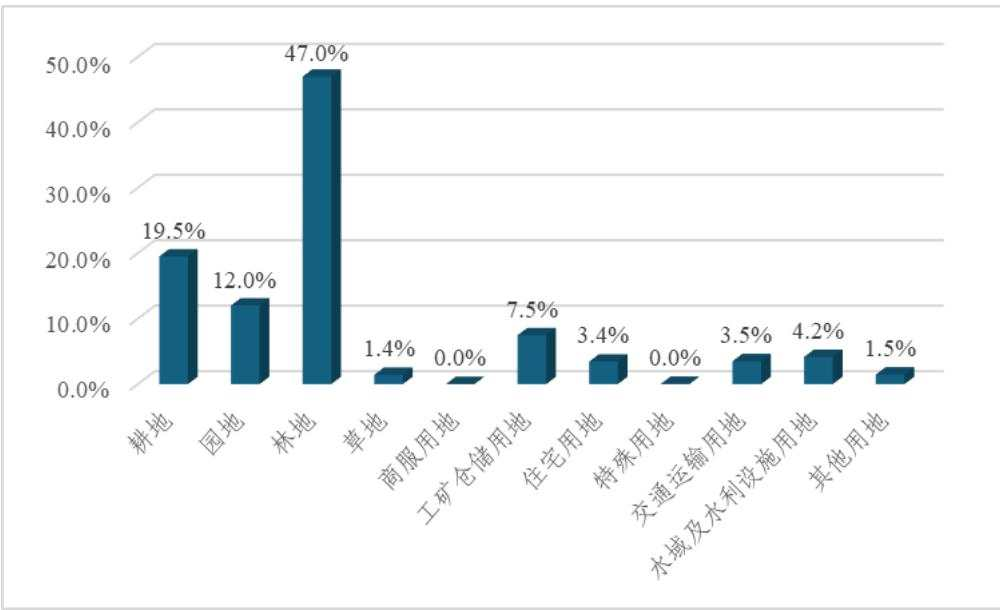  
图3.2.2-1 工程占地类型比重图

## 3.2.2.2 永久占地分析评价

路基、桥梁、站场和隧道永久占地共 619.95hm2（不含改移工程占地面积

118.16hm2），平均每公里 3.356hm2，符合《新建铁路工程项目建设用地指标》（建标〔2008〕232 号）的用地指标 6.7718hm2/km 的规定。

项目建设不可避免占用沿线耕地，湖北段用地预审批复耕地面积84.51hm2，本阶段实际占用耕地 78.74hm2；湖南段用地预审批复耕地面积 119.02hm2，本阶段实际占用耕地 111.56hm2；湖北省和湖南省实际占用耕地数量均小于用地预审中数量。根据用地预审批复要求建设项目占用耕地的，应补充数量相同，质量相当的耕地，在用地报批前按规定做好耕地占补平衡和土地复垦工作。

铁路主体工程引起的改移道路、改河改沟等工程用地范围按有关规定执行，列入拆迁工程，计列代征地。本项目专项改建工程占地118.16hm2（其中湖北省61.55hm2，湖南省56.61hm2），代征地占地面积未纳入用地预审。

根据《自然资源部关于新建宜昌至常德铁路（湖北段）项目建设用地预审意见的函》（自然资办函〔2023〕2670号）湖北省永久占地341.02hm2，现阶段湖北省永久占地 279.51hm2（不含专项改建工程 61.55hm2）。

根据《自然资源部关于新建宜昌至常德铁路（湖南段）项目建设用地预审意见的函》（自然资办函〔2024〕371号），湖南省永久占地345.58hm2，现阶段湖南省永久占地 340.44hm2（不含专项改建工程 56.61hm2）。

综上，湖北省和湖南省永久占地均小于用地预审拟用地总面积，满足从严控制用地的要求。

## 3.2.2.3 临时占地分析评价

## （1）取土场

本项目取土量 76.54 万 m3，设置 1 处取土场，占地面积 5.40hm2，取土场容量能够满足工程取土需求。取土场设置方案均取得了地方政府部门同意，并签署了协议。

## （2）弃渣场

初步设计通过优化施工方案和施工工艺进行源头减量，强化土石方调配，加大移挖作填，同时对地方综合利用进行充分调研，余方优先采取综合利用，减少弃渣量，可最大程度减少因工程弃方产生的新增占地。最终根据施工组织，综合考虑工程的弃渣量、出渣工区，通过减少小容量弃渣场，对于堆渣条件好、容量较大的弃渣场，尽可能加大弃渣，邻近弃渣场进行合并，共计设置 34 处弃渣场，其中平地（填凹）型18 处、坡地型 1 处、沟道型 15 处。相较于可研阶段，弃渣场共计减少 6 处，减少占地 77.45hm2。34 处弃渣场占地面积 165.96hm2，弃渣量自然方共计 1186.87 万 m3，依据各个弃渣场地形测算，考虑松实系数后核算弃渣场容量满足要求，弃渣场占地满足施工需要，占地面积合理。弃渣场选址均取得了地方政府部门和土地产权单位同意，并签署了协议。

## （3）施工生产生活区

全线施工生产生活区共计占地162.71hm2，（其中红线内永临、临临结合58.74hm2，新增临时占地103.97hm2），包括主体设计的制梁场、铺轨基地等大型临时工程，临时电力线、给水管线以及本方案根据需求新设置的施工场地和表土堆放场、临时堆土场、弃渣周转场。

本工程布设了大型临时工程59处，包括：铺轨基地1处，制存梁场5处，双块式轨枕预制场1处，混凝土构配件预制场1处，混凝土拌和站12处，填料拌和站4处，隧道施工场地 22 处，桥梁施工场地 13 处，临时给水管线长度 15.62km，施工临时电力线 88.26km。大型临时工程占地类型主要为为耕地、林地和空闲地，其中由于施工生产生活区一般是伴随主线设置，由于线位因素，不可避免的占用部分耕地，使用完毕后及时对耕地进行复耕，对其他地类区域进行栽植灌草进行植被恢复。

表土堆放场224处（26处为新增临时占地，198处为永临、临临结合），临时堆土场49处（永临结合），弃渣周转场9处（永临结合），上述282处临时堆土场占地共计78.92hm2。

表土堆放场：本方案根据主体工程和临时工程表土剥离和存放需求，设置了 224处表土堆放场，占地面积共计60.16hm2，其中26处为新增临时占地，共计24.18hm2；198 处为永临结合设置在桥梁、站场、弃渣场用地范围内，不新增临时占地，共计35.98hm2。表土堆放场堆高约 3.0～4.0m，容纳土方量 187.31 万 m3。

临时堆土场：本项目结合路基、桥梁、车站工程共设置了49处临时堆土场，临时占地共计 18.31hm2，平均堆高按 3.5～4.0m，临时堆置容量 61.47 万 m3，均结合主体工程平面布置设置在工程的永久征地范围内，不新增临时占地。

弃渣周转场：主体设计根据施工需求在部分隧道出渣口结合四电场坪永临结合设置弃渣周转场，共计 9 处，临时占地共计 0.45hm2，设置在四电场坪的永久征地范围内，不新增临时占地。

本工程临时堆土场数量在能够满足工程施工要求的前提下，通过集约布设和永临结合，最大限度控制了占地规模，符合水土保持的要求。

## （4）施工便道

全线共设通往各工点的施工便道（桥）长 209.58km，其中新建便道 177.74km，改扩建便道26.20km，新建便桥5.64km。全线施工便道基本为半挖半填形式。为节约用地、减少对周边生态环境的破坏，新建便道按单车道设置，每隔200m设错车平台，新建便道按平均 5.0～8.0m 宽征地，改、扩建便道宽度按平均 2.0～2.5m 宽征地。新增临时占地111.79hm2。便道路面采用泥结碎石，泥结碎石铺筑厚度不小于10cm，路面横向靠山体侧设单向排水坡，保证路面不积水。

利用既有道路本方案不计占地。经沿线踏勘、工程布置及车跑测距，施工便道设置方案合理可行，长度和宽度在满足施工要求的前提下，又尽量的控制占地规模，减少了地表扰动。施工后期结合当地交通情况和村民出行需求，除移交地方保留村道使用外，其余恢复植被和复耕，恢复原有用地类型。

## （5）永临结合分析评价

临时工程占地充分考虑布设在永久占地范围内，通过永临、临临结合的方式，共计减少临时占地 58.74hm2。

①本工程 4 处填料拌和站全部结合车站永久用地布设，减少临时占地 4.00hm2。根据车站及路基段落分布情况，综合分析确定填料集中加工站。原则上需利用挖方改良的一个路基施工区段设一处填料拌和站，填方较大的车站单独考虑设置一处填料集中加工站。根据初步的标段划分情况，1 标和 6 标范围内无车站工程，路基填方全部移挖作填，利用方无需改良，可直接在工点完成，无需设置填料拌和站。

②表土堆放场利用桥梁、站场永久占地和弃渣场临时占地布设198处，共减少临时占地35.98hm2；桥梁工程及其施工便道剥离的表土可堆放在旱桥桥墩之间的占地范围内，桥梁下部工程完工区域及时回覆利用。站场占地范围较大，分区域施工，站内各工程实施有时间上的差异，施工前根据施工组织方案，合理规划表土堆放场位置。弃渣场根据施工时序自下而上分区域剥离表土，剥离表土堆存至不影响倒渣区域，分级平台和边坡及时回覆表土绿化，待下部弃渣基本完毕后，再对下一区域表土进行剥离。

③结合主体工程挖填利用情况以及各工点施工时序，设计了回填方临时堆置方案。施工过程中，其开挖产生的土石方遵循“随挖随填、及时调配、就近利用”的原则，实现土方平衡，避免大量二次转运。在实际施工中，综合考虑最不利情况，例如当开挖段与回填段施工进度存在时间差，土方无法立即用于回填。结合路基、桥梁和车站工程共设置了 49 处回填方临时堆土场，临时占地共计 18.31hm2，无新增用地，单处堆高3.5～4.0m，坡比1:2，堆置方量61.47万m3，堆置时间为1～2年。

④弃渣周转场利用工程四电场坪永久占地布设 9 处，共减少新增临时占地0.45hm2。

综上所述，工程设计取土场、弃渣场、施工生产生活区、施工便道临时占地数量和面积能够满足工程需要，方案不再新增临时用地。

综上分析，本工程占地类型及面积基本合理，无遗漏，基本满足施工需要，符合节约用地和永临结合的要求。建议下阶段，主体工程设计进一步优化施工布置和施工时序，尽可能控制施工便道、施工生产生活区和弃渣场等占地规模和类型，减少对生态环境的破坏和耕地的占用。

## 3.2.3 土石方平衡评价

## 3.2.3.1 出渣减量化评价

## 1．线路出渣减量化设计

根据土石方调配设计，湖南段全线路基缺乏填料，需取土场取土。根据地勘资料，湖南段两处路堑除表面覆盖层以外，下部地层条件较好，可作铁路本体填料。工程在DK217+211.26～DK217+991.22 路堑段采用扩堑取土，共计扩堑取土 54.50 万 m3（V类石可取 29.30 万 m3），在 DK224+254.605～DK225+045.69 路堑段采用扩堑取土，共计扩堑取土 93.30 万 m3（V 类石可取 38.30 万 m3）。经扩堑取土后，工程可以有效减少外设取土场的取土量60.00万m3。

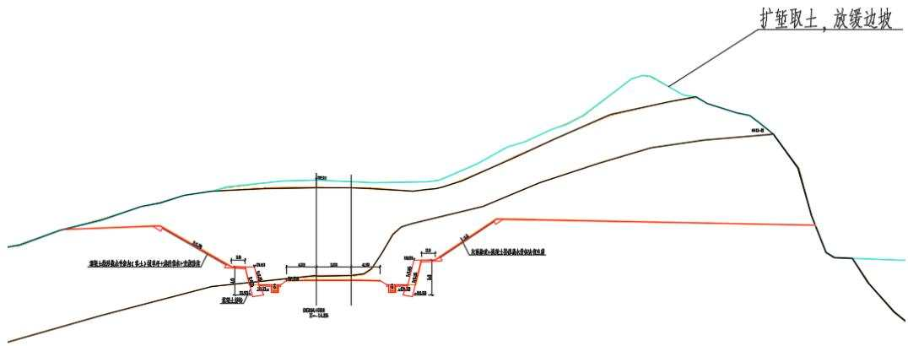  
图 3.2.3-1 DK224+900 路堑横断面图

## 2．站场出渣减量化设计

初步设计阶段，主体设计对宜都站、澧县西站方案进行了优化，通过优化车站站址、轨面标高、站后场坪布置及高程，共计减少弃渣41.00万m3。

表 3.2.3-1  
车站出渣减少情况表  
万 m3
<table><tr><td rowspan=1 colspan=1>序号</td><td rowspan=1 colspan=1>车站名称</td><td rowspan=1 colspan=1>设计优化</td><td rowspan=1 colspan=1>减少出渣</td><td rowspan=1 colspan=1>减少取土</td></tr><tr><td rowspan=1 colspan=1>1</td><td rowspan=1 colspan=1>宜都站</td><td rowspan=1 colspan=1>改为侧上式站房方案，通过调整场坪标高，减小场坪挖方，增加场坪填方，较好的实现土石方挖填均衡</td><td rowspan=1 colspan=1>-41.00</td><td rowspan=1 colspan=1></td></tr><tr><td rowspan=1 colspan=1>2</td><td rowspan=1 colspan=1>澧县西站</td><td rowspan=1 colspan=1>调整场坪标高，减小场坪填方，减少工程取土</td><td rowspan=1 colspan=1></td><td rowspan=1 colspan=1>-11.00</td></tr><tr><td rowspan=1 colspan=2>合计</td><td rowspan=1 colspan=1></td><td rowspan=1 colspan=1>-41.00</td><td rowspan=1 colspan=1>-11.00</td></tr></table>

## （1）宜都站

## ①车站概述

宜常铁路在宜都境内，沿线山脉居多，地势起伏较大，结合沿线控制因素及地方意见，车站选址位于姚家店镇张家冲村，站中心临近山顶，山顶标高为 158m，两端咽喉地面标高为115m，高差为43m，车站以挖方为主。

## ②优化说明

车站轨顶标高为127m，站中心最大挖深为31m，场坪标高为127m。根据相关专业意见，结合车站周边水系情况，车站跨线设施按10m宽天桥设置。为进一步减少车站挖方，本次站房改为线侧上布置，站房及生产生活房屋场坪标高抬高为 135m，高于轨面 8m，天桥与车站场坪等高。调整后，可减少车站挖方 30.00 万 $\mathrm { m } ^ { 3 }$ ，增加填方11.00 万 m3，整体减少弃方 41.00 万 m3。

## （2）澧县西站

## ①车站概述

澧县西站为 2 台 6 线规模，车站标高为 48.7m，以填方为主，车站范围百年洪水位为 45.3m，站房采用线侧平布置，车站设信号楼、污水处理站、配电所、公安派出所等铁路生产生活房屋，初步设计站房及生产生活房屋场坪标高为 48.7m，澧县西站填方约 126.17 万 m3，占地面积 25.62hm2。

## ②车站概述

为进一步优化澧县西站工程，避免资源浪费，站场专业从降低场坪标高、优化断面设计2个方面优化车站工程。

## A．降低场坪标高

结合房建布置、地道设施及百年洪水位等相关控制因素，优化后场坪标高为45.8m，填高为 5.1m，较原方案降低 2.9m，填方量优化为 115.17 万 $\mathbf { m } ^ { 3 } \mathbf { ; }$ ：较初步设计可减少土石方约11.00万m3，减少征地约0.25hm2。

## B．优化断面设计

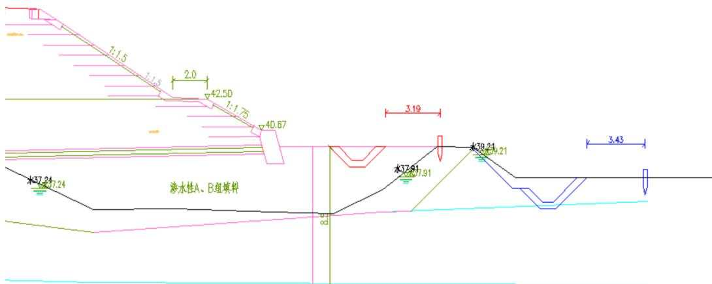

针对地路专业处理后的局部填补池塘的断面，通过调整铁路水沟位置，优化断面，以减少征地。蓝色为初步设计水沟的位置，红色为优化后水沟位置，用地界缩窄12m，减少征地范围。优化后可减少征地约 $0 . 5 1 \mathrm { h m } ^ { 2 }$

综上，结合两方面的优化，本次优化可减少取土量约11.00万 $\mathrm { m } ^ { 3 }$ ，总减少征地约$0 . 7 6 \mathrm { h m } ^ { 2 }$

## 3．隧道出渣减量化设计

## （1）辅助坑道优化

为了能满足工期的要求，结合地形、地质条件、环境要求，结合救援疏散的需要，本线设置辅助坑道（斜井）2座，斜井总长580m。

主体设计通过将辅助坑道断面由双车道断面方案优化为单车道+错车道断面方案，可减少开挖量。

经优化，马鞍山1 号隧道斜井双车道可优化为单车道+错车道，可减少开挖量0.62万 $\mathrm { m } ^ { 3 }$

马鞍山2号隧道斜井双车道可优化为单车道+错车道，可减少开挖量0.35万 $\mathrm { m } ^ { 3 }$

综上，全线隧道辅助坑道断面优化累计减少开挖量0.97万m3。

## （2）隧道边坡防护优化设计

隧道洞口地形偏压，采用骨架护坡方案时，开挖量较大，采用锚固桩方案时，开挖量较小，经优化设计方案，对郭家坡1号隧道、郭家坡2号隧道等5处洞口防护方案采用锚固桩方案，共减少开挖量4.28万 $\mathrm { m } ^ { 3 }$

表 3.2.3-2  
隧道洞口出渣减少情况表
<table><tr><td rowspan=2 colspan=1>序号</td><td rowspan=2 colspan=1>名称</td><td rowspan=1 colspan=1>采用骨架护坡方案洞口开挖量</td><td rowspan=1 colspan=1>采用锚固桩方案洞口开挖量</td><td rowspan=1 colspan=1>减少出渣</td></tr><tr><td rowspan=1 colspan=1> $\overline { { \mathcal { H } } } \mathrm { ~ m } ^ { 3 }$ </td><td rowspan=1 colspan=1> $\overline { { \mathcal { H } } } \mathrm { ~ m } ^ { 3 }$ </td><td rowspan=1 colspan=1> $\mathcal { F } \mathrm { ~ m } ^ { 3 }$ </td></tr><tr><td rowspan=1 colspan=1>1</td><td rowspan=1 colspan=1>郭家1号隧道进口</td><td rowspan=1 colspan=1>0.39</td><td rowspan=1 colspan=1>0.13</td><td rowspan=1 colspan=1>0.26</td></tr><tr><td rowspan=1 colspan=1>2</td><td rowspan=1 colspan=1>郭家2号隧道进口</td><td rowspan=1 colspan=1>0.79</td><td rowspan=1 colspan=1>0.23</td><td rowspan=1 colspan=1>0.56</td></tr><tr><td rowspan=1 colspan=1>3</td><td rowspan=1 colspan=1>郭家3号隧道出口</td><td rowspan=1 colspan=1>1.09</td><td rowspan=1 colspan=1>0.63</td><td rowspan=1 colspan=1>0.46</td></tr><tr><td rowspan=1 colspan=1>4</td><td rowspan=1 colspan=1>钟家垴隧道出口</td><td rowspan=1 colspan=1>2.4</td><td rowspan=1 colspan=1>0.5</td><td rowspan=1 colspan=1>1.9</td></tr><tr><td rowspan=1 colspan=1>5</td><td rowspan=1 colspan=1>官垱隧道出口</td><td rowspan=1 colspan=1>1.5</td><td rowspan=1 colspan=1>0.4</td><td rowspan=1 colspan=1>1.1</td></tr><tr><td rowspan=1 colspan=2>合计</td><td rowspan=1 colspan=1>6.17</td><td rowspan=1 colspan=1>1.89</td><td rowspan=1 colspan=1>4.28</td></tr></table>

## 4．弃渣场优化设计

本项目目前阶段共设置弃渣场 34 处，占地面积 165.96hm2，容渣量为 1833.90 万$\mathrm { m } ^ { 3 }$ ，相较于可研阶段，弃渣场共计减少6处，减少占地77.45hm2。详情见下表。

表 3.2.3-3

中国铁建 CRCE  
弃渣场优化设计情况表
<table><tr><td rowspan=1 colspan=5>优化前</td><td rowspan=1 colspan=2>优化研究</td><td rowspan=1 colspan=5>优化后</td></tr><tr><td rowspan=2 colspan=1>序号</td><td rowspan=2 colspan=1>名称</td><td rowspan=2 colspan=1>里程位置</td><td rowspan=1 colspan=1>容渣量</td><td rowspan=1 colspan=1>占地</td><td rowspan=2 colspan=1>优化内容</td><td rowspan=1 colspan=1>减少占地</td><td rowspan=2 colspan=1>序号</td><td rowspan=2 colspan=1>名称</td><td rowspan=2 colspan=1>里程位置</td><td rowspan=1 colspan=1>容渣量</td><td rowspan=1 colspan=1>占地</td></tr><tr><td rowspan=1 colspan=1>万m³</td><td rowspan=1 colspan=1>hm²</td><td rowspan=1 colspan=1>公顷</td><td rowspan=1 colspan=1>万m³</td><td rowspan=1 colspan=1>hm²</td></tr><tr><td rowspan=1 colspan=1>1</td><td rowspan=1 colspan=1>磨石村弃渣场</td><td rowspan=1 colspan=1>DK49+800 左侧1.3km</td><td rowspan=1 colspan=1>90.00</td><td rowspan=1 colspan=1>6.00</td><td rowspan=1 colspan=1></td><td rowspan=1 colspan=1>0.00</td><td rowspan=1 colspan=1>1</td><td rowspan=1 colspan=1>磨石村弃渣场</td><td rowspan=1 colspan=1>DK49+800 左侧1.3km</td><td rowspan=1 colspan=1>90.00</td><td rowspan=1 colspan=1>6.00</td></tr><tr><td rowspan=1 colspan=1>2</td><td rowspan=1 colspan=1>曹家冲弃渣场</td><td rowspan=1 colspan=1>DK55+400 右侧 2.0km</td><td rowspan=1 colspan=1>100.00</td><td rowspan=1 colspan=1>8.34</td><td rowspan=1 colspan=1></td><td rowspan=1 colspan=1>0.00</td><td rowspan=1 colspan=1>2</td><td rowspan=1 colspan=1>曹家冲弃渣场</td><td rowspan=1 colspan=1>DK55+400 右侧 2.0km</td><td rowspan=1 colspan=1>100.00</td><td rowspan=1 colspan=1>8.34</td></tr><tr><td rowspan=1 colspan=1>3</td><td rowspan=1 colspan=1>彭家坳弃渣场</td><td rowspan=1 colspan=1>DK55+770 右侧1.9km</td><td rowspan=1 colspan=1>100.00</td><td rowspan=1 colspan=1>6.84</td><td rowspan=1 colspan=1></td><td rowspan=1 colspan=1>0.00</td><td rowspan=1 colspan=1>3</td><td rowspan=1 colspan=1>彭家坳弃渣场</td><td rowspan=1 colspan=1>DK55+770 右侧1.9km</td><td rowspan=1 colspan=1>100.00</td><td rowspan=1 colspan=1>6.84</td></tr><tr><td rowspan=1 colspan=1>4</td><td rowspan=1 colspan=1>天江湾1号弃渣场</td><td rowspan=1 colspan=1>DK54+800 右侧 3.4km</td><td rowspan=1 colspan=1>80.00</td><td rowspan=1 colspan=1>8.49</td><td rowspan=1 colspan=1></td><td rowspan=1 colspan=1>4.01</td><td rowspan=1 colspan=1>4</td><td rowspan=1 colspan=1>天江湾1号弃渣场</td><td rowspan=1 colspan=1>DK54+800 右侧 3.4km</td><td rowspan=1 colspan=1>80.00</td><td rowspan=1 colspan=1>4.48</td></tr><tr><td rowspan=1 colspan=1>5</td><td rowspan=1 colspan=1>天江湾2号弃渣场</td><td rowspan=1 colspan=1>DK55+250 右侧 3.4km</td><td rowspan=1 colspan=1>70.00</td><td rowspan=1 colspan=1>8.67</td><td rowspan=1 colspan=1></td><td rowspan=1 colspan=1>0.00</td><td rowspan=1 colspan=1>5</td><td rowspan=1 colspan=1>天江湾2号弃渣场</td><td rowspan=1 colspan=1>DK55+250 右侧 3.4km</td><td rowspan=1 colspan=1>70.00</td><td rowspan=1 colspan=1>8.67</td></tr><tr><td rowspan=1 colspan=1>6</td><td rowspan=1 colspan=1>桃沙溪弃渣场</td><td rowspan=1 colspan=1>DK57+800 右侧 2.5km</td><td rowspan=1 colspan=1>100.00</td><td rowspan=1 colspan=1>10.61</td><td rowspan=1 colspan=1>优化调整弃渣场位置</td><td rowspan=1 colspan=1>0.82</td><td rowspan=1 colspan=1>6</td><td rowspan=1 colspan=1>望水坪2号弃渣场</td><td rowspan=1 colspan=1>DK57+800 右侧 2.5km</td><td rowspan=1 colspan=1>85.00</td><td rowspan=1 colspan=1>9.79</td></tr><tr><td rowspan=1 colspan=1>7</td><td rowspan=1 colspan=1>鸡头山弃土场</td><td rowspan=1 colspan=1>DK66+000 右侧 4.3km</td><td rowspan=1 colspan=1>28.60</td><td rowspan=1 colspan=1>3.59</td><td rowspan=1 colspan=1></td><td rowspan=1 colspan=1>0.00</td><td rowspan=1 colspan=1>7</td><td rowspan=1 colspan=1>鸡头山弃土场</td><td rowspan=1 colspan=1>DK66+000 右侧 4.3km</td><td rowspan=1 colspan=1>28.60</td><td rowspan=1 colspan=1>3.59</td></tr><tr><td rowspan=1 colspan=1>8</td><td rowspan=1 colspan=1>熊家坳弃土场</td><td rowspan=1 colspan=1>DK69+000 左侧 2.4km</td><td rowspan=1 colspan=1>70.60</td><td rowspan=1 colspan=1>5.90</td><td rowspan=1 colspan=1></td><td rowspan=1 colspan=1>0.00</td><td rowspan=1 colspan=1>8</td><td rowspan=1 colspan=1>熊家坳弃土场</td><td rowspan=1 colspan=1>DK69+000 左侧 2.4km</td><td rowspan=1 colspan=1>70.60</td><td rowspan=1 colspan=1>5.90</td></tr><tr><td rowspan=1 colspan=1>9</td><td rowspan=1 colspan=1>龙井弃土场</td><td rowspan=1 colspan=1>DK70+600 右侧 0.1km</td><td rowspan=1 colspan=1>33.00</td><td rowspan=1 colspan=1>2.93</td><td rowspan=1 colspan=1></td><td rowspan=1 colspan=1>0.00</td><td rowspan=1 colspan=1>9</td><td rowspan=1 colspan=1>龙井弃土场</td><td rowspan=1 colspan=1>DK70+600 右侧 0.1km</td><td rowspan=1 colspan=1>33.00</td><td rowspan=1 colspan=1>2.93</td></tr><tr><td rowspan=1 colspan=1>10</td><td rowspan=1 colspan=1>天井湖弃土场</td><td rowspan=1 colspan=1>DK78+000 右侧11.0km</td><td rowspan=1 colspan=1>68.00</td><td rowspan=1 colspan=1>4.78</td><td rowspan=1 colspan=1>方案优化方量减少</td><td rowspan=1 colspan=1>1.10</td><td rowspan=1 colspan=1>10</td><td rowspan=1 colspan=1>天井湖弃土场</td><td rowspan=1 colspan=1>DK78+000 右侧11.0km</td><td rowspan=1 colspan=1>34.00</td><td rowspan=1 colspan=1>3.68</td></tr><tr><td rowspan=1 colspan=1>11</td><td rowspan=1 colspan=1>天桥湾弃土场</td><td rowspan=1 colspan=1>DK82+500 右侧 6.5km</td><td rowspan=1 colspan=1>96.00</td><td rowspan=1 colspan=1>5.81</td><td rowspan=1 colspan=1>取消</td><td rowspan=1 colspan=1>5.81</td><td rowspan=1 colspan=1></td><td rowspan=1 colspan=1></td><td rowspan=1 colspan=1></td><td rowspan=1 colspan=1></td><td rowspan=1 colspan=1></td></tr><tr><td rowspan=1 colspan=1></td><td rowspan=1 colspan=1></td><td rowspan=1 colspan=1></td><td rowspan=1 colspan=1></td><td rowspan=1 colspan=1></td><td rowspan=1 colspan=1></td><td rowspan=1 colspan=1>(1.81)</td><td rowspan=1 colspan=1>11</td><td rowspan=1 colspan=1>咸池冲1#弃土场</td><td rowspan=1 colspan=1>DK88+000 右侧 4.8km</td><td rowspan=1 colspan=1>11.00</td><td rowspan=1 colspan=1>1.81</td></tr><tr><td rowspan=1 colspan=1></td><td rowspan=1 colspan=1></td><td rowspan=1 colspan=1></td><td rowspan=1 colspan=1></td><td rowspan=1 colspan=1></td><td rowspan=1 colspan=1></td><td rowspan=1 colspan=1>(4.18)</td><td rowspan=1 colspan=1>12</td><td rowspan=1 colspan=1>咸池冲2#弃土场</td><td rowspan=1 colspan=1>DK88+200 右侧 5.0km</td><td rowspan=1 colspan=1>22.00</td><td rowspan=1 colspan=1>4.18</td></tr><tr><td rowspan=1 colspan=1></td><td rowspan=1 colspan=1></td><td rowspan=1 colspan=1></td><td rowspan=1 colspan=1></td><td rowspan=1 colspan=1></td><td rowspan=1 colspan=1></td><td rowspan=1 colspan=1>(3.02)</td><td rowspan=1 colspan=1>13</td><td rowspan=1 colspan=1>茶园寺村1#弃土场</td><td rowspan=1 colspan=1>DK89+000 右侧 5.5km</td><td rowspan=1 colspan=1>30.00</td><td rowspan=1 colspan=1>3.02</td></tr><tr><td rowspan=1 colspan=1>11</td><td rowspan=1 colspan=1>窑湾弃土场</td><td rowspan=1 colspan=1>DK92+400 右侧 0.6km</td><td rowspan=1 colspan=1>118.00</td><td rowspan=1 colspan=1>4.68</td><td rowspan=1 colspan=1>方案优化方量减少</td><td rowspan=1 colspan=1>0.00</td><td rowspan=1 colspan=1>14</td><td rowspan=1 colspan=1>窑湾弃土场</td><td rowspan=1 colspan=1>DK92+400 左侧0.6km</td><td rowspan=1 colspan=1>79.00</td><td rowspan=1 colspan=1>4.68</td></tr></table>

3 主体工程水土保持分析与评价

中国铁建 CRCECHINA RAILWAY SIYUAN SURVEY AND DESIGN GROUP CO.,LTD 中铁第四勘察设计院集团有限公司
<table><tr><td rowspan=1 colspan=5>优化前</td><td rowspan=1 colspan=2>优化研究</td><td rowspan=1 colspan=5>优化后</td></tr><tr><td rowspan=2 colspan=1>序号</td><td rowspan=2 colspan=1>名称</td><td rowspan=2 colspan=1>里程位置</td><td rowspan=1 colspan=1>容渣量</td><td rowspan=1 colspan=1>占地</td><td rowspan=2 colspan=1>优化内容</td><td rowspan=1 colspan=1>减少占地</td><td rowspan=2 colspan=1>序号</td><td rowspan=2 colspan=1>名称</td><td rowspan=2 colspan=1>里程位置</td><td rowspan=1 colspan=1>容渣量</td><td rowspan=1 colspan=1>占地</td></tr><tr><td rowspan=1 colspan=1>万m³</td><td rowspan=1 colspan=1>hm²</td><td rowspan=1 colspan=1>公顷</td><td rowspan=1 colspan=1>万m³</td><td rowspan=1 colspan=1>hm²</td></tr><tr><td rowspan=1 colspan=1>12</td><td rowspan=1 colspan=1>田家东弃土场</td><td rowspan=1 colspan=1>DK97+000 左侧 0.54km</td><td rowspan=1 colspan=1>58.50</td><td rowspan=1 colspan=1>6.95</td><td rowspan=1 colspan=1>方案优化方量减少</td><td rowspan=1 colspan=1>0.00</td><td rowspan=1 colspan=1>15</td><td rowspan=1 colspan=1>田家东弃土场</td><td rowspan=1 colspan=1>DK97+000 左侧 0.54km</td><td rowspan=1 colspan=1>46.00</td><td rowspan=1 colspan=1>6.95</td></tr><tr><td rowspan=1 colspan=1>13</td><td rowspan=1 colspan=1>刘家湾弃渣场</td><td rowspan=1 colspan=1>DK98+000 右侧 3.3km</td><td rowspan=1 colspan=1>50.20</td><td rowspan=1 colspan=1>3.43</td><td rowspan=1 colspan=1>方案优化方量减少</td><td rowspan=1 colspan=1>0.00</td><td rowspan=1 colspan=1>16</td><td rowspan=1 colspan=1>刘家湾弃渣场</td><td rowspan=1 colspan=1>DK98+000 右侧 3.3km</td><td rowspan=1 colspan=1>20.00</td><td rowspan=1 colspan=1>3.43</td></tr><tr><td rowspan=1 colspan=1>14</td><td rowspan=1 colspan=1>燕窝池弃土场</td><td rowspan=1 colspan=1>DK100+000 左侧 15.48km</td><td rowspan=1 colspan=1>27.55</td><td rowspan=1 colspan=1>4.56</td><td rowspan=1 colspan=1>方案优化方量增加</td><td rowspan=1 colspan=1>(0.27)</td><td rowspan=1 colspan=1>17</td><td rowspan=1 colspan=1>燕窝池弃土场</td><td rowspan=1 colspan=1>DK100+000 左侧 15.48km</td><td rowspan=1 colspan=1>30.00</td><td rowspan=1 colspan=1>4.83</td></tr><tr><td rowspan=1 colspan=1>15</td><td rowspan=1 colspan=1>姜家岭1#弃土场</td><td rowspan=1 colspan=1>DK106+000 右侧 11.2km</td><td rowspan=1 colspan=1>35.00</td><td rowspan=1 colspan=1>5.52</td><td rowspan=1 colspan=1></td><td rowspan=1 colspan=1>0.00</td><td rowspan=1 colspan=1>18</td><td rowspan=1 colspan=1>姜家岭1#弃土场</td><td rowspan=1 colspan=1>DK106+000 右侧 11.2km</td><td rowspan=1 colspan=1>35.00</td><td rowspan=1 colspan=1>5.52</td></tr><tr><td rowspan=1 colspan=1>16</td><td rowspan=1 colspan=1>姜家岭2#弃土场</td><td rowspan=1 colspan=1>DK106+000 右侧11.2km</td><td rowspan=1 colspan=1>45.00</td><td rowspan=1 colspan=1>6.96</td><td rowspan=1 colspan=1>取消</td><td rowspan=1 colspan=1>6.96</td><td rowspan=1 colspan=1></td><td rowspan=1 colspan=1></td><td rowspan=1 colspan=1></td><td rowspan=1 colspan=1></td><td rowspan=1 colspan=1></td></tr><tr><td rowspan=1 colspan=1>17</td><td rowspan=1 colspan=1>厂下1#弃土场</td><td rowspan=1 colspan=1>DK106+000 右侧 11.5km</td><td rowspan=1 colspan=1>77.00</td><td rowspan=1 colspan=1>8.37</td><td rowspan=1 colspan=1></td><td rowspan=1 colspan=1>0.00</td><td rowspan=1 colspan=1>19</td><td rowspan=1 colspan=1>厂下1#弃土场</td><td rowspan=1 colspan=1>DK106+000 右侧11.5km</td><td rowspan=1 colspan=1>77.00</td><td rowspan=1 colspan=1>8.37</td></tr><tr><td rowspan=1 colspan=1></td><td rowspan=1 colspan=1>厂下2#弃土场</td><td rowspan=1 colspan=1>DK106+000 右侧11.5km</td><td rowspan=1 colspan=1>34.00</td><td rowspan=1 colspan=1>4.24</td><td rowspan=1 colspan=1></td><td rowspan=1 colspan=1>0.00</td><td rowspan=1 colspan=1>20</td><td rowspan=1 colspan=1>厂下2#弃土场</td><td rowspan=1 colspan=1>DK106+000 右侧 11.5km</td><td rowspan=1 colspan=1>34.00</td><td rowspan=1 colspan=1>4.24</td></tr><tr><td rowspan=1 colspan=1>18</td><td rowspan=1 colspan=1>通用弃土场</td><td rowspan=1 colspan=1>DK117+000 右侧 7.0km</td><td rowspan=1 colspan=1>42.90</td><td rowspan=1 colspan=1>38.32</td><td rowspan=1 colspan=1>调整为综合利用</td><td rowspan=1 colspan=1>38.32</td><td rowspan=1 colspan=1></td><td rowspan=1 colspan=1></td><td rowspan=1 colspan=1></td><td rowspan=1 colspan=1></td><td rowspan=1 colspan=1></td></tr><tr><td rowspan=1 colspan=1>19</td><td rowspan=1 colspan=1>东方湾弃土场</td><td rowspan=1 colspan=1>DK153+800 右侧 12.0km</td><td rowspan=1 colspan=1>15.10</td><td rowspan=1 colspan=1>1.37</td><td rowspan=1 colspan=1></td><td rowspan=1 colspan=1>0.00</td><td rowspan=1 colspan=1>21</td><td rowspan=1 colspan=1>东方湾弃土场</td><td rowspan=1 colspan=1>DK153+800 右侧12.0km</td><td rowspan=1 colspan=1>15.50</td><td rowspan=1 colspan=1>1.37</td></tr><tr><td rowspan=1 colspan=1>20</td><td rowspan=1 colspan=1>万家湾弃土场</td><td rowspan=1 colspan=1>DK153+500 右侧16.0km</td><td rowspan=1 colspan=1>11.70</td><td rowspan=1 colspan=1>2.14</td><td rowspan=1 colspan=1>取消</td><td rowspan=1 colspan=1>2.14</td><td rowspan=1 colspan=1></td><td rowspan=1 colspan=1></td><td rowspan=1 colspan=1></td><td rowspan=1 colspan=1></td><td rowspan=1 colspan=1></td></tr><tr><td rowspan=1 colspan=1>21</td><td rowspan=1 colspan=1>五里堆弃土场#1</td><td rowspan=1 colspan=1>DK159+000 右侧 7.2km</td><td rowspan=1 colspan=1>48.50</td><td rowspan=1 colspan=1>2.98</td><td rowspan=1 colspan=1></td><td rowspan=1 colspan=1>0.00</td><td rowspan=1 colspan=1>22</td><td rowspan=1 colspan=1>五里堆弃土场#1</td><td rowspan=1 colspan=1>DK159+000 右侧 7.2km</td><td rowspan=1 colspan=1>48.50</td><td rowspan=1 colspan=1>2.98</td></tr><tr><td rowspan=1 colspan=1>22</td><td rowspan=1 colspan=1>马家堰2#弃土场</td><td rowspan=1 colspan=1>DK176+000 左侧 2.4km</td><td rowspan=1 colspan=1>9.40</td><td rowspan=1 colspan=1>2.36</td><td rowspan=1 colspan=1>取消</td><td rowspan=1 colspan=1>2.36</td><td rowspan=1 colspan=1></td><td rowspan=1 colspan=1></td><td rowspan=1 colspan=1></td><td rowspan=1 colspan=1></td><td rowspan=1 colspan=1></td></tr><tr><td rowspan=1 colspan=1>23</td><td rowspan=1 colspan=1>马家堰3#弃渣场</td><td rowspan=1 colspan=1>DK176+000 左侧 2.0km</td><td rowspan=1 colspan=1>9.10</td><td rowspan=1 colspan=1>2.09</td><td rowspan=1 colspan=1></td><td rowspan=1 colspan=1>0.00</td><td rowspan=1 colspan=1>23</td><td rowspan=1 colspan=1>马家堰3#弃渣场</td><td rowspan=1 colspan=1>DK176+000 左侧 2.0km</td><td rowspan=1 colspan=1>9.50</td><td rowspan=1 colspan=1>2.09</td></tr><tr><td rowspan=1 colspan=1>24</td><td rowspan=1 colspan=1>观音洞弃土场</td><td rowspan=1 colspan=1>DK183+000 右侧13.0km</td><td rowspan=1 colspan=1>50.30</td><td rowspan=1 colspan=1>2.69</td><td rowspan=1 colspan=1>方案优化方量减少</td><td rowspan=1 colspan=1>0.00</td><td rowspan=1 colspan=1>24</td><td rowspan=1 colspan=1>观音洞弃土场</td><td rowspan=1 colspan=1>DK183+000 右侧13.0km</td><td rowspan=1 colspan=1>40.40</td><td rowspan=1 colspan=1>2.69</td></tr><tr><td rowspan=1 colspan=1>25</td><td rowspan=1 colspan=1>云翎咀弃土场</td><td rowspan=1 colspan=1>DK184+000 左侧 0.2km</td><td rowspan=1 colspan=1>65.80</td><td rowspan=1 colspan=1>6.11</td><td rowspan=1 colspan=1></td><td rowspan=1 colspan=1>0.00</td><td rowspan=1 colspan=1>25</td><td rowspan=1 colspan=1>云翎咀弃土场</td><td rowspan=1 colspan=1>DK184+000 左侧 0.2km</td><td rowspan=1 colspan=1>66.80</td><td rowspan=1 colspan=1>6.11</td></tr></table>

体工程水土保持分析

中国铁建 CRCECHINA RAILWAY SIYUAN SURVEY AND DESIGN GROUP CO.,LTD 中铁第四勘察设计院集团有限公司  
体工程水土保持分析
<table><tr><td rowspan=1 colspan=5>优化前</td><td rowspan=1 colspan=2>优化研究</td><td rowspan=1 colspan=5>优化后</td></tr><tr><td rowspan=2 colspan=1>序号</td><td rowspan=2 colspan=1>名称</td><td rowspan=2 colspan=1>里程位置</td><td rowspan=1 colspan=1>容渣量</td><td rowspan=1 colspan=1>占地</td><td rowspan=2 colspan=1>优化内容</td><td rowspan=1 colspan=1>减少占地</td><td rowspan=2 colspan=1>序号</td><td rowspan=2 colspan=1>名称</td><td rowspan=2 colspan=1>里程位置</td><td rowspan=1 colspan=1>容渣量</td><td rowspan=1 colspan=1>占地</td></tr><tr><td rowspan=1 colspan=1>万m³</td><td rowspan=1 colspan=1>hm²</td><td rowspan=1 colspan=1>公顷</td><td rowspan=1 colspan=1>万m³</td><td rowspan=1 colspan=1>hm²</td></tr><tr><td rowspan=1 colspan=1>26</td><td rowspan=1 colspan=1>肖家河弃土场</td><td rowspan=1 colspan=1>DK189+200 左侧 3.4km</td><td rowspan=1 colspan=1>48.20</td><td rowspan=1 colspan=1>6.09</td><td rowspan=1 colspan=1></td><td rowspan=1 colspan=1>0.00</td><td rowspan=1 colspan=1>26</td><td rowspan=1 colspan=1>肖家河弃土场</td><td rowspan=1 colspan=1>DK189+200 左侧 3.4km</td><td rowspan=1 colspan=1>48.50</td><td rowspan=1 colspan=1>6.09</td></tr><tr><td rowspan=1 colspan=1>27</td><td rowspan=1 colspan=1>临柏弃土场</td><td rowspan=1 colspan=1>DK196+500 左侧 5.0km</td><td rowspan=1 colspan=1>23.30</td><td rowspan=1 colspan=1>3.77</td><td rowspan=1 colspan=1></td><td rowspan=1 colspan=1>0.00</td><td rowspan=1 colspan=1>27</td><td rowspan=1 colspan=1>临柏弃土场</td><td rowspan=1 colspan=1>DK196+500 左侧 5.0km</td><td rowspan=1 colspan=1>23.30</td><td rowspan=1 colspan=1>3.77</td></tr><tr><td rowspan=1 colspan=1>28</td><td rowspan=1 colspan=1>高家滩弃土场</td><td rowspan=1 colspan=1>DK196+500 左侧 5.0km</td><td rowspan=1 colspan=1>40.00</td><td rowspan=1 colspan=1>4.71</td><td rowspan=1 colspan=1>取消</td><td rowspan=1 colspan=1>4.71</td><td rowspan=1 colspan=1></td><td rowspan=1 colspan=1></td><td rowspan=1 colspan=1></td><td rowspan=1 colspan=1></td><td rowspan=1 colspan=1></td></tr><tr><td rowspan=1 colspan=1>29</td><td rowspan=1 colspan=1>兴安弃土场</td><td rowspan=1 colspan=1>DK207+400 右侧 3.0km</td><td rowspan=1 colspan=1>80.30</td><td rowspan=1 colspan=1>4.95</td><td rowspan=1 colspan=1>方案优化方量减少</td><td rowspan=1 colspan=1>0.39</td><td rowspan=1 colspan=1>28</td><td rowspan=1 colspan=1>兴安弃土场</td><td rowspan=1 colspan=1>DK207+400 右侧 3.0km</td><td rowspan=1 colspan=1>72.00</td><td rowspan=1 colspan=1>4.56</td></tr><tr><td rowspan=1 colspan=1>30</td><td rowspan=1 colspan=1>八仙村弃土场</td><td rowspan=1 colspan=1>DK207+400 右侧 3.0km</td><td rowspan=1 colspan=1>79.60</td><td rowspan=1 colspan=1>3.49</td><td rowspan=1 colspan=1>取消</td><td rowspan=1 colspan=1>3.49</td><td rowspan=1 colspan=1></td><td rowspan=1 colspan=1></td><td rowspan=1 colspan=1></td><td rowspan=1 colspan=1></td><td rowspan=1 colspan=1></td></tr><tr><td rowspan=1 colspan=1>31</td><td rowspan=1 colspan=1>阳坡庵弃土场</td><td rowspan=1 colspan=1>DK214+000 左侧 23.8km</td><td rowspan=1 colspan=1>37.20</td><td rowspan=1 colspan=1>7.97</td><td rowspan=1 colspan=1>取消</td><td rowspan=1 colspan=1>7.97</td><td rowspan=1 colspan=1></td><td rowspan=1 colspan=1></td><td rowspan=1 colspan=1></td><td rowspan=1 colspan=1></td><td rowspan=1 colspan=1></td></tr><tr><td rowspan=1 colspan=1>32</td><td rowspan=1 colspan=1>郑湾1#弃土场</td><td rowspan=1 colspan=1>DK216+800 左侧 0.3km</td><td rowspan=1 colspan=1>109.00</td><td rowspan=1 colspan=1>12.95</td><td rowspan=1 colspan=1></td><td rowspan=1 colspan=1>0.00</td><td rowspan=1 colspan=1>29</td><td rowspan=1 colspan=1>郑湾1#弃土场</td><td rowspan=1 colspan=1>DK216+800 左侧 0.3km</td><td rowspan=1 colspan=1>109.00</td><td rowspan=1 colspan=1>12.95</td></tr><tr><td rowspan=1 colspan=1>33</td><td rowspan=1 colspan=1>郑湾2#弃土场</td><td rowspan=1 colspan=1>DK217+000 左侧1.0km</td><td rowspan=1 colspan=1>254.00</td><td rowspan=1 colspan=1>5.64</td><td rowspan=1 colspan=1></td><td rowspan=1 colspan=1>0.00</td><td rowspan=1 colspan=1>30</td><td rowspan=1 colspan=1>郑湾 2#弃土场</td><td rowspan=1 colspan=1>DK217+000 左侧1.0km</td><td rowspan=1 colspan=1>254.00</td><td rowspan=1 colspan=1>5.64</td></tr><tr><td rowspan=1 colspan=1>34</td><td rowspan=1 colspan=1>八一弃土场</td><td rowspan=1 colspan=1>DK217+000 左侧 22.31km</td><td rowspan=1 colspan=1>80.00</td><td rowspan=1 colspan=1>3.49</td><td rowspan=1 colspan=1>取消</td><td rowspan=1 colspan=1>3.49</td><td rowspan=1 colspan=1></td><td rowspan=1 colspan=1></td><td rowspan=1 colspan=1></td><td rowspan=1 colspan=1></td><td rowspan=1 colspan=1></td></tr><tr><td rowspan=1 colspan=1>35</td><td rowspan=1 colspan=1>长堰弃土场</td><td rowspan=1 colspan=1>DK220+000 左侧1.0km</td><td rowspan=1 colspan=1>14.70</td><td rowspan=1 colspan=1>1.40</td><td rowspan=1 colspan=1>方案优化方量减少</td><td rowspan=1 colspan=1>0.00</td><td rowspan=1 colspan=1>31</td><td rowspan=1 colspan=1>长堰弃土场</td><td rowspan=1 colspan=1>DK220+000 左侧1.0km</td><td rowspan=1 colspan=1>12.80</td><td rowspan=1 colspan=1>1.40</td></tr><tr><td rowspan=1 colspan=1>36</td><td rowspan=1 colspan=1>金家湾1#弃土场</td><td rowspan=1 colspan=1>DK224+280 左侧 0.1km</td><td rowspan=1 colspan=1>18.40</td><td rowspan=1 colspan=1>1.50</td><td rowspan=1 colspan=1></td><td rowspan=1 colspan=1>0.00</td><td rowspan=1 colspan=1>32</td><td rowspan=1 colspan=1>金家湾1#弃土场</td><td rowspan=1 colspan=1>DK224+280 左侧 0.1km</td><td rowspan=1 colspan=1>18.40</td><td rowspan=1 colspan=1>1.50</td></tr><tr><td rowspan=1 colspan=1>37</td><td rowspan=1 colspan=1>棉花山弃土场</td><td rowspan=1 colspan=1>DK227+100 右侧 0.2km</td><td rowspan=1 colspan=1>20.00</td><td rowspan=1 colspan=1>1.88</td><td rowspan=1 colspan=1></td><td rowspan=1 colspan=1>0.00</td><td rowspan=1 colspan=1>33</td><td rowspan=1 colspan=1>棉花山弃土场</td><td rowspan=1 colspan=1>DK227+100 右侧 0.2km</td><td rowspan=1 colspan=1>20.00</td><td rowspan=1 colspan=1>1.88</td></tr><tr><td rowspan=1 colspan=1>38</td><td rowspan=1 colspan=1>杭瑞弃土场</td><td rowspan=1 colspan=1>DK228+600 左侧1.6km</td><td rowspan=1 colspan=1>10.00</td><td rowspan=1 colspan=1>2.47</td><td rowspan=1 colspan=1>取消</td><td rowspan=1 colspan=1>2.47</td><td rowspan=1 colspan=1></td><td rowspan=1 colspan=1></td><td rowspan=1 colspan=1></td><td rowspan=1 colspan=1></td><td rowspan=1 colspan=1></td></tr><tr><td rowspan=1 colspan=1>39</td><td rowspan=1 colspan=1>尹家冲弃土场</td><td rowspan=1 colspan=1>DK228+700 左侧 0.7km</td><td rowspan=1 colspan=1>14.00</td><td rowspan=1 colspan=1>2.69</td><td rowspan=1 colspan=1>取消</td><td rowspan=1 colspan=1>2.69</td><td rowspan=1 colspan=1></td><td rowspan=1 colspan=1></td><td rowspan=1 colspan=1></td><td rowspan=1 colspan=1></td><td rowspan=1 colspan=1></td></tr><tr><td rowspan=1 colspan=1>40</td><td rowspan=1 colspan=1>铁山村弃土场</td><td rowspan=1 colspan=1>DK228+800 右侧 3.35km</td><td rowspan=1 colspan=1>20.00</td><td rowspan=1 colspan=1>5.68</td><td rowspan=1 colspan=1></td><td rowspan=1 colspan=1>0.00</td><td rowspan=1 colspan=1>34</td><td rowspan=1 colspan=1>铁山村弃土场</td><td rowspan=1 colspan=1>DK228+800 右侧 3.35km</td><td rowspan=1 colspan=1>20.00</td><td rowspan=1 colspan=1>5.68</td></tr><tr><td rowspan=1 colspan=1>合计</td><td rowspan=1 colspan=1></td><td rowspan=1 colspan=1></td><td rowspan=1 colspan=1>2382.95</td><td rowspan=1 colspan=1>243.41</td><td rowspan=1 colspan=1></td><td rowspan=1 colspan=1>77.45</td><td rowspan=1 colspan=1></td><td rowspan=1 colspan=1></td><td rowspan=1 colspan=1></td><td rowspan=1 colspan=1>1833.90</td><td rowspan=1 colspan=1>165.96</td></tr></table>

## 5．小 结

综上，初设阶段通过开展路堑段扩堑取土、优化站场方案、隧道洞口边坡防护设计、弃渣场设计等土石方减量化研究，较可研阶段，共减少占地78.21hm2，减少取土量 71.00 万 $\mathrm { m } ^ { 3 }$ ，局部共减少弃方46.25万 $\mathrm { m } ^ { 3 }$

## 3.2.3.2 土石方平衡评价

## 1．土石方概况

本工程土石方总量 3206.89 万 $\mathrm { m } ^ { 3 }$ ，其中挖方 2301.21 万 $\mathrm { m } ^ { 3 }$ （含表土剥离 187.31万 $\mathrm { m } ^ { 3 }$ ），填方 905.68 万 $\mathrm { m } ^ { 3 }$ （含表土回填187.31万 $\mathrm { m } ^ { 3 }$ ），挖方回填利用829.14万 $\mathrm { m } ^ { 3 }$ ，借方 76.54 万 $\mathrm { m } ^ { 3 }$ ，借方来源于本工程设置的1处取土场，余方1472.07万 $\mathrm { m } ^ { 3 }$ ，其中地方综合利用 285.20 万 $\mathrm { m } ^ { 3 }$ （宜昌市长阳土家族自治县、宜都市，荆州市松滋市，常德市澧县、鼎城区），其余1186.87万 $\mathrm { m } ^ { 3 }$ 弃于本工程设置的34处弃渣场。工程土石方利用率 48.42%。

## 2．土石方挖填数量及平衡评价

本工程主体设计坚持以土石方“减量化控制”、“资源化利用”的基本原则，在满足工程填料需求的前提下加大土石方调配，站场、路基、大临及改移工程优先利用隧道出渣等方式，最大程度减少工程弃渣。

## （1）填料要求

正线路基基床表层采用级配碎石，基床底层选用 A、B 组填料；基床以下填料优先选用A、B组填料和C1、C2组碎石、砾石类填料，选用C组细粒土需改良后填筑，路基各部位填料不得采用或掺杂具膨胀性的填料。车站场坪采用 C、D 组填料。≤160km/h 有砟轨道路基基床表层选用 A1、A2 组，基床底层选用 A、B 组填料，基床以下路基选用A、B、C组填料，当选用D组填料时，应采用加固和土质改良措施。

本线填料来源尽量利用隧道和路堑弃渣，从沿线的情况看，硬质岩路堑挖方及隧道弃渣中的灰岩、白云岩等硬质岩岩块经解小后为 A、B 组填料的标准，可用作基床底层和基床以下路堤填料。全线黏性土大多具有膨胀性，一般为D组填料，原则上不应用作正线路基填料，经改良后可用作场坪填料。当困难条件下用作有砟轨道路基填料时须进行改良。

禁止采用含炭质填料用于无砟轨道路基填筑，比如炭质灰岩、含炭质灰岩、炭质页岩、含炭质页岩、含炭质砂岩、炭质板岩等；若灰岩、砂岩等硬质岩中含有上述夹层。禁止采用含硫化铁的填料用于无砟轨道路基填筑。当填料中含硫酸盐时，硫酸盐含量应小于0.2%。不能含有黄铁矿、钙矾石等矿物。

## （2）路基工程

长阳至松滋段路堑挖方主要为寒武系灰岩、白云岩及泥质灰岩，下第三系沙质泥岩、泥岩、泥灰岩。灰岩及白云岩弱风化经解小后为 A、B 组填料的标准，可用作基床底层和基床以下路堤填料；泥质灰岩弱风化经解小后为 B、C 组填料的标准，可用作基床以下路堤填料；下第三系泥岩、泥岩、泥灰岩弱风化经解小后为 C、D 组填料的标准，可用作有砟轨道站线基床以下或站场场坪填料。

松滋至常德段路基挖方主要为寒武系灰岩、泥质灰岩，泥盆系砂岩，第四系更新统黏性土。灰岩弱风化经解小后为 A、B 组填料的标准，可用作基床底层和基床以下路堤填料，泥质灰岩、砂岩弱风化经解小后为 B、C 组填料的标准，可用作基床以下路堤填料；第四系更新统黏性土为 C、D 组，且大部分为具有膨胀性，严禁用于无砟轨道路基填筑，经过改良后可用于站场场坪填料。

根据主体设计，路基工程共产生挖方927.80万 $\mathrm { m } ^ { 3 }$ ，需要填方 168.50 万 $\mathrm { m } ^ { 3 }$ ，挖方回填利用 109.04 万 $\mathrm { m } ^ { 3 }$ ，隧道出渣调入利用 27.92 万 $\mathrm { m } ^ { 3 }$ ，调出利用 33.60 万 $\mathrm { m } ^ { 3 }$ ，借方31.54 万 $\mathrm { m } ^ { 3 }$ ，余方 785.16 万 $\mathrm { m } ^ { 3 }$ ，其中 143.80 万 $\mathrm { m } ^ { 3 }$ 地方综合利用，其余641.36 万 $\mathrm { m } ^ { 3 }$ 弃于弃渣场。路基土石方利用率34.49%。

## （3）站场工程

本项目宜都站、临澧东站以挖方为主，松滋西站、澧县西站以填方为主，周边以基本农田及耕地为主，取土场运距均在 45km 以上，结合区间路基、隧道工点工程情况，利用相关路基、车站、隧道及大临工程挖方，移挖作填，在经济性的前提下，保证最大化的综合利用。

根据主体设计，站场工程共产生挖方351.64万 $\mathrm { m } ^ { 3 }$ ，需要填方 265.61 万 $\mathrm { m } ^ { 3 }$ ，车站内挖方回填利用86.17万 $\mathrm { m } ^ { 3 }$ ，调入利用 134.44 万 $\mathrm { m } ^ { 3 }$ （利用区间路基挖方13.56万 $\mathrm { m } ^ { 3 }$ ，隧道出渣 9.30 万 $\mathrm { m } ^ { 3 }$ ，制梁场挖方43.42 万 $\mathrm { m } ^ { 3 }$ ，其他车站挖方68.16 万 $\mathrm { m } ^ { 3 } \mathrm { ~ , ~ }$ ），借方 45.00万 $\mathrm { m } ^ { 3 }$ ，余方 197.31 万 $\mathrm { m } ^ { 3 }$ ，其中 99.40 万 $\mathrm { m } ^ { 3 }$ 地方综合利用，其余 97.91 万 $\mathrm { m } ^ { 3 }$ 弃于弃渣场。站场土石方利用率73.56%。

## （4）隧道工程

本项目隧道主要集中在宜昌市的长阳土家族自治县和宜都市，根据勘察结果，隧道经过岩层主要以灰岩、白云岩、石英砂岩以及砂质页岩为主，全线隧道出渣均不可加工为混凝土骨料，部分出渣可利用为线路路基、站场地段的填料。主体设计隧道工程共计出渣 287.52 万 $\mathrm { m } ^ { 3 }$ ，调出利用 38.98 万 $\mathrm { m } ^ { 3 }$ （调往区间路基填方 27.92 万 $\mathrm { m } ^ { 3 }$ ，站场填方 9.30 万 $\mathrm { m } ^ { 3 }$ ，改移道路填方1.76万 $\mathrm { m } ^ { 3 }$ ），余方 248.01 万 $\mathrm { m } ^ { 3 }$ ，其中地方综合利用42.00 万 $\mathrm { m } ^ { 3 }$ ，剩余 206.01 万 $\mathrm { m } ^ { 3 }$ 弃于弃渣场，隧道土 $\overline { { \mathcal { A } } }$ 方利用率29.28%。本工程隧道弃渣集中在湖北省，若调配至澧县段的路基、站场利用，运距约130km，不符合行业主管部门运距经济合理性的要求。

从工程土石方总体平衡来看，工程土石方挖方量远大于填方量，填筑料尽可能通过利用挖方、纵向调用解决，在充分利用挖方的前提下尽量减少弃方。主体设计本着节约用地、利于沿线水土保持、利于沿线交通出行的原则，除车站及地形起伏较大段落，大部分地段均采用桥梁结构形式，以减少填方及挖方。车站根据立交净高及填方高度等控制，纵断面设计比较合理。经查阅路基横断面、纵断面、特殊路基、桥梁、隧道基础等资料，路基、站场、隧道及桥梁土石方数量计算合理。

## 3．主体设计土石方调运合理性分析评价

本工程以挖方为主，土石方调运首先考虑填料要求和挖方特性，调运方向一般为：工点内部优先挖填利用，工点之间的调运，主要为隧道调往车站或路基、路基调往路基或车站、车站间调运。然后考虑运距合理性，时速350km/h的高速铁路正线及车站路基对填料要求高，根据沿线地质勘探资料，能够满足区间路基及车站路基填料要求，因工程线路长，主体工程设计土石方分段进行调运，对于工程填方路段，在运距满足要求的情况下，优先考虑利用工程挖方进行回填。

综上，主体工程在设计过程中重视水土保持工作，结合工程及所在区域特点尽量减少土石方工程量，注重土石方的调配，主体工程土石方平衡设计是基本合理的，基本满足工程本身以及水土保持要求。

## 3.2.3.3 余方资源化利用分析评价

为加强隧道洞渣综合利用管理，更好地体现“绿色交通”、建设“资源节约型、环境友好型社会”的建设理念，主体设计根据每座隧道洞身围岩的洞渣地质说明（围岩岩石名称、岩性、结构、风化程度、强度），隧道经过岩层主要以灰岩、白云岩、石英砂岩以及砂质页岩为主，根据勘察结果，全线隧道出渣均不可加工为混凝土骨料，38.98 万 $\mathrm { m } ^ { 3 }$ 出渣利用为路基、站场地段的填料。

## 3.2.3.4 余方综合利用分析评价

为响应中共中央办公厅 国务院办公厅印发《关于加强新时代水土保持工作的意见》对弃渣减量和综合利用的方针政策，2025年2月～7月，建设单位、主体工程设计与本方案编制人员与地方政府多次进行了沟通对接。由沿线人民政府邀请相应发展改革局、交通运输局、自然资源局、城市管理局、水利局以及国营企业等代表参与专题研究，探讨综合利用本工程余方的可能性。

建设单位、主体设计和沿线地方政府秉持生态优先、绿色发展的理念，通过科学规划与合理利用，将沿线19处废弃矿坑（取土坑）作为工程弃渣场进行综合利用，其中湖北段利用5处废弃矿坑，消纳弃渣192.89万 $\mathrm { m } ^ { 3 }$ ，占湖北段余方总量的20.95%；湖南段利用 14 处废弃矿坑（取土坑），消纳弃渣 466.01 万 $\mathrm { m } ^ { 3 }$ ，占湖南段余方总量的84.54%；全线废弃矿坑（取土坑）共消纳铁路弃渣 658.90 万 $\mathrm { m } ^ { 3 }$ ，占工程余方总量的44.76%。该举措实现了双重环境效益：一方面，通过定向填筑有效缓解了工程造成的

②余方可利用分析：本工程在长阳段挖方以土方和石方为主，该项目需要借方15.00万m3作为矿山采空区回填，本工程弃渣满足该项目填方利用需求。

③运距、交通：刘家堂新材料加工项目位于磨市镇马鞍山村，平均运距约12.0km。综合利用的弃渣由铁路方的施工单位运至项目建设地点，所产生的费用已纳入铁路主体工程投资。

④施工时序衔接：本工程计划于2025年12月底开工建设，施工准备期6个月，土建工期约2.5年，即2026年7月至2028年12月，刘家堂新材料加工项目计划2025年12月开工建设，开工后需18-20个月完成矿山巷道建设、设备调试等前期工作，2027年正式具备回填条件，与宜常铁路施工时序能够衔接。根据两个项目的施工时序，铁路工程出渣可直接运往综合利用项目场地进行填筑。若确实存在不可抗拒的因素，导致施工时序衔接不上，弃渣可运往距离综合利用项目较近的磨石村弃渣场过渡，进行临时堆存。

综上所述，本项目产生的余方运至刘家堂新材料加工项目，用于矿山回填合理可行。

（2）湖北芯辰科创宜都化工园货运服务区建设项目

①项目基本情况：湖北芯辰科创宜都化工园货运服务区建设项目位于宜都市枝城镇化工园内，场地平整总面积 6.33hm2，总投资 1.2 亿元。该项目已于 2025 年 8 月 7日取得宜都市发展和改革局备案证，项目代码 2508-420581-04-01-529543，原计划 2025年11月开工。该项目建设单位根据实际情况调整开工时间，计划于2026年7月开工建设，工期 0.5 年。根据规划的方案设计，现状地面高程为 42.7\~67.8m，场区设计地面高程为61.8m，平均填高15.8m。该项目场坪挖方约30.00万m3，填方约100.00万m3，填方缺口约70.00万m3（C类土）需要外借。水保方案报告书正在编制过程中，计划于2026年7月开工前取得水保方案批复。

②余方可利用分析：本工程在宜都段挖方以土方和石方为主，该项目需要借方70.00万m3（C类土）作为场坪填方，本工程弃渣满足该项目填方利用需求。

③运距、交通：湖北芯辰科创宜都化工园货运服务区建设项目位于省道S254旁，交通便利，平均运距约24.0km。综合利用的弃渣由铁路方的施工单位运至项目建设地点，所产生的费用已纳入铁路主体工程投资。

④施工时序衔接：本工程计划于2025年12月底开工建设，施工准备期6个月，土建工期约2.5年，即2026年7月至2028年12月，湖北芯辰科创宜都化工园货运服务区建设项目计划2026年7月开工建设，工期0.5年，施工时序上能够衔接。根据两个项目的施工时序，铁路工程出渣可直接运往综合利用项目场地进行填筑。若确实存在不可抗拒的因素，导致施工时序衔接不上，弃渣可运往距离综合利用项目较近的窑

②余方可利用分析：根据地质勘察报告，本工程弃渣主要成分为粉砂质页岩、泥质粉砂岩、细砂岩、黏土、杂填土，其中页岩、黏土可作为该项目生产原材料。本工程建设工期 4 年，其中土建工期约 2.5 年，计划每年按综合利用铁路余方 4.00 万 m3考虑，共可综合利用铁路余方10.00万m3作为生产原材料。

③运距、交通：鼎城区年产 6000万块蒸汽环保砖原材料生产线项目位于乡道旁，交通便利，平均运距约 6.0km。综合利用的弃渣由铁路方的施工单位运至项目建设地点，所产生的费用已纳入铁路主体工程投资。

④施工时序衔接：本工程计划于2025年12月底开工建设，施工准备期6个月，土建工期约2.5年，即2026年7月至2028年12月，鼎城区年产 6000万块蒸汽环保砖原材料生产线项目计划2025年12月开工，2026年5月建成投产，堆场可一次性容纳土方近2.00万m3，能够满足综合利用土方堆存需求。

综上所述，本项目产生的余方运至鼎城区年产 6000 万块蒸汽环保砖原材料生产线项目，用于项目生产原材料合理可行。

（8）固废资源化综合利用项目

①项目基本情况：常德瑞立新建材有限公司固废资源化综合利用项目位于常德市高新区灌溪镇富贵坪村十二组，该项目总用地面积4.00hm2，项目已于2025年1月23日取得了常德高新技术产业开发区产业发展局备案证明，项目代码：2207-430700-04-05-510701。计划 2025 年 12 月开工，2026 年 5 月建成投产，总投资5300万元，建设单位已委托第三方开展水土保持方案编制工作，计划于2025年12月开工前取得水保方案批复。根据项目初步的设计方案，项目平均填高约 2.25m，填方约10.00万m3。项目生产线生产规模为1500t/d，需土石原料供给约500t/d，该项目年需求利用土方约12.00万m3。

②余方可利用分析：根据地质勘察报告，本工程弃渣主要成分为粉砂质页岩、泥质粉砂岩、细砂岩、黏土、杂填土，其中页岩、黏土可作为该项目场坪填筑和生产原材料。该项目需要借方10.00万m3（C类土）作为场坪填方，本工程弃渣满足该项目填方利用需求。本工程建设工期 4 年，其中土建工期约 2.5 年，计划每年按综合利用铁路余方12.00万m3考虑，共可综合利用铁路余方30.00万m3作为生产原材料。

③运距、交通：常德瑞立新建材有限公司固废资源化综合利用项目位于乡道旁，交通便利，平均运距约 9.0km。综合利用的弃渣由铁路方的施工单位运至项目建设地点，所产生的费用已纳入铁路主体工程投资。

④施工时序衔接：本工程计划于2025年12月底开工建设，施工准备期6个月，土建工期约2.5年，即2026年7月至2028年12月，常德瑞立新建材有限公司固废资源化综合利用项目计划 2025 年 12 月开工建设，工期 0.5 年，施工时序上能够衔接。

根据设计方案和施工组织，该项目可利用宜常铁路开挖的余方，施工时序与宜常铁路的衔接可行。该项目计划建成可一次性容纳土方近 2.00 万 $\mathrm { m } ^ { 3 }$ 的堆场，能够满足综合利用土方堆存需求。

综上所述，本项目产生的余方运至常德瑞立新建材有限公司固废资源化综合利用项目，用于项目生产原材料合理可行。

表 3.2.3-4

本工程土石方综合利用项目情况一览表  
3 主体工程水土保持分析与评价  
中国铁建 CRCE
<table><tr><td rowspan=1 colspan=1>序号</td><td rowspan=1 colspan=3>行政区</td><td rowspan=1 colspan=1>项目名称</td><td rowspan=1 colspan=1>立项情况</td><td rowspan=1 colspan=1>综合利用量(万m³)</td><td rowspan=1 colspan=1>土石方挖填及综合利用情况</td><td rowspan=1 colspan=1>水保批复情况</td><td rowspan=1 colspan=1>综合利用项目工期</td><td rowspan=1 colspan=1>平均运距(km)</td></tr><tr><td rowspan=1 colspan=1>1</td><td rowspan=1 colspan=1>湖北省</td><td rowspan=1 colspan=1>宜昌市</td><td rowspan=1 colspan=1>长阳土家族自治县</td><td rowspan=1 colspan=1>刘家堂新材料加工项目</td><td rowspan=1 colspan=1>该项目2025年9月4日取得长阳土家族自治县发展和改革局备案证，项目代码：2509-420528-04-05-878061。</td><td rowspan=1 colspan=1>15.00</td><td rowspan=1 colspan=1>该项目拟建设年产20万吨建筑石材生产线一条，需配套开展地下矿山开采，矿山开采需同步实施“采空区回填”，以防止地表沉降、矿山坍塌，项目初期（2027-2028年）主要回填矿山浅部采空区，2027年回填需求为15.00万m³。</td><td rowspan=1 colspan=1>建设单位已委托第三方正在开展水保方案编制工作。</td><td rowspan=1 colspan=1>计划 2025年12月开工，2027年具备回填条件。</td><td rowspan=1 colspan=1>12.0</td></tr><tr><td rowspan=1 colspan=1>2</td><td rowspan=1 colspan=1>湖北省</td><td rowspan=1 colspan=1>宜昌市</td><td rowspan=1 colspan=1>宜都市</td><td rowspan=1 colspan=1>湖北芯辰科创宜都化工园货运服务区建设项目</td><td rowspan=1 colspan=1>该项目2025年8月7日取得宜都市发展和改革局备案证，项目代码 2508-420581-04-01-529543。</td><td rowspan=1 colspan=1>70.00</td><td rowspan=1 colspan=1>工程挖方约30.00万m³，填方约100.00万m³，需借土填方70.00万m³，借方全部需要外购。宜常铁路项目拟提供利用方量70.00万m³用于场坪填筑。</td><td rowspan=1 colspan=1>建设单位已委托第三方正在开展水保方案编制工作。</td><td rowspan=1 colspan=1>工期0.5年，拟建设期为2026年7月至2026年12月。</td><td rowspan=1 colspan=1>24.0</td></tr><tr><td rowspan=1 colspan=1>3</td><td rowspan=1 colspan=1>湖北省</td><td rowspan=1 colspan=1>宜昌市</td><td rowspan=1 colspan=1>宜都市</td><td rowspan=1 colspan=1>宜都化工园九根松片区基础设施配套项目</td><td rowspan=1 colspan=1>该项目建议书已于2025年8月26日取得宜都市发展和改革局批复，批复文号都发改审批〔2025〕352号。项目代码：2508-420581-04-01-847917。</td><td rowspan=1 colspan=1>75.00</td><td rowspan=1 colspan=1>工程挖方约 385.00万m³，填方约460.00万m³，需借土填方75.00万m³，借方全部需要外购。宜常铁路项目拟提供利用方量75.00万m³用于场坪填筑。</td><td rowspan=1 colspan=1>建设单位已委托第三方正在开展水保方案编制工作。</td><td rowspan=1 colspan=1>工期0.5年，拟建设期为2026年8月至2027年7月。</td><td rowspan=1 colspan=1>26.0</td></tr><tr><td rowspan=1 colspan=1>4</td><td rowspan=1 colspan=1>湖北省</td><td rowspan=1 colspan=1>荆州市</td><td rowspan=1 colspan=1>松滋市</td><td rowspan=1 colspan=1>松滋通用机场项目</td><td rowspan=1 colspan=1>该项目已于2025年3月7日取得湖北省发展和改革委员会关于项目的核准批复，批复文号鄂发改审批服务〔2025〕91号，项目代码2403-421087-04-01-635171。</td><td rowspan=1 colspan=1>40.00</td><td rowspan=1 colspan=1>工程挖方约4.15万m3，填方约40.00万m³，填方全部需要外购。宜常铁路项目拟提供利用方量40.00万m³用于场坪填筑。</td><td rowspan=1 colspan=1>建设单位已委托第三方开展水保方案编制工作，已于2025年8月底编制完成并上报湖北省水利厅审批。</td><td rowspan=1 colspan=1>工期2年，拟建工期为2025年12月底至2027年12月。</td><td rowspan=1 colspan=1>17.0</td></tr><tr><td rowspan=1 colspan=1>5</td><td rowspan=1 colspan=1>湖南省</td><td rowspan=1 colspan=1>常德市</td><td rowspan=1 colspan=1>澧县</td><td rowspan=1 colspan=1>供销粮油（常德）有限公司澧县仓储项目</td><td rowspan=1 colspan=1>该项目于2023年7月11日取得澧县发展和改革局（澧县国防动员办公室）备案证明，备案文号澧发改审〔2023〕 184号。</td><td rowspan=1 colspan=1>25.20</td><td rowspan=1 colspan=1>项目共挖方3.50万m³，填方28.70万m³，需借方25.20万m³，借方全部需要外购。宜常铁路项目拟提供利用方量25.20万m³用于场坪填筑。</td><td rowspan=1 colspan=1>2024年7月11日，澧县水利局以(澧水许〔2024〕38号)文批复水保方案。</td><td rowspan=1 colspan=1>工期1.5年，拟建工期2026年4月至2027年9月。</td><td rowspan=1 colspan=1>20.0</td></tr></table>

中国铁建 CREECHINA RAILWAY SIYUAN SURVEY AND DESIGN GROUP CO.,LTD 中铁第四勘察设计院集团有限公司
<table><tr><td rowspan=1 colspan=1>序号</td><td rowspan=1 colspan=3>行政区</td><td rowspan=1 colspan=1>项目名称</td><td rowspan=1 colspan=1>立项情况</td><td rowspan=1 colspan=1>综合利用量(万m³)</td><td rowspan=1 colspan=1>土石方挖填及综合利用情况</td><td rowspan=1 colspan=1>水保批复情况</td><td rowspan=1 colspan=1>综合利用项目工期</td><td rowspan=1 colspan=1>平均运距(km)</td></tr><tr><td rowspan=1 colspan=1>6</td><td rowspan=1 colspan=1>湖南省</td><td rowspan=1 colspan=1>常德市</td><td rowspan=1 colspan=1>澧县</td><td rowspan=1 colspan=1>湖南澧县科创电子产业园建设项目</td><td rowspan=1 colspan=1>该项目调整可研报告已于2025年9月1日取得澧县发展和改革局（澧县国防动员办公室）批复，批复文号澧发改开审〔2025〕29号。项目代码：2105-430700-04-01-441915。</td><td rowspan=1 colspan=1>10.00</td><td rowspan=1 colspan=1>项目占地面积约6.18hm²，平均填高约1.5m，填方约10.00万m³。借方全部需要外购。宜常铁路项目拟提供利用方量10.00万m³用于场坪填筑。</td><td rowspan=1 colspan=1>建设单位已委托第三方正在开展水保方案编制工作。</td><td rowspan=1 colspan=1>工期1.5年，拟建设期为2026年6月至2027年11月。</td><td rowspan=1 colspan=1>8.7</td></tr><tr><td rowspan=1 colspan=1>7</td><td rowspan=1 colspan=1>湖南省</td><td rowspan=1 colspan=1>常德市</td><td rowspan=1 colspan=1>鼎城区</td><td rowspan=1 colspan=1>鼎城区年产6000万块蒸汽环保砖原材料生产线项目</td><td rowspan=1 colspan=1>该项目已于2024年10月15日取得常德市鼎城区发展和改革局（国防动员办公室）备案证明，备案编号：2024-128号，项目代码：2410-430703-04-01-262418.</td><td rowspan=1 colspan=1>10.00</td><td rowspan=1 colspan=1>该项目为建设生产类项目，年需求利用土方量4.00万m³需外购。宜常铁路土建工期约2.5年，计划每年按综合利用铁路余方4.00万m³考虑，共可综合利用铁路余方10.00万m³作为项目生产原材料。</td><td rowspan=1 colspan=1>建设单位已委托第三方正在开展水保方案编制工作。</td><td rowspan=1 colspan=1>计划 2025年12月开工建设，2026年5月建成投产。</td><td rowspan=1 colspan=1>6.0</td></tr><tr><td rowspan=1 colspan=1>8</td><td rowspan=1 colspan=1>湖南省</td><td rowspan=1 colspan=1>常德市</td><td rowspan=1 colspan=1>鼎城区</td><td rowspan=1 colspan=1>固废资源化综合利用项目</td><td rowspan=1 colspan=1>项目已于2025年1月23日在常德高新技术产业开发区产业发展局备案，项目代码：2207-430700-04-05-510701.</td><td rowspan=1 colspan=1>40.00</td><td rowspan=1 colspan=1>项目占地面积约4.00hm2，平均填高约2.25m，填方约10.00万m³。填方全部需要外购。该项目为建设生产类项目，年需求利用土方量12.00万m³需外购。宜常铁路土建工期约2.5年，计划每年按综合利用铁路余方12.00万m³考虑，共可综合利用铁路余方30.00万m3，该项目共可综合利用铁路余方40.00万m³，作为项目场坪填方和生产原材料。</td><td rowspan=1 colspan=1>建设单位已委托第三方正在开展水保方案编制工作。</td><td rowspan=1 colspan=1>计划 2025年12月开工，2026年5月建成投产。</td><td rowspan=1 colspan=1>9.0</td></tr></table>

体工程水土保持分析

## （二）其他在建、拟建项目综合利用可行性调查

建设单位、主体设计单位和沿线地方政府深知弃渣综合利用工作的重要性，自宜常铁路项目启动初期，便由沿线高铁指挥部牵头组建专项工作小组，多次召集自然资源和规划局、水利和湖泊局、林业局等多部门，以及境内建筑企业、矿山企业代表及相关设计单位开展联合研讨。工作小组通过实地踏勘、资料核查、需求摸排等方式，全面梳理沿线 2023-2026 年在建、拟建项目清单，重点围绕 “能否承接弃渣”“承接规模多少”“运输成本高低”“时序是否匹配”四大核心问题，对潜在项目逐一开展可行性研判，力求挖掘每一处可利用空间。然而，受县域经济、工业基础薄弱，重大基建项目少且投资规模有限，现有项目又多以 “挖方主导型”工程为主，调查的其他项目未可有效进行弃渣综合利用，具体制约因素如下：

## 1．宜昌市长阳土家族自治县

经调查，长阳土家族自治县境内除了1个已经确定可以进行弃渣综合利用的项目外，宜常铁路周边 50km 范围内，6 个潜在项目均属于“自身挖填平衡”或“需向外弃渣”类型，完全无弃渣消纳能力。分别为：长阳清江绿色智能船舶综合服务区（配套加工中心项目）、湖北长阳丹水流域（东沟～周府口段）水环境综合治理工程、新桥建筑石料用灰岩矿项目、湖北荣玛园林接待中心项目、长阳龙舟坪片区综合管网提质增效项目、龙舟坪镇第二水厂建设工程。

## 2．宜昌市宜都市

宜都市境内除了2个已经确定可以进行弃渣综合利用的项目外，调查的项目中有7 个项目已完成立项审批，但均存在“自身挖方量大于填方量”的共性问题，不具备弃渣承接能力，项目自身产生的弃渣还需另行处置，不仅无需外借弃渣，反而需寻找弃渣消纳场地。包括宜都市绿色运输配套智慧停车场建设项目、新型节能建筑材料科技产业园基础设施建设项目、宜都市沿江村仓储物流项目、青林寺旅游渡运码头项目、宜常高铁宜都枢纽站配套设施项目、红花套综合物流廊道工程项目、陆城综合物流运输廊道工程项目。

另外3个项目：宜都市产教融合园项目、中建时代都汇项目和西湖大道延伸段建设项目分别需要借方13.90万m3、4.00万m3和6.30万m3，项目均已开工建设，施工时序不匹配，无综合利用可能。

## 3．荆州市松滋市

松滋市境内除1个通用机场项目已经确定可以进行弃渣综合利用外，调查的项目中有3个项目已完成立项审批，分别为当阳至石门高速公路松滋至洈水段、武汉至松滋高速公路西延线、S254 陈店集镇绕城改建工程（松滋北互通连接线），1 个项目尚处于规划研究阶段：宜常高铁松滋西站配套工程（“三路一中心”集疏运体系）。以上

4 个项目均存在自身挖方量大于填方量，无借方需求，项目自身产生的弃渣还需另行处置，无弃渣消纳能力。

## 4．常德市

常德市境内已确定4个生产建设项目可以进行弃渣综合利用，调查的其他10个项目中有4个项目分别为鼎城区中晟农牧乡村振兴产业融合发展项目、常德高新区石板滩片区综合管网及配套设施建设项目、常德市鼎城区通达加油站建设项目、澧县戴家湾码头进港公路项目因设计方案中挖、填方基本平衡，无弃渣消纳能力。

另外4个项目包括宜常铁路澧县站站前广场及交通连接线项目、澧县通用机场项目、宜常铁路临澧东站站前广场项目项目、鼎城区郑湾矿区生态修复项目因没有立项，可以作为储备项目，后期根据铁路施工进度，再进行弃渣综合利用。

2个项目临澧县年处理60万吨大宗固体废弃物综合利用新型建材生产工程、临澧县新建年处理200万吨矿山尾矿综合利用新型建材生产工程需求为石方，本工程弃渣主要以土方为主，不满足项目需求。

调查的其他生产建设项目具体情况详见下表：

表 3.2.3-6  
中国铁建 CRCE  
其他在建、拟建项目综合利用可行性调查情况表  
3 主体工程水土保持分析与评价
<table><tr><td rowspan=1 colspan=6>长阳在建、拟建项目综合利用可行性调查情况表</td></tr><tr><td rowspan=1 colspan=1>序号</td><td rowspan=1 colspan=1>行政区</td><td rowspan=1 colspan=1>项目名称</td><td rowspan=1 colspan=1>项目立项及建设情况</td><td rowspan=1 colspan=1>土石方挖填情况</td><td rowspan=1 colspan=1>备注</td></tr><tr><td rowspan=1 colspan=1>1</td><td rowspan=1 colspan=1>长阳土家族自治县</td><td rowspan=1 colspan=1>长阳清江绿色智能船舶综合服务区（配套加工中心项目）</td><td rowspan=1 colspan=1>该项目可研报告已于2023年12月7日取得了长阳县土家族自治县发展和改革局批复，批复文号长发改审批[2023]224号，目前正在建设。</td><td rowspan=1 colspan=1>位于磨市镇花桥村。开挖8.77万m³，回填0.97万m³，骨料利用方0.73m³，余方7.1万m³。</td><td rowspan=1 colspan=1>挖方大于填方，需弃方外运。</td></tr><tr><td rowspan=1 colspan=1>2</td><td rowspan=1 colspan=1>长阳土家族自治县</td><td rowspan=1 colspan=1>湖北长阳丹水流域（东沟～周府口段）水环境综合治理工程</td><td rowspan=1 colspan=1>该项目可研报告已于2024年8月29日取得了长阳县土家族自治县发展和改革局批复，批复文号长发改审批[2024〕146号。</td><td rowspan=1 colspan=1>位于高家堰镇。开挖方24.42万m3³，回填方10.16挖万m³，弃14.26万m³。</td><td rowspan=1 colspan=1>方大于填方，需弃方外运。</td></tr><tr><td rowspan=1 colspan=1>3</td><td rowspan=1 colspan=1>长阳土家族自治县</td><td rowspan=1 colspan=1>新桥建筑石料用灰岩矿</td><td rowspan=1 colspan=1>2024年12月18日已完成项目备案，项目代码：24124205280405777386。项目已取得采矿许可证，目前正开展前期设计。</td><td rowspan=1 colspan=1>位于磨市镇三口堰村。总挖方2389.28万m³，采矿权处置方案2352.79万m³，剩余土方15.51万m³，石方3.11万m³。</td><td rowspan=1 colspan=1>挖方大于填方，需弃方外运。</td></tr><tr><td rowspan=1 colspan=1>4</td><td rowspan=1 colspan=1>长阳土家族自治县</td><td rowspan=1 colspan=1>湖北荣玛园林接待中心项目</td><td rowspan=1 colspan=1>2024年4月3日已完成项目备案，项目代码：24044205280401357515。目前正在建设。</td><td rowspan=1 colspan=1>位于磨市镇芦溪村。挖方2386m³，填方2385m³。</td><td rowspan=1 colspan=1>挖填基本平衡，无需借方。</td></tr><tr><td rowspan=1 colspan=1>5</td><td rowspan=1 colspan=1>长阳土家族自治县</td><td rowspan=1 colspan=1>长阳龙舟坪片区综合管网提质增效项目</td><td rowspan=1 colspan=1>该项目可研报告已于2025年2月19日取得了长阳县土家族自治县发展和改革局批复，批复文号长发改审批[2025〕28号，目前正在建设。</td><td rowspan=1 colspan=1>位于龙舟坪镇。总挖方14.32万m³，总填方11.13万m³，余方3.19万m³。</td><td rowspan=1 colspan=1>挖方大于填方，需弃方外运。</td></tr><tr><td rowspan=1 colspan=1>6</td><td rowspan=1 colspan=1>长阳土家族自治县</td><td rowspan=1 colspan=1>龙舟坪镇第二水厂建设工程</td><td rowspan=1 colspan=1>该项目可研报告已于2024年4月18日取得了长阳县土家族自治县发展和改革局批复，批复文号长发改审批[2024]59号，目前正在建设。</td><td rowspan=1 colspan=1>位于龙舟坪镇。项目挖方23.53万m³，填方21.78挖万m³，余方1.75万m³。</td><td rowspan=1 colspan=1>方大于填方，需弃方外运。</td></tr></table>

体工程水土保持分析  
中国铁建 CREECHINA RAILWAY SIYUAN SURVEY AND DESIGN GROUP CO.,LTD. 中铁第四勘察设计院集团有限公司
<table><tr><td colspan="6" rowspan="1">宜都在建、拟建项目综合利用可行性调查情况表</td></tr><tr><td colspan="1" rowspan="1">序号</td><td colspan="1" rowspan="1">行政区</td><td colspan="1" rowspan="1">项目名称</td><td colspan="1" rowspan="1">项目立项及建设情况</td><td colspan="1" rowspan="1">土石方挖填情况</td><td colspan="1" rowspan="1">备注</td></tr><tr><td colspan="1" rowspan="1">1</td><td colspan="1" rowspan="1">宜都市</td><td colspan="1" rowspan="1">宜都市绿色运输配套智慧停车场建设项目</td><td colspan="1" rowspan="1">2025年7月23日宜都市发展和改革局批复了该项目可研，文号（都发改审批〔2025〕311号），计划2025年9月开工建设。</td><td colspan="1" rowspan="1">停车场面积约4.34hm²，挖方约19.00万m3，填方约19.00万m³(C类土)。</td><td colspan="1" rowspan="1">设计方案中挖填平衡，无需借方。</td></tr><tr><td colspan="1" rowspan="1">2</td><td colspan="1" rowspan="1">宜都市</td><td colspan="1" rowspan="1">新型节能建筑材料科技产业园基础设施建设项目</td><td colspan="1" rowspan="1">2024年2月26日取得了宜都市发展和改革局备案证明，项目代码：2304-420581-04-01-421496，计划2025年9月开工建设。</td><td colspan="1" rowspan="1">产业园总面积约9.50hm²，挖方约131.50万m³，填方约131.00万m³（C类土）。</td><td colspan="1" rowspan="1">设计方案中挖填平衡，无需借方。</td></tr><tr><td colspan="1" rowspan="1">3</td><td colspan="1" rowspan="1">宜都市</td><td colspan="1" rowspan="1">宜都市沿江村仓储物流项目</td><td colspan="1" rowspan="1">2023年8月8日取得了宜都市发展和改革局备案证明项目代码：2307-420581-04-05-436971，计划2025年12月开工建设。</td><td colspan="1" rowspan="1">物流园总面积约 22.60hm²，平均填高2.7m，挖方约 62.00万m3，填方约62.00万m³（C类土)。</td><td colspan="1" rowspan="1">设计方案中挖填平衡，无需借方。</td></tr><tr><td colspan="1" rowspan="1">4</td><td colspan="1" rowspan="1">宜都市</td><td colspan="1" rowspan="1">宜都市产教融合园项目</td><td colspan="1" rowspan="1">2025年3月18日宜都市发展和改革局批复了该项目初步设计，文号（都发改审批〔2025〕182号），项目已于2025年5月开工建设。</td><td colspan="1" rowspan="1">项目设计总填方54.90万m³，目前已完成填方41.00万m³，剩余填方13.90万m³。</td><td colspan="1" rowspan="1">需借土填方13.90 万 m³，在建中，施工时序不匹配。</td></tr><tr><td colspan="1" rowspan="1">5</td><td colspan="1" rowspan="1">宜都市中</td><td colspan="1" rowspan="1">建时代都汇项目</td><td colspan="1" rowspan="1">2024年10月10日取得了宜都市发展和改革局备案证明，项目代码：2312-420581-04-01-873332。项目已于2024年5月10日开工建设，目前1#2#3#4#5#6#10#楼均已封顶，9#楼主体结构施工。</td><td colspan="1" rowspan="1">项目占地面积5.33hm²，总挖方12.10万m3，总填方约14.20万m3；目前已完成挖方11.50万m³，填方5.40万m³。</td><td colspan="1" rowspan="1">需外购土4.00万m³。在建中，施工时序不匹配。</td></tr><tr><td colspan="1" rowspan="1">6</td><td colspan="1" rowspan="1">宜都市</td><td colspan="1" rowspan="1">青林寺旅游渡运码头</td><td colspan="1" rowspan="1">2024年3月1日取得了宜都市发展和改革局备案证明，项目代码：2312-420581-04-01-550566。项目已于2025年4月开工建设，目前灯塔主体结构已完成进度90%，土方回填已完成进度95%。</td><td colspan="1" rowspan="1">码头土方回填面积约 3.30hm²，平均回填土高度1.80m，回填土方量约5.80万 m³。</td><td colspan="1" rowspan="1">设计方案中挖填平衡，无需借方。</td></tr><tr><td colspan="1" rowspan="1">7</td><td colspan="1" rowspan="1">宜都市</td><td colspan="1" rowspan="1">宜常高铁宜都枢纽站配套设施项目</td><td colspan="1" rowspan="1">2025年5月29日取得了宜都市发展和改革局备案证明，项目代码：2505-420581-04-01-578005，项目已委托中铁第四勘察设计院集团有限公司开展设计，计划2025年12月开工建设。</td><td colspan="1" rowspan="1">站前广场面积约 8.05hm²，挖方30.20万m3，填方约30.10万m³（C类土）。连接线工程占地32.50hm²，挖方79.30万 m³，填方 80.00 万 m³。</td><td colspan="1" rowspan="1">设计方案中挖填平衡，无需借方。</td></tr><tr><td colspan="1" rowspan="1">8</td><td colspan="1" rowspan="1">宜都市</td><td colspan="1" rowspan="1">西湖大道延伸段建设项目</td><td colspan="1" rowspan="1">2023年12月4日宜都市发展和改革局批复了该项目初步设计，文号（都发改审批〔2023〕406号），项目已于2024年12月开工建设。</td><td colspan="1" rowspan="1">挖一般土方5.70万m³；挖特殊路基土方（弃土）5.40万m³；路基回填土方12.00 万 m³。</td><td colspan="1" rowspan="1">需外购土6.30万m³。在建中，施工时序不匹配，无法进行弃渣综合利用。</td></tr><tr><td colspan="1" rowspan="1">9</td><td colspan="1" rowspan="1">宜都市</td><td colspan="1" rowspan="1">红花套综合物流廊道工程</td><td colspan="1" rowspan="1">2024年6月5日宜都市发展和改革局批复了该项目初步设计，文号（都发改审批〔2024〕131号），项目已于2025年3月开工建设，目前正在进行隧道部分施工。</td><td colspan="1" rowspan="1">廊道全线挖方58.44 万m³，土方回填46.04万m3，弃方约16.78万m³（考虑松方系数）。</td><td colspan="1" rowspan="1">挖方大于填方，需弃方外运。</td></tr><tr><td colspan="1" rowspan="1">10</td><td colspan="1" rowspan="1">宜都市</td><td colspan="1" rowspan="1">陆城综合物流运输廊道工程</td><td colspan="1" rowspan="1">2024年10月31日宜都市发展和改革局批复了该项目初步设计，文号（都发改审批〔2024〕207号），目前已完成施工图审查，计划2025年9月开工建设。</td><td colspan="1" rowspan="1">廊道全线挖方41.84万m3，土方回填28.28万m³，弃方约17.08万m³（考虑松方系数）。</td><td colspan="1" rowspan="1">挖方大于填方，需弃方外运。</td></tr></table>

体工程水土保持分析  
中国铁建 CRCECHINA RAILWAY SIYUAN SURVEY AND DESIGN GROUP CO.,LTD 中铁第四勘察设计院集团有限公司
<table><tr><td rowspan=1 colspan=6>松滋在建、拟建项目综合利用可行性调查情况表</td></tr><tr><td rowspan=1 colspan=1>序号</td><td rowspan=1 colspan=1>行政区</td><td rowspan=1 colspan=1>项目名称</td><td rowspan=1 colspan=1>项目立项及建设情况</td><td rowspan=1 colspan=1>土石方挖填情况</td><td rowspan=1 colspan=1>备注</td></tr><tr><td rowspan=1 colspan=1>1</td><td rowspan=1 colspan=1>松滋市</td><td rowspan=1 colspan=1>当阳至石门高速公路松滋至危水段</td><td rowspan=1 colspan=1>项目工可已通过湖北省交通运输厅行业审查，用地预审等专题已完成审批。计划2025年内开展投资人招标，完成工可审批。</td><td rowspan=1 colspan=1>项目挖方97.48万m³，填方70.96万m³，填方利用自身挖方，无需外借。</td><td rowspan=1 colspan=1>挖方大于填方，需弃方外运。</td></tr><tr><td rowspan=1 colspan=1>2</td><td rowspan=1 colspan=1>松滋市武</td><td rowspan=1 colspan=1>汉至松滋高速公路西延线</td><td rowspan=1 colspan=1>项目工可已通过湖北省交通运输厅行业审查，计划年内完成用地预审等专题。</td><td rowspan=1 colspan=1>项目挖方742.90万m³，隧道出渣344.63万m³，填方474.14万m³。内部利用后弃方 620.39 万 m³</td><td rowspan=1 colspan=1>挖方大于填方，需弃方外运。</td></tr><tr><td rowspan=1 colspan=1>3</td><td rowspan=1 colspan=1>松滋市</td><td rowspan=1 colspan=1>S254 陈店集镇绕城改建工程（松滋北互通连接线）</td><td rowspan=1 colspan=1>项目已完成施工图审批，计划2025年10月开工建设。</td><td rowspan=1 colspan=1>项目挖方6.05万m³，填方4.27万m3。</td><td rowspan=1 colspan=1>挖方大于填方，需弃方外运。</td></tr><tr><td rowspan=1 colspan=1>4</td><td rowspan=1 colspan=1>松滋市</td><td rowspan=1 colspan=1>宜常高铁松滋西站配套工程（“三路一中心”集疏运体系）</td><td rowspan=1 colspan=1>已委托铁四院及湖北省交规院开展松滋高铁站配套设施（“三路一中心”集疏运体系）设计。</td><td rowspan=1 colspan=1>站前广场挖方25.41万m³，填方 17.39 万 m³.挖方大于填方，无需借方。</td><td rowspan=1 colspan=1>设计方案尚未稳定，暂未立项，无需借方，暂不考虑弃渣综合利用。</td></tr></table>

中国铁建 CRCECHINA RAILWAY SIYUAN SURVEY AND DESIGN GROUP CO.,LTD. 中铁第四勘察设计院集团有限公司
<table><tr><td colspan="6" rowspan="1">常德在建、拟建项目综合利用可行性调查情况表</td></tr><tr><td colspan="1" rowspan="1">序号行</td><td colspan="1" rowspan="1">政区</td><td colspan="1" rowspan="1">项目名称</td><td colspan="1" rowspan="1">项目立项及建设情况</td><td colspan="1" rowspan="1">土石方挖填情况</td><td colspan="1" rowspan="1">备注</td></tr><tr><td colspan="1" rowspan="1">1</td><td colspan="1" rowspan="1">澧县</td><td colspan="1" rowspan="1">澧县戴家湾码头进港公路</td><td colspan="1" rowspan="1">常发改基础〔2025〕76号，项目代码2411-430700-04-01-570840</td><td colspan="1" rowspan="1">项目挖方约1.10万m³，填方约1.10万m³，自身挖填平衡。</td><td colspan="1" rowspan="1">项目自身挖填平衡，且建设时序不匹配。</td></tr><tr><td colspan="1" rowspan="1">2</td><td colspan="1" rowspan="1">澧县</td><td colspan="1" rowspan="1">宜常铁路澧县站站前广场及交通连接线项目</td><td colspan="1" rowspan="1">暂未立项，已委托开展设计工作。</td><td colspan="1" rowspan="1">站前广场面积约 4.80hm²，平均填高约2.0m，填方约9.0万m³(C类土)。</td><td colspan="1" rowspan="1">需借方约9.0万m³，未立项，暂不考虑弃渣综合利用。</td></tr><tr><td colspan="1" rowspan="1">3</td><td colspan="1" rowspan="1">澧县</td><td colspan="1" rowspan="1">澧县通用机场项目</td><td colspan="1" rowspan="1">暂未立项，已委托开展设计工作。</td><td colspan="1" rowspan="1">项目占地面积约 26.64hm²，平均填高约0.2m，填方约5.30万m³（C类土）。</td><td colspan="1" rowspan="1">需借方约5.30万m³，未立项，暂不考虑弃渣综合利用。</td></tr><tr><td colspan="1" rowspan="1">4</td><td colspan="1" rowspan="1">临澧县</td><td colspan="1" rowspan="1">宜常铁路临澧东站站前广场项目</td><td colspan="1" rowspan="1">暂未立项，已委托开展设计工作。</td><td colspan="1" rowspan="1">站前广场面积约 7.53hm²，平均填高约4.0m，填方约30.00万m³（C类土）。</td><td colspan="1" rowspan="1">需借方约30.00万m³，未立项，暂不考虑弃渣综合利用。</td></tr><tr><td colspan="1" rowspan="1">5</td><td colspan="1" rowspan="1">临澧县</td><td colspan="1" rowspan="1">临澧县年处理60万吨大宗固体废弃物综合利用新型建材生产工程</td><td colspan="1" rowspan="1">项目已于2023年5月17日通过临澧县发展和改革局（临澧县国防动员办公室)备案，文号：临发改备：2023-209号。建设单位：湖南安福环保科技股份有限公司，该项目计划于2025年底启动建设。</td><td colspan="1" rowspan="1">项目占地面积约16000m²，平均填高约 6.25m，填方约 10 万 m³。</td><td colspan="1" rowspan="1">需求为石方，本工程弃渣主要以土方为主，不满足项目需求。</td></tr><tr><td colspan="1" rowspan="1">6临澧</td><td colspan="1" rowspan="1">县矿</td><td colspan="1" rowspan="1">临澧县新建年处理200万吨山尾矿综合利用新型建材生产工程</td><td colspan="1" rowspan="1">项目已于2024年10月通过临澧县发展和改革局(临澧县国防动员办公室)，文号：临发改备：2024-229号。建设单位：常德市招财新型材料有限公司，该项目计划于2025年底启动建设。</td><td colspan="1" rowspan="1">项目占地面积约48000m2，平均填高约3.2m，填方约15万m3</td><td colspan="1" rowspan="1">需求为石方，本工程弃渣主要以土方为主，不满足项目需求</td></tr><tr><td colspan="1" rowspan="1">7</td><td colspan="1" rowspan="1">鼎城区</td><td colspan="1" rowspan="1">中晟农牧乡村振兴产业融合发展项目</td><td colspan="1" rowspan="1">项目代码：2302-430703-04-05-335553，建设单位：常德市中晟农牧有限公司，项目正在建设中。</td><td colspan="1" rowspan="1">项目挖方约1.20万m3，填方约1.20万m³，自身挖填平衡。</td><td colspan="1" rowspan="1">项目自身挖填平衡，且建设时序不匹配。</td></tr><tr><td colspan="1" rowspan="1">8</td><td colspan="1" rowspan="1">鼎城区</td><td colspan="1" rowspan="1">常德高新区石板滩片区综合管网及配套设施建设项目</td><td colspan="1" rowspan="1">项目代码：2410-430703-04-01-616421，建设单位：常德市鼎城区住房和城乡建设局，项目正在建设中。</td><td colspan="1" rowspan="1">项目挖方约0.80万m3，填方约0.80万m³，自身挖填平衡。</td><td colspan="1" rowspan="1">项目自身挖填平衡，且建设时序不匹配。</td></tr><tr><td colspan="1" rowspan="1">9</td><td colspan="1" rowspan="1">鼎城区</td><td colspan="1" rowspan="1">常德市鼎城区通达加油站建设项目</td><td colspan="1" rowspan="1">项目代码：2306-430703-04-01-63958，项目正在建设中。</td><td colspan="1" rowspan="1">项目挖方约0.10万m3，填方约0.10万m³，自身挖填平衡。</td><td colspan="1" rowspan="1">项目自身挖填平衡，且建设时序不匹配。</td></tr><tr><td colspan="1" rowspan="1">10</td><td colspan="1" rowspan="1">鼎城区</td><td colspan="1" rowspan="1">鼎城区郑湾矿区生态修复项目</td><td colspan="1" rowspan="1">暂未立项</td><td colspan="1" rowspan="1">废弃矿山容量约363.00万m³。</td><td colspan="1" rowspan="1">暂未立项，作为本工程弃渣场</td></tr></table>

体工程水土保持分析

中国铁建 CREECHINA RAILWAY SIYUAN SURVEY AND DESIGN GROUP CO.,LTD 中铁第四勘察设计院集团有限公司

## 3.2.3.5 表土平衡分析

## 1．表土保护量

在现场调查基础上，本方案对工程开挖和回填区域如路基、桥梁、站场、隧道、弃渣场、施工便道、施工生产生活区（挖填区域剥离，临时表土堆存等不扰动区域不剥离）占用耕地、园地、林地以及草地区域进行表土剥离，用于植被恢复及生态修复覆土等，做到“应剥尽剥”，满足水土保持要求。

根据现场调查，按照不同占地类型和地形地貌特点，工程区域耕地剥离厚度约30～50cm，园地剥离厚度约10～30cm，林地和草地剥离厚度约10～30cm。根据项目占地情况统计，本工程可剥离表土面积 $8 7 5 . 0 6 \mathrm { h m } ^ { 2 }$ （湖北省 $4 4 9 . 6 6 \mathrm { h m } ^ { 2 }$ ，湖南省425.40hm2），其中桥梁工程区只考虑剥离桥台、桥墩区域及周边施工扰动区域，表土堆场区域不考虑剥离，采取铺垫保护，保护面积91.25hm2，后期翻松后直接复耕或恢复植被。共剥离表土面积 783.81hm2，剥离表土量 187.31 万 m3（湖北省 94.83 万 m3，湖南省92.48万m3），符合水土保持要求。

## 2．表土临时堆放与保护

施工期剥离的表土按照所在工程区域，集中堆放并采取临时防护措施。结合工程施工需要，全线布设表土堆放场 224 处，表土临时堆存量共计 187.31 万 m3，占地60.16hm2，部分利用工程永久占地布设，部分新增临时用地。本方案结合工程实际施工需要，最大限度控制了表土堆放场占地，符合水土保持要求。

## 3．表土调配利用

表土利用的原则是就近堆放、就近利用。但是不同防治分区的剥离量和利用量不尽相同，因此需要进行调配利用，增加表土利用率，减少对其他区域的破坏，提高植被恢复效果，符合水土保持要求。

## 4．小结

本方案补充完善了表土的剥离与保护措施，从水土保持角度来看，既合理地保护和利用了表土资源，又有效地减少了水土流失的物质来源。本方案的实施，将最大限度地保护和利用表土资源，表土保护措施合理，符合《中华人民共和国水土保持法》以及《生产建设项目水土保持技术标准》的相关要求。

## 3.2.4 取土场设置评价

## （1）取土场设置原则

1）根据《生产建设项目水土保持技术标准》（GB50433-2018），取土场设置应符合下列规定：

①严禁在崩塌和滑坡危险区、泥石流易发区内设置取土（石、砂）场；

②应符合城镇、景区等规划要求，并与周边景观相互协调；

③在河道取土（石、砂）的应符合河道管理的有关规定；

④应综合考虑取土（石、砂）结束后的土地利用。

（2）取土场概况

工程设置取土场1处，占地面积5.40hm2，取土量为76.54万m3。

## （3）取土场选址合理性分析

## ①取土场选址协议办理情况

本项目1处取土场选址取得了自然资源、水利等政府部门和土地权属单位同意，并签署了取土协议，选址得到了地方政府的认可。

②水土流失重点防治区和重点治理区涉及情况

取土场不涉及国家级和省级水土流失重点预防区，取土场选址基本符合《生产建设项目水土保持技术标准》（GB50433-2018）第3.2.2 条规定。

## ③环境敏感区、不良地质等涉及情况

本项目1处取土场不涉及崩塌和滑坡危险区、泥石流易发区，不占基本农田保护区，不涉及自然保护区、森林公园、湿地公园、风景名胜区、地质公园、生态红线和水源保护区等敏感区。

④与 GB50433-2018 第 3.2.4 条规定符合性分析

本项目1处取土场不处于城镇和景区周边，不属于河道取土。取土场为山地，主体设计取土边坡 1：0.75，单级边坡高 10m，最大边坡为 5 级边坡，采取基材植生护坡。取土场恢复方向能够与周边环境相互协调，1 处取土场设置和恢复方向符合GB50433-2018 第 3.2.4 条规定。1 处取土场选址合理性分析见表 3.2.4-1。

表 3.2.4-1

中国铁建 CRCE  
取土场合理性分析一览表
<table><tr><td rowspan=2 colspan=1>序号</td><td rowspan=2 colspan=1>取土场名称</td><td rowspan=2 colspan=1>里程范围</td><td rowspan=2 colspan=1>取土量(万m³)</td><td rowspan=2 colspan=1>占地(hm2)</td><td rowspan=2 colspan=1>最大取土高度(m)</td><td rowspan=2 colspan=1>取料方式</td><td rowspan=1 colspan=3>《生产建设项目水土保持技术标准》（GB50433-2018</td><td rowspan=2 colspan=1>取土（石、砂结束后的土地利用</td><td rowspan=2 colspan=1>分析评价</td></tr><tr><td rowspan=1 colspan=1>严禁在县级以上人民政府划定的崩塌和滑坡危险区、泥石流易发区内设置取土（石、料）场正常</td><td rowspan=1 colspan=1>应符合城镇、景区等规划要求，并与周边景观相互协调，宜避开的可视范围</td><td rowspan=1 colspan=1>在河道取砂（砾）料的应遵循河道管理的有关规定</td></tr><tr><td rowspan=1 colspan=1>1</td><td rowspan=1 colspan=1>肖家河取土场</td><td rowspan=1 colspan=1>DK144+500右侧 23km</td><td rowspan=1 colspan=1>76.54</td><td rowspan=1 colspan=1>5.40</td><td rowspan=1 colspan=1>47.2</td><td rowspan=1 colspan=1>岗地取土</td><td rowspan=1 colspan=1>不处于崩塌和滑坡危险区、泥石流易发区</td><td rowspan=1 colspan=1>场地不处于城镇区域和景区，避开正常的可视范围，满足景观要求</td><td rowspan=1 colspan=1>不属于河道取土</td><td rowspan=1 colspan=1>周边主要为林地，取土后平台乔灌草绿化，边坡采取基材植生护坡。</td><td rowspan=1 colspan=1>岗地取土，占地类型以林地为主，不处于崩塌和滑坡危险区、泥石流易发区，不处于城镇区域和景区，避开正常的可视范围，满足景观要求，不属于河道取土，考虑了取土结束后的土地利用，恢复为林地，无水土保持制约性因素，选址合理。</td></tr></table>

## 3.2.5 弃土（渣）场设置评价

## 1．弃渣场设置原则

（1）根据《生产建设项目水土保持技术标准》（GB 50433—2018），弃土（渣）（石、渣）场选址应符合下列规定：

1）严禁在对公共设施、基础设施、工业企业、居民点等有重大影响的区域设置弃土（渣）（石、渣、灰、矸石、尾矿）场。

2）涉及河道的应符合河流防洪规划和治导线的规定，不得设置在河道、湖泊和建成水库管理范围内。

3）在山区宜选择荒沟、凹地、支毛沟，平原区宜选择凹地、荒地，风沙区宜避开风口。

4）应充分利用取土（石、砂）场、废弃矿坑、沉陷区等场地。

5）应综合考虑弃土（渣）（石、渣、灰、矸石、尾矿）结束后的土地利用。

（2）根据《水土保持工程设计规范》（GB 51018—2014），弃渣场选址应符合下列规定：

1）弃渣场选址应根据弃渣场容量、占地类型与面积、弃渣运距及道路建设、弃渣组成及排放方式、防护整治工程量及弃渣场后期利用等情况，经综合分析后确定。

2）严禁在对重要基础设施、人民群众生命财产安全及行洪安全有重大影响的区域布设弃渣场。

3）弃渣场不应影响河流、沟谷的行洪安全，弃渣不应影响水库大坝、水利工程取用水建筑物、泄水建筑物、灌（排）干渠（沟）功能，不应影响工矿企业、居民区、交通干线或其他重要基础设施的安全。

4）弃渣场应避开滑坡体等不良地质条件地段，不宜在泥石流易发区设置弃渣场；确需设置的，应确保弃渣场稳定安全。

5）弃渣场不宜设置在汇水面积和流量大、沟谷纵坡陡、出口不易拦截的沟道；对弃渣场选址进行论证后，确需在此类沟道弃渣的，应采取安全有效的防护措施。

6）不宜在河道、湖泊管理范围内设置弃渣场，确需设置的，应符合河道管理和防洪行洪的要求，并应采取措施保障行洪安全，减少由此可能产生的不利影响。

7）弃渣场选址应遵循“少占压耕地，少损坏水土保持设施”的原则。山区、丘陵区弃渣场宜选择在工程地质和水文地质条件相对简单，地形相对平缓的沟谷、凹地、坡台地、滩地等；平原区弃渣应优先弃于洼地、取土（采砂）坑，以及裸地、空闲地、平摊地等。

8）风蚀区的弃渣场选址应避开风口区域。

（3）根据《水利部办公厅关于进一步加强河湖管理范围内建设项目管理的通知》

（办河湖〔2020〕177 号）中第二条“进一步规范涉河建设项目许可”的要求，弃渣场选址还应符合以下规定：禁止在河湖管理范围内倾倒、弃置渣土。

## 2．弃渣场合理性分析

## （1）弃渣场概况

本工程设置34处弃渣场，共计占地165.96hm2，弃渣量自然方共计1186.87万m3，松方量1468.77万m3，弃渣场容量1833.90万m3。其中湖北省20处，湖南省14处。沟道型弃渣场15处，坡地型弃渣场1处，平地（填凹）型弃渣场18处。3级弃渣场1处，4级弃渣场19处，5级弃渣场14处。

弃渣场均不涉及基本农田、饮用水水源保护区、水功能一级区的保护区和保留区、自然保护区、世界文化和自然遗产地、风景名胜区、地质公园、森林公园、重要湿地、生态保护红线等；不涉及村民饮水点；不涉及崩塌、滑坡、泥石流等不良地质区域。

## 1）弃渣场地质勘察

本工程34处弃渣场均开展了地质勘察，根据地质勘察成果，本工程34处弃渣场均不涉及崩塌、滑坡、泥石流等不良地质，场地适宜性好。

## 2）涉及水土流失重点治理区，提高防治标准

本工程共计3处弃渣场涉及水土流失重点防治区，方案将弃渣场拦挡工程的工程等级和防洪标准、截排水工程等级提高一级，位于两区的弃渣场排洪标准从20年一遇设计提高至30年一遇设计，30年一遇校核提高至50年一遇校核；经方案完善后，弃渣场选址基本符合《生产建设项目水土保持技术标准》（GB 50433—2018）第3.2.2条规定。

## 3）不涉及河湖管理范围

本工程34处弃渣场经现场踏勘并与地方水利局核对均不涉及河湖管理范围。

## 4）弃渣场采取了完整的水土保持措施体系，弃渣场稳定性安全满足规范要求

弃渣填筑边坡坡率 1：2.5，分级堆高不大于 6m；在弃渣场外缘周边设置截排水沟，在地形较陡位置，排水沟设置急流槽，排水沟经沉沙池沉淀后顺接至下游自然水系或农灌沟。弃渣场堆置结束后，对弃渣场采取乔灌草等绿化。各弃渣场均构建了完善的堆置、拦挡、削坡开级、截排水、绿化或复耕等水土保持措施体系，在有效防治可能产生的水土流失同时也确保弃渣场安全稳定。

## （2）弃渣场下游敏感设施情况

本工程位于低山丘陵区，区域生态环境敏感，生态保护红线、自然保护区、基本农田等分布广泛，同时居民点和生产房屋较为分散。建设单位组织县级人民政府、水利、林业、自然资源、生态环境、交通等部门、土地权属单位（个人）以及设计单位对现场进行了踏勘，经反复讨论，共同确定了本次34处弃渣场位置并签订了弃渣场选

址意见书。

经多方案比选，弃渣场选址很难完全避开居民点等建构筑物，13处弃渣场（分别为弃1、弃2、弃4、弃5、弃6、弃7、弃10、弃12、弃13、弃18、弃19、弃20、弃26）范围内及下游共29处建构筑物（27处房屋、1处35kV高压塔基、1处临时工棚）存在安全隐患，已纳入工程拆迁（迁改），确保弃渣场不影响居民安全；对其他下游不正冲的敏感目标且地形相对平缓、防护距离较远、汇水面积小的弃渣场，主体设计通过加强拦挡工程、严格控制堆渣高度和堆渣坡度，确保各弃渣场不会对重要基础设施和人民群众生命财产安全造成危害。

针对需要拆迁（迁改）的建构筑物情况，地方政府相关部门已现场实地踏勘。地方人民政府作为征地拆迁（迁改）的责任主体，将在弃渣场使用前，完成受影响建构筑物的拆迁（迁改）工作，确保弃渣场能够使用。受影响的 35kV 高压塔基属国网湖北省电力有限公司宜都市供电公司管理，线路路由为宜都市高坝镇变电站至五眼泉镇天龙湾旅游区，迁改费用已纳入主体工程投资，将由宜都市供电公司具体实施。

## 3．选址评价结论

本项目 34 处弃渣场中，13 处弃渣场范围内及下游直冲影响范围内有房屋等构筑物分布，弃渣前严格采取拆迁（迁改）措施，消除安全隐患后选址可行，其他21处弃渣场周边无敏感设施，或不会对下游构筑物产生影响，选址合理。

表 3.2.5-1

弃渣场拆迁情况表  
3 主体工程水土保持分析与评价
<table><tr><td rowspan=2 colspan=1>序号渣</td><td rowspan=2 colspan=1>场编号</td><td rowspan=2 colspan=1>弃渣场名称</td><td rowspan=2 colspan=1>里程桩号</td><td rowspan=1 colspan=1>弃渣量(万m3)</td><td rowspan=1 colspan=3>行政区</td><td rowspan=1 colspan=2>拆迁情况</td></tr><tr><td rowspan=1 colspan=1>松方</td><td rowspan=1 colspan=1>省/市</td><td rowspan=1 colspan=1>市</td><td rowspan=1 colspan=1>区/县/市</td><td rowspan=1 colspan=1>具体位置</td><td rowspan=1 colspan=1>数量(处)</td></tr><tr><td rowspan=1 colspan=1>1</td><td rowspan=1 colspan=1>1#</td><td rowspan=1 colspan=1>磨石村弃渣场</td><td rowspan=1 colspan=1>DK49+800 左侧 1.3km</td><td rowspan=1 colspan=1>87.75</td><td rowspan=1 colspan=1>湖北省</td><td rowspan=1 colspan=1>宜昌市</td><td rowspan=1 colspan=1>长阳土家族自治县</td><td rowspan=1 colspan=1>下游350m左右侧各1处房屋</td><td rowspan=1 colspan=1>2</td></tr><tr><td rowspan=1 colspan=1>2</td><td rowspan=1 colspan=1>2#</td><td rowspan=1 colspan=1>曹家冲弃渣场</td><td rowspan=1 colspan=1>DK55+400 右侧 2.0km</td><td rowspan=1 colspan=1>77.43</td><td rowspan=1 colspan=1>湖北省</td><td rowspan=1 colspan=1>宜昌市</td><td rowspan=1 colspan=1>长阳土家族自治县</td><td rowspan=1 colspan=1>下游 240m左侧1处房屋，下游450m右侧1处房屋</td><td rowspan=1 colspan=1>2</td></tr><tr><td rowspan=1 colspan=1>3</td><td rowspan=1 colspan=1>4#</td><td rowspan=1 colspan=1>天江湾1号弃渣场</td><td rowspan=1 colspan=1>DK54+800 右侧 3.4km</td><td rowspan=1 colspan=1>50.95</td><td rowspan=1 colspan=1>湖北省</td><td rowspan=1 colspan=1>宜昌市</td><td rowspan=1 colspan=1>宜都市</td><td rowspan=1 colspan=1>下游100m有2处房屋，下游 200m右侧 1处房屋，下游300m左侧1处房屋</td><td rowspan=1 colspan=1>4</td></tr><tr><td rowspan=1 colspan=1>4</td><td rowspan=1 colspan=1>5#</td><td rowspan=1 colspan=1>天江湾2号弃渣场</td><td rowspan=1 colspan=1>DK55+100 右侧 3.4km</td><td rowspan=1 colspan=1>58.73</td><td rowspan=1 colspan=1>湖北省</td><td rowspan=1 colspan=1>宜昌市</td><td rowspan=1 colspan=1>宜都市</td><td rowspan=1 colspan=1>下游 150m 沟底 2 处房屋</td><td rowspan=1 colspan=1>2</td></tr><tr><td rowspan=1 colspan=1>5</td><td rowspan=1 colspan=1>6#</td><td rowspan=1 colspan=1>望水坪2号弃渣场</td><td rowspan=1 colspan=1>DK58+300 右侧 2.0km</td><td rowspan=1 colspan=1>57.83</td><td rowspan=1 colspan=1>湖北省</td><td rowspan=1 colspan=1>宜昌市</td><td rowspan=1 colspan=1>宜都市</td><td rowspan=1 colspan=1>弃渣场下游290m有1处房屋，下游310m有1 处房屋，下游370m左侧1处房屋，下游 550m 左侧 1 处房屋，下游 670m 有1 处房屋</td><td rowspan=1 colspan=1>5</td></tr><tr><td rowspan=1 colspan=1>6</td><td rowspan=1 colspan=1>7#</td><td rowspan=1 colspan=1>鸡头山弃土场</td><td rowspan=1 colspan=1>DK66+000 左侧 4.3km</td><td rowspan=1 colspan=1>27.50</td><td rowspan=1 colspan=1>湖北省</td><td rowspan=1 colspan=1>宜昌市</td><td rowspan=1 colspan=1>宜都市</td><td rowspan=1 colspan=1>内部 1 处 35kV 高压塔基，下游 170m 右侧 1处废弃房屋</td><td rowspan=1 colspan=1>2</td></tr><tr><td rowspan=1 colspan=1>7</td><td rowspan=1 colspan=1>10#</td><td rowspan=1 colspan=1>天井湖弃土场</td><td rowspan=1 colspan=1>DK78+000 右侧 11.0km</td><td rowspan=1 colspan=1>17.88</td><td rowspan=1 colspan=1>湖北省</td><td rowspan=1 colspan=1>宜昌市</td><td rowspan=1 colspan=1>宜都市</td><td rowspan=1 colspan=1>弃渣场范围内1 处房屋</td><td rowspan=1 colspan=1>1</td></tr><tr><td rowspan=1 colspan=1>8</td><td rowspan=1 colspan=1>12#</td><td rowspan=1 colspan=1>咸池冲2#弃土场</td><td rowspan=1 colspan=1>DK88+200 右侧 5.0km</td><td rowspan=1 colspan=1>22.00</td><td rowspan=1 colspan=1>湖北省</td><td rowspan=1 colspan=1>宜昌市</td><td rowspan=1 colspan=1>宜都市</td><td rowspan=1 colspan=1>下游 195m 左侧 1 处房屋</td><td rowspan=1 colspan=1>1</td></tr><tr><td rowspan=1 colspan=1>9</td><td rowspan=1 colspan=1>13#</td><td rowspan=1 colspan=1>茶园寺村1#弃土场</td><td rowspan=1 colspan=1>DK89+000 右侧 5.5km</td><td rowspan=1 colspan=1>29.70</td><td rowspan=1 colspan=1>湖北省</td><td rowspan=1 colspan=1>宜昌市</td><td rowspan=1 colspan=1>宜都市</td><td rowspan=1 colspan=1>下游 178m右侧 1 处房屋</td><td rowspan=1 colspan=1>1</td></tr><tr><td rowspan=1 colspan=1>10</td><td rowspan=1 colspan=1>18#</td><td rowspan=1 colspan=1>姜家岭1#弃土场</td><td rowspan=1 colspan=1>DK106+000 右侧 11.2km</td><td rowspan=1 colspan=1>23.80</td><td rowspan=1 colspan=1>湖北省</td><td rowspan=1 colspan=1>荆州市</td><td rowspan=1 colspan=1>松滋市</td><td rowspan=1 colspan=1>下游210m、308m、438m处各有1处房屋</td><td rowspan=1 colspan=1>3</td></tr><tr><td rowspan=1 colspan=1>11</td><td rowspan=1 colspan=1>19#</td><td rowspan=1 colspan=1>厂下1#弃土场</td><td rowspan=1 colspan=1>DK106+000 右侧 11.5km</td><td rowspan=1 colspan=1>66.00</td><td rowspan=1 colspan=1>湖北省</td><td rowspan=1 colspan=1>荆州市</td><td rowspan=1 colspan=1>松滋市</td><td rowspan=1 colspan=1>下游100m右侧1处废弃房屋，下游230m右侧1处房屋，下游440m左侧1处房屋，下游680m 左侧 2 处房屋</td><td rowspan=1 colspan=1>5</td></tr><tr><td rowspan=1 colspan=1>12</td><td rowspan=1 colspan=1>20#</td><td rowspan=1 colspan=1>厂下2#弃土场</td><td rowspan=1 colspan=1>DK106+000 右侧 11.5km</td><td rowspan=1 colspan=1>31.25</td><td rowspan=1 colspan=1>湖北省</td><td rowspan=1 colspan=1>荆州市</td><td rowspan=1 colspan=1>松滋市</td><td rowspan=1 colspan=1>与厂下1#弃土场一致，不重复计列</td><td rowspan=2 colspan=1>1</td></tr><tr><td rowspan=1 colspan=1>13</td><td rowspan=1 colspan=1>26#</td><td rowspan=1 colspan=1>肖家河弃土场</td><td rowspan=1 colspan=1>DK189+200 左侧 3.4km</td><td rowspan=1 colspan=1>32.66</td><td rowspan=1 colspan=1>湖南省常</td><td rowspan=1 colspan=1>德市</td><td rowspan=1 colspan=1>临澧县</td><td rowspan=1 colspan=1>下游55m 有1 处临时工棚</td></tr><tr><td rowspan=1 colspan=2>合计</td><td rowspan=1 colspan=1></td><td rowspan=1 colspan=1></td><td rowspan=1 colspan=1></td><td rowspan=1 colspan=1></td><td rowspan=1 colspan=1></td><td rowspan=1 colspan=1></td><td rowspan=1 colspan=1></td><td rowspan=1 colspan=1>29</td></tr></table>

中国铁建 CRCE

表 3.2.5-2

弃渣场合理性分析一览表
<table><tr><td colspan="1" rowspan="2">序号</td><td colspan="1" rowspan="2">弃渣场名称</td><td colspan="2" rowspan="1">弃渣量（万m³）</td><td colspan="1" rowspan="2">容渣量(万m³)</td><td colspan="1" rowspan="2">占地面积(hm²)</td><td colspan="1" rowspan="2">汇水面积(km²)</td><td colspan="1" rowspan="2">最大堆高(m)</td><td colspan="1" rowspan="2">凹地型最大填土深度(m)</td><td colspan="1" rowspan="2">渣场等级</td><td colspan="1" rowspan="2">弃渣场类型</td><td colspan="6" rowspan="1">弃渣场选址原则</td><td colspan="1" rowspan="2">是否涉及水土保持敏感区</td><td colspan="1" rowspan="2">选址评价</td><td colspan="1" rowspan="2">选址评价结论</td></tr><tr><td colspan="1" rowspan="1">自然方</td><td colspan="1" rowspan="1">松方</td><td colspan="1" rowspan="1">严禁在对公共设施、基础设施、工业企业、居民点等有重大影响的区域设置弃土（石、渣、灰、矸石、尾矿）场</td><td colspan="1" rowspan="1">涉及河道的应符合河流防洪规划和治导线的规定，不得设置在河道、湖泊和建成水库管理范围内</td><td colspan="1" rowspan="1">在山区宜弃选择荒沟、凹地、支毛沟，平原区宜选择凹地、荒地，风沙区宜避开风</td><td colspan="1" rowspan="1">渣场不宜设置在汇水面积和流量大、沟谷纵坡陡、出口不易拦截的沟道；对弃渣场选址进行论证后确需在此类沟道弃渣的，应采取安全有效的防护措施</td><td colspan="1" rowspan="1">弃渣场应避开滑坡体等不良地质条件地段，不宜在泥石流易发区设置弃渣场；确需设置的，应确保弃渣场稳定安全</td><td colspan="1" rowspan="1">应综合考虑弃土(石、渣、灰、矸石、尾矿）结束后的土地利用</td></tr><tr><td colspan="1" rowspan="1"></td><td colspan="1" rowspan="1">居石材场</td><td colspan="1" rowspan="1">65.008</td><td colspan="1" rowspan="1">7.75</td><td colspan="1" rowspan="1">90.00</td><td colspan="1" rowspan="1">6.00</td><td colspan="1" rowspan="1">0.09</td><td colspan="1" rowspan="1">46.5</td><td colspan="1" rowspan="1"></td><td colspan="1" rowspan="1">4</td><td colspan="1" rowspan="1">沟道型</td><td colspan="1" rowspan="1">1侧弃渣场下游180m右台地处有1处房屋；2侧弃渣场下游350m左台地处有1处房屋弃渣场下游350m右台地处有1处房屋；4、弃渣场下游400m左台地处有1处房屋；5侧弃渣场下游600m两台地处有5处房屋；6、弃渣场下游700m-1000m右侧台地处有多处房屋。</td><td colspan="1" rowspan="1">不涉及</td><td colspan="1" rowspan="1">支沟</td><td colspan="1" rowspan="1">汇水面积小于1km²</td><td colspan="1" rowspan="1">不涉及</td><td colspan="1" rowspan="1">4灌植佳</td><td colspan="1" rowspan="1">清江流域中下游省级水土上区重点</td><td colspan="1" rowspan="1">该渣场位于支沟沟头，汇水面积小12处渣场下游弃渣场下游350m左侧台地有1处房屋，下游350m右侧台地处x1 处房屋已纳入  程拆迁，拆迁后，无安全隐患；弃渣场下游180m右侧台地处有1 处房屋 高于沟底13m;下游 450mX侧                    ，高于沟底8m;游600m 两侧底6-14m;    700m-1000m右侧有较无多处房屋，高远，沟道较为平缓，纵坡坡降10.5%安全3、弃渣场无法避让两区，截排水、挡渣T程和排洪标准提高一级，经稳定性分析和排水验算，渣场边坡、整体和挡渣稳定性生满足规范要求，主体设计排水尺寸满足要求；4、综上所述，弃渣场下游2处房屋拆迁后选址可</td><td colspan="1" rowspan="1">选址可行</td></tr><tr><td colspan="1" rowspan="1">2</td><td colspan="1" rowspan="1">曹家场</td><td colspan="1" rowspan="1">61.94</td><td colspan="1" rowspan="1">77.43</td><td colspan="1" rowspan="1">100.00</td><td colspan="1" rowspan="1">8.34</td><td colspan="1" rowspan="1">0.25</td><td colspan="1" rowspan="1">55.6</td><td colspan="1" rowspan="1"></td><td colspan="1" rowspan="1">4</td><td colspan="1" rowspan="1">沟道型</td><td colspan="1" rowspan="1">1、弃渣场下游150m右侧2台地处有2处房屋；弃渣场下游240m左侧弃渣场下游290m右侧X 弃渣场下游450m右侧台地处有1处房屋；5弃渣场下游700m-900m右侧台地处有多处房屋。</td><td colspan="1" rowspan="1">不涉及</td><td colspan="1" rowspan="1">支沟</td><td colspan="1" rowspan="1">汇水面积小于1km²</td><td colspan="1" rowspan="1">不涉及</td><td colspan="1" rowspan="1">考整化。</td><td colspan="1" rowspan="1">江城中省级重失江游流防流    水点清下水点新局区域级失土重区</td><td colspan="1" rowspan="1">渣场位于支沟沟头，汇水面积小；2房右已   渣场下游240m左侧台地处有1处屋高于沟底3m；弃渣场下游450m侧台合地处有1处房屋，高于沟底4m，工程拆迁，拆迁后，弃屋侧弃处渣场下游150m右侧台地处有2处房高于沟底18m；弃渣场下游290m右台渣房地处有1处房屋，高于沟底12m，场下游700m-900m右侧台地处有多屋，高于沟底5m-7m，距离渣场较自沟道较为平缓，纵坡坡降8.8%，3、弃渣场无法避让两区，截排水、挡渣工程和排洪标准提高一级，经稳定性分析和排水验算，场边坡、整体和挡渣定性满足规范要求，主体设计排水尺、满足要求；综上所述，弃渣场下游 2 处房屋拆迁选址可行。</td><td colspan="1" rowspan="1">选址可行</td></tr><tr><td colspan="1" rowspan="1">3</td><td colspan="1" rowspan="1">部彭地场</td><td colspan="1" rowspan="1">64.99</td><td colspan="1" rowspan="1">87.74</td><td colspan="1" rowspan="1">100.00</td><td colspan="1" rowspan="1">6.84</td><td colspan="1" rowspan="1">0.19</td><td colspan="1" rowspan="1">55.6</td><td colspan="1" rowspan="1"></td><td colspan="1" rowspan="1">4</td><td colspan="1" rowspan="1">沟道型</td><td colspan="1" rowspan="1">弃渣场下游850m左侧弃渣场下游900m左侧3、弃渣场下游950m-1000m右侧台地处有多处房屋。</td><td colspan="1" rowspan="1">不涉及</td><td colspan="1" rowspan="1">支沟</td><td colspan="1" rowspan="1">汇水面积小于1km²</td><td colspan="1" rowspan="1">不涉及</td><td colspan="1" rowspan="1">2弃后渣结束也整植介</td><td colspan="1" rowspan="1">清下楼域级重游流中水点清下水点</td><td colspan="1" rowspan="1">高于沟底7m;下游900m左侧1 处房會的生大學信生院屋，高于沟底3m；下游沟底5-10m，平缓，纵坡坡降 10.3%，无安全隐患；弃渣场无法避让两区，截排水、挡渣和排水边体和验算，定寸满足要求；4、综上所述，弃渣场选址合理</td><td colspan="1" rowspan="1">选址合理</td></tr><tr><td colspan="1" rowspan="2">序号</td><td colspan="1" rowspan="2">弃渣场名称</td><td colspan="1" rowspan="1">弃渣量</td><td colspan="1" rowspan="1">（万m³</td><td colspan="1" rowspan="2">容渣量(万 m³)</td><td colspan="1" rowspan="2">占地面积(hm²)</td><td colspan="1" rowspan="2">汇水面积(km²)</td><td colspan="1" rowspan="2">最大堆高(m)</td><td colspan="1" rowspan="2">凹地型最大填土深度(m)</td><td colspan="1" rowspan="2">渣场等级</td><td colspan="1" rowspan="2">弃渣场类型</td><td colspan="6" rowspan="1">弃渣场选址原则</td><td colspan="1" rowspan="2">是否涉及水土保持敏感区</td><td colspan="1" rowspan="2">选址评价</td><td colspan="1" rowspan="2">选址评价结论</td></tr><tr><td colspan="1" rowspan="1">自然方</td><td colspan="1" rowspan="1">松方</td><td colspan="1" rowspan="1">严禁在对公共设施、基础设施、工业企业、居民点等有重大影响的区域设置弃土(石、渣、灰、矸石、尾矿）场</td><td colspan="1" rowspan="1">涉及河道的应符合河流防洪规划和治导线的规定，不得设置在河道、湖泊和建成水库管理范围内</td><td colspan="1" rowspan="1">在山区宜选择荒沟、凹地、支毛沟，平原区宜选择凹地、荒地，风沙区宜避开风口</td><td colspan="1" rowspan="1">弃渣场不宜设置在汇水面积和流量大、沟谷纵坡陡、出口不易拦截的沟道；对弃渣场选址进行论证后，确需在此类沟道弃渣的，应采取安全有效的防护措施</td><td colspan="1" rowspan="1">弃渣场应避开滑坡体等不良地质条件地段，不宜在泥石流易发区设置弃渣场；确需设置的，应确保弃渣场稳定安全</td><td colspan="1" rowspan="1">应综合考虑弃土(石、渣、灰、矸石、尾矿)结束后的土地利用</td></tr><tr><td colspan="1" rowspan="1">4</td><td colspan="1" rowspan="1">天江湾1号弃渣场</td><td colspan="1" rowspan="1">40.76</td><td colspan="1" rowspan="1">50.95</td><td colspan="1" rowspan="1">80.00</td><td colspan="1" rowspan="1">4.48</td><td colspan="1" rowspan="1">0.37</td><td colspan="1" rowspan="1">54.1</td><td colspan="1" rowspan="1"></td><td colspan="1" rowspan="1">4</td><td colspan="1" rowspan="1">沟道型</td><td colspan="1" rowspan="1">1、弃渣场下游 100m 有 2处房屋；2、弃渣场下游200m右侧台地处有1处房屋；3、弃渣场下游300m左侧台地处有1处房屋；4、弃渣场下游350m右侧台地处有2处房屋；5、弃渣场下游 550m右侧台地处有4处房屋。</td><td colspan="1" rowspan="1">不涉及</td><td colspan="1" rowspan="1">支沟</td><td colspan="1" rowspan="1">汇水面积小于1km²</td><td colspan="1" rowspan="1">不涉及</td><td colspan="1" rowspan="1">弃渣结束后已考虑土地整治，，植乔灌草绿化。</td><td colspan="1" rowspan="1">否</td><td colspan="1" rowspan="1">1、该渣场位于支沟沟头，汇水面积小；2、、弃渣场下游100m有2处房屋，位于直冲位置；下游200m右侧台地处有1处房屋，高于沟底5m；下游300m左侧台地处有1处房屋，高于沟底6m；已纳入工程拆迁；下游350m右侧台地处有2处房屋，高于沟底10m；下游550m右侧台地处有5处房屋，高于沟底8m，距离渣场较远，且沟道较为平缓，纵坡坡降10.2%，无安全隐患；3、该渣场不涉及水土保持敏感区；4、综上所述，弃渣场下游4处房屋拆迁后选址可行。</td><td colspan="1" rowspan="1">选址可行</td></tr><tr><td colspan="1" rowspan="1">5</td><td colspan="1" rowspan="1">天江湾2号弃渣场</td><td colspan="1" rowspan="1">46.98</td><td colspan="1" rowspan="1">58.73</td><td colspan="1" rowspan="1">70.00</td><td colspan="1" rowspan="1">8.67</td><td colspan="1" rowspan="1">0.36</td><td colspan="1" rowspan="1">55.0</td><td colspan="1" rowspan="1"></td><td colspan="1" rowspan="1">4</td><td colspan="1" rowspan="1">沟道型</td><td colspan="1" rowspan="1">1、、弃渣场下游150沟口处有2处房屋；2、弃渣场下游950m右侧台地处有2处房屋。</td><td colspan="1" rowspan="1">不涉及</td><td colspan="1" rowspan="1">不涉及</td><td colspan="1" rowspan="1">汇水面积小于1km²</td><td colspan="1" rowspan="1">不涉及</td><td colspan="1" rowspan="1">弃渣结束后已考虑土地整治，植乔灌草绿化。</td><td colspan="1" rowspan="1">否</td><td colspan="1" rowspan="1">1、该渣场位于支沟沟头，汇水面积小；2、弃渣场下游150m沟口处有2处房屋高于沟底10m，已纳入工程拆迁；弃渣场下游950m右侧台地处有2处房屋，高于沟底10m，距离渣场较远，且沟道较为平缓，纵坡坡降10.0%，无安全隐患；3、该渣场不涉及水土保持敏感区；4、综上所述，弃渣场下游2处房屋拆迁后选址可行。</td><td colspan="1" rowspan="1">选址可行</td></tr><tr><td colspan="1" rowspan="1">6</td><td colspan="1" rowspan="1">望水坪2号弃渣场</td><td colspan="1" rowspan="1">44.28</td><td colspan="1" rowspan="1">57.83</td><td colspan="1" rowspan="1">85.00</td><td colspan="1" rowspan="1">9.79</td><td colspan="1" rowspan="1">0.15</td><td colspan="1" rowspan="1">56.00</td><td colspan="1" rowspan="1"></td><td colspan="1" rowspan="1">4</td><td colspan="1" rowspan="1">沟道型</td><td colspan="1" rowspan="1">1.弃渣场下游 290m 处有一处房屋；2、弃渣场下游310m处有一处房屋；3、弃渣场下游350m处有一处房屋；4、弃渣场下游370m左侧台地处有1处房屋；5、弃渣场下游400-450m左侧台地处有2处房屋；6、弃渣场下游 550m左侧台地处有1处房屋；7、弃渣场下游 580m左侧台地处有1处房屋；8、弃渣场下游 670m处有1 处房屋；9、弃渣场下游1000m左侧台地处有多处房屋。</td><td colspan="1" rowspan="1">不涉及</td><td colspan="1" rowspan="1">不涉及</td><td colspan="1" rowspan="1">汇水面积小于1km²</td><td colspan="1" rowspan="1">不涉及</td><td colspan="1" rowspan="1">弃渣结束后已考虑土地整治，植乔灌草绿化。</td><td colspan="1" rowspan="1">否</td><td colspan="1" rowspan="1">1. 该渣场位于支沟沟头，汇水面积小；2、弃渣场下游290m处有1处房屋，高于沟底3m；下游310m处有1处房屋，正对沟口，高于沟底5m；下游370m左侧台地处有1处房屋，高于沟底4m；弃渣场下游550m左侧台地处有1 处房屋，高于沟底2m；下游670m处有1处房屋，位于直冲位置，已纳入工程拆迁，下游350m处有一处房屋，正对沟口，高于沟底 12m；下游400-450m左侧台地处有2处房屋，高于沟底5m；下游580m左侧台地处有1处房屋，高于沟底5m，位于山体背面；弃渣场下游1000m左侧台地处有多处房屋，高于沟底5m，位于山体背面且距离渣场较远，且沟道较为平缓，纵坡坡降9.4%，无安全隐患；4、该渣场不涉及水土保持敏感区；5、综上所述，弃渣场下游5处房屋拆迁后选址可行。</td><td colspan="1" rowspan="1">选址可行</td></tr></table>

CREEE 中铁第四勘察设计院集团有限公司

中国铁建 CHINA RAILWAY SIYUAN SURVEY AND DESIGN GROUP CO.,LTD

<table><tr><td rowspan=2 colspan=1>序号</td><td rowspan=2 colspan=1>弃渣场名称</td><td rowspan=1 colspan=1>弃渣量</td><td rowspan=1 colspan=1>（万m³</td><td rowspan=2 colspan=1>容渣量(万m3)</td><td rowspan=2 colspan=1>占地面积(hm2)</td><td rowspan=2 colspan=1>汇水面积(km2)</td><td rowspan=2 colspan=1>最大堆高(m)</td><td rowspan=2 colspan=1>凹地型最大填土深度(m)</td><td rowspan=2 colspan=1>渣场等级</td><td rowspan=2 colspan=1>弃渣场类型</td><td rowspan=1 colspan=6>弃渣场选址原则</td><td rowspan=2 colspan=1>是否涉及水土保持敏感区</td><td rowspan=2 colspan=1>选址评价</td><td rowspan=2 colspan=1>选址评价结论</td></tr><tr><td rowspan=1 colspan=1>自然方</td><td rowspan=1 colspan=1>松方</td><td rowspan=1 colspan=1>严禁在对公共设施、基础设施、工业企业、居民点等有规重大影响的区域设置弃土(石、渣、灰、矸石、尾矿）场</td><td rowspan=1 colspan=1>涉及河道的应符合河流防洪划和治导线的规定，不得设置在河道、湖泊和建成水库管理范围内</td><td rowspan=1 colspan=1>在山区宜弃选择荒沟、凹地、支毛沟，平原区拦宜选择凹场地、荒地，确风沙区宜避开风口</td><td rowspan=1 colspan=1>渣场不宜设置在汇水面积和流量大、沟谷纵坡陡、出口不易截的沟道；对弃渣选址进行论证后，需在此类沟道弃渣的，应采取安全有效的防护措施</td><td rowspan=1 colspan=1>弃渣场应避开滑坡体等不良地质条件地段，不宜在泥石流易发区设置弃渣场；确需设置的，应确保弃渣场稳定安全</td><td rowspan=1 colspan=1>应综合考虑弃土(石、渣、灰、矸石、尾矿)结束后的土地利用</td></tr><tr><td rowspan=1 colspan=1>7</td><td rowspan=1 colspan=1>鸡头山弃土场</td><td rowspan=1 colspan=1>22.00</td><td rowspan=1 colspan=1>27.50</td><td rowspan=1 colspan=1>28.60</td><td rowspan=1 colspan=1>3.59</td><td rowspan=1 colspan=1>0.26</td><td rowspan=1 colspan=1>25.5</td><td rowspan=1 colspan=1></td><td rowspan=1 colspan=1>4</td><td rowspan=1 colspan=1>沟道型</td><td rowspan=1 colspan=1>1、弃渣场内部有1处35kV高压塔基；2、弃渣场下游170m左侧台地处有2处房屋，右侧台地处有1处废弃房屋；3、弃渣场下游260m左侧台地处有1处房屋；4、弃渣场下游380m右侧台地处有3处房屋；5、弃渣场下游 490m右侧台地处有1处房屋；6、弃渣场下游620m左侧台地处有1处房屋。</td><td rowspan=1 colspan=1>不涉及</td><td rowspan=1 colspan=1>支沟</td><td rowspan=1 colspan=1>汇水面积小于1km²</td><td rowspan=1 colspan=1>不涉及</td><td rowspan=1 colspan=1>弃渣结束后已考虑土地整治，植乔灌草绿化。</td><td rowspan=1 colspan=1>否</td><td rowspan=1 colspan=1>1. 该渣场位于支沟沟头，汇水面积小；2、弃渣场范围内有1处35kV 高压塔基，已纳入工程迁改。弃渣场下游170m左侧台地处有2处房屋，高于沟底4m和8m，位于山体背面，无安全隐患；右侧台地处有1处废弃房屋，高于沟底2m，已纳入工程拆迁；弃渣场下游260m左侧台地处有1处房屋，高于沟底6m，位于山体背面；弃渣场下游380m右侧台地处有3处房屋，高于沟底5m；下游490m右侧台地处有1处房屋，高于沟底4m；下游620m左侧台地处有1处房屋，高于沟底4m，距离渣场较远，且沟道较为平缓，纵坡坡降3%，无安全隐患。3、该渣场不涉及水土保持敏感区；4、综上所述，弃渣场范围内1处 35kV高压塔基、下游1处房屋拆迁后选址可行。</td><td rowspan=1 colspan=1>选址可行</td></tr><tr><td rowspan=1 colspan=1>8</td><td rowspan=1 colspan=1>熊家坳弃土场</td><td rowspan=1 colspan=1>59.08</td><td rowspan=1 colspan=1>70.00</td><td rowspan=1 colspan=1>70.60</td><td rowspan=1 colspan=1>5.90</td><td rowspan=1 colspan=1>0.14</td><td rowspan=1 colspan=1></td><td rowspan=1 colspan=1>22.4</td><td rowspan=1 colspan=1>4</td><td rowspan=1 colspan=1>平地(填凹）型</td><td rowspan=1 colspan=1>无</td><td rowspan=1 colspan=1>不涉及</td><td rowspan=1 colspan=1>废弃矿坑</td><td rowspan=1 colspan=1>汇水面积小于1km²</td><td rowspan=1 colspan=1>不涉及</td><td rowspan=1 colspan=1>弃渣结束后已考虑土地整治，植乔灌草绿化。</td><td rowspan=1 colspan=1>后</td><td rowspan=1 colspan=1>1、弃渣场为废弃矿坑填平；2、弃渣场上游渣顶至下游渣底按4%放坡，弃渣完成后渣底不高于矿坑周边原地面；3、该渣场不涉及水土保持敏感区；4、综上所述，弃渣场选址合理。</td><td rowspan=1 colspan=1>选址合理</td></tr><tr><td rowspan=1 colspan=1>9</td><td rowspan=1 colspan=1>龙井弃土场</td><td rowspan=1 colspan=1>26.34</td><td rowspan=1 colspan=1>32.92</td><td rowspan=1 colspan=1>33.00</td><td rowspan=1 colspan=1>2.93</td><td rowspan=1 colspan=1>0.05</td><td rowspan=1 colspan=1></td><td rowspan=1 colspan=1>19.9</td><td rowspan=1 colspan=1>5</td><td rowspan=1 colspan=1>平地(填凹）型</td><td rowspan=1 colspan=1>无</td><td rowspan=1 colspan=1>不涉及</td><td rowspan=1 colspan=1>废弃矿坑</td><td rowspan=1 colspan=1>汇水面积小于1km²</td><td rowspan=1 colspan=1>不涉及</td><td rowspan=1 colspan=1>弃渣结束后已考虑土地整治，植乔灌草绿化。</td><td rowspan=1 colspan=1>否</td><td rowspan=1 colspan=1>1、弃渣场为废弃矿坑填平；2、弃渣场上游渣顶至下游渣底按4%放坡，弃渣完成后渣底不高于矿坑周边原地面；3、该渣场不涉及水土保持敏感区；4、综上所述，弃渣场选址合理。</td><td rowspan=1 colspan=1>选址合理</td></tr><tr><td rowspan=1 colspan=1>10</td><td rowspan=1 colspan=1>天井湖弃土场</td><td rowspan=1 colspan=1>14.90</td><td rowspan=1 colspan=1>17.88</td><td rowspan=1 colspan=1>34.00</td><td rowspan=1 colspan=1>3.68</td><td rowspan=1 colspan=1>0.61</td><td rowspan=1 colspan=1>43.4</td><td rowspan=1 colspan=1></td><td rowspan=1 colspan=1>4</td><td rowspan=1 colspan=1>沟道型</td><td rowspan=1 colspan=1>弃渣场范围内有1 处房屋</td><td rowspan=1 colspan=1>不涉及</td><td rowspan=1 colspan=1>支沟</td><td rowspan=1 colspan=1>汇水面积小于1km²</td><td rowspan=1 colspan=1>不涉及</td><td rowspan=1 colspan=1>弃渣结束后已考虑土地整治，植乔灌草绿化</td><td rowspan=1 colspan=1>否</td><td rowspan=1 colspan=1>1、该渣场位于支沟沟头，汇水面积小；2、弃渣场范围内有1处房屋，已纳入工程拆迁，下游无其他基础设施。3、该渣场不涉及水土保持敏感区；4、综上所述，弃渣场范围内1处房屋拆迁后选址可行。</td><td rowspan=1 colspan=1>选址可行</td></tr><tr><td rowspan=1 colspan=1>11</td><td rowspan=1 colspan=1>咸池冲1#弃土场</td><td rowspan=1 colspan=1>8.48</td><td rowspan=1 colspan=1>10.18</td><td rowspan=1 colspan=1>11.00</td><td rowspan=1 colspan=1>1.81</td><td rowspan=1 colspan=1>0.08</td><td rowspan=1 colspan=1>26.0</td><td rowspan=1 colspan=1></td><td rowspan=1 colspan=1>4</td><td rowspan=1 colspan=1>沟道型</td><td rowspan=1 colspan=1>1、弃渣场下游正对山体经90°拐角后下游273m沟道两侧台地上各有2处房屋；2、弃渣场经90°拐角后下游370m左右两侧台地上各有1处房屋。</td><td rowspan=1 colspan=1>不涉及</td><td rowspan=1 colspan=1>支沟</td><td rowspan=1 colspan=1>汇水面积小于1km²</td><td rowspan=1 colspan=1>不涉及</td><td rowspan=1 colspan=1>弃渣结束后已考虑土地整治，植乔灌草绿化。</td><td rowspan=1 colspan=1>否</td><td rowspan=1 colspan=1>1、该渣场位于支沟沟头，汇水面积小；2、弃渣场下游正对山体，经90°拐角后下273m沟道两侧台地上各有2处房屋，高于沟底5m；下游370m左右两侧台地上各有1处房屋。高于沟底6m，不会产生安全隐患。3、该渣场不涉及水土保持敏感区；4、综上所述，弃渣场选址合理。</td><td rowspan=1 colspan=1>选址合理</td></tr><tr><td rowspan=1 colspan=1>12</td><td rowspan=1 colspan=1>咸池冲2#弃土场</td><td rowspan=1 colspan=1>18.17</td><td rowspan=1 colspan=1>21.80</td><td rowspan=1 colspan=1>22.00</td><td rowspan=1 colspan=1>4.18</td><td rowspan=1 colspan=1>0.26</td><td rowspan=1 colspan=1>30.5</td><td rowspan=1 colspan=1></td><td rowspan=1 colspan=1>4</td><td rowspan=1 colspan=1>沟道型</td><td rowspan=1 colspan=1>1、弃渣场下游130m正对山体，经90°拐角后下游195m沟道左侧台地上有1处房屋；2、、弃渣场经90°拐角后下游300m台地上有1处房屋，高于沟底7m。</td><td rowspan=1 colspan=1>不涉及</td><td rowspan=1 colspan=1>支沟</td><td rowspan=1 colspan=1>汇水面积小于1km²</td><td rowspan=1 colspan=1>不涉及</td><td rowspan=1 colspan=1>弃渣结束后已考虑土地整治，植乔灌草绿化。</td><td rowspan=1 colspan=1>否</td><td rowspan=1 colspan=1>1、该渣场位于支沟沟头，汇水面积小；2、弃渣场下游正对山体，经90°拐角后下游195m沟道左侧台地上有1处房屋，高于沟底4m，距离较近，已纳入工程拆迁；下游300m台地上有1处房屋，高于沟底7m，弃渣场与房屋之间有一个直角拐弯，不会产生安全隐患。3、该渣场不涉及水土保持敏感区；4、综上所述，弃渣场下游1处房屋拆迁后选址可行。</td><td rowspan=1 colspan=1>选址可行</td></tr></table>

中国铁建 CHINA RAILWAY SIYUAN SURVEY AND DESIGN GROUP CO.,LTD.

中国铁建 CHINA RAILWAY SIYUAN SURVEY AND DESIGN GROUP CO.,LTD.

<table><tr><td colspan="1" rowspan="2">序号</td><td colspan="1" rowspan="2">弃渣场名称</td><td colspan="1" rowspan="1">弃渣量（</td><td colspan="1" rowspan="1">万m³）</td><td colspan="1" rowspan="2">容渣量(万m³)</td><td colspan="1" rowspan="2">占地面积(hm2)</td><td colspan="1" rowspan="2">汇水面积(km²)</td><td colspan="1" rowspan="2">最大堆高(m)</td><td colspan="1" rowspan="2">凹地型最大填土深度(m)</td><td colspan="1" rowspan="2">渣场等级</td><td colspan="1" rowspan="2">弃渣场类型</td><td colspan="1" rowspan="1"></td><td colspan="1" rowspan="1"></td><td colspan="4" rowspan="1">弃渣场选址原则</td><td colspan="1" rowspan="2">是否涉及水土保持敏感区</td><td colspan="1" rowspan="2">选址评价</td><td colspan="1" rowspan="2">选址评价结论</td></tr><tr><td colspan="1" rowspan="1">自然方</td><td colspan="1" rowspan="1">松方</td><td colspan="1" rowspan="1">严禁在对公共设施、基础设施、工业企业、居民点等有重大影响的区域设置弃土(石、渣、灰、矸石、尾矿）场</td><td colspan="1" rowspan="1">涉及河道的应符合河流防洪规划和治导线的规定，不得设置在河道、湖泊和建成水库管理范围内</td><td colspan="1" rowspan="1">在山区宜选择荒沟、凹地、支毛沟，平原区宜选择凹地、荒地，风沙区宜避开风口</td><td colspan="1" rowspan="1">弃渣场不宜设置在汇水面积和流量大、沟谷纵坡陡、出口不易拦截的沟道；对弃渣场选址进行论证后，确需在此类沟道弃渣的，应采取安全有效的防护措施</td><td colspan="1" rowspan="1">弃渣场应避开滑坡体等不良地质条件地段不宜在泥石流易发区设置弃渣场；确需设置的，应确保弃渣场稳定安全</td><td colspan="1" rowspan="1">应综合考虑弃土(石、渣、灰、矸石、尾矿)结束后的土地利用</td></tr><tr><td colspan="1" rowspan="1">13</td><td colspan="1" rowspan="1">茶园寺村1#弃土场</td><td colspan="1" rowspan="1">22.00</td><td colspan="1" rowspan="1">29.70</td><td colspan="1" rowspan="1">30.00</td><td colspan="1" rowspan="1">3.02</td><td colspan="1" rowspan="1">0.84</td><td colspan="1" rowspan="1">38.5</td><td colspan="1" rowspan="1"></td><td colspan="1" rowspan="1">4</td><td colspan="1" rowspan="1">沟道型</td><td colspan="1" rowspan="1">1、弃渣场下游 178m 沟道右侧台地上有1处房屋；2、弃渣场下游477m右侧台地处有1处房屋；3、弃渣场下游 578m右侧台地上有1处房屋；4、弃渣场下游 660m右侧台地上有2处房屋；5、下游792m右侧台地上有2处房屋；6、下游 950m 沟底有1处房屋，下游1.1km沟底有2处房屋。</td><td colspan="1" rowspan="1">不涉及</td><td colspan="1" rowspan="1">支沟</td><td colspan="1" rowspan="1">汇水面积小于1km²</td><td colspan="1" rowspan="1">不涉及</td><td colspan="1" rowspan="1">弃渣结束后已考虑土地整治，植乔灌草绿化。</td><td colspan="1" rowspan="1">否</td><td colspan="1" rowspan="1">1、该渣场位于支沟沟头，汇水面积小；2、弃渣场下游178m沟道右侧台地上有1处房屋，高于沟底5m，距离较近，已纳入工程拆迁。下游477m右侧台地1处房屋，下游578m右侧台地上有1处房屋，下游660m右侧台地上有2处房屋，下游792m右侧台地上有2处房屋，高于沟底6~11m，不会产生安全隐患。下游950m沟底有 1 处房屋，下游 1.1km 沟底有2处房屋，距离较远，且沟道较缓，不会产生安全隐患。3、该渣场不涉及水土保持敏感区；4、综上所述，弃渣场下游1处房屋拆迁后选址可行。</td><td colspan="1" rowspan="1">选址可行</td></tr><tr><td colspan="1" rowspan="1">14</td><td colspan="1" rowspan="1">窑湾弃土场</td><td colspan="1" rowspan="1">54.62</td><td colspan="1" rowspan="1">68.50</td><td colspan="1" rowspan="1">79.00</td><td colspan="1" rowspan="1">4.68</td><td colspan="1" rowspan="1">0.25</td><td colspan="1" rowspan="1"></td><td colspan="1" rowspan="1">28.5</td><td colspan="1" rowspan="1"></td><td colspan="1" rowspan="1">坡地(填凹）型</td><td colspan="1" rowspan="1">无</td><td colspan="1" rowspan="1">不涉及</td><td colspan="1" rowspan="1">废弃矿坑</td><td colspan="1" rowspan="1">汇水面积小于1km²</td><td colspan="1" rowspan="1">不涉及</td><td colspan="1" rowspan="1">弃渣结束后已考虑土地整治，植乔灌草绿化。</td><td colspan="1" rowspan="1">否</td><td colspan="1" rowspan="1">1、弃渣场为废弃矿坑填平；2、弃渣场上游渣顶至下游渣底按4%放坡，弃渣完成后渣底不高于矿坑周边原地面；3、该渣场不涉及水土保持敏感区；4、综上所述，弃渣场选址合理。</td><td colspan="1" rowspan="1">选址合理</td></tr><tr><td colspan="1" rowspan="1">15</td><td colspan="1" rowspan="1">田家东弃土场</td><td colspan="1" rowspan="1">36.85</td><td colspan="1" rowspan="1">45.40</td><td colspan="1" rowspan="1">46.00</td><td colspan="1" rowspan="1">6.95</td><td colspan="1" rowspan="1">0.12</td><td colspan="1" rowspan="1"></td><td colspan="1" rowspan="1">16.2</td><td colspan="1" rowspan="1">5</td><td colspan="1" rowspan="1">平地(填凹）型</td><td colspan="1" rowspan="1">无</td><td colspan="1" rowspan="1">不涉及</td><td colspan="1" rowspan="1">废弃矿坑</td><td colspan="1" rowspan="1">汇水面积小于1km²</td><td colspan="1" rowspan="1">不涉及</td><td colspan="1" rowspan="1">弃渣结束后已考虑土地整治，植乔灌草绿化。</td><td colspan="1" rowspan="1">后</td><td colspan="1" rowspan="1">1、、弃渣场为废弃矿坑填平；2、弃渣场上游渣顶至下游渣底按4%放坡，弃渣完成后渣底不高于矿坑周边原地面；3、该渣场不涉及水土保持敏感区；4、综上所述，弃渣场选址合理。</td><td colspan="1" rowspan="1">选址合理</td></tr><tr><td colspan="1" rowspan="1">16</td><td colspan="1" rowspan="1">刘家湾弃渣场</td><td colspan="1" rowspan="1">16.00</td><td colspan="1" rowspan="1">19.20</td><td colspan="1" rowspan="1">20.00</td><td colspan="1" rowspan="1">3.43</td><td colspan="1" rowspan="1">0.07</td><td colspan="1" rowspan="1"></td><td colspan="1" rowspan="1">12.3</td><td colspan="1" rowspan="1">5</td><td colspan="1" rowspan="1">平地(填凹）型</td><td colspan="1" rowspan="1">无</td><td colspan="1" rowspan="1">不涉及</td><td colspan="1" rowspan="1">废弃矿坑</td><td colspan="1" rowspan="1">汇水面积小于1km²</td><td colspan="1" rowspan="1">不涉及</td><td colspan="1" rowspan="1">弃渣结束后已考虑土地整治，植乔灌草绿化。</td><td colspan="1" rowspan="1">否</td><td colspan="1" rowspan="1">1、弃渣场为废弃矿坑填平；2、弃渣场上游渣顶至下游渣底按4%放坡，弃渣完成后渣底不高于矿坑周边原地面；3、该渣场不涉及水土保持敏感区；4、综上所述，弃渣场选址合理。</td><td colspan="1" rowspan="1">选址合理</td></tr><tr><td colspan="1" rowspan="1">17</td><td colspan="1" rowspan="1">燕窝池弃土场</td><td colspan="1" rowspan="1">22.25</td><td colspan="1" rowspan="1">26.70</td><td colspan="1" rowspan="1">30.00</td><td colspan="1" rowspan="1">4.83</td><td colspan="1" rowspan="1">0.10</td><td colspan="1" rowspan="1">29.9</td><td colspan="1" rowspan="1"></td><td colspan="1" rowspan="1"></td><td colspan="1" rowspan="1">沟道型</td><td colspan="1" rowspan="1">1、弃渣场下游180m左侧台地处有2处房屋；2、下游280m左侧台地处有1处房屋；3、下游415m右侧台地处有1处房屋。</td><td colspan="1" rowspan="1">不涉及</td><td colspan="1" rowspan="1">支沟</td><td colspan="1" rowspan="1">汇水面积小于1km²</td><td colspan="1" rowspan="1">不涉及</td><td colspan="1" rowspan="1">弃渣结束后已考虑土地整治，植乔灌草绿化。</td><td colspan="1" rowspan="1">否</td><td colspan="1" rowspan="1">1、该渣场位于支沟沟头，汇水面积小；2、弃渣场所在沟道坡降5.6%，底部平缓下游180m左侧台地处有2处房屋，高于沟底4~8m，位于山体背面，无安全隐患；弃渣场下游280m左侧台地处有1处房屋，高于沟底 3.5m；弃渣场下游415m右侧台地处有1处房屋，高于沟底3m，弃渣场与房屋之间有90°拐角，且沟道较为平缓，无安全隐患。3、该渣场不涉及水土保持敏感区；4、综上所述，弃渣场选址合理。</td><td colspan="1" rowspan="1">选址合理</td></tr><tr><td colspan="1" rowspan="1">18</td><td colspan="1" rowspan="1">姜家岭1#弃土场</td><td colspan="1" rowspan="1">18.52</td><td colspan="1" rowspan="1">22.22</td><td colspan="1" rowspan="1">35.00</td><td colspan="1" rowspan="1">5.52</td><td colspan="1" rowspan="1">0.07</td><td colspan="1" rowspan="1">33.1</td><td colspan="1" rowspan="1"></td><td colspan="1" rowspan="1">4</td><td colspan="1" rowspan="1">沟道型</td><td colspan="1" rowspan="1">弃渣场下游直冲范围内210m、308m、438m处各有1 处房屋。</td><td colspan="1" rowspan="1">不涉及</td><td colspan="1" rowspan="1">支沟</td><td colspan="1" rowspan="1">汇水面积小于1km²</td><td colspan="1" rowspan="1">不涉及</td><td colspan="1" rowspan="1">弃渣结束后已考土地整治，植乔灌草绿化。</td><td colspan="1" rowspan="1">否</td><td colspan="1" rowspan="1">1、该渣场位于支沟沟头，汇水面积小；2、弃渣场下游直冲范围内210m、308m、438m处各有1处房屋。已纳入工程拆迁。3、该渣场不涉及水土保持敏感区；4、综上所述，弃渣场下游3处房屋拆迁后选址可行。</td><td colspan="1" rowspan="1">选址可行</td></tr><tr><td colspan="1" rowspan="1">_</td><td colspan="1" rowspan="1"></td><td colspan="1" rowspan="1">_</td><td colspan="1" rowspan="1"></td><td colspan="1" rowspan="1"></td><td colspan="1" rowspan="1"></td><td colspan="1" rowspan="1">_</td><td colspan="1" rowspan="1"></td><td colspan="1" rowspan="1">_</td><td colspan="1" rowspan="1">_</td><td colspan="1" rowspan="1"></td><td colspan="1" rowspan="1"></td><td colspan="1" rowspan="1"></td><td colspan="1" rowspan="1"></td><td colspan="2" rowspan="1"></td><td colspan="1" rowspan="1"></td><td colspan="1" rowspan="1"></td><td colspan="1" rowspan="1"></td><td colspan="1" rowspan="1"></td></tr><tr><td colspan="1" rowspan="2">序号</td><td colspan="1" rowspan="2">弃渣场名称</td><td colspan="1" rowspan="1">弃渣量</td><td colspan="1" rowspan="1">（万m³</td><td colspan="1" rowspan="2">容渣量（万m³)</td><td colspan="1" rowspan="2">占地面积(hm²)</td><td colspan="1" rowspan="2">汇水面积(km²)</td><td colspan="1" rowspan="2">最大堆高(m)</td><td colspan="1" rowspan="2">凹地型最大填土深度(m)</td><td colspan="1" rowspan="2">渣场等级</td><td colspan="1" rowspan="2">弃渣场类型</td><td colspan="6" rowspan="1">弃渣场选址原则</td><td colspan="1" rowspan="2">是否涉及水土保持敏感区</td><td colspan="1" rowspan="2">选址评价</td><td colspan="1" rowspan="2">选址评价结论</td></tr><tr><td colspan="1" rowspan="1">自然方</td><td colspan="1" rowspan="1">松方</td><td colspan="1" rowspan="1">严禁在对公共设施、基础设施、工业企业、居民点等有重大影响的区域设置弃土（石、渣、灰、矸石、尾矿）场</td><td colspan="1" rowspan="1">涉及河道的应符合河流防洪规划和治导线的规定，不得设置在河道、湖泊和建成水库管理范围内</td><td colspan="1" rowspan="1">在山区宜选择荒沟、凹地、支毛沟，平原区宜选择凹地、荒地，风沙区宜避开风口</td><td colspan="1" rowspan="1">弃渣场不宜设置在汇水面积和流量大、沟谷纵坡陡、出口不易拦截的沟道；对弃渣场选址进行论证后确需在此类沟道弃渣的，应采取安全有效的防护措施</td><td colspan="1" rowspan="1">弃渣场应避开滑坡体等不良地质条件地段，不宜在泥石流易发区设置弃渣场；确需设置的，应确保弃渣场稳定安全</td><td colspan="1" rowspan="1">应综合考虑弃土(石、渣、灰、矸石、尾矿）结束后的土地利用</td></tr><tr><td colspan="1" rowspan="1">19</td><td colspan="1" rowspan="1">广下1场场</td><td colspan="1" rowspan="1">52.90</td><td colspan="1" rowspan="1">66.13</td><td colspan="1" rowspan="1">77.00</td><td colspan="1" rowspan="1">8.37</td><td colspan="1" rowspan="1">0.19</td><td colspan="1" rowspan="1">39.0</td><td colspan="1" rowspan="1"></td><td colspan="1" rowspan="1">4</td><td colspan="1" rowspan="1">沟道型</td><td colspan="1" rowspan="1">1、弃渣场下游100m右侧台地上有1处废弃房屋，下游230m右侧台地上有处房屋；2、弃渣场下游440m左侧台地上有1处房屋，下游460m 左侧台地上有 1 处房屋；3、、弃渣场下游 680m 水塘左侧有2处房屋；4、弃渣场下游830m左侧台地处有1处房屋；5、弃渣场下游940m左侧台地处有1处房屋；6、弃渣场下游1006m左侧台地处有2处房屋，右侧台地上有1处房屋。</td><td colspan="1" rowspan="1">不涉及</td><td colspan="1" rowspan="1">支沟</td><td colspan="1" rowspan="1">汇水面积小于1km²</td><td colspan="1" rowspan="1">不涉及</td><td colspan="1" rowspan="1">弃渣结束后已考虑土地整治，植乔灌草绿化。</td><td colspan="1" rowspan="1">否</td><td colspan="1" rowspan="1">1、该渣场位于支沟沟头，汇水面积小；2.弃渣场下游100m右侧台地上有1处废弃房屋，下游230m右侧台地上有1处房屋，高于沟底4m，距离较近，已纳入工程拆迁；弃渣场下游440m左侧台地上有1处房屋，高于沟底2m，已纳入工程拆迁；下游460m左侧台地上有1处房屋，高于沟底10m，不会产生安全隐患；下游 680m 水塘左侧有2 处房屋，高于沟底2m，已纳入工程拆迁；弃渣场下游830m左侧台地处有1处房屋，高于沟底7m；下游940m左侧台地处有1处房屋，高于沟底 3m；下游1006m 左侧台地处有2 处房屋，高于沟底3m，右侧台地上有1处房屋，高于沟底3m。均不位于沟口，无安全隐患。3、该渣场不涉及水土保持敏感区；4、综上所述，弃渣场下游5处房屋拆迁后选址可行。</td><td colspan="1" rowspan="1">选址可行</td></tr><tr><td colspan="1" rowspan="1">20</td><td colspan="1" rowspan="1">厂下2#弃土场</td><td colspan="1" rowspan="1">24.80</td><td colspan="1" rowspan="1">31.00</td><td colspan="1" rowspan="1">34.00</td><td colspan="1" rowspan="1">4.24</td><td colspan="1" rowspan="1">0.09</td><td colspan="1" rowspan="1">37.0</td><td colspan="1" rowspan="1"></td><td colspan="1" rowspan="1">4</td><td colspan="1" rowspan="1">沟道型</td><td colspan="1" rowspan="1">弃渣场下游通道与厂下1#弃土场相同，周围环境不再赘叙</td><td colspan="1" rowspan="1">不涉及</td><td colspan="1" rowspan="1">支沟</td><td colspan="1" rowspan="1">汇水面积小于1km²</td><td colspan="1" rowspan="1">不涉及</td><td colspan="1" rowspan="1">弃渣结束后已考虑土地整治，植乔灌草绿化。</td><td colspan="1" rowspan="1">否</td><td colspan="1" rowspan="1">1、该渣场位于支沟沟头，汇水面积小；2、弃渣场下游房屋拆迁情况与厂下1#弃土场一致。3、该渣场不涉及水土保持敏感区；4、综上所述，弃渣场下游5处房屋拆迁后选址可行。</td><td colspan="1" rowspan="1">选址可行</td></tr><tr><td colspan="1" rowspan="1">21</td><td colspan="1" rowspan="1">东方湾弃土场</td><td colspan="1" rowspan="1">12.50</td><td colspan="1" rowspan="1">15.00</td><td colspan="1" rowspan="1">15.50</td><td colspan="1" rowspan="1">1.37</td><td colspan="1" rowspan="1">0.02</td><td colspan="1" rowspan="1"></td><td colspan="1" rowspan="1">16.2</td><td colspan="1" rowspan="1">5</td><td colspan="1" rowspan="1">平地(填凹）型</td><td colspan="1" rowspan="1">无</td><td colspan="1" rowspan="1">不涉及</td><td colspan="1" rowspan="1">废弃矿坑</td><td colspan="1" rowspan="1">汇水面积小于1km²</td><td colspan="1" rowspan="1">不涉及</td><td colspan="1" rowspan="1">弃渣结束后已考土地整治，植乔灌草绿化。</td><td colspan="1" rowspan="1">否</td><td colspan="1" rowspan="1">1、弃渣场为废弃矿坑填平；2、弃渣场上游渣顶至下游渣底按4%放坡，弃渣完成后渣底不高于矿坑周边原地面；3、该渣场不涉及水土保持敏感区；4、综上所述，弃渣场选址合理。</td><td colspan="1" rowspan="1">选址合理</td></tr><tr><td colspan="1" rowspan="1">22</td><td colspan="1" rowspan="1">五里堆弃土场#1</td><td colspan="1" rowspan="1">38.11</td><td colspan="1" rowspan="1">45.73</td><td colspan="1" rowspan="1">48.50</td><td colspan="1" rowspan="1">2.98</td><td colspan="1" rowspan="1">0.05</td><td colspan="1" rowspan="1"></td><td colspan="1" rowspan="1">21.7</td><td colspan="1" rowspan="1">5</td><td colspan="1" rowspan="1">平地(填凹）型</td><td colspan="1" rowspan="1">无</td><td colspan="1" rowspan="1">不涉及</td><td colspan="1" rowspan="1">废弃矿坑</td><td colspan="1" rowspan="1">汇水面积小于1km²</td><td colspan="1" rowspan="1">不涉及</td><td colspan="1" rowspan="1">弃渣结束后已考虑土地整治，植乔灌草绿化。</td><td colspan="1" rowspan="1">否</td><td colspan="1" rowspan="1">1、弃渣场为废弃矿坑填平；2、弃渣场上游渣顶至下游渣底按4%放坡，弃渣完成后渣底不高于矿坑周边原地面；3、该渣场不涉及水土保持敏感区；4、综上所述，弃渣场选址合理。</td><td colspan="1" rowspan="1">选址合理</td></tr><tr><td colspan="1" rowspan="1">23</td><td colspan="1" rowspan="1">马家堰3#弃渣场</td><td colspan="1" rowspan="1">7.50</td><td colspan="1" rowspan="1">9.00</td><td colspan="1" rowspan="1">9.50</td><td colspan="1" rowspan="1">2.09</td><td colspan="1" rowspan="1">0.03</td><td colspan="1" rowspan="1"></td><td colspan="1" rowspan="1">5.2</td><td colspan="1" rowspan="1">5</td><td colspan="1" rowspan="1">平地(填凹）型</td><td colspan="1" rowspan="1">无</td><td colspan="1" rowspan="1">不涉及</td><td colspan="1" rowspan="1">缓坡</td><td colspan="1" rowspan="1">汇水面积小于1km²</td><td colspan="1" rowspan="1">不涉及</td><td colspan="1" rowspan="1">弃渣结束后已考虑土地整治，植乔灌草绿化。</td><td colspan="1" rowspan="1">否</td><td colspan="1" rowspan="1">1.弃渣场为取土坑填平；2、弃渣场下游无重要基础设施；3、该渣场不涉及水土保持敏感区；4、综上所述，弃渣场选址合理。</td><td colspan="1" rowspan="1">选址合理</td></tr><tr><td colspan="1" rowspan="1">24</td><td colspan="1" rowspan="1">观音洞弃土场</td><td colspan="1" rowspan="1">33.664</td><td colspan="1" rowspan="1">0.40</td><td colspan="1" rowspan="1">40.40</td><td colspan="1" rowspan="1">2.69</td><td colspan="1" rowspan="1">0.06</td><td colspan="1" rowspan="1"></td><td colspan="1" rowspan="1">31.2</td><td colspan="1" rowspan="1">5</td><td colspan="1" rowspan="1">平地(填凹）型</td><td colspan="1" rowspan="1">无</td><td colspan="1" rowspan="1">不涉及</td><td colspan="1" rowspan="1">废弃矿坑</td><td colspan="1" rowspan="1">汇水面积小于1km²</td><td colspan="1" rowspan="1">不涉及</td><td colspan="1" rowspan="1">弃渣结束后已考虑土地整治，植乔灌草绿化。</td><td colspan="1" rowspan="1">函</td><td colspan="1" rowspan="1">弃渣场为废弃矿坑填平；2、弃渣场上游渣顶至下游渣底按4%放坡，弃渣完成后渣底不高于矿坑周边原地面；3、该渣场不涉及水土保持敏感区；4、综上所述，弃渣场选址合理。</td><td colspan="1" rowspan="1">选址合理</td></tr></table>

中国铁建 CHINA RAILWAY SIYUAN SURVEY AND DESIGN GROUP CO.,LTD

中国铁建 CHINA RAILWAY SIYUAN SURVEY AND DESIGN GROUP CO.,LTD

<table><tr><td colspan="1" rowspan="2">序号</td><td colspan="1" rowspan="2">弃渣场名称</td><td colspan="2" rowspan="1">弃渣量（万m³）</td><td colspan="1" rowspan="2">容渣量(万m³)</td><td colspan="1" rowspan="2">占地面积(hm²)</td><td colspan="1" rowspan="2">汇水面积(km²)</td><td colspan="1" rowspan="2">最大堆高(m)</td><td colspan="1" rowspan="2">凹地型最大填土深度(m)</td><td colspan="1" rowspan="2">渣场等级</td><td colspan="1" rowspan="2">弃渣场类型</td><td colspan="6" rowspan="1">弃渣场选址原则</td><td colspan="1" rowspan="2">是否涉及水土保持敏感区</td><td colspan="1" rowspan="2">选址评价</td><td colspan="1" rowspan="2">选址评价结论</td></tr><tr><td colspan="1" rowspan="1">自然方</td><td colspan="1" rowspan="1">松方</td><td colspan="1" rowspan="1">严禁在对公共设施、基础设施、工业企业、居民点等有重大影响的区域设置弃土（石、渣、灰、矸石、尾矿）场</td><td colspan="1" rowspan="1">涉及河道的应符合河流防洪规划和治导线的规定，不得设置在河道、湖泊和建成水库管理范围内</td><td colspan="1" rowspan="1">在山区宜选择荒沟、凹地、支毛沟，平原区宜选择凹地、荒地，风沙区宜避开风口</td><td colspan="1" rowspan="1">弃渣场不宜设置在汇水面积和流量大、沟谷纵坡陡、出口不易拦截的沟道；对弃渣场选址进行论证后，确需在此类沟道弃渣的，应采取安全有效的的防护措施</td><td colspan="1" rowspan="1">弃渣场应避开滑坡体等不良地质条件地段，不宜在泥石流易发区设置弃渣场；确需设置，应确保弃渣场稳定安全</td><td colspan="1" rowspan="1">应综合考虑弃土(石、渣、灰、矸石、尾矿）结束后的土地利用</td></tr><tr><td colspan="1" rowspan="1">25</td><td colspan="1" rowspan="1">云翎咀弃土场</td><td colspan="1" rowspan="1">55.22</td><td colspan="1" rowspan="1">66.26</td><td colspan="1" rowspan="1">66.80</td><td colspan="1" rowspan="1">6.11</td><td colspan="1" rowspan="1">0.10</td><td colspan="1" rowspan="1"></td><td colspan="1" rowspan="1">20.3</td><td colspan="1" rowspan="1">4</td><td colspan="1" rowspan="1">平地(填凹）型</td><td colspan="1" rowspan="1">无</td><td colspan="1" rowspan="1">不涉及</td><td colspan="1" rowspan="1">废弃矿坑</td><td colspan="1" rowspan="1">汇水面积小于1km²</td><td colspan="1" rowspan="1">不涉及</td><td colspan="1" rowspan="1">弃渣结束后已考虑土地整治，植乔灌草绿化。</td><td colspan="1" rowspan="1">否</td><td colspan="1" rowspan="1">2、弃渣场上游渣顶至下游渣底按4%放坡，弃渣完成后渣底不高于矿坑周边原地面；3、该渣场不涉及水土保持敏感区；4、综上所述，弃渣场选址合理。</td><td colspan="1" rowspan="1">选址合理</td></tr><tr><td colspan="1" rowspan="1">26</td><td colspan="1" rowspan="1">肖家河弃土场</td><td colspan="1" rowspan="1">37.22</td><td colspan="1" rowspan="1">44.66</td><td colspan="1" rowspan="1">48.50</td><td colspan="1" rowspan="1">6.09</td><td colspan="1" rowspan="1">0.08</td><td colspan="1" rowspan="1">16.0</td><td colspan="1" rowspan="1"></td><td colspan="1" rowspan="1">5</td><td colspan="1" rowspan="1">坡地(填凹）型</td><td colspan="1" rowspan="1">弃渣场下游55m有1处工棚。</td><td colspan="1" rowspan="1">不涉及</td><td colspan="1" rowspan="1">取土坑</td><td colspan="1" rowspan="1">汇水面积小于1km²</td><td colspan="1" rowspan="1">不涉及</td><td colspan="1" rowspan="1">弃渣结束后已考虑土地整治，植乔灌草绿化。</td><td colspan="1" rowspan="1">否</td><td colspan="1" rowspan="1">1、弃渣场为取土坑填筑；2、弃渣场下游55m有1处工棚，已纳入工程拆迁；3、该渣场不涉及水土保持敏感区；4、综上所述，弃渣场下游1处工棚拆迁后选址可行。</td><td colspan="1" rowspan="1">选址可行</td></tr><tr><td colspan="1" rowspan="1">27</td><td colspan="1" rowspan="1">临柏弃土场</td><td colspan="1" rowspan="1">16.72</td><td colspan="1" rowspan="1">20.06</td><td colspan="1" rowspan="1">23.30</td><td colspan="1" rowspan="1">3.77</td><td colspan="1" rowspan="1">0.10</td><td colspan="1" rowspan="1"></td><td colspan="1" rowspan="1">18.8</td><td colspan="1" rowspan="1">5</td><td colspan="1" rowspan="1">平地(填凹）型</td><td colspan="1" rowspan="1">无</td><td colspan="1" rowspan="1">不涉及</td><td colspan="1" rowspan="1">取土坑</td><td colspan="1" rowspan="1">汇水面积小于1km²</td><td colspan="1" rowspan="1">不涉及</td><td colspan="1" rowspan="1">弃渣结束后已考虑土地整治，植乔灌草绿化。</td><td colspan="1" rowspan="1">否</td><td colspan="1" rowspan="1">1、弃渣场为取土坑填平；2、弃渣场下游无重要基础设施；3、该渣场不涉及水土保持敏感区；4、综上所述，弃渣场选址合理。</td><td colspan="1" rowspan="1">选址合理</td></tr><tr><td colspan="1" rowspan="1">28</td><td colspan="1" rowspan="1">兴安弃土场</td><td colspan="1" rowspan="1">60.00</td><td colspan="1" rowspan="1">72.00</td><td colspan="1" rowspan="1">72.00</td><td colspan="1" rowspan="1">4.56</td><td colspan="1" rowspan="1">0.09</td><td colspan="1" rowspan="1"></td><td colspan="1" rowspan="1">34.5</td><td colspan="1" rowspan="1">4</td><td colspan="1" rowspan="1">平地(填凹）型</td><td colspan="1" rowspan="1">无</td><td colspan="1" rowspan="1">不涉及</td><td colspan="1" rowspan="1">废弃矿坑</td><td colspan="1" rowspan="1">汇水面积小于1km²</td><td colspan="1" rowspan="1">不涉及</td><td colspan="1" rowspan="1">弃渣结束后已考虑土地整治，植乔灌草绿化。</td><td colspan="1" rowspan="1">否</td><td colspan="1" rowspan="1">1、弃渣场为废弃矿坑填平；2、弃渣场下游无重要基础设施；3、该渣场不涉及水土保持敏感区；4、综上所述，弃渣场选址合理。</td><td colspan="1" rowspan="1">选址合理</td></tr><tr><td colspan="1" rowspan="1">29</td><td colspan="1" rowspan="1">郑湾1#弃土场</td><td colspan="1" rowspan="1">48.22</td><td colspan="1" rowspan="1">57.86</td><td colspan="1" rowspan="1">109.00</td><td colspan="1" rowspan="1">12.95</td><td colspan="1" rowspan="1">0.06</td><td colspan="1" rowspan="1">一</td><td colspan="1" rowspan="1">27.0</td><td colspan="1" rowspan="1">5</td><td colspan="1" rowspan="1">平地(填）型</td><td colspan="1" rowspan="1">无</td><td colspan="1" rowspan="1">不涉及</td><td colspan="1" rowspan="1">废弃矿坑</td><td colspan="1" rowspan="1">汇水面积小于1km²</td><td colspan="1" rowspan="1">不涉及</td><td colspan="1" rowspan="1">弃渣结束后已考土地整治，植乔灌草绿化。</td><td colspan="1" rowspan="1">否</td><td colspan="1" rowspan="1">1、弃渣场为废弃矿坑填筑，仍为凹地；2、弃渣场下游无重要基础设施；3、该渣场不涉及水土保持敏感区；4、综上所述，弃渣场选址合理。</td><td colspan="1" rowspan="1">选址合理</td></tr><tr><td colspan="1" rowspan="1">30</td><td colspan="1" rowspan="1">郑湾2#弃土场</td><td colspan="1" rowspan="1">103.36</td><td colspan="1" rowspan="1">124.03</td><td colspan="1" rowspan="1">254.00</td><td colspan="1" rowspan="1">5.64</td><td colspan="1" rowspan="1">0.08</td><td colspan="1" rowspan="1">/</td><td colspan="1" rowspan="1">45.0</td><td colspan="1" rowspan="1">3</td><td colspan="1" rowspan="1">平地(填凹）型</td><td colspan="1" rowspan="1">无</td><td colspan="1" rowspan="1">不涉及</td><td colspan="1" rowspan="1">废弃矿坑</td><td colspan="1" rowspan="1">汇水面积小于1km²</td><td colspan="1" rowspan="1">不涉及</td><td colspan="1" rowspan="1">弃渣结束后已考虑土地整治，植乔灌草绿化。</td><td colspan="1" rowspan="1">否</td><td colspan="1" rowspan="1">1、弃渣场为废弃矿坑填筑，仍为凹地；2、弃渣场下游无重要基础设施；3、该渣场不涉及水土保持敏感区；4、综上所述，弃渣场选址合理。</td><td colspan="1" rowspan="1">选址合理</td></tr><tr><td colspan="1" rowspan="1">31</td><td colspan="1" rowspan="1">长堰弃土场</td><td colspan="1" rowspan="1">10.00</td><td colspan="1" rowspan="1">12.00</td><td colspan="1" rowspan="1">12.80</td><td colspan="1" rowspan="1">1.40</td><td colspan="1" rowspan="1">0.03</td><td colspan="1" rowspan="1"></td><td colspan="1" rowspan="1">19.6</td><td colspan="1" rowspan="1">5</td><td colspan="1" rowspan="1">平地(填凹）型</td><td colspan="1" rowspan="1">无</td><td colspan="1" rowspan="1">不涉及</td><td colspan="1" rowspan="1">废弃矿坑</td><td colspan="1" rowspan="1">汇水面积小于1km²</td><td colspan="1" rowspan="1">不涉及</td><td colspan="1" rowspan="1">弃渣结束后已考虑土地整治，植乔灌草绿化。</td><td colspan="1" rowspan="1">后</td><td colspan="1" rowspan="1">1、弃渣场为废弃矿坑填平；2、弃渣场下游无重要基础设施；3、该渣场不涉及水土保持敏感区；4、综上所述，弃渣场选址合理。</td><td colspan="1" rowspan="1">选址合理</td></tr><tr><td colspan="1" rowspan="1">32</td><td colspan="1" rowspan="1">金家湾1#弃土场</td><td colspan="1" rowspan="1">14.00</td><td colspan="1" rowspan="1">16.80</td><td colspan="1" rowspan="1">18.40</td><td colspan="1" rowspan="1">1.50</td><td colspan="1" rowspan="1">0.03</td><td colspan="1" rowspan="1"></td><td colspan="1" rowspan="1">28.4</td><td colspan="1" rowspan="1">5</td><td colspan="1" rowspan="1">平地(填凹）型</td><td colspan="1" rowspan="1">无</td><td colspan="1" rowspan="1">不涉及</td><td colspan="1" rowspan="1">废弃矿坑</td><td colspan="1" rowspan="1">汇水面积小于1km²</td><td colspan="1" rowspan="1">不涉及</td><td colspan="1" rowspan="1">弃渣结束后已考虑土地整治，植乔灌草绿化。</td><td colspan="1" rowspan="1">否</td><td colspan="1" rowspan="1">1、弃渣场为废弃矿坑填平；2、弃渣场下游无重要基础设施；3、该渣场不涉及水土保持敏感区；4、综上所述，弃渣场选址合理。</td><td colspan="1" rowspan="1">选址合理</td></tr><tr><td colspan="1" rowspan="2">序号</td><td colspan="1" rowspan="2">弃渣场名称</td><td colspan="1" rowspan="1">弃渣量（</td><td colspan="1" rowspan="1">万m³）</td><td colspan="1" rowspan="2">容渣量（万m³)</td><td colspan="1" rowspan="2">占地面积(hm²)</td><td colspan="1" rowspan="2">汇水面积(km²)</td><td colspan="1" rowspan="2">最大堆高(m)</td><td colspan="1" rowspan="2">凹地型最大填土深度(m)</td><td colspan="1" rowspan="2">渣场等级</td><td colspan="1" rowspan="2">弃渣场类型</td><td colspan="6" rowspan="1">弃渣场选址原则</td><td colspan="1" rowspan="2">是否涉及水土保持敏感区</td><td colspan="1" rowspan="2">选址评价</td><td colspan="1" rowspan="2">选址评价结论</td></tr><tr><td colspan="1" rowspan="1">自然方</td><td colspan="1" rowspan="1">松方</td><td colspan="1" rowspan="1">严禁在对公共设施、基础设符施、工业企业、居民点等有重大影响的区域设置弃土(石、渣、灰、矸石、尾矿）场</td><td colspan="1" rowspan="1">涉及河道的应合河流防洪规划和治导线的规定，不得设置在河道、湖泊和建成水库管理范围内</td><td colspan="1" rowspan="1">在山区宜选择荒沟、凹地、支毛沟，平原区宜选择凹地、荒地，风沙区宜避开风口</td><td colspan="1" rowspan="1">弃渣场不宜设置在汇水面积和流量大、沟谷纵坡陡、出口不易拦截的沟道；对弃渣场选址进行论证后，确需在此类沟道弃渣渣应采取安全有效的防护措施</td><td colspan="1" rowspan="1">弃渣场应避开滑坡体等不良地质条件地段不宜在泥石流易发区设置弃场；确需设置的，应确保弃渣场稳定安全</td><td colspan="1" rowspan="1">应综合考虑弃土（石、渣、灰、矸石、尾矿）结束后的土地利用</td></tr><tr><td colspan="1" rowspan="1">33</td><td colspan="1" rowspan="1">棉花山弃土场</td><td colspan="1" rowspan="1">15.00</td><td colspan="1" rowspan="1">18.00</td><td colspan="1" rowspan="1">20.00</td><td colspan="1" rowspan="1">1.88</td><td colspan="1" rowspan="1">0.02</td><td colspan="1" rowspan="1"></td><td colspan="1" rowspan="1">18.3</td><td colspan="1" rowspan="1">5</td><td colspan="1" rowspan="1">平地(填凹）型</td><td colspan="1" rowspan="1">无</td><td colspan="1" rowspan="1">不涉及</td><td colspan="1" rowspan="1">废弃矿坑</td><td colspan="1" rowspan="1">汇水面积小于1km²</td><td colspan="1" rowspan="1">不涉及</td><td colspan="1" rowspan="1">弃渣结束后已考虑土地整治，植乔灌草绿化。</td><td colspan="1" rowspan="1">否</td><td colspan="1" rowspan="1">1、弃渣场为废弃矿坑填平；2、弃渣场下游无重要基础设施；3、该渣场不涉及水土保持敏感区；4、综上所述，弃渣场选址合理。</td><td colspan="1" rowspan="1">选址合理</td></tr><tr><td colspan="1" rowspan="1">34</td><td colspan="1" rowspan="1">铁山村弃土场</td><td colspan="1" rowspan="1">14.50</td><td colspan="1" rowspan="1">17.40</td><td colspan="1" rowspan="1">20.00</td><td colspan="1" rowspan="1">5.68</td><td colspan="1" rowspan="1">0.09</td><td colspan="1" rowspan="1"></td><td colspan="1" rowspan="1">9.0</td><td colspan="1" rowspan="1">5</td><td colspan="1" rowspan="1">平地(填凹）型</td><td colspan="1" rowspan="1">无</td><td colspan="1" rowspan="1">不涉及</td><td colspan="1" rowspan="1">取土坑</td><td colspan="1" rowspan="1">汇水面积小于1km²</td><td colspan="1" rowspan="1">不涉及</td><td colspan="1" rowspan="1">弃渣结束后已考虑土地整治，植乔灌草绿化。</td><td colspan="1" rowspan="1">否</td><td colspan="1" rowspan="1">1、弃渣场为取土坑填平；2、弃渣场下游无重要基础设施；3、该渣场不涉及水土保持敏感区；4、综上所述，弃渣场选址合理。</td><td colspan="1" rowspan="1">选址合理</td></tr><tr><td colspan="1" rowspan="1">合计</td><td colspan="1" rowspan="1"></td><td colspan="1" rowspan="1">1186.871</td><td colspan="1" rowspan="1">468.77</td><td colspan="1" rowspan="1">1833.90</td><td colspan="1" rowspan="1">165.96</td><td colspan="1" rowspan="1"></td><td colspan="1" rowspan="1"></td><td colspan="1" rowspan="1"></td><td colspan="1" rowspan="1"></td><td colspan="1" rowspan="1"></td><td colspan="1" rowspan="1"></td><td colspan="1" rowspan="1"></td><td colspan="1" rowspan="1"></td><td colspan="1" rowspan="1"></td><td colspan="1" rowspan="1"></td><td colspan="1" rowspan="1"></td><td colspan="1" rowspan="1"></td><td colspan="1" rowspan="1"></td><td colspan="1" rowspan="1"></td></tr></table>

## 3.2.6 施工方法与工艺评价

## 1．施工组织设计分析评价

根据《生产建设项目水土保持技术标准》（GB 50433—2018）3.2.7条规定进行评价，评价结果见表3.2.6-1。

表 3.2.6-1  
施工组织设计评价一览表
<table><tr><td rowspan=1 colspan=1>序号</td><td rowspan=1 colspan=2>《生产建设项目水土保持技术标准》（GB 50433—2018）3.2.7规定</td><td rowspan=1 colspan=1>分析说明</td><td rowspan=1 colspan=1>结论</td></tr><tr><td rowspan=1 colspan=1>1</td><td rowspan=1 colspan=1>第 3.2.7 条第1款</td><td rowspan=1 colspan=1>应控制施工场地占地，避开植被相对良好的区域和基本农田区。</td><td rowspan=1 colspan=1>设计优先采取永临结合布设，节约占地，施工场地绕避植被良好的区域和基本农田区。</td><td rowspan=1 colspan=1>符合此条款要求</td></tr><tr><td rowspan=1 colspan=1>2</td><td rowspan=1 colspan=1>第 3.2.7 条第2款</td><td rowspan=1 colspan=1>应合理安排施工，防止重复开挖和多次倒运，减少棵露时间和范围。</td><td rowspan=1 colspan=1>主体设计土石方调配时序可行，可避免出现重复开挖和多次倒运的情况。</td><td rowspan=1 colspan=1>符合此条款要求</td></tr><tr><td rowspan=1 colspan=1>3</td><td rowspan=1 colspan=1>第3.2.7条第3款</td><td rowspan=1 colspan=1>在河岸陡坡开挖土石方，以及开挖边坡下方有河渠、公路、铁路、居民点和其他重要基础设施时，宜设计渣石渡槽、溜渣洞等专门设施，将开挖的土石导出。</td><td rowspan=1 colspan=1>不涉及。</td><td rowspan=1 colspan=1>不涉及此条款要求</td></tr><tr><td rowspan=1 colspan=1>4</td><td rowspan=1 colspan=1>第3.2.7 条第4款</td><td rowspan=1 colspan=1>弃土、弃石、弃渣应分类堆放。</td><td rowspan=1 colspan=1>主体设计弃土和弃渣原则分类堆放。</td><td rowspan=1 colspan=1>基本符合此条款要求</td></tr><tr><td rowspan=1 colspan=1>5</td><td rowspan=1 colspan=1>第 3.2.7 条第5款</td><td rowspan=1 colspan=1>外借土石方应优先考虑利用其他工程废弃的土（石、渣），外购土（石、料）应选择合规的料场。</td><td rowspan=1 colspan=1>因路基填料要求高，不能轻易利用其他工程的废弃的土石渣作为外借土石方。主体设计设置了1处取土场，经化验取土场满足工程填料要求。</td><td rowspan=1 colspan=1>符合此条款要求</td></tr><tr><td rowspan=1 colspan=1>6</td><td rowspan=1 colspan=1>第 3.2.7 条第7款</td><td rowspan=1 colspan=1>工程标段划分应考虑合理调配土石方，减少取土（石）方、弃土（石、渣）方和临时占地数量。</td><td rowspan=1 colspan=1>主体设计划分标段时已按线路长度及施工量均衡划分，尽量满足土石方在标段内调配平衡。涉及跨标段的土石方调配，需建设单位协调好各施工单位做好土石方分标调配工作。</td><td rowspan=1 colspan=1>基本符合此条款要求</td></tr></table>

综上，工程施工组织设计符合《生产建设项目水土保持技术标准》（GB50433—2018）的要求。

## 2．施工方法与工艺评价

本工程各施工区的施工方法（工艺）有所不同，但水土流失主要发生在土石方施工阶段，在施工过程中加强临时措施，并与永久措施的结合，工程土建完工后及时实施植物措施，可最大限度的控制和减缓因工程建设产生的水土流失。各工程施工方法（工艺）分析评价结果详见下表。

表 3.2.6-2  
施工方法（工艺）分析评价一览表
<table><tr><td colspan="1" rowspan="1">工程类型</td><td colspan="1" rowspan="1">主要施工内容</td><td colspan="1" rowspan="1">施工工艺</td><td colspan="1" rowspan="1">水土保持评价</td></tr><tr><td colspan="1" rowspan="1">路基、车站</td><td colspan="1" rowspan="1">边坡开挖、填筑</td><td colspan="1" rowspan="1">1、首先对于可剥离表土的区域进行表土剥离，用于后期绿化；2. 其次，对路基沿线、不良地质、特殊路基段落进行处理，采取清表、换填处理、冲击碾压、碎石桩等措施，产生的不能利用土方运往弃渣场；3. 再次，路基土方填筑，采取随运随填，采取挖、装、运、摊、平压路机压实的机械化流水作业；4. 最后，根据路基填筑实施进度的安排，及时修筑路基工程区的排水措施、边坡防护工程。</td><td colspan="1" rowspan="1">1、施工前进行表土剥离，用于后期绿化或植被恢复，有利于表土资源保护，改善植物生长环境，增加植物成活率，使其尽快发挥水土保持作用。2、及时冲击碾压、铺设复合土工膜，可以有效的减少土壤侵蚀蚀，有利于水土保持。3、及时铺砌路基排水、进行边坡防护，能有效减少风蚀和水蚀，有助于水土保持。</td></tr><tr><td colspan="1" rowspan="1">桥梁</td><td colspan="1" rowspan="1">桥梁边坡及基坑开挖</td><td colspan="1" rowspan="1">1、桥墩开挖及边坡刷坡前，如对占地区表土不进行剥离保护，将造成表土资源的浪费，致使后期生态恢复、绿化表土资源缺失，重新取表土，造成新的水土流失问题。2. 桥梁的水土流失问题主要发生在基础施工及边坡处理期间，桥墩采用钻孔桩施工法工艺成熟，边坡处理过程中下边坡防护不当极易造成新的扰动。3. 桥台施工，形成松散堆土，雨季易造成水土流失。4. 工程完工后，如对桥梁区扰动未硬化区没有及时绿化的，容易受到雨水的冲刷产生水土流失。</td><td colspan="1" rowspan="1">1、在施工前对占地区内平缓土地的表土资源单独剥离、存放并采取措施进行防护；2. 桥梁刷坡下边坡采取临时拦挡及苫盖措施；3. 桥台施工，坡脚临时拦挡，坡面临时苫盖；4. 完工后对桥梁扰动区框架梁内采取喷混植生绿化。</td></tr><tr><td colspan="1" rowspan="1">隧道</td><td colspan="1" rowspan="1">正洞及辅助坑道开挖</td><td colspan="1" rowspan="1">1、洞口边仰坡应自上而下分层开挖、分层防护。边仰坡顶端施作截排水沟。2. 隧道弃渣及时运往弃土（渣）场。3. 正洞采用钻爆法施工，辅助坑道采用钻爆法。钻爆法：正洞钻爆法开挖段采用台阶开挖法法，辅助坑道钻爆法采用全断面开挖法。同时，风钻钻孔，人工装药爆破。掌子面采用耙斗机装渣，采用装载机配合自卸汽车运至弃渣场。</td><td colspan="1" rowspan="1">1、进洞前，先修洞口截排水沟，在洞口开挖成形后，施工平台边坡及时采取措施进行防护，满足水土保持要求。2. 及时将弃渣运往弃土（渣）场，不随意堆放，避免增加扰动面积、减少松散弃土，有利于水土保持。3. 钻爆法施工造成的水土流失的环节较少，影响相对较小，但要注意及时清除开挖方运至弃土（渣）场，并加以合理的防护措施，满足水土保持要求。</td></tr><tr><td colspan="1" rowspan="1">改移工程、施工道路</td><td colspan="1" rowspan="1">开挖、填筑3</td><td colspan="1" rowspan="1">1、施工前，采用推土机或人工进行表土剥离。2. 边坡开挖采用挖掘机直接开挖，自卸汽车运至需要填筑的区段。. 施工道路下边坡采取挡墙防护，控制占地和顺坡溜滑，禁止开挖时顺坡随意弃渣。4. 土石方填筑采用水平分层填筑法施工，按照横断面全宽逐层向上填筑。5. 路基两侧设置临时排水沟等。</td><td colspan="1" rowspan="1">1、剥离过程中水土流失影响较小，重点做好表土堆存期间的防护。2. 施工中应及时运走开挖土方，裸露地表和临时堆土及时采取防护措施。3. 道路两侧布设截排水措施，有序的疏导地表径流，有利于水土保持。</td></tr><tr><td>弃渣场</td><td>拦挡措施、 排水工程</td><td>1、弃土前，采用推土机或人工进行表土剥 离，就近集中堆放，并采取苫盖、装土编织 袋护脚等措施进行防护。 2. 施工前，在弃渣周边设置排水工程。 3. 挡渣墙基础采用挖掘机进行开挖，达到 设计深度后，进行基坑人工整理、基础浇 筑。墙身采用立模板、现浇混凝土的施工 工艺。 4. 自卸汽车将渣土运至渣场后，从挡墙位 置往上堆弃，采用推土机推平，弃渣堆放 至设计标高。 5. 弃渣完毕后，对堆渣体采用推土机及时 进行平整，回覆表土，栽植灌草进行植被恢 复等。</td><td>1、剥离过程中水土流失影响较 小，重点做好表土堆存期间的防 护。 2. 弃渣场采取“先挡后弃”， 在堆渣过程中分层堆放，可以有 效的减少水土流失。 3. 弃渣结束后，及时进行土地 整治，回覆表土，进行植被恢复， 减少水土流失。</td></tr><tr><td>施工生产 生活区</td><td>场地平整</td><td>1、施工前，采用推土机或人工进行表土剥 离。 2. 表土剥离后，场地开挖采用机械开挖、 整平施工，场地较大的采用挖掘机配合小 型自卸汽车运输，推土机推平场地方式施 工，做到挖填平衡。 3. 内部设置排水工程、地面进行硬化、陡 峭路段下边坡设置拦挡等。</td><td>1、施工生产生活区布置分散， 占地面积大，场地平整工程量 大，是易于造成水土流失的主要 环节，应严格控制场地平整范 围，做好场平区的防护措施。 2. 进行表土剥离有利于保护资 源，用于后期复垦或植被恢复， 有利于发挥原有土地的水土保持 功能。 3. 剥离过程中水土流失影响较 小，重点做好表土堆存期间的防 护。 4. 内部排水沟、地面硬化，减 少地表扰动，有序疏导地表径流， 有利于水土保持。</td></tr></table>

因此，本工程施工方法和工艺符合《生产建设项目水土保持技术标准》（GB50433—2018）要求。

## 3.2.7 主体工程设计中具有水土保持功能工程的评价

## 3.2.7.1 路基工程区

## （1）工程措施

## ①路基边坡防护

主体设计根据路基边坡高度，坡面采用栽植灌草、喷混植生、混凝土空心砖护坡、混凝土拱形截水骨架的综合措施进行防护，边坡坡脚采取3～6m挡墙或6～10m桩板墙收坡。根据界定原则，路基挡墙具有很好的水土保持功能，但此项措施是以确保主体设计功能发挥为主，不界定为水土保持措施，骨架护坡措施界定为水土保持措施。

主体设计工程量：混凝土空心砖护坡（C30 混凝土）38894m3，预制混凝土实心砖护坡（C30混凝土）39m3，截水骨架护坡（C25混凝土）108348m3、（C30混凝土）27071m3，植草窗护坡（C25 混凝土）728m3。

## ②路基排水

主体路基排水设计标准为重现期50年一遇，设计标准满足水土保持规范要求。主体设计了路堑外侧截水天沟，路基两侧设置排水沟，并与桥涵、隧道、车站等排水设施衔接配合，为防止冲刷，设计了消力池和急流槽，形成了完整的排水系统，满足水土保持要求，均界定为水土保持措施。

主体设计工程量：截排水沟122022m，急流槽495处，消力池495个，消力坪355个。

## （2）植物措施

主体设计根据路基边坡岩性，设计有边坡拱形骨架内植灌草绿化，岩质边坡喷植混生；路基平台区域设计有绿化槽内栽植小灌木；路基坡脚（堑顶）至用地界绿色通道设计了乔灌草绿化。路基裸露区域满撒草籽，撒播草籽可选用狗牙根、茅尾草、高羊茅等混播，每平米不少于 30g，灌木选用红叶石楠、黄荆、紫穗槐等，小灌木株距4m，乔木株距6～8m，满足水土保持要求，均界定为水土保持措施。

主体设计工程量：路基边坡绿化：撒播草籽499129m2，栽植灌木2311017株，植生袋防护 $3 2 4 1 1 \mathrm { m } ^ { 2 }$ ；路基两侧绿化：撒播草籽 1069000m2，栽植灌木 81451 株，栽植乔木 6800 株。

## （3）评价小结

主体工程设计的路基边坡防护、路基截排水沟、排水顺接和绿化措施在首先确保边坡稳定的基础上，也有效减少了坡面冲刷或者失稳可能造成的水土流失，具有水土保持功能，措施量能够满足水土保持要求。考虑到路基施工时段较长，为防止降雨径流对裸露边坡冲刷，方案补充裸露边坡临时苫盖措施，以及施工前的表土剥离及保护措施，表土和回填土方的临时拦挡、苫盖等，施工结束后的土地整治、表土回填等措施。

## 3.2.7.2 桥梁工程区

## （1）工程措施

## ①桥台边坡防护及截排水

主体设计靠近山体的桥台锥体坡面采用混凝土拱形截水骨架防护，坡脚设置挡墙收坡，桥台锥体上方设置截排水沟，接路基排水系统。根据界定原则，挡墙不界定为水土保持措施，空心砖、骨架护坡、截排水沟措施界定为水土保持措施。

主体设计工程量：预制混凝土空心砖护坡（C30混凝土） $1 7 0 5 \mathrm { m } ^ { 3 }$ ，拱形截水骨架护坡（C25 混凝土）25092m3，（C30 混凝土）4611m3，截水天沟 13860m。

## （2）植物措施

主体设计桥台边坡、桥下采取植灌、草绿化，桥梁边坡及桥下撒草籽，草籽选用

麦冬，每平米不少于 30g，桥梁两侧各栽植一排灌木，灌木选用高杆石楠，黄荆，特殊地段栽植两排灌木，满足水土保持要求，均界定为水土保持措施。

主体设计工程量：撒播草籽1251100m2，栽植灌木94930株，栽植乔木7961株。

## （3）临时措施

主体设计根据河流的水量、地下水的水位、地质情况决定采用钢板桩、草袋围堰等方法进行承台施工，根据界定原则，桥梁的围堰施工不界定为水土保持工程。

## （4）评价小结

主体工程设计的桥梁边坡防护、截排水及绿化措施能有效疏导地表径流，减少坡面冲刷可能造成的水土流失，具有水土保持功能。但是主体工程未考虑表土剥离及保护、回填土方临时防护、泥浆沉淀池、临时排水、沉沙、后期土地整治、表土回填等措施，方案将予以补充完善。

## 3.2.7.3 隧道工程区

## （1）工程措施

## ①边坡防护

主体设计土质地层，刷坡高度小于 6m 稳定边仰坡采取拱形骨架防护，主骨架间距 3m，厚度 0.6m，框架内灌草绿化。骨架护坡能有效减少了坡面径流冲刷造成的土壤流失量，具有水土保持功能，界定为水土保持措施。

主体设计针对W3、W4地层临时边仰坡地段采取喷锚网防护；对于结构面发育、岩体破碎岩质边仰坡和较高土质边仰坡（永久边坡高度为 6m～12m），采取框架梁锚杆防护；对于边坡坡率陡于 1：1.25、边坡高度大于 12m 的地段采取框架梁锚索；洞口存在危岩、落石掉块地段，设置被动防护网。以上措施是以确保主体设计功能发挥为主，不界定为水土保持措施。

主体设计工程量：混凝土拱形骨架护坡4200m2。

## ②截排水沟

主体隧道排水设计标准为重现期50年一遇，设计标准满足水土保持规范要求。主体针对不同施工方法的隧道采取不同的排水方式进行设计，矿山法隧道设计了隧道洞口外侧截水天沟，其坡率不小于 3‰。沟身采用 C25 钢筋混凝土，并与路基、桥涵、车站等排水设施衔接配合，为防止冲刷，设计了消力池，形成了完整的排水系统，明挖法隧道利用洞顶水沟、抽水泵房与集水井相结合的方式，进行排水，满足水土保持要求，除抽水泵房外，均界定为水土保持措施。

主体设计工程量：截排水沟4631m。

## （2）植物措施

主体设计隧道洞口拱形骨架内植灌草绿化，隧道洞口堑顶至用地界栽植两排灌木，

株距 3m，满足水土保持要求，均界定为水土保持措施。主设仅考虑了隧道洞口的绿化，方案补充隧道出渣平台的绿化措施。

主体设计工程量：植草80319m2，栽植灌木23117株。

## （3）临时措施

弃渣周转场采用“先挡后堆”的原则，在出渣临时堆置前，根据场地地形坡脚采用混凝土脚墙围护，并留有运输车辆出入口，脚墙尺寸同施工平台拦挡一致。周转料堆置时，大块状的石料堆置在外围，小粒径的堆置在里面，堆置坡比1：1.5～1：2.0。施工结束后拆除脚墙。

经统计，弃渣周转场设置混凝土脚墙土方开挖2063 m，C25混凝土3569m3。

## （4）评价小结

主体工程设计的洞口防护、截排水沟、排水顺接工程以及弃渣周转场临时拦挡措施能够有效地防护工程运行过程中的水土流失。方案补充完善施工前的表土剥离，裸露边坡临时苫盖等措施，施工结束后可绿化区域的土地整治、表土回填。

## 3.2.7.4 站场工程区

## （1）工程措施

## ①边坡防护

主体设计站场边坡防护与路基工程类似，采取了混凝土空心砖护坡、混凝土拱形截水骨架和干砌片石护坡，界定为水土保持措施。

主体设计工程量：预制混凝土空心砖护坡（C30混凝土）3830m3、（C35混凝土）1372m3，预制混凝土实心砖护坡（C25混凝土）2398m3，截水骨架护坡（C25混凝土）29383m3、（C30 混凝土）7889m3。

## ②排水沟

主体站场排水设计标准为重现期50年一遇，设计标准满足水土保持规范要求。场、段内设置盖板沟，沟底宽度不小于0.4m，深度不大于1.2m，当深度大于1.2m时，底宽采用0.6m，四电场坪坡脚外设置混凝土排水沟。站场排水设计标准满足水土保持相关规范要求，并与桥涵、隧道、路基等排水设施衔接配合，为防止冲刷，设计了消力池和急流槽，形成了完整的排水系统，满足水土保持要求，均界定为水土保持措施。

主体设计工程量：截排水沟总长度43060m。

## （2）植物措施

## ①边坡绿化

站场边坡绿化设计与路基工程一致，针对不同边坡采取不同绿化措施满足水土保持要求，界定为水土保持措施。

## ②场坪及绿化通道绿化

站区工区植物品种的选择主要选用适宜性性强、成本低、并能营造一定的良好绿化效果的植物。重点区域景观重点营造，结合场地实际情况和安全考虑，采用草坪和局部点缀种植的形式，多选用色叶植物和花灌木，立体搭配，四季有赏，品质突出。全区域均具备绿化条件，采用全区域绿化的方式，对于绿化要求不高的场地绿化以混播植草为主，具备点缀乔灌木。要因地制宜，多采用当地的乡土树种及市花市树，做到一站一景。主体设计的绿化树草种包括朴树、高杆女贞、多花木兰、黄荆、紫穗槐、狗牙根、香根草、百喜草、麦冬等。不仅能够满足景观要求，还能够减少水土流失，界定为水土保持措施。

主体设计工程量：边坡绿化撒播草籽85918m2，栽植小灌木515514株，植生袋防护14774m2。场坪及绿色通道栽植灌木78843株，栽植乔木1294株。

## （3）评价小结

主体工程设计的站场排水系统、排水顺接、站场路基边坡防护及场坪绿化在首先确保边坡稳定的基础上，也有效减少了坡面冲刷或者失稳可能造成的水土流失，具有水土保持功能，但是主体未考虑消力池、表土剥离及保护、临时排水沉沙措施、边坡临时苫盖、土地整治及后期表土回填等措施，方案将予以补充完善。

## 3.2.7.5 改移工程

## （1）工程措施

## ①排水沟

改移道路两侧设置排水沟，排水沟断面根据洪峰流量确定。排水沟断面设计一般按照明渠均匀流公式进行计算。根据洪峰设计流量的大小，排水沟断面采用梯形断面，边坡系数为 0.5；M7.5 浆砌石衬砌，厚 30cm，糙率取 0.025，安全超高均取 20cm，排水沟比降取4/1000；排水沟水流直接接入附近的自然沟道。排水措施界定为水土保持措施，满足水土保持要求。

主体设计工程量：截排水沟挖方 116919m3、M7.5 浆砌片石 20110m3、M10 砂浆抹面 100548m3、C25 混凝土 68079m3，排水管涵挖方 5127m3、C30 混凝土 767m3。

## ②沟渠

改移沟渠标准原则不低于既有标准，采用M7.5浆砌片石衬砌，厚30cm，糙率取0.025。改移沟渠是因主体工程占压了既有河沟，因此不界定为水土保持措施。

## （2）植物措施

主体设计改移道路、沟渠征地界内可绿化区域采取播撒草籽恢复植被，草籽选用狗牙根和冬麦混播，每平米不少于 30g。撒播草籽可一定程度上减少水土流失，界定为水土保持措施。

主体设计工程量：撒播草籽671190m2。

## （3）评价小结

主体设计在改移工程可绿化区域采取了撒播草籽进行绿化、改移道路两侧设排水沟，具有一定的水土保持功能。但是主体未考虑表土剥离和防护、土地整治、裸露边坡临时苫盖、后期表土回填等措施，方案将予以补充完善。

## 3.2.7.6 取土场

## （1）工程措施

取土场周边设截水天沟，截排水沟末端顺接消力沉沙池，最终延伸至自然沟道或沟渠排放。

主体设计工程量：截排水沟长度611m，沉沙池2座。

## （2）植物措施

主体工程设计对取土场区边坡及平台采取撒播草籽、基材植生和栽植灌木绿化，主体设计工程量：撒播草籽36523m2，栽植灌木36523株，客土植草19953m2。

## （3）评价小结

主体设计在取土场上游及周边设置截排水沟，排水沟末端顺接沉沙池，边坡采取基材植生防护，平台栽植灌草绿化，具有一定的水土保持功能。但是主体未考虑表土剥离和防护、土地整治、后期表土回填及栽植乔木等措施，方案将予以补充完善。

## 3.2.7.7 弃渣场

针对弃渣后仅填平、堆渣不超出周边地表的平地（填凹）型弃渣场，弃渣前先排干场内积水，引至既有沟渠。弃渣结束后，对弃渣平台进行土地整治、回覆表土，植乔灌草绿化。

针对弃渣后形成超出周边地表的坡地型弃渣场，以及沟道型弃渣场，主体设计弃渣场严格按照“先拦后弃”的原则，堆渣前先布设拦挡工程，考虑到后期覆土要求，挡渣墙顶部宜高出堆渣起坡点，渣体采取分级放坡堆置，堆渣时分层压实，于渣场周边设截排水设施，排水沟末端顺接沉沙池；弃渣完毕后及时覆土绿化。

## （1）工程措施

## ①拦挡措施

弃渣场坡脚处设挡渣墙，挡渣墙结构型式按混凝土挡渣墙考虑，高度不大于8m；基底埋深不小于 1.5m，基底换填 0.5m 厚的碎石垫层。挡墙内部设伸缩缝或沉降缝，墙身设置 PVC 排水管，墙背侧用土工布包裹。墙趾外 5m 范围内采用 M10 浆砌片石铺砌。

主体设计工程量：挡渣墙挖土 3612 m3，C30 混凝土 10532 m3。

## ②排水系统

弃渣前，渣场周边设截水天沟，渣底顺沟道走势纵向埋设盲管。渣底盲管及截排

水沟末端顺接沉沙池，最终延伸至自然沟道或沟渠排放。

主体设计工程量：截排水沟36282 m，渣底盲管17307 m，急流槽2619 m，消力坪19个，沉沙池37个。

## （2）植物措施

主体设计弃渣完成后，渣顶及边坡栽植灌草绿化，灌木株行距 1m×1m，草籽撒播密度 80kg/hm2。

主体设计工程量：场坪复垦：撒播草籽1508800 m2，栽植灌木1142583株；边坡绿化：撒播草籽 147244 m2，栽植灌木 88416 株。

## （3）评价小结

主体设计在弃渣场坡脚设置挡渣墙，沟底设置渣底排水盲管，上游及周边设置截排水沟，排水沟末端顺接沉沙池，边坡采取植灌草防护，渣顶栽植灌草绿化，具有一定的水土保持功能。但是主体未考虑表土剥离和防护、土地整治、裸露边坡临时苫盖、后期表土回填及栽植乔木等措施，方案将予以补充完善。

## 3.2.7.8 施工生产生活区

## （1）工程措施

①主体设计在施工生产生活区周边设置了排水沟，采用混凝土，形式为梯形，底宽 0.4m，深 0.6m，坡比 1：1。

主体设计工程量：截排水沟 10913m：挖土 22447m3、C30 混凝土 6700m3。

②主体设计在施工生产生活区周边坡脚设置了截水骨架护坡和预制混凝土空心砖护坡。

主体设计工程量：截水骨架护坡（挖土7806m3，C25混凝土7949m3），预制混凝土空心砖护坡（混凝土预制块6203块，C30混凝土189m3）。

## （4）评价小结

主体设计在制梁场、铺轨基地等大型场地内设置截排水沟，边坡采取了骨架护坡和空心砖护坡。但是主体未考虑表土剥离和防护、施工结束后土地整治、表土回填及等措施，方案将予以补充完善。本方案补充设计：施工前，剥离表土并采取临时拦挡、苫盖等措施，表土堆放场的铺垫保护；施工场地临时排水沟末端接沉沙池后顺接至自然沟渠，施工结束后，进行土地整治、表土回填，并开展复耕及植被恢复措施。

## 3.2.7.9 施工便道

由于主体工程设计中只选定了施工便道的长度，未对这些场地设计明确、详细的水土流失防治措施。

本方案设计：施工前，剥离表土并采取临时拦挡、苫盖等措施，便道挖方侧边坡坡脚设置临时排水沟，末端接沉沙池，填方侧边坡坡脚设浆砌片石脚墙拦挡，边坡采

取临时苫盖；施工结束后，进行土地整治、表土回填，并开展复耕及植被恢复措施。

## 3.3 主体工程设计中水土保持措施界定

## 3.3.1 水土保持工程界定原则

## 1．主导功能原则

以防治水土流失为主要目标的工程，其设计、工程量、投资应纳入水土保持设计中；以主体工程设计功能为主，同时具有水土保持功能的工程，其设计、工程量、投资不纳入水土保持设计中。

## 2．责任区分原则

对建设过程中的临时用地，因施工结束后归还当地群众或政府，给予水土保持工作具有技术性质的特点，需要将此范围的各项防治措施作为水土保持工程，计入水土保持设计。

## 3．试验排除原则

对主体设计功能和水土保持功能结合紧密的工程，可按破坏性试验的原则进行排除。假定没有这些工程，在没有受到土壤侵蚀外营力的同时，主体设计功能仍可以发挥作用的，此类工程即可看作以防止土壤侵蚀为主要目的，应算作水土保持工程。

## 3.3.2 水土保持措施界定

按《生产建设项目水土保持技术标准》（GB50433-2018）中的界定原则，将以水土保持功能为主的工程界定为水土保持措施。

## 1．植物措施

各类植物措施均界定为水土保持措施。

## 2．拦挡工程

路基、桥梁的的挡墙不界定为水土保持工程，弃渣场挡墙界定为水土保持措施。

## 3．排水工程

路基、桥梁、隧道、站场、改移道路、取土场、弃渣场的截排水工程界定为水土保持措施。改移沟渠不界定为水土保持措施。

## 4．护坡工程

路基、桥梁、隧道、站场等工程措施和植物措施相结合的综合护坡及植物护坡均界定为水土保持工程。

通过对路基、桥梁、隧道、站场、改移工程、取土场、弃渣场、施工生产生活区、施工便道等分区内水土保持措施的分析与评价。主体工程措施应界定为水土保持措施、不应界定为水土保持措施及方案需补充完善的水土保持措施情况详见表3.3.2-1。主体设计的水土保持措施工程量及投资见表3.3.2-2。

表 3.3.2-1  
主体工程水土保持措施界定表
<table><tr><td rowspan=1 colspan=1>项目组成</td><td rowspan=1 colspan=1>界定为水土保持措施</td><td rowspan=1 colspan=1>不界定为水土保持措施</td><td rowspan=1 colspan=1>本方案需补充完善新增水土保持措施</td></tr><tr><td rowspan=1 colspan=1>路基工程</td><td rowspan=1 colspan=1>空心砖护坡、拱形截水骨架护坡，植草护坡，喷混植生、天沟、排水沟、排水顺接、急流槽、消力池、乔灌草绿化</td><td rowspan=1 colspan=1>挡墙、框架锚杆</td><td rowspan=1 colspan=1>表土剥离及临时防护，回填土方临时拦挡、苫盖，临时排水沟、沉沙池、临时急流槽、裸露边坡临时苫盖，土地整治，表土回填</td></tr><tr><td rowspan=1 colspan=1>桥梁工程</td><td rowspan=1 colspan=1>拱形截水骨架护坡、截排水沟、灌草绿化、喷混植生</td><td rowspan=1 colspan=1>挡墙、围堰</td><td rowspan=1 colspan=1>表土剥离及临时防护，表土铺垫保护、表土临时拦挡苫盖和排水沉沙、回填土方临时拦挡和苫盖、泥浆沉淀池、临时排水沟、临时沉沙池、土地整治，表土回填</td></tr><tr><td rowspan=1 colspan=1>隧道工程</td><td rowspan=1 colspan=1>拱形截水骨架护坡、截排水沟、排水顺接、消力池、灌草绿化、洞口绿化、弃渣周转场临时拦挡</td><td rowspan=1 colspan=1>喷锚网、框架梁锚杆、被动防护网</td><td rowspan=1 colspan=1>表土剥离，土地整治，出渣平台临时拦挡和绿化、弃渣周转场临时排水沉沙排水、裸露边坡临时苫盖、临时排水沟、临时沉沙池，表土回填</td></tr><tr><td rowspan=1 colspan=1>站场工程</td><td rowspan=1 colspan=1>空心砖护坡、拱形截水骨架护坡，盖板沟、排水顺接、消力池、边坡灌草绿化、场坪绿化</td><td rowspan=1 colspan=1>挡墙、框架锚杆</td><td rowspan=1 colspan=1>表土剥离及临时防护，回填土方临时拦挡、苫盖，土地整治，临时排水沟、沉沙池，裸露边坡临时苫盖，表土回填</td></tr><tr><td rowspan=1 colspan=1>改移工程</td><td rowspan=1 colspan=1>改移道路两侧排水沟，改移道路和沟渠边坡及两侧撒播草籽</td><td rowspan=1 colspan=1>改移沟渠浆砌片石砌筑</td><td rowspan=1 colspan=1>裸露边坡临时苫盖，临时排水沟、土地整治、表土回填、栽植灌木</td></tr><tr><td rowspan=1 colspan=1>取土场</td><td rowspan=1 colspan=1>截排水沟、沉沙池、灌草绿化、基材植生</td><td rowspan=1 colspan=1></td><td rowspan=1 colspan=1>表土剥离及临时防护，裸露边坡临时苫盖，土地整治、表土回填、栽植乔木</td></tr><tr><td rowspan=1 colspan=1>弃渣场</td><td rowspan=1 colspan=1>挡渣墙、截排水沟、消力池、排水盲管、骨架护坡、灌草绿化</td><td rowspan=1 colspan=1></td><td rowspan=1 colspan=1>表土剥离及临时防护，裸露边坡临时苫盖，土地整治、表土回填、栽植乔木</td></tr><tr><td rowspan=1 colspan=1>施工生产生活区</td><td rowspan=1 colspan=1>空心砖护坡、拱形截水骨架护坡、截排水沟</td><td rowspan=1 colspan=1></td><td rowspan=1 colspan=1>表土剥离、表土回填、土地整治、复耕、表土铺垫保护、表土临时拦挡苫盖和排水沉沙、管沟回填土方、电力线路架设区临时苫盖、临时排水沟、临时沉沙池</td></tr><tr><td rowspan=1 colspan=1>施工便道</td><td rowspan=1 colspan=1></td><td rowspan=1 colspan=1></td><td rowspan=1 colspan=1>表土剥离，土地整治，挖方侧边坡坡脚临时排水沟、沉沙池，填方侧边坡坡脚浆砌片石脚墙拦挡、苫盖、边坡绿化，表土回填、撒播草籽、栽植灌草、复耕</td></tr></table>

表 3.3.2-2

中国铁建 CRCE  
主体设计已列措施投资汇总表
<table><tr><td rowspan=2 colspan=1>序号</td><td rowspan=2 colspan=1>防护措施</td><td rowspan=2 colspan=1>单位</td><td rowspan=1 colspan=1>湖北省</td><td rowspan=1 colspan=1>湖南省</td><td rowspan=1 colspan=1>合计</td><td rowspan=1 colspan=2>湖北省投资</td><td rowspan=1 colspan=2>湖南省投资</td><td rowspan=1 colspan=1>全线合计</td></tr><tr><td rowspan=1 colspan=1>数量</td><td rowspan=1 colspan=1>数量</td><td rowspan=1 colspan=1>数量</td><td rowspan=1 colspan=1>单价（元）</td><td rowspan=1 colspan=1>合价（万元）</td><td rowspan=1 colspan=1>单价（元）</td><td rowspan=1 colspan=1>合价（万元）</td><td rowspan=1 colspan=1>合价（万元）</td></tr><tr><td rowspan=1 colspan=6>第一部分：工程措施</td><td rowspan=1 colspan=1></td><td rowspan=1 colspan=1>24354.40</td><td rowspan=1 colspan=1></td><td rowspan=1 colspan=1>24348.97</td><td rowspan=1 colspan=1>48703.37</td></tr><tr><td rowspan=1 colspan=1></td><td rowspan=1 colspan=5>路基工程区</td><td rowspan=1 colspan=1></td><td rowspan=1 colspan=1>9192.08</td><td rowspan=1 colspan=1></td><td rowspan=1 colspan=1>12714.85</td><td rowspan=1 colspan=1>21906.93</td></tr><tr><td rowspan=1 colspan=1>1</td><td rowspan=1 colspan=1>边坡防护</td><td rowspan=1 colspan=1></td><td rowspan=1 colspan=1></td><td rowspan=1 colspan=1></td><td rowspan=1 colspan=1></td><td rowspan=1 colspan=1></td><td rowspan=1 colspan=1>6310.47</td><td rowspan=1 colspan=1></td><td rowspan=1 colspan=1>9105.37</td><td rowspan=1 colspan=1>15415.84</td></tr><tr><td rowspan=1 colspan=1>1)</td><td rowspan=1 colspan=1>预制混凝土空心砖护坡</td><td rowspan=1 colspan=1></td><td rowspan=1 colspan=1></td><td rowspan=1 colspan=1></td><td rowspan=1 colspan=1></td><td rowspan=1 colspan=1></td><td rowspan=1 colspan=1>1616.58</td><td rowspan=1 colspan=1></td><td rowspan=1 colspan=1>2673.58</td><td rowspan=1 colspan=1>4290.16</td></tr><tr><td rowspan=1 colspan=1>①</td><td rowspan=1 colspan=1>C30 混凝土</td><td rowspan=1 colspan=1> $\mathrm { m } ^ { 3 }$ </td><td rowspan=1 colspan=1>14095</td><td rowspan=1 colspan=1>24799</td><td rowspan=1 colspan=1>38894</td><td rowspan=1 colspan=1>1146.92</td><td rowspan=1 colspan=1>1616.58</td><td rowspan=1 colspan=1>1078.1</td><td rowspan=1 colspan=1>2673.58</td><td rowspan=1 colspan=1>4290.16</td></tr><tr><td rowspan=1 colspan=1>2)</td><td rowspan=1 colspan=1>预制混凝土实心砖护坡</td><td rowspan=1 colspan=1></td><td rowspan=1 colspan=1></td><td rowspan=1 colspan=1></td><td rowspan=1 colspan=1></td><td rowspan=1 colspan=1></td><td rowspan=1 colspan=1></td><td rowspan=1 colspan=1></td><td rowspan=1 colspan=1>3.79</td><td rowspan=1 colspan=1>3.79</td></tr><tr><td rowspan=1 colspan=1>①</td><td rowspan=1 colspan=1>C25 混凝土</td><td rowspan=1 colspan=1> $\mathrm { m } ^ { 3 }$ </td><td rowspan=1 colspan=1></td><td rowspan=1 colspan=1>39</td><td rowspan=1 colspan=1>39</td><td rowspan=1 colspan=1></td><td rowspan=1 colspan=1></td><td rowspan=1 colspan=1>971.52</td><td rowspan=1 colspan=1>3.79</td><td rowspan=1 colspan=1>3.79</td></tr><tr><td rowspan=1 colspan=1>3)</td><td rowspan=1 colspan=1>截水骨架护坡</td><td rowspan=1 colspan=1></td><td rowspan=1 colspan=1></td><td rowspan=1 colspan=1></td><td rowspan=1 colspan=1></td><td rowspan=1 colspan=1></td><td rowspan=1 colspan=1>4650.43</td><td rowspan=1 colspan=1></td><td rowspan=1 colspan=1>6428</td><td rowspan=1 colspan=1>11078.43</td></tr><tr><td rowspan=1 colspan=1>①</td><td rowspan=1 colspan=1>挖方</td><td rowspan=1 colspan=1> $\mathrm { m } ^ { 3 }$ </td><td rowspan=1 colspan=1>52907</td><td rowspan=1 colspan=1>77890</td><td rowspan=1 colspan=1>130797</td><td rowspan=1 colspan=1>21.49</td><td rowspan=1 colspan=1>113.7</td><td rowspan=1 colspan=1>21.6</td><td rowspan=1 colspan=1>168.24</td><td rowspan=1 colspan=1>281.94</td></tr><tr><td rowspan=1 colspan=1>②</td><td rowspan=1 colspan=1>C25 混凝土</td><td rowspan=1 colspan=1> $\mathrm { m } ^ { 3 }$ </td><td rowspan=1 colspan=1>49110</td><td rowspan=1 colspan=1>59238</td><td rowspan=1 colspan=1>108348</td><td rowspan=1 colspan=1>806.97</td><td rowspan=1 colspan=1>3963.03</td><td rowspan=1 colspan=1>778.41</td><td rowspan=1 colspan=1>4611.15</td><td rowspan=1 colspan=1>8574.18</td></tr><tr><td rowspan=1 colspan=1>③</td><td rowspan=1 colspan=1>C30 混凝土</td><td rowspan=1 colspan=1> $\mathrm { m } ^ { 3 }$ </td><td rowspan=1 colspan=1>6829</td><td rowspan=1 colspan=1>20242</td><td rowspan=1 colspan=1>27071</td><td rowspan=1 colspan=1>840.1</td><td rowspan=1 colspan=1>573.7</td><td rowspan=1 colspan=1>814.45</td><td rowspan=1 colspan=1>1648.61</td><td rowspan=1 colspan=1>2222.31</td></tr><tr><td rowspan=1 colspan=1>4)</td><td rowspan=1 colspan=1>植草窗护坡</td><td rowspan=1 colspan=1></td><td rowspan=1 colspan=1></td><td rowspan=1 colspan=1></td><td rowspan=1 colspan=1></td><td rowspan=1 colspan=1></td><td rowspan=1 colspan=1>43.46</td><td rowspan=1 colspan=1></td><td rowspan=1 colspan=1></td><td rowspan=1 colspan=1>43.46</td></tr><tr><td rowspan=1 colspan=1>①</td><td rowspan=1 colspan=1>C25 混凝土</td><td rowspan=1 colspan=1> $\mathrm { m } ^ { 3 }$ </td><td rowspan=1 colspan=1>728</td><td rowspan=1 colspan=1></td><td rowspan=1 colspan=1>728</td><td rowspan=1 colspan=1>596.93</td><td rowspan=1 colspan=1>43.46</td><td rowspan=1 colspan=1></td><td rowspan=1 colspan=1></td><td rowspan=1 colspan=1>43.46</td></tr><tr><td rowspan=1 colspan=1>2</td><td rowspan=1 colspan=1>路基排水</td><td rowspan=1 colspan=1></td><td rowspan=1 colspan=1></td><td rowspan=1 colspan=1></td><td rowspan=1 colspan=1></td><td rowspan=1 colspan=1></td><td rowspan=1 colspan=1>2881.61</td><td rowspan=1 colspan=1></td><td rowspan=1 colspan=1>3609.48</td><td rowspan=1 colspan=1>6491.09</td></tr><tr><td rowspan=1 colspan=1>1)</td><td rowspan=1 colspan=1>截排水沟</td><td rowspan=1 colspan=1></td><td rowspan=1 colspan=1></td><td rowspan=1 colspan=1></td><td rowspan=1 colspan=1></td><td rowspan=1 colspan=1></td><td rowspan=1 colspan=1>2704.40</td><td rowspan=1 colspan=1></td><td rowspan=1 colspan=1>3370.4</td><td rowspan=1 colspan=1>6074.80</td></tr><tr><td rowspan=1 colspan=1>①</td><td rowspan=1 colspan=1>挖方</td><td rowspan=1 colspan=1> $\mathrm { m } ^ { 3 }$ </td><td rowspan=1 colspan=1>71111</td><td rowspan=1 colspan=1>108538</td><td rowspan=1 colspan=1>179649</td><td rowspan=1 colspan=1>21.49</td><td rowspan=1 colspan=1>152.82</td><td rowspan=1 colspan=1>21.6</td><td rowspan=1 colspan=1>234.44</td><td rowspan=1 colspan=1>387.26</td></tr><tr><td rowspan=1 colspan=1>②</td><td rowspan=1 colspan=1>C25 混凝土</td><td rowspan=1 colspan=1> $\mathrm { m } ^ { 3 }$ </td><td rowspan=1 colspan=1>3358</td><td rowspan=1 colspan=1></td><td rowspan=1 colspan=1>3358</td><td rowspan=1 colspan=1>806.97</td><td rowspan=1 colspan=1>270.98</td><td rowspan=1 colspan=1></td><td rowspan=1 colspan=1></td><td rowspan=1 colspan=1>270.98</td></tr></table>

3 主体工程水土保持分析与评价

中国铁建 CRCECHINA RAILWAY SIYUAN SURVEY AND DESIGN GROUP CO.,LTD. 中铁第四勘察设计院集团有限公司
<table><tr><td rowspan=2 colspan=1>序号</td><td rowspan=2 colspan=1>防护措施</td><td rowspan=2 colspan=1>单位</td><td rowspan=1 colspan=1>湖北省</td><td rowspan=1 colspan=1>湖南省</td><td rowspan=1 colspan=1>合计</td><td rowspan=1 colspan=2>湖北省投资</td><td rowspan=1 colspan=2>湖南省投资</td><td rowspan=1 colspan=1>全线合计</td></tr><tr><td rowspan=1 colspan=1>数量</td><td rowspan=1 colspan=1>数量</td><td rowspan=1 colspan=1>数量</td><td rowspan=1 colspan=1>单价（元）</td><td rowspan=1 colspan=1>合价（万元）</td><td rowspan=1 colspan=1>单价（元）</td><td rowspan=1 colspan=1>合价（万元）</td><td rowspan=1 colspan=1>合价（万元）</td></tr><tr><td rowspan=1 colspan=1>③</td><td rowspan=1 colspan=1>C30 混凝土</td><td rowspan=1 colspan=1> $\mathrm { m } ^ { 3 }$ </td><td rowspan=1 colspan=1>26253</td><td rowspan=1 colspan=1>38504</td><td rowspan=1 colspan=1>64757</td><td rowspan=1 colspan=1>840.1</td><td rowspan=1 colspan=1>2205.51</td><td rowspan=1 colspan=1>814.45</td><td rowspan=1 colspan=1>3135.96</td><td rowspan=1 colspan=1>5341.47</td></tr><tr><td rowspan=1 colspan=1>④</td><td rowspan=1 colspan=1>HPB300 钢筋</td><td rowspan=1 colspan=1> $\mathrm { k g }$ </td><td rowspan=1 colspan=1>170668</td><td rowspan=1 colspan=1></td><td rowspan=1 colspan=1>170668</td><td rowspan=1 colspan=1>4.4</td><td rowspan=1 colspan=1>75.09</td><td rowspan=1 colspan=1></td><td rowspan=1 colspan=1></td><td rowspan=1 colspan=1>75.09</td></tr><tr><td rowspan=1 colspan=1>2)</td><td rowspan=1 colspan=1>急流槽</td><td rowspan=1 colspan=1></td><td rowspan=1 colspan=1></td><td rowspan=1 colspan=1></td><td rowspan=1 colspan=1></td><td rowspan=1 colspan=1></td><td rowspan=1 colspan=1>74.27</td><td rowspan=1 colspan=1></td><td rowspan=1 colspan=1>105.53</td><td rowspan=1 colspan=1>179.80</td></tr><tr><td rowspan=1 colspan=1>①</td><td rowspan=1 colspan=1>挖方</td><td rowspan=1 colspan=1> $\mathrm { m } ^ { 3 }$ </td><td rowspan=1 colspan=1>1176</td><td rowspan=1 colspan=1>1720</td><td rowspan=1 colspan=1>2896</td><td rowspan=1 colspan=1>21.49</td><td rowspan=1 colspan=1>2.53</td><td rowspan=1 colspan=1>21.6</td><td rowspan=1 colspan=1>3.72</td><td rowspan=1 colspan=1>6.25</td></tr><tr><td rowspan=1 colspan=1>②</td><td rowspan=1 colspan=1>C30 混凝土</td><td rowspan=1 colspan=1> $\mathrm { m } ^ { 3 }$ </td><td rowspan=1 colspan=1>854</td><td rowspan=1 colspan=1>1250</td><td rowspan=1 colspan=1>2104</td><td rowspan=1 colspan=1>840.1</td><td rowspan=1 colspan=1>71.74</td><td rowspan=1 colspan=1>814.45</td><td rowspan=1 colspan=1>101.81</td><td rowspan=1 colspan=1>173.55</td></tr><tr><td rowspan=1 colspan=1>3)</td><td rowspan=1 colspan=1>消力池</td><td rowspan=1 colspan=1> $\mathrm { m } ^ { 3 }$ </td><td rowspan=1 colspan=1></td><td rowspan=1 colspan=1></td><td rowspan=1 colspan=1></td><td rowspan=1 colspan=1></td><td rowspan=1 colspan=1>28.09</td><td rowspan=1 colspan=1></td><td rowspan=1 colspan=1>39.81</td><td rowspan=1 colspan=1>67.90</td></tr><tr><td rowspan=1 colspan=1>①</td><td rowspan=1 colspan=1>挖方</td><td rowspan=1 colspan=1> $\mathrm { m } ^ { 3 }$ </td><td rowspan=1 colspan=1>564</td><td rowspan=1 colspan=1>825</td><td rowspan=1 colspan=1>1389</td><td rowspan=1 colspan=1>21.49</td><td rowspan=1 colspan=1>1.21</td><td rowspan=1 colspan=1>21.6</td><td rowspan=1 colspan=1>1.78</td><td rowspan=1 colspan=1>2.99</td></tr><tr><td rowspan=1 colspan=1>②</td><td rowspan=1 colspan=1>C30 混凝土</td><td rowspan=1 colspan=1> $\mathrm { m } ^ { 3 }$ </td><td rowspan=1 colspan=1>320</td><td rowspan=1 colspan=1>467</td><td rowspan=1 colspan=1>787</td><td rowspan=1 colspan=1>840.1</td><td rowspan=1 colspan=1>26.88</td><td rowspan=1 colspan=1>814.45</td><td rowspan=1 colspan=1>38.03</td><td rowspan=1 colspan=1>64.91</td></tr><tr><td rowspan=1 colspan=1>4)</td><td rowspan=1 colspan=1>消力坪</td><td rowspan=1 colspan=1> $\mathrm { m } ^ { 3 }$ </td><td rowspan=1 colspan=1></td><td rowspan=1 colspan=1></td><td rowspan=1 colspan=1></td><td rowspan=1 colspan=1></td><td rowspan=1 colspan=1>74.85</td><td rowspan=1 colspan=1></td><td rowspan=1 colspan=1>93.74</td><td rowspan=1 colspan=1>168.59</td></tr><tr><td rowspan=1 colspan=1>①</td><td rowspan=1 colspan=1>C30 混凝土</td><td rowspan=1 colspan=1> $\mathrm { m } ^ { 3 }$ </td><td rowspan=1 colspan=1>891</td><td rowspan=1 colspan=1>1151</td><td rowspan=1 colspan=1>2042</td><td rowspan=1 colspan=1>840.1</td><td rowspan=1 colspan=1>74.85</td><td rowspan=1 colspan=1>814.45</td><td rowspan=1 colspan=1>93.74</td><td rowspan=1 colspan=1>168.59</td></tr><tr><td rowspan=1 colspan=1>二</td><td rowspan=1 colspan=3>桥梁工程区</td><td rowspan=1 colspan=2></td><td rowspan=1 colspan=1></td><td rowspan=1 colspan=1>2246.05</td><td rowspan=1 colspan=1></td><td rowspan=1 colspan=1>1147.18</td><td rowspan=1 colspan=1>3393.23</td></tr><tr><td rowspan=1 colspan=1>1</td><td rowspan=1 colspan=1>边坡防护</td><td rowspan=1 colspan=1></td><td rowspan=1 colspan=1></td><td rowspan=1 colspan=1></td><td rowspan=1 colspan=1></td><td rowspan=1 colspan=1></td><td rowspan=1 colspan=1>1901.94</td><td rowspan=1 colspan=1></td><td rowspan=1 colspan=1>734.26</td><td rowspan=1 colspan=1>2636.20</td></tr><tr><td rowspan=1 colspan=1>1)</td><td rowspan=1 colspan=1>预制混凝土空心砖护坡</td><td rowspan=1 colspan=1></td><td rowspan=1 colspan=1></td><td rowspan=1 colspan=1></td><td rowspan=1 colspan=1></td><td rowspan=1 colspan=1></td><td rowspan=1 colspan=1>128.11</td><td rowspan=1 colspan=1></td><td rowspan=1 colspan=1>63.39</td><td rowspan=1 colspan=1>191.50</td></tr><tr><td rowspan=1 colspan=1>①</td><td rowspan=1 colspan=1>C30 混凝土</td><td rowspan=1 colspan=1> $\mathrm { m } ^ { 3 }$ </td><td rowspan=1 colspan=1>1117</td><td rowspan=1 colspan=1>588</td><td rowspan=1 colspan=1>1705</td><td rowspan=1 colspan=1>1146.92</td><td rowspan=1 colspan=1>128.11</td><td rowspan=1 colspan=1>1078.1</td><td rowspan=1 colspan=1>63.39</td><td rowspan=1 colspan=1>191.50</td></tr><tr><td rowspan=1 colspan=1>2)</td><td rowspan=1 colspan=1>截水骨架护坡</td><td rowspan=1 colspan=1></td><td rowspan=1 colspan=1></td><td rowspan=1 colspan=1></td><td rowspan=1 colspan=1></td><td rowspan=1 colspan=1></td><td rowspan=1 colspan=1>1773.83</td><td rowspan=1 colspan=1></td><td rowspan=1 colspan=1>670.87</td><td rowspan=1 colspan=1>2444.70</td></tr><tr><td rowspan=1 colspan=1>①</td><td rowspan=1 colspan=1>挖方</td><td rowspan=1 colspan=1> $\mathrm { m } ^ { 3 }$ </td><td rowspan=1 colspan=1>17497</td><td rowspan=1 colspan=1>8105</td><td rowspan=1 colspan=1>25602</td><td rowspan=1 colspan=1>21.49</td><td rowspan=1 colspan=1>37.6</td><td rowspan=1 colspan=1>21.6</td><td rowspan=1 colspan=1>17.51</td><td rowspan=1 colspan=1>55.11</td></tr><tr><td rowspan=1 colspan=1>②</td><td rowspan=1 colspan=1>C25 混凝土</td><td rowspan=1 colspan=1> $\mathrm { m } ^ { 3 }$ </td><td rowspan=1 colspan=1>20010</td><td rowspan=1 colspan=1>5082</td><td rowspan=1 colspan=1>25092</td><td rowspan=1 colspan=1>806.97</td><td rowspan=1 colspan=1>1614.75</td><td rowspan=1 colspan=1>778.41</td><td rowspan=1 colspan=1>395.59</td><td rowspan=1 colspan=1>2010.34</td></tr><tr><td rowspan=1 colspan=1>③</td><td rowspan=1 colspan=1>C30 混凝土</td><td rowspan=1 colspan=1> $\mathrm { m } ^ { 3 }$ </td><td rowspan=1 colspan=1>1446</td><td rowspan=1 colspan=1>3165</td><td rowspan=1 colspan=1>4611</td><td rowspan=1 colspan=1>840.1</td><td rowspan=1 colspan=1>121.48</td><td rowspan=1 colspan=1>814.45</td><td rowspan=1 colspan=1>257.77</td><td rowspan=1 colspan=1>379.25</td></tr></table>

体工程水土保持分析

中国铁建 CREECHINA RAILWAY SIYUAN SURVEY AND DESIGN GROUP CO.,LTD. 中铁第四勘察设计院集团有限公司
<table><tr><td rowspan=2 colspan=1>序号</td><td rowspan=2 colspan=1>防护措施</td><td rowspan=2 colspan=1>单位</td><td rowspan=1 colspan=1>湖北省</td><td rowspan=1 colspan=1>湖南省</td><td rowspan=1 colspan=1>合计</td><td rowspan=1 colspan=2>湖北省投资</td><td rowspan=1 colspan=2>湖南省投资</td><td rowspan=1 colspan=1>全线合计</td></tr><tr><td rowspan=1 colspan=1>数量</td><td rowspan=1 colspan=1>数量</td><td rowspan=1 colspan=1>数量</td><td rowspan=1 colspan=1>单价（元）</td><td rowspan=1 colspan=1>合价（万元）</td><td rowspan=1 colspan=1>单价（元）</td><td rowspan=1 colspan=1>合价（万元）</td><td rowspan=1 colspan=1>合价（万元）</td></tr><tr><td rowspan=1 colspan=1>2</td><td rowspan=1 colspan=1>桥梁排水</td><td rowspan=1 colspan=1></td><td rowspan=1 colspan=1></td><td rowspan=1 colspan=1></td><td rowspan=1 colspan=1></td><td rowspan=1 colspan=1></td><td rowspan=1 colspan=1>344.11</td><td rowspan=1 colspan=1></td><td rowspan=1 colspan=1>412.92</td><td rowspan=1 colspan=1>757.03</td></tr><tr><td rowspan=1 colspan=1>①</td><td rowspan=1 colspan=1>挖土</td><td rowspan=1 colspan=1> $\mathrm { m } ^ { 3 }$ </td><td rowspan=1 colspan=1>8033</td><td rowspan=1 colspan=1>13309</td><td rowspan=1 colspan=1>21342</td><td rowspan=1 colspan=1>21.49</td><td rowspan=1 colspan=1>17.26</td><td rowspan=1 colspan=1>21.6</td><td rowspan=1 colspan=1>28.75</td><td rowspan=1 colspan=1>46.01</td></tr><tr><td rowspan=1 colspan=1>②</td><td rowspan=1 colspan=1>C25 混凝土</td><td rowspan=1 colspan=1> $\mathrm { m } ^ { 3 }$ </td><td rowspan=1 colspan=1>634</td><td rowspan=1 colspan=1>386</td><td rowspan=1 colspan=1>1020</td><td rowspan=1 colspan=1>806.97</td><td rowspan=1 colspan=1>51.16</td><td rowspan=1 colspan=1>778.41</td><td rowspan=1 colspan=1>30.05</td><td rowspan=1 colspan=1>81.21</td></tr><tr><td rowspan=1 colspan=1>③</td><td rowspan=1 colspan=1>C30 混凝土</td><td rowspan=1 colspan=1> $\mathrm { m } ^ { 3 }$ </td><td rowspan=1 colspan=1>3152</td><td rowspan=1 colspan=1>4348</td><td rowspan=1 colspan=1>7500</td><td rowspan=1 colspan=1>840.1</td><td rowspan=1 colspan=1>264.8</td><td rowspan=1 colspan=1>814.45</td><td rowspan=1 colspan=1>354.12</td><td rowspan=1 colspan=1>618.92</td></tr><tr><td rowspan=1 colspan=1>④</td><td rowspan=1 colspan=1>HPB300 钢筋</td><td rowspan=1 colspan=1> $\mathrm { k g }$ </td><td rowspan=1 colspan=1>24740</td><td rowspan=1 colspan=1></td><td rowspan=1 colspan=1>24740</td><td rowspan=1 colspan=1>4.4</td><td rowspan=1 colspan=1>10.89</td><td rowspan=1 colspan=1></td><td rowspan=1 colspan=1></td><td rowspan=1 colspan=1>10.89</td></tr><tr><td rowspan=1 colspan=1>三</td><td rowspan=1 colspan=3>隧道工程区</td><td rowspan=1 colspan=2></td><td rowspan=1 colspan=1></td><td rowspan=1 colspan=1>824.56</td><td rowspan=1 colspan=1></td><td rowspan=1 colspan=1>115.36</td><td rowspan=1 colspan=1>939.92</td></tr><tr><td rowspan=1 colspan=1>1</td><td rowspan=1 colspan=1>边坡防护</td><td rowspan=1 colspan=1></td><td rowspan=1 colspan=1></td><td rowspan=1 colspan=1></td><td rowspan=1 colspan=1></td><td rowspan=1 colspan=1></td><td rowspan=1 colspan=1>171.06</td><td rowspan=1 colspan=1></td><td rowspan=1 colspan=1>42.29</td><td rowspan=1 colspan=1>213.35</td></tr><tr><td rowspan=1 colspan=1>①</td><td rowspan=1 colspan=1>挖方</td><td rowspan=1 colspan=1> $\mathrm { m } ^ { 3 }$ </td><td rowspan=1 colspan=1>993</td><td rowspan=1 colspan=1>373</td><td rowspan=1 colspan=1>1366</td><td rowspan=1 colspan=1>21.49</td><td rowspan=1 colspan=1>2.13</td><td rowspan=1 colspan=1>21.6</td><td rowspan=1 colspan=1>0.81</td><td rowspan=1 colspan=1>2.94</td></tr><tr><td rowspan=1 colspan=1>②</td><td rowspan=1 colspan=1>C25 混凝土</td><td rowspan=1 colspan=1> $\mathrm { m } ^ { 3 }$ </td><td rowspan=1 colspan=1>2057</td><td rowspan=1 colspan=1>492</td><td rowspan=1 colspan=1>2549</td><td rowspan=1 colspan=1>806.97</td><td rowspan=1 colspan=1>165.99</td><td rowspan=1 colspan=1>778.41</td><td rowspan=1 colspan=1>38.3</td><td rowspan=1 colspan=1>204.29</td></tr><tr><td rowspan=1 colspan=1>③</td><td rowspan=1 colspan=1>C30 混凝土</td><td rowspan=1 colspan=1> $\mathrm { m } ^ { 3 }$ </td><td rowspan=1 colspan=1>35</td><td rowspan=1 colspan=1>39</td><td rowspan=1 colspan=1>74</td><td rowspan=1 colspan=1>840.1</td><td rowspan=1 colspan=1>2.94</td><td rowspan=1 colspan=1>814.45</td><td rowspan=1 colspan=1>3.18</td><td rowspan=1 colspan=1>6.12</td></tr><tr><td rowspan=1 colspan=1>2</td><td rowspan=1 colspan=1>截排水</td><td rowspan=1 colspan=1></td><td rowspan=1 colspan=1></td><td rowspan=1 colspan=1></td><td rowspan=1 colspan=1></td><td rowspan=1 colspan=1></td><td rowspan=1 colspan=1>653.5</td><td rowspan=1 colspan=1></td><td rowspan=1 colspan=1>73.07</td><td rowspan=1 colspan=1>726.57</td></tr><tr><td rowspan=1 colspan=1>①</td><td rowspan=1 colspan=1>挖方</td><td rowspan=1 colspan=1> $\mathrm { m } ^ { 3 }$ </td><td rowspan=1 colspan=1>18316</td><td rowspan=1 colspan=1>2022</td><td rowspan=1 colspan=1>20338</td><td rowspan=1 colspan=1>21.49</td><td rowspan=1 colspan=1>39.36</td><td rowspan=1 colspan=1>21.6</td><td rowspan=1 colspan=1>4.37</td><td rowspan=1 colspan=1>43.73</td></tr><tr><td rowspan=1 colspan=1>②</td><td rowspan=1 colspan=1>C25 混凝土</td><td rowspan=1 colspan=1> $\mathrm { m } ^ { 3 }$ </td><td rowspan=1 colspan=1>6176</td><td rowspan=1 colspan=1>649</td><td rowspan=1 colspan=1>6825</td><td rowspan=1 colspan=1>806.97</td><td rowspan=1 colspan=1>498.38</td><td rowspan=1 colspan=1>778.41</td><td rowspan=1 colspan=1>50.52</td><td rowspan=1 colspan=1>548.90</td></tr><tr><td rowspan=1 colspan=1>③</td><td rowspan=1 colspan=1>C30 混凝土</td><td rowspan=1 colspan=1> $\mathrm { m } ^ { 3 }$ </td><td rowspan=1 colspan=1>1001</td><td rowspan=1 colspan=1>145</td><td rowspan=1 colspan=1>1146</td><td rowspan=1 colspan=1>840.1</td><td rowspan=1 colspan=1>84.09</td><td rowspan=1 colspan=1>814.45</td><td rowspan=1 colspan=1>11.81</td><td rowspan=1 colspan=1>95.90</td></tr><tr><td rowspan=1 colspan=1>④</td><td rowspan=1 colspan=1>钢筋</td><td rowspan=1 colspan=1>kg</td><td rowspan=1 colspan=1>71975</td><td rowspan=1 colspan=1>14292</td><td rowspan=1 colspan=1>86267</td><td rowspan=1 colspan=1>4.4</td><td rowspan=1 colspan=1>31.67</td><td rowspan=1 colspan=1>4.46</td><td rowspan=1 colspan=1>6.37</td><td rowspan=1 colspan=1>38.04</td></tr><tr><td rowspan=1 colspan=1>四</td><td rowspan=1 colspan=5>站场工程区</td><td rowspan=1 colspan=1></td><td rowspan=1 colspan=1>3839.03</td><td rowspan=1 colspan=1></td><td rowspan=1 colspan=1>4778.35</td><td rowspan=1 colspan=1>8617.38</td></tr><tr><td rowspan=1 colspan=1>1</td><td rowspan=1 colspan=1>边坡防护</td><td rowspan=1 colspan=1></td><td rowspan=1 colspan=1></td><td rowspan=1 colspan=1></td><td rowspan=1 colspan=1></td><td rowspan=1 colspan=1></td><td rowspan=1 colspan=1>1671.16</td><td rowspan=1 colspan=1></td><td rowspan=1 colspan=1>2178.78</td><td rowspan=1 colspan=1>3849.94</td></tr><tr><td rowspan=1 colspan=1>1)</td><td rowspan=1 colspan=1>预制混凝土空心砖护坡</td><td rowspan=1 colspan=1></td><td rowspan=1 colspan=1></td><td rowspan=1 colspan=1></td><td rowspan=1 colspan=1></td><td rowspan=1 colspan=1></td><td rowspan=1 colspan=1>395.92</td><td rowspan=1 colspan=1></td><td rowspan=1 colspan=1>168.73</td><td rowspan=1 colspan=1>564.65</td></tr></table>

体工程水土保持分析

中国铁建 CRCECHINA RAILWAY SIYUAN SURVEY AND DESIGN GROUP CO.,LTD 中铁第四勘察设计院集团有限公司
<table><tr><td rowspan=2 colspan=1>序号</td><td rowspan=2 colspan=1>防护措施</td><td rowspan=2 colspan=1>单位</td><td rowspan=1 colspan=1>湖北省</td><td rowspan=1 colspan=1>湖南省</td><td rowspan=1 colspan=1>合计</td><td rowspan=1 colspan=2>湖北省投资</td><td rowspan=1 colspan=2>湖南省投资</td><td rowspan=1 colspan=1>全线合计</td></tr><tr><td rowspan=1 colspan=1>数量</td><td rowspan=1 colspan=1>数量</td><td rowspan=1 colspan=1>数量</td><td rowspan=1 colspan=1>单价（元）</td><td rowspan=1 colspan=1>合价（万元）</td><td rowspan=1 colspan=1>单价（元）</td><td rowspan=1 colspan=1>合价（万元）</td><td rowspan=1 colspan=1>合价（万元）</td></tr><tr><td rowspan=1 colspan=1>①</td><td rowspan=1 colspan=1>C30 混凝土</td><td rowspan=1 colspan=1> $\mathrm { m } ^ { 3 }$ </td><td rowspan=1 colspan=1>3452</td><td rowspan=1 colspan=1>378</td><td rowspan=1 colspan=1>3830</td><td rowspan=1 colspan=1>1146.92</td><td rowspan=1 colspan=1>395.92</td><td rowspan=1 colspan=1>1078.1</td><td rowspan=1 colspan=1>40.75</td><td rowspan=1 colspan=1>436.67</td></tr><tr><td rowspan=1 colspan=1>②</td><td rowspan=1 colspan=1>C35 混凝土</td><td rowspan=1 colspan=1> $\mathrm { m } ^ { 3 }$ </td><td rowspan=1 colspan=1></td><td rowspan=1 colspan=1>1372</td><td rowspan=1 colspan=1>1372</td><td rowspan=1 colspan=1></td><td rowspan=1 colspan=1></td><td rowspan=1 colspan=1>932.78</td><td rowspan=1 colspan=1>127.98</td><td rowspan=1 colspan=1>127.98</td></tr><tr><td rowspan=1 colspan=1>2)</td><td rowspan=1 colspan=1>预制混凝土实心砖护坡</td><td rowspan=1 colspan=1></td><td rowspan=1 colspan=1></td><td rowspan=1 colspan=1></td><td rowspan=1 colspan=1></td><td rowspan=1 colspan=1></td><td rowspan=1 colspan=1></td><td rowspan=1 colspan=1></td><td rowspan=1 colspan=1>232.97</td><td rowspan=1 colspan=1>232.97</td></tr><tr><td rowspan=1 colspan=1>①</td><td rowspan=1 colspan=1>C25 混凝土</td><td rowspan=1 colspan=1> $\mathrm { m } ^ { 3 }$ </td><td rowspan=1 colspan=1></td><td rowspan=1 colspan=1>2398</td><td rowspan=1 colspan=1>2398</td><td rowspan=1 colspan=1></td><td rowspan=1 colspan=1></td><td rowspan=1 colspan=1>971.52</td><td rowspan=1 colspan=1>232.97</td><td rowspan=1 colspan=1>232.97</td></tr><tr><td rowspan=1 colspan=1>3)</td><td rowspan=1 colspan=1>截水骨架护坡</td><td rowspan=1 colspan=1></td><td rowspan=1 colspan=1></td><td rowspan=1 colspan=1></td><td rowspan=1 colspan=1></td><td rowspan=1 colspan=1></td><td rowspan=1 colspan=1>1275.24</td><td rowspan=1 colspan=1></td><td rowspan=1 colspan=1>1777.08</td><td rowspan=1 colspan=1>3052.32</td></tr><tr><td rowspan=1 colspan=1>①</td><td rowspan=1 colspan=1>挖方</td><td rowspan=1 colspan=1> $\mathrm { m } ^ { 3 }$ </td><td rowspan=1 colspan=1>15092</td><td rowspan=1 colspan=1>21382</td><td rowspan=1 colspan=1>36474</td><td rowspan=1 colspan=1>21.49</td><td rowspan=1 colspan=1>32.43</td><td rowspan=1 colspan=1>21.6</td><td rowspan=1 colspan=1>46.19</td><td rowspan=1 colspan=1>78.62</td></tr><tr><td rowspan=1 colspan=1>②</td><td rowspan=1 colspan=1>C25 混凝土</td><td rowspan=1 colspan=1> $\mathrm { m } ^ { 3 }$ </td><td rowspan=1 colspan=1>15401</td><td rowspan=1 colspan=1>13982</td><td rowspan=1 colspan=1>29383</td><td rowspan=1 colspan=1>806.97</td><td rowspan=1 colspan=1>1242.81</td><td rowspan=1 colspan=1>778.41</td><td rowspan=1 colspan=1>1088.37</td><td rowspan=1 colspan=1>2331.18</td></tr><tr><td rowspan=1 colspan=1>③</td><td rowspan=1 colspan=1>C30 混凝土</td><td rowspan=1 colspan=1> $\mathrm { m } ^ { 3 }$ </td><td rowspan=1 colspan=1></td><td rowspan=1 colspan=1>7889</td><td rowspan=1 colspan=1>7889</td><td rowspan=1 colspan=1></td><td rowspan=1 colspan=1></td><td rowspan=1 colspan=1>814.45</td><td rowspan=1 colspan=1>642.52</td><td rowspan=1 colspan=1>642.52</td></tr><tr><td rowspan=1 colspan=1>2</td><td rowspan=1 colspan=1>站场排水</td><td rowspan=1 colspan=1></td><td rowspan=1 colspan=1></td><td rowspan=1 colspan=1></td><td rowspan=1 colspan=1></td><td rowspan=1 colspan=1></td><td rowspan=1 colspan=1>2167.87</td><td rowspan=1 colspan=1></td><td rowspan=1 colspan=1>2599.57</td><td rowspan=1 colspan=1>4767.44</td></tr><tr><td rowspan=1 colspan=1>①</td><td rowspan=1 colspan=1>挖方</td><td rowspan=1 colspan=1> $\mathrm { m } ^ { 3 }$ </td><td rowspan=1 colspan=1>53345</td><td rowspan=1 colspan=1>53408</td><td rowspan=1 colspan=1>106753</td><td rowspan=1 colspan=1>21.49</td><td rowspan=1 colspan=1>114.64</td><td rowspan=1 colspan=1>21.6</td><td rowspan=1 colspan=1>115.36</td><td rowspan=1 colspan=1>230.00</td></tr><tr><td rowspan=1 colspan=1>②</td><td rowspan=1 colspan=1>C25 混凝土</td><td rowspan=1 colspan=1> $\mathrm { m } ^ { 3 }$ </td><td rowspan=1 colspan=1>9344</td><td rowspan=1 colspan=1>8144</td><td rowspan=1 colspan=1>17488</td><td rowspan=1 colspan=1>806.97</td><td rowspan=1 colspan=1>754.03</td><td rowspan=1 colspan=1>778.41</td><td rowspan=1 colspan=1>633.94</td><td rowspan=1 colspan=1>1387.97</td></tr><tr><td rowspan=1 colspan=1>③</td><td rowspan=1 colspan=1>C30 混凝土</td><td rowspan=1 colspan=1> $\mathrm { m } ^ { 3 }$ </td><td rowspan=1 colspan=1>10426</td><td rowspan=1 colspan=1>13552</td><td rowspan=1 colspan=1>23978</td><td rowspan=1 colspan=1>840.1</td><td rowspan=1 colspan=1>875.89</td><td rowspan=1 colspan=1>814.45</td><td rowspan=1 colspan=1>1103.74</td><td rowspan=1 colspan=1>1979.63</td></tr><tr><td rowspan=1 colspan=1>④</td><td rowspan=1 colspan=1>C35 混凝土</td><td rowspan=1 colspan=1> $\mathrm { m } ^ { 3 }$ </td><td rowspan=1 colspan=1>227</td><td rowspan=1 colspan=1>554</td><td rowspan=1 colspan=1>781</td><td rowspan=1 colspan=1>975.13</td><td rowspan=1 colspan=1>22.14</td><td rowspan=1 colspan=1>932.78</td><td rowspan=1 colspan=1>51.68</td><td rowspan=1 colspan=1>73.82</td></tr><tr><td rowspan=1 colspan=1>⑤</td><td rowspan=1 colspan=1>HPB300 级热轧钢筋</td><td rowspan=1 colspan=1> $\mathrm { k g }$ </td><td rowspan=1 colspan=1>371000</td><td rowspan=1 colspan=1>417000</td><td rowspan=1 colspan=1>788000</td><td rowspan=1 colspan=1>4.4</td><td rowspan=1 colspan=1>163.24</td><td rowspan=1 colspan=1>4.46</td><td rowspan=1 colspan=1>185.98</td><td rowspan=1 colspan=1>349.22</td></tr><tr><td rowspan=1 colspan=1>⑥</td><td rowspan=1 colspan=1>HPB400 级热轧钢筋</td><td rowspan=1 colspan=1>kg</td><td rowspan=1 colspan=1>515000</td><td rowspan=1 colspan=1>1092000</td><td rowspan=1 colspan=1>1607000</td><td rowspan=1 colspan=1>4.62</td><td rowspan=1 colspan=1>237.93</td><td rowspan=1 colspan=1>4.66</td><td rowspan=1 colspan=1>508.87</td><td rowspan=1 colspan=1>746.80</td></tr><tr><td rowspan=1 colspan=1>五</td><td rowspan=1 colspan=5>改移工程区</td><td rowspan=1 colspan=1></td><td rowspan=1 colspan=1>2728.14</td><td rowspan=1 colspan=1></td><td rowspan=1 colspan=1>3435.66</td><td rowspan=1 colspan=1>6163.80</td></tr><tr><td rowspan=1 colspan=1>1</td><td rowspan=1 colspan=1>改移道路排水</td><td rowspan=1 colspan=1> $\mathrm { m } ^ { 3 }$ </td><td rowspan=1 colspan=1>46217</td><td rowspan=1 colspan=1>70702</td><td rowspan=1 colspan=1>116919</td><td rowspan=1 colspan=1></td><td rowspan=1 colspan=1>2728.14</td><td rowspan=1 colspan=1></td><td rowspan=1 colspan=1>3435.66</td><td rowspan=1 colspan=1>6163.80</td></tr><tr><td rowspan=1 colspan=1>1)</td><td rowspan=1 colspan=1>截排水沟</td><td rowspan=1 colspan=1></td><td rowspan=1 colspan=1></td><td rowspan=1 colspan=1></td><td rowspan=1 colspan=1></td><td rowspan=1 colspan=1></td><td rowspan=1 colspan=1>2668.81</td><td rowspan=1 colspan=1></td><td rowspan=1 colspan=1>3435.66</td><td rowspan=1 colspan=1>6104.47</td></tr></table>

体工程水土保持分析

中国铁建 CRCECHINA RAILWAY SIYUAN SURVEY AND DESIGN GROUP CO.,LTD. 中铁第四勘察设计院集团有限公司
<table><tr><td rowspan=2 colspan=1>序号</td><td rowspan=2 colspan=1>防护措施</td><td rowspan=2 colspan=1>单位</td><td rowspan=1 colspan=1>湖北省</td><td rowspan=1 colspan=1>湖南省</td><td rowspan=1 colspan=1>合计</td><td rowspan=1 colspan=2>湖北省投资</td><td rowspan=1 colspan=2>湖南省投资</td><td rowspan=1 colspan=1>全线合计</td></tr><tr><td rowspan=1 colspan=1>数量</td><td rowspan=1 colspan=1>数量</td><td rowspan=1 colspan=1>数量</td><td rowspan=1 colspan=1>单价（元）</td><td rowspan=1 colspan=1>合价（万元）</td><td rowspan=1 colspan=1>单价（元）</td><td rowspan=1 colspan=1>合价（万元）</td><td rowspan=1 colspan=1>合价（万元）</td></tr><tr><td rowspan=1 colspan=1>①</td><td rowspan=1 colspan=1>挖方</td><td rowspan=1 colspan=1> $\mathrm { m } ^ { 3 }$ </td><td rowspan=1 colspan=1>46217</td><td rowspan=1 colspan=1>70702</td><td rowspan=1 colspan=1>116919</td><td rowspan=1 colspan=1>21.49</td><td rowspan=1 colspan=1>99.32</td><td rowspan=1 colspan=1>21.6</td><td rowspan=1 colspan=1>152.72</td><td rowspan=1 colspan=1>252.04</td></tr><tr><td rowspan=1 colspan=1>②</td><td rowspan=1 colspan=1>M7.5 浆砌片石</td><td rowspan=1 colspan=1> $\mathrm { m } ^ { 3 }$ </td><td rowspan=1 colspan=1>20110</td><td rowspan=1 colspan=1></td><td rowspan=1 colspan=1>20110</td><td rowspan=1 colspan=1>152.1</td><td rowspan=1 colspan=1>305.87</td><td rowspan=1 colspan=1></td><td rowspan=1 colspan=1></td><td rowspan=1 colspan=1>305.87</td></tr><tr><td rowspan=1 colspan=1>③</td><td rowspan=1 colspan=1>M10 砂浆抹面</td><td rowspan=1 colspan=1> $\mathrm { m } ^ { 3 }$ </td><td rowspan=1 colspan=1>100548</td><td rowspan=1 colspan=1></td><td rowspan=1 colspan=1>100548</td><td rowspan=1 colspan=1>17.23</td><td rowspan=1 colspan=1>173.24</td><td rowspan=1 colspan=1></td><td rowspan=1 colspan=1></td><td rowspan=1 colspan=1>173.24</td></tr><tr><td rowspan=1 colspan=1>④</td><td rowspan=1 colspan=1>C25 混凝土</td><td rowspan=1 colspan=1> $\mathrm { m } ^ { 3 }$ </td><td rowspan=1 colspan=1>25904</td><td rowspan=1 colspan=1>42175</td><td rowspan=1 colspan=1>68079</td><td rowspan=1 colspan=1>806.97</td><td rowspan=1 colspan=1>2090.38</td><td rowspan=1 colspan=1>778.41</td><td rowspan=1 colspan=1>3282.94</td><td rowspan=1 colspan=1>5373.32</td></tr><tr><td rowspan=1 colspan=1>2)</td><td rowspan=1 colspan=1>排水管涵</td><td rowspan=1 colspan=1></td><td rowspan=1 colspan=1></td><td rowspan=1 colspan=1></td><td rowspan=1 colspan=1></td><td rowspan=1 colspan=1></td><td rowspan=1 colspan=1>59.33</td><td rowspan=1 colspan=1></td><td rowspan=1 colspan=1></td><td rowspan=1 colspan=1>59.33</td></tr><tr><td rowspan=1 colspan=1>①</td><td rowspan=1 colspan=1>挖方</td><td rowspan=1 colspan=1> $\mathrm { m } ^ { 3 }$ </td><td rowspan=1 colspan=1>5127</td><td rowspan=1 colspan=1></td><td rowspan=1 colspan=1>5127</td><td rowspan=1 colspan=1>21.49</td><td rowspan=1 colspan=1>11.02</td><td rowspan=1 colspan=1></td><td rowspan=1 colspan=1></td><td rowspan=1 colspan=1>11.02</td></tr><tr><td rowspan=1 colspan=1>②</td><td rowspan=1 colspan=1>基础 C30 混凝土</td><td rowspan=1 colspan=1> $\mathrm { m } ^ { 3 }$ </td><td rowspan=1 colspan=1>422</td><td rowspan=1 colspan=1></td><td rowspan=1 colspan=1>767</td><td rowspan=1 colspan=1>840.1</td><td rowspan=1 colspan=1>35.45</td><td rowspan=1 colspan=1></td><td rowspan=1 colspan=1></td><td rowspan=1 colspan=1>35.45</td></tr><tr><td rowspan=1 colspan=1>③</td><td rowspan=1 colspan=1>直径 1m排水管涵长度</td><td rowspan=1 colspan=1>m</td><td rowspan=1 colspan=1>557</td><td rowspan=1 colspan=1></td><td rowspan=1 colspan=1>557</td><td rowspan=1 colspan=1>126</td><td rowspan=1 colspan=1>7.02</td><td rowspan=1 colspan=1></td><td rowspan=1 colspan=1></td><td rowspan=1 colspan=1>7.02</td></tr><tr><td rowspan=1 colspan=1>④</td><td rowspan=1 colspan=1>φ=1.5m 混凝土圆管涵</td><td rowspan=1 colspan=1>m</td><td rowspan=1 colspan=1>423</td><td rowspan=1 colspan=1>534</td><td rowspan=1 colspan=1>957</td><td rowspan=1 colspan=1>138</td><td rowspan=1 colspan=1>5.84</td><td rowspan=1 colspan=1>138</td><td rowspan=1 colspan=1>7.37</td><td rowspan=1 colspan=1>13.21</td></tr><tr><td rowspan=1 colspan=1>六</td><td rowspan=1 colspan=3>取土场区</td><td rowspan=1 colspan=2></td><td rowspan=1 colspan=1></td><td rowspan=1 colspan=1></td><td rowspan=1 colspan=1></td><td rowspan=1 colspan=1>114.99</td><td rowspan=1 colspan=1>114.99</td></tr><tr><td rowspan=1 colspan=1>1</td><td rowspan=1 colspan=1>截排水</td><td rowspan=1 colspan=1></td><td rowspan=1 colspan=1></td><td rowspan=1 colspan=1></td><td rowspan=1 colspan=1></td><td rowspan=1 colspan=1></td><td rowspan=1 colspan=1></td><td rowspan=1 colspan=1></td><td rowspan=1 colspan=1>114.99</td><td rowspan=1 colspan=1>114.99</td></tr><tr><td rowspan=1 colspan=1>1)</td><td rowspan=1 colspan=1>截排水沟</td><td rowspan=1 colspan=1></td><td rowspan=1 colspan=1></td><td rowspan=1 colspan=1></td><td rowspan=1 colspan=1></td><td rowspan=1 colspan=1></td><td rowspan=1 colspan=1></td><td rowspan=1 colspan=1></td><td rowspan=1 colspan=1>114.35</td><td rowspan=1 colspan=1>114.35</td></tr><tr><td rowspan=1 colspan=1>①</td><td rowspan=1 colspan=1>C30 混凝土</td><td rowspan=1 colspan=1> $\mathrm { m } ^ { 3 }$ </td><td rowspan=1 colspan=1></td><td rowspan=1 colspan=1>1404</td><td rowspan=1 colspan=1>1404</td><td rowspan=1 colspan=1></td><td rowspan=1 colspan=1></td><td rowspan=1 colspan=1>814.45</td><td rowspan=1 colspan=1>114.35</td><td rowspan=1 colspan=1>114.35</td></tr><tr><td rowspan=1 colspan=1>2)</td><td rowspan=1 colspan=1>沉沙池</td><td rowspan=1 colspan=1></td><td rowspan=1 colspan=1></td><td rowspan=1 colspan=1></td><td rowspan=1 colspan=1></td><td rowspan=1 colspan=1></td><td rowspan=1 colspan=1></td><td rowspan=1 colspan=1></td><td rowspan=1 colspan=1>0.64</td><td rowspan=1 colspan=1>0.64</td></tr><tr><td rowspan=1 colspan=1>①</td><td rowspan=1 colspan=1>C30 混凝土</td><td rowspan=1 colspan=1> $\mathrm { m } ^ { 3 }$ </td><td rowspan=1 colspan=1></td><td rowspan=1 colspan=1>6</td><td rowspan=1 colspan=1>6</td><td rowspan=1 colspan=1></td><td rowspan=1 colspan=1></td><td rowspan=1 colspan=1>814.45</td><td rowspan=1 colspan=1>0.49</td><td rowspan=1 colspan=1>0.49</td></tr><tr><td rowspan=1 colspan=1>②</td><td rowspan=1 colspan=1>HRB400 钢筋</td><td rowspan=1 colspan=1>kg</td><td rowspan=1 colspan=1></td><td rowspan=1 colspan=1>318</td><td rowspan=1 colspan=1>318</td><td rowspan=1 colspan=1></td><td rowspan=1 colspan=1></td><td rowspan=1 colspan=1>4.66</td><td rowspan=1 colspan=1>0.15</td><td rowspan=1 colspan=1>0.15</td></tr><tr><td rowspan=1 colspan=1> $\pm$ </td><td rowspan=1 colspan=4>弃渣场区</td><td rowspan=1 colspan=1></td><td rowspan=1 colspan=1></td><td rowspan=1 colspan=1>5044.60</td><td rowspan=1 colspan=1></td><td rowspan=1 colspan=1>1262.08</td><td rowspan=1 colspan=1>6306.68</td></tr><tr><td rowspan=1 colspan=1>1</td><td rowspan=1 colspan=1>挡土墙</td><td rowspan=1 colspan=1></td><td rowspan=1 colspan=1></td><td rowspan=1 colspan=1></td><td rowspan=1 colspan=1></td><td rowspan=1 colspan=1></td><td rowspan=1 colspan=1>745.07</td><td rowspan=1 colspan=1></td><td rowspan=1 colspan=1>143.06</td><td rowspan=1 colspan=1>888.13</td></tr></table>

体工程水土保持分析

中国铁建 CREECHINA RAILWAY SIYUAN SURVEY AND DESIGN GROUP CO.,LTD 中铁第四勘察设计院集团有限公司
<table><tr><td rowspan=2 colspan=1>序号</td><td rowspan=2 colspan=1>防护措施</td><td rowspan=2 colspan=1>单位</td><td rowspan=1 colspan=1>湖北省</td><td rowspan=1 colspan=1>湖南省</td><td rowspan=1 colspan=1>合计</td><td rowspan=1 colspan=2>湖北省投资</td><td rowspan=1 colspan=2>湖南省投资</td><td rowspan=1 colspan=1>全线合计</td></tr><tr><td rowspan=1 colspan=1>数量</td><td rowspan=1 colspan=1>数量</td><td rowspan=1 colspan=1>数量</td><td rowspan=1 colspan=1>单价（元）</td><td rowspan=1 colspan=1>合价（万元）</td><td rowspan=1 colspan=1>单价（元）</td><td rowspan=1 colspan=1>合价（万元）</td><td rowspan=1 colspan=1>合价（万元）</td></tr><tr><td rowspan=1 colspan=1>①</td><td rowspan=1 colspan=1>挖土</td><td rowspan=1 colspan=1> $\mathrm { m } ^ { 3 }$ </td><td rowspan=1 colspan=1>2950.093</td><td rowspan=1 colspan=1>662</td><td rowspan=1 colspan=1>3612.093</td><td rowspan=1 colspan=1>21.49</td><td rowspan=1 colspan=1>6.34</td><td rowspan=1 colspan=1>21.6</td><td rowspan=1 colspan=1>1.43</td><td rowspan=1 colspan=1>7.77</td></tr><tr><td rowspan=1 colspan=1>②</td><td rowspan=1 colspan=1>C30 混凝土</td><td rowspan=1 colspan=1>m³</td><td rowspan=1 colspan=1>8793.371</td><td rowspan=1 colspan=1>1739</td><td rowspan=1 colspan=1>10532.37</td><td rowspan=1 colspan=1>840.1</td><td rowspan=1 colspan=1>738.73</td><td rowspan=1 colspan=1>814.45</td><td rowspan=1 colspan=1>141.63</td><td rowspan=1 colspan=1>880.36</td></tr><tr><td rowspan=1 colspan=1>2</td><td rowspan=1 colspan=1>弃渣场排水</td><td rowspan=1 colspan=1></td><td rowspan=1 colspan=1></td><td rowspan=1 colspan=1></td><td rowspan=1 colspan=1></td><td rowspan=1 colspan=1></td><td rowspan=1 colspan=1>4299.53</td><td rowspan=1 colspan=1></td><td rowspan=1 colspan=1>1119.02</td><td rowspan=1 colspan=1>5418.55</td></tr><tr><td rowspan=1 colspan=1>1)</td><td rowspan=1 colspan=1>截排水沟</td><td rowspan=1 colspan=1></td><td rowspan=1 colspan=1></td><td rowspan=1 colspan=1></td><td rowspan=1 colspan=1></td><td rowspan=1 colspan=1></td><td rowspan=1 colspan=1>2535.09</td><td rowspan=1 colspan=1></td><td rowspan=1 colspan=1>1110.34</td><td rowspan=1 colspan=1>3645.43</td></tr><tr><td rowspan=1 colspan=1>①</td><td rowspan=1 colspan=1>C30 混凝土</td><td rowspan=1 colspan=1> $\mathrm { m } ^ { 3 }$ </td><td rowspan=1 colspan=1>30176</td><td rowspan=1 colspan=1>13633</td><td rowspan=1 colspan=1>43809</td><td rowspan=1 colspan=1>840.1</td><td rowspan=1 colspan=1>2535.09</td><td rowspan=1 colspan=1>814.45</td><td rowspan=1 colspan=1>1110.34</td><td rowspan=1 colspan=1>3645.43</td></tr><tr><td rowspan=1 colspan=1>2)</td><td rowspan=1 colspan=1>盲管</td><td rowspan=1 colspan=1></td><td rowspan=1 colspan=1></td><td rowspan=1 colspan=1></td><td rowspan=1 colspan=1></td><td rowspan=1 colspan=1></td><td rowspan=1 colspan=1>1281.91</td><td rowspan=1 colspan=1></td><td rowspan=1 colspan=1></td><td rowspan=1 colspan=1>1281.91</td></tr><tr><td rowspan=1 colspan=1>①</td><td rowspan=1 colspan=1>长度</td><td rowspan=1 colspan=1>m</td><td rowspan=1 colspan=1>17306.95</td><td rowspan=1 colspan=1></td><td rowspan=1 colspan=1>17306.95</td><td rowspan=1 colspan=1>740.69</td><td rowspan=1 colspan=1>1281.91</td><td rowspan=1 colspan=1></td><td rowspan=1 colspan=1></td><td rowspan=1 colspan=1>1281.91</td></tr><tr><td rowspan=1 colspan=1>3)</td><td rowspan=1 colspan=1>急流槽</td><td rowspan=1 colspan=1></td><td rowspan=1 colspan=1></td><td rowspan=1 colspan=1></td><td rowspan=1 colspan=1></td><td rowspan=1 colspan=1></td><td rowspan=1 colspan=1>456.51</td><td rowspan=1 colspan=1></td><td rowspan=1 colspan=1></td><td rowspan=1 colspan=1>456.51</td></tr><tr><td rowspan=1 colspan=1>①</td><td rowspan=1 colspan=1>C30 混凝土</td><td rowspan=1 colspan=1> $\mathrm { m } ^ { 3 }$ </td><td rowspan=1 colspan=1>5434</td><td rowspan=1 colspan=1></td><td rowspan=1 colspan=1>5434</td><td rowspan=1 colspan=1>840.1</td><td rowspan=1 colspan=1>456.51</td><td rowspan=1 colspan=1></td><td rowspan=1 colspan=1></td><td rowspan=1 colspan=1>456.51</td></tr><tr><td rowspan=1 colspan=1>4)</td><td rowspan=1 colspan=1>消力坪</td><td rowspan=1 colspan=1></td><td rowspan=1 colspan=1></td><td rowspan=1 colspan=1></td><td rowspan=1 colspan=1></td><td rowspan=1 colspan=1></td><td rowspan=1 colspan=1>11.43</td><td rowspan=1 colspan=1></td><td rowspan=1 colspan=1></td><td rowspan=1 colspan=1>11.43</td></tr><tr><td rowspan=1 colspan=1>①</td><td rowspan=1 colspan=1>C30 混凝土</td><td rowspan=1 colspan=1> $\mathrm { m } ^ { 3 }$ </td><td rowspan=1 colspan=1>136</td><td rowspan=1 colspan=1></td><td rowspan=1 colspan=1>136</td><td rowspan=1 colspan=1>840.1</td><td rowspan=1 colspan=1>11.43</td><td rowspan=1 colspan=1></td><td rowspan=1 colspan=1></td><td rowspan=1 colspan=1>11.43</td></tr><tr><td rowspan=1 colspan=1>5)</td><td rowspan=1 colspan=1>沉沙池</td><td rowspan=1 colspan=1></td><td rowspan=1 colspan=1></td><td rowspan=1 colspan=1></td><td rowspan=1 colspan=1></td><td rowspan=1 colspan=1></td><td rowspan=1 colspan=1>14.59</td><td rowspan=1 colspan=1></td><td rowspan=1 colspan=1>8.68</td><td rowspan=1 colspan=1>23.27</td></tr><tr><td rowspan=1 colspan=1>①</td><td rowspan=1 colspan=1>C30 混凝土</td><td rowspan=1 colspan=1> $\mathrm { m } ^ { 3 }$ </td><td rowspan=1 colspan=1>133.4</td><td rowspan=1 colspan=1>81.2</td><td rowspan=1 colspan=1>214.6</td><td rowspan=1 colspan=1>840.1</td><td rowspan=1 colspan=1>11.21</td><td rowspan=1 colspan=1>814.45</td><td rowspan=1 colspan=1>6.61</td><td rowspan=1 colspan=1>17.82</td></tr><tr><td rowspan=1 colspan=1>②</td><td rowspan=1 colspan=1>HRB400 钢筋</td><td rowspan=1 colspan=1>kg</td><td rowspan=1 colspan=1>7311.7</td><td rowspan=1 colspan=1>4450.6</td><td rowspan=1 colspan=1>11762.3</td><td rowspan=1 colspan=1>4.62</td><td rowspan=1 colspan=1>3.38</td><td rowspan=1 colspan=1>4.66</td><td rowspan=1 colspan=1>2.07</td><td rowspan=1 colspan=1>5.45</td></tr><tr><td rowspan=1 colspan=1>八</td><td rowspan=1 colspan=4>施工生产生活区</td><td rowspan=1 colspan=1></td><td rowspan=1 colspan=1></td><td rowspan=1 colspan=1>479.94</td><td rowspan=1 colspan=1></td><td rowspan=1 colspan=1>780.50</td><td rowspan=1 colspan=1>1260.44</td></tr><tr><td rowspan=1 colspan=1>1</td><td rowspan=1 colspan=1>边坡防护</td><td rowspan=1 colspan=1></td><td rowspan=1 colspan=1></td><td rowspan=1 colspan=1></td><td rowspan=1 colspan=1></td><td rowspan=1 colspan=1></td><td rowspan=1 colspan=1>265.28</td><td rowspan=1 colspan=1></td><td rowspan=1 colspan=1>394.83</td><td rowspan=1 colspan=1>660.11</td></tr><tr><td rowspan=1 colspan=1>1)</td><td rowspan=1 colspan=1>截水骨架护坡</td><td rowspan=1 colspan=1></td><td rowspan=1 colspan=1></td><td rowspan=1 colspan=1></td><td rowspan=1 colspan=1></td><td rowspan=1 colspan=1></td><td rowspan=1 colspan=1>265.28</td><td rowspan=1 colspan=1></td><td rowspan=1 colspan=1>379.44</td><td rowspan=1 colspan=1>644.72</td></tr><tr><td rowspan=1 colspan=1>①</td><td rowspan=1 colspan=1>挖土</td><td rowspan=1 colspan=1>m³</td><td rowspan=1 colspan=1>3170</td><td rowspan=1 colspan=1>4636</td><td rowspan=1 colspan=1>7806</td><td rowspan=1 colspan=1>21.49</td><td rowspan=1 colspan=1>6.81</td><td rowspan=1 colspan=1>21.6</td><td rowspan=1 colspan=1>10.01</td><td rowspan=1 colspan=1>16.82</td></tr></table>

体工程水土保持分析

中国铁建 CRCECHINA RAILWAY SIYUAN SURVEY AND DESIGN GROUP CO.,LTD. 中铁第四勘察设计院集团有限公司
<table><tr><td rowspan=2 colspan=1>序号</td><td rowspan=2 colspan=1>防护措施</td><td rowspan=2 colspan=1>单位</td><td rowspan=1 colspan=1>湖北省</td><td rowspan=1 colspan=1>湖南省</td><td rowspan=1 colspan=1>合计</td><td rowspan=1 colspan=2>湖北省投资</td><td rowspan=1 colspan=2>湖南省投资</td><td rowspan=1 colspan=1>全线合计</td></tr><tr><td rowspan=1 colspan=1>数量</td><td rowspan=1 colspan=1>数量</td><td rowspan=1 colspan=1>数量</td><td rowspan=1 colspan=1>单价（元）</td><td rowspan=1 colspan=1>合价（万元）</td><td rowspan=1 colspan=1>单价（元）</td><td rowspan=1 colspan=1>合价（万元）</td><td rowspan=1 colspan=1>合价（万元）</td></tr><tr><td rowspan=1 colspan=1>②</td><td rowspan=1 colspan=1>C25 混凝土</td><td rowspan=1 colspan=1> $\mathrm { m } ^ { 3 }$ </td><td rowspan=1 colspan=1>3203</td><td rowspan=1 colspan=1>4746</td><td rowspan=1 colspan=1>7949</td><td rowspan=1 colspan=1>806.97</td><td rowspan=1 colspan=1>258.47</td><td rowspan=1 colspan=1>778.41</td><td rowspan=1 colspan=1>369.43</td><td rowspan=1 colspan=1>627.90</td></tr><tr><td rowspan=1 colspan=1>2)</td><td rowspan=1 colspan=1>预制混凝土空心砖护坡</td><td rowspan=1 colspan=1></td><td rowspan=1 colspan=1></td><td rowspan=1 colspan=1></td><td rowspan=1 colspan=1></td><td rowspan=1 colspan=1></td><td rowspan=1 colspan=1></td><td rowspan=1 colspan=1></td><td rowspan=1 colspan=1>15.39</td><td rowspan=1 colspan=1>15.39</td></tr><tr><td rowspan=1 colspan=1>①</td><td rowspan=1 colspan=1>C30 混凝土</td><td rowspan=1 colspan=1> $\mathrm { m } ^ { 3 }$ </td><td rowspan=1 colspan=1></td><td rowspan=1 colspan=1>189</td><td rowspan=1 colspan=1>189</td><td rowspan=1 colspan=1></td><td rowspan=1 colspan=1></td><td rowspan=1 colspan=1>814.45</td><td rowspan=1 colspan=1>15.39</td><td rowspan=1 colspan=1>15.39</td></tr><tr><td rowspan=1 colspan=1>2</td><td rowspan=1 colspan=1>截排水</td><td rowspan=1 colspan=1></td><td rowspan=1 colspan=1></td><td rowspan=1 colspan=1></td><td rowspan=1 colspan=1></td><td rowspan=1 colspan=1></td><td rowspan=1 colspan=1>214.66</td><td rowspan=1 colspan=1></td><td rowspan=1 colspan=1>385.67</td><td rowspan=1 colspan=1>600.33</td></tr><tr><td rowspan=1 colspan=1>①</td><td rowspan=1 colspan=1>挖土</td><td rowspan=1 colspan=1> $\mathrm { m } ^ { 3 }$ </td><td rowspan=1 colspan=1>5092</td><td rowspan=1 colspan=1>17355</td><td rowspan=1 colspan=1>22447</td><td rowspan=1 colspan=1>21.49</td><td rowspan=1 colspan=1>10.94</td><td rowspan=1 colspan=1>21.6</td><td rowspan=1 colspan=1>37.49</td><td rowspan=1 colspan=1>48.43</td></tr><tr><td rowspan=1 colspan=1>②</td><td rowspan=1 colspan=1>C30 混凝土</td><td rowspan=1 colspan=1> $\mathrm { m } ^ { 3 }$ </td><td rowspan=1 colspan=1>2425</td><td rowspan=1 colspan=1>4275</td><td rowspan=1 colspan=1>6700</td><td rowspan=1 colspan=1>840.1</td><td rowspan=1 colspan=1>203.72</td><td rowspan=1 colspan=1>814.45</td><td rowspan=1 colspan=1>348.18</td><td rowspan=1 colspan=1>551.90</td></tr><tr><td rowspan=1 colspan=1></td><td rowspan=1 colspan=5>第二部分：植物措施</td><td rowspan=1 colspan=1></td><td rowspan=1 colspan=1>5077.59</td><td rowspan=1 colspan=1></td><td rowspan=1 colspan=1>4931.14</td><td rowspan=1 colspan=1>10008.73</td></tr><tr><td rowspan=1 colspan=1>一</td><td rowspan=1 colspan=5>路基工程区</td><td rowspan=1 colspan=1></td><td rowspan=1 colspan=1>1289.66</td><td rowspan=1 colspan=1></td><td rowspan=1 colspan=1>1988.81</td><td rowspan=1 colspan=1>3278.47</td></tr><tr><td rowspan=1 colspan=1>1</td><td rowspan=1 colspan=1>路基边坡绿化</td><td rowspan=1 colspan=1></td><td rowspan=1 colspan=1></td><td rowspan=1 colspan=1></td><td rowspan=1 colspan=1></td><td rowspan=1 colspan=1></td><td rowspan=1 colspan=1>592.39</td><td rowspan=1 colspan=1></td><td rowspan=1 colspan=1>866.71</td><td rowspan=1 colspan=1>1459.10</td></tr><tr><td rowspan=1 colspan=1>1)</td><td rowspan=1 colspan=1>撒播草籽</td><td rowspan=1 colspan=1> $\mathrm { m } ^ { 2 }$ </td><td rowspan=1 colspan=1>266436</td><td rowspan=1 colspan=1>232693</td><td rowspan=1 colspan=1>499129</td><td rowspan=1 colspan=1>4.47</td><td rowspan=1 colspan=1>119.1</td><td rowspan=1 colspan=1>4.45</td><td rowspan=1 colspan=1>103.55</td><td rowspan=1 colspan=1>222.65</td></tr><tr><td rowspan=1 colspan=1>2)</td><td rowspan=1 colspan=1>栽植小灌木</td><td rowspan=1 colspan=1>株</td><td rowspan=1 colspan=1>914876</td><td rowspan=1 colspan=1>1396141</td><td rowspan=1 colspan=1>2311017</td><td rowspan=1 colspan=1>4.35</td><td rowspan=1 colspan=1>397.97</td><td rowspan=1 colspan=1>4.63</td><td rowspan=1 colspan=1>646.41</td><td rowspan=1 colspan=1>1044.38</td></tr><tr><td rowspan=1 colspan=1>3)</td><td rowspan=1 colspan=1>植生袋</td><td rowspan=1 colspan=1> $\mathrm { m } ^ { 2 }$ </td><td rowspan=1 colspan=1>12043</td><td rowspan=1 colspan=1>20368</td><td rowspan=1 colspan=1>32411</td><td rowspan=1 colspan=1>62.54</td><td rowspan=1 colspan=1>75.32</td><td rowspan=1 colspan=1>57.32</td><td rowspan=1 colspan=1>116.75</td><td rowspan=1 colspan=1>192.07</td></tr><tr><td rowspan=1 colspan=1>2</td><td rowspan=1 colspan=1>路基两侧绿化</td><td rowspan=1 colspan=1></td><td rowspan=1 colspan=1></td><td rowspan=1 colspan=1></td><td rowspan=1 colspan=1></td><td rowspan=1 colspan=1></td><td rowspan=1 colspan=1>697.27</td><td rowspan=1 colspan=1></td><td rowspan=1 colspan=1>1122.1</td><td rowspan=1 colspan=1>1819.37</td></tr><tr><td rowspan=1 colspan=1>1)</td><td rowspan=1 colspan=1>撒播草籽</td><td rowspan=1 colspan=1> $\mathrm { m } ^ { 2 }$ </td><td rowspan=1 colspan=1>351700</td><td rowspan=1 colspan=1>717300</td><td rowspan=1 colspan=1>1069000</td><td rowspan=1 colspan=1>18.3</td><td rowspan=1 colspan=1>643.61</td><td rowspan=1 colspan=1>14.29</td><td rowspan=1 colspan=1>1025.02</td><td rowspan=1 colspan=1>1668.63</td></tr><tr><td rowspan=1 colspan=1>2)</td><td rowspan=1 colspan=1>植灌木</td><td rowspan=1 colspan=1>株</td><td rowspan=1 colspan=1>27160</td><td rowspan=1 colspan=1>54291</td><td rowspan=1 colspan=1>81451</td><td rowspan=1 colspan=1>6.8</td><td rowspan=1 colspan=1>18.47</td><td rowspan=1 colspan=1>7.19</td><td rowspan=1 colspan=1>39.04</td><td rowspan=1 colspan=1>57.51</td></tr><tr><td rowspan=1 colspan=1>3)</td><td rowspan=1 colspan=1>植乔木</td><td rowspan=1 colspan=1>株</td><td rowspan=1 colspan=1>2349</td><td rowspan=1 colspan=1>4451</td><td rowspan=1 colspan=1>6800</td><td rowspan=1 colspan=1>149.82</td><td rowspan=1 colspan=1>35.19</td><td rowspan=1 colspan=1>130.39</td><td rowspan=1 colspan=1>58.04</td><td rowspan=1 colspan=1>93.23</td></tr><tr><td rowspan=1 colspan=1>二</td><td rowspan=1 colspan=4>桥梁工程区</td><td rowspan=1 colspan=1></td><td rowspan=1 colspan=1></td><td rowspan=1 colspan=1>1119.46</td><td rowspan=1 colspan=1></td><td rowspan=1 colspan=1>1188.82</td><td rowspan=1 colspan=1>2308.28</td></tr><tr><td rowspan=1 colspan=1>1</td><td rowspan=1 colspan=1>桥梁边坡绿化</td><td rowspan=1 colspan=1></td><td rowspan=1 colspan=1></td><td rowspan=1 colspan=1></td><td rowspan=1 colspan=1></td><td rowspan=1 colspan=1></td><td rowspan=1 colspan=1>91.01</td><td rowspan=1 colspan=1></td><td rowspan=1 colspan=1>44.05</td><td rowspan=1 colspan=1>135.06</td></tr></table>

体工程水土保持分析

中国铁建 CRCECHINA RAILWAY SIYUAN SURVEY AND DESIGN GROUP CO.,LTD. 中铁第四勘察设计院集团有限公司
<table><tr><td rowspan=2 colspan=1>序号</td><td rowspan=2 colspan=1>防护措施</td><td rowspan=2 colspan=1>单位</td><td rowspan=1 colspan=1>湖北省</td><td rowspan=1 colspan=1>湖南省</td><td rowspan=1 colspan=1>合计</td><td rowspan=1 colspan=2>湖北省投资</td><td rowspan=1 colspan=2>湖南省投资</td><td rowspan=1 colspan=1>全线合计</td></tr><tr><td rowspan=1 colspan=1>数量</td><td rowspan=1 colspan=1>数量</td><td rowspan=1 colspan=1>数量</td><td rowspan=1 colspan=1>单价（元）</td><td rowspan=1 colspan=1>合价（万元）</td><td rowspan=1 colspan=1>单价（元）</td><td rowspan=1 colspan=1>合价（万元）</td><td rowspan=1 colspan=1>合价（万元）</td></tr><tr><td rowspan=1 colspan=1>1)</td><td rowspan=1 colspan=1>撒播草籽</td><td rowspan=1 colspan=1> $\mathrm { m } ^ { 2 }$ </td><td rowspan=1 colspan=1>42297</td><td rowspan=1 colspan=1>13667</td><td rowspan=1 colspan=1>55964</td><td rowspan=1 colspan=1>4.47</td><td rowspan=1 colspan=1>18.91</td><td rowspan=1 colspan=1>4.45</td><td rowspan=1 colspan=1>6.08</td><td rowspan=1 colspan=1>24.99</td></tr><tr><td rowspan=1 colspan=1>2)</td><td rowspan=1 colspan=1>植小灌木</td><td rowspan=1 colspan=1>株</td><td rowspan=1 colspan=1>165753</td><td rowspan=1 colspan=1>81998</td><td rowspan=1 colspan=1>247751</td><td rowspan=1 colspan=1>4.35</td><td rowspan=1 colspan=1>72.1</td><td rowspan=1 colspan=1>4.63</td><td rowspan=1 colspan=1>37.97</td><td rowspan=1 colspan=1>110.07</td></tr><tr><td rowspan=1 colspan=1>2</td><td rowspan=1 colspan=1>桥下绿化</td><td rowspan=1 colspan=1></td><td rowspan=1 colspan=1></td><td rowspan=1 colspan=1></td><td rowspan=1 colspan=1></td><td rowspan=1 colspan=1></td><td rowspan=1 colspan=1>1028.45</td><td rowspan=1 colspan=1></td><td rowspan=1 colspan=1>1144.77</td><td rowspan=1 colspan=1>2173.22</td></tr><tr><td rowspan=1 colspan=1>1)</td><td rowspan=1 colspan=1>撒播草籽</td><td rowspan=1 colspan=1> $\mathrm { m } ^ { 2 }$ </td><td rowspan=1 colspan=1>519300</td><td rowspan=1 colspan=1>731800</td><td rowspan=1 colspan=1>1251100</td><td rowspan=1 colspan=1>18.3</td><td rowspan=1 colspan=1>950.32</td><td rowspan=1 colspan=1>14.29</td><td rowspan=1 colspan=1>1045.74</td><td rowspan=1 colspan=1>1996.06</td></tr><tr><td rowspan=1 colspan=1>2)</td><td rowspan=1 colspan=1>植灌木</td><td rowspan=1 colspan=1>株</td><td rowspan=1 colspan=1>39541</td><td rowspan=1 colspan=1>55389</td><td rowspan=1 colspan=1>94930</td><td rowspan=1 colspan=1>6.8</td><td rowspan=1 colspan=1>26.89</td><td rowspan=1 colspan=1>7.19</td><td rowspan=1 colspan=1>39.82</td><td rowspan=1 colspan=1>66.71</td></tr><tr><td rowspan=1 colspan=1>3)</td><td rowspan=1 colspan=1>植乔木</td><td rowspan=1 colspan=1>株</td><td rowspan=1 colspan=1>3420</td><td rowspan=1 colspan=1>4541</td><td rowspan=1 colspan=1>7961</td><td rowspan=1 colspan=1>149.82</td><td rowspan=1 colspan=1>51.24</td><td rowspan=1 colspan=1>130.39</td><td rowspan=1 colspan=1>59.21</td><td rowspan=1 colspan=1>110.45</td></tr><tr><td rowspan=1 colspan=1>三</td><td rowspan=1 colspan=3>隧道工程区</td><td rowspan=1 colspan=1></td><td rowspan=1 colspan=1></td><td rowspan=1 colspan=1></td><td rowspan=1 colspan=1>109.75</td><td rowspan=1 colspan=1></td><td rowspan=1 colspan=1>12.49</td><td rowspan=1 colspan=1>122.24</td></tr><tr><td rowspan=1 colspan=1>1</td><td rowspan=1 colspan=1>隧道洞口绿化</td><td rowspan=1 colspan=1></td><td rowspan=1 colspan=1></td><td rowspan=1 colspan=1></td><td rowspan=1 colspan=1></td><td rowspan=1 colspan=1></td><td rowspan=1 colspan=1>109.75</td><td rowspan=1 colspan=1></td><td rowspan=1 colspan=1>12.49</td><td rowspan=1 colspan=1>122.24</td></tr><tr><td rowspan=1 colspan=1>1)</td><td rowspan=1 colspan=1>植草</td><td rowspan=1 colspan=1>m2</td><td rowspan=1 colspan=1>75704</td><td rowspan=1 colspan=1>4615</td><td rowspan=1 colspan=1>80319</td><td rowspan=1 colspan=1>12.97</td><td rowspan=1 colspan=1>98.19</td><td rowspan=1 colspan=1>17.41</td><td rowspan=1 colspan=1>8.03</td><td rowspan=1 colspan=1>106.22</td></tr><tr><td rowspan=1 colspan=1>2)</td><td rowspan=1 colspan=1>植灌木</td><td rowspan=1 colspan=1>株</td><td rowspan=1 colspan=1>17006</td><td rowspan=1 colspan=1>6111</td><td rowspan=1 colspan=1>23117</td><td rowspan=1 colspan=1>6.8</td><td rowspan=1 colspan=1>11.56</td><td rowspan=1 colspan=1>7.3</td><td rowspan=1 colspan=1>4.46</td><td rowspan=1 colspan=1>16.02</td></tr><tr><td rowspan=1 colspan=1>四</td><td rowspan=1 colspan=4>站场工程区</td><td rowspan=1 colspan=1></td><td rowspan=1 colspan=1></td><td rowspan=1 colspan=1>247.78</td><td rowspan=1 colspan=1></td><td rowspan=1 colspan=1>188.64</td><td rowspan=1 colspan=1>436.42</td></tr><tr><td rowspan=1 colspan=1>1</td><td rowspan=1 colspan=1>站场边坡绿化</td><td rowspan=1 colspan=1></td><td rowspan=1 colspan=1></td><td rowspan=1 colspan=1></td><td rowspan=1 colspan=1></td><td rowspan=1 colspan=1></td><td rowspan=1 colspan=1>207.29</td><td rowspan=1 colspan=1></td><td rowspan=1 colspan=1>155.79</td><td rowspan=1 colspan=1>363.08</td></tr><tr><td rowspan=1 colspan=1>1)</td><td rowspan=1 colspan=1>撒播草籽</td><td rowspan=1 colspan=1> $\mathrm { m } ^ { 2 }$ </td><td rowspan=1 colspan=1>37582</td><td rowspan=1 colspan=1>48336</td><td rowspan=1 colspan=1>85918</td><td rowspan=1 colspan=1>4.47</td><td rowspan=1 colspan=1>16.8</td><td rowspan=1 colspan=1>4.45</td><td rowspan=1 colspan=1>21.51</td><td rowspan=1 colspan=1>38.31</td></tr><tr><td rowspan=1 colspan=1>2)</td><td rowspan=1 colspan=1>栽植小灌木</td><td rowspan=1 colspan=1>株</td><td rowspan=1 colspan=1>225498</td><td rowspan=1 colspan=1>290016</td><td rowspan=1 colspan=1>515514</td><td rowspan=1 colspan=1>4.35</td><td rowspan=1 colspan=1>98.09</td><td rowspan=1 colspan=1>4.63</td><td rowspan=1 colspan=1>134.28</td><td rowspan=1 colspan=1>232.37</td></tr><tr><td rowspan=1 colspan=1>3)</td><td rowspan=1 colspan=1>植生袋</td><td rowspan=1 colspan=1> $\mathrm { m } ^ { 2 }$ </td><td rowspan=1 colspan=1>14774</td><td rowspan=1 colspan=1></td><td rowspan=1 colspan=1>14774</td><td rowspan=1 colspan=1>62.54</td><td rowspan=1 colspan=1>92.4</td><td rowspan=1 colspan=1></td><td rowspan=1 colspan=1></td><td rowspan=1 colspan=1>92.40</td></tr><tr><td rowspan=1 colspan=1>2</td><td rowspan=1 colspan=1>站场绿色通道及场坪绿化</td><td rowspan=1 colspan=1></td><td rowspan=1 colspan=1></td><td rowspan=1 colspan=1></td><td rowspan=1 colspan=1></td><td rowspan=1 colspan=1></td><td rowspan=1 colspan=1>40.49</td><td rowspan=1 colspan=1></td><td rowspan=1 colspan=1>32.85</td><td rowspan=1 colspan=1>73.34</td></tr><tr><td rowspan=1 colspan=1>1)</td><td rowspan=1 colspan=1>栽植灌木</td><td rowspan=1 colspan=1>株</td><td rowspan=1 colspan=1>43006</td><td rowspan=1 colspan=1>35837</td><td rowspan=1 colspan=1>78843</td><td rowspan=1 colspan=1>6.8</td><td rowspan=1 colspan=1>29.24</td><td rowspan=1 colspan=1>7.19</td><td rowspan=1 colspan=1>25.77</td><td rowspan=1 colspan=1>55.01</td></tr><tr><td rowspan=1 colspan=1>2)</td><td rowspan=1 colspan=1>栽植乔木</td><td rowspan=1 colspan=1>株</td><td rowspan=1 colspan=1>751</td><td rowspan=1 colspan=1>543</td><td rowspan=1 colspan=1>1294</td><td rowspan=1 colspan=1>149.82</td><td rowspan=1 colspan=1>11.25</td><td rowspan=1 colspan=1>130.39</td><td rowspan=1 colspan=1>7.08</td><td rowspan=1 colspan=1>18.33</td></tr></table>

体工程水土保持分析

中国铁建 CREECHINA RAILWAY SIYUAN SURVEY AND DESIGN GROUP CO.,LTD 中铁第四勘察设计院集团有限公司
<table><tr><td rowspan=2 colspan=1>序号</td><td rowspan=2 colspan=1>防护措施</td><td rowspan=2 colspan=1>单位</td><td rowspan=1 colspan=1>湖北省</td><td rowspan=1 colspan=1>湖南省</td><td rowspan=1 colspan=1>合计</td><td rowspan=1 colspan=2>湖北省投资</td><td rowspan=1 colspan=2>湖南省投资</td><td rowspan=1 colspan=1>全线合计</td></tr><tr><td rowspan=1 colspan=1>数量</td><td rowspan=1 colspan=1>数量</td><td rowspan=1 colspan=1>数量</td><td rowspan=1 colspan=1>单价（元）</td><td rowspan=1 colspan=1>合价（万元）</td><td rowspan=1 colspan=1>单价（元）</td><td rowspan=1 colspan=1>合价（万元）</td><td rowspan=1 colspan=1>合价（万元）</td></tr><tr><td rowspan=1 colspan=1>五</td><td rowspan=1 colspan=3>改移工程区</td><td rowspan=1 colspan=1></td><td rowspan=1 colspan=1></td><td rowspan=1 colspan=1></td><td rowspan=1 colspan=1>133.94</td><td rowspan=1 colspan=1></td><td rowspan=1 colspan=1>165.34</td><td rowspan=1 colspan=1>299.28</td></tr><tr><td rowspan=1 colspan=1>1</td><td rowspan=1 colspan=1>改移道路绿化</td><td rowspan=1 colspan=1></td><td rowspan=1 colspan=1></td><td rowspan=1 colspan=1></td><td rowspan=1 colspan=1></td><td rowspan=1 colspan=1></td><td rowspan=1 colspan=1>133.94</td><td rowspan=1 colspan=1></td><td rowspan=1 colspan=1>165.34</td><td rowspan=1 colspan=1>299.28</td></tr><tr><td rowspan=1 colspan=1>1)</td><td rowspan=1 colspan=1>撒播草籽</td><td rowspan=1 colspan=1> $\mathrm { m } ^ { 2 }$ </td><td rowspan=1 colspan=1>299642</td><td rowspan=1 colspan=1>371548</td><td rowspan=1 colspan=1>671190</td><td rowspan=1 colspan=1>4.47</td><td rowspan=1 colspan=1>133.94</td><td rowspan=1 colspan=1>4.45</td><td rowspan=1 colspan=1>165.34</td><td rowspan=1 colspan=1>299.28</td></tr><tr><td rowspan=1 colspan=1>六</td><td rowspan=1 colspan=5>取土场区</td><td rowspan=1 colspan=1></td><td rowspan=1 colspan=1></td><td rowspan=1 colspan=1></td><td rowspan=1 colspan=1>116.70</td><td rowspan=1 colspan=1>116.70</td></tr><tr><td rowspan=1 colspan=1>1</td><td rowspan=1 colspan=1>取土场绿化</td><td rowspan=1 colspan=1></td><td rowspan=1 colspan=1></td><td rowspan=1 colspan=1></td><td rowspan=1 colspan=1></td><td rowspan=1 colspan=1></td><td rowspan=1 colspan=1></td><td rowspan=1 colspan=1></td><td rowspan=1 colspan=1>116.70</td><td rowspan=1 colspan=1>116.70</td></tr><tr><td rowspan=1 colspan=1>1)</td><td rowspan=1 colspan=1>场坪复垦</td><td rowspan=1 colspan=1></td><td rowspan=1 colspan=1></td><td rowspan=1 colspan=1></td><td rowspan=1 colspan=1></td><td rowspan=1 colspan=1></td><td rowspan=1 colspan=1></td><td rowspan=1 colspan=1></td><td rowspan=1 colspan=1>78.45</td><td rowspan=1 colspan=1>78.45</td></tr><tr><td rowspan=1 colspan=1>①</td><td rowspan=1 colspan=1>撒播草籽</td><td rowspan=1 colspan=1> $\mathrm { m } ^ { 2 }$ </td><td rowspan=1 colspan=1></td><td rowspan=1 colspan=1>36523</td><td rowspan=1 colspan=1>36523</td><td rowspan=1 colspan=1></td><td rowspan=1 colspan=1></td><td rowspan=1 colspan=1>14.29</td><td rowspan=1 colspan=1>52.19</td><td rowspan=1 colspan=1>52.19</td></tr><tr><td rowspan=1 colspan=1>②</td><td rowspan=1 colspan=1>栽植灌木</td><td rowspan=1 colspan=1>株</td><td rowspan=1 colspan=1></td><td rowspan=1 colspan=1>36523</td><td rowspan=1 colspan=1>36523</td><td rowspan=1 colspan=1></td><td rowspan=1 colspan=1></td><td rowspan=1 colspan=1>7.19</td><td rowspan=1 colspan=1>26.26</td><td rowspan=1 colspan=1>26.26</td></tr><tr><td rowspan=1 colspan=1>2)</td><td rowspan=1 colspan=1>边坡绿化</td><td rowspan=1 colspan=1></td><td rowspan=1 colspan=1></td><td rowspan=1 colspan=1></td><td rowspan=1 colspan=1></td><td rowspan=1 colspan=1></td><td rowspan=1 colspan=1></td><td rowspan=1 colspan=1></td><td rowspan=1 colspan=1>38.25</td><td rowspan=1 colspan=1>38.25</td></tr><tr><td rowspan=1 colspan=1>①</td><td rowspan=1 colspan=1>基材植生</td><td rowspan=1 colspan=1> $\mathrm { m } ^ { 2 }$ </td><td rowspan=1 colspan=1></td><td rowspan=1 colspan=1>19953</td><td rowspan=1 colspan=1>19953</td><td rowspan=1 colspan=1></td><td rowspan=1 colspan=1></td><td rowspan=1 colspan=1>19.17</td><td rowspan=1 colspan=1>38.25</td><td rowspan=1 colspan=1>38.25</td></tr><tr><td rowspan=1 colspan=1>七</td><td rowspan=1 colspan=5>弃渣场区</td><td rowspan=1 colspan=1></td><td rowspan=1 colspan=1>2177.00</td><td rowspan=1 colspan=1></td><td rowspan=1 colspan=1>1270.34</td><td rowspan=1 colspan=1>3447.34</td></tr><tr><td rowspan=1 colspan=1>1</td><td rowspan=1 colspan=1>弃渣场绿化</td><td rowspan=1 colspan=1></td><td rowspan=1 colspan=1></td><td rowspan=1 colspan=1></td><td rowspan=1 colspan=1></td><td rowspan=1 colspan=1></td><td rowspan=1 colspan=1>2177.00</td><td rowspan=1 colspan=1></td><td rowspan=1 colspan=1>1270.34</td><td rowspan=1 colspan=1>3447.34</td></tr><tr><td rowspan=1 colspan=1>1)</td><td rowspan=1 colspan=1>场坪复垦</td><td rowspan=1 colspan=1></td><td rowspan=1 colspan=1></td><td rowspan=1 colspan=1></td><td rowspan=1 colspan=1></td><td rowspan=1 colspan=1></td><td rowspan=1 colspan=1>2060.39</td><td rowspan=1 colspan=1></td><td rowspan=1 colspan=1>1260.60</td><td rowspan=1 colspan=1>3320.99</td></tr><tr><td rowspan=1 colspan=1>①</td><td rowspan=1 colspan=1>撒播草籽</td><td rowspan=1 colspan=1> $\mathrm { m } ^ { 2 }$ </td><td rowspan=1 colspan=1>912261</td><td rowspan=1 colspan=1>596538.7</td><td rowspan=1 colspan=1>1508800</td><td rowspan=1 colspan=1>18.3</td><td rowspan=1 colspan=1>1669.44</td><td rowspan=1 colspan=1>14.29</td><td rowspan=1 colspan=1>852.45</td><td rowspan=1 colspan=1>2521.89</td></tr><tr><td rowspan=1 colspan=1>②</td><td rowspan=1 colspan=1>栽植灌木</td><td rowspan=1 colspan=1>株</td><td rowspan=1 colspan=1>574920</td><td rowspan=1 colspan=1>567662.7</td><td rowspan=1 colspan=1>1142583</td><td rowspan=1 colspan=1>6.8</td><td rowspan=1 colspan=1>390.95</td><td rowspan=1 colspan=1>7.19</td><td rowspan=1 colspan=1>408.15</td><td rowspan=1 colspan=1>799.10</td></tr><tr><td rowspan=1 colspan=1>2)</td><td rowspan=1 colspan=1>边坡绿化</td><td rowspan=1 colspan=1></td><td rowspan=1 colspan=1></td><td rowspan=1 colspan=1></td><td rowspan=1 colspan=1></td><td rowspan=1 colspan=1></td><td rowspan=1 colspan=1>116.61</td><td rowspan=1 colspan=1></td><td rowspan=1 colspan=1>9.74</td><td rowspan=1 colspan=1>126.35</td></tr><tr><td rowspan=1 colspan=1>①</td><td rowspan=1 colspan=1>撒播草籽</td><td rowspan=1 colspan=1> $\mathrm { m } ^ { 2 }$ </td><td rowspan=1 colspan=1>138961</td><td rowspan=1 colspan=1>8283.016</td><td rowspan=1 colspan=1>147244</td><td rowspan=1 colspan=1>4.47</td><td rowspan=1 colspan=1>62.12</td><td rowspan=1 colspan=1>4.45</td><td rowspan=1 colspan=1>3.69</td><td rowspan=1 colspan=1>65.81</td></tr><tr><td rowspan=1 colspan=1>②</td><td rowspan=1 colspan=1>栽植灌木</td><td rowspan=1 colspan=1>株</td><td rowspan=1 colspan=1>80133</td><td rowspan=1 colspan=1>8283.016</td><td rowspan=1 colspan=1>88416.02</td><td rowspan=1 colspan=1>6.8</td><td rowspan=1 colspan=1>54.49</td><td rowspan=1 colspan=1>7.3</td><td rowspan=1 colspan=1>6.05</td><td rowspan=1 colspan=1>60.54</td></tr></table>

体工程水土保持分析

中国铁建 CREECHINA RAILWAY SIYUAN SURVEY AND DESIGN GROUP CO.,LTD 中铁第四勘察设计院集团有限公司
<table><tr><td rowspan=2 colspan=1>序号</td><td rowspan=2 colspan=1>防护措施</td><td rowspan=2 colspan=1>单位</td><td rowspan=1 colspan=1>湖北省</td><td rowspan=1 colspan=1>湖南省</td><td rowspan=1 colspan=1>合计</td><td rowspan=1 colspan=2>湖北省投资</td><td rowspan=1 colspan=2>湖南省投资</td><td rowspan=1 colspan=1>全线合计</td></tr><tr><td rowspan=1 colspan=1>数量</td><td rowspan=1 colspan=1>数量</td><td rowspan=1 colspan=1>数量</td><td rowspan=1 colspan=1>单价（元）</td><td rowspan=1 colspan=1>合价（万元）</td><td rowspan=1 colspan=1>单价（元）</td><td rowspan=1 colspan=1>合价（万元）</td><td rowspan=1 colspan=1>合价（万元）</td></tr><tr><td rowspan=1 colspan=4>第三部分监测措施</td><td rowspan=1 colspan=2></td><td rowspan=1 colspan=1></td><td rowspan=1 colspan=1>306.18</td><td rowspan=1 colspan=1></td><td rowspan=1 colspan=1>0.00</td><td rowspan=1 colspan=1>306.18</td></tr><tr><td rowspan=1 colspan=1>一</td><td rowspan=1 colspan=1>弃渣场稳定性监测</td><td rowspan=1 colspan=1></td><td rowspan=1 colspan=1></td><td rowspan=1 colspan=1></td><td rowspan=1 colspan=1></td><td rowspan=1 colspan=1></td><td rowspan=1 colspan=1>306.18</td><td rowspan=1 colspan=1></td><td rowspan=1 colspan=1></td><td rowspan=1 colspan=1>306.18</td></tr><tr><td rowspan=1 colspan=1>(一)</td><td rowspan=1 colspan=1>土建设施</td><td rowspan=1 colspan=1></td><td rowspan=1 colspan=1></td><td rowspan=1 colspan=1></td><td rowspan=1 colspan=1></td><td rowspan=1 colspan=1></td><td rowspan=1 colspan=1>291.60</td><td rowspan=1 colspan=1></td><td rowspan=1 colspan=1></td><td rowspan=1 colspan=1>291.60</td></tr><tr><td rowspan=1 colspan=1>1</td><td rowspan=1 colspan=1>变形监测设施</td><td rowspan=1 colspan=1>项</td><td rowspan=1 colspan=1></td><td rowspan=1 colspan=1></td><td rowspan=1 colspan=1></td><td rowspan=1 colspan=1></td><td rowspan=1 colspan=1>30.00</td><td rowspan=1 colspan=1></td><td rowspan=1 colspan=1></td><td rowspan=1 colspan=1>30.00</td></tr><tr><td rowspan=1 colspan=1>2</td><td rowspan=1 colspan=1>抗滑监测设施</td><td rowspan=1 colspan=1>项</td><td rowspan=1 colspan=1></td><td rowspan=1 colspan=1></td><td rowspan=1 colspan=1></td><td rowspan=1 colspan=1></td><td rowspan=1 colspan=1>54.00</td><td rowspan=1 colspan=1></td><td rowspan=1 colspan=1></td><td rowspan=1 colspan=1>54.00</td></tr><tr><td rowspan=1 colspan=1>3</td><td rowspan=1 colspan=1>渗流监测设施</td><td rowspan=1 colspan=1>项</td><td rowspan=1 colspan=1></td><td rowspan=1 colspan=1></td><td rowspan=1 colspan=1></td><td rowspan=1 colspan=1></td><td rowspan=1 colspan=1>207.60</td><td rowspan=1 colspan=1></td><td rowspan=1 colspan=1></td><td rowspan=1 colspan=1>207.60</td></tr><tr><td rowspan=1 colspan=1>(二)</td><td rowspan=1 colspan=1>安装费</td><td rowspan=1 colspan=1>项</td><td rowspan=1 colspan=1></td><td rowspan=1 colspan=1></td><td rowspan=1 colspan=1></td><td rowspan=1 colspan=1></td><td rowspan=1 colspan=1>14.58</td><td rowspan=1 colspan=1></td><td rowspan=1 colspan=1></td><td rowspan=1 colspan=1>14.58</td></tr></table>

## 4 水土流失分析与预测

## 4.1 水土流失现状

## （1）土壤侵蚀类型

根据《土壤侵蚀分类分级标准》（SL190-2007）和《生产建设项目水土保持技术标准》（GB50433-2018），本项目区属于Ⅰ水力侵蚀类型区-Ⅰ4 南方红壤丘陵区-（3）长江中下游平原区，Ⅰ水力侵蚀类型区-Ⅰ5西南土石山区-（1）四川山地丘陵区，以水力侵蚀为主，土壤侵蚀强度以轻度侵蚀为主，容许土壤流失量为500t/（km2•a）。

## （2）水土流失现状

根据《宜昌市水土保持公报》（2022年）、《荆州市水土保持公报》（2022年）、《常德市水土保持规划（2018～2030年）》，工程区水土流失主要类型以轻度水力侵蚀为主，本工程涉及的各市、区、县水土流失现状详见表4.1-1。

表 4.1-1  
项目所在市区水土流失现状表
<table><tr><td rowspan=3 colspan=1>序号</td><td rowspan=3 colspan=4>行政区</td><td rowspan=1 colspan=2>轻度</td><td rowspan=1 colspan=2>中度</td><td rowspan=1 colspan=2>强烈</td><td rowspan=1 colspan=2>极强烈</td><td rowspan=1 colspan=2>剧烈</td><td rowspan=2 colspan=1>水土流失面积</td><td rowspan=2 colspan=1>占总面积比例</td></tr><tr><td rowspan=1 colspan=1>面积</td><td rowspan=1 colspan=1>比例</td><td rowspan=1 colspan=1>面积</td><td rowspan=1 colspan=1>比例</td><td rowspan=1 colspan=1>面积</td><td rowspan=1 colspan=1>比例</td><td rowspan=1 colspan=1>面积</td><td rowspan=1 colspan=1>比例</td><td rowspan=1 colspan=1>面积</td><td rowspan=1 colspan=1>比例</td></tr><tr><td rowspan=1 colspan=1> $\left( \mathrm { k m } ^ { 2 } \right)$ </td><td rowspan=1 colspan=1>(%)</td><td rowspan=1 colspan=1>(km²)</td><td rowspan=1 colspan=1>(%)</td><td rowspan=1 colspan=1> $\left( \mathrm { k m } ^ { 2 } \right)$ </td><td rowspan=1 colspan=1>(%)</td><td rowspan=1 colspan=1>(km²)</td><td rowspan=1 colspan=1>(%)</td><td rowspan=1 colspan=1>(km²)</td><td rowspan=1 colspan=1>(%)</td><td rowspan=1 colspan=1>(km²)</td><td rowspan=1 colspan=1>(%)</td></tr><tr><td rowspan=2 colspan=1>12</td><td rowspan=2 colspan=3>宜昌市</td><td rowspan=1 colspan=1>长阳土家族自治县</td><td rowspan=1 colspan=1>274.69</td><td rowspan=1 colspan=1>47.88</td><td rowspan=1 colspan=1>149.09</td><td rowspan=1 colspan=1>25.99</td><td rowspan=1 colspan=1>111.45</td><td rowspan=1 colspan=1>19.43</td><td rowspan=1 colspan=1>37.53</td><td rowspan=1 colspan=1>6.54</td><td rowspan=1 colspan=1>0.93</td><td rowspan=1 colspan=1>0.16</td><td rowspan=1 colspan=1>573.69</td><td rowspan=1 colspan=1>16.78</td></tr><tr><td rowspan=1 colspan=1>宜都市</td><td rowspan=1 colspan=1>93.53</td><td rowspan=1 colspan=1>64.15</td><td rowspan=1 colspan=1>29.72</td><td rowspan=1 colspan=1>20.38</td><td rowspan=1 colspan=1>15.69</td><td rowspan=1 colspan=1>10.76</td><td rowspan=1 colspan=1>6.43</td><td rowspan=1 colspan=1>4.41</td><td rowspan=1 colspan=1>0.43</td><td rowspan=1 colspan=1>0.29</td><td rowspan=1 colspan=1>145.8</td><td rowspan=1 colspan=1>10.93</td></tr><tr><td rowspan=1 colspan=1>3</td><td rowspan=1 colspan=3>荆州市</td><td rowspan=1 colspan=1>松滋市</td><td rowspan=1 colspan=1>239.56</td><td rowspan=1 colspan=1>84.95</td><td rowspan=1 colspan=1>29.5</td><td rowspan=1 colspan=1>10.46</td><td rowspan=1 colspan=1>10.42</td><td rowspan=1 colspan=1>3.7</td><td rowspan=1 colspan=1>2.42</td><td rowspan=1 colspan=1>0.86</td><td rowspan=1 colspan=1>0.09</td><td rowspan=1 colspan=1>0.03</td><td rowspan=1 colspan=1>281.99</td><td rowspan=1 colspan=1>12.95</td></tr><tr><td rowspan=1 colspan=1>4</td><td rowspan=1 colspan=3></td><td rowspan=1 colspan=1>澧县</td><td rowspan=1 colspan=1>241.4</td><td rowspan=1 colspan=1>77.82</td><td rowspan=1 colspan=1>47.84</td><td rowspan=1 colspan=1>15.42</td><td rowspan=1 colspan=1>11.71</td><td rowspan=1 colspan=1>3.77</td><td rowspan=1 colspan=1>7.17</td><td rowspan=1 colspan=1>2.31</td><td rowspan=1 colspan=1>2.09</td><td rowspan=1 colspan=1>0.67</td><td rowspan=1 colspan=1>310.21</td><td rowspan=1 colspan=1>14.94</td></tr><tr><td rowspan=1 colspan=1>5</td><td rowspan=1 colspan=2>常</td><td rowspan=1 colspan=1></td><td rowspan=1 colspan=1>德</td><td rowspan=1 colspan=1>临澧县</td><td rowspan=1 colspan=1>107.35</td><td rowspan=1 colspan=1>91.49</td><td rowspan=1 colspan=1>7.21</td><td rowspan=1 colspan=1>6.14</td><td rowspan=1 colspan=1>1.82</td><td rowspan=1 colspan=1>1.55</td><td rowspan=1 colspan=1>0.8</td><td rowspan=1 colspan=1>0.68</td><td rowspan=1 colspan=1>0.16</td><td rowspan=1 colspan=1>0.14</td><td rowspan=1 colspan=1>117.34</td></tr><tr><td rowspan=2 colspan=1>6</td><td rowspan=1 colspan=2></td><td rowspan=2 colspan=1></td><td rowspan=2 colspan=1></td><td rowspan=2 colspan=1>鼎城区</td><td rowspan=2 colspan=1>83.28</td><td rowspan=2 colspan=1>90.58</td><td rowspan=2 colspan=1>6.22</td><td rowspan=2 colspan=1>6.77</td><td rowspan=2 colspan=1>1.58</td><td rowspan=2 colspan=1>1.72</td><td rowspan=2 colspan=1>0.73</td><td rowspan=2 colspan=1>0.79</td><td rowspan=2 colspan=1>0.13</td><td rowspan=2 colspan=1>0.14</td><td rowspan=2 colspan=1>91.94</td></tr><tr><td></td><td rowspan=1 colspan=2></td></tr><tr><td rowspan=1 colspan=1>7</td><td rowspan=1 colspan=3></td><td rowspan=1 colspan=1>武陵区</td><td rowspan=1 colspan=1>4.96</td><td rowspan=1 colspan=1>88.73</td><td rowspan=1 colspan=1>0.5</td><td rowspan=1 colspan=1>8.94</td><td rowspan=1 colspan=1>0.09</td><td rowspan=1 colspan=1>1.61</td><td rowspan=1 colspan=1>0.03</td><td rowspan=1 colspan=1>0.54</td><td rowspan=1 colspan=1>0.01</td><td rowspan=1 colspan=1>0.18</td><td rowspan=1 colspan=1>5.59</td><td rowspan=1 colspan=1>1.88</td></tr></table>

## （3）原地貌土壤侵蚀模数的确定

2024年6月～2025年1月，中铁第四勘察设计院集团有限公司组织技术人员对项目区的地面坡度、植被、地表覆盖物等水土流失因子进行调查。

原地貌土壤侵蚀模数采用现场调查取得，通过调查坡面的冲沟数量，对冲沟按大沟（U 型沟）、中沟（V 型沟）、细沟分类调查，测量每条冲沟的长度、沟深及沟宽，分别计算冲沟的断面面积，从而确定沟蚀土壤流失量；面蚀现场调查地表固定标的物上因水土流失留下的痕迹，量算痕迹厚度，从而确定面蚀土壤流失量。工程区扰动前水土流失类型以水力侵蚀为主，主要由降雨和地表径流冲刷的形成，侵蚀形式以沟蚀、面蚀为主，项目区现状地表侵蚀强度属轻度，各占地类型土壤侵蚀强度背景值见表4.1-2。

表 4.1-2  
项目区各地类土壤侵蚀模数一览表
<table><tr><td rowspan=1 colspan=1>行政区划</td><td rowspan=1 colspan=1>占地类型</td><td rowspan=1 colspan=1>坡度(°)</td><td rowspan=1 colspan=1>林草覆盖率(%)</td><td rowspan=1 colspan=1>平均土壤侵蚀模数t/（km²·a)</td><td rowspan=1 colspan=1>土壤侵蚀强度</td></tr><tr><td rowspan=14 colspan=1>湖北省 宜昌市</td><td rowspan=1 colspan=1>水田</td><td rowspan=1 colspan=1>0~5</td><td rowspan=1 colspan=1>1</td><td rowspan=1 colspan=1>200</td><td rowspan=1 colspan=1>微度</td></tr><tr><td rowspan=1 colspan=1>水浇地</td><td rowspan=1 colspan=1>0~5</td><td rowspan=1 colspan=1>-</td><td rowspan=1 colspan=1>550</td><td rowspan=1 colspan=1>轻度</td></tr><tr><td rowspan=1 colspan=1>旱地</td><td rowspan=1 colspan=1>0~8</td><td rowspan=1 colspan=1>-</td><td rowspan=1 colspan=1>520</td><td rowspan=1 colspan=1>轻度</td></tr><tr><td rowspan=1 colspan=1>园地</td><td rowspan=1 colspan=1>0~8</td><td rowspan=1 colspan=1>&gt;30</td><td rowspan=1 colspan=1>550</td><td rowspan=1 colspan=1>轻度</td></tr><tr><td rowspan=1 colspan=1>林地</td><td rowspan=1 colspan=1>0~15</td><td rowspan=1 colspan=1>&gt;60</td><td rowspan=1 colspan=1>580</td><td rowspan=1 colspan=1>轻度</td></tr><tr><td rowspan=1 colspan=1>草地</td><td rowspan=1 colspan=1>0~8</td><td rowspan=1 colspan=1>&gt;60</td><td rowspan=1 colspan=1>550</td><td rowspan=1 colspan=1>轻度</td></tr><tr><td rowspan=1 colspan=1>商服用地</td><td rowspan=1 colspan=1>1</td><td rowspan=1 colspan=1>1</td><td rowspan=1 colspan=1>200</td><td rowspan=1 colspan=1>微度</td></tr><tr><td rowspan=1 colspan=1>工矿仓储用地</td><td rowspan=1 colspan=1>1</td><td rowspan=1 colspan=1>1</td><td rowspan=1 colspan=1>200</td><td rowspan=1 colspan=1>微度</td></tr><tr><td rowspan=1 colspan=1>住宅用地</td><td rowspan=1 colspan=1>1</td><td rowspan=1 colspan=1>1</td><td rowspan=1 colspan=1>300</td><td rowspan=1 colspan=1>微度</td></tr><tr><td rowspan=1 colspan=1>公共管理与公共服务用地</td><td rowspan=1 colspan=1>1</td><td rowspan=1 colspan=1>1</td><td rowspan=1 colspan=1>200</td><td rowspan=1 colspan=1>微度</td></tr><tr><td rowspan=1 colspan=1>特殊用地</td><td rowspan=1 colspan=1></td><td rowspan=1 colspan=1></td><td rowspan=1 colspan=1>200</td><td rowspan=1 colspan=1>微度</td></tr><tr><td rowspan=1 colspan=1>交通运输用地</td><td rowspan=1 colspan=1>-</td><td rowspan=1 colspan=1>1</td><td rowspan=1 colspan=1>300</td><td rowspan=1 colspan=1>微度</td></tr><tr><td rowspan=1 colspan=1>水域及水利设施用地</td><td rowspan=1 colspan=1>-</td><td rowspan=1 colspan=1>1</td><td rowspan=1 colspan=1>0</td><td rowspan=1 colspan=1>微度</td></tr><tr><td rowspan=1 colspan=1>其他土地</td><td rowspan=1 colspan=1>0~8</td><td rowspan=1 colspan=1>1</td><td rowspan=1 colspan=1>450</td><td rowspan=1 colspan=1>轻度</td></tr><tr><td rowspan=12 colspan=1>湖北省 荆州市</td><td rowspan=1 colspan=1>水田</td><td rowspan=1 colspan=1>0~5</td><td rowspan=1 colspan=1>1</td><td rowspan=1 colspan=1>200</td><td rowspan=1 colspan=1>微度</td></tr><tr><td rowspan=1 colspan=1>水浇地</td><td rowspan=1 colspan=1>0~5</td><td rowspan=1 colspan=1>1</td><td rowspan=1 colspan=1>550</td><td rowspan=1 colspan=1>轻度</td></tr><tr><td rowspan=1 colspan=1>旱地</td><td rowspan=1 colspan=1>0~8</td><td rowspan=1 colspan=1>-</td><td rowspan=1 colspan=1>520</td><td rowspan=1 colspan=1>轻度</td></tr><tr><td rowspan=1 colspan=1>园地</td><td rowspan=1 colspan=1>0~8</td><td rowspan=1 colspan=1>&gt;30</td><td rowspan=1 colspan=1>550</td><td rowspan=1 colspan=1>轻度</td></tr><tr><td rowspan=1 colspan=1>林地</td><td rowspan=1 colspan=1>0~15</td><td rowspan=1 colspan=1>&gt;60</td><td rowspan=1 colspan=1>580</td><td rowspan=1 colspan=1>轻度</td></tr><tr><td rowspan=1 colspan=1>草地</td><td rowspan=1 colspan=1>0~8</td><td rowspan=1 colspan=1>&gt;60</td><td rowspan=1 colspan=1>550</td><td rowspan=1 colspan=1>轻度</td></tr><tr><td rowspan=1 colspan=1>商服用地</td><td rowspan=1 colspan=1>1</td><td rowspan=1 colspan=1>1</td><td rowspan=1 colspan=1>200</td><td rowspan=1 colspan=1>微度</td></tr><tr><td rowspan=1 colspan=1>工矿仓储用地</td><td rowspan=1 colspan=1>1</td><td rowspan=1 colspan=1></td><td rowspan=1 colspan=1>200</td><td rowspan=1 colspan=1>微度</td></tr><tr><td rowspan=1 colspan=1>住宅用地</td><td rowspan=1 colspan=1>1</td><td rowspan=1 colspan=1>1</td><td rowspan=1 colspan=1>300</td><td rowspan=1 colspan=1>微度</td></tr><tr><td rowspan=1 colspan=1>公共管理与公共服务用地</td><td rowspan=1 colspan=1>1</td><td rowspan=1 colspan=1></td><td rowspan=1 colspan=1>200</td><td rowspan=1 colspan=1>微度</td></tr><tr><td rowspan=1 colspan=1>特殊用地</td><td rowspan=1 colspan=1></td><td rowspan=1 colspan=1></td><td rowspan=1 colspan=1>200</td><td rowspan=1 colspan=1>微度</td></tr><tr><td rowspan=1 colspan=1>交通运输用地</td><td rowspan=1 colspan=1>-</td><td rowspan=1 colspan=1></td><td rowspan=1 colspan=1>300</td><td rowspan=1 colspan=1>微度</td></tr></table>

CREE 中铁第四勘察设计院集团有限公司  
中国铁建 CHINA RAILWAY SIYUAN SURVEY AND DESIGN GROUP CO.,LTD.

<table><tr><td rowspan=1 colspan=2>行政区划</td><td rowspan=1 colspan=1>占地类型</td><td rowspan=1 colspan=1>坡度(°)</td><td rowspan=1 colspan=1>林草覆盖率(%)</td><td rowspan=1 colspan=1>平均土壤侵蚀模数 $\mathrm { t / \Gamma } ( \mathrm { k m } ^ { 2 } { \bullet \mathbf { a } } )$ </td><td rowspan=1 colspan=1>土壤侵蚀强度</td></tr><tr><td rowspan=2 colspan=1>湖北省</td><td rowspan=2 colspan=1>荆州市</td><td rowspan=1 colspan=1>水域及水利设施用地</td><td rowspan=1 colspan=1>1</td><td rowspan=1 colspan=1>1</td><td rowspan=1 colspan=1>0</td><td rowspan=1 colspan=1>微度</td></tr><tr><td rowspan=1 colspan=1>其他土地</td><td rowspan=1 colspan=1>0~8</td><td rowspan=1 colspan=1>1</td><td rowspan=1 colspan=1>450</td><td rowspan=1 colspan=1>轻度</td></tr><tr><td rowspan=14 colspan=2>湖南省 常德市</td><td rowspan=1 colspan=1>水田</td><td rowspan=1 colspan=1>0~5</td><td rowspan=1 colspan=1>1</td><td rowspan=1 colspan=1>200</td><td rowspan=1 colspan=1>微度</td></tr><tr><td rowspan=1 colspan=1>水浇地</td><td rowspan=1 colspan=1>0~5</td><td rowspan=1 colspan=1>1</td><td rowspan=1 colspan=1>500</td><td rowspan=1 colspan=1>轻度</td></tr><tr><td rowspan=1 colspan=1>旱地</td><td rowspan=1 colspan=1>0~8</td><td rowspan=1 colspan=1>1</td><td rowspan=1 colspan=1>650</td><td rowspan=1 colspan=1>轻度</td></tr><tr><td rowspan=1 colspan=1>园地</td><td rowspan=1 colspan=1>0~8</td><td rowspan=1 colspan=1>&gt;30</td><td rowspan=1 colspan=1>600</td><td rowspan=1 colspan=1>轻度</td></tr><tr><td rowspan=1 colspan=1>林地</td><td rowspan=1 colspan=1>0~15</td><td rowspan=1 colspan=1>&gt;60</td><td rowspan=1 colspan=1>550</td><td rowspan=1 colspan=1>轻度</td></tr><tr><td rowspan=1 colspan=1>草地</td><td rowspan=1 colspan=1>0~8</td><td rowspan=1 colspan=1>&gt;60</td><td rowspan=1 colspan=1>500</td><td rowspan=1 colspan=1>轻度</td></tr><tr><td rowspan=1 colspan=1>商服用地</td><td rowspan=1 colspan=1>1</td><td rowspan=1 colspan=1>1</td><td rowspan=1 colspan=1>200</td><td rowspan=1 colspan=1>微度</td></tr><tr><td rowspan=1 colspan=1>工矿仓储用地</td><td rowspan=1 colspan=1>1</td><td rowspan=1 colspan=1>1</td><td rowspan=1 colspan=1>300</td><td rowspan=1 colspan=1>微度</td></tr><tr><td rowspan=1 colspan=1>住宅用地</td><td rowspan=1 colspan=1>1</td><td rowspan=1 colspan=1>1</td><td rowspan=1 colspan=1>300</td><td rowspan=1 colspan=1>微度</td></tr><tr><td rowspan=1 colspan=1>公共管理与公共服务用地</td><td rowspan=1 colspan=1>1</td><td rowspan=1 colspan=1>1</td><td rowspan=1 colspan=1>200</td><td rowspan=1 colspan=1>微度</td></tr><tr><td rowspan=1 colspan=1>特殊用地</td><td rowspan=1 colspan=1></td><td rowspan=1 colspan=1></td><td rowspan=1 colspan=1>200</td><td rowspan=1 colspan=1>微度</td></tr><tr><td rowspan=1 colspan=1>交通运输用地</td><td rowspan=1 colspan=1>1</td><td rowspan=1 colspan=1>1</td><td rowspan=1 colspan=1>300</td><td rowspan=1 colspan=1>微度</td></tr><tr><td rowspan=1 colspan=1>水域及水利设施用地</td><td rowspan=1 colspan=1>1</td><td rowspan=1 colspan=1>1</td><td rowspan=1 colspan=1>0</td><td rowspan=1 colspan=1>微度</td></tr><tr><td rowspan=1 colspan=1>其他土地</td><td rowspan=1 colspan=1>0~8</td><td rowspan=1 colspan=1>1</td><td rowspan=1 colspan=1>380</td><td rowspan=1 colspan=1>微度</td></tr></table>

采取以下方法确定水土流失背景值。估算公式：

$$
M _ { 0 } = ( \sum _ { i = 1 } ^ { n } M _ { i } \times F _ { i } ) / F _ { 0 }
$$

式中：

$M _ { 0 }$ 施工区土壤侵蚀模数平均背景值 $\left( { \bf { \ t } } / { \bf { k } } { \bf { m } } ^ { 2 } { \bf { \bullet } } { \bf { a } } \right)$ ）；

$M _ { i }$ ——施工区各地貌类型原生土壤侵蚀模数 $\big ( \mathrm { t } / \mathrm { k m } ^ { 2 } { \bullet } \mathrm { a } \big ) ;$

$F _ { i }$ ——施工区各地貌单元面积 $( \mathrm { k m } ^ { 2 } )$ ）；

$F _ { 0 }$ ——施工区总面积 $\left( \mathrm { k m } ^ { 2 } \right)$

根据以上调查的侵蚀模数，结合各占地类型的面积经加权平均计算，确定项目占地范围内原生平均土壤侵蚀模数湖北省宜昌市为 $5 1 1 \mathrm { t / k m } ^ { 2 } \bullet \mathbf { a }$ 、荆州市为 $4 5 2 \mathrm { t } / \mathrm { k m } ^ { 2 } \bullet \mathrm { a }$ 、湖南省常德市为 $4 3 0 \mathrm { t / k m } ^ { 2 } \bullet \mathbf { a }$ o

表 4.1-3  
工程扰动范围内水土流失背景值
<table><tr><td rowspan=3 colspan=2>工程类型</td><td rowspan=1 colspan=2>背景模数 $\left( { \bf { \ t } } / { \bf { k } } { \bf { m } } ^ { 2 } { \cdot } { \bf { a } } \right)$ </td><td rowspan=1 colspan=1>背景模数 $\left( { \bf { \ t } } / { \bf { k } } { \bf { m } } ^ { 2 . } { \bf { a } } \right)$ </td></tr><tr><td rowspan=1 colspan=2>湖北省</td><td rowspan=1 colspan=1>湖南省</td></tr><tr><td rowspan=1 colspan=1>宜昌市</td><td rowspan=1 colspan=1>荆州市</td><td rowspan=1 colspan=1>常德市</td></tr><tr><td rowspan=2 colspan=1>路基工程</td><td rowspan=1 colspan=1>路堑工程</td><td rowspan=1 colspan=1>539</td><td rowspan=1 colspan=1>535</td><td rowspan=1 colspan=1>540</td></tr><tr><td rowspan=1 colspan=1>路堤工程</td><td rowspan=1 colspan=1>534</td><td rowspan=1 colspan=1>423</td><td rowspan=1 colspan=1>415</td></tr><tr><td rowspan=1 colspan=2>桥梁工程</td><td rowspan=1 colspan=1>506</td><td rowspan=1 colspan=1>310</td><td rowspan=1 colspan=1>332</td></tr><tr><td rowspan=1 colspan=2>隧道工程</td><td rowspan=1 colspan=1>577</td><td rowspan=1 colspan=1>580</td><td rowspan=1 colspan=1>549</td></tr><tr><td rowspan=1 colspan=2>站场工程</td><td rowspan=1 colspan=1>521</td><td rowspan=1 colspan=1>469</td><td rowspan=1 colspan=1>297</td></tr><tr><td rowspan=1 colspan=2>改移工程</td><td rowspan=1 colspan=1>517</td><td rowspan=1 colspan=1>567</td><td rowspan=1 colspan=1>543</td></tr><tr><td rowspan=1 colspan=2>取土场</td><td rowspan=1 colspan=1></td><td rowspan=1 colspan=1></td><td rowspan=1 colspan=1>550</td></tr><tr><td rowspan=1 colspan=2>弃渣场</td><td rowspan=1 colspan=1>509</td><td rowspan=1 colspan=1>442</td><td rowspan=1 colspan=1>300</td></tr><tr><td rowspan=1 colspan=2>施工生产生活区</td><td rowspan=1 colspan=1>555</td><td rowspan=1 colspan=1>618</td><td rowspan=1 colspan=1>482</td></tr><tr><td rowspan=1 colspan=2>施工便道</td><td rowspan=1 colspan=1>365</td><td rowspan=1 colspan=1>413</td><td rowspan=1 colspan=1>534</td></tr><tr><td rowspan=1 colspan=2>全线</td><td rowspan=1 colspan=1>511</td><td rowspan=1 colspan=1>452</td><td rowspan=1 colspan=1>430</td></tr></table>

## 4.2 水土流失影响因素分析

## 4.2.1 工程建设对水土流失的影响

在铁路工程建设过程中，由于弃土、开挖隧道以及修筑路基、站场、桥梁等施工活动，损坏和占压植被，造成水土保持设施的破坏，使原地貌、植被抗侵蚀力降低或消失，土壤侵蚀量剧增。影响项目区水土流失的主要因素有：

侵蚀营力：项目区土壤侵蚀主要外营力为水力。

抗侵蚀力：抗侵蚀力主要包括地形地貌，地面物质组成及结构，植被类型、结构和覆盖度，在无人为干扰情况下，其抗侵蚀力基本保持不变。在铁路的修建过程中，由于地表物质、地形地貌、地表植被等遭受人为破坏和干扰，与原地貌及其组成物质相比，土壤结构松散，地表植被大面积减少或完全消失，抗侵蚀力减弱，加剧了土壤侵蚀。工程建设土壤侵蚀影响因素分析表详见表4.2.1-1。

表 4.2.1-1

铁路工程建设水土流失影响因素分析表  
中国铁建 CREE
<table><tr><td rowspan=3 colspan=2>区域</td><td rowspan=1 colspan=4>影响因素</td><td rowspan=3 colspan=1>水土流失类型</td></tr><tr><td rowspan=2 colspan=1>工程建设</td><td rowspan=1 colspan=3>自然因素</td></tr><tr><td rowspan=1 colspan=1>主要植被类型</td><td rowspan=1 colspan=1>结构形式</td><td rowspan=1 colspan=1>外营力</td></tr><tr><td rowspan=6 colspan=1>路基区、桥梁区、隧道区、站场区、改移工程区</td><td rowspan=1 colspan=1>路基填方段</td><td rowspan=1 colspan=1>剥离地表植被，形成裸露土质路床，形成土质边坡和路面。</td><td rowspan=1 colspan=1>耕地、园地、林地、草地</td><td rowspan=1 colspan=1>较松散</td><td rowspan=1 colspan=1>降水</td><td rowspan=1 colspan=1>水力侵蚀</td></tr><tr><td rowspan=1 colspan=1>路基两侧</td><td rowspan=1 colspan=1>由于车辆频繁碾压和人为活动及剥离表土占压，影响了植被生长，使其水保功能降低。</td><td rowspan=1 colspan=1>耕地、园地、林地、草地</td><td rowspan=1 colspan=1>较松散</td><td rowspan=1 colspan=1>降水</td><td rowspan=1 colspan=1>水力侵蚀</td></tr><tr><td rowspan=1 colspan=1>桥梁</td><td rowspan=1 colspan=1>桥梁基坑开挖土方和泥浆，若不及时清运，极易被径流冲走，产生新的水土流失。</td><td rowspan=1 colspan=1>耕地、园地、林地</td><td rowspan=1 colspan=1>较松散</td><td rowspan=1 colspan=1>降水</td><td rowspan=1 colspan=1>水力侵蚀</td></tr><tr><td rowspan=1 colspan=1>隧道</td><td rowspan=1 colspan=1>隧道开挖运输、临时堆置土石方等过程，开挖土石方一直处于裸露状态，易造成水土流失</td><td rowspan=1 colspan=1>耕地、林地</td><td rowspan=1 colspan=1>较松散</td><td rowspan=1 colspan=1>降水</td><td rowspan=1 colspan=1>水力侵蚀</td></tr><tr><td rowspan=1 colspan=1>站场</td><td rowspan=1 colspan=1>表土剥离，形成裸露土质路床，形成土质边坡和场地</td><td rowspan=1 colspan=1>耕地、园地、林地</td><td rowspan=1 colspan=1>较松散</td><td rowspan=1 colspan=1>降水</td><td rowspan=1 colspan=1>水力侵蚀</td></tr><tr><td rowspan=1 colspan=1>改移工程</td><td rowspan=1 colspan=1>剥离地表植被，形成裸露土质路床，形成土质边坡和路面。</td><td rowspan=1 colspan=1>耕地、园地、林地、草地</td><td rowspan=1 colspan=1>较松散</td><td rowspan=1 colspan=1>降水</td><td rowspan=1 colspan=1>水力侵蚀</td></tr><tr><td rowspan=1 colspan=1>取土场区</td><td rowspan=1 colspan=1>取土场</td><td rowspan=1 colspan=1>取土场开挖运输、临时堆置土石方等过程，开挖土石方一直处于裸露状态，易造成水土流失</td><td rowspan=1 colspan=1>林地</td><td rowspan=1 colspan=1>较松散</td><td rowspan=1 colspan=1>降水</td><td rowspan=1 colspan=1>水力侵蚀</td></tr><tr><td rowspan=1 colspan=1>弃渣场区</td><td rowspan=1 colspan=1>弃渣场</td><td rowspan=1 colspan=1>弃土松散堆砌，在防护措施实施前，由于结构松散、地表无覆盖物，遇暴雨极易产生严重的水土流失。</td><td rowspan=1 colspan=1>园地、林地</td><td rowspan=1 colspan=1>松散</td><td rowspan=1 colspan=1>降水</td><td rowspan=1 colspan=1>水力侵蚀</td></tr><tr><td rowspan=1 colspan=1>施工生产生活区</td><td rowspan=1 colspan=1>大临设施</td><td rowspan=1 colspan=1>占压和破坏原地貌及自然植被，降低原有水保功能。</td><td rowspan=1 colspan=1>林地、草地</td><td rowspan=1 colspan=1>较松散</td><td rowspan=1 colspan=1>降水</td><td rowspan=1 colspan=1>水力侵蚀</td></tr><tr><td rowspan=1 colspan=1>施工便道区</td><td rowspan=1 colspan=1>施工便道</td><td rowspan=1 colspan=1>形成裸露路基路面，同时占压植被等。</td><td rowspan=1 colspan=1>耕地、园地、林地、草地</td><td rowspan=1 colspan=1>较松散</td><td rowspan=1 colspan=1>降水</td><td rowspan=1 colspan=1>水力侵蚀</td></tr></table>

## 4.2.2 扰动地表、损毁植被及废弃土（石、渣、灰、矸石、尾矿）量

## （1）扰动地表面积

本工程扰动地表面积共计 1125.23hm2，路基工程 295.43hm2，桥梁工程 222.43hm2，隧道工程 18.42hm2，站场工程 83.67hm2，改移工程 118.16hm2。临时占地中包括取土场、弃渣场、施工生产生活区、施工便道等临时工程占地，其中取土场 5.40hm2，弃渣场 165.96hm2，施工生产生活区 103.97hm2，施工便道 111.79hm2。

## （2）损毁植被面积

本工程损毁植被面积共计 679.72hm2。包括园地 135.13hm2、林地 528.66hm2和草地 15.93hm2。

## （3）废弃土（石、渣、灰、矸石、尾矿）量

本工程余方 1472.07 万 m3，其中综合利用 285.20 万 m3，其余 1186.87 万 $\mathrm { m } ^ { 3 }$ 弃于本工程设置的34处弃渣场。

## 4.3 土壤流失量预测

## 4.3.1 预测单元

在工程施工过程中，由于路堑开挖、路堤填筑、桥梁承台开挖、隧道开挖、车站开挖与填筑、弃土、改移道路以及改移沟渠等施工活动，不仅形成有人工边坡的再塑地貌，而且对原地貌和自然植被造成严重破坏，降低或丧失了其原有的水土保持功能，加剧了原地貌水土流失的发生和发展，并产生了新的人为水土流失，根据工程建设中水土流失影响因素与不同区域水土流失的特点。根据工程建设中水土流失影响因素与不同区域水土流失的特点，参考水土流失防治分区，本次水土流失预测范围划分为路基工程、桥梁工程、隧道工程、站场工程、改移工程、取土场、弃渣场、施工生产生活区及施工便道9个预测单元。

施工期水土流失面积为各预测单元扰动地表面积；自然恢复期预测面积应在各预测单元扰动面积的基础上扣除硬化积和建（构）筑物占地面积。

经统计分析，项目施工期可能引起的水土流失面积为1125.23hm2，自然恢复期可能引起的水土流失面积为761.37hm2。统计结果见表4.3.1-1。

表 4.3.1-1  
工程可能引起水土流失面积表
<table><tr><td rowspan=2 colspan=2>行政区</td><td rowspan=2 colspan=2>预测单元</td><td rowspan=1 colspan=2>预测面积 $\left( \mathrm { h m } ^ { 2 } \right)$ </td></tr><tr><td rowspan=1 colspan=1>施工期</td><td rowspan=1 colspan=1>自然恢复期</td></tr><tr><td rowspan=3 colspan=1>湖北省</td><td rowspan=3 colspan=1>宜昌市</td><td rowspan=2 colspan=1>路基工程</td><td rowspan=1 colspan=1>路堑工程</td><td rowspan=1 colspan=1>32.72</td><td rowspan=1 colspan=1>10.02</td></tr><tr><td rowspan=1 colspan=1>路堤工程</td><td rowspan=1 colspan=1>33.93</td><td rowspan=1 colspan=1>10.40</td></tr><tr><td rowspan=1 colspan=2>桥梁工程</td><td rowspan=1 colspan=1>40.87</td><td rowspan=1 colspan=1>30.51</td></tr></table>

ERES 中铁第四勘察设计院集团有限公司  
中国铁建 CHINA RAILWAY SIYUAN SURVEY AND DESIGN GROUP CO.,LTD.

<table><tr><td rowspan=2 colspan=2>行政区</td><td rowspan=2 colspan=2>预测单元</td><td rowspan=1 colspan=2>预测面积（hm²）</td></tr><tr><td rowspan=1 colspan=1>施工期</td><td rowspan=1 colspan=1>自然恢复期</td></tr><tr><td rowspan=17 colspan=1>湖北省</td><td rowspan=7 colspan=1>宜昌市</td><td rowspan=1 colspan=2>隧道工程</td><td rowspan=1 colspan=1>16.05</td><td rowspan=1 colspan=1>7.19</td></tr><tr><td rowspan=1 colspan=2>站场工程</td><td rowspan=1 colspan=1>19.67</td><td rowspan=1 colspan=1>3.82</td></tr><tr><td rowspan=1 colspan=2>改移工程</td><td rowspan=1 colspan=1>29.96</td><td rowspan=1 colspan=1>16.48</td></tr><tr><td rowspan=1 colspan=2>弃渣场</td><td rowspan=1 colspan=1>73.91</td><td rowspan=1 colspan=1>73.91</td></tr><tr><td rowspan=1 colspan=2>施工生产生活区</td><td rowspan=1 colspan=1>27.03</td><td rowspan=1 colspan=1>27.03</td></tr><tr><td rowspan=1 colspan=2>施工便道</td><td rowspan=1 colspan=1>28.00</td><td rowspan=1 colspan=1>22.12</td></tr><tr><td rowspan=1 colspan=2>小计</td><td rowspan=1 colspan=1>302.14</td><td rowspan=1 colspan=1>201.48</td></tr><tr><td rowspan=10 colspan=1>荆州市</td><td rowspan=2 colspan=1>路基工程</td><td rowspan=1 colspan=1>路堑工程</td><td rowspan=1 colspan=1>28.11</td><td rowspan=1 colspan=1>11.31</td></tr><tr><td rowspan=1 colspan=1>路堤工程</td><td rowspan=1 colspan=1>33.90</td><td rowspan=1 colspan=1>13.64</td></tr><tr><td rowspan=1 colspan=2>桥梁工程</td><td rowspan=1 colspan=1>50.89</td><td rowspan=1 colspan=1>43.89</td></tr><tr><td rowspan=1 colspan=2>隧道工程</td><td rowspan=1 colspan=1>0.85</td><td rowspan=1 colspan=1>0.38</td></tr><tr><td rowspan=1 colspan=2>站场工程</td><td rowspan=1 colspan=1>22.52</td><td rowspan=1 colspan=1>2.05</td></tr><tr><td rowspan=1 colspan=2>改移工程</td><td rowspan=1 colspan=1>31.59</td><td rowspan=1 colspan=1>13.48</td></tr><tr><td rowspan=1 colspan=2>弃渣场</td><td rowspan=1 colspan=1>33.34</td><td rowspan=1 colspan=1>33.34</td></tr><tr><td rowspan=1 colspan=2>施工生产生活区</td><td rowspan=1 colspan=1>18.54</td><td rowspan=1 colspan=1>18.54</td></tr><tr><td rowspan=1 colspan=2>施工便道</td><td rowspan=1 colspan=1>25.64</td><td rowspan=1 colspan=1>25.28</td></tr><tr><td rowspan=1 colspan=2>小计</td><td rowspan=1 colspan=1>245.38</td><td rowspan=1 colspan=1>161.91</td></tr><tr><td rowspan=11 colspan=1>湖南省</td><td rowspan=11 colspan=1>常德市</td><td rowspan=2 colspan=1>路基工程</td><td rowspan=1 colspan=1>路堑工程</td><td rowspan=1 colspan=1>95.99</td><td rowspan=1 colspan=1>30.17</td></tr><tr><td rowspan=1 colspan=1>路堤工程</td><td rowspan=1 colspan=1>70.78</td><td rowspan=1 colspan=1>22.25</td></tr><tr><td rowspan=1 colspan=2>桥梁工程</td><td rowspan=1 colspan=1>130.67</td><td rowspan=1 colspan=1>120.90</td></tr><tr><td rowspan=1 colspan=2>隧道工程</td><td rowspan=1 colspan=1>1.52</td><td rowspan=1 colspan=1>0.46</td></tr><tr><td rowspan=1 colspan=2>站场工程</td><td rowspan=1 colspan=1>41.48</td><td rowspan=1 colspan=1>6.64</td></tr><tr><td rowspan=1 colspan=2>改移工程</td><td rowspan=1 colspan=1>56.61</td><td rowspan=1 colspan=1>37.16</td></tr><tr><td rowspan=1 colspan=2>取土场</td><td rowspan=1 colspan=1>5.40</td><td rowspan=1 colspan=1>5.40</td></tr><tr><td rowspan=1 colspan=2>弃渣场</td><td rowspan=1 colspan=1>58.71</td><td rowspan=1 colspan=1>58.71</td></tr><tr><td rowspan=1 colspan=2>施工生产生活区</td><td rowspan=1 colspan=1>58.40</td><td rowspan=1 colspan=1>58.40</td></tr><tr><td rowspan=1 colspan=2>施工便道</td><td rowspan=1 colspan=1>58.15</td><td rowspan=1 colspan=1>57.89</td></tr><tr><td rowspan=1 colspan=2>小计</td><td rowspan=1 colspan=1>577.71</td><td rowspan=1 colspan=1>397.98</td></tr></table>

## 4.3.2 预测时段

本工程属于建设类项目，结合工程进行过程中水土流失发生和发展具体情况，将水土流失预测期分施工期（含施工准备期）和自然恢复期。

## 1．施工期

各预测单元的预测时间根据各区的施工进度安排、雨季长度及各单元土石方工程持续时间，按最不利的情况确定：（1）按连续12个月为1年计；不足12个月，但达到一个雨季长度的，按1年计；（2）不足一个雨季长度的，按施工期占雨季长度比例计算。

本工程建设期为2025年12月底至2029年12月，施工时段为48个月（含施工准备期），隧道为控制性工程，工期较长。根据施工组织方案，以预测时段均按实际扰动地表时间为原则，确定预测时段如下：路基工程按 1.5 年施工期预测；桥梁工程按照2.0年施工期预测；隧道工程按照3.0年施工期预测；站场工程按照2.0年施工期预测；改移工程按 1.0 年施工期进行预测。施工过程中临时场地使用时间较长，本次按最不利因素进行预测，取土场为4.0年、弃渣场为4.0年、施工生产生活区为4.0年、施工便道为 4.0 年。

## 2．自然恢复期

自然恢复期是指各单元施工扰动结束后未采取水土保持措施条件下，松散裸露面逐步趋于稳定，植被自然恢复，土壤侵蚀强度减弱并接近原背景值所需的时间。

项目区气候类型属亚热带季风性湿润气候，结合当地植被恢复年限和地表结皮层基本形成的年限，综合确定本工程自然恢复期。这时期的工程开挖、填筑等大规模施工活动基本停止，铁路沿线的生态环境正逐渐得到恢复和改善。由于部分水土保持措施的水土保持功能尚未全面发挥，特别是实施的植物措施还没有全面到位或仍处于幼苗和生长阶段，距离实现预期设计功能还需时日。根据铁路沿线的自然条件及工程特点，水土流失的自然恢复期为2.0年。

水土流失预测时段详见表4.3.2-1。

表 4.3.2-1  
工程各项目区水土流失预测时段表
<table><tr><td colspan="1" rowspan="2">预测单元</td><td colspan="2" rowspan="1">施工期</td><td colspan="2" rowspan="1">自然恢复期</td></tr><tr><td colspan="1" rowspan="1">预测时段</td><td colspan="1" rowspan="1">预测时间</td><td colspan="1" rowspan="1">预测时段</td><td colspan="1" rowspan="1">预测时间</td></tr><tr><td colspan="1" rowspan="1">路基工程</td><td colspan="1" rowspan="1">2026.1~2027.6</td><td colspan="1" rowspan="1">1.5</td><td colspan="1" rowspan="1">2027.7~2029.6</td><td colspan="1" rowspan="1">2</td></tr><tr><td colspan="1" rowspan="1">桥梁工程</td><td colspan="1" rowspan="1">2026.1~2027.12</td><td colspan="1" rowspan="1">2</td><td colspan="1" rowspan="1">2028.1~2029.12</td><td colspan="1" rowspan="1">2</td></tr><tr><td colspan="1" rowspan="1">隧道工程</td><td colspan="1" rowspan="1">2026.1~2028.12</td><td colspan="1" rowspan="1">3</td><td colspan="1" rowspan="1">2029.1~2030.12</td><td colspan="1" rowspan="1">2</td></tr><tr><td colspan="1" rowspan="1">站场工程</td><td colspan="1" rowspan="1">2028.1~2029.12</td><td colspan="1" rowspan="1">2</td><td colspan="1" rowspan="1">2030.1~2031.12</td><td colspan="1" rowspan="1">2</td></tr><tr><td colspan="1" rowspan="1">改移工程</td><td colspan="1" rowspan="1">2029.1~2029.12</td><td colspan="1" rowspan="1">1</td><td colspan="1" rowspan="1">2030.1~2031.12</td><td colspan="1" rowspan="1">2</td></tr><tr><td colspan="1" rowspan="1">取土场</td><td colspan="1" rowspan="1">2026.1~2029.12</td><td colspan="1" rowspan="1">4</td><td colspan="1" rowspan="1">2030.1~2031.12</td><td colspan="1" rowspan="1">2</td></tr><tr><td colspan="1" rowspan="1">弃渣场</td><td colspan="1" rowspan="1">2026.1~2029.12</td><td colspan="1" rowspan="1">4</td><td colspan="1" rowspan="1">2030.1~2031.12</td><td colspan="1" rowspan="1">2</td></tr><tr><td colspan="1" rowspan="1">施工生产生活区</td><td colspan="1" rowspan="1">2026.1~2029.12</td><td colspan="1" rowspan="1">4</td><td colspan="1" rowspan="1">2030.1~2031.12</td><td colspan="1" rowspan="1">2</td></tr><tr><td colspan="1" rowspan="1">施工便道</td><td colspan="1" rowspan="1">2026.1~2029.12</td><td colspan="1" rowspan="1">4</td><td colspan="1" rowspan="1">2030.1~2031.12</td><td colspan="1" rowspan="1">2</td></tr></table>

## 4.3.3 土壤侵蚀模数

## 1．背景值

工程区原地貌水土流失类型以水力侵蚀为主，主要由降雨和地表径流冲刷的形成，侵蚀程度以沟蚀、面蚀为主，根据以上调查的侵蚀模数，结合各占地类型的面积经加权平均计算，确定项目占地范围内原生平均土壤侵蚀模数湖北省宜昌市为 $5 1 1 \mathrm { t / k m } ^ { 2 } \mathbf { \cdot a }$ 荆州市为 $4 5 2 \mathrm { t } / \mathrm { k m } ^ { 2 } \bullet \mathrm { a }$ 、湖南省常德市为 $4 3 0 \mathrm { t / k m ^ { 2 } { \bullet } a }$ ，具体见表4.1-3。

## 2．扰动后土壤侵蚀模数

根据《生产建设项目土壤流失量测算导则》（SL773-2018），本工程扰动后的土壤侵蚀模数采用数学模型法确定。

## （1）预测单元与数学模型适用原则

通过对各预测单元在施工期和自然恢复期的地表扰动特征分析，提出各预测单元采用数学模型的适用性，见表4.3.3-1。

①施工期，工程开挖、占压导致地表土壤翻动，原有植被明显减少或裸露的区域，可按照地表翻扰型一般扰动地表土壤流失量计算公式来计算地表翻扰型一般扰动地表土壤侵蚀模数，适用工程分区有桥梁工程区、站场工程区、改移工程区、施工生产生活区、施工便道区。

②施工期，工程开挖面顶部或周边设置截、排水沟等坡面径流拦截措施，不受上方来水冲刷侵蚀的开挖面，可按照上方无来水工程开挖面土壤流失量计算公式来计算上方无来水工程开挖面土壤侵蚀模数，适用工程分区有路堑工程区、隧道工程区、取土场区。

③施工期，开挖土石方在平地或坡面堆积，受上方来水冲刷侵蚀的堆积体，可按照上方有来水工程堆积体土壤流失量计算公式来计算上方有来水工程堆积体土壤侵蚀模数，适用工程分区主要有路堤工程区、弃渣场区。

④自然恢复期工程开挖、占压导致地表土壤翻动，原有植被明显减少或裸露的区域，工程已实施植物措施，但尚未发挥保持水土的全部功能，可按照地表翻扰型一般扰动地表土壤流失量计算公式来计算地表翻扰型一般扰动地表土壤侵蚀模数，适用工程分区主要有路堑工程区、路堤工程区、桥梁工程区、隧道工程区、站场工程区、改移工程区、取土场区、弃渣场区、施工生产生活区和施工便道区。

表 4.3.3-1  
预测单元与数学模型适用统计表
<table><tr><td rowspan=1 colspan=1>预测时段</td><td rowspan=1 colspan=2>一级分类</td><td rowspan=1 colspan=1>二级分类</td><td rowspan=1 colspan=1>三级分类</td><td rowspan=1 colspan=1>适用数学模型</td></tr><tr><td rowspan=10 colspan=1>施工期</td><td rowspan=2 colspan=1>路基工程</td><td rowspan=1 colspan=1>路堑工程</td><td rowspan=1 colspan=1>工程开挖面</td><td rowspan=1 colspan=1>上方无来水</td><td rowspan=1 colspan=1>上方无来水工程开挖面数学模型</td></tr><tr><td rowspan=1 colspan=1>路堤工程</td><td rowspan=1 colspan=1>工程堆积体</td><td rowspan=1 colspan=1>上方有来水</td><td rowspan=1 colspan=1>上方有来水工程堆积体数学模型</td></tr><tr><td rowspan=1 colspan=2>桥梁工程</td><td rowspan=1 colspan=1>一般扰动地表</td><td rowspan=1 colspan=1>地表翻扰型</td><td rowspan=1 colspan=1>地表翻扰型一般扰动地表数学模型</td></tr><tr><td rowspan=1 colspan=2>隧道工程</td><td rowspan=1 colspan=1>工程开挖面</td><td rowspan=1 colspan=1>上方无来水</td><td rowspan=1 colspan=1>上方无来水工程开挖面数学模型</td></tr><tr><td rowspan=1 colspan=2>站场工程</td><td rowspan=1 colspan=1>一般扰动地表</td><td rowspan=1 colspan=1>地表翻扰型</td><td rowspan=1 colspan=1>地表翻扰型一般扰动地表数学模型</td></tr><tr><td rowspan=1 colspan=2>改移工程</td><td rowspan=1 colspan=1>一般扰动地表</td><td rowspan=1 colspan=1>地表翻扰型</td><td rowspan=1 colspan=1>地表翻扰型一般扰动地表数学模型</td></tr><tr><td rowspan=1 colspan=2>取土场区</td><td rowspan=1 colspan=1>工程开挖面</td><td rowspan=1 colspan=1>上方无来水</td><td rowspan=1 colspan=1>上方无来水工程开挖面数学模型</td></tr><tr><td rowspan=1 colspan=2>弃渣场</td><td rowspan=1 colspan=1>工程堆积体</td><td rowspan=1 colspan=1>上方有来水</td><td rowspan=1 colspan=1>上方有来水工程堆积体数学模型</td></tr><tr><td rowspan=1 colspan=2>施工生产生活区</td><td rowspan=1 colspan=1>一般扰动地表</td><td rowspan=1 colspan=1>地表翻扰型</td><td rowspan=1 colspan=1>地表翻扰型一般扰动地表数学模型</td></tr><tr><td rowspan=1 colspan=2>施工便道</td><td rowspan=1 colspan=1>一般扰动地表</td><td rowspan=1 colspan=1>地表翻扰型</td><td rowspan=1 colspan=1>地表翻扰型一般扰动地表数学模型</td></tr><tr><td rowspan=1 colspan=1>自然恢复期</td><td rowspan=1 colspan=2>全线</td><td rowspan=1 colspan=1>一般扰动地表</td><td rowspan=1 colspan=1>植被破坏型</td><td rowspan=1 colspan=1>植被破坏型一般扰动地表数学模型</td></tr></table>

（2）施工期土壤侵蚀模数

①地表翻扰型一般扰动地表土壤侵蚀模数

地表翻扰型一般扰动地表土壤侵蚀模数按照下式计算：

$$
\mathrm { M _ { y d } { = } 1 0 0 { \cdot } R { \cdot } K _ { y d } { \cdot } L _ { y } { \cdot } S _ { y } { \cdot } B { \cdot } E { \cdot } T }
$$

$$
\mathrm { K _ { y d } } { = } \mathrm { N } { \cdot } \mathrm { K }
$$

式中：

$\mathrm { M _ { y d } }$ ——地表翻扰型一般扰动地表计算单元土壤侵蚀模数， $\mathbf { t } / \mathbf { \Gamma } ( \mathrm { k m } ^ { 2 } { \cdot } \mathbf { a } )$ ）；

R——降雨侵蚀力因子， $\mathbf { M J \cdot m m } / ( \mathbf { \lambda } \mathbf { h m } ^ { 2 } { \cdot } \mathbf { h }$ ）；按照年降水量公式计算 $\mathrm { R _ { d } } = 0 . 0 5 3 \mathrm { p _ { d } } ^ { 1 . 6 5 5 }$ ；

K——土壤可蚀性因子， $\mathrm { { t \cdot h m ^ { 2 } \cdot h / \hbar ( \hbar \hbar m ^ { 2 } \cdot M J \cdot m m ) } ; }$

$\mathrm { K _ { y d } }$ —地表翻扰后土壤可蚀性因子， $\mathbf { t \cdot h m } ^ { 2 } \mathbf { \cdot h } / \left( \mathbf { \tau h m } ^ { 2 } \mathbf { \cdot M J \cdot m m } \right)$ ；

$\mathrm { L _ { y } }$ ——一般扰动地表坡长因子，无量纲；

$\mathrm { S _ { y } }$ ——一般扰动地表坡度因子，无量纲；

B——植被覆盖因子，无量纲；

E——工程措施因子，无量纲；

T——耕作措施因子，无量纲；

N——地表翻扰后土壤可蚀性因子增大系数，无量纲（取2.13）。

根据上式计算，施工期地表翻扰型一般扰动地表土壤侵蚀模数计算详见表4.3.3-2～4.3.3-4。

中国铁建 CRCE  
表 4.3.3-2  
施工期地表翻扰型一般扰动地表土壤侵蚀模数计算表（湖北省宜昌市）
<table><tr><td rowspan=2 colspan=1>序号</td><td rowspan=2 colspan=1>项     目</td><td rowspan=2 colspan=1>因子</td><td rowspan=2 colspan=1>单位</td><td rowspan=2 colspan=1>公式</td><td rowspan=1 colspan=5>低山丘陵区</td></tr><tr><td rowspan=1 colspan=1>桥梁工程区站</td><td rowspan=1 colspan=1>场工程区改</td><td rowspan=1 colspan=1>移工程区</td><td rowspan=1 colspan=1>施工生产生活区</td><td rowspan=1 colspan=1>施工便道区</td></tr><tr><td rowspan=1 colspan=1>1</td><td rowspan=1 colspan=1>植被破坏型一般扰动地表土壤侵蚀模数</td><td rowspan=1 colspan=1> $\mathbf { M } _ { \mathrm { y z } }$ </td><td rowspan=1 colspan=1> $\mathrm { t / \Omega } ( \mathrm { k m } ^ { 2 } { \cdot } \mathrm { a } )$ </td><td rowspan=1 colspan=1> $\mathrm { M _ { y z } { = } 1 0 0 ^ { * } R K L , S _ { y } B E T }$ </td><td rowspan=1 colspan=1>3148</td><td rowspan=1 colspan=1>2916</td><td rowspan=1 colspan=1>4846</td><td rowspan=1 colspan=1>2369</td><td rowspan=1 colspan=1>2624</td></tr><tr><td rowspan=1 colspan=1>1.1</td><td rowspan=1 colspan=1>降雨侵蚀力因子</td><td rowspan=1 colspan=1>R</td><td rowspan=1 colspan=1> $\mathrm { M J } { \bullet \mathrm { m m } } / \ ( \mathrm { h m } ^ { 2 } { \bullet \mathrm { h } } )$ </td><td rowspan=1 colspan=1> $0 . 0 5 3 \mathsf { p d } ^ { 1 . 6 5 5 }$ </td><td rowspan=1 colspan=1>7414.29</td><td rowspan=1 colspan=1>7414.29</td><td rowspan=1 colspan=1>7414.29</td><td rowspan=1 colspan=1>7414.29</td><td rowspan=1 colspan=1>7414.29</td></tr><tr><td rowspan=1 colspan=1>(1)</td><td rowspan=1 colspan=1>年降水量</td><td rowspan=1 colspan=1> $\mathsf { p } _ { \mathsf { d } }$ </td><td rowspan=1 colspan=1>mm</td><td rowspan=1 colspan=1></td><td rowspan=1 colspan=1>1286</td><td rowspan=1 colspan=1>1286</td><td rowspan=1 colspan=1>1286</td><td rowspan=1 colspan=1>1286</td><td rowspan=1 colspan=1>1286</td></tr><tr><td rowspan=1 colspan=1>1.2</td><td rowspan=1 colspan=1>土壤可蚀性因子</td><td rowspan=1 colspan=1>K</td><td rowspan=1 colspan=1> $\scriptstyle \mathtt { t } \bullet \mathrm { h m } ^ { 2 } \bullet \mathrm { h } ( \mathrm { \ h m } ^ { 2 } \bullet \mathrm { M J } \bullet \mathrm { m m }$ </td><td rowspan=1 colspan=1> $\mathrm { K } { = } \left[ \ 2 . 1 \times 1 0 { - } 4 \ ( \mathrm { \ n l n } 2 { + } \mathrm { \ n l n } 3 ) \ 1 . \right. \nonumber$ 14-（12-OM）+3.25·（g1-2）+12.5•(g2-3)]/759（无条件获取时可查表获得）</td><td rowspan=1 colspan=1>0.0041</td><td rowspan=1 colspan=1>0.0041</td><td rowspan=1 colspan=1>0.0041</td><td rowspan=1 colspan=1>0.0041</td><td rowspan=1 colspan=1>0.0041</td></tr><tr><td rowspan=1 colspan=1>1.3</td><td rowspan=1 colspan=1>坡长因子</td><td rowspan=1 colspan=1> $\mathrm { L _ { y } }$ </td><td rowspan=1 colspan=1>无量纲</td><td rowspan=1 colspan=1> $\mathrm { L } _ { \mathrm { y } } { = } \ ( \ \lambda / 2 0 \ ) \ \mathrm { m }$ </td><td rowspan=1 colspan=1>2.24</td><td rowspan=1 colspan=1>2.24</td><td rowspan=1 colspan=1>2.24</td><td rowspan=1 colspan=1>2.24</td><td rowspan=1 colspan=1>2.24</td></tr><tr><td rowspan=1 colspan=1>(1)</td><td rowspan=1 colspan=1>水平投影坡长度</td><td rowspan=1 colspan=1> $\lambda$ </td><td rowspan=1 colspan=1>m</td><td rowspan=1 colspan=1> $\lambda { = } \lambda _ { \mathrm { x } } { \cos } \Theta$ </td><td rowspan=1 colspan=1>100.00</td><td rowspan=1 colspan=1>100.00</td><td rowspan=1 colspan=1>100.00</td><td rowspan=1 colspan=1>100.00</td><td rowspan=1 colspan=1>100.00</td></tr><tr><td rowspan=1 colspan=1>(2)</td><td rowspan=1 colspan=1>斜坡长度</td><td rowspan=1 colspan=1> $\lambda \mathbf { x }$ </td><td rowspan=1 colspan=1>m</td><td rowspan=1 colspan=1></td><td rowspan=1 colspan=1>100.8</td><td rowspan=1 colspan=1>101</td><td rowspan=1 colspan=1>100.5</td><td rowspan=1 colspan=1>101</td><td rowspan=1 colspan=1>100.5</td></tr><tr><td rowspan=1 colspan=1>(3)</td><td rowspan=1 colspan=1>坡度</td><td rowspan=1 colspan=1> $\theta$ </td><td rowspan=1 colspan=1>o</td><td rowspan=1 colspan=1></td><td rowspan=1 colspan=1>7.22</td><td rowspan=1 colspan=1>8.07</td><td rowspan=1 colspan=1>9.21</td><td rowspan=1 colspan=1>8.07</td><td rowspan=1 colspan=1>5.72</td></tr><tr><td rowspan=1 colspan=1>(4)</td><td rowspan=1 colspan=1>坡长指数</td><td rowspan=1 colspan=1>m</td><td rowspan=1 colspan=1>无量纲</td><td rowspan=1 colspan=1></td><td rowspan=1 colspan=1>0.5</td><td rowspan=1 colspan=1>0.5</td><td rowspan=1 colspan=1>0.5</td><td rowspan=1 colspan=1>0.5</td><td rowspan=1 colspan=1>0.5</td></tr><tr><td rowspan=1 colspan=1>1.4</td><td rowspan=1 colspan=1>坡度因子</td><td rowspan=1 colspan=1> $\mathrm { S _ { y } }$ </td><td rowspan=1 colspan=1>无量纲</td><td rowspan=1 colspan=1> $\operatorname S _ { \mathrm { y } } = - 1 . 5 + 1 7 / \ [ \ 1 + \mathrm { e } ^ { \ ( 2 . 3 - 6 . 1 \sin \theta ) } \ ]$ </td><td rowspan=1 colspan=1>1.52</td><td rowspan=1 colspan=1>1.74</td><td rowspan=1 colspan=1>2.07</td><td rowspan=1 colspan=1>1.74</td><td rowspan=1 colspan=1>1.14</td></tr><tr><td rowspan=1 colspan=1></td><td rowspan=1 colspan=1>自然对数的底</td><td rowspan=1 colspan=1>e</td><td rowspan=1 colspan=1>无量纲</td><td rowspan=1 colspan=1></td><td rowspan=1 colspan=1>2.72</td><td rowspan=1 colspan=1>2.72</td><td rowspan=1 colspan=1>2.72</td><td rowspan=1 colspan=1>2.72</td><td rowspan=1 colspan=1>2.72</td></tr><tr><td rowspan=1 colspan=1>1.5</td><td rowspan=1 colspan=1>植被覆盖因子</td><td rowspan=1 colspan=1>B</td><td rowspan=1 colspan=1>无量纲</td><td rowspan=1 colspan=1></td><td rowspan=1 colspan=1>0.812</td><td rowspan=1 colspan=1>0.929</td><td rowspan=1 colspan=1>0.587</td><td rowspan=1 colspan=1>0.998</td><td rowspan=1 colspan=1>0.706</td></tr><tr><td rowspan=1 colspan=1>1.6</td><td rowspan=1 colspan=1>工程措施因子</td><td rowspan=1 colspan=1>E</td><td rowspan=1 colspan=1>无量纲</td><td rowspan=1 colspan=1></td><td rowspan=1 colspan=1>1</td><td rowspan=1 colspan=1>1</td><td rowspan=1 colspan=1>1</td><td rowspan=1 colspan=1>1</td><td rowspan=1 colspan=1>1</td></tr><tr><td rowspan=1 colspan=1>1.7</td><td rowspan=1 colspan=1>耕作措施因子</td><td rowspan=1 colspan=1>T</td><td rowspan=1 colspan=1>无量纲</td><td rowspan=1 colspan=1> $\mathrm { T } { = } \mathrm { T } _ { 1 } { \bullet } \mathrm { T } _ { 2 }$ </td><td rowspan=1 colspan=1>0.376</td><td rowspan=1 colspan=1>0.265</td><td rowspan=1 colspan=1>0.587</td><td rowspan=1 colspan=1>0.200</td><td rowspan=1 colspan=1>0.479</td></tr><tr><td rowspan=1 colspan=1>(1)</td><td rowspan=1 colspan=1>整地及种植方式因子</td><td rowspan=1 colspan=1> $\mathrm { T } _ { 1 }$ </td><td rowspan=1 colspan=1>无量纲</td><td rowspan=1 colspan=1></td><td rowspan=1 colspan=1>0.431</td><td rowspan=1 colspan=1>0.431</td><td rowspan=1 colspan=1>0.431</td><td rowspan=1 colspan=1>0.431</td><td rowspan=1 colspan=1>0.431</td></tr><tr><td rowspan=1 colspan=1>(2)</td><td rowspan=1 colspan=1>轮作制度因子</td><td rowspan=1 colspan=1> $\mathrm { T } _ { 2 }$ </td><td rowspan=1 colspan=1>无量纲</td><td rowspan=1 colspan=1></td><td rowspan=1 colspan=1>0.460</td><td rowspan=1 colspan=1>0.460</td><td rowspan=1 colspan=1>0.460</td><td rowspan=1 colspan=1>0.460</td><td rowspan=1 colspan=1>0.460</td></tr></table>

4 水土流失分析与预测

中国铁建 CRCE  
表 4.3.3-3  
施工期地表翻扰型一般扰动地表土壤侵蚀模数计算表（湖北省荆州市）
<table><tr><td rowspan=2 colspan=1>序号</td><td rowspan=2 colspan=1>项目</td><td rowspan=2 colspan=1>因子</td><td rowspan=2 colspan=1>单    位</td><td rowspan=2 colspan=1>公   式</td><td rowspan=1 colspan=5>低山丘陵区</td></tr><tr><td rowspan=1 colspan=1>桥梁工程区站</td><td rowspan=1 colspan=1>场工程区改</td><td rowspan=1 colspan=1>移工程区</td><td rowspan=1 colspan=1>施工生产生活区</td><td rowspan=1 colspan=1>施工便道区</td></tr><tr><td rowspan=1 colspan=1>1</td><td rowspan=1 colspan=1>植被破坏型一般扰动地表土壤侵蚀模数</td><td rowspan=1 colspan=1> $\mathbf { M } _ { \mathrm { y z } }$ </td><td rowspan=1 colspan=1> $\mathrm { t / \Omega } ( \mathrm { k m } ^ { 2 } { \cdot } \mathrm { a } )$ </td><td rowspan=1 colspan=1> $\mathrm { M _ { y z } { = } 1 0 0 ^ { * } R K L , S _ { y } B E T }$ </td><td rowspan=1 colspan=1>2494</td><td rowspan=1 colspan=1>2375</td><td rowspan=1 colspan=1>2360</td><td rowspan=1 colspan=1>2147</td><td rowspan=1 colspan=1>2420</td></tr><tr><td rowspan=1 colspan=1>1.1</td><td rowspan=1 colspan=1>降雨侵蚀力因子</td><td rowspan=1 colspan=1>R</td><td rowspan=1 colspan=1> $\mathrm { M J } { \bullet \mathrm { m m } } / \ ( \mathrm { h m } ^ { 2 } { \bullet \mathrm { h } } )$ </td><td rowspan=1 colspan=1> $0 . 0 5 3 \mathsf { p d } ^ { 1 . 6 5 5 }$ </td><td rowspan=1 colspan=1>6457.52</td><td rowspan=1 colspan=1>6457.52</td><td rowspan=1 colspan=1>6457.52</td><td rowspan=1 colspan=1>6457.52</td><td rowspan=1 colspan=1>6457.52</td></tr><tr><td rowspan=1 colspan=1>(1)</td><td rowspan=1 colspan=1>年降水量</td><td rowspan=1 colspan=1>Pd</td><td rowspan=1 colspan=1>mm</td><td rowspan=1 colspan=1></td><td rowspan=1 colspan=1>1183</td><td rowspan=1 colspan=1>1183</td><td rowspan=1 colspan=1>1183</td><td rowspan=1 colspan=1>1183</td><td rowspan=1 colspan=1>1183</td></tr><tr><td rowspan=1 colspan=1>1.2</td><td rowspan=1 colspan=1>土壤可蚀性因子</td><td rowspan=1 colspan=1>K</td><td rowspan=1 colspan=1> $\scriptstyle \mathtt { t } \bullet \mathrm { h m } ^ { 2 } \bullet \mathrm { h } ( \mathrm { \ h m } ^ { 2 } \bullet \mathrm { M J } \bullet \mathrm { m m }$ </td><td rowspan=1 colspan=1> $\mathrm { K } { = } \left[ \ 2 . 1 \times 1 0 { - } 4 \ ( \mathrm { \ n l n } 2 { + } \mathrm { \ n l n } 3 ) \ 1 . \right. \nonumber$ 14-（12-OM）+3.25·（g1-2）+12.5·(g2-3)]/759（无条件获取时可查表获得）</td><td rowspan=1 colspan=1>0.0043</td><td rowspan=1 colspan=1>0.0043</td><td rowspan=1 colspan=1>0.0043</td><td rowspan=1 colspan=1>0.0043</td><td rowspan=1 colspan=1>0.0043</td></tr><tr><td rowspan=1 colspan=1>1.3</td><td rowspan=1 colspan=1>坡长因子</td><td rowspan=1 colspan=1> $\mathrm { L _ { y } }$ </td><td rowspan=1 colspan=1>无量纲</td><td rowspan=1 colspan=1> $\mathrm { L } _ { \mathrm { y } } { = } \ ( \ \lambda / 2 0 \ ) \ \mathrm { m }$ </td><td rowspan=1 colspan=1>2.24</td><td rowspan=1 colspan=1>2.24</td><td rowspan=1 colspan=1>2.24</td><td rowspan=1 colspan=1>2.24</td><td rowspan=1 colspan=1>2.24</td></tr><tr><td rowspan=1 colspan=1>(1)</td><td rowspan=1 colspan=1>水平投影坡长度</td><td rowspan=1 colspan=1> $\lambda$ </td><td rowspan=1 colspan=1>m</td><td rowspan=1 colspan=1> $\lambda { = } \lambda _ { \mathrm { x } } { \cos } \Theta$ </td><td rowspan=1 colspan=1>100.00</td><td rowspan=1 colspan=1>100.00</td><td rowspan=1 colspan=1>100.00</td><td rowspan=1 colspan=1>100.00</td><td rowspan=1 colspan=1>100.00</td></tr><tr><td rowspan=1 colspan=1>(2)</td><td rowspan=1 colspan=1>斜坡长度</td><td rowspan=1 colspan=1> $\lambda \mathbf { x }$ </td><td rowspan=1 colspan=1>m</td><td rowspan=1 colspan=1></td><td rowspan=1 colspan=1>100.8</td><td rowspan=1 colspan=1>101</td><td rowspan=1 colspan=1>100.5</td><td rowspan=1 colspan=1>101</td><td rowspan=1 colspan=1>100.5</td></tr><tr><td rowspan=1 colspan=1>(3)</td><td rowspan=1 colspan=1>坡度</td><td rowspan=1 colspan=1>θ</td><td rowspan=1 colspan=1>0</td><td rowspan=1 colspan=1></td><td rowspan=1 colspan=1>7.22</td><td rowspan=1 colspan=1>8.07</td><td rowspan=1 colspan=1>5.72</td><td rowspan=1 colspan=1>8.07</td><td rowspan=1 colspan=1>5.72</td></tr><tr><td rowspan=1 colspan=1>(4)</td><td rowspan=1 colspan=1>坡长指数</td><td rowspan=1 colspan=1>m</td><td rowspan=1 colspan=1>无量纲</td><td rowspan=1 colspan=1></td><td rowspan=1 colspan=1>0.5</td><td rowspan=1 colspan=1>0.5</td><td rowspan=1 colspan=1>0.5</td><td rowspan=1 colspan=1>0.5</td><td rowspan=1 colspan=1>0.5</td></tr><tr><td rowspan=1 colspan=1>1.4</td><td rowspan=1 colspan=1>坡度因子</td><td rowspan=1 colspan=1> $\mathrm { S _ { y } }$ </td><td rowspan=1 colspan=1>无量纲</td><td rowspan=1 colspan=1> $\operatorname S _ { \mathrm { y } } = - 1 . 5 + 1 7 / \ [ \ 1 + \mathrm { e } ^ { \ ( 2 . 3 - 6 . 1 \sin \theta ) } \ ]$ </td><td rowspan=1 colspan=1>1.52</td><td rowspan=1 colspan=1>1.74</td><td rowspan=1 colspan=1>1.14</td><td rowspan=1 colspan=1>1.74</td><td rowspan=1 colspan=1>1.14</td></tr><tr><td rowspan=1 colspan=1></td><td rowspan=1 colspan=1>自然对数的底</td><td rowspan=1 colspan=1>e</td><td rowspan=1 colspan=1>无量纲</td><td rowspan=1 colspan=1></td><td rowspan=1 colspan=1>2.72</td><td rowspan=1 colspan=1>2.72</td><td rowspan=1 colspan=1>2.72</td><td rowspan=1 colspan=1>2.72</td><td rowspan=1 colspan=1>2.72</td></tr><tr><td rowspan=1 colspan=1>1.5</td><td rowspan=1 colspan=1>植被覆盖因子</td><td rowspan=1 colspan=1>B</td><td rowspan=1 colspan=1>无量纲</td><td rowspan=1 colspan=1></td><td rowspan=1 colspan=1>0.910</td><td rowspan=1 colspan=1>0.240</td><td rowspan=1 colspan=1>0.716</td><td rowspan=1 colspan=1>1.000</td><td rowspan=1 colspan=1>0.676</td></tr><tr><td rowspan=1 colspan=1>1.6</td><td rowspan=1 colspan=1>工程措施因子</td><td rowspan=1 colspan=1>E</td><td rowspan=1 colspan=1>无量纲</td><td rowspan=1 colspan=1></td><td rowspan=1 colspan=1>1</td><td rowspan=1 colspan=1>1</td><td rowspan=1 colspan=1>1</td><td rowspan=1 colspan=1>1</td><td rowspan=1 colspan=1>1</td></tr><tr><td rowspan=1 colspan=1>1.7</td><td rowspan=1 colspan=1>耕作措施因子</td><td rowspan=1 colspan=1>T</td><td rowspan=1 colspan=1>无量纲</td><td rowspan=1 colspan=1> $\mathrm { T } { = } \mathrm { T } _ { 1 } { \bullet } \mathrm { T } _ { 2 }$ </td><td rowspan=1 colspan=1>0.291</td><td rowspan=1 colspan=1>0.912</td><td rowspan=1 colspan=1>0.466</td><td rowspan=1 colspan=1>0.198</td><td rowspan=1 colspan=1>0.505</td></tr><tr><td rowspan=1 colspan=1>(1)</td><td rowspan=1 colspan=1>整地及种植方式因子</td><td rowspan=1 colspan=1> $\mathrm { T } _ { 1 }$ </td><td rowspan=1 colspan=1>无量纲</td><td rowspan=1 colspan=1></td><td rowspan=1 colspan=1>0.431</td><td rowspan=1 colspan=1>0.431</td><td rowspan=1 colspan=1>0.431</td><td rowspan=1 colspan=1>0.431</td><td rowspan=1 colspan=1>0.431</td></tr><tr><td rowspan=1 colspan=1>(2)</td><td rowspan=1 colspan=1>轮作制度因子</td><td rowspan=1 colspan=1> $\mathrm { T } _ { 2 }$ </td><td rowspan=1 colspan=1>无量纲</td><td rowspan=1 colspan=1></td><td rowspan=1 colspan=1>0.460</td><td rowspan=1 colspan=1>0.460</td><td rowspan=1 colspan=1>0.460</td><td rowspan=1 colspan=1>0.460</td><td rowspan=1 colspan=1>0.460</td></tr></table>

4 水土流失分析与预测

中国铁建 CRCE  
表 4.3.3-4  
施工期地表翻扰型一般扰动地表土壤侵蚀模数计算表（湖南省常德市）
<table><tr><td rowspan=2 colspan=1>序号</td><td rowspan=2 colspan=1>项目</td><td rowspan=2 colspan=1>因子</td><td rowspan=2 colspan=1>单位</td><td rowspan=2 colspan=1>公式</td><td rowspan=1 colspan=5>低山丘陵区</td></tr><tr><td rowspan=1 colspan=1>桥梁工程区站</td><td rowspan=1 colspan=1>场工程区改</td><td rowspan=1 colspan=1>移工程区</td><td rowspan=1 colspan=1>施工生产生活区</td><td rowspan=1 colspan=1>施工便道区</td></tr><tr><td rowspan=1 colspan=1>1</td><td rowspan=1 colspan=1>植被破坏型一般扰动地表土壤侵蚀模数</td><td rowspan=1 colspan=1> $\mathbf { M } _ { \mathrm { y z } }$ </td><td rowspan=1 colspan=1> $\mathrm { t / \Omega } ( \mathrm { k m } ^ { 2 } { \cdot } \mathrm { a } )$ </td><td rowspan=1 colspan=1> $\mathrm { M _ { y z } { = } 1 0 0 ^ { * } R K L , S _ { y } B E T }$ </td><td rowspan=1 colspan=1>3317</td><td rowspan=1 colspan=1>3116</td><td rowspan=1 colspan=1>2720</td><td rowspan=1 colspan=1>2677</td><td rowspan=1 colspan=1>2685</td></tr><tr><td rowspan=1 colspan=1>1.1</td><td rowspan=1 colspan=1>降雨侵蚀力因子</td><td rowspan=1 colspan=1>R</td><td rowspan=1 colspan=1> $\mathrm { M J } { \bullet \mathrm { m m } } / \ ( \mathrm { h m } ^ { 2 } { \bullet \mathrm { h } } )$ </td><td rowspan=1 colspan=1> $0 . 0 5 3 \mathsf { p d } ^ { 1 . 6 5 5 }$ </td><td rowspan=1 colspan=1>7819.31</td><td rowspan=1 colspan=1>7819.31</td><td rowspan=1 colspan=1>7819.31</td><td rowspan=1 colspan=1>7819.31</td><td rowspan=1 colspan=1>7819.31</td></tr><tr><td rowspan=1 colspan=1>(1)</td><td rowspan=1 colspan=1>年降水量</td><td rowspan=1 colspan=1> $\mathsf { p } _ { \mathsf { d } }$ </td><td rowspan=1 colspan=1>mm</td><td rowspan=1 colspan=1></td><td rowspan=1 colspan=1>1328</td><td rowspan=1 colspan=1>1328</td><td rowspan=1 colspan=1>1328</td><td rowspan=1 colspan=1>1328</td><td rowspan=1 colspan=1>1328</td></tr><tr><td rowspan=1 colspan=1>1.2</td><td rowspan=1 colspan=1>土壤可蚀性因子</td><td rowspan=1 colspan=1>K</td><td rowspan=1 colspan=1> $\scriptstyle \mathtt { t } \bullet \mathrm { h m } ^ { 2 } \bullet \mathrm { h } ( \mathrm { \ h m } ^ { 2 } \bullet \mathrm { M J } \bullet \mathrm { m m }$ </td><td rowspan=1 colspan=1> $\mathrm { K } { = } \left[ \ 2 . 1 \times 1 0 { - } 4 \ ( \mathrm { \ n l n } 2 { + } \mathrm { \ n l n } 3 ) \ 1 . \right. \nonumber$ 14▪（12-OM）+3.25（g1-2）+12.5·(g2-3)]/759（无条件获取时可查表获得）</td><td rowspan=1 colspan=1>0.0040</td><td rowspan=1 colspan=1>0.0040</td><td rowspan=1 colspan=1>0.0040</td><td rowspan=1 colspan=1>0.0040</td><td rowspan=1 colspan=1>0.0040</td></tr><tr><td rowspan=1 colspan=1>1.3</td><td rowspan=1 colspan=1>坡长因子</td><td rowspan=1 colspan=1> $\mathrm { L _ { y } }$ </td><td rowspan=1 colspan=1>无量纲</td><td rowspan=1 colspan=1> $\mathrm { L } _ { \mathrm { y } } { = } \ ( \ \lambda / 2 0 \ ) \ \mathrm { m }$ </td><td rowspan=1 colspan=1>2.24</td><td rowspan=1 colspan=1>2.24</td><td rowspan=1 colspan=1>2.24</td><td rowspan=1 colspan=1>2.24</td><td rowspan=1 colspan=1>2.24</td></tr><tr><td rowspan=1 colspan=1>(1)</td><td rowspan=1 colspan=1>水平投影坡长度</td><td rowspan=1 colspan=1> $\lambda$ </td><td rowspan=1 colspan=1>m</td><td rowspan=1 colspan=1> $\lambda { = } \lambda _ { \mathrm { x } } { \cos } \Theta$ </td><td rowspan=1 colspan=1>100.00</td><td rowspan=1 colspan=1>100.00</td><td rowspan=1 colspan=1>100.00</td><td rowspan=1 colspan=1>100.00</td><td rowspan=1 colspan=1>100.00</td></tr><tr><td rowspan=1 colspan=1>(2)</td><td rowspan=1 colspan=1>斜坡长度</td><td rowspan=1 colspan=1> $\lambda \mathbf { x }$ </td><td rowspan=1 colspan=1>m</td><td rowspan=1 colspan=1></td><td rowspan=1 colspan=1>100.8</td><td rowspan=1 colspan=1>100.8</td><td rowspan=1 colspan=1>100.5</td><td rowspan=1 colspan=1>100.5</td><td rowspan=1 colspan=1>100.5</td></tr><tr><td rowspan=1 colspan=1>(3)</td><td rowspan=1 colspan=1>坡度</td><td rowspan=1 colspan=1> $\theta$ </td><td rowspan=1 colspan=1>0</td><td rowspan=1 colspan=1></td><td rowspan=1 colspan=1>7.22</td><td rowspan=1 colspan=1>7.22</td><td rowspan=1 colspan=1>5.72</td><td rowspan=1 colspan=1>5.72</td><td rowspan=1 colspan=1>5.72</td></tr><tr><td rowspan=1 colspan=1>(4)</td><td rowspan=1 colspan=1>坡长指数</td><td rowspan=1 colspan=1>m</td><td rowspan=1 colspan=1>无量纲</td><td rowspan=1 colspan=1></td><td rowspan=1 colspan=1>0.5</td><td rowspan=1 colspan=1>0.5</td><td rowspan=1 colspan=1>0.5</td><td rowspan=1 colspan=1>0.5</td><td rowspan=1 colspan=1>0.5</td></tr><tr><td rowspan=1 colspan=1>1.4</td><td rowspan=1 colspan=1>坡度因子</td><td rowspan=1 colspan=1> $\mathrm { S _ { y } }$ </td><td rowspan=1 colspan=1>无量纲</td><td rowspan=1 colspan=1> $\operatorname S _ { \mathrm { y } } = - 1 . 5 + 1 7 / \ [ \ 1 + \mathrm { e } ^ { \ ( 2 . 3 - 6 . 1 \sin \theta ) } \ ]$ </td><td rowspan=1 colspan=1>1.52</td><td rowspan=1 colspan=1>1.52</td><td rowspan=1 colspan=1>1.14</td><td rowspan=1 colspan=1>1.14</td><td rowspan=1 colspan=1>1.14</td></tr><tr><td rowspan=1 colspan=1></td><td rowspan=1 colspan=1>自然对数的底</td><td rowspan=1 colspan=1>e</td><td rowspan=1 colspan=1>无量纲</td><td rowspan=1 colspan=1></td><td rowspan=1 colspan=1>2.72</td><td rowspan=1 colspan=1>2.72</td><td rowspan=1 colspan=1>2.72</td><td rowspan=1 colspan=1>2.72</td><td rowspan=1 colspan=1>2.72</td></tr><tr><td rowspan=1 colspan=1>1.5</td><td rowspan=1 colspan=1>植被覆盖因子</td><td rowspan=1 colspan=1>B</td><td rowspan=1 colspan=1>无量纲</td><td rowspan=1 colspan=1></td><td rowspan=1 colspan=1>0.791</td><td rowspan=1 colspan=1>0.838</td><td rowspan=1 colspan=1>0.674</td><td rowspan=1 colspan=1>0.703</td><td rowspan=1 colspan=1>0.713</td></tr><tr><td rowspan=1 colspan=1>1.6</td><td rowspan=1 colspan=1>工程措施因子</td><td rowspan=1 colspan=1>E</td><td rowspan=1 colspan=1>无量纲</td><td rowspan=1 colspan=1></td><td rowspan=1 colspan=1>1</td><td rowspan=1 colspan=1>1</td><td rowspan=1 colspan=1>1</td><td rowspan=1 colspan=1>1</td><td rowspan=1 colspan=1>1</td></tr><tr><td rowspan=1 colspan=1>1.7</td><td rowspan=1 colspan=1>耕作措施因子</td><td rowspan=1 colspan=1>T</td><td rowspan=1 colspan=1>无量纲</td><td rowspan=1 colspan=1> $\mathrm { T } { = } \mathrm { T } _ { 1 } { \bullet } \mathrm { T } _ { 2 }$ </td><td rowspan=1 colspan=1>0.396</td><td rowspan=1 colspan=1>0.351</td><td rowspan=1 colspan=1>0.506</td><td rowspan=1 colspan=1>0.477</td><td rowspan=1 colspan=1>0.472</td></tr><tr><td rowspan=1 colspan=1>(1)</td><td rowspan=1 colspan=1>整地及种植方式因子</td><td rowspan=1 colspan=1> $\mathrm { T } _ { 1 }$ </td><td rowspan=1 colspan=1>无量纲</td><td rowspan=1 colspan=1></td><td rowspan=1 colspan=1>0.431</td><td rowspan=1 colspan=1>0.431</td><td rowspan=1 colspan=1>0.431</td><td rowspan=1 colspan=1>0.431</td><td rowspan=1 colspan=1>0.431</td></tr><tr><td rowspan=1 colspan=1>(2)</td><td rowspan=1 colspan=1>轮作制度因子</td><td rowspan=1 colspan=1> $\mathrm { T } _ { 2 }$ </td><td rowspan=1 colspan=1>无量纲</td><td rowspan=1 colspan=1></td><td rowspan=1 colspan=1>0.460</td><td rowspan=1 colspan=1>0.460</td><td rowspan=1 colspan=1>0.460</td><td rowspan=1 colspan=1>0.460</td><td rowspan=1 colspan=1>0.460</td></tr></table>

4 水土流失分析与预测

②上方有来水工程堆积体土壤侵蚀模数

上方有来水工程堆积体土壤侵蚀模数按照下式计算：

$$
\mathrm { M _ { d y } { = } 1 0 0 F _ { d y } G d y L d y S d y { + } m d w }
$$

$$
\mathrm { M _ { d w } { = } 1 0 0 X R G d w L d w S d w }
$$

式中：

$\mathbf { M } _ { \mathrm { d y } }$ ——上方有来水工程堆积体测算单元土壤侵蚀模数， $\mathbf { t } / \mathbf { \Gamma } ( \mathrm { k m } ^ { 2 } { \cdot } \mathbf { a }$ ）；

$\mathrm { F _ { d y } }$ ——上方有来水工程堆积体径流冲蚀力因子， $\mathrm { M J / h m } ^ { 2 }$ ；

$\mathrm { G _ { d y } }$ ——上方有来水工程堆积体土石质因子， $\mathrm { t \cdot h m ^ { 2 } \cdot h / \Gamma ( \ h m ^ { 2 } { \cdot } M J { \cdot } m m ) } ;$

$\mathrm { L _ { d y } }$ ——上方有来水工程堆积体坡长因子，无量纲；

$\mathrm { S _ { d y } }$ ——上方有来水工程堆积体坡度因子，无量纲。

$\mathrm { M } _ { \mathrm { d w } }$ ——上方无来水工程堆积体测算单元土壤侵蚀模数， $\mathbf { t } / \mathbf { \Gamma } ( \mathrm { k m } ^ { 2 } { \cdot } \mathbf { a }$ ）；

X——工程堆积体形态因子，无量纲；

R——降雨侵蚀力因子， $\mathrm { M J \cdot m m / \Omega ( \ h m ^ { 2 } { \cdot } h ) }$ ）；

$\mathrm { G } _ { \mathrm { d w } }$ ——上方无来水工程堆积体土石质因子， $\mathrm { t \cdot h m ^ { 2 } \cdot h / \Gamma ( \ h m ^ { 2 } { \cdot } M J { \cdot } m m ) } ;$

$\mathrm { L } _ { \mathrm { d w } }$ 上方无来水工程堆积体坡长因子，无量纲；

$\mathrm { S _ { d w } }$ ——上方无来水工程堆积体坡度因子，无量纲。

根据上式计算，施工期上方无来水工程堆积体土壤侵蚀模数计算详见表4.3.3-5。

表 4.3.3-4

施工期上方有来水工程堆积体土壤侵蚀模数计算表
<table><tr><td rowspan=4 colspan=1>序号</td><td rowspan=4 colspan=1>项目</td><td rowspan=4 colspan=1>因子</td><td rowspan=4 colspan=1>单位</td><td rowspan=4 colspan=1>公式</td><td rowspan=1 colspan=4>湖北省</td><td rowspan=1 colspan=2>湖南省</td></tr><tr><td rowspan=1 colspan=2>宜昌市</td><td rowspan=1 colspan=2>荆州市</td><td rowspan=1 colspan=2>常德市</td></tr><tr><td rowspan=1 colspan=6>低山丘陵区</td></tr><tr><td rowspan=1 colspan=1>路堤工程区</td><td rowspan=1 colspan=1>弃渣场区</td><td rowspan=1 colspan=1>路堤工程区</td><td rowspan=1 colspan=1>弃渣场区</td><td rowspan=1 colspan=1>路堤工程区</td><td rowspan=1 colspan=1>弃渣场区</td></tr><tr><td rowspan=1 colspan=1>1</td><td rowspan=1 colspan=1>上方有来水工程堆积体土壤侵蚀模数</td><td rowspan=1 colspan=1> $\mathbf { M } _ { \mathrm { d y } }$ </td><td rowspan=1 colspan=1> $\mathrm { t / \Omega } ( \mathrm { k m } ^ { 2 } { \cdot } \mathrm { a } )$ </td><td rowspan=1 colspan=1> $\mathrm { M _ { d y } { = } 1 0 0 ^ { \ast } F _ { d y } G _ { d y } L _ { d y } S _ { d y } + M _ { d w } } \mathrm { \Pi }$ </td><td rowspan=1 colspan=1>7735</td><td rowspan=1 colspan=1>8172</td><td rowspan=1 colspan=1>7613</td><td rowspan=1 colspan=1>8045</td><td rowspan=1 colspan=1>7990</td><td rowspan=1 colspan=1>728</td></tr><tr><td rowspan=1 colspan=1>1.1</td><td rowspan=1 colspan=1>径流冲蚀力因子</td><td rowspan=1 colspan=1> $\mathrm { F _ { d y } }$ </td><td rowspan=1 colspan=1> $\mathrm { M J / h m } ^ { 2 }$ </td><td rowspan=1 colspan=1> $\mathrm { F _ { d y } { = } 1 0 0 0 0 W ^ { 0 . 9 5 } }$ </td><td rowspan=1 colspan=1>126</td><td rowspan=1 colspan=1>581</td><td rowspan=1 colspan=1>126</td><td rowspan=1 colspan=1>581</td><td rowspan=1 colspan=1>126</td><td rowspan=1 colspan=1>581</td></tr><tr><td rowspan=1 colspan=1>1.2</td><td rowspan=1 colspan=1>工程堆积体土石质因子</td><td rowspan=1 colspan=1> $\mathrm { G _ { d y } }$ </td><td rowspan=1 colspan=1> $\mathrm { \pmb { t } \bullet h m ^ { 2 } \bullet h ~ ( \ h m ^ { 2 } \bullet M J \bullet m m ) }$ </td><td rowspan=1 colspan=1> $\mathrm { G } _ { \mathrm { d y } } { = } \mathbf { a } _ { 2 } \mathrm { e } ^ { \mathsf { b } 2 8 }$ </td><td rowspan=1 colspan=1>0.014</td><td rowspan=1 colspan=1>0.012</td><td rowspan=1 colspan=1>0.014</td><td rowspan=1 colspan=1>0.012</td><td rowspan=1 colspan=1>0.014</td><td rowspan=1 colspan=1>0.012</td></tr><tr><td rowspan=1 colspan=1>(1)</td><td rowspan=1 colspan=1>工程堆积体土石质因子系数</td><td rowspan=1 colspan=1> $\mathbf { a } 2$ </td><td rowspan=1 colspan=1>无量纲</td><td rowspan=1 colspan=1></td><td rowspan=1 colspan=1>0.053</td><td rowspan=1 colspan=1>0.053</td><td rowspan=1 colspan=1>0.053</td><td rowspan=1 colspan=1>0.053</td><td rowspan=1 colspan=1>0.053</td><td rowspan=1 colspan=1>0.053</td></tr><tr><td rowspan=1 colspan=1>(2)</td><td rowspan=1 colspan=1>工程堆积体土石质因子系数</td><td rowspan=1 colspan=1>b2</td><td rowspan=1 colspan=1>无量纲</td><td rowspan=1 colspan=1></td><td rowspan=1 colspan=1>-1.950</td><td rowspan=1 colspan=1>-1.950</td><td rowspan=1 colspan=1>-1.950</td><td rowspan=1 colspan=1>-1.950</td><td rowspan=1 colspan=1>-1.950</td><td rowspan=1 colspan=1>-1.950</td></tr><tr><td rowspan=1 colspan=1>(3)</td><td rowspan=1 colspan=1>侵蚀面土体砾石含量</td><td rowspan=1 colspan=1>δ</td><td rowspan=1 colspan=1>重量百分数，取小数</td><td rowspan=1 colspan=1></td><td rowspan=1 colspan=1>0.68</td><td rowspan=1 colspan=1>0.75</td><td rowspan=1 colspan=1>0.68</td><td rowspan=1 colspan=1>0.75</td><td rowspan=1 colspan=1>0.68</td><td rowspan=1 colspan=1>0.75</td></tr><tr><td rowspan=1 colspan=1>1.3</td><td rowspan=1 colspan=1>坡长因子</td><td rowspan=1 colspan=1> $\mathrm { L } _ { \mathrm { d y } }$ </td><td rowspan=1 colspan=1>无量纲</td><td rowspan=1 colspan=1> $\mathrm { L d y } ^ { = } \ ( \lambda / 5 \ ) \ ^ { \mathrm { ~ f 2 ~ } }$ </td><td rowspan=1 colspan=1>0.07</td><td rowspan=1 colspan=1>0.07</td><td rowspan=1 colspan=1>0.07</td><td rowspan=1 colspan=1>0.07</td><td rowspan=1 colspan=1>0.07</td><td rowspan=1 colspan=1>0.07</td></tr><tr><td rowspan=1 colspan=1>(1)</td><td rowspan=1 colspan=1>水平投影坡长度</td><td rowspan=1 colspan=1>λ</td><td rowspan=1 colspan=1>m</td><td rowspan=1 colspan=1> $\lambda { = } \lambda _ { \mathrm { x } } { \cos \theta }$ </td><td rowspan=1 colspan=1>100.00</td><td rowspan=1 colspan=1>100.00</td><td rowspan=1 colspan=1>100.00</td><td rowspan=1 colspan=1>100.00</td><td rowspan=1 colspan=1>100.00</td><td rowspan=1 colspan=1>100.00</td></tr><tr><td rowspan=1 colspan=1>(2)</td><td rowspan=1 colspan=1>斜坡长度</td><td rowspan=1 colspan=1>λx</td><td rowspan=1 colspan=1>m</td><td rowspan=1 colspan=1></td><td rowspan=1 colspan=1>101.50</td><td rowspan=1 colspan=1>102.70</td><td rowspan=1 colspan=1>101.83</td><td rowspan=1 colspan=1>103.30</td><td rowspan=1 colspan=1>101.45</td><td rowspan=1 colspan=1>100.05</td></tr><tr><td rowspan=1 colspan=1>(3)</td><td rowspan=1 colspan=1>坡度</td><td rowspan=1 colspan=1>θ</td><td rowspan=1 colspan=1>0</td><td rowspan=1 colspan=1></td><td rowspan=1 colspan=1>9.86</td><td rowspan=1 colspan=1>13.17</td><td rowspan=1 colspan=1>10.88</td><td rowspan=1 colspan=1>14.52</td><td rowspan=1 colspan=1>9.70</td><td rowspan=1 colspan=1>1.81</td></tr><tr><td rowspan=1 colspan=1>(4)</td><td rowspan=1 colspan=1>坡长因子系数</td><td rowspan=1 colspan=1>f2</td><td rowspan=1 colspan=1>无量纲</td><td rowspan=1 colspan=1></td><td rowspan=1 colspan=1>-0.869</td><td rowspan=1 colspan=1>-0.869</td><td rowspan=1 colspan=1>-0.869</td><td rowspan=1 colspan=1>-0.869</td><td rowspan=1 colspan=1>-0.869</td><td rowspan=1 colspan=1>-0.869</td></tr><tr><td rowspan=1 colspan=1>1.4</td><td rowspan=1 colspan=1>坡度因子</td><td rowspan=1 colspan=1> $\mathrm { S _ { d y } }$ </td><td rowspan=1 colspan=1>无量纲</td><td rowspan=1 colspan=1> $\mathrm { S _ { d y } } \mathrm { = \ ( \ 6 / 2 5 \ ) \ ^ { d 2 } }$ </td><td rowspan=1 colspan=1>0.19</td><td rowspan=1 colspan=1>0.32</td><td rowspan=1 colspan=1>0.23</td><td rowspan=1 colspan=1>0.38</td><td rowspan=1 colspan=1>0.18</td><td rowspan=1 colspan=1>0.01</td></tr><tr><td rowspan=1 colspan=1>(1)</td><td rowspan=1 colspan=1>坡度因子系数</td><td rowspan=1 colspan=1> ${ \bf d } _ { 2 }$ </td><td rowspan=1 colspan=1>无量纲</td><td rowspan=1 colspan=1></td><td rowspan=1 colspan=1>1.787</td><td rowspan=1 colspan=1>1.787</td><td rowspan=1 colspan=1>1.787</td><td rowspan=1 colspan=1>1.787</td><td rowspan=1 colspan=1>1.787</td><td rowspan=1 colspan=1>1.787</td></tr><tr><td rowspan=1 colspan=1>1.5</td><td rowspan=1 colspan=1>上方无来水工程堆积体土壤侵蚀模数</td><td rowspan=1 colspan=1> $\mathrm { M } _ { \mathrm { d w } }$ </td><td rowspan=1 colspan=1> $\mathrm { t / \Omega } ( \mathrm { k m } ^ { 2 } { \cdot } \mathrm { a } )$ </td><td rowspan=1 colspan=1> $\mathrm { M _ { d w } { = } 1 0 0 ^ { \ast } X R G _ { d w } L _ { d w } S _ { d w } }$ </td><td rowspan=1 colspan=1>7733</td><td rowspan=1 colspan=1>8156</td><td rowspan=1 colspan=1>7610</td><td rowspan=1 colspan=1>8025</td><td rowspan=1 colspan=1>7988</td><td rowspan=1 colspan=1>728</td></tr></table>

4 水土流失分析与预测

中国铁建 CRCECHINA RAILWAY SIYUAN SURVEY AND DESIGN GROUP CO.,LTD. 中铁第四勘察设计院集团有限公司
<table><tr><td rowspan=4 colspan=1>序号</td><td rowspan=4 colspan=1>项目</td><td rowspan=4 colspan=1>因子</td><td rowspan=4 colspan=1>单位</td><td rowspan=4 colspan=1>公式</td><td rowspan=1 colspan=4>湖北省</td><td rowspan=1 colspan=2>湖南省</td></tr><tr><td rowspan=1 colspan=2>宜昌市</td><td rowspan=1 colspan=2>荆州市</td><td rowspan=1 colspan=2>常德市</td></tr><tr><td rowspan=1 colspan=6>低山丘陵区</td></tr><tr><td rowspan=1 colspan=1>路堤工程区</td><td rowspan=1 colspan=1>弃渣场区</td><td rowspan=1 colspan=1>路堤工程区</td><td rowspan=1 colspan=1>弃渣场区</td><td rowspan=1 colspan=1>路堤工程区</td><td rowspan=1 colspan=1>弃渣场区</td></tr><tr><td rowspan=1 colspan=1>1.5.1</td><td rowspan=1 colspan=1>工程堆积体形态因子</td><td rowspan=1 colspan=1>X</td><td rowspan=1 colspan=1>无量纲</td><td rowspan=1 colspan=1></td><td rowspan=1 colspan=1>1</td><td rowspan=1 colspan=1>0.92</td><td rowspan=1 colspan=1>1</td><td rowspan=1 colspan=1>0.92</td><td rowspan=1 colspan=1>1</td><td rowspan=1 colspan=1>0.92</td></tr><tr><td rowspan=1 colspan=1>1.5.2</td><td rowspan=1 colspan=1>降雨侵蚀力因子</td><td rowspan=1 colspan=1>R</td><td rowspan=1 colspan=1> $\mathrm { M J } { \bullet \mathrm { m m } } / \ ( \mathrm { h m } ^ { 2 } { \bullet \mathrm { h } } )$ </td><td rowspan=1 colspan=1> $0 . 0 5 3 \mathsf { p } \mathsf { d } ^ { 1 . 6 5 5 }$ </td><td rowspan=1 colspan=1>7414.29</td><td rowspan=1 colspan=1>7414.29</td><td rowspan=1 colspan=1>6457.52</td><td rowspan=1 colspan=1>6457.52</td><td rowspan=1 colspan=1>7819.31</td><td rowspan=1 colspan=1>7819.31</td></tr><tr><td rowspan=1 colspan=1>(1)</td><td rowspan=1 colspan=1>年降水量</td><td rowspan=1 colspan=1>pd</td><td rowspan=1 colspan=1>mm</td><td rowspan=1 colspan=1></td><td rowspan=1 colspan=1>1286</td><td rowspan=1 colspan=1>1286</td><td rowspan=1 colspan=1>1183</td><td rowspan=1 colspan=1>1183</td><td rowspan=1 colspan=1>1328</td><td rowspan=1 colspan=1>1328</td></tr><tr><td rowspan=1 colspan=1>1.5.3</td><td rowspan=1 colspan=1>工程堆积体土石质因子</td><td rowspan=1 colspan=1> $\mathrm { G } _ { \mathrm { d w } }$ </td><td rowspan=1 colspan=1> $\mathrm { \pmb { t } \bullet h m ^ { 2 } \bullet h ~ ( \ h m ^ { 2 } \bullet M J \bullet m m ) }$ </td><td rowspan=1 colspan=1> $\mathrm { G _ { d w } = a _ { l } e ^ { b l \delta } }$ </td><td rowspan=1 colspan=1>0.005</td><td rowspan=1 colspan=1>0.004</td><td rowspan=1 colspan=1>0.005</td><td rowspan=1 colspan=1>0.004</td><td rowspan=1 colspan=1>0.005</td><td rowspan=1 colspan=1>0.004</td></tr><tr><td rowspan=1 colspan=1>(1)</td><td rowspan=1 colspan=1>工程堆积体土石质因子系数</td><td rowspan=1 colspan=1> $\mathbf { a } 1$ </td><td rowspan=1 colspan=1>无量纲</td><td rowspan=1 colspan=1></td><td rowspan=1 colspan=1>0.046</td><td rowspan=1 colspan=1>0.046</td><td rowspan=1 colspan=1>0.046</td><td rowspan=1 colspan=1>0.046</td><td rowspan=1 colspan=1>0.046</td><td rowspan=1 colspan=1>0.046</td></tr><tr><td rowspan=1 colspan=1>(2)</td><td rowspan=1 colspan=1>工程堆积体土石质因子系数</td><td rowspan=1 colspan=1>b1</td><td rowspan=1 colspan=1>无量纲</td><td rowspan=1 colspan=1></td><td rowspan=1 colspan=1>-3.379</td><td rowspan=1 colspan=1>-3.379</td><td rowspan=1 colspan=1>-3.379</td><td rowspan=1 colspan=1>-3.379</td><td rowspan=1 colspan=1>-3.379</td><td rowspan=1 colspan=1>-3.379</td></tr><tr><td rowspan=1 colspan=1>(3)</td><td rowspan=1 colspan=1>侵蚀面土体砾石含量</td><td rowspan=1 colspan=1>δ</td><td rowspan=1 colspan=1>重量百分数，取小数</td><td rowspan=1 colspan=1></td><td rowspan=1 colspan=1>0.68</td><td rowspan=1 colspan=1>0.75</td><td rowspan=1 colspan=1>0.68</td><td rowspan=1 colspan=1>0.75</td><td rowspan=1 colspan=1>0.68</td><td rowspan=1 colspan=1>0.75</td></tr><tr><td rowspan=1 colspan=1>1.5.4</td><td rowspan=1 colspan=1>坡长因子</td><td rowspan=1 colspan=1> $\mathrm { L } _ { \mathrm { d w } }$ </td><td rowspan=1 colspan=1>无量纲</td><td rowspan=1 colspan=1> $\mathrm { L } _ { \mathrm { d w } } \mathrm { = } \ ( \lambda / 5 \ ) \ ^ { \mathrm { ~ f 1 ~ } }$ </td><td rowspan=1 colspan=1>6.64</td><td rowspan=1 colspan=1>6.64</td><td rowspan=1 colspan=1>6.64</td><td rowspan=1 colspan=1>6.64</td><td rowspan=1 colspan=1>6.64</td><td rowspan=1 colspan=1>6.64</td></tr><tr><td rowspan=1 colspan=1>(1)</td><td rowspan=1 colspan=1>水平投影坡长度</td><td rowspan=1 colspan=1>λ</td><td rowspan=1 colspan=1>m</td><td rowspan=1 colspan=1> $\lambda { = } \lambda _ { \mathrm { x } } { \cos \theta }$ </td><td rowspan=1 colspan=1>100.00</td><td rowspan=1 colspan=1>100.00</td><td rowspan=1 colspan=1>100.00</td><td rowspan=1 colspan=1>100.00</td><td rowspan=1 colspan=1>100.00</td><td rowspan=1 colspan=1>100.00</td></tr><tr><td rowspan=1 colspan=1>(2)</td><td rowspan=1 colspan=1>斜坡长度</td><td rowspan=1 colspan=1>λx</td><td rowspan=1 colspan=1>m</td><td rowspan=1 colspan=1></td><td rowspan=1 colspan=1>101.50</td><td rowspan=1 colspan=1>102.7</td><td rowspan=1 colspan=1>101.83</td><td rowspan=1 colspan=1>103.30</td><td rowspan=1 colspan=1>101.45</td><td rowspan=1 colspan=1>100.05</td></tr><tr><td rowspan=1 colspan=1>(3)</td><td rowspan=1 colspan=1>坡度</td><td rowspan=1 colspan=1>θ</td><td rowspan=1 colspan=1>o</td><td rowspan=1 colspan=1></td><td rowspan=1 colspan=1>9.86</td><td rowspan=1 colspan=1>13.17</td><td rowspan=1 colspan=1>10.88</td><td rowspan=1 colspan=1>14.52</td><td rowspan=1 colspan=1>9.70</td><td rowspan=1 colspan=1>1.81</td></tr><tr><td rowspan=1 colspan=1>(4)</td><td rowspan=1 colspan=1>坡长因子系数</td><td rowspan=1 colspan=1>f1</td><td rowspan=1 colspan=1>无量纲</td><td rowspan=1 colspan=1></td><td rowspan=1 colspan=1>0.632</td><td rowspan=1 colspan=1>0.632</td><td rowspan=1 colspan=1>0.632</td><td rowspan=1 colspan=1>0.632</td><td rowspan=1 colspan=1>0.632</td><td rowspan=1 colspan=1>0.632</td></tr><tr><td rowspan=1 colspan=1>1.5.5</td><td rowspan=1 colspan=1>坡度因子</td><td rowspan=1 colspan=1> $\mathrm { S _ { d w } }$ </td><td rowspan=1 colspan=1>无量纲</td><td rowspan=1 colspan=1> $\mathrm { S } _ { \mathrm { d w } } { = } \ ( \ 6 / 2 5 \ ) \ ^ { \mathrm { ~ d ~ l ~ } }$ </td><td rowspan=1 colspan=1>0.31</td><td rowspan=1 colspan=1>0.45</td><td rowspan=1 colspan=1>0.35</td><td rowspan=1 colspan=1>0.51</td><td rowspan=1 colspan=1>0.31</td><td rowspan=1 colspan=1>0.04</td></tr><tr><td rowspan=1 colspan=1>(1)</td><td rowspan=1 colspan=1>坡度因子系数</td><td rowspan=1 colspan=1>d1</td><td rowspan=1 colspan=1>无量纲</td><td rowspan=1 colspan=1></td><td rowspan=1 colspan=1>1.245</td><td rowspan=1 colspan=1>1.245</td><td rowspan=1 colspan=1>1.245</td><td rowspan=1 colspan=1>1.245</td><td rowspan=1 colspan=1>1.245</td><td rowspan=1 colspan=1>1.245</td></tr></table>

水土流失分析与

③上方无来水工程开挖面土壤侵蚀模数

上方无来水工程开挖面土壤侵蚀模数按照下式计算：

$$
\mathrm { M _ { k w } { = } 1 0 0 R G _ { k w } L _ { k w } S _ { k w } }
$$

式中：

$\mathrm { M } _ { \mathrm { k w } }$ ——上方无来水工程开挖面测算单元土壤侵蚀模数， $\mathbf { t } / \mathbf { \Gamma } ( \mathrm { k m } ^ { 2 } { \cdot } \mathbf { a } )$ ）；

$\mathrm { G } _ { \mathrm { k w } }$ ——上方无来水工程开挖面土质因子，无量纲；

$\operatorname { L } _ { \mathrm { k w } }$ ——上方无来水工程开挖面坡长因子，无量纲；

$\mathrm { S _ { k w } }$ ——上方无来水工程开挖面坡度因子，无量纲；

根据上式计算，施工期上方无来水工程开挖面土壤侵蚀模数计算详见表4.3.3-6。

施工期上方无来水工程开挖面土壤侵蚀模数计算表  
中国铁建 CRCE
<table><tr><td rowspan=4 colspan=1>序号</td><td rowspan=4 colspan=1>项目</td><td rowspan=4 colspan=1>因子</td><td rowspan=4 colspan=1>单    位</td><td rowspan=4 colspan=1>公    式</td><td rowspan=1 colspan=4>湖北省</td><td rowspan=1 colspan=3>湖南省</td></tr><tr><td rowspan=1 colspan=2>宜昌市</td><td rowspan=1 colspan=2>荆州市</td><td rowspan=1 colspan=3>常德市</td></tr><tr><td rowspan=1 colspan=7>低山丘陵区</td></tr><tr><td rowspan=1 colspan=1>路堑工程区</td><td rowspan=1 colspan=1>隧道工程区</td><td rowspan=1 colspan=1>路堑工程区</td><td rowspan=1 colspan=1>隧道工程区</td><td rowspan=1 colspan=1>路堑工程区</td><td rowspan=1 colspan=1>隧道工程区</td><td rowspan=1 colspan=1>取土场</td></tr><tr><td rowspan=1 colspan=1>1</td><td rowspan=1 colspan=1>上方无来水工程开挖面土壤侵蚀模数</td><td rowspan=1 colspan=1> $\mathbf { M } _ { \mathrm { k w } }$ </td><td rowspan=1 colspan=1> $\mathrm { t / \Omega } ( \mathrm { k m } ^ { 2 } { \cdot } \mathrm { a } )$ </td><td rowspan=1 colspan=1> $\mathrm { M _ { k w } { = } 1 0 0 ^ { \ast } R G _ { k w } L _ { k w } S _ { k w } }$ </td><td rowspan=1 colspan=1>6281</td><td rowspan=1 colspan=1>7495</td><td rowspan=1 colspan=1>7536</td><td rowspan=1 colspan=1>5471</td><td rowspan=1 colspan=1>7748</td><td rowspan=1 colspan=1>6624</td><td rowspan=1 colspan=1>6950</td></tr><tr><td rowspan=1 colspan=1>1.1</td><td rowspan=1 colspan=1>降雨侵蚀力因子</td><td rowspan=1 colspan=1>R</td><td rowspan=1 colspan=1> $\left| \mathrm { M J } { \bullet \mathrm { m m } } / \mathrm { ~ ( ~ } \mathrm { h m } ^ { 2 } { \bullet \mathrm { h } } \mathrm { ~ ) } \right.$ </td><td rowspan=1 colspan=1> $0 . 0 5 3 \mathsf { p d } ^ { 1 . 6 5 5 }$ </td><td rowspan=1 colspan=1>7414.29</td><td rowspan=1 colspan=1>7414.29</td><td rowspan=1 colspan=1>6457.52</td><td rowspan=1 colspan=1>6457.52</td><td rowspan=1 colspan=1>7819.31</td><td rowspan=1 colspan=1>7819.31</td><td rowspan=1 colspan=1>7819.31</td></tr><tr><td rowspan=1 colspan=1>-1</td><td rowspan=1 colspan=1>年降水量</td><td rowspan=1 colspan=1>Pd</td><td rowspan=1 colspan=1>mm</td><td rowspan=1 colspan=1></td><td rowspan=1 colspan=1>1286</td><td rowspan=1 colspan=1>1286</td><td rowspan=1 colspan=1>1183</td><td rowspan=1 colspan=1>1183</td><td rowspan=1 colspan=1>1328</td><td rowspan=1 colspan=1>1328</td><td rowspan=1 colspan=1>1328</td></tr><tr><td rowspan=1 colspan=1>1.2</td><td rowspan=1 colspan=1>工程开挖面土质因子</td><td rowspan=1 colspan=1> $\mathrm { G } _ { \mathrm { k w } }$ </td><td rowspan=1 colspan=1> $\overline { { { \mathrm { t } } { \bullet } \mathrm { h m } ^ { 2 } { \bullet } \mathrm { h } } }$  $\scriptstyle \left( \mathtt { h m } ^ { 2 } \bullet \mathbf { M J } \bullet \mathbf { m m } \right)$ </td><td rowspan=1 colspan=1> $\mathrm { G _ { k w } { = } 0 . 0 0 4 e ^ { \ell 4 . 2 8 5 I L \ell 1 . - C L A ^ { \mathrm { ~ ) } } / p ^ { \mathrm { { l } } } } }$ </td><td rowspan=1 colspan=1>0.022</td><td rowspan=1 colspan=1>0.022</td><td rowspan=1 colspan=1>0.022</td><td rowspan=1 colspan=1>0.022</td><td rowspan=1 colspan=1>0.022</td><td rowspan=1 colspan=1>0.022</td><td rowspan=1 colspan=1>0.022</td></tr><tr><td rowspan=1 colspan=1>-1</td><td rowspan=1 colspan=1>土体密度</td><td rowspan=1 colspan=1>ρ</td><td rowspan=1 colspan=1> $\mathrm { g } / \mathrm { c m } ^ { 3 }$ </td><td rowspan=1 colspan=1></td><td rowspan=1 colspan=1>1.25</td><td rowspan=1 colspan=1>1.25</td><td rowspan=1 colspan=1>1.25</td><td rowspan=1 colspan=1>1.25</td><td rowspan=1 colspan=1>1.25</td><td rowspan=1 colspan=1>1.25</td><td rowspan=1 colspan=1>1.25</td></tr><tr><td rowspan=1 colspan=1>-2</td><td rowspan=1 colspan=1>粉粒（0.002~0.05mm）含量</td><td rowspan=1 colspan=1>SIL</td><td rowspan=1 colspan=1>无量纲</td><td rowspan=1 colspan=1></td><td rowspan=1 colspan=1>0.55</td><td rowspan=1 colspan=1>0.55</td><td rowspan=1 colspan=1>0.55</td><td rowspan=1 colspan=1>0.55</td><td rowspan=1 colspan=1>0.55</td><td rowspan=1 colspan=1>0.55</td><td rowspan=1 colspan=1>0.55</td></tr><tr><td rowspan=1 colspan=1>-3</td><td rowspan=1 colspan=1>粉粒（&lt;0.002mm）含量</td><td rowspan=1 colspan=1>CLA</td><td rowspan=1 colspan=1>无量纲</td><td rowspan=1 colspan=1></td><td rowspan=1 colspan=1>0.1</td><td rowspan=1 colspan=1>0.1</td><td rowspan=1 colspan=1>0.1</td><td rowspan=1 colspan=1>0.1</td><td rowspan=1 colspan=1>0.1</td><td rowspan=1 colspan=1>0.1</td><td rowspan=1 colspan=1>0.1</td></tr><tr><td rowspan=1 colspan=1>1.3</td><td rowspan=1 colspan=1>坡长因子</td><td rowspan=1 colspan=1> $\mathrm { L } _ { \mathrm { k w } }$ </td><td rowspan=1 colspan=1>无量纲</td><td rowspan=1 colspan=1> $\mathrm { L _ { k w } } \mathrm { = } \ ( \lambda / 5 \ ) \ ^ { \ - 0 . 5 7 }$ </td><td rowspan=1 colspan=1>0.67</td><td rowspan=1 colspan=1>0.67</td><td rowspan=1 colspan=1>0.67</td><td rowspan=1 colspan=1>0.67</td><td rowspan=1 colspan=1>0.67</td><td rowspan=1 colspan=1>0.67</td><td rowspan=1 colspan=1>0.67</td></tr><tr><td rowspan=1 colspan=1>-1</td><td rowspan=1 colspan=1>水平投影坡长度</td><td rowspan=1 colspan=1>λ</td><td rowspan=1 colspan=1>m</td><td rowspan=1 colspan=1> $\lambda { = } \lambda _ { \mathrm { x } } { \cos \theta }$ </td><td rowspan=1 colspan=1>10.00</td><td rowspan=1 colspan=1>10.00</td><td rowspan=1 colspan=1>10.00</td><td rowspan=1 colspan=1>10.00</td><td rowspan=1 colspan=1>10.00</td><td rowspan=1 colspan=1>10.00</td><td rowspan=1 colspan=1>10.00</td></tr><tr><td rowspan=1 colspan=1>-2</td><td rowspan=1 colspan=1>斜坡长度</td><td rowspan=1 colspan=1> $\lambda \mathbf { x }$ </td><td rowspan=1 colspan=1>m</td><td rowspan=1 colspan=1></td><td rowspan=1 colspan=1>10.3</td><td rowspan=1 colspan=1>10.8</td><td rowspan=1 colspan=1>11.62</td><td rowspan=1 colspan=1>10.3</td><td rowspan=1 colspan=1>10.29</td><td rowspan=1 colspan=1>10.3</td><td rowspan=1 colspan=1>10.4</td></tr><tr><td rowspan=1 colspan=1>-3</td><td rowspan=1 colspan=1>坡度</td><td rowspan=1 colspan=1>θ</td><td rowspan=1 colspan=1>o</td><td rowspan=1 colspan=1></td><td rowspan=1 colspan=1>13.86</td><td rowspan=1 colspan=1>22.19</td><td rowspan=1 colspan=1>30.62</td><td rowspan=1 colspan=1>13.86</td><td rowspan=1 colspan=1>13.63</td><td rowspan=1 colspan=1>13.86</td><td rowspan=1 colspan=1>15.94</td></tr><tr><td rowspan=1 colspan=1>1.4</td><td rowspan=1 colspan=1>坡度因子</td><td rowspan=1 colspan=1> $\mathrm { S _ { k w } }$ </td><td rowspan=1 colspan=1>无量纲</td><td rowspan=1 colspan=1> $\mathrm { S _ { k w } } { = } 0 . 8 \mathrm { s i n } \Theta { + } 0 . 3 8$ </td><td rowspan=1 colspan=1>0.57</td><td rowspan=1 colspan=1>0.68</td><td rowspan=1 colspan=1>0.79</td><td rowspan=1 colspan=1>0.57</td><td rowspan=1 colspan=1>0.67</td><td rowspan=1 colspan=1>0.57</td><td rowspan=1 colspan=1>0.60</td></tr></table>

4 水土流失分析与预测

## （3）自然恢复期土壤侵蚀模数

自然恢复期土壤侵蚀模数可按照植被破坏型一般扰动地表土壤流失量计算公式来计算得出，详见表 4.3.3-7～4.3.3-12。

表 4.3.3-7  
中国铁建 CRCE  
自然恢复期植被破坏型一般扰动地表土壤侵蚀模数计算表（湖北省宜昌市第一年）  
4 水土流失分析与预测
<table><tr><td rowspan=2 colspan=1>序号</td><td rowspan=2 colspan=1>项目</td><td rowspan=2 colspan=1>因子</td><td rowspan=2 colspan=1>单位</td><td rowspan=2 colspan=1>公    式</td><td rowspan=1 colspan=9>低山丘陵区</td></tr><tr><td rowspan=1 colspan=1>路堑工程区</td><td rowspan=1 colspan=1>路堤工程区</td><td rowspan=1 colspan=1>桥梁工程区</td><td rowspan=1 colspan=1>隧道工程区</td><td rowspan=1 colspan=1>站场工程区</td><td rowspan=1 colspan=1>改移工程区</td><td rowspan=1 colspan=1>弃渣场区</td><td rowspan=1 colspan=1>施工生产生活区</td><td rowspan=1 colspan=1>施工便道区</td></tr><tr><td rowspan=1 colspan=1>1</td><td rowspan=1 colspan=1>植被破坏型一般扰动地表每年土壤流失量</td><td rowspan=1 colspan=1> $\mathbf { M } _ { \mathrm { y z } }$ </td><td rowspan=1 colspan=1> $\mathrm { \Delta t / a }$ </td><td rowspan=1 colspan=1> $\scriptstyle \mathbf { M } _ { \mathrm { y z } } = 1 0 0 ^ { * } \mathbf { R K L , S _ { y } B E T A }$ </td><td rowspan=1 colspan=1>497</td><td rowspan=1 colspan=1>503</td><td rowspan=1 colspan=1>495</td><td rowspan=1 colspan=1>503</td><td rowspan=1 colspan=1>498</td><td rowspan=1 colspan=1>488</td><td rowspan=1 colspan=1>502</td><td rowspan=1 colspan=1>498</td><td rowspan=1 colspan=1>488</td></tr><tr><td rowspan=1 colspan=1>1.1</td><td rowspan=1 colspan=1>降雨侵蚀力因子</td><td rowspan=1 colspan=1>R</td><td rowspan=1 colspan=1> $\mathrm { { M J } = \mathrm { { m m } / \Omega } \left( \mathrm { { h m } ^ { 2 } \mathbf { * } \mathrm { { h } } } \right. }$ </td><td rowspan=1 colspan=1> $0 . 0 5 3 \mathsf { p d } ^ { 1 . 6 5 5 }$ </td><td rowspan=1 colspan=1>7414.29</td><td rowspan=1 colspan=1>7414.29</td><td rowspan=1 colspan=1>7414.29</td><td rowspan=1 colspan=1>7414.29</td><td rowspan=1 colspan=1>7414.29</td><td rowspan=1 colspan=1>7414.29</td><td rowspan=1 colspan=1>7414.29</td><td rowspan=1 colspan=1>7414.29</td><td rowspan=1 colspan=1>7414.29</td></tr><tr><td rowspan=1 colspan=1>(1)</td><td rowspan=1 colspan=1>年降水量</td><td rowspan=1 colspan=1>Pd</td><td rowspan=1 colspan=1>mm</td><td rowspan=1 colspan=1></td><td rowspan=1 colspan=1>1286</td><td rowspan=1 colspan=1>1286</td><td rowspan=1 colspan=1>1286</td><td rowspan=1 colspan=1>1286</td><td rowspan=1 colspan=1>1286</td><td rowspan=1 colspan=1>1286</td><td rowspan=1 colspan=1>1286</td><td rowspan=1 colspan=1>1286</td><td rowspan=1 colspan=1>1286</td></tr><tr><td rowspan=1 colspan=1>1.2</td><td rowspan=1 colspan=1>土壤可蚀性因子</td><td rowspan=1 colspan=1>K</td><td rowspan=1 colspan=1> $\stackrel { \mathrm { t } \bullet \mathrm { h m } ^ { 2 } \bullet \mathrm { h } \ : ( \mathrm { h m } ^ { 2 } \bullet \mathrm { M } ] } { \bullet \mathrm { m m } \ : ) }$ </td><td rowspan=1 colspan=1>K= [2.1×10-4（n1n2+n1n3）1.14▪（12-OM）+3.25·（g1-2）+2.5•(g2-3)]/759（无条件获取时可查表获得）</td><td rowspan=1 colspan=1>0.0041</td><td rowspan=1 colspan=1>0.0041</td><td rowspan=1 colspan=1>0.0041</td><td rowspan=1 colspan=1>0.0041</td><td rowspan=1 colspan=1>0.0041</td><td rowspan=1 colspan=1>0.0041</td><td rowspan=1 colspan=1>0.0041</td><td rowspan=1 colspan=1>0.0041</td><td rowspan=1 colspan=1>0.0041</td></tr><tr><td rowspan=1 colspan=1>1.3</td><td rowspan=1 colspan=1>坡长因子</td><td rowspan=1 colspan=1> $\mathrm { L _ { y } }$ </td><td rowspan=1 colspan=1>无量纲</td><td rowspan=1 colspan=1> $\mathrm { L } _ { \mathrm { y } } { = } \ ( \lambda / 2 0 \ ) \ \mathrm { m }$ </td><td rowspan=1 colspan=1>2.24</td><td rowspan=1 colspan=1>2.24</td><td rowspan=1 colspan=1>2.24</td><td rowspan=1 colspan=1>2.24</td><td rowspan=1 colspan=1>2.24</td><td rowspan=1 colspan=1>2.24</td><td rowspan=1 colspan=1>2.24</td><td rowspan=1 colspan=1>2.24</td><td rowspan=1 colspan=1>2.24</td></tr><tr><td rowspan=1 colspan=1>(1)</td><td rowspan=1 colspan=1>水平投影坡长度</td><td rowspan=1 colspan=1> $\gimel$ </td><td rowspan=1 colspan=1>m</td><td rowspan=1 colspan=1> $\lambda { = } \lambda _ { \mathrm { x } } { \cos } \Theta$ </td><td rowspan=1 colspan=1>100.00</td><td rowspan=1 colspan=1>100.00</td><td rowspan=1 colspan=1>100.00</td><td rowspan=1 colspan=1>100.00</td><td rowspan=1 colspan=1>100.00</td><td rowspan=1 colspan=1>100.00</td><td rowspan=1 colspan=1>100.00</td><td rowspan=1 colspan=1>100.00</td><td rowspan=1 colspan=1>100.00</td></tr><tr><td rowspan=1 colspan=1>(2)</td><td rowspan=1 colspan=1>斜坡长度</td><td rowspan=1 colspan=1>λx</td><td rowspan=1 colspan=1>m</td><td rowspan=1 colspan=1></td><td rowspan=1 colspan=1>101.59</td><td rowspan=1 colspan=1>101.62</td><td rowspan=1 colspan=1>100.8</td><td rowspan=1 colspan=1>101.7</td><td rowspan=1 colspan=1>101</td><td rowspan=1 colspan=1>100.5</td><td rowspan=1 colspan=1>101.54</td><td rowspan=1 colspan=1>101</td><td rowspan=1 colspan=1>100.5</td></tr><tr><td rowspan=1 colspan=1>(3)</td><td rowspan=1 colspan=1>坡度</td><td rowspan=1 colspan=1>θ</td><td rowspan=1 colspan=1>0</td><td rowspan=1 colspan=1></td><td rowspan=1 colspan=1>10.15</td><td rowspan=1 colspan=1>10.24</td><td rowspan=1 colspan=1>7.22</td><td rowspan=1 colspan=1>10.49</td><td rowspan=1 colspan=1>8.07</td><td rowspan=1 colspan=1>5.72</td><td rowspan=1 colspan=1>9.99</td><td rowspan=1 colspan=1>8.07</td><td rowspan=1 colspan=1>5.72</td></tr><tr><td rowspan=1 colspan=1>(4)</td><td rowspan=1 colspan=1>坡长指数</td><td rowspan=1 colspan=1>m</td><td rowspan=1 colspan=1>无量纲</td><td rowspan=1 colspan=1></td><td rowspan=1 colspan=1>0.5</td><td rowspan=1 colspan=1>0.5</td><td rowspan=1 colspan=1>0.5</td><td rowspan=1 colspan=1>0.5</td><td rowspan=1 colspan=1>0.5</td><td rowspan=1 colspan=1>0.5</td><td rowspan=1 colspan=1>0.5</td><td rowspan=1 colspan=1>0.5</td><td rowspan=1 colspan=1>0.5</td></tr><tr><td rowspan=1 colspan=1>1.4</td><td rowspan=1 colspan=1>坡度因子</td><td rowspan=1 colspan=1> $\mathrm { S _ { y } }$ </td><td rowspan=1 colspan=1>无量纲</td><td rowspan=1 colspan=1> $\mathrm { S y } { = } { - } 1 . 5 { + } 1 7 /$  $[ 1 + \tt e ^ { ( 2 . 3 - 6 . 1 s i n \theta ) } ]$ </td><td rowspan=1 colspan=1>2.36</td><td rowspan=1 colspan=1>2.39</td><td rowspan=1 colspan=1>1.52</td><td rowspan=1 colspan=1>2.47</td><td rowspan=1 colspan=1>1.74</td><td rowspan=1 colspan=1>1.14</td><td rowspan=1 colspan=1>2.31</td><td rowspan=1 colspan=1>1.74</td><td rowspan=1 colspan=1>1.14</td></tr><tr><td rowspan=1 colspan=1></td><td rowspan=1 colspan=1>自然对数的底</td><td rowspan=1 colspan=1>e</td><td rowspan=1 colspan=1>无量纲</td><td rowspan=1 colspan=1></td><td rowspan=1 colspan=1>2.72</td><td rowspan=1 colspan=1>2.72</td><td rowspan=1 colspan=1>2.72</td><td rowspan=1 colspan=1>2.72</td><td rowspan=1 colspan=1>2.72</td><td rowspan=1 colspan=1>2.72</td><td rowspan=1 colspan=1>2.72</td><td rowspan=1 colspan=1>2.72</td><td rowspan=1 colspan=1>2.72</td></tr><tr><td rowspan=1 colspan=1>1.5</td><td rowspan=1 colspan=1>植被覆盖因子</td><td rowspan=1 colspan=1>B</td><td rowspan=1 colspan=1>无量纲</td><td rowspan=1 colspan=1></td><td rowspan=1 colspan=1>0.031</td><td rowspan=1 colspan=1>0.031</td><td rowspan=1 colspan=1>0.048</td><td rowspan=1 colspan=1>0.030</td><td rowspan=1 colspan=1>0.042</td><td rowspan=1 colspan=1>0.063</td><td rowspan=1 colspan=1>0.032</td><td rowspan=1 colspan=1>0.042</td><td rowspan=1 colspan=1>0.063</td></tr></table>

中国铁建 CREE
<table><tr><td rowspan=2 colspan=1>序号</td><td rowspan=2 colspan=1>项 目</td><td rowspan=2 colspan=1>因子</td><td rowspan=2 colspan=1>单位</td><td rowspan=2 colspan=1>公    式</td><td rowspan=1 colspan=9>低山丘陵区</td></tr><tr><td rowspan=1 colspan=1>路堑工程区</td><td rowspan=1 colspan=1>路堤工程区</td><td rowspan=1 colspan=1>桥梁工程区</td><td rowspan=1 colspan=1>隧道工程区</td><td rowspan=1 colspan=1>站场工程区</td><td rowspan=1 colspan=1>改移工程区</td><td rowspan=1 colspan=1>弃渣场区</td><td rowspan=1 colspan=1>施工生产生活区</td><td rowspan=1 colspan=1>施工便道区</td></tr><tr><td rowspan=1 colspan=1>1.6</td><td rowspan=1 colspan=1>工程措施因子</td><td rowspan=1 colspan=1>E</td><td rowspan=1 colspan=1>无量纲</td><td rowspan=1 colspan=1></td><td rowspan=1 colspan=1>1</td><td rowspan=1 colspan=1>1</td><td rowspan=1 colspan=1>1</td><td rowspan=1 colspan=1>1</td><td rowspan=1 colspan=1>1</td><td rowspan=1 colspan=1>1</td><td rowspan=1 colspan=1>1</td><td rowspan=1 colspan=1>1</td><td rowspan=1 colspan=1>1</td></tr><tr><td rowspan=1 colspan=1>1.7</td><td rowspan=1 colspan=1>耕作措施因子</td><td rowspan=1 colspan=1>T</td><td rowspan=1 colspan=1>无量纲</td><td rowspan=1 colspan=1> $\mathrm { T } { = } \mathrm { T } _ { 1 } { \bullet } \mathrm { T } _ { 2 }$ </td><td rowspan=1 colspan=1>1.000</td><td rowspan=1 colspan=1>1.000</td><td rowspan=1 colspan=1>1.000</td><td rowspan=1 colspan=1>1.000</td><td rowspan=1 colspan=1>1.000</td><td rowspan=1 colspan=1>1.000</td><td rowspan=1 colspan=1>1.000</td><td rowspan=1 colspan=1>1.000</td><td rowspan=1 colspan=1>1.000</td></tr><tr><td rowspan=1 colspan=1>(1)</td><td rowspan=1 colspan=1>整地及种植方式因子</td><td rowspan=1 colspan=1> $\mathrm { T _ { l } }$ </td><td rowspan=1 colspan=1>无量纲</td><td rowspan=1 colspan=1></td><td rowspan=1 colspan=1>0.431</td><td rowspan=1 colspan=1>0.431</td><td rowspan=1 colspan=1>0.431</td><td rowspan=1 colspan=1>0.431</td><td rowspan=1 colspan=1>0.431</td><td rowspan=1 colspan=1>0.431</td><td rowspan=1 colspan=1>0.431</td><td rowspan=1 colspan=1>0.431</td><td rowspan=1 colspan=1>0.431</td></tr><tr><td rowspan=1 colspan=1>(2)</td><td rowspan=1 colspan=1>轮作制度因子</td><td rowspan=1 colspan=1>T2</td><td rowspan=1 colspan=1>无量纲</td><td rowspan=1 colspan=1></td><td rowspan=1 colspan=1>0.460</td><td rowspan=1 colspan=1>0.460</td><td rowspan=1 colspan=1>0.460</td><td rowspan=1 colspan=1>0.460</td><td rowspan=1 colspan=1>0.460</td><td rowspan=1 colspan=1>0.460</td><td rowspan=1 colspan=1>0.460</td><td rowspan=1 colspan=1>0.460</td><td rowspan=1 colspan=1>0.460</td></tr></table>

表 4.3.3-8  
自然恢复期植被破坏型一般扰动地表土壤侵蚀模数计算表（湖北省宜昌市第二年）
<table><tr><td rowspan=2 colspan=1>序号</td><td rowspan=2 colspan=1>项     目</td><td rowspan=2 colspan=1>因子</td><td rowspan=2 colspan=1>单位</td><td rowspan=2 colspan=1>公式</td><td rowspan=1 colspan=9>低山丘陵区</td></tr><tr><td rowspan=1 colspan=1>路堑工程区</td><td rowspan=1 colspan=1>路堤工程区</td><td rowspan=1 colspan=1>桥梁工程区</td><td rowspan=1 colspan=1>隧道工程区</td><td rowspan=1 colspan=1>站场工程区</td><td rowspan=1 colspan=1>改移工程区</td><td rowspan=1 colspan=1>弃渣场区</td><td rowspan=1 colspan=1>施工生产生活区</td><td rowspan=1 colspan=1>施工便道区</td></tr><tr><td rowspan=1 colspan=1>1</td><td rowspan=1 colspan=1>植被破坏型一般扰动地表每年土壤流失量</td><td rowspan=1 colspan=1> $\mathrm { M _ { y z } }$ </td><td rowspan=1 colspan=1> $\mathrm { \Delta t / a }$ </td><td rowspan=1 colspan=1> $\scriptstyle \left| \mathbf { M } _ { \mathrm { y z } } = 1 0 0 ^ { * } \mathbf { R K L } _ { \mathrm { y } } \mathbf { S } _ { \mathrm { y } } \mathbf { B } \mathbf { E } \mathbf { T A } \right.$ </td><td rowspan=1 colspan=1>331</td><td rowspan=1 colspan=1>383</td><td rowspan=1 colspan=1>275</td><td rowspan=1 colspan=1>335</td><td rowspan=1 colspan=1>277</td><td rowspan=1 colspan=1>271</td><td rowspan=1 colspan=1>279</td><td rowspan=1 colspan=1>277</td><td rowspan=1 colspan=1>326</td></tr><tr><td rowspan=1 colspan=1>1.1</td><td rowspan=1 colspan=1>降雨侵蚀力因子</td><td rowspan=1 colspan=1>R</td><td rowspan=1 colspan=1> $\mathrm { M J } { \bullet \mathrm { m m } } / ( \mathrm { h m } ^ { 2 } { \bullet \mathrm { h } } )$ </td><td rowspan=1 colspan=1> $0 . 0 5 3 \mathsf { p } \mathsf { d } ^ { 1 . 6 5 5 }$ </td><td rowspan=1 colspan=1>7414.29</td><td rowspan=1 colspan=1>7414.29</td><td rowspan=1 colspan=1>7414.29</td><td rowspan=1 colspan=1>7414.29</td><td rowspan=1 colspan=1>7414.29</td><td rowspan=1 colspan=1>7414.29</td><td rowspan=1 colspan=1>7414.29</td><td rowspan=1 colspan=1>7414.29</td><td rowspan=1 colspan=1>7414.29</td></tr><tr><td rowspan=1 colspan=1>(1)</td><td rowspan=1 colspan=1>年降水量</td><td rowspan=1 colspan=1>pd</td><td rowspan=1 colspan=1>mm</td><td rowspan=1 colspan=1></td><td rowspan=1 colspan=1>1286</td><td rowspan=1 colspan=1>1286</td><td rowspan=1 colspan=1>1286</td><td rowspan=1 colspan=1>1286</td><td rowspan=1 colspan=1>1286</td><td rowspan=1 colspan=1>1286</td><td rowspan=1 colspan=1>1286</td><td rowspan=1 colspan=1>1286</td><td rowspan=1 colspan=1>1286</td></tr><tr><td rowspan=1 colspan=1>1.2</td><td rowspan=1 colspan=1>土壤可蚀性因子</td><td rowspan=1 colspan=1>K</td><td rowspan=1 colspan=1> $\begin{array} { c } { { \mathrm { t } { \bullet } { \mathrm { h m } } ^ { 2 } { \bullet } { \mathrm { h } } \left( \mathrm { h m } ^ { 2 } { \bullet } { \mathrm { M } } \right) } } \\ { { \bullet { \mathrm { m m } } ) } } \end{array}$ </td><td rowspan=1 colspan=1> $\mathrm { K } { = } \ \left[ \ 2 . 1 \times 1 0 { - 4 } \ \left( \mathrm { \ n l n } 2 { + } \right. \right.$  $\left| \mathrm { n 1 n 3 } \right. 1 . 1 4 \bullet \left( \mathrm { 1 2 \mathrm { - O M } } \right) .$ X $3 . 2 5 ^ { \mathbf { s } } \left( \mathbf { \{ g 1 - 2 \} } \right) + 2 . 5 \bullet ( \mathbf { \{ g 2 - } $ 3）]/759（无条件获取时可查表获得）</td><td rowspan=1 colspan=1>0.0041</td><td rowspan=1 colspan=1>0.0041</td><td rowspan=1 colspan=1>0.0041</td><td rowspan=1 colspan=1>0.0041</td><td rowspan=1 colspan=1>0.0041</td><td rowspan=1 colspan=1>0.0041</td><td rowspan=1 colspan=1>0.0041</td><td rowspan=1 colspan=1>0.0041</td><td rowspan=1 colspan=1>0.0041</td></tr><tr><td rowspan=1 colspan=1>1.3</td><td rowspan=1 colspan=1>坡长因子</td><td rowspan=1 colspan=1> $\mathrm { L _ { y } }$ </td><td rowspan=1 colspan=1>无量纲</td><td rowspan=1 colspan=1> $\mathrm { L } _ { \mathrm { y } } { = } \ ( \lambda / 2 0 \ ) \ \mathrm { m }$ </td><td rowspan=1 colspan=1>2.24</td><td rowspan=1 colspan=1>2.24</td><td rowspan=1 colspan=1>2.24</td><td rowspan=1 colspan=1>2.24</td><td rowspan=1 colspan=1>2.24</td><td rowspan=1 colspan=1>2.24</td><td rowspan=1 colspan=1>2.24</td><td rowspan=1 colspan=1>2.24</td><td rowspan=1 colspan=1>2.24</td></tr><tr><td rowspan=1 colspan=1>(1)</td><td rowspan=1 colspan=1>水平投影坡长度</td><td rowspan=1 colspan=1>λ</td><td rowspan=1 colspan=1>m</td><td rowspan=1 colspan=1> $\lambda { = } \lambda _ { \mathrm { x } } { \cos } \Theta$ </td><td rowspan=1 colspan=1>100.00</td><td rowspan=1 colspan=1>100.00</td><td rowspan=1 colspan=1>100.00</td><td rowspan=1 colspan=1>100.00</td><td rowspan=1 colspan=1>100.00</td><td rowspan=1 colspan=1>100.00</td><td rowspan=1 colspan=1>100.00</td><td rowspan=1 colspan=1>100.00</td><td rowspan=1 colspan=1>100.00</td></tr><tr><td rowspan=1 colspan=1>(2)</td><td rowspan=1 colspan=1>斜坡长度</td><td rowspan=1 colspan=1> $\lambda \mathbf { x }$ </td><td rowspan=1 colspan=1>m</td><td rowspan=1 colspan=1></td><td rowspan=1 colspan=1>101.59</td><td rowspan=1 colspan=1>101.62</td><td rowspan=1 colspan=1>100.80</td><td rowspan=1 colspan=1>101.70</td><td rowspan=1 colspan=1>101.00</td><td rowspan=1 colspan=1>100.50</td><td rowspan=1 colspan=1>101.54</td><td rowspan=1 colspan=1>101.00</td><td rowspan=1 colspan=1>100.50</td></tr><tr><td rowspan=1 colspan=1>(3)</td><td rowspan=1 colspan=1>坡度</td><td rowspan=1 colspan=1>θ</td><td rowspan=1 colspan=1>0</td><td rowspan=1 colspan=1></td><td rowspan=1 colspan=1>10.15</td><td rowspan=1 colspan=1>10.24</td><td rowspan=1 colspan=1>7.22</td><td rowspan=1 colspan=1>10.49</td><td rowspan=1 colspan=1>8.07</td><td rowspan=1 colspan=1>5.72</td><td rowspan=1 colspan=1>9.99</td><td rowspan=1 colspan=1>8.07</td><td rowspan=1 colspan=1>5.72</td></tr><tr><td rowspan=1 colspan=1>(4)</td><td rowspan=1 colspan=1>坡长指数</td><td rowspan=1 colspan=1>m</td><td rowspan=1 colspan=1>无量纲</td><td rowspan=1 colspan=1></td><td rowspan=1 colspan=1>0.5</td><td rowspan=1 colspan=1>0.5</td><td rowspan=1 colspan=1>0.5</td><td rowspan=1 colspan=1>0.5</td><td rowspan=1 colspan=1>0.5</td><td rowspan=1 colspan=1>0.5</td><td rowspan=1 colspan=1>0.5</td><td rowspan=1 colspan=1>0.5</td><td rowspan=1 colspan=1>0.5</td></tr><tr><td rowspan=1 colspan=1>1.4</td><td rowspan=1 colspan=1>坡度因子</td><td rowspan=1 colspan=1> $\mathrm { S _ { y } }$ </td><td rowspan=1 colspan=1>无量纲</td><td rowspan=1 colspan=1> $\mathrm { S _ { y } } { = } { - } 1 . 5 { + } 1 7 /$  $[ 1 + \mathrm { e } ^ { ( 2 . 3 - 6 . 1 \mathrm { s i n } \theta ) } ]$ </td><td rowspan=1 colspan=1>2.36</td><td rowspan=1 colspan=1>1.36</td><td rowspan=1 colspan=1>1.52</td><td rowspan=1 colspan=1>2.47</td><td rowspan=1 colspan=1>1.74</td><td rowspan=1 colspan=1>1.14</td><td rowspan=1 colspan=1>2.31</td><td rowspan=1 colspan=1>1.74</td><td rowspan=1 colspan=1>1.14</td></tr><tr><td rowspan=1 colspan=1></td><td rowspan=1 colspan=1>自然对数的底</td><td rowspan=1 colspan=1>e</td><td rowspan=1 colspan=1>无量纲</td><td rowspan=1 colspan=1></td><td rowspan=1 colspan=1>2.72</td><td rowspan=1 colspan=1>3.72</td><td rowspan=1 colspan=1>2.72</td><td rowspan=1 colspan=1>2.72</td><td rowspan=1 colspan=1>2.72</td><td rowspan=1 colspan=1>2.72</td><td rowspan=1 colspan=1>2.72</td><td rowspan=1 colspan=1>2.72</td><td rowspan=1 colspan=1>2.72</td></tr><tr><td rowspan=1 colspan=1>1.5</td><td rowspan=1 colspan=1>植被覆盖因子</td><td rowspan=1 colspan=1>B</td><td rowspan=1 colspan=1>无量纲</td><td rowspan=1 colspan=1></td><td rowspan=1 colspan=1>0.021</td><td rowspan=1 colspan=1>0.021</td><td rowspan=1 colspan=1>0.027</td><td rowspan=1 colspan=1>0.020</td><td rowspan=1 colspan=1>0.023</td><td rowspan=1 colspan=1>0.035</td><td rowspan=1 colspan=1>0.018</td><td rowspan=1 colspan=1>0.023</td><td rowspan=1 colspan=1>0.042</td></tr><tr><td rowspan=1 colspan=1>1.6</td><td rowspan=1 colspan=1>工程措施因子</td><td rowspan=1 colspan=1>E</td><td rowspan=1 colspan=1>无量纲</td><td rowspan=1 colspan=1></td><td rowspan=1 colspan=1>1</td><td rowspan=1 colspan=1>2</td><td rowspan=1 colspan=1>1</td><td rowspan=1 colspan=1>1</td><td rowspan=1 colspan=1>1</td><td rowspan=1 colspan=1>1</td><td rowspan=1 colspan=1>1</td><td rowspan=1 colspan=1>1</td><td rowspan=1 colspan=1>1</td></tr></table>

4 水土流失分析与预测

<table><tr><td rowspan=2 colspan=1>序号</td><td rowspan=2 colspan=1>项     目</td><td rowspan=2 colspan=1>因子</td><td rowspan=2 colspan=1>单位</td><td rowspan=2 colspan=1>公式</td><td rowspan=1 colspan=9>低山丘陵区</td></tr><tr><td rowspan=1 colspan=1>路堑工程区</td><td rowspan=1 colspan=1>路堤工程区</td><td rowspan=1 colspan=1>桥梁工程区</td><td rowspan=1 colspan=1>隧道工程区</td><td rowspan=1 colspan=1>站场工程区</td><td rowspan=1 colspan=1>改移工程区</td><td rowspan=1 colspan=1>弃渣场区</td><td rowspan=1 colspan=1>施工生产生活区</td><td rowspan=1 colspan=1>施工便道区</td></tr><tr><td rowspan=1 colspan=1>1.7</td><td rowspan=1 colspan=1>耕作措施因子</td><td rowspan=1 colspan=1>T</td><td rowspan=1 colspan=1>无量纲</td><td rowspan=1 colspan=1>T=T1·T2</td><td rowspan=1 colspan=1>1.000</td><td rowspan=1 colspan=1>1.000</td><td rowspan=1 colspan=1>1.000</td><td rowspan=1 colspan=1>1.000</td><td rowspan=1 colspan=1>1.000</td><td rowspan=1 colspan=1>1.000</td><td rowspan=1 colspan=1>1.000</td><td rowspan=1 colspan=1>1.000</td><td rowspan=1 colspan=1>1.000</td></tr><tr><td rowspan=1 colspan=1>(1)</td><td rowspan=1 colspan=1>整地及种植方式因子</td><td rowspan=1 colspan=1>T1</td><td rowspan=1 colspan=1>无量纲</td><td rowspan=1 colspan=1></td><td rowspan=1 colspan=1>0.431</td><td rowspan=1 colspan=1>0.431</td><td rowspan=1 colspan=1>0.431</td><td rowspan=1 colspan=1>0.431</td><td rowspan=1 colspan=1>0.431</td><td rowspan=1 colspan=1>0.431</td><td rowspan=1 colspan=1>0.431</td><td rowspan=1 colspan=1>0.431</td><td rowspan=1 colspan=1>0.431</td></tr><tr><td rowspan=1 colspan=1>(2)</td><td rowspan=1 colspan=1>轮作制度因子</td><td rowspan=1 colspan=1>T2</td><td rowspan=1 colspan=1>无量纲</td><td rowspan=1 colspan=1></td><td rowspan=1 colspan=1>0.460</td><td rowspan=1 colspan=1>0.460</td><td rowspan=1 colspan=1>0.460</td><td rowspan=1 colspan=1>0.460</td><td rowspan=1 colspan=1>0.460</td><td rowspan=1 colspan=1>0.460</td><td rowspan=1 colspan=1>0.460</td><td rowspan=1 colspan=1>0.460</td><td rowspan=1 colspan=1>0.460</td></tr></table>

中国铁建 CREE

表 4.3.3-9  
自然恢复期植被破坏型一般扰动地表土壤侵蚀模数计算表（湖北省荆州市第一年）
<table><tr><td rowspan=2 colspan=1>序号</td><td rowspan=2 colspan=1>项    目</td><td rowspan=2 colspan=1>因子</td><td rowspan=2 colspan=1>单位</td><td rowspan=2 colspan=1>公式</td><td rowspan=1 colspan=9>低山丘陵区</td></tr><tr><td rowspan=1 colspan=1>路堑工程区路</td><td rowspan=1 colspan=1>堤工程区</td><td rowspan=1 colspan=1>桥梁工程区</td><td rowspan=1 colspan=1>隧道工站程区</td><td rowspan=1 colspan=1>场工程区</td><td rowspan=1 colspan=1>改移工程区</td><td rowspan=1 colspan=1>弃渣场区</td><td rowspan=1 colspan=1>施工生产生活区</td><td rowspan=1 colspan=1>施工便道区</td></tr><tr><td rowspan=1 colspan=1>1</td><td rowspan=1 colspan=1>植被破坏型一般扰动地表每年土壤流失量</td><td rowspan=1 colspan=1> $\mathbf { M } _ { \mathrm { y z } }$ </td><td rowspan=1 colspan=1> $\mathrm { \Delta t / a }$ </td><td rowspan=1 colspan=1> $\mathrm { M _ { y z } { = } 1 0 0 ^ { \ast } R K L , S _ { y } B E T A }$ </td><td rowspan=1 colspan=1>488</td><td rowspan=1 colspan=1>414</td><td rowspan=1 colspan=1>292</td><td rowspan=1 colspan=1>499</td><td rowspan=1 colspan=1>444</td><td rowspan=1 colspan=1>305</td><td rowspan=1 colspan=1>428</td><td rowspan=1 colspan=1>130</td><td rowspan=1 colspan=1>234</td></tr><tr><td rowspan=1 colspan=1>1.1</td><td rowspan=1 colspan=1>降雨侵蚀力因子</td><td rowspan=1 colspan=1>R</td><td rowspan=1 colspan=1> $\mathrm { { M J } = \mathrm { { m m } / \Omega } \left( \mathrm { { h m } ^ { 2 } \mathbf { * } \mathrm { { h } } } \right. }$ </td><td rowspan=1 colspan=1> $0 . 0 5 3 \mathsf { p } \mathsf { d } ^ { 1 . 6 5 5 }$ </td><td rowspan=1 colspan=1>6457.52</td><td rowspan=1 colspan=1>6457.52</td><td rowspan=1 colspan=1>6457.52</td><td rowspan=1 colspan=1>6457.52|6</td><td rowspan=1 colspan=1>457.52|</td><td rowspan=1 colspan=1>6457.52</td><td rowspan=1 colspan=1>6457.52</td><td rowspan=1 colspan=1>6457.52</td><td rowspan=1 colspan=1>6457.52</td></tr><tr><td rowspan=1 colspan=1>(1)</td><td rowspan=1 colspan=1>年降水量</td><td rowspan=1 colspan=1>Pd</td><td rowspan=1 colspan=1>mm</td><td rowspan=1 colspan=1></td><td rowspan=1 colspan=1>1183</td><td rowspan=1 colspan=1>1183</td><td rowspan=1 colspan=1>1183</td><td rowspan=1 colspan=1>1183</td><td rowspan=1 colspan=1>1183</td><td rowspan=1 colspan=1>1183</td><td rowspan=1 colspan=1>1183</td><td rowspan=1 colspan=1>1183</td><td rowspan=1 colspan=1>1183</td></tr><tr><td rowspan=1 colspan=1>1.2</td><td rowspan=1 colspan=1>土壤可蚀性因子</td><td rowspan=1 colspan=1>K</td><td rowspan=1 colspan=1> $\begin{array} { c } { { \mathrm { t } { \bullet } { \mathrm { h m } } ^ { 2 } { \bullet } { \mathrm { h ~ } } ( \mathrm { ~ h m } ^ { 2 } { \bullet } { \mathrm { M } } { } ) } } \\ { { \qquad \bullet { \mathrm { m m } } ) } } \end{array}$ </td><td rowspan=1 colspan=1> $\mathtt { K } { = } \left[ \ 2 . 1 \times 1 0 { - } 4 \ ( \mathtt { n } 1 \mathtt { n } 2 { + } \mathtt { n } \right]$  $1 \mathrm { n 3 } \ \mathrm { 1 . 1 4 \cdot  { \left( \ 1 2 . 0 M \right) } } \ \mathrm { 1 }$  $3 . 2 5 ^ { \mathbf { s } } \left( \mathbf { \{ g 1 - 2 \} } \right) + 2 . 5 \bullet ( \mathbf { \{ g 2 - } $ 3)]/759（无条件获取时可查表获得）</td><td rowspan=1 colspan=1>0.0043</td><td rowspan=1 colspan=1>0.0043</td><td rowspan=1 colspan=1>0.0043</td><td rowspan=1 colspan=1>0.0043</td><td rowspan=1 colspan=1>0.0043</td><td rowspan=1 colspan=1>0.0043</td><td rowspan=1 colspan=1>0.0043</td><td rowspan=1 colspan=1>0.0043</td><td rowspan=1 colspan=1>0.0043</td></tr><tr><td rowspan=1 colspan=1>1.3</td><td rowspan=1 colspan=1>坡长因子</td><td rowspan=1 colspan=1> $\mathrm { L _ { y } }$ </td><td rowspan=1 colspan=1>无量纲</td><td rowspan=1 colspan=1> $\mathrm { L } _ { \mathrm { y } } { = } \ ( \ \lambda / 2 0 \ ) \ \mathrm { m }$ </td><td rowspan=1 colspan=1>2.24</td><td rowspan=1 colspan=1>2.25</td><td rowspan=1 colspan=1>2.24</td><td rowspan=1 colspan=1>2.24</td><td rowspan=1 colspan=1>2.24</td><td rowspan=1 colspan=1>2.24</td><td rowspan=1 colspan=1>2.24</td><td rowspan=1 colspan=1>2.24</td><td rowspan=1 colspan=1>2.24</td></tr><tr><td rowspan=1 colspan=1>(1)</td><td rowspan=1 colspan=1>水平投影坡长度</td><td rowspan=1 colspan=1> $\gimel$ </td><td rowspan=1 colspan=1>m</td><td rowspan=1 colspan=1> $\lambda { = } \lambda _ { \mathrm { x } } { \cos } \Theta$ </td><td rowspan=1 colspan=1>100.00</td><td rowspan=1 colspan=1>101.00</td><td rowspan=1 colspan=1>100.00</td><td rowspan=1 colspan=1>100.00</td><td rowspan=1 colspan=1>100.00</td><td rowspan=1 colspan=1>100.00</td><td rowspan=1 colspan=1>100.00</td><td rowspan=1 colspan=1>100.00</td><td rowspan=1 colspan=1>100.00</td></tr><tr><td rowspan=1 colspan=1>(2)</td><td rowspan=1 colspan=1>斜坡长度</td><td rowspan=1 colspan=1> $\lambda \mathbf { x }$ </td><td rowspan=1 colspan=1>m</td><td rowspan=1 colspan=1></td><td rowspan=1 colspan=1>102.30</td><td rowspan=1 colspan=1>101.90</td><td rowspan=1 colspan=1>100.8</td><td rowspan=1 colspan=1>103</td><td rowspan=1 colspan=1>101</td><td rowspan=1 colspan=1>100.5</td><td rowspan=1 colspan=1>105</td><td rowspan=1 colspan=1>101</td><td rowspan=1 colspan=1>100.5</td></tr><tr><td rowspan=1 colspan=1>(3)</td><td rowspan=1 colspan=1>坡度</td><td rowspan=1 colspan=1>θ</td><td rowspan=1 colspan=1>0</td><td rowspan=1 colspan=1></td><td rowspan=1 colspan=1>12.17</td><td rowspan=1 colspan=1>11.08</td><td rowspan=1 colspan=1>7.22</td><td rowspan=1 colspan=1>12.36</td><td rowspan=1 colspan=1>8.07</td><td rowspan=1 colspan=1>5.72</td><td rowspan=1 colspan=1>12.91</td><td rowspan=1 colspan=1>8.07</td><td rowspan=1 colspan=1>5.72</td></tr><tr><td rowspan=1 colspan=1>(4)</td><td rowspan=1 colspan=1>坡长指数</td><td rowspan=1 colspan=1>m</td><td rowspan=1 colspan=1>无量纲</td><td rowspan=1 colspan=1></td><td rowspan=1 colspan=1>0.5</td><td rowspan=1 colspan=1>0.5</td><td rowspan=1 colspan=1>0.5</td><td rowspan=1 colspan=1>0.5</td><td rowspan=1 colspan=1>0.5</td><td rowspan=1 colspan=1>0.5</td><td rowspan=1 colspan=1>0.5</td><td rowspan=1 colspan=1>0.5</td><td rowspan=1 colspan=1>0.5</td></tr><tr><td rowspan=1 colspan=1>1.4</td><td rowspan=1 colspan=1>坡度因子</td><td rowspan=1 colspan=1> $\mathrm { S _ { y } }$ </td><td rowspan=1 colspan=1>无量纲</td><td rowspan=1 colspan=1> $\mathrm { S _ { y } } { = } { - } 1 . 5 { + } 1 7 /$  $[ 1 + \mathrm { e } ^ { ( 2 . 3 - 6 . 1 \mathrm { s i n } \theta ) } ]$ </td><td rowspan=1 colspan=1>3.02</td><td rowspan=1 colspan=1>2.66</td><td rowspan=1 colspan=1>1.52</td><td rowspan=1 colspan=1>3.09</td><td rowspan=1 colspan=1>1.74</td><td rowspan=1 colspan=1>1.14</td><td rowspan=1 colspan=1>3.28</td><td rowspan=1 colspan=1>1.74</td><td rowspan=1 colspan=1>1.14</td></tr><tr><td rowspan=1 colspan=1></td><td rowspan=1 colspan=1>自然对数的底</td><td rowspan=1 colspan=1>e</td><td rowspan=1 colspan=1>无量纲</td><td rowspan=1 colspan=1></td><td rowspan=1 colspan=1>2.72</td><td rowspan=1 colspan=1>2.72</td><td rowspan=1 colspan=1>2.72</td><td rowspan=1 colspan=1>2.72</td><td rowspan=1 colspan=1>2.72</td><td rowspan=1 colspan=1>2.72</td><td rowspan=1 colspan=1>2.72</td><td rowspan=1 colspan=1>2.72</td><td rowspan=1 colspan=1>2.72</td></tr><tr><td rowspan=1 colspan=1>1.5</td><td rowspan=1 colspan=1>植被覆盖因子</td><td rowspan=1 colspan=1>B</td><td rowspan=1 colspan=1>无量纲</td><td rowspan=1 colspan=1></td><td rowspan=1 colspan=1>0.026</td><td rowspan=1 colspan=1>0.025</td><td rowspan=1 colspan=1>0.031</td><td rowspan=1 colspan=1>0.026</td><td rowspan=1 colspan=1>0.041</td><td rowspan=1 colspan=1>0.043</td><td rowspan=1 colspan=1>0.021</td><td rowspan=1 colspan=1>0.012</td><td rowspan=1 colspan=1>0.033</td></tr><tr><td rowspan=1 colspan=1>1.6</td><td rowspan=1 colspan=1>工程措施因子</td><td rowspan=1 colspan=1>E</td><td rowspan=1 colspan=1>无量纲</td><td rowspan=1 colspan=1></td><td rowspan=1 colspan=1>1</td><td rowspan=1 colspan=1>1</td><td rowspan=1 colspan=1>1</td><td rowspan=1 colspan=1>1</td><td rowspan=1 colspan=1>1</td><td rowspan=1 colspan=1>1</td><td rowspan=1 colspan=1>1</td><td rowspan=1 colspan=1>1</td><td rowspan=1 colspan=1>1</td></tr></table>

4 水土流失分析与预测

中国铁建 CREE
<table><tr><td rowspan=2 colspan=1>序号</td><td rowspan=2 colspan=1>项     目</td><td rowspan=2 colspan=1>因子</td><td rowspan=2 colspan=1>单位</td><td rowspan=2 colspan=1>公式</td><td rowspan=1 colspan=9>低山丘陵区</td></tr><tr><td rowspan=1 colspan=1>路堑工程区路</td><td rowspan=1 colspan=1>堤工程区</td><td rowspan=1 colspan=1>桥梁工程区</td><td rowspan=1 colspan=1>隧道工程区</td><td rowspan=1 colspan=1>站场工程区</td><td rowspan=1 colspan=1>改移工程区</td><td rowspan=1 colspan=1>弃渣场区</td><td rowspan=1 colspan=1>施工生产生活区</td><td rowspan=1 colspan=1>施工便道区</td></tr><tr><td rowspan=1 colspan=1>1.7</td><td rowspan=1 colspan=1>耕作措施因子</td><td rowspan=1 colspan=1>T</td><td rowspan=1 colspan=1>无量纲</td><td rowspan=1 colspan=1> $\mathrm { T } { = } \mathrm { T } _ { 1 } { \bullet } \mathrm { T } _ { 2 }$ </td><td rowspan=1 colspan=1>1.000</td><td rowspan=1 colspan=1>1.000</td><td rowspan=1 colspan=1>1.000</td><td rowspan=1 colspan=1>1.000</td><td rowspan=1 colspan=1>1.000</td><td rowspan=1 colspan=1>1.000</td><td rowspan=1 colspan=1>1.000</td><td rowspan=1 colspan=1>1.000</td><td rowspan=1 colspan=1>1.000</td></tr><tr><td rowspan=1 colspan=1>(1)</td><td rowspan=1 colspan=1>整地及种植方式因子</td><td rowspan=1 colspan=1>T1</td><td rowspan=1 colspan=1>无量纲</td><td rowspan=1 colspan=1></td><td rowspan=1 colspan=1>0.431</td><td rowspan=1 colspan=1>0.431</td><td rowspan=1 colspan=1>0.431</td><td rowspan=1 colspan=1>0.431</td><td rowspan=1 colspan=1>0.431</td><td rowspan=1 colspan=1>0.431</td><td rowspan=1 colspan=1>0.431</td><td rowspan=1 colspan=1>0.431</td><td rowspan=1 colspan=1>0.431</td></tr><tr><td rowspan=1 colspan=1>(2)</td><td rowspan=1 colspan=1>轮作制度因子</td><td rowspan=1 colspan=1>T2</td><td rowspan=1 colspan=1>无量纲</td><td rowspan=1 colspan=1></td><td rowspan=1 colspan=1>0.460</td><td rowspan=1 colspan=1>0.460</td><td rowspan=1 colspan=1>0.460</td><td rowspan=1 colspan=1>0.460</td><td rowspan=1 colspan=1>0.460</td><td rowspan=1 colspan=1>0.460</td><td rowspan=1 colspan=1>0.460</td><td rowspan=1 colspan=1>0.460</td><td rowspan=1 colspan=1>0.460</td></tr></table>

4 水土流失分析与预测  
表 4.3.3-10 自然恢复期植被破坏型一般扰动地表土壤侵蚀模数计算表（湖北省荆州市第二年）
<table><tr><td rowspan=2 colspan=1>序号</td><td rowspan=2 colspan=1>项    目</td><td rowspan=2 colspan=1>因子</td><td rowspan=2 colspan=1>单位</td><td rowspan=2 colspan=1>公式</td><td rowspan=1 colspan=9>低山丘陵区</td></tr><tr><td rowspan=1 colspan=1>路堑工程区</td><td rowspan=1 colspan=1>路堤工程区</td><td rowspan=1 colspan=1>桥梁工程区</td><td rowspan=1 colspan=1>隧道工程区</td><td rowspan=1 colspan=1>站场工程区</td><td rowspan=1 colspan=1>改移工程区</td><td rowspan=1 colspan=1>弃渣场区</td><td rowspan=1 colspan=1>施工生产生活区</td><td rowspan=1 colspan=1>施工便道区</td></tr><tr><td rowspan=1 colspan=1>1</td><td rowspan=1 colspan=1>植被破坏型一般扰动地表每年土壤流失量</td><td rowspan=1 colspan=1> $\mathbf { M } _ { \mathrm { y z } }$ </td><td rowspan=1 colspan=1>t/a</td><td rowspan=1 colspan=1> $\begin{array} { c } { { \mathrm { M _ { y z } = 1 0 0 ^ { \ast } R K L _ { y } } } } \\ { { \mathrm { S _ { y } B E T A } } } \end{array}$ </td><td rowspan=1 colspan=1>271</td><td rowspan=1 colspan=1>230</td><td rowspan=1 colspan=1>162</td><td rowspan=1 colspan=1>326</td><td rowspan=1 colspan=1>247</td><td rowspan=1 colspan=1>203</td><td rowspan=1 colspan=1>374</td><td rowspan=1 colspan=1>72</td><td rowspan=1 colspan=1>130</td></tr><tr><td rowspan=1 colspan=1>1.1</td><td rowspan=1 colspan=1>降雨侵蚀力因子</td><td rowspan=1 colspan=1>R</td><td rowspan=1 colspan=1> $\mathbf { M J } \mathbf { \cdot } \mathbf { m m } / \mathbf { \beta } ( \mathbf { \ h m } ^ { 2 } \mathbf { \cdot } \mathbf { h } )$ </td><td rowspan=1 colspan=1> $0 . 0 5 3 \mathsf { p } \mathsf { d } ^ { 1 . 6 5 5 }$ </td><td rowspan=1 colspan=1>6457.52</td><td rowspan=1 colspan=1>6457.52</td><td rowspan=1 colspan=1>6457.52</td><td rowspan=1 colspan=1>6457.52</td><td rowspan=1 colspan=1>6457.52|</td><td rowspan=1 colspan=1>6457.52</td><td rowspan=1 colspan=1>6457.52</td><td rowspan=1 colspan=1>6457.52</td><td rowspan=1 colspan=1>6457.52</td></tr><tr><td rowspan=1 colspan=1>(1)</td><td rowspan=1 colspan=1>年降水量</td><td rowspan=1 colspan=1>Pd</td><td rowspan=1 colspan=1>mm</td><td rowspan=1 colspan=1></td><td rowspan=1 colspan=1>1183</td><td rowspan=1 colspan=1>1183</td><td rowspan=1 colspan=1>1183</td><td rowspan=1 colspan=1>1183</td><td rowspan=1 colspan=1>1183</td><td rowspan=1 colspan=1>1183</td><td rowspan=1 colspan=1>1183</td><td rowspan=1 colspan=1>1183</td><td rowspan=1 colspan=1>1183</td></tr><tr><td rowspan=1 colspan=1>1.2</td><td rowspan=1 colspan=1>土壤可蚀性因子</td><td rowspan=1 colspan=1>K</td><td rowspan=1 colspan=1> $\begin{array} { c } { { \mathrm { t } { \bullet } { \mathrm { h m } } ^ { 2 } { \bullet } { \mathrm { h ~ } } ( \mathrm { ~ h m } ^ { 2 } { \bullet } { \mathrm { M J } } { \bull</td><td rowspan=1 colspan=1>K= [2.1×10-4（n1n<eq>\vert 2 + \mathrm { n } 1 \mathrm { n } 3 ) 1 . 1 4 \bullet ( 1 2 \mathrm { - }$ et } | { \mathrm { O M } } ) + 3 . 2 5 { \bullet } ( \mathrm { ~ g } 1 - 2 ) } } \\ { { \mathrm { m m } ) + 2 . 5 { \star } ( \mathrm { ~ g } 2 - 3 ) ] / 7 5 9 ( \mathrm { ~ \mathcal { K } ~ } } } \end{array}</eq>条件获取时可查表获得）</td><td rowspan=1 colspan=1>0.0043</td><td rowspan=1 colspan=1>0.0043</td><td rowspan=1 colspan=1>0.0043</td><td rowspan=1 colspan=1>0.0043</td><td rowspan=1 colspan=1>0.0043</td><td rowspan=1 colspan=1>0.0043</td><td rowspan=1 colspan=1>0.0043</td><td rowspan=1 colspan=1>0.0043</td><td rowspan=1 colspan=1>0.0043</td></tr><tr><td rowspan=1 colspan=1>1.3</td><td rowspan=1 colspan=1>坡长因子</td><td rowspan=1 colspan=1> $\mathrm { L _ { y } }$ </td><td rowspan=1 colspan=1>无量纲</td><td rowspan=1 colspan=1> $\mathrm { L } _ { \mathrm { y } } { = } \ ( \ \lambda / 2 0 \ ) \ \mathrm { m }$ </td><td rowspan=1 colspan=1>2.24</td><td rowspan=1 colspan=1>2.25</td><td rowspan=1 colspan=1>2.24</td><td rowspan=1 colspan=1>2.24</td><td rowspan=1 colspan=1>2.24</td><td rowspan=1 colspan=1>2.24</td><td rowspan=1 colspan=1>2.24</td><td rowspan=1 colspan=1>2.24</td><td rowspan=1 colspan=1>2.24</td></tr><tr><td rowspan=1 colspan=1>(1)</td><td rowspan=1 colspan=1>水平投影坡长度</td><td rowspan=1 colspan=1>λ</td><td rowspan=1 colspan=1>m</td><td rowspan=1 colspan=1> $\lambda { = } \lambda _ { \mathrm { x } } { \cos \theta }$ </td><td rowspan=1 colspan=1>100.00</td><td rowspan=1 colspan=1>101.00</td><td rowspan=1 colspan=1>100.00</td><td rowspan=1 colspan=1>100.00</td><td rowspan=1 colspan=1>100.00</td><td rowspan=1 colspan=1>100.00</td><td rowspan=1 colspan=1>100.00</td><td rowspan=1 colspan=1>100.00</td><td rowspan=1 colspan=1>100.00</td></tr><tr><td rowspan=1 colspan=1>(2)</td><td rowspan=1 colspan=1>斜坡长度</td><td rowspan=1 colspan=1>λx</td><td rowspan=1 colspan=1>m</td><td rowspan=1 colspan=1></td><td rowspan=1 colspan=1>102.30</td><td rowspan=1 colspan=1>101.90</td><td rowspan=1 colspan=1>100.80</td><td rowspan=1 colspan=1>103.00</td><td rowspan=1 colspan=1>101.00</td><td rowspan=1 colspan=1>100.50</td><td rowspan=1 colspan=1>105.00</td><td rowspan=1 colspan=1>101.00</td><td rowspan=1 colspan=1>100.50</td></tr><tr><td rowspan=1 colspan=1>(3)</td><td rowspan=1 colspan=1>坡度</td><td rowspan=1 colspan=1>θ</td><td rowspan=1 colspan=1>0</td><td rowspan=1 colspan=1></td><td rowspan=1 colspan=1>12.17</td><td rowspan=1 colspan=1>11.08</td><td rowspan=1 colspan=1>7.22</td><td rowspan=1 colspan=1>13.86</td><td rowspan=1 colspan=1>8.07</td><td rowspan=1 colspan=1>5.72</td><td rowspan=1 colspan=1>17.75</td><td rowspan=1 colspan=1>8.07</td><td rowspan=1 colspan=1>5.72</td></tr><tr><td rowspan=1 colspan=1>(4)</td><td rowspan=1 colspan=1>坡长指数</td><td rowspan=1 colspan=1>m</td><td rowspan=1 colspan=1>无量纲</td><td rowspan=1 colspan=1></td><td rowspan=1 colspan=1>0.5</td><td rowspan=1 colspan=1>0.5</td><td rowspan=1 colspan=1>0.5</td><td rowspan=1 colspan=1>0.5</td><td rowspan=1 colspan=1>0.5</td><td rowspan=1 colspan=1>0.5</td><td rowspan=1 colspan=1>0.5</td><td rowspan=1 colspan=1>0.5</td><td rowspan=1 colspan=1>0.5</td></tr><tr><td rowspan=1 colspan=1>1.4</td><td rowspan=1 colspan=1>坡度因子</td><td rowspan=1 colspan=1> $\mathrm { S _ { y } }$ </td><td rowspan=1 colspan=1>无量纲</td><td rowspan=1 colspan=1> $\mathrm { S _ { y } } { = } { - } 1 . 5 { + } 1 7 /$  $[ 1 + \mathrm { e } ^ { ( 2 . 3 - 6 . 1 \mathrm { s i n } \theta ) } ]$ </td><td rowspan=1 colspan=1>3.02</td><td rowspan=1 colspan=1>2.66</td><td rowspan=1 colspan=1>1.52</td><td rowspan=1 colspan=1>3.63</td><td rowspan=1 colspan=1>1.74</td><td rowspan=1 colspan=1>1.14</td><td rowspan=1 colspan=1>5.16</td><td rowspan=1 colspan=1>1.74</td><td rowspan=1 colspan=1>1.14</td></tr><tr><td rowspan=1 colspan=1></td><td rowspan=1 colspan=1>自然对数的底</td><td rowspan=1 colspan=1>e</td><td rowspan=1 colspan=1>无量纲</td><td rowspan=1 colspan=1></td><td rowspan=1 colspan=1>2.72</td><td rowspan=1 colspan=1>2.72</td><td rowspan=1 colspan=1>2.72</td><td rowspan=1 colspan=1>2.72</td><td rowspan=1 colspan=1>2.72</td><td rowspan=1 colspan=1>2.72</td><td rowspan=1 colspan=1>2.72</td><td rowspan=1 colspan=1>2.72</td><td rowspan=1 colspan=1>2.72</td></tr><tr><td rowspan=1 colspan=1>1.5</td><td rowspan=1 colspan=1>植被覆盖因子</td><td rowspan=1 colspan=1>B</td><td rowspan=1 colspan=1>无量纲</td><td rowspan=1 colspan=1></td><td rowspan=1 colspan=1>0.014</td><td rowspan=1 colspan=1>0.014</td><td rowspan=1 colspan=1>0.017</td><td rowspan=1 colspan=1>0.014</td><td rowspan=1 colspan=1>0.023</td><td rowspan=1 colspan=1>0.029</td><td rowspan=1 colspan=1>0.012</td><td rowspan=1 colspan=1>0.007</td><td rowspan=1 colspan=1>0.018</td></tr><tr><td rowspan=1 colspan=1>1.6</td><td rowspan=1 colspan=1>工程措施因子</td><td rowspan=1 colspan=1>E</td><td rowspan=1 colspan=1>无量纲</td><td rowspan=1 colspan=1></td><td rowspan=1 colspan=1>1</td><td rowspan=1 colspan=1>1</td><td rowspan=1 colspan=1>1</td><td rowspan=1 colspan=1>1</td><td rowspan=1 colspan=1>1</td><td rowspan=1 colspan=1>1</td><td rowspan=1 colspan=1>1</td><td rowspan=1 colspan=1>1</td><td rowspan=1 colspan=1>1</td></tr></table>

中国铁建 CREE
<table><tr><td rowspan=2 colspan=1>序号</td><td rowspan=2 colspan=1>项     目</td><td rowspan=2 colspan=1>因子</td><td rowspan=2 colspan=1>单位</td><td rowspan=2 colspan=1>公式</td><td rowspan=1 colspan=9>低山丘陵区</td></tr><tr><td rowspan=1 colspan=1>路堑工程区</td><td rowspan=1 colspan=1>路堤工程区</td><td rowspan=1 colspan=1>桥梁工程区</td><td rowspan=1 colspan=1>隧道工程区</td><td rowspan=1 colspan=1>站场工程区</td><td rowspan=1 colspan=1>改移工程区</td><td rowspan=1 colspan=1>弃渣场区</td><td rowspan=1 colspan=1>施工生产生活区</td><td rowspan=1 colspan=1>施工便道区</td></tr><tr><td rowspan=1 colspan=1>1.7</td><td rowspan=1 colspan=1>耕作措施因子</td><td rowspan=1 colspan=1>T</td><td rowspan=1 colspan=1>无量纲</td><td rowspan=1 colspan=1> $\mathrm { T } { = } \mathrm { T } _ { 1 } { \bullet } \mathrm { T } _ { 2 }$ </td><td rowspan=1 colspan=1>1.000</td><td rowspan=1 colspan=1>1.000</td><td rowspan=1 colspan=1>1.000</td><td rowspan=1 colspan=1>1.000</td><td rowspan=1 colspan=1>1.000</td><td rowspan=1 colspan=1>1.000</td><td rowspan=1 colspan=1>1.000</td><td rowspan=1 colspan=1>1.000</td><td rowspan=1 colspan=1>1.000</td></tr><tr><td rowspan=1 colspan=1>(1)</td><td rowspan=1 colspan=1>整地及种植方式因子</td><td rowspan=1 colspan=1> $\mathrm { T } _ { 1 }$ </td><td rowspan=1 colspan=1>无量纲</td><td rowspan=1 colspan=1></td><td rowspan=1 colspan=1>0.431</td><td rowspan=1 colspan=1>0.431</td><td rowspan=1 colspan=1>0.431</td><td rowspan=1 colspan=1>0.431</td><td rowspan=1 colspan=1>0.431</td><td rowspan=1 colspan=1>0.431</td><td rowspan=1 colspan=1>0.431</td><td rowspan=1 colspan=1>0.431</td><td rowspan=1 colspan=1>0.431</td></tr><tr><td rowspan=1 colspan=1>(2)</td><td rowspan=1 colspan=1>轮作制度因子</td><td rowspan=1 colspan=1>T2</td><td rowspan=1 colspan=1>无量纲</td><td rowspan=1 colspan=1></td><td rowspan=1 colspan=1>0.460</td><td rowspan=1 colspan=1>0.460</td><td rowspan=1 colspan=1>0.460</td><td rowspan=1 colspan=1>0.460</td><td rowspan=1 colspan=1>0.460</td><td rowspan=1 colspan=1>0.460</td><td rowspan=1 colspan=1>0.460</td><td rowspan=1 colspan=1>0.460</td><td rowspan=1 colspan=1>0.460</td></tr></table>

表 4.3.3-11  
自然恢复期植被破坏型一般扰动地表土壤侵蚀模数计算表（湖南省常德市第一年）
<table><tr><td rowspan=2 colspan=1>序号</td><td rowspan=2 colspan=1>项    目</td><td rowspan=2 colspan=1>因子</td><td rowspan=2 colspan=1>单位</td><td rowspan=2 colspan=1>公式</td><td rowspan=1 colspan=10>低山丘陵区</td></tr><tr><td rowspan=1 colspan=1>路堑工程区</td><td rowspan=1 colspan=1>路堤工程区</td><td rowspan=1 colspan=1>桥梁工程区</td><td rowspan=1 colspan=1>隧道工程区</td><td rowspan=1 colspan=1>站场工程区</td><td rowspan=1 colspan=1>改移工程区</td><td rowspan=1 colspan=1>取土场区</td><td rowspan=1 colspan=1>弃渣场区</td><td rowspan=1 colspan=1>施工生产生活区</td><td rowspan=1 colspan=1>施工便道区</td></tr><tr><td rowspan=1 colspan=1>1</td><td rowspan=1 colspan=1>植被破坏型一般扰动地表每年土壤流失量</td><td rowspan=1 colspan=1> $\mathbf { M } _ { \mathrm { y z } }$ </td><td rowspan=1 colspan=1>t/a</td><td rowspan=1 colspan=1> $\mathrm { M _ { y z } { = } 1 0 0 ^ { \ast } R K L , S _ { y } B E T A }$ </td><td rowspan=1 colspan=1>505</td><td rowspan=1 colspan=1>407</td><td rowspan=1 colspan=1>477</td><td rowspan=1 colspan=1>505</td><td rowspan=1 colspan=1>403</td><td rowspan=1 colspan=1>495</td><td rowspan=1 colspan=1>499</td><td rowspan=1 colspan=1>482</td><td rowspan=1 colspan=1>471</td><td rowspan=1 colspan=1>487</td></tr><tr><td rowspan=1 colspan=1>1.1</td><td rowspan=1 colspan=1>降雨侵蚀力因子</td><td rowspan=1 colspan=1>R</td><td rowspan=1 colspan=1>MJ·mm/ $( \mathrm { { h m } } ^ { 2 } { \bullet } \mathrm { { h } } )$ </td><td rowspan=1 colspan=1> $0 . 0 5 3 \mathsf { p } \mathsf { d } ^ { 1 . 6 5 5 }$ </td><td rowspan=1 colspan=1>7819.31</td><td rowspan=1 colspan=1>|7819.31|</td><td rowspan=1 colspan=1>7819.31</td><td rowspan=1 colspan=1>7819.31|</td><td rowspan=1 colspan=1>7819.31</td><td rowspan=1 colspan=1>7819.317</td><td rowspan=1 colspan=1>819.31</td><td rowspan=1 colspan=1>7819.31</td><td rowspan=1 colspan=1>7819.31</td><td rowspan=1 colspan=1>7819.31</td></tr><tr><td rowspan=1 colspan=1>(1)</td><td rowspan=1 colspan=1>年降水量</td><td rowspan=1 colspan=1>Pd</td><td rowspan=1 colspan=1>mm</td><td rowspan=1 colspan=1></td><td rowspan=1 colspan=1>1328</td><td rowspan=1 colspan=1>1328</td><td rowspan=1 colspan=1>1328</td><td rowspan=1 colspan=1>1328</td><td rowspan=1 colspan=1>1328</td><td rowspan=1 colspan=1>1328</td><td rowspan=1 colspan=1>1328</td><td rowspan=1 colspan=1>1328</td><td rowspan=1 colspan=1>1328</td><td rowspan=1 colspan=1>1328</td></tr><tr><td rowspan=1 colspan=1>1.2</td><td rowspan=1 colspan=1>土壤可蚀性因子</td><td rowspan=1 colspan=1>K</td><td rowspan=1 colspan=1> $\scriptstyle { \mathtt { t } } = \ h \ m ^ { 2 } \cdot { \mathrm { h } } \left( \ { \mathrm { h } } { \mathrm { m } } ^ { 2 } \cdot { \mathrm { M } } \right.$ </td><td rowspan=1 colspan=1>K= [2.1×10-4(n1n2+n1n3）1.14▪（12-OM）+ $3 . 2 5 \bullet \ ( \ \mathrm { g } 1 . 2 \ ) \ + 2 . 5 \bullet ( \ \mathrm { g } 2 \mathrm { - }$ 3)]/759(无条件获取时可查表获得）</td><td rowspan=1 colspan=1>0.0040</td><td rowspan=1 colspan=1>0.0040</td><td rowspan=1 colspan=1>0.0040</td><td rowspan=1 colspan=1>0.0040</td><td rowspan=1 colspan=1>0.0040</td><td rowspan=1 colspan=1>0.0040</td><td rowspan=1 colspan=1>0.0040</td><td rowspan=1 colspan=1>0.0040</td><td rowspan=1 colspan=1>0.0040</td><td rowspan=1 colspan=1>0.0040</td></tr><tr><td rowspan=1 colspan=1>1.3</td><td rowspan=1 colspan=1>坡长因子</td><td rowspan=1 colspan=1> $\mathrm { L _ { y } }$ </td><td rowspan=1 colspan=1>无量纲</td><td rowspan=1 colspan=1> $\mathrm { L } _ { \mathrm { y } } { = } \ ( \lambda / 2 0 \ ) \ \mathrm { m }$ </td><td rowspan=1 colspan=1>2.24</td><td rowspan=1 colspan=1>2.24</td><td rowspan=1 colspan=1>2.24</td><td rowspan=1 colspan=1>2.24</td><td rowspan=1 colspan=1>2.24</td><td rowspan=1 colspan=1>2.24</td><td rowspan=1 colspan=1>2.24</td><td rowspan=1 colspan=1>2.24</td><td rowspan=1 colspan=1>2.24</td><td rowspan=1 colspan=1>2.24</td></tr><tr><td rowspan=1 colspan=1>(1)</td><td rowspan=1 colspan=1>水平投影坡长度</td><td rowspan=1 colspan=1>λ</td><td rowspan=1 colspan=1>m</td><td rowspan=1 colspan=1> $\lambda { = } \lambda _ { \mathrm { x } } { \cos } \Theta$ </td><td rowspan=1 colspan=1>100.00</td><td rowspan=1 colspan=1>100.00</td><td rowspan=1 colspan=1>100.00</td><td rowspan=1 colspan=1>100.00</td><td rowspan=1 colspan=1>100.00</td><td rowspan=1 colspan=1>100.00</td><td rowspan=1 colspan=1>100.00</td><td rowspan=1 colspan=1>100.00</td><td rowspan=1 colspan=1>100.00</td><td rowspan=1 colspan=1>100.00</td></tr><tr><td rowspan=1 colspan=1>(2)</td><td rowspan=1 colspan=1>斜坡长度</td><td rowspan=1 colspan=1> $\lambda \mathbf { x }$ </td><td rowspan=1 colspan=1>m</td><td rowspan=1 colspan=1></td><td rowspan=1 colspan=1>101.82</td><td rowspan=1 colspan=1>101.70</td><td rowspan=1 colspan=1>100.8</td><td rowspan=1 colspan=1>101.64</td><td rowspan=1 colspan=1>100.8</td><td rowspan=1 colspan=1>100.5</td><td rowspan=1 colspan=1>101.61</td><td rowspan=1 colspan=1>102.01</td><td rowspan=1 colspan=1>100.5</td><td rowspan=1 colspan=1>100.5</td></tr><tr><td rowspan=1 colspan=1>(3)</td><td rowspan=1 colspan=1>坡度</td><td rowspan=1 colspan=1>θ</td><td rowspan=1 colspan=1>0</td><td rowspan=1 colspan=1></td><td rowspan=1 colspan=1>10.85</td><td rowspan=1 colspan=1>10.49</td><td rowspan=1 colspan=1>7.22</td><td rowspan=1 colspan=1>10.31</td><td rowspan=1 colspan=1>7.22</td><td rowspan=1 colspan=1>5.72</td><td rowspan=1 colspan=1>10.21</td><td rowspan=1 colspan=1>11.39</td><td rowspan=1 colspan=1>5.72</td><td rowspan=1 colspan=1>5.72</td></tr><tr><td rowspan=1 colspan=1>(4)</td><td rowspan=1 colspan=1>坡长指数</td><td rowspan=1 colspan=1>m</td><td rowspan=1 colspan=1>无量纲</td><td rowspan=1 colspan=1></td><td rowspan=1 colspan=1>0.5</td><td rowspan=1 colspan=1>0.5</td><td rowspan=1 colspan=1>0.5</td><td rowspan=1 colspan=1>0.5</td><td rowspan=1 colspan=1>0.5</td><td rowspan=1 colspan=1>0.5</td><td rowspan=1 colspan=1>0.5</td><td rowspan=1 colspan=1>0.5</td><td rowspan=1 colspan=1>0.5</td><td rowspan=1 colspan=1>0.5</td></tr><tr><td rowspan=1 colspan=1>1.4</td><td rowspan=1 colspan=1>坡度因子</td><td rowspan=1 colspan=1> $\mathrm { S _ { y } }$ </td><td rowspan=1 colspan=1>无量纲</td><td rowspan=1 colspan=1> $\mathrm { S y } { = } { - } 1 . 5 { + } 1 7 /$  $[ 1 + \tt e ^ { ( 2 . 3 - 6 . 1 s i n \theta ) } ]$ </td><td rowspan=1 colspan=1>2.58</td><td rowspan=1 colspan=1>2.33</td><td rowspan=1 colspan=1>1.52</td><td rowspan=1 colspan=1>2.41</td><td rowspan=1 colspan=1>1.52</td><td rowspan=1 colspan=1>1.14</td><td rowspan=1 colspan=1>2.38</td><td rowspan=1 colspan=1>2.76</td><td rowspan=1 colspan=1>1.14</td><td rowspan=1 colspan=1>1.14</td></tr><tr><td rowspan=1 colspan=1></td><td rowspan=1 colspan=1>自然对数的底</td><td rowspan=1 colspan=1>e</td><td rowspan=1 colspan=1>无量纲</td><td rowspan=1 colspan=1></td><td rowspan=1 colspan=1>2.72</td><td rowspan=1 colspan=1>2.72</td><td rowspan=1 colspan=1>2.72</td><td rowspan=1 colspan=1>2.72</td><td rowspan=1 colspan=1>2.72</td><td rowspan=1 colspan=1>2.72</td><td rowspan=1 colspan=1>2.72</td><td rowspan=1 colspan=1>2.72</td><td rowspan=1 colspan=1>2.72</td><td rowspan=1 colspan=1>2.72</td></tr><tr><td rowspan=1 colspan=1>1.5</td><td rowspan=1 colspan=1>植被覆盖因子</td><td rowspan=1 colspan=1>B</td><td rowspan=1 colspan=1>无量纲</td><td rowspan=1 colspan=1></td><td rowspan=1 colspan=1>0.028</td><td rowspan=1 colspan=1>0.025</td><td rowspan=1 colspan=1>0.045</td><td rowspan=1 colspan=1>0.030</td><td rowspan=1 colspan=1>0.038</td><td rowspan=1 colspan=1>0.062</td><td rowspan=1 colspan=1>0.030</td><td rowspan=1 colspan=1>0.025</td><td rowspan=1 colspan=1>0.059</td><td rowspan=1 colspan=1>0.061</td></tr><tr><td rowspan=1 colspan=1>1.6</td><td rowspan=1 colspan=1>工程措施因子</td><td rowspan=1 colspan=1>E</td><td rowspan=1 colspan=1>无量纲</td><td rowspan=1 colspan=1></td><td rowspan=1 colspan=1>1</td><td rowspan=1 colspan=1>1</td><td rowspan=1 colspan=1>1</td><td rowspan=1 colspan=1>1</td><td rowspan=1 colspan=1>1</td><td rowspan=1 colspan=1>1</td><td rowspan=1 colspan=1>1</td><td rowspan=1 colspan=1>1</td><td rowspan=1 colspan=1>1</td><td rowspan=1 colspan=1>1</td></tr><tr><td rowspan=1 colspan=1>1.7</td><td rowspan=1 colspan=1>耕作措施因子</td><td rowspan=1 colspan=1>T</td><td rowspan=1 colspan=1>无量纲</td><td rowspan=1 colspan=1> $\mathrm { T } { = } \mathrm { T } _ { 1 } { \bullet } \mathrm { T } _ { 2 }$ </td><td rowspan=1 colspan=1>1.000</td><td rowspan=1 colspan=1>1.000</td><td rowspan=1 colspan=1>1.000</td><td rowspan=1 colspan=1>1.000</td><td rowspan=1 colspan=1>1.000</td><td rowspan=1 colspan=1>1.000</td><td rowspan=1 colspan=1>1.000</td><td rowspan=1 colspan=1>1.000</td><td rowspan=1 colspan=1>1.000</td><td rowspan=1 colspan=1>1.000</td></tr><tr><td rowspan=1 colspan=1>(1)</td><td rowspan=1 colspan=1>整地及种植方式因子</td><td rowspan=1 colspan=1>T1</td><td rowspan=1 colspan=1>无量纲</td><td rowspan=1 colspan=1></td><td rowspan=1 colspan=1>0.431</td><td rowspan=1 colspan=1>0.431</td><td rowspan=1 colspan=1>0.431</td><td rowspan=1 colspan=1>0.431</td><td rowspan=1 colspan=1>0.431</td><td rowspan=1 colspan=1>0.431</td><td rowspan=1 colspan=1>0.431</td><td rowspan=1 colspan=1>0.431</td><td rowspan=1 colspan=1>0.431</td><td rowspan=1 colspan=1>0.431</td></tr><tr><td rowspan=1 colspan=1>(2)</td><td rowspan=1 colspan=1>轮作制度因子</td><td rowspan=1 colspan=1>T2</td><td rowspan=1 colspan=1>无量纲</td><td rowspan=1 colspan=1></td><td rowspan=1 colspan=1>0.460</td><td rowspan=1 colspan=1>0.460</td><td rowspan=1 colspan=1>0.460</td><td rowspan=1 colspan=1>0.460</td><td rowspan=1 colspan=1>0.460</td><td rowspan=1 colspan=1>0.460</td><td rowspan=1 colspan=1>0.460</td><td rowspan=1 colspan=1>0.460</td><td rowspan=1 colspan=1>0.460</td><td rowspan=1 colspan=1>0.460</td></tr></table>

4 水土流失分析与预测

表 4.3.3-12  
自然恢复期植被破坏型一般扰动地表土壤侵蚀模数计算表（湖南省常德市第二年）  
4 水土流失分析与预测
<table><tr><td rowspan=2 colspan=1>序号</td><td rowspan=2 colspan=1>项    目</td><td rowspan=2 colspan=1>因子</td><td rowspan=2 colspan=1>单位</td><td rowspan=2 colspan=1>公式</td><td rowspan=1 colspan=10>低山丘陵区</td></tr><tr><td rowspan=1 colspan=1>路堑工程区</td><td rowspan=1 colspan=1>路堤工程区</td><td rowspan=1 colspan=1>桥梁工程区</td><td rowspan=1 colspan=1>隧道工程区</td><td rowspan=1 colspan=1>站场工程区</td><td rowspan=1 colspan=1>改移工程区</td><td rowspan=1 colspan=1>取土场区</td><td rowspan=1 colspan=1>弃渣场区</td><td rowspan=1 colspan=1>施工生产生活区</td><td rowspan=1 colspan=1>施工便道区</td></tr><tr><td rowspan=1 colspan=1>1</td><td rowspan=1 colspan=1>植被破坏型一般扰动地表每年土壤流失量</td><td rowspan=1 colspan=1> $\mathbf { M } _ { \mathrm { y z } }$ </td><td rowspan=1 colspan=1>t/a</td><td rowspan=1 colspan=1> $\begin{array} { c } { { \mathrm { M _ { y z } = 1 0 0 ^ { \ast } R K L _ { y } } } } \\ { { \mathrm { S _ { y } B E T A } } } \end{array}$ </td><td rowspan=1 colspan=1>281</td><td rowspan=1 colspan=1>239</td><td rowspan=1 colspan=1>265</td><td rowspan=1 colspan=1>281</td><td rowspan=1 colspan=1>224</td><td rowspan=1 colspan=1>275</td><td rowspan=1 colspan=1>277</td><td rowspan=1 colspan=1>268</td><td rowspan=1 colspan=1>314</td><td rowspan=1 colspan=1>270</td></tr><tr><td rowspan=1 colspan=1>1.1</td><td rowspan=1 colspan=1>降雨侵蚀力因子</td><td rowspan=1 colspan=1>RM</td><td rowspan=1 colspan=1>J·mm/(hm²•h</td><td rowspan=1 colspan=1> $0 . 0 5 3 \mathsf { p } \mathsf { d } ^ { 1 . 6 5 5 }$ </td><td rowspan=1 colspan=1>7819.31</td><td rowspan=1 colspan=1>7819.31|7</td><td rowspan=1 colspan=1>819.31|</td><td rowspan=1 colspan=1>|7819.31</td><td rowspan=1 colspan=1>7819.31</td><td rowspan=1 colspan=1>7819.31|</td><td rowspan=1 colspan=1>7819.31</td><td rowspan=1 colspan=1>7819.31</td><td rowspan=1 colspan=1>7819.31</td><td rowspan=1 colspan=1>7819.31</td></tr><tr><td rowspan=1 colspan=1>(1)</td><td rowspan=1 colspan=1>年降水量</td><td rowspan=1 colspan=1>Pd</td><td rowspan=1 colspan=1>mm</td><td rowspan=1 colspan=1></td><td rowspan=1 colspan=1>1328</td><td rowspan=1 colspan=1>1328</td><td rowspan=1 colspan=1>1328</td><td rowspan=1 colspan=1>1328</td><td rowspan=1 colspan=1>1328</td><td rowspan=1 colspan=1>1328</td><td rowspan=1 colspan=1>1328</td><td rowspan=1 colspan=1>1328</td><td rowspan=1 colspan=1>1328</td><td rowspan=1 colspan=1>1328</td></tr><tr><td rowspan=1 colspan=1>1.2</td><td rowspan=1 colspan=1>土壤可蚀性因子</td><td rowspan=1 colspan=1>K</td><td rowspan=1 colspan=1> $\begin{array} { c } { { \mathrm { t } { \bullet } { \mathrm { h m } } ^ { 2 } { \bullet } { \mathrm { h } } \left( \mathrm { h m } ^ { 2 } { \bullet } { \mathrm { M } } \right) } } \\ { { \qquad { \bullet } { \mathrm { m m } } \mathrm { ) } } } \end{array}$ </td><td rowspan=1 colspan=1>K= [ 2.1×10-4（n1n2+n1n3)1.14▪(12-OM+3.25▪ (g1-2) +2.5•(g 02-3)]/759（无条件获取时可查表获得）</td><td rowspan=1 colspan=1>.0040</td><td rowspan=1 colspan=1>0.0040</td><td rowspan=1 colspan=1>0.0040</td><td rowspan=1 colspan=1>0.0040</td><td rowspan=1 colspan=1>0.0040</td><td rowspan=1 colspan=1>0.0040</td><td rowspan=1 colspan=1>0.0040</td><td rowspan=1 colspan=1>0.0040</td><td rowspan=1 colspan=1>0.0040</td><td rowspan=1 colspan=1>0.0040</td></tr><tr><td rowspan=1 colspan=1>1.3</td><td rowspan=1 colspan=1>坡长因子</td><td rowspan=1 colspan=1> $\mathrm { L _ { y } }$ </td><td rowspan=1 colspan=1>无量纲</td><td rowspan=1 colspan=1> $\mathrm { L } _ { \mathrm { y } } { = } \ ( \ \lambda / 2 0 \ ) \ \mathrm { m }$ </td><td rowspan=1 colspan=1>2.24</td><td rowspan=1 colspan=1>2.24</td><td rowspan=1 colspan=1>2.24</td><td rowspan=1 colspan=1>2.24</td><td rowspan=1 colspan=1>2.24</td><td rowspan=1 colspan=1>2.24</td><td rowspan=1 colspan=1>2.24</td><td rowspan=1 colspan=1>2.24</td><td rowspan=1 colspan=1>2.24</td><td rowspan=1 colspan=1>2.24</td></tr><tr><td rowspan=1 colspan=1>(1)</td><td rowspan=1 colspan=1>水平投影坡长度</td><td rowspan=1 colspan=1>λ</td><td rowspan=1 colspan=1>m</td><td rowspan=1 colspan=1> $\lambda { = } \lambda _ { \mathrm { x } } { \cos \theta }$ </td><td rowspan=1 colspan=1>100.00</td><td rowspan=1 colspan=1>100.00</td><td rowspan=1 colspan=1>100.00</td><td rowspan=1 colspan=1>100.00</td><td rowspan=1 colspan=1>100.00</td><td rowspan=1 colspan=1>100.00</td><td rowspan=1 colspan=1>100.00</td><td rowspan=1 colspan=1>100.00</td><td rowspan=1 colspan=1>100.00</td><td rowspan=1 colspan=1>100.00</td></tr><tr><td rowspan=1 colspan=1>(2)</td><td rowspan=1 colspan=1>斜坡长度</td><td rowspan=1 colspan=1> $\lambda \mathbf { x }$ </td><td rowspan=1 colspan=1>m</td><td rowspan=1 colspan=1></td><td rowspan=1 colspan=1>101.82</td><td rowspan=1 colspan=1>101.70</td><td rowspan=1 colspan=1>100.8</td><td rowspan=1 colspan=1>101.64</td><td rowspan=1 colspan=1>100.8</td><td rowspan=1 colspan=1>100.5</td><td rowspan=1 colspan=1>101.61</td><td rowspan=1 colspan=1>102.01</td><td rowspan=1 colspan=1>100.5</td><td rowspan=1 colspan=1>100.5</td></tr><tr><td rowspan=1 colspan=1>(3)</td><td rowspan=1 colspan=1>坡度</td><td rowspan=1 colspan=1>θ</td><td rowspan=1 colspan=1>0</td><td rowspan=1 colspan=1></td><td rowspan=1 colspan=1>10.85</td><td rowspan=1 colspan=1>10.49</td><td rowspan=1 colspan=1>7.22</td><td rowspan=1 colspan=1>10.31</td><td rowspan=1 colspan=1>7.22</td><td rowspan=1 colspan=1>5.72</td><td rowspan=1 colspan=1>10.21</td><td rowspan=1 colspan=1>11.39</td><td rowspan=1 colspan=1>5.72</td><td rowspan=1 colspan=1>5.72</td></tr><tr><td rowspan=1 colspan=1>(4)</td><td rowspan=1 colspan=1>坡长指数</td><td rowspan=1 colspan=1>m</td><td rowspan=1 colspan=1>无量纲</td><td rowspan=1 colspan=1></td><td rowspan=1 colspan=1>0.5</td><td rowspan=1 colspan=1>0.5</td><td rowspan=1 colspan=1>0.5</td><td rowspan=1 colspan=1>0.5</td><td rowspan=1 colspan=1>0.5</td><td rowspan=1 colspan=1>0.5</td><td rowspan=1 colspan=1>0.5</td><td rowspan=1 colspan=1>0.5</td><td rowspan=1 colspan=1>0.5</td><td rowspan=1 colspan=1>0.5</td></tr><tr><td rowspan=1 colspan=1>1.4</td><td rowspan=1 colspan=1>坡度因子</td><td rowspan=1 colspan=1> $\mathrm { S _ { y } }$ </td><td rowspan=1 colspan=1>无量纲</td><td rowspan=1 colspan=1> $\mathrm { S _ { y } } { = } { - } 1 . 5 { + } 1 7 /$  $[ 1 + \mathrm { e } ^ { ( 2 . 3 - 6 . 1 \mathrm { s i n } \theta ) } ]$ </td><td rowspan=1 colspan=1>2.58</td><td rowspan=1 colspan=1>2.47</td><td rowspan=1 colspan=1>1.52</td><td rowspan=1 colspan=1>2.41</td><td rowspan=1 colspan=1>1.52</td><td rowspan=1 colspan=1>1.14</td><td rowspan=1 colspan=1>2.38</td><td rowspan=1 colspan=1>2.76</td><td rowspan=1 colspan=1>1.14</td><td rowspan=1 colspan=1>1.14</td></tr><tr><td rowspan=1 colspan=1></td><td rowspan=1 colspan=1>自然对数的底</td><td rowspan=1 colspan=1>e</td><td rowspan=1 colspan=1>无量纲</td><td rowspan=1 colspan=1></td><td rowspan=1 colspan=1>2.72</td><td rowspan=1 colspan=1>2.72</td><td rowspan=1 colspan=1>2.72</td><td rowspan=1 colspan=1>2.72</td><td rowspan=1 colspan=1>2.72</td><td rowspan=1 colspan=1>2.72</td><td rowspan=1 colspan=1>2.72</td><td rowspan=1 colspan=1>2.72</td><td rowspan=1 colspan=1>2.72</td><td rowspan=1 colspan=1>2.72</td></tr><tr><td rowspan=1 colspan=1>1.5</td><td rowspan=1 colspan=1>植被覆盖因子</td><td rowspan=1 colspan=1>B</td><td rowspan=1 colspan=1>无量纲</td><td rowspan=1 colspan=1></td><td rowspan=1 colspan=1>0.016</td><td rowspan=1 colspan=1>0.014</td><td rowspan=1 colspan=1>0.025</td><td rowspan=1 colspan=1>0.017</td><td rowspan=1 colspan=1>0.021</td><td rowspan=1 colspan=1>0.034</td><td rowspan=1 colspan=1>0.017</td><td rowspan=1 colspan=1>0.014</td><td rowspan=1 colspan=1>0.039</td><td rowspan=1 colspan=1>0.034</td></tr><tr><td rowspan=1 colspan=1>1.6</td><td rowspan=1 colspan=1>工程措施因子</td><td rowspan=1 colspan=1>E</td><td rowspan=1 colspan=1>无量纲</td><td rowspan=1 colspan=1></td><td rowspan=1 colspan=1>1</td><td rowspan=1 colspan=1>1</td><td rowspan=1 colspan=1>1</td><td rowspan=1 colspan=1>1</td><td rowspan=1 colspan=1>1</td><td rowspan=1 colspan=1>1</td><td rowspan=1 colspan=1>1</td><td rowspan=1 colspan=1>1</td><td rowspan=1 colspan=1>1</td><td rowspan=1 colspan=1>1</td></tr></table>

中国铁建 CREE
<table><tr><td rowspan=2 colspan=1>序号</td><td rowspan=2 colspan=1>项     目</td><td rowspan=2 colspan=1>因子</td><td rowspan=2 colspan=1>单位</td><td rowspan=2 colspan=1>公式</td><td rowspan=1 colspan=10>低山丘陵区</td></tr><tr><td rowspan=1 colspan=1>路堑工程区</td><td rowspan=1 colspan=1>路堤工程区</td><td rowspan=1 colspan=1>桥梁工程区</td><td rowspan=1 colspan=1>隧道工程区</td><td rowspan=1 colspan=1>站场工程区</td><td rowspan=1 colspan=1>改移工程区</td><td rowspan=1 colspan=1>取土场区</td><td rowspan=1 colspan=1>弃渣场区</td><td rowspan=1 colspan=1>施工生产生活区</td><td rowspan=1 colspan=1>施工便道区</td></tr><tr><td rowspan=1 colspan=1>1.7</td><td rowspan=1 colspan=1>耕作措施因子</td><td rowspan=1 colspan=1>T</td><td rowspan=1 colspan=1>无量纲</td><td rowspan=1 colspan=1> $\mathrm { T } { = } \mathrm { T } _ { 1 } { \bullet } \mathrm { T } _ { 2 }$ </td><td rowspan=1 colspan=1>1.000</td><td rowspan=1 colspan=1>1.000</td><td rowspan=1 colspan=1>1.000</td><td rowspan=1 colspan=1>1.000</td><td rowspan=1 colspan=1>1.000</td><td rowspan=1 colspan=1>1.000</td><td rowspan=1 colspan=1>1.000</td><td rowspan=1 colspan=1>1.000</td><td rowspan=1 colspan=1>1.000</td><td rowspan=1 colspan=1>1.000</td></tr><tr><td rowspan=1 colspan=1>(1)</td><td rowspan=1 colspan=1>整地及种植方式因子</td><td rowspan=1 colspan=1> $\mathrm { T } _ { 1 }$ </td><td rowspan=1 colspan=1>无量纲</td><td rowspan=1 colspan=1></td><td rowspan=1 colspan=1>0.431</td><td rowspan=1 colspan=1>0.431</td><td rowspan=1 colspan=1>0.431</td><td rowspan=1 colspan=1>0.431</td><td rowspan=1 colspan=1>0.431</td><td rowspan=1 colspan=1>0.431</td><td rowspan=1 colspan=1>0.431</td><td rowspan=1 colspan=1>0.431</td><td rowspan=1 colspan=1>0.431</td><td rowspan=1 colspan=1>0.431</td></tr><tr><td rowspan=1 colspan=1>(2)</td><td rowspan=1 colspan=1>轮作制度因子</td><td rowspan=1 colspan=1>T2</td><td rowspan=1 colspan=1>无量纲</td><td rowspan=1 colspan=1></td><td rowspan=1 colspan=1>0.460</td><td rowspan=1 colspan=1>0.460</td><td rowspan=1 colspan=1>0.460</td><td rowspan=1 colspan=1>0.460</td><td rowspan=1 colspan=1>0.460</td><td rowspan=1 colspan=1>0.460</td><td rowspan=1 colspan=1>0.460</td><td rowspan=1 colspan=1>0.460</td><td rowspan=1 colspan=1>0.460</td><td rowspan=1 colspan=1>0.460</td></tr></table>

## （4）扰动后土壤侵蚀模数统计

通过数学模型计算确定的本项目各预测单元土壤侵蚀模数值见表 4.3.3-13。

表 4.3.3-13

扰动后土壤侵蚀模数一览表  
中国铁建 CREE
<table><tr><td rowspan=5 colspan=2>预测单元</td><td rowspan=1 colspan=8>湖北省</td><td rowspan=1 colspan=4>湖南省</td></tr><tr><td rowspan=1 colspan=4>宜昌市</td><td rowspan=1 colspan=4>荆州市</td><td rowspan=1 colspan=4>常德市</td></tr><tr><td rowspan=1 colspan=4>各时期侵蚀模数t/（km²·a）</td><td rowspan=1 colspan=4>各时期侵蚀模数t/（km²·a）</td><td rowspan=1 colspan=4>各时期侵蚀模数 $\mathbf { t } / \mathbf { \Gamma } ( \mathrm { k m } ^ { 2 } { \cdot } \mathbf { a } )$ </td></tr><tr><td rowspan=2 colspan=1>背景值</td><td rowspan=2 colspan=1>施工期</td><td rowspan=1 colspan=2>自然恢复期</td><td rowspan=2 colspan=1>背景值</td><td rowspan=2 colspan=1>施工期</td><td rowspan=1 colspan=2>自然恢复期</td><td rowspan=2 colspan=1>背景值</td><td rowspan=2 colspan=1>施工期</td><td rowspan=1 colspan=2>自然恢复期</td></tr><tr><td rowspan=1 colspan=1>第一年</td><td rowspan=1 colspan=1>第二年</td><td rowspan=1 colspan=1>第一年</td><td rowspan=1 colspan=1>第二年</td><td rowspan=1 colspan=1>第一年</td><td rowspan=1 colspan=1>第二年</td></tr><tr><td rowspan=2 colspan=1>路基工程区</td><td rowspan=1 colspan=1>路堑工程</td><td rowspan=1 colspan=1>539</td><td rowspan=1 colspan=1>7495</td><td rowspan=1 colspan=1>497</td><td rowspan=1 colspan=1>331</td><td rowspan=1 colspan=1>535</td><td rowspan=1 colspan=1>7536</td><td rowspan=1 colspan=1>488</td><td rowspan=1 colspan=1>271</td><td rowspan=1 colspan=1>540</td><td rowspan=1 colspan=1>7748</td><td rowspan=1 colspan=1>505</td><td rowspan=1 colspan=1>281</td></tr><tr><td rowspan=1 colspan=1>路堤工程</td><td rowspan=1 colspan=1>534</td><td rowspan=1 colspan=1>7735</td><td rowspan=1 colspan=1>503</td><td rowspan=1 colspan=1>383</td><td rowspan=1 colspan=1>423</td><td rowspan=1 colspan=1>7613</td><td rowspan=1 colspan=1>414</td><td rowspan=1 colspan=1>230</td><td rowspan=1 colspan=1>415</td><td rowspan=1 colspan=1>7946</td><td rowspan=1 colspan=1>407</td><td rowspan=1 colspan=1>239</td></tr><tr><td rowspan=1 colspan=2>桥梁工程区</td><td rowspan=1 colspan=1>506</td><td rowspan=1 colspan=1>3148</td><td rowspan=1 colspan=1>495</td><td rowspan=1 colspan=1>275</td><td rowspan=1 colspan=1>310</td><td rowspan=1 colspan=1>2494</td><td rowspan=1 colspan=1>292</td><td rowspan=1 colspan=1>162</td><td rowspan=1 colspan=1>332</td><td rowspan=1 colspan=1>3317</td><td rowspan=1 colspan=1>477</td><td rowspan=1 colspan=1>265</td></tr><tr><td rowspan=1 colspan=2>隧道工程区</td><td rowspan=1 colspan=1>577</td><td rowspan=1 colspan=1>6281</td><td rowspan=1 colspan=1>503</td><td rowspan=1 colspan=1>335</td><td rowspan=1 colspan=1>580</td><td rowspan=1 colspan=1>5471</td><td rowspan=1 colspan=1>499</td><td rowspan=1 colspan=1>326</td><td rowspan=1 colspan=1>549</td><td rowspan=1 colspan=1>6624</td><td rowspan=1 colspan=1>505</td><td rowspan=1 colspan=1>281</td></tr><tr><td rowspan=1 colspan=2>站场工程区</td><td rowspan=1 colspan=1>521</td><td rowspan=1 colspan=1>2916</td><td rowspan=1 colspan=1>498</td><td rowspan=1 colspan=1>277</td><td rowspan=1 colspan=1>469</td><td rowspan=1 colspan=1>2375</td><td rowspan=1 colspan=1>444</td><td rowspan=1 colspan=1>247</td><td rowspan=1 colspan=1>297</td><td rowspan=1 colspan=1>3116</td><td rowspan=1 colspan=1>403</td><td rowspan=1 colspan=1>224</td></tr><tr><td rowspan=1 colspan=2>改移工程区</td><td rowspan=1 colspan=1>517</td><td rowspan=1 colspan=1>4846</td><td rowspan=1 colspan=1>488</td><td rowspan=1 colspan=1>271</td><td rowspan=1 colspan=1>567</td><td rowspan=1 colspan=1>2360</td><td rowspan=1 colspan=1>305</td><td rowspan=1 colspan=1>203</td><td rowspan=1 colspan=1>543</td><td rowspan=1 colspan=1>2720</td><td rowspan=1 colspan=1>495</td><td rowspan=1 colspan=1>275</td></tr><tr><td rowspan=1 colspan=2>取土场区</td><td rowspan=1 colspan=1></td><td rowspan=1 colspan=1></td><td rowspan=1 colspan=1></td><td rowspan=1 colspan=1></td><td rowspan=1 colspan=1></td><td rowspan=1 colspan=1></td><td rowspan=1 colspan=1></td><td rowspan=1 colspan=1></td><td rowspan=1 colspan=1>550</td><td rowspan=1 colspan=1>6950</td><td rowspan=1 colspan=1>499</td><td rowspan=1 colspan=1>277</td></tr><tr><td rowspan=1 colspan=2>弃渣场区</td><td rowspan=1 colspan=1>509</td><td rowspan=1 colspan=1>8172</td><td rowspan=1 colspan=1>502</td><td rowspan=1 colspan=1>279</td><td rowspan=1 colspan=1>442</td><td rowspan=1 colspan=1>8045</td><td rowspan=1 colspan=1>428</td><td rowspan=1 colspan=1>374</td><td rowspan=1 colspan=1>300</td><td rowspan=1 colspan=1>728</td><td rowspan=1 colspan=1>482</td><td rowspan=1 colspan=1>268</td></tr><tr><td rowspan=1 colspan=2>施工生产生活区</td><td rowspan=1 colspan=1>555</td><td rowspan=1 colspan=1>2369</td><td rowspan=1 colspan=1>498</td><td rowspan=1 colspan=1>277</td><td rowspan=1 colspan=1>618</td><td rowspan=1 colspan=1>2147</td><td rowspan=1 colspan=1>130</td><td rowspan=1 colspan=1>72</td><td rowspan=1 colspan=1>482</td><td rowspan=1 colspan=1>2677</td><td rowspan=1 colspan=1>471</td><td rowspan=1 colspan=1>314</td></tr><tr><td rowspan=1 colspan=2>施工便道区</td><td rowspan=1 colspan=1>365</td><td rowspan=1 colspan=1>2624</td><td rowspan=1 colspan=1>488</td><td rowspan=1 colspan=1>326</td><td rowspan=1 colspan=1>413</td><td rowspan=1 colspan=1>2420</td><td rowspan=1 colspan=1>234</td><td rowspan=1 colspan=1>130</td><td rowspan=1 colspan=1>534</td><td rowspan=1 colspan=1>2685</td><td rowspan=1 colspan=1>487</td><td rowspan=1 colspan=1>270</td></tr></table>

4 水土流失分析与预测

## 4.3.4 预测结果

## 4.3.4.1 预测方法

根据铁路可能造成水土流失面积、水土流失背景值和水土流失强度预测值等，计算得出新增土壤侵蚀（流失）量，计算公式如下：

土壤流失量预测公式为：

$$
W { = } \sum _ { \mathrm { j } = 1 } ^ { n } \ \sum _ { i = 1 } ^ { n } { F _ { j i } \times M _ { j i } \times T _ { j i } }
$$

式中：

$\mathrm { W } \mathrm { - }$ ——土壤流失量（t）；

$\mathrm { M _ { j i } }$ ——第j时段第i单元的土壤侵蚀模数 $\mathbf { \tau } ( \mathbf { \ t } / \mathbf { k } \mathbf { m } ^ { 2 } { \cdot } \mathbf { a } _ { \ } )$ ）；

$\operatorname { F } _ { \mathrm { j i } }$ ——第j 时段第i 单元预测面积 $( \mathrm { k m } ^ { 2 } )$ ）；

$\mathrm { T _ { j i } }$ ——第 j 时段第 i 单元的预测时间（a）；

i——预测单元（1，2，3，4，5，6，7，8，9）

j——预测时段（1，2），指施工期（含施工准备期）和自然恢复期。

根据各个分区的土壤侵蚀模数及施工扰动地表面积，利用土壤流失量计算公式可以计算出原地貌、施工期及自然恢复期土壤流失量。

## 4.3.4.2 土壤流失预测结果

经分析计算，本工程预测时段内原地貌土壤流失量为 1.77 万 t，可能产生土壤流失总量12.56万t，新增土壤流失量10.79万t。

工程土壤流失量预测结果见表4.3.4-1～4.3.4-3。

工程土壤流失量预测结果表（湖北省宜昌市）
<table><tr><td rowspan=1 colspan=1>行政区划</td><td rowspan=1 colspan=2>预测单元</td><td rowspan=1 colspan=1>阶段</td><td rowspan=1 colspan=1>预测面积 $\left( \mathrm { h m } ^ { 2 } \right)$ </td><td rowspan=1 colspan=1>侵蚀时间(a)</td><td rowspan=1 colspan=1>侵蚀模数（t/ $\mathrm { k m } ^ { 2 } . \mathrm { a } )$ </td><td rowspan=1 colspan=1>背景模数 $\left( { \bf { \ t } } / { \bf { k } } { \bf { m } } ^ { 2 } . { \bf { a } } \right)$ </td><td rowspan=1 colspan=1>土壤流失量(t)</td><td rowspan=1 colspan=1>背景流失量(t)</td><td rowspan=1 colspan=1>新增流失量(t)</td></tr><tr><td rowspan=18 colspan=1>宜昌市</td><td rowspan=6 colspan=1>路基工程</td><td rowspan=3 colspan=1>路堑工程</td><td rowspan=1 colspan=1>施工期</td><td rowspan=1 colspan=1>32.72</td><td rowspan=1 colspan=1>1.5</td><td rowspan=1 colspan=1>7495</td><td rowspan=1 colspan=1>539</td><td rowspan=1 colspan=1>3679</td><td rowspan=1 colspan=1>265</td><td rowspan=1 colspan=1>3414</td></tr><tr><td rowspan=1 colspan=1>自然恢复期第一年</td><td rowspan=1 colspan=1>10.02</td><td rowspan=1 colspan=1>1</td><td rowspan=1 colspan=1>497</td><td rowspan=1 colspan=1>497</td><td rowspan=1 colspan=1>50</td><td rowspan=1 colspan=1>50</td><td rowspan=1 colspan=1>0</td></tr><tr><td rowspan=1 colspan=1>自然恢复期第二年</td><td rowspan=1 colspan=1>10.02</td><td rowspan=1 colspan=1>1</td><td rowspan=1 colspan=1>331</td><td rowspan=1 colspan=1>331</td><td rowspan=1 colspan=1>33</td><td rowspan=1 colspan=1>33</td><td rowspan=1 colspan=1>0</td></tr><tr><td rowspan=3 colspan=1>路堤工程</td><td rowspan=1 colspan=1>施工期</td><td rowspan=1 colspan=1>33.93</td><td rowspan=1 colspan=1>1.5</td><td rowspan=1 colspan=1>7735</td><td rowspan=1 colspan=1>534</td><td rowspan=1 colspan=1>3937</td><td rowspan=1 colspan=1>272</td><td rowspan=1 colspan=1>3665</td></tr><tr><td rowspan=1 colspan=1>自然恢复期第一年</td><td rowspan=1 colspan=1>10.40</td><td rowspan=1 colspan=1>1</td><td rowspan=1 colspan=1>503</td><td rowspan=1 colspan=1>503</td><td rowspan=1 colspan=1>52</td><td rowspan=1 colspan=1>52</td><td rowspan=1 colspan=1>0</td></tr><tr><td rowspan=1 colspan=1>自然恢复期第二年</td><td rowspan=1 colspan=1>10.40</td><td rowspan=1 colspan=1>1</td><td rowspan=1 colspan=1>383</td><td rowspan=1 colspan=1>383</td><td rowspan=1 colspan=1>40</td><td rowspan=1 colspan=1>40</td><td rowspan=1 colspan=1>0</td></tr><tr><td rowspan=3 colspan=2>桥梁工程</td><td rowspan=1 colspan=1>施工期</td><td rowspan=1 colspan=1>40.87</td><td rowspan=1 colspan=1>2</td><td rowspan=1 colspan=1>3148</td><td rowspan=1 colspan=1>506</td><td rowspan=1 colspan=1>2573</td><td rowspan=1 colspan=1>414</td><td rowspan=1 colspan=1>2159</td></tr><tr><td rowspan=1 colspan=1>自然恢复期第一年</td><td rowspan=1 colspan=1>30.51</td><td rowspan=1 colspan=1>1</td><td rowspan=1 colspan=1>495</td><td rowspan=1 colspan=1>495</td><td rowspan=1 colspan=1>151</td><td rowspan=1 colspan=1>151</td><td rowspan=1 colspan=1>0</td></tr><tr><td rowspan=1 colspan=1>自然恢复期第二年</td><td rowspan=1 colspan=1>30.51</td><td rowspan=1 colspan=1>1</td><td rowspan=1 colspan=1>275</td><td rowspan=1 colspan=1>275</td><td rowspan=1 colspan=1>84</td><td rowspan=1 colspan=1>84</td><td rowspan=1 colspan=1>0</td></tr><tr><td rowspan=3 colspan=2>隧道工程</td><td rowspan=1 colspan=1>施工期</td><td rowspan=1 colspan=1>16.05</td><td rowspan=1 colspan=1>3</td><td rowspan=1 colspan=1>6281</td><td rowspan=1 colspan=1>577</td><td rowspan=1 colspan=1>3024</td><td rowspan=1 colspan=1>278</td><td rowspan=1 colspan=1>2746</td></tr><tr><td rowspan=1 colspan=1>自然恢复期第一年</td><td rowspan=1 colspan=1>7.19</td><td rowspan=1 colspan=1>1</td><td rowspan=1 colspan=1>503</td><td rowspan=1 colspan=1>503</td><td rowspan=1 colspan=1>36</td><td rowspan=1 colspan=1>36</td><td rowspan=1 colspan=1>0</td></tr><tr><td rowspan=1 colspan=1>自然恢复期第二年</td><td rowspan=1 colspan=1>7.19</td><td rowspan=1 colspan=1>1</td><td rowspan=1 colspan=1>335</td><td rowspan=1 colspan=1>335</td><td rowspan=1 colspan=1>24</td><td rowspan=1 colspan=1>24</td><td rowspan=1 colspan=1>0</td></tr><tr><td rowspan=3 colspan=2>站场工程</td><td rowspan=1 colspan=1>施工期</td><td rowspan=1 colspan=1>19.67</td><td rowspan=1 colspan=1>2</td><td rowspan=1 colspan=1>2916</td><td rowspan=1 colspan=1>521</td><td rowspan=1 colspan=1>1147</td><td rowspan=1 colspan=1>205</td><td rowspan=1 colspan=1>942</td></tr><tr><td rowspan=1 colspan=1>自然恢复期第一年</td><td rowspan=1 colspan=1>3.82</td><td rowspan=1 colspan=1>1</td><td rowspan=1 colspan=1>498</td><td rowspan=1 colspan=1>498</td><td rowspan=1 colspan=1>19</td><td rowspan=1 colspan=1>19</td><td rowspan=1 colspan=1>0</td></tr><tr><td rowspan=1 colspan=1>自然恢复期第二年</td><td rowspan=1 colspan=1>3.82</td><td rowspan=1 colspan=1>1</td><td rowspan=1 colspan=1>277</td><td rowspan=1 colspan=1>277</td><td rowspan=1 colspan=1>11</td><td rowspan=1 colspan=1>11</td><td rowspan=1 colspan=1>0</td></tr><tr><td rowspan=3 colspan=2>改移工程</td><td rowspan=1 colspan=1>施工期</td><td rowspan=1 colspan=1>29.96</td><td rowspan=1 colspan=1>1</td><td rowspan=1 colspan=1>4846</td><td rowspan=1 colspan=1>517</td><td rowspan=1 colspan=1>1452</td><td rowspan=1 colspan=1>155</td><td rowspan=1 colspan=1>1297</td></tr><tr><td rowspan=1 colspan=1>自然恢复期第一年</td><td rowspan=1 colspan=1>16.48</td><td rowspan=1 colspan=1>1</td><td rowspan=1 colspan=1>488</td><td rowspan=1 colspan=1>488</td><td rowspan=1 colspan=1>80</td><td rowspan=1 colspan=1>80</td><td rowspan=1 colspan=1>0</td></tr><tr><td rowspan=1 colspan=1>自然恢复期第二年</td><td rowspan=1 colspan=1>16.48</td><td rowspan=1 colspan=1>1</td><td rowspan=1 colspan=1>271</td><td rowspan=1 colspan=1>271</td><td rowspan=1 colspan=1>45</td><td rowspan=1 colspan=1>45</td><td rowspan=1 colspan=1>0</td></tr></table>

中国铁建 CRCE  
4 水土流失分析与预测

<table><tr><td rowspan=1 colspan=1>行政区划</td><td rowspan=1 colspan=1>预测单元</td><td rowspan=1 colspan=1>阶段</td><td rowspan=1 colspan=1>预测面积(hm²)</td><td rowspan=1 colspan=1>侵蚀时间(a)</td><td rowspan=1 colspan=1>侵蚀模数（t/km2.a)</td><td rowspan=1 colspan=1>背景模数(t/km².a)</td><td rowspan=1 colspan=1>土壤流失量(t)</td><td rowspan=1 colspan=1>背景流失量新(t)</td><td rowspan=1 colspan=1>增流失量(t)</td></tr><tr><td rowspan=9 colspan=1>宜昌市</td><td rowspan=3 colspan=1>弃渣场</td><td rowspan=1 colspan=1>施工期</td><td rowspan=1 colspan=1>84.83</td><td rowspan=1 colspan=1>4</td><td rowspan=1 colspan=1>8172</td><td rowspan=1 colspan=1>509</td><td rowspan=1 colspan=1>24160</td><td rowspan=1 colspan=1>1505</td><td rowspan=1 colspan=1>22655</td></tr><tr><td rowspan=1 colspan=1>自然恢复期第一年</td><td rowspan=1 colspan=1>84.83</td><td rowspan=1 colspan=1>1</td><td rowspan=1 colspan=1>502</td><td rowspan=1 colspan=1>502</td><td rowspan=1 colspan=1>371</td><td rowspan=1 colspan=1>371</td><td rowspan=1 colspan=1></td></tr><tr><td rowspan=1 colspan=1>自然恢复期第二年</td><td rowspan=1 colspan=1>84.83</td><td rowspan=1 colspan=1>1</td><td rowspan=1 colspan=1>279</td><td rowspan=1 colspan=1>279</td><td rowspan=1 colspan=1>206</td><td rowspan=1 colspan=1>206</td><td rowspan=1 colspan=1></td></tr><tr><td rowspan=3 colspan=1>施工生产生活区</td><td rowspan=1 colspan=1>施工期</td><td rowspan=1 colspan=1>27.03</td><td rowspan=1 colspan=1>4</td><td rowspan=1 colspan=1>2369</td><td rowspan=1 colspan=1>555</td><td rowspan=1 colspan=1>2561</td><td rowspan=1 colspan=1>600</td><td rowspan=1 colspan=1>1961</td></tr><tr><td rowspan=1 colspan=1>自然恢复期第一年</td><td rowspan=1 colspan=1>27.03</td><td rowspan=1 colspan=1>1</td><td rowspan=1 colspan=1>498</td><td rowspan=1 colspan=1>498</td><td rowspan=1 colspan=1>135</td><td rowspan=1 colspan=1>135</td><td rowspan=1 colspan=1></td></tr><tr><td rowspan=1 colspan=1>自然恢复期第二年</td><td rowspan=1 colspan=1>27.03</td><td rowspan=1 colspan=1>1</td><td rowspan=1 colspan=1>277</td><td rowspan=1 colspan=1>277</td><td rowspan=1 colspan=1>75</td><td rowspan=1 colspan=1>75</td><td rowspan=1 colspan=1></td></tr><tr><td rowspan=3 colspan=1>施工便道</td><td rowspan=1 colspan=1>施工期</td><td rowspan=1 colspan=1>28.13</td><td rowspan=1 colspan=1>4</td><td rowspan=1 colspan=1>2624</td><td rowspan=1 colspan=1>365</td><td rowspan=1 colspan=1>2939</td><td rowspan=1 colspan=1>409</td><td rowspan=1 colspan=1>2530</td></tr><tr><td rowspan=1 colspan=1>自然恢复期第一年</td><td rowspan=1 colspan=1>22.25</td><td rowspan=1 colspan=1>1</td><td rowspan=1 colspan=1>488</td><td rowspan=1 colspan=1>365</td><td rowspan=1 colspan=1>108</td><td rowspan=1 colspan=1>81</td><td rowspan=1 colspan=1>27</td></tr><tr><td rowspan=1 colspan=1>自然恢复期第二年</td><td rowspan=1 colspan=1>22.25</td><td rowspan=1 colspan=1>1</td><td rowspan=1 colspan=1>326</td><td rowspan=1 colspan=1>326</td><td rowspan=1 colspan=1>72</td><td rowspan=1 colspan=1>72</td><td rowspan=1 colspan=1></td></tr></table>

中国铁建 CREE

工程土壤流失量预测结果表（湖北省荆州市）  
中国铁建 CRCE
<table><tr><td rowspan=1 colspan=1>行政区划</td><td rowspan=1 colspan=2>预测单元</td><td rowspan=1 colspan=1>阶段</td><td rowspan=1 colspan=1>预测面积(hm²)</td><td rowspan=1 colspan=1>侵蚀时间(a)</td><td rowspan=1 colspan=1>侵蚀模数(t/km2.a)</td><td rowspan=1 colspan=1>背景模数(t/km2.a)</td><td rowspan=1 colspan=1>土壤流失量(t)</td><td rowspan=1 colspan=1>背景流失量(t)</td><td rowspan=1 colspan=1>新增流失量(t)</td></tr><tr><td rowspan=18 colspan=1>荆州市</td><td rowspan=6 colspan=1>路基工程</td><td rowspan=3 colspan=1>路堑工程</td><td rowspan=1 colspan=1>施工期</td><td rowspan=1 colspan=1>28.11</td><td rowspan=1 colspan=1>1.5</td><td rowspan=1 colspan=1>7536</td><td rowspan=1 colspan=1>535</td><td rowspan=1 colspan=1>3178</td><td rowspan=1 colspan=1>226</td><td rowspan=1 colspan=1>2952</td></tr><tr><td rowspan=1 colspan=1>自然恢复期第一年</td><td rowspan=1 colspan=1>11.31</td><td rowspan=1 colspan=1>1</td><td rowspan=1 colspan=1>488</td><td rowspan=1 colspan=1>488</td><td rowspan=1 colspan=1>55</td><td rowspan=1 colspan=1>55</td><td rowspan=1 colspan=1>0</td></tr><tr><td rowspan=1 colspan=1>自然恢复期第二年</td><td rowspan=1 colspan=1>11.31</td><td rowspan=1 colspan=1>1</td><td rowspan=1 colspan=1>271</td><td rowspan=1 colspan=1>271</td><td rowspan=1 colspan=1>31</td><td rowspan=1 colspan=1>31</td><td rowspan=1 colspan=1>0</td></tr><tr><td rowspan=3 colspan=1>路堤工程</td><td rowspan=1 colspan=1>施工期</td><td rowspan=1 colspan=1>33.90</td><td rowspan=1 colspan=1>1.5</td><td rowspan=1 colspan=1>7613</td><td rowspan=1 colspan=1>423</td><td rowspan=1 colspan=1>3871</td><td rowspan=1 colspan=1>215</td><td rowspan=1 colspan=1>3656</td></tr><tr><td rowspan=1 colspan=1>自然恢复期第一年</td><td rowspan=1 colspan=1>13.64</td><td rowspan=1 colspan=1>1</td><td rowspan=1 colspan=1>414</td><td rowspan=1 colspan=1>414</td><td rowspan=1 colspan=1>56</td><td rowspan=1 colspan=1>56</td><td rowspan=1 colspan=1>0</td></tr><tr><td rowspan=1 colspan=1>自然恢复期第二年</td><td rowspan=1 colspan=1>13.64</td><td rowspan=1 colspan=1>1</td><td rowspan=1 colspan=1>230</td><td rowspan=1 colspan=1>230</td><td rowspan=1 colspan=1>31</td><td rowspan=1 colspan=1>31</td><td rowspan=1 colspan=1>0</td></tr><tr><td rowspan=3 colspan=2>桥梁工程</td><td rowspan=1 colspan=1>施工期</td><td rowspan=1 colspan=1>50.89</td><td rowspan=1 colspan=1>2</td><td rowspan=1 colspan=1>2494</td><td rowspan=1 colspan=1>310</td><td rowspan=1 colspan=1>2538</td><td rowspan=1 colspan=1>316</td><td rowspan=1 colspan=1>2222</td></tr><tr><td rowspan=1 colspan=1>自然恢复期第一年</td><td rowspan=1 colspan=1>43.89</td><td rowspan=1 colspan=1>1</td><td rowspan=1 colspan=1>292</td><td rowspan=1 colspan=1>292</td><td rowspan=1 colspan=1>128</td><td rowspan=1 colspan=1>128</td><td rowspan=1 colspan=1>0</td></tr><tr><td rowspan=1 colspan=1>自然恢复期第二年</td><td rowspan=1 colspan=1>43.89</td><td rowspan=1 colspan=1>1</td><td rowspan=1 colspan=1>162</td><td rowspan=1 colspan=1>162</td><td rowspan=1 colspan=1>71</td><td rowspan=1 colspan=1>71</td><td rowspan=1 colspan=1>0</td></tr><tr><td rowspan=3 colspan=2>隧道工程</td><td rowspan=1 colspan=1>施工期</td><td rowspan=1 colspan=1>0.85</td><td rowspan=1 colspan=1>3</td><td rowspan=1 colspan=1>5471</td><td rowspan=1 colspan=1>580</td><td rowspan=1 colspan=1>140</td><td rowspan=1 colspan=1>15</td><td rowspan=1 colspan=1>125</td></tr><tr><td rowspan=1 colspan=1>自然恢复期第一年</td><td rowspan=1 colspan=1>0.38</td><td rowspan=1 colspan=1>1</td><td rowspan=1 colspan=1>499</td><td rowspan=1 colspan=1>499</td><td rowspan=1 colspan=1>2</td><td rowspan=1 colspan=1>2</td><td rowspan=1 colspan=1>0</td></tr><tr><td rowspan=1 colspan=1>自然恢复期第二年</td><td rowspan=1 colspan=1>0.38</td><td rowspan=1 colspan=1>1</td><td rowspan=1 colspan=1>326</td><td rowspan=1 colspan=1>326</td><td rowspan=1 colspan=1>1</td><td rowspan=1 colspan=1>1</td><td rowspan=1 colspan=1>0</td></tr><tr><td rowspan=3 colspan=2>站场工程</td><td rowspan=1 colspan=1>施工期</td><td rowspan=1 colspan=1>22.52</td><td rowspan=1 colspan=1>2</td><td rowspan=1 colspan=1>2375</td><td rowspan=1 colspan=1>469</td><td rowspan=1 colspan=1>1070</td><td rowspan=1 colspan=1>211</td><td rowspan=1 colspan=1>859</td></tr><tr><td rowspan=1 colspan=1>自然恢复期第一年</td><td rowspan=1 colspan=1>2.05</td><td rowspan=1 colspan=1>1</td><td rowspan=1 colspan=1>444</td><td rowspan=1 colspan=1>444</td><td rowspan=1 colspan=1>9</td><td rowspan=1 colspan=1>9</td><td rowspan=1 colspan=1>0</td></tr><tr><td rowspan=1 colspan=1>自然恢复期第二年</td><td rowspan=1 colspan=1>2.05</td><td rowspan=1 colspan=1>1</td><td rowspan=1 colspan=1>247</td><td rowspan=1 colspan=1>247</td><td rowspan=1 colspan=1>5</td><td rowspan=1 colspan=1>5</td><td rowspan=1 colspan=1>0</td></tr><tr><td rowspan=3 colspan=2>改移工程</td><td rowspan=1 colspan=1>施工期</td><td rowspan=1 colspan=1>31.59</td><td rowspan=1 colspan=1>1</td><td rowspan=1 colspan=1>2360</td><td rowspan=1 colspan=1>567</td><td rowspan=1 colspan=1>746</td><td rowspan=1 colspan=1>179</td><td rowspan=1 colspan=1>567</td></tr><tr><td rowspan=1 colspan=1>自然恢复期第一年</td><td rowspan=1 colspan=1>13.48</td><td rowspan=1 colspan=1>1</td><td rowspan=1 colspan=1>305</td><td rowspan=1 colspan=1>305</td><td rowspan=1 colspan=1>41</td><td rowspan=1 colspan=1>41</td><td rowspan=1 colspan=1>0</td></tr><tr><td rowspan=1 colspan=1>自然恢复期第二年</td><td rowspan=1 colspan=1>13.48</td><td rowspan=1 colspan=1>1</td><td rowspan=1 colspan=1>203</td><td rowspan=1 colspan=1>203</td><td rowspan=1 colspan=1>27</td><td rowspan=1 colspan=1>27</td><td rowspan=1 colspan=1>0</td></tr></table>

4 水土流失分析与预测

<table><tr><td rowspan=1 colspan=1>行政区划</td><td rowspan=1 colspan=1>预测单元</td><td rowspan=1 colspan=1>阶段</td><td rowspan=1 colspan=1>预测面积(hm²)</td><td rowspan=1 colspan=1>侵蚀时间(a)</td><td rowspan=1 colspan=1>侵蚀模数(t/km².a)</td><td rowspan=1 colspan=1>背景模数(t/km².a)</td><td rowspan=1 colspan=1>土壤流失量(t)</td><td rowspan=1 colspan=1>背景流失量(t)</td><td rowspan=1 colspan=1>新增流失量(t)</td></tr><tr><td rowspan=9 colspan=1>荆州市</td><td rowspan=3 colspan=1>弃渣场</td><td rowspan=1 colspan=1>施工期</td><td rowspan=1 colspan=1>33.34</td><td rowspan=1 colspan=1>4</td><td rowspan=1 colspan=1>8045</td><td rowspan=1 colspan=1>442</td><td rowspan=1 colspan=1>10729</td><td rowspan=1 colspan=1>589</td><td rowspan=1 colspan=1>10140</td></tr><tr><td rowspan=1 colspan=1>自然恢复期第一年</td><td rowspan=1 colspan=1>33.34</td><td rowspan=1 colspan=1>1</td><td rowspan=1 colspan=1>428</td><td rowspan=1 colspan=1>428</td><td rowspan=1 colspan=1>143</td><td rowspan=1 colspan=1>143</td><td rowspan=1 colspan=1>0</td></tr><tr><td rowspan=1 colspan=1>自然恢复期第二年</td><td rowspan=1 colspan=1>33.34</td><td rowspan=1 colspan=1>1</td><td rowspan=1 colspan=1>374</td><td rowspan=1 colspan=1>374</td><td rowspan=1 colspan=1>125</td><td rowspan=1 colspan=1>125</td><td rowspan=1 colspan=1>0</td></tr><tr><td rowspan=3 colspan=1>施工生产生活区</td><td rowspan=1 colspan=1>施工期</td><td rowspan=1 colspan=1>18.54</td><td rowspan=1 colspan=1>4</td><td rowspan=1 colspan=1>2147</td><td rowspan=1 colspan=1>618</td><td rowspan=1 colspan=1>1592</td><td rowspan=1 colspan=1>458</td><td rowspan=1 colspan=1>1134</td></tr><tr><td rowspan=1 colspan=1>自然恢复期第一年</td><td rowspan=1 colspan=1>18.54</td><td rowspan=1 colspan=1>1</td><td rowspan=1 colspan=1>130</td><td rowspan=1 colspan=1>130</td><td rowspan=1 colspan=1>24</td><td rowspan=1 colspan=1>24</td><td rowspan=1 colspan=1>0</td></tr><tr><td rowspan=1 colspan=1>自然恢复期第二年</td><td rowspan=1 colspan=1>18.54</td><td rowspan=1 colspan=1>1</td><td rowspan=1 colspan=1>72</td><td rowspan=1 colspan=1>72</td><td rowspan=1 colspan=1>13</td><td rowspan=1 colspan=1>13</td><td rowspan=1 colspan=1>0</td></tr><tr><td rowspan=3 colspan=1>施工便道</td><td rowspan=1 colspan=1>施工期</td><td rowspan=1 colspan=1>25.64</td><td rowspan=1 colspan=1>4</td><td rowspan=1 colspan=1>2420</td><td rowspan=1 colspan=1>413</td><td rowspan=1 colspan=1>2482</td><td rowspan=1 colspan=1>424</td><td rowspan=1 colspan=1>2058</td></tr><tr><td rowspan=1 colspan=1>自然恢复期第一年</td><td rowspan=1 colspan=1>25.28</td><td rowspan=1 colspan=1>1</td><td rowspan=1 colspan=1>234</td><td rowspan=1 colspan=1>234</td><td rowspan=1 colspan=1>59</td><td rowspan=1 colspan=1>59</td><td rowspan=1 colspan=1>0</td></tr><tr><td rowspan=1 colspan=1>自然恢复期第二年</td><td rowspan=1 colspan=1>25.28</td><td rowspan=1 colspan=1>1</td><td rowspan=1 colspan=1>130</td><td rowspan=1 colspan=1>130</td><td rowspan=1 colspan=1>33</td><td rowspan=1 colspan=1>33</td><td rowspan=1 colspan=1>0</td></tr></table>

中国铁建 CREE

表 4.3.3-3

工程土壤流失量预测结果表（湖南省常德市）  
中国铁建 CRCE
<table><tr><td rowspan=1 colspan=1>行政区划</td><td rowspan=1 colspan=2>预测单元</td><td rowspan=1 colspan=1>阶段</td><td rowspan=1 colspan=1>预测面积(hm²)</td><td rowspan=1 colspan=1>侵蚀时间(a)</td><td rowspan=1 colspan=1>侵蚀模数(t/km2.a)</td><td rowspan=1 colspan=1>背景模数(t/km².a)</td><td rowspan=1 colspan=1>土壤流失量(t)</td><td rowspan=1 colspan=1>背景流失量(t)</td><td rowspan=1 colspan=1>新增流失量(t)</td></tr><tr><td rowspan=18 colspan=1>常德市</td><td rowspan=6 colspan=1>路基工程</td><td rowspan=3 colspan=1>路堑工程</td><td rowspan=1 colspan=1>施工期</td><td rowspan=1 colspan=1>95.99</td><td rowspan=1 colspan=1>1.5</td><td rowspan=1 colspan=1>7748</td><td rowspan=1 colspan=1>540</td><td rowspan=1 colspan=1>11156</td><td rowspan=1 colspan=1>778</td><td rowspan=1 colspan=1>10378</td></tr><tr><td rowspan=1 colspan=1>自然恢复期第一年</td><td rowspan=1 colspan=1>30.17</td><td rowspan=1 colspan=1>1</td><td rowspan=1 colspan=1>505</td><td rowspan=1 colspan=1>505</td><td rowspan=1 colspan=1>152</td><td rowspan=1 colspan=1>152</td><td rowspan=1 colspan=1>0</td></tr><tr><td rowspan=1 colspan=1>自然恢复期第二年</td><td rowspan=1 colspan=1>30.17</td><td rowspan=1 colspan=1>1</td><td rowspan=1 colspan=1>281</td><td rowspan=1 colspan=1>281</td><td rowspan=1 colspan=1>85</td><td rowspan=1 colspan=1>85</td><td rowspan=1 colspan=1>0</td></tr><tr><td rowspan=3 colspan=1>路堤工程</td><td rowspan=1 colspan=1>施工期</td><td rowspan=1 colspan=1>70.78</td><td rowspan=1 colspan=1>1.5</td><td rowspan=1 colspan=1>7946</td><td rowspan=1 colspan=1>415</td><td rowspan=1 colspan=1>8436</td><td rowspan=1 colspan=1>441</td><td rowspan=1 colspan=1>7995</td></tr><tr><td rowspan=1 colspan=1>自然恢复期第一年</td><td rowspan=1 colspan=1>22.25</td><td rowspan=1 colspan=1>1</td><td rowspan=1 colspan=1>407</td><td rowspan=1 colspan=1>407</td><td rowspan=1 colspan=1>91</td><td rowspan=1 colspan=1>91</td><td rowspan=1 colspan=1>0</td></tr><tr><td rowspan=1 colspan=1>自然恢复期第二年</td><td rowspan=1 colspan=1>22.25</td><td rowspan=1 colspan=1>1</td><td rowspan=1 colspan=1>239</td><td rowspan=1 colspan=1>239</td><td rowspan=1 colspan=1>53</td><td rowspan=1 colspan=1>53</td><td rowspan=1 colspan=1>0</td></tr><tr><td rowspan=3 colspan=2>桥梁工程</td><td rowspan=1 colspan=1>施工期</td><td rowspan=1 colspan=1>130.67</td><td rowspan=1 colspan=1>2</td><td rowspan=1 colspan=1>3317</td><td rowspan=1 colspan=1>332</td><td rowspan=1 colspan=1>8669</td><td rowspan=1 colspan=1>868</td><td rowspan=1 colspan=1>7801</td></tr><tr><td rowspan=1 colspan=1>自然恢复期第一年</td><td rowspan=1 colspan=1>120.90</td><td rowspan=1 colspan=1>1</td><td rowspan=1 colspan=1>477</td><td rowspan=1 colspan=1>332</td><td rowspan=1 colspan=1>577</td><td rowspan=1 colspan=1>401</td><td rowspan=1 colspan=1>176</td></tr><tr><td rowspan=1 colspan=1>自然恢复期第二年</td><td rowspan=1 colspan=1>120.90</td><td rowspan=1 colspan=1>1</td><td rowspan=1 colspan=1>265</td><td rowspan=1 colspan=1>265</td><td rowspan=1 colspan=1>320</td><td rowspan=1 colspan=1>320</td><td rowspan=1 colspan=1>0</td></tr><tr><td rowspan=3 colspan=2>隧道工程</td><td rowspan=1 colspan=1>施工期</td><td rowspan=1 colspan=1>1.52</td><td rowspan=1 colspan=1>3</td><td rowspan=1 colspan=1>6624</td><td rowspan=1 colspan=1>549</td><td rowspan=1 colspan=1>302</td><td rowspan=1 colspan=1>25</td><td rowspan=1 colspan=1>277</td></tr><tr><td rowspan=1 colspan=1>自然恢复期第一年</td><td rowspan=1 colspan=1>0.46</td><td rowspan=1 colspan=1>1</td><td rowspan=1 colspan=1>505</td><td rowspan=1 colspan=1>505</td><td rowspan=1 colspan=1>2</td><td rowspan=1 colspan=1>2</td><td rowspan=1 colspan=1>0</td></tr><tr><td rowspan=1 colspan=1>自然恢复期第二年</td><td rowspan=1 colspan=1>0.46</td><td rowspan=1 colspan=1>1</td><td rowspan=1 colspan=1>281</td><td rowspan=1 colspan=1>281</td><td rowspan=1 colspan=1>1</td><td rowspan=1 colspan=1>1</td><td rowspan=1 colspan=1>0</td></tr><tr><td rowspan=3 colspan=2>站场工程</td><td rowspan=1 colspan=1>施工期</td><td rowspan=1 colspan=1>41.48</td><td rowspan=1 colspan=1>2</td><td rowspan=1 colspan=1>3116</td><td rowspan=1 colspan=1>297</td><td rowspan=1 colspan=1>2585</td><td rowspan=1 colspan=1>246</td><td rowspan=1 colspan=1>2339</td></tr><tr><td rowspan=1 colspan=1>自然恢复期第一年</td><td rowspan=1 colspan=1>6.64</td><td rowspan=1 colspan=1>1</td><td rowspan=1 colspan=1>403</td><td rowspan=1 colspan=1>297</td><td rowspan=1 colspan=1>27</td><td rowspan=1 colspan=1>20</td><td rowspan=1 colspan=1>7</td></tr><tr><td rowspan=1 colspan=1>自然恢复期第二年</td><td rowspan=1 colspan=1>6.64</td><td rowspan=1 colspan=1>1</td><td rowspan=1 colspan=1>224</td><td rowspan=1 colspan=1>224</td><td rowspan=1 colspan=1>15</td><td rowspan=1 colspan=1>15</td><td rowspan=1 colspan=1>0</td></tr><tr><td rowspan=3 colspan=2>改移工程</td><td rowspan=1 colspan=1>施工期</td><td rowspan=1 colspan=1>56.61</td><td rowspan=1 colspan=1>1</td><td rowspan=1 colspan=1>2720</td><td rowspan=1 colspan=1>543</td><td rowspan=1 colspan=1>1540</td><td rowspan=1 colspan=1>307</td><td rowspan=1 colspan=1>1233</td></tr><tr><td rowspan=1 colspan=1>自然恢复期第一年</td><td rowspan=1 colspan=1>37.16</td><td rowspan=1 colspan=1>1</td><td rowspan=1 colspan=1>495</td><td rowspan=1 colspan=1>495</td><td rowspan=1 colspan=1>184</td><td rowspan=1 colspan=1>184</td><td rowspan=1 colspan=1>0</td></tr><tr><td rowspan=1 colspan=1>自然恢复期第二年</td><td rowspan=1 colspan=1>37.16</td><td rowspan=1 colspan=1>1</td><td rowspan=1 colspan=1>275</td><td rowspan=1 colspan=1>275</td><td rowspan=1 colspan=1>102</td><td rowspan=1 colspan=1>102</td><td rowspan=1 colspan=1>0</td></tr></table>

4 水土流失分析与预测

中国铁建 CREE
<table><tr><td rowspan=1 colspan=1>行政区划</td><td rowspan=1 colspan=1>预测单元</td><td rowspan=1 colspan=1>阶段</td><td rowspan=1 colspan=1>预测面积(hm2)</td><td rowspan=1 colspan=1>侵蚀时间(a)</td><td rowspan=1 colspan=1>侵蚀模数(t/km².a)</td><td rowspan=1 colspan=1>背景模数(t/km².a)</td><td rowspan=1 colspan=1>土壤流失量(t)</td><td rowspan=1 colspan=1>背景流失量(t)</td><td rowspan=1 colspan=1>新增流失量(t)</td></tr><tr><td rowspan=12 colspan=1>常德市</td><td rowspan=3 colspan=1>取土场</td><td rowspan=1 colspan=1>施工期</td><td rowspan=1 colspan=1>5.40</td><td rowspan=1 colspan=1>4</td><td rowspan=1 colspan=1>6950</td><td rowspan=1 colspan=1>550</td><td rowspan=1 colspan=1>1501</td><td rowspan=1 colspan=1>119</td><td rowspan=1 colspan=1>1382</td></tr><tr><td rowspan=1 colspan=1>自然恢复期第一年</td><td rowspan=1 colspan=1>5.40</td><td rowspan=1 colspan=1>1</td><td rowspan=1 colspan=1>499</td><td rowspan=1 colspan=1>499</td><td rowspan=1 colspan=1>27</td><td rowspan=1 colspan=1>27</td><td rowspan=1 colspan=1>0</td></tr><tr><td rowspan=1 colspan=1>自然恢复期第二年</td><td rowspan=1 colspan=1>5.40</td><td rowspan=1 colspan=1>1</td><td rowspan=1 colspan=1>277</td><td rowspan=1 colspan=1>277</td><td rowspan=1 colspan=1>15</td><td rowspan=1 colspan=1>15</td><td rowspan=1 colspan=1>0</td></tr><tr><td rowspan=3 colspan=1>弃渣场</td><td rowspan=1 colspan=1>施工期</td><td rowspan=1 colspan=1>58.71</td><td rowspan=1 colspan=1>4</td><td rowspan=1 colspan=1>728</td><td rowspan=1 colspan=1>300</td><td rowspan=1 colspan=1>1710</td><td rowspan=1 colspan=1>705</td><td rowspan=1 colspan=1>1005</td></tr><tr><td rowspan=1 colspan=1>自然恢复期第一年</td><td rowspan=1 colspan=1>58.71</td><td rowspan=1 colspan=1>1</td><td rowspan=1 colspan=1>482</td><td rowspan=1 colspan=1>300</td><td rowspan=1 colspan=1>283</td><td rowspan=1 colspan=1>176</td><td rowspan=1 colspan=1>107</td></tr><tr><td rowspan=1 colspan=1>自然恢复期第二年</td><td rowspan=1 colspan=1>58.71</td><td rowspan=1 colspan=1>1</td><td rowspan=1 colspan=1>268</td><td rowspan=1 colspan=1>268</td><td rowspan=1 colspan=1>157</td><td rowspan=1 colspan=1>157</td><td rowspan=1 colspan=1>0</td></tr><tr><td rowspan=3 colspan=1>施工生产生活区</td><td rowspan=1 colspan=1>施工期</td><td rowspan=1 colspan=1>58.40</td><td rowspan=1 colspan=1>4</td><td rowspan=1 colspan=1>2677</td><td rowspan=1 colspan=1>482</td><td rowspan=1 colspan=1>6253</td><td rowspan=1 colspan=1>1126</td><td rowspan=1 colspan=1>5127</td></tr><tr><td rowspan=1 colspan=1>自然恢复期第一年</td><td rowspan=1 colspan=1>58.40</td><td rowspan=1 colspan=1>1</td><td rowspan=1 colspan=1>471</td><td rowspan=1 colspan=1>471</td><td rowspan=1 colspan=1>275</td><td rowspan=1 colspan=1>275</td><td rowspan=1 colspan=1>0</td></tr><tr><td rowspan=1 colspan=1>自然恢复期第二年</td><td rowspan=1 colspan=1>58.40</td><td rowspan=1 colspan=1>1</td><td rowspan=1 colspan=1>314</td><td rowspan=1 colspan=1>314</td><td rowspan=1 colspan=1>183</td><td rowspan=1 colspan=1>183</td><td rowspan=1 colspan=1>0</td></tr><tr><td rowspan=3 colspan=1>施工便道</td><td rowspan=1 colspan=1>施工期</td><td rowspan=1 colspan=1>58.15</td><td rowspan=1 colspan=1>4</td><td rowspan=1 colspan=1>2685</td><td rowspan=1 colspan=1>534</td><td rowspan=1 colspan=1>6245</td><td rowspan=1 colspan=1>1242</td><td rowspan=1 colspan=1>5003</td></tr><tr><td rowspan=1 colspan=1>自然恢复期第一年</td><td rowspan=1 colspan=1>57.89</td><td rowspan=1 colspan=1>1</td><td rowspan=1 colspan=1>487</td><td rowspan=1 colspan=1>487</td><td rowspan=1 colspan=1>282</td><td rowspan=1 colspan=1>282</td><td rowspan=1 colspan=1>0</td></tr><tr><td rowspan=1 colspan=1>自然恢复期第二年</td><td rowspan=1 colspan=1>57.89</td><td rowspan=1 colspan=1>1</td><td rowspan=1 colspan=1>270</td><td rowspan=1 colspan=1>270</td><td rowspan=1 colspan=1>156</td><td rowspan=1 colspan=1>156</td><td rowspan=1 colspan=1>0</td></tr></table>

水土流失分析与

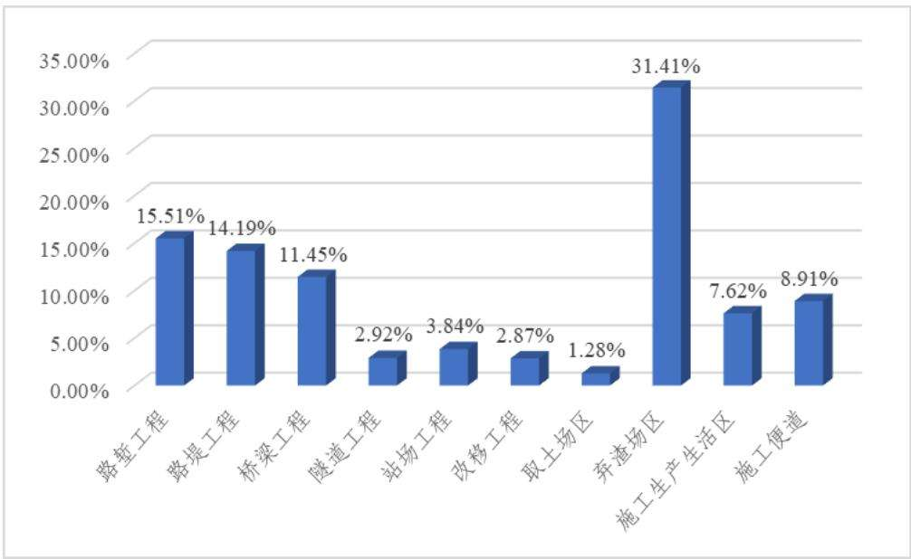  
图4.3-1 不同工程类型新增土壤流失量比例

根据预测结果，弃渣场区、路基工程区、桥梁工程区和隧道工程区（含弃渣周转场）是产生水土流失的重点部位。因此，在工程建设中，应对以上部位进行综合防治，有效控制工程施工过程中可能产生的水土流失，避免发生大的水土流失危害。

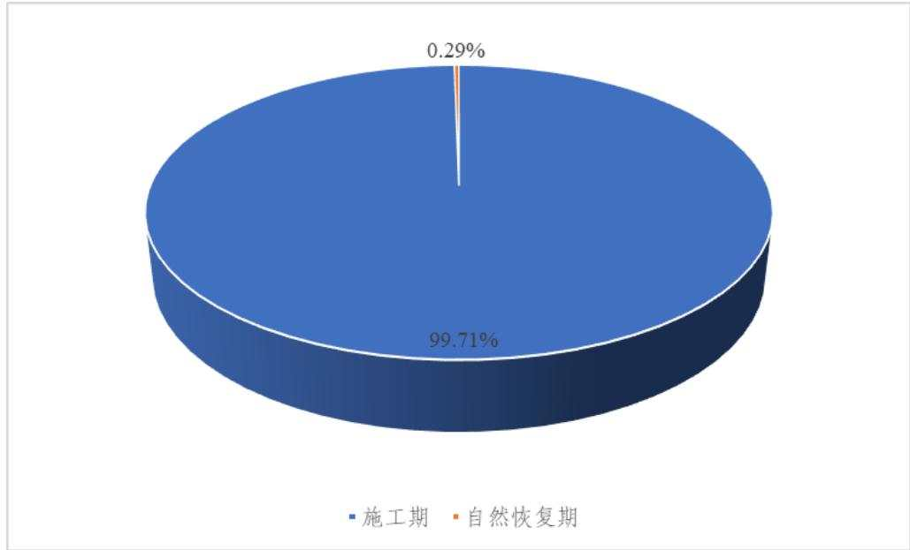  
图4.3-2 不同施工时期新增土壤流失量比例

工程施工期可能造成新增土壤流失量为 10.76 万 t，占工程新增土壤流失总量的99.71%。因此，施工期是工程造成水土流失的重点时段。

## 4.4 水土流失危害分析

## 1．对当地及周边可能造成的危害

铁路工程施工征用土地，破坏当地原地貌，本线路方案扰动地表面积达

1125.23hm2，路基、站场、桥梁、隧道等工程过程中的开挖地表、弃渣等工程活动扰动地表、破坏植被，导致表土松动，地表蓄水能力降低，在水力侵蚀的作用下，土壤中的营养元素随水流而流失，使土壤有机质含量降低，物理粘粒减少，造成土壤肥力减退，从而加剧铁路沿线的土壤侵蚀强度。

## 2．对下游可能造成的危害。

铁路沿线地表水系发育，沿线主要河流有新桥河、九道河、界牌河、新河、洈水、澧水、道水、老渐河等，桥梁分布密度较大，桥梁施工产生的泥浆钻渣以及路基填筑形成的人工边坡为松散的堆积体，遇暴雨等不良天气极易产生水土流失，使沿线河流水系、沟渠、坑塘及水库产生淤积，泥沙含量上升，影响行洪排涝，使工程效益降低，排水系统出现紊乱，增加沿线区域发生洪涝灾害的频率与规模。

## 3．对区域生态环境的影响

工程施工共产生弃渣 1186.87 万 m3，堆放于沿线设置的 34 处弃渣场；工程施工时共剥离表土 187.31 万 m3，堆置于沿线设置是表土堆放场内，若不采取行之有效的措施，在水力侵蚀的作用下，松散的堆积体极易形成水土流失，淤积周围的农田和水塘；天旱则易产生扬尘污染，恶化区域环境。沿途植被的损害也破坏了其景观的完整性。

## 4．对铁路本身可能造成的危害

本工程属于线性工程，在施工过程中，会扰动原地貌，破坏原有植被，对周边环境产生不利影响，如果路基边坡没有得到有效保护，在铁路运行过程中，将增加铁路维护压力和运营费用。

## 4.5 指导性意见

由综合分析可知，项目施工期是土壤流失发生的主要时段，工程在投入使用后土壤流失将逐步稳定，待到林草植被恢复并发挥作用后，坡面土壤流失将得到有效控制，使工程用地内的土壤流失达到合理水平。因此，土壤流失防治重点时段为施工期，应重点加强施工期土壤流失防护措施，并合理安排临时工程水土保持工作。

根据预测结果可以看出，本项目的弃渣场区、路基工程区、桥梁工程区和隧道工程区（含弃渣周转场）是土壤流失的主要来源，因此，应将弃渣场区、路基工程区、桥梁工程区和隧道工程区（含弃渣周转场）作为本方案土壤流失的防治重点，做好相应的防护措施；各临时工程区也要采取必要的防护措施，并在场地使用结束后及时进行迹地恢复。

在施工进度安排上，土石方开挖尽量避开雨季，不能避开的，准备必要的临时覆盖措施。施工临时占地区施工结束后清除建构筑物及部分筑路材料，及时进行植被恢

复，减少表土裸露时间。

同时为防止项目建设新增大量的土壤流失，控制和减少可能造成的土壤流失及危害，应加强土壤流失监测工作。对路基工程、桥梁工程、隧道工程、站场工程、改移工程、取土场、弃渣场、施工生产生活区及施工便道应分期（施工期和自然恢复期）进行土壤流失监测。其中弃渣场区、路基工程区、桥梁工程区和隧道工程区（含弃渣周转场）是水土保持监测的重点部位，施工期是水土保持监测的重点时段。

根据土壤流失预测结果确定本项目水土流失监测区域，具体监测点应选取典型地段和最容易发生水土流失部位进行监测。铁路建设项目的土壤流失主要发生在施工期，因此施工期的雨季是本水土保持监测的重点时段。

## 5 水土保持措施

## 5.1 防治区划分

## （1）按地形地貌分区

本工程沿线地形地貌属于低山丘陵区。

（2）按土壤侵蚀类型及水土保持区划分区

根据《土壤侵蚀分类分级标准》SL 190-2007，本工程一级土壤侵蚀类型区属于水力侵蚀类型区，二级土壤侵蚀类型分区属南方红壤丘陵区。根据水土保持区划，本工程一级分区可分为南方红壤区和西南紫色土区。

## （3）按气候类型分区

本工程气候类别为亚热带季风性湿润气候区。

## （4）按工程类型分区

根据项目特点和项目组成，结合主体工程布置以及不同单元的水土流失特点，将项目建设区划分为路基工程区、桥梁工程区、隧道工程区、站场工程区、改移工程区、取土场区、弃渣场区、施工生产生活区和施工便道区9个一级防治分区。详见下表。

表 5.1-1  
不同防治分区施工特点及水土流失特征
<table><tr><td rowspan=1 colspan=1>防治分区</td><td rowspan=1 colspan=1>工程内容及水土流失防治分区依据</td></tr><tr><td rowspan=1 colspan=1>路基工程区</td><td rowspan=1 colspan=1>路基开挖填筑破坏地表植被，形成裸露土质边坡，边坡表面结构较松散，在强降雨作用下易造成水土流失。</td></tr><tr><td rowspan=1 colspan=1>桥梁工程区</td><td rowspan=1 colspan=1>桥梁承台、基坑开挖土方若不及时清运，极易被径流冲走，桥梁灌注桩施工产生泥浆钻渣，若不加以防护随意漫流，产生水土流失。</td></tr><tr><td rowspan=1 colspan=1>隧道工程区</td><td rowspan=1 colspan=1>扰动土体原有的稳定性，并形成大面积的裸露表面，在防护措施实施前，由于地表无覆盖物，遇暴雨极易产生严重的水土流失。</td></tr><tr><td rowspan=1 colspan=1>站场工程区</td><td rowspan=1 colspan=1>占用大量耕地，场地开挖和回填形成裸露土质边坡、场地，边坡表面结构较松散，在强降雨作用下易造成水土流失。</td></tr><tr><td rowspan=1 colspan=1>改移工程区</td><td rowspan=1 colspan=1>占压和破坏原地貌及自然植被，破坏原有道路及沟渠，改变原地表水系，降低原有水保功能</td></tr><tr><td rowspan=1 colspan=1>取土场区</td><td rowspan=1 colspan=1>占压和破坏原地貌及自然植被，扰动土体原有的稳定性，并形成大面积的裸露表面。</td></tr><tr><td rowspan=1 colspan=1>弃渣场区</td><td rowspan=1 colspan=1>弃渣松散堆砌，在防护措施实施前，由于结构松散、地表无覆盖物，遇暴雨极易产生严重的水土流失。</td></tr><tr><td rowspan=1 colspan=1>施工生产生活区</td><td rowspan=1 colspan=1>占压和破坏原地貌及自然植被，降低原有水保功能，在降雨作用下施工场地易形成漫流，造成水土流失。</td></tr><tr><td rowspan=1 colspan=1>施工便道区</td><td rowspan=1 colspan=1>形成裸露路基路面，施工运输车辆来回易形成扬尘，在降雨作用下易产生严重的水土流失。</td></tr></table>

## 5.2 措施总体布局

## 5.2.1 防治措施总体布局

根据铁路工程建设、施工特点，通过工程措施、植物措施的有机结合，永久措施与临时措施的相互补充，统筹布置水土流失的防治体系。在防治措施具体配置中，以工程措施为先导，充分发挥工程措施的控制作用，同时注重主体工程在施工期的水土保持措施布设，注重发挥植物措施的后续性、长久性及生态效应，把水土流失危害降到最低，恢复植被，改善沿线的生态环境，营造和谐、优美的环境。

水土流失防治措施体系中预防措施和监管措施是控制水土流失的关键，预防措施主要是做好方案、做到“三同时”，在施工招标中明确水土流失防治责任，理顺水系和场内汇水排放，文明施工；监管措施主要是施工期监管、监理，水土流失监测工作和防治成果监管。

按项目建设时序、造成水土流失特点及项目主体工程布局，将防治责任区划分为路基工程区、桥梁工程区、隧道工程区、站场工程区、改移工程、取土场区、弃渣场区、施工生产生活区及施工便道区9个一级防治区的防治措施布局如下：

## 1．路基工程区

施工前剥离表土，堆置在方案新增的表土堆放场内，坡脚采取装土编织袋拦挡，表面防尘网苫盖+临时撒播草籽防护，周边设置临时排水沟，末端设置临时沉沙池，后期用于表土回覆。施工过程中，路堑堑顶实施永久性截水天沟，陡坡地段设置急流槽；路堤两侧设临时急流槽，引排至路基两侧临时排水沟，末端接临时沉沙池，裸露边坡采用防尘网临时苫盖。回填土方采取临时拦挡、苫盖，路基填筑完成后在一侧或两侧实施永久排水沟，末端接消力池，顺接至自然沟渠、排水涵洞。边坡采取预制混凝土空心砖护坡、预制混凝土实心砖护坡、截水骨架护坡、植草窗护坡和植灌草防护。施工结束后，进行土地整治，回覆表土，路基边坡及两侧绿色通道植乔灌草绿化。

## 2．桥梁工程区

施工前剥离表土，集中堆放在桥梁征地范围内设置的表土堆放场内，坡脚装土编织袋拦挡，表面防尘网苫盖+临时撒播草籽防护，周边设置临时排水沟，末端设置临时沉沙池，后期用于表土回覆。桥墩间未扰动范围内表土采取铺垫保护。施工过程中，桥台边坡上方设置截水天沟并设顺接排水沟至自然沟渠，坡面采取预制混凝土空心砖护坡、截水骨架护坡和植灌草防护。桥墩基坑外侧设泥浆沉淀池，基坑回填土方采取临时拦挡、苫盖，桥梁一侧设置临时排水沟，末端接临时沉沙池。施工结束后桥下进行土地整治，回覆表土，植乔灌草恢复植被。

## 3．隧道工程区

施工前剥离表土，堆置在附近设置的表土堆放场内，坡脚装土编织袋拦挡，表面防尘网苫盖+临时撒播草籽防护，周边设置临时排水沟，末端设置临时沉沙池。施工过程中，在隧道洞口上方修建永久性截水天沟，末端接消力池，顺接至自然沟渠；隧道洞口边坡采用骨架护坡，周边设置临时排水沟，末端设置临时沉沙池。出渣平台坡脚设置浆砌片石脚墙临时挡护，边坡撒播草籽临时防护；裸露边坡采取防尘网临时苫盖。弃渣周转场设置脚墙和排水沟，末端接沉沙池，并顺接至自然沟渠。施工结束后，对需绿化的区域进行土地整治，回覆表土并植灌草绿化。

## 4．站场工程区

施工前剥离表土，堆置在站场征地范围内设置的表土堆放场内，坡脚装土编织袋拦挡，表面防尘网苫盖+临时撒播草籽防护，周边设置临时排水沟，末端设置临时沉沙池，后期用于表土回填。施工过程中，开挖边坡上方设置永久性截水天沟，末端接消力池，顺接至自然沟渠。场地内布设临时排水沟和临时沉沙池，施工裸露面采用防尘网进行临时苫盖。回填土方采取临时拦挡、苫盖；站场填筑完成后，实施永久性排水系统，经沉沙池后顺接至自然沟渠，边坡采取预制混凝土空心砖、实心砖护坡、骨架护坡。施工结束后，对需绿化的区域进行土地整治，回覆表土，植乔灌草绿化。

## 5．改移工程区

施工前表土剥离，堆置在附近设置的表土堆放场内，坡脚装土编织袋拦挡，表面防尘网苫盖+临时撒播草籽防护，周边设置临时排水沟，末端设置临时沉沙池，后期用于表土回填。施工过程中，在改移道路永久排水沟位置设置一侧临时排水沟，裸露边坡采用防尘网临时苫盖。施工结束后，改移道路一侧实施永久排水沟、排水管涵，并顺接至周边道路或沟渠，可绿化区域进行土地整治，回覆表土，植草绿化。

## 6．取土场区

施工前表土剥离，堆置在附近设置的表土堆放场内，坡脚装土编织袋拦挡，表面密目网苫盖+临时撒播草籽防护，后期用于表土回填。施工过程中，周边设置永久性截排水沟，末端接沉沙池，施工裸露面采用防尘网进行临时苫盖。分级取土，边坡采取基材植生防护，取土结束后对取土平台和边坡进行土地整治，恢复植被，取土平台植乔灌草绿化。

## 7．弃渣场区

平地（填凹型）弃渣场弃渣前排干场内积水，引至既有沟渠。弃渣结束后，进行土地整治、回覆表土，植乔灌草绿化。

沟道型弃渣场，按照“先拦后弃，分层碾压”原则弃渣。弃渣前表土剥离，集中堆放在弃渣场内一角，坡脚装土编织袋拦挡，表面防尘网苫盖+临时撒播草籽防护，周边设置临时排水沟，末端设置临时沉沙池并顺接至自然沟道，后期用于表土回填。在弃渣场上方用地界内先修筑截、排水沟，陡坡地段设急流槽、消力坪，末端接沉沙池，渣底埋设排水盲管，下游设置挡渣墙。采取自下而上的方式堆渣，分层碾压，弃渣场边坡采取植灌草护坡。弃渣结束后，进行土地整治、回覆表土，弃渣平台植乔灌草绿化。

## 8．施工生产生活区

施工前剥离表土，集中堆置在方案新增的表土堆放场内，坡脚装土编织袋拦挡，表面防尘网苫盖+临时撒播草籽防护，周边设置临时排水沟，末端设置临时沉沙池。施工生产生活区场地周边布设截排水沟，并顺接至自然沟渠，边坡采取预制混凝土空心砖护坡、截水骨架护坡。表土堆放场本身占地范围内表土采取铺垫保护。施工过程中，场地周边布设临时排水沟和沉沙池，裸露面采取防尘网临时苫盖；管沟回填土方、临时电力线路架设区临时苫盖；施工结束后，进行土地整治，回覆表土，复耕或植乔灌草恢复植被。

## 9．施工便道区

施工前剥离表土，就近集中堆放在方案设置的表土堆放场内，并采用防护措施，后期用于表土回填。便道边坡以自然放坡为主，单侧设置排水沟，末端顺接沉沙池。施工便道填方侧边坡坡脚设浆砌片石脚墙临时拦挡，边坡坡面采取防尘网临时苫盖防护。施工结束后进行土地整治，回覆表土，复耕或植乔灌草恢复植被。

具体详见水土流失防治措施体系表5.2.1-1和水土流失防治措施体系框图5.2.1-1。

表 5.2.1-1  
水土流失防治措施体系表
<table><tr><td colspan="1" rowspan="2">防治分区</td><td colspan="1" rowspan="2">措施类型</td><td colspan="2" rowspan="1">防治措施</td></tr><tr><td colspan="1" rowspan="1">主体已列</td><td colspan="1" rowspan="1">方案新增</td></tr><tr><td colspan="1" rowspan="3">路基工程区</td><td colspan="1" rowspan="1">工程措施</td><td colspan="1" rowspan="1">边坡防护（预制混凝土空心砖护坡、预制混凝土实心砖护坡、骨架护坡、植草窗护坡）、截排水沟、急流槽、消力池、消力坪</td><td colspan="1" rowspan="1">表土剥离、表土回填、土地整治</td></tr><tr><td colspan="1" rowspan="1">植物措施</td><td colspan="1" rowspan="1">路基边坡绿化、路基两侧绿化</td><td colspan="1" rowspan="1"></td></tr><tr><td colspan="1" rowspan="1">临时措施</td><td colspan="1" rowspan="1"></td><td colspan="1" rowspan="1">裸露边坡临时拦挡和苫盖、表土临时拦挡苫盖和排水沉沙、回填土方临时拦挡和苫盖、临时排水沟、急流槽、临时沉沙池</td></tr><tr><td colspan="1" rowspan="3">桥梁工程区</td><td colspan="1" rowspan="1">工程措施</td><td colspan="1" rowspan="1">边坡防护（预制混凝土空心砖护坡、骨架护坡）、截水天沟</td><td colspan="1" rowspan="1">表土剥离、表土回填、土地整治</td></tr><tr><td colspan="1" rowspan="1">植物措施</td><td colspan="1" rowspan="1">桥梁边坡绿化、桥下绿化</td><td colspan="1" rowspan="1"></td></tr><tr><td colspan="1" rowspan="1">临时措施</td><td colspan="1" rowspan="1"></td><td colspan="1" rowspan="1">表土铺垫保护、表土临时拦挡苫盖和排水沉沙、回填土方临时拦挡和苫盖、泥浆沉淀池、临时排水沟、临时沉沙池</td></tr><tr><td colspan="1" rowspan="3">隧道工程区</td><td colspan="1" rowspan="1">工程措施</td><td colspan="1" rowspan="1">骨架护坡、截排水沟</td><td colspan="1" rowspan="1">表土剥离、表土回填、土地整治</td></tr><tr><td colspan="1" rowspan="1">植物措施</td><td colspan="1" rowspan="1">隧道洞口绿化</td><td colspan="1" rowspan="1"></td></tr><tr><td colspan="1" rowspan="1">临时措施</td><td colspan="1" rowspan="1">弃渣周转场临时拦挡</td><td colspan="1" rowspan="1">出渣平台临时拦挡和绿化、弃渣周转场临时排水沉沙排水、裸露边坡临时苫盖、临时排水沟、临时沉沙池</td></tr><tr><td colspan="1" rowspan="3">站场工程区</td><td colspan="1" rowspan="1">工程措施</td><td colspan="1" rowspan="1">边坡防护（预制混凝土空心砖护坡、预制混凝土实心砖护坡、骨架护坡）、截排水沟</td><td colspan="1" rowspan="1">表土剥离、表土回填、土地整治</td></tr><tr><td colspan="1" rowspan="1">植物措施</td><td colspan="1" rowspan="1">站场边坡、场坪、绿色通道绿化</td><td colspan="1" rowspan="1"></td></tr><tr><td colspan="1" rowspan="1">临时措施</td><td colspan="1" rowspan="1"></td><td colspan="1" rowspan="1">裸露边坡临时拦挡和苫盖、表土临时拦挡苫盖和排水沉沙、回填土方临时拦挡和苫盖、临时排水沟、临时沉沙池</td></tr><tr><td colspan="1" rowspan="3">改移工程区</td><td colspan="1" rowspan="1">工程措施</td><td colspan="1" rowspan="1">改移道路排水</td><td colspan="1" rowspan="1">表土剥离、表土回填、土地整治</td></tr><tr><td colspan="1" rowspan="1">植物措施</td><td colspan="1" rowspan="1">改移道路绿化</td><td colspan="1" rowspan="1"></td></tr><tr><td colspan="1" rowspan="1">临时措施</td><td colspan="1" rowspan="1"></td><td colspan="1" rowspan="1">裸露边坡临时苫盖、临时排水沟、临时沉沙池</td></tr><tr><td colspan="1" rowspan="3">取土场区</td><td colspan="1" rowspan="1">工程措施</td><td colspan="1" rowspan="1">截排水沟、沉沙池</td><td colspan="1" rowspan="1">表土剥离、表土回填、土地整治</td></tr><tr><td colspan="1" rowspan="1">植物措施</td><td colspan="1" rowspan="1">基材植生、撒播草籽、栽植灌木</td><td colspan="1" rowspan="1">栽植乔木</td></tr><tr><td colspan="1" rowspan="1">临时措施</td><td colspan="1" rowspan="1"></td><td colspan="1" rowspan="1">表土临时拦挡苫盖和排水沉沙、裸露边坡临时苫盖</td></tr><tr><td colspan="1" rowspan="3">弃渣场区</td><td colspan="1" rowspan="1">工程措施</td><td colspan="1" rowspan="1">挡渣墙、截排水沟、盲沟、急流槽、消力坪、沉沙池</td><td colspan="1" rowspan="1">表土剥离、表土回填、土地整治</td></tr><tr><td colspan="1" rowspan="1">植物措施</td><td colspan="1" rowspan="1">撒播草籽、栽植灌木</td><td colspan="1" rowspan="1">栽植乔木</td></tr><tr><td colspan="1" rowspan="1">临时措施</td><td colspan="1" rowspan="1"></td><td colspan="1" rowspan="1">表土临时拦挡苫盖和排水沉沙、裸露边坡临时苫盖</td></tr><tr><td colspan="1" rowspan="3">施工生产生活区</td><td colspan="1" rowspan="1">工程措施</td><td colspan="1" rowspan="1">边坡防护（预制混凝土空心砖护坡、骨架护坡)，截排水沟</td><td colspan="1" rowspan="1">表土剥离、表土回填、土地整治</td></tr><tr><td colspan="1" rowspan="1">植物措施</td><td colspan="1" rowspan="1"></td><td colspan="1" rowspan="1">栽植乔木、栽植灌木、撒播草籽</td></tr><tr><td colspan="1" rowspan="1">临时措施</td><td colspan="1" rowspan="1"></td><td colspan="1" rowspan="1">表土铺垫保护、表土临时拦挡苫盖和排水沉沙、管沟回填土方和电力架设区临时苫盖、临时排水沟、沉沙池</td></tr><tr><td colspan="1" rowspan="3">施工便道区</td><td colspan="1" rowspan="1">工程措施</td><td colspan="1" rowspan="1"></td><td colspan="1" rowspan="1">表土剥离、表土回填、土地整治、复耕</td></tr><tr><td colspan="1" rowspan="1">植物措施</td><td colspan="1" rowspan="1"></td><td colspan="1" rowspan="1">栽植乔木、栽植灌木、撒播草籽</td></tr><tr><td colspan="1" rowspan="1">临时措施</td><td colspan="1" rowspan="1"></td><td colspan="1" rowspan="1">边坡临时拦挡、裸露边坡临时苫盖、临时排水沟、临时沉沙池</td></tr></table>

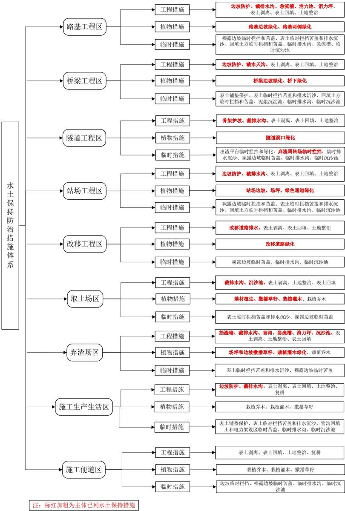  
图5.2.1-1 水土流失防治措施体系图  
中国铁建 CHINA RAILWAY SIYUAN SURVEY AND DESIGN GROUP CO.,LTD

## 5.3 分区措施布设

## 5.3.1 工程措施设计标准

## （一）表土剥离及表土回填标准

本方案表土剥离及表土回填措施采取水土保持及表土相关标准规范，具体为：

表土剥离：耕地剥离厚度约 30～50cm，园地、林地、草地剥离厚度约 10～30cm；

表土回填：为利于植被恢复或耕作，且满足植被群落构建或种植模式的需求，根据不同工程类型、绿化或复垦区域、植被恢复类型或种植模式采用不同覆土厚度。各工程分区的边坡绿化以及桥下绿化按20cm厚度回覆表土，灌草绿化的区域20～30cm厚度回覆表土，栽植乔木的区域和复耕区域按40～50cm厚度回覆表土。

## （二）土地整治标准

本方案土地整治措施采取水土保持及表土相关标准规范，具体为：要求平整后的场地与周边地形坡度均匀一致；平整工作量应做到最小，要求移高填低，就近填挖平衡，运距最短，功效最高；宜选择机械化施工为主、人工为辅的土地整治方案。

## （三）排水工程标准

主体工程设计排水沟、侧沟、天沟均采用铁路行业相关标准《铁路路基设计规范》（TB10001-2016），按 50 年一遇 1h 最大降雨强度设计，该标准高于《水土保持工程设计规范》（GB51018-2014），因此，本方案与主体设计保持一致。

本工程弃渣场防洪标准采用《水土保持工程设计规范》（GB51018-2014），按 20年一遇～50年一遇降雨强度设计，4级排洪工程弃渣场按20年一遇降水强度设计洪水标准设计，3级排洪工程的弃渣场按30年一遇的降水强度设计洪水标准设计，位于水土保持重点防治区的提高一级。该标准与《铁路工程取弃土（渣）场设计和施工质量控制标准》（Q/CR 9261 2023）一致。

本工程弃渣场挡渣墙采用《水土保持工程设计规范》（GB51018-2014），3 级弃渣场抗滑稳定系数≥1.20，抗倾覆稳定系数≥1.45；4、5级弃渣场抗滑稳定系数≥1.15，抗倾覆稳定系数≥1.40。该标准与《铁路工程取弃土（渣）场设计和施工质量控制标准》（Q/CR 9261 2023）一致。

## （四）弃渣场级别及拦挡工程建筑物级别

弃渣场水土保持防护工程主要依据堆渣规模、渣场所处位置及失事后对工程和环境的危害程度等进行设计，因此参照《水土保持工程设计规范》将渣场划分等级，分别确定其渣场的防护工程等级。渣场等级划分分别为1、2、3、4、5等。防护工程（包括拦渣工程、排水沟工程）级别根据渣场等级及防护建筑物在水土保持工程中的作用和重要性划分为3级，对应渣场等级分别为3、4、5级。根据堆渣量、最大堆渣高度、渣场失事对主体工程或环境造成的危害程度确定的渣场级别不一致时，采用最高级别等级。弃渣场级别划分一级见表5.3.1-2，弃渣场拦挡工程建筑物级别见表5.3.1-3。

表 5.3.1-1  
弃渣场级别划分依据
<table><tr><td rowspan=1 colspan=1>渣场级别</td><td rowspan=1 colspan=1>堆渣量V（万m³）</td><td rowspan=1 colspan=1>最大堆渣高度H（m）</td><td rowspan=1 colspan=1>渣场失事对主体工程或环境造成的危害</td></tr><tr><td rowspan=1 colspan=1>1</td><td rowspan=1 colspan=1>2000≥V≥1000</td><td rowspan=1 colspan=1>200≥ H≥150</td><td rowspan=1 colspan=1>严重</td></tr><tr><td rowspan=1 colspan=1>2</td><td rowspan=1 colspan=1>1000&gt;V≥500</td><td rowspan=1 colspan=1>150&gt;H≥100</td><td rowspan=1 colspan=1>较严重</td></tr><tr><td rowspan=1 colspan=1>3</td><td rowspan=1 colspan=1>500&gt;V≥100</td><td rowspan=1 colspan=1>100&gt;H≥60</td><td rowspan=1 colspan=1>不严重</td></tr><tr><td rowspan=1 colspan=1>4</td><td rowspan=1 colspan=1>100&gt;V≥50</td><td rowspan=1 colspan=1>60&gt;H≥20</td><td rowspan=1 colspan=1>较轻</td></tr><tr><td rowspan=1 colspan=1>5</td><td rowspan=1 colspan=1>V&lt;50</td><td rowspan=1 colspan=1>H&lt;20</td><td rowspan=1 colspan=1>无危害</td></tr></table>

表 5.3.1-2  
水土保持工程措施执行标准
<table><tr><td rowspan=1 colspan=1>措施名称</td><td rowspan=1 colspan=4>执行标准</td></tr><tr><td rowspan=5 colspan=1>弃渣场拦挡工程、排洪工程建筑物级别</td><td rowspan=1 colspan=1>弃渣场级别</td><td rowspan=1 colspan=1>拦渣坝</td><td rowspan=1 colspan=1>挡渣墙</td><td rowspan=1 colspan=1>排洪工程</td></tr><tr><td rowspan=1 colspan=1>2 级弃渣场</td><td rowspan=1 colspan=1>2</td><td rowspan=1 colspan=1>3</td><td rowspan=1 colspan=1>2</td></tr><tr><td rowspan=1 colspan=1>3级弃渣场</td><td rowspan=1 colspan=1>3</td><td rowspan=1 colspan=1>4</td><td rowspan=1 colspan=1>3</td></tr><tr><td rowspan=1 colspan=1>4级弃渣场</td><td rowspan=1 colspan=1>4</td><td rowspan=1 colspan=1>5</td><td rowspan=1 colspan=1>4</td></tr><tr><td rowspan=1 colspan=1>5 级弃渣场</td><td rowspan=1 colspan=1>5</td><td rowspan=1 colspan=1>5</td><td rowspan=1 colspan=1>5</td></tr><tr><td rowspan=2 colspan=1>弃渣场拦挡工程、排洪工程防洪标准</td><td rowspan=1 colspan=1>弃渣场级别</td><td rowspan=1 colspan=3>防洪标准（山区、丘陵区）</td></tr><tr><td rowspan=1 colspan=1>2 级弃渣场</td><td rowspan=1 colspan=3>设计排洪标准为100~50年</td></tr><tr><td rowspan=3 colspan=1>弃渣场拦挡工程、排洪工程防洪标准</td><td rowspan=1 colspan=1>3级弃渣场</td><td rowspan=1 colspan=3>设计排洪标准为50~30年</td></tr><tr><td rowspan=1 colspan=1>4级弃渣场</td><td rowspan=1 colspan=3>设计排洪标准为30~20年</td></tr><tr><td rowspan=1 colspan=1>5级弃渣场</td><td rowspan=1 colspan=3>设计排洪标准为20~10年</td></tr><tr><td rowspan=1 colspan=1>截排水工程</td><td rowspan=1 colspan=4>3~5年一遇5~10分钟短历时暴雨设计</td></tr></table>

本工程全线所设 34 处弃渣场中 3 级弃渣场 1 处、4 级弃渣场 19 处、5 级弃渣场14 处。

表 5.3.1-3

弃渣场级别及防护工程级别划分表
<table><tr><td colspan="1" rowspan="2">序号</td><td colspan="1" rowspan="2">弃渣场名称</td><td colspan="3" rowspan="1">行政区划</td><td colspan="1" rowspan="2">面积（hm²）</td><td colspan="1" rowspan="2">松方量(万m³)</td><td colspan="1" rowspan="2">容量（万m³</td><td colspan="1" rowspan="2">最大堆高(m)</td><td colspan="1" rowspan="2">汇水面积(km²)</td><td colspan="1" rowspan="2">渣场类型</td><td colspan="1" rowspan="2">涉及水土流失重点防治区情况</td><td colspan="1" rowspan="2">弃渣场等级</td><td colspan="3" rowspan="1">原防护工程级别</td><td colspan="3" rowspan="1">位于水土流失重点防治区提高一级</td></tr><tr><td colspan="1" rowspan="1">省</td><td colspan="1" rowspan="1">市</td><td colspan="1" rowspan="1">区县</td><td colspan="1" rowspan="1">挡渣墙级别</td><td colspan="1" rowspan="1">排洪工程级别</td><td colspan="1" rowspan="1">植被恢复与建设工程级别</td><td colspan="1" rowspan="1">挡渣墙级别</td><td colspan="1" rowspan="1">排洪工程级别</td><td colspan="1" rowspan="1">植被恢复与建设工程级别</td></tr><tr><td colspan="1" rowspan="1">1</td><td colspan="1" rowspan="1">磨石村弃渣场</td><td colspan="1" rowspan="1">湖北省宜</td><td colspan="1" rowspan="1">昌市</td><td colspan="1" rowspan="1">长阳土家族自治县</td><td colspan="1" rowspan="1">6.00</td><td colspan="1" rowspan="1">87.75</td><td colspan="1" rowspan="1">90.00</td><td colspan="1" rowspan="1">46.5</td><td colspan="1" rowspan="1">0.09</td><td colspan="1" rowspan="1">沟道型</td><td colspan="1" rowspan="1">清江流域中下游省级水土流失重点预防区</td><td colspan="1" rowspan="1">4</td><td colspan="1" rowspan="1">5</td><td colspan="1" rowspan="1">4</td><td colspan="1" rowspan="1">3</td><td colspan="1" rowspan="1">4</td><td colspan="1" rowspan="1">3</td><td colspan="1" rowspan="1">2</td></tr><tr><td colspan="1" rowspan="1">2</td><td colspan="1" rowspan="1">曹家冲弃渣场</td><td colspan="1" rowspan="1">湖北省宜</td><td colspan="1" rowspan="1">昌市</td><td colspan="1" rowspan="1">长阳土家族自治县</td><td colspan="1" rowspan="1">8.34</td><td colspan="1" rowspan="1">77.43</td><td colspan="1" rowspan="1">100.00</td><td colspan="1" rowspan="1">55.6</td><td colspan="1" rowspan="1">0.25</td><td colspan="1" rowspan="1">沟道型</td><td colspan="1" rowspan="1">清江流域中下游省级水土流失重点预防区</td><td colspan="1" rowspan="1">4</td><td colspan="1" rowspan="1">5</td><td colspan="1" rowspan="1">4</td><td colspan="1" rowspan="1">3</td><td colspan="1" rowspan="1">4</td><td colspan="1" rowspan="1">3</td><td colspan="1" rowspan="1">2</td></tr><tr><td colspan="1" rowspan="1">3</td><td colspan="1" rowspan="1">彭家坳弃渣场</td><td colspan="1" rowspan="1">湖北省宜</td><td colspan="1" rowspan="1">昌市</td><td colspan="1" rowspan="1">长阳土家族自治县</td><td colspan="1" rowspan="1">6.84</td><td colspan="1" rowspan="1">87.74</td><td colspan="1" rowspan="1">100.00</td><td colspan="1" rowspan="1">55.6</td><td colspan="1" rowspan="1">0.19</td><td colspan="1" rowspan="1">沟道型</td><td colspan="1" rowspan="1">清江流域中下游省级水土流失重点预防区</td><td colspan="1" rowspan="1">4</td><td colspan="1" rowspan="1">5</td><td colspan="1" rowspan="1">4</td><td colspan="1" rowspan="1">3</td><td colspan="1" rowspan="1">4</td><td colspan="1" rowspan="1">3</td><td colspan="1" rowspan="1">2</td></tr><tr><td colspan="1" rowspan="1">4</td><td colspan="1" rowspan="1">天江湾</td><td colspan="1" rowspan="1">1</td><td colspan="1" rowspan="1">号弃渣场湖北省宜昌市</td><td colspan="1" rowspan="1">宜都市</td><td colspan="1" rowspan="1">4.48</td><td colspan="1" rowspan="1">50.95</td><td colspan="1" rowspan="1">80.00</td><td colspan="1" rowspan="1">54.1</td><td colspan="1" rowspan="1">0.37</td><td colspan="1" rowspan="1">沟道型</td><td colspan="1" rowspan="1">否</td><td colspan="1" rowspan="1">4</td><td colspan="1" rowspan="1">5</td><td colspan="1" rowspan="1">4</td><td colspan="1" rowspan="1">3</td><td colspan="1" rowspan="1">5</td><td colspan="1" rowspan="1">4</td><td colspan="1" rowspan="1">3</td></tr><tr><td colspan="1" rowspan="1">5</td><td colspan="1" rowspan="1">天江湾</td><td colspan="1" rowspan="1">2</td><td colspan="1" rowspan="1">号弃渣场湖北省宜昌市</td><td colspan="1" rowspan="1">宜都市</td><td colspan="1" rowspan="1">8.67</td><td colspan="1" rowspan="1">58.73</td><td colspan="1" rowspan="1">70.00</td><td colspan="1" rowspan="1">55.0</td><td colspan="1" rowspan="1">0.36</td><td colspan="1" rowspan="1">沟道型</td><td colspan="1" rowspan="1">否</td><td colspan="1" rowspan="1">4</td><td colspan="1" rowspan="1">5</td><td colspan="1" rowspan="1">4</td><td colspan="1" rowspan="1">3</td><td colspan="1" rowspan="1">5</td><td colspan="1" rowspan="1">4</td><td colspan="1" rowspan="1">3</td></tr><tr><td colspan="1" rowspan="1">6</td><td colspan="1" rowspan="1">望水坪</td><td colspan="1" rowspan="1">2</td><td colspan="1" rowspan="1">号弃渣场湖北省宜昌市</td><td colspan="1" rowspan="1">宜都市</td><td colspan="1" rowspan="1">9.79</td><td colspan="1" rowspan="1">57.83</td><td colspan="1" rowspan="1">85.00</td><td colspan="1" rowspan="1">56.0</td><td colspan="1" rowspan="1">0.15</td><td colspan="1" rowspan="1">沟道型</td><td colspan="1" rowspan="1">否</td><td colspan="1" rowspan="1">4</td><td colspan="1" rowspan="1">5</td><td colspan="1" rowspan="1">4</td><td colspan="1" rowspan="1">3</td><td colspan="1" rowspan="1">5</td><td colspan="1" rowspan="1">4</td><td colspan="1" rowspan="1">3</td></tr><tr><td colspan="1" rowspan="1">7</td><td colspan="1" rowspan="1">鸡头山弃土场</td><td colspan="1" rowspan="1">湖北省宜</td><td colspan="1" rowspan="1">昌市</td><td colspan="1" rowspan="1">宜都市</td><td colspan="1" rowspan="1">3.59</td><td colspan="1" rowspan="1">27.50</td><td colspan="1" rowspan="1">28.60</td><td colspan="1" rowspan="1">25.5</td><td colspan="1" rowspan="1">0.26</td><td colspan="1" rowspan="1">沟道型</td><td colspan="1" rowspan="1">否</td><td colspan="1" rowspan="1">4</td><td colspan="1" rowspan="1">5</td><td colspan="1" rowspan="1">4</td><td colspan="1" rowspan="1">3</td><td colspan="1" rowspan="1">5</td><td colspan="1" rowspan="1">4</td><td colspan="1" rowspan="1">3</td></tr><tr><td colspan="1" rowspan="1">8</td><td colspan="1" rowspan="1">熊家坳弃土场</td><td colspan="1" rowspan="1">湖北省宜</td><td colspan="1" rowspan="1">昌市</td><td colspan="1" rowspan="1">宜都市</td><td colspan="1" rowspan="1">5.90</td><td colspan="1" rowspan="1">70.00</td><td colspan="1" rowspan="1">70.60</td><td colspan="1" rowspan="1">1</td><td colspan="1" rowspan="1">0.14</td><td colspan="1" rowspan="1">平地（填凹）型</td><td colspan="1" rowspan="1">否</td><td colspan="1" rowspan="1">4</td><td colspan="1" rowspan="1">5</td><td colspan="1" rowspan="1">4</td><td colspan="1" rowspan="1">3</td><td colspan="1" rowspan="1">5</td><td colspan="1" rowspan="1">4</td><td colspan="1" rowspan="1">3</td></tr><tr><td colspan="1" rowspan="1">9</td><td colspan="1" rowspan="1">龙井弃土场</td><td colspan="1" rowspan="1">湖北省宜</td><td colspan="1" rowspan="1">昌市</td><td colspan="1" rowspan="1">宜都市</td><td colspan="1" rowspan="1">2.93</td><td colspan="1" rowspan="1">32.92</td><td colspan="1" rowspan="1">33.00</td><td colspan="1" rowspan="1">1</td><td colspan="1" rowspan="1">0.05</td><td colspan="1" rowspan="1">平地（填凹）型</td><td colspan="1" rowspan="1">否</td><td colspan="1" rowspan="1">5</td><td colspan="1" rowspan="1">5</td><td colspan="1" rowspan="1">5</td><td colspan="1" rowspan="1">3</td><td colspan="1" rowspan="1">5</td><td colspan="1" rowspan="1">5</td><td colspan="1" rowspan="1">3</td></tr><tr><td colspan="1" rowspan="1">10</td><td colspan="1" rowspan="1">天井湖弃土场</td><td colspan="1" rowspan="1">湖北省宜</td><td colspan="1" rowspan="1">昌市</td><td colspan="1" rowspan="1">宜都市</td><td colspan="1" rowspan="1">3.68</td><td colspan="1" rowspan="1">17.88</td><td colspan="1" rowspan="1">34.00</td><td colspan="1" rowspan="1">43.4</td><td colspan="1" rowspan="1">0.61</td><td colspan="1" rowspan="1">沟道型</td><td colspan="1" rowspan="1">否</td><td colspan="1" rowspan="1">4</td><td colspan="1" rowspan="1">5</td><td colspan="1" rowspan="1">4</td><td colspan="1" rowspan="1">3</td><td colspan="1" rowspan="1">5</td><td colspan="1" rowspan="1">4</td><td colspan="1" rowspan="1">3</td></tr><tr><td colspan="1" rowspan="1">11</td><td colspan="1" rowspan="1">咸池冲 1#弃土场</td><td colspan="1" rowspan="1">湖北省宜</td><td colspan="1" rowspan="1">昌市</td><td colspan="1" rowspan="1">宜都市</td><td colspan="1" rowspan="1">1.81</td><td colspan="1" rowspan="1">10.18</td><td colspan="1" rowspan="1">11.00</td><td colspan="1" rowspan="1">26.0</td><td colspan="1" rowspan="1">0.08</td><td colspan="1" rowspan="1">沟道型</td><td colspan="1" rowspan="1">否</td><td colspan="1" rowspan="1">4</td><td colspan="1" rowspan="1">5</td><td colspan="1" rowspan="1">4</td><td colspan="1" rowspan="1">3</td><td colspan="1" rowspan="1">5</td><td colspan="1" rowspan="1">4</td><td colspan="1" rowspan="1">3</td></tr><tr><td colspan="1" rowspan="1">12</td><td colspan="1" rowspan="1">咸池冲2#弃土场</td><td colspan="1" rowspan="1">湖北省宜</td><td colspan="1" rowspan="1">昌市</td><td colspan="1" rowspan="1">宜都市</td><td colspan="1" rowspan="1">4.18</td><td colspan="1" rowspan="1">21.80</td><td colspan="1" rowspan="1">22.00</td><td colspan="1" rowspan="1">30.5</td><td colspan="1" rowspan="1">0.26</td><td colspan="1" rowspan="1">沟道型</td><td colspan="1" rowspan="1">否</td><td colspan="1" rowspan="1">4</td><td colspan="1" rowspan="1">5</td><td colspan="1" rowspan="1">4</td><td colspan="1" rowspan="1">3</td><td colspan="1" rowspan="1">5</td><td colspan="1" rowspan="1">4</td><td colspan="1" rowspan="1">3</td></tr><tr><td colspan="1" rowspan="1">13</td><td colspan="1" rowspan="1">茶园寺村1#弃土场</td><td colspan="1" rowspan="1">湖北省宜</td><td colspan="1" rowspan="1">昌市</td><td colspan="1" rowspan="1">宜都市</td><td colspan="1" rowspan="1">3.02</td><td colspan="1" rowspan="1">29.70</td><td colspan="1" rowspan="1">30.00</td><td colspan="1" rowspan="1">38.5</td><td colspan="1" rowspan="1">0.84</td><td colspan="1" rowspan="1">沟道型</td><td colspan="1" rowspan="1">否</td><td colspan="1" rowspan="1">4</td><td colspan="1" rowspan="1">5</td><td colspan="1" rowspan="1">4</td><td colspan="1" rowspan="1">3</td><td colspan="1" rowspan="1">5</td><td colspan="1" rowspan="1">4</td><td colspan="1" rowspan="1">3</td></tr><tr><td colspan="1" rowspan="1">14</td><td colspan="1" rowspan="1">窑湾弃土场</td><td colspan="1" rowspan="1">湖北省宜</td><td colspan="1" rowspan="1">昌市</td><td colspan="1" rowspan="1">宜都市</td><td colspan="1" rowspan="1">4.68</td><td colspan="1" rowspan="1">68.50</td><td colspan="1" rowspan="1">79.00</td><td colspan="1" rowspan="1">1</td><td colspan="1" rowspan="1">0.25</td><td colspan="1" rowspan="1">平地（填凹）型</td><td colspan="1" rowspan="1">否</td><td colspan="1" rowspan="1">4</td><td colspan="1" rowspan="1">5</td><td colspan="1" rowspan="1">4</td><td colspan="1" rowspan="1">3</td><td colspan="1" rowspan="1">5</td><td colspan="1" rowspan="1">4</td><td colspan="1" rowspan="1">3</td></tr><tr><td colspan="1" rowspan="1">15</td><td colspan="1" rowspan="1">田家东弃土场</td><td colspan="1" rowspan="1">湖北省荆</td><td colspan="1" rowspan="1">州市</td><td colspan="1" rowspan="1">松滋市</td><td colspan="1" rowspan="1">6.95</td><td colspan="1" rowspan="1">45.40</td><td colspan="1" rowspan="1">46.00</td><td colspan="1" rowspan="1">1</td><td colspan="1" rowspan="1">0.12</td><td colspan="1" rowspan="1">平地（填凹）型</td><td colspan="1" rowspan="1">否</td><td colspan="1" rowspan="1">5</td><td colspan="1" rowspan="1">5</td><td colspan="1" rowspan="1">5</td><td colspan="1" rowspan="1">3</td><td colspan="1" rowspan="1">5</td><td colspan="1" rowspan="1">5</td><td colspan="1" rowspan="1">3</td></tr><tr><td colspan="1" rowspan="1">16</td><td colspan="1" rowspan="1">刘家湾弃渣场</td><td colspan="1" rowspan="1">湖北省荆</td><td colspan="1" rowspan="1">州市</td><td colspan="1" rowspan="1">松滋市</td><td colspan="1" rowspan="1">3.43</td><td colspan="1" rowspan="1">19.20</td><td colspan="1" rowspan="1">20.00</td><td colspan="1" rowspan="1">1</td><td colspan="1" rowspan="1">0.07</td><td colspan="1" rowspan="1">平地（填凹）型</td><td colspan="1" rowspan="1">否</td><td colspan="1" rowspan="1">5</td><td colspan="1" rowspan="1">5</td><td colspan="1" rowspan="1">5</td><td colspan="1" rowspan="1">3</td><td colspan="1" rowspan="1">5</td><td colspan="1" rowspan="1">5</td><td colspan="1" rowspan="1">3</td></tr><tr><td colspan="1" rowspan="1">17</td><td colspan="1" rowspan="1">燕窝池弃土场</td><td colspan="1" rowspan="1">湖北省荆</td><td colspan="1" rowspan="1">州市</td><td colspan="1" rowspan="1">松滋市</td><td colspan="1" rowspan="1">4.83</td><td colspan="1" rowspan="1">26.70</td><td colspan="1" rowspan="1">30.00</td><td colspan="1" rowspan="1">29.9</td><td colspan="1" rowspan="1">0.10</td><td colspan="1" rowspan="1">沟道型</td><td colspan="1" rowspan="1">否</td><td colspan="1" rowspan="1">4</td><td colspan="1" rowspan="1">5</td><td colspan="1" rowspan="1">4</td><td colspan="1" rowspan="1">3</td><td colspan="1" rowspan="1">5</td><td colspan="1" rowspan="1">4</td><td colspan="1" rowspan="1">3</td></tr><tr><td colspan="1" rowspan="1">18</td><td colspan="1" rowspan="1">姜家岭1#弃土场</td><td colspan="1" rowspan="1">湖北省荆</td><td colspan="1" rowspan="1">州市</td><td colspan="1" rowspan="1">松滋市</td><td colspan="1" rowspan="1">5.52</td><td colspan="1" rowspan="1">22.22</td><td colspan="1" rowspan="1">35.00</td><td colspan="1" rowspan="1">33.1</td><td colspan="1" rowspan="1">0.07</td><td colspan="1" rowspan="1">沟道型</td><td colspan="1" rowspan="1">否</td><td colspan="1" rowspan="1">4</td><td colspan="1" rowspan="1">5</td><td colspan="1" rowspan="1">4</td><td colspan="1" rowspan="1">3</td><td colspan="1" rowspan="1">5</td><td colspan="1" rowspan="1">4</td><td colspan="1" rowspan="1">3</td></tr><tr><td colspan="1" rowspan="1">19</td><td colspan="1" rowspan="1">厂下1#弃土场</td><td colspan="1" rowspan="1">湖北省荆</td><td colspan="1" rowspan="1">州市</td><td colspan="1" rowspan="1">松滋市</td><td colspan="1" rowspan="1">8.37</td><td colspan="1" rowspan="1">66.13</td><td colspan="1" rowspan="1">77.00</td><td colspan="1" rowspan="1">39.0</td><td colspan="1" rowspan="1">0.19</td><td colspan="1" rowspan="1">沟道型</td><td colspan="1" rowspan="1">否</td><td colspan="1" rowspan="1">4</td><td colspan="1" rowspan="1">5</td><td colspan="1" rowspan="1">4</td><td colspan="1" rowspan="1">3</td><td colspan="1" rowspan="1">5</td><td colspan="1" rowspan="1">4</td><td colspan="1" rowspan="1">3</td></tr><tr><td colspan="1" rowspan="1">20</td><td colspan="1" rowspan="1">厂下2#弃土场</td><td colspan="1" rowspan="1">湖北省荆</td><td colspan="1" rowspan="1">州市</td><td colspan="1" rowspan="1">松滋市</td><td colspan="1" rowspan="1">4.24</td><td colspan="1" rowspan="1">31.00</td><td colspan="1" rowspan="1">34.00</td><td colspan="1" rowspan="1">37.0</td><td colspan="1" rowspan="1">0.09</td><td colspan="1" rowspan="1">沟道型</td><td colspan="1" rowspan="1">否</td><td colspan="1" rowspan="1">4</td><td colspan="1" rowspan="1">5</td><td colspan="1" rowspan="1">4</td><td colspan="1" rowspan="1">3</td><td colspan="1" rowspan="1">5</td><td colspan="1" rowspan="1">4</td><td colspan="1" rowspan="1">3</td></tr><tr><td colspan="1" rowspan="1">21</td><td colspan="1" rowspan="1">东方湾弃土场</td><td colspan="1" rowspan="1">湖南省常</td><td colspan="1" rowspan="1">德市</td><td colspan="1" rowspan="1">澧县</td><td colspan="1" rowspan="1">1.37</td><td colspan="1" rowspan="1">15.00</td><td colspan="1" rowspan="1">15.50</td><td colspan="1" rowspan="1">/</td><td colspan="1" rowspan="1">0.02</td><td colspan="1" rowspan="1">平地（填凹）型</td><td colspan="1" rowspan="1">否</td><td colspan="1" rowspan="1">5</td><td colspan="1" rowspan="1">5</td><td colspan="1" rowspan="1">5</td><td colspan="1" rowspan="1">3</td><td colspan="1" rowspan="1">5</td><td colspan="1" rowspan="1">5</td><td colspan="1" rowspan="1">3</td></tr><tr><td colspan="1" rowspan="1">22</td><td colspan="1" rowspan="1">五里堆弃土场#1</td><td colspan="1" rowspan="1">湖南省常</td><td colspan="1" rowspan="1">德市</td><td colspan="1" rowspan="1">临澧县</td><td colspan="1" rowspan="1">2.98</td><td colspan="1" rowspan="1">45.73</td><td colspan="1" rowspan="1">48.50</td><td colspan="1" rowspan="1">1</td><td colspan="1" rowspan="1">0.05</td><td colspan="1" rowspan="1">平地（填凹）型</td><td colspan="1" rowspan="1">否</td><td colspan="1" rowspan="1">5</td><td colspan="1" rowspan="1">5</td><td colspan="1" rowspan="1">5</td><td colspan="1" rowspan="1">3</td><td colspan="1" rowspan="1">5</td><td colspan="1" rowspan="1">5</td><td colspan="1" rowspan="1">3</td></tr><tr><td colspan="1" rowspan="1">23</td><td colspan="1" rowspan="1">马家堰 3#弃渣场</td><td colspan="1" rowspan="1">湖南省常</td><td colspan="1" rowspan="1">德市</td><td colspan="1" rowspan="1">澧县</td><td colspan="1" rowspan="1">2.09</td><td colspan="1" rowspan="1">9.00</td><td colspan="1" rowspan="1">9.50</td><td colspan="1" rowspan="1">/</td><td colspan="1" rowspan="1">0.03</td><td colspan="1" rowspan="1">平地（填凹）型</td><td colspan="1" rowspan="1">否</td><td colspan="1" rowspan="1">5</td><td colspan="1" rowspan="1">5</td><td colspan="1" rowspan="1">5</td><td colspan="1" rowspan="1">3</td><td colspan="1" rowspan="1">5</td><td colspan="1" rowspan="1">5</td><td colspan="1" rowspan="1">3</td></tr><tr><td colspan="1" rowspan="1">24</td><td colspan="1" rowspan="1">观音洞弃土场</td><td colspan="1" rowspan="1">湖南省常</td><td colspan="1" rowspan="1">德市</td><td colspan="1" rowspan="1">临澧县</td><td colspan="1" rowspan="1">2.69</td><td colspan="1" rowspan="1">40.40</td><td colspan="1" rowspan="1">40.40</td><td colspan="1" rowspan="1">/</td><td colspan="1" rowspan="1">0.06</td><td colspan="1" rowspan="1">平地（填凹）型</td><td colspan="1" rowspan="1">否</td><td colspan="1" rowspan="1">5</td><td colspan="1" rowspan="1">5</td><td colspan="1" rowspan="1">5</td><td colspan="1" rowspan="1">3</td><td colspan="1" rowspan="1">5</td><td colspan="1" rowspan="1">5</td><td colspan="1" rowspan="1">3</td></tr><tr><td colspan="1" rowspan="1">25</td><td colspan="1" rowspan="1">云翎咀弃土场</td><td colspan="1" rowspan="1">湖南省常</td><td colspan="1" rowspan="1">德市</td><td colspan="1" rowspan="1">临澧县</td><td colspan="1" rowspan="1">6.11</td><td colspan="1" rowspan="1">66.26</td><td colspan="1" rowspan="1">66.80</td><td colspan="1" rowspan="1">/</td><td colspan="1" rowspan="1">0.10</td><td colspan="1" rowspan="1">平地（填凹）型</td><td colspan="1" rowspan="1">否</td><td colspan="1" rowspan="1">4</td><td colspan="1" rowspan="1">5</td><td colspan="1" rowspan="1">4</td><td colspan="1" rowspan="1">3</td><td colspan="1" rowspan="1">5</td><td colspan="1" rowspan="1">4</td><td colspan="1" rowspan="1">3</td></tr><tr><td colspan="1" rowspan="1">26</td><td colspan="1" rowspan="1">肖家河弃土场</td><td colspan="1" rowspan="1">湖南省常</td><td colspan="1" rowspan="1">德市</td><td colspan="1" rowspan="1">临澧县</td><td colspan="1" rowspan="1">6.09</td><td colspan="1" rowspan="1">44.66</td><td colspan="1" rowspan="1">48.50</td><td colspan="1" rowspan="1">16.0</td><td colspan="1" rowspan="1">0.08</td><td colspan="1" rowspan="1">坡地（填凹）型</td><td colspan="1" rowspan="1">否</td><td colspan="1" rowspan="1">5</td><td colspan="1" rowspan="1">5</td><td colspan="1" rowspan="1">5</td><td colspan="1" rowspan="1">3</td><td colspan="1" rowspan="1">5</td><td colspan="1" rowspan="1">5</td><td colspan="1" rowspan="1">3</td></tr><tr><td colspan="1" rowspan="2">序号</td><td colspan="1" rowspan="2">弃渣场名称</td><td colspan="3" rowspan="1">行政区划</td><td colspan="1" rowspan="2">面积（hm²）</td><td colspan="1" rowspan="2">松方量(万m³)</td><td colspan="1" rowspan="2">容量(万m³</td><td colspan="1" rowspan="2">最大堆高(m)</td><td colspan="1" rowspan="2">汇水面积(km²)</td><td colspan="1" rowspan="2">渣场类型</td><td colspan="1" rowspan="2">涉及水土流失重点防治区情况</td><td colspan="1" rowspan="2">弃渣场等级</td><td colspan="6" rowspan="1">原防护工程级别           位于水土流失重点防治区提高-一级</td></tr><tr><td colspan="1" rowspan="1">省</td><td colspan="1" rowspan="1">市</td><td colspan="1" rowspan="1">区县</td><td colspan="1" rowspan="1">挡渣墙级别</td><td colspan="1" rowspan="1">排洪工程级别</td><td colspan="1" rowspan="1">植被恢复与建设工程级别</td><td colspan="1" rowspan="1">挡渣墙级别</td><td colspan="1" rowspan="1">排洪工程级别</td><td colspan="1" rowspan="1">植被恢复与建设工程级别</td></tr><tr><td colspan="1" rowspan="1">27</td><td colspan="1" rowspan="1">临柏弃土场</td><td colspan="1" rowspan="1">湖南省</td><td colspan="1" rowspan="1">常德市</td><td colspan="1" rowspan="1">临澧县</td><td colspan="1" rowspan="1">3.77</td><td colspan="1" rowspan="1">20.06</td><td colspan="1" rowspan="1">23.30</td><td colspan="1" rowspan="1">1</td><td colspan="1" rowspan="1">0.10</td><td colspan="1" rowspan="1">平地（填凹）型</td><td colspan="1" rowspan="1">否</td><td colspan="1" rowspan="1">5</td><td colspan="1" rowspan="1">5</td><td colspan="1" rowspan="1">5</td><td colspan="1" rowspan="1">3</td><td colspan="1" rowspan="1">5</td><td colspan="1" rowspan="1">5</td><td colspan="1" rowspan="1">3</td></tr><tr><td colspan="1" rowspan="1">28</td><td colspan="1" rowspan="1">兴安弃土场</td><td colspan="1" rowspan="1">湖南省</td><td colspan="1" rowspan="1">常德市</td><td colspan="1" rowspan="1">临澧县</td><td colspan="1" rowspan="1">4.56</td><td colspan="1" rowspan="1">72.00</td><td colspan="1" rowspan="1">72.00</td><td colspan="1" rowspan="1">1</td><td colspan="1" rowspan="1">0.09</td><td colspan="1" rowspan="1">平地（填凹）型</td><td colspan="1" rowspan="1">否</td><td colspan="1" rowspan="1">4</td><td colspan="1" rowspan="1">5</td><td colspan="1" rowspan="1">4</td><td colspan="1" rowspan="1">3</td><td colspan="1" rowspan="1">5</td><td colspan="1" rowspan="1">4</td><td colspan="1" rowspan="1">3</td></tr><tr><td colspan="1" rowspan="1">29</td><td colspan="1" rowspan="1">郑湾1#弃土场</td><td colspan="1" rowspan="1">湖南省</td><td colspan="1" rowspan="1">常德市</td><td colspan="1" rowspan="1">鼎城区</td><td colspan="1" rowspan="1">12.95</td><td colspan="1" rowspan="1">57.86</td><td colspan="1" rowspan="1">109.00</td><td colspan="1" rowspan="1">1</td><td colspan="1" rowspan="1">0.06</td><td colspan="1" rowspan="1">平地（填凹）型</td><td colspan="1" rowspan="1">否</td><td colspan="1" rowspan="1">5</td><td colspan="1" rowspan="1">5</td><td colspan="1" rowspan="1">5</td><td colspan="1" rowspan="1">3</td><td colspan="1" rowspan="1">5</td><td colspan="1" rowspan="1">5</td><td colspan="1" rowspan="1">3</td></tr><tr><td colspan="1" rowspan="1">30</td><td colspan="1" rowspan="1">郑湾 2#弃土场</td><td colspan="1" rowspan="1">湖南省</td><td colspan="1" rowspan="1">常德市</td><td colspan="1" rowspan="1">鼎城区</td><td colspan="1" rowspan="1">5.64</td><td colspan="1" rowspan="1">124.03</td><td colspan="1" rowspan="1">254.00</td><td colspan="1" rowspan="1">1</td><td colspan="1" rowspan="1">0.08</td><td colspan="1" rowspan="1">平地（填凹）型</td><td colspan="1" rowspan="1">否</td><td colspan="1" rowspan="1">3</td><td colspan="1" rowspan="1">4</td><td colspan="1" rowspan="1">3</td><td colspan="1" rowspan="1">3</td><td colspan="1" rowspan="1">4</td><td colspan="1" rowspan="1">3</td><td colspan="1" rowspan="1">3</td></tr><tr><td colspan="1" rowspan="1">31</td><td colspan="1" rowspan="1">长堰弃土场</td><td colspan="1" rowspan="1">湖南省</td><td colspan="1" rowspan="1">常德市</td><td colspan="1" rowspan="1">鼎城区</td><td colspan="1" rowspan="1">1.40</td><td colspan="1" rowspan="1">12.00</td><td colspan="1" rowspan="1">12.80</td><td colspan="1" rowspan="1">1</td><td colspan="1" rowspan="1">0.03</td><td colspan="1" rowspan="1">平地（填凹）型</td><td colspan="1" rowspan="1">否</td><td colspan="1" rowspan="1">5</td><td colspan="1" rowspan="1">5</td><td colspan="1" rowspan="1">5</td><td colspan="1" rowspan="1">3</td><td colspan="1" rowspan="1">5</td><td colspan="1" rowspan="1">5</td><td colspan="1" rowspan="1">3</td></tr><tr><td colspan="1" rowspan="1">32</td><td colspan="1" rowspan="1">金家湾1#弃土场</td><td colspan="1" rowspan="1">湖南省</td><td colspan="1" rowspan="1">常德市</td><td colspan="1" rowspan="1">鼎城区</td><td colspan="1" rowspan="1">1.50</td><td colspan="1" rowspan="1">16.80</td><td colspan="1" rowspan="1">18.40</td><td colspan="1" rowspan="1">1</td><td colspan="1" rowspan="1">0.03</td><td colspan="1" rowspan="1">平地（填凹）型</td><td colspan="1" rowspan="1">否</td><td colspan="1" rowspan="1">5</td><td colspan="1" rowspan="1">5</td><td colspan="1" rowspan="1">5</td><td colspan="1" rowspan="1">3</td><td colspan="1" rowspan="1">5</td><td colspan="1" rowspan="1">5</td><td colspan="1" rowspan="1">3</td></tr><tr><td colspan="1" rowspan="1">33</td><td colspan="1" rowspan="1">棉花山弃土场</td><td colspan="1" rowspan="1">湖南省</td><td colspan="1" rowspan="1">常德市</td><td colspan="1" rowspan="1">鼎城区</td><td colspan="1" rowspan="1">1.88</td><td colspan="1" rowspan="1">18.00</td><td colspan="1" rowspan="1">20.00</td><td colspan="1" rowspan="1">1</td><td colspan="1" rowspan="1">0.02</td><td colspan="1" rowspan="1">平地（填凹）型</td><td colspan="1" rowspan="1">否</td><td colspan="1" rowspan="1">5</td><td colspan="1" rowspan="1">5</td><td colspan="1" rowspan="1">5</td><td colspan="1" rowspan="1">3</td><td colspan="1" rowspan="1">5</td><td colspan="1" rowspan="1">5</td><td colspan="1" rowspan="1">3</td></tr><tr><td colspan="1" rowspan="1">34</td><td colspan="1" rowspan="1">铁山村弃土场</td><td colspan="1" rowspan="1">湖南省</td><td colspan="1" rowspan="1">常德市</td><td colspan="1" rowspan="1">鼎城区</td><td colspan="1" rowspan="1">5.68</td><td colspan="1" rowspan="1">17.40</td><td colspan="1" rowspan="1">20.00</td><td colspan="1" rowspan="1">/</td><td colspan="1" rowspan="1">0.09</td><td colspan="1" rowspan="1">平地（填凹）型</td><td colspan="1" rowspan="1">否</td><td colspan="1" rowspan="1">5</td><td colspan="1" rowspan="1">5</td><td colspan="1" rowspan="1">5</td><td colspan="1" rowspan="1">3</td><td colspan="1" rowspan="1">5</td><td colspan="1" rowspan="1">5</td><td colspan="1" rowspan="1">3</td></tr></table>

## 5.3.2 植物措施设计标准

## ①等级标准

本工程植物措施标准均采取《水土保持工程设计规范》（GB51018-2014），该标准高于《铁路工程绿化设计和施工质量控制标准（南方地区）》（Q/CR 9526-2019），因此，本方案采取《水土保持工程设计规范》（GB51018-2014）。

生产建设项目的植被恢复与建设工程级别，应根据生产建设项目主体工程所处的自然及人文环境、气候条件、立地条件、征地范围、绿化要求综合确定，铁路项目植被恢复与建设工程级别按下表确定。

表 5.3.2-1  
铁路项目植被恢复与建设工程级别
<table><tr><td rowspan=1 colspan=1>铁路级别</td><td rowspan=1 colspan=1>铁路车站</td><td rowspan=1 colspan=1>路基两侧用地界</td><td rowspan=1 colspan=1>铁路桥梁、涵洞、隧道</td><td rowspan=1 colspan=1>取土场、弃渣场、施工生产生活区、施工便道</td></tr><tr><td rowspan=1 colspan=1>高速铁路</td><td rowspan=1 colspan=1>1</td><td rowspan=1 colspan=1>3</td><td rowspan=1 colspan=1>3</td><td rowspan=1 colspan=1>3</td></tr></table>

受工程站区布设限制，本工程经过城镇建设区，主体设计注重景观效果，考虑了路基、桥梁、隧道及车站绿色通道专项设计内容，提高了植被建设标准，车站植被恢复与建设工程级别执行1级标准，路基两侧、桥梁、隧道与其他主体工程植被恢复与建设工程执行2级标准，临建工程（取土场、弃渣场、施工生产生活区、施工便道）植被恢复与建设工程执行3级标准，满足水土保持相关规范要求。

1 级植被建设工程应根据景观、游憩、环境保护和生态防护等多种功能的要求，执行工程所在地区的园林绿化工程标准。

2 级和3级植被建设工程应根据生态防护和环境保护要求，按生态公益林绿化标准执行。

## ②苗木及整地规格

绿化树种规格：乔木一般采用胸径不小于3～5cm、苗高在1.2m以上的树苗，乔木一般一穴一株；灌木一般采用苗高不小于0.3m的树苗，灌木一般一穴一株或两株。整地规格：乔灌木一般采取穴状整地，植草采取全面整地。穴坑规格见下表。

表 5.3.2-2  
乔灌木穴坑规格表
<table><tr><td rowspan=1 colspan=1>序号</td><td rowspan=1 colspan=1>植物种类</td><td rowspan=1 colspan=1>胸径 cm</td><td rowspan=1 colspan=1>株高m</td><td rowspan=1 colspan=1>冠幅 cm</td><td rowspan=1 colspan=1>穴深 cm</td></tr><tr><td rowspan=1 colspan=1>1</td><td rowspan=1 colspan=1>乔木</td><td rowspan=1 colspan=1>&gt;3</td><td rowspan=1 colspan=1>&gt;1.2</td><td rowspan=1 colspan=1>60×60</td><td rowspan=1 colspan=1>60×60</td></tr><tr><td rowspan=1 colspan=1>2</td><td rowspan=1 colspan=1>灌木</td><td rowspan=1 colspan=1>1</td><td rowspan=1 colspan=1>&gt;0.3</td><td rowspan=1 colspan=1>&gt;20</td><td rowspan=1 colspan=1>30×30</td></tr></table>

各防治分区适宜的植物种见下表。

路基、站场工程区适宜的植物选择表
<table><tr><td rowspan=1 colspan=1>序号</td><td rowspan=1 colspan=1>名称</td><td rowspan=1 colspan=1>胸径 cm</td><td rowspan=1 colspan=1>高度m</td><td rowspan=1 colspan=1>冠幅m</td><td rowspan=1 colspan=1>单位</td></tr><tr><td rowspan=1 colspan=6>小乔木</td></tr><tr><td rowspan=1 colspan=1>1</td><td rowspan=1 colspan=1>朴树</td><td rowspan=1 colspan=1>D4-5</td><td rowspan=1 colspan=1>1.8-2.0</td><td rowspan=1 colspan=1>1.8-2.0</td><td rowspan=1 colspan=1>株</td></tr><tr><td rowspan=1 colspan=1>2</td><td rowspan=1 colspan=1>高杆石楠</td><td rowspan=1 colspan=1>D3-6</td><td rowspan=1 colspan=1>1.8-2.0</td><td rowspan=1 colspan=1>1.5-1.8</td><td rowspan=1 colspan=1>株</td></tr><tr><td rowspan=1 colspan=6>花灌木</td></tr><tr><td rowspan=1 colspan=1>3</td><td rowspan=1 colspan=1>多花木兰</td><td rowspan=1 colspan=1>D2-3</td><td rowspan=1 colspan=1>1.5-1.8</td><td rowspan=1 colspan=1>1.0-1.2</td><td rowspan=1 colspan=1>株</td></tr><tr><td rowspan=1 colspan=6>常绿灌木</td></tr><tr><td rowspan=1 colspan=1>4</td><td rowspan=1 colspan=1>紫穗槐</td><td rowspan=1 colspan=1></td><td rowspan=1 colspan=1>0.8-1.0</td><td rowspan=1 colspan=1>0.8-1.0</td><td rowspan=1 colspan=1>株</td></tr><tr><td rowspan=1 colspan=1>5</td><td rowspan=1 colspan=1>黄荆</td><td rowspan=1 colspan=1></td><td rowspan=1 colspan=1>0.8-1.0</td><td rowspan=1 colspan=1>0.8-1.0</td><td rowspan=1 colspan=1>株</td></tr><tr><td rowspan=1 colspan=6>草种</td></tr><tr><td rowspan=1 colspan=1>6</td><td rowspan=1 colspan=1>撒播草籽</td><td rowspan=1 colspan=3>狗牙根、香根草、百喜草混播，草籽每平方米不少于30克</td><td rowspan=1 colspan=1> $\mathrm { m } ^ { 2 }$ </td></tr></table>

表 5.3.2-4  
桥梁工程区适宜的植物选择表
<table><tr><td rowspan=1 colspan=1>序号</td><td rowspan=1 colspan=1>名称</td><td rowspan=1 colspan=1>胸径 cm</td><td rowspan=1 colspan=1>高度m</td><td rowspan=1 colspan=1>冠幅 m</td><td rowspan=1 colspan=1>单位</td></tr><tr><td rowspan=1 colspan=6>小乔木</td></tr><tr><td rowspan=1 colspan=1>1</td><td rowspan=1 colspan=1>高杆石楠</td><td rowspan=1 colspan=1>D3-4</td><td rowspan=1 colspan=1>1.8-2.0</td><td rowspan=1 colspan=1>1.5-1.8</td><td rowspan=1 colspan=1>株</td></tr><tr><td rowspan=1 colspan=6>花灌木</td></tr><tr><td rowspan=1 colspan=1>2</td><td rowspan=1 colspan=1>多花木兰</td><td rowspan=1 colspan=1>D2-3</td><td rowspan=1 colspan=1>0.55-0.60</td><td rowspan=1 colspan=1>0.50-0.55</td><td rowspan=1 colspan=1>株</td></tr><tr><td rowspan=1 colspan=6>常绿灌木</td></tr><tr><td rowspan=1 colspan=1>3</td><td rowspan=1 colspan=1>黄荆</td><td rowspan=1 colspan=1></td><td rowspan=1 colspan=1>0.8-1.0</td><td rowspan=1 colspan=1>0.8-1.0</td><td rowspan=1 colspan=1>株</td></tr><tr><td rowspan=1 colspan=6>草种</td></tr><tr><td rowspan=1 colspan=1>4</td><td rowspan=1 colspan=1>撒播草籽</td><td rowspan=1 colspan=3>麦冬，每平方米不少于30克</td><td rowspan=1 colspan=1> $\mathrm { m } ^ { 2 }$ </td></tr></table>

表 5.3.2-5  
隧道工程区适宜的植物选择表
<table><tr><td rowspan=1 colspan=1>序号</td><td rowspan=1 colspan=1>名称</td><td rowspan=1 colspan=1>胸径 cm</td><td rowspan=1 colspan=1>高度m</td><td rowspan=1 colspan=1>冠幅 m</td><td rowspan=1 colspan=1>单位</td></tr><tr><td rowspan=1 colspan=6>花灌木</td></tr><tr><td rowspan=1 colspan=1>1</td><td rowspan=1 colspan=1>多花木兰</td><td rowspan=1 colspan=1>D2-3</td><td rowspan=1 colspan=1>1.5-1.8</td><td rowspan=1 colspan=1>1.0-1.2</td><td rowspan=1 colspan=1>株</td></tr><tr><td rowspan=1 colspan=6>常绿灌木</td></tr><tr><td rowspan=1 colspan=1>2</td><td rowspan=1 colspan=1>小叶黄杨</td><td rowspan=1 colspan=1></td><td rowspan=1 colspan=1>0.3-0.35</td><td rowspan=1 colspan=1>0.3-0.35</td><td rowspan=1 colspan=1>株</td></tr><tr><td rowspan=1 colspan=1>3</td><td rowspan=1 colspan=1>金叶假连翘</td><td rowspan=1 colspan=1></td><td rowspan=1 colspan=1>0.3-0.35</td><td rowspan=1 colspan=1>0.3-0.35</td><td rowspan=1 colspan=1>株</td></tr></table>

中国铁建 CHINA RAILWAY SIYUAN SURVEY AND DESIGN GROUP CO.,LTD.

<table><tr><td rowspan=1 colspan=1>序号</td><td rowspan=1 colspan=1>名称</td><td rowspan=1 colspan=1>胸径 cm</td><td rowspan=1 colspan=1>高度m</td><td rowspan=1 colspan=1>冠幅m</td><td rowspan=1 colspan=1>单位</td></tr><tr><td rowspan=1 colspan=1>4</td><td rowspan=1 colspan=1>南天竹</td><td rowspan=1 colspan=1></td><td rowspan=1 colspan=1>0.3-0.35</td><td rowspan=1 colspan=1>0.3-0.35</td><td rowspan=1 colspan=1>株</td></tr><tr><td rowspan=1 colspan=1>5</td><td rowspan=1 colspan=1>紫穗槐</td><td rowspan=1 colspan=1></td><td rowspan=1 colspan=1>0.3-0.35</td><td rowspan=1 colspan=1>0.3-0.35</td><td rowspan=1 colspan=1>株</td></tr><tr><td rowspan=1 colspan=1>6</td><td rowspan=1 colspan=1>黄荆</td><td rowspan=1 colspan=1></td><td rowspan=1 colspan=1>0.3-0.35</td><td rowspan=1 colspan=1>0.3-0.35</td><td rowspan=1 colspan=1>株</td></tr><tr><td rowspan=1 colspan=6>草种</td></tr><tr><td rowspan=1 colspan=1>7</td><td rowspan=1 colspan=1>撒播草籽</td><td rowspan=1 colspan=3>狗牙根、香根草、百喜草混播，每平方米不少于30克</td><td rowspan=1 colspan=1> $\mathrm { m } ^ { 2 }$ </td></tr></table>

## 5.3.3 临时工程设计标准

（1）本工程临时排水沟设计标准采用《水土保持工程设计规范》（GB51018-2014），按3年一遇5min最大降雨强度设计。

根据湖北省和湖南省暴雨强度公式计算得出湖北省 $\scriptstyle \mathbf { q } _ { 3 , 5 } = 2 . 1 7 \mathrm { m m } / \mathrm { m i n }$ 、湖南省$\scriptstyle \mathbf { q } _ { 3 , 5 } = 2 . 3 7 \mathrm { m m } / \mathrm { m i n }$ ，径流系数 ψ 取 0.6。采用排洪渠坡面洪峰流量计算公式计算设计洪峰流量，结合地形布置截（排）水设施。

截（排）水沟设计洪峰流量按下列公式计列：

$$
\mathrm { Q { = } } 1 6 . 6 7 \psi \mathrm { q F }
$$

式中：

Q——设计洪峰流量 $( \mathrm { m } ^ { 3 } / \mathrm { s } ) ;$

ψ——径流系数，根据地形和植被覆盖等情况确定（起伏的山地选取0.6）；

q——设计重现期和降雨历时内平均降雨强度，mm/min；

F——坡面汇水面积 $( \mathrm { k m } ^ { 2 } )$ ）。

根据本工程实际地形图量测，代入洪峰流量计算公式计算雨水设计流量，计算结果见表 5.3-5。

表 5.3-5  
截排水沟洪峰流量估算
<table><tr><td rowspan=1 colspan=1>序号</td><td rowspan=1 colspan=1>省</td><td rowspan=1 colspan=1>排水标准</td><td rowspan=1 colspan=1> $\mathrm { ~ F ~ } ( \mathrm { k m } ^ { 2 } )$ </td><td rowspan=1 colspan=1>Ψ</td><td rowspan=1 colspan=1> ${ \mathrm {  ~ q ~ } } ( { \mathrm {  ~ m m / m i n ~ } } )$ </td><td rowspan=1 colspan=1> $\mathrm { ~ Q ~ } ( \mathrm { m } ^ { 3 } / \mathrm { s } )$ </td></tr><tr><td rowspan=1 colspan=1>1</td><td rowspan=1 colspan=1>湖北省</td><td rowspan=1 colspan=1>3年一遇5min</td><td rowspan=1 colspan=1>0.01</td><td rowspan=1 colspan=1>0.6</td><td rowspan=1 colspan=1>2.17</td><td rowspan=1 colspan=1>0.217</td></tr><tr><td rowspan=1 colspan=1>2</td><td rowspan=1 colspan=1>湖南省</td><td rowspan=1 colspan=1>3年一遇5min</td><td rowspan=1 colspan=1>0.01</td><td rowspan=1 colspan=1>0.6</td><td rowspan=1 colspan=1>2.37</td><td rowspan=1 colspan=1>0.237</td></tr></table>

（2）对施工开挖、剥离的地表熟土，应安排场地集中堆放，用于工程施工结束后场地的覆土利用。如裸露时间超过一个生长季节的，应进行临时种草加以防护。

（3）施工生产生活区、施工便道应统一规划，并采取临时性的防护措施，如布设临时拦挡、排水、沉沙等设施，防止施工期间的水土流失。

## 5.3.4 路基工程区

## （一）工程措施

## （1）表土剥离

施工前，对路基占用耕地、园地、林地和草地进行表土剥离，其中耕地剥离厚度约30～50 cm，园地、林地、草地剥离厚度约10～30 cm，剥离的表土堆置在路基永久占地范围内设置的表土堆放场。

路基工程区共计剥离表土面积252.61hm2，剥离表土量约57.80万m3。

## （2）土地整治及表土回填

施工结束后，对路基边坡和绿色通道等可绿化区域进行土地整治，以便于覆土工作的开展。路基工程区土地整治共计97.79hm2。表土回填厚度约20～30 cm，表土回填量约 25.54 万 m3。

## （3）路基边坡防护

## 1）路堤边坡

## ①一般路堤

边坡高≤3m时，采用客土植草+栽植灌木防护，边坡每隔10m左右设边坡横向排水槽；边坡高＞3m时，坡面采用不低于C30混凝土截水骨架内（客土）植草+栽植灌木护坡；当边坡高≥6m时，混凝土截水骨架内加铺空心砖。一般采用拱型截水骨架，主骨架净间距3.0m，厚0.6m，宽0.6m，拱骨架厚0.4m，宽0.5m。骨架采用现浇或预制混凝土构件拼装。

## ②高路堤

路堤边坡自路肩标高以下分级防护，边坡分级高度不超过8.0m，边坡平台宽度一般为2～3m，边坡采用混凝土拱型截水骨架内空心砖客土撒播草籽种植灌木防护，边坡平台采用混凝土封闭。

## 2）路堑边坡

## ①一般土质路堑及软质岩路堑边坡

当边坡高≤3m 时，边坡采用客土植草+栽植灌木防护。并间隔 5～10m 设横向排水槽。边坡高H≥3m时，采用C30混凝土截水骨架、框架锚杆内植草、种灌木防护。骨架间距 3.0m，主骨架厚 0.6m，边坡控制高度为 6～8m 一级。无不利结构影响的软质岩路堑边坡，当边坡高＜12m时，边坡采用混凝土拱形截水骨架内空心砖内客土草灌结合防护；当边坡高≥12m时，采用框架锚杆（索）内空心砖内客土草灌结合防护。

## ②硬质岩路堑

全～强风化岩层边坡加固防护按土质和软质岩石路堑进行设计。硬质岩路堑靠近 堑坡2.0m采用光面爆破，坡面原则上采用植生袋绿色防护。

## ③深路堑

边坡高大于 10m 时，应在边坡中部或 8m 处设边坡平台，平台宽不小于 3m。路堑边坡较高或自然边坡较陡时，采用挡墙或桩板墙进行支挡防护，土质路堑挡墙高度一般不超过6m，石质路堑挡墙高度一般不超过8m。

主体设计工程量：混凝土空心砖护坡：C30 混凝土 38894m3，预制混凝土实心砖护坡：C30 混凝土 39m3，截水骨架护坡：挖方 130797m3、C25 混凝土 108348m3、C30混凝土 27071m3，植草窗护坡：C25 混凝土 728m3。

## （4）路基排水工程

1）路堤坡脚设置排水沟，路堑地段设置侧沟、天沟、边坡平台截水沟等。天沟、边坡截水沟应与路基排水沟连接，将水排出路基以外。

2）排水沟采用现浇混凝土，厚度0.15m。排水沟采用梯形断面，最小尺寸为：底宽 0.4m、深 0.6m，坡率 1：1。

3）路堑两侧侧沟，靠线路侧预留泄水孔。软质岩、强风化或构造破碎的硬质岩路 堑及土质路堑采用矩形沟，底宽 0.6m，深 0.8m，厚 0.2m，采用钢筋混凝土现浇；不 易风化的硬质岩石路堑，采用混凝土现浇，厚0.1m。

4）深路堑在边坡平台上设置截水沟，边坡平台截水沟需顺接于天沟外或采用吊沟接入侧沟。平台截水沟采用矩形断面，底宽0.3m、深0.4m，采用混凝土现浇。

5）路堑堑顶以外5m设置天沟，路堑地面横坡明显地段，可在上方一侧设置。堑顶低洼地段天沟水不能沿坡顶排出时，设吊沟接入侧沟。天沟一般采用梯形断面，最小尺寸为：底宽0.4m、深0.6m，坡率1：1，采用素混凝土现浇，厚度0.2m。

6）侧沟、天沟、排水沟或截水沟按1/50频率设计，沟顶高出设计水位0.2m。排水纵坡不小于 2‰，路基面排水、边坡排水和附属排水系统的衔接。排水设施过水截面尺寸根据流量计算。

主体设计工程量：截排水沟122022m，急流槽495 处，消力池495 个，消力坪355个。

## （二）植物措施

## （1）路基边坡绿化

路基边坡栽植常绿灌木（红叶石楠），每平米均约9株，采用穴栽法种植。整个坡面下层采用植草防护。撒播草籽可选用狗牙根、茅尾草、高羊茅等混播，每平方米不少于30克。

## （2）绿色通道

## 1）路堤坡脚绿化

边坡高度h＜3m：坡脚至排水沟，坡脚至排水沟，沿坡脚长条区域列植1排常绿灌木。常绿灌木选用黄荆，株距4米。底部撒播植草。水沟外侧边缘至栅栏，由内至外依次种植两排常绿灌木，常绿灌木选用紫穗槐，株距 4m。底部撒播植草。无水沟时，由内至外依次种植三排常绿灌木，两排常绿灌木选用紫穗槐，一排常绿灌木选用黄荆，株距4m。底部撒播植草。

边坡高度3m≤h≤6m：坡脚至排水沟，沿坡脚长条区域列植1排常绿灌木。常绿灌木选用黄荆，株距4米。底部撒播植草。水沟外侧边缘至栅栏，栽植2排花灌木，多花木兰，株距 4 米。底部撒播植草。无水沟时，栽植一排小乔木高杆石楠，株距 6米；间植一排花灌木多花木兰，一排常绿灌木黄荆，株距4米。底部撒播植草。

边坡高度h＞6m：坡脚至排水沟，沿坡脚长条区域列植1排常绿灌木。常绿灌木选用黄荆，株距4米。底部撒播植草。水沟外侧边缘至栅栏，栽植一排多花木兰，株距6米；一排乔木朴树，株距8米；底部撒播植草。

## 2）路堑堑顶外绿化

堑顶天沟外侧至栅栏范围，栽植两排花灌木，花灌木选择多花木兰，株距4米。底部撒播植草。堑顶镶边至天沟，栽植两排常绿灌木，常绿灌木选用紫穗槐，株距 3米。底部撒播植草。

主体设计工程量：路基边坡绿化：撒播草籽499129m2，栽植灌木2311017株，植生袋防护 32411m2；路基两侧绿化：撒播草籽 1069000m2，栽植灌木 81451 株，栽植乔木 6800 株。

## （三）临时措施

## （1）裸露边坡临时苫盖

在施工过程中，对于裸露的路基施工面采取防尘网临时苫盖，防止降雨形成的地表径流对松散土质边坡的冲刷。

经统计，路基工程区防尘网临时苫盖14.34hm2。

## （2）路堤边坡临时拦挡

为防止施工期水土流失，路堤坡脚采用装土编织袋拦挡，装土编织袋采用梯形断面，顶宽 0.5m，高 1.0m，边坡 1：0.5。

经统计，路基工程区共布设装土编织袋临时拦挡9562m。

## （3）表土临时防护

考虑工程施工时序，表土从剥离至利用临时堆置期间需采取措施进行临时防护。表土堆高控制在3.0～4.0m，堆土坡度为1：1.5～1：2.0，坡脚四周采用装土编织袋围护，装土编织袋采用梯形断面，顶宽 0.5m，高 1.0m，边坡 1：0.5。考虑到表土堆存时间较长，堆土场表面采用防尘网+临时撒播草籽防护，撒播规格为80kg/hm2。

表土堆放场施工利用期间，为防止场地内积水影响施工，拟在场地四周设置简易排水沟。根据一般工程施工经验，施工临时排水沟采用矩形断面，底宽30cm，深50cm，只开挖不衬砌。在临时排水沟末端设沉沙池，沉沙池为土质，沉沙池尺寸 2m（长）×1m（宽）×1.5m（深），池底铺设彩条布防渗。施工过程中，定期清除沉沙池内淤积泥沙。场地利用结束时，回填沉沙池。

经统计，路基工程区表土堆放场装土编织袋拦挡15407m，临时排水沟12711m，临时沉沙池63座，防尘网临时苫盖23.11hm2，临时撒草绿化23.11hm2。

## （4）回填土方临时防护

本工程路基移挖作填土方量较大，堆存时间相对较短，施工期间应分段开挖，尽量做到随挖随填。回填土方应与表土分开堆放，堆高控制在 3m，坡脚采用装土编织袋拦挡，规格同表土堆放场一致，表面采取防尘网苫盖。

经统计，路基工程区回填土方装土编织袋拦挡7171m，防尘网临时苫盖2.16hm2。

## （5）路基两侧临时排水、沉沙

施工期路基两侧永久排水沟位置布设临时排水沟，采取永临结合方式减少土石方开挖。排水沟采用梯形断面，底宽 30cm，深50cm，边坡 1：0.5，只开挖不衬砌，排水沟边坡需拍实。边坡设临时急流槽，急流槽上部做成喇叭口型，与急流槽接合紧密，槽宽为0.5m，深0.5m。临时排水沟末端布设土质沉沙池，尺寸为2m（长）×1.5m（宽）×1.5m（深），池底铺设彩条布防渗。施工过程中，定期清除沉沙池内淤积泥沙。场地利用结束时，回填沉沙池。

经统计，路基工程区共需布设临时排水沟 71714m，临时急流槽 3586m，临时沉沙池180座。

路基工程区水土保持措施工程量详见表5.3.4-1。

中国铁建 CREE

路基工程区水土保持措施工程量
<table><tr><td rowspan=3 colspan=2>措施类型</td><td rowspan=3 colspan=2>措施名称</td><td rowspan=3 colspan=1>布设位置</td><td rowspan=3 colspan=1>单位</td><td rowspan=1 colspan=6>措施量</td></tr><tr><td rowspan=1 colspan=1>西南紫色土区</td><td rowspan=1 colspan=2>南方红壤区</td><td rowspan=1 colspan=3>全线</td></tr><tr><td rowspan=1 colspan=1>湖北省</td><td rowspan=1 colspan=1>湖北省</td><td rowspan=1 colspan=1>湖南省</td><td rowspan=1 colspan=1>湖北省</td><td rowspan=1 colspan=1>湖南省</td><td rowspan=1 colspan=1>全线合计</td></tr><tr><td rowspan=17 colspan=1>工程措施</td><td rowspan=4 colspan=1>表土及土地整治</td><td rowspan=2 colspan=1>表土剥离</td><td rowspan=1 colspan=1>剥离面积</td><td rowspan=2 colspan=1>路基用地范围</td><td rowspan=1 colspan=1> $\mathrm { h m } ^ { 2 }$ </td><td rowspan=1 colspan=1>60.90</td><td rowspan=1 colspan=1>53.59</td><td rowspan=1 colspan=1>138.12</td><td rowspan=1 colspan=1>114.49</td><td rowspan=1 colspan=1>138.12</td><td rowspan=1 colspan=1>252.61</td></tr><tr><td rowspan=1 colspan=1>剥离量</td><td rowspan=1 colspan=1> $\mathcal { F } \mathrm { ~ m } ^ { 3 }$ </td><td rowspan=1 colspan=1>13.91</td><td rowspan=1 colspan=1>13.18</td><td rowspan=1 colspan=1>30.71</td><td rowspan=1 colspan=1>27.09</td><td rowspan=1 colspan=1>30.71</td><td rowspan=1 colspan=1>57.80</td></tr><tr><td rowspan=2 colspan=1>土地整治</td><td rowspan=1 colspan=1>表土回填</td><td rowspan=2 colspan=1>路基边坡至用地界</td><td rowspan=1 colspan=1> $\mathcal { F } \mathrm { ~ m } ^ { 3 }$ </td><td rowspan=1 colspan=1>5.10</td><td rowspan=1 colspan=1>7.49</td><td rowspan=1 colspan=1>12.95</td><td rowspan=1 colspan=1>12.59</td><td rowspan=1 colspan=1>12.95</td><td rowspan=1 colspan=1>25.54</td></tr><tr><td rowspan=1 colspan=1>土地整治</td><td rowspan=1 colspan=1> $\mathrm { h m } ^ { 2 }$ </td><td rowspan=1 colspan=1>20.42</td><td rowspan=1 colspan=1>24.95</td><td rowspan=1 colspan=1>52.42</td><td rowspan=1 colspan=1>45.37</td><td rowspan=1 colspan=1>52.42</td><td rowspan=1 colspan=1>97.79</td></tr><tr><td rowspan=8 colspan=1>边坡防护</td><td rowspan=2 colspan=1>预制混凝土空心砖护坡</td><td rowspan=1 colspan=1>混凝土预制块</td><td rowspan=8 colspan=1>路基边坡</td><td rowspan=1 colspan=1>块</td><td rowspan=1 colspan=1>307911</td><td rowspan=1 colspan=1>376335</td><td rowspan=1 colspan=1>1214717</td><td rowspan=1 colspan=1>684246</td><td rowspan=1 colspan=1>1214717</td><td rowspan=1 colspan=1>1898963</td></tr><tr><td rowspan=1 colspan=1>C30 混凝土</td><td rowspan=1 colspan=1> $\mathrm { m } ^ { 3 }$ </td><td rowspan=1 colspan=1>6343</td><td rowspan=1 colspan=1>7752</td><td rowspan=1 colspan=1>24799</td><td rowspan=1 colspan=1>14095</td><td rowspan=1 colspan=1>24799</td><td rowspan=1 colspan=1>38894</td></tr><tr><td rowspan=2 colspan=1>预制混凝土实心砖护坡</td><td rowspan=1 colspan=1>C30 混凝土预制块</td><td rowspan=1 colspan=1>块</td><td rowspan=1 colspan=1>0</td><td rowspan=1 colspan=1>0</td><td rowspan=1 colspan=1>1112</td><td rowspan=1 colspan=1>0</td><td rowspan=1 colspan=1>1112</td><td rowspan=1 colspan=1>1112</td></tr><tr><td rowspan=1 colspan=1>C25 混凝土</td><td rowspan=1 colspan=1> $\mathrm { m } ^ { 3 }$ </td><td rowspan=1 colspan=1>0</td><td rowspan=1 colspan=1>0</td><td rowspan=1 colspan=1>39</td><td rowspan=1 colspan=1>0</td><td rowspan=1 colspan=1>39</td><td rowspan=1 colspan=1>39</td></tr><tr><td rowspan=3 colspan=1>截水骨架护坡</td><td rowspan=1 colspan=1>挖方</td><td rowspan=1 colspan=1> $\mathrm { m } ^ { 3 }$ </td><td rowspan=1 colspan=1>23808</td><td rowspan=1 colspan=1>29099</td><td rowspan=1 colspan=1>77890</td><td rowspan=1 colspan=1>52907</td><td rowspan=1 colspan=1>77890</td><td rowspan=1 colspan=1>130797</td></tr><tr><td rowspan=1 colspan=1>C25 混凝土</td><td rowspan=1 colspan=1> $\mathrm { m } ^ { 3 }$ </td><td rowspan=1 colspan=1>22100</td><td rowspan=1 colspan=1>27010</td><td rowspan=1 colspan=1>59238</td><td rowspan=1 colspan=1>49110</td><td rowspan=1 colspan=1>59238</td><td rowspan=1 colspan=1>108348</td></tr><tr><td rowspan=1 colspan=1>C30 混凝土</td><td rowspan=1 colspan=1> $\mathrm { m } ^ { 3 }$ </td><td rowspan=1 colspan=1>3073</td><td rowspan=1 colspan=1>3756</td><td rowspan=1 colspan=1>20242</td><td rowspan=1 colspan=1>6829</td><td rowspan=1 colspan=1>20242</td><td rowspan=1 colspan=1>27071</td></tr><tr><td rowspan=1 colspan=1>植草窗护坡</td><td rowspan=1 colspan=1>C25 混凝土</td><td rowspan=1 colspan=1> $\mathrm { m } ^ { 3 }$ </td><td rowspan=1 colspan=1>328</td><td rowspan=1 colspan=1>400</td><td rowspan=1 colspan=1></td><td rowspan=1 colspan=1>728</td><td rowspan=1 colspan=1>0</td><td rowspan=1 colspan=1>728</td></tr><tr><td rowspan=5 colspan=1>路基排水</td><td rowspan=5 colspan=1>截排水沟</td><td rowspan=1 colspan=1>长度</td><td rowspan=5 colspan=1>路堑堑顶、路基两侧坡脚</td><td rowspan=1 colspan=1>m</td><td rowspan=1 colspan=1>20256</td><td rowspan=1 colspan=1>24757</td><td rowspan=1 colspan=1>77009</td><td rowspan=1 colspan=1>45013</td><td rowspan=1 colspan=1>77009</td><td rowspan=1 colspan=1>122022</td></tr><tr><td rowspan=1 colspan=1>挖方</td><td rowspan=1 colspan=1> $\mathrm { m } ^ { 3 }$ </td><td rowspan=1 colspan=1>32000</td><td rowspan=1 colspan=1>39111</td><td rowspan=1 colspan=1>108538</td><td rowspan=1 colspan=1>71111</td><td rowspan=1 colspan=1>108538</td><td rowspan=1 colspan=1>179649</td></tr><tr><td rowspan=1 colspan=1>C25 混凝土</td><td rowspan=1 colspan=1> $\mathrm { m } ^ { 3 }$ </td><td rowspan=1 colspan=1>1511</td><td rowspan=1 colspan=1>1847</td><td rowspan=1 colspan=1></td><td rowspan=1 colspan=1>3358</td><td rowspan=1 colspan=1>0</td><td rowspan=1 colspan=1>3358</td></tr><tr><td rowspan=1 colspan=1>C30 混凝土</td><td rowspan=1 colspan=1> $\mathrm { m } ^ { 3 }$ </td><td rowspan=1 colspan=1>11814</td><td rowspan=1 colspan=1>14439</td><td rowspan=1 colspan=1>38504</td><td rowspan=1 colspan=1>26253</td><td rowspan=1 colspan=1>38504</td><td rowspan=1 colspan=1>64757</td></tr><tr><td rowspan=1 colspan=1>HPB300 钢筋</td><td rowspan=1 colspan=1> $\mathrm { k g }$ </td><td rowspan=1 colspan=1>76801</td><td rowspan=1 colspan=1>93867</td><td rowspan=1 colspan=1></td><td rowspan=1 colspan=1>170668</td><td rowspan=1 colspan=1>0</td><td rowspan=1 colspan=1>170668</td></tr></table>

中国铁建 CREE
<table><tr><td rowspan=3 colspan=2>措施类型</td><td rowspan=3 colspan=2>措施名称</td><td rowspan=3 colspan=3>布设位置</td><td rowspan=3 colspan=1>单位</td><td rowspan=1 colspan=6>措施量</td></tr><tr><td rowspan=1 colspan=1>西南紫色土区</td><td rowspan=1 colspan=2>南方红壤区</td><td rowspan=1 colspan=3>全线</td></tr><tr><td rowspan=1 colspan=1>湖北省</td><td rowspan=1 colspan=1>湖北省</td><td rowspan=1 colspan=1>湖南省</td><td rowspan=1 colspan=1>湖北省</td><td rowspan=1 colspan=1>湖南省</td><td rowspan=1 colspan=1>全线合计</td></tr><tr><td rowspan=8 colspan=1>工程措施</td><td rowspan=8 colspan=1>路基排水</td><td rowspan=3 colspan=1>急流槽</td><td rowspan=1 colspan=1>数量</td><td rowspan=3 colspan=3>陡坡地段</td><td rowspan=1 colspan=1>处</td><td rowspan=1 colspan=1>90</td><td rowspan=1 colspan=1>111</td><td rowspan=1 colspan=1>294</td><td rowspan=1 colspan=1>201</td><td rowspan=1 colspan=1>294</td><td rowspan=1 colspan=1>495</td></tr><tr><td rowspan=1 colspan=1>挖方</td><td rowspan=1 colspan=1> $\mathrm { m } ^ { 3 }$ </td><td rowspan=1 colspan=1>529</td><td rowspan=1 colspan=1>647</td><td rowspan=1 colspan=1>1720</td><td rowspan=1 colspan=1>1176</td><td rowspan=1 colspan=1>1720</td><td rowspan=1 colspan=1>2896</td></tr><tr><td rowspan=1 colspan=1>C30 混凝土</td><td rowspan=1 colspan=1> $\mathrm { m } ^ { 3 }$ </td><td rowspan=1 colspan=1>384</td><td rowspan=1 colspan=1>470</td><td rowspan=1 colspan=1>1250</td><td rowspan=1 colspan=1>854</td><td rowspan=1 colspan=1>1250</td><td rowspan=1 colspan=1>2104</td></tr><tr><td rowspan=3 colspan=1>消力池</td><td rowspan=1 colspan=1>数量</td><td rowspan=2 colspan=3>排水沟末端</td><td rowspan=1 colspan=1>个</td><td rowspan=1 colspan=1>90</td><td rowspan=1 colspan=1>111</td><td rowspan=1 colspan=1>294</td><td rowspan=1 colspan=1>201</td><td rowspan=1 colspan=1>294</td><td rowspan=1 colspan=1>495</td></tr><tr><td rowspan=1 colspan=1>挖方</td><td rowspan=1 colspan=1></td><td rowspan=1 colspan=1></td><td rowspan=1 colspan=1> $\mathrm { m } ^ { 3 }$ </td><td rowspan=1 colspan=1>254</td><td rowspan=1 colspan=1>310</td><td rowspan=1 colspan=1>825</td><td rowspan=1 colspan=1>564</td><td rowspan=1 colspan=1>825</td><td rowspan=1 colspan=1>1389</td></tr><tr><td rowspan=1 colspan=1>C30 混凝土</td><td rowspan=1 colspan=3></td><td rowspan=1 colspan=1> $\mathrm { m } ^ { 3 }$ </td><td rowspan=1 colspan=1>144</td><td rowspan=1 colspan=1>176</td><td rowspan=1 colspan=1>467</td><td rowspan=1 colspan=1>320</td><td rowspan=1 colspan=1>467</td><td rowspan=1 colspan=1>787</td></tr><tr><td rowspan=2 colspan=1>消力坪</td><td rowspan=1 colspan=1>数量</td><td rowspan=2 colspan=3>陡坡地段</td><td rowspan=1 colspan=1>个</td><td rowspan=1 colspan=1>70</td><td rowspan=1 colspan=1>85</td><td rowspan=1 colspan=1>200</td><td rowspan=1 colspan=1>155</td><td rowspan=1 colspan=1>200</td><td rowspan=1 colspan=1>355</td></tr><tr><td rowspan=1 colspan=1>C30 混凝土</td><td rowspan=1 colspan=1> $\mathrm { m } ^ { 3 }$ </td><td rowspan=1 colspan=1>401</td><td rowspan=1 colspan=1>490</td><td rowspan=1 colspan=1>1151</td><td rowspan=1 colspan=1>891</td><td rowspan=1 colspan=1>1151</td><td rowspan=1 colspan=1>2042</td></tr><tr><td rowspan=9 colspan=1>植物措施</td><td rowspan=6 colspan=1>路基边坡绿化</td><td rowspan=1 colspan=2>撒播草籽</td><td rowspan=2 colspan=3>土质边坡</td><td rowspan=1 colspan=1> $\mathrm { m } ^ { 2 }$ </td><td rowspan=1 colspan=1>119896</td><td rowspan=1 colspan=1>146540</td><td rowspan=1 colspan=1>232693</td><td rowspan=1 colspan=1>266436</td><td rowspan=1 colspan=1>232693</td><td rowspan=1 colspan=1>499129</td></tr><tr><td rowspan=1 colspan=2>栽植灌木</td><td rowspan=1 colspan=1>株</td><td rowspan=1 colspan=1>411694</td><td rowspan=1 colspan=1>503182</td><td rowspan=1 colspan=1>1396141</td><td rowspan=1 colspan=1>914876</td><td rowspan=1 colspan=1>1396141</td><td rowspan=1 colspan=1>2311017</td></tr><tr><td rowspan=4 colspan=1>植生袋</td><td rowspan=1 colspan=1>防护面积</td><td rowspan=3 colspan=3>岩质边坡绿化</td><td rowspan=1 colspan=1> $\mathrm { m } ^ { 2 }$ </td><td rowspan=1 colspan=1>5419</td><td rowspan=1 colspan=1>6624</td><td rowspan=1 colspan=1>20368</td><td rowspan=1 colspan=1>12043</td><td rowspan=1 colspan=1>20368</td><td rowspan=1 colspan=1>32411</td></tr><tr><td rowspan=1 colspan=1>植生袋(50×30×15cm)</td><td rowspan=1 colspan=1>个</td><td rowspan=1 colspan=1>53276</td><td rowspan=1 colspan=1>65116</td><td rowspan=1 colspan=1>135852</td><td rowspan=1 colspan=1>118392</td><td rowspan=1 colspan=1>135852</td><td rowspan=1 colspan=1>254244</td></tr><tr><td rowspan=1 colspan=1>种植土</td><td rowspan=1 colspan=1> $\mathrm { m } ^ { 3 }$ </td><td rowspan=1 colspan=1>1201</td><td rowspan=1 colspan=1>1467</td><td rowspan=1 colspan=1>3055</td><td rowspan=1 colspan=1>2668</td><td rowspan=1 colspan=1>3055</td><td rowspan=1 colspan=1>5723</td></tr><tr><td rowspan=1 colspan=1>草籽</td><td rowspan=1 colspan=3></td><td rowspan=1 colspan=1> $\mathrm { k g }$ </td><td rowspan=1 colspan=1>352</td><td rowspan=1 colspan=1>431</td><td rowspan=1 colspan=1>1324</td><td rowspan=1 colspan=1>783</td><td rowspan=1 colspan=1>1324</td><td rowspan=1 colspan=1>2107</td></tr><tr><td rowspan=3 colspan=1>路基两侧绿化</td><td rowspan=1 colspan=2>撒播草籽</td><td rowspan=2 colspan=3>路堤坡脚、路堑堑顶至用地界</td><td rowspan=1 colspan=1> $\mathrm { m } ^ { 2 }$ </td><td rowspan=1 colspan=1>158265</td><td rowspan=1 colspan=1>193435</td><td rowspan=1 colspan=1>717300</td><td rowspan=1 colspan=1>351700</td><td rowspan=1 colspan=1>717300</td><td rowspan=1 colspan=1>1069000</td></tr><tr><td rowspan=1 colspan=2>栽植灌木</td><td rowspan=1 colspan=1>株</td><td rowspan=1 colspan=1>12222</td><td rowspan=1 colspan=1>14938</td><td rowspan=1 colspan=1>54291</td><td rowspan=1 colspan=1>27160</td><td rowspan=1 colspan=1>54291</td><td rowspan=1 colspan=1>81451</td></tr><tr><td rowspan=1 colspan=2>栽植乔木</td><td rowspan=1 colspan=3></td><td rowspan=1 colspan=1>株</td><td rowspan=1 colspan=1>1057</td><td rowspan=1 colspan=1>1292</td><td rowspan=1 colspan=1>4451</td><td rowspan=1 colspan=1>2349</td><td rowspan=1 colspan=1>4451</td><td rowspan=1 colspan=1>6800</td></tr></table>

水土保持措

中国铁建 CREE
<table><tr><td rowspan=3 colspan=2>措施类型</td><td rowspan=3 colspan=2>措施名称</td><td rowspan=3 colspan=1>布设位置</td><td rowspan=3 colspan=1>单位</td><td rowspan=1 colspan=6>措施量</td></tr><tr><td rowspan=1 colspan=1>西南紫色土区</td><td rowspan=1 colspan=2>南方红壤区</td><td rowspan=1 colspan=3>全线</td></tr><tr><td rowspan=1 colspan=1>湖北省</td><td rowspan=1 colspan=1>湖北省</td><td rowspan=1 colspan=1>湖南省</td><td rowspan=1 colspan=1>湖北省</td><td rowspan=1 colspan=1>湖南省</td><td rowspan=1 colspan=1>全线合计</td></tr><tr><td rowspan=18 colspan=1>临时措施</td><td rowspan=4 colspan=1>路基边坡防护</td><td rowspan=1 colspan=1>裸露边坡临时苫盖</td><td rowspan=1 colspan=1>防尘网苫盖</td><td rowspan=1 colspan=1>裸露边坡</td><td rowspan=1 colspan=1> $\mathrm { h m } ^ { 2 }$ </td><td rowspan=1 colspan=1>3.80</td><td rowspan=1 colspan=1>4.64</td><td rowspan=1 colspan=1>5.90</td><td rowspan=1 colspan=1>8.44</td><td rowspan=1 colspan=1>5.90</td><td rowspan=1 colspan=1>14.34</td></tr><tr><td rowspan=3 colspan=1>临时拦挡</td><td rowspan=1 colspan=1>装土编织袋长度</td><td rowspan=3 colspan=1>路基边坡坡脚</td><td rowspan=1 colspan=1>m</td><td rowspan=1 colspan=1>2532</td><td rowspan=1 colspan=1>3095</td><td rowspan=1 colspan=1>3935</td><td rowspan=1 colspan=1>5627</td><td rowspan=1 colspan=1>3935</td><td rowspan=1 colspan=1>9562</td></tr><tr><td rowspan=1 colspan=1>装土编织袋填筑</td><td rowspan=1 colspan=1> $\mathrm { m } ^ { 3 }$ </td><td rowspan=1 colspan=1>1899</td><td rowspan=1 colspan=1>2321</td><td rowspan=1 colspan=1>2951</td><td rowspan=1 colspan=1>4220</td><td rowspan=1 colspan=1>2951</td><td rowspan=1 colspan=1>7171</td></tr><tr><td rowspan=1 colspan=1>装土编织袋拆除</td><td rowspan=1 colspan=1> $\mathrm { m } ^ { 3 }$ </td><td rowspan=1 colspan=1>1899</td><td rowspan=1 colspan=1>2321</td><td rowspan=1 colspan=1>2951</td><td rowspan=1 colspan=1>4220</td><td rowspan=1 colspan=1>2951</td><td rowspan=1 colspan=1>7171</td></tr><tr><td rowspan=10 colspan=1>表土临时防护</td><td rowspan=3 colspan=1>临时拦挡</td><td rowspan=1 colspan=1>装土编织袋长度</td><td rowspan=3 colspan=1>表土堆放场坡脚</td><td rowspan=1 colspan=1>m</td><td rowspan=1 colspan=1>3707</td><td rowspan=1 colspan=1>3513</td><td rowspan=1 colspan=1>8187</td><td rowspan=1 colspan=1>7220</td><td rowspan=1 colspan=1>8187</td><td rowspan=1 colspan=1>15407</td></tr><tr><td rowspan=1 colspan=1>装土编织袋填筑</td><td rowspan=1 colspan=1> $\mathrm { m } ^ { 3 }$ </td><td rowspan=1 colspan=1>2780</td><td rowspan=1 colspan=1>2635</td><td rowspan=1 colspan=1>6140</td><td rowspan=1 colspan=1>5415</td><td rowspan=1 colspan=1>6140</td><td rowspan=1 colspan=1>11555</td></tr><tr><td rowspan=1 colspan=1>装土编织袋拆除</td><td rowspan=1 colspan=1> $\mathrm { m } ^ { 3 }$ </td><td rowspan=1 colspan=1>2780</td><td rowspan=1 colspan=1>2635</td><td rowspan=1 colspan=1>6140</td><td rowspan=1 colspan=1>5415</td><td rowspan=1 colspan=1>6140</td><td rowspan=1 colspan=1>11555</td></tr><tr><td rowspan=2 colspan=1>临时排水沟</td><td rowspan=1 colspan=1>长度</td><td rowspan=1 colspan=1>表土堆放场坡脚</td><td rowspan=1 colspan=1>m</td><td rowspan=1 colspan=1>3058</td><td rowspan=1 colspan=1>2899</td><td rowspan=1 colspan=1>6754</td><td rowspan=1 colspan=1>5957</td><td rowspan=1 colspan=1>6754</td><td rowspan=1 colspan=1>12711</td></tr><tr><td rowspan=1 colspan=1>土方开挖</td><td rowspan=1 colspan=1>外侧</td><td rowspan=1 colspan=1> $\mathrm { m } ^ { 3 }$ </td><td rowspan=1 colspan=1>795</td><td rowspan=1 colspan=1>754</td><td rowspan=1 colspan=1>1756</td><td rowspan=1 colspan=1>1549</td><td rowspan=1 colspan=1>1756</td><td rowspan=1 colspan=1>3305</td></tr><tr><td rowspan=3 colspan=1>临时沉沙池</td><td rowspan=1 colspan=1>个数</td><td rowspan=3 colspan=1>临时排水沟末端</td><td rowspan=1 colspan=1>座</td><td rowspan=1 colspan=1>15</td><td rowspan=1 colspan=1>14</td><td rowspan=1 colspan=1>34</td><td rowspan=1 colspan=1>29</td><td rowspan=1 colspan=1>34</td><td rowspan=1 colspan=1>63</td></tr><tr><td rowspan=1 colspan=1>土方开挖</td><td rowspan=1 colspan=1> $\mathrm { m } ^ { 3 }$ </td><td rowspan=1 colspan=1>68</td><td rowspan=1 colspan=1>63</td><td rowspan=1 colspan=1>153</td><td rowspan=1 colspan=1>131</td><td rowspan=1 colspan=1>153</td><td rowspan=1 colspan=1>284</td></tr><tr><td rowspan=1 colspan=1>彩条布铺垫</td><td rowspan=1 colspan=1> $\mathrm { m } ^ { 2 }$ </td><td rowspan=1 colspan=1>90</td><td rowspan=1 colspan=1>84</td><td rowspan=1 colspan=1>204</td><td rowspan=1 colspan=1>174</td><td rowspan=1 colspan=1>204</td><td rowspan=1 colspan=1>378</td></tr><tr><td rowspan=2 colspan=1>临时苫盖</td><td rowspan=1 colspan=1>防尘网苫盖</td><td rowspan=2 colspan=1>表土堆放场表面</td><td rowspan=1 colspan=1> $\mathrm { h m } ^ { 2 }$ </td><td rowspan=1 colspan=1>5.56</td><td rowspan=1 colspan=1>5.27</td><td rowspan=1 colspan=1>12.28</td><td rowspan=1 colspan=1>10.83</td><td rowspan=1 colspan=1>12.28</td><td rowspan=1 colspan=1>23.11</td></tr><tr><td rowspan=1 colspan=1>临时撒草</td><td rowspan=1 colspan=1> $\mathrm { h m } ^ { 2 }$ </td><td rowspan=1 colspan=1>5.56</td><td rowspan=1 colspan=1>5.27</td><td rowspan=1 colspan=1>12.28</td><td rowspan=1 colspan=1>10.83</td><td rowspan=1 colspan=1>12.28</td><td rowspan=1 colspan=1>23.11</td></tr><tr><td rowspan=4 colspan=1>回填土方临时防护</td><td rowspan=3 colspan=1>临时拦挡</td><td rowspan=1 colspan=1>装土编织袋长度</td><td rowspan=3 colspan=1>回填土方坡脚外侧</td><td rowspan=1 colspan=1>m</td><td rowspan=1 colspan=1>1899</td><td rowspan=1 colspan=1>2321</td><td rowspan=1 colspan=1>2951</td><td rowspan=1 colspan=1>4220</td><td rowspan=1 colspan=1>2951</td><td rowspan=1 colspan=1>7171</td></tr><tr><td rowspan=1 colspan=1>装土编织袋填筑</td><td rowspan=1 colspan=1> $\mathrm { m } ^ { 3 }$ </td><td rowspan=1 colspan=1>1424</td><td rowspan=1 colspan=1>1741</td><td rowspan=1 colspan=1>2213</td><td rowspan=1 colspan=1>3165</td><td rowspan=1 colspan=1>2213</td><td rowspan=1 colspan=1>5378</td></tr><tr><td rowspan=1 colspan=1>装土编织袋拆除</td><td rowspan=1 colspan=1> $\mathrm { m } ^ { 3 }$ </td><td rowspan=1 colspan=1>1424</td><td rowspan=1 colspan=1>1741</td><td rowspan=1 colspan=1>2213</td><td rowspan=1 colspan=1>3165</td><td rowspan=1 colspan=1>2213</td><td rowspan=1 colspan=1>5378</td></tr><tr><td rowspan=1 colspan=1>临时苫盖</td><td rowspan=1 colspan=1>防尘网苫盖</td><td rowspan=1 colspan=1>回填土方表面</td><td rowspan=1 colspan=1> $\mathrm { h m } ^ { 2 }$ </td><td rowspan=1 colspan=1>0.57</td><td rowspan=1 colspan=1>0.70</td><td rowspan=1 colspan=1>0.89</td><td rowspan=1 colspan=1>1.27</td><td rowspan=1 colspan=1>0.89</td><td rowspan=1 colspan=1>2.16</td></tr></table>

土保持措

中国铁建 CREECHINA RAILWAY SIYUAN SURVEY AND DESIGN GROUP CO.,LTD 中铁第四勘察设计院集团有限公司
<table><tr><td rowspan=3 colspan=2>措施类型</td><td rowspan=3 colspan=2>措施名称</td><td rowspan=3 colspan=1>布设位置</td><td rowspan=3 colspan=1>单位</td><td rowspan=1 colspan=6>措施量</td></tr><tr><td rowspan=1 colspan=1>西南紫色土区</td><td rowspan=1 colspan=2>南方红壤区</td><td rowspan=1 colspan=3>全线</td></tr><tr><td rowspan=1 colspan=1>湖北省</td><td rowspan=1 colspan=1>湖北省</td><td rowspan=1 colspan=1>湖南省</td><td rowspan=1 colspan=1>湖北省</td><td rowspan=1 colspan=1>湖南省</td><td rowspan=1 colspan=1>全线合计</td></tr><tr><td rowspan=7 colspan=1>临时措施</td><td rowspan=7 colspan=1>临时排水沉沙</td><td rowspan=2 colspan=1>临时排水沟</td><td rowspan=1 colspan=1>长度</td><td rowspan=2 colspan=1>路基边坡坡脚</td><td rowspan=1 colspan=1>m</td><td rowspan=1 colspan=1>18990</td><td rowspan=1 colspan=1>23211</td><td rowspan=1 colspan=1>29513</td><td rowspan=1 colspan=1>42201</td><td rowspan=1 colspan=1>29513</td><td rowspan=1 colspan=1>71714</td></tr><tr><td rowspan=1 colspan=1>挖土方</td><td rowspan=1 colspan=1> $\mathrm { m } ^ { 3 }$ </td><td rowspan=1 colspan=1>4937</td><td rowspan=1 colspan=1>6035</td><td rowspan=1 colspan=1>7673</td><td rowspan=1 colspan=1>10972</td><td rowspan=1 colspan=1>7673</td><td rowspan=1 colspan=1>18645</td></tr><tr><td rowspan=2 colspan=1>临时急流槽</td><td rowspan=1 colspan=1>长度</td><td rowspan=2 colspan=1>路基边坡</td><td rowspan=1 colspan=1>m</td><td rowspan=1 colspan=1>950</td><td rowspan=1 colspan=1>1160</td><td rowspan=1 colspan=1>1476</td><td rowspan=1 colspan=1>2110</td><td rowspan=1 colspan=1>1476</td><td rowspan=1 colspan=1>3586</td></tr><tr><td rowspan=1 colspan=1>挖土方</td><td rowspan=1 colspan=1> $\mathrm { m } ^ { 3 }$ </td><td rowspan=1 colspan=1>247</td><td rowspan=1 colspan=1>302</td><td rowspan=1 colspan=1>384</td><td rowspan=1 colspan=1>549</td><td rowspan=1 colspan=1>384</td><td rowspan=1 colspan=1>933</td></tr><tr><td rowspan=3 colspan=1>临时沉沙池</td><td rowspan=1 colspan=1>个数</td><td rowspan=2 colspan=1>临时排水沟末端</td><td rowspan=1 colspan=1>座</td><td rowspan=1 colspan=1>48</td><td rowspan=1 colspan=1>58</td><td rowspan=1 colspan=1>74</td><td rowspan=1 colspan=1>106</td><td rowspan=1 colspan=1>74</td><td rowspan=1 colspan=1>180</td></tr><tr><td rowspan=1 colspan=1>挖土方</td><td rowspan=1 colspan=1> $\mathrm { m } ^ { 3 }$ </td><td rowspan=1 colspan=1>216</td><td rowspan=1 colspan=1>261</td><td rowspan=1 colspan=1>333</td><td rowspan=1 colspan=1>477</td><td rowspan=1 colspan=1>333</td><td rowspan=1 colspan=1>810</td></tr><tr><td rowspan=1 colspan=1>彩条布铺垫</td><td rowspan=1 colspan=1></td><td rowspan=1 colspan=1> $\mathrm { m } ^ { 2 }$ </td><td rowspan=1 colspan=1>288</td><td rowspan=1 colspan=1>348</td><td rowspan=1 colspan=1>444</td><td rowspan=1 colspan=1>636</td><td rowspan=1 colspan=1>444</td><td rowspan=1 colspan=1>1080</td></tr></table>

水土保持措

## 5.3.5 桥梁工程区

## （一）工程措施

## （1）表土剥离

施工前，对桥梁占地范围的耕地、园地、林地和草地进行表土剥离，剥离厚度与路基工程区一致，剥离的表土堆置在桥梁永久占地范围内的表土堆放场。桥梁工程区共计剥离表土面积91.20hm2，剥离表土量约28.91万m3。

## （2）土地整治及表土回填

本方案对桥梁下部可绿化区采取土地整治，回覆表土，覆土厚度约20cm。桥梁工程区土地整治共计 195.30hm2，表土回填量 20.80 万 m3。

## （3）桥梁边坡防护

陡坡上的桥墩基坑开挖，一般地质情况下边坡高度小于 5m 时，应采取挂网喷锚临时坡面支护措施；开挖边坡高度大于 5m 小于 8m 的应采用拱形截水骨架护坡防护措施；开挖边坡高度大于 8m 或地质条件恶劣的桥梁基坑，应结合墩台布置采取永久防护方案。开挖至基底后应及时对边坡采用支挡防护，基础完工后基坑均应及时回填，一般回填原状土，回填坡率采用1：1.5～1：3，坡面采取绿色防护处理。

主体设计工程量：预制混凝土空心砖护坡：C30混凝土1705m3，拱形截水骨架护坡：挖方 25602m3，C25 混凝土 25092m3，C30 混凝土 4611m3。

## （4）桥梁排水

桥墩位于陡坡上，或上游汇水面积较大时，在桥梁墩台边坡上游设置截水沟，采用混凝土，形式为梯形，底宽0.4m，深0.6m，坡比1：1。

## 主体设计工程量：截水天沟13860m。

## （二）植物措施

## （1）桥梁边坡绿化

桥梁开挖边坡高度大于5m小于8m采用拱形截水骨架内撒播草籽+栽植灌木护坡。  
主体设计工程量：撒播草籽55964m2，栽植小灌木247751株。

## （2）桥下绿化（绿色通道）

A．桥下净空3米以下，撒播草籽；

B．桥下净空3～6米，两侧各栽植一排黄荆，株距3米，底部撒播草籽；

## C．桥下净空 6 米以上

有检修通道：两侧各栽植一排高杆石楠，株距10米；远离维修通道侧栽植一排黄荆，株距3米；底部撒播草籽。无检修通道：两侧各栽植一排黄荆，株距3米，一排高杆石楠，株距10米，底部撒播草籽。撒播草籽采用麦冬，每平方米不少于30克。

主体设计工程量：撒播草籽1251100m2，栽植灌木94930株，栽植乔木7961株。

## （三）临时措施

## （1）表土临时防护

考虑工程施工施工时序，表土从剥离至利用临时堆置期间需采取措施进行临时防护。表土防护措施与路基工程区一致，此处不再赘述。针对本工程桥墩间未扰动范围内表土，本方案采取铺垫保护，采用土工布铺垫保护地面。

经统计，桥梁工程区表土堆放场装土编织袋拦挡 7707m，防尘网临时苫盖11.56hm2，临时撒草绿化11.56hm2，临时排水沟6359m，临时沉沙池16座，表土铺垫保护面积 91.25hm2。

## （2）回填土方临时防护

桥梁基坑开挖后实施桩基础，桩基础施工完成后基坑需回填部分土方，一般桥梁桩基础施工1～2个月。因此，方案对回填土方采取装土编织袋拦挡，表面采用防尘网临时苫盖。

经统计，桥梁工程区回填土方装土编织袋拦挡4500m，防尘网临时苫盖2.25hm2。

## （3）桥梁钻渣临时防护（泥浆沉淀池）

根据灌注桩施工特点，沉淀池就近布设在桥头处或引桥下征地范围内，河道管理区外，同时为了减少对周边地区的影响和减少征地，要求在工程征地范围内修建，不得占用河道行洪区。涉水桥梁所在河道内常年有水，汛期水量可能较大，需充分考虑季节性河流特点，综合考虑泥浆池的布设，预留沉淀池的布设空间。泥浆池主要存放钻孔施工需要的泥浆，采用半填半挖式，地下部分开挖尺寸根据钻孔需要泥浆数量确定，开挖的土方堆置在池体四周，并拍实，以作为泥浆池地上部分；施工结束后，泥浆池四周堆置土方用于回填池体，并整平。

沉淀池主要存放桥梁钻孔排出的钻渣、泥浆等。钻渣、泥浆注入沉淀池沉淀一段时间后，表面部分泥浆可再导入泥浆池重复利用，沉淀后钻渣运往弃渣场处理。池身长和宽为6～10m，地面以下开挖1.5m，开挖边坡取1：0.5，地面以上高0.5m。

桥梁工程区共需设置泥浆沉淀池225座。

## （4）临时排水、沉沙

为防止场地内积水影响施工，在桥梁征地范围内一侧修建临时排水沟，与泥浆沉淀池相连，末端接沉沙池。临时排水沟采用梯形断面，底宽30cm，深50cm，边坡1：0.5，只开挖不衬砌，排水沟边坡需拍实。在临时排水沟末端设沉沙池，沉沙池为土质，沉沙池尺寸2m（长）×1.5m（宽）×1.5m（深），池底铺设彩条布防渗。施工过程中，定期清除沉沙池内淤积泥沙。场地利用结束时，回填沉沙池。

经统计，桥梁工程区共需布设临时排水沟67421m，临时沉沙池450座。

桥梁工程区水土保持措施工程量详见表5.3.5-1。

表 5.3.5-1

中国铁建 CRCE  
桥梁工程区水土保持措施工程量
<table><tr><td rowspan=3 colspan=2>措施类型</td><td rowspan=3 colspan=2>措施名称</td><td rowspan=3 colspan=1>布设位置</td><td rowspan=3 colspan=1>单位</td><td rowspan=1 colspan=6>措施量</td></tr><tr><td rowspan=1 colspan=1>西南紫色土区</td><td rowspan=1 colspan=2>南方红壤区</td><td rowspan=1 colspan=3>全线</td></tr><tr><td rowspan=1 colspan=1>湖北省</td><td rowspan=1 colspan=1>湖北省</td><td rowspan=1 colspan=1>湖南省</td><td rowspan=1 colspan=1>湖北省</td><td rowspan=1 colspan=1>湖南省</td><td rowspan=1 colspan=1>全线合计</td></tr><tr><td rowspan=14 colspan=1>工程措施</td><td rowspan=4 colspan=1>表土及土地整治</td><td rowspan=2 colspan=1>表土剥离</td><td rowspan=1 colspan=1>剥离面积</td><td rowspan=2 colspan=1>桥梁用地范围</td><td rowspan=1 colspan=1> $\mathrm { h m } ^ { 2 }$ </td><td rowspan=1 colspan=1>17.54</td><td rowspan=1 colspan=1>20.97</td><td rowspan=1 colspan=1>52.69</td><td rowspan=1 colspan=1>38.51</td><td rowspan=1 colspan=1>52.69</td><td rowspan=1 colspan=1>91.20</td></tr><tr><td rowspan=1 colspan=1>剥离量</td><td rowspan=1 colspan=1> $\mathcal { F } \mathrm { ~ m } ^ { 3 }$ </td><td rowspan=1 colspan=1>4.43</td><td rowspan=1 colspan=1>7.08</td><td rowspan=1 colspan=1>17.40</td><td rowspan=1 colspan=1>11.51</td><td rowspan=1 colspan=1>17.40</td><td rowspan=1 colspan=1>28.91</td></tr><tr><td rowspan=2 colspan=1>土地整治</td><td rowspan=1 colspan=1>表土回填</td><td rowspan=2 colspan=1>桥下空地</td><td rowspan=1 colspan=1> $\mathcal { F } \mathrm { ~ m } ^ { 3 }$ </td><td rowspan=1 colspan=1>2.59</td><td rowspan=1 colspan=1>4.58</td><td rowspan=1 colspan=1>13.63</td><td rowspan=1 colspan=1>7.17</td><td rowspan=1 colspan=1>13.63</td><td rowspan=1 colspan=1>20.80</td></tr><tr><td rowspan=1 colspan=1>土地整治</td><td rowspan=1 colspan=1> $\mathrm { h m } ^ { 2 }$ </td><td rowspan=1 colspan=1>30.51</td><td rowspan=1 colspan=1>43.89</td><td rowspan=1 colspan=1>120.90</td><td rowspan=1 colspan=1>74.40</td><td rowspan=1 colspan=1>120.90</td><td rowspan=1 colspan=1>195.30</td></tr><tr><td rowspan=5 colspan=1>边坡防护</td><td rowspan=2 colspan=1>预制混凝土空心砖护坡</td><td rowspan=1 colspan=1>混凝土预制块</td><td rowspan=5 colspan=1>桥梁边坡</td><td rowspan=1 colspan=1> $^ { \ddagger \ddagger }$ </td><td rowspan=1 colspan=1>89196</td><td rowspan=1 colspan=1>128354</td><td rowspan=1 colspan=1>114188</td><td rowspan=1 colspan=1>217550</td><td rowspan=1 colspan=1>114188</td><td rowspan=1 colspan=1>331738</td></tr><tr><td rowspan=1 colspan=1>C30 混凝土</td><td rowspan=1 colspan=1> $\mathrm { m } ^ { 3 }$ </td><td rowspan=1 colspan=1>458</td><td rowspan=1 colspan=1>659</td><td rowspan=1 colspan=1>588</td><td rowspan=1 colspan=1>1117</td><td rowspan=1 colspan=1>588</td><td rowspan=1 colspan=1>1705</td></tr><tr><td rowspan=3 colspan=1>截水骨架护坡</td><td rowspan=1 colspan=1>挖方</td><td rowspan=1 colspan=1> $\mathrm { m } ^ { 3 }$ </td><td rowspan=1 colspan=1>7174</td><td rowspan=1 colspan=1>10323</td><td rowspan=1 colspan=1>8105</td><td rowspan=1 colspan=1>17497</td><td rowspan=1 colspan=1>8105</td><td rowspan=1 colspan=1>25602</td></tr><tr><td rowspan=1 colspan=1>C25 混凝土</td><td rowspan=1 colspan=1> $\mathrm { m } ^ { 3 }$ </td><td rowspan=1 colspan=1>8204</td><td rowspan=1 colspan=1>11806</td><td rowspan=1 colspan=1>5082</td><td rowspan=1 colspan=1>20010</td><td rowspan=1 colspan=1>5082</td><td rowspan=1 colspan=1>25092</td></tr><tr><td rowspan=1 colspan=1>C30 混凝土</td><td rowspan=1 colspan=1> $\mathrm { m } ^ { 3 }$ </td><td rowspan=1 colspan=1>593</td><td rowspan=1 colspan=1>853</td><td rowspan=1 colspan=1>3165</td><td rowspan=1 colspan=1>1446</td><td rowspan=1 colspan=1>3165</td><td rowspan=1 colspan=1>4611</td></tr><tr><td rowspan=5 colspan=1>桥梁排水</td><td rowspan=5 colspan=1>截水天沟</td><td rowspan=1 colspan=1>长度</td><td rowspan=5 colspan=1>桥台边坡上方</td><td rowspan=1 colspan=1> $\mathbf { m }$ </td><td rowspan=1 colspan=1>2239</td><td rowspan=1 colspan=1>3221</td><td rowspan=1 colspan=1>8400</td><td rowspan=1 colspan=1>5460</td><td rowspan=1 colspan=1>8400</td><td rowspan=1 colspan=1>13860</td></tr><tr><td rowspan=1 colspan=1>挖土</td><td rowspan=1 colspan=1> $\mathrm { m } ^ { 3 }$ </td><td rowspan=1 colspan=1>3294</td><td rowspan=1 colspan=1>4739</td><td rowspan=1 colspan=1>13309</td><td rowspan=1 colspan=1>8033</td><td rowspan=1 colspan=1>13309</td><td rowspan=1 colspan=1>21342</td></tr><tr><td rowspan=1 colspan=1>C25 混凝土</td><td rowspan=1 colspan=1> $\mathrm { m } ^ { 3 }$ </td><td rowspan=1 colspan=1>260</td><td rowspan=1 colspan=1>374</td><td rowspan=1 colspan=1>386</td><td rowspan=1 colspan=1>634</td><td rowspan=1 colspan=1>386</td><td rowspan=1 colspan=1>1020</td></tr><tr><td rowspan=1 colspan=1>C30 混凝土</td><td rowspan=1 colspan=1> $\mathrm { m } ^ { 3 }$ </td><td rowspan=1 colspan=1>1292</td><td rowspan=1 colspan=1>1860</td><td rowspan=1 colspan=1>4348</td><td rowspan=1 colspan=1>3152</td><td rowspan=1 colspan=1>4348</td><td rowspan=1 colspan=1>7500</td></tr><tr><td rowspan=1 colspan=1>HPB300 钢筋</td><td rowspan=1 colspan=1> $\mathrm { k g }$ </td><td rowspan=1 colspan=1>10143</td><td rowspan=1 colspan=1>14597</td><td rowspan=1 colspan=1></td><td rowspan=1 colspan=1>24740</td><td rowspan=1 colspan=1>0</td><td rowspan=1 colspan=1>24740</td></tr><tr><td rowspan=2 colspan=1>植物措施</td><td rowspan=2 colspan=1>桥梁边坡绿化</td><td rowspan=1 colspan=2>撒播草籽</td><td rowspan=2 colspan=1>桥梁骨架护坡内</td><td rowspan=1 colspan=1> $\mathrm { m } ^ { 2 }$ </td><td rowspan=1 colspan=1>17342</td><td rowspan=1 colspan=1>24955</td><td rowspan=1 colspan=1>13667</td><td rowspan=1 colspan=1>42297</td><td rowspan=1 colspan=1>13667</td><td rowspan=1 colspan=1>55964</td></tr><tr><td rowspan=1 colspan=2>栽植灌木</td><td rowspan=1 colspan=1>株</td><td rowspan=1 colspan=1>67959</td><td rowspan=1 colspan=1>97794</td><td rowspan=1 colspan=1>81998</td><td rowspan=1 colspan=1>165753</td><td rowspan=1 colspan=1>81998</td><td rowspan=1 colspan=1>247751</td></tr></table>

中国铁建 CRCE
<table><tr><td rowspan=3 colspan=2>措施类型</td><td rowspan=3 colspan=2>措施名称</td><td rowspan=3 colspan=1>布设位置</td><td rowspan=3 colspan=1>单位</td><td rowspan=1 colspan=6>措施量</td></tr><tr><td rowspan=1 colspan=1>西南紫色土区</td><td rowspan=1 colspan=2>南方红壤区</td><td rowspan=1 colspan=3>全线</td></tr><tr><td rowspan=1 colspan=1>湖北省</td><td rowspan=1 colspan=1>湖北省</td><td rowspan=1 colspan=1>湖南省</td><td rowspan=1 colspan=1>湖北省</td><td rowspan=1 colspan=1>湖南省</td><td rowspan=1 colspan=1>全线合计</td></tr><tr><td rowspan=3 colspan=1>植物措施</td><td rowspan=3 colspan=1>桥下绿化</td><td rowspan=1 colspan=2>撒播草籽</td><td rowspan=3 colspan=1>桥梁用地界空地</td><td rowspan=1 colspan=1> $\mathrm { m } ^ { 2 }$ </td><td rowspan=1 colspan=1>212913</td><td rowspan=1 colspan=1>306387</td><td rowspan=1 colspan=1>731800</td><td rowspan=1 colspan=1>519300</td><td rowspan=1 colspan=1>731800</td><td rowspan=1 colspan=1>1251100</td></tr><tr><td rowspan=1 colspan=2>栽植灌木</td><td rowspan=1 colspan=1>株</td><td rowspan=1 colspan=1>16212</td><td rowspan=1 colspan=1>23329</td><td rowspan=1 colspan=1>55389</td><td rowspan=1 colspan=1>39541</td><td rowspan=1 colspan=1>55389</td><td rowspan=1 colspan=1>94930</td></tr><tr><td rowspan=1 colspan=2>栽植乔木</td><td rowspan=1 colspan=1>株</td><td rowspan=1 colspan=1>1402</td><td rowspan=1 colspan=1>2018</td><td rowspan=1 colspan=1>4541</td><td rowspan=1 colspan=1>3420</td><td rowspan=1 colspan=1>4541</td><td rowspan=1 colspan=1>7961</td></tr><tr><td rowspan=15 colspan=1>临时措施</td><td rowspan=11 colspan=1>表土临时防护</td><td rowspan=3 colspan=1>临时拦挡</td><td rowspan=1 colspan=1>装土编织袋长度</td><td rowspan=3 colspan=1>表土堆放场坡脚</td><td rowspan=1 colspan=1>m</td><td rowspan=1 colspan=1>1180</td><td rowspan=1 colspan=1>1887</td><td rowspan=1 colspan=1>4640</td><td rowspan=1 colspan=1>3067</td><td rowspan=1 colspan=1>4640</td><td rowspan=1 colspan=1>7707</td></tr><tr><td rowspan=1 colspan=1>装土编织袋填筑</td><td rowspan=1 colspan=1> $\mathrm { m } ^ { 3 }$ </td><td rowspan=1 colspan=1>885</td><td rowspan=1 colspan=1>1415</td><td rowspan=1 colspan=1>3480</td><td rowspan=1 colspan=1>2300</td><td rowspan=1 colspan=1>3480</td><td rowspan=1 colspan=1>5780</td></tr><tr><td rowspan=1 colspan=1>装土编织袋拆除</td><td rowspan=1 colspan=1> $\mathrm { m } ^ { 3 }$ </td><td rowspan=1 colspan=1>885</td><td rowspan=1 colspan=1>1415</td><td rowspan=1 colspan=1>3480</td><td rowspan=1 colspan=1>2300</td><td rowspan=1 colspan=1>3480</td><td rowspan=1 colspan=1>5780</td></tr><tr><td rowspan=2 colspan=1>临时排水沟</td><td rowspan=1 colspan=1>长度</td><td rowspan=1 colspan=1>表土堆放场坡脚</td><td rowspan=1 colspan=1>m</td><td rowspan=1 colspan=1>974</td><td rowspan=1 colspan=1>1557</td><td rowspan=1 colspan=1>3828</td><td rowspan=1 colspan=1>2531</td><td rowspan=1 colspan=1>3828</td><td rowspan=1 colspan=1>6359</td></tr><tr><td rowspan=1 colspan=1>土方开挖</td><td rowspan=1 colspan=1>外侧</td><td rowspan=1 colspan=1> $\mathrm { m } ^ { 3 }$ </td><td rowspan=1 colspan=1>253</td><td rowspan=1 colspan=1>405</td><td rowspan=1 colspan=1>995</td><td rowspan=1 colspan=1>658</td><td rowspan=1 colspan=1>995</td><td rowspan=1 colspan=1>1653</td></tr><tr><td rowspan=3 colspan=1>临时沉沙池</td><td rowspan=1 colspan=1>个数</td><td rowspan=1 colspan=1></td><td rowspan=1 colspan=1>座</td><td rowspan=1 colspan=1>2</td><td rowspan=1 colspan=1>4</td><td rowspan=1 colspan=1>10</td><td rowspan=1 colspan=1>6</td><td rowspan=1 colspan=1>10</td><td rowspan=1 colspan=1>16</td></tr><tr><td rowspan=1 colspan=1>土方开挖</td><td rowspan=1 colspan=1>临时排水沟末端</td><td rowspan=1 colspan=1> $\mathrm { m } ^ { 3 }$ </td><td rowspan=1 colspan=1>9</td><td rowspan=1 colspan=1>18</td><td rowspan=1 colspan=1>45</td><td rowspan=1 colspan=1>27</td><td rowspan=1 colspan=1>45</td><td rowspan=1 colspan=1>72</td></tr><tr><td rowspan=1 colspan=1>彩条布铺垫</td><td rowspan=1 colspan=1></td><td rowspan=1 colspan=1> $\mathrm { m } ^ { 2 }$ </td><td rowspan=1 colspan=1>12</td><td rowspan=1 colspan=1>24</td><td rowspan=1 colspan=1>60</td><td rowspan=1 colspan=1>36</td><td rowspan=1 colspan=1>60</td><td rowspan=1 colspan=1>96</td></tr><tr><td rowspan=2 colspan=1>临时苫盖</td><td rowspan=1 colspan=1>防尘网苫盖</td><td rowspan=2 colspan=1>表土堆放场表面</td><td rowspan=1 colspan=1> $\mathrm { h m } ^ { 2 }$ </td><td rowspan=1 colspan=1>1.77</td><td rowspan=1 colspan=1>2.83</td><td rowspan=1 colspan=1>6.96</td><td rowspan=1 colspan=1>4.60</td><td rowspan=1 colspan=1>6.96</td><td rowspan=1 colspan=1>11.56</td></tr><tr><td rowspan=1 colspan=1>临时撒草</td><td rowspan=1 colspan=1> $\mathrm { h m } ^ { 2 }$ </td><td rowspan=1 colspan=1>1.77</td><td rowspan=1 colspan=1>2.83</td><td rowspan=1 colspan=1>6.96</td><td rowspan=1 colspan=1>4.60</td><td rowspan=1 colspan=1>6.96</td><td rowspan=1 colspan=1>11.56</td></tr><tr><td rowspan=1 colspan=1>表土铺垫保护</td><td rowspan=1 colspan=1>土工布铺垫</td><td rowspan=1 colspan=1>桥墩之间未扰动范围</td><td rowspan=1 colspan=1> $\mathrm { h m } ^ { 2 }$ </td><td rowspan=1 colspan=1>17.54</td><td rowspan=1 colspan=1>20.98</td><td rowspan=1 colspan=1>52.73</td><td rowspan=1 colspan=1>38.52</td><td rowspan=1 colspan=1>52.73</td><td rowspan=1 colspan=1>91.25</td></tr><tr><td rowspan=4 colspan=1>回填土方临时防护</td><td rowspan=3 colspan=1>临时拦挡</td><td rowspan=1 colspan=1>装土编织袋长度</td><td rowspan=1 colspan=1></td><td rowspan=1 colspan=1>m</td><td rowspan=1 colspan=1>681</td><td rowspan=1 colspan=1>979</td><td rowspan=1 colspan=1>2840</td><td rowspan=1 colspan=1>1660</td><td rowspan=1 colspan=1>2840</td><td rowspan=1 colspan=1>4500</td></tr><tr><td rowspan=1 colspan=1>装土编织袋填筑</td><td rowspan=1 colspan=1>回填土方坡脚外侧</td><td rowspan=1 colspan=1> $\mathrm { m } ^ { 3 }$ </td><td rowspan=1 colspan=1>510</td><td rowspan=1 colspan=1>735</td><td rowspan=1 colspan=1>2130</td><td rowspan=1 colspan=1>1245</td><td rowspan=1 colspan=1>2130</td><td rowspan=1 colspan=1>3375</td></tr><tr><td rowspan=1 colspan=1>装土编织袋拆除</td><td rowspan=1 colspan=1></td><td rowspan=1 colspan=1> $\mathrm { m } ^ { 3 }$ </td><td rowspan=1 colspan=1>510</td><td rowspan=1 colspan=1>735</td><td rowspan=1 colspan=1>2130</td><td rowspan=1 colspan=1>1245</td><td rowspan=1 colspan=1>2130</td><td rowspan=1 colspan=1>3375</td></tr><tr><td rowspan=1 colspan=1>临时苫盖</td><td rowspan=1 colspan=1>防尘网苫盖</td><td rowspan=1 colspan=1>回填土方表面</td><td rowspan=1 colspan=1> $\mathrm { h m } ^ { 2 }$ </td><td rowspan=1 colspan=1>0.34</td><td rowspan=1 colspan=1>0.49</td><td rowspan=1 colspan=1>1.42</td><td rowspan=1 colspan=1>0.83</td><td rowspan=1 colspan=1>1.42</td><td rowspan=1 colspan=1>2.25</td></tr></table>

水土保持措

中国铁建 CREECHINA RAILWAY SIYUAN SURVEY AND DESIGN GROUP CO.,LTD 中铁第四勘察设计院集团有限公司
<table><tr><td rowspan=3 colspan=2>措施类型</td><td rowspan=3 colspan=2>措施名称</td><td rowspan=3 colspan=2>布设位置</td><td rowspan=3 colspan=1>单位</td><td rowspan=1 colspan=6>措施量</td></tr><tr><td rowspan=1 colspan=1>西南紫色土区</td><td rowspan=1 colspan=2>南方红壤区</td><td rowspan=1 colspan=3>全线</td></tr><tr><td rowspan=1 colspan=1>湖北省</td><td rowspan=1 colspan=1>湖北省</td><td rowspan=1 colspan=1>湖南省</td><td rowspan=1 colspan=1>湖北省</td><td rowspan=1 colspan=1>湖南省</td><td rowspan=1 colspan=1>全线合计</td></tr><tr><td rowspan=8 colspan=1>临时措施</td><td rowspan=3 colspan=1>桥梁钻渣临时防护</td><td rowspan=3 colspan=1>泥浆沉淀池</td><td rowspan=1 colspan=1>个数</td><td rowspan=1 colspan=2></td><td rowspan=1 colspan=1>座</td><td rowspan=1 colspan=1>34</td><td rowspan=1 colspan=1>49</td><td rowspan=1 colspan=1>142</td><td rowspan=1 colspan=1>83</td><td rowspan=1 colspan=1>142</td><td rowspan=1 colspan=1>225</td></tr><tr><td rowspan=1 colspan=1>土方开挖</td><td rowspan=1 colspan=1></td><td rowspan=1 colspan=1> $\mathrm { m } ^ { 3 }$ </td><td rowspan=1 colspan=1>410</td><td rowspan=1 colspan=1>590</td><td rowspan=1 colspan=1>1711</td><td rowspan=1 colspan=1>1000</td><td rowspan=1 colspan=1>1711</td><td rowspan=1 colspan=1>2711</td></tr><tr><td rowspan=1 colspan=1>彩条布铺垫</td><td rowspan=1 colspan=1> $\mathrm { m } ^ { 2 }$ </td><td rowspan=1 colspan=1>308</td><td rowspan=1 colspan=1>443</td><td rowspan=1 colspan=1>1285</td><td rowspan=1 colspan=1>751</td><td rowspan=1 colspan=1>1285</td><td rowspan=1 colspan=1>2036</td></tr><tr><td rowspan=5 colspan=1>临时排水沉沙</td><td rowspan=2 colspan=1>临时排水沟</td><td rowspan=1 colspan=1>长度</td><td rowspan=2 colspan=2>桥梁用地界内一侧</td><td rowspan=1 colspan=1>m</td><td rowspan=1 colspan=1>10162</td><td rowspan=1 colspan=1>14623</td><td rowspan=1 colspan=1>42636</td><td rowspan=1 colspan=1>24785</td><td rowspan=1 colspan=1>42636</td><td rowspan=1 colspan=1>67421</td></tr><tr><td rowspan=1 colspan=1>土方开挖</td><td rowspan=1 colspan=1> $\mathrm { m } ^ { 3 }$ </td><td rowspan=1 colspan=1>2642</td><td rowspan=1 colspan=1>3802</td><td rowspan=1 colspan=1>11085</td><td rowspan=1 colspan=1>6444</td><td rowspan=1 colspan=1>11085</td><td rowspan=1 colspan=1>17529</td></tr><tr><td rowspan=3 colspan=1>临时沉沙池</td><td rowspan=1 colspan=1>个数</td><td rowspan=1 colspan=2></td><td rowspan=1 colspan=1>座</td><td rowspan=1 colspan=1>68</td><td rowspan=1 colspan=1>98</td><td rowspan=1 colspan=1>284</td><td rowspan=1 colspan=1>166</td><td rowspan=1 colspan=1>284</td><td rowspan=1 colspan=1>450</td></tr><tr><td rowspan=1 colspan=1>土方开挖</td><td rowspan=1 colspan=2>临时排水沟末端</td><td rowspan=1 colspan=1> $\mathrm { m } ^ { 3 }$ </td><td rowspan=1 colspan=1>306</td><td rowspan=1 colspan=1>441</td><td rowspan=1 colspan=1>1278</td><td rowspan=1 colspan=1>747</td><td rowspan=1 colspan=1>1278</td><td rowspan=1 colspan=1>2025</td></tr><tr><td rowspan=1 colspan=1>彩条布铺垫</td><td rowspan=1 colspan=2></td><td rowspan=1 colspan=1> $\mathrm { m } ^ { 2 }$ </td><td rowspan=1 colspan=1>408</td><td rowspan=1 colspan=1>588</td><td rowspan=1 colspan=1>1704</td><td rowspan=1 colspan=1>996</td><td rowspan=1 colspan=1>1704</td><td rowspan=1 colspan=1>2700</td></tr></table>

## 5.3.6 隧道工程区

## （一）工程措施

## （1）表土剥离

施工前，对隧道占用耕地、园地、林地和草地的地块剥离表层土，剥离厚度与路基工程一致。剥离的表层土堆置在临近桥梁、路基范围内的表土堆放场，表土临时防护措施纳入其他工程区计列。隧道工程区共计剥离表土面积18.37hm2，剥离表土量3.78万 m3。

## （2）土地整治及表土回填

施工结束后，对隧道洞口边坡和出渣平台的绿化区域进行土地整治，以便于覆土工作的开展。隧道工程区土地整治共计8.03 hm2。表土回填厚度约20～30cm，表土回填量 2.05 万 m3。

## （3）洞口边坡防护

主体设计土质地层，刷坡高度小于 6m 稳定边仰坡采取拱形骨架防护，主骨架间距3m，厚度0.6m，框架内灌草绿化。

主体设计针对W3、W4地层临时边仰坡地段采取喷锚网防护；对于结构面发育、岩体破碎岩质边仰坡和较高土质边仰坡（永久边坡高度为 6m～12m），采取框架梁锚杆防护；对于边坡坡率陡于 1：1.25、边坡高度大于 12m 的地段采取框架梁锚索；洞口存在危岩、落石掉块地段，设置被动防护网。

主体设计工程量：混凝土拱形骨架护坡4200m2：挖方1366m3，C25混凝土2549m3，C30 混凝土 74m3。

## （4）截排水沟

隧道洞口排水系统设计遵循截、排水的原则，首先保证洞内水顺畅排出，并避免洞外水冲刷隧道洞门及边仰坡。

隧道洞内侧沟或中心沟与路堑侧沟顺接，洞口地段如沿出洞方向为上坡时，在洞外设反向排水沟，沟底坡度不小于 2‰，并在洞口前方修一道挡水墙，以截排洞外水流，避免其流入洞内。洞口有沟、渠通过或洞前反坡排水有困难时，采取引排和防渗、防冲淤措施。

洞口边仰坡根据其支挡结构设置排水设施，如在其平台上设置水沟等，并与路堑排水系统衔接。

隧道洞门均设置截水天沟，天沟设于边、仰坡坡顶以外不小于 5m，其坡率根据地形设置，不小于 3‰。截水天沟沟身采用 C25 钢筋混凝土，天沟型式与尺寸根据洞口地形、汇水量、地质情况等条件综合确定。截水天沟所截水流应排出路基之外，并引向沟渠、河流、水塘等，不得漫流，不得直冲农田；当洞口地形无法使截水天沟向外引流时，截水天沟与洞口外路基顶截水沟顺接，保证洞口截水天沟排水顺畅。

明挖段工程区，在施工前开挖面周边修建主体设计的截排水沟，截水沟为梯形断面，底宽0.6m，深0.6m，坡比1：1，采用C25钢筋混凝土浇筑，浇筑厚度0.3m；洞顶水沟为梯形断面，尺寸分别为底宽1m，深0.6m，坡比1：1、3m，深0.6m，坡比1：1和底宽7m，深2.5m，坡比1：1，采用C25钢筋混凝土浇筑，浇筑厚度分别为0.3m、0.35m 和 0.8m。

主体设计工程量：截排水沟 4631m：挖方 20338m3，C25 混凝土 6825m3，C30 混凝土 1146m3，钢筋 86267 kg。

## （二）植物措施

## （1）洞口绿化

隧道洞口绿色防护设计遵循“因地制宜、安全可靠、经济适用”的原则进行，且植物防护与工程防护应有效结合，达到恢复自然景观、与周边环境和谐的效果。隧道边仰坡绿色防护设计应符合“草灌结合”的要求。隧道边仰坡有条件时采用植草及栽种灌木等措施防护。

隧道仰坡框格（梁）和拱形骨架、C25 混凝土拱型截水骨架防护、空心砖护坡、框架锚杆（索）、控窗护坡等，种植视仰坡高度采用撒草籽+栽种灌木。重点路段灌木选用南天竹，小叶黄杨、金叶假连翘，16株/平方米。一般路段灌木选用紫穗槐，9株/平方米。底部散播草籽，采用狗牙根、茅尾草、高羊茅混播，每平方米不少于30克。

隧道平台及堑顶绿化（仰坡框格（梁）和拱形骨架外至防护栅栏区域）：一般段隧道在此范围内仅撒播草籽；重点段隧道洞口在此区域内沿隧道洞门防护栅栏栽植两排黄荆和一排多花木兰，株距3m。

主体设计工程量：植草80319m2，栽植灌木23117株。

## （三）临时措施

## （1）裸露边坡临时苫盖

在施工过程中，对于隧道工程洞口裸露的施工面采取防尘网苫盖，防止降雨形成的地表径流对松散土质边坡的冲刷。经统计，隧道工程区共需设置裸露面防尘网苫盖5.70hm2。

## （2）临时排水、沉沙

为防止场地内积水影响施工，在隧道施工场地周边修建临时排水沟，末端接沉沙池。临时排水沟采用梯形断面，底宽30cm，深50cm，边坡 1：0.5，只开挖不衬砌，排水沟边坡需拍实。在临时排水沟末端设沉沙池，沉沙池为土质，沉沙池尺寸2m（长）×1.5m（宽）×1.5m（深），池底铺设彩条布防渗。施工过程中，定期清除沉沙池内淤积泥沙。场地利用结束时，回填沉沙池。

经统计，隧道工程区共需布设临时排水沟6000m，临时沉沙池20座。

## （3）出渣平台防护

方案补充隧道洞口出渣平台坡脚四周设置浆砌片石脚墙拦挡，采用矩形断面，顶宽0.8m，高1.5m，基础埋深0.5m。边坡采取临时撒播草籽绿化。

出渣平台设置浆砌片石脚墙长度2520m，平台边坡临时撒播草籽2.73hm2。

## （4）弃渣周转场防护

## ①临时 拦挡

弃渣周转场采用“先挡后堆”的原则，在出渣临时堆置前，根据场地地形坡脚采用混凝土脚墙围护，并留有运输车辆出入口，脚墙尺寸同施工平台拦挡一致。周转料堆置时，大块状的石料堆置在外围，小粒径的堆置在里面，堆置坡比1：1.5～1：2.0。施工结束后拆除脚墙。

经统计，弃渣周转场设置混凝土脚墙土方开挖2063 m，C25混凝土3569m3。

## ②临时排水、沉沙

弃渣周转场周边设置环形排水沟，排水沟采用浆砌片石梯形沟，底宽 40 cm，深60 cm，边坡1：0.5，砌筑厚度30 cm。排水沟末端接临时沉沙池，沉沙池采取本工程区临时沉沙池相同规格。施工结束后拆除排水沟和沉沙池。

经统计，弃渣周转场设置浆砌片石排水沟3615 m。临时沉沙池9座。

隧道工程区水土保持措施工程量详见表5.3.6-1。

中国铁建 CRCE  
隧道工程区水土保持措施工程量
<table><tr><td rowspan=3 colspan=2>措施类型</td><td rowspan=3 colspan=2>措施名称</td><td rowspan=3 colspan=1>布设位置</td><td rowspan=3 colspan=1>单位</td><td rowspan=1 colspan=6>措施量</td></tr><tr><td rowspan=1 colspan=1>西南紫色土区</td><td rowspan=1 colspan=2>南方红壤区</td><td rowspan=1 colspan=3>全线</td></tr><tr><td rowspan=1 colspan=1>湖北省</td><td rowspan=1 colspan=1>湖北省湖</td><td rowspan=1 colspan=1>南省</td><td rowspan=1 colspan=1>湖北省</td><td rowspan=1 colspan=1>湖南省</td><td rowspan=1 colspan=1>全线合计</td></tr><tr><td rowspan=13 colspan=1>工程措施</td><td rowspan=4 colspan=1>表土及土地整治</td><td rowspan=2 colspan=1>表土剥离</td><td rowspan=1 colspan=1>剥离面积</td><td rowspan=2 colspan=1>隧道用地范围</td><td rowspan=1 colspan=1> $\mathrm { h m } ^ { 2 }$ </td><td rowspan=1 colspan=1>16.01</td><td rowspan=1 colspan=1>0.85</td><td rowspan=1 colspan=1>1.51</td><td rowspan=1 colspan=1>16.86</td><td rowspan=1 colspan=1>1.51</td><td rowspan=1 colspan=1>18.37</td></tr><tr><td rowspan=1 colspan=1>剥离量</td><td rowspan=1 colspan=1>万m³</td><td rowspan=1 colspan=1>3.31</td><td rowspan=1 colspan=1>0.17</td><td rowspan=1 colspan=1>0.30</td><td rowspan=1 colspan=1>3.48</td><td rowspan=1 colspan=1>0.30</td><td rowspan=1 colspan=1>3.78</td></tr><tr><td rowspan=2 colspan=1>土地整治</td><td rowspan=1 colspan=1>表土回填</td><td rowspan=2 colspan=1>隧道洞门仰坡及出渣平台</td><td rowspan=1 colspan=1> $\overline { { \mathcal { H } } } \mathrm { ~ m } ^ { 3 }$ </td><td rowspan=1 colspan=1>1.80</td><td rowspan=1 colspan=1>0.11</td><td rowspan=1 colspan=1>0.14</td><td rowspan=1 colspan=1>1.91</td><td rowspan=1 colspan=1>0.14</td><td rowspan=1 colspan=1>2.05</td></tr><tr><td rowspan=1 colspan=1>土地整治</td><td rowspan=1 colspan=1> $\mathrm { h m } ^ { 2 }$ </td><td rowspan=1 colspan=1>7.19</td><td rowspan=1 colspan=1>0.38</td><td rowspan=1 colspan=1>0.46</td><td rowspan=1 colspan=1>7.57</td><td rowspan=1 colspan=1>0.46</td><td rowspan=1 colspan=1>8.03</td></tr><tr><td rowspan=4 colspan=1>边坡防护</td><td rowspan=4 colspan=1>混凝土拱形骨架护坡</td><td rowspan=1 colspan=1>防护面积</td><td rowspan=4 colspan=1>隧道洞门仰坡</td><td rowspan=1 colspan=1> $\mathrm { m } ^ { 2 }$ </td><td rowspan=1 colspan=1>2388</td><td rowspan=1 colspan=1>126</td><td rowspan=1 colspan=1>1686</td><td rowspan=1 colspan=1>2514</td><td rowspan=1 colspan=1>1686</td><td rowspan=1 colspan=1>4200</td></tr><tr><td rowspan=1 colspan=1>挖方</td><td rowspan=1 colspan=1> $\mathrm { m } ^ { 3 }$ </td><td rowspan=1 colspan=1>943</td><td rowspan=1 colspan=1>50</td><td rowspan=1 colspan=1>373</td><td rowspan=1 colspan=1>993</td><td rowspan=1 colspan=1>373</td><td rowspan=1 colspan=1>1366</td></tr><tr><td rowspan=1 colspan=1>C25 混凝土</td><td rowspan=1 colspan=1> $\mathrm { m } ^ { 3 }$ </td><td rowspan=1 colspan=1>1954</td><td rowspan=1 colspan=1>103</td><td rowspan=1 colspan=1>492</td><td rowspan=1 colspan=1>2057</td><td rowspan=1 colspan=1>492</td><td rowspan=1 colspan=1>2549</td></tr><tr><td rowspan=1 colspan=1>C30 混凝土</td><td rowspan=1 colspan=1> $\mathrm { m } ^ { 3 }$ </td><td rowspan=1 colspan=1>33</td><td rowspan=1 colspan=1>2</td><td rowspan=1 colspan=1>39</td><td rowspan=1 colspan=1>35</td><td rowspan=1 colspan=1>39</td><td rowspan=1 colspan=1>74</td></tr><tr><td rowspan=5 colspan=1>截排水</td><td rowspan=5 colspan=1>截排水沟</td><td rowspan=1 colspan=1>长度</td><td rowspan=1 colspan=1></td><td rowspan=1 colspan=1>m</td><td rowspan=1 colspan=1>3658</td><td rowspan=1 colspan=1>192</td><td rowspan=1 colspan=1>781</td><td rowspan=1 colspan=1>3850</td><td rowspan=1 colspan=1>781</td><td rowspan=1 colspan=1>4631</td></tr><tr><td rowspan=1 colspan=1>挖方</td><td rowspan=4 colspan=1>隧道洞门仰坡和明挖基坑四周</td><td rowspan=1 colspan=1> $\mathrm { m } ^ { 3 }$ </td><td rowspan=1 colspan=1>17400</td><td rowspan=1 colspan=1>916</td><td rowspan=1 colspan=1>2022</td><td rowspan=1 colspan=1>18316</td><td rowspan=1 colspan=1>2022</td><td rowspan=1 colspan=1>20338</td></tr><tr><td rowspan=1 colspan=1>C25 混凝土</td><td rowspan=1 colspan=1> $\mathrm { m } ^ { 3 }$ </td><td rowspan=1 colspan=1>5867</td><td rowspan=1 colspan=1>309</td><td rowspan=1 colspan=1>649</td><td rowspan=1 colspan=1>6176</td><td rowspan=1 colspan=1>649</td><td rowspan=1 colspan=1>6825</td></tr><tr><td rowspan=1 colspan=1>C30 混凝土</td><td rowspan=1 colspan=1> $\mathrm { m } ^ { 3 }$ </td><td rowspan=1 colspan=1>951</td><td rowspan=1 colspan=1>50</td><td rowspan=1 colspan=1>145</td><td rowspan=1 colspan=1>1001</td><td rowspan=1 colspan=1>145</td><td rowspan=1 colspan=1>1146</td></tr><tr><td rowspan=1 colspan=1>钢筋</td><td rowspan=1 colspan=1>kg</td><td rowspan=1 colspan=1>68376</td><td rowspan=1 colspan=1>3599</td><td rowspan=1 colspan=1>14292</td><td rowspan=1 colspan=1>71975</td><td rowspan=1 colspan=1>14292</td><td rowspan=1 colspan=1>86267</td></tr><tr><td rowspan=2 colspan=1>植物措施</td><td rowspan=2 colspan=2>隧道洞口绿化</td><td rowspan=1 colspan=1>植草</td><td rowspan=2 colspan=1>隧道洞门仰坡</td><td rowspan=1 colspan=1>m²</td><td rowspan=1 colspan=1>71919</td><td rowspan=1 colspan=1>3785</td><td rowspan=1 colspan=1>4615</td><td rowspan=1 colspan=1>75704</td><td rowspan=1 colspan=1>4615</td><td rowspan=1 colspan=1>80319</td></tr><tr><td rowspan=1 colspan=1>栽植灌木</td><td rowspan=1 colspan=1>株</td><td rowspan=1 colspan=1>16156</td><td rowspan=1 colspan=1>850</td><td rowspan=1 colspan=1>6111</td><td rowspan=1 colspan=1>17006</td><td rowspan=1 colspan=1>6111</td><td rowspan=1 colspan=1>23117</td></tr><tr><td rowspan=1 colspan=1>临时措施</td><td rowspan=1 colspan=2>裸露边坡临时苫盖</td><td rowspan=1 colspan=1>防尘网苫盖</td><td rowspan=1 colspan=1>隧道洞口裸露边坡及出渣平台边坡</td><td rowspan=1 colspan=1> $\mathrm { h m } ^ { 2 }$ </td><td rowspan=1 colspan=1>4.80</td><td rowspan=1 colspan=1>0.30</td><td rowspan=1 colspan=1>0.60</td><td rowspan=1 colspan=1>5.10</td><td rowspan=1 colspan=1>0.60</td><td rowspan=1 colspan=1>5.70</td></tr></table>

<table><tr><td rowspan=3 colspan=2>措施类型</td><td rowspan=3 colspan=2>措施名称</td><td rowspan=3 colspan=1>布设位置</td><td rowspan=3 colspan=1>单位</td><td rowspan=1 colspan=6>措施量</td></tr><tr><td rowspan=1 colspan=1>西南紫色土区</td><td rowspan=1 colspan=2>南方红壤区</td><td rowspan=1 colspan=3>全线</td></tr><tr><td rowspan=1 colspan=1>湖北省</td><td rowspan=1 colspan=1>湖北省</td><td rowspan=1 colspan=1>湖南省</td><td rowspan=1 colspan=1>湖北省</td><td rowspan=1 colspan=1>湖南省</td><td rowspan=1 colspan=1>全线合计</td></tr><tr><td rowspan=17 colspan=1>临时措施</td><td rowspan=5 colspan=1>临时排水沉沙</td><td rowspan=2 colspan=1>临时排水沟</td><td rowspan=1 colspan=1>长度</td><td rowspan=2 colspan=1>隧道洞口施工场地周边</td><td rowspan=1 colspan=1>m</td><td rowspan=1 colspan=1>4800</td><td rowspan=1 colspan=1>300</td><td rowspan=1 colspan=1>900</td><td rowspan=1 colspan=1>5100</td><td rowspan=1 colspan=1>900</td><td rowspan=1 colspan=1>6000</td></tr><tr><td rowspan=1 colspan=1>土方开挖</td><td rowspan=1 colspan=1> $\mathrm { m } ^ { 3 }$ </td><td rowspan=1 colspan=1>1248</td><td rowspan=1 colspan=1>78</td><td rowspan=1 colspan=1>234</td><td rowspan=1 colspan=1>1326</td><td rowspan=1 colspan=1>234</td><td rowspan=1 colspan=1>1560</td></tr><tr><td rowspan=3 colspan=1>临时沉沙池</td><td rowspan=1 colspan=1>个数</td><td rowspan=3 colspan=1>临时排水沟末端</td><td rowspan=1 colspan=1>座</td><td rowspan=1 colspan=1>16</td><td rowspan=1 colspan=1>1</td><td rowspan=1 colspan=1>3</td><td rowspan=1 colspan=1>17</td><td rowspan=1 colspan=1>3</td><td rowspan=1 colspan=1>20</td></tr><tr><td rowspan=1 colspan=1>土方开挖</td><td rowspan=1 colspan=1> $\mathrm { m } ^ { 3 }$ </td><td rowspan=1 colspan=1>72</td><td rowspan=1 colspan=1>5</td><td rowspan=1 colspan=1>14</td><td rowspan=1 colspan=1>77</td><td rowspan=1 colspan=1>14</td><td rowspan=1 colspan=1>91</td></tr><tr><td rowspan=1 colspan=1>彩条布铺垫</td><td rowspan=1 colspan=1> $\mathrm { m } ^ { 2 }$ </td><td rowspan=1 colspan=1>96</td><td rowspan=1 colspan=1>6</td><td rowspan=1 colspan=1>18</td><td rowspan=1 colspan=1>102</td><td rowspan=1 colspan=1>18</td><td rowspan=1 colspan=1>120</td></tr><tr><td rowspan=4 colspan=1>出渣平台防护</td><td rowspan=3 colspan=1>出渣平台坡脚挡护</td><td rowspan=1 colspan=1>浆砌片石脚墙</td><td rowspan=2 colspan=1>出渣平台坡脚</td><td rowspan=1 colspan=1>m</td><td rowspan=1 colspan=1>1920</td><td rowspan=1 colspan=1>120</td><td rowspan=1 colspan=1>480</td><td rowspan=1 colspan=1>2040</td><td rowspan=1 colspan=1>480</td><td rowspan=1 colspan=1>2520</td></tr><tr><td rowspan=1 colspan=1>土方开挖</td><td rowspan=1 colspan=1> $\mathrm { m } ^ { 3 }$ </td><td rowspan=1 colspan=1>768</td><td rowspan=1 colspan=1>48</td><td rowspan=1 colspan=1>192</td><td rowspan=1 colspan=1>816</td><td rowspan=1 colspan=1>192</td><td rowspan=1 colspan=1>1008</td></tr><tr><td rowspan=1 colspan=1>M10 浆砌片石</td><td rowspan=1 colspan=1></td><td rowspan=1 colspan=1> $\mathrm { m } ^ { 3 }$ </td><td rowspan=1 colspan=1>2304</td><td rowspan=1 colspan=1>144</td><td rowspan=1 colspan=1>576</td><td rowspan=1 colspan=1>2448</td><td rowspan=1 colspan=1>576</td><td rowspan=1 colspan=1>3024</td></tr><tr><td rowspan=1 colspan=1>出渣平台边坡防护</td><td rowspan=1 colspan=1>临时撒草绿化</td><td rowspan=1 colspan=1>出渣平台边坡</td><td rowspan=1 colspan=1> $\mathrm { h m } ^ { 2 }$ </td><td rowspan=1 colspan=1>2.30</td><td rowspan=1 colspan=1>0.14</td><td rowspan=1 colspan=1>0.29</td><td rowspan=1 colspan=1>2.44</td><td rowspan=1 colspan=1>0.29</td><td rowspan=1 colspan=1>2.73</td></tr><tr><td rowspan=8 colspan=1>弃渣周转场防护</td><td rowspan=2 colspan=1>临时拦挡（混凝土脚墙）</td><td rowspan=1 colspan=1>土方开挖</td><td rowspan=2 colspan=1>周转场四周</td><td rowspan=1 colspan=1> $\mathrm { m } ^ { 3 }$ </td><td rowspan=1 colspan=1>1857</td><td rowspan=1 colspan=1>206</td><td rowspan=1 colspan=1>0</td><td rowspan=1 colspan=1>2063</td><td rowspan=1 colspan=1>0</td><td rowspan=1 colspan=1>2063</td></tr><tr><td rowspan=1 colspan=1>C25 混凝土</td><td rowspan=1 colspan=1> $\mathrm { m } ^ { 3 }$ </td><td rowspan=1 colspan=1>3352</td><td rowspan=1 colspan=1>217</td><td rowspan=1 colspan=1>0</td><td rowspan=1 colspan=1>3569</td><td rowspan=1 colspan=1>0</td><td rowspan=1 colspan=1>3569</td></tr><tr><td rowspan=3 colspan=1>临时排水沟</td><td rowspan=1 colspan=1>长度</td><td rowspan=3 colspan=1>脚墙外侧</td><td rowspan=1 colspan=1>m</td><td rowspan=1 colspan=1>3520</td><td rowspan=1 colspan=1>95</td><td rowspan=1 colspan=1>0</td><td rowspan=1 colspan=1>3615</td><td rowspan=1 colspan=1>0</td><td rowspan=1 colspan=1>3615</td></tr><tr><td rowspan=1 colspan=1>土方开挖</td><td rowspan=1 colspan=1> $\mathrm { m } ^ { 3 }$ </td><td rowspan=1 colspan=1>3802</td><td rowspan=1 colspan=1>103</td><td rowspan=1 colspan=1>0</td><td rowspan=1 colspan=1>3905</td><td rowspan=1 colspan=1>0</td><td rowspan=1 colspan=1>3905</td></tr><tr><td rowspan=1 colspan=1>M10浆砌片石</td><td rowspan=1 colspan=1> $\mathrm { m } ^ { 3 }$ </td><td rowspan=1 colspan=1>2394</td><td rowspan=1 colspan=1>65</td><td rowspan=1 colspan=1>0</td><td rowspan=1 colspan=1>2459</td><td rowspan=1 colspan=1>0</td><td rowspan=1 colspan=1>2459</td></tr><tr><td rowspan=3 colspan=1>临时沉沙池</td><td rowspan=1 colspan=1>个数</td><td rowspan=1 colspan=1></td><td rowspan=1 colspan=1>座</td><td rowspan=1 colspan=1>8</td><td rowspan=1 colspan=1>1</td><td rowspan=1 colspan=1>0</td><td rowspan=1 colspan=1>9</td><td rowspan=1 colspan=1>0</td><td rowspan=1 colspan=1>9</td></tr><tr><td rowspan=1 colspan=1>土方开挖</td><td rowspan=1 colspan=1>临时排水沟末端</td><td rowspan=1 colspan=1> $\mathrm { m } ^ { 3 }$ </td><td rowspan=1 colspan=1>36</td><td rowspan=1 colspan=1>5</td><td rowspan=1 colspan=1>0</td><td rowspan=1 colspan=1>41</td><td rowspan=1 colspan=1>0</td><td rowspan=1 colspan=1>41</td></tr><tr><td rowspan=1 colspan=1>彩条布铺垫</td><td rowspan=1 colspan=1></td><td rowspan=1 colspan=1>m²</td><td rowspan=1 colspan=1>48</td><td rowspan=1 colspan=1>6</td><td rowspan=1 colspan=1>0</td><td rowspan=1 colspan=1>54</td><td rowspan=1 colspan=1>0</td><td rowspan=1 colspan=1>54</td></tr></table>

中国铁建 CREECHINA RAILWAY SIYUAN SURVEY AND DESIGN GROUP CO.,LTD 中铁第四勘察设计院集团有限公司  
水土保持措

## 5.3.7 站场工程区

## （一）工程措施

## （1）表土剥离

施工前，对站场占用耕地、园地、林地和草地进行表土剥离，剥离的表土堆放在站场范围内的表土堆放场，剥离厚度与路基工程区一致。站场工程区剥离表土面积68.90hm2，剥离表土量 18.69 万 m3。

## （2）土地整治及表土回填

施工结束后，对站场边坡和场坪的绿化区域进行土地整治，以便于覆土工作的开展。站场工程区土地整治 12.51hm2。表土回填厚度约 20～30cm，表土回填量 3.45 万m3。

## （3）站场边坡防护

## ①站场路堤坡面防护

主体设计了详细的站场路堤边坡防护措施：全线路堤采用坡面防护绿色防护相结合的原则；路堤边坡高小于 3m 时，坡面采用 C25 混凝土空心砖内客土撒播草籽+栽种灌木防护。坡面每隔8m设一条C25混凝土预制排水槽连接路堤坡脚排水沟；路堤边坡高大于3m时，边坡采用C25 混凝土拱型截水骨架内铺空心砖，砖内培土撒播草籽+栽种灌木防护；路堤边坡高度大于5m时，边坡3.0m宽度范围内间隔0.6m铺一层TGSG-35型双向土工格栅防护；一般条件下，于坡脚设置C25混凝土脚墙，并在脚墙外侧设置排水沟。排水沟采用0.1 米厚预制C25 混凝土板拼装；脚墙至排水沟之间种植适宜当地生长的、易于成活的灌木及矮乔木各一列，纵向株距3～4m。

## ②站场路堑边坡防护

主体设计了详细的站场路堑边坡防护措施：土质及全风化岩路堑边坡，边坡高度小于 3m 时可采用 C30 混凝土空心砖内客土植草+栽种灌木防护，坡面每隔 10m 设一条C30混凝土预制排水槽连接侧沟；边坡高度大于3m时，采用C25混凝土骨架内铺空心砖，砖内培土撒草籽+栽种灌木防护；强～弱风化岩层一般采用基材植生、C30混凝土骨架内（客土）撒草籽+栽种灌木防护；边坡较高时分级设平台，必要时坡脚设挡墙、锚固桩加固、坡面采用框架锚索（杆）内喷播植草或基材植生防护；硬质岩路堑边坡开挖坡率根据地层岩性、风化程度、层面、地质构造、地下水及土石方调配需要等条件综合确定；全风化岩层防护措施同土质路堑；强～弱风化岩层一般采用基材植生防护。对于节理裂隙发育、边坡较高、无条件放坡等地段，采用挡墙或预加固桩收坡。墙（桩）顶以上边坡较高时采用框架梁锚索（锚杆）内基材植生防护；对处于风景区或景区边缘的路堑边坡，原则上考虑绿色防护措施（如框格式三维生态护坡）。侧沟及路堑边坡平台上设置混凝土或浆砌片石绿化槽，间距2m，内种植攀爬类植物、常绿低矮灌木，采用适宜当地生长的、易于成活的树种。

③站场截水骨架护坡形式主要有：C25 混凝土拱型、人字型、方格型等形式的截水骨架，具体依据边坡土质及防冲刷要求并结合景观要求交替采用，一般主骨架、拱间净距3.0m，主骨架厚0.6m，拱骨架厚0.4m，埋深不小于0.4m。

主体设计工程量：预制混凝土空心砖护坡：C30 混凝土 3830m3、C35 混凝土1372m3，预制混凝土实心砖护坡：C25混凝土2398m3，截水骨架护坡挖方36474m3、C25 混凝土 29383m3、C30 混凝土 7889m3。

## （4）站场排水

1）车站、段所路基排水路堤部分采用股道间纵向排水槽+路堤坡脚边沟的模式；路堑采用股道间纵向排水槽+侧沟+边坡截水沟+天沟（距堑顶5m处）的模式。

2）车站站台范围内的纵向排水沟设于到发线与正线、到发线与到发线之间，经涵洞或横向排水槽引出车场外。

纵向排水沟（槽）的大小应根据排水流量计算确定，场、段内设置盖板排水槽，槽底宽度不应小于0.4m，深度不大于1.2m，当深度大于1.2m时，底宽采用0.6m。其坡度不小于 2‰，困难条件下不应小于 1‰。纵向排水沟（槽）单面排水坡长度不宜大于200m，必要时设置横向排水槽。

3）股道间纵向排水槽应在凹型纵坡变坡点处设置横向排水槽，并与侧沟或路堤排水沟相接。横向排水槽应避免穿越正线。横向排水槽槽底宽不小于0.4m，深度不大于1.2m，当深度大于 1.2m 时，底宽采用 0.6m。坡度不宜小于 5‰，困难条件下根据情况设置。

4）路堤坡脚外设置C25混凝土排水沟，厚度0.3m，底宽0.4m、深0.6m，坡率1：1。

主体设计工程量：截排水沟总长度 43060m：挖方 106753m3、C25 混凝土 17488m3、C30 混凝土 23978m3、C35 混凝土 781m3、HPB300 钢筋 788000 kg、HPB400 钢筋 1607000kg。

## （二）植物措施

站区绿化设计范围包括车站办公区、生产区。植物配植形式考虑不同的绿化功能要求，采用孤植、对植、列植、丛植、林带、绿篱、棚架、垂直绿化、树坛、花坛、草坪、盆栽等各种形式。也可对墙面、屋顶和阳台等进行绿化。

办公区绿化植物选用具有观赏效果的常绿灌木、乔木和花卉。生产区的绿化树种选择枝叶茂密、分枝低矮、叶面积大的灌木、乔木，栽植方式以常绿、阔叶、落叶树木组成复合混交林带和枝叶密接的绿墙。

## （1）边坡绿化

站场边坡绿化设计与路基工程一致，针对土质边坡和岩质边坡采取不同绿化措施满足水土保持要求，界定为水土保持措施。

主体设计工程量：撒播草籽85918m2，栽植灌木515514株，植生袋防护14774m2。

## （2）场坪及绿化通道绿化

站区工区植物品种的选择主要选用适宜性性强、成本低、并能营造一定的良好绿化效果的植物。重点区域景观重点营造，结合场地实际情况和安全考虑，采用草坪和局部点缀种植的形式，多选用色叶植物和花灌木，立体搭配，四季有赏，品质突出。全区域均具备绿化条件，采用全区域绿化的方式，对于绿化要求不高的场地绿化以混播植草为主，具备点缀乔灌木。要因地制宜，多采用当地的乡土树种。主体设计的绿化树草种包括朴树、高杆女贞、多花木兰、黄荆、紫穗槐、狗牙根、香根草、百喜草、麦冬等。

主体设计工程量：栽植灌木78843株，栽植乔木1294株。

## （三）临时措施

## （1）站场裸露边坡临时苫盖

在施工过程中，对于裸露的施工面采取防尘网临时苫盖，防止降雨形成的地表径流对松散土质边坡的冲刷。

经统计，站场工程区防尘网临时苫盖13.79hm2。

## （2）站场边坡临时拦挡

为防止施工期水土流失，站场坡脚采用装土编织袋拦挡，装土编织袋采用梯形断面，顶宽 0.5m，高 1.0m，边坡 1：0.5。

经统计，站场工程区共布设装土编织袋临时拦挡4600m。

## （3）表土临时防护

考虑工程施工施工时序，表土从剥离至利用临时堆置期间需采取措施进行临时防护，堆高控制在4m。表土防护措施与路基工程区一致，此处不再赘述。

经统计，站场工程区表土堆放场装土编织袋拦挡5706m，临时排水沟4708m，临时沉沙池 12 座，防尘网 7.47hm2，临时撒草绿化 7.47hm2 。

## （4）回填土方临时防护

本工程站场移挖作填土方量较大，堆存时间相对较短，施工期间应分段开挖，尽量做到随挖随填。回填土方应与表土分开堆放，堆高控制在 4m，坡脚采用装土编织袋拦挡，规格同表土堆放场，表面采取防尘网苫盖。

经统计，站场工程区回填土方装土编织袋拦挡6500m，防尘网2.60hm2。

## （5）临时排水、沉沙

考虑站场工程施工进度，施工过程中主体排水措施尚未完善，为防止场地内积水

影响施工，拟在场地四周设置简易排水沟。临时排水沟采用梯形断面，底宽30cm，深50cm，边坡1：0.5，只开挖不衬砌，排水沟边坡需拍实。

在临时排水沟末端设沉沙池，沉沙池为土质，沉沙池尺寸2m（长）×1.5m（宽）×1.5m（深），池底铺设彩条布防渗。

经统计，站场工程区共需布设临时排水沟5000m，临时沉沙池12座。

站场工程区水土保持措施工程量详见表5.3.7-1。

站场工程区水土保持措施工程量  
中国铁建 CRCE
<table><tr><td rowspan=3 colspan=2>措施类型</td><td rowspan=3 colspan=2>措施名称</td><td rowspan=3 colspan=1>布设位置</td><td rowspan=3 colspan=1>单位</td><td rowspan=1 colspan=6>措施量</td></tr><tr><td rowspan=1 colspan=1>西南紫色土区</td><td rowspan=1 colspan=2>南方红壤区</td><td rowspan=1 colspan=3>全线</td></tr><tr><td rowspan=1 colspan=1>湖北省</td><td rowspan=1 colspan=1>湖北省</td><td rowspan=1 colspan=1>湖南省</td><td rowspan=1 colspan=1>湖北省</td><td rowspan=1 colspan=1>湖南省</td><td rowspan=1 colspan=1>全线合计</td></tr><tr><td rowspan=15 colspan=1>工程措施</td><td rowspan=4 colspan=1>表土及土地整治</td><td rowspan=2 colspan=1>表土剥离</td><td rowspan=1 colspan=1>剥离面积</td><td rowspan=2 colspan=1>站场用地范围</td><td rowspan=1 colspan=1> $\mathrm { h m } ^ { 2 }$ </td><td rowspan=1 colspan=1>16.93</td><td rowspan=1 colspan=1>20.59</td><td rowspan=1 colspan=1>31.38</td><td rowspan=1 colspan=1>37.52</td><td rowspan=1 colspan=1>31.38</td><td rowspan=1 colspan=1>68.90</td></tr><tr><td rowspan=1 colspan=1>剥离量</td><td rowspan=1 colspan=1>万m³</td><td rowspan=1 colspan=1>3.58</td><td rowspan=1 colspan=1>4.85</td><td rowspan=1 colspan=1>10.26</td><td rowspan=1 colspan=1>8.43</td><td rowspan=1 colspan=1>10.26</td><td rowspan=1 colspan=1>18.69</td></tr><tr><td rowspan=2 colspan=1>土地整治</td><td rowspan=1 colspan=1>表土回填</td><td rowspan=2 colspan=1>站场边坡、场坪空地</td><td rowspan=1 colspan=1> $\mathcal { F } \mathrm { ~ m } ^ { 3 }$ </td><td rowspan=1 colspan=1>0.96</td><td rowspan=1 colspan=1>0.62</td><td rowspan=1 colspan=1>1.87</td><td rowspan=1 colspan=1>1.58</td><td rowspan=1 colspan=1>1.87</td><td rowspan=1 colspan=1>3.45</td></tr><tr><td rowspan=1 colspan=1>土地整治</td><td rowspan=1 colspan=1> $\mathrm { h m } ^ { 2 }$ </td><td rowspan=1 colspan=1>3.82</td><td rowspan=1 colspan=1>2.05</td><td rowspan=1 colspan=1>6.64</td><td rowspan=1 colspan=1>5.87</td><td rowspan=1 colspan=1>6.64</td><td rowspan=1 colspan=1>12.51</td></tr><tr><td rowspan=8 colspan=1>边坡防护</td><td rowspan=3 colspan=1>预制混凝土空心砖护坡</td><td rowspan=1 colspan=1>混凝土预制块</td><td rowspan=8 colspan=1>站场边坡</td><td rowspan=1 colspan=1>块</td><td rowspan=1 colspan=1>176512</td><td rowspan=1 colspan=1>95045</td><td rowspan=1 colspan=1>110545</td><td rowspan=1 colspan=1>271557</td><td rowspan=1 colspan=1>110545</td><td rowspan=1 colspan=1>382102</td></tr><tr><td rowspan=1 colspan=1>C30 混凝土</td><td rowspan=1 colspan=1> $\mathrm { m } ^ { 3 }$ </td><td rowspan=1 colspan=1>2244</td><td rowspan=1 colspan=1>1208</td><td rowspan=1 colspan=1>378</td><td rowspan=1 colspan=1>3452</td><td rowspan=1 colspan=1>378</td><td rowspan=1 colspan=1>3830</td></tr><tr><td rowspan=1 colspan=1>C35 混凝土</td><td rowspan=1 colspan=1> $\mathrm { m } ^ { 3 }$ </td><td rowspan=1 colspan=1>0</td><td rowspan=1 colspan=1>0</td><td rowspan=1 colspan=1>1372</td><td rowspan=1 colspan=1>0</td><td rowspan=1 colspan=1>1372</td><td rowspan=1 colspan=1>1372</td></tr><tr><td rowspan=2 colspan=1>预制混凝土实心砖护坡</td><td rowspan=1 colspan=1>C25 混凝土</td><td rowspan=1 colspan=1> $\mathrm { m } ^ { 3 }$ </td><td rowspan=1 colspan=1>0</td><td rowspan=1 colspan=1>0</td><td rowspan=1 colspan=1>2398</td><td rowspan=1 colspan=1>0</td><td rowspan=1 colspan=1>2398</td><td rowspan=1 colspan=1>2398</td></tr><tr><td rowspan=1 colspan=1>C30 混凝土预制块</td><td rowspan=1 colspan=1>块</td><td rowspan=1 colspan=1>0</td><td rowspan=1 colspan=1>0</td><td rowspan=1 colspan=1>19560</td><td rowspan=1 colspan=1>0</td><td rowspan=1 colspan=1>19560</td><td rowspan=1 colspan=1>19560</td></tr><tr><td rowspan=3 colspan=1>截水骨架护坡</td><td rowspan=1 colspan=1>挖方</td><td rowspan=1 colspan=1> $\mathrm { m } ^ { 3 }$ </td><td rowspan=1 colspan=1>9810</td><td rowspan=1 colspan=1>5282</td><td rowspan=1 colspan=1>21382</td><td rowspan=1 colspan=1>15092</td><td rowspan=1 colspan=1>21382</td><td rowspan=1 colspan=1>36474</td></tr><tr><td rowspan=1 colspan=1>C25 混凝土</td><td rowspan=1 colspan=1> $\mathrm { m } ^ { 3 }$ </td><td rowspan=1 colspan=1>10011</td><td rowspan=1 colspan=1>5390</td><td rowspan=1 colspan=1>13982</td><td rowspan=1 colspan=1>15401</td><td rowspan=1 colspan=1>13982</td><td rowspan=1 colspan=1>29383</td></tr><tr><td rowspan=1 colspan=1>C30 混凝土</td><td rowspan=1 colspan=1> $\mathrm { m } ^ { 3 }$ </td><td rowspan=1 colspan=1>0</td><td rowspan=1 colspan=1>0</td><td rowspan=1 colspan=1>7889</td><td rowspan=1 colspan=1>0</td><td rowspan=1 colspan=1>7889</td><td rowspan=1 colspan=1>7889</td></tr><tr><td rowspan=3 colspan=1>站场排水</td><td rowspan=3 colspan=1>截排水沟</td><td rowspan=1 colspan=1>长度</td><td rowspan=3 colspan=1>场地内部、四周</td><td rowspan=1 colspan=1>m</td><td rowspan=1 colspan=1>13566</td><td rowspan=1 colspan=1>7304</td><td rowspan=1 colspan=1>22190</td><td rowspan=1 colspan=1>20870</td><td rowspan=1 colspan=1>22190</td><td rowspan=1 colspan=1>43060</td></tr><tr><td rowspan=1 colspan=1>挖方</td><td rowspan=1 colspan=1> $\mathrm { m } ^ { 3 }$ </td><td rowspan=1 colspan=1>34674</td><td rowspan=1 colspan=1>18671</td><td rowspan=1 colspan=1>53408</td><td rowspan=1 colspan=1>53345</td><td rowspan=1 colspan=1>53408</td><td rowspan=1 colspan=1>106753</td></tr><tr><td rowspan=1 colspan=1>C25 混凝土</td><td rowspan=1 colspan=1> $\mathrm { m } ^ { 3 }$ </td><td rowspan=1 colspan=1>6074</td><td rowspan=1 colspan=1>3270</td><td rowspan=1 colspan=1>8144</td><td rowspan=1 colspan=1>9344</td><td rowspan=1 colspan=1>8144</td><td rowspan=1 colspan=1>17488</td></tr></table>

5 水土保持措施

中国铁建 CRCECHINA RAILWAY SIYUAN SURVEY AND DESIGN GROUP CO.,LTD 中铁第四勘察设计院集团有限公司
<table><tr><td rowspan=3 colspan=2>措施类型</td><td rowspan=3 colspan=2>措施名称</td><td rowspan=3 colspan=1>布设位置</td><td rowspan=3 colspan=1>单位</td><td rowspan=1 colspan=6>措施量</td></tr><tr><td rowspan=1 colspan=1>西南紫色土区</td><td rowspan=1 colspan=2>南方红壤区</td><td rowspan=1 colspan=3>全线</td></tr><tr><td rowspan=1 colspan=1>湖北省</td><td rowspan=1 colspan=1>湖北省</td><td rowspan=1 colspan=1>湖南省</td><td rowspan=1 colspan=1>湖北省</td><td rowspan=1 colspan=1>湖南省</td><td rowspan=1 colspan=1>全线合计</td></tr><tr><td rowspan=4 colspan=1>工程措施</td><td rowspan=4 colspan=1>站场排水</td><td rowspan=4 colspan=1>截排水沟</td><td rowspan=1 colspan=1>C30 混凝土</td><td rowspan=4 colspan=1>场地内部、四周</td><td rowspan=1 colspan=1> $\mathrm { m } ^ { 3 }$ </td><td rowspan=1 colspan=1>6777</td><td rowspan=1 colspan=1>3649</td><td rowspan=1 colspan=1>13552</td><td rowspan=1 colspan=1>10426</td><td rowspan=1 colspan=1>13552</td><td rowspan=1 colspan=1>23978</td></tr><tr><td rowspan=1 colspan=1>C35 混凝土</td><td rowspan=1 colspan=1> $\mathrm { m } ^ { 3 }$ </td><td rowspan=1 colspan=1>148</td><td rowspan=1 colspan=1>79</td><td rowspan=1 colspan=1>554</td><td rowspan=1 colspan=1>227</td><td rowspan=1 colspan=1>554</td><td rowspan=1 colspan=1>781</td></tr><tr><td rowspan=1 colspan=1>HPB300 级热轧钢筋</td><td rowspan=1 colspan=1> $\mathrm { k g }$ </td><td rowspan=1 colspan=1>241150</td><td rowspan=1 colspan=1>129850</td><td rowspan=1 colspan=1>417000</td><td rowspan=1 colspan=1>371000</td><td rowspan=1 colspan=1>417000</td><td rowspan=1 colspan=1>788000</td></tr><tr><td rowspan=1 colspan=1>HPB400 级热轧钢筋</td><td rowspan=1 colspan=1> $\mathrm { k g }$ </td><td rowspan=1 colspan=1>334750</td><td rowspan=1 colspan=1>180250|</td><td rowspan=1 colspan=1>1092000</td><td rowspan=1 colspan=1>5150001</td><td rowspan=1 colspan=1>092000</td><td rowspan=1 colspan=1>1607000</td></tr><tr><td rowspan=8 colspan=1>植物措施</td><td rowspan=6 colspan=1>站场边坡绿化</td><td rowspan=1 colspan=2>撒播草籽</td><td rowspan=2 colspan=1>土质边坡</td><td rowspan=1 colspan=1> $\mathrm { m } ^ { 2 }$ </td><td rowspan=1 colspan=1>24428</td><td rowspan=1 colspan=1>13154</td><td rowspan=1 colspan=1>48336</td><td rowspan=1 colspan=1>37582</td><td rowspan=1 colspan=1>48336</td><td rowspan=1 colspan=1>85918</td></tr><tr><td rowspan=1 colspan=2>栽植灌木</td><td rowspan=1 colspan=1>株</td><td rowspan=1 colspan=1>146574</td><td rowspan=1 colspan=1>78924</td><td rowspan=1 colspan=1>290016</td><td rowspan=1 colspan=1>225498</td><td rowspan=1 colspan=1>290016</td><td rowspan=1 colspan=1>515514</td></tr><tr><td rowspan=4 colspan=1>植生袋</td><td rowspan=1 colspan=1>防护面积</td><td rowspan=4 colspan=1>岩质边坡绿化</td><td rowspan=1 colspan=1> $\mathrm { m } ^ { 2 }$ </td><td rowspan=1 colspan=1>9603</td><td rowspan=1 colspan=1>5171</td><td rowspan=1 colspan=1>0</td><td rowspan=1 colspan=1>14774</td><td rowspan=1 colspan=1>0</td><td rowspan=1 colspan=1>14774</td></tr><tr><td rowspan=1 colspan=1>植生袋(50×30×15cm)</td><td rowspan=1 colspan=1>个</td><td rowspan=1 colspan=1>64051</td><td rowspan=1 colspan=1>34489</td><td rowspan=1 colspan=1>0</td><td rowspan=1 colspan=1>98540</td><td rowspan=1 colspan=1>0</td><td rowspan=1 colspan=1>98540</td></tr><tr><td rowspan=1 colspan=1>种植土</td><td rowspan=1 colspan=1> $\mathrm { m } ^ { 3 }$ </td><td rowspan=1 colspan=1>1440</td><td rowspan=1 colspan=1>776</td><td rowspan=1 colspan=1>0</td><td rowspan=1 colspan=1>2216</td><td rowspan=1 colspan=1>0</td><td rowspan=1 colspan=1>2216</td></tr><tr><td rowspan=1 colspan=1>草籽</td><td rowspan=1 colspan=1> $\mathrm { k g }$ </td><td rowspan=1 colspan=1>624</td><td rowspan=1 colspan=1>336</td><td rowspan=1 colspan=1>0</td><td rowspan=1 colspan=1>960</td><td rowspan=1 colspan=1>0</td><td rowspan=1 colspan=1>960</td></tr><tr><td rowspan=2 colspan=1>站场绿色通道及场坪绿化</td><td rowspan=1 colspan=2>栽植灌木</td><td rowspan=2 colspan=1>站场路基坡脚、路堑堑顶至用地界、站场场坪可绿化区域</td><td rowspan=1 colspan=1>株</td><td rowspan=1 colspan=1>27954</td><td rowspan=1 colspan=1>15052</td><td rowspan=1 colspan=1>35837</td><td rowspan=1 colspan=1>43006</td><td rowspan=1 colspan=1>35837</td><td rowspan=1 colspan=1>78843</td></tr><tr><td rowspan=1 colspan=2>栽植乔木</td><td rowspan=1 colspan=1>株</td><td rowspan=1 colspan=1>488</td><td rowspan=1 colspan=1>263</td><td rowspan=1 colspan=1>543</td><td rowspan=1 colspan=1>751</td><td rowspan=1 colspan=1>543</td><td rowspan=1 colspan=1>1294</td></tr><tr><td rowspan=5 colspan=1>临时措施</td><td rowspan=4 colspan=1>站场边坡防护</td><td rowspan=1 colspan=1>裸露边坡临时苫盖</td><td rowspan=1 colspan=1>防尘网苫盖</td><td rowspan=1 colspan=1>裸露边坡</td><td rowspan=1 colspan=1> $\mathrm { h m } ^ { 2 }$ </td><td rowspan=1 colspan=1>3.39</td><td rowspan=1 colspan=1>4.12</td><td rowspan=1 colspan=1>6.28</td><td rowspan=1 colspan=1>7.51</td><td rowspan=1 colspan=1>6.28</td><td rowspan=1 colspan=1>13.79</td></tr><tr><td rowspan=3 colspan=1>临时拦挡</td><td rowspan=1 colspan=1>装土编织袋长度</td><td rowspan=3 colspan=1>站场边坡坡脚</td><td rowspan=1 colspan=1>m</td><td rowspan=1 colspan=1>1495</td><td rowspan=1 colspan=1>805</td><td rowspan=1 colspan=1>2300</td><td rowspan=1 colspan=1>2300</td><td rowspan=1 colspan=1>2300</td><td rowspan=1 colspan=1>4600</td></tr><tr><td rowspan=1 colspan=1>装土编织袋填筑</td><td rowspan=1 colspan=1> $\mathrm { m } ^ { 3 }$ </td><td rowspan=1 colspan=1>1121</td><td rowspan=1 colspan=1>604</td><td rowspan=1 colspan=1>1725</td><td rowspan=1 colspan=1>1725</td><td rowspan=1 colspan=1>1725</td><td rowspan=1 colspan=1>3450</td></tr><tr><td rowspan=1 colspan=1>装土编织袋拆除</td><td rowspan=1 colspan=1> $\mathrm { m } ^ { 3 }$ </td><td rowspan=1 colspan=1>1121</td><td rowspan=1 colspan=1>604</td><td rowspan=1 colspan=1>1725</td><td rowspan=1 colspan=1>1725</td><td rowspan=1 colspan=1>1725</td><td rowspan=1 colspan=1>3450</td></tr><tr><td rowspan=1 colspan=1>表土临时防护</td><td rowspan=1 colspan=1>临时拦挡</td><td rowspan=1 colspan=1>装土编织袋长度</td><td rowspan=1 colspan=1>表土堆放场坡脚</td><td rowspan=1 colspan=1>m</td><td rowspan=1 colspan=1>1932</td><td rowspan=1 colspan=1>1041</td><td rowspan=1 colspan=1>2733</td><td rowspan=1 colspan=1>2973</td><td rowspan=1 colspan=1>2733</td><td rowspan=1 colspan=1>5706</td></tr></table>

水土保持措

<table><tr><td rowspan=3 colspan=2>措施类型</td><td rowspan=3 colspan=2>措施名称</td><td rowspan=3 colspan=1>布设位置</td><td rowspan=3 colspan=1>单位</td><td rowspan=1 colspan=6>措施量</td></tr><tr><td rowspan=1 colspan=1>西南紫色土区</td><td rowspan=1 colspan=2>南方红壤区</td><td rowspan=1 colspan=3>全线</td></tr><tr><td rowspan=1 colspan=1>湖北省</td><td rowspan=1 colspan=1>湖北省</td><td rowspan=1 colspan=1>湖南省</td><td rowspan=1 colspan=1>湖北省</td><td rowspan=1 colspan=1>湖南省</td><td rowspan=1 colspan=1>全线合计</td></tr><tr><td rowspan=18 colspan=1>临时措施</td><td rowspan=9 colspan=1>表土临时防护</td><td rowspan=2 colspan=1>临时拦挡</td><td rowspan=1 colspan=1>装土编织袋填筑</td><td rowspan=2 colspan=1>表土堆放场坡脚</td><td rowspan=1 colspan=1> $\mathrm { m } ^ { 3 }$ </td><td rowspan=1 colspan=1>1450</td><td rowspan=1 colspan=1>780</td><td rowspan=1 colspan=1>2050</td><td rowspan=1 colspan=1>2230</td><td rowspan=1 colspan=1>2050</td><td rowspan=1 colspan=1>4280</td></tr><tr><td rowspan=1 colspan=1>装土编织袋拆除</td><td rowspan=1 colspan=1> $\mathrm { m } ^ { 3 }$ </td><td rowspan=1 colspan=1>1450</td><td rowspan=1 colspan=1>780</td><td rowspan=1 colspan=1>2050</td><td rowspan=1 colspan=1>2230</td><td rowspan=1 colspan=1>2050</td><td rowspan=1 colspan=1>4280</td></tr><tr><td rowspan=2 colspan=1>临时排水沟</td><td rowspan=1 colspan=1>长度</td><td rowspan=2 colspan=1>表土堆放场坡脚外侧</td><td rowspan=1 colspan=1>m</td><td rowspan=1 colspan=1>1594</td><td rowspan=1 colspan=1>859</td><td rowspan=1 colspan=1>2255</td><td rowspan=1 colspan=1>2453</td><td rowspan=1 colspan=1>2255</td><td rowspan=1 colspan=1>4708</td></tr><tr><td rowspan=1 colspan=1>土方开挖</td><td rowspan=1 colspan=1> $\mathrm { m } ^ { 3 }$ </td><td rowspan=1 colspan=1>415</td><td rowspan=1 colspan=1>223</td><td rowspan=1 colspan=1>586</td><td rowspan=1 colspan=1>638</td><td rowspan=1 colspan=1>586</td><td rowspan=1 colspan=1>1224</td></tr><tr><td rowspan=3 colspan=1>临时沉沙池</td><td rowspan=1 colspan=1>个数</td><td rowspan=3 colspan=1>临时排水沟末端</td><td rowspan=1 colspan=1>座</td><td rowspan=1 colspan=1>4</td><td rowspan=1 colspan=1>2</td><td rowspan=1 colspan=1>6</td><td rowspan=1 colspan=1>6</td><td rowspan=1 colspan=1>6</td><td rowspan=1 colspan=1>12</td></tr><tr><td rowspan=1 colspan=1>土方开挖</td><td rowspan=1 colspan=1> $\mathrm { m } ^ { 3 }$ </td><td rowspan=1 colspan=1>18</td><td rowspan=1 colspan=1>9</td><td rowspan=1 colspan=1>27</td><td rowspan=1 colspan=1>27</td><td rowspan=1 colspan=1>27</td><td rowspan=1 colspan=1>54</td></tr><tr><td rowspan=1 colspan=1>彩条布铺垫</td><td rowspan=1 colspan=1> $\mathrm { m } ^ { 2 }$ </td><td rowspan=1 colspan=1>23</td><td rowspan=1 colspan=1>13</td><td rowspan=1 colspan=1>36</td><td rowspan=1 colspan=1>36</td><td rowspan=1 colspan=1>36</td><td rowspan=1 colspan=1>72</td></tr><tr><td rowspan=2 colspan=1>临时苫盖</td><td rowspan=1 colspan=1>防尘网苫盖</td><td rowspan=2 colspan=1>表土堆放场表面</td><td rowspan=1 colspan=1> $\mathrm { h m } ^ { 2 }$ </td><td rowspan=1 colspan=1>1.43</td><td rowspan=1 colspan=1>1.94</td><td rowspan=1 colspan=1>4.10</td><td rowspan=1 colspan=1>3.37</td><td rowspan=1 colspan=1>4.10</td><td rowspan=1 colspan=1>7.47</td></tr><tr><td rowspan=1 colspan=1>临时撒草</td><td rowspan=1 colspan=1> $\mathrm { h m } ^ { 2 }$ </td><td rowspan=1 colspan=1>1.43</td><td rowspan=1 colspan=1>1.94</td><td rowspan=1 colspan=1>4.10</td><td rowspan=1 colspan=1>3.37</td><td rowspan=1 colspan=1>4.10</td><td rowspan=1 colspan=1>7.47</td></tr><tr><td rowspan=4 colspan=1>回填土方临时防护</td><td rowspan=3 colspan=1>临时拦挡</td><td rowspan=1 colspan=1>装土编织袋长度</td><td rowspan=2 colspan=1>回填土方坡脚外侧</td><td rowspan=1 colspan=1>m</td><td rowspan=1 colspan=1>1950</td><td rowspan=1 colspan=1>1050</td><td rowspan=1 colspan=1>3500</td><td rowspan=1 colspan=1>3000</td><td rowspan=1 colspan=1>3500</td><td rowspan=1 colspan=1>6500</td></tr><tr><td rowspan=1 colspan=1>装土编织袋填筑</td><td rowspan=1 colspan=1> $\mathrm { m } ^ { 3 }$ </td><td rowspan=1 colspan=1>1463</td><td rowspan=1 colspan=1>788</td><td rowspan=1 colspan=1>2625</td><td rowspan=1 colspan=1>2251</td><td rowspan=1 colspan=1>2625</td><td rowspan=1 colspan=1>4876</td></tr><tr><td rowspan=1 colspan=1>装土编织袋拆除</td><td rowspan=1 colspan=1></td><td rowspan=1 colspan=1> $\mathrm { m } ^ { 3 }$ </td><td rowspan=1 colspan=1>1463</td><td rowspan=1 colspan=1>788</td><td rowspan=1 colspan=1>2625</td><td rowspan=1 colspan=1>2251</td><td rowspan=1 colspan=1>2625</td><td rowspan=1 colspan=1>4876</td></tr><tr><td rowspan=1 colspan=1>临时苫盖</td><td rowspan=1 colspan=1>防尘网苫盖</td><td rowspan=1 colspan=1>回填土方表面</td><td rowspan=1 colspan=1> $\mathrm { h m } ^ { 2 }$ </td><td rowspan=1 colspan=1>0.78</td><td rowspan=1 colspan=1>0.42</td><td rowspan=1 colspan=1>1.40</td><td rowspan=1 colspan=1>1.20</td><td rowspan=1 colspan=1>1.40</td><td rowspan=1 colspan=1>2.60</td></tr><tr><td rowspan=5 colspan=1>临时排水沉沙</td><td rowspan=2 colspan=1>临时排水沟</td><td rowspan=1 colspan=1>长度</td><td rowspan=2 colspan=1>站场用地界内四周</td><td rowspan=1 colspan=1>m</td><td rowspan=1 colspan=1>1625</td><td rowspan=1 colspan=1>875</td><td rowspan=1 colspan=1>2500</td><td rowspan=1 colspan=1>2500</td><td rowspan=1 colspan=1>2500</td><td rowspan=1 colspan=1>5000</td></tr><tr><td rowspan=1 colspan=1>土方开挖</td><td rowspan=1 colspan=1> $\mathrm { m } ^ { 3 }$ </td><td rowspan=1 colspan=1>423</td><td rowspan=1 colspan=1>228</td><td rowspan=1 colspan=1>650</td><td rowspan=1 colspan=1>651</td><td rowspan=1 colspan=1>650</td><td rowspan=1 colspan=1>1301</td></tr><tr><td rowspan=3 colspan=1>临时沉沙池</td><td rowspan=1 colspan=1>个数</td><td rowspan=1 colspan=1></td><td rowspan=1 colspan=1> $\boxed { \frac { \sqrt { \underline { { A } } } } { \underline { { A } } } }$ </td><td rowspan=1 colspan=1>4</td><td rowspan=1 colspan=1>2</td><td rowspan=1 colspan=1>6</td><td rowspan=1 colspan=1>6</td><td rowspan=1 colspan=1>6</td><td rowspan=1 colspan=1>12</td></tr><tr><td rowspan=1 colspan=1>土方开挖</td><td rowspan=1 colspan=1>临时排水沟末端</td><td rowspan=1 colspan=1> $\mathrm { m } ^ { 3 }$ </td><td rowspan=1 colspan=1>18</td><td rowspan=1 colspan=1>9</td><td rowspan=1 colspan=1>27</td><td rowspan=1 colspan=1>27</td><td rowspan=1 colspan=1>27</td><td rowspan=1 colspan=1>54</td></tr><tr><td rowspan=1 colspan=1>彩条布铺垫</td><td rowspan=1 colspan=1></td><td rowspan=1 colspan=1> $\mathrm { m } ^ { 2 }$ </td><td rowspan=1 colspan=1>24</td><td rowspan=1 colspan=1>12</td><td rowspan=1 colspan=1>36</td><td rowspan=1 colspan=1>36</td><td rowspan=1 colspan=1>36</td><td rowspan=1 colspan=1>72</td></tr></table>

中国铁建 CREECHINA RAILWAY SIYUAN SURVEY AND DESIGN GROUP CO.,LTD 中铁第四勘察设计院集团有限公司  
水土保持措

## 5.3.8 改移工程区

## （一）工程措施

## （1）表土剥离

施工前，对改移工程占地范围的耕地、园地、林地和草地进行表土剥离，表土临时堆放在临近的路基、桥梁、站场范围内的表土堆放场，剥离厚度与路基工程区一致。改移工程区共计剥离表土面积112.66hm2，剥离表土量25.67万m3。

## （2）土地整治及表土回填

本方案对改移工程两侧可绿化区采取土地整治，回覆表土，覆土厚度20～30cm。改移工程区土地整治共计67.12hm2，表土回填量17.74万m3。

## （3）改移道路排水

主体工程设计在乡村道路两侧布设排水沟和排水管涵，并顺接至周边道路或沟渠，排水沟采用梯形断面，底段0.4m，深0.6m，坡比1：1，采用浆砌片石或混凝土砌筑。

主体设计工程量：截排水沟：挖方 116919m3、M7.5 浆砌片石 20110m3、M10 砂浆抹面 100548m3、C25 混凝土 68079m3，排水管涵挖方 5127m3、C30 混凝土 767m3。

## （二）植物措施

## （1）改移道路和沟渠绿化

主体工程设计对改移道路和改移沟渠的边坡采取撒草绿化。草种选取狗牙根和冬麦，撒播密度30g/m2。

## 主体设计工程量：撒播草籽671190m2。

## （三）临时措施

## （1）裸露面临时苫盖

改路、改沟裸露面采取防尘网临时苫盖，防止降雨对裸露面冲刷造成土壤流失。  
经统计，改移工程区共需设置裸露面防尘网苫盖123.92hm2。

## （2）临时排水、沉沙

方案拟在改移道路永久排水沟位置设置一侧临时排水沟。临时排水沟采用梯形断面，底宽30cm，深50cm，边坡 1：0.5，只开挖不衬砌，排水沟边坡需拍实。在临时排水沟末端设沉沙池，沉沙池为土质，沉沙池尺寸2m（长）×1.5m（宽）×1.5m（深），池底铺设彩条布防渗。

经统计，改移工程区区共需布设临时排水沟12886m，临时沉沙池32座。

改移工程区水土保持措施工程量详见表5.3.8-1。

中国铁建 CREE  
改移工程区水土保持措施工程量
<table><tr><td rowspan=3 colspan=2>措施类型</td><td rowspan=3 colspan=2>措施名称</td><td rowspan=3 colspan=1>布设位置</td><td rowspan=3 colspan=1>单位</td><td rowspan=1 colspan=6>措施量</td></tr><tr><td rowspan=1 colspan=1>西南紫色土区</td><td rowspan=1 colspan=2>南方红壤区</td><td rowspan=1 colspan=3>全线</td></tr><tr><td rowspan=1 colspan=1>湖北省</td><td rowspan=1 colspan=1>湖北省</td><td rowspan=1 colspan=1>湖南省</td><td rowspan=1 colspan=1>湖北省</td><td rowspan=1 colspan=1>湖南省</td><td rowspan=1 colspan=1>全线合计</td></tr><tr><td rowspan=12 colspan=1>工程措施</td><td rowspan=4 colspan=1>表土及土地整治</td><td rowspan=2 colspan=1>表土剥离</td><td rowspan=1 colspan=1>剥离面积</td><td rowspan=2 colspan=1>改移工程用地范围</td><td rowspan=1 colspan=1> $\mathrm { h m } ^ { 2 }$ </td><td rowspan=1 colspan=1>26.69</td><td rowspan=1 colspan=1>31.44</td><td rowspan=1 colspan=1>54.53</td><td rowspan=1 colspan=1>58.13</td><td rowspan=1 colspan=1>54.53</td><td rowspan=1 colspan=1>112.66</td></tr><tr><td rowspan=1 colspan=1>剥离量</td><td rowspan=1 colspan=1> $\mathcal { F } \mathrm { ~ m } ^ { 3 }$ </td><td rowspan=1 colspan=1>6.85</td><td rowspan=1 colspan=1>6.67</td><td rowspan=1 colspan=1>12.15</td><td rowspan=1 colspan=1>13.52</td><td rowspan=1 colspan=1>12.15</td><td rowspan=1 colspan=1>25.67</td></tr><tr><td rowspan=2 colspan=1>土地整治</td><td rowspan=1 colspan=1>表土回填</td><td rowspan=2 colspan=1>坡脚至用地界</td><td rowspan=1 colspan=1> $\mathcal { F } \mathrm { ~ m } ^ { 3 }$ </td><td rowspan=1 colspan=1>4.12</td><td rowspan=1 colspan=1>4.04</td><td rowspan=1 colspan=1>9.58</td><td rowspan=1 colspan=1>8.16</td><td rowspan=1 colspan=1>9.58</td><td rowspan=1 colspan=1>17.74</td></tr><tr><td rowspan=1 colspan=1>土地整治</td><td rowspan=1 colspan=1> $\mathrm { h m } ^ { 2 }$ </td><td rowspan=1 colspan=1>16.48</td><td rowspan=1 colspan=1>13.48</td><td rowspan=1 colspan=1>37.16</td><td rowspan=1 colspan=1>29.96</td><td rowspan=1 colspan=1>37.16</td><td rowspan=1 colspan=1>67.12</td></tr><tr><td rowspan=8 colspan=1>改移道路排水</td><td rowspan=4 colspan=1>截排水沟</td><td rowspan=1 colspan=1>挖方</td><td rowspan=8 colspan=1>改移道路两侧</td><td rowspan=1 colspan=1> $\mathrm { m } ^ { 3 }$ </td><td rowspan=1 colspan=1>25419</td><td rowspan=1 colspan=1>20798</td><td rowspan=1 colspan=1>70702</td><td rowspan=1 colspan=1>46217</td><td rowspan=1 colspan=1>70702</td><td rowspan=1 colspan=1>116919</td></tr><tr><td rowspan=1 colspan=1>M7.5 浆砌片石</td><td rowspan=1 colspan=1> $\mathbf { m } ^ { 3 }$ </td><td rowspan=1 colspan=1>11061</td><td rowspan=1 colspan=1>9049</td><td rowspan=1 colspan=1></td><td rowspan=1 colspan=1>20110</td><td rowspan=1 colspan=1>0</td><td rowspan=1 colspan=1>20110</td></tr><tr><td rowspan=1 colspan=1>M10 砂浆抹面</td><td rowspan=1 colspan=1> $\mathbf { m } ^ { 3 }$ </td><td rowspan=1 colspan=1>55301</td><td rowspan=1 colspan=1>45247</td><td rowspan=1 colspan=1></td><td rowspan=1 colspan=1>100548</td><td rowspan=1 colspan=1>0</td><td rowspan=1 colspan=1>100548</td></tr><tr><td rowspan=1 colspan=1>C25 混凝土</td><td rowspan=1 colspan=1> $\mathbf { m } ^ { 3 }$ </td><td rowspan=1 colspan=1>14247</td><td rowspan=1 colspan=1>11657</td><td rowspan=1 colspan=1>42175</td><td rowspan=1 colspan=1>25904</td><td rowspan=1 colspan=1>42175</td><td rowspan=1 colspan=1>68079</td></tr><tr><td rowspan=4 colspan=1>排水管涵</td><td rowspan=1 colspan=1>挖方</td><td rowspan=1 colspan=1> $\mathbf { m } ^ { 3 }$ </td><td rowspan=1 colspan=1>2820</td><td rowspan=1 colspan=1>2307</td><td rowspan=1 colspan=1></td><td rowspan=1 colspan=1>5127</td><td rowspan=1 colspan=1>0</td><td rowspan=1 colspan=1>5127</td></tr><tr><td rowspan=1 colspan=1>基础 C30 混凝土</td><td rowspan=1 colspan=1> $\mathrm { m } ^ { 3 }$ </td><td rowspan=1 colspan=1>422</td><td rowspan=1 colspan=1>345</td><td rowspan=1 colspan=1></td><td rowspan=1 colspan=1>767</td><td rowspan=1 colspan=1>0</td><td rowspan=1 colspan=1>767</td></tr><tr><td rowspan=1 colspan=1>直径1m排水管涵长度</td><td rowspan=1 colspan=1>m</td><td rowspan=1 colspan=1>306</td><td rowspan=1 colspan=1>251</td><td rowspan=1 colspan=1></td><td rowspan=1 colspan=1>557</td><td rowspan=1 colspan=1>0</td><td rowspan=1 colspan=1>557</td></tr><tr><td rowspan=1 colspan=1>φ=1.5m混凝土圆管涵</td><td rowspan=1 colspan=1>m</td><td rowspan=1 colspan=1>233</td><td rowspan=1 colspan=1>190</td><td rowspan=1 colspan=1>534</td><td rowspan=1 colspan=1>423</td><td rowspan=1 colspan=1>534</td><td rowspan=1 colspan=1>957</td></tr><tr><td rowspan=1 colspan=1>植物措施</td><td rowspan=1 colspan=1>改移道路和沟渠绿化</td><td rowspan=1 colspan=1></td><td rowspan=1 colspan=1>撒播草籽</td><td rowspan=1 colspan=1>改移道路和沟渠边坡及两侧</td><td rowspan=1 colspan=1> $\mathrm { m } ^ { 2 }$ </td><td rowspan=1 colspan=1>164803</td><td rowspan=1 colspan=1>134839</td><td rowspan=1 colspan=1>371548</td><td rowspan=1 colspan=1>299642</td><td rowspan=1 colspan=1>371548</td><td rowspan=1 colspan=1>671190</td></tr><tr><td rowspan=3 colspan=1>临时措施</td><td rowspan=1 colspan=2>裸露面临时苫盖</td><td rowspan=1 colspan=1>防尘网苫盖</td><td rowspan=1 colspan=1>裸露面</td><td rowspan=1 colspan=1> $\mathrm { h m } ^ { 2 }$ </td><td rowspan=1 colspan=1>29.36</td><td rowspan=1 colspan=1>34.58</td><td rowspan=1 colspan=1>59.98</td><td rowspan=1 colspan=1>63.94</td><td rowspan=1 colspan=1>59.98</td><td rowspan=1 colspan=1>123.92</td></tr><tr><td rowspan=2 colspan=1>临时排水沉沙</td><td rowspan=2 colspan=1>临时排水沟</td><td rowspan=1 colspan=1>长度</td><td rowspan=2 colspan=1>改移道路一侧</td><td rowspan=1 colspan=1>m</td><td rowspan=1 colspan=1>2881</td><td rowspan=1 colspan=1>2358</td><td rowspan=1 colspan=1>7647</td><td rowspan=1 colspan=1>5239</td><td rowspan=1 colspan=1>7647</td><td rowspan=1 colspan=1>12886</td></tr><tr><td rowspan=1 colspan=1>土方开挖</td><td rowspan=1 colspan=1> $\mathbf { m } ^ { 3 }$ </td><td rowspan=1 colspan=1>749</td><td rowspan=1 colspan=1>613</td><td rowspan=1 colspan=1>1988</td><td rowspan=1 colspan=1>1362</td><td rowspan=1 colspan=1>1988</td><td rowspan=1 colspan=1>3350</td></tr></table>

中国铁建 CREE
<table><tr><td rowspan=3 colspan=2>措施类型</td><td rowspan=3 colspan=2>措施名称</td><td rowspan=3 colspan=2>布设位置</td><td rowspan=3 colspan=1>单位</td><td rowspan=1 colspan=6>措施量</td></tr><tr><td rowspan=1 colspan=1>西南紫色土区</td><td rowspan=1 colspan=2>南方红壤区</td><td rowspan=1 colspan=3>全线</td></tr><tr><td rowspan=1 colspan=1>湖北省</td><td rowspan=1 colspan=1>湖北省</td><td rowspan=1 colspan=1>湖南省</td><td rowspan=1 colspan=1>湖北省</td><td rowspan=1 colspan=1>湖南省</td><td rowspan=1 colspan=1>全线合计</td></tr><tr><td rowspan=3 colspan=1>临时措施</td><td rowspan=3 colspan=1>临时排水沉沙</td><td rowspan=3 colspan=1>临时沉沙池</td><td rowspan=1 colspan=1>个数</td><td rowspan=3 colspan=2>临时排水沟末端</td><td rowspan=1 colspan=1>座</td><td rowspan=1 colspan=1>7</td><td rowspan=1 colspan=1>6</td><td rowspan=1 colspan=1>19</td><td rowspan=1 colspan=1>13</td><td rowspan=1 colspan=1>19</td><td rowspan=1 colspan=1>32</td></tr><tr><td rowspan=1 colspan=1>土方开挖</td><td rowspan=1 colspan=1>端</td><td rowspan=1 colspan=1> $\mathbf { m } ^ { 3 }$ </td><td rowspan=1 colspan=1>32</td><td rowspan=1 colspan=1>27</td><td rowspan=1 colspan=1>86</td><td rowspan=1 colspan=1>59</td><td rowspan=1 colspan=1>86</td><td rowspan=1 colspan=1>145</td></tr><tr><td rowspan=1 colspan=1>彩条布铺垫</td><td rowspan=1 colspan=1> $\mathrm { m } ^ { 2 }$ </td><td rowspan=1 colspan=1>43</td><td rowspan=1 colspan=1>35</td><td rowspan=1 colspan=1>114</td><td rowspan=1 colspan=1>78</td><td rowspan=1 colspan=1>114</td><td rowspan=1 colspan=1>192</td></tr></table>

## 5.3.9 取土场区

## （一）工程措施

## （1）表土剥离

施工前，对取土场占地范围的林地进行表土剥离，表土临时堆放在方案设置的表土堆放场。取土场区剥离表土面积5.40hm2，剥离表土量0.81万m3。

## （2）土地整治及表土回填

本方案对取土场平台及边坡可绿化区采取土地整治，回覆表土，覆土厚度50cm。取土场区土地整治5.40hm2，表土回填量2.70万m3。

## （3）排水系统

主体工程设计在取土场平台及边坡布设截排水沟，排水沟末端顺接沉沙池和周边自然沟渠，排水沟采用梯形断面，底宽0.8m，深0.6m，坡比1：1，采用混凝土砌筑，厚 0.30m。排水出口顺接自然沟渠前，需要在截水沟末端接消力沉沙池以防止冲刷和淤塞，消力沉沙池为矩形断面，尺寸取3m（长）×3m（宽）×1.5m（深），采取混凝土衬砌；施工过程中，定期清除沉沙池内淤积泥沙。

主体设计工程量：截排水沟长度860m，沉沙池2座。

## （二）植物措施

主体工程设计对取土场区边坡及平台采取撒播草籽、基材植生和栽植灌木绿化，方案根据取土前的占地类型，补充栽植乔木进行绿化，乔木株行距按4m×4m布设，栽植密度 625 株/hm2，采用穴植法栽植，树种选用木荷，灌木选取紫穗槐，草种选取狗牙根、香根草和百喜草，草籽撒播密度80kg/hm2。灌木选取紫穗槐。

经方案补充完善后工程量：撒播草籽 36523m2，栽植灌木 36523m2，基材植生19953m2，栽植乔木 3375 株。

## （三）临时措施

## （1）表土临时防护

取土场范围内的表土从剥离至利用临时堆置期间需采取措施进行临时防护，堆高控制在4m。表土防护措施与路基工程区一致，此处不再赘述。

经统计，取土场区表土堆放场装土编织袋拦挡235m，临时排水沟282m，临时沉沙池 1 座，防尘网 0.97hm2，临时撒草绿化 0.97hm2。

## （2）裸露面临时苫盖

在施工过程中，对于裸露的施工面采取防尘网苫盖，防止降雨形成的地表径流对松散土质边坡的冲刷。

经统计，取土场区共需设置裸露面防尘网苫盖4.32hm2。

取土场区水土保持措施工程量详见表5.3.9-1。取土场水土保持措施工程量明细详见表 5.3.9-2。

中国铁建 CRCE

表 5.3.9-1

取土场区水土保持措施工程量  
5 水土保持措施
<table><tr><td rowspan=3 colspan=2>措施类型</td><td rowspan=3 colspan=2>措施名称</td><td rowspan=3 colspan=1>布设位置</td><td rowspan=3 colspan=1>单位</td><td rowspan=1 colspan=6>措施量</td></tr><tr><td rowspan=1 colspan=1>西南紫色土区</td><td rowspan=1 colspan=2>南方红壤区</td><td rowspan=1 colspan=3>全线</td></tr><tr><td rowspan=1 colspan=1>湖北省</td><td rowspan=1 colspan=1>湖北省</td><td rowspan=1 colspan=1>湖南省</td><td rowspan=1 colspan=1>湖北省</td><td rowspan=1 colspan=1>湖南省</td><td rowspan=1 colspan=1>全线合计</td></tr><tr><td rowspan=9 colspan=1>工程措施</td><td rowspan=4 colspan=1>表土及土地整治</td><td rowspan=2 colspan=1>表土剥离</td><td rowspan=1 colspan=1>剥离面积</td><td rowspan=2 colspan=1>取土场用地界</td><td rowspan=1 colspan=1> $\mathrm { h m } ^ { 2 }$ </td><td rowspan=1 colspan=1></td><td rowspan=1 colspan=1></td><td rowspan=1 colspan=1>5.40</td><td rowspan=1 colspan=1>0.00</td><td rowspan=1 colspan=1>5.40</td><td rowspan=1 colspan=1>5.40</td></tr><tr><td rowspan=1 colspan=1>剥离量</td><td rowspan=1 colspan=1> $\mathcal { F } \mathrm { ~ m } ^ { 3 }$ </td><td rowspan=1 colspan=1></td><td rowspan=1 colspan=1></td><td rowspan=1 colspan=1>0.81</td><td rowspan=1 colspan=1>0.00</td><td rowspan=1 colspan=1>0.81</td><td rowspan=1 colspan=1>0.81</td></tr><tr><td rowspan=2 colspan=1>土地整治</td><td rowspan=1 colspan=1>表土回填</td><td rowspan=2 colspan=1>取土后平台、边坡</td><td rowspan=1 colspan=1> $\mathcal { F } \mathrm { ~ m } ^ { 3 }$ </td><td rowspan=1 colspan=1></td><td rowspan=1 colspan=1></td><td rowspan=1 colspan=1>2.70</td><td rowspan=1 colspan=1>0.00</td><td rowspan=1 colspan=1>2.70</td><td rowspan=1 colspan=1>2.70</td></tr><tr><td rowspan=1 colspan=1>土地整治</td><td rowspan=1 colspan=1> $\mathrm { h m } ^ { 2 }$ </td><td rowspan=1 colspan=1></td><td rowspan=1 colspan=1></td><td rowspan=1 colspan=1>5.40</td><td rowspan=1 colspan=1>0.00</td><td rowspan=1 colspan=1>5.40</td><td rowspan=1 colspan=1>5.40</td></tr><tr><td rowspan=5 colspan=1>截排水</td><td rowspan=2 colspan=1>截排水沟</td><td rowspan=1 colspan=1>长度</td><td rowspan=2 colspan=1>用地界周边</td><td rowspan=1 colspan=1>m</td><td rowspan=1 colspan=1></td><td rowspan=1 colspan=1></td><td rowspan=1 colspan=1>860</td><td rowspan=1 colspan=1>0</td><td rowspan=1 colspan=1>860</td><td rowspan=1 colspan=1>860</td></tr><tr><td rowspan=1 colspan=1>C30 混凝土</td><td rowspan=1 colspan=1> $\mathrm { m } ^ { 3 }$ </td><td rowspan=1 colspan=1></td><td rowspan=1 colspan=1></td><td rowspan=1 colspan=1>1404</td><td rowspan=1 colspan=1>0</td><td rowspan=1 colspan=1>1404</td><td rowspan=1 colspan=1>1404</td></tr><tr><td rowspan=3 colspan=1>沉沙池</td><td rowspan=1 colspan=1>个数</td><td rowspan=3 colspan=1>排水沟末端</td><td rowspan=1 colspan=1>个</td><td rowspan=1 colspan=1></td><td rowspan=1 colspan=1></td><td rowspan=1 colspan=1>2</td><td rowspan=1 colspan=1>0</td><td rowspan=1 colspan=1>2</td><td rowspan=1 colspan=1>2</td></tr><tr><td rowspan=1 colspan=1>C30 混凝土</td><td rowspan=1 colspan=1> $\mathrm { m } ^ { 3 }$ </td><td rowspan=1 colspan=1></td><td rowspan=1 colspan=1></td><td rowspan=1 colspan=1>6.00</td><td rowspan=1 colspan=1>0.00</td><td rowspan=1 colspan=1>6.00</td><td rowspan=1 colspan=1>6.00</td></tr><tr><td rowspan=1 colspan=1>HRB400 钢筋</td><td rowspan=1 colspan=1> $\mathrm { k g }$ </td><td rowspan=1 colspan=1></td><td rowspan=1 colspan=1></td><td rowspan=1 colspan=1>318</td><td rowspan=1 colspan=1>0</td><td rowspan=1 colspan=1>318</td><td rowspan=1 colspan=1>318</td></tr><tr><td rowspan=4 colspan=1>植物措施</td><td rowspan=4 colspan=1>取土场绿化</td><td rowspan=3 colspan=1>场坪复垦</td><td rowspan=1 colspan=1>撒播草籽</td><td rowspan=4 colspan=1>取土场平台、边坡</td><td rowspan=1 colspan=1> $\mathrm { m } ^ { 2 }$ </td><td rowspan=1 colspan=1></td><td rowspan=1 colspan=1></td><td rowspan=1 colspan=1>36523</td><td rowspan=1 colspan=1>0</td><td rowspan=1 colspan=1>36523</td><td rowspan=1 colspan=1>36523</td></tr><tr><td rowspan=1 colspan=1>栽植灌木</td><td rowspan=1 colspan=1>株</td><td rowspan=1 colspan=1></td><td rowspan=1 colspan=1></td><td rowspan=1 colspan=1>36523</td><td rowspan=1 colspan=1>0</td><td rowspan=1 colspan=1>36523</td><td rowspan=1 colspan=1>36523</td></tr><tr><td rowspan=1 colspan=1>栽植乔木</td><td rowspan=1 colspan=1>株</td><td rowspan=1 colspan=1></td><td rowspan=1 colspan=1></td><td rowspan=1 colspan=1>3375</td><td rowspan=1 colspan=1>0</td><td rowspan=1 colspan=1>3375</td><td rowspan=1 colspan=1>3375</td></tr><tr><td rowspan=1 colspan=1>边坡绿化</td><td rowspan=1 colspan=1>基材植生</td><td rowspan=1 colspan=1> $\mathrm { m } ^ { 2 }$ </td><td rowspan=1 colspan=1></td><td rowspan=1 colspan=1></td><td rowspan=1 colspan=1>19953</td><td rowspan=1 colspan=1>0</td><td rowspan=1 colspan=1>19953</td><td rowspan=1 colspan=1>19953</td></tr><tr><td rowspan=4 colspan=1>临时措施</td><td rowspan=4 colspan=1>表土临时防护</td><td rowspan=2 colspan=1>临时拦挡</td><td rowspan=1 colspan=1>装土编织袋填筑</td><td rowspan=2 colspan=1>表土堆放场坡脚</td><td rowspan=1 colspan=1> $\mathrm { m } ^ { 3 }$ </td><td rowspan=1 colspan=1></td><td rowspan=1 colspan=1></td><td rowspan=1 colspan=1>235</td><td rowspan=1 colspan=1>0</td><td rowspan=1 colspan=1>235</td><td rowspan=1 colspan=1>235</td></tr><tr><td rowspan=1 colspan=1>装土编织袋拆除</td><td rowspan=1 colspan=1> $\mathrm { m } ^ { 3 }$ </td><td rowspan=1 colspan=1></td><td rowspan=1 colspan=1></td><td rowspan=1 colspan=1>235</td><td rowspan=1 colspan=1>0</td><td rowspan=1 colspan=1>235</td><td rowspan=1 colspan=1>235</td></tr><tr><td rowspan=2 colspan=1>临时排水沟</td><td rowspan=1 colspan=1>长度</td><td rowspan=1 colspan=1>表土堆放场坡脚</td><td rowspan=1 colspan=1>m</td><td rowspan=1 colspan=1></td><td rowspan=1 colspan=1></td><td rowspan=1 colspan=1>282</td><td rowspan=1 colspan=1>0</td><td rowspan=1 colspan=1>282</td><td rowspan=1 colspan=1>282</td></tr><tr><td rowspan=1 colspan=1>土方开挖</td><td rowspan=1 colspan=1>外侧</td><td rowspan=1 colspan=1> $\mathrm { m } ^ { 3 }$ </td><td rowspan=1 colspan=1></td><td rowspan=1 colspan=1></td><td rowspan=1 colspan=1>73</td><td rowspan=1 colspan=1>0</td><td rowspan=1 colspan=1>73</td><td rowspan=1 colspan=1>73</td></tr></table>

<table><tr><td rowspan=3 colspan=2>措施类型</td><td rowspan=3 colspan=2>措施名称</td><td rowspan=3 colspan=1>布设位置</td><td rowspan=3 colspan=1>单位</td><td rowspan=1 colspan=6>措施量</td></tr><tr><td rowspan=1 colspan=1>西南紫色土区</td><td rowspan=1 colspan=2>南方红壤区</td><td rowspan=1 colspan=3>全线</td></tr><tr><td rowspan=1 colspan=1>湖北省</td><td rowspan=1 colspan=1>湖北省</td><td rowspan=1 colspan=1>湖南省</td><td rowspan=1 colspan=1>湖北省</td><td rowspan=1 colspan=1>湖南省</td><td rowspan=1 colspan=1>全线合计</td></tr><tr><td rowspan=6 colspan=1>临时措施</td><td rowspan=5 colspan=1>表土临时防护</td><td rowspan=3 colspan=1>临时沉沙池</td><td rowspan=1 colspan=1>个数</td><td rowspan=3 colspan=1>临时排水沟末端</td><td rowspan=1 colspan=1>座</td><td rowspan=1 colspan=1></td><td rowspan=1 colspan=1></td><td rowspan=1 colspan=1>1</td><td rowspan=1 colspan=1>0</td><td rowspan=1 colspan=1>1</td><td rowspan=1 colspan=1>1</td></tr><tr><td rowspan=1 colspan=1>土方开挖</td><td rowspan=1 colspan=1>m³</td><td rowspan=1 colspan=1></td><td rowspan=1 colspan=1></td><td rowspan=1 colspan=1>5</td><td rowspan=1 colspan=1>0</td><td rowspan=1 colspan=1>5</td><td rowspan=1 colspan=1>5</td></tr><tr><td rowspan=1 colspan=1>彩条布铺垫</td><td rowspan=1 colspan=1>m2</td><td rowspan=1 colspan=1></td><td rowspan=1 colspan=1></td><td rowspan=1 colspan=1>6</td><td rowspan=1 colspan=1>0</td><td rowspan=1 colspan=1>6</td><td rowspan=1 colspan=1>6</td></tr><tr><td rowspan=2 colspan=1>临时苫盖</td><td rowspan=1 colspan=1>防尘网苫盖</td><td rowspan=2 colspan=1>表土堆放场表面</td><td rowspan=1 colspan=1>hm²</td><td rowspan=1 colspan=1></td><td rowspan=1 colspan=1></td><td rowspan=1 colspan=1>0.97</td><td rowspan=1 colspan=1>0.00</td><td rowspan=1 colspan=1>0.97</td><td rowspan=1 colspan=1>0.97</td></tr><tr><td rowspan=1 colspan=1>临时撒草</td><td rowspan=1 colspan=1>hm²</td><td rowspan=1 colspan=1></td><td rowspan=1 colspan=1></td><td rowspan=1 colspan=1>0.97</td><td rowspan=1 colspan=1>0.00</td><td rowspan=1 colspan=1>0.97</td><td rowspan=1 colspan=1>0.97</td></tr><tr><td rowspan=1 colspan=2>裸露面苫盖</td><td rowspan=1 colspan=1>防尘网苫盖</td><td rowspan=1 colspan=1>取土场边坡、平台</td><td rowspan=1 colspan=1>hm²</td><td rowspan=1 colspan=1></td><td rowspan=1 colspan=1></td><td rowspan=1 colspan=1>4.32</td><td rowspan=1 colspan=1>0.00</td><td rowspan=1 colspan=1>4.32</td><td rowspan=1 colspan=1>4.32</td></tr></table>

中国铁建 CREE  
表 5.3.9-2

取土场水土保持措施工程量明细表
<table><tr><td rowspan=3 colspan=1>序号</td><td rowspan=3 colspan=1>取土场名称</td><td rowspan=1 colspan=9>工程措施</td><td rowspan=1 colspan=4>植物措施</td><td rowspan=1 colspan=6>临时措施</td></tr><tr><td rowspan=1 colspan=2>截排水沟</td><td rowspan=1 colspan=3>沉沙池</td><td rowspan=1 colspan=2>表土剥离</td><td rowspan=2 colspan=1>土地整治(hm²)</td><td rowspan=2 colspan=1>表土回填(万m³</td><td rowspan=1 colspan=3>场坪复垦</td><td rowspan=1 colspan=1>边坡绿化</td><td rowspan=1 colspan=5>表土临时拦挡及苫盖</td><td rowspan=1 colspan=1>裸露面临时苦盖</td></tr><tr><td rowspan=1 colspan=1>长度(m)</td><td rowspan=1 colspan=1>C30混凝土(m3)</td><td rowspan=1 colspan=1>个数</td><td rowspan=1 colspan=1>C30 混凝土(m3)</td><td rowspan=1 colspan=1>HRB400钢筋(kg)</td><td rowspan=1 colspan=1>剥离面积(hm2)</td><td rowspan=1 colspan=1>剥离量(万m³)</td><td rowspan=1 colspan=1>撒播草籽(m2)</td><td rowspan=1 colspan=1>栽植灌木(株)</td><td rowspan=1 colspan=1>栽植乔木(株)</td><td rowspan=1 colspan=1>基材植生(m2）</td><td rowspan=1 colspan=1>填土编织袋(m3)</td><td rowspan=1 colspan=1>临时排水沟(m2)</td><td rowspan=1 colspan=1>临时沉沙池(个)</td><td rowspan=1 colspan=1>防尘网(hm2)</td><td rowspan=1 colspan=1>撒播草籽(hm2)</td><td rowspan=1 colspan=1>防尘网(hm²)</td></tr><tr><td rowspan=1 colspan=1>1</td><td rowspan=1 colspan=1>肖家河取土场</td><td rowspan=1 colspan=1>860</td><td rowspan=1 colspan=1>1404</td><td rowspan=1 colspan=1>2</td><td rowspan=1 colspan=1>6</td><td rowspan=1 colspan=1>318</td><td rowspan=1 colspan=1>5.40</td><td rowspan=1 colspan=1>0.81</td><td rowspan=1 colspan=1>5.40</td><td rowspan=1 colspan=1>2.70</td><td rowspan=1 colspan=1>36523</td><td rowspan=1 colspan=1>36523</td><td rowspan=1 colspan=1>3375</td><td rowspan=1 colspan=1>19953</td><td rowspan=1 colspan=1>235</td><td rowspan=1 colspan=1>282</td><td rowspan=1 colspan=1>1</td><td rowspan=1 colspan=1>0.97</td><td rowspan=1 colspan=1>0.97</td><td rowspan=1 colspan=1>4.32</td></tr><tr><td rowspan=1 colspan=2>合计</td><td rowspan=1 colspan=1>860</td><td rowspan=1 colspan=1>1404</td><td rowspan=1 colspan=1>2</td><td rowspan=1 colspan=1>6</td><td rowspan=1 colspan=1>318</td><td rowspan=1 colspan=1>5.4</td><td rowspan=1 colspan=1>0.81</td><td rowspan=1 colspan=1>5.4</td><td rowspan=1 colspan=1>2.7</td><td rowspan=1 colspan=1>36523</td><td rowspan=1 colspan=1>36523</td><td rowspan=1 colspan=1>3375</td><td rowspan=1 colspan=1>19953</td><td rowspan=1 colspan=1>235</td><td rowspan=1 colspan=1>282</td><td rowspan=1 colspan=1>1</td><td rowspan=1 colspan=1>0.97</td><td rowspan=1 colspan=1>0.97</td><td rowspan=1 colspan=1>4.32</td></tr></table>

## 5.3.10 弃渣场区

## 5.3.10.1 弃渣场防护措施整体布局

## （1）平地（填凹）型弃渣场

针对弃渣后仅填平、堆渣不超出周边地表的平地（填凹）型弃渣场，弃渣前先排干场内积水，引至既有沟渠。弃渣结束后，对弃渣平台进行土地整治、回覆表土，植乔灌草绿化。

## （2）坡地型和沟道型弃渣场

针对弃渣后形成超出周边地表的坡地型，以及沟道型弃渣场，按照“先拦后弃，分层碾压”原则弃渣。弃渣前表土剥离，集中堆放在弃渣场内一角，坡脚装土编织袋拦挡，表面防尘网苫盖+临时撒播草籽防护，周边设置临时排水沟，末端设置临时沉沙池并顺接至自然沟道，后期用于表土回填。在弃渣场上方用地界内先修筑截、排水沟、急流槽、消力坪和沉沙池，渣底埋设排水盲管，下游设置挡渣墙。采取自下而上的方式堆渣，分层碾压，弃渣场边坡采取植灌草护坡。弃渣结束后，进行土地整治、回覆表土，弃渣平台植乔灌草绿化。

## 5.3.10.2 弃渣场防护措施

## （一）工程措施

## （1）表土剥离

为充分利用有限的表土资源，工程施工前，对弃渣场占用耕地、园地、林地和草地区域进行表土剥离，表土堆放在弃渣场范围内的表土堆放场，剥离厚度与路基工程区一致。弃渣场共计剥离表土面积82.20 hm2，剥离表土量16.44万m3。

## （2）土地整治及表土回填

施工完成后，对弃渣场区范围内需要绿化的区域进行土地整治，回覆表土，覆土厚度约 20～50cm。弃渣场区土地整治共计 165.96 hm2，表土回填量 54.17 万 m3。

## （3）挡渣墙

本工程针对沟道型和坡地型的弃渣场坡脚处设挡渣墙，挡渣墙结构型式按混凝土挡渣墙考虑，高度不大于8m；基底埋深不小于1.5m，基底换填0.5m厚的碎石垫层。挡墙内部设伸缩缝或沉降缝，墙身设置PVC排水管，墙背侧用土工布包裹。断面图见下图。

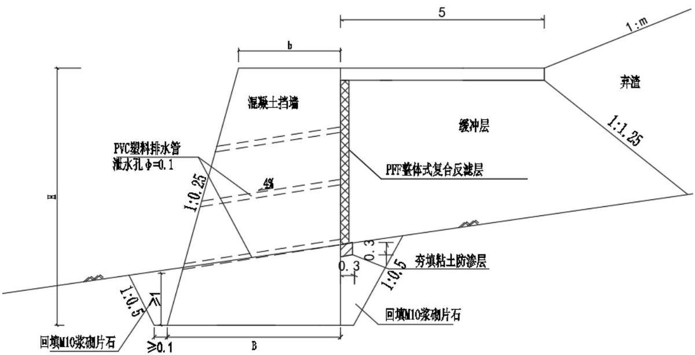  
图 5.3.9-1 挡渣墙断面图

主体设计工程量：挡渣墙挖土 3612 m3，C30 混凝土 10532 m3。

## （4）排水系统

弃渣前，渣场周边设截水天沟，渣底顺沟道走势纵向埋设盲管。渣底盲管及截排 水沟末端顺接消力沉沙池，最终延伸至自然沟道或沟渠排放。

在渣体外缘周边设截排水沟，截排山体坡面汇水，水沟应砌筑在稳定岩土体上。主体设计弃渣场截排水沟采用梯形断面，边坡1：1，底宽和沟深情况见下表。

表 5.3.10-1  
主体设计截排水沟规格
<table><tr><td rowspan=2 colspan=1>序号</td><td rowspan=2 colspan=1>弃渣场名称</td><td rowspan=1 colspan=1>底宽</td><td rowspan=1 colspan=1>水深</td></tr><tr><td rowspan=1 colspan=1>(m)</td><td rowspan=1 colspan=1>(m)</td></tr><tr><td rowspan=1 colspan=1>1</td><td rowspan=1 colspan=1>磨石村弃渣场</td><td rowspan=1 colspan=1>0.6</td><td rowspan=1 colspan=1>0.8</td></tr><tr><td rowspan=1 colspan=1>2</td><td rowspan=1 colspan=1>曹家冲弃渣场</td><td rowspan=1 colspan=1>1.1</td><td rowspan=1 colspan=1>1.3</td></tr><tr><td rowspan=1 colspan=1>3</td><td rowspan=1 colspan=1>彭家坳弃渣场</td><td rowspan=1 colspan=1>0.8</td><td rowspan=1 colspan=1>1</td></tr><tr><td rowspan=1 colspan=1>4</td><td rowspan=1 colspan=1>天江湾1号弃渣场</td><td rowspan=1 colspan=1>1.1</td><td rowspan=1 colspan=1>1.3</td></tr><tr><td rowspan=1 colspan=1>5</td><td rowspan=1 colspan=1>天江湾2号弃渣场</td><td rowspan=1 colspan=1>1.1</td><td rowspan=1 colspan=1>1.3</td></tr><tr><td rowspan=1 colspan=1>6</td><td rowspan=1 colspan=1>望水坪2号弃渣场</td><td rowspan=1 colspan=1>0.8</td><td rowspan=1 colspan=1>1</td></tr><tr><td rowspan=1 colspan=1>7</td><td rowspan=1 colspan=1>鸡头山弃土场</td><td rowspan=1 colspan=1>1.1</td><td rowspan=1 colspan=1>1.3</td></tr><tr><td rowspan=1 colspan=1>8</td><td rowspan=1 colspan=1>熊家坳弃土场</td><td rowspan=1 colspan=1>0.6</td><td rowspan=1 colspan=1>0.8</td></tr><tr><td rowspan=1 colspan=1>9</td><td rowspan=1 colspan=1>龙井弃土场</td><td rowspan=1 colspan=1>0.6</td><td rowspan=1 colspan=1>0.8</td></tr></table>

中国铁建 CHINA RAILWAY SIYUAN SURVEY AND DESIGN GROUP CO.,LTD.

<table><tr><td rowspan=2 colspan=1>序号</td><td rowspan=2 colspan=1>弃渣场名称</td><td rowspan=1 colspan=1>底宽</td><td rowspan=1 colspan=1>水深</td></tr><tr><td rowspan=1 colspan=1>(m)</td><td rowspan=1 colspan=1>(m)</td></tr><tr><td rowspan=1 colspan=1>10</td><td rowspan=1 colspan=1>天井湖弃土场</td><td rowspan=1 colspan=1>1.1</td><td rowspan=1 colspan=1>1.3</td></tr><tr><td rowspan=1 colspan=1>11</td><td rowspan=1 colspan=1>咸池冲1#弃土场</td><td rowspan=1 colspan=1>0.6</td><td rowspan=1 colspan=1>0.8</td></tr><tr><td rowspan=1 colspan=1>12</td><td rowspan=1 colspan=1>咸池冲2#弃土场</td><td rowspan=1 colspan=1>0.8</td><td rowspan=1 colspan=1>1</td></tr><tr><td rowspan=1 colspan=1>13</td><td rowspan=1 colspan=1>茶园寺村1#弃土场</td><td rowspan=1 colspan=1>1.2</td><td rowspan=1 colspan=1>1.5</td></tr><tr><td rowspan=1 colspan=1>14</td><td rowspan=1 colspan=1>窑湾弃土场</td><td rowspan=1 colspan=1>0.8</td><td rowspan=1 colspan=1>1</td></tr><tr><td rowspan=1 colspan=1>15</td><td rowspan=1 colspan=1>田家东弃土场</td><td rowspan=1 colspan=1>0.6</td><td rowspan=1 colspan=1>0.8</td></tr><tr><td rowspan=1 colspan=1>16</td><td rowspan=1 colspan=1>刘家湾弃渣场</td><td rowspan=1 colspan=1>0.6</td><td rowspan=1 colspan=1>0.8</td></tr><tr><td rowspan=1 colspan=1>17</td><td rowspan=1 colspan=1>燕窝池弃土场</td><td rowspan=1 colspan=1>0.6</td><td rowspan=1 colspan=1>0.8</td></tr><tr><td rowspan=1 colspan=1>18</td><td rowspan=1 colspan=1>姜家岭1#弃土场</td><td rowspan=1 colspan=1>0.6</td><td rowspan=1 colspan=1>0.8</td></tr><tr><td rowspan=1 colspan=1>19</td><td rowspan=1 colspan=1>厂下1#弃土场</td><td rowspan=1 colspan=1>0.8</td><td rowspan=1 colspan=1>1</td></tr><tr><td rowspan=1 colspan=1>20</td><td rowspan=1 colspan=1>厂下2#弃土场</td><td rowspan=1 colspan=1>0.6</td><td rowspan=1 colspan=1>0.8</td></tr><tr><td rowspan=1 colspan=1>21</td><td rowspan=1 colspan=1>东方湾弃土场</td><td rowspan=1 colspan=1>0.6</td><td rowspan=1 colspan=1>0.8</td></tr><tr><td rowspan=1 colspan=1>22</td><td rowspan=1 colspan=1>五里堆弃土场#1</td><td rowspan=1 colspan=1>0.6</td><td rowspan=1 colspan=1>0.8</td></tr><tr><td rowspan=1 colspan=1>23</td><td rowspan=1 colspan=1>马家堰3#弃渣场</td><td rowspan=1 colspan=1>0.6</td><td rowspan=1 colspan=1>0.8</td></tr><tr><td rowspan=1 colspan=1>24</td><td rowspan=1 colspan=1>观音洞弃土场</td><td rowspan=1 colspan=1>0.6</td><td rowspan=1 colspan=1>0.8</td></tr><tr><td rowspan=1 colspan=1>25</td><td rowspan=1 colspan=1>云翎咀弃土场</td><td rowspan=1 colspan=1>0.6</td><td rowspan=1 colspan=1>0.8</td></tr><tr><td rowspan=1 colspan=1>26</td><td rowspan=1 colspan=1>肖家河弃土场</td><td rowspan=1 colspan=1>0.6</td><td rowspan=1 colspan=1>0.8</td></tr><tr><td rowspan=1 colspan=1>27</td><td rowspan=1 colspan=1>临柏弃土场</td><td rowspan=1 colspan=1>0.6</td><td rowspan=1 colspan=1>0.8</td></tr><tr><td rowspan=1 colspan=1>28</td><td rowspan=1 colspan=1>兴安弃土场</td><td rowspan=1 colspan=1>0.6</td><td rowspan=1 colspan=1>0.8</td></tr><tr><td rowspan=1 colspan=1>29</td><td rowspan=1 colspan=1>郑湾 1#弃土场</td><td rowspan=1 colspan=1>0.6</td><td rowspan=1 colspan=1>0.8</td></tr><tr><td rowspan=1 colspan=1>30</td><td rowspan=1 colspan=1>郑湾 2#弃土场</td><td rowspan=1 colspan=1>0.6</td><td rowspan=1 colspan=1>0.8</td></tr><tr><td rowspan=1 colspan=1>31</td><td rowspan=1 colspan=1>长堰弃土场</td><td rowspan=1 colspan=1>0.6</td><td rowspan=1 colspan=1>0.8</td></tr><tr><td rowspan=1 colspan=1>32</td><td rowspan=1 colspan=1>金家湾1#弃土场</td><td rowspan=1 colspan=1>0.6</td><td rowspan=1 colspan=1>0.8</td></tr><tr><td rowspan=1 colspan=1>33</td><td rowspan=1 colspan=1>棉花山弃土场</td><td rowspan=1 colspan=1>0.6</td><td rowspan=1 colspan=1>0.8</td></tr><tr><td rowspan=1 colspan=1>34</td><td rowspan=1 colspan=1>铁山村弃土场</td><td rowspan=1 colspan=1>0.6</td><td rowspan=1 colspan=1>0.8</td></tr></table>

渣底排水（主管与支管）横断面为上部圆形下部矩形相切的门拱形断面结构，内部设计“米”字型加强支撑，圆形直径分为100mm和300mm二种规格。单节标准管长度为4m；根据现场情况逐节铺设。连接时保证系统纵向排水坡度不小于2%。沟槽底部应尽量平顺，同一节管子范围内不得设置变坡点、沟槽底部软硬不均交界处应进行沟底过渡处理。沟槽底部变坡点应设置在两节管子的连接处，此时主管与主管、支管与支管之间采用高承载柔性专用接头连接，以适应变坡的需要。支管与主管之间采用刚性四通接头连接。每一条主管或支管的端部采用专用堵头封堵，以避免土壤颗粒或者杂物进入排水系统内部，造成排水系统淤堵。

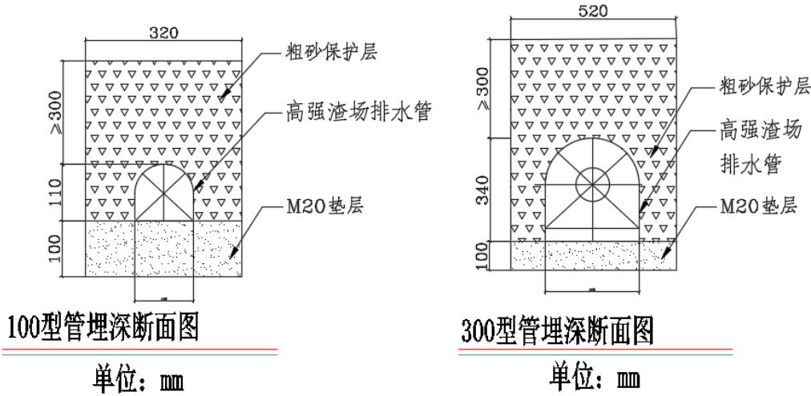  
图 5.3.9-2 渣底盲管示意图

弃渣场排水出口顺接自然沟渠前，需要在截水沟末端接兼具消力池作用的沉沙池以防止冲刷和淤塞，陡坡段设置消力坪。根据具体的地形地貌、水流流量、坡降和出口排水条件，沉沙池采用准静止泥沙沉降法。截水天沟顺接至自然沟渠，不得直接排入耕地，顺接排水沟尺寸、材质同弃渣场截排水沟一致。沉沙池为矩形断面，尺寸取3m（长）×3m（宽）×1.5m（深），采取混凝土衬砌；施工过程中，定期清除沉沙池内淤积泥沙。

主体设计工程量：截排水沟36282 m，渣底盲管17307 m，急流槽2619 m，消力坪19个，沉沙池37个。

## （二）植物措施

## （1）灌草绿化

主体设计弃渣完成后，渣顶及边坡栽植灌草绿化，灌木株行距 1m×1m，草籽撒播密度 80kg/hm2。

主体设计工程量：场坪复垦：撒播草籽1508800 m2，栽植灌木1142583株；边坡绿化：撒播草籽 147244 m2，栽植灌木 88416 株。

## （2）方案新增栽植乔木

主体设计弃渣场仅采取栽植灌草恢复植被，植物措施标准不满足水土保持要求，方案补充栽植乔木措施。乔木株行距按3m×3m布设，采用穴植法栽植，栽植密度1111株/hm2，树种选用枫杨、木荷。方案新增栽植乔木184379株。

## （三）临时工程

## （1）表土临时防护

考虑工程施工施工时序，表土从剥离至利用临时堆置期间需采取措施进行临时防护。表土防护措施与路基工程区一致，此处不再赘述。

经统计，弃渣场区表土堆放场共计装土编织袋拦挡4767 m，临时排水沟5720 m，临时沉沙池 15 座，防尘网苫盖 19.71 hm2，临时撒草绿化 19.71 hm2。

## （2）裸露面防尘网苫盖

在施工过程中，对于弃渣场裸露面采取防尘网苫盖，防止降雨形成的地表径流对松散土质边坡的冲刷。经统计，弃渣场区共需设置裸露面防尘网苫盖132.74 hm2。

## （四）挡渣墙抗滑、抗倾覆稳定性分析

## 1）挡渣墙级别

根据《水土保持工程设计规范》（GB51018-2014），拦渣、排洪工程建筑物级别应按渣场级别确定，对于位于水土流失重点防治区内的弃渣场，挡渣墙建筑物级别提高一级。

## 2）挡渣墙稳定分析

挡墙结构的稳定性计算主要是通过受力分析、力矩分析来校验墙体在承受自重、土压力以及水压力等情况下，设计的墙体结构能否维持自身的稳定。稳定计算包括两个方面：抗滑稳定性和抗倾覆稳定性。

主体设计利用理正软件计算出弃渣场断面模型在正常运用工况下和非正常运用工况下的边坡最小稳定安全系数，检算弃渣场抗滑稳定安全系数是否满足《水土保持工程设计规范》（GB 51018-2014）要求。弃渣场地震烈度为6级的只作连续降水工况稳定性系数检算，不做地震工况检算，地震烈度为7级的进行地震工况检算。

## 3）弃渣场稳定性分析

## ①计算工况

根据综合地质勘探查明弃渣场工程地质条件，综合确定其弃渣场边坡稳定性及其边坡破坏的主要影响因素，对稳定性和变形破坏起主要作用的影响因素为弃渣本身物理力学性质以及降雨条件。对以下2种工况进行稳定性计算：

（1）正常工况：分析弃渣体边坡能否维持自稳，采用天然状态下渣体容重、黏聚力、内摩擦角值进行分析计算。

（2）暴雨工况：在连续降雨期状态下，考虑弃渣体容重和动水压力增加、黏聚力及内摩擦角减小的情况，进行边坡稳定性计算。

## ③稳定性分析方法

弃渣场采用目前应用最广泛的极限平衡条分法对弃渣体进行稳定性分析。极限平

整个滑动土体对圆心O取力矩平衡得：

$$
\sum ( \mathrm { W _ { i } R _ { i } } \times \sin { \alpha _ { \mathrm { i } } } \mathrm { - T _ { i } R _ { i } } ) { = } 0\tag{5-3}
$$

得如下瑞典条分法计算公式：

$$
F _ { s } = \frac { \sum ( \mathbf { c } _ { i } { 1 _ { i } + W _ { i } \cos \alpha _ { \mathrm { i } } \tan \varphi _ { \mathrm { i } } } ) } { \sum W _ { i } \sin \alpha _ { i } }\tag{5-4}
$$

当已知条块i在滑动面上的孔隙水压力 $\mathrm { u } _ { \mathrm { i } }$ 时，瑞典条分法的公式（4-4）可改写为如下有效应力进行分析的公式：

$$
F _ { _ { S } } = \frac { \sum \left[ \mathsf { c } _ { i } \mathsf { l } _ { i } + ( \boldsymbol { W } _ { \mathrm { i } } \mathsf { - } \mathsf { u } _ { \mathrm { i } } \mathsf { b } _ { \mathrm { i } } ) \cos \alpha _ { \mathrm { i } } \tan \varphi _ { \mathrm { i } } ^ { \cdot } \right] } { \sum \boldsymbol { W } _ { i } \sin \alpha _ { i } } \mathrm { = } \frac { F _ { 1 } } { F _ { 2 } }\tag{5-5}
$$

对于挡墙抗倾覆稳定性验算中，

$$
F _  s j \gamma \imath \imath \mathrm { i } \mathrm { i } \mathrm { i } \mathrm { i } \mathrm { i } \mathrm { i } \mathrm { i } \mathrm { i } \mathrm { i } \mathrm { i } \mathrm { i } \mathrm { i } \mathrm { i } \mathrm { i } \mathrm { i } \mathrm { i } \mathrm { i } \mathrm { i } \mathrm { i } \mathrm { i } \mathrm { i } \mathrm { i } \mathrm { i } \mathrm { i } \mathrm { i } \mathrm { i } \mathrm { i } \mathrm { i } \mathrm { i } \mathrm { i } \mathrm { i } \mathrm { i } \mathrm { i } \mathrm { i } \mathrm { i } \mathrm { i } \mathrm { i } \mathrm { i } \mathrm { i } \mathrm { i } \mathrm { i } \mathrm { i } \mathrm { i } \mathrm { i } \mathrm { i } \mathrm { i } \mathrm { i } \mathrm { i } \mathrm { i } \mathrm { i } \mathrm { i } \mathrm { i } \mathrm { i } \mathrm { i } \mathrm { i } \mathrm { i } \mathrm { i } \mathrm { i } \mathrm { i } \mathrm { i } \mathrm { i } \mathrm { i } \mathrm { i } \mathrm { i } \mathrm { i } \mathrm { i } \mathrm { i } \mathrm { i } \mathrm { i } \mathrm { i } \mathrm { i } \mathrm { i } \mathrm { i } \mathrm { i } \mathrm { i } \mathrm { i } \mathrm { i } \mathrm { i } \mathrm { i } \mathrm { i } \mathrm { i } \mathrm { i } \mathrm { i } \mathrm { i } \mathrm { i } \mathrm { i } \mathrm { i } \mathrm { i } \mathrm { i } \mathrm { i } \mathrm { i } \mathrm { i } \mathrm { i } \mathrm { i } \mathrm { i } \mathrm { i } \mathrm { i } \mathrm { i } \mathrm { i } \mathrm { i } \mathrm { i } \mathrm { i } \mathrm { i } \mathrm { i } \mathrm { i } \mathrm { i } \mathrm { i } \mathrm { i } \mathrm { i } \mathrm { i } \mathrm { i } \mathrm { i } \mathrm { i } \mathrm { i } \mathrm { i } \mathrm { i } \mathrm { i } \mathrm { i } \mathrm { i } \mathrm { i } \mathrm { i } \mathrm { i } \mathrm { i } \mathrm { i } \mathrm { i } \mathrm { i } \mathrm { i } \mathrm { i } \mathrm { i } \mathrm { i } \mathrm { i } \mathrm { i } \mathrm { i } \mathrm { i } \mathrm { i } \mathrm { i } \mathrm { i } \mathrm { i } \mathrm { i } \mathrm { i } \mathrm { i } \mathrm  i\tag{5-6}
$$

对于挡墙抗滑稳定性验算中，

$$
F _ { s \mathbf { j } \mathbf { \overline { { M } } } \mathbf { \overline { { B } } } } = \frac { F _ { 1 } } { F _ { 2 } } = \frac { \sum \left[ \mathbf { c } _ { i } \mathbf { l } _ { i } + ( \mathbf { \Delta } W _ { i } \mathbf { - } \mathbf { u } _ { i } \mathbf { b } _ { i } ) \cos \alpha _ { i } \tan \varphi _ { \mathrm { i } } ^ { \cdot } \right] } { \sum W _ { i } \sin \alpha _ { i } } = \frac { \mathbf { j } \mathbf { \overline { { M } } } \mathbf { \overline { { H } } } \mathbf { \overline { { H } } } \mathbf { \overline { { j } } } J } { \mathbf { \overline { { H } } } \mathbf { \overline { { Z } } } \mathbf { \overline { { j } } } J \mathbf { \Delta } J } \geq F _ { \mathbf { \overline { { j } } } \mathbf { \overline { { M } } } \mathbf { \overline { { H } } } \mathbf { \overline { { B } } } } ,\tag{5-7}
$$

根据弃渣体的堆高、坡率、平台、排水等情况，结合弃渣场原地形、周边敏感点重要性等，选择最不利剖面，对弃渣体的边坡稳定性进行评估。

通过设定特定的稳定性系数计算剩余推力来确定两种状态下的整体稳定性系数。设定弃渣场基底接触面为潜在滑动面，不考虑地下水，计算弃渣体每一条块的剩余推力。当最后一块条块的剩余推力恰好为零时，则认为弃渣体达到整体极限平衡状态，即表明该边坡的稳定性系数大小为 $\mathrm { F _ { s } } .$

## 4）弃渣场稳定性分析结果

主体设计根据以上方法对填坑型弃渣场除外的弃渣场稳定性进行了分析。经计算，设计断面型式挡墙抗滑稳定和抗倾覆稳定均满足规范要求，并有一定的安全裕度，因此挡墙是稳定的。弃渣场相关参数见表5.3.9-7，弃渣场稳定性分析结果见表5.3.9-8。

表 5.3.10-6

中国铁建 CRCE  
挡渣墙相关参数一览表
<table><tr><td rowspan=2 colspan=1>序号</td><td rowspan=2 colspan=1>弃渣场名称</td><td rowspan=2 colspan=1>拦挡措施</td><td rowspan=1 colspan=1>高度</td><td rowspan=1 colspan=1>顶宽</td><td rowspan=2 colspan=1>埋深（m）</td><td rowspan=2 colspan=1>地基</td><td rowspan=2 colspan=1>墙背倾斜坡度</td><td rowspan=2 colspan=1>基底斜率</td><td rowspan=1 colspan=1>砌体容重</td></tr><tr><td rowspan=1 colspan=1>(m)</td><td rowspan=1 colspan=1>(m)</td><td rowspan=1 colspan=1>kN/m³</td></tr><tr><td rowspan=1 colspan=1>1</td><td rowspan=1 colspan=1>磨石村弃渣场</td><td rowspan=1 colspan=1>挡渣墙</td><td rowspan=1 colspan=1>8</td><td rowspan=1 colspan=1>3.4</td><td rowspan=1 colspan=1>2</td><td rowspan=1 colspan=1>土质</td><td rowspan=1 colspan=1>0</td><td rowspan=1 colspan=1>1: 1.5</td><td rowspan=1 colspan=1>25</td></tr><tr><td rowspan=1 colspan=1>2</td><td rowspan=1 colspan=1>曹家冲弃渣场</td><td rowspan=1 colspan=1>挡渣墙</td><td rowspan=1 colspan=1>8</td><td rowspan=1 colspan=1>3.4</td><td rowspan=1 colspan=1>2</td><td rowspan=1 colspan=1>土质</td><td rowspan=1 colspan=1>0</td><td rowspan=1 colspan=1>1: 1.5</td><td rowspan=1 colspan=1>25</td></tr><tr><td rowspan=1 colspan=1>3</td><td rowspan=1 colspan=1>彭家坳弃渣场</td><td rowspan=1 colspan=1>挡渣墙</td><td rowspan=1 colspan=1>8</td><td rowspan=1 colspan=1>3.4</td><td rowspan=1 colspan=1>2</td><td rowspan=1 colspan=1>土质</td><td rowspan=1 colspan=1>0</td><td rowspan=1 colspan=1>1:1.5</td><td rowspan=1 colspan=1>25</td></tr><tr><td rowspan=1 colspan=1>4</td><td rowspan=1 colspan=1>天江湾1号弃渣场</td><td rowspan=1 colspan=1>挡渣墙</td><td rowspan=1 colspan=1>8</td><td rowspan=1 colspan=1>3.4</td><td rowspan=1 colspan=1>2</td><td rowspan=1 colspan=1>土质</td><td rowspan=1 colspan=1>0</td><td rowspan=1 colspan=1>1: 1.5</td><td rowspan=1 colspan=1>25</td></tr><tr><td rowspan=1 colspan=1>5</td><td rowspan=1 colspan=1>天江湾2号弃渣场</td><td rowspan=1 colspan=1>挡渣墙</td><td rowspan=1 colspan=1>8</td><td rowspan=1 colspan=1>3.4</td><td rowspan=1 colspan=1>2</td><td rowspan=1 colspan=1>土质</td><td rowspan=1 colspan=1>0</td><td rowspan=1 colspan=1>1: 1.5</td><td rowspan=1 colspan=1>25</td></tr><tr><td rowspan=1 colspan=1>6</td><td rowspan=1 colspan=1>望水坪2号弃渣场</td><td rowspan=1 colspan=1>挡渣墙</td><td rowspan=1 colspan=1>8</td><td rowspan=1 colspan=1>3.4</td><td rowspan=1 colspan=1>2</td><td rowspan=1 colspan=1>土质</td><td rowspan=1 colspan=1>0</td><td rowspan=1 colspan=1>1: 1.5</td><td rowspan=1 colspan=1>25</td></tr><tr><td rowspan=1 colspan=1>7</td><td rowspan=1 colspan=1>鸡头山弃土场</td><td rowspan=1 colspan=1>挡渣墙</td><td rowspan=1 colspan=1>3~5</td><td rowspan=1 colspan=1>1.09~1.86</td><td rowspan=1 colspan=1>1.5</td><td rowspan=1 colspan=1>土质</td><td rowspan=1 colspan=1>0</td><td rowspan=1 colspan=1>0</td><td rowspan=1 colspan=1>25</td></tr><tr><td rowspan=1 colspan=1>8</td><td rowspan=1 colspan=1>熊家坳弃土场</td><td rowspan=1 colspan=1>无</td><td rowspan=1 colspan=1>一</td><td rowspan=1 colspan=1>一</td><td rowspan=1 colspan=1>1</td><td rowspan=1 colspan=1>1</td><td rowspan=1 colspan=1>一</td><td rowspan=1 colspan=1>一</td><td rowspan=1 colspan=1>一</td></tr><tr><td rowspan=1 colspan=1>9</td><td rowspan=1 colspan=1>龙井弃土场</td><td rowspan=1 colspan=1>无</td><td rowspan=1 colspan=1>一</td><td rowspan=1 colspan=1>1</td><td rowspan=1 colspan=1>1</td><td rowspan=1 colspan=1>1</td><td rowspan=1 colspan=1>一</td><td rowspan=1 colspan=1>一</td><td rowspan=1 colspan=1>1</td></tr><tr><td rowspan=1 colspan=1>10</td><td rowspan=1 colspan=1>天井湖弃土场</td><td rowspan=1 colspan=1>挡渣墙</td><td rowspan=1 colspan=1>3~5</td><td rowspan=1 colspan=1>1.09~1.86</td><td rowspan=1 colspan=1>1.5~2</td><td rowspan=1 colspan=1>土质</td><td rowspan=1 colspan=1>0</td><td rowspan=1 colspan=1>0</td><td rowspan=1 colspan=1>25</td></tr><tr><td rowspan=1 colspan=1>11</td><td rowspan=1 colspan=1>咸池冲1#弃土场</td><td rowspan=1 colspan=1>挡渣墙</td><td rowspan=1 colspan=1>3~5</td><td rowspan=1 colspan=1>1.09~1.86</td><td rowspan=1 colspan=1>1.5~2</td><td rowspan=1 colspan=1>土质</td><td rowspan=1 colspan=1>0</td><td rowspan=1 colspan=1>0</td><td rowspan=1 colspan=1>25</td></tr><tr><td rowspan=1 colspan=1>12</td><td rowspan=1 colspan=1>咸池冲 2#弃土场</td><td rowspan=1 colspan=1>挡渣墙</td><td rowspan=1 colspan=1>3~5</td><td rowspan=1 colspan=1>1.09~1.86</td><td rowspan=1 colspan=1>1.5~2</td><td rowspan=1 colspan=1>土质</td><td rowspan=1 colspan=1>0</td><td rowspan=1 colspan=1>0</td><td rowspan=1 colspan=1>25</td></tr><tr><td rowspan=1 colspan=1>13</td><td rowspan=1 colspan=1>茶园寺村1#弃土场</td><td rowspan=1 colspan=1>挡渣墙</td><td rowspan=1 colspan=1>3~5</td><td rowspan=1 colspan=1>1.09~1.86</td><td rowspan=1 colspan=1>1.5~2</td><td rowspan=1 colspan=1>土质</td><td rowspan=1 colspan=1>0</td><td rowspan=1 colspan=1>0</td><td rowspan=1 colspan=1>25</td></tr><tr><td rowspan=1 colspan=1>14</td><td rowspan=1 colspan=1>窑湾弃土场</td><td rowspan=1 colspan=1>无</td><td rowspan=1 colspan=1>一</td><td rowspan=1 colspan=1>一</td><td rowspan=1 colspan=1>一</td><td rowspan=1 colspan=1>一</td><td rowspan=1 colspan=1>一</td><td rowspan=1 colspan=1>一</td><td rowspan=1 colspan=1>一</td></tr><tr><td rowspan=1 colspan=1>15</td><td rowspan=1 colspan=1>田家东弃土场</td><td rowspan=1 colspan=1>无</td><td rowspan=1 colspan=1>一</td><td rowspan=1 colspan=1>一</td><td rowspan=1 colspan=1>一</td><td rowspan=1 colspan=1>一</td><td rowspan=1 colspan=1>一</td><td rowspan=1 colspan=1>一</td><td rowspan=1 colspan=1>一</td></tr><tr><td rowspan=1 colspan=1>16</td><td rowspan=1 colspan=1>刘家湾弃渣场</td><td rowspan=1 colspan=1>无</td><td rowspan=1 colspan=1>一</td><td rowspan=1 colspan=1>一</td><td rowspan=1 colspan=1>一</td><td rowspan=1 colspan=1>一</td><td rowspan=1 colspan=1>一</td><td rowspan=1 colspan=1>一</td><td rowspan=1 colspan=1>一</td></tr><tr><td rowspan=1 colspan=1>17</td><td rowspan=1 colspan=1>燕窝池弃土场</td><td rowspan=1 colspan=1>无</td><td rowspan=1 colspan=1>1</td><td rowspan=1 colspan=1>一</td><td rowspan=1 colspan=1>一</td><td rowspan=1 colspan=1>一</td><td rowspan=1 colspan=1>1</td><td rowspan=1 colspan=1>一</td><td rowspan=1 colspan=1>1</td></tr></table>

5 水土保持措施

中国铁建 CREECHINA RAILWAY SIYUAN SURVEY AND DESIGN GROUP CO.,LTD 中铁第四勘察设计院集团有限公司
<table><tr><td rowspan=2 colspan=1>序号</td><td rowspan=2 colspan=1>弃渣场名称</td><td rowspan=2 colspan=1>拦挡措施</td><td rowspan=1 colspan=1>高度</td><td rowspan=1 colspan=1>顶宽</td><td rowspan=2 colspan=1>埋深（m）</td><td rowspan=2 colspan=1>地基</td><td rowspan=2 colspan=1>墙背倾斜坡度</td><td rowspan=2 colspan=1>基底斜率</td><td rowspan=1 colspan=1>砌体容重</td></tr><tr><td rowspan=1 colspan=1>(m)</td><td rowspan=1 colspan=1>(m)</td><td rowspan=1 colspan=1>kN/m³</td></tr><tr><td rowspan=1 colspan=1>18</td><td rowspan=1 colspan=1>姜家岭1#弃土场</td><td rowspan=1 colspan=1>挡渣墙</td><td rowspan=1 colspan=1>3~5</td><td rowspan=1 colspan=1>1.09~1.86</td><td rowspan=1 colspan=1>1.5~2</td><td rowspan=1 colspan=1>土质</td><td rowspan=1 colspan=1>0</td><td rowspan=1 colspan=1>0</td><td rowspan=1 colspan=1>25</td></tr><tr><td rowspan=1 colspan=1>19</td><td rowspan=1 colspan=1>厂下1#弃土场</td><td rowspan=1 colspan=1>挡渣墙</td><td rowspan=1 colspan=1>3~5</td><td rowspan=1 colspan=1>1.09~1.86</td><td rowspan=1 colspan=1>1.5~2</td><td rowspan=1 colspan=1>土质</td><td rowspan=1 colspan=1>0</td><td rowspan=1 colspan=1>0</td><td rowspan=1 colspan=1>25</td></tr><tr><td rowspan=1 colspan=1>20</td><td rowspan=1 colspan=1>厂下2#弃土场</td><td rowspan=1 colspan=1>挡渣墙</td><td rowspan=1 colspan=1>3~5</td><td rowspan=1 colspan=1>1.09~1.86</td><td rowspan=1 colspan=1>1.5~2</td><td rowspan=1 colspan=1>土质</td><td rowspan=1 colspan=1>0</td><td rowspan=1 colspan=1>0</td><td rowspan=1 colspan=1>25</td></tr><tr><td rowspan=1 colspan=1>21</td><td rowspan=1 colspan=1>东方湾弃土场</td><td rowspan=1 colspan=1>无</td><td rowspan=1 colspan=1>一</td><td rowspan=1 colspan=1>一</td><td rowspan=1 colspan=1>一</td><td rowspan=1 colspan=1>一</td><td rowspan=1 colspan=1>一</td><td rowspan=1 colspan=1>一</td><td rowspan=1 colspan=1>一</td></tr><tr><td rowspan=1 colspan=1>22</td><td rowspan=1 colspan=1>五里堆弃土场#1</td><td rowspan=1 colspan=1>无</td><td rowspan=1 colspan=1>一</td><td rowspan=1 colspan=1>一</td><td rowspan=1 colspan=1>一</td><td rowspan=1 colspan=1>一</td><td rowspan=1 colspan=1>一</td><td rowspan=1 colspan=1>一</td><td rowspan=1 colspan=1>一</td></tr><tr><td rowspan=1 colspan=1>23</td><td rowspan=1 colspan=1>马家堰3#弃渣场</td><td rowspan=1 colspan=1>无</td><td rowspan=1 colspan=1>一</td><td rowspan=1 colspan=1>一</td><td rowspan=1 colspan=1>一</td><td rowspan=1 colspan=1>一</td><td rowspan=1 colspan=1>一</td><td rowspan=1 colspan=1>一</td><td rowspan=1 colspan=1>一</td></tr><tr><td rowspan=1 colspan=1>24</td><td rowspan=1 colspan=1>观音洞弃土场</td><td rowspan=1 colspan=1>无</td><td rowspan=1 colspan=1>一</td><td rowspan=1 colspan=1>一</td><td rowspan=1 colspan=1>一</td><td rowspan=1 colspan=1>一</td><td rowspan=1 colspan=1>一</td><td rowspan=1 colspan=1>一</td><td rowspan=1 colspan=1>一</td></tr><tr><td rowspan=1 colspan=1>25</td><td rowspan=1 colspan=1>云翎咀弃土场</td><td rowspan=1 colspan=1>无</td><td rowspan=1 colspan=1>一</td><td rowspan=1 colspan=1>1</td><td rowspan=1 colspan=1>一</td><td rowspan=1 colspan=1>一</td><td rowspan=1 colspan=1>一</td><td rowspan=1 colspan=1>一</td><td rowspan=1 colspan=1>一</td></tr><tr><td rowspan=1 colspan=1>26</td><td rowspan=1 colspan=1>肖家河弃土场</td><td rowspan=1 colspan=1>挡渣墙</td><td rowspan=1 colspan=1>3~4</td><td rowspan=1 colspan=1>1.09~1.45</td><td rowspan=1 colspan=1>1.5~2</td><td rowspan=1 colspan=1>土质</td><td rowspan=1 colspan=1>0</td><td rowspan=1 colspan=1>0</td><td rowspan=1 colspan=1>25</td></tr><tr><td rowspan=1 colspan=1>27</td><td rowspan=1 colspan=1>临柏弃土场</td><td rowspan=1 colspan=1>无</td><td rowspan=1 colspan=1>一</td><td rowspan=1 colspan=1>一</td><td rowspan=1 colspan=1>一</td><td rowspan=1 colspan=1>一</td><td rowspan=1 colspan=1>一</td><td rowspan=1 colspan=1>一</td><td rowspan=1 colspan=1>一</td></tr><tr><td rowspan=1 colspan=1>28</td><td rowspan=1 colspan=1>兴安弃土场</td><td rowspan=1 colspan=1>无</td><td rowspan=1 colspan=1>一</td><td rowspan=1 colspan=1>一</td><td rowspan=1 colspan=1>一</td><td rowspan=1 colspan=1>一</td><td rowspan=1 colspan=1>一</td><td rowspan=1 colspan=1>一</td><td rowspan=1 colspan=1>一</td></tr><tr><td rowspan=1 colspan=1>29</td><td rowspan=1 colspan=1>郑湾1#弃土场</td><td rowspan=1 colspan=1>无</td><td rowspan=1 colspan=1>一</td><td rowspan=1 colspan=1>一</td><td rowspan=1 colspan=1>一</td><td rowspan=1 colspan=1>一</td><td rowspan=1 colspan=1>一</td><td rowspan=1 colspan=1>一</td><td rowspan=1 colspan=1>一</td></tr><tr><td rowspan=1 colspan=1>30</td><td rowspan=1 colspan=1>郑湾 2#弃土场</td><td rowspan=1 colspan=1>无</td><td rowspan=1 colspan=1>一</td><td rowspan=1 colspan=1>一</td><td rowspan=1 colspan=1>一</td><td rowspan=1 colspan=1>一</td><td rowspan=1 colspan=1>一</td><td rowspan=1 colspan=1>一</td><td rowspan=1 colspan=1>一</td></tr><tr><td rowspan=1 colspan=1>31</td><td rowspan=1 colspan=1>长堰弃土场</td><td rowspan=1 colspan=1>无</td><td rowspan=1 colspan=1>一</td><td rowspan=1 colspan=1>一</td><td rowspan=1 colspan=1>一</td><td rowspan=1 colspan=1>一</td><td rowspan=1 colspan=1>一</td><td rowspan=1 colspan=1>一</td><td rowspan=1 colspan=1>一</td></tr><tr><td rowspan=1 colspan=1>32</td><td rowspan=1 colspan=1>金家湾 1#弃土场</td><td rowspan=1 colspan=1>无</td><td rowspan=1 colspan=1>一</td><td rowspan=1 colspan=1>一</td><td rowspan=1 colspan=1>一</td><td rowspan=1 colspan=1>一</td><td rowspan=1 colspan=1>一</td><td rowspan=1 colspan=1>一</td><td rowspan=1 colspan=1>一</td></tr><tr><td rowspan=1 colspan=1>33</td><td rowspan=1 colspan=1>棉花山弃土场</td><td rowspan=1 colspan=1>无</td><td rowspan=1 colspan=1>一</td><td rowspan=1 colspan=1>一</td><td rowspan=1 colspan=1>一</td><td rowspan=1 colspan=1>一</td><td rowspan=1 colspan=1>一</td><td rowspan=1 colspan=1>一</td><td rowspan=1 colspan=1>一</td></tr><tr><td rowspan=1 colspan=1>34</td><td rowspan=1 colspan=1>铁山村弃土场</td><td rowspan=1 colspan=1>无</td><td rowspan=1 colspan=1>一</td><td rowspan=1 colspan=1>一</td><td rowspan=1 colspan=1>1</td><td rowspan=1 colspan=1>一</td><td rowspan=1 colspan=1>一</td><td rowspan=1 colspan=1>一</td><td rowspan=1 colspan=1>1</td></tr></table>

水土保持措

中国铁建 CRCE

表 5.3.10-7

弃渣场相关参数一览表
<table><tr><td rowspan=3 colspan=1>序号</td><td rowspan=3 colspan=1>弃渣场名称</td><td rowspan=1 colspan=9>弃渣场地岩土层</td><td rowspan=1 colspan=4>渣料情况</td></tr><tr><td rowspan=2 colspan=1>岩性代号</td><td rowspan=2 colspan=1>岩土名称</td><td rowspan=1 colspan=1>时代</td><td rowspan=2 colspan=1>状态</td><td rowspan=2 colspan=1>密度ρ(g/cm3)</td><td rowspan=2 colspan=1>黏聚力C(kPa)</td><td rowspan=2 colspan=1>内摩擦角Φ(°)</td><td rowspan=2 colspan=1>基底摩擦系数f</td><td rowspan=2 colspan=1>基本承载力σo(kPa)</td><td rowspan=2 colspan=1>来源及主要物质组成</td><td rowspan=2 colspan=1>密度ρ(g/cm3)</td><td rowspan=2 colspan=1>黏聚力C(kPa)</td><td rowspan=2 colspan=1>内摩擦角Φ(°)</td></tr><tr><td rowspan=1 colspan=1>成因</td></tr><tr><td rowspan=1 colspan=1>1</td><td rowspan=1 colspan=1>磨石村弃渣场</td><td rowspan=1 colspan=1>&lt;3-13&gt;</td><td rowspan=1 colspan=1>粉质黏土</td><td rowspan=1 colspan=1>Q4el+dl</td><td rowspan=1 colspan=1>硬塑</td><td rowspan=1 colspan=1>2</td><td rowspan=1 colspan=1>22</td><td rowspan=1 colspan=1>18</td><td rowspan=1 colspan=1>0.3</td><td rowspan=1 colspan=1>150</td><td rowspan=1 colspan=1>土，局部夹碎石</td><td rowspan=1 colspan=1>1.8</td><td rowspan=1 colspan=1>17</td><td rowspan=1 colspan=1>22</td></tr><tr><td rowspan=1 colspan=1>2</td><td rowspan=1 colspan=1>曹家冲弃渣场</td><td rowspan=1 colspan=1>&lt;2-12&gt;</td><td rowspan=1 colspan=1>粉质黏土</td><td rowspan=1 colspan=1>Q₄al+pl</td><td rowspan=1 colspan=1>软塑</td><td rowspan=1 colspan=1>1.9</td><td rowspan=1 colspan=1>16</td><td rowspan=1 colspan=1>10</td><td rowspan=1 colspan=1>0.3</td><td rowspan=1 colspan=1>120</td><td rowspan=1 colspan=1>土，局部夹碎石</td><td rowspan=1 colspan=1>1.8</td><td rowspan=1 colspan=1>17</td><td rowspan=1 colspan=1>22</td></tr><tr><td rowspan=1 colspan=1>3</td><td rowspan=1 colspan=1>彭家坳弃渣场</td><td rowspan=1 colspan=1>&lt;3-13&gt;</td><td rowspan=1 colspan=1>粉质黏土</td><td rowspan=1 colspan=1>Q₄el+dl</td><td rowspan=1 colspan=1>硬塑</td><td rowspan=1 colspan=1>2</td><td rowspan=1 colspan=1>22</td><td rowspan=1 colspan=1>18</td><td rowspan=1 colspan=1>0.3</td><td rowspan=1 colspan=1>150</td><td rowspan=1 colspan=1>土，局部夹碎石</td><td rowspan=1 colspan=1>1.8</td><td rowspan=1 colspan=1>17</td><td rowspan=1 colspan=1>22</td></tr><tr><td rowspan=1 colspan=1>4</td><td rowspan=1 colspan=1>天江湾1号弃渣场</td><td rowspan=1 colspan=1>&lt;3-13&gt;</td><td rowspan=1 colspan=1>粉质黏土</td><td rowspan=1 colspan=1>Q4el+dl</td><td rowspan=1 colspan=1>硬塑</td><td rowspan=1 colspan=1>2</td><td rowspan=1 colspan=1>22</td><td rowspan=1 colspan=1>18</td><td rowspan=1 colspan=1>0.3</td><td rowspan=1 colspan=1>150</td><td rowspan=1 colspan=1>土，局部夹碎石</td><td rowspan=1 colspan=1>1.8</td><td rowspan=1 colspan=1>17</td><td rowspan=1 colspan=1>22</td></tr><tr><td rowspan=1 colspan=1>5</td><td rowspan=1 colspan=1>天江湾2号弃渣场</td><td rowspan=1 colspan=1>&lt;3-13&gt;</td><td rowspan=1 colspan=1>粉质黏土</td><td rowspan=1 colspan=1>Q4el+dl</td><td rowspan=1 colspan=1>硬塑</td><td rowspan=1 colspan=1>2</td><td rowspan=1 colspan=1>22</td><td rowspan=1 colspan=1>18</td><td rowspan=1 colspan=1>0.3</td><td rowspan=1 colspan=1>150</td><td rowspan=1 colspan=1>土，局部夹碎石</td><td rowspan=1 colspan=1>1.8</td><td rowspan=1 colspan=1>17</td><td rowspan=1 colspan=1>22</td></tr><tr><td rowspan=1 colspan=1>6</td><td rowspan=1 colspan=1>望水坪2号弃渣场</td><td rowspan=1 colspan=1>&lt;3-13&gt;</td><td rowspan=1 colspan=1>粉质黏土</td><td rowspan=1 colspan=1>Q4el+dl</td><td rowspan=1 colspan=1>硬塑</td><td rowspan=1 colspan=1>2</td><td rowspan=1 colspan=1>22</td><td rowspan=1 colspan=1>18</td><td rowspan=1 colspan=1>0.3</td><td rowspan=1 colspan=1>150</td><td rowspan=1 colspan=1>土，局部夹碎石</td><td rowspan=1 colspan=1>1.8</td><td rowspan=1 colspan=1>17</td><td rowspan=1 colspan=1>22</td></tr><tr><td rowspan=1 colspan=1>7</td><td rowspan=1 colspan=1>鸡头山弃土场</td><td rowspan=1 colspan=1>(2)1-3</td><td rowspan=1 colspan=1>粉质黏土</td><td rowspan=1 colspan=1>Q4al+pl</td><td rowspan=1 colspan=1>硬塑</td><td rowspan=1 colspan=1>1.9</td><td rowspan=1 colspan=1>40</td><td rowspan=1 colspan=1>18</td><td rowspan=1 colspan=1>0.3</td><td rowspan=1 colspan=1>160</td><td rowspan=1 colspan=1>碎石，局部夹土</td><td rowspan=1 colspan=1>1.9</td><td rowspan=1 colspan=1>5</td><td rowspan=1 colspan=1>30</td></tr><tr><td rowspan=1 colspan=1>8</td><td rowspan=1 colspan=1>熊家坳弃土场</td><td rowspan=1 colspan=1>（14)1-3</td><td rowspan=1 colspan=1>灰岩</td><td rowspan=1 colspan=1>∈2-3ls</td><td rowspan=1 colspan=1>弱风化</td><td rowspan=1 colspan=1>2.5</td><td rowspan=1 colspan=1>1</td><td rowspan=1 colspan=1>1</td><td rowspan=1 colspan=1>0.4</td><td rowspan=1 colspan=1>1000</td><td rowspan=1 colspan=1>碎石，局部夹土</td><td rowspan=1 colspan=1>1.9</td><td rowspan=1 colspan=1>5</td><td rowspan=1 colspan=1>30</td></tr><tr><td rowspan=1 colspan=1>9</td><td rowspan=1 colspan=1>龙井弃土场</td><td rowspan=1 colspan=1>(14)1-3</td><td rowspan=1 colspan=1>灰岩</td><td rowspan=1 colspan=1>∈2-3ls</td><td rowspan=1 colspan=1>弱风化</td><td rowspan=1 colspan=1>2.5</td><td rowspan=1 colspan=1>1</td><td rowspan=1 colspan=1>1</td><td rowspan=1 colspan=1>0.4</td><td rowspan=1 colspan=1>1000</td><td rowspan=1 colspan=1>碎石，局部夹土</td><td rowspan=1 colspan=1>1.9</td><td rowspan=1 colspan=1>5</td><td rowspan=1 colspan=1>30</td></tr><tr><td rowspan=1 colspan=1>10</td><td rowspan=1 colspan=1>天井湖弃土场</td><td rowspan=1 colspan=1>(2) 1-3</td><td rowspan=1 colspan=1>粉质黏土</td><td rowspan=1 colspan=1>Q4al+pl</td><td rowspan=1 colspan=1>硬塑</td><td rowspan=1 colspan=1>1.9</td><td rowspan=1 colspan=1>40</td><td rowspan=1 colspan=1>18</td><td rowspan=1 colspan=1>0.3</td><td rowspan=1 colspan=1>160</td><td rowspan=1 colspan=1>碎石，局部夹土</td><td rowspan=1 colspan=1>1.9</td><td rowspan=1 colspan=1>5</td><td rowspan=1 colspan=1>30</td></tr><tr><td rowspan=1 colspan=1>11</td><td rowspan=1 colspan=1>咸池冲1#弃土场</td><td rowspan=1 colspan=1>(2)1-3</td><td rowspan=1 colspan=1>粉质黏土</td><td rowspan=1 colspan=1>Q4al+pl</td><td rowspan=1 colspan=1>硬塑</td><td rowspan=1 colspan=1>1.9</td><td rowspan=1 colspan=1>40</td><td rowspan=1 colspan=1>18</td><td rowspan=1 colspan=1>0.3</td><td rowspan=1 colspan=1>160</td><td rowspan=1 colspan=1>土，局部夹碎石</td><td rowspan=1 colspan=1>1.8</td><td rowspan=1 colspan=1>7</td><td rowspan=1 colspan=1>20</td></tr><tr><td rowspan=1 colspan=1>12</td><td rowspan=1 colspan=1>咸池冲 2#弃土场</td><td rowspan=1 colspan=1>(2)1-3</td><td rowspan=1 colspan=1>粉质黏土</td><td rowspan=1 colspan=1>Q4al+pl</td><td rowspan=1 colspan=1>硬塑</td><td rowspan=1 colspan=1>1.9</td><td rowspan=1 colspan=1>40</td><td rowspan=1 colspan=1>18</td><td rowspan=1 colspan=1>0.3</td><td rowspan=1 colspan=1>160</td><td rowspan=1 colspan=1>土，局部夹碎石</td><td rowspan=1 colspan=1>1.8</td><td rowspan=1 colspan=1>7</td><td rowspan=1 colspan=1>20</td></tr><tr><td rowspan=1 colspan=1>13</td><td rowspan=1 colspan=1>茶园寺村1#弃土场</td><td rowspan=1 colspan=1>(2)1-3</td><td rowspan=1 colspan=1>粉质黏土</td><td rowspan=1 colspan=1>Q4al+pl</td><td rowspan=1 colspan=1>硬塑</td><td rowspan=1 colspan=1>1.9</td><td rowspan=1 colspan=1>40</td><td rowspan=1 colspan=1>18</td><td rowspan=1 colspan=1>0.3</td><td rowspan=1 colspan=1>160</td><td rowspan=1 colspan=1>土，局部夹碎石</td><td rowspan=1 colspan=1>1.8</td><td rowspan=1 colspan=1>7</td><td rowspan=1 colspan=1>20</td></tr><tr><td rowspan=1 colspan=1>14</td><td rowspan=1 colspan=1>窑湾弃土场</td><td rowspan=1 colspan=1>（14） 2-3</td><td rowspan=1 colspan=1>白云岩</td><td rowspan=1 colspan=1>∈2-3ls</td><td rowspan=1 colspan=1>弱风化</td><td rowspan=1 colspan=1>2.6</td><td rowspan=1 colspan=1>1</td><td rowspan=1 colspan=1>1</td><td rowspan=1 colspan=1>0.4</td><td rowspan=1 colspan=1>1000</td><td rowspan=1 colspan=1>土，局部夹碎石</td><td rowspan=1 colspan=1>1.8</td><td rowspan=1 colspan=1>7</td><td rowspan=1 colspan=1>20</td></tr><tr><td rowspan=1 colspan=1>15</td><td rowspan=1 colspan=1>田家东弃土场</td><td rowspan=1 colspan=1>（14)1-3</td><td rowspan=1 colspan=1>灰岩</td><td rowspan=1 colspan=1>∈2-3ls</td><td rowspan=1 colspan=1>弱风化</td><td rowspan=1 colspan=1>2.5</td><td rowspan=1 colspan=1>1</td><td rowspan=1 colspan=1>1</td><td rowspan=1 colspan=1>0.4</td><td rowspan=1 colspan=1>1000</td><td rowspan=1 colspan=1>土，夹少量碎石</td><td rowspan=1 colspan=1>1.8</td><td rowspan=1 colspan=1>15</td><td rowspan=1 colspan=1>18</td></tr><tr><td rowspan=1 colspan=1>16</td><td rowspan=1 colspan=1>刘家湾弃渣场</td><td rowspan=1 colspan=1>(14)1-3</td><td rowspan=1 colspan=1>灰岩</td><td rowspan=1 colspan=1>∈2-3ls</td><td rowspan=1 colspan=1>弱风化</td><td rowspan=1 colspan=1>2.5</td><td rowspan=1 colspan=1>1</td><td rowspan=1 colspan=1>1</td><td rowspan=1 colspan=1>0.4</td><td rowspan=1 colspan=1>1000</td><td rowspan=1 colspan=1>土，夹少量碎石</td><td rowspan=1 colspan=1>1.8</td><td rowspan=1 colspan=1>15</td><td rowspan=1 colspan=1>18</td></tr></table>

5 水土保持措施

中国铁建 CRCE  
水土保持措
<table><tr><td rowspan=3 colspan=1>序号</td><td rowspan=3 colspan=1>弃渣场名称</td><td rowspan=1 colspan=9>弃渣场地岩土层</td><td rowspan=1 colspan=4>渣料情况</td></tr><tr><td rowspan=2 colspan=1>岩性代号</td><td rowspan=2 colspan=1>岩土名称</td><td rowspan=1 colspan=1>时代</td><td rowspan=2 colspan=1>状态</td><td rowspan=2 colspan=1>密度ρ(g/cm3)</td><td rowspan=2 colspan=1>黏聚力C(kPa)</td><td rowspan=2 colspan=1>内摩擦角Φ(°)</td><td rowspan=2 colspan=1>基底摩擦系数f</td><td rowspan=2 colspan=1>基本承载力σ0(kPa)</td><td rowspan=2 colspan=1>来源及主要物质组成</td><td rowspan=2 colspan=1>密度ρ(g/cm3)</td><td rowspan=2 colspan=1>黏聚力C(kPa)</td><td rowspan=2 colspan=1>内摩擦角Φ(°)</td></tr><tr><td rowspan=1 colspan=1>成因</td></tr><tr><td rowspan=1 colspan=1>17</td><td rowspan=1 colspan=1>燕窝池弃土场</td><td rowspan=1 colspan=1>(2)7-2</td><td rowspan=1 colspan=1>粗圆砾土</td><td rowspan=1 colspan=1>Q4al+pl</td><td rowspan=1 colspan=1>稍密</td><td rowspan=1 colspan=1>2</td><td rowspan=1 colspan=1>5</td><td rowspan=1 colspan=1>40</td><td rowspan=1 colspan=1>0.35</td><td rowspan=1 colspan=1>450</td><td rowspan=1 colspan=1>土，夹少量碎石</td><td rowspan=1 colspan=1>1.8</td><td rowspan=1 colspan=1>15</td><td rowspan=1 colspan=1>18</td></tr><tr><td rowspan=1 colspan=1>18</td><td rowspan=1 colspan=1>姜家岭1#弃土场</td><td rowspan=1 colspan=1>(2) 1-3</td><td rowspan=1 colspan=1>粉质黏土</td><td rowspan=1 colspan=1>Q2al+pl</td><td rowspan=1 colspan=1>硬塑</td><td rowspan=1 colspan=1>1.9</td><td rowspan=1 colspan=1>35</td><td rowspan=1 colspan=1>16</td><td rowspan=1 colspan=1>0.3</td><td rowspan=1 colspan=1>160</td><td rowspan=1 colspan=1>土，夹少量碎石</td><td rowspan=1 colspan=1>1.8</td><td rowspan=1 colspan=1>15</td><td rowspan=1 colspan=1>18</td></tr><tr><td rowspan=1 colspan=1>19</td><td rowspan=1 colspan=1>厂下1#弃土场</td><td rowspan=1 colspan=1>(2)1-3</td><td rowspan=1 colspan=1>粉质黏土</td><td rowspan=1 colspan=1>Q2al+pl</td><td rowspan=1 colspan=1>硬塑</td><td rowspan=1 colspan=1>1.9</td><td rowspan=1 colspan=1>35</td><td rowspan=1 colspan=1>16</td><td rowspan=1 colspan=1>0.3</td><td rowspan=1 colspan=1>160</td><td rowspan=1 colspan=1>土，夹少量碎石</td><td rowspan=1 colspan=1>1.8</td><td rowspan=1 colspan=1>15</td><td rowspan=1 colspan=1>18</td></tr><tr><td rowspan=1 colspan=1>20</td><td rowspan=1 colspan=1>厂下2#弃土场</td><td rowspan=1 colspan=1>(2) 1-3</td><td rowspan=1 colspan=1>粉质黏土</td><td rowspan=1 colspan=1>Q2al+pl</td><td rowspan=1 colspan=1>硬塑</td><td rowspan=1 colspan=1>1.9</td><td rowspan=1 colspan=1>35</td><td rowspan=1 colspan=1>16</td><td rowspan=1 colspan=1>0.3</td><td rowspan=1 colspan=1>160</td><td rowspan=1 colspan=1>土，夹少量碎石</td><td rowspan=1 colspan=1>1.8</td><td rowspan=1 colspan=1>15</td><td rowspan=1 colspan=1>18</td></tr><tr><td rowspan=1 colspan=1>21</td><td rowspan=1 colspan=1>东方湾弃土场</td><td rowspan=1 colspan=1>(2) 1-3</td><td rowspan=1 colspan=1>粉质黏土</td><td rowspan=1 colspan=1>Q4al+pl</td><td rowspan=1 colspan=1>硬塑</td><td rowspan=1 colspan=1>1.9</td><td rowspan=1 colspan=1>35</td><td rowspan=1 colspan=1>16</td><td rowspan=1 colspan=1>0.3</td><td rowspan=1 colspan=1>160</td><td rowspan=1 colspan=1>土，夹少量碎石</td><td rowspan=1 colspan=1>1.8</td><td rowspan=1 colspan=1>15</td><td rowspan=1 colspan=1>18</td></tr><tr><td rowspan=1 colspan=1>22</td><td rowspan=1 colspan=1>五里堆弃土场#1</td><td rowspan=1 colspan=1>(9) 9-3</td><td rowspan=1 colspan=1>灰岩</td><td rowspan=1 colspan=1>P2c</td><td rowspan=1 colspan=1>弱风化</td><td rowspan=1 colspan=1>2.5</td><td rowspan=1 colspan=1>1</td><td rowspan=1 colspan=1>1</td><td rowspan=1 colspan=1>0.4</td><td rowspan=1 colspan=1>1000</td><td rowspan=1 colspan=1>土，夹少量碎石</td><td rowspan=1 colspan=1>1.8</td><td rowspan=1 colspan=1>15</td><td rowspan=1 colspan=1>18</td></tr><tr><td rowspan=1 colspan=1>23</td><td rowspan=1 colspan=1>马家堰3#弃渣场</td><td rowspan=1 colspan=1>(4)1-3</td><td rowspan=1 colspan=1>粉质黏土</td><td rowspan=1 colspan=1>Q3al+pl</td><td rowspan=1 colspan=1>硬塑</td><td rowspan=1 colspan=1>1.9</td><td rowspan=1 colspan=1>52</td><td rowspan=1 colspan=1>19</td><td rowspan=1 colspan=1>0.3</td><td rowspan=1 colspan=1>180</td><td rowspan=1 colspan=1>土，夹少量碎石</td><td rowspan=1 colspan=1>1.8</td><td rowspan=1 colspan=1>15</td><td rowspan=1 colspan=1>18</td></tr><tr><td rowspan=1 colspan=1>24</td><td rowspan=1 colspan=1>观音洞弃土场</td><td rowspan=1 colspan=1>（13）5-3</td><td rowspan=1 colspan=1>灰岩</td><td rowspan=1 colspan=1>02g</td><td rowspan=1 colspan=1>弱风化</td><td rowspan=1 colspan=1>2.5</td><td rowspan=1 colspan=1>1</td><td rowspan=1 colspan=1>1</td><td rowspan=1 colspan=1>0.4</td><td rowspan=1 colspan=1>1000</td><td rowspan=1 colspan=1>土，夹少量碎石</td><td rowspan=1 colspan=1>1.8</td><td rowspan=1 colspan=1>15</td><td rowspan=1 colspan=1>18</td></tr><tr><td rowspan=1 colspan=1>25</td><td rowspan=1 colspan=1>云翎咀弃土场</td><td rowspan=1 colspan=1>(4)1-3</td><td rowspan=1 colspan=1>粉质黏土</td><td rowspan=1 colspan=1>Q3al+pl</td><td rowspan=1 colspan=1>硬塑</td><td rowspan=1 colspan=1>1.9</td><td rowspan=1 colspan=1>52</td><td rowspan=1 colspan=1>19</td><td rowspan=1 colspan=1>0.3</td><td rowspan=1 colspan=1>180</td><td rowspan=1 colspan=1>土，夹少量碎石</td><td rowspan=1 colspan=1>1.8</td><td rowspan=1 colspan=1>15</td><td rowspan=1 colspan=1>18</td></tr><tr><td rowspan=1 colspan=1>26</td><td rowspan=1 colspan=1>肖家河弃土场</td><td rowspan=1 colspan=1>(5) 1-3</td><td rowspan=1 colspan=1>泥质粉砂岩</td><td rowspan=1 colspan=1>Efn</td><td rowspan=1 colspan=1>弱风化</td><td rowspan=1 colspan=1>2.3</td><td rowspan=1 colspan=1>1</td><td rowspan=1 colspan=1>1</td><td rowspan=1 colspan=1>0.35</td><td rowspan=1 colspan=1>400</td><td rowspan=1 colspan=1>土，夹少量碎石</td><td rowspan=1 colspan=1>1.8</td><td rowspan=1 colspan=1>15</td><td rowspan=1 colspan=1>18</td></tr><tr><td rowspan=1 colspan=1>27</td><td rowspan=1 colspan=1>临柏弃土场</td><td rowspan=1 colspan=1>(4) 6-2</td><td rowspan=1 colspan=1>细圆砾土</td><td rowspan=1 colspan=1>Q3al+pl</td><td rowspan=1 colspan=1>稍密</td><td rowspan=1 colspan=1>2</td><td rowspan=1 colspan=1>5</td><td rowspan=1 colspan=1>38</td><td rowspan=1 colspan=1>0.35</td><td rowspan=1 colspan=1>300</td><td rowspan=1 colspan=1>土，夹少量碎石</td><td rowspan=1 colspan=1>1.8</td><td rowspan=1 colspan=1>15</td><td rowspan=1 colspan=1>18</td></tr><tr><td rowspan=1 colspan=1>28</td><td rowspan=1 colspan=1>兴安弃土场</td><td rowspan=1 colspan=1>（14）2-3</td><td rowspan=1 colspan=1>白云岩</td><td rowspan=1 colspan=1>∈2-3ls</td><td rowspan=1 colspan=1>弱风化</td><td rowspan=1 colspan=1>2.7</td><td rowspan=1 colspan=1>1</td><td rowspan=1 colspan=1>一</td><td rowspan=1 colspan=1>0.4</td><td rowspan=1 colspan=1>1000</td><td rowspan=1 colspan=1>土，夹少量碎石</td><td rowspan=1 colspan=1>1.8</td><td rowspan=1 colspan=1>15</td><td rowspan=1 colspan=1>18</td></tr><tr><td rowspan=1 colspan=1>29</td><td rowspan=1 colspan=1>郑湾1#弃土场</td><td rowspan=1 colspan=1>(14)1-3</td><td rowspan=1 colspan=1>灰岩</td><td rowspan=1 colspan=1>∈2-3ls</td><td rowspan=1 colspan=1>弱风化</td><td rowspan=1 colspan=1>2.7</td><td rowspan=1 colspan=1>1</td><td rowspan=1 colspan=1>一</td><td rowspan=1 colspan=1>0.4</td><td rowspan=1 colspan=1>1000</td><td rowspan=1 colspan=1>碎石，局部夹土</td><td rowspan=1 colspan=1>1.9</td><td rowspan=1 colspan=1>5</td><td rowspan=1 colspan=1>30</td></tr><tr><td rowspan=1 colspan=1>30</td><td rowspan=1 colspan=1>郑湾 2#弃土场</td><td rowspan=1 colspan=1>（14)1-3</td><td rowspan=1 colspan=1>灰岩</td><td rowspan=1 colspan=1>∈2-3ls</td><td rowspan=1 colspan=1>弱风化</td><td rowspan=1 colspan=1>2.7</td><td rowspan=1 colspan=1>1</td><td rowspan=1 colspan=1>一</td><td rowspan=1 colspan=1>0.4</td><td rowspan=1 colspan=1>1000</td><td rowspan=1 colspan=1>碎石，局部夹土</td><td rowspan=1 colspan=1>1.9</td><td rowspan=1 colspan=1>5</td><td rowspan=1 colspan=1>30</td></tr><tr><td rowspan=1 colspan=1>31</td><td rowspan=1 colspan=1>长堰弃土场</td><td rowspan=1 colspan=1>(4)1-3</td><td rowspan=1 colspan=1>粉质黏土</td><td rowspan=1 colspan=1>Q3al+pl</td><td rowspan=1 colspan=1>硬塑</td><td rowspan=1 colspan=1>1.9</td><td rowspan=1 colspan=1>52</td><td rowspan=1 colspan=1>19</td><td rowspan=1 colspan=1>0.3</td><td rowspan=1 colspan=1>180</td><td rowspan=1 colspan=1>碎石，局部夹土</td><td rowspan=1 colspan=1>1.9</td><td rowspan=1 colspan=1>5</td><td rowspan=1 colspan=1>30</td></tr><tr><td rowspan=1 colspan=1>32</td><td rowspan=1 colspan=1>金家湾1#弃土场</td><td rowspan=1 colspan=1>（14)1-3</td><td rowspan=1 colspan=1>灰岩</td><td rowspan=1 colspan=1>∈2-3ls</td><td rowspan=1 colspan=1>弱风化</td><td rowspan=1 colspan=1>2.7</td><td rowspan=1 colspan=1>1</td><td rowspan=1 colspan=1>1</td><td rowspan=1 colspan=1>0.4</td><td rowspan=1 colspan=1>1000</td><td rowspan=1 colspan=1>碎石，局部夹土</td><td rowspan=1 colspan=1>1.9</td><td rowspan=1 colspan=1>5</td><td rowspan=1 colspan=1>30</td></tr><tr><td rowspan=1 colspan=1>33</td><td rowspan=1 colspan=1>棉花山弃土场</td><td rowspan=1 colspan=1>(14)1-3</td><td rowspan=1 colspan=1>灰岩</td><td rowspan=1 colspan=1>∈2-3ls</td><td rowspan=1 colspan=1>弱风化</td><td rowspan=1 colspan=1>2.7</td><td rowspan=1 colspan=1>1</td><td rowspan=1 colspan=1>1</td><td rowspan=1 colspan=1>0.4</td><td rowspan=1 colspan=1>1000</td><td rowspan=1 colspan=1>土，局部夹碎石</td><td rowspan=1 colspan=1>1.8</td><td rowspan=1 colspan=1>7</td><td rowspan=1 colspan=1>20</td></tr><tr><td rowspan=1 colspan=1>34</td><td rowspan=1 colspan=1>铁山村弃土场</td><td rowspan=1 colspan=1>(4)1-3</td><td rowspan=1 colspan=1>粉质黏土</td><td rowspan=1 colspan=1>Q3al+pl</td><td rowspan=1 colspan=1>硬塑</td><td rowspan=1 colspan=1>1.9</td><td rowspan=1 colspan=1>52</td><td rowspan=1 colspan=1>19</td><td rowspan=1 colspan=1>0.3</td><td rowspan=1 colspan=1>180</td><td rowspan=1 colspan=1>土，局部夹碎石</td><td rowspan=1 colspan=1>1.8</td><td rowspan=1 colspan=1>7</td><td rowspan=1 colspan=1>20</td></tr></table>

表 5.3.10-8

弃渣场稳定性分析汇总表
<table><tr><td colspan="1" rowspan="4">序号</td><td colspan="1" rowspan="4">弃渣场名称</td><td colspan="1" rowspan="4">弃渣场等级</td><td colspan="1" rowspan="4">拦挡措施</td><td colspan="1" rowspan="4">挡渣墙级别</td><td colspan="8" rowspan="1">挡墙稳定性</td><td colspan="8" rowspan="1">弃渣场边坡及整体稳定性</td><td colspan="1" rowspan="4">结   论</td></tr><tr><td colspan="4" rowspan="1">正常工况</td><td colspan="4" rowspan="1">降雨工况</td><td colspan="4" rowspan="1">正常工况</td><td colspan="4" rowspan="1">降雨工况</td></tr><tr><td colspan="2" rowspan="1">基底抗滑稳定性</td><td colspan="2" rowspan="1">抗倾覆稳定性</td><td colspan="2" rowspan="1">基底抗滑稳定性</td><td colspan="2" rowspan="1">抗倾覆稳定性</td><td colspan="2" rowspan="1">边坡稳定性</td><td colspan="2" rowspan="1">整体稳定性</td><td colspan="2" rowspan="1">边坡稳定性</td><td colspan="2" rowspan="1">整体稳定性</td></tr><tr><td colspan="1" rowspan="1">计算值规</td><td colspan="1" rowspan="1">范值</td><td colspan="1" rowspan="1">直计算值</td><td colspan="1" rowspan="1">规范值</td><td colspan="1" rowspan="1">计算值</td><td colspan="1" rowspan="1">规范值</td><td colspan="1" rowspan="1">计算值</td><td colspan="1" rowspan="1">规范值</td><td colspan="1" rowspan="1">计算值</td><td colspan="1" rowspan="1">规范值</td><td colspan="1" rowspan="1">计算值</td><td colspan="1" rowspan="1">规范值</td><td colspan="1" rowspan="1">计算值</td><td colspan="1" rowspan="1">规范值</td><td colspan="1" rowspan="1">计算值</td><td colspan="1" rowspan="1">规范值</td></tr><tr><td colspan="1" rowspan="1">1</td><td colspan="1" rowspan="1">磨石村弃渣场</td><td colspan="1" rowspan="1">4</td><td colspan="1" rowspan="1">挡渣墙</td><td colspan="1" rowspan="1">4</td><td colspan="1" rowspan="1">2.28</td><td colspan="1" rowspan="1">1.2</td><td colspan="1" rowspan="1">3.05</td><td colspan="1" rowspan="1">1.4</td><td colspan="1" rowspan="1">2.07</td><td colspan="1" rowspan="1">1.05</td><td colspan="1" rowspan="1">2.34</td><td colspan="1" rowspan="1">1.3</td><td colspan="1" rowspan="1">2.07</td><td colspan="1" rowspan="1">1.15</td><td colspan="1" rowspan="1">7.01</td><td colspan="1" rowspan="1">1.15</td><td colspan="1" rowspan="1">1.74</td><td colspan="1" rowspan="1">1.05</td><td colspan="1" rowspan="1">6.15</td><td colspan="1" rowspan="1">1.05</td><td colspan="1" rowspan="1">根据稳定性分析结论，弃渣场渣体、挡墙均稳定，整体稳定</td></tr><tr><td colspan="1" rowspan="1">2</td><td colspan="1" rowspan="1">曹家冲弃渣场</td><td colspan="1" rowspan="1">4</td><td colspan="1" rowspan="1">挡渣墙</td><td colspan="1" rowspan="1">4</td><td colspan="1" rowspan="1">2.36</td><td colspan="1" rowspan="1">1.2</td><td colspan="1" rowspan="1">3.42</td><td colspan="1" rowspan="1">1.4</td><td colspan="1" rowspan="1">2.12</td><td colspan="1" rowspan="1">1.05</td><td colspan="1" rowspan="1">3.07</td><td colspan="1" rowspan="1">1.3</td><td colspan="1" rowspan="1">1.44</td><td colspan="1" rowspan="1">1.15</td><td colspan="1" rowspan="1">6.32</td><td colspan="1" rowspan="1">1.15</td><td colspan="1" rowspan="1">1.25</td><td colspan="1" rowspan="1">1.05</td><td colspan="1" rowspan="1">5.55</td><td colspan="1" rowspan="1">1.05</td><td colspan="1" rowspan="1">根据稳定性分析结论，弃渣场渣体、挡墙均稳定，整体稳定</td></tr><tr><td colspan="1" rowspan="1">3</td><td colspan="1" rowspan="1">彭家坳弃渣场</td><td colspan="1" rowspan="1">4</td><td colspan="1" rowspan="1">挡渣墙</td><td colspan="1" rowspan="1">4</td><td colspan="1" rowspan="1">2.47</td><td colspan="1" rowspan="1">1.2</td><td colspan="1" rowspan="1">3.78</td><td colspan="1" rowspan="1">1.4</td><td colspan="1" rowspan="1">2.37</td><td colspan="1" rowspan="1">1.05</td><td colspan="1" rowspan="1">3.14</td><td colspan="1" rowspan="1">1.3</td><td colspan="1" rowspan="1">1.81</td><td colspan="1" rowspan="1">1.15</td><td colspan="1" rowspan="1">8.45</td><td colspan="1" rowspan="1">1.15</td><td colspan="1" rowspan="1">1.56</td><td colspan="1" rowspan="1">1.05</td><td colspan="1" rowspan="1">7.10</td><td colspan="1" rowspan="1">1.05</td><td colspan="1" rowspan="1">根据稳定性分析结论，弃渣场渣体、挡墙均稳定，整体稳定</td></tr><tr><td colspan="1" rowspan="1">4</td><td colspan="1" rowspan="1">天江湾1号弃渣场</td><td colspan="1" rowspan="1">4</td><td colspan="1" rowspan="1">挡渣墙</td><td colspan="1" rowspan="1">5</td><td colspan="1" rowspan="1">1.84</td><td colspan="1" rowspan="1">1.2</td><td colspan="1" rowspan="1">3.22</td><td colspan="1" rowspan="1">1.4</td><td colspan="1" rowspan="1">1.64</td><td colspan="1" rowspan="1">1.05</td><td colspan="1" rowspan="1">2.45</td><td colspan="1" rowspan="1">1.3</td><td colspan="1" rowspan="1">1.69</td><td colspan="1" rowspan="1">1.15</td><td colspan="1" rowspan="1">4.94</td><td colspan="1" rowspan="1">1.15</td><td colspan="1" rowspan="1">1.44</td><td colspan="1" rowspan="1">1.05</td><td colspan="1" rowspan="1">4.31</td><td colspan="1" rowspan="1">1.05</td><td colspan="1" rowspan="1">根据稳定性分析结论，弃渣场渣体、挡墙均稳定，整体稳定</td></tr><tr><td colspan="1" rowspan="1">5</td><td colspan="1" rowspan="1">天江湾2号弃渣场</td><td colspan="1" rowspan="1">4</td><td colspan="1" rowspan="1">挡渣墙</td><td colspan="1" rowspan="1">5</td><td colspan="1" rowspan="1">1.92</td><td colspan="1" rowspan="1">1.2</td><td colspan="1" rowspan="1">2.88</td><td colspan="1" rowspan="1">1.4</td><td colspan="1" rowspan="1">1.77</td><td colspan="1" rowspan="1">1.05</td><td colspan="1" rowspan="1">2.55</td><td colspan="1" rowspan="1">1.3</td><td colspan="1" rowspan="1">1.75</td><td colspan="1" rowspan="1">1.15</td><td colspan="1" rowspan="1">4.09</td><td colspan="1" rowspan="1">1.15</td><td colspan="1" rowspan="1">1.48</td><td colspan="1" rowspan="1">1.05</td><td colspan="1" rowspan="1">3.50</td><td colspan="1" rowspan="1">1.05</td><td colspan="1" rowspan="1">根据稳定性分析结论，弃渣场渣体、挡墙均稳定，整体稳定</td></tr><tr><td colspan="1" rowspan="1">6</td><td colspan="1" rowspan="1">望水坪2号弃渣场</td><td colspan="1" rowspan="1">4</td><td colspan="1" rowspan="1">挡渣墙</td><td colspan="1" rowspan="1">5</td><td colspan="1" rowspan="1">1.99</td><td colspan="1" rowspan="1">1.2</td><td colspan="1" rowspan="1">3.92</td><td colspan="1" rowspan="1">1.4</td><td colspan="1" rowspan="1">1.80</td><td colspan="1" rowspan="1">1.05</td><td colspan="1" rowspan="1">3.51</td><td colspan="1" rowspan="1">1.3</td><td colspan="1" rowspan="1">1.56</td><td colspan="1" rowspan="1">1.15</td><td colspan="1" rowspan="1">4.13</td><td colspan="1" rowspan="1">1.15</td><td colspan="1" rowspan="1">1.32</td><td colspan="1" rowspan="1">1.05</td><td colspan="1" rowspan="1">3.39</td><td colspan="1" rowspan="1">1.05</td><td colspan="1" rowspan="1">根据稳定性分析结论，弃渣场渣体、挡墙均稳定，整体稳定</td></tr><tr><td colspan="1" rowspan="1">7</td><td colspan="1" rowspan="1">鸡头山弃土场</td><td colspan="1" rowspan="1">4</td><td colspan="1" rowspan="1">挡渣墙</td><td colspan="1" rowspan="1">5</td><td colspan="1" rowspan="1">1.58</td><td colspan="1" rowspan="1">1.2</td><td colspan="1" rowspan="1">1.98</td><td colspan="1" rowspan="1">1.4</td><td colspan="1" rowspan="1">1.35</td><td colspan="1" rowspan="1">1.05</td><td colspan="1" rowspan="1">1.78</td><td colspan="1" rowspan="1">1.3</td><td colspan="1" rowspan="1">1.99</td><td colspan="1" rowspan="1">1.15</td><td colspan="1" rowspan="1">2.42</td><td colspan="1" rowspan="1">1.15</td><td colspan="1" rowspan="1">1.79</td><td colspan="1" rowspan="1">1.05</td><td colspan="1" rowspan="1">1.63</td><td colspan="1" rowspan="1">1.05</td><td colspan="1" rowspan="1">根据稳定性分析结论，弃渣场渣体、挡墙均稳定，整体稳定</td></tr><tr><td colspan="1" rowspan="1">8</td><td colspan="1" rowspan="1">熊家坳弃土场</td><td colspan="1" rowspan="1">4</td><td colspan="1" rowspan="1">无</td><td colspan="1" rowspan="1">1</td><td colspan="1" rowspan="1">\</td><td colspan="1" rowspan="1">1</td><td colspan="1" rowspan="1">1</td><td colspan="1" rowspan="1">1</td><td colspan="1" rowspan="1">1</td><td colspan="1" rowspan="1">1</td><td colspan="1" rowspan="1">\</td><td colspan="1" rowspan="1">1</td><td colspan="1" rowspan="1"></td><td colspan="1" rowspan="1">1</td><td colspan="1" rowspan="1">1</td><td colspan="1" rowspan="1">1</td><td colspan="1" rowspan="1">1</td><td colspan="1" rowspan="1">1</td><td colspan="1" rowspan="1">1</td><td colspan="1" rowspan="1">1</td><td colspan="1" rowspan="1"></td></tr><tr><td colspan="1" rowspan="1">9</td><td colspan="1" rowspan="1">龙井弃土场</td><td colspan="1" rowspan="1">5</td><td colspan="1" rowspan="1">无</td><td colspan="1" rowspan="1">1</td><td colspan="1" rowspan="1">1</td><td colspan="1" rowspan="1">1</td><td colspan="1" rowspan="1">1</td><td colspan="1" rowspan="1">1</td><td colspan="1" rowspan="1">1</td><td colspan="1" rowspan="1">1</td><td colspan="1" rowspan="1">1</td><td colspan="1" rowspan="1">1</td><td colspan="1" rowspan="1">1</td><td colspan="1" rowspan="1">1</td><td colspan="1" rowspan="1">1</td><td colspan="1" rowspan="1">1</td><td colspan="1" rowspan="1">1</td><td colspan="1" rowspan="1">1</td><td colspan="1" rowspan="1">1</td><td colspan="1" rowspan="1">1</td><td colspan="1" rowspan="1"></td></tr><tr><td colspan="1" rowspan="1">10</td><td colspan="1" rowspan="1">天井湖弃土场</td><td colspan="1" rowspan="1">4</td><td colspan="1" rowspan="1">挡渣墙</td><td colspan="1" rowspan="1">5</td><td colspan="1" rowspan="1">1.49</td><td colspan="1" rowspan="1">1.2</td><td colspan="1" rowspan="1">1.88</td><td colspan="1" rowspan="1">1.4</td><td colspan="1" rowspan="1">1.39</td><td colspan="1" rowspan="1">1.05</td><td colspan="1" rowspan="1">1.70</td><td colspan="1" rowspan="1">1.3</td><td colspan="1" rowspan="1">1.87</td><td colspan="1" rowspan="1">1.15</td><td colspan="1" rowspan="1">1.97</td><td colspan="1" rowspan="1">1.15</td><td colspan="1" rowspan="1">1.79</td><td colspan="1" rowspan="1">1.05</td><td colspan="1" rowspan="1">1.54</td><td colspan="1" rowspan="1">1.05</td><td colspan="1" rowspan="1">根据稳定性分析结论，弃渣场渣体、挡墙均稳定，整体稳定</td></tr><tr><td colspan="1" rowspan="1">11</td><td colspan="1" rowspan="1">咸池冲1#弃土场</td><td colspan="1" rowspan="1">4</td><td colspan="1" rowspan="1">挡渣墙</td><td colspan="1" rowspan="1">5</td><td colspan="1" rowspan="1">1.54</td><td colspan="1" rowspan="1">1.2</td><td colspan="1" rowspan="1">1.95</td><td colspan="1" rowspan="1">1.4</td><td colspan="1" rowspan="1">1.46</td><td colspan="1" rowspan="1">1.05</td><td colspan="1" rowspan="1">1.75</td><td colspan="1" rowspan="1">1.3</td><td colspan="1" rowspan="1">1.92</td><td colspan="1" rowspan="1">1.15</td><td colspan="1" rowspan="1">2.02</td><td colspan="1" rowspan="1">1.15</td><td colspan="1" rowspan="1">1.84</td><td colspan="1" rowspan="1">1.05</td><td colspan="1" rowspan="1">1.59</td><td colspan="1" rowspan="1">1.05</td><td colspan="1" rowspan="1">根据稳定性分析结论，弃渣场渣体、挡墙均稳定，整体稳定</td></tr><tr><td colspan="1" rowspan="1">12</td><td colspan="1" rowspan="1">咸池冲 2#弃土场</td><td colspan="1" rowspan="1">4</td><td colspan="1" rowspan="1">挡渣墙</td><td colspan="1" rowspan="1">5</td><td colspan="1" rowspan="1">1.48</td><td colspan="1" rowspan="1">1.2</td><td colspan="1" rowspan="1">1.89</td><td colspan="1" rowspan="1">1.4</td><td colspan="1" rowspan="1">1.43</td><td colspan="1" rowspan="1">1.05</td><td colspan="1" rowspan="1">1.67</td><td colspan="1" rowspan="1">1.3</td><td colspan="1" rowspan="1">1.84</td><td colspan="1" rowspan="1">1.15</td><td colspan="1" rowspan="1">1.93</td><td colspan="1" rowspan="1">1.15</td><td colspan="1" rowspan="1">1.75</td><td colspan="1" rowspan="1">1.05</td><td colspan="1" rowspan="1">1.53</td><td colspan="1" rowspan="1">1.05</td><td colspan="1" rowspan="1">根据稳定性分析结论，弃渣场渣体、挡墙均稳定，整体稳定</td></tr><tr><td colspan="1" rowspan="1">13</td><td colspan="1" rowspan="1">茶园寺村1#弃土场</td><td colspan="1" rowspan="1">4</td><td colspan="1" rowspan="1">挡渣墙</td><td colspan="1" rowspan="1">5</td><td colspan="1" rowspan="1">1.47</td><td colspan="1" rowspan="1">1.2</td><td colspan="1" rowspan="1">1.88</td><td colspan="1" rowspan="1">1.4</td><td colspan="1" rowspan="1">1.45</td><td colspan="1" rowspan="1">1.05</td><td colspan="1" rowspan="1">1.68</td><td colspan="1" rowspan="1">1.3</td><td colspan="1" rowspan="1">1.85</td><td colspan="1" rowspan="1">1.15</td><td colspan="1" rowspan="1">1.95</td><td colspan="1" rowspan="1">1.15</td><td colspan="1" rowspan="1">1.77</td><td colspan="1" rowspan="1">1.05</td><td colspan="1" rowspan="1">1.52</td><td colspan="1" rowspan="1">1.05</td><td colspan="1" rowspan="1">根据稳定性分析结论，弃渣场渣体、挡墙均稳定，整体稳定</td></tr><tr><td colspan="1" rowspan="1">14</td><td colspan="1" rowspan="1">窑湾弃土场</td><td colspan="1" rowspan="1">4</td><td colspan="1" rowspan="1">无</td><td colspan="1" rowspan="1">1</td><td colspan="1" rowspan="1">1</td><td colspan="1" rowspan="1">1</td><td colspan="1" rowspan="1">1</td><td colspan="1" rowspan="1">1</td><td colspan="1" rowspan="1">1</td><td colspan="1" rowspan="1">1</td><td colspan="1" rowspan="1">\</td><td colspan="1" rowspan="1"></td><td colspan="1" rowspan="1">1</td><td colspan="1" rowspan="1">1</td><td colspan="1" rowspan="1">1</td><td colspan="1" rowspan="1">1</td><td colspan="1" rowspan="1">\</td><td colspan="1" rowspan="1">1</td><td colspan="1" rowspan="1">1</td><td colspan="1" rowspan="1">1</td><td colspan="1" rowspan="1"></td></tr><tr><td colspan="1" rowspan="1">15</td><td colspan="1" rowspan="1">田家东弃土场</td><td colspan="1" rowspan="1">5</td><td colspan="1" rowspan="1">无</td><td colspan="1" rowspan="1">1</td><td colspan="1" rowspan="1">1</td><td colspan="1" rowspan="1">1</td><td colspan="1" rowspan="1">1</td><td colspan="1" rowspan="1">\</td><td colspan="1" rowspan="1"></td><td colspan="1" rowspan="1">\</td><td colspan="1" rowspan="1">1</td><td colspan="1" rowspan="1">1</td><td colspan="1" rowspan="1">1</td><td colspan="1" rowspan="1">1</td><td colspan="1" rowspan="1"></td><td colspan="1" rowspan="1">1</td><td colspan="1" rowspan="1">1</td><td colspan="1" rowspan="1">1</td><td colspan="1" rowspan="1">1</td><td colspan="1" rowspan="1">1</td><td colspan="1" rowspan="1"></td></tr><tr><td colspan="1" rowspan="1">16</td><td colspan="1" rowspan="1">刘家湾弃渣场</td><td colspan="1" rowspan="1">5</td><td colspan="1" rowspan="1">无</td><td colspan="1" rowspan="1">1</td><td colspan="1" rowspan="1">\</td><td colspan="1" rowspan="1">1</td><td colspan="1" rowspan="1">1</td><td colspan="1" rowspan="1">1</td><td colspan="1" rowspan="1">1</td><td colspan="1" rowspan="1">1</td><td colspan="1" rowspan="1">\</td><td colspan="1" rowspan="1">1</td><td colspan="1" rowspan="1">1</td><td colspan="1" rowspan="1">1</td><td colspan="1" rowspan="1">\</td><td colspan="1" rowspan="1">1</td><td colspan="1" rowspan="1">\</td><td colspan="1" rowspan="1">1</td><td colspan="1" rowspan="1">1</td><td colspan="1" rowspan="1">1</td><td colspan="1" rowspan="1"></td></tr><tr><td colspan="1" rowspan="1">17</td><td colspan="1" rowspan="1">燕窝池弃土场</td><td colspan="1" rowspan="1">4</td><td colspan="1" rowspan="1">挡渣墙</td><td colspan="1" rowspan="1">5</td><td colspan="1" rowspan="1">1.56</td><td colspan="1" rowspan="1">1.2</td><td colspan="1" rowspan="1">1.97</td><td colspan="1" rowspan="1">1.4</td><td colspan="1" rowspan="1">1.53</td><td colspan="1" rowspan="1">1.05</td><td colspan="1" rowspan="1">1.77</td><td colspan="1" rowspan="1">1.3</td><td colspan="1" rowspan="1">1.90</td><td colspan="1" rowspan="1">1.15</td><td colspan="1" rowspan="1">2.50</td><td colspan="1" rowspan="1">1.15</td><td colspan="1" rowspan="1">1.69</td><td colspan="1" rowspan="1">1.05</td><td colspan="1" rowspan="1">1.69</td><td colspan="1" rowspan="1">1.05</td><td colspan="1" rowspan="1">根据稳定性分析结论，弃渣场渣体、挡墙均稳定，整体稳定</td></tr><tr><td colspan="1" rowspan="1">18</td><td colspan="1" rowspan="1">姜家岭1#弃土场</td><td colspan="1" rowspan="1">4</td><td colspan="1" rowspan="1">挡渣墙</td><td colspan="1" rowspan="1">5</td><td colspan="1" rowspan="1">1.53</td><td colspan="1" rowspan="1">1.2</td><td colspan="1" rowspan="1">1.98</td><td colspan="1" rowspan="1">1.4</td><td colspan="1" rowspan="1">1.45</td><td colspan="1" rowspan="1">1.05</td><td colspan="1" rowspan="1">1.78</td><td colspan="1" rowspan="1">1.3</td><td colspan="1" rowspan="1">1.77</td><td colspan="1" rowspan="1">1.15</td><td colspan="1" rowspan="1">2.27</td><td colspan="1" rowspan="1">1.15</td><td colspan="1" rowspan="1">1.54</td><td colspan="1" rowspan="1">1.05</td><td colspan="1" rowspan="1">1.54</td><td colspan="1" rowspan="1">1.05</td><td colspan="1" rowspan="1">根据稳定性分析结论，弃渣场渣体、挡墙均稳定，整体稳定</td></tr><tr><td colspan="1" rowspan="1">19</td><td colspan="1" rowspan="1">厂下1#弃土场</td><td colspan="1" rowspan="1">4</td><td colspan="1" rowspan="1">挡渣墙</td><td colspan="1" rowspan="1">5</td><td colspan="1" rowspan="1">1.61</td><td colspan="1" rowspan="1">1.2</td><td colspan="1" rowspan="1">1.98</td><td colspan="1" rowspan="1">1.4</td><td colspan="1" rowspan="1">1.58</td><td colspan="1" rowspan="1">1.05</td><td colspan="1" rowspan="1">1.68</td><td colspan="1" rowspan="1">1.3</td><td colspan="1" rowspan="1">1.93</td><td colspan="1" rowspan="1">1.15</td><td colspan="1" rowspan="1">2.98</td><td colspan="1" rowspan="1">1.15</td><td colspan="1" rowspan="1">1.75</td><td colspan="1" rowspan="1">1.05</td><td colspan="1" rowspan="1">2.03</td><td colspan="1" rowspan="1">1.05</td><td colspan="1" rowspan="1">根据稳定性分析结论，弃渣场渣体、挡墙均稳定，整体稳定</td></tr><tr><td colspan="1" rowspan="1">20</td><td colspan="1" rowspan="1">厂下2#弃土场</td><td colspan="1" rowspan="1">4</td><td colspan="1" rowspan="1">挡渣墙</td><td colspan="1" rowspan="1">5</td><td colspan="1" rowspan="1">1.58</td><td colspan="1" rowspan="1">1.2</td><td colspan="1" rowspan="1">1.85</td><td colspan="1" rowspan="1">1.4</td><td colspan="1" rowspan="1">1.46</td><td colspan="1" rowspan="1">1.05</td><td colspan="1" rowspan="1">1.65</td><td colspan="1" rowspan="1">1.3</td><td colspan="1" rowspan="1">1.93</td><td colspan="1" rowspan="1">1.15</td><td colspan="1" rowspan="1">2.90</td><td colspan="1" rowspan="1">1.15</td><td colspan="1" rowspan="1">1.75</td><td colspan="1" rowspan="1">1.05</td><td colspan="1" rowspan="1">1.99</td><td colspan="1" rowspan="1">1.05</td><td colspan="1" rowspan="1">根据稳定性分析结论，弃渣场渣体、挡墙均稳定，整体稳定</td></tr><tr><td colspan="1" rowspan="1">21</td><td colspan="1" rowspan="1">东方湾弃土场</td><td colspan="1" rowspan="1">5</td><td colspan="1" rowspan="1">无</td><td colspan="1" rowspan="1">1</td><td colspan="1" rowspan="1">1</td><td colspan="1" rowspan="1">1</td><td colspan="1" rowspan="1">1</td><td colspan="1" rowspan="1">1</td><td colspan="1" rowspan="1">1</td><td colspan="1" rowspan="1">1</td><td colspan="1" rowspan="1">\</td><td colspan="1" rowspan="1">1</td><td colspan="1" rowspan="1">\</td><td colspan="1" rowspan="1">1</td><td colspan="1" rowspan="1"></td><td colspan="1" rowspan="1">1</td><td colspan="1" rowspan="1"></td><td colspan="1" rowspan="1">1</td><td colspan="1" rowspan="1">\</td><td colspan="1" rowspan="1">1</td><td colspan="1" rowspan="1"></td></tr><tr><td colspan="1" rowspan="1">22</td><td colspan="1" rowspan="1">五里堆弃土场#1</td><td colspan="1" rowspan="1">5</td><td colspan="1" rowspan="1">无</td><td colspan="1" rowspan="1"></td><td colspan="1" rowspan="1"></td><td colspan="1" rowspan="1">1</td><td colspan="1" rowspan="1"></td><td colspan="1" rowspan="1">1</td><td colspan="1" rowspan="1"></td><td colspan="1" rowspan="1"></td><td colspan="1" rowspan="1"></td><td colspan="1" rowspan="1"></td><td colspan="1" rowspan="1"></td><td colspan="1" rowspan="1">1</td><td colspan="1" rowspan="1"></td><td colspan="1" rowspan="1"></td><td colspan="1" rowspan="1"></td><td colspan="1" rowspan="1"></td><td colspan="1" rowspan="1"></td><td colspan="1" rowspan="1">1</td><td colspan="1" rowspan="1"></td></tr><tr><td colspan="1" rowspan="1">23</td><td colspan="1" rowspan="1">马家堰3#弃渣场</td><td colspan="1" rowspan="1">5</td><td colspan="1" rowspan="1">无</td><td colspan="1" rowspan="1"></td><td colspan="1" rowspan="1"></td><td colspan="1" rowspan="1">\</td><td colspan="1" rowspan="1"></td><td colspan="1" rowspan="1">\</td><td colspan="1" rowspan="1"></td><td colspan="1" rowspan="1"></td><td colspan="1" rowspan="1"></td><td colspan="1" rowspan="1">1</td><td colspan="1" rowspan="1"></td><td colspan="1" rowspan="1">\</td><td colspan="1" rowspan="1"></td><td colspan="1" rowspan="1">1</td><td colspan="1" rowspan="1"></td><td colspan="1" rowspan="1"></td><td colspan="1" rowspan="1">1</td><td colspan="1" rowspan="1">1</td><td colspan="1" rowspan="1"></td></tr><tr><td colspan="1" rowspan="1">24</td><td colspan="1" rowspan="1">观音洞弃土场</td><td colspan="1" rowspan="1">5</td><td colspan="1" rowspan="1">无</td><td colspan="1" rowspan="1">1</td><td colspan="1" rowspan="1"></td><td colspan="1" rowspan="1">1</td><td colspan="1" rowspan="1"></td><td colspan="1" rowspan="1">1</td><td colspan="1" rowspan="1"></td><td colspan="1" rowspan="1">1</td><td colspan="1" rowspan="1"></td><td colspan="1" rowspan="1">1</td><td colspan="1" rowspan="1"></td><td colspan="1" rowspan="1">1</td><td colspan="1" rowspan="1"></td><td colspan="1" rowspan="1">1</td><td colspan="1" rowspan="1"></td><td colspan="1" rowspan="1">1</td><td colspan="1" rowspan="1">\</td><td colspan="1" rowspan="1">1</td><td colspan="1" rowspan="1"></td></tr><tr><td colspan="1" rowspan="1">25</td><td colspan="1" rowspan="1">云翎咀弃土场</td><td colspan="1" rowspan="1">4</td><td colspan="1" rowspan="1">无</td><td colspan="1" rowspan="1"></td><td colspan="1" rowspan="1"></td><td colspan="1" rowspan="1"></td><td colspan="1" rowspan="1"></td><td colspan="1" rowspan="1">\</td><td colspan="1" rowspan="1"></td><td colspan="1" rowspan="1"></td><td colspan="1" rowspan="1"></td><td colspan="1" rowspan="1"></td><td colspan="1" rowspan="1"></td><td colspan="1" rowspan="1"></td><td colspan="1" rowspan="1"></td><td colspan="1" rowspan="1"></td><td colspan="1" rowspan="1"></td><td colspan="1" rowspan="1"></td><td colspan="1" rowspan="1"></td><td colspan="1" rowspan="1"></td><td colspan="1" rowspan="1"></td></tr><tr><td colspan="1" rowspan="1">26</td><td colspan="1" rowspan="1">肖家河弃土场</td><td colspan="1" rowspan="1">5</td><td colspan="1" rowspan="1">挡渣墙</td><td colspan="1" rowspan="1">5</td><td colspan="1" rowspan="1">1.45</td><td colspan="1" rowspan="1">1.2</td><td colspan="1" rowspan="1">1.85</td><td colspan="1" rowspan="1">1.4</td><td colspan="1" rowspan="1">1.45</td><td colspan="1" rowspan="1">1.05</td><td colspan="1" rowspan="1">1.65</td><td colspan="1" rowspan="1">1.3</td><td colspan="1" rowspan="1">1.45</td><td colspan="1" rowspan="1">1.15</td><td colspan="1" rowspan="1">1.56</td><td colspan="1" rowspan="1">1.15</td><td colspan="1" rowspan="1">1.36</td><td colspan="1" rowspan="1">1.05</td><td colspan="1" rowspan="1">1.47</td><td colspan="1" rowspan="1">1.05</td><td colspan="1" rowspan="1">根据稳定性分析结论，弃渣场渣体、挡墙均稳定，整体稳定</td></tr><tr><td colspan="1" rowspan="1">27</td><td colspan="1" rowspan="1">临柏弃土场</td><td colspan="1" rowspan="1">5</td><td colspan="1" rowspan="1">无</td><td colspan="1" rowspan="1">\</td><td colspan="1" rowspan="1">\</td><td colspan="1" rowspan="1"></td><td colspan="1" rowspan="1">1</td><td colspan="1" rowspan="1">1</td><td colspan="1" rowspan="1">1</td><td colspan="1" rowspan="1">1</td><td colspan="1" rowspan="1">一</td><td colspan="1" rowspan="1">1</td><td colspan="1" rowspan="1">1</td><td colspan="1" rowspan="1">1</td><td colspan="1" rowspan="1">1</td><td colspan="1" rowspan="1">1</td><td colspan="1" rowspan="1">\</td><td colspan="1" rowspan="1">1</td><td colspan="1" rowspan="1">1</td><td colspan="1" rowspan="1">1</td><td colspan="1" rowspan="1"></td></tr><tr><td colspan="1" rowspan="1">28</td><td colspan="1" rowspan="1">兴安弃土场</td><td colspan="1" rowspan="1">4</td><td colspan="1" rowspan="1">无</td><td colspan="1" rowspan="1">\</td><td colspan="1" rowspan="1">一</td><td colspan="1" rowspan="1">\</td><td colspan="1" rowspan="1">1</td><td colspan="1" rowspan="1">1</td><td colspan="1" rowspan="1">1</td><td colspan="1" rowspan="1">1</td><td colspan="1" rowspan="1">1</td><td colspan="1" rowspan="1">1</td><td colspan="1" rowspan="1">1</td><td colspan="1" rowspan="1">1</td><td colspan="1" rowspan="1">1</td><td colspan="1" rowspan="1">1</td><td colspan="1" rowspan="1">\</td><td colspan="1" rowspan="1">1</td><td colspan="1" rowspan="1">1</td><td colspan="1" rowspan="1">1</td><td colspan="1" rowspan="1"></td></tr><tr><td colspan="1" rowspan="1">29</td><td colspan="1" rowspan="1">郑湾 1#弃土场</td><td colspan="1" rowspan="1">5</td><td colspan="1" rowspan="1">无</td><td colspan="1" rowspan="1">\</td><td colspan="1" rowspan="1">1</td><td colspan="1" rowspan="1"></td><td colspan="1" rowspan="1">1</td><td colspan="1" rowspan="1">1</td><td colspan="1" rowspan="1">1</td><td colspan="1" rowspan="1">1</td><td colspan="1" rowspan="1">1</td><td colspan="1" rowspan="1">1</td><td colspan="1" rowspan="1">1</td><td colspan="1" rowspan="1">1</td><td colspan="1" rowspan="1">1</td><td colspan="1" rowspan="1">1</td><td colspan="1" rowspan="1">1</td><td colspan="1" rowspan="1">1</td><td colspan="1" rowspan="1">1</td><td colspan="1" rowspan="1">1</td><td colspan="1" rowspan="1"></td></tr><tr><td colspan="1" rowspan="1">30</td><td colspan="1" rowspan="1">郑湾 2#弃土场</td><td colspan="1" rowspan="1">3</td><td colspan="1" rowspan="1">无</td><td colspan="1" rowspan="1">1</td><td colspan="1" rowspan="1">1</td><td colspan="1" rowspan="1"></td><td colspan="1" rowspan="1">1</td><td colspan="1" rowspan="1">1</td><td colspan="1" rowspan="1">1</td><td colspan="1" rowspan="1">1</td><td colspan="1" rowspan="1">1</td><td colspan="1" rowspan="1">1</td><td colspan="1" rowspan="1">\</td><td colspan="1" rowspan="1">1</td><td colspan="1" rowspan="1">\</td><td colspan="1" rowspan="1">1</td><td colspan="1" rowspan="1">1</td><td colspan="1" rowspan="1">1</td><td colspan="1" rowspan="1">1</td><td colspan="1" rowspan="1">1</td><td colspan="1" rowspan="1"></td></tr><tr><td colspan="1" rowspan="1">31</td><td colspan="1" rowspan="1">长堰弃土场</td><td colspan="1" rowspan="1">5</td><td colspan="1" rowspan="1">无</td><td colspan="1" rowspan="1">\</td><td colspan="1" rowspan="1">一</td><td colspan="1" rowspan="1"></td><td colspan="1" rowspan="1">1</td><td colspan="1" rowspan="1">1</td><td colspan="1" rowspan="1">1</td><td colspan="1" rowspan="1">1</td><td colspan="1" rowspan="1">\</td><td colspan="1" rowspan="1">1</td><td colspan="1" rowspan="1"></td><td colspan="1" rowspan="1">1</td><td colspan="1" rowspan="1">\</td><td colspan="1" rowspan="1">1</td><td colspan="1" rowspan="1">\</td><td colspan="1" rowspan="1">\</td><td colspan="1" rowspan="1">1</td><td colspan="1" rowspan="1">\</td><td colspan="1" rowspan="1"></td></tr><tr><td colspan="1" rowspan="1">32</td><td colspan="1" rowspan="1">金家湾1#弃土场</td><td colspan="1" rowspan="1">5</td><td colspan="1" rowspan="1">无</td><td colspan="1" rowspan="1">\</td><td colspan="1" rowspan="1">1</td><td colspan="1" rowspan="1">1</td><td colspan="1" rowspan="1">1</td><td colspan="1" rowspan="1">一</td><td colspan="1" rowspan="1">1</td><td colspan="1" rowspan="1">1</td><td colspan="1" rowspan="1">一</td><td colspan="1" rowspan="1">1</td><td colspan="1" rowspan="1">1</td><td colspan="1" rowspan="1">1</td><td colspan="1" rowspan="1">1</td><td colspan="1" rowspan="1">1</td><td colspan="1" rowspan="1"></td><td colspan="1" rowspan="1">1</td><td colspan="1" rowspan="1">1</td><td colspan="1" rowspan="1">一</td><td colspan="1" rowspan="1"></td></tr><tr><td colspan="1" rowspan="1">33</td><td colspan="1" rowspan="1">棉花山弃土场</td><td colspan="1" rowspan="1">5</td><td colspan="1" rowspan="1">无</td><td colspan="1" rowspan="1">\</td><td colspan="1" rowspan="1">1</td><td colspan="1" rowspan="1">\</td><td colspan="1" rowspan="1">1</td><td colspan="1" rowspan="1">1</td><td colspan="1" rowspan="1">1</td><td colspan="1" rowspan="1">\</td><td colspan="1" rowspan="1">\</td><td colspan="1" rowspan="1">1</td><td colspan="1" rowspan="1">\</td><td colspan="1" rowspan="1">1</td><td colspan="1" rowspan="1">\</td><td colspan="1" rowspan="1">1</td><td colspan="1" rowspan="1">1</td><td colspan="1" rowspan="1">1</td><td colspan="1" rowspan="1">1</td><td colspan="1" rowspan="1">1</td><td colspan="1" rowspan="1"></td></tr><tr><td colspan="1" rowspan="1">34</td><td colspan="1" rowspan="1">铁山村弃土场</td><td colspan="1" rowspan="1">5</td><td colspan="1" rowspan="1">无</td><td colspan="1" rowspan="1"></td><td colspan="1" rowspan="1">1</td><td colspan="1" rowspan="1"></td><td colspan="1" rowspan="1">1</td><td colspan="1" rowspan="1">1</td><td colspan="1" rowspan="1">\</td><td colspan="1" rowspan="1">\</td><td colspan="1" rowspan="1"></td><td colspan="1" rowspan="1">1</td><td colspan="1" rowspan="1">\</td><td colspan="1" rowspan="1">1</td><td colspan="1" rowspan="1"></td><td colspan="1" rowspan="1"></td><td colspan="1" rowspan="1"></td><td colspan="1" rowspan="1">\</td><td colspan="1" rowspan="1">1</td><td colspan="1" rowspan="1"></td><td colspan="1" rowspan="1"></td></tr></table>

## （五）主体设计截排水沟过流能力验算

## 1）主体设计渣场排水系统

①截排水设计标准：本工程弃渣场采用5年一遇10min的设计暴雨标准设计，位于水土保持重点防治区的提高标准，采用 3 年一遇 5min 的设计暴雨标准设计，设计标准满足《水土保持工程设计规范》（GB51018-2014）要求。

②主体设计弃渣场排水系统布设

主体设计沿弃渣场外围布设环形排水沟，采用混凝土梯形断面，砌筑厚度30cm；糙率取0.025；安全超高均取20cm；排水沟水流经沉沙池直接接入附近的自然沟道。

## 2）设计洪峰流量

根据湖北省和湖南省暴雨强度计算公式计算得出湖北省5年一遇10min暴雨强度$\scriptstyle { \mathsf { q } } _ { 5 , 1 0 } = 2 . 1 4 { \mathrm { m m } } / { \mathrm { m i n } }$ 、3 年一遇 5min 暴雨强度 $\mathrm { q } _ { 3 , 5 } mathrm { = } 2 . 1 7 \mathrm { m m / m i n }$ ，湖南省 5 年一遇 10min暴雨强度 $\scriptstyle { \mathrm { q } } _ { 5 , 1 0 } = 2 . 2 1 { \mathrm { m m } } / { \mathrm { m i n } } ,$ 、3年一遇5min暴雨强度 $\mathsf { q } _ { 3 , 5 } { = } 2 . 3 7 \mathrm { m m } / \mathrm { m i n }$ 。采用排洪渠坡面洪峰流量计算公式计算设计洪峰流量，结合地形布置截（排）水设施，径流系数 ψ取0.6，排水沟设计洪峰流量按下列公式计列：

$$
\mathrm { Q { = } } 1 6 . 6 7 \psi \mathrm { q F }
$$

式中：

Q——设计洪峰流量（m3/s）；

ψ——径流系数，根据地形和植被覆盖等情况确定（起伏的山地选取0.6）；

q——设计重现期和降雨历时内平均降雨强度，mm/min；

F——坡面汇水面积 $( \mathrm { k m } ^ { 2 } )$ ）。

根据本工程弃渣场实际地形图量测汇水面积，代入坡面洪峰流量计算公式计算雨水设计流量，计算结果见表5.3.10-9。

表 5.3.10-9  
弃渣场洪峰流量计算表
<table><tr><td colspan="1" rowspan="2">序号</td><td colspan="1" rowspan="2">弃渣场名称</td><td colspan="1" rowspan="1">F</td><td colspan="1" rowspan="1"></td><td colspan="1" rowspan="1">q</td><td colspan="1" rowspan="1">Q</td></tr><tr><td colspan="1" rowspan="1"> $\left( \mathbf { k m } ^ { 2 } \right)$ </td><td colspan="1" rowspan="1">Ψ</td><td colspan="1" rowspan="1">(mm/min)</td><td colspan="1" rowspan="1"> $\bf ( \ m ^ { 3 } / s )$ </td></tr><tr><td colspan="1" rowspan="1">1</td><td colspan="1" rowspan="1">磨石村弃渣场</td><td colspan="1" rowspan="1">0.09</td><td colspan="1" rowspan="1">0.6</td><td colspan="1" rowspan="1">2.17</td><td colspan="1" rowspan="1">1.953</td></tr><tr><td colspan="1" rowspan="1">2</td><td colspan="1" rowspan="1">曹家冲弃渣场</td><td colspan="1" rowspan="1">0.25</td><td colspan="1" rowspan="1">0.6</td><td colspan="1" rowspan="1">2.17</td><td colspan="1" rowspan="1">5.426</td></tr><tr><td colspan="1" rowspan="1">3</td><td colspan="1" rowspan="1">彭家坳弃渣场</td><td colspan="1" rowspan="1">0.19</td><td colspan="1" rowspan="1">0.6</td><td colspan="1" rowspan="1">2.17</td><td colspan="1" rowspan="1">4.124</td></tr><tr><td colspan="1" rowspan="1">4</td><td colspan="1" rowspan="1">天江湾1号弃渣场</td><td colspan="1" rowspan="1">0.37</td><td colspan="1" rowspan="1">0.6</td><td colspan="1" rowspan="1">2.14</td><td colspan="1" rowspan="1">7.920</td></tr><tr><td colspan="1" rowspan="1">5</td><td colspan="1" rowspan="1">天江湾2号弃渣场</td><td colspan="1" rowspan="1">0.36</td><td colspan="1" rowspan="1">0.6</td><td colspan="1" rowspan="1">2.14</td><td colspan="1" rowspan="1">7.706</td></tr><tr><td colspan="1" rowspan="1">6</td><td colspan="1" rowspan="1">望水坪2号弃渣场</td><td colspan="1" rowspan="1">0.15</td><td colspan="1" rowspan="1">0.6</td><td colspan="1" rowspan="1">2.14</td><td colspan="1" rowspan="1">3.211</td></tr><tr><td colspan="1" rowspan="1">7</td><td colspan="1" rowspan="1">鸡头山弃土场</td><td colspan="1" rowspan="1">0.26</td><td colspan="1" rowspan="1">0.6</td><td colspan="1" rowspan="1">2.14</td><td colspan="1" rowspan="1">5.565</td></tr><tr><td colspan="1" rowspan="1">8</td><td colspan="1" rowspan="1">熊家坳弃土场</td><td colspan="1" rowspan="1">0.14</td><td colspan="1" rowspan="1">0.6</td><td colspan="1" rowspan="1">2.14</td><td colspan="1" rowspan="1">2.997</td></tr><tr><td colspan="1" rowspan="1">9</td><td colspan="1" rowspan="1">龙井弃土场</td><td colspan="1" rowspan="1">0.05</td><td colspan="1" rowspan="1">0.6</td><td colspan="1" rowspan="1">2.14</td><td colspan="1" rowspan="1">1.070</td></tr><tr><td colspan="1" rowspan="1">10</td><td colspan="1" rowspan="1">天井湖弃土场</td><td colspan="1" rowspan="1">0.61</td><td colspan="1" rowspan="1">0.6</td><td colspan="1" rowspan="1">2.14</td><td colspan="1" rowspan="1">13.057</td></tr><tr><td colspan="1" rowspan="1">11</td><td colspan="1" rowspan="1">咸池冲1#弃土场</td><td colspan="1" rowspan="1">0.08</td><td colspan="1" rowspan="1">0.6</td><td colspan="1" rowspan="1">2.14</td><td colspan="1" rowspan="1">1.712</td></tr><tr><td colspan="1" rowspan="1">12</td><td colspan="1" rowspan="1">咸池冲2#弃土场</td><td colspan="1" rowspan="1">0.26</td><td colspan="1" rowspan="1">0.6</td><td colspan="1" rowspan="1">2.14</td><td colspan="1" rowspan="1">5.565</td></tr><tr><td colspan="1" rowspan="1">13</td><td colspan="1" rowspan="1">茶园寺村1#弃土场</td><td colspan="1" rowspan="1">0.84</td><td colspan="1" rowspan="1">0.6</td><td colspan="1" rowspan="1">2.14</td><td colspan="1" rowspan="1">17.980</td></tr><tr><td colspan="1" rowspan="1">14</td><td colspan="1" rowspan="1">窑湾弃土场</td><td colspan="1" rowspan="1">0.25</td><td colspan="1" rowspan="1">0.6</td><td colspan="1" rowspan="1">2.14</td><td colspan="1" rowspan="1">5.351</td></tr><tr><td colspan="1" rowspan="1">15</td><td colspan="1" rowspan="1">田家东弃土场</td><td colspan="1" rowspan="1">0.12</td><td colspan="1" rowspan="1">0.6</td><td colspan="1" rowspan="1">2.14</td><td colspan="1" rowspan="1">2.569</td></tr><tr><td colspan="1" rowspan="1">16</td><td colspan="1" rowspan="1">刘家湾弃渣场</td><td colspan="1" rowspan="1">0.07</td><td colspan="1" rowspan="1">0.6</td><td colspan="1" rowspan="1">2.14</td><td colspan="1" rowspan="1">1.498</td></tr><tr><td colspan="1" rowspan="1">17</td><td colspan="1" rowspan="1">燕窝池弃土场</td><td colspan="1" rowspan="1">0.10</td><td colspan="1" rowspan="1">0.6</td><td colspan="1" rowspan="1">2.14</td><td colspan="1" rowspan="1">2.140</td></tr><tr><td colspan="1" rowspan="1">18</td><td colspan="1" rowspan="1">姜家岭1#弃土场</td><td colspan="1" rowspan="1">0.07</td><td colspan="1" rowspan="1">0.6</td><td colspan="1" rowspan="1">2.14</td><td colspan="1" rowspan="1">1.498</td></tr><tr><td colspan="1" rowspan="1">19</td><td colspan="1" rowspan="1">厂下1#弃土场</td><td colspan="1" rowspan="1">0.19</td><td colspan="1" rowspan="1">0.6</td><td colspan="1" rowspan="1">2.14</td><td colspan="1" rowspan="1">4.067</td></tr><tr><td colspan="1" rowspan="1">20</td><td colspan="1" rowspan="1">厂下2#弃土场</td><td colspan="1" rowspan="1">0.09</td><td colspan="1" rowspan="1">0.6</td><td colspan="1" rowspan="1">2.14</td><td colspan="1" rowspan="1">1.926</td></tr><tr><td colspan="1" rowspan="1">21</td><td colspan="1" rowspan="1">东方湾弃土场</td><td colspan="1" rowspan="1">0.02</td><td colspan="1" rowspan="1">0.6</td><td colspan="1" rowspan="1">2.21</td><td colspan="1" rowspan="1">0.442</td></tr><tr><td colspan="1" rowspan="1">22</td><td colspan="1" rowspan="1">五里堆弃土场#1</td><td colspan="1" rowspan="1">0.05</td><td colspan="1" rowspan="1">0.6</td><td colspan="1" rowspan="1">2.21</td><td colspan="1" rowspan="1">1.105</td></tr><tr><td colspan="1" rowspan="1">23</td><td colspan="1" rowspan="1">马家堰3#弃渣场</td><td colspan="1" rowspan="1">0.03</td><td colspan="1" rowspan="1">0.6</td><td colspan="1" rowspan="1">2.21</td><td colspan="1" rowspan="1">0.663</td></tr><tr><td colspan="1" rowspan="1">24</td><td colspan="1" rowspan="1">观音洞弃土场</td><td colspan="1" rowspan="1">0.06</td><td colspan="1" rowspan="1">0.6</td><td colspan="1" rowspan="1">2.21</td><td colspan="1" rowspan="1">1.326</td></tr><tr><td colspan="1" rowspan="1">25</td><td colspan="1" rowspan="1">云翎咀弃土场</td><td colspan="1" rowspan="1">0.10</td><td colspan="1" rowspan="1">0.6</td><td colspan="1" rowspan="1">2.21</td><td colspan="1" rowspan="1">2.210</td></tr><tr><td colspan="1" rowspan="1">26</td><td colspan="1" rowspan="1">肖家河弃土场</td><td colspan="1" rowspan="1">0.08</td><td colspan="1" rowspan="1">0.6</td><td colspan="1" rowspan="1">2.21</td><td colspan="1" rowspan="1">1.768</td></tr><tr><td colspan="1" rowspan="1">27</td><td colspan="1" rowspan="1">临柏弃土场</td><td colspan="1" rowspan="1">0.10</td><td colspan="1" rowspan="1">0.6</td><td colspan="1" rowspan="1">2.21</td><td colspan="1" rowspan="1">2.210</td></tr><tr><td colspan="1" rowspan="1">28</td><td colspan="1" rowspan="1">兴安弃土场</td><td colspan="1" rowspan="1">0.09</td><td colspan="1" rowspan="1">0.6</td><td colspan="1" rowspan="1">2.21</td><td colspan="1" rowspan="1">1.989</td></tr><tr><td colspan="1" rowspan="1">29</td><td colspan="1" rowspan="1">郑湾1#弃土场</td><td colspan="1" rowspan="1">0.06</td><td colspan="1" rowspan="1">0.6</td><td colspan="1" rowspan="1">2.21</td><td colspan="1" rowspan="1">1.326</td></tr><tr><td colspan="1" rowspan="1">30</td><td colspan="1" rowspan="1">郑湾 2#弃土场</td><td colspan="1" rowspan="1">0.08</td><td colspan="1" rowspan="1">0.6</td><td colspan="1" rowspan="1">2.21</td><td colspan="1" rowspan="1">1.768</td></tr><tr><td colspan="1" rowspan="1">31</td><td colspan="1" rowspan="1">长堰弃土场</td><td colspan="1" rowspan="1">0.03</td><td colspan="1" rowspan="1">0.6</td><td colspan="1" rowspan="1">2.21</td><td colspan="1" rowspan="1">0.663</td></tr><tr><td colspan="1" rowspan="1">32</td><td colspan="1" rowspan="1">金家湾1#弃土场</td><td colspan="1" rowspan="1">0.03</td><td colspan="1" rowspan="1">0.6</td><td colspan="1" rowspan="1">2.21</td><td colspan="1" rowspan="1">0.663</td></tr><tr><td colspan="1" rowspan="1">33</td><td colspan="1" rowspan="1">棉花山弃土场</td><td colspan="1" rowspan="1">0.02</td><td colspan="1" rowspan="1">0.6</td><td colspan="1" rowspan="1">2.21</td><td colspan="1" rowspan="1">0.442</td></tr><tr><td colspan="1" rowspan="1">34</td><td colspan="1" rowspan="1">铁山村弃土场</td><td colspan="1" rowspan="1">0.09</td><td colspan="1" rowspan="1">0.6</td><td colspan="1" rowspan="1">2.21</td><td colspan="1" rowspan="1">1.989</td></tr></table>

②弃渣场排水措施设计

主体工程设计排水沟比降为2%，主体工程设计排水沟过水能力采用如下公式计算：

$$
Q _ { \mathfrak { i } \mathfrak { k } } = A C \sqrt { R i }
$$

$$
V = C { \sqrt { R i } }
$$

$$
C = \frac { 1 } { n } R ^ { \frac { 1 } { 6 } }
$$

式中：

Q 设—设计降水的坡面最大径流量（m3/s）；

A——排水沟断面面积 $\left( \mathbf { m } ^ { 2 } \right)$

V——平均流速（m/s）；

C——谢才系数；

R——水力半径（m）；

i——排水沟比降（2%）；

n——糙率（0.025）。

水力计算采用下列公式：

$$
R = A / \chi
$$

$$
A = ( b + m h ) h
$$

$$
\chi = b + 2 h ( 1 + m ^ { 2 } ) ^ { \sqrt { 2 } }
$$

式中：

χ——排水沟断面湿周（m）；

b——排水沟断面底宽（m）；

h——排水沟水深（m）；

m——边坡系数。

经计算，对比弃渣场设计洪峰流量，排水沟设计流量均大于弃渣场设计洪峰流量，主体设计排水沟满足要求弃渣场排洪要求。排水沟水力要素计算及横断面尺寸见表5.3.10-10。

表 5.3.10-10

主体设计截排水沟过流能力分析
<table><tr><td rowspan=1 colspan=1>序号</td><td rowspan=1 colspan=1>弃渣场名称</td><td rowspan=1 colspan=1>Q（m³/s)</td><td rowspan=1 colspan=1>比降</td><td rowspan=1 colspan=1>水力半径</td><td rowspan=1 colspan=1>底宽（m沟</td><td rowspan=1 colspan=1>深（m）</td><td rowspan=1 colspan=1>设计断面流量（m³/s）</td><td rowspan=1 colspan=1>结果对比</td></tr><tr><td rowspan=1 colspan=1>1</td><td rowspan=1 colspan=1>磨石村弃渣场</td><td rowspan=1 colspan=1>1.953</td><td rowspan=1 colspan=1>0.02</td><td rowspan=1 colspan=1>0.391</td><td rowspan=1 colspan=1>0.6</td><td rowspan=1 colspan=1>0.8</td><td rowspan=1 colspan=1>4.236</td><td rowspan=1 colspan=1>4.236&gt;1.953</td></tr><tr><td rowspan=1 colspan=1>2</td><td rowspan=1 colspan=1>曹家冲弃渣场</td><td rowspan=1 colspan=1>5.426</td><td rowspan=1 colspan=1>0.02</td><td rowspan=1 colspan=1>0.496</td><td rowspan=1 colspan=1>1.1</td><td rowspan=1 colspan=1>1.3</td><td rowspan=1 colspan=1>13.286</td><td rowspan=1 colspan=1>13.286&gt;5.426</td></tr><tr><td rowspan=1 colspan=1>3</td><td rowspan=1 colspan=1>彭家坳弃渣场</td><td rowspan=1 colspan=1>4.124</td><td rowspan=1 colspan=1>0.02</td><td rowspan=1 colspan=1>0.418</td><td rowspan=1 colspan=1>0.8</td><td rowspan=1 colspan=1>1</td><td rowspan=1 colspan=1>7.976</td><td rowspan=1 colspan=1>7.976&gt;4.124</td></tr><tr><td rowspan=1 colspan=1>4</td><td rowspan=1 colspan=1>天江湾1号弃渣场</td><td rowspan=1 colspan=1>7.920</td><td rowspan=1 colspan=1>0.02</td><td rowspan=1 colspan=1>0.496</td><td rowspan=1 colspan=1>1.1</td><td rowspan=1 colspan=1>1.3</td><td rowspan=1 colspan=1>13.286</td><td rowspan=1 colspan=1>13.286&gt;7.92</td></tr><tr><td rowspan=1 colspan=1>5</td><td rowspan=1 colspan=1>天江湾2号弃渣场</td><td rowspan=1 colspan=1>7.706</td><td rowspan=1 colspan=1>0.02</td><td rowspan=1 colspan=1>0.496</td><td rowspan=1 colspan=1>1.1</td><td rowspan=1 colspan=1>1.3</td><td rowspan=1 colspan=1>13.286</td><td rowspan=1 colspan=1>13.286&gt;7.706</td></tr><tr><td rowspan=1 colspan=1>6</td><td rowspan=1 colspan=1>望水坪2号弃渣场</td><td rowspan=1 colspan=1>3.211</td><td rowspan=1 colspan=1>0.02</td><td rowspan=1 colspan=1>0.391</td><td rowspan=1 colspan=1>0.8</td><td rowspan=1 colspan=1>1</td><td rowspan=1 colspan=1>7.976</td><td rowspan=1 colspan=1>7.976&gt;3.211</td></tr><tr><td rowspan=1 colspan=1>7</td><td rowspan=1 colspan=1>鸡头山弃土场</td><td rowspan=1 colspan=1>5.565</td><td rowspan=1 colspan=1>0.02</td><td rowspan=1 colspan=1>0.496</td><td rowspan=1 colspan=1>1.1</td><td rowspan=1 colspan=1>1.3</td><td rowspan=1 colspan=1>13.286</td><td rowspan=1 colspan=1>13.286&gt;5.565</td></tr><tr><td rowspan=1 colspan=1>8</td><td rowspan=1 colspan=1>熊家坳弃土场</td><td rowspan=1 colspan=1>2.997</td><td rowspan=1 colspan=1>0.02</td><td rowspan=1 colspan=1>0.391</td><td rowspan=1 colspan=1>0.6</td><td rowspan=1 colspan=1>0.8</td><td rowspan=1 colspan=1>4.236</td><td rowspan=1 colspan=1>4.236&gt;2.997</td></tr><tr><td rowspan=1 colspan=1>9</td><td rowspan=1 colspan=1>龙井弃土场</td><td rowspan=1 colspan=1>1.070</td><td rowspan=1 colspan=1>0.02</td><td rowspan=1 colspan=1>0.391</td><td rowspan=1 colspan=1>0.6</td><td rowspan=1 colspan=1>0.8</td><td rowspan=1 colspan=1>4.236</td><td rowspan=1 colspan=1>4.236&gt;1.07</td></tr><tr><td rowspan=1 colspan=1>10</td><td rowspan=1 colspan=1>天井湖弃土场</td><td rowspan=1 colspan=1>13.057</td><td rowspan=1 colspan=1>0.02</td><td rowspan=1 colspan=1>0.653</td><td rowspan=1 colspan=1>1.1</td><td rowspan=1 colspan=1>1.3</td><td rowspan=1 colspan=1>13.286</td><td rowspan=1 colspan=1>13.286&gt;13.057</td></tr><tr><td rowspan=1 colspan=1>11</td><td rowspan=1 colspan=1>咸池冲1#弃土场</td><td rowspan=1 colspan=1>1.712</td><td rowspan=1 colspan=1>0.02</td><td rowspan=1 colspan=1>0.391</td><td rowspan=1 colspan=1>0.6</td><td rowspan=1 colspan=1>0.8</td><td rowspan=1 colspan=1>4.236</td><td rowspan=1 colspan=1>4.236&gt;1.712</td></tr><tr><td rowspan=1 colspan=1>12</td><td rowspan=1 colspan=1>咸池冲2#弃土场</td><td rowspan=1 colspan=1>5.565</td><td rowspan=1 colspan=1>0.02</td><td rowspan=1 colspan=1>0.496</td><td rowspan=1 colspan=1>0.8</td><td rowspan=1 colspan=1>1</td><td rowspan=1 colspan=1>7.976</td><td rowspan=1 colspan=1>7.976&gt;5.565</td></tr><tr><td rowspan=1 colspan=1>13</td><td rowspan=1 colspan=1>茶园寺村1#弃土场</td><td rowspan=1 colspan=1>17.980</td><td rowspan=1 colspan=1>0.02</td><td rowspan=1 colspan=1>0.744</td><td rowspan=1 colspan=1>1.2</td><td rowspan=1 colspan=1>1.5</td><td rowspan=1 colspan=1>18.813</td><td rowspan=1 colspan=1>18.813&gt;17.98</td></tr><tr><td rowspan=1 colspan=1>14</td><td rowspan=1 colspan=1>窑湾弃土场</td><td rowspan=1 colspan=1>5.351</td><td rowspan=1 colspan=1>0.02</td><td rowspan=1 colspan=1>0.496</td><td rowspan=1 colspan=1>0.8</td><td rowspan=1 colspan=1>1</td><td rowspan=1 colspan=1>7.976</td><td rowspan=1 colspan=1>7.976&gt;5.351</td></tr><tr><td rowspan=1 colspan=1>15</td><td rowspan=1 colspan=1>田家东弃土场</td><td rowspan=1 colspan=1>2.569</td><td rowspan=1 colspan=1>0.02</td><td rowspan=1 colspan=1>0.391</td><td rowspan=1 colspan=1>0.6</td><td rowspan=1 colspan=1>0.8</td><td rowspan=1 colspan=1>4.236</td><td rowspan=1 colspan=1>4.236&gt;2.569</td></tr><tr><td rowspan=1 colspan=1>16</td><td rowspan=1 colspan=1>刘家湾弃渣场</td><td rowspan=1 colspan=1>1.498</td><td rowspan=1 colspan=1>0.02</td><td rowspan=1 colspan=1>0.391</td><td rowspan=1 colspan=1>0.6</td><td rowspan=1 colspan=1>0.8</td><td rowspan=1 colspan=1>4.236</td><td rowspan=1 colspan=1>4.236&gt;1.498</td></tr><tr><td rowspan=1 colspan=1>17</td><td rowspan=1 colspan=1>燕窝池弃土场</td><td rowspan=1 colspan=1>2.140</td><td rowspan=1 colspan=1>0.02</td><td rowspan=1 colspan=1>0.391</td><td rowspan=1 colspan=1>0.6</td><td rowspan=1 colspan=1>0.8</td><td rowspan=1 colspan=1>4.236</td><td rowspan=1 colspan=1>4.236&gt;2.14</td></tr><tr><td rowspan=1 colspan=1>18</td><td rowspan=1 colspan=1>姜家岭1#弃土场</td><td rowspan=1 colspan=1>1.498</td><td rowspan=1 colspan=1>0.02</td><td rowspan=1 colspan=1>0.391</td><td rowspan=1 colspan=1>0.6</td><td rowspan=1 colspan=1>0.8</td><td rowspan=1 colspan=1>4.236</td><td rowspan=1 colspan=1>4.236&gt;1.498</td></tr><tr><td rowspan=1 colspan=1>19</td><td rowspan=1 colspan=1>厂下1#弃土场</td><td rowspan=1 colspan=1>4.067</td><td rowspan=1 colspan=1>0.02</td><td rowspan=1 colspan=1>0.418</td><td rowspan=1 colspan=1>0.8</td><td rowspan=1 colspan=1>1</td><td rowspan=1 colspan=1>7.976</td><td rowspan=1 colspan=1>7.976&gt;4.067</td></tr><tr><td rowspan=1 colspan=1>20</td><td rowspan=1 colspan=1>厂下2#弃土场</td><td rowspan=1 colspan=1>1.926</td><td rowspan=1 colspan=1>0.02</td><td rowspan=1 colspan=1>0.391</td><td rowspan=1 colspan=1>0.6</td><td rowspan=1 colspan=1>0.8</td><td rowspan=1 colspan=1>4.236</td><td rowspan=1 colspan=1>4.236&gt;1.926</td></tr><tr><td rowspan=1 colspan=1>21</td><td rowspan=1 colspan=1>东方湾弃土场</td><td rowspan=1 colspan=1>0.442</td><td rowspan=1 colspan=1>0.02</td><td rowspan=1 colspan=1>0.391</td><td rowspan=1 colspan=1>0.6</td><td rowspan=1 colspan=1>0.8</td><td rowspan=1 colspan=1>4.236</td><td rowspan=1 colspan=1>4.236&gt;0.442</td></tr><tr><td rowspan=1 colspan=1>22</td><td rowspan=1 colspan=1>五里堆弃土场#1</td><td rowspan=1 colspan=1>1.105</td><td rowspan=1 colspan=1>0.02</td><td rowspan=1 colspan=1>0.391</td><td rowspan=1 colspan=1>0.6</td><td rowspan=1 colspan=1>0.8</td><td rowspan=1 colspan=1>4.236</td><td rowspan=1 colspan=1>4.236&gt;1.105</td></tr><tr><td rowspan=1 colspan=1>23</td><td rowspan=1 colspan=1>马家堰3#弃渣场</td><td rowspan=1 colspan=1>0.663</td><td rowspan=1 colspan=1>0.02</td><td rowspan=1 colspan=1>0.391</td><td rowspan=1 colspan=1>0.6</td><td rowspan=1 colspan=1>0.8</td><td rowspan=1 colspan=1>4.236</td><td rowspan=1 colspan=1>4.236&gt;0.663</td></tr><tr><td rowspan=1 colspan=1>24</td><td rowspan=1 colspan=1>观音洞弃土场</td><td rowspan=1 colspan=1>1.326</td><td rowspan=1 colspan=1>0.02</td><td rowspan=1 colspan=1>0.391</td><td rowspan=1 colspan=1>0.6</td><td rowspan=1 colspan=1>0.8</td><td rowspan=1 colspan=1>4.236</td><td rowspan=1 colspan=1>4.236&gt;1.326</td></tr><tr><td rowspan=1 colspan=1>25</td><td rowspan=1 colspan=1>云翎咀弃土场</td><td rowspan=1 colspan=1>2.210</td><td rowspan=1 colspan=1>0.02</td><td rowspan=1 colspan=1>0.391</td><td rowspan=1 colspan=1>0.6</td><td rowspan=1 colspan=1>0.8</td><td rowspan=1 colspan=1>4.236</td><td rowspan=1 colspan=1>4.236&gt;2.21</td></tr><tr><td rowspan=1 colspan=1>26</td><td rowspan=1 colspan=1>肖家河弃土场</td><td rowspan=1 colspan=1>1.768</td><td rowspan=1 colspan=1>0.02</td><td rowspan=1 colspan=1>0.391</td><td rowspan=1 colspan=1>0.6</td><td rowspan=1 colspan=1>0.8</td><td rowspan=1 colspan=1>4.236</td><td rowspan=1 colspan=1>4.236&gt;1.768</td></tr><tr><td rowspan=1 colspan=1>27</td><td rowspan=1 colspan=1>临柏弃土场</td><td rowspan=1 colspan=1>2.210</td><td rowspan=1 colspan=1>0.02</td><td rowspan=1 colspan=1>0.391</td><td rowspan=1 colspan=1>0.6</td><td rowspan=1 colspan=1>0.8</td><td rowspan=1 colspan=1>4.236</td><td rowspan=1 colspan=1>4.236&gt;2.21</td></tr><tr><td rowspan=1 colspan=1>28</td><td rowspan=1 colspan=1>兴安弃土场</td><td rowspan=1 colspan=1>1.989</td><td rowspan=1 colspan=1>0.02</td><td rowspan=1 colspan=1>0.391</td><td rowspan=1 colspan=1>0.6</td><td rowspan=1 colspan=1>0.8</td><td rowspan=1 colspan=1>4.236</td><td rowspan=1 colspan=1>4.236&gt;1.989</td></tr><tr><td rowspan=1 colspan=1>29</td><td rowspan=1 colspan=1>郑湾1#弃土场</td><td rowspan=1 colspan=1>1.326</td><td rowspan=1 colspan=1>0.02</td><td rowspan=1 colspan=1>0.391</td><td rowspan=1 colspan=1>0.6</td><td rowspan=1 colspan=1>0.8</td><td rowspan=1 colspan=1>4.236</td><td rowspan=1 colspan=1>4.236&gt;1.326</td></tr></table>

中铁第四勘察设计院集团有限公司  
中国铁建 CHINA RAILWAY SIYUAN SURVEY AND DESIGN GROUP CO.,LTD.

<table><tr><td rowspan=1 colspan=1>序号</td><td rowspan=1 colspan=1>弃渣场名称</td><td rowspan=1 colspan=1> $\textbf { Q } ( \mathbf { m } ^ { 3 } / \mathbf { s } )$ </td><td rowspan=1 colspan=1>比降</td><td rowspan=1 colspan=1>水力半径底</td><td rowspan=1 colspan=1>宽 ${ \bf \Pi } ( \mathbf { m }$ </td><td rowspan=1 colspan=1>沟深 $\mathbf { \mu } ( \mathbf { m } )$ </td><td rowspan=1 colspan=1>设计断面流量 $\bf ( m ^ { 3 } / s )$ </td><td rowspan=1 colspan=1>结果对比</td></tr><tr><td rowspan=1 colspan=1>30</td><td rowspan=1 colspan=1>郑湾 2#弃土场</td><td rowspan=1 colspan=1>1.768</td><td rowspan=1 colspan=1>0.02</td><td rowspan=1 colspan=1>0.391</td><td rowspan=1 colspan=1>0.6</td><td rowspan=1 colspan=1>0.8</td><td rowspan=1 colspan=1>4.236</td><td rowspan=1 colspan=1>4.236&gt;1.768</td></tr><tr><td rowspan=1 colspan=1>31</td><td rowspan=1 colspan=1>长堰弃土场</td><td rowspan=1 colspan=1>0.663</td><td rowspan=1 colspan=1>0.02</td><td rowspan=1 colspan=1>0.391</td><td rowspan=1 colspan=1>0.6</td><td rowspan=1 colspan=1>0.8</td><td rowspan=1 colspan=1>4.236</td><td rowspan=1 colspan=1>4.236&gt;0.663</td></tr><tr><td rowspan=1 colspan=1>32</td><td rowspan=1 colspan=1>金家湾1#弃土场</td><td rowspan=1 colspan=1>0.663</td><td rowspan=1 colspan=1>0.02</td><td rowspan=1 colspan=1>0.391</td><td rowspan=1 colspan=1>0.6</td><td rowspan=1 colspan=1>0.8</td><td rowspan=1 colspan=1>4.236</td><td rowspan=1 colspan=1>4.236&gt;0.663</td></tr><tr><td rowspan=1 colspan=1>33</td><td rowspan=1 colspan=1>棉花山弃土场</td><td rowspan=1 colspan=1>0.442</td><td rowspan=1 colspan=1>0.02</td><td rowspan=1 colspan=1>0.391</td><td rowspan=1 colspan=1>0.6</td><td rowspan=1 colspan=1>0.8</td><td rowspan=1 colspan=1>4.236</td><td rowspan=1 colspan=1>4.236&gt;0.442</td></tr><tr><td rowspan=1 colspan=1>34</td><td rowspan=1 colspan=1>铁山村弃土场</td><td rowspan=1 colspan=1>1.989</td><td rowspan=1 colspan=1>0.02</td><td rowspan=1 colspan=1>0.391</td><td rowspan=1 colspan=1>0.6</td><td rowspan=1 colspan=1>0.8</td><td rowspan=1 colspan=1>4.236</td><td rowspan=1 colspan=1>4.236&gt;1.989</td></tr></table>

## （六）主体设计截排水沟防洪验算

## （1）暴雨洪水

根据工程等级和建筑物设计标准，降雨标准采用沿线最大的暴雨参数。确定5级排洪工程的弃渣场按 20 年一遇降水强度校核，4 级排洪工程的弃渣场按 30 年一遇的降水强度校核，3级排洪工程的弃渣场按50年一遇降水强度校核，2级排洪工程的弃渣场按50年一遇降水强度校核，位于水土流失重点预防区的提高一级。

## （2）沟道型弃渣场

沟道型洪峰流量采用《水土保持工程设计规范》（GB51018-2014）中的设计洪峰流量公式计算，计算公式如下：

$$
\begin{array}{c} \mathbf { Q } _ { \mathrm { m } } = 0 . 2 7 8 \left( \frac { \mathbf { S } _ { \mathrm { p } } } { \tau ^ { \mathrm { n } } } - \mu \right) F ( \mathbf { \Sigma } \underbrace { \overleftarrow { \ H I } } _ { \pm } ) \mathbf { \overline { { \downarrow } } } \end{array} \breve { \mathbf { \jmath } } \downarrow , \mathbf { \dot { \jmath } } _ { \overline { { \jmath } } } ^ { \pm } , \mathbf { \hat { \jmath } } _ { \mathrm { k } } \geq \tau )
$$

$$
Q _ { \mathrm { m } } = 0 . 2 7 8 ( \frac { { \mathrm { S } } _ { \mathrm { p } } { \mathrm { t } } _ { \mathrm { c } } ^ { 1 - 1 } - \mu t _ { \mathrm { c } } } { \tau } ) F ( \frac { \mathrm { i } \hbar } { \hbar } / \ s \hbar - \rangle [ - \hbar \neq \pm \tau )
$$

式中：

$\mathrm { Q } _ { \mathrm { m } } .$ —设计洪峰流量 $( \mathrm { m } ^ { 3 } / \mathrm { s } ) ;$

F—汇水面积， $\mathbf { k } \mathbf { m } ^ { 2 } ;$

$\mathrm { S _ { p } }$ —设计雨力；

τ—流域汇流历时（h）；

$\mathbf { t } _ { \mathrm { c } ^ { - } }$ —产流历时（h）；

μ—损失参数（mm/h），平均稳定入渗率。

## ③核算方法

各截排水沟渠为人工渠道，其断面规整、长度较长，故可采用明渠均匀流曼宁公式对其过流能力进行核算。计算公式如下：

$$
Q _ { ☉ } = \frac { 1 } { n } A i ^ { 1 / _ { 2 } } R ^ { 2 / _ { 3 } }
$$

R=A/X

其中：

$\mathrm { \Delta Q _ { \ i \chi } - }$ —流量，单位： $\mathbf { m } ^ { 3 } / \mathbf { s } ;$

A—断面过水面积，单位： $\mathrm { m } ^ { 2 } ;$

X—过水断面湿周，单位：m；

R—水力半径，单位：m；

i—坡降比；

n—糙率，根据资料调查，本工程截排水沟道糙率可取为0.02。

④排水设施过流能力

各排水设施过流能力采用明渠均匀流公式计算

$$
\scriptstyle { \mathrm { Q } } = \Lambda { \mathrm { V } }
$$

$$
\mathrm { V } { = } 1 / \mathrm { n R } ^ { 2 / 3 } \mathrm { i } ^ { 1 / 2 }
$$

式中：

Q—最大洪峰流量， $\mathrm { m } ^ { 3 } / \mathrm { s }$

A—过水断面面积， $\mathrm { m } ^ { 2 } , ~ \mathrm { A } { = } \mathrm { b } \mathrm { h } { + } \mathrm { m } \mathrm { h } ^ { 2 } ;$

V—流速，m/s；

R—水力半径，m；

i—水力坡度；

n—管壁粗糙系数；

h—沟深，m；

b—底宽，m；

m—排水沟边坡比。

根据上述公式，对本项目15处沟道型弃渣场截排水措施布置情况，校核其过流能力，计算成果详见下表所示。根据计算结果显示，沟道型弃渣场的截排水沟的过水能力均大于对应的渣场坡面洪峰流量，满足防洪要求。

表 5.3.10-11

中国铁建 CRCE  
沟道型弃渣场截排水沟过流能力校核成果表
<table><tr><td rowspan=2 colspan=1>序号</td><td rowspan=2 colspan=1>弃渣场名称</td><td rowspan=2 colspan=1>提级后排洪工程等级</td><td rowspan=2 colspan=1>校核标准</td><td rowspan=1 colspan=1>洪峰流量Qb</td><td rowspan=1 colspan=1>径流系数</td><td rowspan=1 colspan=1>汇水面积F</td><td rowspan=1 colspan=3>排水沟断面尺寸(m)</td><td rowspan=1 colspan=1>过水断面面积A</td><td rowspan=1 colspan=1>糙率</td><td rowspan=2 colspan=1>比降i</td><td rowspan=2 colspan=1>湿周m</td><td rowspan=1 colspan=1>水力半径R</td><td rowspan=2 colspan=1>过流能力Q设m3/s</td><td rowspan=2 colspan=1>实际流速 m/s</td><td rowspan=2 colspan=1>Q设-Qb</td><td rowspan=2 colspan=1>评价结果</td></tr><tr><td rowspan=1 colspan=1>m³/s</td><td rowspan=1 colspan=1>φ</td><td rowspan=1 colspan=1>km²</td><td rowspan=1 colspan=1>底宽 b深</td><td rowspan=1 colspan=1>h边</td><td rowspan=1 colspan=1>坡比</td><td rowspan=1 colspan=1>m²</td><td rowspan=1 colspan=1>n</td><td rowspan=1 colspan=1>m</td></tr><tr><td rowspan=1 colspan=1>1</td><td rowspan=1 colspan=1>磨石村弃渣场</td><td rowspan=1 colspan=1>3</td><td rowspan=1 colspan=1>50年</td><td rowspan=1 colspan=1>3.26</td><td rowspan=1 colspan=1>0.6</td><td rowspan=1 colspan=1>0.090</td><td rowspan=1 colspan=1>0.6</td><td rowspan=1 colspan=1>0.8</td><td rowspan=1 colspan=1>1:1</td><td rowspan=1 colspan=1>1.12</td><td rowspan=1 colspan=1>0.02</td><td rowspan=1 colspan=1>0.02</td><td rowspan=1 colspan=1>2.86</td><td rowspan=1 colspan=1>0.391</td><td rowspan=1 colspan=1>4.236</td><td rowspan=1 colspan=1>3.782</td><td rowspan=1 colspan=1>0.98</td><td rowspan=1 colspan=1>满足排水要求</td></tr><tr><td rowspan=1 colspan=1>2</td><td rowspan=1 colspan=1>曹家冲弃渣场</td><td rowspan=1 colspan=1>3</td><td rowspan=1 colspan=1>50年</td><td rowspan=1 colspan=1>10.93</td><td rowspan=1 colspan=1>0.6</td><td rowspan=1 colspan=1>0.250</td><td rowspan=1 colspan=1>0.8</td><td rowspan=1 colspan=1>1</td><td rowspan=1 colspan=1>1:1</td><td rowspan=1 colspan=1>1.8</td><td rowspan=1 colspan=1>0.02</td><td rowspan=1 colspan=1>0.02</td><td rowspan=1 colspan=1>3.63</td><td rowspan=1 colspan=1>0.496</td><td rowspan=1 colspan=1>13.286</td><td rowspan=1 colspan=1>4.431</td><td rowspan=1 colspan=1>2.36</td><td rowspan=1 colspan=1>满足排水要求</td></tr><tr><td rowspan=1 colspan=1>3</td><td rowspan=1 colspan=1>彭家坳弃渣场</td><td rowspan=1 colspan=1>3</td><td rowspan=1 colspan=1>50年</td><td rowspan=1 colspan=1>6.08</td><td rowspan=1 colspan=1>0.6</td><td rowspan=1 colspan=1>0.190</td><td rowspan=1 colspan=1>0.8</td><td rowspan=1 colspan=1>0.8</td><td rowspan=1 colspan=1>1:1</td><td rowspan=1 colspan=1>1.28</td><td rowspan=1 colspan=1>0.02</td><td rowspan=1 colspan=1>0.02</td><td rowspan=1 colspan=1>3.06</td><td rowspan=1 colspan=1>0.418</td><td rowspan=1 colspan=1>7.976</td><td rowspan=1 colspan=1>3.953</td><td rowspan=1 colspan=1>1.90</td><td rowspan=1 colspan=1>满足排水要求</td></tr><tr><td rowspan=1 colspan=1>4</td><td rowspan=1 colspan=1>天江湾1号弃渣场</td><td rowspan=1 colspan=1>4</td><td rowspan=1 colspan=1>30年</td><td rowspan=1 colspan=1>12.7</td><td rowspan=1 colspan=1>0.6</td><td rowspan=1 colspan=1>0.370</td><td rowspan=1 colspan=1>0.8</td><td rowspan=1 colspan=1>1</td><td rowspan=1 colspan=1>1:1</td><td rowspan=1 colspan=1>1.8</td><td rowspan=1 colspan=1>0.02</td><td rowspan=1 colspan=1>0.02</td><td rowspan=1 colspan=1>3.63</td><td rowspan=1 colspan=1>0.496</td><td rowspan=1 colspan=1>13.286</td><td rowspan=1 colspan=1>4.431</td><td rowspan=1 colspan=1>0.59</td><td rowspan=1 colspan=1>满足排水要求</td></tr><tr><td rowspan=1 colspan=1>5</td><td rowspan=1 colspan=1>天江湾2号弃渣场</td><td rowspan=1 colspan=1>4</td><td rowspan=1 colspan=1>30年</td><td rowspan=1 colspan=1>11.94</td><td rowspan=1 colspan=1>0.6</td><td rowspan=1 colspan=1>0.360</td><td rowspan=1 colspan=1>0.8</td><td rowspan=1 colspan=1>1</td><td rowspan=1 colspan=1>1:1</td><td rowspan=1 colspan=1>1.8</td><td rowspan=1 colspan=1>0.02</td><td rowspan=1 colspan=1>0.02</td><td rowspan=1 colspan=1>3.63</td><td rowspan=1 colspan=1>0.496</td><td rowspan=1 colspan=1>13.286</td><td rowspan=1 colspan=1>4.431</td><td rowspan=1 colspan=1>1.35</td><td rowspan=1 colspan=1>满足排水要求</td></tr><tr><td rowspan=1 colspan=1>6</td><td rowspan=1 colspan=1>望水坪2号弃渣场</td><td rowspan=1 colspan=1>4</td><td rowspan=1 colspan=1>30年</td><td rowspan=1 colspan=1>5.53</td><td rowspan=1 colspan=1>0.6</td><td rowspan=1 colspan=1>0.150</td><td rowspan=1 colspan=1>0.6</td><td rowspan=1 colspan=1>0.8</td><td rowspan=1 colspan=1>1:1</td><td rowspan=1 colspan=1>1.12</td><td rowspan=1 colspan=1>0.02</td><td rowspan=1 colspan=1>0.02</td><td rowspan=1 colspan=1>2.86</td><td rowspan=1 colspan=1>0.391</td><td rowspan=1 colspan=1>7.976</td><td rowspan=1 colspan=1>3.782</td><td rowspan=1 colspan=1>2.45</td><td rowspan=1 colspan=1>满足排水要求</td></tr><tr><td rowspan=1 colspan=1>7</td><td rowspan=1 colspan=1>鸡头山弃土场</td><td rowspan=1 colspan=1>4</td><td rowspan=1 colspan=1>30年</td><td rowspan=1 colspan=1>11.97</td><td rowspan=1 colspan=1>0.6</td><td rowspan=1 colspan=1>0.260</td><td rowspan=1 colspan=1>0.8</td><td rowspan=1 colspan=1>1</td><td rowspan=1 colspan=1>1:1</td><td rowspan=1 colspan=1>1.8</td><td rowspan=1 colspan=1>0.02</td><td rowspan=1 colspan=1>0.02</td><td rowspan=1 colspan=1>3.63</td><td rowspan=1 colspan=1>0.496</td><td rowspan=1 colspan=1>13.286</td><td rowspan=1 colspan=1>4.431</td><td rowspan=1 colspan=1>1.32</td><td rowspan=1 colspan=1>满足排水要求</td></tr><tr><td rowspan=1 colspan=1>8</td><td rowspan=1 colspan=1>天井湖弃土场</td><td rowspan=1 colspan=1>4</td><td rowspan=1 colspan=1>30年</td><td rowspan=1 colspan=1>12.79</td><td rowspan=1 colspan=1>0.6</td><td rowspan=1 colspan=1>0.610</td><td rowspan=1 colspan=1>1.1</td><td rowspan=1 colspan=1>1.3</td><td rowspan=1 colspan=1>1:1</td><td rowspan=1 colspan=1>3.12</td><td rowspan=1 colspan=1>0.02</td><td rowspan=1 colspan=1>0.02</td><td rowspan=1 colspan=1>4.78</td><td rowspan=1 colspan=1>0.653</td><td rowspan=1 colspan=1>13.286</td><td rowspan=1 colspan=1>4.258</td><td rowspan=1 colspan=1>0.50</td><td rowspan=1 colspan=1>满足排水要求</td></tr><tr><td rowspan=1 colspan=1>9</td><td rowspan=1 colspan=1>咸池冲1#弃土场</td><td rowspan=1 colspan=1>4</td><td rowspan=1 colspan=1>30年</td><td rowspan=1 colspan=1>2.67</td><td rowspan=1 colspan=1>0.6</td><td rowspan=1 colspan=1>0.080</td><td rowspan=1 colspan=1>0.6</td><td rowspan=1 colspan=1>0.8</td><td rowspan=1 colspan=1>1:1</td><td rowspan=1 colspan=1>1.12</td><td rowspan=1 colspan=1>0.02</td><td rowspan=1 colspan=1>0.02</td><td rowspan=1 colspan=1>2.86</td><td rowspan=1 colspan=1>0.391</td><td rowspan=1 colspan=1>4.236</td><td rowspan=1 colspan=1>3.782</td><td rowspan=1 colspan=1>1.57</td><td rowspan=1 colspan=1>满足排水要求</td></tr><tr><td rowspan=1 colspan=1>10</td><td rowspan=1 colspan=1>咸池冲2#弃土场</td><td rowspan=1 colspan=1>4</td><td rowspan=1 colspan=1>30年</td><td rowspan=1 colspan=1>2.52</td><td rowspan=1 colspan=1>0.6</td><td rowspan=1 colspan=1>0.260</td><td rowspan=1 colspan=1>0.8</td><td rowspan=1 colspan=1>1</td><td rowspan=1 colspan=1>1:1</td><td rowspan=1 colspan=1>1.8</td><td rowspan=1 colspan=1>0.02</td><td rowspan=1 colspan=1>0.02</td><td rowspan=1 colspan=1>3.63</td><td rowspan=1 colspan=1>0.496</td><td rowspan=1 colspan=1>7.976</td><td rowspan=1 colspan=1>4.431</td><td rowspan=1 colspan=1>5.46</td><td rowspan=1 colspan=1>满足排水要求</td></tr><tr><td rowspan=1 colspan=1>11</td><td rowspan=1 colspan=1>茶园寺村1#弃土场</td><td rowspan=1 colspan=1>4</td><td rowspan=1 colspan=1>30年</td><td rowspan=1 colspan=1>17.78</td><td rowspan=1 colspan=1>0.6</td><td rowspan=1 colspan=1>0.840</td><td rowspan=1 colspan=1>1.2</td><td rowspan=1 colspan=1>1.5</td><td rowspan=1 colspan=1>1:1</td><td rowspan=1 colspan=1>4.05</td><td rowspan=1 colspan=1>0.02</td><td rowspan=1 colspan=1>0.02</td><td rowspan=1 colspan=1>5.44</td><td rowspan=1 colspan=1>0.744</td><td rowspan=1 colspan=1>18.813</td><td rowspan=1 colspan=1>4.645</td><td rowspan=1 colspan=1>1.03</td><td rowspan=1 colspan=1>满足排水要求</td></tr><tr><td rowspan=1 colspan=1>12</td><td rowspan=1 colspan=1>燕窝池弃土场</td><td rowspan=1 colspan=1>4</td><td rowspan=1 colspan=1>30年</td><td rowspan=1 colspan=1>1.79</td><td rowspan=1 colspan=1>0.6</td><td rowspan=1 colspan=1>0.100</td><td rowspan=1 colspan=1>0.6</td><td rowspan=1 colspan=1>0.8</td><td rowspan=1 colspan=1>1:1</td><td rowspan=1 colspan=1>1.12</td><td rowspan=1 colspan=1>0.02</td><td rowspan=1 colspan=1>0.02</td><td rowspan=1 colspan=1>2.86</td><td rowspan=1 colspan=1>0.391</td><td rowspan=1 colspan=1>4.236</td><td rowspan=1 colspan=1>3.782</td><td rowspan=1 colspan=1>2.45</td><td rowspan=1 colspan=1>满足排水要求</td></tr><tr><td rowspan=1 colspan=1>13</td><td rowspan=1 colspan=1>姜家岭1#弃土场</td><td rowspan=1 colspan=1>4</td><td rowspan=1 colspan=1>30年</td><td rowspan=1 colspan=1>1.05</td><td rowspan=1 colspan=1>0.6</td><td rowspan=1 colspan=1>0.070</td><td rowspan=1 colspan=1>0.6</td><td rowspan=1 colspan=1>0.8</td><td rowspan=1 colspan=1>1:1</td><td rowspan=1 colspan=1>1.12</td><td rowspan=1 colspan=1>0.02</td><td rowspan=1 colspan=1>0.02</td><td rowspan=1 colspan=1>2.86</td><td rowspan=1 colspan=1>0.391</td><td rowspan=1 colspan=1>4.236</td><td rowspan=1 colspan=1>3.782</td><td rowspan=1 colspan=1>3.19</td><td rowspan=1 colspan=1>满足排水要求</td></tr><tr><td rowspan=1 colspan=1>14</td><td rowspan=1 colspan=1>厂下1#弃土场</td><td rowspan=1 colspan=1>4</td><td rowspan=1 colspan=1>30年</td><td rowspan=1 colspan=1>4.84</td><td rowspan=1 colspan=1>0.6</td><td rowspan=1 colspan=1>0.190</td><td rowspan=1 colspan=1>0.8</td><td rowspan=1 colspan=1>1</td><td rowspan=1 colspan=1>1:1</td><td rowspan=1 colspan=1>1.28</td><td rowspan=1 colspan=1>0.02</td><td rowspan=1 colspan=1>0.02</td><td rowspan=1 colspan=1>3.06</td><td rowspan=1 colspan=1>0.418</td><td rowspan=1 colspan=1>7.976</td><td rowspan=1 colspan=1>3.953</td><td rowspan=1 colspan=1>3.14</td><td rowspan=1 colspan=1>满足排水要求</td></tr><tr><td rowspan=1 colspan=1>15</td><td rowspan=1 colspan=1>厂下2#弃土场</td><td rowspan=1 colspan=1>4</td><td rowspan=1 colspan=1>30年</td><td rowspan=1 colspan=1>1.54</td><td rowspan=1 colspan=1>0.6</td><td rowspan=1 colspan=1>0.090</td><td rowspan=1 colspan=1>0.6</td><td rowspan=1 colspan=1>0.8</td><td rowspan=1 colspan=1>1:1</td><td rowspan=1 colspan=1>1.12</td><td rowspan=1 colspan=1>0.02</td><td rowspan=1 colspan=1>0.02</td><td rowspan=1 colspan=1>2.86</td><td rowspan=1 colspan=1>0.391</td><td rowspan=1 colspan=1>4.236</td><td rowspan=1 colspan=1>3.782</td><td rowspan=1 colspan=1>2.70</td><td rowspan=1 colspan=1>满足排水要求</td></tr></table>

表 5.3.10-12

弃渣场水土保持工程量明细表
<table><tr><td colspan="1" rowspan="3">序号</td><td colspan="1" rowspan="3">弃渣场名称</td><td colspan="16" rowspan="1">工程措施</td><td colspan="5" rowspan="1">植物措施</td><td colspan="6" rowspan="1">临时措施</td></tr><tr><td colspan="2" rowspan="1">挡渣墙</td><td colspan="2" rowspan="1">截排水沟</td><td colspan="1" rowspan="1">盲沟</td><td colspan="2" rowspan="1">急流槽</td><td colspan="2" rowspan="1">消力坪</td><td colspan="3" rowspan="1">沉沙池</td><td colspan="2" rowspan="1">表土剥离</td><td colspan="1" rowspan="1">土地整治表</td><td colspan="1" rowspan="1">土回填</td><td colspan="3" rowspan="1">渣顶场坪复垦</td><td colspan="2" rowspan="1">边坡防护</td><td colspan="5" rowspan="1">表土临时拦挡及苫盖</td><td colspan="1" rowspan="1">裸露面临时苦盖</td></tr><tr><td colspan="1" rowspan="1">挖土(m3)</td><td colspan="1" rowspan="1">C30 混凝土(m³)</td><td colspan="1" rowspan="1">长度(m)</td><td colspan="1" rowspan="1">C30 混凝土(m3)</td><td colspan="1" rowspan="1">长度(m)</td><td colspan="1" rowspan="1">长度(m)</td><td colspan="1" rowspan="1">C30混凝土(m³)</td><td colspan="1" rowspan="1">个数</td><td colspan="1" rowspan="1">C30 混凝土(m3)</td><td colspan="1" rowspan="1">个数</td><td colspan="1" rowspan="1">C30 混凝土(m3)</td><td colspan="1" rowspan="1">HRB400钢筋(kg)</td><td colspan="1" rowspan="1">剥离面积(hm2)</td><td colspan="1" rowspan="1">剥离量(万m³)</td><td colspan="1" rowspan="1">(hm²)</td><td colspan="1" rowspan="1">(万m³)</td><td colspan="1" rowspan="1">撒播草籽(m2)</td><td colspan="1" rowspan="1">栽植灌木(株)</td><td colspan="1" rowspan="1">栽植乔木(株)</td><td colspan="1" rowspan="1">撒播草籽(m2)</td><td colspan="1" rowspan="1">栽植灌木(株)</td><td colspan="1" rowspan="1">填土编织袋(m³)</td><td colspan="1" rowspan="1">临时排水沟(m2)</td><td colspan="1" rowspan="1">临时沉沙池(个)</td><td colspan="1" rowspan="1">防尘网(hm2))</td><td colspan="1" rowspan="1">撒播草籽(hm²</td><td colspan="1" rowspan="1">防尘网(hm2)</td></tr><tr><td colspan="1" rowspan="1">1</td><td colspan="1" rowspan="1">磨石村弃渣场</td><td colspan="1" rowspan="1">196</td><td colspan="1" rowspan="1">784</td><td colspan="1" rowspan="1">542</td><td colspan="1" rowspan="1">572</td><td colspan="1" rowspan="1">3002</td><td colspan="1" rowspan="1"></td><td colspan="1" rowspan="1"></td><td colspan="1" rowspan="1">2</td><td colspan="1" rowspan="1">5</td><td colspan="1" rowspan="1">1</td><td colspan="1" rowspan="1">5.80</td><td colspan="1" rowspan="1">317.90</td><td colspan="1" rowspan="1">6.00</td><td colspan="1" rowspan="1">1.20</td><td colspan="1" rowspan="1">6.00</td><td colspan="1" rowspan="1">1.76</td><td colspan="1" rowspan="1">51000</td><td colspan="1" rowspan="1">5666</td><td colspan="1" rowspan="1">6666</td><td colspan="1" rowspan="1">9000</td><td colspan="1" rowspan="1">1000</td><td colspan="1" rowspan="1">348</td><td colspan="1" rowspan="1">418</td><td colspan="1" rowspan="1">1</td><td colspan="1" rowspan="1">1.44</td><td colspan="1" rowspan="1">1.44</td><td colspan="1" rowspan="1">4.80</td></tr><tr><td colspan="1" rowspan="1">2</td><td colspan="1" rowspan="1">曹家冲弃渣场</td><td colspan="1" rowspan="1">432</td><td colspan="1" rowspan="1">375</td><td colspan="1" rowspan="1">545</td><td colspan="1" rowspan="1">871</td><td colspan="1" rowspan="1">1378</td><td colspan="1" rowspan="1"></td><td colspan="1" rowspan="1"></td><td colspan="1" rowspan="1">2</td><td colspan="1" rowspan="1">9</td><td colspan="1" rowspan="1">1</td><td colspan="1" rowspan="1">5.80</td><td colspan="1" rowspan="1">317.90</td><td colspan="1" rowspan="1">8.34</td><td colspan="1" rowspan="1">1.67</td><td colspan="1" rowspan="1">8.34</td><td colspan="1" rowspan="1">2.35</td><td colspan="1" rowspan="1">70890</td><td colspan="1" rowspan="1">7876</td><td colspan="1" rowspan="1">9266</td><td colspan="1" rowspan="1">12510</td><td colspan="1" rowspan="1">1390</td><td colspan="1" rowspan="1">484</td><td colspan="1" rowspan="1">581</td><td colspan="1" rowspan="1">1</td><td colspan="1" rowspan="1">2.00</td><td colspan="1" rowspan="1">2.00</td><td colspan="1" rowspan="1">6.67</td></tr><tr><td colspan="1" rowspan="1">3</td><td colspan="1" rowspan="1">彭家坳弃渣场</td><td colspan="1" rowspan="1">137</td><td colspan="1" rowspan="1">549</td><td colspan="1" rowspan="1">1919</td><td colspan="1" rowspan="1">2405</td><td colspan="1" rowspan="1">920</td><td colspan="1" rowspan="1"></td><td colspan="1" rowspan="1"></td><td colspan="1" rowspan="1">2</td><td colspan="1" rowspan="1">5</td><td colspan="1" rowspan="1">1</td><td colspan="1" rowspan="1">5.80</td><td colspan="1" rowspan="1">317.90</td><td colspan="1" rowspan="1">6.84</td><td colspan="1" rowspan="1">1.37</td><td colspan="1" rowspan="1">6.84</td><td colspan="1" rowspan="1">1.96</td><td colspan="1" rowspan="1">58140</td><td colspan="1" rowspan="1">6459</td><td colspan="1" rowspan="1">7599</td><td colspan="1" rowspan="1">10260</td><td colspan="1" rowspan="1">1140</td><td colspan="1" rowspan="1">397</td><td colspan="1" rowspan="1">476</td><td colspan="1" rowspan="1">1</td><td colspan="1" rowspan="1">1.64</td><td colspan="1" rowspan="1">1.64</td><td colspan="1" rowspan="1">5.47</td></tr><tr><td colspan="1" rowspan="1">4</td><td colspan="1" rowspan="1">天江湾1号弃渣场</td><td colspan="1" rowspan="1">83</td><td colspan="1" rowspan="1">205</td><td colspan="1" rowspan="1">1300</td><td colspan="1" rowspan="1">2077</td><td colspan="1" rowspan="1">750</td><td colspan="1" rowspan="1"></td><td colspan="1" rowspan="1"></td><td colspan="1" rowspan="1">2</td><td colspan="1" rowspan="1">18</td><td colspan="1" rowspan="1">1</td><td colspan="1" rowspan="1">5.80</td><td colspan="1" rowspan="1">317.90</td><td colspan="1" rowspan="1">4.48</td><td colspan="1" rowspan="1">0.90</td><td colspan="1" rowspan="1">4.48</td><td colspan="1" rowspan="1">1.47</td><td colspan="1" rowspan="1">38080</td><td colspan="1" rowspan="1">4231</td><td colspan="1" rowspan="1">4977</td><td colspan="1" rowspan="1">6720</td><td colspan="1" rowspan="1">746</td><td colspan="1" rowspan="1">261</td><td colspan="1" rowspan="1">313</td><td colspan="1" rowspan="1">1</td><td colspan="1" rowspan="1">1.08</td><td colspan="1" rowspan="1">1.08</td><td colspan="1" rowspan="1">3.58</td></tr><tr><td colspan="1" rowspan="1">5</td><td colspan="1" rowspan="1">天江湾2号弃渣场</td><td colspan="1" rowspan="1">274</td><td colspan="1" rowspan="1">1094</td><td colspan="1" rowspan="1">1121</td><td colspan="1" rowspan="1">1791</td><td colspan="1" rowspan="1">1054</td><td colspan="1" rowspan="1"></td><td colspan="1" rowspan="1"></td><td colspan="1" rowspan="1">4</td><td colspan="1" rowspan="1">9</td><td colspan="1" rowspan="1">1</td><td colspan="1" rowspan="1">5.80</td><td colspan="1" rowspan="1">317.90</td><td colspan="1" rowspan="1">8.67</td><td colspan="1" rowspan="1">1.73</td><td colspan="1" rowspan="1">8.67</td><td colspan="1" rowspan="1">2.73</td><td colspan="1" rowspan="1">73695</td><td colspan="1" rowspan="1">8188</td><td colspan="1" rowspan="1">9632</td><td colspan="1" rowspan="1">13005</td><td colspan="1" rowspan="1">1444</td><td colspan="1" rowspan="1">502</td><td colspan="1" rowspan="1">602</td><td colspan="1" rowspan="1">1</td><td colspan="1" rowspan="1">2.08</td><td colspan="1" rowspan="1">2.08</td><td colspan="1" rowspan="1">6.94</td></tr><tr><td colspan="1" rowspan="1">6</td><td colspan="1" rowspan="1">望水坪2号弃渣场</td><td colspan="1" rowspan="1">282</td><td colspan="1" rowspan="1">1129</td><td colspan="1" rowspan="1">962</td><td colspan="1" rowspan="1">1205</td><td colspan="1" rowspan="1">4897</td><td colspan="1" rowspan="1"></td><td colspan="1" rowspan="1"></td><td colspan="1" rowspan="1">2</td><td colspan="1" rowspan="1">5</td><td colspan="1" rowspan="1">1</td><td colspan="1" rowspan="1">5.80</td><td colspan="1" rowspan="1">317.90</td><td colspan="1" rowspan="1">9.79</td><td colspan="1" rowspan="1">1.96</td><td colspan="1" rowspan="1">9.79</td><td colspan="1" rowspan="1">3.07</td><td colspan="1" rowspan="1">83215</td><td colspan="1" rowspan="1">9245</td><td colspan="1" rowspan="1">10877</td><td colspan="1" rowspan="1">14685</td><td colspan="1" rowspan="1">1632</td><td colspan="1" rowspan="1">568</td><td colspan="1" rowspan="1">682</td><td colspan="1" rowspan="1">1</td><td colspan="1" rowspan="1">2.35</td><td colspan="1" rowspan="1">2.35</td><td colspan="1" rowspan="1">7.83</td></tr><tr><td colspan="1" rowspan="1">7</td><td colspan="1" rowspan="1">鸡头山弃土场</td><td colspan="1" rowspan="1">122</td><td colspan="1" rowspan="1">440</td><td colspan="1" rowspan="1">864</td><td colspan="1" rowspan="1">1380</td><td colspan="1" rowspan="1">560</td><td colspan="1" rowspan="1">338</td><td colspan="1" rowspan="1">649</td><td colspan="1" rowspan="1">1</td><td colspan="1" rowspan="1">17</td><td colspan="1" rowspan="1">1</td><td colspan="1" rowspan="1">5.80</td><td colspan="1" rowspan="1">317.90</td><td colspan="1" rowspan="1">3.59</td><td colspan="1" rowspan="1">0.72</td><td colspan="1" rowspan="1">3.59</td><td colspan="1" rowspan="1">1.21</td><td colspan="1" rowspan="1">27444</td><td colspan="1" rowspan="1">27444</td><td colspan="1" rowspan="1">3988</td><td colspan="1" rowspan="1">7567</td><td colspan="1" rowspan="1">7567</td><td colspan="1" rowspan="1">209</td><td colspan="1" rowspan="1">251</td><td colspan="1" rowspan="1">1</td><td colspan="1" rowspan="1">0.86</td><td colspan="1" rowspan="1">0.86</td><td colspan="1" rowspan="1">2.87</td></tr><tr><td colspan="1" rowspan="1">8</td><td colspan="1" rowspan="1">熊家坳弃土场</td><td colspan="1" rowspan="1"></td><td colspan="1" rowspan="1"></td><td colspan="1" rowspan="1">1222</td><td colspan="1" rowspan="1">1289</td><td colspan="1" rowspan="1"></td><td colspan="1" rowspan="1"></td><td colspan="1" rowspan="1"></td><td colspan="1" rowspan="1"></td><td colspan="1" rowspan="1"></td><td colspan="1" rowspan="1">1</td><td colspan="1" rowspan="1">5.80</td><td colspan="1" rowspan="1">317.90</td><td colspan="1" rowspan="1">0.00</td><td colspan="1" rowspan="1">0.00</td><td colspan="1" rowspan="1">5.90</td><td colspan="1" rowspan="1">1.90</td><td colspan="1" rowspan="1">60440</td><td colspan="1" rowspan="1">60440</td><td colspan="1" rowspan="1">6555</td><td colspan="1" rowspan="1"></td><td colspan="1" rowspan="1"></td><td colspan="1" rowspan="1"></td><td colspan="1" rowspan="1"></td><td colspan="1" rowspan="1"></td><td colspan="1" rowspan="1"></td><td colspan="1" rowspan="1"></td><td colspan="1" rowspan="1">4.72</td></tr><tr><td colspan="1" rowspan="1">9</td><td colspan="1" rowspan="1">龙井弃土场</td><td colspan="1" rowspan="1"></td><td colspan="1" rowspan="1"></td><td colspan="1" rowspan="1">826</td><td colspan="1" rowspan="1">871</td><td colspan="1" rowspan="1"></td><td colspan="1" rowspan="1"></td><td colspan="1" rowspan="1"></td><td colspan="1" rowspan="1"></td><td colspan="1" rowspan="1"></td><td colspan="1" rowspan="1">4</td><td colspan="1" rowspan="1">23.20</td><td colspan="1" rowspan="1">1271.60</td><td colspan="1" rowspan="1">0.00</td><td colspan="1" rowspan="1">0.00</td><td colspan="1" rowspan="1">2.93</td><td colspan="1" rowspan="1">1.01</td><td colspan="1" rowspan="1">26202</td><td colspan="1" rowspan="1">26202</td><td colspan="1" rowspan="1">3255</td><td colspan="1" rowspan="1"></td><td colspan="1" rowspan="1"></td><td colspan="1" rowspan="1"></td><td colspan="1" rowspan="1"></td><td colspan="1" rowspan="1"></td><td colspan="1" rowspan="1"></td><td colspan="1" rowspan="1"></td><td colspan="1" rowspan="1">2.34</td></tr><tr><td colspan="1" rowspan="1">10</td><td colspan="1" rowspan="1">天井湖弃土场</td><td colspan="1" rowspan="1">162</td><td colspan="1" rowspan="1">368</td><td colspan="1" rowspan="1">1947</td><td colspan="1" rowspan="1">3111</td><td colspan="1" rowspan="1">534</td><td colspan="1" rowspan="1">592</td><td colspan="1" rowspan="1">1136</td><td colspan="1" rowspan="1"></td><td colspan="1" rowspan="1"></td><td colspan="1" rowspan="1">1</td><td colspan="1" rowspan="1">5.80</td><td colspan="1" rowspan="1">317.90</td><td colspan="1" rowspan="1">3.56</td><td colspan="1" rowspan="1">0.71</td><td colspan="1" rowspan="1">3.68</td><td colspan="1" rowspan="1">1.23</td><td colspan="1" rowspan="1">30815</td><td colspan="1" rowspan="1">30815</td><td colspan="1" rowspan="1">4088</td><td colspan="1" rowspan="1">19030</td><td colspan="1" rowspan="1">19030</td><td colspan="1" rowspan="1">206</td><td colspan="1" rowspan="1">247</td><td colspan="1" rowspan="1">1</td><td colspan="1" rowspan="1">0.85</td><td colspan="1" rowspan="1">0.85</td><td colspan="1" rowspan="1">2.94</td></tr><tr><td colspan="1" rowspan="1">11</td><td colspan="1" rowspan="1">咸池冲1#弃土场</td><td colspan="1" rowspan="1">105</td><td colspan="1" rowspan="1">267</td><td colspan="1" rowspan="1">958</td><td colspan="1" rowspan="1">1011</td><td colspan="1" rowspan="1">429</td><td colspan="1" rowspan="1">214</td><td colspan="1" rowspan="1">410</td><td colspan="1" rowspan="1"></td><td colspan="1" rowspan="1"></td><td colspan="1" rowspan="1">1</td><td colspan="1" rowspan="1">5.80</td><td colspan="1" rowspan="1">317.90</td><td colspan="1" rowspan="1">1.81</td><td colspan="1" rowspan="1">0.36</td><td colspan="1" rowspan="1">1.81</td><td colspan="1" rowspan="1">0.68</td><td colspan="1" rowspan="1">14203</td><td colspan="1" rowspan="1">14203</td><td colspan="1" rowspan="1">2011</td><td colspan="1" rowspan="1">2420</td><td colspan="1" rowspan="1">2420</td><td colspan="1" rowspan="1">104</td><td colspan="1" rowspan="1">125</td><td colspan="1" rowspan="1">1</td><td colspan="1" rowspan="1">0.43</td><td colspan="1" rowspan="1">0.43</td><td colspan="1" rowspan="1">1.45</td></tr><tr><td colspan="1" rowspan="1">12</td><td colspan="1" rowspan="1">咸池冲2#弃土场</td><td colspan="1" rowspan="1">176</td><td colspan="1" rowspan="1">447</td><td colspan="1" rowspan="1">2060</td><td colspan="1" rowspan="1">2581</td><td colspan="1" rowspan="1">682</td><td colspan="1" rowspan="1">222</td><td colspan="1" rowspan="1">427</td><td colspan="1" rowspan="1"></td><td colspan="1" rowspan="1"></td><td colspan="1" rowspan="1">1</td><td colspan="1" rowspan="1">5.80</td><td colspan="1" rowspan="1">317.90</td><td colspan="1" rowspan="1">4.18</td><td colspan="1" rowspan="1">0.84</td><td colspan="1" rowspan="1">4.18</td><td colspan="1" rowspan="1">1.39</td><td colspan="1" rowspan="1">36008</td><td colspan="1" rowspan="1">36008</td><td colspan="1" rowspan="1">4644</td><td colspan="1" rowspan="1">2525</td><td colspan="1" rowspan="1">2525</td><td colspan="1" rowspan="1">244</td><td colspan="1" rowspan="1">293</td><td colspan="1" rowspan="1">1</td><td colspan="1" rowspan="1">1.01</td><td colspan="1" rowspan="1">1.01</td><td colspan="1" rowspan="1">3.34</td></tr><tr><td colspan="1" rowspan="1">13</td><td colspan="1" rowspan="1">茶园寺村1#弃土场</td><td colspan="1" rowspan="1">140</td><td colspan="1" rowspan="1">354</td><td colspan="1" rowspan="1">1365</td><td colspan="1" rowspan="1">2453</td><td colspan="1" rowspan="1">572</td><td colspan="1" rowspan="1">363</td><td colspan="1" rowspan="1">697</td><td colspan="1" rowspan="1"></td><td colspan="1" rowspan="1"></td><td colspan="1" rowspan="1">1</td><td colspan="1" rowspan="1">5.80</td><td colspan="1" rowspan="1">317.90</td><td colspan="1" rowspan="1">3.02</td><td colspan="1" rowspan="1">0.60</td><td colspan="1" rowspan="1">3.02</td><td colspan="1" rowspan="1">1.05</td><td colspan="1" rowspan="1">23814</td><td colspan="1" rowspan="1">23814</td><td colspan="1" rowspan="1">3355</td><td colspan="1" rowspan="1">5190</td><td colspan="1" rowspan="1">5190</td><td colspan="1" rowspan="1">174</td><td colspan="1" rowspan="1">209</td><td colspan="1" rowspan="1"></td><td colspan="1" rowspan="1">0.72</td><td colspan="1" rowspan="1">0.72</td><td colspan="1" rowspan="1">2.42</td></tr><tr><td colspan="1" rowspan="1">14</td><td colspan="1" rowspan="1">窑湾弃土场</td><td colspan="1" rowspan="1">245</td><td colspan="1" rowspan="1">621</td><td colspan="1" rowspan="1">851</td><td colspan="1" rowspan="1">1066</td><td colspan="1" rowspan="1">272</td><td colspan="1" rowspan="1">143</td><td colspan="1" rowspan="1">275</td><td colspan="1" rowspan="1"></td><td colspan="1" rowspan="1"></td><td colspan="1" rowspan="1">1</td><td colspan="1" rowspan="1">5.80</td><td colspan="1" rowspan="1">317.90</td><td colspan="1" rowspan="1">0.00</td><td colspan="1" rowspan="1">0.00</td><td colspan="1" rowspan="1">4.68</td><td colspan="1" rowspan="1">1.54</td><td colspan="1" rowspan="1">43125</td><td colspan="1" rowspan="1">39139</td><td colspan="1" rowspan="1">5199</td><td colspan="1" rowspan="1">2174</td><td colspan="1" rowspan="1">2174</td><td colspan="1" rowspan="1"></td><td colspan="1" rowspan="1"></td><td colspan="1" rowspan="1"></td><td colspan="1" rowspan="1"></td><td colspan="1" rowspan="1"></td><td colspan="1" rowspan="1">3.74</td></tr><tr><td colspan="1" rowspan="1">15</td><td colspan="1" rowspan="1">田家东弃土场</td><td colspan="1" rowspan="1"></td><td colspan="1" rowspan="1"></td><td colspan="1" rowspan="1">956</td><td colspan="1" rowspan="1">1009</td><td colspan="1" rowspan="1"></td><td colspan="1" rowspan="1"></td><td colspan="1" rowspan="1"></td><td colspan="1" rowspan="1"></td><td colspan="1" rowspan="1"></td><td colspan="1" rowspan="1">1</td><td colspan="1" rowspan="1">5.80</td><td colspan="1" rowspan="1">317.90</td><td colspan="1" rowspan="1">0.00</td><td colspan="1" rowspan="1">0.00</td><td colspan="1" rowspan="1">6.95</td><td colspan="1" rowspan="1">3.03</td><td colspan="1" rowspan="1">66572</td><td colspan="1" rowspan="1">66572</td><td colspan="1" rowspan="1">7721</td><td colspan="1" rowspan="1"></td><td colspan="1" rowspan="1"></td><td colspan="1" rowspan="1"></td><td colspan="1" rowspan="1"></td><td colspan="1" rowspan="1"></td><td colspan="1" rowspan="1"></td><td colspan="1" rowspan="1"></td><td colspan="1" rowspan="1">5.56</td></tr><tr><td colspan="1" rowspan="1">16</td><td colspan="1" rowspan="1">刘家湾弃渣场</td><td colspan="1" rowspan="1"></td><td colspan="1" rowspan="1"></td><td colspan="1" rowspan="1">767</td><td colspan="1" rowspan="1">809</td><td colspan="1" rowspan="1"></td><td colspan="1" rowspan="1"></td><td colspan="1" rowspan="1"></td><td colspan="1" rowspan="1"></td><td colspan="1" rowspan="1"></td><td colspan="1" rowspan="1">1</td><td colspan="1" rowspan="1">5.80</td><td colspan="1" rowspan="1">317.90</td><td colspan="1" rowspan="1">0.00</td><td colspan="1" rowspan="1">0.00</td><td colspan="1" rowspan="1">3.43</td><td colspan="1" rowspan="1">1.27</td><td colspan="1" rowspan="1">33493</td><td colspan="1" rowspan="1">33493</td><td colspan="1" rowspan="1">3811</td><td colspan="1" rowspan="1"></td><td colspan="1" rowspan="1"></td><td colspan="1" rowspan="1"></td><td colspan="1" rowspan="1"></td><td colspan="1" rowspan="1"></td><td colspan="1" rowspan="1"></td><td colspan="1" rowspan="1"></td><td colspan="1" rowspan="1">2.74</td></tr><tr><td colspan="1" rowspan="1">17</td><td colspan="1" rowspan="1">燕窝池弃土场</td><td colspan="1" rowspan="1">178</td><td colspan="1" rowspan="1">646</td><td colspan="1" rowspan="1">1609</td><td colspan="1" rowspan="1">1697</td><td colspan="1" rowspan="1">771</td><td colspan="1" rowspan="1">251</td><td colspan="1" rowspan="1">482</td><td colspan="1" rowspan="1">1</td><td colspan="1" rowspan="1">17</td><td colspan="1" rowspan="1">1</td><td colspan="1" rowspan="1">5.80</td><td colspan="1" rowspan="1">317.90</td><td colspan="1" rowspan="1">4.83</td><td colspan="1" rowspan="1">0.97</td><td colspan="1" rowspan="1">4.83</td><td colspan="1" rowspan="1">1.97</td><td colspan="1" rowspan="1">40528</td><td colspan="1" rowspan="1">40528</td><td colspan="1" rowspan="1">5366</td><td colspan="1" rowspan="1">4824</td><td colspan="1" rowspan="1">4824</td><td colspan="1" rowspan="1">281</td><td colspan="1" rowspan="1">337</td><td colspan="1" rowspan="1">1</td><td colspan="1" rowspan="1">1.16</td><td colspan="1" rowspan="1">1.16</td><td colspan="1" rowspan="1">3.86</td></tr><tr><td colspan="1" rowspan="1">18</td><td colspan="1" rowspan="1">姜家岭1#弃土场</td><td colspan="1" rowspan="1">124</td><td colspan="1" rowspan="1">450</td><td colspan="1" rowspan="1">1458</td><td colspan="1" rowspan="1">1538</td><td colspan="1" rowspan="1">490</td><td colspan="1" rowspan="1">147</td><td colspan="1" rowspan="1">688</td><td colspan="1" rowspan="1">1</td><td colspan="1" rowspan="1">17</td><td colspan="1" rowspan="1">1</td><td colspan="1" rowspan="1">5.80</td><td colspan="1" rowspan="1">317.90</td><td colspan="1" rowspan="1">5.37</td><td colspan="1" rowspan="1">1.07</td><td colspan="1" rowspan="1">5.52</td><td colspan="1" rowspan="1">2.31</td><td colspan="1" rowspan="1">40669</td><td colspan="1" rowspan="1">40669</td><td colspan="1" rowspan="1">6133</td><td colspan="1" rowspan="1">8261</td><td colspan="1" rowspan="1">8261</td><td colspan="1" rowspan="1">310</td><td colspan="1" rowspan="1">372</td><td colspan="1" rowspan="1"></td><td colspan="1" rowspan="1">1.28</td><td colspan="1" rowspan="1">1.28</td><td colspan="1" rowspan="1">4.42</td></tr><tr><td colspan="1" rowspan="1">19</td><td colspan="1" rowspan="1">厂下1#弃土场</td><td colspan="1" rowspan="1">189</td><td colspan="1" rowspan="1">686</td><td colspan="1" rowspan="1">1206</td><td colspan="1" rowspan="1">1511</td><td colspan="1" rowspan="1">565</td><td colspan="1" rowspan="1">202</td><td colspan="1" rowspan="1">388</td><td colspan="1" rowspan="1">1</td><td colspan="1" rowspan="1">17</td><td colspan="1" rowspan="1">1</td><td colspan="1" rowspan="1">5.80</td><td colspan="1" rowspan="1">317.90</td><td colspan="1" rowspan="1">7.70</td><td colspan="1" rowspan="1">1.54</td><td colspan="1" rowspan="1">8.37</td><td colspan="1" rowspan="1">3.73</td><td colspan="1" rowspan="1">64557</td><td colspan="1" rowspan="1">64557</td><td colspan="1" rowspan="1">9299</td><td colspan="1" rowspan="1">11304</td><td colspan="1" rowspan="1">11304</td><td colspan="1" rowspan="1">447</td><td colspan="1" rowspan="1">536</td><td colspan="1" rowspan="1">1</td><td colspan="1" rowspan="1">1.85</td><td colspan="1" rowspan="1">1.85</td><td colspan="1" rowspan="1">6.70</td></tr><tr><td colspan="1" rowspan="1">20</td><td colspan="1" rowspan="1">厂下2#弃土场</td><td colspan="1" rowspan="1">105</td><td colspan="1" rowspan="1">378</td><td colspan="1" rowspan="1">881</td><td colspan="1" rowspan="1">929</td><td colspan="1" rowspan="1">431</td><td colspan="1" rowspan="1">147</td><td colspan="1" rowspan="1">282</td><td colspan="1" rowspan="1">1</td><td colspan="1" rowspan="1">17</td><td colspan="1" rowspan="1">1</td><td colspan="1" rowspan="1">5.80</td><td colspan="1" rowspan="1">317.90</td><td colspan="1" rowspan="1">4.02</td><td colspan="1" rowspan="1">0.80</td><td colspan="1" rowspan="1">4.24</td><td colspan="1" rowspan="1">1.66</td><td colspan="1" rowspan="1">29371</td><td colspan="1" rowspan="1">29371</td><td colspan="1" rowspan="1">4711</td><td colspan="1" rowspan="1">9486</td><td colspan="1" rowspan="1">9486</td><td colspan="1" rowspan="1">232</td><td colspan="1" rowspan="1">278</td><td colspan="1" rowspan="1">1</td><td colspan="1" rowspan="1">0.96</td><td colspan="1" rowspan="1">0.96</td><td colspan="1" rowspan="1">3.39</td></tr><tr><td colspan="1" rowspan="1">21</td><td colspan="1" rowspan="1">东方湾弃土场</td><td colspan="1" rowspan="1"></td><td colspan="1" rowspan="1"></td><td colspan="1" rowspan="1">447</td><td colspan="1" rowspan="1">472</td><td colspan="1" rowspan="1"></td><td colspan="1" rowspan="1"></td><td colspan="1" rowspan="1"></td><td colspan="1" rowspan="1"></td><td colspan="1" rowspan="1"></td><td colspan="1" rowspan="1">1</td><td colspan="1" rowspan="1">5.80</td><td colspan="1" rowspan="1">317.90</td><td colspan="1" rowspan="1">0.00</td><td colspan="1" rowspan="1">0.00</td><td colspan="1" rowspan="1">1.37</td><td colspan="1" rowspan="1">0.69</td><td colspan="1" rowspan="1">13041</td><td colspan="1" rowspan="1">13041</td><td colspan="1" rowspan="1">1522</td><td colspan="1" rowspan="1"></td><td colspan="1" rowspan="1"></td><td colspan="1" rowspan="1"></td><td colspan="1" rowspan="1"></td><td colspan="1" rowspan="1"></td><td colspan="1" rowspan="1"></td><td colspan="1" rowspan="1"></td><td colspan="1" rowspan="1">1.10</td></tr><tr><td colspan="1" rowspan="1">22</td><td colspan="1" rowspan="1">五里堆弃土场#1</td><td colspan="1" rowspan="1"></td><td colspan="1" rowspan="1"></td><td colspan="1" rowspan="1">658</td><td colspan="1" rowspan="1">694</td><td colspan="1" rowspan="1"></td><td colspan="1" rowspan="1"></td><td colspan="1" rowspan="1"></td><td colspan="1" rowspan="1"></td><td colspan="1" rowspan="1"></td><td colspan="1" rowspan="1">2</td><td colspan="1" rowspan="1">11.60</td><td colspan="1" rowspan="1">635.80</td><td colspan="1" rowspan="1">0.00</td><td colspan="1" rowspan="1">0.00</td><td colspan="1" rowspan="1">2.98</td><td colspan="1" rowspan="1">0.89</td><td colspan="1" rowspan="1">28311</td><td colspan="1" rowspan="1">28311</td><td colspan="1" rowspan="1">3311</td><td colspan="1" rowspan="1"></td><td colspan="1" rowspan="1"></td><td colspan="1" rowspan="1"></td><td colspan="1" rowspan="1"></td><td colspan="1" rowspan="1"></td><td colspan="1" rowspan="1"></td><td colspan="1" rowspan="1"></td><td colspan="1" rowspan="1">2.38</td></tr><tr><td colspan="1" rowspan="1">23</td><td colspan="1" rowspan="1">马家堰3#弃渣场</td><td colspan="1" rowspan="1"></td><td colspan="1" rowspan="1"></td><td colspan="1" rowspan="1">637</td><td colspan="1" rowspan="1">672</td><td colspan="1" rowspan="1"></td><td colspan="1" rowspan="1"></td><td colspan="1" rowspan="1"></td><td colspan="1" rowspan="1"></td><td colspan="1" rowspan="1"></td><td colspan="1" rowspan="1">1</td><td colspan="1" rowspan="1">5.80</td><td colspan="1" rowspan="1">317.90</td><td colspan="1" rowspan="1">0.00</td><td colspan="1" rowspan="1">0.00</td><td colspan="1" rowspan="1">2.09</td><td colspan="1" rowspan="1">1.04</td><td colspan="1" rowspan="1">23320</td><td colspan="1" rowspan="1">23320</td><td colspan="1" rowspan="1">2322</td><td colspan="1" rowspan="1"></td><td colspan="1" rowspan="1"></td><td colspan="1" rowspan="1"></td><td colspan="1" rowspan="1"></td><td colspan="1" rowspan="1"></td><td colspan="1" rowspan="1"></td><td colspan="1" rowspan="1"></td><td colspan="1" rowspan="1">1.67</td></tr><tr><td colspan="1" rowspan="1">24</td><td colspan="1" rowspan="1">观音洞弃土场</td><td colspan="1" rowspan="1"></td><td colspan="1" rowspan="1"></td><td colspan="1" rowspan="1">493</td><td colspan="1" rowspan="1">520</td><td colspan="1" rowspan="1"></td><td colspan="1" rowspan="1"></td><td colspan="1" rowspan="1"></td><td colspan="1" rowspan="1"></td><td colspan="1" rowspan="1"></td><td colspan="1" rowspan="1">1</td><td colspan="1" rowspan="1">5.80</td><td colspan="1" rowspan="1">317.90</td><td colspan="1" rowspan="1">0.00</td><td colspan="1" rowspan="1">0.00</td><td colspan="1" rowspan="1">2.69</td><td colspan="1" rowspan="1">0.81</td><td colspan="1" rowspan="1">23718</td><td colspan="1" rowspan="1">23718</td><td colspan="1" rowspan="1">2989</td><td colspan="1" rowspan="1">3103</td><td colspan="1" rowspan="1">3103</td><td colspan="1" rowspan="1"></td><td colspan="1" rowspan="1"></td><td colspan="1" rowspan="1"></td><td colspan="1" rowspan="1"></td><td colspan="1" rowspan="1"></td><td colspan="1" rowspan="1">2.15</td></tr><tr><td colspan="1" rowspan="1">25</td><td colspan="1" rowspan="1">云翎咀弃土场</td><td colspan="1" rowspan="1"></td><td colspan="1" rowspan="1"></td><td colspan="1" rowspan="1">1510</td><td colspan="1" rowspan="1">1593</td><td colspan="1" rowspan="1"></td><td colspan="1" rowspan="1"></td><td colspan="1" rowspan="1"></td><td colspan="1" rowspan="1"></td><td colspan="1" rowspan="1"></td><td colspan="1" rowspan="1">1</td><td colspan="1" rowspan="1">5.80</td><td colspan="1" rowspan="1">317.90</td><td colspan="1" rowspan="1">0.00</td><td colspan="1" rowspan="1">0.00</td><td colspan="1" rowspan="1">6.11</td><td colspan="1" rowspan="1">1.83</td><td colspan="1" rowspan="1">61393</td><td colspan="1" rowspan="1">55812</td><td colspan="1" rowspan="1">6788</td><td colspan="1" rowspan="1"></td><td colspan="1" rowspan="1"></td><td colspan="1" rowspan="1"></td><td colspan="1" rowspan="1"></td><td colspan="1" rowspan="1"></td><td colspan="1" rowspan="1"></td><td colspan="1" rowspan="1"></td><td colspan="1" rowspan="1">4.89</td></tr><tr><td colspan="1" rowspan="1">26</td><td colspan="1" rowspan="1">肖家河弃土场</td><td colspan="1" rowspan="1">291</td><td colspan="1" rowspan="1">799</td><td colspan="1" rowspan="1">1110</td><td colspan="1" rowspan="1">1171</td><td colspan="1" rowspan="1"></td><td colspan="1" rowspan="1"></td><td colspan="1" rowspan="1"></td><td colspan="1" rowspan="1"></td><td colspan="1" rowspan="1"></td><td colspan="1" rowspan="1">2</td><td colspan="1" rowspan="1">11.60</td><td colspan="1" rowspan="1">635.80</td><td colspan="1" rowspan="1">0.00</td><td colspan="1" rowspan="1">0.00</td><td colspan="1" rowspan="1">6.09</td><td colspan="1" rowspan="1">1.83</td><td colspan="1" rowspan="1">53650</td><td colspan="1" rowspan="1">53650</td><td colspan="1" rowspan="1">6766</td><td colspan="1" rowspan="1">5019</td><td colspan="1" rowspan="1">5019</td><td colspan="1" rowspan="1"></td><td colspan="1" rowspan="1"></td><td colspan="1" rowspan="1"></td><td colspan="1" rowspan="1"></td><td colspan="1" rowspan="1"></td><td colspan="1" rowspan="1">4.87</td></tr><tr><td colspan="1" rowspan="1">27</td><td colspan="1" rowspan="1">临柏弃土场</td><td colspan="1" rowspan="1"></td><td colspan="1" rowspan="1"></td><td colspan="1" rowspan="1">948</td><td colspan="1" rowspan="1">1000</td><td colspan="1" rowspan="1"></td><td colspan="1" rowspan="1"></td><td colspan="1" rowspan="1"></td><td colspan="1" rowspan="1"></td><td colspan="1" rowspan="1"></td><td colspan="1" rowspan="1">1</td><td colspan="1" rowspan="1">5.80</td><td colspan="1" rowspan="1">317.90</td><td colspan="1" rowspan="1">0.00</td><td colspan="1" rowspan="1">0.00</td><td colspan="1" rowspan="1">3.77</td><td colspan="1" rowspan="1">1.13</td><td colspan="1" rowspan="1">34838</td><td colspan="1" rowspan="1">34838</td><td colspan="1" rowspan="1">4188</td><td colspan="1" rowspan="1"></td><td colspan="1" rowspan="1"></td><td colspan="1" rowspan="1"></td><td colspan="1" rowspan="1"></td><td colspan="1" rowspan="1"></td><td colspan="1" rowspan="1"></td><td colspan="1" rowspan="1"></td><td colspan="1" rowspan="1">3.02</td></tr><tr><td colspan="1" rowspan="1">28</td><td colspan="1" rowspan="1">兴安弃土场</td><td colspan="1" rowspan="1"></td><td colspan="1" rowspan="1"></td><td colspan="1" rowspan="1">998</td><td colspan="1" rowspan="1">1053</td><td colspan="1" rowspan="1"></td><td colspan="1" rowspan="1"></td><td colspan="1" rowspan="1"></td><td colspan="1" rowspan="1"></td><td colspan="1" rowspan="1"></td><td colspan="1" rowspan="1">1</td><td colspan="1" rowspan="1">5.80</td><td colspan="1" rowspan="1">317.90</td><td colspan="1" rowspan="1">0.00</td><td colspan="1" rowspan="1">0.00</td><td colspan="1" rowspan="1">4.56</td><td colspan="1" rowspan="1">1.37</td><td colspan="1" rowspan="1">45307</td><td colspan="1" rowspan="1">45307</td><td colspan="1" rowspan="1">5066</td><td colspan="1" rowspan="1">161</td><td colspan="1" rowspan="1">161</td><td colspan="1" rowspan="1"></td><td colspan="1" rowspan="1"></td><td colspan="1" rowspan="1"></td><td colspan="1" rowspan="1"></td><td colspan="1" rowspan="1"></td><td colspan="1" rowspan="1">3.65</td></tr><tr><td colspan="1" rowspan="1">29</td><td colspan="1" rowspan="1">郑湾1#弃土场</td><td colspan="1" rowspan="1"></td><td colspan="1" rowspan="1"></td><td colspan="1" rowspan="1">1605</td><td colspan="1" rowspan="1">1693</td><td colspan="1" rowspan="1"></td><td colspan="1" rowspan="1"></td><td colspan="1" rowspan="1"></td><td colspan="1" rowspan="1"></td><td colspan="1" rowspan="1"></td><td colspan="1" rowspan="1"></td><td colspan="1" rowspan="1"></td><td colspan="1" rowspan="1"></td><td colspan="1" rowspan="1">0.00</td><td colspan="1" rowspan="1">0.00</td><td colspan="1" rowspan="1">12.95</td><td colspan="1" rowspan="1">3.24</td><td colspan="1" rowspan="1">100162</td><td colspan="1" rowspan="1">91056</td><td colspan="1" rowspan="1">14387</td><td colspan="1" rowspan="1"></td><td colspan="1" rowspan="1"></td><td colspan="1" rowspan="1"></td><td colspan="1" rowspan="1"></td><td colspan="1" rowspan="1"></td><td colspan="1" rowspan="1"></td><td colspan="1" rowspan="1"></td><td colspan="1" rowspan="1">10.36</td></tr><tr><td colspan="1" rowspan="1">30</td><td colspan="1" rowspan="1">郑湾 2#弃土场</td><td colspan="1" rowspan="1"></td><td colspan="1" rowspan="1"></td><td colspan="1" rowspan="1">1442</td><td colspan="1" rowspan="1">1521</td><td colspan="1" rowspan="1"></td><td colspan="1" rowspan="1"></td><td colspan="1" rowspan="1"></td><td colspan="1" rowspan="1"></td><td colspan="1" rowspan="1"></td><td colspan="1" rowspan="1"></td><td colspan="1" rowspan="1"></td><td colspan="1" rowspan="1"></td><td colspan="1" rowspan="1">0.00</td><td colspan="1" rowspan="1">0.00</td><td colspan="1" rowspan="1">5.64</td><td colspan="1" rowspan="1">1.41</td><td colspan="1" rowspan="1">107647</td><td colspan="1" rowspan="1">97861</td><td colspan="1" rowspan="1">6266</td><td colspan="1" rowspan="1"></td><td colspan="1" rowspan="1"></td><td colspan="1" rowspan="1"></td><td colspan="1" rowspan="1"></td><td colspan="1" rowspan="1"></td><td colspan="1" rowspan="1"></td><td colspan="1" rowspan="1"></td><td colspan="1" rowspan="1">4.51</td></tr><tr><td colspan="1" rowspan="1">31</td><td colspan="1" rowspan="1">长堰弃土场</td><td colspan="1" rowspan="1"></td><td colspan="1" rowspan="1"></td><td colspan="1" rowspan="1">598</td><td colspan="1" rowspan="1">631</td><td colspan="1" rowspan="1"></td><td colspan="1" rowspan="1"></td><td colspan="1" rowspan="1"></td><td colspan="1" rowspan="1"></td><td colspan="1" rowspan="1"></td><td colspan="1" rowspan="1">1</td><td colspan="1" rowspan="1">5.80</td><td colspan="1" rowspan="1">317.90</td><td colspan="1" rowspan="1">0.00</td><td colspan="1" rowspan="1">0.00</td><td colspan="1" rowspan="1">1.40</td><td colspan="1" rowspan="1">0.35</td><td colspan="1" rowspan="1">15516</td><td colspan="1" rowspan="1">14105</td><td colspan="1" rowspan="1">1555</td><td colspan="1" rowspan="1"></td><td colspan="1" rowspan="1"></td><td colspan="1" rowspan="1"></td><td colspan="1" rowspan="1"></td><td colspan="1" rowspan="1"></td><td colspan="1" rowspan="1"></td><td colspan="1" rowspan="1"></td><td colspan="1" rowspan="1">1.12</td></tr><tr><td colspan="1" rowspan="1">32</td><td colspan="1" rowspan="1">金家湾1#弃土场</td><td colspan="1" rowspan="1"></td><td colspan="1" rowspan="1"></td><td colspan="1" rowspan="1">550</td><td colspan="1" rowspan="1">580</td><td colspan="1" rowspan="1"></td><td colspan="1" rowspan="1"></td><td colspan="1" rowspan="1"></td><td colspan="1" rowspan="1"></td><td colspan="1" rowspan="1"></td><td colspan="1" rowspan="1">1</td><td colspan="1" rowspan="1">5.80</td><td colspan="1" rowspan="1">317.90</td><td colspan="1" rowspan="1">0.00</td><td colspan="1" rowspan="1">0.00</td><td colspan="1" rowspan="1">1.50</td><td colspan="1" rowspan="1">0.38</td><td colspan="1" rowspan="1">16550</td><td colspan="1" rowspan="1">15045</td><td colspan="1" rowspan="1">1667</td><td colspan="1" rowspan="1"></td><td colspan="1" rowspan="1"></td><td colspan="1" rowspan="1"></td><td colspan="1" rowspan="1"></td><td colspan="1" rowspan="1"></td><td colspan="1" rowspan="1"></td><td colspan="1" rowspan="1"></td><td colspan="1" rowspan="1">1.20</td></tr><tr><td colspan="1" rowspan="1">33</td><td colspan="1" rowspan="1">棉花山弃土场</td><td colspan="1" rowspan="1"></td><td colspan="1" rowspan="1"></td><td colspan="1" rowspan="1">488</td><td colspan="1" rowspan="1">515</td><td colspan="1" rowspan="1"></td><td colspan="1" rowspan="1"></td><td colspan="1" rowspan="1"></td><td colspan="1" rowspan="1"></td><td colspan="1" rowspan="1"></td><td colspan="1" rowspan="1">1</td><td colspan="1" rowspan="1">5.80</td><td colspan="1" rowspan="1">317.90</td><td colspan="1" rowspan="1">0.00</td><td colspan="1" rowspan="1">0.00</td><td colspan="1" rowspan="1">1.88</td><td colspan="1" rowspan="1">0.47</td><td colspan="1" rowspan="1">16358</td><td colspan="1" rowspan="1">14871</td><td colspan="1" rowspan="1">2089</td><td colspan="1" rowspan="1"></td><td colspan="1" rowspan="1"></td><td colspan="1" rowspan="1"></td><td colspan="1" rowspan="1"></td><td colspan="1" rowspan="1"></td><td colspan="1" rowspan="1"></td><td colspan="1" rowspan="1"></td><td colspan="1" rowspan="1">1.50</td></tr><tr><td colspan="1" rowspan="1">34</td><td colspan="1" rowspan="1">铁山村弃土场</td><td colspan="1" rowspan="1"></td><td colspan="1" rowspan="1"></td><td colspan="1" rowspan="1">1439</td><td colspan="1" rowspan="1">1518</td><td colspan="1" rowspan="1"></td><td colspan="1" rowspan="1"></td><td colspan="1" rowspan="1"></td><td colspan="1" rowspan="1"></td><td colspan="1" rowspan="1"></td><td colspan="1" rowspan="1">1</td><td colspan="1" rowspan="1">5.80</td><td colspan="1" rowspan="1">317.90</td><td colspan="1" rowspan="1">0.00</td><td colspan="1" rowspan="1">0.00</td><td colspan="1" rowspan="1">5.68</td><td colspan="1" rowspan="1">1.41</td><td colspan="1" rowspan="1">56728</td><td colspan="1" rowspan="1">56728</td><td colspan="1" rowspan="1">6310</td><td colspan="1" rowspan="1"></td><td colspan="1" rowspan="1"></td><td colspan="1" rowspan="1"></td><td colspan="1" rowspan="1"></td><td colspan="1" rowspan="1"></td><td colspan="1" rowspan="1"></td><td colspan="1" rowspan="1"></td><td colspan="1" rowspan="1">4.54</td></tr><tr><td colspan="2" rowspan="1">合计</td><td colspan="2" rowspan="1">361210532</td><td colspan="1" rowspan="1">36282</td><td colspan="1" rowspan="1">43809</td><td colspan="1" rowspan="1">17307</td><td colspan="1" rowspan="1">2619</td><td colspan="1" rowspan="1">5434</td><td colspan="1" rowspan="1">19</td><td colspan="1" rowspan="1">136</td><td colspan="1" rowspan="1">372</td><td colspan="1" rowspan="1">14.60</td><td colspan="1" rowspan="1">11762.30</td><td colspan="1" rowspan="1">82.20</td><td colspan="1" rowspan="1">16.44</td><td colspan="1" rowspan="1">165.96</td><td colspan="1" rowspan="1">54.17</td><td colspan="1" rowspan="1">1508800</td><td colspan="1" rowspan="1">1142583</td><td colspan="1" rowspan="1">184379</td><td colspan="1" rowspan="1">147244</td><td colspan="1" rowspan="1">88416</td><td colspan="1" rowspan="1">4767</td><td colspan="1" rowspan="1">5720</td><td colspan="1" rowspan="1">15</td><td colspan="1" rowspan="1">19.71</td><td colspan="1" rowspan="1">19.71</td><td colspan="1" rowspan="1">132.74</td></tr></table>

中国铁建 CRCE  
弃渣场区水土保持工程量汇总表
<table><tr><td rowspan=3 colspan=2>措施类型</td><td rowspan=3 colspan=2>措施名称</td><td rowspan=3 colspan=1>布设位置</td><td rowspan=3 colspan=1>单位</td><td rowspan=1 colspan=6>措施量</td></tr><tr><td rowspan=1 colspan=1>西南紫色土区</td><td rowspan=1 colspan=2>南方红壤区</td><td rowspan=1 colspan=3>全线</td></tr><tr><td rowspan=1 colspan=1>湖北省</td><td rowspan=1 colspan=1>湖北省</td><td rowspan=1 colspan=1>湖南省</td><td rowspan=1 colspan=1>湖北省</td><td rowspan=1 colspan=1>湖南省</td><td rowspan=1 colspan=1>全线合计</td></tr><tr><td rowspan=16 colspan=1>工程措施</td><td rowspan=4 colspan=1>表土及土地整治</td><td rowspan=2 colspan=1>表土剥离</td><td rowspan=1 colspan=1>剥离面积</td><td rowspan=2 colspan=1>弃渣场用地界</td><td rowspan=1 colspan=1> $\mathrm { h m } ^ { 2 }$ </td><td rowspan=1 colspan=1>60.28</td><td rowspan=1 colspan=1>21.92</td><td rowspan=1 colspan=1>0.00</td><td rowspan=1 colspan=1>82.20</td><td rowspan=1 colspan=1>0.00</td><td rowspan=1 colspan=1>82.20</td></tr><tr><td rowspan=1 colspan=1>剥离量</td><td rowspan=1 colspan=1> $\mathcal { F } \mathrm { ~ m } ^ { 3 }$ </td><td rowspan=1 colspan=1>12.06</td><td rowspan=1 colspan=1>4.38</td><td rowspan=1 colspan=1>0.00</td><td rowspan=1 colspan=1>16.44</td><td rowspan=1 colspan=1>0.00</td><td rowspan=1 colspan=1>16.44</td></tr><tr><td rowspan=2 colspan=1>土地整治</td><td rowspan=1 colspan=1>表土回填</td><td rowspan=2 colspan=1>弃渣场平台、边坡</td><td rowspan=1 colspan=1> $\mathcal { F } \mathrm { ~ m } ^ { 3 }$ </td><td rowspan=1 colspan=1>23.35</td><td rowspan=1 colspan=1>13.97</td><td rowspan=1 colspan=1>16.85</td><td rowspan=1 colspan=1>37.32</td><td rowspan=1 colspan=1>16.85</td><td rowspan=1 colspan=1>54.17</td></tr><tr><td rowspan=1 colspan=1>土地整治</td><td rowspan=1 colspan=1> $\mathrm { h m } ^ { 2 }$ </td><td rowspan=1 colspan=1>73.91</td><td rowspan=1 colspan=1>33.34</td><td rowspan=1 colspan=1>58.71</td><td rowspan=1 colspan=1>107.25</td><td rowspan=1 colspan=1>58.71</td><td rowspan=1 colspan=1>165.96</td></tr><tr><td rowspan=2 colspan=1>拦挡措施</td><td rowspan=2 colspan=1>挡渣墙</td><td rowspan=1 colspan=1>挖土</td><td rowspan=1 colspan=1>基础开挖</td><td rowspan=1 colspan=1> $\mathrm { m } ^ { 3 }$ </td><td rowspan=1 colspan=1>2354</td><td rowspan=1 colspan=1>596</td><td rowspan=1 colspan=1>662</td><td rowspan=1 colspan=1>2950</td><td rowspan=1 colspan=1>662</td><td rowspan=1 colspan=1>3612</td></tr><tr><td rowspan=1 colspan=1>C30 混凝土</td><td rowspan=1 colspan=1>挡墙墙身</td><td rowspan=1 colspan=1> $\mathbf { m } ^ { 3 }$ </td><td rowspan=1 colspan=1>6633</td><td rowspan=1 colspan=1>2160</td><td rowspan=1 colspan=1>1739</td><td rowspan=1 colspan=1>8793</td><td rowspan=1 colspan=1>1739</td><td rowspan=1 colspan=1>10532</td></tr><tr><td rowspan=10 colspan=1>弃渣场排水</td><td rowspan=2 colspan=1>截排水沟</td><td rowspan=1 colspan=1>长度</td><td rowspan=2 colspan=1>弃渣场上游及四周</td><td rowspan=1 colspan=1>m</td><td rowspan=1 colspan=1>16482</td><td rowspan=1 colspan=1>6877</td><td rowspan=1 colspan=1>12923</td><td rowspan=1 colspan=1>23359</td><td rowspan=1 colspan=1>12923</td><td rowspan=1 colspan=1>36282</td></tr><tr><td rowspan=1 colspan=1>C30 混凝土</td><td rowspan=1 colspan=1> $\mathbf { m } ^ { 3 }$ </td><td rowspan=1 colspan=1>22683</td><td rowspan=1 colspan=1>7493</td><td rowspan=1 colspan=1>13633</td><td rowspan=1 colspan=1>30176</td><td rowspan=1 colspan=1>13633</td><td rowspan=1 colspan=1>43809</td></tr><tr><td rowspan=1 colspan=1>盲管</td><td rowspan=1 colspan=1>长度</td><td rowspan=1 colspan=1>渣底预埋</td><td rowspan=1 colspan=1>m</td><td rowspan=1 colspan=1>15050</td><td rowspan=1 colspan=1>2257</td><td rowspan=1 colspan=1>0</td><td rowspan=1 colspan=1>17307</td><td rowspan=1 colspan=1>0</td><td rowspan=1 colspan=1>17307</td></tr><tr><td rowspan=2 colspan=1>急流槽</td><td rowspan=1 colspan=1>长度</td><td rowspan=4 colspan=1>排水沟陡坡段</td><td rowspan=1 colspan=1>m</td><td rowspan=1 colspan=1>1872</td><td rowspan=1 colspan=1>747</td><td rowspan=1 colspan=1>0</td><td rowspan=1 colspan=1>2619</td><td rowspan=1 colspan=1>0</td><td rowspan=1 colspan=1>2619</td></tr><tr><td rowspan=1 colspan=1>C30 混凝土</td><td rowspan=1 colspan=1> $\mathbf { m } ^ { 3 }$ </td><td rowspan=1 colspan=1>3594</td><td rowspan=1 colspan=1>1840</td><td rowspan=1 colspan=1>0</td><td rowspan=1 colspan=1>5434</td><td rowspan=1 colspan=1>0</td><td rowspan=1 colspan=1>5434</td></tr><tr><td rowspan=2 colspan=1>消力坪</td><td rowspan=1 colspan=1>个数</td><td rowspan=1 colspan=1>个</td><td rowspan=1 colspan=1>15</td><td rowspan=1 colspan=1>4</td><td rowspan=1 colspan=1>0</td><td rowspan=1 colspan=1>19</td><td rowspan=1 colspan=1>0</td><td rowspan=1 colspan=1>19</td></tr><tr><td rowspan=1 colspan=1>C30 混凝土</td><td rowspan=1 colspan=1> $\mathbf { m } ^ { 3 }$ </td><td rowspan=1 colspan=1>68</td><td rowspan=1 colspan=1>68</td><td rowspan=1 colspan=1>0</td><td rowspan=1 colspan=1>136</td><td rowspan=1 colspan=1>0</td><td rowspan=1 colspan=1>136</td></tr><tr><td rowspan=3 colspan=1>沉沙池</td><td rowspan=1 colspan=1>个数</td><td rowspan=3 colspan=1>排水沟末端</td><td rowspan=1 colspan=1>个</td><td rowspan=1 colspan=1>17</td><td rowspan=1 colspan=1>6</td><td rowspan=1 colspan=1>14</td><td rowspan=1 colspan=1>23</td><td rowspan=1 colspan=1>14</td><td rowspan=1 colspan=1>37</td></tr><tr><td rowspan=1 colspan=1>C30 混凝土</td><td rowspan=1 colspan=1> $\mathbf { m } ^ { 3 }$ </td><td rowspan=1 colspan=1>99</td><td rowspan=1 colspan=1>35</td><td rowspan=1 colspan=1>81</td><td rowspan=1 colspan=1>133</td><td rowspan=1 colspan=1>81</td><td rowspan=1 colspan=1>215</td></tr><tr><td rowspan=1 colspan=1>HRB400 钢筋</td><td rowspan=1 colspan=1> $\mathrm { k g }$ </td><td rowspan=1 colspan=1>5404</td><td rowspan=1 colspan=1>1907</td><td rowspan=1 colspan=1>4451</td><td rowspan=1 colspan=1>7312</td><td rowspan=1 colspan=1>4451</td><td rowspan=1 colspan=1>11762</td></tr></table>

中国铁建 CREE
<table><tr><td rowspan=3 colspan=2>措施类型</td><td rowspan=3 colspan=2>措施名称</td><td rowspan=3 colspan=1>布设位置</td><td rowspan=3 colspan=1>单位</td><td rowspan=1 colspan=6>措施量</td></tr><tr><td rowspan=1 colspan=1>西南紫色土区</td><td rowspan=1 colspan=2>南方红壤区</td><td rowspan=1 colspan=3>全线</td></tr><tr><td rowspan=1 colspan=1>湖北省</td><td rowspan=1 colspan=1>湖北省</td><td rowspan=1 colspan=1>湖南省</td><td rowspan=1 colspan=1>湖北省</td><td rowspan=1 colspan=1>湖南省</td><td rowspan=1 colspan=1>全线合计</td></tr><tr><td rowspan=5 colspan=1>植物措施</td><td rowspan=5 colspan=1>弃渣场绿化</td><td rowspan=3 colspan=1>场坪复垦</td><td rowspan=1 colspan=1>撒播草籽</td><td rowspan=3 colspan=1>弃渣场平台、边坡</td><td rowspan=1 colspan=1> $\mathrm { m } ^ { 2 }$ </td><td rowspan=1 colspan=1>637071</td><td rowspan=1 colspan=1>275190</td><td rowspan=1 colspan=1>596539</td><td rowspan=1 colspan=1>912261</td><td rowspan=1 colspan=1>596539</td><td rowspan=1 colspan=1>1508800</td></tr><tr><td rowspan=1 colspan=1>栽植灌木</td><td rowspan=1 colspan=1>株</td><td rowspan=1 colspan=1>299730</td><td rowspan=1 colspan=1>275190</td><td rowspan=1 colspan=1>567663</td><td rowspan=1 colspan=1>574920</td><td rowspan=1 colspan=1>567663</td><td rowspan=1 colspan=1>1142583</td></tr><tr><td rowspan=1 colspan=1>栽植乔木</td><td rowspan=1 colspan=1>株</td><td rowspan=1 colspan=1>82112</td><td rowspan=1 colspan=1>37041</td><td rowspan=1 colspan=1>65226</td><td rowspan=1 colspan=1>119153</td><td rowspan=1 colspan=1>65226</td><td rowspan=1 colspan=1>184379</td></tr><tr><td rowspan=2 colspan=1>边坡绿化</td><td rowspan=1 colspan=1>撒播草籽</td><td rowspan=2 colspan=1></td><td rowspan=1 colspan=1> $\mathrm { m } ^ { 2 }$ </td><td rowspan=1 colspan=1>105086</td><td rowspan=1 colspan=1>33875</td><td rowspan=1 colspan=1>8283</td><td rowspan=1 colspan=1>138961</td><td rowspan=1 colspan=1>8283</td><td rowspan=1 colspan=1>147244</td></tr><tr><td rowspan=1 colspan=1>栽植灌木</td><td rowspan=1 colspan=1>株</td><td rowspan=1 colspan=1>46258</td><td rowspan=1 colspan=1>33875</td><td rowspan=1 colspan=1>8283</td><td rowspan=1 colspan=1>80133</td><td rowspan=1 colspan=1>8283</td><td rowspan=1 colspan=1>88416</td></tr><tr><td rowspan=10 colspan=1>临时措施</td><td rowspan=9 colspan=1>表土临时防护</td><td rowspan=2 colspan=1>临时拦挡</td><td rowspan=1 colspan=1>装土编织袋填筑</td><td rowspan=2 colspan=1>表土堆土场坡脚</td><td rowspan=1 colspan=1> $\mathrm { m } ^ { 3 }$ </td><td rowspan=1 colspan=1>3497</td><td rowspan=1 colspan=1>1270</td><td rowspan=1 colspan=1>0</td><td rowspan=1 colspan=1>4767</td><td rowspan=1 colspan=1>0</td><td rowspan=1 colspan=1>4767</td></tr><tr><td rowspan=1 colspan=1>装土编织袋拆除</td><td rowspan=1 colspan=1> $\mathbf { m } ^ { 3 }$ </td><td rowspan=1 colspan=1>3497</td><td rowspan=1 colspan=1>1270</td><td rowspan=1 colspan=1>0</td><td rowspan=1 colspan=1>4767</td><td rowspan=1 colspan=1>0</td><td rowspan=1 colspan=1>4767</td></tr><tr><td rowspan=2 colspan=1>临时排水沟</td><td rowspan=1 colspan=1>长度</td><td rowspan=2 colspan=1>表土堆土场坡脚外侧</td><td rowspan=1 colspan=1>m</td><td rowspan=1 colspan=1>4197</td><td rowspan=1 colspan=1>1523</td><td rowspan=1 colspan=1>0</td><td rowspan=1 colspan=1>5720</td><td rowspan=1 colspan=1>0</td><td rowspan=1 colspan=1>5720</td></tr><tr><td rowspan=1 colspan=1>土方开挖</td><td rowspan=1 colspan=1> $\mathbf { m } ^ { 3 }$ </td><td rowspan=1 colspan=1>1091</td><td rowspan=1 colspan=1>396</td><td rowspan=1 colspan=1>0</td><td rowspan=1 colspan=1>1487</td><td rowspan=1 colspan=1>0</td><td rowspan=1 colspan=1>1487</td></tr><tr><td rowspan=3 colspan=1>临时沉沙池</td><td rowspan=1 colspan=1>个数</td><td rowspan=3 colspan=1>临时排水沟末端</td><td rowspan=1 colspan=1>座</td><td rowspan=1 colspan=1>11</td><td rowspan=1 colspan=1>4</td><td rowspan=1 colspan=1>0</td><td rowspan=1 colspan=1>15</td><td rowspan=1 colspan=1>0</td><td rowspan=1 colspan=1>15</td></tr><tr><td rowspan=1 colspan=1>土方开挖</td><td rowspan=1 colspan=1> $\mathrm { m } ^ { 3 }$ </td><td rowspan=1 colspan=1>50</td><td rowspan=1 colspan=1>18</td><td rowspan=1 colspan=1>0</td><td rowspan=1 colspan=1>68</td><td rowspan=1 colspan=1>0</td><td rowspan=1 colspan=1>68</td></tr><tr><td rowspan=1 colspan=1>彩条布铺垫</td><td rowspan=1 colspan=1> $\mathrm { m } ^ { 2 }$ </td><td rowspan=1 colspan=1>66</td><td rowspan=1 colspan=1>24</td><td rowspan=1 colspan=1>0</td><td rowspan=1 colspan=1>90</td><td rowspan=1 colspan=1>0</td><td rowspan=1 colspan=1>90</td></tr><tr><td rowspan=2 colspan=1>临时苫盖</td><td rowspan=1 colspan=1>防尘网苫盖</td><td rowspan=2 colspan=1>表土堆土场表面</td><td rowspan=1 colspan=1> $\mathrm { h m } ^ { 2 }$ </td><td rowspan=1 colspan=1>14.46</td><td rowspan=1 colspan=1>5.25</td><td rowspan=1 colspan=1>0.00</td><td rowspan=1 colspan=1>19.71</td><td rowspan=1 colspan=1>0.00</td><td rowspan=1 colspan=1>19.71</td></tr><tr><td rowspan=1 colspan=1>临时撒草</td><td rowspan=1 colspan=1>hm²</td><td rowspan=1 colspan=1>14.46</td><td rowspan=1 colspan=1>5.25</td><td rowspan=1 colspan=1>0.00</td><td rowspan=1 colspan=1>19.71</td><td rowspan=1 colspan=1>0.00</td><td rowspan=1 colspan=1>19.71</td></tr><tr><td rowspan=1 colspan=2>裸露面苫盖</td><td rowspan=1 colspan=1>防尘网苫盖</td><td rowspan=1 colspan=1>弃渣场边坡、平台</td><td rowspan=1 colspan=1> $\mathrm { h m } ^ { 2 }$ </td><td rowspan=1 colspan=1>59.11</td><td rowspan=1 colspan=1>26.67</td><td rowspan=1 colspan=1>46.96</td><td rowspan=1 colspan=1>85.78</td><td rowspan=1 colspan=1>46.96</td><td rowspan=1 colspan=1>132.74</td></tr></table>

水土保持措

## 5.3.11 施工生产生活区

## （一）工程措施

## （1）表土剥离

施工前，对施工生产生活区占用耕地、园地、林地和草地进行表土剥离，表土堆放在施工生产生活区内的表土堆放场，剥离厚度与路基工程区一致。施工生产生活区共计剥离表土面积69.52hm2，剥离表土量13.91万m3。

## （2）土地整治及表土回填

施工场地在利用结束后，拆除硬化层，进行土地平整，回覆表土，覆土厚度约20～50cm，为后期绿化创造条件。施工生产生活区土地整治共计 79.79 hm2，表土回填量25.03 万 m3。

## （3）复耕

施工结束后对占地类型为耕地的区域采取复耕措施，以恢复其原有生产力。施工生产生活区复耕共计5.64hm2。

## （4）截排水

主体设计在施工生产生活区周边设置了排水沟，采用混凝土，形式为梯形，底宽0.4m，深 0.6m，坡比 1：1。

主体设计工程量：截排水沟 10913m：挖土 22447m3、C30 混凝土 6700m3。

## （5）边坡防护

主体设计在施工生产生活区周边坡脚设置了截水骨架护坡和预制混凝土空心砖护坡。

主体设计工程量：截水骨架护坡：挖土 7806m3，C25 混凝土 7949m3，预制混凝土空心砖护坡：C30混凝土189m3。

## （二）植物措施

## （1）场地绿化

## ①立地条件分析和绿化方案

施工场地区平整覆土后，根据场地的立地条件和原占地类型，营造水土保持林，林地恢复主要采取栽植乔、灌木和撒播草籽。

## ②乔灌草种选择

乔灌草种种类选择以保持水土、美化环境和适地适树为原则，选择适合当地气候、地形和土壤条件，生长快、萌生能力强的适生树种。乔木选取枫杨和木荷，灌木选取小叶黄杨和夹竹桃，草籽选取狗牙根和高羊茅。

## ③配置方式及抚育管理

场地整治后，灌木株行距按 1.0×1.0m 布设，栽植密度 10000 株/hm2，乔木株行

距按3m×3m布设，栽植密度1111株/hm2，采用穴植法栽植。

栽植苗木后必须对幼林进行抚育。植苗初期，苗木以个体状态存在，树体矮小，根系分布浅，生长比较缓慢，抵抗力弱，适应性差，因此需加强苗木的初期管理。对于自然灾害和人为损坏的苗木应采取一定的补植措施，幼林补植需采用同一树种的大苗或同龄苗，造林一年后，在规定的抽样范围内，成活率（或出苗率）在85%以上，避免“只造不管”和“重造轻管”，提高造林的实际成效，及早发挥水土保持功能。

经统计，施工生产生活区植物措施工程量：撒播草籽79.79 hm2，栽植灌木797900株，栽植乔木88646株。

## （三）临时措施

## （1）表土临时防护

考虑工程施工施工时序，表土从剥离至利用临时堆置期间需采取措施进行临时防护。表土防护措施与路基工程区一致，此处不再赘述。针对本工程新增表土堆放场未扰动范围内表土，本方案采取铺垫保护，采用土工布铺垫保护地面。

经统计，施工生产生活区表土堆放场装土编织袋拦挡3707m，临时排水沟4078 m，临时沉沙池 21 座，防尘网 5.56hm2，临时撒草绿化 5.56hm2，表土铺垫保护面积24.18hm2。

## （2）管沟回填土方、电线作业区临时苫盖

临时给水管路施工沟槽开挖后需回填土方，回填土方与表土分别堆放在管沟两侧。临时电力线路架设区主要土石方工程为电杆基坑开挖，临时给水管线和临时电力线施工周期短，工程量相对较小。为减少施工作业扰动范围，方案设计对回填土方、电杆基础施工作业地面采用防尘网苫盖。施工作业完毕后，可随时撤除。经统计，共需防尘网苫盖 0.73hm2。

## （3）临时排水、沉沙

本方案在补充在混凝土拌和站、施工营地等场地周边修建浆砌片石临时排水沟。临时排水沟采用梯形断面，底宽30cm，深50cm，边坡1：0.5，衬砌厚30cm。在临时排水沟末端设沉沙池，尺寸为2m（长）×1.5m（宽）×1.5m（深），池底铺设彩条布防渗。

经统计，施工生产生活区共需设置临时排水沟19800m，临时沉沙池50座。

施工生产生活区水土保持措施工程量详见表5.3.11-1。

施工生产生活区水土保持措施工程量  
中国铁建 CRCE  
5 水土保持措施
<table><tr><td rowspan=3 colspan=2>措施类型</td><td rowspan=3 colspan=2>措施名称</td><td rowspan=3 colspan=1>布设位置</td><td rowspan=3 colspan=1>单位</td><td rowspan=1 colspan=6>措施量</td></tr><tr><td rowspan=1 colspan=1>西南紫色土区</td><td rowspan=1 colspan=2>南方红壤区</td><td rowspan=1 colspan=3>全线</td></tr><tr><td rowspan=1 colspan=1>湖北省</td><td rowspan=1 colspan=1>湖北省</td><td rowspan=1 colspan=1>湖南省</td><td rowspan=1 colspan=1>湖北省</td><td rowspan=1 colspan=1>湖南省</td><td rowspan=1 colspan=1>全线合计</td></tr><tr><td rowspan=12 colspan=1>工程措施</td><td rowspan=4 colspan=1>表土及土地整治</td><td rowspan=2 colspan=1>表土剥离</td><td rowspan=1 colspan=1>剥离面积</td><td rowspan=4 colspan=1>施工生产生活区用地范围</td><td rowspan=1 colspan=1> $\mathrm { h m } ^ { 2 }$ </td><td rowspan=1 colspan=1>16.49</td><td rowspan=1 colspan=1>13.28</td><td rowspan=1 colspan=1>39.75</td><td rowspan=1 colspan=1>29.77</td><td rowspan=1 colspan=1>39.75</td><td rowspan=1 colspan=1>69.52</td></tr><tr><td rowspan=1 colspan=1>剥离量</td><td rowspan=1 colspan=1> $\overline { { \mathcal { H } } } \mathrm { ~ m } ^ { 3 }$ </td><td rowspan=1 colspan=1>3.30</td><td rowspan=1 colspan=1>2.66</td><td rowspan=1 colspan=1>7.95</td><td rowspan=1 colspan=1>5.96</td><td rowspan=1 colspan=1>7.95</td><td rowspan=1 colspan=1>13.91</td></tr><tr><td rowspan=2 colspan=1>土地整治</td><td rowspan=1 colspan=1>表土回填</td><td rowspan=1 colspan=1>万m³</td><td rowspan=1 colspan=1>6.09</td><td rowspan=1 colspan=1>4.65</td><td rowspan=1 colspan=1>14.29</td><td rowspan=1 colspan=1>10.74</td><td rowspan=1 colspan=1>14.29</td><td rowspan=1 colspan=1>25.03</td></tr><tr><td rowspan=1 colspan=1>土地整治</td><td rowspan=1 colspan=1> $\mathrm { h m } ^ { 2 }$ </td><td rowspan=1 colspan=1>21.29</td><td rowspan=1 colspan=1>13.28</td><td rowspan=1 colspan=1>45.22</td><td rowspan=1 colspan=1>34.57</td><td rowspan=1 colspan=1>45.22</td><td rowspan=1 colspan=1>79.79</td></tr><tr><td rowspan=1 colspan=1>复耕</td><td rowspan=1 colspan=2>复耕</td><td rowspan=1 colspan=1>占用耕地区域</td><td rowspan=1 colspan=1> $\mathrm { h m } ^ { 2 }$ </td><td rowspan=1 colspan=1>0.62</td><td rowspan=1 colspan=1>2.91</td><td rowspan=1 colspan=1>2.11</td><td rowspan=1 colspan=1>3.53</td><td rowspan=1 colspan=1>2.11</td><td rowspan=1 colspan=1>5.64</td></tr><tr><td rowspan=4 colspan=1>边坡防护</td><td rowspan=2 colspan=1>截水骨架护坡</td><td rowspan=1 colspan=1>挖土</td><td rowspan=4 colspan=1>施工场地坡脚外侧</td><td rowspan=1 colspan=1> $\mathrm { m } ^ { 3 }$ </td><td rowspan=1 colspan=1>2190</td><td rowspan=1 colspan=1>980</td><td rowspan=1 colspan=1>4636</td><td rowspan=1 colspan=1>3170</td><td rowspan=1 colspan=1>4636</td><td rowspan=1 colspan=1>7806</td></tr><tr><td rowspan=1 colspan=1>C25 混凝土</td><td rowspan=1 colspan=1> $\mathrm { m } ^ { 3 }$ </td><td rowspan=1 colspan=1>2200</td><td rowspan=1 colspan=1>1003</td><td rowspan=1 colspan=1>4746</td><td rowspan=1 colspan=1>3203</td><td rowspan=1 colspan=1>4746</td><td rowspan=1 colspan=1>7949</td></tr><tr><td rowspan=2 colspan=1>预制混凝土空心砖护坡</td><td rowspan=1 colspan=1>混凝土预制块</td><td rowspan=1 colspan=1>块</td><td rowspan=1 colspan=1></td><td rowspan=1 colspan=1></td><td rowspan=1 colspan=1>6203</td><td rowspan=1 colspan=1>0</td><td rowspan=1 colspan=1>6203</td><td rowspan=1 colspan=1>6203</td></tr><tr><td rowspan=1 colspan=1>C30 混凝土</td><td rowspan=1 colspan=1> $\mathrm { m } ^ { 3 }$ </td><td rowspan=1 colspan=1></td><td rowspan=1 colspan=1></td><td rowspan=1 colspan=1>189</td><td rowspan=1 colspan=1>0</td><td rowspan=1 colspan=1>189</td><td rowspan=1 colspan=1>189</td></tr><tr><td rowspan=3 colspan=1>截排水</td><td rowspan=3 colspan=1>截排水沟</td><td rowspan=1 colspan=1>长度</td><td rowspan=3 colspan=1>施工场地用地界周边</td><td rowspan=1 colspan=1>m</td><td rowspan=1 colspan=1>2086</td><td rowspan=1 colspan=1>2928</td><td rowspan=1 colspan=1>5899</td><td rowspan=1 colspan=1>5014</td><td rowspan=1 colspan=1>5899</td><td rowspan=1 colspan=1>10913</td></tr><tr><td rowspan=1 colspan=1>挖土</td><td rowspan=1 colspan=1> $\mathrm { m } ^ { 3 }$ </td><td rowspan=1 colspan=1>1530</td><td rowspan=1 colspan=1>3562</td><td rowspan=1 colspan=1>17355</td><td rowspan=1 colspan=1>5092</td><td rowspan=1 colspan=1>17355</td><td rowspan=1 colspan=1>22447</td></tr><tr><td rowspan=1 colspan=1>C30 混凝土</td><td rowspan=1 colspan=1> $\mathrm { m } ^ { 3 }$ </td><td rowspan=1 colspan=1>1000</td><td rowspan=1 colspan=1>1425</td><td rowspan=1 colspan=1>4275</td><td rowspan=1 colspan=1>2425</td><td rowspan=1 colspan=1>4275</td><td rowspan=1 colspan=1>6700</td></tr><tr><td rowspan=3 colspan=1>植物措施</td><td rowspan=3 colspan=2>场地绿化</td><td rowspan=1 colspan=1>撒播草籽</td><td rowspan=1 colspan=1></td><td rowspan=1 colspan=1> $\mathrm { h m } ^ { 2 }$ </td><td rowspan=1 colspan=1>21.29</td><td rowspan=1 colspan=1>13.28</td><td rowspan=1 colspan=1>45.22</td><td rowspan=1 colspan=1>34.57</td><td rowspan=1 colspan=1>45.22</td><td rowspan=1 colspan=1>79.79</td></tr><tr><td rowspan=1 colspan=1>栽植灌木</td><td rowspan=2 colspan=1>施工场地场坪及边坡</td><td rowspan=1 colspan=1>株</td><td rowspan=1 colspan=1>212900</td><td rowspan=1 colspan=1>132800</td><td rowspan=1 colspan=1>452200</td><td rowspan=1 colspan=1>345700</td><td rowspan=1 colspan=1>452200</td><td rowspan=1 colspan=1>797900</td></tr><tr><td rowspan=1 colspan=1>栽植乔木</td><td rowspan=1 colspan=1>株</td><td rowspan=1 colspan=1>23653</td><td rowspan=1 colspan=1>14754</td><td rowspan=1 colspan=1>50239</td><td rowspan=1 colspan=1>38407</td><td rowspan=1 colspan=1>50239</td><td rowspan=1 colspan=1>88646</td></tr><tr><td rowspan=2 colspan=1>临时措施</td><td rowspan=2 colspan=1>表土临时防护</td><td rowspan=2 colspan=1>临时拦挡</td><td rowspan=1 colspan=1>装土编织袋长度</td><td rowspan=2 colspan=1>表土堆土场坡脚</td><td rowspan=1 colspan=1>m</td><td rowspan=1 colspan=1>880</td><td rowspan=1 colspan=1>707</td><td rowspan=1 colspan=1>2120</td><td rowspan=1 colspan=1>1587</td><td rowspan=1 colspan=1>2120</td><td rowspan=1 colspan=1>3707</td></tr><tr><td rowspan=1 colspan=1>装土编织袋填筑</td><td rowspan=1 colspan=1> $\mathrm { m } ^ { 3 }$ </td><td rowspan=1 colspan=1>660</td><td rowspan=1 colspan=1>530</td><td rowspan=1 colspan=1>1590</td><td rowspan=1 colspan=1>1190</td><td rowspan=1 colspan=1>1590</td><td rowspan=1 colspan=1>2780</td></tr></table>

中国铁建 CREE
<table><tr><td rowspan=3 colspan=2>措施类型</td><td rowspan=3 colspan=2>措施名称</td><td rowspan=3 colspan=1>布设位置</td><td rowspan=3 colspan=1>单位</td><td rowspan=1 colspan=6>措施量</td></tr><tr><td rowspan=1 colspan=1>西南紫色土区</td><td rowspan=1 colspan=2>南方红壤区</td><td rowspan=1 colspan=3>全线</td></tr><tr><td rowspan=1 colspan=1>湖北省</td><td rowspan=1 colspan=1>湖北省</td><td rowspan=1 colspan=1>湖南省</td><td rowspan=1 colspan=1>湖北省</td><td rowspan=1 colspan=1>湖南省</td><td rowspan=1 colspan=1>全线合计</td></tr><tr><td rowspan=16 colspan=1>临时措施</td><td rowspan=9 colspan=1>表土临时防护</td><td rowspan=1 colspan=1>临时拦挡</td><td rowspan=1 colspan=1>装土编织袋拆除</td><td rowspan=1 colspan=1>表土堆土场坡脚</td><td rowspan=1 colspan=1> $\mathrm { m } ^ { 3 }$ </td><td rowspan=1 colspan=1>660</td><td rowspan=1 colspan=1>530</td><td rowspan=1 colspan=1>1590</td><td rowspan=1 colspan=1>1190</td><td rowspan=1 colspan=1>1590</td><td rowspan=1 colspan=1>2780</td></tr><tr><td rowspan=2 colspan=1>临时排水沟</td><td rowspan=1 colspan=1>长度</td><td rowspan=2 colspan=1>表土堆土场坡脚外侧</td><td rowspan=1 colspan=1>m</td><td rowspan=1 colspan=1>968</td><td rowspan=1 colspan=1>778</td><td rowspan=1 colspan=1>2332</td><td rowspan=1 colspan=1>1746</td><td rowspan=1 colspan=1>2332</td><td rowspan=1 colspan=1>4078</td></tr><tr><td rowspan=1 colspan=1>土方开挖</td><td rowspan=1 colspan=1> $\mathrm { m } ^ { 3 }$ </td><td rowspan=1 colspan=1>252</td><td rowspan=1 colspan=1>202</td><td rowspan=1 colspan=1>606</td><td rowspan=1 colspan=1>454</td><td rowspan=1 colspan=1>606</td><td rowspan=1 colspan=1>1060</td></tr><tr><td rowspan=3 colspan=1>临时沉沙池</td><td rowspan=1 colspan=1>个数</td><td rowspan=2 colspan=1>临时排水沟末端</td><td rowspan=1 colspan=1>座</td><td rowspan=1 colspan=1>5</td><td rowspan=1 colspan=1>4</td><td rowspan=1 colspan=1>12</td><td rowspan=1 colspan=1>9</td><td rowspan=1 colspan=1>12</td><td rowspan=1 colspan=1>21</td></tr><tr><td rowspan=1 colspan=1>土方开挖</td><td rowspan=1 colspan=1> $\mathrm { m } ^ { 3 }$ </td><td rowspan=1 colspan=1>23</td><td rowspan=1 colspan=1>18</td><td rowspan=1 colspan=1>54</td><td rowspan=1 colspan=1>41</td><td rowspan=1 colspan=1>54</td><td rowspan=1 colspan=1>95</td></tr><tr><td rowspan=1 colspan=1>彩条布铺垫</td><td rowspan=1 colspan=1></td><td rowspan=1 colspan=1> $\mathrm { m } ^ { 2 }$ </td><td rowspan=1 colspan=1>30</td><td rowspan=1 colspan=1>24</td><td rowspan=1 colspan=1>72</td><td rowspan=1 colspan=1>54</td><td rowspan=1 colspan=1>72</td><td rowspan=1 colspan=1>126</td></tr><tr><td rowspan=2 colspan=1>临时苫盖</td><td rowspan=1 colspan=1>防尘网苫盖</td><td rowspan=2 colspan=1>表土堆土场表面</td><td rowspan=1 colspan=1> $\mathrm { h m } ^ { 2 }$ </td><td rowspan=1 colspan=1>1.32</td><td rowspan=1 colspan=1>1.06</td><td rowspan=1 colspan=1>3.18</td><td rowspan=1 colspan=1>2.38</td><td rowspan=1 colspan=1>3.18</td><td rowspan=1 colspan=1>5.56</td></tr><tr><td rowspan=1 colspan=1>临时撒草</td><td rowspan=1 colspan=1> $\mathrm { h m } ^ { 2 }$ </td><td rowspan=1 colspan=1>1.32</td><td rowspan=1 colspan=1>1.06</td><td rowspan=1 colspan=1>3.18</td><td rowspan=1 colspan=1>2.38</td><td rowspan=1 colspan=1>3.18</td><td rowspan=1 colspan=1>5.56</td></tr><tr><td rowspan=1 colspan=1>表土铺垫保护</td><td rowspan=1 colspan=1>土工布铺垫</td><td rowspan=1 colspan=1>堆土场占地表面</td><td rowspan=1 colspan=1> $\mathrm { h m } ^ { 2 }$ </td><td rowspan=1 colspan=1>5.74</td><td rowspan=1 colspan=1>5.26</td><td rowspan=1 colspan=1>13.18</td><td rowspan=1 colspan=1>11.00</td><td rowspan=1 colspan=1>13.18</td><td rowspan=1 colspan=1>24.18</td></tr><tr><td rowspan=1 colspan=1>电线作业区临时苫盖</td><td rowspan=1 colspan=1>临时苫盖</td><td rowspan=1 colspan=1>防尘网苫盖</td><td rowspan=1 colspan=1>电线作业区</td><td rowspan=1 colspan=1> $\mathrm { h m } ^ { 2 }$ </td><td rowspan=1 colspan=1>0.22</td><td rowspan=1 colspan=1>0.30</td><td rowspan=1 colspan=1>0.21</td><td rowspan=1 colspan=1>0.52</td><td rowspan=1 colspan=1>0.21</td><td rowspan=1 colspan=1>0.73</td></tr><tr><td rowspan=6 colspan=1>临时排水沉沙</td><td rowspan=3 colspan=1>临时排水沟</td><td rowspan=1 colspan=1>长度</td><td rowspan=3 colspan=1>施工场地四周</td><td rowspan=1 colspan=1>m</td><td rowspan=1 colspan=1>3969</td><td rowspan=1 colspan=1>5481</td><td rowspan=1 colspan=1>10350</td><td rowspan=1 colspan=1>9450</td><td rowspan=1 colspan=1>10350</td><td rowspan=1 colspan=1>19800</td></tr><tr><td rowspan=1 colspan=1>土方开挖</td><td rowspan=1 colspan=1> $\mathrm { m } ^ { 3 }$ </td><td rowspan=1 colspan=1>992</td><td rowspan=1 colspan=1>1370</td><td rowspan=1 colspan=1>2588</td><td rowspan=1 colspan=1>2362</td><td rowspan=1 colspan=1>2588</td><td rowspan=1 colspan=1>4950</td></tr><tr><td rowspan=1 colspan=1>M10 浆砌片石</td><td rowspan=1 colspan=1> $\mathrm { m } ^ { 3 }$ </td><td rowspan=1 colspan=1>3175</td><td rowspan=1 colspan=1>4385</td><td rowspan=1 colspan=1>8280</td><td rowspan=1 colspan=1>7560</td><td rowspan=1 colspan=1>8280</td><td rowspan=1 colspan=1>15840</td></tr><tr><td rowspan=3 colspan=1>临时沉沙池</td><td rowspan=1 colspan=1>个数</td><td rowspan=3 colspan=1>临时排水沟末端</td><td rowspan=1 colspan=1>座</td><td rowspan=1 colspan=1>10</td><td rowspan=1 colspan=1>14</td><td rowspan=1 colspan=1>26</td><td rowspan=1 colspan=1>24</td><td rowspan=1 colspan=1>26</td><td rowspan=1 colspan=1>50</td></tr><tr><td rowspan=1 colspan=1>土方开挖</td><td rowspan=1 colspan=1> $\mathrm { m } ^ { 3 }$ </td><td rowspan=1 colspan=1>45</td><td rowspan=1 colspan=1>63</td><td rowspan=1 colspan=1>117</td><td rowspan=1 colspan=1>108</td><td rowspan=1 colspan=1>117</td><td rowspan=1 colspan=1>225</td></tr><tr><td rowspan=1 colspan=1>彩条布铺垫</td><td rowspan=1 colspan=1> $\mathrm { m } ^ { 2 }$ </td><td rowspan=1 colspan=1>60</td><td rowspan=1 colspan=1>84</td><td rowspan=1 colspan=1>156</td><td rowspan=1 colspan=1>144</td><td rowspan=1 colspan=1>156</td><td rowspan=1 colspan=1>300</td></tr></table>

水土保持措

## 5.3.12 施工便道区

## （一）工程措施

## （1）表土剥离

施工前，对施工便道区占用耕地、园地、林地和草地进行表土剥离，剥离厚度与路基工程一致。剥离的表层土堆置在临近桥梁、路基或站场范围内的表土堆放场，表土临时防护措施纳入其他工程区计列。施工便道区共计剥离表土面积82.95 hm2，剥离表土量 21.30 万 m3。

## （2）土地整治及表土回填

施工便道利用完毕后，除改建便道保留，其他便道进行土地整治，表土回填，为迹地恢复创造条件。施工便道区土地整治共计105.29 hm2，表土回填厚度约20～50cm，表土回填量 35.83 万 m3。

## （3）复耕

施工结束后对占地类型为耕地的区域采取复耕措施，以恢复其原有生产力。施工便道复耕共计 23.58 hm2。

## （二）植物措施

## （1）后期绿化

施工便道平整覆土后，除改建便道保留，其他便道根据施工便道的立地条件和原占地类型，营造水保林，林地恢复主要采取栽植乔、灌木和撒播草籽。灌草种选择、配置方式及抚育管理与施工生产生活区保持一致。

施工便道区绿色防护工程量：撒播草籽 105.29hm2，栽植灌木 1052900 株，栽植乔木 116977 株。

## （三）临时措施

## （1）临时排水、沉沙

在山区挖方施工便道靠近山体一侧布设临时排水沟，方案拟在改移道路永久排水沟位置设置一侧临时排水沟。临时排水沟采用梯形断面，底宽 30cm，深 50cm，边坡1：0.5，只开挖不衬砌，排水沟边坡需拍实。在临时排水沟末端设沉沙池，沉沙池为土质，沉沙池尺寸2m（长）×1.5m（宽）×1.5m（深），池底铺设彩条布防渗。

经统计，施工便道区设置临时排水沟251640m，临时沉沙池1258座。

## （2）边坡临时防护

## ①边坡临时防护

因本工程位于山区，新建山区便道均为半挖半填便道，方案设计便道填方侧边坡坡脚设浆砌片石脚墙拦挡，采用矩形断面，顶宽 0.8m，高 1.5m，基础埋深 0.5m。坡面采用防尘网苫盖，以减少降雨产生的水土流失。

经统计，施工便道防治区边坡临时防护共设浆砌片石脚墙拦挡5032m。

## ②临时苫盖

施工便道防治区边坡裸露面采取防尘网临时苫盖，防止降雨对裸露面冲刷造成土壤流失。

经统计，施工便道防治区共需设置裸露面防尘网苫盖20.98 hm2。

施工便道区水土保持工程量详见表5.3.12-1。

表 5.3.12-1

施工便道区水土保持措施工程量  
中国铁建 CRCE
<table><tr><td rowspan=3 colspan=2>措施类型</td><td rowspan=3 colspan=2>措施名称</td><td rowspan=3 colspan=1>布设位置</td><td rowspan=3 colspan=1>单位</td><td rowspan=1 colspan=6>措施量</td></tr><tr><td rowspan=1 colspan=1>西南紫色土区</td><td rowspan=1 colspan=2>南方红壤区</td><td rowspan=1 colspan=3>全线</td></tr><tr><td rowspan=1 colspan=1>湖北省</td><td rowspan=1 colspan=1>湖北省</td><td rowspan=1 colspan=1>湖南省</td><td rowspan=1 colspan=1>湖北省</td><td rowspan=1 colspan=1>湖南省</td><td rowspan=1 colspan=1>全线合计</td></tr><tr><td rowspan=5 colspan=1>工程措施</td><td rowspan=4 colspan=1>表土及土地整治</td><td rowspan=2 colspan=1>表土剥离</td><td rowspan=1 colspan=1>剥离面积</td><td rowspan=4 colspan=1>施工便道用地范围</td><td rowspan=1 colspan=1> $\mathrm { h m } ^ { 2 }$ </td><td rowspan=1 colspan=1>13.56</td><td rowspan=1 colspan=1>20.10</td><td rowspan=1 colspan=1>49.29</td><td rowspan=1 colspan=1>33.66</td><td rowspan=1 colspan=1>49.29</td><td rowspan=1 colspan=1>82.95</td></tr><tr><td rowspan=1 colspan=1>剥离量</td><td rowspan=1 colspan=1> $\mathcal { F } \mathrm { ~ m } ^ { 3 }$ </td><td rowspan=1 colspan=1>3.08</td><td rowspan=1 colspan=1>5.32</td><td rowspan=1 colspan=1>12.90</td><td rowspan=1 colspan=1>8.40</td><td rowspan=1 colspan=1>12.90</td><td rowspan=1 colspan=1>21.30</td></tr><tr><td rowspan=2 colspan=1>土地整治</td><td rowspan=1 colspan=1>表土回填</td><td rowspan=1 colspan=1> $\mathcal { F } \mathrm { ~ m } ^ { 3 }$ </td><td rowspan=1 colspan=1>6.51</td><td rowspan=1 colspan=1>8.85</td><td rowspan=1 colspan=1>20.47</td><td rowspan=1 colspan=1>15.36</td><td rowspan=1 colspan=1>20.47</td><td rowspan=1 colspan=1>35.83</td></tr><tr><td rowspan=1 colspan=1>土地整治</td><td rowspan=1 colspan=1> $\mathrm { h m } ^ { 2 }$ </td><td rowspan=1 colspan=1>22.12</td><td rowspan=1 colspan=1>25.28</td><td rowspan=1 colspan=1>57.89</td><td rowspan=1 colspan=1>47.40</td><td rowspan=1 colspan=1>57.89</td><td rowspan=1 colspan=1>105.29</td></tr><tr><td rowspan=1 colspan=1>复耕</td><td rowspan=1 colspan=2>复耕</td><td rowspan=1 colspan=1>占用耕地区域</td><td rowspan=1 colspan=1> $\mathrm { h m } ^ { 2 }$ </td><td rowspan=1 colspan=1>1.84</td><td rowspan=1 colspan=1>6.50</td><td rowspan=1 colspan=1>15.24</td><td rowspan=1 colspan=1>8.34</td><td rowspan=1 colspan=1>15.24</td><td rowspan=1 colspan=1>23.58</td></tr><tr><td rowspan=3 colspan=1>植物措施</td><td rowspan=3 colspan=2>场地绿化</td><td rowspan=1 colspan=1>撒播草籽</td><td rowspan=3 colspan=1>新建施工便道路面及边坡</td><td rowspan=1 colspan=1> $\mathrm { h m } ^ { 2 }$ </td><td rowspan=1 colspan=1>22.12</td><td rowspan=1 colspan=1>25.28</td><td rowspan=1 colspan=1>57.89</td><td rowspan=1 colspan=1>47.40</td><td rowspan=1 colspan=1>57.89</td><td rowspan=1 colspan=1>105.29</td></tr><tr><td rowspan=1 colspan=1>栽植灌木</td><td rowspan=1 colspan=1>株</td><td rowspan=1 colspan=1>221200</td><td rowspan=1 colspan=1>252800</td><td rowspan=1 colspan=1>578900</td><td rowspan=1 colspan=1>474000</td><td rowspan=1 colspan=1>578900</td><td rowspan=1 colspan=1>1052900</td></tr><tr><td rowspan=1 colspan=1>栽植乔木</td><td rowspan=1 colspan=1>株</td><td rowspan=1 colspan=1>24575</td><td rowspan=1 colspan=1>28086</td><td rowspan=1 colspan=1>64316</td><td rowspan=1 colspan=1>52661</td><td rowspan=1 colspan=1>64316</td><td rowspan=1 colspan=1>116977</td></tr><tr><td rowspan=9 colspan=1>临时措施</td><td rowspan=5 colspan=1>临时排水沉沙</td><td rowspan=2 colspan=1>临时排水沟</td><td rowspan=1 colspan=1>长度</td><td rowspan=2 colspan=1>挖方便道靠近山体一侧，填方侧坡脚</td><td rowspan=1 colspan=1>m</td><td rowspan=1 colspan=1>71472</td><td rowspan=1 colspan=1>52152</td><td rowspan=1 colspan=1>128016</td><td rowspan=1 colspan=1>123624</td><td rowspan=1 colspan=1>128016</td><td rowspan=1 colspan=1>251640</td></tr><tr><td rowspan=1 colspan=1>土方开挖</td><td rowspan=1 colspan=1> $\mathbf { m } ^ { 3 }$ </td><td rowspan=1 colspan=1>18583</td><td rowspan=1 colspan=1>13560</td><td rowspan=1 colspan=1>33284</td><td rowspan=1 colspan=1>32143</td><td rowspan=1 colspan=1>33284</td><td rowspan=1 colspan=1>65427</td></tr><tr><td rowspan=3 colspan=1>临时沉沙池</td><td rowspan=1 colspan=1>个数</td><td rowspan=3 colspan=1>临时排水沟末端</td><td rowspan=1 colspan=1>座</td><td rowspan=1 colspan=1>357</td><td rowspan=1 colspan=1>261</td><td rowspan=1 colspan=1>640</td><td rowspan=1 colspan=1>618</td><td rowspan=1 colspan=1>640</td><td rowspan=1 colspan=1>1258</td></tr><tr><td rowspan=1 colspan=1>土方开挖</td><td rowspan=1 colspan=1> $\mathbf { m } ^ { 3 }$ </td><td rowspan=1 colspan=1>1607</td><td rowspan=1 colspan=1>1175</td><td rowspan=1 colspan=1>2880</td><td rowspan=1 colspan=1>2782</td><td rowspan=1 colspan=1>2880</td><td rowspan=1 colspan=1>5662</td></tr><tr><td rowspan=1 colspan=1>彩条布铺垫</td><td rowspan=1 colspan=1> $\mathbf { m } ^ { 3 }$ </td><td rowspan=1 colspan=1>2142</td><td rowspan=1 colspan=1>1566</td><td rowspan=1 colspan=1>3840</td><td rowspan=1 colspan=1>3708</td><td rowspan=1 colspan=1>3840</td><td rowspan=1 colspan=1>7548</td></tr><tr><td rowspan=4 colspan=1>边坡临时拦挡、苫盖</td><td rowspan=3 colspan=1>临时拦挡</td><td rowspan=1 colspan=1>浆砌片石脚墙</td><td rowspan=3 colspan=1>填方侧边坡坡脚</td><td rowspan=1 colspan=1>m</td><td rowspan=1 colspan=1>1429</td><td rowspan=1 colspan=1>1043</td><td rowspan=1 colspan=1>2560</td><td rowspan=1 colspan=1>2472</td><td rowspan=1 colspan=1>2560</td><td rowspan=1 colspan=1>5032</td></tr><tr><td rowspan=1 colspan=1>土方开挖</td><td rowspan=1 colspan=1> $\mathrm { m } ^ { 3 }$ </td><td rowspan=1 colspan=1>572</td><td rowspan=1 colspan=1>417</td><td rowspan=1 colspan=1>1024</td><td rowspan=1 colspan=1>989</td><td rowspan=1 colspan=1>1024</td><td rowspan=1 colspan=1>2013</td></tr><tr><td rowspan=1 colspan=1>M10 浆砌片石</td><td rowspan=1 colspan=1> $\mathbf { m } ^ { 3 }$ </td><td rowspan=1 colspan=1>686</td><td rowspan=1 colspan=1>500</td><td rowspan=1 colspan=1>1229</td><td rowspan=1 colspan=1>1186</td><td rowspan=1 colspan=1>1229</td><td rowspan=1 colspan=1>2415</td></tr><tr><td rowspan=1 colspan=1>临时苫盖</td><td rowspan=1 colspan=1>防尘网苫盖</td><td rowspan=1 colspan=1>便道裸露边坡</td><td rowspan=1 colspan=1> $\mathrm { h m } ^ { 2 }$ </td><td rowspan=1 colspan=1>5.96</td><td rowspan=1 colspan=1>4.35</td><td rowspan=1 colspan=1>10.67</td><td rowspan=1 colspan=1>10.31</td><td rowspan=1 colspan=1>10.67</td><td rowspan=1 colspan=1>20.98</td></tr></table>

5 水土保持措施

## 5.3.13 防治措施工程量汇总

本方案水土保持措施主要工程量汇总详见表5.3.13-1。

表 5.3.13-1  
水土保持措施及工程量汇总表
<table><tr><td rowspan=1 colspan=1>序号</td><td rowspan=1 colspan=1>防护措施</td><td rowspan=1 colspan=1>单位</td><td rowspan=1 colspan=1>湖北省</td><td rowspan=1 colspan=1>湖南省</td><td rowspan=1 colspan=1>全线合计</td></tr><tr><td rowspan=1 colspan=6>第一部分：工程措施</td></tr><tr><td rowspan=1 colspan=1>一</td><td rowspan=1 colspan=5>路基工程区</td></tr><tr><td rowspan=1 colspan=1>1</td><td rowspan=1 colspan=1>表土及土地整治</td><td rowspan=1 colspan=1></td><td rowspan=1 colspan=1></td><td rowspan=1 colspan=1></td><td rowspan=1 colspan=1></td></tr><tr><td rowspan=1 colspan=1>1)</td><td rowspan=1 colspan=1>表土剥离</td><td rowspan=1 colspan=1></td><td rowspan=1 colspan=1></td><td rowspan=1 colspan=1></td><td rowspan=1 colspan=1></td></tr><tr><td rowspan=1 colspan=1>①</td><td rowspan=1 colspan=1>剥离面积</td><td rowspan=1 colspan=1> $\mathrm { h m } ^ { 2 }$ </td><td rowspan=1 colspan=1>114.49</td><td rowspan=1 colspan=1>138.12</td><td rowspan=1 colspan=1>252.61</td></tr><tr><td rowspan=1 colspan=1>2</td><td rowspan=1 colspan=1>土地整治</td><td rowspan=1 colspan=1></td><td rowspan=1 colspan=1></td><td rowspan=1 colspan=1></td><td rowspan=1 colspan=1></td></tr><tr><td rowspan=1 colspan=1>1)</td><td rowspan=1 colspan=1>表土回填</td><td rowspan=1 colspan=1> $\overline { { \mathcal { H } } } \mathrm { ~ m } ^ { 3 }$ </td><td rowspan=1 colspan=1>12.59</td><td rowspan=1 colspan=1>12.95</td><td rowspan=1 colspan=1>25.54</td></tr><tr><td rowspan=1 colspan=1>2)</td><td rowspan=1 colspan=1>土地整治</td><td rowspan=1 colspan=1> $\mathrm { h m } ^ { 2 }$ </td><td rowspan=1 colspan=1>45.37</td><td rowspan=1 colspan=1>52.42</td><td rowspan=1 colspan=1>97.79</td></tr><tr><td rowspan=1 colspan=1>3</td><td rowspan=1 colspan=1>边坡防护</td><td rowspan=1 colspan=1></td><td rowspan=1 colspan=1></td><td rowspan=1 colspan=1></td><td rowspan=1 colspan=1></td></tr><tr><td rowspan=1 colspan=1>1)</td><td rowspan=1 colspan=1>预制混凝土空心砖护坡</td><td rowspan=1 colspan=1></td><td rowspan=1 colspan=1></td><td rowspan=1 colspan=1></td><td rowspan=1 colspan=1></td></tr><tr><td rowspan=1 colspan=1>①</td><td rowspan=1 colspan=1>混凝土预制块</td><td rowspan=1 colspan=1>块</td><td rowspan=1 colspan=1>684246</td><td rowspan=1 colspan=1>1214717</td><td rowspan=1 colspan=1>1898963</td></tr><tr><td rowspan=1 colspan=1>②</td><td rowspan=1 colspan=1>C30 混凝土</td><td rowspan=1 colspan=1> $\mathrm { m } ^ { 3 }$ </td><td rowspan=1 colspan=1>14095</td><td rowspan=1 colspan=1>24799</td><td rowspan=1 colspan=1>38894</td></tr><tr><td rowspan=1 colspan=1>2)</td><td rowspan=1 colspan=1>预制混凝土实心砖护坡</td><td rowspan=1 colspan=1>块</td><td rowspan=1 colspan=1></td><td rowspan=1 colspan=1></td><td rowspan=1 colspan=1></td></tr><tr><td rowspan=1 colspan=1>①</td><td rowspan=1 colspan=1>C30 混凝土预制块</td><td rowspan=1 colspan=1>块</td><td rowspan=1 colspan=1></td><td rowspan=1 colspan=1>1112</td><td rowspan=1 colspan=1>1112</td></tr><tr><td rowspan=1 colspan=1>②</td><td rowspan=1 colspan=1>C25 混凝土</td><td rowspan=1 colspan=1> $\mathrm { m } ^ { 3 }$ </td><td rowspan=1 colspan=1></td><td rowspan=1 colspan=1>39</td><td rowspan=1 colspan=1>39</td></tr><tr><td rowspan=1 colspan=1>3)</td><td rowspan=1 colspan=1>截水骨架护坡</td><td rowspan=1 colspan=1></td><td rowspan=1 colspan=1></td><td rowspan=1 colspan=1></td><td rowspan=1 colspan=1></td></tr><tr><td rowspan=1 colspan=1>①</td><td rowspan=1 colspan=1>挖方</td><td rowspan=1 colspan=1> $\mathrm { m } ^ { 3 }$ </td><td rowspan=1 colspan=1>52907</td><td rowspan=1 colspan=1>77890</td><td rowspan=1 colspan=1>130797</td></tr><tr><td rowspan=1 colspan=1>②</td><td rowspan=1 colspan=1>C25 混凝土</td><td rowspan=1 colspan=1> $\mathrm { m } ^ { 3 }$ </td><td rowspan=1 colspan=1>49110</td><td rowspan=1 colspan=1>59238</td><td rowspan=1 colspan=1>108348</td></tr><tr><td rowspan=1 colspan=1>③</td><td rowspan=1 colspan=1>C30 混凝土</td><td rowspan=1 colspan=1> $\mathrm { m } ^ { 3 }$ </td><td rowspan=1 colspan=1>6829</td><td rowspan=1 colspan=1>20242</td><td rowspan=1 colspan=1>27071</td></tr><tr><td rowspan=1 colspan=1>4)</td><td rowspan=1 colspan=1>植草窗护坡</td><td rowspan=1 colspan=1></td><td rowspan=1 colspan=1></td><td rowspan=1 colspan=1></td><td rowspan=1 colspan=1></td></tr><tr><td rowspan=1 colspan=1>①</td><td rowspan=1 colspan=1>C25 混凝土</td><td rowspan=1 colspan=1> $\mathrm { m } ^ { 3 }$ </td><td rowspan=1 colspan=1>728</td><td rowspan=1 colspan=1></td><td rowspan=1 colspan=1>728</td></tr><tr><td rowspan=1 colspan=1>4</td><td rowspan=1 colspan=1>路基排水</td><td rowspan=1 colspan=1></td><td rowspan=1 colspan=1></td><td rowspan=1 colspan=1></td><td rowspan=1 colspan=1></td></tr><tr><td rowspan=1 colspan=1>1)</td><td rowspan=1 colspan=1>截排水沟</td><td rowspan=1 colspan=1></td><td rowspan=1 colspan=1></td><td rowspan=1 colspan=1></td><td rowspan=1 colspan=1></td></tr><tr><td rowspan=1 colspan=1>①</td><td rowspan=1 colspan=1>长度</td><td rowspan=1 colspan=1> $\mathbf { m }$ </td><td rowspan=1 colspan=1>45013</td><td rowspan=1 colspan=1>77009</td><td rowspan=1 colspan=1>122022</td></tr><tr><td rowspan=1 colspan=1>②</td><td rowspan=1 colspan=1>挖方</td><td rowspan=1 colspan=1> $\mathrm { m } ^ { 3 }$ </td><td rowspan=1 colspan=1>71111</td><td rowspan=1 colspan=1>108538</td><td rowspan=1 colspan=1>179649</td></tr><tr><td rowspan=1 colspan=1>①</td><td rowspan=1 colspan=1>C25 混凝土</td><td rowspan=1 colspan=1> $\mathrm { m } ^ { 3 }$ </td><td rowspan=1 colspan=1>3358</td><td rowspan=1 colspan=1></td><td rowspan=1 colspan=1>3358</td></tr><tr><td rowspan=1 colspan=1>④</td><td rowspan=1 colspan=1>C30 混凝土</td><td rowspan=1 colspan=1> $\mathrm { m } ^ { 3 }$ </td><td rowspan=1 colspan=1>26253</td><td rowspan=1 colspan=1>38504</td><td rowspan=1 colspan=1>64757</td></tr></table>

CREE 中铁第四勘察设计院集团有限公司  
中国铁建 CHINA RAILWAY SIYUAN SURVEY AND DESIGN GROUP CO.,LTD.

<table><tr><td rowspan=1 colspan=1>序号</td><td rowspan=1 colspan=1>防护措施</td><td rowspan=1 colspan=1>单位</td><td rowspan=1 colspan=1>湖北省</td><td rowspan=1 colspan=1>湖南省</td><td rowspan=1 colspan=1>全线合计</td></tr><tr><td rowspan=1 colspan=1>⑤</td><td rowspan=1 colspan=1>HPB300 钢筋</td><td rowspan=1 colspan=1> $\mathrm { k g }$ </td><td rowspan=1 colspan=1>170668</td><td rowspan=1 colspan=1></td><td rowspan=1 colspan=1>170668</td></tr><tr><td rowspan=1 colspan=1>2)</td><td rowspan=1 colspan=1>急流槽</td><td rowspan=1 colspan=1></td><td rowspan=1 colspan=1></td><td rowspan=1 colspan=1></td><td rowspan=1 colspan=1></td></tr><tr><td rowspan=1 colspan=1>①</td><td rowspan=1 colspan=1>数量</td><td rowspan=1 colspan=1>处</td><td rowspan=1 colspan=1>201</td><td rowspan=1 colspan=1>294</td><td rowspan=1 colspan=1>495</td></tr><tr><td rowspan=1 colspan=1>②</td><td rowspan=1 colspan=1>挖方</td><td rowspan=1 colspan=1> $\mathrm { m } ^ { 3 }$ </td><td rowspan=1 colspan=1>1176</td><td rowspan=1 colspan=1>1720</td><td rowspan=1 colspan=1>2896</td></tr><tr><td rowspan=1 colspan=1>③</td><td rowspan=1 colspan=1>C30 混凝土</td><td rowspan=1 colspan=1> $\mathrm { m } ^ { 3 }$ </td><td rowspan=1 colspan=1>854</td><td rowspan=1 colspan=1>1250</td><td rowspan=1 colspan=1>2104</td></tr><tr><td rowspan=1 colspan=1>3)</td><td rowspan=1 colspan=1>消力池</td><td rowspan=1 colspan=1> $\mathrm { m } ^ { 3 }$ </td><td rowspan=1 colspan=1></td><td rowspan=1 colspan=1></td><td rowspan=1 colspan=1></td></tr><tr><td rowspan=1 colspan=1>①</td><td rowspan=1 colspan=1>数量</td><td rowspan=1 colspan=1>个</td><td rowspan=1 colspan=1>201</td><td rowspan=1 colspan=1>294</td><td rowspan=1 colspan=1>495</td></tr><tr><td rowspan=1 colspan=1>②</td><td rowspan=1 colspan=1>挖方</td><td rowspan=1 colspan=1> $\mathrm { m } ^ { 3 }$ </td><td rowspan=1 colspan=1>564</td><td rowspan=1 colspan=1>825</td><td rowspan=1 colspan=1>1389</td></tr><tr><td rowspan=1 colspan=1>③</td><td rowspan=1 colspan=1>C30 混凝土</td><td rowspan=1 colspan=1> $\mathrm { m } ^ { 3 }$ </td><td rowspan=1 colspan=1>320</td><td rowspan=1 colspan=1>467</td><td rowspan=1 colspan=1>787</td></tr><tr><td rowspan=1 colspan=1>4)</td><td rowspan=1 colspan=1>消力坪</td><td rowspan=1 colspan=1> $\mathrm { m } ^ { 3 }$ </td><td rowspan=1 colspan=1></td><td rowspan=1 colspan=1></td><td rowspan=1 colspan=1></td></tr><tr><td rowspan=1 colspan=1>①</td><td rowspan=1 colspan=1>数量</td><td rowspan=1 colspan=1>个</td><td rowspan=1 colspan=1>155</td><td rowspan=1 colspan=1>200</td><td rowspan=1 colspan=1>355</td></tr><tr><td rowspan=1 colspan=1>②</td><td rowspan=1 colspan=1>C30 混凝土</td><td rowspan=1 colspan=1> $\mathrm { m } ^ { 3 }$ </td><td rowspan=1 colspan=1>891</td><td rowspan=1 colspan=1>1151</td><td rowspan=1 colspan=1>2042</td></tr><tr><td rowspan=1 colspan=1>二</td><td rowspan=1 colspan=3>桥梁工程区</td><td rowspan=1 colspan=2></td></tr><tr><td rowspan=1 colspan=1>1</td><td rowspan=1 colspan=1>表土及土地整治</td><td rowspan=1 colspan=1></td><td rowspan=1 colspan=1></td><td rowspan=1 colspan=1></td><td rowspan=1 colspan=1></td></tr><tr><td rowspan=1 colspan=1>1)</td><td rowspan=1 colspan=1>表土剥离</td><td rowspan=1 colspan=1></td><td rowspan=1 colspan=1></td><td rowspan=1 colspan=1></td><td rowspan=1 colspan=1></td></tr><tr><td rowspan=1 colspan=1>①</td><td rowspan=1 colspan=1>剥离面积</td><td rowspan=1 colspan=1> $\mathrm { h m } ^ { 2 }$ </td><td rowspan=1 colspan=1>38.51</td><td rowspan=1 colspan=1>52.69</td><td rowspan=1 colspan=1>91.2</td></tr><tr><td rowspan=1 colspan=1>2</td><td rowspan=1 colspan=1>土地整治</td><td rowspan=1 colspan=1></td><td rowspan=1 colspan=1></td><td rowspan=1 colspan=1></td><td rowspan=1 colspan=1></td></tr><tr><td rowspan=1 colspan=1>1)</td><td rowspan=1 colspan=1>表土回填</td><td rowspan=1 colspan=1> $\overline { { \mathcal { H } } } \mathrm { ~ m } ^ { 3 }$ </td><td rowspan=1 colspan=1>7.17</td><td rowspan=1 colspan=1>13.63</td><td rowspan=1 colspan=1>20.8</td></tr><tr><td rowspan=1 colspan=1>2)</td><td rowspan=1 colspan=1>土地整治</td><td rowspan=1 colspan=1> $\mathrm { h m } ^ { 2 }$ </td><td rowspan=1 colspan=1>74.4</td><td rowspan=1 colspan=1>120.9</td><td rowspan=1 colspan=1>195.3</td></tr><tr><td rowspan=1 colspan=1>3</td><td rowspan=1 colspan=1>边坡防护</td><td rowspan=1 colspan=1></td><td rowspan=1 colspan=1></td><td rowspan=1 colspan=1></td><td rowspan=1 colspan=1></td></tr><tr><td rowspan=1 colspan=1>1)</td><td rowspan=1 colspan=1>预制混凝土空心砖护坡</td><td rowspan=1 colspan=1></td><td rowspan=1 colspan=1></td><td rowspan=1 colspan=1></td><td rowspan=1 colspan=1></td></tr><tr><td rowspan=1 colspan=1>①</td><td rowspan=1 colspan=1>混凝土预制块</td><td rowspan=1 colspan=1>块</td><td rowspan=1 colspan=1>217550</td><td rowspan=1 colspan=1>114188</td><td rowspan=1 colspan=1>331738</td></tr><tr><td rowspan=1 colspan=1>②</td><td rowspan=1 colspan=1>C30 混凝土</td><td rowspan=1 colspan=1> $\mathrm { m } ^ { 3 }$ </td><td rowspan=1 colspan=1>1117</td><td rowspan=1 colspan=1>588</td><td rowspan=1 colspan=1>1705</td></tr><tr><td rowspan=1 colspan=1>2)</td><td rowspan=1 colspan=1>截水骨架护坡</td><td rowspan=1 colspan=1></td><td rowspan=1 colspan=1></td><td rowspan=1 colspan=1></td><td rowspan=1 colspan=1></td></tr><tr><td rowspan=1 colspan=1>①</td><td rowspan=1 colspan=1>挖方</td><td rowspan=1 colspan=1> $\mathrm { m } ^ { 3 }$ </td><td rowspan=1 colspan=1>17497</td><td rowspan=1 colspan=1>8105</td><td rowspan=1 colspan=1>25602</td></tr><tr><td rowspan=1 colspan=1>②</td><td rowspan=1 colspan=1>C25 混凝土</td><td rowspan=1 colspan=1> $\mathrm { m } ^ { 3 }$ </td><td rowspan=1 colspan=1>20010</td><td rowspan=1 colspan=1>5082</td><td rowspan=1 colspan=1>25092</td></tr><tr><td rowspan=1 colspan=1>③</td><td rowspan=1 colspan=1>C30 混凝土</td><td rowspan=1 colspan=1> $\mathrm { m } ^ { 3 }$ </td><td rowspan=1 colspan=1>1446</td><td rowspan=1 colspan=1>3165</td><td rowspan=1 colspan=1>4611</td></tr><tr><td rowspan=1 colspan=1>4</td><td rowspan=1 colspan=1>桥梁排水</td><td rowspan=1 colspan=1></td><td rowspan=1 colspan=1></td><td rowspan=1 colspan=1></td><td rowspan=1 colspan=1></td></tr><tr><td rowspan=1 colspan=1>1)</td><td rowspan=1 colspan=1>截水天沟</td><td rowspan=1 colspan=1></td><td rowspan=1 colspan=1></td><td rowspan=1 colspan=1></td><td rowspan=1 colspan=1></td></tr><tr><td rowspan=1 colspan=1>①</td><td rowspan=1 colspan=1>长度</td><td rowspan=1 colspan=1>m</td><td rowspan=1 colspan=1>5460</td><td rowspan=1 colspan=1>8400</td><td rowspan=1 colspan=1>13860</td></tr></table>

中铁第四勘察设计院集团有限公司  
中国铁建 CHINA RAILWAY SIYUAN SURVEY AND DESIGN GROUP CO.,LTD.

<table><tr><td rowspan=1 colspan=1>序号</td><td rowspan=1 colspan=1>防护措施</td><td rowspan=1 colspan=1>单位</td><td rowspan=1 colspan=1>湖北省</td><td rowspan=1 colspan=1>湖南省</td><td rowspan=1 colspan=1>全线合计</td></tr><tr><td rowspan=1 colspan=1>②</td><td rowspan=1 colspan=1>挖土</td><td rowspan=1 colspan=1> $\mathrm { m } ^ { 3 }$ </td><td rowspan=1 colspan=1>8033</td><td rowspan=1 colspan=1>13309</td><td rowspan=1 colspan=1>21342</td></tr><tr><td rowspan=1 colspan=1></td><td rowspan=1 colspan=1>C25 混凝土</td><td rowspan=1 colspan=1> $\mathrm { m } ^ { 3 }$ </td><td rowspan=1 colspan=1>634</td><td rowspan=1 colspan=1>386</td><td rowspan=1 colspan=1>1020</td></tr><tr><td rowspan=1 colspan=1>④</td><td rowspan=1 colspan=1>C30 混凝土</td><td rowspan=1 colspan=1> $\mathrm { m } ^ { 3 }$ </td><td rowspan=1 colspan=1>3152</td><td rowspan=1 colspan=1>4348</td><td rowspan=1 colspan=1>7500</td></tr><tr><td rowspan=1 colspan=1>⑤</td><td rowspan=1 colspan=1>HPB300 钢筋</td><td rowspan=1 colspan=1> $\mathrm { k g }$ </td><td rowspan=1 colspan=1>24740</td><td rowspan=1 colspan=1></td><td rowspan=1 colspan=1>24740</td></tr><tr><td rowspan=1 colspan=1>三</td><td rowspan=1 colspan=4>隧道工程区</td><td rowspan=1 colspan=1></td></tr><tr><td rowspan=1 colspan=1>1</td><td rowspan=1 colspan=1>表土及土地整治</td><td rowspan=1 colspan=1></td><td rowspan=1 colspan=1></td><td rowspan=1 colspan=1></td><td rowspan=1 colspan=1></td></tr><tr><td rowspan=1 colspan=1>1)</td><td rowspan=1 colspan=1>表土剥离</td><td rowspan=1 colspan=1></td><td rowspan=1 colspan=1></td><td rowspan=1 colspan=1></td><td rowspan=1 colspan=1></td></tr><tr><td rowspan=1 colspan=1>①</td><td rowspan=1 colspan=1>剥离面积</td><td rowspan=1 colspan=1> $\mathrm { h m } ^ { 2 }$ </td><td rowspan=1 colspan=1>16.86</td><td rowspan=1 colspan=1>1.51</td><td rowspan=1 colspan=1>18.37</td></tr><tr><td rowspan=1 colspan=1>2</td><td rowspan=1 colspan=1>土地整治</td><td rowspan=1 colspan=1></td><td rowspan=1 colspan=1></td><td rowspan=1 colspan=1></td><td rowspan=1 colspan=1></td></tr><tr><td rowspan=1 colspan=1>1)</td><td rowspan=1 colspan=1>表土回填</td><td rowspan=1 colspan=1> $\overline { { \mathcal { H } } } \mathrm { ~ m } ^ { 3 }$ </td><td rowspan=1 colspan=1>1.91</td><td rowspan=1 colspan=1>0.14</td><td rowspan=1 colspan=1>2.05</td></tr><tr><td rowspan=1 colspan=1>2)</td><td rowspan=1 colspan=1>土地整治</td><td rowspan=1 colspan=1> $\mathrm { h m } ^ { 2 }$ </td><td rowspan=1 colspan=1>7.57</td><td rowspan=1 colspan=1>0.46</td><td rowspan=1 colspan=1>8.03</td></tr><tr><td rowspan=1 colspan=1>3</td><td rowspan=1 colspan=1>边坡防护</td><td rowspan=1 colspan=1></td><td rowspan=1 colspan=1></td><td rowspan=1 colspan=1></td><td rowspan=1 colspan=1></td></tr><tr><td rowspan=1 colspan=1>1)</td><td rowspan=1 colspan=1>混凝土拱形骨架护坡</td><td rowspan=1 colspan=1></td><td rowspan=1 colspan=1></td><td rowspan=1 colspan=1></td><td rowspan=1 colspan=1></td></tr><tr><td rowspan=1 colspan=1>①</td><td rowspan=1 colspan=1>防护面积</td><td rowspan=1 colspan=1> $\mathrm { m } ^ { 2 }$ </td><td rowspan=1 colspan=1>2514</td><td rowspan=1 colspan=1>1686</td><td rowspan=1 colspan=1>4200</td></tr><tr><td rowspan=1 colspan=1>②</td><td rowspan=1 colspan=1>挖方</td><td rowspan=1 colspan=1> $\mathrm { m } ^ { 3 }$ </td><td rowspan=1 colspan=1>993</td><td rowspan=1 colspan=1>373</td><td rowspan=1 colspan=1>1366</td></tr><tr><td rowspan=1 colspan=1>③</td><td rowspan=1 colspan=1>C25 混凝土</td><td rowspan=1 colspan=1> $\mathrm { m } ^ { 3 }$ </td><td rowspan=1 colspan=1>2057</td><td rowspan=1 colspan=1>492</td><td rowspan=1 colspan=1>2549</td></tr><tr><td rowspan=1 colspan=1>④</td><td rowspan=1 colspan=1>C30 混凝土</td><td rowspan=1 colspan=1> $\mathrm { m } ^ { 3 }$ </td><td rowspan=1 colspan=1>35</td><td rowspan=1 colspan=1>39</td><td rowspan=1 colspan=1>74</td></tr><tr><td rowspan=1 colspan=1>4</td><td rowspan=1 colspan=1>截排水</td><td rowspan=1 colspan=1></td><td rowspan=1 colspan=1></td><td rowspan=1 colspan=1></td><td rowspan=1 colspan=1></td></tr><tr><td rowspan=1 colspan=1>1)</td><td rowspan=1 colspan=1>截排水沟</td><td rowspan=1 colspan=1></td><td rowspan=1 colspan=1></td><td rowspan=1 colspan=1></td><td rowspan=1 colspan=1></td></tr><tr><td rowspan=1 colspan=1>①</td><td rowspan=1 colspan=1>长度</td><td rowspan=1 colspan=1>m</td><td rowspan=1 colspan=1>3850</td><td rowspan=1 colspan=1>781</td><td rowspan=1 colspan=1>4631</td></tr><tr><td rowspan=1 colspan=1>②</td><td rowspan=1 colspan=1>挖方</td><td rowspan=1 colspan=1> $\mathrm { m } ^ { 3 }$ </td><td rowspan=1 colspan=1>18316</td><td rowspan=1 colspan=1>2022</td><td rowspan=1 colspan=1>20338</td></tr><tr><td rowspan=1 colspan=1>③</td><td rowspan=1 colspan=1>C25 混凝土</td><td rowspan=1 colspan=1> $\mathrm { m } ^ { 3 }$ </td><td rowspan=1 colspan=1>6176</td><td rowspan=1 colspan=1>649</td><td rowspan=1 colspan=1>6825</td></tr><tr><td rowspan=1 colspan=1>④</td><td rowspan=1 colspan=1>C30 混凝土</td><td rowspan=1 colspan=1> $\mathrm { m } ^ { 3 }$ </td><td rowspan=1 colspan=1>1001</td><td rowspan=1 colspan=1>145</td><td rowspan=1 colspan=1>1146</td></tr><tr><td rowspan=1 colspan=1>5</td><td rowspan=1 colspan=1>钢筋</td><td rowspan=1 colspan=1> $\mathrm { k g }$ </td><td rowspan=1 colspan=1>71975</td><td rowspan=1 colspan=1>14292</td><td rowspan=1 colspan=1>86267</td></tr><tr><td rowspan=1 colspan=1>四</td><td rowspan=1 colspan=3>站场工程区</td><td rowspan=1 colspan=2></td></tr><tr><td rowspan=1 colspan=1>1</td><td rowspan=1 colspan=1>表土及土地整治</td><td rowspan=1 colspan=1></td><td rowspan=1 colspan=1></td><td rowspan=1 colspan=1></td><td rowspan=1 colspan=1></td></tr><tr><td rowspan=1 colspan=1>1)</td><td rowspan=1 colspan=1>表土剥离</td><td rowspan=1 colspan=1></td><td rowspan=1 colspan=1></td><td rowspan=1 colspan=1></td><td rowspan=1 colspan=1></td></tr><tr><td rowspan=1 colspan=1>①</td><td rowspan=1 colspan=1>剥离面积</td><td rowspan=1 colspan=1> $\mathrm { h m } ^ { 2 }$ </td><td rowspan=1 colspan=1>37.52</td><td rowspan=1 colspan=1>31.38</td><td rowspan=1 colspan=1>68.90</td></tr><tr><td rowspan=1 colspan=1>2</td><td rowspan=1 colspan=1>土地整治</td><td rowspan=1 colspan=1></td><td rowspan=1 colspan=1></td><td rowspan=1 colspan=1></td><td rowspan=1 colspan=1></td></tr><tr><td rowspan=1 colspan=1>1)</td><td rowspan=1 colspan=1>表土回填</td><td rowspan=1 colspan=1> $\mathcal { F } \mathrm { ~ m } ^ { 3 }$ </td><td rowspan=1 colspan=1>1.58</td><td rowspan=1 colspan=1>1.87</td><td rowspan=1 colspan=1>3.45</td></tr></table>

CREE 中铁第四勘察设计院集团有限公司  
中国铁建 CHINA RAILWAY SIYUAN SURVEY AND DESIGN GROUP CO.,LTD.

<table><tr><td rowspan=1 colspan=1>序号</td><td rowspan=1 colspan=1>防护措施</td><td rowspan=1 colspan=1>单位</td><td rowspan=1 colspan=1>湖北省</td><td rowspan=1 colspan=1>湖南省</td><td rowspan=1 colspan=1>全线合计</td></tr><tr><td rowspan=1 colspan=1>2)</td><td rowspan=1 colspan=1>土地整治</td><td rowspan=1 colspan=1> $\mathrm { h m } ^ { 2 }$ </td><td rowspan=1 colspan=1>5.87</td><td rowspan=1 colspan=1>6.64</td><td rowspan=1 colspan=1>12.51</td></tr><tr><td rowspan=1 colspan=1>3</td><td rowspan=1 colspan=1>边坡防护</td><td rowspan=1 colspan=1></td><td rowspan=1 colspan=1></td><td rowspan=1 colspan=1></td><td rowspan=1 colspan=1></td></tr><tr><td rowspan=1 colspan=1>1)</td><td rowspan=1 colspan=1>预制混凝土空心砖护坡</td><td rowspan=1 colspan=1></td><td rowspan=1 colspan=1></td><td rowspan=1 colspan=1></td><td rowspan=1 colspan=1></td></tr><tr><td rowspan=1 colspan=1>①</td><td rowspan=1 colspan=1>混凝土预制块</td><td rowspan=1 colspan=1>块</td><td rowspan=1 colspan=1>271557</td><td rowspan=1 colspan=1>110545</td><td rowspan=1 colspan=1>382102</td></tr><tr><td rowspan=1 colspan=1>②</td><td rowspan=1 colspan=1>C30 混凝土</td><td rowspan=1 colspan=1> $\mathrm { m } ^ { 3 }$ </td><td rowspan=1 colspan=1>3452</td><td rowspan=1 colspan=1>378</td><td rowspan=1 colspan=1>3830</td></tr><tr><td rowspan=1 colspan=1>③</td><td rowspan=1 colspan=1>C35 混凝土</td><td rowspan=1 colspan=1> $\mathrm { m } ^ { 3 }$ </td><td rowspan=1 colspan=1></td><td rowspan=1 colspan=1>1372</td><td rowspan=1 colspan=1>1372</td></tr><tr><td rowspan=1 colspan=1>2)</td><td rowspan=1 colspan=1>预制混凝土实心砖护坡</td><td rowspan=1 colspan=1></td><td rowspan=1 colspan=1></td><td rowspan=1 colspan=1></td><td rowspan=1 colspan=1></td></tr><tr><td rowspan=1 colspan=1>①</td><td rowspan=1 colspan=1>C25 混凝土</td><td rowspan=1 colspan=1> $\mathrm { m } ^ { 3 }$ </td><td rowspan=1 colspan=1></td><td rowspan=1 colspan=1>2398</td><td rowspan=1 colspan=1>2398</td></tr><tr><td rowspan=1 colspan=1>②</td><td rowspan=1 colspan=1>C30 混凝土预制块</td><td rowspan=1 colspan=1> $^ { \ddagger \ddagger }$ </td><td rowspan=1 colspan=1></td><td rowspan=1 colspan=1>19560</td><td rowspan=1 colspan=1>19560</td></tr><tr><td rowspan=1 colspan=1>3)</td><td rowspan=1 colspan=1>截水骨架护坡</td><td rowspan=1 colspan=1></td><td rowspan=1 colspan=1></td><td rowspan=1 colspan=1></td><td rowspan=1 colspan=1></td></tr><tr><td rowspan=1 colspan=1>①</td><td rowspan=1 colspan=1>挖方</td><td rowspan=1 colspan=1> $\mathrm { m } ^ { 3 }$ </td><td rowspan=1 colspan=1>15092</td><td rowspan=1 colspan=1>21382</td><td rowspan=1 colspan=1>36474</td></tr><tr><td rowspan=1 colspan=1>②</td><td rowspan=1 colspan=1>C25 混凝土</td><td rowspan=1 colspan=1> $\mathrm { m } ^ { 3 }$ </td><td rowspan=1 colspan=1>15401</td><td rowspan=1 colspan=1>13982</td><td rowspan=1 colspan=1>29383</td></tr><tr><td rowspan=1 colspan=1></td><td rowspan=1 colspan=1>C30 混凝土</td><td rowspan=1 colspan=1> $\mathrm { m } ^ { 3 }$ </td><td rowspan=1 colspan=1></td><td rowspan=1 colspan=1>7889</td><td rowspan=1 colspan=1>7889</td></tr><tr><td rowspan=1 colspan=1>4</td><td rowspan=1 colspan=1>站场排水</td><td rowspan=1 colspan=1></td><td rowspan=1 colspan=1></td><td rowspan=1 colspan=1></td><td rowspan=1 colspan=1></td></tr><tr><td rowspan=1 colspan=1>1)</td><td rowspan=1 colspan=1>截排水沟</td><td rowspan=1 colspan=1></td><td rowspan=1 colspan=1></td><td rowspan=1 colspan=1></td><td rowspan=1 colspan=1></td></tr><tr><td rowspan=1 colspan=1>①</td><td rowspan=1 colspan=1>长度</td><td rowspan=1 colspan=1>m</td><td rowspan=1 colspan=1>20870</td><td rowspan=1 colspan=1>22190</td><td rowspan=1 colspan=1>43060</td></tr><tr><td rowspan=1 colspan=1>②</td><td rowspan=1 colspan=1>挖方</td><td rowspan=1 colspan=1> $\mathrm { m } ^ { 3 }$ </td><td rowspan=1 colspan=1>53345</td><td rowspan=1 colspan=1>53408</td><td rowspan=1 colspan=1>106753</td></tr><tr><td rowspan=1 colspan=1>③</td><td rowspan=1 colspan=1>C25 混凝土</td><td rowspan=1 colspan=1> $\mathrm { m } ^ { 3 }$ </td><td rowspan=1 colspan=1>9344</td><td rowspan=1 colspan=1>8144</td><td rowspan=1 colspan=1>17488</td></tr><tr><td rowspan=1 colspan=1>④</td><td rowspan=1 colspan=1>C30 混凝土</td><td rowspan=1 colspan=1> $\mathrm { m } ^ { 3 }$ </td><td rowspan=1 colspan=1>10426</td><td rowspan=1 colspan=1>13552</td><td rowspan=1 colspan=1>23978</td></tr><tr><td rowspan=1 colspan=1>⑤</td><td rowspan=1 colspan=1>C35 混凝土</td><td rowspan=1 colspan=1> $\mathrm { m } ^ { 3 }$ </td><td rowspan=1 colspan=1>227</td><td rowspan=1 colspan=1>554</td><td rowspan=1 colspan=1>781</td></tr><tr><td rowspan=1 colspan=1>6</td><td rowspan=1 colspan=1>HPB300 级热轧钢筋</td><td rowspan=1 colspan=1> $\mathrm { k g }$ </td><td rowspan=1 colspan=1>371000</td><td rowspan=1 colspan=1>417000</td><td rowspan=1 colspan=1>788000</td></tr><tr><td rowspan=1 colspan=1>⑦</td><td rowspan=1 colspan=1>HPB400 级热轧钢筋</td><td rowspan=1 colspan=1> $\mathrm { k g }$ </td><td rowspan=1 colspan=1>515000</td><td rowspan=1 colspan=1>1092000</td><td rowspan=1 colspan=1>1607000</td></tr><tr><td rowspan=1 colspan=1>五</td><td rowspan=1 colspan=5>改移工程区</td></tr><tr><td rowspan=1 colspan=1>1</td><td rowspan=1 colspan=1>表土及土地整治</td><td rowspan=1 colspan=1></td><td rowspan=1 colspan=1></td><td rowspan=1 colspan=1></td><td rowspan=1 colspan=1></td></tr><tr><td rowspan=1 colspan=1>1)</td><td rowspan=1 colspan=1>表土剥离</td><td rowspan=1 colspan=1></td><td rowspan=1 colspan=1></td><td rowspan=1 colspan=1></td><td rowspan=1 colspan=1></td></tr><tr><td rowspan=1 colspan=1>Θ</td><td rowspan=1 colspan=1>剥离面积</td><td rowspan=1 colspan=1> $\mathrm { h m } ^ { 2 }$ </td><td rowspan=1 colspan=1>58.13</td><td rowspan=1 colspan=1>54.53</td><td rowspan=1 colspan=1>112.66</td></tr><tr><td rowspan=1 colspan=1>2</td><td rowspan=1 colspan=1>土地整治</td><td rowspan=1 colspan=1></td><td rowspan=1 colspan=1></td><td rowspan=1 colspan=1></td><td rowspan=1 colspan=1></td></tr><tr><td rowspan=1 colspan=1>1)</td><td rowspan=1 colspan=1>表土回填</td><td rowspan=1 colspan=1> $\mathcal { F } \mathrm { ~ m } ^ { 3 }$ </td><td rowspan=1 colspan=1>8.16</td><td rowspan=1 colspan=1>9.58</td><td rowspan=1 colspan=1>17.74</td></tr><tr><td rowspan=1 colspan=1>2)</td><td rowspan=1 colspan=1>土地整治</td><td rowspan=1 colspan=1> $\mathrm { h m } ^ { 2 }$ </td><td rowspan=1 colspan=1>29.96</td><td rowspan=1 colspan=1>37.16</td><td rowspan=1 colspan=1>67.12</td></tr><tr><td rowspan=1 colspan=1>3</td><td rowspan=1 colspan=1>改移道路排水</td><td rowspan=1 colspan=1> $\mathrm { m } ^ { 3 }$ </td><td rowspan=1 colspan=1></td><td rowspan=1 colspan=1></td><td rowspan=1 colspan=1></td></tr></table>

中铁第四勘察设计院集团有限公司  
中国铁建 CHINA RAILWAY SIYUAN SURVEY AND DESIGN GROUP CO.,LTD.

<table><tr><td rowspan=1 colspan=1>序号</td><td rowspan=1 colspan=1>防护措施</td><td rowspan=1 colspan=1>单位</td><td rowspan=1 colspan=1>湖北省</td><td rowspan=1 colspan=1>湖南省</td><td rowspan=1 colspan=1>全线合计</td></tr><tr><td rowspan=1 colspan=1>1)</td><td rowspan=1 colspan=1>截排水沟</td><td rowspan=1 colspan=1></td><td rowspan=1 colspan=1></td><td rowspan=1 colspan=1></td><td rowspan=1 colspan=1></td></tr><tr><td rowspan=1 colspan=1>Θ</td><td rowspan=1 colspan=1>挖方</td><td rowspan=1 colspan=1> $\mathrm { m } ^ { 3 }$ </td><td rowspan=1 colspan=1>46217</td><td rowspan=1 colspan=1>70702</td><td rowspan=1 colspan=1>116919</td></tr><tr><td rowspan=1 colspan=1>②</td><td rowspan=1 colspan=1>M7.5 浆砌片石</td><td rowspan=1 colspan=1> $\mathrm { m } ^ { 3 }$ </td><td rowspan=1 colspan=1>20110</td><td rowspan=1 colspan=1></td><td rowspan=1 colspan=1>20110</td></tr><tr><td rowspan=1 colspan=1>③</td><td rowspan=1 colspan=1>M10 砂浆抹面</td><td rowspan=1 colspan=1> $\mathrm { m } ^ { 3 }$ </td><td rowspan=1 colspan=1>100548</td><td rowspan=1 colspan=1></td><td rowspan=1 colspan=1>100548</td></tr><tr><td rowspan=1 colspan=1>④</td><td rowspan=1 colspan=1>C25 混凝土</td><td rowspan=1 colspan=1> $\mathrm { m } ^ { 3 }$ </td><td rowspan=1 colspan=1>25904</td><td rowspan=1 colspan=1>42175</td><td rowspan=1 colspan=1>68079</td></tr><tr><td rowspan=1 colspan=1>2)</td><td rowspan=1 colspan=1>排水管涵</td><td rowspan=1 colspan=1></td><td rowspan=1 colspan=1></td><td rowspan=1 colspan=1></td><td rowspan=1 colspan=1></td></tr><tr><td rowspan=1 colspan=1>①</td><td rowspan=1 colspan=1>挖方</td><td rowspan=1 colspan=1> $\mathrm { m } ^ { 3 }$ </td><td rowspan=1 colspan=1>5127</td><td rowspan=1 colspan=1></td><td rowspan=1 colspan=1>5127</td></tr><tr><td rowspan=1 colspan=1>②</td><td rowspan=1 colspan=1>基础 C30 混凝土</td><td rowspan=1 colspan=1> $\mathrm { m } ^ { 3 }$ </td><td rowspan=1 colspan=1>767</td><td rowspan=1 colspan=1></td><td rowspan=1 colspan=1>767</td></tr><tr><td rowspan=1 colspan=1>③</td><td rowspan=1 colspan=1>直径 1m 排水管涵长度</td><td rowspan=1 colspan=1>m</td><td rowspan=1 colspan=1>557</td><td rowspan=1 colspan=1></td><td rowspan=1 colspan=1>557</td></tr><tr><td rowspan=1 colspan=1>④</td><td rowspan=1 colspan=1>φ=1.5m 混凝土圆管涵</td><td rowspan=1 colspan=1>m</td><td rowspan=1 colspan=1>423</td><td rowspan=1 colspan=1>534</td><td rowspan=1 colspan=1>957</td></tr><tr><td rowspan=1 colspan=1>六</td><td rowspan=1 colspan=3>取土场区</td><td rowspan=1 colspan=2></td></tr><tr><td rowspan=1 colspan=1>1</td><td rowspan=1 colspan=1>表土及土地整治</td><td rowspan=1 colspan=1></td><td rowspan=1 colspan=1></td><td rowspan=1 colspan=1></td><td rowspan=1 colspan=1></td></tr><tr><td rowspan=1 colspan=1>1)</td><td rowspan=1 colspan=1>表土剥离</td><td rowspan=1 colspan=1></td><td rowspan=1 colspan=1></td><td rowspan=1 colspan=1></td><td rowspan=1 colspan=1></td></tr><tr><td rowspan=1 colspan=1>①</td><td rowspan=1 colspan=1>剥离面积</td><td rowspan=1 colspan=1> $\mathrm { h m } ^ { 2 }$ </td><td rowspan=1 colspan=1></td><td rowspan=1 colspan=1>5.4</td><td rowspan=1 colspan=1>5.4</td></tr><tr><td rowspan=1 colspan=1>2</td><td rowspan=1 colspan=1>土地整治</td><td rowspan=1 colspan=1></td><td rowspan=1 colspan=1></td><td rowspan=1 colspan=1></td><td rowspan=1 colspan=1></td></tr><tr><td rowspan=1 colspan=1>1)</td><td rowspan=1 colspan=1>表土回填</td><td rowspan=1 colspan=1> $\mathcal { F } \mathrm { ~ m } ^ { 3 }$ </td><td rowspan=1 colspan=1></td><td rowspan=1 colspan=1>2.7</td><td rowspan=1 colspan=1>2.7</td></tr><tr><td rowspan=1 colspan=1>2)</td><td rowspan=1 colspan=1>土地整治</td><td rowspan=1 colspan=1> $\mathrm { h m } ^ { 2 }$ </td><td rowspan=1 colspan=1></td><td rowspan=1 colspan=1>5.4</td><td rowspan=1 colspan=1>5.4</td></tr><tr><td rowspan=1 colspan=1>3</td><td rowspan=1 colspan=1>截排水</td><td rowspan=1 colspan=1></td><td rowspan=1 colspan=1></td><td rowspan=1 colspan=1></td><td rowspan=1 colspan=1></td></tr><tr><td rowspan=1 colspan=1>1)</td><td rowspan=1 colspan=1>截排水沟</td><td rowspan=1 colspan=1></td><td rowspan=1 colspan=1></td><td rowspan=1 colspan=1></td><td rowspan=1 colspan=1></td></tr><tr><td rowspan=1 colspan=1>①</td><td rowspan=1 colspan=1>长度</td><td rowspan=1 colspan=1>m</td><td rowspan=1 colspan=1></td><td rowspan=1 colspan=1>860</td><td rowspan=1 colspan=1>860</td></tr><tr><td rowspan=1 colspan=1>②</td><td rowspan=1 colspan=1>C30 混凝土</td><td rowspan=1 colspan=1> $\mathrm { m } ^ { 3 }$ </td><td rowspan=1 colspan=1></td><td rowspan=1 colspan=1>1404</td><td rowspan=1 colspan=1>1404</td></tr><tr><td rowspan=1 colspan=1>2)</td><td rowspan=1 colspan=1>沉沙池</td><td rowspan=1 colspan=1></td><td rowspan=1 colspan=1></td><td rowspan=1 colspan=1></td><td rowspan=1 colspan=1></td></tr><tr><td rowspan=1 colspan=1>①</td><td rowspan=1 colspan=1>个数</td><td rowspan=1 colspan=1>个</td><td rowspan=1 colspan=1></td><td rowspan=1 colspan=1>2</td><td rowspan=1 colspan=1>2</td></tr><tr><td rowspan=1 colspan=1>②</td><td rowspan=1 colspan=1>C30 混凝土</td><td rowspan=1 colspan=1> $\mathrm { m } ^ { 3 }$ </td><td rowspan=1 colspan=1></td><td rowspan=1 colspan=1>6</td><td rowspan=1 colspan=1>6</td></tr><tr><td rowspan=1 colspan=1>③</td><td rowspan=1 colspan=1>HRB400 钢筋</td><td rowspan=1 colspan=1>kg</td><td rowspan=1 colspan=1></td><td rowspan=1 colspan=1>318</td><td rowspan=1 colspan=1>318</td></tr><tr><td rowspan=1 colspan=1>七</td><td rowspan=1 colspan=3>弃渣场区</td><td rowspan=1 colspan=1></td><td rowspan=1 colspan=1></td></tr><tr><td rowspan=1 colspan=1>1</td><td rowspan=1 colspan=1>表土及土地整治</td><td rowspan=1 colspan=1></td><td rowspan=1 colspan=1></td><td rowspan=1 colspan=1></td><td rowspan=1 colspan=1></td></tr><tr><td rowspan=1 colspan=1>1)</td><td rowspan=1 colspan=1>表土剥离</td><td rowspan=1 colspan=1></td><td rowspan=1 colspan=1></td><td rowspan=1 colspan=1></td><td rowspan=1 colspan=1></td></tr><tr><td rowspan=1 colspan=1>①</td><td rowspan=1 colspan=1>剥离面积</td><td rowspan=1 colspan=1> $\mathrm { h m } ^ { 2 }$ </td><td rowspan=1 colspan=1>82.2</td><td rowspan=1 colspan=1></td><td rowspan=1 colspan=1>82.2</td></tr><tr><td rowspan=1 colspan=1>2</td><td rowspan=1 colspan=1>土地整治</td><td rowspan=1 colspan=1></td><td rowspan=1 colspan=1></td><td rowspan=1 colspan=1></td><td rowspan=1 colspan=1></td></tr></table>

中铁第四勘察设计院集团有限公司  
中国铁建 CHINA RAILWAY SIYUAN SURVEY AND DESIGN GROUP CO.,LTD.

<table><tr><td rowspan=1 colspan=1>序号</td><td rowspan=1 colspan=1>防护措施</td><td rowspan=1 colspan=1>单位</td><td rowspan=1 colspan=1>湖北省</td><td rowspan=1 colspan=1>湖南省</td><td rowspan=1 colspan=1>全线合计</td></tr><tr><td rowspan=1 colspan=1>1)</td><td rowspan=1 colspan=1>表土回填</td><td rowspan=1 colspan=1> $\overline { { \mathcal { H } } } \mathrm { ~ m } ^ { 3 }$ </td><td rowspan=1 colspan=1>37.32</td><td rowspan=1 colspan=1>16.85</td><td rowspan=1 colspan=1>54.17</td></tr><tr><td rowspan=1 colspan=1>2)</td><td rowspan=1 colspan=1>土地整治</td><td rowspan=1 colspan=1> $\mathrm { h m } ^ { 2 }$ </td><td rowspan=1 colspan=1>107.25</td><td rowspan=1 colspan=1>58.71</td><td rowspan=1 colspan=1>165.96</td></tr><tr><td rowspan=1 colspan=1>3</td><td rowspan=1 colspan=1>拦挡措施</td><td rowspan=1 colspan=1></td><td rowspan=1 colspan=1></td><td rowspan=1 colspan=1></td><td rowspan=1 colspan=1></td></tr><tr><td rowspan=1 colspan=1>1)</td><td rowspan=1 colspan=1>挡渣墙</td><td rowspan=1 colspan=1></td><td rowspan=1 colspan=1></td><td rowspan=1 colspan=1></td><td rowspan=1 colspan=1></td></tr><tr><td rowspan=1 colspan=1>①</td><td rowspan=1 colspan=1>挖土</td><td rowspan=1 colspan=1> $\mathrm { m } ^ { 3 }$ </td><td rowspan=1 colspan=1>2950</td><td rowspan=1 colspan=1>662</td><td rowspan=1 colspan=1>3612</td></tr><tr><td rowspan=1 colspan=1>②</td><td rowspan=1 colspan=1>C30 混凝土</td><td rowspan=1 colspan=1> $\mathrm { m } ^ { 3 }$ </td><td rowspan=1 colspan=1>8793</td><td rowspan=1 colspan=1>1739</td><td rowspan=1 colspan=1>10532</td></tr><tr><td rowspan=1 colspan=1>4</td><td rowspan=1 colspan=1>弃渣场排水</td><td rowspan=1 colspan=1></td><td rowspan=1 colspan=1></td><td rowspan=1 colspan=1></td><td rowspan=1 colspan=1></td></tr><tr><td rowspan=1 colspan=1>1)</td><td rowspan=1 colspan=1>截排水沟</td><td rowspan=1 colspan=1></td><td rowspan=1 colspan=1></td><td rowspan=1 colspan=1></td><td rowspan=1 colspan=1></td></tr><tr><td rowspan=1 colspan=1>①</td><td rowspan=1 colspan=1>长度</td><td rowspan=1 colspan=1>m</td><td rowspan=1 colspan=1>23359</td><td rowspan=1 colspan=1>12923</td><td rowspan=1 colspan=1>36282</td></tr><tr><td rowspan=1 colspan=1>②</td><td rowspan=1 colspan=1>C30 混凝土</td><td rowspan=1 colspan=1> $\mathrm { m } ^ { 3 }$ </td><td rowspan=1 colspan=1>30176</td><td rowspan=1 colspan=1>13633</td><td rowspan=1 colspan=1>43809</td></tr><tr><td rowspan=1 colspan=1>2)</td><td rowspan=1 colspan=1>盲管</td><td rowspan=1 colspan=1></td><td rowspan=1 colspan=1></td><td rowspan=1 colspan=1></td><td rowspan=1 colspan=1></td></tr><tr><td rowspan=1 colspan=1>①</td><td rowspan=1 colspan=1>长度</td><td rowspan=1 colspan=1>m</td><td rowspan=1 colspan=1>17307</td><td rowspan=1 colspan=1></td><td rowspan=1 colspan=1>17307</td></tr><tr><td rowspan=1 colspan=1>3)</td><td rowspan=1 colspan=1>急流槽</td><td rowspan=1 colspan=1></td><td rowspan=1 colspan=1></td><td rowspan=1 colspan=1></td><td rowspan=1 colspan=1></td></tr><tr><td rowspan=1 colspan=1>Θ</td><td rowspan=1 colspan=1>长度</td><td rowspan=1 colspan=1>m</td><td rowspan=1 colspan=1>2619</td><td rowspan=1 colspan=1></td><td rowspan=1 colspan=1>2619</td></tr><tr><td rowspan=1 colspan=1>②</td><td rowspan=1 colspan=1>C30 混凝土</td><td rowspan=1 colspan=1> $\mathrm { m } ^ { 3 }$ </td><td rowspan=1 colspan=1>5434</td><td rowspan=1 colspan=1></td><td rowspan=1 colspan=1>5434</td></tr><tr><td rowspan=1 colspan=1>4)</td><td rowspan=1 colspan=1>消力坪</td><td rowspan=1 colspan=1></td><td rowspan=1 colspan=1></td><td rowspan=1 colspan=1></td><td rowspan=1 colspan=1></td></tr><tr><td rowspan=1 colspan=1>①</td><td rowspan=1 colspan=1>个数</td><td rowspan=1 colspan=1>个</td><td rowspan=1 colspan=1>19</td><td rowspan=1 colspan=1></td><td rowspan=1 colspan=1>19</td></tr><tr><td rowspan=1 colspan=1>②</td><td rowspan=1 colspan=1>C30 混凝土</td><td rowspan=1 colspan=1> $\mathrm { m } ^ { 3 }$ </td><td rowspan=1 colspan=1>136</td><td rowspan=1 colspan=1></td><td rowspan=1 colspan=1>136</td></tr><tr><td rowspan=1 colspan=1>5)</td><td rowspan=1 colspan=1>沉沙池</td><td rowspan=1 colspan=1></td><td rowspan=1 colspan=1></td><td rowspan=1 colspan=1></td><td rowspan=1 colspan=1></td></tr><tr><td rowspan=1 colspan=1>①</td><td rowspan=1 colspan=1>个数</td><td rowspan=1 colspan=1>个</td><td rowspan=1 colspan=1>23</td><td rowspan=1 colspan=1>14</td><td rowspan=1 colspan=1>37</td></tr><tr><td rowspan=1 colspan=1>②</td><td rowspan=1 colspan=1>C30 混凝土</td><td rowspan=1 colspan=1> $\mathrm { m } ^ { 3 }$ </td><td rowspan=1 colspan=1>133</td><td rowspan=1 colspan=1>81</td><td rowspan=1 colspan=1>215</td></tr><tr><td rowspan=1 colspan=1>③</td><td rowspan=1 colspan=1>HRB400 钢筋</td><td rowspan=1 colspan=1> $\mathrm { k g }$ </td><td rowspan=1 colspan=1>7312</td><td rowspan=1 colspan=1>4451</td><td rowspan=1 colspan=1>11762</td></tr><tr><td rowspan=1 colspan=1>八</td><td rowspan=1 colspan=4>施工生产生活区</td><td rowspan=1 colspan=1></td></tr><tr><td rowspan=1 colspan=1>1</td><td rowspan=1 colspan=1>表土及土地整治</td><td rowspan=1 colspan=1></td><td rowspan=1 colspan=1></td><td rowspan=1 colspan=1></td><td rowspan=1 colspan=1></td></tr><tr><td rowspan=1 colspan=1>1)</td><td rowspan=1 colspan=1>表土剥离</td><td rowspan=1 colspan=1></td><td rowspan=1 colspan=1></td><td rowspan=1 colspan=1></td><td rowspan=1 colspan=1></td></tr><tr><td rowspan=1 colspan=1>①</td><td rowspan=1 colspan=1>剥离面积</td><td rowspan=1 colspan=1> $\mathrm { h m } ^ { 2 }$ </td><td rowspan=1 colspan=1>29.77</td><td rowspan=1 colspan=1>39.75</td><td rowspan=1 colspan=1>69.52</td></tr><tr><td rowspan=1 colspan=1>2</td><td rowspan=1 colspan=1>土地整治</td><td rowspan=1 colspan=1></td><td rowspan=1 colspan=1></td><td rowspan=1 colspan=1></td><td rowspan=1 colspan=1></td></tr><tr><td rowspan=1 colspan=1>1)</td><td rowspan=1 colspan=1>表土回填</td><td rowspan=1 colspan=1> $\mathcal { F } \mathrm { ~ m } ^ { 3 }$ </td><td rowspan=1 colspan=1>10.74</td><td rowspan=1 colspan=1>14.29</td><td rowspan=1 colspan=1>25.03</td></tr><tr><td rowspan=1 colspan=1>2)</td><td rowspan=1 colspan=1>土地整治</td><td rowspan=1 colspan=1> $\mathrm { h m } ^ { 2 }$ </td><td rowspan=1 colspan=1>34.57</td><td rowspan=1 colspan=1>45.22</td><td rowspan=1 colspan=1>79.79</td></tr><tr><td rowspan=1 colspan=1>3</td><td rowspan=1 colspan=1>边坡防护</td><td rowspan=1 colspan=1></td><td rowspan=1 colspan=1></td><td rowspan=1 colspan=1></td><td rowspan=1 colspan=1></td></tr></table>

中铁第四勘察设计院集团有限公司  
中国铁建 CHINA RAILWAY SIYUAN SURVEY AND DESIGN GROUP CO.,LTD.

<table><tr><td rowspan=1 colspan=1>序号</td><td rowspan=1 colspan=1>防护措施</td><td rowspan=1 colspan=1>单位</td><td rowspan=1 colspan=1>湖北省</td><td rowspan=1 colspan=1>湖南省</td><td rowspan=1 colspan=1>全线合计</td></tr><tr><td rowspan=1 colspan=1>1)</td><td rowspan=1 colspan=1>截水骨架护坡</td><td rowspan=1 colspan=1></td><td rowspan=1 colspan=1></td><td rowspan=1 colspan=1></td><td rowspan=1 colspan=1></td></tr><tr><td rowspan=1 colspan=1>Θ</td><td rowspan=1 colspan=1>挖土</td><td rowspan=1 colspan=1> $\mathrm { m } ^ { 3 }$ </td><td rowspan=1 colspan=1>3170</td><td rowspan=1 colspan=1>4636</td><td rowspan=1 colspan=1>7806</td></tr><tr><td rowspan=1 colspan=1>②</td><td rowspan=1 colspan=1>C25 混凝土</td><td rowspan=1 colspan=1> $\mathrm { m } ^ { 3 }$ </td><td rowspan=1 colspan=1>3203</td><td rowspan=1 colspan=1>4746</td><td rowspan=1 colspan=1>7949</td></tr><tr><td rowspan=1 colspan=1>2)</td><td rowspan=1 colspan=1>预制混凝土空心砖护坡</td><td rowspan=1 colspan=1></td><td rowspan=1 colspan=1></td><td rowspan=1 colspan=1></td><td rowspan=1 colspan=1></td></tr><tr><td rowspan=1 colspan=1>①</td><td rowspan=1 colspan=1>混凝土预制块</td><td rowspan=1 colspan=1>块</td><td rowspan=1 colspan=1></td><td rowspan=1 colspan=1>6203</td><td rowspan=1 colspan=1>6203</td></tr><tr><td rowspan=1 colspan=1>②</td><td rowspan=1 colspan=1>C30 混凝土</td><td rowspan=1 colspan=1> $\mathrm { m } ^ { 3 }$ </td><td rowspan=1 colspan=1></td><td rowspan=1 colspan=1>189</td><td rowspan=1 colspan=1>189</td></tr><tr><td rowspan=1 colspan=1>4</td><td rowspan=1 colspan=1>截排水</td><td rowspan=1 colspan=1></td><td rowspan=1 colspan=1></td><td rowspan=1 colspan=1></td><td rowspan=1 colspan=1></td></tr><tr><td rowspan=1 colspan=1>1)</td><td rowspan=1 colspan=1>截排水沟</td><td rowspan=1 colspan=1></td><td rowspan=1 colspan=1></td><td rowspan=1 colspan=1></td><td rowspan=1 colspan=1></td></tr><tr><td rowspan=1 colspan=1>①</td><td rowspan=1 colspan=1>长度</td><td rowspan=1 colspan=1>m</td><td rowspan=1 colspan=1>5014</td><td rowspan=1 colspan=1>5899</td><td rowspan=1 colspan=1>10913</td></tr><tr><td rowspan=1 colspan=1>②</td><td rowspan=1 colspan=1>挖土</td><td rowspan=1 colspan=1> $\mathrm { m } ^ { 3 }$ </td><td rowspan=1 colspan=1>5092</td><td rowspan=1 colspan=1>17355</td><td rowspan=1 colspan=1>22447</td></tr><tr><td rowspan=1 colspan=1>③</td><td rowspan=1 colspan=1>C30 混凝土</td><td rowspan=1 colspan=1> $\mathrm { m } ^ { 3 }$ </td><td rowspan=1 colspan=1>2425</td><td rowspan=1 colspan=1>4275</td><td rowspan=1 colspan=1>6700</td></tr><tr><td rowspan=1 colspan=1>九</td><td rowspan=1 colspan=3>施工便道区</td><td rowspan=1 colspan=1></td><td rowspan=1 colspan=1></td></tr><tr><td rowspan=1 colspan=1>1</td><td rowspan=1 colspan=1>表土及土地整治</td><td rowspan=1 colspan=1></td><td rowspan=1 colspan=1></td><td rowspan=1 colspan=1></td><td rowspan=1 colspan=1></td></tr><tr><td rowspan=1 colspan=1>1)</td><td rowspan=1 colspan=1>表土剥离</td><td rowspan=1 colspan=1></td><td rowspan=1 colspan=1></td><td rowspan=1 colspan=1></td><td rowspan=1 colspan=1></td></tr><tr><td rowspan=1 colspan=1>①</td><td rowspan=1 colspan=1>剥离面积</td><td rowspan=1 colspan=1> $\mathrm { h m } ^ { 2 }$ </td><td rowspan=1 colspan=1>33.79</td><td rowspan=1 colspan=1>49.29</td><td rowspan=1 colspan=1>83.08</td></tr><tr><td rowspan=1 colspan=1>2</td><td rowspan=1 colspan=1>土地整治</td><td rowspan=1 colspan=1></td><td rowspan=1 colspan=1></td><td rowspan=1 colspan=1></td><td rowspan=1 colspan=1></td></tr><tr><td rowspan=1 colspan=1>1)</td><td rowspan=1 colspan=1>表土回填</td><td rowspan=1 colspan=1> $\overline { { \mathcal { H } } } \mathrm { ~ m } ^ { 3 }$ </td><td rowspan=1 colspan=1>15.36</td><td rowspan=1 colspan=1>20.47</td><td rowspan=1 colspan=1>35.83</td></tr><tr><td rowspan=1 colspan=1>2)</td><td rowspan=1 colspan=1>土地整治</td><td rowspan=1 colspan=1> $\mathrm { h m } ^ { 2 }$ </td><td rowspan=1 colspan=1>47.4</td><td rowspan=1 colspan=1>57.89</td><td rowspan=1 colspan=1>105.29</td></tr><tr><td rowspan=1 colspan=1>3</td><td rowspan=1 colspan=1>复耕</td><td rowspan=1 colspan=1> $\mathrm { h m } ^ { 2 }$ </td><td rowspan=1 colspan=1>8.34</td><td rowspan=1 colspan=1>15.24</td><td rowspan=1 colspan=1>23.58</td></tr><tr><td rowspan=1 colspan=1></td><td rowspan=1 colspan=5>第二部分：植物措施</td></tr><tr><td rowspan=1 colspan=1>一</td><td rowspan=1 colspan=5>路基工程区</td></tr><tr><td rowspan=1 colspan=1>1</td><td rowspan=1 colspan=1>路基边坡绿化</td><td rowspan=1 colspan=1></td><td rowspan=1 colspan=1></td><td rowspan=1 colspan=1></td><td rowspan=1 colspan=1></td></tr><tr><td rowspan=1 colspan=1>1)</td><td rowspan=1 colspan=1>撒播草籽</td><td rowspan=1 colspan=1> $\mathrm { m } ^ { 2 }$ </td><td rowspan=1 colspan=1>266436</td><td rowspan=1 colspan=1>232693</td><td rowspan=1 colspan=1>499129</td></tr><tr><td rowspan=1 colspan=1>2)</td><td rowspan=1 colspan=1>栽植灌木</td><td rowspan=1 colspan=1>株</td><td rowspan=1 colspan=1>914876</td><td rowspan=1 colspan=1>1396141</td><td rowspan=1 colspan=1>2311017</td></tr><tr><td rowspan=1 colspan=1>3)</td><td rowspan=1 colspan=1>植生袋</td><td rowspan=1 colspan=1></td><td rowspan=1 colspan=1></td><td rowspan=1 colspan=1></td><td rowspan=1 colspan=1></td></tr><tr><td rowspan=1 colspan=1>①</td><td rowspan=1 colspan=1>防护面积</td><td rowspan=1 colspan=1> $\mathrm { m } ^ { 2 }$ </td><td rowspan=1 colspan=1>12043</td><td rowspan=1 colspan=1>20368</td><td rowspan=1 colspan=1>32411</td></tr><tr><td rowspan=1 colspan=1>②</td><td rowspan=1 colspan=1>植生袋（50×30×15cm）</td><td rowspan=1 colspan=1> $\uparrow$ </td><td rowspan=1 colspan=1>118392</td><td rowspan=1 colspan=1>135852</td><td rowspan=1 colspan=1>254244</td></tr><tr><td rowspan=1 colspan=1>③</td><td rowspan=1 colspan=1>种植土</td><td rowspan=1 colspan=1> $\mathrm { m } ^ { 3 }$ </td><td rowspan=1 colspan=1>2668</td><td rowspan=1 colspan=1>3055</td><td rowspan=1 colspan=1>5723</td></tr><tr><td rowspan=1 colspan=1>④</td><td rowspan=1 colspan=1>草籽</td><td rowspan=1 colspan=1> $\mathrm { k g }$ </td><td rowspan=1 colspan=1>783</td><td rowspan=1 colspan=1>1324</td><td rowspan=1 colspan=1>2107</td></tr><tr><td rowspan=1 colspan=1>2</td><td rowspan=1 colspan=1>路基两侧绿化</td><td rowspan=1 colspan=1></td><td rowspan=1 colspan=1></td><td rowspan=1 colspan=1></td><td rowspan=1 colspan=1></td></tr></table>

中铁第四勘察设计院集团有限公司  
中国铁建 CHINA RAILWAY SIYUAN SURVEY AND DESIGN GROUP CO.,LTD.

<table><tr><td rowspan=1 colspan=1>序号</td><td rowspan=1 colspan=1>防护措施</td><td rowspan=1 colspan=1>单位</td><td rowspan=1 colspan=1>湖北省</td><td rowspan=1 colspan=1>湖南省</td><td rowspan=1 colspan=1>全线合计</td></tr><tr><td rowspan=1 colspan=1>1)</td><td rowspan=1 colspan=1>撒播草籽</td><td rowspan=1 colspan=1> $\mathrm { m } ^ { 2 }$ </td><td rowspan=1 colspan=1>351700</td><td rowspan=1 colspan=1>717300</td><td rowspan=1 colspan=1>1069000</td></tr><tr><td rowspan=1 colspan=1>2)</td><td rowspan=1 colspan=1>栽植灌木</td><td rowspan=1 colspan=1>株</td><td rowspan=1 colspan=1>27160</td><td rowspan=1 colspan=1>54291</td><td rowspan=1 colspan=1>81451</td></tr><tr><td rowspan=1 colspan=1>3)</td><td rowspan=1 colspan=1>栽植乔木</td><td rowspan=1 colspan=1>株</td><td rowspan=1 colspan=1>2349</td><td rowspan=1 colspan=1>4451</td><td rowspan=1 colspan=1>6800</td></tr><tr><td rowspan=1 colspan=1>二</td><td rowspan=1 colspan=4>桥梁工程区</td><td rowspan=1 colspan=1></td></tr><tr><td rowspan=1 colspan=1>1</td><td rowspan=1 colspan=1>桥梁边坡绿化</td><td rowspan=1 colspan=1></td><td rowspan=1 colspan=1></td><td rowspan=1 colspan=1></td><td rowspan=1 colspan=1></td></tr><tr><td rowspan=1 colspan=1>1)</td><td rowspan=1 colspan=1>撒播草籽</td><td rowspan=1 colspan=1> $\mathrm { m } ^ { 2 }$ </td><td rowspan=1 colspan=1>42297</td><td rowspan=1 colspan=1>13667</td><td rowspan=1 colspan=1>55964</td></tr><tr><td rowspan=1 colspan=1>2)</td><td rowspan=1 colspan=1>栽植灌木</td><td rowspan=1 colspan=1>株</td><td rowspan=1 colspan=1>165753</td><td rowspan=1 colspan=1>81998</td><td rowspan=1 colspan=1>247751</td></tr><tr><td rowspan=1 colspan=1>2</td><td rowspan=1 colspan=1>桥下绿化</td><td rowspan=1 colspan=1></td><td rowspan=1 colspan=1></td><td rowspan=1 colspan=1></td><td rowspan=1 colspan=1></td></tr><tr><td rowspan=1 colspan=1>1)</td><td rowspan=1 colspan=1>撒播草籽</td><td rowspan=1 colspan=1> $\mathrm { m } ^ { 2 }$ </td><td rowspan=1 colspan=1>519300</td><td rowspan=1 colspan=1>731800</td><td rowspan=1 colspan=1>1251100</td></tr><tr><td rowspan=1 colspan=1>2)</td><td rowspan=1 colspan=1>栽植灌木</td><td rowspan=1 colspan=1>株</td><td rowspan=1 colspan=1>39541</td><td rowspan=1 colspan=1>55389</td><td rowspan=1 colspan=1>94930</td></tr><tr><td rowspan=1 colspan=1>3)</td><td rowspan=1 colspan=1>栽植乔木</td><td rowspan=1 colspan=1>株</td><td rowspan=1 colspan=1>3420</td><td rowspan=1 colspan=1>4541</td><td rowspan=1 colspan=1>7961</td></tr><tr><td rowspan=1 colspan=1>三</td><td rowspan=1 colspan=3>隧道工程区</td><td rowspan=1 colspan=1></td><td rowspan=1 colspan=1></td></tr><tr><td rowspan=1 colspan=1>1</td><td rowspan=1 colspan=1>隧道洞口绿化</td><td rowspan=1 colspan=1></td><td rowspan=1 colspan=1></td><td rowspan=1 colspan=1></td><td rowspan=1 colspan=1></td></tr><tr><td rowspan=1 colspan=1>1)</td><td rowspan=1 colspan=1>植草</td><td rowspan=1 colspan=1> $\mathrm { m } ^ { 2 }$ </td><td rowspan=1 colspan=1>75704</td><td rowspan=1 colspan=1>4615</td><td rowspan=1 colspan=1>80319</td></tr><tr><td rowspan=1 colspan=1>2)</td><td rowspan=1 colspan=1>栽植灌木</td><td rowspan=1 colspan=1>株</td><td rowspan=1 colspan=1>17006</td><td rowspan=1 colspan=1>6111</td><td rowspan=1 colspan=1>23117</td></tr><tr><td rowspan=1 colspan=1>四</td><td rowspan=1 colspan=4>站场工程区</td><td rowspan=1 colspan=1></td></tr><tr><td rowspan=1 colspan=1>1</td><td rowspan=1 colspan=1>站场边坡绿化</td><td rowspan=1 colspan=1></td><td rowspan=1 colspan=1></td><td rowspan=1 colspan=1></td><td rowspan=1 colspan=1></td></tr><tr><td rowspan=1 colspan=1>1)</td><td rowspan=1 colspan=1>撒播草籽</td><td rowspan=1 colspan=1> $\mathrm { m } ^ { 2 }$ </td><td rowspan=1 colspan=1>37582</td><td rowspan=1 colspan=1>48336</td><td rowspan=1 colspan=1>85918</td></tr><tr><td rowspan=1 colspan=1>2)</td><td rowspan=1 colspan=1>栽植灌木</td><td rowspan=1 colspan=1>株</td><td rowspan=1 colspan=1>225498</td><td rowspan=1 colspan=1>290016</td><td rowspan=1 colspan=1>515514</td></tr><tr><td rowspan=1 colspan=1>3)</td><td rowspan=1 colspan=1>植生袋</td><td rowspan=1 colspan=1></td><td rowspan=1 colspan=1></td><td rowspan=1 colspan=1></td><td rowspan=1 colspan=1></td></tr><tr><td rowspan=1 colspan=1>①</td><td rowspan=1 colspan=1>防护面积</td><td rowspan=1 colspan=1> $\mathrm { m } ^ { 2 }$ </td><td rowspan=1 colspan=1>14774</td><td rowspan=1 colspan=1></td><td rowspan=1 colspan=1>14774</td></tr><tr><td rowspan=1 colspan=1>②</td><td rowspan=1 colspan=1>植生袋（50×30×15cm）</td><td rowspan=1 colspan=1>个</td><td rowspan=1 colspan=1>98540</td><td rowspan=1 colspan=1></td><td rowspan=1 colspan=1>98540</td></tr><tr><td rowspan=1 colspan=1>③</td><td rowspan=1 colspan=1>种植土</td><td rowspan=1 colspan=1> $\mathrm { m } ^ { 3 }$ </td><td rowspan=1 colspan=1>2216</td><td rowspan=1 colspan=1></td><td rowspan=1 colspan=1>2216</td></tr><tr><td rowspan=1 colspan=1>④</td><td rowspan=1 colspan=1>草籽</td><td rowspan=1 colspan=1> $\mathrm { k g }$ </td><td rowspan=1 colspan=1>960</td><td rowspan=1 colspan=1></td><td rowspan=1 colspan=1>960</td></tr><tr><td rowspan=1 colspan=1>2</td><td rowspan=1 colspan=1>站场绿色通道及场坪绿化</td><td rowspan=1 colspan=1></td><td rowspan=1 colspan=1></td><td rowspan=1 colspan=1></td><td rowspan=1 colspan=1></td></tr><tr><td rowspan=1 colspan=1>1)</td><td rowspan=1 colspan=1>栽植灌木</td><td rowspan=1 colspan=1>株</td><td rowspan=1 colspan=1>43006</td><td rowspan=1 colspan=1>35837</td><td rowspan=1 colspan=1>78843</td></tr><tr><td rowspan=1 colspan=1>2)</td><td rowspan=1 colspan=1>栽植乔木</td><td rowspan=1 colspan=1>株</td><td rowspan=1 colspan=1>751</td><td rowspan=1 colspan=1>543</td><td rowspan=1 colspan=1>1294</td></tr><tr><td rowspan=1 colspan=1>五</td><td rowspan=1 colspan=5>改移工程区</td></tr><tr><td rowspan=1 colspan=1>1</td><td rowspan=1 colspan=1>改移道路和沟渠绿化</td><td rowspan=1 colspan=1></td><td rowspan=1 colspan=1></td><td rowspan=1 colspan=1></td><td rowspan=1 colspan=1></td></tr><tr><td rowspan=1 colspan=1>1)</td><td rowspan=1 colspan=1>撒播草籽</td><td rowspan=1 colspan=1> $\mathrm { m } ^ { 2 }$ </td><td rowspan=1 colspan=1>299642</td><td rowspan=1 colspan=1>371548</td><td rowspan=1 colspan=1>671190</td></tr></table>

CREE 中铁第四勘察设计院集团有限公司  
中国铁建 CHINA RAILWAY SIYUAN SURVEY AND DESIGN GROUP CO.,LTD.

<table><tr><td rowspan=1 colspan=1>序号</td><td rowspan=1 colspan=1>防护措施</td><td rowspan=1 colspan=1>单位</td><td rowspan=1 colspan=1>湖北省</td><td rowspan=1 colspan=1>湖南省</td><td rowspan=1 colspan=1>全线合计</td></tr><tr><td rowspan=1 colspan=1>六</td><td rowspan=1 colspan=5>取土场区</td></tr><tr><td rowspan=1 colspan=1>1</td><td rowspan=1 colspan=1>取土场绿化</td><td rowspan=1 colspan=1></td><td rowspan=1 colspan=1></td><td rowspan=1 colspan=1></td><td rowspan=1 colspan=1></td></tr><tr><td rowspan=1 colspan=1>1)</td><td rowspan=1 colspan=1>场坪复垦</td><td rowspan=1 colspan=1></td><td rowspan=1 colspan=1></td><td rowspan=1 colspan=1></td><td rowspan=1 colspan=1></td></tr><tr><td rowspan=1 colspan=1>①</td><td rowspan=1 colspan=1>撒播草籽</td><td rowspan=1 colspan=1> $\mathrm { m } ^ { 2 }$ </td><td rowspan=1 colspan=1></td><td rowspan=1 colspan=1>36523</td><td rowspan=1 colspan=1>36523</td></tr><tr><td rowspan=1 colspan=1>②</td><td rowspan=1 colspan=1>栽植灌木</td><td rowspan=1 colspan=1>株</td><td rowspan=1 colspan=1></td><td rowspan=1 colspan=1>36523</td><td rowspan=1 colspan=1>36523</td></tr><tr><td rowspan=1 colspan=1>③</td><td rowspan=1 colspan=1>栽植乔木</td><td rowspan=1 colspan=1>株</td><td rowspan=1 colspan=1></td><td rowspan=1 colspan=1>3375</td><td rowspan=1 colspan=1>3375</td></tr><tr><td rowspan=1 colspan=1>2)</td><td rowspan=1 colspan=1>边坡绿化</td><td rowspan=1 colspan=1></td><td rowspan=1 colspan=1></td><td rowspan=1 colspan=1></td><td rowspan=1 colspan=1></td></tr><tr><td rowspan=1 colspan=1>Θ</td><td rowspan=1 colspan=1>基材植生</td><td rowspan=1 colspan=1> $\mathrm { m } ^ { 2 }$ </td><td rowspan=1 colspan=1></td><td rowspan=1 colspan=1>19953</td><td rowspan=1 colspan=1>19953</td></tr><tr><td rowspan=1 colspan=1>七</td><td rowspan=1 colspan=5>弃渣场区</td></tr><tr><td rowspan=1 colspan=1>1</td><td rowspan=1 colspan=1>弃渣场绿化</td><td rowspan=1 colspan=1></td><td rowspan=1 colspan=1></td><td rowspan=1 colspan=1></td><td rowspan=1 colspan=1></td></tr><tr><td rowspan=1 colspan=1>1)</td><td rowspan=1 colspan=1>场坪复垦</td><td rowspan=1 colspan=1></td><td rowspan=1 colspan=1></td><td rowspan=1 colspan=1></td><td rowspan=1 colspan=1></td></tr><tr><td rowspan=1 colspan=1>①</td><td rowspan=1 colspan=1>撒播草籽</td><td rowspan=1 colspan=1> $\mathrm { m } ^ { 2 }$ </td><td rowspan=1 colspan=1>912261</td><td rowspan=1 colspan=1>596538.69</td><td rowspan=1 colspan=1>1508800</td></tr><tr><td rowspan=1 colspan=1>②</td><td rowspan=1 colspan=1>栽植灌木</td><td rowspan=1 colspan=1>株</td><td rowspan=1 colspan=1>574920</td><td rowspan=1 colspan=1>567663</td><td rowspan=1 colspan=1>1142583</td></tr><tr><td rowspan=1 colspan=1>③</td><td rowspan=1 colspan=1>栽植乔木</td><td rowspan=1 colspan=1>株</td><td rowspan=1 colspan=1>119153</td><td rowspan=1 colspan=1>65226</td><td rowspan=1 colspan=1>184379</td></tr><tr><td rowspan=1 colspan=1>2)</td><td rowspan=1 colspan=1>边坡绿化</td><td rowspan=1 colspan=1></td><td rowspan=1 colspan=1></td><td rowspan=1 colspan=1></td><td rowspan=1 colspan=1></td></tr><tr><td rowspan=1 colspan=1>①</td><td rowspan=1 colspan=1>撒播草籽</td><td rowspan=1 colspan=1> $\mathrm { m } ^ { 2 }$ </td><td rowspan=1 colspan=1>138961</td><td rowspan=1 colspan=1>8283</td><td rowspan=1 colspan=1>147244</td></tr><tr><td rowspan=1 colspan=1>②</td><td rowspan=1 colspan=1>栽植灌木</td><td rowspan=1 colspan=1>株</td><td rowspan=1 colspan=1>80133</td><td rowspan=1 colspan=1>8283</td><td rowspan=1 colspan=1>88416</td></tr><tr><td rowspan=1 colspan=1>八</td><td rowspan=1 colspan=1></td><td rowspan=1 colspan=4>施工生产生活区</td></tr><tr><td rowspan=1 colspan=1>1</td><td rowspan=1 colspan=1>场地绿化</td><td rowspan=1 colspan=1></td><td rowspan=1 colspan=1></td><td rowspan=1 colspan=1></td><td rowspan=1 colspan=1></td></tr><tr><td rowspan=1 colspan=1>1)</td><td rowspan=1 colspan=1>撒播草籽</td><td rowspan=1 colspan=1> $\mathrm { h m } ^ { 2 }$ </td><td rowspan=1 colspan=1>34.57</td><td rowspan=1 colspan=1>45.22</td><td rowspan=1 colspan=1>79.79</td></tr><tr><td rowspan=1 colspan=1>2)</td><td rowspan=1 colspan=1>栽植灌木</td><td rowspan=1 colspan=1>株</td><td rowspan=1 colspan=1>345700</td><td rowspan=1 colspan=1>452200</td><td rowspan=1 colspan=1>797900</td></tr><tr><td rowspan=1 colspan=1>3)</td><td rowspan=1 colspan=1>栽植乔木</td><td rowspan=1 colspan=1>株</td><td rowspan=1 colspan=1>38407</td><td rowspan=1 colspan=1>50239</td><td rowspan=1 colspan=1>88646</td></tr><tr><td rowspan=1 colspan=1>九</td><td rowspan=1 colspan=5>施工便道区</td></tr><tr><td rowspan=1 colspan=1>1</td><td rowspan=1 colspan=1>场地绿化</td><td rowspan=1 colspan=1></td><td rowspan=1 colspan=1></td><td rowspan=1 colspan=1></td><td rowspan=1 colspan=1></td></tr><tr><td rowspan=1 colspan=1>1)</td><td rowspan=1 colspan=1>撒播草籽</td><td rowspan=1 colspan=1> $\mathrm { h m } ^ { 2 }$ </td><td rowspan=1 colspan=1>47.4</td><td rowspan=1 colspan=1>57.89</td><td rowspan=1 colspan=1>105.29</td></tr><tr><td rowspan=1 colspan=1>2)</td><td rowspan=1 colspan=1>栽植灌木</td><td rowspan=1 colspan=1>株</td><td rowspan=1 colspan=1>474000</td><td rowspan=1 colspan=1>578900</td><td rowspan=1 colspan=1>1052900</td></tr><tr><td rowspan=1 colspan=1>3)</td><td rowspan=1 colspan=1>栽植乔木</td><td rowspan=1 colspan=1>株</td><td rowspan=1 colspan=1>52661</td><td rowspan=1 colspan=1>64316</td><td rowspan=1 colspan=1>116977</td></tr><tr><td rowspan=1 colspan=6>第三部分：临时措施</td></tr><tr><td rowspan=1 colspan=1>—</td><td rowspan=1 colspan=5>路基工程区</td></tr><tr><td rowspan=1 colspan=1>1</td><td rowspan=1 colspan=1>路基边坡防护</td><td rowspan=1 colspan=1></td><td rowspan=1 colspan=1></td><td rowspan=1 colspan=1></td><td rowspan=1 colspan=1></td></tr></table>

中铁第四勘察设计院集团有限公司  
中国铁建 CHINA RAILWAY SIYUAN SURVEY AND DESIGN GROUP CO.,LTD.

<table><tr><td rowspan=1 colspan=1>序号</td><td rowspan=1 colspan=1>防护措施</td><td rowspan=1 colspan=1>单位</td><td rowspan=1 colspan=1>湖北省</td><td rowspan=1 colspan=1>湖南省</td><td rowspan=1 colspan=1>全线合计</td></tr><tr><td rowspan=1 colspan=1>1)</td><td rowspan=1 colspan=1>裸露边坡临时苫盖</td><td rowspan=1 colspan=1> $\mathrm { h m } ^ { 2 }$ </td><td rowspan=1 colspan=1>8.44</td><td rowspan=1 colspan=1>5.9</td><td rowspan=1 colspan=1>14.34</td></tr><tr><td rowspan=1 colspan=1>2)</td><td rowspan=1 colspan=1>临时拦挡</td><td rowspan=1 colspan=1></td><td rowspan=1 colspan=1></td><td rowspan=1 colspan=1></td><td rowspan=1 colspan=1></td></tr><tr><td rowspan=1 colspan=1>①</td><td rowspan=1 colspan=1>装土编织袋长度</td><td rowspan=1 colspan=1>m</td><td rowspan=1 colspan=1>5627</td><td rowspan=1 colspan=1>3935</td><td rowspan=1 colspan=1>9562</td></tr><tr><td rowspan=1 colspan=1>②</td><td rowspan=1 colspan=1>装土编织袋填筑</td><td rowspan=1 colspan=1> $\mathrm { m } ^ { 3 }$ </td><td rowspan=1 colspan=1>4220</td><td rowspan=1 colspan=1>2951</td><td rowspan=1 colspan=1>7171</td></tr><tr><td rowspan=1 colspan=1>③</td><td rowspan=1 colspan=1>装土编织袋拆除</td><td rowspan=1 colspan=1> $\mathrm { m } ^ { 3 }$ </td><td rowspan=1 colspan=1>4220</td><td rowspan=1 colspan=1>2951</td><td rowspan=1 colspan=1>7171</td></tr><tr><td rowspan=1 colspan=1>2</td><td rowspan=1 colspan=1>表土临时防护</td><td rowspan=1 colspan=1></td><td rowspan=1 colspan=1></td><td rowspan=1 colspan=1></td><td rowspan=1 colspan=1></td></tr><tr><td rowspan=1 colspan=1>1)</td><td rowspan=1 colspan=1>临时拦挡</td><td rowspan=1 colspan=1></td><td rowspan=1 colspan=1></td><td rowspan=1 colspan=1></td><td rowspan=1 colspan=1></td></tr><tr><td rowspan=1 colspan=1>①</td><td rowspan=1 colspan=1>装土编织袋长度</td><td rowspan=1 colspan=1>m</td><td rowspan=1 colspan=1>7220</td><td rowspan=1 colspan=1>8187</td><td rowspan=1 colspan=1>15407</td></tr><tr><td rowspan=1 colspan=1>②</td><td rowspan=1 colspan=1>装土编织袋填筑</td><td rowspan=1 colspan=1> $\mathrm { m } ^ { 3 }$ </td><td rowspan=1 colspan=1>5415</td><td rowspan=1 colspan=1>6140</td><td rowspan=1 colspan=1>11555</td></tr><tr><td rowspan=1 colspan=1>③</td><td rowspan=1 colspan=1>装土编织袋拆除</td><td rowspan=1 colspan=1> $\mathrm { m } ^ { 3 }$ </td><td rowspan=1 colspan=1>5415</td><td rowspan=1 colspan=1>6140</td><td rowspan=1 colspan=1>11555</td></tr><tr><td rowspan=1 colspan=1>2)</td><td rowspan=1 colspan=1>临时排水沟</td><td rowspan=1 colspan=1></td><td rowspan=1 colspan=1></td><td rowspan=1 colspan=1></td><td rowspan=1 colspan=1></td></tr><tr><td rowspan=1 colspan=1>①</td><td rowspan=1 colspan=1>长度</td><td rowspan=1 colspan=1>m</td><td rowspan=1 colspan=1>5957</td><td rowspan=1 colspan=1>6754</td><td rowspan=1 colspan=1>12711</td></tr><tr><td rowspan=1 colspan=1>②</td><td rowspan=1 colspan=1>土方开挖</td><td rowspan=1 colspan=1> $\mathrm { m } ^ { 3 }$ </td><td rowspan=1 colspan=1>1549</td><td rowspan=1 colspan=1>1756</td><td rowspan=1 colspan=1>3305</td></tr><tr><td rowspan=1 colspan=1>3)</td><td rowspan=1 colspan=1>临时沉沙池</td><td rowspan=1 colspan=1></td><td rowspan=1 colspan=1></td><td rowspan=1 colspan=1></td><td rowspan=1 colspan=1></td></tr><tr><td rowspan=1 colspan=1>①</td><td rowspan=1 colspan=1>个数</td><td rowspan=1 colspan=1>座</td><td rowspan=1 colspan=1>29</td><td rowspan=1 colspan=1>34</td><td rowspan=1 colspan=1>63</td></tr><tr><td rowspan=1 colspan=1>②</td><td rowspan=1 colspan=1>土方开挖</td><td rowspan=1 colspan=1> $\mathrm { m } ^ { 3 }$ </td><td rowspan=1 colspan=1>131</td><td rowspan=1 colspan=1>153</td><td rowspan=1 colspan=1>284</td></tr><tr><td rowspan=1 colspan=1>③</td><td rowspan=1 colspan=1>彩条布铺垫</td><td rowspan=1 colspan=1> $\mathrm { m } ^ { 2 }$ </td><td rowspan=1 colspan=1>174</td><td rowspan=1 colspan=1>204</td><td rowspan=1 colspan=1>378</td></tr><tr><td rowspan=1 colspan=1>4)</td><td rowspan=1 colspan=1>临时苦盖</td><td rowspan=1 colspan=1></td><td rowspan=1 colspan=1></td><td rowspan=1 colspan=1></td><td rowspan=1 colspan=1></td></tr><tr><td rowspan=1 colspan=1>①</td><td rowspan=1 colspan=1>防尘网苫盖</td><td rowspan=1 colspan=1> $\mathrm { h m } ^ { 2 }$ </td><td rowspan=1 colspan=1>10.83</td><td rowspan=1 colspan=1>12.28</td><td rowspan=1 colspan=1>23.11</td></tr><tr><td rowspan=1 colspan=1>②</td><td rowspan=1 colspan=1>临时撒草</td><td rowspan=1 colspan=1> $\mathrm { h m } ^ { 2 }$ </td><td rowspan=1 colspan=1>10.83</td><td rowspan=1 colspan=1>12.28</td><td rowspan=1 colspan=1>23.11</td></tr><tr><td rowspan=1 colspan=1>3</td><td rowspan=1 colspan=1>回填土方临时防护</td><td rowspan=1 colspan=1></td><td rowspan=1 colspan=1></td><td rowspan=1 colspan=1></td><td rowspan=1 colspan=1></td></tr><tr><td rowspan=1 colspan=1>1)</td><td rowspan=1 colspan=1>临时拦挡</td><td rowspan=1 colspan=1></td><td rowspan=1 colspan=1></td><td rowspan=1 colspan=1></td><td rowspan=1 colspan=1></td></tr><tr><td rowspan=1 colspan=1>①</td><td rowspan=1 colspan=1>装土编织袋长度</td><td rowspan=1 colspan=1>m</td><td rowspan=1 colspan=1>4220</td><td rowspan=1 colspan=1>2951</td><td rowspan=1 colspan=1>7171</td></tr><tr><td rowspan=1 colspan=1>②</td><td rowspan=1 colspan=1>装土编织袋填筑</td><td rowspan=1 colspan=1> $\mathrm { m } ^ { 3 }$ </td><td rowspan=1 colspan=1>3165</td><td rowspan=1 colspan=1>2213</td><td rowspan=1 colspan=1>5378</td></tr><tr><td rowspan=1 colspan=1>③</td><td rowspan=1 colspan=1>装土编织袋拆除</td><td rowspan=1 colspan=1> $\mathrm { m } ^ { 3 }$ </td><td rowspan=1 colspan=1>3165</td><td rowspan=1 colspan=1>2213</td><td rowspan=1 colspan=1>5378</td></tr><tr><td rowspan=1 colspan=1>2)</td><td rowspan=1 colspan=1>临时苫盖</td><td rowspan=1 colspan=1></td><td rowspan=1 colspan=1></td><td rowspan=1 colspan=1></td><td rowspan=1 colspan=1></td></tr><tr><td rowspan=1 colspan=1>①</td><td rowspan=1 colspan=1>防尘网苫盖</td><td rowspan=1 colspan=1> $\mathrm { h m } ^ { 2 }$ </td><td rowspan=1 colspan=1>1.27</td><td rowspan=1 colspan=1>0.89</td><td rowspan=1 colspan=1>2.16</td></tr><tr><td rowspan=1 colspan=1>4</td><td rowspan=1 colspan=1>临时排水沉沙</td><td rowspan=1 colspan=1></td><td rowspan=1 colspan=1></td><td rowspan=1 colspan=1></td><td rowspan=1 colspan=1></td></tr><tr><td rowspan=1 colspan=1>1)</td><td rowspan=1 colspan=1>临时排水沟</td><td rowspan=1 colspan=1></td><td rowspan=1 colspan=1></td><td rowspan=1 colspan=1></td><td rowspan=1 colspan=1></td></tr><tr><td rowspan=1 colspan=1>①</td><td rowspan=1 colspan=1>长度</td><td rowspan=1 colspan=1>m</td><td rowspan=1 colspan=1>42201</td><td rowspan=1 colspan=1>29513</td><td rowspan=1 colspan=1>71714</td></tr></table>

CREE 中铁第四勘察设计院集团有限公司  
中国铁建 CHINA RAILWAY SIYUAN SURVEY AND DESIGN GROUP CO.,LTD.

<table><tr><td rowspan=1 colspan=1>序号</td><td rowspan=1 colspan=1>防护措施</td><td rowspan=1 colspan=1>单位</td><td rowspan=1 colspan=1>湖北省</td><td rowspan=1 colspan=1>湖南省</td><td rowspan=1 colspan=1>全线合计</td></tr><tr><td rowspan=1 colspan=1>②</td><td rowspan=1 colspan=1>挖土方</td><td rowspan=1 colspan=1> $\mathrm { m } ^ { 3 }$ </td><td rowspan=1 colspan=1>10972</td><td rowspan=1 colspan=1>7673</td><td rowspan=1 colspan=1>18645</td></tr><tr><td rowspan=1 colspan=1>2)</td><td rowspan=1 colspan=1>临时急流槽</td><td rowspan=1 colspan=1></td><td rowspan=1 colspan=1></td><td rowspan=1 colspan=1></td><td rowspan=1 colspan=1></td></tr><tr><td rowspan=1 colspan=1>①</td><td rowspan=1 colspan=1>长度</td><td rowspan=1 colspan=1> $\mathbf { m }$ </td><td rowspan=1 colspan=1>2110</td><td rowspan=1 colspan=1>1476</td><td rowspan=1 colspan=1>3586</td></tr><tr><td rowspan=1 colspan=1>②</td><td rowspan=1 colspan=1>挖土方</td><td rowspan=1 colspan=1> $\mathrm { m } ^ { 3 }$ </td><td rowspan=1 colspan=1>549</td><td rowspan=1 colspan=1>384</td><td rowspan=1 colspan=1>933</td></tr><tr><td rowspan=1 colspan=1>3)</td><td rowspan=1 colspan=1>临时沉沙池</td><td rowspan=1 colspan=1></td><td rowspan=1 colspan=1></td><td rowspan=1 colspan=1></td><td rowspan=1 colspan=1></td></tr><tr><td rowspan=1 colspan=1>①</td><td rowspan=1 colspan=1>个数</td><td rowspan=1 colspan=1>座</td><td rowspan=1 colspan=1>106</td><td rowspan=1 colspan=1>74</td><td rowspan=1 colspan=1>180</td></tr><tr><td rowspan=1 colspan=1>②</td><td rowspan=1 colspan=1>挖土方</td><td rowspan=1 colspan=1> $\mathrm { m } ^ { 3 }$ </td><td rowspan=1 colspan=1>477</td><td rowspan=1 colspan=1>333</td><td rowspan=1 colspan=1>810</td></tr><tr><td rowspan=1 colspan=1>③</td><td rowspan=1 colspan=1>彩条布铺垫</td><td rowspan=1 colspan=1> $\mathrm { m } ^ { 2 }$ </td><td rowspan=1 colspan=1>636</td><td rowspan=1 colspan=1>444</td><td rowspan=1 colspan=1>1080</td></tr><tr><td rowspan=1 colspan=1>二</td><td rowspan=1 colspan=3>桥梁工程区</td><td rowspan=1 colspan=2></td></tr><tr><td rowspan=1 colspan=1>1</td><td rowspan=1 colspan=1>表土临时防护</td><td rowspan=1 colspan=1></td><td rowspan=1 colspan=1></td><td rowspan=1 colspan=1></td><td rowspan=1 colspan=1></td></tr><tr><td rowspan=1 colspan=1>1)</td><td rowspan=1 colspan=1>临时拦挡</td><td rowspan=1 colspan=1></td><td rowspan=1 colspan=1></td><td rowspan=1 colspan=1></td><td rowspan=1 colspan=1></td></tr><tr><td rowspan=1 colspan=1>①</td><td rowspan=1 colspan=1>装土编织袋长度</td><td rowspan=1 colspan=1>m</td><td rowspan=1 colspan=1>3067</td><td rowspan=1 colspan=1>4640</td><td rowspan=1 colspan=1>7707</td></tr><tr><td rowspan=1 colspan=1>②</td><td rowspan=1 colspan=1>装土编织袋填筑</td><td rowspan=1 colspan=1> $\mathrm { m } ^ { 3 }$ </td><td rowspan=1 colspan=1>2300</td><td rowspan=1 colspan=1>3480</td><td rowspan=1 colspan=1>5780</td></tr><tr><td rowspan=1 colspan=1>③</td><td rowspan=1 colspan=1>装土编织袋拆除</td><td rowspan=1 colspan=1> $\mathrm { m } ^ { 3 }$ </td><td rowspan=1 colspan=1>2300</td><td rowspan=1 colspan=1>3480</td><td rowspan=1 colspan=1>5780</td></tr><tr><td rowspan=1 colspan=1>2)</td><td rowspan=1 colspan=1>临时排水沟</td><td rowspan=1 colspan=1></td><td rowspan=1 colspan=1></td><td rowspan=1 colspan=1></td><td rowspan=1 colspan=1></td></tr><tr><td rowspan=1 colspan=1>①</td><td rowspan=1 colspan=1>长度</td><td rowspan=1 colspan=1>m</td><td rowspan=1 colspan=1>2531</td><td rowspan=1 colspan=1>3828</td><td rowspan=1 colspan=1>6359</td></tr><tr><td rowspan=1 colspan=1>②</td><td rowspan=1 colspan=1>土方开挖</td><td rowspan=1 colspan=1> $\mathrm { m } ^ { 3 }$ </td><td rowspan=1 colspan=1>658</td><td rowspan=1 colspan=1>995</td><td rowspan=1 colspan=1>1653</td></tr><tr><td rowspan=1 colspan=1>3)</td><td rowspan=1 colspan=1>临时沉沙池</td><td rowspan=1 colspan=1></td><td rowspan=1 colspan=1></td><td rowspan=1 colspan=1></td><td rowspan=1 colspan=1></td></tr><tr><td rowspan=1 colspan=1>①</td><td rowspan=1 colspan=1>个数</td><td rowspan=1 colspan=1>座</td><td rowspan=1 colspan=1>6</td><td rowspan=1 colspan=1>10</td><td rowspan=1 colspan=1>16</td></tr><tr><td rowspan=1 colspan=1>②</td><td rowspan=1 colspan=1>土方开挖</td><td rowspan=1 colspan=1> $\mathrm { m } ^ { 3 }$ </td><td rowspan=1 colspan=1>27</td><td rowspan=1 colspan=1>45</td><td rowspan=1 colspan=1>72</td></tr><tr><td rowspan=1 colspan=1>③</td><td rowspan=1 colspan=1>彩条布铺垫</td><td rowspan=1 colspan=1> $\mathrm { m } ^ { 2 }$ </td><td rowspan=1 colspan=1>36</td><td rowspan=1 colspan=1>60</td><td rowspan=1 colspan=1>96</td></tr><tr><td rowspan=1 colspan=1>4)</td><td rowspan=1 colspan=1>临时苦盖</td><td rowspan=1 colspan=1></td><td rowspan=1 colspan=1></td><td rowspan=1 colspan=1></td><td rowspan=1 colspan=1></td></tr><tr><td rowspan=1 colspan=1>①</td><td rowspan=1 colspan=1>防尘网苫盖</td><td rowspan=1 colspan=1>hm²</td><td rowspan=1 colspan=1>4.6</td><td rowspan=1 colspan=1>6.96</td><td rowspan=1 colspan=1>11.56</td></tr><tr><td rowspan=1 colspan=1>②</td><td rowspan=1 colspan=1>临时撒草</td><td rowspan=1 colspan=1> $\mathrm { h m } ^ { 2 }$ </td><td rowspan=1 colspan=1>4.6</td><td rowspan=1 colspan=1>6.96</td><td rowspan=1 colspan=1>11.56</td></tr><tr><td rowspan=1 colspan=1>5)</td><td rowspan=1 colspan=1>表土铺垫保护</td><td rowspan=1 colspan=1> $\mathrm { h m } ^ { 2 }$ </td><td rowspan=1 colspan=1>38.52</td><td rowspan=1 colspan=1>52.73</td><td rowspan=1 colspan=1>91.25</td></tr><tr><td rowspan=1 colspan=1>2</td><td rowspan=1 colspan=1>回填土方临时防护</td><td rowspan=1 colspan=1></td><td rowspan=1 colspan=1></td><td rowspan=1 colspan=1></td><td rowspan=1 colspan=1></td></tr><tr><td rowspan=1 colspan=1>1)</td><td rowspan=1 colspan=1>临时拦挡</td><td rowspan=1 colspan=1></td><td rowspan=1 colspan=1></td><td rowspan=1 colspan=1></td><td rowspan=1 colspan=1></td></tr><tr><td rowspan=1 colspan=1>①</td><td rowspan=1 colspan=1>装土编织袋长度</td><td rowspan=1 colspan=1>m</td><td rowspan=1 colspan=1>1660</td><td rowspan=1 colspan=1>2840</td><td rowspan=1 colspan=1>4500</td></tr><tr><td rowspan=1 colspan=1>②</td><td rowspan=1 colspan=1>装土编织袋填筑</td><td rowspan=1 colspan=1> $\mathrm { m } ^ { 3 }$ </td><td rowspan=1 colspan=1>1245</td><td rowspan=1 colspan=1>2130</td><td rowspan=1 colspan=1>3375</td></tr><tr><td rowspan=1 colspan=1>③</td><td rowspan=1 colspan=1>装土编织袋拆除</td><td rowspan=1 colspan=1> $\mathrm { m } ^ { 3 }$ </td><td rowspan=1 colspan=1>1245</td><td rowspan=1 colspan=1>2130</td><td rowspan=1 colspan=1>3375</td></tr></table>

中铁第四勘察设计院集团有限公司  
中国铁建 CHINA RAILWAY SIYUAN SURVEY AND DESIGN GROUP CO.,LTD.

<table><tr><td rowspan=1 colspan=1>序号</td><td rowspan=1 colspan=1>防护措施</td><td rowspan=1 colspan=1>单位</td><td rowspan=1 colspan=1>湖北省</td><td rowspan=1 colspan=1>湖南省</td><td rowspan=1 colspan=1>全线合计</td></tr><tr><td rowspan=1 colspan=1>2)</td><td rowspan=1 colspan=1>临时苫盖</td><td rowspan=1 colspan=1></td><td rowspan=1 colspan=1></td><td rowspan=1 colspan=1></td><td rowspan=1 colspan=1></td></tr><tr><td rowspan=1 colspan=1>Θ</td><td rowspan=1 colspan=1>防尘网苫盖</td><td rowspan=1 colspan=1> $\mathrm { h m } ^ { 2 }$ </td><td rowspan=1 colspan=1>0.83</td><td rowspan=1 colspan=1>1.42</td><td rowspan=1 colspan=1>2.25</td></tr><tr><td rowspan=1 colspan=1>3</td><td rowspan=1 colspan=1>桥梁钻渣临时防护</td><td rowspan=1 colspan=1></td><td rowspan=1 colspan=1></td><td rowspan=1 colspan=1></td><td rowspan=1 colspan=1></td></tr><tr><td rowspan=1 colspan=1>1)</td><td rowspan=1 colspan=1>泥浆沉淀池</td><td rowspan=1 colspan=1></td><td rowspan=1 colspan=1></td><td rowspan=1 colspan=1></td><td rowspan=1 colspan=1></td></tr><tr><td rowspan=1 colspan=1>①</td><td rowspan=1 colspan=1>个数</td><td rowspan=1 colspan=1>座</td><td rowspan=1 colspan=1>83</td><td rowspan=1 colspan=1>142</td><td rowspan=1 colspan=1>225</td></tr><tr><td rowspan=1 colspan=1>②</td><td rowspan=1 colspan=1>土方开挖</td><td rowspan=1 colspan=1> $\mathrm { m } ^ { 3 }$ </td><td rowspan=1 colspan=1>1000</td><td rowspan=1 colspan=1>1711</td><td rowspan=1 colspan=1>2711</td></tr><tr><td rowspan=1 colspan=1>③</td><td rowspan=1 colspan=1>彩条布铺垫</td><td rowspan=1 colspan=1> $\mathrm { m } ^ { 2 }$ </td><td rowspan=1 colspan=1>751</td><td rowspan=1 colspan=1>1285</td><td rowspan=1 colspan=1>2036</td></tr><tr><td rowspan=1 colspan=1>4</td><td rowspan=1 colspan=1>临时排水沉沙</td><td rowspan=1 colspan=1></td><td rowspan=1 colspan=1></td><td rowspan=1 colspan=1></td><td rowspan=1 colspan=1></td></tr><tr><td rowspan=1 colspan=1>1)</td><td rowspan=1 colspan=1>临时排水沟</td><td rowspan=1 colspan=1></td><td rowspan=1 colspan=1></td><td rowspan=1 colspan=1></td><td rowspan=1 colspan=1></td></tr><tr><td rowspan=1 colspan=1>①</td><td rowspan=1 colspan=1>长度</td><td rowspan=1 colspan=1>m</td><td rowspan=1 colspan=1>24785</td><td rowspan=1 colspan=1>42636</td><td rowspan=1 colspan=1>67421</td></tr><tr><td rowspan=1 colspan=1>②</td><td rowspan=1 colspan=1>土方开挖</td><td rowspan=1 colspan=1> $\mathrm { m } ^ { 3 }$ </td><td rowspan=1 colspan=1>6444</td><td rowspan=1 colspan=1>11085</td><td rowspan=1 colspan=1>17529</td></tr><tr><td rowspan=1 colspan=1>2)</td><td rowspan=1 colspan=1>临时沉沙池</td><td rowspan=1 colspan=1></td><td rowspan=1 colspan=1></td><td rowspan=1 colspan=1></td><td rowspan=1 colspan=1></td></tr><tr><td rowspan=1 colspan=1>①</td><td rowspan=1 colspan=1>个数</td><td rowspan=1 colspan=1>座</td><td rowspan=1 colspan=1>166</td><td rowspan=1 colspan=1>284</td><td rowspan=1 colspan=1>450</td></tr><tr><td rowspan=1 colspan=1>②</td><td rowspan=1 colspan=1>土方开挖</td><td rowspan=1 colspan=1> $\mathrm { m } ^ { 3 }$ </td><td rowspan=1 colspan=1>747</td><td rowspan=1 colspan=1>1278</td><td rowspan=1 colspan=1>2025</td></tr><tr><td rowspan=1 colspan=1>③</td><td rowspan=1 colspan=1>彩条布铺垫</td><td rowspan=1 colspan=1> $\mathrm { m } ^ { 2 }$ </td><td rowspan=1 colspan=1>996</td><td rowspan=1 colspan=1>1704</td><td rowspan=1 colspan=1>2700</td></tr><tr><td rowspan=1 colspan=1>三</td><td rowspan=1 colspan=3>隧道工程区</td><td rowspan=1 colspan=2></td></tr><tr><td rowspan=1 colspan=1>1</td><td rowspan=1 colspan=1>裸露边坡临时苫盖</td><td rowspan=1 colspan=1></td><td rowspan=1 colspan=1></td><td rowspan=1 colspan=1></td><td rowspan=1 colspan=1></td></tr><tr><td rowspan=1 colspan=1>1)</td><td rowspan=1 colspan=1>防尘网苫盖</td><td rowspan=1 colspan=1> $\mathrm { h m } ^ { 2 }$ </td><td rowspan=1 colspan=1>5.1</td><td rowspan=1 colspan=1>0.6</td><td rowspan=1 colspan=1>5.7</td></tr><tr><td rowspan=1 colspan=1>2</td><td rowspan=1 colspan=1>临时排水沟</td><td rowspan=1 colspan=1>m</td><td rowspan=1 colspan=1></td><td rowspan=1 colspan=1></td><td rowspan=1 colspan=1></td></tr><tr><td rowspan=1 colspan=1>1)</td><td rowspan=1 colspan=1>长度</td><td rowspan=1 colspan=1>m</td><td rowspan=1 colspan=1>5100</td><td rowspan=1 colspan=1>900</td><td rowspan=1 colspan=1>6000</td></tr><tr><td rowspan=1 colspan=1>2)</td><td rowspan=1 colspan=1>土方开挖</td><td rowspan=1 colspan=1> $\mathrm { m } ^ { 3 }$ </td><td rowspan=1 colspan=1>1326</td><td rowspan=1 colspan=1>234</td><td rowspan=1 colspan=1>1560</td></tr><tr><td rowspan=1 colspan=1>3</td><td rowspan=1 colspan=1>临时沉沙池</td><td rowspan=1 colspan=1></td><td rowspan=1 colspan=1></td><td rowspan=1 colspan=1></td><td rowspan=1 colspan=1></td></tr><tr><td rowspan=1 colspan=1>1)</td><td rowspan=1 colspan=1>个数</td><td rowspan=1 colspan=1>座</td><td rowspan=1 colspan=1>17</td><td rowspan=1 colspan=1>3</td><td rowspan=1 colspan=1>20</td></tr><tr><td rowspan=1 colspan=1>2)</td><td rowspan=1 colspan=1>土方开挖</td><td rowspan=1 colspan=1> $\mathrm { m } ^ { 3 }$ </td><td rowspan=1 colspan=1>77</td><td rowspan=1 colspan=1>14</td><td rowspan=1 colspan=1>91</td></tr><tr><td rowspan=1 colspan=1>3)</td><td rowspan=1 colspan=1>彩条布铺垫</td><td rowspan=1 colspan=1> $\mathrm { m } ^ { 2 }$ </td><td rowspan=1 colspan=1>102</td><td rowspan=1 colspan=1>18</td><td rowspan=1 colspan=1>120</td></tr><tr><td rowspan=1 colspan=1>4</td><td rowspan=1 colspan=1>出渣平台防护</td><td rowspan=1 colspan=1></td><td rowspan=1 colspan=1></td><td rowspan=1 colspan=1></td><td rowspan=1 colspan=1></td></tr><tr><td rowspan=1 colspan=1>1)</td><td rowspan=1 colspan=1>出渣平台坡脚挡护</td><td rowspan=1 colspan=1></td><td rowspan=1 colspan=1></td><td rowspan=1 colspan=1></td><td rowspan=1 colspan=1></td></tr><tr><td rowspan=1 colspan=1>①</td><td rowspan=1 colspan=1>浆砌片石脚墙</td><td rowspan=1 colspan=1>m</td><td rowspan=1 colspan=1>2040</td><td rowspan=1 colspan=1>480</td><td rowspan=1 colspan=1>2520</td></tr><tr><td rowspan=1 colspan=1>②</td><td rowspan=1 colspan=1>土方开挖</td><td rowspan=1 colspan=1> $\mathrm { m } ^ { 3 }$ </td><td rowspan=1 colspan=1>816</td><td rowspan=1 colspan=1>192</td><td rowspan=1 colspan=1>1008</td></tr><tr><td rowspan=1 colspan=1>③</td><td rowspan=1 colspan=1>M10 浆砌片石</td><td rowspan=1 colspan=1> $\mathrm { m } ^ { 3 }$ </td><td rowspan=1 colspan=1>2448</td><td rowspan=1 colspan=1>576</td><td rowspan=1 colspan=1>3024</td></tr></table>

中铁第四勘察设计院集团有限公司  
中国铁建 CHINA RAILWAY SIYUAN SURVEY AND DESIGN GROUP CO.,LTD.

<table><tr><td rowspan=1 colspan=1>序号</td><td rowspan=1 colspan=1>防护措施</td><td rowspan=1 colspan=1>单位</td><td rowspan=1 colspan=1>湖北省</td><td rowspan=1 colspan=1>湖南省</td><td rowspan=1 colspan=1>全线合计</td></tr><tr><td rowspan=1 colspan=1>5</td><td rowspan=1 colspan=1>弃渣周转场防护</td><td rowspan=1 colspan=1></td><td rowspan=1 colspan=1></td><td rowspan=1 colspan=1></td><td rowspan=1 colspan=1></td></tr><tr><td rowspan=1 colspan=1>1)</td><td rowspan=1 colspan=1>临时拦挡（混凝土脚墙）</td><td rowspan=1 colspan=1></td><td rowspan=1 colspan=1></td><td rowspan=1 colspan=1></td><td rowspan=1 colspan=1></td></tr><tr><td rowspan=1 colspan=1>①</td><td rowspan=1 colspan=1>土方开挖</td><td rowspan=1 colspan=1> $\mathrm { m } ^ { 3 }$ </td><td rowspan=1 colspan=1>2063</td><td rowspan=1 colspan=1></td><td rowspan=1 colspan=1>2063</td></tr><tr><td rowspan=1 colspan=1>②</td><td rowspan=1 colspan=1>C25 混凝土</td><td rowspan=1 colspan=1> $\mathrm { m } ^ { 3 }$ </td><td rowspan=1 colspan=1>3569</td><td rowspan=1 colspan=1></td><td rowspan=1 colspan=1>3569</td></tr><tr><td rowspan=1 colspan=1>2)</td><td rowspan=1 colspan=1>临时排水沟</td><td rowspan=1 colspan=1></td><td rowspan=1 colspan=1></td><td rowspan=1 colspan=1></td><td rowspan=1 colspan=1></td></tr><tr><td rowspan=1 colspan=1>①</td><td rowspan=1 colspan=1>长度</td><td rowspan=1 colspan=1>m</td><td rowspan=1 colspan=1>3615</td><td rowspan=1 colspan=1></td><td rowspan=1 colspan=1>3615</td></tr><tr><td rowspan=1 colspan=1>②</td><td rowspan=1 colspan=1>土方开挖</td><td rowspan=1 colspan=1> $\mathrm { m } ^ { 3 }$ </td><td rowspan=1 colspan=1>3905</td><td rowspan=1 colspan=1></td><td rowspan=1 colspan=1>3905</td></tr><tr><td rowspan=1 colspan=1>③</td><td rowspan=1 colspan=1>M10 浆砌片石</td><td rowspan=1 colspan=1> $\mathrm { m } ^ { 3 }$ </td><td rowspan=1 colspan=1>2459</td><td rowspan=1 colspan=1></td><td rowspan=1 colspan=1>2459</td></tr><tr><td rowspan=1 colspan=1>3)</td><td rowspan=1 colspan=1>临时沉沙池</td><td rowspan=1 colspan=1></td><td rowspan=1 colspan=1></td><td rowspan=1 colspan=1></td><td rowspan=1 colspan=1></td></tr><tr><td rowspan=1 colspan=1>①</td><td rowspan=1 colspan=1>个数</td><td rowspan=1 colspan=1>座</td><td rowspan=1 colspan=1>9</td><td rowspan=1 colspan=1></td><td rowspan=1 colspan=1>9</td></tr><tr><td rowspan=1 colspan=1>②</td><td rowspan=1 colspan=1>土方开挖</td><td rowspan=1 colspan=1> $\mathrm { m } ^ { 3 }$ </td><td rowspan=1 colspan=1>41</td><td rowspan=1 colspan=1></td><td rowspan=1 colspan=1>41</td></tr><tr><td rowspan=1 colspan=1>③</td><td rowspan=1 colspan=1>彩条布铺垫</td><td rowspan=1 colspan=1> $\mathrm { m } ^ { 2 }$ </td><td rowspan=1 colspan=1>54</td><td rowspan=1 colspan=1></td><td rowspan=1 colspan=1>54</td></tr><tr><td rowspan=1 colspan=1>四</td><td rowspan=1 colspan=3>站场工程区</td><td rowspan=1 colspan=2></td></tr><tr><td rowspan=1 colspan=1>1</td><td rowspan=1 colspan=1>站场边坡防护</td><td rowspan=1 colspan=1></td><td rowspan=1 colspan=1></td><td rowspan=1 colspan=1></td><td rowspan=1 colspan=1></td></tr><tr><td rowspan=1 colspan=1>1)</td><td rowspan=1 colspan=1>裸露边坡临时苫盖</td><td rowspan=1 colspan=1></td><td rowspan=1 colspan=1></td><td rowspan=1 colspan=1></td><td rowspan=1 colspan=1></td></tr><tr><td rowspan=1 colspan=1>①</td><td rowspan=1 colspan=1>防尘网苫盖</td><td rowspan=1 colspan=1> $\mathrm { h m } ^ { 2 }$ </td><td rowspan=1 colspan=1>7.51</td><td rowspan=1 colspan=1>6.28</td><td rowspan=1 colspan=1>13.79</td></tr><tr><td rowspan=1 colspan=1>2)</td><td rowspan=1 colspan=1>临时拦挡</td><td rowspan=1 colspan=1>m</td><td rowspan=1 colspan=1></td><td rowspan=1 colspan=1></td><td rowspan=1 colspan=1></td></tr><tr><td rowspan=1 colspan=1>①</td><td rowspan=1 colspan=1>装土编织袋长度</td><td rowspan=1 colspan=1>m</td><td rowspan=1 colspan=1>2300</td><td rowspan=1 colspan=1>2300</td><td rowspan=1 colspan=1>4600</td></tr><tr><td rowspan=1 colspan=1>②</td><td rowspan=1 colspan=1>装土编织袋填筑</td><td rowspan=1 colspan=1> $\mathrm { m } ^ { 3 }$ </td><td rowspan=1 colspan=1>1725</td><td rowspan=1 colspan=1>1725</td><td rowspan=1 colspan=1>3450</td></tr><tr><td rowspan=1 colspan=1>③</td><td rowspan=1 colspan=1>装土编织袋拆除</td><td rowspan=1 colspan=1> $\mathrm { m } ^ { 3 }$ </td><td rowspan=1 colspan=1>1725</td><td rowspan=1 colspan=1>1725</td><td rowspan=1 colspan=1>3450</td></tr><tr><td rowspan=1 colspan=1>2</td><td rowspan=1 colspan=1>表土临时防护</td><td rowspan=1 colspan=1></td><td rowspan=1 colspan=1></td><td rowspan=1 colspan=1></td><td rowspan=1 colspan=1></td></tr><tr><td rowspan=1 colspan=1>1)</td><td rowspan=1 colspan=1>临时拦挡</td><td rowspan=1 colspan=1></td><td rowspan=1 colspan=1></td><td rowspan=1 colspan=1></td><td rowspan=1 colspan=1></td></tr><tr><td rowspan=1 colspan=1>①</td><td rowspan=1 colspan=1>装土编织袋长度</td><td rowspan=1 colspan=1>m</td><td rowspan=1 colspan=1>2973</td><td rowspan=1 colspan=1>2733</td><td rowspan=1 colspan=1>5706</td></tr><tr><td rowspan=1 colspan=1>②</td><td rowspan=1 colspan=1>装土编织袋填筑</td><td rowspan=1 colspan=1> $\mathrm { m } ^ { 3 }$ </td><td rowspan=1 colspan=1>2230</td><td rowspan=1 colspan=1>2050</td><td rowspan=1 colspan=1>4280</td></tr><tr><td rowspan=1 colspan=1>③</td><td rowspan=1 colspan=1>装土编织袋拆除</td><td rowspan=1 colspan=1> $\mathrm { m } ^ { 3 }$ </td><td rowspan=1 colspan=1>2230</td><td rowspan=1 colspan=1>2050</td><td rowspan=1 colspan=1>4280</td></tr><tr><td rowspan=1 colspan=1>2)</td><td rowspan=1 colspan=1>临时排水沟</td><td rowspan=1 colspan=1></td><td rowspan=1 colspan=1></td><td rowspan=1 colspan=1></td><td rowspan=1 colspan=1></td></tr><tr><td rowspan=1 colspan=1>①</td><td rowspan=1 colspan=1>长度</td><td rowspan=1 colspan=1>m</td><td rowspan=1 colspan=1>2453</td><td rowspan=1 colspan=1>2255</td><td rowspan=1 colspan=1>4708</td></tr><tr><td rowspan=1 colspan=1>②</td><td rowspan=1 colspan=1>土方开挖</td><td rowspan=1 colspan=1> $\mathrm { m } ^ { 3 }$ </td><td rowspan=1 colspan=1>638</td><td rowspan=1 colspan=1>586</td><td rowspan=1 colspan=1>1224</td></tr><tr><td rowspan=1 colspan=1>3)</td><td rowspan=1 colspan=1>临时沉沙池</td><td rowspan=1 colspan=1></td><td rowspan=1 colspan=1></td><td rowspan=1 colspan=1></td><td rowspan=1 colspan=1></td></tr><tr><td rowspan=1 colspan=1>①</td><td rowspan=1 colspan=1>个数</td><td rowspan=1 colspan=1>座</td><td rowspan=1 colspan=1>6</td><td rowspan=1 colspan=1>6</td><td rowspan=1 colspan=1>12</td></tr></table>

CREE 中铁第四勘察设计院集团有限公司  
中国铁建 CHINA RAILWAY SIYUAN SURVEY AND DESIGN GROUP CO.,LTD.

<table><tr><td rowspan=1 colspan=1>序号</td><td rowspan=1 colspan=1>防护措施</td><td rowspan=1 colspan=1>单位</td><td rowspan=1 colspan=1>湖北省</td><td rowspan=1 colspan=1>湖南省</td><td rowspan=1 colspan=1>全线合计</td></tr><tr><td rowspan=1 colspan=1>②</td><td rowspan=1 colspan=1>土方开挖</td><td rowspan=1 colspan=1> $\mathrm { m } ^ { 3 }$ </td><td rowspan=1 colspan=1>27</td><td rowspan=1 colspan=1>27</td><td rowspan=1 colspan=1>54</td></tr><tr><td rowspan=1 colspan=1>③</td><td rowspan=1 colspan=1>彩条布铺垫</td><td rowspan=1 colspan=1> $\mathrm { m } ^ { 2 }$ </td><td rowspan=1 colspan=1>36</td><td rowspan=1 colspan=1>36</td><td rowspan=1 colspan=1>72</td></tr><tr><td rowspan=1 colspan=1>4)</td><td rowspan=1 colspan=1>临时苫盖</td><td rowspan=1 colspan=1></td><td rowspan=1 colspan=1></td><td rowspan=1 colspan=1></td><td rowspan=1 colspan=1></td></tr><tr><td rowspan=1 colspan=1>①</td><td rowspan=1 colspan=1>防尘网苫盖</td><td rowspan=1 colspan=1> $\mathrm { h m } ^ { 2 }$ </td><td rowspan=1 colspan=1>3.37</td><td rowspan=1 colspan=1>4.10</td><td rowspan=1 colspan=1>7.47</td></tr><tr><td rowspan=1 colspan=1>②</td><td rowspan=1 colspan=1>临时撒草</td><td rowspan=1 colspan=1> $\mathrm { h m } ^ { 2 }$ </td><td rowspan=1 colspan=1>3.37</td><td rowspan=1 colspan=1>4.10</td><td rowspan=1 colspan=1>7.47</td></tr><tr><td rowspan=1 colspan=1>3</td><td rowspan=1 colspan=1>回填土方临时防护</td><td rowspan=1 colspan=1></td><td rowspan=1 colspan=1></td><td rowspan=1 colspan=1></td><td rowspan=1 colspan=1></td></tr><tr><td rowspan=1 colspan=1>1)</td><td rowspan=1 colspan=1>临时拦挡</td><td rowspan=1 colspan=1></td><td rowspan=1 colspan=1></td><td rowspan=1 colspan=1></td><td rowspan=1 colspan=1></td></tr><tr><td rowspan=1 colspan=1>①</td><td rowspan=1 colspan=1>装土编织袋长度</td><td rowspan=1 colspan=1>m</td><td rowspan=1 colspan=1>3000</td><td rowspan=1 colspan=1>3500</td><td rowspan=1 colspan=1>6500</td></tr><tr><td rowspan=1 colspan=1>②</td><td rowspan=1 colspan=1>装土编织袋填筑</td><td rowspan=1 colspan=1> $\mathrm { m } ^ { 3 }$ </td><td rowspan=1 colspan=1>2251</td><td rowspan=1 colspan=1>2625</td><td rowspan=1 colspan=1>4876</td></tr><tr><td rowspan=1 colspan=1>③</td><td rowspan=1 colspan=1>装土编织袋拆除</td><td rowspan=1 colspan=1> $\mathrm { m } ^ { 3 }$ </td><td rowspan=1 colspan=1>2251</td><td rowspan=1 colspan=1>2625</td><td rowspan=1 colspan=1>4876</td></tr><tr><td rowspan=1 colspan=1>2)</td><td rowspan=1 colspan=1>临时苫盖</td><td rowspan=1 colspan=1></td><td rowspan=1 colspan=1></td><td rowspan=1 colspan=1></td><td rowspan=1 colspan=1></td></tr><tr><td rowspan=1 colspan=1>①</td><td rowspan=1 colspan=1>防尘网苫盖</td><td rowspan=1 colspan=1> $\mathrm { h m } ^ { 2 }$ </td><td rowspan=1 colspan=1>1.20</td><td rowspan=1 colspan=1>1.40</td><td rowspan=1 colspan=1>2.60</td></tr><tr><td rowspan=1 colspan=1>4</td><td rowspan=1 colspan=1>临时排水沉沙</td><td rowspan=1 colspan=1></td><td rowspan=1 colspan=1></td><td rowspan=1 colspan=1></td><td rowspan=1 colspan=1></td></tr><tr><td rowspan=1 colspan=1>1)</td><td rowspan=1 colspan=1>临时排水沟</td><td rowspan=1 colspan=1></td><td rowspan=1 colspan=1></td><td rowspan=1 colspan=1></td><td rowspan=1 colspan=1></td></tr><tr><td rowspan=1 colspan=1>①</td><td rowspan=1 colspan=1>长度</td><td rowspan=1 colspan=1>m</td><td rowspan=1 colspan=1>2500</td><td rowspan=1 colspan=1>2500</td><td rowspan=1 colspan=1>5000</td></tr><tr><td rowspan=1 colspan=1>②</td><td rowspan=1 colspan=1>土方开挖</td><td rowspan=1 colspan=1> $\mathrm { m } ^ { 3 }$ </td><td rowspan=1 colspan=1>651</td><td rowspan=1 colspan=1>650</td><td rowspan=1 colspan=1>1301</td></tr><tr><td rowspan=1 colspan=1>2)</td><td rowspan=1 colspan=1>临时沉沙池</td><td rowspan=1 colspan=1></td><td rowspan=1 colspan=1></td><td rowspan=1 colspan=1></td><td rowspan=1 colspan=1></td></tr><tr><td rowspan=1 colspan=1>①</td><td rowspan=1 colspan=1>个数</td><td rowspan=1 colspan=1>座</td><td rowspan=1 colspan=1>6</td><td rowspan=1 colspan=1>6</td><td rowspan=1 colspan=1>12</td></tr><tr><td rowspan=1 colspan=1>②</td><td rowspan=1 colspan=1>土方开挖</td><td rowspan=1 colspan=1> $\mathrm { m } ^ { 3 }$ </td><td rowspan=1 colspan=1>27</td><td rowspan=1 colspan=1>27</td><td rowspan=1 colspan=1>54</td></tr><tr><td rowspan=1 colspan=1>③</td><td rowspan=1 colspan=1>彩条布铺垫</td><td rowspan=1 colspan=1> $\mathrm { m } ^ { 2 }$ </td><td rowspan=1 colspan=1>36</td><td rowspan=1 colspan=1>36</td><td rowspan=1 colspan=1>72</td></tr><tr><td rowspan=1 colspan=1>五</td><td rowspan=1 colspan=3>改移工程区</td><td rowspan=1 colspan=1></td><td rowspan=1 colspan=1></td></tr><tr><td rowspan=1 colspan=1>1</td><td rowspan=1 colspan=1>裸露面临时苫盖</td><td rowspan=1 colspan=1></td><td rowspan=1 colspan=1></td><td rowspan=1 colspan=1></td><td rowspan=1 colspan=1></td></tr><tr><td rowspan=1 colspan=1>1)</td><td rowspan=1 colspan=1>防尘网苫盖</td><td rowspan=1 colspan=1> $\mathrm { h m } ^ { 2 }$ </td><td rowspan=1 colspan=1>63.94</td><td rowspan=1 colspan=1>59.98</td><td rowspan=1 colspan=1>123.92</td></tr><tr><td rowspan=1 colspan=1>2</td><td rowspan=1 colspan=1>临时排水沉沙</td><td rowspan=1 colspan=1></td><td rowspan=1 colspan=1></td><td rowspan=1 colspan=1></td><td rowspan=1 colspan=1></td></tr><tr><td rowspan=1 colspan=1></td><td rowspan=1 colspan=1>临时排水沟</td><td rowspan=1 colspan=1></td><td rowspan=1 colspan=1></td><td rowspan=1 colspan=1></td><td rowspan=1 colspan=1></td></tr><tr><td rowspan=1 colspan=1>①</td><td rowspan=1 colspan=1>长度</td><td rowspan=1 colspan=1>m</td><td rowspan=1 colspan=1>5239</td><td rowspan=1 colspan=1>7647</td><td rowspan=1 colspan=1>12886</td></tr><tr><td rowspan=1 colspan=1>②</td><td rowspan=1 colspan=1>土方开挖</td><td rowspan=1 colspan=1> $\mathrm { m } ^ { 3 }$ </td><td rowspan=1 colspan=1>1362</td><td rowspan=1 colspan=1>1988</td><td rowspan=1 colspan=1>3350</td></tr><tr><td rowspan=1 colspan=1>2)</td><td rowspan=1 colspan=1>临时沉沙池</td><td rowspan=1 colspan=1></td><td rowspan=1 colspan=1></td><td rowspan=1 colspan=1></td><td rowspan=1 colspan=1></td></tr><tr><td rowspan=1 colspan=1>①</td><td rowspan=1 colspan=1>个数</td><td rowspan=1 colspan=1>座</td><td rowspan=1 colspan=1>13</td><td rowspan=1 colspan=1>19</td><td rowspan=1 colspan=1>32</td></tr><tr><td rowspan=1 colspan=1>②</td><td rowspan=1 colspan=1>土方开挖</td><td rowspan=1 colspan=1> $\mathrm { m } ^ { 3 }$ </td><td rowspan=1 colspan=1>59</td><td rowspan=1 colspan=1>86</td><td rowspan=1 colspan=1>145</td></tr></table>

中铁第四勘察设计院集团有限公司  
中国铁建 CHINA RAILWAY SIYUAN SURVEY AND DESIGN GROUP CO.,LTD.

<table><tr><td rowspan=1 colspan=1>序号</td><td rowspan=1 colspan=1>防护措施</td><td rowspan=1 colspan=1>单位</td><td rowspan=1 colspan=1>湖北省</td><td rowspan=1 colspan=1>湖南省</td><td rowspan=1 colspan=1>全线合计</td></tr><tr><td rowspan=1 colspan=1>③</td><td rowspan=1 colspan=1>彩条布铺垫</td><td rowspan=1 colspan=1> $\mathrm { m } ^ { 2 }$ </td><td rowspan=1 colspan=1>78</td><td rowspan=1 colspan=1>114</td><td rowspan=1 colspan=1>192</td></tr><tr><td rowspan=1 colspan=1>六</td><td rowspan=1 colspan=1></td><td rowspan=1 colspan=2>取土场区</td><td rowspan=1 colspan=2></td></tr><tr><td rowspan=1 colspan=1>1</td><td rowspan=1 colspan=1>表土临时防护</td><td rowspan=1 colspan=1></td><td rowspan=1 colspan=1></td><td rowspan=1 colspan=1></td><td rowspan=1 colspan=1></td></tr><tr><td rowspan=1 colspan=1>1)</td><td rowspan=1 colspan=1>临时拦挡</td><td rowspan=1 colspan=1></td><td rowspan=1 colspan=1></td><td rowspan=1 colspan=1></td><td rowspan=1 colspan=1></td></tr><tr><td rowspan=1 colspan=1>①</td><td rowspan=1 colspan=1>装土编织袋填筑</td><td rowspan=1 colspan=1> $\mathrm { m } ^ { 3 }$ </td><td rowspan=1 colspan=1></td><td rowspan=1 colspan=1>235</td><td rowspan=1 colspan=1>235</td></tr><tr><td rowspan=1 colspan=1>②</td><td rowspan=1 colspan=1>装土编织袋拆除</td><td rowspan=1 colspan=1> $\mathrm { m } ^ { 3 }$ </td><td rowspan=1 colspan=1></td><td rowspan=1 colspan=1>235</td><td rowspan=1 colspan=1>235</td></tr><tr><td rowspan=1 colspan=1>2)</td><td rowspan=1 colspan=1>临时排水沟</td><td rowspan=1 colspan=1></td><td rowspan=1 colspan=1></td><td rowspan=1 colspan=1></td><td rowspan=1 colspan=1></td></tr><tr><td rowspan=1 colspan=1>①</td><td rowspan=1 colspan=1>长度</td><td rowspan=1 colspan=1>m</td><td rowspan=1 colspan=1></td><td rowspan=1 colspan=1>282</td><td rowspan=1 colspan=1>282</td></tr><tr><td rowspan=1 colspan=1>②</td><td rowspan=1 colspan=1>土方开挖</td><td rowspan=1 colspan=1> $\mathrm { m } ^ { 3 }$ </td><td rowspan=1 colspan=1></td><td rowspan=1 colspan=1>73</td><td rowspan=1 colspan=1>73</td></tr><tr><td rowspan=1 colspan=1>3)</td><td rowspan=1 colspan=1>临时沉沙池</td><td rowspan=1 colspan=1></td><td rowspan=1 colspan=1></td><td rowspan=1 colspan=1></td><td rowspan=1 colspan=1></td></tr><tr><td rowspan=1 colspan=1>①</td><td rowspan=1 colspan=1>个数</td><td rowspan=1 colspan=1>座</td><td rowspan=1 colspan=1></td><td rowspan=1 colspan=1>1</td><td rowspan=1 colspan=1>1</td></tr><tr><td rowspan=1 colspan=1>②</td><td rowspan=1 colspan=1>土方开挖</td><td rowspan=1 colspan=1> $\mathrm { m } ^ { 3 }$ </td><td rowspan=1 colspan=1></td><td rowspan=1 colspan=1>5</td><td rowspan=1 colspan=1>5</td></tr><tr><td rowspan=1 colspan=1>③</td><td rowspan=1 colspan=1>彩条布铺垫</td><td rowspan=1 colspan=1> $\mathrm { m } ^ { 2 }$ </td><td rowspan=1 colspan=1></td><td rowspan=1 colspan=1>6</td><td rowspan=1 colspan=1>6</td></tr><tr><td rowspan=1 colspan=1>4)</td><td rowspan=1 colspan=1>临时苦盖</td><td rowspan=1 colspan=1></td><td rowspan=1 colspan=1></td><td rowspan=1 colspan=1></td><td rowspan=1 colspan=1></td></tr><tr><td rowspan=1 colspan=1>①</td><td rowspan=1 colspan=1>防尘网苫盖</td><td rowspan=1 colspan=1> $\mathrm { h m } ^ { 2 }$ </td><td rowspan=1 colspan=1></td><td rowspan=1 colspan=1>0.97</td><td rowspan=1 colspan=1>0.97</td></tr><tr><td rowspan=1 colspan=1>②</td><td rowspan=1 colspan=1>临时撒草</td><td rowspan=1 colspan=1> $\mathrm { h m } ^ { 2 }$ </td><td rowspan=1 colspan=1></td><td rowspan=1 colspan=1>0.97</td><td rowspan=1 colspan=1>0.97</td></tr><tr><td rowspan=1 colspan=1>2</td><td rowspan=1 colspan=1>裸露面苫盖</td><td rowspan=1 colspan=1></td><td rowspan=1 colspan=1></td><td rowspan=1 colspan=1></td><td rowspan=1 colspan=1></td></tr><tr><td rowspan=1 colspan=1>1)</td><td rowspan=1 colspan=1>防尘网苫盖</td><td rowspan=1 colspan=1> $\mathrm { h m } ^ { 2 }$ </td><td rowspan=1 colspan=1></td><td rowspan=1 colspan=1>4.32</td><td rowspan=1 colspan=1>4.32</td></tr><tr><td rowspan=1 colspan=1>七</td><td rowspan=1 colspan=3>弃渣场区</td><td rowspan=1 colspan=2></td></tr><tr><td rowspan=1 colspan=1>1</td><td rowspan=1 colspan=1>表土临时防护</td><td rowspan=1 colspan=1></td><td rowspan=1 colspan=1></td><td rowspan=1 colspan=1></td><td rowspan=1 colspan=1></td></tr><tr><td rowspan=1 colspan=1>1)</td><td rowspan=1 colspan=1>临时拦挡</td><td rowspan=1 colspan=1></td><td rowspan=1 colspan=1></td><td rowspan=1 colspan=1></td><td rowspan=1 colspan=1></td></tr><tr><td rowspan=1 colspan=1>①</td><td rowspan=1 colspan=1>装土编织袋填筑</td><td rowspan=1 colspan=1> $\mathrm { m } ^ { 3 }$ </td><td rowspan=1 colspan=1>4767</td><td rowspan=1 colspan=1></td><td rowspan=1 colspan=1>4767</td></tr><tr><td rowspan=1 colspan=1>②</td><td rowspan=1 colspan=1>装土编织袋拆除</td><td rowspan=1 colspan=1> $\mathrm { m } ^ { 3 }$ </td><td rowspan=1 colspan=1>4767</td><td rowspan=1 colspan=1></td><td rowspan=1 colspan=1>4767</td></tr><tr><td rowspan=1 colspan=1>2)</td><td rowspan=1 colspan=1>临时排水沟</td><td rowspan=1 colspan=1></td><td rowspan=1 colspan=1></td><td rowspan=1 colspan=1></td><td rowspan=1 colspan=1></td></tr><tr><td rowspan=1 colspan=1>①</td><td rowspan=1 colspan=1>长度</td><td rowspan=1 colspan=1>m</td><td rowspan=1 colspan=1>5720</td><td rowspan=1 colspan=1></td><td rowspan=1 colspan=1>5720</td></tr><tr><td rowspan=1 colspan=1>②</td><td rowspan=1 colspan=1>土方开挖</td><td rowspan=1 colspan=1> $\mathrm { m } ^ { 3 }$ </td><td rowspan=1 colspan=1>1487</td><td rowspan=1 colspan=1></td><td rowspan=1 colspan=1>1487</td></tr><tr><td rowspan=1 colspan=1>3)</td><td rowspan=1 colspan=1>临时沉沙池</td><td rowspan=1 colspan=1></td><td rowspan=1 colspan=1></td><td rowspan=1 colspan=1></td><td rowspan=1 colspan=1></td></tr><tr><td rowspan=1 colspan=1>①</td><td rowspan=1 colspan=1>个数</td><td rowspan=1 colspan=1>座</td><td rowspan=1 colspan=1>15</td><td rowspan=1 colspan=1></td><td rowspan=1 colspan=1>15</td></tr><tr><td rowspan=1 colspan=1>②</td><td rowspan=1 colspan=1>土方开挖</td><td rowspan=1 colspan=1> $\mathrm { m } ^ { 3 }$ </td><td rowspan=1 colspan=1>68</td><td rowspan=1 colspan=1></td><td rowspan=1 colspan=1>68</td></tr><tr><td rowspan=1 colspan=1>③</td><td rowspan=1 colspan=1>彩条布铺垫</td><td rowspan=1 colspan=1> $\mathrm { m } ^ { 2 }$ </td><td rowspan=1 colspan=1>90</td><td rowspan=1 colspan=1></td><td rowspan=1 colspan=1>90</td></tr></table>

中铁第四勘察设计院集团有限公司  
中国铁建 CHINA RAILWAY SIYUAN SURVEY AND DESIGN GROUP CO.,LTD.

<table><tr><td rowspan=1 colspan=1>序号</td><td rowspan=1 colspan=1>防护措施</td><td rowspan=1 colspan=1>单位</td><td rowspan=1 colspan=1>湖北省</td><td rowspan=1 colspan=1>湖南省</td><td rowspan=1 colspan=1>全线合计</td></tr><tr><td rowspan=1 colspan=1>4)</td><td rowspan=1 colspan=1>临时苫盖</td><td rowspan=1 colspan=1></td><td rowspan=1 colspan=1></td><td rowspan=1 colspan=1></td><td rowspan=1 colspan=1></td></tr><tr><td rowspan=1 colspan=1>Θ</td><td rowspan=1 colspan=1>防尘网苫盖</td><td rowspan=1 colspan=1> $\mathrm { h m } ^ { 2 }$ </td><td rowspan=1 colspan=1>19.71</td><td rowspan=1 colspan=1></td><td rowspan=1 colspan=1>19.71</td></tr><tr><td rowspan=1 colspan=1>②</td><td rowspan=1 colspan=1>临时撒草</td><td rowspan=1 colspan=1> $\mathrm { h m } ^ { 2 }$ </td><td rowspan=1 colspan=1>19.71</td><td rowspan=1 colspan=1></td><td rowspan=1 colspan=1>19.71</td></tr><tr><td rowspan=1 colspan=1>2</td><td rowspan=1 colspan=1>裸露面苫盖</td><td rowspan=1 colspan=1></td><td rowspan=1 colspan=1></td><td rowspan=1 colspan=1></td><td rowspan=1 colspan=1></td></tr><tr><td rowspan=1 colspan=1>1)</td><td rowspan=1 colspan=1>防尘网苫盖</td><td rowspan=1 colspan=1> $\mathrm { h m } ^ { 2 }$ </td><td rowspan=1 colspan=1>85.78</td><td rowspan=1 colspan=1>46.96</td><td rowspan=1 colspan=1>132.74</td></tr><tr><td rowspan=1 colspan=1>八</td><td rowspan=1 colspan=1></td><td rowspan=1 colspan=2>施工生产生活区</td><td rowspan=1 colspan=1></td><td rowspan=1 colspan=1></td></tr><tr><td rowspan=1 colspan=1>1</td><td rowspan=1 colspan=1>表土临时防护</td><td rowspan=1 colspan=1></td><td rowspan=1 colspan=1></td><td rowspan=1 colspan=1></td><td rowspan=1 colspan=1></td></tr><tr><td rowspan=1 colspan=1>1)</td><td rowspan=1 colspan=1>临时拦挡</td><td rowspan=1 colspan=1></td><td rowspan=1 colspan=1></td><td rowspan=1 colspan=1></td><td rowspan=1 colspan=1></td></tr><tr><td rowspan=1 colspan=1>①</td><td rowspan=1 colspan=1>装土编织袋长度</td><td rowspan=1 colspan=1>m</td><td rowspan=1 colspan=1>1587</td><td rowspan=1 colspan=1>2120</td><td rowspan=1 colspan=1>3707</td></tr><tr><td rowspan=1 colspan=1>②</td><td rowspan=1 colspan=1>装土编织袋填筑</td><td rowspan=1 colspan=1> $\mathrm { m } ^ { 3 }$ </td><td rowspan=1 colspan=1>1190</td><td rowspan=1 colspan=1>1590</td><td rowspan=1 colspan=1>2780</td></tr><tr><td rowspan=1 colspan=1>③</td><td rowspan=1 colspan=1>装土编织袋拆除</td><td rowspan=1 colspan=1> $\mathrm { m } ^ { 3 }$ </td><td rowspan=1 colspan=1>1190</td><td rowspan=1 colspan=1>1590</td><td rowspan=1 colspan=1>2780</td></tr><tr><td rowspan=1 colspan=1>2)</td><td rowspan=1 colspan=1>临时排水沟</td><td rowspan=1 colspan=1></td><td rowspan=1 colspan=1></td><td rowspan=1 colspan=1></td><td rowspan=1 colspan=1></td></tr><tr><td rowspan=1 colspan=1>①</td><td rowspan=1 colspan=1>长度</td><td rowspan=1 colspan=1>m</td><td rowspan=1 colspan=1>1746</td><td rowspan=1 colspan=1>2332</td><td rowspan=1 colspan=1>4078</td></tr><tr><td rowspan=1 colspan=1>②</td><td rowspan=1 colspan=1>土方开挖</td><td rowspan=1 colspan=1> $\mathrm { m } ^ { 3 }$ </td><td rowspan=1 colspan=1>454</td><td rowspan=1 colspan=1>606</td><td rowspan=1 colspan=1>1060</td></tr><tr><td rowspan=1 colspan=1>3)</td><td rowspan=1 colspan=1>临时沉沙池</td><td rowspan=1 colspan=1></td><td rowspan=1 colspan=1></td><td rowspan=1 colspan=1></td><td rowspan=1 colspan=1></td></tr><tr><td rowspan=1 colspan=1>①</td><td rowspan=1 colspan=1>个数</td><td rowspan=1 colspan=1>座</td><td rowspan=1 colspan=1>9</td><td rowspan=1 colspan=1>12</td><td rowspan=1 colspan=1>21</td></tr><tr><td rowspan=1 colspan=1>②</td><td rowspan=1 colspan=1>土方开挖</td><td rowspan=1 colspan=1> $\mathrm { m } ^ { 3 }$ </td><td rowspan=1 colspan=1>41</td><td rowspan=1 colspan=1>54</td><td rowspan=1 colspan=1>95</td></tr><tr><td rowspan=1 colspan=1>③</td><td rowspan=1 colspan=1>彩条布铺垫</td><td rowspan=1 colspan=1> $\mathrm { m } ^ { 2 }$ </td><td rowspan=1 colspan=1>54</td><td rowspan=1 colspan=1>72</td><td rowspan=1 colspan=1>126</td></tr><tr><td rowspan=1 colspan=1>4)</td><td rowspan=1 colspan=1>临时苦盖</td><td rowspan=1 colspan=1></td><td rowspan=1 colspan=1></td><td rowspan=1 colspan=1></td><td rowspan=1 colspan=1></td></tr><tr><td rowspan=1 colspan=1>①</td><td rowspan=1 colspan=1>防尘网苫盖</td><td rowspan=1 colspan=1> $\mathrm { h m } ^ { 2 }$ </td><td rowspan=1 colspan=1>2.38</td><td rowspan=1 colspan=1>3.18</td><td rowspan=1 colspan=1>5.56</td></tr><tr><td rowspan=1 colspan=1>②</td><td rowspan=1 colspan=1>临时撒草</td><td rowspan=1 colspan=1> $\mathrm { h m } ^ { 2 }$ </td><td rowspan=1 colspan=1>2.38</td><td rowspan=1 colspan=1>3.18</td><td rowspan=1 colspan=1>5.56</td></tr><tr><td rowspan=1 colspan=1>5)</td><td rowspan=1 colspan=1>表土铺垫保护</td><td rowspan=1 colspan=1> $\mathrm { h m } ^ { 2 }$ </td><td rowspan=1 colspan=1>11.00</td><td rowspan=1 colspan=1>13.18</td><td rowspan=1 colspan=1>24.18</td></tr><tr><td rowspan=1 colspan=1>2</td><td rowspan=1 colspan=1>电线作业区临时苫盖</td><td rowspan=1 colspan=1></td><td rowspan=1 colspan=1></td><td rowspan=1 colspan=1></td><td rowspan=1 colspan=1></td></tr><tr><td rowspan=1 colspan=1>①</td><td rowspan=1 colspan=1>防尘网苫盖</td><td rowspan=1 colspan=1> $\mathrm { h m } ^ { 2 }$ </td><td rowspan=1 colspan=1>0.52</td><td rowspan=1 colspan=1>0.21</td><td rowspan=1 colspan=1>0.73</td></tr><tr><td rowspan=1 colspan=1>3</td><td rowspan=1 colspan=1>临时排水沉沙</td><td rowspan=1 colspan=1></td><td rowspan=1 colspan=1></td><td rowspan=1 colspan=1></td><td rowspan=1 colspan=1></td></tr><tr><td rowspan=1 colspan=1>1)</td><td rowspan=1 colspan=1>临时排水沟</td><td rowspan=1 colspan=1></td><td rowspan=1 colspan=1></td><td rowspan=1 colspan=1></td><td rowspan=1 colspan=1></td></tr><tr><td rowspan=1 colspan=1>①</td><td rowspan=1 colspan=1>长度</td><td rowspan=1 colspan=1>m</td><td rowspan=1 colspan=1>9450</td><td rowspan=1 colspan=1>10350</td><td rowspan=1 colspan=1>19800</td></tr><tr><td rowspan=1 colspan=1>②</td><td rowspan=1 colspan=1>土方开挖</td><td rowspan=1 colspan=1> $\mathrm { m } ^ { 3 }$ </td><td rowspan=1 colspan=1>2362</td><td rowspan=1 colspan=1>2588</td><td rowspan=1 colspan=1>4950</td></tr><tr><td rowspan=1 colspan=1>③</td><td rowspan=1 colspan=1>M10 浆砌片石</td><td rowspan=1 colspan=1> $\mathrm { m } ^ { 3 }$ </td><td rowspan=1 colspan=1>7560</td><td rowspan=1 colspan=1>8280</td><td rowspan=1 colspan=1>15840</td></tr><tr><td rowspan=1 colspan=1>2)</td><td rowspan=1 colspan=1>临时沉沙池</td><td rowspan=1 colspan=1></td><td rowspan=1 colspan=1></td><td rowspan=1 colspan=1></td><td rowspan=1 colspan=1></td></tr></table>

CREE 中铁第四勘察设计院集团有限公司  
中国铁建 CHINA RAILWAY SIYUAN SURVEY AND DESIGN GROUP CO.,LTD.

<table><tr><td rowspan=1 colspan=1>序号</td><td rowspan=1 colspan=1>防护措施</td><td rowspan=1 colspan=1>单位</td><td rowspan=1 colspan=1>湖北省</td><td rowspan=1 colspan=1>湖南省</td><td rowspan=1 colspan=1>全线合计</td></tr><tr><td rowspan=1 colspan=1>①</td><td rowspan=1 colspan=1>个数</td><td rowspan=1 colspan=1>座</td><td rowspan=1 colspan=1>24</td><td rowspan=1 colspan=1>26</td><td rowspan=1 colspan=1>50</td></tr><tr><td rowspan=1 colspan=1>②</td><td rowspan=1 colspan=1>土方开挖</td><td rowspan=1 colspan=1> $\mathrm { m } ^ { 3 }$ </td><td rowspan=1 colspan=1>108</td><td rowspan=1 colspan=1>117</td><td rowspan=1 colspan=1>225</td></tr><tr><td rowspan=1 colspan=1>③</td><td rowspan=1 colspan=1>彩条布铺垫</td><td rowspan=1 colspan=1> $\mathrm { m } ^ { 2 }$ </td><td rowspan=1 colspan=1>144</td><td rowspan=1 colspan=1>156</td><td rowspan=1 colspan=1>300</td></tr><tr><td rowspan=1 colspan=1>九</td><td rowspan=1 colspan=5>施工便道区</td></tr><tr><td rowspan=1 colspan=1>1</td><td rowspan=1 colspan=1>临时排水沉沙</td><td rowspan=1 colspan=1></td><td rowspan=1 colspan=1></td><td rowspan=1 colspan=1></td><td rowspan=1 colspan=1></td></tr><tr><td rowspan=1 colspan=1>1)</td><td rowspan=1 colspan=1>临时排水沟</td><td rowspan=1 colspan=1></td><td rowspan=1 colspan=1></td><td rowspan=1 colspan=1></td><td rowspan=1 colspan=1></td></tr><tr><td rowspan=1 colspan=1>①</td><td rowspan=1 colspan=1>长度</td><td rowspan=1 colspan=1>m</td><td rowspan=1 colspan=1>123624</td><td rowspan=1 colspan=1>128016</td><td rowspan=1 colspan=1>251640</td></tr><tr><td rowspan=1 colspan=1>②</td><td rowspan=1 colspan=1>土方开挖</td><td rowspan=1 colspan=1> $\mathrm { m } ^ { 3 }$ </td><td rowspan=1 colspan=1>32143</td><td rowspan=1 colspan=1>33284</td><td rowspan=1 colspan=1>65427</td></tr><tr><td rowspan=1 colspan=1>2)</td><td rowspan=1 colspan=1>临时沉沙池</td><td rowspan=1 colspan=1></td><td rowspan=1 colspan=1></td><td rowspan=1 colspan=1></td><td rowspan=1 colspan=1></td></tr><tr><td rowspan=1 colspan=1>①</td><td rowspan=1 colspan=1>个数</td><td rowspan=1 colspan=1>座</td><td rowspan=1 colspan=1>618</td><td rowspan=1 colspan=1>640</td><td rowspan=1 colspan=1>1258</td></tr><tr><td rowspan=1 colspan=1>②</td><td rowspan=1 colspan=1>土方开挖</td><td rowspan=1 colspan=1> $\mathrm { m } ^ { 3 }$ </td><td rowspan=1 colspan=1>2782</td><td rowspan=1 colspan=1>2880</td><td rowspan=1 colspan=1>5662</td></tr><tr><td rowspan=1 colspan=1>③</td><td rowspan=1 colspan=1>彩条布铺垫</td><td rowspan=1 colspan=1> $\mathrm { m } ^ { 3 }$ </td><td rowspan=1 colspan=1>3708</td><td rowspan=1 colspan=1>3840</td><td rowspan=1 colspan=1>7548</td></tr><tr><td rowspan=1 colspan=1>2</td><td rowspan=1 colspan=1>边坡临时拦挡、苫盖</td><td rowspan=1 colspan=1></td><td rowspan=1 colspan=1></td><td rowspan=1 colspan=1></td><td rowspan=1 colspan=1></td></tr><tr><td rowspan=1 colspan=1>1)</td><td rowspan=1 colspan=1>临时拦挡</td><td rowspan=1 colspan=1></td><td rowspan=1 colspan=1></td><td rowspan=1 colspan=1></td><td rowspan=1 colspan=1></td></tr><tr><td rowspan=1 colspan=1>①</td><td rowspan=1 colspan=1>浆砌片石脚墙</td><td rowspan=1 colspan=1>m</td><td rowspan=1 colspan=1>2472</td><td rowspan=1 colspan=1>2560</td><td rowspan=1 colspan=1>5032</td></tr><tr><td rowspan=1 colspan=1>②</td><td rowspan=1 colspan=1>土方开挖</td><td rowspan=1 colspan=1> $\mathrm { m } ^ { 3 }$ </td><td rowspan=1 colspan=1>989</td><td rowspan=1 colspan=1>1024</td><td rowspan=1 colspan=1>2013</td></tr><tr><td rowspan=1 colspan=1>③</td><td rowspan=1 colspan=1>M10 浆砌片石</td><td rowspan=1 colspan=1> $\mathrm { m } ^ { 3 }$ </td><td rowspan=1 colspan=1>1186</td><td rowspan=1 colspan=1>1229</td><td rowspan=1 colspan=1>2415</td></tr><tr><td rowspan=1 colspan=1>2)</td><td rowspan=1 colspan=1>临时苫盖</td><td rowspan=1 colspan=1></td><td rowspan=1 colspan=1></td><td rowspan=1 colspan=1></td><td rowspan=1 colspan=1></td></tr><tr><td rowspan=1 colspan=1>①</td><td rowspan=1 colspan=1>防尘网苫盖</td><td rowspan=1 colspan=1>hm²</td><td rowspan=1 colspan=1>10.31</td><td rowspan=1 colspan=1>10.67</td><td rowspan=1 colspan=1>20.98</td></tr></table>

## 5.4 施工要求

## 5.4.1 施工项目概况

水土保持工程项目施工区分为路基工程区、桥梁工程区、隧道工程区、站场工程区、改移工程区、取土场区、弃渣场区、施工生产生活区和施工便道区，主要施工项目有土方开挖、表土剥离、表土回填、装土编织袋填筑及拆除、营造水土保持林及园林绿化等。

## 5.4.2 施工条件

## 1．施工交通条件

水土保持工程交通与主体工程交通保持一致，利用主体工程的交通条件，主要利用现有的周边道路。

施工场内交通各项水土保持工程施工优先利用主体工程场内交通，施工道路设计

标准已满足水土保持工程施工需要。

## 2．施工材料来源

水土保持工程措施建设所需建筑材料主要为石料以及绿化用土，其中石料来源与主体工程保持一致；绿化用土利用工程施工前剥离的表层土。

植物措施苗木主要来源于当地的苗木公司，采用商品购买的方式解决，采用5t～10t平板汽车运输。

## 3．施工用水、电

水土保持工程施工用电和工程措施施工用水同主体工程一致，植物措施中撒播灌草籽施工用水，场内道路直接可到达绿化现场的采用洒水车运输即可，不能直接到达绿化现场的则采用洒水车运输配以人工挑抬，水源与主体工程保持一致。

## 5.4.3 施工方法

水土保持工程施工项目为土方开挖、表土剥离、土方回填、装土编织袋填筑及拆除、营造水土保持林及园林绿化等。

## （1）土方开挖

土方开挖主要是排水沟基础开挖。

根据放样桩线，采用小型反铲挖掘机或人工开挖、装，然后人工修整坡度，使之达到设计要求。

## （2）表土剥离

施工生产生活区开挖前，应将其表土剥离，作为后期施工生产生活区等恢复植被或耕作土使用。表土剥离采用推土机推运至临时堆放场堆放。

## （3）浆砌石砌筑

所需片石料从临时堆料场中人工捡集，并辅以人工胶轮车运输，人工修整并砌筑浆砌石，水泥砂浆由小型拌合机械现场拌制。

## （4）撒播草籽

采用机械播种，部分人工，方法步骤如下：

①整地：播种前，清除杂草，整理场地。

②松土深 5cm。

③种籽处理

播种前用1%石灰水浸种2h，然后用清水洗净。

④拌种施肥

播种前将草籽与复合肥拌和，复合肥施入量按30～50g/m2计。

## ⑤播种覆盖

采用机械喷播或人工撒播，将拌好的草籽均匀喷播，均匀覆盖0.5～1cm细土并压实。

## （5）栽植苗木

采用人工挖穴，每穴1株，方法步骤如下：

整地：按设计规格进行挖穴，清除周围杂草。

选择优质苗木栽植，每穴1株，然后填土压实。

带土大树苗栽植，树要栽正打紧，做坛，浇足定根水，并支撑加固。

灌木色块栽植：均匀三角形布置，不宜种深，栽后修剪，高度适当，一致平整，边缘清晰，切边。

水分：在挖运、栽植时要求迅速、及时，以免失水过多而影响成活。苗木移栽后，第一次定根水要及时，并且要浇足、浇透， 这样可使根系与土壤充分接触而有利于树木成活。

修枝摘叶：通过修枝摘叶，可减少水分蒸发，缓解受伤根系供水压力。修枝应修掉内膛枝、重叠枝和病虫枝，并力求保持树形的完整；摘叶以摘光枝条叶片量的 1/3为宜，否则会降低蒸腾拉力，造成根系吸水困难。也可采用促根剂、蒸腾抑制剂和菌根制剂等新技术处理苗木。

其它应注意问题：大苗木栽植后应用草绳裹干 1m 左右以减少水分蒸发，干旱时可向草绳喷水营造一个湿润的小环境。如果移植后天气干旱，可向树冠喷雾以降低叶片温度。

浇水管理：栽种时若遇天气干燥，应隔天浇水一次，持续一周，使树苗生根成活。

## （6）土方回填

主要为临时排水沟的回填、夯实和平整，采用土料填筑、人工夯实的方法。将堆置在排水沟两侧的土方采用人工回填至沟（池）体内，平土、刨毛并分层夯实，同时清理杂物并平整。

## （7）装土编织袋

主要为临时堆土防护，采用编织袋装土防护的方法。人工装土，封包并堆筑，土源利用现有的开挖表层土；防护结束之后，拆除装土编织袋，并清理场地。

## （8）防尘网苫盖

主要为利用方和裸露面临时苫盖防护，堆土完成后铺设防尘网搭接，边角块石压实。

## 5.4.4 施工总布置及组织机构

## （1）施工总布置

本工程施工作业面沿路线分布，工程将分区、分段实施。施工临时设施尽量与主体工程临时施工设施相结合。

施工临时用房、施工便道与主体工程施工临时用房、施工便道相结合。

## （2）施工组织机构

交付给主体施工单位，与主体工程统一施工，统一规范化管理，部分绿化和造林项目可通过招标，有绿化造林施工资质的单位进行实施，根据项目管理规范化运作的需要，各工地设立项目经理部，代表公司进驻工地组织施工。公司总部将作为项目经理部的坚强后盾，在人员、设备、资金上给予充分的保证，全力支持项目经理的工作，确保工程如期、优质完成。

项目经理部设经理1名，全面负责施工管理和协调工作。设项目总工1名，负责施工技术设施的计划安排等工作，另设项目副经理1名，负责生产调度事务。

项目经理部下设工程技术科、质量安全科、物资设备科、计划财务科、综合办公室等五个部门。工程技术科负责工程实施及管理；质量安全科负责工程质量、安全与管理；质量检测由实验室负责。

## 5.4.5 施工质量要求

水土保持工程实施后，各项治理措施必须符合有关规范规定的质量要求，并经质量验收合格。应符合《水土保持综合治理验收规范》及《开发建设项目水土保持设施验收管理办法》等相关规定，水土保持各项治理措施的基本要求为总体布局合理，各项措施位置符合规划要求，规格尺寸质量、使用材料、施工方法符合施工和设计标准，经设计暴雨考验后基本完好。

工程措施所使用的材料的规格、质量应符合设计要求，胶合材料（水泥、灰浆等）性能良好，砌石、砌砖牢固、整齐。排水沟要求能有效地控制上部地表径流，排水去处有妥善处理，经设计暴雨考验后基本完好，排水沟的完好率在90%以上。

水土保持种草所选种植地块的立地条件应符合相应草种的要求，种草密度要达到设计要求；采用保土能力强的适生优良草种，当年出苗率与成活率在80%以上，三年保存率在70%以上。

## 5.4.6 水土保持措施进度安排

## 1．实施进度安排原则

为充分发挥各种水土保持工程的水保作用，严格贯彻“三同时”方针，切实做到水土保持设施与主体工程同时设计、同时施工、同时投入使用，施工中应对水保工程的实施进行合理安排。

## 2．水土保持措施实施进度安排

本工程建设期为2025年12月底至2029年12月，总工期48个月。本方案结合水土流失防治分区所采取的水土保持综合措施，按照“三同时”的原则，以尽量减少工程期间的新增水土流失为目的，安排本工程的水土流失防治分区的水土保持防治措施实施进度，水土保持工程实施进度横道图5.4-1。

<table><tr><td></td><td rowspan=2 colspan=1>防治分区</td><td rowspan=2 colspan=3>主体工程及水土保持工程</td><td rowspan=1 colspan=12>2026年</td><td rowspan=1 colspan=7></td><td rowspan=1 colspan=8>2027年</td><td rowspan=1 colspan=12>2028年</td><td rowspan=1 colspan=5></td><td rowspan=1 colspan=7>2029年</td></tr><tr><td></td><td rowspan=1 colspan=1></td><td rowspan=1 colspan=1>2</td><td rowspan=1 colspan=1></td><td rowspan=1 colspan=1>4</td><td rowspan=1 colspan=1></td><td rowspan=1 colspan=1>6</td><td rowspan=1 colspan=1>7</td><td rowspan=1 colspan=1>89</td><td rowspan=1 colspan=1>10</td><td rowspan=1 colspan=1>1</td><td rowspan=1 colspan=1>11</td><td rowspan=1 colspan=1>2</td><td rowspan=1 colspan=2></td><td rowspan=1 colspan=1></td><td rowspan=1 colspan=2>3</td><td rowspan=1 colspan=1></td><td rowspan=1 colspan=1>5</td><td rowspan=1 colspan=1>6</td><td rowspan=1 colspan=2>7 8</td><td rowspan=1 colspan=1>9</td><td rowspan=1 colspan=1>1</td><td rowspan=1 colspan=1>01</td><td rowspan=1 colspan=1>1</td><td rowspan=1 colspan=1>12</td><td rowspan=1 colspan=1>1</td><td rowspan=1 colspan=1>2</td><td rowspan=1 colspan=1>3</td><td rowspan=1 colspan=1>4</td><td rowspan=1 colspan=1>5</td><td rowspan=1 colspan=1>6</td><td rowspan=1 colspan=1>7</td><td rowspan=1 colspan=1>8</td><td rowspan=1 colspan=1>9 1</td><td rowspan=1 colspan=1>01</td><td rowspan=1 colspan=1>1</td><td rowspan=1 colspan=1>12</td><td rowspan=1 colspan=1>1</td><td rowspan=1 colspan=1>2</td><td rowspan=1 colspan=1>3</td><td rowspan=1 colspan=1>4</td><td rowspan=1 colspan=1>5</td><td rowspan=1 colspan=1>6</td><td rowspan=1 colspan=1>7</td><td rowspan=1 colspan=1>8</td><td rowspan=1 colspan=1>9</td><td rowspan=1 colspan=1>101</td><td rowspan=1 colspan=1>11</td><td rowspan=1 colspan=1>2</td></tr><tr><td rowspan=10 colspan=1></td><td rowspan=10 colspan=1>路基工程区</td><td rowspan=3 colspan=2>路基工程</td><td rowspan=3 colspan=1>施工准备、路基施工</td><td rowspan=3 colspan=1></td><td rowspan=3 colspan=1></td><td rowspan=3 colspan=1></td><td rowspan=1 colspan=1></td><td rowspan=1 colspan=1></td><td rowspan=1 colspan=1></td><td rowspan=1 colspan=1></td><td rowspan=1 colspan=1></td><td rowspan=1 colspan=1></td><td rowspan=1 colspan=1></td><td rowspan=1 colspan=1></td><td rowspan=1 colspan=1></td><td rowspan=1 colspan=2></td><td rowspan=1 colspan=1></td><td rowspan=1 colspan=2></td><td rowspan=1 colspan=1></td><td rowspan=1 colspan=1></td><td rowspan=1 colspan=1></td><td rowspan=1 colspan=2></td><td rowspan=1 colspan=1></td><td rowspan=1 colspan=1></td><td rowspan=1 colspan=1></td><td rowspan=1 colspan=1></td><td rowspan=1 colspan=1></td><td></td><td></td><td></td><td></td><td></td><td></td><td></td><td></td><td></td><td></td><td></td><td></td><td></td><td></td><td></td><td></td><td></td><td></td><td></td><td></td><td></td><td></td><td></td><td></td></tr><tr><td rowspan=2 colspan=1></td><td rowspan=2 colspan=1></td><td rowspan=2 colspan=1></td><td rowspan=2 colspan=1></td><td rowspan=2 colspan=1></td><td rowspan=2 colspan=1></td><td rowspan=2 colspan=1></td><td rowspan=2 colspan=1></td><td rowspan=2 colspan=1></td><td rowspan=2 colspan=2></td><td rowspan=2 colspan=1></td><td rowspan=2 colspan=2></td><td rowspan=2 colspan=1></td><td rowspan=2 colspan=1></td><td rowspan=2 colspan=1></td><td rowspan=2 colspan=2></td><td rowspan=2 colspan=1></td><td rowspan=2 colspan=1></td><td rowspan=2 colspan=1></td><td rowspan=2 colspan=1></td><td rowspan=2 colspan=1></td><td></td><td></td><td></td><td></td><td></td><td></td><td></td><td></td><td></td><td></td><td></td><td></td><td></td><td></td><td></td><td></td><td></td><td></td><td></td><td></td><td></td><td></td><td></td><td></td></tr><tr><td rowspan=1 colspan=1></td><td rowspan=1 colspan=1></td><td rowspan=1 colspan=1></td><td rowspan=1 colspan=1></td><td rowspan=1 colspan=1></td><td rowspan=1 colspan=1></td><td rowspan=1 colspan=1></td><td rowspan=1 colspan=1></td><td rowspan=1 colspan=1></td><td rowspan=1 colspan=1></td><td rowspan=1 colspan=1></td><td rowspan=1 colspan=1></td><td rowspan=1 colspan=1></td><td rowspan=1 colspan=1></td><td rowspan=1 colspan=1></td><td rowspan=1 colspan=1></td><td rowspan=1 colspan=1></td><td rowspan=1 colspan=1></td><td rowspan=1 colspan=1></td><td rowspan=1 colspan=1></td><td rowspan=1 colspan=1></td><td rowspan=1 colspan=1></td><td rowspan=1 colspan=1></td><td rowspan=1 colspan=1></td></tr><tr><td rowspan=3 colspan=1>水土保持措</td><td rowspan=3 colspan=1>工程措施</td><td rowspan=3 colspan=1>坡、植草窗护坡）、截排水沟、急流槽、消力池、消力坪、表土剥离表土回填、土地整治</td><td rowspan=3 colspan=1></td><td rowspan=3 colspan=1></td><td rowspan=1 colspan=1></td><td rowspan=1 colspan=1></td><td rowspan=1 colspan=1></td><td rowspan=1 colspan=1></td><td rowspan=1 colspan=1></td><td rowspan=1 colspan=1></td><td rowspan=1 colspan=1></td><td rowspan=1 colspan=1></td><td rowspan=1 colspan=1></td><td rowspan=1 colspan=1></td><td rowspan=1 colspan=2></td><td rowspan=1 colspan=1></td><td rowspan=1 colspan=2></td><td rowspan=1 colspan=1></td><td rowspan=1 colspan=1></td><td rowspan=1 colspan=1></td><td rowspan=1 colspan=2></td><td rowspan=1 colspan=1></td><td rowspan=1 colspan=1></td><td rowspan=1 colspan=1></td><td rowspan=1 colspan=1></td><td rowspan=1 colspan=1></td><td rowspan=3 colspan=1></td><td rowspan=3 colspan=1></td><td rowspan=3 colspan=1></td><td rowspan=3 colspan=1></td><td rowspan=3 colspan=1></td><td rowspan=3 colspan=1></td><td rowspan=3 colspan=1></td><td rowspan=3 colspan=1></td><td rowspan=3 colspan=1></td><td rowspan=3 colspan=1></td><td rowspan=3 colspan=1></td><td rowspan=3 colspan=1></td><td rowspan=3 colspan=1></td><td rowspan=3 colspan=1></td><td rowspan=3 colspan=1></td><td rowspan=3 colspan=1></td><td rowspan=3 colspan=1></td><td rowspan=3 colspan=1></td><td rowspan=3 colspan=1></td><td rowspan=3 colspan=1></td><td rowspan=3 colspan=1></td><td rowspan=3 colspan=1></td><td rowspan=3 colspan=1></td><td rowspan=3 colspan=1></td></tr><tr><td rowspan=2 colspan=1></td><td rowspan=2 colspan=1></td><td rowspan=2 colspan=1></td><td rowspan=2 colspan=1></td><td rowspan=2 colspan=1></td><td rowspan=2 colspan=1></td><td rowspan=2 colspan=1></td><td rowspan=2 colspan=1></td><td rowspan=2 colspan=1></td><td rowspan=2 colspan=1></td><td rowspan=2 colspan=2></td><td rowspan=1 colspan=1></td><td rowspan=2 colspan=2></td><td rowspan=2 colspan=1></td><td rowspan=2 colspan=1></td><td rowspan=2 colspan=1></td><td rowspan=2 colspan=2></td><td rowspan=2 colspan=1></td><td rowspan=2 colspan=1></td><td rowspan=2 colspan=1></td><td rowspan=2 colspan=1></td><td rowspan=2 colspan=1></td></tr><tr><td rowspan=1 colspan=1></td><td rowspan=1 colspan=1></td></tr><tr><td rowspan=4 colspan=1>施</td><td rowspan=2 colspan=1>植物措施</td><td rowspan=2 colspan=1>路基边坡绿化、路基两侧绿化</td><td rowspan=2 colspan=1></td><td rowspan=2 colspan=1></td><td rowspan=2 colspan=1></td><td rowspan=2 colspan=1></td><td rowspan=2 colspan=1></td><td rowspan=2 colspan=1></td><td rowspan=2 colspan=1></td><td rowspan=2 colspan=1></td><td rowspan=2 colspan=1></td><td rowspan=2 colspan=1></td><td rowspan=2 colspan=1></td><td rowspan=2 colspan=1></td><td rowspan=1 colspan=2></td><td rowspan=1 colspan=1></td><td rowspan=1 colspan=1></td><td rowspan=1 colspan=2></td><td rowspan=1 colspan=1></td><td rowspan=2 colspan=1></td><td rowspan=2 colspan=1></td><td rowspan=2 colspan=1></td><td rowspan=2 colspan=2></td><td rowspan=1 colspan=1></td><td rowspan=1 colspan=1></td><td rowspan=1 colspan=1></td><td rowspan=1 colspan=1></td><td rowspan=2 colspan=1></td><td rowspan=2 colspan=1></td><td rowspan=2 colspan=1></td><td rowspan=2 colspan=1></td><td rowspan=2 colspan=1></td><td rowspan=2 colspan=1></td><td rowspan=2 colspan=1></td><td rowspan=2 colspan=1></td><td rowspan=2 colspan=1></td><td rowspan=2 colspan=1></td><td rowspan=2 colspan=1></td><td rowspan=2 colspan=1></td><td rowspan=2 colspan=1></td><td rowspan=2 colspan=1></td><td rowspan=2 colspan=1></td><td rowspan=2 colspan=1></td><td rowspan=2 colspan=1></td><td rowspan=2 colspan=1></td><td rowspan=2 colspan=1></td><td rowspan=2 colspan=1></td><td rowspan=2 colspan=1></td><td rowspan=2 colspan=1></td><td rowspan=2 colspan=1></td><td rowspan=2 colspan=1></td><td rowspan=2 colspan=1></td></tr><tr><td rowspan=1 colspan=2></td><td rowspan=1 colspan=1></td><td rowspan=1 colspan=2></td><td rowspan=1 colspan=1></td><td rowspan=1 colspan=1></td><td rowspan=1 colspan=1></td><td rowspan=1 colspan=1></td></tr><tr><td rowspan=2 colspan=1>临时工程</td><td rowspan=2 colspan=1>裸露边坡临时拦挡和苫盖、表土临时拦挡苫盖和排水沉沙、回填土方</td><td rowspan=2 colspan=1></td><td rowspan=2 colspan=1></td><td rowspan=1 colspan=1></td><td rowspan=1 colspan=1></td><td rowspan=1 colspan=1></td><td rowspan=1 colspan=1></td><td rowspan=1 colspan=1></td><td rowspan=1 colspan=1></td><td rowspan=1 colspan=1></td><td rowspan=1 colspan=1></td><td rowspan=1 colspan=1></td><td rowspan=1 colspan=1></td><td rowspan=1 colspan=2></td><td rowspan=1 colspan=1></td><td rowspan=1 colspan=2></td><td rowspan=1 colspan=1></td><td rowspan=1 colspan=1></td><td rowspan=1 colspan=1></td><td rowspan=1 colspan=2></td><td rowspan=1 colspan=1></td><td rowspan=1 colspan=1></td><td rowspan=1 colspan=1></td><td rowspan=1 colspan=1></td><td rowspan=1 colspan=1></td><td rowspan=1 colspan=1></td><td rowspan=1 colspan=1></td><td rowspan=1 colspan=1></td><td rowspan=1 colspan=1></td><td rowspan=1 colspan=1></td><td rowspan=1 colspan=1></td><td rowspan=1 colspan=1></td><td rowspan=1 colspan=1></td><td rowspan=1 colspan=1></td><td rowspan=1 colspan=1></td><td rowspan=1 colspan=1></td><td rowspan=1 colspan=1></td><td rowspan=1 colspan=1></td><td rowspan=1 colspan=1></td><td rowspan=1 colspan=1></td><td rowspan=2 colspan=1></td><td rowspan=2 colspan=1></td><td rowspan=2 colspan=1></td><td rowspan=2 colspan=1></td><td rowspan=2 colspan=1></td><td rowspan=2 colspan=1></td><td rowspan=2 colspan=1></td><td rowspan=2 colspan=1></td><td rowspan=2 colspan=1></td></tr><tr><td rowspan=1 colspan=1></td><td rowspan=1 colspan=1></td><td rowspan=1 colspan=1></td><td rowspan=1 colspan=1></td><td rowspan=1 colspan=1></td><td rowspan=1 colspan=1></td><td rowspan=1 colspan=1></td><td rowspan=1 colspan=1></td><td rowspan=1 colspan=1></td><td rowspan=1 colspan=1></td><td rowspan=1 colspan=2></td><td rowspan=1 colspan=1></td><td rowspan=1 colspan=2></td><td rowspan=1 colspan=1></td><td rowspan=1 colspan=1></td><td rowspan=1 colspan=1></td><td rowspan=1 colspan=2></td><td rowspan=1 colspan=1></td><td rowspan=1 colspan=1></td><td rowspan=1 colspan=1></td><td rowspan=1 colspan=1></td><td rowspan=1 colspan=1></td><td rowspan=1 colspan=1></td><td rowspan=1 colspan=1></td><td rowspan=1 colspan=1></td><td rowspan=1 colspan=1></td><td rowspan=1 colspan=1></td><td rowspan=1 colspan=1></td><td rowspan=1 colspan=1></td><td rowspan=1 colspan=1></td><td rowspan=1 colspan=1></td><td rowspan=1 colspan=1></td><td rowspan=1 colspan=1></td><td rowspan=1 colspan=1></td><td rowspan=1 colspan=1></td><td rowspan=1 colspan=1></td><td rowspan=1 colspan=1></td></tr><tr><td rowspan=8 colspan=1></td><td rowspan=8 colspan=1>桥梁工程区</td><td rowspan=2 colspan=1>桥梁工</td><td rowspan=2 colspan=1>程</td><td rowspan=2 colspan=1>施工准备、桥梁施工</td><td rowspan=2 colspan=1></td><td rowspan=2 colspan=1></td><td rowspan=2 colspan=1></td><td rowspan=1 colspan=1></td><td rowspan=1 colspan=1></td><td rowspan=1 colspan=1></td><td rowspan=1 colspan=1></td><td rowspan=1 colspan=1></td><td rowspan=1 colspan=1></td><td rowspan=1 colspan=1></td><td rowspan=1 colspan=1></td><td rowspan=1 colspan=1></td><td rowspan=1 colspan=2></td><td rowspan=1 colspan=1></td><td rowspan=1 colspan=2></td><td rowspan=1 colspan=1></td><td rowspan=1 colspan=1></td><td rowspan=1 colspan=1></td><td rowspan=1 colspan=2></td><td rowspan=1 colspan=1></td><td rowspan=1 colspan=1></td><td rowspan=1 colspan=1></td><td rowspan=1 colspan=1></td><td rowspan=1 colspan=1></td><td rowspan=1 colspan=1></td><td rowspan=1 colspan=1></td><td rowspan=1 colspan=1></td><td rowspan=2 colspan=1></td><td rowspan=2 colspan=1></td><td rowspan=2 colspan=1></td><td rowspan=2 colspan=1></td><td rowspan=2 colspan=1></td><td rowspan=2 colspan=1></td><td rowspan=2 colspan=1></td><td rowspan=2 colspan=1></td><td rowspan=2 colspan=1></td><td rowspan=2 colspan=1></td><td rowspan=2 colspan=1></td><td rowspan=2 colspan=1></td><td rowspan=2 colspan=1></td><td rowspan=2 colspan=1></td><td rowspan=2 colspan=1></td><td rowspan=2 colspan=1></td><td rowspan=2 colspan=1></td><td rowspan=2 colspan=1></td><td rowspan=2 colspan=1></td><td rowspan=2 colspan=1></td><td rowspan=2 colspan=1></td></tr><tr><td rowspan=1 colspan=1></td><td rowspan=1 colspan=1></td><td rowspan=1 colspan=1></td><td rowspan=1 colspan=1></td><td rowspan=1 colspan=1></td><td rowspan=1 colspan=1></td><td rowspan=1 colspan=1></td><td rowspan=1 colspan=1></td><td rowspan=1 colspan=1></td><td rowspan=1 colspan=2></td><td rowspan=1 colspan=1></td><td rowspan=1 colspan=2></td><td rowspan=1 colspan=1></td><td rowspan=1 colspan=1></td><td rowspan=1 colspan=1></td><td rowspan=1 colspan=2></td><td rowspan=1 colspan=1></td><td rowspan=1 colspan=1></td><td rowspan=1 colspan=1></td><td rowspan=1 colspan=1></td><td rowspan=1 colspan=1></td><td rowspan=1 colspan=1></td><td rowspan=1 colspan=1></td><td rowspan=1 colspan=1></td></tr><tr><td rowspan=2 colspan=1></td><td rowspan=2 colspan=1>工程措施</td><td rowspan=2 colspan=1>边坡防护（预制混凝土空心砖护坡、骨架护坡）、截水天沟、表土剥离、表土回填、土地整治</td><td rowspan=2 colspan=1></td><td rowspan=2 colspan=1></td><td rowspan=1 colspan=1></td><td rowspan=1 colspan=1></td><td rowspan=1 colspan=1></td><td rowspan=1 colspan=1></td><td rowspan=1 colspan=1></td><td rowspan=1 colspan=1></td><td rowspan=1 colspan=1></td><td rowspan=1 colspan=1></td><td rowspan=1 colspan=1></td><td rowspan=1 colspan=1></td><td rowspan=1 colspan=2></td><td rowspan=1 colspan=1></td><td rowspan=1 colspan=2></td><td rowspan=1 colspan=1></td><td rowspan=1 colspan=1></td><td rowspan=1 colspan=1></td><td rowspan=1 colspan=2></td><td rowspan=1 colspan=1></td><td rowspan=1 colspan=1></td><td rowspan=2 colspan=1></td><td rowspan=2 colspan=1></td><td rowspan=2 colspan=1></td><td rowspan=2 colspan=1></td><td rowspan=1 colspan=1></td><td rowspan=1 colspan=1></td><td rowspan=2 colspan=1></td><td rowspan=2 colspan=1></td><td rowspan=2 colspan=1></td><td rowspan=2 colspan=1></td><td rowspan=2 colspan=1></td><td rowspan=2 colspan=1></td><td rowspan=2 colspan=1></td><td rowspan=2 colspan=1></td><td rowspan=2 colspan=1></td><td rowspan=2 colspan=1></td><td rowspan=2 colspan=1></td><td rowspan=2 colspan=1></td><td rowspan=2 colspan=1></td><td rowspan=2 colspan=1></td><td rowspan=2 colspan=1></td><td rowspan=2 colspan=1></td><td rowspan=2 colspan=1></td><td rowspan=2 colspan=1></td><td rowspan=2 colspan=1></td><td rowspan=2 colspan=1></td><td rowspan=2 colspan=1></td></tr><tr><td rowspan=1 colspan=1></td><td rowspan=1 colspan=1></td><td rowspan=1 colspan=1></td><td rowspan=1 colspan=1></td><td rowspan=1 colspan=1></td><td rowspan=1 colspan=1></td><td rowspan=1 colspan=1></td><td rowspan=1 colspan=1></td><td rowspan=1 colspan=1></td><td rowspan=1 colspan=1></td><td rowspan=1 colspan=2></td><td rowspan=1 colspan=1></td><td rowspan=1 colspan=2></td><td rowspan=1 colspan=1></td><td rowspan=1 colspan=1></td><td rowspan=1 colspan=1></td><td rowspan=1 colspan=2></td><td rowspan=1 colspan=1></td><td rowspan=1 colspan=1></td><td rowspan=1 colspan=1></td><td rowspan=1 colspan=1></td></tr><tr><td rowspan=4 colspan=1>水土保持措施</td><td rowspan=2 colspan=1>植物措施</td><td rowspan=2 colspan=1>桥梁边坡绿化、桥下绿化</td><td rowspan=2 colspan=1></td><td rowspan=2 colspan=1></td><td rowspan=2 colspan=1></td><td rowspan=2 colspan=1></td><td rowspan=2 colspan=1></td><td rowspan=2 colspan=1></td><td rowspan=2 colspan=1></td><td rowspan=2 colspan=1></td><td rowspan=2 colspan=1></td><td rowspan=2 colspan=1></td><td rowspan=2 colspan=1></td><td rowspan=2 colspan=1></td><td rowspan=1 colspan=2></td><td rowspan=1 colspan=1></td><td rowspan=1 colspan=2></td><td rowspan=2 colspan=1></td><td rowspan=2 colspan=1></td><td rowspan=2 colspan=1></td><td rowspan=2 colspan=2></td><td rowspan=1 colspan=1></td><td rowspan=1 colspan=1></td><td rowspan=1 colspan=1></td><td rowspan=1 colspan=1></td><td rowspan=1 colspan=1></td><td rowspan=1 colspan=1></td><td rowspan=1 colspan=1></td><td rowspan=1 colspan=1></td><td rowspan=2 colspan=1></td><td rowspan=2 colspan=1></td><td rowspan=2 colspan=1></td><td rowspan=2 colspan=1></td><td rowspan=2 colspan=1></td><td rowspan=2 colspan=1></td><td rowspan=2 colspan=1></td><td rowspan=2 colspan=1></td><td rowspan=2 colspan=1></td><td rowspan=2 colspan=1></td><td rowspan=2 colspan=1></td><td rowspan=2 colspan=1></td><td rowspan=2 colspan=1></td><td rowspan=2 colspan=1></td><td rowspan=2 colspan=1></td><td rowspan=2 colspan=1></td><td rowspan=2 colspan=1></td><td rowspan=2 colspan=1></td><td rowspan=2 colspan=1></td><td rowspan=2 colspan=1></td><td rowspan=2 colspan=1></td></tr><tr><td rowspan=1 colspan=2></td><td rowspan=1 colspan=1></td><td rowspan=1 colspan=2></td><td rowspan=1 colspan=1></td><td rowspan=1 colspan=1></td><td rowspan=1 colspan=1></td><td rowspan=1 colspan=1></td><td rowspan=1 colspan=1></td><td rowspan=1 colspan=1></td><td rowspan=1 colspan=1></td><td rowspan=1 colspan=1></td></tr><tr><td rowspan=2 colspan=1>临时工程</td><td rowspan=2 colspan=1>表土铺垫保护、表土临时拦挡苫盖和排水沉沙、回填土方临时拦挡和苫盖、泥浆沉淀池、临时排水沟、临时沉沙池</td><td rowspan=2 colspan=1></td><td rowspan=1 colspan=1></td><td rowspan=1 colspan=1></td><td rowspan=1 colspan=1></td><td rowspan=1 colspan=1></td><td rowspan=1 colspan=1></td><td rowspan=1 colspan=1></td><td rowspan=1 colspan=1></td><td rowspan=1 colspan=1></td><td rowspan=1 colspan=1></td><td rowspan=1 colspan=1></td><td rowspan=1 colspan=1></td><td rowspan=1 colspan=2></td><td rowspan=1 colspan=1></td><td rowspan=1 colspan=2></td><td rowspan=1 colspan=1></td><td rowspan=1 colspan=1></td><td rowspan=1 colspan=1></td><td rowspan=1 colspan=2></td><td rowspan=1 colspan=1></td><td rowspan=1 colspan=1></td><td rowspan=1 colspan=1></td><td rowspan=1 colspan=1></td><td rowspan=1 colspan=1></td><td rowspan=1 colspan=1></td><td rowspan=1 colspan=1></td><td rowspan=1 colspan=1></td><td rowspan=1 colspan=1></td><td rowspan=1 colspan=1></td><td rowspan=1 colspan=1></td><td rowspan=1 colspan=1></td><td rowspan=1 colspan=1></td><td rowspan=1 colspan=1></td><td rowspan=1 colspan=1></td><td rowspan=1 colspan=1></td><td rowspan=1 colspan=1></td><td rowspan=1 colspan=1></td><td rowspan=1 colspan=1></td><td rowspan=1 colspan=1></td><td rowspan=1 colspan=1></td><td rowspan=2 colspan=1></td><td rowspan=2 colspan=1></td><td rowspan=2 colspan=1></td><td rowspan=2 colspan=1></td><td rowspan=2 colspan=1></td><td rowspan=2 colspan=1></td><td rowspan=2 colspan=1></td><td rowspan=2 colspan=1></td></tr><tr><td rowspan=1 colspan=1></td><td rowspan=1 colspan=1></td><td rowspan=1 colspan=1></td><td rowspan=1 colspan=1></td><td rowspan=1 colspan=1></td><td rowspan=1 colspan=1></td><td rowspan=1 colspan=1></td><td rowspan=1 colspan=1></td><td rowspan=1 colspan=1></td><td rowspan=1 colspan=1></td><td rowspan=1 colspan=1></td><td rowspan=1 colspan=2></td><td rowspan=1 colspan=1></td><td rowspan=1 colspan=2></td><td rowspan=1 colspan=1></td><td rowspan=1 colspan=1></td><td rowspan=1 colspan=1></td><td rowspan=1 colspan=2></td><td rowspan=1 colspan=1></td><td rowspan=1 colspan=1></td><td rowspan=1 colspan=1></td><td rowspan=1 colspan=1></td><td rowspan=1 colspan=1></td><td rowspan=1 colspan=1></td><td rowspan=1 colspan=1></td><td rowspan=1 colspan=1></td><td rowspan=1 colspan=1></td><td rowspan=1 colspan=1></td><td rowspan=1 colspan=1></td><td rowspan=1 colspan=1></td><td rowspan=1 colspan=1></td><td rowspan=1 colspan=1></td><td rowspan=1 colspan=1></td><td rowspan=1 colspan=1></td><td rowspan=1 colspan=1></td><td rowspan=1 colspan=1></td><td rowspan=1 colspan=1></td><td rowspan=1 colspan=1></td><td rowspan=1 colspan=1></td></tr><tr><td></td><td rowspan=7 colspan=1>隧道工程区</td><td rowspan=2 colspan=1>隧道工</td><td rowspan=2 colspan=1>程</td><td rowspan=2 colspan=1>施工准备、隧道施工</td><td rowspan=2 colspan=1></td><td rowspan=2 colspan=1></td><td rowspan=2 colspan=1></td><td rowspan=1 colspan=1></td><td rowspan=1 colspan=1></td><td rowspan=1 colspan=1></td><td rowspan=1 colspan=1></td><td rowspan=1 colspan=1></td><td rowspan=1 colspan=1></td><td rowspan=1 colspan=1></td><td rowspan=1 colspan=1></td><td rowspan=1 colspan=1></td><td rowspan=1 colspan=2></td><td rowspan=1 colspan=1></td><td rowspan=1 colspan=2></td><td rowspan=1 colspan=1></td><td rowspan=1 colspan=1></td><td rowspan=1 colspan=1></td><td rowspan=1 colspan=2></td><td rowspan=1 colspan=1></td><td rowspan=1 colspan=1></td><td rowspan=1 colspan=1></td><td rowspan=1 colspan=1></td><td rowspan=1 colspan=1></td><td rowspan=1 colspan=1></td><td rowspan=1 colspan=1></td><td rowspan=1 colspan=1></td><td rowspan=2 colspan=1></td><td rowspan=2 colspan=1></td><td rowspan=2 colspan=1></td><td rowspan=2 colspan=1></td><td rowspan=2 colspan=1></td><td rowspan=2 colspan=1></td><td rowspan=2 colspan=1></td><td rowspan=2 colspan=1></td><td rowspan=2 colspan=1></td><td rowspan=2 colspan=1></td><td rowspan=2 colspan=1></td><td rowspan=2 colspan=1></td><td rowspan=2 colspan=1></td><td rowspan=2 colspan=1></td><td rowspan=2 colspan=1></td><td rowspan=2 colspan=1></td><td rowspan=2 colspan=1></td><td rowspan=2 colspan=1>厂</td><td rowspan=2 colspan=1></td><td rowspan=2 colspan=1></td><td rowspan=2 colspan=1></td></tr><tr><td></td><td rowspan=1 colspan=1></td><td rowspan=1 colspan=1></td><td rowspan=1 colspan=1></td><td rowspan=1 colspan=1></td><td rowspan=1 colspan=1></td><td rowspan=1 colspan=1></td><td rowspan=1 colspan=1></td><td rowspan=1 colspan=1></td><td rowspan=1 colspan=1></td><td rowspan=1 colspan=2></td><td rowspan=1 colspan=1></td><td rowspan=1 colspan=2></td><td rowspan=1 colspan=1></td><td rowspan=1 colspan=1></td><td rowspan=1 colspan=1></td><td rowspan=1 colspan=2></td><td rowspan=1 colspan=1></td><td rowspan=1 colspan=1></td><td rowspan=1 colspan=1></td><td rowspan=1 colspan=1></td><td rowspan=1 colspan=1></td><td rowspan=1 colspan=1></td><td rowspan=1 colspan=1></td><td rowspan=1 colspan=1></td></tr><tr><td></td><td rowspan=3 colspan=1>水土保持措</td><td rowspan=1 colspan=1>工程措施</td><td rowspan=1 colspan=1>骨架护坡、截排水沟、表土剥离、表土回填、土地整治</td><td rowspan=1 colspan=1></td><td rowspan=1 colspan=1></td><td rowspan=1 colspan=1></td><td rowspan=1 colspan=1></td><td rowspan=1 colspan=1></td><td rowspan=1 colspan=1></td><td rowspan=1 colspan=1></td><td rowspan=1 colspan=1></td><td rowspan=1 colspan=1></td><td rowspan=1 colspan=1></td><td rowspan=1 colspan=1></td><td rowspan=1 colspan=1></td><td rowspan=1 colspan=2></td><td rowspan=1 colspan=1></td><td rowspan=1 colspan=2></td><td rowspan=1 colspan=1></td><td rowspan=1 colspan=1></td><td rowspan=1 colspan=1></td><td rowspan=1 colspan=2></td><td rowspan=1 colspan=1></td><td rowspan=1 colspan=1></td><td rowspan=1 colspan=1></td><td rowspan=1 colspan=1></td><td rowspan=1 colspan=1></td><td rowspan=1 colspan=1></td><td rowspan=1 colspan=1></td><td rowspan=1 colspan=1></td><td rowspan=1 colspan=1></td><td rowspan=1 colspan=1></td><td rowspan=1 colspan=1></td><td rowspan=1 colspan=1></td><td rowspan=1 colspan=1></td><td rowspan=1 colspan=1></td><td rowspan=1 colspan=1></td><td rowspan=1 colspan=1></td><td rowspan=1 colspan=1></td><td rowspan=1 colspan=1></td><td rowspan=1 colspan=1></td><td rowspan=1 colspan=1></td><td rowspan=1 colspan=1></td><td rowspan=1 colspan=1></td><td rowspan=1 colspan=1></td><td rowspan=1 colspan=1></td><td rowspan=1 colspan=1></td><td rowspan=1 colspan=1></td><td rowspan=1 colspan=1></td><td rowspan=1 colspan=1></td><td rowspan=1 colspan=1></td></tr><tr><td></td><td rowspan=2 colspan=1>植物措施</td><td rowspan=2 colspan=1>隧道洞口绿化</td><td rowspan=2 colspan=1></td><td rowspan=2 colspan=1></td><td rowspan=2 colspan=1></td><td rowspan=2 colspan=1></td><td rowspan=2 colspan=1></td><td rowspan=2 colspan=1></td><td rowspan=2 colspan=1></td><td rowspan=2 colspan=1></td><td rowspan=2 colspan=1></td><td rowspan=2 colspan=1></td><td rowspan=2 colspan=1></td><td rowspan=2 colspan=1></td><td rowspan=2 colspan=2></td><td rowspan=2 colspan=1></td><td rowspan=2 colspan=2></td><td rowspan=2 colspan=1></td><td rowspan=2 colspan=1></td><td rowspan=2 colspan=1></td><td rowspan=2 colspan=2></td><td rowspan=2 colspan=1></td><td rowspan=2 colspan=1></td><td rowspan=2 colspan=1></td><td rowspan=2 colspan=1></td><td rowspan=2 colspan=1></td><td rowspan=1 colspan=1></td><td rowspan=1 colspan=1></td><td rowspan=1 colspan=1></td><td rowspan=2 colspan=1></td><td rowspan=2 colspan=1></td><td rowspan=2 colspan=1></td><td rowspan=2 colspan=1></td><td rowspan=2 colspan=1></td><td rowspan=2 colspan=1></td><td rowspan=2 colspan=1></td><td rowspan=2 colspan=1></td><td rowspan=2 colspan=1></td><td rowspan=2 colspan=1></td><td rowspan=2 colspan=1></td><td rowspan=2 colspan=1></td><td rowspan=2 colspan=1></td><td rowspan=2 colspan=1></td><td rowspan=2 colspan=1></td><td rowspan=2 colspan=1></td><td rowspan=2 colspan=1></td><td rowspan=2 colspan=1></td><td rowspan=2 colspan=1></td><td rowspan=2 colspan=1></td><td rowspan=2 colspan=1></td></tr><tr><td></td><td rowspan=1 colspan=1></td><td rowspan=1 colspan=1></td><td rowspan=1 colspan=1></td></tr><tr><td></td><td rowspan=2 colspan=1>施</td><td rowspan=2 colspan=1>临时工程</td><td rowspan=2 colspan=1>出渣平台临时拦挡和绿化、弃渣周转场临时拦挡和排水、裸露边坡临时苫盖、临时排水沟、临时沉沙池</td><td rowspan=1 colspan=1></td><td rowspan=1 colspan=1></td><td rowspan=1 colspan=1></td><td rowspan=1 colspan=1></td><td rowspan=1 colspan=1></td><td rowspan=1 colspan=1></td><td rowspan=1 colspan=1></td><td rowspan=1 colspan=1></td><td rowspan=1 colspan=1></td><td rowspan=1 colspan=1></td><td rowspan=1 colspan=1></td><td rowspan=1 colspan=1></td><td rowspan=1 colspan=2></td><td rowspan=1 colspan=1></td><td rowspan=1 colspan=2></td><td rowspan=1 colspan=1></td><td rowspan=1 colspan=1></td><td rowspan=1 colspan=1></td><td rowspan=1 colspan=2></td><td rowspan=1 colspan=1></td><td rowspan=1 colspan=1></td><td rowspan=1 colspan=1></td><td rowspan=1 colspan=1></td><td rowspan=1 colspan=1></td><td rowspan=1 colspan=1></td><td rowspan=1 colspan=1></td><td rowspan=1 colspan=1></td><td rowspan=1 colspan=1></td><td rowspan=1 colspan=1></td><td rowspan=1 colspan=1></td><td rowspan=1 colspan=1></td><td rowspan=1 colspan=1></td><td rowspan=1 colspan=1></td><td rowspan=1 colspan=1></td><td rowspan=1 colspan=1></td><td rowspan=1 colspan=1></td><td rowspan=1 colspan=1></td><td rowspan=1 colspan=1></td><td rowspan=1 colspan=1></td><td rowspan=2 colspan=1></td><td rowspan=2 colspan=1></td><td rowspan=2 colspan=1></td><td rowspan=2 colspan=1></td><td rowspan=2 colspan=1></td><td rowspan=2 colspan=1></td><td rowspan=2 colspan=1></td><td rowspan=2 colspan=1></td><td rowspan=2 colspan=1></td></tr><tr><td></td><td rowspan=1 colspan=1></td><td rowspan=1 colspan=1></td><td rowspan=1 colspan=1></td><td rowspan=1 colspan=1></td><td rowspan=1 colspan=1></td><td rowspan=1 colspan=1></td><td rowspan=1 colspan=1></td><td rowspan=1 colspan=1></td><td rowspan=1 colspan=1></td><td rowspan=1 colspan=1></td><td rowspan=1 colspan=1></td><td rowspan=1 colspan=1></td><td rowspan=1 colspan=2></td><td rowspan=1 colspan=1></td><td rowspan=1 colspan=2></td><td rowspan=1 colspan=1></td><td rowspan=1 colspan=1></td><td rowspan=1 colspan=1></td><td rowspan=1 colspan=2></td><td rowspan=1 colspan=1></td><td rowspan=1 colspan=1></td><td rowspan=1 colspan=1></td><td rowspan=1 colspan=1></td><td rowspan=1 colspan=1></td><td rowspan=1 colspan=1></td><td rowspan=1 colspan=1></td><td rowspan=1 colspan=1></td><td rowspan=1 colspan=1></td><td rowspan=1 colspan=1></td><td rowspan=1 colspan=1></td><td rowspan=1 colspan=1></td><td rowspan=1 colspan=1></td><td rowspan=1 colspan=1></td><td rowspan=1 colspan=1></td><td rowspan=1 colspan=1></td><td rowspan=1 colspan=1></td><td rowspan=1 colspan=1></td><td rowspan=1 colspan=1></td><td rowspan=1 colspan=1></td></tr><tr><td rowspan=8 colspan=1></td><td rowspan=8 colspan=1>站场工程区</td><td rowspan=2 colspan=1>站场工</td><td rowspan=2 colspan=1>程</td><td rowspan=2 colspan=1>施工准备、站场施工</td><td rowspan=2 colspan=1></td><td rowspan=2 colspan=1></td><td rowspan=2 colspan=1></td><td rowspan=2 colspan=1></td><td rowspan=2 colspan=1></td><td rowspan=2 colspan=1></td><td rowspan=2 colspan=1></td><td rowspan=2 colspan=1></td><td rowspan=2 colspan=1></td><td rowspan=2 colspan=1></td><td rowspan=2 colspan=1></td><td rowspan=2 colspan=1></td><td rowspan=2 colspan=2></td><td rowspan=2 colspan=1></td><td rowspan=2 colspan=2></td><td rowspan=2 colspan=1></td><td rowspan=2 colspan=1></td><td rowspan=2 colspan=1></td><td rowspan=1 colspan=2></td><td rowspan=1 colspan=1></td><td rowspan=1 colspan=1></td><td rowspan=1 colspan=1></td><td rowspan=1 colspan=1></td><td rowspan=1 colspan=1></td><td rowspan=1 colspan=1></td><td rowspan=1 colspan=1></td><td rowspan=1 colspan=1></td><td rowspan=1 colspan=1></td><td rowspan=1 colspan=1></td><td rowspan=1 colspan=1></td><td rowspan=1 colspan=1></td><td rowspan=1 colspan=1></td><td rowspan=1 colspan=1></td><td rowspan=2 colspan=1></td><td rowspan=2 colspan=1></td><td rowspan=2 colspan=1></td><td rowspan=2 colspan=1></td><td rowspan=2 colspan=1></td><td rowspan=2 colspan=1></td><td rowspan=2 colspan=1></td><td rowspan=2 colspan=1></td><td rowspan=2 colspan=1></td><td rowspan=2 colspan=1></td><td rowspan=2 colspan=1></td><td rowspan=2 colspan=1></td><td rowspan=2 colspan=1></td><td rowspan=2 colspan=1></td><td rowspan=2 colspan=1></td></tr><tr><td rowspan=1 colspan=2></td><td rowspan=1 colspan=1></td><td rowspan=1 colspan=1></td><td rowspan=1 colspan=1></td><td rowspan=1 colspan=1></td><td rowspan=1 colspan=1></td><td rowspan=1 colspan=1></td><td rowspan=1 colspan=1></td><td rowspan=1 colspan=1></td><td rowspan=1 colspan=1></td><td rowspan=1 colspan=1></td><td rowspan=1 colspan=1></td><td rowspan=1 colspan=1></td><td rowspan=1 colspan=1></td><td rowspan=1 colspan=1></td></tr><tr><td rowspan=2 colspan=1></td><td rowspan=2 colspan=1>工程措施</td><td rowspan=2 colspan=1>边坡防护（预制混凝土空心砖护坡、预制混凝土实心砖护坡、骨架护坡）、截排水沟、表土剥离、表土回填、土地整治</td><td rowspan=2 colspan=1></td><td rowspan=2 colspan=1></td><td rowspan=2 colspan=1></td><td rowspan=2 colspan=1></td><td rowspan=2 colspan=1></td><td rowspan=2 colspan=1></td><td rowspan=2 colspan=1></td><td rowspan=2 colspan=1></td><td rowspan=2 colspan=1></td><td rowspan=2 colspan=1></td><td rowspan=2 colspan=1></td><td rowspan=2 colspan=1></td><td rowspan=2 colspan=2></td><td rowspan=2 colspan=1></td><td rowspan=2 colspan=2></td><td rowspan=2 colspan=1></td><td rowspan=2 colspan=1></td><td rowspan=2 colspan=1></td><td rowspan=1 colspan=2></td><td rowspan=1 colspan=1></td><td rowspan=1 colspan=1></td><td rowspan=1 colspan=1></td><td rowspan=2 colspan=1></td><td rowspan=2 colspan=1></td><td rowspan=2 colspan=1></td><td rowspan=2 colspan=1></td><td rowspan=1 colspan=1></td><td rowspan=1 colspan=1></td><td rowspan=2 colspan=1></td><td rowspan=2 colspan=1></td><td rowspan=2 colspan=1></td><td rowspan=2 colspan=1></td><td rowspan=2 colspan=1></td><td rowspan=2 colspan=1></td><td rowspan=2 colspan=1></td><td rowspan=2 colspan=1></td><td rowspan=2 colspan=1></td><td rowspan=2 colspan=1></td><td rowspan=2 colspan=1></td><td rowspan=2 colspan=1></td><td rowspan=2 colspan=1></td><td rowspan=2 colspan=1></td><td rowspan=2 colspan=1></td><td rowspan=2 colspan=1></td><td rowspan=2 colspan=1></td><td rowspan=2 colspan=1></td><td rowspan=2 colspan=1></td><td rowspan=2 colspan=1></td></tr><tr><td rowspan=1 colspan=2></td><td rowspan=1 colspan=1></td><td rowspan=1 colspan=1></td><td rowspan=1 colspan=1></td><td rowspan=1 colspan=1></td><td rowspan=1 colspan=1></td></tr><tr><td rowspan=2 colspan=1>水土保持措施</td><td rowspan=2 colspan=1>植物措施</td><td rowspan=2 colspan=1>站场边坡、场坪、绿色通道绿化</td><td rowspan=2 colspan=1></td><td rowspan=2 colspan=1></td><td rowspan=2 colspan=1></td><td rowspan=2 colspan=1></td><td rowspan=2 colspan=1></td><td rowspan=2 colspan=1></td><td rowspan=2 colspan=1></td><td rowspan=2 colspan=1></td><td rowspan=2 colspan=1></td><td rowspan=2 colspan=1></td><td rowspan=2 colspan=1></td><td rowspan=2 colspan=1></td><td rowspan=2 colspan=2></td><td rowspan=2 colspan=1></td><td rowspan=2 colspan=2></td><td rowspan=2 colspan=1></td><td rowspan=2 colspan=1></td><td rowspan=2 colspan=1></td><td rowspan=2 colspan=2></td><td rowspan=2 colspan=1></td><td rowspan=2 colspan=1></td><td rowspan=2 colspan=1></td><td rowspan=2 colspan=1></td><td rowspan=2 colspan=1></td><td rowspan=2 colspan=1></td><td rowspan=2 colspan=1></td><td rowspan=2 colspan=1></td><td rowspan=2 colspan=1></td><td rowspan=2 colspan=1></td><td rowspan=2 colspan=1></td><td rowspan=1 colspan=1></td><td rowspan=1 colspan=1></td><td rowspan=1 colspan=1></td><td rowspan=2 colspan=1></td><td rowspan=2 colspan=1></td><td rowspan=2 colspan=1></td><td rowspan=1 colspan=1></td><td rowspan=1 colspan=1></td><td rowspan=1 colspan=1></td><td rowspan=2 colspan=1></td><td rowspan=2 colspan=1></td><td rowspan=2 colspan=1>7</td><td rowspan=2 colspan=1></td><td rowspan=2 colspan=1></td><td rowspan=2 colspan=1>7</td><td rowspan=2 colspan=1></td><td rowspan=2 colspan=1></td><td rowspan=2 colspan=1>7</td></tr><tr><td rowspan=1 colspan=1></td><td rowspan=1 colspan=1></td><td rowspan=1 colspan=1></td><td rowspan=1 colspan=1></td><td rowspan=1 colspan=1></td><td rowspan=1 colspan=1></td></tr><tr><td rowspan=2 colspan=1></td><td rowspan=2 colspan=1>临时工程</td><td rowspan=2 colspan=1>裸露边坡临时拦挡和苫盖、表土临时拦挡苫盖和排水沉沙、回填土方临时拦挡和苫盖、临时排水沟、临时沉沙池</td><td rowspan=2 colspan=1></td><td rowspan=2 colspan=1></td><td rowspan=2 colspan=1></td><td rowspan=2 colspan=1></td><td rowspan=2 colspan=1></td><td rowspan=2 colspan=1></td><td rowspan=2 colspan=1></td><td rowspan=2 colspan=1></td><td rowspan=2 colspan=1></td><td rowspan=2 colspan=1></td><td rowspan=2 colspan=1></td><td rowspan=2 colspan=1></td><td rowspan=2 colspan=2></td><td rowspan=2 colspan=1></td><td rowspan=2 colspan=2></td><td rowspan=2 colspan=1></td><td rowspan=2 colspan=1></td><td rowspan=2 colspan=1></td><td rowspan=1 colspan=2></td><td rowspan=1 colspan=1></td><td rowspan=1 colspan=1></td><td rowspan=1 colspan=1></td><td rowspan=1 colspan=1></td><td rowspan=1 colspan=1></td><td rowspan=1 colspan=1></td><td rowspan=1 colspan=1></td><td rowspan=1 colspan=1></td><td rowspan=1 colspan=1></td><td rowspan=1 colspan=1></td><td rowspan=1 colspan=1></td><td rowspan=1 colspan=1></td><td rowspan=1 colspan=1></td><td rowspan=1 colspan=1></td><td rowspan=1 colspan=1></td><td rowspan=1 colspan=1></td><td rowspan=1 colspan=1></td><td rowspan=1 colspan=1></td><td rowspan=1 colspan=1></td><td rowspan=1 colspan=1></td><td rowspan=1 colspan=1></td><td rowspan=1 colspan=1></td><td rowspan=1 colspan=1></td><td rowspan=2 colspan=1></td><td rowspan=2 colspan=1></td><td rowspan=2 colspan=1></td><td rowspan=2 colspan=1></td><td rowspan=2 colspan=1></td><td rowspan=2 colspan=1></td></tr><tr><td rowspan=1 colspan=2></td><td rowspan=1 colspan=1></td><td rowspan=1 colspan=1></td><td rowspan=1 colspan=1></td><td rowspan=1 colspan=1></td><td rowspan=1 colspan=1></td><td rowspan=1 colspan=1></td><td rowspan=1 colspan=1></td><td rowspan=1 colspan=1></td><td rowspan=1 colspan=1></td><td rowspan=1 colspan=1></td><td rowspan=1 colspan=1></td><td rowspan=1 colspan=1></td><td rowspan=1 colspan=1></td><td rowspan=1 colspan=1></td><td rowspan=1 colspan=1></td><td rowspan=1 colspan=1></td><td rowspan=1 colspan=1></td><td rowspan=1 colspan=1></td><td rowspan=1 colspan=1></td><td rowspan=1 colspan=1></td><td rowspan=1 colspan=1></td><td rowspan=1 colspan=1></td><td rowspan=1 colspan=1></td></tr><tr><td></td><td rowspan=9 colspan=1>改移工程区</td><td rowspan=2 colspan=1>改移工</td><td rowspan=2 colspan=1>程</td><td rowspan=2 colspan=1>施工准备、改移施工</td><td rowspan=2 colspan=1></td><td rowspan=2 colspan=1></td><td rowspan=2 colspan=1></td><td rowspan=1 colspan=1></td><td rowspan=1 colspan=1></td><td rowspan=1 colspan=1></td><td rowspan=1 colspan=1></td><td rowspan=1 colspan=1></td><td rowspan=1 colspan=1></td><td rowspan=1 colspan=1></td><td rowspan=1 colspan=1></td><td rowspan=1 colspan=1></td><td rowspan=1 colspan=2></td><td rowspan=1 colspan=1></td><td rowspan=1 colspan=2></td><td rowspan=2 colspan=1></td><td rowspan=2 colspan=1></td><td rowspan=2 colspan=1></td><td rowspan=2 colspan=2></td><td rowspan=2 colspan=1></td><td rowspan=2 colspan=1></td><td rowspan=2 colspan=1></td><td rowspan=2 colspan=1></td><td rowspan=2 colspan=1></td><td rowspan=2 colspan=1></td><td rowspan=2 colspan=1></td><td rowspan=2 colspan=1></td><td rowspan=2 colspan=1></td><td rowspan=2 colspan=1></td><td rowspan=2 colspan=1></td><td rowspan=2 colspan=1></td><td rowspan=2 colspan=1></td><td rowspan=2 colspan=1></td><td rowspan=2 colspan=1></td><td rowspan=2 colspan=1></td><td rowspan=2 colspan=1></td><td rowspan=2 colspan=1></td><td rowspan=2 colspan=1></td><td rowspan=2 colspan=1></td><td rowspan=2 colspan=1></td><td rowspan=2 colspan=1></td><td rowspan=2 colspan=1></td><td rowspan=2 colspan=1></td><td rowspan=2 colspan=1></td><td rowspan=2 colspan=1></td><td rowspan=2 colspan=1></td><td rowspan=2 colspan=1></td><td rowspan=2 colspan=1></td></tr><tr><td></td><td rowspan=1 colspan=1></td><td rowspan=1 colspan=1></td><td rowspan=1 colspan=1></td><td rowspan=1 colspan=1></td><td rowspan=1 colspan=1></td><td rowspan=1 colspan=1></td><td rowspan=1 colspan=1></td><td rowspan=1 colspan=1></td><td rowspan=1 colspan=1></td><td rowspan=1 colspan=2></td><td rowspan=1 colspan=1></td><td rowspan=1 colspan=2></td><td rowspan=1 colspan=1></td></tr><tr><td></td><td rowspan=3 colspan=1></td><td rowspan=3 colspan=1>工程措施</td><td rowspan=3 colspan=1>改移道路排水、表土剥离、表土回填、土地整治</td><td rowspan=3 colspan=1></td><td rowspan=3 colspan=1></td><td></td><td></td><td></td><td></td><td></td><td></td><td></td><td></td><td></td><td></td><td></td><td></td><td></td><td></td><td></td><td></td><td></td><td></td><td></td><td></td><td></td><td></td><td></td><td></td><td></td><td></td><td></td><td></td><td></td><td></td><td></td><td></td><td></td><td></td><td></td><td></td><td></td><td></td><td></td><td></td><td></td><td></td><td></td><td></td><td></td><td></td><td></td><td></td><td></td></tr><tr><td></td><td rowspan=2 colspan=1></td><td rowspan=2 colspan=1></td><td rowspan=2 colspan=1></td><td rowspan=2 colspan=1></td><td rowspan=2 colspan=1></td><td rowspan=2 colspan=1></td><td rowspan=2 colspan=1></td><td rowspan=2 colspan=1></td><td rowspan=2 colspan=1></td><td rowspan=2 colspan=1></td><td rowspan=2 colspan=2></td><td rowspan=2 colspan=1></td><td rowspan=2 colspan=2></td><td rowspan=2 colspan=1></td><td rowspan=2 colspan=1></td><td></td><td></td><td></td><td></td><td></td><td></td><td></td><td></td><td></td><td></td><td></td><td></td><td></td><td></td><td></td><td></td><td></td><td></td><td></td><td></td><td></td><td></td><td></td><td></td><td></td><td></td><td></td><td></td><td></td><td></td><td></td><td></td></tr><tr><td></td><td rowspan=1 colspan=1></td><td rowspan=1 colspan=2></td><td rowspan=1 colspan=1></td><td rowspan=1 colspan=1></td><td rowspan=1 colspan=1></td><td rowspan=1 colspan=1></td><td rowspan=1 colspan=1></td><td rowspan=1 colspan=1></td><td rowspan=1 colspan=1></td><td rowspan=1 colspan=1></td><td rowspan=1 colspan=1></td><td rowspan=1 colspan=1></td><td rowspan=1 colspan=1></td><td rowspan=1 colspan=1></td><td rowspan=1 colspan=1></td><td rowspan=1 colspan=1></td><td rowspan=1 colspan=1></td><td rowspan=1 colspan=1></td><td rowspan=1 colspan=1></td><td rowspan=1 colspan=1></td><td rowspan=1 colspan=1></td><td rowspan=1 colspan=1></td><td rowspan=1 colspan=1></td><td rowspan=1 colspan=1></td><td rowspan=1 colspan=1></td><td rowspan=1 colspan=1></td><td rowspan=1 colspan=1></td><td rowspan=1 colspan=1></td><td rowspan=1 colspan=1></td><td rowspan=1 colspan=1></td><td rowspan=1 colspan=1></td></tr><tr><td></td><td rowspan=4 colspan=1>水土保持措施</td><td rowspan=2 colspan=1>植物措施</td><td rowspan=2 colspan=1>改移道路绿化</td><td rowspan=2 colspan=1></td><td rowspan=2 colspan=1></td><td rowspan=2 colspan=1></td><td rowspan=2 colspan=1></td><td rowspan=2 colspan=1></td><td rowspan=2 colspan=1></td><td rowspan=2 colspan=1></td><td rowspan=2 colspan=1></td><td rowspan=2 colspan=1></td><td rowspan=2 colspan=1></td><td rowspan=2 colspan=1></td><td rowspan=2 colspan=1></td><td rowspan=2 colspan=2></td><td rowspan=2 colspan=1></td><td rowspan=1 colspan=2></td><td rowspan=1 colspan=1></td><td rowspan=2 colspan=1></td><td rowspan=2 colspan=1></td><td rowspan=2 colspan=2></td><td rowspan=2 colspan=1></td><td rowspan=2 colspan=1></td><td rowspan=2 colspan=1></td><td rowspan=2 colspan=1></td><td rowspan=2 colspan=1></td><td rowspan=2 colspan=1></td><td rowspan=2 colspan=1></td><td rowspan=2 colspan=1></td><td rowspan=2 colspan=1></td><td rowspan=2 colspan=1></td><td rowspan=2 colspan=1></td><td rowspan=2 colspan=1></td><td rowspan=2 colspan=1></td><td rowspan=2 colspan=1></td><td rowspan=2 colspan=1></td><td rowspan=2 colspan=1></td><td rowspan=2 colspan=1></td><td rowspan=2 colspan=1></td><td rowspan=2 colspan=1></td><td rowspan=2 colspan=1></td><td rowspan=2 colspan=1></td><td rowspan=2 colspan=1></td><td rowspan=2 colspan=1></td><td rowspan=2 colspan=1></td><td rowspan=2 colspan=1></td><td rowspan=2 colspan=1></td><td rowspan=2 colspan=1></td><td rowspan=2 colspan=1></td><td rowspan=2 colspan=1></td></tr><tr><td></td><td rowspan=1 colspan=2></td><td rowspan=1 colspan=1></td></tr><tr><td></td><td rowspan=2 colspan=1>临时工程</td><td rowspan=2 colspan=1>裸露边坡临时苫盖、临时排水沟、临时沉沙池</td><td rowspan=2 colspan=1></td><td rowspan=2 colspan=1></td><td rowspan=1 colspan=1></td><td rowspan=1 colspan=1></td><td rowspan=1 colspan=1></td><td rowspan=1 colspan=1></td><td rowspan=1 colspan=1></td><td rowspan=1 colspan=1></td><td rowspan=1 colspan=1></td><td rowspan=1 colspan=1></td><td rowspan=1 colspan=1></td><td rowspan=1 colspan=1></td><td rowspan=1 colspan=2></td><td rowspan=1 colspan=1></td><td rowspan=1 colspan=2></td><td rowspan=1 colspan=1></td><td rowspan=1 colspan=1></td><td rowspan=2 colspan=1></td><td rowspan=2 colspan=2></td><td rowspan=2 colspan=1></td><td rowspan=2 colspan=1></td><td rowspan=2 colspan=1></td><td rowspan=2 colspan=1></td><td rowspan=2 colspan=1></td><td rowspan=2 colspan=1></td><td rowspan=2 colspan=1></td><td rowspan=2 colspan=1></td><td rowspan=2 colspan=1></td><td rowspan=2 colspan=1></td><td rowspan=2 colspan=1></td><td rowspan=2 colspan=1></td><td rowspan=2 colspan=1></td><td rowspan=2 colspan=1></td><td rowspan=2 colspan=1></td><td rowspan=2 colspan=1></td><td rowspan=2 colspan=1></td><td rowspan=2 colspan=1></td><td rowspan=2 colspan=1></td><td rowspan=2 colspan=1></td><td rowspan=2 colspan=1></td><td rowspan=2 colspan=1></td><td rowspan=2 colspan=1></td><td rowspan=2 colspan=1></td><td rowspan=2 colspan=1></td><td rowspan=2 colspan=1></td><td rowspan=2 colspan=1></td><td rowspan=2 colspan=1></td><td rowspan=2 colspan=1></td></tr><tr><td></td><td rowspan=1 colspan=1></td><td rowspan=1 colspan=1></td><td rowspan=1 colspan=1></td><td rowspan=1 colspan=1></td><td rowspan=1 colspan=1></td><td rowspan=1 colspan=1></td><td rowspan=1 colspan=1></td><td rowspan=1 colspan=1></td><td rowspan=1 colspan=1></td><td rowspan=1 colspan=1></td><td rowspan=1 colspan=2></td><td rowspan=1 colspan=1></td><td rowspan=1 colspan=2></td><td rowspan=1 colspan=1></td><td rowspan=1 colspan=1></td></tr><tr><td rowspan=6 colspan=1></td><td rowspan=6 colspan=1>取土场区</td><td rowspan=6 colspan=1>水土保持措施</td><td rowspan=2 colspan=1>工程措施</td><td rowspan=2 colspan=1>截排水沟、沉沙池、表土剥离、表土回填、土地整治</td><td rowspan=2 colspan=1></td><td rowspan=2 colspan=1></td><td rowspan=1 colspan=1></td><td rowspan=1 colspan=1></td><td rowspan=1 colspan=1></td><td rowspan=1 colspan=1></td><td rowspan=1 colspan=1></td><td rowspan=1 colspan=1></td><td rowspan=1 colspan=1></td><td rowspan=1 colspan=1></td><td rowspan=1 colspan=1></td><td rowspan=1 colspan=1></td><td rowspan=1 colspan=2></td><td rowspan=1 colspan=1></td><td rowspan=1 colspan=2></td><td rowspan=1 colspan=1></td><td rowspan=1 colspan=1></td><td rowspan=1 colspan=1></td><td rowspan=1 colspan=2></td><td rowspan=1 colspan=1></td><td rowspan=1 colspan=1></td><td rowspan=1 colspan=1></td><td rowspan=1 colspan=1></td><td rowspan=1 colspan=1></td><td rowspan=1 colspan=1></td><td rowspan=1 colspan=1></td><td rowspan=1 colspan=1></td><td rowspan=1 colspan=1></td><td rowspan=1 colspan=1></td><td rowspan=1 colspan=1></td><td rowspan=1 colspan=1></td><td rowspan=1 colspan=1></td><td rowspan=1 colspan=1></td><td rowspan=1 colspan=1></td><td rowspan=1 colspan=1></td><td rowspan=1 colspan=1></td><td rowspan=1 colspan=1></td><td rowspan=1 colspan=1></td><td rowspan=1 colspan=1></td><td rowspan=2 colspan=1></td><td rowspan=2 colspan=1></td><td rowspan=2 colspan=1></td><td rowspan=2 colspan=1></td><td rowspan=2 colspan=1></td><td rowspan=2 colspan=1></td><td rowspan=2 colspan=1></td><td rowspan=2 colspan=1></td><td rowspan=2 colspan=1></td></tr><tr><td rowspan=1 colspan=1></td><td rowspan=1 colspan=1></td><td rowspan=1 colspan=1></td><td rowspan=1 colspan=1></td><td rowspan=1 colspan=1></td><td rowspan=1 colspan=1></td><td rowspan=1 colspan=1></td><td rowspan=1 colspan=1></td><td rowspan=1 colspan=1></td><td rowspan=1 colspan=1></td><td rowspan=1 colspan=2></td><td rowspan=1 colspan=1></td><td rowspan=1 colspan=2></td><td rowspan=1 colspan=1></td><td rowspan=1 colspan=1></td><td rowspan=1 colspan=1></td><td rowspan=1 colspan=2></td><td rowspan=1 colspan=1></td><td rowspan=1 colspan=1></td><td rowspan=1 colspan=1></td><td rowspan=1 colspan=1></td><td rowspan=1 colspan=1></td><td rowspan=1 colspan=1></td><td rowspan=1 colspan=1></td><td rowspan=1 colspan=1></td><td rowspan=1 colspan=1></td><td rowspan=1 colspan=1></td><td rowspan=1 colspan=1></td><td rowspan=1 colspan=1></td><td rowspan=1 colspan=1></td><td rowspan=1 colspan=1></td><td rowspan=1 colspan=1></td><td rowspan=1 colspan=1></td><td rowspan=1 colspan=1></td><td rowspan=1 colspan=1></td><td rowspan=1 colspan=1></td><td rowspan=1 colspan=1></td></tr><tr><td rowspan=2 colspan=1>植物措施</td><td rowspan=2 colspan=1>基材植生、撒播草籽、栽植灌木、栽植乔木</td><td rowspan=2 colspan=1></td><td rowspan=2 colspan=1></td><td rowspan=2 colspan=1></td><td rowspan=2 colspan=1></td><td rowspan=2 colspan=1></td><td rowspan=2 colspan=1></td><td rowspan=2 colspan=1></td><td rowspan=2 colspan=1></td><td rowspan=2 colspan=1></td><td rowspan=2 colspan=1></td><td rowspan=2 colspan=1></td><td rowspan=2 colspan=1></td><td rowspan=2 colspan=2></td><td rowspan=2 colspan=1></td><td rowspan=2 colspan=2></td><td rowspan=2 colspan=1></td><td rowspan=2 colspan=1></td><td rowspan=2 colspan=1></td><td rowspan=2 colspan=2></td><td rowspan=2 colspan=1></td><td rowspan=2 colspan=1></td><td rowspan=2 colspan=1></td><td rowspan=2 colspan=1></td><td rowspan=2 colspan=1></td><td rowspan=1 colspan=1></td><td rowspan=1 colspan=1></td><td rowspan=1 colspan=1></td><td rowspan=2 colspan=1></td><td rowspan=2 colspan=1></td><td rowspan=2 colspan=1></td><td rowspan=2 colspan=1></td><td rowspan=2 colspan=1></td><td rowspan=2 colspan=1></td><td rowspan=2 colspan=1></td><td rowspan=2 colspan=1></td><td rowspan=2 colspan=1></td><td rowspan=1 colspan=1></td><td rowspan=1 colspan=1></td><td rowspan=1 colspan=1></td><td rowspan=2 colspan=1></td><td rowspan=2 colspan=1></td><td rowspan=2 colspan=1></td><td rowspan=2 colspan=1></td><td rowspan=2 colspan=1></td><td rowspan=2 colspan=1></td><td rowspan=2 colspan=1></td><td rowspan=2 colspan=1></td><td rowspan=2 colspan=1></td></tr><tr><td rowspan=1 colspan=1></td><td rowspan=1 colspan=1></td><td rowspan=1 colspan=1></td><td rowspan=1 colspan=1></td><td rowspan=1 colspan=1></td><td rowspan=1 colspan=1></td></tr><tr><td rowspan=2 colspan=1>临时措施</td><td rowspan=2 colspan=1>表土临时拦挡苫盖和排水沉沙、裸露边坡临时苫盖</td><td rowspan=2 colspan=1></td><td rowspan=2 colspan=1></td><td rowspan=1 colspan=1></td><td rowspan=1 colspan=1></td><td rowspan=1 colspan=1></td><td rowspan=1 colspan=1></td><td rowspan=1 colspan=1></td><td rowspan=1 colspan=1></td><td rowspan=1 colspan=1></td><td rowspan=1 colspan=1></td><td rowspan=1 colspan=1></td><td rowspan=1 colspan=1></td><td rowspan=1 colspan=2></td><td rowspan=1 colspan=1></td><td rowspan=1 colspan=2></td><td rowspan=1 colspan=1></td><td rowspan=1 colspan=1></td><td rowspan=1 colspan=1></td><td rowspan=1 colspan=2></td><td rowspan=1 colspan=1></td><td rowspan=1 colspan=1></td><td rowspan=1 colspan=1></td><td rowspan=1 colspan=1></td><td rowspan=1 colspan=1></td><td rowspan=1 colspan=1></td><td rowspan=1 colspan=1></td><td rowspan=1 colspan=1></td><td rowspan=1 colspan=1></td><td rowspan=1 colspan=1></td><td rowspan=1 colspan=1></td><td rowspan=1 colspan=1></td><td rowspan=1 colspan=1></td><td rowspan=1 colspan=1></td><td rowspan=1 colspan=1></td><td rowspan=1 colspan=1></td><td rowspan=1 colspan=1></td><td rowspan=1 colspan=1></td><td rowspan=1 colspan=1></td><td rowspan=1 colspan=1></td><td rowspan=2 colspan=1></td><td rowspan=2 colspan=1></td><td rowspan=2 colspan=1></td><td rowspan=2 colspan=1></td><td rowspan=2 colspan=1></td><td rowspan=2 colspan=1></td><td rowspan=2 colspan=1></td><td rowspan=2 colspan=1></td><td rowspan=2 colspan=1></td></tr><tr><td rowspan=1 colspan=1></td><td rowspan=1 colspan=1></td><td rowspan=1 colspan=1></td><td rowspan=1 colspan=1></td><td rowspan=1 colspan=1></td><td rowspan=1 colspan=1></td><td rowspan=1 colspan=1></td><td rowspan=1 colspan=1></td><td rowspan=1 colspan=1></td><td rowspan=1 colspan=1></td><td rowspan=1 colspan=2></td><td rowspan=1 colspan=1></td><td rowspan=1 colspan=2></td><td rowspan=1 colspan=1></td><td rowspan=1 colspan=1></td><td rowspan=1 colspan=1></td><td rowspan=1 colspan=2></td><td rowspan=1 colspan=1></td><td rowspan=1 colspan=1></td><td rowspan=1 colspan=1></td><td rowspan=1 colspan=1></td><td rowspan=1 colspan=1></td><td rowspan=1 colspan=1></td><td rowspan=1 colspan=1></td><td rowspan=1 colspan=1></td><td rowspan=1 colspan=1></td><td rowspan=1 colspan=1></td><td rowspan=1 colspan=1></td><td rowspan=1 colspan=1></td><td rowspan=1 colspan=1></td><td rowspan=1 colspan=1></td><td rowspan=1 colspan=1></td><td rowspan=1 colspan=1></td><td rowspan=1 colspan=1></td><td rowspan=1 colspan=1></td><td rowspan=1 colspan=1></td><td rowspan=1 colspan=1></td></tr><tr><td rowspan=5 colspan=1></td><td rowspan=5 colspan=1>弃渣场区</td><td rowspan=4 colspan=1>水土保持措施</td><td rowspan=2 colspan=1>工程措施</td><td rowspan=2 colspan=1>挡渣墙、截排水沟、盲沟、急流槽、消力坪、沉沙池、表土剥离、表上回填、土地整治</td><td rowspan=2 colspan=1></td><td rowspan=2 colspan=1></td><td rowspan=1 colspan=1></td><td rowspan=1 colspan=1></td><td rowspan=1 colspan=1></td><td rowspan=1 colspan=1></td><td rowspan=1 colspan=1></td><td rowspan=1 colspan=1></td><td rowspan=1 colspan=1></td><td rowspan=1 colspan=1></td><td rowspan=1 colspan=1></td><td rowspan=1 colspan=1></td><td rowspan=1 colspan=2></td><td rowspan=1 colspan=1></td><td rowspan=1 colspan=2></td><td rowspan=1 colspan=1></td><td rowspan=1 colspan=1></td><td rowspan=1 colspan=1></td><td rowspan=1 colspan=2></td><td rowspan=1 colspan=1></td><td rowspan=1 colspan=1></td><td rowspan=1 colspan=1></td><td rowspan=1 colspan=1></td><td rowspan=1 colspan=1></td><td rowspan=1 colspan=1></td><td rowspan=1 colspan=1></td><td rowspan=1 colspan=1></td><td rowspan=1 colspan=1></td><td rowspan=1 colspan=1></td><td rowspan=1 colspan=1></td><td rowspan=1 colspan=1></td><td rowspan=1 colspan=1></td><td rowspan=1 colspan=1></td><td rowspan=1 colspan=1></td><td rowspan=1 colspan=1></td><td rowspan=1 colspan=1></td><td rowspan=1 colspan=1></td><td rowspan=1 colspan=1></td><td rowspan=1 colspan=1></td><td rowspan=1 colspan=1></td><td rowspan=1 colspan=1></td><td rowspan=1 colspan=1></td><td rowspan=2 colspan=1></td><td rowspan=2 colspan=1></td><td rowspan=2 colspan=1></td><td rowspan=2 colspan=1></td><td rowspan=2 colspan=1></td><td rowspan=2 colspan=1></td></tr><tr><td rowspan=1 colspan=1></td><td rowspan=1 colspan=1></td><td rowspan=1 colspan=1></td><td rowspan=1 colspan=1></td><td rowspan=1 colspan=1></td><td rowspan=1 colspan=1></td><td rowspan=1 colspan=1></td><td rowspan=1 colspan=1></td><td rowspan=1 colspan=1></td><td rowspan=1 colspan=1></td><td rowspan=1 colspan=2></td><td rowspan=1 colspan=1></td><td rowspan=1 colspan=2></td><td rowspan=1 colspan=1></td><td rowspan=1 colspan=1></td><td rowspan=1 colspan=1></td><td rowspan=1 colspan=2></td><td rowspan=1 colspan=1></td><td rowspan=1 colspan=1></td><td rowspan=1 colspan=1></td><td rowspan=1 colspan=1></td><td rowspan=1 colspan=1></td><td rowspan=1 colspan=1></td><td rowspan=1 colspan=1></td><td rowspan=1 colspan=1></td><td rowspan=1 colspan=1></td><td rowspan=1 colspan=1></td><td rowspan=1 colspan=1></td><td rowspan=1 colspan=1></td><td rowspan=1 colspan=1></td><td rowspan=1 colspan=1></td><td rowspan=1 colspan=1></td><td rowspan=1 colspan=1></td><td rowspan=1 colspan=1></td><td rowspan=1 colspan=1></td><td rowspan=1 colspan=1></td><td rowspan=1 colspan=1></td><td rowspan=1 colspan=1></td><td rowspan=1 colspan=1></td><td rowspan=1 colspan=1></td></tr><tr><td rowspan=2 colspan=1>植物措施</td><td rowspan=2 colspan=1>撒播草籽、栽植灌木、栽植乔木</td><td rowspan=2 colspan=1></td><td rowspan=2 colspan=1></td><td rowspan=2 colspan=1></td><td rowspan=2 colspan=1></td><td rowspan=2 colspan=1></td><td rowspan=2 colspan=1></td><td rowspan=2 colspan=1></td><td rowspan=2 colspan=1></td><td rowspan=2 colspan=1></td><td rowspan=2 colspan=1></td><td rowspan=2 colspan=1></td><td rowspan=2 colspan=1></td><td rowspan=2 colspan=2></td><td rowspan=2 colspan=1></td><td rowspan=2 colspan=2></td><td rowspan=2 colspan=1></td><td rowspan=2 colspan=1></td><td rowspan=2 colspan=1></td><td rowspan=2 colspan=2></td><td rowspan=2 colspan=1></td><td rowspan=2 colspan=1></td><td rowspan=2 colspan=1></td><td rowspan=2 colspan=1></td><td rowspan=2 colspan=1></td><td rowspan=1 colspan=1></td><td rowspan=1 colspan=1></td><td rowspan=1 colspan=1></td><td rowspan=2 colspan=1></td><td rowspan=2 colspan=1></td><td rowspan=2 colspan=1></td><td rowspan=2 colspan=1></td><td rowspan=2 colspan=1></td><td rowspan=2 colspan=1></td><td rowspan=2 colspan=1></td><td rowspan=2 colspan=1></td><td rowspan=2 colspan=1></td><td rowspan=2 colspan=1></td><td rowspan=2 colspan=1></td><td rowspan=2 colspan=1></td><td rowspan=1 colspan=1></td><td rowspan=1 colspan=1></td><td rowspan=1 colspan=1></td><td rowspan=2 colspan=1></td><td rowspan=2 colspan=1></td><td rowspan=2 colspan=1></td><td rowspan=2 colspan=1></td><td rowspan=2 colspan=1></td><td rowspan=2 colspan=1></td></tr><tr><td rowspan=1 colspan=1></td><td rowspan=1 colspan=1></td><td rowspan=1 colspan=1></td><td rowspan=1 colspan=1></td><td rowspan=1 colspan=1></td><td rowspan=1 colspan=1></td></tr><tr><td rowspan=1 colspan=1></td><td rowspan=1 colspan=1>临时措施</td><td rowspan=1 colspan=1>表土临时拦挡苫盖和排水沉沙、裸露边坡临时苫盖</td><td rowspan=1 colspan=1></td><td rowspan=1 colspan=1></td><td rowspan=1 colspan=1></td><td rowspan=1 colspan=1></td><td rowspan=1 colspan=1></td><td rowspan=1 colspan=1></td><td rowspan=1 colspan=1></td><td rowspan=1 colspan=1></td><td rowspan=1 colspan=1></td><td rowspan=1 colspan=1></td><td rowspan=1 colspan=1></td><td rowspan=1 colspan=1></td><td rowspan=1 colspan=2></td><td rowspan=1 colspan=1></td><td rowspan=1 colspan=2></td><td rowspan=1 colspan=1></td><td rowspan=1 colspan=1></td><td rowspan=1 colspan=1></td><td rowspan=1 colspan=2></td><td rowspan=1 colspan=1></td><td rowspan=1 colspan=1></td><td rowspan=1 colspan=1></td><td rowspan=1 colspan=1></td><td rowspan=1 colspan=1></td><td rowspan=1 colspan=1></td><td rowspan=1 colspan=1></td><td rowspan=1 colspan=1></td><td rowspan=1 colspan=1></td><td rowspan=1 colspan=1></td><td rowspan=1 colspan=1></td><td rowspan=1 colspan=1></td><td rowspan=1 colspan=1></td><td rowspan=1 colspan=1></td><td rowspan=1 colspan=1></td><td rowspan=1 colspan=1></td><td rowspan=1 colspan=1></td><td rowspan=1 colspan=1></td><td rowspan=1 colspan=1></td><td rowspan=1 colspan=1></td><td rowspan=1 colspan=1></td><td rowspan=1 colspan=1></td><td rowspan=1 colspan=1></td><td rowspan=1 colspan=1></td><td rowspan=1 colspan=1></td><td rowspan=1 colspan=1></td><td rowspan=1 colspan=1></td><td rowspan=1 colspan=1></td><td rowspan=1 colspan=1></td></tr><tr><td rowspan=6 colspan=1></td><td rowspan=6 colspan=1>施工生产生活区</td><td rowspan=2 colspan=1></td><td rowspan=2 colspan=1>工程措施</td><td rowspan=2 colspan=1>边坡防护（预制混凝土空心砖护坡、骨架护坡），截排水沟、表土剥、表土回填、土地整治、复耕</td><td rowspan=2 colspan=1></td><td rowspan=2 colspan=1></td><td rowspan=1 colspan=1></td><td rowspan=1 colspan=1></td><td rowspan=1 colspan=1></td><td rowspan=1 colspan=1></td><td rowspan=1 colspan=1></td><td rowspan=1 colspan=1></td><td rowspan=1 colspan=1></td><td rowspan=2 colspan=1></td><td rowspan=2 colspan=1></td><td rowspan=2 colspan=1></td><td rowspan=1 colspan=2></td><td rowspan=1 colspan=1></td><td rowspan=1 colspan=2></td><td rowspan=1 colspan=1></td><td rowspan=1 colspan=1></td><td rowspan=1 colspan=1></td><td rowspan=2 colspan=2></td><td rowspan=2 colspan=1></td><td rowspan=2 colspan=1></td><td rowspan=2 colspan=1></td><td rowspan=2 colspan=1></td><td rowspan=2 colspan=1></td><td rowspan=2 colspan=1></td><td rowspan=2 colspan=1></td><td rowspan=1 colspan=1></td><td rowspan=1 colspan=1></td><td rowspan=1 colspan=1></td><td rowspan=1 colspan=1></td><td rowspan=1 colspan=1></td><td rowspan=1 colspan=1></td><td rowspan=1 colspan=1></td><td rowspan=2 colspan=1></td><td rowspan=2 colspan=1></td><td rowspan=2 colspan=1></td><td rowspan=2 colspan=1></td><td rowspan=2 colspan=1></td><td rowspan=1 colspan=1></td><td rowspan=1 colspan=1></td><td rowspan=1 colspan=1></td><td rowspan=2 colspan=1></td><td rowspan=2 colspan=1></td><td rowspan=2 colspan=1></td><td rowspan=2 colspan=1></td><td rowspan=2 colspan=1></td><td rowspan=2 colspan=1></td><td rowspan=2 colspan=1></td></tr><tr><td rowspan=1 colspan=1></td><td rowspan=1 colspan=1></td><td rowspan=1 colspan=1></td><td rowspan=1 colspan=1></td><td rowspan=1 colspan=1></td><td rowspan=1 colspan=1></td><td rowspan=1 colspan=1></td><td rowspan=1 colspan=2></td><td rowspan=1 colspan=1></td><td rowspan=1 colspan=2></td><td rowspan=1 colspan=1></td><td rowspan=1 colspan=1></td><td rowspan=1 colspan=1></td><td rowspan=1 colspan=1></td><td rowspan=1 colspan=1></td><td rowspan=1 colspan=1></td><td rowspan=1 colspan=1></td><td rowspan=1 colspan=1></td><td rowspan=1 colspan=1></td><td rowspan=1 colspan=1></td><td rowspan=1 colspan=1></td><td rowspan=1 colspan=1></td><td rowspan=1 colspan=1></td><td rowspan=1 colspan=1></td><td rowspan=1 colspan=1></td></tr><tr><td rowspan=4 colspan=1>水土保持措施</td><td rowspan=2 colspan=1>植物措施</td><td rowspan=2 colspan=1>栽植乔木、栽植灌木、撒播草籽</td><td rowspan=2 colspan=1></td><td rowspan=2 colspan=1></td><td rowspan=2 colspan=1></td><td rowspan=2 colspan=1></td><td rowspan=2 colspan=1></td><td rowspan=2 colspan=1></td><td rowspan=2 colspan=1></td><td rowspan=2 colspan=1></td><td rowspan=2 colspan=1></td><td rowspan=2 colspan=1></td><td rowspan=2 colspan=1></td><td rowspan=2 colspan=1></td><td rowspan=1 colspan=2></td><td rowspan=1 colspan=1></td><td rowspan=1 colspan=2></td><td rowspan=2 colspan=1></td><td rowspan=2 colspan=1></td><td rowspan=2 colspan=1></td><td rowspan=2 colspan=2></td><td rowspan=2 colspan=1></td><td rowspan=2 colspan=1></td><td rowspan=2 colspan=1></td><td rowspan=2 colspan=1></td><td rowspan=2 colspan=1></td><td rowspan=1 colspan=1></td><td rowspan=1 colspan=1></td><td rowspan=1 colspan=1></td><td rowspan=2 colspan=1></td><td rowspan=2 colspan=1></td><td rowspan=2 colspan=1></td><td rowspan=2 colspan=1></td><td rowspan=2 colspan=1></td><td rowspan=2 colspan=1></td><td rowspan=2 colspan=1></td><td rowspan=2 colspan=1></td><td rowspan=2 colspan=1></td><td rowspan=1 colspan=1></td><td rowspan=1 colspan=1></td><td rowspan=1 colspan=1></td><td rowspan=2 colspan=1></td><td rowspan=2 colspan=1></td><td rowspan=2 colspan=1></td><td rowspan=2 colspan=1></td><td rowspan=2 colspan=1></td><td rowspan=2 colspan=1></td><td rowspan=2 colspan=1></td><td rowspan=2 colspan=1></td><td rowspan=2 colspan=1></td></tr><tr><td rowspan=1 colspan=2>_</td><td rowspan=1 colspan=1>_</td><td rowspan=1 colspan=2>_</td><td rowspan=1 colspan=1></td><td rowspan=1 colspan=1></td><td rowspan=1 colspan=1>_</td><td rowspan=1 colspan=1>_</td><td rowspan=1 colspan=1></td><td rowspan=1 colspan=1></td></tr><tr><td rowspan=2 colspan=1>临时工程</td><td rowspan=2 colspan=1>表土铺垫保护、表土临时拦挡苫盖和排水沉沙、电力线路架设区临时苫盖、临时排水沟、临时沉沙池</td><td rowspan=1 colspan=1></td><td rowspan=1 colspan=1></td><td rowspan=1 colspan=1></td><td rowspan=1 colspan=1></td><td rowspan=1 colspan=1></td><td rowspan=1 colspan=1></td><td rowspan=1 colspan=1></td><td rowspan=1 colspan=1></td><td rowspan=1 colspan=1></td><td rowspan=1 colspan=1></td><td rowspan=1 colspan=1></td><td rowspan=1 colspan=1></td><td rowspan=1 colspan=2></td><td rowspan=1 colspan=1></td><td rowspan=1 colspan=2></td><td rowspan=1 colspan=1></td><td rowspan=1 colspan=1></td><td rowspan=1 colspan=1></td><td rowspan=1 colspan=2></td><td rowspan=1 colspan=1></td><td rowspan=1 colspan=1></td><td rowspan=1 colspan=1></td><td rowspan=1 colspan=1></td><td rowspan=1 colspan=1></td><td rowspan=1 colspan=1></td><td rowspan=1 colspan=1></td><td rowspan=1 colspan=1></td><td rowspan=1 colspan=1></td><td rowspan=1 colspan=1></td><td rowspan=1 colspan=1></td><td rowspan=1 colspan=1></td><td rowspan=1 colspan=1></td><td rowspan=1 colspan=1></td><td rowspan=1 colspan=1></td><td rowspan=1 colspan=1></td><td rowspan=1 colspan=1></td><td rowspan=1 colspan=1></td><td rowspan=1 colspan=1></td><td rowspan=1 colspan=1></td><td rowspan=1 colspan=1></td><td rowspan=1 colspan=1></td><td rowspan=1 colspan=1></td><td rowspan=1 colspan=1></td><td rowspan=1 colspan=1></td><td rowspan=1 colspan=1></td><td rowspan=1 colspan=1></td><td rowspan=1 colspan=1></td><td rowspan=1 colspan=1></td></tr><tr><td rowspan=1 colspan=1></td><td rowspan=1 colspan=1></td><td rowspan=1 colspan=1></td><td rowspan=1 colspan=1></td><td rowspan=1 colspan=1></td><td rowspan=1 colspan=1></td><td rowspan=1 colspan=1></td><td rowspan=1 colspan=1></td><td rowspan=1 colspan=1></td><td rowspan=1 colspan=1></td><td rowspan=1 colspan=1></td><td rowspan=1 colspan=1></td><td rowspan=1 colspan=2></td><td rowspan=1 colspan=1></td><td rowspan=1 colspan=2></td><td rowspan=1 colspan=1></td><td rowspan=1 colspan=1></td><td rowspan=1 colspan=1></td><td rowspan=1 colspan=2></td><td rowspan=1 colspan=1></td><td rowspan=1 colspan=1></td><td rowspan=1 colspan=1></td><td rowspan=1 colspan=1></td><td rowspan=1 colspan=1></td><td rowspan=1 colspan=1></td><td rowspan=1 colspan=1></td><td rowspan=1 colspan=1></td><td rowspan=1 colspan=1></td><td rowspan=1 colspan=1></td><td rowspan=1 colspan=1></td><td rowspan=1 colspan=1></td><td rowspan=1 colspan=1></td><td rowspan=1 colspan=1></td><td rowspan=1 colspan=1></td><td rowspan=1 colspan=1></td><td rowspan=1 colspan=1></td><td rowspan=1 colspan=1></td><td rowspan=1 colspan=1></td><td rowspan=1 colspan=1></td><td rowspan=1 colspan=1></td><td rowspan=1 colspan=1></td><td rowspan=1 colspan=1></td><td rowspan=1 colspan=1></td><td rowspan=1 colspan=1></td><td rowspan=1 colspan=1></td><td rowspan=1 colspan=1></td><td rowspan=1 colspan=1></td><td rowspan=1 colspan=1></td></tr><tr><td></td><td rowspan=8 colspan=1>施工便道区</td><td rowspan=8 colspan=1>水土保持措施</td><td rowspan=2 colspan=1>工程措施</td><td rowspan=2 colspan=1>表土剥离、表土回填、土地整治、复耕</td><td rowspan=2 colspan=1></td><td rowspan=2 colspan=1></td><td rowspan=1 colspan=1></td><td rowspan=1 colspan=1></td><td rowspan=1 colspan=1></td><td rowspan=1 colspan=1></td><td rowspan=1 colspan=1></td><td rowspan=1 colspan=1></td><td rowspan=2 colspan=1></td><td rowspan=2 colspan=1></td><td rowspan=2 colspan=1></td><td rowspan=1 colspan=1></td><td rowspan=1 colspan=2></td><td rowspan=1 colspan=1></td><td rowspan=1 colspan=2></td><td rowspan=1 colspan=1></td><td rowspan=1 colspan=1></td><td rowspan=2 colspan=1></td><td rowspan=2 colspan=2></td><td rowspan=2 colspan=1></td><td rowspan=2 colspan=1></td><td rowspan=2 colspan=1></td><td rowspan=1 colspan=1></td><td rowspan=1 colspan=1></td><td rowspan=1 colspan=1></td><td rowspan=1 colspan=1></td><td rowspan=1 colspan=1></td><td rowspan=1 colspan=1></td><td rowspan=2 colspan=1></td><td rowspan=2 colspan=1></td><td rowspan=2 colspan=1></td><td rowspan=2 colspan=1></td><td rowspan=2 colspan=1></td><td rowspan=2 colspan=1></td><td rowspan=2 colspan=1></td><td rowspan=2 colspan=1></td><td rowspan=2 colspan=1></td><td rowspan=2 colspan=1></td><td rowspan=2 colspan=1></td><td rowspan=2 colspan=1></td><td rowspan=1 colspan=1></td><td rowspan=1 colspan=1></td><td rowspan=1 colspan=1></td><td rowspan=1 colspan=1></td><td rowspan=1 colspan=1></td><td rowspan=1 colspan=1></td><td rowspan=2 colspan=1></td><td rowspan=2 colspan=1></td></tr><tr><td></td><td rowspan=1 colspan=1></td><td rowspan=1 colspan=1></td><td rowspan=1 colspan=1></td><td rowspan=1 colspan=1></td><td rowspan=1 colspan=1></td><td rowspan=1 colspan=1></td><td rowspan=1 colspan=1></td><td rowspan=1 colspan=2></td><td rowspan=1 colspan=1></td><td rowspan=1 colspan=2></td><td rowspan=1 colspan=1></td><td rowspan=1 colspan=1></td><td rowspan=1 colspan=1></td><td rowspan=1 colspan=1></td><td rowspan=1 colspan=1></td><td rowspan=1 colspan=1></td><td rowspan=1 colspan=1></td><td rowspan=1 colspan=1></td><td rowspan=1 colspan=1></td><td rowspan=1 colspan=1></td><td rowspan=1 colspan=1></td><td rowspan=1 colspan=1></td><td rowspan=1 colspan=1></td><td rowspan=1 colspan=1></td></tr><tr><td></td><td rowspan=4 colspan=1>植物措施</td><td rowspan=4 colspan=1>栽植乔木、栽植灌木、撒播草籽</td><td rowspan=4 colspan=1></td><td rowspan=4 colspan=1></td><td rowspan=4 colspan=1></td><td rowspan=4 colspan=1></td><td rowspan=4 colspan=1></td><td rowspan=4 colspan=1></td><td rowspan=4 colspan=1></td><td rowspan=4 colspan=1></td><td rowspan=4 colspan=1></td><td rowspan=4 colspan=1></td><td rowspan=4 colspan=1></td><td rowspan=4 colspan=1></td><td rowspan=1 colspan=2></td><td rowspan=1 colspan=1></td><td rowspan=1 colspan=2></td><td rowspan=4 colspan=1></td><td rowspan=4 colspan=1></td><td rowspan=4 colspan=1></td><td rowspan=4 colspan=2></td><td rowspan=4 colspan=1></td><td rowspan=4 colspan=1></td><td rowspan=4 colspan=1></td><td rowspan=4 colspan=1></td><td rowspan=4 colspan=1></td><td rowspan=1 colspan=1>_</td><td rowspan=1 colspan=1>_</td><td rowspan=1 colspan=1>_</td><td rowspan=4 colspan=1></td><td rowspan=4 colspan=1></td><td rowspan=4 colspan=1></td><td rowspan=4 colspan=1></td><td rowspan=4 colspan=1></td><td rowspan=4 colspan=1></td><td rowspan=4 colspan=1></td><td rowspan=4 colspan=1></td><td rowspan=4 colspan=1></td><td rowspan=1 colspan=1>_</td><td rowspan=1 colspan=1>_</td><td rowspan=1 colspan=1>_</td><td></td><td></td><td></td><td></td><td></td><td></td><td></td><td></td><td></td></tr><tr><td></td><td></td><td></td><td></td><td></td><td></td><td></td><td></td><td></td><td rowspan=3 colspan=1></td><td rowspan=3 colspan=1></td><td rowspan=3 colspan=1></td><td></td><td></td><td></td><td></td><td></td><td></td><td></td><td></td><td></td></tr><tr><td></td><td></td><td></td><td></td><td></td><td></td><td></td><td></td><td></td><td rowspan=2 colspan=1></td><td rowspan=2 colspan=1></td><td rowspan=2 colspan=1></td><td rowspan=2 colspan=1></td><td rowspan=2 colspan=1></td><td rowspan=2 colspan=1></td><td rowspan=2 colspan=1></td><td rowspan=2 colspan=1></td><td rowspan=2 colspan=1></td></tr><tr><td></td><td rowspan=1 colspan=2></td><td rowspan=1 colspan=1></td><td rowspan=1 colspan=2>_</td><td rowspan=1 colspan=1></td><td rowspan=1 colspan=1></td><td rowspan=1 colspan=1></td></tr><tr><td></td><td rowspan=2 colspan=1>临时工程</td><td rowspan=2 colspan=1>边坡临时拦挡、裸露边坡临时苫盖、临时排水沟、临时沉沙池</td><td rowspan=2 colspan=1></td><td rowspan=2 colspan=1></td><td rowspan=1 colspan=1></td><td rowspan=1 colspan=1></td><td rowspan=1 colspan=1></td><td rowspan=1 colspan=1></td><td rowspan=1 colspan=1></td><td rowspan=1 colspan=1></td><td rowspan=1 colspan=1></td><td rowspan=1 colspan=1></td><td rowspan=1 colspan=1></td><td rowspan=1 colspan=1></td><td rowspan=1 colspan=2></td><td rowspan=1 colspan=1></td><td rowspan=1 colspan=2></td><td rowspan=1 colspan=1></td><td rowspan=1 colspan=1></td><td rowspan=1 colspan=1></td><td rowspan=1 colspan=2></td><td rowspan=1 colspan=1></td><td rowspan=1 colspan=1></td><td rowspan=1 colspan=1></td><td rowspan=1 colspan=1></td><td rowspan=1 colspan=1></td><td rowspan=1 colspan=1></td><td rowspan=1 colspan=1></td><td rowspan=1 colspan=1></td><td rowspan=1 colspan=1></td><td rowspan=1 colspan=1></td><td rowspan=1 colspan=1></td><td rowspan=1 colspan=1></td><td rowspan=1 colspan=1></td><td rowspan=1 colspan=1></td><td rowspan=1 colspan=1></td><td rowspan=1 colspan=1></td><td rowspan=1 colspan=1></td><td rowspan=1 colspan=1></td><td rowspan=1 colspan=1></td><td rowspan=1 colspan=1></td><td rowspan=1 colspan=1></td><td rowspan=1 colspan=1></td><td rowspan=1 colspan=1></td><td rowspan=1 colspan=1></td><td rowspan=1 colspan=1></td><td rowspan=1 colspan=1></td><td rowspan=1 colspan=1></td><td rowspan=1 colspan=1></td><td rowspan=1 colspan=1></td></tr><tr><td></td><td rowspan=1 colspan=1></td><td rowspan=1 colspan=1></td><td rowspan=1 colspan=1></td><td rowspan=1 colspan=1></td><td rowspan=1 colspan=1></td><td rowspan=1 colspan=1></td><td rowspan=1 colspan=1></td><td rowspan=1 colspan=1></td><td rowspan=1 colspan=1></td><td rowspan=1 colspan=1></td><td rowspan=1 colspan=2></td><td rowspan=1 colspan=1></td><td rowspan=1 colspan=2></td><td rowspan=1 colspan=1></td><td rowspan=1 colspan=1></td><td rowspan=1 colspan=1></td><td rowspan=1 colspan=2></td><td rowspan=1 colspan=1></td><td rowspan=1 colspan=1></td><td rowspan=1 colspan=1></td><td rowspan=1 colspan=1></td><td rowspan=1 colspan=1></td><td rowspan=1 colspan=1></td><td rowspan=1 colspan=1></td><td rowspan=1 colspan=1></td><td rowspan=1 colspan=1></td><td rowspan=1 colspan=1></td><td rowspan=1 colspan=1></td><td rowspan=1 colspan=1></td><td rowspan=1 colspan=1></td><td rowspan=1 colspan=1></td><td rowspan=1 colspan=1></td><td rowspan=1 colspan=1></td><td rowspan=1 colspan=1></td><td rowspan=1 colspan=1></td><td rowspan=1 colspan=1></td><td rowspan=1 colspan=1></td><td rowspan=1 colspan=1></td><td rowspan=1 colspan=1></td><td rowspan=1 colspan=1></td><td rowspan=1 colspan=1></td><td rowspan=1 colspan=1></td><td rowspan=1 colspan=1></td><td rowspan=1 colspan=1></td><td rowspan=1 colspan=1></td><td rowspan=1 colspan=1></td></tr><tr><td rowspan=2 colspan=20>注：               表示主体工程施工进度，                       表示工程措施实施进度，                           表示植物措施实施进度，</td><td rowspan=1 colspan=2></td><td rowspan=1 colspan=3>示植物</td><td rowspan=1 colspan=3>施实</td><td rowspan=1 colspan=1>施</td><td rowspan=1 colspan=1>度</td><td rowspan=1 colspan=1></td><td rowspan=1 colspan=1></td><td rowspan=1 colspan=1></td><td rowspan=1 colspan=1></td><td rowspan=1 colspan=1></td><td rowspan=1 colspan=1></td><td rowspan=1 colspan=1></td><td rowspan=1 colspan=1></td><td rowspan=1 colspan=1>表</td><td rowspan=1 colspan=2>示临</td><td rowspan=1 colspan=1>描</td><td rowspan=1 colspan=2>施实</td><td rowspan=1 colspan=1>进</td><td rowspan=1 colspan=1>度</td><td rowspan=1 colspan=1></td><td rowspan=1 colspan=1></td><td rowspan=1 colspan=1></td><td rowspan=1 colspan=1></td><td rowspan=1 colspan=1></td><td rowspan=1 colspan=1></td><td rowspan=1 colspan=1></td><td rowspan=1 colspan=1></td><td rowspan=1 colspan=1></td><td rowspan=1 colspan=1></td></tr><tr><td rowspan=1 colspan=36>表示临时措施实施进度。</td></tr></table>

图 5.4-1 水土保持工程实施进度横道图

## 6 水土保持监测

## 6.1 范围和时段

## 6.1.1 监测范围

## （1）监测范围

根据《生产建设项目水土保持监测与评价标准》（GB/T51240-2018）以及《生产建设项目水土保持技术标准》（GB50433-2018）以及《水利部办公厅关于进一步加强生产建设项目水土保持监测工作的通知》（办水保［2020］161 号），水土保持监测范围为水土流失防治责任范围，本项目水土保持监测范围为1125.23hm2。

## （2）监测分区

本项目属于低山丘陵区；土壤侵蚀类型为水力侵蚀区。本项目水土流失防治分区是根据项目特点、主体工程布置以及不同单元的水土流失特点进行划分，各防治分区之间具有差异性，因此本项目采用水土流失防治分区结果作为监测分区方案，本项目共划分为路基工程区、桥梁工程区、隧道工程区、站场工程区、改移工程区、取土场区、弃渣场区、施工生产生活区和施工便道区9个一级监测分区。根据水土流失预测结果，结合水土流失特征，确定本工程水土保持监测重点区域为：弃渣场区、路基工程区、桥梁工程区和隧道工程区（含弃渣周转场）。

## 6.1.2 监测时段

监测时段应从施工准备期开始，至设计水平年结束。工程计划于2025年12月底开工，2029年12月全线完工，设计水平年定为2029年。因此本项目监测时段为2025年12月至2029年结束，共计48个月。

施工期（含施工准备期）重点监测扰动面积、水土流失量和水土保持措施实施情况，自然恢复期重点监测植被恢复措施、工程措施运行及其防治效果。

## 6.2 内容和方法

## 6.2.1 监测内容

根据《生产建设项目水土保持监测与评价标准》（GB/T 51240-2018），水土保持监测内容应包括水土流失影响因素、水土流失状况、水土流失危害、水土保持措施以及本底值等内容。

## 1．水土流失影响因素：

（1）气象水文、地形地貌、地表组成物质、植被等自然影响因素；

（2）项目建设对原地表、水土保持设施、植被的占压和损毁情况；

（3）项日征占地和水土流失防治责任范围变化情况；

（4）项目弃土（石、渣）场的占地面积、弃土（石、渣）量及堆放方式；

（5）项目取土（石、料）的扰动面积及取料方式；

（6）项目土石方调配中借方、余方综合利用的形式与数量监测。

## 2．水土流失状况：

（1）水土流失的类型、形式、面积、分布及强度；

（2）各监测分区及其重点对象的土壤流失量。

## 3．水土流失危害：

（1）水土流失对主体工程造成危害的方式、数量和程度；

（2）水土流失掩埋冲毁农田、道路、居民点等的数量、程度；

（3）对高等级公路、铁路、输变电、输油（气）管线等重大工程造成的危害；

（4）生产建设项目造成的沙化、崩塌、滑坡、泥石流等灾害；

（5）对水源地、生态保护区、江河湖泊、水库、塘坝、航道的危害，有可能直接进入江河湖泊或产生行洪安全影响的弃土（石、渣）情况。

## 4．水土保持措施：

（1）植物措施的种类、面积、分布、生长状况、成活率、保存率和林草覆盖率；

（2）工程措施的类型、数量、分布和完好程度；表土剥离、防治措施落实情况；

（3）临时措施的类型、数量和分布；

（4）主体工程和各项水土保持措施的实施进展情况；

（5）水土保持措施对主体工程安全建设和运行发挥的作用；

（6）水土保持措施对周边生态环境发挥的作用。

## 5．本底值：

开工前监测项目区土壤流失背景值、植被及地形地貌等参数。

## 6.2.2 监测方法

根据生产建设项目水土保持监测工作相关文件要求，结合本工程实际情况，明确监测内容与重点，监测采取调查法、地面观测法及遥感监测（卫星遥感及无人机遥感）、视频监控相结合的方法，针对本项目各施工区的不同特征以及监测内容采取不同的监测方法，具体监测方法如下：

## 1．调查法

## （1）资料调查

资料调查法主要用于项目所经区域地形地貌、地面物质组成、植被、土壤、降雨及水土流失现状等内容。

工程途经湖北、湖南，两省水行政主管部门开展水土保持相关工作所积累的丰富

资料，可用于本工程水土保持监测工作。此外，降雨量、降雨强度等土壤侵蚀营力因子可通过附近各级气象站获取。

（2）地形、地貌植被的扰动面积及扰动强度的变化，采用实地量测、线路调查、地形测量等方法，应用对地形和植被的变化进行监测。

## （3）场地占用土地面积和扰动地表面积

通过查阅、整理设计文件，沿扰动边际进行跟踪作业，结合实地情况调查，地形测量分析，进行对比核实，计算场地占用土地面积和扰动地表面积。

## （4）项目挖方、填方数量，弃渣、临时堆土数量和堆放面积

通过查阅、整理设计文件，沿扰动边际进行跟踪作业，结合实地情况调查，地形测量分析，进行对比核实，计算项目区挖方、填方数量，各个施工阶段所产生的弃土、弃石、弃渣数量和堆放面积，以及临时堆土数量和堆放面积。人工开挖与填方边坡坡度、弃渣体高等采用地形测量法。

## （5）项目区林草覆盖度

采用抽样调查、测量等方法，选择有代表性的地块，分别确定调查地样方，并进行现场测量和计算。林草覆盖度先计算各草树种盖度或郁闭度，再计算出场地的林草覆盖度。

## （6）水土保持措施的实施面积、数量和质量

采用抽样调查的方式，通过实地调查核实。对于工程措施，主要调查其稳定性、完好程度、质量和运行状况，按照《生产建设项目水土保持监测与评价标准》中规定的方法进行调查；植物措施主要调查林草的成活率、保存率、生长发育情况及其植物覆盖度的变化。

（7）水土流失防治效果，监测主要通过实地调查和核算的方法进行。

（8）水土保持措施的保土、拦渣效益通过量测实际拦渣量进行计算。

## 2．地面观测法

主要适用于不同时段的土壤流失量和植物措施的盖度监测，在综合分析的基础上，可计算工程建设过程中产生的土壤流失量和植物防护效果。

## ①径流小区法

径流小区法用于开挖或弃土弃渣形成的、以土质为主的稳定坡面监测土壤流失量，如路基工程区（路堑）、弃渣场区等，按照设计频次或每次降雨后测量泥沙集蓄设施中的泥沙量。

## ②沉沙池法

沉沙池法用于径流冲刷物颗粒较大、汇水面积不大、有集中出口汇水区的土壤流失量监测。按照设计频次观测沉沙池中的泥沙厚度。宜在沉沙池的四个角及中心点分别测量泥沙厚度，并测算泥沙密度。沉沙池法可用于桥梁工程区、站场工程区、改移工程区、弃渣场区、施工生产生活区和施工道路区。

沉沙池宜修建在坡面下放、堆渣体坡脚的周边、排水沟出口等部位。沉沙池规格应根据控制的汇水面积、降水强度、泥沙颗粒和集沙时间确定。

③标准样地法：对于植物措施的监测采用标准样地法，监测植物的生长情况，包括成活率、保存率、植被覆盖度等。一般设立样地数3个，必要时增加样地数量；植草监测样地控制在 1～4m2，灌木林监测样地控制在 25～100m2，乔木林样地控制在400～600m2。

## 3．遥感监测

根据生产建设项目水土保持监测规程，山区（丘陵区）长度不小于5km的应增加遥感监测方法。本项目位于低山丘陵区，工程长度大于5km，应增加遥感监测方法，遥感影像空间分辨率不低于2.5m，遥感监测流程、质量要求、成果汇总满足《水土保持遥感监测技术规范》（SL592-2012）的要求。

## （1）资料准备

依托已有成果资料，至少包括项目区地形图、土地利用现状、地貌、土壤、植被、水文、气象、水土流失防治等资料。

## （2）遥感影像的选取

基础地理信息数据应根据监测成果精度要求选择对应的比例尺收集，选取易于区分土地利用、植被覆盖度、水土保持措施、土壤侵蚀等类型、变化特征的影像，依据施工进度确定遥感信息获取频次。

## （3）遥感影像的预处理

水土保持遥感监测的影像应经过辐射校正、几何校正和必要的增强、合成、融合、镶嵌等预处理。对起伏较大的山区，还应进行正射校正。

## （4）解译标志的建立

遥感影像解译前，应根据监测内容、遥感影像分辨率、色调、几何特征、影像处理方法、外业调查等建立遥感解译标志。其内容应包括有知道意义的土地利用、植被覆盖度等土壤侵蚀因子，土壤侵蚀状况和水土流失防治状况的典型影像特征。

## （5）信息提取

水土保持遥感监测信息提取包括土壤侵蚀因子、土壤侵蚀类型和水土保持措施等，可结合地面调查、野外解译标志建立等综合开展。

## （6）野外验证

野外验证主要包括解译标志验证，信息提取成果验证，解译中的疑、难点及需要补充的解译标志验证，与现有资料对比有较大差异的解译成果验证等内容。

## （7）分析评价和成果管理

根据侵蚀类型，选取合适的分析评价方法对监测成果进行合理性分析。并在遥感解译、野外验证工作完成后，应进行资料的整理和综合分析，并按对应的工作阶段形成文字报告，进行及时的归档。

## 4．无人机监测

无人机遥感作为获取空间数据的重要手段之一，可机动灵活、实时传输，获取现场高清影像资料，为遥感监测提供基础遥感影像；后期通过专业无人机影像处理软件对航测数据进行解译处理，可以精确监测区实际扰动土地面积、水土保持措施位置及面积，计算堆渣方量、表土剥离量、潜在水土流失量等重要信息。

## 5．视频监测

根据《水利部办公厅国铁集团办公厅关于加强铁路建设项目水土保持工作的通知》（办水保〔2023〕3号），应强化监理监测责任。水土保持监测单位要强化水流失过程控制和定量分析，按规定开展监测三色评价，对 3级及以上弃渣场开展视频监控，为建设单位防治水土流失和水行政主管部门实施监管提供依据和支撑。

通过在施工现场布设监控设备，定时、定方位对固定测区进行实时影像采集，并通过数据网及时传输至单位监控中心服务器中，通过后续处理分析，获取测区扰动地表变化、渣体位移、降雨量、弃渣量变化、植被恢复状况等信息，实现对施工现场的实时远程监测。

对重点监测地段采用远程监控设备开展全程实时监测，包括自动雨量计、GNNS位移计、激光土壤厚度监测仪、自动径流泥沙监测仪、远程视频监控等设施设备，主要解决对监测目标的实时观测问题，特别是在暴雨过后，监测人员无法及时到达监测点的情况下，可实时反映监测点的动态变化情况，以及是否存在水土流失危害隐患，达到对水土流失事件的快速反应目的，为水土保持监测信息系统建设平台构建提供基础。

## 6.2.3 监测频次

（1）地形地貌状况应在整个监测期监测1次；

（2）地表组成物质应在施工准备期和试运行期各监测1次；

（3）植被状况应在施工准备期前测定一次；

（4）扰动土地情况应全线巡查每季度不应少于1次，典型地段每月监测1次。其中正在使用的弃渣场至少每两周监测1次；对3级及以上弃渣场应当采取视频监控方式，全过程记录弃渣和防护措施实施情况；

（5）水土流失状况应至少每月监测1次，发生强降水等情况后应及时加测。其中土壤流失量结合拦挡、排水等措施，设置必要的控制站，进行定量观测；

（6）水土流失防治成效应至少每季度监测1次，其中临时措施应至少每月监测1次。

水土流失危害应结合上述监测内容一并开展。

表 6.2.3-1 监测内容、方法与频次一览表
<table><tr><td rowspan=1 colspan=2>监测内容</td><td rowspan=1 colspan=1>监测方法</td><td rowspan=1 colspan=1>监测频次</td></tr><tr><td rowspan=10 colspan=1>水土流失影响因素监测</td><td rowspan=1 colspan=1>降雨和风力等气象资料</td><td rowspan=1 colspan=1>气象站、水文站收集</td><td rowspan=1 colspan=1>每月1次</td></tr><tr><td rowspan=1 colspan=1>地形地貌</td><td rowspan=1 colspan=1>调查法</td><td rowspan=1 colspan=1>整个监测期应监测1次</td></tr><tr><td rowspan=1 colspan=1>地表组成物质</td><td rowspan=1 colspan=1>调查法</td><td rowspan=1 colspan=1>施工准备期前和试运行期各监测1次</td></tr><tr><td rowspan=1 colspan=1>植被状况</td><td rowspan=1 colspan=1>标准样地法</td><td rowspan=1 colspan=1>施工准备期前测定1次</td></tr><tr><td rowspan=1 colspan=1>调查法、遥感监测</td><td rowspan=1 colspan=1>至少每两周监测1次</td><td rowspan=1 colspan=1>取土场</td></tr><tr><td rowspan=2 colspan=1>地表扰动情况及水土流失防治责任范围</td><td rowspan=1 colspan=1>调查法</td><td rowspan=2 colspan=1>全线巡查每季度不应少于1次，典型地段监测每月1次</td></tr><tr><td rowspan=1 colspan=1>遥感监测法</td></tr><tr><td rowspan=3 colspan=1>弃土弃渣</td><td rowspan=1 colspan=1>调查法</td><td rowspan=2 colspan=1>其中正在使用的弃渣场至少每两周监测1次</td></tr><tr><td rowspan=1 colspan=1>遥感监测法</td></tr><tr><td rowspan=1 colspan=1>视频监测法</td><td rowspan=1 colspan=1>对3级及以上弃渣场应全过程记录弃渣和防护措施实施情况</td></tr><tr><td rowspan=7 colspan=1>水土流失状况监测</td><td rowspan=1 colspan=1>水土流失类型及形式</td><td rowspan=1 colspan=1>资料分析+实地调查</td><td rowspan=1 colspan=1>每年不应少于1次</td></tr><tr><td rowspan=1 colspan=1>水土流失面积</td><td rowspan=1 colspan=1>调查法</td><td rowspan=1 colspan=1>每季度1次</td></tr><tr><td rowspan=1 colspan=1>土壤侵蚀强度</td><td rowspan=1 colspan=1>根据《土壤侵蚀分类分级标准》确定</td><td rowspan=1 colspan=1>施工准备期前和监测期末各1次，施工期每年不应少于1次</td></tr><tr><td rowspan=4 colspan=1>各监测分区及其重点对象的土壤流失量</td><td rowspan=1 colspan=1>径流小区法</td><td rowspan=4 colspan=1>施工期每年不应少于1次</td></tr><tr><td rowspan=1 colspan=1>侵蚀沟法</td></tr><tr><td rowspan=1 colspan=1>沉沙池法</td></tr><tr><td rowspan=1 colspan=1>遥感监测法</td></tr><tr><td rowspan=1 colspan=1>水土流失</td><td rowspan=1 colspan=1>水土流失危害的面积</td><td rowspan=1 colspan=1>遥感监测法</td><td rowspan=2 colspan=1>水土流失危害事件发生后1周内应完成监测工作</td></tr><tr><td rowspan=1 colspan=1>危害监测</td><td rowspan=1 colspan=1>水土流失危害的其他指标和危害程度</td><td rowspan=1 colspan=1>实地调查、量测和询问</td></tr><tr><td rowspan=2 colspan=1>水土保持措施监测</td><td rowspan=1 colspan=1>植物类型及面积</td><td rowspan=1 colspan=1>抽样调查法</td><td rowspan=1 colspan=1>每季度调查1次</td></tr><tr><td rowspan=1 colspan=1>成活率、保存率及生长状况</td><td rowspan=1 colspan=1>抽样调查法</td><td rowspan=1 colspan=1>每年植被生长最茂盛的季节监测1次</td></tr><tr><td rowspan=4 colspan=1>水土保持措施监测</td><td rowspan=1 colspan=1>郁闭度</td><td rowspan=1 colspan=1>抽样调查法</td><td rowspan=1 colspan=1>每年植被生长最茂盛的季节监测1次</td></tr><tr><td rowspan=1 colspan=1>林草覆盖率</td><td rowspan=1 colspan=1>抽样调查法</td><td rowspan=1 colspan=1>每年植被生长最茂盛的季节监测1次</td></tr><tr><td rowspan=1 colspan=1>工程措施措施的数量、分布和运行状况</td><td rowspan=1 colspan=1>实地勘测法、巡查法</td><td rowspan=2 colspan=1>重点区域应每月监测1次，整体状况应每季度1次</td></tr><tr><td rowspan=1 colspan=1>工程措施运行状况</td><td rowspan=1 colspan=1>实地勘测法、巡查法</td></tr></table>

中国铁建 CHINA RAILWAY SIYUAN SURVEY AND DESIGN GROUP CO.,LTD.

<table><tr><td rowspan=1 colspan=2>监测内容</td><td rowspan=1 colspan=1>监测方法</td><td rowspan=1 colspan=1>监测频次</td></tr><tr><td rowspan=4 colspan=1>水土保持措施监测</td><td rowspan=1 colspan=1>临时措施</td><td rowspan=1 colspan=1>巡查法+遥感监测法</td><td rowspan=1 colspan=1>每月1次</td></tr><tr><td rowspan=1 colspan=1>措施实施情况</td><td rowspan=1 colspan=1>巡查法</td><td rowspan=1 colspan=1>每季度统计1次</td></tr><tr><td rowspan=1 colspan=1>水土保持措施对主体工程安全建设和运行发挥的作用</td><td rowspan=1 colspan=1>巡查法</td><td rowspan=1 colspan=1>每年汛期前后及大风、暴雨后进行调查</td></tr><tr><td rowspan=1 colspan=1>水土保持措施对周边水土保持生态环境发挥的作用</td><td rowspan=1 colspan=1>巡查法</td><td rowspan=1 colspan=1>每年汛期前后及大风、暴雨后进行调查</td></tr></table>

## 6.2.4 弃渣场安全监测

对部分危险性较高的弃渣场，均需进行安全监测。监测内容主要以表面变形监测、深部变形监测、渗压监测和人工巡视检查为主，主要监测措施如下：

## （1）边坡地表位移监测

一般弃渣场建立射线网法观测网。弃渣场沿轴向设置监测断面，每个断面分别于边坡平台、顶部场坪横断面位置以及坡脚外2.0m、10m处设置监测桩。各工点分别于边坡可能破坏的范围外30m设基准点和置镜点。采用经纬仪或全站仪测量，监测施工边坡状态，指导施工。每工点应有不少于2个监测断面。

## （2）深部位移监测（测斜管）

弃渣场的堆渣量超过50万方或最大堆渣高度超过20m，进行深部位移变形监测。边坡成型后，在边坡平台钻孔（孔径 φ127mm,竖直孔，孔深应至稳定地层一定深度内），安装带导槽的测斜管（φ71mm），采用侧斜仪精确地测量岩土层内部水平位移，每工点应有不少于2个监测断面。

## 6.3 点位布设

1．监测单位布设原则

①监测点的分布应反映项目所在区域的水土流失特征

②监测点应与项目构成和工程施工特性相适应

③监测点应按监测分区，根据监测重点布设，同时兼顾项目所涉及的行政区

④监测点布设应统筹考虑监测内容，尽量布设综合监测点

⑤监测点应相对稳定，满足持续监测要求

## 2．监测点位布设要求

①植物措施监测点：植物措施监测点数量可根据抽样设计确定，每个有植物措施的监测分区和县级行政区应至少布设1个监测点。

②工程措施监测点：对线型项目，应选取不低于30%的弃土（石、渣）场、穿（跨）越大中河流两岸、隧道进出口布设工程措施监测点。

③土壤流失量监测点：对线型项目，每个监测分区应至少布设1个监测点。当一个监测分区中的项目长度超过100km时，每100km应增加2个监测点。

## 3．监测点位布设

结合本项目水土流失重点部位，水土保持监测重点区域应为弃渣场、路基工程区、桥梁工程区，监测单位选择具有代表性的地段或场地，布设定位监测点和巡查监测点实施监测。

①路基工程区监测点位每个区县设置1处，选取高填深挖和位于水土保持敏感区内的典型路基段，利用路基临时沉沙池布设土壤流失量监测点；

②桥梁工程区监测点位每个区县设置1处，选取跨河和位于水土保持敏感区内的典型桥梁段，利用桥梁临时沉沙池布设土壤流失量监测点；

③隧道工程区监测点位每个区县设置1处，选取隧道洞口位于水土保持敏感区内的典型隧道段，利用隧道沉沙池布设土壤流失量监测点；

④站场工程区选取扰动范围大、土石方量大的典型站场，监测点位布设在高填深挖坡脚处，利用站场临时沉沙池布设土壤流失量监测点；

⑤改移工程监测点位每个区县设置 1 处；

⑥取土场监测点位每个区县设置1 处；

⑦弃渣场监测点位每个区县最少设置1处，3级渣场全部监测；

⑧施工生产生活区监测点位每个区县设置1处；

⑨施工便道监测点位每个区县设置1处，选取位于水土保持敏感区内的典型施工便道段，利用施工便道临时沉沙池布设土壤流失量监测点。

本项目共计布设监测点位 126 处，其中综合监测点位（工程措施+植物措施）27处，植物措施监测点位38处，工程措施监测点位21处、土壤流失量监测点位40处。后期可根据实际工作的开展，适时调整监测点的数量与位置。

监测点位布设详见表6.3-1。

6 水土保持监测

监测点布设一览表
<table><tr><td rowspan=1 colspan=4>监测分区</td><td rowspan=3 colspan=1>行政区划</td><td rowspan=1 colspan=5>监测点类型</td><td rowspan=3 colspan=1>监测方法</td></tr><tr><td rowspan=2 colspan=1>分区</td><td rowspan=2 colspan=1>工点名称</td><td rowspan=1 colspan=2>里程范围</td><td rowspan=2 colspan=1>综合监测点</td><td rowspan=2 colspan=1>植物措施工监测点</td><td rowspan=2 colspan=1>程措施土监测点</td><td rowspan=2 colspan=1>壤流失量监测点</td><td rowspan=2 colspan=1>小计</td></tr><tr><td rowspan=1 colspan=1>起点</td><td rowspan=1 colspan=1>终点</td></tr><tr><td rowspan=4 colspan=1>路基工程区</td><td rowspan=1 colspan=1>DK54+662.02-DK54+947.28 段路基</td><td rowspan=1 colspan=1>DK54+662.020</td><td rowspan=1 colspan=1>DK54+947.280</td><td rowspan=1 colspan=1>长阳土家族自治县</td><td rowspan=1 colspan=1>1</td><td rowspan=1 colspan=1></td><td rowspan=1 colspan=1></td><td rowspan=1 colspan=1>1</td><td rowspan=1 colspan=1>2</td><td rowspan=1 colspan=1>调查法、沉沙池法</td></tr><tr><td rowspan=1 colspan=1>1-9#路基</td><td rowspan=1 colspan=1>DK78+811.050</td><td rowspan=1 colspan=1>DK79+493.440</td><td rowspan=1 colspan=1>宜都市</td><td rowspan=1 colspan=1></td><td rowspan=1 colspan=1></td><td rowspan=1 colspan=1>1</td><td rowspan=1 colspan=1></td><td rowspan=1 colspan=1>1</td><td rowspan=1 colspan=1>调查法</td></tr><tr><td rowspan=1 colspan=1>1-21#路基</td><td rowspan=1 colspan=1>DK99+136.355</td><td rowspan=1 colspan=1>DK99+649.212</td><td rowspan=1 colspan=1>松滋市</td><td rowspan=1 colspan=1></td><td rowspan=1 colspan=1>1</td><td rowspan=1 colspan=1></td><td rowspan=1 colspan=1></td><td rowspan=1 colspan=1>1</td><td rowspan=1 colspan=1>标准样地法</td></tr><tr><td rowspan=1 colspan=1>1-56#路基</td><td rowspan=1 colspan=1>DK140+921.290</td><td rowspan=1 colspan=1>DK141+129.960</td><td rowspan=1 colspan=1>澧县</td><td rowspan=1 colspan=1></td><td rowspan=1 colspan=1></td><td rowspan=1 colspan=1>1</td><td rowspan=1 colspan=1>1</td><td rowspan=1 colspan=1>2</td><td rowspan=1 colspan=1>调查法、沉沙池法</td></tr><tr><td rowspan=3 colspan=1></td><td rowspan=1 colspan=1>2-25#路基</td><td rowspan=1 colspan=1>DK202+426.270</td><td rowspan=1 colspan=1>DK202+720.250</td><td rowspan=1 colspan=1>临澧县</td><td rowspan=1 colspan=1></td><td rowspan=1 colspan=1></td><td rowspan=1 colspan=1>1</td><td rowspan=1 colspan=1></td><td rowspan=1 colspan=1>1</td><td rowspan=1 colspan=1>调查法</td></tr><tr><td rowspan=1 colspan=1>2-48#路基</td><td rowspan=1 colspan=1>DK216+638.860</td><td rowspan=1 colspan=1>DK217+102.025</td><td rowspan=1 colspan=1>鼎城区</td><td rowspan=1 colspan=1></td><td rowspan=1 colspan=1>1</td><td rowspan=1 colspan=1></td><td rowspan=1 colspan=1></td><td rowspan=1 colspan=1>1</td><td rowspan=1 colspan=1>调查法</td></tr><tr><td rowspan=1 colspan=1>2-57#路基（高陡边坡）</td><td rowspan=1 colspan=1>DK224+254.605</td><td rowspan=1 colspan=1>DK225+045.690</td><td rowspan=1 colspan=1>鼎城区</td><td rowspan=1 colspan=1>1</td><td rowspan=1 colspan=1></td><td rowspan=1 colspan=1></td><td rowspan=1 colspan=1>1</td><td rowspan=1 colspan=1>2</td><td rowspan=1 colspan=1>调查法、径流小区法</td></tr><tr><td rowspan=7 colspan=1>桥梁工程区</td><td rowspan=1 colspan=1>左线郑家坝1号大桥</td><td rowspan=1 colspan=1>DK54+947.280</td><td rowspan=1 colspan=1>DK55+146.680</td><td rowspan=1 colspan=1>长阳土家族自治县</td><td rowspan=1 colspan=1></td><td rowspan=1 colspan=1></td><td rowspan=1 colspan=1>1</td><td rowspan=1 colspan=1></td><td rowspan=1 colspan=1>1</td><td rowspan=1 colspan=1>调查法</td></tr><tr><td rowspan=1 colspan=1>中溪河特大桥（涉河桥梁）</td><td rowspan=1 colspan=1>DK57+381.510</td><td rowspan=1 colspan=1>DK58+364.830</td><td rowspan=1 colspan=1>长阳土家族自治县</td><td rowspan=1 colspan=1>1</td><td rowspan=1 colspan=1></td><td rowspan=1 colspan=1></td><td rowspan=1 colspan=1>1</td><td rowspan=1 colspan=1>2</td><td rowspan=1 colspan=1>调查法、沉沙池法</td></tr><tr><td rowspan=1 colspan=1>钟家冲村界牌河特大桥(涉河桥梁)</td><td rowspan=1 colspan=1>DK84+268.448</td><td rowspan=1 colspan=1>DK85+244.148</td><td rowspan=1 colspan=1>宜都市</td><td rowspan=1 colspan=1></td><td rowspan=1 colspan=1>1</td><td rowspan=1 colspan=1></td><td rowspan=1 colspan=1></td><td rowspan=1 colspan=1>1</td><td rowspan=1 colspan=1>调查法</td></tr><tr><td rowspan=1 colspan=1>长堰堤新河特大桥(涉河桥梁)</td><td rowspan=1 colspan=1>DK114+870.647</td><td rowspan=1 colspan=1>DK117+436.527</td><td rowspan=1 colspan=1>松滋市</td><td rowspan=1 colspan=1></td><td rowspan=1 colspan=1>1</td><td rowspan=1 colspan=1></td><td rowspan=1 colspan=1></td><td rowspan=1 colspan=1>1</td><td rowspan=1 colspan=1>调查法</td></tr><tr><td rowspan=1 colspan=1>金鸡山洈水特大桥(涉河桥梁）</td><td rowspan=1 colspan=1>DK127+241.942</td><td rowspan=1 colspan=1>DK131+058.137</td><td rowspan=1 colspan=1>松滋市</td><td rowspan=1 colspan=1></td><td rowspan=1 colspan=1></td><td rowspan=1 colspan=1>1</td><td rowspan=1 colspan=1></td><td rowspan=1 colspan=1>1</td><td rowspan=1 colspan=1>调查法</td></tr><tr><td rowspan=1 colspan=1>澧县澧水特大桥(涉河桥梁)</td><td rowspan=1 colspan=1>DK166+886.550</td><td rowspan=1 colspan=1>DK173+823.195</td><td rowspan=1 colspan=1>澧县</td><td rowspan=1 colspan=1>1</td><td rowspan=1 colspan=1></td><td rowspan=1 colspan=1></td><td rowspan=1 colspan=1>1</td><td rowspan=1 colspan=1>2</td><td rowspan=1 colspan=1>调查法、沉沙池法</td></tr><tr><td rowspan=1 colspan=1>兴桥大桥</td><td rowspan=1 colspan=1>DK176+641.510</td><td rowspan=1 colspan=1>DK177+012.730</td><td rowspan=1 colspan=1>澧县</td><td rowspan=1 colspan=1></td><td rowspan=1 colspan=1>1</td><td rowspan=1 colspan=1></td><td rowspan=1 colspan=1></td><td rowspan=1 colspan=1>1</td><td rowspan=1 colspan=1>标准样地法</td></tr></table>

中国铁建 CRCE

中国铁建 CRCE
<table><tr><td rowspan=1 colspan=4>监测分区</td><td rowspan=3 colspan=1>行政区划</td><td rowspan=1 colspan=5>监测点类型</td><td rowspan=3 colspan=1>监测方法</td></tr><tr><td rowspan=2 colspan=1>分区</td><td rowspan=2 colspan=1>工点名称</td><td rowspan=1 colspan=2>里程范围</td><td rowspan=2 colspan=1>综合监测点</td><td rowspan=2 colspan=1>植物措施工监测点</td><td rowspan=2 colspan=1>程措施土监测点</td><td rowspan=2 colspan=1>壤流失量监测点</td><td rowspan=2 colspan=1>小计</td></tr><tr><td rowspan=1 colspan=1>起点</td><td rowspan=1 colspan=1>终点</td></tr><tr><td rowspan=2 colspan=1>桥梁工程区</td><td rowspan=1 colspan=1>临澧道水特大桥(涉河桥梁)</td><td rowspan=1 colspan=1>DK190+627.290</td><td rowspan=1 colspan=1>DK196+565.195</td><td rowspan=1 colspan=1>临澧县</td><td rowspan=1 colspan=1></td><td rowspan=1 colspan=1></td><td rowspan=1 colspan=1>1</td><td rowspan=1 colspan=1>1</td><td rowspan=1 colspan=1>2</td><td rowspan=1 colspan=1>调查法、沉沙池法</td></tr><tr><td rowspan=1 colspan=1>跨杭瑞高速特大桥</td><td rowspan=1 colspan=1>DK227+672.480</td><td rowspan=1 colspan=1>DK228+328.815</td><td rowspan=1 colspan=1>鼎城区</td><td rowspan=1 colspan=1></td><td rowspan=1 colspan=1></td><td rowspan=1 colspan=1>1</td><td rowspan=1 colspan=1></td><td rowspan=1 colspan=1>1</td><td rowspan=1 colspan=1>调查法</td></tr><tr><td rowspan=1 colspan=1></td><td rowspan=1 colspan=1>右线跨黔张常铁路特大桥</td><td rowspan=1 colspan=1>YDK231+714.140Y</td><td rowspan=1 colspan=1>DK236+549.140</td><td rowspan=1 colspan=1>武陵区</td><td rowspan=1 colspan=1></td><td rowspan=1 colspan=1>1</td><td rowspan=1 colspan=1></td><td rowspan=1 colspan=1></td><td rowspan=1 colspan=1>1</td><td rowspan=1 colspan=1>调查法</td></tr><tr><td rowspan=5 colspan=1>隧道工程区</td><td rowspan=1 colspan=1>马鞍山2号隧道(进口、出口)</td><td rowspan=1 colspan=1>YDK50+355.000</td><td rowspan=1 colspan=1>YDK54+403.000</td><td rowspan=1 colspan=1>长阳土家族自治县</td><td rowspan=1 colspan=1>1</td><td rowspan=1 colspan=1></td><td rowspan=1 colspan=1>1</td><td rowspan=1 colspan=1>1</td><td rowspan=1 colspan=1>3</td><td rowspan=1 colspan=1>调查法、标准样地法、无人机法、侵蚀沟法</td></tr><tr><td rowspan=1 colspan=1>马鞍山1号隧道(进口、出口)</td><td rowspan=1 colspan=1>DK50+303.100</td><td rowspan=1 colspan=1>DK54+448.000</td><td rowspan=1 colspan=1>长阳土家族自治县</td><td rowspan=1 colspan=1>1</td><td rowspan=1 colspan=1></td><td rowspan=1 colspan=1>1</td><td rowspan=1 colspan=1></td><td rowspan=1 colspan=1>2</td><td rowspan=1 colspan=1>调查法、标准样地法、无人机法</td></tr><tr><td rowspan=1 colspan=1>香客岩隧道(进口、出口)</td><td rowspan=1 colspan=1>DK67+430.000</td><td rowspan=1 colspan=1>DK68+010.000</td><td rowspan=1 colspan=1>宜都市</td><td rowspan=1 colspan=1>1</td><td rowspan=1 colspan=1></td><td rowspan=1 colspan=1>1</td><td rowspan=1 colspan=1></td><td rowspan=1 colspan=1>2</td><td rowspan=1 colspan=1>调查法、标准样地法、无人机法</td></tr><tr><td rowspan=1 colspan=1>尖山隧道(进口、出口)</td><td rowspan=1 colspan=1>DK99+876.000</td><td rowspan=1 colspan=1>DK100+389.000</td><td rowspan=1 colspan=1>松滋市</td><td rowspan=1 colspan=1>1</td><td rowspan=1 colspan=1></td><td rowspan=1 colspan=1>1</td><td rowspan=1 colspan=1></td><td rowspan=1 colspan=1>2</td><td rowspan=1 colspan=1>调查法、标准样地法、无人机法</td></tr><tr><td rowspan=1 colspan=1>彭山隧道(进口、出口)</td><td rowspan=1 colspan=1>DK173+823.195</td><td rowspan=1 colspan=1>DK174+318.000</td><td rowspan=1 colspan=1>澧县</td><td rowspan=1 colspan=1>1</td><td rowspan=1 colspan=1></td><td rowspan=1 colspan=1>1</td><td rowspan=1 colspan=1>1</td><td rowspan=1 colspan=1>3</td><td rowspan=1 colspan=1>调查法、标准样地法、无人机法、侵蚀沟法</td></tr><tr><td rowspan=4 colspan=1>站场工程区</td><td rowspan=1 colspan=1>宜都站</td><td rowspan=1 colspan=1>DK70+726.130</td><td rowspan=1 colspan=1>DK72+250.000</td><td rowspan=1 colspan=1>宜都市</td><td rowspan=1 colspan=1></td><td rowspan=1 colspan=1>1</td><td rowspan=1 colspan=1></td><td rowspan=1 colspan=1></td><td rowspan=1 colspan=1>1</td><td rowspan=1 colspan=1>调查法</td></tr><tr><td rowspan=1 colspan=1>松滋站</td><td rowspan=1 colspan=1>DK111+072.042</td><td rowspan=1 colspan=1>DK112+900.000</td><td rowspan=1 colspan=1>松滋市</td><td rowspan=1 colspan=1></td><td rowspan=1 colspan=1>1</td><td rowspan=1 colspan=1></td><td rowspan=1 colspan=1></td><td rowspan=1 colspan=1>1</td><td rowspan=1 colspan=1>调查法</td></tr><tr><td rowspan=1 colspan=1>澧县西站</td><td rowspan=1 colspan=1>DK163+942.500</td><td rowspan=1 colspan=1>DK166+600.000</td><td rowspan=1 colspan=1>澧县</td><td rowspan=1 colspan=1></td><td rowspan=1 colspan=1>1</td><td rowspan=1 colspan=1></td><td rowspan=1 colspan=1>1</td><td rowspan=1 colspan=1>2</td><td rowspan=1 colspan=1>调查法、沉沙池法</td></tr><tr><td rowspan=1 colspan=1>临澧东站</td><td rowspan=1 colspan=1>DK189+419.350</td><td rowspan=1 colspan=1>DK190+627.290</td><td rowspan=1 colspan=1>临澧县</td><td rowspan=1 colspan=1></td><td rowspan=1 colspan=1>1</td><td rowspan=1 colspan=1></td><td rowspan=1 colspan=1></td><td rowspan=1 colspan=1>1</td><td rowspan=1 colspan=1>调查法</td></tr><tr><td rowspan=3 colspan=1>改移工程区</td><td rowspan=1 colspan=1>改移道路</td><td rowspan=1 colspan=2>DK55+458</td><td rowspan=1 colspan=1>长阳土家族自治县</td><td rowspan=1 colspan=1></td><td rowspan=1 colspan=1>1</td><td rowspan=1 colspan=1></td><td rowspan=1 colspan=1>1</td><td rowspan=1 colspan=1>2</td><td rowspan=1 colspan=1>调查法、沉沙池法</td></tr><tr><td rowspan=1 colspan=1>改移道路</td><td rowspan=1 colspan=2>DK77+065</td><td rowspan=1 colspan=1>宜都市</td><td rowspan=1 colspan=1></td><td rowspan=1 colspan=1>1</td><td rowspan=1 colspan=1></td><td rowspan=1 colspan=1></td><td rowspan=1 colspan=1>1</td><td rowspan=1 colspan=1>调查法</td></tr><tr><td rowspan=1 colspan=1>改移沟渠</td><td rowspan=1 colspan=2>DK78+100</td><td rowspan=1 colspan=1>宜都市</td><td rowspan=1 colspan=1></td><td rowspan=1 colspan=1></td><td rowspan=1 colspan=1></td><td rowspan=1 colspan=1>1</td><td rowspan=1 colspan=1>1</td><td rowspan=1 colspan=1>沉沙池法</td></tr></table>

水土保持监

中国铁建 CREE
<table><tr><td rowspan=1 colspan=4>监测分区</td><td rowspan=3 colspan=1>行政区划</td><td rowspan=1 colspan=5>监测点类型</td><td rowspan=3 colspan=1>监测方法</td></tr><tr><td rowspan=2 colspan=1>分区</td><td rowspan=2 colspan=1>工点名称</td><td rowspan=1 colspan=2>里程范围</td><td rowspan=2 colspan=1>综合监测点</td><td rowspan=2 colspan=1>植物措施工监测点</td><td rowspan=2 colspan=1>程措施土监测点</td><td rowspan=2 colspan=1>壤流失量监测点</td><td rowspan=2 colspan=1>小计</td></tr><tr><td rowspan=1 colspan=1>起   点</td><td rowspan=1 colspan=1>终   点</td></tr><tr><td rowspan=10 colspan=1>改移工程区</td><td rowspan=1 colspan=1>改移道路</td><td rowspan=1 colspan=2>DK104+300</td><td rowspan=1 colspan=1>松滋市</td><td rowspan=1 colspan=1></td><td rowspan=1 colspan=1>1</td><td rowspan=1 colspan=1></td><td rowspan=1 colspan=1></td><td rowspan=1 colspan=1>1</td><td rowspan=1 colspan=1>调查法</td></tr><tr><td rowspan=1 colspan=1>改移沟渠</td><td rowspan=1 colspan=2>DK109+588</td><td rowspan=1 colspan=1>松滋市</td><td rowspan=1 colspan=1></td><td rowspan=1 colspan=1></td><td rowspan=1 colspan=1></td><td rowspan=1 colspan=1>1</td><td rowspan=1 colspan=1>1</td><td rowspan=1 colspan=1>沉沙池法</td></tr><tr><td rowspan=1 colspan=1>改移道路</td><td rowspan=1 colspan=2>DK145+606</td><td rowspan=1 colspan=1>澧县</td><td rowspan=1 colspan=1></td><td rowspan=1 colspan=1>1</td><td rowspan=1 colspan=1></td><td rowspan=1 colspan=1>1</td><td rowspan=1 colspan=1>2</td><td rowspan=1 colspan=1>调查法、沉沙池法</td></tr><tr><td rowspan=1 colspan=1>改移沟渠</td><td rowspan=1 colspan=2>DK170+220</td><td rowspan=1 colspan=1>澧县</td><td rowspan=1 colspan=1></td><td rowspan=1 colspan=1></td><td rowspan=1 colspan=1></td><td rowspan=1 colspan=1>1</td><td rowspan=1 colspan=1>1</td><td rowspan=1 colspan=1>沉沙池法</td></tr><tr><td rowspan=1 colspan=1>改移沟渠</td><td rowspan=1 colspan=2>DK187+300</td><td rowspan=1 colspan=1>临澧县</td><td rowspan=1 colspan=1></td><td rowspan=1 colspan=1></td><td rowspan=1 colspan=1></td><td rowspan=1 colspan=1>1</td><td rowspan=1 colspan=1>1</td><td rowspan=1 colspan=1>沉沙池法</td></tr><tr><td rowspan=1 colspan=1>改移道路</td><td rowspan=1 colspan=2>DK187+405</td><td rowspan=1 colspan=1>临澧县</td><td rowspan=1 colspan=1></td><td rowspan=1 colspan=1>1</td><td rowspan=1 colspan=1></td><td rowspan=1 colspan=1></td><td rowspan=1 colspan=1>1</td><td rowspan=1 colspan=1>调查法</td></tr><tr><td rowspan=1 colspan=1>改移道路</td><td rowspan=1 colspan=2>DK212+047</td><td rowspan=1 colspan=1>鼎城区</td><td rowspan=1 colspan=1></td><td rowspan=1 colspan=1>1</td><td rowspan=1 colspan=1></td><td rowspan=1 colspan=1></td><td rowspan=1 colspan=1>1</td><td rowspan=1 colspan=1>调查法</td></tr><tr><td rowspan=1 colspan=1>改移沟渠</td><td rowspan=1 colspan=2>DK220+814</td><td rowspan=1 colspan=1>鼎城区</td><td rowspan=1 colspan=1></td><td rowspan=1 colspan=1></td><td rowspan=1 colspan=1></td><td rowspan=1 colspan=1>1</td><td rowspan=1 colspan=1>1</td><td rowspan=1 colspan=1>沉沙池法</td></tr><tr><td rowspan=1 colspan=1>改移沟渠</td><td rowspan=1 colspan=2>DK235+562</td><td rowspan=1 colspan=1>武陵区</td><td rowspan=1 colspan=1></td><td rowspan=1 colspan=1></td><td rowspan=1 colspan=1></td><td rowspan=1 colspan=1>1</td><td rowspan=1 colspan=1>1</td><td rowspan=1 colspan=1>沉沙池法</td></tr><tr><td rowspan=1 colspan=1>改移道路</td><td rowspan=1 colspan=2>DK236+272</td><td rowspan=1 colspan=1>武陵区</td><td rowspan=1 colspan=1></td><td rowspan=1 colspan=1>1</td><td rowspan=1 colspan=1></td><td rowspan=1 colspan=1></td><td rowspan=1 colspan=1>1</td><td rowspan=1 colspan=1>调查法</td></tr><tr><td rowspan=1 colspan=1>取土场区</td><td rowspan=1 colspan=1>肖家河取土场</td><td rowspan=1 colspan=2>DK144+500 右侧 23.0km</td><td rowspan=1 colspan=1>澧县</td><td rowspan=1 colspan=1>1</td><td rowspan=1 colspan=1></td><td rowspan=1 colspan=1></td><td rowspan=1 colspan=1>1</td><td rowspan=1 colspan=1>2</td><td rowspan=1 colspan=1>调查法、遥感监测、侵蚀沟、无人机</td></tr><tr><td rowspan=5 colspan=1>弃渣场区</td><td rowspan=1 colspan=1>磨石村弃渣场</td><td rowspan=1 colspan=2>DK49+800 左侧1.3km</td><td rowspan=1 colspan=1>长阳土家族自治县</td><td rowspan=1 colspan=1>1</td><td rowspan=1 colspan=1></td><td rowspan=1 colspan=1></td><td rowspan=1 colspan=1></td><td rowspan=1 colspan=1>1</td><td rowspan=1 colspan=1>调查法、遥感监测、无人机法</td></tr><tr><td rowspan=1 colspan=1>曹家冲弃渣场</td><td rowspan=1 colspan=2>DK55+400 右侧 2.0km</td><td rowspan=1 colspan=1>长阳土家族自治县</td><td rowspan=1 colspan=1>1</td><td rowspan=1 colspan=1></td><td rowspan=1 colspan=1></td><td rowspan=1 colspan=1>1</td><td rowspan=1 colspan=1>2</td><td rowspan=1 colspan=1>调查法、遥感监测、径流小区法、无人机法</td></tr><tr><td rowspan=1 colspan=1>彭家坳弃渣场</td><td rowspan=1 colspan=2>DK55+770 右侧1.9km</td><td rowspan=1 colspan=1>长阳土家族自治县</td><td rowspan=1 colspan=1>1</td><td rowspan=1 colspan=1></td><td rowspan=1 colspan=1></td><td rowspan=1 colspan=1>1</td><td rowspan=1 colspan=1>2</td><td rowspan=1 colspan=1>调查法、遥感监测、无人机法</td></tr><tr><td rowspan=1 colspan=1>天江湾1号弃渣场</td><td rowspan=1 colspan=2>DK54+800 右侧 3.4km</td><td rowspan=1 colspan=1>宜都市</td><td rowspan=1 colspan=1>1</td><td rowspan=1 colspan=1></td><td rowspan=1 colspan=1></td><td rowspan=1 colspan=1>1</td><td rowspan=1 colspan=1>2</td><td rowspan=1 colspan=1>调查法、遥感监测、无人机法</td></tr><tr><td rowspan=1 colspan=1>天江湾2号弃渣场</td><td rowspan=1 colspan=2>DK55+250 右侧 3.4km</td><td rowspan=1 colspan=1>宜都市</td><td rowspan=1 colspan=1></td><td rowspan=1 colspan=1>1</td><td rowspan=1 colspan=1></td><td rowspan=1 colspan=1></td><td rowspan=1 colspan=1>1</td><td rowspan=1 colspan=1>调查法、遥感监测</td></tr></table>

水土保持监

中国铁建 CRCE
<table><tr><td rowspan=1 colspan=4>监测分区</td><td rowspan=1 colspan=1></td><td rowspan=1 colspan=5>监测点类型</td><td rowspan=3 colspan=1>监测方法</td></tr><tr><td rowspan=2 colspan=1>分区</td><td rowspan=2 colspan=1>工点名称</td><td rowspan=1 colspan=2>里程范围</td><td rowspan=2 colspan=1>行政区划</td><td rowspan=2 colspan=1>综合植监测点</td><td rowspan=2 colspan=1>物措施工监测点</td><td rowspan=2 colspan=1>程措施土监测点</td><td rowspan=2 colspan=1>壤流失量监测点</td><td rowspan=2 colspan=1>小计</td></tr><tr><td rowspan=1 colspan=1>起点</td><td rowspan=1 colspan=1>终点</td></tr><tr><td rowspan=16 colspan=1>弃渣场区</td><td rowspan=1 colspan=1>望水坪2号弃渣场</td><td rowspan=1 colspan=2>DK57+800 线路右侧 2.5km</td><td rowspan=1 colspan=1>宜都市</td><td rowspan=1 colspan=1></td><td rowspan=1 colspan=1></td><td rowspan=1 colspan=1>1</td><td rowspan=1 colspan=1></td><td rowspan=1 colspan=1>1</td><td rowspan=1 colspan=1>调查法、遥感监测</td></tr><tr><td rowspan=1 colspan=1>鸡头山弃土场</td><td rowspan=1 colspan=2>DK66+000 右侧 4.3km</td><td rowspan=1 colspan=1>宜都市</td><td rowspan=1 colspan=1>1</td><td rowspan=1 colspan=1></td><td rowspan=1 colspan=1></td><td rowspan=1 colspan=1></td><td rowspan=1 colspan=1>1</td><td rowspan=1 colspan=1>调查法、遥感监测、无人机法</td></tr><tr><td rowspan=1 colspan=1>熊家坳弃土场</td><td rowspan=1 colspan=2>DK69+000 左侧 2.4km</td><td rowspan=1 colspan=1>宜都市</td><td rowspan=1 colspan=1></td><td rowspan=1 colspan=1></td><td rowspan=1 colspan=1>1</td><td rowspan=1 colspan=1>1</td><td rowspan=1 colspan=1>2</td><td rowspan=1 colspan=1>调查法、遥感监测</td></tr><tr><td rowspan=1 colspan=1>龙井弃土场</td><td rowspan=1 colspan=2>DK70+600 右侧 0.1km</td><td rowspan=1 colspan=1>宜都市</td><td rowspan=1 colspan=1></td><td rowspan=1 colspan=1></td><td rowspan=1 colspan=1></td><td rowspan=1 colspan=1></td><td rowspan=1 colspan=1>0</td><td rowspan=1 colspan=1>调查法、遥感监测</td></tr><tr><td rowspan=1 colspan=1>天井湖弃土场</td><td rowspan=1 colspan=2>DK78+000 右侧 11.0km</td><td rowspan=1 colspan=1>宜都市</td><td rowspan=1 colspan=1></td><td rowspan=1 colspan=1>1</td><td rowspan=1 colspan=1>1</td><td rowspan=1 colspan=1></td><td rowspan=1 colspan=1>2</td><td rowspan=1 colspan=1>调查法、遥感监测</td></tr><tr><td rowspan=1 colspan=1>咸池冲1#弃土场</td><td rowspan=1 colspan=2>DK88+000 右侧 4.8km</td><td rowspan=1 colspan=1>宜都市</td><td rowspan=1 colspan=1>1</td><td rowspan=1 colspan=1></td><td rowspan=1 colspan=1></td><td rowspan=1 colspan=1></td><td rowspan=1 colspan=1>1</td><td rowspan=1 colspan=1>调查法、遥感监测、无人机法</td></tr><tr><td rowspan=1 colspan=1>咸池冲2#弃土场</td><td rowspan=1 colspan=2>DK88+200 右侧 5.0km</td><td rowspan=1 colspan=1>宜都市</td><td rowspan=1 colspan=1></td><td rowspan=1 colspan=1>1</td><td rowspan=1 colspan=1></td><td rowspan=1 colspan=1></td><td rowspan=1 colspan=1>1</td><td rowspan=1 colspan=1>调查法、遥感监测</td></tr><tr><td rowspan=1 colspan=1>茶园寺村1#弃土场</td><td rowspan=1 colspan=2>DK89+000 右侧 5.5km</td><td rowspan=1 colspan=1>宜都市</td><td rowspan=1 colspan=1></td><td rowspan=1 colspan=1></td><td rowspan=1 colspan=1></td><td rowspan=1 colspan=1>1</td><td rowspan=1 colspan=1>1</td><td rowspan=1 colspan=1>调查法、遥感监测</td></tr><tr><td rowspan=1 colspan=1>窑湾弃土场</td><td rowspan=1 colspan=2>DK92+400 右侧 0.6km</td><td rowspan=1 colspan=1>宜都市</td><td rowspan=1 colspan=1></td><td rowspan=1 colspan=1></td><td rowspan=1 colspan=1>1</td><td rowspan=1 colspan=1></td><td rowspan=1 colspan=1>1</td><td rowspan=1 colspan=1>调查法、遥感监测、无人机法</td></tr><tr><td rowspan=1 colspan=1>田家东弃土场</td><td rowspan=1 colspan=2>DK97+000 左侧 0.54km</td><td rowspan=1 colspan=1>松滋市</td><td rowspan=1 colspan=1></td><td rowspan=1 colspan=1>1</td><td rowspan=1 colspan=1></td><td rowspan=1 colspan=1></td><td rowspan=1 colspan=1>1</td><td rowspan=1 colspan=1>调查法、遥感监测</td></tr><tr><td rowspan=1 colspan=1>刘家湾弃渣场</td><td rowspan=1 colspan=2>DK98+000 右侧 3.3km</td><td rowspan=1 colspan=1>松滋市</td><td rowspan=1 colspan=1>1</td><td rowspan=1 colspan=1></td><td rowspan=1 colspan=1></td><td rowspan=1 colspan=1></td><td rowspan=1 colspan=1>1</td><td rowspan=1 colspan=1>调查法、遥感监测、无人机法</td></tr><tr><td rowspan=1 colspan=1>燕窝池弃土场</td><td rowspan=1 colspan=2>DK100+000 左侧 15.48km</td><td rowspan=1 colspan=1>松滋市</td><td rowspan=1 colspan=1>1</td><td rowspan=1 colspan=1></td><td rowspan=1 colspan=1></td><td rowspan=1 colspan=1></td><td rowspan=1 colspan=1>1</td><td rowspan=1 colspan=1>调查法、遥感监测、无人机法</td></tr><tr><td rowspan=1 colspan=1>姜家岭1#弃土场</td><td rowspan=1 colspan=2>DK106+000 右侧 11.2km</td><td rowspan=1 colspan=1>松滋市</td><td rowspan=1 colspan=1></td><td rowspan=1 colspan=1></td><td rowspan=1 colspan=1>1</td><td rowspan=1 colspan=1>1</td><td rowspan=1 colspan=1>2</td><td rowspan=1 colspan=1>调查法、遥感监测、无人机法</td></tr><tr><td rowspan=1 colspan=1>厂下1#弃土场</td><td rowspan=1 colspan=2>DK106+000 右侧 11.5km</td><td rowspan=1 colspan=1>松滋市</td><td rowspan=1 colspan=1></td><td rowspan=1 colspan=1></td><td rowspan=1 colspan=1></td><td rowspan=1 colspan=1>1</td><td rowspan=1 colspan=1>1</td><td rowspan=1 colspan=1>调查法、遥感监测</td></tr><tr><td rowspan=1 colspan=1>厂下 2#弃土场</td><td rowspan=1 colspan=2>DK106+000 右侧 11.5km</td><td rowspan=1 colspan=1>松滋市</td><td rowspan=1 colspan=1>1</td><td rowspan=1 colspan=1></td><td rowspan=1 colspan=1></td><td rowspan=1 colspan=1></td><td rowspan=1 colspan=1>1</td><td rowspan=1 colspan=1>调查法、遥感监测、无人机法</td></tr><tr><td rowspan=1 colspan=1>东方湾弃土场</td><td rowspan=1 colspan=2>DK153+800 右侧 12.0km</td><td rowspan=1 colspan=1>澧县</td><td rowspan=1 colspan=1>1</td><td rowspan=1 colspan=1></td><td rowspan=1 colspan=1></td><td rowspan=1 colspan=1>1</td><td rowspan=1 colspan=1>2</td><td rowspan=1 colspan=1>调查法、遥感监测、径流小区法、无人机法</td></tr></table>

水土保持监

中国铁建 CRCE
<table><tr><td rowspan=1 colspan=4>监测分区</td><td rowspan=3 colspan=1>行政区划</td><td rowspan=1 colspan=5>监测点类型</td><td rowspan=3 colspan=1>监测方法</td></tr><tr><td rowspan=2 colspan=1>分区</td><td rowspan=2 colspan=1>工点名称</td><td rowspan=1 colspan=2>里程范围</td><td rowspan=2 colspan=1>综合植监测点</td><td rowspan=2 colspan=1>物措施工监测点</td><td rowspan=2 colspan=1>程措施土监测点</td><td rowspan=2 colspan=1>壤流失量监测点</td><td rowspan=2 colspan=1>小计</td></tr><tr><td rowspan=1 colspan=1>起</td><td rowspan=1 colspan=1>终点</td></tr><tr><td rowspan=13 colspan=1>弃渣场区</td><td rowspan=1 colspan=1>五里堆弃土场#1</td><td rowspan=1 colspan=2>DK159+000 右侧 7.2km</td><td rowspan=1 colspan=1>临澧县</td><td rowspan=1 colspan=1>1</td><td rowspan=1 colspan=1></td><td rowspan=1 colspan=1></td><td rowspan=1 colspan=1>1</td><td rowspan=1 colspan=1>2</td><td rowspan=1 colspan=1>调查法、遥感监测、无人机法</td></tr><tr><td rowspan=1 colspan=1>马家堰3#弃渣场</td><td rowspan=1 colspan=2>DK176+000 左侧 2.0km</td><td rowspan=1 colspan=1>澧县</td><td rowspan=1 colspan=1>1</td><td rowspan=1 colspan=1></td><td rowspan=1 colspan=1></td><td rowspan=1 colspan=1>1</td><td rowspan=1 colspan=1>2</td><td rowspan=1 colspan=1>调查法、遥感监测、无人机法</td></tr><tr><td rowspan=1 colspan=1>观音洞弃土场</td><td rowspan=1 colspan=2>DK183+000 右侧13.0km</td><td rowspan=1 colspan=1>临澧县</td><td rowspan=1 colspan=1></td><td rowspan=1 colspan=1>1</td><td rowspan=1 colspan=1></td><td rowspan=1 colspan=1></td><td rowspan=1 colspan=1>1</td><td rowspan=1 colspan=1>调查法、遥感监测</td></tr><tr><td rowspan=1 colspan=1>云翎咀弃土场</td><td rowspan=1 colspan=2>DK184+000 左侧 0.2km</td><td rowspan=1 colspan=1>临澧县</td><td rowspan=1 colspan=1></td><td rowspan=1 colspan=1></td><td rowspan=1 colspan=1>1</td><td rowspan=1 colspan=1>1</td><td rowspan=1 colspan=1>2</td><td rowspan=1 colspan=1>调查法、遥感监测</td></tr><tr><td rowspan=1 colspan=1>肖家河弃土场</td><td rowspan=1 colspan=2>DK189+200 左侧 3.4km</td><td rowspan=1 colspan=1>临澧县</td><td rowspan=1 colspan=1></td><td rowspan=1 colspan=1>1</td><td rowspan=1 colspan=1></td><td rowspan=1 colspan=1>1</td><td rowspan=1 colspan=1>2</td><td rowspan=1 colspan=1>调查法、遥感监测</td></tr><tr><td rowspan=1 colspan=1>临柏弃土场</td><td rowspan=1 colspan=2>DK196+500 左侧 5.0km</td><td rowspan=1 colspan=1>临澧县</td><td rowspan=1 colspan=1>1</td><td rowspan=1 colspan=1></td><td rowspan=1 colspan=1></td><td rowspan=1 colspan=1></td><td rowspan=1 colspan=1>1</td><td rowspan=1 colspan=1>调查法、遥感监测、无人机法</td></tr><tr><td rowspan=1 colspan=1>兴安弃土场</td><td rowspan=1 colspan=2>DK207+400 右侧 3.0km</td><td rowspan=1 colspan=1>临澧县</td><td rowspan=1 colspan=1>1</td><td rowspan=1 colspan=1></td><td rowspan=1 colspan=1></td><td rowspan=1 colspan=1></td><td rowspan=1 colspan=1>1</td><td rowspan=1 colspan=1>调查法、遥感监测、无人机法</td></tr><tr><td rowspan=1 colspan=1>郑湾1#弃土场</td><td rowspan=1 colspan=2>DK216+800 左侧 0.3km</td><td rowspan=1 colspan=1>鼎城区</td><td rowspan=1 colspan=1>1</td><td rowspan=1 colspan=1></td><td rowspan=1 colspan=1></td><td rowspan=1 colspan=1>1</td><td rowspan=1 colspan=1>2</td><td rowspan=1 colspan=1>调查法、遥感监测、无人机法</td></tr><tr><td rowspan=1 colspan=1>郑湾2#弃土场(3 级渣场）</td><td rowspan=1 colspan=2>DK217+000 左侧 1.0km</td><td rowspan=1 colspan=1>鼎城区</td><td rowspan=1 colspan=1>1</td><td rowspan=1 colspan=1></td><td rowspan=1 colspan=1></td><td rowspan=1 colspan=1>1</td><td rowspan=1 colspan=1>2</td><td rowspan=1 colspan=1>调查法、遥感监测、视频监测、无人机法</td></tr><tr><td rowspan=1 colspan=1>长堰弃土场</td><td rowspan=1 colspan=2>DK220+000 左侧1.0km</td><td rowspan=1 colspan=1>鼎城区</td><td rowspan=1 colspan=1></td><td rowspan=1 colspan=1></td><td rowspan=1 colspan=1>1</td><td rowspan=1 colspan=1>1</td><td rowspan=1 colspan=1>2</td><td rowspan=1 colspan=1>调查法、遥感监测</td></tr><tr><td rowspan=1 colspan=1>金家湾1#弃土场</td><td rowspan=1 colspan=2>DK224+280 左侧 0.1km</td><td rowspan=1 colspan=1>鼎城区</td><td rowspan=1 colspan=1></td><td rowspan=1 colspan=1></td><td rowspan=1 colspan=1>1</td><td rowspan=1 colspan=1>1</td><td rowspan=1 colspan=1>2</td><td rowspan=1 colspan=1>调查法、遥感监测、无人机法</td></tr><tr><td rowspan=1 colspan=1>棉花山弃土场</td><td rowspan=1 colspan=2>DK227+100 右侧 0.2km</td><td rowspan=1 colspan=1>鼎城区</td><td rowspan=1 colspan=1>1</td><td rowspan=1 colspan=1></td><td rowspan=1 colspan=1></td><td rowspan=1 colspan=1>1</td><td rowspan=1 colspan=1>2</td><td rowspan=1 colspan=1>调查法、遥感监测、无人机法</td></tr><tr><td rowspan=1 colspan=1>铁山村弃土场</td><td rowspan=1 colspan=2>DK228+800 右侧 3.35km</td><td rowspan=1 colspan=1>鼎城区</td><td rowspan=1 colspan=1></td><td rowspan=1 colspan=1></td><td rowspan=1 colspan=1>1</td><td rowspan=1 colspan=1>1</td><td rowspan=1 colspan=1>2</td><td rowspan=1 colspan=1>调查法、遥感监测、无人机法</td></tr><tr><td rowspan=3 colspan=1>施工生产生活区</td><td rowspan=1 colspan=1>1#混凝土集中拌和站</td><td rowspan=1 colspan=2>DK51+400 左侧 0.1km</td><td rowspan=1 colspan=1>长阳土家族自治县</td><td rowspan=1 colspan=1></td><td rowspan=1 colspan=1>1</td><td rowspan=1 colspan=1></td><td rowspan=1 colspan=1>1</td><td rowspan=1 colspan=1>2</td><td rowspan=1 colspan=1>调查法、沉沙池法</td></tr><tr><td rowspan=1 colspan=1>宜都站前广场制存梁场</td><td rowspan=1 colspan=2>DK70+036 左侧 0.1km</td><td rowspan=1 colspan=1>宜都市</td><td rowspan=1 colspan=1></td><td rowspan=1 colspan=1>1</td><td rowspan=1 colspan=1></td><td rowspan=1 colspan=1></td><td rowspan=1 colspan=1>1</td><td rowspan=1 colspan=1>调查法</td></tr><tr><td rowspan=1 colspan=1>芭芒林子制存梁场</td><td rowspan=1 colspan=2>DK123+300 右侧 0.1km</td><td rowspan=1 colspan=1>松滋市</td><td rowspan=1 colspan=1></td><td rowspan=1 colspan=1>1</td><td rowspan=1 colspan=1></td><td rowspan=1 colspan=1></td><td rowspan=1 colspan=1>1</td><td rowspan=1 colspan=1>调查法</td></tr></table>

水土保持监

中国铁建 CRCE
<table><tr><td rowspan=1 colspan=4>监测分区</td><td rowspan=3 colspan=1>行政区划</td><td rowspan=1 colspan=5>监测点类型</td><td rowspan=3 colspan=1>监测方法</td></tr><tr><td rowspan=2 colspan=1>分区</td><td rowspan=2 colspan=1>工点名称</td><td rowspan=1 colspan=2>里程范围</td><td rowspan=2 colspan=1>综合监测点</td><td rowspan=2 colspan=1>植物措施工监测点</td><td rowspan=2 colspan=1>程措施土监测点</td><td rowspan=2 colspan=1>壤流失量监测点</td><td rowspan=2 colspan=1>小计</td></tr><tr><td rowspan=1 colspan=1>起点</td><td rowspan=1 colspan=1>终点</td></tr><tr><td rowspan=4 colspan=1>施工生产生活区</td><td rowspan=1 colspan=1>仙鹤寺制存梁场</td><td rowspan=1 colspan=2>DK143+100 右侧 0.1km</td><td rowspan=1 colspan=1>澧县</td><td rowspan=1 colspan=1></td><td rowspan=1 colspan=1>1</td><td rowspan=1 colspan=1></td><td rowspan=1 colspan=1>1</td><td rowspan=1 colspan=1>2</td><td rowspan=1 colspan=1>调查法、沉沙池法</td></tr><tr><td rowspan=1 colspan=1>四新岗镇制存梁场</td><td rowspan=1 colspan=2>DK199+100 右侧 0.1km</td><td rowspan=1 colspan=1>临澧县</td><td rowspan=1 colspan=1></td><td rowspan=1 colspan=1>1</td><td rowspan=1 colspan=1></td><td rowspan=1 colspan=1></td><td rowspan=1 colspan=1>1</td><td rowspan=1 colspan=1>调查法</td></tr><tr><td rowspan=1 colspan=1>蔡家岗镇制存梁场</td><td rowspan=1 colspan=2>DK217+400 左侧 0.1km</td><td rowspan=1 colspan=1>鼎城区</td><td rowspan=1 colspan=1></td><td rowspan=1 colspan=1>1</td><td rowspan=1 colspan=1></td><td rowspan=1 colspan=1></td><td rowspan=1 colspan=1>1</td><td rowspan=1 colspan=1>调查法</td></tr><tr><td rowspan=1 colspan=1>常德站铺轨基地</td><td rowspan=1 colspan=2>DK235+650 左侧 0.02km</td><td rowspan=1 colspan=1>武陵区</td><td rowspan=1 colspan=1></td><td rowspan=1 colspan=1>1</td><td rowspan=1 colspan=1></td><td rowspan=1 colspan=1></td><td rowspan=1 colspan=1>1</td><td rowspan=1 colspan=1>调查法</td></tr><tr><td rowspan=8 colspan=1>施工便道</td><td rowspan=1 colspan=1>彭家坳弃渣场施工便道</td><td rowspan=1 colspan=2></td><td rowspan=1 colspan=1>长阳土家族自治县</td><td rowspan=1 colspan=1></td><td rowspan=1 colspan=1>1</td><td rowspan=1 colspan=1></td><td rowspan=1 colspan=1></td><td rowspan=1 colspan=1>1</td><td rowspan=1 colspan=1>调查法</td></tr><tr><td rowspan=1 colspan=1>马鞍山2号隧道施工便道</td><td rowspan=1 colspan=2></td><td rowspan=1 colspan=1>长阳土家族自治县</td><td rowspan=1 colspan=1></td><td rowspan=1 colspan=1>1</td><td rowspan=1 colspan=1></td><td rowspan=1 colspan=1>1</td><td rowspan=1 colspan=1>2</td><td rowspan=1 colspan=1>调查法、沉沙池法</td></tr><tr><td rowspan=1 colspan=1>钟家冲村界牌河特大桥施工便道</td><td rowspan=1 colspan=2></td><td rowspan=1 colspan=1>宜都市</td><td rowspan=1 colspan=1></td><td rowspan=1 colspan=1>1</td><td rowspan=1 colspan=1></td><td rowspan=1 colspan=1></td><td rowspan=1 colspan=1>1</td><td rowspan=1 colspan=1>调查法</td></tr><tr><td rowspan=1 colspan=1>金鸡山洈水特大桥施工便道</td><td rowspan=1 colspan=2></td><td rowspan=1 colspan=1>松滋市</td><td rowspan=1 colspan=1></td><td rowspan=1 colspan=1>1</td><td rowspan=1 colspan=1></td><td rowspan=1 colspan=1></td><td rowspan=1 colspan=1>1</td><td rowspan=1 colspan=1>调查法</td></tr><tr><td rowspan=1 colspan=1>澧县澧水特大桥施工便道</td><td rowspan=1 colspan=2></td><td rowspan=1 colspan=1>澧县</td><td rowspan=1 colspan=1></td><td rowspan=1 colspan=1>1</td><td rowspan=1 colspan=1></td><td rowspan=1 colspan=1>1</td><td rowspan=1 colspan=1>2</td><td rowspan=1 colspan=1>调查法、沉沙池法</td></tr><tr><td rowspan=1 colspan=1>临澧道水特大桥施工便道</td><td rowspan=1 colspan=2></td><td rowspan=1 colspan=1>临澧县</td><td rowspan=1 colspan=1></td><td rowspan=1 colspan=1>1</td><td rowspan=1 colspan=1></td><td rowspan=1 colspan=1></td><td rowspan=1 colspan=1>1</td><td rowspan=1 colspan=1>调查法</td></tr><tr><td rowspan=1 colspan=1>跨杭瑞高速特大桥施工便道</td><td rowspan=1 colspan=2></td><td rowspan=1 colspan=1>鼎城区</td><td rowspan=1 colspan=1></td><td rowspan=1 colspan=1>1</td><td rowspan=1 colspan=1></td><td rowspan=1 colspan=1></td><td rowspan=1 colspan=1>1</td><td rowspan=1 colspan=1>调查法</td></tr><tr><td rowspan=1 colspan=1>右线跨黔张常铁路特大桥施工便道</td><td rowspan=1 colspan=2></td><td rowspan=1 colspan=1>武陵区</td><td rowspan=1 colspan=1></td><td rowspan=1 colspan=1>1</td><td rowspan=1 colspan=1></td><td rowspan=1 colspan=1></td><td rowspan=1 colspan=1>1</td><td rowspan=1 colspan=1>调查法</td></tr><tr><td rowspan=1 colspan=1>合计</td><td rowspan=1 colspan=1></td><td rowspan=1 colspan=1></td><td rowspan=1 colspan=1></td><td rowspan=1 colspan=1></td><td rowspan=1 colspan=1>27</td><td rowspan=1 colspan=1>38</td><td rowspan=1 colspan=1>21</td><td rowspan=1 colspan=1>40</td><td rowspan=1 colspan=1>126</td><td rowspan=1 colspan=1></td></tr></table>

水土保持监

## 6.4 实施条件和成果

## 6.4.1 监测人员配备

## 1．监测机构

根据《水利部关于进一步深化“放管服”改革全面加强水土保持监管的意见》（水保［2019］160 号）和《水利部办公厅关于进一步加强生产建设项目水土保持监测工作的通知》（办水保〔2020〕161 号），开展生产建设项目水土保持监测，是生产建设单位应当履行的一项法定义务。生产建设单位应当自行或者委托具备相应技术条件的机构开展水土保持监测工作。

## 2．监测人员

本工程水土保持监测计划配备监测人员10人，其中总监测工程师2人（湖北省1人，湖南省1人），监测工程师4人（湖北省2人，湖南省2人），监测员4人（湖北省2人，湖南省2人）。

为确保监测工作顺利展开，监测单位应在现场设立监测项目部，并设总监测工程师、监测工程师、监测员等岗位。总监测工程师为项目部负责人，全面负责项目监测工作的组织、协调、实施和监测成果质量。监测工程师负责监测数据的采集、整理、汇总、校核，编制监测实施方案、监测季度报告、监测年度报告、监测总结报告等。监测员协助监测工程师完成监测数据的采集和整理，并负责监测原始记录、文档、图件、成果的管理。

## 3．监测项目部组建

监测单位应在现场设立监测项目部，监测单位应于监测合同签订后20个工作日内将项目部组成报送项目建设单位。

## （1）项目部主要职责

①负责监测项目的组织、协调和实施；

②负责监测进度、质量、设备配置和项目管理；

③负责与施工单位日常联络，收集主体工程进度、施工报表等资料；

④负责日常监测数据采集，做好原始记录；

⑤负责监测资料汇总、复核、成果编制与报送；

⑥开展施工现场突发性水土流失事件应急监测。

## （2）项目部组成及岗位职责

本项目两省监测项目部人员分别安排5人，其中总监测工程师1人，监测工程师2人，监测员2人。各岗位职责为：

①总监测工程师为项目部负责人，全面负责项目监测工作的组织、协调、实施和监测成果质量；

②监测工程师负责监测数据的采集、整理、汇总、校核、编制监测实施方案、监测季度报告、监测年度报告、监测总结报告等；

③监测员协助监测工程师完成监测数据的采集和整理，并负责监测原始记录、文档、图件、成果的管理。

## 4．监测人员进场

## （1）技术交底

建设单位应在监测人员进场后20个工作日内组织召开监测技术交底会议，水土保持监测单位、监理单位、工程设计单位、主体工程监理单位、施工单位的有关负责人参加会议。会议包括以下内容：

①介绍水土保持法等法律法规及生产建设项目水土保持管理的相关规定

②介绍监测实施方案，包括水土保持监测技术路线、布局、内容和方法、监测工作组织与质量保证体系等。

③建立项目水土保持组织管理机构，明确监测单位在机构中的职责。

## （2）监测设施建设

根据监测实施方案和主体工程进度落实监测点位置和监测设施设备，监测设施建设应满足SL 342-2006《水土保持监测设施通用技术条件》要求。

## 6.4.2 监测设施和设备

为准确获取各项地面观测及调查数据，水土保持监测必须采用现代技术与传统手段相结合的方法，借助一定的先进仪器设备，使监测方法更科学，监测结论更合理。如利用全球定位系统（GPS）、全站仪对弃渣场形态变化进行动态监测，利用地理信息系统（GIS）建立动态监测数据库，用水样、土样分析仪器分析典型区域含沙量以及土壤养分等。监测仪器设备主要由监测单位提供，监测设备数量详见表6.4.2-1。

表 6.4.2-1  
监测设备及设施的数量
<table><tr><td rowspan=1 colspan=1>序号</td><td rowspan=1 colspan=1>设施设备</td><td rowspan=1 colspan=1>单位</td><td rowspan=1 colspan=1>湖北省数量</td><td rowspan=1 colspan=1>湖南省数量</td><td rowspan=1 colspan=1>合计</td></tr><tr><td rowspan=1 colspan=1>1</td><td rowspan=1 colspan=1>简易观测场</td><td rowspan=1 colspan=1>个</td><td rowspan=1 colspan=1>1</td><td rowspan=1 colspan=1>2</td><td rowspan=1 colspan=1>3</td></tr><tr><td rowspan=1 colspan=1>2</td><td rowspan=1 colspan=1>沉沙池</td><td rowspan=1 colspan=1>个</td><td rowspan=1 colspan=1>27</td><td rowspan=1 colspan=1>32</td><td rowspan=1 colspan=1>59</td></tr><tr><td rowspan=1 colspan=1>3</td><td rowspan=1 colspan=1>无人机</td><td rowspan=1 colspan=1>台</td><td rowspan=1 colspan=1>2</td><td rowspan=1 colspan=1>2</td><td rowspan=1 colspan=1>4</td></tr><tr><td rowspan=1 colspan=1>4</td><td rowspan=1 colspan=1>监测用车</td><td rowspan=1 colspan=1>辆</td><td rowspan=1 colspan=1>1</td><td rowspan=1 colspan=1>1</td><td rowspan=1 colspan=1>2</td></tr><tr><td rowspan=1 colspan=1>5</td><td rowspan=1 colspan=1>弃渣场视频监测设备</td><td rowspan=1 colspan=1>套</td><td rowspan=1 colspan=1></td><td rowspan=1 colspan=1>1</td><td rowspan=1 colspan=1>1</td></tr></table>

## 6.4.3 监测成果

水土保持监测成果实行报告制度，建设单位将在规定的时限内向水利部及沿线各级水行政主管部门报送与工程进展阶段相适应的监测报告成果，同时抄送沿线水行政主管部门，以便于水行政主管部门的监督管理工作，并作为监督检查和竣工验收达标的依据之一。

## 6.4.3.1 监测管理

本项目的水土保持监测应接受各级水行政主管部门的监督和管理。

在项目建设过程中，申请人可按要求自行编制水土保持监测报告，也可委托有关机构编制（即具有从事生产建设项目水土保持监测工作相应能力和水平且具有独立法人资格的企事业单位），工程建设开工前应及时开展水土保持监测工作，监测单位应接受地方水行政管理部门和监测管理机构的指导和监督，保证监测成果的质量。

水土保持监测单位定期对监测的原始资料进行系统的汇总、整编，编制水土保持监测季度报告表和水土保持监测总结报告。

建立监测汇报制度。对季度监测成果，监测单位和建设单位应及时上报水行政主管部门及监测管理部门，以便其对工程水土保持监测的监督管理。

水土保持设施竣工验收时提交水土保持监测总结报告。

## 6.4.3.2 监测成果要求

根据《生产建设项目水土保持监测与评价标准》（GB/T 51240-2018）及《水利部办公厅关于进一步加强生产建设项目水土保持监测工作的通知》（办水保〔2020〕161号）提交监测成果，主要如下：

## 1．总体要求

①监测成果应包括水土保持监测实施方案、监测报告、图件、数据表（册）、影像资料等。

②在施工准备期之前应进行现场查勘和调查，并应根据相关技术标准和水土保持方案编制《生产建设项目水土保持监测实施方案》。

③水土保持监测报告应包括季度报告表、专项报告和总结报告。监测期间，应编制《生产建设项目水土保持监测季度报告表》。发生严重水土流失灾害事件时，应于事件发生后一周内完成专项报告。监测工作完成后，应编制《生产建设项目水土保持监测总结报告》。

④图件应包括项目区地理位置图、监测分区与监测点分布图，以及大型弃土（石、渣）场和大型开挖（填筑）区的扰动地表分布图、土壤侵蚀强度图、水土保持措施分布图等。

⑤数据表（册）应包括原始记录表和汇总分析表。

⑥影像资料应包括监测过程中拍摄的反映水土流失动态变化及其治理措施实施情况的照片、录像等。

⑦监测成果应采用纸质和电子版形式保存，做好数据备份。

## 2．监测实施方案要求

《生产建设项目水土保持监测实施方案》应包括综合说明、项目及项目区概况、监测布局、内容和方法、预期成果和工作组织等，各部分内容应符合下列规定：

（1）项目及项目区概况应说明项目概况、项目区概况、项目水土流失防治布局；

（2）水土保持监测布局应包括监测目标与任务、监测范围及其分区，监测点布局、监测时段和进度安排；

（3）监测内容和方法应包括施工准备期前（是指主体工程施工准备期前一年）、施工准备期、施工期和试运行期的监测内容，监测指标与监测方法，监测点设计；

（4）预期成果应包括水土保持监测季度报告表、水土保持监测总结报告、数据表（册）、附图和附件；

（5）监测工作组织与质量保证体系应包括监测技术人员组成、主要工作制度和监测质量保证体系。

## 3．监测总结报告要求

《生产建设项目水土保持监测总结报告》应包括综合说明、项目及水土流失防治工作概况.监测布局与监测方法、水土流失动态监测结果与分析、水土流失防治效果评价和结论等内容，各部分内容应符合下列规定：

（1）项目及水土流失防治工作概况应说明项目及项目区概况、项目水土流失防治工作概况。

（2）监测布局与监测方法应包括监测范围及分区、监测点布局、监测时段、监测方法与频次。

（3）水土流失动态监测结果与分析应包括防治责任范围监测结果、弃渣监测结果、扰动地表面积监测结果、水土流失防治措施监测结果和土壤流失量分析。防治责任范围监测结果应包括水土保持方案确定的和各时段的水土流失防治责任范围监测结果，弃渣监测结果应包括设计弃渣情况、弃渣场位置及占地面积监测结果和弃渣量监测结果，水土流失防治措施监测结果应包括工程措施、植物措施和临时防治措施及各类措施的实施进度，土壤流失量分析应包括各时段土壤流失量分析和重点区域土壤流失量分析。

（4）水土流失防治效果分析评价应包括表土保护率、水土流失治理度、渣土防护率、林草覆盖率、土壤流失控制比、林草植被恢复率等指标的分析评价。

（5）结论部分应包括水土流失动态变化、水土保持措施评价、存在问题及建议，

并给出综合结论。

## 6.4.3.3 监测成果报送要求

按照《生产建设项目水土保持监测与评价标准》（GB/T 51240-2018）、《水利部办公厅关于进一步加强生产建设项目水土保持监测工作的通知》（办水保〔2020〕161号）等相关规定，监测成果要求如下：

（1）建设单位应在主体工程开工1个月内向长江水利委员会报送水土保持监测实施方案，同时抄送湖北省和湖南省水利厅；

（2）工程建设期间，每季度的第一个月内向长江水利委员会报送上季度的《生产建设项目水土保持监测季度报告》，同时抄送湖北省和湖南省水利厅；

（3）应每年1月底前报送上一年度监测报告，监测年度报告宜与第四季度报告结合上报；

（4）因降雨或人为原因发生严重水土流失及危害事件的，应于事件发生后1周内报告有关情况；

（5）水土保持监测任务完成后，应在水土保持设施验收前编制《生产建设项目水土保持监测总结报告》；

（6）上述报告由建设单位向水利部、长江水利委员会报送；

（7）报送的报告要加盖生产建设单位公章，并由水土保持监测项目的负责人签字；《生产建设项目水土保持监测实施方案》、《生产建设项目水土保持监测总结报告》需加盖监测单位公章。

## 6.4.3.4 监测成果公告

及时整理分析相关监测数据，定期公布（至少每年1次）生产建设项目水土流失及其防治情况。

## 6.4.3.5 监测管理

生产建设单位根据水土保持监测成果和三色评价结论，不断优化水土保持设计，加强施工组织管理，对监测发现的问题建立台账，及时组织有关参建单位采取整改措施，有效控制新增水土流失。对监测总结报告三色评价结论为“红”色的，务必整改措施到位并发挥效益后，方可通过水土保持设施自主验收。

## 7 水土保持投资估算及效益分析

## 7.1 投资估算

## 7.1.1 编制原则及依据

## 7.1.1.1 编制原则

（1）本工程的水土保持投资估算作为工程建设的一个组成部分，费用估算的编制依据、价格水平年、主要工程单价、费率计取等与主体工程一致，不能满足要求的部分，选用水土保持行业标准；

（2）水土保持投资估算的编制依据、价格水平年、主要材料价格、机械台时费、主要工程及人工单价等均与主体工程一致，投资按2024年第4季度计取；

（3）水土保持补偿费单独计列。

## 7.1.1.2 定额依据

（1）《铁路基本建设工程设计概（预）算编制办法》（TB 10801-2024）；

（2）《铁路基本建设工程设计概（预）算费用定额》（TB 10811-2024）；

（3）《铁路工程材料基期价格》（TB 10813-2024）；

（4）《铁路工程施工机具台班费用定额》（TB 10814-2024）；

（5）不足部分采用水利部水总〔2024〕323号《水土保持工程概算定额》。

## 7.1.1.3 编制办法及费用标准

（1）《水土保持工程概（估）算编制规定》（水利部水总〔2024〕323号）；

（2）《湖北省物价局 省财政厅 省水利厅关于水土保持补偿费收费标准的通知》（鄂价环资〔2017〕93号）；

（3）《湖南省发展和改革委员会、湖南省财政厅关于发布湖南省水利系统行政事业性收费标准的通知》（湘发改价费规〔2021〕473号）。

## 7.1.2 编制说明与估算成果

## 7.1.2.1 编制说明

## 1．基础单价

## （1）人工预算单价

人工单价采用《铁路基本建设工程设计概（预）算费用定额》（TB 10811-2024）基期综合工费Ⅰ类工，基价为140.11元/工日，折合17.51元/工时。

## （2）水电价

工程用水：编制期价格为湖北省0.75元/t，湖南省0.70元/t。

工程用电：编制期价格为湖北省0.67元/ kW·h，湖南省0.71元/ kW·h。

## （3）材料预算价格

工程措施材料概算价格采用主体工程《铁路工程材料基期价格》（TB 10813-2024）作为基期设计价，植物材料预算价格按市场价加运杂费和采购及保管费计算进行计算。运杂费、采购及保管费按《铁路基本建设工程设计概（预）算费用定额》（TB 10811-2024）计列。

## （4）施工机械台班单价

参照主体工程，采用《铁路工程施工机具台班费用定额》（TB 10814-2024）。

## 2．取 费

## （1）其它直接费

计算基础为直接费，工程措施费率为3.3%，土地整治措施及植物措施费率为2%。

## （2）间接费

计算基础为直接工程费，土石方工程费率为5%，植物措施费率为6%，其他工程费率为 7%。

## （3）企业利润

计算基础为直接工程费+间接费，利润率按7%计算。

## （4）价差

材料补差=（材料预算价格-材料基价）×材料消耗量。

## （5）税 金

税率取 9%。

## （6）扩大系数

计费基础为直接工程费+间接费+企业利润+税金，扩大系数取10%。  
各项费率见表 7.1.2-1。

表 7.1.2-1  
各 项 费 率 表
<table><tr><td rowspan=1 colspan=2>费用名称</td><td rowspan=1 colspan=1>计算基础</td><td rowspan=1 colspan=1>费用标准(%)</td></tr><tr><td rowspan=2 colspan=1>其它直接费</td><td rowspan=1 colspan=1>工程措施</td><td rowspan=1 colspan=1>直接费</td><td rowspan=1 colspan=1>3.3</td></tr><tr><td rowspan=1 colspan=1>土地整治及植物措施</td><td rowspan=1 colspan=1>直接费</td><td rowspan=1 colspan=1>2</td></tr><tr><td rowspan=2 colspan=1>间接费</td><td rowspan=1 colspan=1>土石方工程</td><td rowspan=1 colspan=1>直接工程费</td><td rowspan=1 colspan=1>5</td></tr><tr><td rowspan=1 colspan=1>植物措施</td><td rowspan=1 colspan=1>直接工程费</td><td rowspan=1 colspan=1>6</td></tr><tr><td rowspan=2 colspan=1>计划利润</td><td rowspan=1 colspan=1>工程措施</td><td rowspan=1 colspan=1>直接工程费+间接费</td><td rowspan=1 colspan=1>7</td></tr><tr><td rowspan=1 colspan=1>植物措施</td><td rowspan=1 colspan=1>直接工程费+间接费</td><td rowspan=1 colspan=1>7</td></tr><tr><td rowspan=1 colspan=1>税金</td><td rowspan=1 colspan=1></td><td rowspan=1 colspan=1>直接工程费+间接费+计划利润</td><td rowspan=1 colspan=1>9</td></tr><tr><td rowspan=1 colspan=1>扩大系数</td><td rowspan=1 colspan=1></td><td rowspan=1 colspan=1>直接工程费+间接费+企业利润+税金</td><td rowspan=1 colspan=1>10</td></tr></table>

## 3．施工临时工程

## （1）临时防护工程

临时防护工程指施工期为防治水土流失采取的临时防护措施，按设计工程量乘以单价编制。

## （2）其他临时工程

其他临时工程按一至三部分投资合计的2.0%计列。

## （3）施工安全生产专项

依据现行规定，施工安全生产专项按一至四部分建安工作量（不含设备购置费）之和的2.5%计算。

## 4．独立费用

## （1）建设管理费

①项目经常费按一至四部分投资合计 2.0%计算，湖北省 764.88 万元（包含水土保持设施验收费200.00万元），湖南省789.81万元（包含水土保持设施验收费180.00万元），合计1554.69万元（包含水土保持设施验收费380.00万元）。

②技术咨询费根据工作内容，按一至四部分投资合计的 1%计算，湖北省 722.44万元（包含弃渣场稳定安全评估费340.00万元），湖南省454.90万元（包含弃渣场稳定安全评估费60.00万元），合计1177.34万元（包含弃渣场稳定安全评估费480.00万元）。

## （2）水土保持监理费

参考市场按照实际计算，湖北省 310.00 万元，湖南省 320.00 万元，合计 630.00万元。

## （3）科研勘测设计费

①工程科学研究试验费。一般按一至四部分投资合计的0.2%～0.5%计列，也可根据工程实际需求经方案论证后计列。本项目按1个课题“低山丘陵区高铁土石方综合利用与临时工程优化研究”计列，湖北省100.00万元，湖南省60.00万元，合计160.00万元。

## ②工程勘测设计费。

参照《国家计委、建设部关于发布<工程勘察设计收费管理规定>的通知》（计价格〔2002〕10号）计算。水土保持方案编制费根据实际计算。湖北省450.87万元，湖南省 485.05 万元，合计 935.92 万元。

## 5．基本预备费

基本预备费按一至五部分投资合计的10%计算。

## 6．水土保持补偿费

依据《湖北省物价局 省财政厅 省水利厅关于水土保持补偿费收费标准的通知》（鄂价环资〔2017〕93号）、《湖南省发展和改革委员会、湖南省财政厅关于发布湖南省水利系统行政事业性收费标准的通知》（湘发改价费规〔2021〕473号）规定，湖北省按照征占用土地面积每平方米 1.5 元一次性计征，湖南省按照征占用土地面积每平方米1元一次性计征，（不足1平方米的按1平方米计）。

本工程征占地总面积 1125.23hm²，水土保持补偿费共计 1398.99 万元，其中湖北省水土保持补偿费821.28万元，湖南省水土保持补偿费577.71万元，详见表7.1.2-2。

表 7.1.2-2  
水土保持补偿费计算表
<table><tr><td rowspan=1 colspan=3>行政区划</td><td rowspan=1 colspan=1>总征占地面积</td><td rowspan=1 colspan=1>补偿标准</td><td rowspan=1 colspan=1>补偿费</td></tr><tr><td rowspan=1 colspan=1>省</td><td rowspan=1 colspan=1>市</td><td rowspan=1 colspan=1>区、县</td><td rowspan=1 colspan=1>(hm²)</td><td rowspan=1 colspan=1>(元/m²)</td><td rowspan=1 colspan=1>(万元)</td></tr><tr><td rowspan=4 colspan=1>湖北省</td><td rowspan=2 colspan=1>宜昌市</td><td rowspan=1 colspan=1>长阳土家族自治县</td><td rowspan=1 colspan=1>62.26</td><td rowspan=1 colspan=1>1.5</td><td rowspan=1 colspan=1>93.39</td></tr><tr><td rowspan=1 colspan=1>宜都市</td><td rowspan=1 colspan=1>239.88</td><td rowspan=1 colspan=1>1.5</td><td rowspan=1 colspan=1>359.82</td></tr><tr><td rowspan=1 colspan=1>荆州市</td><td rowspan=1 colspan=1>松滋市</td><td rowspan=1 colspan=1>245.38</td><td rowspan=1 colspan=1>1.5</td><td rowspan=1 colspan=1>368.07</td></tr><tr><td rowspan=1 colspan=2>湖北省合计</td><td rowspan=1 colspan=1>547.52</td><td rowspan=1 colspan=1></td><td rowspan=1 colspan=1>821.28</td></tr><tr><td rowspan=5 colspan=1>湖南省</td><td rowspan=4 colspan=1>常德市</td><td rowspan=1 colspan=1>澧县</td><td rowspan=1 colspan=1>204.37</td><td rowspan=1 colspan=1>1.0</td><td rowspan=1 colspan=1>204.37</td></tr><tr><td rowspan=1 colspan=1>临澧县</td><td rowspan=1 colspan=1>194.90</td><td rowspan=1 colspan=1>1.0</td><td rowspan=1 colspan=1>194.90</td></tr><tr><td rowspan=1 colspan=1>鼎城区</td><td rowspan=1 colspan=1>163.86</td><td rowspan=1 colspan=1>1.0</td><td rowspan=1 colspan=1>163.86</td></tr><tr><td rowspan=1 colspan=1>武陵区</td><td rowspan=1 colspan=1>14.58</td><td rowspan=1 colspan=1>1.0</td><td rowspan=1 colspan=1>14.58</td></tr><tr><td rowspan=1 colspan=2>湖南省合计</td><td rowspan=1 colspan=1>577.71</td><td rowspan=1 colspan=1></td><td rowspan=1 colspan=1>577.71</td></tr><tr><td rowspan=1 colspan=3>全线合计</td><td rowspan=1 colspan=1>1125.23</td><td rowspan=1 colspan=1></td><td rowspan=1 colspan=1>1398.99</td></tr></table>

## 7.1.2.2 估算成果

本工程水土保持总投资为92041.09万元，其中工程措施投资52265.06万元，植物措施投资13018.14万元，监测措施费1015.03万元（水土保持监测费708.85万元，弃渣场稳定性监测费306.18万元），施工临时工程投资11632.99万元，独立费用4470.69万元（包括水土保持监理费630.00万元、弃渣场安全稳定性评估费400.00万元），基本预备费 8240.19 万元，水土保持补偿费 1398.99 万元。

湖北省水土保持总投资为45588.31万元，其中工程措施投资26152.98万元，植物措施投资6583.70万元，监测措施费659.50万元（水土保持监测费353.32万元，弃渣场稳定性监测费306.18万元），施工临时工程投资4946.39万元，独立费用2354.73万元（包括水土保持监理费310.00万元、弃渣场安全稳定性评估费340.00万元），基本预备费4069.73 万元，水土保持补偿费821.28 万元。

湖南省水土保持总投资为46452.78万元，其中工程措施投资26112.08万元，植物措施投资 6434.44 万元，监测措施费 355.53 万元，施工临时工程投资 6686.60 万元，独立费用2115.96万元（包括水土保持监理费320.00万元、弃渣场安全稳定性评估费60.00万元），基本预备费4170.46万元，水土保持补偿费577.71万元。

表 7.1.2-3-1  
总估算表（全线）  
单位：万元
<table><tr><td colspan="1" rowspan="1">编号</td><td colspan="1" rowspan="1">工程或费用名称</td><td colspan="1" rowspan="1">建筑安装工程费</td><td colspan="1" rowspan="1">设备购置费</td><td colspan="1" rowspan="1">独立费用</td><td colspan="1" rowspan="1">方案新增</td><td colspan="1" rowspan="1">主体已列</td><td colspan="1" rowspan="1">合计</td></tr><tr><td colspan="1" rowspan="1"></td><td colspan="1" rowspan="1">第一部分 工程措施</td><td colspan="1" rowspan="1">52265.06</td><td colspan="1" rowspan="1"></td><td colspan="1" rowspan="1"></td><td colspan="1" rowspan="1">3561.69</td><td colspan="1" rowspan="1">48703.37</td><td colspan="1" rowspan="1">52265.06</td></tr><tr><td colspan="1" rowspan="1"></td><td colspan="1" rowspan="1">路基工程区</td><td colspan="1" rowspan="1">22554.68</td><td colspan="1" rowspan="1"></td><td colspan="1" rowspan="1"></td><td colspan="1" rowspan="1">647.75</td><td colspan="1" rowspan="1">21906.93</td><td colspan="1" rowspan="1">22554.68</td></tr><tr><td colspan="1" rowspan="1">二</td><td colspan="1" rowspan="1">桥梁工程区</td><td colspan="1" rowspan="1">3894.11</td><td colspan="1" rowspan="1"></td><td colspan="1" rowspan="1"></td><td colspan="1" rowspan="1">500.88</td><td colspan="1" rowspan="1">3393.23</td><td colspan="1" rowspan="1">3894.11</td></tr><tr><td colspan="1" rowspan="1">三</td><td colspan="1" rowspan="1">隧道工程区</td><td colspan="1" rowspan="1">989.86</td><td colspan="1" rowspan="1"></td><td colspan="1" rowspan="1"></td><td colspan="1" rowspan="1">49.94</td><td colspan="1" rowspan="1">939.92</td><td colspan="1" rowspan="1">989.86</td></tr><tr><td colspan="1" rowspan="1">四</td><td colspan="1" rowspan="1">站场工程区</td><td colspan="1" rowspan="1">8743.91</td><td colspan="1" rowspan="1"></td><td colspan="1" rowspan="1"></td><td colspan="1" rowspan="1">126.53</td><td colspan="1" rowspan="1">8617.38</td><td colspan="1" rowspan="1">8743.91</td></tr><tr><td colspan="1" rowspan="1">五</td><td colspan="1" rowspan="1">改移工程区</td><td colspan="1" rowspan="1">6541.35</td><td colspan="1" rowspan="1"></td><td colspan="1" rowspan="1"></td><td colspan="1" rowspan="1">377.55</td><td colspan="1" rowspan="1">6163.80</td><td colspan="1" rowspan="1">6541.35</td></tr><tr><td colspan="1" rowspan="1">六</td><td colspan="1" rowspan="1">取土场区</td><td colspan="1" rowspan="1">154.74</td><td colspan="1" rowspan="1"></td><td colspan="1" rowspan="1"></td><td colspan="1" rowspan="1">39.75</td><td colspan="1" rowspan="1">114.99</td><td colspan="1" rowspan="1">154.74</td></tr><tr><td colspan="1" rowspan="1">七</td><td colspan="1" rowspan="1">弃渣场区</td><td colspan="1" rowspan="1">7125.54</td><td colspan="1" rowspan="1"></td><td colspan="1" rowspan="1"></td><td colspan="1" rowspan="1">818.86</td><td colspan="1" rowspan="1">6306.68</td><td colspan="1" rowspan="1">7125.54</td></tr><tr><td colspan="1" rowspan="1">八</td><td colspan="1" rowspan="1">施工生产生活区</td><td colspan="1" rowspan="1">1680.14</td><td colspan="1" rowspan="1"></td><td colspan="1" rowspan="1"></td><td colspan="1" rowspan="1">419.70</td><td colspan="1" rowspan="1">1260.44</td><td colspan="1" rowspan="1">1680.14</td></tr><tr><td colspan="1" rowspan="1">九</td><td colspan="1" rowspan="1">施工便道区</td><td colspan="1" rowspan="1">580.73</td><td colspan="1" rowspan="1"></td><td colspan="1" rowspan="1"></td><td colspan="1" rowspan="1">580.73</td><td colspan="1" rowspan="1">0.00</td><td colspan="1" rowspan="1">580.73</td></tr><tr><td colspan="1" rowspan="1"></td><td colspan="1" rowspan="1">第二部分植物措施</td><td colspan="1" rowspan="1">13018.14</td><td colspan="1" rowspan="1"></td><td colspan="1" rowspan="1"></td><td colspan="1" rowspan="1">3009.41</td><td colspan="1" rowspan="1">10008.73</td><td colspan="1" rowspan="1">13018.14</td></tr><tr><td colspan="1" rowspan="1"></td><td colspan="1" rowspan="1">路基工程区</td><td colspan="1" rowspan="1">3278.47</td><td colspan="1" rowspan="1"></td><td colspan="1" rowspan="1"></td><td colspan="1" rowspan="1">0.00</td><td colspan="1" rowspan="1">3278.47</td><td colspan="1" rowspan="1">3278.47</td></tr><tr><td colspan="1" rowspan="1">二</td><td colspan="1" rowspan="1">桥梁工程区</td><td colspan="1" rowspan="1">2308.28</td><td colspan="1" rowspan="1"></td><td colspan="1" rowspan="1"></td><td colspan="1" rowspan="1">0.00</td><td colspan="1" rowspan="1">2308.28</td><td colspan="1" rowspan="1">2308.28</td></tr><tr><td colspan="1" rowspan="1">三</td><td colspan="1" rowspan="1">隧道工程区</td><td colspan="1" rowspan="1">122.24</td><td colspan="1" rowspan="1"></td><td colspan="1" rowspan="1"></td><td colspan="1" rowspan="1">0.00</td><td colspan="1" rowspan="1">122.24</td><td colspan="1" rowspan="1">122.24</td></tr><tr><td colspan="1" rowspan="1">四</td><td colspan="1" rowspan="1">站场工程区</td><td colspan="1" rowspan="1">436.42</td><td colspan="1" rowspan="1"></td><td colspan="1" rowspan="1"></td><td colspan="1" rowspan="1">0.00</td><td colspan="1" rowspan="1">436.42</td><td colspan="1" rowspan="1">436.42</td></tr><tr><td colspan="1" rowspan="1">五</td><td colspan="1" rowspan="1">改移工程区</td><td colspan="1" rowspan="1">299.28</td><td colspan="1" rowspan="1"></td><td colspan="1" rowspan="1"></td><td colspan="1" rowspan="1">0.00</td><td colspan="1" rowspan="1">299.28</td><td colspan="1" rowspan="1">299.28</td></tr><tr><td colspan="1" rowspan="1">六</td><td colspan="1" rowspan="1">取土场区</td><td colspan="1" rowspan="1">127.53</td><td colspan="1" rowspan="1"></td><td colspan="1" rowspan="1"></td><td colspan="1" rowspan="1">10.83</td><td colspan="1" rowspan="1">116.70</td><td colspan="1" rowspan="1">127.53</td></tr><tr><td colspan="1" rowspan="1">七</td><td colspan="1" rowspan="1">弃渣场区</td><td colspan="1" rowspan="1">4067.91</td><td colspan="1" rowspan="1"></td><td colspan="1" rowspan="1"></td><td colspan="1" rowspan="1">620.57</td><td colspan="1" rowspan="1">3447.34</td><td colspan="1" rowspan="1">4067.91</td></tr><tr><td colspan="1" rowspan="1">八</td><td colspan="1" rowspan="1">施工生产生活区</td><td colspan="1" rowspan="1">1024.48</td><td colspan="1" rowspan="1"></td><td colspan="1" rowspan="1"></td><td colspan="1" rowspan="1">1024.48</td><td colspan="1" rowspan="1"></td><td colspan="1" rowspan="1">1024.48</td></tr><tr><td colspan="1" rowspan="1">九</td><td colspan="1" rowspan="1">施工便道区</td><td colspan="1" rowspan="1">1353.53</td><td colspan="1" rowspan="1"></td><td colspan="1" rowspan="1"></td><td colspan="1" rowspan="1">1353.53</td><td colspan="1" rowspan="1"></td><td colspan="1" rowspan="1">1353.53</td></tr><tr><td colspan="1" rowspan="1"></td><td colspan="1" rowspan="1">第三部分 监测措施</td><td colspan="1" rowspan="1">429.79</td><td colspan="1" rowspan="1">585.24</td><td colspan="1" rowspan="1"></td><td colspan="1" rowspan="1">708.85</td><td colspan="1" rowspan="1">306.18</td><td colspan="1" rowspan="1">1015.03</td></tr><tr><td colspan="1" rowspan="1"></td><td colspan="1" rowspan="1">水土保持监测</td><td colspan="1" rowspan="1">38.69</td><td colspan="1" rowspan="1">293.64</td><td colspan="1" rowspan="1"></td><td colspan="1" rowspan="1">332.33</td><td colspan="1" rowspan="1"></td><td colspan="1" rowspan="1">332.33</td></tr><tr><td colspan="1" rowspan="1">二</td><td colspan="1" rowspan="1">弃渣场稳定性监测</td><td colspan="1" rowspan="1">14.58</td><td colspan="1" rowspan="1">291.60</td><td colspan="1" rowspan="1"></td><td colspan="1" rowspan="1"></td><td colspan="1" rowspan="1">306.18</td><td colspan="1" rowspan="1">306.18</td></tr><tr><td colspan="1" rowspan="1">三</td><td colspan="1" rowspan="1">建设期观测费</td><td colspan="1" rowspan="1">376.52</td><td colspan="1" rowspan="1">0.00</td><td colspan="1" rowspan="1"></td><td colspan="1" rowspan="1">376.52</td><td colspan="1" rowspan="1"></td><td colspan="1" rowspan="1">376.52</td></tr><tr><td colspan="1" rowspan="1"></td><td colspan="1" rowspan="1">第四部分 施工临时工程</td><td colspan="1" rowspan="1">11632.99</td><td colspan="1" rowspan="1">0.00</td><td colspan="1" rowspan="1"></td><td colspan="1" rowspan="1">11632.99</td><td colspan="1" rowspan="1"></td><td colspan="1" rowspan="1">11632.99</td></tr><tr><td colspan="1" rowspan="1"></td><td colspan="1" rowspan="1">临时防护工程</td><td colspan="1" rowspan="1">8463.95</td><td colspan="1" rowspan="1"></td><td colspan="1" rowspan="1"></td><td colspan="1" rowspan="1">8463.95</td><td colspan="1" rowspan="1"></td><td colspan="1" rowspan="1">8463.95</td></tr><tr><td colspan="1" rowspan="1">(一)</td><td colspan="1" rowspan="1">路基工程区</td><td colspan="1" rowspan="1">1311.50</td><td colspan="1" rowspan="1"></td><td colspan="1" rowspan="1"></td><td colspan="1" rowspan="1">1311.50</td><td colspan="1" rowspan="1"></td><td colspan="1" rowspan="1">1311.50</td></tr><tr><td colspan="1" rowspan="1">(二)</td><td colspan="1" rowspan="1">桥梁工程区</td><td colspan="1" rowspan="1">1073.40</td><td colspan="1" rowspan="1"></td><td colspan="1" rowspan="1"></td><td colspan="1" rowspan="1">1073.40</td><td colspan="1" rowspan="1"></td><td colspan="1" rowspan="1">1073.40</td></tr><tr><td colspan="1" rowspan="1">（三）</td><td colspan="1" rowspan="1">隧道工程区</td><td colspan="1" rowspan="1">385.63</td><td colspan="1" rowspan="1"></td><td colspan="1" rowspan="1"></td><td colspan="1" rowspan="1">385.63</td><td colspan="1" rowspan="1"></td><td colspan="1" rowspan="1">385.63</td></tr><tr><td colspan="1" rowspan="1">（四）</td><td colspan="1" rowspan="1">站场工程区</td><td colspan="1" rowspan="1">653.76</td><td colspan="1" rowspan="1"></td><td colspan="1" rowspan="1"></td><td colspan="1" rowspan="1">653.76</td><td colspan="1" rowspan="1"></td><td colspan="1" rowspan="1">653.76</td></tr><tr><td colspan="1" rowspan="1">(五)</td><td colspan="1" rowspan="1">改移工程区</td><td colspan="1" rowspan="1">715.42</td><td colspan="1" rowspan="1"></td><td colspan="1" rowspan="1"></td><td colspan="1" rowspan="1">715.42</td><td colspan="1" rowspan="1"></td><td colspan="1" rowspan="1">715.42</td></tr><tr><td colspan="1" rowspan="1">（六）</td><td colspan="1" rowspan="1">取土场区</td><td colspan="1" rowspan="1">13.54</td><td colspan="1" rowspan="1"></td><td colspan="1" rowspan="1"></td><td colspan="1" rowspan="1">13.54</td><td colspan="1" rowspan="1"></td><td colspan="1" rowspan="1">13.54</td></tr><tr><td colspan="1" rowspan="1">（七）</td><td colspan="1" rowspan="1">弃渣场区</td><td colspan="1" rowspan="1">1439.18</td><td colspan="1" rowspan="1"></td><td colspan="1" rowspan="1"></td><td colspan="1" rowspan="1">1439.18</td><td colspan="1" rowspan="1"></td><td colspan="1" rowspan="1">1439.18</td></tr><tr><td colspan="1" rowspan="1">（八)</td><td colspan="1" rowspan="1">施工生产生活区</td><td colspan="1" rowspan="1">1748.05</td><td colspan="1" rowspan="1"></td><td colspan="1" rowspan="1"></td><td colspan="1" rowspan="1">1748.05</td><td colspan="1" rowspan="1"></td><td colspan="1" rowspan="1">1748.05</td></tr><tr><td colspan="1" rowspan="1">(九)</td><td colspan="1" rowspan="1">施工便道区</td><td colspan="1" rowspan="1">1123.47</td><td colspan="1" rowspan="1"></td><td colspan="1" rowspan="1"></td><td colspan="1" rowspan="1">1123.47</td><td colspan="1" rowspan="1"></td><td colspan="1" rowspan="1">1123.47</td></tr><tr><td colspan="1" rowspan="1">二</td><td colspan="1" rowspan="1">其他临时工程</td><td colspan="1" rowspan="1">1325.96</td><td colspan="1" rowspan="1"></td><td colspan="1" rowspan="1"></td><td colspan="1" rowspan="1">1325.96</td><td colspan="1" rowspan="1"></td><td colspan="1" rowspan="1">1325.96</td></tr><tr><td colspan="1" rowspan="1">三</td><td colspan="1" rowspan="1">施工安全生产专项</td><td colspan="1" rowspan="1">1843.08</td><td colspan="1" rowspan="1"></td><td colspan="1" rowspan="1"></td><td colspan="1" rowspan="1">1843.08</td><td colspan="1" rowspan="1"></td><td colspan="1" rowspan="1">1843.08</td></tr><tr><td colspan="1" rowspan="1"></td><td colspan="1" rowspan="1">第五部分 独立费用</td><td colspan="1" rowspan="1"></td><td colspan="1" rowspan="1"></td><td colspan="1" rowspan="1">4470.69</td><td colspan="1" rowspan="1">4470.69</td><td colspan="1" rowspan="1"></td><td colspan="1" rowspan="1">4470.69</td></tr><tr><td colspan="1" rowspan="1"></td><td colspan="1" rowspan="1">建设管理费</td><td colspan="1" rowspan="1"></td><td colspan="1" rowspan="1"></td><td colspan="1" rowspan="1">2737.94</td><td colspan="1" rowspan="1">2737.94</td><td colspan="1" rowspan="1"></td><td colspan="1" rowspan="1">2737.94</td></tr><tr><td colspan="1" rowspan="1">二</td><td colspan="1" rowspan="1">水土保持监理费</td><td colspan="1" rowspan="1"></td><td colspan="1" rowspan="1"></td><td colspan="1" rowspan="1">630.00</td><td colspan="1" rowspan="1">630.00</td><td colspan="1" rowspan="1"></td><td colspan="1" rowspan="1">630.00</td></tr><tr><td colspan="1" rowspan="1">三</td><td colspan="1" rowspan="1">科研勘测设计费</td><td colspan="1" rowspan="1"></td><td colspan="1" rowspan="1"></td><td colspan="1" rowspan="1">1102.75</td><td colspan="1" rowspan="1">1102.75</td><td colspan="1" rowspan="1"></td><td colspan="1" rowspan="1">1102.75</td></tr><tr><td colspan="1" rowspan="1"></td><td colspan="1" rowspan="1">一至五部分合计</td><td colspan="1" rowspan="1">77345.98</td><td colspan="1" rowspan="1">585.24</td><td colspan="1" rowspan="1">4470.69</td><td colspan="1" rowspan="1">23383.63</td><td colspan="1" rowspan="1">59018.288</td><td colspan="1" rowspan="1">2401.91</td></tr><tr><td colspan="1" rowspan="1">I</td><td colspan="1" rowspan="1">基本预备费</td><td colspan="1" rowspan="1"></td><td colspan="1" rowspan="1"></td><td colspan="1" rowspan="1"></td><td colspan="1" rowspan="1">8240.19</td><td colspan="1" rowspan="1"></td><td colspan="1" rowspan="1">8240.19</td></tr><tr><td colspan="1" rowspan="1">ⅡI</td><td colspan="1" rowspan="1">工程静态总投资</td><td colspan="1" rowspan="1"></td><td colspan="1" rowspan="1"></td><td colspan="1" rowspan="1"></td><td colspan="1" rowspan="1">31623.82</td><td colspan="1" rowspan="1">59018.289</td><td colspan="1" rowspan="1">0642.10</td></tr><tr><td colspan="1" rowspan="1">IⅢ</td><td colspan="1" rowspan="1">水土保持补偿费</td><td colspan="1" rowspan="1"></td><td colspan="1" rowspan="1"></td><td colspan="1" rowspan="1"></td><td colspan="1" rowspan="1">1398.99</td><td colspan="1" rowspan="1"></td><td colspan="1" rowspan="1">1398.99</td></tr><tr><td colspan="1" rowspan="1"></td><td colspan="1" rowspan="1">水土保持总投资</td><td colspan="1" rowspan="1"></td><td colspan="1" rowspan="1"></td><td colspan="1" rowspan="1"></td><td colspan="1" rowspan="1">33022.81</td><td colspan="1" rowspan="1">59018.289</td><td colspan="1" rowspan="1">2041.09</td></tr></table>

表 7.1.2-3-2

总估算表（湖北省）  
单位：万元
<table><tr><td rowspan=1 colspan=1>编号</td><td rowspan=1 colspan=1>工程或费用名称</td><td rowspan=1 colspan=1>建筑安装工程费</td><td rowspan=1 colspan=1>设备购置费</td><td rowspan=1 colspan=1>独立费用</td><td rowspan=1 colspan=1>方案新增</td><td rowspan=1 colspan=1>主体已列</td><td rowspan=1 colspan=1>合计</td></tr><tr><td rowspan=1 colspan=1></td><td rowspan=1 colspan=1>第一部分 工程措施</td><td rowspan=1 colspan=1>26152.98</td><td rowspan=1 colspan=1></td><td rowspan=1 colspan=1></td><td rowspan=1 colspan=1>1798.58</td><td rowspan=1 colspan=1>24354.40</td><td rowspan=1 colspan=1>26152.98</td></tr><tr><td rowspan=1 colspan=1></td><td rowspan=1 colspan=1>路基工程区</td><td rowspan=1 colspan=1>9497.21</td><td rowspan=1 colspan=1></td><td rowspan=1 colspan=1></td><td rowspan=1 colspan=1>305.13</td><td rowspan=1 colspan=1>9192.08</td><td rowspan=1 colspan=1>9497.21</td></tr><tr><td rowspan=1 colspan=1>二</td><td rowspan=1 colspan=1>桥梁工程区</td><td rowspan=1 colspan=1>2433.00</td><td rowspan=1 colspan=1></td><td rowspan=1 colspan=1></td><td rowspan=1 colspan=1>186.95</td><td rowspan=1 colspan=1>2246.05</td><td rowspan=1 colspan=1>2433.00</td></tr><tr><td rowspan=1 colspan=1>三</td><td rowspan=1 colspan=1>隧道工程区</td><td rowspan=1 colspan=1>870.88</td><td rowspan=1 colspan=1></td><td rowspan=1 colspan=1></td><td rowspan=1 colspan=1>46.32</td><td rowspan=1 colspan=1>824.56</td><td rowspan=1 colspan=1>870.88</td></tr><tr><td rowspan=1 colspan=1>四</td><td rowspan=1 colspan=1>站场工程区</td><td rowspan=1 colspan=1>3903.87</td><td rowspan=1 colspan=1></td><td rowspan=1 colspan=1></td><td rowspan=1 colspan=1>64.84</td><td rowspan=1 colspan=1>3839.03</td><td rowspan=1 colspan=1>3903.87</td></tr><tr><td rowspan=1 colspan=1>五</td><td rowspan=1 colspan=1>改移工程区</td><td rowspan=1 colspan=1>2908.07</td><td rowspan=1 colspan=1></td><td rowspan=1 colspan=1></td><td rowspan=1 colspan=1>179.93</td><td rowspan=1 colspan=1>2728.14</td><td rowspan=1 colspan=1>2908.07</td></tr><tr><td rowspan=1 colspan=1>六</td><td rowspan=1 colspan=1>取土场区</td><td rowspan=1 colspan=1>0.00</td><td rowspan=1 colspan=1></td><td rowspan=1 colspan=1></td><td rowspan=1 colspan=1>0.00</td><td rowspan=1 colspan=1>0.00</td><td rowspan=1 colspan=1>0.00</td></tr><tr><td rowspan=1 colspan=1>七</td><td rowspan=1 colspan=1>弃渣场区</td><td rowspan=1 colspan=1>5631.35</td><td rowspan=1 colspan=1></td><td rowspan=1 colspan=1></td><td rowspan=1 colspan=1>586.75</td><td rowspan=1 colspan=1>5044.60</td><td rowspan=1 colspan=1>5631.35</td></tr><tr><td rowspan=1 colspan=1>八</td><td rowspan=1 colspan=1>施工生产生活区</td><td rowspan=1 colspan=1>660.62</td><td rowspan=1 colspan=1></td><td rowspan=1 colspan=1></td><td rowspan=1 colspan=1>180.68</td><td rowspan=1 colspan=1>479.94</td><td rowspan=1 colspan=1>660.62</td></tr><tr><td rowspan=1 colspan=1>九</td><td rowspan=1 colspan=1>施工便道区</td><td rowspan=1 colspan=1>247.98</td><td rowspan=1 colspan=1></td><td rowspan=1 colspan=1></td><td rowspan=1 colspan=1>247.98</td><td rowspan=1 colspan=1></td><td rowspan=1 colspan=1>247.98</td></tr><tr><td rowspan=1 colspan=1></td><td rowspan=1 colspan=1>第二部分 植物措施</td><td rowspan=1 colspan=1>6583.70</td><td rowspan=1 colspan=1></td><td rowspan=1 colspan=1></td><td rowspan=1 colspan=1>1506.11</td><td rowspan=1 colspan=1>5077.59</td><td rowspan=1 colspan=1>6583.70</td></tr><tr><td rowspan=1 colspan=1></td><td rowspan=1 colspan=1>路基工程区</td><td rowspan=1 colspan=1>1289.66</td><td rowspan=1 colspan=1></td><td rowspan=1 colspan=1></td><td rowspan=1 colspan=1>0.00</td><td rowspan=1 colspan=1>1289.66</td><td rowspan=1 colspan=1>1289.66</td></tr><tr><td rowspan=1 colspan=1>二</td><td rowspan=1 colspan=1>桥梁工程区</td><td rowspan=1 colspan=1>1119.46</td><td rowspan=1 colspan=1></td><td rowspan=1 colspan=1></td><td rowspan=1 colspan=1>0.00</td><td rowspan=1 colspan=1>1119.46</td><td rowspan=1 colspan=1>1119.46</td></tr><tr><td rowspan=1 colspan=1>三</td><td rowspan=1 colspan=1>隧道工程区</td><td rowspan=1 colspan=1>109.75</td><td rowspan=1 colspan=1></td><td rowspan=1 colspan=1></td><td rowspan=1 colspan=1>0.00</td><td rowspan=1 colspan=1>109.75</td><td rowspan=1 colspan=1>109.75</td></tr><tr><td rowspan=1 colspan=1>四</td><td rowspan=1 colspan=1>站场工程区</td><td rowspan=1 colspan=1>247.78</td><td rowspan=1 colspan=1></td><td rowspan=1 colspan=1></td><td rowspan=1 colspan=1>0.00</td><td rowspan=1 colspan=1>247.78</td><td rowspan=1 colspan=1>247.78</td></tr><tr><td rowspan=1 colspan=1>五</td><td rowspan=1 colspan=1>改移工程区</td><td rowspan=1 colspan=1>133.94</td><td rowspan=1 colspan=1></td><td rowspan=1 colspan=1></td><td rowspan=1 colspan=1>0.00</td><td rowspan=1 colspan=1>133.94</td><td rowspan=1 colspan=1>133.94</td></tr><tr><td rowspan=1 colspan=1>六</td><td rowspan=1 colspan=1>取土场区</td><td rowspan=1 colspan=1>0.00</td><td rowspan=1 colspan=1></td><td rowspan=1 colspan=1></td><td rowspan=1 colspan=1>0.00</td><td rowspan=1 colspan=1>0.00</td><td rowspan=1 colspan=1>0.00</td></tr><tr><td rowspan=1 colspan=1>七</td><td rowspan=1 colspan=1>弃渣场区</td><td rowspan=1 colspan=1>2588.32</td><td rowspan=1 colspan=1></td><td rowspan=1 colspan=1></td><td rowspan=1 colspan=1>411.32</td><td rowspan=1 colspan=1>2177.00</td><td rowspan=1 colspan=1>2588.32</td></tr><tr><td rowspan=1 colspan=1>八</td><td rowspan=1 colspan=1>施工生产生活区</td><td rowspan=1 colspan=1>461.71</td><td rowspan=1 colspan=1></td><td rowspan=1 colspan=1></td><td rowspan=1 colspan=1>461.71</td><td rowspan=1 colspan=1></td><td rowspan=1 colspan=1>461.71</td></tr><tr><td rowspan=1 colspan=1>九</td><td rowspan=1 colspan=1>施工便道区</td><td rowspan=1 colspan=1>633.08</td><td rowspan=1 colspan=1></td><td rowspan=1 colspan=1></td><td rowspan=1 colspan=1>633.08</td><td rowspan=1 colspan=1></td><td rowspan=1 colspan=1>633.08</td></tr><tr><td rowspan=1 colspan=1></td><td rowspan=1 colspan=1>第三部分 监测措施</td><td rowspan=1 colspan=1>219.58</td><td rowspan=1 colspan=1>439.92</td><td rowspan=1 colspan=1></td><td rowspan=1 colspan=1>353.32</td><td rowspan=1 colspan=1>306.18</td><td rowspan=1 colspan=1>659.50</td></tr><tr><td rowspan=1 colspan=1></td><td rowspan=1 colspan=1>水土保持监测</td><td rowspan=1 colspan=1>16.42</td><td rowspan=1 colspan=1>148.32</td><td rowspan=1 colspan=1></td><td rowspan=1 colspan=1>164.74</td><td rowspan=1 colspan=1></td><td rowspan=1 colspan=1>164.74</td></tr><tr><td rowspan=1 colspan=1>二</td><td rowspan=1 colspan=1>弃渣场稳定性监测</td><td rowspan=1 colspan=1>14.58</td><td rowspan=1 colspan=1>291.60</td><td rowspan=1 colspan=1></td><td rowspan=1 colspan=1></td><td rowspan=1 colspan=1>306.18</td><td rowspan=1 colspan=1>306.18</td></tr><tr><td rowspan=1 colspan=1>三</td><td rowspan=1 colspan=1>建设期观测费</td><td rowspan=1 colspan=1>188.58</td><td rowspan=1 colspan=1></td><td rowspan=1 colspan=1></td><td rowspan=1 colspan=1>188.58</td><td rowspan=1 colspan=1></td><td rowspan=1 colspan=1>188.58</td></tr><tr><td rowspan=1 colspan=1></td><td rowspan=1 colspan=1>第四部分 施工临时工程</td><td rowspan=1 colspan=1>4946.39</td><td rowspan=1 colspan=1></td><td rowspan=1 colspan=1></td><td rowspan=1 colspan=1>4946.39</td><td rowspan=1 colspan=1>0.00</td><td rowspan=1 colspan=1>4946.39</td></tr><tr><td rowspan=1 colspan=1></td><td rowspan=1 colspan=1>临时防护工程</td><td rowspan=1 colspan=1>3350.65</td><td rowspan=1 colspan=1></td><td rowspan=1 colspan=1></td><td rowspan=1 colspan=1>3350.65</td><td rowspan=1 colspan=1></td><td rowspan=1 colspan=1>3350.65</td></tr><tr><td rowspan=1 colspan=1>(一)</td><td rowspan=1 colspan=1>路基工程区</td><td rowspan=1 colspan=1>589.70</td><td rowspan=1 colspan=1></td><td rowspan=1 colspan=1></td><td rowspan=1 colspan=1>589.70</td><td rowspan=1 colspan=1></td><td rowspan=1 colspan=1>589.70</td></tr></table>

COEEE 中铁第四勘察设计院集团有限公司  
中国铁建 CHINA RAILWAY SIYUAN SURVEY AND DESIGN GROUP CO.,LTD.

<table><tr><td rowspan=1 colspan=1>编号</td><td rowspan=1 colspan=1>工程或费用名称</td><td rowspan=1 colspan=1>建筑安装工程费</td><td rowspan=1 colspan=1>设备购置费</td><td rowspan=1 colspan=1>独立费用</td><td rowspan=1 colspan=1>方案新增</td><td rowspan=1 colspan=1>主体已列</td><td rowspan=1 colspan=1>合计</td></tr><tr><td rowspan=1 colspan=1>(二)</td><td rowspan=1 colspan=1>桥梁工程区</td><td rowspan=1 colspan=1>520.11</td><td rowspan=1 colspan=1></td><td rowspan=1 colspan=1></td><td rowspan=1 colspan=1>520.11</td><td rowspan=1 colspan=1></td><td rowspan=1 colspan=1>520.11</td></tr><tr><td rowspan=1 colspan=1>(三)</td><td rowspan=1 colspan=1>隧道工程区</td><td rowspan=1 colspan=1>380.93</td><td rowspan=1 colspan=1></td><td rowspan=1 colspan=1></td><td rowspan=1 colspan=1>380.93</td><td rowspan=1 colspan=1></td><td rowspan=1 colspan=1>380.93</td></tr><tr><td rowspan=1 colspan=1>（四）</td><td rowspan=1 colspan=1>站场工程区</td><td rowspan=1 colspan=1>279.38</td><td rowspan=1 colspan=1></td><td rowspan=1 colspan=1></td><td rowspan=1 colspan=1>279.38</td><td rowspan=1 colspan=1></td><td rowspan=1 colspan=1>279.38</td></tr><tr><td rowspan=1 colspan=1>(五)</td><td rowspan=1 colspan=1>改移工程区</td><td rowspan=1 colspan=1>286.75</td><td rowspan=1 colspan=1></td><td rowspan=1 colspan=1></td><td rowspan=1 colspan=1>286.75</td><td rowspan=1 colspan=1></td><td rowspan=1 colspan=1>286.75</td></tr><tr><td rowspan=1 colspan=1>(六)</td><td rowspan=1 colspan=1>取土场区</td><td rowspan=1 colspan=1>0.00</td><td rowspan=1 colspan=1></td><td rowspan=1 colspan=1></td><td rowspan=1 colspan=1>0.00</td><td rowspan=1 colspan=1></td><td rowspan=1 colspan=1>0.00</td></tr><tr><td rowspan=1 colspan=1>(七)</td><td rowspan=1 colspan=1>弃渣场区</td><td rowspan=1 colspan=1>658.04</td><td rowspan=1 colspan=1></td><td rowspan=1 colspan=1></td><td rowspan=1 colspan=1>658.04</td><td rowspan=1 colspan=1></td><td rowspan=1 colspan=1>658.04</td></tr><tr><td rowspan=1 colspan=1>（八)</td><td rowspan=1 colspan=1>施工生产生活区</td><td rowspan=1 colspan=1>460.95</td><td rowspan=1 colspan=1></td><td rowspan=1 colspan=1></td><td rowspan=1 colspan=1>460.95</td><td rowspan=1 colspan=1></td><td rowspan=1 colspan=1>460.95</td></tr><tr><td rowspan=1 colspan=1>（九）</td><td rowspan=1 colspan=1>施工便道区</td><td rowspan=1 colspan=1>174.79</td><td rowspan=1 colspan=1></td><td rowspan=1 colspan=1></td><td rowspan=1 colspan=1>174.79</td><td rowspan=1 colspan=1></td><td rowspan=1 colspan=1>174.79</td></tr><tr><td rowspan=1 colspan=1>二</td><td rowspan=1 colspan=1>其他临时工程</td><td rowspan=1 colspan=1>667.92</td><td rowspan=1 colspan=1></td><td rowspan=1 colspan=1></td><td rowspan=1 colspan=1>667.92</td><td rowspan=1 colspan=1></td><td rowspan=1 colspan=1>667.92</td></tr><tr><td rowspan=1 colspan=1>三</td><td rowspan=1 colspan=1>施工安全生产专项</td><td rowspan=1 colspan=1>927.82</td><td rowspan=1 colspan=1></td><td rowspan=1 colspan=1></td><td rowspan=1 colspan=1>927.82</td><td rowspan=1 colspan=1></td><td rowspan=1 colspan=1>927.82</td></tr><tr><td rowspan=1 colspan=1></td><td rowspan=1 colspan=1>第五部分 独立费用</td><td rowspan=1 colspan=1></td><td rowspan=1 colspan=1></td><td rowspan=1 colspan=1>2354.73</td><td rowspan=1 colspan=1>2354.73</td><td rowspan=1 colspan=1></td><td rowspan=1 colspan=1>2354.73</td></tr><tr><td rowspan=1 colspan=1>一</td><td rowspan=1 colspan=1>建设管理费</td><td rowspan=1 colspan=1></td><td rowspan=1 colspan=1></td><td rowspan=1 colspan=1>1490.28</td><td rowspan=1 colspan=1>1490.28</td><td rowspan=1 colspan=1></td><td rowspan=1 colspan=1>1490.28</td></tr><tr><td rowspan=1 colspan=1>二</td><td rowspan=1 colspan=1>水土保持监理费</td><td rowspan=1 colspan=1></td><td rowspan=1 colspan=1></td><td rowspan=1 colspan=1>310.00</td><td rowspan=1 colspan=1>310.00</td><td rowspan=1 colspan=1></td><td rowspan=1 colspan=1>310.00</td></tr><tr><td rowspan=1 colspan=1>三</td><td rowspan=1 colspan=1>科研勘测设计费</td><td rowspan=1 colspan=1></td><td rowspan=1 colspan=1></td><td rowspan=1 colspan=1>554.45</td><td rowspan=1 colspan=1>554.45</td><td rowspan=1 colspan=1></td><td rowspan=1 colspan=1>554.45</td></tr><tr><td rowspan=1 colspan=1></td><td rowspan=1 colspan=1>一至五部分合计</td><td rowspan=1 colspan=1>37902.65</td><td rowspan=1 colspan=1>439.92</td><td rowspan=1 colspan=1>2354.73</td><td rowspan=1 colspan=1>10959.13</td><td rowspan=1 colspan=1>29738.17</td><td rowspan=1 colspan=1>40697.30</td></tr><tr><td rowspan=1 colspan=1>I</td><td rowspan=1 colspan=1>基本预备费</td><td rowspan=1 colspan=1></td><td rowspan=1 colspan=1></td><td rowspan=1 colspan=1></td><td rowspan=1 colspan=1>4069.73</td><td rowspan=1 colspan=1></td><td rowspan=1 colspan=1>4069.73</td></tr><tr><td rowspan=1 colspan=1>ⅡI</td><td rowspan=1 colspan=1>工程静态总投资</td><td rowspan=1 colspan=1></td><td rowspan=1 colspan=1></td><td rowspan=1 colspan=1></td><td rowspan=1 colspan=1>15028.86</td><td rowspan=1 colspan=1>29738.17</td><td rowspan=1 colspan=1>44767.03</td></tr><tr><td rowspan=1 colspan=1>IⅢI</td><td rowspan=1 colspan=1>水土保持补偿费</td><td rowspan=1 colspan=1></td><td rowspan=1 colspan=1></td><td rowspan=1 colspan=1></td><td rowspan=1 colspan=1>821.28</td><td rowspan=1 colspan=1></td><td rowspan=1 colspan=1>821.28</td></tr><tr><td rowspan=1 colspan=1></td><td rowspan=1 colspan=1>水土保持总投资</td><td rowspan=1 colspan=1></td><td rowspan=1 colspan=1></td><td rowspan=1 colspan=1></td><td rowspan=1 colspan=1>15850.14</td><td rowspan=1 colspan=1>29738.174</td><td rowspan=1 colspan=1>5588.31</td></tr></table>

表 7.1.2-3-3

总估算表（湖南省）  
单位：万元
<table><tr><td rowspan=1 colspan=1>编号</td><td rowspan=1 colspan=1>工程或费用名称</td><td rowspan=1 colspan=1>建筑安装工程费</td><td rowspan=1 colspan=1>设备购置费</td><td rowspan=1 colspan=1>独立费用</td><td rowspan=1 colspan=1>方案新增</td><td rowspan=1 colspan=1>主体已列</td><td rowspan=1 colspan=1>合计</td></tr><tr><td rowspan=1 colspan=1></td><td rowspan=1 colspan=1>第一部分 工程措施</td><td rowspan=1 colspan=1>26112.08</td><td rowspan=1 colspan=1></td><td rowspan=1 colspan=1></td><td rowspan=1 colspan=1>1763.11</td><td rowspan=1 colspan=1>24348.97</td><td rowspan=1 colspan=1>26112.08</td></tr><tr><td rowspan=1 colspan=1></td><td rowspan=1 colspan=1>路基工程区</td><td rowspan=1 colspan=1>13057.47</td><td rowspan=1 colspan=1></td><td rowspan=1 colspan=1></td><td rowspan=1 colspan=1>342.62</td><td rowspan=1 colspan=1>12714.85</td><td rowspan=1 colspan=1>13057.47</td></tr><tr><td rowspan=1 colspan=1>二</td><td rowspan=1 colspan=1>桥梁工程区</td><td rowspan=1 colspan=1>1461.11</td><td rowspan=1 colspan=1></td><td rowspan=1 colspan=1></td><td rowspan=1 colspan=1>313.93</td><td rowspan=1 colspan=1>1147.18</td><td rowspan=1 colspan=1>1461.11</td></tr><tr><td rowspan=1 colspan=1>三</td><td rowspan=1 colspan=1>隧道工程区</td><td rowspan=1 colspan=1>118.98</td><td rowspan=1 colspan=1></td><td rowspan=1 colspan=1></td><td rowspan=1 colspan=1>3.62</td><td rowspan=1 colspan=1>115.36</td><td rowspan=1 colspan=1>118.98</td></tr><tr><td rowspan=1 colspan=1>四</td><td rowspan=1 colspan=1>站场工程区</td><td rowspan=1 colspan=1>4840.04</td><td rowspan=1 colspan=1></td><td rowspan=1 colspan=1></td><td rowspan=1 colspan=1>61.69</td><td rowspan=1 colspan=1>4778.35</td><td rowspan=1 colspan=1>4840.04</td></tr><tr><td rowspan=1 colspan=1>五</td><td rowspan=1 colspan=1>改移工程区</td><td rowspan=1 colspan=1>3633.28</td><td rowspan=1 colspan=1></td><td rowspan=1 colspan=1></td><td rowspan=1 colspan=1>197.62</td><td rowspan=1 colspan=1>3435.66</td><td rowspan=1 colspan=1>3633.28</td></tr><tr><td rowspan=1 colspan=1>六</td><td rowspan=1 colspan=1>取土场区</td><td rowspan=1 colspan=1>154.74</td><td rowspan=1 colspan=1></td><td rowspan=1 colspan=1></td><td rowspan=1 colspan=1>39.75</td><td rowspan=1 colspan=1>114.99</td><td rowspan=1 colspan=1>154.74</td></tr><tr><td rowspan=1 colspan=1>七</td><td rowspan=1 colspan=1>弃渣场区</td><td rowspan=1 colspan=1>1494.19</td><td rowspan=1 colspan=1></td><td rowspan=1 colspan=1></td><td rowspan=1 colspan=1>232.11</td><td rowspan=1 colspan=1>1262.08</td><td rowspan=1 colspan=1>1494.19</td></tr><tr><td rowspan=1 colspan=1>八</td><td rowspan=1 colspan=1>施工生产生活区</td><td rowspan=1 colspan=1>1019.52</td><td rowspan=1 colspan=1></td><td rowspan=1 colspan=1></td><td rowspan=1 colspan=1>239.02</td><td rowspan=1 colspan=1>780.50</td><td rowspan=1 colspan=1>1019.52</td></tr><tr><td rowspan=1 colspan=1>九</td><td rowspan=1 colspan=1>施工便道区</td><td rowspan=1 colspan=1>332.75</td><td rowspan=1 colspan=1></td><td rowspan=1 colspan=1></td><td rowspan=1 colspan=1>332.75</td><td rowspan=1 colspan=1></td><td rowspan=1 colspan=1>332.75</td></tr><tr><td rowspan=1 colspan=1></td><td rowspan=1 colspan=1>第二部分 植物措施</td><td rowspan=1 colspan=1>6434.44</td><td rowspan=1 colspan=1></td><td rowspan=1 colspan=1></td><td rowspan=1 colspan=1>1503.30</td><td rowspan=1 colspan=1>4931.14</td><td rowspan=1 colspan=1>6434.44</td></tr><tr><td rowspan=1 colspan=1></td><td rowspan=1 colspan=1>路基工程区</td><td rowspan=1 colspan=1>1988.81</td><td rowspan=1 colspan=1></td><td rowspan=1 colspan=1></td><td rowspan=1 colspan=1>0.00</td><td rowspan=1 colspan=1>1988.81</td><td rowspan=1 colspan=1>1988.81</td></tr><tr><td rowspan=1 colspan=1>二</td><td rowspan=1 colspan=1>桥梁工程区</td><td rowspan=1 colspan=1>1188.82</td><td rowspan=1 colspan=1></td><td rowspan=1 colspan=1></td><td rowspan=1 colspan=1>0.00</td><td rowspan=1 colspan=1>1188.82</td><td rowspan=1 colspan=1>1188.82</td></tr><tr><td rowspan=1 colspan=1>三</td><td rowspan=1 colspan=1>隧道工程区</td><td rowspan=1 colspan=1>12.49</td><td rowspan=1 colspan=1></td><td rowspan=1 colspan=1></td><td rowspan=1 colspan=1>0.00</td><td rowspan=1 colspan=1>12.49</td><td rowspan=1 colspan=1>12.49</td></tr><tr><td rowspan=1 colspan=1>四</td><td rowspan=1 colspan=1>站场工程区</td><td rowspan=1 colspan=1>188.64</td><td rowspan=1 colspan=1></td><td rowspan=1 colspan=1></td><td rowspan=1 colspan=1>0.00</td><td rowspan=1 colspan=1>188.64</td><td rowspan=1 colspan=1>188.64</td></tr><tr><td rowspan=1 colspan=1>五</td><td rowspan=1 colspan=1>改移工程区</td><td rowspan=1 colspan=1>165.34</td><td rowspan=1 colspan=1></td><td rowspan=1 colspan=1></td><td rowspan=1 colspan=1>0.00</td><td rowspan=1 colspan=1>165.34</td><td rowspan=1 colspan=1>165.34</td></tr><tr><td rowspan=1 colspan=1>六</td><td rowspan=1 colspan=1>取土场区</td><td rowspan=1 colspan=1>127.53</td><td rowspan=1 colspan=1></td><td rowspan=1 colspan=1></td><td rowspan=1 colspan=1>10.83</td><td rowspan=1 colspan=1>116.70</td><td rowspan=1 colspan=1>127.53</td></tr><tr><td rowspan=1 colspan=1>七</td><td rowspan=1 colspan=1>弃渣场区</td><td rowspan=1 colspan=1>1479.59</td><td rowspan=1 colspan=1></td><td rowspan=1 colspan=1></td><td rowspan=1 colspan=1>209.25</td><td rowspan=1 colspan=1>1270.34</td><td rowspan=1 colspan=1>1479.59</td></tr><tr><td rowspan=1 colspan=1>八</td><td rowspan=1 colspan=1>施工生产生活区</td><td rowspan=1 colspan=1>562.77</td><td rowspan=1 colspan=1></td><td rowspan=1 colspan=1></td><td rowspan=1 colspan=1>562.77</td><td rowspan=1 colspan=1></td><td rowspan=1 colspan=1>562.77</td></tr><tr><td rowspan=1 colspan=1>九</td><td rowspan=1 colspan=1>施工便道区</td><td rowspan=1 colspan=1>720.45</td><td rowspan=1 colspan=1></td><td rowspan=1 colspan=1></td><td rowspan=1 colspan=1>720.45</td><td rowspan=1 colspan=1></td><td rowspan=1 colspan=1>720.45</td></tr><tr><td rowspan=1 colspan=1></td><td rowspan=1 colspan=1>第三部分 监测措施</td><td rowspan=1 colspan=1>210.21</td><td rowspan=1 colspan=1>145.32</td><td rowspan=1 colspan=1></td><td rowspan=1 colspan=1>355.53</td><td rowspan=1 colspan=1></td><td rowspan=1 colspan=1>355.53</td></tr><tr><td rowspan=1 colspan=1></td><td rowspan=1 colspan=1>水土保持监测</td><td rowspan=1 colspan=1>22.27</td><td rowspan=1 colspan=1>145.32</td><td rowspan=1 colspan=1></td><td rowspan=1 colspan=1>167.59</td><td rowspan=1 colspan=1></td><td rowspan=1 colspan=1>167.59</td></tr><tr><td rowspan=1 colspan=1>二</td><td rowspan=1 colspan=1>弃渣场稳定性监测</td><td rowspan=1 colspan=1>0.00</td><td rowspan=1 colspan=1>0.00</td><td rowspan=1 colspan=1></td><td rowspan=1 colspan=1>0.00</td><td rowspan=1 colspan=1></td><td rowspan=1 colspan=1>0.00</td></tr><tr><td rowspan=1 colspan=1>三</td><td rowspan=1 colspan=1>建设期观测费</td><td rowspan=1 colspan=1>187.94</td><td rowspan=1 colspan=1></td><td rowspan=1 colspan=1></td><td rowspan=1 colspan=1>187.94</td><td rowspan=1 colspan=1></td><td rowspan=1 colspan=1>187.94</td></tr><tr><td rowspan=1 colspan=1></td><td rowspan=1 colspan=1>第四部分 施工临时工程</td><td rowspan=1 colspan=1>6686.60</td><td rowspan=1 colspan=1></td><td rowspan=1 colspan=1></td><td rowspan=1 colspan=1>6686.60</td><td rowspan=1 colspan=1>0.00</td><td rowspan=1 colspan=1>6686.60</td></tr><tr><td rowspan=1 colspan=1></td><td rowspan=1 colspan=1>临时防护工程</td><td rowspan=1 colspan=1>5113.30</td><td rowspan=1 colspan=1></td><td rowspan=1 colspan=1></td><td rowspan=1 colspan=1>5113.30</td><td rowspan=1 colspan=1></td><td rowspan=1 colspan=1>5113.30</td></tr><tr><td rowspan=1 colspan=1>(一)</td><td rowspan=1 colspan=1>路基工程区</td><td rowspan=1 colspan=1>721.80</td><td rowspan=1 colspan=1></td><td rowspan=1 colspan=1></td><td rowspan=1 colspan=1>721.80</td><td rowspan=1 colspan=1></td><td rowspan=1 colspan=1>721.80</td></tr></table>

中铁第四勘察设计院集团有限公司  
中国铁建 CHINA RAILWAY SIYUAN SURVEY AND DESIGN GROUP CO.,LTD.

<table><tr><td rowspan=1 colspan=1>编号</td><td rowspan=1 colspan=1>工程或费用名称</td><td rowspan=1 colspan=1>建筑安装工程费</td><td rowspan=1 colspan=1>设备购置费</td><td rowspan=1 colspan=1>独立费用</td><td rowspan=1 colspan=1>方案新增</td><td rowspan=1 colspan=1>主体已列</td><td rowspan=1 colspan=1>合计</td></tr><tr><td rowspan=1 colspan=1>(二)</td><td rowspan=1 colspan=1>桥梁工程区</td><td rowspan=1 colspan=1>553.29</td><td rowspan=1 colspan=1></td><td rowspan=1 colspan=1></td><td rowspan=1 colspan=1>553.29</td><td rowspan=1 colspan=1></td><td rowspan=1 colspan=1>553.29</td></tr><tr><td rowspan=1 colspan=1>(三)</td><td rowspan=1 colspan=1>隧道工程区</td><td rowspan=1 colspan=1>4.70</td><td rowspan=1 colspan=1></td><td rowspan=1 colspan=1></td><td rowspan=1 colspan=1>4.70</td><td rowspan=1 colspan=1></td><td rowspan=1 colspan=1>4.70</td></tr><tr><td rowspan=1 colspan=1>（四）</td><td rowspan=1 colspan=1>站场工程区</td><td rowspan=1 colspan=1>374.38</td><td rowspan=1 colspan=1></td><td rowspan=1 colspan=1></td><td rowspan=1 colspan=1>374.38</td><td rowspan=1 colspan=1></td><td rowspan=1 colspan=1>374.38</td></tr><tr><td rowspan=1 colspan=1>(五)</td><td rowspan=1 colspan=1>改移工程区</td><td rowspan=1 colspan=1>428.67</td><td rowspan=1 colspan=1></td><td rowspan=1 colspan=1></td><td rowspan=1 colspan=1>428.67</td><td rowspan=1 colspan=1></td><td rowspan=1 colspan=1>428.67</td></tr><tr><td rowspan=1 colspan=1>(六)</td><td rowspan=1 colspan=1>取土场区</td><td rowspan=1 colspan=1>13.54</td><td rowspan=1 colspan=1></td><td rowspan=1 colspan=1></td><td rowspan=1 colspan=1>13.54</td><td rowspan=1 colspan=1></td><td rowspan=1 colspan=1>13.54</td></tr><tr><td rowspan=1 colspan=1>(七)</td><td rowspan=1 colspan=1>弃渣场区</td><td rowspan=1 colspan=1>781.14</td><td rowspan=1 colspan=1></td><td rowspan=1 colspan=1></td><td rowspan=1 colspan=1>781.14</td><td rowspan=1 colspan=1></td><td rowspan=1 colspan=1>781.14</td></tr><tr><td rowspan=1 colspan=1>（八)</td><td rowspan=1 colspan=1>施工生产生活区</td><td rowspan=1 colspan=1>1287.10</td><td rowspan=1 colspan=1></td><td rowspan=1 colspan=1></td><td rowspan=1 colspan=1>1287.10</td><td rowspan=1 colspan=1></td><td rowspan=1 colspan=1>1287.10</td></tr><tr><td rowspan=1 colspan=1>(九)</td><td rowspan=1 colspan=1>施工便道区</td><td rowspan=1 colspan=1>948.68</td><td rowspan=1 colspan=1></td><td rowspan=1 colspan=1></td><td rowspan=1 colspan=1>948.68</td><td rowspan=1 colspan=1></td><td rowspan=1 colspan=1>948.68</td></tr><tr><td rowspan=1 colspan=1>二</td><td rowspan=1 colspan=1>其他临时工程</td><td rowspan=1 colspan=1>658.04</td><td rowspan=1 colspan=1></td><td rowspan=1 colspan=1></td><td rowspan=1 colspan=1>658.04</td><td rowspan=1 colspan=1></td><td rowspan=1 colspan=1>658.04</td></tr><tr><td rowspan=1 colspan=1>三</td><td rowspan=1 colspan=1>施工安全生产专项</td><td rowspan=1 colspan=1>915.26</td><td rowspan=1 colspan=1></td><td rowspan=1 colspan=1></td><td rowspan=1 colspan=1>915.26</td><td rowspan=1 colspan=1></td><td rowspan=1 colspan=1>915.26</td></tr><tr><td rowspan=1 colspan=1></td><td rowspan=1 colspan=1>第五部分 独立费用</td><td rowspan=1 colspan=1></td><td rowspan=1 colspan=1></td><td rowspan=1 colspan=1>2115.96</td><td rowspan=1 colspan=1>2115.96</td><td rowspan=1 colspan=1></td><td rowspan=1 colspan=1>2115.96</td></tr><tr><td rowspan=1 colspan=1>一</td><td rowspan=1 colspan=1>建设管理费</td><td rowspan=1 colspan=1></td><td rowspan=1 colspan=1></td><td rowspan=1 colspan=1>1247.66</td><td rowspan=1 colspan=1>1247.66</td><td rowspan=1 colspan=1></td><td rowspan=1 colspan=1>1247.66</td></tr><tr><td rowspan=1 colspan=1>二</td><td rowspan=1 colspan=1>水土保持监理费</td><td rowspan=1 colspan=1></td><td rowspan=1 colspan=1></td><td rowspan=1 colspan=1>320.00</td><td rowspan=1 colspan=1>320.00</td><td rowspan=1 colspan=1></td><td rowspan=1 colspan=1>320.00</td></tr><tr><td rowspan=1 colspan=1>三</td><td rowspan=1 colspan=1>科研勘测设计费</td><td rowspan=1 colspan=1></td><td rowspan=1 colspan=1></td><td rowspan=1 colspan=1>548.30</td><td rowspan=1 colspan=1>548.30</td><td rowspan=1 colspan=1></td><td rowspan=1 colspan=1>548.30</td></tr><tr><td rowspan=1 colspan=1></td><td rowspan=1 colspan=1>一至五部分合计</td><td rowspan=1 colspan=1>39443.33</td><td rowspan=1 colspan=1>145.32</td><td rowspan=1 colspan=1>2115.96</td><td rowspan=1 colspan=1>12424.50</td><td rowspan=1 colspan=1>29280.11</td><td rowspan=1 colspan=1>41704.61</td></tr><tr><td rowspan=1 colspan=1>I</td><td rowspan=1 colspan=1>基本预备费</td><td rowspan=1 colspan=1></td><td rowspan=1 colspan=1></td><td rowspan=1 colspan=1></td><td rowspan=1 colspan=1>4170.46</td><td rowspan=1 colspan=1></td><td rowspan=1 colspan=1>4170.46</td></tr><tr><td rowspan=1 colspan=1>ⅡI</td><td rowspan=1 colspan=1>工程静态总投资</td><td rowspan=1 colspan=1></td><td rowspan=1 colspan=1></td><td rowspan=1 colspan=1></td><td rowspan=1 colspan=1>16594.96</td><td rowspan=1 colspan=1>29280.11</td><td rowspan=1 colspan=1>45875.07</td></tr><tr><td rowspan=1 colspan=1>IⅢI</td><td rowspan=1 colspan=1>水土保持补偿费</td><td rowspan=1 colspan=1></td><td rowspan=1 colspan=1></td><td rowspan=1 colspan=1></td><td rowspan=1 colspan=1>577.71</td><td rowspan=1 colspan=1></td><td rowspan=1 colspan=1>577.71</td></tr><tr><td rowspan=1 colspan=1></td><td rowspan=1 colspan=1>水土保持总投资</td><td rowspan=1 colspan=1></td><td rowspan=1 colspan=1></td><td rowspan=1 colspan=1></td><td rowspan=1 colspan=1>17172.67</td><td rowspan=1 colspan=1>29280.114</td><td rowspan=1 colspan=1>6452.78</td></tr></table>

中国铁建 CREE

单位：万元

水土保持措施分部工程估算表
<table><tr><td rowspan=2 colspan=1>序号</td><td rowspan=2 colspan=1>防护措施</td><td rowspan=2 colspan=1>单位</td><td rowspan=1 colspan=1>湖北省</td><td rowspan=1 colspan=1>湖南省</td><td rowspan=1 colspan=1>合计</td><td rowspan=1 colspan=2>湖北省投资</td><td rowspan=1 colspan=2>湖南省投资</td><td rowspan=1 colspan=1>全线合计</td></tr><tr><td rowspan=1 colspan=1>数量</td><td rowspan=1 colspan=1>数量</td><td rowspan=1 colspan=1>数量</td><td rowspan=1 colspan=1>单价（元）</td><td rowspan=1 colspan=1>合价（万元）</td><td rowspan=1 colspan=1>单价（元）</td><td rowspan=1 colspan=1>合价（万元）</td><td rowspan=1 colspan=1>合价（万元）</td></tr><tr><td rowspan=1 colspan=6>第一部分：工程措施</td><td rowspan=1 colspan=1></td><td rowspan=1 colspan=1>26152.98</td><td rowspan=1 colspan=1></td><td rowspan=1 colspan=1>26112.08</td><td rowspan=1 colspan=1>52265.06</td></tr><tr><td rowspan=1 colspan=1></td><td rowspan=1 colspan=5>路基工程区</td><td rowspan=1 colspan=1></td><td rowspan=1 colspan=1>9497.21</td><td rowspan=1 colspan=1></td><td rowspan=1 colspan=1>13057.47</td><td rowspan=1 colspan=1>22554.68</td></tr><tr><td rowspan=1 colspan=1>1</td><td rowspan=1 colspan=1>表土剥离</td><td rowspan=1 colspan=1></td><td rowspan=1 colspan=1></td><td rowspan=1 colspan=1></td><td rowspan=1 colspan=1></td><td rowspan=1 colspan=1></td><td rowspan=1 colspan=1>130.54</td><td rowspan=1 colspan=1></td><td rowspan=1 colspan=1>157.66</td><td rowspan=1 colspan=1>288.20</td></tr><tr><td rowspan=1 colspan=1>1)</td><td rowspan=1 colspan=1>面积</td><td rowspan=1 colspan=1> $\mathrm { h m } ^ { 2 }$ </td><td rowspan=1 colspan=1>114.49</td><td rowspan=1 colspan=1>138.12</td><td rowspan=1 colspan=1>252.61</td><td rowspan=1 colspan=1>11402</td><td rowspan=1 colspan=1>130.54</td><td rowspan=1 colspan=1>11415</td><td rowspan=1 colspan=1>157.66</td><td rowspan=1 colspan=1>288.20</td></tr><tr><td rowspan=1 colspan=1>2</td><td rowspan=1 colspan=1>土地整治</td><td rowspan=1 colspan=1></td><td rowspan=1 colspan=1></td><td rowspan=1 colspan=1></td><td rowspan=1 colspan=1></td><td rowspan=1 colspan=1></td><td rowspan=1 colspan=1>174.59</td><td rowspan=1 colspan=1></td><td rowspan=1 colspan=1>184.96</td><td rowspan=1 colspan=1>359.55</td></tr><tr><td rowspan=1 colspan=1>1)</td><td rowspan=1 colspan=1>表土回填</td><td rowspan=1 colspan=1>万 $\mathrm { m } ^ { 3 }$ </td><td rowspan=1 colspan=1>12.59</td><td rowspan=1 colspan=1>12.95</td><td rowspan=1 colspan=1>25.54</td><td rowspan=1 colspan=1>106295</td><td rowspan=1 colspan=1>133.83</td><td rowspan=1 colspan=1>106415</td><td rowspan=1 colspan=1>137.81</td><td rowspan=1 colspan=1>271.64</td></tr><tr><td rowspan=1 colspan=1>2)</td><td rowspan=1 colspan=1>土地整治</td><td rowspan=1 colspan=1> $\mathrm { h m } ^ { 2 }$ </td><td rowspan=1 colspan=1>45.37</td><td rowspan=1 colspan=1>52.42</td><td rowspan=1 colspan=1>97.79</td><td rowspan=1 colspan=1>8983</td><td rowspan=1 colspan=1>40.76</td><td rowspan=1 colspan=1>8994</td><td rowspan=1 colspan=1>47.15</td><td rowspan=1 colspan=1>87.91</td></tr><tr><td rowspan=1 colspan=1>3</td><td rowspan=1 colspan=1>边坡防护</td><td rowspan=1 colspan=1></td><td rowspan=1 colspan=1></td><td rowspan=1 colspan=1></td><td rowspan=1 colspan=1></td><td rowspan=1 colspan=1></td><td rowspan=1 colspan=1>6310.47</td><td rowspan=1 colspan=1></td><td rowspan=1 colspan=1>9105.37</td><td rowspan=1 colspan=1>15415.84</td></tr><tr><td rowspan=1 colspan=1>1)</td><td rowspan=1 colspan=1>预制混凝土空心砖护坡</td><td rowspan=1 colspan=1></td><td rowspan=1 colspan=1></td><td rowspan=1 colspan=1></td><td rowspan=1 colspan=1></td><td rowspan=1 colspan=1></td><td rowspan=1 colspan=1>1616.58</td><td rowspan=1 colspan=1></td><td rowspan=1 colspan=1>2673.58</td><td rowspan=1 colspan=1>4290.16</td></tr><tr><td rowspan=1 colspan=1>①</td><td rowspan=1 colspan=1>C30 混凝土</td><td rowspan=1 colspan=1> $\mathrm { m } ^ { 3 }$ </td><td rowspan=1 colspan=1>14095</td><td rowspan=1 colspan=1>24799</td><td rowspan=1 colspan=1>38894</td><td rowspan=1 colspan=1>1146.92</td><td rowspan=1 colspan=1>1616.58</td><td rowspan=1 colspan=1>1078.1</td><td rowspan=1 colspan=1>2673.58</td><td rowspan=1 colspan=1>4290.16</td></tr><tr><td rowspan=1 colspan=1>2)</td><td rowspan=1 colspan=1>预制混凝土实心砖护坡</td><td rowspan=1 colspan=1></td><td rowspan=1 colspan=1></td><td rowspan=1 colspan=1></td><td rowspan=1 colspan=1></td><td rowspan=1 colspan=1></td><td rowspan=1 colspan=1></td><td rowspan=1 colspan=1></td><td rowspan=1 colspan=1>3.79</td><td rowspan=1 colspan=1>3.79</td></tr><tr><td rowspan=1 colspan=1>①</td><td rowspan=1 colspan=1>C25 混凝土</td><td rowspan=1 colspan=1> $\mathrm { m } ^ { 3 }$ </td><td rowspan=1 colspan=1></td><td rowspan=1 colspan=1>39</td><td rowspan=1 colspan=1>39</td><td rowspan=1 colspan=1></td><td rowspan=1 colspan=1></td><td rowspan=1 colspan=1>971.52</td><td rowspan=1 colspan=1>3.79</td><td rowspan=1 colspan=1>3.79</td></tr><tr><td rowspan=1 colspan=1>3)</td><td rowspan=1 colspan=1>截水骨架护坡</td><td rowspan=1 colspan=1></td><td rowspan=1 colspan=1></td><td rowspan=1 colspan=1></td><td rowspan=1 colspan=1></td><td rowspan=1 colspan=1></td><td rowspan=1 colspan=1>4650.43</td><td rowspan=1 colspan=1></td><td rowspan=1 colspan=1>6428</td><td rowspan=1 colspan=1>11078.43</td></tr><tr><td rowspan=1 colspan=1>①</td><td rowspan=1 colspan=1>挖方</td><td rowspan=1 colspan=1> $\mathrm { m } ^ { 3 }$ </td><td rowspan=1 colspan=1>52907</td><td rowspan=1 colspan=1>77890</td><td rowspan=1 colspan=1>130797</td><td rowspan=1 colspan=1>21.49</td><td rowspan=1 colspan=1>113.7</td><td rowspan=1 colspan=1>21.6</td><td rowspan=1 colspan=1>168.24</td><td rowspan=1 colspan=1>281.94</td></tr><tr><td rowspan=1 colspan=1>②</td><td rowspan=1 colspan=1>C25 混凝土</td><td rowspan=1 colspan=1> $\mathrm { m } ^ { 3 }$ </td><td rowspan=1 colspan=1>49110</td><td rowspan=1 colspan=1>59238</td><td rowspan=1 colspan=1>108348</td><td rowspan=1 colspan=1>806.97</td><td rowspan=1 colspan=1>3963.03</td><td rowspan=1 colspan=1>778.41</td><td rowspan=1 colspan=1>4611.15</td><td rowspan=1 colspan=1>8574.18</td></tr><tr><td rowspan=1 colspan=1>③</td><td rowspan=1 colspan=1>C30 混凝土</td><td rowspan=1 colspan=1> $\mathrm { m } ^ { 3 }$ </td><td rowspan=1 colspan=1>6829</td><td rowspan=1 colspan=1>20242</td><td rowspan=1 colspan=1>27071</td><td rowspan=1 colspan=1>840.1</td><td rowspan=1 colspan=1>573.7</td><td rowspan=1 colspan=1>814.45</td><td rowspan=1 colspan=1>1648.61</td><td rowspan=1 colspan=1>2222.31</td></tr></table>

7 水土保持投资估算及效益分析

中国铁建 CRCECHINA RAILWAY SIYUAN SURVEY AND DESIGN GROUP CO.,LTD 中铁第四勘察设计院集团有限公司
<table><tr><td rowspan=2 colspan=1>序号</td><td rowspan=2 colspan=1>防护措施</td><td rowspan=2 colspan=1>单位</td><td rowspan=1 colspan=1>湖北省</td><td rowspan=1 colspan=1>湖南省</td><td rowspan=1 colspan=1>合计</td><td rowspan=1 colspan=2>湖北省投资</td><td rowspan=1 colspan=2>湖南省投资</td><td rowspan=1 colspan=1>全线合计</td></tr><tr><td rowspan=1 colspan=1>数量</td><td rowspan=1 colspan=1>数量</td><td rowspan=1 colspan=1>数量</td><td rowspan=1 colspan=1>单价（元）</td><td rowspan=1 colspan=1>合价（万元）</td><td rowspan=1 colspan=1>单价（元）</td><td rowspan=1 colspan=1>合价（万元）</td><td rowspan=1 colspan=1>合价（万元）</td></tr><tr><td rowspan=1 colspan=1>4)</td><td rowspan=1 colspan=1>植草窗护坡</td><td rowspan=1 colspan=1></td><td rowspan=1 colspan=1></td><td rowspan=1 colspan=1></td><td rowspan=1 colspan=1></td><td rowspan=1 colspan=1></td><td rowspan=1 colspan=1>43.46</td><td rowspan=1 colspan=1></td><td rowspan=1 colspan=1></td><td rowspan=1 colspan=1>43.46</td></tr><tr><td rowspan=1 colspan=1>①</td><td rowspan=1 colspan=1>C25 混凝土</td><td rowspan=1 colspan=1> $\mathrm { m } ^ { 3 }$ </td><td rowspan=1 colspan=1>728</td><td rowspan=1 colspan=1></td><td rowspan=1 colspan=1>728</td><td rowspan=1 colspan=1>596.93</td><td rowspan=1 colspan=1>43.46</td><td rowspan=1 colspan=1></td><td rowspan=1 colspan=1></td><td rowspan=1 colspan=1>43.46</td></tr><tr><td rowspan=1 colspan=1>4</td><td rowspan=1 colspan=1>路基排水</td><td rowspan=1 colspan=1></td><td rowspan=1 colspan=1></td><td rowspan=1 colspan=1></td><td rowspan=1 colspan=1></td><td rowspan=1 colspan=1></td><td rowspan=1 colspan=1>2881.61</td><td rowspan=1 colspan=1></td><td rowspan=1 colspan=1>3609.48</td><td rowspan=1 colspan=1>6491.09</td></tr><tr><td rowspan=1 colspan=1>1)</td><td rowspan=1 colspan=1>截排水沟</td><td rowspan=1 colspan=1></td><td rowspan=1 colspan=1></td><td rowspan=1 colspan=1></td><td rowspan=1 colspan=1></td><td rowspan=1 colspan=1></td><td rowspan=1 colspan=1>2704.40</td><td rowspan=1 colspan=1></td><td rowspan=1 colspan=1>3370.4</td><td rowspan=1 colspan=1>6074.80</td></tr><tr><td rowspan=1 colspan=1>①</td><td rowspan=1 colspan=1>挖方</td><td rowspan=1 colspan=1> $\mathrm { m } ^ { 3 }$ </td><td rowspan=1 colspan=1>71111</td><td rowspan=1 colspan=1>108538</td><td rowspan=1 colspan=1>179649</td><td rowspan=1 colspan=1>21.49</td><td rowspan=1 colspan=1>152.82</td><td rowspan=1 colspan=1>21.6</td><td rowspan=1 colspan=1>234.44</td><td rowspan=1 colspan=1>387.26</td></tr><tr><td rowspan=1 colspan=1>②</td><td rowspan=1 colspan=1>C25 混凝土</td><td rowspan=1 colspan=1> $\mathrm { m } ^ { 3 }$ </td><td rowspan=1 colspan=1>3358</td><td rowspan=1 colspan=1></td><td rowspan=1 colspan=1>3358</td><td rowspan=1 colspan=1>806.97</td><td rowspan=1 colspan=1>270.98</td><td rowspan=1 colspan=1></td><td rowspan=1 colspan=1></td><td rowspan=1 colspan=1>270.98</td></tr><tr><td rowspan=1 colspan=1>③</td><td rowspan=1 colspan=1>C30 混凝土</td><td rowspan=1 colspan=1> $\mathrm { m } ^ { 3 }$ </td><td rowspan=1 colspan=1>26253</td><td rowspan=1 colspan=1>38504</td><td rowspan=1 colspan=1>64757</td><td rowspan=1 colspan=1>840.1</td><td rowspan=1 colspan=1>2205.51</td><td rowspan=1 colspan=1>814.45</td><td rowspan=1 colspan=1>3135.96</td><td rowspan=1 colspan=1>5341.47</td></tr><tr><td rowspan=1 colspan=1>④</td><td rowspan=1 colspan=1>HPB300 钢筋</td><td rowspan=1 colspan=1> $\mathrm { k g }$ </td><td rowspan=1 colspan=1>170668</td><td rowspan=1 colspan=1></td><td rowspan=1 colspan=1>170668</td><td rowspan=1 colspan=1>4.4</td><td rowspan=1 colspan=1>75.09</td><td rowspan=1 colspan=1></td><td rowspan=1 colspan=1></td><td rowspan=1 colspan=1>75.09</td></tr><tr><td rowspan=1 colspan=1>2)</td><td rowspan=1 colspan=1>急流槽</td><td rowspan=1 colspan=1></td><td rowspan=1 colspan=1></td><td rowspan=1 colspan=1></td><td rowspan=1 colspan=1></td><td rowspan=1 colspan=1></td><td rowspan=1 colspan=1>74.27</td><td rowspan=1 colspan=1></td><td rowspan=1 colspan=1>105.53</td><td rowspan=1 colspan=1>179.80</td></tr><tr><td rowspan=1 colspan=1>①</td><td rowspan=1 colspan=1>挖方</td><td rowspan=1 colspan=1> $\mathrm { m } ^ { 3 }$ </td><td rowspan=1 colspan=1>1176</td><td rowspan=1 colspan=1>1720</td><td rowspan=1 colspan=1>2896</td><td rowspan=1 colspan=1>21.49</td><td rowspan=1 colspan=1>2.53</td><td rowspan=1 colspan=1>21.6</td><td rowspan=1 colspan=1>3.72</td><td rowspan=1 colspan=1>6.25</td></tr><tr><td rowspan=1 colspan=1>②</td><td rowspan=1 colspan=1>C30 混凝土</td><td rowspan=1 colspan=1> $\mathrm { m } ^ { 3 }$ </td><td rowspan=1 colspan=1>854</td><td rowspan=1 colspan=1>1250</td><td rowspan=1 colspan=1>2104</td><td rowspan=1 colspan=1>840.1</td><td rowspan=1 colspan=1>71.74</td><td rowspan=1 colspan=1>814.45</td><td rowspan=1 colspan=1>101.81</td><td rowspan=1 colspan=1>173.55</td></tr><tr><td rowspan=1 colspan=1>3)</td><td rowspan=1 colspan=1>消力池</td><td rowspan=1 colspan=1> $\mathrm { m } ^ { 3 }$ </td><td rowspan=1 colspan=1></td><td rowspan=1 colspan=1></td><td rowspan=1 colspan=1></td><td rowspan=1 colspan=1></td><td rowspan=1 colspan=1>28.09</td><td rowspan=1 colspan=1></td><td rowspan=1 colspan=1>39.81</td><td rowspan=1 colspan=1>67.90</td></tr><tr><td rowspan=1 colspan=1>①</td><td rowspan=1 colspan=1>挖方</td><td rowspan=1 colspan=1> $\mathrm { m } ^ { 3 }$ </td><td rowspan=1 colspan=1>564</td><td rowspan=1 colspan=1>825</td><td rowspan=1 colspan=1>1389</td><td rowspan=1 colspan=1>21.49</td><td rowspan=1 colspan=1>1.21</td><td rowspan=1 colspan=1>21.6</td><td rowspan=1 colspan=1>1.78</td><td rowspan=1 colspan=1>2.99</td></tr><tr><td rowspan=1 colspan=1>②</td><td rowspan=1 colspan=1>C30 混凝土</td><td rowspan=1 colspan=1> $\mathrm { m } ^ { 3 }$ </td><td rowspan=1 colspan=1>320</td><td rowspan=1 colspan=1>467</td><td rowspan=1 colspan=1>787</td><td rowspan=1 colspan=1>840.1</td><td rowspan=1 colspan=1>26.88</td><td rowspan=1 colspan=1>814.45</td><td rowspan=1 colspan=1>38.03</td><td rowspan=1 colspan=1>64.91</td></tr><tr><td rowspan=1 colspan=1>4)</td><td rowspan=1 colspan=1>消力坪</td><td rowspan=1 colspan=1> $\mathrm { m } ^ { 3 }$ </td><td rowspan=1 colspan=1></td><td rowspan=1 colspan=1></td><td rowspan=1 colspan=1></td><td rowspan=1 colspan=1></td><td rowspan=1 colspan=1>74.85</td><td rowspan=1 colspan=1></td><td rowspan=1 colspan=1>93.74</td><td rowspan=1 colspan=1>168.59</td></tr><tr><td rowspan=1 colspan=1>①</td><td rowspan=1 colspan=1>C30 混凝土</td><td rowspan=1 colspan=1> $\mathrm { m } ^ { 3 }$ </td><td rowspan=1 colspan=1>891</td><td rowspan=1 colspan=1>1151</td><td rowspan=1 colspan=1>2042</td><td rowspan=1 colspan=1>840.1</td><td rowspan=1 colspan=1>74.85</td><td rowspan=1 colspan=1>814.45</td><td rowspan=1 colspan=1>93.74</td><td rowspan=1 colspan=1>168.59</td></tr><tr><td rowspan=1 colspan=1>二</td><td rowspan=1 colspan=5>桥梁工程区</td><td rowspan=1 colspan=1></td><td rowspan=1 colspan=1>2433.00</td><td rowspan=1 colspan=1></td><td rowspan=1 colspan=1>1461.11</td><td rowspan=1 colspan=1>3894.11</td></tr><tr><td rowspan=1 colspan=1>1</td><td rowspan=1 colspan=1>表土剥离</td><td rowspan=1 colspan=1></td><td rowspan=1 colspan=1></td><td rowspan=1 colspan=1></td><td rowspan=1 colspan=1></td><td rowspan=1 colspan=1></td><td rowspan=1 colspan=1>43.91</td><td rowspan=1 colspan=1></td><td rowspan=1 colspan=1>60.15</td><td rowspan=1 colspan=1>104.06</td></tr></table>

土保持投资估算及效

中国铁建 CRCECHINA RAILWAY SIYUAN SURVEY AND DESIGN GROUP CO.,LTD. 中铁第四勘察设计院集团有限公司
<table><tr><td rowspan=2 colspan=1>序号</td><td rowspan=2 colspan=1>防护措施</td><td rowspan=2 colspan=1>单位</td><td rowspan=1 colspan=1>湖北省</td><td rowspan=1 colspan=1>湖南省</td><td rowspan=1 colspan=1>合计</td><td rowspan=1 colspan=2>湖北省投资</td><td rowspan=1 colspan=2>湖南省投资</td><td rowspan=1 colspan=1>全线合计</td></tr><tr><td rowspan=1 colspan=1>数量</td><td rowspan=1 colspan=1>数量</td><td rowspan=1 colspan=1>数量</td><td rowspan=1 colspan=1>单价（元）</td><td rowspan=1 colspan=1>合价（万元）</td><td rowspan=1 colspan=1>单价（元）</td><td rowspan=1 colspan=1>合价（万元）</td><td rowspan=1 colspan=1>合价（万元）</td></tr><tr><td rowspan=1 colspan=1>1)</td><td rowspan=1 colspan=1>面积</td><td rowspan=1 colspan=1>hm²</td><td rowspan=1 colspan=1>38.51</td><td rowspan=1 colspan=1>52.69</td><td rowspan=1 colspan=1>91.2</td><td rowspan=1 colspan=1>11402</td><td rowspan=1 colspan=1>43.91</td><td rowspan=1 colspan=1>11415</td><td rowspan=1 colspan=1>60.15</td><td rowspan=1 colspan=1>104.06</td></tr><tr><td rowspan=1 colspan=1>2</td><td rowspan=1 colspan=1>土地整治</td><td rowspan=1 colspan=1></td><td rowspan=1 colspan=1></td><td rowspan=1 colspan=1></td><td rowspan=1 colspan=1></td><td rowspan=1 colspan=1></td><td rowspan=1 colspan=1>143.04</td><td rowspan=1 colspan=1></td><td rowspan=1 colspan=1>253.78</td><td rowspan=1 colspan=1>396.82</td></tr><tr><td rowspan=1 colspan=1>1)</td><td rowspan=1 colspan=1>表土回填</td><td rowspan=1 colspan=1>万m³</td><td rowspan=1 colspan=1>7.17</td><td rowspan=1 colspan=1>13.63</td><td rowspan=1 colspan=1>20.8</td><td rowspan=1 colspan=1>106295</td><td rowspan=1 colspan=1>76.21</td><td rowspan=1 colspan=1>106415</td><td rowspan=1 colspan=1>145.04</td><td rowspan=1 colspan=1>221.25</td></tr><tr><td rowspan=1 colspan=1>2)</td><td rowspan=1 colspan=1>土地整治</td><td rowspan=1 colspan=1>hm²</td><td rowspan=1 colspan=1>74.4</td><td rowspan=1 colspan=1>120.9</td><td rowspan=1 colspan=1>195.3</td><td rowspan=1 colspan=1>8983</td><td rowspan=1 colspan=1>66.83</td><td rowspan=1 colspan=1>8994</td><td rowspan=1 colspan=1>108.74</td><td rowspan=1 colspan=1>175.57</td></tr><tr><td rowspan=1 colspan=1>3</td><td rowspan=1 colspan=1>边坡防护</td><td rowspan=1 colspan=1></td><td rowspan=1 colspan=1></td><td rowspan=1 colspan=1></td><td rowspan=1 colspan=1></td><td rowspan=1 colspan=1></td><td rowspan=1 colspan=1>1901.94</td><td rowspan=1 colspan=1></td><td rowspan=1 colspan=1>734.26</td><td rowspan=1 colspan=1>2636.20</td></tr><tr><td rowspan=1 colspan=1>1)</td><td rowspan=1 colspan=1>预制混凝土空心砖护坡</td><td rowspan=1 colspan=1></td><td rowspan=1 colspan=1></td><td rowspan=1 colspan=1></td><td rowspan=1 colspan=1></td><td rowspan=1 colspan=1></td><td rowspan=1 colspan=1>128.11</td><td rowspan=1 colspan=1></td><td rowspan=1 colspan=1>63.39</td><td rowspan=1 colspan=1>191.50</td></tr><tr><td rowspan=1 colspan=1>①</td><td rowspan=1 colspan=1>C30 混凝土</td><td rowspan=1 colspan=1> $\mathrm { m } ^ { 3 }$ </td><td rowspan=1 colspan=1>1117</td><td rowspan=1 colspan=1>588</td><td rowspan=1 colspan=1>1705</td><td rowspan=1 colspan=1>1146.92</td><td rowspan=1 colspan=1>128.11</td><td rowspan=1 colspan=1>1078.1</td><td rowspan=1 colspan=1>63.39</td><td rowspan=1 colspan=1>191.50</td></tr><tr><td rowspan=1 colspan=1>2)</td><td rowspan=1 colspan=1>截水骨架护坡</td><td rowspan=1 colspan=1></td><td rowspan=1 colspan=1></td><td rowspan=1 colspan=1></td><td rowspan=1 colspan=1></td><td rowspan=1 colspan=1></td><td rowspan=1 colspan=1>1773.83</td><td rowspan=1 colspan=1></td><td rowspan=1 colspan=1>670.87</td><td rowspan=1 colspan=1>2444.70</td></tr><tr><td rowspan=1 colspan=1>①</td><td rowspan=1 colspan=1>挖方</td><td rowspan=1 colspan=1> $\mathrm { m } ^ { 3 }$ </td><td rowspan=1 colspan=1>17497</td><td rowspan=1 colspan=1>8105</td><td rowspan=1 colspan=1>25602</td><td rowspan=1 colspan=1>21.49</td><td rowspan=1 colspan=1>37.6</td><td rowspan=1 colspan=1>21.6</td><td rowspan=1 colspan=1>17.51</td><td rowspan=1 colspan=1>55.11</td></tr><tr><td rowspan=1 colspan=1>②</td><td rowspan=1 colspan=1>C25 混凝土</td><td rowspan=1 colspan=1> $\mathrm { m } ^ { 3 }$ </td><td rowspan=1 colspan=1>20010</td><td rowspan=1 colspan=1>5082</td><td rowspan=1 colspan=1>25092</td><td rowspan=1 colspan=1>806.97</td><td rowspan=1 colspan=1>1614.75</td><td rowspan=1 colspan=1>778.41</td><td rowspan=1 colspan=1>395.59</td><td rowspan=1 colspan=1>2010.34</td></tr><tr><td rowspan=1 colspan=1>③</td><td rowspan=1 colspan=1>C30 混凝土</td><td rowspan=1 colspan=1> $\mathrm { m } ^ { 3 }$ </td><td rowspan=1 colspan=1>1446</td><td rowspan=1 colspan=1>3165</td><td rowspan=1 colspan=1>4611</td><td rowspan=1 colspan=1>840.1</td><td rowspan=1 colspan=1>121.48</td><td rowspan=1 colspan=1>814.45</td><td rowspan=1 colspan=1>257.77</td><td rowspan=1 colspan=1>379.25</td></tr><tr><td rowspan=1 colspan=1>4</td><td rowspan=1 colspan=1>桥梁排水</td><td rowspan=1 colspan=1></td><td rowspan=1 colspan=1></td><td rowspan=1 colspan=1></td><td rowspan=1 colspan=1></td><td rowspan=1 colspan=1></td><td rowspan=1 colspan=1>344.11</td><td rowspan=1 colspan=1></td><td rowspan=1 colspan=1>412.92</td><td rowspan=1 colspan=1>757.03</td></tr><tr><td rowspan=1 colspan=1>①</td><td rowspan=1 colspan=1>挖土</td><td rowspan=1 colspan=1> $\mathrm { m } ^ { 3 }$ </td><td rowspan=1 colspan=1>8033</td><td rowspan=1 colspan=1>13309</td><td rowspan=1 colspan=1>21342</td><td rowspan=1 colspan=1>21.49</td><td rowspan=1 colspan=1>17.26</td><td rowspan=1 colspan=1>21.6</td><td rowspan=1 colspan=1>28.75</td><td rowspan=1 colspan=1>46.01</td></tr><tr><td rowspan=1 colspan=1>②</td><td rowspan=1 colspan=1>C25 混凝土</td><td rowspan=1 colspan=1> $\mathrm { m } ^ { 3 }$ </td><td rowspan=1 colspan=1>634</td><td rowspan=1 colspan=1>386</td><td rowspan=1 colspan=1>1020</td><td rowspan=1 colspan=1>806.97</td><td rowspan=1 colspan=1>51.16</td><td rowspan=1 colspan=1>778.41</td><td rowspan=1 colspan=1>30.05</td><td rowspan=1 colspan=1>81.21</td></tr><tr><td rowspan=1 colspan=1>③</td><td rowspan=1 colspan=1>C30 混凝土</td><td rowspan=1 colspan=1> $\mathrm { m } ^ { 3 }$ </td><td rowspan=1 colspan=1>3152</td><td rowspan=1 colspan=1>4348</td><td rowspan=1 colspan=1>7500</td><td rowspan=1 colspan=1>840.1</td><td rowspan=1 colspan=1>264.8</td><td rowspan=1 colspan=1>814.45</td><td rowspan=1 colspan=1>354.12</td><td rowspan=1 colspan=1>618.92</td></tr><tr><td rowspan=1 colspan=1>④</td><td rowspan=1 colspan=1>HPB300 钢筋</td><td rowspan=1 colspan=1> $\mathrm { k g }$ </td><td rowspan=1 colspan=1>24740</td><td rowspan=1 colspan=1></td><td rowspan=1 colspan=1>24740</td><td rowspan=1 colspan=1>4.4</td><td rowspan=1 colspan=1>10.89</td><td rowspan=1 colspan=1></td><td rowspan=1 colspan=1></td><td rowspan=1 colspan=1>10.89</td></tr><tr><td rowspan=1 colspan=1>三</td><td rowspan=1 colspan=5>隧道工程区</td><td rowspan=1 colspan=1></td><td rowspan=1 colspan=1>870.88</td><td rowspan=1 colspan=1></td><td rowspan=1 colspan=1>118.98</td><td rowspan=1 colspan=1>989.86</td></tr><tr><td rowspan=1 colspan=1>1</td><td rowspan=1 colspan=1>表土剥离</td><td rowspan=1 colspan=1></td><td rowspan=1 colspan=1></td><td rowspan=1 colspan=1></td><td rowspan=1 colspan=1></td><td rowspan=1 colspan=1></td><td rowspan=1 colspan=1>19.22</td><td rowspan=1 colspan=1></td><td rowspan=1 colspan=1>1.72</td><td rowspan=1 colspan=1>20.94</td></tr></table>

土保持投资估算及效

中国铁建 CRCECHINA RAILWAY SIYUAN SURVEY AND DESIGN GROUP CO.,LTD. 中铁第四勘察设计院集团有限公司
<table><tr><td rowspan=2 colspan=1>序号</td><td rowspan=2 colspan=1>防护措施</td><td rowspan=2 colspan=1>单位</td><td rowspan=1 colspan=1>湖北省</td><td rowspan=1 colspan=1>湖南省</td><td rowspan=1 colspan=1>合计</td><td rowspan=1 colspan=2>湖北省投资</td><td rowspan=1 colspan=2>湖南省投资</td><td rowspan=1 colspan=1>全线合计</td></tr><tr><td rowspan=1 colspan=1>数量</td><td rowspan=1 colspan=1>数量</td><td rowspan=1 colspan=1>数量</td><td rowspan=1 colspan=1>单价（元）</td><td rowspan=1 colspan=1>合价（万元）</td><td rowspan=1 colspan=1>单价（元）</td><td rowspan=1 colspan=1>合价（万元）</td><td rowspan=1 colspan=1>合价（万元）</td></tr><tr><td rowspan=1 colspan=1>1)</td><td rowspan=1 colspan=1>面积</td><td rowspan=1 colspan=1>hm²</td><td rowspan=1 colspan=1>16.86</td><td rowspan=1 colspan=1>1.51</td><td rowspan=1 colspan=1>18.37</td><td rowspan=1 colspan=1>11402</td><td rowspan=1 colspan=1>19.22</td><td rowspan=1 colspan=1>11415</td><td rowspan=1 colspan=1>1.72</td><td rowspan=1 colspan=1>20.94</td></tr><tr><td rowspan=1 colspan=1>2</td><td rowspan=1 colspan=1>土地整治</td><td rowspan=1 colspan=1></td><td rowspan=1 colspan=1></td><td rowspan=1 colspan=1></td><td rowspan=1 colspan=1></td><td rowspan=1 colspan=1></td><td rowspan=1 colspan=1>27.10</td><td rowspan=1 colspan=1></td><td rowspan=1 colspan=1>1.90</td><td rowspan=1 colspan=1>29.00</td></tr><tr><td rowspan=1 colspan=1>1)</td><td rowspan=1 colspan=1>表土回填</td><td rowspan=1 colspan=1>万m³</td><td rowspan=1 colspan=1>1.91</td><td rowspan=1 colspan=1>0.14</td><td rowspan=1 colspan=1>2.05</td><td rowspan=1 colspan=1>106295</td><td rowspan=1 colspan=1>20.30</td><td rowspan=1 colspan=1>106415</td><td rowspan=1 colspan=1>1.49</td><td rowspan=1 colspan=1>21.79</td></tr><tr><td rowspan=1 colspan=1>2)</td><td rowspan=1 colspan=1>土地整治</td><td rowspan=1 colspan=1>hm²</td><td rowspan=1 colspan=1>7.57</td><td rowspan=1 colspan=1>0.46</td><td rowspan=1 colspan=1>8.03</td><td rowspan=1 colspan=1>8983</td><td rowspan=1 colspan=1>6.80</td><td rowspan=1 colspan=1>8994</td><td rowspan=1 colspan=1>0.41</td><td rowspan=1 colspan=1>7.21</td></tr><tr><td rowspan=1 colspan=1>3</td><td rowspan=1 colspan=1>边坡防护</td><td rowspan=1 colspan=1></td><td rowspan=1 colspan=1></td><td rowspan=1 colspan=1></td><td rowspan=1 colspan=1></td><td rowspan=1 colspan=1></td><td rowspan=1 colspan=1>171.06</td><td rowspan=1 colspan=1></td><td rowspan=1 colspan=1>42.29</td><td rowspan=1 colspan=1>213.35</td></tr><tr><td rowspan=1 colspan=1>①</td><td rowspan=1 colspan=1>挖方</td><td rowspan=1 colspan=1> $\mathrm { m } ^ { 3 }$ </td><td rowspan=1 colspan=1>993</td><td rowspan=1 colspan=1>373</td><td rowspan=1 colspan=1>1366</td><td rowspan=1 colspan=1>21.49</td><td rowspan=1 colspan=1>2.13</td><td rowspan=1 colspan=1>21.6</td><td rowspan=1 colspan=1>0.81</td><td rowspan=1 colspan=1>2.94</td></tr><tr><td rowspan=1 colspan=1>②</td><td rowspan=1 colspan=1>C25 混凝土</td><td rowspan=1 colspan=1> $\mathrm { m } ^ { 3 }$ </td><td rowspan=1 colspan=1>2057</td><td rowspan=1 colspan=1>492</td><td rowspan=1 colspan=1>2549</td><td rowspan=1 colspan=1>806.97</td><td rowspan=1 colspan=1>165.99</td><td rowspan=1 colspan=1>778.41</td><td rowspan=1 colspan=1>38.3</td><td rowspan=1 colspan=1>204.29</td></tr><tr><td rowspan=1 colspan=1>③</td><td rowspan=1 colspan=1>C30 混凝土</td><td rowspan=1 colspan=1> $\mathrm { m } ^ { 3 }$ </td><td rowspan=1 colspan=1>35</td><td rowspan=1 colspan=1>39</td><td rowspan=1 colspan=1>74</td><td rowspan=1 colspan=1>840.1</td><td rowspan=1 colspan=1>2.94</td><td rowspan=1 colspan=1>814.45</td><td rowspan=1 colspan=1>3.18</td><td rowspan=1 colspan=1>6.12</td></tr><tr><td rowspan=1 colspan=1>4</td><td rowspan=1 colspan=1>截排水</td><td rowspan=1 colspan=1></td><td rowspan=1 colspan=1></td><td rowspan=1 colspan=1></td><td rowspan=1 colspan=1></td><td rowspan=1 colspan=1></td><td rowspan=1 colspan=1>653.5</td><td rowspan=1 colspan=1></td><td rowspan=1 colspan=1>73.07</td><td rowspan=1 colspan=1>726.57</td></tr><tr><td rowspan=1 colspan=1>①</td><td rowspan=1 colspan=1>挖方</td><td rowspan=1 colspan=1> $\mathrm { m } ^ { 3 }$ </td><td rowspan=1 colspan=1>18316</td><td rowspan=1 colspan=1>2022</td><td rowspan=1 colspan=1>20338</td><td rowspan=1 colspan=1>21.49</td><td rowspan=1 colspan=1>39.36</td><td rowspan=1 colspan=1>21.6</td><td rowspan=1 colspan=1>4.37</td><td rowspan=1 colspan=1>43.73</td></tr><tr><td rowspan=1 colspan=1>②</td><td rowspan=1 colspan=1>C25 混凝土</td><td rowspan=1 colspan=1> $\mathrm { m } ^ { 3 }$ </td><td rowspan=1 colspan=1>6176</td><td rowspan=1 colspan=1>649</td><td rowspan=1 colspan=1>6825</td><td rowspan=1 colspan=1>806.97</td><td rowspan=1 colspan=1>498.38</td><td rowspan=1 colspan=1>778.41</td><td rowspan=1 colspan=1>50.52</td><td rowspan=1 colspan=1>548.90</td></tr><tr><td rowspan=1 colspan=1>③</td><td rowspan=1 colspan=1>C30 混凝土</td><td rowspan=1 colspan=1> $\mathrm { m } ^ { 3 }$ </td><td rowspan=1 colspan=1>1001</td><td rowspan=1 colspan=1>145</td><td rowspan=1 colspan=1>1146</td><td rowspan=1 colspan=1>840.1</td><td rowspan=1 colspan=1>84.09</td><td rowspan=1 colspan=1>814.45</td><td rowspan=1 colspan=1>11.81</td><td rowspan=1 colspan=1>95.90</td></tr><tr><td rowspan=1 colspan=1>④</td><td rowspan=1 colspan=1>钢筋</td><td rowspan=1 colspan=1> $\mathrm { k g }$ </td><td rowspan=1 colspan=1>71975</td><td rowspan=1 colspan=1>14292</td><td rowspan=1 colspan=1>86267</td><td rowspan=1 colspan=1>4.4</td><td rowspan=1 colspan=1>31.67</td><td rowspan=1 colspan=1>4.46</td><td rowspan=1 colspan=1>6.37</td><td rowspan=1 colspan=1>38.04</td></tr><tr><td rowspan=1 colspan=1>四</td><td rowspan=1 colspan=4>站场工程区</td><td rowspan=1 colspan=1></td><td rowspan=1 colspan=1></td><td rowspan=1 colspan=1>3903.87</td><td rowspan=1 colspan=1></td><td rowspan=1 colspan=1>4840.04</td><td rowspan=1 colspan=1>8743.91</td></tr><tr><td rowspan=1 colspan=1>1</td><td rowspan=1 colspan=1>表土剥离</td><td rowspan=1 colspan=1></td><td rowspan=1 colspan=1></td><td rowspan=1 colspan=1></td><td rowspan=1 colspan=1></td><td rowspan=1 colspan=1></td><td rowspan=1 colspan=1>42.78</td><td rowspan=1 colspan=1></td><td rowspan=1 colspan=1>35.82</td><td rowspan=1 colspan=1>78.60</td></tr><tr><td rowspan=1 colspan=1>1)</td><td rowspan=1 colspan=1>面积</td><td rowspan=1 colspan=1> $\mathrm { h m } ^ { 2 }$ </td><td rowspan=1 colspan=1>37.52</td><td rowspan=1 colspan=1>31.38</td><td rowspan=1 colspan=1>68.9</td><td rowspan=1 colspan=1>11402</td><td rowspan=1 colspan=1>42.78</td><td rowspan=1 colspan=1>11415</td><td rowspan=1 colspan=1>35.82</td><td rowspan=1 colspan=1>78.60</td></tr><tr><td rowspan=1 colspan=1>2</td><td rowspan=1 colspan=1>土地整治</td><td rowspan=1 colspan=1></td><td rowspan=1 colspan=1></td><td rowspan=1 colspan=1></td><td rowspan=1 colspan=1></td><td rowspan=1 colspan=1></td><td rowspan=1 colspan=1>22.06</td><td rowspan=1 colspan=1></td><td rowspan=1 colspan=1>25.87</td><td rowspan=1 colspan=1>47.93</td></tr><tr><td rowspan=1 colspan=1>1)</td><td rowspan=1 colspan=1>表土回填</td><td rowspan=1 colspan=1>万m³</td><td rowspan=1 colspan=1>1.58</td><td rowspan=1 colspan=1>1.87</td><td rowspan=1 colspan=1>3.45</td><td rowspan=1 colspan=1>106295</td><td rowspan=1 colspan=1>16.79</td><td rowspan=1 colspan=1>106415</td><td rowspan=1 colspan=1>19.90</td><td rowspan=1 colspan=1>36.69</td></tr></table>

土保持投资估算及效

中国铁建 CRCECHINA RAILWAY SIYUAN SURVEY AND DESIGN GROUP CO.,LTD. 中铁第四勘察设计院集团有限公司
<table><tr><td rowspan=2 colspan=1>序号</td><td rowspan=2 colspan=1>防护措施</td><td rowspan=2 colspan=1>单位</td><td rowspan=1 colspan=1>湖北省</td><td rowspan=1 colspan=1>湖南省</td><td rowspan=1 colspan=1>合计</td><td rowspan=1 colspan=2>湖北省投资</td><td rowspan=1 colspan=2>湖南省投资</td><td rowspan=1 colspan=1>全线合计</td></tr><tr><td rowspan=1 colspan=1>数量</td><td rowspan=1 colspan=1>数量</td><td rowspan=1 colspan=1>数量</td><td rowspan=1 colspan=1>单价（元）</td><td rowspan=1 colspan=1>合价（万元）</td><td rowspan=1 colspan=1>单价（元）</td><td rowspan=1 colspan=1>合价（万元）</td><td rowspan=1 colspan=1>合价（万元）</td></tr><tr><td rowspan=1 colspan=1>2)</td><td rowspan=1 colspan=1>土地整治</td><td rowspan=1 colspan=1>hm²</td><td rowspan=1 colspan=1>5.87</td><td rowspan=1 colspan=1>6.64</td><td rowspan=1 colspan=1>12.51</td><td rowspan=1 colspan=1>8983</td><td rowspan=1 colspan=1>5.27</td><td rowspan=1 colspan=1>8994</td><td rowspan=1 colspan=1>5.97</td><td rowspan=1 colspan=1>11.24</td></tr><tr><td rowspan=1 colspan=1>3</td><td rowspan=1 colspan=1>边坡防护</td><td rowspan=1 colspan=1></td><td rowspan=1 colspan=1></td><td rowspan=1 colspan=1></td><td rowspan=1 colspan=1></td><td rowspan=1 colspan=1></td><td rowspan=1 colspan=1>1671.16</td><td rowspan=1 colspan=1></td><td rowspan=1 colspan=1>2178.78</td><td rowspan=1 colspan=1>3849.94</td></tr><tr><td rowspan=1 colspan=1>1)</td><td rowspan=1 colspan=1>预制混凝土空心砖护坡</td><td rowspan=1 colspan=1></td><td rowspan=1 colspan=1></td><td rowspan=1 colspan=1></td><td rowspan=1 colspan=1></td><td rowspan=1 colspan=1></td><td rowspan=1 colspan=1>395.92</td><td rowspan=1 colspan=1></td><td rowspan=1 colspan=1>168.73</td><td rowspan=1 colspan=1>564.65</td></tr><tr><td rowspan=1 colspan=1>①</td><td rowspan=1 colspan=1>C30 混凝土</td><td rowspan=1 colspan=1> $\mathrm { m } ^ { 3 }$ </td><td rowspan=1 colspan=1>3452</td><td rowspan=1 colspan=1>378</td><td rowspan=1 colspan=1>3830</td><td rowspan=1 colspan=1>1146.92</td><td rowspan=1 colspan=1>395.92</td><td rowspan=1 colspan=1>1078.1</td><td rowspan=1 colspan=1>40.75</td><td rowspan=1 colspan=1>436.67</td></tr><tr><td rowspan=1 colspan=1>②</td><td rowspan=1 colspan=1>C35 混凝土</td><td rowspan=1 colspan=1> $\mathrm { m } ^ { 3 }$ </td><td rowspan=1 colspan=1></td><td rowspan=1 colspan=1>1372</td><td rowspan=1 colspan=1>1372</td><td rowspan=1 colspan=1></td><td rowspan=1 colspan=1></td><td rowspan=1 colspan=1>932.78</td><td rowspan=1 colspan=1>127.98</td><td rowspan=1 colspan=1>127.98</td></tr><tr><td rowspan=1 colspan=1>2)</td><td rowspan=1 colspan=1>预制混凝土实心砖护坡</td><td rowspan=1 colspan=1></td><td rowspan=1 colspan=1></td><td rowspan=1 colspan=1></td><td rowspan=1 colspan=1></td><td rowspan=1 colspan=1></td><td rowspan=1 colspan=1></td><td rowspan=1 colspan=1></td><td rowspan=1 colspan=1>232.97</td><td rowspan=1 colspan=1>232.97</td></tr><tr><td rowspan=1 colspan=1>①</td><td rowspan=1 colspan=1>C25 混凝土</td><td rowspan=1 colspan=1> $\mathrm { m } ^ { 3 }$ </td><td rowspan=1 colspan=1></td><td rowspan=1 colspan=1>2398</td><td rowspan=1 colspan=1>2398</td><td rowspan=1 colspan=1></td><td rowspan=1 colspan=1></td><td rowspan=1 colspan=1>971.52</td><td rowspan=1 colspan=1>232.97</td><td rowspan=1 colspan=1>232.97</td></tr><tr><td rowspan=1 colspan=1>3)</td><td rowspan=1 colspan=1>截水骨架护坡</td><td rowspan=1 colspan=1></td><td rowspan=1 colspan=1></td><td rowspan=1 colspan=1></td><td rowspan=1 colspan=1></td><td rowspan=1 colspan=1></td><td rowspan=1 colspan=1>1275.24</td><td rowspan=1 colspan=1></td><td rowspan=1 colspan=1>1777.08</td><td rowspan=1 colspan=1>3052.32</td></tr><tr><td rowspan=1 colspan=1>①</td><td rowspan=1 colspan=1>挖方</td><td rowspan=1 colspan=1> $\mathrm { m } ^ { 3 }$ </td><td rowspan=1 colspan=1>15092</td><td rowspan=1 colspan=1>21382</td><td rowspan=1 colspan=1>36474</td><td rowspan=1 colspan=1>21.49</td><td rowspan=1 colspan=1>32.43</td><td rowspan=1 colspan=1>21.6</td><td rowspan=1 colspan=1>46.19</td><td rowspan=1 colspan=1>78.62</td></tr><tr><td rowspan=1 colspan=1>②</td><td rowspan=1 colspan=1>C25 混凝土</td><td rowspan=1 colspan=1> $\mathrm { m } ^ { 3 }$ </td><td rowspan=1 colspan=1>15401</td><td rowspan=1 colspan=1>13982</td><td rowspan=1 colspan=1>29383</td><td rowspan=1 colspan=1>806.97</td><td rowspan=1 colspan=1>1242.81</td><td rowspan=1 colspan=1>778.41</td><td rowspan=1 colspan=1>1088.37</td><td rowspan=1 colspan=1>2331.18</td></tr><tr><td rowspan=1 colspan=1>③</td><td rowspan=1 colspan=1>C30 混凝土</td><td rowspan=1 colspan=1> $\mathrm { m } ^ { 3 }$ </td><td rowspan=1 colspan=1></td><td rowspan=1 colspan=1>7889</td><td rowspan=1 colspan=1>7889</td><td rowspan=1 colspan=1></td><td rowspan=1 colspan=1></td><td rowspan=1 colspan=1>814.45</td><td rowspan=1 colspan=1>642.52</td><td rowspan=1 colspan=1>642.52</td></tr><tr><td rowspan=1 colspan=1>4</td><td rowspan=1 colspan=1>站场排水</td><td rowspan=1 colspan=1></td><td rowspan=1 colspan=1></td><td rowspan=1 colspan=1></td><td rowspan=1 colspan=1></td><td rowspan=1 colspan=1></td><td rowspan=1 colspan=1>2167.87</td><td rowspan=1 colspan=1></td><td rowspan=1 colspan=1>2599.57</td><td rowspan=1 colspan=1>4767.44</td></tr><tr><td rowspan=1 colspan=1>①</td><td rowspan=1 colspan=1>挖方</td><td rowspan=1 colspan=1> $\mathrm { m } ^ { 3 }$ </td><td rowspan=1 colspan=1>53345</td><td rowspan=1 colspan=1>53408</td><td rowspan=1 colspan=1>106753</td><td rowspan=1 colspan=1>21.49</td><td rowspan=1 colspan=1>114.64</td><td rowspan=1 colspan=1>21.6</td><td rowspan=1 colspan=1>115.36</td><td rowspan=1 colspan=1>230.00</td></tr><tr><td rowspan=1 colspan=1>②</td><td rowspan=1 colspan=1>C25 混凝土</td><td rowspan=1 colspan=1> $\mathrm { m } ^ { 3 }$ </td><td rowspan=1 colspan=1>9344</td><td rowspan=1 colspan=1>8144</td><td rowspan=1 colspan=1>17488</td><td rowspan=1 colspan=1>806.97</td><td rowspan=1 colspan=1>754.03</td><td rowspan=1 colspan=1>778.41</td><td rowspan=1 colspan=1>633.94</td><td rowspan=1 colspan=1>1387.97</td></tr><tr><td rowspan=1 colspan=1>③</td><td rowspan=1 colspan=1>C30 混凝土</td><td rowspan=1 colspan=1> $\mathrm { m } ^ { 3 }$ </td><td rowspan=1 colspan=1>10426</td><td rowspan=1 colspan=1>13552</td><td rowspan=1 colspan=1>23978</td><td rowspan=1 colspan=1>840.1</td><td rowspan=1 colspan=1>875.89</td><td rowspan=1 colspan=1>814.45</td><td rowspan=1 colspan=1>1103.74</td><td rowspan=1 colspan=1>1979.63</td></tr><tr><td rowspan=1 colspan=1>④</td><td rowspan=1 colspan=1>C35 混凝土</td><td rowspan=1 colspan=1> $\mathrm { m } ^ { 3 }$ </td><td rowspan=1 colspan=1>227</td><td rowspan=1 colspan=1>554</td><td rowspan=1 colspan=1>781</td><td rowspan=1 colspan=1>975.13</td><td rowspan=1 colspan=1>22.14</td><td rowspan=1 colspan=1>932.78</td><td rowspan=1 colspan=1>51.68</td><td rowspan=1 colspan=1>73.82</td></tr><tr><td rowspan=1 colspan=1>⑤</td><td rowspan=1 colspan=1>HPB300 级热轧钢筋</td><td rowspan=1 colspan=1> $\mathrm { k g }$ </td><td rowspan=1 colspan=1>371000</td><td rowspan=1 colspan=1>417000</td><td rowspan=1 colspan=1>788000</td><td rowspan=1 colspan=1>4.4</td><td rowspan=1 colspan=1>163.24</td><td rowspan=1 colspan=1>4.46</td><td rowspan=1 colspan=1>185.98</td><td rowspan=1 colspan=1>349.22</td></tr><tr><td rowspan=1 colspan=1>6</td><td rowspan=1 colspan=1>HPB400 级热轧钢筋</td><td rowspan=1 colspan=1>kg</td><td rowspan=1 colspan=1>515000</td><td rowspan=1 colspan=1>1092000</td><td rowspan=1 colspan=1>1607000</td><td rowspan=1 colspan=1>4.62</td><td rowspan=1 colspan=1>237.93</td><td rowspan=1 colspan=1>4.66</td><td rowspan=1 colspan=1>508.87</td><td rowspan=1 colspan=1>746.80</td></tr></table>

土保持投资估算及效

中国铁建 CRCECHINA RAILWAY SIYUAN SURVEY AND DESIGN GROUP CO.,LTD. 中铁第四勘察设计院集团有限公司
<table><tr><td rowspan=2 colspan=1>序号</td><td rowspan=2 colspan=1>防护措施</td><td rowspan=2 colspan=1>单位</td><td rowspan=1 colspan=1>湖北省</td><td rowspan=1 colspan=1>湖南省</td><td rowspan=1 colspan=1>合计</td><td rowspan=1 colspan=2>湖北省投资</td><td rowspan=1 colspan=2>湖南省投资</td><td rowspan=1 colspan=1>全线合计</td></tr><tr><td rowspan=1 colspan=1>数量</td><td rowspan=1 colspan=1>数量</td><td rowspan=1 colspan=1>数量</td><td rowspan=1 colspan=1>单价（元）</td><td rowspan=1 colspan=1>合价（万元）</td><td rowspan=1 colspan=1>单价（元）</td><td rowspan=1 colspan=1>合价（万元）</td><td rowspan=1 colspan=1>合价（万元）</td></tr><tr><td rowspan=1 colspan=1>五</td><td rowspan=1 colspan=4>改移工程区</td><td rowspan=1 colspan=1></td><td rowspan=1 colspan=1></td><td rowspan=1 colspan=1>2908.07</td><td rowspan=1 colspan=1></td><td rowspan=1 colspan=1>3633.28</td><td rowspan=1 colspan=1>6541.35</td></tr><tr><td rowspan=1 colspan=1>1</td><td rowspan=1 colspan=1>表土剥离</td><td rowspan=1 colspan=1></td><td rowspan=1 colspan=1></td><td rowspan=1 colspan=1></td><td rowspan=1 colspan=1></td><td rowspan=1 colspan=1></td><td rowspan=1 colspan=1>66.28</td><td rowspan=1 colspan=1></td><td rowspan=1 colspan=1>62.25</td><td rowspan=1 colspan=1>128.53</td></tr><tr><td rowspan=1 colspan=1>1)</td><td rowspan=1 colspan=1>面积</td><td rowspan=1 colspan=1> $\mathrm { h m } ^ { 2 }$ </td><td rowspan=1 colspan=1>58.13</td><td rowspan=1 colspan=1>54.53</td><td rowspan=1 colspan=1>112.66</td><td rowspan=1 colspan=1>11402</td><td rowspan=1 colspan=1>66.28</td><td rowspan=1 colspan=1>11415</td><td rowspan=1 colspan=1>62.25</td><td rowspan=1 colspan=1>128.53</td></tr><tr><td rowspan=1 colspan=1>2</td><td rowspan=1 colspan=1>土地整治</td><td rowspan=1 colspan=1></td><td rowspan=1 colspan=1></td><td rowspan=1 colspan=1></td><td rowspan=1 colspan=1></td><td rowspan=1 colspan=1></td><td rowspan=1 colspan=1>113.65</td><td rowspan=1 colspan=1></td><td rowspan=1 colspan=1>135.37</td><td rowspan=1 colspan=1>249.02</td></tr><tr><td rowspan=1 colspan=1>1)</td><td rowspan=1 colspan=1>表土回填</td><td rowspan=1 colspan=1>万m³</td><td rowspan=1 colspan=1>8.16</td><td rowspan=1 colspan=1>9.58</td><td rowspan=1 colspan=1>17.74</td><td rowspan=1 colspan=1>106295</td><td rowspan=1 colspan=1>86.74</td><td rowspan=1 colspan=1>106415</td><td rowspan=1 colspan=1>101.95</td><td rowspan=1 colspan=1>188.69</td></tr><tr><td rowspan=1 colspan=1>2)</td><td rowspan=1 colspan=1>土地整治</td><td rowspan=1 colspan=1> $\mathrm { h m } ^ { 2 }$ </td><td rowspan=1 colspan=1>29.96</td><td rowspan=1 colspan=1>37.16</td><td rowspan=1 colspan=1>67.12</td><td rowspan=1 colspan=1>8983</td><td rowspan=1 colspan=1>26.91</td><td rowspan=1 colspan=1>8994</td><td rowspan=1 colspan=1>33.42</td><td rowspan=1 colspan=1>60.33</td></tr><tr><td rowspan=1 colspan=1>3</td><td rowspan=1 colspan=1>改移道路排水</td><td rowspan=1 colspan=1> $\mathrm { m } ^ { 3 }$ </td><td rowspan=1 colspan=1>46217</td><td rowspan=1 colspan=1>70702</td><td rowspan=1 colspan=1>116919</td><td rowspan=1 colspan=1></td><td rowspan=1 colspan=1>2728.14</td><td rowspan=1 colspan=1></td><td rowspan=1 colspan=1>3435.66</td><td rowspan=1 colspan=1>6163.80</td></tr><tr><td rowspan=1 colspan=1>1)</td><td rowspan=1 colspan=1>截排水沟</td><td rowspan=1 colspan=1></td><td rowspan=1 colspan=1></td><td rowspan=1 colspan=1></td><td rowspan=1 colspan=1></td><td rowspan=1 colspan=1></td><td rowspan=1 colspan=1>2668.81</td><td rowspan=1 colspan=1></td><td rowspan=1 colspan=1>3435.66</td><td rowspan=1 colspan=1>6104.47</td></tr><tr><td rowspan=1 colspan=1>①</td><td rowspan=1 colspan=1>挖方</td><td rowspan=1 colspan=1> $\mathrm { m } ^ { 3 }$ </td><td rowspan=1 colspan=1>46217</td><td rowspan=1 colspan=1>70702</td><td rowspan=1 colspan=1>116919</td><td rowspan=1 colspan=1>21.49</td><td rowspan=1 colspan=1>99.32</td><td rowspan=1 colspan=1>21.6</td><td rowspan=1 colspan=1>152.72</td><td rowspan=1 colspan=1>252.04</td></tr><tr><td rowspan=1 colspan=1>②</td><td rowspan=1 colspan=1>M7.5 浆砌片石</td><td rowspan=1 colspan=1> $\mathrm { m } ^ { 3 }$ </td><td rowspan=1 colspan=1>20110</td><td rowspan=1 colspan=1></td><td rowspan=1 colspan=1>20110</td><td rowspan=1 colspan=1>152.1</td><td rowspan=1 colspan=1>305.87</td><td rowspan=1 colspan=1></td><td rowspan=1 colspan=1></td><td rowspan=1 colspan=1>305.87</td></tr><tr><td rowspan=1 colspan=1>③</td><td rowspan=1 colspan=1>M10 砂浆抹面</td><td rowspan=1 colspan=1> $\mathrm { m } ^ { 3 }$ </td><td rowspan=1 colspan=1>100548</td><td rowspan=1 colspan=1></td><td rowspan=1 colspan=1>100548</td><td rowspan=1 colspan=1>17.23</td><td rowspan=1 colspan=1>173.24</td><td rowspan=1 colspan=1></td><td rowspan=1 colspan=1></td><td rowspan=1 colspan=1>173.24</td></tr><tr><td rowspan=1 colspan=1>④</td><td rowspan=1 colspan=1>C25 混凝土</td><td rowspan=1 colspan=1> $\mathrm { m } ^ { 3 }$ </td><td rowspan=1 colspan=1>25904</td><td rowspan=1 colspan=1>42175</td><td rowspan=1 colspan=1>68079</td><td rowspan=1 colspan=1>806.97</td><td rowspan=1 colspan=1>2090.38</td><td rowspan=1 colspan=1>778.41</td><td rowspan=1 colspan=1>3282.94</td><td rowspan=1 colspan=1>5373.32</td></tr><tr><td rowspan=1 colspan=1>2)</td><td rowspan=1 colspan=1>排水管涵</td><td rowspan=1 colspan=1></td><td rowspan=1 colspan=1></td><td rowspan=1 colspan=1></td><td rowspan=1 colspan=1></td><td rowspan=1 colspan=1></td><td rowspan=1 colspan=1>59.33</td><td rowspan=1 colspan=1></td><td rowspan=1 colspan=1></td><td rowspan=1 colspan=1>59.33</td></tr><tr><td rowspan=1 colspan=1>①</td><td rowspan=1 colspan=1>挖方</td><td rowspan=1 colspan=1> $\mathrm { m } ^ { 3 }$ </td><td rowspan=1 colspan=1>5127</td><td rowspan=1 colspan=1></td><td rowspan=1 colspan=1>5127</td><td rowspan=1 colspan=1>21.49</td><td rowspan=1 colspan=1>11.02</td><td rowspan=1 colspan=1></td><td rowspan=1 colspan=1></td><td rowspan=1 colspan=1>11.02</td></tr><tr><td rowspan=1 colspan=1>②</td><td rowspan=1 colspan=1>基础 C30 混凝土</td><td rowspan=1 colspan=1> $\mathrm { m } ^ { 3 }$ </td><td rowspan=1 colspan=1>422</td><td rowspan=1 colspan=1></td><td rowspan=1 colspan=1>767</td><td rowspan=1 colspan=1>840.1</td><td rowspan=1 colspan=1>35.45</td><td rowspan=1 colspan=1></td><td rowspan=1 colspan=1></td><td rowspan=1 colspan=1>35.45</td></tr><tr><td rowspan=1 colspan=1>③</td><td rowspan=1 colspan=1>直径1m排水管涵长度</td><td rowspan=1 colspan=1>m</td><td rowspan=1 colspan=1>557</td><td rowspan=1 colspan=1></td><td rowspan=1 colspan=1>557</td><td rowspan=1 colspan=1>126</td><td rowspan=1 colspan=1>7.02</td><td rowspan=1 colspan=1></td><td rowspan=1 colspan=1></td><td rowspan=1 colspan=1>7.02</td></tr><tr><td rowspan=1 colspan=1>④</td><td rowspan=1 colspan=1>φ=1.5m 混凝土圆管涵</td><td rowspan=1 colspan=1>m</td><td rowspan=1 colspan=1>423</td><td rowspan=1 colspan=1>534</td><td rowspan=1 colspan=1>957</td><td rowspan=1 colspan=1>138</td><td rowspan=1 colspan=1>5.84</td><td rowspan=1 colspan=1>138</td><td rowspan=1 colspan=1>7.37</td><td rowspan=1 colspan=1>13.21</td></tr></table>

土保持投资估算及效

中国铁建 CRCECHINA RAILWAY SIYUAN SURVEY AND DESIGN GROUP CO.,LTD. 中铁第四勘察设计院集团有限公司
<table><tr><td rowspan=2 colspan=1>序号</td><td rowspan=2 colspan=1>防护措施</td><td rowspan=2 colspan=1>单位</td><td rowspan=1 colspan=1>湖北省</td><td rowspan=1 colspan=1>湖南省</td><td rowspan=1 colspan=1>合计</td><td rowspan=1 colspan=2>湖北省投资</td><td rowspan=1 colspan=2>湖南省投资</td><td rowspan=1 colspan=1>全线合计</td></tr><tr><td rowspan=1 colspan=1>数量</td><td rowspan=1 colspan=1>数量</td><td rowspan=1 colspan=1>数量</td><td rowspan=1 colspan=1>单价（元）</td><td rowspan=1 colspan=1>合价（万元）</td><td rowspan=1 colspan=1>单价（元）</td><td rowspan=1 colspan=1>合价（万元）</td><td rowspan=1 colspan=1>合价（万元）</td></tr><tr><td rowspan=1 colspan=1>六</td><td rowspan=1 colspan=5>取土场区</td><td rowspan=1 colspan=1></td><td rowspan=1 colspan=1></td><td rowspan=1 colspan=1></td><td rowspan=1 colspan=1>154.74</td><td rowspan=1 colspan=1>154.74</td></tr><tr><td rowspan=1 colspan=1>1</td><td rowspan=1 colspan=1>表土剥离</td><td rowspan=1 colspan=1></td><td rowspan=1 colspan=1></td><td rowspan=1 colspan=1></td><td rowspan=1 colspan=1></td><td rowspan=1 colspan=1></td><td rowspan=1 colspan=1></td><td rowspan=1 colspan=1></td><td rowspan=1 colspan=1>6.16</td><td rowspan=1 colspan=1>6.16</td></tr><tr><td rowspan=1 colspan=1>1)</td><td rowspan=1 colspan=1>面积</td><td rowspan=1 colspan=1> $\mathrm { h m } ^ { 2 }$ </td><td rowspan=1 colspan=1></td><td rowspan=1 colspan=1>5.4</td><td rowspan=1 colspan=1>5.4</td><td rowspan=1 colspan=1></td><td rowspan=1 colspan=1></td><td rowspan=1 colspan=1>11415</td><td rowspan=1 colspan=1>6.16</td><td rowspan=1 colspan=1>6.16</td></tr><tr><td rowspan=1 colspan=1>2</td><td rowspan=1 colspan=1>土地整治</td><td rowspan=1 colspan=1></td><td rowspan=1 colspan=1></td><td rowspan=1 colspan=1></td><td rowspan=1 colspan=1></td><td rowspan=1 colspan=1></td><td rowspan=1 colspan=1></td><td rowspan=1 colspan=1></td><td rowspan=1 colspan=1>33.59</td><td rowspan=1 colspan=1>33.59</td></tr><tr><td rowspan=1 colspan=1>1)</td><td rowspan=1 colspan=1>表土回填</td><td rowspan=1 colspan=1>万m³</td><td rowspan=1 colspan=1></td><td rowspan=1 colspan=1>2.7</td><td rowspan=1 colspan=1>2.7</td><td rowspan=1 colspan=1></td><td rowspan=1 colspan=1></td><td rowspan=1 colspan=1>106415</td><td rowspan=1 colspan=1>28.73</td><td rowspan=1 colspan=1>28.73</td></tr><tr><td rowspan=1 colspan=1>2)</td><td rowspan=1 colspan=1>土地整治</td><td rowspan=1 colspan=1> $\mathrm { h m } ^ { 2 }$ </td><td rowspan=1 colspan=1></td><td rowspan=1 colspan=1>5.4</td><td rowspan=1 colspan=1>5.4</td><td rowspan=1 colspan=1></td><td rowspan=1 colspan=1></td><td rowspan=1 colspan=1>8994</td><td rowspan=1 colspan=1>4.86</td><td rowspan=1 colspan=1>4.86</td></tr><tr><td rowspan=1 colspan=1>3</td><td rowspan=1 colspan=1>截排水</td><td rowspan=1 colspan=1></td><td rowspan=1 colspan=1></td><td rowspan=1 colspan=1></td><td rowspan=1 colspan=1></td><td rowspan=1 colspan=1></td><td rowspan=1 colspan=1></td><td rowspan=1 colspan=1></td><td rowspan=1 colspan=1>114.99</td><td rowspan=1 colspan=1>114.99</td></tr><tr><td rowspan=1 colspan=1>1)</td><td rowspan=1 colspan=1>截排水沟</td><td rowspan=1 colspan=1></td><td rowspan=1 colspan=1></td><td rowspan=1 colspan=1></td><td rowspan=1 colspan=1></td><td rowspan=1 colspan=1></td><td rowspan=1 colspan=1></td><td rowspan=1 colspan=1></td><td rowspan=1 colspan=1>114.35</td><td rowspan=1 colspan=1>114.35</td></tr><tr><td rowspan=1 colspan=1>①</td><td rowspan=1 colspan=1>C30 混凝土</td><td rowspan=1 colspan=1> $\mathrm { m } ^ { 3 }$ </td><td rowspan=1 colspan=1></td><td rowspan=1 colspan=1>1404</td><td rowspan=1 colspan=1>1404</td><td rowspan=1 colspan=1></td><td rowspan=1 colspan=1></td><td rowspan=1 colspan=1>814.45</td><td rowspan=1 colspan=1>114.35</td><td rowspan=1 colspan=1>114.35</td></tr><tr><td rowspan=1 colspan=1>2)</td><td rowspan=1 colspan=1>沉沙池</td><td rowspan=1 colspan=1></td><td rowspan=1 colspan=1></td><td rowspan=1 colspan=1></td><td rowspan=1 colspan=1></td><td rowspan=1 colspan=1></td><td rowspan=1 colspan=1></td><td rowspan=1 colspan=1></td><td rowspan=1 colspan=1>0.64</td><td rowspan=1 colspan=1>0.64</td></tr><tr><td rowspan=1 colspan=1>①</td><td rowspan=1 colspan=1>C30 混凝土</td><td rowspan=1 colspan=1> $\mathrm { m } ^ { 3 }$ </td><td rowspan=1 colspan=1></td><td rowspan=1 colspan=1>6</td><td rowspan=1 colspan=1>6</td><td rowspan=1 colspan=1></td><td rowspan=1 colspan=1></td><td rowspan=1 colspan=1>814.45</td><td rowspan=1 colspan=1>0.49</td><td rowspan=1 colspan=1>0.49</td></tr><tr><td rowspan=1 colspan=1>②</td><td rowspan=1 colspan=1>HRB400 钢筋</td><td rowspan=1 colspan=1> $\mathrm { k g }$ </td><td rowspan=1 colspan=1></td><td rowspan=1 colspan=1>318</td><td rowspan=1 colspan=1>318</td><td rowspan=1 colspan=1></td><td rowspan=1 colspan=1></td><td rowspan=1 colspan=1>4.66</td><td rowspan=1 colspan=1>0.15</td><td rowspan=1 colspan=1>0.15</td></tr><tr><td rowspan=1 colspan=1>七</td><td rowspan=1 colspan=2>弃渣场区</td><td rowspan=1 colspan=1></td><td rowspan=1 colspan=1></td><td rowspan=1 colspan=1></td><td rowspan=1 colspan=1></td><td rowspan=1 colspan=1>5631.35</td><td rowspan=1 colspan=1></td><td rowspan=1 colspan=1>1494.19</td><td rowspan=1 colspan=1>7125.54</td></tr><tr><td rowspan=1 colspan=1>1</td><td rowspan=1 colspan=1>表土剥离</td><td rowspan=1 colspan=1></td><td rowspan=1 colspan=1></td><td rowspan=1 colspan=1></td><td rowspan=1 colspan=1></td><td rowspan=1 colspan=1></td><td rowspan=1 colspan=1>93.72</td><td rowspan=1 colspan=1></td><td rowspan=1 colspan=1></td><td rowspan=1 colspan=1>93.72</td></tr><tr><td rowspan=1 colspan=1>1)</td><td rowspan=1 colspan=1>面积</td><td rowspan=1 colspan=1>hm²</td><td rowspan=1 colspan=1>82.2</td><td rowspan=1 colspan=1>0</td><td rowspan=1 colspan=1>82.2</td><td rowspan=1 colspan=1>11402</td><td rowspan=1 colspan=1>93.72</td><td rowspan=1 colspan=1></td><td rowspan=1 colspan=1></td><td rowspan=1 colspan=1>93.72</td></tr><tr><td rowspan=1 colspan=1>2</td><td rowspan=1 colspan=1>土地整治</td><td rowspan=1 colspan=1></td><td rowspan=1 colspan=1></td><td rowspan=1 colspan=1></td><td rowspan=1 colspan=1></td><td rowspan=1 colspan=1></td><td rowspan=1 colspan=1>493.03</td><td rowspan=1 colspan=1></td><td rowspan=1 colspan=1>232.11</td><td rowspan=1 colspan=1>725.14</td></tr><tr><td rowspan=1 colspan=1>1)</td><td rowspan=1 colspan=1>表土回填</td><td rowspan=1 colspan=1> $\overline { { \mathcal { H } } } \mathrm { ~ m } ^ { 3 }$ </td><td rowspan=1 colspan=1>37.32</td><td rowspan=1 colspan=1>16.85</td><td rowspan=1 colspan=1>54.17</td><td rowspan=1 colspan=1>106295</td><td rowspan=1 colspan=1>396.69</td><td rowspan=1 colspan=1>106415</td><td rowspan=1 colspan=1>179.31</td><td rowspan=1 colspan=1>576.00</td></tr><tr><td rowspan=1 colspan=1>2)</td><td rowspan=1 colspan=1>土地整治</td><td rowspan=1 colspan=1>hm²</td><td rowspan=1 colspan=1>107.25</td><td rowspan=1 colspan=1>58.71</td><td rowspan=1 colspan=1>165.96</td><td rowspan=1 colspan=1>8983</td><td rowspan=1 colspan=1>96.34</td><td rowspan=1 colspan=1>8994</td><td rowspan=1 colspan=1>52.80</td><td rowspan=1 colspan=1>149.14</td></tr></table>

土保持投资估算及效

中国铁建 CRCECHINA RAILWAY SIYUAN SURVEY AND DESIGN GROUP CO.,LTD. 中铁第四勘察设计院集团有限公司
<table><tr><td rowspan=2 colspan=1>序号</td><td rowspan=2 colspan=1>防护措施</td><td rowspan=2 colspan=1>单位</td><td rowspan=1 colspan=1>湖北省</td><td rowspan=1 colspan=1>湖南省</td><td rowspan=1 colspan=1>合计</td><td rowspan=1 colspan=2>湖北省投资</td><td rowspan=1 colspan=2>湖南省投资</td><td rowspan=1 colspan=1>全线合计</td></tr><tr><td rowspan=1 colspan=1>数量</td><td rowspan=1 colspan=1>数量</td><td rowspan=1 colspan=1>数量</td><td rowspan=1 colspan=1>单价（元）</td><td rowspan=1 colspan=1>合价（万元）</td><td rowspan=1 colspan=1>单价（元）</td><td rowspan=1 colspan=1>合价（万元）</td><td rowspan=1 colspan=1>合价（万元）</td></tr><tr><td rowspan=1 colspan=1>3</td><td rowspan=1 colspan=1>挡土墙</td><td rowspan=1 colspan=1></td><td rowspan=1 colspan=1></td><td rowspan=1 colspan=1></td><td rowspan=1 colspan=1></td><td rowspan=1 colspan=1></td><td rowspan=1 colspan=1>745.07</td><td rowspan=1 colspan=1></td><td rowspan=1 colspan=1>143.06</td><td rowspan=1 colspan=1>888.13</td></tr><tr><td rowspan=1 colspan=1>①</td><td rowspan=1 colspan=1>挖土</td><td rowspan=1 colspan=1> $\mathrm { m } ^ { 3 }$ </td><td rowspan=1 colspan=1>2950.0929</td><td rowspan=1 colspan=1>662</td><td rowspan=1 colspan=1>3612.0929</td><td rowspan=1 colspan=1>21.49</td><td rowspan=1 colspan=1>6.34</td><td rowspan=1 colspan=1>21.6</td><td rowspan=1 colspan=1>1.43</td><td rowspan=1 colspan=1>7.77</td></tr><tr><td rowspan=1 colspan=1>②</td><td rowspan=1 colspan=1>C30 混凝土</td><td rowspan=1 colspan=1> $\mathrm { m } ^ { 3 }$ </td><td rowspan=1 colspan=1>8793.3714</td><td rowspan=1 colspan=1>1739</td><td rowspan=1 colspan=1>10532.371</td><td rowspan=1 colspan=1>840.1</td><td rowspan=1 colspan=1>738.73</td><td rowspan=1 colspan=1>814.45</td><td rowspan=1 colspan=1>141.63</td><td rowspan=1 colspan=1>880.36</td></tr><tr><td rowspan=1 colspan=1>4</td><td rowspan=1 colspan=1>弃渣场排水</td><td rowspan=1 colspan=1></td><td rowspan=1 colspan=1></td><td rowspan=1 colspan=1></td><td rowspan=1 colspan=1></td><td rowspan=1 colspan=1></td><td rowspan=1 colspan=1>4299.53</td><td rowspan=1 colspan=1></td><td rowspan=1 colspan=1>1119.02</td><td rowspan=1 colspan=1>5418.55</td></tr><tr><td rowspan=1 colspan=1>1)</td><td rowspan=1 colspan=1>截排水沟</td><td rowspan=1 colspan=1></td><td rowspan=1 colspan=1></td><td rowspan=1 colspan=1></td><td rowspan=1 colspan=1></td><td rowspan=1 colspan=1></td><td rowspan=1 colspan=1>2535.09</td><td rowspan=1 colspan=1></td><td rowspan=1 colspan=1>1110.34</td><td rowspan=1 colspan=1>3645.43</td></tr><tr><td rowspan=1 colspan=1>①</td><td rowspan=1 colspan=1>C30 混凝土</td><td rowspan=1 colspan=1> $\mathrm { m } ^ { 3 }$ </td><td rowspan=1 colspan=1>30176</td><td rowspan=1 colspan=1>13633</td><td rowspan=1 colspan=1>43809</td><td rowspan=1 colspan=1>840.1</td><td rowspan=1 colspan=1>2535.09</td><td rowspan=1 colspan=1>814.45</td><td rowspan=1 colspan=1>1110.34</td><td rowspan=1 colspan=1>3645.43</td></tr><tr><td rowspan=1 colspan=1>2)</td><td rowspan=1 colspan=1>盲管</td><td rowspan=1 colspan=1></td><td rowspan=1 colspan=1></td><td rowspan=1 colspan=1></td><td rowspan=1 colspan=1></td><td rowspan=1 colspan=1></td><td rowspan=1 colspan=1>1281.91</td><td rowspan=1 colspan=1></td><td rowspan=1 colspan=1></td><td rowspan=1 colspan=1>1281.91</td></tr><tr><td rowspan=1 colspan=1>①</td><td rowspan=1 colspan=1>长度</td><td rowspan=1 colspan=1>m</td><td rowspan=1 colspan=1>17306.948</td><td rowspan=1 colspan=1></td><td rowspan=1 colspan=1>17306.948</td><td rowspan=1 colspan=1>740.69</td><td rowspan=1 colspan=1>1281.91</td><td rowspan=1 colspan=1></td><td rowspan=1 colspan=1></td><td rowspan=1 colspan=1>1281.91</td></tr><tr><td rowspan=1 colspan=1>3)</td><td rowspan=1 colspan=1>急流槽</td><td rowspan=1 colspan=1></td><td rowspan=1 colspan=1></td><td rowspan=1 colspan=1></td><td rowspan=1 colspan=1></td><td rowspan=1 colspan=1></td><td rowspan=1 colspan=1>456.51</td><td rowspan=1 colspan=1></td><td rowspan=1 colspan=1></td><td rowspan=1 colspan=1>456.51</td></tr><tr><td rowspan=1 colspan=1>①</td><td rowspan=1 colspan=1>C30 混凝土</td><td rowspan=1 colspan=1> $\mathrm { m } ^ { 3 }$ </td><td rowspan=1 colspan=1>5434</td><td rowspan=1 colspan=1></td><td rowspan=1 colspan=1>5434</td><td rowspan=1 colspan=1>840.1</td><td rowspan=1 colspan=1>456.51</td><td rowspan=1 colspan=1></td><td rowspan=1 colspan=1></td><td rowspan=1 colspan=1>456.51</td></tr><tr><td rowspan=1 colspan=1>4)</td><td rowspan=1 colspan=1>消力坪</td><td rowspan=1 colspan=1></td><td rowspan=1 colspan=1></td><td rowspan=1 colspan=1></td><td rowspan=1 colspan=1></td><td rowspan=1 colspan=1></td><td rowspan=1 colspan=1>11.43</td><td rowspan=1 colspan=1></td><td rowspan=1 colspan=1></td><td rowspan=1 colspan=1>11.43</td></tr><tr><td rowspan=1 colspan=1>①</td><td rowspan=1 colspan=1>C30 混凝土</td><td rowspan=1 colspan=1> $\mathrm { m } ^ { 3 }$ </td><td rowspan=1 colspan=1>136</td><td rowspan=1 colspan=1></td><td rowspan=1 colspan=1>136</td><td rowspan=1 colspan=1>840.1</td><td rowspan=1 colspan=1>11.43</td><td rowspan=1 colspan=1></td><td rowspan=1 colspan=1></td><td rowspan=1 colspan=1>11.43</td></tr><tr><td rowspan=1 colspan=1>5)</td><td rowspan=1 colspan=1>沉沙池</td><td rowspan=1 colspan=1></td><td rowspan=1 colspan=1></td><td rowspan=1 colspan=1></td><td rowspan=1 colspan=1></td><td rowspan=1 colspan=1></td><td rowspan=1 colspan=1>14.59</td><td rowspan=1 colspan=1></td><td rowspan=1 colspan=1>8.68</td><td rowspan=1 colspan=1>23.27</td></tr><tr><td rowspan=1 colspan=1>①</td><td rowspan=1 colspan=1>C30 混凝土</td><td rowspan=1 colspan=1> $\mathrm { m } ^ { 3 }$ </td><td rowspan=1 colspan=1>133.4</td><td rowspan=1 colspan=1>81.2</td><td rowspan=1 colspan=1>214.6</td><td rowspan=1 colspan=1>840.1</td><td rowspan=1 colspan=1>11.21</td><td rowspan=1 colspan=1>814.45</td><td rowspan=1 colspan=1>6.61</td><td rowspan=1 colspan=1>17.82</td></tr><tr><td rowspan=1 colspan=1>②</td><td rowspan=1 colspan=1>HRB400 钢筋</td><td rowspan=1 colspan=1>kg</td><td rowspan=1 colspan=1>7311.7</td><td rowspan=1 colspan=1>4450.6</td><td rowspan=1 colspan=1>11762.3</td><td rowspan=1 colspan=1>4.62</td><td rowspan=1 colspan=1>3.38</td><td rowspan=1 colspan=1>4.66</td><td rowspan=1 colspan=1>2.07</td><td rowspan=1 colspan=1>5.45</td></tr><tr><td rowspan=1 colspan=1>八</td><td rowspan=1 colspan=4>施工生产生活区</td><td rowspan=1 colspan=1></td><td rowspan=1 colspan=1></td><td rowspan=1 colspan=1>660.62</td><td rowspan=1 colspan=1></td><td rowspan=1 colspan=1>1019.52</td><td rowspan=1 colspan=1>1680.14</td></tr><tr><td rowspan=1 colspan=1>1</td><td rowspan=1 colspan=1>表土剥离</td><td rowspan=1 colspan=1></td><td rowspan=1 colspan=1></td><td rowspan=1 colspan=1></td><td rowspan=1 colspan=1></td><td rowspan=1 colspan=1></td><td rowspan=1 colspan=1>33.94</td><td rowspan=1 colspan=1></td><td rowspan=1 colspan=1>45.37</td><td rowspan=1 colspan=1>79.31</td></tr><tr><td rowspan=1 colspan=1>1)</td><td rowspan=1 colspan=1>面积</td><td rowspan=1 colspan=1>hm²</td><td rowspan=1 colspan=1>29.77</td><td rowspan=1 colspan=1>39.75</td><td rowspan=1 colspan=1>69.52</td><td rowspan=1 colspan=1>11402</td><td rowspan=1 colspan=1>33.94</td><td rowspan=1 colspan=1>11415</td><td rowspan=1 colspan=1>45.37</td><td rowspan=1 colspan=1>79.31</td></tr></table>

土保持投资估算及效

中国铁建 CREECHINA RAILWAY SIYUAN SURVEY AND DESIGN GROUP CO.,LTD 中铁第四勘察设计院集团有限公司
<table><tr><td rowspan=2 colspan=1>序号</td><td rowspan=2 colspan=1>防护措施</td><td rowspan=2 colspan=1>单位</td><td rowspan=1 colspan=1>湖北省</td><td rowspan=1 colspan=1>湖南省</td><td rowspan=1 colspan=1>合计</td><td rowspan=1 colspan=2>湖北省投资</td><td rowspan=1 colspan=2>湖南省投资</td><td rowspan=1 colspan=1>全线合计</td></tr><tr><td rowspan=1 colspan=1>数量</td><td rowspan=1 colspan=1>数量</td><td rowspan=1 colspan=1>数量</td><td rowspan=1 colspan=1>单价（元）</td><td rowspan=1 colspan=1>合价（万元）</td><td rowspan=1 colspan=1>单价（元）</td><td rowspan=1 colspan=1>合价（万元）</td><td rowspan=1 colspan=1>合价（万元）</td></tr><tr><td rowspan=1 colspan=1>2</td><td rowspan=1 colspan=1>土地整治</td><td rowspan=1 colspan=1></td><td rowspan=1 colspan=1></td><td rowspan=1 colspan=1></td><td rowspan=1 colspan=1></td><td rowspan=1 colspan=1></td><td rowspan=1 colspan=1>145.21</td><td rowspan=1 colspan=1></td><td rowspan=1 colspan=1>192.74</td><td rowspan=1 colspan=1>337.95</td></tr><tr><td rowspan=1 colspan=1>1)</td><td rowspan=1 colspan=1>表土回填</td><td rowspan=1 colspan=1>万m³</td><td rowspan=1 colspan=1>10.74</td><td rowspan=1 colspan=1>14.29</td><td rowspan=1 colspan=1>25.03</td><td rowspan=1 colspan=1>106295</td><td rowspan=1 colspan=1>114.16</td><td rowspan=1 colspan=1>106415</td><td rowspan=1 colspan=1>152.07</td><td rowspan=1 colspan=1>266.23</td></tr><tr><td rowspan=1 colspan=1>2)</td><td rowspan=1 colspan=1>土地整治</td><td rowspan=1 colspan=1>hm²</td><td rowspan=1 colspan=1>34.57</td><td rowspan=1 colspan=1>45.22</td><td rowspan=1 colspan=1>79.79</td><td rowspan=1 colspan=1>8983</td><td rowspan=1 colspan=1>31.05</td><td rowspan=1 colspan=1>8994</td><td rowspan=1 colspan=1>40.67</td><td rowspan=1 colspan=1>71.72</td></tr><tr><td rowspan=1 colspan=1>3</td><td rowspan=1 colspan=1>复耕</td><td rowspan=1 colspan=1>hm²</td><td rowspan=1 colspan=1>3.53</td><td rowspan=1 colspan=1>2.11</td><td rowspan=1 colspan=1>5.64</td><td rowspan=1 colspan=1>4321.65</td><td rowspan=1 colspan=1>1.53</td><td rowspan=1 colspan=1>4322.75</td><td rowspan=1 colspan=1>0.91</td><td rowspan=1 colspan=1>2.44</td></tr><tr><td rowspan=1 colspan=1>4</td><td rowspan=1 colspan=1>边坡防护</td><td rowspan=1 colspan=1></td><td rowspan=1 colspan=1></td><td rowspan=1 colspan=1></td><td rowspan=1 colspan=1></td><td rowspan=1 colspan=1></td><td rowspan=1 colspan=1>265.28</td><td rowspan=1 colspan=1></td><td rowspan=1 colspan=1>394.83</td><td rowspan=1 colspan=1>660.11</td></tr><tr><td rowspan=1 colspan=1>1)</td><td rowspan=1 colspan=1>截水骨架护坡</td><td rowspan=1 colspan=1></td><td rowspan=1 colspan=1></td><td rowspan=1 colspan=1></td><td rowspan=1 colspan=1></td><td rowspan=1 colspan=1></td><td rowspan=1 colspan=1>265.28</td><td rowspan=1 colspan=1></td><td rowspan=1 colspan=1>379.44</td><td rowspan=1 colspan=1>644.72</td></tr><tr><td rowspan=1 colspan=1>①</td><td rowspan=1 colspan=1>挖土</td><td rowspan=1 colspan=1> $\mathrm { m } ^ { 3 }$ </td><td rowspan=1 colspan=1>3170</td><td rowspan=1 colspan=1>4636</td><td rowspan=1 colspan=1>7806</td><td rowspan=1 colspan=1>21.49</td><td rowspan=1 colspan=1>6.81</td><td rowspan=1 colspan=1>21.6</td><td rowspan=1 colspan=1>10.01</td><td rowspan=1 colspan=1>16.82</td></tr><tr><td rowspan=1 colspan=1>②</td><td rowspan=1 colspan=1>C25 混凝土</td><td rowspan=1 colspan=1> $\mathrm { m } ^ { 3 }$ </td><td rowspan=1 colspan=1>3203</td><td rowspan=1 colspan=1>4746</td><td rowspan=1 colspan=1>7949</td><td rowspan=1 colspan=1>806.97</td><td rowspan=1 colspan=1>258.47</td><td rowspan=1 colspan=1>778.41</td><td rowspan=1 colspan=1>369.43</td><td rowspan=1 colspan=1>627.90</td></tr><tr><td rowspan=1 colspan=1>2)</td><td rowspan=1 colspan=1>预制混凝土空心砖护坡</td><td rowspan=1 colspan=1></td><td rowspan=1 colspan=1></td><td rowspan=1 colspan=1></td><td rowspan=1 colspan=1></td><td rowspan=1 colspan=1></td><td rowspan=1 colspan=1></td><td rowspan=1 colspan=1></td><td rowspan=1 colspan=1>15.39</td><td rowspan=1 colspan=1>15.39</td></tr><tr><td rowspan=1 colspan=1>①</td><td rowspan=1 colspan=1>C30 混凝土</td><td rowspan=1 colspan=1> $\mathrm { m } ^ { 3 }$ </td><td rowspan=1 colspan=1></td><td rowspan=1 colspan=1>189</td><td rowspan=1 colspan=1>189</td><td rowspan=1 colspan=1></td><td rowspan=1 colspan=1></td><td rowspan=1 colspan=1>814.45</td><td rowspan=1 colspan=1>15.39</td><td rowspan=1 colspan=1>15.39</td></tr><tr><td rowspan=1 colspan=1>5</td><td rowspan=1 colspan=1>截排水</td><td rowspan=1 colspan=1></td><td rowspan=1 colspan=1></td><td rowspan=1 colspan=1></td><td rowspan=1 colspan=1></td><td rowspan=1 colspan=1></td><td rowspan=1 colspan=1>214.66</td><td rowspan=1 colspan=1></td><td rowspan=1 colspan=1>385.67</td><td rowspan=1 colspan=1>600.33</td></tr><tr><td rowspan=1 colspan=1>①</td><td rowspan=1 colspan=1>挖土</td><td rowspan=1 colspan=1> $\mathrm { m } ^ { 3 }$ </td><td rowspan=1 colspan=1>5092</td><td rowspan=1 colspan=1>17355</td><td rowspan=1 colspan=1>22447</td><td rowspan=1 colspan=1>21.49</td><td rowspan=1 colspan=1>10.94</td><td rowspan=1 colspan=1>21.6</td><td rowspan=1 colspan=1>37.49</td><td rowspan=1 colspan=1>48.43</td></tr><tr><td rowspan=1 colspan=1>②</td><td rowspan=1 colspan=1>C30 混凝土</td><td rowspan=1 colspan=1> $\mathrm { m } ^ { 3 }$ </td><td rowspan=1 colspan=1>2425</td><td rowspan=1 colspan=1>4275</td><td rowspan=1 colspan=1>6700</td><td rowspan=1 colspan=1>840.1</td><td rowspan=1 colspan=1>203.72</td><td rowspan=1 colspan=1>814.45</td><td rowspan=1 colspan=1>348.18</td><td rowspan=1 colspan=1>551.90</td></tr><tr><td rowspan=1 colspan=1>九</td><td rowspan=1 colspan=4>施工便道区</td><td rowspan=1 colspan=1></td><td rowspan=1 colspan=1></td><td rowspan=1 colspan=1>247.98</td><td rowspan=1 colspan=1></td><td rowspan=1 colspan=1>332.75</td><td rowspan=1 colspan=1>580.73</td></tr><tr><td rowspan=1 colspan=1>1</td><td rowspan=1 colspan=1>表土剥离</td><td rowspan=1 colspan=1></td><td rowspan=1 colspan=1></td><td rowspan=1 colspan=1></td><td rowspan=1 colspan=1></td><td rowspan=1 colspan=1></td><td rowspan=1 colspan=1>38.53</td><td rowspan=1 colspan=1></td><td rowspan=1 colspan=1>56.26</td><td rowspan=1 colspan=1>94.79</td></tr><tr><td rowspan=1 colspan=1>1)</td><td rowspan=1 colspan=1>面积</td><td rowspan=1 colspan=1> $\mathrm { h m } ^ { 2 }$ </td><td rowspan=1 colspan=1>33.79</td><td rowspan=1 colspan=1>49.29</td><td rowspan=1 colspan=1>83.08</td><td rowspan=1 colspan=1>11402</td><td rowspan=1 colspan=1>38.53</td><td rowspan=1 colspan=1>11415</td><td rowspan=1 colspan=1>56.26</td><td rowspan=1 colspan=1>94.79</td></tr><tr><td rowspan=1 colspan=1>2</td><td rowspan=1 colspan=1>土地整治</td><td rowspan=1 colspan=1></td><td rowspan=1 colspan=1></td><td rowspan=1 colspan=1></td><td rowspan=1 colspan=1></td><td rowspan=1 colspan=1></td><td rowspan=1 colspan=1>205.85</td><td rowspan=1 colspan=1></td><td rowspan=1 colspan=1>269.90</td><td rowspan=1 colspan=1>475.75</td></tr><tr><td rowspan=1 colspan=1>1)</td><td rowspan=1 colspan=1>表土回填</td><td rowspan=1 colspan=1>万m³</td><td rowspan=1 colspan=1>15.36</td><td rowspan=1 colspan=1>20.47</td><td rowspan=1 colspan=1>35.83</td><td rowspan=1 colspan=1>106295</td><td rowspan=1 colspan=1>163.27</td><td rowspan=1 colspan=1>106415</td><td rowspan=1 colspan=1>217.83</td><td rowspan=1 colspan=1>381.10</td></tr></table>

土保持投资估算及效

中国铁建 CREECHINA RAILWAY SIYUAN SURVEY AND DESIGN GROUP CO.,LTD 中铁第四勘察设计院集团有限公司
<table><tr><td rowspan=2 colspan=1>序号</td><td rowspan=2 colspan=1>防护措施</td><td rowspan=2 colspan=1>单位</td><td rowspan=1 colspan=1>湖北省</td><td rowspan=1 colspan=1>湖南省</td><td rowspan=1 colspan=1>合计</td><td rowspan=1 colspan=2>湖北省投资</td><td rowspan=1 colspan=2>湖南省投资</td><td rowspan=1 colspan=1>全线合计</td></tr><tr><td rowspan=1 colspan=1>数量</td><td rowspan=1 colspan=1>数量</td><td rowspan=1 colspan=1>数量</td><td rowspan=1 colspan=1>单价（元）</td><td rowspan=1 colspan=1>合价（万元）</td><td rowspan=1 colspan=1>单价（元）</td><td rowspan=1 colspan=1>合价（万元）</td><td rowspan=1 colspan=1>合价（万元）</td></tr><tr><td rowspan=1 colspan=1>2)</td><td rowspan=1 colspan=1>土地整治</td><td rowspan=1 colspan=1>hm²</td><td rowspan=1 colspan=1>47.4</td><td rowspan=1 colspan=1>57.89</td><td rowspan=1 colspan=1>105.29</td><td rowspan=1 colspan=1>8983</td><td rowspan=1 colspan=1>42.58</td><td rowspan=1 colspan=1>8994</td><td rowspan=1 colspan=1>52.07</td><td rowspan=1 colspan=1>94.65</td></tr><tr><td rowspan=1 colspan=1>3</td><td rowspan=1 colspan=1>复耕</td><td rowspan=1 colspan=1>hm²</td><td rowspan=1 colspan=1>8.34</td><td rowspan=1 colspan=1>15.24</td><td rowspan=1 colspan=1>23.58</td><td rowspan=1 colspan=1>4321.65</td><td rowspan=1 colspan=1>3.60</td><td rowspan=1 colspan=1>4322.75</td><td rowspan=1 colspan=1>6.59</td><td rowspan=1 colspan=1>10.19</td></tr><tr><td rowspan=1 colspan=6>第二部分：植物措施</td><td rowspan=1 colspan=1></td><td rowspan=1 colspan=1>6583.70</td><td rowspan=1 colspan=1></td><td rowspan=1 colspan=1>6434.44</td><td rowspan=1 colspan=1>13018.14</td></tr><tr><td rowspan=1 colspan=1></td><td rowspan=1 colspan=5>路基工程区</td><td rowspan=1 colspan=1></td><td rowspan=1 colspan=1>1289.66</td><td rowspan=1 colspan=1></td><td rowspan=1 colspan=1>1988.81</td><td rowspan=1 colspan=1>3278.47</td></tr><tr><td rowspan=1 colspan=1>1</td><td rowspan=1 colspan=1>路基边坡绿化</td><td rowspan=1 colspan=1></td><td rowspan=1 colspan=1></td><td rowspan=1 colspan=1></td><td rowspan=1 colspan=1></td><td rowspan=1 colspan=1></td><td rowspan=1 colspan=1>592.39</td><td rowspan=1 colspan=1></td><td rowspan=1 colspan=1>866.71</td><td rowspan=1 colspan=1>1459.10</td></tr><tr><td rowspan=1 colspan=1>1)</td><td rowspan=1 colspan=1>撒播草籽</td><td rowspan=1 colspan=1> $\mathrm { m } ^ { 2 }$ </td><td rowspan=1 colspan=1>266436</td><td rowspan=1 colspan=1>232693</td><td rowspan=1 colspan=1>499129</td><td rowspan=1 colspan=1>4.47</td><td rowspan=1 colspan=1>119.1</td><td rowspan=1 colspan=1>4.45</td><td rowspan=1 colspan=1>103.55</td><td rowspan=1 colspan=1>222.65</td></tr><tr><td rowspan=1 colspan=1>2)</td><td rowspan=1 colspan=1>栽植小灌木</td><td rowspan=1 colspan=1>株</td><td rowspan=1 colspan=1>914876</td><td rowspan=1 colspan=1>1396141</td><td rowspan=1 colspan=1>2311017</td><td rowspan=1 colspan=1>4.35</td><td rowspan=1 colspan=1>397.97</td><td rowspan=1 colspan=1>4.63</td><td rowspan=1 colspan=1>646.41</td><td rowspan=1 colspan=1>1044.38</td></tr><tr><td rowspan=1 colspan=1>3)</td><td rowspan=1 colspan=1>植生袋</td><td rowspan=1 colspan=1> $\mathrm { m } ^ { 2 }$ </td><td rowspan=1 colspan=1>12043</td><td rowspan=1 colspan=1>20368</td><td rowspan=1 colspan=1>32411</td><td rowspan=1 colspan=1>62.54</td><td rowspan=1 colspan=1>75.32</td><td rowspan=1 colspan=1>57.32</td><td rowspan=1 colspan=1>116.75</td><td rowspan=1 colspan=1>192.07</td></tr><tr><td rowspan=1 colspan=1>2</td><td rowspan=1 colspan=1>路基两侧绿化</td><td rowspan=1 colspan=1></td><td rowspan=1 colspan=1></td><td rowspan=1 colspan=1></td><td rowspan=1 colspan=1></td><td rowspan=1 colspan=1></td><td rowspan=1 colspan=1>697.27</td><td rowspan=1 colspan=1></td><td rowspan=1 colspan=1>1122.1</td><td rowspan=1 colspan=1>1819.37</td></tr><tr><td rowspan=1 colspan=1>1)</td><td rowspan=1 colspan=1>撒播草籽</td><td rowspan=1 colspan=1> $\mathrm { m } ^ { 2 }$ </td><td rowspan=1 colspan=1>351700</td><td rowspan=1 colspan=1>717300</td><td rowspan=1 colspan=1>1069000</td><td rowspan=1 colspan=1>18.3</td><td rowspan=1 colspan=1>643.61</td><td rowspan=1 colspan=1>14.29</td><td rowspan=1 colspan=1>1025.02</td><td rowspan=1 colspan=1>1668.63</td></tr><tr><td rowspan=1 colspan=1>2)</td><td rowspan=1 colspan=1>植灌木</td><td rowspan=1 colspan=1>株</td><td rowspan=1 colspan=1>27160</td><td rowspan=1 colspan=1>54291</td><td rowspan=1 colspan=1>81451</td><td rowspan=1 colspan=1>6.8</td><td rowspan=1 colspan=1>18.47</td><td rowspan=1 colspan=1>7.19</td><td rowspan=1 colspan=1>39.04</td><td rowspan=1 colspan=1>57.51</td></tr><tr><td rowspan=1 colspan=1>3)</td><td rowspan=1 colspan=1>植乔木</td><td rowspan=1 colspan=1>株</td><td rowspan=1 colspan=1>2349</td><td rowspan=1 colspan=1>4451</td><td rowspan=1 colspan=1>6800</td><td rowspan=1 colspan=1>149.82</td><td rowspan=1 colspan=1>35.19</td><td rowspan=1 colspan=1>130.39</td><td rowspan=1 colspan=1>58.04</td><td rowspan=1 colspan=1>93.23</td></tr><tr><td rowspan=1 colspan=1>二</td><td rowspan=1 colspan=4>桥梁工程区</td><td rowspan=1 colspan=1></td><td rowspan=1 colspan=1></td><td rowspan=1 colspan=1>1119.46</td><td rowspan=1 colspan=1></td><td rowspan=1 colspan=1>1188.82</td><td rowspan=1 colspan=1>2308.28</td></tr><tr><td rowspan=1 colspan=1>1</td><td rowspan=1 colspan=1>桥梁边坡绿化</td><td rowspan=1 colspan=1></td><td rowspan=1 colspan=1></td><td rowspan=1 colspan=1></td><td rowspan=1 colspan=1></td><td rowspan=1 colspan=1></td><td rowspan=1 colspan=1>91.01</td><td rowspan=1 colspan=1></td><td rowspan=1 colspan=1>44.05</td><td rowspan=1 colspan=1>135.06</td></tr><tr><td rowspan=1 colspan=1>1)</td><td rowspan=1 colspan=1>撒播草籽</td><td rowspan=1 colspan=1> $\mathrm { m } ^ { 2 }$ </td><td rowspan=1 colspan=1>42297</td><td rowspan=1 colspan=1>13667</td><td rowspan=1 colspan=1>55964</td><td rowspan=1 colspan=1>4.47</td><td rowspan=1 colspan=1>18.91</td><td rowspan=1 colspan=1>4.45</td><td rowspan=1 colspan=1>6.08</td><td rowspan=1 colspan=1>24.99</td></tr><tr><td rowspan=1 colspan=1>2)</td><td rowspan=1 colspan=1>植小灌木</td><td rowspan=1 colspan=1>株</td><td rowspan=1 colspan=1>165753</td><td rowspan=1 colspan=1>81998</td><td rowspan=1 colspan=1>247751</td><td rowspan=1 colspan=1>4.35</td><td rowspan=1 colspan=1>72.1</td><td rowspan=1 colspan=1>4.63</td><td rowspan=1 colspan=1>37.97</td><td rowspan=1 colspan=1>110.07</td></tr><tr><td rowspan=1 colspan=1>2</td><td rowspan=1 colspan=1>桥下绿化</td><td rowspan=1 colspan=1></td><td rowspan=1 colspan=1></td><td rowspan=1 colspan=1></td><td rowspan=1 colspan=1></td><td rowspan=1 colspan=1></td><td rowspan=1 colspan=1>1028.45</td><td rowspan=1 colspan=1></td><td rowspan=1 colspan=1>1144.77</td><td rowspan=1 colspan=1>2173.22</td></tr><tr><td rowspan=1 colspan=1>1)</td><td rowspan=1 colspan=1>撒播草籽</td><td rowspan=1 colspan=1> $\mathrm { m } ^ { 2 }$ </td><td rowspan=1 colspan=1>519300</td><td rowspan=1 colspan=1>731800</td><td rowspan=1 colspan=1>1251100</td><td rowspan=1 colspan=1>18.3</td><td rowspan=1 colspan=1>950.32</td><td rowspan=1 colspan=1>14.29</td><td rowspan=1 colspan=1>1045.74</td><td rowspan=1 colspan=1>1996.06</td></tr></table>

土保持投资估算及效

中国铁建 CRCECHINA RAILWAY SIYUAN SURVEY AND DESIGN GROUP CO.,LTD. 中铁第四勘察设计院集团有限公司
<table><tr><td rowspan=2 colspan=1>序号</td><td rowspan=2 colspan=1>防护措施</td><td rowspan=2 colspan=1>单位</td><td rowspan=1 colspan=1>湖北省</td><td rowspan=1 colspan=1>湖南省</td><td rowspan=1 colspan=1>合计</td><td rowspan=1 colspan=2>湖北省投资</td><td rowspan=1 colspan=2>湖南省投资</td><td rowspan=1 colspan=1>全线合计</td></tr><tr><td rowspan=1 colspan=1>数量</td><td rowspan=1 colspan=1>数量</td><td rowspan=1 colspan=1>数量</td><td rowspan=1 colspan=1>单价（元）</td><td rowspan=1 colspan=1>合价（万元）</td><td rowspan=1 colspan=1>单价（元）</td><td rowspan=1 colspan=1>合价（万元）</td><td rowspan=1 colspan=1>合价（万元）</td></tr><tr><td rowspan=1 colspan=1>2)</td><td rowspan=1 colspan=1>植灌木</td><td rowspan=1 colspan=1>株</td><td rowspan=1 colspan=1>39541</td><td rowspan=1 colspan=1>55389</td><td rowspan=1 colspan=1>94930</td><td rowspan=1 colspan=1>6.8</td><td rowspan=1 colspan=1>26.89</td><td rowspan=1 colspan=1>7.19</td><td rowspan=1 colspan=1>39.82</td><td rowspan=1 colspan=1>66.71</td></tr><tr><td rowspan=1 colspan=1>3）</td><td rowspan=1 colspan=1>植乔木</td><td rowspan=1 colspan=1>株</td><td rowspan=1 colspan=1>3420</td><td rowspan=1 colspan=1>4541</td><td rowspan=1 colspan=1>7961</td><td rowspan=1 colspan=1>149.82</td><td rowspan=1 colspan=1>51.24</td><td rowspan=1 colspan=1>130.39</td><td rowspan=1 colspan=1>59.21</td><td rowspan=1 colspan=1>110.45</td></tr><tr><td rowspan=1 colspan=1>三</td><td rowspan=1 colspan=4>隧道工程区</td><td rowspan=1 colspan=1></td><td rowspan=1 colspan=1></td><td rowspan=1 colspan=1>109.75</td><td rowspan=1 colspan=1></td><td rowspan=1 colspan=1>12.49</td><td rowspan=1 colspan=1>122.24</td></tr><tr><td rowspan=1 colspan=1>1</td><td rowspan=1 colspan=1>隧道洞口绿化</td><td rowspan=1 colspan=1></td><td rowspan=1 colspan=1></td><td rowspan=1 colspan=1></td><td rowspan=1 colspan=1></td><td rowspan=1 colspan=1></td><td rowspan=1 colspan=1>109.75</td><td rowspan=1 colspan=1></td><td rowspan=1 colspan=1>12.49</td><td rowspan=1 colspan=1>122.24</td></tr><tr><td rowspan=1 colspan=1>1)</td><td rowspan=1 colspan=1>植草</td><td rowspan=1 colspan=1> $\mathrm { m } ^ { 2 }$ </td><td rowspan=1 colspan=1>75704</td><td rowspan=1 colspan=1>4615</td><td rowspan=1 colspan=1>80319</td><td rowspan=1 colspan=1>12.97</td><td rowspan=1 colspan=1>98.19</td><td rowspan=1 colspan=1>17.41</td><td rowspan=1 colspan=1>8.03</td><td rowspan=1 colspan=1>106.22</td></tr><tr><td rowspan=1 colspan=1>2)</td><td rowspan=1 colspan=1>植灌木</td><td rowspan=1 colspan=1>株</td><td rowspan=1 colspan=1>17006</td><td rowspan=1 colspan=1>6111</td><td rowspan=1 colspan=1>23117</td><td rowspan=1 colspan=1>6.8</td><td rowspan=1 colspan=1>11.56</td><td rowspan=1 colspan=1>7.3</td><td rowspan=1 colspan=1>4.46</td><td rowspan=1 colspan=1>16.02</td></tr><tr><td rowspan=1 colspan=1>四</td><td rowspan=1 colspan=4>站场工程区</td><td rowspan=1 colspan=1></td><td rowspan=1 colspan=1></td><td rowspan=1 colspan=1>247.78</td><td rowspan=1 colspan=1></td><td rowspan=1 colspan=1>188.64</td><td rowspan=1 colspan=1>436.42</td></tr><tr><td rowspan=1 colspan=1>1</td><td rowspan=1 colspan=1>站场边坡绿化</td><td rowspan=1 colspan=1></td><td rowspan=1 colspan=1></td><td rowspan=1 colspan=1></td><td rowspan=1 colspan=1></td><td rowspan=1 colspan=1></td><td rowspan=1 colspan=1>207.29</td><td rowspan=1 colspan=1></td><td rowspan=1 colspan=1>155.79</td><td rowspan=1 colspan=1>363.08</td></tr><tr><td rowspan=1 colspan=1>1)</td><td rowspan=1 colspan=1>撒播草籽</td><td rowspan=1 colspan=1> $\mathrm { m } ^ { 2 }$ </td><td rowspan=1 colspan=1>37582</td><td rowspan=1 colspan=1>48336</td><td rowspan=1 colspan=1>85918</td><td rowspan=1 colspan=1>4.47</td><td rowspan=1 colspan=1>16.8</td><td rowspan=1 colspan=1>4.45</td><td rowspan=1 colspan=1>21.51</td><td rowspan=1 colspan=1>38.31</td></tr><tr><td rowspan=1 colspan=1>2)</td><td rowspan=1 colspan=1>栽植小灌木</td><td rowspan=1 colspan=1>株</td><td rowspan=1 colspan=1>225498</td><td rowspan=1 colspan=1>290016</td><td rowspan=1 colspan=1>515514</td><td rowspan=1 colspan=1>4.35</td><td rowspan=1 colspan=1>98.09</td><td rowspan=1 colspan=1>4.63</td><td rowspan=1 colspan=1>134.28</td><td rowspan=1 colspan=1>232.37</td></tr><tr><td rowspan=1 colspan=1>3)</td><td rowspan=1 colspan=1>植生袋</td><td rowspan=1 colspan=1> $\mathrm { m } ^ { 2 }$ </td><td rowspan=1 colspan=1>14774</td><td rowspan=1 colspan=1></td><td rowspan=1 colspan=1>14774</td><td rowspan=1 colspan=1>62.54</td><td rowspan=1 colspan=1>92.4</td><td rowspan=1 colspan=1></td><td rowspan=1 colspan=1></td><td rowspan=1 colspan=1>92.40</td></tr><tr><td rowspan=1 colspan=1>2</td><td rowspan=1 colspan=1>站场绿色通道及场坪绿化</td><td rowspan=1 colspan=1></td><td rowspan=1 colspan=1></td><td rowspan=1 colspan=1></td><td rowspan=1 colspan=1></td><td rowspan=1 colspan=1></td><td rowspan=1 colspan=1>40.49</td><td rowspan=1 colspan=1></td><td rowspan=1 colspan=1>32.85</td><td rowspan=1 colspan=1>73.34</td></tr><tr><td rowspan=1 colspan=1>1)</td><td rowspan=1 colspan=1>栽植灌木</td><td rowspan=1 colspan=1>株</td><td rowspan=1 colspan=1>43006</td><td rowspan=1 colspan=1>35837</td><td rowspan=1 colspan=1>78843</td><td rowspan=1 colspan=1>6.8</td><td rowspan=1 colspan=1>29.24</td><td rowspan=1 colspan=1>7.19</td><td rowspan=1 colspan=1>25.77</td><td rowspan=1 colspan=1>55.01</td></tr><tr><td rowspan=1 colspan=1>2)</td><td rowspan=1 colspan=1>栽植乔木</td><td rowspan=1 colspan=1>株</td><td rowspan=1 colspan=1>751</td><td rowspan=1 colspan=1>543</td><td rowspan=1 colspan=1>1294</td><td rowspan=1 colspan=1>149.82</td><td rowspan=1 colspan=1>11.25</td><td rowspan=1 colspan=1>130.39</td><td rowspan=1 colspan=1>7.08</td><td rowspan=1 colspan=1>18.33</td></tr><tr><td rowspan=1 colspan=1>五</td><td rowspan=1 colspan=4>改移工程区</td><td rowspan=1 colspan=1></td><td rowspan=1 colspan=1></td><td rowspan=1 colspan=1>133.94</td><td rowspan=1 colspan=1></td><td rowspan=1 colspan=1>165.34</td><td rowspan=1 colspan=1>299.28</td></tr><tr><td rowspan=1 colspan=1>1</td><td rowspan=1 colspan=1>改移道路绿化</td><td rowspan=1 colspan=1></td><td rowspan=1 colspan=1></td><td rowspan=1 colspan=1></td><td rowspan=1 colspan=1></td><td rowspan=1 colspan=1></td><td rowspan=1 colspan=1>133.94</td><td rowspan=1 colspan=1></td><td rowspan=1 colspan=1>165.34</td><td rowspan=1 colspan=1>299.28</td></tr><tr><td rowspan=1 colspan=1>1)</td><td rowspan=1 colspan=1>撒播草籽</td><td rowspan=1 colspan=1> $\mathrm { m } ^ { 2 }$ </td><td rowspan=1 colspan=1>299642</td><td rowspan=1 colspan=1>371548</td><td rowspan=1 colspan=1>671190</td><td rowspan=1 colspan=1>4.47</td><td rowspan=1 colspan=1>133.94</td><td rowspan=1 colspan=1>4.45</td><td rowspan=1 colspan=1>165.34</td><td rowspan=1 colspan=1>299.28</td></tr></table>

土保持投资估算及效

中国铁建 CRCECHINA RAILWAY SIYUAN SURVEY AND DESIGN GROUP CO.,LTD. 中铁第四勘察设计院集团有限公司
<table><tr><td rowspan=2 colspan=1>序号</td><td rowspan=2 colspan=1>防护措施</td><td rowspan=2 colspan=1>单位</td><td rowspan=1 colspan=1>湖北省</td><td rowspan=1 colspan=1>湖南省</td><td rowspan=1 colspan=1>合计</td><td rowspan=1 colspan=2>湖北省投资</td><td rowspan=1 colspan=2>湖南省投资</td><td rowspan=1 colspan=1>全线合计</td></tr><tr><td rowspan=1 colspan=1>数量</td><td rowspan=1 colspan=1>数量</td><td rowspan=1 colspan=1>数量</td><td rowspan=1 colspan=1>单价（元）</td><td rowspan=1 colspan=1>合价（万元）</td><td rowspan=1 colspan=1>单价（元）</td><td rowspan=1 colspan=1>合价（万元）</td><td rowspan=1 colspan=1>合价（万元）</td></tr><tr><td rowspan=1 colspan=1>六</td><td rowspan=1 colspan=5>取土场区</td><td rowspan=1 colspan=1></td><td rowspan=1 colspan=1></td><td rowspan=1 colspan=1></td><td rowspan=1 colspan=1>127.53</td><td rowspan=1 colspan=1>127.53</td></tr><tr><td rowspan=1 colspan=1>1</td><td rowspan=1 colspan=1>取土场绿化</td><td rowspan=1 colspan=1></td><td rowspan=1 colspan=1></td><td rowspan=1 colspan=1></td><td rowspan=1 colspan=1></td><td rowspan=1 colspan=1></td><td rowspan=1 colspan=1></td><td rowspan=1 colspan=1></td><td rowspan=1 colspan=1>127.53</td><td rowspan=1 colspan=1>127.53</td></tr><tr><td rowspan=1 colspan=1>1)</td><td rowspan=1 colspan=1>场坪复垦</td><td rowspan=1 colspan=1></td><td rowspan=1 colspan=1></td><td rowspan=1 colspan=1></td><td rowspan=1 colspan=1></td><td rowspan=1 colspan=1></td><td rowspan=1 colspan=1></td><td rowspan=1 colspan=1></td><td rowspan=1 colspan=1>89.28</td><td rowspan=1 colspan=1>89.28</td></tr><tr><td rowspan=1 colspan=1>①</td><td rowspan=1 colspan=1>撒播草籽</td><td rowspan=1 colspan=1>m²</td><td rowspan=1 colspan=1></td><td rowspan=1 colspan=1>36523</td><td rowspan=1 colspan=1>36523</td><td rowspan=1 colspan=1></td><td rowspan=1 colspan=1></td><td rowspan=1 colspan=1>14.29</td><td rowspan=1 colspan=1>52.19</td><td rowspan=1 colspan=1>52.19</td></tr><tr><td rowspan=1 colspan=1>②</td><td rowspan=1 colspan=1>栽植灌木</td><td rowspan=1 colspan=1>株</td><td rowspan=1 colspan=1></td><td rowspan=1 colspan=1>36523</td><td rowspan=1 colspan=1>36523</td><td rowspan=1 colspan=1></td><td rowspan=1 colspan=1></td><td rowspan=1 colspan=1>7.19</td><td rowspan=1 colspan=1>26.26</td><td rowspan=1 colspan=1>26.26</td></tr><tr><td rowspan=1 colspan=1>③</td><td rowspan=1 colspan=1>栽植乔木</td><td rowspan=1 colspan=1>株</td><td rowspan=1 colspan=1></td><td rowspan=1 colspan=1>3375</td><td rowspan=1 colspan=1>3375</td><td rowspan=1 colspan=1></td><td rowspan=1 colspan=1></td><td rowspan=1 colspan=1>32.08</td><td rowspan=1 colspan=1>10.83</td><td rowspan=1 colspan=1>10.83</td></tr><tr><td rowspan=1 colspan=1>2)</td><td rowspan=1 colspan=1>边坡绿化</td><td rowspan=1 colspan=1></td><td rowspan=1 colspan=1></td><td rowspan=1 colspan=1></td><td rowspan=1 colspan=1></td><td rowspan=1 colspan=1></td><td rowspan=1 colspan=1></td><td rowspan=1 colspan=1></td><td rowspan=1 colspan=1>38.25</td><td rowspan=1 colspan=1>38.25</td></tr><tr><td rowspan=1 colspan=1>①</td><td rowspan=1 colspan=1>基材植生</td><td rowspan=1 colspan=1>m²</td><td rowspan=1 colspan=1></td><td rowspan=1 colspan=1>19953</td><td rowspan=1 colspan=1>19953</td><td rowspan=1 colspan=1></td><td rowspan=1 colspan=1></td><td rowspan=1 colspan=1>19.17</td><td rowspan=1 colspan=1>38.25</td><td rowspan=1 colspan=1>38.25</td></tr><tr><td rowspan=1 colspan=1>七</td><td rowspan=1 colspan=1></td><td rowspan=1 colspan=4>弃渣场区</td><td rowspan=1 colspan=1></td><td rowspan=1 colspan=1>2588.32</td><td rowspan=1 colspan=1></td><td rowspan=1 colspan=1>1479.59</td><td rowspan=1 colspan=1>4067.91</td></tr><tr><td rowspan=1 colspan=1>1</td><td rowspan=1 colspan=1>弃渣场绿化</td><td rowspan=1 colspan=1></td><td rowspan=1 colspan=1></td><td rowspan=1 colspan=1></td><td rowspan=1 colspan=1></td><td rowspan=1 colspan=1></td><td rowspan=1 colspan=1>2588.32</td><td rowspan=1 colspan=1></td><td rowspan=1 colspan=1>1479.59</td><td rowspan=1 colspan=1>4067.91</td></tr><tr><td rowspan=1 colspan=1>1)</td><td rowspan=1 colspan=1>场坪复垦</td><td rowspan=1 colspan=1></td><td rowspan=1 colspan=1></td><td rowspan=1 colspan=1></td><td rowspan=1 colspan=1></td><td rowspan=1 colspan=1></td><td rowspan=1 colspan=1>2471.71</td><td rowspan=1 colspan=1></td><td rowspan=1 colspan=1>1469.85</td><td rowspan=1 colspan=1>3941.56</td></tr><tr><td rowspan=1 colspan=1>①</td><td rowspan=1 colspan=1>撒播草籽</td><td rowspan=1 colspan=1>m²</td><td rowspan=1 colspan=1>912261</td><td rowspan=1 colspan=1>596538.69</td><td rowspan=1 colspan=1>1508799.7</td><td rowspan=1 colspan=1>18.3</td><td rowspan=1 colspan=1>1669.44</td><td rowspan=1 colspan=1>14.29</td><td rowspan=1 colspan=1>852.45</td><td rowspan=1 colspan=1>2521.89</td></tr><tr><td rowspan=1 colspan=1>②</td><td rowspan=1 colspan=1>栽植灌木</td><td rowspan=1 colspan=1>株</td><td rowspan=1 colspan=1>574920</td><td rowspan=1 colspan=1>567662.69</td><td rowspan=1 colspan=1>1142582.7</td><td rowspan=1 colspan=1>6.8</td><td rowspan=1 colspan=1>390.95</td><td rowspan=1 colspan=1>7.19</td><td rowspan=1 colspan=1>408.15</td><td rowspan=1 colspan=1>799.10</td></tr><tr><td rowspan=1 colspan=1>③</td><td rowspan=1 colspan=1>栽植乔木</td><td rowspan=1 colspan=1>株</td><td rowspan=1 colspan=1>119153</td><td rowspan=1 colspan=1>65226</td><td rowspan=1 colspan=1>184379</td><td rowspan=1 colspan=1>34.52</td><td rowspan=1 colspan=1>411.32</td><td rowspan=1 colspan=1>32.08</td><td rowspan=1 colspan=1>209.25</td><td rowspan=1 colspan=1>620.57</td></tr><tr><td rowspan=1 colspan=1>2)</td><td rowspan=1 colspan=1>边坡绿化</td><td rowspan=1 colspan=1></td><td rowspan=1 colspan=1></td><td rowspan=1 colspan=1></td><td rowspan=1 colspan=1></td><td rowspan=1 colspan=1></td><td rowspan=1 colspan=1>116.61</td><td rowspan=1 colspan=1></td><td rowspan=1 colspan=1>9.74</td><td rowspan=1 colspan=1>126.35</td></tr><tr><td rowspan=1 colspan=1>①</td><td rowspan=1 colspan=1>撒播草籽</td><td rowspan=1 colspan=1>m²</td><td rowspan=1 colspan=1>138961</td><td rowspan=1 colspan=1>8283.0164</td><td rowspan=1 colspan=1>147244.02</td><td rowspan=1 colspan=1>4.47</td><td rowspan=1 colspan=1>62.12</td><td rowspan=1 colspan=1>4.45</td><td rowspan=1 colspan=1>3.69</td><td rowspan=1 colspan=1>65.81</td></tr><tr><td rowspan=1 colspan=1>②</td><td rowspan=1 colspan=1>栽植灌木</td><td rowspan=1 colspan=1>株</td><td rowspan=1 colspan=1>80133</td><td rowspan=1 colspan=1>8283.0164</td><td rowspan=1 colspan=1>88416.016</td><td rowspan=1 colspan=1>6.8</td><td rowspan=1 colspan=1>54.49</td><td rowspan=1 colspan=1>7.3</td><td rowspan=1 colspan=1>6.05</td><td rowspan=1 colspan=1>60.54</td></tr></table>

土保持投资估算及效

中国铁建 CREECHINA RAILWAY SIYUAN SURVEY AND DESIGN GROUP CO.,LTD 中铁第四勘察设计院集团有限公司
<table><tr><td rowspan=2 colspan=1>序号</td><td rowspan=2 colspan=1>防护措施</td><td rowspan=2 colspan=1>单位</td><td rowspan=1 colspan=1>湖北省</td><td rowspan=1 colspan=1>湖南省</td><td rowspan=1 colspan=1>合计</td><td rowspan=1 colspan=2>湖北省投资</td><td rowspan=1 colspan=2>湖南省投资</td><td rowspan=1 colspan=1>全线合计</td></tr><tr><td rowspan=1 colspan=1>数量</td><td rowspan=1 colspan=1>数量</td><td rowspan=1 colspan=1>数量</td><td rowspan=1 colspan=1>单价（元）</td><td rowspan=1 colspan=1>合价（万元）</td><td rowspan=1 colspan=1>单价（元）</td><td rowspan=1 colspan=1>合价（万元）</td><td rowspan=1 colspan=1>合价（万元）</td></tr><tr><td rowspan=1 colspan=1>八</td><td rowspan=1 colspan=4>施工生产生活区</td><td rowspan=1 colspan=1></td><td rowspan=1 colspan=1></td><td rowspan=1 colspan=1>461.71</td><td rowspan=1 colspan=1></td><td rowspan=1 colspan=1>562.77</td><td rowspan=1 colspan=1>1024.48</td></tr><tr><td rowspan=1 colspan=1>1</td><td rowspan=1 colspan=1>场地绿化</td><td rowspan=1 colspan=1></td><td rowspan=1 colspan=1></td><td rowspan=1 colspan=1></td><td rowspan=1 colspan=1></td><td rowspan=1 colspan=1></td><td rowspan=1 colspan=1>461.71</td><td rowspan=1 colspan=1></td><td rowspan=1 colspan=1>562.77</td><td rowspan=1 colspan=1>1024.48</td></tr><tr><td rowspan=1 colspan=1>1)</td><td rowspan=1 colspan=1>撒播草籽</td><td rowspan=1 colspan=1>hm²</td><td rowspan=1 colspan=1>34.57</td><td rowspan=1 colspan=1>45.22</td><td rowspan=1 colspan=1>79.79</td><td rowspan=1 colspan=1>9509.41</td><td rowspan=1 colspan=1>32.87</td><td rowspan=1 colspan=1>8909.91</td><td rowspan=1 colspan=1>40.29</td><td rowspan=1 colspan=1>73.16</td></tr><tr><td rowspan=1 colspan=1>2)</td><td rowspan=1 colspan=1>栽植灌木</td><td rowspan=1 colspan=1>株</td><td rowspan=1 colspan=1>345700</td><td rowspan=1 colspan=1>452200</td><td rowspan=1 colspan=1>797900</td><td rowspan=1 colspan=1>8.57</td><td rowspan=1 colspan=1>296.26</td><td rowspan=1 colspan=1>7.99</td><td rowspan=1 colspan=1>361.31</td><td rowspan=1 colspan=1>657.57</td></tr><tr><td rowspan=1 colspan=1>3)</td><td rowspan=1 colspan=1>栽植乔木</td><td rowspan=1 colspan=1>株</td><td rowspan=1 colspan=1>38407</td><td rowspan=1 colspan=1>50239</td><td rowspan=1 colspan=1>88646</td><td rowspan=1 colspan=1>34.52</td><td rowspan=1 colspan=1>132.58</td><td rowspan=1 colspan=1>32.08</td><td rowspan=1 colspan=1>161.17</td><td rowspan=1 colspan=1>293.75</td></tr><tr><td rowspan=1 colspan=1>九</td><td rowspan=1 colspan=4>施工便道区</td><td rowspan=1 colspan=1></td><td rowspan=1 colspan=1></td><td rowspan=1 colspan=1>633.08</td><td rowspan=1 colspan=1></td><td rowspan=1 colspan=1>720.45</td><td rowspan=1 colspan=1>1353.53</td></tr><tr><td rowspan=1 colspan=1>1</td><td rowspan=1 colspan=1>场地绿化</td><td rowspan=1 colspan=1></td><td rowspan=1 colspan=1></td><td rowspan=1 colspan=1></td><td rowspan=1 colspan=1></td><td rowspan=1 colspan=1></td><td rowspan=1 colspan=1>633.08</td><td rowspan=1 colspan=1></td><td rowspan=1 colspan=1>720.45</td><td rowspan=1 colspan=1>1353.53</td></tr><tr><td rowspan=1 colspan=1>1)</td><td rowspan=1 colspan=1>撒播草籽</td><td rowspan=1 colspan=1>hm²</td><td rowspan=1 colspan=1>47.4</td><td rowspan=1 colspan=1>57.89</td><td rowspan=1 colspan=1>105.29</td><td rowspan=1 colspan=1>9509.41</td><td rowspan=1 colspan=1>45.07</td><td rowspan=1 colspan=1>8909.91</td><td rowspan=1 colspan=1>51.58</td><td rowspan=1 colspan=1>96.65</td></tr><tr><td rowspan=1 colspan=1>2)</td><td rowspan=1 colspan=1>栽植灌木</td><td rowspan=1 colspan=1>株</td><td rowspan=1 colspan=1>474000</td><td rowspan=1 colspan=1>578900</td><td rowspan=1 colspan=1>1052900</td><td rowspan=1 colspan=1>8.57</td><td rowspan=1 colspan=1>406.22</td><td rowspan=1 colspan=1>7.99</td><td rowspan=1 colspan=1>462.54</td><td rowspan=1 colspan=1>868.76</td></tr><tr><td rowspan=1 colspan=1>3)</td><td rowspan=1 colspan=1>栽植乔木</td><td rowspan=1 colspan=1>株</td><td rowspan=1 colspan=1>52661</td><td rowspan=1 colspan=1>64316</td><td rowspan=1 colspan=1>116977</td><td rowspan=1 colspan=1>34.52</td><td rowspan=1 colspan=1>181.79</td><td rowspan=1 colspan=1>32.08</td><td rowspan=1 colspan=1>206.33</td><td rowspan=1 colspan=1>388.12</td></tr><tr><td rowspan=1 colspan=5>第三部分 监测措施</td><td rowspan=1 colspan=1></td><td rowspan=1 colspan=1></td><td rowspan=1 colspan=1>659.50</td><td rowspan=1 colspan=1></td><td rowspan=1 colspan=1>355.53</td><td rowspan=1 colspan=1>1015.03</td></tr><tr><td rowspan=1 colspan=1>一</td><td rowspan=1 colspan=1>水土保持监测</td><td rowspan=1 colspan=1></td><td rowspan=1 colspan=1></td><td rowspan=1 colspan=1></td><td rowspan=1 colspan=1></td><td rowspan=1 colspan=1></td><td rowspan=1 colspan=1>164.74</td><td rowspan=1 colspan=1></td><td rowspan=1 colspan=1>167.59</td><td rowspan=1 colspan=1>332.33</td></tr><tr><td rowspan=1 colspan=1>(一)</td><td rowspan=1 colspan=1>土建设施</td><td rowspan=1 colspan=1></td><td rowspan=1 colspan=1></td><td rowspan=1 colspan=1></td><td rowspan=1 colspan=1></td><td rowspan=1 colspan=1></td><td rowspan=1 colspan=1>10.40</td><td rowspan=1 colspan=1></td><td rowspan=1 colspan=1>16.40</td><td rowspan=1 colspan=1>26.80</td></tr><tr><td rowspan=1 colspan=1>1</td><td rowspan=1 colspan=1>观测场地</td><td rowspan=1 colspan=1>项</td><td rowspan=1 colspan=1></td><td rowspan=1 colspan=1></td><td rowspan=1 colspan=1></td><td rowspan=1 colspan=1></td><td rowspan=1 colspan=1>5.00</td><td rowspan=1 colspan=1></td><td rowspan=1 colspan=1>10.00</td><td rowspan=1 colspan=1>15.00</td></tr><tr><td rowspan=1 colspan=1>2</td><td rowspan=1 colspan=1>观测设施</td><td rowspan=1 colspan=1>项</td><td rowspan=1 colspan=1></td><td rowspan=1 colspan=1></td><td rowspan=1 colspan=1></td><td rowspan=1 colspan=1></td><td rowspan=1 colspan=1>5.40</td><td rowspan=1 colspan=1></td><td rowspan=1 colspan=1>6.40</td><td rowspan=1 colspan=1>11.80</td></tr><tr><td rowspan=1 colspan=1>(二)</td><td rowspan=1 colspan=1>设备及安装</td><td rowspan=1 colspan=1></td><td rowspan=1 colspan=1></td><td rowspan=1 colspan=1></td><td rowspan=1 colspan=1></td><td rowspan=1 colspan=1></td><td rowspan=1 colspan=1>154.34</td><td rowspan=1 colspan=1></td><td rowspan=1 colspan=1>151.19</td><td rowspan=1 colspan=1>305.53</td></tr><tr><td rowspan=1 colspan=1>1</td><td rowspan=1 colspan=1>监测设备、仪表</td><td rowspan=1 colspan=1>项</td><td rowspan=1 colspan=1></td><td rowspan=1 colspan=1></td><td rowspan=1 colspan=1></td><td rowspan=1 colspan=1></td><td rowspan=1 colspan=1>148.32</td><td rowspan=1 colspan=1></td><td rowspan=1 colspan=1>145.32</td><td rowspan=1 colspan=1>293.64</td></tr><tr><td rowspan=1 colspan=1>2</td><td rowspan=1 colspan=1>安装费</td><td rowspan=1 colspan=1>项</td><td rowspan=1 colspan=1></td><td rowspan=1 colspan=1></td><td rowspan=1 colspan=1></td><td rowspan=1 colspan=1></td><td rowspan=1 colspan=1>6.02</td><td rowspan=1 colspan=1></td><td rowspan=1 colspan=1>5.87</td><td rowspan=1 colspan=1>11.89</td></tr></table>

土保持投资估算及效

中国铁建 CRCECHINA RAILWAY SIYUAN SURVEY AND DESIGN GROUP CO.,LTD. 中铁第四勘察设计院集团有限公司
<table><tr><td rowspan=2 colspan=1>序号</td><td rowspan=2 colspan=1>防护措施</td><td rowspan=2 colspan=1>单位</td><td rowspan=1 colspan=1>湖北省</td><td rowspan=1 colspan=1>湖南省</td><td rowspan=1 colspan=1>合计</td><td rowspan=1 colspan=2>湖北省投资</td><td rowspan=1 colspan=2>湖南省投资</td><td rowspan=1 colspan=1>全线合计</td></tr><tr><td rowspan=1 colspan=1>数量</td><td rowspan=1 colspan=1>数量</td><td rowspan=1 colspan=1>数量</td><td rowspan=1 colspan=1>单价（元）</td><td rowspan=1 colspan=1>合价（万元）</td><td rowspan=1 colspan=1>单价（元）</td><td rowspan=1 colspan=1>合价（万元）</td><td rowspan=1 colspan=1>合价（万元）</td></tr><tr><td rowspan=1 colspan=1>二</td><td rowspan=1 colspan=1>弃渣场稳定性监测</td><td rowspan=1 colspan=1></td><td rowspan=1 colspan=1></td><td rowspan=1 colspan=1></td><td rowspan=1 colspan=1></td><td rowspan=1 colspan=1></td><td rowspan=1 colspan=1>306.18</td><td rowspan=1 colspan=1></td><td rowspan=1 colspan=1></td><td rowspan=1 colspan=1>306.18</td></tr><tr><td rowspan=1 colspan=1>(一)</td><td rowspan=1 colspan=1>土建设施</td><td rowspan=1 colspan=1></td><td rowspan=1 colspan=1></td><td rowspan=1 colspan=1></td><td rowspan=1 colspan=1></td><td rowspan=1 colspan=1></td><td rowspan=1 colspan=1>291.60</td><td rowspan=1 colspan=1></td><td rowspan=1 colspan=1></td><td rowspan=1 colspan=1>291.60</td></tr><tr><td rowspan=1 colspan=1>1</td><td rowspan=1 colspan=1>变形监测设施</td><td rowspan=1 colspan=1>项</td><td rowspan=1 colspan=1></td><td rowspan=1 colspan=1></td><td rowspan=1 colspan=1></td><td rowspan=1 colspan=1></td><td rowspan=1 colspan=1>30.00</td><td rowspan=1 colspan=1></td><td rowspan=1 colspan=1></td><td rowspan=1 colspan=1>30.00</td></tr><tr><td rowspan=1 colspan=1>2</td><td rowspan=1 colspan=1>抗滑监测设施</td><td rowspan=1 colspan=1>项</td><td rowspan=1 colspan=1></td><td rowspan=1 colspan=1></td><td rowspan=1 colspan=1></td><td rowspan=1 colspan=1></td><td rowspan=1 colspan=1>54.00</td><td rowspan=1 colspan=1></td><td rowspan=1 colspan=1></td><td rowspan=1 colspan=1>54.00</td></tr><tr><td rowspan=1 colspan=1>3</td><td rowspan=1 colspan=1>渗流监测设施</td><td rowspan=1 colspan=1>项</td><td rowspan=1 colspan=1></td><td rowspan=1 colspan=1></td><td rowspan=1 colspan=1></td><td rowspan=1 colspan=1></td><td rowspan=1 colspan=1>207.60</td><td rowspan=1 colspan=1></td><td rowspan=1 colspan=1></td><td rowspan=1 colspan=1>207.60</td></tr><tr><td rowspan=1 colspan=1>(二)</td><td rowspan=1 colspan=1>安装费</td><td rowspan=1 colspan=1>项</td><td rowspan=1 colspan=1></td><td rowspan=1 colspan=1></td><td rowspan=1 colspan=1></td><td rowspan=1 colspan=1></td><td rowspan=1 colspan=1>14.58</td><td rowspan=1 colspan=1></td><td rowspan=1 colspan=1></td><td rowspan=1 colspan=1>14.58</td></tr><tr><td rowspan=1 colspan=1>三</td><td rowspan=1 colspan=1>建设期观测费</td><td rowspan=1 colspan=1>项</td><td rowspan=1 colspan=1></td><td rowspan=1 colspan=1></td><td rowspan=1 colspan=1></td><td rowspan=1 colspan=1></td><td rowspan=1 colspan=1>188.58</td><td rowspan=1 colspan=1></td><td rowspan=1 colspan=1>187.94</td><td rowspan=1 colspan=1>376.52</td></tr><tr><td rowspan=1 colspan=6>第四部分：临时措施</td><td rowspan=1 colspan=1></td><td rowspan=1 colspan=1>4946.39</td><td rowspan=1 colspan=1></td><td rowspan=1 colspan=1>3982.05</td><td rowspan=1 colspan=1>8260.52</td></tr><tr><td rowspan=1 colspan=1>一</td><td rowspan=1 colspan=4>临时防护工程</td><td rowspan=1 colspan=1></td><td rowspan=1 colspan=1></td><td rowspan=1 colspan=1>3350.65</td><td rowspan=1 colspan=1></td><td rowspan=1 colspan=1>3066.79</td><td rowspan=1 colspan=1>6417.44</td></tr><tr><td rowspan=1 colspan=1>一</td><td rowspan=1 colspan=5>路基工程区</td><td rowspan=1 colspan=1></td><td rowspan=1 colspan=1>589.70</td><td rowspan=1 colspan=1></td><td rowspan=1 colspan=1>518.22</td><td rowspan=1 colspan=1>1107.92</td></tr><tr><td rowspan=1 colspan=1>1</td><td rowspan=1 colspan=1>路基边坡防护</td><td rowspan=1 colspan=1></td><td rowspan=1 colspan=1></td><td rowspan=1 colspan=1></td><td rowspan=1 colspan=1></td><td rowspan=1 colspan=1></td><td rowspan=1 colspan=1>186.37</td><td rowspan=1 colspan=1></td><td rowspan=1 colspan=1>128.95</td><td rowspan=1 colspan=1>315.32</td></tr><tr><td rowspan=1 colspan=1>1)</td><td rowspan=1 colspan=1>裸露边坡临时苫盖</td><td rowspan=1 colspan=1></td><td rowspan=1 colspan=1></td><td rowspan=1 colspan=1></td><td rowspan=1 colspan=1></td><td rowspan=1 colspan=1></td><td rowspan=1 colspan=1>37.35</td><td rowspan=1 colspan=1></td><td rowspan=1 colspan=1>26.11</td><td rowspan=1 colspan=1>63.46</td></tr><tr><td rowspan=1 colspan=1>①</td><td rowspan=1 colspan=1>防尘网苫盖</td><td rowspan=1 colspan=1> $\mathrm { h m } ^ { 2 }$ </td><td rowspan=1 colspan=1>8.44</td><td rowspan=1 colspan=1>5.9</td><td rowspan=1 colspan=1>14.34</td><td rowspan=1 colspan=1>44253</td><td rowspan=1 colspan=1>37.35</td><td rowspan=1 colspan=1>44253</td><td rowspan=1 colspan=1>26.11</td><td rowspan=1 colspan=1>63.46</td></tr><tr><td rowspan=1 colspan=1>2)</td><td rowspan=1 colspan=1>临时拦挡</td><td rowspan=1 colspan=1></td><td rowspan=1 colspan=1></td><td rowspan=1 colspan=1></td><td rowspan=1 colspan=1></td><td rowspan=1 colspan=1></td><td rowspan=1 colspan=1>149.02</td><td rowspan=1 colspan=1></td><td rowspan=1 colspan=1>102.84</td><td rowspan=1 colspan=1>251.86</td></tr><tr><td rowspan=1 colspan=1>①</td><td rowspan=1 colspan=1>装土编织袋填筑</td><td rowspan=1 colspan=1> $\mathrm { m } ^ { 3 }$ </td><td rowspan=1 colspan=1>4220</td><td rowspan=1 colspan=1>2951</td><td rowspan=1 colspan=1>7171</td><td rowspan=1 colspan=1>310.96</td><td rowspan=1 colspan=1>131.23</td><td rowspan=1 colspan=1>306.32</td><td rowspan=1 colspan=1>90.40</td><td rowspan=1 colspan=1>221.63</td></tr><tr><td rowspan=1 colspan=1>②</td><td rowspan=1 colspan=1>装土编织袋拆除</td><td rowspan=1 colspan=1> $\mathrm { m } ^ { 3 }$ </td><td rowspan=1 colspan=1>4220</td><td rowspan=1 colspan=1>2951</td><td rowspan=1 colspan=1>7171</td><td rowspan=1 colspan=1>42.16</td><td rowspan=1 colspan=1>17.79</td><td rowspan=1 colspan=1>42.16</td><td rowspan=1 colspan=1>12.44</td><td rowspan=1 colspan=1>30.23</td></tr><tr><td rowspan=1 colspan=1>2</td><td rowspan=1 colspan=1>表土临时防护</td><td rowspan=1 colspan=1></td><td rowspan=1 colspan=1></td><td rowspan=1 colspan=1></td><td rowspan=1 colspan=1></td><td rowspan=1 colspan=1></td><td rowspan=1 colspan=1>253.93</td><td rowspan=1 colspan=1></td><td rowspan=1 colspan=1>284.36</td><td rowspan=1 colspan=1>538.29</td></tr><tr><td rowspan=1 colspan=1>1)</td><td rowspan=1 colspan=1>临时拦挡</td><td rowspan=1 colspan=1></td><td rowspan=1 colspan=1></td><td rowspan=1 colspan=1></td><td rowspan=1 colspan=1></td><td rowspan=1 colspan=1></td><td rowspan=1 colspan=1>191.21</td><td rowspan=1 colspan=1></td><td rowspan=1 colspan=1>213.97</td><td rowspan=1 colspan=1>405.18</td></tr></table>

土保持投资估算及效

中国铁建 CRCECHINA RAILWAY SIYUAN SURVEY AND DESIGN GROUP CO.,LTD. 中铁第四勘察设计院集团有限公司
<table><tr><td rowspan=2 colspan=1>序号</td><td rowspan=2 colspan=1>防护措施</td><td rowspan=2 colspan=1>单位</td><td rowspan=1 colspan=1>湖北省</td><td rowspan=1 colspan=1>湖南省</td><td rowspan=1 colspan=1>合计</td><td rowspan=1 colspan=2>湖北省投资</td><td rowspan=1 colspan=2>湖南省投资</td><td rowspan=1 colspan=1>全线合计</td></tr><tr><td rowspan=1 colspan=1>数量</td><td rowspan=1 colspan=1>数量</td><td rowspan=1 colspan=1>数量</td><td rowspan=1 colspan=1>单价（元）</td><td rowspan=1 colspan=1>合价（万元）</td><td rowspan=1 colspan=1>单价（元）</td><td rowspan=1 colspan=1>合价（万元）</td><td rowspan=1 colspan=1>合价（万元）</td></tr><tr><td rowspan=1 colspan=1>①</td><td rowspan=1 colspan=1>装土编织袋填筑</td><td rowspan=1 colspan=1> $\mathrm { m } ^ { 3 }$ </td><td rowspan=1 colspan=1>5415</td><td rowspan=1 colspan=1>6140</td><td rowspan=1 colspan=1>11555</td><td rowspan=1 colspan=1>310.96</td><td rowspan=1 colspan=1>168.38</td><td rowspan=1 colspan=1>306.32</td><td rowspan=1 colspan=1>188.08</td><td rowspan=1 colspan=1>356.46</td></tr><tr><td rowspan=1 colspan=1>②</td><td rowspan=1 colspan=1>装土编织袋拆除</td><td rowspan=1 colspan=1> $\mathrm { m } ^ { 3 }$ </td><td rowspan=1 colspan=1>5415</td><td rowspan=1 colspan=1>6140</td><td rowspan=1 colspan=1>11555</td><td rowspan=1 colspan=1>42.16</td><td rowspan=1 colspan=1>22.83</td><td rowspan=1 colspan=1>42.16</td><td rowspan=1 colspan=1>25.89</td><td rowspan=1 colspan=1>48.72</td></tr><tr><td rowspan=1 colspan=1>2)</td><td rowspan=1 colspan=1>临时排水沟</td><td rowspan=1 colspan=1></td><td rowspan=1 colspan=1></td><td rowspan=1 colspan=1></td><td rowspan=1 colspan=1></td><td rowspan=1 colspan=1></td><td rowspan=1 colspan=1>4.12</td><td rowspan=1 colspan=1></td><td rowspan=1 colspan=1>4.68</td><td rowspan=1 colspan=1>8.80</td></tr><tr><td rowspan=1 colspan=1>①</td><td rowspan=1 colspan=1>土方开挖</td><td rowspan=1 colspan=1> $\mathrm { m } ^ { 3 }$ </td><td rowspan=1 colspan=1>1549</td><td rowspan=1 colspan=1>1756</td><td rowspan=1 colspan=1>3305</td><td rowspan=1 colspan=1>26.63</td><td rowspan=1 colspan=1>4.12</td><td rowspan=1 colspan=1>26.63</td><td rowspan=1 colspan=1>4.68</td><td rowspan=1 colspan=1>8.80</td></tr><tr><td rowspan=1 colspan=1>3)</td><td rowspan=1 colspan=1>临时沉沙池</td><td rowspan=1 colspan=1></td><td rowspan=1 colspan=1></td><td rowspan=1 colspan=1></td><td rowspan=1 colspan=1></td><td rowspan=1 colspan=1></td><td rowspan=1 colspan=1>0.37</td><td rowspan=1 colspan=1></td><td rowspan=1 colspan=1>0.43</td><td rowspan=1 colspan=1>0.80</td></tr><tr><td rowspan=1 colspan=1>①</td><td rowspan=1 colspan=1>土方开挖</td><td rowspan=1 colspan=1> $\mathrm { m } ^ { 3 }$ </td><td rowspan=1 colspan=1>131</td><td rowspan=1 colspan=1>153</td><td rowspan=1 colspan=1>284</td><td rowspan=1 colspan=1>21.57</td><td rowspan=1 colspan=1>0.28</td><td rowspan=1 colspan=1>21.57</td><td rowspan=1 colspan=1>0.33</td><td rowspan=1 colspan=1>0.61</td></tr><tr><td rowspan=1 colspan=1>②</td><td rowspan=1 colspan=1>彩条布铺垫</td><td rowspan=1 colspan=1> $\mathrm { m } ^ { 2 }$ </td><td rowspan=1 colspan=1>174</td><td rowspan=1 colspan=1>204</td><td rowspan=1 colspan=1>378</td><td rowspan=1 colspan=1>4.91</td><td rowspan=1 colspan=1>0.09</td><td rowspan=1 colspan=1>4.91</td><td rowspan=1 colspan=1>0.10</td><td rowspan=1 colspan=1>0.19</td></tr><tr><td rowspan=1 colspan=1>4)</td><td rowspan=1 colspan=1>临时苫盖</td><td rowspan=1 colspan=1></td><td rowspan=1 colspan=1></td><td rowspan=1 colspan=1></td><td rowspan=1 colspan=1></td><td rowspan=1 colspan=1></td><td rowspan=1 colspan=1>58.23</td><td rowspan=1 colspan=1></td><td rowspan=1 colspan=1>65.28</td><td rowspan=1 colspan=1>123.51</td></tr><tr><td rowspan=1 colspan=1>①</td><td rowspan=1 colspan=1>防尘网苫盖</td><td rowspan=1 colspan=1>hm²</td><td rowspan=1 colspan=1>10.83</td><td rowspan=1 colspan=1>12.28</td><td rowspan=1 colspan=1>23.11</td><td rowspan=1 colspan=1>44253</td><td rowspan=1 colspan=1>47.93</td><td rowspan=1 colspan=1>44253</td><td rowspan=1 colspan=1>54.34</td><td rowspan=1 colspan=1>102.27</td></tr><tr><td rowspan=1 colspan=1>②</td><td rowspan=1 colspan=1>临时撒草</td><td rowspan=1 colspan=1> $\mathrm { h m } ^ { 2 }$ </td><td rowspan=1 colspan=1>10.83</td><td rowspan=1 colspan=1>12.28</td><td rowspan=1 colspan=1>23.11</td><td rowspan=1 colspan=1>9509.41</td><td rowspan=1 colspan=1>10.30</td><td rowspan=1 colspan=1>8909.91</td><td rowspan=1 colspan=1>10.94</td><td rowspan=1 colspan=1>21.24</td></tr><tr><td rowspan=1 colspan=1>3</td><td rowspan=1 colspan=1>回填土方临时防护</td><td rowspan=1 colspan=1></td><td rowspan=1 colspan=1></td><td rowspan=1 colspan=1></td><td rowspan=1 colspan=1></td><td rowspan=1 colspan=1></td><td rowspan=1 colspan=1>117.38</td><td rowspan=1 colspan=1></td><td rowspan=1 colspan=1>81.06</td><td rowspan=1 colspan=1>198.44</td></tr><tr><td rowspan=1 colspan=1>1)</td><td rowspan=1 colspan=1>临时拦挡</td><td rowspan=1 colspan=1></td><td rowspan=1 colspan=1></td><td rowspan=1 colspan=1></td><td rowspan=1 colspan=1></td><td rowspan=1 colspan=1></td><td rowspan=1 colspan=1>111.76</td><td rowspan=1 colspan=1></td><td rowspan=1 colspan=1>77.12</td><td rowspan=1 colspan=1>188.88</td></tr><tr><td rowspan=1 colspan=1>①</td><td rowspan=1 colspan=1>装土编织袋填筑</td><td rowspan=1 colspan=1> $\mathrm { m } ^ { 3 }$ </td><td rowspan=1 colspan=1>3165</td><td rowspan=1 colspan=1>2213</td><td rowspan=1 colspan=1>5378</td><td rowspan=1 colspan=1>310.96</td><td rowspan=1 colspan=1>98.42</td><td rowspan=1 colspan=1>306.32</td><td rowspan=1 colspan=1>67.79</td><td rowspan=1 colspan=1>166.21</td></tr><tr><td rowspan=1 colspan=1>②</td><td rowspan=1 colspan=1>装土编织袋拆除</td><td rowspan=1 colspan=1> $\mathrm { m } ^ { 3 }$ </td><td rowspan=1 colspan=1>3165</td><td rowspan=1 colspan=1>2213</td><td rowspan=1 colspan=1>5378</td><td rowspan=1 colspan=1>42.16</td><td rowspan=1 colspan=1>13.34</td><td rowspan=1 colspan=1>42.16</td><td rowspan=1 colspan=1>9.33</td><td rowspan=1 colspan=1>22.67</td></tr><tr><td rowspan=1 colspan=1>2)</td><td rowspan=1 colspan=1>临时苫盖</td><td rowspan=1 colspan=1></td><td rowspan=1 colspan=1></td><td rowspan=1 colspan=1></td><td rowspan=1 colspan=1></td><td rowspan=1 colspan=1></td><td rowspan=1 colspan=1>5.62</td><td rowspan=1 colspan=1></td><td rowspan=1 colspan=1>3.94</td><td rowspan=1 colspan=1>9.56</td></tr><tr><td rowspan=1 colspan=1>①</td><td rowspan=1 colspan=1>防尘网苫盖</td><td rowspan=1 colspan=1> $\mathrm { h m } ^ { 2 }$ </td><td rowspan=1 colspan=1>1.27</td><td rowspan=1 colspan=1>0.89</td><td rowspan=1 colspan=1>2.16</td><td rowspan=1 colspan=1>44253</td><td rowspan=1 colspan=1>5.62</td><td rowspan=1 colspan=1>44253</td><td rowspan=1 colspan=1>3.94</td><td rowspan=1 colspan=1>9.56</td></tr><tr><td rowspan=1 colspan=1>4</td><td rowspan=1 colspan=1>临时排水沉沙</td><td rowspan=1 colspan=1></td><td rowspan=1 colspan=1></td><td rowspan=1 colspan=1></td><td rowspan=1 colspan=1></td><td rowspan=1 colspan=1></td><td rowspan=1 colspan=1>32.02</td><td rowspan=1 colspan=1></td><td rowspan=1 colspan=1>23.85</td><td rowspan=1 colspan=1>55.87</td></tr><tr><td rowspan=1 colspan=1>1)</td><td rowspan=1 colspan=1>临时排水沟</td><td rowspan=1 colspan=1></td><td rowspan=1 colspan=1></td><td rowspan=1 colspan=1></td><td rowspan=1 colspan=1></td><td rowspan=1 colspan=1></td><td rowspan=1 colspan=1>29.22</td><td rowspan=1 colspan=1></td><td rowspan=1 colspan=1>20.43</td><td rowspan=1 colspan=1>49.65</td></tr></table>

土保持投资估算及效

中国铁建 CRCECHINA RAILWAY SIYUAN SURVEY AND DESIGN GROUP CO.,LTD. 中铁第四勘察设计院集团有限公司
<table><tr><td rowspan=2 colspan=1>序号</td><td rowspan=2 colspan=1>防护措施</td><td rowspan=2 colspan=1>单位</td><td rowspan=1 colspan=1>湖北省</td><td rowspan=1 colspan=1>湖南省</td><td rowspan=1 colspan=1>合计</td><td rowspan=1 colspan=2>湖北省投资</td><td rowspan=1 colspan=2>湖南省投资</td><td rowspan=1 colspan=1>全线合计</td></tr><tr><td rowspan=1 colspan=1>数量</td><td rowspan=1 colspan=1>数量</td><td rowspan=1 colspan=1>数量</td><td rowspan=1 colspan=1>单价（元）</td><td rowspan=1 colspan=1>合价（万元）</td><td rowspan=1 colspan=1>单价（元）</td><td rowspan=1 colspan=1>合价（万元）</td><td rowspan=1 colspan=1>合价（万元）</td></tr><tr><td rowspan=1 colspan=1>①</td><td rowspan=1 colspan=1>挖土方</td><td rowspan=1 colspan=1> $\mathrm { m } ^ { 3 }$ </td><td rowspan=1 colspan=1>10972</td><td rowspan=1 colspan=1>7673</td><td rowspan=1 colspan=1>18645</td><td rowspan=1 colspan=1>26.63</td><td rowspan=1 colspan=1>29.22</td><td rowspan=1 colspan=1>26.63</td><td rowspan=1 colspan=1>20.43</td><td rowspan=1 colspan=1>49.65</td></tr><tr><td rowspan=1 colspan=1>2)</td><td rowspan=1 colspan=1>临时急流槽</td><td rowspan=1 colspan=1></td><td rowspan=1 colspan=1></td><td rowspan=1 colspan=1></td><td rowspan=1 colspan=1></td><td rowspan=1 colspan=1></td><td rowspan=1 colspan=1>1.46</td><td rowspan=1 colspan=1></td><td rowspan=1 colspan=1>2.48</td><td rowspan=1 colspan=1>3.94</td></tr><tr><td rowspan=1 colspan=1>①</td><td rowspan=1 colspan=1>挖土方</td><td rowspan=1 colspan=1> $\mathrm { m } ^ { 3 }$ </td><td rowspan=1 colspan=1>549</td><td rowspan=1 colspan=1>384</td><td rowspan=1 colspan=1>933</td><td rowspan=1 colspan=1>26.63</td><td rowspan=1 colspan=1>1.46</td><td rowspan=1 colspan=1>26.63</td><td rowspan=1 colspan=1>2.48</td><td rowspan=1 colspan=1>3.94</td></tr><tr><td rowspan=1 colspan=1>3)</td><td rowspan=1 colspan=1>临时沉沙池</td><td rowspan=1 colspan=1></td><td rowspan=1 colspan=1></td><td rowspan=1 colspan=1></td><td rowspan=1 colspan=1></td><td rowspan=1 colspan=1></td><td rowspan=1 colspan=1>1.34</td><td rowspan=1 colspan=1></td><td rowspan=1 colspan=1>0.94</td><td rowspan=1 colspan=1>2.28</td></tr><tr><td rowspan=1 colspan=1>①</td><td rowspan=1 colspan=1>挖土方</td><td rowspan=1 colspan=1> $\mathrm { m } ^ { 3 }$ </td><td rowspan=1 colspan=1>477</td><td rowspan=1 colspan=1>333</td><td rowspan=1 colspan=1>810</td><td rowspan=1 colspan=1>21.57</td><td rowspan=1 colspan=1>1.03</td><td rowspan=1 colspan=1>21.57</td><td rowspan=1 colspan=1>0.72</td><td rowspan=1 colspan=1>1.75</td></tr><tr><td rowspan=1 colspan=1>②</td><td rowspan=1 colspan=1>彩条布铺垫</td><td rowspan=1 colspan=1> $\mathrm { m } ^ { 2 }$ </td><td rowspan=1 colspan=1>636</td><td rowspan=1 colspan=1>444</td><td rowspan=1 colspan=1>1080</td><td rowspan=1 colspan=1>4.91</td><td rowspan=1 colspan=1>0.31</td><td rowspan=1 colspan=1>4.91</td><td rowspan=1 colspan=1>0.22</td><td rowspan=1 colspan=1>0.53</td></tr><tr><td rowspan=1 colspan=1>二</td><td rowspan=1 colspan=1></td><td rowspan=1 colspan=3>桥梁工程区</td><td rowspan=1 colspan=1></td><td rowspan=1 colspan=1></td><td rowspan=1 colspan=1>520.11</td><td rowspan=1 colspan=1></td><td rowspan=1 colspan=1>749.24</td><td rowspan=1 colspan=1>1269.35</td></tr><tr><td rowspan=1 colspan=1>1</td><td rowspan=1 colspan=1>表土临时防护</td><td rowspan=1 colspan=1></td><td rowspan=1 colspan=1></td><td rowspan=1 colspan=1></td><td rowspan=1 colspan=1></td><td rowspan=1 colspan=1></td><td rowspan=1 colspan=1>450.69</td><td rowspan=1 colspan=1></td><td rowspan=1 colspan=1>630.45</td><td rowspan=1 colspan=1>1081.14</td></tr><tr><td rowspan=1 colspan=1>1)</td><td rowspan=1 colspan=1>临时拦挡</td><td rowspan=1 colspan=1></td><td rowspan=1 colspan=1></td><td rowspan=1 colspan=1></td><td rowspan=1 colspan=1></td><td rowspan=1 colspan=1></td><td rowspan=1 colspan=1>81.22</td><td rowspan=1 colspan=1></td><td rowspan=1 colspan=1>121.27</td><td rowspan=1 colspan=1>202.49</td></tr><tr><td rowspan=1 colspan=1>①</td><td rowspan=1 colspan=1>装土编织袋填筑</td><td rowspan=1 colspan=1> $\mathrm { m } ^ { 3 }$ </td><td rowspan=1 colspan=1>2300</td><td rowspan=1 colspan=1>3480</td><td rowspan=1 colspan=1>5780</td><td rowspan=1 colspan=1>310.96</td><td rowspan=1 colspan=1>71.52</td><td rowspan=1 colspan=1>306.32</td><td rowspan=1 colspan=1>106.60</td><td rowspan=1 colspan=1>178.12</td></tr><tr><td rowspan=1 colspan=1>②</td><td rowspan=1 colspan=1>装土编织袋拆除</td><td rowspan=1 colspan=1> $\mathrm { m } ^ { 3 }$ </td><td rowspan=1 colspan=1>2300</td><td rowspan=1 colspan=1>3480</td><td rowspan=1 colspan=1>5780</td><td rowspan=1 colspan=1>42.16</td><td rowspan=1 colspan=1>9.70</td><td rowspan=1 colspan=1>42.16</td><td rowspan=1 colspan=1>14.67</td><td rowspan=1 colspan=1>24.37</td></tr><tr><td rowspan=1 colspan=1>2)</td><td rowspan=1 colspan=1>临时排水沟</td><td rowspan=1 colspan=1></td><td rowspan=1 colspan=1></td><td rowspan=1 colspan=1></td><td rowspan=1 colspan=1></td><td rowspan=1 colspan=1></td><td rowspan=1 colspan=1>1.75</td><td rowspan=1 colspan=1></td><td rowspan=1 colspan=1>2.65</td><td rowspan=1 colspan=1>4.40</td></tr><tr><td rowspan=1 colspan=1>①</td><td rowspan=1 colspan=1>土方开挖</td><td rowspan=1 colspan=1> $\mathrm { m } ^ { 3 }$ </td><td rowspan=1 colspan=1>658</td><td rowspan=1 colspan=1>995</td><td rowspan=1 colspan=1>1653</td><td rowspan=1 colspan=1>26.63</td><td rowspan=1 colspan=1>1.75</td><td rowspan=1 colspan=1>26.63</td><td rowspan=1 colspan=1>2.65</td><td rowspan=1 colspan=1>4.40</td></tr><tr><td rowspan=1 colspan=1>3)</td><td rowspan=1 colspan=1>临时沉沙池</td><td rowspan=1 colspan=1></td><td rowspan=1 colspan=1></td><td rowspan=1 colspan=1></td><td rowspan=1 colspan=1></td><td rowspan=1 colspan=1></td><td rowspan=1 colspan=1>0.08</td><td rowspan=1 colspan=1></td><td rowspan=1 colspan=1>0.13</td><td rowspan=1 colspan=1>0.21</td></tr><tr><td rowspan=1 colspan=1>①</td><td rowspan=1 colspan=1>土方开挖</td><td rowspan=1 colspan=1> $\mathrm { m } ^ { 3 }$ </td><td rowspan=1 colspan=1>27</td><td rowspan=1 colspan=1>45</td><td rowspan=1 colspan=1>72</td><td rowspan=1 colspan=1>21.57</td><td rowspan=1 colspan=1>0.06</td><td rowspan=1 colspan=1>21.57</td><td rowspan=1 colspan=1>0.10</td><td rowspan=1 colspan=1>0.16</td></tr><tr><td rowspan=1 colspan=1>②</td><td rowspan=1 colspan=1>彩条布铺垫</td><td rowspan=1 colspan=1> $\mathrm { m } ^ { 2 }$ </td><td rowspan=1 colspan=1>36</td><td rowspan=1 colspan=1>60</td><td rowspan=1 colspan=1>96</td><td rowspan=1 colspan=1>4.91</td><td rowspan=1 colspan=1>0.02</td><td rowspan=1 colspan=1>4.91</td><td rowspan=1 colspan=1>0.03</td><td rowspan=1 colspan=1>0.05</td></tr><tr><td rowspan=1 colspan=1>4）</td><td rowspan=1 colspan=1>临时苫盖</td><td rowspan=1 colspan=1></td><td rowspan=1 colspan=1></td><td rowspan=1 colspan=1></td><td rowspan=1 colspan=1></td><td rowspan=1 colspan=1></td><td rowspan=1 colspan=1>24.73</td><td rowspan=1 colspan=1></td><td rowspan=1 colspan=1>37.00</td><td rowspan=1 colspan=1>61.73</td></tr><tr><td rowspan=1 colspan=1>①</td><td rowspan=1 colspan=1>防尘网苫盖</td><td rowspan=1 colspan=1>hm²</td><td rowspan=1 colspan=1>4.6</td><td rowspan=1 colspan=1>6.96</td><td rowspan=1 colspan=1>11.56</td><td rowspan=1 colspan=1>44253</td><td rowspan=1 colspan=1>20.36</td><td rowspan=1 colspan=1>44253</td><td rowspan=1 colspan=1>30.80</td><td rowspan=1 colspan=1>51.16</td></tr></table>

土保持投资估算及效

中国铁建 CRCECHINA RAILWAY SIYUAN SURVEY AND DESIGN GROUP CO.,LTD. 中铁第四勘察设计院集团有限公司
<table><tr><td rowspan=2 colspan=1>序号</td><td rowspan=2 colspan=1>防护措施</td><td rowspan=2 colspan=1>单位</td><td rowspan=1 colspan=1>湖北省</td><td rowspan=1 colspan=1>湖南省</td><td rowspan=1 colspan=1>合计</td><td rowspan=1 colspan=2>湖北省投资</td><td rowspan=1 colspan=2>湖南省投资</td><td rowspan=1 colspan=1>全线合计</td></tr><tr><td rowspan=1 colspan=1>数量</td><td rowspan=1 colspan=1>数量</td><td rowspan=1 colspan=1>数量</td><td rowspan=1 colspan=1>单价（元）</td><td rowspan=1 colspan=1>合价（万元）</td><td rowspan=1 colspan=1>单价（元）</td><td rowspan=1 colspan=1>合价（万元）</td><td rowspan=1 colspan=1>合价（万元）</td></tr><tr><td rowspan=1 colspan=1>②</td><td rowspan=1 colspan=1>临时撒草</td><td rowspan=1 colspan=1> $\mathrm { h m } ^ { 2 }$ </td><td rowspan=1 colspan=1>4.6</td><td rowspan=1 colspan=1>6.96</td><td rowspan=1 colspan=1>11.56</td><td rowspan=1 colspan=1>9509.41</td><td rowspan=1 colspan=1>4.37</td><td rowspan=1 colspan=1>8909.91</td><td rowspan=1 colspan=1>6.20</td><td rowspan=1 colspan=1>10.57</td></tr><tr><td rowspan=1 colspan=1>5)</td><td rowspan=1 colspan=1>表土铺垫保护</td><td rowspan=1 colspan=1></td><td rowspan=1 colspan=1></td><td rowspan=1 colspan=1></td><td rowspan=1 colspan=1></td><td rowspan=1 colspan=1></td><td rowspan=1 colspan=1>342.91</td><td rowspan=1 colspan=1></td><td rowspan=1 colspan=1>469.40</td><td rowspan=1 colspan=1>812.31</td></tr><tr><td rowspan=1 colspan=1>①</td><td rowspan=1 colspan=1>土工布铺垫</td><td rowspan=1 colspan=1>hm²</td><td rowspan=1 colspan=1>38.52</td><td rowspan=1 colspan=1>52.73</td><td rowspan=1 colspan=1>91.25</td><td rowspan=1 colspan=1>89020</td><td rowspan=1 colspan=1>342.91</td><td rowspan=1 colspan=1>89020</td><td rowspan=1 colspan=1>469.40</td><td rowspan=1 colspan=1>812.31</td></tr><tr><td rowspan=1 colspan=1>2</td><td rowspan=1 colspan=1>回填土方临时防护</td><td rowspan=1 colspan=1></td><td rowspan=1 colspan=1></td><td rowspan=1 colspan=1></td><td rowspan=1 colspan=1></td><td rowspan=1 colspan=1></td><td rowspan=1 colspan=1>47.63</td><td rowspan=1 colspan=1></td><td rowspan=1 colspan=1>80.51</td><td rowspan=1 colspan=1>128.14</td></tr><tr><td rowspan=1 colspan=1>1)</td><td rowspan=1 colspan=1>临时拦挡</td><td rowspan=1 colspan=1></td><td rowspan=1 colspan=1></td><td rowspan=1 colspan=1></td><td rowspan=1 colspan=1></td><td rowspan=1 colspan=1></td><td rowspan=1 colspan=1>43.96</td><td rowspan=1 colspan=1></td><td rowspan=1 colspan=1>74.23</td><td rowspan=1 colspan=1>118.19</td></tr><tr><td rowspan=1 colspan=1>①</td><td rowspan=1 colspan=1>装土编织袋填筑</td><td rowspan=1 colspan=1> $\mathrm { m } ^ { 3 }$ </td><td rowspan=1 colspan=1>1245</td><td rowspan=1 colspan=1>2130</td><td rowspan=1 colspan=1>3375</td><td rowspan=1 colspan=1>310.96</td><td rowspan=1 colspan=1>38.71</td><td rowspan=1 colspan=1>306.32</td><td rowspan=1 colspan=1>65.25</td><td rowspan=1 colspan=1>103.96</td></tr><tr><td rowspan=1 colspan=1>②</td><td rowspan=1 colspan=1>装土编织袋拆除</td><td rowspan=1 colspan=1> $\mathrm { m } ^ { 3 }$ </td><td rowspan=1 colspan=1>1245</td><td rowspan=1 colspan=1>2130</td><td rowspan=1 colspan=1>3375</td><td rowspan=1 colspan=1>42.16</td><td rowspan=1 colspan=1>5.25</td><td rowspan=1 colspan=1>42.16</td><td rowspan=1 colspan=1>8.98</td><td rowspan=1 colspan=1>14.23</td></tr><tr><td rowspan=1 colspan=1>2)</td><td rowspan=1 colspan=1>临时苫盖</td><td rowspan=1 colspan=1></td><td rowspan=1 colspan=1></td><td rowspan=1 colspan=1></td><td rowspan=1 colspan=1></td><td rowspan=1 colspan=1></td><td rowspan=1 colspan=1>3.67</td><td rowspan=1 colspan=1></td><td rowspan=1 colspan=1>6.28</td><td rowspan=1 colspan=1>9.95</td></tr><tr><td rowspan=1 colspan=1>①</td><td rowspan=1 colspan=1>防尘网苫盖</td><td rowspan=1 colspan=1>hm²</td><td rowspan=1 colspan=1>0.83</td><td rowspan=1 colspan=1>1.42</td><td rowspan=1 colspan=1>2.25</td><td rowspan=1 colspan=1>44253</td><td rowspan=1 colspan=1>3.67</td><td rowspan=1 colspan=1>44253</td><td rowspan=1 colspan=1>6.28</td><td rowspan=1 colspan=1>9.95</td></tr><tr><td rowspan=1 colspan=1>3</td><td rowspan=1 colspan=1>泥浆沉淀池</td><td rowspan=1 colspan=1></td><td rowspan=1 colspan=1></td><td rowspan=1 colspan=1></td><td rowspan=1 colspan=1></td><td rowspan=1 colspan=1></td><td rowspan=1 colspan=1>2.53</td><td rowspan=1 colspan=1></td><td rowspan=1 colspan=1>4.32</td><td rowspan=1 colspan=1>6.85</td></tr><tr><td rowspan=1 colspan=1>②</td><td rowspan=1 colspan=1>土方开挖</td><td rowspan=1 colspan=1> $\mathrm { m } ^ { 3 }$ </td><td rowspan=1 colspan=1>1000</td><td rowspan=1 colspan=1>1711</td><td rowspan=1 colspan=1>2711</td><td rowspan=1 colspan=1>21.57</td><td rowspan=1 colspan=1>2.16</td><td rowspan=1 colspan=1>21.57</td><td rowspan=1 colspan=1>3.69</td><td rowspan=1 colspan=1>5.85</td></tr><tr><td rowspan=1 colspan=1>③</td><td rowspan=1 colspan=1>彩条布铺垫</td><td rowspan=1 colspan=1> $\mathrm { m } ^ { 2 }$ </td><td rowspan=1 colspan=1>751</td><td rowspan=1 colspan=1>1285</td><td rowspan=1 colspan=1>2036</td><td rowspan=1 colspan=1>4.91</td><td rowspan=1 colspan=1>0.37</td><td rowspan=1 colspan=1>4.91</td><td rowspan=1 colspan=1>0.63</td><td rowspan=1 colspan=1>1.00</td></tr><tr><td rowspan=1 colspan=1>4</td><td rowspan=1 colspan=1>临时排水沉沙</td><td rowspan=1 colspan=1></td><td rowspan=1 colspan=1></td><td rowspan=1 colspan=1></td><td rowspan=1 colspan=1></td><td rowspan=1 colspan=1></td><td rowspan=1 colspan=1>19.26</td><td rowspan=1 colspan=1></td><td rowspan=1 colspan=1>33.96</td><td rowspan=1 colspan=1>53.22</td></tr><tr><td rowspan=1 colspan=1>1)</td><td rowspan=1 colspan=1>临时排水沟</td><td rowspan=1 colspan=1></td><td rowspan=1 colspan=1></td><td rowspan=1 colspan=1></td><td rowspan=1 colspan=1></td><td rowspan=1 colspan=1></td><td rowspan=1 colspan=1>17.16</td><td rowspan=1 colspan=1></td><td rowspan=1 colspan=1>29.52</td><td rowspan=1 colspan=1>46.68</td></tr><tr><td rowspan=1 colspan=1>①</td><td rowspan=1 colspan=1>土方开挖</td><td rowspan=1 colspan=1> $\mathrm { m } ^ { 3 }$ </td><td rowspan=1 colspan=1>6444</td><td rowspan=1 colspan=1>11085</td><td rowspan=1 colspan=1>17529</td><td rowspan=1 colspan=1>26.63</td><td rowspan=1 colspan=1>17.16</td><td rowspan=1 colspan=1>26.63</td><td rowspan=1 colspan=1>29.52</td><td rowspan=1 colspan=1>46.68</td></tr><tr><td rowspan=1 colspan=1>2)</td><td rowspan=1 colspan=1>临时沉沙池</td><td rowspan=1 colspan=1></td><td rowspan=1 colspan=1></td><td rowspan=1 colspan=1></td><td rowspan=1 colspan=1></td><td rowspan=1 colspan=1></td><td rowspan=1 colspan=1>2.10</td><td rowspan=1 colspan=1></td><td rowspan=1 colspan=1>3.60</td><td rowspan=1 colspan=1>5.70</td></tr><tr><td rowspan=1 colspan=1>①</td><td rowspan=1 colspan=1>土方开挖</td><td rowspan=1 colspan=1> $\mathrm { m } ^ { 3 }$ </td><td rowspan=1 colspan=1>747</td><td rowspan=1 colspan=1>1278</td><td rowspan=1 colspan=1>2025</td><td rowspan=1 colspan=1>21.57</td><td rowspan=1 colspan=1>1.61</td><td rowspan=1 colspan=1>21.57</td><td rowspan=1 colspan=1>2.76</td><td rowspan=1 colspan=1>4.37</td></tr><tr><td rowspan=1 colspan=1>②</td><td rowspan=1 colspan=1>彩条布铺垫</td><td rowspan=1 colspan=1> $\mathrm { m } ^ { 2 }$ </td><td rowspan=1 colspan=1>996</td><td rowspan=1 colspan=1>1704</td><td rowspan=1 colspan=1>2700</td><td rowspan=1 colspan=1>4.91</td><td rowspan=1 colspan=1>0.49</td><td rowspan=1 colspan=1>4.91</td><td rowspan=1 colspan=1>0.84</td><td rowspan=1 colspan=1>1.33</td></tr></table>

土保持投资估算及效

中国铁建 CRCECHINA RAILWAY SIYUAN SURVEY AND DESIGN GROUP CO.,LTD. 中铁第四勘察设计院集团有限公司
<table><tr><td rowspan=2 colspan=1>序号</td><td rowspan=2 colspan=1>防护措施</td><td rowspan=2 colspan=1>单位</td><td rowspan=1 colspan=1>湖北省</td><td rowspan=1 colspan=1>湖南省</td><td rowspan=1 colspan=1>合计</td><td rowspan=1 colspan=2>湖北省投资</td><td rowspan=1 colspan=2>湖南省投资</td><td rowspan=1 colspan=1>全线合计</td></tr><tr><td rowspan=1 colspan=1>数量</td><td rowspan=1 colspan=1>数量</td><td rowspan=1 colspan=1>数量</td><td rowspan=1 colspan=1>单价（元）</td><td rowspan=1 colspan=1>合价（万元）</td><td rowspan=1 colspan=1>单价（元）</td><td rowspan=1 colspan=1>合价（万元）</td><td rowspan=1 colspan=1>合价（万元）</td></tr><tr><td rowspan=1 colspan=1>三</td><td rowspan=1 colspan=5>隧道工程区</td><td rowspan=1 colspan=1></td><td rowspan=1 colspan=1>380.93</td><td rowspan=1 colspan=1></td><td rowspan=1 colspan=1>25.53</td><td rowspan=1 colspan=1>406.46</td></tr><tr><td rowspan=1 colspan=1>1</td><td rowspan=1 colspan=1>裸露边坡临时苫盖</td><td rowspan=1 colspan=1></td><td rowspan=1 colspan=1></td><td rowspan=1 colspan=1></td><td rowspan=1 colspan=1></td><td rowspan=1 colspan=1></td><td rowspan=1 colspan=1>22.57</td><td rowspan=1 colspan=1></td><td rowspan=1 colspan=1>2.66</td><td rowspan=1 colspan=1>25.23</td></tr><tr><td rowspan=1 colspan=1>1)</td><td rowspan=1 colspan=1>防尘网苫盖</td><td rowspan=1 colspan=1> $\mathrm { h m } ^ { 2 }$ </td><td rowspan=1 colspan=1>5.1</td><td rowspan=1 colspan=1>0.6</td><td rowspan=1 colspan=1>5.7</td><td rowspan=1 colspan=1>44253</td><td rowspan=1 colspan=1>22.57</td><td rowspan=1 colspan=1>44253</td><td rowspan=1 colspan=1>2.66</td><td rowspan=1 colspan=1>25.23</td></tr><tr><td rowspan=1 colspan=1>2</td><td rowspan=1 colspan=1>临时排水沉沙</td><td rowspan=1 colspan=1></td><td rowspan=1 colspan=1></td><td rowspan=1 colspan=1></td><td rowspan=1 colspan=1></td><td rowspan=1 colspan=1></td><td rowspan=1 colspan=1>3.75</td><td rowspan=1 colspan=1></td><td rowspan=1 colspan=1>0.66</td><td rowspan=1 colspan=1>4.41</td></tr><tr><td rowspan=1 colspan=1>1)</td><td rowspan=1 colspan=1>临时排水沟</td><td rowspan=1 colspan=1>m</td><td rowspan=1 colspan=1></td><td rowspan=1 colspan=1></td><td rowspan=1 colspan=1></td><td rowspan=1 colspan=1></td><td rowspan=1 colspan=1>3.53</td><td rowspan=1 colspan=1></td><td rowspan=1 colspan=1>0.62</td><td rowspan=1 colspan=1>4.15</td></tr><tr><td rowspan=1 colspan=1>①</td><td rowspan=1 colspan=1>土方开挖</td><td rowspan=1 colspan=1> $\mathrm { m } ^ { 3 }$ </td><td rowspan=1 colspan=1>1326</td><td rowspan=1 colspan=1>234</td><td rowspan=1 colspan=1>1560</td><td rowspan=1 colspan=1>26.63</td><td rowspan=1 colspan=1>3.53</td><td rowspan=1 colspan=1>26.63</td><td rowspan=1 colspan=1>0.62</td><td rowspan=1 colspan=1>4.15</td></tr><tr><td rowspan=1 colspan=1>2)</td><td rowspan=1 colspan=1>临时沉沙池</td><td rowspan=1 colspan=1></td><td rowspan=1 colspan=1></td><td rowspan=1 colspan=1></td><td rowspan=1 colspan=1></td><td rowspan=1 colspan=1></td><td rowspan=1 colspan=1>0.22</td><td rowspan=1 colspan=1></td><td rowspan=1 colspan=1>0.04</td><td rowspan=1 colspan=1>0.26</td></tr><tr><td rowspan=1 colspan=1>①</td><td rowspan=1 colspan=1>土方开挖</td><td rowspan=1 colspan=1> $\mathrm { m } ^ { 3 }$ </td><td rowspan=1 colspan=1>77</td><td rowspan=1 colspan=1>14</td><td rowspan=1 colspan=1>91</td><td rowspan=1 colspan=1>21.57</td><td rowspan=1 colspan=1>0.17</td><td rowspan=1 colspan=1>21.57</td><td rowspan=1 colspan=1>0.03</td><td rowspan=1 colspan=1>0.20</td></tr><tr><td rowspan=1 colspan=1>②</td><td rowspan=1 colspan=1>彩条布铺垫</td><td rowspan=1 colspan=1> $\mathrm { m } ^ { 2 }$ </td><td rowspan=1 colspan=1>102</td><td rowspan=1 colspan=1>18</td><td rowspan=1 colspan=1>120</td><td rowspan=1 colspan=1>4.91</td><td rowspan=1 colspan=1>0.05</td><td rowspan=1 colspan=1>4.91</td><td rowspan=1 colspan=1>0.01</td><td rowspan=1 colspan=1>0.06</td></tr><tr><td rowspan=1 colspan=1>3</td><td rowspan=1 colspan=1>出渣平台防护</td><td rowspan=1 colspan=1></td><td rowspan=1 colspan=1></td><td rowspan=1 colspan=1></td><td rowspan=1 colspan=1></td><td rowspan=1 colspan=1></td><td rowspan=1 colspan=1>100.99</td><td rowspan=1 colspan=1></td><td rowspan=1 colspan=1>22.21</td><td rowspan=1 colspan=1>123.20</td></tr><tr><td rowspan=1 colspan=1>1)</td><td rowspan=1 colspan=1>出渣平台坡脚挡护</td><td rowspan=1 colspan=1></td><td rowspan=1 colspan=1></td><td rowspan=1 colspan=1></td><td rowspan=1 colspan=1></td><td rowspan=1 colspan=1></td><td rowspan=1 colspan=1>98.67</td><td rowspan=1 colspan=1></td><td rowspan=1 colspan=1>21.95</td><td rowspan=1 colspan=1>120.62</td></tr><tr><td rowspan=1 colspan=1>①</td><td rowspan=1 colspan=1>土方开挖</td><td rowspan=1 colspan=1> $\mathrm { m } ^ { 3 }$ </td><td rowspan=1 colspan=1>816</td><td rowspan=1 colspan=1>192</td><td rowspan=1 colspan=1>1008</td><td rowspan=1 colspan=1>26.63</td><td rowspan=1 colspan=1>2.17</td><td rowspan=1 colspan=1>26.63</td><td rowspan=1 colspan=1>0.51</td><td rowspan=1 colspan=1>2.68</td></tr><tr><td rowspan=1 colspan=1>②</td><td rowspan=1 colspan=1>M10 浆砌片石</td><td rowspan=1 colspan=1> $\mathrm { m } ^ { 3 }$ </td><td rowspan=1 colspan=1>2448</td><td rowspan=1 colspan=1>576</td><td rowspan=1 colspan=1>3024</td><td rowspan=1 colspan=1>394.18</td><td rowspan=1 colspan=1>96.50</td><td rowspan=1 colspan=1>372.14</td><td rowspan=1 colspan=1>21.44</td><td rowspan=1 colspan=1>117.94</td></tr><tr><td rowspan=1 colspan=1>2)</td><td rowspan=1 colspan=1>出渣平台边坡防护</td><td rowspan=1 colspan=1></td><td rowspan=1 colspan=1></td><td rowspan=1 colspan=1></td><td rowspan=1 colspan=1></td><td rowspan=1 colspan=1></td><td rowspan=1 colspan=1>2.32</td><td rowspan=1 colspan=1></td><td rowspan=1 colspan=1>0.26</td><td rowspan=1 colspan=1>2.58</td></tr><tr><td rowspan=1 colspan=1>①</td><td rowspan=1 colspan=1>临时撒草绿化</td><td rowspan=1 colspan=1>hm²</td><td rowspan=1 colspan=1>2.44</td><td rowspan=1 colspan=1>0.29</td><td rowspan=1 colspan=1>2.73</td><td rowspan=1 colspan=1>9509.41</td><td rowspan=1 colspan=1>2.32</td><td rowspan=1 colspan=1>8909.91</td><td rowspan=1 colspan=1>0.26</td><td rowspan=1 colspan=1>2.58</td></tr><tr><td rowspan=1 colspan=1>4</td><td rowspan=1 colspan=1>弃渣周转场防护</td><td rowspan=1 colspan=1></td><td rowspan=1 colspan=1></td><td rowspan=1 colspan=1></td><td rowspan=1 colspan=1></td><td rowspan=1 colspan=1></td><td rowspan=1 colspan=1>253.62</td><td rowspan=1 colspan=1></td><td rowspan=1 colspan=1></td><td rowspan=1 colspan=1>253.62</td></tr><tr><td rowspan=1 colspan=1>1)</td><td rowspan=1 colspan=1>临时拦挡（混凝土脚墙）</td><td rowspan=1 colspan=1></td><td rowspan=1 colspan=1></td><td rowspan=1 colspan=1></td><td rowspan=1 colspan=1></td><td rowspan=1 colspan=1></td><td rowspan=1 colspan=1>146.17</td><td rowspan=1 colspan=1></td><td rowspan=1 colspan=1></td><td rowspan=1 colspan=1>146.17</td></tr><tr><td rowspan=1 colspan=1>①</td><td rowspan=1 colspan=1>土方开挖</td><td rowspan=1 colspan=1> $\mathrm { m } ^ { 3 }$ </td><td rowspan=1 colspan=1>2063</td><td rowspan=1 colspan=1></td><td rowspan=1 colspan=1>2063</td><td rowspan=1 colspan=1>26.63</td><td rowspan=1 colspan=1>5.49</td><td rowspan=1 colspan=1></td><td rowspan=1 colspan=1></td><td rowspan=1 colspan=1>5.49</td></tr></table>

土保持投资估算及效

中国铁建 CRCECHINA RAILWAY SIYUAN SURVEY AND DESIGN GROUP CO.,LTD. 中铁第四勘察设计院集团有限公司
<table><tr><td rowspan=2 colspan=1>序号</td><td rowspan=2 colspan=1>防护措施</td><td rowspan=2 colspan=1>单位</td><td rowspan=1 colspan=1>湖北省</td><td rowspan=1 colspan=1>湖南省</td><td rowspan=1 colspan=1>合计</td><td rowspan=1 colspan=2>湖北省投资</td><td rowspan=1 colspan=2>湖南省投资</td><td rowspan=1 colspan=1>全线合计</td></tr><tr><td rowspan=1 colspan=1>数量</td><td rowspan=1 colspan=1>数量</td><td rowspan=1 colspan=1>数量</td><td rowspan=1 colspan=1>单价（元）</td><td rowspan=1 colspan=1>合价（万元）</td><td rowspan=1 colspan=1>单价（元）</td><td rowspan=1 colspan=1>合价（万元）</td><td rowspan=1 colspan=1>合价（万元）</td></tr><tr><td rowspan=1 colspan=1>②</td><td rowspan=1 colspan=1>M10 浆砌片石</td><td rowspan=1 colspan=1> $\mathrm { m } ^ { 3 }$ </td><td rowspan=1 colspan=1>3569</td><td rowspan=1 colspan=1></td><td rowspan=1 colspan=1>3569</td><td rowspan=1 colspan=1>394.18</td><td rowspan=1 colspan=1>140.68</td><td rowspan=1 colspan=1></td><td rowspan=1 colspan=1></td><td rowspan=1 colspan=1>140.68</td></tr><tr><td rowspan=1 colspan=1>2)</td><td rowspan=1 colspan=1>临时排水沟</td><td rowspan=1 colspan=1></td><td rowspan=1 colspan=1></td><td rowspan=1 colspan=1></td><td rowspan=1 colspan=1></td><td rowspan=1 colspan=1></td><td rowspan=1 colspan=1>107.33</td><td rowspan=1 colspan=1></td><td rowspan=1 colspan=1></td><td rowspan=1 colspan=1>107.33</td></tr><tr><td rowspan=1 colspan=1>①</td><td rowspan=1 colspan=1>土方开挖</td><td rowspan=1 colspan=1> $\mathrm { m } ^ { 3 }$ </td><td rowspan=1 colspan=1>3905</td><td rowspan=1 colspan=1></td><td rowspan=1 colspan=1>3905</td><td rowspan=1 colspan=1>26.63</td><td rowspan=1 colspan=1>10.40</td><td rowspan=1 colspan=1></td><td rowspan=1 colspan=1></td><td rowspan=1 colspan=1>10.40</td></tr><tr><td rowspan=1 colspan=1>②</td><td rowspan=1 colspan=1>M10 浆砌片石</td><td rowspan=1 colspan=1> $\mathrm { m } ^ { 3 }$ </td><td rowspan=1 colspan=1>2459</td><td rowspan=1 colspan=1></td><td rowspan=1 colspan=1>2459</td><td rowspan=1 colspan=1>394.18</td><td rowspan=1 colspan=1>96.93</td><td rowspan=1 colspan=1></td><td rowspan=1 colspan=1></td><td rowspan=1 colspan=1>96.93</td></tr><tr><td rowspan=1 colspan=1>3)</td><td rowspan=1 colspan=1>临时沉沙池</td><td rowspan=1 colspan=1></td><td rowspan=1 colspan=1></td><td rowspan=1 colspan=1></td><td rowspan=1 colspan=1></td><td rowspan=1 colspan=1></td><td rowspan=1 colspan=1>0.12</td><td rowspan=1 colspan=1></td><td rowspan=1 colspan=1></td><td rowspan=1 colspan=1>0.12</td></tr><tr><td rowspan=1 colspan=1>②</td><td rowspan=1 colspan=1>土方开挖</td><td rowspan=1 colspan=1> $\mathrm { m } ^ { 3 }$ </td><td rowspan=1 colspan=1>41</td><td rowspan=1 colspan=1></td><td rowspan=1 colspan=1>41</td><td rowspan=1 colspan=1>21.57</td><td rowspan=1 colspan=1>0.09</td><td rowspan=1 colspan=1></td><td rowspan=1 colspan=1></td><td rowspan=1 colspan=1>0.09</td></tr><tr><td rowspan=1 colspan=1>③</td><td rowspan=1 colspan=1>彩条布铺垫</td><td rowspan=1 colspan=1> $\mathrm { m } ^ { 2 }$ </td><td rowspan=1 colspan=1>54</td><td rowspan=1 colspan=1></td><td rowspan=1 colspan=1>54</td><td rowspan=1 colspan=1>4.91</td><td rowspan=1 colspan=1>0.03</td><td rowspan=1 colspan=1></td><td rowspan=1 colspan=1></td><td rowspan=1 colspan=1>0.03</td></tr><tr><td rowspan=1 colspan=1>四</td><td rowspan=1 colspan=4>站场工程区</td><td rowspan=1 colspan=1></td><td rowspan=1 colspan=1></td><td rowspan=1 colspan=1>279.38</td><td rowspan=1 colspan=1></td><td rowspan=1 colspan=1>289.32</td><td rowspan=1 colspan=1>568.70</td></tr><tr><td rowspan=1 colspan=1>1</td><td rowspan=1 colspan=1>站场边坡防护</td><td rowspan=1 colspan=1></td><td rowspan=1 colspan=1></td><td rowspan=1 colspan=1></td><td rowspan=1 colspan=1></td><td rowspan=1 colspan=1></td><td rowspan=1 colspan=1>94.14</td><td rowspan=1 colspan=1></td><td rowspan=1 colspan=1>87.90</td><td rowspan=1 colspan=1>182.04</td></tr><tr><td rowspan=1 colspan=1>1)</td><td rowspan=1 colspan=1>裸露边坡临时苫盖</td><td rowspan=1 colspan=1></td><td rowspan=1 colspan=1></td><td rowspan=1 colspan=1></td><td rowspan=1 colspan=1></td><td rowspan=1 colspan=1></td><td rowspan=1 colspan=1>33.23</td><td rowspan=1 colspan=1></td><td rowspan=1 colspan=1>27.79</td><td rowspan=1 colspan=1>61.02</td></tr><tr><td rowspan=1 colspan=1>①</td><td rowspan=1 colspan=1>防尘网苫盖</td><td rowspan=1 colspan=1> $\mathrm { h m } ^ { 2 }$ </td><td rowspan=1 colspan=1>7.51</td><td rowspan=1 colspan=1>6.28</td><td rowspan=1 colspan=1>13.79</td><td rowspan=1 colspan=1>44253</td><td rowspan=1 colspan=1>33.23</td><td rowspan=1 colspan=1>44253</td><td rowspan=1 colspan=1>27.79</td><td rowspan=1 colspan=1>61.02</td></tr><tr><td rowspan=1 colspan=1>2)</td><td rowspan=1 colspan=1>临时拦挡</td><td rowspan=1 colspan=1></td><td rowspan=1 colspan=1></td><td rowspan=1 colspan=1></td><td rowspan=1 colspan=1></td><td rowspan=1 colspan=1></td><td rowspan=1 colspan=1>60.91</td><td rowspan=1 colspan=1></td><td rowspan=1 colspan=1>60.11</td><td rowspan=1 colspan=1>121.02</td></tr><tr><td rowspan=1 colspan=1>①</td><td rowspan=1 colspan=1>装土编织袋填筑</td><td rowspan=1 colspan=1> $\mathrm { m } ^ { 3 }$ </td><td rowspan=1 colspan=1>1725</td><td rowspan=1 colspan=1>1725</td><td rowspan=1 colspan=1>3450</td><td rowspan=1 colspan=1>310.96</td><td rowspan=1 colspan=1>53.64</td><td rowspan=1 colspan=1>306.32</td><td rowspan=1 colspan=1>52.84</td><td rowspan=1 colspan=1>106.48</td></tr><tr><td rowspan=1 colspan=1>②</td><td rowspan=1 colspan=1>装土编织袋拆除</td><td rowspan=1 colspan=1> $\mathrm { m } ^ { 3 }$ </td><td rowspan=1 colspan=1>1725</td><td rowspan=1 colspan=1>1725</td><td rowspan=1 colspan=1>3450</td><td rowspan=1 colspan=1>42.16</td><td rowspan=1 colspan=1>7.27</td><td rowspan=1 colspan=1>42.16</td><td rowspan=1 colspan=1>7.27</td><td rowspan=1 colspan=1>14.54</td></tr><tr><td rowspan=1 colspan=1>2</td><td rowspan=1 colspan=1>表土临时防护</td><td rowspan=1 colspan=1></td><td rowspan=1 colspan=1></td><td rowspan=1 colspan=1></td><td rowspan=1 colspan=1></td><td rowspan=1 colspan=1></td><td rowspan=1 colspan=1>98.63</td><td rowspan=1 colspan=1></td><td rowspan=1 colspan=1>94.87</td><td rowspan=1 colspan=1>193.50</td></tr><tr><td rowspan=1 colspan=1>1)</td><td rowspan=1 colspan=1>临时拦挡</td><td rowspan=1 colspan=1></td><td rowspan=1 colspan=1></td><td rowspan=1 colspan=1></td><td rowspan=1 colspan=1></td><td rowspan=1 colspan=1></td><td rowspan=1 colspan=1>78.74</td><td rowspan=1 colspan=1></td><td rowspan=1 colspan=1>71.44</td><td rowspan=1 colspan=1>150.18</td></tr><tr><td rowspan=1 colspan=1>②</td><td rowspan=1 colspan=1>装土编织袋填筑</td><td rowspan=1 colspan=1> $\mathrm { m } ^ { 3 }$ </td><td rowspan=1 colspan=1>2230</td><td rowspan=1 colspan=1>2050</td><td rowspan=1 colspan=1>4280</td><td rowspan=1 colspan=1>310.96</td><td rowspan=1 colspan=1>69.34</td><td rowspan=1 colspan=1>306.32</td><td rowspan=1 colspan=1>62.80</td><td rowspan=1 colspan=1>132.14</td></tr><tr><td rowspan=1 colspan=1>③</td><td rowspan=1 colspan=1>装土编织袋拆除</td><td rowspan=1 colspan=1> $\mathrm { m } ^ { 3 }$ </td><td rowspan=1 colspan=1>2230</td><td rowspan=1 colspan=1>2050</td><td rowspan=1 colspan=1>4280</td><td rowspan=1 colspan=1>42.16</td><td rowspan=1 colspan=1>9.40</td><td rowspan=1 colspan=1>42.16</td><td rowspan=1 colspan=1>8.64</td><td rowspan=1 colspan=1>18.04</td></tr></table>

土保持投资估算及效

中国铁建 CRCECHINA RAILWAY SIYUAN SURVEY AND DESIGN GROUP CO.,LTD. 中铁第四勘察设计院集团有限公司
<table><tr><td rowspan=2 colspan=1>序号</td><td rowspan=2 colspan=1>防护措施</td><td rowspan=2 colspan=1>单位</td><td rowspan=1 colspan=1>湖北省</td><td rowspan=1 colspan=1>湖南省</td><td rowspan=1 colspan=1>合计</td><td rowspan=1 colspan=2>湖北省投资</td><td rowspan=1 colspan=2>湖南省投资</td><td rowspan=1 colspan=1>全线合计</td></tr><tr><td rowspan=1 colspan=1>数量</td><td rowspan=1 colspan=1>数量</td><td rowspan=1 colspan=1>数量</td><td rowspan=1 colspan=1>单价（元）</td><td rowspan=1 colspan=1>合价（万元）</td><td rowspan=1 colspan=1>单价（元）</td><td rowspan=1 colspan=1>合价（万元）</td><td rowspan=1 colspan=1>合价（万元）</td></tr><tr><td rowspan=1 colspan=1>2)</td><td rowspan=1 colspan=1>临时排水沟</td><td rowspan=1 colspan=1></td><td rowspan=1 colspan=1></td><td rowspan=1 colspan=1></td><td rowspan=1 colspan=1></td><td rowspan=1 colspan=1></td><td rowspan=1 colspan=1>1.70</td><td rowspan=1 colspan=1></td><td rowspan=1 colspan=1>1.56</td><td rowspan=1 colspan=1>3.26</td></tr><tr><td rowspan=1 colspan=1>②</td><td rowspan=1 colspan=1>土方开挖</td><td rowspan=1 colspan=1> $\mathrm { m } ^ { 3 }$ </td><td rowspan=1 colspan=1>638</td><td rowspan=1 colspan=1>586</td><td rowspan=1 colspan=1>1224</td><td rowspan=1 colspan=1>26.63</td><td rowspan=1 colspan=1>1.70</td><td rowspan=1 colspan=1>26.63</td><td rowspan=1 colspan=1>1.56</td><td rowspan=1 colspan=1>3.26</td></tr><tr><td rowspan=1 colspan=1>3)</td><td rowspan=1 colspan=1>临时沉沙池</td><td rowspan=1 colspan=1></td><td rowspan=1 colspan=1></td><td rowspan=1 colspan=1></td><td rowspan=1 colspan=1></td><td rowspan=1 colspan=1></td><td rowspan=1 colspan=1>0.08</td><td rowspan=1 colspan=1></td><td rowspan=1 colspan=1>0.08</td><td rowspan=1 colspan=1>0.16</td></tr><tr><td rowspan=1 colspan=1>②</td><td rowspan=1 colspan=1>土方开挖</td><td rowspan=1 colspan=1> $\mathrm { m } ^ { 3 }$ </td><td rowspan=1 colspan=1>27</td><td rowspan=1 colspan=1>27</td><td rowspan=1 colspan=1>54</td><td rowspan=1 colspan=1>21.57</td><td rowspan=1 colspan=1>0.06</td><td rowspan=1 colspan=1>21.57</td><td rowspan=1 colspan=1>0.06</td><td rowspan=1 colspan=1>0.12</td></tr><tr><td rowspan=1 colspan=1>③</td><td rowspan=1 colspan=1>彩条布铺垫</td><td rowspan=1 colspan=1> $\mathrm { m } ^ { 2 }$ </td><td rowspan=1 colspan=1>36</td><td rowspan=1 colspan=1>36</td><td rowspan=1 colspan=1>72</td><td rowspan=1 colspan=1>4.91</td><td rowspan=1 colspan=1>0.02</td><td rowspan=1 colspan=1>4.91</td><td rowspan=1 colspan=1>0.02</td><td rowspan=1 colspan=1>0.04</td></tr><tr><td rowspan=1 colspan=1>4）</td><td rowspan=1 colspan=1>临时苫盖</td><td rowspan=1 colspan=1></td><td rowspan=1 colspan=1></td><td rowspan=1 colspan=1></td><td rowspan=1 colspan=1></td><td rowspan=1 colspan=1></td><td rowspan=1 colspan=1>18.11</td><td rowspan=1 colspan=1></td><td rowspan=1 colspan=1>21.79</td><td rowspan=1 colspan=1>39.90</td></tr><tr><td rowspan=1 colspan=1>①</td><td rowspan=1 colspan=1>防尘网苫盖</td><td rowspan=1 colspan=1> $\mathrm { h m } ^ { 2 }$ </td><td rowspan=1 colspan=1>3.37</td><td rowspan=1 colspan=1>4.10</td><td rowspan=1 colspan=1>7.47</td><td rowspan=1 colspan=1>44253</td><td rowspan=1 colspan=1>14.91</td><td rowspan=1 colspan=1>44253</td><td rowspan=1 colspan=1>18.14</td><td rowspan=1 colspan=1>33.05</td></tr><tr><td rowspan=1 colspan=1>②</td><td rowspan=1 colspan=1>临时撒草</td><td rowspan=1 colspan=1> $\mathrm { h m } ^ { 2 }$ </td><td rowspan=1 colspan=1>3.37</td><td rowspan=1 colspan=1>4.10</td><td rowspan=1 colspan=1>7.47</td><td rowspan=1 colspan=1>9509.41</td><td rowspan=1 colspan=1>3.20</td><td rowspan=1 colspan=1>8909.91</td><td rowspan=1 colspan=1>3.65</td><td rowspan=1 colspan=1>6.85</td></tr><tr><td rowspan=1 colspan=1>3</td><td rowspan=1 colspan=1>回填土方临时防护</td><td rowspan=1 colspan=1></td><td rowspan=1 colspan=1></td><td rowspan=1 colspan=1></td><td rowspan=1 colspan=1></td><td rowspan=1 colspan=1></td><td rowspan=1 colspan=1>84.80</td><td rowspan=1 colspan=1></td><td rowspan=1 colspan=1>102.99</td><td rowspan=1 colspan=1>187.79</td></tr><tr><td rowspan=1 colspan=1>1)</td><td rowspan=1 colspan=1>临时拦挡</td><td rowspan=1 colspan=1></td><td rowspan=1 colspan=1></td><td rowspan=1 colspan=1></td><td rowspan=1 colspan=1></td><td rowspan=1 colspan=1></td><td rowspan=1 colspan=1>79.49</td><td rowspan=1 colspan=1></td><td rowspan=1 colspan=1>91.48</td><td rowspan=1 colspan=1>170.97</td></tr><tr><td rowspan=1 colspan=1>①</td><td rowspan=1 colspan=1>装土编织袋填筑</td><td rowspan=1 colspan=1> $\mathrm { m } ^ { 3 }$ </td><td rowspan=1 colspan=1>2251</td><td rowspan=1 colspan=1>2625</td><td rowspan=1 colspan=1>4876</td><td rowspan=1 colspan=1>310.96</td><td rowspan=1 colspan=1>70.00</td><td rowspan=1 colspan=1>306.32</td><td rowspan=1 colspan=1>80.41</td><td rowspan=1 colspan=1>150.41</td></tr><tr><td rowspan=1 colspan=1>②</td><td rowspan=1 colspan=1>装土编织袋拆除</td><td rowspan=1 colspan=1> $\mathrm { m } ^ { 3 }$ </td><td rowspan=1 colspan=1>2251</td><td rowspan=1 colspan=1>2625</td><td rowspan=1 colspan=1>4876</td><td rowspan=1 colspan=1>42.16</td><td rowspan=1 colspan=1>9.49</td><td rowspan=1 colspan=1>42.16</td><td rowspan=1 colspan=1>11.07</td><td rowspan=1 colspan=1>20.56</td></tr><tr><td rowspan=1 colspan=1>2)</td><td rowspan=1 colspan=1>临时苫盖</td><td rowspan=1 colspan=1></td><td rowspan=1 colspan=1></td><td rowspan=1 colspan=1></td><td rowspan=1 colspan=1></td><td rowspan=1 colspan=1></td><td rowspan=1 colspan=1>5.31</td><td rowspan=1 colspan=1></td><td rowspan=1 colspan=1>11.51</td><td rowspan=1 colspan=1>16.82</td></tr><tr><td rowspan=1 colspan=1>①</td><td rowspan=1 colspan=1>防尘网苫盖</td><td rowspan=1 colspan=1> $\mathrm { h m } ^ { 2 }$ </td><td rowspan=1 colspan=1>1.20</td><td rowspan=1 colspan=1>1.40</td><td rowspan=1 colspan=1>2.60</td><td rowspan=1 colspan=1>44253</td><td rowspan=1 colspan=1>5.31</td><td rowspan=1 colspan=1>44253</td><td rowspan=1 colspan=1>11.51</td><td rowspan=1 colspan=1>16.82</td></tr><tr><td rowspan=1 colspan=1>4</td><td rowspan=1 colspan=1>临时排水沉沙</td><td rowspan=1 colspan=1></td><td rowspan=1 colspan=1></td><td rowspan=1 colspan=1></td><td rowspan=1 colspan=1></td><td rowspan=1 colspan=1></td><td rowspan=1 colspan=1>1.81</td><td rowspan=1 colspan=1></td><td rowspan=1 colspan=1>3.56</td><td rowspan=1 colspan=1>5.37</td></tr><tr><td rowspan=1 colspan=1>1)</td><td rowspan=1 colspan=1>临时排水沟</td><td rowspan=1 colspan=1></td><td rowspan=1 colspan=1></td><td rowspan=1 colspan=1></td><td rowspan=1 colspan=1></td><td rowspan=1 colspan=1></td><td rowspan=1 colspan=1>1.73</td><td rowspan=1 colspan=1></td><td rowspan=1 colspan=1>3.46</td><td rowspan=1 colspan=1>5.19</td></tr><tr><td rowspan=1 colspan=1>①</td><td rowspan=1 colspan=1>土方开挖</td><td rowspan=1 colspan=1> $\mathrm { m } ^ { 3 }$ </td><td rowspan=1 colspan=1>651</td><td rowspan=1 colspan=1>650</td><td rowspan=1 colspan=1>1301</td><td rowspan=1 colspan=1>26.63</td><td rowspan=1 colspan=1>1.73</td><td rowspan=1 colspan=1>26.63</td><td rowspan=1 colspan=1>3.46</td><td rowspan=1 colspan=1>5.19</td></tr><tr><td rowspan=1 colspan=1>2)</td><td rowspan=1 colspan=1>临时沉沙池</td><td rowspan=1 colspan=1></td><td rowspan=1 colspan=1></td><td rowspan=1 colspan=1></td><td rowspan=1 colspan=1></td><td rowspan=1 colspan=1></td><td rowspan=1 colspan=1>0.08</td><td rowspan=1 colspan=1></td><td rowspan=1 colspan=1>0.08</td><td rowspan=1 colspan=1>0.16</td></tr></table>

土保持投资估算及效

中国铁建 CRCECHINA RAILWAY SIYUAN SURVEY AND DESIGN GROUP CO.,LTD. 中铁第四勘察设计院集团有限公司
<table><tr><td rowspan=2 colspan=1>序号</td><td rowspan=2 colspan=1>防护措施</td><td rowspan=2 colspan=1>单位</td><td rowspan=1 colspan=1>湖北省</td><td rowspan=1 colspan=1>湖南省</td><td rowspan=1 colspan=1>合计</td><td rowspan=1 colspan=2>湖北省投资</td><td rowspan=1 colspan=2>湖南省投资</td><td rowspan=1 colspan=1>全线合计</td></tr><tr><td rowspan=1 colspan=1>数量</td><td rowspan=1 colspan=1>数量</td><td rowspan=1 colspan=1>数量</td><td rowspan=1 colspan=1>单价（元）</td><td rowspan=1 colspan=1>合价（万元）</td><td rowspan=1 colspan=1>单价（元）</td><td rowspan=1 colspan=1>合价（万元）</td><td rowspan=1 colspan=1>合价（万元）</td></tr><tr><td rowspan=1 colspan=1>①</td><td rowspan=1 colspan=1>土方开挖</td><td rowspan=1 colspan=1> $\mathrm { m } ^ { 3 }$ </td><td rowspan=1 colspan=1>27</td><td rowspan=1 colspan=1>27</td><td rowspan=1 colspan=1>54</td><td rowspan=1 colspan=1>21.57</td><td rowspan=1 colspan=1>0.06</td><td rowspan=1 colspan=1>21.57</td><td rowspan=1 colspan=1>0.06</td><td rowspan=1 colspan=1>0.12</td></tr><tr><td rowspan=1 colspan=1>②</td><td rowspan=1 colspan=1>彩条布铺垫</td><td rowspan=1 colspan=1> $\mathrm { m } ^ { 2 }$ </td><td rowspan=1 colspan=1>36</td><td rowspan=1 colspan=1>36</td><td rowspan=1 colspan=1>72</td><td rowspan=1 colspan=1>4.91</td><td rowspan=1 colspan=1>0.02</td><td rowspan=1 colspan=1>4.91</td><td rowspan=1 colspan=1>0.02</td><td rowspan=1 colspan=1>0.04</td></tr><tr><td rowspan=1 colspan=1>五</td><td rowspan=1 colspan=4>改移工程区</td><td rowspan=1 colspan=1></td><td rowspan=1 colspan=1></td><td rowspan=1 colspan=1>286.75</td><td rowspan=1 colspan=1></td><td rowspan=1 colspan=1>553.92</td><td rowspan=1 colspan=1>840.67</td></tr><tr><td rowspan=1 colspan=1>1</td><td rowspan=1 colspan=1>临时苫盖</td><td rowspan=1 colspan=1></td><td rowspan=1 colspan=1></td><td rowspan=1 colspan=1></td><td rowspan=1 colspan=1></td><td rowspan=1 colspan=1></td><td rowspan=1 colspan=1>282.95</td><td rowspan=1 colspan=1></td><td rowspan=1 colspan=1>548.38</td><td rowspan=1 colspan=1>831.33</td></tr><tr><td rowspan=1 colspan=1>1)</td><td rowspan=1 colspan=1>防尘网苫盖</td><td rowspan=1 colspan=1> $\mathrm { h m } ^ { 2 }$ </td><td rowspan=1 colspan=1>63.94</td><td rowspan=1 colspan=1>59.98</td><td rowspan=1 colspan=1>123.92</td><td rowspan=1 colspan=1>44253</td><td rowspan=1 colspan=1>282.95</td><td rowspan=1 colspan=1>44253</td><td rowspan=1 colspan=1>548.38</td><td rowspan=1 colspan=1>831.33</td></tr><tr><td rowspan=1 colspan=1>2</td><td rowspan=1 colspan=1>临时排水沉沙</td><td rowspan=1 colspan=1></td><td rowspan=1 colspan=1></td><td rowspan=1 colspan=1></td><td rowspan=1 colspan=1></td><td rowspan=1 colspan=1></td><td rowspan=1 colspan=1>3.80</td><td rowspan=1 colspan=1></td><td rowspan=1 colspan=1>5.54</td><td rowspan=1 colspan=1>9.34</td></tr><tr><td rowspan=1 colspan=1>1)</td><td rowspan=1 colspan=1>临时排水沟</td><td rowspan=1 colspan=1></td><td rowspan=1 colspan=1></td><td rowspan=1 colspan=1></td><td rowspan=1 colspan=1></td><td rowspan=1 colspan=1></td><td rowspan=1 colspan=1>3.63</td><td rowspan=1 colspan=1></td><td rowspan=1 colspan=1>5.29</td><td rowspan=1 colspan=1>8.92</td></tr><tr><td rowspan=1 colspan=1>②</td><td rowspan=1 colspan=1>土方开挖</td><td rowspan=1 colspan=1> $\mathrm { m } ^ { 3 }$ </td><td rowspan=1 colspan=1>1362</td><td rowspan=1 colspan=1>1988</td><td rowspan=1 colspan=1>3350</td><td rowspan=1 colspan=1>26.63</td><td rowspan=1 colspan=1>3.63</td><td rowspan=1 colspan=1>26.63</td><td rowspan=1 colspan=1>5.29</td><td rowspan=1 colspan=1>8.92</td></tr><tr><td rowspan=1 colspan=1>2)</td><td rowspan=1 colspan=1>临时沉沙池</td><td rowspan=1 colspan=1></td><td rowspan=1 colspan=1></td><td rowspan=1 colspan=1></td><td rowspan=1 colspan=1></td><td rowspan=1 colspan=1></td><td rowspan=1 colspan=1>0.17</td><td rowspan=1 colspan=1></td><td rowspan=1 colspan=1>0.25</td><td rowspan=1 colspan=1>0.42</td></tr><tr><td rowspan=1 colspan=1>②</td><td rowspan=1 colspan=1>土方开挖</td><td rowspan=1 colspan=1> $\mathrm { m } ^ { 3 }$ </td><td rowspan=1 colspan=1>59</td><td rowspan=1 colspan=1>86</td><td rowspan=1 colspan=1>145</td><td rowspan=1 colspan=1>21.57</td><td rowspan=1 colspan=1>0.13</td><td rowspan=1 colspan=1>21.57</td><td rowspan=1 colspan=1>0.19</td><td rowspan=1 colspan=1>0.32</td></tr><tr><td rowspan=1 colspan=1>③</td><td rowspan=1 colspan=1>彩条布铺垫</td><td rowspan=1 colspan=1> $\mathrm { m } ^ { 2 }$ </td><td rowspan=1 colspan=1>78</td><td rowspan=1 colspan=1>114</td><td rowspan=1 colspan=1>192</td><td rowspan=1 colspan=1>4.91</td><td rowspan=1 colspan=1>0.04</td><td rowspan=1 colspan=1>4.91</td><td rowspan=1 colspan=1>0.06</td><td rowspan=1 colspan=1>0.10</td></tr><tr><td rowspan=1 colspan=1>六</td><td rowspan=1 colspan=1></td><td rowspan=1 colspan=2>取土场区</td><td rowspan=1 colspan=1></td><td rowspan=1 colspan=1></td><td rowspan=1 colspan=1></td><td rowspan=1 colspan=1></td><td rowspan=1 colspan=1></td><td rowspan=1 colspan=1>32.67</td><td rowspan=1 colspan=1>32.67</td></tr><tr><td rowspan=1 colspan=1>1</td><td rowspan=1 colspan=1>表土临时防护</td><td rowspan=1 colspan=1></td><td rowspan=1 colspan=1></td><td rowspan=1 colspan=1></td><td rowspan=1 colspan=1></td><td rowspan=1 colspan=1></td><td rowspan=1 colspan=1></td><td rowspan=1 colspan=1></td><td rowspan=1 colspan=1>13.55</td><td rowspan=1 colspan=1>13.55</td></tr><tr><td rowspan=1 colspan=1>1)</td><td rowspan=1 colspan=1>临时拦挡</td><td rowspan=1 colspan=1></td><td rowspan=1 colspan=1></td><td rowspan=1 colspan=1></td><td rowspan=1 colspan=1></td><td rowspan=1 colspan=1></td><td rowspan=1 colspan=1></td><td rowspan=1 colspan=1></td><td rowspan=1 colspan=1>8.19</td><td rowspan=1 colspan=1>8.19</td></tr><tr><td rowspan=1 colspan=1>①</td><td rowspan=1 colspan=1>装土编织袋填筑</td><td rowspan=1 colspan=1> $\mathrm { m } ^ { 3 }$ </td><td rowspan=1 colspan=1></td><td rowspan=1 colspan=1>235</td><td rowspan=1 colspan=1>235</td><td rowspan=1 colspan=1></td><td rowspan=1 colspan=1></td><td rowspan=1 colspan=1>306.32</td><td rowspan=1 colspan=1>7.20</td><td rowspan=1 colspan=1>7.20</td></tr><tr><td rowspan=1 colspan=1>②</td><td rowspan=1 colspan=1>装土编织袋拆除</td><td rowspan=1 colspan=1> $\mathrm { m } ^ { 3 }$ </td><td rowspan=1 colspan=1></td><td rowspan=1 colspan=1>235</td><td rowspan=1 colspan=1>235</td><td rowspan=1 colspan=1></td><td rowspan=1 colspan=1></td><td rowspan=1 colspan=1>42.16</td><td rowspan=1 colspan=1>0.99</td><td rowspan=1 colspan=1>0.99</td></tr><tr><td rowspan=1 colspan=1>2）</td><td rowspan=1 colspan=1>临时排水沟</td><td rowspan=1 colspan=1></td><td rowspan=1 colspan=1></td><td rowspan=1 colspan=1></td><td rowspan=1 colspan=1></td><td rowspan=1 colspan=1></td><td rowspan=1 colspan=1></td><td rowspan=1 colspan=1></td><td rowspan=1 colspan=1>0.19</td><td rowspan=1 colspan=1>0.19</td></tr><tr><td rowspan=1 colspan=1>①</td><td rowspan=1 colspan=1>土方开挖</td><td rowspan=1 colspan=1> $\mathrm { m } ^ { 3 }$ </td><td rowspan=1 colspan=1></td><td rowspan=1 colspan=1>73</td><td rowspan=1 colspan=1>73</td><td rowspan=1 colspan=1></td><td rowspan=1 colspan=1></td><td rowspan=1 colspan=1>26.63</td><td rowspan=1 colspan=1>0.19</td><td rowspan=1 colspan=1>0.19</td></tr></table>

土保持投资估算及效

中国铁建 CRCECHINA RAILWAY SIYUAN SURVEY AND DESIGN GROUP CO.,LTD. 中铁第四勘察设计院集团有限公司
<table><tr><td rowspan=2 colspan=1>序号</td><td rowspan=2 colspan=1>防护措施</td><td rowspan=2 colspan=1>单位</td><td rowspan=1 colspan=1>湖北省</td><td rowspan=1 colspan=1>湖南省</td><td rowspan=1 colspan=1>合计</td><td rowspan=1 colspan=2>湖北省投资</td><td rowspan=1 colspan=2>湖南省投资</td><td rowspan=1 colspan=1>全线合计</td></tr><tr><td rowspan=1 colspan=1>数量</td><td rowspan=1 colspan=1>数量</td><td rowspan=1 colspan=1>数量</td><td rowspan=1 colspan=1>单价（元）</td><td rowspan=1 colspan=1>合价（万元）</td><td rowspan=1 colspan=1>单价（元）</td><td rowspan=1 colspan=1>合价（万元）</td><td rowspan=1 colspan=1>合价（万元）</td></tr><tr><td rowspan=1 colspan=1>3)</td><td rowspan=1 colspan=1>临时沉沙池</td><td rowspan=1 colspan=1></td><td rowspan=1 colspan=1></td><td rowspan=1 colspan=1></td><td rowspan=1 colspan=1></td><td rowspan=1 colspan=1></td><td rowspan=1 colspan=1></td><td rowspan=1 colspan=1></td><td rowspan=1 colspan=1>0.02</td><td rowspan=1 colspan=1>0.02</td></tr><tr><td rowspan=1 colspan=1>①</td><td rowspan=1 colspan=1>土方开挖</td><td rowspan=1 colspan=1> $\mathrm { m } ^ { 3 }$ </td><td rowspan=1 colspan=1></td><td rowspan=1 colspan=1>5</td><td rowspan=1 colspan=1>5</td><td rowspan=1 colspan=1></td><td rowspan=1 colspan=1></td><td rowspan=1 colspan=1>21.57</td><td rowspan=1 colspan=1>0.01</td><td rowspan=1 colspan=1>0.01</td></tr><tr><td rowspan=1 colspan=1>②</td><td rowspan=1 colspan=1>彩条布铺垫</td><td rowspan=1 colspan=1> $\mathrm { m } ^ { 2 }$ </td><td rowspan=1 colspan=1></td><td rowspan=1 colspan=1>6</td><td rowspan=1 colspan=1>6</td><td rowspan=1 colspan=1></td><td rowspan=1 colspan=1></td><td rowspan=1 colspan=1>4.91</td><td rowspan=1 colspan=1>0.01</td><td rowspan=1 colspan=1>0.01</td></tr><tr><td rowspan=1 colspan=1>4）</td><td rowspan=1 colspan=1>临时苫盖</td><td rowspan=1 colspan=1></td><td rowspan=1 colspan=1></td><td rowspan=1 colspan=1></td><td rowspan=1 colspan=1></td><td rowspan=1 colspan=1></td><td rowspan=1 colspan=1></td><td rowspan=1 colspan=1></td><td rowspan=1 colspan=1>5.15</td><td rowspan=1 colspan=1>5.15</td></tr><tr><td rowspan=1 colspan=1>①</td><td rowspan=1 colspan=1>防尘网苫盖</td><td rowspan=1 colspan=1> $\mathrm { h m } ^ { 2 }$ </td><td rowspan=1 colspan=1></td><td rowspan=1 colspan=1>0.97</td><td rowspan=1 colspan=1>0.97</td><td rowspan=1 colspan=1></td><td rowspan=1 colspan=1></td><td rowspan=1 colspan=1>44253</td><td rowspan=1 colspan=1>4.29</td><td rowspan=1 colspan=1>4.29</td></tr><tr><td rowspan=1 colspan=1>②</td><td rowspan=1 colspan=1>临时撒草</td><td rowspan=1 colspan=1> $\mathrm { h m } ^ { 2 }$ </td><td rowspan=1 colspan=1></td><td rowspan=1 colspan=1>0.97</td><td rowspan=1 colspan=1>0.97</td><td rowspan=1 colspan=1></td><td rowspan=1 colspan=1></td><td rowspan=1 colspan=1>8909.91</td><td rowspan=1 colspan=1>0.86</td><td rowspan=1 colspan=1>0.86</td></tr><tr><td rowspan=1 colspan=1>2</td><td rowspan=1 colspan=1>裸露面苫盖</td><td rowspan=1 colspan=1></td><td rowspan=1 colspan=1></td><td rowspan=1 colspan=1></td><td rowspan=1 colspan=1></td><td rowspan=1 colspan=1></td><td rowspan=1 colspan=1></td><td rowspan=1 colspan=1></td><td rowspan=1 colspan=1>19.12</td><td rowspan=1 colspan=1>19.12</td></tr><tr><td rowspan=1 colspan=1>1)</td><td rowspan=1 colspan=1>防尘网苫盖</td><td rowspan=1 colspan=1>hm²</td><td rowspan=1 colspan=1></td><td rowspan=1 colspan=1>4.32</td><td rowspan=1 colspan=1>4.32</td><td rowspan=1 colspan=1></td><td rowspan=1 colspan=1></td><td rowspan=1 colspan=1>44253</td><td rowspan=1 colspan=1>19.12</td><td rowspan=1 colspan=1>19.12</td></tr><tr><td rowspan=1 colspan=1>七</td><td rowspan=1 colspan=1></td><td rowspan=1 colspan=3>弃渣场区</td><td rowspan=1 colspan=1></td><td rowspan=1 colspan=1></td><td rowspan=1 colspan=1>658.04</td><td rowspan=1 colspan=1></td><td rowspan=1 colspan=1>207.81</td><td rowspan=1 colspan=1>865.85</td></tr><tr><td rowspan=1 colspan=1>1</td><td rowspan=1 colspan=1>表土临时防护</td><td rowspan=1 colspan=1></td><td rowspan=1 colspan=1></td><td rowspan=1 colspan=1></td><td rowspan=1 colspan=1></td><td rowspan=1 colspan=1></td><td rowspan=1 colspan=1>278.44</td><td rowspan=1 colspan=1></td><td rowspan=1 colspan=1></td><td rowspan=1 colspan=1>278.44</td></tr><tr><td rowspan=1 colspan=1>1)</td><td rowspan=1 colspan=1>临时拦挡</td><td rowspan=1 colspan=1></td><td rowspan=1 colspan=1></td><td rowspan=1 colspan=1></td><td rowspan=1 colspan=1></td><td rowspan=1 colspan=1></td><td rowspan=1 colspan=1>168.33</td><td rowspan=1 colspan=1></td><td rowspan=1 colspan=1></td><td rowspan=1 colspan=1>168.33</td></tr><tr><td rowspan=1 colspan=1>①</td><td rowspan=1 colspan=1>装土编织袋填筑</td><td rowspan=1 colspan=1> $\mathrm { m } ^ { 3 }$ </td><td rowspan=1 colspan=1>4767</td><td rowspan=1 colspan=1></td><td rowspan=1 colspan=1>4767</td><td rowspan=1 colspan=1>310.96</td><td rowspan=1 colspan=1>148.23</td><td rowspan=1 colspan=1></td><td rowspan=1 colspan=1></td><td rowspan=1 colspan=1>148.23</td></tr><tr><td rowspan=1 colspan=1>②</td><td rowspan=1 colspan=1>装土编织袋拆除</td><td rowspan=1 colspan=1> $\mathrm { m } ^ { 3 }$ </td><td rowspan=1 colspan=1>4767</td><td rowspan=1 colspan=1></td><td rowspan=1 colspan=1>4767</td><td rowspan=1 colspan=1>42.16</td><td rowspan=1 colspan=1>20.10</td><td rowspan=1 colspan=1></td><td rowspan=1 colspan=1></td><td rowspan=1 colspan=1>20.10</td></tr><tr><td rowspan=1 colspan=1>2)</td><td rowspan=1 colspan=1>临时排水沟</td><td rowspan=1 colspan=1></td><td rowspan=1 colspan=1></td><td rowspan=1 colspan=1></td><td rowspan=1 colspan=1></td><td rowspan=1 colspan=1></td><td rowspan=1 colspan=1>3.96</td><td rowspan=1 colspan=1></td><td rowspan=1 colspan=1></td><td rowspan=1 colspan=1>3.96</td></tr><tr><td rowspan=1 colspan=1>①</td><td rowspan=1 colspan=1>土方开挖</td><td rowspan=1 colspan=1> $\mathrm { m } ^ { 3 }$ </td><td rowspan=1 colspan=1>1487</td><td rowspan=1 colspan=1></td><td rowspan=1 colspan=1>1487</td><td rowspan=1 colspan=1>26.63</td><td rowspan=1 colspan=1>3.96</td><td rowspan=1 colspan=1></td><td rowspan=1 colspan=1></td><td rowspan=1 colspan=1>3.96</td></tr><tr><td rowspan=1 colspan=1>3）</td><td rowspan=1 colspan=1>临时沉沙池</td><td rowspan=1 colspan=1></td><td rowspan=1 colspan=1></td><td rowspan=1 colspan=1></td><td rowspan=1 colspan=1></td><td rowspan=1 colspan=1></td><td rowspan=1 colspan=1>0.19</td><td rowspan=1 colspan=1></td><td rowspan=1 colspan=1></td><td rowspan=1 colspan=1>0.19</td></tr><tr><td rowspan=1 colspan=1>①</td><td rowspan=1 colspan=1>土方开挖</td><td rowspan=1 colspan=1> $\mathrm { m } ^ { 3 }$ </td><td rowspan=1 colspan=1>68</td><td rowspan=1 colspan=1></td><td rowspan=1 colspan=1>68</td><td rowspan=1 colspan=1>21.57</td><td rowspan=1 colspan=1>0.15</td><td rowspan=1 colspan=1></td><td rowspan=1 colspan=1></td><td rowspan=1 colspan=1>0.15</td></tr><tr><td rowspan=1 colspan=1>②</td><td rowspan=1 colspan=1>彩条布铺垫</td><td rowspan=1 colspan=1> $\mathrm { m } ^ { 2 }$ </td><td rowspan=1 colspan=1>90</td><td rowspan=1 colspan=1></td><td rowspan=1 colspan=1>90</td><td rowspan=1 colspan=1>4.91</td><td rowspan=1 colspan=1>0.04</td><td rowspan=1 colspan=1></td><td rowspan=1 colspan=1></td><td rowspan=1 colspan=1>0.04</td></tr></table>

土保持投资估算及效

中国铁建 CRCECHINA RAILWAY SIYUAN SURVEY AND DESIGN GROUP CO.,LTD. 中铁第四勘察设计院集团有限公司
<table><tr><td rowspan=2 colspan=1>序号</td><td rowspan=2 colspan=1>防护措施</td><td rowspan=2 colspan=1>单位</td><td rowspan=1 colspan=1>湖北省</td><td rowspan=1 colspan=1>湖南省</td><td rowspan=1 colspan=1>合计</td><td rowspan=1 colspan=2>湖北省投资</td><td rowspan=1 colspan=2>湖南省投资</td><td rowspan=1 colspan=1>全线合计</td></tr><tr><td rowspan=1 colspan=1>数量</td><td rowspan=1 colspan=1>数量</td><td rowspan=1 colspan=1>数量</td><td rowspan=1 colspan=1>单价（元）</td><td rowspan=1 colspan=1>合价（万元）</td><td rowspan=1 colspan=1>单价（元）</td><td rowspan=1 colspan=1>合价（万元）</td><td rowspan=1 colspan=1>合价（万元）</td></tr><tr><td rowspan=1 colspan=1>4)</td><td rowspan=1 colspan=1>临时苦盖</td><td rowspan=1 colspan=1></td><td rowspan=1 colspan=1></td><td rowspan=1 colspan=1></td><td rowspan=1 colspan=1></td><td rowspan=1 colspan=1></td><td rowspan=1 colspan=1>105.96</td><td rowspan=1 colspan=1></td><td rowspan=1 colspan=1></td><td rowspan=1 colspan=1>105.96</td></tr><tr><td rowspan=1 colspan=1>①</td><td rowspan=1 colspan=1>防尘网苫盖</td><td rowspan=1 colspan=1>hm²</td><td rowspan=1 colspan=1>19.71</td><td rowspan=1 colspan=1></td><td rowspan=1 colspan=1>19.71</td><td rowspan=1 colspan=1>44253</td><td rowspan=1 colspan=1>87.22</td><td rowspan=1 colspan=1></td><td rowspan=1 colspan=1></td><td rowspan=1 colspan=1>87.22</td></tr><tr><td rowspan=1 colspan=1>②</td><td rowspan=1 colspan=1>临时撒草</td><td rowspan=1 colspan=1>hm²</td><td rowspan=1 colspan=1>19.71</td><td rowspan=1 colspan=1></td><td rowspan=1 colspan=1>19.71</td><td rowspan=1 colspan=1>9509.41</td><td rowspan=1 colspan=1>18.74</td><td rowspan=1 colspan=1></td><td rowspan=1 colspan=1></td><td rowspan=1 colspan=1>18.74</td></tr><tr><td rowspan=1 colspan=1>2</td><td rowspan=1 colspan=1>裸露面苫盖</td><td rowspan=1 colspan=1></td><td rowspan=1 colspan=1></td><td rowspan=1 colspan=1></td><td rowspan=1 colspan=1></td><td rowspan=1 colspan=1></td><td rowspan=1 colspan=1>379.60</td><td rowspan=1 colspan=1></td><td rowspan=1 colspan=1>207.81</td><td rowspan=1 colspan=1>587.41</td></tr><tr><td rowspan=1 colspan=1>1)</td><td rowspan=1 colspan=1>防尘网苫盖</td><td rowspan=1 colspan=1>hm²</td><td rowspan=1 colspan=1>85.78</td><td rowspan=1 colspan=1>46.96</td><td rowspan=1 colspan=1>132.74</td><td rowspan=1 colspan=1>44253</td><td rowspan=1 colspan=1>379.60</td><td rowspan=1 colspan=1>44253</td><td rowspan=1 colspan=1>207.81</td><td rowspan=1 colspan=1>587.41</td></tr><tr><td rowspan=1 colspan=1>八</td><td rowspan=1 colspan=4>施工生产生活区</td><td rowspan=1 colspan=1></td><td rowspan=1 colspan=1></td><td rowspan=1 colspan=1>460.95</td><td rowspan=1 colspan=1></td><td rowspan=1 colspan=1>507.68</td><td rowspan=1 colspan=1>968.63</td></tr><tr><td rowspan=1 colspan=1>1</td><td rowspan=1 colspan=1>表土临时防护</td><td rowspan=1 colspan=1></td><td rowspan=1 colspan=1></td><td rowspan=1 colspan=1></td><td rowspan=1 colspan=1></td><td rowspan=1 colspan=1></td><td rowspan=1 colspan=1>154.06</td><td rowspan=1 colspan=1></td><td rowspan=1 colspan=1>191.40</td><td rowspan=1 colspan=1>345.46</td></tr><tr><td rowspan=1 colspan=1>1)</td><td rowspan=1 colspan=1>临时拦挡</td><td rowspan=1 colspan=1></td><td rowspan=1 colspan=1></td><td rowspan=1 colspan=1></td><td rowspan=1 colspan=1></td><td rowspan=1 colspan=1></td><td rowspan=1 colspan=1>42.02</td><td rowspan=1 colspan=1></td><td rowspan=1 colspan=1>55.40</td><td rowspan=1 colspan=1>97.42</td></tr><tr><td rowspan=1 colspan=1>①</td><td rowspan=1 colspan=1>装土编织袋填筑</td><td rowspan=1 colspan=1> $\mathrm { m } ^ { 3 }$ </td><td rowspan=1 colspan=1>1190</td><td rowspan=1 colspan=1>1590</td><td rowspan=1 colspan=1>2780</td><td rowspan=1 colspan=1>310.96</td><td rowspan=1 colspan=1>37.00</td><td rowspan=1 colspan=1>306.32</td><td rowspan=1 colspan=1>48.70</td><td rowspan=1 colspan=1>85.70</td></tr><tr><td rowspan=1 colspan=1>②</td><td rowspan=1 colspan=1>装土编织袋拆除</td><td rowspan=1 colspan=1> $\mathrm { m } ^ { 3 }$ </td><td rowspan=1 colspan=1>1190</td><td rowspan=1 colspan=1>1590</td><td rowspan=1 colspan=1>2780</td><td rowspan=1 colspan=1>42.16</td><td rowspan=1 colspan=1>5.02</td><td rowspan=1 colspan=1>42.16</td><td rowspan=1 colspan=1>6.70</td><td rowspan=1 colspan=1>11.72</td></tr><tr><td rowspan=1 colspan=1>2)</td><td rowspan=1 colspan=1>临时排水沟</td><td rowspan=1 colspan=1></td><td rowspan=1 colspan=1></td><td rowspan=1 colspan=1></td><td rowspan=1 colspan=1></td><td rowspan=1 colspan=1></td><td rowspan=1 colspan=1>1.21</td><td rowspan=1 colspan=1></td><td rowspan=1 colspan=1>1.61</td><td rowspan=1 colspan=1>2.82</td></tr><tr><td rowspan=1 colspan=1>①</td><td rowspan=1 colspan=1>土方开挖</td><td rowspan=1 colspan=1> $\mathrm { m } ^ { 3 }$ </td><td rowspan=1 colspan=1>454</td><td rowspan=1 colspan=1>606</td><td rowspan=1 colspan=1>1060</td><td rowspan=1 colspan=1>26.63</td><td rowspan=1 colspan=1>1.21</td><td rowspan=1 colspan=1>26.63</td><td rowspan=1 colspan=1>1.61</td><td rowspan=1 colspan=1>2.82</td></tr><tr><td rowspan=1 colspan=1>3)</td><td rowspan=1 colspan=1>临时沉沙池</td><td rowspan=1 colspan=1></td><td rowspan=1 colspan=1></td><td rowspan=1 colspan=1></td><td rowspan=1 colspan=1></td><td rowspan=1 colspan=1></td><td rowspan=1 colspan=1>0.12</td><td rowspan=1 colspan=1></td><td rowspan=1 colspan=1>0.16</td><td rowspan=1 colspan=1>0.28</td></tr><tr><td rowspan=1 colspan=1>①</td><td rowspan=1 colspan=1>土方开挖</td><td rowspan=1 colspan=1> $\mathrm { m } ^ { 3 }$ </td><td rowspan=1 colspan=1>41</td><td rowspan=1 colspan=1>54</td><td rowspan=1 colspan=1>95</td><td rowspan=1 colspan=1>21.57</td><td rowspan=1 colspan=1>0.09</td><td rowspan=1 colspan=1>21.57</td><td rowspan=1 colspan=1>0.12</td><td rowspan=1 colspan=1>0.21</td></tr><tr><td rowspan=1 colspan=1>②</td><td rowspan=1 colspan=1>彩条布铺垫</td><td rowspan=1 colspan=1> $\mathrm { m } ^ { 2 }$ </td><td rowspan=1 colspan=1>54</td><td rowspan=1 colspan=1>72</td><td rowspan=1 colspan=1>126</td><td rowspan=1 colspan=1>4.91</td><td rowspan=1 colspan=1>0.03</td><td rowspan=1 colspan=1>4.91</td><td rowspan=1 colspan=1>0.04</td><td rowspan=1 colspan=1>0.07</td></tr><tr><td rowspan=1 colspan=1>4）</td><td rowspan=1 colspan=1>临时苫盖</td><td rowspan=1 colspan=1></td><td rowspan=1 colspan=1></td><td rowspan=1 colspan=1></td><td rowspan=1 colspan=1></td><td rowspan=1 colspan=1></td><td rowspan=1 colspan=1>12.79</td><td rowspan=1 colspan=1></td><td rowspan=1 colspan=1>16.90</td><td rowspan=1 colspan=1>29.69</td></tr><tr><td rowspan=1 colspan=1>①</td><td rowspan=1 colspan=1>防尘网苫盖</td><td rowspan=1 colspan=1> $\mathrm { h m } ^ { 2 }$ </td><td rowspan=1 colspan=1>2.38</td><td rowspan=1 colspan=1>3.18</td><td rowspan=1 colspan=1>5.56</td><td rowspan=1 colspan=1>44253</td><td rowspan=1 colspan=1>10.53</td><td rowspan=1 colspan=1>44253</td><td rowspan=1 colspan=1>14.07</td><td rowspan=1 colspan=1>24.60</td></tr><tr><td rowspan=1 colspan=1>②</td><td rowspan=1 colspan=1>临时撒草</td><td rowspan=1 colspan=1>hm²</td><td rowspan=1 colspan=1>2.38</td><td rowspan=1 colspan=1>3.18</td><td rowspan=1 colspan=1>5.56</td><td rowspan=1 colspan=1>9509.41</td><td rowspan=1 colspan=1>2.26</td><td rowspan=1 colspan=1>8909.91</td><td rowspan=1 colspan=1>2.83</td><td rowspan=1 colspan=1>5.09</td></tr></table>

土保持投资估算及效

中国铁建 CRCECHINA RAILWAY SIYUAN SURVEY AND DESIGN GROUP CO.,LTD. 中铁第四勘察设计院集团有限公司
<table><tr><td rowspan=2 colspan=1>序号</td><td rowspan=2 colspan=1>防护措施</td><td rowspan=2 colspan=1>单位</td><td rowspan=1 colspan=1>湖北省</td><td rowspan=1 colspan=1>湖南省</td><td rowspan=1 colspan=1>合计</td><td rowspan=1 colspan=2>湖北省投资</td><td rowspan=1 colspan=2>湖南省投资</td><td rowspan=1 colspan=1>全线合计</td></tr><tr><td rowspan=1 colspan=1>数量</td><td rowspan=1 colspan=1>数量</td><td rowspan=1 colspan=1>数量</td><td rowspan=1 colspan=1>单价（元）</td><td rowspan=1 colspan=1>合价（万元）</td><td rowspan=1 colspan=1>单价（元）</td><td rowspan=1 colspan=1>合价（万元）</td><td rowspan=1 colspan=1>合价（万元）</td></tr><tr><td rowspan=1 colspan=1>5)</td><td rowspan=1 colspan=1>表土铺垫保护</td><td rowspan=1 colspan=1></td><td rowspan=1 colspan=1></td><td rowspan=1 colspan=1></td><td rowspan=1 colspan=1></td><td rowspan=1 colspan=1></td><td rowspan=1 colspan=1>97.92</td><td rowspan=1 colspan=1></td><td rowspan=1 colspan=1>117.33</td><td rowspan=1 colspan=1>215.25</td></tr><tr><td rowspan=1 colspan=1>①</td><td rowspan=1 colspan=1>土工布铺垫</td><td rowspan=1 colspan=1>hm²</td><td rowspan=1 colspan=1>11</td><td rowspan=1 colspan=1>13.18</td><td rowspan=1 colspan=1>24.18</td><td rowspan=1 colspan=1>89020</td><td rowspan=1 colspan=1>97.92</td><td rowspan=1 colspan=1>89020</td><td rowspan=1 colspan=1>117.33</td><td rowspan=1 colspan=1>215.25</td></tr><tr><td rowspan=1 colspan=1>2</td><td rowspan=1 colspan=1>电线作业区临时苫盖</td><td rowspan=1 colspan=1></td><td rowspan=1 colspan=1></td><td rowspan=1 colspan=1></td><td rowspan=1 colspan=1></td><td rowspan=1 colspan=1></td><td rowspan=1 colspan=1>2.30</td><td rowspan=1 colspan=1></td><td rowspan=1 colspan=1>0.93</td><td rowspan=1 colspan=1>3.23</td></tr><tr><td rowspan=1 colspan=1>①</td><td rowspan=1 colspan=1>防尘网苫盖</td><td rowspan=1 colspan=1>hm²</td><td rowspan=1 colspan=1>0.52</td><td rowspan=1 colspan=1>0.21</td><td rowspan=1 colspan=1>0.73</td><td rowspan=1 colspan=1>44253</td><td rowspan=1 colspan=1>2.30</td><td rowspan=1 colspan=1>44253</td><td rowspan=1 colspan=1>0.93</td><td rowspan=1 colspan=1>3.23</td></tr><tr><td rowspan=1 colspan=1>3</td><td rowspan=1 colspan=1>临时排水沉沙</td><td rowspan=1 colspan=1></td><td rowspan=1 colspan=1></td><td rowspan=1 colspan=1></td><td rowspan=1 colspan=1></td><td rowspan=1 colspan=1></td><td rowspan=1 colspan=1>304.59</td><td rowspan=1 colspan=1></td><td rowspan=1 colspan=1>315.35</td><td rowspan=1 colspan=1>619.94</td></tr><tr><td rowspan=1 colspan=1>1)</td><td rowspan=1 colspan=1>临时排水沟</td><td rowspan=1 colspan=1></td><td rowspan=1 colspan=1></td><td rowspan=1 colspan=1></td><td rowspan=1 colspan=1></td><td rowspan=1 colspan=1></td><td rowspan=1 colspan=1>304.29</td><td rowspan=1 colspan=1></td><td rowspan=1 colspan=1>315.02</td><td rowspan=1 colspan=1>619.31</td></tr><tr><td rowspan=1 colspan=1>①</td><td rowspan=1 colspan=1>土方开挖</td><td rowspan=1 colspan=1> $\mathrm { m } ^ { 3 }$ </td><td rowspan=1 colspan=1>2362</td><td rowspan=1 colspan=1>2588</td><td rowspan=1 colspan=1>4950</td><td rowspan=1 colspan=1>26.63</td><td rowspan=1 colspan=1>6.29</td><td rowspan=1 colspan=1>26.63</td><td rowspan=1 colspan=1>6.89</td><td rowspan=1 colspan=1>13.18</td></tr><tr><td rowspan=1 colspan=1>②</td><td rowspan=1 colspan=1>M10 浆砌片石</td><td rowspan=1 colspan=1> $\mathrm { m } ^ { 3 }$ </td><td rowspan=1 colspan=1>7560</td><td rowspan=1 colspan=1>8280</td><td rowspan=1 colspan=1>15840</td><td rowspan=1 colspan=1>394.18</td><td rowspan=1 colspan=1>298.00</td><td rowspan=1 colspan=1>372.14</td><td rowspan=1 colspan=1>308.13</td><td rowspan=1 colspan=1>606.13</td></tr><tr><td rowspan=1 colspan=1>2)</td><td rowspan=1 colspan=1>临时沉沙池</td><td rowspan=1 colspan=1></td><td rowspan=1 colspan=1></td><td rowspan=1 colspan=1></td><td rowspan=1 colspan=1></td><td rowspan=1 colspan=1></td><td rowspan=1 colspan=1>0.30</td><td rowspan=1 colspan=1></td><td rowspan=1 colspan=1>0.33</td><td rowspan=1 colspan=1>0.63</td></tr><tr><td rowspan=1 colspan=1>①</td><td rowspan=1 colspan=1>土方开挖</td><td rowspan=1 colspan=1> $\mathrm { m } ^ { 3 }$ </td><td rowspan=1 colspan=1>108</td><td rowspan=1 colspan=1>117</td><td rowspan=1 colspan=1>225</td><td rowspan=1 colspan=1>21.57</td><td rowspan=1 colspan=1>0.23</td><td rowspan=1 colspan=1>21.57</td><td rowspan=1 colspan=1>0.25</td><td rowspan=1 colspan=1>0.48</td></tr><tr><td rowspan=1 colspan=1>②</td><td rowspan=1 colspan=1>彩条布铺垫</td><td rowspan=1 colspan=1> $\mathrm { m } ^ { 2 }$ </td><td rowspan=1 colspan=1>144</td><td rowspan=1 colspan=1>156</td><td rowspan=1 colspan=1>300</td><td rowspan=1 colspan=1>4.91</td><td rowspan=1 colspan=1>0.07</td><td rowspan=1 colspan=1>4.91</td><td rowspan=1 colspan=1>0.08</td><td rowspan=1 colspan=1>0.15</td></tr><tr><td rowspan=1 colspan=1>九</td><td rowspan=1 colspan=4>施工便道区</td><td rowspan=1 colspan=1></td><td rowspan=1 colspan=1></td><td rowspan=1 colspan=1>174.79</td><td rowspan=1 colspan=1></td><td rowspan=1 colspan=1>182.40</td><td rowspan=1 colspan=1>357.19</td></tr><tr><td rowspan=1 colspan=1>1</td><td rowspan=1 colspan=1>临时排水沉沙</td><td rowspan=1 colspan=1></td><td rowspan=1 colspan=1></td><td rowspan=1 colspan=1></td><td rowspan=1 colspan=1></td><td rowspan=1 colspan=1></td><td rowspan=1 colspan=1>93.42</td><td rowspan=1 colspan=1></td><td rowspan=1 colspan=1>98.63</td><td rowspan=1 colspan=1>192.05</td></tr><tr><td rowspan=1 colspan=1>1)</td><td rowspan=1 colspan=1>临时排水沟</td><td rowspan=1 colspan=1></td><td rowspan=1 colspan=1></td><td rowspan=1 colspan=1></td><td rowspan=1 colspan=1></td><td rowspan=1 colspan=1></td><td rowspan=1 colspan=1>85.60</td><td rowspan=1 colspan=1></td><td rowspan=1 colspan=1>88.64</td><td rowspan=1 colspan=1>174.24</td></tr><tr><td rowspan=1 colspan=1>①</td><td rowspan=1 colspan=1>土方开挖</td><td rowspan=1 colspan=1> $\mathrm { m } ^ { 3 }$ </td><td rowspan=1 colspan=1>32143</td><td rowspan=1 colspan=1>33284</td><td rowspan=1 colspan=1>65427</td><td rowspan=1 colspan=1>26.63</td><td rowspan=1 colspan=1>85.60</td><td rowspan=1 colspan=1>26.63</td><td rowspan=1 colspan=1>88.64</td><td rowspan=1 colspan=1>174.24</td></tr><tr><td rowspan=1 colspan=1>2)</td><td rowspan=1 colspan=1>临时沉沙池</td><td rowspan=1 colspan=1></td><td rowspan=1 colspan=1></td><td rowspan=1 colspan=1></td><td rowspan=1 colspan=1></td><td rowspan=1 colspan=1></td><td rowspan=1 colspan=1>7.82</td><td rowspan=1 colspan=1></td><td rowspan=1 colspan=1>8.10</td><td rowspan=1 colspan=1>15.92</td></tr><tr><td rowspan=1 colspan=1>①</td><td rowspan=1 colspan=1>土方开挖</td><td rowspan=1 colspan=1> $\mathrm { m } ^ { 3 }$ </td><td rowspan=1 colspan=1>2782</td><td rowspan=1 colspan=1>2880</td><td rowspan=1 colspan=1>5662</td><td rowspan=1 colspan=1>21.57</td><td rowspan=1 colspan=1>6.00</td><td rowspan=1 colspan=1>21.57</td><td rowspan=1 colspan=1>6.21</td><td rowspan=1 colspan=1>12.21</td></tr><tr><td rowspan=1 colspan=1>②</td><td rowspan=1 colspan=1>彩条布铺垫</td><td rowspan=1 colspan=1> $\mathrm { m } ^ { 3 }$ </td><td rowspan=1 colspan=1>3708</td><td rowspan=1 colspan=1>3840</td><td rowspan=1 colspan=1>7548</td><td rowspan=1 colspan=1>4.91</td><td rowspan=1 colspan=1>1.82</td><td rowspan=1 colspan=1>4.91</td><td rowspan=1 colspan=1>1.89</td><td rowspan=1 colspan=1>3.71</td></tr></table>

土保持投资估算及效

中国铁建 CRCECHINA RAILWAY SIYUAN SURVEY AND DESIGN GROUP CO.,LTD 中铁第四勘察设计院集团有限公司
<table><tr><td rowspan=2 colspan=1>序号</td><td rowspan=2 colspan=1>防护措施</td><td rowspan=2 colspan=1>单位</td><td rowspan=1 colspan=1>湖北省</td><td rowspan=1 colspan=1>湖南省</td><td rowspan=1 colspan=1>合计</td><td rowspan=1 colspan=2>湖北省投资</td><td rowspan=1 colspan=2>湖南省投资</td><td rowspan=1 colspan=1>全线合计</td></tr><tr><td rowspan=1 colspan=1>数量</td><td rowspan=1 colspan=1>数量</td><td rowspan=1 colspan=1>数量</td><td rowspan=1 colspan=1>单价（元）</td><td rowspan=1 colspan=1>合价（万元）</td><td rowspan=1 colspan=1>单价（元）</td><td rowspan=1 colspan=1>合价（万元）</td><td rowspan=1 colspan=1>合价（万元）</td></tr><tr><td rowspan=1 colspan=1>2</td><td rowspan=1 colspan=1>边坡临时拦挡、苫盖</td><td rowspan=1 colspan=1></td><td rowspan=1 colspan=1></td><td rowspan=1 colspan=1></td><td rowspan=1 colspan=1></td><td rowspan=1 colspan=1></td><td rowspan=1 colspan=1>81.37</td><td rowspan=1 colspan=1></td><td rowspan=1 colspan=1>83.77</td><td rowspan=1 colspan=1>165.14</td></tr><tr><td rowspan=1 colspan=1>1)</td><td rowspan=1 colspan=1>临时拦挡</td><td rowspan=1 colspan=1></td><td rowspan=1 colspan=1></td><td rowspan=1 colspan=1></td><td rowspan=1 colspan=1></td><td rowspan=1 colspan=1></td><td rowspan=1 colspan=1>35.75</td><td rowspan=1 colspan=1></td><td rowspan=1 colspan=1>36.55</td><td rowspan=1 colspan=1>72.30</td></tr><tr><td rowspan=1 colspan=1>①</td><td rowspan=1 colspan=1>装土编织袋填筑</td><td rowspan=1 colspan=1> $\mathrm { m } ^ { 3 }$ </td><td rowspan=1 colspan=1>989</td><td rowspan=1 colspan=1>1024</td><td rowspan=1 colspan=1>2013</td><td rowspan=1 colspan=1>310.96</td><td rowspan=1 colspan=1>30.75</td><td rowspan=1 colspan=1>306.32</td><td rowspan=1 colspan=1>31.37</td><td rowspan=1 colspan=1>62.12</td></tr><tr><td rowspan=1 colspan=1>②</td><td rowspan=1 colspan=1>装土编织袋拆除</td><td rowspan=1 colspan=1> $\mathrm { m } ^ { 3 }$ </td><td rowspan=1 colspan=1>1186</td><td rowspan=1 colspan=1>1229</td><td rowspan=1 colspan=1>2415</td><td rowspan=1 colspan=1>42.16</td><td rowspan=1 colspan=1>5.00</td><td rowspan=1 colspan=1>42.16</td><td rowspan=1 colspan=1>5.18</td><td rowspan=1 colspan=1>10.18</td></tr><tr><td rowspan=1 colspan=1>2)</td><td rowspan=1 colspan=1>临时苫盖</td><td rowspan=1 colspan=1></td><td rowspan=1 colspan=1>0</td><td rowspan=1 colspan=1>0</td><td rowspan=1 colspan=1>0</td><td rowspan=1 colspan=1></td><td rowspan=1 colspan=1>45.62</td><td rowspan=1 colspan=1></td><td rowspan=1 colspan=1>47.22</td><td rowspan=1 colspan=1>92.84</td></tr><tr><td rowspan=1 colspan=1>①</td><td rowspan=1 colspan=1>防尘网苫盖</td><td rowspan=1 colspan=1> $\mathrm { h m } ^ { 2 }$ </td><td rowspan=1 colspan=1>10.31</td><td rowspan=1 colspan=1>10.67</td><td rowspan=1 colspan=1>20.98</td><td rowspan=1 colspan=1>44253</td><td rowspan=1 colspan=1>45.62</td><td rowspan=1 colspan=1>44253</td><td rowspan=1 colspan=1>47.22</td><td rowspan=1 colspan=1>92.84</td></tr><tr><td rowspan=1 colspan=1>二</td><td rowspan=1 colspan=1>其他临时工程</td><td rowspan=1 colspan=1></td><td rowspan=1 colspan=1></td><td rowspan=1 colspan=1></td><td rowspan=1 colspan=1></td><td rowspan=1 colspan=1></td><td rowspan=1 colspan=1>667.92</td><td rowspan=1 colspan=1></td><td rowspan=1 colspan=1>658.04</td><td rowspan=1 colspan=1>1325.96</td></tr><tr><td rowspan=1 colspan=1>三</td><td rowspan=1 colspan=1>施工安全生产专项</td><td rowspan=1 colspan=1></td><td rowspan=1 colspan=1></td><td rowspan=1 colspan=1></td><td rowspan=1 colspan=1></td><td rowspan=1 colspan=1></td><td rowspan=1 colspan=1>927.82</td><td rowspan=1 colspan=1></td><td rowspan=1 colspan=1>915.26</td><td rowspan=1 colspan=1>1843.08</td></tr></table>

土保持投资估算及效

表 7.1.2-5  
分年度投资估算表（全线）  
单位：万元
<table><tr><td rowspan=2 colspan=1>序号</td><td rowspan=2 colspan=1>工程或费用名称</td><td rowspan=2 colspan=1>合计</td><td rowspan=1 colspan=4>建设工期/年</td></tr><tr><td rowspan=1 colspan=1>2026年</td><td rowspan=1 colspan=1>2027年</td><td rowspan=1 colspan=1>2028年</td><td rowspan=1 colspan=1>2029年</td></tr><tr><td rowspan=1 colspan=1></td><td rowspan=1 colspan=1>第一部分 工程措施</td><td rowspan=1 colspan=1>52265.06</td><td rowspan=1 colspan=1>25258.95</td><td rowspan=1 colspan=1>19259.86</td><td rowspan=1 colspan=1>6300.56</td><td rowspan=1 colspan=1>1445.69</td></tr><tr><td rowspan=1 colspan=1></td><td rowspan=1 colspan=1>路基工程区</td><td rowspan=1 colspan=1>22554.68</td><td rowspan=1 colspan=1>15614.78</td><td rowspan=1 colspan=1>6939.90</td><td rowspan=1 colspan=1></td><td rowspan=1 colspan=1></td></tr><tr><td rowspan=1 colspan=1>二</td><td rowspan=1 colspan=1>桥梁工程区</td><td rowspan=1 colspan=1>3894.11</td><td rowspan=1 colspan=1>1817.25</td><td rowspan=1 colspan=1>1557.64</td><td rowspan=1 colspan=1>519.22</td><td rowspan=1 colspan=1></td></tr><tr><td rowspan=1 colspan=1>三</td><td rowspan=1 colspan=1>隧道工程区</td><td rowspan=1 colspan=1>989.86</td><td rowspan=1 colspan=1>565.63</td><td rowspan=1 colspan=1>353.52</td><td rowspan=1 colspan=1>70.71</td><td rowspan=1 colspan=1></td></tr><tr><td rowspan=1 colspan=1>四</td><td rowspan=1 colspan=1>站场工程区</td><td rowspan=1 colspan=1>8743.91</td><td rowspan=1 colspan=1></td><td rowspan=1 colspan=1>5829.27</td><td rowspan=1 colspan=1>2914.64</td><td rowspan=1 colspan=1></td></tr><tr><td rowspan=1 colspan=1>五</td><td rowspan=1 colspan=1>改移工程区</td><td rowspan=1 colspan=1>6541.35</td><td rowspan=1 colspan=1>4757.35</td><td rowspan=1 colspan=1>1784.00</td><td rowspan=1 colspan=1></td><td rowspan=1 colspan=1></td></tr><tr><td rowspan=1 colspan=1>六</td><td rowspan=1 colspan=1>取土场区</td><td rowspan=1 colspan=1>154.74</td><td rowspan=1 colspan=1>41.82</td><td rowspan=1 colspan=1>50.19</td><td rowspan=1 colspan=1>50.19</td><td rowspan=1 colspan=1>12.54</td></tr><tr><td rowspan=1 colspan=1>七</td><td rowspan=1 colspan=1>弃渣场区</td><td rowspan=1 colspan=1>7125.54</td><td rowspan=1 colspan=1>1781.39</td><td rowspan=1 colspan=1>2137.66</td><td rowspan=1 colspan=1>2137.66</td><td rowspan=1 colspan=1>1068.83</td></tr><tr><td rowspan=1 colspan=1>八</td><td rowspan=1 colspan=1>施工生产生活区</td><td rowspan=1 colspan=1>1680.14</td><td rowspan=1 colspan=1>511.35</td><td rowspan=1 colspan=1>438.30</td><td rowspan=1 colspan=1>511.35</td><td rowspan=1 colspan=1>219.14</td></tr><tr><td rowspan=1 colspan=1>九</td><td rowspan=1 colspan=1>施工便道区</td><td rowspan=1 colspan=1>580.73</td><td rowspan=1 colspan=1>169.38</td><td rowspan=1 colspan=1>169.38</td><td rowspan=1 colspan=1>96.79</td><td rowspan=1 colspan=1>145.18</td></tr><tr><td rowspan=1 colspan=1></td><td rowspan=1 colspan=1>第二部分 植物措施</td><td rowspan=1 colspan=1>13018.14</td><td rowspan=1 colspan=1>0.00</td><td rowspan=1 colspan=1>5293.73</td><td rowspan=1 colspan=1>4834.03</td><td rowspan=1 colspan=1>2890.38</td></tr><tr><td rowspan=1 colspan=1></td><td rowspan=1 colspan=1>路基工程区</td><td rowspan=1 colspan=1>3278.47</td><td rowspan=1 colspan=1></td><td rowspan=1 colspan=1>3278.47</td><td rowspan=1 colspan=1></td><td rowspan=1 colspan=1></td></tr><tr><td rowspan=1 colspan=1>二</td><td rowspan=1 colspan=1>桥梁工程区</td><td rowspan=1 colspan=1>2308.28</td><td rowspan=1 colspan=1></td><td rowspan=1 colspan=1>923.31</td><td rowspan=1 colspan=1>1384.97</td><td rowspan=1 colspan=1></td></tr><tr><td rowspan=1 colspan=1>三</td><td rowspan=1 colspan=1>隧道工程区</td><td rowspan=1 colspan=1>122.24</td><td rowspan=1 colspan=1></td><td rowspan=1 colspan=1></td><td rowspan=1 colspan=1>122.24</td><td rowspan=1 colspan=1></td></tr><tr><td rowspan=1 colspan=1>四</td><td rowspan=1 colspan=1>站场工程区</td><td rowspan=1 colspan=1>436.42</td><td rowspan=1 colspan=1></td><td rowspan=1 colspan=1></td><td rowspan=1 colspan=1>436.42</td><td rowspan=1 colspan=1></td></tr><tr><td rowspan=1 colspan=1>五</td><td rowspan=1 colspan=1>改移工程区</td><td rowspan=1 colspan=1>299.28</td><td rowspan=1 colspan=1></td><td rowspan=1 colspan=1>299.28</td><td rowspan=1 colspan=1></td><td rowspan=1 colspan=1></td></tr><tr><td rowspan=1 colspan=1>六</td><td rowspan=1 colspan=1>取土场区</td><td rowspan=1 colspan=1>127.53</td><td rowspan=1 colspan=1></td><td rowspan=1 colspan=1></td><td rowspan=1 colspan=1>63.77</td><td rowspan=1 colspan=1>63.76</td></tr><tr><td rowspan=1 colspan=1>七</td><td rowspan=1 colspan=1>弃渣场区</td><td rowspan=1 colspan=1>4067.91</td><td rowspan=1 colspan=1></td><td rowspan=1 colspan=1></td><td rowspan=1 colspan=1>2033.96</td><td rowspan=1 colspan=1>2033.95</td></tr><tr><td rowspan=1 colspan=1>八</td><td rowspan=1 colspan=1>施工生产生活区</td><td rowspan=1 colspan=1>1024.48</td><td rowspan=1 colspan=1></td><td rowspan=1 colspan=1>341.49</td><td rowspan=1 colspan=1>341.49</td><td rowspan=1 colspan=1>341.50</td></tr><tr><td rowspan=1 colspan=1>九</td><td rowspan=1 colspan=1>施工便道区</td><td rowspan=1 colspan=1>1353.53</td><td rowspan=1 colspan=1></td><td rowspan=1 colspan=1>451.18</td><td rowspan=1 colspan=1>451.18</td><td rowspan=1 colspan=1>451.17</td></tr><tr><td rowspan=1 colspan=1></td><td rowspan=1 colspan=1>第三部分 监测措施</td><td rowspan=1 colspan=1>1015.03</td><td rowspan=1 colspan=1>503.01</td><td rowspan=1 colspan=1>185.98</td><td rowspan=1 colspan=1>185.98</td><td rowspan=1 colspan=1>140.06</td></tr><tr><td rowspan=1 colspan=1></td><td rowspan=1 colspan=1>水土保持监测</td><td rowspan=1 colspan=1>332.33</td><td rowspan=1 colspan=1>332.33</td><td rowspan=1 colspan=1></td><td rowspan=1 colspan=1></td><td rowspan=1 colspan=1></td></tr><tr><td rowspan=1 colspan=1>二</td><td rowspan=1 colspan=1>弃渣场稳定性监测</td><td rowspan=1 colspan=1>306.18</td><td rowspan=1 colspan=1>76.55</td><td rowspan=1 colspan=1>91.85</td><td rowspan=1 colspan=1>91.85</td><td rowspan=1 colspan=1>45.93</td></tr><tr><td rowspan=1 colspan=1>三</td><td rowspan=1 colspan=1>建设期观测费</td><td rowspan=1 colspan=1>376.52</td><td rowspan=1 colspan=1>94.13</td><td rowspan=1 colspan=1>94.13</td><td rowspan=1 colspan=1>94.13</td><td rowspan=1 colspan=1>94.13</td></tr><tr><td rowspan=1 colspan=1></td><td rowspan=1 colspan=1>第四部分 施工临时工程</td><td rowspan=1 colspan=1>11632.99</td><td rowspan=1 colspan=1>3403.34</td><td rowspan=1 colspan=1>3711.09</td><td rowspan=1 colspan=1>2986.01</td><td rowspan=1 colspan=1>1532.55</td></tr><tr><td rowspan=1 colspan=1></td><td rowspan=1 colspan=1>临时防护工程</td><td rowspan=1 colspan=1>8463.95</td><td rowspan=1 colspan=1>2176.75</td><td rowspan=1 colspan=1>2522.38</td><td rowspan=1 colspan=1>2410.66</td><td rowspan=1 colspan=1>1354.16</td></tr></table>

中国铁建 CHINA RAILWAY SIYUAN SURVEY AND DESIGN GROUP CO.,LTD.

<table><tr><td rowspan=2 colspan=1>序号</td><td rowspan=2 colspan=1>工程或费用名称</td><td rowspan=2 colspan=1>合计</td><td rowspan=1 colspan=4>建设工期/年</td></tr><tr><td rowspan=1 colspan=1>2026年</td><td rowspan=1 colspan=1>2027年</td><td rowspan=1 colspan=1>2028年</td><td rowspan=1 colspan=1>2029年</td></tr><tr><td rowspan=1 colspan=1>(一)</td><td rowspan=1 colspan=1>路基工程区</td><td rowspan=1 colspan=1>1311.50</td><td rowspan=1 colspan=1>354.46</td><td rowspan=1 colspan=1>425.35</td><td rowspan=1 colspan=1>425.35</td><td rowspan=1 colspan=1>106.34</td></tr><tr><td rowspan=1 colspan=1>(二)</td><td rowspan=1 colspan=1>桥梁工程区</td><td rowspan=1 colspan=1>1073.40</td><td rowspan=1 colspan=1>290.11</td><td rowspan=1 colspan=1>348.13</td><td rowspan=1 colspan=1>348.13</td><td rowspan=1 colspan=1>87.03</td></tr><tr><td rowspan=1 colspan=1>(三)</td><td rowspan=1 colspan=1>隧道工程区</td><td rowspan=1 colspan=1>385.63</td><td rowspan=1 colspan=1>104.22</td><td rowspan=1 colspan=1>125.07</td><td rowspan=1 colspan=1>125.07</td><td rowspan=1 colspan=1>31.27</td></tr><tr><td rowspan=1 colspan=1>（四）</td><td rowspan=1 colspan=1>站场工程区</td><td rowspan=1 colspan=1>653.76</td><td rowspan=1 colspan=1></td><td rowspan=1 colspan=1>163.44</td><td rowspan=1 colspan=1>326.88</td><td rowspan=1 colspan=1>163.44</td></tr><tr><td rowspan=1 colspan=1>(五)</td><td rowspan=1 colspan=1>改移工程区</td><td rowspan=1 colspan=1>715.42</td><td rowspan=1 colspan=1>440.26</td><td rowspan=1 colspan=1>275.16</td><td rowspan=1 colspan=1></td><td rowspan=1 colspan=1></td></tr><tr><td rowspan=1 colspan=1>（六）</td><td rowspan=1 colspan=1>取土场区</td><td rowspan=1 colspan=1>13.54</td><td rowspan=1 colspan=1>3.66</td><td rowspan=1 colspan=1>4.39</td><td rowspan=1 colspan=1>4.39</td><td rowspan=1 colspan=1>1.10</td></tr><tr><td rowspan=1 colspan=1>(七）</td><td rowspan=1 colspan=1>弃渣场区</td><td rowspan=1 colspan=1>1439.18</td><td rowspan=1 colspan=1>359.80</td><td rowspan=1 colspan=1>431.75</td><td rowspan=1 colspan=1>431.75</td><td rowspan=1 colspan=1>215.88</td></tr><tr><td rowspan=1 colspan=1>（八)</td><td rowspan=1 colspan=1>施工生产生活区</td><td rowspan=1 colspan=1>1748.05</td><td rowspan=1 colspan=1>380.01</td><td rowspan=1 colspan=1>456.01</td><td rowspan=1 colspan=1>456.01</td><td rowspan=1 colspan=1>456.02</td></tr><tr><td rowspan=1 colspan=1>(九）</td><td rowspan=1 colspan=1>施工便道区</td><td rowspan=1 colspan=1>1123.47</td><td rowspan=1 colspan=1>244.23</td><td rowspan=1 colspan=1>293.08</td><td rowspan=1 colspan=1>293.08</td><td rowspan=1 colspan=1>293.08</td></tr><tr><td rowspan=1 colspan=1>二</td><td rowspan=1 colspan=1>其他临时工程</td><td rowspan=1 colspan=1>1325.96</td><td rowspan=1 colspan=1>515.24</td><td rowspan=1 colspan=1>494.79</td><td rowspan=1 colspan=1>226.41</td><td rowspan=1 colspan=1>89.52</td></tr><tr><td rowspan=1 colspan=1>三</td><td rowspan=1 colspan=1>施工安全生产专项</td><td rowspan=1 colspan=1>1843.08</td><td rowspan=1 colspan=1>711.35</td><td rowspan=1 colspan=1>693.92</td><td rowspan=1 colspan=1>348.94</td><td rowspan=1 colspan=1>88.87</td></tr><tr><td rowspan=1 colspan=1></td><td rowspan=1 colspan=1>一至四部分合计</td><td rowspan=1 colspan=1>77931.22</td><td rowspan=1 colspan=1>29165.30</td><td rowspan=1 colspan=1>28450.66</td><td rowspan=1 colspan=1>14306.58</td><td rowspan=1 colspan=1>6008.68</td></tr><tr><td rowspan=1 colspan=1></td><td rowspan=1 colspan=1>第五部分 独立费用</td><td rowspan=1 colspan=1>4470.69</td><td rowspan=1 colspan=1>1944.74</td><td rowspan=1 colspan=1>841.99</td><td rowspan=1 colspan=1>841.99</td><td rowspan=1 colspan=1>841.97</td></tr><tr><td rowspan=1 colspan=1></td><td rowspan=1 colspan=1>建设管理费</td><td rowspan=1 colspan=1>2737.94</td><td rowspan=1 colspan=1>684.49</td><td rowspan=1 colspan=1>684.49</td><td rowspan=1 colspan=1>684.49</td><td rowspan=1 colspan=1>684.47</td></tr><tr><td rowspan=1 colspan=1>二</td><td rowspan=1 colspan=1>水土保持监理费</td><td rowspan=1 colspan=1>630.00</td><td rowspan=1 colspan=1>157.50</td><td rowspan=1 colspan=1>157.50</td><td rowspan=1 colspan=1>157.50</td><td rowspan=1 colspan=1>157.50</td></tr><tr><td rowspan=1 colspan=1>三</td><td rowspan=1 colspan=1>科研勘测设计费</td><td rowspan=1 colspan=1>1102.75</td><td rowspan=1 colspan=1>1102.75</td><td rowspan=1 colspan=1></td><td rowspan=1 colspan=1></td><td rowspan=1 colspan=1></td></tr><tr><td rowspan=1 colspan=1></td><td rowspan=1 colspan=1>一至五部分合计</td><td rowspan=1 colspan=1>82401.91</td><td rowspan=1 colspan=1>31110.04</td><td rowspan=1 colspan=1>29292.65</td><td rowspan=1 colspan=1>15148.57</td><td rowspan=1 colspan=1>6850.65</td></tr><tr><td rowspan=1 colspan=1>I</td><td rowspan=1 colspan=1>基本预备费</td><td rowspan=1 colspan=1>8240.19</td><td rowspan=1 colspan=1>8240.19</td><td rowspan=1 colspan=1></td><td rowspan=1 colspan=1></td><td rowspan=1 colspan=1></td></tr><tr><td rowspan=1 colspan=1>Ⅱ</td><td rowspan=1 colspan=1>工程静态总投资</td><td rowspan=1 colspan=1>90642.10</td><td rowspan=1 colspan=1>39350.23</td><td rowspan=1 colspan=1>29292.65</td><td rowspan=1 colspan=1>15148.57</td><td rowspan=1 colspan=1>6850.65</td></tr><tr><td rowspan=1 colspan=1>Ⅲ</td><td rowspan=1 colspan=1>水土保持补偿费</td><td rowspan=1 colspan=1>1398.99</td><td rowspan=1 colspan=1>1398.99</td><td rowspan=1 colspan=1></td><td rowspan=1 colspan=1></td><td rowspan=1 colspan=1></td></tr><tr><td rowspan=1 colspan=1></td><td rowspan=1 colspan=1>水土保持总投资</td><td rowspan=1 colspan=1>92041.09</td><td rowspan=1 colspan=1>40749.22</td><td rowspan=1 colspan=1>29292.65</td><td rowspan=1 colspan=1>15148.57</td><td rowspan=1 colspan=1>6850.65</td></tr></table>

表 7.1.2-6  
独立费用汇总表
<table><tr><td rowspan=1 colspan=1>编号</td><td rowspan=1 colspan=1>工程或费用名称</td><td rowspan=1 colspan=1>湖北省(万元）</td><td rowspan=1 colspan=1>湖南省(万元）</td><td rowspan=1 colspan=1>合价(万元)</td><td rowspan=1 colspan=1>计算依据</td></tr><tr><td rowspan=1 colspan=1>一</td><td rowspan=1 colspan=1>建设管理费</td><td rowspan=1 colspan=1>1490.28</td><td rowspan=1 colspan=1>1247.66</td><td rowspan=1 colspan=1>2737.94</td><td rowspan=1 colspan=1></td></tr><tr><td rowspan=1 colspan=1>1</td><td rowspan=1 colspan=1>项目经常费</td><td rowspan=1 colspan=1>766.85</td><td rowspan=1 colspan=1>791.77</td><td rowspan=1 colspan=1>1558.62</td><td rowspan=1 colspan=1>按一至四部分投资合计的0.6%~2.5%计算(水土保持竣工验收费可按市场调节价计列或根据实际计算）</td></tr><tr><td rowspan=1 colspan=1>2</td><td rowspan=1 colspan=1>技术咨询费</td><td rowspan=1 colspan=1>723.43</td><td rowspan=1 colspan=1>455.89</td><td rowspan=1 colspan=1>1179.32</td><td rowspan=1 colspan=1>按一至四部分投资合计的0.4%-1.5%计算（弃场稳定安全评估费可按市场调节价计列或根据实际计算，不涉及此项费用的不计列）</td></tr><tr><td rowspan=1 colspan=1>二</td><td rowspan=1 colspan=1>工程建设监理费</td><td rowspan=1 colspan=1>310.00</td><td rowspan=1 colspan=1>320.00</td><td rowspan=1 colspan=1>630.00</td><td rowspan=1 colspan=1>参照国家发改委、建设部以发改价格〔2007〕670号印发的《建设工程监理与相关服务收费标准》计算。</td></tr><tr><td rowspan=1 colspan=1>三</td><td rowspan=1 colspan=1>科研勘测设计费</td><td rowspan=1 colspan=1>554.45</td><td rowspan=1 colspan=1>548.30</td><td rowspan=1 colspan=1>1102.75</td><td rowspan=1 colspan=1></td></tr><tr><td rowspan=1 colspan=1>1</td><td rowspan=1 colspan=1>工程科学研究试验费</td><td rowspan=1 colspan=1>100.00</td><td rowspan=1 colspan=1>60.00</td><td rowspan=1 colspan=1>160.00</td><td rowspan=1 colspan=1>大型、特殊工程，经论证可列。一般按一至四部分投资合计的0.2%~0.5%计列，也可根据工程实际需求经方案论证后计列。</td></tr><tr><td rowspan=1 colspan=1>2</td><td rowspan=1 colspan=1>工程勘测设计费</td><td rowspan=1 colspan=1>454.45</td><td rowspan=1 colspan=1>488.30</td><td rowspan=1 colspan=1>942.75</td><td rowspan=1 colspan=1>前期工作阶段按照批复费用计列；初步设计、招标设计及施工图设计阶段勘测费、设计费参照计价格〔2002〕10号计算；水土保持方案编制费可按市场调节价计列或根据实际计算。</td></tr><tr><td rowspan=1 colspan=2>合计</td><td rowspan=1 colspan=1>2354.73</td><td rowspan=1 colspan=1>2115.96</td><td rowspan=1 colspan=1>4470.69</td><td rowspan=1 colspan=1></td></tr></table>

## 7.2 效益分析

## （1）水土流失治理度

随着本方案中水土保持措施的实施，造成的水土流失面积得到相应治理，因项目建设带来的水土流失将会得到有效控制；随着水土保持综合效益的逐渐发挥，到设计水平年，水土流失治理度高于97.7%，达到方案设定的防治目标。

## （2）土壤流失控制比

采取水土保持措施后，裸露面得到治理，增加土壤入渗，减少地表径流，减轻土壤侵蚀，可减少土壤流失量10.79万t，使项目区土壤侵蚀模数下降到容许值以下，达到1.00的防治目标。

## （3）渣土防护率

本工程弃渣“先挡后弃”，设计了完善的排水、沉沙、苫盖等措施，余方得到有效防护。工程所需回填土方，全部利用自身开挖土方，回填土方采取装土编织袋临时防护。施工期将表土临时堆放于表土堆放场，后期用于本项目绿化覆土及临时占地恢复覆土。方案采取了有效的拦挡措施，措施实施后渣土防护率高于96.4%的防治目标。

## （4）表土保护率

工程在施工前对占用的耕地、园地、林地、草地进行表土剥离，表土剥离后堆置于表土堆放场，坡脚采用装土编织袋进行防护，表面采用临时苫盖和撒播草籽进行防护，后期用于本工程绿化覆土。项目区的表土资源得到了良好的防护和有效的利用，表土保护率高于92%的防治目标。

## （5）林草植被恢复率

通过主体工程和水土保持方案实施植物措施，至设计水平年，林草植被恢复率高于97.7%的防治目标。

## （6）林草覆盖率

在工程可绿化区域采取了灌草和乔灌草绿化措施，方案考虑了临时占地的绿化恢复措施，至设计水平年，林草覆盖率高于方案设定的26.5%目标值。

本方案实施后，控制和减轻工程建设所造成的水土流失效果显著，并减少水土流失对工程建设和运行的危害。在严格执行和落实本方案设计的水土保持措施后，拟建工程在水土流失治理度、土壤流失控制比、渣土防护率、表土保护率、林草植被恢复率和林草覆盖率等6项防治目标均能达到方案编制目标。

## 8 水土保持管理

为保证本项目水土保持方案顺利实施，工程新增水土流失得到有效控制，工程沿线及周边生态环境得到良性发展，工程建设单位将根据《水利部关于进一步深化“放管服”改革全面加强水土保持监管的意见》（水保〔2019〕160号）、《生产建设项目水土保持方案管理办法》（水利部令第53号）及《水利部办公厅关于印发生产建设项目水土保持监督管理办法的通知》（办水保〔2019〕172号）的相关文件精神，在水土保持工程的组织管理、后续设计、水土保持监测、水土保持监理、水土保持施工、水土保持设施验收等方面制定切实可行的方案。

## 8.1 组织管理

## 8.1.1 组织领导

## （1）组织机构

根据《中华人民共和国水土保持法》，水土保持方案报水行政主管部门批准后，由建设单位组织实施。为保证水土保持方案的顺利实施，建立强有力的组织机构是十分必要的。因此，建设单位将成立水土保持工作机构，负责水土保持方案的委托编制、报批工作，并在工程建设和运行期负责工程水土保持方案的实施工作。

## （2）工作职责

①认真贯彻、执行“预防为主、保护优先、全面规划、综合治理、因地制宜、突出重点、科学管理、注重效益”的水土保持方针，确保水土保持工程安全，充分发挥水土保持工程效益。

②建立水土保持目标责任制，把水土保持列为工程进度、质量考核的内容之一，制定水土保持方案详细实施计划，及时向水行政主管部门通报监理、监测工作开展情况，按年度报告水土流失治理情况。

③工程施工期间，负责与设计、施工、监理单位保持联系，协调好水土保持方案与主体工程的关系，确保水土保持工程的正常开展和顺利进行，并按时竣工，最大限度减少人为造成的水土流失和生态环境的破坏。

④深入工程现场进行检查和观测，掌握工程施工和运行期间的水土流失状况及其防治措施落实状况，为有关部门决策提供基础资料。

⑤建立、健全各项档案，积累、分析整编资料，为水土保持工程验收提供相关资料。

## 8.1.2 管理制度

在日常管理工作中，建设单位主要采取以下管理制度：

（1）切实加强领导，真正做到责任、措施和投入“三到位”，认真组织方案的实施和管理，定期检查，接受社会监督。

（2）加强水土保持的宣传、教育工作，提高施工人员和各级管理人员以及工程附近群众的水土保持意识。

（3）将水土保持方案内容纳入主体工程招标文件中，要求施工单位在投标文件中，对水土保持措施的落实作出承诺。

（4）制定详细的水土保持方案实施进度，加强计划管理，以确保各项水土保持措施与主体工程同步实施，同期完成，同时验收。

## 8.2 后续设计

水土保持方案经水行政主管部门审查批复后，生产建设单位将批准的防治措施内容和投资纳入主体工程的初步设计和施工图设计中，并单独成章。在主体工程招标设计、施工图设计阶段应包括水土保持内容；生产建设单位应当将水土保持工作任务和内容纳入施工合同，落实施工单位水土保持责任，在建设过程中同步实施水土保持方案提出的水土保持措施，保证水土保持措施的质量、实施进度和资金投入。

根据《生产建设项目水土保持方案管理办法》（水利部令第53号发布）规定：水土保持方案经批准后存在下列情形之一的，生产建设单位应当补充或者修改水土保持方案，报原审批部门审批：

（1）工程扰动新涉及水土流失重点预防区或者重点治理区的；

（2）水土流失防治责任范围或者开挖填筑土石方总量增加30%以上的；

（3）线型工程山区、丘陵区部分线路横向位移超过300米的长度累计达到该部分线路长度30%以上的；

（4）表土剥离量或者植物措施总面积减少30%以上的；

（5）水土保持重要单位工程措施发生变化，可能导致水土保持功能显著降低或者丧失的。

因工程扰动范围减少，相应表土剥离和植物措施数量减少的，不需要补充或者修改水土保持方案。

在水土保持方案确定的弃土（渣）场以外新设弃土（渣）场的，或者因弃渣量增加导致弃土（渣）场等级提高的，生产建设单位应当开展弃渣减量化、资源化论证，并在弃渣前编制水土保持方案补充报告，报原审批部门审批。

水土保持方案自批准之日起满3年，生产建设项目方开工建设的，其水土保持方案应当报原审批部门重新审核。原审批部门应当自收到生产建设项目水土保持方案之日起10个工作日内，将审核意见书面通知生产建设单位。

## 8.3 水土保持监理

根据《水利部关于进一步深化“放管服”改革 全面加强水土保持监管的意见》（水保〔2019〕160号）的要求，本项目占地面积在 200 公顷以上，且挖填土石方总量在 200 万立方米以上，因此应委托具有水土保持工程施工监理专业资质的单位承担监理任务。

建设单位按照投标的方式选定水土保持方案实施的监理单位，承担本水土保持工程的监理单位必须有水土保持监理资质，配备水土保持专业监理人员，人员具有水土保持专业监理工程师资格证书。

监理单位应派出具有水土保持工程监理能力的水保监理人员，应根据项目特点和监理合同约定配置工程、植物、及管理等相关专业人员。采取跟踪、旁站等监理方法，对水土保持工程的质量、进度及投资等进行控制，对水土保持工程实行信息管理和合同管理，确保工程如期完成。

水土保持监理的主要内容为依据有关法律法规、批复的水土保持方案、水土保持设计文件，针对生产建设项目水土流失防治工作而开展的全过程管理，以及对水土保持工程施工而开展的质量控制、进度控制、资金控制和施工安全与文明施工管理、合同管理、信息管理及组织协调等专业化技术服务活动。

施工期的水土保持监理措施主要为协助项目法人编写开工报告；审查施工单位选择的分包单位；组织设计交底和图纸会审；审查施工单位提出的施工技术措施、施工进度计划和资金、物资、设备计划等；督促施工单位执行工程承包合同，按照国家水土保持技术标准和批准的设计文件施工；监督工程进度和质量，检查安全防护措施；核实完成的工程量；签发工程付款凭证，整理合同文件和技术档案资料；处理违约事件；协助项目法人进行工程各阶段验收，提出竣工验收报告。水土保持竣工验收时需提交水土保持专项监理报告、临时措施的影像资料和质量评定的原始资料。

## 8.4 水土保持监测

根据《水利部关于进一步深化“放管服”改革全面加强水土保持监管的意见》（水保〔2019〕160 号）、《水利部办公厅关于进一步加强生产建设项目水土保持监测工作的通知》（办水保〔2020〕161 号），本项目应当自行或者委托具备相应技术条件的机构开展水土保持监测工作。

根据水土保持法规政策规定，建设单位须对生产建设项目水土保持设施的防治情况进行跟踪监测。建设单位将按方案规定的监测内容、方法和时段对工程建设开展水土保持监测，监测单位在监测工作开展前要制定监测实施方案，在监测期间要做好监测记录和数据整编，按季度编制监测报告，在水土保持设施验收前应编制监测总结报告。监测实施方案、日常监测记录和数据、监测意见、监测季报和总结报告，应及时提交生产建设单位。监测单位发现可能发生水土流失危害情况的，应随时向生产建设单位报告。

监测单位应当在监测进场后的一个月内报送《生产建设项目水土保持监测实施方案》。每季度第一个月向审批水土保持方案的水行政主管部门（或者其他审批机关的同级水行政主管部门）报送上一季度的监测季报，在监测季报和总结报告中明确“绿黄红”三色评价结论。监测结束后的一个月内报送《生产建设项目水土保持监测总结报告》。

生产建设单位要根据水土保持监测成果和三色评价结论，不断优化水土保持设计，加强施工组织管理，对监测发现的问题建立台账，及时组织有关参建单位采取整改措施，有效控制新增水土流失。对监测总结报告三色评价结论为“红”色的务必整改措施到位并发挥效益后，方可通过水土保持设施自主验收。

## 8.5 水土保持施工

本项目的施工管理主要就是合同管理。在建设单位与施工单位签订的合同中，要有水土保持方案内容的要求，并将水土保持的责、权、利列入施工合同中。

（1）各施工单位，应按照建设单位要求组建水土保持组织领导体系，及时建立健全各级工程项目的水土保持组织领导机构，责成专人负责施工中的水土保持方案实施和管理工作，并配合地方水土保持行政主管部门对水土保持措施实施情况进行监督和管理，组织学习、宣传《中华人民共和国水土保持法》等工作，加强工程建设者的水土保持意识。

（2）合同中要明确施工单位防治水土流失的范围、措施、工期。

（3）施工单位在施工过程中要控制扰动的范围、落实设计的水土保持措施，造成新增水土流失的由施工单位治理。

①应划定施工活动范围，严格控制和管理车辆机械的运行范围，不得随意行使，任意碾压。施工单位不得随意占地，防止扩大对地表的扰动范围。

②设立保护地表及植被的警示牌。教育施工人员保护植被，保护地表，施工过程确需清除地表植被时，应尽量保留树木，尽量移栽使用。

③施工单位不得随意变更取土场、弃渣场的位置。

④对防洪排水设施进行经常性检查维护，保证其防洪效果和通畅。

⑤注意施工及生活用火安全，防止火灾烧毁地表植被。

⑥建成的水土保持工程应有明确的管理维护要求。

建议土建工程完工后，施工队伍撤离现场前，由建设单位组织进行初步验收，初验合格后施工单位方可结算、撤离现场。

## 8.6 水土保持设施验收

根据相关法律法规要求，主体工程投产使用前必须先行验收水土保持设施，水土保持设施验收合格后，主体工程方可正式投入使用，验收不合格，主体工程不得投入运行。

根据《水利部关于加强事中事后监管规范生产建设项目水土保持设施自主验收的通知》（水保〔2017〕365号）、《水利部办公厅关于印发生产建设项目水土保持设施自主验收规程（试行）的通知》（办水保〔2018〕133号）、《生产建设项目水土保持方案管理办法》（水利部令第53号）等规定，生产建设项目完工后，建设单位应当根据水土保持方案及其审批决定等，编制水土保持设施验收报告。其中，编制水土保持方案报告书的，生产建设单位组织第三方机构编制水土保持设施验收报告。承担生产建设项目水土保持方案技术评审、水土保持监测、水土保持监理工作的单位不得作为该生产建设项目水土保持设施验收报告编制的第三方机构。

水土保持设施验收报告编制完成后，建设单位应当按照水土保持法律法规、标准规范、水土保持方案及其审批决定、水土保持后续设计等，组织水土保持设施验收工作，形成水土保持设施验收决定书，明确水土保持设施验收合格的结论。水土保持设施验收合格后，项目方可通过竣工验收和投入使用。水土保持设施验收合格后，建设单位应通过其官方网站或其他便于公众知悉的方式向社会公开水土保持设施验收决定书、水土保持设施验收报告和水土保持监测总结报告。建设单位在向社会公开水土保持设施验收材料后、项目正式投入使用前，向水土保持方案审批机关报备水土保持设施验收材料。

## 附表、附件

## 1 附 表

附表1：防治责任范围表
<table><tr><td rowspan=1 colspan=1>省/市</td><td rowspan=1 colspan=1>市州</td><td rowspan=1 colspan=1>区/县/市</td><td rowspan=1 colspan=1>永久占地(hm²)</td><td rowspan=1 colspan=1>临时占地(hm²)</td><td rowspan=1 colspan=1>防治责任范围(hm2)</td></tr><tr><td rowspan=5 colspan=1>湖北省</td><td rowspan=3 colspan=1>宜昌市</td><td rowspan=1 colspan=1>长阳土家族自治县</td><td rowspan=1 colspan=1>28.29</td><td rowspan=1 colspan=1>33.97</td><td rowspan=1 colspan=1>62.26</td></tr><tr><td rowspan=1 colspan=1>宜都市</td><td rowspan=1 colspan=1>144.91</td><td rowspan=1 colspan=1>94.97</td><td rowspan=1 colspan=1>239.88</td></tr><tr><td rowspan=1 colspan=1>小计</td><td rowspan=1 colspan=1>173.20</td><td rowspan=1 colspan=1>139.99</td><td rowspan=1 colspan=1>313.19</td></tr><tr><td rowspan=1 colspan=1>荆州市</td><td rowspan=1 colspan=1>松滋市</td><td rowspan=1 colspan=1>167.86</td><td rowspan=1 colspan=1>77.52</td><td rowspan=1 colspan=1>245.38</td></tr><tr><td rowspan=1 colspan=2>合计</td><td rowspan=1 colspan=1>341.06</td><td rowspan=1 colspan=1>206.46</td><td rowspan=1 colspan=1>547.52</td></tr><tr><td rowspan=5 colspan=1>湖南省</td><td rowspan=5 colspan=1>常德市</td><td rowspan=1 colspan=1>澧县</td><td rowspan=1 colspan=1>156.26</td><td rowspan=1 colspan=1>48.11</td><td rowspan=1 colspan=1>204.37</td></tr><tr><td rowspan=1 colspan=1>临澧县</td><td rowspan=1 colspan=1>129.64</td><td rowspan=1 colspan=1>65.26</td><td rowspan=1 colspan=1>194.90</td></tr><tr><td rowspan=1 colspan=1>鼎城区</td><td rowspan=1 colspan=1>103.21</td><td rowspan=1 colspan=1>60.65</td><td rowspan=1 colspan=1>163.86</td></tr><tr><td rowspan=1 colspan=1>武陵区</td><td rowspan=1 colspan=1>7.94</td><td rowspan=1 colspan=1>6.64</td><td rowspan=1 colspan=1>14.58</td></tr><tr><td rowspan=1 colspan=1>小计</td><td rowspan=1 colspan=1>397.05</td><td rowspan=1 colspan=1>180.66</td><td rowspan=1 colspan=1>577.71</td></tr><tr><td rowspan=1 colspan=3>全线合计</td><td rowspan=1 colspan=1>738.11</td><td rowspan=1 colspan=1>387.12</td><td rowspan=1 colspan=1>1125.23</td></tr></table>

附表 2：防治标准指标计算表  
中国铁建 CREE
<table><tr><td rowspan=2 colspan=1>行政区划</td><td rowspan=1 colspan=1>面积</td><td rowspan=2 colspan=1>标准等级</td><td rowspan=2 colspan=1>防治目标</td><td rowspan=1 colspan=2>一级标准</td><td rowspan=1 colspan=3>调整情况</td><td rowspan=1 colspan=2>采用标准</td></tr><tr><td rowspan=1 colspan=1>(公顷）</td><td rowspan=1 colspan=1>施工期</td><td rowspan=1 colspan=1>设计水平年</td><td rowspan=1 colspan=1>按重点防治区修正</td><td rowspan=1 colspan=1>按土壤侵蚀强度修正</td><td rowspan=1 colspan=1>按城市区修正</td><td rowspan=1 colspan=1>施工期</td><td rowspan=1 colspan=1>设计水平年</td></tr><tr><td rowspan=6 colspan=1>湖北省宜昌市长阳土家族自治县、宜都市</td><td rowspan=6 colspan=1>313.19</td><td rowspan=6 colspan=1>西南紫色土区水土流失防治一级标准</td><td rowspan=1 colspan=1>水土流失治理度（%）</td><td rowspan=1 colspan=1></td><td rowspan=1 colspan=1>97</td><td rowspan=1 colspan=1></td><td rowspan=1 colspan=1></td><td rowspan=1 colspan=1></td><td rowspan=1 colspan=1></td><td rowspan=1 colspan=1>97</td></tr><tr><td rowspan=1 colspan=1>土壤流失控制比</td><td rowspan=1 colspan=1>一</td><td rowspan=1 colspan=1>0.85</td><td rowspan=1 colspan=1></td><td rowspan=1 colspan=1>+0.15</td><td rowspan=1 colspan=1></td><td rowspan=1 colspan=1>一</td><td rowspan=1 colspan=1>1.00</td></tr><tr><td rowspan=1 colspan=1>渣土防护率（%）</td><td rowspan=1 colspan=1>90</td><td rowspan=1 colspan=1>92</td><td rowspan=1 colspan=1></td><td rowspan=1 colspan=1></td><td rowspan=1 colspan=1></td><td rowspan=1 colspan=1>90</td><td rowspan=1 colspan=1>92</td></tr><tr><td rowspan=1 colspan=1>表土保护率（%）</td><td rowspan=1 colspan=1>92</td><td rowspan=1 colspan=1>92</td><td rowspan=1 colspan=1></td><td rowspan=1 colspan=1></td><td rowspan=1 colspan=1></td><td rowspan=1 colspan=1>92</td><td rowspan=1 colspan=1>92</td></tr><tr><td rowspan=1 colspan=1>林草植被恢复率（%）</td><td rowspan=1 colspan=1></td><td rowspan=1 colspan=1>97</td><td rowspan=1 colspan=1></td><td rowspan=1 colspan=1></td><td rowspan=1 colspan=1></td><td rowspan=1 colspan=1></td><td rowspan=1 colspan=1>97</td></tr><tr><td rowspan=1 colspan=1>林草覆盖率（%）</td><td rowspan=1 colspan=1></td><td rowspan=1 colspan=1>23</td><td rowspan=1 colspan=1>+2</td><td rowspan=1 colspan=1></td><td rowspan=1 colspan=1></td><td rowspan=1 colspan=1></td><td rowspan=1 colspan=1>25</td></tr><tr><td rowspan=6 colspan=1>湖北省荆州市松滋市、湖南省常德市澧县、临澧县、鼎城区、武陵区</td><td rowspan=6 colspan=1>823.09</td><td rowspan=6 colspan=1>南方红壤区水土流失防治一级标准</td><td rowspan=1 colspan=1>水土流失治理度（%）</td><td rowspan=1 colspan=1>一</td><td rowspan=1 colspan=1>98</td><td rowspan=1 colspan=1></td><td rowspan=1 colspan=1></td><td rowspan=1 colspan=1></td><td rowspan=1 colspan=1>一</td><td rowspan=1 colspan=1>98</td></tr><tr><td rowspan=1 colspan=1>土壤流失控制比</td><td rowspan=1 colspan=1>一</td><td rowspan=1 colspan=1>0.90</td><td rowspan=1 colspan=1></td><td rowspan=1 colspan=1>+0.10</td><td rowspan=1 colspan=1></td><td rowspan=1 colspan=1>一</td><td rowspan=1 colspan=1>1.00</td></tr><tr><td rowspan=1 colspan=1>渣土防护率（%）</td><td rowspan=1 colspan=1>95</td><td rowspan=1 colspan=1>97</td><td rowspan=1 colspan=1></td><td rowspan=1 colspan=1></td><td rowspan=1 colspan=1>+1</td><td rowspan=1 colspan=1>95</td><td rowspan=1 colspan=1>98</td></tr><tr><td rowspan=1 colspan=1>表土保护率（%）</td><td rowspan=1 colspan=1>92</td><td rowspan=1 colspan=1>92</td><td rowspan=1 colspan=1></td><td rowspan=1 colspan=1></td><td rowspan=1 colspan=1></td><td rowspan=1 colspan=1>92</td><td rowspan=1 colspan=1>92</td></tr><tr><td rowspan=1 colspan=1>林草植被恢复率（%）</td><td rowspan=1 colspan=1></td><td rowspan=1 colspan=1>98</td><td rowspan=1 colspan=1></td><td rowspan=1 colspan=1></td><td rowspan=1 colspan=1></td><td rowspan=1 colspan=1></td><td rowspan=1 colspan=1>98</td></tr><tr><td rowspan=1 colspan=1>林草覆盖率（%）</td><td rowspan=1 colspan=1></td><td rowspan=1 colspan=1>25</td><td rowspan=1 colspan=1></td><td rowspan=1 colspan=1></td><td rowspan=1 colspan=1>+2</td><td rowspan=1 colspan=1></td><td rowspan=1 colspan=1>27</td></tr><tr><td rowspan=6 colspan=1>全线</td><td rowspan=6 colspan=1>1136.28</td><td rowspan=6 colspan=1>综合防治指标</td><td rowspan=1 colspan=1>水土流失治理度（%）</td><td rowspan=1 colspan=1></td><td rowspan=1 colspan=1>98</td><td rowspan=1 colspan=1></td><td rowspan=1 colspan=1></td><td rowspan=1 colspan=1></td><td rowspan=1 colspan=1></td><td rowspan=1 colspan=1>97.7</td></tr><tr><td rowspan=1 colspan=1>土壤流失控制比</td><td rowspan=1 colspan=1>一</td><td rowspan=1 colspan=1>0.90</td><td rowspan=1 colspan=1></td><td rowspan=1 colspan=1></td><td rowspan=1 colspan=1></td><td rowspan=1 colspan=1>一</td><td rowspan=1 colspan=1>1.0</td></tr><tr><td rowspan=1 colspan=1>渣土防护率（%）</td><td rowspan=1 colspan=1>95</td><td rowspan=1 colspan=1>97</td><td rowspan=1 colspan=1></td><td rowspan=1 colspan=1></td><td rowspan=1 colspan=1></td><td rowspan=1 colspan=1>95</td><td rowspan=1 colspan=1>96.4</td></tr><tr><td rowspan=1 colspan=1>表土保护率（%）</td><td rowspan=1 colspan=1>92</td><td rowspan=1 colspan=1>92</td><td rowspan=1 colspan=1></td><td rowspan=1 colspan=1></td><td rowspan=1 colspan=1></td><td rowspan=1 colspan=1>92</td><td rowspan=1 colspan=1>92.0</td></tr><tr><td rowspan=1 colspan=1>林草植被恢复率（%）</td><td rowspan=1 colspan=1></td><td rowspan=1 colspan=1>98</td><td rowspan=1 colspan=1></td><td rowspan=1 colspan=1></td><td rowspan=1 colspan=1></td><td rowspan=1 colspan=1></td><td rowspan=1 colspan=1>97.7</td></tr><tr><td rowspan=1 colspan=1>林草覆盖率（%）</td><td rowspan=1 colspan=1></td><td rowspan=1 colspan=1>25</td><td rowspan=1 colspan=1></td><td rowspan=1 colspan=1></td><td rowspan=1 colspan=1></td><td rowspan=1 colspan=1></td><td rowspan=1 colspan=1>26.5</td></tr></table>

表、附

附表 3-1 工程单价汇总表

单位：元

湖北省单价汇总表  
中国铁建 CRCE
<table><tr><td rowspan=1 colspan=1>编号</td><td rowspan=1 colspan=1>工程名称</td><td rowspan=1 colspan=1>单位</td><td rowspan=1 colspan=1>单价</td><td rowspan=1 colspan=1>人工费</td><td rowspan=1 colspan=1>材料费</td><td rowspan=1 colspan=1>机械费</td><td rowspan=1 colspan=1>其他直接费</td><td rowspan=1 colspan=1>间接费</td><td rowspan=1 colspan=1>利润</td><td rowspan=1 colspan=1>价差</td><td rowspan=1 colspan=1>税金</td><td rowspan=1 colspan=1>扩大系数</td></tr><tr><td rowspan=1 colspan=1>1</td><td rowspan=1 colspan=1>表土剥离</td><td rowspan=1 colspan=1>100m²</td><td rowspan=1 colspan=1>114.02</td><td rowspan=1 colspan=1>12.26</td><td rowspan=1 colspan=1>12.06</td><td rowspan=1 colspan=1>58.66</td><td rowspan=1 colspan=1>1.66</td><td rowspan=1 colspan=1>4.23</td><td rowspan=1 colspan=1>6.22</td><td rowspan=1 colspan=1></td><td rowspan=1 colspan=1>8.56</td><td rowspan=1 colspan=1>10.37</td></tr><tr><td rowspan=1 colspan=1>2</td><td rowspan=1 colspan=1>土地整治</td><td rowspan=1 colspan=1>100m²</td><td rowspan=1 colspan=1>89.83</td><td rowspan=1 colspan=1>12.26</td><td rowspan=1 colspan=1>9.5</td><td rowspan=1 colspan=1>43.62</td><td rowspan=1 colspan=1>1.31</td><td rowspan=1 colspan=1>3.33</td><td rowspan=1 colspan=1>4.9</td><td rowspan=1 colspan=1></td><td rowspan=1 colspan=1>6.74</td><td rowspan=1 colspan=1>8.17</td></tr><tr><td rowspan=1 colspan=1>3</td><td rowspan=1 colspan=1>表土回填</td><td rowspan=1 colspan=1>100m³</td><td rowspan=1 colspan=1>1062.95</td><td rowspan=1 colspan=1>110.31</td><td rowspan=1 colspan=1>76.66</td><td rowspan=1 colspan=1>586.64</td><td rowspan=1 colspan=1>15.47</td><td rowspan=1 colspan=1>39.45</td><td rowspan=1 colspan=1>58</td><td rowspan=1 colspan=1></td><td rowspan=1 colspan=1>79.79</td><td rowspan=1 colspan=1>96.63</td></tr><tr><td rowspan=1 colspan=1>4</td><td rowspan=1 colspan=1>复耕</td><td rowspan=1 colspan=1>hm²</td><td rowspan=1 colspan=1>4321.65</td><td rowspan=1 colspan=1>332.69</td><td rowspan=1 colspan=1>2288.25</td><td rowspan=1 colspan=1>524.32</td><td rowspan=1 colspan=1>62.91</td><td rowspan=1 colspan=1>160.41</td><td rowspan=1 colspan=1>235.8</td><td rowspan=1 colspan=1></td><td rowspan=1 colspan=1>324.39</td><td rowspan=1 colspan=1>392.88</td></tr><tr><td rowspan=1 colspan=1>5</td><td rowspan=1 colspan=1>铺彩条布</td><td rowspan=1 colspan=1>100m²</td><td rowspan=1 colspan=1>491.06</td><td rowspan=1 colspan=1>175.1</td><td rowspan=1 colspan=1>171.2</td><td rowspan=1 colspan=1></td><td rowspan=1 colspan=1>11.43</td><td rowspan=1 colspan=1>25.04</td><td rowspan=1 colspan=1>26.79</td><td rowspan=1 colspan=1></td><td rowspan=1 colspan=1>36.86</td><td rowspan=1 colspan=1>44.64</td></tr><tr><td rowspan=1 colspan=1>6</td><td rowspan=1 colspan=1>铺防尘网</td><td rowspan=1 colspan=1>100m²</td><td rowspan=1 colspan=1>442.53</td><td rowspan=1 colspan=1>175.1</td><td rowspan=1 colspan=1>136.96</td><td rowspan=1 colspan=1></td><td rowspan=1 colspan=1>10.3</td><td rowspan=1 colspan=1>22.57</td><td rowspan=1 colspan=1>24.15</td><td rowspan=1 colspan=1></td><td rowspan=1 colspan=1>33.22</td><td rowspan=1 colspan=1>40.23</td></tr><tr><td rowspan=1 colspan=1>7</td><td rowspan=1 colspan=1>铺土工布</td><td rowspan=1 colspan=1>100m²</td><td rowspan=1 colspan=1>890.2</td><td rowspan=1 colspan=1>280.16</td><td rowspan=1 colspan=1>313.23</td><td rowspan=1 colspan=1></td><td rowspan=1 colspan=1>19.58</td><td rowspan=1 colspan=1>42.91</td><td rowspan=1 colspan=1>45.91</td><td rowspan=1 colspan=1>40.66</td><td rowspan=1 colspan=1>66.82</td><td rowspan=1 colspan=1>80.93</td></tr><tr><td rowspan=1 colspan=1>8</td><td rowspan=1 colspan=1>编织袋填筑</td><td rowspan=1 colspan=1>100m³</td><td rowspan=1 colspan=1>31095.7</td><td rowspan=1 colspan=1>20346.62</td><td rowspan=1 colspan=1>1999.8</td><td rowspan=1 colspan=1></td><td rowspan=1 colspan=1>737.43</td><td rowspan=1 colspan=1>1154.19</td><td rowspan=1 colspan=1>1696.66</td><td rowspan=1 colspan=1></td><td rowspan=1 colspan=1>2334.12</td><td rowspan=1 colspan=1>2826.88</td></tr><tr><td rowspan=1 colspan=1>9</td><td rowspan=1 colspan=1>编织袋拆除</td><td rowspan=1 colspan=1>100m³</td><td rowspan=1 colspan=1>4216.25</td><td rowspan=1 colspan=1>2941.68</td><td rowspan=1 colspan=1>88.25</td><td rowspan=1 colspan=1></td><td rowspan=1 colspan=1>99.99</td><td rowspan=1 colspan=1>156.5</td><td rowspan=1 colspan=1>230.05</td><td rowspan=1 colspan=1></td><td rowspan=1 colspan=1>316.48</td><td rowspan=1 colspan=1>383.3</td></tr><tr><td rowspan=1 colspan=1>10</td><td rowspan=1 colspan=1>挖沉沙池</td><td rowspan=1 colspan=1>100m³</td><td rowspan=1 colspan=1>2157.44</td><td rowspan=1 colspan=1>1449.83</td><td rowspan=1 colspan=1>29</td><td rowspan=1 colspan=1></td><td rowspan=1 colspan=1>48.8</td><td rowspan=1 colspan=1>80.08</td><td rowspan=1 colspan=1>117.72</td><td rowspan=1 colspan=1></td><td rowspan=1 colspan=1>161.94</td><td rowspan=1 colspan=1>196.13</td></tr><tr><td rowspan=1 colspan=1>11</td><td rowspan=1 colspan=1>挖排水沟</td><td rowspan=1 colspan=1>100m³</td><td rowspan=1 colspan=1>2662.75</td><td rowspan=1 colspan=1>1857.81</td><td rowspan=1 colspan=1>55.73</td><td rowspan=1 colspan=1></td><td rowspan=1 colspan=1>63.15</td><td rowspan=1 colspan=1>98.83</td><td rowspan=1 colspan=1>145.29</td><td rowspan=1 colspan=1></td><td rowspan=1 colspan=1>199.87</td><td rowspan=1 colspan=1>242.07</td></tr><tr><td rowspan=1 colspan=1>12</td><td rowspan=1 colspan=1>浆砌石排水沟</td><td rowspan=1 colspan=1>100m³</td><td rowspan=1 colspan=1>39417.62</td><td rowspan=1 colspan=1>11983.84</td><td rowspan=1 colspan=1>14428.38</td><td rowspan=1 colspan=1>307.07</td><td rowspan=1 colspan=1>881.74</td><td rowspan=1 colspan=1>1656.06</td><td rowspan=1 colspan=1>2048</td><td rowspan=1 colspan=1></td><td rowspan=1 colspan=1>2958.79</td><td rowspan=1 colspan=1>3583.42</td></tr><tr><td rowspan=1 colspan=1>13</td><td rowspan=1 colspan=1>栽植灌木</td><td rowspan=1 colspan=1>100株</td><td rowspan=1 colspan=1>856.97</td><td rowspan=1 colspan=1>397.48</td><td rowspan=1 colspan=1>220.32</td><td rowspan=1 colspan=1></td><td rowspan=1 colspan=1>12.36</td><td rowspan=1 colspan=1>37.81</td><td rowspan=1 colspan=1>46.76</td><td rowspan=1 colspan=1></td><td rowspan=1 colspan=1>64.33</td><td rowspan=1 colspan=1>77.91</td></tr><tr><td rowspan=1 colspan=1>14</td><td rowspan=1 colspan=1>栽植乔木</td><td rowspan=1 colspan=1>100株</td><td rowspan=1 colspan=1>3452.41</td><td rowspan=1 colspan=1>397.48</td><td rowspan=1 colspan=1>1562.44</td><td rowspan=1 colspan=1></td><td rowspan=1 colspan=1>39.2</td><td rowspan=1 colspan=1>119.95</td><td rowspan=1 colspan=1>148.33</td><td rowspan=1 colspan=1>612</td><td rowspan=1 colspan=1>259.15</td><td rowspan=1 colspan=1>313.86</td></tr><tr><td rowspan=1 colspan=1>15</td><td rowspan=1 colspan=1>撒播草籽</td><td rowspan=1 colspan=1>hm²</td><td rowspan=1 colspan=1>9509.41</td><td rowspan=1 colspan=1>243.39</td><td rowspan=1 colspan=1>6180</td><td rowspan=1 colspan=1></td><td rowspan=1 colspan=1>128.47</td><td rowspan=1 colspan=1>393.11</td><td rowspan=1 colspan=1>486.15</td><td rowspan=1 colspan=1>500</td><td rowspan=1 colspan=1>713.8</td><td rowspan=1 colspan=1>864.49</td></tr></table>

附表、附件

单位：元

湖南省单价汇总表  
中国铁建 CRCE
<table><tr><td rowspan=1 colspan=1>编号</td><td rowspan=1 colspan=1>工程名称</td><td rowspan=1 colspan=1>单位</td><td rowspan=1 colspan=1>单价</td><td rowspan=1 colspan=1>人工费</td><td rowspan=1 colspan=1>材料费</td><td rowspan=1 colspan=1>机械费</td><td rowspan=1 colspan=1>其他直接费</td><td rowspan=1 colspan=1>间接费</td><td rowspan=1 colspan=1>利润</td><td rowspan=1 colspan=1>价差</td><td rowspan=1 colspan=1>税金</td><td rowspan=1 colspan=1>扩大系数</td></tr><tr><td rowspan=1 colspan=1>1</td><td rowspan=1 colspan=1>表土剥离</td><td rowspan=1 colspan=1>100m²</td><td rowspan=1 colspan=1>114.15</td><td rowspan=1 colspan=1>12.26</td><td rowspan=1 colspan=1>12.07</td><td rowspan=1 colspan=1>58.74</td><td rowspan=1 colspan=1>1.66</td><td rowspan=1 colspan=1>4.24</td><td rowspan=1 colspan=1>6.23</td><td rowspan=1 colspan=1></td><td rowspan=1 colspan=1>8.57</td><td rowspan=1 colspan=1>10.38</td></tr><tr><td rowspan=1 colspan=1>2</td><td rowspan=1 colspan=1>土地整治</td><td rowspan=1 colspan=1>100m²</td><td rowspan=1 colspan=1>89.94</td><td rowspan=1 colspan=1>12.26</td><td rowspan=1 colspan=1>9.51</td><td rowspan=1 colspan=1>43.68</td><td rowspan=1 colspan=1>1.31</td><td rowspan=1 colspan=1>3.34</td><td rowspan=1 colspan=1>4.91</td><td rowspan=1 colspan=1></td><td rowspan=1 colspan=1>6.75</td><td rowspan=1 colspan=1>8.18</td></tr><tr><td rowspan=1 colspan=1>3</td><td rowspan=1 colspan=1>表土回填</td><td rowspan=1 colspan=1>100m³</td><td rowspan=1 colspan=1>1064.15</td><td rowspan=1 colspan=1>110.31</td><td rowspan=1 colspan=1>76.75</td><td rowspan=1 colspan=1>587.42</td><td rowspan=1 colspan=1>15.49</td><td rowspan=1 colspan=1>39.5</td><td rowspan=1 colspan=1>58.06</td><td rowspan=1 colspan=1></td><td rowspan=1 colspan=1>79.88</td><td rowspan=1 colspan=1>96.74</td></tr><tr><td rowspan=1 colspan=1>4</td><td rowspan=1 colspan=1>复耕</td><td rowspan=1 colspan=1>hm²</td><td rowspan=1 colspan=1>4322.75</td><td rowspan=1 colspan=1>332.69</td><td rowspan=1 colspan=1>2288.25</td><td rowspan=1 colspan=1>525.12</td><td rowspan=1 colspan=1>62.92</td><td rowspan=1 colspan=1>160.45</td><td rowspan=1 colspan=1>235.86</td><td rowspan=1 colspan=1></td><td rowspan=1 colspan=1>324.48</td><td rowspan=1 colspan=1>392.98</td></tr><tr><td rowspan=1 colspan=1>5</td><td rowspan=1 colspan=1>铺彩条布</td><td rowspan=1 colspan=1>100m²</td><td rowspan=1 colspan=1>491.06</td><td rowspan=1 colspan=1>175.1</td><td rowspan=1 colspan=1>171.2</td><td rowspan=1 colspan=1></td><td rowspan=1 colspan=1>11.43</td><td rowspan=1 colspan=1>25.04</td><td rowspan=1 colspan=1>26.79</td><td rowspan=1 colspan=1></td><td rowspan=1 colspan=1>36.86</td><td rowspan=1 colspan=1>44.64</td></tr><tr><td rowspan=1 colspan=1>6</td><td rowspan=1 colspan=1>铺防尘网</td><td rowspan=1 colspan=1>100m²</td><td rowspan=1 colspan=1>442.53</td><td rowspan=1 colspan=1>175.1</td><td rowspan=1 colspan=1>136.96</td><td rowspan=1 colspan=1></td><td rowspan=1 colspan=1>10.3</td><td rowspan=1 colspan=1>22.57</td><td rowspan=1 colspan=1>24.15</td><td rowspan=1 colspan=1></td><td rowspan=1 colspan=1>33.22</td><td rowspan=1 colspan=1>40.23</td></tr><tr><td rowspan=1 colspan=1>7</td><td rowspan=1 colspan=1>铺土工布</td><td rowspan=1 colspan=1>100m²</td><td rowspan=1 colspan=1>890.2</td><td rowspan=1 colspan=1>280.16</td><td rowspan=1 colspan=1>313.23</td><td rowspan=1 colspan=1></td><td rowspan=1 colspan=1>19.58</td><td rowspan=1 colspan=1>42.91</td><td rowspan=1 colspan=1>45.91</td><td rowspan=1 colspan=1>40.66</td><td rowspan=1 colspan=1>66.82</td><td rowspan=1 colspan=1>80.93</td></tr><tr><td rowspan=1 colspan=1>8</td><td rowspan=1 colspan=1>编织袋填筑</td><td rowspan=1 colspan=1>100m³</td><td rowspan=1 colspan=1>30631.92</td><td rowspan=1 colspan=1>20346.62</td><td rowspan=1 colspan=1>1666.5</td><td rowspan=1 colspan=1></td><td rowspan=1 colspan=1>726.43</td><td rowspan=1 colspan=1>1136.98</td><td rowspan=1 colspan=1>1671.36</td><td rowspan=1 colspan=1></td><td rowspan=1 colspan=1>2299.31</td><td rowspan=1 colspan=1>2784.72</td></tr><tr><td rowspan=1 colspan=1>9</td><td rowspan=1 colspan=1>编织袋拆除</td><td rowspan=1 colspan=1>100m³</td><td rowspan=1 colspan=1>4216.25</td><td rowspan=1 colspan=1>2941.68</td><td rowspan=1 colspan=1>88.25</td><td rowspan=1 colspan=1></td><td rowspan=1 colspan=1>99.99</td><td rowspan=1 colspan=1>156.5</td><td rowspan=1 colspan=1>230.05</td><td rowspan=1 colspan=1></td><td rowspan=1 colspan=1>316.48</td><td rowspan=1 colspan=1>383.3</td></tr><tr><td rowspan=1 colspan=1>10</td><td rowspan=1 colspan=1>挖沉沙池</td><td rowspan=1 colspan=1>100m³</td><td rowspan=1 colspan=1>2157.44</td><td rowspan=1 colspan=1>1449.83</td><td rowspan=1 colspan=1>29</td><td rowspan=1 colspan=1></td><td rowspan=1 colspan=1>48.8</td><td rowspan=1 colspan=1>80.08</td><td rowspan=1 colspan=1>117.72</td><td rowspan=1 colspan=1></td><td rowspan=1 colspan=1>161.94</td><td rowspan=1 colspan=1>196.13</td></tr><tr><td rowspan=1 colspan=1>11</td><td rowspan=1 colspan=1>挖排水沟</td><td rowspan=1 colspan=1>100m³</td><td rowspan=1 colspan=1>2662.75</td><td rowspan=1 colspan=1>1857.81</td><td rowspan=1 colspan=1>55.73</td><td rowspan=1 colspan=1></td><td rowspan=1 colspan=1>63.15</td><td rowspan=1 colspan=1>98.83</td><td rowspan=1 colspan=1>145.29</td><td rowspan=1 colspan=1></td><td rowspan=1 colspan=1>199.87</td><td rowspan=1 colspan=1>242.07</td></tr><tr><td rowspan=1 colspan=1>12</td><td rowspan=1 colspan=1>浆砌石排水沟</td><td rowspan=1 colspan=1>100m³</td><td rowspan=1 colspan=1>37214.28</td><td rowspan=1 colspan=1>11983.84</td><td rowspan=1 colspan=1>12857.72</td><td rowspan=1 colspan=1>309.27</td><td rowspan=1 colspan=1>829.98</td><td rowspan=1 colspan=1>1558.85</td><td rowspan=1 colspan=1>1927.78</td><td rowspan=1 colspan=1></td><td rowspan=1 colspan=1>2793.4</td><td rowspan=1 colspan=1>3383.12</td></tr><tr><td rowspan=1 colspan=1>13</td><td rowspan=1 colspan=1>栽植灌木</td><td rowspan=1 colspan=1>100株</td><td rowspan=1 colspan=1>799.05</td><td rowspan=1 colspan=1>397.48</td><td rowspan=1 colspan=1>178.58</td><td rowspan=1 colspan=1></td><td rowspan=1 colspan=1>11.52</td><td rowspan=1 colspan=1>35.25</td><td rowspan=1 colspan=1>43.6</td><td rowspan=1 colspan=1></td><td rowspan=1 colspan=1>59.98</td><td rowspan=1 colspan=1>72.64</td></tr><tr><td rowspan=1 colspan=1>14</td><td rowspan=1 colspan=1>栽植乔木</td><td rowspan=1 colspan=1>100 株</td><td rowspan=1 colspan=1>3207.63</td><td rowspan=1 colspan=1>397.48</td><td rowspan=1 colspan=1>1562.31</td><td rowspan=1 colspan=1></td><td rowspan=1 colspan=1>39.2</td><td rowspan=1 colspan=1>119.94</td><td rowspan=1 colspan=1>148.33</td><td rowspan=1 colspan=1>408</td><td rowspan=1 colspan=1>240.77</td><td rowspan=1 colspan=1>291.6</td></tr><tr><td rowspan=1 colspan=1>15</td><td rowspan=1 colspan=1>撒播草籽</td><td rowspan=1 colspan=1>hm²</td><td rowspan=1 colspan=1>8909.91</td><td rowspan=1 colspan=1>243.39</td><td rowspan=1 colspan=1>6180</td><td rowspan=1 colspan=1></td><td rowspan=1 colspan=1>128.47</td><td rowspan=1 colspan=1>393.11</td><td rowspan=1 colspan=1>486.15</td><td rowspan=1 colspan=1></td><td rowspan=1 colspan=1>668.8</td><td rowspan=1 colspan=1>809.99</td></tr></table>

附表、附件

附表3-2 主要材料预算价格汇总表  
湖北省主要材料估算价格表  
单位：元
<table><tr><td rowspan=2 colspan=1>序号</td><td rowspan=2 colspan=1>名称及规格</td><td rowspan=2 colspan=1>单位</td><td rowspan=1 colspan=3>单价</td></tr><tr><td rowspan=1 colspan=1>基价</td><td rowspan=1 colspan=1>运杂费</td><td rowspan=1 colspan=1>合计</td></tr><tr><td rowspan=1 colspan=1>1</td><td rowspan=1 colspan=1>编织袋</td><td rowspan=1 colspan=1>个</td><td rowspan=1 colspan=1>1</td><td rowspan=1 colspan=1></td><td rowspan=1 colspan=1>0.6</td></tr><tr><td rowspan=1 colspan=1>2</td><td rowspan=1 colspan=1>柴油</td><td rowspan=1 colspan=1> $\mathrm { k g }$ </td><td rowspan=1 colspan=1>5.67</td><td rowspan=1 colspan=1></td><td rowspan=1 colspan=1>8.728</td></tr><tr><td rowspan=1 colspan=1>3</td><td rowspan=1 colspan=1>电</td><td rowspan=1 colspan=1> $\operatorname { k W h }$ </td><td rowspan=1 colspan=1>0.47</td><td rowspan=1 colspan=1></td><td rowspan=1 colspan=1>0.67</td></tr><tr><td rowspan=1 colspan=1>4</td><td rowspan=1 colspan=1>人工</td><td rowspan=1 colspan=1>工时</td><td rowspan=1 colspan=1>17.51</td><td rowspan=1 colspan=1></td><td rowspan=1 colspan=1>17.51</td></tr><tr><td rowspan=1 colspan=1>5</td><td rowspan=1 colspan=1>水</td><td rowspan=1 colspan=1> $\mathrm { m } ^ { 3 }$ </td><td rowspan=1 colspan=1>0.35</td><td rowspan=1 colspan=1></td><td rowspan=1 colspan=1>0.75</td></tr><tr><td rowspan=1 colspan=1>6</td><td rowspan=1 colspan=1>水泥</td><td rowspan=1 colspan=1> $\mathrm { k g }$ </td><td rowspan=1 colspan=1>0.26</td><td rowspan=1 colspan=1></td><td rowspan=1 colspan=1>0.361</td></tr><tr><td rowspan=1 colspan=1>7</td><td rowspan=1 colspan=1>碎石</td><td rowspan=1 colspan=1> $\mathrm { m } ^ { 3 }$ </td><td rowspan=1 colspan=1>70</td><td rowspan=1 colspan=1></td><td rowspan=1 colspan=1>94.57</td></tr><tr><td rowspan=1 colspan=1>8</td><td rowspan=1 colspan=1>中粗砂</td><td rowspan=1 colspan=1> $\mathrm { m } ^ { 3 }$ </td><td rowspan=1 colspan=1>70</td><td rowspan=1 colspan=1></td><td rowspan=1 colspan=1>104.36</td></tr><tr><td rowspan=1 colspan=1>9</td><td rowspan=1 colspan=1>农家肥</td><td rowspan=1 colspan=1> $\mathrm { m } ^ { 3 }$ </td><td rowspan=1 colspan=1>45</td><td rowspan=1 colspan=1></td><td rowspan=1 colspan=1>45</td></tr><tr><td rowspan=1 colspan=1>10</td><td rowspan=1 colspan=1>彩条布</td><td rowspan=1 colspan=1> $\mathrm { m } ^ { 2 }$ </td><td rowspan=1 colspan=1>1.5</td><td rowspan=1 colspan=1></td><td rowspan=1 colspan=1>1.5</td></tr><tr><td rowspan=1 colspan=1>11</td><td rowspan=1 colspan=1>密目网</td><td rowspan=1 colspan=1> $\mathrm { m } ^ { 2 }$ </td><td rowspan=1 colspan=1>1.2</td><td rowspan=1 colspan=1></td><td rowspan=1 colspan=1>1.2</td></tr><tr><td rowspan=1 colspan=1>12</td><td rowspan=1 colspan=1>土工布</td><td rowspan=1 colspan=1> $\mathrm { m } ^ { 2 }$ </td><td rowspan=1 colspan=1>2.87</td><td rowspan=1 colspan=1></td><td rowspan=1 colspan=1>3.25</td></tr><tr><td rowspan=1 colspan=1>13</td><td rowspan=1 colspan=1>片石</td><td rowspan=1 colspan=1> $\mathrm { m } ^ { 3 }$ </td><td rowspan=1 colspan=1>70</td><td rowspan=1 colspan=1></td><td rowspan=1 colspan=1>84.54</td></tr><tr><td rowspan=1 colspan=1>15</td><td rowspan=1 colspan=1>灌木</td><td rowspan=1 colspan=1>株</td><td rowspan=1 colspan=1>5</td><td rowspan=1 colspan=1></td><td rowspan=1 colspan=1>2.1</td></tr><tr><td rowspan=1 colspan=1>16</td><td rowspan=1 colspan=1>乔木</td><td rowspan=1 colspan=1>株</td><td rowspan=1 colspan=1>15</td><td rowspan=1 colspan=1></td><td rowspan=1 colspan=1>21</td></tr><tr><td rowspan=1 colspan=1>17</td><td rowspan=1 colspan=1>草籽</td><td rowspan=1 colspan=1>kg</td><td rowspan=1 colspan=1>60</td><td rowspan=1 colspan=1></td><td rowspan=1 colspan=1>65</td></tr></table>

湖南省主要材料估算价格表  
单位：元
<table><tr><td rowspan=2 colspan=1>序号</td><td rowspan=2 colspan=1>名称及规格</td><td rowspan=2 colspan=1>单位</td><td rowspan=1 colspan=3>单价</td></tr><tr><td rowspan=1 colspan=1>基价</td><td rowspan=1 colspan=1>运杂费</td><td rowspan=1 colspan=1>合计</td></tr><tr><td rowspan=1 colspan=1>1</td><td rowspan=1 colspan=1>编织袋</td><td rowspan=1 colspan=1>个</td><td rowspan=1 colspan=1>1</td><td rowspan=1 colspan=1></td><td rowspan=1 colspan=1>0.5</td></tr><tr><td rowspan=1 colspan=1>2</td><td rowspan=1 colspan=1>柴油</td><td rowspan=1 colspan=1>kg</td><td rowspan=1 colspan=1>5.67</td><td rowspan=1 colspan=1></td><td rowspan=1 colspan=1>8.751</td></tr><tr><td rowspan=1 colspan=1>3</td><td rowspan=1 colspan=1>电</td><td rowspan=1 colspan=1>kWh</td><td rowspan=1 colspan=1>0.47</td><td rowspan=1 colspan=1></td><td rowspan=1 colspan=1>0.71</td></tr><tr><td rowspan=1 colspan=1>4</td><td rowspan=1 colspan=1>人工</td><td rowspan=1 colspan=1>工时</td><td rowspan=1 colspan=1>17.51</td><td rowspan=1 colspan=1></td><td rowspan=1 colspan=1>17.51</td></tr><tr><td rowspan=1 colspan=1>5</td><td rowspan=1 colspan=1>水</td><td rowspan=1 colspan=1> $\mathrm { m } ^ { 3 }$ </td><td rowspan=1 colspan=1>0.35</td><td rowspan=1 colspan=1></td><td rowspan=1 colspan=1>0.7</td></tr><tr><td rowspan=1 colspan=1>6</td><td rowspan=1 colspan=1>水泥</td><td rowspan=1 colspan=1>kg</td><td rowspan=1 colspan=1>0.26</td><td rowspan=1 colspan=1></td><td rowspan=1 colspan=1>0.266</td></tr><tr><td rowspan=1 colspan=1>7</td><td rowspan=1 colspan=1>碎石</td><td rowspan=1 colspan=1> $\mathrm { m } ^ { 3 }$ </td><td rowspan=1 colspan=1>70</td><td rowspan=1 colspan=1></td><td rowspan=1 colspan=1>103.14</td></tr><tr><td rowspan=1 colspan=1>8</td><td rowspan=1 colspan=1>中粗砂</td><td rowspan=1 colspan=1> $\mathrm { m } ^ { 3 }$ </td><td rowspan=1 colspan=1>70</td><td rowspan=1 colspan=1></td><td rowspan=1 colspan=1>142.7</td></tr><tr><td rowspan=1 colspan=1>9</td><td rowspan=1 colspan=1>农家肥</td><td rowspan=1 colspan=1> $\mathrm { m } ^ { 3 }$ </td><td rowspan=1 colspan=1>45</td><td rowspan=1 colspan=1></td><td rowspan=1 colspan=1>45</td></tr><tr><td rowspan=1 colspan=1>10</td><td rowspan=1 colspan=1>彩条布</td><td rowspan=1 colspan=1>m²</td><td rowspan=1 colspan=1>1.5</td><td rowspan=1 colspan=1></td><td rowspan=1 colspan=1>1.5</td></tr><tr><td rowspan=1 colspan=1>11</td><td rowspan=1 colspan=1>密目网</td><td rowspan=1 colspan=1> $\mathrm { m } ^ { 2 }$ </td><td rowspan=1 colspan=1>1.2</td><td rowspan=1 colspan=1></td><td rowspan=1 colspan=1>1.2</td></tr><tr><td rowspan=1 colspan=1>12</td><td rowspan=1 colspan=1>土工布</td><td rowspan=1 colspan=1> $\mathrm { m } ^ { 2 }$ </td><td rowspan=1 colspan=1>2.87</td><td rowspan=1 colspan=1></td><td rowspan=1 colspan=1>3.25</td></tr><tr><td rowspan=1 colspan=1>13</td><td rowspan=1 colspan=1>片石</td><td rowspan=1 colspan=1> $\mathrm { m } ^ { 3 }$ </td><td rowspan=1 colspan=1>70</td><td rowspan=1 colspan=1></td><td rowspan=1 colspan=1>84.54</td></tr><tr><td rowspan=1 colspan=1>14</td><td rowspan=1 colspan=1>灌木</td><td rowspan=1 colspan=1>株</td><td rowspan=1 colspan=1>5</td><td rowspan=1 colspan=1></td><td rowspan=1 colspan=1>1.7</td></tr><tr><td rowspan=1 colspan=1>15</td><td rowspan=1 colspan=1>乔木</td><td rowspan=1 colspan=1>株</td><td rowspan=1 colspan=1>15</td><td rowspan=1 colspan=1></td><td rowspan=1 colspan=1>19</td></tr><tr><td rowspan=1 colspan=1>16</td><td rowspan=1 colspan=1>草籽</td><td rowspan=1 colspan=1>kg</td><td rowspan=1 colspan=1>60</td><td rowspan=1 colspan=1></td><td rowspan=1 colspan=1>60</td></tr></table>

附表 3-3 施工机械台时费汇总表  
湖北省施工机械台班费汇总表  
单位：元
<table><tr><td rowspan=3 colspan=1>编号</td><td rowspan=3 colspan=1>机械名称</td><td rowspan=3 colspan=1>台时费（元）</td><td rowspan=1 colspan=4>(一)</td><td rowspan=1 colspan=9>(二)</td></tr><tr><td rowspan=2 colspan=1>小计</td><td rowspan=2 colspan=1>折旧费</td><td rowspan=2 colspan=1>修理及替换设备费</td><td rowspan=2 colspan=1>安装拆卸费</td><td rowspan=2 colspan=1>小计</td><td rowspan=1 colspan=2>人工</td><td rowspan=1 colspan=2>汽油</td><td rowspan=1 colspan=2>柴油</td><td rowspan=1 colspan=2>电</td></tr><tr><td rowspan=1 colspan=1>数量</td><td rowspan=1 colspan=1>金额</td><td rowspan=1 colspan=1>数量</td><td rowspan=1 colspan=1>金额</td><td rowspan=1 colspan=1>数量</td><td rowspan=1 colspan=1>金额</td><td rowspan=1 colspan=1>数量</td><td rowspan=1 colspan=1>金额</td></tr><tr><td rowspan=1 colspan=1>1</td><td rowspan=1 colspan=1>推土机 74kW</td><td rowspan=1 colspan=1>150.62</td><td rowspan=1 colspan=1>38.59</td><td rowspan=1 colspan=1>16.81</td><td rowspan=1 colspan=1>20.92</td><td rowspan=1 colspan=1>0.86</td><td rowspan=1 colspan=1>112.03</td><td rowspan=1 colspan=1>2.1</td><td rowspan=1 colspan=1>36.77</td><td rowspan=1 colspan=1></td><td rowspan=1 colspan=1></td><td rowspan=1 colspan=1>8.6</td><td rowspan=1 colspan=1>75.26</td><td rowspan=1 colspan=1></td><td rowspan=1 colspan=1></td></tr><tr><td rowspan=1 colspan=1>2</td><td rowspan=1 colspan=1>拖拉机 37kW</td><td rowspan=1 colspan=1>65.64</td><td rowspan=1 colspan=1>6.13</td><td rowspan=1 colspan=1>3.19</td><td rowspan=1 colspan=1>2.78</td><td rowspan=1 colspan=1>0.16</td><td rowspan=1 colspan=1>59.51</td><td rowspan=1 colspan=1>1.2</td><td rowspan=1 colspan=1>21.01</td><td rowspan=1 colspan=1></td><td rowspan=1 colspan=1></td><td rowspan=1 colspan=1>4.4</td><td rowspan=1 colspan=1>38.50</td><td rowspan=1 colspan=1></td><td rowspan=1 colspan=1></td></tr><tr><td rowspan=1 colspan=1>3</td><td rowspan=1 colspan=1>搅拌机 0.40m³</td><td rowspan=1 colspan=1>31.80</td><td rowspan=1 colspan=1>8.18</td><td rowspan=1 colspan=1>2.65</td><td rowspan=1 colspan=1>4.46</td><td rowspan=1 colspan=1>1.07</td><td rowspan=1 colspan=1>23.62</td><td rowspan=1 colspan=1>1.0</td><td rowspan=1 colspan=1>17.51</td><td rowspan=1 colspan=1></td><td rowspan=1 colspan=1></td><td rowspan=1 colspan=1></td><td rowspan=1 colspan=1></td><td rowspan=1 colspan=1>8.6</td><td rowspan=1 colspan=1>6.11</td></tr><tr><td rowspan=1 colspan=1>4</td><td rowspan=1 colspan=1>胶轮架子车</td><td rowspan=1 colspan=1>0.68</td><td rowspan=1 colspan=1>0.68</td><td rowspan=1 colspan=1>0.19</td><td rowspan=1 colspan=1>0.49</td><td rowspan=1 colspan=1></td><td rowspan=1 colspan=1>0.00</td><td rowspan=1 colspan=1></td><td rowspan=1 colspan=1></td><td rowspan=1 colspan=1></td><td rowspan=1 colspan=1></td><td rowspan=1 colspan=1></td><td rowspan=1 colspan=1></td><td rowspan=1 colspan=1></td><td rowspan=1 colspan=1></td></tr></table>

湖南省施工机械台班费汇总表  
单位：元
<table><tr><td rowspan=3 colspan=1>编号</td><td rowspan=3 colspan=1>机械名称</td><td rowspan=3 colspan=1>台时费（元）</td><td rowspan=1 colspan=4>(一)</td><td rowspan=1 colspan=9>(二)</td></tr><tr><td rowspan=2 colspan=1>小计</td><td rowspan=2 colspan=1>折旧费</td><td rowspan=2 colspan=1>修理及替换设备费</td><td rowspan=2 colspan=1>安装拆卸费</td><td rowspan=2 colspan=1>小计</td><td rowspan=1 colspan=2>人工</td><td rowspan=1 colspan=2>汽油</td><td rowspan=1 colspan=2>柴油</td><td rowspan=1 colspan=2>电</td></tr><tr><td rowspan=1 colspan=1>数量</td><td rowspan=1 colspan=1>金额</td><td rowspan=1 colspan=1>数量</td><td rowspan=1 colspan=1>金额</td><td rowspan=1 colspan=1>数量</td><td rowspan=1 colspan=1>金额</td><td rowspan=1 colspan=1>数量</td><td rowspan=1 colspan=1>金额</td></tr><tr><td rowspan=1 colspan=1>1</td><td rowspan=1 colspan=1>推土机 74kW</td><td rowspan=1 colspan=1>150.42</td><td rowspan=1 colspan=1>38.59</td><td rowspan=1 colspan=1>16.81</td><td rowspan=1 colspan=1>20.92</td><td rowspan=1 colspan=1>0.86</td><td rowspan=1 colspan=1>111.83</td><td rowspan=1 colspan=1>2.1</td><td rowspan=1 colspan=1>36.77</td><td rowspan=1 colspan=1></td><td rowspan=1 colspan=1></td><td rowspan=1 colspan=1>8.6</td><td rowspan=1 colspan=1>75.06</td><td rowspan=1 colspan=1></td><td rowspan=1 colspan=1></td></tr><tr><td rowspan=1 colspan=1>2</td><td rowspan=1 colspan=1>拖拉机 37kW</td><td rowspan=1 colspan=1>65.54</td><td rowspan=1 colspan=1>6.13</td><td rowspan=1 colspan=1>3.19</td><td rowspan=1 colspan=1>2.78</td><td rowspan=1 colspan=1>0.16</td><td rowspan=1 colspan=1>59.41</td><td rowspan=1 colspan=1>1.2</td><td rowspan=1 colspan=1>21.01</td><td rowspan=1 colspan=1></td><td rowspan=1 colspan=1></td><td rowspan=1 colspan=1>4.4</td><td rowspan=1 colspan=1>38.40</td><td rowspan=1 colspan=1></td><td rowspan=1 colspan=1></td></tr><tr><td rowspan=1 colspan=1>3</td><td rowspan=1 colspan=1>搅拌机 0.40m³</td><td rowspan=1 colspan=1>31.45</td><td rowspan=1 colspan=1>8.18</td><td rowspan=1 colspan=1>2.65</td><td rowspan=1 colspan=1>4.46</td><td rowspan=1 colspan=1>1.0</td><td rowspan=1 colspan=1>23.27</td><td rowspan=1 colspan=1>1.0</td><td rowspan=1 colspan=1>17.51</td><td rowspan=1 colspan=1></td><td rowspan=1 colspan=1></td><td rowspan=1 colspan=1></td><td rowspan=1 colspan=1></td><td rowspan=1 colspan=1>8.6</td><td rowspan=1 colspan=1>5.76</td></tr><tr><td rowspan=1 colspan=1>4</td><td rowspan=1 colspan=1>胶轮架子车</td><td rowspan=1 colspan=1>0.68</td><td rowspan=1 colspan=1>0.68</td><td rowspan=1 colspan=1>0.19</td><td rowspan=1 colspan=1>0.49</td><td rowspan=1 colspan=1></td><td rowspan=1 colspan=1>0.00</td><td rowspan=1 colspan=1></td><td rowspan=1 colspan=1></td><td rowspan=1 colspan=1></td><td rowspan=1 colspan=1></td><td rowspan=1 colspan=1></td><td rowspan=1 colspan=1></td><td rowspan=1 colspan=1></td><td rowspan=1 colspan=1></td></tr></table>

附表3-4 混凝土材料单价计算表  
湖北省M10水利砂浆单价计算表
<table><tr><td rowspan=1 colspan=1>材料名称及规格</td><td rowspan=1 colspan=1>单位</td><td rowspan=1 colspan=1>数量</td><td rowspan=1 colspan=1>单价（元）</td><td rowspan=1 colspan=1>限价（元）</td><td rowspan=1 colspan=1>合价（元）</td><td rowspan=1 colspan=1>材差（元）</td></tr><tr><td rowspan=1 colspan=1>水泥</td><td rowspan=1 colspan=1> $\mathrm { k g }$ </td><td rowspan=1 colspan=1>320</td><td rowspan=1 colspan=1>0.361</td><td rowspan=1 colspan=1>0.26</td><td rowspan=1 colspan=1>115.52</td><td rowspan=1 colspan=1>32.32</td></tr><tr><td rowspan=1 colspan=1>砂</td><td rowspan=1 colspan=1> $\mathrm { m } ^ { 3 }$ </td><td rowspan=1 colspan=1>1.11</td><td rowspan=1 colspan=1>104.36</td><td rowspan=1 colspan=1>70</td><td rowspan=1 colspan=1>77.70</td><td rowspan=1 colspan=1>38.14</td></tr><tr><td rowspan=1 colspan=1>水</td><td rowspan=1 colspan=1> $\mathrm { m } ^ { 3 }$ </td><td rowspan=1 colspan=1>0.28</td><td rowspan=1 colspan=1>0.75</td><td rowspan=1 colspan=1></td><td rowspan=1 colspan=1>0.21</td><td rowspan=1 colspan=1></td></tr><tr><td rowspan=1 colspan=1>合计</td><td rowspan=1 colspan=1></td><td rowspan=1 colspan=1></td><td rowspan=1 colspan=1></td><td rowspan=1 colspan=1></td><td rowspan=1 colspan=1>193.43</td><td rowspan=1 colspan=1>38.14</td></tr></table>

湖南省M10水利砂浆单价计算表
<table><tr><td rowspan=1 colspan=1>材料名称及规格</td><td rowspan=1 colspan=1>单位</td><td rowspan=1 colspan=1>数量</td><td rowspan=1 colspan=1>单价（元）</td><td rowspan=1 colspan=1>限价（元）</td><td rowspan=1 colspan=1>合价（元）</td><td rowspan=1 colspan=1>材差（元）</td></tr><tr><td rowspan=1 colspan=1>水泥</td><td rowspan=1 colspan=1> $\mathrm { k g }$ </td><td rowspan=1 colspan=1>320</td><td rowspan=1 colspan=1>0.266</td><td rowspan=1 colspan=1>0.26</td><td rowspan=1 colspan=1>85.12</td><td rowspan=1 colspan=1>1.92</td></tr><tr><td rowspan=1 colspan=1> $\textcircled { + }$ </td><td rowspan=1 colspan=1> $\mathrm { m } ^ { 3 }$ </td><td rowspan=1 colspan=1>1.11</td><td rowspan=1 colspan=1>142.7</td><td rowspan=1 colspan=1>70</td><td rowspan=1 colspan=1>77.70</td><td rowspan=1 colspan=1>80.70</td></tr><tr><td rowspan=1 colspan=1>水</td><td rowspan=1 colspan=1> $\mathrm { m } ^ { 3 }$ </td><td rowspan=1 colspan=1>0.28</td><td rowspan=1 colspan=1>0.7</td><td rowspan=1 colspan=1></td><td rowspan=1 colspan=1>0.20</td><td rowspan=1 colspan=1></td></tr><tr><td rowspan=1 colspan=1>合计</td><td rowspan=1 colspan=1></td><td rowspan=1 colspan=1></td><td rowspan=1 colspan=1></td><td rowspan=1 colspan=1></td><td rowspan=1 colspan=1>163.02</td><td rowspan=1 colspan=1>80.70</td></tr></table>

## 附表 3-5 工程单价表

## 湖北省工程单价表

单价表名称：表土剥离

定额编号：01162

单位：100m2

施工方法：表层土剥离。

<table><tr><td rowspan=1 colspan=1>编号</td><td rowspan=1 colspan=1>名称及规格</td><td rowspan=1 colspan=1>单位</td><td rowspan=1 colspan=1>数量</td><td rowspan=1 colspan=1>单价（元）</td><td rowspan=1 colspan=1>合价（元）</td></tr><tr><td rowspan=1 colspan=1>二</td><td rowspan=1 colspan=1>直接工程费</td><td rowspan=1 colspan=1>元</td><td rowspan=1 colspan=1></td><td rowspan=1 colspan=1></td><td rowspan=1 colspan=1>84.64</td></tr><tr><td rowspan=1 colspan=1>(一)</td><td rowspan=1 colspan=1>直接费</td><td rowspan=1 colspan=1>元</td><td rowspan=1 colspan=1></td><td rowspan=1 colspan=1></td><td rowspan=1 colspan=1>82.98</td></tr><tr><td rowspan=1 colspan=1>1</td><td rowspan=1 colspan=1>人工费</td><td rowspan=1 colspan=1>元</td><td rowspan=1 colspan=1></td><td rowspan=1 colspan=1></td><td rowspan=1 colspan=1>12.26</td></tr><tr><td rowspan=1 colspan=1></td><td rowspan=1 colspan=1>人工</td><td rowspan=1 colspan=1>工时</td><td rowspan=1 colspan=1>0.7</td><td rowspan=1 colspan=1>17.51</td><td rowspan=1 colspan=1>12.26</td></tr><tr><td rowspan=1 colspan=1>2</td><td rowspan=1 colspan=1>材料费</td><td rowspan=1 colspan=1>元</td><td rowspan=1 colspan=1></td><td rowspan=1 colspan=1></td><td rowspan=1 colspan=1>12.06</td></tr><tr><td rowspan=1 colspan=1></td><td rowspan=1 colspan=1>零星材料费</td><td rowspan=1 colspan=1>%</td><td rowspan=1 colspan=1>17</td><td rowspan=1 colspan=1>70.92</td><td rowspan=1 colspan=1>12.06</td></tr><tr><td rowspan=1 colspan=1>3</td><td rowspan=1 colspan=1>机械费</td><td rowspan=1 colspan=1>元</td><td rowspan=1 colspan=1></td><td rowspan=1 colspan=1></td><td rowspan=1 colspan=1>58.66</td></tr><tr><td rowspan=1 colspan=1></td><td rowspan=1 colspan=1>推土机 74kW</td><td rowspan=1 colspan=1>台时</td><td rowspan=1 colspan=1>0.39</td><td rowspan=1 colspan=1>150.42</td><td rowspan=1 colspan=1>58.66</td></tr><tr><td rowspan=1 colspan=1>(二)</td><td rowspan=1 colspan=1>其他直接费</td><td rowspan=1 colspan=1>%</td><td rowspan=1 colspan=1>82.98</td><td rowspan=1 colspan=1>2</td><td rowspan=1 colspan=1>1.66</td></tr><tr><td rowspan=1 colspan=1>二</td><td rowspan=1 colspan=1>间接费</td><td rowspan=1 colspan=1>%</td><td rowspan=1 colspan=1>84.64</td><td rowspan=1 colspan=1>5</td><td rowspan=1 colspan=1>4.23</td></tr><tr><td rowspan=1 colspan=1>三</td><td rowspan=1 colspan=1>利润</td><td rowspan=1 colspan=1>%</td><td rowspan=1 colspan=1>88.87</td><td rowspan=1 colspan=1>7</td><td rowspan=1 colspan=1>6.22</td></tr><tr><td rowspan=1 colspan=1>四</td><td rowspan=1 colspan=1>材料补差</td><td rowspan=1 colspan=1>元</td><td rowspan=1 colspan=1></td><td rowspan=1 colspan=1></td><td rowspan=1 colspan=1></td></tr><tr><td rowspan=1 colspan=1>五</td><td rowspan=1 colspan=1>税金</td><td rowspan=1 colspan=1>%</td><td rowspan=1 colspan=1>95.09</td><td rowspan=1 colspan=1>9</td><td rowspan=1 colspan=1>8.56</td></tr><tr><td rowspan=1 colspan=1>六</td><td rowspan=1 colspan=1>扩大系数</td><td rowspan=1 colspan=1>%</td><td rowspan=1 colspan=1>103.65</td><td rowspan=1 colspan=1>10</td><td rowspan=1 colspan=1>10.37</td></tr><tr><td rowspan=1 colspan=1></td><td rowspan=1 colspan=1>合计</td><td rowspan=1 colspan=1>元</td><td rowspan=1 colspan=1></td><td rowspan=1 colspan=1></td><td rowspan=1 colspan=1>114.02</td></tr></table>

单价表名称：土地整治

定额编号：01167

单位：100m2

施工方法：推平。

<table><tr><td rowspan=1 colspan=1>编号</td><td rowspan=1 colspan=1>名称及规格</td><td rowspan=1 colspan=1>单位</td><td rowspan=1 colspan=1>数量</td><td rowspan=1 colspan=1>单价（元）</td><td rowspan=1 colspan=1>合价（元）</td></tr><tr><td rowspan=1 colspan=1>一</td><td rowspan=1 colspan=1>直接工程费</td><td rowspan=1 colspan=1>元</td><td rowspan=1 colspan=1></td><td rowspan=1 colspan=1></td><td rowspan=1 colspan=1>66.69</td></tr><tr><td rowspan=1 colspan=1>(一)</td><td rowspan=1 colspan=1>直接费</td><td rowspan=1 colspan=1>元</td><td rowspan=1 colspan=1></td><td rowspan=1 colspan=1></td><td rowspan=1 colspan=1>65.38</td></tr><tr><td rowspan=1 colspan=1>1</td><td rowspan=1 colspan=1>人工费</td><td rowspan=1 colspan=1>元</td><td rowspan=1 colspan=1></td><td rowspan=1 colspan=1></td><td rowspan=1 colspan=1>12.26</td></tr><tr><td rowspan=1 colspan=1></td><td rowspan=1 colspan=1>人工</td><td rowspan=1 colspan=1>工时</td><td rowspan=1 colspan=1>0.7</td><td rowspan=1 colspan=1>17.51</td><td rowspan=1 colspan=1>12.26</td></tr><tr><td rowspan=1 colspan=1>2</td><td rowspan=1 colspan=1>材料费</td><td rowspan=1 colspan=1>元</td><td rowspan=1 colspan=1></td><td rowspan=1 colspan=1></td><td rowspan=1 colspan=1>9.5</td></tr><tr><td rowspan=1 colspan=1></td><td rowspan=1 colspan=1>其他材料费</td><td rowspan=1 colspan=1>%</td><td rowspan=1 colspan=1>17</td><td rowspan=1 colspan=1>55.88</td><td rowspan=1 colspan=1>9.5</td></tr><tr><td rowspan=1 colspan=1>3</td><td rowspan=1 colspan=1>机械费</td><td rowspan=1 colspan=1>元</td><td rowspan=1 colspan=1></td><td rowspan=1 colspan=1></td><td rowspan=1 colspan=1>43.62</td></tr><tr><td rowspan=1 colspan=1></td><td rowspan=1 colspan=1>推土机 74kW</td><td rowspan=1 colspan=1>台时</td><td rowspan=1 colspan=1>0.29</td><td rowspan=1 colspan=1>150.42</td><td rowspan=1 colspan=1>43.62</td></tr><tr><td rowspan=1 colspan=1>(二)</td><td rowspan=1 colspan=1>其他直接费</td><td rowspan=1 colspan=1>%</td><td rowspan=1 colspan=1>65.38</td><td rowspan=1 colspan=1>2</td><td rowspan=1 colspan=1>1.31</td></tr><tr><td rowspan=1 colspan=1>二</td><td rowspan=1 colspan=1>间接费</td><td rowspan=1 colspan=1>%</td><td rowspan=1 colspan=1>66.69</td><td rowspan=1 colspan=1>5</td><td rowspan=1 colspan=1>3.33</td></tr><tr><td rowspan=1 colspan=1>三</td><td rowspan=1 colspan=1>利润</td><td rowspan=1 colspan=1>%</td><td rowspan=1 colspan=1>70.02</td><td rowspan=1 colspan=1>7</td><td rowspan=1 colspan=1>4.9</td></tr><tr><td rowspan=1 colspan=1>四</td><td rowspan=1 colspan=1>材料补差</td><td rowspan=1 colspan=1>元</td><td rowspan=1 colspan=1></td><td rowspan=1 colspan=1></td><td rowspan=1 colspan=1></td></tr><tr><td rowspan=1 colspan=1>五</td><td rowspan=1 colspan=1>税金</td><td rowspan=1 colspan=1>%</td><td rowspan=1 colspan=1>74.92</td><td rowspan=1 colspan=1>9</td><td rowspan=1 colspan=1>6.74</td></tr><tr><td rowspan=1 colspan=1>六</td><td rowspan=1 colspan=1>扩大系数</td><td rowspan=1 colspan=1>%</td><td rowspan=1 colspan=1>81.66</td><td rowspan=1 colspan=1>10</td><td rowspan=1 colspan=1>8.17</td></tr><tr><td rowspan=1 colspan=1></td><td rowspan=1 colspan=1>合计</td><td rowspan=1 colspan=1>元</td><td rowspan=1 colspan=1></td><td rowspan=1 colspan=1></td><td rowspan=1 colspan=1>89.83</td></tr></table>

单价表名称：表土回填

定额编号：01177

单位：100m3自然方

施工方法：推松、运送、卸除、拖平、空回。

<table><tr><td rowspan=1 colspan=1>编号</td><td rowspan=1 colspan=1>名称及规格</td><td rowspan=1 colspan=1>单位</td><td rowspan=1 colspan=1>数量</td><td rowspan=1 colspan=1>单价（元）</td><td rowspan=1 colspan=1>合价（元）</td></tr><tr><td rowspan=1 colspan=1>一</td><td rowspan=1 colspan=1>直接工程费</td><td rowspan=1 colspan=1>元</td><td rowspan=1 colspan=1></td><td rowspan=1 colspan=1></td><td rowspan=1 colspan=1>789.08</td></tr><tr><td rowspan=1 colspan=1>(一)</td><td rowspan=1 colspan=1>直接费</td><td rowspan=1 colspan=1>元</td><td rowspan=1 colspan=1></td><td rowspan=1 colspan=1></td><td rowspan=1 colspan=1>773.61</td></tr><tr><td rowspan=1 colspan=1>1</td><td rowspan=1 colspan=1>人工费</td><td rowspan=1 colspan=1>元</td><td rowspan=1 colspan=1></td><td rowspan=1 colspan=1></td><td rowspan=1 colspan=1>110.31</td></tr><tr><td rowspan=1 colspan=1></td><td rowspan=1 colspan=1>人工</td><td rowspan=1 colspan=1>工时</td><td rowspan=1 colspan=1>6.3</td><td rowspan=1 colspan=1>17.51</td><td rowspan=1 colspan=1>110.31</td></tr><tr><td rowspan=1 colspan=1>2</td><td rowspan=1 colspan=1>材料费</td><td rowspan=1 colspan=1>元</td><td rowspan=1 colspan=1></td><td rowspan=1 colspan=1></td><td rowspan=1 colspan=1>76.66</td></tr><tr><td rowspan=1 colspan=1></td><td rowspan=1 colspan=1>零星材料费</td><td rowspan=1 colspan=1>%</td><td rowspan=1 colspan=1>11</td><td rowspan=1 colspan=1>696.95</td><td rowspan=1 colspan=1>76.66</td></tr><tr><td rowspan=1 colspan=1>3</td><td rowspan=1 colspan=1>机械费</td><td rowspan=1 colspan=1>元</td><td rowspan=1 colspan=1></td><td rowspan=1 colspan=1></td><td rowspan=1 colspan=1>586.64</td></tr><tr><td rowspan=1 colspan=1></td><td rowspan=1 colspan=1>推土机 74kW</td><td rowspan=1 colspan=1>台时</td><td rowspan=1 colspan=1>3.9</td><td rowspan=1 colspan=1>150.42</td><td rowspan=1 colspan=1>586.64</td></tr><tr><td rowspan=1 colspan=1>(二)</td><td rowspan=1 colspan=1>其他直接费</td><td rowspan=1 colspan=1>%</td><td rowspan=1 colspan=1>773.61</td><td rowspan=1 colspan=1>2</td><td rowspan=1 colspan=1>15.47</td></tr><tr><td rowspan=1 colspan=1>二</td><td rowspan=1 colspan=1>间接费</td><td rowspan=1 colspan=1>%</td><td rowspan=1 colspan=1>789.08</td><td rowspan=1 colspan=1>5</td><td rowspan=1 colspan=1>39.45</td></tr><tr><td rowspan=1 colspan=1>三</td><td rowspan=1 colspan=1>利润</td><td rowspan=1 colspan=1>%</td><td rowspan=1 colspan=1>828.53</td><td rowspan=1 colspan=1>7</td><td rowspan=1 colspan=1>58</td></tr><tr><td rowspan=1 colspan=1>四</td><td rowspan=1 colspan=1>材料补差</td><td rowspan=1 colspan=1>元</td><td rowspan=1 colspan=1></td><td rowspan=1 colspan=1></td><td rowspan=1 colspan=1></td></tr><tr><td rowspan=1 colspan=1>五</td><td rowspan=1 colspan=1>税金</td><td rowspan=1 colspan=1>%</td><td rowspan=1 colspan=1>886.53</td><td rowspan=1 colspan=1>9</td><td rowspan=1 colspan=1>79.79</td></tr><tr><td rowspan=1 colspan=1>六</td><td rowspan=1 colspan=1>扩大系数</td><td rowspan=1 colspan=1>%</td><td rowspan=1 colspan=1>966.32</td><td rowspan=1 colspan=1>10</td><td rowspan=1 colspan=1>96.63</td></tr><tr><td rowspan=1 colspan=1></td><td rowspan=1 colspan=1>合计</td><td rowspan=1 colspan=1>元</td><td rowspan=1 colspan=1></td><td rowspan=1 colspan=1></td><td rowspan=1 colspan=1>1062.95</td></tr></table>

单价表名称：复耕

定额编号：08063

单位：1hm2

施工方法：人工施肥、拖拉机牵引铧犁耕翻地。

<table><tr><td rowspan=1 colspan=1>编号</td><td rowspan=1 colspan=1>名称及规格</td><td rowspan=1 colspan=1>单位</td><td rowspan=1 colspan=1>数量</td><td rowspan=1 colspan=1>单价（元）</td><td rowspan=1 colspan=1>合价（元）</td></tr><tr><td rowspan=1 colspan=1>一</td><td rowspan=1 colspan=1>直接工程费</td><td rowspan=1 colspan=1>元</td><td rowspan=1 colspan=1></td><td rowspan=1 colspan=1></td><td rowspan=1 colspan=1>3208.17</td></tr><tr><td rowspan=1 colspan=1>(一)</td><td rowspan=1 colspan=1>直接费</td><td rowspan=1 colspan=1>元</td><td rowspan=1 colspan=1></td><td rowspan=1 colspan=1></td><td rowspan=1 colspan=1>3145.26</td></tr><tr><td rowspan=1 colspan=1>1</td><td rowspan=1 colspan=1>人工费</td><td rowspan=1 colspan=1>元</td><td rowspan=1 colspan=1></td><td rowspan=1 colspan=1></td><td rowspan=1 colspan=1>332.69</td></tr><tr><td rowspan=1 colspan=1></td><td rowspan=1 colspan=1>人工</td><td rowspan=1 colspan=1>工时</td><td rowspan=1 colspan=1>19</td><td rowspan=1 colspan=1>17.51</td><td rowspan=1 colspan=1>332.69</td></tr><tr><td rowspan=1 colspan=1>2</td><td rowspan=1 colspan=1>材料费</td><td rowspan=1 colspan=1>元</td><td rowspan=1 colspan=1></td><td rowspan=1 colspan=1></td><td rowspan=1 colspan=1>2288.25</td></tr><tr><td rowspan=1 colspan=1></td><td rowspan=1 colspan=1>农家肥</td><td rowspan=1 colspan=1>m3</td><td rowspan=1 colspan=1>45</td><td rowspan=1 colspan=1>45</td><td rowspan=1 colspan=1>2025</td></tr><tr><td rowspan=1 colspan=1></td><td rowspan=1 colspan=1>其他材料费</td><td rowspan=1 colspan=1>%</td><td rowspan=1 colspan=1>13</td><td rowspan=1 colspan=1>2025</td><td rowspan=1 colspan=1>263.25</td></tr><tr><td rowspan=1 colspan=1>3</td><td rowspan=1 colspan=1>机械费</td><td rowspan=1 colspan=1>元</td><td rowspan=1 colspan=1></td><td rowspan=1 colspan=1></td><td rowspan=1 colspan=1>524.32</td></tr><tr><td rowspan=1 colspan=1></td><td rowspan=1 colspan=1>拖拉机 37w</td><td rowspan=1 colspan=1>台时</td><td rowspan=1 colspan=1>8</td><td rowspan=1 colspan=1>65.54</td><td rowspan=1 colspan=1>524.32</td></tr><tr><td rowspan=1 colspan=1>(二)</td><td rowspan=1 colspan=1>其他直接费</td><td rowspan=1 colspan=1>%</td><td rowspan=1 colspan=1>3145.26</td><td rowspan=1 colspan=1>2</td><td rowspan=1 colspan=1>62.91</td></tr><tr><td rowspan=1 colspan=1>二</td><td rowspan=1 colspan=1>间接费</td><td rowspan=1 colspan=1>%</td><td rowspan=1 colspan=1>3208.17</td><td rowspan=1 colspan=1>5</td><td rowspan=1 colspan=1>160.41</td></tr><tr><td rowspan=1 colspan=1>三</td><td rowspan=1 colspan=1>利润</td><td rowspan=1 colspan=1>%</td><td rowspan=1 colspan=1>3368.58</td><td rowspan=1 colspan=1>7</td><td rowspan=1 colspan=1>235.8</td></tr><tr><td rowspan=1 colspan=1>四</td><td rowspan=1 colspan=1>材料补差</td><td rowspan=1 colspan=1></td><td rowspan=1 colspan=1></td><td rowspan=1 colspan=1></td><td rowspan=1 colspan=1></td></tr><tr><td rowspan=1 colspan=1>五</td><td rowspan=1 colspan=1>税金</td><td rowspan=1 colspan=1>%</td><td rowspan=1 colspan=1>3604.38</td><td rowspan=1 colspan=1>9</td><td rowspan=1 colspan=1>324.39</td></tr><tr><td rowspan=1 colspan=1>六</td><td rowspan=1 colspan=1>扩大系数</td><td rowspan=1 colspan=1>%</td><td rowspan=1 colspan=1>3928.77</td><td rowspan=1 colspan=1>10</td><td rowspan=1 colspan=1>392.88</td></tr><tr><td rowspan=1 colspan=1></td><td rowspan=1 colspan=1>合计</td><td rowspan=1 colspan=1>元</td><td rowspan=1 colspan=1></td><td rowspan=1 colspan=1></td><td rowspan=1 colspan=1>4321.65</td></tr></table>

单价表名称：铺彩条布

定额编号：03005

单位：100m2

施工方法：场内运输、铺设、搭接。

<table><tr><td rowspan=1 colspan=1>编号</td><td rowspan=1 colspan=1>名称及规格</td><td rowspan=1 colspan=1>单位</td><td rowspan=1 colspan=1>数量</td><td rowspan=1 colspan=1>单价（元）</td><td rowspan=1 colspan=1>合价（元）</td></tr><tr><td rowspan=1 colspan=1>一</td><td rowspan=1 colspan=1>直接工程费</td><td rowspan=1 colspan=1>元</td><td rowspan=1 colspan=1></td><td rowspan=1 colspan=1></td><td rowspan=1 colspan=1>357.73</td></tr><tr><td rowspan=1 colspan=1>(一)</td><td rowspan=1 colspan=1>直接费</td><td rowspan=1 colspan=1>元</td><td rowspan=1 colspan=1></td><td rowspan=1 colspan=1></td><td rowspan=1 colspan=1>346.3</td></tr><tr><td rowspan=1 colspan=1>1</td><td rowspan=1 colspan=1>人工费</td><td rowspan=1 colspan=1>元</td><td rowspan=1 colspan=1></td><td rowspan=1 colspan=1></td><td rowspan=1 colspan=1>175.1</td></tr><tr><td rowspan=1 colspan=1></td><td rowspan=1 colspan=1>人工</td><td rowspan=1 colspan=1>工时</td><td rowspan=1 colspan=1>10</td><td rowspan=1 colspan=1>17.51</td><td rowspan=1 colspan=1>175.1</td></tr><tr><td rowspan=1 colspan=1>2</td><td rowspan=1 colspan=1>材料费</td><td rowspan=1 colspan=1>元</td><td rowspan=1 colspan=1></td><td rowspan=1 colspan=1></td><td rowspan=1 colspan=1>171.2</td></tr><tr><td rowspan=1 colspan=1></td><td rowspan=1 colspan=1>彩条布</td><td rowspan=1 colspan=1>m²</td><td rowspan=1 colspan=1>113</td><td rowspan=1 colspan=1>1.5</td><td rowspan=1 colspan=1>169.5</td></tr><tr><td rowspan=1 colspan=1></td><td rowspan=1 colspan=1>其他材料费</td><td rowspan=1 colspan=1>%</td><td rowspan=1 colspan=1>1</td><td rowspan=1 colspan=1>169.5</td><td rowspan=1 colspan=1>1.7</td></tr><tr><td rowspan=1 colspan=1>3</td><td rowspan=1 colspan=1>机械费</td><td rowspan=1 colspan=1>元</td><td rowspan=1 colspan=1></td><td rowspan=1 colspan=1></td><td rowspan=1 colspan=1></td></tr><tr><td rowspan=1 colspan=1>(二)</td><td rowspan=1 colspan=1>其他直接费</td><td rowspan=1 colspan=1>%</td><td rowspan=1 colspan=1>346.3</td><td rowspan=1 colspan=1>3.3</td><td rowspan=1 colspan=1>11.43</td></tr><tr><td rowspan=1 colspan=1>二</td><td rowspan=1 colspan=1>间接费</td><td rowspan=1 colspan=1>%</td><td rowspan=1 colspan=1>357.73</td><td rowspan=1 colspan=1>7</td><td rowspan=1 colspan=1>25.04</td></tr><tr><td rowspan=1 colspan=1>三</td><td rowspan=1 colspan=1>利润</td><td rowspan=1 colspan=1>%</td><td rowspan=1 colspan=1>382.77</td><td rowspan=1 colspan=1>7</td><td rowspan=1 colspan=1>26.79</td></tr><tr><td rowspan=1 colspan=1>四</td><td rowspan=1 colspan=1>材料补差</td><td rowspan=1 colspan=1>元</td><td rowspan=1 colspan=1></td><td rowspan=1 colspan=1></td><td rowspan=1 colspan=1></td></tr><tr><td rowspan=1 colspan=1>五</td><td rowspan=1 colspan=1>税金</td><td rowspan=1 colspan=1>%</td><td rowspan=1 colspan=1>409.56</td><td rowspan=1 colspan=1>9</td><td rowspan=1 colspan=1>36.86</td></tr><tr><td rowspan=1 colspan=1>六</td><td rowspan=1 colspan=1>扩大系数</td><td rowspan=1 colspan=1>%</td><td rowspan=1 colspan=1>446.42</td><td rowspan=1 colspan=1>10</td><td rowspan=1 colspan=1>44.64</td></tr><tr><td rowspan=1 colspan=1></td><td rowspan=1 colspan=1>合计</td><td rowspan=1 colspan=1>元</td><td rowspan=1 colspan=1></td><td rowspan=1 colspan=1></td><td rowspan=1 colspan=1>491.06</td></tr></table>

单价表名称：防尘网苫盖

定额编号：03005

单位：100m2

施工方法：场内运输、铺设、搭接。

<table><tr><td rowspan=1 colspan=1>编号</td><td rowspan=1 colspan=1>名称及规格</td><td rowspan=1 colspan=1>单位</td><td rowspan=1 colspan=1>数量</td><td rowspan=1 colspan=1>单价（元）</td><td rowspan=1 colspan=1>合价（元）</td></tr><tr><td rowspan=1 colspan=1>一</td><td rowspan=1 colspan=1>直接工程费</td><td rowspan=1 colspan=1>元</td><td rowspan=1 colspan=1></td><td rowspan=1 colspan=1></td><td rowspan=1 colspan=1>322.36</td></tr><tr><td rowspan=1 colspan=1>(一)</td><td rowspan=1 colspan=1>直接费</td><td rowspan=1 colspan=1>元</td><td rowspan=1 colspan=1></td><td rowspan=1 colspan=1></td><td rowspan=1 colspan=1>312.06</td></tr><tr><td rowspan=1 colspan=1>1</td><td rowspan=1 colspan=1>人工费</td><td rowspan=1 colspan=1>元</td><td rowspan=1 colspan=1></td><td rowspan=1 colspan=1></td><td rowspan=1 colspan=1>175.1</td></tr><tr><td rowspan=1 colspan=1></td><td rowspan=1 colspan=1>人工</td><td rowspan=1 colspan=1>工时</td><td rowspan=1 colspan=1>10</td><td rowspan=1 colspan=1>17.51</td><td rowspan=1 colspan=1>175.1</td></tr><tr><td rowspan=1 colspan=1>2</td><td rowspan=1 colspan=1>材料费</td><td rowspan=1 colspan=1>元</td><td rowspan=1 colspan=1></td><td rowspan=1 colspan=1></td><td rowspan=1 colspan=1>136.96</td></tr><tr><td rowspan=1 colspan=1></td><td rowspan=1 colspan=1>密目网</td><td rowspan=1 colspan=1>m²</td><td rowspan=1 colspan=1>113</td><td rowspan=1 colspan=1>1.2</td><td rowspan=1 colspan=1>135.6</td></tr><tr><td rowspan=1 colspan=1></td><td rowspan=1 colspan=1>其他材料费</td><td rowspan=1 colspan=1>%</td><td rowspan=1 colspan=1>1</td><td rowspan=1 colspan=1>135.6</td><td rowspan=1 colspan=1>1.36</td></tr><tr><td rowspan=1 colspan=1>3</td><td rowspan=1 colspan=1>机械费</td><td rowspan=1 colspan=1>元</td><td rowspan=1 colspan=1></td><td rowspan=1 colspan=1></td><td rowspan=1 colspan=1></td></tr><tr><td rowspan=1 colspan=1>(二)</td><td rowspan=1 colspan=1>其他直接费</td><td rowspan=1 colspan=1>%</td><td rowspan=1 colspan=1>312.06</td><td rowspan=1 colspan=1>3.3</td><td rowspan=1 colspan=1>10.3</td></tr><tr><td rowspan=1 colspan=1>二</td><td rowspan=1 colspan=1>间接费</td><td rowspan=1 colspan=1>%</td><td rowspan=1 colspan=1>322.36</td><td rowspan=1 colspan=1>7</td><td rowspan=1 colspan=1>22.57</td></tr><tr><td rowspan=1 colspan=1>三</td><td rowspan=1 colspan=1>利润</td><td rowspan=1 colspan=1>%</td><td rowspan=1 colspan=1>344.93</td><td rowspan=1 colspan=1>7</td><td rowspan=1 colspan=1>24.15</td></tr><tr><td rowspan=1 colspan=1>四</td><td rowspan=1 colspan=1>材料补差</td><td rowspan=1 colspan=1>元</td><td rowspan=1 colspan=1></td><td rowspan=1 colspan=1></td><td rowspan=1 colspan=1></td></tr><tr><td rowspan=1 colspan=1>五</td><td rowspan=1 colspan=1>税金</td><td rowspan=1 colspan=1>%</td><td rowspan=1 colspan=1>369.08</td><td rowspan=1 colspan=1>9</td><td rowspan=1 colspan=1>33.22</td></tr><tr><td rowspan=1 colspan=1>六</td><td rowspan=1 colspan=1>扩大系数</td><td rowspan=1 colspan=1>%</td><td rowspan=1 colspan=1>402.3</td><td rowspan=1 colspan=1>10</td><td rowspan=1 colspan=1>40.23</td></tr><tr><td rowspan=1 colspan=1></td><td rowspan=1 colspan=1>合计</td><td rowspan=1 colspan=1>元</td><td rowspan=1 colspan=1></td><td rowspan=1 colspan=1></td><td rowspan=1 colspan=1>442.53</td></tr></table>

单价表名称：土工布铺垫

定额编号：03003

单位：100m2

施工方法：场内运输、铺设、搭接。

<table><tr><td rowspan=1 colspan=1>编号</td><td rowspan=1 colspan=1>名称及规格</td><td rowspan=1 colspan=1>单位</td><td rowspan=1 colspan=1>数量</td><td rowspan=1 colspan=1>单价（元）</td><td rowspan=1 colspan=1>合价（元）</td></tr><tr><td rowspan=1 colspan=1>一</td><td rowspan=1 colspan=1>直接工程费</td><td rowspan=1 colspan=1>元</td><td rowspan=1 colspan=1></td><td rowspan=1 colspan=1></td><td rowspan=1 colspan=1>612.97</td></tr><tr><td rowspan=1 colspan=1>(一)</td><td rowspan=1 colspan=1>直接费</td><td rowspan=1 colspan=1>元</td><td rowspan=1 colspan=1></td><td rowspan=1 colspan=1></td><td rowspan=1 colspan=1>593.39</td></tr><tr><td rowspan=1 colspan=1>1</td><td rowspan=1 colspan=1>人工费</td><td rowspan=1 colspan=1>元</td><td rowspan=1 colspan=1></td><td rowspan=1 colspan=1></td><td rowspan=1 colspan=1>280.16</td></tr><tr><td rowspan=1 colspan=1></td><td rowspan=1 colspan=1>人工</td><td rowspan=1 colspan=1>工时</td><td rowspan=1 colspan=1>16</td><td rowspan=1 colspan=1>17.51</td><td rowspan=1 colspan=1>280.16</td></tr><tr><td rowspan=1 colspan=1>2</td><td rowspan=1 colspan=1>材料费</td><td rowspan=1 colspan=1>元</td><td rowspan=1 colspan=1></td><td rowspan=1 colspan=1></td><td rowspan=1 colspan=1>313.23</td></tr><tr><td rowspan=1 colspan=1></td><td rowspan=1 colspan=1>土工布</td><td rowspan=1 colspan=1>m²</td><td rowspan=1 colspan=1>107</td><td rowspan=1 colspan=1>2.87</td><td rowspan=1 colspan=1>307.09</td></tr><tr><td rowspan=1 colspan=1></td><td rowspan=1 colspan=1>其他材料费</td><td rowspan=1 colspan=1>%</td><td rowspan=1 colspan=1>2</td><td rowspan=1 colspan=1>307.09</td><td rowspan=1 colspan=1>6.14</td></tr><tr><td rowspan=1 colspan=1>3</td><td rowspan=1 colspan=1>机械费</td><td rowspan=1 colspan=1>元</td><td rowspan=1 colspan=1></td><td rowspan=1 colspan=1></td><td rowspan=1 colspan=1></td></tr><tr><td rowspan=1 colspan=1>(二)</td><td rowspan=1 colspan=1>其他直接费</td><td rowspan=1 colspan=1>%</td><td rowspan=1 colspan=1>593.39</td><td rowspan=1 colspan=1>3.3</td><td rowspan=1 colspan=1>19.58</td></tr><tr><td rowspan=1 colspan=1>二</td><td rowspan=1 colspan=1>间接费</td><td rowspan=1 colspan=1>%</td><td rowspan=1 colspan=1>612.97</td><td rowspan=1 colspan=1>7</td><td rowspan=1 colspan=1>42.91</td></tr><tr><td rowspan=1 colspan=1>三</td><td rowspan=1 colspan=1>利润</td><td rowspan=1 colspan=1>%</td><td rowspan=1 colspan=1>655.88</td><td rowspan=1 colspan=1>7</td><td rowspan=1 colspan=1>45.91</td></tr><tr><td rowspan=1 colspan=1>四</td><td rowspan=1 colspan=1>材料补差</td><td rowspan=1 colspan=1>元</td><td rowspan=1 colspan=1>107</td><td rowspan=1 colspan=1>0.38</td><td rowspan=1 colspan=1>40.66</td></tr><tr><td rowspan=1 colspan=1>五</td><td rowspan=1 colspan=1>税金</td><td rowspan=1 colspan=1>%</td><td rowspan=1 colspan=1>742.45</td><td rowspan=1 colspan=1>9</td><td rowspan=1 colspan=1>66.82</td></tr><tr><td rowspan=1 colspan=1>六</td><td rowspan=1 colspan=1>扩大系数</td><td rowspan=1 colspan=1>%</td><td rowspan=1 colspan=1>809.27</td><td rowspan=1 colspan=1>10</td><td rowspan=1 colspan=1>80.93</td></tr><tr><td rowspan=1 colspan=1></td><td rowspan=1 colspan=1>合计</td><td rowspan=1 colspan=1>元</td><td rowspan=1 colspan=1></td><td rowspan=1 colspan=1></td><td rowspan=1 colspan=1>890.2</td></tr></table>

单价表名称：编织袋土（石）填筑

定额编号：03056

单位：100m3堰体方

施工方法：1、填筑：装土（石）、封包、堆筑。
<table><tr><td rowspan=1 colspan=1>编号</td><td rowspan=1 colspan=1>名称及规格</td><td rowspan=1 colspan=1>单位</td><td rowspan=1 colspan=1>数量</td><td rowspan=1 colspan=1>单价（元）</td><td rowspan=1 colspan=1>合价（元）</td></tr><tr><td rowspan=1 colspan=1>二</td><td rowspan=1 colspan=1>直接工程费</td><td rowspan=1 colspan=1>元</td><td rowspan=1 colspan=1></td><td rowspan=1 colspan=1></td><td rowspan=1 colspan=1>23083.85</td></tr><tr><td rowspan=1 colspan=1>(一)</td><td rowspan=1 colspan=1>直接费</td><td rowspan=1 colspan=1>元</td><td rowspan=1 colspan=1></td><td rowspan=1 colspan=1></td><td rowspan=1 colspan=1>22346.42</td></tr><tr><td rowspan=1 colspan=1>1</td><td rowspan=1 colspan=1>人工费</td><td rowspan=1 colspan=1>元</td><td rowspan=1 colspan=1></td><td rowspan=1 colspan=1></td><td rowspan=1 colspan=1>20346.62</td></tr><tr><td rowspan=1 colspan=1></td><td rowspan=1 colspan=1>人工</td><td rowspan=1 colspan=1>工时</td><td rowspan=1 colspan=1>1162</td><td rowspan=1 colspan=1>17.51</td><td rowspan=1 colspan=1>20346.62</td></tr><tr><td rowspan=1 colspan=1>2</td><td rowspan=1 colspan=1>材料费</td><td rowspan=1 colspan=1>元</td><td rowspan=1 colspan=1></td><td rowspan=1 colspan=1></td><td rowspan=1 colspan=1>1999.8</td></tr><tr><td rowspan=1 colspan=1></td><td rowspan=1 colspan=1>袋装填料粘土</td><td rowspan=1 colspan=1>m³</td><td rowspan=1 colspan=1>118</td><td rowspan=1 colspan=1></td><td rowspan=1 colspan=1></td></tr><tr><td rowspan=1 colspan=1></td><td rowspan=1 colspan=1>编织袋</td><td rowspan=1 colspan=1>个</td><td rowspan=1 colspan=1>3300</td><td rowspan=1 colspan=1>0.6</td><td rowspan=1 colspan=1>1980</td></tr><tr><td rowspan=1 colspan=1></td><td rowspan=1 colspan=1>其他材料费</td><td rowspan=1 colspan=1>%</td><td rowspan=1 colspan=1>1</td><td rowspan=1 colspan=1>1980</td><td rowspan=1 colspan=1>19.8</td></tr><tr><td rowspan=1 colspan=1>3</td><td rowspan=1 colspan=1>机械费</td><td rowspan=1 colspan=1>元</td><td rowspan=1 colspan=1></td><td rowspan=1 colspan=1></td><td rowspan=1 colspan=1></td></tr><tr><td rowspan=1 colspan=1>(二)</td><td rowspan=1 colspan=1>其他直接费</td><td rowspan=1 colspan=1>%</td><td rowspan=1 colspan=1>22346.42</td><td rowspan=1 colspan=1>3.3</td><td rowspan=1 colspan=1>737.43</td></tr><tr><td rowspan=1 colspan=1>二</td><td rowspan=1 colspan=1>间接费</td><td rowspan=1 colspan=1>%</td><td rowspan=1 colspan=1>23083.85</td><td rowspan=1 colspan=1>5</td><td rowspan=1 colspan=1>1154.19</td></tr><tr><td rowspan=1 colspan=1>三</td><td rowspan=1 colspan=1>利润</td><td rowspan=1 colspan=1>%</td><td rowspan=1 colspan=1>24238.04</td><td rowspan=1 colspan=1>7</td><td rowspan=1 colspan=1>1696.66</td></tr><tr><td rowspan=1 colspan=1>四</td><td rowspan=1 colspan=1>材料补差</td><td rowspan=1 colspan=1>元</td><td rowspan=1 colspan=1></td><td rowspan=1 colspan=1></td><td rowspan=1 colspan=1></td></tr><tr><td rowspan=1 colspan=1>五</td><td rowspan=1 colspan=1>税金</td><td rowspan=1 colspan=1>%</td><td rowspan=1 colspan=1>25934.7</td><td rowspan=1 colspan=1>9</td><td rowspan=1 colspan=1>2334.12</td></tr><tr><td rowspan=1 colspan=1>六</td><td rowspan=1 colspan=1>扩大系数</td><td rowspan=1 colspan=1>%</td><td rowspan=1 colspan=1>28268.82</td><td rowspan=1 colspan=1>10</td><td rowspan=1 colspan=1>2826.88</td></tr><tr><td rowspan=1 colspan=1></td><td rowspan=1 colspan=1>合计</td><td rowspan=1 colspan=1>元</td><td rowspan=1 colspan=1></td><td rowspan=1 colspan=1></td><td rowspan=1 colspan=1>31095.7</td></tr></table>

单价表名称：编织袋土（石）拆除

定额编号：03054

单位：100m3堰体方

施工方法：1、拆除：拆除、清理。
<table><tr><td rowspan=1 colspan=1>编号</td><td rowspan=1 colspan=1>名称及规格</td><td rowspan=1 colspan=1>单位</td><td rowspan=1 colspan=1>数量</td><td rowspan=1 colspan=1>单价（元）</td><td rowspan=1 colspan=1>合价（元）</td></tr><tr><td rowspan=1 colspan=1>一</td><td rowspan=1 colspan=1>直接工程费</td><td rowspan=1 colspan=1>元</td><td rowspan=1 colspan=1></td><td rowspan=1 colspan=1></td><td rowspan=1 colspan=1>3129.92</td></tr><tr><td rowspan=1 colspan=1>(一)</td><td rowspan=1 colspan=1>直接费</td><td rowspan=1 colspan=1>元</td><td rowspan=1 colspan=1></td><td rowspan=1 colspan=1></td><td rowspan=1 colspan=1>3029.93</td></tr><tr><td rowspan=1 colspan=1>1</td><td rowspan=1 colspan=1>人工费</td><td rowspan=1 colspan=1>元</td><td rowspan=1 colspan=1></td><td rowspan=1 colspan=1></td><td rowspan=1 colspan=1>2941.68</td></tr><tr><td rowspan=1 colspan=1></td><td rowspan=1 colspan=1>人工</td><td rowspan=1 colspan=1>工时</td><td rowspan=1 colspan=1>168</td><td rowspan=1 colspan=1>17.51</td><td rowspan=1 colspan=1>2941.68</td></tr><tr><td rowspan=1 colspan=1>2</td><td rowspan=1 colspan=1>材料费</td><td rowspan=1 colspan=1>元</td><td rowspan=1 colspan=1></td><td rowspan=1 colspan=1></td><td rowspan=1 colspan=1>88.25</td></tr><tr><td rowspan=1 colspan=1></td><td rowspan=1 colspan=1>其他材料费</td><td rowspan=1 colspan=1>%</td><td rowspan=1 colspan=1>3</td><td rowspan=1 colspan=1>2941.68</td><td rowspan=1 colspan=1>88.25</td></tr><tr><td rowspan=1 colspan=1>3</td><td rowspan=1 colspan=1>机械费</td><td rowspan=1 colspan=1>元</td><td rowspan=1 colspan=1></td><td rowspan=1 colspan=1></td><td rowspan=1 colspan=1></td></tr><tr><td rowspan=1 colspan=1>(二)</td><td rowspan=1 colspan=1>其他直接费</td><td rowspan=1 colspan=1>%</td><td rowspan=1 colspan=1>3029.93</td><td rowspan=1 colspan=1>3.3</td><td rowspan=1 colspan=1>99.99</td></tr><tr><td rowspan=1 colspan=1>二</td><td rowspan=1 colspan=1>间接费</td><td rowspan=1 colspan=1>%</td><td rowspan=1 colspan=1>3129.92</td><td rowspan=1 colspan=1>5</td><td rowspan=1 colspan=1>156.5</td></tr><tr><td rowspan=1 colspan=1>三</td><td rowspan=1 colspan=1>利润</td><td rowspan=1 colspan=1>%</td><td rowspan=1 colspan=1>3286.42</td><td rowspan=1 colspan=1>7</td><td rowspan=1 colspan=1>230.05</td></tr><tr><td rowspan=1 colspan=1>四</td><td rowspan=1 colspan=1>材料补差</td><td rowspan=1 colspan=1>元</td><td rowspan=1 colspan=1></td><td rowspan=1 colspan=1></td><td rowspan=1 colspan=1></td></tr><tr><td rowspan=1 colspan=1>五</td><td rowspan=1 colspan=1>税金</td><td rowspan=1 colspan=1>%</td><td rowspan=1 colspan=1>3516.47</td><td rowspan=1 colspan=1>9</td><td rowspan=1 colspan=1>316.48</td></tr><tr><td rowspan=1 colspan=1>六</td><td rowspan=1 colspan=1>扩大系数</td><td rowspan=1 colspan=1>%</td><td rowspan=1 colspan=1>3832.95</td><td rowspan=1 colspan=1>10</td><td rowspan=1 colspan=1>383.3</td></tr><tr><td rowspan=1 colspan=1></td><td rowspan=1 colspan=1>合计</td><td rowspan=1 colspan=1>元</td><td rowspan=1 colspan=1></td><td rowspan=1 colspan=1></td><td rowspan=1 colspan=1>4216.25</td></tr></table>

单价表名称：挖沉沙池

定额编号：01036

单位：100m3自然方

施工方法：挖坑、抛土并倒运到坑边0.5m以外，修整底、边。

<table><tr><td rowspan=1 colspan=1>编号</td><td rowspan=1 colspan=1>名称及规格</td><td rowspan=1 colspan=1>单位</td><td rowspan=1 colspan=1>数量</td><td rowspan=1 colspan=1>单价（元）</td><td rowspan=1 colspan=1>合价（元）</td></tr><tr><td rowspan=1 colspan=1>一</td><td rowspan=1 colspan=1>直接工程费</td><td rowspan=1 colspan=1>元</td><td rowspan=1 colspan=1></td><td rowspan=1 colspan=1></td><td rowspan=1 colspan=1>1601.57</td></tr><tr><td rowspan=1 colspan=1>(一)</td><td rowspan=1 colspan=1>直接费</td><td rowspan=1 colspan=1>元</td><td rowspan=1 colspan=1></td><td rowspan=1 colspan=1></td><td rowspan=1 colspan=1>1478.83</td></tr><tr><td rowspan=1 colspan=1>1</td><td rowspan=1 colspan=1>人工费</td><td rowspan=1 colspan=1>元</td><td rowspan=1 colspan=1></td><td rowspan=1 colspan=1></td><td rowspan=1 colspan=1>1449.83</td></tr><tr><td rowspan=1 colspan=1></td><td rowspan=1 colspan=1>人工</td><td rowspan=1 colspan=1>工时</td><td rowspan=1 colspan=1>82.8</td><td rowspan=1 colspan=1>17.51</td><td rowspan=1 colspan=1>1449.83</td></tr><tr><td rowspan=1 colspan=1>2</td><td rowspan=1 colspan=1>材料费</td><td rowspan=1 colspan=1>元</td><td rowspan=1 colspan=1></td><td rowspan=1 colspan=1></td><td rowspan=1 colspan=1>29</td></tr><tr><td rowspan=1 colspan=1></td><td rowspan=1 colspan=1>零星材料费</td><td rowspan=1 colspan=1>%</td><td rowspan=1 colspan=1>2</td><td rowspan=1 colspan=1>1449.83</td><td rowspan=1 colspan=1>29</td></tr><tr><td rowspan=1 colspan=1>3</td><td rowspan=1 colspan=1>机械费</td><td rowspan=1 colspan=1>元</td><td rowspan=1 colspan=1></td><td rowspan=1 colspan=1></td><td rowspan=1 colspan=1></td></tr><tr><td rowspan=1 colspan=1>(二)</td><td rowspan=1 colspan=1>其他直接费</td><td rowspan=1 colspan=1>%</td><td rowspan=1 colspan=1>1478.83</td><td rowspan=1 colspan=1>3.3</td><td rowspan=1 colspan=1>48.8</td></tr><tr><td rowspan=1 colspan=1>(三)</td><td rowspan=1 colspan=1>现场经费</td><td rowspan=1 colspan=1>%</td><td rowspan=1 colspan=1>1478.83</td><td rowspan=1 colspan=1>5</td><td rowspan=1 colspan=1>73.94</td></tr><tr><td rowspan=1 colspan=1>二</td><td rowspan=1 colspan=1>间接费</td><td rowspan=1 colspan=1>%</td><td rowspan=1 colspan=1>1601.57</td><td rowspan=1 colspan=1>5</td><td rowspan=1 colspan=1>80.08</td></tr><tr><td rowspan=1 colspan=1>三</td><td rowspan=1 colspan=1>利润</td><td rowspan=1 colspan=1>%</td><td rowspan=1 colspan=1>1681.65</td><td rowspan=1 colspan=1>7</td><td rowspan=1 colspan=1>117.72</td></tr><tr><td rowspan=1 colspan=1>四</td><td rowspan=1 colspan=1>材料补差</td><td rowspan=1 colspan=1>元</td><td rowspan=1 colspan=1></td><td rowspan=1 colspan=1></td><td rowspan=1 colspan=1></td></tr><tr><td rowspan=1 colspan=1>五</td><td rowspan=1 colspan=1>税金</td><td rowspan=1 colspan=1>%</td><td rowspan=1 colspan=1>1799.37</td><td rowspan=1 colspan=1>9</td><td rowspan=1 colspan=1>161.94</td></tr><tr><td rowspan=1 colspan=1>六</td><td rowspan=1 colspan=1>扩大系数</td><td rowspan=1 colspan=1>%</td><td rowspan=1 colspan=1>1961.31</td><td rowspan=1 colspan=1>10</td><td rowspan=1 colspan=1>196.13</td></tr><tr><td rowspan=1 colspan=1></td><td rowspan=1 colspan=1>合计</td><td rowspan=1 colspan=1>元</td><td rowspan=1 colspan=1></td><td rowspan=1 colspan=1></td><td rowspan=1 colspan=1>2157.44</td></tr></table>

单价表名称：挖排水沟

定额编号：01009

单位：100m3

施工方法：挖槽，抛土并倒运到沟槽边两侧0.5m以外，修整底、边。
<table><tr><td rowspan=1 colspan=1>编号</td><td rowspan=1 colspan=1>名称及规格</td><td rowspan=1 colspan=1>单位</td><td rowspan=1 colspan=1>数量</td><td rowspan=1 colspan=1>单价（元）</td><td rowspan=1 colspan=1>合价（元）</td></tr><tr><td rowspan=1 colspan=1>一</td><td rowspan=1 colspan=1>直接工程费</td><td rowspan=1 colspan=1>元</td><td rowspan=1 colspan=1></td><td rowspan=1 colspan=1></td><td rowspan=1 colspan=1>1976.69</td></tr><tr><td rowspan=1 colspan=1>(一)</td><td rowspan=1 colspan=1>直接费</td><td rowspan=1 colspan=1>元</td><td rowspan=1 colspan=1></td><td rowspan=1 colspan=1></td><td rowspan=1 colspan=1>1913.54</td></tr><tr><td rowspan=1 colspan=1>1</td><td rowspan=1 colspan=1>人工费</td><td rowspan=1 colspan=1>元</td><td rowspan=1 colspan=1></td><td rowspan=1 colspan=1></td><td rowspan=1 colspan=1>1857.81</td></tr><tr><td rowspan=1 colspan=1></td><td rowspan=1 colspan=1>人工</td><td rowspan=1 colspan=1>工时</td><td rowspan=1 colspan=1>106.1</td><td rowspan=1 colspan=1>17.51</td><td rowspan=1 colspan=1>1857.81</td></tr><tr><td rowspan=1 colspan=1>2</td><td rowspan=1 colspan=1>材料费</td><td rowspan=1 colspan=1>元</td><td rowspan=1 colspan=1></td><td rowspan=1 colspan=1></td><td rowspan=1 colspan=1>55.73</td></tr><tr><td rowspan=1 colspan=1></td><td rowspan=1 colspan=1>零星材料费</td><td rowspan=1 colspan=1>%</td><td rowspan=1 colspan=1>3</td><td rowspan=1 colspan=1>1857.81</td><td rowspan=1 colspan=1>55.73</td></tr><tr><td rowspan=1 colspan=1>3</td><td rowspan=1 colspan=1>机械费</td><td rowspan=1 colspan=1>元</td><td rowspan=1 colspan=1></td><td rowspan=1 colspan=1></td><td rowspan=1 colspan=1></td></tr><tr><td rowspan=1 colspan=1>(二)</td><td rowspan=1 colspan=1>其他直接费</td><td rowspan=1 colspan=1>%</td><td rowspan=1 colspan=1>1913.54</td><td rowspan=1 colspan=1>3.3</td><td rowspan=1 colspan=1>63.15</td></tr><tr><td rowspan=1 colspan=1>二</td><td rowspan=1 colspan=1>间接费</td><td rowspan=1 colspan=1>%</td><td rowspan=1 colspan=1>1976.69</td><td rowspan=1 colspan=1>5</td><td rowspan=1 colspan=1>98.83</td></tr><tr><td rowspan=1 colspan=1>三</td><td rowspan=1 colspan=1>利润</td><td rowspan=1 colspan=1>%</td><td rowspan=1 colspan=1>2075.52</td><td rowspan=1 colspan=1>7</td><td rowspan=1 colspan=1>145.29</td></tr><tr><td rowspan=1 colspan=1>四</td><td rowspan=1 colspan=1>材料补差</td><td rowspan=1 colspan=1>元</td><td rowspan=1 colspan=1></td><td rowspan=1 colspan=1></td><td rowspan=1 colspan=1></td></tr><tr><td rowspan=1 colspan=1>五</td><td rowspan=1 colspan=1>税金</td><td rowspan=1 colspan=1>%</td><td rowspan=1 colspan=1>2220.81</td><td rowspan=1 colspan=1>9</td><td rowspan=1 colspan=1>199.87</td></tr><tr><td rowspan=1 colspan=1>六</td><td rowspan=1 colspan=1>扩大系数</td><td rowspan=1 colspan=1>%</td><td rowspan=1 colspan=1>2420.68</td><td rowspan=1 colspan=1>10</td><td rowspan=1 colspan=1>242.07</td></tr><tr><td rowspan=1 colspan=1></td><td rowspan=1 colspan=1>合计</td><td rowspan=1 colspan=1>元</td><td rowspan=1 colspan=1></td><td rowspan=1 colspan=1></td><td rowspan=1 colspan=1>2662.75</td></tr></table>

单价表名称：浆砌块（片）石截排水沟

定额编号：03024

单位：100m3砌体方

施工方法：选石、修石、冲洗、拌浆、砌筑、勾缝。

<table><tr><td rowspan=1 colspan=1>编号</td><td rowspan=1 colspan=1>名称及规格</td><td rowspan=1 colspan=1>单位</td><td rowspan=1 colspan=1>数量</td><td rowspan=1 colspan=1>单价（元）</td><td rowspan=1 colspan=1>合价（元）</td></tr><tr><td rowspan=1 colspan=1>一</td><td rowspan=1 colspan=1>直接工程费</td><td rowspan=1 colspan=1>元</td><td rowspan=1 colspan=1></td><td rowspan=1 colspan=1></td><td rowspan=1 colspan=1>27601.03</td></tr><tr><td rowspan=1 colspan=1>(一)</td><td rowspan=1 colspan=1>直接费</td><td rowspan=1 colspan=1>元</td><td rowspan=1 colspan=1></td><td rowspan=1 colspan=1></td><td rowspan=1 colspan=1>26719.29</td></tr><tr><td rowspan=1 colspan=1>1</td><td rowspan=1 colspan=1>人工费</td><td rowspan=1 colspan=1>元</td><td rowspan=1 colspan=1></td><td rowspan=1 colspan=1></td><td rowspan=1 colspan=1>11983.84</td></tr><tr><td rowspan=1 colspan=1></td><td rowspan=1 colspan=1>人工</td><td rowspan=1 colspan=1>工时</td><td rowspan=1 colspan=1>684.4</td><td rowspan=1 colspan=1>17.51</td><td rowspan=1 colspan=1>11983.84</td></tr><tr><td rowspan=1 colspan=1>2</td><td rowspan=1 colspan=1>材料费</td><td rowspan=1 colspan=1>元</td><td rowspan=1 colspan=1></td><td rowspan=1 colspan=1></td><td rowspan=1 colspan=1>14428.38</td></tr><tr><td rowspan=1 colspan=1></td><td rowspan=1 colspan=1>片石</td><td rowspan=1 colspan=1>m3</td><td rowspan=1 colspan=1>108</td><td rowspan=1 colspan=1>84.54</td><td rowspan=1 colspan=1>9130.32</td></tr><tr><td rowspan=1 colspan=1></td><td rowspan=1 colspan=1>砂浆</td><td rowspan=1 colspan=1>m3</td><td rowspan=1 colspan=1>34</td><td rowspan=1 colspan=1>155.05</td><td rowspan=1 colspan=1>5271.7</td></tr><tr><td rowspan=1 colspan=1></td><td rowspan=1 colspan=1>其他材料费</td><td rowspan=1 colspan=1>%</td><td rowspan=1 colspan=1>0.5</td><td rowspan=1 colspan=1>5271.7</td><td rowspan=1 colspan=1>26.36</td></tr><tr><td rowspan=1 colspan=1>3</td><td rowspan=1 colspan=1>机械费</td><td rowspan=1 colspan=1>元</td><td rowspan=1 colspan=1></td><td rowspan=1 colspan=1></td><td rowspan=1 colspan=1>307.07</td></tr><tr><td rowspan=1 colspan=1></td><td rowspan=1 colspan=1>混凝土搅拌机 0.4</td><td rowspan=1 colspan=1>台时</td><td rowspan=1 colspan=1>6.3</td><td rowspan=1 colspan=1>31.45</td><td rowspan=1 colspan=1>198.14</td></tr><tr><td rowspan=1 colspan=1></td><td rowspan=1 colspan=1>胶轮车</td><td rowspan=1 colspan=1>台时</td><td rowspan=1 colspan=1>160.19</td><td rowspan=1 colspan=1>0.68</td><td rowspan=1 colspan=1>108.93</td></tr><tr><td rowspan=1 colspan=1>(二)</td><td rowspan=1 colspan=1>其他直接费</td><td rowspan=1 colspan=1>%</td><td rowspan=1 colspan=1>26719.29</td><td rowspan=1 colspan=1>3.3</td><td rowspan=1 colspan=1>881.74</td></tr><tr><td rowspan=1 colspan=1>二</td><td rowspan=1 colspan=1>间接费</td><td rowspan=1 colspan=1>%</td><td rowspan=1 colspan=1>27601.03</td><td rowspan=1 colspan=1>6</td><td rowspan=1 colspan=1>1656.06</td></tr><tr><td rowspan=1 colspan=1>三</td><td rowspan=1 colspan=1>利润</td><td rowspan=1 colspan=1>%</td><td rowspan=1 colspan=1>29257.09</td><td rowspan=1 colspan=1>7</td><td rowspan=1 colspan=1>2048</td></tr><tr><td rowspan=1 colspan=1>四</td><td rowspan=1 colspan=1>材料补差</td><td rowspan=1 colspan=1>元</td><td rowspan=1 colspan=1>108</td><td rowspan=1 colspan=1>14.54</td><td rowspan=1 colspan=1>1570.32</td></tr><tr><td rowspan=1 colspan=1>五</td><td rowspan=1 colspan=1>税金</td><td rowspan=1 colspan=1>%</td><td rowspan=1 colspan=1>32875.41</td><td rowspan=1 colspan=1>9</td><td rowspan=1 colspan=1>2958.79</td></tr><tr><td rowspan=1 colspan=1>六</td><td rowspan=1 colspan=1>扩大系数</td><td rowspan=1 colspan=1>%</td><td rowspan=1 colspan=1>35834.2</td><td rowspan=1 colspan=1>10</td><td rowspan=1 colspan=1>3583.42</td></tr><tr><td rowspan=1 colspan=1></td><td rowspan=1 colspan=1>合计</td><td rowspan=1 colspan=1>元</td><td rowspan=1 colspan=1></td><td rowspan=1 colspan=1></td><td rowspan=1 colspan=1>39417.62</td></tr></table>

单价表名称：栽植灌木 冠丛高（cm）50

定额编号：08092

单位：100 株

施工方法：挖坑、栽植、浇水、覆土保墒、清理。

<table><tr><td rowspan=1 colspan=1>编号</td><td rowspan=1 colspan=1>名称及规格</td><td rowspan=1 colspan=1>单位</td><td rowspan=1 colspan=1>数量</td><td rowspan=1 colspan=1>单价（元）</td><td rowspan=1 colspan=1>合价（元）</td></tr><tr><td rowspan=1 colspan=1>二</td><td rowspan=1 colspan=1>直接工程费</td><td rowspan=1 colspan=1>元</td><td rowspan=1 colspan=1></td><td rowspan=1 colspan=1></td><td rowspan=1 colspan=1>630.16</td></tr><tr><td rowspan=1 colspan=1>(一)</td><td rowspan=1 colspan=1>直接费</td><td rowspan=1 colspan=1>元</td><td rowspan=1 colspan=1></td><td rowspan=1 colspan=1></td><td rowspan=1 colspan=1>617.8</td></tr><tr><td rowspan=1 colspan=1>1</td><td rowspan=1 colspan=1>人工费</td><td rowspan=1 colspan=1>元</td><td rowspan=1 colspan=1></td><td rowspan=1 colspan=1></td><td rowspan=1 colspan=1>397.48</td></tr><tr><td rowspan=1 colspan=1></td><td rowspan=1 colspan=1>人工</td><td rowspan=1 colspan=1>工时</td><td rowspan=1 colspan=1>22.7</td><td rowspan=1 colspan=1>17.51</td><td rowspan=1 colspan=1>397.48</td></tr><tr><td rowspan=1 colspan=1>2</td><td rowspan=1 colspan=1>材料费</td><td rowspan=1 colspan=1>元</td><td rowspan=1 colspan=1></td><td rowspan=1 colspan=1></td><td rowspan=1 colspan=1>220.32</td></tr><tr><td rowspan=1 colspan=1></td><td rowspan=1 colspan=1>苗木</td><td rowspan=1 colspan=1>株</td><td rowspan=1 colspan=1>102</td><td rowspan=1 colspan=1>2.1</td><td rowspan=1 colspan=1>214.2</td></tr><tr><td rowspan=1 colspan=1></td><td rowspan=1 colspan=1>水</td><td rowspan=1 colspan=1>m³</td><td rowspan=1 colspan=1>2.4</td><td rowspan=1 colspan=1>0.75</td><td rowspan=1 colspan=1>1.8</td></tr><tr><td rowspan=1 colspan=1></td><td rowspan=1 colspan=1>其他材料费</td><td rowspan=1 colspan=1>%</td><td rowspan=1 colspan=1>2</td><td rowspan=1 colspan=1>216</td><td rowspan=1 colspan=1>4.32</td></tr><tr><td rowspan=1 colspan=1>3</td><td rowspan=1 colspan=1>机械费</td><td rowspan=1 colspan=1>元</td><td rowspan=1 colspan=1></td><td rowspan=1 colspan=1></td><td rowspan=1 colspan=1></td></tr><tr><td rowspan=1 colspan=1>(二)</td><td rowspan=1 colspan=1>其他直接费</td><td rowspan=1 colspan=1>%</td><td rowspan=1 colspan=1>617.8</td><td rowspan=1 colspan=1>2</td><td rowspan=1 colspan=1>12.36</td></tr><tr><td rowspan=1 colspan=1>二</td><td rowspan=1 colspan=1>间接费</td><td rowspan=1 colspan=1>%</td><td rowspan=1 colspan=1>630.16</td><td rowspan=1 colspan=1>6</td><td rowspan=1 colspan=1>37.81</td></tr><tr><td rowspan=1 colspan=1>三</td><td rowspan=1 colspan=1>利润</td><td rowspan=1 colspan=1>%</td><td rowspan=1 colspan=1>667.97</td><td rowspan=1 colspan=1>7</td><td rowspan=1 colspan=1>46.76</td></tr><tr><td rowspan=1 colspan=1>四</td><td rowspan=1 colspan=1>材料补差</td><td rowspan=1 colspan=1>元</td><td rowspan=1 colspan=1></td><td rowspan=1 colspan=1></td><td rowspan=1 colspan=1></td></tr><tr><td rowspan=1 colspan=1>五</td><td rowspan=1 colspan=1>税金</td><td rowspan=1 colspan=1>%</td><td rowspan=1 colspan=1>714.73</td><td rowspan=1 colspan=1>9</td><td rowspan=1 colspan=1>64.33</td></tr><tr><td rowspan=1 colspan=1>六</td><td rowspan=1 colspan=1>扩大系数</td><td rowspan=1 colspan=1>%</td><td rowspan=1 colspan=1>779.06</td><td rowspan=1 colspan=1>10</td><td rowspan=1 colspan=1>77.91</td></tr><tr><td rowspan=1 colspan=1></td><td rowspan=1 colspan=1>合计</td><td rowspan=1 colspan=1>元</td><td rowspan=1 colspan=1></td><td rowspan=1 colspan=1></td><td rowspan=1 colspan=1>856.97</td></tr></table>

单价表名称：栽植乔木 胸径（cm）4

定额编号：08086

单位：100 株

施工方法：挖坑、栽树、浇水、覆土保墒、清理。

<table><tr><td rowspan=1 colspan=1>编号</td><td rowspan=1 colspan=1>名称及规格</td><td rowspan=1 colspan=1>单位</td><td rowspan=1 colspan=1>数量</td><td rowspan=1 colspan=1>单价（元）</td><td rowspan=1 colspan=1>合价（元）</td></tr><tr><td rowspan=1 colspan=1>二</td><td rowspan=1 colspan=1>直接工程费</td><td rowspan=1 colspan=1>元</td><td rowspan=1 colspan=1></td><td rowspan=1 colspan=1></td><td rowspan=1 colspan=1>1999.12</td></tr><tr><td rowspan=1 colspan=1>(一)</td><td rowspan=1 colspan=1>直接费</td><td rowspan=1 colspan=1>元</td><td rowspan=1 colspan=1></td><td rowspan=1 colspan=1></td><td rowspan=1 colspan=1>1959.92</td></tr><tr><td rowspan=1 colspan=1>1</td><td rowspan=1 colspan=1>人工费</td><td rowspan=1 colspan=1>元</td><td rowspan=1 colspan=1></td><td rowspan=1 colspan=1></td><td rowspan=1 colspan=1>397.48</td></tr><tr><td rowspan=1 colspan=1></td><td rowspan=1 colspan=1>人工</td><td rowspan=1 colspan=1>工时</td><td rowspan=1 colspan=1>22.7</td><td rowspan=1 colspan=1>17.51</td><td rowspan=1 colspan=1>397.48</td></tr><tr><td rowspan=1 colspan=1>2</td><td rowspan=1 colspan=1>材料费</td><td rowspan=1 colspan=1>元</td><td rowspan=1 colspan=1></td><td rowspan=1 colspan=1></td><td rowspan=1 colspan=1>1562.44</td></tr><tr><td rowspan=1 colspan=1></td><td rowspan=1 colspan=1>苗木</td><td rowspan=1 colspan=1>株</td><td rowspan=1 colspan=1>102</td><td rowspan=1 colspan=1>15</td><td rowspan=1 colspan=1>1530</td></tr><tr><td rowspan=1 colspan=1></td><td rowspan=1 colspan=1>水</td><td rowspan=1 colspan=1>m³</td><td rowspan=1 colspan=1>2.4</td><td rowspan=1 colspan=1>0.75</td><td rowspan=1 colspan=1>1.8</td></tr><tr><td rowspan=1 colspan=1></td><td rowspan=1 colspan=1>其他材料费</td><td rowspan=1 colspan=1>%</td><td rowspan=1 colspan=1>2</td><td rowspan=1 colspan=1>1531.8</td><td rowspan=1 colspan=1>30.64</td></tr><tr><td rowspan=1 colspan=1>3</td><td rowspan=1 colspan=1>机械费</td><td rowspan=1 colspan=1>元</td><td rowspan=1 colspan=1></td><td rowspan=1 colspan=1></td><td rowspan=1 colspan=1></td></tr><tr><td rowspan=1 colspan=1>(二)</td><td rowspan=1 colspan=1>其他直接费</td><td rowspan=1 colspan=1>%</td><td rowspan=1 colspan=1>1959.92</td><td rowspan=1 colspan=1>2</td><td rowspan=1 colspan=1>39.2</td></tr><tr><td rowspan=1 colspan=1>二</td><td rowspan=1 colspan=1>间接费</td><td rowspan=1 colspan=1>%</td><td rowspan=1 colspan=1>1999.12</td><td rowspan=1 colspan=1>6</td><td rowspan=1 colspan=1>119.95</td></tr><tr><td rowspan=1 colspan=1>三</td><td rowspan=1 colspan=1>利润</td><td rowspan=1 colspan=1>%</td><td rowspan=1 colspan=1>2119.07</td><td rowspan=1 colspan=1>7</td><td rowspan=1 colspan=1>148.33</td></tr><tr><td rowspan=1 colspan=1>四</td><td rowspan=1 colspan=1>材料补差</td><td rowspan=1 colspan=1>元</td><td rowspan=1 colspan=1>102</td><td rowspan=1 colspan=1>6</td><td rowspan=1 colspan=1>612</td></tr><tr><td rowspan=1 colspan=1>五</td><td rowspan=1 colspan=1>税金</td><td rowspan=1 colspan=1>%</td><td rowspan=1 colspan=1>2879.4</td><td rowspan=1 colspan=1>9</td><td rowspan=1 colspan=1>259.15</td></tr><tr><td rowspan=1 colspan=1>六</td><td rowspan=1 colspan=1>扩大系数</td><td rowspan=1 colspan=1>%</td><td rowspan=1 colspan=1>3138.55</td><td rowspan=1 colspan=1>10</td><td rowspan=1 colspan=1>313.86</td></tr><tr><td rowspan=1 colspan=1></td><td rowspan=1 colspan=1>合计</td><td rowspan=1 colspan=1>元</td><td rowspan=1 colspan=1></td><td rowspan=1 colspan=1></td><td rowspan=1 colspan=1>3452.41</td></tr></table>

单价表名称：撒播草籽

定额编号：08080

单位：hm2

施工方法：种子处理、人工撒播草籽、不覆土或用耙、耱、石磙子碾等方法覆土。

<table><tr><td rowspan=1 colspan=1>编号</td><td rowspan=1 colspan=1>名称及规格</td><td rowspan=1 colspan=1>单位</td><td rowspan=1 colspan=1>数量</td><td rowspan=1 colspan=1>单价（元）</td><td rowspan=1 colspan=1>合价（元）</td></tr><tr><td rowspan=1 colspan=1>一</td><td rowspan=1 colspan=1>直接工程费</td><td rowspan=1 colspan=1>元</td><td rowspan=1 colspan=1></td><td rowspan=1 colspan=1></td><td rowspan=1 colspan=1>6551.86</td></tr><tr><td rowspan=1 colspan=1>(一)</td><td rowspan=1 colspan=1>直接费</td><td rowspan=1 colspan=1>元</td><td rowspan=1 colspan=1></td><td rowspan=1 colspan=1></td><td rowspan=1 colspan=1>6423.39</td></tr><tr><td rowspan=1 colspan=1>1</td><td rowspan=1 colspan=1>人工费</td><td rowspan=1 colspan=1>元</td><td rowspan=1 colspan=1></td><td rowspan=1 colspan=1></td><td rowspan=1 colspan=1>243.39</td></tr><tr><td rowspan=1 colspan=1></td><td rowspan=1 colspan=1>人工</td><td rowspan=1 colspan=1>工时</td><td rowspan=1 colspan=1>13.9</td><td rowspan=1 colspan=1>17.51</td><td rowspan=1 colspan=1>243.39</td></tr><tr><td rowspan=1 colspan=1>2</td><td rowspan=1 colspan=1>材料费</td><td rowspan=1 colspan=1>元</td><td rowspan=1 colspan=1></td><td rowspan=1 colspan=1></td><td rowspan=1 colspan=1>6180</td></tr><tr><td rowspan=1 colspan=1></td><td rowspan=1 colspan=1>草籽</td><td rowspan=1 colspan=1>kg</td><td rowspan=1 colspan=1>100</td><td rowspan=1 colspan=1>60</td><td rowspan=1 colspan=1>6000</td></tr><tr><td rowspan=1 colspan=1></td><td rowspan=1 colspan=1>其他材料费</td><td rowspan=1 colspan=1>%</td><td rowspan=1 colspan=1>3</td><td rowspan=1 colspan=1>6000</td><td rowspan=1 colspan=1>180</td></tr><tr><td rowspan=1 colspan=1>3</td><td rowspan=1 colspan=1>机械费</td><td rowspan=1 colspan=1>元</td><td rowspan=1 colspan=1></td><td rowspan=1 colspan=1></td><td rowspan=1 colspan=1></td></tr><tr><td rowspan=1 colspan=1>(二)</td><td rowspan=1 colspan=1>其他直接费</td><td rowspan=1 colspan=1>%</td><td rowspan=1 colspan=1>6423.39</td><td rowspan=1 colspan=1>2</td><td rowspan=1 colspan=1>128.47</td></tr><tr><td rowspan=1 colspan=1>二</td><td rowspan=1 colspan=1>间接费</td><td rowspan=1 colspan=1>%</td><td rowspan=1 colspan=1>6551.86</td><td rowspan=1 colspan=1>6</td><td rowspan=1 colspan=1>393.11</td></tr><tr><td rowspan=1 colspan=1>三</td><td rowspan=1 colspan=1>利润</td><td rowspan=1 colspan=1>%</td><td rowspan=1 colspan=1>6944.97</td><td rowspan=1 colspan=1>7</td><td rowspan=1 colspan=1>486.15</td></tr><tr><td rowspan=1 colspan=1>四</td><td rowspan=1 colspan=1>材料补差</td><td rowspan=1 colspan=1>元</td><td rowspan=1 colspan=1>100</td><td rowspan=1 colspan=1>5</td><td rowspan=1 colspan=1>500</td></tr><tr><td rowspan=1 colspan=1>五</td><td rowspan=1 colspan=1>税金</td><td rowspan=1 colspan=1>%</td><td rowspan=1 colspan=1>7931.12</td><td rowspan=1 colspan=1>9</td><td rowspan=1 colspan=1>713.8</td></tr><tr><td rowspan=1 colspan=1>六</td><td rowspan=1 colspan=1>扩大系数</td><td rowspan=1 colspan=1>%</td><td rowspan=1 colspan=1>8644.92</td><td rowspan=1 colspan=1>10</td><td rowspan=1 colspan=1>864.49</td></tr><tr><td rowspan=1 colspan=1></td><td rowspan=1 colspan=1>合计</td><td rowspan=1 colspan=1>元</td><td rowspan=1 colspan=1></td><td rowspan=1 colspan=1></td><td rowspan=1 colspan=1>9509.41</td></tr></table>

## 湖南省工程单价表

单价表名称：表土剥离

定额编号：01162

单位：100m2

施工方法：表层土剥离。

<table><tr><td rowspan=1 colspan=1>编号</td><td rowspan=1 colspan=1>名称及规格</td><td rowspan=1 colspan=1>单位</td><td rowspan=1 colspan=1>数量</td><td rowspan=1 colspan=1>单价（元）</td><td rowspan=1 colspan=1>合价（元）</td></tr><tr><td rowspan=1 colspan=1>一</td><td rowspan=1 colspan=1>直接工程费</td><td rowspan=1 colspan=1>元</td><td rowspan=1 colspan=1></td><td rowspan=1 colspan=1></td><td rowspan=1 colspan=1>84.73</td></tr><tr><td rowspan=1 colspan=1>(一)</td><td rowspan=1 colspan=1>直接费</td><td rowspan=1 colspan=1>元</td><td rowspan=1 colspan=1></td><td rowspan=1 colspan=1></td><td rowspan=1 colspan=1>83.07</td></tr><tr><td rowspan=1 colspan=1>1</td><td rowspan=1 colspan=1>人工费</td><td rowspan=1 colspan=1>元</td><td rowspan=1 colspan=1></td><td rowspan=1 colspan=1></td><td rowspan=1 colspan=1>12.26</td></tr><tr><td rowspan=1 colspan=1></td><td rowspan=1 colspan=1>人工</td><td rowspan=1 colspan=1>工时</td><td rowspan=1 colspan=1>0.7</td><td rowspan=1 colspan=1>17.51</td><td rowspan=1 colspan=1>12.26</td></tr><tr><td rowspan=1 colspan=1>2</td><td rowspan=1 colspan=1>材料费</td><td rowspan=1 colspan=1>元</td><td rowspan=1 colspan=1></td><td rowspan=1 colspan=1></td><td rowspan=1 colspan=1>12.07</td></tr><tr><td rowspan=1 colspan=1></td><td rowspan=1 colspan=1>零星材料费</td><td rowspan=1 colspan=1>%</td><td rowspan=1 colspan=1>17</td><td rowspan=1 colspan=1>71</td><td rowspan=1 colspan=1>12.07</td></tr><tr><td rowspan=1 colspan=1>3</td><td rowspan=1 colspan=1>机械费</td><td rowspan=1 colspan=1>元</td><td rowspan=1 colspan=1></td><td rowspan=1 colspan=1></td><td rowspan=1 colspan=1>58.74</td></tr><tr><td rowspan=1 colspan=1></td><td rowspan=1 colspan=1>推土机 74kW</td><td rowspan=1 colspan=1>台时</td><td rowspan=1 colspan=1>0.39</td><td rowspan=1 colspan=1>150.62</td><td rowspan=1 colspan=1>58.74</td></tr><tr><td rowspan=1 colspan=1>(二)</td><td rowspan=1 colspan=1>其他直接费</td><td rowspan=1 colspan=1>%</td><td rowspan=1 colspan=1>83.07</td><td rowspan=1 colspan=1>2</td><td rowspan=1 colspan=1>1.66</td></tr><tr><td rowspan=1 colspan=1>二</td><td rowspan=1 colspan=1>间接费</td><td rowspan=1 colspan=1>%</td><td rowspan=1 colspan=1>84.73</td><td rowspan=1 colspan=1>5</td><td rowspan=1 colspan=1>4.24</td></tr><tr><td rowspan=1 colspan=1>三</td><td rowspan=1 colspan=1>利润</td><td rowspan=1 colspan=1>%</td><td rowspan=1 colspan=1>88.97</td><td rowspan=1 colspan=1>7</td><td rowspan=1 colspan=1>6.23</td></tr><tr><td rowspan=1 colspan=1>四</td><td rowspan=1 colspan=1>材料补差</td><td rowspan=1 colspan=1>元</td><td rowspan=1 colspan=1></td><td rowspan=1 colspan=1></td><td rowspan=1 colspan=1></td></tr><tr><td rowspan=1 colspan=1>五</td><td rowspan=1 colspan=1>税金</td><td rowspan=1 colspan=1>%</td><td rowspan=1 colspan=1>95.2</td><td rowspan=1 colspan=1>9</td><td rowspan=1 colspan=1>8.57</td></tr><tr><td rowspan=1 colspan=1>六</td><td rowspan=1 colspan=1>扩大系数</td><td rowspan=1 colspan=1>%</td><td rowspan=1 colspan=1>103.77</td><td rowspan=1 colspan=1>10</td><td rowspan=1 colspan=1>10.38</td></tr><tr><td rowspan=1 colspan=1></td><td rowspan=1 colspan=1>合计</td><td rowspan=1 colspan=1>元</td><td rowspan=1 colspan=1></td><td rowspan=1 colspan=1></td><td rowspan=1 colspan=1>114.15</td></tr></table>

单价表名称：土地整治

定额编号：01167

单位：100m2

施工方法：推平。

<table><tr><td rowspan=1 colspan=1>编号</td><td rowspan=1 colspan=1>名称及规格</td><td rowspan=1 colspan=1>单位</td><td rowspan=1 colspan=1>数量</td><td rowspan=1 colspan=1>单价（元）</td><td rowspan=1 colspan=1>合价（元）</td></tr><tr><td rowspan=1 colspan=1>一</td><td rowspan=1 colspan=1>直接工程费</td><td rowspan=1 colspan=1>元</td><td rowspan=1 colspan=1></td><td rowspan=1 colspan=1></td><td rowspan=1 colspan=1>66.76</td></tr><tr><td rowspan=1 colspan=1>(一)</td><td rowspan=1 colspan=1>直接费</td><td rowspan=1 colspan=1>元</td><td rowspan=1 colspan=1></td><td rowspan=1 colspan=1></td><td rowspan=1 colspan=1>65.45</td></tr><tr><td rowspan=1 colspan=1>1</td><td rowspan=1 colspan=1>人工费</td><td rowspan=1 colspan=1>元</td><td rowspan=1 colspan=1></td><td rowspan=1 colspan=1></td><td rowspan=1 colspan=1>12.26</td></tr><tr><td rowspan=1 colspan=1></td><td rowspan=1 colspan=1>人工</td><td rowspan=1 colspan=1>工时</td><td rowspan=1 colspan=1>0.7</td><td rowspan=1 colspan=1>17.51</td><td rowspan=1 colspan=1>12.26</td></tr><tr><td rowspan=1 colspan=1>2</td><td rowspan=1 colspan=1>材料费</td><td rowspan=1 colspan=1>元</td><td rowspan=1 colspan=1></td><td rowspan=1 colspan=1></td><td rowspan=1 colspan=1>9.51</td></tr><tr><td rowspan=1 colspan=1></td><td rowspan=1 colspan=1>其他材料费</td><td rowspan=1 colspan=1>%</td><td rowspan=1 colspan=1>17</td><td rowspan=1 colspan=1>55.94</td><td rowspan=1 colspan=1>9.51</td></tr><tr><td rowspan=1 colspan=1>3</td><td rowspan=1 colspan=1>机械费</td><td rowspan=1 colspan=1>元</td><td rowspan=1 colspan=1></td><td rowspan=1 colspan=1></td><td rowspan=1 colspan=1>43.68</td></tr><tr><td rowspan=1 colspan=1></td><td rowspan=1 colspan=1>推土机 74kW</td><td rowspan=1 colspan=1>台时</td><td rowspan=1 colspan=1>0.29</td><td rowspan=1 colspan=1>150.62</td><td rowspan=1 colspan=1>43.68</td></tr><tr><td rowspan=1 colspan=1>(二)</td><td rowspan=1 colspan=1>其他直接费</td><td rowspan=1 colspan=1>%</td><td rowspan=1 colspan=1>65.45</td><td rowspan=1 colspan=1>2</td><td rowspan=1 colspan=1>1.31</td></tr><tr><td rowspan=1 colspan=1>二</td><td rowspan=1 colspan=1>间接费</td><td rowspan=1 colspan=1>%</td><td rowspan=1 colspan=1>66.76</td><td rowspan=1 colspan=1>5</td><td rowspan=1 colspan=1>3.34</td></tr><tr><td rowspan=1 colspan=1>三</td><td rowspan=1 colspan=1>利润</td><td rowspan=1 colspan=1>%</td><td rowspan=1 colspan=1>70.1</td><td rowspan=1 colspan=1>7</td><td rowspan=1 colspan=1>4.91</td></tr><tr><td rowspan=1 colspan=1>四</td><td rowspan=1 colspan=1>材料补差</td><td rowspan=1 colspan=1>元</td><td rowspan=1 colspan=1></td><td rowspan=1 colspan=1></td><td rowspan=1 colspan=1></td></tr><tr><td rowspan=1 colspan=1>五</td><td rowspan=1 colspan=1>税金</td><td rowspan=1 colspan=1>%</td><td rowspan=1 colspan=1>75.01</td><td rowspan=1 colspan=1>9</td><td rowspan=1 colspan=1>6.75</td></tr><tr><td rowspan=1 colspan=1>六</td><td rowspan=1 colspan=1>扩大系数</td><td rowspan=1 colspan=1>%</td><td rowspan=1 colspan=1>81.76</td><td rowspan=1 colspan=1>10</td><td rowspan=1 colspan=1>8.18</td></tr><tr><td rowspan=1 colspan=1></td><td rowspan=1 colspan=1>合计</td><td rowspan=1 colspan=1>元</td><td rowspan=1 colspan=1></td><td rowspan=1 colspan=1></td><td rowspan=1 colspan=1>89.94</td></tr></table>

单价表名称：表土回填

定额编号：01177

单位：100m3自然方

施工方法：推松、运送、卸除、拖平、空回。

<table><tr><td rowspan=1 colspan=1>编号</td><td rowspan=1 colspan=1>名称及规格</td><td rowspan=1 colspan=1>单位</td><td rowspan=1 colspan=1>数量</td><td rowspan=1 colspan=1>单价（元）</td><td rowspan=1 colspan=1>合价（元）</td></tr><tr><td rowspan=1 colspan=1>一</td><td rowspan=1 colspan=1>直接工程费</td><td rowspan=1 colspan=1>元</td><td rowspan=1 colspan=1></td><td rowspan=1 colspan=1></td><td rowspan=1 colspan=1>789.97</td></tr><tr><td rowspan=1 colspan=1>(一)</td><td rowspan=1 colspan=1>直接费</td><td rowspan=1 colspan=1>元</td><td rowspan=1 colspan=1></td><td rowspan=1 colspan=1></td><td rowspan=1 colspan=1>774.48</td></tr><tr><td rowspan=1 colspan=1>1</td><td rowspan=1 colspan=1>人工费</td><td rowspan=1 colspan=1>元</td><td rowspan=1 colspan=1></td><td rowspan=1 colspan=1></td><td rowspan=1 colspan=1>110.31</td></tr><tr><td rowspan=1 colspan=1></td><td rowspan=1 colspan=1>人工</td><td rowspan=1 colspan=1>工时</td><td rowspan=1 colspan=1>6.3</td><td rowspan=1 colspan=1>17.51</td><td rowspan=1 colspan=1>110.31</td></tr><tr><td rowspan=1 colspan=1>2</td><td rowspan=1 colspan=1>材料费</td><td rowspan=1 colspan=1>元</td><td rowspan=1 colspan=1></td><td rowspan=1 colspan=1></td><td rowspan=1 colspan=1>76.75</td></tr><tr><td rowspan=1 colspan=1></td><td rowspan=1 colspan=1>零星材料费</td><td rowspan=1 colspan=1>%</td><td rowspan=1 colspan=1>11</td><td rowspan=1 colspan=1>697.73</td><td rowspan=1 colspan=1>76.75</td></tr><tr><td rowspan=1 colspan=1>3</td><td rowspan=1 colspan=1>机械费</td><td rowspan=1 colspan=1>元</td><td rowspan=1 colspan=1></td><td rowspan=1 colspan=1></td><td rowspan=1 colspan=1>587.42</td></tr><tr><td rowspan=1 colspan=1></td><td rowspan=1 colspan=1>推土机 74kW</td><td rowspan=1 colspan=1>台时</td><td rowspan=1 colspan=1>3.9</td><td rowspan=1 colspan=1>150.62</td><td rowspan=1 colspan=1>587.42</td></tr><tr><td rowspan=1 colspan=1>(二)</td><td rowspan=1 colspan=1>其他直接费</td><td rowspan=1 colspan=1>%</td><td rowspan=1 colspan=1>774.48</td><td rowspan=1 colspan=1>2</td><td rowspan=1 colspan=1>15.49</td></tr><tr><td rowspan=1 colspan=1>二</td><td rowspan=1 colspan=1>间接费</td><td rowspan=1 colspan=1>%</td><td rowspan=1 colspan=1>789.97</td><td rowspan=1 colspan=1>5</td><td rowspan=1 colspan=1>39.5</td></tr><tr><td rowspan=1 colspan=1>三</td><td rowspan=1 colspan=1>利润</td><td rowspan=1 colspan=1>%</td><td rowspan=1 colspan=1>829.47</td><td rowspan=1 colspan=1>7</td><td rowspan=1 colspan=1>58.06</td></tr><tr><td rowspan=1 colspan=1>四</td><td rowspan=1 colspan=1>材料补差</td><td rowspan=1 colspan=1>元</td><td rowspan=1 colspan=1></td><td rowspan=1 colspan=1></td><td rowspan=1 colspan=1></td></tr><tr><td rowspan=1 colspan=1>五</td><td rowspan=1 colspan=1>税金</td><td rowspan=1 colspan=1>%</td><td rowspan=1 colspan=1>887.53</td><td rowspan=1 colspan=1>9</td><td rowspan=1 colspan=1>79.88</td></tr><tr><td rowspan=1 colspan=1>六</td><td rowspan=1 colspan=1>扩大系数</td><td rowspan=1 colspan=1>%</td><td rowspan=1 colspan=1>967.41</td><td rowspan=1 colspan=1>10</td><td rowspan=1 colspan=1>96.74</td></tr><tr><td rowspan=1 colspan=1></td><td rowspan=1 colspan=1>合计</td><td rowspan=1 colspan=1>元</td><td rowspan=1 colspan=1></td><td rowspan=1 colspan=1></td><td rowspan=1 colspan=1>1064.15</td></tr></table>

单价表名称：复耕

定额编号：08063

单位：1hm2

施工方法：人工施肥、拖拉机牵引铧犁耕翻地。

<table><tr><td rowspan=1 colspan=1>编号</td><td rowspan=1 colspan=1>名称及规格</td><td rowspan=1 colspan=1>单位</td><td rowspan=1 colspan=1>数量</td><td rowspan=1 colspan=1>单价（元）</td><td rowspan=1 colspan=1>合价（元）</td></tr><tr><td rowspan=1 colspan=1>一</td><td rowspan=1 colspan=1>直接工程费</td><td rowspan=1 colspan=1>元</td><td rowspan=1 colspan=1></td><td rowspan=1 colspan=1></td><td rowspan=1 colspan=1>3208.98</td></tr><tr><td rowspan=1 colspan=1>(一)</td><td rowspan=1 colspan=1>直接费</td><td rowspan=1 colspan=1>元</td><td rowspan=1 colspan=1></td><td rowspan=1 colspan=1></td><td rowspan=1 colspan=1>3146.06</td></tr><tr><td rowspan=1 colspan=1>1</td><td rowspan=1 colspan=1>人工费</td><td rowspan=1 colspan=1>元</td><td rowspan=1 colspan=1></td><td rowspan=1 colspan=1></td><td rowspan=1 colspan=1>332.69</td></tr><tr><td rowspan=1 colspan=1></td><td rowspan=1 colspan=1>人工</td><td rowspan=1 colspan=1>工时</td><td rowspan=1 colspan=1>19</td><td rowspan=1 colspan=1>17.51</td><td rowspan=1 colspan=1>332.69</td></tr><tr><td rowspan=1 colspan=1>2</td><td rowspan=1 colspan=1>材料费</td><td rowspan=1 colspan=1>元</td><td rowspan=1 colspan=1></td><td rowspan=1 colspan=1></td><td rowspan=1 colspan=1>2288.25</td></tr><tr><td rowspan=1 colspan=1></td><td rowspan=1 colspan=1>农家肥</td><td rowspan=1 colspan=1>m3</td><td rowspan=1 colspan=1>45</td><td rowspan=1 colspan=1>45</td><td rowspan=1 colspan=1>2025</td></tr><tr><td rowspan=1 colspan=1></td><td rowspan=1 colspan=1>其他材料费</td><td rowspan=1 colspan=1>%</td><td rowspan=1 colspan=1>13</td><td rowspan=1 colspan=1>2025</td><td rowspan=1 colspan=1>263.25</td></tr><tr><td rowspan=1 colspan=1>3</td><td rowspan=1 colspan=1>机械费</td><td rowspan=1 colspan=1>元</td><td rowspan=1 colspan=1></td><td rowspan=1 colspan=1></td><td rowspan=1 colspan=1>525.12</td></tr><tr><td rowspan=1 colspan=1></td><td rowspan=1 colspan=1>拖拉机 37w</td><td rowspan=1 colspan=1>台时</td><td rowspan=1 colspan=1>8</td><td rowspan=1 colspan=1>65.64</td><td rowspan=1 colspan=1>525.12</td></tr><tr><td rowspan=1 colspan=1>(二)</td><td rowspan=1 colspan=1>其他直接费</td><td rowspan=1 colspan=1>%</td><td rowspan=1 colspan=1>3146.06</td><td rowspan=1 colspan=1>2</td><td rowspan=1 colspan=1>62.92</td></tr><tr><td rowspan=1 colspan=1>二</td><td rowspan=1 colspan=1>间接费</td><td rowspan=1 colspan=1>%</td><td rowspan=1 colspan=1>3208.98</td><td rowspan=1 colspan=1>5</td><td rowspan=1 colspan=1>160.45</td></tr><tr><td rowspan=1 colspan=1>三</td><td rowspan=1 colspan=1>利润</td><td rowspan=1 colspan=1>%</td><td rowspan=1 colspan=1>3369.43</td><td rowspan=1 colspan=1>7</td><td rowspan=1 colspan=1>235.86</td></tr><tr><td rowspan=1 colspan=1>四</td><td rowspan=1 colspan=1>材料补差</td><td rowspan=1 colspan=1></td><td rowspan=1 colspan=1></td><td rowspan=1 colspan=1></td><td rowspan=1 colspan=1></td></tr><tr><td rowspan=1 colspan=1>五</td><td rowspan=1 colspan=1>税金</td><td rowspan=1 colspan=1>%</td><td rowspan=1 colspan=1>3605.29</td><td rowspan=1 colspan=1>9</td><td rowspan=1 colspan=1>324.48</td></tr><tr><td rowspan=1 colspan=1>六</td><td rowspan=1 colspan=1>扩大系数</td><td rowspan=1 colspan=1>%</td><td rowspan=1 colspan=1>3929.77</td><td rowspan=1 colspan=1>10</td><td rowspan=1 colspan=1>392.98</td></tr><tr><td rowspan=1 colspan=1></td><td rowspan=1 colspan=1>合计</td><td rowspan=1 colspan=1>元</td><td rowspan=1 colspan=1></td><td rowspan=1 colspan=1></td><td rowspan=1 colspan=1>4322.75</td></tr></table>

单价表名称：铺彩条布

定额编号：03005

单位：100m2

施工方法：场内运输、铺设、搭接。

<table><tr><td rowspan=1 colspan=1>编号</td><td rowspan=1 colspan=1>名称及规格</td><td rowspan=1 colspan=1>单位</td><td rowspan=1 colspan=1>数量</td><td rowspan=1 colspan=1>单价（元）</td><td rowspan=1 colspan=1>合价（元）</td></tr><tr><td rowspan=1 colspan=1>二</td><td rowspan=1 colspan=1>直接工程费</td><td rowspan=1 colspan=1>元</td><td rowspan=1 colspan=1></td><td rowspan=1 colspan=1></td><td rowspan=1 colspan=1>357.73</td></tr><tr><td rowspan=1 colspan=1>(一)</td><td rowspan=1 colspan=1>直接费</td><td rowspan=1 colspan=1>元</td><td rowspan=1 colspan=1></td><td rowspan=1 colspan=1></td><td rowspan=1 colspan=1>346.3</td></tr><tr><td rowspan=1 colspan=1>1</td><td rowspan=1 colspan=1>人工费</td><td rowspan=1 colspan=1>元</td><td rowspan=1 colspan=1></td><td rowspan=1 colspan=1></td><td rowspan=1 colspan=1>175.1</td></tr><tr><td rowspan=1 colspan=1></td><td rowspan=1 colspan=1>人工</td><td rowspan=1 colspan=1>工时</td><td rowspan=1 colspan=1>10</td><td rowspan=1 colspan=1>17.51</td><td rowspan=1 colspan=1>175.1</td></tr><tr><td rowspan=1 colspan=1>2</td><td rowspan=1 colspan=1>材料费</td><td rowspan=1 colspan=1>元</td><td rowspan=1 colspan=1></td><td rowspan=1 colspan=1></td><td rowspan=1 colspan=1>171.2</td></tr><tr><td rowspan=1 colspan=1></td><td rowspan=1 colspan=1>土工布</td><td rowspan=1 colspan=1>m²</td><td rowspan=1 colspan=1>113</td><td rowspan=1 colspan=1>1.5</td><td rowspan=1 colspan=1>169.5</td></tr><tr><td rowspan=1 colspan=1></td><td rowspan=1 colspan=1>其他材料费</td><td rowspan=1 colspan=1>%</td><td rowspan=1 colspan=1>1</td><td rowspan=1 colspan=1>169.5</td><td rowspan=1 colspan=1>1.7</td></tr><tr><td rowspan=1 colspan=1>3</td><td rowspan=1 colspan=1>机械费</td><td rowspan=1 colspan=1>元</td><td rowspan=1 colspan=1></td><td rowspan=1 colspan=1></td><td rowspan=1 colspan=1></td></tr><tr><td rowspan=1 colspan=1>(二)</td><td rowspan=1 colspan=1>其他直接费</td><td rowspan=1 colspan=1>%</td><td rowspan=1 colspan=1>346.3</td><td rowspan=1 colspan=1>3.3</td><td rowspan=1 colspan=1>11.43</td></tr><tr><td rowspan=1 colspan=1>二</td><td rowspan=1 colspan=1>间接费</td><td rowspan=1 colspan=1>%</td><td rowspan=1 colspan=1>357.73</td><td rowspan=1 colspan=1>7</td><td rowspan=1 colspan=1>25.04</td></tr><tr><td rowspan=1 colspan=1>三</td><td rowspan=1 colspan=1>利润</td><td rowspan=1 colspan=1>%</td><td rowspan=1 colspan=1>382.77</td><td rowspan=1 colspan=1>7</td><td rowspan=1 colspan=1>26.79</td></tr><tr><td rowspan=1 colspan=1>四</td><td rowspan=1 colspan=1>材料补差</td><td rowspan=1 colspan=1>元</td><td rowspan=1 colspan=1></td><td rowspan=1 colspan=1></td><td rowspan=1 colspan=1></td></tr><tr><td rowspan=1 colspan=1>五</td><td rowspan=1 colspan=1>税金</td><td rowspan=1 colspan=1>%</td><td rowspan=1 colspan=1>409.56</td><td rowspan=1 colspan=1>9</td><td rowspan=1 colspan=1>36.86</td></tr><tr><td rowspan=1 colspan=1>六</td><td rowspan=1 colspan=1>扩大系数</td><td rowspan=1 colspan=1>%</td><td rowspan=1 colspan=1>446.42</td><td rowspan=1 colspan=1>10</td><td rowspan=1 colspan=1>44.64</td></tr><tr><td rowspan=1 colspan=1></td><td rowspan=1 colspan=1>合计</td><td rowspan=1 colspan=1>元</td><td rowspan=1 colspan=1></td><td rowspan=1 colspan=1></td><td rowspan=1 colspan=1>491.06</td></tr></table>

单价表名称：防尘网苫盖

定额编号：03005

单位：100m2

施工方法：场内运输、铺设、搭接。

<table><tr><td rowspan=1 colspan=1>编号</td><td rowspan=1 colspan=1>名称及规格</td><td rowspan=1 colspan=1>单位</td><td rowspan=1 colspan=1>数量</td><td rowspan=1 colspan=1>单价（元）</td><td rowspan=1 colspan=1>合价（元）</td></tr><tr><td rowspan=1 colspan=1>一</td><td rowspan=1 colspan=1>直接工程费</td><td rowspan=1 colspan=1>元</td><td rowspan=1 colspan=1></td><td rowspan=1 colspan=1></td><td rowspan=1 colspan=1>322.36</td></tr><tr><td rowspan=1 colspan=1>(一)</td><td rowspan=1 colspan=1>直接费</td><td rowspan=1 colspan=1>元</td><td rowspan=1 colspan=1></td><td rowspan=1 colspan=1></td><td rowspan=1 colspan=1>312.06</td></tr><tr><td rowspan=1 colspan=1>1</td><td rowspan=1 colspan=1>人工费</td><td rowspan=1 colspan=1>元</td><td rowspan=1 colspan=1></td><td rowspan=1 colspan=1></td><td rowspan=1 colspan=1>175.1</td></tr><tr><td rowspan=1 colspan=1></td><td rowspan=1 colspan=1>人工</td><td rowspan=1 colspan=1>工时</td><td rowspan=1 colspan=1>10</td><td rowspan=1 colspan=1>17.51</td><td rowspan=1 colspan=1>175.1</td></tr><tr><td rowspan=1 colspan=1>2</td><td rowspan=1 colspan=1>材料费</td><td rowspan=1 colspan=1>元</td><td rowspan=1 colspan=1></td><td rowspan=1 colspan=1></td><td rowspan=1 colspan=1>136.96</td></tr><tr><td rowspan=1 colspan=1></td><td rowspan=1 colspan=1>密目网</td><td rowspan=1 colspan=1>m²</td><td rowspan=1 colspan=1>113</td><td rowspan=1 colspan=1>1.2</td><td rowspan=1 colspan=1>135.6</td></tr><tr><td rowspan=1 colspan=1></td><td rowspan=1 colspan=1>其他材料费</td><td rowspan=1 colspan=1>%</td><td rowspan=1 colspan=1>1</td><td rowspan=1 colspan=1>135.6</td><td rowspan=1 colspan=1>1.36</td></tr><tr><td rowspan=1 colspan=1>3</td><td rowspan=1 colspan=1>机械费</td><td rowspan=1 colspan=1>元</td><td rowspan=1 colspan=1></td><td rowspan=1 colspan=1></td><td rowspan=1 colspan=1></td></tr><tr><td rowspan=1 colspan=1>(二)</td><td rowspan=1 colspan=1>其他直接费</td><td rowspan=1 colspan=1>%</td><td rowspan=1 colspan=1>312.06</td><td rowspan=1 colspan=1>3.3</td><td rowspan=1 colspan=1>10.3</td></tr><tr><td rowspan=1 colspan=1>二</td><td rowspan=1 colspan=1>间接费</td><td rowspan=1 colspan=1>%</td><td rowspan=1 colspan=1>322.36</td><td rowspan=1 colspan=1>7</td><td rowspan=1 colspan=1>22.57</td></tr><tr><td rowspan=1 colspan=1>三</td><td rowspan=1 colspan=1>利润</td><td rowspan=1 colspan=1>%</td><td rowspan=1 colspan=1>344.93</td><td rowspan=1 colspan=1>7</td><td rowspan=1 colspan=1>24.15</td></tr><tr><td rowspan=1 colspan=1>四</td><td rowspan=1 colspan=1>材料补差</td><td rowspan=1 colspan=1>元</td><td rowspan=1 colspan=1></td><td rowspan=1 colspan=1></td><td rowspan=1 colspan=1></td></tr><tr><td rowspan=1 colspan=1>五</td><td rowspan=1 colspan=1>税金</td><td rowspan=1 colspan=1>%</td><td rowspan=1 colspan=1>369.08</td><td rowspan=1 colspan=1>9</td><td rowspan=1 colspan=1>33.22</td></tr><tr><td rowspan=1 colspan=1>六</td><td rowspan=1 colspan=1>扩大系数</td><td rowspan=1 colspan=1>%</td><td rowspan=1 colspan=1>402.3</td><td rowspan=1 colspan=1>10</td><td rowspan=1 colspan=1>40.23</td></tr><tr><td rowspan=1 colspan=1></td><td rowspan=1 colspan=1>合计</td><td rowspan=1 colspan=1>元</td><td rowspan=1 colspan=1></td><td rowspan=1 colspan=1></td><td rowspan=1 colspan=1>442.53</td></tr></table>

单价表名称：土工布铺垫

定额编号：03003

单位：100m2

施工方法：场内运输、铺设、搭接。

<table><tr><td rowspan=1 colspan=1>编号</td><td rowspan=1 colspan=1>名称及规格</td><td rowspan=1 colspan=1>单位</td><td rowspan=1 colspan=1>数量</td><td rowspan=1 colspan=1>单价（元）</td><td rowspan=1 colspan=1>合价（元）</td></tr><tr><td rowspan=1 colspan=1>一</td><td rowspan=1 colspan=1>直接工程费</td><td rowspan=1 colspan=1>元</td><td rowspan=1 colspan=1></td><td rowspan=1 colspan=1></td><td rowspan=1 colspan=1>612.97</td></tr><tr><td rowspan=1 colspan=1>(一)</td><td rowspan=1 colspan=1>直接费</td><td rowspan=1 colspan=1>元</td><td rowspan=1 colspan=1></td><td rowspan=1 colspan=1></td><td rowspan=1 colspan=1>593.39</td></tr><tr><td rowspan=1 colspan=1>1</td><td rowspan=1 colspan=1>人工费</td><td rowspan=1 colspan=1>元</td><td rowspan=1 colspan=1></td><td rowspan=1 colspan=1></td><td rowspan=1 colspan=1>280.16</td></tr><tr><td rowspan=1 colspan=1></td><td rowspan=1 colspan=1>人工</td><td rowspan=1 colspan=1>工时</td><td rowspan=1 colspan=1>16</td><td rowspan=1 colspan=1>17.51</td><td rowspan=1 colspan=1>280.16</td></tr><tr><td rowspan=1 colspan=1>2</td><td rowspan=1 colspan=1>材料费</td><td rowspan=1 colspan=1>元</td><td rowspan=1 colspan=1></td><td rowspan=1 colspan=1></td><td rowspan=1 colspan=1>313.23</td></tr><tr><td rowspan=1 colspan=1></td><td rowspan=1 colspan=1>土工布</td><td rowspan=1 colspan=1>m²</td><td rowspan=1 colspan=1>107</td><td rowspan=1 colspan=1>2.87</td><td rowspan=1 colspan=1>307.09</td></tr><tr><td rowspan=1 colspan=1></td><td rowspan=1 colspan=1>其他材料费</td><td rowspan=1 colspan=1>%</td><td rowspan=1 colspan=1>2</td><td rowspan=1 colspan=1>307.09</td><td rowspan=1 colspan=1>6.14</td></tr><tr><td rowspan=1 colspan=1>3</td><td rowspan=1 colspan=1>机械费</td><td rowspan=1 colspan=1>元</td><td rowspan=1 colspan=1></td><td rowspan=1 colspan=1></td><td rowspan=1 colspan=1></td></tr><tr><td rowspan=1 colspan=1>(二)</td><td rowspan=1 colspan=1>其他直接费</td><td rowspan=1 colspan=1>%</td><td rowspan=1 colspan=1>593.39</td><td rowspan=1 colspan=1>3.3</td><td rowspan=1 colspan=1>19.58</td></tr><tr><td rowspan=1 colspan=1>二</td><td rowspan=1 colspan=1>间接费</td><td rowspan=1 colspan=1>%</td><td rowspan=1 colspan=1>612.97</td><td rowspan=1 colspan=1>7</td><td rowspan=1 colspan=1>42.91</td></tr><tr><td rowspan=1 colspan=1>三</td><td rowspan=1 colspan=1>利润</td><td rowspan=1 colspan=1>%</td><td rowspan=1 colspan=1>655.88</td><td rowspan=1 colspan=1>7</td><td rowspan=1 colspan=1>45.91</td></tr><tr><td rowspan=1 colspan=1>四</td><td rowspan=1 colspan=1>材料补差</td><td rowspan=1 colspan=1>元</td><td rowspan=1 colspan=1>107</td><td rowspan=1 colspan=1>0.38</td><td rowspan=1 colspan=1>40.66</td></tr><tr><td rowspan=1 colspan=1>五</td><td rowspan=1 colspan=1>税金</td><td rowspan=1 colspan=1>%</td><td rowspan=1 colspan=1>742.45</td><td rowspan=1 colspan=1>9</td><td rowspan=1 colspan=1>66.82</td></tr><tr><td rowspan=1 colspan=1>六</td><td rowspan=1 colspan=1>扩大系数</td><td rowspan=1 colspan=1>%</td><td rowspan=1 colspan=1>809.27</td><td rowspan=1 colspan=1>10</td><td rowspan=1 colspan=1>80.93</td></tr><tr><td rowspan=1 colspan=1></td><td rowspan=1 colspan=1>合计</td><td rowspan=1 colspan=1>元</td><td rowspan=1 colspan=1></td><td rowspan=1 colspan=1></td><td rowspan=1 colspan=1>890.2</td></tr></table>

单价表名称：编织袋土（石）填筑

定额编号：03056

单位：100m3堰体方

施工方法：1、填筑：装土（石）、封包、堆筑。
<table><tr><td rowspan=1 colspan=1>编号</td><td rowspan=1 colspan=1>名称及规格</td><td rowspan=1 colspan=1>单位</td><td rowspan=1 colspan=1>数量</td><td rowspan=1 colspan=1>单价（元）</td><td rowspan=1 colspan=1>合价（元）</td></tr><tr><td rowspan=1 colspan=1>二</td><td rowspan=1 colspan=1>直接工程费</td><td rowspan=1 colspan=1>元</td><td rowspan=1 colspan=1></td><td rowspan=1 colspan=1></td><td rowspan=1 colspan=1>22739.55</td></tr><tr><td rowspan=1 colspan=1>(一)</td><td rowspan=1 colspan=1>直接费</td><td rowspan=1 colspan=1>元</td><td rowspan=1 colspan=1></td><td rowspan=1 colspan=1></td><td rowspan=1 colspan=1>22013.12</td></tr><tr><td rowspan=1 colspan=1>1</td><td rowspan=1 colspan=1>人工费</td><td rowspan=1 colspan=1>元</td><td rowspan=1 colspan=1></td><td rowspan=1 colspan=1></td><td rowspan=1 colspan=1>20346.62</td></tr><tr><td rowspan=1 colspan=1></td><td rowspan=1 colspan=1>人工</td><td rowspan=1 colspan=1>工时</td><td rowspan=1 colspan=1>1162</td><td rowspan=1 colspan=1>17.51</td><td rowspan=1 colspan=1>20346.62</td></tr><tr><td rowspan=1 colspan=1>2</td><td rowspan=1 colspan=1>材料费</td><td rowspan=1 colspan=1>元</td><td rowspan=1 colspan=1></td><td rowspan=1 colspan=1></td><td rowspan=1 colspan=1>1666.5</td></tr><tr><td rowspan=1 colspan=1></td><td rowspan=1 colspan=1>袋装填料粘土</td><td rowspan=1 colspan=1>m³</td><td rowspan=1 colspan=1>118</td><td rowspan=1 colspan=1></td><td rowspan=1 colspan=1></td></tr><tr><td rowspan=1 colspan=1></td><td rowspan=1 colspan=1>编织袋</td><td rowspan=1 colspan=1>个</td><td rowspan=1 colspan=1>3300</td><td rowspan=1 colspan=1>0.5</td><td rowspan=1 colspan=1>1650</td></tr><tr><td rowspan=1 colspan=1></td><td rowspan=1 colspan=1>其他材料费</td><td rowspan=1 colspan=1>%</td><td rowspan=1 colspan=1>1</td><td rowspan=1 colspan=1>1650</td><td rowspan=1 colspan=1>16.5</td></tr><tr><td rowspan=1 colspan=1>3</td><td rowspan=1 colspan=1>机械费</td><td rowspan=1 colspan=1>元</td><td rowspan=1 colspan=1></td><td rowspan=1 colspan=1></td><td rowspan=1 colspan=1></td></tr><tr><td rowspan=1 colspan=1>(二)</td><td rowspan=1 colspan=1>其他直接费</td><td rowspan=1 colspan=1>%</td><td rowspan=1 colspan=1>22013.12</td><td rowspan=1 colspan=1>3.3</td><td rowspan=1 colspan=1>726.43</td></tr><tr><td rowspan=1 colspan=1>二</td><td rowspan=1 colspan=1>间接费</td><td rowspan=1 colspan=1>%</td><td rowspan=1 colspan=1>22739.55</td><td rowspan=1 colspan=1>5</td><td rowspan=1 colspan=1>1136.98</td></tr><tr><td rowspan=1 colspan=1>三</td><td rowspan=1 colspan=1>利润</td><td rowspan=1 colspan=1>%</td><td rowspan=1 colspan=1>23876.53</td><td rowspan=1 colspan=1>7</td><td rowspan=1 colspan=1>1671.36</td></tr><tr><td rowspan=1 colspan=1>四</td><td rowspan=1 colspan=1>材料补差</td><td rowspan=1 colspan=1>元</td><td rowspan=1 colspan=1></td><td rowspan=1 colspan=1></td><td rowspan=1 colspan=1></td></tr><tr><td rowspan=1 colspan=1>五</td><td rowspan=1 colspan=1>税金</td><td rowspan=1 colspan=1>%</td><td rowspan=1 colspan=1>25547.89</td><td rowspan=1 colspan=1>9</td><td rowspan=1 colspan=1>2299.31</td></tr><tr><td rowspan=1 colspan=1>六</td><td rowspan=1 colspan=1>扩大系数</td><td rowspan=1 colspan=1>%</td><td rowspan=1 colspan=1>27847.2</td><td rowspan=1 colspan=1>10</td><td rowspan=1 colspan=1>2784.72</td></tr><tr><td rowspan=1 colspan=1></td><td rowspan=1 colspan=1>合计</td><td rowspan=1 colspan=1>元</td><td rowspan=1 colspan=1></td><td rowspan=1 colspan=1></td><td rowspan=1 colspan=1>30631.92</td></tr></table>

施工方法：1、拆除：拆除、清理。

单价表名称：编织袋土（石）拆除

定额编号：03054

单位：100m3堰体方

<table><tr><td rowspan=1 colspan=1>编号</td><td rowspan=1 colspan=1>名称及规格</td><td rowspan=1 colspan=1>单位</td><td rowspan=1 colspan=1>数量</td><td rowspan=1 colspan=1>单价（元）</td><td rowspan=1 colspan=1>合价（元）</td></tr><tr><td rowspan=1 colspan=1>一</td><td rowspan=1 colspan=1>直接工程费</td><td rowspan=1 colspan=1>元</td><td rowspan=1 colspan=1></td><td rowspan=1 colspan=1></td><td rowspan=1 colspan=1>3129.92</td></tr><tr><td rowspan=1 colspan=1>(一)</td><td rowspan=1 colspan=1>直接费</td><td rowspan=1 colspan=1>元</td><td rowspan=1 colspan=1></td><td rowspan=1 colspan=1></td><td rowspan=1 colspan=1>3029.93</td></tr><tr><td rowspan=1 colspan=1>1</td><td rowspan=1 colspan=1>人工费</td><td rowspan=1 colspan=1>元</td><td rowspan=1 colspan=1></td><td rowspan=1 colspan=1></td><td rowspan=1 colspan=1>2941.68</td></tr><tr><td rowspan=1 colspan=1></td><td rowspan=1 colspan=1>人工</td><td rowspan=1 colspan=1>工时</td><td rowspan=1 colspan=1>168</td><td rowspan=1 colspan=1>17.51</td><td rowspan=1 colspan=1>2941.68</td></tr><tr><td rowspan=1 colspan=1>2</td><td rowspan=1 colspan=1>材料费</td><td rowspan=1 colspan=1>元</td><td rowspan=1 colspan=1></td><td rowspan=1 colspan=1></td><td rowspan=1 colspan=1>88.25</td></tr><tr><td rowspan=1 colspan=1></td><td rowspan=1 colspan=1>其他材料费</td><td rowspan=1 colspan=1>%</td><td rowspan=1 colspan=1>3</td><td rowspan=1 colspan=1>2941.68</td><td rowspan=1 colspan=1>88.25</td></tr><tr><td rowspan=1 colspan=1>3</td><td rowspan=1 colspan=1>机械费</td><td rowspan=1 colspan=1>元</td><td rowspan=1 colspan=1></td><td rowspan=1 colspan=1></td><td rowspan=1 colspan=1></td></tr><tr><td rowspan=1 colspan=1>(二)</td><td rowspan=1 colspan=1>其他直接费</td><td rowspan=1 colspan=1>%</td><td rowspan=1 colspan=1>3029.93</td><td rowspan=1 colspan=1>3.3</td><td rowspan=1 colspan=1>99.99</td></tr><tr><td rowspan=1 colspan=1>二</td><td rowspan=1 colspan=1>间接费</td><td rowspan=1 colspan=1>%</td><td rowspan=1 colspan=1>3129.92</td><td rowspan=1 colspan=1>5</td><td rowspan=1 colspan=1>156.5</td></tr><tr><td rowspan=1 colspan=1>三</td><td rowspan=1 colspan=1>利润</td><td rowspan=1 colspan=1>%</td><td rowspan=1 colspan=1>3286.42</td><td rowspan=1 colspan=1>7</td><td rowspan=1 colspan=1>230.05</td></tr><tr><td rowspan=1 colspan=1>四</td><td rowspan=1 colspan=1>材料补差</td><td rowspan=1 colspan=1>元</td><td rowspan=1 colspan=1></td><td rowspan=1 colspan=1></td><td rowspan=1 colspan=1></td></tr><tr><td rowspan=1 colspan=1>五</td><td rowspan=1 colspan=1>税金</td><td rowspan=1 colspan=1>%</td><td rowspan=1 colspan=1>3516.47</td><td rowspan=1 colspan=1>9</td><td rowspan=1 colspan=1>316.48</td></tr><tr><td rowspan=1 colspan=1>六</td><td rowspan=1 colspan=1>扩大系数</td><td rowspan=1 colspan=1>%</td><td rowspan=1 colspan=1>3832.95</td><td rowspan=1 colspan=1>10</td><td rowspan=1 colspan=1>383.3</td></tr><tr><td rowspan=1 colspan=1></td><td rowspan=1 colspan=1>合计</td><td rowspan=1 colspan=1>元</td><td rowspan=1 colspan=1></td><td rowspan=1 colspan=1></td><td rowspan=1 colspan=1>4216.25</td></tr></table>

施工方法：挖坑、抛土并倒运到坑边0.5m以外，修整底、边。

单价表名称：挖沉沙池

定额编号：01036

单位：100m3自然方

<table><tr><td rowspan=1 colspan=1>编号</td><td rowspan=1 colspan=1>名称及规格</td><td rowspan=1 colspan=1>单位</td><td rowspan=1 colspan=1>数量</td><td rowspan=1 colspan=1>单价（元）</td><td rowspan=1 colspan=1>合价（元）</td></tr><tr><td rowspan=1 colspan=1>一</td><td rowspan=1 colspan=1>直接工程费</td><td rowspan=1 colspan=1>元</td><td rowspan=1 colspan=1></td><td rowspan=1 colspan=1></td><td rowspan=1 colspan=1>1601.57</td></tr><tr><td rowspan=1 colspan=1>(一)</td><td rowspan=1 colspan=1>直接费</td><td rowspan=1 colspan=1>元</td><td rowspan=1 colspan=1></td><td rowspan=1 colspan=1></td><td rowspan=1 colspan=1>1478.83</td></tr><tr><td rowspan=1 colspan=1>1</td><td rowspan=1 colspan=1>人工费</td><td rowspan=1 colspan=1>元</td><td rowspan=1 colspan=1></td><td rowspan=1 colspan=1></td><td rowspan=1 colspan=1>1449.83</td></tr><tr><td rowspan=1 colspan=1></td><td rowspan=1 colspan=1>人工</td><td rowspan=1 colspan=1>工时</td><td rowspan=1 colspan=1>82.8</td><td rowspan=1 colspan=1>17.51</td><td rowspan=1 colspan=1>1449.83</td></tr><tr><td rowspan=1 colspan=1>2</td><td rowspan=1 colspan=1>材料费</td><td rowspan=1 colspan=1>元</td><td rowspan=1 colspan=1></td><td rowspan=1 colspan=1></td><td rowspan=1 colspan=1>29</td></tr><tr><td rowspan=1 colspan=1></td><td rowspan=1 colspan=1>零星材料费</td><td rowspan=1 colspan=1>%</td><td rowspan=1 colspan=1>2</td><td rowspan=1 colspan=1>1449.83</td><td rowspan=1 colspan=1>29</td></tr><tr><td rowspan=1 colspan=1>3</td><td rowspan=1 colspan=1>机械费</td><td rowspan=1 colspan=1>元</td><td rowspan=1 colspan=1></td><td rowspan=1 colspan=1></td><td rowspan=1 colspan=1></td></tr><tr><td rowspan=1 colspan=1>(二)</td><td rowspan=1 colspan=1>其他直接费</td><td rowspan=1 colspan=1>%</td><td rowspan=1 colspan=1>1478.83</td><td rowspan=1 colspan=1>3.3</td><td rowspan=1 colspan=1>48.8</td></tr><tr><td rowspan=1 colspan=1>(三)</td><td rowspan=1 colspan=1>现场经费</td><td rowspan=1 colspan=1>%</td><td rowspan=1 colspan=1>1478.83</td><td rowspan=1 colspan=1>5</td><td rowspan=1 colspan=1>73.94</td></tr><tr><td rowspan=1 colspan=1>二</td><td rowspan=1 colspan=1>间接费</td><td rowspan=1 colspan=1>%</td><td rowspan=1 colspan=1>1601.57</td><td rowspan=1 colspan=1>5</td><td rowspan=1 colspan=1>80.08</td></tr><tr><td rowspan=1 colspan=1>三</td><td rowspan=1 colspan=1>利润</td><td rowspan=1 colspan=1>%</td><td rowspan=1 colspan=1>1681.65</td><td rowspan=1 colspan=1>7</td><td rowspan=1 colspan=1>117.72</td></tr><tr><td rowspan=1 colspan=1>四</td><td rowspan=1 colspan=1>材料补差</td><td rowspan=1 colspan=1>元</td><td rowspan=1 colspan=1></td><td rowspan=1 colspan=1></td><td rowspan=1 colspan=1></td></tr><tr><td rowspan=1 colspan=1>五</td><td rowspan=1 colspan=1>税金</td><td rowspan=1 colspan=1>%</td><td rowspan=1 colspan=1>1799.37</td><td rowspan=1 colspan=1>9</td><td rowspan=1 colspan=1>161.94</td></tr><tr><td rowspan=1 colspan=1>六</td><td rowspan=1 colspan=1>扩大系数</td><td rowspan=1 colspan=1>%</td><td rowspan=1 colspan=1>1961.31</td><td rowspan=1 colspan=1>10</td><td rowspan=1 colspan=1>196.13</td></tr><tr><td rowspan=1 colspan=1></td><td rowspan=1 colspan=1>合计</td><td rowspan=1 colspan=1>元</td><td rowspan=1 colspan=1></td><td rowspan=1 colspan=1></td><td rowspan=1 colspan=1>2157.44</td></tr></table>

单价表名称：挖排水沟

定额编号：01009

单位：100m3

施工方法：挖槽，抛土并倒运到沟槽边两侧0.5m以外，修整底、边。
<table><tr><td rowspan=1 colspan=1>编号</td><td rowspan=1 colspan=1>名称及规格</td><td rowspan=1 colspan=1>单位</td><td rowspan=1 colspan=1>数量</td><td rowspan=1 colspan=1>单价（元）</td><td rowspan=1 colspan=1>合价（元）</td></tr><tr><td rowspan=1 colspan=1>一</td><td rowspan=1 colspan=1>直接工程费</td><td rowspan=1 colspan=1>元</td><td rowspan=1 colspan=1></td><td rowspan=1 colspan=1></td><td rowspan=1 colspan=1>1976.69</td></tr><tr><td rowspan=1 colspan=1>(一)</td><td rowspan=1 colspan=1>直接费</td><td rowspan=1 colspan=1>元</td><td rowspan=1 colspan=1></td><td rowspan=1 colspan=1></td><td rowspan=1 colspan=1>1913.54</td></tr><tr><td rowspan=1 colspan=1>1</td><td rowspan=1 colspan=1>人工费</td><td rowspan=1 colspan=1>元</td><td rowspan=1 colspan=1></td><td rowspan=1 colspan=1></td><td rowspan=1 colspan=1>1857.81</td></tr><tr><td rowspan=1 colspan=1></td><td rowspan=1 colspan=1>人工</td><td rowspan=1 colspan=1>工时</td><td rowspan=1 colspan=1>106.1</td><td rowspan=1 colspan=1>17.51</td><td rowspan=1 colspan=1>1857.81</td></tr><tr><td rowspan=1 colspan=1>2</td><td rowspan=1 colspan=1>材料费</td><td rowspan=1 colspan=1>元</td><td rowspan=1 colspan=1></td><td rowspan=1 colspan=1></td><td rowspan=1 colspan=1>55.73</td></tr><tr><td rowspan=1 colspan=1></td><td rowspan=1 colspan=1>零星材料费</td><td rowspan=1 colspan=1>%</td><td rowspan=1 colspan=1>3</td><td rowspan=1 colspan=1>1857.81</td><td rowspan=1 colspan=1>55.73</td></tr><tr><td rowspan=1 colspan=1>3</td><td rowspan=1 colspan=1>机械费</td><td rowspan=1 colspan=1>元</td><td rowspan=1 colspan=1></td><td rowspan=1 colspan=1></td><td rowspan=1 colspan=1></td></tr><tr><td rowspan=1 colspan=1>(二)</td><td rowspan=1 colspan=1>其他直接费</td><td rowspan=1 colspan=1>%</td><td rowspan=1 colspan=1>1913.54</td><td rowspan=1 colspan=1>3.3</td><td rowspan=1 colspan=1>63.15</td></tr><tr><td rowspan=1 colspan=1>二</td><td rowspan=1 colspan=1>间接费</td><td rowspan=1 colspan=1>%</td><td rowspan=1 colspan=1>1976.69</td><td rowspan=1 colspan=1>5</td><td rowspan=1 colspan=1>98.83</td></tr><tr><td rowspan=1 colspan=1>三</td><td rowspan=1 colspan=1>利润</td><td rowspan=1 colspan=1>%</td><td rowspan=1 colspan=1>2075.52</td><td rowspan=1 colspan=1>7</td><td rowspan=1 colspan=1>145.29</td></tr><tr><td rowspan=1 colspan=1>四</td><td rowspan=1 colspan=1>材料补差</td><td rowspan=1 colspan=1>元</td><td rowspan=1 colspan=1></td><td rowspan=1 colspan=1></td><td rowspan=1 colspan=1></td></tr><tr><td rowspan=1 colspan=1>五</td><td rowspan=1 colspan=1>税金</td><td rowspan=1 colspan=1>%</td><td rowspan=1 colspan=1>2220.81</td><td rowspan=1 colspan=1>9</td><td rowspan=1 colspan=1>199.87</td></tr><tr><td rowspan=1 colspan=1>六</td><td rowspan=1 colspan=1>扩大系数</td><td rowspan=1 colspan=1>%</td><td rowspan=1 colspan=1>2420.68</td><td rowspan=1 colspan=1>10</td><td rowspan=1 colspan=1>242.07</td></tr><tr><td rowspan=1 colspan=1></td><td rowspan=1 colspan=1>合计</td><td rowspan=1 colspan=1>元</td><td rowspan=1 colspan=1></td><td rowspan=1 colspan=1></td><td rowspan=1 colspan=1>2662.75</td></tr></table>

单价表名称：浆砌块（片）石 截排水沟

定额编号：03024

单位：100m3砌体方

施工方法：选石、修石、冲洗、拌浆、砌筑、勾缝。

<table><tr><td rowspan=1 colspan=1>编号</td><td rowspan=1 colspan=1>名称及规格</td><td rowspan=1 colspan=1>单位</td><td rowspan=1 colspan=1>数量</td><td rowspan=1 colspan=1>单价（元）</td><td rowspan=1 colspan=1>合价（元）</td></tr><tr><td rowspan=1 colspan=1>一</td><td rowspan=1 colspan=1>直接工程费</td><td rowspan=1 colspan=1>元</td><td rowspan=1 colspan=1></td><td rowspan=1 colspan=1></td><td rowspan=1 colspan=1>25980.81</td></tr><tr><td rowspan=1 colspan=1>(一)</td><td rowspan=1 colspan=1>直接费</td><td rowspan=1 colspan=1>元</td><td rowspan=1 colspan=1></td><td rowspan=1 colspan=1></td><td rowspan=1 colspan=1>25150.83</td></tr><tr><td rowspan=1 colspan=1>1</td><td rowspan=1 colspan=1>人工费</td><td rowspan=1 colspan=1>元</td><td rowspan=1 colspan=1></td><td rowspan=1 colspan=1></td><td rowspan=1 colspan=1>11983.84</td></tr><tr><td rowspan=1 colspan=1></td><td rowspan=1 colspan=1>人工</td><td rowspan=1 colspan=1>工时</td><td rowspan=1 colspan=1>684.4</td><td rowspan=1 colspan=1>17.51</td><td rowspan=1 colspan=1>11983.84</td></tr><tr><td rowspan=1 colspan=1>2</td><td rowspan=1 colspan=1>材料费</td><td rowspan=1 colspan=1>元</td><td rowspan=1 colspan=1></td><td rowspan=1 colspan=1></td><td rowspan=1 colspan=1>12857.72</td></tr><tr><td rowspan=1 colspan=1></td><td rowspan=1 colspan=1>片石</td><td rowspan=1 colspan=1>m³</td><td rowspan=1 colspan=1>108</td><td rowspan=1 colspan=1>70</td><td rowspan=1 colspan=1>7560</td></tr><tr><td rowspan=1 colspan=1></td><td rowspan=1 colspan=1>砂浆</td><td rowspan=1 colspan=1>m3</td><td rowspan=1 colspan=1>34</td><td rowspan=1 colspan=1>155.04</td><td rowspan=1 colspan=1>5271.36</td></tr><tr><td rowspan=1 colspan=1></td><td rowspan=1 colspan=1>其他材料费</td><td rowspan=1 colspan=1>%</td><td rowspan=1 colspan=1>0.5</td><td rowspan=1 colspan=1>5271.36</td><td rowspan=1 colspan=1>26.36</td></tr><tr><td rowspan=1 colspan=1>3</td><td rowspan=1 colspan=1>机械费</td><td rowspan=1 colspan=1>元</td><td rowspan=1 colspan=1></td><td rowspan=1 colspan=1></td><td rowspan=1 colspan=1>309.27</td></tr><tr><td rowspan=1 colspan=1></td><td rowspan=1 colspan=1>混凝土搅拌机 0.4</td><td rowspan=1 colspan=1>台时</td><td rowspan=1 colspan=1>6.3</td><td rowspan=1 colspan=1>31.8</td><td rowspan=1 colspan=1>200.34</td></tr><tr><td rowspan=1 colspan=1></td><td rowspan=1 colspan=1>胶轮车</td><td rowspan=1 colspan=1>台时</td><td rowspan=1 colspan=1>160.19</td><td rowspan=1 colspan=1>0.68</td><td rowspan=1 colspan=1>108.93</td></tr><tr><td rowspan=1 colspan=1>(二)</td><td rowspan=1 colspan=1>其他直接费</td><td rowspan=1 colspan=1>%</td><td rowspan=1 colspan=1>25150.83</td><td rowspan=1 colspan=1>3.3</td><td rowspan=1 colspan=1>829.98</td></tr><tr><td rowspan=1 colspan=1>二</td><td rowspan=1 colspan=1>间接费</td><td rowspan=1 colspan=1>%</td><td rowspan=1 colspan=1>25980.81</td><td rowspan=1 colspan=1>6</td><td rowspan=1 colspan=1>1558.85</td></tr><tr><td rowspan=1 colspan=1>三</td><td rowspan=1 colspan=1>利润</td><td rowspan=1 colspan=1>%</td><td rowspan=1 colspan=1>27539.66</td><td rowspan=1 colspan=1>7</td><td rowspan=1 colspan=1>1927.78</td></tr><tr><td rowspan=1 colspan=1>四</td><td rowspan=1 colspan=1>材料补差</td><td rowspan=1 colspan=1>元</td><td rowspan=1 colspan=1>108</td><td rowspan=1 colspan=1>14.54</td><td rowspan=1 colspan=1>1570.32</td></tr><tr><td rowspan=1 colspan=1>五</td><td rowspan=1 colspan=1>税金</td><td rowspan=1 colspan=1>%</td><td rowspan=1 colspan=1>31037.76</td><td rowspan=1 colspan=1>9</td><td rowspan=1 colspan=1>2793.4</td></tr><tr><td rowspan=1 colspan=1>六</td><td rowspan=1 colspan=1>扩大系数</td><td rowspan=1 colspan=1>%</td><td rowspan=1 colspan=1>33831.16</td><td rowspan=1 colspan=1>10</td><td rowspan=1 colspan=1>3383.12</td></tr><tr><td rowspan=1 colspan=1></td><td rowspan=1 colspan=1>合计</td><td rowspan=1 colspan=1>元</td><td rowspan=1 colspan=1></td><td rowspan=1 colspan=1></td><td rowspan=1 colspan=1>37214.28</td></tr></table>

单价表名称：栽植灌木 冠丛高（cm）50

定额编号：08092

单位：100 株

施工方法：挖坑、栽植、浇水、覆土保墒、清理。

<table><tr><td rowspan=1 colspan=1>编号</td><td rowspan=1 colspan=1>名称及规格</td><td rowspan=1 colspan=1>单位</td><td rowspan=1 colspan=1>数量</td><td rowspan=1 colspan=1>单价（元）</td><td rowspan=1 colspan=1>合价（元）</td></tr><tr><td rowspan=1 colspan=1>二</td><td rowspan=1 colspan=1>直接工程费</td><td rowspan=1 colspan=1>元</td><td rowspan=1 colspan=1></td><td rowspan=1 colspan=1></td><td rowspan=1 colspan=1>587.58</td></tr><tr><td rowspan=1 colspan=1>(一)</td><td rowspan=1 colspan=1>直接费</td><td rowspan=1 colspan=1>元</td><td rowspan=1 colspan=1></td><td rowspan=1 colspan=1></td><td rowspan=1 colspan=1>576.06</td></tr><tr><td rowspan=1 colspan=1>1</td><td rowspan=1 colspan=1>人工费</td><td rowspan=1 colspan=1>元</td><td rowspan=1 colspan=1></td><td rowspan=1 colspan=1></td><td rowspan=1 colspan=1>397.48</td></tr><tr><td rowspan=1 colspan=1></td><td rowspan=1 colspan=1>人工</td><td rowspan=1 colspan=1>工时</td><td rowspan=1 colspan=1>22.7</td><td rowspan=1 colspan=1>17.51</td><td rowspan=1 colspan=1>397.48</td></tr><tr><td rowspan=1 colspan=1>2</td><td rowspan=1 colspan=1>材料费</td><td rowspan=1 colspan=1>元</td><td rowspan=1 colspan=1></td><td rowspan=1 colspan=1></td><td rowspan=1 colspan=1>178.58</td></tr><tr><td rowspan=1 colspan=1></td><td rowspan=1 colspan=1>苗木</td><td rowspan=1 colspan=1>株</td><td rowspan=1 colspan=1>102</td><td rowspan=1 colspan=1>1.7</td><td rowspan=1 colspan=1>173.4</td></tr><tr><td rowspan=1 colspan=1></td><td rowspan=1 colspan=1>水</td><td rowspan=1 colspan=1>m³</td><td rowspan=1 colspan=1>2.4</td><td rowspan=1 colspan=1>0.7</td><td rowspan=1 colspan=1>1.68</td></tr><tr><td rowspan=1 colspan=1></td><td rowspan=1 colspan=1>其他材料费</td><td rowspan=1 colspan=1>%</td><td rowspan=1 colspan=1>2</td><td rowspan=1 colspan=1>175.08</td><td rowspan=1 colspan=1>3.5</td></tr><tr><td rowspan=1 colspan=1>3</td><td rowspan=1 colspan=1>机械费</td><td rowspan=1 colspan=1>元</td><td rowspan=1 colspan=1></td><td rowspan=1 colspan=1></td><td rowspan=1 colspan=1></td></tr><tr><td rowspan=1 colspan=1>(二)</td><td rowspan=1 colspan=1>其他直接费</td><td rowspan=1 colspan=1>%</td><td rowspan=1 colspan=1>576.06</td><td rowspan=1 colspan=1>2</td><td rowspan=1 colspan=1>11.52</td></tr><tr><td rowspan=1 colspan=1>二</td><td rowspan=1 colspan=1>间接费</td><td rowspan=1 colspan=1>%</td><td rowspan=1 colspan=1>587.58</td><td rowspan=1 colspan=1>6</td><td rowspan=1 colspan=1>35.25</td></tr><tr><td rowspan=1 colspan=1>三</td><td rowspan=1 colspan=1>利润</td><td rowspan=1 colspan=1>%</td><td rowspan=1 colspan=1>622.83</td><td rowspan=1 colspan=1>7</td><td rowspan=1 colspan=1>43.6</td></tr><tr><td rowspan=1 colspan=1>四</td><td rowspan=1 colspan=1>材料补差</td><td rowspan=1 colspan=1>元</td><td rowspan=1 colspan=1></td><td rowspan=1 colspan=1></td><td rowspan=1 colspan=1></td></tr><tr><td rowspan=1 colspan=1>五</td><td rowspan=1 colspan=1>税金</td><td rowspan=1 colspan=1>%</td><td rowspan=1 colspan=1>666.43</td><td rowspan=1 colspan=1>9</td><td rowspan=1 colspan=1>59.98</td></tr><tr><td rowspan=1 colspan=1>六</td><td rowspan=1 colspan=1>扩大系数</td><td rowspan=1 colspan=1>%</td><td rowspan=1 colspan=1>726.41</td><td rowspan=1 colspan=1>10</td><td rowspan=1 colspan=1>72.64</td></tr><tr><td rowspan=1 colspan=1></td><td rowspan=1 colspan=1>合计</td><td rowspan=1 colspan=1>元</td><td rowspan=1 colspan=1></td><td rowspan=1 colspan=1></td><td rowspan=1 colspan=1>799.05</td></tr></table>

单价表名称：栽植乔木 胸径（cm）4

定额编号：08086

单位：100 株

施工方法：挖坑、栽树、浇水、覆土保墒、清理。

<table><tr><td rowspan=1 colspan=1>编号</td><td rowspan=1 colspan=1>名称及规格</td><td rowspan=1 colspan=1>单位</td><td rowspan=1 colspan=1>数量</td><td rowspan=1 colspan=1>单价（元）</td><td rowspan=1 colspan=1>合价（元）</td></tr><tr><td rowspan=1 colspan=1>二</td><td rowspan=1 colspan=1>直接工程费</td><td rowspan=1 colspan=1>元</td><td rowspan=1 colspan=1></td><td rowspan=1 colspan=1></td><td rowspan=1 colspan=1>1998.99</td></tr><tr><td rowspan=1 colspan=1>(一)</td><td rowspan=1 colspan=1>直接费</td><td rowspan=1 colspan=1>元</td><td rowspan=1 colspan=1></td><td rowspan=1 colspan=1></td><td rowspan=1 colspan=1>1959.79</td></tr><tr><td rowspan=1 colspan=1>1</td><td rowspan=1 colspan=1>人工费</td><td rowspan=1 colspan=1>元</td><td rowspan=1 colspan=1></td><td rowspan=1 colspan=1></td><td rowspan=1 colspan=1>397.48</td></tr><tr><td rowspan=1 colspan=1></td><td rowspan=1 colspan=1>人工</td><td rowspan=1 colspan=1>工时</td><td rowspan=1 colspan=1>22.7</td><td rowspan=1 colspan=1>17.51</td><td rowspan=1 colspan=1>397.48</td></tr><tr><td rowspan=1 colspan=1>2</td><td rowspan=1 colspan=1>材料费</td><td rowspan=1 colspan=1>元</td><td rowspan=1 colspan=1></td><td rowspan=1 colspan=1></td><td rowspan=1 colspan=1>1562.31</td></tr><tr><td rowspan=1 colspan=1></td><td rowspan=1 colspan=1>苗木</td><td rowspan=1 colspan=1>株</td><td rowspan=1 colspan=1>102</td><td rowspan=1 colspan=1>15</td><td rowspan=1 colspan=1>1530</td></tr><tr><td rowspan=1 colspan=1></td><td rowspan=1 colspan=1>水</td><td rowspan=1 colspan=1>m³</td><td rowspan=1 colspan=1>2.4</td><td rowspan=1 colspan=1>0.7</td><td rowspan=1 colspan=1>1.68</td></tr><tr><td rowspan=1 colspan=1></td><td rowspan=1 colspan=1>其他材料费</td><td rowspan=1 colspan=1>%</td><td rowspan=1 colspan=1>2</td><td rowspan=1 colspan=1>1531.68</td><td rowspan=1 colspan=1>30.63</td></tr><tr><td rowspan=1 colspan=1>3</td><td rowspan=1 colspan=1>机械费</td><td rowspan=1 colspan=1>元</td><td rowspan=1 colspan=1></td><td rowspan=1 colspan=1></td><td rowspan=1 colspan=1></td></tr><tr><td rowspan=1 colspan=1>(二)</td><td rowspan=1 colspan=1>其他直接费</td><td rowspan=1 colspan=1>%</td><td rowspan=1 colspan=1>1959.79</td><td rowspan=1 colspan=1>2</td><td rowspan=1 colspan=1>39.2</td></tr><tr><td rowspan=1 colspan=1>二</td><td rowspan=1 colspan=1>间接费</td><td rowspan=1 colspan=1>%</td><td rowspan=1 colspan=1>1998.99</td><td rowspan=1 colspan=1>6</td><td rowspan=1 colspan=1>119.94</td></tr><tr><td rowspan=1 colspan=1>三</td><td rowspan=1 colspan=1>利润</td><td rowspan=1 colspan=1>%</td><td rowspan=1 colspan=1>2118.93</td><td rowspan=1 colspan=1>7</td><td rowspan=1 colspan=1>148.33</td></tr><tr><td rowspan=1 colspan=1>四</td><td rowspan=1 colspan=1>材料补差</td><td rowspan=1 colspan=1>元</td><td rowspan=1 colspan=1>102</td><td rowspan=1 colspan=1>4</td><td rowspan=1 colspan=1>408</td></tr><tr><td rowspan=1 colspan=1>五</td><td rowspan=1 colspan=1>税金</td><td rowspan=1 colspan=1>%</td><td rowspan=1 colspan=1>2675.26</td><td rowspan=1 colspan=1>9</td><td rowspan=1 colspan=1>240.77</td></tr><tr><td rowspan=1 colspan=1>六</td><td rowspan=1 colspan=1>扩大系数</td><td rowspan=1 colspan=1>%</td><td rowspan=1 colspan=1>2916.03</td><td rowspan=1 colspan=1>10</td><td rowspan=1 colspan=1>291.6</td></tr><tr><td rowspan=1 colspan=1></td><td rowspan=1 colspan=1>合计</td><td rowspan=1 colspan=1>元</td><td rowspan=1 colspan=1></td><td rowspan=1 colspan=1></td><td rowspan=1 colspan=1>3207.63</td></tr></table>

单价表名称：撒播草籽

定额编号：08080

单位：hm2

施工方法：种子处理、人工撒播草籽、不覆土或用耙、耱、石磙子碾等方法覆土。

<table><tr><td rowspan=1 colspan=1>编号</td><td rowspan=1 colspan=1>名称及规格</td><td rowspan=1 colspan=1>单位</td><td rowspan=1 colspan=1>数量</td><td rowspan=1 colspan=1>单价（元）</td><td rowspan=1 colspan=1>合价（元）</td></tr><tr><td rowspan=1 colspan=1>一</td><td rowspan=1 colspan=1>直接工程费</td><td rowspan=1 colspan=1>元</td><td rowspan=1 colspan=1></td><td rowspan=1 colspan=1></td><td rowspan=1 colspan=1>6551.86</td></tr><tr><td rowspan=1 colspan=1>(一)</td><td rowspan=1 colspan=1>直接费</td><td rowspan=1 colspan=1>元</td><td rowspan=1 colspan=1></td><td rowspan=1 colspan=1></td><td rowspan=1 colspan=1>6423.39</td></tr><tr><td rowspan=1 colspan=1>1</td><td rowspan=1 colspan=1>人工费</td><td rowspan=1 colspan=1>元</td><td rowspan=1 colspan=1></td><td rowspan=1 colspan=1></td><td rowspan=1 colspan=1>243.39</td></tr><tr><td rowspan=1 colspan=1></td><td rowspan=1 colspan=1>人工</td><td rowspan=1 colspan=1>工时</td><td rowspan=1 colspan=1>13.9</td><td rowspan=1 colspan=1>17.51</td><td rowspan=1 colspan=1>243.39</td></tr><tr><td rowspan=1 colspan=1>2</td><td rowspan=1 colspan=1>材料费</td><td rowspan=1 colspan=1>元</td><td rowspan=1 colspan=1></td><td rowspan=1 colspan=1></td><td rowspan=1 colspan=1>6180</td></tr><tr><td rowspan=1 colspan=1></td><td rowspan=1 colspan=1>草籽</td><td rowspan=1 colspan=1>kg</td><td rowspan=1 colspan=1>100</td><td rowspan=1 colspan=1>60</td><td rowspan=1 colspan=1>6000</td></tr><tr><td rowspan=1 colspan=1></td><td rowspan=1 colspan=1>其他材料费</td><td rowspan=1 colspan=1>%</td><td rowspan=1 colspan=1>3</td><td rowspan=1 colspan=1>6000</td><td rowspan=1 colspan=1>180</td></tr><tr><td rowspan=1 colspan=1>3</td><td rowspan=1 colspan=1>机械费</td><td rowspan=1 colspan=1>元</td><td rowspan=1 colspan=1></td><td rowspan=1 colspan=1></td><td rowspan=1 colspan=1></td></tr><tr><td rowspan=1 colspan=1>(二)</td><td rowspan=1 colspan=1>其他直接费</td><td rowspan=1 colspan=1>%</td><td rowspan=1 colspan=1>6423.39</td><td rowspan=1 colspan=1>2</td><td rowspan=1 colspan=1>128.47</td></tr><tr><td rowspan=1 colspan=1>二</td><td rowspan=1 colspan=1>间接费</td><td rowspan=1 colspan=1>%</td><td rowspan=1 colspan=1>6551.86</td><td rowspan=1 colspan=1>6</td><td rowspan=1 colspan=1>393.11</td></tr><tr><td rowspan=1 colspan=1>三</td><td rowspan=1 colspan=1>利润</td><td rowspan=1 colspan=1>%</td><td rowspan=1 colspan=1>6944.97</td><td rowspan=1 colspan=1>7</td><td rowspan=1 colspan=1>486.15</td></tr><tr><td rowspan=1 colspan=1>四</td><td rowspan=1 colspan=1>材料补差</td><td rowspan=1 colspan=1>元</td><td rowspan=1 colspan=1></td><td rowspan=1 colspan=1></td><td rowspan=1 colspan=1></td></tr><tr><td rowspan=1 colspan=1>五</td><td rowspan=1 colspan=1>税金</td><td rowspan=1 colspan=1>%</td><td rowspan=1 colspan=1>7431.12</td><td rowspan=1 colspan=1>9</td><td rowspan=1 colspan=1>668.8</td></tr><tr><td rowspan=1 colspan=1>六</td><td rowspan=1 colspan=1>扩大系数</td><td rowspan=1 colspan=1>%</td><td rowspan=1 colspan=1>8099.92</td><td rowspan=1 colspan=1>10</td><td rowspan=1 colspan=1>809.99</td></tr><tr><td rowspan=1 colspan=1></td><td rowspan=1 colspan=1>合计</td><td rowspan=1 colspan=1>元</td><td rowspan=1 colspan=1></td><td rowspan=1 colspan=1></td><td rowspan=1 colspan=1>8909.91</td></tr></table>

附件8 表土堆放场、临时堆土场、弃渣周转场情况表  
表土堆放场情况表
<table><tr><td rowspan=1 colspan=1>序号</td><td rowspan=1 colspan=1>位置</td><td rowspan=1 colspan=1>面积(公顷)</td><td rowspan=1 colspan=1>堆高(米)</td><td rowspan=1 colspan=1>堆土量(万方)</td><td rowspan=1 colspan=1>序号</td><td rowspan=1 colspan=1>位置</td><td rowspan=1 colspan=1>面积(公顷)</td><td rowspan=1 colspan=1>堆高(米)</td><td rowspan=1 colspan=1>堆土量(万方)</td></tr><tr><td rowspan=1 colspan=1>1</td><td rowspan=1 colspan=1>DK49+800</td><td rowspan=1 colspan=1>0.40</td><td rowspan=1 colspan=1>3.0~4.0</td><td rowspan=1 colspan=1>1.20</td><td rowspan=1 colspan=1>21</td><td rowspan=1 colspan=1>DK62+856</td><td rowspan=1 colspan=1>0.14</td><td rowspan=1 colspan=1>3.0~4.0</td><td rowspan=1 colspan=1>0.42</td></tr><tr><td rowspan=1 colspan=1>2</td><td rowspan=1 colspan=1>DK50+194</td><td rowspan=1 colspan=1>0.16</td><td rowspan=1 colspan=1>3.0~4.0</td><td rowspan=1 colspan=1>0.48</td><td rowspan=1 colspan=1>22</td><td rowspan=1 colspan=1>DK64+400</td><td rowspan=1 colspan=1>1.34</td><td rowspan=1 colspan=1>3.0~4.0</td><td rowspan=1 colspan=1>4.02</td></tr><tr><td rowspan=1 colspan=1>3</td><td rowspan=1 colspan=1>YDK50+253</td><td rowspan=1 colspan=1>0.16</td><td rowspan=1 colspan=1>3.0~4.0</td><td rowspan=1 colspan=1>0.48</td><td rowspan=1 colspan=1>23</td><td rowspan=1 colspan=1>DK64+722</td><td rowspan=1 colspan=1>0.15</td><td rowspan=1 colspan=1>3.0~4.0</td><td rowspan=1 colspan=1>0.45</td></tr><tr><td rowspan=1 colspan=1>4</td><td rowspan=1 colspan=1>DK51+400</td><td rowspan=1 colspan=1>0.15</td><td rowspan=1 colspan=1>3.0~4.0</td><td rowspan=1 colspan=1>0.47</td><td rowspan=1 colspan=1>24</td><td rowspan=1 colspan=1>DK65+132</td><td rowspan=1 colspan=1>0.22</td><td rowspan=1 colspan=1>3.0~4.0</td><td rowspan=1 colspan=1>0.67</td></tr><tr><td rowspan=1 colspan=1>5</td><td rowspan=1 colspan=1>DK54+576</td><td rowspan=1 colspan=1>0.16</td><td rowspan=1 colspan=1>3.0~4.0</td><td rowspan=1 colspan=1>0.48</td><td rowspan=1 colspan=1>25</td><td rowspan=1 colspan=1>DK66+000</td><td rowspan=1 colspan=1>0.24</td><td rowspan=1 colspan=1>3.0~4.0</td><td rowspan=1 colspan=1>0.72</td></tr><tr><td rowspan=1 colspan=1>6</td><td rowspan=1 colspan=1>YDK54+749</td><td rowspan=1 colspan=1>0.16</td><td rowspan=1 colspan=1>3.0~4.0</td><td rowspan=1 colspan=1>0.48</td><td rowspan=1 colspan=1>26</td><td rowspan=1 colspan=1>DK66+267</td><td rowspan=1 colspan=1>0.18</td><td rowspan=1 colspan=1>3.0~4.0</td><td rowspan=1 colspan=1>0.54</td></tr><tr><td rowspan=1 colspan=1>7</td><td rowspan=1 colspan=1>DK54+800</td><td rowspan=1 colspan=1>0.30</td><td rowspan=1 colspan=1>3.0~4.0</td><td rowspan=1 colspan=1>0.90</td><td rowspan=1 colspan=1>27</td><td rowspan=1 colspan=1>DK66+517</td><td rowspan=1 colspan=1>0.18</td><td rowspan=1 colspan=1>3.0~4.0</td><td rowspan=1 colspan=1>0.54</td></tr><tr><td rowspan=1 colspan=1>8</td><td rowspan=1 colspan=1>DK54+955</td><td rowspan=1 colspan=1>0.14</td><td rowspan=1 colspan=1>3.0~4.0</td><td rowspan=1 colspan=1>0.42</td><td rowspan=1 colspan=1>28</td><td rowspan=1 colspan=1>DK68+631</td><td rowspan=1 colspan=1>0.15</td><td rowspan=1 colspan=1>3.0~4.0</td><td rowspan=1 colspan=1>0.45</td></tr><tr><td rowspan=1 colspan=1>9</td><td rowspan=1 colspan=1>YDK55+050</td><td rowspan=1 colspan=1>0.12</td><td rowspan=1 colspan=1>3.0~4.0</td><td rowspan=1 colspan=1>0.35</td><td rowspan=1 colspan=1>29</td><td rowspan=1 colspan=1>DK70+036</td><td rowspan=1 colspan=1>0.95</td><td rowspan=1 colspan=1>3.0~4.0</td><td rowspan=1 colspan=1>2.83</td></tr><tr><td rowspan=1 colspan=1>10</td><td rowspan=1 colspan=1>DK55+100</td><td rowspan=1 colspan=1>0.58</td><td rowspan=1 colspan=1>3.0~4.0</td><td rowspan=1 colspan=1>1.73</td><td rowspan=1 colspan=1>30</td><td rowspan=1 colspan=1>DK70+490</td><td rowspan=1 colspan=1>0.15</td><td rowspan=1 colspan=1>3.0~4.0</td><td rowspan=1 colspan=1>0.45</td></tr><tr><td rowspan=1 colspan=1>11</td><td rowspan=1 colspan=1>DK55+205</td><td rowspan=1 colspan=1>0.12</td><td rowspan=1 colspan=1>3.0~4.0</td><td rowspan=1 colspan=1>0.35</td><td rowspan=1 colspan=1>31</td><td rowspan=1 colspan=1>DK71+195</td><td rowspan=1 colspan=1>0.90</td><td rowspan=1 colspan=1>3.0~4.0</td><td rowspan=1 colspan=1>3.58</td></tr><tr><td rowspan=1 colspan=1>12</td><td rowspan=1 colspan=1>YDK55+300</td><td rowspan=1 colspan=1>0.14</td><td rowspan=1 colspan=1>3.0~4.0</td><td rowspan=1 colspan=1>0.42</td><td rowspan=1 colspan=1>32</td><td rowspan=1 colspan=1>DK72+509</td><td rowspan=1 colspan=1>0.10</td><td rowspan=1 colspan=1>3.0~4.0</td><td rowspan=1 colspan=1>0.30</td></tr><tr><td rowspan=1 colspan=1>13</td><td rowspan=1 colspan=1>DK55+400</td><td rowspan=1 colspan=1>0.55</td><td rowspan=1 colspan=1>3.0~4.0</td><td rowspan=1 colspan=1>1.67</td><td rowspan=1 colspan=1>33</td><td rowspan=1 colspan=1>DK72+910</td><td rowspan=1 colspan=1>0.10</td><td rowspan=1 colspan=1>3.0~4.0</td><td rowspan=1 colspan=1>0.30</td></tr><tr><td rowspan=1 colspan=1>14</td><td rowspan=1 colspan=1>DK55+420</td><td rowspan=1 colspan=1>0.62</td><td rowspan=1 colspan=1>3.0~4.0</td><td rowspan=1 colspan=1>1.85</td><td rowspan=1 colspan=1>34</td><td rowspan=1 colspan=1>DK73+200</td><td rowspan=1 colspan=1>1.34</td><td rowspan=1 colspan=1>3.0~4.0</td><td rowspan=1 colspan=1>4.02</td></tr><tr><td rowspan=1 colspan=1>15</td><td rowspan=1 colspan=1>DK55+677</td><td rowspan=1 colspan=1>0.14</td><td rowspan=1 colspan=1>3.0~4.0</td><td rowspan=1 colspan=1>0.42</td><td rowspan=1 colspan=1>35</td><td rowspan=1 colspan=1>DK73+758</td><td rowspan=1 colspan=1>0.13</td><td rowspan=1 colspan=1>3.0~4.0</td><td rowspan=1 colspan=1>0.39</td></tr><tr><td rowspan=1 colspan=1>16</td><td rowspan=1 colspan=1>DK55+770</td><td rowspan=1 colspan=1>0.46</td><td rowspan=1 colspan=1>3.0~4.0</td><td rowspan=1 colspan=1>1.37</td><td rowspan=1 colspan=1>36</td><td rowspan=1 colspan=1>DK76+253</td><td rowspan=1 colspan=1>0.15</td><td rowspan=1 colspan=1>3.0~4.0</td><td rowspan=1 colspan=1>0.45</td></tr><tr><td rowspan=1 colspan=1>17</td><td rowspan=1 colspan=1>DK57+778</td><td rowspan=1 colspan=1>0.14</td><td rowspan=1 colspan=1>3.0~4.0</td><td rowspan=1 colspan=1>0.42</td><td rowspan=1 colspan=1>37</td><td rowspan=1 colspan=1>DK76+837</td><td rowspan=1 colspan=1>0.21</td><td rowspan=1 colspan=1>3.0~4.0</td><td rowspan=1 colspan=1>0.63</td></tr><tr><td rowspan=1 colspan=1>18</td><td rowspan=1 colspan=1>DK58+300</td><td rowspan=1 colspan=1>0.65</td><td rowspan=1 colspan=1>3.0~4.0</td><td rowspan=1 colspan=1>1.96</td><td rowspan=1 colspan=1>38</td><td rowspan=1 colspan=1>DK77+800</td><td rowspan=1 colspan=1>1.34</td><td rowspan=1 colspan=1>3.0~4.0</td><td rowspan=1 colspan=1>4.02</td></tr><tr><td rowspan=1 colspan=1>19</td><td rowspan=1 colspan=1>DK61+084</td><td rowspan=1 colspan=1>0.12</td><td rowspan=1 colspan=1>3.0~4.0</td><td rowspan=1 colspan=1>0.35</td><td rowspan=1 colspan=1>39</td><td rowspan=1 colspan=1>DK78+273</td><td rowspan=1 colspan=1>0.15</td><td rowspan=1 colspan=1>3.0~4.0</td><td rowspan=1 colspan=1>0.45</td></tr><tr><td rowspan=1 colspan=1>20</td><td rowspan=1 colspan=1>DK61+809</td><td rowspan=1 colspan=1>0.21</td><td rowspan=1 colspan=1>3.0~4.0</td><td rowspan=1 colspan=1>0.63</td><td rowspan=1 colspan=1>40</td><td rowspan=1 colspan=1>DK78+801</td><td rowspan=1 colspan=1>0.15</td><td rowspan=1 colspan=1>3.0~4.0</td><td rowspan=1 colspan=1>0.45</td></tr></table>

表土堆放场情况表
<table><tr><td rowspan=1 colspan=1>序号</td><td rowspan=1 colspan=1>位置</td><td rowspan=1 colspan=1>面积(公顷)</td><td rowspan=1 colspan=1>堆高(米)</td><td rowspan=1 colspan=1>堆土量(万方)</td><td rowspan=1 colspan=1>序号</td><td rowspan=1 colspan=1>位置</td><td rowspan=1 colspan=1>面积(公顷)</td><td rowspan=1 colspan=1>堆高(米)</td><td rowspan=1 colspan=1>堆土量(万方)</td></tr><tr><td rowspan=1 colspan=1>41</td><td rowspan=1 colspan=1>DK79+585</td><td rowspan=1 colspan=1>0.15</td><td rowspan=1 colspan=1>3.0~4.0</td><td rowspan=1 colspan=1>0.45</td><td rowspan=1 colspan=1>61</td><td rowspan=1 colspan=1>DK97+989</td><td rowspan=1 colspan=1>0.10</td><td rowspan=1 colspan=1>3.0~4.0</td><td rowspan=1 colspan=1>0.30</td></tr><tr><td rowspan=1 colspan=1>42</td><td rowspan=1 colspan=1>DK79+950</td><td rowspan=1 colspan=1>0.12</td><td rowspan=1 colspan=1>3.0~4.0</td><td rowspan=1 colspan=1>0.36</td><td rowspan=1 colspan=1>62</td><td rowspan=1 colspan=1>DK98+955</td><td rowspan=1 colspan=1>0.16</td><td rowspan=1 colspan=1>3.0~4.0</td><td rowspan=1 colspan=1>0.48</td></tr><tr><td rowspan=1 colspan=1>43</td><td rowspan=1 colspan=1>DK81+616</td><td rowspan=1 colspan=1>0.12</td><td rowspan=1 colspan=1>3.0~4.0</td><td rowspan=1 colspan=1>0.36</td><td rowspan=1 colspan=1>63</td><td rowspan=1 colspan=1>DK99+654</td><td rowspan=1 colspan=1>0.16</td><td rowspan=1 colspan=1>3.0~4.0</td><td rowspan=1 colspan=1>0.48</td></tr><tr><td rowspan=1 colspan=1>44</td><td rowspan=1 colspan=1>DK82+048</td><td rowspan=1 colspan=1>0.15</td><td rowspan=1 colspan=1>3.0~4.0</td><td rowspan=1 colspan=1>0.45</td><td rowspan=1 colspan=1>64</td><td rowspan=1 colspan=1>DK100+000</td><td rowspan=1 colspan=1>0.32</td><td rowspan=1 colspan=1>3.0~4.0</td><td rowspan=1 colspan=1>0.97</td></tr><tr><td rowspan=1 colspan=1>45</td><td rowspan=1 colspan=1>DK82+500</td><td rowspan=1 colspan=1>0.24</td><td rowspan=1 colspan=1>3.0~4.0</td><td rowspan=1 colspan=1>0.71</td><td rowspan=1 colspan=1>65</td><td rowspan=1 colspan=1>DK100+808</td><td rowspan=1 colspan=1>0.20</td><td rowspan=1 colspan=1>3.0~4.0</td><td rowspan=1 colspan=1>0.60</td></tr><tr><td rowspan=1 colspan=1>46</td><td rowspan=1 colspan=1>DK83+186</td><td rowspan=1 colspan=1>0.15</td><td rowspan=1 colspan=1>3.0~4.0</td><td rowspan=1 colspan=1>0.45</td><td rowspan=1 colspan=1>66</td><td rowspan=1 colspan=1>DK102+295</td><td rowspan=1 colspan=1>0.16</td><td rowspan=1 colspan=1>3.0~4.0</td><td rowspan=1 colspan=1>0.48</td></tr><tr><td rowspan=1 colspan=1>47</td><td rowspan=1 colspan=1>DK84+749</td><td rowspan=1 colspan=1>0.13</td><td rowspan=1 colspan=1>3.0~4.0</td><td rowspan=1 colspan=1>0.39</td><td rowspan=1 colspan=1>67</td><td rowspan=1 colspan=1>DK102+800</td><td rowspan=1 colspan=1>0.15</td><td rowspan=1 colspan=1>3.0~4.0</td><td rowspan=1 colspan=1>0.45</td></tr><tr><td rowspan=1 colspan=1>48</td><td rowspan=1 colspan=1>DK86+460</td><td rowspan=1 colspan=1>0.15</td><td rowspan=1 colspan=1>3.0~4.0</td><td rowspan=1 colspan=1>0.45</td><td rowspan=1 colspan=1>68</td><td rowspan=1 colspan=1>DK103+657</td><td rowspan=1 colspan=1>0.10</td><td rowspan=1 colspan=1>3.0~4.0</td><td rowspan=1 colspan=1>0.30</td></tr><tr><td rowspan=1 colspan=1>49</td><td rowspan=1 colspan=1>DK87+624</td><td rowspan=1 colspan=1>0.12</td><td rowspan=1 colspan=1>3.0~4.0</td><td rowspan=1 colspan=1>0.36</td><td rowspan=1 colspan=1>69</td><td rowspan=1 colspan=1>DK103+941</td><td rowspan=1 colspan=1>0.15</td><td rowspan=1 colspan=1>3.0~4.0</td><td rowspan=1 colspan=1>0.45</td></tr><tr><td rowspan=1 colspan=1>50</td><td rowspan=1 colspan=1>DK88+000</td><td rowspan=1 colspan=1>0.12</td><td rowspan=1 colspan=1>3.0~4.0</td><td rowspan=1 colspan=1>0.36</td><td rowspan=1 colspan=1>70</td><td rowspan=1 colspan=1>DK104+279</td><td rowspan=1 colspan=1>0.10</td><td rowspan=1 colspan=1>3.0~4.0</td><td rowspan=1 colspan=1>0.30</td></tr><tr><td rowspan=1 colspan=1>51</td><td rowspan=1 colspan=1>DK88+200</td><td rowspan=1 colspan=1>0.28</td><td rowspan=1 colspan=1>3.0~4.0</td><td rowspan=1 colspan=1>0.84</td><td rowspan=1 colspan=1>71</td><td rowspan=1 colspan=1>DK104+966</td><td rowspan=1 colspan=1>0.10</td><td rowspan=1 colspan=1>3.0~4.0</td><td rowspan=1 colspan=1>0.30</td></tr><tr><td rowspan=1 colspan=1>52</td><td rowspan=1 colspan=1>DK88+327</td><td rowspan=1 colspan=1>0.13</td><td rowspan=1 colspan=1>3.0~4.0</td><td rowspan=1 colspan=1>0.40</td><td rowspan=1 colspan=1>72</td><td rowspan=1 colspan=1>DK105+400</td><td rowspan=1 colspan=1>1.46</td><td rowspan=1 colspan=1>3.0~4.0</td><td rowspan=1 colspan=1>4.39</td></tr><tr><td rowspan=1 colspan=1>53</td><td rowspan=1 colspan=1>DK89+000</td><td rowspan=1 colspan=1>0.20</td><td rowspan=1 colspan=1>3.0~4.0</td><td rowspan=1 colspan=1>0.60</td><td rowspan=1 colspan=1>73</td><td rowspan=1 colspan=1>DK105+834</td><td rowspan=1 colspan=1>0.15</td><td rowspan=1 colspan=1>3.0~4.0</td><td rowspan=1 colspan=1>0.45</td></tr><tr><td rowspan=1 colspan=1>54</td><td rowspan=1 colspan=1>DK89+227</td><td rowspan=1 colspan=1>0.15</td><td rowspan=1 colspan=1>3.0~4.0</td><td rowspan=1 colspan=1>0.45</td><td rowspan=1 colspan=1>74</td><td rowspan=1 colspan=1>DK106+000</td><td rowspan=1 colspan=1>0.36</td><td rowspan=1 colspan=1>3.0~4.0</td><td rowspan=1 colspan=1>1.07</td></tr><tr><td rowspan=1 colspan=1>55</td><td rowspan=1 colspan=1>DK90+556</td><td rowspan=1 colspan=1>0.15</td><td rowspan=1 colspan=1>3.0~4.0</td><td rowspan=1 colspan=1>0.45</td><td rowspan=1 colspan=1>75</td><td rowspan=1 colspan=1>DK106+000</td><td rowspan=1 colspan=1>0.51</td><td rowspan=1 colspan=1>3.0~4.0</td><td rowspan=1 colspan=1>1.54</td></tr><tr><td rowspan=1 colspan=1>56</td><td rowspan=1 colspan=1>DK91+161</td><td rowspan=1 colspan=1>0.15</td><td rowspan=1 colspan=1>3.0~4.0</td><td rowspan=1 colspan=1>0.45</td><td rowspan=1 colspan=1>76</td><td rowspan=1 colspan=1>DK106+000</td><td rowspan=1 colspan=1>0.27</td><td rowspan=1 colspan=1>3.0~4.0</td><td rowspan=1 colspan=1>0.80</td></tr><tr><td rowspan=1 colspan=1>57</td><td rowspan=1 colspan=1>DK94+271</td><td rowspan=1 colspan=1>0.12</td><td rowspan=1 colspan=1>3.0~4.0</td><td rowspan=1 colspan=1>0.35</td><td rowspan=1 colspan=1>77</td><td rowspan=1 colspan=1>DK107+307</td><td rowspan=1 colspan=1>0.19</td><td rowspan=1 colspan=1>3.0~4.0</td><td rowspan=1 colspan=1>0.58</td></tr><tr><td rowspan=1 colspan=1>58</td><td rowspan=1 colspan=1>DK95+475</td><td rowspan=1 colspan=1>0.18</td><td rowspan=1 colspan=1>3.0~4.0</td><td rowspan=1 colspan=1>0.53</td><td rowspan=1 colspan=1>78</td><td rowspan=1 colspan=1>DK107+563</td><td rowspan=1 colspan=1>0.19</td><td rowspan=1 colspan=1>3.0~4.0</td><td rowspan=1 colspan=1>0.58</td></tr><tr><td rowspan=1 colspan=1>59</td><td rowspan=1 colspan=1>DK96+464</td><td rowspan=1 colspan=1>0.21</td><td rowspan=1 colspan=1>3.0~4.0</td><td rowspan=1 colspan=1>0.63</td><td rowspan=1 colspan=1>79</td><td rowspan=1 colspan=1>DK109+624</td><td rowspan=1 colspan=1>0.20</td><td rowspan=1 colspan=1>3.0~4.0</td><td rowspan=1 colspan=1>0.60</td></tr><tr><td rowspan=1 colspan=1>60</td><td rowspan=1 colspan=1>DK97+433</td><td rowspan=1 colspan=1>0.13</td><td rowspan=1 colspan=1>3.0~4.0</td><td rowspan=1 colspan=1>0.39</td><td rowspan=1 colspan=1>80</td><td rowspan=1 colspan=1>DK110+200</td><td rowspan=1 colspan=1>1.46</td><td rowspan=1 colspan=1>3.0~4.0</td><td rowspan=1 colspan=1>4.39</td></tr></table>

表土堆放场情况表
<table><tr><td rowspan=1 colspan=1>序号</td><td rowspan=1 colspan=1>位置</td><td rowspan=1 colspan=1>面积(公顷)</td><td rowspan=1 colspan=1>堆高(米)</td><td rowspan=1 colspan=1>堆土量(万方)</td><td rowspan=1 colspan=1>序号</td><td rowspan=1 colspan=1>位置</td><td rowspan=1 colspan=1>面积(公顷)</td><td rowspan=1 colspan=1>堆高(米)</td><td rowspan=1 colspan=1>堆土量(万方)</td></tr><tr><td rowspan=1 colspan=1>81</td><td rowspan=1 colspan=1>DK111+670</td><td rowspan=1 colspan=1>1.21</td><td rowspan=1 colspan=1>3.0~4.0</td><td rowspan=1 colspan=1>4.85</td><td rowspan=1 colspan=1>101</td><td rowspan=1 colspan=1>DK126+107</td><td rowspan=1 colspan=1>0.10</td><td rowspan=1 colspan=1>3.0~4.0</td><td rowspan=1 colspan=1>0.30</td></tr><tr><td rowspan=1 colspan=1>82</td><td rowspan=1 colspan=1>DK113+035</td><td rowspan=1 colspan=1>0.15</td><td rowspan=1 colspan=1>3.0~4.0</td><td rowspan=1 colspan=1>0.45</td><td rowspan=1 colspan=1>102</td><td rowspan=1 colspan=1>DK126+366</td><td rowspan=1 colspan=1>0.10</td><td rowspan=1 colspan=1>3.0~4.0</td><td rowspan=1 colspan=1>0.30</td></tr><tr><td rowspan=1 colspan=1>83</td><td rowspan=1 colspan=1>DK113+460</td><td rowspan=1 colspan=1>0.15</td><td rowspan=1 colspan=1>3.0~4.0</td><td rowspan=1 colspan=1>0.45</td><td rowspan=1 colspan=1>103</td><td rowspan=1 colspan=1>DK127+525</td><td rowspan=1 colspan=1>0.12</td><td rowspan=1 colspan=1>3.0~4.0</td><td rowspan=1 colspan=1>0.36</td></tr><tr><td rowspan=1 colspan=1>84</td><td rowspan=1 colspan=1>DK113+521</td><td rowspan=1 colspan=1>0.15</td><td rowspan=1 colspan=1>3.0~ 4.0</td><td rowspan=1 colspan=1>0.45</td><td rowspan=1 colspan=1>104</td><td rowspan=1 colspan=1>DK128+244</td><td rowspan=1 colspan=1>0.12</td><td rowspan=1 colspan=1>3.0~4.0</td><td rowspan=1 colspan=1>0.36</td></tr><tr><td rowspan=1 colspan=1>85</td><td rowspan=1 colspan=1>DK113+861</td><td rowspan=1 colspan=1>0.15</td><td rowspan=1 colspan=1>3.0~4.0</td><td rowspan=1 colspan=1>0.45</td><td rowspan=1 colspan=1>105</td><td rowspan=1 colspan=1>DK128+695</td><td rowspan=1 colspan=1>0.15</td><td rowspan=1 colspan=1>3.0~4.0</td><td rowspan=1 colspan=1>0.45</td></tr><tr><td rowspan=1 colspan=1>86</td><td rowspan=1 colspan=1>DK114+111</td><td rowspan=1 colspan=1>0.15</td><td rowspan=1 colspan=1>3.0~4.0</td><td rowspan=1 colspan=1>0.45</td><td rowspan=1 colspan=1>106</td><td rowspan=1 colspan=1>DK131+200</td><td rowspan=1 colspan=1>1.45</td><td rowspan=1 colspan=1>3.0~4.0</td><td rowspan=1 colspan=1>4.4</td></tr><tr><td rowspan=1 colspan=1>87</td><td rowspan=1 colspan=1>DK115+654</td><td rowspan=1 colspan=1>0.15</td><td rowspan=1 colspan=1>3.0~4.0</td><td rowspan=1 colspan=1>0.45</td><td rowspan=1 colspan=1>107</td><td rowspan=1 colspan=1>DK131+988</td><td rowspan=1 colspan=1>0.15</td><td rowspan=1 colspan=1>3.0~4.0</td><td rowspan=1 colspan=1>0.45</td></tr><tr><td rowspan=1 colspan=1>88</td><td rowspan=1 colspan=1>DK116+754</td><td rowspan=1 colspan=1>0.15</td><td rowspan=1 colspan=1>3.0~4.0</td><td rowspan=1 colspan=1>0.45</td><td rowspan=1 colspan=1>108</td><td rowspan=1 colspan=1>DK133+404</td><td rowspan=1 colspan=1>0.15</td><td rowspan=1 colspan=1>3.0~4.0</td><td rowspan=1 colspan=1>0.45</td></tr><tr><td rowspan=1 colspan=1>89</td><td rowspan=1 colspan=1>DK117+414</td><td rowspan=1 colspan=1>0.15</td><td rowspan=1 colspan=1>3.0~4.0</td><td rowspan=1 colspan=1>0.45</td><td rowspan=1 colspan=1>109</td><td rowspan=1 colspan=1>DK133+735</td><td rowspan=1 colspan=1>0.15</td><td rowspan=1 colspan=1>3.0~4.0</td><td rowspan=1 colspan=1>0.45</td></tr><tr><td rowspan=1 colspan=1>90</td><td rowspan=1 colspan=1>DK117+672</td><td rowspan=1 colspan=1>0.15</td><td rowspan=1 colspan=1>3.0~4.0</td><td rowspan=1 colspan=1>0.45</td><td rowspan=1 colspan=1>110</td><td rowspan=1 colspan=1>DK134+100</td><td rowspan=1 colspan=1>0.44</td><td rowspan=1 colspan=1>3.0~4.0</td><td rowspan=1 colspan=1>1.33</td></tr><tr><td rowspan=1 colspan=1>91</td><td rowspan=1 colspan=1>DK118+538</td><td rowspan=1 colspan=1>0.15</td><td rowspan=1 colspan=1>3.0~4.0</td><td rowspan=1 colspan=1>0.45</td><td rowspan=1 colspan=1>111</td><td rowspan=1 colspan=1>DK135+271</td><td rowspan=1 colspan=1>0.26</td><td rowspan=1 colspan=1>3.0~4.0</td><td rowspan=1 colspan=1>0.77</td></tr><tr><td rowspan=1 colspan=1>92</td><td rowspan=1 colspan=1>DK121+522</td><td rowspan=1 colspan=1>0.15</td><td rowspan=1 colspan=1>3.0~4.0</td><td rowspan=1 colspan=1>0.45</td><td rowspan=1 colspan=1>112</td><td rowspan=1 colspan=1>DK137+600</td><td rowspan=1 colspan=1>1.05</td><td rowspan=1 colspan=1>3.0~4.0</td><td rowspan=1 colspan=1>3.15</td></tr><tr><td rowspan=1 colspan=1>93</td><td rowspan=1 colspan=1>DK121+691</td><td rowspan=1 colspan=1>0.15</td><td rowspan=1 colspan=1>3.0~4.0</td><td rowspan=1 colspan=1>0.45</td><td rowspan=1 colspan=1>113</td><td rowspan=1 colspan=1>DK137+863</td><td rowspan=1 colspan=1>0.18</td><td rowspan=1 colspan=1>3.0~4.0</td><td rowspan=1 colspan=1>0.56</td></tr><tr><td rowspan=1 colspan=1>94</td><td rowspan=1 colspan=1>DK122+744</td><td rowspan=1 colspan=1>0.15</td><td rowspan=1 colspan=1>3.0~4.0</td><td rowspan=1 colspan=1>0.45</td><td rowspan=1 colspan=1>114</td><td rowspan=1 colspan=1>DK138+550</td><td rowspan=1 colspan=1>0.19</td><td rowspan=1 colspan=1>3.0~4.0</td><td rowspan=1 colspan=1>0.59</td></tr><tr><td rowspan=1 colspan=1>95</td><td rowspan=1 colspan=1>DK122+950</td><td rowspan=1 colspan=1>0.45</td><td rowspan=1 colspan=1>3.0~4.0</td><td rowspan=1 colspan=1>1.33</td><td rowspan=1 colspan=1>115</td><td rowspan=1 colspan=1>DK138+991</td><td rowspan=1 colspan=1>0.16</td><td rowspan=1 colspan=1>3.0~4.0</td><td rowspan=1 colspan=1>0.48</td></tr><tr><td rowspan=1 colspan=1>96</td><td rowspan=1 colspan=1>DK123+163</td><td rowspan=1 colspan=1>0.13</td><td rowspan=1 colspan=1>3.0~4.0</td><td rowspan=1 colspan=1>0.39</td><td rowspan=1 colspan=1>116</td><td rowspan=1 colspan=1>DK139+630</td><td rowspan=1 colspan=1>0.16</td><td rowspan=1 colspan=1>3.0~4.0</td><td rowspan=1 colspan=1>0.47</td></tr><tr><td rowspan=1 colspan=1>97</td><td rowspan=1 colspan=1>DK123+633</td><td rowspan=1 colspan=1>0.13</td><td rowspan=1 colspan=1>3.0~4.0</td><td rowspan=1 colspan=1>0.39</td><td rowspan=1 colspan=1>117</td><td rowspan=1 colspan=1>DK139+773</td><td rowspan=1 colspan=1>0.16</td><td rowspan=1 colspan=1>3.0~4.0</td><td rowspan=1 colspan=1>0.47</td></tr><tr><td rowspan=1 colspan=1>98</td><td rowspan=1 colspan=1>DK124+192</td><td rowspan=1 colspan=1>0.15</td><td rowspan=1 colspan=1>3.0~4.0</td><td rowspan=1 colspan=1>0.45</td><td rowspan=1 colspan=1>118</td><td rowspan=1 colspan=1>DK140+472</td><td rowspan=1 colspan=1>0.15</td><td rowspan=1 colspan=1>3.0~4.0</td><td rowspan=1 colspan=1>0.45</td></tr><tr><td rowspan=1 colspan=1>99</td><td rowspan=1 colspan=1>DK125+182</td><td rowspan=1 colspan=1>0.15</td><td rowspan=1 colspan=1>3.0~4.0</td><td rowspan=1 colspan=1>0.45</td><td rowspan=1 colspan=1>119</td><td rowspan=1 colspan=1>DK140+903</td><td rowspan=1 colspan=1>0.12</td><td rowspan=1 colspan=1>3.0~4.0</td><td rowspan=1 colspan=1>0.36</td></tr><tr><td rowspan=1 colspan=1>100</td><td rowspan=1 colspan=1>DK125+448</td><td rowspan=1 colspan=1>0.15</td><td rowspan=1 colspan=1>3.0~4.0</td><td rowspan=1 colspan=1>0.45</td><td rowspan=1 colspan=1>120</td><td rowspan=1 colspan=1>DK141+550</td><td rowspan=1 colspan=1>0.13</td><td rowspan=1 colspan=1>3.0~4.0</td><td rowspan=1 colspan=1>0.39</td></tr></table>

表土堆放场情况表
<table><tr><td rowspan=1 colspan=1>序号</td><td rowspan=1 colspan=1>位置</td><td rowspan=1 colspan=1>面积(公顷)</td><td rowspan=1 colspan=1>堆高(米)</td><td rowspan=1 colspan=1>堆土量(万方)</td><td rowspan=1 colspan=1>序号</td><td rowspan=1 colspan=1>位置</td><td rowspan=1 colspan=1>面积(公顷)</td><td rowspan=1 colspan=1>堆高(米)</td><td rowspan=1 colspan=1>堆土量(万方)</td></tr><tr><td rowspan=1 colspan=1>121</td><td rowspan=1 colspan=1>DK141+861</td><td rowspan=1 colspan=1>0.10</td><td rowspan=1 colspan=1>3.0~4.0</td><td rowspan=1 colspan=1>0.30</td><td rowspan=1 colspan=1>141</td><td rowspan=1 colspan=1>DK152+675</td><td rowspan=1 colspan=1>0.15</td><td rowspan=1 colspan=1>3.0~4.0</td><td rowspan=1 colspan=1>0.45</td></tr><tr><td rowspan=1 colspan=1>122</td><td rowspan=1 colspan=1>DK142+314</td><td rowspan=1 colspan=1>0.15</td><td rowspan=1 colspan=1>3.0~4.0</td><td rowspan=1 colspan=1>0.45</td><td rowspan=1 colspan=1>142</td><td rowspan=1 colspan=1>DK152+873</td><td rowspan=1 colspan=1>0.15</td><td rowspan=1 colspan=1>3.0~4.0</td><td rowspan=1 colspan=1>0.45</td></tr><tr><td rowspan=1 colspan=1>123</td><td rowspan=1 colspan=1>DK142+775</td><td rowspan=1 colspan=1>0.15</td><td rowspan=1 colspan=1>3.0~4.0</td><td rowspan=1 colspan=1>0.45</td><td rowspan=1 colspan=1>143</td><td rowspan=1 colspan=1>DK153+159</td><td rowspan=1 colspan=1>0.21</td><td rowspan=1 colspan=1>3.0~4.0</td><td rowspan=1 colspan=1>0.63</td></tr><tr><td rowspan=1 colspan=1>124</td><td rowspan=1 colspan=1>DK143+100</td><td rowspan=1 colspan=1>0.39</td><td rowspan=1 colspan=1>3.0~4.0</td><td rowspan=1 colspan=1>1.17</td><td rowspan=1 colspan=1>144</td><td rowspan=1 colspan=1>DK154+198</td><td rowspan=1 colspan=1>0.19</td><td rowspan=1 colspan=1>3.0~4.0</td><td rowspan=1 colspan=1>0.56</td></tr><tr><td rowspan=1 colspan=1>125</td><td rowspan=1 colspan=1>DK143+346</td><td rowspan=1 colspan=1>0.10</td><td rowspan=1 colspan=1>3.0~4.0</td><td rowspan=1 colspan=1>0.30</td><td rowspan=1 colspan=1>145</td><td rowspan=1 colspan=1>DK154+881</td><td rowspan=1 colspan=1>0.22</td><td rowspan=1 colspan=1>3.0~4.0</td><td rowspan=1 colspan=1>0.66</td></tr><tr><td rowspan=1 colspan=1>126</td><td rowspan=1 colspan=1>DK143+693</td><td rowspan=1 colspan=1>0.15</td><td rowspan=1 colspan=1>3.0~4.0</td><td rowspan=1 colspan=1>0.45</td><td rowspan=1 colspan=1>146</td><td rowspan=1 colspan=1>DK156+379</td><td rowspan=1 colspan=1>0.12</td><td rowspan=1 colspan=1>3.0~4.0</td><td rowspan=1 colspan=1>0.36</td></tr><tr><td rowspan=1 colspan=1>127</td><td rowspan=1 colspan=1>DK144+212</td><td rowspan=1 colspan=1>0.15</td><td rowspan=1 colspan=1>3.0~4.0</td><td rowspan=1 colspan=1>0.45</td><td rowspan=1 colspan=1>147</td><td rowspan=1 colspan=1>DK158+846</td><td rowspan=1 colspan=1>0.10</td><td rowspan=1 colspan=1>3.0~4.0</td><td rowspan=1 colspan=1>0.30</td></tr><tr><td rowspan=1 colspan=1>128</td><td rowspan=1 colspan=1>DK144+500</td><td rowspan=1 colspan=1>0.27</td><td rowspan=1 colspan=1>3.0~4.0</td><td rowspan=1 colspan=1>0.81</td><td rowspan=1 colspan=1>148</td><td rowspan=1 colspan=1>DK159+763</td><td rowspan=1 colspan=1>0.13</td><td rowspan=1 colspan=1>3.0~4.0</td><td rowspan=1 colspan=1>0.39</td></tr><tr><td rowspan=1 colspan=1>129</td><td rowspan=1 colspan=1>DK144+713</td><td rowspan=1 colspan=1>0.10</td><td rowspan=1 colspan=1>3.0~4.0</td><td rowspan=1 colspan=1>0.30</td><td rowspan=1 colspan=1>149</td><td rowspan=1 colspan=1>DK161+800</td><td rowspan=1 colspan=1>0.39</td><td rowspan=1 colspan=1>3.0~4.0</td><td rowspan=1 colspan=1>1.16</td></tr><tr><td rowspan=1 colspan=1>130</td><td rowspan=1 colspan=1>DK145+100</td><td rowspan=1 colspan=1>1.05</td><td rowspan=1 colspan=1>3.0~4.0</td><td rowspan=1 colspan=1>3.15</td><td rowspan=1 colspan=1>150</td><td rowspan=1 colspan=1>DK163+013</td><td rowspan=1 colspan=1>0.15</td><td rowspan=1 colspan=1>3.0~4.0</td><td rowspan=1 colspan=1>0.45</td></tr><tr><td rowspan=1 colspan=1>131</td><td rowspan=1 colspan=1>DK146+062</td><td rowspan=1 colspan=1>0.15</td><td rowspan=1 colspan=1>3.0~4.0</td><td rowspan=1 colspan=1>0.45</td><td rowspan=1 colspan=1>151</td><td rowspan=1 colspan=1>DK165+230</td><td rowspan=1 colspan=1>1.66</td><td rowspan=1 colspan=1>3.0~4.0</td><td rowspan=1 colspan=1>6.65</td></tr><tr><td rowspan=1 colspan=1>132</td><td rowspan=1 colspan=1>DK146+821</td><td rowspan=1 colspan=1>0.15</td><td rowspan=1 colspan=1>3.0~4.0</td><td rowspan=1 colspan=1>0.45</td><td rowspan=1 colspan=1>152</td><td rowspan=1 colspan=1>DK166+000</td><td rowspan=1 colspan=1>1.06</td><td rowspan=1 colspan=1>3.0~4.0</td><td rowspan=1 colspan=1>3.16</td></tr><tr><td rowspan=1 colspan=1>133</td><td rowspan=1 colspan=1>DK147+119</td><td rowspan=1 colspan=1>0.19</td><td rowspan=1 colspan=1>3.0~4.0</td><td rowspan=1 colspan=1>0.56</td><td rowspan=1 colspan=1>153</td><td rowspan=1 colspan=1>DK169+523</td><td rowspan=1 colspan=1>0.10</td><td rowspan=1 colspan=1>3.0~4.0</td><td rowspan=1 colspan=1>0.30</td></tr><tr><td rowspan=1 colspan=1>134</td><td rowspan=1 colspan=1>DK147+725</td><td rowspan=1 colspan=1>0.15</td><td rowspan=1 colspan=1>3.0~4.0</td><td rowspan=1 colspan=1>0.45</td><td rowspan=1 colspan=1>154</td><td rowspan=1 colspan=1>DK171+209</td><td rowspan=1 colspan=1>0.14</td><td rowspan=1 colspan=1>3.0~4.0</td><td rowspan=1 colspan=1>0.42</td></tr><tr><td rowspan=1 colspan=1>135</td><td rowspan=1 colspan=1>DK148+309</td><td rowspan=1 colspan=1>0.14</td><td rowspan=1 colspan=1>3.0~4.0</td><td rowspan=1 colspan=1>0.42</td><td rowspan=1 colspan=1>155</td><td rowspan=1 colspan=1>DK175+031</td><td rowspan=1 colspan=1>0.19</td><td rowspan=1 colspan=1>3.0~4.0</td><td rowspan=1 colspan=1>0.58</td></tr><tr><td rowspan=1 colspan=1>136</td><td rowspan=1 colspan=1>DK149+637</td><td rowspan=1 colspan=1>0.10</td><td rowspan=1 colspan=1>3.0~4.0</td><td rowspan=1 colspan=1>0.30</td><td rowspan=1 colspan=1>156</td><td rowspan=1 colspan=1>DK176+642</td><td rowspan=1 colspan=1>0.21</td><td rowspan=1 colspan=1>3.0~4.0</td><td rowspan=1 colspan=1>0.63</td></tr><tr><td rowspan=1 colspan=1>137</td><td rowspan=1 colspan=1>DK150+138</td><td rowspan=1 colspan=1>0.15</td><td rowspan=1 colspan=1>3.0~4.0</td><td rowspan=1 colspan=1>0.45</td><td rowspan=1 colspan=1>157</td><td rowspan=1 colspan=1>DK177+569</td><td rowspan=1 colspan=1>0.14</td><td rowspan=1 colspan=1>3.0~4.0</td><td rowspan=1 colspan=1>0.42</td></tr><tr><td rowspan=1 colspan=1>138</td><td rowspan=1 colspan=1>DK150+421</td><td rowspan=1 colspan=1>0.13</td><td rowspan=1 colspan=1>3.0~4.0</td><td rowspan=1 colspan=1>0.39</td><td rowspan=1 colspan=1>158</td><td rowspan=1 colspan=1>DK178+430</td><td rowspan=1 colspan=1>0.15</td><td rowspan=1 colspan=1>3.0~4.0</td><td rowspan=1 colspan=1>0.45</td></tr><tr><td rowspan=1 colspan=1>139</td><td rowspan=1 colspan=1>DK150+892</td><td rowspan=1 colspan=1>0.15</td><td rowspan=1 colspan=1>3.0~4.0</td><td rowspan=1 colspan=1>0.45</td><td rowspan=1 colspan=1>159</td><td rowspan=1 colspan=1>DK179+850</td><td rowspan=1 colspan=1>0.55</td><td rowspan=1 colspan=1>3.0~4.0</td><td rowspan=1 colspan=1>1.64</td></tr><tr><td rowspan=1 colspan=1>140</td><td rowspan=1 colspan=1>DK152+112</td><td rowspan=1 colspan=1>0.12</td><td rowspan=1 colspan=1>3.0~4.0</td><td rowspan=1 colspan=1>0.36</td><td rowspan=1 colspan=1>160</td><td rowspan=1 colspan=1>DK181+575</td><td rowspan=1 colspan=1>0.15</td><td rowspan=1 colspan=1>3.0~4.0</td><td rowspan=1 colspan=1>0.45</td></tr></table>

表土堆放场情况表
<table><tr><td rowspan=1 colspan=1>序号</td><td rowspan=1 colspan=1>位置</td><td rowspan=1 colspan=1>面积(公顷)</td><td rowspan=1 colspan=1>堆高(米)</td><td rowspan=1 colspan=1>堆土量(万方)</td><td rowspan=1 colspan=1>序号</td><td rowspan=1 colspan=1>位置</td><td rowspan=1 colspan=1>面积(公顷)</td><td rowspan=1 colspan=1>堆高(米)</td><td rowspan=1 colspan=1>堆土量(万方)</td></tr><tr><td rowspan=1 colspan=1>161</td><td rowspan=1 colspan=1>DK181+947</td><td rowspan=1 colspan=1>0.14</td><td rowspan=1 colspan=1>3.0~4.0</td><td rowspan=1 colspan=1>0.42</td><td rowspan=1 colspan=1>181</td><td rowspan=1 colspan=1>DK203+461</td><td rowspan=1 colspan=1>0.19</td><td rowspan=1 colspan=1>3.0~4.0</td><td rowspan=1 colspan=1>0.56</td></tr><tr><td rowspan=1 colspan=1>162</td><td rowspan=1 colspan=1>DK182+707</td><td rowspan=1 colspan=1>0.12</td><td rowspan=1 colspan=1>3.0~4.0</td><td rowspan=1 colspan=1>0.36</td><td rowspan=1 colspan=1>182</td><td rowspan=1 colspan=1>DK204+053</td><td rowspan=1 colspan=1>0.15</td><td rowspan=1 colspan=1>3.0~4.0</td><td rowspan=1 colspan=1>0.45</td></tr><tr><td rowspan=1 colspan=1>163</td><td rowspan=1 colspan=1>DK183+000</td><td rowspan=1 colspan=1>1.19</td><td rowspan=1 colspan=1>3.0~4.0</td><td rowspan=1 colspan=1>3.56</td><td rowspan=1 colspan=1>183</td><td rowspan=1 colspan=1>DK205+040</td><td rowspan=1 colspan=1>0.16</td><td rowspan=1 colspan=1>3.0~4.0</td><td rowspan=1 colspan=1>0.48</td></tr><tr><td rowspan=1 colspan=1>164</td><td rowspan=1 colspan=1>DK184+023</td><td rowspan=1 colspan=1>0.17</td><td rowspan=1 colspan=1>3.0~4.0</td><td rowspan=1 colspan=1>0.51</td><td rowspan=1 colspan=1>184</td><td rowspan=1 colspan=1>DK205+735</td><td rowspan=1 colspan=1>0.15</td><td rowspan=1 colspan=1>3.0~ 4.0</td><td rowspan=1 colspan=1>0.45</td></tr><tr><td rowspan=1 colspan=1>165</td><td rowspan=1 colspan=1>DK185+387</td><td rowspan=1 colspan=1>0.17</td><td rowspan=1 colspan=1>3.0~4.0</td><td rowspan=1 colspan=1>0.51</td><td rowspan=1 colspan=1>185</td><td rowspan=1 colspan=1>DK206+110</td><td rowspan=1 colspan=1>0.15</td><td rowspan=1 colspan=1>3.0~4.0</td><td rowspan=1 colspan=1>0.45</td></tr><tr><td rowspan=1 colspan=1>166</td><td rowspan=1 colspan=1>DK186+230</td><td rowspan=1 colspan=1>0.12</td><td rowspan=1 colspan=1>3.0~4.0</td><td rowspan=1 colspan=1>0.36</td><td rowspan=1 colspan=1>186</td><td rowspan=1 colspan=1>DK206+439</td><td rowspan=1 colspan=1>0.15</td><td rowspan=1 colspan=1>3.0~4.0</td><td rowspan=1 colspan=1>0.45</td></tr><tr><td rowspan=1 colspan=1>167</td><td rowspan=1 colspan=1>DK187+300</td><td rowspan=1 colspan=1>1.19</td><td rowspan=1 colspan=1>3.0~4.0</td><td rowspan=1 colspan=1>3.56</td><td rowspan=1 colspan=1>187</td><td rowspan=1 colspan=1>DK206+775</td><td rowspan=1 colspan=1>0.15</td><td rowspan=1 colspan=1>3.0~4.0</td><td rowspan=1 colspan=1>0.45</td></tr><tr><td rowspan=1 colspan=1>168</td><td rowspan=1 colspan=1>DK187+887</td><td rowspan=1 colspan=1>0.15</td><td rowspan=1 colspan=1>3.0~4.0</td><td rowspan=1 colspan=1>0.45</td><td rowspan=1 colspan=1>188</td><td rowspan=1 colspan=1>DK207+705</td><td rowspan=1 colspan=1>0.12</td><td rowspan=1 colspan=1>3.0~4.0</td><td rowspan=1 colspan=1>0.36</td></tr><tr><td rowspan=1 colspan=1>169</td><td rowspan=1 colspan=1>DK188+456</td><td rowspan=1 colspan=1>0.15</td><td rowspan=1 colspan=1>3.0~4.0</td><td rowspan=1 colspan=1>0.45</td><td rowspan=1 colspan=1>189</td><td rowspan=1 colspan=1>DK208+154</td><td rowspan=1 colspan=1>0.10</td><td rowspan=1 colspan=1>3.0~4.0</td><td rowspan=1 colspan=1>0.30</td></tr><tr><td rowspan=1 colspan=1>170</td><td rowspan=1 colspan=1>DK190+200</td><td rowspan=1 colspan=1>1.18</td><td rowspan=1 colspan=1>3.0~4.0</td><td rowspan=1 colspan=1>3.55</td><td rowspan=1 colspan=1>190</td><td rowspan=1 colspan=1>DK208+262</td><td rowspan=1 colspan=1>0.10</td><td rowspan=1 colspan=1>3.0~4.0</td><td rowspan=1 colspan=1>0.30</td></tr><tr><td rowspan=1 colspan=1>171</td><td rowspan=1 colspan=1>DK190+395</td><td rowspan=1 colspan=1>0.90</td><td rowspan=1 colspan=1>3.0~4.0</td><td rowspan=1 colspan=1>3.61</td><td rowspan=1 colspan=1>191</td><td rowspan=1 colspan=1>DK209+302</td><td rowspan=1 colspan=1>0.15</td><td rowspan=1 colspan=1>3.0~ 4.0</td><td rowspan=1 colspan=1>0.45</td></tr><tr><td rowspan=1 colspan=1>172</td><td rowspan=1 colspan=1>DK190+912</td><td rowspan=1 colspan=1>0.19</td><td rowspan=1 colspan=1>3.0~4.0</td><td rowspan=1 colspan=1>0.58</td><td rowspan=1 colspan=1>192</td><td rowspan=1 colspan=1>DK210+197</td><td rowspan=1 colspan=1>0.15</td><td rowspan=1 colspan=1>3.0~4.0</td><td rowspan=1 colspan=1>0.45</td></tr><tr><td rowspan=1 colspan=1>173</td><td rowspan=1 colspan=1>DK193+297</td><td rowspan=1 colspan=1>0.21</td><td rowspan=1 colspan=1>3.0~4.0</td><td rowspan=1 colspan=1>0.64</td><td rowspan=1 colspan=1>193</td><td rowspan=1 colspan=1>DK210+656</td><td rowspan=1 colspan=1>0.13</td><td rowspan=1 colspan=1>3.0~4.0</td><td rowspan=1 colspan=1>0.39</td></tr><tr><td rowspan=1 colspan=1>174</td><td rowspan=1 colspan=1>DK198+010</td><td rowspan=1 colspan=1>0.21</td><td rowspan=1 colspan=1>3.0~4.0</td><td rowspan=1 colspan=1>0.64</td><td rowspan=1 colspan=1>194</td><td rowspan=1 colspan=1>DK211+092</td><td rowspan=1 colspan=1>0.15</td><td rowspan=1 colspan=1>3.0~ 4.0</td><td rowspan=1 colspan=1>0.45</td></tr><tr><td rowspan=1 colspan=1>175</td><td rowspan=1 colspan=1>DK199+100</td><td rowspan=1 colspan=1>0.55</td><td rowspan=1 colspan=1>3.0~4.0</td><td rowspan=1 colspan=1>1.63</td><td rowspan=1 colspan=1>195</td><td rowspan=1 colspan=1>DK211+176</td><td rowspan=1 colspan=1>0.15</td><td rowspan=1 colspan=1>3.0~4.0</td><td rowspan=1 colspan=1>0.45</td></tr><tr><td rowspan=1 colspan=1>176</td><td rowspan=1 colspan=1>DK200+136</td><td rowspan=1 colspan=1>0.14</td><td rowspan=1 colspan=1>3.0~4.0</td><td rowspan=1 colspan=1>0.42</td><td rowspan=1 colspan=1>196</td><td rowspan=1 colspan=1>DK211+891</td><td rowspan=1 colspan=1>0.15</td><td rowspan=1 colspan=1>3.0~4.0</td><td rowspan=1 colspan=1>0.45</td></tr><tr><td rowspan=1 colspan=1>177</td><td rowspan=1 colspan=1>DK200+473</td><td rowspan=1 colspan=1>0.13</td><td rowspan=1 colspan=1>3.0~4.0</td><td rowspan=1 colspan=1>0.39</td><td rowspan=1 colspan=1>197</td><td rowspan=1 colspan=1>DK212+558</td><td rowspan=1 colspan=1>0.14</td><td rowspan=1 colspan=1>3.0~4.0</td><td rowspan=1 colspan=1>0.42</td></tr><tr><td rowspan=1 colspan=1>178</td><td rowspan=1 colspan=1>DK200+889</td><td rowspan=1 colspan=1>0.12</td><td rowspan=1 colspan=1>3.0~4.0</td><td rowspan=1 colspan=1>0.36</td><td rowspan=1 colspan=1>198</td><td rowspan=1 colspan=1>DK213+853</td><td rowspan=1 colspan=1>0.15</td><td rowspan=1 colspan=1>3.0~ 4.0</td><td rowspan=1 colspan=1>0.45</td></tr><tr><td rowspan=1 colspan=1>179</td><td rowspan=1 colspan=1>DK201+121</td><td rowspan=1 colspan=1>0.15</td><td rowspan=1 colspan=1>3.0~4.0</td><td rowspan=1 colspan=1>0.45</td><td rowspan=1 colspan=1>199</td><td rowspan=1 colspan=1>DK214+400</td><td rowspan=1 colspan=1>1.18</td><td rowspan=1 colspan=1>3.0~4.0</td><td rowspan=1 colspan=1>3.53</td></tr><tr><td rowspan=1 colspan=1>180</td><td rowspan=1 colspan=1>DK202+977</td><td rowspan=1 colspan=1>0.15</td><td rowspan=1 colspan=1>3.0~4.0</td><td rowspan=1 colspan=1>0.45</td><td rowspan=1 colspan=1>200</td><td rowspan=1 colspan=1>DK214+902</td><td rowspan=1 colspan=1>0.15</td><td rowspan=1 colspan=1>3.0~4.0</td><td rowspan=1 colspan=1>0.45</td></tr></table>

表土堆放场情况表
<table><tr><td rowspan=1 colspan=1>序号</td><td rowspan=1 colspan=1>位置</td><td rowspan=1 colspan=1>面积(公顷)</td><td rowspan=1 colspan=1>堆高(米)</td><td rowspan=1 colspan=1>堆土量(万方)</td><td rowspan=1 colspan=1>序号</td><td rowspan=1 colspan=1>位置</td><td rowspan=1 colspan=1>面积(公顷)</td><td rowspan=1 colspan=1>堆高(米)</td><td rowspan=1 colspan=1>堆土量(万方)</td></tr><tr><td rowspan=1 colspan=1>201</td><td rowspan=1 colspan=1>DK215+398</td><td rowspan=1 colspan=1>0.13</td><td rowspan=1 colspan=1>3.0~4.0</td><td rowspan=1 colspan=1>0.39</td><td rowspan=1 colspan=1>213</td><td rowspan=1 colspan=1>DK224+700</td><td rowspan=1 colspan=1>1.17</td><td rowspan=1 colspan=1>3.0~4.0</td><td rowspan=1 colspan=1>3.52</td></tr><tr><td rowspan=1 colspan=1>202</td><td rowspan=1 colspan=1>DK215+857</td><td rowspan=1 colspan=1>0.15</td><td rowspan=1 colspan=1>3.0~4.0</td><td rowspan=1 colspan=1>0.45</td><td rowspan=1 colspan=1>214</td><td rowspan=1 colspan=1>DK225+441</td><td rowspan=1 colspan=1>0.20</td><td rowspan=1 colspan=1>3.0~4.0</td><td rowspan=1 colspan=1>0.60</td></tr><tr><td rowspan=1 colspan=1>203</td><td rowspan=1 colspan=1>DK216+214</td><td rowspan=1 colspan=1>0.12</td><td rowspan=1 colspan=1>3.0~4.0</td><td rowspan=1 colspan=1>0.36</td><td rowspan=1 colspan=1>215</td><td rowspan=1 colspan=1>DK226+617</td><td rowspan=1 colspan=1>0.12</td><td rowspan=1 colspan=1>3.0~4.0</td><td rowspan=1 colspan=1>0.36</td></tr><tr><td rowspan=1 colspan=1>204</td><td rowspan=1 colspan=1>DK217+211</td><td rowspan=1 colspan=1>0.15</td><td rowspan=1 colspan=1>3.0~4.0</td><td rowspan=1 colspan=1>0.45</td><td rowspan=1 colspan=1>216</td><td rowspan=1 colspan=1>DK226+872</td><td rowspan=1 colspan=1>0.19</td><td rowspan=1 colspan=1>3.0~4.0</td><td rowspan=1 colspan=1>0.56</td></tr><tr><td rowspan=1 colspan=1>205</td><td rowspan=1 colspan=1>DK217+400</td><td rowspan=1 colspan=1>0.78</td><td rowspan=1 colspan=1>3.0~4.0</td><td rowspan=1 colspan=1>2.35</td><td rowspan=1 colspan=1>217</td><td rowspan=1 colspan=1>DK227+613</td><td rowspan=1 colspan=1>0.19</td><td rowspan=1 colspan=1>3.0~4.0</td><td rowspan=1 colspan=1>0.56</td></tr><tr><td rowspan=1 colspan=1>206</td><td rowspan=1 colspan=1>DK217+500</td><td rowspan=1 colspan=1>1.18</td><td rowspan=1 colspan=1>3.0~4.0</td><td rowspan=1 colspan=1>3.53</td><td rowspan=1 colspan=1>218</td><td rowspan=1 colspan=1>DK228+101</td><td rowspan=1 colspan=1>0.19</td><td rowspan=1 colspan=1>3.0~4.0</td><td rowspan=1 colspan=1>0.56</td></tr><tr><td rowspan=1 colspan=1>207</td><td rowspan=1 colspan=1>DK218+038</td><td rowspan=1 colspan=1>0.10</td><td rowspan=1 colspan=1>3.0~4.0</td><td rowspan=1 colspan=1>0.30</td><td rowspan=1 colspan=1>219</td><td rowspan=1 colspan=1>DK228+457</td><td rowspan=1 colspan=1>0.17</td><td rowspan=1 colspan=1>3.0~4.0</td><td rowspan=1 colspan=1>0.50</td></tr><tr><td rowspan=1 colspan=1>208</td><td rowspan=1 colspan=1>DK219+341</td><td rowspan=1 colspan=1>0.15</td><td rowspan=1 colspan=1>3.0~4.0</td><td rowspan=1 colspan=1>0.45</td><td rowspan=1 colspan=1>220</td><td rowspan=1 colspan=1>DK229+163</td><td rowspan=1 colspan=1>0.16</td><td rowspan=1 colspan=1>3.0~4.0</td><td rowspan=1 colspan=1>0.48</td></tr><tr><td rowspan=1 colspan=1>209</td><td rowspan=1 colspan=1>DK219+564</td><td rowspan=1 colspan=1>0.13</td><td rowspan=1 colspan=1>3.0~4.0</td><td rowspan=1 colspan=1>0.39</td><td rowspan=1 colspan=1>221</td><td rowspan=1 colspan=1>DK233+659</td><td rowspan=1 colspan=1>0.10</td><td rowspan=1 colspan=1>3.0~4.0</td><td rowspan=1 colspan=1>0.30</td></tr><tr><td rowspan=1 colspan=1>210</td><td rowspan=1 colspan=1>DK221+320</td><td rowspan=1 colspan=1>0.15</td><td rowspan=1 colspan=1>3.0~4.0</td><td rowspan=1 colspan=1>0.45</td><td rowspan=1 colspan=1>222</td><td rowspan=1 colspan=1>YDK234+180</td><td rowspan=1 colspan=1>0.10</td><td rowspan=1 colspan=1>3.0~4.0</td><td rowspan=1 colspan=1>0.30</td></tr><tr><td rowspan=1 colspan=1>211</td><td rowspan=1 colspan=1>DK221+743</td><td rowspan=1 colspan=1>0.18</td><td rowspan=1 colspan=1>3.0~4.0</td><td rowspan=1 colspan=1>0.56</td><td rowspan=1 colspan=1>223</td><td rowspan=1 colspan=1>DK235+668</td><td rowspan=1 colspan=1>0.14</td><td rowspan=1 colspan=1>3.0~4.0</td><td rowspan=1 colspan=1>0.43</td></tr><tr><td rowspan=1 colspan=1>212</td><td rowspan=1 colspan=1>DK223+607</td><td rowspan=1 colspan=1>0.15</td><td rowspan=1 colspan=1>3.0~4.0</td><td rowspan=1 colspan=1>0.45</td><td rowspan=1 colspan=1>224</td><td rowspan=1 colspan=1>YDK235+770</td><td rowspan=1 colspan=1>0.14</td><td rowspan=1 colspan=1>3.0~4.0</td><td rowspan=1 colspan=1>0.40</td></tr></table>

临时堆土场情况表
<table><tr><td rowspan=1 colspan=1>序号</td><td rowspan=1 colspan=1>位置</td><td rowspan=1 colspan=1>面积(公顷)</td><td rowspan=1 colspan=1>堆高(米)</td><td rowspan=1 colspan=1>堆土量(万方)</td><td rowspan=1 colspan=1>序号</td><td rowspan=1 colspan=1>位置</td><td rowspan=1 colspan=1>面积(公顷)</td><td rowspan=1 colspan=1>堆高(米)</td><td rowspan=1 colspan=1>堆土量(万方)</td></tr><tr><td rowspan=1 colspan=1>1</td><td rowspan=1 colspan=1>DK56+500</td><td rowspan=1 colspan=1>0.14</td><td rowspan=1 colspan=1>3.0~4.0</td><td rowspan=1 colspan=1>0.43</td><td rowspan=1 colspan=1>21</td><td rowspan=1 colspan=1>DK94+531</td><td rowspan=1 colspan=1>0.13</td><td rowspan=1 colspan=1>3.0~4.0</td><td rowspan=1 colspan=1>0.4</td></tr><tr><td rowspan=1 colspan=1>2</td><td rowspan=1 colspan=1>DK58+306</td><td rowspan=1 colspan=1>0.24</td><td rowspan=1 colspan=1>3.0~4.0</td><td rowspan=1 colspan=1>0.72</td><td rowspan=1 colspan=1>22</td><td rowspan=1 colspan=1>DK96+296</td><td rowspan=1 colspan=1>0.13</td><td rowspan=1 colspan=1>3.0~4.0</td><td rowspan=1 colspan=1>0.4</td></tr><tr><td rowspan=1 colspan=1>3</td><td rowspan=1 colspan=1>DK61+413</td><td rowspan=1 colspan=1>0.19</td><td rowspan=1 colspan=1>3.0~4.0</td><td rowspan=1 colspan=1>0.56</td><td rowspan=1 colspan=1>23</td><td rowspan=1 colspan=1>DK98+743</td><td rowspan=1 colspan=1>0.13</td><td rowspan=1 colspan=1>3.0~4.0</td><td rowspan=1 colspan=1>0.4</td></tr><tr><td rowspan=1 colspan=1>4</td><td rowspan=1 colspan=1>DK62+669</td><td rowspan=1 colspan=1>0.23</td><td rowspan=1 colspan=1>3.0~4.0</td><td rowspan=1 colspan=1>0.68</td><td rowspan=1 colspan=1>24</td><td rowspan=1 colspan=1>DK103+267</td><td rowspan=1 colspan=1>0.17</td><td rowspan=1 colspan=1>3.0~4.0</td><td rowspan=1 colspan=1>0.5</td></tr><tr><td rowspan=1 colspan=1>5</td><td rowspan=1 colspan=1>DK65+916</td><td rowspan=1 colspan=1>0.16</td><td rowspan=1 colspan=1>3.0~4.0</td><td rowspan=1 colspan=1>0.47</td><td rowspan=1 colspan=1>25</td><td rowspan=1 colspan=1>DK106+907</td><td rowspan=1 colspan=1>0.17</td><td rowspan=1 colspan=1>3.0~4.0</td><td rowspan=1 colspan=1>0.5</td></tr><tr><td rowspan=1 colspan=1>6</td><td rowspan=1 colspan=1>DK68+350</td><td rowspan=1 colspan=1>0.17</td><td rowspan=1 colspan=1>3.0~4.0</td><td rowspan=1 colspan=1>0.5</td><td rowspan=1 colspan=1>26</td><td rowspan=1 colspan=1>DK111+670</td><td rowspan=1 colspan=1>3.37</td><td rowspan=1 colspan=1>3.5~4.0</td><td rowspan=1 colspan=1>11.80</td></tr><tr><td rowspan=1 colspan=1>7</td><td rowspan=1 colspan=1>DK70+700</td><td rowspan=1 colspan=1>0.17</td><td rowspan=1 colspan=1>3.0~4.0</td><td rowspan=1 colspan=1>0.5</td><td rowspan=1 colspan=1>27</td><td rowspan=1 colspan=1>DK112+833</td><td rowspan=1 colspan=1>0.17</td><td rowspan=1 colspan=1>3.0~4.0</td><td rowspan=1 colspan=1>0.5</td></tr><tr><td rowspan=1 colspan=1>8</td><td rowspan=1 colspan=1>DK71+195</td><td rowspan=1 colspan=1>1.64</td><td rowspan=1 colspan=1>3.5~4.0</td><td rowspan=1 colspan=1>5.74</td><td rowspan=1 colspan=1>28</td><td rowspan=1 colspan=1>DK118+273</td><td rowspan=1 colspan=1>0.17</td><td rowspan=1 colspan=1>3.0~4.0</td><td rowspan=1 colspan=1>0.5</td></tr><tr><td rowspan=1 colspan=1>9</td><td rowspan=1 colspan=1>DK72+790</td><td rowspan=1 colspan=1>0.17</td><td rowspan=1 colspan=1>3.0~4.0</td><td rowspan=1 colspan=1>0.5</td><td rowspan=1 colspan=1>29</td><td rowspan=1 colspan=1>DK122+410</td><td rowspan=1 colspan=1>0.17</td><td rowspan=1 colspan=1>3.0~4.0</td><td rowspan=1 colspan=1>0.5</td></tr><tr><td rowspan=1 colspan=1>10</td><td rowspan=1 colspan=1>DK73+540</td><td rowspan=1 colspan=1>0.13</td><td rowspan=1 colspan=1>3.0~4.0</td><td rowspan=1 colspan=1>0.4</td><td rowspan=1 colspan=1>30</td><td rowspan=1 colspan=1>DK127+703</td><td rowspan=1 colspan=1>0.17</td><td rowspan=1 colspan=1>3.0~4.0</td><td rowspan=1 colspan=1>0.5</td></tr><tr><td rowspan=1 colspan=1>11</td><td rowspan=1 colspan=1>DK76+250</td><td rowspan=1 colspan=1>0.13</td><td rowspan=1 colspan=1>3.0~4.0</td><td rowspan=1 colspan=1>0.4</td><td rowspan=1 colspan=1>31</td><td rowspan=1 colspan=1>DK132+175</td><td rowspan=1 colspan=1>0.17</td><td rowspan=1 colspan=1>3.0~4.0</td><td rowspan=1 colspan=1>0.5</td></tr><tr><td rowspan=1 colspan=1>12</td><td rowspan=1 colspan=1>DK77+130</td><td rowspan=1 colspan=1>0.13</td><td rowspan=1 colspan=1>3.0~4.0</td><td rowspan=1 colspan=1>0.4</td><td rowspan=1 colspan=1>32</td><td rowspan=1 colspan=1>DK137+281</td><td rowspan=1 colspan=1>0.17</td><td rowspan=1 colspan=1>3.0~4.0</td><td rowspan=1 colspan=1>0.5</td></tr><tr><td rowspan=1 colspan=1>13</td><td rowspan=1 colspan=1>DK77+985</td><td rowspan=1 colspan=1>0.17</td><td rowspan=1 colspan=1>3.0~4.0</td><td rowspan=1 colspan=1>0.5</td><td rowspan=1 colspan=1>33</td><td rowspan=1 colspan=1>DK143+286</td><td rowspan=1 colspan=1>0.17</td><td rowspan=1 colspan=1>3.0~4.0</td><td rowspan=1 colspan=1>0.5</td></tr><tr><td rowspan=1 colspan=1>14</td><td rowspan=1 colspan=1>DK78+480</td><td rowspan=1 colspan=1>0.17</td><td rowspan=1 colspan=1>3.0~4.0</td><td rowspan=1 colspan=1>0.5</td><td rowspan=1 colspan=1>34</td><td rowspan=1 colspan=1>DK148+424</td><td rowspan=1 colspan=1>0.17</td><td rowspan=1 colspan=1>3.0~4.0</td><td rowspan=1 colspan=1>0.5</td></tr><tr><td rowspan=1 colspan=1>15</td><td rowspan=1 colspan=1>DK80+420</td><td rowspan=1 colspan=1>0.17</td><td rowspan=1 colspan=1>3.0~4.0</td><td rowspan=1 colspan=1>0.5</td><td rowspan=1 colspan=1>35</td><td rowspan=1 colspan=1>DK154+631</td><td rowspan=1 colspan=1>0.17</td><td rowspan=1 colspan=1>3.0~4.0</td><td rowspan=1 colspan=1>0.5</td></tr><tr><td rowspan=1 colspan=1>16</td><td rowspan=1 colspan=1>DK81+318</td><td rowspan=1 colspan=1>0.17</td><td rowspan=1 colspan=1>3.0~4.0</td><td rowspan=1 colspan=1>0.5</td><td rowspan=1 colspan=1>36</td><td rowspan=1 colspan=1>DK160+360</td><td rowspan=1 colspan=1>0.15</td><td rowspan=1 colspan=1>3.0~4.0</td><td rowspan=1 colspan=1>0.45</td></tr><tr><td rowspan=1 colspan=1>17</td><td rowspan=1 colspan=1>DK82+850</td><td rowspan=1 colspan=1>0.17</td><td rowspan=1 colspan=1>3.0~4.0</td><td rowspan=1 colspan=1>0.5</td><td rowspan=1 colspan=1>37</td><td rowspan=1 colspan=1>DK165+230</td><td rowspan=1 colspan=1>4.33</td><td rowspan=1 colspan=1>3.5~4.0</td><td rowspan=1 colspan=1>16.45</td></tr><tr><td rowspan=1 colspan=1>18</td><td rowspan=1 colspan=1>DK86+296</td><td rowspan=1 colspan=1>0.15</td><td rowspan=1 colspan=1>3.0~4.0</td><td rowspan=1 colspan=1>0.45</td><td rowspan=1 colspan=1>38</td><td rowspan=1 colspan=1>DK168+196</td><td rowspan=1 colspan=1>0.15</td><td rowspan=1 colspan=1>3.0~4.0</td><td rowspan=1 colspan=1>0.45</td></tr><tr><td rowspan=1 colspan=1>19</td><td rowspan=1 colspan=1>DK88+542</td><td rowspan=1 colspan=1>0.15</td><td rowspan=1 colspan=1>3.0~4.0</td><td rowspan=1 colspan=1>0.45</td><td rowspan=1 colspan=1>39</td><td rowspan=1 colspan=1>DK176+050</td><td rowspan=1 colspan=1>0.15</td><td rowspan=1 colspan=1>3.0~4.0</td><td rowspan=1 colspan=1>0.45</td></tr><tr><td rowspan=1 colspan=1>20</td><td rowspan=1 colspan=1>DK90+259</td><td rowspan=1 colspan=1>0.15</td><td rowspan=1 colspan=1>3.0~4.0</td><td rowspan=1 colspan=1>0.45</td><td rowspan=1 colspan=1>40</td><td rowspan=1 colspan=1>DK185+050</td><td rowspan=1 colspan=1>0.15</td><td rowspan=1 colspan=1>3.0~4.0</td><td rowspan=1 colspan=1>0.45</td></tr></table>

临时堆土场情况表
<table><tr><td rowspan=1 colspan=1>序号</td><td rowspan=1 colspan=1>位置</td><td rowspan=1 colspan=1>面积(公顷)</td><td rowspan=1 colspan=1>堆高(米)</td><td rowspan=1 colspan=1>堆土量(万方)</td><td rowspan=1 colspan=1>序号</td><td rowspan=1 colspan=1>位置</td><td rowspan=1 colspan=1>面积(公顷)</td><td rowspan=1 colspan=1>堆高(米)</td><td rowspan=1 colspan=1>堆土量(万方)</td></tr><tr><td rowspan=1 colspan=1>41</td><td rowspan=1 colspan=1>DK190+395</td><td rowspan=1 colspan=1>1.59</td><td rowspan=1 colspan=1>3.5~4.0</td><td rowspan=1 colspan=1>5.57</td><td rowspan=1 colspan=1>46</td><td rowspan=1 colspan=1>DK219+180</td><td rowspan=1 colspan=1>0.17</td><td rowspan=1 colspan=1>3.0~4.0</td><td rowspan=1 colspan=1>0.5</td></tr><tr><td rowspan=1 colspan=1>42</td><td rowspan=1 colspan=1>DK193+368</td><td rowspan=1 colspan=1>0.17</td><td rowspan=1 colspan=1>3.0~4.0</td><td rowspan=1 colspan=1>0.5</td><td rowspan=1 colspan=1>47</td><td rowspan=1 colspan=1>DK227+464</td><td rowspan=1 colspan=1>0.17</td><td rowspan=1 colspan=1>3.0~4.0</td><td rowspan=1 colspan=1>0.5</td></tr><tr><td rowspan=1 colspan=1>43</td><td rowspan=1 colspan=1>DK199+078</td><td rowspan=1 colspan=1>0.17</td><td rowspan=1 colspan=1>3.0~4.0</td><td rowspan=1 colspan=1>0.5</td><td rowspan=1 colspan=1>48</td><td rowspan=1 colspan=1>DK233+280</td><td rowspan=1 colspan=1>0.17</td><td rowspan=1 colspan=1>3.0~4.0</td><td rowspan=1 colspan=1>0.5</td></tr><tr><td rowspan=1 colspan=1>44</td><td rowspan=1 colspan=1>DK207+420</td><td rowspan=1 colspan=1>0.17</td><td rowspan=1 colspan=1>3.0~4.0</td><td rowspan=1 colspan=1>0.5</td><td rowspan=1 colspan=1>49</td><td rowspan=1 colspan=1>DK235+157</td><td rowspan=1 colspan=1>0.17</td><td rowspan=1 colspan=1>3.0~4.0</td><td rowspan=1 colspan=1>0.5</td></tr><tr><td rowspan=1 colspan=1>45</td><td rowspan=1 colspan=1>DK212+871</td><td rowspan=1 colspan=1>0.17</td><td rowspan=1 colspan=1>3.0~4.0</td><td rowspan=1 colspan=1>0.5</td><td rowspan=1 colspan=1></td><td rowspan=1 colspan=1></td><td rowspan=1 colspan=1></td><td rowspan=1 colspan=1></td><td rowspan=1 colspan=1></td></tr></table>

弃渣周转场情况表
<table><tr><td rowspan=1 colspan=1>序号</td><td rowspan=1 colspan=1>位置</td><td rowspan=1 colspan=1>面积(公顷)</td><td rowspan=1 colspan=1>堆高(米)</td><td rowspan=1 colspan=1>堆土量(万方)</td></tr><tr><td rowspan=1 colspan=1>1</td><td rowspan=1 colspan=1>DK84+350</td><td rowspan=1 colspan=1>0.05</td><td rowspan=1 colspan=1>3.0~3.5</td><td rowspan=1 colspan=1>0.15</td></tr><tr><td rowspan=1 colspan=1>2</td><td rowspan=1 colspan=1>DK85+200</td><td rowspan=1 colspan=1>0.05</td><td rowspan=1 colspan=1>3.0~3.5</td><td rowspan=1 colspan=1>0.15</td></tr><tr><td rowspan=1 colspan=1>3</td><td rowspan=1 colspan=1>DK87+565</td><td rowspan=1 colspan=1>0.05</td><td rowspan=1 colspan=1>3.0~3.5</td><td rowspan=1 colspan=1>0.15</td></tr><tr><td rowspan=1 colspan=1>4</td><td rowspan=1 colspan=1>DK88+355</td><td rowspan=1 colspan=1>0.05</td><td rowspan=1 colspan=1>3.0~3.5</td><td rowspan=1 colspan=1>0.15</td></tr><tr><td rowspan=1 colspan=1>5</td><td rowspan=1 colspan=1>DK89+220</td><td rowspan=1 colspan=1>0.05</td><td rowspan=1 colspan=1>3.0~3.5</td><td rowspan=1 colspan=1>0.15</td></tr><tr><td rowspan=1 colspan=1>6</td><td rowspan=1 colspan=1>DK90+130</td><td rowspan=1 colspan=1>0.05</td><td rowspan=1 colspan=1>3.0~3.5</td><td rowspan=1 colspan=1>0.15</td></tr><tr><td rowspan=1 colspan=1>7</td><td rowspan=1 colspan=1>DK91+170</td><td rowspan=1 colspan=1>0.05</td><td rowspan=1 colspan=1>3.0~3.5</td><td rowspan=1 colspan=1>0.15</td></tr><tr><td rowspan=1 colspan=1>8</td><td rowspan=1 colspan=1>DK94+230</td><td rowspan=1 colspan=1>0.05</td><td rowspan=1 colspan=1>3.0~3.5</td><td rowspan=1 colspan=1>0.15</td></tr><tr><td rowspan=1 colspan=1>9</td><td rowspan=1 colspan=1>DK99+790</td><td rowspan=1 colspan=1>0.05</td><td rowspan=1 colspan=1>3.0~3.5</td><td rowspan=1 colspan=1>0.15</td></tr></table>