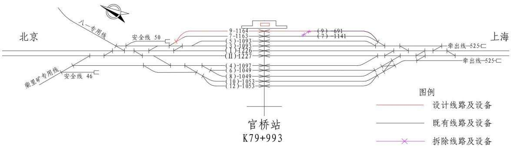
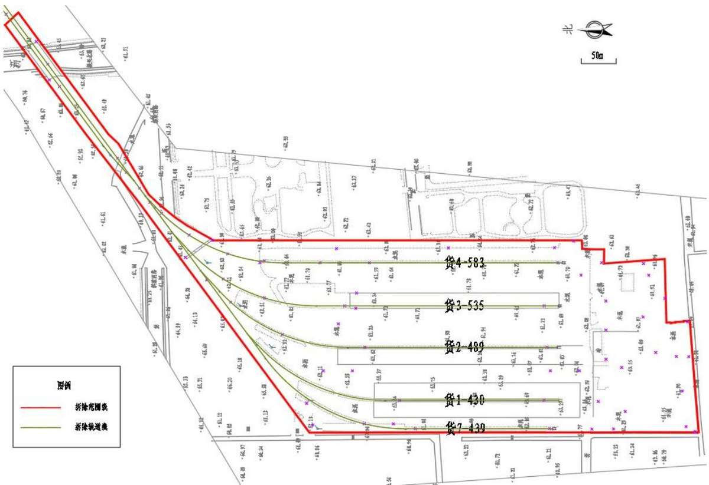
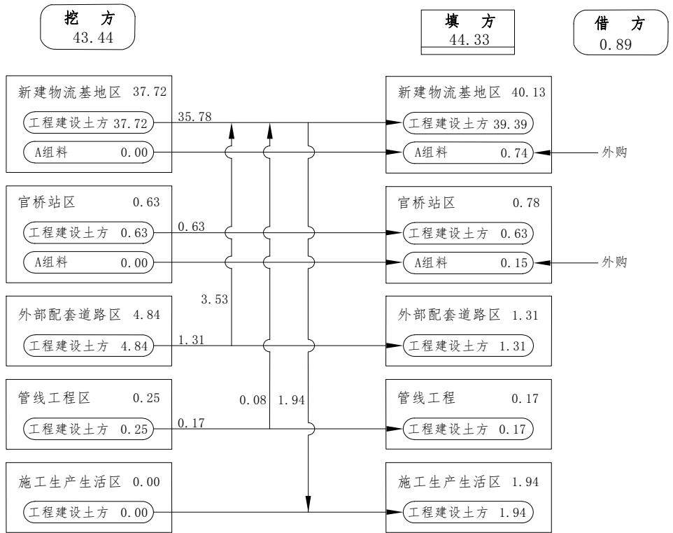
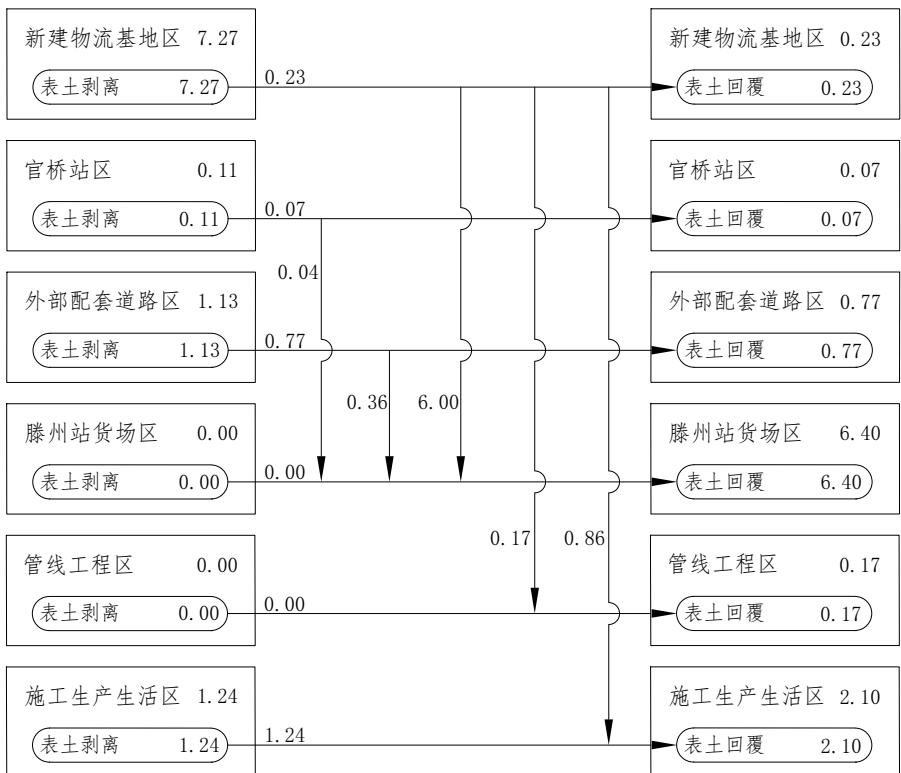
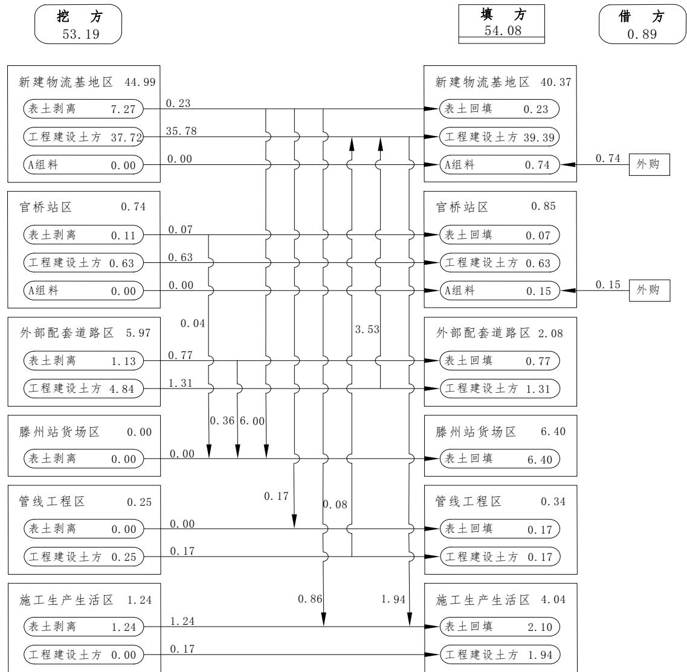
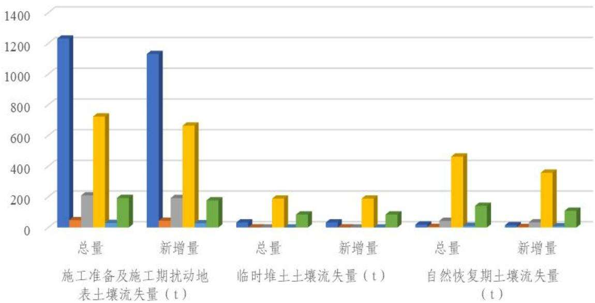
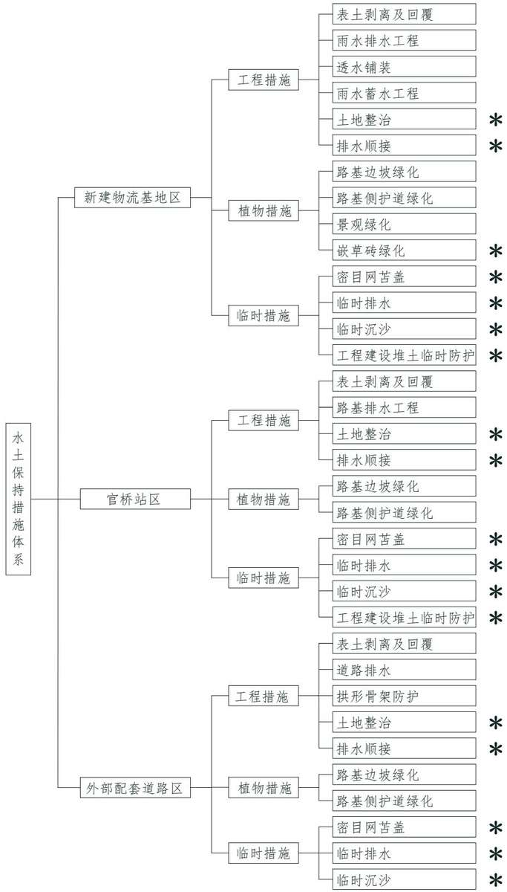
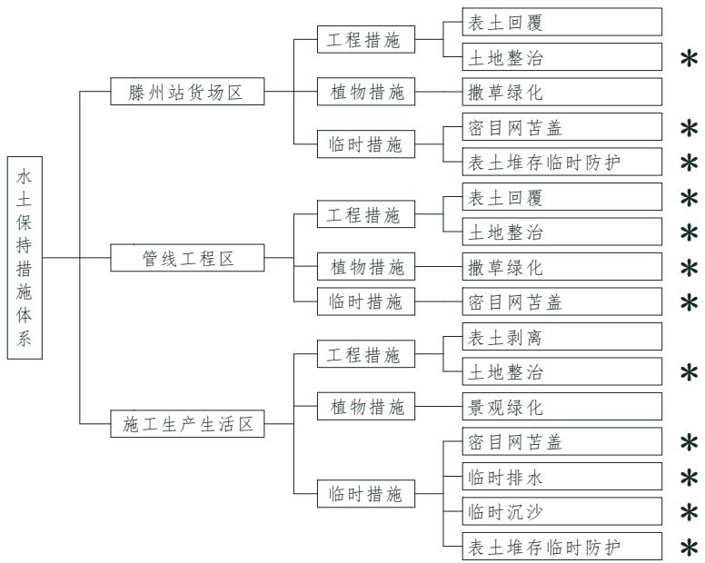
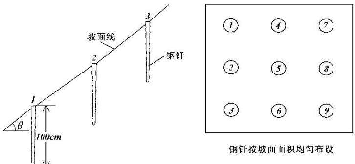

> **Zone C（应用范例层）使用边界**——仅可用于**写作风格、章节展开方式、表达逻辑、表格设计**的参考。
> **不得**用于合规判断；**不得**引入其项目数据（名称／地点／数字／单位名）；
> **不得**因其"曾经通过审批"而推定其做法在当前标准下仍然合规。
> 与 Zone A 冲突时**一律以 Zone A 为准**；Zone A 未明确规定时输出
> 「**Zone A 未明确规定，以下为参考写法，需人工判断**」。
>
> **坐标系警告**：本范例为**老八章结构**（GB 50433—2018 附录B），与 2026 版 10 章模板**同号不同义**
> （老 `1.5`＝防治目标，新 `1.5`＝水土流失预测结果；老 4→新 6 …偏移 +2；新版第 4/5 章老结构无独立章）。
> 因此 **`chapter_mapping: pending`——不得按章节号挂载**，检索一律走 `topic_tags`。
>
> **待加工**：`topic_tags`（主题标签）、`approval_basis_list`（编制依据逐字清单）、
> `structure_summary`（只提取结构：章节展开顺序／段落功能／表格栏目结构／句式模板／论证链步骤）。

1 综合说明 ......  
1.1 项目简况..  
1.2 编制依据.... .. 8  
1.3 设计水平年.... ... 10  
1.4 水土流失防治责任范围.. ... 10  
1.5水土流失防治目标... ... 10  
1.6项目水土保持评价结论. ... 12  
1.7水土流失预测结果... ... 15  
1.8水土保持措施布设成果 ... 16  
1.9 水土保持监测方案... ... 23  
1.10 水土保持投资及效益分析成果. ...24  
1.11 结论.. ...24  
2 项目概况 ..... .... 32  
2.1 项目组成及工程布置. ... 32  
2.2 施工组织.. .. 65  
2.3 工程占地.. .. 69  
2.4 土石方平衡.... .. 73  
2.5 拆迁（移民）安置与专项设施改（迁）建.... .... 87  
2.6 施工进度 ..... ... 87  
2.7 自然概况... ... 87  
3 项目水土保持评价....... ... 100  
3.1 主体工程选（址）线水土保持评价... ...100  
3.2建设方案与布局水土保持评价... ....102  
3.3主体工程设计中水土保持措施界定.. ...124  
4 水土流失分析与预测..... ... 127  
4.1 水土流失现状... ... 127  
4.2 水土流失影响因素分析.. .... 127  
4.3 土壤流失量预测... ... 129  
4.4 水土流失危害分析. ... 137  
4.5 指导性意见..... .. 138  
5 水土保持措施...... .....139  
5.1 防治区划分... ... 139  
5.2 措施总体布局... ... 139  
5.3 分区措施布设... ... 143  
5.4 施工要求.... ... 170  
6 水土保持监测..... .....176  
6.1 范围和时段... ... 176  
6.2 内容和方法... ... 176  
6.3 点位布设.... ... 179  
6.4 实施条件和成果... ... 182  
7水土保持投资估算及效益分析..... ..... 185  
7.1 投资估算... ... 185  
7.2 效益分析... ... 200  
8 水土保持管理 ........ ......201  
8.1 组织管理... .. 201  
8.2 后续设计.... .. 202  
8.3 水土保持监测... .. 202  
8.4 水土保持监理... ... 203  
8.5 水土保持施工.. .... 203  
8.6 水土保持设施验收.. ... 204  
一、附表 ...... ...206  
二、附件 ..... ...... 215  
三、附图... ..262

## 附表、附件及附图

一、附表  
附表1 防治责任范围表  
附表2 单价分析表  
二、附件  
附件1 方案编制委托书  
附件2 全国投资项目在线审批监管平台审核结果告知单  
附件3 用地预审意见  
附件4 工可批复  
附件5 土（石）源协议及土（石）源项目批复  
附件6 建筑垃圾消纳协议及临时消纳场文件  
附件7 新建滕州铁路物流基地工程框架协议  
附件8 关于同意新建滕州铁路物流基地接轨有关事宜的函  
附件9 环评批复  
附件10 枣庄市生态环境局滕州分局复函  
附件11 项目现场照片  
附件12 承诺函  
三、附图  
附图1 项目地理位置图  
附图2 项目区水系图  
附图3 项目土壤侵蚀强度分布图  
附图4 水土流失防治区划图（图4-1\~4-2）  
附图5 现状土地利用图  
附图6 项目总平面布置示意图（图6-1\~6-7）  
附图7 新建物流基地断面图（图7-1\~7-3）  
附图8 新建物流基地及外部配套道路雨水排水及汇水分区图  
附图9 外部配套道路平纵断图  
附图10 项目水土流失防治责任范围及分区图  
附图 11 表土分布图（图 11-1\~11-3）  
附图12项目水土保持措施及监测点布置图（图12-1\~12-5）  
附图13路基标准断面图（图13-1\~13-4）  
附图14新建及迁改管道断面图  
附图15给、污水管线布置图（图15-1、15-2）  
附图16排水工程典型设计图  
附图17路基防护工程典型设计图（图17-1\~图17-2）  
附图18沉沙池典型设计图  
附图19临时堆土防护典型设计图  
附图20嵌草砖典型设计图  
附图21雨水蓄水模块典型设计图  
附图22植物栽植典型设计图  
附图23排水顺接典型设计图

## 1 综合说明

## 1.1 项目简况

## 1.1.1 项目基本情况

## 一、项目建设必要性

## （一）本项目的实施是落实国家和地方的有关政策和规划的需要

根据我国《国家物流枢纽布局和建设规划》，支持位于城市群和都市圈范围内的县城主动承接、区域性物流基地、过度集中的公共服务资源疏解转移。鼓励县城建设具备运输仓储、集散分拨等功能的物流配送中心，发展物流共同配送；《山东省“十四五”物流发展规划》也重点提出延伸发展以煤炭、矿石、石膏等大宗物资为主的转运型物流，形成以商贸物流为核心、生产服务物流协同发展的物流载体网络。《枣庄市“十四五”现代物流发展规划》提出，充分发挥铁路综合优势，依托京沪铁路、枣临铁路等铁路网，布局建设物流基地，加快建设以滕州、薛城等铁路物流基地为中心的普速铁路货运支点。新建滕州铁路物流基地工程作为重要的物流基础设施，符合国家、山东省和枣庄市物流设施布局和物流发展规划的相关要求，是落实国家和地方的有关政策和规划的重要体现。

## （二）本项目的实施有利于滕州市城市发展，缓解滕州市城市交通

京沪铁路滕州站货场建成于 1992 年，位于滕州城区西部荆河街道，主要承担市域范围内的货运作业。近年来，随着滕州城市规模快速发展，该货场已处于城市建成区重点范围内，周边道路交通条件越来越不适应大型货物的运输，进出货场的道路车流、人流高度集中，造成货场周边交通拥挤、环境质量差，与城市发展规划的矛盾日益突出。另外，货场区间线路与多条城市道路平交，对城市交通干扰较为严重且存在安全隐患，同时与滕州市规划建设的东西向交通大动脉解放路、南北向市政道路振兴路冲突较大。加之滕州站货场运量逐年减少、既有货场设备陈旧，容量已不能满足运输要求，难以发挥使用功能、利用率低，急需选址新建。本项目的建设可疏解滕州市交通压力，是滕州市交通发展及城市总体规划实施的需要。

## （三）本项目的实施满足滕州市产业发展

根据《滕州市产业发展与布局规划》，滕州市将巩固发展高端装备制造和化工新材料产业两大优势产业，形成“一区引领、八园突破”的新旧动能转换总体格局，地方运输需求亦将进一步提升。本项目选址接轨于官桥站，可吸引滕州市南部官桥镇、木石镇、柴胡店镇、张汪镇、鲍沟镇等周边乡镇，优化城市规划布局、促进地方经济社会发展，是优化滕州市现代物流体系布局、有效降低全社会物流成本的需要，是推动铁路货物运输上量，朝着物流化、大型化、专业化方向发展的需要。

因此，本项目建设是十分必要的。

## 二、项目概况

## （一）依托工程

## 1、京沪铁路

（1）基本概况：京沪铁路（简称“京沪线”）建成于1969 年，是一条连接北京市和上海市的国铁Ⅰ级双线电气化客货共线铁路，在滕州市境内设界河、滕州、南沙河、官桥共4座车站。经调查，京沪线滕州市境内铁路路基边坡采取灌草防护、拱形骨架防护，排水措施包括砟底式排水槽、砟顶式排水槽、横向排水槽等多种型式，界河、滕州、南沙河、官桥等4 座车站站内建筑物周边以雪松、樱花、小叶黄杨、植草等进行绿化，现状水保措施运行状况良好，已发挥水土保持功能。

（2）依托关系：本项目拟拆除滕州站货场接轨于京沪线滕州站，拟改造官桥站为京沪线既有车站；拟新建滕州铁路物流基地设计接轨于京沪线官桥站，通信管线自京沪线官桥站引接。

（3）建设扰动情况：本次设计对滕州站货场进行拆除，拆除面积19.488hm2；对官桥站进行改造，改造扰动范围 1.23hm2；官桥站改造中配套迁改官桥站电力管线、通信光缆扰动京沪线既有铁路用地2100m2，自官桥站新建通信管线至本次新建物流基地扰动京沪线既有铁路用地130m2。

## 2、山东八一煤电化有限公司专用线

（1）基本概况：山东八一煤电化有限公司专用线（简称“八一专用线”）建成于 20 世纪，担负煤炭资源运输及煤炭能源的应急储备等重要功能，线路接轨于官桥站，目前采用自管运营管理模式，即自官桥站接轨点至专用线内部均由枣庄矿业（集团）有限责任公司自行管理及养护维修。经调查，八一线铁路路基边坡采取植草防护，铁路两侧用地范围内分布有绿地、农田。

（2）依托关系：本项目新建滕州物流基地西侧自八一专用线区间BYK0+969.0处设安全线接轨引出，东侧设机回线连接至八一专用线区间BYK2+341.0 处，并利用八一专用线区间线路接轨至京沪铁路官桥站。根据枣庄矿业（集团）有限责任公司《关于同意新建滕州铁路物流基地接轨有关事宜的函》（枣矿集团函字〔202414号）文件，本项目利用八一专用线部分区间线路由中国铁路济南局集团有限公司无偿使用并负责维护管理，维护管理费用由枣庄矿业（集团）有限责任公司承担。

（3）建设扰动情况：因建设滕州物流基地安全线、机回线等接轨轨道占用八一专用线既有铁路用地 1.7546hm2。另外，新建滕州物流基地通信光缆沿八一专用线自官桥站引接，占用八一专用线既有用地0.2620hm2。

## （二）本工程基本情况

1、地理位置：新建滕州铁路物流基地工程位于山东省枣庄滕州市。工程拟迁建滕州站货场，即拆除既有滕州站货场后于官桥镇新建滕州铁路物流基地（新建滕州铁路物流基地接轨于官桥站），同时改造官桥站，建设外部配套道路，迁改电力及通信管线、新建通信管线等。其中，新建滕州铁路物流基地位于滕州市官桥镇，中心地理位置坐标 E117°12′43.2"，N34°55′55.2"；改造官桥站位于滕州市官桥镇，中心地理位置坐标 E117°11′49.2"，N34°55′19.2"；拆除滕州站货场位于滕州市荆河街道，中心地理位置坐标E117°07′48"，N35°05′9.6"；新建外部配套道路起于八一专用线南侧既有木曲线（S514）上（地理坐标 E117°13′15.6"，N34°56′2.4"），终于滕州市南鲁化工公司西侧现状道路交叉口（地理坐标E117°11′56.4"，N34°55′48"）。

2、建设性质、规模和等级：建设性质为迁建。新建物流基地近期到、发货运量分别为313万t、200 万t，官桥站为二等货运站，外部配套道路为二级公路。

3、主要建设内容：本项目建设内容包括新建滕州铁路物流基地，改造官桥站，建设相关配套工程，并拆除滕州站货场。其中，新建滕州铁路物流基地设安全线、机回线、机车整备线各1条，新建货物装卸线5条等；改造官桥站包括新建到发线1条、还建工务工区1座；相关配套工程包括新建外部道路2.60km、官桥站至物流基地通信光缆 2.75km，迁改官桥站电力管线 1.50km、通信光缆 2.00km；拆除滕州站货场包括拆除货场铁路设备、房建设施及硬化等。

4、施工组织：本项目设施工生产生活区 1 处，按照“永临结合、减少占地”的原则，利用新建滕州铁路物流基地内预留用地布设，面积共计 5.95hm2。施工交通运输利用项目区既有县乡道路及先期铺装垫层的外部配套道路，无需新建施工便道。设临时堆土区 6处，其中，工程建设土方临时堆存区4处，位于官桥站拟建到发线侧既有硬化区域、新建物流基地拟建停车场及辅助箱区周边硬化处；表土临时堆存区2处，位于施工生产生活区、滕州站货场内。施工中用水、用电等利用站内既有供水供电设施或就近引接周边供水、供电管网；本项目施工期间，既有线正常运营，有列车通过时暂停影响列车的相应施工项目。

5、拆迁安置：官桥站改造中需拆除受影响的房屋 $1 5 3 4 \mathrm { m } ^ { 2 }$ 、站台墙 $3 4 3 \mathrm { m } ^ { 3 }$ 、硬化面 $3 5 5 7 \mathrm { m } ^ { 2 }$ ，拆除料约 $0 . 3 2 \mathrm { ~ } \mathcal { F } \mathrm { ~ m } ^ { 3 }$ ，滕州货场拆除中共拆除房屋 $1 6 9 4 0 \mathrm m ^ { 2 }$ 、排水槽2470m、站台墙 $4 6 9 1 \mathrm { m } ^ { 3 }$ 、车挡5个、硬化面 $1 2 0 0 9 4 \mathrm { m } ^ { 2 }$ 、防护栅栏0.571km，拆除料约 5.54 万 $\mathrm { m } ^ { 3 }$ ，均运至滕州市建筑垃圾消纳场，不计入土石方平衡，拆除过程中的水土流失防治工作由建设单位负责。新建物流基地征地范围内需拆除房屋 $2 6 4 0 6 \mathrm { m } ^ { 2 }$ 厂房 $8 1 4 6 \mathrm { m } ^ { 2 }$ 、大棚 $1 5 2 5 5 \mathrm { m } ^ { 2 }$ 、围墙1977m、硬化面 $1 9 8 6 1 \mathrm m ^ { 2 }$ ，沥青路面 $1 2 4 8 9 \mathrm { m } ^ { 2 }$ 水井 3座，拆除料共计约6.09万 $\mathrm { m } ^ { 3 }$ ，物流基地新征地范围内拆迁安置工作具体由滕州市政府统一安排，拆除料不计入土石方平衡，拆迁所产生的水土流失防治责任由地方政府负责。

6、工期与投资：本项目计划于 2026 年 3 月开工，预计 2027 年 8 月完工，总工期 18个月。项目法人为中国铁路济南局集团有限公司，估算总投资 8.00亿元，其中土建投资费2.79亿元。项目采用全额资本金，全部由滕州市政府承担。

7、工程占地：本项目总占地面积为 $6 4 . 5 0 \mathrm { h m } ^ { 2 }$ ，其中，永久占地 $6 4 . 2 4 \mathrm { h m } ^ { 2 }$ ，临时占地0.26hm2。包括新建物流基地区 $3 1 . 8 9 \mathrm { h m } ^ { 2 }$ 、官桥站区 $1 . 2 3 \mathrm { h m } ^ { 2 }$ 、外部配套道路区5.45hm2、滕州站货场区 $1 9 . 4 9 \mathrm { h m } ^ { 2 } .$ 、管线工程区 $0 . 4 9 \mathrm { h m } ^ { 2 } .$ 、施工生产生活区5.95hm2。占地类型包括交通运输用地（铁路用地、公路用地、农村道路）、耕地（旱地）、林地（其他林地）、草地（其他草地）、工矿仓储用地（工业用地）、商服用地（零售商业用地）、住宅用地（农村宅基地）。

8、工程土石方：本项目土石方挖填总量 107.27万 $\mathrm { m } ^ { 3 }$ ，其中，挖方总量 53.19万 $\mathrm { m } ^ { 3 }$ （含表土剥离9.75万m3），填方总量54.08 万 $\mathrm { m } ^ { 3 }$ （含表土回填9.75万m3），借方 0.89 万 $\mathrm { m } ^ { 3 }$ （外购滕州市大山矿区（扩大区）建筑石料用灰岩矿开采及加工项目建筑石料），无弃方。

## 1.1.2 项目前期工作进展情况

## 一、主体工程设计及文件取得情况

2024年1月，建设单位中国铁路济南局集团有限公司与滕州市人民政府签订《新建滕州铁路物流基地工程框架协议》；

2024年 12月，建设单位与枣庄矿业（集团）有限责任公司签订《关于同意新建滕州铁路物流基地接轨有关事宜的函》（枣矿集团函字﹝2024﹞14 号）；

2025年1月，建设单位委托中铁工程设计咨询集团有限公司完成了《新建滕州铁路物流基地工程可行性研究报告》；

2025年6月，中铁工程设计咨询集团有限公司完成《新建滕州铁路物流基地工程初步设计》（送审稿）；

2025年 1月 15日，本项目取得《全国投资项目在线审批监管平台审核结果告知单》（附件2）；

2025年 3月 25日，取得山东省自然资源厅下发的《关于新建滕州铁路物流基地工程建设项目用地预审意见》、《建设项目用地预审与选址意见书》（附件3）；

2025年 7月 22日，取得中国国家铁路集团有限公司下发的《国铁集团关于新建滕州铁路物流基地工程可行性研究报告的批复》（附件4）；

2025年9月22 日，取得枣庄市生态环境局滕州分局下发《关于<关于新建滕州铁路物流基地选址位于水源地准保护区相关事宜的函>的复函》（附件10）；

2025年12月16日，取得枣庄市生态环境局下发的《关于中国铁路济南局集团有限公司综合改造工程建设指挥部新建滕州铁路物流基地工程环境影响报告表的批复》（附件9）。

## 二、方案编制情况

遵照《中华人民共和国水土保持法》、《山东省水土保持条例》等法律、法规的要求，为预防和治理项目建设中可能产生的水土流失危害，建设单位中国铁路济南局集团有限公司于 2025 年 8 月委托山东绿景生态工程设计有限公司编制《新建滕州铁路物流基地工程水土保持方案报告书》（以下简称“报告书”）。

接受委托后，编制单位立即成立该项目方案编制组，相关技术人员仔细研读了主体工程设计材料及相关资料，并对建设区域及周围的环境状况进行了详细的踏勘调查，收集了项目区自然、社会及水土保持现状的有关资料。依据《生产建设项目水土保持技术标准》（GB50433-2018）、《生产建设项目水土流失防治标准》（GB/T50434-2018）等国家有关技术规范，结合主体工程初步设计资料，经与建设单位、主体工程设计单位及地方有关部门协商，落实研究过程中出现的疑难问题后，完成了报告书的编制。

2025年 12月 4日，水利部沙棘开发管理中心（水利部水土保持植物开发管理中心）组织召开了《新建滕州铁路物流基地工程水土保持方案》（以下简称“方案”）技术评审会，按照专家组修改意见，我单位对报告书进行了修改完善，在与业主单位和主体工程设计单位充分沟通的基础上，最终完成了方案的编制。

## 1.1.3 自然简况

本项目位于山前冲洪积倾斜平原，总体地势起伏不大，地形平坦开阔。其中，新建滕州物流基地现状自然标高在48.6m\~55.8m 之间，最大相对高差7.2m；改造官桥站现状自然标高在50.40m\~51.20m 之间，最大相对高差0.8m；外部配套道路现状自然标高在48.15m\~50.60m 之间，最大相对高差 2.45m；拆除滕州站货场现状自然标高在61.70m\~63.84m 之间，最大相对高差 2.14m。根据项目勘察资料，拟建场区地层分布较有规律，无其它影响建筑物稳定的特殊岩土及不良地质作用，区内无活动断裂通过，场地基本稳定，较适宜工程建设。

项目区属暖温带半湿润大陆性季风气候，多年平均降水量736.7mm，降雨多集中在 6\~9 月份；多年平均气温13.6℃；多年平均风速2.8m/s，多年平均大风日数12d，常年主导风向为西南风、东北风，风季时段为 3\~5 月份；多年平均≥10℃的年积温4359.4℃；多年平均蒸发量1202.8mm；全年无霜期212d；最大冻土深度50cm。

项目区属淮河流域京杭大运河水系，本工程临近小苏河（滕州物流基地西侧）、小魏河（滕州物流基地东侧约400m），小苏河20、50年一遇设计水位分别为44.40m、44.70m，本项目涉河处 20 年、50 年一遇设计洪水位 48.86m、49.14m，小魏河 20年、50 年一遇设计洪水位 53.44m\~53.76m、54.04m\~54.36m。根据《枣庄市“十四五”城乡水务发展规划》，小苏河、小魏河河流级别分别为 4 级、3 级，根据《滕州市人民政府关于河湖管理范围和保护范围划定工作的公告》，河道管理范围为堤外坡脚外延伸 2m。本项目新建滕州物流基地西侧咽喉区钢筋混凝土排水沟末端新建箱涵位于小苏河河道管理范围内，河道管理范围内仅建设必要箱涵，不设临时堆土区、施工生产生活区及施工便道，现已编制《新建滕州铁路物流基地工程涉小苏河防洪评价报告（送审稿）》，根据该评价报告，本项目的建设与现有防洪标准、有关技术要求是适应的，未缩短行洪断面，对河道行洪无影响，另外，建设单位承诺在取得防洪影响批复之前，本项目不开工建设。本项目距离小魏河 400m，不在小魏河河道管理范围内，无需开展涉小魏河防洪评价。

项目所在区域土壤主要为潮土，根据现场调查，表土分布范围为扰动范围内的耕地、林地、草地、既有铁路用地范围内扰动的绿地、农田等，表土层厚20cm\~30cm；项目区地处暖温带落叶阔叶林带，现状植被覆盖率7.09%。

本项目为建设类项目，位于枣庄市滕州市，根据《全国水土保持区划（试行）》，确定滕州市属北方土石山区-泰沂及胶东山地丘陵区-鲁中南低山丘陵土壤保持区。根据《水利部办公厅关于做好国家级水土流失重点预防区和重点治理区落地上图成果应用的通知》（办水保〔2025〕170 号）、《山东省水利厅关于加强水土保持重点区域管理的通知》（鲁水保字〔2025〕1号）、《枣庄市水土保持规划（2018\~2030年）》、《滕州市水土保持规划（2019\~2030年）》，本项目不涉及国家级、省级、市级及县级水土流失重点防治区。

根据当地水土保持规划及现场调查，本工程所在位置水土流失类型主要为水力侵蚀，水土流失强度为微度，原地貌土壤侵蚀模数为 180t/（km2·a），根据《土壤侵蚀分类分级标准》（SL190-2007），项目区容许土壤流失量为200t/(km2·a)。

项目不涉及基本农田、生态保护红线、水功能一级区的保护区和保留区，不涉及自然保护区、世界文化和自然遗产地、风景名胜区、地质公园、森林公园以及重要湿地等。但新建滕州铁路物流基地及外部配套道路位于十字河、四李庄饮用水水源地准保护区范围内，目前本项目已取得枣庄市生态环境局下发的《关于中国铁路济南局集团有限公司综合改造工程建设指挥部新建滕州铁路物流基地工程环境影响报告表的批复》（附件 9）、枣庄市生态环境局滕州分局下发《关于<关于新建滕州铁路物流基地选址位于水源地准保护区相关事宜的函>的复函》（附件 10）。根据环评批复，项目施工期生活污水经化粪池沉淀处置后，由环卫部门清运，施工废水经沉淀池沉淀后全部回用不外排；项目运营期官桥站不新增废水，新建铁路物流基地洗车废水经沉淀池沉淀处理后全部回用不外排，食堂废水经隔油设施处理后、检修废水经隔油处理后与生活污水、初期雨水一起经自建污水处理站处理，废水经自建污水处理站处理后优先回用于绿化、道路喷洒，剩余部分回用于煤棚降尘，不外排。该区域铺设市政污水管网后，废水经自建污水处理站处理后优先回用于绿化、道路喷洒，剩余部分排入市政污水管网。

## 1.2编制依据

## 1.2.1 法律法规

（1）《中华人民共和国水土保持法》（1991年6 月29 日第七届全国人大常委会第 20次会议通过，2010 年12月 25 日第十一届全国人民代表大会常务委员会第十八次会议修订）；

（2）《山东省水土保持条例》（2014年5 月30日山东省第十二届人民代表大会常务委员会第八次会议通过，2017 年9 月30 日山东省第十二届人民代表大会常务委员会第三十二次会议第一次修正，2024 年 1 月 20日山东省第十四届人民代表大会常务委员会第七次会议第二次修正）。

## 1.2.2 部委规章、规范性文件

（1）《生产建设项目水土保持方案管理办法》（2023年1月17日水利部令第53号发布）；

（2）《水利工程建设监理规定》（水利部令第28 号）；

（3）《水利工程建设监理单位资质管理办法》（水利部令第29号）；

（4）《水利部办公厅关于印发生产建设项目水土保持技术文件编写和印制格式规定（试行）的通知》（办水保〔2018〕135号）；

（5）《水利部办公厅国铁集团办公厅关于加强铁路建设项目水土保持工作的通知》（办水保〔2023〕3号）；

（6）《水利部办公厅关于印发生产建设项目水土保持方案审查要点的通知》（办水保〔2023〕177号）；

（7）国铁集团关于印发《中国国家铁路集团有限公司铁路建设项目水土保持方案工作管理办法》的通知（铁发改〔2023〕69号）；

（8）《水利部办公厅关于做好国家级水土流失重点预防区和重点治理区落地上图成果应用的通知》（办水保〔2025〕170号）；

（9）《山东省水利厅关于加强水土保持重点区域管理的通知》（鲁水保字〔20251号）。

## 1.2.3 技术标准

（1）《生产建设项目水土保持技术标准》（GB 50433-2018）；

（2）《生产建设项目水土流失防治标准》（GB/T50434-2018）；

（3）《水土保持工程设计规范》（GB 51018-2014）；

（4）《土壤侵蚀分类分级标准》（SL190-2007）；

（5）《水土保持工程调查与勘测标准》（GB/T51297-2018）；

（6）《生产建设项目水土保持监测与评价标准》（GB/T51240-2018）；

（7）《水土保持监理规范》（SL/T 523-2024）；

（8）《表土剥离及其再利用技术要求》（GB/T 45107-2024）；

（9）《水利水电工程制图标准 水土保持图》（SL73.6-2015）

（10）《铁路路基设计规范》（TB10001-2016）；

（11）《铁路物流中心设计规范》（Q/CR9133-2016）；

（12）《室外排水设计标准》（GB50014-2021）；

（13）《铁路车站及枢纽设计规范》（TB10099-2017）。

## 1.2.4 技术资料

（1）《新建滕州铁路物流基地工程可行性研究报告（鉴修稿）》（中铁工程设计咨询集团有限公司，2025年 1月）；

（2）《新建滕州铁路物流基地工程初步设计（送审稿）》（中铁工程设计咨询集团有限公司，2025年5 月）；

（3）《全国投资项目在线审批监管平台审核结果告知单》（2025 年1月15日）；

（4）《关于新建滕州铁路物流基地工程建设项目用地预审意见》（山东省自然资源厅，2025年3月 25日）；

（5）《建设项目用地预审与选址意见书》（山东省自然资源厅，2025 年3月25日）；

（6）《国铁集团关于新建滕州铁路物流基地工程可行性研究报告的批复》（中国国家铁路集团有限公司，2025年7月）；

（7）《新建滕州铁路物流基地工程环境影响报告表》（山东省环科院股份有限公司，2025年11月）；

（8）《新建滕州铁路物流基地工程涉小苏河防洪评价报告（送审稿）》（山东安澜水利工程设计咨询有限公司，2025 年11月）；

（9）《枣庄市水功能区划》；

（10）《枣庄市“十四五”城乡水务发展规划》；

（11）《全国水土保持规划（2015\~2030年）》；

（12）《山东省水土保持规划（2016\~2030 年）》；

（13）《枣庄市水土保持规划（2018\~2030 年）》；

（14）《滕州市水土保持规划（2019\~2030 年）》。

## 1.3 设计水平年

按照《生产建设项目水土保持技术标准》（GB50433-2018）的规定，建设类项目设计水平年为主体工程完工当年或后一年。本工程属于建设类项目，计划于2026年3 月开工建设，预计2027年8月建成。本方案设计水平年为主体工程完工当年，即 2027 年。

## 1.4 水土流失防治责任范围

根据主体工程设计资料，结合现场查勘和工程影响分析，本项目占地面积为64.50hm2。因此，确定本工程水土流失防治责任范围为 64.50hm2。划分为新建物流基地区、官桥站区、外部配套道路区、滕州站货场区、管线工程区、施工生产生活区共 6个水土流失防治分区。

本项目防治责任范围表见附表1。

## 1.5水土流失防治目标

## 1.5.1 执行标准等级

根据《生产建设项目水土流失防治标准》（GB/T50434-2018）的规定，按照生产建设项目所处地区水土保持敏感程度和水土流失影响程度确定水土流失防治标准执行等级。

项目位于枣庄市滕州市，根据《全国水土保持区划（试行）》，确定滕州市属北方土石山区-泰沂及胶东山地丘陵区-鲁中南低山丘陵土壤保持区。根据《水利部办公厅关于做好国家级水土流失重点预防区和重点治理区落地上图成果应用的通知》（办水保〔2025〕170 号）、《山东省水利厅关于加强水土保持重点区域管理的通知》（鲁水保字〔2025〕1号）、《枣庄市水土保持规划（2018\~2030年）》、《滕州市水土保持规划（2019\~2030年）》，本项目不涉及国家级、省级、市级及县级水土流失重点防治区。

本项目新建滕州物流基地、外部配套道路、改造官桥站雨水排水均流入小苏河，根据《枣庄市水功能区划》，小苏河不涉及水功能一级区的保护区和保留区，另外，本项目也不涉及自然保护区、世界文化和自然遗产地、风景名胜区、地质公园、森林公园以及重要湿地等，但新建滕州铁路物流基地及外部配套道路位于十字河、四李庄饮用水水源地准保护区范围内，且拟拆除滕州站货场位于滕州市城市区域，因此，需执行北方土石山区一级水土流失防治标准。

## 1.5.2 防治目标

## 一、基本目标

项目建设范围内的新增水土流失应得到有效控制，原有水土流失得到治理；水土保持设施安全有效；水土资源、林草植被应得到最大程度的保护和恢复；水土流失治理、土壤流失控制比、渣土防护率、表土保护率、林草植被恢复率、林草覆盖率六项指标满足《生产建设项目水土流失防治标准》（GB/T50434-2018）的规定。

## 二、定量指标

根据《生产建设项目水土流失防治标准》（GB/T50434-2018）、《生产建设项目水土保持技术标准》（GB 50433-2018），本项目土壤流失控制比、渣土防护率、林草覆盖率等按以下情况进行调整：

1、土壤流失控制比：项目区水土流失强度为微度，土壤流失控制比取1.10；

2、渣土防护率：项目位于县级以上城市区，渣土防护率提高1%。

3、林草覆盖率：项目位于县级以上城市区，林草覆盖率提高2%。

最终，方案确定本项目设计水平年水土流失综合防治目标为：水土流失治理度95%，土壤流失控制比1.10，渣土防护率98%，表土保护率95%，林草植被恢复率97%，林草覆盖率27%。

项目水土流失防治指标值修正详见表 1.1-1。

表 1.1-1 项目水土流失防治指标值修正表
<table><tr><td rowspan=2 colspan=1>防治指标</td><td rowspan=1 colspan=2>一级标准</td><td rowspan=2 colspan=1>按土壤侵蚀强度修正</td><td rowspan=2 colspan=1>按城市区修正</td><td rowspan=1 colspan=2>目标值</td></tr><tr><td rowspan=1 colspan=1>施工期</td><td rowspan=1 colspan=1>设计水平年</td><td rowspan=1 colspan=1>施工期</td><td rowspan=1 colspan=1>设计水平年</td></tr><tr><td rowspan=1 colspan=1>水土流失治理度（%）</td><td rowspan=1 colspan=1>一</td><td rowspan=1 colspan=1>95</td><td rowspan=1 colspan=1></td><td rowspan=1 colspan=1></td><td rowspan=1 colspan=1></td><td rowspan=1 colspan=1>95</td></tr><tr><td rowspan=1 colspan=1>土壤流失控制比</td><td rowspan=1 colspan=1>一</td><td rowspan=1 colspan=1>0.90</td><td rowspan=1 colspan=1>+0.20</td><td rowspan=1 colspan=1></td><td rowspan=1 colspan=1></td><td rowspan=1 colspan=1>1.10</td></tr><tr><td rowspan=1 colspan=1>渣土防护率（%）</td><td rowspan=1 colspan=1>95</td><td rowspan=1 colspan=1>97</td><td rowspan=1 colspan=1></td><td rowspan=1 colspan=1>+1</td><td rowspan=1 colspan=1>95</td><td rowspan=1 colspan=1>98</td></tr><tr><td rowspan=1 colspan=1>表土保护率（%）</td><td rowspan=1 colspan=1>95</td><td rowspan=1 colspan=1>95</td><td rowspan=1 colspan=1></td><td rowspan=1 colspan=1></td><td rowspan=1 colspan=1>95</td><td rowspan=1 colspan=1>95</td></tr><tr><td rowspan=1 colspan=1>林草植被恢复率（%）</td><td rowspan=1 colspan=1>二</td><td rowspan=1 colspan=1>97</td><td rowspan=1 colspan=1></td><td rowspan=1 colspan=1></td><td rowspan=1 colspan=1></td><td rowspan=1 colspan=1>97</td></tr><tr><td rowspan=1 colspan=1>林草覆盖率（%）</td><td rowspan=1 colspan=1></td><td rowspan=1 colspan=1>25</td><td rowspan=1 colspan=1></td><td rowspan=1 colspan=1>+2</td><td rowspan=1 colspan=1></td><td rowspan=1 colspan=1>27</td></tr></table>

## 1.6项目水土保持评价结论

## 1.6.1主体工程选址（线）评价

本项目不涉及国家级、省级、市级及县级水土流失重点防治区，不涉及全国水土保持监测网络中的水土保持监测站点、重点试验区及国家确定的水土保持长期定位观测站，不涉及河流两岸、湖泊和水库周边的植物保护带。

受基本农田、薛城遗址（国家级保护文物）及接轨限制，最终滕州物流基地于八一专用线南侧、官桥镇北侧、S51 以东、京台高速以西选址新建，本项目可利用八一专用线区间线路接轨至京沪铁路官桥站，由此减少接轨轨道新增占地约0.80hm2，减少土石方量约1.90万 m3。物流基地占压既有木曲线需建设外部配套道路保障既有路网的贯通，配套路起终点均与既有现状道路连接，且道路沿物流基地外围布设，在保障既有路网贯通的同时也可满足新建物流基地进场道路交通需要，选址合理。

## 1.6.2建设方案与布局评价

## 一、工程建设方案评价

项目不涉及国家级、省级、市级及县级水土流失重点防治区，施工生产生活区及施工交通运输均按照“永临结合”的原则，利用新建物流基地内预留用地、本项目施工前期铺筑垫层的外部配套道路等布设，可最大限度地减少占地；新建物流基地设计标高尽量拟合现状地平标高，设计标高 50.23m\~53.21m，场区排水最终流向场外西侧小苏河，经了解，小苏河20年、50 年一遇设计洪水位48.86m、49.14m，物流基地设计标高满足防洪需求；轨道及外部配套道路路基最大填高4.8m，无填高大于 8m的路段；最大挖深8.51m，无挖深大于 30m 的路段。部分新建轨道在用地受限路段采用挡墙防护以收缩路基坡脚，可减少占地、减少土石方挖填量。为保证新建路基边坡稳定，主体根据路基边坡高度、并考虑用地受限等对路基边坡采用拱形骨架防护、灌草防护、植草防护、挡墙防护。

主体设计考虑了路基边坡、路侧护道绿化、场区绿化等，新增绿化可与周边自然环境相协调，林分郁闭度>0.8，盖度>0.8，绿化标准达一级；同时主体考虑了雨水排水，按5年一遇洪水标准设计，满足GB51018-2014 中3\~5年一遇10 分钟降雨排水要求，工程级别达一级；考虑了透水铺装及雨水蓄水利用措施，满足雨水集蓄利用要求。

项目不涉及基本农田、生态保护红线、水功能一级区的保护区和保留区、自然保护区、世界文化和自然遗产地、风景名胜区、地质公园、森林公园以及重要湿地等敏感区域。但新建滕州铁路物流基地及外部配套道路位于十字河、四李庄饮用水水源地准保护区范围内，目前本项目已取得枣庄市生态环境局下发的《关于中国铁路济南局集团有限公司综合改造工程建设指挥部新建滕州铁路物流基地工程环境影响报告表的批复》（附件9）、枣庄市生态环境局滕州分局下发《关于<关于新建滕州铁路物流基地选址位于水源地准保护区相关事宜的函>的复函》（附件10）。

## 二、工程占地评价

本项目在工程可行性研究阶段已取得山东省自然资源厅下发的《建设项目用地预审与选址意见书》，征地面积38.0927hm2，包括新建物流基地及外部配套道路。初步设计阶段外部配套道路结合当地政府意见增加了硬路肩宽度，同时优化了外部配套道路平曲线设计方案造成面积增加，新建物流基地及外部配套道路占地由38.0927hm2 增加至 41.534hm2。经对比分析，初步设计阶段本项目占地面积较《建设项目用地预审与选址意见书》增比达 9.03%，根据《自然资源部关于进一步改进优化能源、交通、水利等重大建设项目用地组卷报批工作的通知》（自然资发〔202436号）第一条“不再对建设项目农用地转用和土地征收申请总面积超出用地预审总面积达到10%以及范围重合度低于80%的重新预审”，本项目无需重新预审。

主体设计占地包括新建滕州物流基地、外部配套道路、官桥站改造用地、拆除滕州站货场占地、新建及迁改管线占地等。施工生产生活区及施工交通运输均按照“永临结合”的原则，分别利用新建物流基地内预留用地及本项目施工前期铺筑垫层的外部配套道路等布设；施工中用水、用电等利用站内既有供水供电设施或就近引接；堆土堆料于施工生产生活区临时堆土处及滕州站货场内堆放，占地面积无缺漏项，满足项目建设及施工需求。

## 三、土石方平衡分析评价

主体工程建设挖填方包括路基及桥涵挖填土、新建及迁改管线基槽挖填方、雨水排水工程挖填方、房建基槽挖填方等，同时考虑了占地内耕地、林地、草地、既有铁路内绿地及农田的表土剥离，考虑较为全面。

剥离的表土作绿化覆土可实现全数回填利用，从各分区间表土调运分析，各分区间表土调运量为 7.44 万 m3，从施工时序上分析，施工前期表土剥离后均运至滕州站货场及施工生产生活区临时堆存，调运表土量分别为6.40万m3、2.11万m3，后续绿化前根据覆土需要调运回填，滕州站内堆存表土直接利用，施工生产生活区除自身利用的2.10万m3外，剩余部分调运，调运表土量 $1 . 2 5 \mathrm { ~ \mathscr ~ { ~ H ~ } ~ m ~ } ^ { 3 }$ 。从运距分析，施工前期表土自新建物流基地、官桥站、外部配套道路区向滕州站货场调运，运距较远（约 22km），但货场拆除后区内堆存表土可直接全部利用，无需再次倒运至其他分区，从优先利用工程自身表土、保护表土资源的角度出发，调配方案基本可行；施工后期表土自施工生产生活区向新建物流基地、官桥站、管线工程区、外部配套道路区调运，运距在3km以内，调运便利。

工程建设挖方随施工进度调运，施工前期，新建滕州物流基地场平填方除利用自身工程建设挖方外，不足部分自外部配套道路及管线工程调运，调运量分别为3.53$\mathcal { F } \ : \mathrm { m } ^ { 3 } \cdot \ : 0 . 0 8 \ : \mathcal { F } \ : \mathrm { m } ^ { 3 }$ ，调运运距在3km 以内，调运便利；基地内轨道路基填筑土方除利用自身工程建设挖方外，不足部分利用基地内房建及排水工程建设挖方，调运量分别为 $1 . 0 2 \ \mathcal { F } \ \mathrm { m } ^ { 3 } . \ 0 . 1 5 \ \mathcal { F } \ \mathrm { m } ^ { 3 }$ ，土方于基地内部运输，调运便利；受施工时序影响，基地先场平后修建排水工程，排水工程挖方除少量可用于轨道路基填筑外仍有余方$1 . 9 4 \mathrm { ~ } \overline { { { \mathrm { ~ \mathscr { H } ~ } } } } \mathrm { m } ^ { 3 }$ ，最后调运至施工生产生活区内回填，调运运距在1km以内，调运便利。官桥站路基填筑土方除利用自身工程建设挖方外，不足部分可由站内房建基槽挖方、排水工程挖方补齐，于站内利用既有硬化路面调运即可，调运便利。

项目借方拟利用滕州市大山矿区建筑石料，借方来源明确，土质达标，工程工期和数量均满足本工程需土和建设时序要求。本工程无弃方，但因官桥站改造、滕州站货场拆除、新建滕州物流基地影响既有建构筑物等而产生部分建筑拆除料，根据《铁路路基设计规范》（TB 10001-2016），拆除料为拆除的房屋、硬化面、道路等产生的废弃砖块、混凝土块、沥青路面，均与《铁路路基设计规范》（TB 10001-2016）设计规范中关于A组填料、石料、混凝土等材料要求不符。即使对其进行破碎、筛分等加工，也无法消除成分层面的核心缺陷，若用于铁路工程，会引发边坡坍塌、排水失效、路基沉降变形等安全隐患，不符合铁路工程的严苛技术规范与长期服役标准。遵循垃圾资源化要求，最终拆除料计划运至滕州市建筑垃圾消纳场，满足工程弃渣减量化、资源化及综合利用要求，去向明确，建筑垃圾消纳场现剩余容量满足本项目拆除料外运需求。

## 四、施工方法及工艺评价

主体工程施工按先土建、后安装调试的顺序进行安排，土石方作业按照“随挖随运”的原则，最大限度减少裸露面积和临时堆土，施工生产生活区及施工交通运输均按照“永临结合、一地多用”的原则布设，其中，施工生产生活区结合站内新建滕州物流基地内预留用地设置，施工交通运输利用项目区既有县乡道路及本项目施工前期铺设垫层的外部配套道路，均不涉及临时占地。施工时序及施工工艺较为合理，有利于水土保持工作的顺利开展，可以最大限度地控制水土流失，符合水土保持要求。

## 五、主体设计水土保持措施评价

本方案水土保持工程按照主导功能及破坏性试验原则进行区分界定，参考GB50433-2018 附录 D，方案将表土剥离及回填、雨水排水、雨水集蓄利用、拱形骨架防护、路基边坡绿化、路基侧护道绿化、景观绿化、撒草绿化等界定为水土保持措施体系。

经分析，主体考虑的相关水土保持措施较为全面，但仍存在不足，无法构成完整的水土保持措施体系，方案将补充土地整治、临时防护措施等。

## 1.7水土流失预测结果

本工程占地面积64.50hm2，损毁植被面积5.81hm²。临时堆放工程建设土方量4.05 万 m3，临时堆存面积 1.84hm2；临时堆放表土量 9.75 万 m3，临时堆存面积4.54hm2。

根据预测结果，本项目土壤流失总量为3416t，其中，新增土壤流失量为3064t。从水土流失预测结果来看，施工期是本项目重点防治时段；新建物流基地区、滕州

站货场区为本项目重点防治区域。

本项目在建设过程中，因土方开挖、临时堆土及人为、机械活动等造成项目区地表土层和植被受到破坏，同时土石方开挖、临时堆土的堆放造成大面积裸露边坡，如不采取有效的水土保持措施，将对当地的水土资源及生态环境带来不利的影响。

## 1.8水土保持措施布设成果

本方案在编制过程中遵循结合工程实际和项目区水土流失现状，因地制宜、因害设防、分类布局，分区防治、坚持工程、植物、临时措施相结合，建立综合性立体防护体系的原则进行布设。本项目划分为新建物流基地区、官桥站区、外部配套道路区、滕州站货场区、管线工程区、施工生产生活区共6个水土流失防治分区。水土保持措施按分区布设如下：

## 一、新建物流基地区

## （一）措施布设

施工前对扰动范围内耕地、林地、草地、铁路用地内绿地及农田等区域采取表土剥离并集中堆放；施工中对扰动范围内裸露土面及堆料等采取密目网苫盖，利用永久排水沟位置建设临时排水沟并设沉沙池，对临时堆存的工程建设土方裸露土面采取防尘网覆盖并于堆土坡脚处设草袋装土拦挡；施工后期建设永久雨水排水并设雨水蓄水模块，于排水出口处设排水顺接，于停车位设嵌草砖并采取嵌草砖绿化，路基侧、坡面及场区内可绿化区域回填表土后进行土地整治并实施植物绿化。

## （二）水保措施主要工程量

## 1、工程措施

（1）表土剥离及回覆：2026年3月\~4 月，对扰动范围内的耕地、林地、草地、铁路内绿地及农田等采取表土剥离措施，2027 年 3 月\~4 月回覆利用，表土剥离厚度 0.2m\~0.3m，剥离面积 24.55hm2，表土剥离量 7.27 万 m3，表土回填量 0.23 万 m3。

（2）排水工程：2026年11月\~2027 年4月，在物2、物3 道间，物4、物5道间新建砟顶式排水槽1490m，底宽0.6m，深1.2m，壁厚0.30m；在储煤棚北侧消防道路与八一专用线间、围墙外侧新建混凝土矩形排水沟920m、混凝土梯形排水沟2120m，机务整备间北侧设公路排水槽 1533m，通过55m 的横向排水槽连接至砟顶式排水槽。混凝土矩形排水沟底宽0.6m，深0.8m，壁厚0.30m，公路排水槽底宽

0.6m，深 0.8m，边墙厚 0.40m，混凝土梯形排水沟底宽 0.4m，深 0.6m，坡比 1:1，壁厚 0.30m；在车站西侧咽喉区向西设置钢筋混凝土矩形沟，底宽2.0m，深3.5m，壁厚 0.5m。场区内部道路侧设雨水排水管道5830m，采用Ⅲ级钢筋砼管，管径DN600\~DN1500。

（3）透水铺装：2027年3月\~4 月，对综合服务区停车场、信号楼和变电所周边区域采用嵌草砖铺装5412m2。

（4）雨水蓄水工程：2027年3 月\~4 月，于散堆装货物功能区西侧设雨水蓄水模块 1处，有效容积为300m3。

（5）土地整治：2027 年4月\~5 月，对路基坡面可绿化区、护道、景观绿地等可绿化区域采取整地措施，整地深度 0.3m\~0.4m。面积约 0.58hm²（投影面积0.56hm2），表土回覆量 0.23 万 m3。

（6）排水顺接：2027年 3月\~4 月，在西端咽喉区钢筋混凝土矩形排水沟排水出口处布设排水顺接1 处，排水顺接长度 8.0m，宽度4.0m，深4.5m，顺接工程边壁厚度0.50m，混凝土结构。

## 2、植物措施

（1）路基边坡绿化：2027 年 4 月\~5 月，对安全线 BYK0+969\~ BYK1+066 段，货物装卸线1的BYK1+066\~ BYK1+399段，货物装卸线5的BYK1+399\~ BYK1+430段填方路基边坡采用灌草防护1254m2（投影面积0.10hm2）。

（2）路基侧护道绿化：2027 年 4 月\~5 月，对安全线 BYK0+969\~BYK1+066段 ， 货 物 装 卸 线 1 的 BYK1+066\~ BYK1+399 段 ， 货 物 装 卸 线 5 的BYK1+399\~BYK1+430 段路基侧护道可绿化范围内进行绿化，绿化面积 922m2。

（3）景观绿化：2027年4月\~5 月，对主大门南北两侧、散堆装货物功能区新建煤棚南侧进行植物绿化，绿化面积约3660m2。

（4）嵌草砖绿化：2027年4 月\~5 月，对综合服务区停车场、信号楼和变电所停车位嵌草砖采取植物绿化2435m2。

## 3、临时措施

（1）密目网苫盖：2026 年 4 月\~2027 年 4 月，对堆料、施工裸露面采用密目网苫盖 26.59hm2。

（2）临时排水：2026 年 4月\~12 月，于基地围墙外侧及西侧咽喉区的永久排

水沟位置开挖临时排水沟2260m，采用土质矩形沟，底宽0.4m，深0.6m。

（3） 临时沉沙：2026年4 月\~2027 年2月，结合临时排水沟位置设临时沉沙池 3 处，沉沙池采用砌砖结构，宽 1.0m，长 2.0m，深 1.0m，壁厚 0.24m，池壁以M10砂浆抹面。

（4）工程建设堆土临时防护：2026 年 10 月\~2026 年 11 月，对临时堆放于停车场及辅助箱周边硬化处的工程建设土方裸露面采用防尘网覆盖，堆土坡脚采用编织袋装土拦挡进行防护。防尘网覆盖约18100m2，编织袋装土及拆除219m3。

## 二、官桥站区

## （一）措施布设

施工前对扰动范围内铁路内绿地采取表土剥离并集中堆放；施工中对扰动范围内裸露土面及堆料等采取密目网苫盖，利用永久排水沟位置建设临时排水沟并设沉沙池，对临时堆存的工程建设土方裸露土面采取防尘网覆盖并于堆土坡脚处设草袋装土拦挡；施工后期建设永久雨水排水工程，于排水出口处设排水顺接，路基侧、坡面等可绿化区域回填表土后进行土地整治并实施植物绿化。

## （二）水保措施主要工程量

## 1、工程措施

（1）表土剥离：2026 年3月\~4 月，对占地内的铁路绿地等采取表土剥离措施，2027 年 3 月\~4 月回填，表土剥离厚度 0.25m，剥离面积 0.43hm2，表土剥离量 0.11万m3，表土回填量0.07万m3。

（2）排水工程：2026年 11月\~2027 年4月，在道间新建砟底式排水槽220m，路基外侧设混凝土梯形排水沟670m，并通过5m 长的横向排水槽连接。混凝土梯形排水沟底宽0.4m，深0.6m，坡比 1:1，壁厚0.30m，砟底式排水槽底宽0.6m，深0.6m，壁厚 0.3m，横向排水槽底宽 0.6m，深 0.8m，壁厚 0.25m。

（3）土地整治：2027年4月\~5 月，对路基坡面可绿化区、护道等可绿化区域采取整地措施，整地深度0.3m\~0.4m。面积约0.17hm²（投影面积0.15hm2），表土回覆量 0.07 万 m3。

（4）排水顺接：2027年3月\~4 月，在站场东侧排水沟排水出口处布设排水顺接 1 处，排水顺接长度 4.0m，宽度 2.0m，深 1.5m，顺接工程边壁厚度 0.30m，混凝土结构。

## 2、植物措施

（1）路基边坡绿化：2027年4月\~5 月，对新建到发线路基边坡采用灌草防护1278m2（投影面积 0.11hm2）。

（2）路基侧护道绿化：2027 年 4月\~5 月，对新建到发线路基侧护道进行绿化，绿化面积 460m2。

## 3、临时措施

（1）密目网苫盖：2026 年 4 月\~2027 年 4 月，对堆料及施工裸露面采用密目网苫盖 11000m2。

（2）临时排水：2026 年 4 月\~11 月，于路基侧拟建排水沟位置开挖临时排水沟670m，采用土质矩形沟，底宽0.4m，深0.6m。

（3）临时沉沙：2026 年 4 月\~2027 年 2 月，结合临时排水沟位置设临时沉沙池 1 处，沉沙池采用砌砖结构，宽 1.0m，长 2.0m，深 1.0m，壁厚 0.24m，池壁以M10砂浆抹面。

（4）工程建设堆土临时防护：2026年10月，对区内临时堆放的工程建设土方裸露面采用防尘网覆盖，堆土坡脚采用编织袋装土拦挡进行防护。防尘网覆盖约18100m2，编织袋装土及拆除 219m3。

## 三、外部配套道路区

## （一）措施布设

施工前对扰动范围内的耕地、林地、草地等采取表土剥离并集中堆放；施工中对扰动范围内裸露土面采取密目网苫盖，于路基侧建设临时排水沟并设沉沙池；施工后期建设雨水排水、拱形骨架防护，于排水出口处设排水顺接，路基侧、坡面等可绿化区域回填表土后进行土地整治并实施植物绿化。

## （二）水保措施主要工程量

## 1、工程措施

（1）表土剥离：2026年3月\~4 月，对扰动范围内的耕地、林地、草地等采取表土剥离措施，2027年3月\~4 月回填利用，表土剥离厚度0.3m，剥离面积3.78hm2，表土剥离量1.13万m3，表土剥离量0.77万m3。

（2）排水工程：2026 年 11 月\~2027 年 5 月，在道路两侧行车道下新建D400\~DN1000 的雨水管道 6600m。

（3）拱形骨架防护：2026 年 12 月\~2027 年 5 月，对 K0+502.6\~K0+815.0 左侧路堑边坡采取拱形骨架防护2654m2。

（4）土地整治：2027年4月\~5 月，对路基坡面、道路侧绿地等可绿化区采取整地措施，整地深度 0.3m\~0.4m。面积约 1.90hm²（投影面积 1.81hm2）。

（5）排水顺接：2027年 4月\~5 月，在外部配套道路终点的排水出口处布设排水顺接1处，排水顺接长度4.0m，宽度2.0m，深1.5m，顺接工程边壁厚度0.3m，混凝土结构。

## 2、植物措施

（1）路基边坡绿化： 2027 年 4 月\~5 月， 对 K0+276.1\~K0+490.0 两侧、K0+815.0\~K1+206.6 左侧、K1+746.6\~K2+610.0 左侧、K0+815.0\~K1+566.6 右侧、K1+726.6\~K2+626.6 右 侧 的 路 堤 边 坡 及 K0+490.0\~K0+502.6 左 侧 、K1+206.6\~K1+746.6 左侧、K2+610.0\~K2+838.2 左侧、K0+490.0\~K0+815.0 右侧、K1+566.6\~K1+726.6 右侧的路堑边坡采用植草防护，植草防护面积4173m2（投影面积 0.35hm2），需喷播植草 4173m2；对 K0+502.6\~K0+815.0 左侧拱形骨架内喷播草籽 1094m2（投影面积 0.09hm2）。

（2）路基侧护道绿化：2027年4月\~5 月，对道路路基坡脚至物流基地用地界之间的空地进行绿化，绿化面积13760m2。

## 3、临时措施

（1）密目网苫盖：2026年4 月\~2027年4 月，对施工裸露面采用密目网苫盖23000m2。

（2）临时排水：2026年4月\~12 月，于拟建道路单侧开挖临时排水沟3300m，采用土质矩形沟，底宽0.4m，深0.6m。

（3）临时沉沙：2026 年4 月\~2027 年 3月，结合临时排水沟位置设临时沉沙池 1 处，沉沙池采用砌砖结构，宽 1.0m，长 2.0m，深 1.0m，壁厚 0.24m，池壁以M10砂浆抹面。

## 四、滕州站货场区

## （一）措施布设

施工中对施工裸露面采取防尘网覆盖，对临时堆存的表土裸露面采用防尘网覆盖并撒播草籽，堆土坡脚采用编织袋装土拦挡进行防护，沿坡脚设临时排水沟并于

排水末端设临时沉沙池；施工后期，货场拆除、回填表土后进行土地整治并实施撒草绿化。

## （二）水保措施主要工程量

## 1、工程措施

（1）表土回覆：2027年6月\~7 月，货场拆除后、移交当地政府前实施表土回填，表土回填量6.40万 m3。

（2）土地整治：2027 年7 月，货场拆除后回填表土并采取土地整治，整地深度 0.3m\~0.4m。面积约 19.49hm²。

## 2、植物措施

（1）撒草绿化：2027年7月\~8 月，滕州站货场拆除后、移交当地政府前，对拆除迹地采取撒草绿化，撒草绿化面积19.49hm2。

## 3、临时措施

（1）密目网苫盖：2027年4月\~7 月，对施工裸露面采用密目网苫盖15000m2。

（2）表土堆存临时防护：2026 年 3 月\~2027 年 5 月，对区内堆放表土裸露面采用防尘网覆盖并撒播草籽，堆土坡脚采用编织袋装土拦挡进行防护，沿坡脚设临时排水沟并于排水末端设临时沉沙池。临时排水沟尺寸 0.3m×0.4m，临时沉沙池采用砌砖结构，宽1.0m，长2.0m，深1.0m，草籽选用狗牙根，播种密度80kg/hm2。防尘网覆盖约34200m2，撒播植草34200m2，编织袋装土及拆除345m3，排水沟520m，临时沉沙池 1 处。另外，建议建设单位遇雨季时段（6\~9 月）加强表土堆存临时防护措施的管理及维护，包括及时清理临时排水沟及临时沉沙池淤积泥沙，随时更换破损防尘网、草袋等并及时补植草种。

## 五、管线工程区

## （一）措施布设

施工中对裸露土面采取密目网苫盖，后期管线敷设后回覆表土并采取土地整治，对原占用路基边坡位置采取撒草绿化。

## （二）水保措施主要工程量

## 1、工程措施

（1）表土回覆：2027年4月\~5 月，管线敷设后对原占用铁路内绿化边坡回覆表土，表土回填量0.17万m3。

（2）土地整治：2027年4月\~5 月，原占用铁路内绿化边坡回覆表土后采取整地措施，整地深度0.4m，土地整治面积0.44hm2。

## 2、植物措施

（1）撒草绿化：2027年 4月\~5 月，对原占用铁路内绿化边坡的区域实施植被恢复绿化，绿化方式为撒草，撒草绿化面积0.44hm2。

## 3、临时措施

（1）密目网苫盖：2026年3 月\~2027年3 月，对施工裸露面采用密目网苫盖4900m2。

## 六、施工生产生活区

## （一）措施布设

施工前对扰动范围内的耕地、林地、草地等采取表土剥离并集中堆放，施工中于区内设临时排水沟并结合排水位置设临时沉沙池，对区内堆放表土裸露面采用防尘网覆盖并撒播草籽，堆土坡脚采用编织袋装土拦挡进行防护并设临时排水沟；施工后期进行土地整治并灌草绿化。具体措施体系如下：

## （二）水保措施主要工程量

## 1、工程措施

（1）表土剥离：2026年3月\~4月，对扰动范围内的耕地、林地、草地等采取表土剥离措施，2027 年 6 月\~7 月，表土剥离厚度 0.25m\~0.3m，剥离面积 4.15hm2，表土剥离量1.24万m3，表土回填量2.10万m3。

（2）土地整治：2027 年6月\~7 月，全区进行土地整治，整地深度取0.3m\~0.4m。土地整治面积 5.95hm2。

## 2、植物措施

（1）景观绿化：2027年7月\~8 月，施工生产生活区拆除并采取灌草绿化，绿化面积 59500m2。

## 3、临时措施

（1）密目网苫盖：2026 年 3 月\~2027 年 6 月，对区内裸露土面、堆料等采取密目网苫盖 13000m2。

（2）临时排水及沉沙：2026年 3月\~2027 年6月，于区内设临时排水沟650m，并结合临时排水位置设临时沉沙池2处，排水沟采用梯形断面，底宽0.4m，深0.6m，沉沙池采用砌砖结构，宽1.0m，长2.0m，深1.0m，壁厚0.24m，池壁以M10砂浆抹面。

（3）表土堆存临时防护：2026 年 3 月\~2027 年 4 月，对区内堆放表土裸露面采用防尘网覆盖并撒播草籽，堆土坡脚采用编织袋装土拦挡进行防护并设0.3m×0.4m 的临时排水沟，草籽选用狗牙根，播种密度 $8 0 \mathrm { k g / h m } ^ { 2 }$ 。防尘网覆盖约17900m2，撒播植草 17900m2，编织袋装土及拆除 $2 5 1 \mathrm { m } ^ { 3 }$ ，排水沟 402m。另外，建议建设单位遇雨季时段（6\~9 月）加强表土堆存临时防护措施的管理及维护，包括及时清理临时排水沟及临时沉沙池淤积泥沙，随时更换破损防尘网、草袋等并及时补植草种。

## 1.9 水土保持监测方案

## 一、监测范围、时段及重点监测区域

水土保持监测范围为项目水土流失防治责任范围，监测范围为 64.50hm2。监测时段为从施工准备期至设计水平年结束，重点监测区域为新建物流基地区、滕州站货场区。

## 二、监测内容及频次

水土保持监测主要内容包括气象水文、地形地貌、地表组成物质、植被等水土流失自然影响因素；永久和临时占地、扰动地表植被面积等扰动土地情况监测；实际造成的水土流失面积、分布、土壤流失量及变化情况等水土流失情况监测；水土流失对主体工程、周边重要设施等造成的影响及危害等水土流失危害监测；实际采取水土保持工程、植物和临时措施的位置、数量以及实施水土保持措施实施前后的防治效果对比情况等防治成效监测5方面。

监测频次中，气象水文每月监测1次，地形地貌及植被状况监测期监测1次，地表组成物质施工准备期和运行期各监测 1次；扰动土地情况每月监测1次；水土流失情况每月监测1 次，发生强降水后加测；水土流失防治效果每季度监测1 次，其中临时措施每月监测1 次；水土流失危害结合上述监测内容一并开展。

## 三、监测方法及人员

监测方法包括地面观测、实地量测、调查巡查、遥感监测（无人机）等。监测人员为1名总监测工程师、1名监测工程师、1名监测员。

## 四、监测点位布设

本项目工程建设期共设置工程措施及植物措施综合监测点 6处，土壤流失量监测点 7处，同时各区均配合实地量测、调查巡查、遥感监测等。

## 1.10 水土保持投资及效益分析成果

本工程水土保持估算总投资 2617.49 万元，其中，工程措施费 1311.72 万元，植物措施费546.06万元，监测措施费41.93万元，临时措施费262.57 万元，独立费用146.89万元（包含监理费35.00万元），基本预备费 230.92 万元，水土保持补偿费 77.40 万元。

通过本方案水土保持措施的实施，造成水土流失面积得到相应治理，因项目建设带来的水土流失将得到有效控制，预测期间可减少土壤流失量为2976t。在严格执行和落实本方案设计的水土保持措施后，拟建工程设计水平年，水土流失治理度可达99％、土壤流失控制比达1.11、渣土防护率达99％、表土保护率达99%、林草植被恢复率达99％、林草覆盖率达44％，六项防治目标可达到方案设定的目标值。

## 1.11 结论

## 一、结论

（1）方案从选址、建设方案及水土流失防治等综合分析，本项目不涉及国家级、省级、市级及县级水土流失重点防治区，主体设计施工生产生活区、施工交通运输利用新建物流基地内预留用地及现状硬化路，永临结合，无需新增占地；项目建设过程中通过控制占地，优化施工组织等可减少施工过程中对周边环境的破坏；根据主体设计资料分析，具有水土保持效益的措施包括表土剥离及回填、雨水排水、雨水集蓄利用、拱形骨架防护、路基边坡绿化、路基侧护道绿化、景观绿化、撒草绿化等，经分析，主体工程设计的以上措施在为主体服务的同时可以起到保持水土、减少水土流失的作用。因此，项目选址选线、施工方案及水土保持措施设计基本符合水土保持法律、法规的规定。

（2）本项目为迁建项目，依据主体工程设计具有水土保持功能的措施，结合本水土保持方案对水土流失防治措施的补充设计，可有效控制项目区内的人为土壤侵蚀，有效减少新增水土流失，改善区域环境，保障工程安全运营。可达到控制水土流失、保护生态环境的目的。从水土保持角度分析，项目建设可行。

## 二、建议

（1）生产建设单位应当将水土保持工作任务和内容纳入施工合同，尽量避免出现重大变更，若出现变更应当及时编制水土保持变更报告，并报原审批单位审批；另外，方案要求建设单位在后期施工过程中严格控制施工，尤其是土石方长距离运输过程中应注意采取临时拦挡、临时防护等相关措施，尽可能避免对周边环境的影响。

（2）本项目取得水土保持方案批复后，建设单位应根据“三同时”要求，将方案确定的水土保持措施落实到主体工程施工图设计中；在开工前及时缴纳水土保持补偿费，在项目开工前自行或者委托具备相应技术条件的机构开展水土保持监测工作，按规定开展水土保持监理工作，工程完工后自主开展水土保持设施验收，及时通过官方网站或者其他公众知悉的网站向社会公开水土保持设施验收鉴定书、水土保持设施验收报告和水土保持监测总结报告等验收材料，完成报备并取得报备回执。

水土保持方案特性表
<table><tr><td colspan="3" rowspan="1">项目名称</td><td colspan="6" rowspan="1">新建滕州铁路物流基地工程</td><td colspan="5" rowspan="1">流域管理机构</td><td colspan="1" rowspan="1">淮河水利委员会</td></tr><tr><td colspan="4" rowspan="1">涉及省（市、区）</td><td colspan="3" rowspan="1">山东省</td><td colspan="2" rowspan="1">涉及地市或个数</td><td colspan="3" rowspan="1">枣庄市</td><td colspan="2" rowspan="1">涉及县或个数</td><td colspan="1" rowspan="1">滕州市</td></tr><tr><td colspan="4" rowspan="1">项目规模</td><td colspan="6" rowspan="1">新建物流基地近期到、发货运量分别为313万t、200万t，官桥站为二等货运站，外部配套道路等级为二级公路</td><td colspan="2" rowspan="1">总投资(亿元)</td><td colspan="1" rowspan="1">8.00</td><td colspan="2" rowspan="1">土建投资(亿元)</td></tr><tr><td colspan="4" rowspan="1">动工时间</td><td colspan="3" rowspan="1">2026年3月</td><td colspan="2" rowspan="1">完工时间</td><td colspan="3" rowspan="1">2027年8月</td><td colspan="2" rowspan="1">设计水平年</td><td colspan="1" rowspan="1">2027年</td></tr><tr><td colspan="4" rowspan="1">工程占地（hm²）</td><td colspan="3" rowspan="1">64.50</td><td colspan="2" rowspan="1">永久占地（hm²）</td><td colspan="3" rowspan="1">64.24</td><td colspan="2" rowspan="1">临时占地（hm²）</td><td colspan="1" rowspan="1">0.26</td></tr><tr><td colspan="7" rowspan="2">土石方量（万m³）</td><td colspan="2" rowspan="1">挖方</td><td colspan="3" rowspan="1">填方</td><td colspan="2" rowspan="1">借方</td><td colspan="1" rowspan="1">弃方</td></tr><tr><td colspan="2" rowspan="1">53.19</td><td colspan="3" rowspan="1">54.08</td><td colspan="2" rowspan="1">0.89</td><td colspan="1" rowspan="1">0.00</td></tr><tr><td colspan="5" rowspan="1">重点防治区名称</td><td colspan="10" rowspan="1">不涉及国家级、省级、市级及县级水土流失重点防治区</td></tr><tr><td colspan="5" rowspan="1">地貌类型</td><td colspan="6" rowspan="1">山前冲洪积平原</td><td colspan="3" rowspan="1">水土保持区划</td><td colspan="1" rowspan="1">北方土石山区</td></tr><tr><td colspan="6" rowspan="1">土壤侵蚀类型</td><td colspan="5" rowspan="1">水蚀</td><td colspan="3" rowspan="1">土壤侵蚀强度</td><td colspan="1" rowspan="1">微度</td></tr><tr><td colspan="6" rowspan="1">防治责任范围面积（hm²）</td><td colspan="5" rowspan="1">64.50</td><td colspan="3" rowspan="1">容许土壤流失量（t/km²·a）</td><td colspan="1" rowspan="1">200</td></tr><tr><td colspan="6" rowspan="1">土壤流失预测总量（t）</td><td colspan="5" rowspan="1">3416</td><td colspan="3" rowspan="1">新增土壤流失量（t）</td><td colspan="1" rowspan="1">3064</td></tr><tr><td colspan="6" rowspan="1">水土流失防治标准执行等级</td><td colspan="9" rowspan="1">北方土石山区一级水土流失防治标准</td></tr><tr><td colspan="1" rowspan="3">防治指标</td><td colspan="5" rowspan="1">水土流失治理度（%）</td><td colspan="3" rowspan="1">95</td><td colspan="4" rowspan="1">土壤流失控制比</td><td colspan="2" rowspan="1">1.10</td></tr><tr><td colspan="5" rowspan="1">渣土防护率（%）</td><td colspan="3" rowspan="1">98</td><td colspan="4" rowspan="1">表土保护率（%）</td><td colspan="2" rowspan="1">95</td></tr><tr><td colspan="5" rowspan="1">林草植被恢复率（%）</td><td colspan="3" rowspan="1">97</td><td colspan="4" rowspan="1">林草覆盖率（%）</td><td colspan="2" rowspan="1">27</td></tr><tr><td colspan="1" rowspan="7">防治措施及工程量套</td><td colspan="1" rowspan="1">分区</td><td colspan="6" rowspan="1">工程措施</td><td colspan="5" rowspan="1">植物措施</td><td colspan="2" rowspan="1">临时措施</td></tr><tr><td colspan="1" rowspan="1">新建物形流基地9区</td><td colspan="6" rowspan="1">表土剥离24.55hm²，表土回覆0.23万m³；砟顶式排水槽1490m、横向排水槽55m、公路排水槽1533m、混凝土梯排水沟2120m、混凝土矩形排水沟20m、钢筋混凝土矩形排水沟655m、雨水排水管道5830m；嵌草砖铺装5412m²；雨水蓄水模块1处；土地整治0.58hm²（投影面积0.56hm²）；排水顺接1处</td><td colspan="5" rowspan="1">路基边坡绿化 1254m²（投影面积0.10hm²）；路基侧护道绿化 922m²；景观绿化面积3660m²；嵌草砖绿化 2435m²</td><td colspan="2" rowspan="1">防尘网覆盖 26.59hm²；临时排水2260m；临时沉沙池3处；临时堆土防尘网覆盖约18100m²，编织袋装土及拆除219m³。</td></tr><tr><td colspan="1" rowspan="1">官桥站区</td><td colspan="6" rowspan="1">表土剥离0.43hm²，表土回覆 0.07万m³；混凝土梯形排水沟670m，设砟底式排水槽220m，横向排水槽5m；土地整治0.17hm²（投影面积 0.15hm²）；排水顺接1处</td><td colspan="5" rowspan="1">路基边坡绿化 1278m²（投影面积0.11hm²）；路基侧护道绿化460m²；</td><td colspan="2" rowspan="1">防尘网覆盖11000m²；临时排水670m；临时沉沙池1处；临时堆土防尘网覆盖约300m²，编织袋装土及拆除 28m³。</td></tr><tr><td colspan="1" rowspan="1">外部配道路区</td><td colspan="6" rowspan="1">表土剥离3.78hm²，表土回覆0.77万m³；雨水排水管道6600m；拱形骨架防护2654m²；土地整治1.90hm²（投影面积1.81hm²）；排水顺接1处</td><td colspan="5" rowspan="1">路基边坡绿化 5267m²（投影面积 0.44hm²）；路基侧护道绿化13760m²;</td><td colspan="2" rowspan="1">防尘网覆盖23000m²；临时排水3300m；临时沉沙池1处</td></tr><tr><td colspan="1" rowspan="1">滕州站货场区</td><td colspan="6" rowspan="1">表土回覆6.40万m³，土地整治19.49hm²</td><td colspan="5" rowspan="1">撒草绿化 19.49hm²</td><td colspan="2" rowspan="1">防尘网覆盖15000m²；临时堆土防尘网覆盖约34200m²，撒播植草34200m²，编织袋装土及拆除345m³，排水沟520m，临时沉沙池1处</td></tr><tr><td colspan="1" rowspan="1">管线工程区</td><td colspan="6" rowspan="1">表土回覆0.17万m³，土地整治0.44hm²</td><td colspan="5" rowspan="1">撒草绿化 0.44hm²</td><td colspan="2" rowspan="1">防尘网覆盖4900m²</td></tr><tr><td colspan="1" rowspan="1">施工生产生活区</td><td colspan="6" rowspan="1">表土剥离4.15hm²，表土回覆2.10万m³；土地整治 5.95hm²</td><td colspan="5" rowspan="1">景观绿化 59500m²</td><td colspan="2" rowspan="1">防尘网覆盖13000m²；临时排水沟650m，临时沉沙池2处；临时堆土防尘网覆盖约17900m²，撒</td></tr><tr><td colspan="1" rowspan="1"></td><td colspan="1" rowspan="1"></td><td colspan="4" rowspan="1"></td><td colspan="2" rowspan="1"></td><td colspan="7" rowspan="1">播植草17900m²，编织袋装土及拆除251m³，排水沟 402m</td></tr><tr><td colspan="2" rowspan="1">投资（万元）</td><td colspan="4" rowspan="1">1311.72</td><td colspan="2" rowspan="1">546.06</td><td colspan="7" rowspan="1">262.57</td></tr><tr><td colspan="4" rowspan="1">水土保持总投资(万元)</td><td colspan="2" rowspan="1">2617.49</td><td colspan="1" rowspan="1">独立费用（万元）</td><td colspan="8" rowspan="1">146.89</td></tr><tr><td colspan="4" rowspan="1">监理费（万元）</td><td colspan="1" rowspan="1">35.00</td><td colspan="1" rowspan="1">监测费（万元）</td><td colspan="1" rowspan="1">41.93</td><td colspan="2" rowspan="1">补偿费（万元）</td><td colspan="6" rowspan="1">77.40</td></tr><tr><td colspan="3" rowspan="1">方案编制单位</td><td colspan="3" rowspan="1">山东绿景生态工程设计有限公司</td><td colspan="1" rowspan="1">建设单位</td><td colspan="8" rowspan="1">中国铁路济南局集团有限公司</td></tr><tr><td colspan="3" rowspan="1">法定代表人</td><td colspan="3" rowspan="1">张杰</td><td colspan="1" rowspan="1">法定代表人</td><td colspan="8" rowspan="1">贯昌奉</td></tr><tr><td colspan="3" rowspan="1">地址</td><td colspan="3" rowspan="1">山东省济南市商河县玉皇庙镇文化中心</td><td colspan="1" rowspan="1">地址</td><td colspan="8" rowspan="1">山东省济南市站前路2号</td></tr><tr><td colspan="3" rowspan="1">邮编</td><td colspan="3" rowspan="1">251699</td><td colspan="1" rowspan="1">邮编</td><td colspan="8" rowspan="1">250000</td></tr><tr><td colspan="3" rowspan="1">联系人及电话</td><td colspan="3" rowspan="1">联系人/【已脱敏】</td><td colspan="1" rowspan="1">联系人及电话</td><td colspan="8" rowspan="1">联系人/【已脱敏】</td></tr><tr><td colspan="3" rowspan="1">传真</td><td colspan="3" rowspan="1">0531-58773366</td><td colspan="1" rowspan="1">传真</td><td colspan="8" rowspan="1">0531-82424061</td></tr><tr><td colspan="3" rowspan="1">电子信箱</td><td colspan="3" rowspan="1">【已脱敏邮箱】</td><td colspan="1" rowspan="1">电子信箱</td><td colspan="8" rowspan="1">【已脱敏邮箱】</td></tr></table>

## 2 项目概况

## 2.1 项目组成及工程布置

## 2.1.1 项目基本情况

## 一、依托工程

## （一）京沪铁路

1、基本概况：京沪铁路（简称“京沪线”）是一条连接北京市和上海市的国铁Ⅰ级双线电气化客货共线铁路，线路呈南北走向，由原京山铁路京津段、津浦铁路和沪宁铁路共同组成，于1897 年开工建设，1969年全线贯通，正线全长1463km，共设铁路车站190座。滕州市境内设界河、滕州、南沙河、官桥共4座车站。经调查，京沪线滕州市境内铁路路基边坡采取灌草防护、拱形骨架防护，排水措施包括砟底式排水槽、砟顶式排水槽、横向排水槽及侧沟等多种型式，界河、滕州、南沙河、官桥等4座车站站内建筑物周边以雪松、樱花、小叶黄杨、植草等进行绿化，现状水保措施运行状况良好，已发挥水土保持功能。

2、依托关系：本项目拟拆除滕州站货场接轨于京沪线滕州站，拟改造官桥站为京沪线既有车站；拟新建滕州铁路物流基地设计接轨于京沪线官桥站，通信管线自京沪线官桥站引接。

3、建设扰动情况：本次设计对滕州站货场进行拆除，拆除面积19.488hm2；对官桥站进行改造，改造扰动范围1.23hm2；官桥站改造中配套迁改官桥站电力管线、通信光缆扰动京沪线既有铁路用地2100m2，自官桥站新建通信管线至本次新建物流基地扰动京沪线既有铁路用地130m2。

## （二）山东八一煤电化有限公司专用线

1、基本概况：山东八一煤电化有限公司专用线（简称“八一专用线”）位于枣庄滕州市，建成于 20 世纪，担负煤炭资源运输及煤炭能源的应急储备等功能，线路接轨于官桥站，目前八一专用线采用自管的运营管理模式，即自官桥站接轨点至专用线内部均由枣庄矿业（集团）有限责任公司自行管理及养护维修。经调查，八一专用线铁路用地宽25m\~42m，现状轨顶标高50.93m\~54.75m，路基边坡采取植草防护，路基坡脚外无排水设施，既有铁路用地范围内除铁路轨道外现分布有农田、绿地等。

2、依托关系：本项目新建物流基地西侧自八一专用线区间 BYK0+969.0 处设安全线接轨引出，东侧设机回线连接至八一专用线区间BYK2+341.0 处，并利用八一专用线区间线路接轨至京沪铁路官桥站。根据枣庄矿业（集团）有限责任公司《关于同意新建滕州铁路物流基地接轨有关事宜的函》（枣矿集团函字〔2024〕14号）文件，本项目利用八一专用线部分区间线路由中国铁路济南局集团有限公司无偿使用并负责维护管理，维护管理费用由枣庄矿业（集团）有限责任公司承担。

3、建设扰动情况：因建设滕州物流基地安全线、机回线等接轨轨道占用八一专用线既有铁路用地 1.7546hm2。另外，新建滕州物流基地通信光缆沿八一专用线自官桥站引接，占用八一专用线既有用地 0.2620hm2。

本项目与京沪线及八一专用线依托关系见图2.1-1、2.1-2。

## 二、项目基本情况

1、地理位置：新建滕州铁路物流基地工程位于山东省枣庄滕州市。工程拟迁建滕州站货场，即拆除既有滕州站货场后于官桥镇新建滕州铁路物流基地（新建滕州铁路物流基地接轨于官桥站），同时改造官桥站，建设外部配套道路，迁改电力及通信管线、新建通信管线等。其中，新建滕州铁路物流基地位于滕州市官桥镇，中心地理位置坐标 E117°12′43.2"，N34°55′55.2"；改造官桥站位于滕州市官桥镇，中心地理位置坐标 E117°11′49.2"，N34°55′19.2"；拆除滕州站货场位于滕州市荆河街道，中心地理位置坐标E117°07′48"， $N 3 5 ^ { \circ } 0 5 ^ { \prime } 9 . 6 "$ ；新建外部配套道路起于八一专用线南侧既有木曲线（S514）上（地理坐标 $\mathrm { E } 1 1 7 ^ { \circ } 1 3 ^ { \prime } 1 5 . 6 ^ { \prime \prime }$ ，N34°56′2.4"），终于滕州市南鲁化工公司西侧现状道路交叉口（地理坐标E117°11′56.4"，N34°55′48"）。

2、建设性质、规模和等级：建设性质为迁建；新建物流基地近期到、发货运量分别为313万t、200 万t，官桥站为二等货运站，外部配套道路为二级公路。

3、主要建设内容：本项目建设内容包括新建滕州铁路物流基地，改造官桥站，建设相关配套工程，并拆除滕州站货场。其中，新建滕州铁路物流基地设安全线、机回线、机车整备线各1条，新建货物装卸线5条等；改造官桥站包括新建到发线1条、还建工务工区1座；相关配套工程包括新建外部道路2.60km、官桥站至物流基地通信光缆 2.75km，迁改官桥站电力管线 1.50km、通信光缆 2.00km；拆除滕州站货场包括拆除货场铁路设备、房建设施及硬化等。

本项目工程特性表见表2.1-1，主要技术经济指标表见表2.1-2。

表 2.1-1 本项目工程特性表
<table><tr><td rowspan=1 colspan=14>一、项目基本情况</td></tr><tr><td rowspan=1 colspan=1>1</td><td rowspan=1 colspan=2>项目名称</td><td rowspan=1 colspan=11>新建滕州铁路物流基地工程</td></tr><tr><td rowspan=1 colspan=1>2</td><td rowspan=1 colspan=2>建设地点</td><td rowspan=1 colspan=6>枣庄市滕州市</td><td rowspan=1 colspan=3>所在流域</td><td rowspan=1 colspan=2>淮河流域</td></tr><tr><td rowspan=1 colspan=1>3</td><td rowspan=1 colspan=2>工程等级</td><td rowspan=1 colspan=6>新建物流基地近期到、发货运量分别为313万t、200万t，官桥站为二等货运站，外部配套道路等级为二级公路</td><td rowspan=1 colspan=3>工程性质</td><td rowspan=1 colspan=2>迁建</td></tr><tr><td rowspan=1 colspan=1>4</td><td rowspan=1 colspan=2>建设单位</td><td rowspan=1 colspan=11>中国铁路济南局集团有限公司</td></tr><tr><td rowspan=1 colspan=1>5</td><td rowspan=1 colspan=2>投资单位</td><td rowspan=1 colspan=11>滕州市人民政府</td></tr><tr><td rowspan=1 colspan=1>6</td><td rowspan=1 colspan=2>建设规模</td><td rowspan=1 colspan=11>新建滕州物流基地1处，新建外部配套道路2.595km，改造官桥站1处，拆除滕州站货场1处，配套迁改电力及通信管线、新建通信管线等</td></tr><tr><td rowspan=1 colspan=1>7</td><td rowspan=1 colspan=2>总投资</td><td rowspan=1 colspan=4>8.00 亿元</td><td rowspan=1 colspan=4>土建投资</td><td rowspan=1 colspan=3>2.79亿元</td></tr><tr><td rowspan=1 colspan=1>8</td><td rowspan=1 colspan=2>建设期</td><td rowspan=1 colspan=11>工期共18个月，为2026年3月至2027年8月</td></tr><tr><td rowspan=1 colspan=14>二、工程占地</td></tr><tr><td rowspan=2 colspan=4>项目组成</td><td rowspan=1 colspan=4>占地面积（hm²）</td><td rowspan=2 colspan=6>备注</td></tr><tr><td rowspan=1 colspan=1>永久占地</td><td rowspan=1 colspan=1>临时占地</td><td rowspan=1 colspan=2>合计</td></tr><tr><td rowspan=1 colspan=4>新建物流基地区</td><td rowspan=1 colspan=1>31.89</td><td rowspan=1 colspan=1>0.00</td><td rowspan=1 colspan=2>31.89</td><td rowspan=1 colspan=6>轨道、房建、涵洞</td></tr><tr><td rowspan=1 colspan=4>外部配套道路区</td><td rowspan=1 colspan=1>1.23</td><td rowspan=1 colspan=1>0.00</td><td rowspan=1 colspan=2>1.23</td><td rowspan=1 colspan=6>2.595km</td></tr><tr><td rowspan=1 colspan=4>官桥站工程区</td><td rowspan=1 colspan=1>5.45</td><td rowspan=1 colspan=1>0.00</td><td rowspan=1 colspan=2>5.45</td><td rowspan=1 colspan=6>到发线、站台、房建</td></tr><tr><td rowspan=1 colspan=4>滕州站货场区</td><td rowspan=1 colspan=1>19.49</td><td rowspan=1 colspan=1>0.00</td><td rowspan=1 colspan=2>19.49</td><td rowspan=1 colspan=6>拆除轨道、硬化</td></tr><tr><td rowspan=1 colspan=4>管线工程区</td><td rowspan=1 colspan=1>0.23</td><td rowspan=1 colspan=1>0.26</td><td rowspan=1 colspan=2>0.49</td><td rowspan=1 colspan=6>供电、通信</td></tr><tr><td rowspan=1 colspan=4>施工生产生活区</td><td rowspan=1 colspan=1>5.95</td><td rowspan=1 colspan=1>0.00</td><td rowspan=1 colspan=2>5.95</td><td rowspan=1 colspan=6>利用物流基地预留区，设料场、办公区、仓库等</td></tr><tr><td rowspan=1 colspan=4>合计</td><td rowspan=1 colspan=1>64.24</td><td rowspan=1 colspan=1>0.26</td><td rowspan=1 colspan=2>64.50</td><td rowspan=1 colspan=6></td></tr><tr><td rowspan=1 colspan=4></td><td rowspan=1 colspan=2>三、项目土石方挖填工程量</td><td rowspan=1 colspan=8>（万m³）</td></tr><tr><td rowspan=1 colspan=4>项目组成</td><td rowspan=1 colspan=1>挖方</td><td rowspan=1 colspan=1>填方</td><td rowspan=1 colspan=2>调入方</td><td rowspan=1 colspan=2>调出方</td><td rowspan=1 colspan=3>借方</td><td rowspan=1 colspan=1>弃方</td></tr><tr><td rowspan=1 colspan=4>新建物流基地区</td><td rowspan=1 colspan=1>44.99</td><td rowspan=1 colspan=1>40.37</td><td rowspan=1 colspan=2>3.61</td><td rowspan=1 colspan=2>8.98</td><td rowspan=1 colspan=3>0.74</td><td rowspan=1 colspan=1>0.00</td></tr><tr><td rowspan=1 colspan=4>外部配套道路区</td><td rowspan=1 colspan=1>0.74</td><td rowspan=1 colspan=1>0.85</td><td rowspan=1 colspan=2>0.00</td><td rowspan=1 colspan=2>0.04</td><td rowspan=1 colspan=3>0.15</td><td rowspan=1 colspan=1>0.00</td></tr><tr><td rowspan=1 colspan=4>官桥站工程区</td><td rowspan=1 colspan=1>5.97</td><td rowspan=1 colspan=1>2.08</td><td rowspan=1 colspan=2>0.00</td><td rowspan=1 colspan=2>3.89</td><td rowspan=1 colspan=3>0.00</td><td rowspan=1 colspan=1>0.00</td></tr><tr><td rowspan=1 colspan=4>滕州站货场区</td><td rowspan=1 colspan=1>0.00</td><td rowspan=1 colspan=1>6.40</td><td rowspan=1 colspan=2>6.40</td><td rowspan=1 colspan=2></td><td rowspan=1 colspan=3></td><td rowspan=1 colspan=1>0.00</td></tr><tr><td rowspan=1 colspan=4>管线工程区</td><td rowspan=1 colspan=1>0.25</td><td rowspan=1 colspan=1>0.34</td><td rowspan=1 colspan=2></td><td rowspan=1 colspan=2></td><td rowspan=1 colspan=3></td><td rowspan=1 colspan=1>0.00</td></tr><tr><td rowspan=1 colspan=4>施工生产生活区</td><td rowspan=1 colspan=1>1.24</td><td rowspan=1 colspan=1>4.04</td><td rowspan=1 colspan=2>2.80</td><td rowspan=1 colspan=2></td><td rowspan=1 colspan=3></td><td rowspan=1 colspan=1>0.00</td></tr><tr><td rowspan=1 colspan=4>合计</td><td rowspan=1 colspan=1>53.19</td><td rowspan=1 colspan=1>54.08</td><td rowspan=1 colspan=2>12.99</td><td rowspan=1 colspan=2>12.99</td><td rowspan=1 colspan=3>0.89</td><td rowspan=1 colspan=1>0.00</td></tr><tr><td rowspan=1 colspan=14>四、施工组织及拆迁安置</td></tr><tr><td rowspan=1 colspan=2>施工用水</td><td rowspan=1 colspan=12>官桥站施工用水利用站内既有供电设施；新建物流基地及外部配套道路施工用水接引自迎贤苑小区东侧市政路既有市政自来水管网</td></tr><tr><td rowspan=1 colspan=2>施工用电</td><td rowspan=1 colspan=12>官桥站施工用电利用站内既有供电设施；新建物流基地及外部配套道路施工用电自官桥镇供电管网T接</td></tr><tr><td rowspan=1 colspan=2>材料来源</td><td rowspan=1 colspan=12>项目所需砂石料、钢材、木材、水泥等均自合法料场外购</td></tr><tr><td rowspan=1 colspan=2>施工生产生活施</td><td rowspan=1 colspan=12>工办公及生活用房利用新建物流基地内预留用地，用于堆放材料、道砟及堆土等</td></tr><tr><td rowspan=1 colspan=2>施工道路</td><td rowspan=1 colspan=12>利用项目区既有道路及外部配套道路，不再新建施工便道</td></tr><tr><td rowspan=1 colspan=2>临时堆土</td><td rowspan=1 colspan=12>临时堆土为待回填工程建设土方及表土，工程建设土方临时堆存于官桥站拟建到发线侧既有硬化面、新建物流基地拟建停车场及辅助箱区周边硬化处，表土临时堆存于施工生产生活区（利用新建物流区预留区设置）、滕州站货场内，未新增占地</td></tr><tr><td rowspan=1 colspan=2>拆迁安置</td><td rowspan=1 colspan=12>官桥站改造、滕州站货场是在既有铁路用地内对站场进行改造及拆除，铁路用地外无拆迁。新建物流基地征地范围内拆除房屋26406m²、厂房8146m²、大棚15255m²、围墙1977m、硬化面19861m²，沥青路面12489m2，水井3座。</td></tr></table>

表 2.1-2 主要技术经济指标表
<table><tr><td rowspan=1 colspan=1>序号</td><td rowspan=1 colspan=1>指标名称</td><td rowspan=1 colspan=1>单位</td><td rowspan=1 colspan=1>数量</td></tr><tr><td rowspan=1 colspan=1>一</td><td rowspan=1 colspan=1>新建滕州物流基地</td><td rowspan=1 colspan=1></td><td rowspan=1 colspan=1></td></tr><tr><td rowspan=1 colspan=1>1</td><td rowspan=1 colspan=1>到货运量</td><td rowspan=1 colspan=1>万t</td><td rowspan=1 colspan=1>313</td></tr><tr><td rowspan=1 colspan=1>2</td><td rowspan=1 colspan=1>发货运量</td><td rowspan=1 colspan=1>万t</td><td rowspan=1 colspan=1>200</td></tr><tr><td rowspan=1 colspan=1>3</td><td rowspan=1 colspan=1>闭塞类型</td><td rowspan=1 colspan=1></td><td rowspan=1 colspan=1>自动闭塞</td></tr><tr><td rowspan=1 colspan=1>4</td><td rowspan=1 colspan=1>牵引种类</td><td rowspan=1 colspan=1></td><td rowspan=1 colspan=1>内燃</td></tr><tr><td rowspan=1 colspan=1>二</td><td rowspan=1 colspan=1>官桥站改造</td><td rowspan=1 colspan=1></td><td rowspan=1 colspan=1></td></tr><tr><td rowspan=1 colspan=1>1</td><td rowspan=1 colspan=1>站场等级</td><td rowspan=1 colspan=1></td><td rowspan=1 colspan=1>二等货运站</td></tr><tr><td rowspan=1 colspan=1>2</td><td rowspan=1 colspan=1>有效长度</td><td rowspan=1 colspan=1>m</td><td rowspan=1 colspan=1>1050</td></tr><tr><td rowspan=1 colspan=1>3</td><td rowspan=1 colspan=1>正线</td><td rowspan=1 colspan=1></td><td rowspan=1 colspan=1>双线</td></tr><tr><td rowspan=1 colspan=1>三</td><td rowspan=1 colspan=1>外部配套道路</td><td rowspan=1 colspan=1></td><td rowspan=1 colspan=1></td></tr><tr><td rowspan=1 colspan=1>1</td><td rowspan=1 colspan=1>道路等级</td><td rowspan=1 colspan=1>级别</td><td rowspan=1 colspan=1>二级公路</td></tr><tr><td rowspan=1 colspan=1>2</td><td rowspan=1 colspan=1>设计速度</td><td rowspan=1 colspan=1>km/h</td><td rowspan=1 colspan=1>60</td></tr></table>

## 2.1.2 项目组成及工程布置

本项目新建滕州铁路物流基地1处，改造官桥站1 处，新建外部配套道路2.595km，拆除滕州站货场1处。

## 2.1.2.1 新建滕州铁路物流基地

## 一、工程布置

新建物流基地位于滕州市官桥镇，具体位于 S513（益康大道）东侧、既有八一专用线以南、京台高速西侧，拟接轨于京沪线官桥站，占地面积37.8408hm2（本次征地 36.0862hm2，占既有八一专用线用地 1.7546hm2）。

## （一）平面布置

物流基地大致呈矩形布置，西侧自八一专用线区间BYK0+969.0 处引出，接轨点设安全线1条；东侧设机回线1条，连接至八一专用线区间BYK2+341.0 处。基地内自北向南设货物装卸线5条，西侧咽喉设机车整备线1 条。按功能自北向南划分为散堆装货物功能区、笨大兼包件货物功能区、集装箱功能区、停车场、综合服务中心和辅助箱区等。其中，

（1）散堆装货物功能区：位于基地北侧，新建货物装卸线1条，有效长度1290m，装卸有效长度 950m，装卸线上方设 950m×38.8m 封闭煤棚 1 座，装卸线末端设置机车整备线1条，有效长度50m，机车整备线末端设机车整备间。

（2）笨大兼包件货物功能区：位于散堆装货物功能区南侧，内设35m 跨度门式起重机装卸作业场地，新建货物装卸线 2条，有效长度654m、656m，装卸有效

长度均为500m。

（3）集装箱功能区：位于笨大兼包件货物功能区南侧，内设35m 跨度集装箱专用门式起重机装卸作业场地，新建装卸线2条，有效长度1142、1145m，装卸有效长度均为 950m，装卸线末端设 9.5×10×1.2m 尽端式站台 1座，配套设置两侧集装箱装卸和存储场地。

（4）停车场、综合服务中心、辅助箱区和预留区：位于基地最南侧，自西向东布置。其中，综合服务中心内设综合楼及停车位，辅助箱区西侧自北向南布置叉车存放间及充电棚，预留区东侧设危废间1处。

（5）出入口：物流基地西侧设园区主大门1 处，于主大门南北两侧分别设门卫及货运室、变配电所及信号楼；基地东南侧设辅助大门1处，大门西侧设门卫。

（二）竖向设计

拟新建物流基地现状自然标高在48.6m\~55.8m之间，最大相对高差7.2m，物流基地设计洪水位为50年一遇，基地设计标高50.23m\~53.21m（货物线轨顶设计标高 50.97m\~53.21m、建筑物室外设计标高 50.23m\~51.45m、内部规划路设计标高50.87m\~51.48m）。基地内雨水向西排至小苏河，根据《新建滕州铁路物流基地工程涉小苏河防洪评价报告》，小苏河20年、50 年一遇设计洪水位48.86m、49.14m，根据滕州市水文站提供数据，近年来官桥镇洪水位标高约49.6m，基地设计标高满足防洪需求。基地东侧约 400m为小魏河，小魏河20年、50 年一遇设计洪水位53.44m\~53.76m、54.04m\~54.36m。

物流基地自北向南布置散堆装货物功能区、笨大兼包件货物功能区、集装箱功能区、停车场、综合服务中心和辅助箱区等，各功能区内设货物线共5条，线路轨顶设计标高50.97m\~53.21m，其中，散堆装货物功能区设贯通式货物装卸线1，轨顶设计标高51.02m\~52.17m，纵向坡度0.89‰，西端咽喉区 BYK1+066\~BYK1+399段路基与场区硬化面存在高差，设路基边坡过渡平衡，路基边坡高度0.5m\~1.5m，剩余路段货物线路基标高与场区硬化面基本持平；笨大兼包件货物作业区设尽头式货物装卸线2、3共2条，轨顶设计标高51.02m\~51.32m，纵向坡度0.46‰、0.46‰，货物线路基标高与场区硬化面基本持平；集装箱功能区设尽头式货物线2条，轨顶设计标高51.02m\~51.32m，纵向坡度0.26‰、0.26‰，西端咽喉区货物装卸线4、5共2条，货物装卸线5的BYK1+399\~BYK1+430段路基与场区硬化面存在高差，设路基边坡过渡平衡，路基边坡高度0.5m\~1.8m，剩余路段货物线路基标高与场区硬化面基本持平；西端咽喉区设机车整备线1条，轨顶设计标高51.02m\~51.25m，纵向坡度1.84‰；西端咽喉区设安全线1条，轨顶设计标高50.97m\~51.02m，纵向坡度0.48‰，轨道路基与场区硬化面存在高差，设路基边坡过渡平衡，路基边坡高度0.5m\~2.0m；东端设机回线1条，轨顶设计标高51.87m\~53.21m，纵向坡度2.8‰，与场地硬化面标高基本持平。

基地内沿功能区设内部规划道路，规划道路设计标高50.87m\~51.48m，其中，自北向南规划 4条东西向道路，道路设计标高自北向南依次为51.10m\~51.48m、50.92m\~51.48m、50.95m\~51.48m、50.87m\~51.48m，道路标高均为西低东高，坡度依次为0.37‰、0.53‰、0.50‰、0.51‰；自西向东规划2 条南北向道路，道路设计标高自东向西依次为51.48m、50.87m\~51.18m，西侧南北向道路标高北高南低，坡度3.057‰，东侧南北向道路标高无较大差异。建构筑物沿规划路布置，室外设计标高50.23m\~51.45m，其中，北侧散堆装货物功能区设储煤棚1处，室外设计标高51.00m；场地南侧预留区域以东设危废间1处，室外设计标高51.45m；辅助大门西侧设门卫 1处，室外设计标高 50.9m；场地南侧综合服务中心内设综合楼1处，室外设计标高 50.96m；综合楼以东布置叉车存放间，室外设计标高51.13m；主大门南北两侧布置门卫及货运室、变配电所、信号楼，室外设计标高分别为50.73m、51.38m、51.38m；西端咽喉区设轨道衡控制室，控制室以东为机务整备间，室外设计标高分别为 50.23m、51.05m。

基地北侧东部围墙内设计标高52.17m\~53.21m，围墙外现状自然标高53.2m\~54.4m，内外高差0.2m\~2.0m，设挡土墙平衡围墙内外高差，挡土墙采用混凝土型式，长 340m；基地北侧西部围墙内设计标高51.02m\~51.48m，围墙外自然标高 50.70m\~51.2m，围墙内外高差较小；西侧围墙内设计标高 51.02m\~51.32m，与基地外配套道路放坡后坡脚处设计标高持平；南侧围墙内设计标高51.02m\~51.32m，围墙外自然标高 49.40m\~51.80m，东侧围墙内设计标高 51.48m，围墙外自然标高 51.30m\~51.80m，围墙内外高差较小。

## （三）工程占地范围

新建铁路物流基地占地面积 37.8408hm2，其中，征地面积36.0862hm2，征地地类包括耕地、林地、草地、工矿仓储用地、商服用地、住宅用地、公路用地、农村

## 二、项目组成

## （一）货物线

## 1、路基型式及宽度

（1）路基面形状：根据车站路基面宽度、排水要求和路基填挖情况，设计为一面坡、两面坡的横断面，路基横向坡度为2％、4％。

（2）站线中心至路基边缘的宽度：车场最外侧线路不小于3.0m；有列检作业的车场最外侧线路不小于 4.0m；最外侧梯线和平面调车牵出线有调车人员上、下车作业的一侧不小于3.5m。

## 2、路基基床

（1）基床结构及填料：路基基床分为表层及底层，站线路基基床厚度为1.2m（表层厚0.3m，底层0.9m），基床表层采用A组填料，基床底层采用B 组填料。

（2）路基边坡和坡率：全线路基边坡坡度为1:1.5。

## 3、路基边坡防护

路基边坡防护根据路基高度、填料性质、用地受限情况等确定，采取灌草防护、 挡墙防护等两种型式：

## （1）灌草防护

基地内站线轨顶标高基本上是与场地硬化面顶面平齐，但安全线BYK0+969\~BYK1+066 段，货物装卸线 1 的 BYK1+066\~ BYK1+399 段，货物装卸线 5 的BYK1+399\~BYK1+430段为填方路基，边坡高度 H＜4m，坡面采用灌草防护。

根据初步设计资料，共设灌草防护1254m2（投影面积0.10hm2），需喷播植草1254m2，栽植紫穗槐 8051 株。

## （2）挡墙防护

考虑用地受限，主体设计于BYK2+400\~BYK2+740 段八一专用线与机回线间设重力式挡土墙。挡墙采取混凝土型式，高约2.0m\~3.0m（地面以上1.0m\~2.0m），顶宽0.8m\~0.9m。根据设计资料，共设重力式挡墙 340m。

路基边坡防护工程量统计详见表2.1-3\~2.1-4。

表 2.1-3 路基边坡防护工程量统计表-灌草防护
<table><tr><td rowspan=3 colspan=1>项目/站名</td><td rowspan=1 colspan=5>工程数量</td><td rowspan=3 colspan=1>备注</td></tr><tr><td rowspan=2 colspan=1>线路桩段</td><td rowspan=2 colspan=1>防护类型</td><td rowspan=1 colspan=1>防护面积</td><td rowspan=1 colspan=1>喷播植草</td><td rowspan=1 colspan=1>紫穗槐</td></tr><tr><td rowspan=1 colspan=1> $\mathbf { m } ^ { 2 }$ </td><td rowspan=1 colspan=1> $\mathbf { m } ^ { 2 }$ </td><td rowspan=1 colspan=1>棵</td></tr><tr><td rowspan=1 colspan=1>滕州物流基地</td><td rowspan=1 colspan=1>安全线-BYK0+969~BYK1+066，货物装卸线1-BYK1+066~BYK1+399，货物装卸线 5-BYK1+399~BYK1+430</td><td rowspan=1 colspan=1>灌草防护</td><td rowspan=1 colspan=1>1254</td><td rowspan=1 colspan=1>1254</td><td rowspan=1 colspan=1>8051</td><td rowspan=1 colspan=1>填方</td></tr></table>

表 2.1-4 路基边坡防护工程量统计表-挡墙防护
<table><tr><td rowspan=3 colspan=1>站名</td><td rowspan=3 colspan=1>线路桩段</td><td rowspan=2 colspan=1>防护长度</td><td rowspan=1 colspan=3>工程数量</td><td rowspan=2 colspan=1>备注</td></tr><tr><td rowspan=1 colspan=1>C30 混凝土</td><td rowspan=1 colspan=1>砂夹卵石</td><td rowspan=1 colspan=1>沥青麻丝</td></tr><tr><td rowspan=1 colspan=1>m</td><td rowspan=1 colspan=1> $\mathbf { m } ^ { 3 }$ </td><td rowspan=1 colspan=1> $\mathbf { m } ^ { 2 }$ </td><td rowspan=1 colspan=1> $\mathbf { m } ^ { 2 }$ </td><td rowspan=1 colspan=1></td></tr><tr><td rowspan=1 colspan=1>滕州物流基地</td><td rowspan=1 colspan=1>BYK2+400~BYK2+740</td><td rowspan=1 colspan=1>340</td><td rowspan=1 colspan=1>952</td><td rowspan=1 colspan=1>63</td><td rowspan=1 colspan=1>41</td><td rowspan=1 colspan=1>重力式挡土墙</td></tr></table>

## （二）桥涵工程

## 1、技术标准

（1）采用洪水频率：1/50洪水频率

（2）设计活载：ZKH 活载

（3）行车速度：40km/h

## 2、桥涵布设

物流基地内无桥梁，仅新建涵洞3座，中心里程桩号BYK1+235、BYK1+575.61、BYK0+939.17，采用钢筋混凝土圆管涵、现浇钢筋砼箱涵，基础形式采用分离式基础、整体式基础，孔径1.0m、1.5m、2.5m。

场区内涵洞分布情况见表2.1-5。

表 2.1-5 场区内涵洞分布情况统计表
<table><tr><td rowspan=1 colspan=1>序号</td><td rowspan=1 colspan=1>中心里程</td><td rowspan=1 colspan=1>孔数-孔径(m）</td><td rowspan=1 colspan=1>涵长（m）</td><td rowspan=1 colspan=1>结构类型</td><td rowspan=1 colspan=1>基础型式</td><td rowspan=1 colspan=1>用途</td></tr><tr><td rowspan=1 colspan=1>1</td><td rowspan=1 colspan=1>BYK1+235.0</td><td rowspan=1 colspan=1>1-1.0</td><td rowspan=1 colspan=1>40</td><td rowspan=1 colspan=1>钢筋混凝土圆管涵</td><td rowspan=1 colspan=1>分离式基础</td><td rowspan=1 colspan=1>防护</td></tr><tr><td rowspan=1 colspan=1>2</td><td rowspan=1 colspan=1>BYK1+575.61</td><td rowspan=1 colspan=1>1-1.5</td><td rowspan=1 colspan=1>40</td><td rowspan=1 colspan=1>钢筋混凝土圆管涵</td><td rowspan=1 colspan=1>分离式基础</td><td rowspan=1 colspan=1>排水</td></tr><tr><td rowspan=1 colspan=1>3</td><td rowspan=1 colspan=1>西侧咽喉钢筋混凝土排水沟 K0+000 处</td><td rowspan=1 colspan=1>1-2.5</td><td rowspan=1 colspan=1>10</td><td rowspan=1 colspan=1>现浇钢筋砼箱涵</td><td rowspan=1 colspan=1>整体式基础</td><td rowspan=1 colspan=1>排水</td></tr><tr><td rowspan=1 colspan=1></td><td rowspan=1 colspan=1>合计</td><td rowspan=1 colspan=1></td><td rowspan=1 colspan=1>90</td><td rowspan=1 colspan=1></td><td rowspan=1 colspan=1></td><td rowspan=1 colspan=1></td></tr></table>

## 3、施工方案

新建2处钢筋混凝土圆管涵均采用场外预制，现场敷设施工，其中，BYK1+235.0处施工时架设 D24m 便梁防护既有八一专用线，施工期间八一专用线限速45km/h。

## （三）房建设施

## 1、建设方案

本次设计于物流基地内新建综合楼、门卫及货运室、变配电所及信号楼、门卫、储煤棚、叉车存放间、机务整备间、轨道衡控制室、危废间、充电棚1、充电棚2等。其中，

综合楼位于综合服务中心南侧；门卫及货运室、变配电所及信号楼位于主大门南北两侧；门卫位于辅助大门西侧；储煤棚布置于基地北侧散堆装货物功能区内；叉车存放间及充电棚2于辅助箱区西侧自北向南布置；危废间设于预留区东侧；机车整备间布置于机车整备线末端，向东布置充电棚1；基地西侧与现状益康大道交界处东侧设轨道衡控制室。新建建筑面积42201m2。

## 2、房屋结构及基础形式

物流基地现状自然标高在48.6m\~55.8m之间，新建房建设施采取平坡式布设，地上 1F\~4F，设计室外地坪标高 50.23m\~51.45m。其中，

（1）综合楼：地层岩性自上而下为粉质粘土（层厚2.8m）、中砂（层厚1.7m）、粉质粘土（层厚3.3m）、中砂（层厚 4.8m）、粉质粘土（层厚7.4m）。室外设计地坪标高50.96m，建筑物尺寸 $4 3 . 5 \mathrm { m } ^ { * } 1 5 . 3 \mathrm { m } ( $ （地下消防泵房 $1 3 3 \mathrm { m } ^ { 2 } )$ ），建筑高度15.9m，地上4F、综合楼消防泵房地下1F，建筑面积 $2 9 9 7 \mathrm { m } ^ { 2 }$ （地上 $2 8 5 5 \mathrm { m } ^ { 2 }$ 、地下42m2）。上部结构采取钢筋混凝土框架结构，无地下室部分基础为柱下独立基础、地下室部分采取筏板基础，无地下室部分基础挖深1.8m，地下室部分基础挖深5.6m。

（2）门卫及货运室：地层岩性自上而下为粉质粘土（层厚2.6m）、中砂（层厚1.1m）、粉质粘土（层厚4.3m）、中砂（层厚4.2m）、粉质粘土（层厚7.8m）。设计室外地坪标高50.73m，建筑物尺寸 $1 4 . 6 \mathrm { m } ^ { * 9 . 2 \mathrm { m } }$ ，建筑高度3.6m，地上1F，建筑面积 $1 4 0 \mathrm m ^ { 2 }$ 。上部结构采取砖体结构，基础为墙下条形基础，基础挖深1.5m。

（3）门卫：地层岩性自上而下为粉质粘土（层厚6.5m）、弱风化石灰岩（层厚9.5m）。设计室外地坪标高50.9m，建筑物尺寸 $1 1 . 0 4 \mathrm { m } ^ { * } 5 . 6 4 \mathrm { m }$ ，建筑高度3.6m，地上1F，建筑面积 $6 6 \mathrm m ^ { 2 }$ ，上部结构采取砖体结构，基础为墙下条形基础，基础挖深 1.5m。

（4）储煤棚：地层岩性自上而下为素填土（层厚2.7m\~2.8m）及粉质粘土（层厚 1.5m\~2.7m）、中砂（层厚 1.0\~3.0m）、粉质粘土（层厚 4.9m\~6.7m）。设计室外地坪标高 51.00m，尺寸为 950m\*38.8m，建筑高度 19.06m，地上 1F，建筑面积$3 7 1 2 8 \mathrm { m } ^ { 2 }$ 。上部结构采取门式刚架钢结构，基础为柱下独立基础，基础挖深2.1m。储煤棚内有1条铁路装卸线穿过并设储煤区、货位和装卸区、运输道路等，初、近期煤炭年发送运量分别为 80 万 t、65 万 t，初、近期年到达运量分别为 100 万 t、110 万t。煤炭等散堆装货物采用平货位装卸，配置高腿挖掘机2 台、电动装载机3台，用于散堆装货物的装卸和堆码。煤棚设煤炭清扫车1台，煤棚西侧为充电棚，可供装载机充电。封闭煤棚室内卸煤降尘采用雾炮喷雾降尘，最高日生产用水量为40m3/d，雾炮最大射程 50m，喷雾流量 3m³/h，有效覆盖面积 5000m2。

（5）信号楼：地层岩性自上而下为粉质粘土（层厚2.6m）、中砂（层厚1.1m）、粉质粘土（层厚4.3m）、中砂（层厚 4.2m）、粉质粘土（层厚7.8m）。设计室外地坪标高 51.38m，建筑物尺寸 39.7m\*18.2m，建筑高度 9.3m，地上 2F，建筑面积803m2。上部结构采取框架结构，基础为柱下独立基础，基础挖深1.6m。

（6）轨道衡控制室：地层岩性自上而下为粉质粘土（层厚1.8m）、中砂（层厚1.6m）、粉质粘土（层厚7.6m）、中砂（层厚1.6m）、粉质粘土（层厚7.2m）。设计室外地坪标高50.23m，建筑物尺寸 4.4m\*4.04m，建筑高度3.6m，地上1F，建筑面积20m2。上部结构采取砖体结构，基础为墙下条形基础，基础挖深1.9m。

（7）危废间：地层岩性自上而下为粉质粘土（层厚6.5m）、弱风化石灰岩（层厚 9.5m）。设计室外地坪标高 51.45m，建筑物尺寸 5.64\*5.64m，建筑高度 3.6m，地上1F，建筑面积 32m2。上部结构采取砖体结构，基础为墙下条形基础，基础挖深 2.0m。

（8）叉车存放间：地层岩性自上而下为粉质粘土（层厚9.3m）、中砂（层厚2.9m）、粉质粘土（层厚7.8m）。设计室外地坪标高 51.13m，建筑物尺寸8.1\*19.2m，建筑高度 5.0m，地上 1F，建筑面积 156m2。上部结构采取框架结构，基础为柱下独立基础，基础挖深2.1m。

（9）机务整备间：地层岩性自上而下为粉质粘土（层厚1.8m）、中砂（层厚1.6m）、粉质粘土（层厚 7.6m）、中砂（层厚1.6m）、粉质粘土（层厚7.2m）。设计室外地坪标高51.05m，建筑物尺寸29.04\*4.5m，建筑高度3.6m，地上1F，建筑面积144m2。上部结构采取砖体结构，基础为墙下条形基础，基础挖深2.5m。

（10）变配电所：地层岩性自上而下为粉质粘土（层厚 2.6m）、中砂（层厚1.1m）、粉质粘土（层厚 4.3m）、中砂（层厚4.2m）、粉质粘土（层厚7.8m）。设计室外地坪标高 51.38m，建筑物尺寸 17\*56m，建筑高度 5.7m，地上 1F，建筑面积515m2。上部结构采取框架结构，基础为柱下独立基础，基础挖深2.5m。

表 2.1-6 房建设施统计表
<table><tr><td rowspan=1 colspan=1>序号</td><td rowspan=1 colspan=1>房屋</td><td rowspan=1 colspan=1>层数（F）</td><td rowspan=1 colspan=1>建筑高度（m）</td><td rowspan=1 colspan=1>建筑面积(m²)</td><td rowspan=1 colspan=1>室外设计标高（m）</td><td rowspan=1 colspan=1>室内设计标高（m）</td><td rowspan=1 colspan=1>结构类型</td><td rowspan=1 colspan=1>基础型式</td><td rowspan=1 colspan=1>建筑尺寸（m）</td><td rowspan=1 colspan=1>基础挖深（m）</td><td rowspan=1 colspan=1>挖方(m³)</td><td rowspan=1 colspan=1>填方(m³)</td></tr><tr><td rowspan=1 colspan=1>1</td><td rowspan=1 colspan=1>综合楼</td><td rowspan=1 colspan=1>地上4F，消防泵房地下1F</td><td rowspan=1 colspan=1>15.9</td><td rowspan=1 colspan=1>2997</td><td rowspan=1 colspan=1>50.96</td><td rowspan=1 colspan=1>51.56</td><td rowspan=1 colspan=1>框架结构</td><td rowspan=1 colspan=1>柱下独立基础</td><td rowspan=1 colspan=1>43.5*15.3（消防泵房地下133m²)</td><td rowspan=1 colspan=1>1.8、5.6</td><td rowspan=1 colspan=1>3356</td><td rowspan=1 colspan=1>2173</td></tr><tr><td rowspan=1 colspan=1>2</td><td rowspan=1 colspan=1>门卫及货运室</td><td rowspan=1 colspan=1>1</td><td rowspan=1 colspan=1>3.6</td><td rowspan=1 colspan=1>140</td><td rowspan=1 colspan=1>50.73</td><td rowspan=1 colspan=1>51.03</td><td rowspan=1 colspan=1>砌体结构</td><td rowspan=1 colspan=1>墙下条形基础</td><td rowspan=1 colspan=1>14.6*9.2</td><td rowspan=1 colspan=1>1.5</td><td rowspan=1 colspan=1>375</td><td rowspan=1 colspan=1>171</td></tr><tr><td rowspan=1 colspan=1>3</td><td rowspan=1 colspan=1>门卫</td><td rowspan=1 colspan=1>1</td><td rowspan=1 colspan=1>3.6</td><td rowspan=1 colspan=1>66</td><td rowspan=1 colspan=1>50.9</td><td rowspan=1 colspan=1>51.2</td><td rowspan=1 colspan=1>砌体结构</td><td rowspan=1 colspan=1>墙下条形基础</td><td rowspan=1 colspan=1>11.04*5.64</td><td rowspan=1 colspan=1>1.5</td><td rowspan=1 colspan=1>200</td><td rowspan=1 colspan=1>171</td></tr><tr><td rowspan=1 colspan=1>4</td><td rowspan=1 colspan=1>储煤棚</td><td rowspan=1 colspan=1>1</td><td rowspan=1 colspan=1>19.06</td><td rowspan=1 colspan=1>37128</td><td rowspan=1 colspan=1>51.00</td><td rowspan=1 colspan=1>51.6</td><td rowspan=1 colspan=1>门式刚架钢结构柱</td><td rowspan=1 colspan=1>下独立基础</td><td rowspan=1 colspan=1>950*38.8（基础脚手架6.2*955+4*955+34.4*4*2)</td><td rowspan=1 colspan=1>2.1</td><td rowspan=1 colspan=1>20995</td><td rowspan=1 colspan=1>16943</td></tr><tr><td rowspan=1 colspan=1>5</td><td rowspan=1 colspan=1>信号楼</td><td rowspan=1 colspan=1>2</td><td rowspan=1 colspan=1>9.3</td><td rowspan=1 colspan=1>803</td><td rowspan=1 colspan=1>51.38</td><td rowspan=1 colspan=1>51.98</td><td rowspan=1 colspan=1>框架结构</td><td rowspan=1 colspan=1>柱下独立基础</td><td rowspan=1 colspan=1>39.7*18.2</td><td rowspan=1 colspan=1>1.6</td><td rowspan=1 colspan=1>1503</td><td rowspan=1 colspan=1>1220</td></tr><tr><td rowspan=1 colspan=1>6</td><td rowspan=1 colspan=1>轨道衡控制室</td><td rowspan=1 colspan=1>1</td><td rowspan=1 colspan=1>3.6</td><td rowspan=1 colspan=1>20</td><td rowspan=1 colspan=1>50.23</td><td rowspan=1 colspan=1>50.53</td><td rowspan=1 colspan=1>砌体结构</td><td rowspan=1 colspan=1>墙下条形基础</td><td rowspan=1 colspan=1>4.4*4.4</td><td rowspan=1 colspan=1>1.9</td><td rowspan=1 colspan=1>100</td><td rowspan=1 colspan=1>13</td></tr><tr><td rowspan=1 colspan=1>7</td><td rowspan=1 colspan=1>叉车存放间</td><td rowspan=1 colspan=1>1</td><td rowspan=1 colspan=1>5</td><td rowspan=1 colspan=1>156</td><td rowspan=1 colspan=1>51.13</td><td rowspan=1 colspan=1>51.33</td><td rowspan=1 colspan=1>框架结构</td><td rowspan=1 colspan=1>柱下独立基础</td><td rowspan=1 colspan=1>8.1*19.2</td><td rowspan=1 colspan=1>2.1</td><td rowspan=1 colspan=1>570</td><td rowspan=1 colspan=1>487</td></tr><tr><td rowspan=1 colspan=1>8</td><td rowspan=1 colspan=1>机务整备间</td><td rowspan=1 colspan=1>1</td><td rowspan=1 colspan=1>3.6</td><td rowspan=1 colspan=1>144</td><td rowspan=1 colspan=1>51.05</td><td rowspan=1 colspan=1>51.35</td><td rowspan=1 colspan=1>砌体结构</td><td rowspan=1 colspan=1>墙下条形基础</td><td rowspan=1 colspan=1>29.04*4.5</td><td rowspan=1 colspan=1>2.5</td><td rowspan=1 colspan=1>930</td><td rowspan=1 colspan=1>795</td></tr><tr><td rowspan=1 colspan=1>9</td><td rowspan=1 colspan=1>危废间</td><td rowspan=1 colspan=1>1</td><td rowspan=1 colspan=1>3.6</td><td rowspan=1 colspan=1>32</td><td rowspan=1 colspan=1>51.45</td><td rowspan=1 colspan=1>51.75</td><td rowspan=1 colspan=1>砌体结构</td><td rowspan=1 colspan=1>墙下条形基础</td><td rowspan=1 colspan=1>5.64*5.64</td><td rowspan=1 colspan=1>2.0</td><td rowspan=1 colspan=1>150</td><td rowspan=1 colspan=1>134</td></tr><tr><td rowspan=1 colspan=1>10</td><td rowspan=1 colspan=1>变配电所</td><td rowspan=1 colspan=1>1</td><td rowspan=1 colspan=1>5.7</td><td rowspan=1 colspan=1>515</td><td rowspan=1 colspan=1>51.38</td><td rowspan=1 colspan=1>51.98</td><td rowspan=1 colspan=1>框架结构</td><td rowspan=1 colspan=1>柱下独立基础</td><td rowspan=1 colspan=1>17*56</td><td rowspan=1 colspan=1>2.5</td><td rowspan=1 colspan=1>2613</td><td rowspan=1 colspan=1>2093</td></tr><tr><td rowspan=1 colspan=1>11</td><td rowspan=1 colspan=1>充电棚1</td><td rowspan=1 colspan=1>/</td><td rowspan=1 colspan=1>1</td><td rowspan=1 colspan=1>150</td><td rowspan=1 colspan=1></td><td rowspan=1 colspan=1>51.11</td><td rowspan=1 colspan=1>钢结构</td><td rowspan=1 colspan=1>柱下独立基础</td><td rowspan=1 colspan=1>基础脚手架 5*32</td><td rowspan=1 colspan=1>2.5</td><td rowspan=2 colspan=1>420</td><td rowspan=2 colspan=1>330</td></tr><tr><td rowspan=1 colspan=1>12</td><td rowspan=1 colspan=1>充电棚2</td><td rowspan=1 colspan=1>/</td><td rowspan=1 colspan=1>1</td><td rowspan=1 colspan=1>50</td><td rowspan=1 colspan=1></td><td rowspan=1 colspan=1>51.25</td><td rowspan=1 colspan=1>钢结构</td><td rowspan=1 colspan=1>柱下独立基础</td><td rowspan=1 colspan=1>基础脚手架 5*32</td><td rowspan=1 colspan=1>2.5</td></tr><tr><td rowspan=1 colspan=1></td><td rowspan=1 colspan=1>轨道衡</td><td rowspan=1 colspan=1></td><td rowspan=1 colspan=1></td><td rowspan=1 colspan=1></td><td rowspan=1 colspan=1></td><td rowspan=1 colspan=1></td><td rowspan=1 colspan=1></td><td rowspan=1 colspan=1></td><td rowspan=1 colspan=1>4.4*45</td><td rowspan=1 colspan=1>2.0</td><td rowspan=1 colspan=1>300</td><td rowspan=1 colspan=1>50</td></tr><tr><td rowspan=1 colspan=1></td><td rowspan=1 colspan=1>龙门吊</td><td rowspan=1 colspan=1></td><td rowspan=1 colspan=1></td><td rowspan=1 colspan=1></td><td rowspan=1 colspan=1></td><td rowspan=1 colspan=1></td><td rowspan=1 colspan=1></td><td rowspan=1 colspan=1></td><td rowspan=1 colspan=1>4.2*1930</td><td rowspan=1 colspan=1>2.1</td><td rowspan=1 colspan=1>16880</td><td rowspan=1 colspan=1>13580</td></tr><tr><td rowspan=1 colspan=1></td><td rowspan=1 colspan=1>合计</td><td rowspan=1 colspan=1></td><td rowspan=1 colspan=1></td><td rowspan=1 colspan=1>42201</td><td rowspan=1 colspan=1></td><td rowspan=1 colspan=1></td><td rowspan=1 colspan=1></td><td rowspan=1 colspan=1></td><td rowspan=1 colspan=1></td><td rowspan=1 colspan=1></td><td rowspan=1 colspan=1>48392</td><td rowspan=1 colspan=1>38160</td></tr></table>

## 3、基坑降排水

综合楼局部地下一层，为消防泵房，基础开挖时采取集水明排；其余结构基础为浅基础，根据本项目地勘资料，基础位于地下水位以上。

## （四）预留区

物流基地为新建工程，具体作业内容根据近期货物到、发预测量布置，现阶段笨大兼包件作业区、集装箱作业区内装卸线为尽头式货物装卸线，按照《国铁集团关于新建滕州铁路物流基地工程可行性研究报告的批复》（铁发改函〔2025〕251号），笨大兼包件作业区、集装箱作业区预留贯通条件。

另外，现阶段设置有必要的接发车、装卸作业和生产办公设施，未设置堆场及集装箱辅助功能区域，需结合物流基地投产后的具体功能要求，局部预留堆场、集装箱配套功能区域。因外部配套道路全部外绕新建滕州铁路物流基地，配套道路外侧近期已不具备预留相关区域条件，因此，结合铁发改函〔2025〕251号，本项目于基地内预留用地。

## （五）场内排水

物流基地采用雨污分流制，基地内分别设置雨水排水系统及污废水排水系统。

## 1、雨水排水

## （1）雨水排水方案

在新建站线间设排水槽，各功能区硬化场地及内部规划道路侧设雨水管道，煤棚消防道路与八一专用线间及基地围墙外侧设置梯形排水沟，基地西侧咽喉区向西设矩形排水沟。基地内雨水经排水槽、雨水管、梯形排水沟汇入咽喉区矩形排水沟，最终由东向西排至小苏河，小苏河 20年、50年一遇设计防洪水位48.86m、49.14m。具体如下：

①根据物流基地排水需求，在车站西侧咽喉区向西设置底宽 2.0m、高3.5m 的钢筋混凝土矩形排水沟，统一排出物流基地雨水，雨水经小苏河堤顶路下过水涵最终向西排至场外小苏河。

②储煤棚北侧消防道路与八一专用线间新建混凝土矩形排水沟，汇入横向排水槽，排入机务整备间北侧公路排水槽，汇入新建钢筋混凝土矩形排水沟。

③物2、物3 道间，物4、物5道间新建砟顶式排水槽，经 BYK1+575.610 处排水圆管涵，汇入新建钢筋混凝土矩形排水沟。

④物流基地围墙外侧新建混凝土梯形排水沟，汇入新建钢筋混凝土矩形排水沟。

## （2）雨水排水措施

主体按5年一遇洪水频率标准设计雨水排水措施，包括砟顶式排水槽、横向排水槽、公路排水槽、混凝土梯形排水沟、混凝土矩形排水沟、钢筋混凝土矩形排水沟、雨水排水管道。

①砟顶式排水槽：采用钢筋混凝土矩形沟，底宽0.6m，深1.2m，壁厚0.30m，沟底以M10水泥砂浆抹面，厚0.02m，沟顶覆0.08m 厚钢筋混凝土盖板。

②横向排水槽：采用钢筋混凝土矩形沟，底宽0.6m，深0.8m，壁厚0.25m，沟顶覆0.2m厚钢筋混凝土盖板。

③公路排水槽：采用混凝土矩形沟，底宽0.6m，深0.8m，边墙厚0.40m，底壁厚0.6m，沟顶覆0.2m 厚钢筋混凝土盖板。

④混凝土梯形排水沟：采用混凝土型式，底宽0.4m，深 0.6m，坡比1:1，壁厚0.30m。

⑤混凝土矩形排水沟：采用混凝土型式，底宽0.6m，深0.8m，壁厚0.30m。

⑥钢筋混凝土矩形排水沟：采用钢筋混凝土矩形沟，底宽2.0m，深3.5m，壁厚 0.5m。

⑦雨水排水管道：采用Ⅲ级钢筋砼管，管径DN600\~DN1500，雨水箅采用E600型承重球墨铸铁箅子。

经统计，场地内设排水措施 12603m，其中，砟顶式排水槽 1490m、横向排水槽55m、公路排水槽1533m、混凝土梯形排水沟2120m、混凝土矩形排水沟920m、钢筋混凝土矩形排水沟 655m、雨水排水管道 5830m（DN600 长 1600m、DN800 长2500m、DN1000 长 1560m、DN1500 长 170m），需挖方 58701m3、土方回填及夯实 38521m3、C40 钢筋砼 2948m3、C30 混凝土 5371m3、M10 水泥砂浆 50m3、砂垫层 4084m3。

路基排水工程量统计详见表 2.1-7。

表 2.1-7 场区排水工程量统计表
<table><tr><td rowspan=2 colspan=1>序号</td><td rowspan=2 colspan=1>型式</td><td rowspan=2 colspan=1>规格</td><td rowspan=1 colspan=7>工程量</td></tr><tr><td rowspan=1 colspan=1>长度（m）</td><td rowspan=1 colspan=1>C40钢筋C砼（m³）土</td><td rowspan=1 colspan=1>30 混凝（m³）</td><td rowspan=1 colspan=1>M10水泥砂浆（m³）</td><td rowspan=1 colspan=1>砂垫层(m³)</td><td rowspan=1 colspan=1>挖方(m³)</td><td rowspan=1 colspan=1>填方(m³)</td></tr><tr><td rowspan=1 colspan=1>1</td><td rowspan=1 colspan=1>砟顶式排水槽</td><td rowspan=1 colspan=1>b=0.6m</td><td rowspan=1 colspan=1>1490</td><td rowspan=1 colspan=1></td><td rowspan=1 colspan=1>1673</td><td rowspan=1 colspan=1>17.88</td><td rowspan=1 colspan=1></td><td rowspan=1 colspan=1>3777</td><td rowspan=1 colspan=1>1259</td></tr><tr><td rowspan=1 colspan=1>2</td><td rowspan=1 colspan=1>横向排水槽</td><td rowspan=1 colspan=1>b=0.6m</td><td rowspan=1 colspan=1>55</td><td rowspan=1 colspan=1></td><td rowspan=1 colspan=1>143</td><td rowspan=1 colspan=1></td><td rowspan=1 colspan=1></td><td rowspan=1 colspan=1>223</td><td rowspan=1 colspan=1>124</td></tr><tr><td rowspan=1 colspan=1>3</td><td rowspan=1 colspan=1>公路排水槽</td><td rowspan=1 colspan=1>b=0.6m</td><td rowspan=1 colspan=1>1533</td><td rowspan=1 colspan=1></td><td rowspan=1 colspan=1>2293</td><td rowspan=1 colspan=1>32.19</td><td rowspan=1 colspan=1></td><td rowspan=1 colspan=1>2110</td><td rowspan=1 colspan=1>1105</td></tr><tr><td rowspan=1 colspan=1>4</td><td rowspan=1 colspan=1>混凝土梯形排水沟</td><td rowspan=1 colspan=1>b=0.4m</td><td rowspan=1 colspan=1>2120</td><td rowspan=1 colspan=1></td><td rowspan=1 colspan=1>784</td><td rowspan=1 colspan=1></td><td rowspan=1 colspan=1></td><td rowspan=1 colspan=1>4240</td><td rowspan=1 colspan=1></td></tr><tr><td rowspan=1 colspan=1>5</td><td rowspan=1 colspan=1>混凝土矩形排水沟</td><td rowspan=1 colspan=1>b=0.6m</td><td rowspan=1 colspan=1>920</td><td rowspan=1 colspan=1></td><td rowspan=1 colspan=1>478</td><td rowspan=1 colspan=1></td><td rowspan=1 colspan=1></td><td rowspan=1 colspan=1>1840</td><td rowspan=1 colspan=1>478</td></tr><tr><td rowspan=1 colspan=1>6</td><td rowspan=1 colspan=1>钢筋混凝土矩形排水沟</td><td rowspan=1 colspan=1>b=0.9m</td><td rowspan=1 colspan=1>655</td><td rowspan=1 colspan=1>2948</td><td rowspan=1 colspan=1></td><td rowspan=1 colspan=1></td><td rowspan=1 colspan=1></td><td rowspan=1 colspan=1>14901</td><td rowspan=1 colspan=1>8024</td></tr><tr><td rowspan=5 colspan=1>7</td><td rowspan=5 colspan=1>雨水排水管道</td><td rowspan=1 colspan=1>DN600</td><td rowspan=1 colspan=1>1600</td><td rowspan=4 colspan=1></td><td rowspan=4 colspan=1></td><td rowspan=4 colspan=1></td><td rowspan=4 colspan=1>4084</td><td rowspan=4 colspan=1>31616</td><td rowspan=4 colspan=1>27531</td></tr><tr><td rowspan=1 colspan=1>DN800</td><td rowspan=1 colspan=1>2500</td></tr><tr><td rowspan=1 colspan=1>DN1000</td><td rowspan=1 colspan=1>1560</td></tr><tr><td rowspan=1 colspan=1>DN1500</td><td rowspan=1 colspan=1>170</td></tr><tr><td rowspan=1 colspan=1>小计</td><td rowspan=1 colspan=1>5830</td><td rowspan=1 colspan=1></td><td rowspan=1 colspan=1></td><td rowspan=1 colspan=1></td><td rowspan=1 colspan=1>4084</td><td rowspan=1 colspan=1>31616</td><td rowspan=1 colspan=1>27531</td></tr><tr><td rowspan=1 colspan=1></td><td rowspan=1 colspan=2>合计</td><td rowspan=1 colspan=1>12603</td><td rowspan=1 colspan=1>2948</td><td rowspan=1 colspan=1>5371</td><td rowspan=1 colspan=1>50</td><td rowspan=1 colspan=1>4084</td><td rowspan=1 colspan=1>58707</td><td rowspan=1 colspan=1>38521</td></tr></table>

## 2、污水处置方案

施工期生活污水经化粪池沉淀处置后，由环卫部门清运，施工废水经沉淀池沉淀后全部回用不外排。项目运营期官桥站不新增废水；新建铁路物流基地洗车废水经沉淀池沉淀处理后全部回用不外排，食堂废水经隔油设施处理后、检修废水经隔油处理后与生活污水、初期雨水一起经自建污水处理站处理，废水经自建污水处理站处理后优先回用于绿化、道路喷洒，剩余部分回用于煤棚降尘，不外排。该区域铺设市政污水管网后，废水经自建污水处理站处理后优先回用于绿化、道路喷洒，剩余部分排入市政污水管网。

## （六）场内绿化

## 1、路基侧绿化

主体设计对安全线 BYK0+969\~BYK1+066 段，货物装卸线 1 的 BYK1+066\~BYK1+399 段，货物装卸线 5 的 BYK1+399\~BYK1+430 段路基侧护道进行灌草绿化，护道绿化带宽2m。灌木选择胡枝子，冠丛高60cm，带状栽植，栽植株距1.0m，草种选择苔草，撒播密度 40g/m2。经统计，全线路基侧绿化面积922m2，需栽植胡枝子 461 株，撒草籽 922m2。

路基侧绿化措施工程量见表 2.1-8。

表 2.1-8 路基侧绿化措施工程量
<table><tr><td rowspan=2 colspan=1>项目</td><td rowspan=2 colspan=1>位置</td><td rowspan=1 colspan=4>路基侧绿化工程数量</td></tr><tr><td rowspan=1 colspan=1>绿化长度（m）绿</td><td rowspan=1 colspan=1>化面积(m²）</td><td rowspan=1 colspan=1>湖枝子（株）</td><td rowspan=1 colspan=1>撒草籽（m²）</td></tr><tr><td rowspan=1 colspan=1>滕州物流基地</td><td rowspan=1 colspan=1>安全线-BYK0+969~BYK1+066，货物装卸线1-BYK1+066~BYK1+399，货物装卸线5-BYK1+399~BYK1+430</td><td rowspan=1 colspan=1>461</td><td rowspan=1 colspan=1>922</td><td rowspan=1 colspan=1>461</td><td rowspan=1 colspan=1>922</td></tr></table>

## 2、场区景观绿化

（1）建筑物周边绿化：主体设计主大门南北两侧采取灌草绿化、于散堆装货物功能区新建煤棚南侧采取乔灌草绿化，面积 $3 6 6 0 \mathrm { m } ^ { 2 }$ ，乔木选择国槐，带状栽植，株距4m，灌木选择胡枝子，带状栽植，株距1.0m，草种选择苔草，种植密度40g/m2。

（2）预留区绿化：笨大兼包件货物功能区东侧预留区、辅助箱区东侧预留区均采取灌草绿化，面积59500m2，灌木选择大叶黄杨球（高100cm）、月季（高60cm）、株距4m，草种选择苔草，种植密度 $4 0 \mathrm { g } / \mathrm { m } ^ { 2 }$

根据主体初步设计资料，场地内植物绿化面积约 $6 3 1 6 0 \mathrm { m } ^ { 2 }$ ，共栽植国槐915株、胡枝子 1830 株、大叶黄杨 1550 株、月季 2260 株、撒草籽 63160m2。

## （七）海绵城市设计

1、嵌草砖铺装：为增加场区内雨水下渗及雨水集蓄利用，主体设计对综合服务区停车场、信号楼和变电所周边区域采用嵌草砖铺装，嵌草砖厚0.08m，粗砂层厚0.03m，1:6 水泥豆石混凝土厚0.1m，级配碎砾石厚0.3m。铺装面积5412m2。

2、雨水蓄水模块：于散堆装货物功能区西侧设雨水蓄水模块1处，蓄水模块前端设置初期雨水分流井，屋面及路面雨水经雨水收集管网收集后，经弃流后雨水进入雨水收集水池，后经全自动自清洗过滤器过滤和紫外线消毒器在线杀菌后，通过潜水污水泵提升（水位自动控制启停、380V电源），出水方式为压力出水，用于基地绿化区浇灌和车辆冲洗平台清洗。有效容积为300m3。

## 2.1.2.2 改建官桥站

## 一、工程布置

## （一）既有站场概况

1、站场布置：官桥站中心里程坐标K719+993（京沪线里程），位于枣庄市滕州市官桥镇。站场采取横列式布置，既有到发线10条（含正线 2条），有效长度1050m；北侧贯通式货物装卸线 1 条，装卸有效长度 691m；同时，站内设工务工

区、巡护工区、库房及货场等。

2、站内水保措施：经调查，站场围栏内以雪松、樱花、小叶黄杨、植草等进行绿化，围栏外栽有杨树；到发线间设砟底式排水槽，轨道路基边坡采取植草防护。

## （二）改建方案

1、改建方案：本次设计拆除既有货物线、改造为到发线，有效长度1185m，改造后9道与 7道线间距 5.8m；延长既有站台，延长后站台尺寸90×5.0×0.5m。另外，拆除站内既有工务工区、巡护工区、库房等，于站台东侧还建工务工区，建筑面积800m2；其余设施保留利用。

2、地表扰动情况：本次站场改建扰动范围包括新建到发线占用的既有硬化面0.78hm2、路基绿化边坡 0.02hm2、站场绿地 0.43hm2，扰动面积共计 1.23hm2。

官桥站改建工程量、扰动地表情况详见表2.1-9\~2.1-10，改造官桥站平面布置示意图、扰动范围详见图 2.1-5、2.1-6。

表 2.1-9 官桥站改建工程量统计表
<table><tr><td rowspan=2 colspan=1>序号</td><td rowspan=2 colspan=1>项目</td><td rowspan=2 colspan=1>名称</td><td rowspan=1 colspan=2>工程数量</td><td rowspan=2 colspan=1>改建方案/规模</td><td rowspan=2 colspan=1>备注</td></tr><tr><td rowspan=1 colspan=1>改建前</td><td rowspan=1 colspan=1>改建后</td></tr><tr><td rowspan=2 colspan=1>1</td><td rowspan=2 colspan=1>站线</td><td rowspan=1 colspan=1>9-到发线</td><td rowspan=1 colspan=1>691m</td><td rowspan=1 colspan=1>1164m</td><td rowspan=1 colspan=1>拆除既有货运线改为到发线</td><td rowspan=1 colspan=1>原为货运线</td></tr><tr><td rowspan=1 colspan=1>7-到发线</td><td rowspan=1 colspan=1>1141m</td><td rowspan=1 colspan=1>1163m</td><td rowspan=1 colspan=1>换轨</td><td rowspan=1 colspan=1></td></tr><tr><td rowspan=3 colspan=1>2</td><td rowspan=3 colspan=1>房建</td><td rowspan=1 colspan=1>工务工区</td><td rowspan=1 colspan=1>1 处</td><td rowspan=1 colspan=1>1 处</td><td rowspan=1 colspan=1>还建</td><td rowspan=1 colspan=1></td></tr><tr><td rowspan=1 colspan=1>巡护工区</td><td rowspan=1 colspan=1>1 处</td><td rowspan=1 colspan=1>1</td><td rowspan=1 colspan=1>拆除</td><td rowspan=1 colspan=1></td></tr><tr><td rowspan=1 colspan=1>库房</td><td rowspan=1 colspan=1>1处</td><td rowspan=1 colspan=1>/</td><td rowspan=1 colspan=1>拆除</td><td rowspan=1 colspan=1></td></tr></table>

表 2.1-10 官桥站改建扰动地表统计
<table><tr><td rowspan=1 colspan=1>序号</td><td rowspan=1 colspan=1>扰动地表类型</td><td rowspan=1 colspan=1>扰动面积（hm²）</td></tr><tr><td rowspan=1 colspan=1>1</td><td rowspan=1 colspan=1>站内硬化</td><td rowspan=1 colspan=1>0.78</td></tr><tr><td rowspan=1 colspan=1>2</td><td rowspan=1 colspan=1>路基绿化边坡</td><td rowspan=1 colspan=1>0.02</td></tr><tr><td rowspan=1 colspan=1>3</td><td rowspan=1 colspan=1>站场绿地</td><td rowspan=1 colspan=1>0.43</td></tr><tr><td rowspan=1 colspan=1></td><td rowspan=1 colspan=1>小计</td><td rowspan=1 colspan=1>1.23</td></tr></table>

  
图 2.1-5 改造官桥站平面布置示意图

新建到发线为填方路基，路基边坡高度H＜4m，坡面采用灌草防护。根据设计资料，K719+650\~ K719+880 段采取灌草防护。

根据初步设计资料，共设灌草防护 $1 2 7 8 \mathrm { m } ^ { 2 }$ （投影面积0.11hm2），需喷播植草1278m2，栽植紫穗槐 8205 株。

## （2）挡墙防护

考虑用地受限，为避免路堤坡脚占压既有构筑物，设计于K720+024\~K720+090段设重力式挡土墙。挡墙采取混凝土型式，高约 2.0m\~3.0m（地面以上1.0m\~2.0m），顶宽0.8m\~0.9m。根据设计资料，共设重力式挡墙 66m。

路基边坡防护工程量统计详见表2.1-11\~2.1-12。

表 2.1-11 路基边坡防护工程量统计表-灌草防护
<table><tr><td rowspan=3 colspan=1>项目</td><td rowspan=1 colspan=5>工程数量</td><td rowspan=3 colspan=1>备注</td></tr><tr><td rowspan=2 colspan=1>线路桩段</td><td rowspan=2 colspan=1>防护类型</td><td rowspan=1 colspan=1>防护面积</td><td rowspan=1 colspan=1>喷播植草</td><td rowspan=1 colspan=1>紫穗槐</td></tr><tr><td rowspan=1 colspan=1> $\mathbf { m } ^ { 2 }$ </td><td rowspan=1 colspan=1> $\mathbf { m } ^ { 2 }$ </td><td rowspan=1 colspan=1>棵</td></tr><tr><td rowspan=1 colspan=1>官桥站</td><td rowspan=1 colspan=1>K719+650~K719+880</td><td rowspan=1 colspan=1>灌草防护</td><td rowspan=1 colspan=1>1278</td><td rowspan=1 colspan=1>1278</td><td rowspan=1 colspan=1>8205</td><td rowspan=1 colspan=1>填方</td></tr></table>

表 2.1-12 路基边坡防护工程量统计表-挡墙
<table><tr><td rowspan=3 colspan=1>项目</td><td rowspan=3 colspan=1>线路桩段</td><td rowspan=2 colspan=1>防护长度</td><td rowspan=1 colspan=3>工程数量</td><td rowspan=3 colspan=1>备注</td></tr><tr><td rowspan=1 colspan=1>C30 混凝土</td><td rowspan=1 colspan=1>砂夹卵石</td><td rowspan=1 colspan=1>沥青麻丝</td></tr><tr><td rowspan=1 colspan=1>m</td><td rowspan=1 colspan=1>m³</td><td rowspan=1 colspan=1> $\mathbf { m } ^ { 2 }$ </td><td rowspan=1 colspan=1>m2</td></tr><tr><td rowspan=1 colspan=1>官桥站</td><td rowspan=1 colspan=1>K720+024~K720+090</td><td rowspan=1 colspan=1>66</td><td rowspan=1 colspan=1>84</td><td rowspan=1 colspan=1>2</td><td rowspan=1 colspan=1>4</td><td rowspan=1 colspan=1>重力式挡土墙</td></tr></table>

## 4、路基排水

## （1）排水方案

新建到发线与既有相邻到发线间新建砟底式排水槽至新建站台北端，通过横向排水槽汇入新建到发线外侧混凝土梯形排水沟，向北排入小苏河。

## （2）路基排水工程

主体按5年一遇洪水频率标准设计路基排水，包括混凝土梯形排水沟、砟底式排水槽以及横向排水槽等。

（1）混凝土梯形排水沟：采用混凝土型式，底宽0.4m，深 0.6m，坡比1:1，壁厚 0.30m。

（2）砟底式排水槽：采用钢筋混凝土矩形沟，底宽0.6m，深0.6m，壁厚0.3m，沟底以M10水泥砂浆抹面，厚0.02m，沟顶覆0.08m 厚钢筋混凝土盖板。

（3）横向排水槽：采用钢筋混凝土矩形沟，底宽0.6m，深 0.8m，壁厚0.25m，

沟顶覆0.2m厚钢筋混凝土盖板。

经统计。全线设排水措施895m，其中，混凝土梯形排水沟 670m，设砟底式排水槽220m，横向排水槽 5m。需C30混凝土 $2 5 3 . 4 \mathrm { m } ^ { 3 }$ 、C25混凝土 $1 9 4 . 6 6 \mathrm { m } ^ { 3 }$ 、M10水泥砂浆 $2 . 6 6 \mathrm { m } ^ { 2 }$ 、挖方 $1 8 4 2 \mathrm { m } ^ { 3 }$ 、土方回填及夯实225m3。

路基排水工程量统计详见表 2.1-13。

表 2.1-13 路基排水工程量统计表
<table><tr><td rowspan=2 colspan=1>序号</td><td rowspan=2 colspan=1>型式</td><td rowspan=2 colspan=1>规格</td><td rowspan=1 colspan=6>工程量</td></tr><tr><td rowspan=1 colspan=1>长度（m）</td><td rowspan=1 colspan=1>C30 混凝土（m³）</td><td rowspan=1 colspan=1>C25 混凝土（m³）</td><td rowspan=1 colspan=1>M10 水泥砂浆 $\mathbf { \mu } ( \mathbf { \mu } _ { \mathbf { m } } { } ^ { 3 } )$ </td><td rowspan=1 colspan=1>挖方 $( \mathbf { m } ^ { 3 } )$ </td><td rowspan=1 colspan=1>填方 $( \mathbf { m } ^ { 3 } )$ </td></tr><tr><td rowspan=1 colspan=1>1</td><td rowspan=1 colspan=1>混凝土梯形排水沟</td><td rowspan=1 colspan=1>b=0.4m</td><td rowspan=1 colspan=1>670</td><td rowspan=1 colspan=1>248.00</td><td rowspan=1 colspan=1></td><td rowspan=1 colspan=1></td><td rowspan=1 colspan=1>1347.00</td><td rowspan=1 colspan=1></td></tr><tr><td rowspan=1 colspan=1>2</td><td rowspan=1 colspan=1>砟底式排水槽</td><td rowspan=1 colspan=1>b=0.6m</td><td rowspan=1 colspan=1>220</td><td rowspan=1 colspan=1></td><td rowspan=1 colspan=1>194.66</td><td rowspan=1 colspan=1>2.64</td><td rowspan=1 colspan=1>484.00</td><td rowspan=1 colspan=1>220.00</td></tr><tr><td rowspan=1 colspan=1>3</td><td rowspan=1 colspan=1>横向排水槽</td><td rowspan=1 colspan=1>b=0.6m</td><td rowspan=1 colspan=1>5</td><td rowspan=1 colspan=1>5.40</td><td rowspan=1 colspan=1></td><td rowspan=1 colspan=1>0.02</td><td rowspan=1 colspan=1>11.00</td><td rowspan=1 colspan=1>5.00</td></tr><tr><td rowspan=1 colspan=1></td><td rowspan=1 colspan=2>合计</td><td rowspan=1 colspan=1>895</td><td rowspan=1 colspan=1>253.40</td><td rowspan=1 colspan=1>194.66</td><td rowspan=1 colspan=1>2.66</td><td rowspan=1 colspan=1>1842.00</td><td rowspan=1 colspan=1>225.00</td></tr></table>

## 5、路基侧绿化

主体设计对新建到发线K719+650\~K719+880 段路基侧护道进行灌草绿化，护道绿化带宽2m。灌木选择胡枝子，冠丛高60cm，带状栽植，栽植株距1.0m，草种选择苔草，撒播密度 $4 0 \mathrm { g } / \mathrm { m } ^ { 2 }$ 。经统计，全线路基侧绿化面积 $4 6 0 \mathrm { m } ^ { 2 }$ ，需栽植胡枝子230株，撒草籽 $4 6 0 \mathrm { m } ^ { 2 }$

路基侧绿化措施工程量见表 2.1-14。

表 2.1-14 路基侧绿化措施工程量
<table><tr><td rowspan=2 colspan=1>项目</td><td rowspan=2 colspan=1>位置</td><td rowspan=1 colspan=4>路基侧绿化工程数量</td></tr><tr><td rowspan=1 colspan=1>绿化长度（m）</td><td rowspan=1 colspan=1>绿化面积（m²）</td><td rowspan=1 colspan=1>胡枝子（株）</td><td rowspan=1 colspan=1>撒草籽 $( \mathbf { m } ^ { 2 } )$ </td></tr><tr><td rowspan=1 colspan=1>官桥站</td><td rowspan=1 colspan=1>K719+650~K719+880</td><td rowspan=1 colspan=1>230</td><td rowspan=1 colspan=1>460</td><td rowspan=1 colspan=1>230</td><td rowspan=1 colspan=1>460</td></tr></table>

## （二）桥涵工程

## 1、技术标准

（1）采用洪水频率：1/50洪水频率

（2）设计活载：ZKH 活载

（3）行车速度：40km/h

## 2、桥涵布设

本次设计改造站内涵洞1座，中心里程桩号DK720+090.7，采用左侧接长的方式进行改造，改造时选用与既有涵洞相同孔径的框架涵对孔接建，框架涵接建时采用现浇施工，施工时采用挖孔桩对既有线路及构造物进行防护，施工期间线路正常

运行但限速 45km/h。

场区内改造涵洞分布情况见表2.1-15。

表 2.1-15 场区内改造涵洞分布表
<table><tr><td rowspan=2 colspan=1>序号</td><td rowspan=2 colspan=1>中心里程</td><td rowspan=1 colspan=2>既有涵洞</td><td rowspan=1 colspan=3>改建方案</td><td rowspan=2 colspan=1>结构类型</td><td rowspan=2 colspan=1>基础型式</td><td rowspan=2 colspan=1>用途</td></tr><tr><td rowspan=1 colspan=1>孔数-孔径结(m)</td><td rowspan=1 colspan=1>构净高(m)</td><td rowspan=1 colspan=1>改建方案</td><td rowspan=1 colspan=1>孔数-孔径(m)</td><td rowspan=1 colspan=1>涵长(m)</td></tr><tr><td rowspan=1 colspan=1>1</td><td rowspan=1 colspan=1>DK720+090.7</td><td rowspan=1 colspan=1>1-6.0</td><td rowspan=1 colspan=1>3.65</td><td rowspan=1 colspan=1>左侧接长</td><td rowspan=1 colspan=1>1-6.0</td><td rowspan=1 colspan=1>4.5</td><td rowspan=1 colspan=1>框架涵</td><td rowspan=1 colspan=1>分离式基础交</td><td rowspan=1 colspan=1>通</td></tr></table>

## （三）房屋建筑

## 1、建设方案

本次设计拆除既有车站工务工区、巡护工区、库房等，于站台东侧还建工务工区，拆除建筑面积1534m2，拆除迹地用作新建到发线帮宽路基放坡，于站台南侧还建工务工区，尺寸为 14.7m×27.9m，占地面积 491m2。

## 2、竖向设计

拟建工务工区利用站内既有空闲草地布置，地层岩性自上而下为素填土（层厚2.0m）、粉质粘土（层厚 9.0m）。现状自然标高48.20m，室外设计标高51.03m，基础挖深2.1m，地上1F，建筑高度 8.65m，建筑面积800m2，采用框架结构、柱下独立基础。

## 2.1.2.3 外部配套道路

拟建滕州铁路物流基地占压现状木曲线（S514），对原线位造成阻隔，为满足项目建成后客货车辆、过境车辆顺畅出行的需要，拟拆除被滕州铁路物流基地占压的木曲线（S514），并沿物流基地南侧新建外部配套道路。

## 一、木曲线（S514）现状

木曲线又称 S514，起于滕州市木石镇，终于滕州市南宋庄，路线全长18.384km，现为二级公路，路基宽13.5m，路面宽12m，于2002 年建成通车，2018年由省道降级为地方道路。道路现状标高51.7m\~55.1m，路基边坡高度＜1.0m，道路排水方式为散排，路侧绿化树种有白蜡、小叶黄杨、毛白杨等，新建物流基地占压现状道路约800m，本次设计占压段予以拆除。

## 二、工程布置

## （一）平面布置

新建外部配套道路起于八一专用线南侧既有木曲线（S514）上，沿拟建滕州铁

K0+440\~K0+880、K1+140\~K1+380 为挖方路段，总长度约 704m，路基挖深0.14m\~8.51m，坡比 1:1；K0+340\~K0+360、K1+100\~K1+140、K1+380\~K1+460、K2+640\~K2+720 为半挖半填路段，总长度约 220m，路基挖深 0.20m\~1.18m，填高0.10m\~0.80m，路堤边坡坡比 1:1.5，路堑边坡坡比 1:1。

沿线挖填高度及设计标高详见表2.1-17。

表 2.1-17 沿线挖填高度及设计标高统计表
<table><tr><td rowspan=1 colspan=2>起讫桩号</td><td rowspan=1 colspan=1>地面高程（m）</td><td rowspan=1 colspan=1>设计高程（m）</td><td rowspan=1 colspan=1>路基平均填高/挖深(m）</td></tr><tr><td rowspan=1 colspan=1>K0+276.1</td><td rowspan=1 colspan=1>K1+000.0</td><td rowspan=1 colspan=1>50.94~59.34</td><td rowspan=1 colspan=1>50.82~55.09</td><td rowspan=1 colspan=1>0.63/-3.45</td></tr><tr><td rowspan=1 colspan=1>K1+000.0</td><td rowspan=1 colspan=1>K2+000.0</td><td rowspan=1 colspan=1>49.27~51.78</td><td rowspan=1 colspan=1>49.72~52.37</td><td rowspan=1 colspan=1>0.92/-0.02</td></tr><tr><td rowspan=1 colspan=1>K2+000.0</td><td rowspan=1 colspan=1>K2+838.2</td><td rowspan=1 colspan=1>48.30~50.60</td><td rowspan=1 colspan=1>48.42~50.24</td><td rowspan=1 colspan=1>0.73/-0.45</td></tr></table>

## 三、项目组成

## （一）路基工程

## 1、路基布设形式

（1）路基宽度及横断面布设：拟建道路采用二级公路标准，设计速度60km/h，路基宽度 13.5m，其中，车行车道宽 2×3.75m+硬路肩宽 2×2.25+土路肩宽 2×0.75m。

（2）路基边坡：填方路基边坡高度H≤4m，边坡坡率为1:1.5；挖方路基根据地形、水文地质与工程地质条件及路堑边坡高度等综合分析后确定采用1:1.0。

## 2、道路排水

拟建道路路基挖深、填高较低，结合当地政府意见，主体设计道路两侧新建D400\~DN1000的钢筋混凝土雨水管道，位于两侧行车道下，每隔15m 于车行道路缘石设置预制混凝土装配式偏沟式双箅雨水口，在道路最低点处设置预制混凝土装配式偏沟式多箅雨水口，并配套建设检查井。路面雨水进雨水管道汇集后排至既有雨水沟道最终流向小苏河。

根据初步设计资料，全线新建雨水排水管道6600m（D400长1600m、D600长2400m、D800 长 2400m、DN1000 长 200m）。

## 3、路基防护绿化

（1）植草防护：主体设计对边坡高度 H≤4m 的 K0+276.1\~K0+490.0 两侧、K0+815.0\~K1+206.6 左侧、K1+746.6\~K2+610.0 左侧、K0+815.0\~K1+566.6 右侧、K1+726.6\~K2+626.6 右侧、K0+490.0\~K0+502.6 左侧、K1+206.6\~K1+746.6 左侧、K2+610.0\~K2+838.2 左侧、K0+490.0\~K0+815.0 右侧、K1+566.6\~K1+726.6 右侧路

基边坡采用植草防护；

（2）拱形骨架植草防护：主体设计对边坡高度 H＞4m的 K0+502.6\~K0+815.0左侧路基边坡采用拱形骨架植草防护。

根据初步设计资料，共设植草防护 4173m2，需植草4173m2；设拱形骨架植草防护 $2 6 5 4 \mathrm { m } ^ { 2 }$ ，需 C25 砼预制块 32m3、M7.5 浆砌片石 597m3、植草 $1 0 9 4 \mathrm { m } ^ { 2 }$ 。路基防护工程数量统计详见表 2.1-18。

表 2.1-18 路基防护工程数量表
<table><tr><td rowspan=3 colspan=1>序号</td><td rowspan=3 colspan=2>起迄桩号</td><td rowspan=3 colspan=1>位置</td><td rowspan=2 colspan=1>长度</td><td rowspan=1 colspan=1>植草防护</td><td rowspan=1 colspan=3>拱形骨架植草防护</td></tr><tr><td rowspan=1 colspan=1>植草</td><td rowspan=1 colspan=1>C25 砼预制块M</td><td rowspan=1 colspan=1>7.5浆砌片石</td><td rowspan=1 colspan=1>植草</td></tr><tr><td rowspan=1 colspan=1>(m)</td><td rowspan=1 colspan=1>(m2)</td><td rowspan=1 colspan=1>(m³)</td><td rowspan=1 colspan=1>(m³)</td><td rowspan=1 colspan=1>(m2)</td></tr><tr><td rowspan=1 colspan=1>1</td><td rowspan=1 colspan=1>K0+276.1</td><td rowspan=1 colspan=1>K0+490.0</td><td rowspan=1 colspan=1>两侧</td><td rowspan=1 colspan=1>427.8</td><td rowspan=1 colspan=1>573.0</td><td rowspan=1 colspan=1></td><td rowspan=1 colspan=1></td><td rowspan=1 colspan=1></td></tr><tr><td rowspan=1 colspan=1>2</td><td rowspan=1 colspan=1>K0+490.0</td><td rowspan=1 colspan=1>K0+502.6</td><td rowspan=1 colspan=1>左侧</td><td rowspan=1 colspan=1>12.6</td><td rowspan=1 colspan=1>58.0</td><td rowspan=1 colspan=1></td><td rowspan=1 colspan=1></td><td rowspan=1 colspan=1></td></tr><tr><td rowspan=1 colspan=1>3</td><td rowspan=1 colspan=1>K0+502.6</td><td rowspan=1 colspan=1>K0+598.0</td><td rowspan=1 colspan=1>左侧</td><td rowspan=1 colspan=1>95.4</td><td rowspan=1 colspan=1></td><td rowspan=1 colspan=1>11</td><td rowspan=1 colspan=1>214</td><td rowspan=1 colspan=1>372</td></tr><tr><td rowspan=1 colspan=1>4</td><td rowspan=1 colspan=1>K0+598.0</td><td rowspan=1 colspan=1>K0+815.0</td><td rowspan=1 colspan=1>左侧</td><td rowspan=1 colspan=1>217.0</td><td rowspan=1 colspan=1></td><td rowspan=1 colspan=1>21</td><td rowspan=1 colspan=1>383</td><td rowspan=1 colspan=1>722</td></tr><tr><td rowspan=1 colspan=1>5</td><td rowspan=1 colspan=1>K0+815.0</td><td rowspan=1 colspan=1>K1+206.6</td><td rowspan=1 colspan=1>左侧</td><td rowspan=1 colspan=1>391.6</td><td rowspan=1 colspan=1>445.0</td><td rowspan=1 colspan=1></td><td rowspan=1 colspan=1></td><td rowspan=1 colspan=1></td></tr><tr><td rowspan=1 colspan=1>6</td><td rowspan=1 colspan=1>K1+206.6</td><td rowspan=1 colspan=1>K1+746.6</td><td rowspan=1 colspan=1>左侧</td><td rowspan=1 colspan=1>540.0</td><td rowspan=1 colspan=1>490.0</td><td rowspan=1 colspan=1></td><td rowspan=1 colspan=1></td><td rowspan=1 colspan=1></td></tr><tr><td rowspan=1 colspan=1>7</td><td rowspan=1 colspan=1>K1+746.6</td><td rowspan=1 colspan=1>K2+610.0</td><td rowspan=1 colspan=1>左侧</td><td rowspan=1 colspan=1>863.4</td><td rowspan=1 colspan=1>740.0</td><td rowspan=1 colspan=1></td><td rowspan=1 colspan=1></td><td rowspan=1 colspan=1></td></tr><tr><td rowspan=1 colspan=1>8</td><td rowspan=1 colspan=1>K2+610.0</td><td rowspan=1 colspan=1>K2+838.2</td><td rowspan=1 colspan=1>左侧</td><td rowspan=1 colspan=1>228.2</td><td rowspan=1 colspan=1>365.0</td><td rowspan=1 colspan=1></td><td rowspan=1 colspan=1></td><td rowspan=1 colspan=1></td></tr><tr><td rowspan=1 colspan=1>9</td><td rowspan=1 colspan=1>K0+490.0</td><td rowspan=1 colspan=1>K0+815.0</td><td rowspan=1 colspan=1>右侧</td><td rowspan=1 colspan=1>325.0</td><td rowspan=1 colspan=1>335.0</td><td rowspan=1 colspan=1></td><td rowspan=1 colspan=1></td><td rowspan=1 colspan=1></td></tr><tr><td rowspan=1 colspan=1>10</td><td rowspan=1 colspan=1>K0+815.0</td><td rowspan=1 colspan=1>K1+566.6</td><td rowspan=1 colspan=1>右侧</td><td rowspan=1 colspan=1>751.6</td><td rowspan=1 colspan=1>389.0</td><td rowspan=1 colspan=1></td><td rowspan=1 colspan=1></td><td rowspan=1 colspan=1></td></tr><tr><td rowspan=1 colspan=1>11</td><td rowspan=1 colspan=1>K1+566.6</td><td rowspan=1 colspan=1>K1+726.6</td><td rowspan=1 colspan=1>右侧</td><td rowspan=1 colspan=1>160.0</td><td rowspan=1 colspan=1>389.0</td><td rowspan=1 colspan=1></td><td rowspan=1 colspan=1></td><td rowspan=1 colspan=1></td></tr><tr><td rowspan=1 colspan=1>12</td><td rowspan=1 colspan=1>K1+726.6</td><td rowspan=1 colspan=1>K2+626.6</td><td rowspan=1 colspan=1>右侧</td><td rowspan=1 colspan=1>900.0</td><td rowspan=1 colspan=1>389.0</td><td rowspan=1 colspan=1></td><td rowspan=1 colspan=1></td><td rowspan=1 colspan=1></td></tr><tr><td rowspan=1 colspan=1></td><td rowspan=1 colspan=2>植草护坡小计</td><td rowspan=1 colspan=1></td><td rowspan=1 colspan=1>4600.2</td><td rowspan=1 colspan=1>4173.0</td><td rowspan=1 colspan=1></td><td rowspan=1 colspan=1></td><td rowspan=1 colspan=1></td></tr><tr><td rowspan=1 colspan=1></td><td rowspan=1 colspan=2>拱形骨架植草防护小计</td><td rowspan=1 colspan=1></td><td rowspan=1 colspan=1>312.4</td><td rowspan=1 colspan=1></td><td rowspan=1 colspan=1>32</td><td rowspan=1 colspan=1>597</td><td rowspan=1 colspan=1>1094</td></tr><tr><td rowspan=1 colspan=1></td><td rowspan=1 colspan=2>合计</td><td rowspan=1 colspan=1></td><td rowspan=1 colspan=1>4912.6</td><td rowspan=1 colspan=1>4173.0</td><td rowspan=1 colspan=1>32</td><td rowspan=1 colspan=1>597</td><td rowspan=1 colspan=1>1094</td></tr></table>

## 4、道路绿化

考虑景观绿化需要，主体设计于道路路基坡脚至物流基地用地界之间的空地内采取撒草绿化，草种选择苔草，撒播密度40g/m2。

经统计，全线撒草籽 13760m2。

## （二）路面工程

结构层总厚度为63cm：4cm 细粒式沥青混凝土（AC-13C）+5cm 中粒式沥青混凝土（AC-16C）+34cm 水泥稳定碎石+20cm 级配碎石垫层。

## （三）桥涵工程

为满足地方汇水排放、路基排水、横向通道等需要设涵洞2道，中心里程桩号K2+743.66、K2+839.00，采用钢筋混凝土圆管涵型式、整体式基础，孔径 1.5m，

洞口型式采用八字墙。

沿线涵洞分布情况见表2.1-19。

表 2.1-19 场区内涵洞分布情况统计表
<table><tr><td rowspan=2 colspan=1>序号</td><td rowspan=2 colspan=1>中心里程</td><td rowspan=2 colspan=1>夹角(°)</td><td rowspan=2 colspan=1>孔数-跨径（m）</td><td rowspan=2 colspan=1>涵长(m)</td><td rowspan=1 colspan=2>洞口型式</td><td rowspan=2 colspan=1>结构类型</td><td rowspan=2 colspan=1>基础型式</td><td rowspan=2 colspan=1>用途</td></tr><tr><td rowspan=1 colspan=1>进口</td><td rowspan=1 colspan=1>出口</td></tr><tr><td rowspan=1 colspan=1>1</td><td rowspan=1 colspan=1>K2+743.66</td><td rowspan=1 colspan=1>120</td><td rowspan=1 colspan=1>1-1.5</td><td rowspan=1 colspan=1>18</td><td rowspan=1 colspan=1>八字墙</td><td rowspan=1 colspan=1>八字墙</td><td rowspan=1 colspan=1>钢筋混凝土圆管涵</td><td rowspan=1 colspan=1>整体式基础</td><td rowspan=1 colspan=1>排水</td></tr><tr><td rowspan=1 colspan=1>2</td><td rowspan=1 colspan=1>K2+839.00</td><td rowspan=1 colspan=1>90</td><td rowspan=1 colspan=1>1-1.5</td><td rowspan=1 colspan=1>16</td><td rowspan=1 colspan=1>八字墙</td><td rowspan=1 colspan=1>八字墙</td><td rowspan=1 colspan=1>钢筋混凝土圆管涵</td><td rowspan=1 colspan=1>整体式基础</td><td rowspan=1 colspan=1>排水</td></tr><tr><td rowspan=1 colspan=1></td><td rowspan=1 colspan=1>合计</td><td rowspan=1 colspan=1></td><td rowspan=1 colspan=1></td><td rowspan=1 colspan=1>34</td><td rowspan=1 colspan=1></td><td rowspan=1 colspan=1></td><td rowspan=1 colspan=1></td><td rowspan=1 colspan=1></td><td rowspan=1 colspan=1></td></tr></table>

## 2.1.2.4 拆除滕州站货场

## 一、既有货场概况

滕州站货场位于滕州市荆河街道，接轨于京沪线滕州站，建成于1992年，现已停运，货场大致呈矩形布置，场内现有货物装卸线5 条（分别为货1\~货4、货7线），装卸有效长度 430m\~583m，货场现状标高在 61.70m\~63.84m 之间，场区内设盖板排水槽 2470m，既有绿化有构树、臭椿、松树、女贞、月季、狗尾巴草、小蓬草、苋草、狗牙根等，绿化面积约1.66hm2。

## 二、建设方案

本次设计新建滕州铁路物流基地建成后对既有滕州站货场进行拆除，拆除货场占地19.488hm2，包括既有货场内线路、站台、仓库及硬化面、既有排水设施及绿化等，共拆除砼枕 3940m、房屋 16940m2、排水槽 2470m、站台墙 4691m3、车挡 5个、硬化面120094m2、防护栅栏0.571km、绿化1.66hm2。拆除后铁路设备运至铁路局设备库存放，房屋、硬化等拆除料运至滕州市建筑垃圾消纳场。

根据中国铁路济南局集团有限公司与滕州市人民政府签订的《新建滕州铁路物流基地工程框架协议》，拆除后的货场迹地将移交滕州市人民政府，纳入滕州市城市规划发展建设。根据《滕州市经济开发区西区片区控制性详细规划》，滕州站货场拆除后其规划用地方向为公园绿地（规划占地85.31亩，占货场总面积的29.18%）、居住用地、医疗卫生用地，经与滕州市政府沟通，因受项目招标情况限制，在滕州站货场拆除、收回土地后，该地块近期无具体项目实施计划。为避免货场拆除后地表裸露，产生土壤流失，主体设计货场拆除移交前采取撒草绿化，草种选择苔草，撒播密度 40g/m2，绿化面积 19.488hm2。

  
图 2.1-8 滕州站货场拆除范围

## 2.1.2.5 公用设施

## 一、给水

## 1、新建滕州物流基地

基地内新建生活供水站1处，给水水源为官桥镇迎贤苑小区道路东侧既有市政供水管线。本次设计自既有市政供水管线引接至基地主大门南侧围墙下的给水管接驳口，基地红线外给水管线由滕州市政府负责接引至新建物流基地供水站，接管管径DN200，接引长度50m，接引管道所产生的水土流失责任由滕州市政府承担。

## 2、官桥站

官桥站现有既有供水站1处，本次结合站场改造对官桥车站水源能力进行补强，补强水源为车站货场东侧市政道路供水管道。本次设计自货场东侧市政供水管接引至车站既有雨水接驳口，站外给水接引管线由滕州市政府负责接引至京沪线既有供水站，接管管径DN100，接引长度200m，接引管道所产生的水土流失责任由滕州市政府负责。

## 二、排水

## 1、新建滕州物流基地

物流基地采用雨污分流制。雨水通过基地内新建排水管、排水沟及排水槽汇集后排至场区西侧小苏河。施工期生活污水经化粪池沉淀处置后，由环卫部门清运，施工废水经沉淀池沉淀后全部回用不外排；项目运营期洗车废水经沉淀池沉淀处理后全部回用不外排，食堂废水经隔油设施处理后、检修废水经隔油处理后与生活污水、初期雨水一起经自建污水处理站处理，废水经自建污水处理站处理后优先回用于绿化、道路喷洒，剩余部分回用于煤棚降尘，不外排。该区域铺设市政污水管网后，废水经自建污水处理站处理后优先回用于绿化、道路喷洒，剩余部分排入市政污水管网。

## 2、官桥站

官桥站改造后新建排水沟、排水槽，站内雨水汇集后排至小苏河。本次改造后官桥站不新增废水，现站内污水利用站内既有化粪池、生化处理设备处理后再经过滤消毒设备（处理流量2m3/h）集中处理后回用。

## 三、供电

## 1、新建滕州物流基地

物流基地内设置10kV变配电所1座，供电电源为附近既有狄庄110kV变电站，供电管线由滕州市政府负责就近接引狄庄110kV变电站的两路10kV电源线至基地配电所，接引长度3000m，接引管线所产生的水土流失责任由滕州市政府负责承担。

## 2、官桥站

官桥站利用站内既有电力设施，本次设计还建工务工区供电由既有配电室接引，采用电缆直埋敷设方式，长 50m，站内供电线路建设扰动范围计入本项目防治责任范围，根据施工图资料，直埋电缆扰动范围与还建工区、新建到发线扰动范围重合，本处不再重复计列。

## 四、通信

## 1、新建滕州物流基地

自官桥站通信机械室至物流基地综合楼通信机械室，沿八一专用线两侧各敷设光缆48 芯1条，沿八一专用线单侧敷设光缆24芯光缆1条，由本项目一并实施，

扰动范围计入本项目防治责任范围（管线工程区）。根据施工图资料，新建通信线路共计 2750m，占地面积 2750m2（占用官桥站既有路基绿化边坡 130m2，占用八一专用线既有路基绿化边坡2620m2）。

## 2、官桥站

官桥站既有通信机械室1处，铁路东侧敷设有长途干线光缆96芯、64芯、28芯各1条，光缆 24 芯2 条，12芯3条，8芯5条，50P地区电缆4 条。本次改建中除受影响光、电缆迁改外，其余均直接利用。

## 五、供暖

新建滕州物流基地无室外供热管道，不涉及基地外供热管线接引。

## 六、燃气

新建物流基地未布设供热管网，不涉及基地外供热管网接引。

## 七、消防

## 1、新建滕州物流基地

给水水源同生产用水水源，基地内设消防泵房、消防水池，采用临时高压消防给水系统，按煤棚室内消防用水量计算，室外最大消防用水量648m3/起。本次设计在综合楼地下室设消防泵房，室外设400m3消防水池2座（考虑室内外消火栓系统合用泵房及水池），泵房内设消火栓加压泵2台（一用一备）。室外消火栓沿物流基地道路敷设，间距120m布置一组，并在办公房屋处附近配置消防器材箱。

## 2、官桥站

官桥站改造后利用站内既有消防水池、手抬机动消防泵等消防设施，还建公务工区采用低压消防给水系统，设室外地下式消火栓各1 组，配置消防器材箱2 箱。

## 八、管线迁改

## （一）给水管线迁改

新建滕州物流基地影响八一专用线 BYK1+600 处既有 DN300市政供水管线，需拆除既有管线后迁改至 BYK1+200处，迁改长度880m，本项目新建圆管涵并预留给水管接驳口，迁改管线由滕州市政府负责，随本项目同步施工，相应水土流失责任由其承担。

## （二）电力管线迁改

## 1、新建滕州物流基地

新建滕州物流基地造成八一专用线路内既有电力线、电力杆等设施需进行迁改，其中，电力架空线改电缆6处，电缆迁改 2处，电缆共计长2.2km，迁改管线由滕州市政府负责，相应水土流失责任由其承担。

## 2、官桥站

因新建到发线需对站内既有电力设施进行迁改，其中，电力架空线改电缆1处，迁改电缆线路 1处，电缆共计长1.5km，站内迁改电力线计入本项目防治责任范围（管线工程区）。根据初步设计资料，扣除与新建到发线扰动重复的区域，本次迁改电力线路产生的扰动范围约0.05hm2，扰动区域为官桥站既有硬化区域。

电力设施迁改详见表 2.1-20。

表 2.1-20 电力设施迁改统计表
<table><tr><td rowspan=2 colspan=1>站场</td><td rowspan=2 colspan=1>铁路里程</td><td rowspan=1 colspan=2>既有</td><td rowspan=2 colspan=1>迁改方案</td><td rowspan=1 colspan=2>迁改后</td></tr><tr><td rowspan=1 colspan=1>与铁路相对位置</td><td rowspan=1 colspan=1>架空线/电缆</td><td rowspan=1 colspan=1>位置</td><td rowspan=1 colspan=1>电缆(km)</td></tr><tr><td rowspan=3 colspan=1>官桥站</td><td rowspan=1 colspan=1>K720+090.7</td><td rowspan=1 colspan=1>交叉90º</td><td rowspan=1 colspan=1>架空线</td><td rowspan=1 colspan=1>改电缆</td><td rowspan=1 colspan=1>站台东侧，与既有平行</td><td rowspan=2 colspan=1>0.5</td></tr><tr><td rowspan=1 colspan=1>K720+090.7</td><td rowspan=1 colspan=1>交叉90°</td><td rowspan=1 colspan=1>架空线</td><td rowspan=1 colspan=1>改电缆</td><td rowspan=1 colspan=1>站台东侧，与既有平行</td></tr><tr><td rowspan=1 colspan=1>K719+300~K720+300</td><td rowspan=1 colspan=1>平行0°</td><td rowspan=1 colspan=1>电缆</td><td rowspan=1 colspan=1>迁移</td><td rowspan=1 colspan=1>站台东侧，与既有平行</td><td rowspan=1 colspan=1>1</td></tr><tr><td rowspan=8 colspan=1>滕州物流基地</td><td rowspan=1 colspan=1>BYK0+992~BYK2+865</td><td rowspan=1 colspan=1>平行0°</td><td rowspan=1 colspan=1>架空线</td><td rowspan=1 colspan=1>架空改电缆</td><td rowspan=1 colspan=1>铁路北侧</td><td rowspan=8 colspan=1>2.2</td></tr><tr><td rowspan=1 colspan=1>BYK1+384.35</td><td rowspan=1 colspan=1>交叉90°</td><td rowspan=1 colspan=1>电缆</td><td rowspan=1 colspan=1>电缆迁改</td><td rowspan=1 colspan=1>铁路北侧</td></tr><tr><td rowspan=1 colspan=1>BYK1+570.22</td><td rowspan=1 colspan=1>交叉90º</td><td rowspan=1 colspan=1>架空线</td><td rowspan=1 colspan=1>架空改电缆</td><td rowspan=1 colspan=1>铁路北侧</td></tr><tr><td rowspan=1 colspan=1>BYK1+825~BYK2+055</td><td rowspan=1 colspan=1>平行32°</td><td rowspan=1 colspan=1>架空线</td><td rowspan=1 colspan=1>架空改电缆</td><td rowspan=1 colspan=1>铁路北侧</td></tr><tr><td rowspan=1 colspan=1>BYK1+973</td><td rowspan=1 colspan=1>交叉 82°</td><td rowspan=1 colspan=1>电缆</td><td rowspan=1 colspan=1>迁改</td><td rowspan=1 colspan=1>铁路北侧</td></tr><tr><td rowspan=1 colspan=1>BYK1+978</td><td rowspan=1 colspan=1>交叉82°</td><td rowspan=1 colspan=1>架空</td><td rowspan=1 colspan=1>架空改电缆</td><td rowspan=1 colspan=1>铁路北侧</td></tr><tr><td rowspan=1 colspan=1>BYK2+456.75</td><td rowspan=1 colspan=1>交叉</td><td rowspan=1 colspan=1>架空</td><td rowspan=1 colspan=1>架空改电缆</td><td rowspan=1 colspan=1>铁路北侧</td></tr><tr><td rowspan=1 colspan=1>BYK1+825~BYK2+759.5</td><td rowspan=1 colspan=1>平行32º</td><td rowspan=1 colspan=1>架空</td><td rowspan=1 colspan=1>架空改电缆</td><td rowspan=1 colspan=1>铁路北侧</td></tr></table>

## （三）通信设施迁改

官桥站因新建到发线影响路内既有光、电缆，本次设计对受影响的既有光、电缆进行割接更换处理，既有光、电缆与现状轨道平行布置，还建时光、电缆平行于既有光、电缆迁改至新建轨道侧，维持既有光、电缆敷设方式、径路及芯线运用不变，采取地埋方式，共割接官桥站28/64/96芯光缆2000m，站内迁改通信管线计入本项目防治责任范围（管线工程区）。根据初步设计资料，扣除与新建到发线扰动重复的区域，本次迁改通信设施产生的扰动范围为 0.16hm2，扰动区域为官桥站既有路基绿化边坡。

通信设施迁改详见表 2.1-21。

表 2.1-21 通信设施迁改统计表
<table><tr><td rowspan=2 colspan=1>站场</td><td rowspan=1 colspan=3>既有</td><td rowspan=1 colspan=5>迁改后</td></tr><tr><td rowspan=1 colspan=1>位置</td><td rowspan=1 colspan=1>数量(条)</td><td rowspan=1 colspan=1>规格</td><td rowspan=1 colspan=1>迁改方案</td><td rowspan=1 colspan=1>位置</td><td rowspan=1 colspan=1>数量(条)</td><td rowspan=1 colspan=1>长度(m)</td><td rowspan=1 colspan=1>规格</td></tr><tr><td rowspan=2 colspan=1>官桥站</td><td rowspan=1 colspan=1>与铁路平行</td><td rowspan=1 colspan=1>6</td><td rowspan=1 colspan=1>28/64/96芯光缆</td><td rowspan=1 colspan=1>割接迁改2.0km</td><td rowspan=1 colspan=1>与既有平行</td><td rowspan=1 colspan=1>6</td><td rowspan=1 colspan=1>2000</td><td rowspan=1 colspan=1>与既有一致</td></tr><tr><td rowspan=1 colspan=1>与铁路平行</td><td rowspan=1 colspan=1>21</td><td rowspan=1 colspan=1>28/64/96芯光缆</td><td rowspan=1 colspan=1>割接迁改0.5km</td><td rowspan=1 colspan=1>与既有平行</td><td rowspan=1 colspan=1>21</td><td rowspan=1 colspan=1>2000</td><td rowspan=1 colspan=1>与既有一致</td></tr></table>

## 2.1.2.6 硬化拆除料

## 一、硬化拆除料

本项目建设中，所产生的硬化拆除料主要来源于官桥站改造扰动范围内的既有设施拆除、滕州站货场拆除及新建滕州铁路物流基地征地影响范围内既有设施拆除。其中，

1、官桥站及滕州站货场拆除：官桥站改造中，需对受影响的站内既有房建、站台、硬化面等予以拆除，共拆除房屋 $1 5 3 4 \mathrm { m } ^ { 2 }$ 、站台墙 $3 4 3 \mathrm { m } ^ { 3 }$ 、硬化面 3557m2。滕州站货场拆除范围 19.488hm2，共拆除砼枕 3940m、房屋 16940m2、排水槽 2470m、站台墙 4691m3、车挡 5 个、硬化面 120094m2、防护栅栏 0.571km。拆除料约 5.86万m3，运至滕州市建筑垃圾消纳场，不计入土石方平衡，拆除过程中的水土流失防治工作由建设单位负责。

2、新建滕州铁路物流基地拆除：新建物流基地征地范围内需拆除房屋26406m2、厂房 8146m2、大棚 15255m2、围墙 1977m、硬化面 19861m2，沥青路面12489m2，水井3 座。拆除料约6.09万m3，拆迁安置工作具体由滕州市政府统一安排，拆迁所产生的水土流失防治责任由地方政府负责。

## 二、拆除料可利用论证分析

## 1、路基填料要求

根据《铁路路基设计规范》（TB10001-2016）5.2.5 条要求，A组填料为良好级配、细粒含量小于 15％的碎石土和砾石土。根据《铁路路基设计规范》（TB10001-2016）5.3 节要求路基工程石料中片石中部厚度不小于 15cm；块石形状规则，大致方正，顶面及底面较平整，厚度不小于20cm，长度和宽度不小于厚度；料石为形状规则的六面体，厚度不小于 20cm，且不小于长度的1/3，宽度不小于厚度，长度不小于宽度的1.5倍。

## 2、路基砌石防护、排水混凝土圬工要求

根据《铁路路基设计规范》（TB 10001-2016）5.3节，路基浆砌片石、片石混凝土支挡结构石料强度等级不应低于MU30且饱和抗压强度不低于混凝土强度，护坡、护墙等防护结构不应低于MU20；片石混凝土中石料的最大尺寸不应超过填放处结构最小尺寸的1/4，且不应小于15cm，片石应均匀分布，片石间净距不应小于15cm，其与模板或结构边缘的间距不宜小于25cm。

根据《铁路路基设计规范》（TB10001-2016）5.4节要求，路基工程混凝土的原材料性能及强度等级应符合《铁路混凝土结构耐久性设计规范》TB 10005的相关规定，1）水泥宜为硅酸盐水泥和普通硅酸盐水泥，不宜使用早强水泥，2）细骨料应选用及配合力、质地坚固、吸水率低、空隙率小的洁净天然中粗河砂，3）粗骨料应选用粒形良好、质地坚固、线膨胀系数小的洁净碎石。

## 3、可使用论证分析

从物料成分本质来看，拆除房屋、硬化面、道路等产生的废弃砖块、混凝土块、沥青路面，均与《铁路路基设计规范》（TB10001-2016）设计规范中关于A组填料、石料、混凝土等材料要求不符。即使对其进行破碎、筛分等加工，也无法消除成分层面的核心缺陷，若用于铁路工程，会引发边坡坍塌、排水失效、路基沉降变形等安全隐患，不符合铁路工程的严苛技术规范与长期服役标准。

## 2.2 施工组织

## 2.2.1 施工组织

## 一、施工生产生活区

本项目设施工生产生活区1处，按照“永临结合、减少占地”的原则，施工生产生活区利用新建物流基地内预留用地，占地性质为永久占地，面积共计5.95hm2。

预留用地大致呈品字形布置，最北侧预留用地内自西向东设加工站、料场、临时堆土（表土）区，南侧靠西的预留用地内自西向东设临时堆土（表土）区、加工站及料场，南侧靠东的预留用地内自西向东设停车广场、办公区、仓库及生活区。施工结束后拆除区内硬化面，拆除料约 0.48万 m3，运至滕州市建筑垃圾消纳场，拆除迹地按设计方案采取灌草绿化。

## 二、施工便道

1、外部交通条件：拟建项目周边交通发达，利用既有S513、S514、S322、上官路、正官路、礼贤路等可直接到达外部配套道路及新建物流基地拟建位置，施工过程中在拐弯处、即将进入本项目施工场地前等主要节点设立施工旗帜，避免影响公众交通出行。

2、施工交通运输：按照“永临结合”的原则，官桥站改造可利用站内既有硬化路作为本次新建到发线的施工运输道路，无需修建施工便道。通过优化施工组织方案，主体设计本项目施工前期先对外部配套道路进行土石方及基层、垫层施工，然后作为通向新建物流基地的交通运输道路，待物流基地建成后再按设计要求进行外部配套道路面层铺装。因此，本项目不再布设施工便道。

## 三、临时堆土

本项目设临时堆土区 6处，其中，工程建设土方临时堆存区 4处，临时占地面积1.84hm2；表土临时堆存区2处，临时占地面积4.54hm2。

## （一）工程建设挖方临时堆土

本项目工程建设挖方工程建设挖方包括场地平整挖方、轨道路基挖方、房建基槽挖方、管线工程基槽挖方、排水工程挖方等，根据项目施工组织安排，场地平整、轨道路基及外部配套道路路基挖方随挖随填；排水工程基槽挖方在沟侧堆存，施工期间采取防尘网覆盖，随排水工程施工进度及时回填。但官桥站及新建滕州物流基地房建基槽待回填土方、管线工程基槽待回填土方需临时堆存。计划堆存于官桥站拟建到发线侧既有硬化面、新建物流基地拟建停车场及辅助箱区周边硬化处，临时堆土量 4.05 万 m3。

1、官桥站临时堆土：临时堆土量0.06 万m3，堆存时长约 1个月，堆高3.0m，边坡比1:2，需堆存面积0.03hm2，堆存于官桥站拟建到发线侧既有硬化面，经核算，官桥站扰动范围内既有硬化面0.36hm2，满足本项目临时堆土需求。

2、新建物流基地临时堆土：临时堆土量 3.99 万 m3，堆存时长 2 个月，堆高3.0m，边坡比1:2，堆存面积1.81hm2，堆存于滕州物流基地拟建停车场及辅助箱区周边硬化区域，经核算，物流基地拟建停车场及辅助箱区周边硬化占地约2.16hm2，可满足堆土需求。

3、工程建设堆土临时防护：施工期间堆土面采取防尘网覆盖，堆土坡脚以草袋装土拦挡。

## （二）临时堆存表土

本项目施工前期剥离的表土是在项目绿化前回填，施工期间需临时堆堆存，临时堆土量 9.75万m3，计划临时堆存于滕州站货场东侧既有绿地及硬化区域、施工生产生活区（新建物流基地笨大兼包件货物功能区东侧预留区）。

1、滕州站货场临时堆土：临时堆土量6.40万m3，堆存时间15个月，堆高3.0m，边坡比1:2，需堆存面积2.98hm2，堆存于滕州站货场东侧既有绿地及硬化区域。经了解，滕州站货场在新建滕州物流基地建成前继续使用，货场总占地19.488hm2（其中，场区内现状硬化面占地 $1 2 . 0 1 \mathrm { h m } ^ { 2 }$ ，现状绿化面积约 $1 . 6 6 \mathrm { h m } ^ { 2 } )$ ），目前货场内物料及砂石料于货物线间堆放，现状堆存面积 0.40hm2，剩余可临时堆土面积约13.27hm2，满足本项目临时堆土需求。

2、施工生产生活区临时堆土：临时堆土量 3.35 万m3，堆存时间 14 个月，堆高3.0m，边坡比 1:2，需堆存面积 $1 . 5 6 \mathrm { h m } ^ { 2 }$ ，堆存于施工生产生活区（新建物流基地笨大兼包件货物功能区东侧预留区）。经计算，施工生产生活区占地面积5.95hm2，区内堆存道砟、材料等需占地约 1.32hm2，剩余可堆土面积约4.63hm2，可满足本项目临时堆土需求。

3、表土堆存临时防护措施：施工期间堆土面采取防尘网覆盖并临时撒草绿化，堆土坡脚以草袋装土拦挡并设临时排水及沉沙。项目开工后遇雨季时段（6\~9月），建议建设单位加强表土堆存临时防护措施的管理及维护，包括及时清理临时排水沟及临时沉沙池淤积泥沙，随时更换破损防尘网、草袋等并及时补植草种，保障表土堆存临时防护措施的正常运行。

临时堆土情况详见表 2.2-1、表2.2-2。

表 2.2-2 临时堆土情况统计表-工程建设土方
<table><tr><td rowspan=2 colspan=1>序号</td><td rowspan=2 colspan=2>堆存位置</td><td rowspan=2 colspan=1>临时堆土量（万m³）</td><td rowspan=2 colspan=1>堆存面积(hm²)</td><td rowspan=2 colspan=1>堆存高度（m）</td><td rowspan=2 colspan=1>堆放边坡</td><td rowspan=1 colspan=2>堆存时间</td></tr><tr><td rowspan=1 colspan=1>时段</td><td rowspan=1 colspan=1>时长（月）</td></tr><tr><td rowspan=1 colspan=1>1</td><td rowspan=1 colspan=1>官桥站</td><td rowspan=1 colspan=1>拟建到发线侧硬化面</td><td rowspan=1 colspan=1>0.06</td><td rowspan=1 colspan=1>0.03</td><td rowspan=1 colspan=1>3</td><td rowspan=1 colspan=1>1:2</td><td rowspan=1 colspan=1>2026.10</td><td rowspan=1 colspan=1>1</td></tr><tr><td rowspan=4 colspan=1>234</td><td rowspan=4 colspan=1>新建滕州物流基地</td><td rowspan=1 colspan=1>综合楼西侧拟建停车场</td><td rowspan=1 colspan=1>1.61</td><td rowspan=1 colspan=1>0.73</td><td rowspan=1 colspan=1>3</td><td rowspan=1 colspan=1>1:2</td><td rowspan=1 colspan=1>2026.10-2026.11</td><td rowspan=1 colspan=1>2</td></tr><tr><td rowspan=1 colspan=1>综合楼东侧拟建停车场</td><td rowspan=1 colspan=1>1.76</td><td rowspan=1 colspan=1>0.80</td><td rowspan=1 colspan=1>3</td><td rowspan=1 colspan=1>1:2</td><td rowspan=1 colspan=1>2026.10-2026.11</td><td rowspan=1 colspan=1>2</td></tr><tr><td rowspan=1 colspan=1>辅助箱区周边硬化处</td><td rowspan=1 colspan=1>0.62</td><td rowspan=1 colspan=1>0.28</td><td rowspan=1 colspan=1>3</td><td rowspan=1 colspan=1>1:2</td><td rowspan=1 colspan=1>2026.10-2026.11</td><td rowspan=1 colspan=1>2</td></tr><tr><td rowspan=1 colspan=1>小计</td><td rowspan=1 colspan=1>3.99</td><td rowspan=1 colspan=1>1.81</td><td rowspan=1 colspan=1></td><td rowspan=1 colspan=1></td><td rowspan=1 colspan=1></td><td rowspan=1 colspan=1></td></tr><tr><td rowspan=1 colspan=1></td><td rowspan=1 colspan=2>合计</td><td rowspan=1 colspan=1>4.05</td><td rowspan=1 colspan=1>1.84</td><td rowspan=1 colspan=1></td><td rowspan=1 colspan=1></td><td rowspan=1 colspan=1></td><td rowspan=1 colspan=1></td></tr></table>

表 2.2-2 临时堆土情况统计表-表土
<table><tr><td rowspan=2 colspan=1>序号</td><td rowspan=2 colspan=2>堆存位置</td><td rowspan=2 colspan=1>临时堆土量(万m³)</td><td rowspan=2 colspan=1>堆存面积 $( \mathbf { h } \mathbf { m } ^ { 2 } )$ </td><td rowspan=2 colspan=1>堆存高堆度（m）边</td><td rowspan=2 colspan=1>放坡</td><td rowspan=1 colspan=2>堆存时间</td></tr><tr><td rowspan=1 colspan=1>时段</td><td rowspan=1 colspan=1>时长（月）</td></tr><tr><td rowspan=1 colspan=1>1</td><td rowspan=1 colspan=1>滕州站货场</td><td rowspan=1 colspan=1>货场东侧既有绿地及硬化区域</td><td rowspan=1 colspan=1>6.40</td><td rowspan=1 colspan=1>2.98</td><td rowspan=1 colspan=1>3</td><td rowspan=1 colspan=1>1:2</td><td rowspan=1 colspan=1>2026.3-2027.5</td><td rowspan=1 colspan=1>15</td></tr><tr><td rowspan=1 colspan=1>2</td><td rowspan=1 colspan=1>施工生产生活区</td><td rowspan=1 colspan=1>笨大兼包件货物功能区东侧预留区</td><td rowspan=1 colspan=1>3.35</td><td rowspan=1 colspan=1>1.56</td><td rowspan=1 colspan=1>3</td><td rowspan=1 colspan=1>1:2</td><td rowspan=1 colspan=1>2026.3-2027.4</td><td rowspan=1 colspan=1>14</td></tr><tr><td rowspan=1 colspan=1></td><td rowspan=1 colspan=1>合计</td><td rowspan=1 colspan=1></td><td rowspan=1 colspan=1>9.75</td><td rowspan=1 colspan=1>4.54</td><td rowspan=1 colspan=1></td><td rowspan=1 colspan=1></td><td rowspan=1 colspan=1></td><td rowspan=1 colspan=1></td></tr></table>

## 四、周边交通条件

项目所在区域交通发达，邻近京台高速、国道G104、省道S513、S514、省道S322以及多条地方道路，施工中利用既有道路到达项目拟建位置，交通运输便利。

## 五、用水、用电条件

官桥站施工用水、用电等均利用站内既有供水、供电设施；新建物流基地及外部配套道路施工用水接引自迎贤苑小区东侧市政路既有市政自来水管网，施工用电自官桥镇供电管网T接。

## 六、建筑材料

施工中所用建筑材料均从合格料场外购，钢轨及扣件由鞍山钢铁集团公司供应，道岔由中铁山桥集团有限公司供应，钢筋混凝土枕、混凝土岔枕由新泰轨枕厂供应，钢材、木材、建筑用砂、石料、道碴、商品混凝土等由沿线所经的各县、市代理点供应，由此产生的水土流失责任归供货商负责。

## 2.2.2 施工工艺

## 一、站场轨道路基施工

一般路基：按照施工准备→既有轨道设施拆除→基地处理→路基填筑与压实→路基整修→路基相关附属工程施工→铺设道碴与轨道→整理验收。其中路基填筑压实施工工艺流程分为“三阶段、四区段、八流程”，三阶段即准备阶段、施工阶段、整修验收阶段，四区段即施工阶段的填土区段、平整区段、碾压区段、检测区段，八流程即：施工准备→基底处理→分层填筑→摊铺平整→洒水晾晒→碾压夯实→检验签证→路基整修。

既有路堤肩宽不足地段：采用填土帮宽，帮填宽度不宜小于 1m，填土帮宽时，沿既有坡面挖台阶，台阶宽不小于 1.0m，每台阶面铺一层土工格室（极限抗拉强度不小于30kN/m），分层加筋，分层碾压，帮宽路堤边坡形式和坡率同新建路基。

帮宽填筑难以实施时，采用混凝土护肩墙措施处理。

## 二、桥涵施工

本项目共新建涵洞4道，接长改造涵洞1道。

新建涵洞施工时，钢筋混凝土圆管涵均采用场外预制，现场敷设的方式施工，其中，BYK1+235 处施工时架设D24m 便梁防护既有八一专用线，施工期间不影响火车运行，但需限速 45km/h；涵洞接长施工时首先测量放线即根据设计图纸，进行现场测量，确定涵洞接长位置，为确保施工安全，在涵洞主体结构接长前对涵洞基础进行加固，然后采用分段从两端向中间依次接长涵洞，最后进行涵洞上方路面施工。

## 三、房建设施

站场内新建房屋建筑如综合楼、信号楼、叉车存放间、变配电所、工务工区等均采用钢筋混凝土框架结构、柱下独立基础，施工中按照既有场地清理→砼垫层→钢筋绑扎→清理→支模板→清理→混凝土搅拌→ 混凝土浇筑→混凝土振捣→混凝土找平→混凝土养护→模板拆除的流程进行。门卫及货运室、门卫、轨道衡控制室、机务整备间、危废间均采用砌体结构、墙下条形基础。施工中按照既有场地清理→基础处理→砌筑基础→砌筑墙体→门窗洞口及墙垛砌筑→墙体抹灰→验收的流程进行。

## 四、外部配套道路施工

本项目需要进行土石方开挖，主要为基础开挖。土方开挖采用机械反铲开挖方式，部分基础开挖采用人工与机械开挖相结合的方式解决。土方路基用推土机初平，平地机精平，振动压路机碾压成型。路基填到设计标高后，人工刷坡，按设计坡度将坡和平台刷整齐。石料用挖掘机或装载机装车，自卸汽车运至填筑地点，采用渐进式摊铺法施工，填石路基的压实采用重型压路机进行压实，采用大型冲击夯进行复压。

## 2.3 工程占地

## 一、主体设计占地

本项目已取得山东省自然资源厅下发的《建设项目用地预审与选址意见书》，用地规模为38.0927hm2，包括新建物流基地及外部配套道路。初步设计阶段外部配套道路结合当地政府意见增加了硬路肩宽度，同时优化了外部配套道路平曲线设计方案，造成用地规模增加至41.534hm2（其中，新建物流基地36.0862hm2、外部配套道路 5.4478hm2）。

另外，根据本项目初步设计资料，本次新建滕州物流基地自八一专用线区间接轨，因建设接轨轨道而占用八一专用线既有用地 1.7546hm2；官桥站新建到发线、拆除并还建房建设施、改造涵洞等占用官桥站站内既有铁路用地 $1 . 2 3 2 9 \mathrm { h m } ^ { 2 }$ ；拆除滕州站货场占地 19.4880hm2；新建通信、迁改电力及通信管线等占地0.4850hm2（占既有京沪铁路用地0.2230hm2、占八一专用线既有铁路用地0.2620hm2）。

综上，主体设计本项目占地面积共计64.50hm2，其中，永久占地64.24hm2，临时占地0.26hm2。包括新建物流基地 37.84hm2（含利用预留用地作施工生产生活区占地 5.95hm2）、官桥站 1.23hm2、外部配套道路 $5 . 4 5 \mathrm { h m } ^ { 2 }$ 、滕州站货场 19.49hm2、管线工程 0.49hm2。

本项目征/占地情况详见表2.3-1。

表 2.3-1 项目征/占地面积情况统计表
<table><tr><td rowspan=2 colspan=1>序号</td><td rowspan=2 colspan=1>项目</td><td rowspan=1 colspan=2>永久占地</td><td rowspan=1 colspan=2>临时占地</td><td rowspan=1 colspan=1>合计</td></tr><tr><td rowspan=1 colspan=1>面积（hm²）</td><td rowspan=1 colspan=1>占地情况</td><td rowspan=1 colspan=1>面积（hm²）</td><td rowspan=1 colspan=1>占地情况</td><td rowspan=1 colspan=1>(hm²)</td></tr><tr><td rowspan=2 colspan=1>1</td><td rowspan=2 colspan=1>新建物流基地</td><td rowspan=1 colspan=1>36.0862</td><td rowspan=1 colspan=1>永久占地</td><td rowspan=1 colspan=1>0.0000</td><td rowspan=1 colspan=1></td><td rowspan=2 colspan=1>37.84</td></tr><tr><td rowspan=1 colspan=1>1.7546</td><td rowspan=1 colspan=1>占用八一线既有铁路用地</td><td rowspan=1 colspan=1>0.0000</td><td rowspan=1 colspan=1></td></tr><tr><td rowspan=1 colspan=1>2</td><td rowspan=1 colspan=1>官桥站</td><td rowspan=1 colspan=1>1.2329</td><td rowspan=1 colspan=1>占用既有京沪铁路用地</td><td rowspan=1 colspan=1>0.0000</td><td rowspan=1 colspan=1></td><td rowspan=1 colspan=1>1.23</td></tr><tr><td rowspan=1 colspan=1>3</td><td rowspan=1 colspan=1>外部配套道路</td><td rowspan=1 colspan=1>5.4478</td><td rowspan=1 colspan=1>永久占地</td><td rowspan=1 colspan=1>0.0000</td><td rowspan=1 colspan=1></td><td rowspan=1 colspan=1>5.45</td></tr><tr><td rowspan=1 colspan=1>4</td><td rowspan=1 colspan=1>拆除滕州站货场</td><td rowspan=1 colspan=1>19.4880</td><td rowspan=1 colspan=1>占用既有京沪铁路用地</td><td rowspan=1 colspan=1>0.0000</td><td rowspan=1 colspan=1></td><td rowspan=1 colspan=1>19.49</td></tr><tr><td rowspan=1 colspan=1>5</td><td rowspan=1 colspan=1>管线工程</td><td rowspan=1 colspan=1>0.2230</td><td rowspan=1 colspan=1>占用既有京沪铁路用地</td><td rowspan=1 colspan=1>0.2620</td><td rowspan=1 colspan=1>占用八一线既有铁路用地</td><td rowspan=1 colspan=1>0.49</td></tr><tr><td rowspan=1 colspan=1></td><td rowspan=1 colspan=1>合计</td><td rowspan=1 colspan=1>64.2325</td><td rowspan=1 colspan=1></td><td rowspan=1 colspan=1>0.2620</td><td rowspan=1 colspan=1></td><td rowspan=1 colspan=1>64.50</td></tr></table>

## 二、工程占地经方案评价后与主体设计的异同

本方案采用主体工程初步设计资料编制，经分析，主体设计总占地面积64.50hm2（其中，征地面积38.0927hm2），包括新建滕州物流基地，外部配套道路，官桥站改造，拆除滕州站货场，新建通信、迁改电力及通信等管线占地。施工生产生活区利用新建滕州物流基地内预留用地，施工便道利用项目区既有道路及外部配套道路，无需新增占地。综上，占地考虑较为全面，方案不再补充。

## 三、总占地

综上，本项目总占地面积为 64.50hm2，其中，永久占地 $6 4 . 2 4 \mathrm { h m } ^ { 2 }$ ，临时占地

0.26hm2。包括新建物流基地区 31.89hm2、官桥站区 1.23hm2、外部配套道路区  
5.45hm2、滕州站货场区 19.49hm2、管线工程区 0.49hm2、施工生产生活区 5.95hm2。

## 四、按占地类型划分

根据设计资料和实地核查，项目占地类型包括交通运输用地（铁路用地、公路用地、农村道路）、耕地（旱地）、林地（其他林地）、草地（其他草地）、工矿仓储用地（工业用地）、商服用地（零售商业用地）、住宅用地（农村宅基地）。

本工程占地情况见表 2.3-2。

表 2.3-2 本项目占地情况统计表
<table><tr><td rowspan=4 colspan=1>项目组成</td><td rowspan=1 colspan=13>项目占地范围（hm²）</td></tr><tr><td rowspan=1 colspan=10>永久占地</td><td rowspan=1 colspan=1>临时占地</td><td rowspan=3 colspan=1>合计</td><td rowspan=3 colspan=1>备注</td></tr><tr><td rowspan=1 colspan=1>耕地</td><td rowspan=1 colspan=1>林地</td><td rowspan=1 colspan=1>草地</td><td rowspan=1 colspan=3>交通运输用地</td><td rowspan=1 colspan=1>工矿仓储用地</td><td rowspan=1 colspan=1>商服用地</td><td rowspan=1 colspan=1>住宅用地</td><td rowspan=1 colspan=1></td><td rowspan=1 colspan=1>交通运输用地</td></tr><tr><td rowspan=1 colspan=1>旱地</td><td rowspan=1 colspan=1>其他林地</td><td rowspan=1 colspan=1>其他草地</td><td rowspan=1 colspan=1>铁路用地</td><td rowspan=1 colspan=1>公路用农地</td><td rowspan=1 colspan=1>村道路</td><td rowspan=1 colspan=1>工业用地</td><td rowspan=1 colspan=1>零售商业用地</td><td rowspan=1 colspan=1>农村宅基地</td><td rowspan=1 colspan=1>小计</td><td rowspan=1 colspan=1>铁路用地</td></tr><tr><td rowspan=1 colspan=1>新建物流基地区</td><td rowspan=1 colspan=1>21.22</td><td rowspan=1 colspan=1>1.62</td><td rowspan=1 colspan=1>0.16</td><td rowspan=1 colspan=1>1.75</td><td rowspan=1 colspan=1>1.17</td><td rowspan=1 colspan=1>0.16</td><td rowspan=1 colspan=1>1.55</td><td rowspan=1 colspan=1>1.66</td><td rowspan=1 colspan=1>2.60</td><td rowspan=1 colspan=1>31.89</td><td rowspan=1 colspan=1>0.00</td><td rowspan=1 colspan=1>31.89</td><td rowspan=1 colspan=1></td></tr><tr><td rowspan=1 colspan=1>官桥站区</td><td rowspan=1 colspan=1></td><td rowspan=1 colspan=1></td><td rowspan=1 colspan=1></td><td rowspan=1 colspan=1>1.23</td><td rowspan=1 colspan=1></td><td rowspan=1 colspan=1></td><td rowspan=1 colspan=1></td><td rowspan=1 colspan=1></td><td rowspan=1 colspan=1></td><td rowspan=1 colspan=1>1.23</td><td rowspan=1 colspan=1>0.00</td><td rowspan=1 colspan=1>1.23</td><td rowspan=1 colspan=1></td></tr><tr><td rowspan=1 colspan=1>外部配套道路区</td><td rowspan=1 colspan=1>2.94</td><td rowspan=1 colspan=1>0.82</td><td rowspan=1 colspan=1>0.02</td><td rowspan=1 colspan=1></td><td rowspan=1 colspan=1>0.47</td><td rowspan=1 colspan=1>0.01</td><td rowspan=1 colspan=1>0.43</td><td rowspan=1 colspan=1>0.11</td><td rowspan=1 colspan=1>0.65</td><td rowspan=1 colspan=1>5.45</td><td rowspan=1 colspan=1>0.00</td><td rowspan=1 colspan=1>5.45</td><td rowspan=1 colspan=1></td></tr><tr><td rowspan=1 colspan=1>滕州站货场区</td><td rowspan=1 colspan=1></td><td rowspan=1 colspan=1></td><td rowspan=1 colspan=1></td><td rowspan=1 colspan=1>19.49</td><td rowspan=1 colspan=1></td><td rowspan=1 colspan=1></td><td rowspan=1 colspan=1></td><td rowspan=1 colspan=1></td><td rowspan=1 colspan=1></td><td rowspan=1 colspan=1>19.49</td><td rowspan=1 colspan=1>0.00</td><td rowspan=1 colspan=1>19.49</td><td rowspan=1 colspan=1></td></tr><tr><td rowspan=1 colspan=1>管线工程区</td><td rowspan=1 colspan=1></td><td rowspan=1 colspan=1></td><td rowspan=1 colspan=1></td><td rowspan=1 colspan=1>0.23</td><td rowspan=1 colspan=1></td><td rowspan=1 colspan=1></td><td rowspan=1 colspan=1></td><td rowspan=1 colspan=1></td><td rowspan=1 colspan=1></td><td rowspan=1 colspan=1>0.23</td><td rowspan=1 colspan=1>0.26</td><td rowspan=1 colspan=1>0.49</td><td rowspan=1 colspan=1>官桥站迁改电力及通信管线，新建官桥站直物流基地通信管线</td></tr><tr><td rowspan=1 colspan=1>施工生产生活区</td><td rowspan=1 colspan=1>2.33</td><td rowspan=1 colspan=1>1.77</td><td rowspan=1 colspan=1>0.05</td><td rowspan=1 colspan=1></td><td rowspan=1 colspan=1>0.74</td><td rowspan=1 colspan=1></td><td rowspan=1 colspan=1>0.62</td><td rowspan=1 colspan=1>0.34</td><td rowspan=1 colspan=1>0.10</td><td rowspan=1 colspan=1>5.95</td><td rowspan=1 colspan=1>0.00</td><td rowspan=1 colspan=1>5.95</td><td rowspan=1 colspan=1></td></tr><tr><td rowspan=1 colspan=1>合计</td><td rowspan=1 colspan=1>26.49</td><td rowspan=1 colspan=1>4.21</td><td rowspan=1 colspan=1>0.23</td><td rowspan=1 colspan=1>22.70</td><td rowspan=1 colspan=1>2.38</td><td rowspan=1 colspan=1>0.17</td><td rowspan=1 colspan=1>2.60</td><td rowspan=1 colspan=1>2.11</td><td rowspan=1 colspan=1>3.35</td><td rowspan=1 colspan=1>64.24</td><td rowspan=1 colspan=1>0.26</td><td rowspan=1 colspan=1>64.50</td><td rowspan=1 colspan=1></td></tr></table>

## 2.4 土石方平衡

## 一、工程建设挖填方

## （一）新建物流基地挖填方

## 1、场平及轨道路基挖填

新建物流基地现状自然标高在 48.6m\~55.8m 之间，场内规划道路设计标高50.87m\~51.48m，新建轨道轨顶设计标高 50.97m\~53.21m，根据初步设计资料，本项目新建物流基地场平及轨道路基建设过程中，共需挖方26.89 万 $\mathbf { m } ^ { 3 } .$ 、填方 32.42万 $\mathrm { m } ^ { 3 }$ 、借方 0.74 万 $\mathrm { m } ^ { 3 }$ （为A组填料）。

土石方挖填面积及数量计算表详见表2.4-1。

表 2.4-1 土石方挖填面积及数量计算表
<table><tr><td colspan="1" rowspan="2">里程</td><td colspan="3" rowspan="1">断面积 (m²)</td><td colspan="2" rowspan="1">填方量(m³)</td><td colspan="1" rowspan="1">挖方量(m³)</td></tr><tr><td colspan="1" rowspan="1">A 组填料</td><td colspan="1" rowspan="1">填土方</td><td colspan="1" rowspan="1">挖土方</td><td colspan="1" rowspan="1">A 组填料</td><td colspan="1" rowspan="1">土方</td><td colspan="1" rowspan="1">土方</td></tr><tr><td colspan="1" rowspan="1">K0+969</td><td colspan="1" rowspan="1">3.3</td><td colspan="1" rowspan="1">14.6</td><td colspan="1" rowspan="1">2.5</td><td colspan="1" rowspan="2">102</td><td colspan="1" rowspan="2">453</td><td colspan="1" rowspan="2">78</td></tr><tr><td colspan="1" rowspan="2">K1+000</td><td colspan="1" rowspan="2">3.3</td><td colspan="1" rowspan="2">14.6</td><td colspan="1" rowspan="2">2.5</td></tr><tr><td colspan="1" rowspan="2">260</td><td colspan="1" rowspan="2">1130</td><td colspan="1" rowspan="2">245</td></tr><tr><td colspan="1" rowspan="2">K1+100</td><td colspan="1" rowspan="2">1.9</td><td colspan="1" rowspan="2">8</td><td colspan="1" rowspan="2">2.4</td></tr><tr><td colspan="1" rowspan="2">240</td><td colspan="1" rowspan="2">1120</td><td colspan="1" rowspan="2">285</td></tr><tr><td colspan="1" rowspan="2">K1+200</td><td colspan="1" rowspan="2">2.9</td><td colspan="1" rowspan="2">14.4</td><td colspan="1" rowspan="2">3.3</td></tr><tr><td colspan="1" rowspan="2">430</td><td colspan="1" rowspan="2">3095</td><td colspan="1" rowspan="2">625</td></tr><tr><td colspan="1" rowspan="2">K1+300</td><td colspan="1" rowspan="2">5.7</td><td colspan="1" rowspan="2">47.5</td><td colspan="1" rowspan="2">9.2</td></tr><tr><td colspan="1" rowspan="2">575</td><td colspan="1" rowspan="2">10400</td><td colspan="1" rowspan="2">1830</td></tr><tr><td colspan="1" rowspan="2">K1+400</td><td colspan="1" rowspan="2">5.8</td><td colspan="1" rowspan="2">160.5</td><td colspan="1" rowspan="2">27.4</td></tr><tr><td colspan="1" rowspan="2">176</td><td colspan="1" rowspan="2">4815</td><td colspan="1" rowspan="2">822</td></tr><tr><td colspan="1" rowspan="2">K1+430</td><td colspan="1" rowspan="2">5.9</td><td colspan="1" rowspan="2">160.5</td><td colspan="1" rowspan="2">27.4</td></tr><tr><td colspan="1" rowspan="2"></td><td colspan="1" rowspan="2"></td><td colspan="1" rowspan="2"></td></tr><tr><td colspan="1" rowspan="2">K1+430</td><td colspan="1" rowspan="2">9</td><td colspan="1" rowspan="2">435.9</td><td colspan="1" rowspan="2">88.3</td></tr><tr><td colspan="1" rowspan="2">630</td><td colspan="1" rowspan="2">30513</td><td colspan="1" rowspan="2">6181</td></tr><tr><td colspan="1" rowspan="2">K1+500</td><td colspan="1" rowspan="2">9</td><td colspan="1" rowspan="2">435.9</td><td colspan="1" rowspan="2">88.3</td></tr><tr><td colspan="1" rowspan="2">695</td><td colspan="1" rowspan="2">44620</td><td colspan="1" rowspan="2">8860</td></tr><tr><td colspan="1" rowspan="2">K1+600</td><td colspan="1" rowspan="2">4.9</td><td colspan="1" rowspan="2">456.5</td><td colspan="1" rowspan="2">88.9</td></tr><tr><td colspan="1" rowspan="2">490</td><td colspan="1" rowspan="2">41305</td><td colspan="1" rowspan="2">9125</td></tr><tr><td colspan="1" rowspan="2">K1+700</td><td colspan="1" rowspan="2">4.9</td><td colspan="1" rowspan="2">369.6</td><td colspan="1" rowspan="2">93.6</td></tr><tr><td colspan="1" rowspan="2">245</td><td colspan="1" rowspan="2">18298</td><td colspan="1" rowspan="2">4688</td></tr><tr><td colspan="1" rowspan="2">K1+750</td><td colspan="1" rowspan="2">4.9</td><td colspan="1" rowspan="2">362.3</td><td colspan="1" rowspan="2">93.9</td></tr><tr><td colspan="1" rowspan="2">490</td><td colspan="1" rowspan="2">35225</td><td colspan="1" rowspan="2">9540</td></tr><tr><td colspan="1" rowspan="2">K1+850</td><td colspan="1" rowspan="2">4.9</td><td colspan="1" rowspan="2">342.2</td><td colspan="1" rowspan="2">96.9</td></tr><tr><td colspan="1" rowspan="2">490</td><td colspan="1" rowspan="2">30410</td><td colspan="1" rowspan="2">11975</td></tr><tr><td colspan="1" rowspan="2">K1+950</td><td colspan="1" rowspan="2">4.9</td><td colspan="1" rowspan="2">266</td><td colspan="1" rowspan="2">142.6</td></tr><tr><td colspan="1" rowspan="2">490</td><td colspan="1" rowspan="2">25055</td><td colspan="1" rowspan="2">14070</td></tr><tr><td colspan="1" rowspan="1">K2+050</td><td colspan="1" rowspan="1">4.9</td><td colspan="1" rowspan="1">235.1</td><td colspan="1" rowspan="1">138.8</td></tr><tr><td colspan="1" rowspan="1"></td><td colspan="1" rowspan="1"></td><td colspan="1" rowspan="1"></td><td colspan="1" rowspan="1"></td><td colspan="1" rowspan="2">257</td><td colspan="1" rowspan="2">12460</td><td colspan="1" rowspan="2">7356</td></tr><tr><td colspan="1" rowspan="2">K2+103</td><td colspan="1" rowspan="2">4.8</td><td colspan="1" rowspan="2">235.1</td><td colspan="1" rowspan="2">138.8</td></tr><tr><td colspan="1" rowspan="2"></td><td colspan="1" rowspan="2"></td><td colspan="1" rowspan="2"></td></tr><tr><td colspan="1" rowspan="2">K2+103</td><td colspan="1" rowspan="2">2.5</td><td colspan="1" rowspan="2">225.5</td><td colspan="1" rowspan="2">89.9</td></tr><tr><td colspan="1" rowspan="2">118</td><td colspan="1" rowspan="2">10599</td><td colspan="1" rowspan="2">4225</td></tr><tr><td colspan="1" rowspan="2">K2+150</td><td colspan="1" rowspan="2">2.5</td><td colspan="1" rowspan="2">225.5</td><td colspan="1" rowspan="2">89.9</td></tr><tr><td colspan="1" rowspan="2">250</td><td colspan="1" rowspan="2">22585</td><td colspan="1" rowspan="2">11155</td></tr><tr><td colspan="1" rowspan="2">K2+250</td><td colspan="1" rowspan="2">2.5</td><td colspan="1" rowspan="2">226.2</td><td colspan="1" rowspan="2">133.2</td></tr><tr><td colspan="1" rowspan="2">250</td><td colspan="1" rowspan="2">16895</td><td colspan="1" rowspan="2">11055</td></tr><tr><td colspan="1" rowspan="2">K2+350</td><td colspan="1" rowspan="2">2.5</td><td colspan="1" rowspan="2">111.7</td><td colspan="1" rowspan="2">87.9</td></tr><tr><td colspan="1" rowspan="2">170</td><td colspan="1" rowspan="2">4888</td><td colspan="1" rowspan="2">7235</td></tr><tr><td colspan="1" rowspan="2">K2+400</td><td colspan="1" rowspan="2">4.3</td><td colspan="1" rowspan="2">83.8</td><td colspan="1" rowspan="2">201.5</td></tr><tr><td colspan="1" rowspan="2">215</td><td colspan="1" rowspan="2">2410</td><td colspan="1" rowspan="2">14335</td></tr><tr><td colspan="1" rowspan="2">K2+450</td><td colspan="1" rowspan="2">4.3</td><td colspan="1" rowspan="2">12.6</td><td colspan="1" rowspan="2">371.9</td></tr><tr><td colspan="1" rowspan="2">215</td><td colspan="1" rowspan="2">383</td><td colspan="1" rowspan="2">18413</td></tr><tr><td colspan="1" rowspan="2">K2+500</td><td colspan="1" rowspan="2">4.3</td><td colspan="1" rowspan="2">2.7</td><td colspan="1" rowspan="2">364.6</td></tr><tr><td colspan="1" rowspan="2">215</td><td colspan="1" rowspan="2">68</td><td colspan="1" rowspan="2">31593</td></tr><tr><td colspan="1" rowspan="2">K2+550</td><td colspan="1" rowspan="2">4.3</td><td colspan="1" rowspan="2"></td><td colspan="1" rowspan="2">899.1</td></tr><tr><td colspan="1" rowspan="2">158</td><td colspan="1" rowspan="2"></td><td colspan="1" rowspan="2">51608</td></tr><tr><td colspan="1" rowspan="2">K2+600</td><td colspan="1" rowspan="2">2</td><td colspan="1" rowspan="2"></td><td colspan="1" rowspan="2">1165.2</td></tr><tr><td colspan="1" rowspan="2">70</td><td colspan="1" rowspan="2"></td><td colspan="1" rowspan="2">41947</td></tr><tr><td colspan="1" rowspan="2">K2+636</td><td colspan="1" rowspan="2">1.9</td><td colspan="1" rowspan="2"></td><td colspan="1" rowspan="2">1165.2</td></tr><tr><td colspan="1" rowspan="2"></td><td colspan="1" rowspan="2"></td><td colspan="1" rowspan="2"></td></tr><tr><td colspan="1" rowspan="2">K2+636</td><td colspan="1" rowspan="2">3.1</td><td colspan="1" rowspan="2"></td><td colspan="1" rowspan="2">25.8</td></tr><tr><td colspan="1" rowspan="2">43</td><td colspan="1" rowspan="2"></td><td colspan="1" rowspan="2">361</td></tr><tr><td colspan="1" rowspan="2">K2+650</td><td colspan="1" rowspan="2">3.1</td><td colspan="1" rowspan="2"></td><td colspan="1" rowspan="2">25.8</td></tr><tr><td colspan="1" rowspan="2">155</td><td colspan="1" rowspan="2"></td><td colspan="1" rowspan="2">1290</td></tr><tr><td colspan="1" rowspan="1">K2+750</td><td colspan="1" rowspan="1"></td><td colspan="1" rowspan="1"></td><td colspan="1" rowspan="1"></td></tr><tr><td colspan="1" rowspan="1">合计</td><td colspan="1" rowspan="1">118</td><td colspan="1" rowspan="1">4447</td><td colspan="1" rowspan="1">5665</td><td colspan="1" rowspan="1">7429</td><td colspan="1" rowspan="1">316724</td><td colspan="1" rowspan="1">268896</td></tr></table>

## 2、涵洞建设工程挖填

本次新建物流基地内设涵洞 3 处，均采用分离式基础，挖深约 1.2m，基础挖方2946m3，填方2298m3。涵洞建设土石方挖填量已计入场平及轨道路基土石方挖填量中。

## 3、房建基础工程挖填

（1）综合楼：现状自然标高49.7m，设计室外地坪标高50.96m，建筑物尺寸43.5m\*15.3m（地下消防泵房133m2），综合楼消防泵房地下1F，无地下室部分基础挖深1.8m，地下室部分基础挖深5.6m，基础整体开挖，按1:0.5 放坡。需基础挖方 3356m3、土方回填 2173m3。

（2）门卫及货运室：现状自然标高 49.2m，设计室外地坪标高 50.73m，无地下，建筑物尺寸14.6m\*9.2m，基础挖深1.5m，基础整体开挖，按1:0.5 放坡。需基础挖方 375m3、土方回填 171m3。

（3）门卫：现状自然标高51.2m，设计室外地坪标高50.9m，无地下，建筑物尺寸 11.04m\*5.64m，基础挖深 1.5m，基础整体开挖，按 1:0.5 放坡。需基础挖方200m3、土方回填 171m3。

（4）储煤棚：现状自然标高 47.6m\~51.7m，设计室外地坪标高 51.00m，无地下，建筑物尺寸为 950m\*38.8m，基础挖深 2.1m，基础整体开挖，按 1:0.5 放坡。需基础挖方 20995m3、土方回填 1943m3。

（5）信号楼：现状自然标高 49.3m，设计室外地坪标高 51.38m，无地下，建筑物尺寸 39.7m\*18.2m，基础挖深 1.6m，基础整体开挖，按 1:0.5放坡。需基础挖方 1503m3、土方回填 1220m3。

（6）轨道衡控制室：现状自然标高 48.6m，设计室外地坪标高 50.23m，无地下，建筑物尺寸4.4m\*4.04m，基础挖深1.9m，基础整体开挖，按1:0.5 放坡，基础顶板回填土厚约 1.2m。需基础挖方100m3、土方回填13m3。

（7）危废间：现状自然标高 55.8m，设计室外地坪标高 51.45m，无地下，建筑物尺寸5.64\*5.64m，基础挖深2.0m，基础整体开挖，按1:0.5 放坡。需基础挖方150m3、土方回填 134m3。

（8）叉车存放间：现状自然标高49.9m，设计室外地坪标高 51.13m，无地下，建筑物尺寸 8.1\*19.2m，基础挖深 2.1m，基础整体开挖，按 1:0.5 放坡。需基础挖方 570m3、土方回填 487m3。

（9）机务整备间：现状自然标高49.0m，设计室外地坪标高 51.05m，无地下，建筑物尺寸29.04\*4.5m，基础挖深2.5m，基础整体开挖，按1:0.5 放坡。需基础挖方 930m3、土方回填 795m3。

（10）变配电所：现状自然标高49.1m，设计室外地坪标高 51.38m，无地下，建筑物尺寸 17\*56m，基础挖深 2.5m，基础整体开挖，按 1:0.5 放坡。需基础挖方2613m3、土方回填 2093m3。

（11）充电棚、轨道衡及龙门吊：充电棚现状自然标高 49.1m、49.9m，设计标高51.11m、51.25m，无地下，基础挖深2.5m，基础整体开挖，按1:0.5 放坡，需基础挖方 $4 2 0 \mathrm m ^ { 3 }$ 、肥槽回填 $3 3 0 \mathrm m ^ { 3 }$ ；轨道衡现状自然标高50.8m，设计标高51.02m，基础挖深2.0m，基础整体开挖，按1:0.5 放坡，需基础挖方 $3 0 0 \mathrm { m } ^ { 3 }$ 、肥槽回填 $5 0 \mathrm { m } ^ { 3 }$ 龙门吊现状自然标高 49.6m\~50.3m，设计标高 51.02m，基础挖深 2.1m，基础整体开挖，按1:0.5放坡，需基础挖方 $1 6 8 8 0 \mathrm { m } ^ { 3 }$ 、土方回填 $1 3 5 8 0 \mathrm { m } ^ { 3 }$

经统计，物流基地内建筑物基础挖方量约4.84万 $\mathrm { m } ^ { 3 }$ ，填方量约3.82万 $\mathrm { m } ^ { 3 }$ ，多余土方用于基地内轨道路基填筑。

## 4、排水工程挖填

滕州物流基地设排水工程12603m，其中，砟顶式排水槽长1490m，底宽0.6m，深1.2m，需挖方 $3 7 7 7 \mathrm { m } ^ { 3 } .$ 、填方 $1 2 5 9 \mathrm { m } ^ { 3 } ;$ ；横向排水槽长55m，底宽0.6m，深0.8m，需挖方 $2 2 3 \mathrm { m } ^ { 3 }$ 、填方 $1 2 4 \mathrm { m } ^ { 3 }$ ；公路排水槽长 1533m，底宽 0.6m，深 0.8m，需挖方$2 1 1 0 \mathrm { m } ^ { 3 }$ 、填方 $1 1 0 5 \mathrm { m } ^ { 3 }$ ；混凝土梯形排水沟长2120m，底宽0.4m，深0.6m，需挖方$4 2 4 0 \mathrm { m } ^ { 3 }$ ；混凝土矩形排水沟长920m，底宽0.6m，深0.8m，需挖方 $1 8 4 0 \mathrm { m } ^ { 3 }$ 、填方$4 7 8 \mathrm { m } ^ { 3 }$ ；钢筋混凝土矩形排水沟长 655m，底宽 2.0m，深 3.5m，需挖方 $1 4 9 0 1 \mathrm { m } ^ { 3 }$ 填方 $8 0 2 4 \mathrm { m } ^ { 3 }$ ；雨水排水管道长 5830m，管径 DN600\~DN1500，需挖方 $3 1 6 1 6 \mathrm { m } ^ { 3 }$ 填方 $2 7 5 3 1 \mathrm { m } ^ { 3 }$ ；设雨水集蓄利用设施 1 处，有效容积 $3 0 0 \mathrm { m } ^ { 3 }$ ，挖深 4.3m，需挖方$1 2 0 0 \mathrm { m } ^ { 3 }$ 、填方 $4 7 0 \mathrm m ^ { 3 }$

经统计，排水工程需挖方5.99万 $\mathrm { m } ^ { 3 }$ ，填方 3.90 万 $\mathrm { m } ^ { 3 }$ ，多余土方用于基地内轨道路基填筑。

## 5、物流基地工程建设挖填方

综上统计，新建物流基地共计挖方 37.72 万 $\mathrm { m } ^ { 3 }$ ，填方 40.13 万 $\mathrm { m } ^ { 3 }$ ，借方 0.74万 $\mathrm { m } ^ { 3 }$ ，除A组填料外借以外，填方不足部分利用外部配套道路及管线工程土方。

新建物流基地挖填方数量详见表2.4-2。

表 2.4-2 新建物流基地挖填数量统计表
<table><tr><td rowspan=2 colspan=2>项目</td><td rowspan=1 colspan=1>挖方（万m³）</td><td rowspan=1 colspan=3>填方（万m³）</td><td rowspan=1 colspan=1>借方（万m³）</td></tr><tr><td rowspan=1 colspan=1>土方</td><td rowspan=1 colspan=1>土方</td><td rowspan=1 colspan=1>A 组填料</td><td rowspan=1 colspan=1>小计</td><td rowspan=1 colspan=1>A 组填料</td></tr><tr><td rowspan=4 colspan=1>新建物流基地</td><td rowspan=1 colspan=1>场平及轨道路基</td><td rowspan=1 colspan=1>26.89</td><td rowspan=1 colspan=1>31.67</td><td rowspan=1 colspan=1>0.74</td><td rowspan=1 colspan=1>32.41</td><td rowspan=1 colspan=1>0.74</td></tr><tr><td rowspan=1 colspan=1>房建</td><td rowspan=1 colspan=1>4.84</td><td rowspan=1 colspan=1>3.82</td><td rowspan=1 colspan=1></td><td rowspan=1 colspan=1>3.82</td><td rowspan=1 colspan=1></td></tr><tr><td rowspan=1 colspan=1>排水</td><td rowspan=1 colspan=1>5.99</td><td rowspan=1 colspan=1>3.90</td><td rowspan=1 colspan=1></td><td rowspan=1 colspan=1>3.90</td><td rowspan=1 colspan=1></td></tr><tr><td rowspan=1 colspan=1>合计</td><td rowspan=1 colspan=1>37.72</td><td rowspan=1 colspan=1>39.39</td><td rowspan=1 colspan=1>0.74</td><td rowspan=1 colspan=1>40.13</td><td rowspan=1 colspan=1>0.74</td></tr></table>

## （二）官桥站挖填方

## 1、场平及轨道路基挖填

根据初步设计资料，官桥站改造轨道路基建设过程中，共需挖方 0.31 万 $\mathrm { m } ^ { 3 }$ 、填方 0.55 万 m3、借方 0.15 万 $\mathrm { m } ^ { 3 }$ （为A组填料）。

土石方挖填面积及数量计算表详见表2.4-3。

表 2.4-3 土石方挖填面积及数量计算表
<table><tr><td rowspan=2 colspan=1>里程</td><td rowspan=1 colspan=3>断 面积(m2)</td><td rowspan=1 colspan=2>填方量(m³)</td><td rowspan=1 colspan=1>挖方量(m³)</td></tr><tr><td rowspan=1 colspan=1>A 组填料</td><td rowspan=1 colspan=1>填土方</td><td rowspan=1 colspan=1>挖土方</td><td rowspan=1 colspan=1>A 组填料</td><td rowspan=1 colspan=1>填土方</td><td rowspan=1 colspan=1>土方</td></tr><tr><td rowspan=1 colspan=1>K719+650</td><td rowspan=1 colspan=1>4.5</td><td rowspan=1 colspan=1>1.3</td><td rowspan=1 colspan=1>9.5</td><td rowspan=2 colspan=1>225</td><td rowspan=2 colspan=1>65</td><td rowspan=2 colspan=1>475</td></tr><tr><td rowspan=2 colspan=1>K719+700</td><td rowspan=2 colspan=1>4.5</td><td rowspan=2 colspan=1>1.3</td><td rowspan=2 colspan=1>9.5</td></tr><tr><td rowspan=2 colspan=1>423</td><td rowspan=2 colspan=1>122</td><td rowspan=2 colspan=1>893</td></tr><tr><td rowspan=2 colspan=1>K719+794</td><td rowspan=2 colspan=1>4.5</td><td rowspan=2 colspan=1>1.3</td><td rowspan=2 colspan=1>9.5</td></tr><tr><td rowspan=2 colspan=1></td><td rowspan=2 colspan=1></td><td rowspan=2 colspan=1></td></tr><tr><td rowspan=2 colspan=1>K719+794</td><td rowspan=2 colspan=1>3.6</td><td rowspan=2 colspan=1>19.2</td><td rowspan=2 colspan=1>4.6</td></tr><tr><td rowspan=2 colspan=1>21.6</td><td rowspan=2 colspan=1>115</td><td rowspan=2 colspan=1>27.6</td></tr><tr><td rowspan=2 colspan=1>K719+800</td><td rowspan=2 colspan=1>3.6</td><td rowspan=2 colspan=1>19.2</td><td rowspan=2 colspan=1>4.6</td></tr><tr><td rowspan=2 colspan=1>288</td><td rowspan=2 colspan=1>1535</td><td rowspan=2 colspan=1>368</td></tr><tr><td rowspan=2 colspan=1>K719+880</td><td rowspan=2 colspan=1>3.6</td><td rowspan=2 colspan=1>19.2</td><td rowspan=2 colspan=1>4.6</td></tr><tr><td rowspan=2 colspan=1></td><td rowspan=2 colspan=1></td><td rowspan=2 colspan=1></td></tr><tr><td rowspan=2 colspan=1>K719+880</td><td rowspan=2 colspan=1>3.3</td><td rowspan=2 colspan=1>0</td><td rowspan=2 colspan=1>8</td></tr><tr><td rowspan=2 colspan=1>66</td><td rowspan=2 colspan=1></td><td rowspan=2 colspan=1>160</td></tr><tr><td rowspan=2 colspan=1>K719+900</td><td rowspan=2 colspan=1>3.3</td><td rowspan=2 colspan=1>0</td><td rowspan=2 colspan=1>8</td></tr><tr><td rowspan=2 colspan=1>330</td><td rowspan=2 colspan=1>130</td><td rowspan=2 colspan=1>785</td></tr><tr><td rowspan=2 colspan=1>K720+000</td><td rowspan=2 colspan=1>3.3</td><td rowspan=2 colspan=1>2.6</td><td rowspan=2 colspan=1>7.7</td></tr><tr><td rowspan=2 colspan=1>167.5</td><td rowspan=2 colspan=1>72</td><td rowspan=2 colspan=1>362.5</td></tr><tr><td rowspan=2 colspan=1>K720+050</td><td rowspan=2 colspan=1>3.4</td><td rowspan=2 colspan=1>0.3</td><td rowspan=2 colspan=1>6.8</td></tr><tr><td rowspan=2 colspan=1></td><td rowspan=2 colspan=1></td><td rowspan=2 colspan=1></td></tr><tr><td rowspan=1 colspan=1>K720+090</td><td rowspan=1 colspan=1>3.4</td><td rowspan=1 colspan=1>0.3</td><td rowspan=1 colspan=1>6.8</td></tr><tr><td rowspan=1 colspan=1>坑塘填筑</td><td rowspan=1 colspan=1></td><td rowspan=1 colspan=1></td><td rowspan=1 colspan=1></td><td rowspan=1 colspan=1></td><td rowspan=1 colspan=1>3520</td><td rowspan=1 colspan=1></td></tr><tr><td rowspan=1 colspan=1>合计</td><td rowspan=1 colspan=1></td><td rowspan=1 colspan=1></td><td rowspan=1 colspan=1></td><td rowspan=1 colspan=1>1521</td><td rowspan=1 colspan=1>5559</td><td rowspan=1 colspan=1>3071</td></tr></table>

## 2、涵洞建设工程挖填

本次官桥站改造中接长涵洞 1 处，采用分离式基础，挖深约 1.2m，基础挖方659m3，填方365m3。涵洞建设土石方挖填量已计入轨道路基土石方挖填量中。

## 3、房建基础工程挖填

改造官桥站内还建工务工区现状自然标高 50.30m，设计标高 51.30m，基础挖深2.1m，经统计，建筑物基础挖方量约 0.14万 $\mathrm { m } ^ { 3 }$ ，填方量约 0.06 万 $\mathrm { m } ^ { 3 }$ ，多余土方用于轨道路基填筑。

## 4、排水工程挖填

官桥站设排水工程895m，其中，混凝土梯形排水沟底宽0.4m，深0.6m；砟底式排水槽底宽 0.6m，深0.6m；横向排水槽底宽0.6m，深0.8m。根据初步设计资料，排水工程挖方 0.18万 $\mathrm { m } ^ { 3 }$ ，填方0.02 万m3，多余土方用于轨道路基填筑。

## 5、官桥站工程建设挖填方

综上统计，官桥站共计挖方 0.63万 $\mathrm { m } ^ { 3 }$ ，填方 0.78 万 $\mathrm { m } ^ { 3 }$ ，借方 0.15 万 $\mathrm { m } ^ { 3 }$ 官桥站挖填方数量详见表2.4-4。

表 2.4-4 官桥站挖填数量统计表
<table><tr><td rowspan=2 colspan=2>项目</td><td rowspan=1 colspan=1>挖方 $( \mathcal { F } \mathbf { m } ^ { 3 } )$ </td><td rowspan=1 colspan=3>填方 $( \mathcal { F } \mathbf { m } ^ { 3 } )$ </td><td rowspan=1 colspan=1>借方 $( \mathcal { F } \mathbf { m } ^ { 3 } )$ </td></tr><tr><td rowspan=1 colspan=1>土方</td><td rowspan=1 colspan=1>土方</td><td rowspan=1 colspan=1>A 组填料</td><td rowspan=1 colspan=1>小计</td><td rowspan=1 colspan=1>A 组填料</td></tr><tr><td rowspan=4 colspan=1>官桥站</td><td rowspan=1 colspan=1>轨道路基</td><td rowspan=1 colspan=1>0.31</td><td rowspan=1 colspan=1>0.55</td><td rowspan=1 colspan=1>0.15</td><td rowspan=1 colspan=1>0.70</td><td rowspan=1 colspan=1>0.15</td></tr><tr><td rowspan=1 colspan=1>房建</td><td rowspan=1 colspan=1>0.14</td><td rowspan=1 colspan=1>0.06</td><td rowspan=1 colspan=1></td><td rowspan=1 colspan=1>0.06</td><td rowspan=1 colspan=1></td></tr><tr><td rowspan=1 colspan=1>排水</td><td rowspan=1 colspan=1>0.18</td><td rowspan=1 colspan=1>0.02</td><td rowspan=1 colspan=1></td><td rowspan=1 colspan=1>0.02</td><td rowspan=1 colspan=1></td></tr><tr><td rowspan=1 colspan=1>合计</td><td rowspan=1 colspan=1>0.63</td><td rowspan=1 colspan=1>0.63</td><td rowspan=1 colspan=1>0.15</td><td rowspan=1 colspan=1>0.78</td><td rowspan=1 colspan=1>0.15</td></tr></table>

## （三）外部配套道路挖填方

## 1、路基挖填

根据初步设计资料，外部配套道路建设过程中，共需挖方4.84万 $\mathbf { m } ^ { 3 } .$ 、填方 1.31万m3，多余土方运至新建滕州物流基地用于场平回填。

外部配套道路每公里挖填方数量详见表2.4-5。

表 2.4-5 外部配套道路挖填数量统计表
<table><tr><td rowspan=2 colspan=1>起讫桩号</td><td rowspan=1 colspan=1>长度</td><td rowspan=1 colspan=1>挖方</td><td rowspan=1 colspan=1>填方</td><td rowspan=1 colspan=1>本桩利用</td><td rowspan=1 colspan=2>远距利用</td><td rowspan=1 colspan=2>余方</td><td rowspan=2 colspan=1>备注</td></tr><tr><td rowspan=1 colspan=1>(m)</td><td rowspan=1 colspan=1>土方(m3)</td><td rowspan=1 colspan=1>土方 $( \mathbf { m } ^ { 3 } )$ </td><td rowspan=1 colspan=1>土方 $( \mathbf { m } ^ { 3 } )$ </td><td rowspan=1 colspan=1>土方平 $( \mathbf { m } ^ { 3 } )$ </td><td rowspan=1 colspan=1>均运距(Km)</td><td rowspan=1 colspan=1>土方(m³)</td><td rowspan=1 colspan=1>平均运距(Km)</td></tr><tr><td rowspan=1 colspan=1>K0+276.088~K1+000</td><td rowspan=1 colspan=1>720</td><td rowspan=1 colspan=1>38789</td><td rowspan=1 colspan=1>2344</td><td rowspan=1 colspan=1>2344</td><td rowspan=1 colspan=1></td><td rowspan=1 colspan=1>0.5</td><td rowspan=1 colspan=1>35302</td><td rowspan=1 colspan=1></td><td rowspan=1 colspan=1>运至新建滕州物流基地</td></tr><tr><td rowspan=1 colspan=1>K1+000~K2+000</td><td rowspan=1 colspan=1>1000</td><td rowspan=1 colspan=1>6676</td><td rowspan=1 colspan=1>5285</td><td rowspan=1 colspan=1>5285</td><td rowspan=1 colspan=1></td><td rowspan=1 colspan=1>0.5</td><td rowspan=1 colspan=1></td><td rowspan=1 colspan=1></td><td rowspan=1 colspan=1></td></tr><tr><td rowspan=1 colspan=1>K2+000~K2+860</td><td rowspan=1 colspan=1>860</td><td rowspan=1 colspan=1>2894</td><td rowspan=1 colspan=1>5428</td><td rowspan=1 colspan=1>2894</td><td rowspan=1 colspan=1>2534</td><td rowspan=1 colspan=1>2</td><td rowspan=1 colspan=1></td><td rowspan=1 colspan=1></td><td rowspan=1 colspan=1></td></tr><tr><td rowspan=1 colspan=1>合计</td><td rowspan=1 colspan=1></td><td rowspan=1 colspan=1>48359</td><td rowspan=1 colspan=1>13057</td><td rowspan=1 colspan=1>10523</td><td rowspan=1 colspan=1>2534</td><td rowspan=1 colspan=1></td><td rowspan=1 colspan=1>35302</td><td rowspan=1 colspan=1></td><td rowspan=1 colspan=1></td></tr></table>

## 2、涵洞建设工程挖填

外部配套道路设涵洞 2处，均采用整体式基础，挖深约1.3m，基础挖方 $1 0 1 5 \mathrm { m } ^ { 3 }$ 填方 $2 7 9 \mathrm { m } ^ { 3 }$ 。土石方挖填量已计入路基土石方挖填量中。

## （四）管线工程挖填方

根据初步设计资料，本项目防治责任范围内迁改电力管线1.5km，地埋敷设，开挖宽度 0.6m，埋深 0.7m；新建通信管线 2750m，迁改通信管线 2000m，地埋敷设，开挖宽度 0.5m，埋深0.8m。

经计算，管线工程共需挖方 0.25万 $\mathrm { m } ^ { 3 }$ ，填方 0.17 万 $\mathrm { m } ^ { 3 }$ ，多余土方运至新建滕州物流基地用于场平回填。

## （五）施工生产生活区挖填方

施工生产生活区利用新建物流基地内预留区布设，占地面积 $5 . 9 5 \mathrm { h m } ^ { 2 }$ ，自然标高 49.9m\~55.8m，设计标高 50.87m\~51.48m，场地平整产生的挖填方量计入新建物流基地场平挖填方中，本区不再单独计算。另外，受施工时序影响，物流基地先场平后建设排水，场平后排水设施需挖方5.99 万 $\mathrm { m } ^ { 3 }$ ，其中，3.90万 $\mathrm { m } ^ { 3 }$ 用于基槽回填，0.15 万 $\mathrm { m } ^ { 3 }$ 用于滕州物流基地轨道路基填筑，多余土方置于本区均匀垫铺。

## （六）工程建设挖填方数量汇总

综上，本项目工程建设挖方总量43.44万 $\mathrm { m } ^ { 3 }$ ，填方总量44.33万 $\mathrm { m } ^ { 3 }$ ，借方 0.89万 $\mathrm { m } ^ { 3 }$ （均为 A组填料）。

工程建设挖方数量汇总表见表2.4-6。

表 2.4-6 本项目工程建设挖填数量汇总表
<table><tr><td rowspan=2 colspan=1>序号</td><td rowspan=2 colspan=2>项目</td><td rowspan=1 colspan=1>挖方（万m³）</td><td rowspan=1 colspan=2>填方（万m³）</td><td rowspan=1 colspan=1></td><td rowspan=1 colspan=2>调运（万m³）</td><td rowspan=1 colspan=1>借方（万m³）</td></tr><tr><td rowspan=1 colspan=1>土方</td><td rowspan=1 colspan=1>土方</td><td rowspan=1 colspan=1>A 组填料</td><td rowspan=1 colspan=1>小计</td><td rowspan=1 colspan=1>土方</td><td rowspan=1 colspan=1>去向</td><td rowspan=1 colspan=1>A 组填料</td></tr><tr><td rowspan=4 colspan=1>1</td><td rowspan=4 colspan=1>新建物流基地</td><td rowspan=1 colspan=1>场平及轨道路基</td><td rowspan=1 colspan=1>26.89</td><td rowspan=1 colspan=1>31.67</td><td rowspan=1 colspan=1>0.74</td><td rowspan=1 colspan=1>32.41</td><td rowspan=1 colspan=1></td><td rowspan=1 colspan=1></td><td rowspan=1 colspan=1>0.74</td></tr><tr><td rowspan=1 colspan=1>房建</td><td rowspan=1 colspan=1>4.84</td><td rowspan=1 colspan=1>3.82</td><td rowspan=1 colspan=1></td><td rowspan=1 colspan=1>3.82</td><td rowspan=1 colspan=1>1.02</td><td rowspan=1 colspan=1>用于基地内轨道</td><td rowspan=1 colspan=1></td></tr><tr><td rowspan=1 colspan=1>排水</td><td rowspan=1 colspan=1>5.99</td><td rowspan=1 colspan=1>3.90</td><td rowspan=1 colspan=1></td><td rowspan=1 colspan=1>3.90</td><td rowspan=1 colspan=1>0.15</td><td rowspan=1 colspan=1>路基填筑</td><td rowspan=1 colspan=1></td></tr><tr><td rowspan=1 colspan=1>小计</td><td rowspan=1 colspan=1>37.72</td><td rowspan=1 colspan=1>39.39</td><td rowspan=1 colspan=1>0.74</td><td rowspan=1 colspan=1>40.13</td><td rowspan=1 colspan=1>1.17</td><td rowspan=1 colspan=1></td><td rowspan=1 colspan=1>0.74</td></tr><tr><td rowspan=4 colspan=1>2</td><td rowspan=4 colspan=1>官桥站</td><td rowspan=1 colspan=1>轨道路基</td><td rowspan=1 colspan=1>0.31</td><td rowspan=1 colspan=1>0.55</td><td rowspan=1 colspan=1>0.15</td><td rowspan=1 colspan=1>0.70</td><td rowspan=1 colspan=1></td><td rowspan=1 colspan=1></td><td rowspan=1 colspan=1>0.15</td></tr><tr><td rowspan=1 colspan=1>房建</td><td rowspan=1 colspan=1>0.14</td><td rowspan=1 colspan=1>0.06</td><td rowspan=1 colspan=1></td><td rowspan=1 colspan=1>0.06</td><td rowspan=1 colspan=1>0.08</td><td rowspan=1 colspan=1>用于本站轨道路</td><td rowspan=1 colspan=1></td></tr><tr><td rowspan=1 colspan=1>排水</td><td rowspan=1 colspan=1>0.18</td><td rowspan=1 colspan=1>0.02</td><td rowspan=1 colspan=1></td><td rowspan=1 colspan=1>0.02</td><td rowspan=1 colspan=1>0.16</td><td rowspan=1 colspan=1>基填筑</td><td rowspan=1 colspan=1></td></tr><tr><td rowspan=1 colspan=1>小计</td><td rowspan=1 colspan=1>0.63</td><td rowspan=1 colspan=1>0.63</td><td rowspan=1 colspan=1>0.15</td><td rowspan=1 colspan=1>0.78</td><td rowspan=1 colspan=1>0.24</td><td rowspan=1 colspan=1></td><td rowspan=1 colspan=1>0.15</td></tr><tr><td rowspan=1 colspan=1>3</td><td rowspan=1 colspan=1>外部配套道路</td><td rowspan=1 colspan=1>路基挖填</td><td rowspan=1 colspan=1>4.84</td><td rowspan=1 colspan=1>1.31</td><td rowspan=1 colspan=1></td><td rowspan=1 colspan=1>1.31</td><td rowspan=1 colspan=1>3.53</td><td rowspan=1 colspan=1>运至新建物流基</td><td rowspan=1 colspan=1></td></tr><tr><td rowspan=1 colspan=1>4</td><td rowspan=1 colspan=1>管线工程</td><td rowspan=1 colspan=1>电力及通信管线</td><td rowspan=1 colspan=1>0.25</td><td rowspan=1 colspan=1>0.17</td><td rowspan=1 colspan=1></td><td rowspan=1 colspan=1>0.17</td><td rowspan=1 colspan=1>0.08</td><td rowspan=1 colspan=1>地用于场平回填</td><td rowspan=1 colspan=1></td></tr><tr><td rowspan=3 colspan=1>5</td><td rowspan=3 colspan=1>施工生产生活区</td><td rowspan=1 colspan=1>场平</td><td rowspan=1 colspan=1>计</td><td rowspan=1 colspan=3>入新建物流基地场平挖填量中</td><td rowspan=1 colspan=1></td><td rowspan=1 colspan=1></td><td rowspan=1 colspan=1></td></tr><tr><td rowspan=1 colspan=1>土方回填</td><td rowspan=1 colspan=1></td><td rowspan=1 colspan=1>1.94</td><td rowspan=1 colspan=1></td><td rowspan=1 colspan=1>1.94</td><td rowspan=1 colspan=1>1.94</td><td rowspan=1 colspan=1></td><td rowspan=1 colspan=1></td></tr><tr><td rowspan=1 colspan=1>小计</td><td rowspan=1 colspan=1>0.00</td><td rowspan=1 colspan=1>1.94</td><td rowspan=1 colspan=1></td><td rowspan=1 colspan=1>1.94</td><td rowspan=1 colspan=1>1.94</td><td rowspan=1 colspan=1></td><td rowspan=1 colspan=1></td></tr><tr><td rowspan=1 colspan=1></td><td rowspan=1 colspan=2>合计</td><td rowspan=1 colspan=1>43.44</td><td rowspan=1 colspan=1>43.44</td><td rowspan=1 colspan=1>0.89</td><td rowspan=1 colspan=1>44.33</td><td rowspan=1 colspan=1>6.96</td><td rowspan=1 colspan=1></td><td rowspan=1 colspan=1>0.89</td></tr></table>

## 二、表土

本项目表土分布范围为占地内耕地、林地、草地、既有铁路用地范围内扰动的绿地、农田等，其中，耕地、林地、既有铁路用地内农田表土层厚0.30m，草地表土厚0.25m，既有铁路用地内绿地表土厚0.2m\~0.25m，滕州站货场既有绿地下土层含大量碎石、细砂，无可剥离表土。主体设计于施工前采取表土剥离，后续绿化时作为绿化土回填，剥离的表土临时堆存于施工生产生活区的临时堆土位置及滕州站货场东侧，堆土高度3.0m，边坡比1:2。经统计，表土剥离面积32.91hm2，表土剥离量9.75万 m3。

表土分布、表土剥离及就地保护（不剥离）情况见表2.4-7。

表 2.4-7 表土分布、表土剥离及就地保护（不剥离）情况一览表
<table><tr><td rowspan=1 colspan=1>项目组成</td><td rowspan=1 colspan=1>占地类型（hm²）</td><td rowspan=1 colspan=1>表土剥离面积（hm²）</td><td rowspan=1 colspan=1>剥离厚度（m）</td><td rowspan=1 colspan=1>表土剥离量（万m³）</td></tr><tr><td rowspan=6 colspan=1>新建物流基地区</td><td rowspan=1 colspan=1>耕地</td><td rowspan=1 colspan=1>21.22</td><td rowspan=1 colspan=1>0.30</td><td rowspan=1 colspan=1>6.37</td></tr><tr><td rowspan=1 colspan=1>林地</td><td rowspan=1 colspan=1>1.62</td><td rowspan=1 colspan=1>0.30</td><td rowspan=1 colspan=1>0.49</td></tr><tr><td rowspan=1 colspan=1>草地</td><td rowspan=1 colspan=1>0.16</td><td rowspan=1 colspan=1>0.25</td><td rowspan=1 colspan=1>0.04</td></tr><tr><td rowspan=1 colspan=1>铁路内绿地</td><td rowspan=1 colspan=1>0.87</td><td rowspan=1 colspan=1>0.20</td><td rowspan=1 colspan=1>0.17</td></tr><tr><td rowspan=1 colspan=1>铁路内农田</td><td rowspan=1 colspan=1>0.68</td><td rowspan=1 colspan=1>0.30</td><td rowspan=1 colspan=1>0.20</td></tr><tr><td rowspan=1 colspan=1>小计</td><td rowspan=1 colspan=1>24.55</td><td rowspan=1 colspan=1></td><td rowspan=1 colspan=1>7.27</td></tr><tr><td rowspan=1 colspan=1>官桥站区</td><td rowspan=1 colspan=1>铁路内绿地</td><td rowspan=1 colspan=1>0.43</td><td rowspan=1 colspan=1>0.25</td><td rowspan=1 colspan=1>0.11</td></tr><tr><td rowspan=4 colspan=1>外部配套道路区</td><td rowspan=1 colspan=1>耕地</td><td rowspan=1 colspan=1>2.94</td><td rowspan=1 colspan=1>0.30</td><td rowspan=1 colspan=1>0.88</td></tr><tr><td rowspan=1 colspan=1>林地</td><td rowspan=1 colspan=1>0.82</td><td rowspan=1 colspan=1>0.30</td><td rowspan=1 colspan=1>0.25</td></tr><tr><td rowspan=1 colspan=1>草地</td><td rowspan=1 colspan=1>0.02</td><td rowspan=1 colspan=1>0.25</td><td rowspan=1 colspan=1>0.01</td></tr><tr><td rowspan=1 colspan=1>小计</td><td rowspan=1 colspan=1>3.78</td><td rowspan=1 colspan=1></td><td rowspan=1 colspan=1>1.13</td></tr><tr><td rowspan=4 colspan=1>施工生产生活区</td><td rowspan=1 colspan=1>耕地</td><td rowspan=1 colspan=1>2.33</td><td rowspan=1 colspan=1>0.30</td><td rowspan=1 colspan=1>0.70</td></tr><tr><td rowspan=1 colspan=1>林地</td><td rowspan=1 colspan=1>1.77</td><td rowspan=1 colspan=1>0.30</td><td rowspan=1 colspan=1>0.53</td></tr><tr><td rowspan=1 colspan=1>草地</td><td rowspan=1 colspan=1>0.05</td><td rowspan=1 colspan=1>0.25</td><td rowspan=1 colspan=1>0.01</td></tr><tr><td rowspan=1 colspan=1>小计</td><td rowspan=1 colspan=1>4.15</td><td rowspan=1 colspan=1></td><td rowspan=1 colspan=1>1.24</td></tr><tr><td rowspan=1 colspan=2>合计</td><td rowspan=1 colspan=1>32.91</td><td rowspan=1 colspan=1></td><td rowspan=1 colspan=1>9.75</td></tr></table>

## 三、项目总土石方平衡

## （一）工程建设挖填平衡

本项目工程建设开挖土方通过调运可实现全部回填，调运量5.55万m3。其中，外部配套道路路基开挖土方除用于路基填筑外剩余3.53万m3，调运至新建物流基地区用于新建轨道路基填筑及场地平整；电力及通信管线基槽开挖土方除用于基槽回填外剩余0.08万m3，调运至官桥站区用于新建轨道路基填筑。受施工时序影响，新建滕州物流基地场平后因建设排水而产生挖方5.99万m3，其中，3.90万m3用于基槽回填，0.15万m3用于滕州物流基地轨道路基填筑，多余土方运至施工生产生活区均

匀垫铺。

新建物流基地及官桥站轨道路基填筑所需A组料共计0.89 万 $\mathrm { m } ^ { 3 }$ ，计划外购滕州市大山矿区（扩大区）建筑石料用灰岩矿开采及加工项目建筑石料。

工程建设挖填调运平衡表见表2.4-8、工程建设挖填方调运平衡图见图2.4-1。

表 2.4-8 本项目工程建设挖填调运平衡表
<table><tr><td rowspan=2 colspan=2>项目组成</td><td rowspan=2 colspan=1>挖方(万m³)</td><td rowspan=2 colspan=1>填方(万m³)</td><td rowspan=1 colspan=2>调入（万m³）调</td><td rowspan=1 colspan=2>出（万m³）借</td><td rowspan=1 colspan=2>方（万m³）弃</td><td rowspan=1 colspan=2>方（万m³）</td></tr><tr><td rowspan=1 colspan=1>数量</td><td rowspan=1 colspan=1>来源</td><td rowspan=1 colspan=1>数量</td><td rowspan=1 colspan=1>去向</td><td rowspan=1 colspan=1>数量</td><td rowspan=1 colspan=1>来源</td><td rowspan=1 colspan=1>数量</td><td rowspan=1 colspan=1>去向</td></tr><tr><td rowspan=2 colspan=1>①新建物流基地区</td><td rowspan=1 colspan=1>工程建设土方</td><td rowspan=1 colspan=1>37.72</td><td rowspan=1 colspan=1>39.39</td><td rowspan=1 colspan=1>3.61</td><td rowspan=1 colspan=1>③⑤</td><td rowspan=1 colspan=1>1.94</td><td rowspan=1 colspan=1>⑥</td><td rowspan=1 colspan=1></td><td rowspan=1 colspan=1></td><td rowspan=1 colspan=1></td><td rowspan=1 colspan=1></td></tr><tr><td rowspan=1 colspan=1>A 组料</td><td rowspan=1 colspan=1>0.00</td><td rowspan=1 colspan=1>0.74</td><td rowspan=1 colspan=1></td><td rowspan=1 colspan=1></td><td rowspan=1 colspan=1></td><td rowspan=1 colspan=1></td><td rowspan=1 colspan=1>0.74</td><td rowspan=1 colspan=1>外购</td><td rowspan=1 colspan=1>0.00</td><td rowspan=1 colspan=1></td></tr><tr><td rowspan=2 colspan=1>②官桥站区</td><td rowspan=1 colspan=1>工程建设土方</td><td rowspan=1 colspan=1>0.63</td><td rowspan=1 colspan=1>0.63</td><td rowspan=1 colspan=1></td><td rowspan=1 colspan=1></td><td rowspan=1 colspan=1></td><td rowspan=1 colspan=1></td><td rowspan=1 colspan=1></td><td rowspan=1 colspan=1></td><td rowspan=1 colspan=1></td><td rowspan=1 colspan=1></td></tr><tr><td rowspan=1 colspan=1>A 组料</td><td rowspan=1 colspan=1>0.00</td><td rowspan=1 colspan=1>0.15</td><td rowspan=1 colspan=1></td><td rowspan=1 colspan=1></td><td rowspan=1 colspan=1></td><td rowspan=1 colspan=1></td><td rowspan=1 colspan=1>0.15</td><td rowspan=1 colspan=1>外购</td><td rowspan=1 colspan=1></td><td rowspan=1 colspan=1></td></tr><tr><td rowspan=1 colspan=1>③外部配套道路区</td><td rowspan=1 colspan=1>工程建设土方</td><td rowspan=1 colspan=1>4.84</td><td rowspan=1 colspan=1>1.31</td><td rowspan=1 colspan=1></td><td rowspan=1 colspan=1></td><td rowspan=1 colspan=1>3.53</td><td rowspan=1 colspan=1>①</td><td rowspan=1 colspan=1></td><td rowspan=1 colspan=1></td><td rowspan=1 colspan=1></td><td rowspan=1 colspan=1></td></tr><tr><td rowspan=1 colspan=1>⑤管线工程区</td><td rowspan=1 colspan=1>工程建设土方</td><td rowspan=1 colspan=1>0.25</td><td rowspan=1 colspan=1>0.17</td><td rowspan=1 colspan=1></td><td rowspan=1 colspan=1></td><td rowspan=1 colspan=1>0.08</td><td rowspan=1 colspan=1>①</td><td rowspan=1 colspan=1></td><td rowspan=1 colspan=1></td><td rowspan=1 colspan=1></td><td rowspan=1 colspan=1></td></tr><tr><td rowspan=1 colspan=1>⑥施工生产生活区</td><td rowspan=1 colspan=1>工程建设土方</td><td rowspan=1 colspan=1>0.00</td><td rowspan=1 colspan=1>1.94</td><td rowspan=1 colspan=1>1.94</td><td rowspan=1 colspan=1>①</td><td rowspan=1 colspan=1></td><td rowspan=1 colspan=1></td><td rowspan=1 colspan=1></td><td rowspan=1 colspan=1></td><td rowspan=1 colspan=1></td><td rowspan=1 colspan=1></td></tr><tr><td rowspan=1 colspan=2>工程建设土方</td><td rowspan=1 colspan=1>43.44</td><td rowspan=1 colspan=1>43.44</td><td rowspan=1 colspan=1>5.55</td><td rowspan=1 colspan=1></td><td rowspan=1 colspan=1>5.55</td><td rowspan=1 colspan=1></td><td rowspan=1 colspan=1>0.00</td><td rowspan=1 colspan=1></td><td rowspan=1 colspan=1>0.00</td><td rowspan=1 colspan=1></td></tr><tr><td rowspan=1 colspan=2>A 组料</td><td rowspan=1 colspan=1>0.00</td><td rowspan=1 colspan=1>0.89</td><td rowspan=1 colspan=1>0.00</td><td rowspan=1 colspan=1></td><td rowspan=1 colspan=1>0.00</td><td rowspan=1 colspan=1></td><td rowspan=1 colspan=1>0.89</td><td rowspan=1 colspan=1></td><td rowspan=1 colspan=1>0.00</td><td rowspan=1 colspan=1></td></tr><tr><td rowspan=1 colspan=2>合计</td><td rowspan=1 colspan=1>43.44</td><td rowspan=1 colspan=1>44.33</td><td rowspan=1 colspan=1>5.55</td><td rowspan=1 colspan=1></td><td rowspan=1 colspan=1>5.55</td><td rowspan=1 colspan=1></td><td rowspan=1 colspan=1>0.89</td><td rowspan=1 colspan=1>0.00</td><td rowspan=1 colspan=1>0.00</td><td rowspan=1 colspan=1></td></tr></table>

  
图 2.4-1 项目区工程建设挖填方平衡流向图（单位：万 m3）

## （二）表土挖填平衡

本项目剥离表土通过调运可实现全部回填利用，各分区间表土调运量 7.44 万m3。其中，官桥站区及外部配套道路区剥离表土除用于区内绿化覆土回填外，剩余0.04万m3、0.36万m3，调运至滕州站货场区用于拆除后迹地绿化前的覆土回填；新建物流基地区剥离表土除用于区内绿化覆土回填外剩余 7.04 万 m3，调运至滕州站货场区、施工生产生活区及管线工程区，用于货场、施工生产生活区拆除后植物绿化及管线敷设后植被恢复绿化前的覆土回填。

表土调运平衡见表2.4-9、调运平衡表见图 2.4-2。

表 2.4-9 表土调运平衡表
<table><tr><td rowspan=2 colspan=1>项目组成</td><td rowspan=2 colspan=1>剥离量（万m³)</td><td rowspan=2 colspan=1>回填量（万m³)</td><td rowspan=1 colspan=2>调入方</td><td rowspan=1 colspan=2>调出方</td></tr><tr><td rowspan=1 colspan=1>数量（万m³）</td><td rowspan=1 colspan=1>来源</td><td rowspan=1 colspan=1>数量（万m³</td><td rowspan=1 colspan=1>）去向</td></tr><tr><td rowspan=1 colspan=1>①新建物流基地区</td><td rowspan=1 colspan=1>7.27</td><td rowspan=1 colspan=1>0.23</td><td rowspan=1 colspan=1></td><td rowspan=1 colspan=1></td><td rowspan=1 colspan=1>7.04</td><td rowspan=1 colspan=1>④⑤⑥</td></tr><tr><td rowspan=1 colspan=1>②官桥站区</td><td rowspan=1 colspan=1>0.11</td><td rowspan=1 colspan=1>0.07</td><td rowspan=1 colspan=1></td><td rowspan=1 colspan=1></td><td rowspan=1 colspan=1>0.04</td><td rowspan=1 colspan=1>④</td></tr><tr><td rowspan=1 colspan=1>③外部配套道路区</td><td rowspan=1 colspan=1>1.13</td><td rowspan=1 colspan=1>0.77</td><td rowspan=1 colspan=1></td><td rowspan=1 colspan=1></td><td rowspan=1 colspan=1>0.36</td><td rowspan=1 colspan=1>④</td></tr><tr><td rowspan=1 colspan=1>④滕州站货场区</td><td rowspan=1 colspan=1>0.00</td><td rowspan=1 colspan=1>6.40</td><td rowspan=1 colspan=1>6.40</td><td rowspan=1 colspan=1>①②③</td><td rowspan=1 colspan=1></td><td rowspan=1 colspan=1></td></tr><tr><td rowspan=1 colspan=1>⑤管线工程区</td><td rowspan=1 colspan=1>0.00</td><td rowspan=1 colspan=1>0.17</td><td rowspan=1 colspan=1>0.17</td><td rowspan=1 colspan=1>①</td><td rowspan=1 colspan=1></td><td rowspan=1 colspan=1></td></tr><tr><td rowspan=1 colspan=1>⑥施工生产生活区</td><td rowspan=1 colspan=1>1.24</td><td rowspan=1 colspan=1>2.10</td><td rowspan=1 colspan=1>0.86</td><td rowspan=1 colspan=1>①</td><td rowspan=1 colspan=1></td><td rowspan=1 colspan=1></td></tr><tr><td rowspan=1 colspan=1>合计</td><td rowspan=1 colspan=1>9.75</td><td rowspan=1 colspan=1>9.75</td><td rowspan=1 colspan=1>7.44</td><td rowspan=1 colspan=1></td><td rowspan=1 colspan=1>7.44</td><td rowspan=1 colspan=1></td></tr></table>

  
图 2.4-2 项目区表土平衡流向图（单位：万 m3）

## （三）总土石方总量

主体设计土石方包括了轨道及外部配套道路路基挖填、剥离表土，房建基础挖填、管道等工程建设挖填方量等，考虑较为全面。

本项目土石方挖填总量107.27万m3，其中，挖方总量53.19万 $\mathrm { m } ^ { 3 }$ （含表土剥离 9.75 万 m3），填方总量 54.08 万 $\mathrm { m } ^ { 3 }$ （含表土回填9.75万 $\mathbf { m } ^ { 3 } )$ ），借方 0.89 万 m3（外购滕州市大山矿区（扩大区）建筑石料用灰岩矿开采及加工项目建筑石料），无弃方。

本项目土石方平衡情况见表 2.4-10，本项目土石方平衡流向见图2.4-3。

## （四）借方方案

本项目因轨道路基填筑需借方0.89万m3，为轨道路基基床填筑所需A料，经与建设单位沟通，借方拟外购滕州市大山矿区（扩大区）建筑石料用灰岩矿开采及加工项目建筑石料。

表 2.4-10 本项目土石方平衡调配表
<table><tr><td rowspan=2 colspan=2>项目组成</td><td rowspan=2 colspan=1>挖方（万m³)</td><td rowspan=2 colspan=1>填方（万m³）</td><td rowspan=1 colspan=1>调入（</td><td rowspan=1 colspan=1>万m³）</td><td rowspan=1 colspan=2>调出（万m³）</td><td rowspan=1 colspan=2>借方（万m³）</td><td rowspan=1 colspan=2>弃方（万m³）</td></tr><tr><td rowspan=1 colspan=1>数量</td><td rowspan=1 colspan=1>来源</td><td rowspan=1 colspan=1>数量</td><td rowspan=1 colspan=1>去向</td><td rowspan=1 colspan=1>数量</td><td rowspan=1 colspan=1>来源</td><td rowspan=1 colspan=1>数量</td><td rowspan=1 colspan=1>去向</td></tr><tr><td rowspan=4 colspan=1>①新建物流基地区</td><td rowspan=1 colspan=1>表土</td><td rowspan=1 colspan=1>7.27</td><td rowspan=1 colspan=1>0.23</td><td rowspan=1 colspan=1></td><td rowspan=1 colspan=1></td><td rowspan=1 colspan=1>7.04</td><td rowspan=1 colspan=1>④⑤⑥</td><td rowspan=1 colspan=1></td><td rowspan=1 colspan=1></td><td rowspan=1 colspan=1></td><td rowspan=1 colspan=1></td></tr><tr><td rowspan=1 colspan=1>工程建设土方</td><td rowspan=1 colspan=1>37.72</td><td rowspan=1 colspan=1>39.39</td><td rowspan=1 colspan=1>3.61</td><td rowspan=1 colspan=1>③⑤</td><td rowspan=1 colspan=1>1.94</td><td rowspan=1 colspan=1>⑥</td><td rowspan=1 colspan=1></td><td rowspan=1 colspan=1></td><td rowspan=1 colspan=1></td><td rowspan=1 colspan=1></td></tr><tr><td rowspan=1 colspan=1>A 组料</td><td rowspan=1 colspan=1>0.00</td><td rowspan=1 colspan=1>0.74</td><td rowspan=1 colspan=1></td><td rowspan=1 colspan=1></td><td rowspan=1 colspan=1></td><td rowspan=1 colspan=1></td><td rowspan=1 colspan=1>0.74</td><td rowspan=1 colspan=1>外购</td><td rowspan=1 colspan=1>0.00</td><td rowspan=1 colspan=1></td></tr><tr><td rowspan=1 colspan=1>小计</td><td rowspan=1 colspan=1>44.99</td><td rowspan=1 colspan=1>40.37</td><td rowspan=1 colspan=1>3.61</td><td rowspan=1 colspan=1></td><td rowspan=1 colspan=1>8.98</td><td rowspan=1 colspan=1></td><td rowspan=1 colspan=1>0.74</td><td rowspan=1 colspan=1></td><td rowspan=1 colspan=1>0.00</td><td rowspan=1 colspan=1></td></tr><tr><td rowspan=4 colspan=1>②官桥站区</td><td rowspan=1 colspan=1>表土</td><td rowspan=1 colspan=1>0.11</td><td rowspan=1 colspan=1>0.07</td><td rowspan=1 colspan=1></td><td rowspan=1 colspan=1></td><td rowspan=1 colspan=1>0.04</td><td rowspan=1 colspan=1>④</td><td rowspan=1 colspan=1></td><td rowspan=1 colspan=1></td><td rowspan=1 colspan=1></td><td rowspan=1 colspan=1></td></tr><tr><td rowspan=1 colspan=1>工程建设土方</td><td rowspan=1 colspan=1>0.63</td><td rowspan=1 colspan=1>0.63</td><td rowspan=1 colspan=1></td><td rowspan=1 colspan=1></td><td rowspan=1 colspan=1></td><td rowspan=1 colspan=1></td><td rowspan=1 colspan=1></td><td rowspan=1 colspan=1></td><td rowspan=1 colspan=1></td><td rowspan=1 colspan=1></td></tr><tr><td rowspan=1 colspan=1>A 组料</td><td rowspan=1 colspan=1>0.00</td><td rowspan=1 colspan=1>0.15</td><td rowspan=1 colspan=1></td><td rowspan=1 colspan=1></td><td rowspan=1 colspan=1></td><td rowspan=1 colspan=1></td><td rowspan=1 colspan=1>0.15</td><td rowspan=1 colspan=1>外购</td><td rowspan=1 colspan=1></td><td rowspan=1 colspan=1></td></tr><tr><td rowspan=1 colspan=1>小计</td><td rowspan=1 colspan=1>0.74</td><td rowspan=1 colspan=1>0.85</td><td rowspan=1 colspan=1>0.00</td><td rowspan=1 colspan=1></td><td rowspan=1 colspan=1>0.04</td><td rowspan=1 colspan=1></td><td rowspan=1 colspan=1>0.15</td><td rowspan=1 colspan=1></td><td rowspan=1 colspan=1>0.00</td><td rowspan=1 colspan=1></td></tr><tr><td rowspan=3 colspan=1>③外部配套道路区</td><td rowspan=1 colspan=1>表土</td><td rowspan=1 colspan=1>1.13</td><td rowspan=1 colspan=1>0.77</td><td rowspan=1 colspan=1></td><td rowspan=1 colspan=1></td><td rowspan=1 colspan=1>0.36</td><td rowspan=1 colspan=1>④</td><td rowspan=1 colspan=1></td><td rowspan=1 colspan=1></td><td rowspan=1 colspan=1></td><td rowspan=1 colspan=1></td></tr><tr><td rowspan=1 colspan=1>工程建设土方</td><td rowspan=1 colspan=1>4.84</td><td rowspan=1 colspan=1>1.31</td><td rowspan=1 colspan=1></td><td rowspan=1 colspan=1></td><td rowspan=1 colspan=1>3.53</td><td rowspan=1 colspan=1>①</td><td rowspan=1 colspan=1></td><td rowspan=1 colspan=1></td><td rowspan=1 colspan=1></td><td rowspan=1 colspan=1></td></tr><tr><td rowspan=1 colspan=1>小计</td><td rowspan=1 colspan=1>5.97</td><td rowspan=1 colspan=1>2.08</td><td rowspan=1 colspan=1>0.00</td><td rowspan=1 colspan=1></td><td rowspan=1 colspan=1>3.89</td><td rowspan=1 colspan=1></td><td rowspan=1 colspan=1>0.00</td><td rowspan=1 colspan=1></td><td rowspan=1 colspan=1>0.00</td><td rowspan=1 colspan=1></td></tr><tr><td rowspan=1 colspan=1>④滕州站货场区</td><td rowspan=1 colspan=1>表土</td><td rowspan=1 colspan=1>0.00</td><td rowspan=1 colspan=1>6.40</td><td rowspan=1 colspan=1>6.40</td><td rowspan=1 colspan=1>①②③</td><td rowspan=1 colspan=1></td><td rowspan=1 colspan=1></td><td rowspan=1 colspan=1></td><td rowspan=1 colspan=1></td><td rowspan=1 colspan=1></td><td rowspan=1 colspan=1></td></tr><tr><td rowspan=3 colspan=1>⑤管线工程区</td><td rowspan=1 colspan=1>表土</td><td rowspan=1 colspan=1>0.00</td><td rowspan=1 colspan=1>0.17</td><td rowspan=1 colspan=1>0.17</td><td rowspan=1 colspan=1>①</td><td rowspan=1 colspan=1></td><td rowspan=1 colspan=1></td><td rowspan=1 colspan=1></td><td rowspan=1 colspan=1></td><td rowspan=1 colspan=1></td><td rowspan=1 colspan=1></td></tr><tr><td rowspan=1 colspan=1>工程建设土方</td><td rowspan=1 colspan=1>0.25</td><td rowspan=1 colspan=1>0.17</td><td rowspan=1 colspan=1></td><td rowspan=1 colspan=1></td><td rowspan=1 colspan=1>0.08</td><td rowspan=1 colspan=1>①</td><td rowspan=1 colspan=1></td><td rowspan=1 colspan=1></td><td rowspan=1 colspan=1></td><td rowspan=1 colspan=1></td></tr><tr><td rowspan=1 colspan=1>小计</td><td rowspan=1 colspan=1>0.25</td><td rowspan=1 colspan=1>0.34</td><td rowspan=1 colspan=1></td><td rowspan=1 colspan=1></td><td rowspan=1 colspan=1></td><td rowspan=1 colspan=1></td><td rowspan=1 colspan=1></td><td rowspan=1 colspan=1></td><td rowspan=1 colspan=1></td><td rowspan=1 colspan=1></td></tr><tr><td rowspan=3 colspan=1>⑥施工生产生活区</td><td rowspan=1 colspan=1>表土</td><td rowspan=1 colspan=1>1.24</td><td rowspan=1 colspan=1>2.10</td><td rowspan=1 colspan=1>0.86</td><td rowspan=1 colspan=1>①</td><td rowspan=1 colspan=1></td><td rowspan=1 colspan=1></td><td rowspan=1 colspan=1></td><td rowspan=1 colspan=1></td><td rowspan=1 colspan=1></td><td rowspan=1 colspan=1></td></tr><tr><td rowspan=1 colspan=1>工程建设土方</td><td rowspan=1 colspan=1>0.00</td><td rowspan=1 colspan=1>1.94</td><td rowspan=1 colspan=1>1.94</td><td rowspan=1 colspan=1>①</td><td rowspan=1 colspan=1></td><td rowspan=1 colspan=1></td><td rowspan=1 colspan=1></td><td rowspan=1 colspan=1></td><td rowspan=1 colspan=1></td><td rowspan=1 colspan=1></td></tr><tr><td rowspan=1 colspan=1>小计</td><td rowspan=1 colspan=1>1.24</td><td rowspan=1 colspan=1>4.04</td><td rowspan=1 colspan=1>2.80</td><td rowspan=1 colspan=1></td><td rowspan=1 colspan=1></td><td rowspan=1 colspan=1></td><td rowspan=1 colspan=1></td><td rowspan=1 colspan=1></td><td rowspan=1 colspan=1></td><td rowspan=1 colspan=1></td></tr><tr><td rowspan=1 colspan=2>表土</td><td rowspan=1 colspan=1>9.75</td><td rowspan=1 colspan=1>9.75</td><td rowspan=1 colspan=1>7.44</td><td rowspan=1 colspan=1></td><td rowspan=1 colspan=1>7.44</td><td rowspan=1 colspan=1></td><td rowspan=1 colspan=1>0.00</td><td rowspan=1 colspan=1></td><td rowspan=1 colspan=1>0.00</td><td rowspan=1 colspan=1></td></tr><tr><td rowspan=1 colspan=2>工程建设土方</td><td rowspan=1 colspan=1>43.44</td><td rowspan=1 colspan=1>43.44</td><td rowspan=1 colspan=1>5.55</td><td rowspan=1 colspan=1></td><td rowspan=1 colspan=1>5.55</td><td rowspan=1 colspan=1></td><td rowspan=1 colspan=1>0.00</td><td rowspan=1 colspan=1></td><td rowspan=1 colspan=1>0.00</td><td rowspan=1 colspan=1></td></tr><tr><td rowspan=1 colspan=2>A 组料</td><td rowspan=1 colspan=1>0.00</td><td rowspan=1 colspan=1>0.89</td><td rowspan=1 colspan=1>0.00</td><td rowspan=1 colspan=1></td><td rowspan=1 colspan=1>0.00</td><td rowspan=1 colspan=1></td><td rowspan=1 colspan=1>0.89</td><td rowspan=1 colspan=1></td><td rowspan=1 colspan=1>0.00</td><td rowspan=1 colspan=1></td></tr><tr><td rowspan=1 colspan=2>合计</td><td rowspan=1 colspan=1>53.19</td><td rowspan=1 colspan=1>54.08</td><td rowspan=1 colspan=1>12.99</td><td rowspan=1 colspan=1></td><td rowspan=1 colspan=1>12.99</td><td rowspan=1 colspan=1></td><td rowspan=1 colspan=1>0.89</td><td rowspan=1 colspan=1></td><td rowspan=1 colspan=1>0.00</td><td rowspan=1 colspan=1></td></tr></table>

  
图 2.4-3 项目区土石方平衡流向图（单位：万 m3）

## 2.5 拆迁（移民）安置与专项设施改（迁）建

经统计，官桥站改造中需拆除受影响的房屋 $1 5 3 4 \mathrm { m } ^ { 2 }$ 、站台墙 $3 4 3 \mathrm { m } ^ { 3 }$ 、硬化面$3 5 5 7 \mathrm { m } ^ { 2 }$ ，滕州货场拆除中共拆除房屋 $1 6 9 4 0 \mathrm m ^ { 2 }$ 、排水槽2470m、站台墙 $4 6 9 1 \mathrm { m } ^ { 3 }$ 车挡5个、硬化面 $1 2 0 0 9 4 \mathrm { m } ^ { 2 }$ 、防护栅栏0.571km。拆除料约 $5 . 8 6 \mathrm { ~ } \mathcal { F } \mathrm { ~ m } ^ { 3 }$ ，运至滕州市建筑垃圾消纳场，不计入土石方平衡，拆除过程中的水土流失防治工作由建设单位负责。

新建物流基地征地范围内需拆除房屋 $2 6 4 0 6 \mathrm { m } ^ { 2 }$ 、厂房 $8 1 4 6 \mathrm { m } ^ { 2 }$ 、大棚 15255m2、围墙1977m、硬化面 $1 9 8 6 1 \mathrm m ^ { 2 }$ ，沥青路面 $1 2 4 8 9 \mathrm { m } ^ { 2 }$ ，水井3座，经沟通，项目新征地范围内拆迁安置工作具体由滕州市政府统一安排，拆除料约6.09 万m3，不计入土石方平衡，拆迁所产生的水土流失防治责任由地方政府负责。

## 2.6 施工进度

本项目计划于 2026 年3月开工建设，预计 2027年8 月建成通车，工期18个月。本工程施工进度见表 2.6-1。

表 2.6-1 主体工程实施进度表
<table><tr><td rowspan=2 colspan=1>时间进度项目</td><td rowspan=1 colspan=5>2026年</td><td rowspan=1 colspan=4>2027年</td></tr><tr><td rowspan=1 colspan=1>3-4</td><td rowspan=1 colspan=1>5-6</td><td rowspan=1 colspan=1>7-8</td><td rowspan=1 colspan=1>9-10</td><td rowspan=1 colspan=1>11-12</td><td rowspan=1 colspan=1>1-2</td><td rowspan=1 colspan=1>3-4</td><td rowspan=1 colspan=1>5-6</td><td rowspan=1 colspan=1>7-8</td></tr><tr><td rowspan=1 colspan=1>前期工作、施工招标等</td><td rowspan=1 colspan=1></td><td rowspan=1 colspan=1></td><td rowspan=1 colspan=1></td><td rowspan=1 colspan=1></td><td rowspan=1 colspan=1></td><td rowspan=1 colspan=1></td><td rowspan=1 colspan=1></td><td rowspan=1 colspan=1></td><td rowspan=1 colspan=1></td></tr><tr><td rowspan=3 colspan=1>新建滕州物流基地</td><td></td><td></td><td></td><td></td><td></td><td></td><td></td><td></td><td></td></tr><tr><td rowspan=2 colspan=1></td><td rowspan=2 colspan=1></td><td rowspan=2 colspan=1></td><td rowspan=2 colspan=1></td><td rowspan=2 colspan=1></td><td rowspan=2 colspan=1></td><td rowspan=2 colspan=1></td><td></td><td></td></tr><tr><td rowspan=1 colspan=1></td><td rowspan=1 colspan=1></td></tr><tr><td rowspan=2 colspan=1>官桥站改造</td><td rowspan=1 colspan=1></td><td rowspan=1 colspan=1></td><td rowspan=1 colspan=1></td><td rowspan=1 colspan=1></td><td rowspan=1 colspan=1></td><td rowspan=1 colspan=1></td><td rowspan=1 colspan=1></td><td rowspan=2 colspan=1></td><td rowspan=2 colspan=1></td></tr><tr><td rowspan=1 colspan=1></td><td rowspan=1 colspan=1></td><td rowspan=1 colspan=1></td><td rowspan=1 colspan=1></td><td rowspan=1 colspan=1></td><td rowspan=1 colspan=1></td><td rowspan=1 colspan=1></td></tr><tr><td rowspan=3 colspan=1>外部配套道路</td><td></td><td></td><td></td><td></td><td></td><td></td><td></td><td></td><td></td></tr><tr><td rowspan=2 colspan=1></td><td rowspan=2 colspan=1></td><td rowspan=2 colspan=1></td><td rowspan=2 colspan=1></td><td rowspan=2 colspan=1></td><td rowspan=2 colspan=1></td><td></td><td></td><td></td></tr><tr><td rowspan=1 colspan=1>_</td><td rowspan=1 colspan=1></td><td rowspan=1 colspan=1></td></tr><tr><td rowspan=2 colspan=1>滕州站货场</td><td rowspan=2 colspan=1></td><td rowspan=2 colspan=1></td><td rowspan=2 colspan=1></td><td rowspan=2 colspan=1></td><td rowspan=2 colspan=1></td><td rowspan=2 colspan=1></td><td rowspan=2 colspan=1></td><td rowspan=2 colspan=1></td><td></td></tr><tr><td rowspan=1 colspan=1></td></tr><tr><td rowspan=3 colspan=1>管线工程</td><td></td><td></td><td></td><td></td><td></td><td></td><td></td><td></td><td></td></tr><tr><td rowspan=2 colspan=1></td><td rowspan=2 colspan=1></td><td rowspan=2 colspan=1></td><td rowspan=2 colspan=1></td><td rowspan=2 colspan=1></td><td rowspan=2 colspan=1></td><td></td><td></td><td></td></tr><tr><td rowspan=1 colspan=1>_</td><td rowspan=1 colspan=1></td><td rowspan=1 colspan=1></td></tr><tr><td rowspan=2 colspan=1>施工生产生活区</td><td></td><td></td><td></td><td></td><td></td><td></td><td></td><td></td><td></td></tr><tr><td rowspan=1 colspan=1></td><td rowspan=1 colspan=1></td><td rowspan=1 colspan=1></td><td rowspan=1 colspan=1></td><td rowspan=1 colspan=1></td><td rowspan=1 colspan=1></td><td rowspan=1 colspan=1></td><td rowspan=1 colspan=1></td><td rowspan=1 colspan=1></td></tr><tr><td rowspan=1 colspan=1>验收</td><td rowspan=1 colspan=1></td><td rowspan=1 colspan=1></td><td rowspan=1 colspan=1></td><td rowspan=1 colspan=1></td><td rowspan=1 colspan=1></td><td rowspan=1 colspan=1></td><td rowspan=1 colspan=1></td><td rowspan=1 colspan=1></td><td rowspan=1 colspan=1></td></tr></table>

## 2.7 自然概况

## 2.7.1 地质

## 一、工程地质

本区位于华北陆块（Ⅰ）、鲁西地块（Ⅱ）、鲁中隆起区（Ⅲ）、枣庄～韩庄坳陷（Ⅳ）、枣庄凹陷（Ⅴ49）的西部，属昆仑～秦岭纬向构造带东延北支与新华夏系第二沉降带的复合部位。区域内除南北两侧有古生代寒武～奥陶系地层和中生代侏罗系地层出露地表外，其余均被第四系松散层覆盖，第四系之下发育有寒武～奥陶系、石炭～二叠系及侏罗纪地层，缺失元古代、志留系、泥盆系、三叠系、白垩系、古近系和新近系地层。根据本项目地质资料，场区地层分布较有规律，厚度变化不大，除地表分布的人工填土外，无其它影响建筑物稳定的特殊岩土及不良地质作用，区内无活动断裂通过，场地基本稳定，较适宜工程建设。

## 二、地层岩性

根据区域地质资料，本区地表局部分布有第四系全新统素填 $\left( { \bf Q } { \bf { 4 } } ^ { \mathrm { m l } } \right)$ 土，其下为第四系全新统冲洪积 $\mathrm { ( { Q 4 } ^ { a l + p l } ) }$ ）粉质黏土、中砂，下伏寒武系崮山组 $( \in _ { \mathrm { j G } } )$ 石灰岩。主要地层特性详述如下：

①素填土 $\left( { \bf Q } { \bf { 4 } } ^ { \mathrm { m l } } \right)$ ：主要为铁路及公路路基填土，以粉质黏土为主，黄褐色，层厚 0～3.5m。

②粉质黏土 $\big ( \mathrm { Q } 4 ^ { \mathrm { a l + p l } } \big )$ ：黄褐色，层厚 0.7～4.9m，层底标高 42.20～49.50m。

③中砂 $\left( \mathrm { Q 4 } ^ { \mathrm { a l + p l } } \right)$ ：褐黄色，含约20%粉质黏土，层厚0.7～3.1m，层底标高44.70～46.70m。

④粉质黏土 $\big ( \mathsf { Q } 4 ^ { \mathsf { a l } + \mathsf { p l } } \big )$ ：黄褐色，局部夹约15%砂粒，层厚1.0～8.5m，层底标高 37.20～47.50m。

⑤中砂 $\big ( \mathrm { Q } 4 ^ { \mathrm { a l + p l } } \big )$ ：褐黄色，含约20%粉质黏土，层厚0.7～6.0m，层底标高$3 4 . 3 0 \sim 3 7 . 7 0 \mathrm { m }$

⑥粉质黏土 $\left( \mathsf { Q } 4 ^ { \mathsf { a l + p l } } \right)$ ：黄褐色，红褐色，夹少量铁锰结核，最大揭示厚度9.0m，分布于标高 34.30～43.70m 之下。

⑦石灰岩 $( \in _ { \mathrm { j G } } )$ ：弱风化，灰白色，岩芯呈柱状，柱长一般10～20cm，最长30cm，最大揭示厚度9.5m，分布于标高38.40m 之下。

## 三、水文地质

本区地下水主要为第四系孔隙潜水，地下水位埋深3.50m～7.50m，水位标高44.30m～46.60m，地下水主要接受大气降水补给，以蒸发和地下径流的方式排泄。

## 四、地震

根据《中国地震参数区划图》（GB18306-2015），本区地震动峰值加速度为0.10g，相应的基本地震烈度为Ⅶ度，场区动反应谱特征周期为0.40s。

## 2.7.2 地形地貌

滕州市地貌主要分为低山丘陵、平原和滨湖区三类，地形由东北向西南倾斜。其中，低山丘陵区分布东北部，占全市面积的 40.83%，海拔多在 200m\~500m；平原区分布在西南部，以耕地为主；西部濒临微山湖，地势平坦，属滨湖区。

本项目位于山前冲洪积倾斜平原，总体地势起伏不大，地形平坦开阔。其中，新建滕州物流基地现状自然标高在 48.6m\~55.8m 之间，最大相对高差 7.2m；改造官桥站现状自然标高在 50.40m\~51.20m 之间，最大相对高差 0.8m；外部配套道路现状自然标高在 48.15m\~50.60m 之间，最大相对高差2.45m；拆除滕州站货场现状自然标高在 61.70m\~63.84m 之间，最大相对高差 2.14m。

## 2.7.3 气象

项目区属暖温带半湿润大陆性季风气候，春季温暖干燥多风；夏季湿热，雨量充沛；秋季凉爽；冬季寒冷干燥。通过滕州市气象局（1952 年\~2024年）的实测资料进行统计分析知：

项目区属暖温带半湿润大陆性季风气候，多年平均降水量736.7mm，降雨多集中在6\~9月份，占全年降水量的70～80%，历年最大降雨量1317.0mm（2003年），历年最低降雨量 527.6mm（2002 年）；多年平均气温 $1 3 . 6 \mathrm { { } ^ { \circ } C }$ ，极端最高气温 $4 0 . 5 \mathrm { { ‰} }$ 极端最低气温–22.3℃；多年平均风速2.8m/s，多年平均大风日数12d，常年主导风向为西南风、东北风，风季时段为 3\~5月份；多年平均≥ $\mathrm { \Sigma ^ { } } ^ { > } 1 0 ^ { \circ } \mathrm { C }$ 的年积温 $4 3 5 9 . 4 ^ { \circ } \mathrm { C }$ ；多年平均蒸发量1202.8mm；多年平均日照时数 2383h；全年无霜期 212d；最大冻土深度 50cm。

沿线各县区气象特征值见表 2.7-1。

表 2.7-1 项目区基本气象要素统计表
<table><tr><td rowspan=1 colspan=2>项目</td><td rowspan=1 colspan=1>单位</td><td rowspan=1 colspan=1>统计值</td></tr><tr><td rowspan=3 colspan=1>降水</td><td rowspan=1 colspan=1>多年平均降水量</td><td rowspan=1 colspan=1>mm</td><td rowspan=1 colspan=1>736.7</td></tr><tr><td rowspan=1 colspan=1>年最大降水量</td><td rowspan=1 colspan=1>mm</td><td rowspan=1 colspan=1>1317.0</td></tr><tr><td rowspan=1 colspan=1>年最小降水量</td><td rowspan=1 colspan=1>mm</td><td rowspan=1 colspan=1>527.6</td></tr><tr><td rowspan=3 colspan=1>气温</td><td rowspan=1 colspan=1>多年平均气温</td><td rowspan=1 colspan=1>℃</td><td rowspan=1 colspan=1>13.6</td></tr><tr><td rowspan=1 colspan=1>极端最高气温</td><td rowspan=1 colspan=1>℃</td><td rowspan=1 colspan=1>40.5</td></tr><tr><td rowspan=1 colspan=1>极端最低气温</td><td rowspan=1 colspan=1>℃</td><td rowspan=1 colspan=1>-22.3</td></tr><tr><td rowspan=3 colspan=1>风</td><td rowspan=1 colspan=1>多年平均风速</td><td rowspan=1 colspan=1>m/s</td><td rowspan=1 colspan=1>2.8</td></tr><tr><td rowspan=1 colspan=1>多年平均大风日数</td><td rowspan=1 colspan=1>d</td><td rowspan=1 colspan=1>12</td></tr><tr><td rowspan=1 colspan=1>主导风向</td><td rowspan=1 colspan=1></td><td rowspan=1 colspan=1>WS、EN</td></tr><tr><td rowspan=5 colspan=1>其它要素</td><td rowspan=1 colspan=1>多年平均≥10℃的年积温</td><td rowspan=1 colspan=1>℃</td><td rowspan=1 colspan=1>4359.4</td></tr><tr><td rowspan=1 colspan=1>多年平均蒸发量</td><td rowspan=1 colspan=1>mm</td><td rowspan=1 colspan=1>1202.8</td></tr><tr><td rowspan=1 colspan=1>年日照时数</td><td rowspan=1 colspan=1>h</td><td rowspan=1 colspan=1>2383</td></tr><tr><td rowspan=1 colspan=1>多年平均无霜期</td><td rowspan=1 colspan=1>d</td><td rowspan=1 colspan=1>212</td></tr><tr><td rowspan=1 colspan=1>多年最大冻土深度</td><td rowspan=1 colspan=1>cm</td><td rowspan=1 colspan=1>50</td></tr></table>

## 2.7.4 河流

项目区属淮河流域京杭大运河水系，本工程临近小苏河（滕州物流基地西侧）、小魏河（滕州物流基地东侧约 400m）。根据《枣庄市水功能区划》，小苏河及小魏河不涉及水功能一级区的保护区和保留区。

小苏河：为薛王河下游支流，发源于南沙河镇东部罗汉山脉，系季节性坡水河流，流经下徐村、苏叶村、郑王村，在石坝村入薛王河，全长25km，流域面积75.8km2。20、50 年一遇设计水位分别为 44.40m、44.70m，本项目涉河处 20 年、50 年一遇设计洪水位 48.86m、49.14m。

小魏河：发源于木石镇东峭村东北，系滕州市主要坡水河道。上游建有虎山水库，下称小沂河，会落凤山下“玉花泉”、魏（位）庄泉等诸泉水，流至官桥镇大韩村东后称小魏河，穿越官桥、柴胡店镇，至张汪镇魏河圈村出境，于微山县前八里屯村南入新薛河。全长 38km，流域面积99km2，滕州市境内27km。20 年、50 年一遇设计洪水位 53.44m\~53.76m、54.04m\~54.36m。

根据《枣庄市“十四五”城乡水务发展规划》，小苏河、小魏河河流级别分别为4级、3 级，根据《滕州市人民政府关于河湖管理范围和保护范围划定工作的公告》，河道管理范围为堤外坡脚外延伸 2m。本项目新建滕州物流基地西侧咽喉区钢筋混凝土排水沟末端新建箱涵位于小苏河河道管理范围内，河道管理范围内仅建设必要箱涵，不设临时堆土区、施工生产生活区及施工便道，现已编制《新建滕州铁路物流基地工程涉小苏河防洪评价报告（送审稿）》，根据该评价报告，本项目的建设与现有防洪标准、有关技术要求是适应的，未缩短行洪断面，对河道行洪无影响，另外，建设单位承诺在取得防洪影响批复之前，本项目不开工建设。本项目距离小魏河400m，不在小魏河河道管理范围内，无需开展涉小魏河防洪评价。

## 2.7.5 土壤

项目区土壤分为5个土类、12个亚类、22个土属、90个土种。其中，褐土主要分布在低山丘陵区，占总面积的 41.05%；潮土分布于诸河流中下游，占总面积的40.66%；棕壤分布在山丘中下部，约占总面积的 9.2%；砂姜黑土分布洼地、低平原地带，占总面积的8.81%；水稻土分布湖洼地区，占总面积的0.28%。

本项目所在区域土壤主要为潮土，土壤可蚀性因子0.0138，根据现场调查，扰动范围内表土层厚 20cm\~30cm。

表土分布范围及厚度详见表 2.7-2、表土调查资料见表2.7-3。

表 2.7-2 表土分布范围及厚度一览表
<table><tr><td rowspan=1 colspan=1>项目组成</td><td rowspan=1 colspan=1>占地类型（hm²）</td><td rowspan=1 colspan=1>表土分布面积（hm²）</td><td rowspan=1 colspan=1>分布厚度（m）</td><td rowspan=1 colspan=1>表土量（万m³）</td></tr><tr><td rowspan=6 colspan=1>新建物流基地区</td><td rowspan=1 colspan=1>耕地</td><td rowspan=1 colspan=1>21.22</td><td rowspan=1 colspan=1>0.30</td><td rowspan=1 colspan=1>6.37</td></tr><tr><td rowspan=1 colspan=1>林地</td><td rowspan=1 colspan=1>1.62</td><td rowspan=1 colspan=1>0.30</td><td rowspan=1 colspan=1>0.49</td></tr><tr><td rowspan=1 colspan=1>草地</td><td rowspan=1 colspan=1>0.16</td><td rowspan=1 colspan=1>0.25</td><td rowspan=1 colspan=1>0.04</td></tr><tr><td rowspan=1 colspan=1>铁路内绿地</td><td rowspan=1 colspan=1>0.87</td><td rowspan=1 colspan=1>0.20</td><td rowspan=1 colspan=1>0.17</td></tr><tr><td rowspan=1 colspan=1>铁路内农田</td><td rowspan=1 colspan=1>0.68</td><td rowspan=1 colspan=1>0.30</td><td rowspan=1 colspan=1>0.20</td></tr><tr><td rowspan=1 colspan=1>小计</td><td rowspan=1 colspan=1>24.55</td><td rowspan=1 colspan=1></td><td rowspan=1 colspan=1>7.27</td></tr><tr><td rowspan=1 colspan=1>官桥站区</td><td rowspan=1 colspan=1>铁路内绿地</td><td rowspan=1 colspan=1>0.43</td><td rowspan=1 colspan=1>0.25</td><td rowspan=1 colspan=1>0.11</td></tr><tr><td rowspan=4 colspan=1>外部配套道路区</td><td rowspan=1 colspan=1>耕地</td><td rowspan=1 colspan=1>2.94</td><td rowspan=1 colspan=1>0.30</td><td rowspan=1 colspan=1>0.88</td></tr><tr><td rowspan=1 colspan=1>林地</td><td rowspan=1 colspan=1>0.82</td><td rowspan=1 colspan=1>0.30</td><td rowspan=1 colspan=1>0.25</td></tr><tr><td rowspan=1 colspan=1>草地</td><td rowspan=1 colspan=1>0.02</td><td rowspan=1 colspan=1>0.25</td><td rowspan=1 colspan=1>0.01</td></tr><tr><td rowspan=1 colspan=1>小计</td><td rowspan=1 colspan=1>3.78</td><td rowspan=1 colspan=1></td><td rowspan=1 colspan=1>1.13</td></tr><tr><td rowspan=4 colspan=1>施工生产生活区</td><td rowspan=1 colspan=1>耕地</td><td rowspan=1 colspan=1>2.33</td><td rowspan=1 colspan=1>0.30</td><td rowspan=1 colspan=1>0.70</td></tr><tr><td rowspan=1 colspan=1>林地</td><td rowspan=1 colspan=1>1.77</td><td rowspan=1 colspan=1>0.30</td><td rowspan=1 colspan=1>0.53</td></tr><tr><td rowspan=1 colspan=1>草地</td><td rowspan=1 colspan=1>0.05</td><td rowspan=1 colspan=1>0.25</td><td rowspan=1 colspan=1>0.01</td></tr><tr><td rowspan=1 colspan=1>小计</td><td rowspan=1 colspan=1>4.15</td><td rowspan=1 colspan=1></td><td rowspan=1 colspan=1>1.24</td></tr><tr><td rowspan=1 colspan=2>合计</td><td rowspan=1 colspan=1>32.91</td><td rowspan=1 colspan=1></td><td rowspan=1 colspan=1>9.75</td></tr></table>

## 2.7.6 植被

项目区植被地处暖温带落叶阔叶林带，植被组成主要有人工次生林、灌草和农作物。常见乔木有国槐、五角枫、白蜡、榆树、法桐、栾树、刺槐、侧柏、油松、杜仲等；常见灌木有黄杨、石楠、木槿、紫薇、冬青等；常见草本有狗牙根、狗尾草、结缕草、鬼针草等，现状植被覆盖率7.09%。

## 2.7.7 水土保持敏感区

## （一）水土保持区划、水土流失重点防治区

项目位于枣庄市滕州市，根据《全国水土保持区划》，滕州市属于北方土石山区-泰沂及胶东山地丘陵区-鲁中南低山丘陵土壤保持区。根据《水利部办公厅关于做好国家级水土流失重点预防区和重点治理区落地上图成果应用的通知》（办水保〔2025〕170 号）、《山东省水利厅关于加强水土保持重点区域管理的通知》（鲁水保字〔2025〕1 号）、《枣庄市水土保持规划（2018\~2030 年）》、《滕州市水土保持规划（2019\~2030 年）》，本项目不涉及国家级、省级、市级及县级水土流失重点防治区。

## （二）其他

本项目不涉及基本农田、生态保护红线、水功能一级区的保护区和保留区、自然保护区、世界文化和自然遗产地、风景名胜区、地质公园、森林公园以及重要湿地等。但新建滕州铁路物流基地及外部配套道路位于十字河、四李庄饮用水水源地准保护区范围内，本项目利用新建滕州铁路物流基地预留区作为施工生产生活区，施工生产生活区、物流基地内拟建停车场及辅助箱区周边硬化区临时堆存表土、工程建设堆土临时堆土。目前本项目已取得枣庄市生态环境局下发的《关于中国铁路济南局集团有限公司综合改造工程建设指挥部新建滕州铁路物流基地工程环境影响报告表的批复》（附件 9）、枣庄市生态环境局滕州分局下发《关于<关于新建滕州铁路物流基地选址位于水源地准保护区相关事宜的函>的复函》（附件10）。

根据环评批复，项目施工期生活污水经化粪池沉淀处置后，由环卫部门清运，施工废水经沉淀池沉淀后全部回用不外排；项目运营期官桥站不新增废水，新建铁路物流基地洗车废水经沉淀池沉淀处理后全部回用不外排，食堂废水经隔油设施处理后、检修废水经隔油处理后与生活污水、初期雨水一起经自建污水处理站处理，

## 3 项目水土保持评价

## 3.1 主体工程选（址）线水土保持评价

根据《中华人民共和国水土保持法》、《山东省水土保持条例》、《水利部办公厅关于印发生产建设项目水土保持方案审查要点的通知》（办水保〔2023〕177号）、《生产建设项目水土保持技术标准》（GB50433-2018）的相关要求，对主体工程选址的水土保持分析评价进行列表说明，详见表3.1-1。

表 3.1-1 主体工程选线水土保持制约性因素分析
<table><tr><td colspan="2" rowspan="1">要求内容</td><td colspan="1" rowspan="1">本项目情况</td><td colspan="1" rowspan="1">分析评价意见</td></tr><tr><td colspan="1" rowspan="5">《中华人民共和国水土保持法》</td><td colspan="1" rowspan="1">(1)第十七条，禁止在崩塌、滑坡危险区和泥石流易发区从事取土、挖砂、采石等可能造成水土流失的活动。</td><td colspan="1" rowspan="1">不涉及</td><td colspan="1" rowspan="1">满足要求</td></tr><tr><td colspan="1" rowspan="1">(2)第十八条，水土流失严重、生态脆弱的地区，应当限制或者禁止可能造成水土流失的生产建设活动。</td><td colspan="1" rowspan="1">不涉及</td><td colspan="1" rowspan="1">满足要求</td></tr><tr><td colspan="1" rowspan="1">（3）第二十四条，生产建设项目选址选线应当避让水土流失重点预防区和重点治理区；无法避让的，应当提高防治标准、优化施工工艺，减少地表扰动和植被损坏范围，有效控制可能造成的水土流失。</td><td colspan="1" rowspan="1">不涉及</td><td colspan="1" rowspan="1">满足要求</td></tr><tr><td colspan="1" rowspan="1">（4）第二十八条，依法应当编制水土保持方案的生产建设项目，其生产建设活动中排弃的砂、石、土、矸石、尾矿、废渣等应当综合利用；不能综合利用，确需废弃的，应当堆放在水土保持方案确定的专门存放地，并采取措施保证不产生新的危害。</td><td colspan="1" rowspan="1">项目无弃方</td><td colspan="1" rowspan="1">满足要求</td></tr><tr><td colspan="1" rowspan="1">(5)第三十八条：对生产建设活动所占用土地的地表土应当进行分层剥离、保存和利用，做到土石方挖保填平衡，减少地表扰动范围。</td><td colspan="1" rowspan="1">对扰动范围内可剥离表土的区域进行表土剥离及护，剥离的表土后续用于绿化回填，表土挖填平衡</td><td colspan="1" rowspan="1">满足要求</td></tr><tr><td colspan="1" rowspan="2">《山东省水土保持条例》</td><td colspan="1" rowspan="1">(1)第二十二条，在山区、丘陵区、风沙区以及水土保持规划确定的容易发生水土流失的其他区域开办可能造成水土流失的生产建设项目，生产建设单位应当编制水土保持方案，没有能力编制水土保持方案的，应当委托具备相应技术条件的机构编制。</td><td colspan="1" rowspan="1">本项目建设单位已委托编制水土保持方案</td><td colspan="1" rowspan="1">满足要求</td></tr><tr><td colspan="1" rowspan="1">(2)第二十六条，依法应当编制水</td><td colspan="1" rowspan="1">项目无弃方</td><td colspan="1" rowspan="1">满足要求</td></tr><tr><td colspan="1" rowspan="2"></td><td colspan="1" rowspan="1">土保持方案的生产建设项目，生产建设单位对生产建设活动中排弃的砂、石、土、矸石、尾矿、废渣等应当综合利用；不能综合利用、确需废弃的，应当运至规定的专门存放地堆放，不得向专门存放地以外的区域倾倒</td><td colspan="1" rowspan="1"></td><td colspan="1" rowspan="1"></td></tr><tr><td colspan="1" rowspan="1">(3)第三十四条，开办生产建设项目或者从事其他生产建设经营活动造成水土流失的，应当进行治理。</td><td colspan="1" rowspan="1">主体设计有表土剥离、路基边坡防方护、排水工程、植覆物绿化、雨水集表蓄、透水铺装等水土保持措施</td><td colspan="1" rowspan="1">案补充土地整治、临时盖、临时排水及沉沙、土堆存临时防护等水土保持措施</td></tr><tr><td colspan="1" rowspan="2">《水利部办公厅关于印发生产建设项目水土保持方案审查要点的通知》(办水保〔2023〕177号）</td><td colspan="1" rowspan="1">(7)禁止在水土流失严重、生态脆弱区域开展可能造成水土流失的生产建设活动，确因国家发展战略和保障国计民生需要建设的，按照相关法律法规及政策要求，在科学论证的基础上，依法办理审批手续。</td><td colspan="1" rowspan="1">本项目不涉及国家级、省级、市级及县级水土流失重点防治区，不涉及山东省禁止开垦陡坡地范围</td><td colspan="1" rowspan="1">满足要求，且本项目符合《山东省“十四五”物流发展规划》，且已按要求在施工前编制水土保持方案</td></tr><tr><td colspan="1" rowspan="1">(8）项目选址(线)应当依法严格避让水土流失重点预防区，重点治理区。</td><td colspan="1" rowspan="1">不涉及</td><td colspan="1" rowspan="1">满足要求，且排水工程及植物绿化措施级别达一级，方案补充临时防护</td></tr><tr><td colspan="1" rowspan="3">《生产建设项目水土保持技术标准》(GB50433-2018)</td><td colspan="1" rowspan="1">（9）选址（线）应避让水土流失重点预防区和重点治理区</td><td colspan="1" rowspan="1">不涉及</td><td colspan="1" rowspan="1">满足要求</td></tr><tr><td colspan="1" rowspan="1">（10）选址（线）应避让河流两岸、湖泊和水库周边的植物保护带</td><td colspan="1" rowspan="1">不涉及</td><td colspan="1" rowspan="1"></td></tr><tr><td colspan="1" rowspan="1">（11）选址（线）应避让全国水土保持监测网络中的水土保持监测站点、重点试验区及国家确定的水土保持长期定位观测站</td><td colspan="1" rowspan="1">不涉及</td><td colspan="1" rowspan="1"></td></tr></table>

本项目不涉及国家级、省级、市级及县级水土流失重点防治区，不涉及全国水土保持监测网络中的水土保持监测站点、重点试验区及国家确定的水土保持长期定位观测站，不涉及河流两岸、湖泊和水库周边的植物保护带。

受基本农田、薛城遗址（国家级保护文物）及接轨限制，最终滕州物流基地于八一专用线南侧、官桥镇北侧、S51以东、京台高速以西选址新建，本项目可利用八一专用线区间线路接轨至京沪铁路官桥站，由此减少接轨轨道新增占地约0.80hm2，减少土石方量约1.90万 m3。物流基地占压既有木曲线需建设外部配套道路保障既有路网的贯通，配套路起终点均与既有现状道路连接，且道路沿物流基地外围布设，在保障既有路网贯通的同时也可满足新建物流基地进场道路交通需要，选址合理。

另外，新建滕州铁路物流基地及外部配套道路位于十字河、四李庄饮用水水源地准保护区范围内，目前本项目已取得枣庄市生态环境局下发的《关于中国铁路济南局集团有限公司综合改造工程建设指挥部新建滕州铁路物流基地工程环境影响报告表的批复》（附件 9）、枣庄市生态环境局滕州分局下发《关于<关于新建滕州铁路物流基地选址位于水源地准保护区相关事宜的函>的复函》（附件10）。

## 3.2建设方案与布局水土保持评价

## 3.2.1建设方案评价

本项目属于铁路工程，不涉及国家级、省级、市级及县级水土流失重点防治区，但在城镇区范围内。

一、减少占地：官桥站改造及拆除滕州站货场是于铁路既有用地内进行改造及拆除，无新增占地；施工生产生活区及施工交通运输均按照“永临结合”的原则，分别利用新建物流基地内预留用地及本项目施工前期铺筑垫层的外部配套道路布设，可最大限度的减少占地。

二、减少土石方：新建物流基地设计标高尽量拟合现状地平标高，可减少土石方挖填量，于基地红线内设围墙，围墙内外高差采取挡墙及外部配套道路放坡等过渡平衡；场区西端咽喉区安全线 BYK0+969\~ BYK1+066 段，货物装卸线 1 的BYK1+066\~ BYK1+399 段，货物装卸线 5 的 BYK1+399\~ BYK1+430 段与场内硬化面存在高差，采取路基边坡过渡平衡，边坡高度0.5m\~2.0m；场内建构筑物采取平坡式布置，除西侧咽喉区外，场区内线路轨顶设计标高与场地硬化面顶面基本平齐，设计标高50.23m\~53.21m，场区排水最终流向场外西侧小苏河，经了解，物流基地西侧小苏河 20 年、50 年一遇设计洪水位 48.86m、49.14m，物流基地设计标高满足防洪需求；官桥站新建到发线路基最大填高 4.8m（对应桩号 K720+050），外部配套道路路基最大填高 1.40m（对应桩号 K2+100），最大挖深 8.51m（对应桩号K0+600），轨道及外部配套道路路基均无填高大于8m、挖深大于30m 的路段。

三、提高植被建设标准：项目经过城镇区，主体设计考虑了路基边坡及护道绿化，考虑了新建物流基地内建筑物及内部道路侧的植物绿化、预留区绿化以及拆除滕州站货场后的迹地绿化，植物绿化可与场区周边自然环境相协调，植物绿化标准达一级。另外，方案依据项目所属城市区设计林草覆盖率指标值在一级标准的基础上提高2%。

四、提高截排水、拦挡工程等级：项目区桥涵工程防洪标准采取 50 年一遇，新建物流基地内排水措施、官桥站新建排水、外部配套道路排水按5年一遇洪水标准设计，均满足GB51018-2014 中 5年一遇短历时降雨排水标准，工程级别达一级，满足水土保持的要求。为保证新建路基边坡稳定，主体根据路基高度并考虑用地受限等采用拱形骨架植草防护、灌草防护、重力式挡墙防护 406m/2 处，挡墙采取混凝土型式，高约 2.0m\~3.0m，满足水土保持的要求。

五、布设雨洪集蓄、沉沙设施：主体设计对综合服务区停车场、信号楼和变电所周边区域采用嵌草砖铺装，于散堆装货物功能区西侧设雨水蓄水模块1处，可起到雨水积蓄利用的效果。但项目未考虑施工期沉沙措施，方案后续予以补充。

## 3.2.2 工程占地评价

## 一、用地指标符合性

根据《山东省建设用地控制标准（2024 年版）》，区段站货场用地指标为50.4000hm2，新建滕州物流基地占地面积 $3 7 . 8 4 0 8 \mathrm { h m } ^ { 2 }$ （征地面积 36.0862hm2，占用八一专用线既有用地面积 1.7546hm2）；外部配套道路长 2.595km，按照二级公路标准设计，路基宽13.5m，用地指标为3.0886hm2/km，本项目外部配套道路占地面积 5.4478hm2，每公里占地面积 $2 . 0 9 9 3 \mathrm { h m } ^ { 2 }$ ；改造官桥站是在既有车站用地范围内进行到发线改造，未新增占地，扰动土地面积 $1 . 2 3 \mathrm { h m } ^ { 2 }$ ；滕州站货场拆除后交由滕州市城市规划发展建设，未新增占地，拆除面积 19.488hm2，不再就其进行指标评价。因此，本项目满足山东省建设用地控制标准的要求。

项目用地指标评价表详见表3.2-1。

表 3.2-1 项目用地指标评价表
<table><tr><td rowspan=1 colspan=1>序号</td><td rowspan=1 colspan=1>项目</td><td rowspan=1 colspan=1>占地面积/指标</td><td rowspan=1 colspan=1>用地指标</td><td rowspan=1 colspan=1>是否满足要求</td><td rowspan=1 colspan=1>备注</td></tr><tr><td rowspan=1 colspan=1>1</td><td rowspan=1 colspan=1>新建物流基地</td><td rowspan=1 colspan=1>37.8408hm²</td><td rowspan=1 colspan=1>50.4000hm²</td><td rowspan=1 colspan=1>满足要求</td><td rowspan=1 colspan=1></td></tr><tr><td rowspan=1 colspan=1>2</td><td rowspan=1 colspan=1>外部配套道路</td><td rowspan=1 colspan=1>2.0993hm²/km</td><td rowspan=1 colspan=1>3.0886hm²/km</td><td rowspan=1 colspan=1>满足要求</td><td rowspan=1 colspan=1></td></tr><tr><td rowspan=1 colspan=1>3</td><td rowspan=1 colspan=1>官桥站改造</td><td rowspan=1 colspan=1>1.23hm²</td><td rowspan=1 colspan=1>1</td><td rowspan=1 colspan=1>满足要求</td><td rowspan=1 colspan=1>在既有用地范围内改造，未新增占地</td></tr><tr><td rowspan=1 colspan=1>4</td><td rowspan=1 colspan=1>滕州站货场</td><td rowspan=1 colspan=1>19.488hm²</td><td rowspan=1 colspan=1>1</td><td rowspan=1 colspan=1>满足要求</td><td rowspan=1 colspan=1>拆除后交当地,未新增占地</td></tr></table>

## 二、用地预审符合性

本项目已取得山东省自然资源厅下发的《建设项目用地预审与选址意见书》，用地规模38.0927hm2，包括新建物流基地及外部配套道路。初步设计阶段外部配套道路结合当地政府意见增加了硬路肩宽度，同时优化了外部配套道路平曲线设计方案，最终造成新建物流基地及外部配套道路用地规模增加至 41.534hm2（其中，新建物流基地36.0862hm2、外部配套道路5.4478hm2）。经对比分析，初步设计阶段用地规模较《建设项目用地预审与选址意见书》增比达 9.03%，根据《自然资源部关于进一步改进优化能源、交通、水利等重大建设项目用地组卷报批工作的通知》（自然资发〔2024〕36 号）第一条“不再对建设项目农用地转用和土地征收申请总面积超出用地预审总面积达到 10%以及范围重合度低于80%的重新预审”，本项目无需重新预审，占地基本合理。

另外，新建物流基地占用八一专用线既有用地1.7546hm2；官桥站新建到发线、拆除并还建房建设施、改造涵洞等占用官桥站站内既有铁路用地 1.2329hm2；拆除滕州站货场占地 19.4880hm2；新建通信、迁改电力及通信管线等占用铁路用地0.4850hm2（占用京沪铁路用地 0.2230hm2、占八一专用线铁路用地 0.2620hm2）。

经对比分析，项目占地满足用地要求。项目用地情况统计表见表3.2-2。

表 3.2-2 项目用地情况统计表
<table><tr><td rowspan=1 colspan=1>序号</td><td rowspan=1 colspan=1>项目</td><td rowspan=1 colspan=1>占地面积 $\left( \mathbf { h } \mathbf { m } ^ { 2 } \right)$ </td><td rowspan=1 colspan=1>备注</td></tr><tr><td rowspan=2 colspan=1>1</td><td rowspan=2 colspan=1>新建物流基地</td><td rowspan=1 colspan=1>36.0862</td><td rowspan=1 colspan=1>永久占地，已取得用地预审意见</td></tr><tr><td rowspan=1 colspan=1>1.7546</td><td rowspan=1 colspan=1>既有八一线铁路用地</td></tr><tr><td rowspan=1 colspan=1>2</td><td rowspan=1 colspan=1>官桥站</td><td rowspan=1 colspan=1>1.2329</td><td rowspan=1 colspan=1>既有铁路用地</td></tr><tr><td rowspan=1 colspan=1>3</td><td rowspan=1 colspan=1>外部配套道路</td><td rowspan=1 colspan=1>5.4478</td><td rowspan=1 colspan=1>永久占地，已取得用地预审意见</td></tr><tr><td rowspan=1 colspan=1>4</td><td rowspan=1 colspan=1>拆除滕州站货场</td><td rowspan=1 colspan=1>19.4880</td><td rowspan=1 colspan=1>既有铁路用地</td></tr><tr><td rowspan=1 colspan=1>5</td><td rowspan=1 colspan=1>管线工程</td><td rowspan=1 colspan=1>0.4850</td><td rowspan=1 colspan=1>既有铁路用地</td></tr><tr><td rowspan=1 colspan=1></td><td rowspan=1 colspan=1>合计</td><td rowspan=1 colspan=1>64.4945</td><td rowspan=1 colspan=1></td></tr></table>

## 三、占地面积合理性及缺漏项分析

经了解，本工程在工可阶段设计布设通向新建物流基地、通向官桥站的施工便道1.5km，初步设计阶段根据“永临结合”的原则优化施工组织方案，具体为外部配套道路土石方及基层、垫层在本项目施工前期施工，施工完毕后作为通向新建物流基地的交通运输道路，官桥站改造时利用站内既有硬化路面施工，经对比分析，初步设计阶段通过优化施工组织方案减少了项目临时占地面积，满足节约用地、减少占地的要求。

主体设计考虑了新建物流基地新征用地及占用八一专用线的扰动占地、官桥站改造扰动占地、外部配套道路占地、拆除滕州货场扰动占地、新建及迁改管线扰动占地等，占地面积 $6 4 . 5 0 \mathrm { h m } ^ { 2 }$ ，其中，永久占地 $6 4 . 2 4 \mathrm { h m } ^ { 2 }$ 、临时占地 $0 . 2 6 \mathrm { h m } ^ { 2 }$ ；施工生产生活区及施工交通运输均按照“永临结合”的原则，分别利用新建物流基地内预留用地及本项目施工前期铺筑垫层的外部配套道路等布设，无需新增占地；施工中的用水、用电等利用站内既有供水供电设施或就近引接，无需新增占地；堆土堆料于施工生产生活区临时堆土处、滕州站货场内、拟建停车场及硬化区堆放，无需新增占地。总体占地面积无缺漏项。

## 三、临时占地需求分析

按照“永临结合、减少占地”的原则，本项目利用新建物流基地内预留用地作为施工生产生活区，区内设料场、加工站、办公区、生活区、临时堆土（表土）区等，面积共计5.95hm2，满足施工生产生活需求。

临时堆土包括房建基槽待回填土及表土，其中，房建基槽待回填土方堆存于官桥站既有硬化区域、新建物流基地拟建停车场及辅助箱区周边硬化区；表土堆存于施工生产生活区临时堆土位置及滕州站货场东侧，无需新增占地。施工中的用水用电等利用站内既有供水供电设施或就近引接，无需新增占地。

施工中可利用既有县乡道路等直接到达项目拟建位置，同时，按照“永临结合”的原则，通过优化施工组织方案，主体设计外部配套道路土石方及基层、垫层于本项目施工前期施工，施工完毕后作为通向新建物流基地的交通运输道路，待物流基地基本建成后再按设计要求进行外部配套道路面层铺装，因此，本项目无须布设施工便道。

## 3.2.3 土石方平衡评价

## 一、土石方挖、填、借、弃合理性分析

本项目挖填方包括新建滕州物流基地剥离及回填表土、场平及轨道路基挖填、房建及排水设施挖填；官桥站剥离及回填表土、场平及轨道路基挖填、房建及排水设施挖填；外部配套道路剥离及回填表土、路基及桥涵挖填；新建及迁改管线基槽挖填；施工生产生活区剥离表土等。经统计，本工程挖方总量53.19万 $\mathrm { m } ^ { 3 }$ （含表土剥离 9.75 万 m3），填方总量 54.08 万 m3（含表土回填 9.75 万 m3）。

本项目剥离表土后续作为新建物流基地、官桥站、滕州站货场拆除迹地、施工生产生活区的绿化覆土回填，绿化面积 $2 8 . 5 3 \mathrm { h m } ^ { 2 }$ （路基边坡按边坡绿化面积计算），回填厚度0.3m\~0.4m，可实现全部回填利用。

新建滕州物流基地场平及轨道路基填筑除利用自身工程建设挖方 26.89 万 $\mathrm { m } ^ { 3 }$ 外，不足部分利用基地内房建基槽挖方 $1 . 0 2 \ \mathcal { F } \ \mathrm { m } ^ { 3 }$ 、外部配套道路土方3.53万 $\mathrm { m } ^ { 3 }$ 管线基槽挖方 $0 . 0 8 \ \overline { { \mathcal { H } } } \ \mathrm { m } ^ { 3 } ;$ ；受施工时序影响，基地先场平后修建排水工程，排水工程挖方除少量（0.15万 m3）可用于轨道路基填筑外仍有余方1.94 万 $\mathrm { m } ^ { 3 }$ ，最后置于施工生产生活区内垫铺，通过区间调运利用，物流基地除轨道路基填筑所需 A 组料外工程建设土方可实现挖填平衡。

官桥站路基填筑土方除利用自身工程建设挖方0.31 万 $\mathrm { m } ^ { 3 }$ 外，不足部分可由站内房建基槽挖方、排水工程挖方补齐，因此，官桥站除轨道路基填筑所需 A 组料外工程建设土方挖填平衡。

外部配套道路、管线工程开挖多余土方分别为3.53 万 $\mathrm { m } ^ { 3 }$ 、0.08 万 $\mathrm { m } ^ { 3 }$ ，全数用于新建滕州物流基地场平回填。

综上，项目无弃方，但路基填筑需外购A组料约0.89 万 $\mathrm { m } ^ { 3 }$ ，计划外购滕州市大山矿区（扩大区）建筑石料用灰岩矿开采及加工项目建筑石料，挖填借弃较为合理，无缺漏项。

## 二、土石方调配及临时堆土分析

## （一）土石方调配分析

经调查及沟通，项目区内有 S513、S514、S322、上官路、正官路、礼贤路以及众多的县乡道路，同时利用本项目施工前期铺筑基层、垫层的外部配套道路进行交通运输，土石方调运便利。

## 1、表土调运分析

根据初步设计资料，本项目表土通过区间调配实现全数回填利用。从各分区间表土调运分析，各分区间表土调运量为 $7 . 4 4 \mathrm { ~ ‰ ~ }$ 。从施工时序上分析，新建物流基地、官桥站、外部配套道路区表土剥离后均运至滕州站货场及施工生产生活区临时堆存，因此向滕州站货场调运表土量 $6 . 4 0 \mathrm { ~ } \mathcal { F } \mathrm { ~ m ~ } ^ { 3 }$ ，向施工生产生活区调运表土量2.11 万 $\mathrm { m } ^ { 3 }$ ；后续绿化前根据覆土需要调运回填，滕州站内堆存表土直接利用，施工生产生活区除自身利用的 $2 . 1 0 \mathrm { ~ \mathscr ~ { ~ H ~ } ~ m ~ } ^ { 3 }$ 外，剩余部分向新建物流基地、官桥站、管线工程区、外部配套道路区调运，调运表土量1.25万m3。

从运距分析，施工前期表土自新建物流基地、官桥站、外部配套道路区向滕州站货场调运，运距较远（约22km），但货场拆除后区内堆存表土可直接全部利用，无需再次倒运至其他分区，从优先利用工程自身表土、保护表土资源的角度出发，调配方案基本可行；施工后期表土自施工生产生活区向新建物流基地、官桥站、管线工程区、外部配套道路区调运，运距在3km以内，调运便利。

## 2、工程建设土方调运分析

本项目工程建设挖填方包括物流基地场平挖填、轨道及外部配套道路路基挖填、房建、排水设施挖填、管线工程挖填等。施工前期，新建滕州物流基地场平填方除利用自身工程建设挖方外，不足部分自外部配套道路及管线工程调运，调运量分别为 3.53 万 m3、0.08 万 m3，调运运距在 3km 以内，可利用施工前期铺筑垫层的外部配套道路进行运输，调运便利；基地内轨道路基填筑土方除利用自身工程建设挖方外，不足部分利用基地内房建及排水工程建设挖方，调运量分别为 1.02 万m3、0.15 万 m3，土方于基地内部运输，调运便利；受施工时序影响，基地先场平后修建排水工程，排水工程挖方除少量可用于轨道路基填筑外仍有余方1.94万m3，最后调运至施工生产生活区内回填，调运运距在 1km 以内，调运便利。官桥站路基填筑土方除利用自身工程建设挖方外，不足部分可由站内房建基槽挖方、排水工程挖方补齐，于站内利用既有硬化路面调运即可，调运便利。

## （二）临时堆土

根据施工组织安排，本项目需临时堆存的土方为房建及管线工程基槽待回填工程建设土方、待回填表土，临时堆土总量13.75万m3（工程建设土方4.05 万 m3、表土9.75万m3）。其中，

1、工程建设土方：计划堆存于官桥站拟建到发线侧既有硬化面、新建物流基地拟建停车场及辅助箱区周边硬化处。临时堆土量4.05万m3，堆高3.0m，堆存面积1.84hm2，需占用官桥站既有硬化面0.03hm2，占用滕州物流基地拟建停车场及辅助箱区周边硬化区域1.81hm2。经计算，官桥站扰动范围内硬化面0.36hm2，滕州物流基地拟建停车场及辅助箱区周边硬化占地约2.16hm2，可满足堆土需求。

2、表土：计划堆存于施工生产生活区的临时堆土位置，具体位于物流基地笨大兼包件货物功能区东侧的预留区，以及滕州站货场东侧。临时堆土量9.75万m3，堆高3.0m，堆存面积 $4 . 5 4 \mathrm { h m } ^ { 2 }$ ，需占用施工生产生活区 1.56hm2，占用滕州站货场2.98hm2。经计算，施工生产生活区占地面积 5.95hm2，区内堆存道砟、材料等约2.75万m3，堆存面积约 1.32hm2，剩余可堆土面积约 4.63hm2，可满足本项目临时堆土需求；滕州站货场总占地 $1 9 . 4 9 \mathrm { h m } ^ { 2 }$ （其中，场区内现状硬化面占地 $1 2 . 0 1 \mathrm { h m } ^ { 2 }$ ，现状绿化面积约1.66hm2），目前货场内物料及砂石料于货物线间堆放，现状堆存面积0.40hm2，剩余可临时堆土面积约13.27hm2，满足本项目临时堆土需求。

## 三、借方合理性及可行性分析

根据本项目地质勘查资料，由于多年来人为活动影响，项目区自上而下岩性为素填土/杂填土、粉质黏土、石灰岩等，项目区挖深范围内无级配良好、细粒含量小于15%的碎石土和砾石土，路基挖方均为Ⅱ类土，土质情况较差，只能用于路基下层填筑，无法作为路基 A组填料使用。因此，本项目所需A 组路基填筑料外购，借方量0.89万m3。经调查，项目周边有：

①山东枣庄辰旭200MW/400MWh 独立储能电站项目，该项目位于枣庄市滕州市滨湖镇，七所楼村北侧，弃方量 0.97 万 m3，已于 2025 年 3 月开工，计划 2025年12 月底完工，至本项目运距 66km，运距较远，另外，经调查，其土质无法满足A料要求；

②新能源材料和生物可降解材料一体化项目，该项目位于枣庄市滕州市木石镇和官桥镇交界处，至本项目运距 4.6km，已于2025年5 月完工，弃方量211.62万m3，其中，弃石已外卖处置，现场尚存弃土约2.0万m3，目前也正在外运处置，考虑本项目开工时间计划为 2026 年，待本项目开工后弃土数量可能无法满足需求，另外，经调查，其土质无法满足 A料要求；

③观澜一品小区项目，该项目位于滕州市龙泉街道，荆泉路东侧、滕州市委党校南侧、河滨北路北侧、墨子大道西侧，至本项目运距27km，弃方量10.72万m3，已于2024年开工，计划2027年12月完工，但经调查，其土质无法满足A 料要求。

④滕州市大山矿区（扩大区）建筑石料用灰岩矿开采及加工项目位于滕州市羊庄镇张河庄村南首，建设单位为滕州市鑫岩石料有限责任公司，2025 年 3 月 5 日取得采矿许可证（证号 C3704812025037100158043），2025 年 5 月，该项目取得滕州市行政审批服务局下发的《关于滕州市大山矿区（扩大区）建筑石料用灰岩矿开采及加工项目水土保持方案审批准予行政许可决定书》（滕行审建字〔2025〕91号），2025 年 9 月，取得《滕州市大山矿区（扩大区）建筑石料用灰岩矿开采及加工项目水土保持设施自主验收报备回执》（验收回执〔2025〕7号）。矿山开采矿种为建筑石料用灰岩，采矿权范围内资源储量 7958.4 万 t，设计采出资源量7396.24 万t，生产规模为 500万 t/a，至本项目运距约12km，土方、运距、工期等均满足本项目借土需求。经与建设单位沟通，从运距、经济、土质等方面出发，考虑借方外购滕州市大山矿区（扩大区）建筑石料用灰岩矿开采及加工项目建筑石料。现已签订土（石）源协议（附件 5）。

项目借方前期调查项目情况及借方项目情况详见表3.2-3。

表 3.2-3 项目借方前期调查项目情况统计表
<table><tr><td rowspan=1 colspan=1>序号</td><td rowspan=1 colspan=1>借方来源</td><td rowspan=1 colspan=1>土质</td><td rowspan=1 colspan=1>可借方量(万m³)</td><td rowspan=1 colspan=1>水保批复情况</td><td rowspan=1 colspan=1>工程进度</td><td rowspan=1 colspan=1>运距(km)</td><td rowspan=1 colspan=1>经济合理性</td><td rowspan=1 colspan=1>土量评价</td><td rowspan=1 colspan=1>土质评价</td><td rowspan=1 colspan=1>是否采用</td></tr><tr><td rowspan=1 colspan=1>1</td><td rowspan=1 colspan=1>山东枣庄辰旭200MW/400MWh独立储能电站项目</td><td rowspan=1 colspan=1>基槽开挖土</td><td rowspan=1 colspan=1>0.97</td><td rowspan=1 colspan=1>滕行审建字〔2025北149号</td><td rowspan=1 colspan=1>开工，计划2025年12月完工</td><td rowspan=1 colspan=1>66</td><td rowspan=1 colspan=1>较远</td><td rowspan=1 colspan=1>满足要求</td><td rowspan=1 colspan=1>达不到 A 料要求</td><td rowspan=1 colspan=1>否</td></tr><tr><td rowspan=1 colspan=1>2</td><td rowspan=1 colspan=1>新能源材料和生物可降解材料一体化项目</td><td rowspan=1 colspan=1>场地平整余土</td><td rowspan=1 colspan=1>2.00</td><td rowspan=1 colspan=1>枣行审投〔2024〕3号</td><td rowspan=1 colspan=1>已完工</td><td rowspan=1 colspan=1>4.6</td><td rowspan=1 colspan=1>较好</td><td rowspan=1 colspan=1>土方正在外运，土量后续可能不满足</td><td rowspan=1 colspan=1>达不到A料要求</td><td rowspan=1 colspan=1>否</td></tr><tr><td rowspan=1 colspan=1>3</td><td rowspan=1 colspan=1>观澜一品小区项目</td><td rowspan=1 colspan=1>基槽开挖土</td><td rowspan=1 colspan=1>10.72</td><td rowspan=1 colspan=1>滕行审建字〔2024】已360号</td><td rowspan=1 colspan=1>开工，计划2027年12月完工</td><td rowspan=1 colspan=1>27</td><td rowspan=1 colspan=1>一般</td><td rowspan=1 colspan=1>满足要求</td><td rowspan=1 colspan=1>达不到A料要求</td><td rowspan=1 colspan=1>否</td></tr><tr><td rowspan=1 colspan=1>4</td><td rowspan=1 colspan=1>滕州市大山矿区（扩大区)建筑石料用灰岩矿开采及加工项目</td><td rowspan=1 colspan=1>建筑石料</td><td rowspan=1 colspan=1>生产规模为500万t/a</td><td rowspan=1 colspan=1>滕行审建字〔2025】91号，验收回执〔2025〕7号</td><td rowspan=1 colspan=1>开采中</td><td rowspan=1 colspan=1>12</td><td rowspan=1 colspan=1>较好</td><td rowspan=1 colspan=1>满足要求</td><td rowspan=1 colspan=1>达标</td><td rowspan=1 colspan=1>是</td></tr></table>

据《铁路路基设计规范》（TB 10001-2016）5.3 节要求路基工程石料中片石中部厚度不小于15cm；块石形状规则，大致方正，顶面及底面较平整，厚度不小于20cm，长度和宽度不小于厚度；料石为形状规则的六面体，厚度不小于 20cm，且不小于长度的1/3，宽度不小于厚度，长度不小于宽度的1.5倍。

（2）路基砌石防护、排水混凝土圬工可利用要求：根据《铁路路基设计规范》（TB10001-2016）5.3节，路基浆砌片石、片石混凝土支挡结构石料强度等级不应低于MU30 且饱和抗压强度不低于混凝土强度，护坡、护墙等防护结构不应低于MU20；片石混凝土中石料的最大尺寸不应超过填放处结构最小尺寸的1/4，且不应小于15cm，片石应均匀分布，片石间净距不应小于15cm，其与模板或结构边缘的间距不宜小于25cm。根据《铁路路基设计规范》（TB10001-2016）5.4节要求，路基工程混凝土的原材料性能及强度等级应符合《铁路混凝土结构耐久性设计规范》TB10005的相关规定，1）水泥宜为硅酸盐水泥和普通硅酸盐水泥，不宜使用早强水泥，2）细骨料应选用及配合力、质地坚固、吸水率低、空隙率小的洁净天然中粗河砂，3）粗骨料应选用粒形良好、质地坚固、线膨胀系数小的洁净碎石。

（3）可使用论证分析：从物料成分本质来看，拆除房屋、硬化面、道路等产生的废弃砖块、混凝土块、沥青路面，均与《铁路路基设计规范》（TB10001-2016）设计规范中关于 A组填料、石料、混凝土等材料要求不符。即使对其进行破碎、筛分等加工，也无法消除成分层面的核心缺陷，若用于铁路工程，会引发边坡坍塌、排水失效、路基沉降变形等安全隐患，不符合铁路工程的严苛技术规范与长期服役标准。

## 2、建筑垃圾资源化处理方案

遵循弃渣资源化要求，拆除料将运至能够综合利用的场地为宜。前期建设单位协同设计单位及方案编制单位，与滕州市地方城管、水利、自然资源、生态环境、乡镇等部门沟通、调查项目周边建筑垃圾消纳场分布情况，距离滕州站货场约6.8km的滕州市建筑垃圾消纳场符合要求。

滕州市建筑垃圾消纳场位于滕州市姜屯镇种寨村村南500m路西，最近距离本项目滕州站货场 6.8km，最远距官桥站28km，总占地面积88.13 亩（约5.89hm2），是滕州市备案的正规垃圾消纳场，接收滕州市及周边区县的建筑垃圾，经过分类、破碎、再加工等可实现建筑垃圾资源化利用，该消纳场由山东弘衡再生资源科技有限公司运营，于 2025 年8 月取得滕州市行政审批服务局下发的《滕州市城市建筑垃圾处置核准许可证》（编号：SDTXS4J2025002）。

本项目计划于 2026 年 3月开工，根据施工时序安排，新建物流基地及官桥站预计2026年5月前完成拆除，需外运拆除料约6.41万 $\mathrm { m } ^ { 3 }$ ，滕州站货场计划于物流基地建成后、项目总体建设后期 2027 年 8月前拆除，施工生产生活区计划于滕州物流基地建成后即2027年拆除，需外运拆除料约5.54万 $\mathrm { m } ^ { 3 }$ 、0.48 万 $\mathrm { m } ^ { 3 }$ 。经调查，滕州市建筑垃圾消纳场年处理建筑垃圾30万t（约 $2 0 \ \mathcal { F } \ \mathrm { m } ^ { 3 } )$ ），总容量 $8 0 ~ \mathcal { F } ~ \mathrm { m } ^ { 3 }$ 现有容量35万m3，按照年处理能力计算，完全能够接纳本工程产生的拆除料。建设单位与山东弘衡再生资源科技有限公司签订了《建筑垃圾消纳协议》（附件6），确保实现拆除料综合利用。

表 3.2-4 项目拆除料处置情况表
<table><tr><td rowspan=2 colspan=1>拆除量（万m)</td><td rowspan=1 colspan=6>拆除料去向</td><td rowspan=2 colspan=1>运距(km)</td></tr><tr><td rowspan=1 colspan=1>单位</td><td rowspan=1 colspan=1>消纳场名称</td><td rowspan=1 colspan=1>位置</td><td rowspan=1 colspan=1>设计容量（万现 $\mathbf { m } ^ { 3 } )$ </td><td rowspan=1 colspan=1>状容量（万消 $\mathbf { m } ^ { 3 } )$ </td><td rowspan=1 colspan=1>纳场所登记情况</td></tr><tr><td rowspan=1 colspan=1>12.43</td><td rowspan=1 colspan=1>山东弘衡再滕生资源科技筑有限公司</td><td rowspan=1 colspan=1>州市建垃圾消纳场</td><td rowspan=1 colspan=1>姜屯镇种寨村</td><td rowspan=1 colspan=1>80</td><td rowspan=1 colspan=1>35</td><td rowspan=1 colspan=1>取得《滕州市城市建筑垃圾处置核准许可证》</td><td rowspan=1 colspan=1>6.8~28</td></tr></table>

地红线范围内布设。其中，

1、1#工程建设土方临时堆存区：位于官桥站站内、本次扰动范围内的拟建到发线侧既有硬化区域，占用铁路既有用地，不涉及自然保护区、风景名胜区、地质公园等生态环境敏感区以及生态保护红线；不涉及永久基本农田；不涉及河湖管理范围；不涉及崩塌、滑坡、泥石流等不良地质区域。另外，经现场调查，官桥站内既有硬化区域地势平坦，且官桥站周边设有围墙，围墙墙高约 4m，堆土堆存期间可起到拦挡防护作用，对周边居民及建构筑物等基本无影响。工程建设土方临时堆存时长约1个月，堆高3.0m，边坡比 1:2，堆存期间采取草袋装土拦挡及防尘网覆盖，可保障堆土堆存期间的稳定。

2、2#、3#、4#工程建设土方临时堆存区：位于新建滕州物流基地永久用地红线范围内，占用拟建停车场、拟建辅助箱区周边硬化区域，不涉及自然保护区、风景名胜区、地质公园等生态环境敏感区以及生态保护红线；不涉及永久基本农田；不涉及河湖管理范围；不涉及崩塌、滑坡、泥石流等不良地质区域。但因新建物流基地整体均在十字河、四李庄饮用水水源地准保护区范围内，因此，区内临时堆土也在饮用水水源地准保护区范围，目前本项目已取得环评批复。另外，主体设计新建物流基地沿永久用地红线内侧设围墙，围墙墙高约 4m，堆土堆存期间可起到拦挡防护作用，对周边居民及建构筑物等基本无影响。工程建设土方临时堆存时长约2个月，堆高 3.0m，边坡比 1:2，堆存期间采取草袋装土拦挡及防尘网覆盖，可保障堆土堆存期间的稳定。

## 二、表土临时堆存区

工程建设土方临时堆存区共设2处，均按照“永临结合”的原则，在本项目用地红线范围内布设。其中，

1、1#表土临时堆存区：位于滕州站货场东侧，占用铁路既有用地，不涉及自然保护区、风景名胜区、地质公园等生态环境敏感区以及生态保护红线；不涉及永久基本农田；不涉及河湖管理范围；不涉及崩塌、滑坡、泥石流等不良地质区域。另外，经现场调查，货场内地势平坦，且外围有围墙拦挡，围墙墙高约 4m，堆土堆存期间可起到拦挡防护作用，对周边居民及建构筑物等基本无影响。表土临时堆存时长约 15 个月，堆高 3.0m，边坡比 1:2，堆存期间采取草袋装土拦挡、防尘网覆盖、临时撒草、临时排水沟及临时沉沙池等，防尘网覆盖结合临时撒草固土作用可避免雨季产生土壤流失，草袋装土拦挡可稳固堆土坡脚，临时排水及沉沙可避免场区雨水对堆土坡脚的冲刷，以上措施可保障表土临时堆存期间的稳定。另外，建议建设单位遇雨季时段（6\~9 月）加强表土堆存临时防护措施的管理及维护，包括及时清理临时排水沟及临时沉沙池淤积泥沙，随时更换破损防尘网、草袋等并及时补植草种，保障表土堆存临时防护措施的正常运行。

2、2#表土临时堆存区：位于新建滕州物流基地永久用地红线范围内，占用基地内预留区，不涉及自然保护区、风景名胜区、地质公园等生态环境敏感区以及生态保护红线；不涉及永久基本农田；不涉及河湖管理范围；不涉及崩塌、滑坡、泥石流等不良地质区域。但因新建物流基地整体均在十字河、四李庄饮用水水源地准保护区范围内，因此，区内临时堆土也在饮用水水源地准保护区范围，目前本项目已取得环评批复。另外，主体设计新建物流基地沿永久用地红线内侧设围墙，围墙墙高约 4m，堆土堆存期间可起到拦挡防护作用，对周边居民及建构筑物等基本无影响。表土临时堆存时长约 14 个月，堆高 3.0m，边坡比 1:2，堆存期间采取草袋装土拦挡、防尘网覆盖、临时撒草、临时排水沟及临时沉沙池等，防尘网覆盖结合临时撒草固土作用可避免雨季产生土壤流失，草袋装土拦挡可稳固堆土坡脚，临时排水及沉沙可避免场区雨水对堆土坡脚的冲刷，以上措施可保障表土临时堆存期间的稳定。另外，建议建设单位遇雨季时段（6\~9 月）加强表土堆存临时防护措施的管理及维护，包括及时清理临时排水沟及临时沉沙池淤积泥沙，随时更换破损防尘网、草袋等并及时补植草种，保障表土堆存临时防护措施的正常运行。

## 3.2.6 施工方法与工艺评价

## 一、施工组织合理性评价

施工生产生活区结合站内新建滕州物流基地内预留用地设置，永临结合，不涉及临时占地；施工交通运输利用项目区既有县乡道路，同时，主体设计外部配套道路土石方及基层、垫层先期施工，施工完毕后作为通向新建物流基地的交通运输道路，待物流基地基本建成后再按设计要求进行外部配套道路面层铺装，便道设置较为合理；主体工程按照清理场地→清基清表→地基处理→基床以下路基和基床底层填筑→基床表层填筑→路基附属及相关工程施工→整理验收的时序合理安排施工，可保证工程建设挖方随施工进度及时调运、回填，防止重复开挖和多次倒运，减少土石方的裸露时间和范围；拆除料全部运往渣土处置场消纳，不在场内堆存；外借的土石方为 A 组填料，土质要求较高，拟自合规料场外购解决；待回填工程建设土方堆存于官桥站拟建到发线侧既有硬化面、新建物流基地拟建停车场及辅助箱区周边硬化处，待回填表土于施工生产生活区的临时堆土（表土）区域及滕州站货场东侧集中堆放，随施工进度合理调配利用，满足水土保持的要求。

## 二、施工方法合理性评价

施工前首先进行外部配套道路基层、垫层铺筑，并开辟施工生产生活区，从而控制项目建设过程中的施工活动范围，避免重型机械设备、车辆及人员对项目区周边区域的肆意碾压及破坏；土方施工前对站内既有耕地、林地、草地、站内绿地、农田等进行表土剥离，集中堆放于施工生产生活区及滕州站货场内，待后续绿化时作绿化土回填使用；路基填筑时，汽车运来的土石方按照规定的区域倾泻，采用推土机推平、压路机碾压，尽量减少松散土石方发生水土流失的可能，运输过程中采取苫盖措施，防止沿途散溢；另外，本方案按照先拦后堆原则，对临时堆存的表土补充临时拦挡、临时覆盖等防护措施，这些措施使得建设期土壤流失减少，基本符合水土保持的要求。

## 3.2.7 主体工程设计中具有水土保持功能工程的评价

## 一、新建物流基地区

## 1、工程措施

## （1）表土剥离及回覆

主体设计对扰动范围内的耕地、林地、草地、铁路内绿地及农田等采取表土剥离措施，后续绿化时覆土回填，表土剥离厚度0.2m\~0.3m，剥离面积24.55hm2，表土剥离量7.27 万m3，表土回填量0.23万m3。

## （2）挡墙防护

主体设计于BYK2+400\~BYK2+740段八一专用线与机回线间设重力式挡土墙。挡墙采取混凝土型式，高约 2.0m\~3.0m（地面以上 1.0m\~2.0m），顶宽 0.8m\~0.9m。根据设计资料，本区共设重力式挡墙340m。

## （3）雨水排水工程

主体按5年一遇洪水频率标准设计雨水排水措施，包括砟顶式排水槽、横向排水槽、公路排水槽、混凝土梯形排水沟、混凝土矩形排水沟、钢筋混凝土矩形排水沟、雨水排水管道等。

①砟顶式排水槽：采用钢筋混凝土矩形沟，底宽0.6m，深1.2m，壁厚0.30m，沟底以M10水泥砂浆抹面，厚0.02m，沟顶覆0.08m 厚钢筋混凝土盖板。

②横向排水槽：采用钢筋混凝土矩形沟，底宽0.6m，深0.8m，壁厚0.25m，沟顶覆0.2m厚钢筋混凝土盖板。

③公路排水槽：采用混凝土矩形沟，底宽0.6m，深0.8m，边墙厚0.40m，底壁厚0.6m，沟顶覆0.2m 厚钢筋混凝土盖板。

④混凝土梯形排水沟：采用混凝土型式，底宽0.4m，深 0.6m，坡比1:1，壁厚0.30m。

⑤混凝土矩形排水沟：采用混凝土型式，底宽0.6m，深0.8m，壁厚0.30m。

⑥钢筋混凝土矩形排水沟：采用钢筋混凝土矩形沟，底宽2.0m，深3.5m，壁厚 0.5m。

⑦雨水排水管道：采用Ⅲ级钢筋砼管，管径DN600\~DN1500，雨水箅采用E600型承重球墨铸铁箅子。

经统计，场地内设排水措施 12603m，其中，砟顶式排水槽 1490m、横向排水槽55m、公路排水槽1533m、混凝土梯形排水沟2120m、混凝土矩形排水沟920m、钢筋混凝土矩形排水沟 655m、雨水排水管道 5830m（DN600 长 1600m、DN800 长2500m、DN1000 长 1560m、DN1500 长 170m），需挖方 58701m3、土方回填及夯实 38521m3、C40 钢筋砼 2948m3、C30 混凝土 5371m3、M10 水泥砂浆 50m3、砂垫层 4084m3。

## （4）透水铺装

为增加场区内雨水下渗，主体设计对综合服务区停车场、信号楼和变电所周边区域采用嵌草砖铺装，嵌草砖厚 0.08m，粗砂层厚0.03m，1:6 水泥豆石混凝土厚0.1m，级配碎砾石厚 0.3m。

经统计，共设嵌草砖铺装5412m2。

## （5）雨水蓄水工程

为增加场区内雨水集蓄利用，主体设计于散堆装货物功能区西侧设雨水蓄水模块，蓄水模块前端设置初期雨水分流井，屋面及路面雨水经雨水收集管网收集后，经弃流后雨水进入雨水收集水池，后经全自动自清洗过滤器过滤和紫外线消毒器在线杀菌后，通过潜水污水泵提升（水位自动控制启停、380V电源），出水方式为压力出水，用于基地绿化区浇灌和车辆冲洗平台清洗。

经统计，共设雨水蓄水模块 1处，有效容积为300m3。

## 2、植物措施

## （1）路基灌草防护

主体设计对安全线 BYK0+969\~ BYK1+066 段，货物装卸线 1 的 BYK1+066\~BYK1+399 段，货物装卸线 5 的 BYK1+399\~ BYK1+430 段填方路基边坡坡面采用灌草防护。

经统计，设灌草防护 1254m2（投影面积0.10hm2），需喷播植草1254m2，栽植紫穗槐8051株。

## （2）路基侧绿化

本次设计对安全线 BYK0+969\~BYK1+066 段，货物装卸线 1 的 BYK1+066\~BYK1+399 段，货物装卸线 5 的 BYK1+399\~BYK1+430 段路基侧护道进行灌草绿化，护道绿化带宽2m。灌木选择胡枝子，冠丛高60cm，带状栽植，栽植株距1.0m，草种选择苔草，撒播密度 40g/m2。

经统计，全线路基侧绿化面积922m2，需栽植胡枝子461 株，撒播草籽922m2。

## （3）场区景观绿化

主体设计主大门南北两侧采取灌草绿化、于散堆装货物功能区新建煤棚南侧采取乔灌草绿化，乔木选择国槐，带状栽植，株距4m，灌木选择胡枝子，带状栽植，株距1.0m，草种选择苔草，种植密度40g/m2。

根据主体初步设计资料，场地内植物绿化面积约3660m2，共栽植国槐915株、胡枝子 1830 株、撒草籽 3660m2。

## 3、分区水保措施评价

主体设计施工前进行表土剥离用于后续植物绿化覆土回填，剥离厚度根据现场调查表土厚度而定，取0.2m\~0.3m，满足表土剥离深度的要求，可较好的保护表土资源；雨水排水工程按 5年一遇洪水频率标准设计，满足GB51081-2014 中5年一遇降雨排水要求，工程级别达一级；路基灌草防护、路基侧绿化、场区景观绿化等按照一级绿化标准设计，可增加雨水下渗，减少雨季土壤流失的发生；嵌草砖透水铺装及雨水蓄水模块可增加雨水集蓄利用。但未考虑植物绿化前的土地整治、施工过程中的临时防护等措施，水土保持措施体系不够完善，方案将在后续设计中加以

补充。

## 二、官桥站区

## 1、工程措施

## （1）表土剥离及回覆

主体设计对扰动范围内的铁路内绿地采取表土剥离措施，后续绿化时作覆土回填，表土剥离厚度0.25m，剥离面积0.43hm2，表土剥离量 $0 . 1 1 \ \overline { { \mathcal { H } } } \ \mathrm { m } ^ { 3 }$ ，表土回填量0.07 万 m3。

## （2）挡墙防护

主体设计于 K720+024\~K720+090段设重力式挡土墙。挡墙采取混凝土型式，高约 2.0m\~3.0m（地面以上 1.0m\~2.0m），顶宽 0.8m\~0.9m。

根据设计资料，本区共设重力式挡墙66m。

## （3）路基排水

主体按5年一遇洪水频率标准设计路基排水，包括混凝土梯形排水沟、砟底式排水槽、以及横向排水槽等。

①混凝土梯形排水沟：采用混凝土型式，底宽0.4m，深 0.6m，坡比1:1，壁厚0.30m。

②砟底式排水槽：采用钢筋混凝土矩形沟，底宽0.6m，深 0.6m，壁厚0.3m，沟底以M10水泥砂浆抹面，厚0.02m，沟顶覆0.08m 厚钢筋混凝土盖板。

③横向排水槽：采用钢筋混凝土矩形沟，底宽0.6m，深0.8m，壁厚0.25m，沟顶覆0.2m厚钢筋混凝土盖板。

经统计。全线设排水措施895m，其中，混凝土梯形排水沟 670m，设砟底式排水槽220m，横向排水槽 5m。需C30混凝土 $2 5 3 . 4 \mathrm { m } ^ { 3 }$ 、C25混凝土 $1 9 4 . 6 6 \mathrm { m } ^ { 3 }$ 、M10水泥砂浆 2.66m2、挖方 1842m3、土方回填及夯实 225m3。

## 2、植物措施

## （1）路基灌草防护

新建到发线为填方路基，路基边坡高度 H＜4m，坡面采用灌草防护。根据设计资料，K719+650\~ K719+880 段采取灌草防护。

经统计，共设灌草防护 $1 2 7 8 \mathrm { m } ^ { 2 }$ （投影面积 0.11hm2），需喷播植草 1278m2，栽植紫穗槐8205株。

## （2）路基侧绿化

本次设计对新建到发线K719+650\~K719+880 段路基侧护道进行灌草绿化，护道绿化带宽 2m。灌木选择胡枝子，冠丛高 60cm，带状栽植，栽植株距 1.0m，草种选择苔草，撒播密度40g/m2。

经统计，全线路基侧绿化面积 $4 6 0 \mathrm { m } ^ { 2 }$ ，需栽植胡枝子230 株，撒播草籽460m2。

## 3、分区水保措施评价

主体设计施工前进行表土剥离用于后续植物绿化覆土回填，剥离厚度根据现场调查表土厚度而定，取0.3m，满足表土剥离深度的要求，可较好的保护表土资源；路基排水按5年一遇洪水频率标准设计，满足GB51081-2014 中5年一遇降雨排水要求，工程级别达一级；路基灌草防护、路基侧绿化等按照一级绿化标准设计，可增加雨水下渗，减少雨季土壤流失的发生。但未考虑植物绿化前的土地整治、施工过程中的临时防护等措施，水土保持措施体系不够完善，方案将在后续设计中加以补充。

## 三、外部配套道路区

## 1、工程措施

## （1）表土剥离及回覆

主体设计对扰动范围内的耕地、林地、草地等采取表土剥离措施，绿化时作覆土回填，表土剥离厚度 0.3m，剥离面积 3.78hm2，表土剥离量 1.14 万m3，表土回填量 0.77 万 m3。

## （2）道路排水

拟建道路路基挖深、填高较低，结合当地政府意见，主体设计道路两侧新建D400\~DN1000的雨水管道，位于两侧行车道下，每隔15m 于车行道路缘石设置预制混凝土装配式偏沟式双箅雨水口，在道路最低点处设置预制混凝土装配式偏沟式多箅雨水口，并配套建设检查井。路面雨水进雨水管道汇集后排至既有雨水沟道最终流向小苏河。

根据初步设计资料，全线新建雨水排水管道6600m（D400长1600m、D600长2400m、D800 长 2400m、DN1000 长 200m）。

## （3）边坡防护

主体设计对边坡高度H＞4m 的K0+502.6\~K0+815.0 左侧路基边坡采取拱形骨

架植草防护。

经统计，设拱形骨架防护 $2 6 5 4 \mathrm { m } ^ { 2 }$ ，需C25砼预制块32m3、M7.5浆砌片石597m3。

## 2、植物措施

## （1）路基植草防护

主 体 设 计 对 全 线 边 坡 高 度 H ≤ 4m 的 K0+276.1\~K0+490.0 两 侧 、K0+815.0\~K1+206.6 左侧、K1+746.6\~K2+610.0 左侧、K0+815.0\~K1+566.6 右侧、K1+726.6\~K2+626.6 右侧、K0+490.0\~K0+502.6 左侧、K1+206.6\~K1+746.6 左侧、K2+610.0\~K2+838.2 左侧、K0+490.0\~K0+815.0 右侧、K1+566.6\~K1+726.6 右侧路基边坡采用植草防护。

经统计，共设植草防护4173m2（投影面积0.35hm2），需喷播植草4173m2。

## （2）骨架内植草

主体设计对 K0+502.6\~K0+815.0 左侧拱形骨架内喷播草籽。

经统计，骨架内植草绿化 $1 0 9 4 \mathrm { m } ^ { 2 }$ （投影面积 0.09hm2），需喷播植草 1094m2。

## （3）道路绿化

考虑景观绿化需要，主体设计于道路路基坡脚至物流基地用地界之间的空地内采取撒草绿化，草种选择苔草，撒播密度40g/m2。

经统计，全线撒草绿化面积13760m2。

## 3、分区水保措施评价

主体设计施工前进行表土剥离用于后续植物绿化覆土回填，剥离厚度根据现场调查表土厚度而定，取0.3m，满足表土剥离深度的要求，可较好的保护表土资源；道路排水按5年一遇洪水频率标准设计，满足GB51081-2014 中5年一遇降雨排水要求，工程级别达一级；路基骨架植草防护可保障路基边坡稳定；路基植草防护、道路侧绿化等按照一级绿化标准设计，可增加雨水下渗，减少雨季土壤流失的发生。但未考虑植物绿化前的土地整治、施工过程中的临时防护等措施，水土保持措施体系不够完善，方案将在后续设计中加以补充。

## 四、滕州站货场区

## 1、工程措施

## （1）表土回覆

滕州站货场拆除移交滕州市政府前撒草绿化，绿化前覆土回填，表土回填量

6.40 万 $\mathrm { m } ^ { 3 }$

## 2、植物措施

## （1）撒草绿化

考虑滕州市政府近期内无货场建设方案，为避免货场拆除后地表裸露，产生土壤流失，主体设计货场拆除、移交滕州市政府前撒草绿化，草种选择苔草，种植密度 40g/m2。经统计，撒草绿化面积 19.49hm2。

## 3、分区水保措施评价

主体设计植物绿化前利用表土覆土回填，可较好的保护和利用表土资源；植物绿化可增加雨水下渗，减少雨季土壤流失的发生。但未考虑施工过程中的临时防护措施，水土保持措施体系不够完善，方案将在后续设计中加以补充。

## 五、施工生产生活区

## 1、工程措施

## （1）表土剥离及回覆

主体设计对扰动范围内的耕地、林地、草地等采取表土剥离措施，绿化前覆土回填，表土剥离厚度 0.25m\~0.3m，剥离面积 4.15hm2，表土剥离量 1.24 万 m3，表土回填量 2.10 万 m3。

## 2、植物措施

## （1）植物绿化

施工生产生活区利用新建物流基地内预留用地设置，施工结束后施工生产生活区拆除并按照设计对预留用地采取灌草绿化，灌木选择大叶黄杨球（高100cm）、月季（高60cm）、株距4m，草种选择苔草，种植密度40g/m2。

经统计，绿化面积 59500m2，需栽植大叶黄杨 1550 株、月季 2260 株、撒草 59500m2。

## 3、分区水保措施评价

主体设计施工前进行表土剥离用于后续植物绿化覆土回填，剥离厚度根据现场调查表土厚度而定，取 0.25m\~0.3m，满足表土剥离深度的要求，可较好的保护表土资源；植物绿化可增加雨水下渗，减少雨季土壤流失的发生。但未考虑施工过程中的临时拦挡、临时覆盖、临时排水及沉沙、表土堆存临时防护等，水土保持措施体系不够完善，方案将在后续设计中加以补充。

## 3.3主体工程设计中水土保持措施界定

本方案水土保持工程按照主导功能及破坏性试验原则进行区分界定，即根据其功能是否以水土保持为主，假定没有这些工程，主体设计功能仍然可以发挥作用，但会产生较大水土流失的界定为水土保持措施。

经界定和区分并参考 GB50433-2018 附录D，主体设计的挡墙防护主要为主体工程服务，因而方案未将以上措施纳入水土保持措施体系；主要为水土流失防治而服务的措施，如表土剥离及回填、雨水排水、雨水集蓄利用、拱形骨架防护、灌草防护、植草防护、路基侧绿化、场区植物绿化、撒草绿化等，方案将其纳入水土保持措施体系。但仍存在不足，无法构成完整的水土保持措施体系，方案将在后续设计中加以补充土地整治、临时防护措施等。

主体设计水土保持措施投资为1822.49万元，详见表3.3-1。

表 3.3-1 主体工程已列水土保持措施工程量统计表
<table><tr><td colspan="1" rowspan="1">工程或费用名称</td><td colspan="1" rowspan="1">单位</td><td colspan="1" rowspan="1">数量</td><td colspan="1" rowspan="1">单价（元）</td><td colspan="1" rowspan="1">合价（万元）</td></tr><tr><td colspan="1" rowspan="1">总投资</td><td colspan="1" rowspan="1"></td><td colspan="1" rowspan="1"></td><td colspan="1" rowspan="1"></td><td colspan="1" rowspan="1">1822.49</td></tr><tr><td colspan="1" rowspan="1">一、新建物流基地区</td><td colspan="1" rowspan="1"></td><td colspan="1" rowspan="1"></td><td colspan="1" rowspan="1"></td><td colspan="1" rowspan="1">1095.35</td></tr><tr><td colspan="1" rowspan="1">（一）工程措施</td><td colspan="1" rowspan="1"></td><td colspan="1" rowspan="1"></td><td colspan="1" rowspan="1"></td><td colspan="1" rowspan="1">1075.09</td></tr><tr><td colspan="1" rowspan="1">1、表土剥离及回覆</td><td colspan="1" rowspan="1"></td><td colspan="1" rowspan="1"></td><td colspan="1" rowspan="1"></td><td colspan="1" rowspan="1">133.87</td></tr><tr><td colspan="1" rowspan="1">（1）推土机清除表土</td><td colspan="1" rowspan="1">m²</td><td colspan="1" rowspan="1">245500.00</td><td colspan="1" rowspan="1">5.42</td><td colspan="1" rowspan="1">133.06</td></tr><tr><td colspan="1" rowspan="1">（2）表土回填</td><td colspan="1" rowspan="1">100m³</td><td colspan="1" rowspan="1">23.00</td><td colspan="1" rowspan="1">351.71</td><td colspan="1" rowspan="1">0.81</td></tr><tr><td colspan="1" rowspan="1">2、排水工程</td><td colspan="1" rowspan="1"></td><td colspan="1" rowspan="1"></td><td colspan="1" rowspan="1"></td><td colspan="1" rowspan="1">817.89</td></tr><tr><td colspan="1" rowspan="1">（1）混凝土梯形排水沟</td><td colspan="1" rowspan="1">m</td><td colspan="1" rowspan="1">2120.00</td><td colspan="1" rowspan="1">461.81</td><td colspan="1" rowspan="1">97.90</td></tr><tr><td colspan="1" rowspan="1">（2）混凝土矩形排水沟</td><td colspan="1" rowspan="1">m</td><td colspan="1" rowspan="1">920.00</td><td colspan="1" rowspan="1">213.62</td><td colspan="1" rowspan="1">19.65</td></tr><tr><td colspan="1" rowspan="1">（3）钢筋混凝土矩形排水沟</td><td colspan="1" rowspan="1">m</td><td colspan="1" rowspan="1">655.00</td><td colspan="1" rowspan="1">6552.10</td><td colspan="1" rowspan="1">429.16</td></tr><tr><td colspan="1" rowspan="1">（4）砟顶式排水槽</td><td colspan="1" rowspan="1">m</td><td colspan="1" rowspan="1">1490.00</td><td colspan="1" rowspan="1">786.53</td><td colspan="1" rowspan="1">117.19</td></tr><tr><td colspan="1" rowspan="1">（5）横向排水槽</td><td colspan="1" rowspan="1">m</td><td colspan="1" rowspan="1">55.00</td><td colspan="1" rowspan="1">3200.00</td><td colspan="1" rowspan="1">17.60</td></tr><tr><td colspan="1" rowspan="1">（6）公路排水槽</td><td colspan="1" rowspan="1">m</td><td colspan="1" rowspan="1">1533.00</td><td colspan="1" rowspan="1">381.84</td><td colspan="1" rowspan="1">58.54</td></tr><tr><td colspan="1" rowspan="1">（7）雨水管道</td><td colspan="1" rowspan="1">10m</td><td colspan="1" rowspan="1">583.00</td><td colspan="1" rowspan="1">1335.24</td><td colspan="1" rowspan="1">77.84</td></tr><tr><td colspan="1" rowspan="1">3、透水铺装</td><td colspan="1" rowspan="1"></td><td colspan="1" rowspan="1"></td><td colspan="1" rowspan="1"></td><td colspan="1" rowspan="1">75.17</td></tr><tr><td colspan="1" rowspan="1">（1）嵌草砖</td><td colspan="1" rowspan="1">10m²</td><td colspan="1" rowspan="1">541.20</td><td colspan="1" rowspan="1">1388.99</td><td colspan="1" rowspan="1">75.17</td></tr><tr><td colspan="1" rowspan="1">4、雨水蓄水工程</td><td colspan="1" rowspan="1"></td><td colspan="1" rowspan="1"></td><td colspan="1" rowspan="1"></td><td colspan="1" rowspan="1">48.15</td></tr><tr><td colspan="1" rowspan="1">（1）雨水蓄水模块</td><td colspan="1" rowspan="1">处</td><td colspan="1" rowspan="1">1</td><td colspan="1" rowspan="1">481524.00</td><td colspan="1" rowspan="1">48.15</td></tr><tr><td colspan="1" rowspan="1">（二）植物措施</td><td colspan="1" rowspan="1"></td><td colspan="1" rowspan="1"></td><td colspan="1" rowspan="1"></td><td colspan="1" rowspan="1">20.26</td></tr><tr><td colspan="1" rowspan="1">1、边坡防护</td><td colspan="1" rowspan="1"></td><td colspan="1" rowspan="1"></td><td colspan="1" rowspan="1"></td><td colspan="1" rowspan="1">4.67</td></tr><tr><td colspan="1" rowspan="1">（1）喷播植草（混合草籽）</td><td colspan="1" rowspan="1">m²</td><td colspan="1" rowspan="1">1254</td><td colspan="1" rowspan="1">17.45</td><td colspan="1" rowspan="1">2.19</td></tr><tr><td colspan="1" rowspan="1">（2）紫穗槐（冠丛高60cm）</td><td colspan="1" rowspan="1">株</td><td colspan="1" rowspan="1">8051</td><td colspan="1" rowspan="1">3.09</td><td colspan="1" rowspan="1">2.49</td></tr><tr><td colspan="1" rowspan="1">2、路基侧绿化</td><td colspan="1" rowspan="1"></td><td colspan="1" rowspan="1"></td><td colspan="1" rowspan="1"></td><td colspan="1" rowspan="1">1.80</td></tr><tr><td colspan="1" rowspan="1">（1）撒草（苔草）</td><td colspan="1" rowspan="1">m2</td><td colspan="1" rowspan="1">922</td><td colspan="1" rowspan="1">18.32</td><td colspan="1" rowspan="1">1.69</td></tr><tr><td colspan="1" rowspan="1">（2）胡枝子（冠丛高60cm）</td><td colspan="1" rowspan="1">株</td><td colspan="1" rowspan="1">461</td><td colspan="1" rowspan="1">2.33</td><td colspan="1" rowspan="1">0.11</td></tr><tr><td colspan="1" rowspan="1">3、场区景观绿化</td><td colspan="1" rowspan="1"></td><td colspan="1" rowspan="1"></td><td colspan="1" rowspan="1"></td><td colspan="1" rowspan="1">13.79</td></tr><tr><td colspan="1" rowspan="1">（1）撒草（苔草）</td><td colspan="1" rowspan="1">m2</td><td colspan="1" rowspan="1">3660</td><td colspan="1" rowspan="1">18.32</td><td colspan="1" rowspan="1">6.71</td></tr><tr><td colspan="1" rowspan="1">（2）国槐（胸径15cm）</td><td colspan="1" rowspan="1">株</td><td colspan="1" rowspan="1">915</td><td colspan="1" rowspan="1">72.76</td><td colspan="1" rowspan="1">6.66</td></tr><tr><td colspan="1" rowspan="1">（3）胡枝子（冠丛高60cm）</td><td colspan="1" rowspan="1">株</td><td colspan="1" rowspan="1">1830</td><td colspan="1" rowspan="1">2.33</td><td colspan="1" rowspan="1">0.43</td></tr><tr><td colspan="1" rowspan="1">二、官桥站区</td><td colspan="1" rowspan="1"></td><td colspan="1" rowspan="1"></td><td colspan="1" rowspan="1"></td><td colspan="1" rowspan="1">58.08</td></tr><tr><td colspan="1" rowspan="1">（一）工程措施</td><td colspan="1" rowspan="1"></td><td colspan="1" rowspan="1"></td><td colspan="1" rowspan="1"></td><td colspan="1" rowspan="1">52.42</td></tr><tr><td colspan="1" rowspan="1">1、表土剥离及回覆</td><td colspan="1" rowspan="1"></td><td colspan="1" rowspan="1"></td><td colspan="1" rowspan="1"></td><td colspan="1" rowspan="1">2.58</td></tr><tr><td colspan="1" rowspan="1">（1）推土机清除表土</td><td colspan="1" rowspan="1">m²</td><td colspan="1" rowspan="1">4300.00</td><td colspan="1" rowspan="1">5.42</td><td colspan="1" rowspan="1">2.33</td></tr><tr><td colspan="1" rowspan="1">（2)表土回填</td><td colspan="1" rowspan="1">100m³</td><td colspan="1" rowspan="1">7.00</td><td colspan="1" rowspan="1">351.71</td><td colspan="1" rowspan="1">0.25</td></tr><tr><td colspan="1" rowspan="1">2、排水工程</td><td colspan="1" rowspan="1"></td><td colspan="1" rowspan="1"></td><td colspan="1" rowspan="1"></td><td colspan="1" rowspan="1">49.84</td></tr><tr><td colspan="1" rowspan="1">（1）混凝土梯形排水沟</td><td colspan="1" rowspan="1">m</td><td colspan="1" rowspan="1">670.00</td><td colspan="1" rowspan="1">461.81</td><td colspan="1" rowspan="1">30.94</td></tr><tr><td colspan="1" rowspan="1">（2）砟底式排水槽</td><td colspan="1" rowspan="1">m</td><td colspan="1" rowspan="1">220.00</td><td colspan="1" rowspan="1">786.53</td><td colspan="1" rowspan="1">17.30</td></tr><tr><td colspan="1" rowspan="1">（3）横向排水槽</td><td colspan="1" rowspan="1">m</td><td colspan="1" rowspan="1">5.00</td><td colspan="1" rowspan="1">3200.00</td><td colspan="1" rowspan="1">1.60</td></tr><tr><td colspan="1" rowspan="1">（二）植物措施</td><td colspan="1" rowspan="1"></td><td colspan="1" rowspan="1"></td><td colspan="1" rowspan="1"></td><td colspan="1" rowspan="1">5.66</td></tr><tr><td colspan="1" rowspan="1">1、边坡防护</td><td colspan="1" rowspan="1"></td><td colspan="1" rowspan="1"></td><td colspan="1" rowspan="1"></td><td colspan="1" rowspan="1">4.76</td></tr><tr><td colspan="1" rowspan="1">（1）喷播植草（混合草籽）</td><td colspan="1" rowspan="1">m2</td><td colspan="1" rowspan="1">1278.00</td><td colspan="1" rowspan="1">17.45</td><td colspan="1" rowspan="1">2.23</td></tr><tr><td colspan="1" rowspan="1">（2）紫穗槐（冠丛高60cm）</td><td colspan="1" rowspan="1">株</td><td colspan="1" rowspan="1">8205.00</td><td colspan="1" rowspan="1">3.09</td><td colspan="1" rowspan="1">2.53</td></tr><tr><td colspan="1" rowspan="1">2、路基侧绿化</td><td colspan="1" rowspan="1"></td><td colspan="1" rowspan="1"></td><td colspan="1" rowspan="1"></td><td colspan="1" rowspan="1">0.90</td></tr><tr><td colspan="1" rowspan="1">（1）撒草（苔草）</td><td colspan="1" rowspan="1">m2</td><td colspan="1" rowspan="1">460.00</td><td colspan="1" rowspan="1">18.32</td><td colspan="1" rowspan="1">0.84</td></tr><tr><td colspan="1" rowspan="1">（2）胡枝子（冠丛高60cm）</td><td colspan="1" rowspan="1">株</td><td colspan="1" rowspan="1">230.00</td><td colspan="1" rowspan="1">2.33</td><td colspan="1" rowspan="1">0.05</td></tr><tr><td colspan="1" rowspan="1">三、外部配套道路区</td><td colspan="1" rowspan="1"></td><td colspan="1" rowspan="1"></td><td colspan="1" rowspan="1"></td><td colspan="1" rowspan="1">139.35</td></tr><tr><td colspan="1" rowspan="1">（一）工程措施</td><td colspan="1" rowspan="1"></td><td colspan="1" rowspan="1"></td><td colspan="1" rowspan="1"></td><td colspan="1" rowspan="1">104.95</td></tr><tr><td colspan="1" rowspan="1">1、表土剥离及回覆</td><td colspan="1" rowspan="1"></td><td colspan="1" rowspan="1"></td><td colspan="1" rowspan="1"></td><td colspan="1" rowspan="1">23.20</td></tr><tr><td colspan="1" rowspan="1">（1）推土机清除表土</td><td colspan="1" rowspan="1">m²</td><td colspan="1" rowspan="1">37800.00</td><td colspan="1" rowspan="1">5.42</td><td colspan="1" rowspan="1">20.49</td></tr><tr><td colspan="1" rowspan="1">（2）表土回填</td><td colspan="1" rowspan="1">100m³</td><td colspan="1" rowspan="1">77.00</td><td colspan="1" rowspan="1">351.71</td><td colspan="1" rowspan="1">2.71</td></tr><tr><td colspan="1" rowspan="1">2、排水工程</td><td colspan="1" rowspan="1"></td><td colspan="1" rowspan="1"></td><td colspan="1" rowspan="1"></td><td colspan="1" rowspan="1">46.21</td></tr><tr><td colspan="1" rowspan="1">（1）雨水管道</td><td colspan="1" rowspan="1">m</td><td colspan="1" rowspan="1">660.00</td><td colspan="1" rowspan="1">700.22</td><td colspan="1" rowspan="1">46.21</td></tr><tr><td colspan="1" rowspan="1">3、拱形骨架防护</td><td colspan="1" rowspan="1"></td><td colspan="1" rowspan="1"></td><td colspan="1" rowspan="1"></td><td colspan="1" rowspan="1">35.54</td></tr><tr><td colspan="1" rowspan="1">（1）拱形骨架浆砌片石M7.5</td><td colspan="1" rowspan="1">m³</td><td colspan="1" rowspan="1">597.00</td><td colspan="1" rowspan="1">531.99</td><td colspan="1" rowspan="1">31.76</td></tr><tr><td colspan="1" rowspan="1">(2）拱形骨架 混凝土</td><td colspan="1" rowspan="1">m³</td><td colspan="1" rowspan="1">32.00</td><td colspan="1" rowspan="1">1182.75</td><td colspan="1" rowspan="1">3.78</td></tr><tr><td colspan="1" rowspan="1">（二）植物措施</td><td colspan="1" rowspan="1"></td><td colspan="1" rowspan="1"></td><td colspan="1" rowspan="1"></td><td colspan="1" rowspan="1">34.40</td></tr><tr><td colspan="1" rowspan="1">1、边坡防护</td><td colspan="1" rowspan="1"></td><td colspan="1" rowspan="1"></td><td colspan="1" rowspan="1"></td><td colspan="1" rowspan="1">9.19</td></tr><tr><td colspan="1" rowspan="1">（1）喷播植草（混合草籽）</td><td colspan="1" rowspan="1">m2</td><td colspan="1" rowspan="1">5267.00</td><td colspan="1" rowspan="1">17.45</td><td colspan="1" rowspan="1">9.19</td></tr><tr><td colspan="1" rowspan="1">2、路基侧绿化</td><td colspan="1" rowspan="1"></td><td colspan="1" rowspan="1"></td><td colspan="1" rowspan="1"></td><td colspan="1" rowspan="1">25.21</td></tr><tr><td colspan="1" rowspan="1">（1）撒草（苔草）</td><td colspan="1" rowspan="1">m²</td><td colspan="1" rowspan="1">13760.00</td><td colspan="1" rowspan="1">18.32</td><td colspan="1" rowspan="1">25.21</td></tr><tr><td colspan="1" rowspan="1">四、滕州站货场区</td><td colspan="1" rowspan="1"></td><td colspan="1" rowspan="1"></td><td colspan="1" rowspan="1"></td><td colspan="1" rowspan="1">379.53</td></tr><tr><td colspan="1" rowspan="1">（一）工程措施</td><td colspan="1" rowspan="1"></td><td colspan="1" rowspan="1"></td><td colspan="1" rowspan="1"></td><td colspan="1" rowspan="1">22.51</td></tr><tr><td colspan="1" rowspan="1">1、表土回覆</td><td colspan="1" rowspan="1"></td><td colspan="1" rowspan="1"></td><td colspan="1" rowspan="1"></td><td colspan="1" rowspan="1">22.51</td></tr><tr><td colspan="1" rowspan="1">（1）表土回覆</td><td colspan="1" rowspan="1">100m³</td><td colspan="1" rowspan="1">640.00</td><td colspan="1" rowspan="1">351.71</td><td colspan="1" rowspan="1">22.51</td></tr><tr><td colspan="1" rowspan="1">（二）植物措施</td><td colspan="1" rowspan="1"></td><td colspan="1" rowspan="1"></td><td colspan="1" rowspan="1"></td><td colspan="1" rowspan="1">357.02</td></tr><tr><td colspan="1" rowspan="1">1、撒草绿化</td><td colspan="1" rowspan="1"></td><td colspan="1" rowspan="1"></td><td colspan="1" rowspan="1"></td><td colspan="1" rowspan="1">357.02</td></tr><tr><td colspan="1" rowspan="1">（1） 苔草</td><td colspan="1" rowspan="1">m2</td><td colspan="1" rowspan="1">194880.00</td><td colspan="1" rowspan="1">18.32</td><td colspan="1" rowspan="1">357.02</td></tr><tr><td colspan="1" rowspan="1">五、施工生产生活区</td><td colspan="1" rowspan="1"></td><td colspan="1" rowspan="1"></td><td colspan="1" rowspan="1"></td><td colspan="1" rowspan="1">150.17</td></tr><tr><td colspan="1" rowspan="1">（一）工程措施</td><td colspan="1" rowspan="1"></td><td colspan="1" rowspan="1"></td><td colspan="1" rowspan="1"></td><td colspan="1" rowspan="1">29.88</td></tr><tr><td colspan="1" rowspan="1">1、表土剥离及回覆</td><td colspan="1" rowspan="1"></td><td colspan="1" rowspan="1"></td><td colspan="1" rowspan="1"></td><td colspan="1" rowspan="1">29.88</td></tr><tr><td colspan="1" rowspan="1">（1）推土机清除表土</td><td colspan="1" rowspan="1"> $\mathrm { m } ^ { 2 }$ </td><td colspan="1" rowspan="1">41500.00</td><td colspan="1" rowspan="1">5.42</td><td colspan="1" rowspan="1">22.49</td></tr><tr><td colspan="1" rowspan="1">(2) 表土回填</td><td colspan="1" rowspan="1">100m³</td><td colspan="1" rowspan="1">210.00</td><td colspan="1" rowspan="1">351.71</td><td colspan="1" rowspan="1">7.39</td></tr><tr><td colspan="1" rowspan="1">（二）植物措施</td><td colspan="1" rowspan="1"></td><td colspan="1" rowspan="1"></td><td colspan="1" rowspan="1"></td><td colspan="1" rowspan="1">120.30</td></tr><tr><td colspan="1" rowspan="1">1、植物绿化</td><td colspan="1" rowspan="1"></td><td colspan="1" rowspan="1"></td><td colspan="1" rowspan="1"></td><td colspan="1" rowspan="1">120.30</td></tr><tr><td colspan="1" rowspan="1">（1）撒草（苔草）</td><td colspan="1" rowspan="1">m²</td><td colspan="1" rowspan="1">59500.00</td><td colspan="1" rowspan="1">18.32</td><td colspan="1" rowspan="1">109.00</td></tr><tr><td colspan="1" rowspan="1">（2）大叶黄杨（高100cm）</td><td colspan="1" rowspan="1">100株</td><td colspan="1" rowspan="1">15.50</td><td colspan="1" rowspan="1">6703.50</td><td colspan="1" rowspan="1">10.39</td></tr><tr><td colspan="1" rowspan="1">（3）月季（高50cm）</td><td colspan="1" rowspan="1">100株</td><td colspan="1" rowspan="1">22.60</td><td colspan="1" rowspan="1">398.50</td><td colspan="1" rowspan="1">0.90</td></tr></table>

## 4 水土流失分析与预测

## 4.1 水土流失现状

本项目为建设类项目，位于枣庄市滕州市，根据《全国水土保持区划（试行）》，确定滕州市属北方土石山区-泰沂及胶东山地丘陵区-鲁中南低山丘陵土壤保持区。根据《枣庄市水土保持规划（2018\~2030 年）》、《滕州市水土保持规划（2019\~2030年）》2024年土壤侵蚀监测数据，滕州市微度侵蚀面积占总面积的92.28%。

根据滕州市土壤侵蚀分布图及项目周边土壤侵蚀调查资料，本工程所在位置水土流失类型主要为水力侵蚀，水土流失强度为微度，原地貌土壤侵蚀模数背景值为$1 8 0 \mathrm { t / \Omega \ ( \ k m ^ { 2 } { \cdot } a \Omega ) }$ 。根据中华人民共和国行业标准《土壤侵蚀分类分级标准》（SL190-2007），项目区容许土壤流失量为 $2 0 0 \mathrm { t } / ( \mathrm { k m } ^ { 2 } { \cdot } \mathrm { a } )$

表 4.1-1 滕州市水土流失情况统计表
<table><tr><td rowspan=3 colspan=1>行政区</td><td rowspan=1 colspan=11>水土流失面积（km²）</td></tr><tr><td rowspan=2 colspan=1>小计</td><td rowspan=1 colspan=2>微度</td><td rowspan=1 colspan=2>轻度</td><td rowspan=1 colspan=2>中度</td><td rowspan=1 colspan=2>强烈</td><td rowspan=1 colspan=2>极强烈</td></tr><tr><td rowspan=1 colspan=1>面积</td><td rowspan=1 colspan=1>占比%</td><td rowspan=1 colspan=1>面积</td><td rowspan=1 colspan=1>占比%</td><td rowspan=1 colspan=1>面积</td><td rowspan=1 colspan=1>占比%</td><td rowspan=1 colspan=1>面积</td><td rowspan=1 colspan=1>占比%</td><td rowspan=1 colspan=1>面积</td><td rowspan=1 colspan=1>占比%</td></tr><tr><td rowspan=1 colspan=1>滕州市</td><td rowspan=1 colspan=1>1495.00</td><td rowspan=1 colspan=1>1379.57</td><td rowspan=1 colspan=1>92.28</td><td rowspan=1 colspan=1>112.31</td><td rowspan=1 colspan=1>7.51</td><td rowspan=1 colspan=1>3.12</td><td rowspan=1 colspan=1>0.21</td><td rowspan=1 colspan=1>0</td><td rowspan=1 colspan=1>0</td><td rowspan=1 colspan=1>0</td><td rowspan=1 colspan=1>0</td></tr></table>

## 4.2 水土流失影响因素分析

## 4.2.1工程建设对水土流失的影响

在铁路工程建设过程中，因土方开挖、临时堆土及人为、机械活动等造成项目区地表土层和植被受到破坏，从而导致植被固土及降雨截留作用降低，水土流失强度增加；同时土石方开挖、临时堆土的堆放造成大面积裸露边坡，在降雨条件下容易产生坡面沟蚀；另外，项目的建设、地表回填会使原有地面组成物质发生改变和破坏，施工过程中产生的土石方处理不当和排水措施不到位，会造成水土流失；工程建成后，由于硬化面积加大，地表径流量增加，导致项目区内河流洪峰流量有所增加。

## 4.2.2扰动地表、损毁植被面积

本工程新建物流基地及外部配套道路、改造官桥站、拆除滕州站货场等，对占地地表产生扰动。结合主体设计资料及现场查勘，本工程扰动地表面积为64.50hm2，损毁的植被为扰动范围内林地、草地、铁路路基既有绿化边坡、站内绿地等，损毁植被面积为 5.81hm2。详见表 4.2-1。

表 4.2-1 项目建设期扰动地表、损毁植被面积统计表
<table><tr><td rowspan=4 colspan=1>项目组成</td><td rowspan=1 colspan=3>防治责任范围（hm²）</td><td rowspan=1 colspan=6>损毁植被面积（hm²）</td></tr><tr><td rowspan=3 colspan=1>永久占地</td><td rowspan=3 colspan=1>临时占地</td><td rowspan=3 colspan=1>合计</td><td rowspan=1 colspan=4>永久占地</td><td rowspan=1 colspan=1>临时占地</td><td rowspan=3 colspan=1>合计</td></tr><tr><td rowspan=1 colspan=1>林地</td><td rowspan=1 colspan=1>草地</td><td rowspan=1 colspan=1>交通运输用地</td><td rowspan=2 colspan=1>小计</td><td rowspan=1 colspan=1>交通运输用地</td></tr><tr><td rowspan=1 colspan=1>其他林地</td><td rowspan=1 colspan=1>其他草地</td><td rowspan=1 colspan=1>铁路用地</td><td rowspan=1 colspan=1>铁路用地</td></tr><tr><td rowspan=1 colspan=1>新建物流基地区</td><td rowspan=1 colspan=1>31.89</td><td rowspan=1 colspan=1>0.00</td><td rowspan=1 colspan=1>31.89</td><td rowspan=1 colspan=1>1.62</td><td rowspan=1 colspan=1>0.16</td><td rowspan=1 colspan=1>0.92</td><td rowspan=1 colspan=1>2.70</td><td rowspan=1 colspan=1></td><td rowspan=1 colspan=1>2.70</td></tr><tr><td rowspan=1 colspan=1>官桥站区</td><td rowspan=1 colspan=1>1.23</td><td rowspan=1 colspan=1>0.00</td><td rowspan=1 colspan=1>1.23</td><td rowspan=1 colspan=1>0.00</td><td rowspan=1 colspan=1>0.00</td><td rowspan=1 colspan=1>0.45</td><td rowspan=1 colspan=1>0.45</td><td rowspan=1 colspan=1></td><td rowspan=1 colspan=1>0.45</td></tr><tr><td rowspan=1 colspan=1>外部配套道路区</td><td rowspan=1 colspan=1>5.45</td><td rowspan=1 colspan=1>0.00</td><td rowspan=1 colspan=1>5.45</td><td rowspan=1 colspan=1>0.82</td><td rowspan=1 colspan=1>0.02</td><td rowspan=1 colspan=1>0.00</td><td rowspan=1 colspan=1>0.84</td><td rowspan=1 colspan=1></td><td rowspan=1 colspan=1>0.84</td></tr><tr><td rowspan=1 colspan=1>滕州站货场区</td><td rowspan=1 colspan=1>19.49</td><td rowspan=1 colspan=1>0.00</td><td rowspan=1 colspan=1>19.49</td><td rowspan=1 colspan=1>0.00</td><td rowspan=1 colspan=1>0.00</td><td rowspan=1 colspan=1>0.00</td><td rowspan=1 colspan=1>0.00</td><td rowspan=1 colspan=1></td><td rowspan=1 colspan=1>0.00</td></tr><tr><td rowspan=1 colspan=1>管线工程区</td><td rowspan=1 colspan=1>0.23</td><td rowspan=1 colspan=1>0.26</td><td rowspan=1 colspan=1>0.49</td><td rowspan=1 colspan=1>0.00</td><td rowspan=1 colspan=1>0.00</td><td rowspan=1 colspan=1>0.00</td><td rowspan=1 colspan=1>0.00</td><td rowspan=1 colspan=1>0.00</td><td rowspan=1 colspan=1>0.00</td></tr><tr><td rowspan=1 colspan=1>施工生产生活区</td><td rowspan=1 colspan=1>5.95</td><td rowspan=1 colspan=1>0.00</td><td rowspan=1 colspan=1>5.95</td><td rowspan=1 colspan=1>1.77</td><td rowspan=1 colspan=1>0.05</td><td rowspan=1 colspan=1>0.00</td><td rowspan=1 colspan=1>1.82</td><td rowspan=1 colspan=1></td><td rowspan=1 colspan=1>1.82</td></tr><tr><td rowspan=1 colspan=1>合计</td><td rowspan=1 colspan=1>64.24</td><td rowspan=1 colspan=1>0.26</td><td rowspan=1 colspan=1>64.50</td><td rowspan=1 colspan=1>4.21</td><td rowspan=1 colspan=1>0.23</td><td rowspan=1 colspan=1>1.37</td><td rowspan=1 colspan=1>5.81</td><td rowspan=1 colspan=1>0.00</td><td rowspan=1 colspan=1>5.81</td></tr></table>

## 4.2.3临时堆土量预测

施工期间，本项目临时堆土为房建及管线工程基槽待回填工程建设土方、待回填表土，临时堆土量。其中，

1、工程建设土方：计划堆存于官桥站拟建到发线侧既有硬化面、新建物流基地拟建停车场及辅助箱区周边硬化处。临时堆土量4.05万m3，堆高3.0m，堆存面积1.84hm2，堆存时长1-2个月。

2、表土：计划堆存于施工生产生活区及滕州站货场内，临时堆土量9.75万m3，堆存面积4.54hm2，堆存时长14-15个月。

预测期间临时堆土堆放位置、堆放量及时长见表4.2.2、4.2-3。

表 4.2-2 预测期间、施工期临时堆土数量表-工程建设土方
<table><tr><td rowspan=1 colspan=1>分区</td><td rowspan=1 colspan=1>工程建设土堆存位置</td><td rowspan=1 colspan=1>临时堆土量（万 $\mathbf { m } ^ { 3 } )$ </td><td rowspan=1 colspan=1>堆存面积(hm²)</td><td rowspan=1 colspan=1>堆存高度(m)</td><td rowspan=1 colspan=1>堆存时长(月)</td></tr><tr><td rowspan=1 colspan=1>官桥站区</td><td rowspan=1 colspan=1>拟建到发线侧硬化面</td><td rowspan=1 colspan=1>0.06</td><td rowspan=1 colspan=1>0.03</td><td rowspan=1 colspan=1>3.0</td><td rowspan=1 colspan=1>1</td></tr><tr><td rowspan=1 colspan=1>新建滕州物流基地</td><td rowspan=1 colspan=1>拟建停车场及辅助箱区周边硬化处</td><td rowspan=1 colspan=1>3.99</td><td rowspan=1 colspan=1>1.81</td><td rowspan=1 colspan=1>3.0</td><td rowspan=1 colspan=1>2</td></tr><tr><td rowspan=1 colspan=1>合计</td><td rowspan=1 colspan=1></td><td rowspan=1 colspan=1>4.05</td><td rowspan=1 colspan=1>1.84</td><td rowspan=1 colspan=1></td><td rowspan=1 colspan=1></td></tr></table>

表 4.2-3 预测期间、施工期临时堆土数量表-表土
<table><tr><td rowspan=1 colspan=2>临时堆土位置</td><td rowspan=1 colspan=1>临时堆土量（万 $\mathbf { m } ^ { 3 } )$ </td><td rowspan=1 colspan=1>堆存面积(hm²)</td><td rowspan=1 colspan=1>堆存高度(m)</td><td rowspan=1 colspan=1>堆存时长(月)</td></tr><tr><td rowspan=1 colspan=1>滕州站货场区</td><td rowspan=1 colspan=1>货场东侧既有绿地及硬化区域</td><td rowspan=1 colspan=1>6.40</td><td rowspan=1 colspan=1>2.98</td><td rowspan=1 colspan=1>3.0</td><td rowspan=1 colspan=1>15</td></tr><tr><td rowspan=1 colspan=1>施工生产生活区</td><td rowspan=1 colspan=1>笨大兼包件货物功能区东侧预留区</td><td rowspan=1 colspan=1>3.35</td><td rowspan=1 colspan=1>1.56</td><td rowspan=1 colspan=1>3.0</td><td rowspan=1 colspan=1>14</td></tr><tr><td rowspan=1 colspan=2>合计</td><td rowspan=1 colspan=1>9.75</td><td rowspan=1 colspan=1>4.54</td><td rowspan=1 colspan=1></td><td rowspan=1 colspan=1></td></tr></table>

## 4.3 土壤流失量预测

## 4.3.1 预测单元

一、预测单元：根据工程建设特点，结合水土流失类型、强度等分析，项目预测单元包括新建物流基地区、官桥站区、外部配套道路区、滕州站货场区、管线工程区、施工生产生活区等。面积共计64.50hm2。

二、预测范围：根据《生产建设项目水土保持技术标准》（GB50433-2018）中水土流失预测的时段划分，建设类项目水土流失预测划分为施工期（含施工准备期）和自然恢复期两个时段。施工期预测范围为本项目扰动范围，面积64.50hm2；自然恢复期预测范围为建筑物、路面硬化以外的植物绿化区域，面积28.21hm2。

## 4.3.2 预测时段

施工期预测时段为实际扰动地表时间，本项目建设期为2026年3 月至2027年8月，工期18 个月，因此，施工期预测时段为18个月；自然恢复期为施工扰动结束后，不采取水土保持措施的情况下，土壤侵蚀强度自然恢复到扰动前土壤侵蚀强度所需要的时间，根据项目区自然条件，本项目位于暖温带半湿润大陆性季风气候区，自然恢复期区取3年。

施工期预测时间按连续12个月为一年计算，不足12 个月，但达到一个雨季（风季）长度的按一年计，不足一个雨季（风季）长度的，按占雨季（风季）长度的比例计算。本工程各预测单元预测范围及时段详见表4.3-1。

表 4.3-1 本项目各预测单元预测范围及时段统计表
<table><tr><td rowspan=2 colspan=1>预测单元</td><td rowspan=1 colspan=1>预测范</td><td rowspan=1 colspan=1>围（hm²）</td><td rowspan=2 colspan=1>施工时段</td><td rowspan=1 colspan=3>预测时长</td></tr><tr><td rowspan=1 colspan=1>施工期</td><td rowspan=1 colspan=1>自然恢复期</td><td rowspan=1 colspan=1>施工期（月）</td><td rowspan=1 colspan=1>施工期（年）自</td><td rowspan=1 colspan=1>然恢复期（年）</td></tr><tr><td rowspan=1 colspan=1>新建物流基地区</td><td rowspan=1 colspan=1>31.89</td><td rowspan=1 colspan=1>0.80</td><td rowspan=1 colspan=1>2026.3-2027.5</td><td rowspan=1 colspan=1>15</td><td rowspan=1 colspan=1>1.75</td><td rowspan=1 colspan=1>3</td></tr><tr><td rowspan=1 colspan=1>官桥站区</td><td rowspan=1 colspan=1>1.23</td><td rowspan=1 colspan=1>0.15</td><td rowspan=1 colspan=1>2026.3-2027.5</td><td rowspan=1 colspan=1>15</td><td rowspan=1 colspan=1>1.75</td><td rowspan=1 colspan=1>3</td></tr><tr><td rowspan=1 colspan=1>外部配套道路区</td><td rowspan=1 colspan=1>5.45</td><td rowspan=1 colspan=1>1.81</td><td rowspan=1 colspan=1>2026.3-2027.5</td><td rowspan=1 colspan=1>15</td><td rowspan=1 colspan=1>1.75</td><td rowspan=1 colspan=1>3</td></tr><tr><td rowspan=1 colspan=1>滕州站货场区</td><td rowspan=1 colspan=1>19.49</td><td rowspan=1 colspan=1>19.49</td><td rowspan=1 colspan=1>2026.3-2027.8</td><td rowspan=1 colspan=1>18</td><td rowspan=1 colspan=1>2</td><td rowspan=1 colspan=1>3</td></tr><tr><td rowspan=1 colspan=1>管线工程区</td><td rowspan=1 colspan=1>0.49</td><td rowspan=1 colspan=1>0.44</td><td rowspan=1 colspan=1>2026.3-2027.5</td><td rowspan=1 colspan=1>15</td><td rowspan=1 colspan=1>1.75</td><td rowspan=1 colspan=1>3</td></tr><tr><td rowspan=1 colspan=1>施工生产生活区</td><td rowspan=1 colspan=1>5.95</td><td rowspan=1 colspan=1>5.95</td><td rowspan=1 colspan=1>2026.3-2027.8</td><td rowspan=1 colspan=1>18</td><td rowspan=1 colspan=1>2</td><td rowspan=1 colspan=1>3</td></tr><tr><td rowspan=1 colspan=1>合计</td><td rowspan=1 colspan=1>64.50</td><td rowspan=1 colspan=1>28.65</td><td rowspan=1 colspan=1></td><td rowspan=1 colspan=1></td><td rowspan=1 colspan=1></td><td rowspan=1 colspan=1></td></tr></table>

## 4.3.3土壤侵蚀模数

## 一、原地貌侵蚀模数

本项目位于枣庄市，根据《枣庄市水土保持规划（2018\~2030 年）》、《滕州市水土保持规划（2019\~2030年）》、2024 年土壤侵蚀监测数据，参照《土壤侵蚀分类分级标准》（SL190-2007）及滕州市土壤侵蚀分布图，本工程所在位置水土流失类型主要为水力侵蚀，水土流失强度为微度，原地貌土壤侵蚀模数背景值为180t/（km2·a）。

## 二、扰动后侵蚀模数

本项目扰动后土壤侵蚀模数采用数学模型方法确定，根据《生产建设项目土壤流失量测算导则》（SL773-2018）进行计算。施工期土壤侵蚀模数采用水力作用下地表翻扰型一般扰动地表、上方无来水工程开挖面计算（式4-1、式4-2），自然恢复期采用水力作用下植被破坏型一般扰动地表计算（式 4-3），临时堆土采用水力作用下上方无来水工程堆积体计算（式4-4）。

1、水力作用下地表翻扰型一般扰动地表土壤流失量测算  
$\mathrm { M _ { \mathrm { y d } } { = } 1 0 0 R K _ { \mathrm { y d } } L _ { \mathrm { y } } S _ { \mathrm { y } } B E T }$ ....（式 4-1）  
$\mathrm { K _ { y d } = N K }$   
$\mathrm { L y } = \mathrm { ~ ( } \lambda / 2 0 \mathrm { ~ ) ~ } ^ { \mathrm { ~ m ~ } }$   
$\mathrm { S _ { y } } { = } { - } 1 . 5 { + } 1 7 / [ 1 { + } \mathrm { e } ^ { ( 2 . 3 { - } 6 . 1 \mathrm { s i n } \theta ) } ]$   
式中： $\mathrm { M _ { y d } }$ —地表翻扰型一般扰动地表土壤侵蚀模数， $\mathbf { t } / \mathbf { \Gamma } \left( \mathbf { k m } ^ { 2 } { \cdot } \mathbf { a } \right)$ ；R—降雨侵蚀力因子， $\mathbf { M J \cdot m m } / \ ( \mathbf { \ h m ^ { 2 } \cdot h } )$ ，取 3866.4；$\mathrm { K _ { y d } }$ —地表翻扰后土壤可蚀性因子， $\mathbf { t \cdot h m } ^ { 2 } \mathbf { \cdot h } / \textrm { ( h m } ^ { 2 } \mathbf { \cdot M J \cdot m m ) }$ ；$\mathrm { L _ { y } }$ —坡长因子；$\mathrm { S _ { y } }$ —坡度因子；B—植被覆盖因子；E—工程措施因子，取1.0；T—耕作措施因子，取1.0；N——地表翻动后土壤可蚀性因子增大系数，一般取 2.13，无量纲；K—土壤可蚀性因子， $\mathbf { t \cdot h m } ^ { 2 } \mathbf { \cdot h } / \textrm { ( h m } ^ { 2 } \mathbf { \cdot M J \cdot m m ) }$ ，取 0.0128；λ—投影坡长，取10m；θ—坡度，0\~5°；m—坡长指数， $\theta { \leq } 1 ^ { \circ }$ ，m 取 0.2， $1 ^ { \circ } < \theta { \leq } 3 ^ { \circ }$ ，m 取 0.3， $3 ^ { \circ } < \theta { \leq } 5 ^ { \circ }$ ，m 取e—自然对数的底，取2.72。  
2、水力作用下上方无来水工程开挖面土壤侵蚀模数  
$\mathrm { M _ { k w } { = } R G _ { k w } L _ { k w } S _ { k w } }$ .....（式 4-2）  
$\mathrm { G _ { k w } { = } 0 . 0 0 4 e ^ { 4 . 2 8 S I L ( 1 - C L A ) / \rho } }$   
$\mathrm { L } _ { \mathrm { k w } } = \mathrm { ~ ( ~ } \lambda / 5 \mathrm { ~ ) ~ } ^ { - 0 . 5 7 }$   
$\mathrm { S _ { k w } } { = } 0 . 8 \mathrm { s i n } \Theta { + } 0 . 3 8$

式中： $\mathrm { M } _ { \mathrm { k w } }$ —上方无来水工程开挖面土土壤侵蚀模数， $\mathbf { t } / \mathbf { \Gamma } \left( \mathbf { k m } ^ { 2 } { \cdot } \mathbf { a } \right)$ ；R—降雨侵蚀力因子， $\mathbf { M J \cdot m m } / \ ( \mathbf { \ h m ^ { 2 } \cdot h } )$ $\mathrm { G } _ { \mathrm { k w } }$ —上方无来水工程开挖面土质因子， $\mathbf { t \cdot h m } ^ { 2 } \mathbf { \cdot h } / \textrm { ( h m } ^ { 2 } \mathbf { \cdot M J \cdot m m ) }$ $\mathrm { L } _ { \mathrm { k w } }$ —上方无来水工程开挖面坡长因子；

$\mathbf { S } _ { \mathrm { k w } }$ —上方无来水工程开挖面坡度因子；ρ—土体密度， $\mathbf { g } / \mathbf { c m } ^ { 3 } ;$ SIL—粉粒（0.002\~0.05mm）含量，取小数；CLA—黏粒（＜0.002mm）含量，取小数；3、水力作用下植被破坏型一般扰动地表土壤侵蚀模数$\scriptstyle \mathbf { M } _ { \mathrm { y z } } = \mathbf { R K L } , \mathbf { S } _ { \mathrm { y } } \mathbf { B } \mathbf { E T }$ ..（式 4-3）式中： $\mathrm { M _ { y z } }$ —植被破坏型一般扰动地表土壤侵蚀模数， $\mathbf { t } / \mathbf { \Gamma } \left( \mathbf { k m } ^ { 2 } { \cdot } \mathbf { a } \right)$ ；R—降雨侵蚀力因子， $\mathbf { M J \cdot m m } / \ ( \mathbf { \ h m ^ { 2 } \cdot h } )$ ，取 3866.4；K—土壤可蚀性因子， $\mathbf { t \cdot h m } ^ { 2 } \mathbf { \cdot h } / \textrm { ( h m } ^ { 2 } \mathbf { \cdot M J \cdot m m ) }$ ，取 0.0128；$\mathrm { L _ { y } }$ —坡长因子；$\mathrm { S _ { y } }$ —坡度因子；B—植被覆盖因子；E—工程措施因子，取1.0；T—耕作措施因子，取1.0；4、水力作用下上方无来水工程堆积体土壤侵蚀模数$\mathrm { M _ { d w } { = } 1 0 0 X R G _ { d w } L _ { d w } S _ { d w } }$ ...（式 4-4）$\mathrm { L } _ { \mathrm { d w } } \mathrm { = } \ (  { \lambda } / 5 \ ) \ ^ { \mathrm { ~ f 1 ~ } }$ $\mathrm { S } _ { \mathrm { d w } } { = } \ \mathrm { ( \ } 6 / 2 5 \ ) \ ^ { \mathrm { ~ d 1 } }$ 式中： $\mathrm { M } _ { \mathrm { d w } }$ —上方无来水工程堆积体计算单元土壤侵蚀模数， $\mathbf { t } / \mathbf { \Gamma } \left( \mathbf { k m } ^ { 2 } { \cdot } \mathbf { a } \right)$ ；X—工程堆积体形态因子，无量纲；R—降雨侵蚀力因子， $\mathbf { M J \cdot m m } / \ ( \mathbf { \ h m ^ { 2 } \cdot h } )$ $\mathrm { G } _ { \mathrm { d w } }$ —上方无来水工程堆积体土石质因子， $\mathrm { \Delta t { \cdot h m } } ^ { 2 } { \cdot } \mathrm { h } / \mathrm { \Omega } ( \mathrm { h m } ^ { 2 } { \cdot } \mathrm { M J } { \cdot } \mathrm { m m } )$ $\mathrm { L } _ { \mathrm { d w } }$ —上方无来水工程堆积体坡长因子；$\mathbf { S } _ { \mathrm { d w } }$ —上方无来水工程堆积体坡度因子；f1—坡长因子系数，壤土取0.632；d1—坡度因子系数，壤土取1.245；θ—临时堆土坡度，取 $2 0 ^ { \circ } { \sim } 3 0 ^ { \circ }$ 各分区土壤侵蚀模数计算结果详见表4.3-2\~4.3.4。

表 4.3-2 施工期土壤侵蚀模数计算表
<table><tr><td rowspan=1 colspan=2>预测单元</td><td rowspan=1 colspan=1>R</td><td rowspan=1 colspan=1> $\mathbf { K _ { y d } } / \mathbf { G _ { k w } }$ </td><td rowspan=1 colspan=1> $\mathbf { L y } / \mathbf { L } _ { \mathbf { k w } }$ </td><td rowspan=1 colspan=1> ${ \bf S y / S _ { k w } }$ </td><td rowspan=1 colspan=1>B</td><td rowspan=1 colspan=1>E</td><td rowspan=1 colspan=1>T</td><td rowspan=1 colspan=1> $\mathbf { M } _ { \mathbf { y } \mathbf { d } }$ </td></tr><tr><td rowspan=2 colspan=1>新建物流基地区</td><td rowspan=1 colspan=1>开挖面</td><td rowspan=1 colspan=1>4261.2</td><td rowspan=1 colspan=1>0.014</td><td rowspan=1 colspan=1>0.685</td><td rowspan=1 colspan=1>0.574</td><td rowspan=1 colspan=1>1</td><td rowspan=1 colspan=1>1</td><td rowspan=1 colspan=1>1</td><td rowspan=1 colspan=1>2410</td></tr><tr><td rowspan=1 colspan=1>一般扰动</td><td rowspan=1 colspan=1>4261.2</td><td rowspan=1 colspan=1>0.027</td><td rowspan=1 colspan=1>0.812</td><td rowspan=1 colspan=1>0.375</td><td rowspan=1 colspan=1>0.614</td><td rowspan=1 colspan=1>1</td><td rowspan=1 colspan=1>1</td><td rowspan=1 colspan=1>2190</td></tr><tr><td rowspan=2 colspan=1>官桥站区</td><td rowspan=1 colspan=1>开挖面</td><td rowspan=1 colspan=1>4261.2</td><td rowspan=1 colspan=1>0.014</td><td rowspan=1 colspan=1>0.685</td><td rowspan=1 colspan=1>0.574</td><td rowspan=1 colspan=1>/</td><td rowspan=1 colspan=1>1</td><td rowspan=1 colspan=1>1</td><td rowspan=1 colspan=1>2410</td></tr><tr><td rowspan=1 colspan=1>一般扰动</td><td rowspan=1 colspan=1>4261.2</td><td rowspan=1 colspan=1>0.027</td><td rowspan=1 colspan=1>0.812</td><td rowspan=1 colspan=1>0.375</td><td rowspan=1 colspan=1>0.614</td><td rowspan=1 colspan=1>1</td><td rowspan=1 colspan=1>1</td><td rowspan=1 colspan=1>2190</td></tr><tr><td rowspan=1 colspan=1>外部配套道路区</td><td rowspan=1 colspan=1>一般扰动</td><td rowspan=1 colspan=1>4261.2</td><td rowspan=1 colspan=1>0.027</td><td rowspan=1 colspan=1>0.812</td><td rowspan=1 colspan=1>0.375</td><td rowspan=1 colspan=1>0.614</td><td rowspan=1 colspan=1>1</td><td rowspan=1 colspan=1>1</td><td rowspan=1 colspan=1>2190</td></tr><tr><td rowspan=1 colspan=1>滕州站货场区</td><td rowspan=1 colspan=1>一般扰动</td><td rowspan=1 colspan=1>4261.2</td><td rowspan=1 colspan=1>0.027</td><td rowspan=1 colspan=1>0.812</td><td rowspan=1 colspan=1>0.375</td><td rowspan=1 colspan=1>0.614</td><td rowspan=1 colspan=1>1</td><td rowspan=1 colspan=1>1</td><td rowspan=1 colspan=1>2190</td></tr><tr><td rowspan=1 colspan=1>管线工程区</td><td rowspan=1 colspan=1>一般扰动</td><td rowspan=1 colspan=1>4261.2</td><td rowspan=1 colspan=1>0.027</td><td rowspan=1 colspan=1>0.812</td><td rowspan=1 colspan=1>0.375</td><td rowspan=1 colspan=1>0.614</td><td rowspan=1 colspan=1>1</td><td rowspan=1 colspan=1>1</td><td rowspan=1 colspan=1>2190</td></tr><tr><td rowspan=1 colspan=1>施工生产生活区</td><td rowspan=1 colspan=1>一般扰动</td><td rowspan=1 colspan=1>4261.2</td><td rowspan=1 colspan=1>0.027</td><td rowspan=1 colspan=1>0.812</td><td rowspan=1 colspan=1>0.375</td><td rowspan=1 colspan=1>0.614</td><td rowspan=1 colspan=1>1</td><td rowspan=1 colspan=1>1</td><td rowspan=1 colspan=1>2190</td></tr></table>

表 4.3-3 自然恢复期土壤侵蚀模数计算表
<table><tr><td rowspan=2 colspan=1>预测单元</td><td rowspan=2 colspan=1>R</td><td rowspan=2 colspan=1>K</td><td rowspan=2 colspan=1>Ly</td><td rowspan=1 colspan=3> $\mathbf { S } \mathbf { y }$ </td><td rowspan=1 colspan=3>B</td><td rowspan=2 colspan=1>E</td><td rowspan=2 colspan=1>T</td><td rowspan=1 colspan=3> $\mathbf { M } _ { \mathbf { y } \mathbf { z } }$ </td></tr><tr><td rowspan=1 colspan=1>第一年</td><td rowspan=1 colspan=1>第二年</td><td rowspan=1 colspan=1>第三年</td><td rowspan=1 colspan=1>第一年</td><td rowspan=1 colspan=1>第二年</td><td rowspan=1 colspan=1>第三年</td><td rowspan=1 colspan=1>第一年</td><td rowspan=1 colspan=1>第二年</td><td rowspan=1 colspan=1>第三年</td></tr><tr><td rowspan=1 colspan=1>新建物流基地区</td><td rowspan=1 colspan=1>4261.20</td><td rowspan=1 colspan=1>.0129</td><td rowspan=1 colspan=1>1.62</td><td rowspan=1 colspan=1>0.33</td><td rowspan=1 colspan=1>0.24</td><td rowspan=1 colspan=1>0.15</td><td rowspan=1 colspan=1>0.48</td><td rowspan=1 colspan=1>0.36</td><td rowspan=1 colspan=1>0.15</td><td rowspan=1 colspan=1>1</td><td rowspan=1 colspan=1>1</td><td rowspan=1 colspan=1>1430</td><td rowspan=1 colspan=1>760</td><td rowspan=1 colspan=1>180</td></tr><tr><td rowspan=1 colspan=1>官桥站区</td><td rowspan=1 colspan=1>4261.20</td><td rowspan=1 colspan=1>.0129</td><td rowspan=1 colspan=1>1.62</td><td rowspan=1 colspan=1>0.33</td><td rowspan=1 colspan=1>0.24</td><td rowspan=1 colspan=1>0.15</td><td rowspan=1 colspan=1>0.48</td><td rowspan=1 colspan=1>0.36</td><td rowspan=1 colspan=1>0.15</td><td rowspan=1 colspan=1>1</td><td rowspan=1 colspan=1>1</td><td rowspan=1 colspan=1>1430</td><td rowspan=1 colspan=1>760</td><td rowspan=1 colspan=1>180</td></tr><tr><td rowspan=1 colspan=1>外部配套道路区</td><td rowspan=1 colspan=1>4261.20</td><td rowspan=1 colspan=1>.0129</td><td rowspan=1 colspan=1>1.62</td><td rowspan=1 colspan=1>0.33</td><td rowspan=1 colspan=1>0.24</td><td rowspan=1 colspan=1>0.15</td><td rowspan=1 colspan=1>0.48</td><td rowspan=1 colspan=1>0.36</td><td rowspan=1 colspan=1>0.15</td><td rowspan=1 colspan=1>1</td><td rowspan=1 colspan=1>1</td><td rowspan=1 colspan=1>1430</td><td rowspan=1 colspan=1>760</td><td rowspan=1 colspan=1>180</td></tr><tr><td rowspan=1 colspan=1>滕州站货场区</td><td rowspan=1 colspan=1>4261.20</td><td rowspan=1 colspan=1>.0129</td><td rowspan=1 colspan=1>1.62</td><td rowspan=1 colspan=1>0.33</td><td rowspan=1 colspan=1>0.24</td><td rowspan=1 colspan=1>0.15</td><td rowspan=1 colspan=1>0.48</td><td rowspan=1 colspan=1>0.36</td><td rowspan=1 colspan=1>0.15</td><td rowspan=1 colspan=1>1</td><td rowspan=1 colspan=1>1</td><td rowspan=1 colspan=1>1430</td><td rowspan=1 colspan=1>760</td><td rowspan=1 colspan=1>180</td></tr><tr><td rowspan=1 colspan=1>管线工程区</td><td rowspan=1 colspan=1>4261.20</td><td rowspan=1 colspan=1>.0129</td><td rowspan=1 colspan=1>1.62</td><td rowspan=1 colspan=1>0.33</td><td rowspan=1 colspan=1>0.24</td><td rowspan=1 colspan=1>0.15</td><td rowspan=1 colspan=1>0.48</td><td rowspan=1 colspan=1>0.36</td><td rowspan=1 colspan=1>0.15</td><td rowspan=1 colspan=1>1</td><td rowspan=1 colspan=1>1</td><td rowspan=1 colspan=1>1430</td><td rowspan=1 colspan=1>760</td><td rowspan=1 colspan=1>180</td></tr><tr><td rowspan=1 colspan=1>施工生产生活区</td><td rowspan=1 colspan=1>4261.2</td><td rowspan=1 colspan=1>0.0129</td><td rowspan=1 colspan=1>1.62</td><td rowspan=1 colspan=1>0.33</td><td rowspan=1 colspan=1>0.24</td><td rowspan=1 colspan=1>0.15</td><td rowspan=1 colspan=1>0.48</td><td rowspan=1 colspan=1>0.36</td><td rowspan=1 colspan=1>0.15</td><td rowspan=1 colspan=1>1</td><td rowspan=1 colspan=1>1</td><td rowspan=1 colspan=1>1430</td><td rowspan=1 colspan=1>760</td><td rowspan=1 colspan=1>180</td></tr></table>

表 4.3-4 临时堆土土壤侵蚀模数计算表
<table><tr><td rowspan=1 colspan=1>预测单元</td><td rowspan=1 colspan=1>X</td><td rowspan=1 colspan=1>R[MJ·mm/(hm2·h)1</td><td rowspan=1 colspan=1> $\mathbf { G } _ { \mathbf { d w } } [ \mathbf { t } \cdot \mathbf { h } \mathbf { m } ^ { 2 } \cdot \mathbf { h } /$  $\left( \mathbf { h } \mathbf { m } ^ { 2 } { \cdot } \mathbf { M } \mathbf { J } { \cdot } \mathbf { m } \mathbf { m } \right)$ 1</td><td rowspan=1 colspan=1> $\mathbf { L } _ { \mathbf { d w } }$ </td><td rowspan=1 colspan=1> $\mathbf { S _ { d w } }$ </td><td rowspan=1 colspan=1> $\mathbf { M } _ { \mathbf { d w 1 } } [ \mathbf { t } / $  $\left( \mathbf { k m } ^ { 2 } { \cdot } \mathbf { a } \right) \ ]$ </td></tr><tr><td rowspan=1 colspan=1>滕州站货场区</td><td rowspan=1 colspan=1>0.92</td><td rowspan=1 colspan=1>4261.2</td><td rowspan=1 colspan=1>0.328</td><td rowspan=1 colspan=1>6.64</td><td rowspan=1 colspan=1>0.0042</td><td rowspan=1 colspan=1>3610</td></tr><tr><td rowspan=1 colspan=1>施工生产生活区</td><td rowspan=1 colspan=1>0.92</td><td rowspan=1 colspan=1>4261.2</td><td rowspan=1 colspan=1>0.328</td><td rowspan=1 colspan=1>6.64</td><td rowspan=1 colspan=1>0.0042</td><td rowspan=1 colspan=1>3610</td></tr></table>

本项目各分区土壤侵蚀模数见表4.3-5\~4.3-6。

表 4.3-5 本工程各分项施工期侵蚀模数表 单位： $\mathbf { t } / \mathbf { \Gamma } ( \mathbf { k m } ^ { 2 } \mathbf { \bullet a } )$
<table><tr><td rowspan=1 colspan=1>预测单元</td><td rowspan=1 colspan=1>扰动型式</td><td rowspan=1 colspan=1>背景值[t/ $( \mathbf { k m } ^ { 2 } \bullet \mathbf { a } )$ </td><td rowspan=1 colspan=1>]施工期土壤侵蚀模数[t/ $( \mathbf { k m } ^ { 2 } \bullet \mathbf { a } )$ </td></tr><tr><td rowspan=3 colspan=1>新建物流基地区</td><td rowspan=1 colspan=1>上方无来水工程开挖面</td><td rowspan=1 colspan=1>180</td><td rowspan=1 colspan=1>2410</td></tr><tr><td rowspan=1 colspan=1>地表翻扰型一般扰动地表</td><td rowspan=1 colspan=1>180</td><td rowspan=1 colspan=1>2190</td></tr><tr><td rowspan=1 colspan=1>上方无来水工程堆积体</td><td rowspan=1 colspan=1>180</td><td rowspan=1 colspan=1>3610</td></tr><tr><td rowspan=3 colspan=1>官桥站区</td><td rowspan=1 colspan=1>上方无来水工程开挖面</td><td rowspan=1 colspan=1>180</td><td rowspan=1 colspan=1>2410</td></tr><tr><td rowspan=1 colspan=1>地表翻扰型一般扰动地表</td><td rowspan=1 colspan=1>180</td><td rowspan=1 colspan=1>2190</td></tr><tr><td rowspan=1 colspan=1>上方无来水工程堆积体</td><td rowspan=1 colspan=1>180</td><td rowspan=1 colspan=1>3610</td></tr><tr><td rowspan=1 colspan=1>外部配套道路区</td><td rowspan=1 colspan=1>地表翻扰型一般扰动地表</td><td rowspan=1 colspan=1>180</td><td rowspan=1 colspan=1>2190</td></tr><tr><td rowspan=2 colspan=1>滕州站货场区</td><td rowspan=1 colspan=1>地表翻扰型一般扰动地表</td><td rowspan=1 colspan=1>180</td><td rowspan=1 colspan=1>2190</td></tr><tr><td rowspan=1 colspan=1>上方无来水工程堆积体</td><td rowspan=1 colspan=1>180</td><td rowspan=1 colspan=1>3610</td></tr><tr><td rowspan=1 colspan=1>管线工程区</td><td rowspan=1 colspan=1>上方无来水工程开挖面</td><td rowspan=1 colspan=1>180</td><td rowspan=1 colspan=1>3410</td></tr><tr><td rowspan=2 colspan=1>施工生产生活区</td><td rowspan=1 colspan=1>地表翻扰型一般扰动地表</td><td rowspan=1 colspan=1>180</td><td rowspan=1 colspan=1>2190</td></tr><tr><td rowspan=1 colspan=1>上方无来水工程堆积体</td><td rowspan=1 colspan=1>180</td><td rowspan=1 colspan=1>3610</td></tr></table>

表 4.3-6 本工程各分项自然恢复期侵蚀模数表 单位：t/ $( \mathbf { k m } ^ { 2 } \bullet \mathbf { a } )$
<table><tr><td rowspan=2 colspan=1>预测单元</td><td rowspan=1 colspan=3>自然恢复期土壤侵蚀模数</td><td rowspan=2 colspan=1>备注</td></tr><tr><td rowspan=1 colspan=1>第一年</td><td rowspan=1 colspan=1>第二年</td><td rowspan=1 colspan=1>第三年</td></tr><tr><td rowspan=1 colspan=1>新建物流基地区</td><td rowspan=1 colspan=1>1430</td><td rowspan=1 colspan=1>760</td><td rowspan=1 colspan=1>180</td><td rowspan=7 colspan=1>水力作用下植被破坏型一般扰动地表</td></tr><tr><td rowspan=1 colspan=1>官桥站区</td><td rowspan=1 colspan=1>1430</td><td rowspan=1 colspan=1>760</td><td rowspan=1 colspan=1>180</td></tr><tr><td rowspan=1 colspan=1>外部配套道路区</td><td rowspan=1 colspan=1>1430</td><td rowspan=1 colspan=1>760</td><td rowspan=1 colspan=1>180</td></tr><tr><td rowspan=1 colspan=1>滕州站货场区</td><td rowspan=1 colspan=1>1430</td><td rowspan=1 colspan=1>760</td><td rowspan=1 colspan=1>180</td></tr><tr><td rowspan=1 colspan=1>管线工程区</td><td rowspan=1 colspan=1>1430</td><td rowspan=1 colspan=1>760</td><td rowspan=1 colspan=1>180</td></tr><tr><td rowspan=1 colspan=1>施工生产生活区</td><td rowspan=1 colspan=1>1430</td><td rowspan=1 colspan=1>760</td><td rowspan=1 colspan=1>180</td></tr><tr><td rowspan=1 colspan=1>新建物流基地区</td><td rowspan=1 colspan=1>1430</td><td rowspan=1 colspan=1>760</td><td rowspan=1 colspan=1>180</td></tr></table>

## 4.3.4 预测结果

## 一、水土流失预测内容

本项目水土流失预测内容为建设期及自然恢复期土壤流失量（含总量及新增量）。对于超出本项目建设规划和建设期限擅自建设的非规划范围内项目所造成的水土流失，需另行编报相应的水土保持方案。

## 二、水土流失计算方法

本方案土壤流失量分析计算采用的经验公式为：

$$
\mathbb { W } \mathrm { ~  ~ \times ~ } \sum _ { \mathrm { j } = 1 } ^ { 2 } \sum _ { \mathrm { i } = 1 } ^ { \mathrm { n } } \mathrm { ~  ~ \left( ~ \boldsymbol ~ { \it F } _ { \mathrm { j i } } ~ \times ~ \boldsymbol ~ { \it M } ~ _ { \mathrm { j i } } ~ \times ~ \boldsymbol ~ { \it T } _ { \mathrm { j i } } ~ \right) ~ }\tag{………………………...(式4-5}
$$

式中： $W$ —土壤流失量，t；

$F _ { \mathrm { j i } }$ —某时段某单元的预测面积， $\mathrm { k m } ^ { 2 }$

$M _ { \mathrm { j } i }$ —某时段某单元的土壤侵蚀模数， $\mathbf { t } / \mathbf { \Gamma } \left( \mathbf { k m } ^ { 2 } { \cdot } \mathbf { a } \right)$ ；

$T _ { \mathrm { j i } }$ —某时段某单元的预测时间，a；

i —预测单元（1，2，……n）；

j —预测时段，1，2，指施工准备期及施工期、自然恢复期。

## 三、可能产生的土壤流失量

## （一）建设期可能产生土壤流失量预测

## 1、施工期土壤流失量预测

本项目建设期预测面积为 $5 9 . 9 6 \mathrm { h m } ^ { 2 }$ （扣除临时堆存表土面积），建设期扰动地表土壤侵蚀模数在 $2 1 9 0 \mathrm { t } { \sim } 2 4 1 0 \mathrm { t } / \left( \mathrm { k m } ^ { 2 } { \cdot } \mathbf { a } \right)$ 之间，各分项工程预测时长以最不利的条

件来计列。

经预测，项目区施工期扰动地表可能产生的土壤流失总量为 2432t，可能新增土壤流失量约为 2234t，施工期扰动地表土壤流失量预测如表4.3-7。

表 4.3-7 本项目施工期扰动地表土壤流失量预测表
<table><tr><td rowspan=1 colspan=1>预测单元</td><td rowspan=1 colspan=1>扰动型式</td><td rowspan=1 colspan=1>预测面积(hm²)</td><td rowspan=1 colspan=1>背景值[t/ $( \mathbf { k m } ^ { 2 } \bullet \mathbf { a } )$ 1</td><td rowspan=1 colspan=1>施工期土壤侵蚀模数[t/ $( \mathbf { k m } ^ { 2 } \bullet \mathbf { a } )$ 1</td><td rowspan=1 colspan=1>预测时段（a）</td><td rowspan=1 colspan=1>土壤流失新总量（t）流</td><td rowspan=1 colspan=1>增土壤失量（t）</td></tr><tr><td rowspan=2 colspan=1>新建物流基地区</td><td rowspan=1 colspan=1>上方无来水工程开挖面</td><td rowspan=1 colspan=1>2.25</td><td rowspan=1 colspan=1>180</td><td rowspan=1 colspan=1>2410</td><td rowspan=1 colspan=1>1.75</td><td rowspan=1 colspan=1>95</td><td rowspan=1 colspan=1>88</td></tr><tr><td rowspan=1 colspan=1>地表翻扰型一般扰动地表</td><td rowspan=1 colspan=1>29.64</td><td rowspan=1 colspan=1>180</td><td rowspan=1 colspan=1>2190</td><td rowspan=1 colspan=1>1.75</td><td rowspan=1 colspan=1>1136</td><td rowspan=1 colspan=1>1042</td></tr><tr><td rowspan=2 colspan=1>官桥站区</td><td rowspan=1 colspan=1>上方无来水工程开挖面</td><td rowspan=1 colspan=1>0.07</td><td rowspan=1 colspan=1>180</td><td rowspan=1 colspan=1>2410</td><td rowspan=1 colspan=1>1.75</td><td rowspan=1 colspan=1>3</td><td rowspan=1 colspan=1>3</td></tr><tr><td rowspan=1 colspan=1>地表翻扰型一般扰动地表</td><td rowspan=1 colspan=1>1.16</td><td rowspan=1 colspan=1>180</td><td rowspan=1 colspan=1>2190</td><td rowspan=1 colspan=1>1.75</td><td rowspan=1 colspan=1>45</td><td rowspan=1 colspan=1>41</td></tr><tr><td rowspan=1 colspan=1>外部配套道路区</td><td rowspan=1 colspan=1>地表翻扰型一般扰动地表</td><td rowspan=1 colspan=1>5.45</td><td rowspan=1 colspan=1>180</td><td rowspan=1 colspan=1>2190</td><td rowspan=1 colspan=1>1.75</td><td rowspan=1 colspan=1>209</td><td rowspan=1 colspan=1>192</td></tr><tr><td rowspan=1 colspan=1>滕州站货场区</td><td rowspan=1 colspan=1>地表翻扰型一般扰动地表</td><td rowspan=1 colspan=1>16.51</td><td rowspan=1 colspan=1>180</td><td rowspan=1 colspan=1>2190</td><td rowspan=1 colspan=1>2</td><td rowspan=1 colspan=1>723</td><td rowspan=1 colspan=1>664</td></tr><tr><td rowspan=1 colspan=1>管线工程区</td><td rowspan=1 colspan=1>地表翻扰型一般扰动地表</td><td rowspan=1 colspan=1>0.49</td><td rowspan=1 colspan=1>180</td><td rowspan=1 colspan=1>3410</td><td rowspan=1 colspan=1>1.75</td><td rowspan=1 colspan=1>29</td><td rowspan=1 colspan=1>28</td></tr><tr><td rowspan=1 colspan=1>施工生产生活区</td><td rowspan=1 colspan=1>地表翻扰型一般扰动地表</td><td rowspan=1 colspan=1>4.39</td><td rowspan=1 colspan=1>180</td><td rowspan=1 colspan=1>2190</td><td rowspan=1 colspan=1>2</td><td rowspan=1 colspan=1>192</td><td rowspan=1 colspan=1>176</td></tr><tr><td rowspan=1 colspan=2>合计</td><td rowspan=1 colspan=1>59.96</td><td rowspan=1 colspan=1></td><td rowspan=1 colspan=1></td><td rowspan=1 colspan=1></td><td rowspan=1 colspan=1>2432</td><td rowspan=1 colspan=1>2234</td></tr></table>

## 2、临时堆土土壤流失量预测

据统计，本项目预测期间临时堆土占地面积为 6.38hm²，经预测，本工程在施工期内临时堆土可能发生的土壤流失量为306t。

本工程临时堆土土壤流失量预测见表4.3-8。

表 4.3-8 本项目临时堆土土壤流失量预测表
<table><tr><td rowspan=1 colspan=1>预测单元</td><td rowspan=1 colspan=1>堆土面积（hm²）</td><td rowspan=1 colspan=1>临时堆土侵蚀模数[t/ $( \mathbf { k m ^ { 2 } \bullet a } )$ 1</td><td rowspan=1 colspan=1>预测时段（a）土</td><td rowspan=1 colspan=1>壤流失总量(t）</td></tr><tr><td rowspan=1 colspan=1>新建物流基地区</td><td rowspan=1 colspan=1>1.81</td><td rowspan=1 colspan=1>3610</td><td rowspan=1 colspan=1>0.5</td><td rowspan=1 colspan=1>33</td></tr><tr><td rowspan=1 colspan=1>官桥站区</td><td rowspan=1 colspan=1>0.03</td><td rowspan=1 colspan=1>3610</td><td rowspan=1 colspan=1>0.25</td><td rowspan=1 colspan=1>0</td></tr><tr><td rowspan=1 colspan=1>滕州站货场区</td><td rowspan=1 colspan=1>2.98</td><td rowspan=1 colspan=1>3610</td><td rowspan=1 colspan=1>1.75</td><td rowspan=1 colspan=1>188</td></tr><tr><td rowspan=1 colspan=1>施工生产生活区</td><td rowspan=1 colspan=1>1.56</td><td rowspan=1 colspan=1>3610</td><td rowspan=1 colspan=1>1.5</td><td rowspan=1 colspan=1>84</td></tr><tr><td rowspan=1 colspan=1>合计</td><td rowspan=1 colspan=1>6.38</td><td rowspan=1 colspan=1></td><td rowspan=1 colspan=1></td><td rowspan=1 colspan=1>306</td></tr></table>

## （二）自然恢复期土壤流失量预测

在不采取水保措施的情况下，项目完全建成后，建筑物、路面硬化使得可蚀性面积降低，且路基边坡、路侧绿化等措施的实施也降低了非硬化面积的侵蚀模数，新增土壤流失减少或低于现状土壤流失强度。经预测，自然恢复期内可蚀性面积为边坡绿化、路侧护道及植被恢复绿化区域，面积 $2 8 . 6 5 \mathrm { h m } ^ { 2 }$ （投影面积），可能产生的土壤流失量为 679t，新增土壤流失量为524t。

本工程自然恢复期土壤流失量预测详见表4.3-9。

表 4.3-9 本项目自然恢复期土壤流失量预测表
<table><tr><td rowspan=2 colspan=1>预测单元</td><td rowspan=2 colspan=1>可蚀性面积 $( \mathbf { h } \mathbf { m } ^ { 2 } )$ </td><td rowspan=2 colspan=1>背景值[t/ $( \mathbf { k m ^ { 2 } \bullet a } )$ </td><td rowspan=1 colspan=3>自然恢复期土壤侵蚀模数[t/ $( \mathbf { k m } ^ { 2 } \bullet \mathbf { a } )$ 1</td><td rowspan=2 colspan=1>预测时段（a）</td><td rowspan=2 colspan=1>土壤流失总量（t）</td><td rowspan=2 colspan=1>新增土壤流失量（t）</td></tr><tr><td rowspan=1 colspan=1>第一年</td><td rowspan=1 colspan=1>第二年</td><td rowspan=1 colspan=1>第三年</td></tr><tr><td rowspan=1 colspan=1>新建物流基地区</td><td rowspan=1 colspan=1>0.80</td><td rowspan=1 colspan=1>180</td><td rowspan=1 colspan=1>1430</td><td rowspan=1 colspan=1>760</td><td rowspan=1 colspan=1>180</td><td rowspan=1 colspan=1>3</td><td rowspan=1 colspan=1>19</td><td rowspan=1 colspan=1>15</td></tr><tr><td rowspan=1 colspan=1>官桥站区</td><td rowspan=1 colspan=1>0.15</td><td rowspan=1 colspan=1>180</td><td rowspan=1 colspan=1>1430</td><td rowspan=1 colspan=1>760</td><td rowspan=1 colspan=1>180</td><td rowspan=1 colspan=1>3</td><td rowspan=1 colspan=1>4</td><td rowspan=1 colspan=1>3</td></tr><tr><td rowspan=1 colspan=1>外部配套道路区</td><td rowspan=1 colspan=1>1.81</td><td rowspan=1 colspan=1>180</td><td rowspan=1 colspan=1>1430</td><td rowspan=1 colspan=1>760</td><td rowspan=1 colspan=1>180</td><td rowspan=1 colspan=1>3</td><td rowspan=1 colspan=1>43</td><td rowspan=1 colspan=1>33</td></tr><tr><td rowspan=1 colspan=1>滕州站货场区</td><td rowspan=1 colspan=1>19.49</td><td rowspan=1 colspan=1>180</td><td rowspan=1 colspan=1>1430</td><td rowspan=1 colspan=1>760</td><td rowspan=1 colspan=1>180</td><td rowspan=1 colspan=1>3</td><td rowspan=1 colspan=1>462</td><td rowspan=1 colspan=1>357</td></tr><tr><td rowspan=1 colspan=1>管线工程区</td><td rowspan=1 colspan=1>0.44</td><td rowspan=1 colspan=1>180</td><td rowspan=1 colspan=1>1430</td><td rowspan=1 colspan=1>760</td><td rowspan=1 colspan=1>180</td><td rowspan=1 colspan=1>3</td><td rowspan=1 colspan=1>10</td><td rowspan=1 colspan=1>8</td></tr><tr><td rowspan=1 colspan=1>施工生产生活区</td><td rowspan=1 colspan=1>5.95</td><td rowspan=1 colspan=1>180</td><td rowspan=1 colspan=1>1430</td><td rowspan=1 colspan=1>760</td><td rowspan=1 colspan=1>180</td><td rowspan=1 colspan=1>3</td><td rowspan=1 colspan=1>141</td><td rowspan=1 colspan=1>109</td></tr><tr><td rowspan=1 colspan=1>合计</td><td rowspan=1 colspan=1>28.65</td><td rowspan=1 colspan=1></td><td rowspan=1 colspan=1></td><td rowspan=1 colspan=1></td><td rowspan=1 colspan=1></td><td rowspan=1 colspan=1></td><td rowspan=1 colspan=1>679</td><td rowspan=1 colspan=1>524</td></tr></table>

## （三）建设期水土流失量汇总

根据以上预测结果，建设期预测时段内可能造成土壤流失总量为 3416t，其中，施工期扰动地表土壤流失 2432t，临时堆土土壤流失量 306t，自然恢复期土壤流失量679t；可能产生的新增土壤流失量 3064t，其中，施工期扰动地表新增土壤流失量2234t，临时堆土新增土壤流失量306t，自然恢复期新增土壤流失量524t。

详见表 4.3-10。

表 4.3-10 预测时段内土壤流失量预测表
<table><tr><td rowspan=2 colspan=1>预测单元</td><td rowspan=1 colspan=2>施工准备及施工期扰动地表土壤流失量（t）</td><td rowspan=1 colspan=2>临时堆土土壤流失量（t）</td><td rowspan=1 colspan=2>自然恢复期土壤流失量（t）</td><td rowspan=1 colspan=2>土壤流失总量(t)</td><td rowspan=2 colspan=1>新增量占新增总量的百分比(%)</td></tr><tr><td rowspan=1 colspan=1>总量</td><td rowspan=1 colspan=1>新增量</td><td rowspan=1 colspan=1>总量</td><td rowspan=1 colspan=1>新增量</td><td rowspan=1 colspan=1>总量</td><td rowspan=1 colspan=1>新增量</td><td rowspan=1 colspan=1>总量</td><td rowspan=1 colspan=1>新增量</td></tr><tr><td rowspan=1 colspan=1>新建物流基地区</td><td rowspan=1 colspan=1>1231</td><td rowspan=1 colspan=1>1130</td><td rowspan=1 colspan=1>33</td><td rowspan=1 colspan=1>33</td><td rowspan=1 colspan=1>19</td><td rowspan=1 colspan=1>15</td><td rowspan=1 colspan=1>1283</td><td rowspan=1 colspan=1>1178</td><td rowspan=1 colspan=1>38.45%</td></tr><tr><td rowspan=1 colspan=1>官桥站区</td><td rowspan=1 colspan=1>47</td><td rowspan=1 colspan=1>44</td><td rowspan=1 colspan=1>0</td><td rowspan=1 colspan=1>0</td><td rowspan=1 colspan=1>4</td><td rowspan=1 colspan=1>3</td><td rowspan=1 colspan=1>51</td><td rowspan=1 colspan=1>47</td><td rowspan=1 colspan=1>1.52%</td></tr><tr><td rowspan=1 colspan=1>外部配套道路区</td><td rowspan=1 colspan=1>209</td><td rowspan=1 colspan=1>192</td><td rowspan=1 colspan=1>0</td><td rowspan=1 colspan=1>0</td><td rowspan=1 colspan=1>43</td><td rowspan=1 colspan=1>33</td><td rowspan=1 colspan=1>252</td><td rowspan=1 colspan=1>225</td><td rowspan=1 colspan=1>7.34%</td></tr><tr><td rowspan=1 colspan=1>滕州站货场区</td><td rowspan=1 colspan=1>723</td><td rowspan=1 colspan=1>664</td><td rowspan=1 colspan=1>188</td><td rowspan=1 colspan=1>188</td><td rowspan=1 colspan=1>462</td><td rowspan=1 colspan=1>357</td><td rowspan=1 colspan=1>1373</td><td rowspan=1 colspan=1>1209</td><td rowspan=1 colspan=1>39.45%</td></tr><tr><td rowspan=1 colspan=1>管线工程区</td><td rowspan=1 colspan=1>29</td><td rowspan=1 colspan=1>28</td><td rowspan=1 colspan=1>0</td><td rowspan=1 colspan=1>0</td><td rowspan=1 colspan=1>10</td><td rowspan=1 colspan=1>8</td><td rowspan=1 colspan=1>40</td><td rowspan=1 colspan=1>36</td><td rowspan=1 colspan=1>1.17%</td></tr><tr><td rowspan=1 colspan=1>施工生产生活区</td><td rowspan=1 colspan=1>192</td><td rowspan=1 colspan=1>176</td><td rowspan=1 colspan=1>84</td><td rowspan=1 colspan=1>84</td><td rowspan=1 colspan=1>141</td><td rowspan=1 colspan=1>109</td><td rowspan=1 colspan=1>418</td><td rowspan=1 colspan=1>370</td><td rowspan=1 colspan=1>12.07%</td></tr><tr><td rowspan=1 colspan=1>合计</td><td rowspan=1 colspan=1>2432</td><td rowspan=1 colspan=1>2234</td><td rowspan=1 colspan=1>306</td><td rowspan=1 colspan=1>306</td><td rowspan=1 colspan=1>679</td><td rowspan=1 colspan=1>524</td><td rowspan=1 colspan=1>3416</td><td rowspan=1 colspan=1>3064</td><td rowspan=1 colspan=1>100.00%</td></tr><tr><td rowspan=1 colspan=1>占总量的百分比(%)</td><td rowspan=1 colspan=1>71.18%</td><td rowspan=1 colspan=1>72.91%</td><td rowspan=1 colspan=1>8.95%</td><td rowspan=1 colspan=1>9.98%</td><td rowspan=1 colspan=1>19.87%</td><td rowspan=1 colspan=1>17.11%</td><td rowspan=1 colspan=1>100.00%</td><td rowspan=1 colspan=1>100.00%</td><td rowspan=1 colspan=1></td></tr></table>

  
图 4.3-1预测时段内土壤流失量预测柱状图

## 4.4 水土流失危害分析

通过以上预测及综合分析，本项目建设可能造成以下水土流失危害：

## （1）地表植被及土地结构破坏，加剧土壤流失

施工中由于路基挖填、房建基础开挖等扰动原有地表，将不同程度地改变原有地貌形态、土壤结构，损坏地表植被，导致地表蓄水能力降低、植被固土及截流作用减弱或消失，在水力侵蚀的作用下，加剧铁路沿线的土壤侵蚀强度，产生土壤流失。

## （2）施工中裸露边坡、临时堆土产生土壤流失

路基建设过程中产生的裸露边坡，若不采取相应的临时防护措施，遇降雨及大风天气，将会形成坡面径流，造成沟状侵蚀；临时堆土若任意堆放至沟道周边且不采取临时堆存防护措施，则会诱发风蚀、水蚀，产生土壤流失，进而阻塞沟道，影响沟道行洪。

## （3）破坏周边生态环境

该项目的建设改变土地利用类型，既有草地转变成道路等硬化地，使自然体系生产能力受到一定程度的影响。自然体系生产能力降低，地表的破坏及产生的水土流失影响周围环境。

因此，必须针对生产建设项目水土流失的特点，采取相应的工程措施和植物措

施，进行综合治理，保障主体工程建设和运行的安全，保护生态环境。

## 4.5指导性意见

## （1）水土流失防治指导性意见

从水土流失预测结果来看，本项目施工期土壤流失量占新增总量的 72.91%，是本项目的重点防治时段；新建物流基地区、滕州站货场区土壤流失新增量占新增总量的38.45%、39.45%，为本项目的重点防治区域。

## （2）水土保持监测指导性意见

根据预测结果，工程建设监测的重点区域和时段就是水土流失的易发区域和时段，因此，项目施工期为水土流失的易发时段，新建物流基地区、滕州站货场区为水土流失易发区域，为后续水土保持监测的重点时段及重点区域。

## （3）水土保持措施指导性意见

为保障本项目的顺利实施，尽可能的将项目建设可能引起的水土流失危害控制在最小程度，本方案将根据项目建设引起水土流失的特点，设定合理科学的防治目标，将工程、植物和临时措施有机结合，建立完善的水土流失综合防治措施体系，在项目建设过程中进行水土资源的保护，实现社会经济的可持续发展。

## 5 水土保持措施

## 5.1 防治区划分

## 一、分区原则

根据《生产建设项目水土保持技术标准》（GB50433-2018），水土流失防治分区应依据工程布局、施工扰动特点、建设时序、地貌特征、自然属性、水土流失影响等因素进行分区：各区之间应具有显著差异性；同一区内造成水土流失的主导因子和防治措施应相近或相似；根据项目的繁简程度和项目区自然情况，防治区可划分为一级或多级；一级区应具有控制性、整体性、全局性，线性工程应按土壤侵蚀类型、地形地貌、气候类型等因素划分一级区，二级区及其以下分区应结合工程布局、项目组成、占地性质和扰动特点进行逐级分区；各级分区应层次分明，具有关联性和系统性。

## 二、本项目防治区划分

本项目位于枣庄市滕州市境内，各分项建设内容土壤侵蚀类型、气候类型、地形地貌等基本相同，因此，依据本工程建设内容、工程布局等将本项目划分为新建物流基地区、官桥站区、外部配套道路区、滕州站货场区、管线工程区、施工生产生活区共6个水土流失防治分区。占地面积共计64.50hm2。

各防治分区面积统计详见附表1。

## 5.2 措施总体布局

本方案在编制过程中遵循结合工程实际和项目区水土流失现状，因地制宜、因害设防、分类布局、分区防治，坚持工程、植物、临时措施相结合，建立综合性立体防护体系。施工前采取表土剥离措施，并集中堆放；施工过程中做好临时拦挡、临时覆盖、临时排水、路面防护；最后采取土地整治、植物绿化，完善排水、边坡防护等措施。

方案确定的水土流失防治综合措施体系主要有以下内容：

## 一、新建物流基地区

工程措施：表土剥离及回覆、雨水排水工程、透水铺装、雨水蓄水工程、土地整治、排水顺接

植物措施：路基边坡绿化、路基侧护道绿化、景观绿化、嵌草砖绿化

临时措施：密目网苫盖、临时排水、临时沉沙、工程建设堆土临时防护

## 二、官桥站区

工程措施：表土剥离及回覆、路基排水工程、土地整治、排水顺接

植物措施：路基边坡绿化、路基侧护道绿化

临时措施：密目网苫盖、临时排水、临时沉沙、工程建设堆土临时防护

## 三、外部配套道路区

工程措施：表土剥离及回覆、道路排水、拱形骨架防护、土地整治、排水顺接

植物措施：路基边坡绿化、路基侧护道绿化

临时措施：密目网苫盖、临时排水、临时沉沙

## 四、滕州站货场区

工程措施：表土回覆、土地整治

植物措施：撒草绿化

临时措施：密目网苫盖、表土堆存临时防护

## 五、管线工程区

工程措施：表土回覆、土地整治

植物措施：撒草绿化

临时措施：密目网苫盖

六、施工生产生活区

工程措施：表土剥离及回覆、土地整治

植物措施：景观绿化

临时措施：密目网苫盖、临时排水、临时沉沙、表土堆存临时防护

本工程水土流失综合防治措施体系见图5.2-1。

  
\* 方案新增  
图 5.2-1 本项目水土流失防治措施体系框图

  
\* 方案新增  
图 5.2-1 本项目水土流失防治措施体系框图

## 5.3 分区措施布设

## 5.3.1防治措施设计标准

根据主体工程《室外排水设计标准》（GB50014-2021），并结合《水土保持工程设计规范》（GB51018-2014）、《生产建设项目水土保持技术标准》（GB50433-2018）等规定，本项目水土保持措施标准如下：

## 一、工程措施

1、排水工程：主体工程排水均按5年一遇10min暴雨强度设计。

2、表土剥离与土地整治：项目区表土剥离区域主要为耕地、林地、草地和铁路用地内既有绿地、农田，表土剥离厚度 0.2m\~0.3m；表土回填厚度根据绿化部位和主要植被类型确定，绿化覆土 0.3m～0.4m。

## 二、植物措施

依据《水土保持工程设计规范》（GB51018-2014）中铁路项目林草工程中植被恢复与建设工程级别的规定，考虑本工程位于城镇区，因此，植物绿化执行一级标准，林分郁闭度>0.8，植被高度大于 1.0m，盖度>0.8。

## 三、临时措施

1、临时排水沟：临时排水沟按照永临结合原则，结合永久排水沟设置，排水标准为5年一遇短历时暴雨。

2、临时拦挡：采用装土编织袋拦挡，矩形断面，高0.5m。

3、临时沉沙池：采用砖砌结构，表层使用砂浆抹面。

## 5.3.2 措施布设

## 一、新建物流基地区

## 1、工程措施

## （1）表土剥离及回覆

主体设计对扰动范围内的耕地、林地、草地、铁路内绿地及农田等采取表土剥离措施，后续绿化时覆土回填，表土剥离厚度0.2m\~0.3m，剥离面积24.55hm2，表土剥离量7.27 万m3，表土回填量0.23万m3。

## （2）雨水排水工程

主体按5年一遇洪水频率标准设计雨水排水措施，包括砟顶式排水槽、横向排水槽、公路排水槽、混凝土梯形排水沟、混凝土矩形排水沟、钢筋混凝土矩形排水沟、雨水排水管道等。新建物流基地内雨水经排水槽、雨水管、梯形排水沟等汇入咽喉区钢筋混凝土矩形排水沟。

①砟顶式排水槽：采用钢筋混凝土矩形沟，底宽0.6m，深1.2m，壁厚0.30m，沟底以M10水泥砂浆抹面，厚0.02m，沟顶覆0.08m 厚钢筋混凝土盖板。

②横向排水槽：采用钢筋混凝土矩形沟，底宽0.6m，深0.8m，壁厚0.25m，沟顶覆0.2m厚钢筋混凝土盖板。

③公路排水槽：采用混凝土矩形沟，底宽0.6m，深0.8m，边墙厚0.40m，底壁厚0.6m，沟顶覆0.2m 厚钢筋混凝土盖板。

④混凝土梯形排水沟：采用混凝土型式，底宽0.4m，深 0.6m，坡比1:1，壁厚0.30m。

⑤混凝土矩形排水沟：混凝土型式，底宽0.6m，深0.8m，壁厚0.30m。

⑥钢筋混凝土矩形排水沟：采用钢筋混凝土矩形沟，底宽2.0m，深3.5m，壁厚 0.5m。

⑦雨水排水管道：采用Ⅲ级钢筋砼管，管径DN600\~DN1500，雨水箅采用E600型承重球墨铸铁箅子。

经统计，场地内设设排水措施 12603m，其中，砟顶式排水槽1490m、横向排水槽55m、公路排水槽1533m、混凝土梯形排水沟2120m、混凝土矩形排水沟920m、钢筋混凝土矩形排水沟 655m、雨水排水管道 5830m（DN600 长 1600m、DN800 长2500m、DN1000 长 1560m、DN1500 长 170m）。

## A主体工程过流能力校核

①设计流量计算：

$\scriptstyle Q _ { \mathrm { m } } = \Phi { \mathsf { q F } }$ ，其中，枣庄地区暴雨强度公式： $q = \frac { 1 0 . 5 7 0 2 + 8 . 0 6 9 7 \log T } { \left( t + 1 6 . 8 5 3 \right) ^ { 0 . 6 3 4 1 } }$

式中：

$\mathrm { Q } _ { \mathrm { m } } .$ —设计流量（m³/s）；

Φ—径流系数，查表可得；

F—汇水面积（km²）；

q—设计暴雨强度（mm/min）；

设计暴雨重现期T取5年，降雨历时取10min，径流系数ψ取0.9，经计算，$\scriptstyle \mathbf { q } = 2 . 0 1 { \mathrm { m m / m i n } }$

②过水能力校核计算：

$\mathrm { Q { = } A C ~ ( ~ R i ~ ) ~ ^ { ~ 1 / 2 } } ,$ ，其中 $\mathbf { A } { = } \ \left( \mathbf { \partial } { \bf { b } } { + } \mathbf { \vec { m } } { \bf { h } } \right)$ h， $\scriptstyle { \mathrm { R } } = \mathbf { A } / \chi$ ，谢才系数 $\mathrm { C } { = } ( 1 / \mathrm { n } ) ^ { \ast } \mathrm { R } ^ { 1 / 6 }$ 。式中：

Q—输水能力， $\mathrm { m } ^ { 3 } / \mathrm { s }$

A—过水断面面积， $\mathrm { m } ^ { 2 \cdot }$

R—水力半径（过水断面面积与湿周之比），m；

i—沟底比降；

C—谢才系数；

χ—湿周，m；

n—粗糙率。

根据主体《室外排水设计标准》（GB50014-2021）对基地内排水措施进行过流能力校核，经对比，排水措施满足主体《室外排水设计标准》（GB50014-2021）5年一遇10min的排水要求。主体过水能力校核情况见表5.3-1。

## B水土保持过流能力校核验算

①设计流量计算：

$\mathrm { Q _ { m } } { = } 1 6 . 6 7 \Phi \mathrm { q F }$ ，其中，q 利用主体采用的枣庄市暴雨强度公式

设计暴雨重现期 T 取 5 年，降雨历时取 5min，径流系数ψ取 0.9，经计算，$\scriptstyle \mathbf { q } = 2 . 2 9 \mathrm { m m } / \mathrm { m i n }$ ，汇水面积 $3 8 . 9 9 3 1 \mathrm { h m } ^ { 2 }$ ，设计流量 $\mathrm { Q } _ { \mathrm { m } } { = } 1 3 . 4 0 \mathrm { m } ^ { 3 } / \mathrm { s }$

②过水能力校核计算：

$\mathrm { Q { = } A C } \ \mathrm { ~ ( ~ R i ~ ) ~ } ^ { 1 / 2 }$ ，其中， $\mathbf { A } { = } \ \left( \mathbf { \partial } { \bf { b } } { + } \mathbf { \vec { m } } { \bf { h } } \right)$ h， $\scriptstyle { \mathrm { R } } = \mathbf { A } / \chi$ ，谢才系数 $\mathrm { C } { = } ( 1 / \mathrm { n } ) ^ { \ast } \mathrm { R } ^ { 1 / 6 }$

根据《水土保持工程设计规范》（GB51018-2014）对基地内排水措施进行过流能力校核，经对比，排水措施满足水保5年一遇5min的排水要求，达到一级排水标准。水保过水校核情况见表 5.3-2。

表 5.3-1 主体过水能力校核计算汇总表（5年一遇 10min）
<table><tr><td rowspan=1 colspan=1>序号</td><td rowspan=1 colspan=1>径流系数</td><td rowspan=1 colspan=1>设计暴雨强度(mm/min)</td><td rowspan=1 colspan=1>汇水面积(hm²)</td><td rowspan=1 colspan=1>Q_ 设计流量(m³/s)</td><td rowspan=1 colspan=2>排水型式</td><td rowspan=1 colspan=1>过水断面面积（m²）</td><td rowspan=1 colspan=1>谢才系数</td><td rowspan=1 colspan=1>水力半径(m)</td><td rowspan=1 colspan=1>比降</td><td rowspan=1 colspan=1>Q输水能力(m³/s)</td><td rowspan=1 colspan=1>是否满足要求</td></tr><tr><td rowspan=1 colspan=1>1</td><td rowspan=1 colspan=1>0.9</td><td rowspan=1 colspan=1>2.01</td><td rowspan=1 colspan=1>0.95</td><td rowspan=1 colspan=1>0.29</td><td rowspan=1 colspan=2>砟顶式排水槽</td><td rowspan=1 colspan=1>0.72</td><td rowspan=1 colspan=1>39.42</td><td rowspan=1 colspan=1>0.24</td><td rowspan=1 colspan=1>0.003</td><td rowspan=1 colspan=1>0.76</td><td rowspan=1 colspan=1>是</td></tr><tr><td rowspan=1 colspan=1>2</td><td rowspan=1 colspan=1>0.9</td><td rowspan=1 colspan=1>2.01</td><td rowspan=1 colspan=1>0.24</td><td rowspan=1 colspan=1>0.07</td><td rowspan=1 colspan=2>横向排水槽</td><td rowspan=1 colspan=1>0.48</td><td rowspan=1 colspan=1>38.79</td><td rowspan=1 colspan=1>0.22</td><td rowspan=1 colspan=1>0.003</td><td rowspan=1 colspan=1>0.48</td><td rowspan=1 colspan=1>是</td></tr><tr><td rowspan=1 colspan=1>3</td><td rowspan=1 colspan=1>0.9</td><td rowspan=1 colspan=1>2.01</td><td rowspan=1 colspan=1>0.16</td><td rowspan=1 colspan=1>0.05</td><td rowspan=1 colspan=2>公路排水槽</td><td rowspan=1 colspan=1>0.48</td><td rowspan=1 colspan=1>38.79</td><td rowspan=1 colspan=1>0.22</td><td rowspan=1 colspan=1>0.003</td><td rowspan=1 colspan=1>0.48</td><td rowspan=1 colspan=1>是</td></tr><tr><td rowspan=1 colspan=1>4</td><td rowspan=1 colspan=1>0.9</td><td rowspan=1 colspan=1>2.01</td><td rowspan=1 colspan=1>1.95</td><td rowspan=1 colspan=1>0.59</td><td rowspan=1 colspan=2>混凝土梯形排水沟</td><td rowspan=1 colspan=1>0.60</td><td rowspan=1 colspan=1>40.59</td><td rowspan=1 colspan=1>0.29</td><td rowspan=1 colspan=1>0.003</td><td rowspan=1 colspan=1>0.71</td><td rowspan=1 colspan=1>是</td></tr><tr><td rowspan=1 colspan=1>5</td><td rowspan=1 colspan=1>0.9</td><td rowspan=1 colspan=1>2.01</td><td rowspan=1 colspan=1>0.65</td><td rowspan=1 colspan=1>0.20</td><td rowspan=1 colspan=2>混凝土矩形排水沟</td><td rowspan=1 colspan=1>0.48</td><td rowspan=1 colspan=1>38.79</td><td rowspan=1 colspan=1>0.22</td><td rowspan=1 colspan=1>0.003</td><td rowspan=1 colspan=1>0.48</td><td rowspan=1 colspan=1>是</td></tr><tr><td rowspan=1 colspan=1>6</td><td rowspan=1 colspan=1>0.9</td><td rowspan=1 colspan=1>2.01</td><td rowspan=1 colspan=1>38.99</td><td rowspan=1 colspan=1>11.76</td><td rowspan=1 colspan=2>钢筋混凝土矩形排水沟</td><td rowspan=1 colspan=1>7.00</td><td rowspan=1 colspan=1>47.95</td><td rowspan=1 colspan=1>0.78</td><td rowspan=1 colspan=1>0.003</td><td rowspan=1 colspan=1>16.21</td><td rowspan=1 colspan=1>是</td></tr><tr><td rowspan=1 colspan=1></td><td rowspan=1 colspan=1>0.9</td><td rowspan=1 colspan=1>2.01</td><td rowspan=1 colspan=1>0.21</td><td rowspan=1 colspan=1>0.06</td><td rowspan=1 colspan=1></td><td rowspan=1 colspan=1>DN600</td><td rowspan=1 colspan=1>0.28</td><td rowspan=1 colspan=1>56.07</td><td rowspan=1 colspan=1>0.15</td><td rowspan=1 colspan=1>0.003</td><td rowspan=1 colspan=1>0.34</td><td rowspan=1 colspan=1>是</td></tr><tr><td rowspan=2 colspan=1>7</td><td rowspan=1 colspan=1>0.9</td><td rowspan=1 colspan=1>2.01</td><td rowspan=1 colspan=1>0.54</td><td rowspan=1 colspan=1>0.16</td><td rowspan=1 colspan=1>雨水排</td><td rowspan=1 colspan=1>DN800</td><td rowspan=1 colspan=1>0.50</td><td rowspan=1 colspan=1>58.82</td><td rowspan=1 colspan=1>0.20</td><td rowspan=1 colspan=1>0.003</td><td rowspan=1 colspan=1>0.72</td><td rowspan=1 colspan=1>是</td></tr><tr><td rowspan=1 colspan=1>0.9</td><td rowspan=1 colspan=1>2.01</td><td rowspan=1 colspan=1>0.95</td><td rowspan=1 colspan=1>0.29</td><td rowspan=1 colspan=1>水管道</td><td rowspan=1 colspan=1>DN1000</td><td rowspan=1 colspan=1>0.79</td><td rowspan=1 colspan=1>61.05</td><td rowspan=1 colspan=1>0.25</td><td rowspan=1 colspan=1>0.003</td><td rowspan=1 colspan=1>1.31</td><td rowspan=1 colspan=1>是</td></tr><tr><td rowspan=1 colspan=1></td><td rowspan=1 colspan=1>0.9</td><td rowspan=1 colspan=1>2.01</td><td rowspan=1 colspan=1>1.44</td><td rowspan=1 colspan=1>0.43</td><td rowspan=1 colspan=1></td><td rowspan=1 colspan=1>DN1500</td><td rowspan=1 colspan=1>1.77</td><td rowspan=1 colspan=1>65.32</td><td rowspan=1 colspan=1>0.38</td><td rowspan=1 colspan=1>0.003</td><td rowspan=1 colspan=1>3.87</td><td rowspan=1 colspan=1>是</td></tr></table>

表 5.3-2 水保过水能力校核计算汇总表（5年一遇 5min）
<table><tr><td rowspan=1 colspan=1>序号</td><td rowspan=1 colspan=1>径流系数</td><td rowspan=1 colspan=1>设计暴雨强度(mm/min)</td><td rowspan=1 colspan=1>汇水面积(km²)</td><td rowspan=1 colspan=1>O_设计流量(m³/s)</td><td rowspan=1 colspan=2>排水型式</td><td rowspan=1 colspan=1>过水断面面积（m²）</td><td rowspan=1 colspan=1>谢才系数</td><td rowspan=1 colspan=1>水力半径(m)</td><td rowspan=1 colspan=1>比降</td><td rowspan=1 colspan=1>Q输水能力(m³/s)</td><td rowspan=1 colspan=1>是否满足要求</td></tr><tr><td rowspan=1 colspan=1>1</td><td rowspan=1 colspan=1>0.9</td><td rowspan=1 colspan=1>2.29</td><td rowspan=1 colspan=1>0.0095</td><td rowspan=1 colspan=1>0.33</td><td rowspan=1 colspan=2>砟顶式排水槽</td><td rowspan=1 colspan=1>0.72</td><td rowspan=1 colspan=1>39.42</td><td rowspan=1 colspan=1>0.24</td><td rowspan=1 colspan=1>0.003</td><td rowspan=1 colspan=1>0.76</td><td rowspan=1 colspan=1>是</td></tr><tr><td rowspan=1 colspan=1>2</td><td rowspan=1 colspan=1>0.9</td><td rowspan=1 colspan=1>2.29</td><td rowspan=1 colspan=1>0.0024</td><td rowspan=1 colspan=1>0.08</td><td rowspan=1 colspan=2>横向排水槽</td><td rowspan=1 colspan=1>0.48</td><td rowspan=1 colspan=1>38.79</td><td rowspan=1 colspan=1>0.22</td><td rowspan=1 colspan=1>0.003</td><td rowspan=1 colspan=1>0.48</td><td rowspan=1 colspan=1>是</td></tr><tr><td rowspan=1 colspan=1>3</td><td rowspan=1 colspan=1>0.9</td><td rowspan=1 colspan=1>2.29</td><td rowspan=1 colspan=1>0.0016</td><td rowspan=1 colspan=1>0.05</td><td rowspan=1 colspan=2>公路排水槽</td><td rowspan=1 colspan=1>0.48</td><td rowspan=1 colspan=1>38.79</td><td rowspan=1 colspan=1>0.22</td><td rowspan=1 colspan=1>0.003</td><td rowspan=1 colspan=1>0.48</td><td rowspan=1 colspan=1>是</td></tr><tr><td rowspan=1 colspan=1>4</td><td rowspan=1 colspan=1>0.9</td><td rowspan=1 colspan=1>2.29</td><td rowspan=1 colspan=1>0.0195</td><td rowspan=1 colspan=1>0.67</td><td rowspan=1 colspan=2>混凝土梯形排水沟</td><td rowspan=1 colspan=1>0.60</td><td rowspan=1 colspan=1>40.59</td><td rowspan=1 colspan=1>0.29</td><td rowspan=1 colspan=1>0.003</td><td rowspan=1 colspan=1>0.71</td><td rowspan=1 colspan=1>是</td></tr><tr><td rowspan=1 colspan=1>5</td><td rowspan=1 colspan=1>0.9</td><td rowspan=1 colspan=1>2.29</td><td rowspan=1 colspan=1>0.0065</td><td rowspan=1 colspan=1>0.22</td><td rowspan=1 colspan=2>混凝土矩形排水沟</td><td rowspan=1 colspan=1>0.48</td><td rowspan=1 colspan=1>38.79</td><td rowspan=1 colspan=1>0.22</td><td rowspan=1 colspan=1>0.003</td><td rowspan=1 colspan=1>0.48</td><td rowspan=1 colspan=1>是</td></tr><tr><td rowspan=1 colspan=1>6</td><td rowspan=1 colspan=1>0.9</td><td rowspan=1 colspan=1>2.29</td><td rowspan=1 colspan=1>0.3899</td><td rowspan=1 colspan=1>13.40</td><td rowspan=1 colspan=2>钢筋混凝土矩形排水沟</td><td rowspan=1 colspan=1>7.00</td><td rowspan=1 colspan=1>47.95</td><td rowspan=1 colspan=1>0.78</td><td rowspan=1 colspan=1>0.003</td><td rowspan=1 colspan=1>16.21</td><td rowspan=1 colspan=1>是</td></tr><tr><td rowspan=1 colspan=1></td><td rowspan=1 colspan=1>0.9</td><td rowspan=1 colspan=1>2.29</td><td rowspan=1 colspan=1>0.0021</td><td rowspan=1 colspan=1>0.07</td><td rowspan=1 colspan=1></td><td rowspan=1 colspan=1>DN600</td><td rowspan=1 colspan=1>0.28</td><td rowspan=1 colspan=1>56.07</td><td rowspan=1 colspan=1>0.15</td><td rowspan=1 colspan=1>0.003</td><td rowspan=1 colspan=1>0.34</td><td rowspan=1 colspan=1>是</td></tr><tr><td rowspan=3 colspan=1>7</td><td rowspan=1 colspan=1>0.9</td><td rowspan=1 colspan=1>2.29</td><td rowspan=1 colspan=1>0.0054</td><td rowspan=1 colspan=1>0.19</td><td rowspan=1 colspan=1>雨水排</td><td rowspan=1 colspan=1>DN800</td><td rowspan=1 colspan=1>0.50</td><td rowspan=1 colspan=1>58.82</td><td rowspan=1 colspan=1>0.20</td><td rowspan=1 colspan=1>0.003</td><td rowspan=1 colspan=1>0.72</td><td rowspan=1 colspan=1>是</td></tr><tr><td rowspan=1 colspan=1>0.9</td><td rowspan=1 colspan=1>2.29</td><td rowspan=1 colspan=1>0.0095</td><td rowspan=1 colspan=1>0.33</td><td rowspan=1 colspan=1>水管道</td><td rowspan=1 colspan=1>DN1000</td><td rowspan=1 colspan=1>0.79</td><td rowspan=1 colspan=1>61.05</td><td rowspan=1 colspan=1>0.25</td><td rowspan=1 colspan=1>0.003</td><td rowspan=1 colspan=1>1.31</td><td rowspan=1 colspan=1>是</td></tr><tr><td rowspan=1 colspan=1>0.9</td><td rowspan=1 colspan=1>2.29</td><td rowspan=1 colspan=1>0.0144</td><td rowspan=1 colspan=1>0.49</td><td rowspan=1 colspan=1></td><td rowspan=1 colspan=1>DN1500</td><td rowspan=1 colspan=1>1.77</td><td rowspan=1 colspan=1>65.32</td><td rowspan=1 colspan=1>0.38</td><td rowspan=1 colspan=1>0.003</td><td rowspan=1 colspan=1>3.87</td><td rowspan=1 colspan=1>是</td></tr></table>

## （3）透水铺装

为增加场区内雨水下渗，主体设计对综合服务区停车场、信号楼和变电所周边区域采用嵌草砖铺装，嵌草砖厚 0.08m，粗砂层厚0.03m，1:6 水泥豆石混凝土厚0.1m，级配碎砾石厚 0.3m。

经统计，共设嵌草砖铺装5412m2。

## （4）雨水蓄水工程

为增加场区内雨水集蓄利用，主体设计于散堆装货物功能区西侧设雨水蓄水模块，有效容积为300m3。蓄水模块前端设置初期雨水分流井，屋面及路面雨水经雨水收集管网收集后，经弃流后雨水进入雨水收集水池，后经全自动自清洗过滤器过滤和紫外线消毒器在线杀菌后，通过潜水污水泵提升（水位自动控制启停、380V电源），出水方式为压力出水，用于基地绿化区浇灌和车辆冲洗平台清洗。

经统计，共设雨水蓄水模块1 处。

## （5）土地整治

在项目绿化前对除硬化外的待绿化区采取整地措施，包括路基坡面可绿化区、护道、景观绿地等可绿化区域，土地整治采取机械和人工相结合的形式，整地深度0.3m\~0.4m。

经统计，本区土地整治面积 0.58hm²（投影面积0.56hm2）。

## （6）排水顺接

物流基地雨水最终排入小苏河，方案设计在西侧咽喉区排水沟的排水出口处布设排水顺接，在保证排水沟与区域排水体系有效衔接的前提下，同时避免对河岸的冲刷。排水顺接设计引接物流基地钢筋混凝土矩形排水沟，排水顺接长度8.0m，宽度4.0m，深4.5m，顺接工程边壁厚度0.50m，混凝土结构。

经统计，本区需布设 1处排水顺接，需土方开挖337.5m3，土方回填及夯实112.5m3，混凝土 81m3。

## 2、植物措施

## （1）路基边坡绿化

主体设计对安全线 BYK0+969\~ BYK1+066 段，货物装卸线 1 的 BYK1+066\~BYK1+399 段，货物装卸线 5 的 BYK1+399\~ BYK1+430 段填方路基边坡采用灌草防护。

经统计，设灌草防护 1254m2（投影面积0.10hm2），需喷播植草 $1 2 5 4 \mathrm { m } ^ { 2 }$ ，栽植紫穗槐8051株。

## （2）路基侧护道绿化

本次设计对安全线 BYK0+969\~BYK1+066 段，货物装卸线 1 的 BYK1+066\~BYK1+399 段，货物装卸线 5 的 BYK1+399\~BYK1+430 段路基侧护道进行灌草绿化，护道绿化带宽2m。灌木选择胡枝子，冠丛高60cm，带状栽植，栽植株距1.0m，草种选择苔草，撒播密度 40g/m2。

经统计，全线路基侧绿化面积922m2，需栽植胡枝子461 株，撒播草籽922m2。

## （3）景观绿化

主体设计主大门南北两侧采取灌草绿化、散堆装货物功能区新建煤棚南侧采取乔灌草绿化，乔木选择国槐，带状栽植，株距 4m，灌木选择胡枝子，带状栽植，株距1.0m，草种选择苔草，种植密度40g/m2。

根据主体初步设计资料，场地内植物绿化面积约3660m2，共栽植国槐915株、胡枝子 1830 株、撒草籽 3660m2。

## （4）嵌草砖绿化

主体设计对综合服务区停车场、信号楼和变电所周边区域采取嵌草砖铺装措施，方案设计嵌草砖砖孔内采取植物绿化，绿化面积以嵌草砖开孔度（即穴播种草面积）45%计算，草种选取马尼拉。

经估算，本区需穴播植草2435m2。

本区所用绿化植物情况表见表5.3-3。

表 5.3-3 新建物流基地区所需绿化植物特性表
<table><tr><td rowspan=1 colspan=1>植物名称</td><td rowspan=1 colspan=1>规格</td><td rowspan=1 colspan=1>单位</td><td rowspan=1 colspan=1>数量</td><td rowspan=1 colspan=1>特点</td></tr><tr><td rowspan=1 colspan=1>国槐</td><td rowspan=1 colspan=1>胸径15cm</td><td rowspan=1 colspan=1>株</td><td rowspan=1 colspan=1>915</td><td rowspan=1 colspan=1>落叶乔木，树于通直、冠大荫浓，具滞尘、对城市氯气、烟尘等污染物抗性较强</td></tr><tr><td rowspan=1 colspan=1>紫穗槐</td><td rowspan=1 colspan=1>冠丛高60cm</td><td rowspan=1 colspan=1>株</td><td rowspan=1 colspan=1>8051</td><td rowspan=1 colspan=1>落叶灌木，枝条直立匀称，耐寒性强，耐干旱能力强，也具有一定的耐淹能力</td></tr><tr><td rowspan=1 colspan=1>胡枝子</td><td rowspan=1 colspan=1>冠丛高 60cm</td><td rowspan=1 colspan=1>株</td><td rowspan=1 colspan=1>2291</td><td rowspan=1 colspan=1>直立灌木，开花繁茂，适应性强，耐旱、耐瘠薄、耐酸性、耐盐碱、耐刈割</td></tr><tr><td rowspan=1 colspan=1>混合草籽（黑麦草：狗牙根）</td><td rowspan=1 colspan=1>多年生草本</td><td rowspan=1 colspan=1>m²</td><td rowspan=1 colspan=1>1254</td><td rowspan=1 colspan=1>黑麦草为冷季型草，耐践踏、生长迅速；狗牙根为暖季型草，耐热耐旱，耐践踏</td></tr><tr><td rowspan=1 colspan=1>苔草</td><td rowspan=1 colspan=1>多年生草本</td><td rowspan=1 colspan=1>m²</td><td rowspan=1 colspan=1>4582</td><td rowspan=1 colspan=1>耐寒、耐旱，可生长于山谷路旁，沙地、荒坡地、草地、湿地等各种类型的生境中</td></tr><tr><td rowspan=1 colspan=1>马尼拉</td><td rowspan=1 colspan=1>多年生草本</td><td rowspan=1 colspan=1>m²</td><td rowspan=1 colspan=1>2435</td><td rowspan=1 colspan=1>耐旱、耐热、耐贫瘠，有一定耐盐碱性，根系发达且匍匐茎密集，能有效防止水土流失</td></tr></table>

## 3、临时措施

## （1）密目网苫盖

施工期间，为降低堆料、施工裸露地表在降水或大风天气下发生水土流失危害，设计采用密目防尘网防护。

经统计，共设密目防尘网约26.59hm2。

## （2）临时排水

施工期间，考虑永临结合，于基地围墙外侧及西侧咽喉区的永久排水沟位置开挖临时排水沟，采用土质矩形沟，底宽0.4m，深0.6m，用于疏导施工期排水。

经统计，共设临时排水沟2260m，挖土工程量计入永久排水沟内。

## （3）临时沉沙

施工期间，为沉淀临时排水沟泥沙，结合临时排水沟位置设临时沉沙池，沉沙池采用砌砖结构，宽1.0m，长2.0m，深1.0m，壁厚 0.24m，池壁以M10砂浆抹面。经估算，设临时沉沙池3处，需挖土 $1 3 . 6 5 \mathrm { m } ^ { 3 }$ ，砌砖 $7 . 6 5 \mathrm { m } ^ { 3 }$ ，M10砂浆抹面 $2 4 . 0 \mathrm { m } ^ { 2 }$

## （4）工程建设堆土临时防护

由于施工时序的安排，部分建筑挖方不能及时回填，需要临时堆存于停车场及辅助箱周边硬化处，方案设计临时堆土裸露堆土面采用防尘网覆盖，堆土坡脚采用编织袋装土拦挡。

经估算，需防尘网覆盖约 $1 8 1 0 0 \mathrm { m } ^ { 2 }$ ，编织袋装土及拆除 $2 1 9 \mathrm { m } ^ { 3 }$

本区水土保持措施工程量见表5.3-4。

表 5.3-4 新建物流基地区水土保持措施工程量统计表
<table><tr><td colspan="1" rowspan="1">防治措施</td><td colspan="1" rowspan="1">单位</td><td colspan="1" rowspan="1">工程量</td></tr><tr><td colspan="1" rowspan="1">一、工程措施</td><td colspan="1" rowspan="1"></td><td colspan="1" rowspan="1"></td></tr><tr><td colspan="1" rowspan="1">1、表土剥离及回覆</td><td colspan="1" rowspan="1"></td><td colspan="1" rowspan="1"></td></tr><tr><td colspan="1" rowspan="1">（1）推土机清除表土</td><td colspan="1" rowspan="1"> $\mathrm { m } ^ { 2 }$ </td><td colspan="1" rowspan="1">245500</td></tr><tr><td colspan="1" rowspan="1">(2)表土回填</td><td colspan="1" rowspan="1"> $1 0 0 \mathrm m ^ { 3 }$ </td><td colspan="1" rowspan="1">23.00</td></tr><tr><td colspan="1" rowspan="1">2、排水工程</td><td colspan="1" rowspan="1"></td><td colspan="1" rowspan="1"></td></tr><tr><td colspan="1" rowspan="1">（1）混凝土梯形排水沟</td><td colspan="1" rowspan="1">m</td><td colspan="1" rowspan="1">2120.00</td></tr><tr><td colspan="1" rowspan="1">（2）混凝土矩形排水沟</td><td colspan="1" rowspan="1">m</td><td colspan="1" rowspan="1">920.00</td></tr><tr><td colspan="1" rowspan="1">(3）钢筋混凝土矩形排水沟</td><td colspan="1" rowspan="1">m</td><td colspan="1" rowspan="1">655.00</td></tr><tr><td colspan="1" rowspan="1">(4）砟顶式排水槽</td><td colspan="1" rowspan="1">m</td><td colspan="1" rowspan="1">1490.00</td></tr><tr><td colspan="1" rowspan="1">（5）横向排水槽</td><td colspan="1" rowspan="1">m</td><td colspan="1" rowspan="1">55.00</td></tr><tr><td colspan="1" rowspan="1">（6）公路排水槽</td><td colspan="1" rowspan="1">m</td><td colspan="1" rowspan="1">1533.00</td></tr><tr><td colspan="1" rowspan="1">（7)雨水管道</td><td colspan="1" rowspan="1">10m</td><td colspan="1" rowspan="1">583.00</td></tr><tr><td colspan="1" rowspan="1">3、透水铺装</td><td colspan="1" rowspan="1"></td><td colspan="1" rowspan="1"></td></tr><tr><td colspan="1" rowspan="1">（1）嵌草砖</td><td colspan="1" rowspan="1"> $1 0 \mathrm m ^ { 2 }$ </td><td colspan="1" rowspan="1">541.20</td></tr><tr><td colspan="1" rowspan="1">4、雨水蓄水工程</td><td colspan="1" rowspan="1"></td><td colspan="1" rowspan="1"></td></tr><tr><td colspan="1" rowspan="1">（1）雨水蓄水模块</td><td colspan="1" rowspan="1">处</td><td colspan="1" rowspan="1">1</td></tr><tr><td colspan="1" rowspan="1">5、土地整治</td><td colspan="1" rowspan="1"></td><td colspan="1" rowspan="1"></td></tr><tr><td colspan="1" rowspan="1">（1）全面整地</td><td colspan="1" rowspan="1">hm²</td><td colspan="1" rowspan="1">0.58</td></tr><tr><td colspan="1" rowspan="1">6、排水顺接</td><td colspan="1" rowspan="1"></td><td colspan="1" rowspan="1"></td></tr><tr><td colspan="1" rowspan="1">（1）土方开挖</td><td colspan="1" rowspan="1">100m³</td><td colspan="1" rowspan="1">3.38</td></tr><tr><td colspan="1" rowspan="1">(2)土方回填及夯实</td><td colspan="1" rowspan="1">100m³</td><td colspan="1" rowspan="1">1.13</td></tr><tr><td colspan="1" rowspan="1">（3)混凝土</td><td colspan="1" rowspan="1">100m³</td><td colspan="1" rowspan="1">0.81</td></tr><tr><td colspan="1" rowspan="1">二、植物措施</td><td colspan="1" rowspan="1"></td><td colspan="1" rowspan="1"></td></tr><tr><td colspan="1" rowspan="1">1、路基边坡绿化</td><td colspan="1" rowspan="1"></td><td colspan="1" rowspan="1"></td></tr><tr><td colspan="1" rowspan="1">（1）喷播植草（混合草籽）</td><td colspan="1" rowspan="1">m²</td><td colspan="1" rowspan="1">1254.00</td></tr><tr><td colspan="1" rowspan="1">（2）紫穗槐（冠丛高60cm）</td><td colspan="1" rowspan="1">株</td><td colspan="1" rowspan="1">8051</td></tr><tr><td colspan="1" rowspan="1">2、路基侧护道绿化</td><td colspan="1" rowspan="1"></td><td colspan="1" rowspan="1"></td></tr><tr><td colspan="1" rowspan="1">（1）撒草（苔草）</td><td colspan="1" rowspan="1">m²</td><td colspan="1" rowspan="1">922.00</td></tr><tr><td colspan="1" rowspan="1">（2）胡枝子（冠丛高60cm）</td><td colspan="1" rowspan="1">株</td><td colspan="1" rowspan="1">461</td></tr><tr><td colspan="1" rowspan="1">3、景观绿化</td><td colspan="1" rowspan="1"></td><td colspan="1" rowspan="1"></td></tr><tr><td colspan="1" rowspan="1">（1）撒草（苔草）</td><td colspan="1" rowspan="1">m2</td><td colspan="1" rowspan="1">3660</td></tr><tr><td colspan="1" rowspan="1">（2）国槐（胸径15cm）</td><td colspan="1" rowspan="1">株</td><td colspan="1" rowspan="1">915</td></tr><tr><td colspan="1" rowspan="1">（3）胡枝子（冠丛高60cm）</td><td colspan="1" rowspan="1">株</td><td colspan="1" rowspan="1">1830</td></tr><tr><td colspan="1" rowspan="1">4、嵌草砖绿化</td><td colspan="1" rowspan="1"></td><td colspan="1" rowspan="1"></td></tr><tr><td colspan="1" rowspan="1">（1）撒草（马尼拉）</td><td colspan="1" rowspan="1">hm2</td><td colspan="1" rowspan="1">0.24</td></tr><tr><td colspan="1" rowspan="1">三、临时措施</td><td colspan="1" rowspan="1"></td><td colspan="1" rowspan="1"></td></tr><tr><td colspan="1" rowspan="1">1、密目网苫盖</td><td colspan="1" rowspan="1"></td><td colspan="1" rowspan="1"></td></tr><tr><td colspan="1" rowspan="1">（1）密目防尘网覆盖</td><td colspan="1" rowspan="1">100m²</td><td colspan="1" rowspan="1">2840.00</td></tr><tr><td colspan="1" rowspan="1">2、临时排水及沉沙</td><td colspan="1" rowspan="1"></td><td colspan="1" rowspan="1"></td></tr><tr><td colspan="1" rowspan="1">（1）土方开挖</td><td colspan="1" rowspan="1">100m³</td><td colspan="1" rowspan="1">0.14</td></tr><tr><td colspan="1" rowspan="1">(2)砌砖</td><td colspan="1" rowspan="1">100m³</td><td colspan="1" rowspan="1">0.08</td></tr><tr><td colspan="1" rowspan="1">（3）M10砂浆抹面</td><td colspan="1" rowspan="1">100m²</td><td colspan="1" rowspan="1">0.24</td></tr><tr><td colspan="1" rowspan="1">3、工程建设堆土临时防护</td><td colspan="1" rowspan="1"></td><td colspan="1" rowspan="1"></td></tr><tr><td colspan="1" rowspan="1">（1）密目防尘网覆盖</td><td colspan="1" rowspan="1">100m²</td><td colspan="1" rowspan="1">181.00</td></tr><tr><td colspan="1" rowspan="1">（2）编织袋装土及拆除</td><td colspan="1" rowspan="1">100m³</td><td colspan="1" rowspan="1">2.19</td></tr></table>

## 二、官桥站区

## 1、工程措施

## （1）表土剥离及回覆

主体设计对扰动范围内的铁路内绿地采取表土剥离措施，后续绿化时作覆土回填，表土剥离厚度0.25m，剥离面积0.43hm2，表土剥离量0.11万m3，表土回填量0.07 万 m3。

## （2）路基排水

主体按5年一遇5min洪水频率标准设计路基排水，包括混凝土梯形排水沟、砟底式排水槽、以及横向排水槽等。

①混凝土梯形排水沟：采用混凝土型式，底宽0.4m，深 0.6m，坡比1:1，壁厚

0.30m。

②砟底式排水槽：采用钢筋混凝土矩形沟，底宽0.6m，深 0.6m，壁厚0.3m，沟底以M10水泥砂浆抹面，厚0.02m，沟顶覆0.08m 厚钢筋混凝土盖板。

③横向排水槽：采用钢筋混凝土矩形沟，底宽0.6m，深0.8m，壁厚0.25m，沟顶覆0.2m厚钢筋混凝土盖板。

经统计。全线设排水措施 895m，其中，混凝土梯形排水沟 670m，设砟底式排水槽220m，横向排水槽5m。

## 过流能力校核

根据主体《室外排水设计标准》（GB50014-2021）对站内排水措施进行过流能力校核，设计暴雨重现期T取5年，降雨历时取10min。根据《水土保持工程设计规范》（GB51018-2014）对站内排水措施进行过流能力校核，设计暴雨重现期T取5年，降雨历时取5min。经对比，站内排水满足主体5年一遇10min、水保5年一遇5min的排水要求。

主体过水能力校核情况见表 5.3-5，水保过水校核情况见表5.3-6。

表 5.3-5 主体过水能力校核计算汇总表（5年一遇 10min）
<table><tr><td rowspan=1 colspan=1>序号</td><td rowspan=1 colspan=1>径流系数</td><td rowspan=1 colspan=1>设计暴雨强度(mm/min)</td><td rowspan=1 colspan=1>汇水面积(hm²)</td><td rowspan=1 colspan=1>设计流量(m³/s)</td><td rowspan=1 colspan=1>排水型式</td><td rowspan=1 colspan=1>过水断面面积 $( \mathbf { m } ^ { 2 } )$ </td><td rowspan=1 colspan=1>谢才系数</td><td rowspan=1 colspan=1>水力半径(m)</td><td rowspan=1 colspan=1>比降</td><td rowspan=1 colspan=1>输水能力 $( \mathbf { m } ^ { 3 } / \mathbf { s } )$ </td><td rowspan=1 colspan=1>是否满足要求</td></tr><tr><td rowspan=1 colspan=1>1</td><td rowspan=1 colspan=1>0.9</td><td rowspan=1 colspan=1>2.01</td><td rowspan=1 colspan=1>0.96</td><td rowspan=1 colspan=1>0.29</td><td rowspan=1 colspan=1>混凝土梯形排水沟</td><td rowspan=1 colspan=1>0.60</td><td rowspan=1 colspan=1>40.59</td><td rowspan=1 colspan=1>0.29</td><td rowspan=1 colspan=1>0.003</td><td rowspan=1 colspan=1>0.71</td><td rowspan=1 colspan=1>是</td></tr><tr><td rowspan=1 colspan=1>2</td><td rowspan=1 colspan=1>0.9</td><td rowspan=1 colspan=1>2.01</td><td rowspan=1 colspan=1>0.04</td><td rowspan=1 colspan=1>0.01</td><td rowspan=1 colspan=1>砟底式排水槽</td><td rowspan=1 colspan=1>0.36</td><td rowspan=1 colspan=1>38.24</td><td rowspan=1 colspan=1>0.20</td><td rowspan=1 colspan=1>0.003</td><td rowspan=1 colspan=1>0.34</td><td rowspan=1 colspan=1>是</td></tr><tr><td rowspan=1 colspan=1>3</td><td rowspan=1 colspan=1>0.9</td><td rowspan=1 colspan=1>2.01</td><td rowspan=1 colspan=1>0.04</td><td rowspan=1 colspan=1>0.01</td><td rowspan=1 colspan=1>横向排水槽</td><td rowspan=1 colspan=1>0.48</td><td rowspan=1 colspan=1>38.79</td><td rowspan=1 colspan=1>0.22</td><td rowspan=1 colspan=1>0.003</td><td rowspan=1 colspan=1>0.48</td><td rowspan=1 colspan=1>是</td></tr></table>

表 5.3-6 水保过水能力校核计算汇总表（5年一遇 5min）
<table><tr><td rowspan=1 colspan=1>序号</td><td rowspan=1 colspan=1>径流系数</td><td rowspan=1 colspan=1>设计暴雨强度(mm/min)</td><td rowspan=1 colspan=1>汇水面积(km²)</td><td rowspan=1 colspan=1>设计流量(m³/s)</td><td rowspan=1 colspan=1>排水型式</td><td rowspan=1 colspan=1>过水断面面积 $( \mathbf { m } ^ { 2 } )$ </td><td rowspan=1 colspan=1>谢才系数</td><td rowspan=1 colspan=1>水力半径(m)</td><td rowspan=1 colspan=1>比降</td><td rowspan=1 colspan=1>输水能力(m³/s)</td><td rowspan=1 colspan=1>是否满足要求</td></tr><tr><td rowspan=1 colspan=1>1</td><td rowspan=1 colspan=1>0.9</td><td rowspan=1 colspan=1>2.29</td><td rowspan=1 colspan=1>0.0096</td><td rowspan=1 colspan=1>0.33</td><td rowspan=1 colspan=1>混凝土梯形排水沟</td><td rowspan=1 colspan=1>0.60</td><td rowspan=1 colspan=1>40.59</td><td rowspan=1 colspan=1>0.29</td><td rowspan=1 colspan=1>0.003</td><td rowspan=1 colspan=1>0.71</td><td rowspan=1 colspan=1>是</td></tr><tr><td rowspan=1 colspan=1>2</td><td rowspan=1 colspan=1>0.9</td><td rowspan=1 colspan=1>2.29</td><td rowspan=1 colspan=1>0.0004</td><td rowspan=1 colspan=1>0.01</td><td rowspan=1 colspan=1>砟底式排水槽</td><td rowspan=1 colspan=1>0.36</td><td rowspan=1 colspan=1>38.24</td><td rowspan=1 colspan=1>0.20</td><td rowspan=1 colspan=1>0.003</td><td rowspan=1 colspan=1>0.34</td><td rowspan=1 colspan=1>是</td></tr><tr><td rowspan=1 colspan=1>3</td><td rowspan=1 colspan=1>0.9</td><td rowspan=1 colspan=1>2.29</td><td rowspan=1 colspan=1>0.0004</td><td rowspan=1 colspan=1>0.01</td><td rowspan=1 colspan=1>横向排水槽</td><td rowspan=1 colspan=1>0.48</td><td rowspan=1 colspan=1>38.79</td><td rowspan=1 colspan=1>0.22</td><td rowspan=1 colspan=1>0.003</td><td rowspan=1 colspan=1>0.48</td><td rowspan=1 colspan=1>是</td></tr></table>

## （3）土地整治

在项目绿化前对除硬化外的待绿化区采取整地措施，包括路基坡面可绿化区、护道等可绿化区域，土地整治采取机械和人工相结合的形式，整地深度0.3m\~0.4m。

经统计，本区土地整治面积 0.17hm²（投影面积0.15hm2）。

## （4）排水顺接

官桥站雨水最终排入小苏河，方案设计在排水沟的排水出口处布设排水顺接。排水顺接设计引接混凝土梯形排水沟，排水顺接长度4.0m，宽度2.0m，深1.5m，顺接工程边壁厚度0.3m，混凝土结构。

经统计，本区需布设 1 处排水顺接，需土方开挖 32.29m3，土方回填及夯实10.76m3，混凝土 9.53m3。

## 2、植物措施

## （1）路基边坡绿化

新建到发线为填方路基，路基边坡高度 H＜4m，坡面采用灌草防护。根据设计资料，K719+650\~ K719+880 段采取灌草防护。

经统计，共设灌草防护1278m2（投影面积0.11hm2），需喷播植草1278m2，栽植紫穗槐8205株。

## （2）路基侧护道绿化

本次设计对新建到发线K719+650\~K719+880 段路基侧护道进行灌草绿化，护道绿化带宽 2m。灌木选择胡枝子，冠丛高 60cm，带状栽植，栽植株距 1.0m，草种选择苔草，撒播密度40g/m2。

经统计，全线路基侧绿化面积460m2，需栽植胡枝子230 株，撒播草籽460m2。  
本区所用绿化植物情况表见表5.3-7。

表 5.3-7 官桥站区所需绿化植物特性表
<table><tr><td rowspan=1 colspan=1>植物名称</td><td rowspan=1 colspan=1>规格</td><td rowspan=1 colspan=1>单位</td><td rowspan=1 colspan=1>数量</td><td rowspan=1 colspan=1>特点</td></tr><tr><td rowspan=1 colspan=1>紫穗槐</td><td rowspan=1 colspan=1>冠丛高 60cm</td><td rowspan=1 colspan=1>株</td><td rowspan=1 colspan=1>8205</td><td rowspan=1 colspan=1>落叶灌木，枝条直立匀称，耐寒性强，耐干旱能力强，也具有一定的耐淹能力</td></tr><tr><td rowspan=1 colspan=1>胡枝子</td><td rowspan=1 colspan=1>冠丛高60cm</td><td rowspan=1 colspan=1>株</td><td rowspan=1 colspan=1>230</td><td rowspan=1 colspan=1>直立灌木，开花繁茂，适应性强，耐旱、耐瘠薄、耐酸性、耐盐碱、耐刈割</td></tr><tr><td rowspan=1 colspan=1>混合草籽（黑麦草：狗牙根）</td><td rowspan=1 colspan=1>多年生草本</td><td rowspan=1 colspan=1> $\mathrm { m } ^ { 2 }$ </td><td rowspan=1 colspan=1>1278</td><td rowspan=1 colspan=1>黑麦草为冷季型草，耐践踏、生长迅速；狗牙根为暖季型草，耐热耐旱，耐践踏</td></tr><tr><td rowspan=1 colspan=1>苔草</td><td rowspan=1 colspan=1>多年生草本</td><td rowspan=1 colspan=1> $\mathrm { m } ^ { 2 }$ </td><td rowspan=1 colspan=1>460</td><td rowspan=1 colspan=1>耐寒、耐旱，可生长于山谷路旁，沙地、荒坡地、草地、湿地等各种类型的生境中</td></tr></table>

## 3、临时措施

## （1）密目网苫盖

施工期间，为降低堆料、施工裸露地表在降水或大风天气下发生水土流失危害，设计采用密目防尘网防护。

经统计，共设密目防尘网约 $1 1 0 0 0 \mathrm { m } ^ { 2 }$

## （2）临时排水

施工期间，考虑永临结合，于拟建排水沟位置开挖临时排水沟，采用土质矩形沟，底宽0.4m，深0.6m，用于疏导施工期排水。

经统计，共设临时排水沟670m，挖土工程量计入永久排水沟内。

## （3）临时沉沙

施工期间，为沉淀临时排水沟泥沙，结合临时排水沟位置在出水口处设1处临时沉沙池，沉沙池采用砌砖结构，宽 1.0m，长 2.0m，深1.0m，壁厚 0.24m，池壁以M10 砂浆抹面。

经估算，设临时沉沙池1处，需挖土 $4 . 5 5 \mathrm { m } ^ { 3 }$ ，砌砖 $2 . 5 5 \mathrm { m } ^ { 3 }$ ，M10砂浆抹面 $8 . 0 \mathrm { m } ^ { 2 }$ o

## （4）工程建设堆土临时防护

由于施工时序的安排，部分建筑挖方不能及时回填，需要临时堆存于区内，方案设计临时堆土裸露堆土面采用防尘网覆盖，堆土坡脚采用编织袋装土拦挡。

经估算，需防尘网覆盖约 300m2，编织袋装土及拆除28m3。

本区水土保持措施工程量见表5.3-8。

表 5.3-8 官桥站区水土保持措施工程量统计表
<table><tr><td colspan="1" rowspan="1">防治措施</td><td colspan="1" rowspan="1">单位</td><td colspan="1" rowspan="1">工程量</td></tr><tr><td colspan="1" rowspan="1">一、工程措施</td><td colspan="1" rowspan="1"></td><td colspan="1" rowspan="1"></td></tr><tr><td colspan="1" rowspan="1">1、表土剥离及回覆</td><td colspan="1" rowspan="1"></td><td colspan="1" rowspan="1"></td></tr><tr><td colspan="1" rowspan="1">（1）推土机清除表土</td><td colspan="1" rowspan="1"> $\mathrm { m } ^ { 2 }$ </td><td colspan="1" rowspan="1">4300</td></tr><tr><td colspan="1" rowspan="1">（2)表土回填</td><td colspan="1" rowspan="1"> $1 0 0 \mathrm m ^ { 3 }$ </td><td colspan="1" rowspan="1">7.00</td></tr><tr><td colspan="1" rowspan="1">2、排水工程</td><td colspan="1" rowspan="1"></td><td colspan="1" rowspan="1"></td></tr><tr><td colspan="1" rowspan="1">（1）混凝土梯形排水沟</td><td colspan="1" rowspan="1">m</td><td colspan="1" rowspan="1">670.00</td></tr><tr><td colspan="1" rowspan="1">(2）砟底式排水槽</td><td colspan="1" rowspan="1">m</td><td colspan="1" rowspan="1">220.00</td></tr><tr><td colspan="1" rowspan="1">（3）横向排水槽</td><td colspan="1" rowspan="1">m</td><td colspan="1" rowspan="1">5.00</td></tr><tr><td colspan="1" rowspan="1">3、土地整治</td><td colspan="1" rowspan="1"></td><td colspan="1" rowspan="1"></td></tr><tr><td colspan="1" rowspan="1">（1）全面整地</td><td colspan="1" rowspan="1"> $\mathrm { h m } ^ { 2 }$ </td><td colspan="1" rowspan="1">0.17</td></tr><tr><td colspan="1" rowspan="1">4、排水顺接</td><td colspan="1" rowspan="1"></td><td colspan="1" rowspan="1"></td></tr><tr><td colspan="1" rowspan="1">（1）土方开挖</td><td colspan="1" rowspan="1"> $1 0 0 \mathrm m ^ { 3 }$ </td><td colspan="1" rowspan="1">0.32</td></tr><tr><td colspan="1" rowspan="1">(2)土方回填及夯实</td><td colspan="1" rowspan="1"> $1 0 0 \mathrm m ^ { 3 }$ </td><td colspan="1" rowspan="1">0.11</td></tr><tr><td colspan="1" rowspan="1">（3）混凝土</td><td colspan="1" rowspan="1">100m³</td><td colspan="1" rowspan="1">0.10</td></tr><tr><td colspan="1" rowspan="1">二、植物措施</td><td colspan="1" rowspan="1"></td><td colspan="1" rowspan="1"></td></tr><tr><td colspan="1" rowspan="1">1、路基边坡绿化</td><td colspan="1" rowspan="1"></td><td colspan="1" rowspan="1"></td></tr><tr><td colspan="1" rowspan="1">（1）喷播植草（混合草籽）</td><td colspan="1" rowspan="1">m2</td><td colspan="1" rowspan="1">1278.00</td></tr><tr><td colspan="1" rowspan="1">（2）紫穗槐（冠丛高60cm）</td><td colspan="1" rowspan="1">株</td><td colspan="1" rowspan="1">8205</td></tr><tr><td colspan="1" rowspan="1">2、路基侧护道绿化</td><td colspan="1" rowspan="1"></td><td colspan="1" rowspan="1"></td></tr><tr><td colspan="1" rowspan="1">（1）撒草（苔草）</td><td colspan="1" rowspan="1">m²</td><td colspan="1" rowspan="1">460.00</td></tr><tr><td colspan="1" rowspan="1">（2）胡枝子（冠丛高60cm）</td><td colspan="1" rowspan="1">株</td><td colspan="1" rowspan="1">230</td></tr><tr><td colspan="1" rowspan="1">三、临时措施</td><td colspan="1" rowspan="1"></td><td colspan="1" rowspan="1"></td></tr><tr><td colspan="1" rowspan="1">1、密目网苫盖</td><td colspan="1" rowspan="1"></td><td colspan="1" rowspan="1"></td></tr><tr><td colspan="1" rowspan="1">（1）密目防尘网覆盖</td><td colspan="1" rowspan="1">100m²</td><td colspan="1" rowspan="1">110.00</td></tr><tr><td colspan="1" rowspan="1">2、临时排水及沉沙</td><td colspan="1" rowspan="1"></td><td colspan="1" rowspan="1"></td></tr><tr><td colspan="1" rowspan="1">（1）土方开挖</td><td colspan="1" rowspan="1">100m³</td><td colspan="1" rowspan="1">0.05</td></tr><tr><td colspan="1" rowspan="1">(2) 砌砖</td><td colspan="1" rowspan="1">100m³</td><td colspan="1" rowspan="1">0.03</td></tr><tr><td colspan="1" rowspan="1">（3）M10砂浆抹面</td><td colspan="1" rowspan="1">100m²</td><td colspan="1" rowspan="1">0.08</td></tr><tr><td colspan="1" rowspan="1">3、工程建设堆土临时防护</td><td colspan="1" rowspan="1"></td><td colspan="1" rowspan="1"></td></tr><tr><td colspan="1" rowspan="1">（1）密目防尘网覆盖</td><td colspan="1" rowspan="1">100m²</td><td colspan="1" rowspan="1">3.00</td></tr><tr><td colspan="1" rowspan="1">（2）编织袋装土及拆除</td><td colspan="1" rowspan="1">100m³</td><td colspan="1" rowspan="1">0.28</td></tr></table>

## 三、外部配套道路区

## 1、工程措施

## （1）表土剥离及回覆

主体设计对扰动范围内的耕地采取表土剥离措施，绿化时作覆土回填，表土剥离厚度 0.3m，剥离面积 3.78hm2，表土剥离量 1.13 万 m3，表土剥离量 0.77 万 m3。

## （2）道路排水

拟建道路路基挖深、填高较低，结合当地政府意见，主体设计道路两侧行车道下新建D400\~DN1000的雨水管道，每隔15m 于车行道路缘石设置预制混凝土装配式偏沟式双箅雨水口，在道路最低点处设置预制混凝土装配式偏沟式多箅雨水口，并配套建设检查井。路面雨水进雨水管道汇集后排至既有雨水沟道最终流向小苏河。根据初步设计资料，全线新建雨水排水管道6600m（D400长1600m、D600长2400m、D800 长 2400m、DN1000 长 200m）。

## 过流能力校核

根据主体《室外排水设计标准》（GB50014-2021）对道路排水管进行过流能力校核，设计暴雨重现期 T取5年，降雨历时取10min。根据《水土保持工程设计规范》（GB51018-2014）对道路排水管进行过流能力校核，设计暴雨重现期T取5

年，降雨历时取5min。经对比，排水措施满足主体5 年一遇10min、水保5 年一遇5min的排水要求。

主体过水能力校核情况见表 5.3-9，水保过水校核情况见表5.3-10。

表 5.3-9 主体过水能力校核计算汇总表（5年一遇 10min）
<table><tr><td rowspan=1 colspan=1>序号</td><td rowspan=1 colspan=1>径流系数</td><td rowspan=1 colspan=1>设计暴雨强度(mm/min)</td><td rowspan=1 colspan=1>汇水面积(hm²)</td><td rowspan=1 colspan=1>设计流量(m³/s)</td><td rowspan=1 colspan=4>排水型式</td><td rowspan=1 colspan=1>过水断面面积（m2）</td><td rowspan=1 colspan=1>谢才系数</td><td rowspan=1 colspan=1>水力半径(m)</td><td rowspan=1 colspan=1>比降</td><td rowspan=1 colspan=1>输水能力(m³/s)</td><td rowspan=1 colspan=1>是否满足要求</td></tr><tr><td rowspan=1 colspan=1>1</td><td rowspan=1 colspan=1>0.9</td><td rowspan=1 colspan=1>2.01</td><td rowspan=1 colspan=1>0.09</td><td rowspan=1 colspan=1>0.03</td><td rowspan=1 colspan=3></td><td rowspan=1 colspan=1>DN400</td><td rowspan=1 colspan=1>0.13</td><td rowspan=1 colspan=1>52.41</td><td rowspan=1 colspan=1>0.10</td><td rowspan=1 colspan=1>0.003</td><td rowspan=1 colspan=1>0.11</td><td rowspan=1 colspan=1>是</td></tr><tr><td rowspan=2 colspan=1>2</td><td rowspan=2 colspan=1>0.9</td><td rowspan=2 colspan=1>2.01</td><td rowspan=2 colspan=1>0.79</td><td rowspan=2 colspan=1>0.24</td><td rowspan=2 colspan=2>雨水</td><td rowspan=1 colspan=1></td><td rowspan=2 colspan=1>管</td><td rowspan=2 colspan=1>DN600</td><td rowspan=2 colspan=1>0.28</td><td rowspan=2 colspan=1>56.07</td><td rowspan=2 colspan=1>0.15</td><td rowspan=2 colspan=1>0.003</td><td rowspan=2 colspan=1>0.34</td></tr><tr><td rowspan=1 colspan=2></td></tr><tr><td rowspan=2 colspan=1>3</td><td rowspan=2 colspan=1>0.9</td><td rowspan=2 colspan=1>2.01</td><td rowspan=2 colspan=1>1.94</td><td rowspan=2 colspan=1>0.58</td><td rowspan=2 colspan=2>道</td><td rowspan=1 colspan=1>道。</td><td rowspan=2 colspan=1></td><td rowspan=2 colspan=1>DN800</td><td rowspan=2 colspan=1>0.50</td><td rowspan=2 colspan=1>58.82</td><td rowspan=2 colspan=1>0.20</td><td rowspan=2 colspan=1>0.003</td><td rowspan=2 colspan=1>0.72</td></tr><tr><td rowspan=1 colspan=2></td></tr><tr><td rowspan=1 colspan=1>4</td><td rowspan=1 colspan=1>0.9</td><td rowspan=1 colspan=1>2.01</td><td rowspan=1 colspan=1>3.22</td><td rowspan=1 colspan=1>0.97</td><td rowspan=1 colspan=3></td><td rowspan=1 colspan=1>DN1000</td><td rowspan=1 colspan=1>0.79</td><td rowspan=1 colspan=1>61.05</td><td rowspan=1 colspan=1>0.25</td><td rowspan=1 colspan=1>0.003</td><td rowspan=1 colspan=1>1.31</td><td rowspan=1 colspan=1>是</td></tr></table>

表 5.3-10 水保过水能力校核计算汇总表（5 年一遇 5min）
<table><tr><td rowspan=1 colspan=1>序号</td><td rowspan=1 colspan=1>径流系数</td><td rowspan=1 colspan=1>设计暴雨强度(mm/min)</td><td rowspan=1 colspan=1>汇水面积(km²)</td><td rowspan=1 colspan=1>设计流量(m³/s)</td><td rowspan=1 colspan=4>排水型式</td><td rowspan=1 colspan=1>过水断面面积（m²）</td><td rowspan=1 colspan=1>谢才系数</td><td rowspan=1 colspan=1>水力半径(m)</td><td rowspan=1 colspan=1>比降</td><td rowspan=1 colspan=1>输水能力(m³/s)</td><td rowspan=1 colspan=1>是否满足要求</td></tr><tr><td rowspan=1 colspan=1>1</td><td rowspan=1 colspan=1>0.9</td><td rowspan=1 colspan=1>2.29</td><td rowspan=1 colspan=1>0.0009</td><td rowspan=1 colspan=1>0.03</td><td rowspan=1 colspan=3></td><td rowspan=1 colspan=1>DN400</td><td rowspan=1 colspan=1>0.13</td><td rowspan=1 colspan=1>52.41</td><td rowspan=1 colspan=1>0.10</td><td rowspan=1 colspan=1>0.003</td><td rowspan=1 colspan=1>0.11</td><td rowspan=1 colspan=1>是</td></tr><tr><td rowspan=1 colspan=1>2</td><td rowspan=1 colspan=1>0.9</td><td rowspan=1 colspan=1>2.29</td><td rowspan=1 colspan=1>0.0079</td><td rowspan=1 colspan=1>0.27</td><td rowspan=1 colspan=2>雨水管</td><td rowspan=1 colspan=1>雨水管</td><td rowspan=1 colspan=1>DN600</td><td rowspan=1 colspan=1>0.28</td><td rowspan=1 colspan=1>56.07</td><td rowspan=1 colspan=1>0.15</td><td rowspan=1 colspan=1>0.003</td><td rowspan=1 colspan=1>0.34</td><td rowspan=1 colspan=1>是</td></tr><tr><td rowspan=1 colspan=1>3</td><td rowspan=1 colspan=1>0.9</td><td rowspan=1 colspan=1>2.29</td><td rowspan=1 colspan=1>0.0194</td><td rowspan=1 colspan=1>0.67</td><td rowspan=1 colspan=2>道</td><td rowspan=1 colspan=1></td><td rowspan=1 colspan=1>DN800</td><td rowspan=1 colspan=1>0.50</td><td rowspan=1 colspan=1>58.82</td><td rowspan=1 colspan=1>0.20</td><td rowspan=1 colspan=1>0.003</td><td rowspan=1 colspan=1>0.72</td><td rowspan=1 colspan=1>是</td></tr><tr><td rowspan=1 colspan=1>4</td><td rowspan=1 colspan=1>0.9</td><td rowspan=1 colspan=1>2.29</td><td rowspan=1 colspan=1>0.0322</td><td rowspan=1 colspan=1>1.11</td><td rowspan=1 colspan=3></td><td rowspan=1 colspan=1>DN1000</td><td rowspan=1 colspan=1>0.79</td><td rowspan=1 colspan=1>61.05</td><td rowspan=1 colspan=1>0.25</td><td rowspan=1 colspan=1>0.003</td><td rowspan=1 colspan=1>1.31</td><td rowspan=1 colspan=1>是</td></tr></table>

## （3）边坡防护

主体设计对边坡高度H＞4m 的K0+502.6\~K0+815.0 左侧路基边坡采取拱形骨架植草防护。

经统计，设拱形骨架防护 $2 6 5 4 \mathrm { m } ^ { 2 }$ ，需C25砼预制块32m3、M7.5浆砌片石597m3。

## （4）土地整治

在项目绿化前对除硬化外的待绿化区采取整地措施，包括路基坡面可绿化区、道路侧绿地等可绿化区域，土地整治采取机械和人工相结合的形式，整地深度0.3m\~0.4m。

经统计，本区土地整治面积 1.90hm²（投影面积1.81hm2）。

## （5）排水顺接

外部配套道路雨水最终排入小苏河，方案设计在排水出口处布设排水顺接。排水顺接设计引接 DN1000 雨水排水管道，排水顺接长度4.0m，宽度2.0m，深1.5m，顺接工程边壁厚度0.3m，混凝土结构。

经统计，本区需布设 1 处排水顺接，需土方开挖 32.29m3，土方回填及夯实10.76m3，混凝土 9.53m3。

## 2、植物措施

## （1）路基边坡绿化

主 体 设 计 对 全 线 K0+276.1\~K0+490.0 两 侧 、 K0+815.0\~K1+206.6 左 侧 、K1+746.6\~K2+610.0 左侧、K0+815.0\~K1+566.6 右侧、K1+726.6\~K2+626.6 右侧边坡 及 挖 深 H ≤ 4m 的 K0+490.0\~K0+502.6 左 侧 、 K1+206.6\~K1+746.6 左 侧 、K2+610.0\~K2+838.2 左侧、K0+490.0\~K0+815.0 右侧、K1+566.6\~K1+726.6 右侧路基边坡采用植草防护。对 K0+502.6\~K0+815.0 左侧拱形骨架内喷播草籽。

经统计，经统计，共设植草防护 $4 1 7 3 \mathrm { m } ^ { 2 }$ （投影面积0.35hm2），需喷播植草4173m2。骨架内植草绿化 1094m2（投影面积 0.09hm2），需喷播植草 1094m2。

## （3）路基侧护道绿化

考虑景观绿化需要，主体设计于道路路基坡脚至物流基地用地界之间的空地内采取撒草绿化，草种选择苔草，撒播密度 $4 0 \mathrm { g } / \mathrm { m } ^ { 2 }$

经统计，全线撒草绿化面积 13760m2。

本区所用绿化植物情况表见表5.3-11。

表 5.3-11 外部配套道路区所需绿化植物特性表
<table><tr><td rowspan=1 colspan=1>植物名称</td><td rowspan=1 colspan=1>规格</td><td rowspan=1 colspan=1>单位</td><td rowspan=1 colspan=1>数量</td><td rowspan=1 colspan=1>特点</td></tr><tr><td rowspan=1 colspan=1>混合草籽（黑麦草：狗牙根）</td><td rowspan=1 colspan=1>多年生草本</td><td rowspan=1 colspan=1> $\mathrm { m } ^ { 2 }$ </td><td rowspan=1 colspan=1>5267</td><td rowspan=1 colspan=1>黑麦草为冷季型草，耐践踏、再生性强，生长迅速、草质柔嫩；狗牙根为暖季型草，耐热耐旱，耐践踏，在轻度盐碱地上也生长较快</td></tr><tr><td rowspan=1 colspan=1>苔草</td><td rowspan=1 colspan=1>多年生草本</td><td rowspan=1 colspan=1> $\mathrm { m } ^ { 2 }$ </td><td rowspan=1 colspan=1>13760</td><td rowspan=1 colspan=1>耐寒、耐旱，可生长于山谷路旁，沙地、荒坡地、草地、湿地等各种类型的生境中</td></tr></table>

## 3、临时措施

## （1）密目网苫盖

施工期间，为降低堆料、施工裸露地表在降水或大风天气下发生水土流失危害，设计采用密目防尘网防护。

经统计，共设密目防尘网约23000m2。

## （2）临时排水

施工期间，于拟建道路单侧开挖临时排水沟，采用土质矩形沟，底宽 0.4m，深0.6m，用于疏导施工期排水。

经统计，共设临时排水沟3300m，需挖土 $7 9 2 \mathrm { m } ^ { 3 }$

## （3）临时沉沙

施工期间，为沉淀临时排水沟泥沙，结合临时排水沟位置在出水口处设1处临时沉沙池，沉沙池采用砌砖结构，宽 1.0m，长 2.0m，深1.0m，壁厚 0.24m，池壁以M10 砂浆抹面。

经估算，设临时沉沙池 1处，需挖土 $4 . 5 5 \mathrm { m } ^ { 3 }$ ，砌砖 2.55m3，M10 砂浆抹面 $8 . 0 \mathrm { m } ^ { 2 }$ 本区水土保持措施工程量见表5.3-12。

表 5.3-12 外部配套道路区水土保持措施工程量统计表
<table><tr><td colspan="1" rowspan="1">防治措施</td><td colspan="1" rowspan="1">单位</td><td colspan="1" rowspan="1">工程量</td></tr><tr><td colspan="1" rowspan="1">一、工程措施</td><td colspan="1" rowspan="1"></td><td colspan="1" rowspan="1"></td></tr><tr><td colspan="1" rowspan="1">1、表土剥离及回覆</td><td colspan="1" rowspan="1"></td><td colspan="1" rowspan="1"></td></tr><tr><td colspan="1" rowspan="1">（1）推土机清除表土</td><td colspan="1" rowspan="1"> $\mathrm { m } ^ { 2 }$ </td><td colspan="1" rowspan="1">37800</td></tr><tr><td colspan="1" rowspan="1">(2)表土回填</td><td colspan="1" rowspan="1"> $1 0 0 \mathrm m ^ { 3 }$ </td><td colspan="1" rowspan="1">79.00</td></tr><tr><td colspan="1" rowspan="1">2、排水工程</td><td colspan="1" rowspan="1"></td><td colspan="1" rowspan="1"></td></tr><tr><td colspan="1" rowspan="1">（1）雨水管道</td><td colspan="1" rowspan="1">10m</td><td colspan="1" rowspan="1">250.00</td></tr><tr><td colspan="1" rowspan="1">3、拱形骨架防护</td><td colspan="1" rowspan="1"></td><td colspan="1" rowspan="1"></td></tr><tr><td colspan="1" rowspan="1">（1）拱形骨架浆砌片石M7.5</td><td colspan="1" rowspan="1"> $\mathrm { m } ^ { 3 }$ </td><td colspan="1" rowspan="1">597.00</td></tr><tr><td colspan="1" rowspan="1">(2）拱形骨架 混凝土</td><td colspan="1" rowspan="1"> $\mathbf { m } ^ { 3 }$ </td><td colspan="1" rowspan="1">32.00</td></tr><tr><td colspan="1" rowspan="1">4、土地整治</td><td colspan="1" rowspan="1"></td><td colspan="1" rowspan="1"></td></tr><tr><td colspan="1" rowspan="1">（1）全面整地</td><td colspan="1" rowspan="1"> $\mathrm { h m } ^ { 2 }$ </td><td colspan="1" rowspan="1">1.90</td></tr><tr><td colspan="1" rowspan="1">5、排水顺接</td><td colspan="1" rowspan="1"></td><td colspan="1" rowspan="1"></td></tr><tr><td colspan="1" rowspan="1">(1) 土方开挖</td><td colspan="1" rowspan="1"> $\overline { { 1 0 0 } } \mathrm { m } ^ { 3 }$ </td><td colspan="1" rowspan="1">0.32</td></tr><tr><td colspan="1" rowspan="1">(2）土方回填及夯实</td><td colspan="1" rowspan="1">100m³</td><td colspan="1" rowspan="1">0.11</td></tr><tr><td colspan="1" rowspan="1">(3)混凝土</td><td colspan="1" rowspan="1">100m³</td><td colspan="1" rowspan="1">0.10</td></tr><tr><td colspan="1" rowspan="1">二、植物措施</td><td colspan="1" rowspan="1"></td><td colspan="1" rowspan="1"></td></tr><tr><td colspan="1" rowspan="1">1、路基边坡绿化</td><td colspan="1" rowspan="1"></td><td colspan="1" rowspan="1">5267.00</td></tr><tr><td colspan="1" rowspan="1">（1）喷播植草（混合草籽）</td><td colspan="1" rowspan="1">m2</td><td colspan="1" rowspan="1">1.90</td></tr><tr><td colspan="1" rowspan="1">2、路基侧护道绿化</td><td colspan="1" rowspan="1"></td><td colspan="1" rowspan="1"></td></tr><tr><td colspan="1" rowspan="1">（1）撒草（苔草）</td><td colspan="1" rowspan="1">m²</td><td colspan="1" rowspan="1">13760.00</td></tr><tr><td colspan="1" rowspan="1">三、临时措施</td><td colspan="1" rowspan="1"></td><td colspan="1" rowspan="1"></td></tr><tr><td colspan="1" rowspan="1">1、密目网苫盖</td><td colspan="1" rowspan="1"></td><td colspan="1" rowspan="1"></td></tr><tr><td colspan="1" rowspan="1">（1）密目防尘网覆盖</td><td colspan="1" rowspan="1">100m²</td><td colspan="1" rowspan="1">230.00</td></tr><tr><td colspan="1" rowspan="1">2、临时排水及沉沙</td><td colspan="1" rowspan="1"></td><td colspan="1" rowspan="1"></td></tr><tr><td colspan="1" rowspan="1">（1）土方开挖</td><td colspan="1" rowspan="1">100m³</td><td colspan="1" rowspan="1">7.97</td></tr><tr><td colspan="1" rowspan="1">(2)砌砖</td><td colspan="1" rowspan="1">100m³</td><td colspan="1" rowspan="1">0.03</td></tr><tr><td colspan="1" rowspan="1">（3）M10砂浆抹面</td><td colspan="1" rowspan="1">100m²</td><td colspan="1" rowspan="1">0.08</td></tr></table>

## 四、滕州站货场区

## 1、工程措施

## （1）表土回覆

根据现场调查，本区无可剥离表土，但货场拆除后需进行迹地撒草绿化，绿化前需回填表土，回填表土自新建物流基地、官桥站、外部配套道路调运，需表土回覆量 6.40 万 m3。

## （2）土地整治

货场拆除后采取土地整治，土地整治采取机械和人工相结合的形式，整地深度0.3m\~0.4m。

经统计，本区土地整治面积 19.49hm²。

## 2、植物措施

## （1）撒草绿化

考虑滕州市政府近期内无货场建设方案，为避免货场拆除后地表裸露，产生土壤流失，主体设计货场拆除、移交滕州市政府前撒草绿化，草种选择苔草，种植密度 40g/m2。

经统计，撒草绿化面积19.49hm2。

## 3、临时措施

## （1）密目网苫盖

施工期间，为施工裸露地表在降水或大风天气下发生水土流失危害，设计采用

密目防尘网防护。

经统计，共设密目防尘网约 15000m2。

## （2）表土堆存临时防护

由于施工时序的安排，本区回填表土自新建物流基地、官桥站、外部配套道路调运，前期需要临时堆存于区内，待后期货场硬化拆除后回填。方案设计临时堆土裸露堆土面采用防尘网覆盖并撒播草籽，草籽选用狗牙根，播种密度80kg/hm2，堆土坡脚采用编织袋装土拦挡进行防护并设临时土质排水沟，排水沟末端设临时沉沙池，排水沟与本区既有排水沟（尺寸0.6m×1.2m）相接。排水沟尺寸0.3m×0.4m，沉沙池采用砌砖结构，宽 1.0m，长2.0m，深1.0m，壁厚0.24m，池壁以M10砂浆抹面。另外，建议建设单位遇雨季时段（6\~9 月）加强表土堆存临时防护措施的管理及维护，包括及时清理临时排水沟及临时沉沙池淤积泥沙，随时更换破损防尘网、草袋等并及时补植草种。

经估算，需防尘网覆盖约 34200m2；撒播植草 34200m2；编织袋装土及拆除345m3；临时排水沟 520m，需挖土 62.4m3；临时沉沙池 1 处，需挖土 4.55m3，砌砖 2.55m3，M10 砂浆抹面 8.0m2。

## 过流能力校核

根据主体《室外排水设计标准》（GB50014-2021）对货场既有排水、表土堆存区临时排水沟进行过流能力校核，设计暴雨重现期T取5年，降雨历时取10min。根据《水土保持工程设计规范》（GB51018-2014）对货场既有排水、表土堆存区临时排水沟进行过流能力校核，设计暴雨重现期T取5年，降雨历时取5min。经对比，排水措施满足主体 5年一遇10min、水保5 年一遇5min的排水要求。

主体过水能力校核情况见表 5.3-13，水保过水校核情况见表 5.3-14。

表 5.3-13 主体过水能力校核计算汇总表（5 年一遇 10min）
<table><tr><td rowspan=1 colspan=1>序号</td><td rowspan=1 colspan=1>径流系数</td><td rowspan=1 colspan=1>设计暴雨强度(mm/min)</td><td rowspan=1 colspan=1>汇水面积(hm²)</td><td rowspan=1 colspan=1>设计流量(m³/s)</td><td rowspan=1 colspan=1>排水型式</td><td rowspan=1 colspan=1>过水断面面积（m²）</td><td rowspan=1 colspan=1>谢才系数</td><td rowspan=1 colspan=1>水力半径(m)</td><td rowspan=1 colspan=1>比降</td><td rowspan=1 colspan=1>输水能力(m³/s)</td><td rowspan=1 colspan=1>是否满足要求</td></tr><tr><td rowspan=1 colspan=1>1</td><td rowspan=1 colspan=1>0.9</td><td rowspan=1 colspan=1>2.01</td><td rowspan=1 colspan=1>1.77</td><td rowspan=1 colspan=1>0.53</td><td rowspan=1 colspan=1>混凝土矩形排水沟</td><td rowspan=1 colspan=1>0.72</td><td rowspan=1 colspan=1>39.42</td><td rowspan=1 colspan=1>0.24</td><td rowspan=1 colspan=1>0.003</td><td rowspan=1 colspan=1>0.76</td><td rowspan=1 colspan=1>是</td></tr><tr><td rowspan=1 colspan=1>2</td><td rowspan=1 colspan=1>0.9</td><td rowspan=1 colspan=1>2.01</td><td rowspan=1 colspan=1>0.26</td><td rowspan=1 colspan=1>0.08</td><td rowspan=1 colspan=1>临时排水</td><td rowspan=1 colspan=1>0.12</td><td rowspan=1 colspan=1>27.65</td><td rowspan=1 colspan=1>0.11</td><td rowspan=1 colspan=1>0.010</td><td rowspan=1 colspan=1>0.11</td><td rowspan=1 colspan=1>是</td></tr></table>

表 5.3-14 水保过水能力校核计算汇总表（5 年一遇 5min）
<table><tr><td rowspan=1 colspan=1>序号</td><td rowspan=1 colspan=1>径流系数</td><td rowspan=1 colspan=1>设计暴雨强度(mm/min)</td><td rowspan=1 colspan=1>汇水面积(km²)</td><td rowspan=1 colspan=1>设计流量(m³/s)</td><td rowspan=1 colspan=1>排水型式</td><td rowspan=1 colspan=1>过水断面面积（m2）</td><td rowspan=1 colspan=1>谢才系数</td><td rowspan=1 colspan=1>水力半径(m)</td><td rowspan=1 colspan=1>比降</td><td rowspan=1 colspan=1>输水能力(m³/s)</td><td rowspan=1 colspan=1>是否满足要求</td></tr><tr><td rowspan=1 colspan=1>1</td><td rowspan=1 colspan=1>0.9</td><td rowspan=1 colspan=1>2.29</td><td rowspan=1 colspan=1>0.0177</td><td rowspan=1 colspan=1>0.61</td><td rowspan=1 colspan=1>混凝土矩形排水沟</td><td rowspan=1 colspan=1>0.72</td><td rowspan=1 colspan=1>39.42</td><td rowspan=1 colspan=1>0.24</td><td rowspan=1 colspan=1>0.003</td><td rowspan=1 colspan=1>0.76</td><td rowspan=1 colspan=1>是</td></tr><tr><td rowspan=1 colspan=1>2</td><td rowspan=1 colspan=1>0.9</td><td rowspan=1 colspan=1>2.29</td><td rowspan=1 colspan=1>0.0026</td><td rowspan=1 colspan=1>0.09</td><td rowspan=1 colspan=1>临时排水</td><td rowspan=1 colspan=1>0.12</td><td rowspan=1 colspan=1>27.65</td><td rowspan=1 colspan=1>0.11</td><td rowspan=1 colspan=1>0.010</td><td rowspan=1 colspan=1>0.11</td><td rowspan=1 colspan=1>是</td></tr></table>

本区水土保持措施工程量见表5.3-15。

表 5.3-15 滕州站货场区水土保持措施工程量统计表
<table><tr><td rowspan=1 colspan=1>防治措施</td><td rowspan=1 colspan=1>单位</td><td rowspan=1 colspan=1>工程量</td></tr><tr><td rowspan=1 colspan=1>一、工程措施</td><td rowspan=1 colspan=1></td><td rowspan=1 colspan=1></td></tr><tr><td rowspan=1 colspan=1>1、表土回覆</td><td rowspan=1 colspan=1></td><td rowspan=1 colspan=1></td></tr><tr><td rowspan=1 colspan=1>（1）表土回填</td><td rowspan=1 colspan=1>100m³</td><td rowspan=1 colspan=1>640.00</td></tr><tr><td rowspan=1 colspan=1>2、土地整治</td><td rowspan=1 colspan=1></td><td rowspan=1 colspan=1></td></tr><tr><td rowspan=1 colspan=1>（1）全面整地</td><td rowspan=1 colspan=1>hm²</td><td rowspan=1 colspan=1>19.49</td></tr><tr><td rowspan=1 colspan=1>二、植物措施</td><td rowspan=1 colspan=1></td><td rowspan=1 colspan=1></td></tr><tr><td rowspan=1 colspan=1>1、撒草绿化</td><td rowspan=1 colspan=1></td><td rowspan=1 colspan=1></td></tr><tr><td rowspan=1 colspan=1>（1）撒草（苔草）</td><td rowspan=1 colspan=1>hm²</td><td rowspan=1 colspan=1>19.49</td></tr><tr><td rowspan=1 colspan=1>三、临时措施</td><td rowspan=1 colspan=1></td><td rowspan=1 colspan=1></td></tr><tr><td rowspan=1 colspan=1>1、密目网苫盖</td><td rowspan=1 colspan=1></td><td rowspan=1 colspan=1></td></tr><tr><td rowspan=1 colspan=1>（1）密目防尘网覆盖</td><td rowspan=1 colspan=1>100m²</td><td rowspan=1 colspan=1>150.00</td></tr><tr><td rowspan=1 colspan=1>2、表土堆存临时防护</td><td rowspan=1 colspan=1></td><td rowspan=1 colspan=1></td></tr><tr><td rowspan=1 colspan=1>（1）密目防尘网覆盖</td><td rowspan=1 colspan=1>100m²</td><td rowspan=1 colspan=1>342.00</td></tr><tr><td rowspan=1 colspan=1>（2）编织袋装土</td><td rowspan=1 colspan=1>100m³</td><td rowspan=1 colspan=1>3.45</td></tr><tr><td rowspan=1 colspan=1>（3）编织袋拆除</td><td rowspan=1 colspan=1>100m³</td><td rowspan=1 colspan=1>3.45</td></tr><tr><td rowspan=1 colspan=1>（4）撒草（草籽）</td><td rowspan=1 colspan=1>hm²</td><td rowspan=1 colspan=1>3.42</td></tr><tr><td rowspan=1 colspan=1>（5）挖方</td><td rowspan=1 colspan=1>100m³</td><td rowspan=1 colspan=1>0.67</td></tr><tr><td rowspan=1 colspan=1>（6）临时沉沙池砌砖</td><td rowspan=1 colspan=1>100m³</td><td rowspan=1 colspan=1>0.03</td></tr><tr><td rowspan=1 colspan=1>（7）临时沉沙池 M10 砂浆抹面</td><td rowspan=1 colspan=1>100m²</td><td rowspan=1 colspan=1>0.08</td></tr></table>

## 五、管线工程区

## 1、工程措施

## （1）表土回覆

主体设计管线敷设后对原占用铁路内绿化边坡实施植被恢复绿化，绿化前采取覆土回填，表土回填量0.17万m3。

## （2）土地整治

原占用铁路内绿化边坡绿化恢复前采取整地措施，土地整治采取机械和人工相结合的形式，整地深度0.3m\~0.4m。

经统计，本区土地整治面积 0.44hm²。

## 2、植物措施

## （1）撒草绿化

管线敷设后原占用铁路内绿化边坡实施植被恢复绿化，绿化方式为撒草，草种选择苔草，种植密度 $4 0 \mathrm { g } / \mathrm { m } ^ { 2 }$

经统计，撒草绿化面积0.44hm2。

## 3、临时措施

## （1）密目网苫盖

施工期间，为降低施工裸露地表在降水或大风天气下发生水土流失危害，设计采用密目防尘网防护。

经统计，共设密目防尘网约 4900m2。

本区水土保持措施工程量见表5.3-16。

表 5.3-16 管线工程区水土保持措施工程量统计表
<table><tr><td rowspan=1 colspan=1>防治措施</td><td rowspan=1 colspan=1>单位</td><td rowspan=1 colspan=1>工程量</td></tr><tr><td rowspan=1 colspan=1>一、工程措施</td><td rowspan=1 colspan=1></td><td rowspan=1 colspan=1></td></tr><tr><td rowspan=1 colspan=1>1、表土回覆</td><td rowspan=1 colspan=1></td><td rowspan=1 colspan=1></td></tr><tr><td rowspan=1 colspan=1>（1）表土回填</td><td rowspan=1 colspan=1>100m³</td><td rowspan=1 colspan=1>17.00</td></tr><tr><td rowspan=1 colspan=1>2、土地整治</td><td rowspan=1 colspan=1></td><td rowspan=1 colspan=1></td></tr><tr><td rowspan=1 colspan=1>（1）全面整地</td><td rowspan=1 colspan=1>hm²</td><td rowspan=1 colspan=1>0.15</td></tr><tr><td rowspan=1 colspan=1>二、植物措施</td><td rowspan=1 colspan=1></td><td rowspan=1 colspan=1></td></tr><tr><td rowspan=1 colspan=1>1、撒草绿化</td><td rowspan=1 colspan=1></td><td rowspan=1 colspan=1></td></tr><tr><td rowspan=1 colspan=1>（1）撒草（苔草）</td><td rowspan=1 colspan=1>hm²</td><td rowspan=1 colspan=1>0.44</td></tr><tr><td rowspan=1 colspan=1>三、临时措施</td><td rowspan=1 colspan=1></td><td rowspan=1 colspan=1></td></tr><tr><td rowspan=1 colspan=1>1、密目网苫盖</td><td rowspan=1 colspan=1></td><td rowspan=1 colspan=1></td></tr><tr><td rowspan=1 colspan=1>（1）密目防尘网覆盖</td><td rowspan=1 colspan=1>100m²</td><td rowspan=1 colspan=1>49.00</td></tr></table>

## 六、施工生产生活区

## 1、工程措施

## （1）表土剥离及回覆

主体设计对扰动范围内的耕地、铁路内绿地及农田采取表土剥离措施，绿化前作覆土回填，表土剥离厚度 0.25m\~0.3m，剥离面积 4.15hm2，表土剥离量 1.24 万m3，表土回填量 2.10 万 m3。

## （2）土地整治

施工结束后施工生产生活区拆除后进行土地整治，整地深度取0.3m\~0.4m。  
经统计，土地整治面积5.95hm2。

## 2、植物措施

## （1）景观绿化

施工生产生活区利用新建物流基地内预留用地设置，施工结束后施工生产生活区拆除并按照设计对预留用地采取灌草绿化，灌木选择大叶黄杨球（高100cm）、月季（高60cm）、株距4m，草种选择苔草，种植密度40g/m2。

经统计，绿化面积 59500m2，需栽植大叶黄杨 1550 株、月季 2260 株、撒草

59500m2。

本区所用绿化植物情况表见表5.3-17。

表 5.3-17 施工生产生活区所需绿化植物特性表
<table><tr><td rowspan=1 colspan=1>植物名称</td><td rowspan=1 colspan=1>规格</td><td rowspan=1 colspan=1>单位</td><td rowspan=1 colspan=1>数量</td><td rowspan=1 colspan=1>特点</td></tr><tr><td rowspan=1 colspan=1>大叶黄杨</td><td rowspan=1 colspan=1>高100cm</td><td rowspan=1 colspan=1>株</td><td rowspan=1 colspan=1>1550</td><td rowspan=1 colspan=1>木本植物，抗性强，叶子能吸附污染气体，大萌枝力强，耐修剪，观赏价值高</td></tr><tr><td rowspan=1 colspan=1>月季</td><td rowspan=1 colspan=1>高 50cm</td><td rowspan=1 colspan=1>株</td><td rowspan=1 colspan=1>2260</td><td rowspan=1 colspan=1>低矮灌木，适应性强，耐寒、耐旱，对土壤要求不严格，花色众多鲜艳明快，芳香、观赏性强</td></tr><tr><td rowspan=1 colspan=1>苔草</td><td rowspan=1 colspan=1>多年生草本</td><td rowspan=1 colspan=1>m²</td><td rowspan=1 colspan=1>59500</td><td rowspan=1 colspan=1>耐寒、耐旱，可生长于山谷路旁，沙地、荒坡地、草地、湿地等各种类型的生境中</td></tr></table>

## 3、临时措施

## （1）密目网苫盖

为减轻降雨及大风天气下裸露土面、堆料等产生的水土流失危害，施工过程中采取密目网苫盖措施，经统计，防尘网覆盖面积约13000m2。

## （2）临时排水

施工期间，设临时排水沟来疏导本区施工期排水，采用土质矩形沟，底宽0.4m，深 0.6m，施工生产区利用新建物流基地预留区布置，区内临时排水沟接入新建物流基地内临时排水沟。

经统计，共设临时排水沟650m，需挖土156m3。

## （3）临时沉沙

施工期间，为沉淀临时排水沟泥沙，结合临时排水沟位置设临时沉沙池，沉沙池采用砌砖结构，宽1.0m，长2.0m，深1.0m，壁厚 0.24m，池壁以M10砂浆抹面。经估算，设临时沉沙池2处，需挖土 9.1m3，砌砖5.1m3，M10砂浆抹面16.0m2。

## （4）表土堆存临时防护

由于施工时序的安排，剥离的表土不能及时回填，需要临时堆存于区内，方案设计临时堆土裸露堆土面采用防尘网覆盖并撒播草籽，草籽选用狗牙根，播种密度$8 0 \mathrm { k g / h m } ^ { 2 }$ ，堆土坡脚采用编织袋装土拦挡进行防护并设临时土质排水沟，排水沟尺寸0.3m×0.4m，堆土坡脚排水沟与物流基地临时排水沟相接。另外，建议建设单位遇雨季时段（6\~9 月）加强表土堆存临时防护措施的管理及维护，包括及时清理临时排水沟及临时沉沙池淤积泥沙，随时更换破损防尘网、草袋等并及时补植草种。

经估算，需防尘网覆盖约 17900m2，撒播植草 17900m2，编织袋装土及拆除

$2 5 1 \mathrm { m } ^ { 3 }$ ，排水沟402m，需挖土 $4 8 . 2 4 \mathrm { m } ^ { 3 }$ o

## 过流能力校核

根据主体《室外排水设计标准》（GB50014-2021）对区内临时排水既有排水、表土堆存区临时排水沟进行过流能力校核，设计暴雨重现期T取5 年，降雨历时取10min。根据《水土保持工程设计规范》（GB51018-2014）对货场既有排水、表土堆存区临时排水沟进行过流能力校核，设计暴雨重现期T取5年，降雨历时取5min。经对比，排水措施满足主体5年一遇10min、水保5年一遇5min的排水要求。

主体过水能力校核情况见表 5.3-18，水保过水校核情况见表 5.3-19。

表 5.3-18 主体过水能力校核计算汇总表（5 年一遇 10min）
<table><tr><td rowspan=1 colspan=1>序号</td><td rowspan=1 colspan=1>径流系数</td><td rowspan=1 colspan=1>设计暴雨强度(mm/min)</td><td rowspan=1 colspan=1>汇水面积 $( \mathbf { h } \mathbf { m } ^ { 2 } )$ </td><td rowspan=1 colspan=1>设计流量 $( \mathbf { m } ^ { 3 } / \mathbf { s } )$ </td><td rowspan=1 colspan=1>排水型式</td><td rowspan=1 colspan=1>过水断面面积 $( \mathbf { m } ^ { 2 } )$ </td><td rowspan=1 colspan=1>谢才系数</td><td rowspan=1 colspan=1>水力半径(m)</td><td rowspan=1 colspan=1>比降</td><td rowspan=1 colspan=1>输水能力 $( \mathbf { m } ^ { 3 } / \mathbf { s } )$ </td><td rowspan=1 colspan=1>是否满足要求</td></tr><tr><td rowspan=1 colspan=1>1</td><td rowspan=1 colspan=1>0.9</td><td rowspan=1 colspan=1>2.01</td><td rowspan=1 colspan=1>0.74</td><td rowspan=1 colspan=1>0.22</td><td rowspan=1 colspan=1>临时排水</td><td rowspan=1 colspan=1>0.24</td><td rowspan=1 colspan=1>29.16</td><td rowspan=1 colspan=1>0.15</td><td rowspan=1 colspan=1>0.010</td><td rowspan=1 colspan=1>0.27</td><td rowspan=1 colspan=1>是</td></tr><tr><td rowspan=1 colspan=1>2</td><td rowspan=1 colspan=1>0.9</td><td rowspan=1 colspan=1>2.01</td><td rowspan=1 colspan=1>0.26</td><td rowspan=1 colspan=1>0.08</td><td rowspan=1 colspan=1>临时排水-表土堆存处</td><td rowspan=1 colspan=1>0.12</td><td rowspan=1 colspan=1>27.65</td><td rowspan=1 colspan=1>0.11</td><td rowspan=1 colspan=1>0.010</td><td rowspan=1 colspan=1>0.11</td><td rowspan=1 colspan=1>是</td></tr></table>

表 5.3-19 水保过水能力校核计算汇总表（5 年一遇 5min）
<table><tr><td rowspan=1 colspan=1>序号</td><td rowspan=1 colspan=1>径流系数</td><td rowspan=1 colspan=1>设计暴雨强度(mm/min)</td><td rowspan=1 colspan=1>汇水面积(km²)</td><td rowspan=1 colspan=1>设计流量(m³/s)</td><td rowspan=1 colspan=1>排水型式</td><td rowspan=1 colspan=1>过水断面面积 $( \mathbf { m } ^ { 2 } )$ </td><td rowspan=1 colspan=1>谢才系数</td><td rowspan=1 colspan=1>水力半径(m)</td><td rowspan=1 colspan=1>比降</td><td rowspan=1 colspan=1>输水能力 $( \mathbf { m } ^ { 3 } / \mathbf { s } )$ </td><td rowspan=1 colspan=1>是否满足要求</td></tr><tr><td rowspan=1 colspan=1>1</td><td rowspan=1 colspan=1>0.9</td><td rowspan=1 colspan=1>2.29</td><td rowspan=1 colspan=1>0.0074</td><td rowspan=1 colspan=1>0.26</td><td rowspan=1 colspan=1>临时排水</td><td rowspan=1 colspan=1>0.24</td><td rowspan=1 colspan=1>29.16</td><td rowspan=1 colspan=1>0.15</td><td rowspan=1 colspan=1>0.010</td><td rowspan=1 colspan=1>0.27</td><td rowspan=1 colspan=1>是</td></tr><tr><td rowspan=1 colspan=1>2</td><td rowspan=1 colspan=1>0.9</td><td rowspan=1 colspan=1>2.29</td><td rowspan=1 colspan=1>0.0026</td><td rowspan=1 colspan=1>0.09</td><td rowspan=1 colspan=1>临时排水-表土堆存处</td><td rowspan=1 colspan=1>0.12</td><td rowspan=1 colspan=1>27.65</td><td rowspan=1 colspan=1>0.11</td><td rowspan=1 colspan=1>0.010</td><td rowspan=1 colspan=1>0.11</td><td rowspan=1 colspan=1>是</td></tr></table>

本区水土保持措施工程量见表5.3-20。

表 5.3-20 施工生产生活区水土保持措施工程量统计表
<table><tr><td rowspan=1 colspan=1>防治措施</td><td rowspan=1 colspan=1>单位</td><td rowspan=1 colspan=1>工程量</td></tr><tr><td rowspan=1 colspan=1>一、工程措施</td><td rowspan=1 colspan=1></td><td rowspan=1 colspan=1></td></tr><tr><td rowspan=1 colspan=1>1、表土剥离及回覆</td><td rowspan=1 colspan=1></td><td rowspan=1 colspan=1></td></tr><tr><td rowspan=1 colspan=1>（1）推土机清除表土</td><td rowspan=1 colspan=1> $\mathrm { m } ^ { 2 }$ </td><td rowspan=1 colspan=1>19600</td></tr><tr><td rowspan=1 colspan=1>（2）表土回填</td><td rowspan=1 colspan=1> $1 0 0 \mathrm m ^ { 3 }$ </td><td rowspan=1 colspan=1>216.00</td></tr><tr><td rowspan=1 colspan=1>2、土地整治</td><td rowspan=1 colspan=1></td><td rowspan=1 colspan=1></td></tr><tr><td rowspan=1 colspan=1>（1）全面整地</td><td rowspan=1 colspan=1> $\mathrm { h m } ^ { 2 }$ </td><td rowspan=1 colspan=1>5.95</td></tr><tr><td rowspan=1 colspan=1>二、植物措施</td><td rowspan=1 colspan=1></td><td rowspan=1 colspan=1></td></tr><tr><td rowspan=1 colspan=1>1、景观绿化</td><td rowspan=1 colspan=1></td><td rowspan=1 colspan=1></td></tr><tr><td rowspan=1 colspan=1>（1）撒草（苔草）</td><td rowspan=1 colspan=1> $\mathrm { m } ^ { 2 }$ </td><td rowspan=1 colspan=1>59500</td></tr><tr><td rowspan=1 colspan=1>（2）大叶黄杨（高100cm）</td><td rowspan=1 colspan=1>100株</td><td rowspan=1 colspan=1>15.50</td></tr><tr><td rowspan=1 colspan=1>（3）月季（高50cm）</td><td rowspan=1 colspan=1>100株</td><td rowspan=1 colspan=1>22.60</td></tr><tr><td rowspan=1 colspan=1>三、临时措施</td><td rowspan=1 colspan=1></td><td rowspan=1 colspan=1></td></tr><tr><td rowspan=1 colspan=1>1、密目网苫盖</td><td rowspan=1 colspan=1></td><td rowspan=1 colspan=1></td></tr><tr><td rowspan=1 colspan=1>（1）密目防尘网覆盖</td><td rowspan=1 colspan=1> $1 0 0 \mathrm { m } ^ { 2 }$ </td><td rowspan=1 colspan=1>130.00</td></tr><tr><td rowspan=1 colspan=1>2、临时排水及沉沙</td><td rowspan=1 colspan=1></td><td rowspan=1 colspan=1></td></tr><tr><td rowspan=1 colspan=1>（1）土方开挖</td><td rowspan=1 colspan=1> $1 0 0 \mathrm m ^ { 3 }$ </td><td rowspan=1 colspan=1>1.65</td></tr><tr><td rowspan=1 colspan=1>(2)砌砖</td><td rowspan=1 colspan=1> $1 0 0 \mathrm m ^ { 3 }$ </td><td rowspan=1 colspan=1>0.05</td></tr><tr><td rowspan=1 colspan=1>（3）M10 砂浆抹面</td><td rowspan=1 colspan=1> $1 0 0 \mathrm { m } ^ { 2 }$ </td><td rowspan=1 colspan=1>0.16</td></tr><tr><td rowspan=1 colspan=1>3、表土堆存临时防护</td><td rowspan=1 colspan=1></td><td rowspan=1 colspan=1></td></tr><tr><td rowspan=1 colspan=1>（1）密目防尘网覆盖</td><td rowspan=1 colspan=1> $1 0 0 \mathrm { m } ^ { 2 }$ </td><td rowspan=1 colspan=1>179.00</td></tr><tr><td rowspan=1 colspan=1>（2）编织袋装土</td><td rowspan=1 colspan=1> $1 0 0 \mathrm m ^ { 3 }$ </td><td rowspan=1 colspan=1>2.51</td></tr><tr><td rowspan=1 colspan=1>（3）编织袋拆除</td><td rowspan=1 colspan=1> $1 0 0 \mathrm m ^ { 3 }$ </td><td rowspan=1 colspan=1>2.51</td></tr><tr><td rowspan=1 colspan=1>（4）撒草（草籽）</td><td rowspan=1 colspan=1> $\mathrm { h m } ^ { 2 }$ </td><td rowspan=1 colspan=1>1.79</td></tr><tr><td rowspan=1 colspan=1>（5）排水沟挖方</td><td rowspan=1 colspan=1> $1 0 0 \mathrm m ^ { 3 }$ </td><td rowspan=1 colspan=1>0.48</td></tr></table>

## 5.3.3 措施量统计

本项目水土保持措施工程量汇总详见表5.3-21。

表 5.3-21 工程建设期水土流失防治措施及工程量汇总表

<table><tr><td colspan="1" rowspan="1">防治措施</td><td colspan="1" rowspan="1">单位</td><td colspan="1" rowspan="1">新建物流官基地区</td><td colspan="1" rowspan="1">桥站区</td><td colspan="1" rowspan="1">外部配套道路区</td><td colspan="1" rowspan="1">滕州站管货场区</td><td colspan="1" rowspan="1">线工施程区</td><td colspan="1" rowspan="1">工生产生活区</td><td colspan="1" rowspan="1">合计</td></tr><tr><td colspan="1" rowspan="1">一、工程措施</td><td colspan="1" rowspan="1"></td><td colspan="1" rowspan="1"></td><td colspan="1" rowspan="1"></td><td colspan="1" rowspan="1"></td><td colspan="1" rowspan="1"></td><td colspan="1" rowspan="1"></td><td colspan="1" rowspan="1"></td><td colspan="1" rowspan="1"></td></tr><tr><td colspan="1" rowspan="1">1、表土剥离及回覆</td><td colspan="1" rowspan="1"></td><td colspan="1" rowspan="1"></td><td colspan="1" rowspan="1"></td><td colspan="1" rowspan="1"></td><td colspan="1" rowspan="1"></td><td colspan="1" rowspan="1"></td><td colspan="1" rowspan="1"></td><td colspan="1" rowspan="1"></td></tr><tr><td colspan="1" rowspan="1">（1）推土机清除表土</td><td colspan="1" rowspan="1"> $\mathrm { m } ^ { 2 }$ </td><td colspan="1" rowspan="1">245500.004</td><td colspan="1" rowspan="1">300.003</td><td colspan="1" rowspan="1">7800.00</td><td colspan="1" rowspan="1"></td><td colspan="1" rowspan="1"></td><td colspan="1" rowspan="1">41500.003</td><td colspan="1" rowspan="1">29100.00</td></tr><tr><td colspan="1" rowspan="1">(2)表土回填</td><td colspan="1" rowspan="1"> $1 0 0 \mathrm m ^ { 3 }$ </td><td colspan="1" rowspan="1">23.00</td><td colspan="1" rowspan="1">7.00</td><td colspan="1" rowspan="1">77.00</td><td colspan="1" rowspan="1">640.00</td><td colspan="1" rowspan="1">17.00</td><td colspan="1" rowspan="1">210.00</td><td colspan="1" rowspan="1">974.00</td></tr><tr><td colspan="1" rowspan="1">2、排水工程</td><td colspan="1" rowspan="1"></td><td colspan="1" rowspan="1"></td><td colspan="1" rowspan="1"></td><td colspan="1" rowspan="1"></td><td colspan="1" rowspan="1"></td><td colspan="1" rowspan="1"></td><td colspan="1" rowspan="1"></td><td colspan="1" rowspan="1"></td></tr><tr><td colspan="1" rowspan="1">（1）混凝土梯形排水沟</td><td colspan="1" rowspan="1">m</td><td colspan="1" rowspan="1">2120.00</td><td colspan="1" rowspan="1">670.00</td><td colspan="1" rowspan="1"></td><td colspan="1" rowspan="1"></td><td colspan="1" rowspan="1"></td><td colspan="1" rowspan="1"></td><td colspan="1" rowspan="1">2790.00</td></tr><tr><td colspan="1" rowspan="1">（2）混凝土矩形排水沟</td><td colspan="1" rowspan="1">m</td><td colspan="1" rowspan="1">920.00</td><td colspan="1" rowspan="1"></td><td colspan="1" rowspan="1"></td><td colspan="1" rowspan="1"></td><td colspan="1" rowspan="1"></td><td colspan="1" rowspan="1"></td><td colspan="1" rowspan="1">920.00</td></tr><tr><td colspan="1" rowspan="1">(3)钢筋混凝土矩形排水沟</td><td colspan="1" rowspan="1">m</td><td colspan="1" rowspan="1">655.00</td><td colspan="1" rowspan="1"></td><td colspan="1" rowspan="1"></td><td colspan="1" rowspan="1"></td><td colspan="1" rowspan="1"></td><td colspan="1" rowspan="1"></td><td colspan="1" rowspan="1">655.00</td></tr><tr><td colspan="1" rowspan="1">（4）砟顶式排水槽</td><td colspan="1" rowspan="1">m</td><td colspan="1" rowspan="1">1490.00</td><td colspan="1" rowspan="1"></td><td colspan="1" rowspan="1"></td><td colspan="1" rowspan="1"></td><td colspan="1" rowspan="1"></td><td colspan="1" rowspan="1"></td><td colspan="1" rowspan="1">1490.00</td></tr><tr><td colspan="1" rowspan="1">（5）砟底式排水槽</td><td colspan="1" rowspan="1">m</td><td colspan="1" rowspan="1"></td><td colspan="1" rowspan="1">220.00</td><td colspan="1" rowspan="1"></td><td colspan="1" rowspan="1"></td><td colspan="1" rowspan="1"></td><td colspan="1" rowspan="1"></td><td colspan="1" rowspan="1">220.00</td></tr><tr><td colspan="1" rowspan="1">防治措施</td><td colspan="1" rowspan="1">单位</td><td colspan="1" rowspan="1">新建物流官基地区</td><td colspan="1" rowspan="1">桥站区</td><td colspan="1" rowspan="1">外部配套道路区</td><td colspan="1" rowspan="1">滕州站货场区</td><td colspan="1" rowspan="1">管线工程区</td><td colspan="1" rowspan="1">施工生产生活区</td><td colspan="1" rowspan="1">合计</td></tr><tr><td colspan="1" rowspan="1">（6）横向排水槽</td><td colspan="1" rowspan="1">m</td><td colspan="1" rowspan="1">55.00</td><td colspan="1" rowspan="1">5.00</td><td colspan="1" rowspan="1"></td><td colspan="1" rowspan="1"></td><td colspan="1" rowspan="1"></td><td colspan="1" rowspan="1"></td><td colspan="1" rowspan="1">60.00</td></tr><tr><td colspan="1" rowspan="1">（7）公路排水槽</td><td colspan="1" rowspan="1">m</td><td colspan="1" rowspan="1">1533.00</td><td colspan="1" rowspan="1"></td><td colspan="1" rowspan="1"></td><td colspan="1" rowspan="1"></td><td colspan="1" rowspan="1"></td><td colspan="1" rowspan="1"></td><td colspan="1" rowspan="1">1533.00</td></tr><tr><td colspan="1" rowspan="1">（8）雨水管道</td><td colspan="1" rowspan="1">10m</td><td colspan="1" rowspan="1">583.00</td><td colspan="1" rowspan="1"></td><td colspan="1" rowspan="1">660.00</td><td colspan="1" rowspan="1"></td><td colspan="1" rowspan="1"></td><td colspan="1" rowspan="1"></td><td colspan="1" rowspan="1">1243.00</td></tr><tr><td colspan="1" rowspan="1">3、拱形骨架防护</td><td colspan="1" rowspan="1"></td><td colspan="1" rowspan="1"></td><td colspan="1" rowspan="1"></td><td colspan="1" rowspan="1"></td><td colspan="1" rowspan="1"></td><td colspan="1" rowspan="1"></td><td colspan="1" rowspan="1"></td><td colspan="1" rowspan="1"></td></tr><tr><td colspan="1" rowspan="1">（1）拱形骨架浆砌片石M7.5</td><td colspan="1" rowspan="1">m³</td><td colspan="1" rowspan="1"></td><td colspan="1" rowspan="1"></td><td colspan="1" rowspan="1">597.00</td><td colspan="1" rowspan="1"></td><td colspan="1" rowspan="1"></td><td colspan="1" rowspan="1"></td><td colspan="1" rowspan="1">597.00</td></tr><tr><td colspan="1" rowspan="1">（2）拱形骨架 混凝土</td><td colspan="1" rowspan="1">m³</td><td colspan="1" rowspan="1"></td><td colspan="1" rowspan="1"></td><td colspan="1" rowspan="1">32.00</td><td colspan="1" rowspan="1"></td><td colspan="1" rowspan="1"></td><td colspan="1" rowspan="1"></td><td colspan="1" rowspan="1">32.00</td></tr><tr><td colspan="1" rowspan="1">4、透水铺装</td><td colspan="1" rowspan="1"></td><td colspan="1" rowspan="1"></td><td colspan="1" rowspan="1"></td><td colspan="1" rowspan="1"></td><td colspan="1" rowspan="1"></td><td colspan="1" rowspan="1"></td><td colspan="1" rowspan="1"></td><td colspan="1" rowspan="1"></td></tr><tr><td colspan="1" rowspan="1">（1）嵌草砖</td><td colspan="1" rowspan="1">10m²</td><td colspan="1" rowspan="1">541.20</td><td colspan="1" rowspan="1"></td><td colspan="1" rowspan="1"></td><td colspan="1" rowspan="1"></td><td colspan="1" rowspan="1"></td><td colspan="1" rowspan="1"></td><td colspan="1" rowspan="1">541.20</td></tr><tr><td colspan="1" rowspan="1">5、雨水蓄水工程</td><td colspan="1" rowspan="1"></td><td colspan="1" rowspan="1"></td><td colspan="1" rowspan="1"></td><td colspan="1" rowspan="1"></td><td colspan="1" rowspan="1"></td><td colspan="1" rowspan="1"></td><td colspan="1" rowspan="1"></td><td colspan="1" rowspan="1"></td></tr><tr><td colspan="1" rowspan="1">（1）雨水蓄水模块</td><td colspan="1" rowspan="1">处</td><td colspan="1" rowspan="1">1</td><td colspan="1" rowspan="1"></td><td colspan="1" rowspan="1"></td><td colspan="1" rowspan="1"></td><td colspan="1" rowspan="1"></td><td colspan="1" rowspan="1"></td><td colspan="1" rowspan="1">1</td></tr><tr><td colspan="1" rowspan="1">6、土地整治</td><td colspan="1" rowspan="1"></td><td colspan="1" rowspan="1"></td><td colspan="1" rowspan="1"></td><td colspan="1" rowspan="1"></td><td colspan="1" rowspan="1"></td><td colspan="1" rowspan="1"></td><td colspan="1" rowspan="1"></td><td colspan="1" rowspan="1"></td></tr><tr><td colspan="1" rowspan="1">（1）全面整地</td><td colspan="1" rowspan="1">hm²</td><td colspan="1" rowspan="1">0.58</td><td colspan="1" rowspan="1">0.17</td><td colspan="1" rowspan="1">1.90</td><td colspan="1" rowspan="1">19.49</td><td colspan="1" rowspan="1">0.15</td><td colspan="1" rowspan="1">5.95</td><td colspan="1" rowspan="1">28.24</td></tr><tr><td colspan="1" rowspan="1">7、排水顺接</td><td colspan="1" rowspan="1"></td><td colspan="1" rowspan="1"></td><td colspan="1" rowspan="1"></td><td colspan="1" rowspan="1"></td><td colspan="1" rowspan="1"></td><td colspan="1" rowspan="1"></td><td colspan="1" rowspan="1"></td><td colspan="1" rowspan="1"></td></tr><tr><td colspan="1" rowspan="1">（1）土方开挖</td><td colspan="1" rowspan="1">100m³</td><td colspan="1" rowspan="1">3.38</td><td colspan="1" rowspan="1">0.32</td><td colspan="1" rowspan="1">0.32</td><td colspan="1" rowspan="1"></td><td colspan="1" rowspan="1"></td><td colspan="1" rowspan="1"></td><td colspan="1" rowspan="1"></td></tr><tr><td colspan="1" rowspan="1">(2）土方回填及夯实</td><td colspan="1" rowspan="1">100m³</td><td colspan="1" rowspan="1">1.13</td><td colspan="1" rowspan="1">0.11</td><td colspan="1" rowspan="1">0.11</td><td colspan="1" rowspan="1"></td><td colspan="1" rowspan="1"></td><td colspan="1" rowspan="1"></td><td colspan="1" rowspan="1"></td></tr><tr><td colspan="1" rowspan="1">（3）混凝土</td><td colspan="1" rowspan="1">100m³</td><td colspan="1" rowspan="1">0.81</td><td colspan="1" rowspan="1">0.10</td><td colspan="1" rowspan="1">0.10</td><td colspan="1" rowspan="1"></td><td colspan="1" rowspan="1"></td><td colspan="1" rowspan="1"></td><td colspan="1" rowspan="1"></td></tr><tr><td colspan="1" rowspan="1">二、植物措施</td><td colspan="1" rowspan="1"></td><td colspan="1" rowspan="1"></td><td colspan="1" rowspan="1"></td><td colspan="1" rowspan="1"></td><td colspan="1" rowspan="1"></td><td colspan="1" rowspan="1"></td><td colspan="1" rowspan="1"></td><td colspan="1" rowspan="1"></td></tr><tr><td colspan="1" rowspan="1">1、边坡防护</td><td colspan="1" rowspan="1"></td><td colspan="1" rowspan="1"></td><td colspan="1" rowspan="1"></td><td colspan="1" rowspan="1"></td><td colspan="1" rowspan="1"></td><td colspan="1" rowspan="1"></td><td colspan="1" rowspan="1"></td><td colspan="1" rowspan="1"></td></tr><tr><td colspan="1" rowspan="1">（1）喷播植草（混合草籽</td><td colspan="1" rowspan="1">m²</td><td colspan="1" rowspan="1">1254.00</td><td colspan="1" rowspan="1">1278.00</td><td colspan="1" rowspan="1">5267.00</td><td colspan="1" rowspan="1"></td><td colspan="1" rowspan="1"></td><td colspan="1" rowspan="1"></td><td colspan="1" rowspan="1">7799.00</td></tr><tr><td colspan="1" rowspan="1">（2）紫穗槐（冠丛高60cm）</td><td colspan="1" rowspan="1">株</td><td colspan="1" rowspan="1">8051</td><td colspan="1" rowspan="1">8205</td><td colspan="1" rowspan="1"></td><td colspan="1" rowspan="1"></td><td colspan="1" rowspan="1"></td><td colspan="1" rowspan="1"></td><td colspan="1" rowspan="1">16256</td></tr><tr><td colspan="1" rowspan="1">2、路基侧绿化</td><td colspan="1" rowspan="1"></td><td colspan="1" rowspan="1"></td><td colspan="1" rowspan="1"></td><td colspan="1" rowspan="1"></td><td colspan="1" rowspan="1"></td><td colspan="1" rowspan="1"></td><td colspan="1" rowspan="1"></td><td colspan="1" rowspan="1"></td></tr><tr><td colspan="1" rowspan="1">（1）撒草（苔草）</td><td colspan="1" rowspan="1">m²</td><td colspan="1" rowspan="1">922.00</td><td colspan="1" rowspan="1">460.00 |</td><td colspan="1" rowspan="1">13760.00</td><td colspan="1" rowspan="1"></td><td colspan="1" rowspan="1"></td><td colspan="1" rowspan="1"></td><td colspan="1" rowspan="1">15142.00</td></tr><tr><td colspan="1" rowspan="1">（2)胡枝子（冠丛高60cm）</td><td colspan="1" rowspan="1">株</td><td colspan="1" rowspan="1">461</td><td colspan="1" rowspan="1">230</td><td colspan="1" rowspan="1"></td><td colspan="1" rowspan="1"></td><td colspan="1" rowspan="1"></td><td colspan="1" rowspan="1"></td><td colspan="1" rowspan="1">691</td></tr><tr><td colspan="1" rowspan="1">3、场区景观绿化</td><td colspan="1" rowspan="1"></td><td colspan="1" rowspan="1"></td><td colspan="1" rowspan="1"></td><td colspan="1" rowspan="1"></td><td colspan="1" rowspan="1"></td><td colspan="1" rowspan="1"></td><td colspan="1" rowspan="1"></td><td colspan="1" rowspan="1"></td></tr><tr><td colspan="1" rowspan="1">（1）撒草（苔草）</td><td colspan="1" rowspan="1">m²</td><td colspan="1" rowspan="1">3660.00</td><td colspan="1" rowspan="1"></td><td colspan="1" rowspan="1"></td><td colspan="1" rowspan="1"></td><td colspan="1" rowspan="1"></td><td colspan="1" rowspan="1">59500.00</td><td colspan="1" rowspan="1">63160</td></tr><tr><td colspan="1" rowspan="1">（2）国槐（胸径15cm）</td><td colspan="1" rowspan="1">株</td><td colspan="1" rowspan="1">915</td><td colspan="1" rowspan="1"></td><td colspan="1" rowspan="1"></td><td colspan="1" rowspan="1"></td><td colspan="1" rowspan="1"></td><td colspan="1" rowspan="1"></td><td colspan="1" rowspan="1">915</td></tr><tr><td colspan="1" rowspan="1">（3)胡枝子（冠丛高60cm</td><td colspan="1" rowspan="1">株</td><td colspan="1" rowspan="1">1830</td><td colspan="1" rowspan="1"></td><td colspan="1" rowspan="1"></td><td colspan="1" rowspan="1"></td><td colspan="1" rowspan="1"></td><td colspan="1" rowspan="1"></td><td colspan="1" rowspan="1">1830</td></tr><tr><td colspan="1" rowspan="1">（4）大叶黄杨（高100cm）</td><td colspan="1" rowspan="1">100株</td><td colspan="1" rowspan="1"></td><td colspan="1" rowspan="1"></td><td colspan="1" rowspan="1"></td><td colspan="1" rowspan="1"></td><td colspan="1" rowspan="1"></td><td colspan="1" rowspan="1">15.50</td><td colspan="1" rowspan="1">15.50</td></tr><tr><td colspan="1" rowspan="1">（5）月季（高50cm）</td><td colspan="1" rowspan="1">100 株</td><td colspan="1" rowspan="1"></td><td colspan="1" rowspan="1"></td><td colspan="1" rowspan="1"></td><td colspan="1" rowspan="1"></td><td colspan="1" rowspan="1"></td><td colspan="1" rowspan="1">22.60</td><td colspan="1" rowspan="1">22.60</td></tr><tr><td colspan="1" rowspan="1">4、嵌草砖绿化</td><td colspan="1" rowspan="1"></td><td colspan="1" rowspan="1"></td><td colspan="1" rowspan="1"></td><td colspan="1" rowspan="1"></td><td colspan="1" rowspan="1"></td><td colspan="1" rowspan="1"></td><td colspan="1" rowspan="1"></td><td colspan="1" rowspan="1"></td></tr><tr><td colspan="1" rowspan="1">（1）撒草（马尼拉）</td><td colspan="1" rowspan="1">hm²</td><td colspan="1" rowspan="1">0.24</td><td colspan="1" rowspan="1"></td><td colspan="1" rowspan="1"></td><td colspan="1" rowspan="1"></td><td colspan="1" rowspan="1"></td><td colspan="1" rowspan="1"></td><td colspan="1" rowspan="1">0.24</td></tr><tr><td colspan="1" rowspan="1">5、撒草绿化</td><td colspan="1" rowspan="1"></td><td colspan="1" rowspan="1"></td><td colspan="1" rowspan="1"></td><td colspan="1" rowspan="1"></td><td colspan="1" rowspan="1"></td><td colspan="1" rowspan="1"></td><td colspan="1" rowspan="1"></td><td colspan="1" rowspan="1"></td></tr><tr><td colspan="1" rowspan="1">（1）撒草（苔草）</td><td colspan="1" rowspan="1">hm²</td><td colspan="1" rowspan="1"></td><td colspan="1" rowspan="1"></td><td colspan="1" rowspan="1"></td><td colspan="1" rowspan="1">19.49</td><td colspan="1" rowspan="1">0.44</td><td colspan="1" rowspan="1"></td><td colspan="1" rowspan="1">19.93</td></tr><tr><td colspan="1" rowspan="1">三、临时措施</td><td colspan="1" rowspan="1"></td><td colspan="1" rowspan="1"></td><td colspan="1" rowspan="1"></td><td colspan="1" rowspan="1"></td><td colspan="1" rowspan="1"></td><td colspan="1" rowspan="1"></td><td colspan="1" rowspan="1"></td><td colspan="1" rowspan="1"></td></tr><tr><td colspan="1" rowspan="1">1、临时覆盖</td><td colspan="1" rowspan="1"></td><td colspan="1" rowspan="1"></td><td colspan="1" rowspan="1"></td><td colspan="1" rowspan="1"></td><td colspan="1" rowspan="1"></td><td colspan="1" rowspan="1"></td><td colspan="1" rowspan="1"></td><td colspan="1" rowspan="1"></td></tr><tr><td colspan="1" rowspan="1">（1）密目防尘网覆盖</td><td colspan="1" rowspan="1">100m²</td><td colspan="1" rowspan="1">2840.00</td><td colspan="1" rowspan="1">110.00</td><td colspan="1" rowspan="1">230.00</td><td colspan="1" rowspan="1">150.00</td><td colspan="1" rowspan="1">49.00</td><td colspan="1" rowspan="1">130.00</td><td colspan="1" rowspan="1">3509.00</td></tr><tr><td colspan="1" rowspan="1">2、临时排水及沉沙</td><td colspan="1" rowspan="1"></td><td colspan="1" rowspan="1"></td><td colspan="1" rowspan="1"></td><td colspan="1" rowspan="1"></td><td colspan="1" rowspan="1"></td><td colspan="1" rowspan="1"></td><td colspan="1" rowspan="1"></td><td colspan="1" rowspan="1"></td></tr><tr><td colspan="1" rowspan="1">（1）土方开挖</td><td colspan="1" rowspan="1">100m³</td><td colspan="1" rowspan="1">0.14</td><td colspan="1" rowspan="1">0.05</td><td colspan="1" rowspan="1">7.97</td><td colspan="1" rowspan="1"></td><td colspan="1" rowspan="1"></td><td colspan="1" rowspan="1">1.65</td><td colspan="1" rowspan="1">9.80</td></tr><tr><td colspan="1" rowspan="1">（2)砌砖</td><td colspan="1" rowspan="1">100m³</td><td colspan="1" rowspan="1">0.08</td><td colspan="1" rowspan="1">0.03</td><td colspan="1" rowspan="1">0.03</td><td colspan="1" rowspan="1"></td><td colspan="1" rowspan="1"></td><td colspan="1" rowspan="1">0.05</td><td colspan="1" rowspan="1">0.18</td></tr><tr><td colspan="1" rowspan="1">（3）M10砂浆抹面</td><td colspan="1" rowspan="1">100m²</td><td colspan="1" rowspan="1">0.24</td><td colspan="1" rowspan="1">0.08</td><td colspan="1" rowspan="1">0.08</td><td colspan="1" rowspan="1"></td><td colspan="1" rowspan="1"></td><td colspan="1" rowspan="1">0.16</td><td colspan="1" rowspan="1">0.56</td></tr><tr><td colspan="1" rowspan="1">3、临时堆土防护</td><td colspan="1" rowspan="1"></td><td colspan="1" rowspan="1"></td><td colspan="1" rowspan="1"></td><td colspan="1" rowspan="1"></td><td colspan="1" rowspan="1"></td><td colspan="1" rowspan="1"></td><td colspan="1" rowspan="1"></td><td colspan="1" rowspan="1"></td></tr><tr><td colspan="1" rowspan="1">（1）密目防尘网覆盖</td><td colspan="1" rowspan="1">100m²</td><td colspan="1" rowspan="1">181.00</td><td colspan="1" rowspan="1">3.00</td><td colspan="1" rowspan="1"></td><td colspan="1" rowspan="1">342.00</td><td colspan="1" rowspan="1"></td><td colspan="1" rowspan="1">179.00</td><td colspan="1" rowspan="1">705.00</td></tr><tr><td colspan="1" rowspan="1">防治措施</td><td colspan="1" rowspan="1">单位</td><td colspan="1" rowspan="1">新建物流官基地区</td><td colspan="1" rowspan="1">桥站区</td><td colspan="1" rowspan="1">外部配套道路区</td><td colspan="1" rowspan="1">滕州站管货场区</td><td colspan="1" rowspan="1">线工程区</td><td colspan="1" rowspan="1">施工生产生活区</td><td colspan="1" rowspan="1">合计</td></tr><tr><td colspan="1" rowspan="1">(2)编织袋装土</td><td colspan="1" rowspan="1">100m³</td><td colspan="1" rowspan="1">2.19</td><td colspan="1" rowspan="1">0.28</td><td colspan="1" rowspan="1"></td><td colspan="1" rowspan="1">3.45</td><td colspan="1" rowspan="1"></td><td colspan="1" rowspan="1">2.51</td><td colspan="1" rowspan="1">8.43</td></tr><tr><td colspan="1" rowspan="1">（3）编织袋拆除</td><td colspan="1" rowspan="1">100m³</td><td colspan="1" rowspan="1">2.19</td><td colspan="1" rowspan="1">0.28</td><td colspan="1" rowspan="1"></td><td colspan="1" rowspan="1">3.45</td><td colspan="1" rowspan="1"></td><td colspan="1" rowspan="1">2.51</td><td colspan="1" rowspan="1">8.43</td></tr><tr><td colspan="1" rowspan="1">（4）撒草（草籽）</td><td colspan="1" rowspan="1">hm²</td><td colspan="1" rowspan="1"></td><td colspan="1" rowspan="1"></td><td colspan="1" rowspan="1"></td><td colspan="1" rowspan="1">3.42</td><td colspan="1" rowspan="1"></td><td colspan="1" rowspan="1">1.79</td><td colspan="1" rowspan="1">5.21</td></tr><tr><td colspan="1" rowspan="1">（5）挖方</td><td colspan="1" rowspan="1">100m³</td><td colspan="1" rowspan="1"></td><td colspan="1" rowspan="1"></td><td colspan="1" rowspan="1"></td><td colspan="1" rowspan="1">0.67</td><td colspan="1" rowspan="1"></td><td colspan="1" rowspan="1">0.48</td><td colspan="1" rowspan="1">1.15</td></tr><tr><td colspan="1" rowspan="1">(6）砌砖</td><td colspan="1" rowspan="1">100m³</td><td colspan="1" rowspan="1"></td><td colspan="1" rowspan="1"></td><td colspan="1" rowspan="1"></td><td colspan="1" rowspan="1">0.03</td><td colspan="1" rowspan="1"></td><td colspan="1" rowspan="1"></td><td colspan="1" rowspan="1">0.03</td></tr><tr><td colspan="1" rowspan="1">（7）M10砂浆抹面</td><td colspan="1" rowspan="1">100m²</td><td colspan="1" rowspan="1"></td><td colspan="1" rowspan="1"></td><td colspan="1" rowspan="1"></td><td colspan="1" rowspan="1">0.08</td><td colspan="1" rowspan="1"></td><td colspan="1" rowspan="1"></td><td colspan="1" rowspan="1">0.08</td></tr></table>

## 5.4 施工要求

## 一、施工组织原则

（1）与主体工程相互配合、协调，在不影响主体工程施工的前提下，利用主体工程创造的用水、用电和交通等施工条件；

（2）按照“三同时”原则，水土保持措施实施进度与主体工程建设进度相适应，及时防治新增水土流失，同时也考虑植物适宜播种的季节性要求；

（3）施工进度安排坚持“保护优先、先拦后弃”的原则，临建工程施工完工后，及时进行覆盖、硬化或恢复原有占地类型，植物措施在土地整治的基础上及时实施。

## 二、工程措施施工工艺

工程措施以机械施工为主，人工施工为辅。土方开挖运移主要用到推土机、正铲或反铲挖掘机等。

## （1）表土剥离及回覆

工程施工前，对占地范围内的可剥离表土的耕地、林地、草地、铁路内既有绿地、农田等进行表土剥离。即在人工清理完地面杂物后，以施工机械为主、人工为辅的施工形式，对地表以下一定深度范围内耕植土进行挖除，大面积表层土剥离采用推土机，按设计剥离厚度剥离表土，剥离的表土采用自卸汽车或胶轮架子车运输至施工生产生活区临时堆土区域及滕州站货场；条状或小面积剥离采用人工剥离，就近堆放；表土回覆采用推土机推土进行回填。

## （2）排水工程

排水设施主要有排水沟、砟顶式排水槽及砟底式排水槽、横向排水槽等。施工前首先根据图纸排水沟开挖线撒白灰，然后采用小型挖掘机进行基坑开挖，挖掘机开挖至基底以上 10cm 后，人工配合清理至沟底设计高程并对坑壁四周进行修整并

加强坑壁保护，沟槽开挖后清除干净浮土，全断面砌筑片石，砌筑时从下向上进行，水泥砂浆勾缝处理。

## （3）路基防护工程

根据路基填筑高度、路面排水方式和周围环境美观需求采用灌草、植草、拱形骨架植草防护等方式。浆砌片石骨架灌草防护工程施工前清除斜坡防护范围内的树根和其他杂物，在整理好的坡面上拉线、挖沟，沟的断面尺寸及深度依预制块骨架而定，之后进行拼装砌筑，拼装过程中应注意紧密、错缝并随时勾缝，砂浆砌缝后洒水养生，骨架内植草。

喷播植草前进行坡面处理，清除坡面不稳定的石块或杂物，保证坡面倾斜一致、平整且稳定；随后挂网，三维网在坡顶延伸至少1.0m固定后，埋入土中至少0.4m，自上而下平铺至坡底，相邻网与网间搭接宽度至少2cm，网贴紧坡面，用不短于竹钉垂直固定网垫，坡面固定间距 100cm，坡顶间距 50cm，然后回填耕植土，填土后坡面要平整，最后在填好土的坡面上喷播符合要求的草籽，草籽与生长液应按比例混合并搅拌均匀，采用液压喷枪将其喷洒在土工网垫内已清理好的坡面上，喷洒应自下而上进行，喷播后用90g\~100g/的无纺布覆盖好。

## （4）土地整治

本项目土地整治主要是绿化前整地，采取机械与人工结合的方式，整地深度取0.3\~0.4m，首先清理、去除土中遗留的碎石、施工垃圾及其他不利于苗木生长的杂物，然后根据选用的苗木进行整地。种植土回填利用自卸汽车将土卸到目的地后，再利用推土机将土往前推进，严格将铺土厚度控制在设计要求以内，铺填时不需特意打夯，利用小型推土机来回推土时自然压实即可。

## 三、植物措施栽培技术

## （一）树草种、苗木选择

## （1）植被品种选择

乔灌草品种结合现状生长状况良好的树种，优先选择适合当地自然条件、生长较快的品种，本项目树种主要选择国槐、紫穗槐、胡枝子、小叶黄杨，边坡绿化草种为狗牙根+黑麦草的混合草籽，场内及路基侧绿化、植被恢复、拆除迹地绿化选择苔草，植被恢复及拆除迹地绿化选择狗牙根。

本项目推荐及备选植物种类见表5.4-1。

表 5.4-1 本项目推荐及备选植物种类统计表
<table><tr><td rowspan=1 colspan=1>序号植</td><td rowspan=1 colspan=1>物名称</td><td rowspan=1 colspan=1>类型</td><td rowspan=1 colspan=1>特点</td></tr><tr><td rowspan=1 colspan=4>推荐方案</td></tr><tr><td rowspan=1 colspan=1>1</td><td rowspan=1 colspan=1>国槐</td><td rowspan=1 colspan=1>落叶乔木</td><td rowspan=1 colspan=1>树干通直、冠大荫浓，具滞尘、对城市氯气、烟尘等污染物抗性较强</td></tr><tr><td rowspan=1 colspan=1>2</td><td rowspan=1 colspan=1>紫穗槐</td><td rowspan=1 colspan=1>落叶灌木</td><td rowspan=1 colspan=1>枝条直立匀称，耐寒性强，耐干旱能力强，也具有一定的耐淹能力</td></tr><tr><td rowspan=1 colspan=1>3</td><td rowspan=1 colspan=1>胡枝子</td><td rowspan=1 colspan=1>落叶灌木</td><td rowspan=1 colspan=1>开花繁茂，适应性强，耐旱、耐瘠薄、耐酸性、耐盐碱、耐刈割</td></tr><tr><td rowspan=1 colspan=1>4</td><td rowspan=1 colspan=1>大叶黄杨</td><td rowspan=1 colspan=1>木本植物</td><td rowspan=1 colspan=1>抗性强，叶子能吸附污染气体，大萌枝力强，耐修剪，观赏价值高</td></tr><tr><td rowspan=1 colspan=1>5</td><td rowspan=1 colspan=1>月季</td><td rowspan=1 colspan=1>低矮灌木</td><td rowspan=1 colspan=1>适应性强，耐寒、耐旱，对土壤要求不严格，花色众多鲜艳明快，芳香、观赏性强</td></tr><tr><td rowspan=1 colspan=1>6</td><td rowspan=1 colspan=1>黑麦草：狗牙根</td><td rowspan=1 colspan=1>多年生草本</td><td rowspan=1 colspan=1>黑麦草为冷季型草，耐践踏、再生性强，生长迅速、草质柔嫩；狗牙根为暖季型草，耐热耐旱，耐践踏，在轻度盐碱地上也生长较快</td></tr><tr><td rowspan=1 colspan=1>7</td><td rowspan=1 colspan=1>苔草</td><td rowspan=1 colspan=1>多年生草本</td><td rowspan=1 colspan=1>耐寒、耐旱，可生长于山谷路旁，沙地、荒坡地、草地、湿地等各种类型的生境中</td></tr><tr><td rowspan=1 colspan=1>8</td><td rowspan=1 colspan=1>马尼拉</td><td rowspan=1 colspan=1>多年生草本</td><td rowspan=1 colspan=1>耐旱、耐热、耐贫瘠，有一定耐盐碱性，根系发达且匍匐茎密集，能有效防止水土流失</td></tr><tr><td rowspan=1 colspan=4>备选方案</td></tr><tr><td rowspan=1 colspan=1>1</td><td rowspan=1 colspan=1>白蜡</td><td rowspan=1 colspan=1>落叶乔木</td><td rowspan=1 colspan=1>喜温暖湿润气候，可耐受干旱和水湿条件。对土质不挑剔，耐瘠薄和轻度干旱，抗大气污染性能强</td></tr><tr><td rowspan=1 colspan=1>2</td><td rowspan=1 colspan=1>刺槐</td><td rowspan=1 colspan=1>落叶乔木</td><td rowspan=1 colspan=1>刺槐根系能有效固定土壤，树冠高大，叶色鲜绿，花期芳香素雅</td></tr><tr><td rowspan=1 colspan=1>3</td><td rowspan=1 colspan=1>侧柏</td><td rowspan=1 colspan=1>常绿灌木</td><td rowspan=1 colspan=1>侧柏为喜光树种，幼时稍耐荫，浅根性，侧根发达，萌芽能力强抗烟尘及二氧化硫、氯化氢等有害气体</td></tr><tr><td rowspan=1 colspan=1>4</td><td rowspan=1 colspan=1>高羊茅</td><td rowspan=1 colspan=1>多年生草本</td><td rowspan=1 colspan=1>耐瘠薄、耐盐碱、耐半阴环境、耐践踏且恢复力强、覆盖能力强，能有效防止水土流失</td></tr></table>

## （2）植物配置方式

路基边坡灌草绿化灌木树种选用紫穗槐，采用品字形布置，间距 0.6m，草种选择狗牙根+黑麦草混合草籽，撒播密度 $2 5 0 \mathrm { k g } / \mathrm { h m } ^ { 2 }$ 。路基侧及基地内绿化苗木呈带状布置，灌下撒播草籽，苗木选择胡枝子，栽植株距 1.0m，草种选择苔草，种植密度40g/m2。林分郁闭度>0.8，植被高度大于1.0m，盖度>0.8。

## （3）苗木、种子规格

本项目乔木、灌木采取苗木种植的方式进行，乔木选用胸径 15cm 的国槐，灌木选用冠丛高 30cm\~60cm 的一级灌木苗。草种净度不低于 95％、发芽率不低于90％、其它种子不多于1000 粒/kg、水分不高于12％的一级草种。

## （二）施工工艺

## （1）苗木整地和栽培技术

绿化前，对土地进行全面整治，整地深度 0.3m\~0.4m，采取机械与人工结合的方式，对土层进行清理，去除土中遗留的碎石、施工垃圾及其它不利于苗木生长的杂物，然后根据选用的苗木进行整地，乔木坑穴的开挖尺寸为 0.8m×0.8m×0.8m。灌木坑穴的开挖尺寸为 $0 . 5 \mathrm { m } { \times } 0 . 5 \mathrm { m } { \times } 0 . 5 \mathrm { m }$ o

栽植苗木前，严格按照苗木规格标准选苗。苗木栽植深度略过苗木根径，穴坑大小和深度应略大于苗木根系，栽植时使苗干竖直、根系舒展、深浅适当；填土一半后提苗踩实，再填土踩实，浇水，最后覆上虚土，填土要求熟土在下、生土在上。栽植季节根据苗木的生物学特性、项目区立地条件选择早春土壤解冻后或秋冬土壤结冻前进行，栽植时间选择苗木生长期间的阴天或早、晚进行。

植草前先将精选的草种用 $3 0 \mathrm { { } ^ { \circ } C }$ 温水浸泡24小时，用营养泥浆拌种，然后将草籽均匀地撒播在苗床的表面，再用覆土耙覆熟土，最后用镇压器压平，以保证种子与土壤能够充分。播种植草在春末夏初或夏季进行，播种时避开大风天气。

## （三）植被抚育管护

绿化后加强抚育，所有苗木、草地适时浇水，保持土壤湿润，依据乔灌木品种、开花习性，适时修剪，新栽植的树木及时刷白，防治病虫害，成长期的树木要定期检查病虫害，及早发现及防治，对症用药，配比准确，喷药均匀周到，将病虫控制在最低水平。

## 三、临时措施施工工艺

## （1）临时排水

施工前根据图纸排水沟开挖线撒白灰，然后采用小型挖掘机进行基坑开挖，挖掘机开挖至基底以上10cm 后，人工配合清理至沟底设计高程并对坑壁四周进行修整并加强坑壁保护，沟槽开挖后人工清底整平，采用蛙式打夯机对沟底进行整平夯实。

## （2）编织袋装土及拆除

采用人工装、拆，土源采用工程建设挖方，利于回填利用，编织袋直接或分层顺次平铺在堆土外侧即可，施工完毕编织袋拆除后，能重复利用的回收利用，不能重复利用的，集中处理。

## （3）密目防尘网覆盖

于裸露土面及堆土、堆料上布设，防尘网覆盖应避开大风，平铺后，周边用砖头或块石压实，避免吹飞。

## 四、方案实施进度安排

本工程水土保持措施实施进度如图5.4-1所示。

<table><tr><td colspan="2" rowspan="2">时间项目     进度</td><td colspan="10" rowspan="1">2026年</td><td colspan="8" rowspan="1">2027年</td></tr><tr><td colspan="1" rowspan="1">3</td><td colspan="1" rowspan="1">4</td><td colspan="1" rowspan="1">5</td><td colspan="1" rowspan="1">6</td><td colspan="1" rowspan="1">7</td><td colspan="1" rowspan="1">8</td><td colspan="1" rowspan="1">9</td><td colspan="1" rowspan="1">10</td><td colspan="1" rowspan="1">11</td><td colspan="1" rowspan="1">12</td><td colspan="1" rowspan="1">1</td><td colspan="1" rowspan="1">2</td><td colspan="1" rowspan="1">3</td><td colspan="1" rowspan="1">4</td><td colspan="1" rowspan="1">5</td><td colspan="1" rowspan="1">6</td><td colspan="1" rowspan="1">7</td><td colspan="1" rowspan="1">8</td></tr><tr><td colspan="2" rowspan="1">新建物流基地区</td><td colspan="1" rowspan="1"></td><td colspan="1" rowspan="1"></td><td colspan="1" rowspan="1"></td><td colspan="1" rowspan="1"></td><td colspan="1" rowspan="1"></td><td colspan="1" rowspan="1"></td><td colspan="1" rowspan="1"></td><td colspan="1" rowspan="1"></td><td colspan="1" rowspan="1"></td><td colspan="1" rowspan="1"></td><td colspan="1" rowspan="1"></td><td colspan="1" rowspan="1"></td><td colspan="1" rowspan="1"></td><td colspan="1" rowspan="1"></td><td colspan="1" rowspan="1"></td><td colspan="1" rowspan="1"></td><td colspan="1" rowspan="1"></td><td colspan="1" rowspan="1"></td></tr><tr><td colspan="1" rowspan="7">工程</td><td colspan="1" rowspan="1">表土剥离</td><td colspan="1" rowspan="1">m</td><td colspan="1" rowspan="1"></td><td colspan="1" rowspan="1"></td><td colspan="1" rowspan="1"></td><td colspan="1" rowspan="1"></td><td colspan="1" rowspan="1"></td><td colspan="1" rowspan="1"></td><td colspan="1" rowspan="1"></td><td colspan="1" rowspan="1"></td><td colspan="1" rowspan="1"></td><td colspan="1" rowspan="1"></td><td colspan="1" rowspan="1"></td><td colspan="1" rowspan="1"></td><td colspan="1" rowspan="1"></td><td colspan="1" rowspan="1"></td><td colspan="1" rowspan="1"></td><td colspan="1" rowspan="1"></td><td colspan="1" rowspan="1"></td></tr><tr><td colspan="1" rowspan="1">表土回填</td><td colspan="1" rowspan="1"></td><td colspan="1" rowspan="1"></td><td colspan="1" rowspan="1"></td><td colspan="1" rowspan="1"></td><td colspan="1" rowspan="1"></td><td colspan="1" rowspan="1"></td><td colspan="1" rowspan="1"></td><td colspan="1" rowspan="1"></td><td colspan="1" rowspan="1"></td><td colspan="1" rowspan="1"></td><td colspan="1" rowspan="1"></td><td colspan="1" rowspan="1"></td><td colspan="1" rowspan="1">…</td><td colspan="1" rowspan="1"></td><td colspan="1" rowspan="1"></td><td colspan="1" rowspan="1"></td><td colspan="1" rowspan="1"></td><td colspan="1" rowspan="1"></td></tr><tr><td colspan="1" rowspan="1">雨水排水工程</td><td colspan="1" rowspan="1"></td><td colspan="1" rowspan="1"></td><td colspan="1" rowspan="1"></td><td colspan="1" rowspan="1"></td><td colspan="1" rowspan="1"></td><td colspan="1" rowspan="1"></td><td colspan="1" rowspan="1"></td><td colspan="1" rowspan="1"></td><td colspan="1" rowspan="1"></td><td colspan="1" rowspan="1">….</td><td colspan="1" rowspan="1"></td><td colspan="1" rowspan="1"></td><td colspan="1" rowspan="1"></td><td colspan="1" rowspan="1"></td><td colspan="1" rowspan="1"></td><td colspan="1" rowspan="1"></td><td colspan="1" rowspan="1"></td><td colspan="1" rowspan="1"></td></tr><tr><td colspan="1" rowspan="1">透水铺装</td><td colspan="1" rowspan="1"></td><td colspan="1" rowspan="1"></td><td colspan="1" rowspan="1"></td><td colspan="1" rowspan="1"></td><td colspan="1" rowspan="1"></td><td colspan="1" rowspan="1"></td><td colspan="1" rowspan="1"></td><td colspan="1" rowspan="1"></td><td colspan="1" rowspan="1"></td><td colspan="1" rowspan="1"></td><td colspan="1" rowspan="1"></td><td colspan="1" rowspan="1"></td><td colspan="1" rowspan="1">…</td><td colspan="1" rowspan="1">….</td><td colspan="1" rowspan="1"></td><td colspan="1" rowspan="1"></td><td colspan="1" rowspan="1"></td><td colspan="1" rowspan="1"></td></tr><tr><td colspan="1" rowspan="1">雨水蓄水工程</td><td colspan="1" rowspan="1"></td><td colspan="1" rowspan="1"></td><td colspan="1" rowspan="1"></td><td colspan="1" rowspan="1"></td><td colspan="1" rowspan="1"></td><td colspan="1" rowspan="1"></td><td colspan="1" rowspan="1"></td><td colspan="1" rowspan="1"></td><td colspan="1" rowspan="1"></td><td colspan="1" rowspan="1"></td><td colspan="1" rowspan="1"></td><td colspan="1" rowspan="1"></td><td colspan="1" rowspan="1"></td><td colspan="1" rowspan="1"></td><td colspan="1" rowspan="1"></td><td colspan="1" rowspan="1"></td><td colspan="1" rowspan="1"></td><td colspan="1" rowspan="1"></td></tr><tr><td colspan="1" rowspan="1">土地整治</td><td colspan="1" rowspan="1"></td><td colspan="1" rowspan="1"></td><td colspan="1" rowspan="1"></td><td colspan="1" rowspan="1"></td><td colspan="1" rowspan="1"></td><td colspan="1" rowspan="1"></td><td colspan="1" rowspan="1"></td><td colspan="1" rowspan="1"></td><td colspan="1" rowspan="1"></td><td colspan="1" rowspan="1"></td><td colspan="1" rowspan="1"></td><td colspan="1" rowspan="1"></td><td colspan="1" rowspan="1"></td><td colspan="1" rowspan="1">……</td><td colspan="1" rowspan="1"></td><td colspan="1" rowspan="1"></td><td colspan="1" rowspan="1"></td><td colspan="1" rowspan="1"></td></tr><tr><td colspan="1" rowspan="1">排水顺接</td><td colspan="1" rowspan="1"></td><td colspan="1" rowspan="1"></td><td colspan="1" rowspan="1"></td><td colspan="1" rowspan="1"></td><td colspan="1" rowspan="1"></td><td colspan="1" rowspan="1"></td><td colspan="1" rowspan="1"></td><td colspan="1" rowspan="1"></td><td colspan="1" rowspan="1"></td><td colspan="1" rowspan="1"></td><td colspan="1" rowspan="1"></td><td colspan="1" rowspan="1"></td><td colspan="1" rowspan="1"></td><td colspan="1" rowspan="1"></td><td colspan="1" rowspan="1"></td><td colspan="1" rowspan="1"></td><td colspan="1" rowspan="1"></td><td colspan="1" rowspan="1"></td></tr><tr><td colspan="1" rowspan="4">植物</td><td colspan="1" rowspan="1">路基边坡绿化</td><td colspan="1" rowspan="1"></td><td colspan="1" rowspan="1"></td><td colspan="1" rowspan="1"></td><td colspan="1" rowspan="1"></td><td colspan="1" rowspan="1"></td><td colspan="1" rowspan="1"></td><td colspan="1" rowspan="1"></td><td colspan="1" rowspan="1"></td><td colspan="1" rowspan="1"></td><td colspan="1" rowspan="1"></td><td colspan="1" rowspan="1"></td><td colspan="1" rowspan="1"></td><td colspan="1" rowspan="1"></td><td colspan="1" rowspan="1"></td><td colspan="1" rowspan="1"></td><td colspan="1" rowspan="1"></td><td colspan="1" rowspan="1"></td><td colspan="1" rowspan="1"></td></tr><tr><td colspan="1" rowspan="1">路基侧护道绿化</td><td colspan="1" rowspan="1"></td><td colspan="1" rowspan="1"></td><td colspan="1" rowspan="1"></td><td colspan="1" rowspan="1"></td><td colspan="1" rowspan="1"></td><td colspan="1" rowspan="1"></td><td colspan="1" rowspan="1"></td><td colspan="1" rowspan="1"></td><td colspan="1" rowspan="1"></td><td colspan="1" rowspan="1"></td><td colspan="1" rowspan="1"></td><td colspan="1" rowspan="1"></td><td colspan="1" rowspan="1"></td><td colspan="1" rowspan="1"></td><td colspan="1" rowspan="1"></td><td colspan="1" rowspan="1"></td><td colspan="1" rowspan="1"></td><td colspan="1" rowspan="1"></td></tr><tr><td colspan="1" rowspan="1">景观绿化</td><td colspan="1" rowspan="1"></td><td colspan="1" rowspan="1"></td><td colspan="1" rowspan="1"></td><td colspan="1" rowspan="1"></td><td colspan="1" rowspan="1"></td><td colspan="1" rowspan="1"></td><td colspan="1" rowspan="1"></td><td colspan="1" rowspan="1"></td><td colspan="1" rowspan="1"></td><td colspan="1" rowspan="1"></td><td colspan="1" rowspan="1"></td><td colspan="1" rowspan="1"></td><td colspan="1" rowspan="1"></td><td colspan="1" rowspan="1">…</td><td colspan="1" rowspan="1"></td><td colspan="1" rowspan="1"></td><td colspan="1" rowspan="1"></td><td colspan="1" rowspan="1"></td></tr><tr><td colspan="1" rowspan="1">嵌草砖绿化</td><td colspan="1" rowspan="1"></td><td colspan="1" rowspan="1"></td><td colspan="1" rowspan="1"></td><td colspan="1" rowspan="1"></td><td colspan="1" rowspan="1"></td><td colspan="1" rowspan="1"></td><td colspan="1" rowspan="1"></td><td colspan="1" rowspan="1"></td><td colspan="1" rowspan="1"></td><td colspan="1" rowspan="1"></td><td colspan="1" rowspan="1"></td><td colspan="1" rowspan="1"></td><td colspan="1" rowspan="1"></td><td colspan="1" rowspan="1">…</td><td colspan="1" rowspan="1">…</td><td colspan="1" rowspan="1"></td><td colspan="1" rowspan="1"></td><td colspan="1" rowspan="1"></td></tr><tr><td colspan="1" rowspan="4">临时</td><td colspan="1" rowspan="1">密目网苫盖</td><td colspan="1" rowspan="1"></td><td colspan="1" rowspan="1">…</td><td colspan="1" rowspan="1">…</td><td colspan="1" rowspan="1">…</td><td colspan="1" rowspan="1"></td><td colspan="1" rowspan="1"></td><td colspan="1" rowspan="1"></td><td colspan="1" rowspan="1">……</td><td colspan="1" rowspan="1">……</td><td colspan="1" rowspan="1"></td><td colspan="1" rowspan="1">…</td><td colspan="1" rowspan="1">…</td><td colspan="1" rowspan="1">…</td><td colspan="1" rowspan="1">……</td><td colspan="1" rowspan="1"></td><td colspan="1" rowspan="1"></td><td colspan="1" rowspan="1"></td><td colspan="1" rowspan="1"></td></tr><tr><td colspan="1" rowspan="1">临时排水</td><td colspan="1" rowspan="1"></td><td colspan="1" rowspan="1">……</td><td colspan="1" rowspan="1">…</td><td colspan="1" rowspan="1">……</td><td colspan="1" rowspan="1">…</td><td colspan="1" rowspan="1">…</td><td colspan="1" rowspan="1">…</td><td colspan="1" rowspan="1"></td><td colspan="1" rowspan="1">…</td><td colspan="1" rowspan="1">m</td><td colspan="1" rowspan="1"></td><td colspan="1" rowspan="1"></td><td colspan="1" rowspan="1"></td><td colspan="1" rowspan="1"></td><td colspan="1" rowspan="1"></td><td colspan="1" rowspan="1"></td><td colspan="1" rowspan="1"></td><td colspan="1" rowspan="1"></td></tr><tr><td colspan="1" rowspan="1">临时沉沙</td><td colspan="1" rowspan="1"></td><td colspan="1" rowspan="1"></td><td colspan="1" rowspan="1"></td><td colspan="1" rowspan="1">……</td><td colspan="1" rowspan="1">…</td><td colspan="1" rowspan="1">…</td><td colspan="1" rowspan="1">……</td><td colspan="1" rowspan="1">…</td><td colspan="1" rowspan="1">…</td><td colspan="1" rowspan="1">…………</td><td colspan="1" rowspan="1">………</td><td colspan="1" rowspan="1">…</td><td colspan="1" rowspan="1"></td><td colspan="1" rowspan="1"></td><td colspan="1" rowspan="1"></td><td colspan="1" rowspan="1"></td><td colspan="1" rowspan="1"></td><td colspan="1" rowspan="1"></td></tr><tr><td colspan="1" rowspan="1">工程建设堆土临时防护</td><td colspan="1" rowspan="1"></td><td colspan="1" rowspan="1"></td><td colspan="1" rowspan="1"></td><td colspan="1" rowspan="1"></td><td colspan="1" rowspan="1"></td><td colspan="1" rowspan="1"></td><td colspan="1" rowspan="1"></td><td colspan="1" rowspan="1">…</td><td colspan="1" rowspan="1">…</td><td colspan="1" rowspan="1"></td><td colspan="1" rowspan="1"></td><td colspan="1" rowspan="1"></td><td colspan="1" rowspan="1"></td><td colspan="1" rowspan="1"></td><td colspan="1" rowspan="1"></td><td colspan="1" rowspan="1"></td><td colspan="1" rowspan="1"></td><td colspan="1" rowspan="1"></td></tr><tr><td colspan="1" rowspan="1"></td><td colspan="1" rowspan="1">官桥站区</td><td colspan="1" rowspan="1"></td><td colspan="1" rowspan="1"></td><td colspan="1" rowspan="1"></td><td colspan="1" rowspan="1"></td><td colspan="1" rowspan="1"></td><td colspan="1" rowspan="1"></td><td colspan="1" rowspan="1"></td><td colspan="1" rowspan="1"></td><td colspan="1" rowspan="1"></td><td colspan="1" rowspan="1"></td><td colspan="1" rowspan="1"></td><td colspan="1" rowspan="1"></td><td colspan="1" rowspan="1"></td><td colspan="1" rowspan="1"></td><td colspan="1" rowspan="1"></td><td colspan="1" rowspan="1"></td><td colspan="1" rowspan="1"></td><td colspan="1" rowspan="1"></td></tr><tr><td colspan="1" rowspan="5">工程</td><td colspan="1" rowspan="1">表土剥离</td><td colspan="1" rowspan="1">m</td><td colspan="1" rowspan="1">…</td><td colspan="1" rowspan="1"></td><td colspan="1" rowspan="1"></td><td colspan="1" rowspan="1"></td><td colspan="1" rowspan="1"></td><td colspan="1" rowspan="1"></td><td colspan="1" rowspan="1"></td><td colspan="1" rowspan="1"></td><td colspan="1" rowspan="1"></td><td colspan="1" rowspan="1"></td><td colspan="1" rowspan="1"></td><td colspan="1" rowspan="1"></td><td colspan="1" rowspan="1"></td><td colspan="1" rowspan="1"></td><td colspan="1" rowspan="1"></td><td colspan="1" rowspan="1"></td><td colspan="1" rowspan="1"></td></tr><tr><td colspan="1" rowspan="1">表土回填</td><td colspan="1" rowspan="1"></td><td colspan="1" rowspan="1"></td><td colspan="1" rowspan="1"></td><td colspan="1" rowspan="1"></td><td colspan="1" rowspan="1"></td><td colspan="1" rowspan="1"></td><td colspan="1" rowspan="1"></td><td colspan="1" rowspan="1"></td><td colspan="1" rowspan="1"></td><td colspan="1" rowspan="1"></td><td colspan="1" rowspan="1"></td><td colspan="1" rowspan="1"></td><td colspan="1" rowspan="1">……</td><td colspan="1" rowspan="1"></td><td colspan="1" rowspan="1"></td><td colspan="1" rowspan="1"></td><td colspan="1" rowspan="1"></td><td colspan="1" rowspan="1"></td></tr><tr><td colspan="1" rowspan="1">路基排水</td><td colspan="1" rowspan="1"></td><td colspan="1" rowspan="1"></td><td colspan="1" rowspan="1"></td><td colspan="1" rowspan="1"></td><td colspan="1" rowspan="1"></td><td colspan="1" rowspan="1"></td><td colspan="1" rowspan="1"></td><td colspan="1" rowspan="1"></td><td colspan="1" rowspan="1">……</td><td colspan="1" rowspan="1">………</td><td colspan="1" rowspan="1">……</td><td colspan="1" rowspan="1">……</td><td colspan="1" rowspan="1">……</td><td colspan="1" rowspan="1">……</td><td colspan="1" rowspan="1"></td><td colspan="1" rowspan="1"></td><td colspan="1" rowspan="1"></td><td colspan="1" rowspan="1"></td></tr><tr><td colspan="1" rowspan="1">土地整治</td><td colspan="1" rowspan="1"></td><td colspan="1" rowspan="1"></td><td colspan="1" rowspan="1"></td><td colspan="1" rowspan="1"></td><td colspan="1" rowspan="1"></td><td colspan="1" rowspan="1"></td><td colspan="1" rowspan="1"></td><td colspan="1" rowspan="1"></td><td colspan="1" rowspan="1"></td><td colspan="1" rowspan="1"></td><td colspan="1" rowspan="1"></td><td colspan="1" rowspan="1"></td><td colspan="1" rowspan="1"></td><td colspan="1" rowspan="1">…</td><td colspan="1" rowspan="1">…</td><td colspan="1" rowspan="1"></td><td colspan="1" rowspan="1"></td><td colspan="1" rowspan="1"></td></tr><tr><td colspan="1" rowspan="1">排水顺接</td><td colspan="1" rowspan="1"></td><td colspan="1" rowspan="1"></td><td colspan="1" rowspan="1"></td><td colspan="1" rowspan="1"></td><td colspan="1" rowspan="1"></td><td colspan="1" rowspan="1"></td><td colspan="1" rowspan="1"></td><td colspan="1" rowspan="1"></td><td colspan="1" rowspan="1"></td><td colspan="1" rowspan="1"></td><td colspan="1" rowspan="1"></td><td colspan="1" rowspan="1"></td><td colspan="1" rowspan="1">……</td><td colspan="1" rowspan="1"></td><td colspan="1" rowspan="1"></td><td colspan="1" rowspan="1"></td><td colspan="1" rowspan="1"></td><td colspan="1" rowspan="1"></td></tr><tr><td colspan="1" rowspan="2">植物</td><td colspan="1" rowspan="1">路基边坡绿化</td><td colspan="1" rowspan="1"></td><td colspan="1" rowspan="1"></td><td colspan="1" rowspan="1"></td><td colspan="1" rowspan="1"></td><td colspan="1" rowspan="1"></td><td colspan="1" rowspan="1"></td><td colspan="1" rowspan="1"></td><td colspan="1" rowspan="1"></td><td colspan="1" rowspan="1"></td><td colspan="1" rowspan="1"></td><td colspan="1" rowspan="1"></td><td colspan="1" rowspan="1"></td><td colspan="1" rowspan="1"></td><td colspan="1" rowspan="1"></td><td colspan="1" rowspan="1">…</td><td colspan="1" rowspan="1"></td><td colspan="1" rowspan="1"></td><td colspan="1" rowspan="1"></td></tr><tr><td colspan="1" rowspan="1">路基侧护道绿化</td><td colspan="1" rowspan="1"></td><td colspan="1" rowspan="1"></td><td colspan="1" rowspan="1"></td><td colspan="1" rowspan="1"></td><td colspan="1" rowspan="1"></td><td colspan="1" rowspan="1"></td><td colspan="1" rowspan="1"></td><td colspan="1" rowspan="1"></td><td colspan="1" rowspan="1"></td><td colspan="1" rowspan="1"></td><td colspan="1" rowspan="1"></td><td colspan="1" rowspan="1"></td><td colspan="1" rowspan="1"></td><td colspan="1" rowspan="1">…</td><td colspan="1" rowspan="1"></td><td colspan="1" rowspan="1"></td><td colspan="1" rowspan="1"></td><td colspan="1" rowspan="1"></td></tr><tr><td colspan="1" rowspan="4">临时</td><td colspan="1" rowspan="1">密目网苫盖</td><td colspan="1" rowspan="1"></td><td colspan="1" rowspan="1">…</td><td colspan="1" rowspan="1">…</td><td colspan="1" rowspan="1"></td><td colspan="1" rowspan="1"></td><td colspan="1" rowspan="1"></td><td colspan="1" rowspan="1"></td><td colspan="1" rowspan="1">m</td><td colspan="1" rowspan="1"></td><td colspan="1" rowspan="1">…</td><td colspan="1" rowspan="1"></td><td colspan="1" rowspan="1">…</td><td colspan="1" rowspan="1">…</td><td colspan="1" rowspan="1"></td><td colspan="1" rowspan="1"></td><td colspan="1" rowspan="1"></td><td colspan="1" rowspan="1"></td><td colspan="1" rowspan="1"></td></tr><tr><td colspan="1" rowspan="1">临时排水</td><td colspan="1" rowspan="1"></td><td colspan="1" rowspan="1">…</td><td colspan="1" rowspan="1">…</td><td colspan="1" rowspan="1">…</td><td colspan="1" rowspan="1">…</td><td colspan="1" rowspan="1">…</td><td colspan="1" rowspan="1"></td><td colspan="1" rowspan="1">m</td><td colspan="1" rowspan="1">m</td><td colspan="1" rowspan="1"></td><td colspan="1" rowspan="1"></td><td colspan="1" rowspan="1"></td><td colspan="1" rowspan="1"></td><td colspan="1" rowspan="1"></td><td colspan="1" rowspan="1"></td><td colspan="1" rowspan="1"></td><td colspan="1" rowspan="1"></td><td colspan="1" rowspan="1"></td></tr><tr><td colspan="1" rowspan="1">临时沉沙</td><td colspan="1" rowspan="1"></td><td colspan="1" rowspan="1">…</td><td colspan="1" rowspan="1">…</td><td colspan="1" rowspan="1">-</td><td colspan="1" rowspan="1"></td><td colspan="1" rowspan="1">m</td><td colspan="1" rowspan="1"></td><td colspan="1" rowspan="1"></td><td colspan="1" rowspan="1"></td><td colspan="1" rowspan="1">…</td><td colspan="1" rowspan="1"></td><td colspan="1" rowspan="1">…</td><td colspan="1" rowspan="1"></td><td colspan="1" rowspan="1"></td><td colspan="1" rowspan="1"></td><td colspan="1" rowspan="1"></td><td colspan="1" rowspan="1"></td><td colspan="1" rowspan="1"></td></tr><tr><td colspan="1" rowspan="1">工程建设堆土临时防护</td><td colspan="1" rowspan="1"></td><td colspan="1" rowspan="1"></td><td colspan="1" rowspan="1"></td><td colspan="1" rowspan="1"></td><td colspan="1" rowspan="1"></td><td colspan="1" rowspan="1"></td><td colspan="1" rowspan="1"></td><td colspan="1" rowspan="1"></td><td colspan="1" rowspan="1"></td><td colspan="1" rowspan="1"></td><td colspan="1" rowspan="1"></td><td colspan="1" rowspan="1"></td><td colspan="1" rowspan="1"></td><td colspan="1" rowspan="1"></td><td colspan="1" rowspan="1"></td><td colspan="1" rowspan="1"></td><td colspan="1" rowspan="1"></td><td colspan="1" rowspan="1"></td></tr><tr><td colspan="1" rowspan="3"></td><td colspan="1" rowspan="3">外部配套道路区</td><td></td><td></td><td></td><td></td><td></td><td></td><td></td><td colspan="1" rowspan="1"></td><td colspan="1" rowspan="1"></td><td colspan="1" rowspan="1"></td><td colspan="1" rowspan="1"></td><td colspan="1" rowspan="1"></td><td colspan="1" rowspan="1">_</td><td colspan="1" rowspan="1">_</td><td colspan="1" rowspan="1">_</td><td></td><td></td><td></td></tr><tr><td colspan="1" rowspan="2"></td><td colspan="1" rowspan="2"></td><td colspan="1" rowspan="2"></td><td colspan="1" rowspan="2"></td><td colspan="1" rowspan="2"></td><td colspan="1" rowspan="2"></td><td colspan="1" rowspan="2"></td><td colspan="1" rowspan="2"></td><td colspan="1" rowspan="2"></td><td colspan="1" rowspan="2"></td><td colspan="1" rowspan="2"></td><td colspan="1" rowspan="2"></td><td></td><td></td><td></td><td></td><td></td><td></td></tr><tr><td></td><td></td><td></td><td colspan="1" rowspan="1"></td><td colspan="1" rowspan="1"></td><td colspan="1" rowspan="1"></td></tr><tr><td colspan="1" rowspan="2">工程</td><td colspan="1" rowspan="1">表土剥离</td><td colspan="1" rowspan="1"></td><td colspan="1" rowspan="1">……</td><td colspan="1" rowspan="1"></td><td colspan="1" rowspan="1"></td><td colspan="1" rowspan="1"></td><td colspan="1" rowspan="1"></td><td colspan="1" rowspan="1"></td><td colspan="1" rowspan="1"></td><td colspan="1" rowspan="1"></td><td colspan="1" rowspan="1"></td><td colspan="1" rowspan="1"></td><td colspan="1" rowspan="1"></td><td colspan="1" rowspan="1"></td><td colspan="1" rowspan="1"></td><td colspan="1" rowspan="1"></td><td colspan="1" rowspan="1"></td><td colspan="1" rowspan="1"></td><td colspan="1" rowspan="1"></td></tr><tr><td colspan="1" rowspan="1">表土回填</td><td colspan="1" rowspan="1"></td><td colspan="1" rowspan="1"></td><td colspan="1" rowspan="1"></td><td colspan="1" rowspan="1"></td><td colspan="1" rowspan="1"></td><td colspan="1" rowspan="1"></td><td colspan="1" rowspan="1"></td><td colspan="1" rowspan="1"></td><td colspan="1" rowspan="1"></td><td colspan="1" rowspan="1"></td><td colspan="1" rowspan="1"></td><td colspan="1" rowspan="1"></td><td colspan="1" rowspan="1"></td><td colspan="1" rowspan="1">…</td><td colspan="1" rowspan="1"></td><td colspan="1" rowspan="1"></td><td colspan="1" rowspan="1"></td><td colspan="1" rowspan="1"></td></tr><tr><td colspan="1" rowspan="4"></td><td colspan="1" rowspan="1">拱形骨架防护</td><td colspan="1" rowspan="1"></td><td colspan="1" rowspan="1"></td><td colspan="1" rowspan="1"></td><td colspan="1" rowspan="1"></td><td colspan="1" rowspan="1"></td><td colspan="1" rowspan="1"></td><td colspan="1" rowspan="1"></td><td colspan="1" rowspan="1"></td><td colspan="1" rowspan="1"></td><td colspan="1" rowspan="1"></td><td colspan="1" rowspan="1"></td><td colspan="1" rowspan="1"></td><td colspan="1" rowspan="1"></td><td colspan="1" rowspan="1"></td><td colspan="1" rowspan="1"></td><td colspan="1" rowspan="1"></td><td colspan="1" rowspan="1"></td><td colspan="1" rowspan="1"></td></tr><tr><td colspan="1" rowspan="1">道路排水</td><td colspan="1" rowspan="1"></td><td colspan="1" rowspan="1"></td><td colspan="1" rowspan="1"></td><td colspan="1" rowspan="1"></td><td colspan="1" rowspan="1"></td><td colspan="1" rowspan="1"></td><td colspan="1" rowspan="1"></td><td colspan="1" rowspan="1"></td><td colspan="1" rowspan="1"></td><td colspan="1" rowspan="1"></td><td colspan="1" rowspan="1"></td><td colspan="1" rowspan="1"></td><td colspan="1" rowspan="1"></td><td colspan="1" rowspan="1"></td><td colspan="1" rowspan="1"></td><td colspan="1" rowspan="1"></td><td colspan="1" rowspan="1"></td><td colspan="1" rowspan="1"></td></tr><tr><td colspan="1" rowspan="1">土地整治</td><td colspan="1" rowspan="1"></td><td colspan="1" rowspan="1"></td><td colspan="1" rowspan="1"></td><td colspan="1" rowspan="1"></td><td colspan="1" rowspan="1"></td><td colspan="1" rowspan="1"></td><td colspan="1" rowspan="1"></td><td colspan="1" rowspan="1"></td><td colspan="1" rowspan="1"></td><td colspan="1" rowspan="1"></td><td colspan="1" rowspan="1"></td><td colspan="1" rowspan="1"></td><td colspan="1" rowspan="1"></td><td colspan="1" rowspan="1"></td><td colspan="1" rowspan="1"></td><td colspan="1" rowspan="1"></td><td colspan="1" rowspan="1"></td><td colspan="1" rowspan="1"></td></tr><tr><td colspan="1" rowspan="1">排水顺接</td><td colspan="1" rowspan="1"></td><td colspan="1" rowspan="1"></td><td colspan="1" rowspan="1"></td><td colspan="1" rowspan="1"></td><td colspan="1" rowspan="1"></td><td colspan="1" rowspan="1"></td><td colspan="1" rowspan="1"></td><td colspan="1" rowspan="1"></td><td colspan="1" rowspan="1"></td><td colspan="1" rowspan="1"></td><td colspan="1" rowspan="1"></td><td colspan="1" rowspan="1"></td><td colspan="1" rowspan="1"></td><td colspan="1" rowspan="1">….</td><td colspan="1" rowspan="1">…</td><td colspan="1" rowspan="1"></td><td colspan="1" rowspan="1"></td><td colspan="1" rowspan="1"></td></tr><tr><td colspan="1" rowspan="2">植物</td><td colspan="1" rowspan="1">路基边坡绿化</td><td colspan="1" rowspan="1"></td><td colspan="1" rowspan="1"></td><td colspan="1" rowspan="1"></td><td colspan="1" rowspan="1"></td><td colspan="1" rowspan="1"></td><td colspan="1" rowspan="1"></td><td colspan="1" rowspan="1"></td><td colspan="1" rowspan="1"></td><td colspan="1" rowspan="1"></td><td colspan="1" rowspan="1"></td><td colspan="1" rowspan="1"></td><td colspan="1" rowspan="1"></td><td colspan="1" rowspan="1"></td><td colspan="1" rowspan="1"></td><td colspan="1" rowspan="1"></td><td colspan="1" rowspan="1"></td><td colspan="1" rowspan="1"></td><td colspan="1" rowspan="1"></td></tr><tr><td colspan="1" rowspan="1">路基侧护道绿化</td><td colspan="1" rowspan="1"></td><td colspan="1" rowspan="1"></td><td colspan="1" rowspan="1"></td><td colspan="1" rowspan="1"></td><td colspan="1" rowspan="1"></td><td colspan="1" rowspan="1"></td><td colspan="1" rowspan="1"></td><td colspan="1" rowspan="1"></td><td colspan="1" rowspan="1"></td><td colspan="1" rowspan="1"></td><td colspan="1" rowspan="1"></td><td colspan="1" rowspan="1"></td><td colspan="1" rowspan="1"></td><td colspan="1" rowspan="1"></td><td colspan="1" rowspan="1"></td><td colspan="1" rowspan="1"></td><td colspan="1" rowspan="1"></td><td colspan="1" rowspan="1"></td></tr><tr><td colspan="1" rowspan="3">临时</td><td colspan="1" rowspan="1">密目网苫盖</td><td colspan="1" rowspan="1"></td><td colspan="1" rowspan="1"></td><td colspan="1" rowspan="1"></td><td colspan="1" rowspan="1"></td><td colspan="1" rowspan="1"></td><td colspan="1" rowspan="1"></td><td colspan="1" rowspan="1"></td><td colspan="1" rowspan="1"></td><td colspan="1" rowspan="1"></td><td colspan="1" rowspan="1"></td><td colspan="1" rowspan="1">…..</td><td colspan="1" rowspan="1">…..</td><td colspan="1" rowspan="1"></td><td colspan="1" rowspan="1"></td><td colspan="1" rowspan="1"></td><td colspan="1" rowspan="1"></td><td colspan="1" rowspan="1"></td><td colspan="1" rowspan="1"></td></tr><tr><td colspan="1" rowspan="1">临时排水</td><td colspan="1" rowspan="1"></td><td colspan="1" rowspan="1"></td><td colspan="1" rowspan="1"></td><td colspan="1" rowspan="1"></td><td colspan="1" rowspan="1"></td><td colspan="1" rowspan="1"></td><td colspan="1" rowspan="1"></td><td colspan="1" rowspan="1"></td><td colspan="1" rowspan="1"></td><td colspan="1" rowspan="1">…</td><td colspan="1" rowspan="1"></td><td colspan="1" rowspan="1"></td><td colspan="1" rowspan="1"></td><td colspan="1" rowspan="1"></td><td colspan="1" rowspan="1"></td><td colspan="1" rowspan="1"></td><td colspan="1" rowspan="1"></td><td colspan="1" rowspan="1"></td></tr><tr><td colspan="1" rowspan="1">临时沉沙</td><td colspan="1" rowspan="1"></td><td colspan="1" rowspan="1"></td><td colspan="1" rowspan="1"></td><td colspan="1" rowspan="1"></td><td colspan="1" rowspan="1"></td><td colspan="1" rowspan="1">……</td><td colspan="1" rowspan="1"></td><td colspan="1" rowspan="1">……</td><td colspan="1" rowspan="1"></td><td colspan="1" rowspan="1"></td><td colspan="1" rowspan="1"></td><td colspan="1" rowspan="1"></td><td colspan="1" rowspan="1">…</td><td colspan="1" rowspan="1"></td><td colspan="1" rowspan="1"></td><td colspan="1" rowspan="1"></td><td colspan="1" rowspan="1"></td><td colspan="1" rowspan="1"></td></tr><tr><td colspan="1" rowspan="1"></td><td colspan="1" rowspan="1">滕州站货场区</td><td colspan="1" rowspan="1"></td><td colspan="1" rowspan="1"></td><td colspan="1" rowspan="1"></td><td colspan="1" rowspan="1"></td><td colspan="1" rowspan="1"></td><td colspan="1" rowspan="1"></td><td colspan="1" rowspan="1"></td><td colspan="1" rowspan="1"></td><td colspan="1" rowspan="1"></td><td colspan="1" rowspan="1"></td><td colspan="1" rowspan="1"></td><td colspan="1" rowspan="1"></td><td colspan="1" rowspan="1"></td><td colspan="1" rowspan="1"></td><td colspan="1" rowspan="1"></td><td colspan="1" rowspan="1"></td><td colspan="1" rowspan="1"></td><td colspan="1" rowspan="1"></td></tr><tr><td colspan="1" rowspan="2">工程</td><td colspan="1" rowspan="1">表土回覆</td><td colspan="1" rowspan="1"></td><td colspan="1" rowspan="1"></td><td colspan="1" rowspan="1"></td><td colspan="1" rowspan="1"></td><td colspan="1" rowspan="1"></td><td colspan="1" rowspan="1"></td><td colspan="1" rowspan="1"></td><td colspan="1" rowspan="1"></td><td colspan="1" rowspan="1"></td><td colspan="1" rowspan="1"></td><td colspan="1" rowspan="1"></td><td colspan="1" rowspan="1"></td><td colspan="1" rowspan="1"></td><td colspan="1" rowspan="1"></td><td colspan="1" rowspan="1"></td><td colspan="1" rowspan="1"></td><td colspan="1" rowspan="1"></td><td colspan="1" rowspan="1"></td></tr><tr><td colspan="1" rowspan="1">土地整治</td><td colspan="1" rowspan="1"></td><td colspan="1" rowspan="1"></td><td colspan="1" rowspan="1"></td><td colspan="1" rowspan="1"></td><td colspan="1" rowspan="1"></td><td colspan="1" rowspan="1"></td><td colspan="1" rowspan="1"></td><td colspan="1" rowspan="1"></td><td colspan="1" rowspan="1"></td><td colspan="1" rowspan="1"></td><td colspan="1" rowspan="1"></td><td colspan="1" rowspan="1"></td><td colspan="1" rowspan="1"></td><td colspan="1" rowspan="1"></td><td colspan="1" rowspan="1"></td><td colspan="1" rowspan="1"></td><td colspan="1" rowspan="1"></td><td colspan="1" rowspan="1"></td></tr><tr><td colspan="1" rowspan="1">植物</td><td colspan="1" rowspan="1">撒草绿化</td><td colspan="1" rowspan="1"></td><td colspan="1" rowspan="1"></td><td colspan="1" rowspan="1"></td><td colspan="1" rowspan="1"></td><td colspan="1" rowspan="1"></td><td colspan="1" rowspan="1"></td><td colspan="1" rowspan="1"></td><td colspan="1" rowspan="1"></td><td colspan="1" rowspan="1"></td><td colspan="1" rowspan="1"></td><td colspan="1" rowspan="1"></td><td colspan="1" rowspan="1"></td><td colspan="1" rowspan="1"></td><td colspan="1" rowspan="1"></td><td colspan="1" rowspan="1"></td><td colspan="1" rowspan="1"></td><td colspan="1" rowspan="1">…</td><td colspan="1" rowspan="1"></td></tr><tr><td colspan="1" rowspan="2">临时</td><td colspan="1" rowspan="1">密目网苫盖</td><td colspan="1" rowspan="1"></td><td colspan="1" rowspan="1"></td><td colspan="1" rowspan="1"></td><td colspan="1" rowspan="1"></td><td colspan="1" rowspan="1"></td><td colspan="1" rowspan="1"></td><td colspan="1" rowspan="1"></td><td colspan="1" rowspan="1"></td><td colspan="1" rowspan="1"></td><td colspan="1" rowspan="1"></td><td colspan="1" rowspan="1"></td><td colspan="1" rowspan="1"></td><td colspan="1" rowspan="1"></td><td colspan="1" rowspan="1"></td><td colspan="1" rowspan="1"></td><td colspan="1" rowspan="1"></td><td colspan="1" rowspan="1">……</td><td colspan="1" rowspan="1"></td></tr><tr><td colspan="1" rowspan="1">表土堆存临时防护</td><td colspan="1" rowspan="1"></td><td colspan="1" rowspan="1"></td><td colspan="1" rowspan="1"></td><td colspan="1" rowspan="1">……</td><td colspan="1" rowspan="1">……</td><td colspan="1" rowspan="1">….</td><td colspan="1" rowspan="1">……</td><td colspan="1" rowspan="1">……</td><td colspan="1" rowspan="1"></td><td colspan="1" rowspan="1">……</td><td colspan="1" rowspan="1"></td><td colspan="1" rowspan="1"></td><td colspan="1" rowspan="1">……</td><td colspan="1" rowspan="1"></td><td colspan="1" rowspan="1"></td><td colspan="1" rowspan="1"></td><td colspan="1" rowspan="1"></td><td colspan="1" rowspan="1"></td></tr><tr><td colspan="1" rowspan="1"></td><td colspan="1" rowspan="1">管线工程区</td><td colspan="1" rowspan="1"></td><td colspan="1" rowspan="1"></td><td colspan="1" rowspan="1"></td><td colspan="1" rowspan="1"></td><td colspan="1" rowspan="1"></td><td colspan="1" rowspan="1"></td><td colspan="1" rowspan="1"></td><td colspan="1" rowspan="1"></td><td colspan="1" rowspan="1"></td><td colspan="1" rowspan="1"></td><td colspan="1" rowspan="1"></td><td colspan="1" rowspan="1"></td><td colspan="1" rowspan="1"></td><td colspan="1" rowspan="1"></td><td colspan="1" rowspan="1"></td><td colspan="1" rowspan="1"></td><td colspan="1" rowspan="1"></td><td colspan="1" rowspan="1"></td></tr><tr><td colspan="1" rowspan="2">工程</td><td colspan="1" rowspan="1">表土回覆</td><td colspan="1" rowspan="1"></td><td colspan="1" rowspan="1"></td><td colspan="1" rowspan="1"></td><td colspan="1" rowspan="1"></td><td colspan="1" rowspan="1"></td><td colspan="1" rowspan="1"></td><td colspan="1" rowspan="1"></td><td colspan="1" rowspan="1"></td><td colspan="1" rowspan="1"></td><td colspan="1" rowspan="1"></td><td colspan="1" rowspan="1"></td><td colspan="1" rowspan="1"></td><td colspan="1" rowspan="1"></td><td colspan="1" rowspan="1"></td><td colspan="1" rowspan="1">…</td><td colspan="1" rowspan="1"></td><td colspan="1" rowspan="1"></td><td colspan="1" rowspan="1"></td></tr><tr><td colspan="1" rowspan="1">土地整治</td><td colspan="1" rowspan="1"></td><td colspan="1" rowspan="1"></td><td colspan="1" rowspan="1"></td><td colspan="1" rowspan="1"></td><td colspan="1" rowspan="1"></td><td colspan="1" rowspan="1"></td><td colspan="1" rowspan="1"></td><td colspan="1" rowspan="1"></td><td colspan="1" rowspan="1"></td><td colspan="1" rowspan="1"></td><td colspan="1" rowspan="1"></td><td colspan="1" rowspan="1"></td><td colspan="1" rowspan="1"></td><td colspan="1" rowspan="1"></td><td colspan="1" rowspan="1"></td><td colspan="1" rowspan="1"></td><td colspan="1" rowspan="1"></td><td colspan="1" rowspan="1"></td></tr><tr><td colspan="1" rowspan="1">植物</td><td colspan="1" rowspan="1">撒草绿化</td><td colspan="1" rowspan="1"></td><td colspan="1" rowspan="1"></td><td colspan="1" rowspan="1"></td><td colspan="1" rowspan="1"></td><td colspan="1" rowspan="1"></td><td colspan="1" rowspan="1"></td><td colspan="1" rowspan="1"></td><td colspan="1" rowspan="1"></td><td colspan="1" rowspan="1"></td><td colspan="1" rowspan="1"></td><td colspan="1" rowspan="1"></td><td colspan="1" rowspan="1"></td><td colspan="1" rowspan="1"></td><td colspan="1" rowspan="1"></td><td colspan="1" rowspan="1"></td><td colspan="1" rowspan="1"></td><td colspan="1" rowspan="1"></td><td colspan="1" rowspan="1"></td></tr><tr><td colspan="1" rowspan="1">临时</td><td colspan="1" rowspan="1">密目网苫盖</td><td colspan="1" rowspan="1"></td><td colspan="1" rowspan="1"></td><td colspan="1" rowspan="1"></td><td colspan="1" rowspan="1"></td><td colspan="1" rowspan="1"></td><td colspan="1" rowspan="1"></td><td colspan="1" rowspan="1"></td><td colspan="1" rowspan="1"></td><td colspan="1" rowspan="1"></td><td colspan="1" rowspan="1">m</td><td colspan="1" rowspan="1">m</td><td colspan="1" rowspan="1">m</td><td colspan="1" rowspan="1"></td><td colspan="1" rowspan="1"></td><td colspan="1" rowspan="1"></td><td colspan="1" rowspan="1"></td><td colspan="1" rowspan="1"></td><td colspan="1" rowspan="1"></td></tr><tr><td colspan="1" rowspan="2"></td><td colspan="1" rowspan="2">施工生产生活区</td><td></td><td></td><td></td><td></td><td></td><td></td><td></td><td></td><td></td><td></td><td></td><td></td><td></td><td></td><td></td><td></td><td></td><td></td></tr><tr><td colspan="1" rowspan="1"></td><td colspan="1" rowspan="1"></td><td colspan="1" rowspan="1"></td><td colspan="1" rowspan="1"></td><td colspan="1" rowspan="1"></td><td colspan="1" rowspan="1"></td><td colspan="1" rowspan="1"></td><td colspan="1" rowspan="1"></td><td colspan="1" rowspan="1"></td><td colspan="1" rowspan="1"></td><td colspan="1" rowspan="1"></td><td colspan="1" rowspan="1"></td><td colspan="1" rowspan="1"></td><td colspan="1" rowspan="1"></td><td colspan="1" rowspan="1"></td><td colspan="1" rowspan="1"></td><td colspan="1" rowspan="1"></td><td colspan="1" rowspan="1"></td></tr><tr><td colspan="1" rowspan="1"></td><td colspan="1" rowspan="1">表土剥离</td><td colspan="1" rowspan="1">……</td><td colspan="1" rowspan="1">……</td><td colspan="1" rowspan="1"></td><td colspan="1" rowspan="1"></td><td colspan="1" rowspan="1"></td><td colspan="1" rowspan="1"></td><td colspan="1" rowspan="1"></td><td colspan="1" rowspan="1"></td><td colspan="1" rowspan="1"></td><td colspan="1" rowspan="1"></td><td colspan="1" rowspan="1"></td><td colspan="1" rowspan="1"></td><td colspan="1" rowspan="1"></td><td colspan="1" rowspan="1"></td><td colspan="1" rowspan="1"></td><td colspan="1" rowspan="1"></td><td colspan="1" rowspan="1"></td><td colspan="1" rowspan="1"></td></tr><tr><td colspan="1" rowspan="2">工程</td><td colspan="1" rowspan="1">表土回覆</td><td colspan="1" rowspan="1"></td><td colspan="1" rowspan="1"></td><td colspan="1" rowspan="1"></td><td colspan="1" rowspan="1"></td><td colspan="1" rowspan="1"></td><td colspan="1" rowspan="1"></td><td colspan="1" rowspan="1"></td><td colspan="1" rowspan="1"></td><td colspan="1" rowspan="1"></td><td colspan="1" rowspan="1"></td><td colspan="1" rowspan="1"></td><td colspan="1" rowspan="1"></td><td colspan="1" rowspan="1"></td><td colspan="1" rowspan="1"></td><td colspan="1" rowspan="1"></td><td colspan="1" rowspan="1"></td><td colspan="1" rowspan="1"></td><td colspan="1" rowspan="1"></td></tr><tr><td colspan="1" rowspan="1">土地整治</td><td colspan="1" rowspan="1"></td><td colspan="1" rowspan="1"></td><td colspan="1" rowspan="1"></td><td colspan="1" rowspan="1"></td><td colspan="1" rowspan="1"></td><td colspan="1" rowspan="1"></td><td colspan="1" rowspan="1"></td><td colspan="1" rowspan="1"></td><td colspan="1" rowspan="1"></td><td colspan="1" rowspan="1"></td><td colspan="1" rowspan="1"></td><td colspan="1" rowspan="1"></td><td colspan="1" rowspan="1"></td><td colspan="1" rowspan="1"></td><td colspan="1" rowspan="1"></td><td colspan="1" rowspan="1"></td><td colspan="1" rowspan="1">……</td><td colspan="1" rowspan="1"></td></tr><tr><td colspan="1" rowspan="1">植物</td><td colspan="1" rowspan="1">景观绿化</td><td colspan="1" rowspan="1"></td><td colspan="1" rowspan="1"></td><td colspan="1" rowspan="1"></td><td colspan="1" rowspan="1"></td><td colspan="1" rowspan="1"></td><td colspan="1" rowspan="1"></td><td colspan="1" rowspan="1"></td><td colspan="1" rowspan="1"></td><td colspan="1" rowspan="1"></td><td colspan="1" rowspan="1"></td><td colspan="1" rowspan="1"></td><td colspan="1" rowspan="1"></td><td colspan="1" rowspan="1"></td><td colspan="1" rowspan="1"></td><td colspan="1" rowspan="1"></td><td colspan="1" rowspan="1"></td><td colspan="1" rowspan="1">…</td><td colspan="1" rowspan="1">…</td></tr><tr><td colspan="1" rowspan="4">临时</td><td colspan="1" rowspan="1">密目网苫盖</td><td colspan="1" rowspan="1">…………</td><td colspan="1" rowspan="1">…………</td><td colspan="1" rowspan="1">……</td><td colspan="1" rowspan="1">…………</td><td colspan="1" rowspan="1">………</td><td colspan="1" rowspan="1">………</td><td colspan="1" rowspan="1">…………</td><td colspan="1" rowspan="1">…………</td><td colspan="1" rowspan="1">…………</td><td colspan="1" rowspan="1">……</td><td colspan="1" rowspan="1">………</td><td colspan="1" rowspan="1">………</td><td colspan="1" rowspan="1">………</td><td colspan="1" rowspan="1">……</td><td colspan="1" rowspan="1">………</td><td colspan="1" rowspan="1">…………</td><td colspan="1" rowspan="1"></td><td colspan="1" rowspan="1"></td></tr><tr><td colspan="1" rowspan="1">临时排水</td><td colspan="1" rowspan="1"></td><td colspan="1" rowspan="1">…</td><td colspan="1" rowspan="1">…</td><td colspan="1" rowspan="1">…</td><td colspan="1" rowspan="1">…</td><td colspan="1" rowspan="1">……</td><td colspan="1" rowspan="1">…</td><td colspan="1" rowspan="1">…</td><td colspan="1" rowspan="1"></td><td colspan="1" rowspan="1">…</td><td colspan="1" rowspan="1">…</td><td colspan="1" rowspan="1">…</td><td colspan="1" rowspan="1">…</td><td colspan="1" rowspan="1">…</td><td colspan="1" rowspan="1">…</td><td colspan="1" rowspan="1">…</td><td colspan="1" rowspan="1"></td><td colspan="1" rowspan="1"></td></tr><tr><td colspan="1" rowspan="1">临时沉沙</td><td colspan="1" rowspan="1">……</td><td colspan="1" rowspan="1">……</td><td colspan="1" rowspan="1">……</td><td colspan="1" rowspan="1"></td><td colspan="1" rowspan="1"></td><td colspan="1" rowspan="1"></td><td colspan="1" rowspan="1">……</td><td colspan="1" rowspan="1">……</td><td colspan="1" rowspan="1"></td><td colspan="1" rowspan="1">…</td><td colspan="1" rowspan="1">…</td><td colspan="1" rowspan="1">……</td><td colspan="1" rowspan="1"></td><td colspan="1" rowspan="1"></td><td colspan="1" rowspan="1"></td><td colspan="1" rowspan="1"></td><td colspan="1" rowspan="1"></td><td colspan="1" rowspan="1"></td></tr><tr><td colspan="1" rowspan="1">表土堆存临时防护</td><td colspan="1" rowspan="1">…</td><td colspan="1" rowspan="1">…</td><td colspan="1" rowspan="1"></td><td colspan="1" rowspan="1"></td><td colspan="1" rowspan="1"></td><td colspan="1" rowspan="1"></td><td colspan="1" rowspan="1"></td><td colspan="1" rowspan="1"></td><td colspan="1" rowspan="1"></td><td colspan="1" rowspan="1">…</td><td colspan="1" rowspan="1">…</td><td colspan="1" rowspan="1"></td><td colspan="1" rowspan="1">…</td><td colspan="1" rowspan="1"></td><td colspan="1" rowspan="1"></td><td colspan="1" rowspan="1"></td><td colspan="1" rowspan="1"></td><td colspan="1" rowspan="1"></td></tr><tr><td colspan="5" rowspan="1"></td><td colspan="2" rowspan="1">主体工程施</td><td colspan="1" rowspan="1">工进度</td><td colspan="3" rowspan="1"></td><td colspan="1" rowspan="1">保拼施：</td><td colspan="1" rowspan="1">东工进</td><td colspan="2" rowspan="1"></td><td colspan="1" rowspan="1"></td><td colspan="1" rowspan="1"></td><td colspan="3" rowspan="1"></td></tr></table>

图 5.4-1 本项目水土保持措施施工进度横道图

## 6 水土保持监测

## 6.1范围和时段

## 6.1.1 监测范围和分区

根据《水利部办公厅关于进一步加强生产建设项目水土保持监测工作的通知》（办水保〔2020〕161 号）、《生产建设项目水土保持监测与评价标准》（GB/T51240-2018），本项目水土保持监测范围包括水土保持方案确定的水土流失防治责任范围，以及项目建设过程中扰动与危害的其他区域。本项目监测范围为水土流失防治责任范围，包括新建物流基地区、官桥站区、外部配套道路区、滕州站货场区、管线工程区、施工生产生活区共6个水土流失防治分区，面积共计64.50hm²。

根据水土流失预测结果，结合水土流失防治责任范围、防治区划分及水土流失特征，确定本工程水土保持监测重点区域为新建物流基地区。

## 6.1.2 监测时段

本项目为建设类项目，水土保持监测时段为从施工准备期2026年3月开始至设计水平年2027年12月结束，共22个月。

## 6.2内容和方法

## 6.2.1 监测内容

根据《生产建设项目水土保持监测与评价标准》（GB/T51240-2018）、《水利部办公厅关于进一步加强生产建设项目水土保持监测工作的通知》（办水保〔2020161号），本项目监测内容包括水土流失自然影响因素、扰动土地情况、水土流失情况、水土流失危害和水土保持措施等五方面。其中：

①水土流失自然影响因素：气象水文、地形地貌、地表组成物质、植被等自然影响因素。

②扰动土地情况：实际发生的永久和临时占地、扰动地表植被面积等。

③水土流失情况：实际造成的水土流失面积、分布、土壤流失量及变化情况等。

④防治成效：实际采取水土保持工程、植物和临时措施的位置、数量以及实施水土保持措施实施前后的防治效果对比情况等。

⑤水土流失危害：水土流失对主体工程、周边重要设施等造成的影响及危害等。

## 6.2.2 监测方法及频次

## 一、监测方法

针对不同监测内容和重点，综合采取遥感监测、地面观测、实地量测、调查巡查等多种方式，充分运用互联网+、大数据等高新信息技术手段。

## （一）遥感监测

1、无人机监测：即利用先进的无人驾驶飞行器技术、遥感传感器技术开展监测，以项目区平面布置图及区域地形图为基础，利用多光谱无人机对监测区范围内进行航拍，获取现场高清影像资料，后期通过专业无人机影像处理软件对航测数据进行解译处理，监测流程包括影像数据获取、数据处理和成果数据应用。

（二）地面观测

1、沉沙池观测法：适用于径流冲刷物颗粒较大、汇水面积不大、有集中出口汇水区的土壤流失量监测。每次降雨结束后，测量沉沙池排水口的径流量，使用标准横截面式采样器采集池内混合水样，采样时保证取样深度和位置的均匀性，然后对水样进行过滤、烘干处理，分离固体泥沙与水体，分别称重计算泥沙总量，从而推算汇流面积的施工期土壤侵蚀模数。

2、测钎法：主要适用于开挖、填筑和堆弃形成的、以土质为主的稳定坡面。将直径0.5～1.0cm、长50～100cm的钢钎按一定距离（视坡面面积而定1\~3m）分上中下、左中右纵横各3排（共9条）打入地下，埋入地面下0.6m\~0.8m，并在钉帽上涂上红漆，编号登记注册，见图6.2-1所示。

以后，在每次暴雨后和汛期结束，观测钉帽距地面的高度，以此计算土壤侵蚀厚度和总的水土流失数量。计算公式为：

A=ZS cosθ/1000

式中：A——土壤侵蚀数量（m3）；

Z——侵蚀厚度（mm）；

S——水平投影面积（m2）；

θ——斜坡坡度。

  
图6.2-1 水土流失简易观测场示意图

## （三）实地量测

实地量测法是通过对工程现场实地调查、量测确定工程扰动土地面积、土壤流失面积、水土保持措施实施数量、水土流失防治效果等。采用GPS、相机、标杆、尺子、测距仪等工具，按不同工程扰动类型分类测定扰动面积。填表记录每个单项工程区的扰动土地情况（特别是开挖面坡长、坡度、土石类型等）及水土保持措施实施情况。各项水土保持措施实施后，利用标准样地法监测水土流失防治效果。

## （四）调查巡查

## 1、资料调查

资料调查法主要用于项目所经区域地形地貌、地面物质组成、植被、土壤、降雨及水土流失现状等内容。工程位于枣庄市滕州市，通过搜集相应县区水行政主管部门资料了解项目区水土流失现状；降雨量、降雨强度等土壤侵蚀营力因子可以在附近的气象站获取。采用查阅设计文件资料，沿扰动边际进行跟踪作业，结合实地情况调查，地形测量分析，进行对比核实，计算场地占用土地面积和扰动地表面积，计算项目区挖方、填方数量，各个施工阶段所产生的临时堆土数量和堆放面积。

## 2、抽样调查

项目区林草覆盖度采用抽样调查，选择有代表性的地块，分别确定调查地样方，并进行现场测量和计算。林草覆盖度先计算各草树种盖度或郁闭度，再计算出场地的林草覆盖度。

植物措施监测样地：路基侧绿化带样地长度不小于20m，灌木林$2 \mathrm { m } { \times } 2 \mathrm { m } { \sim } 5 \mathrm { m } { \times } 5 \mathrm { m }$ ，草地为 $1 \mathrm { m } { \times } 1 \mathrm { m } { \sim } 2 \mathrm { m } { \times } 2 \mathrm { m }$ 。每一样方重复3次，记录林草生长情况、成活率、植被恢复情况及植被覆盖率。

## 二、监测频次

## （一）水土流失影响因素监测

（1）气象水文：降雨和风力等气象资料通过范围内或附近气象站、水文站搜集，每月监测 1次。

（2）地形地貌：整个监测期监测1次。

（3）地表组成物质：施工期和运行期各监测1次。

（4）植被状况：按植被类型选择3个\~5个代表性样地，施工前监测1次。

## （二）扰动土地情况监测

（1）永久和临时占地、扰动地表植被面积情况：采用无人机监测，每月1次。

（2）临时堆土情况：采用无人机+实地调查的方法，每月监测1次。

## （三）水土流失情况监测

（1）水土流失面积、分布：采用无人机+实地调查的方法，每月1次，加强汛期监测，在发生强降水后加测。

（2）土壤流失量及变化情况：按照监测分区、根据监测区域特点、条件、降雨及大风情况，采用沉沙池观测、测钎等方法。每月1次，加强汛期监测，在发生强降水后加测。

## （四）防治成效监测

（1）水土保持措施：工程措施的数量、分布和运行状况采用查阅资料结合实地勘测与全面巡查确定；植物措施类型及面积在综合分析相关技术资料的基础上，实地调查确定，成活率、保存率及生长状况采用抽样调查的方法，郁闭度采用样线法和照相法测定，盖度采用针刺法、网格法和照相法测定，林草覆盖率通过统计林草地面积，分析计算获得；临时措施数量、分布等采用查阅资料结合实地调查的方法。工程措施、植物措施每季度监测1次，临时措施每月监测1 次。

（2）防治效果：以巡查为主，每年汛期前后及大风、暴雨后进行调查。

## （五）水土流失危害监测

采用实测法、遥感监测。结合扰动土地情况、水土流失状况、防治成效等监测内容一并开展，在灾害事件发生后1周内完成监测。

## 6.3点位布设

结合本项目工程的特点，在布设监测点时综合考虑本项目的时、空分布特点进

行布设。

## 一、监测点位布设要求

1、植物措施监测点：植物措施监测点数量可根据抽样设计确定，每个有植物措施的监测分区应至少布设1个监测点。

2、工程措施监测点：点型项目大型挖填区应至少布设1个监测点。

3、土壤流失量监测点：点型项目每个监测分区应至少布设1个监测点。

## 二、监测点位布设

本项目工程建设期共设置工程措施及植物措施综合监测点6处，土壤流失量监测点7处。

1、工程措施及植物措施监测点位：共6处，每个分区各设置1 处。

2、土壤流失量监测点位：共设7处。其中，新建物流基地区、官桥站区、外部配套道路区各 1处，结合临时沉沙池布设；滕州站货场区、管线工程区各1 处，结合临时堆土坡面及管槽开挖堆土采用测钎法监测；施工生产生活区2 处，结合临时沉沙池及临时堆土坡面监测。

本项目监测点布设及其主要监测指标见表6.3-1，监测点布设见附图8。

表 6.3-1 水土保持监测点布置及监测项目一览表
<table><tr><td rowspan=1 colspan=1>监测期</td><td rowspan=1 colspan=1>治理区</td><td rowspan=1 colspan=1>监测点类型</td><td rowspan=1 colspan=1>监测方法</td><td rowspan=1 colspan=1>监测位置</td><td rowspan=1 colspan=1>重点监测内容</td><td rowspan=1 colspan=1>监测时间</td><td rowspan=1 colspan=1>监测频率</td></tr><tr><td rowspan=1 colspan=1>施工准备期</td><td rowspan=1 colspan=1>项目区</td><td rowspan=1 colspan=1>综合监测点</td><td rowspan=1 colspan=1>调查巡查+无人机调查</td><td rowspan=1 colspan=1>全区</td><td rowspan=1 colspan=1>地形地貌、地表组成物质植被状况</td><td rowspan=1 colspan=1>2026.3</td><td rowspan=1 colspan=1>施工前1次</td></tr><tr><td rowspan=13 colspan=1>工程建设期及运行期</td><td rowspan=2 colspan=1>新建物流基地区</td><td rowspan=1 colspan=1>综合监测点</td><td rowspan=1 colspan=1>实地量测+调查巡查+无人机</td><td rowspan=1 colspan=1>全区</td><td rowspan=1 colspan=1>扰动范围，损毁植被、工程、植物及临时措施</td><td rowspan=1 colspan=1>2026.3-2027.8</td><td rowspan=1 colspan=1>扰动范围、损毁植被每月1次，工程、植物措施每季度1次，临时措施每月1次</td></tr><tr><td rowspan=1 colspan=1>土壤流失量监测点</td><td rowspan=1 colspan=1>沉沙池法（1处）</td><td rowspan=1 colspan=1>排水出口处</td><td rowspan=1 colspan=1>土壤流失量</td><td rowspan=1 colspan=1>2026.4-2027.8</td><td rowspan=1 colspan=1>每月1次，强降水后加测</td></tr><tr><td rowspan=2 colspan=1>官桥站区</td><td rowspan=1 colspan=1>综合监测点</td><td rowspan=1 colspan=1>实地量测+调查巡查+无人机</td><td rowspan=1 colspan=1>全区</td><td rowspan=1 colspan=1>扰动范围，损毁植被、工程、植物及临时措施</td><td rowspan=1 colspan=1>2026.3-2027.8</td><td rowspan=1 colspan=1>扰动范围、损毁植被每月1次，工程、植物措施每季度1次，临时措施每月1次</td></tr><tr><td rowspan=1 colspan=1>土壤流失量监测点</td><td rowspan=1 colspan=1>沉沙池法（1处）</td><td rowspan=1 colspan=1>排水出口处</td><td rowspan=1 colspan=1>土壤流失量</td><td rowspan=1 colspan=1>2026.4-2027.8</td><td rowspan=1 colspan=1>每月1次，强降水后加测</td></tr><tr><td rowspan=2 colspan=1>外部配套道路区</td><td rowspan=1 colspan=1>综合监测点</td><td rowspan=1 colspan=1>实地量测+调查巡查+无人机</td><td rowspan=1 colspan=1>全区</td><td rowspan=1 colspan=1>扰动范围，损毁植被、工程、植物及临时措施</td><td rowspan=1 colspan=1>2026.3-2027.8</td><td rowspan=1 colspan=1>扰动范围、损毁植被每月1次，工程、植物措施每季度1次，临时措施每月1次</td></tr><tr><td rowspan=1 colspan=1>土壤流失量监测点</td><td rowspan=1 colspan=1>沉沙池法（1处）</td><td rowspan=1 colspan=1>排水出口处</td><td rowspan=1 colspan=1>土壤流失量</td><td rowspan=1 colspan=1>2026.4-2027.8</td><td rowspan=1 colspan=1>每月1次，强降水后加测</td></tr><tr><td rowspan=2 colspan=1>滕州站货场区</td><td rowspan=1 colspan=1>综合监测点</td><td rowspan=1 colspan=1>实地量测+调查巡查+无人机</td><td rowspan=1 colspan=1>全区</td><td rowspan=1 colspan=1>扰动范围，损毁植被、工程、植物及临时措施</td><td rowspan=1 colspan=1>2026.3-2027.8</td><td rowspan=1 colspan=1>扰动范围、损毁植被每月1次，工程、植物措施每季度1次，临时措施每月1次</td></tr><tr><td rowspan=1 colspan=1>土壤流失量监测点</td><td rowspan=1 colspan=1>测钎法（1处）</td><td rowspan=1 colspan=1>堆土坡面</td><td rowspan=1 colspan=1>土壤流失量</td><td rowspan=1 colspan=1>2026.4-2027.8</td><td rowspan=1 colspan=1>每月1次，强降水后加测</td></tr><tr><td rowspan=2 colspan=1>管线工程区</td><td rowspan=1 colspan=1>综合监测点</td><td rowspan=1 colspan=1>实地量测+调查巡查+无人机</td><td rowspan=1 colspan=1>全区</td><td rowspan=1 colspan=1>扰动范围，工程、植物及临时措施</td><td rowspan=1 colspan=1>2026.3-2027.8</td><td rowspan=1 colspan=1>扰动范围、损毁植被每月1次，工程、植物措施每季度1次，临时措施每月1次</td></tr><tr><td rowspan=1 colspan=1>土壤流失量监测点</td><td rowspan=1 colspan=1>测钎法（1处）</td><td rowspan=1 colspan=1>堆土坡面</td><td rowspan=1 colspan=1>土壤流失量</td><td rowspan=1 colspan=1>2026.4-2027.8</td><td rowspan=1 colspan=1>每月1次，强降水后加测</td></tr><tr><td rowspan=3 colspan=1>施工生产生活区</td><td rowspan=2 colspan=1>土壤流失量监测点</td><td rowspan=1 colspan=1>沉沙池法（1处）</td><td rowspan=1 colspan=1>排水出口处</td><td rowspan=1 colspan=1>土壤流失量</td><td rowspan=1 colspan=1>2026.4-2027.8</td><td rowspan=1 colspan=1>每月1次，强降水后加测</td></tr><tr><td rowspan=1 colspan=1>测钎法（1处）</td><td rowspan=1 colspan=1>堆土坡面</td><td rowspan=1 colspan=1>土壤流失量</td><td rowspan=1 colspan=1>2026.4-2027.8</td><td rowspan=1 colspan=1>每月1次，强降水后加测</td></tr><tr><td rowspan=1 colspan=1>综合监测点</td><td rowspan=1 colspan=1>实地量测+调查巡查+无人机</td><td rowspan=1 colspan=1>全区</td><td rowspan=1 colspan=1>扰动范围，损毁植被、工程、植物及临时措施</td><td rowspan=1 colspan=1>2026.3-2027.12</td><td rowspan=1 colspan=1>扰动范围、损毁植被每月1次，工程、植物措施每季度1次，临时措施每月1次</td></tr></table>

## 6.4 实施条件和成果

## 6.4.1 水土保持监测设备

本项目水土保持监测资料及设备详见表6.4-1。

表 6.4-1 水土保持主要监测设备一览表
<table><tr><td rowspan=1 colspan=1>项目</td><td rowspan=1 colspan=1>名称</td><td rowspan=1 colspan=1>单位</td><td rowspan=1 colspan=1>数量</td></tr><tr><td rowspan=1 colspan=1>一、监测资料</td><td rowspan=1 colspan=1>气象资料</td><td rowspan=1 colspan=1>套</td><td rowspan=1 colspan=1>1</td></tr><tr><td rowspan=2 colspan=1>二、监测设施/设备</td><td rowspan=1 colspan=1>沉沙池监测点</td><td rowspan=1 colspan=1>处</td><td rowspan=1 colspan=1>4</td></tr><tr><td rowspan=1 colspan=1>测钎法监测点</td><td rowspan=1 colspan=1>处</td><td rowspan=1 colspan=1>3</td></tr></table>

## 6.4.2 人员配备

建设单位可自行或委托具有水土保持监测能力的机构开展水土保持监测工作。开展水土保持监测工作前应成立监测项目部，设置总监测工程师、监测工程师、监测员岗位。本项目水土保持监测人员定为1名总监测工程师、1名监测工程师、1名监测员。

## 6.4.3 监测成果

根据《生产建设项目水土保持监测规程（试行）》（办水保2015〔139〕号）、《水利部办公厅关于进一步加强生产建设项目水土保持监测工作的通知》（办水保2020〕161号）。

## 一、监测成果上报要求

项目水土保持监测工作应与主体工程同步开展，工程开工1个月内向水行政主管部门提交监测实施方案；工程建设期间，要做好监测记录和数据整编，按季度编制监测季报，每季度第一个月报送上季度的监测季报；因降雨、大风和人为原因发生水土流失危害的，在水土流失危害事件发生7日内报送水土流失危害事件报告；在水土保持设施验收前应编制监测总结报告并于监测工作完成后3个月内报送。

## 二、三色评价要求

监测过程中应根据项目扰动土地情况、水土流失状况、防治成效及水土流失危害等监测结果，以水土保持方案确定的防治目标为基础，以监测获取的实际数据为依据，针对不同的监测内容，采取定量评价和定性分析相结合的方式进行量化打分。三色评价采取评分法，满分为100分，得分80分及以上的为“绿”色，60分及以上不足80分的为“黄”色，不足60分的为“红”色。监测季报三色评价得分为本季度实际得分，监测总结报告三色评价得分为全部监测季报得分的平均值。生产建设单位要根据水土保持监测成果和三色评价结论，加强施工组织管理，及时组织有关参建单位采取整改措施，有效控制新增水土流失。

## 三、监测成果

本项目水土保持监测成果包括水土保持监测实施方案、监测季报、监测总结报告、图件、数据表（册）及影像资料等。

## （1）水土保持监测实施方案

①项目及项目区概况：包括项目概况、项目区概况、项目水土流失防治布局。

②水土保持监测布局：包括监测目标与任务、监测范围及其分区、监测点布局、监测时段和进度安排。

③监测内容和方法：包括施工准备期前（主体工程施工准备期前一年）、施工准备期、施工期和试运行期的监测内容，监测指标与监测方法、监测点设计。

④预期成果：包括水土保持监测季度报告表、水土保持监测总结报告、数据表（册）、附图和附件。

⑤监测工作组织与质量保证体系：包括监测技术人员组成、主要工作制度和监测质量保证体系。

## （2）水土保持监测季度报告

按监测分区整理记录表，获得水土流失情况，编写监测季度与年度报告。季度与年度监测报表如实反映监测过程中该项目水土保持工作情况、水土保持措施建设情况（质量、进度等），特别是因工程建设造成的水土流失及防治等建议。季度与年度监测报表中包含扰动土地面积、植被压占面积、水土保持工程进度、水土流失因子及流 失量、水土流失灾害、硬化面积、存在问题及建议等内容。

## （3）水土保持监测总结报告

①建设项目及水土保持工作概况：包括建设项目及项目区概况、水土流失防治工作情况、监测工作实施情况。

②监测内容与方法：包括扰动土地、弃渣、水土保持措施、水土流失情况等的监测范围及分区、监测点布局、监测时段、监测方法与频次。

③重点对象水土流失动态监测结果与分析：包括防治责任范围监测结果（水土保持方案确定的和各时段的水土流失防治责任范围监测）、扰动地表面积监测结

果、取料及弃渣监测结果等。

④水土流失防治措施监测评价：包括工程、植物及临时措施设计及实施情况、运行及保存情况等。

⑤土壤流失情况监测：包括水土流失面积、土壤流失量、取料及弃渣潜在土壤流失量、水土流失危害等监测评价。

⑥水土流失防治效果分析：包括水土流失治理度、土壤流失控制比、渣土防护率、表土保护率、林草植被恢复率、林草覆盖率等指标的分析评价。

⑦结论：包括水土流失动态变化、水土保持措施评价、“绿黄红”三色评价、水土流失防治及监测工作等存在的问题及建议。

## （4）监测图件

监测图件主要包括：工程地理位置图、监测分区与监测点分布图、土壤侵蚀强度图、水土保持措施分布图、水土流失防治责任范围图等。

## （5）有关监测表格

监测表格主要包括：监测季度报告表、地表扰动情况监测记录表、土壤侵蚀监测记录表、植物措施监测记录表、工程措施监测记录表、水土保持措施实施情况统计表等原始记录表，防治责任范围监测成果表、“绿黄红”三色评价指标及赋分表等原始记录表、土壤流失量监测表、水土保持防治措施监测表和水土流失防治效果监测表等汇总分析表。

## （6）影像资料

影像资料包括：监测过程中拍摄的反映水土流失动态变化及其治理措施实施情况的照片集和影音资料。照片集应包含监测项目部和监测点照片。同一监测点每次监测应拍摄同一位置、角度照片不少于三张。照片应标注拍摄时间。

## 7 水土保持投资估算及效益分析

## 7.1 投资估算

## 7.1.1编制原则及依据

## 一、编制原则

水土保持投资估算的价格水平年、人工单价、主要材料价格、施工机械台时费、估算定额、取费项目与费率应与主体工程一致；主体工程估算定额中未明确的，应采用水土保持或相关行业的定额、取费项目及费率。

## 二、编制依据

本方案水土保持工程投资估算编制依据主要有以下几项：

（1）《水利部关于发布<水利工程设计概（估）算编制规定>及水利工程系列定额的通知》（水总〔2024〕323号）；

（2）《铁路基本建设工程设计概（预）算编制办法》（TB10801-2024）；

（3）《国家发展改革委关于深化铁路货运价格市场化改革等有关问题的通知》（发改价格〔2017〕2163 号）；

（4）《国家铁路局关于下调铁路工程造价标准增值税税率的公告》（国铁科法〔2019〕12 号）；

（5）《国铁集团办公厅关于规范铁路运输设施设备技术改造工程设计概（预）算编制工作的通知》（铁办发改〔2020〕60号）；

（6）《国家铁路局关于调增铁路工程造价标准编制期综合工费单价的通知》（国铁科法〔2021〕15 号）。

## 7.1.2 编制说明与估算成果

## 7.1.2.1 编制说明

## 一、费用构成

根据《水利工程设计概（估）算编制规定》（水土保持工程），生产建设项目水土保持投资估算分为工程措施费、植物措施费、监测措施费、施工临时工程费、独立费用等。

水土保持独立费用又由建设管理费、工程建设监理费、科研勘测设计费等三项组成部分。

## 二、采用定额和指标

估算定额与主体工程一致，主体定额中没有的项目，执行水利部水总〔2024〕323号颁发的《水利工程设计概（估）算编制规定》（水土保持工程）。

（1）《铁路基本建设工程设计概（预）算费用定额》（TB10811-2024）；

（2）《铁路工程材料基期价格》（TB/T 10813-2024）；

（3）《铁路工程施工机具台班费用定额》（TB/T 10814-2024）；

（4）《铁路工程材料基期价格》（TB10813-2024）；

（4）《铁路基本建设工程投资估算预估算费用定额》（国铁科法〔2018〕102号）；

（5）《山东省工程建设造价服务信息网》（2025年6月税前价格）；

（6）《水土保持工程概算定额》（水总〔2024〕323 号）。

## 三、基础单价

主体工程已有的采用主体工程单价，主体工程没有的根据水土保持编制办法取值。

## （1）人工预算单价

根据主体工程人工费标准即《铁路基本建设工程设计概（预）算编制办法》（TB10801-2024），本项目人工费取 140.11 元/工日。

## （2）材料预算单价

①水泥、钢筋、木材、柴油、汽油等价格采用当地现行价格执行；

②主要设备价格以出厂价为原价，另加运杂费和采购保管费。

## （3）价格水平年

价格水平年与主体工程相一致，采用2025 年第一季度市场物价水平。

## 四、费用标准

生产建设项目水土保持方案费用主要包括工程措施费、植物措施费、监测措施费、施工临时工程费、独立费用、预备费等。

## （一）工程及植物措施费费率

工程及植物措施费由直接工程费、间接费、企业利润和税金组成，其中，直接工程费包括直接费、其他直接费。其他直接费、间接费、企业利润和税金费率取值如下：

（1）其他直接费：土地整治、植物措施取2.3%，其他工程措施、监测措施取3.6%。

（2）间接费：土方工程、钢筋制安工程取 5%，石方工程 8%，混凝土工程取7%，基础处理工程取10%，其他工程取7%，植物措施取6%。

（3）企业利润：按直接费和间接费之和的7%计算。

（4）税金：按增值税税率9%计算。

## （5）材料补差

当计算的材料除税预算价格超过规定的限制价格（材料基价）时，应按基价计入工程单价参加取费，超过部分以材料补差形式计算，列入单价表并计取税金。主要材料基价见表7.1-1。

表 7.1-1 主要材料基价表
<table><tr><td rowspan=1 colspan=1>序号</td><td rowspan=1 colspan=1>材料名称</td><td rowspan=1 colspan=1>单位</td><td rowspan=1 colspan=1>材料基价（元）</td></tr><tr><td rowspan=1 colspan=1>1</td><td rowspan=1 colspan=1>砂料石</td><td rowspan=1 colspan=1> $\mathbf { m } ^ { 3 }$ </td><td rowspan=1 colspan=1>70</td></tr><tr><td rowspan=1 colspan=1>2</td><td rowspan=1 colspan=1>块石</td><td rowspan=1 colspan=1> $\mathbf { m } ^ { 3 }$ </td><td rowspan=1 colspan=1>70</td></tr><tr><td rowspan=1 colspan=1>3</td><td rowspan=1 colspan=1>料石</td><td rowspan=1 colspan=1> $\mathbf { m } ^ { 3 }$ </td><td rowspan=1 colspan=1>70</td></tr><tr><td rowspan=1 colspan=1>4</td><td rowspan=1 colspan=1>水泥</td><td rowspan=1 colspan=1> $\underline { { \mathrm { k g } } }$ </td><td rowspan=1 colspan=1>0.26</td></tr><tr><td rowspan=1 colspan=1>5</td><td rowspan=1 colspan=1>钢筋</td><td rowspan=1 colspan=1>t</td><td rowspan=1 colspan=1>2580</td></tr><tr><td rowspan=1 colspan=1>6</td><td rowspan=1 colspan=1>柴油</td><td rowspan=1 colspan=1>kg</td><td rowspan=1 colspan=1>3.02</td></tr><tr><td rowspan=1 colspan=1>7</td><td rowspan=1 colspan=1>乔木</td><td rowspan=1 colspan=1>株</td><td rowspan=1 colspan=1>15</td></tr><tr><td rowspan=1 colspan=1>8</td><td rowspan=1 colspan=1>灌木</td><td rowspan=1 colspan=1>株</td><td rowspan=1 colspan=1>5</td></tr><tr><td rowspan=1 colspan=1>9</td><td rowspan=1 colspan=1>草皮</td><td rowspan=1 colspan=1> $\mathrm { m } ^ { 2 }$ </td><td rowspan=1 colspan=1>10</td></tr><tr><td rowspan=1 colspan=1>10</td><td rowspan=1 colspan=1>种子</td><td rowspan=1 colspan=1>kg</td><td rowspan=1 colspan=1>60</td></tr></table>

## （二）监测措施费

监测措施费用包括项目建设期间为观测水土流失的发生、发展、危害及水土保持效益而开展的监测土建设施修筑、设备仪器（表）购置及安装的水土保持监测费，以及建设期观测费。本项目监测措施费共计约41.93万元。

1、水土保持监测费：本项目建设期间水土保持监测采用遥感监测（无人机）、地面观测、实地量测、调查巡查等多种方式，土建设施包括沉沙池监测（结合施工期间临时沉沙池，投资不再重复计列）；设备包括测钎、无人机、量尺、样方框等，按 2.0 万元/年取，安装费按设备费的5%计算，共计1.93 万元；

2、建设期观测费：建设期监测范围为64.50hm2，主体工程土建投资2.79亿元，监测时段从施工准备期2026 年3月开始至设计水平年，共计22个月。依据监测范围、时段及监测方法等，参考本项目土建投资，建设期观测费取40.0 万元。

## 3、施工临时工程费费率

施工临时工程费包括临时防护工程费、其他临时工程费和施工安全生产专项费，其中，

（1）临时防护工程费：按设计工程量乘以单价而得；

（2）其他临时工程费：按工程措施+植物措施+监测措施的1.5%计取；

（3）施工安全生产专项费：按工程+植物+监测+施工临时等四部分建安工作量（不含设备购置费）之和的2.5%计算。

## 4、独立费用费率

（1）建设管理费：包括项目经常费和技术咨询费。其中，

①项目经常费按工程+植物+监测+施工临时等四部分投资合计的 2.0％计算（水土保持竣工验收费按主体初步设计概算中的水土保持竣工验收控制投资而定，取 20.00 万元）；

②技术咨询费按工程+植物+监测+施工临时等四部分投资合计的0.4％计算。

（2）工程建设监理费：本项目水土保持工程监理需配备1 名总监理工程师、1名监理工程师、1名监理员，监理时段为18个月，按实际工作时间计算，监理费取 35.00 万元。

（3）科研勘测设计费：分为方案编制费和工程设计费两部分，按实际投资计列。

## 5、预备费

预备费主要包括基本预备费，按工程+植物+监测+施工临时+独立费等五部分之和作为计算基价，乘相应的费率10%计算而得。

## 五、水土保持补偿费

根据《山东省发展和改革委员会 山东省财政厅 山东省水利厅关于关于水土保持补偿费收费标准的通知》（鲁发改价格〔2025〕712 号）的规定，对一般性生产建设项目，按照项目征占用土地面积开工前一次性足额计征水土保持补偿费，收费标准为1.2元/m2（不足1平方米的按1平方米计）。

本工程总占地64.50hm2，根据以上水土保持补偿费收费标准及补偿面积可知，水土保持补偿费共计77.40万元。详见表7.1-2。

表 7.1-2 本项目水土保持补偿费计算表
<table><tr><td rowspan=1 colspan=1>行政区划</td><td rowspan=1 colspan=1>分区</td><td rowspan=1 colspan=1>占地面积（hm²）</td><td rowspan=1 colspan=1>计征面积（hm²）</td><td rowspan=1 colspan=1>补偿标准（元/m²）补</td><td rowspan=1 colspan=1>偿费（万元）</td></tr><tr><td rowspan=7 colspan=1>山东省枣外庄市滕州市</td><td rowspan=1 colspan=1>新建物流基地区</td><td rowspan=1 colspan=1>31.89</td><td rowspan=1 colspan=1>31.89</td><td rowspan=1 colspan=1>1.2</td><td rowspan=1 colspan=1>38.27</td></tr><tr><td rowspan=1 colspan=1>官桥站区</td><td rowspan=1 colspan=1>1.23</td><td rowspan=1 colspan=1>1.23</td><td rowspan=1 colspan=1>1.2</td><td rowspan=1 colspan=1>1.47</td></tr><tr><td rowspan=1 colspan=1>部配套道路区</td><td rowspan=1 colspan=1>5.45</td><td rowspan=1 colspan=1>5.45</td><td rowspan=1 colspan=1>1.2</td><td rowspan=1 colspan=1>6.54</td></tr><tr><td rowspan=1 colspan=1>滕州站货场区</td><td rowspan=1 colspan=1>19.49</td><td rowspan=1 colspan=1>19.49</td><td rowspan=1 colspan=1>1.2</td><td rowspan=1 colspan=1>23.39</td></tr><tr><td rowspan=1 colspan=1>管线工程区</td><td rowspan=1 colspan=1>0.49</td><td rowspan=1 colspan=1>0.49</td><td rowspan=1 colspan=1>1.2</td><td rowspan=1 colspan=1>0.59</td></tr><tr><td rowspan=1 colspan=1>施工生产生活区</td><td rowspan=1 colspan=1>5.95</td><td rowspan=1 colspan=1>5.95</td><td rowspan=1 colspan=1>1.2</td><td rowspan=1 colspan=1>7.14</td></tr><tr><td rowspan=1 colspan=1>合计</td><td rowspan=1 colspan=1>64.50</td><td rowspan=1 colspan=1>64.50</td><td rowspan=1 colspan=1>1.2</td><td rowspan=1 colspan=1>77.40</td></tr></table>

## 7.1.2.2 估算成果

## 一、水土保持总投资

本方案对项目区采取了相应的工程、植物、临时防护等防治措施，并估算了其工程投资，对项目建设造成的征占地范围进行了统计，按照山东省有关规定对征占地进行补偿计算。

本工程水土保持估算总投资 2617.49 万元，其中，工程措施费 1311.72 万元，植物措施费 546.06 万元，监测措施费 41.93 万元，临时措施费 262.57 万元，独立费用 146.89 万元（包含监理费 35.00 万元），基本预备费 230.92 万元，水土保持补偿费77.40万元。

## 二、水土保持分年度投资

根据工程施工总工期和本方案补充措施施工进度安排，结合不同分项工程的施工特点和水土保持工程的布设特点。本项目防治措施投资为：2026 年投资 775.01万元、2027 年投资 1842.48 万元。

本工程建设期水土保持投资详见表7.1-3～表7.1-13。

表 7.1-3 工程总投资表
<table><tr><td rowspan=2 colspan=1>工程或费用名称</td><td rowspan=1 colspan=4>水土流失防治措施投资</td></tr><tr><td rowspan=1 colspan=1>建筑安装工程费</td><td rowspan=1 colspan=1>设备购置费</td><td rowspan=1 colspan=1>独立费用</td><td rowspan=1 colspan=1>合计</td></tr><tr><td rowspan=1 colspan=1>第一部分：工程措施</td><td rowspan=1 colspan=1>1311.72</td><td rowspan=1 colspan=1></td><td rowspan=1 colspan=1></td><td rowspan=1 colspan=1>1311.72</td></tr><tr><td rowspan=1 colspan=1>一、新建物流基地区</td><td rowspan=1 colspan=1>1085.96</td><td rowspan=1 colspan=1></td><td rowspan=1 colspan=1></td><td rowspan=1 colspan=1>1085.96</td></tr><tr><td rowspan=1 colspan=1>二、官桥站区</td><td rowspan=1 colspan=1>53.78</td><td rowspan=1 colspan=1></td><td rowspan=1 colspan=1></td><td rowspan=1 colspan=1>53.78</td></tr><tr><td rowspan=1 colspan=1>三、外部配套道路区</td><td rowspan=1 colspan=1>107.12</td><td rowspan=1 colspan=1></td><td rowspan=1 colspan=1></td><td rowspan=1 colspan=1>107.12</td></tr><tr><td rowspan=1 colspan=1>四、滕州站货场区</td><td rowspan=1 colspan=1>31.55</td><td rowspan=1 colspan=1></td><td rowspan=1 colspan=1></td><td rowspan=1 colspan=1>31.55</td></tr><tr><td rowspan=1 colspan=1>五、管线工程区</td><td rowspan=1 colspan=1>0.67</td><td rowspan=1 colspan=1></td><td rowspan=1 colspan=1></td><td rowspan=1 colspan=1>0.67</td></tr><tr><td rowspan=1 colspan=1>六、施工生产生活区</td><td rowspan=1 colspan=1>32.64</td><td rowspan=1 colspan=1></td><td rowspan=1 colspan=1></td><td rowspan=1 colspan=1>32.64</td></tr><tr><td rowspan=1 colspan=1>第二部分：植物措施</td><td rowspan=1 colspan=1>546.06</td><td rowspan=1 colspan=1></td><td rowspan=1 colspan=1></td><td rowspan=1 colspan=1>546.06</td></tr><tr><td rowspan=1 colspan=1>一、新建物流基地区</td><td rowspan=1 colspan=1>20.63</td><td rowspan=1 colspan=1></td><td rowspan=1 colspan=1></td><td rowspan=1 colspan=1>20.63</td></tr><tr><td rowspan=1 colspan=1>二、官桥站区</td><td rowspan=1 colspan=1>5.66</td><td rowspan=1 colspan=1></td><td rowspan=1 colspan=1></td><td rowspan=1 colspan=1>5.66</td></tr><tr><td rowspan=1 colspan=1>三、外部配套道路区</td><td rowspan=1 colspan=1>34.40</td><td rowspan=1 colspan=1></td><td rowspan=1 colspan=1></td><td rowspan=1 colspan=1>34.40</td></tr><tr><td rowspan=1 colspan=1>四、滕州站货场区</td><td rowspan=1 colspan=1>357.02</td><td rowspan=1 colspan=1></td><td rowspan=1 colspan=1></td><td rowspan=1 colspan=1>357.02</td></tr><tr><td rowspan=1 colspan=1>五、管线工程区</td><td rowspan=1 colspan=1>8.06</td><td rowspan=1 colspan=1></td><td rowspan=1 colspan=1></td><td rowspan=1 colspan=1>8.06</td></tr><tr><td rowspan=1 colspan=1>六、施工生产生活区</td><td rowspan=1 colspan=1>120.30</td><td rowspan=1 colspan=1></td><td rowspan=1 colspan=1></td><td rowspan=1 colspan=1>120.30</td></tr><tr><td rowspan=1 colspan=1>第三部分：监测措施</td><td rowspan=1 colspan=1>41.93</td><td rowspan=1 colspan=1></td><td rowspan=1 colspan=1></td><td rowspan=1 colspan=1>41.93</td></tr><tr><td rowspan=1 colspan=1>一、水土保持监测</td><td rowspan=1 colspan=1>1.93</td><td rowspan=1 colspan=1></td><td rowspan=1 colspan=1></td><td rowspan=1 colspan=1>1.93</td></tr><tr><td rowspan=1 colspan=1>二、建设期观测费</td><td rowspan=1 colspan=1>40.00</td><td rowspan=1 colspan=1></td><td rowspan=1 colspan=1></td><td rowspan=1 colspan=1>40.00</td></tr><tr><td rowspan=1 colspan=1>第四部分：施工临时工程</td><td rowspan=1 colspan=1>262.57</td><td rowspan=1 colspan=1></td><td rowspan=1 colspan=1></td><td rowspan=1 colspan=1>262.57</td></tr><tr><td rowspan=1 colspan=1>A、临时防护工程</td><td rowspan=1 colspan=1>181.38</td><td rowspan=1 colspan=1></td><td rowspan=1 colspan=1></td><td rowspan=1 colspan=1>181.38</td></tr><tr><td rowspan=1 colspan=1>一、新建物流基地区</td><td rowspan=1 colspan=1>109.20</td><td rowspan=1 colspan=1></td><td rowspan=1 colspan=1></td><td rowspan=1 colspan=1>109.20</td></tr><tr><td rowspan=1 colspan=1>二、官桥站区</td><td rowspan=1 colspan=1>5.07</td><td rowspan=1 colspan=1></td><td rowspan=1 colspan=1></td><td rowspan=1 colspan=1>5.07</td></tr><tr><td rowspan=1 colspan=1>三、外部配套道路区</td><td rowspan=1 colspan=1>9.80</td><td rowspan=1 colspan=1></td><td rowspan=1 colspan=1></td><td rowspan=1 colspan=1>9.80</td></tr><tr><td rowspan=1 colspan=1>四、滕州站货场区</td><td rowspan=1 colspan=1>33.09</td><td rowspan=1 colspan=1></td><td rowspan=1 colspan=1></td><td rowspan=1 colspan=1>33.09</td></tr><tr><td rowspan=1 colspan=1>五、管线工程区</td><td rowspan=1 colspan=1>1.62</td><td rowspan=1 colspan=1></td><td rowspan=1 colspan=1></td><td rowspan=1 colspan=1>1.62</td></tr><tr><td rowspan=1 colspan=1>六、施工生产生活区</td><td rowspan=1 colspan=1>22.60</td><td rowspan=1 colspan=1></td><td rowspan=1 colspan=1></td><td rowspan=1 colspan=1>22.60</td></tr><tr><td rowspan=1 colspan=1>B、其他临时工程费</td><td rowspan=1 colspan=1>28.50</td><td rowspan=1 colspan=1></td><td rowspan=1 colspan=1></td><td rowspan=1 colspan=1>28.50</td></tr><tr><td rowspan=1 colspan=1>C、施工安全生产专项费</td><td rowspan=1 colspan=1>52.69</td><td rowspan=1 colspan=1></td><td rowspan=1 colspan=1></td><td rowspan=1 colspan=1>52.69</td></tr><tr><td rowspan=1 colspan=1>第五部分：独立费用</td><td rowspan=1 colspan=1></td><td rowspan=1 colspan=1></td><td rowspan=1 colspan=1>146.89</td><td rowspan=1 colspan=1>146.89</td></tr><tr><td rowspan=1 colspan=1>一、建设管理费</td><td rowspan=1 colspan=1></td><td rowspan=1 colspan=1></td><td rowspan=1 colspan=1>51.89</td><td rowspan=1 colspan=1>51.89</td></tr><tr><td rowspan=1 colspan=1>二、工程建设监理费</td><td rowspan=1 colspan=1></td><td rowspan=1 colspan=1></td><td rowspan=1 colspan=1>35.00</td><td rowspan=1 colspan=1>35.00</td></tr><tr><td rowspan=1 colspan=1>三、科研勘测设计费</td><td rowspan=1 colspan=1></td><td rowspan=1 colspan=1></td><td rowspan=1 colspan=1>60.00</td><td rowspan=1 colspan=1>60.00</td></tr><tr><td rowspan=1 colspan=1>第一至五部分合计</td><td rowspan=1 colspan=1></td><td rowspan=1 colspan=1></td><td rowspan=1 colspan=1></td><td rowspan=1 colspan=1>2309.17</td></tr><tr><td rowspan=1 colspan=1>预备费</td><td rowspan=1 colspan=1></td><td rowspan=1 colspan=1></td><td rowspan=1 colspan=1></td><td rowspan=1 colspan=1>230.92</td></tr><tr><td rowspan=1 colspan=1>其中：基本预备费</td><td rowspan=1 colspan=1></td><td rowspan=1 colspan=1></td><td rowspan=1 colspan=1></td><td rowspan=1 colspan=1>230.92</td></tr><tr><td rowspan=1 colspan=1>静态总投资</td><td rowspan=1 colspan=1></td><td rowspan=1 colspan=1></td><td rowspan=1 colspan=1></td><td rowspan=1 colspan=1>2540.09</td></tr><tr><td rowspan=1 colspan=1>水土保持补偿费</td><td rowspan=1 colspan=1></td><td rowspan=1 colspan=1></td><td rowspan=1 colspan=1></td><td rowspan=1 colspan=1>77.40</td></tr><tr><td rowspan=1 colspan=1>总投资</td><td rowspan=1 colspan=1></td><td rowspan=1 colspan=1></td><td rowspan=1 colspan=1></td><td rowspan=1 colspan=1>2617.49</td></tr></table>

表 7.1-4 工程措施投资表
<table><tr><td colspan="1" rowspan="2">定额编号</td><td colspan="1" rowspan="2">工程或费用名称</td><td colspan="1" rowspan="2">单位</td><td colspan="1" rowspan="2">数量</td><td colspan="2" rowspan="1">估算价值</td></tr><tr><td colspan="1" rowspan="1">单价（元）</td><td colspan="1" rowspan="1">合价（万元）</td></tr><tr><td colspan="1" rowspan="1"></td><td colspan="1" rowspan="1">第一部分：工程措施</td><td colspan="1" rowspan="1"></td><td colspan="1" rowspan="1"></td><td colspan="1" rowspan="1"></td><td colspan="1" rowspan="1">1311.72</td></tr><tr><td colspan="1" rowspan="1"></td><td colspan="1" rowspan="1">一、新建物流基地区</td><td colspan="1" rowspan="1"></td><td colspan="1" rowspan="1"></td><td colspan="1" rowspan="1"></td><td colspan="1" rowspan="1">1085.96</td></tr><tr><td colspan="1" rowspan="1"></td><td colspan="1" rowspan="1">1、表土剥离及回覆</td><td colspan="1" rowspan="1"></td><td colspan="1" rowspan="1"></td><td colspan="1" rowspan="1"></td><td colspan="1" rowspan="1">133.87</td></tr><tr><td colspan="1" rowspan="1"></td><td colspan="1" rowspan="1">（1）推土机清除表土</td><td colspan="1" rowspan="1">m²</td><td colspan="1" rowspan="1">245500.00</td><td colspan="1" rowspan="1">5.42</td><td colspan="1" rowspan="1">133.06</td></tr><tr><td colspan="1" rowspan="1">01171</td><td colspan="1" rowspan="1">（2）表土回填</td><td colspan="1" rowspan="1">100m³</td><td colspan="1" rowspan="1">23.00</td><td colspan="1" rowspan="1">351.71</td><td colspan="1" rowspan="1">0.81</td></tr><tr><td colspan="1" rowspan="1"></td><td colspan="1" rowspan="1">2、排水工程</td><td colspan="1" rowspan="1"></td><td colspan="1" rowspan="1"></td><td colspan="1" rowspan="1"></td><td colspan="1" rowspan="1">817.89</td></tr><tr><td colspan="1" rowspan="1"></td><td colspan="1" rowspan="1">（1）混凝土梯形排水沟</td><td colspan="1" rowspan="1">m</td><td colspan="1" rowspan="1">2120.00</td><td colspan="1" rowspan="1">461.81</td><td colspan="1" rowspan="1">97.90</td></tr><tr><td colspan="1" rowspan="1"></td><td colspan="1" rowspan="1">（2）混凝土矩形排水沟</td><td colspan="1" rowspan="1">m</td><td colspan="1" rowspan="1">920.00</td><td colspan="1" rowspan="1">213.62</td><td colspan="1" rowspan="1">19.65</td></tr><tr><td colspan="1" rowspan="1"></td><td colspan="1" rowspan="1">（3）钢筋混凝土矩形排水沟</td><td colspan="1" rowspan="1">m</td><td colspan="1" rowspan="1">655.00</td><td colspan="1" rowspan="1">6552.10</td><td colspan="1" rowspan="1">429.16</td></tr><tr><td colspan="1" rowspan="1"></td><td colspan="1" rowspan="1">（4）砟顶式排水槽</td><td colspan="1" rowspan="1">m</td><td colspan="1" rowspan="1">1490.00</td><td colspan="1" rowspan="1">786.53</td><td colspan="1" rowspan="1">117.19</td></tr><tr><td colspan="1" rowspan="1"></td><td colspan="1" rowspan="1">（5）横向排水槽</td><td colspan="1" rowspan="1">m</td><td colspan="1" rowspan="1">55.00</td><td colspan="1" rowspan="1">3200.00</td><td colspan="1" rowspan="1">17.60</td></tr><tr><td colspan="1" rowspan="1"></td><td colspan="1" rowspan="1">（6）公路排水槽</td><td colspan="1" rowspan="1">m</td><td colspan="1" rowspan="1">1533.00</td><td colspan="1" rowspan="1">381.84</td><td colspan="1" rowspan="1">58.54</td></tr><tr><td colspan="1" rowspan="1"></td><td colspan="1" rowspan="1">（7）雨水管道</td><td colspan="1" rowspan="1">10m</td><td colspan="1" rowspan="1">583.00</td><td colspan="1" rowspan="1">1335.24</td><td colspan="1" rowspan="1">77.84</td></tr><tr><td colspan="1" rowspan="1"></td><td colspan="1" rowspan="1">3、透水铺装</td><td colspan="1" rowspan="1"></td><td colspan="1" rowspan="1"></td><td colspan="1" rowspan="1"></td><td colspan="1" rowspan="1">75.17</td></tr><tr><td colspan="1" rowspan="1"></td><td colspan="1" rowspan="1">（1）嵌草砖</td><td colspan="1" rowspan="1">10m²</td><td colspan="1" rowspan="1">541.20</td><td colspan="1" rowspan="1">1388.99</td><td colspan="1" rowspan="1">75.17</td></tr><tr><td colspan="1" rowspan="1"></td><td colspan="1" rowspan="1">4、雨水蓄水工程</td><td colspan="1" rowspan="1"></td><td colspan="1" rowspan="1"></td><td colspan="1" rowspan="1"></td><td colspan="1" rowspan="1">48.15</td></tr><tr><td colspan="1" rowspan="1"></td><td colspan="1" rowspan="1">（1）雨水蓄水模块</td><td colspan="1" rowspan="1">处</td><td colspan="1" rowspan="1">1.00</td><td colspan="1" rowspan="1">481524.00</td><td colspan="1" rowspan="1">48.15</td></tr><tr><td colspan="1" rowspan="1"></td><td colspan="1" rowspan="1">5、土地整治</td><td colspan="1" rowspan="1"></td><td colspan="1" rowspan="1"></td><td colspan="1" rowspan="1"></td><td colspan="1" rowspan="1">0.27</td></tr><tr><td colspan="1" rowspan="1">08063</td><td colspan="1" rowspan="1">（1）全面整地</td><td colspan="1" rowspan="1">hm²</td><td colspan="1" rowspan="1">0.58</td><td colspan="1" rowspan="1">4638.03</td><td colspan="1" rowspan="1">0.27</td></tr><tr><td colspan="1" rowspan="1"></td><td colspan="1" rowspan="1">6、排水顺接</td><td colspan="1" rowspan="1"></td><td colspan="1" rowspan="1"></td><td colspan="1" rowspan="1"></td><td colspan="1" rowspan="1">10.61</td></tr><tr><td colspan="1" rowspan="1">01227</td><td colspan="1" rowspan="1">（1）土方开挖</td><td colspan="1" rowspan="1">100m³</td><td colspan="1" rowspan="1">3.38</td><td colspan="1" rowspan="1">469.86</td><td colspan="1" rowspan="1">0.16</td></tr><tr><td colspan="1" rowspan="1">01093</td><td colspan="1" rowspan="1">（2）土方回填及夯实</td><td colspan="1" rowspan="1">100m³</td><td colspan="1" rowspan="1">1.13</td><td colspan="1" rowspan="1">8207.03</td><td colspan="1" rowspan="1">0.93</td></tr><tr><td colspan="1" rowspan="1">04037</td><td colspan="1" rowspan="1">（3)混凝土</td><td colspan="1" rowspan="1">100m³</td><td colspan="1" rowspan="1">0.81</td><td colspan="1" rowspan="1">117557.97</td><td colspan="1" rowspan="1">9.52</td></tr><tr><td colspan="1" rowspan="1"></td><td colspan="1" rowspan="1">二、官桥站区</td><td colspan="1" rowspan="1"></td><td colspan="1" rowspan="1"></td><td colspan="1" rowspan="1"></td><td colspan="1" rowspan="1">53.78</td></tr><tr><td colspan="1" rowspan="1"></td><td colspan="1" rowspan="1">1、表土剥离及回覆</td><td colspan="1" rowspan="1"></td><td colspan="1" rowspan="1"></td><td colspan="1" rowspan="1"></td><td colspan="1" rowspan="1">2.58</td></tr><tr><td colspan="1" rowspan="1"></td><td colspan="1" rowspan="1">（1）推土机清除表土</td><td colspan="1" rowspan="1">m²</td><td colspan="1" rowspan="1">4300.00</td><td colspan="1" rowspan="1">5.42</td><td colspan="1" rowspan="1">2.33</td></tr><tr><td colspan="1" rowspan="1">01171</td><td colspan="1" rowspan="1">（2)表土回填</td><td colspan="1" rowspan="1">100m³</td><td colspan="1" rowspan="1">7.00</td><td colspan="1" rowspan="1">351.71</td><td colspan="1" rowspan="1">0.25</td></tr><tr><td colspan="1" rowspan="1"></td><td colspan="1" rowspan="1">2、排水工程</td><td colspan="1" rowspan="1"></td><td colspan="1" rowspan="1"></td><td colspan="1" rowspan="1"></td><td colspan="1" rowspan="1">49.84</td></tr><tr><td colspan="1" rowspan="1"></td><td colspan="1" rowspan="1">（1）混凝土梯形排水沟</td><td colspan="1" rowspan="1">m</td><td colspan="1" rowspan="1">670.00</td><td colspan="1" rowspan="1">461.81</td><td colspan="1" rowspan="1">30.94</td></tr><tr><td colspan="1" rowspan="1"></td><td colspan="1" rowspan="1">（2）砟底式排水槽</td><td colspan="1" rowspan="1">m</td><td colspan="1" rowspan="1">220.00</td><td colspan="1" rowspan="1">786.53</td><td colspan="1" rowspan="1">17.30</td></tr><tr><td colspan="1" rowspan="1"></td><td colspan="1" rowspan="1">（3）横向排水槽</td><td colspan="1" rowspan="1">m</td><td colspan="1" rowspan="1">5.00</td><td colspan="1" rowspan="1">3200.00</td><td colspan="1" rowspan="1">1.60</td></tr><tr><td colspan="1" rowspan="1"></td><td colspan="1" rowspan="1">3、土地整治</td><td colspan="1" rowspan="1"></td><td colspan="1" rowspan="1"></td><td colspan="1" rowspan="1"></td><td colspan="1" rowspan="1">0.08</td></tr><tr><td colspan="1" rowspan="1">08063</td><td colspan="1" rowspan="1">（1）全面整地</td><td colspan="1" rowspan="1">hm²</td><td colspan="1" rowspan="1">0.17</td><td colspan="1" rowspan="1">4638.03</td><td colspan="1" rowspan="1">0.08</td></tr><tr><td colspan="1" rowspan="1"></td><td colspan="1" rowspan="1">4、排水顺接</td><td colspan="1" rowspan="1"></td><td colspan="1" rowspan="1"></td><td colspan="1" rowspan="1"></td><td colspan="1" rowspan="1">1.28</td></tr><tr><td colspan="1" rowspan="1">01227</td><td colspan="1" rowspan="1">（1）土方开挖</td><td colspan="1" rowspan="1">100m³</td><td colspan="1" rowspan="1">0.32</td><td colspan="1" rowspan="1">469.86</td><td colspan="1" rowspan="1">0.02</td></tr><tr><td colspan="1" rowspan="1">01093</td><td colspan="1" rowspan="1">（2）土方回填及夯实</td><td colspan="1" rowspan="1">100m³</td><td colspan="1" rowspan="1">0.11</td><td colspan="1" rowspan="1">8207.03</td><td colspan="1" rowspan="1">0.09</td></tr><tr><td colspan="1" rowspan="1">04037</td><td colspan="1" rowspan="1">（3）混凝土</td><td colspan="1" rowspan="1">100m³</td><td colspan="1" rowspan="1">0.10</td><td colspan="1" rowspan="1">117557.97</td><td colspan="1" rowspan="1">1.18</td></tr><tr><td colspan="1" rowspan="1"></td><td colspan="1" rowspan="1">三、外部配套道路区</td><td colspan="1" rowspan="1"></td><td colspan="1" rowspan="1"></td><td colspan="1" rowspan="1"></td><td colspan="1" rowspan="1">107.12</td></tr><tr><td colspan="1" rowspan="1"></td><td colspan="1" rowspan="1">1、表土剥离及回覆</td><td colspan="1" rowspan="1"></td><td colspan="1" rowspan="1"></td><td colspan="1" rowspan="1"></td><td colspan="1" rowspan="1">23.20</td></tr><tr><td colspan="1" rowspan="1"></td><td colspan="1" rowspan="1">（1）推土机清除表土</td><td colspan="1" rowspan="1">m²</td><td colspan="1" rowspan="1">37800.00</td><td colspan="1" rowspan="1">5.42</td><td colspan="1" rowspan="1">20.49</td></tr><tr><td colspan="1" rowspan="1">01171</td><td colspan="1" rowspan="1">（2）表土回填</td><td colspan="1" rowspan="1">100m³</td><td colspan="1" rowspan="1">77.00</td><td colspan="1" rowspan="1">351.71</td><td colspan="1" rowspan="1">2.71</td></tr><tr><td colspan="1" rowspan="1"></td><td colspan="1" rowspan="1">2、排水工程</td><td colspan="1" rowspan="1"></td><td colspan="1" rowspan="1"></td><td colspan="1" rowspan="1"></td><td colspan="1" rowspan="1">46.21</td></tr><tr><td colspan="1" rowspan="1"></td><td colspan="1" rowspan="1">（1）雨水管道</td><td colspan="1" rowspan="1">m</td><td colspan="1" rowspan="1">660.00</td><td colspan="1" rowspan="1">700.22</td><td colspan="1" rowspan="1">46.21</td></tr><tr><td colspan="1" rowspan="1"></td><td colspan="1" rowspan="1">3、拱形骨架防护</td><td colspan="1" rowspan="1"></td><td colspan="1" rowspan="1"></td><td colspan="1" rowspan="1"></td><td colspan="1" rowspan="1">35.54</td></tr><tr><td colspan="1" rowspan="1"></td><td colspan="1" rowspan="1">（1）拱形骨架浆砌片石M7.5</td><td colspan="1" rowspan="1"></td><td colspan="1" rowspan="1">597.00</td><td colspan="1" rowspan="1">531.99</td><td colspan="1" rowspan="1">31.76</td></tr><tr><td colspan="1" rowspan="1"></td><td colspan="1" rowspan="1">（2）拱形骨架 混凝土</td><td colspan="1" rowspan="1"></td><td colspan="1" rowspan="1">32.00</td><td colspan="1" rowspan="1">1182.75</td><td colspan="1" rowspan="1">3.78</td></tr><tr><td colspan="1" rowspan="1"></td><td colspan="1" rowspan="1">4、土地整治</td><td colspan="1" rowspan="1"></td><td colspan="1" rowspan="1"></td><td colspan="1" rowspan="1"></td><td colspan="1" rowspan="1">0.88</td></tr><tr><td colspan="1" rowspan="1">08063</td><td colspan="1" rowspan="1">（1）全面整地</td><td colspan="1" rowspan="1">hm²</td><td colspan="1" rowspan="1">1.90</td><td colspan="1" rowspan="1">4638.03</td><td colspan="1" rowspan="1">0.88</td></tr><tr><td colspan="1" rowspan="1"></td><td colspan="1" rowspan="1">5、排水顺接</td><td colspan="1" rowspan="1"></td><td colspan="1" rowspan="1"></td><td colspan="1" rowspan="1"></td><td colspan="1" rowspan="1">1.28</td></tr><tr><td colspan="1" rowspan="1">01227</td><td colspan="1" rowspan="1">（1）土方开挖</td><td colspan="1" rowspan="1">100m³</td><td colspan="1" rowspan="1">0.32</td><td colspan="1" rowspan="1">469.86</td><td colspan="1" rowspan="1">0.02</td></tr><tr><td colspan="1" rowspan="1">01093</td><td colspan="1" rowspan="1">(2)土方回填及夯实</td><td colspan="1" rowspan="1">100m³</td><td colspan="1" rowspan="1">0.11</td><td colspan="1" rowspan="1">8207.03</td><td colspan="1" rowspan="1">0.09</td></tr><tr><td colspan="1" rowspan="1">04037</td><td colspan="1" rowspan="1">（3）混凝土</td><td colspan="1" rowspan="1">100m³</td><td colspan="1" rowspan="1">0.10</td><td colspan="1" rowspan="1">117557.97</td><td colspan="1" rowspan="1">1.18</td></tr><tr><td colspan="1" rowspan="1"></td><td colspan="1" rowspan="1">四、滕州站货场区</td><td colspan="1" rowspan="1"></td><td colspan="1" rowspan="1"></td><td colspan="1" rowspan="1"></td><td colspan="1" rowspan="1">31.55</td></tr><tr><td colspan="1" rowspan="1"></td><td colspan="1" rowspan="1">1、表土回覆</td><td colspan="1" rowspan="1"></td><td colspan="1" rowspan="1"></td><td colspan="1" rowspan="1"></td><td colspan="1" rowspan="1">22.51</td></tr><tr><td colspan="1" rowspan="1">01171</td><td colspan="1" rowspan="1">（1）表土回填</td><td colspan="1" rowspan="1">100m³</td><td colspan="1" rowspan="1">640.00</td><td colspan="1" rowspan="1">351.71</td><td colspan="1" rowspan="1">22.51</td></tr><tr><td colspan="1" rowspan="1"></td><td colspan="1" rowspan="1">2、土地整治</td><td colspan="1" rowspan="1"></td><td colspan="1" rowspan="1"></td><td colspan="1" rowspan="1"></td><td colspan="1" rowspan="1">9.04</td></tr><tr><td colspan="1" rowspan="1">08063</td><td colspan="1" rowspan="1">（1）全面整地</td><td colspan="1" rowspan="1">hm²</td><td colspan="1" rowspan="1">19.49</td><td colspan="1" rowspan="1">4638.03</td><td colspan="1" rowspan="1">9.04</td></tr><tr><td colspan="1" rowspan="1"></td><td colspan="1" rowspan="1">五、管线工程区</td><td colspan="1" rowspan="1"></td><td colspan="1" rowspan="1"></td><td colspan="1" rowspan="1"></td><td colspan="1" rowspan="1">0.67</td></tr><tr><td colspan="1" rowspan="1"></td><td colspan="1" rowspan="1">1、表土回覆</td><td colspan="1" rowspan="1"></td><td colspan="1" rowspan="1"></td><td colspan="1" rowspan="1"></td><td colspan="1" rowspan="1">0.60</td></tr><tr><td colspan="1" rowspan="1">01171</td><td colspan="1" rowspan="1">（1）表土回填</td><td colspan="1" rowspan="1">100m³</td><td colspan="1" rowspan="1">17.00</td><td colspan="1" rowspan="1">351.71</td><td colspan="1" rowspan="1">0.60</td></tr><tr><td colspan="1" rowspan="1"></td><td colspan="1" rowspan="1">2、土地整治</td><td colspan="1" rowspan="1"></td><td colspan="1" rowspan="1"></td><td colspan="1" rowspan="1"></td><td colspan="1" rowspan="1">0.07</td></tr><tr><td colspan="1" rowspan="1">08063</td><td colspan="1" rowspan="1">（1）全面整地</td><td colspan="1" rowspan="1">hm²</td><td colspan="1" rowspan="1">0.15</td><td colspan="1" rowspan="1">4638.03</td><td colspan="1" rowspan="1">0.07</td></tr><tr><td colspan="1" rowspan="1"></td><td colspan="1" rowspan="1">六、施工生产生活区</td><td colspan="1" rowspan="1"></td><td colspan="1" rowspan="1"></td><td colspan="1" rowspan="1"></td><td colspan="1" rowspan="1">32.64</td></tr><tr><td colspan="1" rowspan="1"></td><td colspan="1" rowspan="1">1、表土剥离及回覆</td><td colspan="1" rowspan="1"></td><td colspan="1" rowspan="1"></td><td colspan="1" rowspan="1"></td><td colspan="1" rowspan="1">29.88</td></tr><tr><td colspan="1" rowspan="1"></td><td colspan="1" rowspan="1">（1）推土机清除表土</td><td colspan="1" rowspan="1">m²</td><td colspan="1" rowspan="1">41500.00</td><td colspan="1" rowspan="1">5.42</td><td colspan="1" rowspan="1">22.49</td></tr><tr><td colspan="1" rowspan="1">01171</td><td colspan="1" rowspan="1">(2)表土回填</td><td colspan="1" rowspan="1">100m³</td><td colspan="1" rowspan="1">210.00</td><td colspan="1" rowspan="1">351.71</td><td colspan="1" rowspan="1">7.39</td></tr><tr><td colspan="1" rowspan="1"></td><td colspan="1" rowspan="1">2、土地整治</td><td colspan="1" rowspan="1"></td><td colspan="1" rowspan="1"></td><td colspan="1" rowspan="1"></td><td colspan="1" rowspan="1">2.76</td></tr><tr><td colspan="1" rowspan="1">08063</td><td colspan="1" rowspan="1">（1）全面整地</td><td colspan="1" rowspan="1">hm²</td><td colspan="1" rowspan="1">5.95</td><td colspan="1" rowspan="1">4638.03</td><td colspan="1" rowspan="1">2.76</td></tr></table>

表 7.1-5 植物措施投资表
<table><tr><td rowspan=1 colspan=1>定额编号</td><td rowspan=1 colspan=1>工程或费用名称</td><td rowspan=1 colspan=1>单位</td><td rowspan=1 colspan=1>工程量</td><td rowspan=1 colspan=1>单价（元）</td><td rowspan=1 colspan=1>合价（万元）</td></tr><tr><td rowspan=1 colspan=1></td><td rowspan=1 colspan=1>第二部分：植物措施</td><td rowspan=1 colspan=1></td><td rowspan=1 colspan=1></td><td rowspan=1 colspan=1></td><td rowspan=1 colspan=1>546.06</td></tr><tr><td rowspan=1 colspan=1></td><td rowspan=1 colspan=1>一、新建物流基地区</td><td rowspan=1 colspan=1></td><td rowspan=1 colspan=1></td><td rowspan=1 colspan=1></td><td rowspan=1 colspan=1>20.63</td></tr><tr><td rowspan=1 colspan=1></td><td rowspan=1 colspan=1>1、路基边坡绿化</td><td rowspan=1 colspan=1></td><td rowspan=1 colspan=1></td><td rowspan=1 colspan=1></td><td rowspan=1 colspan=1>4.67</td></tr><tr><td rowspan=1 colspan=1></td><td rowspan=1 colspan=1>（1）喷播植草（混合草籽）</td><td rowspan=1 colspan=1>m2</td><td rowspan=1 colspan=1>1254.00</td><td rowspan=1 colspan=1>17.45</td><td rowspan=1 colspan=1>2.19</td></tr><tr><td rowspan=1 colspan=1></td><td rowspan=1 colspan=1>（2）紫穗槐（冠丛高60cm）</td><td rowspan=1 colspan=1>株</td><td rowspan=1 colspan=1>8051</td><td rowspan=1 colspan=1>3.09</td><td rowspan=1 colspan=1>2.49</td></tr><tr><td rowspan=1 colspan=1></td><td rowspan=1 colspan=1>2、路基侧护道绿化</td><td rowspan=1 colspan=1></td><td rowspan=1 colspan=1></td><td rowspan=1 colspan=1></td><td rowspan=1 colspan=1>1.80</td></tr><tr><td rowspan=1 colspan=1></td><td rowspan=1 colspan=1>（1）撒草（苔草）</td><td rowspan=1 colspan=1>m2</td><td rowspan=1 colspan=1>922.00</td><td rowspan=1 colspan=1>18.32</td><td rowspan=1 colspan=1>1.69</td></tr><tr><td rowspan=1 colspan=1></td><td rowspan=1 colspan=1>（2）胡枝子（冠丛高60cm）</td><td rowspan=1 colspan=1>株</td><td rowspan=1 colspan=1>461</td><td rowspan=1 colspan=1>2.33</td><td rowspan=1 colspan=1>0.11</td></tr><tr><td rowspan=1 colspan=1></td><td rowspan=1 colspan=1>3、景观绿化</td><td rowspan=1 colspan=1></td><td rowspan=1 colspan=1></td><td rowspan=1 colspan=1></td><td rowspan=1 colspan=1>13.79</td></tr><tr><td rowspan=1 colspan=1></td><td rowspan=1 colspan=1>（1）撒草（苔草）</td><td rowspan=1 colspan=1>m2</td><td rowspan=1 colspan=1>3660.00</td><td rowspan=1 colspan=1>18.32</td><td rowspan=1 colspan=1>6.71</td></tr><tr><td rowspan=1 colspan=1></td><td rowspan=1 colspan=1>（2）国槐（胸径15cm）</td><td rowspan=1 colspan=1>株</td><td rowspan=1 colspan=1>915</td><td rowspan=1 colspan=1>72.76</td><td rowspan=1 colspan=1>6.66</td></tr><tr><td rowspan=1 colspan=1></td><td rowspan=1 colspan=1>（3）胡枝子（冠丛高60cm）</td><td rowspan=1 colspan=1>株</td><td rowspan=1 colspan=1>1830</td><td rowspan=1 colspan=1>2.33</td><td rowspan=1 colspan=1>0.43</td></tr><tr><td rowspan=1 colspan=1></td><td rowspan=1 colspan=1>4、嵌草砖绿化</td><td rowspan=1 colspan=1></td><td rowspan=1 colspan=1></td><td rowspan=1 colspan=1></td><td rowspan=1 colspan=1>0.37</td></tr><tr><td rowspan=1 colspan=1>08076</td><td rowspan=1 colspan=1>（1）撒草（马尼拉）</td><td rowspan=1 colspan=1>hm²</td><td rowspan=1 colspan=1>0.24</td><td rowspan=1 colspan=1>15341.13</td><td rowspan=1 colspan=1>0.37</td></tr><tr><td rowspan=1 colspan=1></td><td rowspan=1 colspan=1>二、官桥站区</td><td rowspan=1 colspan=1></td><td rowspan=1 colspan=1></td><td rowspan=1 colspan=1></td><td rowspan=1 colspan=1>5.66</td></tr><tr><td rowspan=1 colspan=1></td><td rowspan=1 colspan=1>1、路基边坡绿化</td><td rowspan=1 colspan=1></td><td rowspan=1 colspan=1></td><td rowspan=1 colspan=1></td><td rowspan=1 colspan=1>4.76</td></tr><tr><td rowspan=1 colspan=1></td><td rowspan=1 colspan=1>（1）喷播植草（混合草籽）</td><td rowspan=1 colspan=1>m²</td><td rowspan=1 colspan=1>1278.00</td><td rowspan=1 colspan=1>17.45</td><td rowspan=1 colspan=1>2.23</td></tr><tr><td rowspan=1 colspan=1></td><td rowspan=1 colspan=1>（2）紫穗槐（冠丛高60cm）</td><td rowspan=1 colspan=1>株</td><td rowspan=1 colspan=1>8205</td><td rowspan=1 colspan=1>3.09</td><td rowspan=1 colspan=1>2.53</td></tr><tr><td rowspan=1 colspan=1></td><td rowspan=1 colspan=1>2、路基侧护道绿化</td><td rowspan=1 colspan=1></td><td rowspan=1 colspan=1></td><td rowspan=1 colspan=1></td><td rowspan=1 colspan=1>0.90</td></tr><tr><td rowspan=1 colspan=1></td><td rowspan=1 colspan=1>（1）撒草（苔草）</td><td rowspan=1 colspan=1>m2</td><td rowspan=1 colspan=1>460.00</td><td rowspan=1 colspan=1>18.32</td><td rowspan=1 colspan=1>0.84</td></tr><tr><td rowspan=1 colspan=1></td><td rowspan=1 colspan=1>（2）胡枝子（冠丛高60cm）</td><td rowspan=1 colspan=1>株</td><td rowspan=1 colspan=1>230</td><td rowspan=1 colspan=1>2.33</td><td rowspan=1 colspan=1>0.05</td></tr><tr><td rowspan=1 colspan=1></td><td rowspan=1 colspan=1>三、外部配套道路区</td><td rowspan=1 colspan=1></td><td rowspan=1 colspan=1></td><td rowspan=1 colspan=1></td><td rowspan=1 colspan=1>34.40</td></tr><tr><td rowspan=1 colspan=1></td><td rowspan=1 colspan=1>1、路基边坡绿化</td><td rowspan=1 colspan=1></td><td rowspan=1 colspan=1></td><td rowspan=1 colspan=1></td><td rowspan=1 colspan=1>9.19</td></tr><tr><td rowspan=1 colspan=1></td><td rowspan=1 colspan=1>（1）喷播植草（混合草籽）</td><td rowspan=1 colspan=1>m²</td><td rowspan=1 colspan=1>5267.00</td><td rowspan=1 colspan=1>17.45</td><td rowspan=1 colspan=1>9.19</td></tr><tr><td rowspan=1 colspan=1></td><td rowspan=1 colspan=1>2、路基侧护道绿化</td><td rowspan=1 colspan=1></td><td rowspan=1 colspan=1></td><td rowspan=1 colspan=1></td><td rowspan=1 colspan=1>25.21</td></tr><tr><td rowspan=1 colspan=1></td><td rowspan=1 colspan=1>（1）撒草（苔草）</td><td rowspan=1 colspan=1>m²</td><td rowspan=1 colspan=1>13760.00</td><td rowspan=1 colspan=1>18.32</td><td rowspan=1 colspan=1>25.21</td></tr><tr><td rowspan=1 colspan=1></td><td rowspan=1 colspan=1>四、滕州站货场区</td><td rowspan=1 colspan=1></td><td rowspan=1 colspan=1></td><td rowspan=1 colspan=1></td><td rowspan=1 colspan=1>357.02</td></tr><tr><td rowspan=1 colspan=1></td><td rowspan=1 colspan=1>1、撒草绿化</td><td rowspan=1 colspan=1></td><td rowspan=1 colspan=1></td><td rowspan=1 colspan=1></td><td rowspan=1 colspan=1>357.02</td></tr><tr><td rowspan=1 colspan=1></td><td rowspan=1 colspan=1>（1）撒草（苔草）</td><td rowspan=1 colspan=1>m2</td><td rowspan=1 colspan=1>194880.00</td><td rowspan=1 colspan=1>18.32</td><td rowspan=1 colspan=1>357.02</td></tr><tr><td rowspan=1 colspan=1></td><td rowspan=1 colspan=1>五、管线工程区</td><td rowspan=1 colspan=1></td><td rowspan=1 colspan=1></td><td rowspan=1 colspan=1></td><td rowspan=1 colspan=1>8.06</td></tr><tr><td rowspan=1 colspan=1></td><td rowspan=1 colspan=1>1、撒草绿化</td><td rowspan=1 colspan=1></td><td rowspan=1 colspan=1></td><td rowspan=1 colspan=1></td><td rowspan=1 colspan=1>8.06</td></tr><tr><td rowspan=1 colspan=1></td><td rowspan=1 colspan=1>（1）撒草（苔草）</td><td rowspan=1 colspan=1>m2</td><td rowspan=1 colspan=1>4400.00</td><td rowspan=1 colspan=1>18.32</td><td rowspan=1 colspan=1>8.06</td></tr><tr><td rowspan=1 colspan=1></td><td rowspan=1 colspan=1>六、施工生产生活区</td><td rowspan=1 colspan=1></td><td rowspan=1 colspan=1></td><td rowspan=1 colspan=1></td><td rowspan=1 colspan=1>120.30</td></tr><tr><td rowspan=1 colspan=1></td><td rowspan=1 colspan=1>1、景观绿化</td><td rowspan=1 colspan=1></td><td rowspan=1 colspan=1></td><td rowspan=1 colspan=1></td><td rowspan=1 colspan=1>120.30</td></tr><tr><td rowspan=1 colspan=1></td><td rowspan=1 colspan=1>（1）撒草（苔草）</td><td rowspan=1 colspan=1>m²</td><td rowspan=1 colspan=1>59500</td><td rowspan=1 colspan=1>18.32</td><td rowspan=1 colspan=1>109.00</td></tr><tr><td rowspan=1 colspan=1>08117</td><td rowspan=1 colspan=1>（2）大叶黄杨（高100cm）</td><td rowspan=1 colspan=1>100株</td><td rowspan=1 colspan=1>15.50</td><td rowspan=1 colspan=1>6703.50</td><td rowspan=1 colspan=1>10.39</td></tr><tr><td rowspan=1 colspan=1>08116</td><td rowspan=1 colspan=1>（3）月季（高50cm）</td><td rowspan=1 colspan=1>100株</td><td rowspan=1 colspan=1>22.60</td><td rowspan=1 colspan=1>398.50</td><td rowspan=1 colspan=1>0.90</td></tr></table>

表 7.1-6 监测措施费投资表
<table><tr><td rowspan=2 colspan=1>工程或费用名称</td><td rowspan=2 colspan=1>单位</td><td rowspan=2 colspan=1>数量/基价</td><td rowspan=1 colspan=2>估算价值</td></tr><tr><td rowspan=1 colspan=1>单价（元）/费率</td><td rowspan=1 colspan=1>合价（万元）</td></tr><tr><td rowspan=1 colspan=1>第四部分：监测工程</td><td rowspan=1 colspan=1></td><td rowspan=1 colspan=1></td><td rowspan=1 colspan=1></td><td rowspan=1 colspan=1>41.93</td></tr><tr><td rowspan=1 colspan=1>一、水土保持监测</td><td rowspan=1 colspan=1></td><td rowspan=1 colspan=1></td><td rowspan=1 colspan=1></td><td rowspan=1 colspan=1>1.93</td></tr><tr><td rowspan=1 colspan=1>（一）土建设施</td><td rowspan=1 colspan=1></td><td rowspan=1 colspan=1></td><td rowspan=1 colspan=1>1</td><td rowspan=1 colspan=1>0.00</td></tr><tr><td rowspan=1 colspan=1>沉沙池</td><td rowspan=1 colspan=1>项</td><td rowspan=1 colspan=1></td><td rowspan=1 colspan=1>已计入临时工程措施费用中</td><td rowspan=1 colspan=1>0.00</td></tr><tr><td rowspan=1 colspan=1>（二）设备及安装</td><td rowspan=1 colspan=1></td><td rowspan=1 colspan=1></td><td rowspan=1 colspan=1></td><td rowspan=1 colspan=1>1.93</td></tr><tr><td rowspan=1 colspan=1>1、设备费</td><td rowspan=1 colspan=1>年</td><td rowspan=1 colspan=1>0.92</td><td rowspan=1 colspan=1>20000</td><td rowspan=1 colspan=1>1.83</td></tr><tr><td rowspan=1 colspan=1>2、安装费</td><td rowspan=1 colspan=1>%</td><td rowspan=1 colspan=1>1.83</td><td rowspan=1 colspan=1>5</td><td rowspan=1 colspan=1>0.09</td></tr><tr><td rowspan=1 colspan=1>二、建设期观测费</td><td rowspan=1 colspan=1></td><td rowspan=1 colspan=1></td><td rowspan=1 colspan=1></td><td rowspan=1 colspan=1>40.00</td></tr><tr><td rowspan=1 colspan=1>（一）建设期观测费</td><td rowspan=1 colspan=1>项</td><td rowspan=1 colspan=1>1.00</td><td rowspan=1 colspan=1>400000</td><td rowspan=1 colspan=1>40.00</td></tr></table>

表 7.1-7 临时措施投资表
<table><tr><td colspan="1" rowspan="2">定额编号</td><td colspan="1" rowspan="2">工程或费用名称</td><td colspan="1" rowspan="2">单位</td><td colspan="1" rowspan="2">数量/基价</td><td colspan="2" rowspan="1">估算价值</td></tr><tr><td colspan="1" rowspan="1">单价（元）/费率</td><td colspan="1" rowspan="1">合价（万元）</td></tr><tr><td colspan="1" rowspan="1"></td><td colspan="1" rowspan="1">第四部分：临时工程</td><td colspan="1" rowspan="1"></td><td colspan="1" rowspan="1"></td><td colspan="1" rowspan="1"></td><td colspan="1" rowspan="1">262.57</td></tr><tr><td colspan="1" rowspan="1"></td><td colspan="1" rowspan="1">A、临时工程</td><td colspan="1" rowspan="1"></td><td colspan="1" rowspan="1"></td><td colspan="1" rowspan="1"></td><td colspan="1" rowspan="1">181.38</td></tr><tr><td colspan="1" rowspan="1"></td><td colspan="1" rowspan="1">一、新建物流基地区</td><td colspan="1" rowspan="1"></td><td colspan="1" rowspan="1"></td><td colspan="1" rowspan="1"></td><td colspan="1" rowspan="1">109.20</td></tr><tr><td colspan="1" rowspan="1"></td><td colspan="1" rowspan="1">1、临时覆盖</td><td colspan="1" rowspan="1"></td><td colspan="1" rowspan="1"></td><td colspan="1" rowspan="1"></td><td colspan="1" rowspan="1">93.78</td></tr><tr><td colspan="1" rowspan="1">03005</td><td colspan="1" rowspan="1">（1）密目防尘网覆盖</td><td colspan="1" rowspan="1">100m²</td><td colspan="1" rowspan="1">2840.00</td><td colspan="1" rowspan="1">330.23</td><td colspan="1" rowspan="1">93.78</td></tr><tr><td colspan="1" rowspan="1"></td><td colspan="1" rowspan="1">2、临时排水及沉沙</td><td colspan="1" rowspan="1"></td><td colspan="1" rowspan="1"></td><td colspan="1" rowspan="1"></td><td colspan="1" rowspan="1">0.65</td></tr><tr><td colspan="1" rowspan="1">01004</td><td colspan="1" rowspan="1">（1）土方开挖</td><td colspan="1" rowspan="1">100m³</td><td colspan="1" rowspan="1">0.14</td><td colspan="1" rowspan="1">2514.98</td><td colspan="1" rowspan="1">0.03</td></tr><tr><td colspan="1" rowspan="1">03007</td><td colspan="1" rowspan="1">(2) 砌砖</td><td colspan="1" rowspan="1">100m³</td><td colspan="1" rowspan="1">0.08</td><td colspan="1" rowspan="1">70751.63</td><td colspan="1" rowspan="1">0.54</td></tr><tr><td colspan="1" rowspan="1">03091</td><td colspan="1" rowspan="1">（3）M10砂浆抹面</td><td colspan="1" rowspan="1">100m²</td><td colspan="1" rowspan="1">0.24</td><td colspan="1" rowspan="1">2990.41</td><td colspan="1" rowspan="1">0.07</td></tr><tr><td colspan="1" rowspan="1"></td><td colspan="1" rowspan="1">3、临时堆土防护</td><td colspan="1" rowspan="1"></td><td colspan="1" rowspan="1"></td><td colspan="1" rowspan="1"></td><td colspan="1" rowspan="1">14.76</td></tr><tr><td colspan="1" rowspan="1">03005</td><td colspan="1" rowspan="1">（1）密目防尘网覆盖</td><td colspan="1" rowspan="1">100m²</td><td colspan="1" rowspan="1">181.00</td><td colspan="1" rowspan="1">330.23</td><td colspan="1" rowspan="1">5.98</td></tr><tr><td colspan="1" rowspan="1">03053</td><td colspan="1" rowspan="1">（2）编织袋装土</td><td colspan="1" rowspan="1">100m³</td><td colspan="1" rowspan="1">2.19</td><td colspan="1" rowspan="1">35815.27</td><td colspan="1" rowspan="1">7.84</td></tr><tr><td colspan="1" rowspan="1">03054</td><td colspan="1" rowspan="1">（3）编织袋拆除</td><td colspan="1" rowspan="1">100m³</td><td colspan="1" rowspan="1">2.19</td><td colspan="1" rowspan="1">4309.95</td><td colspan="1" rowspan="1">0.94</td></tr><tr><td colspan="1" rowspan="1"></td><td colspan="1" rowspan="1">二、官桥站区</td><td colspan="1" rowspan="1"></td><td colspan="1" rowspan="1"></td><td colspan="1" rowspan="1"></td><td colspan="1" rowspan="1">5.07</td></tr><tr><td colspan="1" rowspan="1"></td><td colspan="1" rowspan="1">1、临时覆盖</td><td colspan="1" rowspan="1"></td><td colspan="1" rowspan="1"></td><td colspan="1" rowspan="1"></td><td colspan="1" rowspan="1">3.63</td></tr><tr><td colspan="1" rowspan="1">03005</td><td colspan="1" rowspan="1">（1）密目防尘网覆盖</td><td colspan="1" rowspan="1">100m²</td><td colspan="1" rowspan="1">110.00</td><td colspan="1" rowspan="1">330.23</td><td colspan="1" rowspan="1">3.63</td></tr><tr><td colspan="1" rowspan="1"></td><td colspan="1" rowspan="1">2、临时排水及沉沙</td><td colspan="1" rowspan="1"></td><td colspan="1" rowspan="1"></td><td colspan="1" rowspan="1"></td><td colspan="1" rowspan="1">0.22</td></tr><tr><td colspan="1" rowspan="1">01004</td><td colspan="1" rowspan="1">（1）土方开挖</td><td colspan="1" rowspan="1">100m³</td><td colspan="1" rowspan="1">0.05</td><td colspan="1" rowspan="1">2514.98</td><td colspan="1" rowspan="1">0.01</td></tr><tr><td colspan="1" rowspan="1">03007</td><td colspan="1" rowspan="1">(2)砌砖</td><td colspan="1" rowspan="1">100m³</td><td colspan="1" rowspan="1">0.03</td><td colspan="1" rowspan="1">70751.63</td><td colspan="1" rowspan="1">0.18</td></tr><tr><td colspan="1" rowspan="1">03091</td><td colspan="1" rowspan="1">（3）M10砂浆抹面</td><td colspan="1" rowspan="1">100m²</td><td colspan="1" rowspan="1">0.08</td><td colspan="1" rowspan="1">2990.41</td><td colspan="1" rowspan="1">0.02</td></tr><tr><td colspan="1" rowspan="1"></td><td colspan="1" rowspan="1">3、临时堆土防护</td><td colspan="1" rowspan="1"></td><td colspan="1" rowspan="1"></td><td colspan="1" rowspan="1"></td><td colspan="1" rowspan="1">1.22</td></tr><tr><td colspan="1" rowspan="1">03005</td><td colspan="1" rowspan="1">（1）密目防尘网覆盖</td><td colspan="1" rowspan="1">100m²</td><td colspan="1" rowspan="1">3.00</td><td colspan="1" rowspan="1">330.23</td><td colspan="1" rowspan="1">0.10</td></tr><tr><td colspan="1" rowspan="1">03053</td><td colspan="1" rowspan="1">（2）编织袋装土</td><td colspan="1" rowspan="1">100m³</td><td colspan="1" rowspan="1">0.28</td><td colspan="1" rowspan="1">35815.27</td><td colspan="1" rowspan="1">1.00</td></tr><tr><td colspan="1" rowspan="1">03054</td><td colspan="1" rowspan="1">（3）编织袋拆除</td><td colspan="1" rowspan="1">100m³</td><td colspan="1" rowspan="1">0.28</td><td colspan="1" rowspan="1">4309.95</td><td colspan="1" rowspan="1">0.12</td></tr><tr><td colspan="1" rowspan="1"></td><td colspan="1" rowspan="1">三、外部配套道路区</td><td colspan="1" rowspan="1"></td><td colspan="1" rowspan="1"></td><td colspan="1" rowspan="1"></td><td colspan="1" rowspan="1">9.80</td></tr><tr><td colspan="1" rowspan="1"></td><td colspan="1" rowspan="1">1、临时覆盖</td><td colspan="1" rowspan="1"></td><td colspan="1" rowspan="1"></td><td colspan="1" rowspan="1"></td><td colspan="1" rowspan="1">7.60</td></tr><tr><td colspan="1" rowspan="1">03005</td><td colspan="1" rowspan="1">（1）密目防尘网覆盖</td><td colspan="1" rowspan="1">100m²</td><td colspan="1" rowspan="1">230.00</td><td colspan="1" rowspan="1">330.23</td><td colspan="1" rowspan="1">7.60</td></tr><tr><td colspan="1" rowspan="1"></td><td colspan="1" rowspan="1">2、临时排水及沉沙</td><td colspan="1" rowspan="1"></td><td colspan="1" rowspan="1"></td><td colspan="1" rowspan="1"></td><td colspan="1" rowspan="1">2.21</td></tr><tr><td colspan="1" rowspan="1">01004</td><td colspan="1" rowspan="1">（1）土方开挖</td><td colspan="1" rowspan="1">100m³</td><td colspan="1" rowspan="1">7.97</td><td colspan="1" rowspan="1">2514.98</td><td colspan="1" rowspan="1">2.00</td></tr><tr><td colspan="1" rowspan="1">03007</td><td colspan="1" rowspan="1">(2) 砌砖</td><td colspan="1" rowspan="1">100m³</td><td colspan="1" rowspan="1">0.03</td><td colspan="1" rowspan="1">70751.63</td><td colspan="1" rowspan="1">0.18</td></tr><tr><td colspan="1" rowspan="1">03091</td><td colspan="1" rowspan="1">（3）M10砂浆抹面</td><td colspan="1" rowspan="1">100m²</td><td colspan="1" rowspan="1">0.08</td><td colspan="1" rowspan="1">2990.41</td><td colspan="1" rowspan="1">0.02</td></tr><tr><td colspan="1" rowspan="1"></td><td colspan="1" rowspan="1">四、滕州站货场区</td><td colspan="1" rowspan="1"></td><td colspan="1" rowspan="1"></td><td colspan="1" rowspan="1"></td><td colspan="1" rowspan="1">33.09</td></tr><tr><td colspan="1" rowspan="1"></td><td colspan="1" rowspan="1">1、临时覆盖</td><td colspan="1" rowspan="1"></td><td colspan="1" rowspan="1"></td><td colspan="1" rowspan="1"></td><td colspan="1" rowspan="1">4.95</td></tr><tr><td colspan="1" rowspan="1">03005</td><td colspan="1" rowspan="1">（1）密目防尘网覆盖</td><td colspan="1" rowspan="1">100m²</td><td colspan="1" rowspan="1">150.00</td><td colspan="1" rowspan="1">330.23</td><td colspan="1" rowspan="1">4.95</td></tr><tr><td colspan="1" rowspan="1"></td><td colspan="1" rowspan="1">2、临时堆土防护</td><td colspan="1" rowspan="1"></td><td colspan="1" rowspan="1"></td><td colspan="1" rowspan="1"></td><td colspan="1" rowspan="1">28.14</td></tr><tr><td colspan="1" rowspan="1">03005</td><td colspan="1" rowspan="1">（1）密目防尘网覆盖</td><td colspan="1" rowspan="1">100m²</td><td colspan="1" rowspan="1">342.00</td><td colspan="1" rowspan="1">330.23</td><td colspan="1" rowspan="1">11.29</td></tr><tr><td colspan="1" rowspan="1">03053</td><td colspan="1" rowspan="1">(2)编织袋装土</td><td colspan="1" rowspan="1">100m³</td><td colspan="1" rowspan="1">3.45</td><td colspan="1" rowspan="1">35815.27</td><td colspan="1" rowspan="1">12.36</td></tr><tr><td colspan="1" rowspan="1">03054</td><td colspan="1" rowspan="1">（3）编织袋拆除</td><td colspan="1" rowspan="1">100m³</td><td colspan="1" rowspan="1">3.45</td><td colspan="1" rowspan="1">4309.95</td><td colspan="1" rowspan="1">1.49</td></tr><tr><td colspan="1" rowspan="1">08080</td><td colspan="1" rowspan="1">（4）撒草（草籽）</td><td colspan="1" rowspan="1">hm²</td><td colspan="1" rowspan="1">3.42</td><td colspan="1" rowspan="1">7696.28</td><td colspan="1" rowspan="1">2.63</td></tr><tr><td colspan="1" rowspan="1">01004</td><td colspan="1" rowspan="1">（5）挖方</td><td colspan="1" rowspan="1">100m³</td><td colspan="1" rowspan="1">0.67</td><td colspan="1" rowspan="1">2514.98</td><td colspan="1" rowspan="1">0.17</td></tr><tr><td colspan="1" rowspan="1">03007</td><td colspan="1" rowspan="1">(6)砌砖</td><td colspan="1" rowspan="1">100m³</td><td colspan="1" rowspan="1">0.03</td><td colspan="1" rowspan="1">70751.63</td><td colspan="1" rowspan="1">0.18</td></tr><tr><td colspan="1" rowspan="1">03091</td><td colspan="1" rowspan="1">（7）M10 砂浆抹面</td><td colspan="1" rowspan="1">100m²</td><td colspan="1" rowspan="1">0.08</td><td colspan="1" rowspan="1">2990.41</td><td colspan="1" rowspan="1">0.02</td></tr><tr><td colspan="1" rowspan="1"></td><td colspan="1" rowspan="1">五、管线工程区</td><td colspan="1" rowspan="1"></td><td colspan="1" rowspan="1"></td><td colspan="1" rowspan="1"></td><td colspan="1" rowspan="1">1.62</td></tr><tr><td colspan="1" rowspan="1"></td><td colspan="1" rowspan="1">1、临时覆盖</td><td colspan="1" rowspan="1"></td><td colspan="1" rowspan="1"></td><td colspan="1" rowspan="1"></td><td colspan="1" rowspan="1">1.62</td></tr><tr><td colspan="1" rowspan="1">03005</td><td colspan="1" rowspan="1">（1）密目防尘网覆盖</td><td colspan="1" rowspan="1">100m²</td><td colspan="1" rowspan="1">49.00</td><td colspan="1" rowspan="1">330.23</td><td colspan="1" rowspan="1">1.62</td></tr><tr><td colspan="1" rowspan="1"></td><td colspan="1" rowspan="1">六、施工生产生活区</td><td colspan="1" rowspan="1"></td><td colspan="1" rowspan="1"></td><td colspan="1" rowspan="1"></td><td colspan="1" rowspan="1">22.60</td></tr><tr><td colspan="1" rowspan="1"></td><td colspan="1" rowspan="1">1、临时覆盖</td><td colspan="1" rowspan="1"></td><td colspan="1" rowspan="1"></td><td colspan="1" rowspan="1"></td><td colspan="1" rowspan="1">4.29</td></tr><tr><td colspan="1" rowspan="1">03005</td><td colspan="1" rowspan="1">（1）密目防尘网覆盖</td><td colspan="1" rowspan="1">100m²</td><td colspan="1" rowspan="1">130.00</td><td colspan="1" rowspan="1">330.23</td><td colspan="1" rowspan="1">4.29</td></tr><tr><td colspan="1" rowspan="1"></td><td colspan="1" rowspan="1">2、临时排水及沉沙</td><td colspan="1" rowspan="1"></td><td colspan="1" rowspan="1"></td><td colspan="1" rowspan="1"></td><td colspan="1" rowspan="1">0.82</td></tr><tr><td colspan="1" rowspan="1">01004</td><td colspan="1" rowspan="1">（1）土方开挖</td><td colspan="1" rowspan="1">100m³</td><td colspan="1" rowspan="1">1.65</td><td colspan="1" rowspan="1">2514.98</td><td colspan="1" rowspan="1">0.42</td></tr><tr><td colspan="1" rowspan="1">03007</td><td colspan="1" rowspan="1">(2)砌砖</td><td colspan="1" rowspan="1">100m³</td><td colspan="1" rowspan="1">0.05</td><td colspan="1" rowspan="1">70751.63</td><td colspan="1" rowspan="1">0.36</td></tr><tr><td colspan="1" rowspan="1">03091</td><td colspan="1" rowspan="1">（3）M10 砂浆抹面</td><td colspan="1" rowspan="1">100m²</td><td colspan="1" rowspan="1">0.16</td><td colspan="1" rowspan="1">2990.41</td><td colspan="1" rowspan="1">0.05</td></tr><tr><td colspan="1" rowspan="1"></td><td colspan="1" rowspan="1">3、临时堆土防护</td><td colspan="1" rowspan="1"></td><td colspan="1" rowspan="1"></td><td colspan="1" rowspan="1"></td><td colspan="1" rowspan="1">17.48</td></tr><tr><td colspan="1" rowspan="1">03005</td><td colspan="1" rowspan="1">（1）密目防尘网覆盖</td><td colspan="1" rowspan="1">100m²</td><td colspan="1" rowspan="1">179.00</td><td colspan="1" rowspan="1">330.23</td><td colspan="1" rowspan="1">5.91</td></tr><tr><td colspan="1" rowspan="1">03053</td><td colspan="1" rowspan="1">(2)编织袋装土</td><td colspan="1" rowspan="1">100m³</td><td colspan="1" rowspan="1">2.51</td><td colspan="1" rowspan="1">35815.27</td><td colspan="1" rowspan="1">8.99</td></tr><tr><td colspan="1" rowspan="1">03054</td><td colspan="1" rowspan="1">（3）编织袋拆除</td><td colspan="1" rowspan="1">100m³</td><td colspan="1" rowspan="1">2.51</td><td colspan="1" rowspan="1">4309.95</td><td colspan="1" rowspan="1">1.08</td></tr><tr><td colspan="1" rowspan="1">08080</td><td colspan="1" rowspan="1">（4）撒草（草籽）</td><td colspan="1" rowspan="1">hm²</td><td colspan="1" rowspan="1">1.79</td><td colspan="1" rowspan="1">7696.28</td><td colspan="1" rowspan="1">1.38</td></tr><tr><td colspan="1" rowspan="1">01004</td><td colspan="1" rowspan="1">（5）挖方</td><td colspan="1" rowspan="1">100m³</td><td colspan="1" rowspan="1">0.48</td><td colspan="1" rowspan="1">2514.98</td><td colspan="1" rowspan="1">0.12</td></tr><tr><td colspan="1" rowspan="1"></td><td colspan="1" rowspan="1">B、其他临时措施</td><td colspan="1" rowspan="1"></td><td colspan="1" rowspan="1">1899.71</td><td colspan="1" rowspan="1">1.50</td><td colspan="1" rowspan="1">28.50</td></tr><tr><td colspan="1" rowspan="1"></td><td colspan="1" rowspan="1">C、施工安全生产专项费</td><td colspan="1" rowspan="1"></td><td colspan="1" rowspan="1">2107.66</td><td colspan="1" rowspan="1">2.50</td><td colspan="1" rowspan="1">52.69</td></tr></table>

表 7.1-8 独立费用投资表
<table><tr><td rowspan=2 colspan=1>工程或费用名称</td><td rowspan=2 colspan=1>基价（万元）</td><td rowspan=1 colspan=2>估算价值</td><td rowspan=2 colspan=1>备注</td></tr><tr><td rowspan=1 colspan=1>费率（%</td><td rowspan=1 colspan=1>）合价（万元）</td></tr><tr><td rowspan=1 colspan=1>第四部分：独立费用</td><td rowspan=1 colspan=1></td><td rowspan=1 colspan=1></td><td rowspan=1 colspan=1>146.89</td><td rowspan=1 colspan=1></td></tr><tr><td rowspan=1 colspan=1>一、建设管理费</td><td rowspan=1 colspan=1></td><td rowspan=1 colspan=1></td><td rowspan=1 colspan=1>51.89</td><td rowspan=1 colspan=1></td></tr><tr><td rowspan=1 colspan=1>（1）项目经常费</td><td rowspan=1 colspan=1>2162.27</td><td rowspan=1 colspan=1>2.0</td><td rowspan=1 colspan=1>43.25</td><td rowspan=1 colspan=1>其中，水土保持设施验收费 20.00 万元</td></tr><tr><td rowspan=1 colspan=1>（2）技术咨询费</td><td rowspan=1 colspan=1>2162.27</td><td rowspan=1 colspan=1>0.4</td><td rowspan=1 colspan=1>8.65</td><td rowspan=1 colspan=1></td></tr><tr><td rowspan=1 colspan=1>二、工程建设监理费</td><td rowspan=1 colspan=1></td><td rowspan=1 colspan=1></td><td rowspan=1 colspan=1>35.00</td><td rowspan=1 colspan=1>1名总监理工程师、1名监理工程师、1名监理员</td></tr><tr><td rowspan=1 colspan=1>三、科研勘测设计费</td><td rowspan=1 colspan=1></td><td rowspan=1 colspan=1></td><td rowspan=1 colspan=1>60.00</td><td rowspan=1 colspan=1>实际价格</td></tr></table>

表 7.1-9 分年度投资表 单位：万元
<table><tr><td rowspan=1 colspan=1>工程或费用名称</td><td rowspan=1 colspan=1>合计</td><td rowspan=1 colspan=1>2026年</td><td rowspan=1 colspan=1>2027年</td></tr><tr><td rowspan=1 colspan=1>第一部分：工程措施</td><td rowspan=1 colspan=1>1311.72</td><td rowspan=1 colspan=1>456.47</td><td rowspan=1 colspan=1>855.25</td></tr><tr><td rowspan=1 colspan=1>一、新建物流基地区</td><td rowspan=1 colspan=1>1085.96</td><td rowspan=1 colspan=1>378.43</td><td rowspan=1 colspan=1>707.54</td></tr><tr><td rowspan=1 colspan=1>二、官桥站区</td><td rowspan=1 colspan=1>53.78</td><td rowspan=1 colspan=1>17.28</td><td rowspan=1 colspan=1>36.50</td></tr><tr><td rowspan=1 colspan=1>三、外部配套道路区</td><td rowspan=1 colspan=1>107.12</td><td rowspan=1 colspan=1>38.26</td><td rowspan=1 colspan=1>68.86</td></tr><tr><td rowspan=1 colspan=1>四、滕州站货场区</td><td rowspan=1 colspan=1>31.55</td><td rowspan=1 colspan=1>0.00</td><td rowspan=1 colspan=1>31.55</td></tr><tr><td rowspan=1 colspan=1>五、管线工程区</td><td rowspan=1 colspan=1>0.67</td><td rowspan=1 colspan=1>0.00</td><td rowspan=1 colspan=1>0.67</td></tr><tr><td rowspan=1 colspan=1>六、施工生产生活区</td><td rowspan=1 colspan=1>32.64</td><td rowspan=1 colspan=1>22.49</td><td rowspan=1 colspan=1>10.15</td></tr><tr><td rowspan=1 colspan=1>第二部分：植物措施</td><td rowspan=1 colspan=1>546.06</td><td rowspan=1 colspan=1>0.00</td><td rowspan=1 colspan=1>546.06</td></tr><tr><td rowspan=1 colspan=1>一、新建物流基地区</td><td rowspan=1 colspan=1>20.63</td><td rowspan=1 colspan=1>0.00</td><td rowspan=1 colspan=1>20.63</td></tr><tr><td rowspan=1 colspan=1>二、官桥站区</td><td rowspan=1 colspan=1>5.66</td><td rowspan=1 colspan=1>0.00</td><td rowspan=1 colspan=1>5.66</td></tr><tr><td rowspan=1 colspan=1>三、外部配套道路区</td><td rowspan=1 colspan=1>34.40</td><td rowspan=1 colspan=1>0.00</td><td rowspan=1 colspan=1>34.40</td></tr><tr><td rowspan=1 colspan=1>四、滕州站货场区</td><td rowspan=1 colspan=1>357.02</td><td rowspan=1 colspan=1>0.00</td><td rowspan=1 colspan=1>357.02</td></tr><tr><td rowspan=1 colspan=1>五、管线工程区</td><td rowspan=1 colspan=1>8.06</td><td rowspan=1 colspan=1>0.00</td><td rowspan=1 colspan=1>8.06</td></tr><tr><td rowspan=1 colspan=1>六、施工生产生活区</td><td rowspan=1 colspan=1>120.30</td><td rowspan=1 colspan=1>0.00</td><td rowspan=1 colspan=1>120.30</td></tr><tr><td rowspan=1 colspan=1>第三部分：监测措施</td><td rowspan=1 colspan=1>41.93</td><td rowspan=1 colspan=1>20.11</td><td rowspan=1 colspan=1>21.82</td></tr><tr><td rowspan=1 colspan=1>一、水土保持监测</td><td rowspan=1 colspan=1>1.93</td><td rowspan=1 colspan=1>1.93</td><td rowspan=1 colspan=1>0.00</td></tr><tr><td rowspan=1 colspan=1>二、建设期观测费</td><td rowspan=1 colspan=1>40.00</td><td rowspan=1 colspan=1>18.18</td><td rowspan=1 colspan=1>21.82</td></tr><tr><td rowspan=1 colspan=1>第四部分：施工临时工程</td><td rowspan=1 colspan=1>262.57</td><td rowspan=1 colspan=1>130.11</td><td rowspan=1 colspan=1>132.45</td></tr><tr><td rowspan=1 colspan=1>A、临时防护工程</td><td rowspan=1 colspan=1>181.38</td><td rowspan=1 colspan=1>108.17</td><td rowspan=1 colspan=1>73.21</td></tr><tr><td rowspan=1 colspan=1>一、新建物流基地区</td><td rowspan=1 colspan=1>109.20</td><td rowspan=1 colspan=1>60.06</td><td rowspan=1 colspan=1>49.14</td></tr><tr><td rowspan=1 colspan=1>二、官桥站区</td><td rowspan=1 colspan=1>5.07</td><td rowspan=1 colspan=1>2.79</td><td rowspan=1 colspan=1>2.28</td></tr><tr><td rowspan=1 colspan=1>三、外部配套道路区</td><td rowspan=1 colspan=1>9.80</td><td rowspan=1 colspan=1>5.39</td><td rowspan=1 colspan=1>4.41</td></tr><tr><td rowspan=1 colspan=1>四、滕州站货场区</td><td rowspan=1 colspan=1>33.09</td><td rowspan=1 colspan=1>28.14</td><td rowspan=1 colspan=1>4.95</td></tr><tr><td rowspan=1 colspan=1>五、管线工程区</td><td rowspan=1 colspan=1>1.62</td><td rowspan=1 colspan=1>1.62</td><td rowspan=1 colspan=1>0.00</td></tr><tr><td rowspan=1 colspan=1>六、施工生产生活区</td><td rowspan=1 colspan=1>22.60</td><td rowspan=1 colspan=1>10.17</td><td rowspan=1 colspan=1>12.43</td></tr><tr><td rowspan=1 colspan=1>B、其他临时工程费</td><td rowspan=1 colspan=1>28.50</td><td rowspan=1 colspan=1>7.15</td><td rowspan=1 colspan=1>21.35</td></tr><tr><td rowspan=1 colspan=1>C、施工安全生产专项费</td><td rowspan=1 colspan=1>52.69</td><td rowspan=1 colspan=1>14.80</td><td rowspan=1 colspan=1>37.89</td></tr><tr><td rowspan=1 colspan=1>第五部分：独立费用</td><td rowspan=1 colspan=1>146.89</td><td rowspan=1 colspan=1>90.92</td><td rowspan=1 colspan=1>55.97</td></tr><tr><td rowspan=1 colspan=1>一、建设管理费</td><td rowspan=1 colspan=1>51.89</td><td rowspan=1 colspan=1>4.67</td><td rowspan=1 colspan=1>47.22</td></tr><tr><td rowspan=1 colspan=1>二、水土保持监理费</td><td rowspan=1 colspan=1>35.00</td><td rowspan=1 colspan=1>26.25</td><td rowspan=1 colspan=1>8.75</td></tr><tr><td rowspan=1 colspan=1>三、科研勘测设计费</td><td rowspan=1 colspan=1>60.00</td><td rowspan=1 colspan=1>60.00</td><td rowspan=1 colspan=1>0.00</td></tr><tr><td rowspan=1 colspan=1>第一至五部分合计</td><td rowspan=1 colspan=1>2309.17</td><td rowspan=1 colspan=1>697.61</td><td rowspan=1 colspan=1>1611.56</td></tr><tr><td rowspan=1 colspan=1>预备费</td><td rowspan=1 colspan=1>230.92</td><td rowspan=1 colspan=1>0.00</td><td rowspan=1 colspan=1>230.92</td></tr><tr><td rowspan=1 colspan=1>其中：基本预备费</td><td rowspan=1 colspan=1>230.92</td><td rowspan=1 colspan=1>0.00</td><td rowspan=1 colspan=1>230.92</td></tr><tr><td rowspan=1 colspan=1>静态总投资</td><td rowspan=1 colspan=1>2540.09</td><td rowspan=1 colspan=1>697.61</td><td rowspan=1 colspan=1>1842.48</td></tr><tr><td rowspan=1 colspan=1>水土保持补偿费</td><td rowspan=1 colspan=1>77.40000</td><td rowspan=1 colspan=1>77.40000</td><td rowspan=1 colspan=1>0.00000</td></tr><tr><td rowspan=1 colspan=1>总投资</td><td rowspan=1 colspan=1>2617.49</td><td rowspan=1 colspan=1>775.01</td><td rowspan=1 colspan=1>1842.48</td></tr></table>

表 7.1-10 投资单价汇总表-主体已有单价
<table><tr><td rowspan=1 colspan=1>序号</td><td rowspan=1 colspan=1>工作项目或费用名称</td><td rowspan=1 colspan=1>单位</td><td rowspan=1 colspan=1>单价（元）</td></tr><tr><td rowspan=1 colspan=1>1</td><td rowspan=1 colspan=1>推土机清表厚度:100~300</td><td rowspan=1 colspan=1> $\mathrm { m } ^ { 2 }$ </td><td rowspan=1 colspan=1>5.42</td></tr><tr><td rowspan=1 colspan=1>2</td><td rowspan=1 colspan=1>混凝土梯形排水沟</td><td rowspan=1 colspan=1>m</td><td rowspan=1 colspan=1>461.81</td></tr><tr><td rowspan=1 colspan=1>3</td><td rowspan=1 colspan=1>混凝土矩形排水沟</td><td rowspan=1 colspan=1>m</td><td rowspan=1 colspan=1>213.62</td></tr><tr><td rowspan=1 colspan=1>4</td><td rowspan=1 colspan=1>钢筋混凝土矩形排水沟</td><td rowspan=1 colspan=1>m</td><td rowspan=1 colspan=1>6552.10</td></tr><tr><td rowspan=1 colspan=1>5</td><td rowspan=1 colspan=1>砟顶式/砟底排水槽</td><td rowspan=1 colspan=1>m</td><td rowspan=1 colspan=1>786.53</td></tr><tr><td rowspan=1 colspan=1>6</td><td rowspan=1 colspan=1>横向排水槽</td><td rowspan=1 colspan=1>m</td><td rowspan=1 colspan=1>3200.00</td></tr><tr><td rowspan=1 colspan=1>7</td><td rowspan=1 colspan=1>公路排水槽</td><td rowspan=1 colspan=1>m</td><td rowspan=1 colspan=1>381.84</td></tr><tr><td rowspan=1 colspan=1>8</td><td rowspan=1 colspan=1>雨水管道（DN600~1500）</td><td rowspan=1 colspan=1>m</td><td rowspan=1 colspan=1>1335.24</td></tr><tr><td rowspan=1 colspan=1>9</td><td rowspan=1 colspan=1>雨水管道（DN400~1000）</td><td rowspan=1 colspan=1>m</td><td rowspan=1 colspan=1>700.22</td></tr><tr><td rowspan=1 colspan=1>10</td><td rowspan=1 colspan=1>嵌草砖</td><td rowspan=1 colspan=1> $1 0 \mathrm m ^ { 2 }$ </td><td rowspan=1 colspan=1>1388.99</td></tr><tr><td rowspan=1 colspan=1>11</td><td rowspan=1 colspan=1>雨水蓄水模块</td><td rowspan=1 colspan=1> $\nVDash$ </td><td rowspan=1 colspan=1>481524.00</td></tr><tr><td rowspan=1 colspan=1>12</td><td rowspan=1 colspan=1>拱形骨架浆砌片石 M7.5</td><td rowspan=1 colspan=1> $\mathrm { m } ^ { 3 }$ </td><td rowspan=1 colspan=1>531.99</td></tr><tr><td rowspan=1 colspan=1>13</td><td rowspan=1 colspan=1>拱形骨架 混凝土</td><td rowspan=1 colspan=1> $\mathrm { m } ^ { 3 }$ </td><td rowspan=1 colspan=1>1182.75</td></tr><tr><td rowspan=1 colspan=1>14</td><td rowspan=1 colspan=1>路基边坡喷播植草</td><td rowspan=1 colspan=1> $\mathrm { m } ^ { 2 }$ </td><td rowspan=1 colspan=1>17.45</td></tr><tr><td rowspan=1 colspan=1>15</td><td rowspan=1 colspan=1>栽植灌木（紫穗槐冠丛高60cm）</td><td rowspan=1 colspan=1>株</td><td rowspan=1 colspan=1>3.09</td></tr><tr><td rowspan=1 colspan=1>16</td><td rowspan=1 colspan=1>撒草（草籽）</td><td rowspan=1 colspan=1> $\mathrm { m } ^ { 2 }$ </td><td rowspan=1 colspan=1>18.32</td></tr><tr><td rowspan=1 colspan=1>17</td><td rowspan=1 colspan=1>栽植乔木（国槐胸径15cm）</td><td rowspan=1 colspan=1>株</td><td rowspan=1 colspan=1>72.76</td></tr><tr><td rowspan=1 colspan=1>18</td><td rowspan=1 colspan=1>栽植灌木（胡枝子冠丛高60cm）</td><td rowspan=1 colspan=1>株</td><td rowspan=1 colspan=1>2.33</td></tr></table>

表 7.1-11 投资主要单价汇总表-水保新增单价 单位：元
<table><tr><td rowspan=2 colspan=1>定额编号</td><td rowspan=2 colspan=1>工程名称</td><td rowspan=2 colspan=1>单位</td><td rowspan=2 colspan=1>单价</td><td rowspan=1 colspan=9>其中</td></tr><tr><td rowspan=1 colspan=1>人工费</td><td rowspan=1 colspan=1>材料费</td><td rowspan=1 colspan=1>机械使用费</td><td rowspan=1 colspan=1>其他直接费</td><td rowspan=1 colspan=1>间接费</td><td rowspan=1 colspan=1>企业利润</td><td rowspan=1 colspan=1>材料调差</td><td rowspan=1 colspan=1>税金</td><td rowspan=1 colspan=1>阶段调整</td></tr><tr><td rowspan=1 colspan=1>03091</td><td rowspan=1 colspan=1>水泥砂浆抹面（2cm）</td><td rowspan=1 colspan=1>100m2</td><td rowspan=1 colspan=1>2990.41</td><td rowspan=1 colspan=1>1472.91</td><td rowspan=1 colspan=1>387.68</td><td rowspan=1 colspan=1>15.60</td><td rowspan=1 colspan=1>67.54</td><td rowspan=1 colspan=1>136.06</td><td rowspan=1 colspan=1>145.59</td><td rowspan=1 colspan=1>268.71</td><td rowspan=1 colspan=1>224.47</td><td rowspan=1 colspan=1>271.86</td></tr><tr><td rowspan=1 colspan=1>03007</td><td rowspan=1 colspan=1>砌砖（墙体）</td><td rowspan=1 colspan=1>100m³</td><td rowspan=1 colspan=1>70751.63</td><td rowspan=1 colspan=1>15573.23</td><td rowspan=1 colspan=1>31538.35</td><td rowspan=1 colspan=1>175.62</td><td rowspan=1 colspan=1>1702.34</td><td rowspan=1 colspan=1>3429.27</td><td rowspan=1 colspan=1>3669.32</td><td rowspan=1 colspan=1>2920.75</td><td rowspan=1 colspan=1>5310.80</td><td rowspan=1 colspan=1>6431.97</td></tr><tr><td rowspan=1 colspan=1>01171</td><td rowspan=1 colspan=1>推土机推土</td><td rowspan=1 colspan=1>100m3</td><td rowspan=1 colspan=1>351.71</td><td rowspan=1 colspan=1>33.28</td><td rowspan=1 colspan=1>20.16</td><td rowspan=1 colspan=1>149.98</td><td rowspan=1 colspan=1>7.32</td><td rowspan=1 colspan=1>10.54</td><td rowspan=1 colspan=1>15.49</td><td rowspan=1 colspan=1>56.56</td><td rowspan=1 colspan=1>26.40</td><td rowspan=1 colspan=1>31.97</td></tr><tr><td rowspan=1 colspan=1>01004</td><td rowspan=1 colspan=1>人工挖排水沟、截水沟（I~Ⅱ类土）</td><td rowspan=1 colspan=1>100m3</td><td rowspan=1 colspan=1>2514.98</td><td rowspan=1 colspan=1>1749.62</td><td rowspan=1 colspan=1>52.49</td><td rowspan=1 colspan=1></td><td rowspan=1 colspan=1>64.88</td><td rowspan=1 colspan=1>93.35</td><td rowspan=1 colspan=1>137.22</td><td rowspan=1 colspan=1></td><td rowspan=1 colspan=1>188.78</td><td rowspan=1 colspan=1>228.63</td></tr><tr><td rowspan=1 colspan=1>03053</td><td rowspan=1 colspan=1>编织袋填筑</td><td rowspan=1 colspan=1>100m3</td><td rowspan=1 colspan=1>35815.27</td><td rowspan=1 colspan=1>20350.98</td><td rowspan=1 colspan=1>4832.85</td><td rowspan=1 colspan=1></td><td rowspan=1 colspan=1>906.62</td><td rowspan=1 colspan=1>1826.33</td><td rowspan=1 colspan=1>1954.17</td><td rowspan=1 colspan=1></td><td rowspan=1 colspan=1>2688.39</td><td rowspan=1 colspan=1>3255.93</td></tr><tr><td rowspan=1 colspan=1>03054</td><td rowspan=1 colspan=1>编织袋拆除</td><td rowspan=1 colspan=1>100m3</td><td rowspan=1 colspan=1>4309.95</td><td rowspan=1 colspan=1>2942.31</td><td rowspan=1 colspan=1>88.27</td><td rowspan=1 colspan=1></td><td rowspan=1 colspan=1>109.10</td><td rowspan=1 colspan=1>219.78</td><td rowspan=1 colspan=1>235.16</td><td rowspan=1 colspan=1></td><td rowspan=1 colspan=1>323.52</td><td rowspan=1 colspan=1>391.81</td></tr><tr><td rowspan=1 colspan=1>08063</td><td rowspan=1 colspan=1>全面整地（机械I~Ⅱ类土）</td><td rowspan=1 colspan=1>hm2</td><td rowspan=1 colspan=1>4638.03</td><td rowspan=1 colspan=1>332.76</td><td rowspan=1 colspan=1>2542.50</td><td rowspan=1 colspan=1>323.80</td><td rowspan=1 colspan=1>73.58</td><td rowspan=1 colspan=1>196.36</td><td rowspan=1 colspan=1>242.83</td><td rowspan=1 colspan=1>156.43</td><td rowspan=1 colspan=1>348.14</td><td rowspan=1 colspan=1>421.64</td></tr><tr><td rowspan=1 colspan=1>08116</td><td rowspan=1 colspan=1>栽植月季(冠丛高 60cm)</td><td rowspan=1 colspan=1>100株</td><td rowspan=1 colspan=1>398.50</td><td rowspan=1 colspan=1>178.64</td><td rowspan=1 colspan=1>107.81</td><td rowspan=1 colspan=1></td><td rowspan=1 colspan=1>6.59</td><td rowspan=1 colspan=1>17.58</td><td rowspan=1 colspan=1>21.74</td><td rowspan=1 colspan=1>0.00</td><td rowspan=1 colspan=1>29.91</td><td rowspan=1 colspan=1>36.23</td></tr><tr><td rowspan=1 colspan=1>08117</td><td rowspan=1 colspan=1>栽植大叶黄杨(冠丛高 100cm)</td><td rowspan=1 colspan=1>100株</td><td rowspan=1 colspan=1>6703.50</td><td rowspan=1 colspan=1>324.00</td><td rowspan=1 colspan=1>538.64</td><td rowspan=1 colspan=1></td><td rowspan=1 colspan=1>19.84</td><td rowspan=1 colspan=1>52.95</td><td rowspan=1 colspan=1>65.48</td><td rowspan=1 colspan=1>4590.00</td><td rowspan=1 colspan=1>503.18</td><td rowspan=1 colspan=1>609.41</td></tr><tr><td rowspan=1 colspan=1>08076</td><td rowspan=1 colspan=1>穴播种草（穴距15cm）</td><td rowspan=1 colspan=1>hm²</td><td rowspan=1 colspan=1>15341.13</td><td rowspan=1 colspan=1>5297.91</td><td rowspan=1 colspan=1>5040.00</td><td rowspan=1 colspan=1></td><td rowspan=1 colspan=1>237.77</td><td rowspan=1 colspan=1>634.54</td><td rowspan=1 colspan=1>784.72</td><td rowspan=1 colspan=1>800.00</td><td rowspan=1 colspan=1>1151.54</td><td rowspan=1 colspan=1>1394.65</td></tr><tr><td rowspan=1 colspan=1>08080</td><td rowspan=1 colspan=1>撒播种草（不覆土）（狗牙根）</td><td rowspan=1 colspan=1>hm2</td><td rowspan=1 colspan=1>7696.28</td><td rowspan=1 colspan=1>243.44</td><td rowspan=1 colspan=1>4944.00</td><td rowspan=1 colspan=1></td><td rowspan=1 colspan=1>119.31</td><td rowspan=1 colspan=1>318.41</td><td rowspan=1 colspan=1>393.76</td><td rowspan=1 colspan=1>400.00</td><td rowspan=1 colspan=1>577.70</td><td rowspan=1 colspan=1>699.66</td></tr><tr><td rowspan=1 colspan=1>01093</td><td rowspan=1 colspan=1>人工夯实土方</td><td rowspan=1 colspan=1>100m3</td><td rowspan=1 colspan=1>8207.03</td><td rowspan=1 colspan=1>5709.48</td><td rowspan=1 colspan=1>171.28</td><td rowspan=1 colspan=1></td><td rowspan=1 colspan=1>211.71</td><td rowspan=1 colspan=1>304.62</td><td rowspan=1 colspan=1>447.80</td><td rowspan=1 colspan=1></td><td rowspan=1 colspan=1>616.04</td><td rowspan=1 colspan=1>746.09</td></tr><tr><td rowspan=1 colspan=1>01227</td><td rowspan=1 colspan=1>挖掘机挖土</td><td rowspan=1 colspan=1>100m3</td><td rowspan=1 colspan=1>469.86</td><td rowspan=1 colspan=1>84.07</td><td rowspan=1 colspan=1>61.13</td><td rowspan=1 colspan=1>181.70</td><td rowspan=1 colspan=1>11.77</td><td rowspan=1 colspan=1>16.93</td><td rowspan=1 colspan=1>24.89</td><td rowspan=1 colspan=1></td><td rowspan=1 colspan=1>40.42</td><td rowspan=1 colspan=1>48.96</td></tr><tr><td rowspan=1 colspan=1>04037</td><td rowspan=1 colspan=1>基础混凝土</td><td rowspan=1 colspan=1>100m³</td><td rowspan=1 colspan=1>117557.97</td><td rowspan=1 colspan=1>17368.39</td><td rowspan=1 colspan=1>48085.64</td><td rowspan=1 colspan=1>16478.88</td><td rowspan=1 colspan=1>2949.58</td><td rowspan=1 colspan=1>5941.77</td><td rowspan=1 colspan=1>6357.70</td><td rowspan=1 colspan=1>864.72</td><td rowspan=1 colspan=1>8824.20</td><td rowspan=1 colspan=1>10687.09</td></tr></table>

表 7.1-12 主要材料单价汇总表
<table><tr><td rowspan=1 colspan=1>序号</td><td rowspan=1 colspan=1>名称</td><td rowspan=1 colspan=1>单位</td><td rowspan=1 colspan=1>单价（元）</td></tr><tr><td rowspan=1 colspan=1>1</td><td rowspan=1 colspan=1>人工</td><td rowspan=1 colspan=1> $\pm \sharp \sharp$ </td><td rowspan=1 colspan=1>17.51</td></tr><tr><td rowspan=1 colspan=1>2</td><td rowspan=1 colspan=1>水泥</td><td rowspan=1 colspan=1> $\mathrm { k g }$ </td><td rowspan=1 colspan=1>0.42</td></tr><tr><td rowspan=1 colspan=1>3</td><td rowspan=1 colspan=1>C20 混凝土</td><td rowspan=1 colspan=1> $\mathrm { m } ^ { 3 }$ </td><td rowspan=1 colspan=1>373.80</td></tr><tr><td rowspan=1 colspan=1>4</td><td rowspan=1 colspan=1>C25 混凝土</td><td rowspan=1 colspan=1> $\mathrm { m } ^ { 3 }$ </td><td rowspan=1 colspan=1>383.50</td></tr><tr><td rowspan=1 colspan=1>5</td><td rowspan=1 colspan=1>C30 混凝土</td><td rowspan=1 colspan=1> $\mathrm { m } ^ { 3 }$ </td><td rowspan=1 colspan=1>393.20</td></tr><tr><td rowspan=1 colspan=1>6</td><td rowspan=1 colspan=1>C35 混凝土</td><td rowspan=1 colspan=1> $\mathrm { m } ^ { 3 }$ </td><td rowspan=1 colspan=1>407.80</td></tr><tr><td rowspan=1 colspan=1>7</td><td rowspan=1 colspan=1>C40 混凝土</td><td rowspan=1 colspan=1> $\mathrm { m } ^ { 3 }$ </td><td rowspan=1 colspan=1>422.30</td></tr><tr><td rowspan=1 colspan=1>8</td><td rowspan=1 colspan=1>中（粗）砂</td><td rowspan=1 colspan=1> $\mathrm { m } ^ { 3 }$ </td><td rowspan=1 colspan=1>158.30</td></tr><tr><td rowspan=1 colspan=1>9</td><td rowspan=1 colspan=1>片石</td><td rowspan=1 colspan=1> $\mathrm { m } ^ { 3 }$ </td><td rowspan=1 colspan=1>150.49</td></tr><tr><td rowspan=1 colspan=1>10</td><td rowspan=1 colspan=1>M7.5 砂浆</td><td rowspan=1 colspan=1> $\mathrm { m } ^ { 3 }$ </td><td rowspan=1 colspan=1>272.90</td></tr><tr><td rowspan=1 colspan=1>11</td><td rowspan=1 colspan=1>M10 砂浆</td><td rowspan=1 colspan=1> $\mathrm { m } ^ { 3 }$ </td><td rowspan=1 colspan=1>277.21</td></tr><tr><td rowspan=1 colspan=1>12</td><td rowspan=1 colspan=1>普通水泥 42.5</td><td rowspan=1 colspan=1> $\mathrm { k g }$ </td><td rowspan=1 colspan=1>0.32</td></tr><tr><td rowspan=1 colspan=1>13</td><td rowspan=1 colspan=1>水</td><td rowspan=1 colspan=1> $\mathrm { m } ^ { 3 }$ </td><td rowspan=1 colspan=1>4.40</td></tr><tr><td rowspan=1 colspan=1>14</td><td rowspan=1 colspan=1>碎石</td><td rowspan=1 colspan=1> $\mathrm { m } ^ { 3 }$ </td><td rowspan=1 colspan=1>121.40</td></tr><tr><td rowspan=1 colspan=1>15</td><td rowspan=1 colspan=1>块石</td><td rowspan=1 colspan=1> $\mathrm { m } ^ { 3 }$ </td><td rowspan=1 colspan=1>239.36</td></tr><tr><td rowspan=1 colspan=1>16</td><td rowspan=1 colspan=1>粘土</td><td rowspan=1 colspan=1> $\mathrm { m } ^ { 3 }$ </td><td rowspan=1 colspan=1>27.18</td></tr><tr><td rowspan=1 colspan=1>17</td><td rowspan=1 colspan=1>钢模板</td><td rowspan=1 colspan=1>t</td><td rowspan=1 colspan=1>4769.91</td></tr><tr><td rowspan=1 colspan=1>18</td><td rowspan=1 colspan=1>铁件</td><td rowspan=1 colspan=1> $\underline { { \mathrm { k g } } }$ </td><td rowspan=1 colspan=1>5.47</td></tr><tr><td rowspan=1 colspan=1>19</td><td rowspan=1 colspan=1>柴油</td><td rowspan=1 colspan=1> $\displaystyle \mathrm { k g }$ </td><td rowspan=1 colspan=1>7.46</td></tr><tr><td rowspan=1 colspan=1>20</td><td rowspan=1 colspan=1>汽油</td><td rowspan=1 colspan=1> $\mathrm { k g }$ </td><td rowspan=1 colspan=1>8.42</td></tr><tr><td rowspan=1 colspan=1>21</td><td rowspan=1 colspan=1>电</td><td rowspan=1 colspan=1> $\mathrm { k W \cdot h }$ </td><td rowspan=1 colspan=1>0.53</td></tr><tr><td rowspan=1 colspan=1>22</td><td rowspan=1 colspan=1>风</td><td rowspan=1 colspan=1> $\mathrm { m } ^ { 3 }$ </td><td rowspan=1 colspan=1>0.18</td></tr><tr><td rowspan=1 colspan=1>23</td><td rowspan=1 colspan=1>砖</td><td rowspan=1 colspan=1> $\mp \#$ </td><td rowspan=1 colspan=1>514.60</td></tr><tr><td rowspan=1 colspan=1>24</td><td rowspan=1 colspan=1>编织袋</td><td rowspan=1 colspan=1> $\uparrow$ </td><td rowspan=1 colspan=1>1.45</td></tr><tr><td rowspan=1 colspan=1>25</td><td rowspan=1 colspan=1>防尘网</td><td rowspan=1 colspan=1> $\mathrm { m } ^ { 2 }$ </td><td rowspan=1 colspan=1>0.50</td></tr><tr><td rowspan=1 colspan=1>26</td><td rowspan=1 colspan=1>嵌草砖</td><td rowspan=1 colspan=1> $\mathrm { m } ^ { 2 }$ </td><td rowspan=1 colspan=1>55.00</td></tr><tr><td rowspan=1 colspan=1>27</td><td rowspan=1 colspan=1>农家土杂肥</td><td rowspan=1 colspan=1> $\mathrm { m } ^ { 3 }$ </td><td rowspan=1 colspan=1>50.00</td></tr><tr><td rowspan=1 colspan=1>28</td><td rowspan=1 colspan=1>紫穗槐（冠丛高60cm）</td><td rowspan=1 colspan=1>株</td><td rowspan=1 colspan=1>3.00</td></tr><tr><td rowspan=1 colspan=1>29</td><td rowspan=1 colspan=1>胡枝子（冠丛高60cm）</td><td rowspan=1 colspan=1>株</td><td rowspan=1 colspan=1>2.00</td></tr><tr><td rowspan=1 colspan=1>30</td><td rowspan=1 colspan=1>月季（冠丛高60cm）</td><td rowspan=1 colspan=1>株</td><td rowspan=1 colspan=1>1.00</td></tr><tr><td rowspan=1 colspan=1>31</td><td rowspan=1 colspan=1>大叶黄杨（冠丛高100cm）</td><td rowspan=1 colspan=1>株</td><td rowspan=1 colspan=1>50.00</td></tr><tr><td rowspan=1 colspan=1>32</td><td rowspan=1 colspan=1>黑麦草：狗牙根</td><td rowspan=1 colspan=1>kg</td><td rowspan=1 colspan=1>120.00</td></tr><tr><td rowspan=1 colspan=1>33</td><td rowspan=1 colspan=1>狗牙根</td><td rowspan=1 colspan=1>kg</td><td rowspan=1 colspan=1>65.00</td></tr><tr><td rowspan=1 colspan=1>34</td><td rowspan=1 colspan=1>马尼拉</td><td rowspan=1 colspan=1>kg</td><td rowspan=1 colspan=1>70</td></tr></table>

表 7.1-13 施工机械台班费 单位：元
<table><tr><td rowspan=1 colspan=1>序号</td><td rowspan=1 colspan=1>定额编号</td><td rowspan=1 colspan=1>机械名称</td><td rowspan=1 colspan=1>台时费</td><td rowspan=1 colspan=1>一类费用</td><td rowspan=1 colspan=1>二类费用</td></tr><tr><td rowspan=1 colspan=1>1</td><td rowspan=1 colspan=1>01054</td><td rowspan=1 colspan=1>74kW推土机</td><td rowspan=1 colspan=1>101.34</td><td rowspan=1 colspan=1>38.59</td><td rowspan=1 colspan=1>62.75</td></tr><tr><td rowspan=1 colspan=1>2</td><td rowspan=1 colspan=1>01072</td><td rowspan=1 colspan=1>37kW拖拉机</td><td rowspan=1 colspan=1>40.47</td><td rowspan=1 colspan=1>6.17</td><td rowspan=1 colspan=1>34.30</td></tr><tr><td rowspan=1 colspan=1>3</td><td rowspan=1 colspan=1>02002</td><td rowspan=1 colspan=1>混凝土搅拌机 0.4m3</td><td rowspan=1 colspan=1>30.11</td><td rowspan=1 colspan=1>8.08</td><td rowspan=1 colspan=1>22.03</td></tr><tr><td rowspan=1 colspan=1>4</td><td rowspan=1 colspan=1>03076</td><td rowspan=1 colspan=1>胶轮架子车</td><td rowspan=1 colspan=1>0.68</td><td rowspan=1 colspan=1>0.68</td><td rowspan=1 colspan=1>0.00</td></tr><tr><td rowspan=1 colspan=1>5</td><td rowspan=1 colspan=1>02090</td><td rowspan=1 colspan=1>风水枪</td><td rowspan=1 colspan=1>39.83</td><td rowspan=1 colspan=1>0.47</td><td rowspan=1 colspan=1>39.36</td></tr><tr><td rowspan=1 colspan=1>6</td><td rowspan=1 colspan=1>03004</td><td rowspan=1 colspan=1>载重汽车（5t）</td><td rowspan=1 colspan=1>80.66</td><td rowspan=1 colspan=1>15.84</td><td rowspan=1 colspan=1>64.82</td></tr><tr><td rowspan=1 colspan=1>7</td><td rowspan=1 colspan=1>03076</td><td rowspan=1 colspan=1>胶轮架子车</td><td rowspan=1 colspan=1>0.68</td><td rowspan=1 colspan=1>0.68</td><td rowspan=1 colspan=1>0.00</td></tr><tr><td rowspan=1 colspan=1>8</td><td rowspan=1 colspan=1>03077</td><td rowspan=1 colspan=1>机动翻斗车</td><td rowspan=1 colspan=1>27.49</td><td rowspan=1 colspan=1>2.55</td><td rowspan=1 colspan=1>24.94</td></tr><tr><td rowspan=1 colspan=1>9</td><td rowspan=1 colspan=1>04094</td><td rowspan=1 colspan=1>汽车起重机 8t</td><td rowspan=1 colspan=1>87.25</td><td rowspan=1 colspan=1>27.70</td><td rowspan=1 colspan=1>59.55</td></tr></table>

## 7.2效益分析

本方案的编制是以减轻和控制项目建设过程中新增水土流失、改善项目区及周边生态环境为目的，通过恢复和改善因工程建设开挖、扰动破坏的土地和植被资源，从而保证项目区及周边自然环境能够长期良性循环。水土流失防治措施的效益主要为在水土保持方案实施后，水土流失影响的控制程度，水土资源保护、恢复和合理利用情况，生态环境保护、恢复和改善情况。

## 7.2.1 六项指标效益分析

根据主体设计及方案补充的水土保持工程措施、植物措施和临时措施的布局与数量，随着水土保持措施的实施，造成水土流失面积得到相应治理，因项目建设带来的水土流失将会得到有效控制，预测期间可减少土壤流失量为 2976t。在严格执行和落实本方案设计的水土保持措施后，拟建工程设计水平年，水土流失治理度可达99％、土壤流失控制比达 1.11、渣土防护率达 99％、表土保护率达 99%、林草植被恢复率达 99％、林草覆盖率达44％，六项防治目标可达到方案设定的目标值。

## 7.2.2 生态效益

生产建设项目水土保持作为项目建设的组成部分，其主要任务是恢复和改善生态环境，保障生产建设安全运行，其效益总体上是反映在对社会和自然环境的贡献。

## 一、保土效益

根据《水土保持综合治理效益计算方法》（GB/T15774-2008）规定，保土效益为工程项目建设前后土壤流失量的差值。通过采取方案设计的水保措施，可能减少土壤流失量约为 2976t。

## 二、蓄水效益

根据《水土保持综合治理效益计算方法》（GB/T115774-2008）规定，造林、种草等措施具有增加就地入渗、减小地表径流的效益，该类绿化措施采用的蓄水减流定额为 600m3/hm2。

本方案设计至设计水平年，本项目可绿化总面积为28.65hm2，经计算，增加就地水资源入渗 1.72万m3，具有很好的蓄水效益。

## 8 水土保持管理

根据《中华人民共和国水土保持法》和《山东省水土保持条例》等法律法规的规定和要求，在主体工程竣工验收时应同时验收水土保持设施等。为确保本工程水土保持方案的顺利实施、项目区及周边生态环境良性发展，确保按时保质保量实施批准的水土保持方案，使该方案设计的水土保持措施发挥最大效益，实现本方案确定的防治目标，建设单位将建立健全水土保持领导协调的组织、机构，落实方案实施的技术手段和资金来源，严格资金管理，实行全方位管理，确保水土保持方案的顺利实施。

## 8.1 组织管理

项目建设管理单位将成立水土保持方案实施管理机构，本项目施工过程中将成立“新建滕州铁路物流基地工程建设管理项目部”，项目部成员要有水土保持专业及相关专业工程师，由其统一负责本项目水土保持方案的监督、实施，并制定相应的实施、检查、验收的管理办法和制度，做到有机构、有人员、组织健全、人员固定，保证水土保持方案落实设计、施工和投产使用。

（1）建立、健全水土保持管理的规章制度，建立水土保持档案库。协调组织设计、施工、监理、监测等单位开展各项水土保持工作和落实水土保持方案，明确各单位负责的水土保持责任，有效地控制因本工程建设所造成的水土流失。

（2）生产建设单位接受各级水行政主管部门的监督和检查，与当地各级水行政主管部门密切配合，对工程建设过程中的水土保持设施建设进行监督与技术指导保证水土保持方案高标准、高质量、高效率地按进度计划落实。

（3）定期向枣庄市城乡水务局、山东省水利厅、淮河水利委员会等各级水行政主管部门报告水土保持工程的实施进展情况、存在的问题，结合工程进度提出具体的改进和补救措施，确保水土保持工程的全面完成，把“三同时”制度落到实处。

（4）定期检查和不定期抽查现场水土保持措施，督促施工单位按计划完成各项水土保持措施，存在水土流失问题的督促其完成整改，如水土保持工程不完整，主体工程不得验收、不得投入使用。施工结束后、投产使用前，及时组织水土保持设施验收。

## 8.2 后续设计

根据《水利部关于进一步深化“放管服”改革全面加强水土保持监管的意见》（水保〔2019〕160 号）、《生产建设项目水土保持方案管理办法》（水利部令第 53号）“需要编制初步设计的生产建设项目，其初步设计应当包括水土保持篇章，施工图设计应当细化水土保持措施设计”，经了解，本项目初步设计中已就雨水排水、路基边坡绿化、路基侧护道绿化、景观绿化等进行专项设计，后续施工图设计中将对相应水土保持措施的布设位置、工程量进行细化，方案采用主体工程初步设计资料编制。

根据《生产建设项目水土保持方案管理办法》（水利部令第 53号），水土保持方案批准后存在①工程扰动新涉及水土流失重点预防区或者重点治理区的；②水土流失防治责任范围或者开挖填筑土石方总量增加30%以上的；③线型工程山区、丘陵区部分线路横向位移超过300米的长度累计达到该部分线路长度30%以上的；④表土剥离量或者植物措施总面积减少30%以上的；⑤水土保持重要单位工程措施发生变化，可能导致水土保持功能显著降低或者丧失的。生产建设单位应当补充或者修改水土保持方案，报原审批机关批准。在水土保持方案确定的弃渣场以外新设弃渣场的，或者因弃渣量增加导致弃渣场等级提高的，生产建设单位应当开展弃渣减量化、资源化论证，并在弃渣前编制水土保持方案补充报告，报原审批部门审批。水土保持方案自批准之日起满3年，生产建设项目方开工建设的，其水土保持方案应当报原审批部门重新审核。

## 8.3 水土保持监测

根据《生产建设项目水土保持方案管理办法》（水利部令第 53号），对可能造成严重水土流失的大中型生产建设项目，生产建设单位应当组织对生产建设活动造成的水土流失进行监测，及时定量掌握水土流失及防治状况，按照有关规定向水行政主管部门报送监测情况。

根据《水利部办公厅关于进一步加强生产建设项目水土保持监测工作的通知》（办水保〔2020〕161号），编制水土保持方案报告书的项目，生产建设单位应当自行或者委托具备相应技术条件的机构开展水土保持监测工作，监测内容包括项目施工全过程各阶段扰动土地情况、水土流失状况、防治成效及水土流失危害等。监测工作开展前制定监测实施方案，监测期间做好监测记录和数据整编，按季度编制监测季报，在水土保持设施验收前编制监测总结报告。监测实施方案、日常监测记录和数据、监测意见、监测季报和总结报告，应及时提交生产建设单位，监测单位发现可能发生水土流失危害情况的，应随时向生产建设单位报告。监测单位应当在每季度第一个月向淮河水利委员会、山东省水利厅、枣庄市城乡水务局、滕州市城乡水务局报送上一季度的监测季报。

根据《水利部“放管服”加强水土保持监管的意见》（水保〔2019〕160号），水土保持监测实行“绿黄红”三色评价，水土保持监测单位根据监测情况，在监测季报和总结报告等监测成果中提出“绿黄红”三色评价结论。监测成果应当公开，生产建设单位应当在工程建设期间将水土保持监测季报在其官方网站公开，同时在项目办和施工项目部公开。

## 8.4 水土保持监理

根据《水利部关于进一步深化“放管服”改革全面加强水土保持监管的意见》（水保〔2019〕160号）、根据《生产建设项目水土保持方案管理办法》（水利部令第53 号）、《水利工程建设监理规定》（水利部令第28 号）、《水利工程建设监理单位资质管理办法》（水利部令第 29 号），本工程征占地面积在 20hm2以上，挖填土石方总量在 20万 $\mathrm { m } ^ { 3 }$ 以上，因此，主体工程监理单位需配有具备水土保持监理资质的人员。

根据《水土保持监理规范》（SL/T 523-2024）的规定，在监理过程中应对水土保持设施的单元工程、分部工程、单位工程提出质量评定意见，施工过程中监理单位要注重积累并整理水土保持资料，特别是临时措施的影像资料和质量评定原始资料，水土保持竣工验收时要提交水土保持专项监理报告及临时措施的影像资料。工程竣工时，监理单位要提交工程监理总结报告。

## 8.5 水土保持施工

根据《生产建设项目水土保持方案管理办法》（水利部令第 53号）的规定，生产建设单位应当将水土保持工作任务和内容纳入施工合同，落实施工单位水土保持责任，在建设过程中同步实施水土保持方案提出的水土保持措施，保证水土保持措施的质量、实施进度和资金投入。

根据《水利部关于进一步深化“放管服”改革全面加强水土保持监管的意见》（水保〔2019〕160 号），及《水利部办公厅国铁集团办公厅关于加强铁路建设项目水土保持工作的通知》（办水保〔2023〕3 号）中要求，施工过程中应严格控制施工扰动范围，禁止随意占压破坏地表植被。施工单位要严格按照水土保持方案和设计要求施工，开展施工生活场地临时工程设计，规范施工行为，优化施工工艺，与主体工程同步实施各项水土流失防治措施。严格控制施工扰动范围，加强表土剥离保护和施工临时防护，及时恢复植被，坚决杜绝乱挖乱弃、顺坡溜渣及超范围扰动等。生产建设单位将加强对施工单位的管理，在招投标文件和施工合同中明确施工单位的水土保持责任，强化奖惩制度，规范施工行为。

在本工程的建设过程中，项目办成立的水土保持方案实施管理机构，应抽调专业技术人员负责本水土保持方案的管理和组织实施，并配备懂技术和法律的人员配合当地水土保持监督执法机构向施工单位及附近群众广泛宣传水土保持法律法规，以提高施工队伍和群众对水土保持的认识，增强其水土保持的法律意识。施工期间应划定施工活动范围，严格控制和管理车辆机械的运行范围，不得随意行驶，任意碾压；在施工区出入口树立保护地表和植被的警示牌，提醒作业人员；施工单位不得随意占地，防止对地表的扰动范围扩大；对施工人员加强教育，保护地表和植被，施工过程中确需清除地表植被时，应尽量保留树木根系；注意施工及生活用火安全，防止因火灾烧毁地表植被；实施水土保持方案时，对设计内容如有变更，应按照有关规定实施报批程序。变动较小的，由施工单位向监理单位汇报并征得同意可进行变更，对于变更较大的，按水土保持方案报批程序报原审批机关审批。施工中应做好施工记录和有关资料的管理存档，以备监督检查和竣工验收查阅。

## 8.6 水土保持设施验收

根据《水利部关于加强事中事后监管规范生产建设项目水土保持设施自主验收的通知》（水保〔2017〕365号）、《水利部办公厅关于印发生产建设项目水土保持设施自主验收规程（试行）的通知》（办水保〔2018〕133号）、《水利部办公厅关于印发生产建设项目水土保持监督管理办法的通知》（办水保〔2019〕172号）、《生产建设项目水土保持方案管理办法》（水利部令第 53号）的要求，生产建设单位应当在生产建设项目投产使用或者竣工验收前，自主开展水土保持设施验收，完成报备并取得报备回执，按照编制验收报告、组织竣工验收、公开验收情况、报备验收材料的程序开展。由建设单位组织第三方机构编制水土保持设施验收报告（承担本项目水土保持方案技术评审、水土保持监测、水土保持监理工作的单位不得作为本项目水土保持设施验收报告编制的第三方机构）；在报告编制完成后，组织水土保持设施验收工作，形成水土保持设施验收鉴定书，明确水土保持设施验收合格的结论。

验收过程中如存在：①未依法依规履行水土保持方案编报审批程序或者开展水土保持监测、监理的；②弃土弃渣未堆放在经批准的水土保持方案确定的专门存放地的；③水土保持措施体系、等级和标准或者水土流失防治指标未按照水土保持方案批复要求落实的；④存在水土流失风险隐患的；⑤水土保持设验收材料明显不实、内容存在重大缺项、遗漏的；⑥存在法律法规和技术标准规定不得通过水土保持设施验收的其他情形的，水土保持验收结论均为不合格。水土保持设施未经验收或者验收不合格的，生产建设项目不得投产使用。

在水土保持设施验收合格后，除按照国家规定需要保密的情形外，及时通过官方网站或者其他公众知悉的网站向社会公开水土保持设施验收鉴定书、水土保持设施验收报告和水土保持监测总结报告等验收材料，公示时间不少于 20 个工作日，并对公众反映的主要问题和意见及时给予处理或者回应；在水土保持设施验收通过3个月内，向审批水土保持方案的水行政主管部门或者水土保持方案审批机关的同级水行政主管部门报备水土保持设施验收材料。